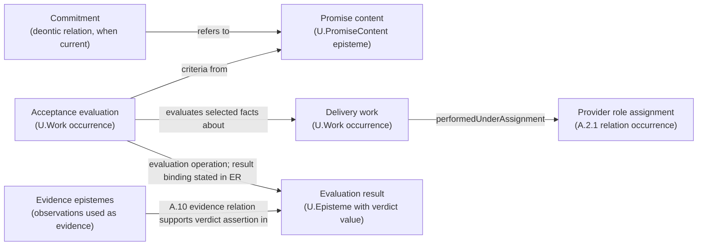
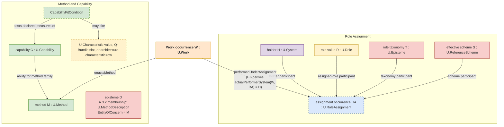

# SOURCE_FILE: Readme.md
---
# First Principles Framework (FPF) - Core Conceptual Specification

> First Principles Framework (FPF) is a standards-style pattern language for turning difficult engineering, research, management, and mixed human and AI work into explicit, reviewable, improvable reasoning.

- **Author:** Anatoly Levenchuk, with AI-agent assistance
- **Version:** July 2026
- **Status:** Normative kernel, eternal alpha: already used in working projects and development programs, while still evolving.

FPF helps when a project has outgrown one clever conversation. It is useful when meanings, claims, options, evidence, architecture, work decisions, publication forms, and improvement criteria need to stay coherent across people, teams, tools, time, or AI agents.

Use FPF as a reference model and pattern language, not as a linear textbook. Start from the working question you bring from your project. Bring in internal FPF terms only after they help you keep the work precise.

This readme is a thin public practical-use rendering of FPF for engineers, researchers, managers, reviewers, and AI-assisted project workers deciding what FPF can help them do now. It foregrounds the project questions most likely to pay off and deliberately coarsens, omits, or defers the full pattern language, source publications, source-use history, and relation structure. When a claim becomes important, return to the Preface, Table of Contents, and governing pattern body rather than treating this readme as the specification.

Begin with the project object at stake and the current question about it. FPF often calls an object a holon when it is being treated as a whole with parts: a machine, product, organization-as-system, body of knowledge, publication system, work occurrence, discipline, AI-agent arrangement, method, or local framework admitted under part-whole treatment. Roles use their own role ontology. Once the object and question are named, ask which structure, claim, decision, evidence, description, work, or improvement relation is current.

## Decide Whether FPF Fits

Use FPF when ordinary discussion is no longer enough to keep work coherent. Typical signs:

- several teams, experts, tools, or AI agents share reasoning about the same work;
- the real-world test is slow, expensive, noisy, risky, or politically hard to repeat;
- different readers need different reports, dashboards, explanations, or decisions about the same underlying work;
- names, roles, responsibilities, options, evidence, or quality criteria are starting to blur;
- the team needs a current view of possible approaches, not just one recommendation;
- a decision is small enough to make now but important enough to leave a durable reason.

FPF is probably too heavy when the task is small, feedback is fast and cheap, the vocabulary is already stable, the decision will not be reused or audited, and a quick answer is enough.

FPF is mainly useful for people who have to keep difficult work understandable across boundaries:

- engineers and systems engineers working with complex products or operations;
- researchers building claims for inspection or reuse by others;
- platform and AI teams coordinating humans, models, tools, and approvals;
- safety, assurance, compliance, and regulatory leads who need visible evidence and responsibility boundaries;
- managers and product leaders comparing options, budgets, risks, and delivery promises without hiding trade-offs.

There are three common ways to use FPF:

1. Human-only: use it as a writing and review discipline for meetings, notes, decisions, and technical documents.
2. Mixed team: use it to keep specialists, managers, safety leads, and AI assistants aligned around the same work.
3. AI-assisted: attach or index the specification, ask for plain-language project help first, and use pattern names only when they make the answer easier to check.

Stronger AI does not remove the need for FPF. AI can generate fluent options quickly, but projects still need to decide what counts as evidence, which option is being compared, who may rely on an answer, when a claim is stale, what remains only a guess, and what work is actually authorized. FPF helps make those boundaries explicit before a confident answer becomes an expensive mistake.

Core ideas in plain language:

- first name the project object under concern; when it is treated as a whole with parts, FPF calls it a holon;
- local teams may use local meanings; boundary-crossing work makes the translation relation explicit;
- the project object itself, its description, a dashboard about it, a decision about it, and the work done to change it are not the same;
- architecture is structure of that holon or project object in a context, not the diagram, document, approval, or plan about it;
- serious architecture work can move from problem pressure to candidate structures, selected structures, decisions, method and work, actual structures, and feedback;
- when the current question is which reusable way of doing changes, produces, derives, selects, controls, or preserves the project object under stated conditions, inspect `A.3.1 U.Method`; a strategy name, procedure text, program, plan, dated run, mechanism, or evidence record does not answer that method question by its label or form;
- when an accepted `ProblemCard@Context` claim must remain usable while the project selects a method, prepares or performs work, interprets a result, branches, stops, or returns after a changed assumption, inspect `E.18.1 P2W Problem-to-Work Carry-Through`; it carries that claim into one next value or relation governed by its direct pattern rather than prescribing one universal workflow;
- when a route-like explanation has several candidate positions and proposed relations or constraints that may change which continuations remain admissible, use it as a `ProvisionalUnfoldingDemonstrationDescription@Context` while any A.22.CGUS admission coordinate remains unresolved; after the wider CGUS is admitted, a separate `DemonstrativeUnfoldingSlice@Context` may present one traversal, and when admitted positions organize bounded transformations inspect the `E.18.3` specialization;
- keep several options alive until the comparison is clear enough to choose;
- say what "better" means before optimizing or scoring;
- make trust depend on evidence, freshness, scope, and intended use;
- publish different views for different readers without changing the underlying claim;
- when explanation, reader-facing ordering, or narrative rendering of selected source structure is current, state what structure is preserved, deliberately coarsened, abstracted, omitted, or lost, and which named source basis or governing pattern receives the return when loss matters;
- use mathematics or formal models when they clarify what structure is preserved, what is lost, and what can be checked;
- build domain or local FPF-grounded frameworks as dependents of FPF Core, not as silent rewrites of the Core.

## Practical-Use Cards

Start with the current project question, not an ordinal route through FPF. The fifteen semantic keys below are stable identifiers, not steps. When several cards seem plausible, compare their situations, first-result differences, and stop or return conditions in the conversation. Then inspect the direct pattern's Problem frame, Problem, Forces, Solution, Consequences, and ordinary boundary. Materialize comparison or candidate records only when a named receiving use relies on them.

In each card, the conditional template list is one ordinary walkthrough: inspect only the branch whose stated condition is current, apply that direct pattern's Solution, obtain its exact result, and stop or return at the card boundary. It is not a `DemonstrativeUnfoldingSlice@Context` because the card does not assert one wider constraint-governed structure with typed positions and relations among every alternative. The list is not a project order or a claim that all branches will execute.

The cards are domain-neutral. A first useful result may be a physical or clinical state, a capability, an episteme, a relation, dated `U.Work`, or another exact subject-governed value. A generated note, measurement, dashboard, or plan does not stand for machining, treatment, organizational change, learning, or another downstream result.

### ARCHITECTURE - Shape architecture from problem pressure

- **Situation and question.** Architecture-relevant problem pressure and competing characteristics are present, but the project needs to carry them toward candidate, selected, expected, or actual structures. Ask: which architecturing flow or description-use result is needed first?
- **Optional obstacle.** Candidate structures, architecture characteristics, or the relation between problem pressure and structure are not yet reviewable.
- **Template A.** `C.32.P2S Solution -> ProblemToStructureArchitecturingFlowCard@Project`. Select when the connected problem-to-structure flow is current. Local basis adds architecture-relevant pressure refs and current architecture-characteristic refs when available.
- **Template B.** `C.30.AD Solution -> ArchitectureDescriptionUseCard@Project`. Select when an existing architecture description or view is already the object being used and its admissible-use boundary is current.
- **Boundaries.** Stop when the selected first card makes the receiving architecture work reviewable. Return when problem pressure, EntityOfConcern, characteristics, description edition, or actual-structure feedback changes. Wrong-turn recovery sends a diagram-as-architecture claim to C.30 and C.33. Stronger neighbors are C.32 synthesis, C.32.PAD decision, A.15 work, E.23 improvement, or G.11 currentness according to the next claim.
- **Public coarsening.** "Architecture working card" restores to one of the two exact project cards; it does not denote architecture itself.

### WORKING-DOCUMENTS - Create a document another participant can use

- **Situation and question.** A participant asks for a regulation, procedure, plan, interface description, permission text, evidence note, gate record, publication, or AI tool-use plan. Ask first which use is current for the text: preserve meaning and boundary claims, prepare enactment, support reliance or a gate, or publish already governed content. The reader inspects only the branch selected by that question.

**Branch A: preserve meaning and boundary claims.**

- `A.6 Solution -> Claim Register` or an equivalent small claim set classified as L, A, D, and E when one text mixes definitions, admissibility, commitments, and evidence claims.
- `A.3.2 Solution -> U.MethodDescription` when the result describes a reusable semantic way of doing under conditions.
- `A.2.8 Solution -> U.Commitment` when an accountable subject's obligation, permission, or prohibition, scope, validity window, and referents are the actual result.
- If `interface` still hides whether the current claim concerns a signature, slot, module interface, functional port, protocol, service relation, or publication, use A.6.RSIR only to select the direct governing pattern, retain a reduced-use source label, or return a blocker. RSIR does not produce the downstream interface result. Once the direct claim is recovered, use its pattern and exact result; use A.6.M directly only for a recovered module-interface relation.

**Branch B: prepare enactment.**

- `A.15.2 Solution -> U.WorkPlan` when stating intended dated work, PlanItems, assignments, resources, windows, or sequencing constraints is current.
- `C.24 Solution -> CallPlan | CheckpointReturn` when tool-call enactment is current: use `CallPlan` after routes and budgeted execution are fixed enough, or `CheckpointReturn` while bounded probing remains the honest result.
- `A.15.5 Solution -> WorkEntryReadiness@Context` only when intended work already exists and readiness to cross its work boundary is current.

**Branch C: support reliance or a gate.**

- `A.10 Solution -> claim-bound evidence-provenance graph relation` when a named receiving use relies on recovering the basis for one claim or effect through evidence-producing or interpreting work, trace, time window, and bounded use.
- `B.3 Solution -> Assurance(H, C | K, S)` or an explicit no-assurance-claim disposition when the text is expected to carry a named assurance claim rather than merely point to evidence.
- `A.21 Solution -> OperationalGate(profile) use with GateProfile, effective GateCheckRefs, aggregated CV status, GateDecision, and DecisionLogRef` when exposing an actual gate decision is current. A readable checklist is not that decision.

**Branch D: publish governed content.**

- `E.17 Solution -> source-pinned publication face` when readable, exchangeable, or citable publication of an already governed episteme or relation is current without changing the underlying claim.

- **Boundaries.** Stop when the selected branch yields the exact result needed by its receiving use. Return to branch selection when the expected use changes. A single document may cite results from several branches, but page proximity does not merge their kinds or transfer their claims to a different governing pattern. RSIR stops at pattern selection, reduced-use source labeling, or a blocker; it never certifies that an interface relation now exists.
- **Public coarsening.** "Working document" is only a recognizable situation label. The expansion restores the selected branch, direct pattern, exact result, and receiving use.

### OPTION-COMPARISON - Compare alternatives and select the current result kind

- **Situation and question.** Several possibilities are present, but the current need may be to define comparison, retain diversity, govern a live pool, publish a selected set, or make one local choice. Ask which of those relations is current.
- **Template A.** `A.19.ECS Solution -> EvaluationCharacteristicSpaceSpec`. Select when coordinates, scales, evidence rules, and protected trade-offs are not adequate for comparison.
- **Template B.** `C.18 Solution -> ExplorationArchiveRecord@Context | FrontRecord@Context`. Select the archive result when later use relies on retained variants and their lineage or diversity; select the front result when later use relies on inspectable non-dominance and its comparator basis.
- **Template C.** `C.19 Solution -> PoolPolicyResult`. Select when a still-live pool needs one explicit `widen`, `keep frontier`, `narrow to subset`, or `sunset line` treatment and a change trigger.
- **Template D.** `G.5 Solution -> Shortlist | RankedShortlist | SpecialistHandoff | abstain or escalation outcome`. Select when selector-facing publication of a set or narrowed handoff is current; use a ranked result only when order materially belongs to the published result.
- **Template E.** `C.11 Solution -> ChoiceResult`. Select when an OptionSet and comparison basis exist and one local choose, reject, probe, or reroute result is current.
- **Boundaries.** Stop at the result answering the current option question. Return when candidate membership, archive policy, dominance basis, pool policy, selector publication, comparison basis, preference order, or probe value changes. An archive is not a live pool, narrowing a pool does not publish a shortlist, and a shortlist is not a local choice.
- **Public coarsening.** "Option comparison" is the recognizable situation; the expansion restores evaluation specification, archive, front, pool-policy result, selected-set publication, or local choice under its exact condition.

### PROBLEM-SHAPING - Turn early pressure into an honest problem-side result

- **Situation and question.** Something matters, but it may still be an early cue, a set of possible inquiry routes, an abductive question, or a problem ready for acceptance. Ask how far articulation has actually progressed.
- **Template A.** `A.16.1 Solution -> U.PreArticulationCuePack`. Select when a cue nucleus and its witness or anchor should be preserved before a route or problem claim is stable.
- **Template B.** `B.4.1 Solution -> RoutedCueSet`. Select when cue content is stable enough to publish route plurality or one selected route with explicit rationale, while no later endpoint is yet warranted.
- **Template C.** `B.5.2.0 Solution -> U.AbductivePrompt`. Select when prompt species, open question, scope, and cue provenance are stable enough to seed abductive search.
- **Template D.** `C.22.2 Solution -> ProblemCard@Context`. Select when the affected EntityOfConcern, constraints, unresolved relations, distinctions to preserve, and acceptance basis can be stated without smuggling in a selected solution.
- **Conditional continuation.** When an accepted problem-side record must become usable by later eligibility, acceptance, or method-family selection, inspect `C.22 Solution -> TaskSignature`. The TaskSignature types only the current problem traits and receiving use; it does not select a method, issue a selector verdict, plan work, or prove that work occurred.
- **Boundaries.** Stop at the earliest result that is both truthful and useful. Return or back off when the cue anchor, route rationale, prompt contrast, affected EntityOfConcern, constraint, or acceptance basis changes. Do not force a cue into a ProblemCard merely to make the work look started.
- **Public coarsening.** "Problem shaping" restores to the exact cue pack, routed cue set, abductive prompt, or accepted ProblemCard under its articulation condition.

### IMPROVEMENT - Define evaluation before repeating improvement

- **Situation and question.** A named object version should improve, but evaluation purpose, quality family, scales, proposal effect, or repeated-loop need may still be unsettled. Ask which prerequisite for improvement is missing now.
- **Template A.** `E.22 Solution -> QualityEvaluationQuestionFrame`. Select first when evaluation purpose, floor or improvement aim, protected trade-offs, expected evidence basis, or expected result form is not yet agreed.
- **Template B.** `C.25 Solution -> Q-Bundle`. Select when a composite engineering quality family needs a bearer, components, measures, scope, mechanisms, status, and evidence relation.
- **Template C.** `A.19.ECS Solution -> EvaluationCharacteristicSpaceSpec`. Select when the object-specific coordinates, scales, comparators, and evidence rules needed for evaluation do not yet exist.
- **Template D.** `E.23 Solution -> QualityImprovementLoopRecord`. Select only when the object version and evaluation basis exist and repeated proposal, change, coordinate-qualified re-evaluation, and loop decision are current.
- **Boundaries.** Stop at the smallest missing frame, Q-Bundle, evaluation specification, or completed local loop record. Return when object version, evaluation purpose, Q components, scale, comparison set, evidence basis, expected result change, or protected trade-offs change. "Repeat until better" is not a loop method until better is evaluable on declared coordinates.
- **Public coarsening.** "Improvement frame" restores to the exact result under its prerequisite condition.

### COSTLY-ACTION - Prepare an expensive or hard-to-reverse action

- **Situation and question.** A proposed action is expensive, externally committing, safety-relevant, or hard to reverse. Ask which unresolved uncertainty or governing relation currently prevents responsible commitment, gate use, intended work, or performed work.
- **Template A.** `A.10 Solution -> claim-bound evidence-provenance graph relation`. Select when the support basis for one claim or effect is not recoverable.
- **Template B.** `B.3 Solution -> Assurance(H, C | K, S)` or an explicit no-assurance-claim disposition. Select when the action depends on a named assurance claim and its limitations and decay condition.
- **Template C.** `A.20 Solution -> path-slice-local CV result with step, CV class, CV.Status, and witness or refusal`. Select when constraint validity is the current question; this result does not itself pass a gate.
- **Template D.** `A.21 Solution -> OperationalGate(profile) use with GateProfile, GateCheckRefs, aggregated CV status, GateDecision, and DecisionLogRef`. Select when a real gate decision is current.
- **Template E.** `C.28 Solution -> CausalUseTriageRecord`. Select when expected effects, intervention, counterfactual, or policy claims carry the action rationale and their supported-rung boundary is current.
- **Template F.** `C.11 Solution -> ChoiceResult`. Select when several actions remain live and the current result is choose, reject, probe, or reroute.
- **Template G.** `A.15.5 Solution -> WorkEntryReadiness@Context`. Select only after intended work exists and readiness to enter its work boundary is the current relation.
- **Boundaries.** Stop at the first result that decides the present uncertainty; do not force every costly action through all templates. Return when the claim, evidence path, assurance context, constraint definition, gate profile, causal-use basis, option set, intended work, resource state, cost, or reversibility changes. Planning or readiness does not authorize or perform work, and a gate display does not replace `GateDecision`.
- **Public coarsening.** "Costly action" restores to the exact evidence, assurance, constraint-validity, gate, causal-use, choice, or readiness result under its selection condition.

### TIME - Use timing and currentness claims responsibly

- **Situation and question.** A claim about rate, rhythm, delay, effort, inertia, recovery, currentness, or validity window is being used for action. Ask whether temporal-claim adequacy or source currentness orchestration is current.
- **Optional obstacle.** A snapshot is used as a trend, a trend as a control law, or an old edition as current.
- **Template A.** `C.27 Solution -> Dyn2TemporalClaimAdequacyCard`. Select when a local temporal claim changes supported use.
- **Template B.** `G.11 Solution -> RefreshCurrentnessLine@Context`. Select when freshness, edition, telemetry, decay, or currentness is the live claim.
- **Boundaries.** Stop at the smallest supported temporal card or currentness line. Return when window, bearer, evidence relation, model assumption, source edition, or telemetry changes. Wrong-turn recovery downgrades unsupported rate or currentness claims. Stronger neighbors are C.16 for measurement, C.28 for causal use, A.15 for work, and the direct source or publication governing patterns.
- **Public coarsening.** "Time check" restores to the C.27 card or G.11 line.

### CAUSAL-USE - Bound causal language before using it for action

- **Situation and question.** Causal, intervention, effect, policy, or counterfactual language is being used to support a decision or action. Ask: what causal-use rung and support basis are actually available?
- **Optional obstacle.** Association, intervention, and counterfactual claims are being treated as interchangeable.
- **Template A.** `C.28 Solution -> CausalUseTriageRecord`. This is the initial template; local basis adds the live causal wording, target use, candidate rung, comparator or counterfactual, and support-basis refs.
- **Boundaries.** Stop at the triage record when it honestly bounds supported and unsupported use. Return when intervention, comparator, target population, evidence, or causal-use purpose changes. Wrong-turn recovery downgrades causal laundering to the supported claim. Stronger neighbors are CausalUseEvidenceDesignRecord or CausalUseSupportVerdict inside C.28, C.11 for choice, and direct evidence or work patterns.
- **Public coarsening.** "Causal check" restores to `CausalUseTriageRecord`.

### DESCRIPTION-USE - Create or use a description without losing its subject

- **Situation and question.** A description, view, dashboard, explanation, model, report, or publication is to be created, compared, transformed, or relied on. Ask which unresolved EntityOfConcern, viewpoint, representation change, lost structure, source set, or architecture use blocks the current use.
- **Template A.** `E.17.0 Solution -> DescriptionContext`. Select for the generic describing case: name `EntityOfConcernRef`, `BoundedContextRef`, `ViewpointRef`, resulting view or view family, and any correspondence relation needed for the current comparison.
- **Template B.** `A.6.3.RT Solution -> RepresentationSchemeTransitionRelation@Context`. Select when the same EntityOfConcern is being re-represented and a named receiving use relies on recovering the source representation, receiving representation, preserved claim or commitment, source-relation chain, representation-scheme delta, loss or recoverability, admissible use, and non-admissible downstream use. The relation records the concrete case; `RepresentationSchemeTransition` remains the method-pattern name.
- **Template C.** `C.33 Solution -> StructuralInformationAdequacyNote@Context`. Select when the current question concerns what structure a description or view captured, lost, hid, and which wider source structure receives return for the declared architecture use.
- **Template D.** `E.17.ID.CR Solution -> ComparativeReviewUnit`. Select only for bounded comparison over already available source epistemes or publications. It is not the generic description result.
- **Template E.** `C.30.AD Solution -> ArchitectureDescriptionUseCard@Project`. Select when the subject is specifically an architecture description or view and its admissible architecture-use boundary is current.
- **Boundaries.** Stop at the smallest result answering the current description-use question. Return when EntityOfConcern, context, viewpoint, representation scheme, captured structure, source edition, comparison basis, or intended use changes. A publication carrier does not become its subject, and a readable view does not become evidence, assurance, permission, decision, architecture, or work without the corresponding governed relation.
- **Public coarsening.** "Description use" restores to `DescriptionContext`, `RepresentationSchemeTransitionRelation@Context`, `StructuralInformationAdequacyNote@Context`, `ComparativeReviewUnit`, or `ArchitectureDescriptionUseCard@Project` under the stated condition.

### NAMING - Name a governed value for its readers

- **Situation and question.** A governed value needs a stable Tech or Plain label across a bounded context. Ask: which name lets readers recover the value without changing its kind or scope?
- **Optional obstacle.** Candidate labels carry conflicting senses, hidden kinds, or misleading morphology.
- **Template A.** `F.18 Solution -> NameCard`. Local basis adds governed value, governing pattern, bounded context, candidate set, rejected candidates, rationale, bridges, lineage, and refresh condition.
- **Boundaries.** Stop at a complete NameCard when no public term publication is current. Return when governed value, context, candidate evidence, reader interpretation, or bridge changes. Wrong-turn recovery restores the governed value before selecting a label. F.17 becomes the stronger neighbor only when actual term-row publication is current.
- **Public coarsening.** "Naming card" restores to `NameCard`.

### WORDING - Repair wording without changing the kind by accident

- **Situation and question.** A sentence sounds fluent but hides which object, relation, slot, use position, or claim kind is active. Ask: what was the pre-repair kind and which invariant is preserved after rewriting?
- **Optional obstacle.** A trigger word has been replaced while ontology, admissible use, or scope drifted.
- **Template A.** `E.10 Solution -> KindRestorationCheck`. Local basis adds the exact span, pre-repair kind, relation, position, use, and scope, post-repair settlement, governing-pattern ref, and disposition.
- **Boundaries.** Stop when the repaired wording preserves or explicitly changes the kind by accepted decision and remains understandable under MG-DA. Return when the sentence's EntityOfConcern, use, or scope changes. Wrong-turn recovery rejects lexical substitution without semantic check. Stronger neighbors are F.19 for phrase-level prose repair, F.18 for durable naming, or the direct domain pattern for ontology repair.
- **Public coarsening.** "Wording repair" restores to `KindRestorationCheck` plus the changed sentence.

### MATHEMATICAL-MODELING - Use a mathematical lens when it changes the next action

- **Situation and question.** A project question may benefit from a mathematical object or lens, but the next action and lost structure are not yet clear. Ask: can one cheap lens result change the next admissible action?
- **Optional obstacle.** A metaphor such as graph-like, field-like, or optimization-like is being treated as ontology or evidence.
- **Template A.** `C.29 Solution -> MathLensUse.LensCandidateNote`. Select when no adequate mathematical object has yet been named.
- **Template B.** `C.29 Solution -> MathLensUse.OneLine`. Select when candidate mathematical object, mapping, preserved structure, lost structure, payoff, next action, rival or fallback, and stop condition can be stated.
- **Boundaries.** Stop at `NoMathLensUseNeededNote`, candidate note, or one-line result according to C.29. Return when EntityOfConcern, mapping, observation, preserved structure, or intended use changes. Wrong-turn recovery removes lens-as-world or lens-as-evidence overread. Stronger neighbors are C.29 MiniCard or FullCard, C.16 measurement, C.28 causal use, and C.30 architecture use.
- **Public coarsening.** "Mathematical-modeling note" restores to the selected `MathLensUse.*` output.

### SOTA-PORTFOLIO - Build a plural current field of options and sources

- **Situation and question.** A project needs the current plural field of methods, theories, technologies, or design options rather than one favored source. Ask first what source and tradition synthesis is adequate, then which stewardship relation is current for the resulting candidates.
- **Template A.** `G.2 Solution -> SoTA Synthesis Pack@CG-Frame`. Select when the immediate need is a reconstructible `SoTA_Set@CG-Frame` and `SoTAPaletteDescription` with rival traditions, claim rows, evidence anchors, crossings, and source-use boundaries.
- **Conditional walkthrough.** If later use relies on retained generated or harvested variants, use `C.18 -> ExplorationArchiveRecord@Context`; if later use relies on exposed non-dominated variants, use `C.18 -> FrontRecord@Context`; if a still-live pool needs treatment, use `C.19 -> PoolPolicyResult`; if a selector-facing set is to be published, use `G.5 -> Shortlist | RankedShortlist | another declared selector outcome`. These are conditional continuations, not synonyms or serial stages.
- **Boundaries.** Stop at the pack when downstream stewardship is not current. Return when scope, traditions, source editions, evidence anchors, or harvest policy changes. Archive, front, live pool, and selected set keep different membership, policy, and publication meanings; no prose summary may collapse them.
- **Public coarsening.** "SoTA portfolio" restores to the G.2 pack and, only when current, the exact C.18, C.19, or G.5 continuation result.

### DPF-AUTHORING - Build a reusable FPF-grounded domain framework

- **Situation and question.** A domain or local practice needs a reusable FPF-grounded framework edition rather than isolated advice. Ask whether the useful first result is a present organization-design proposal about an intended future framework, a settled framework-architecture decision, a post-claim architecture-description use, or a post-PFAD account of authoring dependencies.
- **Template A.** `E.4.DPF Solution -> FrameworkOrganizationDesignProposal@Context`. Select before PFAD when one current C.2.1 proposal episteme makes candidate organization claims reviewable. Its EntityOfConcern is a present intended-framework-result description whose EntityOfConcern is an A.15.2 `U.WorkPlan`; proposal and description share the description's exact A.1-admitted grounding holon. Its one ClaimGraph carries typed candidate claim nodes and proposed subject relation signatures. A relation-family coverage constraint node carries covered family ref-kind pairs, admitted use, and coverage criterion; a WorkPlan acceptance target remains separate basis. A materialized PUA expectation expects this proposal, not the later framework edition. Claim status carries proposedness; accountable obligation exits to A.2.8; a separate return points to E.4.PFAD when framework-architecture settlement is current. Optional proposal meta-structure never substitutes for proposed subject organization.
- **Template B.** `E.4.PFAD Solution -> PrincipleFrameworkArchitectureDecision@Context`. Select when framework family, Core dependency boundary, content boundary, pattern relation structure, publication architecture, or access architecture is the current decision question. The filled decision relation exists before any ADR-like publication of it.
- **Template C.** `C.30.AD Solution -> ArchitectureDescriptionUseCard@Project`. Select only after the framework entity, `ArchitectureOf@Context`, and selected architecture-relevant structures exist, and when admissible use of the corresponding architecture description is current.
- **Template D.** `E.4.DPF Solution -> FrameworkAuthoringDependencyDescription@Context`. Select only when PFAD exists and the immediate need is a minimal account of dependency availability and relevance for the next authoring use. This C.2.1 episteme concerns the current DPF-authoring `U.WorkPlan`, has one exact grounding holon, ClaimGraph, and ReferenceScheme, and contains at least the Core-edition, source-basis, and PFAD dependency positions. Core edition and PFAD are available with exact value-kind refs. Another missing dependency has an acquisition-condition description and no value ref; an available dependency has exact value and kind refs and no acquisition condition. Relevance remains independent in both branches. Future products need not exist; a missing PFAD returns to Template B.
- **Boundaries.** Stop at the proposal while its candidate organization ClaimGraph is the current result, at PFAD while framework-architecture settlement is current, at the C.30.AD use card while post-claim description use is current, or at the dependency description when it makes the next authoring work recoverable. Return when intended result kind, current intended-result description, proposal basis, design question, candidate relation signature, constraint, invariant, dependency direction, alternative, unresolved position, Core edition, source basis, architecture decision, publication or access use, quality result, or currentness changes. Neither a topic list nor an organized proposal document without proposed subject relations is a proposal result.
- **Public coarsening.** "DPF authoring" restores to `FrameworkOrganizationDesignProposal@Context`, `PrincipleFrameworkArchitectureDecision@Context`, `ArchitectureDescriptionUseCard@Project`, or `FrameworkAuthoringDependencyDescription@Context` under the stated condition.

### SYSTEM-IN-CONTEXT - Make the current system question explicit

- **Situation and question.** A candidate system is named, but the current system question is not yet explicit. Ask whether the needed first result concerns identity and environment, composition, participation and functioning, selected structures, intended creation or change, or creation or change that has already occurred.
- **Template A.** `A.1 Solution -> HolonDelimitationRelation@Context`. Select for identity rule, bounded context, included or excluded entities, environment relation, selected-structure boundary, or current boundary condition.
- **Template B.** `B.1.2 Solution -> SystemAggregationRelation@Context`. Select when aggregation depends on distinguishing admitted system parts from external crossing relations.
- **Template C.** `A.1 Solution -> SystemParticipationRelation@Context`. Select when the current question connects the acting system to functioning, functional elements, roles, capabilities, methods, mechanisms, work plans, work occurrences, transformations, evidence, assurance, or temporal and dynamics aspects. Each linked value keeps its direct governing pattern.
- **Template D.** `C.30 Solution -> ArchitectureQuestionCard@Project`. Select when the system is identified and selected structures or architecture relations are now current.
- **Template E.** `A.15.2 Solution -> U.WorkPlan`. Select when planning intended system creation or change is current.
- **Template F.** `A.15.1 Solution -> U.Work`. Select only when creation, change, maintenance, or another dated occurrence has happened and can be grounded through its performer, enacted method, affected referent, resources, outcome, time window, and evidence relation. The occurrence is the direct result; `ResultProducingWorkSlot[]` remains absent, while any planning, setup, authorization, or causal relation to other work returns to its direct governor.
- **Boundaries.** Stop at the smallest result that answers the current question. Return when system identity, context, parthood, participation, selected-structure question, intended work, or performed-work evidence changes. Wrong-turn recovery restores system, environment, part, participation, architecture, plan, performed work, and description as separately governed values. A diagram box is not a system boundary by shape, a functioning description is not the functioning system, and a work record is not a system part merely because it appears inside one project view.
- **Public coarsening.** "System in context" restores to the exact selected result under its selection condition.

## One-Minute Example

A platform team asks:

> Should we buy, fine-tune, or build an agent stack for our product?

Without FPF, the conversation often mixes architecture, vendor comparison, safety, evidence, budget responsibility, user value, and implementation planning. The loudest option can win before the team knows what is being compared.

With FPF, the first pass can become a small set of explicit project objects:

- holons in play: the product, the agent stack, and the team or toolchain that will change it are not the same holon;
- architecture flow: what problem pressure should become which candidate, selected, expected, and actual structures;
- comparison frame: which alternatives are in the candidate set;
- evaluation characteristics: cost, latency, controllability, safety, maintainability, time to first use, and other project-specific characteristics;
- evidence gaps: which test result makes commitment admissible;
- current decision state: whether the team is choosing now, keeping a selected set, making a project architecture decision, or doing more discovery;
- work and feedback: which method, readiness, and performed-work records establish that the selected structures were actually realized;
- reader reliance: what engineering, management, and assurance readers may responsibly rely on.

That same shape can be used for a factory modernization, laboratory protocol, construction design change, supply-chain decision, safety case, or research program. The point is not the AI topic; the point is one body of reasoning that can be reviewed, improved, and published without changing meaning on the way.

## What FPF Is

FPF is a pattern language for disciplined thinking in projects where ordinary prose, local expert judgment, or one-off AI output is not enough.

It helps teams:

- keep meanings stable when work crosses teams, tools, documents, and time;
- separate the project object being discussed from diagrams, dashboards, explanations, promises, decisions, and actual work;
- state what a claim can responsibly be used for before people rely on it;
- compare options without collapsing too early to one favorite;
- define quality criteria before improvement starts;
- keep evidence, assurance, decisions, and implementation work visible as different questions;
- carry architecture work from problem pressure to real structures and feedback instead of stopping at diagrams or decision prose;
- grow domain or local frameworks from FPF Core without silently changing Core meaning;
- repair confusing wording by first asking what the wording is doing in the project, not by swapping synonyms;
- leave each pass with one useful next result: a clearer question, a better name, a comparison note, an evidence gap, a safer document, or a reason to inspect a specific pattern.

## What FPF Is Not

FPF is not:

- a shrink-wrapped project methodology;
- a checklist bureaucracy;
- a quick-answer cheat sheet;
- a replacement for domain expertise;
- a demand to study the whole specification before useful work begins;
- a promise that every project needs every pattern.

FPF is most useful when the cost of semantic drift, premature convergence, hidden evidence gaps, weak architecture, vague quality, or unreviewable work is higher than the cost of using a disciplined pattern language.

## How to Use This Repository

Start with the practical-use card that recognizes the current project question. If several fit, compare their situations, first-result differences, and stop or return conditions before inspecting the selected direct pattern.

Use the `Preface` for the cross-cutting ideas and the repeated-use explanation. Use the Table of Contents when you already know the pattern family or need a search-oriented overview. Use the direct pattern body for the governed Solution. Once one direct pattern is current, use `E.11.PUA` to apply its Solution to the first exact result and its receiving use. Use `E.11.PUR` only when a named receiving use needs an addressable applicability finding, recommendation, coordination, or ordering relation. Use extended cases when the compact card and direct pattern are not enough.

If you use an AI assistant, attach or index `FPF-Spec.md` and ask for plain-language project help first. Let internal pattern names enter the conversation only when they make the reasoning more precise.

A good first prompt is:

```text
You have the FPF specification as a file.
Help me with this current project question:
[short project description and question]

Use plain language for engineer-managers.
Compare the relevant semantic practical-use cards when several fit:
ARCHITECTURE, WORKING-DOCUMENTS, OPTION-COMPARISON,
PROBLEM-SHAPING, IMPROVEMENT, COSTLY-ACTION, TIME,
CAUSAL-USE, DESCRIPTION-USE, NAMING, WORDING,
MATHEMATICAL-MODELING, SOTA-PORTFOLIO, DPF-AUTHORING,
or SYSTEM-IN-CONTEXT.

Then inspect the selected direct pattern and give:
- the current EntityOfConcern and practical question;
- the pattern and Solution selected under the current condition;
- the exact kind of first useful result;
- what that result lets us do next;
- where to stop or return when a stronger claim becomes current.

Keep comparison conversational unless a named receiving use relies on an addressable record.
Do not turn the card into a whole-project plan.
```

## Citation

If you use FPF, please cite:

```text
Levenchuk, Anatoly. First Principles Framework (FPF).
GitHub repository: https://github.com/ailev/FPF
```


# SOURCE_FILE: FPF-Spec.md
---
# First Principles Framework (FPF) - Core Conceptual Specification

> A standards-style pattern language for turning difficult engineering, research, management, and mixed human/AI work into explicit, reviewable, improvable reasoning.

- **Author:** Anatoly Levenchuk, with AI-agent assistance
- **Version:** August 2026
- **Status:** Normative kernel, eternal alpha: already used in working projects and development programs, while still evolving.

This monolith is the AI-agent and tool-assisted working specification for FPF.

Use the Table of Content below to find pattern ids that match the project question. For any substantive answer, open the relevant pattern and apply its Problem frame, Solution, worked slices, and checklist to the project claim or object.

The public FPF readme section after the Table of Contents provides fifteen semantic practical-use cards. The Preface explains the cross-cutting ideas and the ordinary pattern-use rhythm behind them. Pattern bodies carry the normative Solutions, boundaries, worked slices, and checks. Pattern form is governed by E.8; concrete pattern application and pattern-use coordination are governed by E.11.PUA and E.11.PUR when those relations are current.

# Table of Content

 **Preface (non-normative)**

| ID & Title | Status | Concise content reminder |
| --- | --- | --- |
| What This Specification Is And How To Use It | full text | Distinguishes the fifteen practical-use cards, Preface, ToC, direct pattern bodies, ordinary use, reliance-bearing support, exact first results, and three coupled flows. |
| FPF As A Project, Not Only A Pattern List | full text | Places the evolving Core beside companion explanations, domain frameworks, local practice frameworks, publication carriers, and tools without merging their authority. |
| Why FPF Exists | full text | Explains why difficult multi-participant work needs explicit distinctions, options, evidence, decisions, and return paths. |
| Creativity And Assurance Mature Together | full text | Connects plural option generation, evidence, assurance, currentness, and bounded decisions without making them one lifecycle. |
| Local Closure Inside An Open World | full text | Uses bounded contexts and explicit reopen conditions to make decisions possible without pretending the world is closed forever. |
| FPF As An Evolutionary Architecture For Thought | full text | Treats the framework as evolving reasoning architecture whose components, relations, and evaluations change together. |
| Architectural Characteristics Of Thought | full text | Names the characteristics that make reasoning inspectable, composable, evolvable, falsifiable, and usable. |
| Beyond Bias Hunting | full text | Replaces negative error catalogues with constructive reasoning objects and direct solution moves. |
| Thinking Through Writing | full text | Explains when cards, records, tables, characteristic spaces, term sheets, patterns, and DRRs become useful thinking instruments rather than paperwork. |
| Thinking-Oriented Architecture, Not A Descriptive Upper Ontology | full text | Distinguishes FPF's work of improving reasoning from cataloguing every entity that may exist. |
| The Bitter Lesson Stance | full text | Prefers general scalable search and learning while retaining explicit constraints, evidence, and bounded use. |
| From Flat Documents To Multi-View Truth | full text | Separates EntityOfConcern, descriptions, views, publication carriers, and reader uses while preserving return to source structure. |
| Architecture As Structure Of Holons | full text | Explains architecture as selected structures of a holon in context rather than the diagram or document that describes them. |
| Boundary Statements | full text | Shows where language carries commitments, admissibility, evidence, gates, and other boundary claims. |
| Raising Semantic Precision | full text | Explains ontology-first restoration from overloaded wording to explicit kinds, relations, slots, and admissible uses. |
| Big FPF Storylines | full text | Collects the load-bearing commitments that make the framework more than a disconnected pattern list. |
| Transdisciplinarity As A Meta-Theory Of Thinking | full text | Shows how shared distinctions can connect disciplines without flattening their bounded meanings. |
| The Culinary Architecture Of Collective Thought | full text | Uses an assembly analogy to explain why familiar ingredients still need an explicit architecture and quality discipline. |
| The Intellect Stack As A Pedagogical Map | full text | Gives a teaching map for locating capabilities without turning the map into the ontology or work order. |
| Purpose, Scope, And Non-Goals | full text | States FPF's intended use, tool independence, and boundaries against domain encyclopedia or one prescribed methodology. |
| How To Continue After The readme | full text | Sends the reader from a practical-use card to the direct pattern, then to exact result, receiving use, stop, or return. |

**Part A - Kernel Architecture Cluster**

| § | ID & Title | Status | Keywords & Search Queries | Dependencies |
| :--- | :--- | :--- | :--- | :--- |
| A.0 | **Onboarding Glossary (NQD & E/E‑LOG)** | Stable | *Keywords:* novelty, quality-diversity (NQD), explore/exploit (E/E-LOG), declared set result, typed portfolio publication, SearchSpaceRef, OutcomeSpaceRef, DeclaredSubstrateInterpretiveView, TypedSetViews, ParetoOnly default, scale-probe, BLP. *Queries:* "What terms must I publish when generating, selecting, or shipping a set result?", "How do I explain search-side vs outcome-side spaces and interpretive views on first use?", "How does FPF avoid single-winner bias in creative search?" | **Builds on:** E.2, A.5, C.17-C.19. **Coordinates with:** E.7, E.8, E.10, F.17, A.19.SOURCE-SET-SPACE-SUBSTRATE, A.19.DECLARED-SUBSTRATE-INTERPRETIVE-VIEW, G.5, G.9-G.12. **Constrains:** any pattern/UTS row that describes a generator, selector, declared set result, typed portfolio publication, or set-return publication. |
| ***Cluster A.I - Foundational Ontology*** | | | | |
| A.1 | **Holon Ontic Foundation (U.Holon and Admitted Holon Kinds)** | Stable | Constructive recognition of one exact `U.Entity` under an already admitted holon kind: six world-side components, kind-specific `U.System` and `U.Episteme` conditions, and strict separation from evaluation, assertion, evidence, currentness, reliance, whole reidentification, selected structure, delimitation, and boundary-crossing claims. | **Builds on:** E.24.UK, A.14, C.13. **Coordinates with:** B.3.5, A.15.1, A.6.1, C.2.1, A.10, B.3, G.11, B.2, A.1.1, A.22, C.30, A.3.4, C.20, E.10.ARCH. |
| A.1.1 | **Bounded Model-Use Structure and DDD Bounded-Context Recovery** | Stable | Use when a present engineering decision depends on the organization of where one exact model applies, how it is actually used in assigned Work, and whether a concrete expression still agrees with the model's fixed content. Recover the direct relations first; select `BoundedModelUseStructure` only when their joint organization changes the decision. A proposed crossing stays outside until a compatible direct governor makes it obtain. Keeps the DDD plain name “bounded context” while separating the selected `U.Structure` from systems, Work, epistemes, descriptions, views, representations, and publications. *Queries:* "Which exact applicability, actual-use, and fixed-content coherence facts matter here?", "Do their governed occurrences form one decision-relevant structure?", "Which context object or unsupported crossing must I not invent?" | **Builds on:** A.1, A.22, C.2.1, A.2.6, A.6.REL. **Coordinates with:** A.2, A.2.1, A.3.1, A.3.4, A.14, A.15.1, A.15.PROD, F.9, E.17.0, C.29, E.24.PUB, C.2.P, A.6.0, A.6.5, F.17, F.18. |
| A.1.SCR | **Finding the Acting or Changed System** | Stable | Use when a current engineering decision depends on which exact system acts, is intended to change, carries a capability, persists, or may be designated as the project system-of-interest, and the proposed subject is unclear. Name the decision and proposed system reading; take the direct-owner exit first; apply A.1 only while systemhood remains load-bearing. *Queries:* "Which exact system acts or is intended to change here?", "What decision depends on treating that entity as a system?", "Does the phrase instead name Work, Method, capability, episteme, structure, a service/access claim, or another direct relation?" | **Builds on:** A.1. **Routes service/access through:** A.6.P §4.11a. **Coordinates with:** A.15.6, A.1.STM, A.6.RCD, E.10, F.18 and the exact direct owners. |
| A.1.STM | **Using the System-Thinking Long Mantra** | Stable | Use when a project team has, or is choosing, one project system-of-interest but cannot locate the first unsupported answer on the map from the expected outside change to the work and systems that make or change it, and onward to the builders of those builders; use it also when one local result lacks a named supported next fact. Read backward only to that first unsupported answer, open its direct owner, and trace independently grounded Work and changes forward—or stop at the missing direct fact. *Queries:* "Which answer is first unsupported on the map from the expected outside change to the work and systems that make or change the project system-of-interest, and onward to the work and systems that make or change those builders?", "Which supported fact connects this local result next to production or change, release, runtime use, or the expected outside change?", "Which direct pattern owns the missing answer?" | **Builds on:** Preface, A.1, A.1.SCR, A.15.6. **Coordinates with:** C.32.P2S, C.30 family, A.2/A.2.1, A.3/A.15 families, E.18/E.18.NET, A.10, B.3, C.28, A.22.CGUS. |
| A.2 | **Role Taxonomy** | Stable | *Keywords:* role, assignment, holder, context, function vs identity, responsibility, U.RoleAssignment. *Queries:* "How to model responsibilities?", "What is the difference between what a thing *is* and what it *does*?" | **Builds on:** A.1, A.1.1. **Prerequisite for:** A.2.1-A.2.6, A.13, A.15. |
| A.2.1 | **`U.RoleAssignment` - System Role Assignment** | Stable | *Keywords:* assignment occurrence, holder System, role value, role-taxonomy episteme, effective ReferenceScheme, AssignmentInterval, performedUnderAssignment. *Queries:* "Which System holds this role under which taxonomy and scheme?", "Are these two assignment episodes the same occurrence?", "Which assignment covers this performed Work?" | **Builds on:** A.2, A.6.REL, A.6.5, C.2.1. **Coordinates with:** A.2.2, A.2.5, A.15.1, F.6. |
| A.2.2 | **`U.Capability`: System Ability Envelope and Measures** | Stable | *Keywords:* holder-dependent capability instance, ability envelope, measure set, qualification window, currentness, capability-fit condition. *Queries:* "What is a capability in FPF?", "How do I separate capability from capability statements, evidence, dashboards, and fit predicates?" | **Builds on:** A.2, E.24.UK. **Informs:** A.15, A.2.3. |
| A.2.3 | **`U.PromiseContent` (Promise Content)** | Stable | *Keywords:* promise content, promise content, accessSpec, acceptanceSpec, SLO, SLA, claim scope (G), Work evidence, provider/consumer roles. *Queries:* "What is a promise content in FPF?", "Promise content vs Work vs MethodDescription", "How do access and acceptance differ?", "How is SLO/SLA adjudicated from Work evidence?" | **Builds on:** A.2.2. **Prerequisite for:** F.12. **Used by:** A.2.8, A.6.C, A.6.P. |
| A.2.4 | **Episteme Evidence-Use and Status-Use Relations** | Stable | *Keywords:* evidence-use, status-use, source-use, episteme, claim, provenance. *Queries:* "How is an episteme used as evidence?", "How do I keep evidence use from becoming a role?", "How do I model status use around an episteme?" | **Builds on:** A.2. **Informs:** A.10, B.3. |
| A.2.5 | **RoleStateRelation@BoundedContext - Role State Space and Enactable-State Admission** | Stable | *Keywords:* state machine, RSG, role state, enactability, role-state evolution. *Queries:* "How to model the state of a role?", "What is a Role State Graph?" | **Builds on:** A.2.1. **Prerequisite for:** A.15. |
| A.2.6 | **Unified Scope Mechanism (USM): Context Slices & Scopes** | Stable | Tests one exact `U.ContextSlice` against one exact set-valued `U.Scope` and gives the receiving action one evaluation result: `true`, `false`, or `unknown`. Keeps claim, work, and publication scopes distinct from evaluation work, result epistemes, representations, model-applicability occurrences, and selected structures. *Queries:* "Does this exact slice belong to this exact scope?", "What follows from true, false, or unknown?", "When does local-sense translation require an exact F.9 Bridge occurrence?" | **Builds on:** C.3, A.6.0, A.6.1, C.2.1, A.7. **Coordinates with:** C.2.2, C.2.3, A.2.2, A.15.1, F.9, A.22, A.1.1, E.24.UK, C.29. |
| A.2.7 | **RoleRelationStructure@BoundedContext - Context-Local Role Relations and Representation-Lens Boundary** | Stable | *Keywords:* role algebra, specialization (`≤`), incompatibility (`⊥`), bundles (`⊗`), separation of duties (SoD), requiredRoles substitution. *Queries:* "What does `RoleS ≤ RoleG` mean in FPF?", "How do I encode Separation of Duties with `⊥`?", "How do role bundles (`⊗`) work?" | **Builds on:** A.2. **Prerequisite for:** A.15, A.2.5. |
| A.2.8 | **`U.Commitment` (Deontic Commitment Object)** | Stable | *Keywords:* commitment, deontics, obligation, recommendation-as-duty, prohibition, modality normalization, scope and validity window, adjudication hooks, evidenceRefs, BCP‑14 (RFC 2119/8174). *Queries:* How is an accountable commitment represented? How is it kept separate from permission grants, admissibility gates, and performed work? How is it audited through evidence hooks? | **Refines:** A.2. **Builds on:** A.2.1, A.2.3, A.2.6, A.7, A.15.1. **Coordinates with:** A.2.8.PER, A.2.9. **Used by:** A.6.B (Quadrant D), A.6.C. |
| A.2.8.PER | **Granted Permission, Exercise, and Non-Prohibition** | Stable | *Keywords:* weak non-prohibition finding, policy-valid strong grant, matching dated-work exercise, checked non-violation, permission or prohibition conflict, exact policy rule or decision result. *Queries:* "Is this a grant, weak finding, later exercise, checked non-violation, or conflict?", "When an instituting act or exercise is claimed, which admitted system acted under which assignment?", "What exact rule or authorized decision settles this conflict, if any?" | **Coordinates with:** A.2.8, A.2.9, F.6, A.6, A.6.B, A.6.C, A.15.1, A.15.5, A.10. Does not replace policy, role, capability, plan, gate, work, evidence, or commitment owners. |
| A.2.9 | **`U.SpeechAct` (Communicative Work Kind, Occurrences, and Records)** | Stable | *Keywords:* admitted speech-act Work kind, actual communicative occurrence, performing `U.System`, authority-grounding assignment, optional `SpeechActRecord`, utterance description, institutional target and effect, publication relation, evidence carrier. *Queries:* "What actual communicative Work occurred?", "Who performed it under which assignment?", "Which separate record, publication, commitment, grant, status, or evidence claim is current?" | **Refines:** A.2. **Builds on:** A.2.1, A.2.6, A.7, A.10, A.15.1. **Used by:** A.2.8, A.6.C. |
| ***Cluster A.II - Transformation Engine*** | | | | |
| A.3 | **Transformer Constitution (Quartet)** | Stable | Actor-side constitution for performed work: one individual of `U.Work` is a world-side dated occurrence standing in exact `performedBy` and `enactsMethod` relations; `U.Method` is run-independent, and a `U.MethodDescription` edition enters only when a receiving use relies on it. A Work assertion or description is a separate `U.Episteme`; records and carriers are not Work. A.3.4 can identify natural, formal, joint, or non-separable change without inventing an actor or quartet. | **Builds on:** A.2.1, A.4, A.7. **Coordinates with:** A.3.1, A.3.2, A.3.4, A.10, A.12-A.15, B.1.4-B.1.6, F.9. |
| A.3.1 | **`U.Method`: Reusable Way of Doing with Explicit Applicability** | Stable | Use when a project needs to name how something is done in principle. Identifies one reusable semantic way under stated generic participant meanings, applicability, preconditions, intended effect or preserved condition, and bounds; cites a reference scheme or selected structure only when it changes identification or the next decision. Keeps descriptions, plans, dated Work, mechanisms, role assignments, evidence, and publication separate. | **Builds on:** A.1, A.1.1, A.3. **Coordinates with:** A.3.2, A.6.1, A.6.5, A.6.REL, A.15.1, A.15.2, A.22, B.1.5, C.2.1, C.2.P.DR, E.20, F.9. |
| A.3.2 | **`U.MethodDescription`: Description Episteme for a Way of Doing** | Stable | *Keywords:* method-description membership, claim-bearing episteme, exact `U.Method` EntityOfConcern, substantive way-of-doing claim, same method versus equivalent descriptions, representation versus publication versus plan versus Work. *Queries:* "When does an episteme qualify as `U.MethodDescription`?", "Do these descriptions concern the same method, and are their claims equivalent?", "How do I keep a recipe or code artifact separate from enactment?" | **Builds on:** C.2.1, A.3.1, E.24.UK. **Coordinates with:** A.1.1 only when bounded model use is current, A.6.1, A.6.5, A.15.1, A.15.2, A.22, B.1.5, C.29, E.24.PUB, F.9. |
| A.3.3 | **U.Dynamics: State-Space and Transition-Law Episteme** | Stable | *Keywords:* dynamics, state space, transition law, observation relation, prediction, simulation, calibration. *Queries:* "How do I model a reusable law of state change?", "When is a process label a dynamics episteme rather than method, work, or transformation?" | **Builds on:** A.1.1, A.19. **Coordinates with:** A.3.1, A.3.2, A.3.4, A.15.1, A.15.2, A.6.1, C.27, C.27.TA, C.29, A.10, B.3, A.20, A.21. |
| A.3.4 | **`U.Transformation`: Bounded Change Under Conditions** | Stable | *Keywords:* actual bounded change, changed referent, occurrence boundary, actual subject facts, continuity and reidentification, transformation composition. *Queries:* "What actual change occurred?", "Which referent, boundary, and subject facts identify it?", "When may several transformations compose, and when must the claim stop at a missing-governor or missing-substrate blocker?" | **Builds on:** A.1, A.6.RCD, C.2.1, A.7. **Coordinates with:** A.3, A.6.REL, E.24, E.24.UK, F.18, A.14, C.13, A.22, A.3.1, A.3.2, A.3.3, A.6.1, A.15.1, A.15.2, A.15.PROD, E.18, C.27.TA, C.27, C.29. |
| A.3.4.P | **Transformation Ontic Precision Restoration** | Stable | Repairs change-situation wording by grounding any actual `U.Transformation` in its changed referent, boundary, actual subject facts, and continuity rule; distinguishing performed-work or other direct actor-side claims from differently typed influence sources; and routing flow structure, method, work, representation, evidence, publication, and other neighboring claims through exact governors. | **Builds on:** A.3.4, E.10, E.10.ARCH, E.24, A.6.5, E.8. **Coordinates with:** E.18, E.18.2, C.29, A.3.1, A.3.2, A.3.3, A.6.0, A.6.1, E.20, A.15.1, A.15.2, A.6.F, A.6.M, C.30.ASV, C.27.TA, C.27, A.10, C.2.P.DR, C.2.1, E.17, E.10.MOVE. |
| ***Cluster A.III - Time & Evolution*** | | | | |
| A.4 | **Temporal Duality & Open-Ended Evolution Principle** | Stable | *Keywords:* design-time, run-time, evolution, versioning, open-ended state change, continuous improvement. *Queries:* "How does FPF handle plan vs. reality?", "How are systems updated?" | **Builds on:** P-10 Open-Ended Evolution. **Prerequisite for:** B.4. |
| ***Cluster A.IV - Kernel Modularity*** | | | | |
| A.5 | **Open-Ended Kernel & Extension Layering** | Stable | *Keywords:* FPF architecture, specialization vs dependancy hierarhies, modularity, extensibility. *Queries:* "What is the architecture of FPF?", "How are new domains added?" | **Builds on:** P-4, P-5. |
| ***Cluster A.IV.A - Signature Stack & Boundary Discipline (A.6.*)*** | | | | |
| A.6 | **Signature Stack & Boundary Discipline** | Stable | *Keywords:* signature and mechanism declarations, actual occurrence, publication face, atomic L/A/D/E claims, six-way authority-word branch, Work versus non-Work effect, separate result, delivery, acceptance, and evidence. *Queries:* "What exact boundary claim is this?", "Does authority-looking wording mean source, norm or grant, gate, exercise, evaluation or conflict?", "Which actual occurrence and separately governed consequence are current?" | **Builds on:** E.8, A.6.0, A.6.1, A.6.3, E.17.0, E.17, A.7, F.18, E.10.D2. **Coordinates with:** A.6.B, A.6.C, A.6.P, C.26, F.9, A.10, A.15, B.3, E.19. |
| A.6.RSIG | **Recognition Signatures for Descriptions** | Stable | description-recognition signature; encountered carrier vs defining `U.Episteme`; API/access description not promise; method applicability note; false neighboring description | `A.6`, `A.6.P`, `F.18`, `E.10` |
| A.6.B | **Boundary Norm Square (Laws / Admissibility / Deontics / Work-Effects)** | Stable | *Keywords:* atomic L/A/D/E claims, laws, entry predicates, accountable norms and grants, actual exercise, evaluated findings, conflict claims, observable effects and evidence, direct obtaining conditions. *Queries:* "What exact claim does this boundary sentence make?", "Is authority-looking wording a norm or grant, a gate, actual exercise, evaluation, conflict, or source claim?", "How do I keep description from creating the world-side object it describes?" | **Builds on:** E.8, A.6.0, A.6.1, E.17, A.7, A.2.8, A.2.8.PER, A.2.9. **Coordinates with:** A.6, A.6.C, A.10, B.3. |
| A.6.C | **Contract Unpacking for Boundaries** | Stable | *Keywords:* four-question contract lens, promise content, speech-act Work, description and publication, commitment or grant, gate, dated Work, separate result and evidence, atomic L/A/D/E rows, obtaining versus representation, MVPK no-new-semantics. *Queries:* "What was promised? What was said, published, or instituted? Which governance claim exists? What happened, what followed, and what supports reliance?", "Which exact direct object and owner belongs to each atomic claim?", "Does a system act under an assignment, or is a document being mistaken for the actor or institutional fact?" | **Builds on:** A.6, A.6.B, A.6.P, A.7, A.2.3, A.2.8, A.2.8.PER, A.2.9, A.15.1, A.10, E.17. **Coordinates with:** F.12, F.18. |
| A.6.REL | **Relation Obtaining and Individuated Relation Occurrences** | Stable | Governs when a direct relation obtains, when a named receiving use needs one obtaining occurrence explicitly distinguished, and how assertions, descriptions, designations, references, publication occurrences, and representations remain distinct from the world-side occurrence. | **Builds on:** direct relation patterns for participant meanings, obtaining predicates, and occurrence-identity rules. **Coordinates with:** A.6.0, A.6.5, C.2.1, E.24, E.24.UK, F.18, C.29. |
| A.6.0 | **U.Signature - Reusable Law-Governed Declaration Episteme** | Stable | Identifies one reusable declaration episteme by its claim content, exact EntityOfConcern, and effective ReferenceScheme; governs vocabulary, laws, applicability, relation-facing RelationSignature use, and only the specialized typed declarations needed by receiving uses. | **Builds on:** A.7, C.2.1, C.3, A.2.6, A.6.5. **Coordinates with:** A.6.REL, A.6.1, A.3.1, A.15.1, C.29, E.24.UK, E.24.PUB. |
| A.6.1 | **U.Mechanism - Reusable Law-Governed Operation Declaration** | Stable | Keywords: U.Mechanism, operation declaration, OperationAlgebra, operation application, application binding, LawSet, AdmissibilityConditions, realization. Queries: "How do I declare a reusable operation family?", "When does one exact operation application or binding obtain?", "How do I separate declaration, realization, method, Work, evidence, and publication?" | **Builds on:** A.6.0, C.2.1, A.2.6. **Coordinates with:** A.6.REL for occurrence identity; A.6.5 only for contrasting RelationSignature SlotSpecs; A.3.1/A.15.1 for method and dated Work; F.9 only for exact cross-context SenseCell correspondence; CHR and A.1.1/A.22 for selected plane and model-use structure. |
| A.6.2 | **`U.EffectFreeEpistemicMorphing` — Effect‑free morphisms of epistemes** | Stable | Effect-free, law-constrained episteme-to-episteme morphisms over ClaimGraph, EntityOfConcern, grounding holon, viewpoint, reference scheme, representation scheme, and metadata; preserve or retarget EntityOfConcern only through declared change mode. | **Builds on:** A.1, A.6.0, A.6.1, A.6.5, C.2.1, E.10.D2, C.3.*. **Used by:** A.6.3, A.6.4, E.17.0, E.17, E.18, KD-CAL mapping rules. |
| A.6.3 | **`U.EpistemicViewing` — EntityOfConcern-preserving morphism** | Stable | EntityOfConcern-preserving effect-free projection between epistemes: content, representation, viewpoint, or reference scheme may change, but `entityOfConcernRef` stays fixed unless A.6.4 retargeting is explicitly opened. | **Builds on:** A.6.0, A.6.2, A.6.5, A.7, E.10.D2, C.2.1, C.2. **Used by:** E.17.0, E.17, E.17.1, E.17.2, E.18, B.5.3, KD-CAL view operators. |
| A.6.3.CSC | **Controlled Semantic Coarsening** | Stable | Shorten a source account for a named present use: write a candidate, compare it with the source, preserve the distinctions needed now, expose loss or unsupported addition, block stronger downstream use, and state when to return. Open exact C.2.1 source and receiving epistemes and the A.6.3 construction only when independent reuse or consequential reliance makes them material; publication occurrence, form, and carrier remain separate under E.24.PUB. | **Builds on:** C.2.1, A.6.3. **Coordinates with:** A.6.3.CR, A.6.3.RT, A.6.3.NAR, E.17.EFP, E.24.PUB, E.17.ID.CR, F.9, F.9.1, A.15, A.6.4, A.20, A.21. |
| A.6.3.CR | **ConservativeRetextualization - entityOfConcernRef-preserving textual re-expression** | Stable | Textual re-expression, summary, report rewrite, translation, or filtering that preserves `entityOfConcernRef`, keeps source tether and omission/loss visible, and exits to explanation, representation change, retargeting, bridge, work, evidence, gate, or assurance patterns when those claims are being made. | **Builds on:** A.6.3, A.6.2, A.7, E.10.D2, E.17.0, E.17, F.9, F.18, E.10. **Coordinates with:** A.6.3.CSC, A.6.3.RT, E.17.EFP, E.17.ID.CR, A.6.4, B.5.2, A.15. |
| A.6.3.RT | **Representation-Scheme Transition: EntityOfConcern-Preserving Representation-Scheme Transition** | Stable | Move practical content into a target representation without hiding what changed: name the content to survive and the target/use, produce the smallest useful target, compare it with the source, and state preservation, representation/reasoning-medium delta, loss or unsupported additions, bounded use, and return. Open exact `X`, `Y`, and `v : X -> Y` only when a named reliance-facing receiver makes claim identity material; open `RepresentationSchemeTransitionRelation@Context` only when the historical transition Work and all six exact participants are material. *Queries:* "How do I turn prose, a table, or a diagram into another representation without losing what matters?", "What became easier to inspect, what was lost or added, and when must I return to the source?", "When do I need exact endpoints, and when is the historical transition occurrence itself material?" | **Builds on:** A.6.3, A.6.2, C.2.1; later occurrence uses A.1.1 and A.15.1. **Coordinates with:** A.6.3.CR, A.6.3.NAR, A.6.3.CSC, E.17.EFP, E.17.ID.CR, A.6.4, A.7, F.9, A.15, E.17.0, E.24.PUB, A.10, B.3, C.26, C.29, E.18, A.20, A.21. |
| A.6.3.NAR | **Structure-to-Narrative Rendering** | Stable | Turn selected source structure into a reader-useful sequence: choose the reader and use, select and order source structure, draft the shortest useful narrative, compare it with the source, and state preservation, loss, unsupported additions, bounded use, and return. Open exact `X`, `Y`, and `n : X -> Y` only when a named receiving use makes claim identity material; publicness alone does not. *Queries:* "How do I explain tangled structure as a sequence without replacing the source?", "What did this narrative preserve, omit, or add, and when must a reader return?", "When does a narrative need exact source and receiving episteme identity?" | **Specializes:** A.6.3. **Coordinates with:** A.6.3.CR, A.6.3.RT, A.6.3.CSC, A.6.4, E.17.EFP, C.33, C.34, C.35, G.2, E.24.PUB, E.17.0, G.11. |
| A.6.4 | **`U.EpistemicRetargeting` — EntityOfConcern retargeting morphism** | Stable | Effect-free episteme-to-episteme morphism that intentionally changes `entityOfConcernRef` under a declared KindBridge, invariant, loss boundary, and admissible use while preserving only the commitments that the bridge makes reviewable. | **Builds on:** A.6.2, A.6.3, A.6.5, A.7, C.2.1, C.2, C.3, F.9, E.10.D2, E.18. **Used by:** E.18 StructuralReinterpretation, KD-CAL/LOG-CAL retargeting rules, Fourier-style and data-model retargetings. |
| A.6.P | **Relational Precision Restoration — Recovering Direct Relations from Under-Specified Claims** | Stable | Recover the concrete subject, participants, obtaining condition, and receiving use from under-specified relation wording. For service/access language, first distinguish service provision, Method, promise, role/assignment, permission, bearer or proposed arrangement, Work, capability, status, evidence, fulfilment, acceptance, and missing governor; the word selects none. *Queries:* "What exact referent or relation does this phrase assert?", "Did service wording name Work, a Method, promise content, a software/physical bearer, an arrangement, status, or another direct claim?", "Does the repaired bearer claim really require A.1 evaluation?", "Does an already recovered result need A.1.STM for project-use contribution?" | **Builds on:** A.6.REL, A.6.RCD, A.6.0, A.6.5, C.2.1, E.10, E.10.ARCH. **Coordinates with:** A.1.SCR, A.1.STM, A.6.P.WMR, A.6.RSIR, A.6.B, A.3.4, A.10, C.29, E.17.0, E.24.PUB, F.9, F.18. |
| A.6.P.WMR | **Exact Relation Recovery for Method and Work Claims** | Stable | Start with one boundary-word sentence about an input, raw material, source data, source material, output, result, outcome, deliverable, or handoff. Name the exact thing, what it is related to, and the direct verb that can safely be said now—or return `factually unsupported`, `missing-information`, or `missing-governor`. Use formal claim dimensions only when they change or check that answer; keep planning, Work, production, delivery, acceptance, transfer, and receiving use separate. | **Specializes:** A.6.P. **Coordinates with:** A.3.1, A.3.2, A.6.1, A.15.1-A.15.3, A.3.4, A.15.PROD, A.6.RCD, C.2.P, E.10, E.10.ARCH, E.18.1, F.18. |
| A.6.RCD | **Needed Relation Claim Derivation and Relation-Kind Admission** | Stable | Starts from one blocked relation-bearing claim with exact participants and selects the lightest truthful result: an existing direct claim, a local compound claim, reusable predicate-definition content, a derived relation-kind candidate only when occurrence semantics are needed, or an irreducible primitive candidate. Unknown facts remain an information, support, or reliance question rather than a third direct-claim polarity. | **Entered from:** A.6.P after direct-relation recovery. **Builds on:** A.6.REL, A.6.5, C.2.1. **Coordinates with:** A.6.0, A.11, E.24, E.24.UK, C.29, F.18. |
| A.6.RSIR | **Relation, Signature, Interface, Role, and Slot Precision Restoration** | Stable | *Keywords:* relation-signature-interface-role-slot recovery, direct relation participant, participant meaning, actual participant, RelationSignature, SlotSpec, assertion or description designation, operation argument or result declaration, exact operation application and binding, representation position and correspondence, role, role assignment, interface, port, API, reduced-use source label, shadow ontology. *Queries:* "Does this role, slot, field, parameter, argument, or endpoint name an actual participant, a declaration-local SlotSpec, an assertion-side designation, an operation declaration or exact binding, or a representation position?", "When does interface wording mean a module relation, functional port, signature, API publication, service-access claim, or representation?", "When may the source label remain local without making the stronger FPF claim?" | **Builds on:** E.10, E.10.ARCH, A.6.P, A.6.REL, A.6.0, A.6.1, A.6.5, C.2.1, A.2, A.2.1, A.15, C.29. **Coordinates with:** A.6.M, A.6.F, A.6.A, A.3.4.P, C.2.P, C.2.P.DR, E.17, A.10, F.10, G.6, F.18, F.19. |
| A.6.A | **Action-Invitation Precision Restoration (ACT-INV)** | Stable | *Keywords:* affordance, action invitation, action-first language, post-threshold classification, A.15 docking, language-state seam. *Queries:* "How do I repair overloaded affordance language in FPF?", "When does action-guiding language become an action invitation?", "How does A.6.A differ from early cue routing?" | **Builds on:** A.6.P, A.15, C.2.2a, A.16, B.4.1, F.9. **Coordinates with:** C.16.Q, B.5.2.0. |
| A.6.F | **Function and Functional Precision Restoration (RPR-FUNCTION)** | Stable | *Keywords:* function wording, functional architecture, FunctionalStructure, required behavior or effect, actual transformation, method-description membership, capability, work, module allocation, mathematical function, episteme/publication boundary. *Queries:* "Which exact governed object or relation does this function-like phrase name?", "Does this procedure, code, solver, recipe, protocol, or algorithm identify one C.2.1 episteme about one admitted method with a substantive way-of-doing claim, or only a representation/publication form?", "Is this required or desired behavior/effect still claim content, or is there an independently grounded actual U.Transformation?", "When is functional architecture one selected FunctionalStructure rather than a separate ontology, module, capability, method, work, or mathematical mapping?" | **Builds on:** A.6.P, A.6.5, A.7, C.30, C.30.ASV, C.29, A.3.1, A.3.2, C.2.1, A.3.4, A.15.1, A.15.2. **Coordinates with:** A.6.M, A.15, C.16.Q, A.6.0, A.6.B, A.6.C, E.18, C.30.TFS-REL, A.10, G.6, E.24.PUB. |
| A.6.M | **Module Relation Repair** | Stable | *Keywords:* module relation, component, interface, port, platform, layer, stack, open architecture, substitutability, interface specification. *Queries:* "When is a module relation being claimed?", "How do I keep functional links, signatures, ports, and implemented interfaces distinct?", "When does open architecture require module-interface repair?" | **Builds on:** A.6.P, A.6.5, A.6.B, C.30, C.30.ASV, A.6.F. **Coordinates with:** C.31, C.31.RSA, E.18, C.30.TFS-REL, A.10, B.3, A.20, A.21, C.28, E.20, G.5, C.11. |
| A.6.5 | **Relation-Declaration Slot Discipline - SlotKind, ValueKind, RefKind, and participant-designation discipline** | Stable | Types reusable direct-relation participant meanings as exact SlotSpecs inside one RelationSignature while keeping declaration-local SlotKinds, world-side participants, receiving-episteme and A.15.3 planned designations, A.6.1 operation declarations, references, and obtaining occurrences distinct. | **Builds on:** A.6.0 and direct relation patterns. **Coordinates with:** A.6.REL, A.6.P, A.6.RSIR, A.6.1, A.15.3, C.2.1, C.3, C.29, E.24.UK. |
| A.6.6 | **Base Declaration Discipline - Kind-explicit, scoped, witnessed base declaration discipline (with base-change lexicon)** | Stable | *Keywords:* base declaration, basedness, baseRelation, SWBD, witnesses, scope, Γ_time, anchoring, support-as-basedness, rebase, retime, rescope. *Queries:* "What is base-declaration discipline?", "How to model base-dependence without anchoring?", "When is support really base-dependence?", "What is a ScopedWitnessedBaseDeclaration (SWBD)?" | **Builds on:** A.6.0, A.6.5, A.2.6, A.2.4, A.7, E.8, E.10. **Coordinates with:** A.10, A.14, C.2.1, A.6.3-A.6.4, C.3.3, E.18, F.9, F.15, F.18. **Used by:** base-relative admissibility/calibration/attribution patterns; anchor* and support-as-basedness rewrites into explicit `baseRelation(dependent, base)`. |
| A.6.7 | **`MechSuiteDescription` — Description of a set of distinct mechanisms** | Stable | *Keywords:* mechanism suite, distinct mechanisms, suite obligations, spec pins, CN-Spec, CG-Spec, P2W, planned baseline, crossing visibility. *Queries:* "What is a MechSuiteDescription?", "How to describe a bundle of distinct mechanisms without using MechFamilyDescription?", "How do suite obligations differ from gate decisions?" | **Builds on:** E.8, A.6.1, A.6.5, E.10, E.19. **Coordinates with:** E.18, A.21. **Used by:** Part G universalization; CHR mechanism stacks. |
| A.6.9 | **Cross-Context Sameness Disambiguation - Repairing cross-context "same / equivalent / align" via explicit Bridges (RPR-XCTX)** | Stable | *Keywords:* ambiguous sameness, direct-owner dispatch, exact F.17 `SchemeSenseCell` endpoints, different `<ReferenceScheme, LocalSenseClaim>` projections, relation-only F.9 Bridge, separate C.2.1 bounded-use claim, A.10/B.3 reliance, actual receiving object, explicit stop. *Queries:* "Do these words name one directly governed value or two exact local senses?", "Do the endpoint projections differ, and does this Bridge actually obtain?", "Which separate claim, reliance basis, authorization owner, and actual receiving object govern this use?" A true Bridge by itself selects, authorizes, and performs no use. | **Builds on:** A.6.P, F.17, F.18, F.9, C.2.1, F.0.1, F.7, F.8. **Coordinates with:** A.10, B.3, A.7, A.6.6, A.2.6, E.17, C.29, A.6.3.RT, C.3.3, A.22, A.2.1, F.6, A.15.1. |
| A.6.S | **U.SignatureEngineeringPair - Signature engineering via a ConstructorSignature and a TargetSignature** | Stable | *Keywords:* signature engineering, TargetSignature, ConstructorSignature, two-signature arrangement, EFEM, editioning, retargeting, slot/base change lexicon, MVPK views (no new semantics), claim register, no epistemic agency. *Queries:* "What is U.SignatureEngineeringPair in FPF?", "How do I model TargetSignature vs ConstructorSignature (and keep Work out of edits)?", "How do slot/base change verbs compose into a reproducible signature evolution account?" | **Builds on:** A.6.0, A.6.2, A.6.3, A.6.4, A.6.5, A.6.6, A.6.B, A.3, A.7, A.12, C.2.1, E.17, E.10. **Coordinates with:** E.18, E.19. |
| A.6.H | **Wholeness Language Unpacking (RPR-WHOLE)** | Stable | *Keywords:* wholeness, integrity, part-of, boundary, environment, mereology, completeness, order/time, publication-carrier and EntityOfConcern/Description distinction, role-method-work. *Queries:* "How to unpack 'whole/part/integrity' in FPF?", "RPR-WHOLE trigger words", "ComponentOf vs ConstituentOf vs PortionOf vs MemberOf vs PhaseOf", "How to separate order/time from mereology?" | **Builds on:** A.6.P, A.6.5, A.7. **Coordinates with:** A.14, B.1.1, B.1.4, A.15. |
| ***Cluster A.V - Constitutional Principles of the Kernel*** | | | | |
| A.7 | **Strict Distinction (Clarity Lattice)** | Stable | *Keywords:* category error, EntityOfConcern ≠ Description episteme, Role ≠ Work, ontology. *Queries:* "How to avoid common modeling mistakes?", "What are FPF's core distinctions?" | **Builds on:** A.1, A.2, A.3. **Constrains:** all patterns. |
| A.7.1 | **Consequence-Guided Ontological Problem Solving** | Stable | *Keywords:* wrong engineering consequence, smallest defeated claim, exact subject and direct owner, one selected analysis apparatus, actual system performing under an assignment, bounded unresolved result. *Queries:* "Which ontological distinction must change to repair this engineering consequence?", "Can one already selected apparatus reach the result affordably, or is generation or choice genuinely current?" | **Specializes:** C.19.2. **Consumes:** exact A.7.CP claims when load-bearing. **Coordinates with:** A.7.2, A.7, E.24, E.24.UK. |
| A.7.2 | **FPF Ontology-Premise Reconciliation** | Stable | *Keywords:* dated FPF applications, result claims or decisions, same receiving claim or consequence, exact used clauses and premises, actual source-use relations, context split, optional convergence. *Queries:* "Which dated applications produced incompatible results for this receiving use?", "Which exact claims and source uses did each application rely on?", "Is this a real conflict or only different wording, scope, or source function?" | **Coordinates with:** A.7.1. **Consumes:** exact A.7.CP claims when load-bearing. **Defines:** OntologyClaimSourceUseRelation@Context and OntologySourceUseConflictFinding@Context. |
| A.7.CP | **Constructive-Premise Compact and Reasoning-Basis Use** | Stable | *Keywords:* constructive-premise claim, dated reasoning Work, exact receiving claim or result, adopted premise or conditional assumption, ClaimUsedAsReasoningBasisRelation@Context, selective reopen. *Queries:* "Which exact compact claim did this actual reasoning Work use for this exact result?", "Which other result from the same Work remains unaffected if that premise changes?" | **Support owner consumed by:** A.7.1, A.7.2. Not a parent method, performer, work plan, catalogue-reading episode, public prerequisite, or twelve-kind taxonomy. |
| A.8 | **Universal Core Principle** | Stable | *Keywords:* universality, transdisciplinary, domain-agnostic, kernel-level U-kind admission. *Queries:* "How does FPF test whether a U-kind belongs in the universal core?" | **Builds on:** E.24.UK, A.11, C.3, F.8, F.18. **Constrains:** kernel-level durable U-kind candidates. |
| A.9 | **Cross-Scale Consistency (C-3)** | Stable | *Keywords:* composition, aggregation, holarchy, invariants, roll-up. *Queries:* "How do rules compose across different scales?", "How to aggregate metrics safely?" | **Builds on:** A.1, A.8. **Prerequisite for:** B.1. |
| A.10 | **Evidence Graph Referring (C-4)** | Stable | *Keywords:* relied-on claim, bounded use, claim/result episteme, source publication, carrier, dated work, direct relation, evidence-provenance path, currentness, rival explanation, `RelianceDisposition`, unsupported overread, actual-use relation. *Queries:* "What exact claim and bounded use does this source, carrier, credential, dashboard, generated explanation, or review note support?", "How do I recover sources, carriers, work, local result, result episteme, provenance, currentness, bounded reliance, and actual use without letting a path edge create facts?", "When should first-use classification stay in A.2.4, representation go to C.29, or assurance go to B.3?" | **Builds on:** C.2.1, E.17, A.15.1, A.6.1; A.15.PROD when inception is current. **Coordinates with:** A.2.4, G.11, C.29, B.3, C.16, C.28, A.19, G.4, C.11, A.21. |
| A.11 | **Ontological Parsimony** | Stable | *Keywords:* parsimony, composition, non-redundancy, kernel growth, U-kind admission. *Queries:* "How does FPF avoid adding redundant core concepts?", "When should a candidate be expressed by slots, relations, records, forms, lenses, or an existing root?" | **Builds on:** E.24.UK, A.8, F.8, F.18. **Constrains:** new core-concept and durable U-kind proposals. |
| A.12 | **Acting-Side Externalization and Reflexive Split** | Stable | Separate one exact continuing changed subject from one exact entity proposed for the acting side. Keep A.1 recognition, same-entity systemhood, causal or interaction participation, Work-facing role assignment, A.3.4 transformation, Method, Work, evidence, boundary crossing, and parthood under their direct owners. For a self-action claim, identify two exact entity parts or subsystems of one containing holon; for a document case, choose carrier change, episteme edition, or relation-occurrence change before filling singular positions. *Queries:* "Which exact referent continues as the changed subject?", "Which exact entity occupies the acting side, and has A.1 recognized it as a system?", "Which participation, assignment, transformation, Work, evidence, crossing, or part relation independently obtains?", "Does a qualifier change episteme identity, claim scope, bounded model use, or another directly governed fact?" | **Builds on:** A.1, A.2.1, A.2.7, A.3.4. **Coordinates with:** A.1.1, A.2.6, A.6.RCD, A.7, A.10, A.14, C.13, A.15, A.15.1, F.6, C.2.1, E.17, E.24.PUB, and B.2.5. |
| A.13 | **The Agential Role & Agency Spectrum** | Stable | *Keywords:* agency as role, agency spectrum, contextual role assignment, autonomy grading, substrate-neutral autonomy. *Queries:* "How does FPF model agency without minting a root agent kind?", "How do I grade autonomy on an evidence-backed spectrum?" | **Builds on:** A.2, A.2.1, A.12. **Informs:** E.16. **Coordinates with:** A.17, A.18, A.19, C.16, A.10, and planned C.9 as future profile consolidation only. |
| A.14 | **Advanced Mereology: Components, Portions, Aspects & Phases** | Stable | *Keywords:* mereology, part-of, ComponentOf, PortionOf, PhaseOf, composition. *Queries:* "How to model different kinds of 'part-of' relationships?" | **Refines:** A.1. **Prerequisite for:** B.1.1. |
| A.15 | **Role-Method-Work Alignment (Contextual Enactment)** | Stable | *Keywords:* role-method-work distinction, `U.Role`, `U.Method`, `U.MethodDescription`, `U.WorkPlan`, actual `U.Work`, work-entry readiness, contextual enactment, coordinated-work evidence, work admission display, appearance-based reliance boundary. *Queries:* "How do role, method, plan, readiness, and work stay distinct in FPF?", "When can coordinated work evidence a state that no one report carries?", "When is authorization-looking material an appearance-based reliance repair problem rather than work enactment?", "When does something that looks like permission or prohibition to start work need the governing FPF pattern and project-side record behind it first?" | **Integrates:** A.2, A.4, A.12. **Builds on / coordinates with:** A.6, A.10, B.3, E.17, E.17.EFP, A.20, A.21, and C.26.2. **Prerequisite for:** A.15.1-A.15.5, C.24, E.16. |
| A.15.1 | **`U.Work`: Dated Performed Work Occurrence** | Stable | *Keywords:* admitted `U.Work` kind, world-side dated occurrence, actual performer `U.System`, covering `U.RoleAssignment`, `performedUnderAssignment`, enacted method, temporal extent, containing system, optional direct bindings and resource use, separate result or consequence. *Queries:* "What identifies one actual Work occurrence?", "Which system performed it under which assignment?", "Which result, change, production, delivery, evidence, or acceptance claim needs its own direct owner?" | **Builds on:** A.1, A.2.1, A.3.1, C.2.1. **Coordinates with:** F.6, A.6.1, A.3.4, A.15.PROD, B.1.4, B.1.6, A.10. |
| A.15.2 | **`U.WorkPlan`: The Schedule of Intent** | Stable | *Keywords:* intended-work episteme, present EntityOfConcern, possible future performance, `PlanItem` content, horizon, performer and capability conditions, positive or governed-negative local fulfilment assertion, reusable predicate semantics, variance, no actuality by plan. *Queries:* "What identifies a WorkPlan without inventing future Work?", "When does fulfilment stop at a local assertion or predicate definition, and when does occurrence-facing use justify a relation-kind candidate?", "How are negative fulfilment, missing information, and missing governor distinguished?", "How do planned values, actual Work, B.1.4/B.1.6 aggregates, and F.9 sense Bridges stay separate?" | **Refines:** A.15. **Builds on:** C.2.1. **Coordinates with:** A.2.1, A.2.2, A.3.1, A.3.2, A.15.1, A.15.3, A.6.1, A.6.5, A.6.RCD, E.24, E.24.UK, A.6.REL, B.1.4, B.1.6, F.9. |
| A.15.3 | **`SlotFillingsPlanItem` — Declaration-Local Planned Designation** | Stable | *Keywords:* WorkPlan claim content, intended-performance designator, exact declaration member, direct owner, participant/argument/result meaning, actual-use predicate, positive planned designation, semantic cardinality, concrete RefKind and policy, edition pin, open-world omission, baseline replay, no actuality by plan. *Queries:* "When is a planned value an A.15.3 row rather than ordinary plan content?", "Which exact declaration member and direct owner supply the reusable meaning and later actual-use predicate?", "How do cardinality, alternatives, exclusions, pins, actual use, and later variance remain separately governed?" | **Builds on:** C.2.1, A.15.2, A.6.5, A.6.1, and the target declaration's direct pattern. **Coordinates with:** A.15.1, A.6.RCD, A.15.5, direct relation patterns, E.17, and E.24.PUB. |
| A.15.4 | **Work-Relevant Appearance-Based Reliance Repair** | Stable | *Keywords:* appearance-based reliance, exact attempted use, independent required-position rows, governing pattern and direct object, project-side reference, allowed or blocked use, orientation and source-finding, dashboard, credential, generated explanation, copied approval, publication face. *Queries:* "Which exact positions are missing before this appearance may guide work or reliance?", "What can be used now, and what remains blocked?", "How do I keep a cue, register row, grant, conflict finding, gate, Work, evidence, and institutional effect separate?" | **Builds on:** A.15, E.17, C.2.1. **Coordinates with:** A.10, B.3, A.6, A.2.1, A.2.8, A.2.8.PER, A.2.9, A.15.5, A.20, A.21, E.10, E.10.MOVE, E.17.EFP. |
| A.15.5 | **Work-Entry Readiness and Full-Kit Preparation** | Stable | *Keywords:* work-entry readiness, full-kit condition, readiness before work entry, commitment disposition, prospective permission inputs, retrospective exercise evidence, resource-readiness refs, launch gate, WIP and flow policy, planned slot fillings, blocked readiness overread. *Queries:* "Is this intended work ready to start?", "What is missing before commitment to work entry is honest?", "How do I keep readiness separate from permission, performed work, work plans, gates, resources, and evidence?" | **Builds on:** A.15, A.15.2, A.15.3, B.1.6, A.21. **Coordinates with:** A.2.8.PER, A.15.1, A.15.4, A.10, B.3, A.20, E.18, and E.10.MOVE. |
| A.15.6 | **Project, Process, and Case Recovery through Work, Method, and Transformation** | Stable | Recover actual project as composite U.Work; process as U.Method, an A.22-selected U.Structure, or one TFS; and case as one exact subject or claim followed to a separately governed closure with a named-but-excluded downstream use. Keep project system-of-interest designation, actual/intended system identity, project-relevant E.18.NET selection, role assignment, Work, change, evidence, records, and results distinct. *Queries:* "What does this project, process, or case claim directly concern?", "Which project-relevant network answers the named question without becoming the project?", "What exact case subject or claim closes here, and which downstream use remains outside?", "Is an actor-side participant or Work claim independently grounded?" | **Builds on:** A.15.1, A.3.1, A.22, A.3.4, C.2.1. **Coordinates with:** A.1, A.1.STM, A.2/A.2.1, A.12, A.15.2, A.15.PROD, A.6.RCD, A.6.P.WMR, A.6.1, E.18/E.18.NET, E.17, E.24.PUB. |
| A.15.PROD | **Production Work, Entity-Identity Inception, and Production Completion Recovery** | Stable | Recovers three separate receiver-selected claims: whether exact dated work is the whole production work or its proper part, when exact governed work first made one entity satisfy its applicable identity rule, and when production satisfied its applicable completion criterion at a historical boundary. Work, actual change, entity identity, completion, delivery, acceptance, release, publication, and availability remain separate. | **Builds on:** A.15.1, A.3.1, A.3.4, C.2.1, A.6.RCD. **Coordinates with:** A.1, direct subject-identity patterns, A.15.2, A.15.6, G.11, A.6.P.WMR, E.18.1, F.18, and direct work-to-change, evidence, completion, delivery, acceptance, release, publication, and availability patterns. |
| A.16 | **Language-State Move Coordination** | Stable | *Keywords:* language-state, move, admissible language-state move, reopen, sketch-backoff, respecify, retire, responsibility transfer. *Queries:* "How do governed epistemes move across the language-state chart?", "What are the admissible language-state move kinds in FPF?" | **Builds on:** C.2.2a, C.2.LS, A.19. **Coordinates with:** A.16.0-A.16.2, B.4.1, E.18, and E.10.MOVE when move-like wording leaves the local language-state object. |
| A.16.0 | **`U.LanguageStateMoveTrajectory` - Optional trajectory-account normal form over the language-state `U.CharacteristicSpace`** | Stable | *Keywords:* trajectory account, lineage, fork, merge, supersedes, responsibility transfer, heavy history. *Queries:* "When do I publish a language-state trajectory account?", "How does FPF record lineage and branch history?" | **Builds on:** A.16, C.2.2a, E.17, E.18. **Used by:** A.16.1, A.16.2, B.4.1, B.5.2.0. **Coordinates with:** E.10.MOVE when move-like wording is not a language-state trajectory-account claim. |
| A.16.1 | **`U.PreArticulationCuePack`** | Stable | *Keywords:* cue pack, pre-articulation, early publication, cue nucleus, primary witness, candidate route cues. *Queries:* "What is a PreArticulationCuePack?", "How do I preserve early cues before `RoutedCueSet` publication?" | **Builds on:** A.16, C.2.2a, C.2.LS. **Coordinates with:** B.4.1, A.16.2. |
| A.16.2 | **Reopen / SketchBackoff / Respecify** | Stable | *Keywords:* reopen, backoff, respecify, retire, retreat, branch withdrawal, authority withdrawal. *Queries:* "How do I admissibly reopen or back off a language-state publication?", "How do I retire a branch without silent deletion?" | **Builds on:** A.16, A.16.0, C.2.2a. **Coordinates with:** A.6.P, B.4.1. |
| A.17 | **A.CHR-NORM — Canonical “Characteristic” & rename (Dimension/Axis → Characteristic)** | Stable | *Keywords:* characteristic, measurement, property, attribute, dimension, axis. *Queries:* "What is the correct term for a measurable property?", "How to define a metric?" | **Prerequisite for:** A.18, A.19, C.16. |
| A.18 | **A.CSLC-KERNEL — Minimal CSLC in Kernel (Characteristic/Scale/Level/Coordinate)** | Stable | *Keywords:* CSLC, Characteristic, Scale, Level, Coordinate, polarity, ordinal vs cardinal scale, one-characteristic-one-scale rule, lawful comparability, no illegal averaging, measurement interpretability. *Queries:* "What must be declared before a value is interpretable?", "When can two measurements be compared?", "Why can ordinal labels not be averaged?" | **Builds on:** A.17. **Coordinates with:** C.16, A.19, A.19.CN, G.0, B.3. **Prerequisite for:** measurement, scoring, comparison, aggregation, and CHR mechanism patterns. |
| A.19 | **CharacteristicSpace & Dynamics Hook (A.CHR‑SPACE)** | Stable | *Keywords:* CharacteristicSpace, U.Dynamics.stateSpace, state trajectories, declared Characteristics and Scales, subspace, embedding, product, structural overlays, coordinatewise comparability, role-specific space refs stay outside A.19. *Queries:* "How do I declare the state space a dynamics model moves through?", "How do Characteristics become a multi-coordinate state space?", "What stays inside A.19 and what belongs in source-set/space substrate or interpretive-view patterns?" | **Builds on:** A.17, A.18, A.2.5. **Coordinates with:** C.16, A.19.CN, A.19.SOURCE-SET-SPACE-SUBSTRATE, A.19.DECLARED-SUBSTRATE-INTERPRETIVE-VIEW, A.19.CHR, G.0, E.18, A.3.3. **Prerequisite for:** CHR mechanisms and dynamics models that quantify over trajectories. |
| A.19.ECS | **Evaluation CharacteristicSpace Construction** | Stable | Constructs or repairs the evaluation `CharacteristicSpace` for one evaluated object kind and use: characteristics, scales, value meanings, evidence rules, missingness, protected trade-offs, status meanings, stop or reopen conditions, and declarative governing-neighbour relations without route or reference boilerplate. | **Builds on:** A.17-A.19, C.16, F.18. **Coordinates with:** E.22, E.23, C.25, E.21, E.9.DA, E.2.DA, E.8.ECSPF, F.19. |
| A.19.SPR | **State-Family Precision Restoration** | Stable | Repairs state, status, posture, readiness, stance, currentness, and close state-family wording by recovering bearer, state frame or governing pattern, value set, admissible use, blocked overread, and reopen condition. | **Builds on:** E.10, E.10.ARCH, A.19, A.3.3, C.2.2a, A.16.*, A.10, B.3, A.20, A.21, C.27, C.29, E.17, E.9.DA, E.21, F.18. **Coordinates with:** A.17, A.18, C.16, C.16.P, C.16.Q, A.6.P, C.2.P, C.30.P, E.8, E.19, E.11. |
| A.19.SOURCE-SET-SPACE-SUBSTRATE | **Source-Set and Search/Outcome-Space Substrate** | Stable | *Keywords:* source set, search-side space ref, outcome-side space ref, source-set/space substrate, SpaceRefRelationKind, SourceToOutcomeRelation, DistortionPosture, SourceSetRef, sameDeclaredSpaceAs, distinctDeclaredSpaceFrom. *Queries:* "How do I declare one source set plus search-side and outcome-side refs?", "How do I keep source-to-outcome relation and distortion posture explicit?", "When do search and outcome refs resolve to the same declared CharacteristicSpace?" | **Builds on:** A.19, A.17, A.18. **Coordinates with:** C.18, C.19, G.5, G.10, A.19.DECLARED-SUBSTRATE-INTERPRETIVE-VIEW, A.6.P, A.0. **Specialized by:** A.19.DECLARED-SUBSTRATE-INTERPRETIVE-VIEW and later interpretive-view or atlas specializations. |
| A.19.DECLARED-SUBSTRATE-INTERPRETIVE-VIEW | **Declared-Substrate Interpretive View** | Stable | *Keywords:* declared-substrate interpretive view, thin interpretation, atlas-form interpretation, DeclaredSubstrateInterpretiveView, DeclaredSubstrateAtlasView, TraditionAtlasView, TypedSetViews, interpretive qualifiers, interpretive-only reading. *Queries:* "When do I use an interpretive view over an already-declared substrate?", "When is thin interpretation enough and when do I need atlas form?", "How does TraditionAtlasView stay a local specialization instead of the generic head?" | **Builds on:** A.19.SOURCE-SET-SPACE-SUBSTRATE, A.19, A.6.3, E.17.0, E.17. **Coordinates with:** G.2, G.5, G.10, C.19, C.24, A.6.P, A.0. **Specialized locally by:** DeclaredSubstrateAtlasView and `TraditionAtlasView` under G.2. |
| A.19.CN | **CN-frame (comparability & normalization)** | Stable | *Keywords:* CN-frame, CN-Spec, chart, comparability modes, normalization refs, indicator policy refs, Γ-fold governance, registry, bridges, CL/loss notes, WLNK discipline, conformance checklist, SCR/RSCR harness, RSG admission hooks. *Queries:* "What is a CN-frame in FPF?", "How does CN-Spec govern comparability and normalization by reference?", "How do CN-frames use bridges and CL for cross-context reuse?", "What are the conformance and regression checks for CN-frames?" | **Builds on:** A.19. **Coordinates with:** A.6.1 (mechanism intension cards), C.16 (evidence/backing), F.9 (Bridges & CL), G.0 (CG-Spec admissibility gate). |
| A.19.CHR | **`CHRMechanismSuite` — CHR mechanism-suite anchor (suite obligations + P2W planned baseline)** | Stable | *Keywords:* CHR suite, characterization core, CN-Spec, CG-Spec, admissibility gate, suite obligations, set-return selection, tri-state guard decision, crossing visibility, Bridge-only transport, penalties→R_eff, planned baseline, `SlotFillingsPlanItem`, P2W seam, no hidden scalarization, no hidden thresholds. *Queries:* "What is CHRMechanismSuite in FPF?", "How do CHR mechanisms cite CN-Spec/CG-Spec?", "How to enforce planned slot filling in WorkPlanning only?", "How to keep UNM/UINDM/ULSAM explicit (no hidden tails)?" | **Builds on:** A.6.7, A.15.3, A.6.1, A.6.5, A.19, G.0, E.18, E.10, E.19. **Coordinates with:** A.21, G.5, G.10, C.23. **Used by:** Part G universalization; CHR mechanism stacks. |
| A.19.UNM | **Unified Normalization Mechanism (UNM)** | Stable | *Keywords:* normalization, `CV→NCV`, `≡_UNM`, `NormalizationMethodId`, `NormalizationMethodInstanceId`, `NormalizationInvariant[*]`, `NormalizationFixSpec`, validity window (no implicit “latest”), fail-closed tri-state guard (`pass|degrade|abstain`), `CN-Spec.normalization`, `CN-Spec.comparability.mode`, Bridge-only transport + ReferencePlane/CL pins, penalties→`R`/`R_eff` only. *Queries:* "What is UNM in FPF?", "How does FPF normalize coordinate values (CV→NCV)?", "What is ≡_UNM and why quotients/fix matter?", "How does CN-Spec.comparability.mode route normalization-based comparability?" | **Builds on:** A.19.CN, A.6.1, A.6.5, A.19.CHR, A.17–A.18, C.16, G.0, E.18, E.20, F.18. **Used by:** A.19.CHR, A.19.USCM, A.19.CPM, A.19.SelectorMechanism. **Coordinates with:** G.2, B.3. |
| A.19.UINDM | **Unified Indicatorization Mechanism (UINDM)** | Stable | *Keywords:* indicatorization, indicator set, `IndicatorChoicePolicy`, `CN-Spec.indicator_policy`, CHR suite stage `indicatorize`, tri-state admissibility (`pass|degrade|abstain`), evidence-gated indicator choice, Bridge+CL transport visibility, “no NCV⇒indicator”. *Queries:* "What is UINDM in FPF?", "How does FPF choose indicators?", "Difference between measurable characteristic and indicator", "How to make indicator choice auditable?" | **Builds on:** A.19.CN, A.6.1, A.6.5, A.19.CHR. **Used by:** A.19.CHR. **Coordinates with:** G.0, G.2, E.20, F.18. |
| A.19.USCM | **Unified Scoring Mechanism (USCM)** | Stable | *Keywords:* scoring, score profile, `ScoringMethodDescription`, ScaleComplianceProfile (SCP), CSLC-lawful transforms, `CG-Spec.MinimalEvidence`, tri-state admissibility (`pass|degrade|abstain`), “no implicit UNM”, vector scores by default, CHR suite stage `score`. *Queries:* "What is USCM in FPF?", "How does FPF do lawful scoring (SCP-first)?", "How are scoring methods pinned and audited in CHR?", "How does USCM handle unknowns and evidence?" | **Builds on:** A.19.CN, A.6.1, A.6.5, A.19.CHR, G.0, A.18, C.16. **Used by:** A.19.CHR. **Coordinates with:** UNM, ULSAM, CPM, SelectorMechanism, G.2, E.20, F.18. |
| A.19.ULSAM | **Unified Lawful Scale Aggregation Mechanism (ULSAM)** | Stable | *Keywords:* lawful aggregation, scale-lawful fold, `fold_Γ?`, `ΓFoldRef`, `CG-Spec.Γ_fold`, `CG-Spec.SCP`, `MinimalEvidence`, tri-state guard (`pass|degrade|abstain`), contributor set, no hidden aggregation, penalties→`R_eff` only. *Queries:* "What is ULSAM in FPF?", "How does FPF do lawful aggregation / Γ-fold?", "Why is fold_Γ a separate CHR stage?", "How to avoid ordinal averaging in FPF?" | **Builds on:** A.19.CN, G.0, A.18, A.6.1, A.6.5, A.19.CHR, B.3. **Used by:** A.19.CHR. **Coordinates with:** G.2, E.20, F.18. |
| A.19.CPM | **Unified Comparison Mechanism (CPM)** | Stable | *Keywords:* comparison, comparator, `ComparatorSpecRef`, `ComparatorSet`, set-valued comparison outcome, partial order, tri-state admissibility (`pass|degrade|abstain`), `MinimalEvidence`, “no hidden scalarization/totalization”, Bridge+CL transport, penalties→`R_eff` only. *Queries:* "What is CPM in FPF?", "How does FPF compare two profiles admissibly?", "Why comparison outputs are set-valued?", "How does CPM handle unknown evidence?" | **Builds on:** A.19.CN, A.6.1, A.6.5, A.19.CHR, G.0, A.18. **Used by:** A.19.CHR. **Coordinates with:** UNM, USCM, ULSAM, SelectorMechanism, G.2, G.5, G.9, E.20, F.18. |
| A.19.SelectorMechanism | **Unified Selection Kernel (SelectorMechanism)** | Stable | *Keywords:* selection kernel, set-returning selection, selected set, `SelectEligibility`, tri-state guard (`pass|degrade|abstain`), no hidden thresholds, no hidden scalarization, `CriteriaSlot`, `ComparisonResultSlot`, `TaskSignatureSlot`, evidence gating, `CG-Spec.MinimalEvidence`, CHR suite stage `select`, Bridge+CL/ReferencePlane transport, penalties→`R_eff` only. *Queries:* "What is SelectorMechanism in FPF?", "Why does selection return a selected set by default?", "How does SelectEligibility handle unknown or insufficient evidence?", "How does FPF prevent hidden thresholds and scalarization in selection?" | **Builds on:** A.6.1, A.6.5, A.19.CHR, A.19.CN, G.0, G.5, C.22. **Used by:** A.19.CHR, G.5, E.18. **Coordinates with:** A.19.USCM, A.19.ULSAM, CPM (comparison stage). |
| A.20 | **Flow Constraint Validity — Eulerian** | Stable | *Keywords:* flow, ConstraintValidity, Eulerian, TransformationFlowStructure, GateFit, MVPK, SquareLaw, Sentinel, PathSlice. *Queries:* "What is ConstraintValidity in FPF?", "What is the Eulerian stance in FPF flows?", "How does E.18 relate to flows?" | **Builds on:** E.18. **Coordinates with:** A.21, E.17, F.9, F.17, A.19.SelectorMechanism, C.18, C.19, G.5, G.6, G.11. |
| A.21 | **GateProfilization: `OperationalGate(profile)` (GateFit core)** | Stable | *Keywords:* OperationalGate, GateFit, GateProfile, GateChecks, join-semilattice, `GateDecision`, `DecisionLog`, EquivalenceWitness, LaunchGate, CV⇒GF. *Queries:* "What is GateProfilization in FPF?", "How does OperationalGate aggregate GateChecks?", "What is the CV⇒GF activation predicate?" | **Builds on:** E.18, E.17 (MVPK), A.7. **Coordinates with:** A.20, A.2.6, F.9, F.17, G.6, G.11, A.19, G.0, G.5, C.18, C.19, G.9. |
| A.22 | **Structure and Structural Views (STRUCT-CAL)** | Stable | Guides a practitioner to select one exact non-agentive organization among independently identified constituents and obtaining relations under applied constraints for a named use. Keeps that structure distinct from the selecting system or practitioner, descriptions, views, graphs, decisions, and mathematical representations. *Queries:* "Which organization is selected for this named use?", "Which exact constituents, obtaining relations, and applied constraints identify it?", "What remains outside the structure, and when must the use stop?" | **Builds on:** A.1, C.13, C.2.1, A.6.REL, A.6.0, A.6.5, A.3.1, A.6.1, A.15.1, A.6.P, A.7, A.6.3, A.14, C.16, C.29, E.10, E.17.0, E.24. **Coordinates with:** A.1.1, A.2.6, A.22.CGUS, C.30, C.30.ASV, E.18, E.18.NET, C.33, C.34, C.35. |
| A.22.CGUS | **Constraint-Governed Unfolding Structure** | Stable | A.22 specialization for graph-shaped or partially ordered structures over typed positions, exact referenced relations, cross-position constraints, preserved structures, C.33 adequacy notes, and admissible next-form kinds. Separates provisional demonstrations, post-admission whole-structure descriptions, and post-admission demonstrative slices; a selected E.18.NET network uses one mutually exclusive owner-defined network locator family while member-local TFS bindings remain nested. *Queries:* "When is a readable chain only a provisional demonstration?", "How do I preserve branches, joins, cycles, alternatives, and nested network positions behind one walkthrough?" | **Specializes:** A.22. **Coordinates with:** E.18.NET, E.18.3, E.18.1, E.23, C.32.P2S, E.11, F.17, C.33, C.35. |

**Part B - Trans-disciplinary Reasoning Cluster**

| § | ID & Title | Status | Keywords & Search Queries | Dependencies |
| :--- | :--- | :--- | :--- | :--- |
| B.1 | **Holon Aggregation and Part-Whole Construction** | Stable | Recovers part-whole, membership, collection-as-whole, role or method relation structure, work occurrence holarchy, selected architecture structure, or mathematical-description claims before using aggregation notation. | **Builds on:** A.1, A.14, C.13. **Coordinates with:** A.15.1, C.29, C.30.ASV, B.2, B.3.5. |
| B.1.1 | **Dependency Structure and Relation Grounding** | Stable | Keeps dependency structure, graph or representation lens, relation grounding, constructive grounding, and proof or evidence claims separate. | **Builds on:** B.1, A.14, C.13. **Coordinates with:** C.29, A.10, B.3.5. |
| B.1.2 | **System Aggregation and Holon Delimitation** | Stable | Coordinate one named aggregation or delimitation decision for one exact entity recognized as a system under A.1 or still being evaluated there. Recover system identity, obtaining part and assembly relations, exact boundary-crossing relations, any use-relative boundary choice, function/bearer allocations, whole-level characteristics, evidence, descriptions, and blockers from their direct owners; select a non-agentive A.22 U.Structure only when their joint organization changes the decision. *Queries:* "Which exact entity and decision are current?", "Which constituents are parts and which exact relations only cross the selected boundary?", "What direct result makes a use-relative inclusion or exclusion current?", "Does the joint organization itself require an A.22 structure?" | **Builds on:** B.1, A.1, A.14, C.13, A.22, and the direct relation owners selected for the current decision. **Coordinates with:** C.11, C.32.PAD, C.2.1, A.6.F, A.6.M, C.16, A.19, C.29, A.10, B.3, A.3.4, A.12, C.30, E.17, the exact crossing-relation owners, and B.2 when whole reidentification is needed. |
| B.1.3 | **Γ_epist — Knowledge-Specific Aggregation** | Stable | *Keywords:* knowledge aggregation, epistemic, provenance, trust, KD-CAL. *Queries:* "How to combine epistemes?", "How does trust propagate in FPF?" | **Builds on:** B.1, A.1, C.2. |
| B.1.4 | **Contextual and Temporal Aggregation** | Stable | Aggregates bounded-context slices, temporal slices, phases, windows, and context-local whole claims without treating context, time, or process wording as generic interaction ontology. | **Builds on:** B.1, A.1.1, A.14, C.27.TA. **Coordinates with:** A.15.1, A.3.4, C.29. |
| B.1.5 | **Gamma_method - Order-Sensitive Method Composition and Work Enactment** | Stable | *Keywords:* method composition, `methodPartOf`, submethod, order-sensitive method, method relation structure, composite-Method boundary account, typed join, A.6.RCD claim disposition, capability continuity, work enactment, method/work granularity, assurance hooks. *Queries:* "How do I combine methods?", "When is a step a submethod rather than a work part, plan item, or description node?", "Which part Methods stand in `methodPartOf`, and how do other whole-forming claims stop at A.6.RCD's lightest sufficient disposition?", "How do the composite-Method boundary account, typed joins, Gamma_ctx, Gamma_work, and B.3 assurance hooks stay distinct?" | **Builds on:** B.1, B.1.4, A.3.1, A.6.RCD. **Coordinates with:** A.15.1, B.1.6, B.3. |
| B.1.6 | **Work-Resource Aggregation** | Stable | *Keywords:* work-resource aggregation, resource Characteristic, C.16 measurement work/result episteme, typed input, Scale/Unit, dated work set, work parthood/phase/overlap, edition-pinned aggregation policy, allocation/deduplication, aggregation work, typed aggregation result, uncertainty, provenance. *Queries:* "How do I aggregate measured resource use over an exact dated work set without double counting shared stocks, people, meters, tools, data, or time?", "Which measurement results, work/overlap relations, policy edition, actual aggregation work, typed result, result episteme, and provenance must remain separately recoverable?", "When is a ledger, plan, phase label, method, or dashboard not an obtained work-resource aggregation?" | **Builds on:** A.15.1, A.6.1, C.2.1, C.16. **Coordinates with:** A.3.1, A.3.2, A.15.2, A.15.5, B.1.4, C.27, A.1, B.1, A.14, C.13, A.3.4, A.10, G.6, G.11, C.29, E.17, and the direct comparison, assurance, transformation, reidentification, or decision owner. |
| B.2 | **Meta-Holon Transition — Whole Reidentification** | Stable | Decide whether the exact existing whole still carries the current subject claim or one exact new whole must be identified. Recover the trigger profile, direct facts that challenge the existing explanation, the proposed new whole, its already admitted public kind, complete A.1 and kind-specific basis, whole-reidentification claim, evidence, currentness, reliance, and blocked overread without treating a record, metric, transformation, or interaction as the new whole. *Queries:* "Which exact existing whole currently explains the claim?", "Which separately governed facts defeat that explanation?", "What exact new whole and admitted kind are proposed?", "Does the complete recognition and reidentification basis pass, fail, or remain unknown?" | **Builds on:** A.1, A.14, B.1, C.13. **Coordinates with:** B.1.2, B.2.P, B.2.2, B.2.3, B.2.4, B.2.5, A.12, A.3.4, A.15.1, C.16, C.29, C.30.ILC, C.2.1, and E.24.UK. |
| B.2.P | **Emergence and MHT Precision Restoration** | Stable | Repairs emergence, synergy, higher-level property, MHT, MET, MFT, metric mirage, and collection words entangled with whole-reidentification by recovering the claim kind first. | **Builds on:** E.10, E.10.ARCH, B.2, A.14, C.13, B.3.5. **Coordinates with:** B.2.2, B.2.3, B.2.4, C.16, A.2.2, A.6.F, A.3.4, C.30.ILC. |
| B.2.2 | **Meta-System Transition — System Specialization of MHT** | Stable | Specialize B.2 when its one exact proposed new whole must be recognized under the already admitted U.System kind. Apply the complete A.1 construction test and direct system criterion to that same individual; keep delimitation, objective, coordination, capability, role, Method, Work, transformation, functioning, architecture, evidence, assurance, and time claims under their direct owners, and re-base component evidence rather than transferring it by label. *Queries:* "Which exact new whole did B.2 identify?", "Does that same individual pass complete A.1 and the direct U.System criterion?", "Which additional result-system claims independently obtain?", "Which component evidence remains applicable to the recognized result system?" | **Builds on:** B.2, A.1, B.1.2, A.14, C.13. **Coordinates with:** A.12, A.3.4, A.15, A.15.1, A.2.1, A.2.2, A.6.F, A.10, B.3, B.3.5, B.2.4, B.2.5, C.16, C.27, C.30, A.22, and E.24.UK. |
| B.2.3 | **Meta-Holon Transition With Episteme Result** | Stable | Specializes B.2 for an exact candidate new whole independently recognized as `U.Episteme`. C.2.1 governs its obtaining `EpistemeConstitutionRelation`; publication and source-use claims stay with their direct owners. | **Specializes:** B.2. **Builds on:** A.1, C.2.1, E.24.UK. **Coordinates with:** C.2.P, C.2.P.DR, E.17, A.10, B.3, B.3.5, C.29. |
| B.2.4 | **Capability and Functioning Whole Reidentification** | Stable | B.2 specialization for cases where independently governed capability, functioning, or selected in-life transformation-flow facts leave a whole-reidentification question after direct-owner and existing-whole explanations are tested. Evidence only supports or challenges claims about those facts. | **Specializes:** B.2. **Coordinates with:** A.2.2, C.16, A.6.F, A.3.4, E.18, C.30.TFS-REL, A.15, A.15.1, A.6.M, C.30, C.29. |
| B.2.5 | **Supervisor-Subholon Feedback Relation** | Stable | Governs supervisor-subholon feedback relation claims without turning supervisor wording into generic interaction, transformer, or loop-mathematical-lens ontology. | **Builds on:** B.2, A.1, A.12. **Coordinates with:** A.2.1, A.3.4, C.30.LCA, C.29, A.10, B.3. |
| B.3 | **Trust & Assurance Calculus (F–G–R with Congruence)** | Stable | *Keywords:* trust, assurance, reliability, F-G-R, formality, scope, congruence, evidence, claim-support posture, authority-looking labels, dashboard tiles, probe/distributed/export/causal assurance. *Queries:* "How is trust calculated in FPF?", "When does an authority-looking label or dashboard tile fail to raise assurance?", "How does FPF handle evidence and confidence?" | **Builds on:** A.10. **Coordinates with:** A.6, A.15, E.17.EFP, A.20, A.21, C.26, C.26.1, C.26.2, C.26.3, C.16, C.28, F.9. **Prerequisite for:** B.3.* family members and D.4. |
| B.3.3 | **Assurance Subtypes & Levels** | Stable | *Keywords:* assurance levels, L0-L2, TA, VA, LA, typing, verification, validation. *Queries:* "What are the assurance levels in FPF?", "How does an assurance record mature in FPF?" | **Builds on:** B.3. |
| B.3.4 | **Evidence Decay & Epistemic Debt** | Stable | *Keywords:* evidence aging, decay, freshness, epistemic debt, stale data. *Queries:* "How does FPF handle outdated evidence?", "What is epistemic debt?" | **Builds on:** B.3. |
| B.3.5 | **Working-Model Relations & Grounding (CT2R-LOG)** | Stable | *Keywords:* grounding, constructive trace, working model, assurance layer, CT2R, Compose-CAL. *Queries:* "How are FPF models grounded in evidence?", "What is the CT2R-LOG?" | **Builds on:** B.3, E.14, C.13. |
| B.4 | **Canonical Evolution Loop** | Stable | *Keywords:* evolution loop, DesignRunTag feedback, observe-notice-stabilize-route, drift repair, knowledge refinement, method refinement, open-ended evolution. *Queries:* "How does FPF evolve a system or episteme without design-reality drift?", "Where do knowledge and method instantiation sit in the canonical loop?", "Where does pre-abductive routing sit?" | **Builds on:** A.4, A.12. **Refined by:** B.4.1. **Carries embedded slices for:** knowledge instantiation and method instantiation. |
| B.4.1 | **Observe -> Notice -> Stabilize -> Route** | Stable | *Keywords:* routed cue set, route plurality, route selection, pre-abductive seam, task-family specialization route. *Queries:* "How do under-articulated cues become routed before endpoint claim publication?", "When should a cue become a routed cue set instead of an abductive prompt?" | **Builds on:** A.16, A.16.1, C.2.2a. **Coordinates with:** B.5.2.0, C.16.Q, A.6.A, C.22.1. |
| B.5 | **Canonical Reasoning Cycle** | Stable | *Keywords:* reasoning, problem-solving, Abduction-Deduction-Induction, scientific method. *Queries:* "How does FPF model problem-solving?", "What is the canonical reasoning cycle?" | **Builds on:** A.10. **Prerequisite for:** B.5.* family members. |
| B.5.1 | **Explore → Shape → Evidence → Operate** | Stable | *Keywords:* development state cycle, open-ended progression, state machine, Explore, Shape, Evidence, Operate. *Queries:* "What states can project work and its records pass through in FPF?" | **Builds on:** B.5. |
| B.5.2 | **Abductive Loop** | Stable | *Keywords:* abduction, explanatory prompt, candidate hypotheses, plausibility filters, origin trace, route-to-hypothesis. *Queries:* "How does FPF model abductive hypothesis generation?", "What is the abductive loop?" | **Builds on:** B.5, B.5.2.0, A.10, B.3.3. **Coordinates with:** B.4.1, A.16, A.6.P. |
| B.5.2.0 | **`U.AbductivePrompt`** | Stable | *Keywords:* abductive prompt, prompt species, rival-set discipline, threshold crossing, explanation-ready cue. *Queries:* "When is a routed cue ready to enter abduction?", "What prompt species does FPF distinguish before hypothesis work begins?" | **Builds on:** B.4.1, A.16, C.2.2a. **Coordinates with:** A.6.P, A.6.A, C.16.Q. **Used by:** B.5.2. |
| B.5.2.1 | **Creative Abduction with NQD** | Stable | *Keywords:* creative abduction, NQD binding, Γ_nqd.generate, Creativity-CHR, Q-front, declared Q components, retained exploration/archive evidence, Novelty@context, ΔDiversity_P, E/E-LOG, DecisionSubject note. *Queries:* "How do I make abductive idea generation instrumented instead of ad-hoc?", "How does B.5.2 delegate generation to C.18 and pool policy to C.19?", "Why does creative abduction return a front/evidence set rather than one bundled winner?" | **Builds on:** B.5.2, A.17, A.18, C.17, C.18, C.19. **Coordinates with:** B.4, C.11, G.5. |
| B.5.3 | **Domain-Concept Bridge** | Stable | *Keywords:* domain vocabulary, concept bridge, local sense, bounded context, bridge scope, role assignment boundary. *Queries:* "How does FPF integrate domain-specific language without minting false kinds?", "When is a domain word a role, a kind, a characteristic, or a local sense?" | **Builds on:** A.2, A.6.5, C.3, E.24.UK, F.1, F.2, F.3, F.5, F.8. |

**Part C - Kernel Extension Specifications**

| § | ID & Title | Status | Keywords & Search Queries | Dependencies |
| :--- | :--- | :--- | :--- | :--- |
| **Cluster C.I – Core CALs / LOGs / CHRs** | | | | |
| C.1 | **Physical System State, Conservation, and Resource-Flow Calculus (Sys-CAL)** | Planned | *Keywords:* physical system, composition, conservation law, stock-flow, energy, mass, resource flow, U.System. *Queries:* "How to model physical systems in FPF?", "What conservation or stock-flow claim is being made?", "How do resources move through a system?" | **Builds on:** A.1, A.14, A.22, A.3.4, A.19, C.16. **Coordinates with:** B.1.6, planned C.5, planned C.14, C.30. |
| C.2 | **KD‑CAL** | Stable | *Keywords:* knowledge, epistemic, evidence, trust, assurance, F-G-R, Formality, ClaimScope, Reliability, provenance. *Queries:* "What is F-G-R?", "How does FPF handle evidence and trust?", "How to model a scientific theory?". | **Builds on:** A.1, A.10, B.3. **Prerequisite for:** All patterns using F-G-R. |
| C.2.1 | **`U.Episteme`: Constitution, Empirical Grounding, and Edition Relations** | Stable | Identifies one episteme through exact claim content, exact EntityOfConcern, and effective ReferenceScheme under EpistemeConstitutionRelation; governs its empirical-grounding and edition relations while keeping declarations, views, publications, carriers, and representations separate. | **Builds on:** A.1, A.6.REL, A.6.0, A.6.5, A.7, C.29. **Coordinates with:** C.3.2, E.17.0, E.24.UK, E.24.PUB, A.10, B.3, G.11. |
| C.2.P | **Epistemic Precision Restoration** | Stable | Restores precision for source expression, claim-bearing episteme, publication, view, face, carrier, PublicationUnit, EntityOfConcern, grounding relation, pattern-application wording, and FPF-governed use dispositions without turning files or names into claim objects. | **Builds on:** E.10, C.2.1, A.7, E.17.0, E.17, A.6.P, F.18. **Coordinates with:** E.8, E.12, E.17.AUD, E.17.EFP, E.17.ID.CR, A.10, A.15, A.20, A.21, B.3, C.11. |
| C.2.2 | **Reliability R in the F–G–R triad** | Stable | *Keywords:* Reliability (R), warrant, evidence-bound, F–G–R, ClaimScope (G), Bridge-only reuse, Congruence Level (CL / CL^k / CL^plane), weakest-link, pathwise justification (PathId), TA/VA/LA lanes, no implicit averaging. *Queries:* "What is R in F–G–R?", "How does FPF propagate reliability?", "How do CL penalties route under transport?", "Bridge-only reuse of claims in FPF". | **Builds on:** C.2, A.2.6, C.2.3, B.3, B.1.3, C.3, F.9. **Coordinates with:** G.6, G.7, E.14, E.18. **Constrains:** any cross-context claim reuse and any publication of `R_eff`. |
| C.2.2a | **`U.LanguageStateSpace` - Language-state chart over `U.CharacteristicSpace`** | Stable | *Keywords:* language-state chart, characteristic space, position claim, partial coordinates, thresholds, governed episteme publication. *Queries:* "What is the language-state space in FPF?", "How do I publish a position claim before endpoint claim publication?" | **Builds on:** A.19, E.10, F.18. **Used by:** C.2.LS, A.16, B.4.1, C.16.Q, A.6.A. |
| C.2.3 | **Unified Formality Characteristic F** | Stable | *Keywords:* Formality, F-scale, F0-F9, rigor, proof, specification, language-state separation. *Queries:* "What is Formality F in FPF?", "How does F differ from articulation, closure, or anchoring?" | **Builds on:** C.2. **Constrains:** all patterns referencing F-G-R or language-state facets. |
| C.2.LS | **`U.LanguageStateFacetProfile` - Thin profile bundle for language-state facets** | Stable | *Keywords:* facet profile, articulation, closure, anchoring, representation factors, threshold package. *Queries:* "How are language-state facets named together in FPF?", "What is a LanguageStateFacetProfile?" | **Builds on:** C.2.2a, C.2.4-C.2.7. **Coordinates with:** A.16. |
| C.2.4 | **`U.ArticulationExplicitness`** | Stable | *Keywords:* articulation explicitness, semantic shape, under-articulated cue, explicitness, early repair readiness. *Queries:* "How explicit is a governed episteme already?", "What is ArticulationExplicitness in FPF?" | **Builds on:** C.2.2a. **Coordinates with:** C.2.LS, A.16. |
| C.2.5 | **`U.LanguageStateClosureDegree`** | Stable | *Keywords:* closure degree, candidate-space closure, reopen, rival routes, settledness. *Queries:* "How closed is the current candidate space?", "What is LanguageStateClosureDegree in FPF?" | **Builds on:** C.2.2a. **Coordinates with:** C.2.LS, A.16. |
| C.2.6 | **`U.LanguageStateAnchoringMode`** | Stable | *Keywords:* anchoring mode, embodiment, trace, model state, document, operator loop. *Queries:* "How is a language-state claim anchored in FPF?", "What is LanguageStateAnchoringMode?" | **Builds on:** C.2.2a. **Coordinates with:** C.2.LS, F.9.1. |
| C.2.7 | **`U.LanguageStateRepresentationFactorBundle`** | Stable | *Keywords:* representation factors, locality, sparsity, symbolicity, factor bundle, representation organization. *Queries:* "How does FPF describe representation factors in language-state work?", "What is the representation-factor bundle?" | **Builds on:** C.2.2a. **Coordinates with:** C.2.LS, C.2.6. |
| C.2.P.DR | **Declarative Representation Precision Restoration** | Stable | Repairs declarative-shape overread by separating the visible expression or artifact, the exact current direct object or relation, an exact representation/correspondence use or `none`, and the blocked stronger action claim. Applies to graph and evidence paths, queries, dashboards, schemas, formal substrates, method descriptions, publication faces, tables, and pattern relations; uses four plain questions and exact direct owners. Procedure/code/solver/recipe form establishes no `U.MethodDescription`; required or desired change remains claim content, while an actual `U.Transformation` needs its independent A.3.4 basis. | **Builds on:** C.2.P, E.10, E.10.ARCH, F.19, C.29, C.2.1, A.3.1, A.3.2, A.3.4. **Coordinates with:** E.18, E.18.1, A.10, E.17, A.6.1, E.20, A.15.1, A.15.2, C.16, A.19, A.21. |
| C.3 | **Kinds, Intent and Extent, and Typed Reasoning** | Stable | *Keywords:* bounded-context local kind, intent-bearing KindSignature, effective ReferenceScheme, three-valued candidate judgment, optional slice-indexed extension, SubkindOf, KindBridge. *Queries:* "Which local kind and exact signature edition govern this classification?", "Is this candidate in, out, or unknown?", "Did the bounded context change, or only the scheme edition or observation slice?" | **Builds on:** A.1, A.2.6, C.2.1. **Coordinates with:** C.3.1, C.3.2, C.3.3, E.24.UK, F.9. |
| C.3.1 | **U.Kind and U.SubkindOf Core** | Stable | *Keywords:* local kind, U.SubkindOf direct relation, relation-obtaining predicate, relation occurrence, assertion episteme, partial order. *Queries:* "What makes a subkind relation obtain?", "When do I need an identified subkind-relation occurrence rather than an assertion?". | **Builds on:** A.1, A.2.6 (USM), A.6.REL, C.2.1. **Prerequisite for:** C.3.2, C.3.3. |
| C.3.2 | **Kind Intent, Membership Judgment, and Extension** | Stable | Governs one local `KindSignature` intent, one exact candidate judgment (`true`, `false`, or `unknown`) in a pinned context slice, and an optional `KindExtension` only when a named set-consuming use needs it. The judgment is not an A.14 membership relation, evidence record, or guard decision; the extension is a representation, not ontology. *Queries:* "What makes this exact candidate count as this local kind in this slice?", "How do I distinguish kind intent, classification, evidence, and an optional extension?" | **Builds on:** C.3, C.3.1, A.6.0, C.2.1, A.2.6. **Prerequisite for:** C.3.3, C.3.4, C.3.5, C.3.A. **Coordinates with:** C.29, A.14, E.24.UK. |
| C.3.3 | **`KindBridge` & `CL^k` — Cross-context Mapping of Kinds** | Stable | *Keywords:* KindBridge direct relation, bridge assertion episteme, target judgment, CL^k, loss, R penalty. *Queries:* "Which exact source and target local kinds are related?", "What does the bridge assertion add without creating target truth?". | **Builds on:** C.3.1, C.3.2, C.2.1, A.2.6, C.2.2. **Coordinates with:** A.6.REL, F.9. |
| C.3.4 | **`RoleMask` — Contextual Adaptation of Kinds (without cloning)** | Stable | *Keywords:* RoleMask declaration episteme, masked judgment, candidate-feature constraint, vocabulary binding, stable-refinement review. *Queries:* "How do I tailor a local kind use without cloning or silently admitting another kind?", "What must a guard-addressable RoleMask edition expose?". | **Builds on:** C.3.1, C.3.2, C.2.1. **Coordinates with:** C.3.3, C.3.A. |
| C.3.5 | **`KindAT` — Intentional Abstraction Facet for Kinds (K0…K3)** | Stable | *Keywords:* KindAT, K0-K3, editorial facet, declaration planning, assurance planning. *Queries:* "Which intentional abstraction stance does this exact local kind use?", "Where should declaration or assurance effort go without gating on abstraction?" | **Builds on:** C.3, C.3.1, C.3.2, C.3.3, C.3.4, A.2.6, C.2.2, C.2.3. **Used by:** C.3.A only as an explicit non-input to guards. |
| C.3.A | **Typed Guard Macros for Kinds + USM (Annex)** | Stable | *Keywords:* declaration compatibility, exact candidate judgment, true/false/unknown, guard refusal, regulatory, assurance, ESG, Method-Work. *Queries:* "How do I check a claim quantified over a kind without inventing a candidate?", "How do I apply it to this exact candidate?", "How do I keep an actual Work occurrence distinct?" | **Builds on:** C.3, C.3.1-C.3.5, A.2.6, C.2.2, C.2.3, A.15, A.15.1. |
| C.5 | **Resource Use and Work-Cost Calculus (Resrc-CAL)** | Planned | *Keywords:* resource use, dated consumption, work cost, budget, cost bearer, resource ledger, efficiency claim. *Queries:* "How does FPF model resource use by work?", "How to keep resource cost separate from evidence or value?", "What resource ledger supports a work-cost claim?" | **Builds on:** A.15.1, A.15.2, B.1.6, C.16, A.10. **Coordinates with:** planned C.1, C.24, G.9, B.3. |
| C.6 | **Proof and Inference Use Calculus (LOG-CAL)** | Planned | *Keywords:* proof use, inference rule, typed guard, claim entailment, proof obligation, reasoning support. *Queries:* "What inference is licensed here?", "When is a proof claim separate from evidence?", "Which typed rule supports this conclusion?" | **Builds on:** C.3, C.2.1, A.10, B.3. **Coordinates with:** B.3.5, C.23, G.8, A.6.B. |
| **Cluster C.II – Domain‑Specific Patterns** | | | | |
| C.9 | **Agency Characteristic Profile** | Planned | *Keywords:* agency, autonomy, responsibility threshold, decision capacity, intervention capacity, agentive role. *Queries:* "What agency claim is being made?", "When does a system or role holder count as agentive enough for this decision?", "How should autonomy be characterized without minting a new agent kind?" | **Builds on:** A.13, A.17, A.18, A.19, C.16, A.10. **Coordinates with:** B.3, C.11, C.24, D.2. |
| C.11 | **Decision Theory (Decsn-CAL)** | Stable | *Keywords:* decision theory, DecisionSubject, OptionSet, comparison basis, ChoiceRule, ChoiceResult, question order, probe-worthiness, non-shared comparison frame, ValueOfInformation, ValueOfComputation, choose now, reject current set, probe again, reroute. *Queries:* "When should one choose now versus probe again?", "What must be explicit before a choice among already-available options is lawful?", "When do question order or incompatible frames require C.26 rather than ordinary choice?" | **Builds on:** A.6.P, A.6.5, A.13, A.18, A.19. **Coordinates with:** planned C.9, C.26, C.18, C.19, C.24, G.5. |
| **Cluster C.III – Meta‑Infrastructure CALs** | | | | |
| C.13 | **Constructional Mereology (Compose‑CAL)** | Stable | *Keywords:* mereology, part-whole, composition, sum, set, slice, construction account. *Queries:* "How can I show, without creating it by notation, how already identified constituents and relations assemble a whole, form a collection, or distinguish an aspect?", "What is Compose-CAL?". | **Builds on:** A.14 and direct part-relation patterns. **Coordinates with:** C.2.1. **Is used by:** A.1, B.3.5, and subject patterns needing a compact construction account. |
| **Cluster C.IV – Composite & Macro‑Scale** | | | | |
| C.14 | **System-of-Systems and Infrastructure Calculus (M-Sys-CAL)** | Planned | *Keywords:* system-of-systems, infrastructure, inter-system dependency, service network, infrastructure boundary, operational coupling. *Queries:* "How to model a complex infrastructure such as a power grid?", "Which cross-system dependency changes the claim?", "When is this a system-of-systems rather than one system?" | **Builds on:** planned C.1, B.2.2, A.22, C.30, B.1.6. **Coordinates with:** C.30.ILC, planned C.5, D.2, G.6, B.3. |
| C.16 | **Measurement & Metrics Characterization (MM‑CHR)** | Stable | *Keywords:* measurand, measurement subject, Characteristic, Scale, Level/Coordinate, Unit, polarity, method, model, calibration, dated measurement work, actual bindings, input/output quantities, uncertainty, measurement result, C.2.1 result episteme, comparability, provenance, bounded later use. *Queries:* "How do I recover a complete measurement chain from a reading, score, rating, sensor indication, dashboard value, or claimed comparison?", "How do I distinguish emitted output, indication, actual subject state, measurement result, result episteme, diagnosis, criterion verdict, and decision?", "When should ambiguous measurement wording go first to C.16.P, comparison or selection go to A.19, and provenance go to A.10/G.6?" | **Builds on:** A.17, A.18; uses A.15.1/A.6.1 for dated work and actual bindings and C.2.1 for the result episteme. **Coordinates with:** C.16.P, A.19, C.28, A.10, G.6, G.11, B.3, G.4, C.11, C.29. **Used by:** patterns that consume typed measurement-result epistemes, including G.4 and B.1.6. |
| C.16.P | **Characteristic and Scale Precision Restoration** | Stable | Repairs overloaded characteristic, scale, coordinate, metric, score, indicator, threshold, comparison, and scalar-quality wording before C.16/A.17-A.19/C.25/C.29/E.21 or another governing pattern is applied. | **Builds on:** E.10, E.10.ARCH, A.17, A.18, C.16, A.19, C.25, C.29, E.21, F.18, A.6.P. **Coordinates with:** C.16.Q, A.19.ECS, evidence, assurance, gate, decision, causal-use, benchmark, and publication patterns governing those claims. |
| C.16.Q | **Quality-Term Precision Restoration** | Stable | Repairs overloaded quality and evaluative-characterization wording by using the evaluative form already defined for the chosen endpoint or a bounded transitional quality-term repair form with a named bearer, evaluation frame, sense family, admissible normal form, and the rule that defines the endpoint. | **Builds on:** E.10, E.10.ARCH, C.16.P, C.16, C.25, E.21, A.17, A.18, A.19, A.7, C.2.1, E.8, F.9, F.18. **Coordinates with:** A.6.P, A.6.A, A.16, B.4.1, B.5.2.0, A.10, B.3, F.9.1. |
| C.17 | **Creativity‑CHR — Characterising Generative Novelty & Value** | Stable | *Keywords:* Creativity-CHR, Novelty@context, Use-Value and ValueGain, Surprise, ConstraintFit, Diversity_P, Originality, ResourceEfficiency, MM-CHR measurement templates, ReferenceBase, evidence, portfolio composition. *Queries:* "How do I make a creativity claim measurable and evidence-bound?", "Which characteristics distinguish novelty, value, surprise, constraint fit, diversity, originality, and resource efficiency?", "How do creative outputs compose from individuals to portfolios?" | **Builds on:** C.16, A.17, A.18, A.19. **Coordinates with:** B.5.2.1, C.18, C.19, A.13, A.10, planned C.9, B.3, B.4, F.5/F.18. |
| C.18 | **Open-Ended Search Archive and Front Stewardship** | Stable | *Keywords:* open-ended search, generation, exploration archive, non-dominated front, descriptors, lineage, telemetry, retained exploration value, currentness, refresh. *Queries:* "Which generation, archive, or front claim is current?", "What distinguishes the non-dominated front from retained exploration value?", "When does live-pool treatment move to C.19 or selected-set publication to G.5?" | **Builds on:** C.16, A.19, E.18. **Coordinates with:** C.19, G.5, G.9, G.11, E.23, E.18.1, C.30, C.36, A.15. |
| C.18.1 | **Scaling‑Law Lens Binding (SLL)** | Stable | *Keywords:* scaling law, scale variables (S), compute‑elasticity, data‑elasticity, resolution‑elasticity, exponent class, knee, diminishing returns. *Queries:* "How to make search scale‑savvy?", "Where to declare scale variables and expected elasticities?" | **Builds on:** C.16, C.17, C.18. **Coordinates with:** C.19, G.5, G.9, G.10. |
| C.19 | **Explore-Exploit Live-Pool Governor** | Stable | *Keywords:* explore-exploit, already-live candidate pool, pool-policy result, governing lens, widen, keep frontier, narrow to subset, sunset line, change trigger. *Queries:* "How should one govern a still-live candidate pool?", "When does fresh generation or front recomputation return to C.18?", "When does a retained subset require G.5 selected-set publication?" | **Builds on:** C.18, C.16, A.19.CPM, A.19.SelectorMechanism, B.3. **Coordinates with:** C.11, C.24, G.5, G.9, G.11. |
| C.19.1 | **Bitter‑Lesson Preference (BLP)** | Stable | BLP comparison and waiver discipline for scalable general methods versus bounded specialization, including `E.23` method-family choice and cost/risk posture. | **Builds on:** C.19, C.24, B.3. **Coordinates with:** E.23, G.5, G.8, G.9, G.11, A.0. |
| C.19.2 | **Use-Bounded Apparatus Application** | Stable | *Keywords:* use-bounded apparatus application, one selected apparatus, configuration or adaptation work, setup cost, declared result and guarantee, reuse horizon. *Queries:* When can one existing apparatus be applied without opening option search? When must generation or choice become current? | **Coordinates with:** C.18, C.19, C.19.1, C.22.1, E.23, C.11 when a live eligible set exists, A.15.1, A.15.2. **Specialized by:** A.7.1. |
| C.20 | **Composition of `U.Discipline` (Discipline-CAL)** | Stable | *Keywords:* discipline construction, practice-and-knowledge whole, DisciplinePartOfRelation, exact constituents, whole-forming claims, assembly, reidentification, composition-grounded characteristic. *Queries:* "When is an apparent field one durable discipline rather than a label or collection?", "Which exact parts and obtaining relations form the whole?", "What preserves or ends its identity through change?" | **Builds on:** A.1, A.6.REL, A.14, C.13, A.17, A.18, E.24.UK. **Coordinates with:** C.2.1, A.3.1, B.1.5, A.15.1, A.22, B.2, C.21, A.19.CPM, F.9, G.5. |
| C.21 | **Discipline‑CHR - Field Health & Structure** | Stable | *Keywords:* discipline, field health, reproducibility, standardisation, alignment, disruption. *Queries:* "How to measure the health of a scientific field?", "What is reproducibility rate?". | **Builds on:** C.16, C.2, A.2.6, B.3. **Coordinates with:** C.20, G.2. |
| C.22 | **Task Typing and TaskSignature Assignment (Problem-CHR)** | Stable | Constitutes one selector-facing `TaskSignature` as a C.2.1 episteme and species of `U.Signature`; when a receiving use is current, separately relates the exact problem-side episteme, exact TaskSignature, and exact receiving-use episteme through `TaskSignatureAssignmentRelation`. Keeps CHR typing, unknowns, scope, evidence-use relations, currentness, and required crossings visible without adding a generic setting, carrier, or organization as a constituent or assignment participant. *Queries:* "When is a stable problem-side episteme ready for a selector-facing TaskSignature?", "Which typed fields and unknowns belong in its exact edition?", "How do I relate the problem-side episteme, TaskSignature, and receiving use without preselecting a method?" | **Builds on:** A.6.0, C.16, G.0. **Coordinates with:** C.22.1, C.22.2, C.23, G.4, G.5. |
| C.22.1 | **Task-family adaptation signature** | Stable | Durable task-family specialization fields: threshold target, time-to-threshold, budget-to-threshold, prior exposure, transfer, retention, downside, and corridor entry. | **Builds on:** C.22, C.19.1, A.15, C.24, E.16. **Coordinates with:** E.23, G.5, G.9, G.11. |
| C.22.PFR | **Problematic-For Relation** | Stable | Governs one actual adverse condition as a `ProblematicForRelation` for one exact entity, use scope, and criterion-applicability window. A signal, evaluation, assessment claim, or `ProblemCard` may support or describe the claim but does not create the actual Problem; separately adverse episodes receive separate occurrence identities. *Queries:* "Which actual condition is adverse for this exact entity and use?", "Which criterion-applicability relation supplies the predicate, scope, and window?", "Is this the actual Problem, or only a signal, assessment, or ProblemCard?" | **Builds on:** A.6.REL, A.6.5, A.19. **Coordinates with:** C.22, C.22.2, A.15.1, A.3.4, E.18.1, E.23, A.10, B.3, G.11. |
| C.22.2 | **ProblemCard** | Stable | Constitutes one compact C.2.1 episteme from one exact ClaimGraph, one independently identified joint EntityOfConcern, and one effective `U.ReferenceScheme`. Preserves actual PFR assertion versus anticipated-condition or solvability claims, evidence/currentness boundaries, unknowns, and honest next use without turning a setting, carrier, organization, task, method, plan, or Work occurrence into its identity. *Queries:* "How do I turn a messy signal into a reviewable ProblemCard episteme before P2W?", "What makes a ProblemCard P2W-ready?", "How do I keep actual PFR, evidence, gates, autonomy, archives, task typing, and method selection with their neighboring governors?" | **Builds on:** C.2.1, E.2, E.9, E.10, C.2.P, A.6.P, C.16.Q, C.16, A.19, C.22, C.25, C.29, G.5, G.9, A.6.3.RT, A.6.4. **Coordinates with:** C.11, C.18, C.19, C.22.1, C.22.PFR, C.24, C.27, C.28, A.15, A.15.5, A.21, E.16, G.6, G.11, A.10, B.3, E.17, E.17.ID.CR, A.6.3, F.9, E.18, E.18.1, C.32.P2S, E.10.MOVE. |
| C.23 | **Method‑SoS‑LOG — MethodFamily Evidence & Maturity** | Stable | *Keywords:* MethodFamily, evidence, maturity, SoS-LOG, admit, degrade, abstain, selector. *Queries:* "How is method family maturity assessed?", "What is the SoS-LOG for selection?". | **Builds on:** G.5, G.4, C.22, B.3. |
| C.24 | **Agentic Tool-Use and Call Planning (C.Agent-Tools-CAL)** | Stable | Call-route and call-plan discipline for tool-using agents: plan/work separation, checkpoint return, tool-call budget, stop or replan condition, and overread boundaries. | **Builds on:** A.15, A.15.1, A.15.2, B.1.6, C.16, A.10, B.3, C.18, C.19. **Coordinates with:** planned C.5, E.23, C.11, C.28, G.5, G.6, G.9. |
| C.25 | **Q-Bundle: Authoring "-ilities" as Structured Quality Bundles** | Stable | *Keywords:* quality bundle, -ility, quality family, characteristic plus scope, mechanism/status slots, endpoint classification, viability envelope, proxy metric, admissible quality-family use, failure mode. *Queries:* "What is a Q-Bundle in FPF?", "When is an -ility one characteristic and when is it a bundle?", "When does a viability claim need C.26.3 rather than one metric?" | **Builds on:** A.2.6, A.6.1, C.16, B.3. **Coordinates with:** C.16.Q, A.15, C.26.3. |
| C.26 | **Quantum-Like Modeling Lens** | Stable | *Keywords:* quantum-like, QL-lite, QL-NQ, probe frame, order effect, incompatible probes, instrument update, state export, source-loss coarsening, minimal admissible output. *Queries:* "When is quantum-like useful as a mathematical lens in FPF?", "What representational mistake does QL-lite prevent?", "How do I use QL without making a physical quantum claim?" | **Builds on:** C.11, C.16, A.6, A.10, B.3, F.9, A.6.3.CSC, A.6.3.RT. **Constrains:** C.26.1-C.26.3. **Coordinates with:** A.15, C.25, C.18, C.19. |
| C.26.1 | **Probe-Coupled Boundary Interaction** | Stable | *Keywords:* probe-coupled boundary, passive read, dashboard as instrument, workshop as state-changing interaction, API read, survey, bridge result, export loss, evidence window. *Queries:* "When does a dashboard, workshop, metric, or API read change what it reports?", "How do I stop treating a boundary interaction as a passive read?", "When should a probe-coupled case apply evidence or assurance patterns?" | **Builds on:** C.26, A.6, A.6.B, A.6.P, A.10, B.3, C.16, F.9, A.15. **Coordinates with:** C.26.2, C.26.3. |
| C.26.2 | **Enacted Distributed State Evidence** | Stable | *Keywords:* distributed-state evidence, coordinated work, enacted state, minimal state reading, evidence carrier, window, rival explanation, no group mind, report/export loss. *Queries:* "When does coordinated work evidence a state no participant report carries?", "How do I bound a distributed-state reading?", "When is a survey or dashboard thinner than the enacted state?" | **Builds on:** C.26, A.15, A.10, B.3, F.9, C.16. **Coordinates with:** C.26.1, C.26.3. |
| C.26.3 | **Viability-Envelope Boundary Regulation** | Stable | *Keywords:* viability envelope, homeostasis, allostasis, boundary regulation, sensor/probe/actuator split, metric-induced distortion, service viability, quality bundle, failure mode. *Queries:* "When is viability more than one green metric?", "How do boundary probes or metrics change a viability envelope?", "When does a service split or support load need envelope regulation?" | **Builds on:** C.26, C.25, U.Dynamics, A.6, A.15, C.16, A.10, B.3, A.3, A.19, C.18, C.19. **Coordinates with:** C.26.1, C.26.2. |
| C.27 | **Temporal Claim Adequacy: State Readings, Temporal Trends, and Intervention-Sensitive Temporal Change** | Stable | *Keywords:* temporal claim adequacy, temporal claim, state reading, rate reading, temporal trend, rate-change, intervention-sensitive temporal change, effort window, resistance/inertia, rhythm/cadence, throughput, recovery, braking, coasting, stabilization, dynamic benchmark. *Queries:* "When does a speed, rhythm, throughput, or recovery claim need temporal adequacy?", "How do I separate state, rate, and intervention-sensitive rate-change?", "When is faster improvement not enough for benchmark, quality, viability, or QL claims?" | **Builds on:** C.16, A.3.3, B.1.4, B.1.6. **Coordinates with:** C.27.TA, A.3.4, C.18.1, C.19, C.22.1, C.24, C.25, C.26, C.26.3, G.9, A.10, B.3. |
| C.27.TA | **Temporal Aspect: Time Windows, Rhythm, Cadence, and Currentness** | Stable | *Keywords:* temporal aspect, time window, freshness, currentness, rhythm, cadence, validity window, recovery timing. *Queries:* "Which time relation matters for this claim or object?", "How do I state freshness, rhythm, latency, or validity window without turning it into evidence, work, or dynamics law?" | **Builds on:** A.3.4, A.3.3, C.27, E.24. **Coordinates with:** A.10, B.3, A.15.1, A.15.2, A.20, A.21, C.16, C.29, E.18, G.11. |
| C.28 | **CausalUse-CAL: Causal-Use Questions, Causality-Ladder Rungs, Identification and Realizability** | Stable | *Keywords:* causal-use question, causality ladder, association, intervention, counterfactual, Pearl Causal Hierarchy, Structural Causal Model, causal diagram, causal estimand, identification, counterfactual sampling realizability, causal evidence support basis, target trial, causal fairness, off-policy causal evaluation, causal-RL evaluation. *Queries:* "Can I say this caused that?", "Is this intervention claim supported?", "What evidence supports a counterfactual claim?", "When does a fairness metric need causal support?", "Is simulation enough for a counterfactual claim?", "Which pattern handles causal benchmark parity?", "When should causal language be downgraded to association, measurement, temporal, QL, or local prose?" | **Builds on:** A.10, B.3, C.11, C.19, C.24, C.26, C.27, D.5, G.5, G.9. **Coordinates with:** A.2.4, A.3.2, A.6, A.15, C.16, G.11. |
| C.29 | **Mathematical Lens Use** | Stable | *Keywords:* mathematical lens, structure-preserving representation, lens mapping mode, preserved structure, lost structure, invariants, stop condition, scale window, coarse-graining, rival lens, `LensUseAdmissibilityValue`, validation boundary, learned lens, ontology smuggling. *Queries:* "When does a mathematical analogy become an admissible FPF lens?", "What structure is preserved by this lens?", "Where must this math transfer stop?", "How do I use mathematical structure without importing ontology?" | **Builds on:** A.1.1, A.6.P, A.6.RCD, A.3.3, A.19, A.10, A.15, B.3, C.16, E.17.EFP, E.17.ID.CR, A.6.3.RT, A.6.3.CSC, F.9. **Constrained by:** E.8, E.10, C.2.P, E.19. **Decision basis:** E.9 and C.29:13a. **Coordinates with:** C.11, A.15.1, A.15.4, C.18.1, C.19.1, C.26, C.27, C.28, G.5, G.9, G.2, G.10. |
| C.30 | **Grounded Architecture and Selected-Structure Adequacy** | Stable | *Keywords:* grounded architecture, ArchitectureOf@Context, selected structure, architecture claim, architecture question card, candidate architecture use, architecture-description boundary, artifact-as-architecture guard. *Queries:* "How do I recover a grounded architecture claim?", "Which selected structure changes the architecture move?", "When does candidate synthesis go to C.32 rather than C.30?" | **Builds on:** A.22, C.2.1, A.6.3, A.7, E.17.0, E.17, E.10.D2, F.18. **Coordinates with:** C.30.AD, C.30.ASV, A.6.F, C.30.TFS-REL, C.30.LCA, C.30.ILC, C.32, C.32.MLAO, C.32.CONWAY, C.32.PAD, C.32.ADR, C.32.ADA, C.29, C.16, C.25, C.28, A.19.CPM, A.19.SelectorMechanism, C.18, C.19, G.5, C.11, A.10, B.3, A.20, A.21, A.15. |
| C.30.AD | **Architecture Description Adequacy** | Stable | *Keywords:* architecture description, ArchitectureDescription@Context, architecture description use card, architecture structural view, viewpoint, correspondence, source return, specification-use boundary, candidate-description boundary. *Queries:* "When is an architecture description the EntityOfConcern under repair?", "How do I keep views, viewpoints, selected structures, and publication boundaries distinct?", "Where do described candidate palettes and residual frames go?" | **Builds on:** C.30, C.30.ASV, A.22, A.7, A.6.3, E.17.0, E.17.1, E.17.2, E.17, C.2.P, E.10, E.10.ARCH. **Coordinates with:** C.30.P, C.30.TFS-REL, C.30.LCA, C.30.ILC, C.32, C.32.MLAO, A.19.CPM, A.19.SelectorMechanism, C.18, C.19, G.5, C.11, A.6.F, A.6.M, C.29, C.16, C.16.P, A.10, B.3, A.20, A.21, A.15, C.28, E.8, F.18. |
| C.30.AD.BA | **Built-Asset Architecture Description and Reference Designation** | Stable | Built-asset architecture-description use for BIM, IFC, asset registers, digital-twin views, handover tables, and ISO/IEC 81346-style reference designations without turning descriptions into assets, evidence, gates, work, or decisions. | **Builds on:** C.30, C.30.AD, C.30.ASV, A.22, E.17. **Coordinates with:** A.6.F, A.6.M, C.30.TFS-REL, C.30.LCA, C.30.ILC, A.10, B.3, A.20, A.21, C.11, C.28. |
| C.30.P | **Architecture and Structure Precision Restoration** | Stable | Repairs architecture or structure wording whose EntityOfConcern or claim kind is hidden before A.22, C.30, C.30.AD, C.30.ASV, a selected C.30.* pattern, C.32-family synthesis work, or another governing pattern is applied. | **Builds on:** E.10, E.10.ARCH, A.22, C.30, C.30.AD, C.30.ASV, C.2.P, A.6.P, A.6.F, C.29, C.16.P, C.16, C.25, E.17, E.8. **Coordinates with:** C.30.TFS-REL, C.30.LCA, C.30.ILC, C.32, C.32.MLAO, C.32.CONWAY, C.32.FAIL, A.19.CPM, A.19.SelectorMechanism, C.18, C.19, G.5, A.10, B.3, A.20, A.21, C.11, C.28, A.15, E.11. |
| C.30.STRAT | **Stratification Wording Precision Restoration** | Stable | Repairs source-label uses such as layer, level, tier, stack, ladder, rung, block, expert, cache, router, and gate by recovering selected ontological neighborhood, primary EntityOfConcern kind, governing pattern, admissible use, and remaining reader use before FPF-governed use. | **Builds on:** E.10, E.10.ARCH, E.8, F.18, C.30.P, A.22, C.30. **Coordinates with:** C.30.ASV, C.30.LCA, C.30.TFS-REL, C.30.ILC, A.6.M, A.6.F, E.18, C.16.P, C.16, A.19.SPR, C.2.P, E.17, C.29, C.28, A.10, G.6, B.3, A.20, A.21, A.15, A.2, G.5, C.11, E.11, I.2. |
| C.30.ASV | **Architecture Structural View Adequacy (ASV)** | Stable | Start with one exact selected architecture-relevant structure, the smallest useful structure-kind set, the receiving use, and the next admissible architecture move. Call the description a `U.View` only when exact E.17.0 conformance to exact viewpoint P obtains; project-local family templates or materialized exact references never create view membership. *Queries:* "Which selected structure and structure kind matter to this use?", "Does exact E/P conformance obtain?", "What is hidden or lost, and when must work return to source?" | **Builds on:** C.30.P, C.30, A.1, A.22, C.2.1, E.24.PUB, A.6.3, E.17.0, E.17.1, E.17.2. **Coordinates with:** A.6.F, A.6.M, C.30.TFS-REL, C.30.LCA, C.30.ILC, E.18, C.29, C.33, C.34, C.35. |
| C.30.LCA | **Control Structure View Adequacy (LCA)** | Stable | *Keywords:* control-structure view, layered control architecture, supervisor loop, controller and plant, rate band, control layer, proof overread. *Queries:* "When is LCA a control-structure view rather than proof?", "How do layer, level, stack, and rate labels recover fields named by value?", "Where do stability, safety, evidence, and gate claims go?" | **Builds on:** C.30, C.30.ASV, B.2.5, A.22. **Coordinates with:** A.3.3, C.27, C.28, A.10, G.6, B.3, A.20, A.21, C.29. |
| C.30.ILC | **Cross-Scope Architecture Residual Triage** | Stable | *Keywords:* cross-scope residual, interlevel conflict, frustration, declared scope, structure kind, local repair, residual-bearing locus, first architecture move. *Queries:* "What is the first architecture move when a local fix creates a residual elsewhere?", "When does residual-reducing synthesis go to C.32.MLAO and C.32?", "When should the case exit to measurement, scale, evidence, decision, or selected-set publication?" | **Builds on:** C.30, C.30.ASV, A.22. **Coordinates with:** C.32.MLAO, C.32, C.32.PAD, C.31.ASAP, C.16, C.29, G.5, C.11, C.28, A.10, B.3, G.6, D.3, D.4. |
| C.30.TFS-REL | **Architecture Transformation-Flow Structure Relation** | Stable | Relates one named architecture locus to one selected E.18 TFS or E.18.NET network for a bounded architecture use. Keeps architecture, function or functional view, transformation-flow structure, graph or mathematical description, and candidate synthesis distinct. A network use chooses a named-containing-holon or explicit-inter-holon branch and keeps architecture bearers, member-local paths or valuations, and exact network-row locators distinct. *Queries:* "Which architecture claim uses this selected TFS or network?", "How do architecture, function or functional view, and transformation flow stay distinct, and when do selected TFS variants become C.32 candidate inputs?", "Does one named containing holon or an explicit inter-holon use supply the architecture side, and which stronger architecture, Work, evidence, gate, or decision claim must return to its owner?" | **Builds on:** C.30, C.30.ASV, E.18, E.18.NET, A.22. **Coordinates with:** C.32, C.32.CONWAY, A.6.F, E.18.2, E.18.3, C.29, C.16, C.28, A.10, B.3, A.20, A.21, A.15. |
| C.31 | **Modularity and Reusable Structure Characteristics** | Stable | *Keywords:* modularity characteristics, reusable-structure characteristics, coupling, cohesion, substitutability, interface variation, evidence reuse, bespoke residue, ModularityVectorLite. *Queries:* "Which modularity characteristic is under evaluation?", "When is a modularity score report-only?", "How do I keep module, interface, reuse, and evidence-reuse claims distinct?" | **Builds on:** C.16, A.17, A.18, A.19, C.25, C.30, C.30.ASV. **Coordinates with:** A.6.M, C.31.RSA, C.31.ASAP, C.32, C.29, A.10, B.3, G.5, C.11. |
| C.31.RSA | **Reusable Structure Accounting** | Stable | *Keywords:* reusable-structure accounting, reusable share, bespoke residue, accounting basis, report-only share, source return, refactoring opportunity. *Queries:* "Where is reusable structure located?", "When is a reusable share only report-only?", "What gets worse when we increase reuse?" | **Builds on:** C.31, C.30, C.30.ASV, C.16, A.19. **Coordinates with:** A.6.M, C.31.ASAP, C.29, A.10, B.3, G.6, C.27, C.28, G.5, C.11. |
| C.31.ASAP | **Architecture Scale-Amenability Preference** | Stable | *Keywords:* architecture scale preference, scale amenability, ScaleClaimTriage, scale variable, scale window, architecture alternatives, source-return condition, coarse-graining, RG, platform scale claim, waiver reason. *Queries:* "When does modularity or platform wording carry an architecture scale-preference claim?", "How can scale preference inform C.32 candidate generation without selecting the architecture?", "When is coarse-graining or RG-like language only a mathematical lens?" | **Builds on:** C.31, C.31.RSA, C.16, A.17, A.18, A.19, C.18.1, C.19.1, C.29. **Coordinates with:** C.32, C.32.PAD, A.6.M, C.30, C.30.ASV, C.30.LCA, C.30.ILC, A.10, B.3, G.6, G.5, G.9, C.11. |
| C.32 | **Architecture Candidate Synthesis** | Stable | *Keywords:* architecture candidate synthesis, CandidateArchitecturePalette@Project, selected structures, architecture characteristics, synthesis structure map, candidate configurations, trade-off front, retained alternatives. *Queries:* "How do I synthesize candidate architecture configurations before comparison?", "Which selected structures and architecture characteristics change?", "When does C.32 stop before comparison, selected-set publication, local choice, or project architecture decision?" | **Builds on:** C.30, A.22, A.6.F, A.6.M, C.16, C.25, C.31, C.30.ILC. **Coordinates with:** C.32.P2S, C.32.HCS, C.32.ACS, C.32.ACE, C.32.CONWAY, C.32.MLAO, C.32.FAIL, C.32.PAD, A.19.CPM, A.19.SelectorMechanism, C.18, C.19, G.5, C.11, A.10, B.3. |
| C.32.P2S | **Problem-to-Structure Architecturing Unfolding** | Stable | Carry an external-use hypothesis for one project system-of-interest through architecture pressure, structural uncertainty, candidate and selected structures, decision, realization Work, subject-side actual-structure feedback, and the next governed action. Stop before internal architecture when the expected outside change, relying use, project designation/boundary, or functioning hypothesis is missing or contested. *Queries:* "What outside change and relying use justify this architecture pressure?", "Which actual or intended project system-of-interest and boundary are current?", "What functioning hypothesis must be intelligible before choosing internal structure?", "Which direct owner supplies the missing prerequisite?" | **Builds on:** A.1/A.1.SCR, A.15.6, A.1.STM when needed, C.22.2, A.22, C.30 family, C.32 family, C.33–C.35, C.25, C.31, C.29, E.17, E.24.PUB. **Coordinates with:** the existing P2S receiving patterns for selection, decision, Work, transformation, evidence, publication, feedback, refresh, and repair. |
| C.32.HCS | **Architecture-Bearing Family Characteristic Starter Packs** | Stable | *Keywords:* architecture-bearing family characteristic starter pack, architecture characteristic heads, source catalogue narrowing, first criteria questions, characteristic transfer. *Queries:* "Which few architecture-characteristic heads should we inspect first?", "How do software-quality catalogues transfer to systems, methods, roles, cultures, AI workflows, or evidence practices without admitting those source labels as holon kinds?", "When does starter work hand off to ACS?" | **Builds on:** C.32, C.25, C.16, E.13. **Coordinates with:** C.32.ACS, C.32.ACE, C.30, C.31, A.19, G.5, C.11, C.32.PAD. |
| C.32.ACS | **Architecture Characteristic Criteria Set for Improvement Cycles** | Stable | *Keywords:* architecture characteristic criteria set, criteria row, Q-Bundle, improvement cycle, proxy risk, protected counter-characteristic, anti-Goodhart guard. *Queries:* "How do I turn broad -ility names into project criteria rows?", "Which three to five characteristics enter optimization and which remain guardrails?", "How does the criteria set feed eval and candidate synthesis?" | **Builds on:** C.32.HCS, C.25, C.16, E.13. **Coordinates with:** C.32, C.32.ACE, C.32.PAD, E.22, E.23, A.19.CPM, G.5, C.11, A.10, B.3. |
| C.32.ACE | **Architecture Characteristic Eval Programs** | Stable | *Keywords:* architecture-characteristic eval program, eval result, measurement boundary, parity frame, missing-data policy, proxy risk, comparison input. *Queries:* "How do I evaluate architecture candidates against criteria rows?", "Why is eval not the characteristic itself?", "When does an eval result feed comparison, publication, or decision without replacing them?" | **Builds on:** C.32.ACS, C.16, C.25, E.13. **Coordinates with:** C.32, C.32.MLAO, C.32.PAD, A.19.CPM, G.5, C.11, A.10, B.3. |
| C.32.CONWAY | **Architecture-Influence and Transformed-Architecture Correspondence** | Stable | Prepares candidate changes from one separately typed influence-source architecture and one transformed architecture without treating an architecture, structure, network, or correspondence record as an actor. Keeps changed referent, current acting and Work facts, influence source and direct relation, one local synthesis frame, and any exact pair episteme separate; a network may cite a pair row only as a qualified reading. Formerly indexed as **Transformer and Transformed Architecture Correspondence**; that phrase remains search lineage, not an acting-architecture ontology. *Queries:* "Which architecture influences the candidate and which architecture is being changed?", "Are actor, role, Work, and direct influence facts current or only provisional pressure?", "Which few governed characteristic rows or Q-Bundle slots make the trade-off real?", "When is mirroring only a source cue rather than evidence of architecture adequacy?" | **Builds on:** C.32, A.3.4, A.12, A.15.1, A.22, C.30, C.32.ACS, C.25. **Coordinates with:** E.18.NET, C.30.TFS-REL, C.32.MLAO, C.32.FAIL, C.32.PAD, A.19.CPM, G.5, C.11, A.10, B.3. |
| C.32.MLAO | **Multilevel Architecture Residual Optimization** | Stable | *Keywords:* multilevel architecture residual optimization, residual-reducing candidate frame, declared level, declared scope, Pareto front, stepping stone, ideality pressure, scale amenability. *Queries:* "How do I prepare candidate architecture changes after cross-scope residual triage?", "How do residuals, fronts, archives, and stepping stones inform synthesis without deciding?", "When does the case return to C.30.ILC, C.29, C.31.ASAP, C.32, G.5, C.11, or C.32.PAD?" | **Builds on:** C.30.ILC, C.32, C.32.ACS, C.32.ACE, C.29, C.31.ASAP. **Coordinates with:** C.32.CONWAY, C.32.FAIL, C.32.PAD, C.18, C.19, G.5, C.11, A.10, B.3. |
| C.32.FAIL | **Architecture Failure Recognition and Repair** | Stable | *Keywords:* architecture failure cue, architecture repair cue, stressed architecture object, selected-structure relation, candidate repair, repair-entry family, source overread. *Queries:* "How do I turn an architecture warning into the smallest repair action?", "Which governing pattern owns the repair?", "When should evidence, assurance, comparison, selection, publication, choice, or decision claims leave the repair cue?" | **Builds on:** C.32, C.30.P, A.6.F, A.6.M, C.31, C.29, E.10. **Coordinates with:** C.32.MLAO, C.32.CONWAY, C.32.PAD, C.30, A.19.CPM, A.19.SelectorMechanism, C.18, C.19, G.5, C.11, E.17, E.24.PUB, A.10, B.3, A.20, A.21. |
| C.32.PAD | **Project Architecture Decision After Candidate Synthesis** | Stable | *Keywords:* project architecture decision, ArchitectureDecisionRelation@Project, selected architecture option, affected selected structure, architecture-characteristic trade-off, accepted loss, method-use instruction, architect-developer split, reopen condition. *Queries:* "How do I turn candidate architecture configurations into a project decision?", "Which selected structures and accepted losses does the architecture decision commit?", "How does an architecture decision guide developer methods without becoming an ADR or work plan?" | **Builds on:** C.32, C.32.MLAO, C.32.CONWAY, C.32.FAIL, A.19.CPM, A.19.SelectorMechanism, C.11, G.5, C.30, C.30.AD, C.30.ASV. **Coordinates with:** C.32.ADR, C.32.ADA, C.32.ACS, C.32.ACE, C.16, C.25, C.29, A.15, E.8, E.11.PUR, E.17, E.24.PUB, A.10, B.3, A.21, B.2, B.2.P. |
| C.32.ADR | **Architecture Decision Record Projection** | Stable | *Keywords:* architecture decision record, ADR projection, ArchitectureDecisionDescription@Project, ArchitectureDecisionRecordProjection@Project, section function, rationale, consequences, method-use instruction, supersession, publication boundary. *Queries:* "How do I write an ADR-like record from an architecture decision relation?", "Which ADR sections are required by the decision use?", "When is an ADR only a publication projection rather than the decision?" | **Builds on:** C.32.PAD, C.30.AD, C.30.ASV, E.17, E.24.PUB, A.15, E.8, E.11.PUR. **Coordinates with:** C.32.ADA, A.10, B.3, A.21, C.16, C.25, C.29. |
| C.32.ADA | **Architecture Decision Adequacy Scales** | Stable | *Keywords:* architecture decision adequacy, ArchitectureDecisionAdequacyEvaluation@Project, declared use, complete coordinate set, E.21 labels, method docking, publication projection, no average, repair target. *Queries:* "How do I evaluate whether an architecture decision is adequate for a declared use?", "Which weak coordinate should be repaired before developer work?", "Why does an ADR score not approve an architecture decision?" | **Builds on:** C.32.PAD, C.32.ADR, E.21, E.22. **Coordinates with:** C.32, C.32.ACS, C.32.ACE, C.30.AD, A.15, C.16, C.25, C.29, E.13, E.17, E.24.PUB, A.10, B.3, A.21. |
| C.33 | **Structural Information Adequacy for Architecture Capture and Missing-Structure Return** | Stable | *Keywords:* structural information adequacy, captured selected structure, missing structure, lost structure, missing-structure return, carrier, observer boundary, selected structure. *Queries:* "What selected structure can I safely take from this carrier?", "What structure did the view, ADR, graph, report, or observation lose?", "When must architecture work return to a receiving governing pattern because selected structure is missing?" | **Builds on:** A.22, C.30, C.30.AD, C.30.ASV, C.32.P2S, C.32. **Coordinates with:** C.29, C.16, C.25, C.32.ACE, C.30.STRAT, C.30.TFS-REL, A.6.M, C.31, C.31.ASAP, C.32.PAD, C.32.ADR, G.5, C.18, C.19, E.18, F.9, F.15. |
| C.34 | **Structural Correspondence, Equivalence, and Morphism Adequacy** | Stable | *Keywords:* structural correspondence, equivalence, morphism, mapping mode, preserved structure, lost structure, directionality, scope. *Queries:* "When are two structure-bearing objects same enough for architecture work?", "Which selected structure is preserved and what is lost?", "When is a graph match or morphism only a lens?" | **Builds on:** A.22, C.30, C.30.ASV, C.30.AD, C.29, F.9. **Coordinates with:** C.16, C.25, C.32.ACE, C.32, C.32.PAD, C.32.ADR, C.30.TFS-REL, C.30.STRAT, A.6.M, C.31, C.31.ASAP, E.18, F.15. |
| C.35 | **Structural Synthesis and Discovery Adequacy** | Stable | *Keywords:* structural synthesis, structural discovery, generated carrier, produced carrier, described structure, candidate admission, source return, DSM, NAS, LLM. *Queries:* "Can a generated architecture output seed synthesis?", "When is a DSM cluster, NAS graph, LLM diagram, or model transformation ready for C.32?", "What must be recovered before treating a discovered structure as architecture material?" | **Builds on:** C.30, C.30.AD, C.30.ASV, A.22, C.32.P2S, C.32. **Coordinates with:** C.33, C.34, C.29, C.30.STRAT, C.30.TFS-REL, A.6.M, C.31, C.31.ASAP, C.32.ACS, C.32.ACE, C.16, C.25, G.5, C.18, C.19, E.18, C.32.PAD, C.32.ADR. |
| C.36 | **Cultural Evolution and Cultural-Evolution Engineering** | Stable | Cultural-evolution and cultural-evolution-engineering case use: collective holons, roles, work and method families, canon or memory epistemes, recognition and selection regimes, mediation systems, variant sets, term bridges, intervention, measurement, and refresh relations without minting root culture, style, or tradition kinds. | **Builds on:** A.1, A.2.1, A.3.1, A.15, C.18, C.19, C.20, C.23, E.18.1, F.9, F.17, F.18, G.5, G.11. **Coordinates with:** C.36.P, E.10, E.10.ARCH, C.30, C.16, C.11, A.10, B.3. |
| C.36.P | **Cultural-Evolution Wording-Use Precision Restoration** | Stable | Recovers the FPF object hidden by culture, style, tradition, genre, scene, practice, technique, platform, regime, attractor, or developmental-machinery wording; returns subject work to C.36 or the direct governing pattern. | **Builds on:** E.10, E.10.ARCH, C.36, F.17, F.18, F.9. **Coordinates with:** A.3.1, A.3.2, A.15, C.18, C.19, G.5, G.11. |

**Part D - Multi-scale Ethics and Conflict Optimization**

| § | ID & Title | Status | Keywords & Search Queries | Dependencies |
| :--- | :--- | :--- | :--- | :--- |
| D.1 | **Ethical Value Plurality and FPF Boundary** | Stable | Makes value concerns, affected EntityOfConcern, evidence, currentness, and admissible use explicit when an FPF claim, method, work plan, architecture move, policy, recommendation, model, or system change has ethical force. | **Builds on:** E.2, A.1, A.7. **Coordinates with:** D.2, D.3, D.4, D.5, A.10, B.3, C.11. |
| D.2 | **Multilevel Ethics For System-Holon Work** | Stable | Entry pattern for ethical questions where a system, holon, method, work, policy, recommendation, or architecture move may improve one declared level or scope while harming another. | **Builds on:** D.1, A.1, B.1, C.30.ILC. **Coordinates with:** D.3, D.4, D.5, A.15, A.3.4, C.16. |
| D.3 | **Interlevel Ethical Conflict Structure** | Stable | Maps affected holons and systems, declared levels or scopes, interests, role holders, agency or responsibility thresholds, methods, work, transformations, evidence, uncertainty, value theories, and consequence horizons. | **Builds on:** D.1, D.2, A.1, A.14, C.13. **Coordinates with:** D.4, C.2.1, E.17, C.30.ILC, C.16, A.10, B.3. |
| D.4 | **Ethical Mediation and Decision Use** | Stable | Governs how an interlevel ethical conflict structure is used in mediation, refusal, decision, evidence demand, causal return, assurance return, or architecture return. | **Builds on:** D.3, C.11. **Coordinates with:** D.5, A.10, B.3, C.28, C.30.ILC, A.20, A.21. |
| D.5 | **Bias Audit and Ethical Assurance** | Stable | Bias, fairness, human or group impact audit, causal-fairness audit consumption, and ethical assurance boundary that complements multilevel ethics without replacing D.1-D.4. | **Builds on:** D.1, D.4, E.5.4. **Coordinates with:** A.10, B.3, C.16, C.28, E.13. |

**Part E - The FPF Constitution and Authoring Guides**

| § | ID & Title | Status | Keywords & Search Queries | Dependencies |
| :--- | :--- | :--- | :--- | :--- |
| **Cluster E.I — The FPF Constitution** | | | | |
| E.1 | **Vision & Mission** | Stable | *Keywords:* vision, mission, operating system for thought, purpose, scope, goals, non-goals. *Queries:* "What is FPF?", "What is the purpose of the First Principles Framework?", "What problem does FPF solve?". | **Prerequisite for:** All other patterns, especially E.2. |
| E.2 | **The Eleven Pillars** | Stable | *Keywords:* principles, constitution, pillars, invariants, core values, rules, P-1 to P-11. *Queries:* "What are the core principles of FPF?", "What are the eleven pillars?". | **Builds on:** E.1. **Prerequisite for:** E.3 and all normative patterns. |
| E.2.DA | **FPF Pillar-Adequacy Evaluation CharacteristicSpace** | Stable | FPF-level object-under-improvement evaluation derived from the `E.2` Pillars for FPF as a whole, a corpus slice, release candidate, pattern family, projection set, or host set, including content-loss and excess-apparatus regressions. | **Builds on:** E.2, A.19.ECS. **Coordinates with:** E.21, E.9.DA, E.22, E.23, E.11, E.10, F.18, F.19. |
| E.3 | **Principle Taxonomy & Precedence Model** | Stable | *Keywords:* taxonomy, precedence, conflict resolution, hierarchy, principles, classification, Gov, Arch, Epist, Prag, Did. *Queries:* "How does FPF resolve conflicting principles?", "What is the hierarchy of FPF rules?". | **Builds on:** E.2. **Constrains:** All patterns and DRRs. |
| E.4 | **FPF Ecosystem Family Architecture** | Stable | FPF-grounded pattern ecosystem family architecture; separates the FPF edition, domain principle frameworks, local practice frameworks, source packs, relation records, decisions, publication/access carriers, quality and refresh owners, while treating principle frameworks as reader-facing renderings of selected problem-solution architecture. | **Builds on:** E.1, E.2/P-5, E.5.3. **Coordinates with:** E.4.FPF, E.4.PFAD, E.4.DPF, E.4.DPF.DA, E.4.PFR, E.11, E.17, G.2, G.5, G.11, C.33, C.34, C.35, F.18, E.21, E.23, E.19. |
| E.4.FPF | **First Principles Framework Form and Publication-or-Access Carrier Assembly** | Stable | Treats FPF itself as one first-principles framework edition with selected Core pattern set, publication/access carriers, relation and edition records, quality route through E.2.DA, currentness route, and blocked overreads. | **Builds on:** E.4, E.2.DA, E.11, E.17, E.21. **Coordinates with:** E.4.PFAD, E.4.PFR, E.4.DPF, E.4.DPF.DA, G.11, F.18. |
| E.4.PFAD | **Principle-Framework Architecture Decision** | Stable | Practitioner-facing profile for deciding whether a new or revised principle framework, a thinner publication or access route, or stop must settle a boundary that later work uses. The selected framework-specific answer is recorded in one ordinary E.9 DRR; no PFAD relation or second decision record is created. | **Builds on:** E.4, E.9. **Coordinates with:** E.4.DPF, E.4.PFR, C.32.PAD, C.32.ADR, E.17, E.24.PUB, F.18, G.2, G.11, E.21, E.19. |
| E.4.DPF | **Domain Principle Framework Authoring and Publication-or-Access Carrier Assembly** | Stable | Evolutionary authoring spine for domain and local FPF-grounded frameworks. Starts from the intended reader, recurring problem, useful move, current provision, a cheaper route, and provisional pattern cards; uses E.4.PFAD to record the selected framework answer in one E.9 DRR only when a later-used boundary needs settlement, then carries accepted sources, patterns, direct material-relation assertions, optional maintenance rows, publication or access, quality, improvement, and currentness without reverse Core dependency. | **Builds on:** E.4, G.2, E.8, E.10, F.18. **Coordinates with:** E.4.PFAD, E.4.PFR, E.4.DPF.DA, E.11, E.17, E.21, E.22, E.23, G.11, C.33-C.35. |
| E.4.DPF.DA | **Domain Principle Framework Package-Adequacy Evaluation CharacteristicSpace** | Stable | DPF-specific package evaluation characteristic space for one declared domain or local use, covering domain scope, source basis, Core dependency, package form, pattern-set coverage, relation records, publication/access carriers, refresh, and adoption utility. | **Builds on:** E.4.DPF, E.4.PFAD, E.4.PFR, E.21, E.2.DA, E.22, E.23, A.19.ECS. **Coordinates with:** G.2, G.11, E.11, E.17, C.33, C.34, C.35. |
| E.4.PFR | **Pattern-Framework Relation and Edition Discipline** | Stable | Relation and edition records for FPF-grounded pattern frameworks: relation functions, dependency direction, compatibility boundaries, publication, source/decision reuse, produced-carrier admission, deprecation, supersession, and refresh. | **Builds on:** E.5.3, E.4. **Coordinates with:** E.4.PFAD, E.11.PUR, E.11, E.17, G.5, F.18, G.11, E.21, E.22, E.23, C.33, C.34, C.35, G.2, E.9, A.10. |
| E.5 | **Four Guard-Rails of FPF** | Stable | *Keywords:* guardrails, constraints, architecture, rules, safety, GR-1 to GR-4. *Queries:* "What are the main architectural constraints in FPF?". | **Builds on:** E.2, E.3. **Prerequisite for:** E.5.1, E.5.2, E.5.3, E.5.4. |
| E.5.1 | **DevOps Lexical Firewall** | Stable | *Keywords:* lexical firewall, jargon, tool-agnostic, conceptual purity, DevOps, CI/CD, yaml. *Queries:* "Can I use terms like 'CI/CD' in FPF core patterns?". | **Refines:** E.5. **Constrains:** All Core patterns. |
| E.5.2 | **Notational Independence** | Stable | *Keywords:* notation, syntax, semantics, tool-agnostic, diagram, UML, BPMN. *Queries:* "Does FPF require a specific diagram style?", "How is meaning defined in FPF?". | **Refines:** E.5. **Constrains:** All Core patterns. |
| E.5.3 | **Unidirectional Dependency** | Stable | *Keywords:* dependency, layers, architecture, modularity, acyclic, Core, Tooling, Pedagogy. *Queries:* "What are the dependency rules between FPF ecosystem families?". | **Refines:** E.5. **Constrains:** E.4. |
| E.5.4 | **Cross-Disciplinary Bias Audit** | Stable | *Keywords:* bias, audit, ethics, fairness, trans-disciplinary, neutrality, review. *Queries:* "How does FPF handle bias?", "Is there an ethics review process in FPF?". | **Refines:** E.5. **Constrains:** All Core patterns. **Links to:** Part D. |
| **Cluster E.II — The Author’s Handbook** | | | | |
| E.6 | **Didactic Architecture of the Spec** | Stable | *Keywords:* didactic, pedagogy, structure, narrative flow, on-ramp, learning. *Queries:* "How is the FPF specification structured for learning?", "What is the 'On-Ramp first' principle?". | **Builds on:** E.2 (P-2 Didactic Primacy). |
| E.7 | **Archetypal Grounding Principle** | Stable | *Keywords:* grounding, examples, archetypes, U.System, U.Episteme, Tell-Show-Show. *Queries:* "How are FPF patterns explained?", "What are the standard examples in FPF?". | **Builds on:** E.6. **Constrains:** All architectural patterns. |
| E.8 | **FPF Authoring Conventions & Style Guide** | Stable | Governs practitioner-first pattern authoring and one bounded material-revision loop over actual predecessor and proposed prose. Materiality follows an actual change in subject, recognition, action or judgement, first result, boundary, cited contribution, enumeration, or affordability—not its label or physical size. Recover useful predecessor ideas, draft the positive path before guards, compare at comparable effort, remove non-discriminating apparatus, keep assurance after the first result, and close determinate discovery and true-consumer projections; a clean comparison creates no per-idea ledger. | `E.6`, `E.7`, `E.8.ECSPF`, `E.9`, `E.10`, `E.19`, `E.21`, `F.18`, `F.19` |
| E.8.ECSPF | **Evaluation CharacteristicSpace FPF Pattern Publication Form** | Stable | Authoring form for publishing an accepted evaluation `CharacteristicSpace` as an FPF pattern while preserving working-reader recognition, value meanings, non-use boundaries, neighbour relations, governing-pattern references, and phrase-apparatus discipline. | **Builds on:** E.8, A.19.ECS. **Coordinates with:** E.21, E.9.DA, E.2.DA, E.22, E.23, F.18, F.19, C.25. |
| E.9 | **Design-Rationale Record (DRR) Method** | Stable | Records one bounded FPF content decision as a readable working problem, positive selected answer, practical change, selected loci and obligations, first drafting action, rationale and consequences, and boundary or reopen condition. Exact method, work, `ClaimGraph`, assessment, or authority identities are conditional on the decision or named reliance. A broad authoring rule is piloted on an actual predecessor/proposed host pair before fanout; only material alternatives and Pillar or lens effects remain in the current record. | `E.2`, `E.8`, `E.9.DA`, `E.10`, `E.19`, `E.22`, `F.19` |
| E.9.DA | **DRR Decision-Adequacy Evaluation CharacteristicSpace** | Stable | Checks one exact DRR for one declared FPF authoring use. An ordinary bounded check reads the decision and any triggered actual-host effect, then returns a precise finding, repaired text, or the unchanged checked DRR when clean, plus a first drafting action, without manufacturing an assessment dossier. A complete reusable coordinate result and exact assessment identities appear only when explicitly requested or consumed by a named later reliance. | **Builds on:** E.9, A.19.ECS. **Coordinates with:** E.8, E.10, E.19, E.21, E.22, E.23, F.19. |
| E.10 | **Unified Lexical Rules for FPF** | Stable | Plain-first word, head, and use precision: write the ordinary sentence, then distinguish an obtaining world-side relation, a reusable relation declaration, a claim/report episteme, and a representation with explicit correspondence; keep ordinary non-use or return an explicit blocker instead of an owner catalogue. Supplies register, morphology, naming, and trigger-registry guards; sends a recognizable `support` claim to its direct subject owner or a common lexical owner without minting `SupportRelation`; recovers work/method-boundary wording through A.6.P.WMR and authority wording through A.2.8/A.2.8.PER/A.2.9; and closes only on readable wording plus the direct governing result. | **Builds on:** A.7, E.5, F.5, F.18. **Coordinates with:** E.10.ARCH, E.10.MOVE, A.6.P, A.6.P.WMR, A.6.RCD, A.6.5, C.2.1, C.29, A.3.2, A.15.2, A.15.PROD, C.2.P, A.19.SPR, A.6.6, A.10, B.3, A.2.8, A.2.8.PER, A.2.9, E.24.CD, E.24.PUB, F.19. |
| E.10.MOVE | **Move and Readiness Wording Precision Restoration** | Stable | Restores the governed value hidden by move, movement, step, action, and readiness wording. Keeps `mantra move` only for one A.22.CGUS demonstrated row, restores evaluation-result change to an E.23 prediction, and sends recommendation, transformation, readiness, gate, publication, and Work claims to their direct patterns. | **Builds on:** E.10, E.10.ARCH, A.3.4.P, A.22.CGUS, E.11.PUR, E.23, A.15.5. **Coordinates with:** E.18.1, A.15, A.21, C.24, C.30, F.17, G.11. |
| E.10.ARCH | **Wording-Use Ontological Precision Restoration Architecture** | Stable | Authoring architecture for wording-use ontological repair, not a practitioner form: E.10 recognizes overloaded wording; E.10.ARCH bounds the exact use, recovers the exact subject and claim, bypasses to the direct owner when clear, adds declaration/designation/reference/publication/representation apparatus only for a named receiver, and returns the shortest usable sentence. Keeps an obtaining relation and actual participants, reusable `RelationSignature`/A.6.5 `SlotSpec` declaration, claim-bearing episteme and participant designations, C.29 representation and correspondence, separately governed method/work/result/structure/architecture objects, and the four A.6.P.WMR exits distinct; F.19 handles residual phrase apparatus, and subject patterns keep thin pointers. | **Builds on:** E.10, A.6.P, A.6.5, A.6.P.WMR, A.6.RCD, A.6.F, C.2.P, C.2.P.DR, C.30.STRAT, A.19.SPR, A.6.3.CSC, A.3.1, A.3.2, A.6.0, A.6.1, E.20, A.15.PROD, E.24, E.24.CD, E.24.PUB, F.18, F.19, E.8, E.19, E.2. **Coordinates with:** C.2.1, A.22, C.30, C.30.P, C.30.ASV, C.16, A.17, A.18, A.19, C.25, C.27.TA, C.27, C.29, A.3.3, A.3.4, A.15.1, A.15.2, A.10, E.21, E.11, I.2. |
| E.10.P | **Conceptual Prefixes (policy & registry)** | Stable | *Keywords:* prefixes, U., Γ_, ut:, tv:, namespace, registry. *Queries:* "What do the prefixes like 'U.' mean in FPF?". | **Depends on:** E.9. **Constrains:** E.5.1, E.5.2. |
| E.10.D1 | **Lexical Discipline for “Context” (D.CTX)** | Stable | *Keywords:* context, U.BoundedContext, anchor, domain, frame. *Queries:* "What is the formal meaning of 'Context' in FPF?". | **Builds on:** A.7, A.4. **Coordinates with:** F.1, F.2, F.3, F.7, F.9. |
| E.10.D2 | **EntityOfConcern, Description Episteme, and Specification-Use Discipline** | Stable | *Keywords:* EntityOfConcern, Description episteme, specification use, DescriptionContext, testable, verifiable. *Queries:* "Difference between a description and a specification in FPF?". | **Builds on:** A.7, E.10.D1, C.2.1, C.2.3. **Constrains:** F.4, F.5, F.8, F.9, F.15. |
| E.11 | **First-Practical Entry and Pattern-Use Discoverability Discipline** | Stable | Gives each public entry publication unit one job: README carries the single editable first-entry scenario set, Preface explains cross-cutting ideas, ToC supports search, and each pattern Problem frame carries local recognition. A reader starts from a recognizable situation, practical question, first useful result or honest blocker, opens one direct pattern or small plausible set, and may stop without filling a card. Continue with E.11.PUA after selecting one pattern and with E.11.PUR only when applicability, recommendation, coordination, or ordering is current. | **Builds on:** E.8, E.17.AUD, F.17, F.18. **Leads to:** E.11.PUA and E.11.PUR. **Coordinates with:** A.22.CGUS, E.18, G.11. |
| E.11.PUA | **Pattern Use in a Working Situation and First Useful Result** | Stable | Uses one inspected direct pattern for one current subject and practical question. Begin with the subject, question, selected Solution, first useful result or honest blocker, and stop or return; a person or assisting system uses the pattern's action- or judgement-guiding content. Recover a `MethodDescription`, admitted Method, performer, assignment, dated Work, exact predicate, `ClaimGraph`, or receiving use only when that distinction changes truth, action, stop, or named reliance. Ordinary bounded use may remain conversational; reliance-bearing support stays proportional. | **Builds on:** E.11, E.8. **Coordinates with:** E.11.PUR, E.18, E.18.NET, E.18.1, E.18.3, A.15, and every selected direct pattern. |
| E.11.PUR | **Pattern-Use Applicability, Recommendation, and Coordination** | Stable | After candidate pattern uses have been inspected, decides their applicability, which useful first result to recommend, and how several uses relate. An ordinary reversible judgement may remain conversational; separate fit findings and recommendation support appear only under named reliance. Pairwise order exists only for prerequisite result, method precondition, or shared-constraint resolution; presentation order is not a workflow, WorkPlan, or performed Work. | **Builds on:** E.11, E.11.PUA, E.10.MOVE. **Coordinates with:** E.18.1, A.15, A.21, C.24, C.30, and direct decision patterns. |
| E.12 | **Didactic Primacy & Cognitive Ergonomics** | Stable | *Keywords:* didactic, cognitive load, ergonomics, usability, Rationale Mandate, HF-Loop. *Queries:* "How does FPF ensure it's understandable?", "What is the 'So What?' test in FPF?". | **Builds on:** E.2 (P-2). **Complements:** E.13. |
| E.13 | **Pragmatic Utility and Value Alignment** | Stable | *Keywords:* pragmatic utility, proxy-to-value alignment, Goodhart, Campbell, surrogation, minimally viable value slice. *Queries:* "How does FPF keep measures from replacing value?", "What got worse when the score improved?". | **Builds on:** E.2 (P-7). **Complements:** E.12 and E.14; coordinates with E.8, E.19, E.21, E.22, E.23, E.9.DA, and E.2.DA. |
| E.14 | **Human-Centric Working-Model** | Stable | *Keywords:* working model, human-centric, publication surface, grounding, assurance layers. *Queries:* "What is the main interface for FPF users?", "How does FPF separate human-readable models from formal assurance?". | **Builds on:** E.7, E.8, C.2.3. **Coordinates with:** B.3.5, C.13, E.10. |
| E.15 | **Lexical Authoring & Evolution Protocol (LEX-AUTH)** | Stable | *Keywords:* lexical authoring, evolution protocol, LAT, delta-classes. *Queries:* "How are FPF patterns authored and evolved?", "What is a Lexical Authoring Trace (LAT)?". | **Builds on:** E.9, E.10, B.4, C.18, C.19, A.10, B.3, F.15. |
| E.16 | **RoC‑Autonomy Budget & Enforcement** | Stable | *Keywords:* autonomy budget, guarded enactment, autonomy ledger, override speech act, scout/probe/commit checkpoint. *Queries:* "How does FPF make autonomy enforceable and auditable?", "How do bounded specialization budgets stay separate from committed rollout?" | **Builds on:** A.13, A.15, A.21, B.3. **Coordinates with:** C.24, G.4, G.5, G.9. |
| E.17.0 | **Viewpoint and View Recognition for Multi-View Describing** | Stable | Decide whether exact candidate episteme E conforms to one already defined exact viewpoint edition P. Apply P's fixed five-part predicate; if it obtains, the same E is a `U.View`; otherwise state the failed rule or exact unresolved condition and stop. Author a new P, selected convention structure, evaluation, evidence, correspondence, or publication only when a named receiving use needs it. *Queries:* "Does E conform to P?", "Which fixed rule fails or remains unresolved?", "Does this use need more than the direct E/P judgment?" | **Builds on:** C.2.1, C.13, A.22, A.6.5, A.6.3, E.10.D2, E.24.PUB, C.29. **Used by:** E.17, E.17.1, E.17.2, E.18, and domain patterns that compare views. |
| E.17.1 | **Viewpoint Bundle Library — Reusable Viewpoint Reference Bundles** | Stable | Constitute one exact catalogue episteme L as `<G_L, K_L, R_L>`, retrieve a local declaration claim block through its ordinary family designator, and resolve only the needed exact `U.ViewpointRef` subset to admitted viewpoint editions P. The pattern and declaration are not `U.` kinds or separate bundle entities; labels and compact locators do not identify L or grant membership. *Queries:* "Which exact catalogue edition and declaration are reused?", "Which references are needed now?", "Does cross-project reuse resolve the same L and members?" | **Builds on:** C.2.1, E.17.0, C.13, A.22, A.6.2-A.6.4, A.7, E.7, E.10, E.24.PUB, C.29. **Used by:** E.17.2, E.18:5.12, and materialized domain-local viewpoint families. |
| E.17.2 | **TEVB — Project-local Typical Engineering Viewpoint Bundle Template for Holons** | Stable | Author one project-local four-position family for functional, procedural, allocation-responsibility, and module-interface descriptions of holons. This pattern ships only a template: no catalogue, family designator, reference, or viewpoint edition exists until a project constitutes exact L, binds four exact local `U.ViewpointRef` values to admitted P editions, and preserves their resolution. One later use may select one member and stop. *Queries:* "Have the local catalogue and four bindings been materialized?", "Which one reference is needed now?", "Is another concern better kept in a separate local family?" | **Builds on:** E.17.0, E.17.1, C.2.1, C.13, A.22, A.6.6, A.6.3, E.24.PUB. **Used only after local materialization by:** E.18, E.17, architecture-description patterns, and domain patterns needing that exact family. |
| E.17 | **Multi‑View Publication Kit** | Stable | Publish the smallest source-backed face or face set for named readers without changing the accepted engineering account. An `MVPK face` defaults to the exact publication form; source or receiving episteme, bounded-use declaration, publication occurrence, and carrier remain separate. Add exact viewpoint, publication, evidence, gate, or assurance relations only when a named receiving use needs them. *Queries:* "Which reader needs which minimum face?", "What is preserved or omitted, and how does the reader return to source?", "Which stronger relation is actually required for reliance?" | **Builds on:** E.17.0, C.2.1, E.24.PUB, A.7, E.10, C.2.P. **Coordinates with:** E.17.1, E.17.2, E.17.EFP, E.17.ID.CR, E.17.AUD, A.6.3, A.10, B.3, A.20, A.21. |
| E.17.EFP | **ExplanationFaithfulnessProfile — bounded explanation-use discipline** | Stable | First decide whether the text expresses the source ClaimGraph or a separately identified target episteme; a changed target requires its already obtaining rewrite, coarsening, representation, or hypothesis relation before EFP classifies explanation use. For an ordinary human-authored note, a source locator plus one bounded/blocked-use sentence may be enough. EFP creates neither episteme identity, source relation, evidence, assurance, gate, work, nor release authority. *Queries:* "Same source claims or a different target?", "Which explanation class changes the next use?", "What stronger use remains blocked?" | **Builds on:** E.17.0, E.17, A.7, E.10.D2, A.6.B, F.9, F.18. **Coordinates with:** A.6.3.CR, A.6.3.RT, A.6.3.CSC, E.17.ID.CR, A.6.4, A.10, A.15, A.15.4, B.3, A.20, A.21. |
| E.17.ID.CR | **ComparativeReviewUnit - bounded comparison over comparative review units** | Stable | Comparative review unit, source anchors, comparison basis, bounded lift, blocked downstream claim or effect, and boundary to decision, equivalence, bridge, coarsening, explanation, prompt, ontology, or gate work. | `C.2.2a`, `A.16.0`, `F.9`, `E.14`; coordinates with `E.17.EFP`, `E.17.AUD.LHR`, `E.17.AUD.OOTD`, `A.6.3.*`, `A.15`, `A.20`, `A.21` |
| E.17.AUD | **PublicationUnit Stability Discipline** | Stable | One bounded publication unit as a readable unit; primary EntityOfConcern or subject named by value, carried publication move, and outside boundary to work, decision, gate, or reliance claim; choose local head restoration, whole-unit stabilization, bounded comparison, or neighboring pattern. | `C.2.2a`, `A.16.0`, `A.7`, `E.10`, `F.18`, `E.14`, `E.19`; coordinates with `E.17.AUD.LHR`, `E.17.AUD.OOTD`, `E.17.ID.CR`, `E.17.EFP` |
| E.17.AUD.LHR | **PublicationUnit Stability Discipline and Local Head Restoration** | Stable | Repair one overloaded local lexical head inside one publication unit before the whole publication unit inherits ambiguity; recover local head kind, active local reading, local head kind, carried action or question under repair, and outside-work boundary. | `A.6.P`, `A.7`, `E.10`, `C.2.P`, `F.18`, `E.14`; coordinates with `E.17.AUD`, `E.17.AUD.OOTD`, `E.17.ID.CR`, `E.17.EFP` |
| E.17.AUD.OOTD | **PublicationUnit Primary-Subject Discipline** | Stable | Keep one bounded note, memo, table, screen, or short section explicit about what it is mainly about, the claim or communicative move it carries, and the wider work, use, decision, or reliance claim that remains outside. The local `publicationUnitPrimarySubject` is not a `U.` kind or C.2.1 participant by default; equate it with `EntityOfConcern(E)` only for one identified episteme E whose claims concern that exact entity. One natural-language sentence or two may be the complete result; the six prompts are optional diagnostics. | **Builds on:** A.6.P, A.7, E.10, F.18, E.14, E.19, C.2.2a, A.16.0. **Coordinates with:** E.17.AUD.LHR, E.17.ID.CR, E.17.EFP, A.6.3, A.10, A.15, B.3, A.20, A.21. |
| E.18 | **Transformation Flow Structure** | Stable | Selects one exact transformation-flow structure whose loci may bind independently grounded transformations and adjacent governed values, with internal `U.Transfer`, local valuations, paths, crossings, and parent-relative `SubflowRef` portions. Selected adjacency and internal `U.Transfer` occurrences do not by themselves establish composition of the transformations. A structural `GateCrossing` identifies changed state bindings at one A.21 gate; it does not establish an F.9 semantic `Bridge`, which requires two exact F.17 cells and its own obtaining relation while bounded use and reliance remain separate. Several valuations or one internal subflow do not create a network; independently identified TFS values connected across their boundaries return to E.18.NET. *Queries:* "Is this one TFS, one internal subflow, or independently identified members?", "Which state remains local to this TFS position?", "When is the visible graph a mathematical description or publication rather than the selected structure?" | **Builds on:** A.3.4, E.17, E.8, E.10, A.7. **Coordinates with:** E.18.NET, A.15.1, A.15.PROD, A.6.RCD, E.18.1, E.18.2, C.29, A.20, A.21, A.2.6, F.9, F.17, G.5, G.9, G.11, C.30.TFS-REL. |
| E.18.1 | **P2W Problem-to-Work Carry-Through** | Stable | Carries one accepted `ProblemCard@Context` claim into one named receiving use by stating the current relation-specific question and participants, applying the pattern whose Solution answers it, and accepting only its returned value or honest stop; splits independent claims and returns locally after a relied-on value changes. Reliance notes and explicit E.18.3 structure are conditional, not a P2W relation species or project-work order. | **Builds on:** E.18, C.22.2, A.6.REL. **Coordinates with:** E.11.PUA, E.11.PUR, E.18.3, A.15, A.6.P.WMR, A.15.PROD, G.2, G.11, and every continuing direct pattern. |
| E.18.2 | **Transformation Flow Mathematical Description** | Stable | Records how one graph, algebraic, categorical, tuple, path, slice, morphism, quotient, fold, refinement, factorization, wiring, or related mathematical expression describes exactly one selected E.18 TFS or E.18.NET network: what it represents, preserves, loses, and may be used for. Keeps the mathematical description distinct from the selected structure, C.29 lens-use claim, and E.17 publication face. *Queries:* "Which exact TFS or network does this expression describe?", "What structure does the expression preserve or lose?", "Which stronger work, evidence, gate, architecture, or decision claim must return to its owner?" | **Builds on:** E.18, E.18.NET, C.29, C.2.1, A.3.4, E.17. **Coordinates with:** A.6.0, A.10, B.3, A.20, A.21, C.30.TFS-REL, E.18.1, E.18.3. |
| E.18.3 | **Constraint-Governed Transformation-Flow Unfolding Structure** | Stable | Use when a route-like transformation card has a branch, join, guard, dependency, or neighboring connection that changes what may follow. First name the concrete thing being transformed, two recognizable places or states, the proposed connection or guard, and the current continuation question; return a useful provisional explanation or an honest stop naming the missing fact or rule. If none of those features changes the continuation question, keep an ordinary route description. Only when qualification, comparison, publication, or stronger reliance is current, recover one A.22-selected CGUS; its independently identified one-TFS, internal-`SubflowRef`, or E.18.NET substrate and exact position bindings; the actual condition branch; exact supporting relation occurrences and neighboring contributions; preserved or omitted structure; the applicable locator family; and distinct E.18 refresh and G.11 currentness. This row is a search locator, not a second schema, structure admission, relation occurrence, demonstration, Method, plan, Work, evidence, or assurance. | **Builds on:** E.18, E.18.NET, A.22.CGUS, A.3.4. **Coordinates with:** E.18.1, C.32.P2S, C.30.TFS-REL, E.23, C.18, C.19, G.5, A.15, G.11. |
| E.18.NET | **Network of Transformation-Flow Structures** | Stable | Select a recursive non-agentive U.Structure from independently identified TFS or nested-network members, exact obtaining cross-boundary relation occurrences, applied constraints, resolved endpoint bindings, and one use frame. For a project system-of-interest question, jointly select the operation/use and production, inception, later-change, assurance, feedback, or recursive-builder members without identifying the network with the project or importing a CreatorGraph edge. Before grounding, keep the A.1.STM display Plain and provisional; after admission, a CGUS teaching slice remains separate. *Queries:* "Which independent TFS members answer this concrete project question together?", "Which exact occurrences and endpoint bindings connect them?", "Is this still a provisional long-mantra map or an admitted network?", "Where does a builder case close before its named downstream use?" | **Builds on:** A.22, E.18, A.6.REL, A.6.RCD, C.2.1. **Coordinates with:** A.15.6, A.1.STM, E.18.2, A.22.CGUS, E.18.3, C.30.TFS-REL, C.32.CONWAY, A.3.4, A.12, A.15 family, E.11, E.11.PUA, E.17, C.29. |
| E.19 | **Pattern Quality Gates: Review and Refresh Profiles** | Stable | Reviews one exact new, materially revised, or aging FPF pattern or bounded subset for practical use and return-for-repair decisions. For a material edition, run one stable-candidate replay beginning with the bounded E.8 loop, then inspect only materially affected predecessor or candidate-only uses and the changed normative wording groups inside them. Complete the selected review scope and repair every defect, but create neither a per-probe progress store nor clean-use recital; E.21 separately owns ordinal pattern-quality values and status. | **Builds on:** E.8, E.9, E.10. **Coordinates with:** E.21, E.22, E.23, E.9.DA, E.2.DA, F.18, F.19, A.6.P, A.15.1. |
| E.20 | **Mechanism Introduction Protocol (MIP)** | Stable | *Keywords:* mechanism introduction, authoring protocol, governing-definition assignment, MIP-run manifest, canonical card-first, no dangling `…IntensionRef`, suite boundary hygiene, P2W seam, SlotKind lexicon discipline, alias docking, typed RSCR triggers, regression envelope, PQG profiles. *Queries:* "How to introduce a new mechanism in FPF?", "How to avoid dangling IntensionRefs in suites?", "How to assign mechanism changes to their governing definitions?", "How to evolve mechanism suites without drift?" | **Builds on:** E.8, E.9, E.10, E.15, E.19. **Coordinates with:** A.6.1, A.6.7, A.15.3, F.18, E.18, G.Core, G.2, `G.x:Ext.*`. **Constrains:** Any change-set that introduces or revises mechanisms, suites, planned baselines, wiring modules, or citeable tokens. |
| E.21 | **FPF Pattern-Quality Evaluation CharacteristicSpace** | Stable | Evaluates one FPF pattern version for a declared reader, use, and scope with one required coordinate set, ordinal values with short rationales, protected trade-offs, precision-restoration profile, status, and stop or reopen conditions. | **Builds on:** E.8, E.19, C.25, C.16, A.17-A.19, F.18, A.19.ECS. **Coordinates with:** E.22, E.23, E.9.DA, E.2.DA, E.10, F.19, A.6.P, C.2.P, E.11, I.2. |
| E.22 | **Improvement-Oriented Quality Evaluation Question Framing** | Stable | Frames one quality evaluation over an object version, evaluation use, purpose, floor or aim, protected trade-offs, evidence basis, and result form. Returns typed finding or proposal epistemes without turning proposals into selected repairs, Work, evidence, release, or improvement proof. | **Builds on:** A.19.ECS, E.21, E.9.DA, E.2.DA. **Coordinates with:** E.23, E.19, E.10, C.25, C.17-C.19, G.5, G.9, G.11. |
| E.23 | **Quality Improvement Loop Method** | Stable | Repeatedly changes one object version and re-evaluates it under one declared evaluation. Uses exact E.22 proposal rows, scale-qualified predicted evaluation-result changes, protected trade-offs, evidence basis, and one loop decision; a visible cycle stays provisional until A.22.CGUS admission. | **Builds on:** E.22, A.19.ECS. **Coordinates with:** E.21, E.9.DA, E.2.DA, A.22.CGUS, C.17-C.19, G.5, G.9, G.11. |
| E.24 | **U.Ontic and Ontic Introduction Discipline** | Stable | Decides whether a selected ontology need warrants one durable connected ontic, a bounded local episteme coordinating already governed claims, direct use of existing governing patterns, or an unresolved stop. The independent source-use status remains not-current, quote-only, reduced, or one selected stronger use and never substitutes for the ontology disposition. | **Builds on:** A.6.REL, A.6.0, A.6.5, C.2.1. **Coordinates with:** E.8, E.10, E.10.ARCH, F.18, E.24.CD, E.24.UK, E.24.PUB, E.17.0, C.29. |
| E.24.CD | **Ontic Candidate Detection and First-Use Disposition** | Stable | Use when `process`, `source`, `quality`, `architecture`, `problem`, `view`, `role`, `function`, `mechanism`, or `method`—or a recurring card, table, schema, diagram, record, draft pattern row, or field bundle—looks like a new FPF subject. State the blocked action and subject, ignore the wrapper, then take the first truthful next use: a direct governing pattern, C.2.1 episteme constitution, C.3 local typed classification, description, publication, or C.29 representation handling, bounded wording repair or F.18 naming, E.24 admission with a separate E.24.UK kind decision when needed, or a precise unresolved stop. Visible form and repetition create neither an ontic, a public `U.*` kind, nor a candidate registry. | **Builds on:** E.24, E.24.UK, C.2.1, C.3, C.3.1, C.3.2, E.24.PUB, C.29, C.2.P.DR, A.6.5, A.6.RSIR, A.6.F, A.6.P, E.10, E.10.ARCH, F.18. **Coordinates with:** A.6.RCD, E.17.0, A.1, B.1, B.2, A.14, C.13, A.3.4, A.15.1, the temporal patterns, C.28, A.6.0, C.22.PFR, C.22.2, E.18.1, E.23, A.19, A.19.ECS. |
| E.24.PUB | **Ontic Description and Publication Discipline** | Stable | Keeps an ontic, its description episteme, its publication, and the publication form distinct; prevents cards, records, tables, schemas, diagrams, views, pattern hosts, or source packets from becoming the ontic by appearance. | **Builds on:** E.24, C.2.1, E.17, E.8, E.10, F.19. **Coordinates with:** E.24.CD, C.30.AD, E.21, E.9.DA. |
| E.24.UK | **U-kind Admission and Ontic Settlement** | Stable | Applies explicit root or dependent-kind admission tests and returns one accepted result: reuse an admitted durable kind, declare a bounded C.3 local kind, admit a genuinely needed durable kind, or recover a non-kind object under its direct owner. For an already identified `U.Structure`, it records current `BoundedModelUseStructure` membership and only the conditional A.22 crossing-analysis rule. Until an independent direct crossing governor supplies exact obtaining occurrences and all four A.22 discriminators, there is no positive crossing member and no public crossing-specialization term; a context, view, publication, representation, or selected use creates neither the base structure nor specialization membership. | **Specializes:** E.24. **Uses:** A.6.REL, A.6.0, A.6.5, C.2.1, F.18, C.29. **Coordinates with:** A.22, A.1.1, A.2.6, C.3.2, E.24.CD, E.24.PUB, E.17.0, A.8, A.11, E.10. |

**Part F - The Unification Suite (U-Suite): Concept-Sets, SenseCells & Contextual Role Assignment**

| § | ID & Title | Status | Keywords & Search Queries | Dependencies |
| :--- | :--- | :--- | :--- | :--- |
| F.0.1 | **Contextual Lexicon Principles** | Stable | *Keywords:* local meaning, context, semantic boundary, bridge, congruence, lexicon, U.BoundedContext. *Queries:* "How does FPF handle ambiguity?", "What is the principle of local meaning?", "How do different contexts communicate?". | **Builds on:** A.1.1. **Prerequisite for:** All patterns in Part F. |
| **Cluster F.I — Context of Meaning and Lexical Inputs** | | | | |
| F.1 | **Domain‑Family Landscape Survey** | Stable | Keywords: domain‑family survey, context map, canon, scope notes, versioning, authoritative source. | **Builds on:** E.10.D1, F.0.1, A.7. **Prerequisite for:** F.2, F.3, F.4, F.9. |
| F.2 | **Term Harvesting & Normalisation** | Stable | *Keywords:* term harvesting, lexical unit, normalization, provenance, source-text terms. *Queries:* "How to extract terminology from a standard?", "What is a local lexical unit?", "How to handle synonyms within one domain?". | **Builds on:** F.1. **Prerequisite for:** F.3. |
| F.3 | **Intra‑Context Sense Clustering** | Stable | *Keywords:* sense clustering, disambiguation, Local-Sense, SenseCell, counter-examples. *Queries:* "How to group similar terms within a single domain?", "What is a SenseCell?", "How to handle words with multiple meanings in one context?". | **Builds on:** F.2. **Prerequisite for:** F.4, F.7, F.9. |
| **Cluster F.II — Concept-Sets & Role Assignment/Description (definition, naming, decision)** | | | | |
| F.4 | **Role Description (RCS + RoleStateGraph + Checklists)** | Stable | *Keywords:* role template, status template, invariants, RoleStateGraph (RSG), Role Characterisation Space (RCS). *Queries:* "How to define a role in FPF?", "What is a Role Description?", "How to specify the states of a role?". | **Builds on:** F.3, A.2.1. **Prerequisite for:** F.6, F.8. |
| F.5 | **Naming Discipline for U-kind Names and RoleDescription Labels** | Stable | *Keywords:* naming conventions, lexical rules, morphology, twin registers, U-kind naming, role-description labels. *Queries:* "How do I name admitted U-kinds and role descriptions?", "How do I avoid false kindhood from a useful label?" | **Builds on:** F.4, E.10, E.24.UK, F.18. |
| F.6 | **RoleAssignment and Performed-Work Attribution Check** | Stable | *Keywords:* actual performing `U.System`, exact `U.RoleAssignment`, `performedUnderAssignment`, assignment coverage, world-side attribution, separate assertion and evidence. *Queries:* "Who actually performed this dated Work, under which obtaining assignment?", "Did the assignment cover the attributed extent?", "When is explicit attribution identity needed?" | **Builds on:** A.6.REL, A.2, A.2.1, A.15.1. **Coordinates with:** F.4, A.10, E.10. |
| F.7 | **Concept‑Set Table Construction** | Stable | *Keywords:* concept-set, table, row, columns, differences, comparisons. *Queries:* "How do I create a concept-set table?", "How do I compare concepts across contexts?". | **Builds on:** F.3, F.9. **Coordinates with:** A.6.9. **Prerequisite for:** F.8. |
| F.8 | **Mint-or-Reuse Decision** | Stable | *Keywords:* decision lattice, type explosion, reuse, minting new U-kinds, parsimony. *Queries:* "When should I create a new U-kind or reuse an existing governed value?", "How do I avoid creating too many roles or kinds?", "Decision guide for new concepts." | **Builds on:** F.4, F.7, E.24.UK, A.11. |
| **Cluster F.III — Cross‑Context Alignment & Applied Bindings** | | | | |
| F.9 | **Alignment and Bridge across Contexts** | Stable | *Keywords:* exact F.17 `SchemeSenseCell` endpoints, different `<ReferenceScheme, LocalSenseClaim>` projections, relation-semantic profile, obtaining Bridge, optional `CL` evidence-strength shorthand, separate C.2.1 bounded-use claim, A.10/B.3 reliance, inverse/composition checks, quantum/coarsening exit, optional card. *Queries:* "Do the endpoint projections differ?", "Does this exact Bridge obtain?", "For which action, direction, rule, and tolerance is it separately claimed suitable, and what authorizes or performs the receiving use?" Relation truth, suitability for one use, reliance, authorization, performance, and packaging remain separate. | **Builds on:** F.17, F.18, C.2.1, F.0.1, F.7, F.8. **Coordinates with:** A.10, B.3, A.6.9, A.6.3.CSC, C.26.1, C.26.2, E.17.ID.CR, F.9.1, C.29. **Prerequisite for:** F.7, F.10. |
| F.9.1 | **Bridge Stance Overlay** | Stable | *Keywords:* bridge stance, stance overlay, interpretive gloss, projection note, rename note, language-state comparisons, overlay annotation. *Queries:* "How do I add a stance gloss to a bridge card without changing bridge semantics?", "What is the Bridge Stance Overlay?", "When does a stance label still depend on the underlying F.9 bridge card?" | **Builds on:** F.9, C.2.2a, A.16.0. **Coordinates with:** A.6.3.CSC, E.17.ID.CR, E.17.1, C.16.Q, A.6.A. |
| F.10 | **Status Families Mapping (Evidence • Standard • Requirement)** | Stable | *Keywords:* status, evidence, standard, requirement, polarity, applicability windows. *Queries:* "How to map different types of status like 'evidence' and 'requirement'?", "How does FPF handle compliance?". | **Builds on:** F.9, B.3. |
| F.11 | **Method Quartet Harmonisation** | Stable | *Keywords:* Method, MethodDescription, Work, Actuation, Role–Method–Work alignment. *Queries:* "How to align the concepts of 'method' and 'work' across domains?", "What is the method quartet?". | **Builds on:** F.9, A.15. |
| F.12 | **Service Acceptance Binding** | Stable | *Keywords:* Service Level Objective (SLO), Service Level Agreement (SLA), acceptance criteria, binding, observation. *Queries:* "How to bind an SLO to actual work?", "How is service acceptance modeled in FPF?". | **Builds on:** F.9, A.2.3, KD-CAL. |
| **Cluster F.IV — Lexical Development Cycle, Growth Control, Tests & Examples** | | | | |
| F.13 | **Lexical Continuity & Deprecation** | Stable | *Keywords:* evolution, deprecation, renaming, splitting terms, merging terms. *Queries:* "How to manage changes to terminology over time?", "What is the process for renaming a concept?". | **Builds on:** F.5. |
| F.14 | **Anti‑Explosion Control (Roles & Statuses)** | Stable | *Keywords:* vocabulary growth, guard-rails, separation-of-duties, bundles, reuse. *Queries:* "How to prevent having too many roles and statuses?", "What are the strategies for controlling vocabulary size?". | **Builds on:** F.4, F.8. |
| F.15 | **Static and Regression Conformance Harness for Unification** | Stable | *Keywords:* static checks, regression tests, acceptance tests, validation, SenseCell testing. *Queries:* "How is the unification process validated?", "What are SCR/RSCR tests in FPF?". | **Builds on:** All of F.1-F.14. |
| F.16 | **Worked‑Example Template (Cross‑Domain)** | Stable | *Keywords:* didactic template, example, pedagogy, cross-domain illustration. *Queries:* "What is the standard format for a worked example in FPF?", "How to show a concept applied across different fields?". | **Builds on:** All of F.1-F.12. |
| F.17 | **Unified Term Sheet** | Stable | Publishes one already-governed value and exact kind with its direct pattern, F.18 NameCard, one-expression scheme-based `SchemeSenseCell` coordinates, local-sense basis relations, an obtaining relation-only F.9 Bridge when different `<ReferenceScheme, LocalSenseClaim>` projections are related, the separate C.2.1 row-use claim and A.10/B.3 reliance, blocked use, and currentness. Includes the four bounded-model-use rows `BoundedModelUseStructure`, `ModelApplicabilityRelation`, `ModelUseRelation`, and `ModelExpressionCoherenceRelation`, plus `demonstrative walkthrough`, seminar `mantra`, and seminar `mantra move`; a row creates no kind, relation, occurrence, authorization, or performed use. | **Builds on:** F.2/F.3 for discovery only, C.2.1, F.5, F.7, F.8, F.9, F.15, F.18, and A.1.1 for the four bounded-model-use values. **Coordinates with:** A.10, B.3, A.22.CGUS, E.10.MOVE, E.11. |
| F.18 | **Local-First Unification Naming Protocol** | Stable | Names one exact already-governed value: a one-off claim stays in plain local wording, while a durable `C.2.1` NameCard records the selected Tech and Plain designations, one exact local sense, candidate coverage and rejections, lineage, and reopen condition under an effective by-value `U.ReferenceScheme`. For a named use between different `<ReferenceScheme, LocalSenseClaim>` projections, F.9 supplies relation truth only, C.2.1 carries the naming-use claim, and A.10/B.3 supplies reliance; F.17 may consume those objects without absorbing them into the NameCard. No Bridge, claim, reliance disposition, row, or card authorizes or performs the use, and E.24.PUB separately governs actual availability. | **Builds on:** F.0.1, F.2, F.3, F.5, F.8, F.9, F.13, F.14, F.15, C.2.1, E.24.PUB. **Coordinates with:** F.17, A.10, B.3, E.10, E.10.ARCH, A.6.P, A.6.P.WMR, A.6.RCD, A.6.REL, A.15.1, A.19.DECLARED-SUBSTRATE-INTERPRETIVE-VIEW, G.2, G.6, G.10. |
| F.19 | **Ontology-First Plain Technical Rewriting** | Stable | Ontology-first plain rewriting; phrase-level boilerplate; negative catalogue; pattern-application drift; kind-preserving plain technical prose. | **Builds on:** `E.8`, `E.10`, `E.10.ARCH`, `F.18`, `A.6.P`, `A.7`, `E.18`, `E.21`. **Coordinates with:** `E.19`, `E.22`, `E.23`, `A.19.SPR`, `C.2.P`, `C.16.P`, `C.30.P`, `E.11`, `I.2`. |


**Part G - Discipline SoTA Patterns Kit**

| § | ID & Title | Status | Keywords & Search Queries | Dependencies |
| :--- | :--- | :--- | :--- | :--- |
| G.Core | Part G Core Invariants | Stable | *Keywords:* Part‑G invariants, delegation-first core, RSCR trigger kinds, Default Governing Definition Index, ID continuity, core linkage. *Queries:* "How to universalize Part G without drift?", "How to make RSCR triggers id-based?" | **Builds on:** E.8/E.10/E.19, A.6.7, A.15.3, A.19, G.0, A.19.CHR. Used by: all `G.0…G.13`. |
| G.0 | **CG-Spec — Frame Standard & Comparability Governance** | Stable | *Keywords:* CG-Spec, CG-Frame, admissibility gate, ComparatorSet, ScaleComplianceProfile (SCP), MinimalEvidence, Γ-fold, Φ(CL), Φ_plane, CL-routing, ReferencePlane, edition pins, RSCRTriggerKindId. *Queries:* "What is CG-Spec in FPF?", "How does CG-Spec constrain lawful comparison and aggregation?", "What must be pinned for CG-Spec reproducibility?" | **Builds on:** G.Core, A.19 (CN-Spec), A.10, A.17–A.19 / C.16 (MM-CHR admissibility), A.18 (CSLC), B.3, Part F (Bridges/UTS), E.10, E.5.2. **Prerequisite for:** G.1–G.6. |
| G.1 | **CG-Frame-Ready Generator** | Stable | *Keywords:* generator chassis, generator, selector, and set-result scaffold, six-card kit (M1-M6), `CGKitId` manifest, `SoTA_SetId`, `VariantPoolId`, `ShortlistId`, `CGFrameLibraryId`, `RefreshReadinessCardId`, set-return selection, set-result outcome, UTS/Name Cards, RSCR linkage surfaces, edition pins, shipping and refresh boundaries. *Queries:* "How do I author a reusable CG-Frame generator kit?", "What belongs in the six-card chassis M1-M6?", "How do G.2 harvesting, G.5 set-return selection, G.10 shipping, and G.11 refresh connect without becoming one method spec?" | **Builds on:** G.Core, E.8, E.10, E.19. **Uses:** A.10, A.15.3, A.19 (CN-Spec), G.0 (CG-Spec), G.2, G.3, G.4, G.5, G.10, G.11; (via Extensions) C.17, C.18, C.19. **Produces:** `CGKitId` plus reusable CG-Frame kit or chassis, set-result scaffold, and linkage surfaces (UTS and RSCR ready). |
| G.2 | **SoTA Harvester & Synthesis** | Stable | *Keywords:* SoTA harvest, synthesis, SoTA Synthesis Pack@CG-Frame, SoTAPaletteDescription, Tradition, TraditionAtlasView, DeclaredSubstrateAtlasView, TypedSetViews, BridgeMatrix, GammaEpistSynthId, FlowRecord, palette-first. *Queries:* "How does FPF harvest and synthesize SoTA for a CG-Frame?", "When is TraditionAtlasView lawful and when is palette-first or thinner interpretation enough?", "How do competing Traditions stay plural while bridgeable and refreshable?" | **Builds on:** G.Core, E.8, E.10, E.19, A.10, B.3, F.9, F.17, G.0. **Used by:** G.1, G.3-G.5, G.10, G.11. **Coordinates with:** A.19.DECLARED-SUBSTRATE-INTERPRETIVE-VIEW, A.6.P, G.13. |
| G.3 | **CHR Authoring: Characteristics - Scales - Levels - Coordinates** | Stable | *Keywords:* CHR authoring, characteristics, scales, levels, coordinates, CSLC lawfulness, typed measurement, CHR Pack@CG-Frame, ReferencePlane, Φ/CL policy pins, edition pins, RSCRTriggerKindId. *Queries:* "How do I author CHR packs (typed characteristics and scales) for a CG-Frame?", "How to keep measurement lawful (CSLC) and refreshable (RSCR)?" | **Builds on:** G.Core, G.2, G.0, A.17–A.19, A.18 (CSLC), C.16 (MM-CHR), A.19.CHR, A.15.3, G.6, F.17. **Prerequisite for:** G.4. **Used by:** G.4, G.5, G.10, G.11. |
| G.4 | **CAL Authoring: Calculi - Acceptance - Evidence** | Stable | *Keywords:* CAL Pack@CG-Frame, Context charter, typed operator card, acceptance clause, legal flow, `pass \| fail \| unknown`, evidence/currentness profile, proof-or-gap row, TaskMap, declaration/runtime boundary, dated `EvaluationWork`, actual A.6.1 bindings, verdict episteme. *Queries:* "How do I author the smallest reusable CAL pack before any candidate is evaluated?", "How do I keep a stored operator, clause, flow, manifest, proof row, or evidence ref separate from dated evaluation work and its verdict?", "Which optional extension governor, entry condition, and stop condition are required before extra method wiring enters?" | **Builds on:** G.Core and E.8. **Uses:** G.1, G.2, G.3, G.0, A.19, A.18, A.6.1, A.15.1, C.2.1, A.10, G.11, B.3, C.11. **Uses conditionally:** G.6 only through `G.4:Ext.EvidenceGraphWiring`; C.18/C.19/C.23 only through their governed extensions. **Used by:** G.5, G.8, G.9, G.10, G.11. |
| G.5 | **Multi‑Method Dispatcher & MethodFamily Registry** | Stable | *Keywords:* method-family registry, generator-family registry, dispatcher, SelectorOutcomeKind, selected-set publication, set-result outcome, `Shortlist`, `RankedShortlist`, `ShortlistId`, `SpecialistHandoff`, abstain/escalation result, basis pins, no hidden scalar winner. *Queries:* "How does FPF dispatch among rival method families without hidden scalarization?", "How do I publish a Shortlist or RankedShortlist honestly?", "When does G.5 begin after C.11 choice, C.19 pool policy, or C.24 planning?" | **Builds on:** G.Core, G.0, G.2-G.4, G.6. **Coordinates with:** C.11, C.19, C.24, G.9-G.11. |
| G.6 | **Evidence Graph & Provenance Ledger** | Stable | *Keywords:* `EvidenceGraph`, `PathId`, `PathSliceId`, `PathCitationRecord`, provenance ledger, exact represented objects, exact direct relations, direct governors, obtaining claims, unresolved gaps, `NotCarried`, source/currentness, representation correspondence, downstream work, actual-use relation, local refresh. *Queries:* "When do several downstream consumers need one shared addressable provenance path rather than a local A.10 account?", "How do I cite exact objects and already obtaining direct relations without letting graph nodes, edges, or ledger rows create facts?", "Which smallest path, slice, node projection, or relation-edge projection reopens when a source, relation, edition, window, bridge, currentness result, or reliance boundary changes?" | **Builds on:** A.10, A.2.4, C.2.1, C.29. **Coordinates with:** A.15.1, A.2.1, A.6.1, A.15.PROD, C.16, G.4, B.1.6, C.28, F.10, F.9, E.18/E.18.2, G.11, B.3, E.17, and every exact result or later-use governor cited by a path. **Used by:** G.5, G.9, G.11 and other selector, benchmark, replication, audit, refresh, assurance, maturity, or release patterns needing stable provenance-path citation. |
| G.7 | **Cross-Tradition Bridge Calibration Kit (BridgeMatrix → BridgeCards + BCT/Sentinels)** | Stable | *Keywords:* bridge calibration, BridgeCard, BridgeCalibrationTable (BCT), RegressionSet, SentinelSet, BridgeSentinel, Congruence Level (CL/CL^k/CL^plane), loss notes, waivers, ReferencePlane, Φ(CL)/Ψ(CL^k)/Φ_plane policy pins, PathSliceId, GateCrossing, UTS, RSCRTriggerKindId. *Queries:* "How to calibrate cross-Tradition bridges in Part G?", "What is BCT and how is it used?", "How do Bridge Sentinels trigger RSCR?" | **Builds on:** G.Core, G.2, F.9, F.3, F.7, B.3, G.6, E.18, A.21, E.10, C.21. **Prerequisite for:** G.5. **Used by:** G.9–G.11, G.10, G.12. |
| G.8 | **SoS-LOG Bundles & Maturity Ladders** | Stable | *Keywords:* SoS-LOG, rule ids, admissibility ledger, tri-state `{pass|degrade|abstain}`, maturity ladder (poset/ordinal), selector-facing bundle, evidence path pins (`PathId/PathSliceId`), Bridge/CL/Φ policy pins, set-result/archive telemetry, RSCRTriggerKindId. *Queries:* "How to package SoS-LOG rules for the selector?", "How to publish a maturity ladder as a citable card?", "How to keep thresholds out of LOG and pin evidence paths?" | **Builds on:** G.Core, C.23, G.4, G.6, G.5, C.22. **Coordinates with:** G.7, G.10, G.11, F.8, F.9, E.18, E.10, E.5.2. |
| G.9 | **Parity / Benchmark Harness** | Stable | *Keywords:* parity harness, benchmark plan, adaptation parity, freshness windows, comparator pins, selected-set outcomes. *Queries:* "How does FPF run reproducible parity with explicit pins and windows?", "How do adaptation-speed and specialization claims become lawful parity questions?" | **Builds on:** G.Core, G.5, G.6, G.4, F.15. **Uses:** G.0, A.19, C.22.1. **Coordinates with:** C.27 when parity compares rate-change, rhythm change, recovery speed, intervention effect, effort budget, or dynamic outcome. |
| G.10 | **SoTA Pack Shipping (pack-boundary governing definition; `SoTA-Pack(Core)`)** | Stable | *Keywords:* shipping, `SoTA-Pack(Core)`, pack-boundary governing definition, selector-ready publication surface, `AuditPins`, `MOOManifest`, `PortfolioRosterId`, UTS publication, `PathId`/`PathSliceId`, `CrossingBundle`, edition pins, telemetry pins, RSCR wiring, parity pins, notation-independent pack, no semantic respecification. *Queries:* "How does FPF ship a SoTA pack without smuggling semantics?", "What is SoTA-Pack(Core) as a pack rather than a kit or suite?", "How do AuditPins, MOOManifest, path citations, and crossing bundles support replay and refresh?" | **Builds on:** G.Core, F.17-F.18, E.5.2, E.18, A.10, A.15.3. **Consumes/cites:** G.2-G.9, optional G.12-G.13. **Used by:** selector-facing consumers via G.5 and refresh orchestration via G.11. |
| G.11 | **Telemetry-Driven Refresh & Decay Orchestrator** | Stable | *Keywords:* telemetry, refresh, decay, RSCR, PathSlice, Bridge Sentinels, edition-aware, epistemic debt, deprecation, edition bumps, re-shipping. *Queries:* "How does FPF keep SoTA packs up-to-date?", "What triggers refresh / RSCR reruns?", "How are deprecations and edition bumps governed?". | **Builds on:** G.Core, G.6, G.7, G.5, G.8, G.9, G.10, B.3.4, E.18. **Coordinates with:** G.12, C.18 and C.19, C.23, F.15. |
| G.12 | **DHC Dashboards — Discipline-Health Time-Series (admissible telemetry, generation-first)** | Stable | *Keywords:* dashboard, DHC, discipline health, time-series, admissible telemetry, view-only slices, PathId/PathSliceId, edition pins, UTS twins, RSCR/refresh wiring. *Queries:* "How to build DHC dashboards in FPF?", "How to publish admissible DHC time-series with evidence and edition pins?", "How to wire dashboard telemetry into RSCR refresh?" | **Builds on:** G.Core, C.21, G.6, G.11, A.19, G.0, F.17/F.18, E.5.2, E.10. **Coordinates with:** G.5 (selector set-result outputs), G.7 (crossings/CL/Φ_plane pins), G.8 (maturity ladder panel), G.10 (shipping inclusion), C.18 and C.19 (QD/OEE telemetry), G.2 (SoTA palette hooks). |
| G.13 | **External Interop Hooks for SoTA Discipline Packs (conceptual; normative when used)** | Stable | *Keywords:* interop, external index, claim mapper, mapping policy, plane map, embedding spec, `ExternalIndexCard@Context`, `ClaimMapperCard@Context`, `InteropSurface@Context`, CHR-typed SoS features, edition pins, UTS twins, RSCRTriggerKindId, telemetry pin. *Queries:* "How does FPF integrate external scholarly indexes into Part G?", "What is an ExternalIndexCard / ClaimMapperCard / InteropSurface in FPF?", "How to make interop refreshable with RSCR trigger kinds and edition pins?" | **Builds on:** G.Core, G.2–G.7, G.9–G.12, A.19, A.18, G.0, F.17, E.5.2, E.18. |

**Part I - Annexes & Extended Tutorials**

| § | ID & Title | Status | Concise reminder |
| :--- | :--- | :--- | :--- |
| I.2 | **Expanded Entry Disambiguation Cases** | Stable | Expanded entry-disambiguation cases for high-risk or compact-insufficient first-entry pattern comparison; compact-index-only is a complete admissible posture when enough. |

# First Principles Framework (FPF) Readme

> First Principles Framework (FPF) is a standards-style pattern language for turning difficult engineering, research, management, and mixed human and AI work into explicit, reviewable, improvable reasoning.

- **Author:** Anatoly Levenchuk, with AI-agent assistance
- **Version:** August 2026
- **Status:** Normative kernel, eternal alpha: already used in working projects and development programs, while still evolving.

FPF helps when a project has outgrown one clever conversation. It is useful when meanings, claims, options, evidence, architecture, work decisions, publication forms, and improvement criteria need to stay coherent across people, teams, tools, time, or AI agents.

Use FPF as a reference model and pattern language, not as a linear textbook. Start from the working question you bring from your project. Bring in internal FPF terms only after they help you keep the work precise.

This readme is a thin public practical-use rendering of FPF for engineers, researchers, managers, reviewers, and AI-assisted project workers deciding what FPF can help them do now. It foregrounds the project questions most likely to pay off and deliberately coarsens, omits, or defers the full pattern language, source publications, source-use history, and relation structure. When a claim becomes important, use the Preface and Table of Contents as locators, then inspect the exact definition, constraint, test, method, evidence rule, or assurance rule needed for that claim in the cited pattern body; do not treat this readme as the specification.

Begin with the project object at stake and the current question about it. FPF often calls an object a holon when it is being treated as a whole with parts: a machine, product, organization-as-system, body of knowledge, publication system, work occurrence, discipline, AI-agent arrangement, method, or local framework admitted under part-whole treatment. Roles use their own role ontology. Once the object and question are named, ask which structure, claim, decision, evidence, description, work, or improvement relation is current.

## Decide Whether FPF Fits

Use FPF when ordinary discussion is no longer enough to keep work coherent. Typical signs:

- several teams, experts, tools, or AI agents share reasoning about the same work;
- the real-world test is slow, expensive, noisy, risky, or politically hard to repeat;
- different readers need different reports, dashboards, explanations, or decisions about the same underlying work;
- names, roles, responsibilities, options, evidence, or quality criteria are starting to blur;
- the team needs a current view of possible approaches, not just one recommendation;
- a decision is small enough to make now but important enough to leave a durable reason.

FPF is probably too heavy when the task is small, feedback is fast and cheap, the vocabulary is already stable, the decision will not be reused or audited, and a quick answer is enough.

FPF is mainly useful for people who have to keep difficult work understandable across boundaries:

- engineers and systems engineers working with complex products or operations;
- researchers building claims for inspection or reuse by others;
- platform and AI teams coordinating humans, models, tools, and approvals;
- safety, assurance, compliance, and regulatory leads who need visible evidence and responsibility boundaries;
- managers and product leaders comparing options, budgets, risks, and delivery promises without hiding trade-offs.

There are three common ways to use FPF:

1. Human-only: use it as a writing and review discipline for meetings, notes, decisions, and technical documents.
2. Mixed team: use it to keep specialists, managers, safety leads, and AI assistants aligned around the same work.
3. AI-assisted: attach or index the specification, ask for plain-language project help first, and use pattern names only when they make the answer easier to check.

Stronger AI does not remove the need for FPF. AI can generate fluent options quickly, but projects still need to decide what counts as evidence, which option is being compared, who may rely on an answer, when a claim is stale, what remains only a guess, and what work is actually authorized. FPF helps make those boundaries explicit before a confident answer becomes an expensive mistake.

Core ideas in plain language:

- first name the project object under concern; when it is treated as a whole with parts, FPF calls it a holon;
- local teams may use local meanings; boundary-crossing work makes the translation relation explicit;
- the project object itself, its description, a dashboard about it, a decision about it, and the work done to change it are not the same;
- architecture is structure of that holon or project object in a context, not the diagram, document, approval, or plan about it;
- serious architecture work can move from problem pressure to candidate structures, selected structures, decisions, method and work, actual structures, and feedback;
- when the current question is which reusable way of doing changes, produces, derives, selects, controls, or preserves the project object under stated conditions, inspect `A.3.1 U.Method`; a strategy name, procedure text, program, plan, dated run, mechanism, or evidence record does not answer that method question by its label or form;
- when one already-selected method, model, formalism, assurance technique, ontology, or other apparatus is current and its setup/application cost must earn one declared use, inspect `C.19.2`; it defines and tests one bounded application to a separately identified problem-facing result and guarantee. Open `C.18` only when an adequate candidate must be generated or reframed, and `C.11` only when two or more eligible alternatives make a real local choice current;
- when a clear engineering claim produces a wrong action, identity, dependence, obtaining, responsibility, or projection consequence, inspect `A.7.1`; when current FPF uses produce incompatible consequences for the same receiving claim and scope, inspect `A.7.2`. In either route, keep the method episteme, admitted performer, dated work, the claim-specific result returned by the applicable pattern, and one result episteme distinct: the local disposition is a value in that result, not its kind, and `A.7.2` need not converge;
- when an accepted C.22.2 `ProblemCard` episteme must remain usable while the project selects a method, prepares or performs work, interprets a result, branches, stops, or returns after a changed assumption, inspect `E.18.1 P2W Problem-to-Work Carry-Through`; it carries the accepted problem-side distinctions into one next value or relation returned by the pattern that answers the current question rather than prescribing one universal workflow;
- when route-like positions, relations, or constraints change which continuation remains possible, inspect `E.18.3`: begin with the concrete thing being transformed, two recognizable places or states, the proposed connection or guard, and the current continuation question. An ordinary provisional explanation may answer it or stop with the exact missing predicate or occurrence rule, missing case fact, or unavailable information. Recover exact A.22/E.18 qualification and a separate demonstrative-slice claim only when qualification, comparison, publication, or stronger reliance is current; if no branch, connection, or constraint changes the continuation question, keep an ordinary route description;
- keep several options alive until the comparison is clear enough to choose;
- say what "better" means before optimizing or scoring;
- make trust depend on evidence, freshness, scope, and intended use;
- publish different views for different readers without changing the underlying claim;
- when explanation, reader-facing ordering, or narrative rendering of selected source structure is current, state what structure is preserved, deliberately coarsened, abstracted, omitted, or lost; name the source-return condition and any stronger neighboring claim together with the concrete definition, constraint, test, method, evidence rule, or assurance rule it uses;
- use mathematics or formal models when they clarify what structure is preserved, what is lost, and what can be checked;
- build domain or local FPF-grounded frameworks as dependents of FPF Core, not as silent rewrites of the Core.

## When Several Transformation Flows Form One Network

Inspect `E.18.NET` when the current question joins independently identified transformation-flow structures through exact direct relation occurrences. Several stages, several paths, or several valuations of one flow do not make a network.

- **Build the builder.** A compiler-source-change flow, a bootstrap-compiler build flow, an application build flow, and a deployment-and-operation flow keep their own changes, work, positions, and local state. Recover the project's exact relation that says which executable compiler is used for the application build and its exact delivery relation to deployment. A selected tool-build network can itself be a member of a selected release network; follow a finite member path rather than inventing “level 2” and “level 3” kinds. Inspect `E.18.NET`; if the case is only one flow with several stages or valuations, stay in `E.18`.
- **Change a product and its production system.** Product-development Work changes and verifies the product definition; production-system-change Work redesigns, retools, and qualifies equipment; production Work makes units; operation supplies observations that may inform later product-development Work. Treat their transformation-flow structures as separately identified selected structures: the structures organize positions and exact relations but do not perform the Work. Keep the product and production system distinct, and recover the exact release, readiness, production, and observation relations needed by the current case. A selected product-development network and a selected production-system-change network can be members of a larger selected network without becoming one giant flow. Inspect `E.18.NET`; if only one architecture correspondence is current, use its direct architecture pattern instead.

When the immediate question is whether dated Work actually occurred or whether an entity was actually produced, leave the network overview and apply the two tests that answer those claims. `A.15.1` identifies one `U.Work` occurrence from its actual performer `U.System`, exact covering `U.RoleAssignment`, `performedUnderAssignment(W, RA)`, enacted method, temporal extent, and containing system; a log, ticket, or record is not that occurrence. After that Work and the required participant facts are exact, `A.15.PROD` separately tests production-work participation, entity-identity inception, and production completion. Missing Work granularity, production-participation predicate, identity-specification or inception basis, completion criterion or applicability, boundary or composition facts, or required substrate is a branch-local blocker. Actual change, output or result, identifier allocation, evidence, delivery, and acceptance remain separate claims and none proves those three production claims by itself.

## Practical-Use Cards

Start with the current project question, not an ordinal route through FPF. The sixteen semantic keys below are stable navigation identifiers, not steps, kinds, relations, records, or result names. When several cards seem plausible, compare their situations, first-result differences, and stop or return conditions in the conversation. Then inspect the selected pattern's Problem frame, Problem, Forces, Solution, Consequences, and ordinary boundary. Materialize comparison or candidate records only when a named receiving use relies on them.

In each card, the conditional template list is one ordinary walkthrough: inspect only the branch whose stated condition is current and then open the selected pattern's `Solution`. A branch is a reusable public promise with no project result or project value. It retains its recognizable condition, expected result or honest blocker, and only the continuation actually needed by that public branch; it does not say that a project result already exists. The sixteen alternatives are not asserted as typed positions in one admitted constraint-governed structure, and the README asserts no relations among all of them. The list is therefore not a `DemonstrativeUnfoldingSlice@Context`, a project order, or a claim that all branches will execute.

For the selected branch, first answer three plain questions. What useful result or honest stop can the selected card offer now? What current project question or action would that answer? What exact basis is missing—a membership or obtaining predicate, an applicable rule, a case fact, needed information, or authority? The result must still match the selected `Solution`; a document label or familiar phrase does not make it truthful. If that answer is sufficient and no downstream identity or reliance is current, stop there. Only when the result's kind, identity, obtaining, application, or reliance changes the claim should you recover the exact membership rule, obtaining predicate, selection rule, or other contribution used; name the relevant Method, plan, dated `U.Work`, transformation, evaluation, decision, publication, or reliance use; and cite the relation occurrence, A.6.1 application binding, or supported local claim that makes the result usable there. Cite another pattern only when its concrete contribution changes the continuation.

The cards are domain-neutral. A first useful result may be a physical or clinical state, a capability, an episteme, a relation, dated `U.Work`, or another exact project value. A generated note, measurement, dashboard, or plan does not stand for machining, treatment, organizational change, learning, or another downstream result.

#### Four direct starts when a familiar phrase hides the object

These are four independent disambiguation routes before card-key comparison, not extra cards or steps. Use only the route matching the current sentence; each one returns the result defined by its cited pattern or an exact blocker, then stops.

- **“We need to refer to the relation that actually holds.”** Name the exact participants and relation, then use the pattern that defines its predicate. A readable assertion is the smallest result when later work only needs to know that it obtains. Use `A.6.REL` only when history, comparison, another relation, or an operation application must distinguish one occurrence from another; apply that predicate's occurrence-identity rule before naming or referencing it. Stop when the receiving use can use the assertion or individuated occurrence. If a participant, current fact, predicate, or identity rule is missing, return that exact blocker. If exact recovery finds no current relation for the claim, use `A.6.RCD`; a row, edge, label, file, report, or identifier creates no occurrence.
- **“Project, process, or case wording hides what this decision is about.”** Open `A.15.6`. Recover an actual project as qualifying composite `U.Work`; a process concern as one `U.Method`, exact A.22-selected `U.Structure`, or `TransformationFlowStructure`; or a case as one affected referent or claim plus only the exact change history and closure basis needed now, with one later use kept outside the closed case. The smallest result is that subject and bounded claim, or the exact missing basis. Stop when they answer the decision. If systemhood of the recovered entity still matters, apply the `A.1.SCR` recognition test to that entity and decision. Treat *target system* as an ordinary cue for the exact project system-of-interest question. Keep intended systems, plan or decision designation, actual work-to-system facts, role interpretation, and role assignment separate; a project suffix, plan, team, dashboard, or case file identifies none of them.
- **“A bounded context was named or drawn, but its model-use organization is unclear.”** Open `A.1.1`. Recover the exact model edition, use locus, and smallest direct applicability, assigned-Work use, or coherence relation first. Select optional `BoundedModelUseStructure` under `A.22` only when the joint organization changes the decision and exact constituents, obtaining relations, applied constraints, and one selection-use frame are present. Stop at that relation or structure; otherwise return the exact missing discriminator. It is not a holon, subsystem, team, label, scheme, scope, viewpoint, view, representation, or diagram. `Context Mapping` is a `U.Method` and a cross-context organization needs its own selection. If the current question is whether an episteme conforms to a viewpoint, apply the `E.17.0` conformance test.
- **“We have problem-side material, but may not have an actual problem.”** Open `C.22.PFR` only for an obtaining `ProblematicForRelation`: one exact actual-condition occurrence plus one exact criterion-applicability occurrence whose selected input is actually adverse for the named entity and use. The predicate, applicability occurrence, assessment, assertion or reliance, `ProblemCard`, modal concern, and solvability or continuation claim stay separate. Stop with the ordinary actual-problem sentence or the exact missing condition, applicability, adverse input, predicate, or case fact. If a reviewable problem-side formulation is needed, use `C.22.2` to produce or stop that formulation. One card may describe no actual PFR; selecting a method changes current solvability or continuation, not PFR participants, obtaining, identity, or the adverse condition.

### ARCHITECTURE - Shape architecture from problem pressure

- **Situation and question.** The exact system or other architecture EntityOfConcern and the required outside effect or use are explicit. Architecture-relevant problem pressure and competing characteristics are present, but the project still needs to decide which internal structure could realize that effect and carry the decision toward candidate, selected, expected, or actual structures. Ask: which connected architecturing-flow, ordinary architecture-question, or description-use result is needed first?
- **Optional obstacle.** Candidate structures, architecture characteristics, or the relation between problem pressure and structure are not yet reviewable.
- **Template A.** `C.32.P2S Solution -> ProblemToStructureArchitecturingFlowCard@Project`. Select when the connected problem-to-structure flow is current. Local basis adds architecture-relevant pressure refs and current architecture-characteristic refs when available.
- **Template B.** `C.30 Solution -> ArchitectureQuestionCard@Project`. Select when the described holon, architecture concern, and required outside effect or use are explicit and one small card can name the next architecture move without making a full architecture-description use current.
- **Template C.** `C.30.AD Solution -> ArchitectureDescriptionUseCard@Project`. Select when an existing architecture description or view is already the object being used and its admissible-use boundary is current.
- **Boundaries.** If the EntityOfConcern or required outside effect or use is still unclear, stop at that exact blocker and return to its recognition or problem owner before choosing internal structure. Otherwise stop when the selected first card makes the receiving architecture work reviewable. Return when problem pressure, EntityOfConcern, outside use, characteristics, description edition, or actual-structure feedback changes. For a diagram-as-architecture or structure claim, apply C.30 and C.33 to that exact claim before drawing an architecture conclusion. Stronger neighbors are C.32 synthesis, C.32.PAD decision, A.15 work, E.23 improvement, or G.11 currentness according to the next claim.
- **Result test.** Template A can promise only a `ProblemToStructureArchitecturingFlowCard@Project`; Template B only an `ArchitectureQuestionCard@Project`; Template C only an `ArchitectureDescriptionUseCard@Project`. Identify that card under its named Solution, then name the exact architecture `U.WorkPlan`, structure evaluation or decision, first architecture move, or architecture-description use it would answer and the relation, application binding, or supported local claim that makes it this use's result. Name later architecture work or review only when it is current; otherwise stop with the missing pressure, concern, selected structure, description edition, relation predicate, rule, or case fact.
- **Public coarsening.** "Architecture working card" restores to one of the three exact project cards; it does not denote architecture itself.

### WORKING-DOCUMENTS - Create a document another participant can use

- **Situation and question.** A participant asks for a regulation, procedure, plan, interface description, permission text, evidence note, gate record, publication, or AI tool-use plan. Ask first which use is current for the text: preserve meaning and boundary claims, prepare enactment, support reliance or a gate, or publish already established content. The reader inspects only the branch selected by that question.

**Branch A: preserve meaning and boundary claims.**

- `A.6 Solution -> Claim Register` or an equivalent small claim set classified as L, A, D, and E when one text mixes definitions, admissibility, commitments, and evidence claims.
- `A.3.2 Solution -> U.MethodDescription` when an already identified claim-bearing episteme has one admitted `U.Method` as its exact EntityOfConcern and makes at least one substantive claim about that way of doing; representation, publication, plan, and Work remain separate.
- `A.2.8 Solution -> U.Commitment` when an accountable subject's obligation, recommendation-as-duty, or prohibition, scope, validity window, and referents are the actual result.
- `A.2.8.PER Solution -> NonProhibitionFinding@Context | GrantedPermissionRelation@Context | PermissionExerciseRelation@Context | NonViolationFinding@Context | PermissionNormConflictFinding@Context` when strong/weak permission, actual exercise, non-violation, or conflict is the actual result.
- If `interface` still hides whether the current claim concerns a signature, slot, module interface, functional port, protocol, service relation, or publication, use A.6.RSIR only to recover the exact claim and the particular pattern contribution needed for it, retain a reduced-use source label, or return a blocker. RSIR does not produce the downstream interface result. Once the claim is recovered, apply that pattern and keep its exact result; use A.6.M directly only for a recovered module-interface relation.

**Branch B: prepare enactment.**

- `A.15.2 Solution -> U.WorkPlan` when stating intended dated work, PlanItems, assignments, resources, windows, or sequencing constraints is current.
- `C.24 Solution -> CallPlan | CheckpointReturn` when tool-call enactment is current: use `CallPlan` after routes and budgeted execution are fixed enough, or `CheckpointReturn` while bounded probing remains the honest result.
- `A.15.5 Solution -> WorkEntryReadiness@Context` only when intended work already exists and readiness to cross its work boundary is current.

**Branch C: support reliance or a gate.**

- `A.10 Solution -> claim-bound evidence-provenance graph relation` when a named receiving use relies on recovering the basis for one claim or effect through evidence-producing or interpreting work, trace, time window, and bounded use.
- `B.3 Solution ->` the lightest result for the named use: an explicit no-assurance-claim disposition, a compact bounded assurance-result claim, or a full `AssuranceResult(E_C, U_A | RS_A, G_A, T_A)` when the text is expected to carry a named assurance claim rather than merely point to evidence.
- `A.21 Solution -> OperationalGate(profile) use with GateProfile, effective GateCheckRefs, aggregated CV status, GateDecision, and DecisionLogRef` when exposing an actual gate decision is current. A readable checklist is not that decision.

**Branch D: publish established content.**

- `E.17 Solution -> smallest source-backed publication face or face set` when readable, exchangeable, or citable publication of an already accepted engineering account is current without changing its claims.

- **Boundaries.** Stop when the selected branch yields the exact result needed by the named use. Reconsider branch selection when that use changes. A single document may cite results from several branches, but page proximity does not merge their kinds or transfer their claims. RSIR stops at pattern selection, reduced-use source labeling, or a blocker; it never certifies that an interface relation now exists.
- **Result test.** Start with the useful result or honest stop named by the selected bullet and the current project question or action it answers; a document label or file does not identify that result. If this is sufficient and no downstream identity or reliance is current, stop there. When the result's kind, identity, obtaining, application, or reliance changes the claim, use the particular contribution named by that bullet—its membership or obtaining rule, selection, plan, evaluation, decision, assurance or evidence relation, permission result, or publication rule—then identify the exact Method, `U.WorkPlan`, dated `U.Work`, evaluation, `GateDecision`, assurance or evidence-reliance use, permission exercise, or publication occurrence. Cite the relation, binding, or supported local claim that makes it a result for that use. Name a downstream reader, gate, work item, or publication only when it is current; otherwise state the exact missing predicate, fact, reliance, or information.
- **Public coarsening.** “Working document” is only a recognizable situation label. The expansion restores the selected branch, the concrete contribution from its cited `Solution`, the exact result, and the named use.

### OPTION-COMPARISON - Compare alternatives and select the current result kind

- **Situation and question.** Several possibilities are present. This card has five branches: define comparison, retain diversity, apply a policy to a live pool, declare a selector-facing set result, or make one local choice. Ask which branch answers the current question.
- **Template A.** `A.19.ECS Solution -> EvaluationCharacteristicSpaceSpec`. Select when coordinates, scales, evidence rules, and protected trade-offs are not adequate for comparison.
- **Template B.** `C.18 Solution -> ExplorationArchiveRecord@Context | FrontRecord@Context`. Select the archive result when later use relies on retained variants and their lineage or diversity; select the front result when later use relies on inspectable non-dominance and its comparator basis.
- **Template C.** `C.19 Solution -> PoolPolicyResult`. Select when a still-live pool needs one explicit `widen`, `keep frontier`, `narrow to subset`, or `sunset line` treatment and a change trigger.
- **Template D.** `G.5 Solution -> SelectorOutcome`. Select when selector-facing declaration of a set result or narrowed handoff is current. The closed `SelectorOutcomeKind` set is `SetResultOutcome | HandoffOutcome | AbstainOutcome | EscalationOutcome`; within `SetResultOutcome`, the closed `SetResultFamily` set is `Shortlist | RankedShortlist | JointUseSet`. Use `Shortlist` when alternatives are retained for later choice and the result does not order them, `RankedShortlist` when the result orders those retained alternatives, and `JointUseSet` when every named member is included for one bounded use. If an earlier choice or inclusion basis already fixed exact members, use G.5's set-result declaration branch; do not route framework editions or other non-Method members through method-family registration or selection.
- **When exact framework editions are in scope,** distinguish alternatives retained for later choice from complementary editions all included for one bounded use. Return `Shortlist` or `RankedShortlist` for the former and `JointUseSet` for the latter. If a required condition is missing—for example, an edition identity or inclusion basis—return that exact blocker. If the bounded use relies on one edition's content, name the dependent edition, the relied-on edition and content, and the missing dependency claim or basis. If overlapping use raises compatibility, name the exact edition pair and return the unresolved difference or impact as the pairwise-compatibility blocker. Use E.4.PFR to state dependency and compatibility separately. If exposure is current, use E.17 for a source-backed face and return to source and E.24.PUB for the publication occurrence and audience availability. If access is current, identify the E.4.FPF or E.4.DPF access carrier and state the named agent or use, route, source return, and obtaining or reopen condition.
- **Template E.** `C.11 Solution -> ChoiceResult`. Select when an OptionSet and comparison basis exist and one local choose, reject, probe, or reroute result is current.
- **Boundaries.** Stop at the result answering the current option question. Return when a change invalidates the selected branch—for example, a change in candidate membership, archive policy, dominance basis, pool policy, selector-result declaration, comparison basis, preference order, or probe value. An archive is not a live pool, narrowing a pool does not declare a `Shortlist`, and a shortlist is not a local choice. If actual availability to an audience is current, use E.17 for a source-backed face and return to source and E.24.PUB for the publication occurrence and audience availability rather than treating the G.5 declaration as publication.
- **Result test.** The result is one of the five forms named by Templates A–E: an evaluation-space specification, archive or front record, pool-policy result, declared selector outcome, or `ChoiceResult`. Identify it under that template's Solution, then name the exact evaluation, live-pool treatment, selector-result declaration, or local decision it answers and the relation, binding, or supported claim that makes it this comparison's result. A later review or selection is a receiver only when it actually relies on the result; otherwise stop with the missing comparator, policy, predicate, rule, or information.
- **Public coarsening.** "Option comparison" is the recognizable situation; the expansion restores the exact condition and result of one of the five branches above.

### PROBLEM-SHAPING - Turn early pressure into an honest problem-side result

- **Situation and question.** Something matters, but it may still be an early cue, a set of possible inquiry routes, an abductive question, or a problem ready for acceptance. Ask how far articulation has actually progressed.
- **Template A.** `A.16.1 Solution -> U.PreArticulationCuePack`. Select when a cue nucleus and its witness or anchor should be preserved before a route or problem claim is stable.
- **Template B.** `B.4.1 Solution -> RoutedCueSet`. Select when cue content is stable enough to publish route plurality or one selected route with explicit rationale, while no later endpoint is yet warranted.
- **Template C.** `B.5.2.0 Solution -> U.AbductivePrompt`. Select when prompt species, open question, scope, and cue provenance are stable enough to seed abductive search.
- **Template D.** `C.22.2 Solution -> ProblemCard` (a C.2.1 episteme). Select when the affected EntityOfConcern, constraints, unresolved relations, distinctions to preserve, and acceptance basis can be stated without smuggling in a selected solution.
- **Conditional continuation.** When an accepted problem-side record must become usable by later eligibility, acceptance, or method-family selection, inspect `C.22 Solution -> TaskSignature`. The TaskSignature types only the current problem traits and receiving use; it does not select a method, issue a selector verdict, plan work, or prove that work occurred.
- **Boundaries.** Stop at the earliest result that is both truthful and useful. Return or back off when the cue anchor, route rationale, prompt contrast, affected EntityOfConcern, constraint, or acceptance basis changes. Do not force a cue into a ProblemCard merely to make the work look started.
- **Result test.** The selected branch can promise only the named `U.PreArticulationCuePack`, `RoutedCueSet`, `U.AbductivePrompt`, or C.22.2 `ProblemCard` episteme. Identify it under the selected Solution, then name the exact inquiry, acceptance evaluation or decision, or later method-family-selection object it would answer and the relation, binding, or supported claim that makes it this shaping use's result. `TaskSignature` is a continuation only when a later use needs typed problem traits; otherwise stop with the exact missing cue anchor, route, affected entity, acceptance basis, predicate, rule, or information.
- **Public coarsening.** "Problem shaping" restores to the exact cue pack, routed cue set, abductive prompt, or accepted ProblemCard under its articulation condition.

### IMPROVEMENT - Define evaluation before repeating improvement

- **Situation and question.** A named object version should improve, but evaluation purpose, quality family, scales, proposal effect, or repeated-loop need may still be unsettled. Ask which prerequisite for improvement is missing now.
- **Template A.** `E.22 Solution -> QualityEvaluationQuestionFrame`. Select first when evaluation purpose, floor or improvement aim, protected trade-offs, expected evidence basis, or expected result form is not yet agreed.
- **Template B.** `C.25 Solution -> Q-Bundle`. Select when a composite engineering quality family needs a bearer, components, measures, scope, mechanisms, status, and evidence relation.
- **Template C.** `A.19.ECS Solution -> EvaluationCharacteristicSpaceSpec`. Select when the object-specific coordinates, scales, comparators, and evidence rules needed for evaluation do not yet exist.
- **Template D.** `E.23 Solution -> QualityImprovementLoopRecord`. Select only when the object version and evaluation basis exist and repeated proposal, change, coordinate-qualified re-evaluation, and loop decision are current.
- **Boundaries.** Stop at the smallest missing frame, Q-Bundle, evaluation specification, or completed local loop record. Return when object version, evaluation purpose, Q components, scale, comparison set, evidence basis, expected result change, or protected trade-offs change. "Repeat until better" is not a loop method until better is evaluable on declared coordinates.
- **Result test.** Promise exactly the named question frame, Q-Bundle, evaluation-space specification, or local loop record, and identify it under the selected Solution. Name the exact object-version evaluation, improvement `U.WorkPlan`, or loop decision it would answer and the relation, binding, or supported claim that makes it this improvement use's result. A repeated loop is a continuation only when another cycle of proposal, change, and evaluation is current; otherwise stop with the missing bearer, scale, comparator, evidence basis, decision rule, relation predicate, or information.
- **Public coarsening.** "Improvement frame" restores to the exact result under its prerequisite condition.

### COSTLY-ACTION - Prepare an expensive or hard-to-reverse action

- **Situation and question.** A proposed action is expensive, externally committing, safety-relevant, or hard to reverse. Ask which unresolved uncertainty, exact relation, or applicable rule currently prevents responsible commitment, gate use, intended work, or performed work.
- **Template A.** `A.10 Solution -> claim-bound evidence-provenance graph relation`. Select when the support basis for one claim or effect is not recoverable.
- **Template B.** `B.3 Solution ->` the lightest result for the named use: an explicit no-assurance-claim disposition, a compact bounded assurance-result claim, or a full `AssuranceResult(E_C, U_A | RS_A, G_A, T_A)`. Select when the action depends on a named assurance claim and its limitations and decay condition.
- **Template C.** `A.20 Solution -> path-slice-local CV result with step, CV class, CV.Status, and witness or refusal`. Select when constraint validity is the current question; this result does not itself pass a gate.
- **Template D.** `A.21 Solution -> OperationalGate(profile) use with GateProfile, GateCheckRefs, aggregated CV status, GateDecision, and DecisionLogRef`. Select when a real gate decision is current.
- **Template E.** `C.28 Solution -> CausalUseTriageRecord`. Select when expected effects, intervention, counterfactual, or policy claims carry the action rationale and their supported-rung boundary is current.
- **Template F.** `C.11 Solution -> ChoiceResult`. Select when several actions remain live and the current result is choose, reject, probe, or reroute.
- **Template G.** `A.15.5 Solution -> WorkEntryReadiness@Context`. Select only after intended work exists and readiness to enter its work boundary is the current relation.
- **Boundaries.** Stop at the first result that decides the present uncertainty; do not force every costly action through all templates. Return when the claim, evidence path, assurance context, constraint definition, gate profile, causal-use basis, option set, intended work, resource state, cost, or reversibility changes. Planning or readiness does not authorize or perform work, and a gate display does not replace `GateDecision`.
- **Result test.** Start with the exact evidence relation, assurance or no-assurance disposition, constraint-validity result, gate result, causal-use record, `ChoiceResult`, or work-entry-readiness relation named by the selected template and say which current uncertainty or action question it answers. An explicit no-assurance disposition or compact bounded assurance result may stop there when it is sufficient and no stronger reliance is claimed. When result identity, obtaining, application, or reliance changes the action claim, use the template's exact evidence relation, assurance result, validity test, gate decision, causal-use result, choice, or readiness result; name the relevant proposed-action `U.WorkPlan`, evaluation, assurance reliance, gate or choice decision, or dated `U.Work`; and cite the relation, binding, or supported claim that makes it a result for that use. Name action entry or later work only when current; otherwise state the missing evidence path, criterion, profile, decision basis, predicate, or information.
- **Public coarsening.** "Costly action" restores to the exact evidence, assurance, constraint-validity, gate, causal-use, choice, or readiness result under its selection condition.

### TIME - Use timing and currentness claims responsibly

- **Situation and question.** A claim about rate, rhythm, delay, effort, inertia, recovery, currentness, or validity window is being used for action. Ask whether temporal-claim adequacy or source currentness orchestration is current.
- **Optional obstacle.** A snapshot is used as a trend, a trend as a control law, or an old edition as current.
- **Template A.** `C.27 Solution -> Dyn2TemporalClaimAdequacyCard`. Select when a local temporal claim changes supported use.
- **Template B.** `G.11 Solution -> RefreshCurrentnessLine@Context`. Select when freshness, edition, telemetry, decay, or currentness is the live claim.
- **Boundaries.** Stop at the smallest supported temporal card or currentness line. Return when window, bearer, evidence relation, model assumption, source edition, or telemetry changes. Wrong-turn recovery downgrades unsupported rate or currentness claims. Stronger neighbors are C.16 for measurement, C.28 for causal use, A.15 for work, and the patterns that define the current source or publication claim.
- **Result test.** Template A can promise only a `Dyn2TemporalClaimAdequacyCard`; Template B only a `RefreshCurrentnessLine@Context`. Identify it under C.27 or G.11, then name the exact evaluation, decision, `U.WorkPlan`, dated `U.Work`, transformation claim, publication use, or currentness use it would answer and the relation, binding, or supported claim that makes it this timing use's result. Name refresh, measurement, causal analysis, or work only when current; otherwise stop with the missing bearer, window, edition, evidence relation, predicate, rule, or information.
- **Public coarsening.** "Time check" restores to the C.27 card or G.11 line.

### CAUSAL-USE - Bound causal language before using it for action

- **Situation and question.** Causal, intervention, effect, policy, or counterfactual language is being used to support a decision or action. Ask: what causal-use rung and support basis are actually available?
- **Optional obstacle.** Association, intervention, and counterfactual claims are being treated as interchangeable.
- **Template A.** `C.28 Solution -> CausalUseTriageRecord`. This is the initial template; local basis adds the live causal wording, target use, candidate rung, comparator or counterfactual, and support-basis refs.
- **Boundaries.** Stop at the triage record when it honestly bounds supported and unsupported use. Return when intervention, comparator, target population, evidence, or causal-use purpose changes. Wrong-turn recovery downgrades causal laundering to the supported claim. Stronger neighbors are CausalUseEvidenceDesignRecord or CausalUseSupportVerdict inside C.28, C.11 for choice, and direct evidence or work patterns.
- **Result test.** The first potential result is exactly a `CausalUseTriageRecord`, identified under C.28 by the live wording, target use, candidate rung, comparator or counterfactual, and support basis. Name the exact evaluation, policy or choice decision, action `U.WorkPlan`, or intervention-use object it would answer and the relation, binding, or supported claim that makes it this causal use's result. Evidence design or a support verdict is a continuation only when the triage opens it; otherwise stop with the missing comparator, rung support, predicate, rule, or information.
- **Public coarsening.** "Causal check" restores to `CausalUseTriageRecord`.

### DESCRIPTION-USE - Create or use a description without losing its subject

- **Situation and question.** A description, view, dashboard, explanation, model, report, or publication is to be created, compared, transformed, or relied on. Ask which unresolved EntityOfConcern, viewpoint, representation change, lost structure, source set, or architecture use blocks the current use.
- **Template A.** `E.17.0 Solution -> EpistemeViewpointConformanceRelation occurrence`, followed, when it obtains, by dependent `U.View` membership of that same episteme. Select for the generic describing case. Identify candidate episteme E under C.2.1 by its claim content, actual EntityOfConcern, and effective ReferenceScheme; resolve one exact `U.Viewpoint` episteme P and apply E.17.0's fixed predicate. Add a ClaimScope or `BoundedModelUseStructure` only when an independently defined relation makes that qualifier relevant to the current use; neither is episteme identity.
- **Reusable viewpoint-family branch.** Select when the same admitted viewpoints recur in one project or should be shared across projects, or when one TEVB concern is needed without redefining it. Open `E.17.1` and return one exact constituted catalogue episteme edition L, its ordinary local family designator, and only the needed exact `U.ViewpointRef` subset; one use may stop after resolving one reference to exact P. For the functional, procedural, allocation-responsibility, and module-interface family, use `E.17.2` only as a project-local authoring template: it ships no catalogue value, family designator, reference, or P. Cross-project reuse requires both uses to resolve the same exact L and member references. If the project has not supplied `<G_L, K_L, R_L>`, the local declaration, and the needed bindings, stop with that missing materialization rather than claiming reuse or inventing global `VF.*` or `VP.*` values.
- **Template B.** `A.6.3.RT Solution -> target representation plus compact representation note`. Select when practical content must survive a same-concern change of representation scheme or reasoning medium. First name the content to preserve and the target representation, produce the target, compare it with the source, and state use, non-use, loss, and return. Add exact `v : X -> Y` only when independent travel, citation, dispute, consequential cross-scheme use, generated or decoded admission, or another named receiver makes exact episteme identity material. Open the later-specific `RepresentationSchemeTransitionRelation@Context` only when the historical transition occurrence, actual representation-transformation Work, and all six exact participants are themselves current.
- **Template C.** `C.33 Solution -> StructuralInformationAdequacyNote@Context`. Select when the current question concerns what structure a description or view captured, lost, hid, and which wider source structure receives return for the declared architecture use.
- **Template D.** `E.17.ID.CR Solution -> ComparativeReviewUnit`. Select only for bounded comparison over already available source epistemes or publications. It is not the generic description result.
- **Template E.** `C.30.AD Solution -> ArchitectureDescriptionUseCard@Project`. Select when the subject is specifically an architecture description or view and its admissible architecture-use boundary is current.
- **Boundaries.** Stop at the smallest result answering the current description-use question. Return when EntityOfConcern, effective ReferenceScheme, viewpoint edition, representation scheme, captured structure, source edition, comparison basis, or intended use changes. A ClaimScope or model-use qualifier reopens the branch only when its exact relation changes the use. A publication carrier does not become its subject, and a readable view does not become evidence, assurance, permission, decision, architecture, or work without the corresponding exact relation and test.
- **Result test.** The potential result is exactly the E.17.0 conformance occurrence; the A.6.3.RT target representation and compact note, triggered exact construction, or later-specific transition occurrence; the C.33 adequacy note; the E.17.ID.CR review unit; or the C.30.AD architecture-use card selected above. Identify only the result required by that branch, then name the evaluation, decision, publication, architecture-description use, or other admitted receiving object it would answer and the relation, binding, or supported local claim that makes it this description use's result. Name a next comparison, repair, publication, or architecture use only when current; otherwise stop with the missing source, viewpoint, correspondence, structure, predicate, rule, or information.
- **Public coarsening.** "Description use" restores under the stated condition to `EpistemeViewpointConformanceRelation`; an RT target representation with source-comparison note, triggered exact `v : X -> Y`, or later-specific `RepresentationSchemeTransitionRelation@Context`; `StructuralInformationAdequacyNote@Context`; `ComparativeReviewUnit`; or `ArchitectureDescriptionUseCard@Project`.

### NAMING - Give an exact object or value a stable reader-facing name

- **Situation and question.** An exactly identified object or value needs a stable Tech or Plain label under an effective by-value reference scheme and local sense. Ask: which name lets readers recover that object without changing its kind, scope, or defining content?
- **Optional obstacle.** Candidate labels carry conflicting senses, hidden kinds, or misleading morphology.
- **Template A.** `F.18 Solution -> C.2.1 NameCard episteme`. First recover the exact thing or value being named and its `SubjectPatternLocator`—the pattern whose content defines or constrains it. Then constitute one NameCard whose complete claim graph records the effective by-value reference scheme, exact local sense and intended use, selected Tech and Plain designations, the smallest candidate set covering the live head-term families and plausible neighbouring objects, rejected candidates and selection reason, lineage, and the smallest condition that reopens this settlement. Completeness is recoverable naming content, not a field count.
- **Boundaries.** Stop with the local NameCard when no public-row use is current; no public row is implied. When public, Core-facing, durable-across-context, or cross-context reuse becomes current, apply the F.17 entry/result gate to the exact object or value being named, card, scheme, sense, and any actual F.9 Bridge. `pending` means that gate has not returned the row; `current` requires the exact returned row. E.24.PUB separately defines how that exact row-episteme edition is made available to a declared audience through a publication form and carrier. Return when the object or value, scheme, local sense, intended use, candidate evidence, actual Bridge, or reader error changes. A label, NameCard, row, Bridge, or publication occurrence neither creates the object, value, or kind nor makes a relation obtain.
- **Result test.** The local potential result is exactly one C.2.1 `NameCard` episteme, identified under F.18 by the exact object or value being named, effective reference scheme, local sense, candidate evidence, chosen names, rejections, and reopen condition. Name the exact reader reliance, public-row use, or publication occurrence it would answer and the relation, binding, or supported claim that makes it this naming use's result. F.17 admission and E.24.PUB publication are continuations only when those uses are current; otherwise stop with the missing object or value identity, scheme, sense, constraint, case fact, or needed information.
- **Public coarsening.** "Naming card" restores to `NameCard`.

### WORDING - Repair wording without changing the kind by accident

- **Situation and question.** A sentence sounds fluent but leaves the reader unable to tell what it says about the project. Ask: what ordinary sentence should the reader understand, and is it a world fact, a reusable relation declaration, somebody's relation claim or report, a representation with correspondence, another independently identified object, or ordinary wording?
- **Optional obstacle.** A trigger word has been replaced while ontology, admissible use, or scope drifted.
- **Overloaded-word routes.** Keep “My service stopped” in `WORDING` and use `A.6.P:4.11a` until the sentence says what *service* denotes and what changed: service-provision Work ceased; an exact bearer or access-providing arrangement stopped or became unavailable; a capability or permission ceased to obtain; promised availability or fulfilment failed; another direct relation changed; or the alternatives remain unresolved. Do not infer a system from *service* or *access*. When *project*, *process*, or *case* hides the subject, apply `A.15.6` to distinguish exact project `U.Work`, `U.Method`, selected `U.Structure`, TFS, case subject or claim, project system-of-interest designation, or the exact blocker. Apply `A.1.SCR` to the recovered exact entity only when recognition under `U.System` can change the named decision.
- **Template A.** `E.10 Solution -> changed sentence plus local KindRestorationCheck`. Quote the sentence and say why it matters to the reader; write the intended ordinary sentence; record the before/after object or claim, admissible use, and scope; then give the accepted wording, the definition, constraint, or test used, or the exact blocker, plus the nearby case that must not be inferred and the stop back to the domain task. Add an owner only when actual architectural, organizational, policy, source, or responsibility ownership is itself part of the claim.
- **Relation-like continuation.** Write the ordinary sentence first and choose one branch only: a world fact names the things and the relation that satisfies its stated predicate; a reusable relation declaration names its participant meanings and, when that declaration is current, one `RelationSignature` with A.6.5 `SlotSpec` values; a relation claim or report names one C.2.1 claim-bearing episteme and participant designations; a field, table, graph, or formula names the representation element, represented object, and explicit correspondence under C.29 or the pattern that defines that representation. Use A.6.P only while the predicate or a participant is unclear, A.6.RCD only when the participants are exact but no current relation closes the use, and A.6.P.WMR only while a method/work-boundary relation remains hidden. Treat `support` the same way: select the exact subject relation or a concrete common alternative such as evidence use, bounded reader help, or structural bearing; do not mint `SupportRelation`. If no branch fits, keep ordinary or quoted wording, apply the pattern whose Solution answers the exact question about the other object, or state an explicit blocker.
- **Boundaries.** Stop when the changed sentence and its selected result let the reader return to the domain task. Return when the sentence's EntityOfConcern, use, or scope changes. A fluent replacement does not pass if it swaps one umbrella word for another, makes a declaration or representation shape establish a world fact, or leaves the reader unable to choose the passing case, near miss, and next action. Use F.19 for phrase-level prose repair, F.18 for durable naming, or the domain pattern whose Solution answers the current question once the defect is no longer lexical.
- **Result test.** The potential result is the changed ordinary sentence together with its local `KindRestorationCheck`, identified under E.10 by the object or claim, admissible use, scope, near miss, and return to the domain task. Name the exact claim evaluation, decision, representation use, method or work-boundary question, or other domain object it would answer and the relation, binding, or supported claim that makes it this wording use's result. Open F.19 or F.18, or apply the pattern whose Solution answers the specific continuation, only when that continuation is current; otherwise stop with the missing kind, predicate, test, or information.
- **Public coarsening.** "Wording repair" restores to `KindRestorationCheck` plus the changed sentence.

### MATHEMATICAL-MODELING - Use a mathematical lens when it changes the next action

- **Situation and question.** A project question may benefit from a mathematical object or lens, but the next action and lost structure are not yet clear. Ask: can one cheap lens result change the next admissible action?
- **Optional obstacle.** A metaphor such as graph-like, field-like, or optimization-like is being treated as ontology or evidence.
- **Template A.** `C.29 Solution -> MathLensUse.LensCandidateNote`. Select when no adequate mathematical object has yet been named.
- **Template B.** `C.29 Solution -> MathLensUse.OneLine`. Select when candidate mathematical object, mapping, preserved structure, lost structure, payoff, next action, rival or fallback, and stop condition can be stated.
- **Boundaries.** Stop at `NoMathLensUseNeededNote`, candidate note, or one-line result according to C.29. Return when EntityOfConcern, mapping, observation, preserved structure, or intended use changes. Wrong-turn recovery removes lens-as-world or lens-as-evidence overread. Stronger neighbors are C.29 MiniCard or FullCard, C.16 measurement, C.28 causal use, and C.30 architecture use.
- **Result test.** The selected C.29 branch can promise only `NoMathLensUseNeededNote`, `MathLensUse.LensCandidateNote`, or `MathLensUse.OneLine`, identified by its mathematical object, mapping, preserved and lost structure, payoff, rival, next action, and stop condition. Name the exact evaluation, decision, `U.WorkPlan`, transformation question, or other identified use object it would answer and the relation, binding, or supported claim that makes it this modeling use's result. MiniCard, FullCard, measurement, or causal work is a continuation only when current; otherwise stop with the missing mapping, correspondence, payoff, predicate, rule, or information.
- **Public coarsening.** "Mathematical-modeling note" restores to the selected `MathLensUse.*` output.

### SOTA-PORTFOLIO - Build a plural current field of options and sources

- **Situation and question.** A project needs a current plural field of options and sources—for example, methods, theories, technologies, or design options—rather than one favored source. Ask first what source and tradition synthesis is adequate, then which stewardship relation is current for the resulting candidates.
- **Template A.** `G.2 Solution -> SoTA Synthesis Pack@CG-Frame`. Select when the immediate need is a reconstructible `SoTA_Set@CG-Frame` and `SoTAPaletteDescription` with rival traditions, claim rows, evidence anchors, crossings, and source-use boundaries.
- **Conditional walkthrough.** These are non-exhaustive continuations selected only by a named later use. For retained generated or harvested variants, use `C.18 -> ExplorationArchiveRecord@Context`; for exposed non-dominated variants, use `C.18 -> FrontRecord@Context`; for treatment of a still-live pool, use `C.19 -> PoolPolicyResult`; and for a selector-facing set result, use `G.5 -> Shortlist | RankedShortlist | JointUseSet`. If that declared result must be made available to an audience, use E.17 for a source-backed face and return to source and E.24.PUB for the publication occurrence and audience availability. These continuations are neither synonyms nor serial stages.
- **Boundaries.** Stop at the pack when downstream stewardship is not current. Return when the admitted synthesis basis changes—for example, its scope, traditions, source editions, evidence anchors, or harvest policy. Archive, front, live pool, and selected set keep different membership, policy, and publication meanings; no prose summary may collapse them.
- **Result test.** The first potential result is exactly the G.2 SoTA synthesis pack with its `SoTA_Set@CG-Frame` and `SoTAPaletteDescription`, identified under G.2 by scope, traditions, claim rows, evidence anchors, crossings, and source-use boundaries. Name the exact receiving use—for example, an inquiry, evaluation, decision, or `U.WorkPlan`—and the relation, binding, or supported claim that makes the pack a result for that use. An archive, front, pool, or selector-result declaration is only a conditional continuation named above; actual publication availability is a separate sequence through E.17 and E.24.PUB. Otherwise stop with the missing source basis, scope, predicate, rule, or information.
- **Public coarsening.** "SoTA portfolio" restores to the G.2 pack and, only when a named later use selects one, to a continuation such as a C.18 archive or front, C.19 pool-policy result, or G.5 selector outcome.

### DPF-AUTHORING - Decide whether a reusable FPF-grounded domain framework is worth authoring

- **Situation and question.** A domain or local practice may benefit from a reusable problem-solution language, but another framework is not automatically the useful answer. Ask: what recurring problem does the intended reader face, what useful move might a DPF add, and would choosing a DPF, a thinner access route, or stop settle a boundary that later authors or reviewers will actually use?
- **First route.** Take these steps before opening proposal or dependency machinery:

  1. Name the intended reader and recurring working problem.
  2. State the useful move a domain or local principle framework might add.
  3. Inspect what FPF Core, existing domain or local frameworks, and current sources already provide.
  4. Test a cheaper search, curated reading route, or access-only result.
  5. If reusable problem-solution guidance still looks useful, sketch one to four provisional pattern cards with recognizable problems and solution moves.
  6. Ask whether choosing a DPF, a thin route, or stop will settle a later-used edition, dependency, initial pattern-placement or relation, or publication/access boundary whose rationale another author or reviewer needs.
  7. If no, use the cheap route or stop without a DRR. If yes, use `E.4.PFAD` to state the selected DPF, access-only, or stop answer and its framework-specific consequences in one `E.9` DRR.

- **Architecture-answer branch.** The one `E.9` DRR records the purpose and selected outcome; governed or intended edition and Core dependency boundaries; initial pattern placement and material relations stated directly using the pattern that defines each relation; publication or access consequence; alternatives; consequences; first action; and reopen condition. `E.4.PFAD` supplies the framework-specific profile. No PFAD relation or second decision record is created; the selected answer, its acceptance, and later authoring remain separate. A PFR row is optional and exists only for a named maintenance use.
- **Optional organization-proposal branch.** Create the C.2.1 episteme locally called `FrameworkOrganizationDesignProposal` only when a named review use needs candidate organization claims before the answer is selected. Its EntityOfConcern is a separate present `IntendedFrameworkResultDescription`, which in turn concerns the current authoring `U.WorkPlan`; each episteme keeps its own ClaimGraph and effective ReferenceScheme. ClaimScope, empirical grounding, selected model-use structure, Work, edition, publication, and access remain separate. Candidate claim nodes and proposed subject relations describe the intended organization without asserting that the future framework or its architecture already exists. A coverage criterion and a WorkPlan acceptance target remain different claims.
- **Optional dependency-description branch.** Create the C.2.1 episteme locally called `FrameworkAuthoringDependencyDescription` only when a named next authoring use needs a stable account of dependency availability and relevance. Its minimum positions are the FPF Core edition and source basis. It may cite the accepted architecture answer and its `E.9` DRR when that rationale matters to the next use, but no PFAD dependency position is mandatory. An available dependency has exact value and kind refs and no acquisition condition; a missing one has an acquisition condition and no value refs. Relevance remains independent, so only a missing dependency current for the next use blocks that use.
- **Existing-framework continuation.** Use `C.30.AD Solution -> ArchitectureDescriptionUseCard@Project` only after the framework entity, architecture relation, and selected structures exist and their description use is current. The card name is retrieval-only; actual project locality additionally needs the exact composite project `U.Work` and a separately obtaining description-use relation.
- **Boundaries.** Stop at the first useful result: a cheap route or stop without a DRR, one architecture answer in an `E.9` DRR, an optional proposal, an existing-framework description use, or an optional dependency description. These are conditional alternatives, not stages. Return when the reader or problem, current provision, downstream-used architecture boundary, proposal question, dependency use, source basis, Core edition, publication/access consequence, quality result, or currentness condition changes.
- **Result test.** Name the current result, the use it answers, and the fact that selects its branch. For an open architecture question, show the one `E.9` answer and its direct assertions of the material relations. For a cheap route, create no architecture record. For proposal, dependency, description-use, authoring, edition, publication, access, quality, and currentness continuations, follow the corresponding branch above and apply its named proposal method, description contract, relation predicate, authoring method, publication or access rule, evaluation, or currentness test. File order and co-location produce or authorize none of these results.
- **Public coarsening.** "DPF authoring" is a reader cue for this route. It creates no framework, decision, relation, project, Work, edition, package, publication, or access use by itself.

### SYSTEM-RECOGNITION - Decide whether the exact entity in the claim is a system

- **Situation and question.** A decision will change depending on whether one exact entity is a system, but the same noun may instead denote Work, a Method, a capability, an episteme, a structure, or another independently identified subject. Ask which exact entity is being proposed as the system and what the named decision may do differently if the A.1 criterion passes, fails, or cannot yet be evaluated.
- **First route.** Open `A.1.SCR`. Start with the proposed system reading of the phrase before referent recovery. Once the referent is exact, use the exact `U.Entity` being evaluated under the already admitted `U.System` kind. Use “an alternative being considered for designation as the project system-of-interest” only inside one named project plan or decision, and keep designation separate from system recognition.
- **Template A — exact-claim exit.** If system recognition cannot change the decision, apply the pattern whose Solution answers the exact Work, Method, capability, episteme, structure, relation, or other current question. Ordinary examples include a role assignment, functioning relation, method enactment, Work participation, selected structure, evidence-use relation, or assurance claim; each keeps its own participants, contribution, and result, and the examples form no common relation family or omnibus result. The first result is that pattern's exact potential-result kind or an honest stop naming the missing definition, predicate or test, occurrence rule, case fact, or needed information.
- **Template B — system recognition.** If systemhood remains load-bearing, apply the complete A.1 criterion to the exact entity: recover its six world-side constructive components and acting-eligibility condition. Return the same entity recognized under `U.System`, reject the proposed system reading when a required condition fails, or return `unknown` with the exact unavailable evidence or dependency. A durable classification episteme is optional and exists only when a named later use must inspect or cite the judgment.
- **Boundaries.** Stop at the exact-claim exit, recognized exact system, rejected proposed reading, or exact missing-information blocker needed by the named decision. Return when the referent, system-dependent decision, six construction facts, acting-eligibility basis, evidence availability, or project designation changes. A familiar noun, role assignment, capability claim, interaction, plan, or project designation does not establish system identity.
- **Result test.** Name the exact entity, the decision that depends on system recognition, and either the exact claim result or the complete A.1 basis and disposition. State the concrete action now allowed: use that result, rely on the entity as a system for this decision, reject that reading, or obtain the named missing information. Do not create a recognition-result kind, system-candidate status, or generic context record.
- **Public coarsening.** “System recognition” restores one exact entity and one of four dispositions for the named decision: return to its exact claim, recognize it as a system, reject that reading, or report the missing information.

### SYSTEM-DELIMITATION - Decide which entities are parts of the system and which relations only cross its boundary

- **Situation and question.** One exact system has already been recognized, and an aggregation or delimitation decision depends on which entities are its parts, which direct world facts and use-relative selection make an entity included or excluded for this decision, and which exact relations merely cross that boundary. If system recognition is still unresolved, stop at that A.1 blocker or use `SYSTEM-RECOGNITION` first.
- **First route.** Open `B.1.2` as the coordinator. Keep the exact system, its environment, an actual containing system, project system-of-interest designation, and any claim or model-use qualification separate. Here *environment* is only Plain shorthand for the exact external referents and crossing relations made relevant by the stated delimitation and use.
- **Template A — parts and assembly.** Use `A.14`, the exact part-relation specialization, and `C.13` to return exact obtaining part relations and the assembly they support—or the exact missing participant, relation predicate or occurrence rule, or assembly basis.
- **Template B — facts and boundary-use selection.** Recover system identity under `A.1`, obtaining parthood and assembly under `A.14`, its exact specialization, and `C.13`, and every external crossing under the predicate that defines that relation. If those facts answer the part-or-crossing question, stop there. If the named use additionally makes a choice among already available boundary readings current, `C.11` returns the exact `ChoiceResult`; after architecture synthesis, `C.32.PAD` may return the exact `ArchitectureDecisionRelation@Project` for the named project Work. A different choice branch passes only after its decision test and result are named; otherwise stop with the exact missing decision predicate or test, applicability fact, or choice or architecture-decision result. If later reliance needs a durable statement, identify a separate C.2.1 claim-bearing episteme whose claim content names the inclusion, exclusion, identity-preservation, and use basis, plus the exact `ChoiceResult`, `ArchitectureDecisionRelation@Project`, or other admitted result that makes the statement current. The episteme, diagram boundary, and `Context` label create none of the world facts.
- **Template C — boundary crossing.** Return one exact supply, flow, coupling, control, measurement, evidence, publication, transformation, commitment, or other relation occurrence that satisfies its defining predicate, with exact participant bindings—or stop with the exact missing predicate or occurrence rule, missing case fact, or unavailable information. Importance, interaction, change, and spatial surrounding do not make the external participant a part.
- **Template D — selected organization.** Only when the joint organization changes the decision, use `A.22` to select one non-agentive `U.Structure` with exact independently identified constituents, exact selected obtaining relation occurrences, exact constraints as applied, and one named selection-use frame. The structure creates none of the parts, crossings, characteristics, descriptions, evidence, or decisions.
- **Boundaries.** Stop at the smallest exact part, assembly, boundary-use choice or claim, crossing, or selected-structure result that answers the named decision. Return when system identity, part predicate, assembly, inclusion or exclusion basis, direct decision or selection relation, crossing occurrence, selected constraint, or use frame changes. For architecture, function/bearer allocation, characteristics, evidence, descriptions, and representations, apply the pattern whose Solution answers that specific question and keep only the architecture, function, characteristic, evidence, description, or correspondence result it returns.
- **Result test.** Name the already recognized system, the aggregation or delimitation decision, the exact result and predicate or test that produced it, and the concrete action or stop it supports. B.1.2 coordinates those results but returns no omnibus aggregation, delimitation, crossing, compatibility, or system-context object.
- **Public coarsening.** “System delimitation” restores to the exact part-and-assembly, boundary-use choice or claim, crossing-relation, selected-structure, or blocker branch for one already recognized system.

## Recover a lost path from outside use to recursive builders

Use this guide when the team has recovered or is explicitly proposing one project system-of-interest but can no longer show how a local result supports the expected outside change, release or runtime use, architecture, Work and change of that system, creator systems, and recursive build-the-builder branches. Open `A.1.STM` to locate the first unsupported result, select the particular pattern contribution that answers that claim, and state one next question or action or an exact stop.

This is a readable continuation, not a seventeenth practical-use card, result kind, `SystemThinkingMap`, project-network result, mandatory traversal, WorkPlan, or calendar order. If the actual versus intended project system-of-interest or its project designation is unclear, apply `A.15.6` first to distinguish actual project Work, intended material, and project designation. Apply `A.1.SCR` to the recovered exact entity only when recognition under `U.System` remains load-bearing for the named decision.

## One-Minute Example

A platform team asks:

> Should we buy, fine-tune, or build an agent stack for our product?

Without FPF, the conversation often mixes architecture, vendor comparison, safety, evidence, budget responsibility, user value, and implementation planning. The loudest option can win before the team knows what is being compared.

With FPF, the first pass can become a small set of explicit project objects:

- holons in play: the product, the agent stack, and the team or toolchain that will change it are not the same holon;
- architecture flow: what problem pressure should become which candidate, selected, expected, and actual structures;
- comparison frame: which alternatives are in the candidate set;
- evaluation characteristics: cost, latency, controllability, safety, maintainability, time to first use, and other project-specific characteristics;
- evidence gaps: which test result makes commitment admissible;
- current decision state: whether the team is choosing now, keeping a selected set, making a project architecture decision, or doing more discovery;
- work and feedback: which method, readiness, and performed-work records establish that the selected structures were actually realized;
- reader reliance: what engineering, management, and assurance readers may responsibly rely on.

That same shape can be used for a factory modernization, laboratory protocol, construction design change, supply-chain decision, safety case, or research program. The point is not the AI topic; the point is one body of reasoning that can be reviewed, improved, and published without changing meaning on the way.

## What FPF Is

FPF is a pattern language for disciplined thinking in projects where ordinary prose, local expert judgment, or one-off AI output is not enough.

It helps teams:

- keep meanings stable when work crosses teams, tools, documents, and time;
- separate the project object being discussed from diagrams, dashboards, explanations, promises, decisions, and actual work;
- state what a claim can responsibly be used for before people rely on it;
- compare options without collapsing too early to one favorite;
- define quality criteria before improvement starts;
- keep evidence, assurance, decisions, and implementation work visible as different questions;
- carry architecture work from problem pressure to real structures and feedback instead of stopping at diagrams or decision prose;
- grow domain or local frameworks from FPF Core without silently changing Core meaning;
- repair confusing wording by first asking what the wording is doing in the project, not by swapping synonyms;
- leave each pass with one useful next result: a clearer question, a better name, a comparison note, an evidence gap, a safer document, or a reason to inspect a specific pattern.

## What FPF Is Not

FPF is not:

- a shrink-wrapped project methodology;
- a checklist bureaucracy;
- a quick-answer cheat sheet;
- a replacement for domain expertise;
- a demand to study the whole specification before useful work begins;
- a promise that every project needs every pattern.

FPF is most useful when the cost of semantic drift, premature convergence, hidden evidence gaps, weak architecture, vague quality, or unreviewable work is higher than the cost of using a disciplined pattern language.

## How to Use This Repository

Start with the practical-use card that recognizes the current project question. If several fit, compare their situations, first-result differences, and stop or return conditions before inspecting the selected pattern.

Use the `Preface` for the cross-cutting ideas and the repeated-use explanation. Use the Table of Contents when you already know the pattern family or need a search-oriented overview. Use the selected pattern body for its Solution. Once one pattern is current, use `E.11.PUA` to follow that Solution: identify the smallest independently defined result usable now, or stop and name the missing predicate, fact, or other required basis. Name a receiving use only when an actual continuation or later reliance is current. Use `E.11.PUR` when applicability, recommendation, coordination, or ordering among candidate pattern uses is the current question. An ordinary reversible judgement may remain conversational; make it addressable only when a named later use needs that support. Use extended cases when the compact card and selected pattern are not enough.

If you use an AI assistant, attach or index `FPF-Spec.md` and ask for plain-language project help first. Let internal pattern names enter the conversation only when they make the reasoning more precise.

A good first prompt is:

```text
You have the FPF specification as a file.
Help me with this current project question:
[short project description and question]

Use plain language for engineer-managers.
Compare the relevant semantic practical-use cards when several fit:
ARCHITECTURE, WORKING-DOCUMENTS, OPTION-COMPARISON,
PROBLEM-SHAPING, IMPROVEMENT, COSTLY-ACTION, TIME,
CAUSAL-USE, DESCRIPTION-USE, NAMING, WORDING,
MATHEMATICAL-MODELING, SOTA-PORTFOLIO, DPF-AUTHORING,
SYSTEM-RECOGNITION, or SYSTEM-DELIMITATION.
Then inspect the selected pattern and its `Solution`.
Answer in this order:
- one useful result for the current situation, or an honest stop if no truthful result can yet be given;
- the current project question or action that result answers;
- any exact missing definition or test, applicable rule, case fact, information, or authority needed before a truthful answer is possible.
If those lines are sufficient and no downstream identity, application, publication, or reliance is current, stop there.
Only when the result's exact identity or obtaining basis, its application or publication, or later reliance changes the claim, also give:
- the selected pattern and `Solution`, the current EntityOfConcern, and the exact kind of result or basis on which it obtains;
- the exact Method, plan, dated Work, transformation, evaluation, decision, or other identified use object it answers;
- the exact relation or application binding that makes it a result for that object, or the supported local claim when no such relation is asserted.
Name what it lets us do next only when that continuation is current. If it cannot continue, state the exact missing definition, predicate or test, applicable rule, case fact, information, or authority.
Keep comparison conversational unless a named receiving use relies on an addressable record.
Do not turn the card into a whole-project plan.
```

## Citation

If you use FPF, please cite:

```text
Levenchuk, Anatoly. First Principles Framework (FPF).
GitHub repository: https://github.com/ailev/FPF
```

# **Preface** (non-normative)

## What This Specification Is And How To Use It

This document is the Core Conceptual Specification of the First Principles Framework (FPF). It defines a standards-style pattern language for explicit, reviewable, improvable conceptual work in engineering, research, management, governance, and mixed human and AI projects.

The reader should not need FPF vocabulary before this Preface becomes useful. Here an FPF term should first name an ordinary engineering distinction, then point to the pattern that gives the stricter form.

FPF is not a domain encyclopedia and not a project-management method. It is a framework for making hard project reasoning coherent when many kinds of project entities are easy to mix: systems, bodies of knowledge and models, architecture, descriptions, publications, concern-specific views, roles, methods, plans, performed work, evidence, decisions, options, commitments, and improvement criteria.

FPF starts from holons: project entities that can be treated as wholes and as parts. A holon can be a physical system, software system, organization-as-system, publication system, body of knowledge or model, research program, AI-agent arrangement, work occurrence, discipline, or another entity admitted by a pattern under part-whole treatment. `U.Method` is an admitted non-agentive holon kind: methods can be assembled from method parts into whole methods with whole-level preconditions, effects, constraints, and interfaces, and a whole method can become a part of a larger method. This does not make a method an actor, description, plan, or dated work occurrence. Systems can enact methods while holding roles; `U.Role` uses its own role ontology and is not admitted as a holon merely from role wording. Descriptions of methods or roles may be epistemes, but the description does not acquire the described value's kind.

Management words need the same discipline. An actual project is one qualifying composite `U.Work`, not a new project kind; process wording returns to a reusable `U.Method` or to the exact selected structure current in the question; case wording returns to the exact subject or claim, its bounded closure basis, and a named downstream use that remains outside the closed case. A system that exists only in a plan remains intended, and project designation, role interpretation, and role assignment remain separate claims. Use `A.15.6` when the familiar label still hides which subject or claim is current.

FPF is written as a pattern language. A pattern is not a tutorial, blog post, checklist bureaucracy, or local process script. It is a reusable action-guidance form. A mature FPF pattern lets a working practitioner recover:

- the working situation where the pattern is useful;
- the project entity under concern, which FPF calls the EntityOfConcern, and the relation, claim, or work object being handled;
- what goes wrong when the distinction is missed;
- the forces that make the problem hard;
- the solution and first useful result;
- the consequences and related patterns;
- the checks that keep the result reviewable.

The exact rule content located at `E.8` states the standard pattern form. `E.19` and `E.21` support review, refresh, and pattern-quality evaluation. Decision-rationale records, or DRRs, are short records explaining why one bounded FPF content decision changed; `E.9` gives their ordinary decision kernel and adds exact `ClaimGraph`, work, or result identities only when the decision or a named later reliance needs them. Those pattern descriptions matter because the FPF corpus itself evolves by the same discipline it asks other projects to use: explicit decisions, visible losses, recoverable meanings, and repeated improvement.

The FPF `readme` section presents sixteen semantic practical-use cards. They are not numbered entrances or one route through the framework. Each card starts from a recognizable working situation and a current practical question, points to one or more direct patterns under explicit conditions, names the kind of first useful result, and says when to stop, return, or inspect a stronger neighboring pattern.

When several cards seem plausible, compare them by the situation they recognize, the difference between their first results, and their stop or reconsideration conditions. That comparison may remain in the conversation. Before selecting a pattern, inspect its Problem frame, Problem, Forces, Solution, Consequences, and ordinary non-use boundary. Once one direct pattern is selected, use `E.11.PUA` to follow its `Solution` to the smallest independently governed result usable now, or stop at the missing basis. Keep an ordinary reversible judgement conversational; introduce an exact assertion, result basis, method, work, or reliance support only when that distinction changes the truth or a named later reliance needs it. Name a dependent use only when an actual continuation or later reliance is current. Use `E.11.PUR` when applicability, recommendation, coordination, or ordering among candidate pattern uses is the current question.

### Four ordinary starts before a PatternID

Sometimes the obstacle is not choosing among pattern titles. A familiar phrase already hides the project object that the next claim needs. The four direct starts below are independent: use the one whose situation is current, take its smallest useful result, and stop. They are not a lifecycle or a form to complete.

- **“We need to refer to the relation that actually holds, and perhaps to tell one episode from another.”** Name the exact participants and the ordinary relation first, then resolve its exact predicate and defining or constraining `ClaimGraph`. If a readable assertion that the relation obtains is enough, stop there. Only when later history, comparison, another relation, or an operation application must distinguish repeated occurrences should an agent use the Method described at `A.6.REL` with the relation's same-versus-new-occurrence rule and return one recoverably individuated occurrence. A table row, edge, identifier, report, or assertion does not make the relation obtain. If exact recovery finds no current direct relation for the needed claim, use the `A.6.RCD` missing-basis disposition; missing participants, facts, predicate, identity rule, or established `missing-governor` result remain explicit blockers.
- **“The project, process, or case report no longer tells us what the decision is about.”** Use `A.15.6` to recover the subject. An actual project is one qualifying composite `U.Work`; a process question concerns one reusable `U.Method`, one exact selected `U.Structure`, or one `TransformationFlowStructure`; a case follows one exact affected referent or claim through only the change history and closure basis needed now, while naming one later use that remains outside the closed case. Treat *target system* as an ordinary cue for the exact project system-of-interest question. Keep an intended future system in a plan or description, and keep plan or decision designation, actual work-to-system facts, role interpretation, and role assignment as separate claims. Stop when the direct subject and bounded claim answer the decision; if systemhood of the recovered entity still matters, the neighboring exit is `A.1.SCR`. A suffix, team, plan, dashboard, or case file does not identify the subject.
- **“Someone drew or named a bounded context, but we do not yet know what organization the decision may rely on.”** Use `A.1.1` to recover one exact model edition, use locus, and the direct applicability, assigned-Work use, or fixed-content coherence relation that answers the question. Select the optional `BoundedModelUseStructure` under `A.22` only when their joint organization changes the decision and its exact constituents, obtaining relations, applied constraints, and named selection-use frame are all present. Otherwise stop at the direct relation or state the missing discriminator. This structure is not a holon, subsystem, team, label, scheme, scope, viewpoint, view, representation, or diagram. `Context Mapping` remains a `U.Method`, and a cross-context organization needs its own selection. If the real question concerns an episteme under a viewpoint, the neighboring exit is `E.17.0`.
- **“We have a problem card, assessment, or serious concern, but do not know whether an actual problem exists.”** Use `C.22.PFR` only for an obtaining `ProblematicForRelation`: one exact actual-condition occurrence and one exact criterion-applicability occurrence whose selected input is actually adverse for the named entity and use. A predicate, applicability occurrence, assessment, assertion, evidence posture, `ProblemCard`, forecast or modal concern, and current-solvability or continuation claim remain different objects. Stop with the ordinary actual-problem sentence or the exact missing condition, applicability, adverse input, or governor. If the useful object is instead reviewable problem-side formulation, the neighboring exit is `C.22.2`. One card may describe no actual PFR, and selecting a method changes current solvability or continuation, not the PFR's participants, obtaining, identity, or adverse condition.

Ordinary bounded use does not begin by filling a shortlist, candidate form, five fit findings, or recommendation record. Those epistemes become useful only when a named receiving use relies on addressable comparison history, transfer between people or agents, automation, audit, durable reuse, delayed feedback, expensive feedback, or costly reversal. Even then, materialize only the candidate, fit, recommendation, closure, or provenance records that the receiving use needs. The semantic schemas are reference models, not user-interface forms or serialization instructions.

The first useful result is one subject entity or obtaining relation under its own governing content and current basis. In ordinary use, name it in domain language; add an exact predicate, identity rule, assertion, pattern locator, `ClaimGraph`, or Method only when that distinction changes the truth, next action, stop, or named reliance. The selected pattern id locates action- or judgement-guiding content; it does not make the result exist or the relation obtain. The result may be a changed physical or clinical state, a capability, an episteme, a relation, dated `U.Work`, or another exact value. A note, measurement, dashboard, or card is the result only when producing that episteme was the intended result. `Working product` is not a durable FPF term because it does not identify one exact value across these cases.

Keep three coupled activities distinct. Pattern selection may remain a conversational judgement or, when later reliance needs it, produce a fit finding, recommendation, or selected-candidate episteme. A person or assisting system then uses the selected pattern's action- or judgement-guiding content. Only when the `Solution` actually describes a method and the current claim depends on that identity should the Method, performer, assignment, or dated Work be recovered separately. The subject result exists, or its relation obtains, only under its own governing content, current assertion, and direct basis. That result may later be used as an input, tool, context, constraint, or other exact participant in downstream subject Work without becoming the result of that later flow. Treat those role words as ordinary cues, not relation kinds: name the exact source position, exact dependent-use position, and exact relation occurrence. With no direct relation kind or predicate, return `missing-governor`; with undecided facts, keep the relation open; with a false predicate, assert no occurrence; with an obtaining occurrence but a missing endpoint binding, return `missing-endpoint-binding`. Across these flows, an acting `U.System` under a `U.RoleAssignment` may select, construct, or refine a `U.Method`, plan dated work when preparation is current, and perform `U.Work` that affects the real EntityOfConcern. Public and project epistemes can guide that line without becoming the acting system, method, plan, work, or subject result. Use E.18 to recover each TFS-local position; use E.18.NET only when independently identified TFS values must be treated together as a network. Otherwise that apparatus stays absent. A plan, recommendation, or pattern sequence does not become machining, treatment, organizational change, learning, Transformation, or transformation-flow structure.

A quick three-way test is: **same TFS, different valuation; one parent-relative internal portion, subflow; independently identified TFSs, network**. A valuation gives different state, path, or run values over the same exact `TransformationFlowStructure`. A subflow keeps every selected position and already obtaining internal `U.Transfer` occurrence inside one exact parent TFS. A `TransformationFlowStructureNetwork` selects independently identified TFS or nested-network members together with exact obtaining relation occurrences whose participants are bound across their positions. `DesignRunTag` stays local to one exact position binding in one TFS; it is never a network-wide phase label. Use E.18 for a valuation or subflow, and E.18.NET for a network.

FPF can repeat this use as the project changes: ask the current question, compare when needed, inspect a direct pattern description, use its action- or judgement-guiding content, retain the exact subject result and direct basis—or a truthful stop when that basis is missing—and reconsider when a stronger claim, changed basis, or unresolved relation becomes current. Recover a separate Method identity only when the `Solution` actually describes one and the current claim depends on it. A `mantra` is Plain didactic wording for a repeatable attention aid. A **local mantra** keeps one bounded result, often one pattern's Solution, in attention; a **long mantra** keeps the dependency from a recognizable difficulty to a distant intended result, its checking, and its later use across direct pattern descriptions. For example, A.6.P's bounded reminder to restore the exact relation, its participants, and its defining `ClaimGraph` locator is a local mantra, while A.1.STM's outside-use-to-recursive-builder attention map is a long mantra. Phrase length does not decide the scope. Choose a long mantra by its intended final result; in ongoing work, place supported results on its readable attention map and enter at the first absent, stale, disputed, or unsupported result. Keep didactic order, logical dependency, planned or actual Work order, and the subject relations that obtain distinct. A.22.CGUS enters only when separately recovered positions, conditions, branches, reconsideration conditions, and stops warrant an admitted `ConstraintGovernedUnfoldingStructure@Context`; a shown traversal may then be a `DemonstrativeUnfoldingSlice@Context`. Ordinary long and local mantras need no kind, F.17 row, registration, plan, authority, or performed Work. Use `A.1.STM` when the current problem is loss of the system-thinking long-map connection.

This Preface explains why these practical uses belong to one framework. The Table of Contents supports search when the reader already knows the pattern family. A pattern body is a pattern episteme containing its exact Solution, boundaries, checks, action- or judgement-guiding content, and the definitions or constraints it actually asserts. It is a `U.MethodDescription` only when that membership is established and the distinction is current. The actual project claim remains a separate subject assertion. README and ToC references point to those rule-content loci and published term rows; they do not become alternate schema or finding stores.

This Preface is also a reader-facing rendering of FPF's first-principles architecture. It is written for people who need the whole-framework picture before entering exact patterns. It foregrounds holons, descriptions, architecture, evidence, publication, choice, improvement, source-publication and source-use currentness, and domain or local framework growth; it deliberately coarsens, omits, or defers individual pattern detail, source publications, source-use history, and many relation records. When a Preface claim becomes load-bearing, check it against the exact ClaimGraph or assertion in the subject pattern body.

Use the `readme` when a current project question needs a practical-use card and a direct pattern locator. Use this Preface when you need the whole-FPF picture. Use the Table of Contents when you already know the pattern family or need a search-oriented overview. Use the pattern body for its exact Problem frame and Solution; recover an exact predicate, `ClaimGraph`, or Method only when the current claim, action, or named reliance needs that distinction, and state the current project claim separately.

The large areas of the specification can be read as one conceptual architecture. You do not need every name in this list yet; it is a map for later lookup:

- Part A gives the kernel: holons, contexts, roles, capabilities, methods, work, time, scope, signatures, architecture, characteristics, measurement, comparison, and foundations for choosing from candidate sets.
- Part B gives transdisciplinary reasoning, emergence, evidence, assurance, trust, canonical reasoning, creativity, problem-side records and cues, and bridge discipline.
- Part C gives major extension patterns: characterization, measurement, mathematical modeling, architecture, temporality, causality, option portfolios, quality, problem shaping, and precision restoration in specialized domains.
- Part D keeps ethics, conflict, and multi-scale value questions visible where they are live.
- Part E gives the FPF constitution: pillars, guard rails, pattern form, lexical discipline, description and publication discipline, transformation-flow structures for carrying results through work, admission, review, and design-rationale discipline.
- Part F gives unification and naming: local meaning units, concept sets, bridges, term sheets, local-first naming, and technical prose repair.
- Part G gives state-of-the-art work, option portfolios, option selection, benchmarks, shipping, evidence, bridges, dashboards, and refresh disciplines for reusable domain work.
- Later publication units carry glossaries, expanded cases, annexes, or other supporting units when the compact pattern body is not enough.

That orientation list is only for lookup. The exact rules remain in the pattern bodies.

## FPF As A Project, Not Only A Pattern List

FPF is a project for improving how difficult reasoning is written, checked, taught, used by humans, and used by AI agents. The Core Specification is the normative center of that project, but it is not the whole project.

The Core Specification gives the pattern language: the named concepts, distinctions, pattern bodies, conformance checks, and relations that make FPF usable across domains. It says what the reasoning objects are and how exact claims are constituted and checked. When a project needs to know whether a diagram is architecture, whether a dashboard is evidence, whether a model output may be used for a decision, or whether a term is hiding several kinds, the Core pattern bodies provide the relevant action- or judgement-guiding content and the definitions or constraints the claim actually needs. A separate `U.MethodDescription`, admitted Method, or exact `ClaimGraph` locator is recovered only when that distinction is current; none of those publications becomes an actor, owner, evidence item, or external authority.

Other publication families may sit around the Core:

- companion explanations that teach the ideas more slowly;
- worked cases that show FPF on real engineering, research, management, AI, or safety problems;
- tooling guides that explain how to implement FPF written forms, including publication forms, in files, databases, editors, assistants, or review systems;
- project-local adaptations that apply FPF to one organization, product line, discipline, or regulatory environment;
- research notes that discuss adjacent ideas without governing FPF use.

Those companion explanations, tools, project-local adaptations, and examples can be valuable, but they have different jobs. They may teach, demonstrate, implement, translate, or specialize. They do not replace the Core pattern that defines or constrains the claim. If a companion says something more clearly than the Core, the useful explanation can be brought back into a pattern. If a tool makes an FPF form easier to use, the tool still implements the conceptual form; it does not become the conceptual form.

This separation protects both sides. The Core can stay tool-agnostic and pattern-centered. Companions and tools can be vivid, practical, and domain-rich without turning every example into a new norm. The Preface therefore speaks about FPF as a whole project while keeping the boundary clear: patterns define or constrain, companions teach, tools implement, project-local adaptations apply, and examples show.

## Why FPF Exists

Many projects do not fail because nobody had an idea. They fail because the idea changes kind as it travels.

A sketch becomes a promise. A dashboard becomes evidence. A model output becomes permission. A selected set becomes one winner. A method description becomes performed work. A diagram becomes the architecture. A safety case becomes safety. A clever metaphor becomes an ontology. The sentence still sounds familiar, but the project has changed what it is allowed to claim or do.

FPF exists to prevent that kind of drift while preserving useful early inquiry and communication. It does not ask every team to speak in formal notation. It lets rough, early, useful language remain rough while it is still only recognition text. When the same language begins to influence work, commitment, evidence, assurance, architecture, or choice, FPF gives a way to recover the exact kind of claim, its predicate and assertion, and the pattern-description locator for its defining or constraining `ClaimGraph`.

The practical ambition is simple: keep difficult reasoning alive long enough to improve it. A project should be able to generate alternatives, preserve uncertainty, compare options, choose locally, publish decisions, reopen stale claims, and repair language without losing the EntityOfConcern the reasoning was about.

For humans, FPF gives a shared working memory for complex reasoning. For AI agents, FPF gives typed constraints, named distinctions, and checkable written forms so generated text can be tested against the kind of work it claims to perform. For organizations, FPF gives a way to make reasoning transfer across teams without pretending that all teams use the same local meanings.

## Creativity And Assurance Mature Together

Many frameworks choose a side. Some optimize for assurance: audit trails, evidence, safety gates, confidence, compliance, and sign-off. Others celebrate creativity: exploration, novelty, pivots, abduction, and open-ended search. FPF is built to keep both rails alive at once.

Creativity without assurance drifts. Assurance without creativity calcifies. A project that only imagines produces attractive but untested possibilities. A project that only checks can become excellent at rejecting new options before it has generated any worth checking.

FPF treats creative work as governed search. It gives names to the early move where a team asks "what could be true?", to the generation of multiple candidate explanations or designs, to the preservation of novelty and diversity, to the comparison of alternatives, and to the point where exploration should narrow into refinement. The relevant families include abduction, problem shaping, novelty-diversity and open-ended exploration, set-returning selection, publications of current best-known options, and option portfolios.

FPF also treats assurance as more than a final audit. Evidence, assurance, source-publication currentness, source-use currentness, gate validity, and decision permission are different claims. They can mature while creativity is still active. An early idea can be preserved as a cue without pretending it is evidence. A candidate can be kept in a portfolio without pretending it has been selected. A promising mathematical way of looking at the problem can be recorded without pretending it validates the world.

This useful order does not define a project sequence. The practical stance is:

- generate enough candidate explanations or designs before converging;
- keep novelty, use value, constraint fit, and comparison characteristics visible;
- turn promising candidates into forms that evidence and assurance can inspect;
- publish selected options, Pareto-like fronts, or portfolios without hiding remaining uncertainty;
- reopen the work when evidence, source-publication or source-use currentness, context, or state of the art changes.

In a laboratory, an anomaly is not merely noise. It may be a prompt for candidate explanations, followed by evidence and model comparison. In a product team, a concept sketch is not a meeting souvenir. It can become a reviewable knowledge object, which FPF calls an episteme, with scope, candidate value, and evidence needs. In operations, an emergency workaround may be a useful abductive move; later reliance on it depends on connections to evidence, assurance, and work records.

This is one of FPF's central payoffs: a team can be inventive without losing its audit trail, and conservative without closing down imagination too early.

## Local Closure Inside An Open World

FPF assumes an open world. New evidence can arrive. A better mathematical model may appear. A source publication, source-use record, or telemetry relation may become stale. A competitor may change the state of the art. A user need may shift. A new concern may reveal that the same system should be described differently.

Engineering and management still need local closure. A bridge cannot wait for all possible facts. A gate decision cannot cite the entire universe. A release, experiment, procurement, safety case, or architecture review therefore defines what counts as sufficient for the next action.

The old open-world versus closed-world distinction is a useful didactic picture. In an open world, absence of proof is not proof of absence. If a name is missing from a party guest list, the list may be incomplete. In a locally closed operational world, absence from the accepted manifest matters. If a name is missing from the aircraft manifest, the airline acts as if that passenger is not on the flight.

FPF does not transform the open world into a closed one. It lets a project build small closed worlds for declared purposes:

- a bounded context states which meanings and invariants are current;
- an EntityOfConcern states what project entity the reasoning is about;
- a description states what can be relied on and under what relation;
- evidence and assurance state what claim is credible enough for the local use;
- a gate or decision states what boundary is crossed;
- a reopen condition states when local closure is no longer enough.

This is why FPF patterns often look strict. The strictness is local. It lets a project act while keeping the wider world open. A local closure is not a claim that nothing else exists. It is a declared scope for responsible action.

## FPF As An Evolutionary Architecture For Thought

A method of thinking is itself a system. It can be brittle, ad hoc, and dependent on the memory of a few people. Or it can be architected so that reasoning can grow, change, and remain reviewable.

FPF is an evolutionary architecture for thought. It is not a static inventory of concepts. It is an architecture of patterns, relations, checks, publication units, and improvement loops that can evolve as new problems, domains, AI tools, and state-of-the-art lines appear.

The analogy with evolutionary architecture in engineering is deliberate. A good architecture does not freeze a system forever. It provides structures that make guided change possible. It names the characteristics that matter, the constraints preserved through change, the comparison basis for alternatives, and the records that explain why a change was accepted.

FPF applies the same idea to reasoning:

- patterns provide stable forms for recurring reasoning problems;
- DRRs record why normative FPF content changes;
- evidence and assurance patterns keep trust from becoming a feeling;
- characteristic spaces define what "better" means for the object under improvement;
- precision-restoration patterns repair language when it begins to carry work;
- state-of-the-art and option-portfolio patterns keep the frontier moving;
- review and refresh patterns let FPF itself improve.

The result is not one final answer. It is a way to keep producing, comparing, selecting, publishing, and improving answers without losing traceability or semantic integrity.

## Architectural Characteristics Of Thought

If FPF is an architecture for thought, then thought has architecture characteristics. Some of them are familiar quality words, but FPF treats them as characteristics of reasoning arrangements that can be improved, damaged, compared, or inspected.

| Characteristic of reasoning | What it protects | FPF mechanisms that help preserve it |
| --- | --- | --- |
| Auditability | A practitioner can ask why a claim is accepted and recover the evidence, rationale, or pattern that bears on it. | Evidence patterns, assurance patterns, DRRs, source-use discipline, and conformance checklists. |
| Evolvability | A model, pattern, or project claim can change without losing what it is about. | DRR discipline, refresh patterns, improvement loops, source-publication and source-use currentness, and explicit reopen conditions. |
| Creativity | A project can generate novel and useful alternatives instead of converging on the first plausible answer. | Abduction, problem-side records and cues, novelty-diversity search, option portfolios, set results, and current-option publications. |
| Composability | Complex reasoning can be built from smaller distinctions without hidden collapse. | Holons, roles, methods, signatures, interfaces, bridges, selected structures, and relation precision. |
| Falsifiability | A claim can fail in a declared way. | Pattern conformance checks, evidence boundaries, measurement construction, and explicit non-use results. |
| Cross-scale coherence | Reasoning can move across parts, wholes, systems of systems, and bodies of knowledge without free aggregation. | Holonic structure, bridge discipline, aggregation patterns, scale and temporal patterns, and mathematical modeling that states preserved and lost structure. |
| Design-run integrity | Plans, method descriptions, design choices, performed work, and runtime evidence do not collapse into one object. | Design and run separation, work patterns, method patterns, planning patterns, and P2W carry-through. |
| Lexical and representation discipline | Names, diagrams, dashboards, and encodings do not quietly become the entity or claim they describe. | EntityOfConcern and description distinction, `E.10`, `E.10.ARCH`, `F.18`, `F.19`, and publication-use patterns. |
| Measurement and comparability | "Better", "safer", "faster", or "ready" is tied to declared characteristics and scales. | Characteristic spaces, measurement patterns, comparison patterns, option-evaluation patterns such as NQD and OEE for comparing candidates under declared characteristics, and discipline for choosing options from candidate sets. |
| Trust calibration | Reliance changes with evidence, source-publication currentness, source-use currentness, scope, and cross-context transfer. | Evidence graph discipline, assurance, decay, gate, bridge, source-use patterns, and missing-structure return patterns. |
| Scope safety | A claim remains inside its context and does not silently widen. | Bounded contexts, EntityOfConcern, concern-specific descriptions, source-use relation, scope, and bridge-loss discipline. |
| Reproducibility | A result can be replayed or rechecked under the same declared inputs, edition, time, and source-use state. | Design-run separation, evidence source references, versioned records, time patterns, and publication currentness. |
| Change-impact visibility | A reader or evaluator can see what a change affects and what it leaves untouched. | DRRs, relations, source-basis or missing-structure return conditions, architecture characteristics, and improvement records. |
| Exploration health | A project can see whether it has explored enough of the option space before selecting. | Novelty-diversity, option portfolios, current-option publications, Pareto-like fronts, archives, and publications ready for option selection. |
| Didactic clarity | The working reader can see why a distinction matters and what changes in practice. | `E.2` pillars, `E.8` pattern form, `E.11` discoverability, `E.12`, `E.19`, and plain explanation paired with technical fields. |
| Epiplexity control | The structural entanglement that makes a holon hard to understand, change, reuse, or improve is not hidden by a simple diagram. | Architecture patterns, structural views, module and interface patterns, scale patterns, and architectural-characteristic evaluation. |

The table is not a checklist for every project. It shows the kind of quality FPF is trying to preserve in reasoning itself. A project may enter through architecture, naming, evidence, mathematics, or comparison, but the deeper benefit is that the reasoning becomes more auditable, evolvable, and usable.

## Beyond Bias Hunting

Critical-thinking practice often focuses on cognitive biases: confirmation bias, availability bias, planning fallacy, fixation, groupthink, and many others. That work is useful. It gives names to predictable failures in human judgment.

But bias hunting is mostly corrective. It starts after a bad pattern of reasoning has appeared. It asks the thinker to remember a growing list of mistakes and avoid them by vigilance.

FPF takes a more constructive stance. It does not only say "do not confuse the plan with reality." It gives separate objects for method description, plan, performed work, evidence, and result. It does not only say "do not trust the dashboard too much." It distinguishes evidence, published dashboard rendering, assurance, gate, and decision. It does not only say "do not jump to a favorite option." It gives candidate sets, comparison characteristics, selected options, and portfolio refresh.

That is why FPF's discipline around wording and descriptions should not make FPF look like a commission for checking speech. The repair matters, but it is not the center. The center is constructive: build reasoning arrangements in which whole classes of mistakes become harder because the EntityOfConcern, claim kind, evidence path, publication use, decision, and work object are not allowed to collapse unnoticed.

This changes the tone of FPF. It is not a list of warnings. It is a design language for better reasoning. The user should come away not only knowing what not to say, but knowing what to build next: an architecture question note, problem card, comparison frame, characteristic space, evidence-readiness note, naming card, repaired paragraph, modeling note, option portfolio, or improvement loop.

## Thinking Through Writing

FPF relies on written forms because serious reasoning needs objects that can be inspected. In everyday work, much reasoning stays inside conversation, memory, chat logs, sketches, or tool outputs. That is often enough for one short exchange. Addressable records become useful when reasoning is to survive delegation, review, reuse, publication, AI assistance, or time.

FPF's cards, records, tables, views, term sheets, characteristic spaces, pattern bodies, conformance checks, and DRRs are thinking instruments. They are not documentation after the fact. Writing the record is often the work of thinking:

- a problem card separates a complaint from a problem that later work can use;
- a TaskSignature makes an accepted problem usable by later eligibility, acceptance, and method-family selection without selecting the method or planning the work inside the problem record;
- a comparison frame forces the team to say what is being compared and by which characteristics;
- a characteristic space makes "better" visible before improvement starts;
- a term sheet keeps local meanings from being flattened across teams;
- a DRR exposes what decision changed the specification and why;
- a pattern body makes a recurring working problem reusable without hiding its boundaries.

The medium is not prescribed. A team may use paper, markdown, a wiki, a spreadsheet, a model repository, or a specialized tool. FPF is tool-agnostic. What matters is the conceptual structure of the durable publication unit and the relations it makes recoverable.

This is especially important for AI use. An AI assistant can generate fluent prose faster than a team can inspect it. FPF forms give generated outputs and proposals places to land: candidate set, evidence gap, description-use note, architecture question, term sheet row, source-basis return condition, missing-structure return condition, or blocked-use result. Without such forms, the output often remains persuasive text rather than project reasoning.

Thinking through writing is not paperwork. It is how thought becomes durable enough to challenge, improve, and responsibly act on.

## Thinking-Oriented Architecture, Not A Descriptive Upper Ontology

FPF shares one ambition with upper ontologies: it tries to make reasoning travel across domains. But its primary task is different.

A descriptive upper ontology tries to give a consistent inventory of what exists. It asks "what kind of entity is this?" and gives a taxonomy, axioms, and relations. That work is valuable. FPF uses ontological discipline constantly. But FPF is not only an inventory of entities.

FPF is a thinking-oriented architecture. It asks:

- what project entity is under concern in this project moment;
- what claim, relation, decision, evidence path, work object, or publication use is being made;
- which distinction needs to remain visible for an action to be responsible;
- what action- or judgement-guiding content is needed for the next use, and, when actual method identity matters, what exact Method and pattern-description rule content are current;
- what would make the result reviewable and reopenable.

This is the difference between a catalogue and an instrument. A catalogue can tell you that a method description and performed work are different FPF kinds. FPF also asks what happens in the project when those two are confused, what written form should separate them, what evidence or decision remains blocked, and what pattern should be used next.

The ontology therefore serves action guidance. FPF does not replace domain ontologies, mathematics, standards, or evidence. It gives them a place in project reasoning so they can be used without collapsing local meanings or publication forms.

## The Bitter Lesson Stance

FPF also carries a Bitter-Lesson-compatible stance. In AI, software, and open-ended engineering, systems that can use more search, more data, more compute, and more general learning often outperform brittle hand-coded procedure scripts when the domain changes or scale grows.

FPF does not turn that observation into blind automation. It translates it into an architectural preference:

- state goals, constraints, budgets, and checks more clearly;
- give agents and teams freedom to search within those declared bounds;
- keep safety, evidence, assurance, and gate conditions explicit;
- measure outcomes and refresh policies when the environment or model changes;
- avoid hiding brittle procedure scripts inside prose that looks like general guidance.

The important separation is between design-time constraints and run-time action. A designer may declare inadmissible actions, risk budgets, cost ceilings, admitted tools, escalation conditions, evidence minima, or acceptance criteria. That differs from prescribing the acting system's complete action sequence.

Some uses need a specified procedure: safety, regulation, legal compliance, reproducibility, and training can make a method description or work instruction current. FPF does not forbid that. It keeps the claim kind explicit. A procedure script is a method description or work instruction; a constraint set is a different object; a monitor is not evidence of success; a gate is not the work itself.

This stance helps with human and AI work alike. A team can use general agents, search, simulation, model refresh, or state-of-the-art harvesting without surrendering safety. The freedom lives inside constraints, budgets, evidence, and typed checks.

## From Flat Documents To Multi-View Truth

Traditional document practice often treats one file as "the truth". Contemporary projects rarely fit that shape. A product, organization, architecture, safety case, research program, model, or AI-agent arrangement may need many descriptions for different concerns.

FPF separates the pieces:

- the EntityOfConcern is the project entity under concern;
- a description is a reviewable knowledge object, or episteme, that describes it;
- a view is a selected presentation of one or more description records for a concern;
- a viewpoint states the concern and selection discipline behind a view;
- a publication form makes a description, view, card, record, table, or dashboard available for use;
- a carrier is the physical or digital rendering or storage that makes the publication form available;
- a reliance boundary says what the publication may responsibly be used for.

This is why a diagram is not the architecture, a dashboard is not evidence by itself, a model card is not model safety, and a generated explanation is not the system it explains. They can all be valuable, but each has a kind and a relation.

Multi-view publication is therefore a strength, not a defect. A safety case, architecture description, dashboard, model card, evidence graph, and management summary may all concern the same project entity under different viewpoints. FPF's job is to keep them connected without letting one view silently replace another.

This is also how FPF can work with distributed and AI-generated representations. A vector representation, solver model, graph, natural-language summary, and human-readable pattern can all be treated as descriptions or views when their relation to the project entity, source publication or source-use relation, viewpoint, and reliance boundary is declared. The question is not whether one carrier is more "real" than another. The question is what claim the publication can responsibly carry.

A narrative or explanatory rendering is one such publication shape. Its source relation remains inspectable when it states what selected source structure it used, what it preserved, what it deliberately coarsened, abstracted, omitted, or lost, whose viewpoint it uses, the source-return condition, and any unresolved neighboring assertion with its subject-pattern locator. If the rendering begins from an architecture description or view, that source basis may already be a coarsened account of actual, expected, or candidate structures; the rendering keeps that earlier loss visible. Narrative readability does not turn a rendering into evidence, assurance, permission, architecture, or the described object itself.

## Architecture As Structure Of Holons

FPF treats architecture as structure of a holon in a context, not as a diagram, document, approval, promise, or implementation plan.

This makes architecture broad. There can be architecture of a physical system, software system, organization, work system, body of knowledge, publication system, research program, AI-agent arrangement, or FPF itself. Wherever holons have structure, architecture can be discussed.

Architecture descriptions, structural views, viewpoints, diagrams, models, and publication forms are descriptions or publications about architecture. They are valuable, but they do not replace the architecture itself.

The architecture pattern descriptions make this distinction usable without creating a second ontology. The defining or constraining `ClaimGraph` sources are located at `C.30` for architecture as an EntityOfConcern, `A.22` for selected structure, `C.30.ASV` for architecture structural-view assertions, `C.30.AD` for architecture-description assertions, and `A.6.M` for module-interface relation repair. `C.31` and related architecture pattern descriptions locate exact rule content for modularity, reusable structure, scale, interlevel tension, and architecture-changing assertions. Architecture, selected structure, each description episteme, each view, each publication, and each change remain separate subjects.

This matters because architecture work is not only "draw the diagram". It is also "which structure matters", "what characteristic changes", "what tradeoff is visible", "what description is needed", "what interface claim is being made", "what evidence would make this architecture decision responsible", and "which move changes the architecture rather than merely changing a document about it".

Epiplexity is one important architecture characteristic. It names the structural entanglement that makes a holon hard to understand, change, control, reuse, or improve. A low-epiplexity design is not merely simpler in ordinary speech. It is structurally easier to reason about under declared characteristics and concerns.

## Boundary Statements

Most of the time, teams can use fast compressed speech. "The service guarantees it." "The model is synced." "The dashboard proves it." "The interface is stable." "The process is compliant." In ordinary conversation, people often infer enough to continue.

That changes when the sentence crosses into an API, contract, safety case, evaluation protocol, dashboard used for commitment, SLO, SLA, compliance text, model card, dataset sheet, reproducibility checklist, or operational gate. At that point language is not merely communication. It can become system-relevant.

The danger is that one sentence may try to do several jobs at once:

- define a term or condition;
- say what a mechanism admits;
- assign a commitment or permission;
- claim evidence or work effect;
- publish a view or decision;
- move responsibility across a boundary.

If those jobs remain bundled, the sentence becomes hard to check. Later disagreement is then resolved by authority or politics rather than by the pattern that defines or constrains the claim.

FPF's boundary discipline, especially around the `A.6` family, repairs such cases by separating claim kinds. A contract line, interface statement, API schema, compliance note, or safety-case sentence can be unpacked into definition, admissibility, commitment, evidence, work effect, publication, and decision components as needed. The point is not to force every document into a heavy form. The point is to keep boundary language from changing system behavior without an inspectable claim.

## Raising Semantic Precision

FPF does not expect people to start with perfect terminology. Early thinking is often compressed, metaphorical, and useful. That is not a failure. It becomes a problem only when the compressed phrase begins to govern action, evidence, architecture, publication, decision, work, assurance, or mathematical modeling.

FPF therefore provides a semantic precision upgrade path:

1. Notice the wording that is doing too much. Broad heads, pronouns, metaphors, status words, level words, support words, function words, architecture words, and evidence words often signal a hidden claim.
2. Recover the project entity under concern, relation, claim, or project-side source-use relation being made.
3. Recover the ontology before changing the word. Name the kinds, slots, context, viewpoint, time, evidence, and use that matter.
4. Use mathematical modeling or a formal signature only when it helps. FPF calls these a math lens or formal substrate when a graph, order, signature, state space, topology, probability model, or variational principle makes the structure reviewable. Mathematics is not decoration.
5. Rewrite the wording as a plain reader line and, when needed, technical fields so the practical point remains readable and the claim remains checkable.
6. State what can now be done, what remains blocked, and which pattern defines or constrains a different claim.

This is why `E.10` is a trigger scan rather than a synonym list. `E.10.ARCH` distributes repair to the pattern that can recover the ontology. `A.6.P`, `C.2.P`, `C.16.P`, `C.16.Q`, `C.30.P`, `A.19.SPR`, `A.6.F`, `F.18`, and `F.19` carry major repair families. `C.29` helps when a mathematical lens is needed. `A.6.0` governs formal-substrate declarations when a formal signature is the right object.

The success condition is not "the text now sounds precise". The success condition is that after removing overread, the working reader still has a useful move: use the claim within its declared limit, repair it further, apply the related pattern that defines or constrains the remaining claim, or block the claim until the missing record, relation, evidence, or subject-pattern application is supplied.

## Big FPF Storylines

Several commitments make FPF more than a collection of patterns.

1. Holons give one root for systems, bodies of knowledge, organizations-as-systems, publication systems, work occurrences, disciplines, and other admitted entities that can be treated as wholes and parts; roles and methods stay adjacent governed values rather than holon kinds by label.
2. The project entity under concern and its description are kept distinct so descriptions, views, diagrams, publications, and carriers do not replace what they describe.
3. Context keeps meaning local, while bridges and term sheets let meanings travel without collapse.
4. Role, method, plan, performed work, evidence, decision, and gate are different kinds of project objects.
5. Architecture is structure of holons, and architecture descriptions are descriptions of that structure.
6. Evidence and assurance are first-class, so trust is not reduced to confidence prose.
7. Comparison and improvement are evaluable only with declared characteristics, scales, candidate sets, and current comparator fields.
8. Creativity is governed search over candidate possibilities, not an uninspectable burst of inspiration.
9. State of the art is a refreshable publication object, not a frozen leaderboard.
10. Semantic precision starts from ontology and, when useful, from mathematical modeling that preserves declared structure, not from synonym replacement.
11. Pattern publication is itself part of the thinking architecture: patterns, DRRs, checks, and improvement loops keep FPF evolvable.
12. Didactic primacy keeps the whole structure usable by working readers rather than only by authors of the specification.

These storylines are connected. Architecture needs characteristics. Characteristics need comparison. Comparison needs evidence. Evidence needs publication and source-use discipline. Language repair needs ontology. Ontology often benefits from a mathematical lens. Improvement needs state-of-the-art comparison. FPF's value comes from the composition.

## Transdisciplinarity As A Meta-Theory Of Thinking

Modern complexity lives at the junction of traditions. A manufacturing engineer, software architect, safety engineer, finance analyst, ML researcher, and operations manager may use the same words for different project entities and different words for the same project entity. They may also use different forms of proof, different measures of quality, and different standards for acting.

FPF treats transdisciplinarity as a meta-theory of thinking. It is not a new specialist dialect that replaces local traditions. It is a way to design reasoning across traditions while preserving local meanings.

The key move is local-first meaning. A term belongs to a context before it travels. A term sheet can align senses, but it does not erase their local differences. A bridge can say how meanings correspond, where they lose structure, and what cannot be transferred. A comparison can compare candidates, but only under declared characteristics and evidence minima. A mathematical lens can reveal shared structure while stating what it preserves and what it loses.

This is how a single framework can help in architecture, biology, manufacturing, AI-agent systems, safety assurance, management, education, and research without pretending those domains are the same. FPF does not flatten domains. It gives them governed interfaces for reasoning together.

## The Culinary Architecture Of Collective Thought

Many FPF ideas sound familiar. Evolution, exploration and exploitation, evidence, roles, boundaries, architecture, comparison, naming, and improvement are not new ingredients. A thoughtful reader may ask why FPF formalizes so many "obvious" ideas.

The answer is that FPF is not trying to invent the ingredients. It is trying to build the kitchen.

A domain methodology is like a cookbook. It gives excellent recipes for a class of dishes: software delivery, scientific experiment, safety case, product discovery, architecture review, or policy design. A skilled practitioner can often cook one dish beautifully from experience alone.

FPF is closer to the architecture of a professional kitchen. It gives places, instruments, roles, interfaces, checks, and repeatable forms so many dishes can be prepared, compared, improved, and served without chaos. The value is not that flour or heat are new. The value is that ingredients, techniques, stations, timing, quality checks, and presentation can work together at scale.

In FPF terms:

- roles separate who can act, review, evidence, decide, or publish;
- methods and method descriptions separate how action can be performed from the document describing it;
- work patterns keep actual change distinct from plans;
- evidence and assurance keep proof and reliance inspectable;
- characteristic spaces define what quality means for the object at hand;
- architecture patterns keep structure distinct from diagrams;
- naming and term sheets let people talk across contexts without semantic collapse;
- state-of-the-art and option portfolios keep search open before selection;
- improvement loops let the whole arrangement get better over time.

For a small well-known problem solved by one expert, FPF may feel heavier than intuition. Its advantage appears when reasoning is collective, long-lived, high-stakes, cross-domain, AI-assisted, or open-ended. That is where tacit expertise alone becomes hard to audit, transfer, or refresh.

FPF does not replace expert judgment. It gives expert judgment a shared architecture so it can compound rather than evaporate.

## The Intellect Stack As A Pedagogical Map

The phrase "Intellect Stack" names a learning map of capabilities. In this specification it is pedagogy, not a prescribed sequence or a new ontology.

The point is simple: complex reasoning usually needs several capability families, and teams often underinvest in one of them.

| Capability area | Question it helps a learner ask | FPF families that often appear |
| --- | --- | --- |
| Structure and reality | What exists, how is it bounded, and what structure matters? | Holons, contexts, architecture, selected structures, signatures, and discipline about the project entity under concern. |
| Knowledge and reasoning | Why should this claim be trusted, and what would change that trust? | Evidence, assurance, source-use, publication, views, explanations, and refresh. |
| Action and work | How does intent become change, and what work actually happened? | Roles, methods, method descriptions, plans, performed work, design-run linking records, and P2W. |
| Strategy and choice | Which option is better under uncertainty and for whom? | Characteristics, comparison, local decision, selected options, portfolios, and current-option publications. |
| Purpose and governance | Why act, which outcomes are inadmissible, and what counts as success? | Objectives, constraints, gates, ethics, assurance, budgets, and improvement loops. |

This stack is not a universal project sequence. It is a way to notice missing capability. A team may enter through architecture and discover that it lacks evidence. It may enter through naming and discover that it has not named the project entity under concern. It may enter through mathematical modeling and discover that it lacks declared characteristics for comparison.

The learning value is that FPF can be taught as a set of capabilities, not only as a list of pattern ids.

## Purpose, Scope, And Non-Goals

FPF's purpose is to help people and AI agents produce reasoning that survives use: reasoning that can be aligned, reviewed, improved, published, delegated, refreshed, and reopened without losing the EntityOfConcern it was about.

The Core Specification defines conceptual patterns, distinctions, publication forms, and checks. It is tool-agnostic. It does not prescribe a software stack, file format, repository layout, meeting style, workflow engine, or organizational method. Those may be useful in a project, but they are not the conceptual core.

FPF also does not replace domain expertise, evidence, mathematics, standards, or local judgment. It gives them a disciplined place in reasoning. A domain expert still knows the pump, reactor, contract, model, laboratory, organization, or market. FPF helps the expert's reasoning become inspectable, comparable, and evolvable across contexts.

FPF's non-goals are short:

- it is not a domain encyclopedia;
- it is not a universal procedure sequence;
- it is not a prompt collection;
- it is not one mathematical doctrine;
- it is not a license to turn every project into paperwork;
- it is not a substitute for evidence or accountability.

Its positive scope is broader than those refusals. FPF is a compact language for keeping hard work honest enough to act on and alive enough to improve.

## How To Continue After The readme

Start with the `readme` when you are deciding whether FPF can help a working project. Read this Preface when you want the ideas that make the first practical entries fit together. Use the Table of Content when you need to locate a pattern family. Then use the direct pattern body whose Problem frame and Solution govern the claim, relation, publication use, architecture, evidence, decision, work, name, mathematical lens, option portfolio, or improvement object you actually have. Begin with its action- or judgement-guiding content; recover a `MethodDescription`, admitted Method, or exact `ClaimGraph` only when the current claim or named reliance needs that distinction.

Do not read the specification linearly unless that is your study goal. In project use, the first useful FPF pattern family is selected by the working question.

The main practical habit is this: when a project sentence starts to matter, ask what kind of entity, relation, record, or claim it is talking about, what assertion it makes, what can responsibly be done with that assertion, and which pattern description contains the action- or judgement-guiding rule content needed next. Recover an exact Method, predicate, or `ClaimGraph` only when that distinction changes the truth, action, stop, or named reliance. That habit is small. The architecture behind it is the rest of FPF.

# Part A - Kernel Architecture Cluster

## A.0 - Onboarding Glossary (NQD & E/E‑LOG)
**One‑screen purpose (manager‑first).** This pattern gives newcomers a plain‑language starter kit for FPF’s *generative* engine so they can run an admissible **problem-solving or search loop** on day one. It explains the few terms you must publish when you **generate, select, and ship declared set results or typed portfolio publications** (not single “winners”), and points to the formal anchors you’ll use later. *(OEE is a Pillar; NQD/E/E‑LOG are the engine parts.)*

**Builds on.** E.2 (**P‑10 Open‑Ended Evolution; P‑2 Didactic Primacy**), A.5, C.17–C.19 - **Coordinates with.** E.7, E.8, E.10; F.17 (UTS); G.5, G.9–G.12 - **Constrains.** Any pattern/UTS row that **describes a generator, selector, typed portfolio publication, or set-return publication surface**.

**Keywords & queries.** *novelty, quality‑diversity (NQD), explore/exploit (E/E‑LOG), **declared set result**, **typed portfolio publication**, illumination map *(report‑only telemetry)*, parity run, comparability, ReferencePlane, CL^plane, **ParetoOnly** default*

### A.0:1 - Problem Frame

Engineer‑managers meeting FPF for the first time need a **plain, on‑ramp vocabulary** for the framework’s *generative* engine so they can run an informed **problem‑solving/search loop** on day one—*before* formal specifications. Without that, Part G and Part F read as assurance/alignment only, and teams default to single “best” options. This **undercuts P‑10 Open‑Ended Evolution** and harms adoption.

### A.0:2 - Problem

In current practice:

* **Single‑winner bias.** Teams look for “the best” option and publish a leaderboard, suppressing **coverage & diversity** signals essential to search.
* **Metric confusion.** “Novelty” and “quality” are used informally; units and scales are omitted; ordinal values are averaged, breaking comparability.
* **Hidden policies.** Explore/exploit budgets and governor rules are implicit; results are irreproducible and **refresh‑unsafe** (no edition/policy pins).
* **Tool lock‑in.** Implementation terms (pipelines, file formats) leak into the Core, violating Guard‑Rails.

FPF needs a **short, normative glossary** that names the generative primitives in **Plain** register and ties each to its **formal anchor**—so declared set results and typed portfolio publications, not single scores, become the default publication.

### A.0:3 - Forces

| Force                         | Tension                                                                         |
| ----------------------------- | ------------------------------------------------------------------------------- |
| **Readability vs Rigor**      | One‑liners for managers ↔ lawful definitions with editions and scale types.     |
| **Creativity vs Assurance**   | Open‑ended search (OEE/QD) ↔ conformance, parity, and publication discipline.   |
| **Comparability vs Locality** | Shared N‑U‑C‑D terms ↔ context‑local CG‑frames and bridges with CL.             |
| **Tool‑agnostic Core**        | Conceptual publication in UTS ↔ engineering teams’ urge to cite specific tools. |

### A.0:4 - Solution - Normative onboarding glossary and publication hooks

#### 4.1 Plain one‑liners (normative on‑ramp; formal anchors in C.17–C.19)

| Term                      | Plain definition (on‑ramp)                                                                                                                                   | See        |
| ------------------------- | ------------------------------------------------------------------------------------------------------------------------------------------------------------ | ---------- |
| **Novelty (N)**           | *How unlike the known set in your declared **CharacteristicSpace**. **Compute admissibly** (declared `DescriptorMapRef` + `DistanceDefRef`; no ad-hoc normalisation). | C.17, C.18 |
| **Use‑Value (U / ValueGain)** | *What it helps you achieve now under your **CG‑Frame**; tie to acceptance/tests; **publish units, scale kind, polarity, ReferencePlane**.                   | C.17, C.18 |
| **Constraint‑Fit (C)**    | *Satisfies must‑constraints (Resource/Risk/Ethics)*; legality via **CG‑Spec**; **unknowns propagate** (never coerce to zero).                                | C.18, G.4  |
| **Diversity_P (declared retained set)** | *Adds a new niche to the declared retained set or portfolio-publication surface; measured against the **active archive/grid**, not a single list; declare **ReferencePlane** for each head.          | C.17, C.18 |
| **E/E‑LOG**               | *Named, versioned **explore↔exploit** policy*; governs when to widen space vs refine candidates; **policy‑id is published**.                                   | C.19       |
| **ReferencePlane**        | *Where a value lives:* **world** (system), **concept** (definition), **episteme** (about a claim). **Plane‑crossings add CL^plane** (penalties to **R only**); cite policy‑id. | F.9, G.6   |
| **Scale Variables (S)**  | *The **monotone knobs** along which improvement is expected* (e.g., parameterisation breadth, data exposure, iteration budget, resolution). **Declare S** for any generator/selector claimed to scale. | C.18.1       |
| **Scale Elasticity (χ)** | *Qualitative class of improvement when moving along S* (e.g., **rising**, **knee**, **flat** in the declared window). Used as a **selection lens**; numeric laws live in domain contexts.              | C.18.1       |
| **BLP (Bitter‑Lesson Preference)**  | *Default policy that **prefers general, scale‑amenable methods** over domain‑specific heuristics, unless forbidden by deontics or overturned by a scale‑probe.*                                        | C.19.1, C.24 |
| **Iso‑Scale Parity**  | *Fair comparison across candidates at equalised **scale budgets** along S*; may also include **scale‑probes** (two points) to test elasticity.                                                         | G.9, C.18.1  |

*(Registers & forbidden forms per **LEX‑BUNDLE**; avoid “axis/dimension/validity/process” for measurement and scope.)*

#### 4.2 Publication & telemetry duties (where these terms **show up**)

1. **UTS surface (Part F).** When a **UTS row describes a generator, selector, typed portfolio publication, or set-return publication surface**, it **MUST** surface **N, U, C, Diversity_P, E/E‑LOG `policy‑id`, `ReferencePlane`**, with **units, scale, and polarity** typed under **MM‑CHR** and **CG‑Spec**, and admissible references to `DescriptorMapRef` and `DistanceDefRef`. *(Row schema: F.17; shipping via G.10.)*
2. **Parity & edition pins (Part G).** When QD/OEE is in scope, **pin** `DescriptorMapRef.edition` and `DistanceDefRef.edition` (and, where applicable, `CharacteristicSpaceRef.edition`, `TransferRulesRef.edition`) and record `policy‑id` + `PathSliceId`. Treat **illumination/coverage as report‑only telemetry**; publish an **Illumination Map** where G‑kit mandates parity records. **Declare S** (Scale Variables) and run at least one **scale‑probe** (two points along S) when claiming **scale‑amenability**. **Dominance policy defaults to `ParetoOnly`;** including illumination in dominance **MUST** cite a CAL policy‑id.
3. **Tell‑Show‑Show (E.7/E.8).** Any architectural pattern that claims generative behaviour **MUST** embed **both** a **U.System** and a **U.Episteme** illustration using this glossary (manager‑first didactics).

#### 4.3 Minimal first-day construction
1) Declare **CG‑Frame** (what “quality” means; admissible units and scales) and **ReferencePlane**.
2) Pick 2–4 **Q components** + a simple **DescriptorMap** (≥2 dims) for N/D; publish **editions**.
3) Choose an **E/E‑LOG policy** (explore↔exploit budget); record **policy‑id**.
4) Apply **G.5** selection/dispatch with parity pins; **return a declared set result** (`Front`, `Archive`, `Shortlist`, or `RankedShortlist` as appropriate), not a single score or an unnamed "portfolio".
5) **Publish to UTS** + **PathIds/PathSliceId**; **Illumination Map** is **report‑only telemetry** by default.

### A.0:5 - Archetypal Grounding
*Informative; manager‑first (E.7/E.8 Tell‑Show‑Show).*  <!-- exact heading per CC‑AG.1 -->

**Show‑A - SRE capacity plan (selector returns a set).**
*Frame.* We must raise service commitment headroom for Q4 without breaking latency SLOs.
*Declared retained set.* `{cache‑expansion, read‑replicas, query‑shaping, circuit‑breaker tuning, schema‑denorm}`.
*Glossary in action.* `U = latency@p95 & error‑rate`, `C = budget ≤ $X, risk ≤ R`, `N = dissimilarity to current playbook`, `Diversity_P = adds a previously empty niche in our archive (e.g., “shifts load to edge”)`. E/E‑LOG starts **Explore‑heavy**, flips **Exploit‑heavy** once ≥ K distinct niches are lit. *(Publish UTS row + parity pins; illumination stays report‑only telemetry.)*

**Show‑B - Policy search with QD archive (MAP‑Elites‑class).**
*Frame.* Robotics team explores gaits that trade stability vs energy use.
*Glossary in action.* `CharacteristicSpace = {step‑frequency, lateral‑stability}`, `ArchiveConfig = CVT grid`, `N` from descriptor distance, `U` = task reward, `Diversity_P` = coverage gain; **PortfolioMode=Archive**. Families include **MAP‑Elites (2015)**, **CMA‑ME/MAE (2020–)**, **Differentiable QD/MEGA (2022–)**, **QDax (2024)**; publish editions and policy‑ids; treat illumination as **report‑only telemetry**.

*(Optional)* **Show‑C - OEE parity (POET/Enhanced‑POET).**
Co‑evolve declared `{environment, method}` sets; publish **coverage/regret** as telemetry metrics; pin `TransferRulesRef.edition`; return *sets*, not a single winner.

**Show‑Epi - Evidence synthesis (U.Episteme).**
*Frame.* A living review compares rival **causal identification** methods (e.g., IV vs. DiD vs. RCT‑adjacent surrogates) across policy domains.
*Glossary in action.* `U = external‑validity gain @ F/G‑declared lanes`, `C = ethics & data‑licence constraints`, `N = dissimilarity in **ClaimGraph** transformations`, `D_P = coverage of identification niches in the archive`. `ReferencePlane = episteme`. Illumination/coverage stays **report‑only telemetry**; selection returns a declared retained-set result or portfolio-publication view of methods per niche. *(Publish UTS rows; cite Bridges + CL for cross‑domain reuse; edition‑pin Descriptor/Distance defs where QD applies.)*

### A.0:6 - Bias-Annotation

**Scope.** Trans‑disciplinary; glossary applies to both **System** and **Episteme** work.
**Known risks & mitigations.**
*Over‑aggregation:* forbid mixed‑scale sums; use **CG‑frame** and **MM‑CHR**.
*Terminology drift:* enforce **LEX‑BUNDLE** registers; ban tool jargon in Core.
*Optimization monoculture:* require declared set-result or typed portfolio publication where G‑kit mandates parity; illumination stays **report‑only telemetry** unless a CAL policy promotes it (policy‑id cited).

### A.0:7 - Conformance Checklist (SCR/RSCR stubs)

| ID          | Requirement                                                                                                                                                                               | Purpose                                                                         |
| ----------- | ----------------------------------------------------------------------------------------------------------------------------------------------------------------------------------------- | ------------------------------------------------------------------------------- |
| **CC‑A0‑1** | If a pattern/UTS row **describes a generator, selector, typed portfolio publication, or set-return publication surface**, it **MUST** surface **N, U, C, Diversity_P, `ReferencePlane`, and E/E‑LOG `policy‑id`**; **units, scale, and polarity** **MUST** be declared. | Makes generative claims comparable and auditable (UTS as publication surface).  |
| **CC‑A0‑2** | When QD/OEE is in scope, **pin** editions: `DescriptorMapRef.edition`, `DistanceDefRef.edition` (and, where applicable, `CharacteristicSpaceRef.edition`, `TransferRulesRef.edition`); log `PathSliceId` and policy‑ids. | Enables admissible parity and refresh; edition-aware telemetry.                       |
| **CC‑A0‑3** | **No mixed‑scale roll‑ups**; ordinal data **SHALL NOT** be averaged; any roll‑up **MUST** live under a declared **CG‑frame**.                                                             | Prevents illegal scoring; keeps comparisons lawful.                             |
| **CC‑A0‑4** | Where the G‑kit requires parity, **publish an Illumination Map** (coverage per niche); **single‑number leaderboards are non‑conformant** on the Core surface when a ParityReport is required. | Declared-set-first / typed portfolio-publication posture; avoids single‑winner bias.                         |
| **CC‑A0‑5** | Keep **illumination/coverage** as **report‑only telemetry**; **dominance policy defaults to `ParetoOnly`**; any change is CAL‑authorised and cited by policy‑id.                                          | Separates fit from exploration; preserves auditability.                         |
| **CC‑A0‑6** | Apply **E.7/E.8**: include a **U.System** and a **U.Episteme** illustration when claiming generative behaviour; obey **E.10** register hygiene; use the exact subsection title **“Archetypal Grounding.”** | Locks didactic primacy; prevents jargon drift.                                  |
| **CC-A0-7** | **ReferencePlane declared** for every N/U/C/Diversity_P head and **CL^plane** penalties **route to R only**; **Φ_plane** policy-id published when planes differ.                            | Prevents plane/stance category errors; aligns with Bridge/**GateCrossing visibility** guards (Bridge+UTS+CL/Φ_plane). |
| **CC‑A0‑8** | **Diversity_P ≠ Illumination.** Diversity_P may enter dominance; **Illumination** remains **report‑only telemetry** unless explicitly promoted by CAL policy‑id.                                         | Matches QD triad semantics and parity defaults.                                 |
| **CC‑A0‑9** | If a generator/selector is claimed **scale‑amenable**, **declare S (Scale Variables)** and an **E/E‑LOG scale policy‑id**; otherwise mark **S = N/A**.                                      | Makes scale assumptions explicit and comparable across contexts.                 |
| **CC‑A0‑10** | For scale‑amenable claims, execute a **scale‑probe** (≥ 2 points along S) and report a **Scale Elasticity class** (*rising/knee/flat*) in the UTS row.                                      | Forces early strategy‑relevant evidence without over‑specifying numerics.        |
| **CC‑A0‑11** | Apply **Iso‑Scale Parity** in parity runs when S is declared; where infeasible, state the **loss notes** and treat results as **non‑parity** with an explicit penalty in **R**.             | Keeps comparisons fair and auditable under scale constraints.                    |
| **CC‑A0‑12** | **BLP default.** If a domain‑specific heuristic is selected over a general, scale‑amenable method, record a **BLP‑waiver** reason: *deontic*, *scale‑probe overturn*, or *context‑specific*. | Prevents silent violations of the Bitter Lesson; improves selector transparency. |

### A.0:8 - Consequences

**Benefits.**
• **Immediate usability** for engineer‑managers (plain one‑liners) with **formal anchors** for auditors.
• **Declared-set-first / typed portfolio-publication** culture (typed set results & illumination) instead of brittle leaderboards.
• **Edition‑aware comparability**; parity/refresh is routine, not ad‑hoc.

**Trade‑offs & mitigations.**
• Slightly longer UTS rows → mitigated by consistent schema and copy‑paste snippets.
• Requires discipline on units and scales → mitigated by CG‑frame templates.

### A.0:9 - Rationale

This pattern **instantiates P‑10 Open‑Ended Evolution** by making *generation‑selection‑publication* **operational** at the on‑ramp: readers get just enough shared vocabulary to run *search as standard practice*. It aligns with **Didactic Primacy (P‑2)** and **LEX‑BUNDLE (E.10)** by keeping definitions *plain‑first* and scale‑lawful, and with **Patterns Layering (P‑5)** by pointing to C.17–C.19 for formal anchors without tool lock‑in. The post‑2015 line (MAP‑Elites → CMA‑ME/MAE → Differentiable QD/MEGA → QDax; POET/Enhanced‑POET/Darwinian Goedel Machine) normalised **quality‑diversity** and **open‑endedness** as first‑class search objectives; this glossary surfaces those ideas as **publication standards**, not tool recipes.

### A.0:10 - Relations

**Builds on.** **E.2 Pillars** (P-10, P-2, P-6), **A.5** (Open-Ended Kernel), **B.5/B.5.2.1** (Abductive loops + NQD integration), **C.17–C.19** (Creativity-CHR, NQD-CAL, E/E-LOG).

**Coordinates with.** **E.7/E.8** (Archetypal Grounding; Authoring template), **E.10** (LEX‑BUNDLE), **F.17** (UTS), **G.5/G.9–G.12** (set‑returning selectors, **iso‑scale** parity, shipping & refresh).
**Constrains.** Any generator/selector/typed portfolio publication on the Core surface: **N‑U‑C‑Diversity_P + policy‑ids; S/Scale‑probe where applicable; parity pins; lawful scales; declared-set publication where mandated**. (Ties into UTS rows and parity records.)
**Editor’s cross‑reference.** For agentic orchestration of scalable tool‑calls under **BLP**/**SLL**, see **C.24 (Agent‑Tools‑CAL)**.

### A.0:QF.0a - Scope of this glossary

This pattern is an **on‑ramp**: it **does not replace** C.17–C.19. It binds Plain definitions to **publication/telemetry** expectations so newcomers can *use* NQD/E/E‑LOG immediately while experts follow the formal trails.

### A.0:QF.1 - Early set-result and metric-kind vocabulary

- Use `Palette` for a plurality-preserving set with no dominance semantics yet.
- Use `TraditionPalette` only when the members are traditions gathered before later comparison or choice semantics are declared.
- For methods, hypotheses, environment-method pairs, candidate explanations, or other member kinds, use `Palette` plus explicit `SubjectKind` instead of borrowing the `TraditionPalette` head.
- Use `Front` only for a non-dominated set under one declared `DominanceSet`.
- Use `Q-Front` when the declared `DominanceSet` is the declared `Q` components.
- Use `Archive` for a retained set whose purpose is coverage, stepping-stone retention, or frontier expansion rather than current non-domination.
- Use `ExplorationArchive` for the broad retained exploration surface; it is the exploration-specific specialization of `Archive`.
- Use `SteppingStoneSet` only for one narrower retained subset whose stated purpose is future frontier reach rather than the whole archive. It is not part of the ordinary first-pass public-head family for retained exploration.
- Use `Shortlist` for the set chosen from one declared source set by one named lens.
- Use `RankedShortlist` only when that shortlist is explicitly rank-ordered.
- Use `ShortlistId` for the stable public token of one emitted shortlist; it is not the shortlist itself.
- Use `ChoiceSet` only when the mathematical set object underlying one shortlist must be named explicitly; do not let it replace the public shortlist head.
- Use `Q-set` for the declared current objective tuple that may ground the current `DominanceSet`.
- Use `LearningProgressSignal` for an optional policy-side signal that says further exploration is expected to improve capability or competence; it is not part of `Q` or dominance by default.
- Use `CompetenceModelRef` for the cited model or evidence surface that makes a capability or competence estimate reviewable.
- Use `GoalSpaceExpansionCue` for a declared reason to widen the goal or task palette; it is a pool-policy/probe cue, not proof that one candidate is already on the current front.
- Use `GoalSpaceExpansionPolicyRef` for the declared pool policy that says when learning-progress or competence evidence justifies widening goals, tasks, or curricula; it governs archive/curriculum growth, not default dominance.
- When future reach depends on transition or transfer potential, cite that reachability or transfer rule together with `LearningProgressSignal`, `CompetenceModelRef`, or `GoalSpaceExpansionCue`; keep that bridge on the archive/pool-policy side unless one explicit policy promotes it.
- If one front is meant to be current-`Q` by default, say so as `Q-Front` or as `Front over the declared Q components` rather than leaving the relation between `Q-set` and `DominanceSet` implicit.
- `Use-Value` may be one member of the `Q-set` only when the current Context declares it there; it is not the whole `Q-set` or the default `Q-set` by itself.
- Metric-kind doctrine: the `Q-set` is the candidate/front-facing objective tuple; `Novelty@context` is one context-relative candidate signal; `DeltaDiversity_P` is one set-relative marginal diversity contribution; `IlluminationSummary` is one report-only archive telemetry summary unless one explicit policy promotes it.
- Minimal mathematical lens: the current front lives in one declared comparison or outcome space, while the exploration archive may depend on one declared search, niche, or reachability space. Keep both spaces explicit when they differ.
- Keep `Novelty@context`, `DeltaDiversity_P`, `Surprise`, and `IlluminationSummary` outside the default `Q-set` unless one declared `PromotionPolicy` says otherwise.
- A reader should be able to tell whether one sentence is talking about a `Palette`, a `Front`, an `Archive`, a `SteppingStoneSet`, a `Shortlist`, or one explicit `RankedShortlist`, and whether one selected set came from one declared source set, before later policy or geometry detail arrives.
- Use `portfolio` only when the portfolio or set-result field is a declared retained set plus a selection/retention rule or a portfolio-publication posture. Do not use bare `portfolio` when `Palette`, `Front`, `Archive`, `SteppingStoneSet`, `Shortlist`, or `RankedShortlist` is already recoverable.

### A.0:QF.1a - Helper declarations for set-result language

- Ordinary public set-result family heads are `Palette`, `TraditionPalette`, `Front`, `Q-Front`, `Archive`, `ExplorationArchive`, `Shortlist`, and `RankedShortlist`.
- `ExplorationArchive` is the exploration-specific specialization of `Archive`; use `Archive` as the wider family head only when that exploration-specific subtype does not matter.
- `SteppingStoneSet` is one narrow retained-subset head only when that subset itself is the visible published surface; do not treat it as the ordinary public head for retained exploration.
- `ShortlistId` is the stable public token or id companion for one emitted shortlist; it is not a set-result family head.
- `ChoiceSet` is only the mathematical set gloss for a shortlist when that object itself must be named.
- `SetResultFamily` is a declaration field naming which public set-result family is being emitted; it is not another public head, not a publication face, not a publication form, not an interop publication form, and not a carrier kind.
- `SourceSetFamily` is a declaration field naming the immediate source-set family acted on by a lens, such as `Q-Front`, `ExplorationArchive`, `Front`, `Archive`, or `TraditionPalette`; it does not carry derivation, composition, or object-id load, it does not rename the emitted `Shortlist` or `RankedShortlist`, and it is not a publication face kind, publication form kind, interop publication form kind, or carrier kind.
- `SourceSetComposition` is an optional declaration field naming a multi-source composition such as `Front+Archive` when one lens genuinely acts over more than one declared source-set family; it is not itself a kind.
- `SubjectKind` is a declaration field naming what the members are, such as traditions, methods, hypotheses, environment-method pairs, candidate explanations, or other subject-kinded alternatives.
- `EligibilitySet`, `DominanceSet`, `TieBreakerSet`, and `TelemetrySet` are the comparison-bundle sets behind the published set result, not rival publication heads: `EligibilitySet` says what may enter, `DominanceSet` says what counts for current non-domination, `TieBreakerSet` says what may order or choose among survivors, and `TelemetrySet` says what may be reported without changing dominance.
- `PromotionPolicy` is the policy pin that authorizes one tie-breaker or telemetry signal to move into dominance. Without that pin, novelty, diversity, surprise, illumination, or similar signals remain outside the current `DominanceSet`.
- `DerivedViewKind` is an optional declaration field for a derived view, such as one tradition view used for interpretation or publication. It must leave the base `SourceSetFamily`, `SetResultFamily`, and emitted shortlist family recoverable.
- `BasePaletteRef` is an optional cited id/ref for the base palette when one derived tradition view or shortlist depends on that palette; it is a ref, not a kind.
- Stable values for `SetResultFamily`, `SourceSetFamily`, `SourceSetComposition`, `SubjectKind`, and `DerivedViewKind` should come from controlled tokens, cited ids, or already-declared head labels; do not let one ad hoc local prose label become a de facto field value.
- When the upstream object is `SoTAPaletteDescription` and its members are traditions, `TraditionPalette` may be used as the reader-facing tradition-only palette head for that same palette declaration. It is an aliasing head over the same palette declaration, not a separate palette declaration with its own authority-reference relation. When the members are not traditions, keep `SoTAPaletteDescription` or `Palette + SubjectKind` explicit instead of widening `TraditionPalette`.
- `RetentionIntent=steppingStone` is a field value on retained archive membership when the purpose is future frontier reach; it is not the same publication move as publishing a `SteppingStoneSet`, which names a narrower retained subset only when that subset itself is the published set result being discussed and not the default archive head.

### A.0:QF.2 - First public wording for shortlisted results

- When one reader needs the visible selected set, say `Shortlist from <SourceSetFamily> under <LensId>` rather than one generic `choice set` or `portfolio`.
- When the selected set must be cited as one stable emitted object, say `ShortlistId` and keep one nearby line that names the shortlist and its source set.
- When the shortlist is ordered, say `RankedShortlist` and keep the underlying shortlisted set result recoverable rather than jumping straight from `Front` to ranking.
- Use `choice set underlying that shortlist` only when the mathematical set object itself is the point of the sentence.
- A reader should be able to recover on first pass what source set was acted on, what shortlist came out, and whether the text is naming the published set result, the token, or the mathematical set object.

### A.0:QF.2a - Set/space reading reading glosses

The current set/space reading terms should read plainly as follows:

- `SearchSpaceRef`
  - one declared reference to the `CharacteristicSpace` currently used to search, compare, or navigate candidate possibilities
  - it is one role-named ref field over the existing `CharacteristicSpaceRef` / `SpaceRef` idiom, not one brand-new space kind
- `OutcomeSpaceRef`
  - one declared reference to the `CharacteristicSpace` currently used to judge outcomes, effects, or realized value
  - it is one role-named ref field over that same idiom, not one synonym for `SearchSpaceRef`
- `DeclaredSubstrateInterpretiveView`
  - the ordinary/common head of one optional interpretive-view family laid over one already-declared substrate-bearing line or one source set or one set result whose substrate remains recoverable
  - it helps the reader see the current inspection question; it does not replace the base source set or silently invent one new substrate
- `DeclaredSubstrateAtlasView`
  - one richer optional interpretive view that keeps several declared views, spaces, mappings, or qualifiers visible together
  - use it only when the current reading truly needs that composite interpretation, and say why thinner interpretation is not enough; it is not the default meaning of palette, front, archive, shortlist, or candidate set
- `TypedSetViews`
  - one explicit list of which declared set-view heads the current atlas/support reading is holding together
  - use it when several declared views must stay visible together; it does not create one new set result and should not hide the active source set or active set result
- `OutcomeMapRef`
  - one explicit `OutcomeMapRef` or named map ref that shows how one declared source or set result bears on into one outcome-side or effect-side declared space/ref when that map materially matters
  - it qualifies the reading; it does not rename the source set into the outcome-side declared space/ref
- `SpaceMetricRef`
  - one explicit metric-ref qualifier for the metric, neighborhood, distance, density, or reachability discipline being used inside one declared space
  - it qualifies how the reader is comparing positions in that space; it is not the space itself and not one substitute for `SearchSpaceRef` or `OutcomeSpaceRef`
- `TransitionRelationRef`
  - one explicit transition-ref qualifier for the transition, cross-scale state-change, dynamic-coupling, or phase-change basis that the reading depends on
  - it explains why motion or cross-scale state change is being read a certain way; it does not by itself decide policy, planning, or publication
- `BridgeDistortionNote`
  - one explicit note that a bridge, projection, aggregation, or derived reading is useful but not perfectly faithful
  - it tells the reader where comparability bends or information is lost, so a reading that claims bridge, substitution, or reliance beyond the declared note does not over-claim

### A.0:QF.2b - Practitioner-facing reading cue

- If the question is “Which space are we searching or navigating?”, look for `SearchSpaceRef`.
- If the question is “Which space are we judging outcomes in?”, look for `OutcomeSpaceRef`.
- If the question is “What optional overlay helps me read several declared views or set results together?”, look for `DeclaredSubstrateInterpretiveView`.
- If that overlay also keeps several declared views, spaces, mappings, or qualifiers together, it is the richer `DeclaredSubstrateAtlasView`.
- If the atlas/support reading must keep several declared set views visible at once, look for `TypedSetViews`.
- If the overlay depends on one explicit source-to-outcome mapping, look for `OutcomeMapRef`.
- If the overlay depends on one metric, neighborhood, or reachability discipline inside one declared space, look for `SpaceMetricRef`.
- If the overlay depends on one transition, cross-scale state-change, or dynamic-coupling basis, look for `TransitionRelationRef`.
- If the overlay depends on one bridge or projection that may lose fidelity, look for `BridgeDistortionNote`.

### A.0:QF.2c - First-use classification check

- Start with `DeclaredSubstrateInterpretiveView` when the NQD/OEE task is simply to keep one declared palette, front, shortlist, or archive readable while comparing candidate material.
- Start with it only when any cited `SearchSpaceRef`, `OutcomeSpaceRef`, mappings, or qualifiers are already declared elsewhere and remain recoverable through the base substrate, source set, or set result.
- Escalate to `DeclaredSubstrateAtlasView` only when the reading must hold several declared views, spaces, mappings, or qualifiers together to explain why one specialization, evaluation, or boundary judgement stays admissible, and state why thinner interpretation is insufficient.
- If the reading keeps several declared set views together, name `TypedSetViews` explicitly instead of letting atlas wording hide that view-set choice.
- If the reading depends on one source-to-outcome map, name `OutcomeMapRef` explicitly instead of letting the overlay silently stand in for that map.
- If the reading depends on one metric or neighborhood discipline, name `SpaceMetricRef` explicitly instead of letting the space name stand in for that metric.
- If the reading depends on one transition, cross-scale state-change, or dynamic-coupling basis, name `TransitionRelationRef` explicitly instead of letting the overlay silently absorb that transition-support requirement.
- Not this glossary-side interpretive-view stack when the real move is to invent one new search doctrine, one new outcome metric family, or one new publication surface. Those decisions stay with the governing patterns for the object itself.

### A.0:End

---

## A.1 - Holon Ontic Foundation (U.Holon and Admitted Holon Kinds)

> **Type:** Part A architectural ontology pattern
> **Status:** Stable
> **Normativity:** Normative unless a section is explicitly informative

### A.1:0 - Use This When

Use this pattern when a project must say what kind of thing is under concern before it can rely on parts, wholes, boundaries, acting systems, roles, methods, work, architecture, or descriptions.

Typical moments:

- a team calls everything a "system" and then asks physical or operational questions about theories, documents, models, dashboards, or descriptions;
- an episteme is treated as an acting agent that decides, performs work, authorizes, promises, or revises itself;
- a product, organization, machine, document family, research program, discipline, work occurrence, or model family must be treated as a whole with parts;
- a list, batch, fleet, pool, clientele, community, or supplier base is expected to act, but no acting system has been constructively recognized;
- architecture or selected-structure claims need the holon whose structure is being selected.

**Primary EntityOfConcern.** One exact `U.Entity` candidate whose actual construction may or may not satisfy the constructive recognition criterion for one already admitted holon kind.

**Primary working reader.** A practitioner or modeler who must decide whether part-whole, acting-system, or claim-bearing-holon reasoning is admissible for the exact entity under concern before relying on neighboring work, architecture, evidence, or publication claims.

**First useful move.** Name the exact `U.Entity` under concern. Then test whether its actual construction satisfies the A.1 holon-recognition criterion under an already admitted public holon kind. `E.24.UK` admits the public kind once at ontology level; A.1 does not repeat that decision for each candidate.

When the next engineering decision depends on which exact system acts, is intended to change, carries a capability, persists, or is being considered or designated as the project system-of-interest, use `A.1.SCR` to find that proposed subject. A.1.SCR first permits a direct-owner exit; it applies this complete criterion only while the decision still depends on systemhood. After recognition, use `A.1.STM` only when the remaining problem is loss of the long dependency from project use through architecture, Work, change, and recursive builders; otherwise continue directly to the owner of the next claim.

**What goes wrong if missed.** A document edits itself, a theory gets ports, a list becomes an organization, a lathe that changes a workpiece is treated as its containing whole without an obtaining part-whole relation, and architecture is discussed without naming the holon whose structure is selected.

**What this buys.** FPF gets one compact part-whole foundation without turning every whole into a physical system: identity starts at `U.Entity`; part-whole treatment starts at `U.Holon`; acting work attaches to `U.System`; claim-bearing knowledge is carried by `U.Episteme`; method holonhood is governed by `U.Method`; other admitted holon kinds keep their own governing patterns.

**Not this pattern when.**

- If the current question is a selected bounded model-use relation organization, use `A.1.1`.
- If the current question is episteme identity, constitution, or neighboring-relation discipline, use `C.2.1`.
- If the current question is relation vocabulary or component, portion, aspect, and phase discipline, use `A.14`.
- If the current question is constructive part-whole grounding, use `C.13`; use `B.3.5` for Working-Model assurance grounding.
- If the current question is selected structure over a holon, use `A.22`.
- If the current question is architecture of a holon, use `C.30`.
- If the current question is transformation, method, role, work, capability, or functioning, use the direct governing pattern before relying on A.1.

### A.1:1 - Problem Frame

FPF cannot use `system` as its universal root. A pump, theory, software product, legal code, dashboard, research program, work occurrence, discipline, and team can all be objects under concern, but they do not all act, exchange matter, execute methods, or carry physical ports.

A.1 separates four questions that are often collapsed:

- **reference:** what can be individuated as `U.Entity`;
- **part-whole treatment:** which exact candidates satisfy the constructive recognition criterion for `U.Holon` or another already admitted public holon kind;
- **acting eligibility:** which recognized holons also satisfy the kind-specific criterion for the already admitted `U.System` kind;
- **claim-bearing knowledge:** which recognized holons also satisfy the kind-specific criterion for the already admitted `U.Episteme` kind.

Entity identity and world-side holon recognition have a context-independent base. Claim scope, effective reference scheme, and selected model-use structure can qualify a particular assertion or use, but none identifies the candidate, makes the constructive criterion true, or admits a public U-kind.

Other admitted holon kinds are not created by title, by filling one locally named slot, or by ordinary-language label. They remain governed by their direct patterns. Current accepted examples include `U.Method` under `A.3.1`, `U.Work` under `A.15.1`, and `U.Discipline` under `C.20`. `BoundedModelUseStructure` under `A.1.1` is `U.Structure`, not a holon kind.

### A.1:2 - Problem

Without A.1:

1. **System-bias spreads.** Physical and operational assumptions are projected onto epistemes, descriptions, theories, documents, dashboards, and source records.
2. **Epistemes become agents.** A document, model, theory, pattern, or report is said to decide, promise, authorize, perform work, or revise itself.
3. **Collections become collectives by wording.** A set of people, services, files, claims, assets, or suppliers is treated as an acting whole without boundary, coordination, role assignment, capability, method, or work evidence.
4. **Transformation becomes containment.** A system that changes another holon is treated as the larger whole containing it, or as standing in a part-whole relation to it, merely from that interaction.
5. **Architecture loses its grounding holon.** A structure, view, graph, diagram, or architecture claim floats free of the holon whose selected structure is under concern.
6. **Slot filling creates false kinds.** A system, episteme, holon, relation occurrence, or other value is given a new intrinsic kind merely because it fills one slot of a role-assignment, evidence, publication, description, or another direct relation.

### A.1:3 - Forces

| Force | Tension |
| --- | --- |
| Universal root vs domain comfort | Practitioners know words such as system, model, product, team, document, program, and discipline; FPF needs a cross-domain root that does not import one domain's assumptions. |
| Identity vs composition | A thing can be individuated before FPF knows whether it has parts or belongs to a larger whole. |
| Acting vs claim-bearing | Systems can perform Work and participate in separately governed role, Method, plan, publication, citation, comparison, or reliance relations. Changed claim content identifies another episteme under C.2.1; an episteme performs none of those acts by itself. |
| Open-world modeling vs premature completion | A holon slot can be relevant even when not yet filled; omission means "not current or not recovered", not absence in the world. |
| Collection usefulness vs collective agency | Collections can have whole-level characteristics without being acting systems. |
| Architecture usefulness vs math-lens drift | Graphs, algebras, matrices, and embeddings can describe structures; they do not become the structure or holon by spelling. |

### A.1:4 - Solution

Use A.1 to distinguish an exact referenceable entity from a candidate that satisfies the constructive holon criterion under an already admitted public holon kind.

```text
U.Entity
  U.Holon
    U.System
    U.Episteme
    U.Method           only under A.3.1 and direct method-composition patterns
    U.Work             only under A.15.1
    U.Discipline       only under C.20
    named C.3 U.Kind   only when a direct governing pattern admits holon treatment
```

This is not a classical taxonomic ladder and not a publication hierarchy. `E.24.UK` owns public U-kind admission; A.1 owns recognition of exact candidates under the admitted holon kinds and the kind-specific patterns shown above. A selected `U.Structure`, including `BoundedModelUseStructure`, remains dependent relation organization rather than a holon kind.

#### A.1:4.1 - U.Entity

`U.Entity` is anything that can be individuated and referenced. It carries no part-whole, acting, claim-bearing, model-use, or architecture assumption by itself.

Use `U.Entity` when the current move only needs to point to something: a number, claim, named product, material batch, data value, legal clause, role value, reference, document, or another object under concern.

Do not apply holon aggregation, part-whole grounding, acting-system roles, or architecture claims to a bare `U.Entity` unless its actual construction satisfies the A.1 criterion for `U.Holon` or a kind-specific criterion for another already admitted public holon kind.

#### A.1:4.2 - U.Holon And Context-Independent Recognition

`U.Holon` is the broad part-whole EntityOfConcern: an exact `U.Entity` whose actual construction supports treatment as a whole with parts and as a possible part of a larger whole.

Keep ontology admission and candidate recognition separate. `E.24.UK` owns the one-time FPF decision that admits `U.Holon` and every other public holon kind. A.1 owns the constructive criterion by which an exact candidate is recognized under an already admitted kind. `C.3.2` supplies three-valued discipline only for project-local kind membership; it does not own recognition under an admitted public holon kind. Candidate classification is a judgment about that exact entity; it is not a direct relation to a pattern edition, criterion episteme, evaluator, evidence set, or status value.

For one exact candidate, recover six distinct constructive components. Do not let one component stand in for another:

1. **Exact candidate.** Identify one exact `U.Entity` under its direct identity rule.
2. **Exact constituents.** Identify the entities claimed to constitute this candidate. Nearby entities, members of a set, sampled points, and arbitrary slices are not constituents by inclusion or wording.
3. **Constructive part relations and assembly.** Recover the exact obtaining part-relation occurrences under their direct patterns and the assembly by which those constituents compose this candidate. A list, diagram, or shared boundary does not establish those relations.
4. **Reidentification rule.** State the rule that distinguishes this whole and says which constituent, relation, boundary, or phase changes preserve or end its identity.
5. **Composition-grounded whole-level characteristic.** Recover at least one exact characteristic whose value or state is produced or sustained by the composition and is not attributable to one constituent alone.
6. **Possible participation in a larger constructive assembly.** Recover the candidate's actual boundary, interfaces, relevant characteristics, and identity-preservation conditions. Those facts must satisfy the applicability and compatibility conditions of at least one governed larger-assembly construction method or rule under which an admissible construction would include this candidate as a constituent while preserving its identity. One exact episteme may describe that method or state that rule and its conditions; the episteme does not create applicability, compatibility, or possibility.

Name the already admitted holon kind and its direct kind-specific pattern separately from those six components. The candidate satisfies the A.1 criterion when all six world-side components hold and any kind-specific condition is satisfied; it fails when a required component or condition does not hold. Satisfaction or failure does not vary with current evidence availability or evaluator access. Replacing a constituent or part-relation occurrence preserves the same holon only when the reidentification rule admits that change. An unassembled collection fails even when a project card calls it a holon.

Exact dated classification work belongs to `A.15.1`. When a reusable typed recognition-evaluation operation is current, `A.6.1` governs its declared arguments and result plus the actual application bindings. The evaluation returns `true` when its governed inputs determine satisfaction, `false` when they determine failure, and `unknown` when missing evidence or an unavailable dependency prevents either determination. `unknown` is an evaluation result, not a third candidate state: the same candidate can satisfy or fail the criterion while the current evaluation remains unable to determine which.

When another use must inspect or cite the judgment, identify an optional C.2.1 classification-assertion or evaluation-result episteme whose exact EntityOfConcern is the candidate. Its claim content names the admitted kind, the A.1 criterion, the constituent and part-relation facts, reidentification rule, whole-level characteristic, candidate-side compatibility facts, exact construction-method-or-rule episteme, evaluation frame, and `true | false | unknown` judgment needed by that use. The assertion creates none of the candidate, constituents, part relations, assembly, characteristic, compatibility facts, method or rule, larger-assembly possibility, or holonhood.

Exact evidence and assurance relations support or warrant assertion claim content. `G.11` separately governs whether the selected assertion edition is current. Receiving work separately decides whether to rely, decline to rely, defer, or reopen. `B.2` owns the different question whether the existing whole is no longer the right EntityOfConcern for a receiving use. A.1 satisfaction, failure, or evaluation uncertainty supplies neither warrant for a B.2 claim nor grounds for selecting B.2.

In ordinary use, stop after naming the exact entity being evaluated, six constructive components, admitted kind, kind-specific condition, and resulting judgment needed by the task. Materialize a classification assertion only when a specific downstream task must inspect or cite that judgment. If the result is being returned to a system-thinking long map, pass only this recognition result to A.1.STM; do not add external value, project designation, architecture, Work, or network selection to the A.1 criterion.

**Historical read path.** Older FPF writing may use `super-holon`. Under `F.13`, read it either as the larger system of which `S` is an admitted part under one exact part-whole relation, or as the rejected inference that interaction, change, control, teaching, measurement, or repair alone makes such containment obtain. Current FPF does not use that historical expression as a head. `Environment` means the exact external referents and crossing relations made relevant by a stated system delimitation and use; a medium is named as such only when that exact medium is the subject. Neither denotes a generic `Context` or identifies a containing whole. An actual containing-system claim names the larger system and the exact obtaining part-whole relation.

#### A.1:4.3 - Admitted Holon Kinds

Current accepted holon-kind examples are:

- `U.System`, governed here as the acting physical or operational holon kind;
- `U.Episteme`, governed here only as a non-agentive claim-bearing holon, with full slot discipline in `C.2.1`;
- `U.Work`, governed by `A.15.1` as the admitted kind for dated 4D occurrence holons;
- `U.Discipline`, governed by `C.20` as a field-level practice-and-knowledge holon;
- `U.Method`, governed by `A.3.1` and method-composition patterns such as `B.1.5` as a non-agentive method holon whose submethods compose into a whole method across levels.

No blank "other kind" escape hatch is selected. A project-local holon classification names its concrete C.3 `U.Kind`, the A.1 criterion, any kind-specific criterion, and the direct patterns for the construction facts it uses. A proposed public `U.*` holon kind first passes `E.24.UK` and gains one direct governing pattern. Neither route may rely on part-whole, architecture, role, work, evidence, or source-use claims before the candidate-side criterion is recoverable.

Candidate recognition is decided by the six candidate-side constructive components in A.1:4.2, not by agentivity, wording, evidence availability, or a B.2 whole-reidentification result. Grounding work selects the participating objects from the surrounding practice or world, fixes their boundaries, identifies constituents and exact part relations, recovers the assembly and reidentification rule, and tests the resulting whole-level characteristic and larger-assembly compatibility. Relations may arrange, constrain, assign, qualify, or describe constituents; those relations do not become constituents by that fact.

`U.Role` and `U.Method` are therefore not decided by whether they act. `U.Episteme` already shows that a non-agentive object can be a holon. The ontology decision is: `U.Method` is a non-agentive holon kind, and `U.Role` is not a holon kind. A method can have submethods composing into whole methods with whole-level preconditions, effects, invariants, interfaces, constraints, and assurance hooks; the resulting method can participate in a larger method. A step label or step description is not a method part by label: it is first recovered as a `U.Method` submethod rather than a method-description node, order relation, work-plan item, or work occurrence. A role value states what a holder is being under one assignment relation and role-taxonomy interpretation; assignment, state, capability, responsibility, permission, commitment, obligation, method participation, and role relation structure remain neighboring objects or relations rather than role parts.

#### A.1:4.4 - U.System

`U.System` is an acting physical or operational holon kind. It can participate in work-facing role assignments, capability relations, method enactment, mechanism realization, work occurrences, transformations, functioning relations, and responsibility-bearing claims when their direct patterns make those claims current.

Its kind-specific condition is acting eligibility: the recognized whole has an actual physical or operational organization through which it can causally participate in work or transformation while preserving its identity. Capability evidence or actual participation can support a classification assertion; a role assignment, work occurrence, or capability relation does not create the system by participation alone.

Keep those relations separate:

- `A.2.1` governs the role-assignment occurrence whose `HolderSystemSlot` is filled by the system.
- `A.2.2` governs capability claims about that system.
- `A.3.1`, `A.3.2`, and the mechanism family govern method, method description, and mechanism realization.
- `A.15.1` governs performed work and the exact relation through which the system is attributed as performer.
- `A.3.4` governs the bounded transformation; the exact direct subject-relation pattern governs the system's participation in it.
- Functioning, evidence, assurance, temporal, and dynamics claims remain with their direct patterns.

A.1 introduces no omnibus participation relation over references to all those occurrences. Listing them together in a worked case creates no additional world-side relation. If the selected organization among several direct relations changes an engineering decision, select that organization as `U.Structure` under A.22 and keep every constituent occurrence under its direct identity. Claim scope, effective reference scheme, and optional model-use structure qualify each dependent assertion only where its direct pattern makes them current.

#### A.1:4.5 - U.Episteme

`U.Episteme` is a claim-bearing, non-agentive holon kind. Acting systems can use, cite, publish, represent, structure, compare, interpret, or rely on it through separately governed relations. Work may yield another edition, but changed claim content identifies another episteme under C.2.1 rather than an in-place transformation of the same one. The episteme does not act by itself.

Use `C.2.1` for episteme identity, `EpistemeConstitutionRelation`, and the direct empirical-grounding and edition relations declared there. Use the neighboring direct patterns for viewpoint, view, claim scope, bounded model use, evidence, publication, source use, carrier, and representation. A.1 only says that an episteme can be treated as a holon when part-whole treatment of the claim-bearing object is current.

A system in role decides, approves, performs work, promises, revises, authorizes, or bears responsibility with or about an episteme. The episteme does not perform those acts by itself.

#### A.1:4.6 - Recover Holon Delimitation And Boundary Crossing

When a claim concerns where a holon is delimited, recover the exact delimitation relation, criterion, or selected structure supplied by the direct holon, mereology, architecture, or domain pattern. Do not force an identity rule, membership relation, environment relation, selected structure, and boundary condition into one universal relation signature. Those objects have different kinds and predicates.

When one direct relation crosses that delimitation, keep the direct relation occurrence under its own pattern and use F.9 for the exact crossing or bridge claim. State the delimited holon, the direct crossing relation, direction, fit, loss, scope, and qualification window that are current for that use. A crossing classification does not replace the signal, control, measurement, transformation, source-use, publication-use, evidence-use, coupling, or other direct relation occurrence.

Do not call every boundary an interface. Use interface language only when a governing signature, module, architecture, port, or interface pattern makes interface meaning current.

External holon vocabularies do not admit FPF kinds or establish candidate holonhood by label. Recover the current FPF claim first. Acting-agent and organization claims test the `U.System` criterion; data, document, and projected-content claims usually use `U.Episteme`, publication, source-use, evidence, or description patterns; process-holon wording uses work, method, work-plan, or transformation patterns; portal or traversal wording uses an access, crossing, policy, or evidence relation. A.1 recognizes only the exact candidate-side holon or system claim when its criterion is satisfied.

A Markov blanket is not a holon boundary by name. First recover whether the source names accepted local Markov dynamics, a mathematical or probabilistic lens, an exact holon-delimitation claim, a physical interface module or component, a functional element, a boundary description, or an agency-threshold claim. Apply the direct governing pattern. A.1 recognizes the exact holon candidate only when its constructive criterion is satisfied; it does not turn the neighboring delimitation claim into holonhood.

#### A.1:4.7 - Collections, Collection-As-Whole, And Acting Collectives

A list, set, batch, fleet, pool, clientele, community, supplier base, or coverage zone does not become a `U.System` by wording.

First recover the current claim: membership under A.14; collection-as-whole constructive grounding under C.13 and B.3.5 when assurance is current; whole-level characteristic under C.16; acting collective recognition under the `U.System` criterion plus A.15.1 work; or whole reidentification under B.2.

An acting collective `U.System` has a boundary, coordination, role assignments, capability or method evidence, and work-facing participation. If those are not current, keep the object as a collection or collection-as-whole claim under direct governing patterns.

#### A.1:4.8 - Constructional Grounding

A.1 governs constructive holon recognition. It does not replace exact part-relation patterns, C.13 constructional grounding, or E.24.UK public-kind admission.

Use A.14 and the direct part-relation patterns to identify the exact obtaining component, portion, aspect, phase, member, or other part relations. Use C.13 to show how those independently grounded constituents and relations assemble the candidate. If a C.13 trace is materialized, it is a C.2.1 episteme about that construction; writing or publishing the trace creates neither the constituents, the obtaining part relations, the assembly, nor the whole. Use B.3.5 only when a named assurance use needs grounding or warrant for a structural assertion.

Systems, epistemes, methods, dated work occurrences, and disciplines are admitted holon kinds under their direct patterns. C.13 may describe their construction only after those patterns supply exact parts and whole-forming relations for the candidate. A selected `U.Structure`, including `BoundedModelUseStructure`, organizes already identified relations for a use; selection or a diagram gives it no constituents, parthood, agency, holonhood, or B.2 transition.

FPF avoids unrestricted composition. A set of nearby objects, graph, diagram, role bundle, method algebra, work breakdown, or source table does not become a holon merely because it can be listed or represented as a whole. Several independently identified transformations likewise do not become parts of one composite transformation from shared timing, a changed referent, a method or work decomposition, or a C.13 trace. When the work requires positive transformation composition or transformation holonhood and no direct composition governor supplies the candidate whole, constituents, contribution, compatibility, and reidentification rule, retain the exact blocker and stop before A.1 classification.

#### A.1:4.9 - Slot Filling Does Not Create A Kind

A system that fills `HolderSystemSlot` of a role-assignment occurrence remains a system. An episteme that participates as the EntityOfConcern in an `EpistemeConstitutionRelation` remains an episteme. A system can participate in a transformation through an exact governed direct relation without thereby becoming a part of the changed holon or the larger whole containing it. A holon that participates as the EntityOfConcern of a structure-description episteme remains that holon rather than becoming the description.

The SlotSpec belongs to the direct relation declaration. Its SlotKind names the local participant slot; its ValueKind constrains admissible fillers. Filling that slot establishes neither a new intrinsic kind for the filler nor a new relation occurrence unless the direct obtaining predicate and identity rule are also satisfied. Use the direct governing pattern before introducing any durable kind name.

### A.1:5 - Archetypal Grounding (Worked Cases)

#### A.1:5.1 - Pump As Acting System

Pump #37 is first an exact `U.Entity`. Its actual construction satisfies the A.1 criterion for the already admitted `U.System` kind:

- the casing, impeller, seal, motor, and flanges are exact constituent entities;
- exact fastening, enclosure, shaft-coupling, sealing, and connection occurrences constructively assemble those constituents as Pump #37 under their direct part-relation patterns;
- the installed-assembly reidentification rule distinguishes Pump #37 and permits specified maintenance replacements;
- pump-level flow, pressure, and operating characteristics arise from the composition rather than from one constituent;
- its actual boundary, inlet and outlet interfaces, load envelope, and identity-preservation conditions satisfy the applicability and compatibility conditions of the governed plant-installation method by which the pump can remain one constituent of a larger cooling-water system;
- `E.24.UK` already admits `U.System`, while A.1 supplies the common holon criterion and its `U.System` clause supplies acting eligibility.

Those world-side facts make the criterion true whether or not the current project has enough evidence to determine it. Classification work with adequate inputs can return `true` and support a separate C.2.1 assertion. If evidence or one dependency is unavailable, evaluation returns `unknown`; Pump #37 and its criterion satisfaction do not change. Replacing the seal preserves Pump #37 only when the reidentification rule admits that maintenance phase.

If instead an exact coupling, load-envelope, or boundary-interface fact violates a condition of the governed plant-installation method, the candidate fails the criterion even when the drawing and rule-description episteme are current. Governed evaluation returns `false` when that incompatibility is available to it and `unknown` when the needed input is unavailable; neither result changes the world-side failure. Renaming or republishing the cited criterion pattern changes its episteme designation, edition, or currentness, not Pump #37 or the candidate-side facts.

Separate direct relations then state that Pump #37 fills the holder-system slot of its cooling-water circulation role assignment, has a flow-rate capability envelope, is attributed as performer of inspection work WO-1842, and participates in the water-moving transformation. No omnibus participation or candidate-classification relation is added. The pump can have selected structures; its maintenance model may participate in a separately selected `BoundedModelUseStructure`, but that structure neither identifies the pump nor makes it a holon.

#### A.1:5.2 - Scientific Theory As Episteme Holon

Newtonian gravitation in one exact selected edition is first a C.2.1 `U.Episteme` candidate. Its actual claim-bearing constitution can satisfy the A.1 criterion for the already admitted `U.Episteme` kind:

- exact law, definition, derivation, diagram, exercise, and evidence-relation epistemes are the candidate constituents;
- exact claim-composition and episteme part relations organize those constituents as one governed claim-bearing whole;
- the selected-edition identity rule distinguishes this theory episteme; different claim content identifies another episteme, and any historical continuity is stated through the applicable C.2.1 edition relation;
- inferential and explanatory characteristics arise from the organized claim-bearing whole rather than from one constituent;
- its actual inferential interfaces, effective reference scheme, applicability conditions, and identity-preservation conditions satisfy the applicability and compatibility conditions of at least one governed method for composing it as a constituent of a larger explanatory or educational episteme;
- `E.24.UK` already admits `U.Episteme`, while C.2.1 supplies the kind-specific constitution condition.

A textbook publication can make this edition available, but the publication form and the episteme that describes the composition method do not create the theory's compatibility or holonhood. Classification work may evaluate the criterion and a separate C.2.1 assertion may state the result; evidence, warrant, edition currentness, receiving reliance, and any B.2 whole-reidentification question remain separately governed.

The theory does not teach itself, revise itself, or authorize laboratory work. A system under an exact role assignment may explain, publish, compare, or use this episteme through separately governed Work and relation occurrences; revision Work yields another episteme, with any edition relation tested separately.

#### A.1:5.3 - Fleet As Collection Or Acting Collective

A fleet list is a membership claim. Fleet availability is a whole-level characteristic. A fleet-coordination organization that coordinates vehicles, drivers, rules, and work can be an acting collective `U.System` only after boundary, coordination, role assignments, capability or method evidence, and work-facing participation are recovered.

If a source says "the fleet responded", recover the actual claim: individual vehicle work, fleet-coordination system work, collection-as-whole characteristic, or B.2 whole reidentification.

#### A.1:5.4 - Lathe Changing A Workpiece

A lathe can change a workpiece during manufacturing without thereby becoming a part of the workpiece or the larger whole containing it.

Use `A.3.4` to identify the bounded transformation from the exact changed referent, extent, boundary conditions, actual change facts, and continuity rule. Use the direct subject patterns for the lathe's participation, method, dated work, work-to-change facts, and evidence. Use A.14 or C.13 for part-whole only when an exact grounded part relation independently obtains.

#### A.1:5.5 - Stop Before A Whole Is Constructed

A pallet holding an unconnected pump, motor, baseframe, and manifold is a collection of exact entities. The list and physical proximity do not supply the fastening, coupling, enclosure, connection, assembly, or reidentification facts needed to recognize a skid holon. A construction drawing is an episteme about a possible assembly; it does not turn the collection into that assembly.

A selected `BoundedModelUseStructure` may organize model-applicability, delimitation, maintenance, and crossing relations for an engineering use. It remains dependent `U.Structure`; selecting it, naming it, or drawing it supplies no part relations, whole-level characteristic, acting eligibility, or B.2 whole reidentification.

Mounting, wiring, and fluid-connection changes may each be exact `U.Transformation` occurrences. Their participation in one work episode or one flow description does not identify a composite transformation. Without a direct transformation-composition governor, retain the separate changes and stop before transformation parthood, composite identity, or A.1 holon recognition. This stop does not say that the changes are atomic or have no finer parts.

### A.1:6 - Bias-Annotation

Lenses tested: **Onto**, **Arch**, **Epist**, **Prag**, **Gov**, **Did**.

This pattern intentionally resists:

- **system-bias:** treating all objects as acting physical systems;
- **episteme-agent bias:** assigning work, authority, or decision to claim-bearing epistemes;
- **collection-bias:** treating any collection as an acting collective;
- **boundary-bias:** treating boundary words, diagrams, folders, or sections as holon delimitation by appearance;
- **interaction-bias:** using one word for transformation, signal, source use, publication use, evidence relation, probe relation, and control relation;
- **math-lens drift:** treating graph, algebra, matrix, tuple, or embedding expressions as the ontology-side structure by spelling;
- **publication-form bias:** treating a document, dashboard, model, register, or digital twin as the holon it describes.

### A.1:7 - Conformance Checklist

| Check | Conformance condition |
| --- | --- |
| `CC-A1-1` | The exact candidate is first individuated as `U.Entity`; `E.24.UK` already admits the public holon kind before A.1 tests candidate recognition under that kind. |
| `CC-A1-2` | A current recognition use separately recovers the exact candidate, exact constituents, constructive part-relation occurrences and assembly, reidentification rule, composition-grounded whole-level characteristic, and candidate-side compatibility with an applicable governed larger-assembly construction method or rule; it then names the already admitted holon kind and its direct kind-specific condition. |
| `CC-A1-3` | A proposed new public holon kind first passes `E.24.UK`; its direct pattern then states the kind-specific membership condition without changing the common A.1 criterion for exact candidates. |
| `CC-A1-4` | Candidate classification is not reified as a status relation. World-side satisfaction or failure, classification work, `true | false | unknown` evaluation, optional C.2.1 assertion identity, evidence or warrant, G.11 edition currentness, receiving-work disposition, and B.2 whole reidentification remain separately governed; no A.1 result warrants a B.2 claim or selects B.2. |
| `CC-A1-5` | Role assignment, capability, method, work, transformation, functioning, evidence, and temporal claims remain separate direct relations; their reference bundle is not asserted as another occurrence. |
| `CC-A1-6` | `U.Episteme` is non-agentive. Systems may publish, cite, use, or perform revision Work concerning epistemes, but changed claim content identifies another episteme and any edition relation is separately governed. |
| `CC-A1-7` | Collection membership, collection-as-whole, acting collective system, whole-level characteristic, and B.2 whole reidentification are kept distinct. |
| `CC-A1-8` | Boundary wording recovers an exact delimitation relation, criterion, or selected structure from its direct pattern; crossing wording preserves the exact crossing relation occurrence and uses F.9 without minting universal delimitation or crossing relation kinds. |
| `CC-A1-9` | Changing, controlling, teaching, measuring, or repairing another holon does not make that holon a part of the acting system; any actual containing-whole claim names a separately grounded part-whole relation. |
| `CC-A1-10` | A.14 and the direct part-relation patterns identify exact obtaining parthood; C.13 may ground an assembly only from those facts and does not create them; B.3.5 is opened only for a named assurance use. |
| `CC-A1-11` | Publication forms, construction traces, and descriptions of holons remain distinct from the holons and world-side construction facts they describe. |
| `CC-A1-12` | A candidate `U.System`, `U.Episteme`, `U.Method`, `U.Work`, or `U.Discipline` may use constructive grounding only after its direct patterns identify exact parts and whole-forming relations; a selected dependent `U.Structure` is not a holon by selection or name. |
| `CC-A1-13` | Several actual changes are not classified as one composite transformation or holon without a direct transformation-composition governor; a missing governor neither proves composition nor proves atomism. |


### A.1:8 - Common Anti-Patterns and How to Avoid Them

| Anti-pattern | Symptom | Repair |
| --- | --- | --- |
| System as universal root | A theory, document, model, source, or dashboard receives physical system properties. | Re-type as `U.Episteme`, publication, source-use object, or another direct object before using system claims. |
| Document edited itself | A model, theory, or document is said to perform a revision. | Name the `U.System` in role and the revision Work. Changed claim content identifies another `U.Episteme`; test any edition relation separately, and distinguish publication or carrier changes under their own owners. |
| Collection as actor | A list, batch, pool, fleet, or community is said to decide or perform work. | Recover membership, collection-as-whole, whole-level characteristic, acting collective system, or B.2 whole reidentification. |
| Interaction as one umbrella | Signal, source use, publication use, transformation, measurement, and control are all called interaction. | Recover the exact direct relation; use F.9 for a current crossing claim and `A.3.4` when bounded change is current. |
| Omnibus participation relation | References to role, capability, method, work, transformation, evidence, and time are packed into one additional relation-shaped record. | Keep the direct relation occurrences separate; select their organization as `U.Structure` only when that organization changes the receiving use. |
| Boundary by drawing | A box, folder, section, dashboard view, or diagram is treated as the holon boundary. | Recover the exact delimitation relation, criterion, or selected structure from its direct pattern; keep the drawing as a description or view. |
| Architecture without holon | A selected structure is discussed without the holon whose structure is selected. | Use A.1 to name the holon, then `A.22` and `C.30` for selected structure and architecture. |

### A.1:9 - Consequences

Positive consequences:

- FPF can talk about physical systems, organizations, documents, theories, models, work occurrences, disciplines, research programs, and selected structures without making them all systems or holons.
- Acting work stays attached to systems in roles.
- Epistemes can be described, compared, published, and relied on without becoming agents; revision Work yields another episteme when claim content changes.
- Architecture and selected-structure claims gain a grounding holon.
- Collection-as-whole and acting collective claims become inspectable instead of lexical.

Costs:

- Practitioners pay the cost of replacing umbrella uses of "system", "boundary", "interaction", "level", "emergence", and "collection" with exact governed claims.
- A reviewable holon-recognition claim states the exact constituents, construction, reidentification, larger-assembly compatibility, whole-level characteristic, admitted kind, and direct governing pattern on which it relies.
- Some familiar sentences need repair: "the document decided" becomes a claim about a system in role, a decision relation, and an episteme or publication.

### A.1:10 - Rationale

A.1 prevents category errors by separating individuation, constructive part-whole recognition, acting eligibility, and claim-bearing. `U.Entity` gives the minimal referenceable object. `U.Holon` adds six separately recoverable constructive components: exact candidate, exact constituents, exact part relations and assembly, reidentification, a composition-grounded whole-level characteristic, and compatible possible participation in a governed larger assembly. `U.System` adds acting eligibility. `U.Episteme` adds claim-bearing structure without agentivity. `U.Work` and `U.Discipline` are holon-kind examples only through their governing patterns; `BoundedModelUseStructure` is selected `U.Structure`, not another holon kind.

The recognition base cannot depend on a prior context object without recursion. It begins with the exact candidate and world-side construction facts. Public-kind admission is the separate one-time `E.24.UK` decision. Classification work may evaluate the criterion, but its `true | false | unknown` result, a C.2.1 assertion, evidence, currentness, and receiving disposition neither participate in a candidate-side relation nor alter the candidate's identity.

This also prevents ontology duplication. A theory under concern, a theory description, a publication of that description, and the system that edits the publication can all be named without turning the filling of one participant slot into a new kind. Architecture likewise starts from the exact holon recognized under an admitted kind whose selected structures matter; diagrams and structure descriptions remain epistemes.

The constructional stance is conservative: FPF avoids unrestricted composition and uses A.14, C.13, and B.3.5 before a part-whole claim is relied on for another claim or work occurrence. This keeps holonic thinking useful without letting every collection, expression, graph, selected structure, or source label become a holon.

### A.1:11 - SoTA-Echoing

A.1 draws on current constructional-ontology, applied-foundational-ontology, and physics-side construction traditions for different questions. None of these sources admits an FPF kind, establishes a candidate's construction, or replaces the direct patterns that govern part relations, work, evidence, or publication.

| Current source and practice answer | Exact use in A.1 | Adoption status and blocked overread |
| --- | --- | --- |
| Florio and Linnebo, [*Introduction to Constructional Ontology*](https://philarchive.org/rec/FLOITC-3), 2024, distinguish constructors, constructor inputs, constructional processes, and the identity consequences of construction choices. | A.1 requires exact constituents, obtaining constructive part relations, assembly, reidentification, and a composition-grounded whole-level characteristic before recognizing a candidate whole. | **Adapt.** A.1 adopts construction-sensitive identity but keeps public-kind admission with `E.24.UK` and direct subject facts with their own patterns; a construction description or selected constructor does not make the candidate a holon. |
| Borgo and Righetti, [“Towards Applied Constructional Ontology”](https://journals.sagepub.com/doi/10.3233/FAIA250480), FOIS 2025, show that applying constructional ontology still requires explicit choices about mereology, dependence, and identity. | A.1 sends exact part-relation vocabulary and constructive grounding to A.14 and C.13, preserves a separate reidentification rule, and uses B.3.5 only when assurance grounding is current. | **Adopt.** The demand for explicit applied choices is adopted; A.1 rejects the shortcut that a constructional-ontology label already settles constituents, parthood, whole identity, or warrant. |
| Deutsch, [*Constructor Theory*](https://arxiv.org/abs/1210.7439), 2012, and Deutsch and Marletto, [“Constructor theory of time”](https://arxiv.org/abs/2505.08692), 2025, treat possible transformations through substrate attributes and constructor conditions rather than through a written task alone. | A.1's larger-assembly component requires the candidate's actual boundary, interfaces, relevant characteristics, and identity-preservation conditions to satisfy the applicability and compatibility conditions of a governed construction method or rule. | **Adapt.** The modal discipline is adopted for candidate recognition; a task, rule episteme, drawing, or evidence item does not create applicability, compatibility, possibility, work, or assembly. |
| Partridge, [*BORO Ontology*](https://borosolutions.net/boro-ontology), C-FORS 2025, supplies a current 4D extensional and unrestricted-composition comparator. | A.1 makes identity through change and actual construction explicit, while using A.14 and C.13 before relying on a part-whole claim. | **Reject wholesale; retain the identity test.** A.1 rejects unrestricted composition and import of BORO's category system, while retaining pressure to state the exact candidate, extent-sensitive reidentification, and construction facts. |

For the Pump #37 and scientific-theory cases in A.1:5, the practical consequence is the same: recover the candidate and its subject-side construction first; use a governed method or rule only to test larger-assembly compatibility; keep evaluation, evidence, assertion, description, and publication as separately governed neighboring objects.

Treat a stronger source as current only when it changes the root split among `U.Entity`, `U.Holon`, `U.System`, admitted holon kinds, delimitation, boundary crossing, or publication-form separation. A new tool, notation, or diagram style is not enough unless it changes that ontology-side claim.

### A.1:12 - Relations

- **Builds on:** `E.24.UK` for one-time public U-kind admission, `A.14` and `C.13` for exact part relations and constructive assembly, and `B.3.5` when Working-Model assurance grounding is current.
- **Coordinates with:** `A.1.STM` only after recognition when the current problem is use of the system-thinking long attention map; `A.15.1` for dated classification work; `A.6.1` for a current typed evaluation operation and actual bindings; `C.2.1` for classification-assertion or evaluation-result episteme identity; `A.10` and `B.3` for evidence and warrant; `G.11` for assertion-edition currentness; `B.2` for the separate whole-reidentification question; `A.1.1` for bounded model-use structure; `A.22` for selected structure; `C.30` for architecture; `A.3.4` for transformation; `C.20` for discipline; and `E.10.ARCH` for wording-use restoration.
- **Applied by:** `A.1.SCR` when a practitioner must find the exact acting or changed system for a decision that depends on systemhood; `A.1.STM` receives only the returned recognition result when the practitioner still cannot connect that result to the long map. Direct Work, Method, capability, structure, episteme, and relation questions leave through their owners before this complete criterion is invoked.
- **Used by:** patterns that need an exact recognized holon, an already admitted holon kind, an acting system, a non-agentive episteme, a grounded part-whole claim, a collection-versus-collective distinction, a delimitation relation, or a boundary-crossing relation.


### A.1:End

## A.1.1 - Bounded Model-Use Structure and DDD Bounded-Context Recovery

> **Type:** Part A architectural ontology pattern
> **Status:** Stable
> **Normativity:** Normative unless marked informative

### A.1.1:0 - Practitioner entry

**Working reader and current decision.** This pattern is for a domain architect, systems engineer, or service owner deciding whether several facts about one model must be treated together for the next engineering move. The reader starts from that decision—change scope, release scope, ownership boundary, integration boundary, or whether two uses belong together—not from a team name, repository, diagram, or the word *context*.

**Governed object in plain language.** A.1.1 governs the selected organization of where one exact model applies, how it is actually used in assigned Work, and whether concrete expressions still agree with it. The Tech name is `BoundedModelUseStructure`; the familiar Plain retrieval name is **bounded context**. It is a `U.Structure`, not a container for systems, teams, Work, documents, or publications.

**First useful move — take the smallest branch.**

1. Name one exact model edition and one exact place or thing about which it is used.
2. Ask what the present decision needs. If applicability alone answers it, recover `ModelApplicabilityRelation` and stop. If actual use is current, recover the exact role assignment, performed Work, and `ModelUseRelation` and stop. If maintained expression content is current, recover the fixed model content, fixed expression content, declared coherence predicate, and comparison scheme, then decide `ModelExpressionCoherenceRelation` and stop.
3. Recover the remaining direct relations only when their joint organization changes the decision. Select `BoundedModelUseStructure` only then.
4. Keep every boundary crossing separate. A proposed source, target, direction, required fit, permitted loss, and claim scope is useful planning content, but it is not an occurrence and cannot identify either endpoint structure.

**First-minute success case.** A press-control team must decide whether a controller-code change may be handled as a local code edit or must enter the independently governed release review together with model applicability and operating use.

1. `PressControlModel-5` is the exact claim-bearing model edition, `Press-3` is the use locus, and the model applies within `SafetyControlClaimScope`; this is one `ModelApplicabilityRelation` occurrence.
2. Exact F.6 `performedUnderAssignment(PressOperationWork-91, OperatorAssignment-8)` obtains. The assignment holder actually uses `PressControlModel-5` during that Work concerning `Press-3`; this is one `ModelUseRelation` occurrence.
3. `ControllerImplementsControlModelPredicate` checks the fixed contents of `PressControlModel-5` and `PressControllerCode-17` under `PlantControlReferenceScheme`. It returns true, so one `ModelExpressionCoherenceRelation` occurrence obtains. The predicate is the test value, not the occurrence or an evaluation procedure.
4. Because independently governed `PlantReleaseRule-3` needs model applicability, operating use, and fixed-content coherence together when each is material, select their organization and present those three facts jointly to the release review. This selection supplies the review's subject matter; it neither requires the review nor authorizes release.

| Named selection-use frame | Exact question | Admissible action | Nearest non-admissible overread |
|---|---|---|---|
| `PressControlReleaseFrame` | Must this change be considered as code alone, or together with current applicability, operating use, and fixed-content coherence? | Give the three exact occurrences and applied constraints as the joint subject matter of the independently governed release review. | Neither A.1.1, the selected structure, nor the engineer gains authority to require review or authorize release. |

This row names the selection-use frame reconstructed in the full assurance replay in section 5.1; the first-minute action does not require unpacking its A.22 identity proof. If the decision asked only whether the model applies to `Press-3`, stop after step 1. If `PlantReleaseRule-3` were absent or did not require the three facts together, stop at the direct relations: the structure grants no review obligation. No crossing is asserted.

**Three quick recognition situations.**

| Situation | First direct result | When the structure becomes current |
|---|---|---|
| Industrial control | Applicability, assigned-Work use, or fixed-content coherence for one control model and machine. | Their exact three-relation organization, exact applied constraint claims, and a filled selection-use frame change an engineering decision. |
| Clinical and billing terminology | Separate F.6 attributions, A.1.1 use occurrences, and A.2.6 scopes for diagnosis and billing Work. | Each positive structure has its own complete three-relation organization, applied constraints, and selection-use frame; a shared model does not merge them. |
| Published classification model | Actual assigned-Work use of one published model concerning an organization. | Applicability, use, coherence, constraints, and one classification-use frame jointly change the classification decision; publication alone is insufficient. |

**Short glosses.** A **model episteme** is one exact claim-bearing model edition. A **model-use holon** is one already admitted system or other concrete whole about which the model applies or is used; it is not a context container. **Work** (`U.Work`) is one exact dated doing, not its method, plan, or result. A **claim scope** (`U.ClaimScope`) is the set-valued boundary of context slices for one claim. A **relation occurrence** is a world-side relation actually obtaining under its predicate; an assertion, name, or diagram does not create it. A **reference scheme** is the interpretation basis for claim content. A **structure** here is a selected organization of already governed constituents, obtaining relations, applied constraints, and one exact selection-use frame; it is not another whole.

**Adoption test.** After applying A.1.1, name the exact organization that changes the present decision and the nearest overread that remains unavailable. If either is missing, stop at the direct relation or direct owner.

**Names for retrieval.** The Plain label is **bounded context** and the Tech label is `BoundedModelUseStructure`. F.18 and F.17 own their designation history, public row, lineage, and refresh evidence; A.1.1 keeps only the names needed to apply this pattern. Authors **MUST NOT** publish `U.BoundedContext` as a U-kind. The retained labels create neither a structure individual nor any applicability, use, coherence, or crossing occurrence.

### A.1.1:1 - Problem frame

**Use this when.** Use this pattern when a current decision depends on the organization of three distinguishable facts about one exact model edition: where it applies, how it is actually used in assigned Work, and whether maintained expression content remains coherent with it. Physical location, team ownership, a document title, or the word *context* is not enough.

**First useful move.** State the decision, model, and use locus; recover only the direct relation that answers the question and stop when it suffices. Select the wider structure only when several already governed relations, applied constraints, and one exact selection-use frame together change the decision.

**What goes wrong if missed.** Systems, Work, epistemes, and publications are merged into a context-shaped proxy. One subsystem under two models is treated as one context by location, while one model used coherently across several loci is split by an implementation boundary. Local vocabulary, rules, units, status, or evidence use is also forced into a context object even when a direct semantic-locality owner answers the question.

**What this buys.** Actual participants retain their identities. Applicability, use, and fixed-content coherence remain inspectable direct relations; their decision-relevant organization can be selected as `U.Structure`; and ordinary semantic locality is returned to its exact value, relation, and governing pattern.

**Not this pattern when.** If only a term sense, role value, rule or invariant, admissible inference, unit or measurement basis, status, evidence use, claim scope, description, publication, or direct relation is current, use the A.1.1:4.4 triage and stop at that direct result. Do not select `BoundedModelUseStructure` unless the relation organization itself changes the decision.

### A.1.1:2 - Problem

DDD bounded-context practice couples several real concerns: a model is defined and applicable within a boundary; actual systems in assigned roles use it; code and descriptions contain expressions of it; integration and maintenance work aims to keep those expressions consistent; and maps describe relationships among model uses. These are practical prompts to recover exact FPF claims, not evidence that maintenance caused coherence or that a described crossing obtains. Their objects are related, but they are not parts of one additional whole by that fact.

FPF needs this joint model-use relation organization selectable as `U.Structure` so it can serve as EntityOfConcern for comparison and maintenance work without becoming a heterogeneous holon, a description, or one universal semantic-locality reference.

### A.1.1:3 - Forces

| Force | Tension |
|---|---|
| Actual loci vs selected organization | Systems, work, teams, and epistemes keep direct identities, while their model-use relations may need treatment as one structure. |
| Model applicability vs semantic locality | A model-use boundary can change the next engineering move; ordinary local meaning often needs only a reference scheme, scope, or governing episteme. |
| One subsystem vs several models | Physical or organizational location does not distinguish two competing model organizations over the same subsystem. |
| One model vs several loci | A coherent model use can span several actual loci when one applicability, actual-use, and model-expression-coherence organization relates them. |
| Structure vs holon | A selected relation organization is useful without claiming that its substrates are parts of another whole or pass a meta-holon transition. |
| World-side use vs description | A boundary description can be stale or absent while actual applicability, use, and model-expression-coherence relations continue. |
| Source vocabulary vs FPF kinds | DDD uses context, mapping, and map as practice terms; FPF must recover method, structure, view, publication, and actual participants separately. |

### A.1.1:4 - Solution

Recover the Plain **bounded context** as one `BoundedModelUseStructure`, governed as a `U.Structure`. Identify it from one exact model episteme, exact already-admitted model-use holons, the selected organization of obtaining model-applicability, actual model-use, and fixed-content model-expression-coherence occurrences, exact applied constraint claims used by the selection judgment, and one exact selection-use frame. Each `U.ClaimScope` remains only a participant of its selected `ModelApplicabilityRelation`; a separate applied constraint claim may refer to that scope or its A.2.6 membership predicate. A bare scope, slice, membership outcome, boundary display, or carrier enters no A.22 discriminator. No boundary crossing participates in this identity. A later model edition has another C.2.1 episteme identity; continuity across it additionally requires exact `EpistemeEditionRelation(earlierModelEpisteme, laterModelEpisteme)` and the A.1.1 continuity rule.

#### A.1.1:4.1 - Select structure, not another holon

Use the four A.22 identity discriminators. The following sketch is a description of the selected organization, not the structure itself and not a relation signature:

```text
BoundedModelUseStructure : U.Structure
  exact constituents:
    one selected model episteme
    exact admitted model-use holons
  exact selected obtaining relations:
    ModelApplicabilityRelation occurrences
    ModelUseRelation occurrences
    ModelExpressionCoherenceRelation occurrences
  exact applied constraint claims used by the selection judgment:
    one exact C.2.1 constraint proposition may refer to a U.ClaimScope or its A.2.6 membership predicate
    other exact applicability, coherence, release, or use-rule constraint propositions applied here
    no bare scope, slice, membership outcome, boundary display, or carrier episteme
  one named selection-use frame:
    exact question
    admissible action or stop
    nearest non-admissible overread
```

A selection-use frame is this exact three-part plain value; it is not a new kind, card, or record. A phrase such as *current use*, *appropriate structure*, or *bounded-model-use frame* does not fill it. Changing the question, admissible action, or nearest overread changes that identity discriminator.

The structure depends on its constituents and selected relation organization. It is not a holon whose parts are the substrate systems, Work, methods, or epistemes. Their identities, direct part relations, and any construction or whole-reidentification questions remain separately governed.

#### A.1.1:4.2 - Recover the direct relations

A.1.1 states each direct predicate and its occurrence-identity rule. An obtaining occurrence is an instance of a relation kind already admitted under `U.Relation`; its existence does not depend on a project deciding to expose it. A named receiving use may justify explicit individuation and reference under `A.6.REL`. A reusable `RelationSignature` episteme declares the participant SlotSpecs. An assertion or occurrence description may designate the actual participants by value or reference. Each table below is a readable presentation of one signature declaration. Its rows and cells are neither relation participants nor occurrences; they make neither the relation predicate true nor a relation occurrence obtain.

The two named temporal-extent ValueKinds below are local to A.1.1, not U-kinds. They can type a temporal extent stated in an assertion or occurrence description; they are not participant ValueKinds in either RelationSignature. For `ModelApplicabilityRelation` and `ModelUseRelation`, the direct obtaining history determines the maximal continuous extent used by the occurrence-identity rule. A filled assertion may state an open or closed extent, but that epistemic statement makes neither the relation predicate true nor a relation occurrence obtain and supplies no additional world-side participant.

| Local ValueKind | Boundary and continuity semantics |
|---|---|
| `ModelApplicabilityInterval` | The maximal interval during which one fixed model episteme remains applicable to one fixed holon under one fixed claim scope, interpreted by that model episteme's own effective reference scheme. |
| `ModelUseInterval` | The maximal interval within one fixed work occurrence for which exact F.6 `performedUnderAssignment(work, assignment)` obtains, during which that assignment's holder actually uses one fixed model concerning one fixed use-locus holon. |

For these two temporally varying relation kinds, continued obtaining extends the same open occurrence; a demonstrated gap ends it, and later resumption begins another occurrence. `ModelExpressionCoherenceRelation` instead has the participant-determined identity declared below: it has no temporal-extent discriminator. Revising an assertion changes the episteme, not any world-side occurrence.

**`ModelApplicabilityRelation`.** Its participants are one model episteme, one exact holon, and one declared claim scope. Its predicate asks whether that model applies to that holon over the exact `U.ContextSlice` values delimited by that scope. The model episteme's C.2.1 effective reference scheme supplies the interpretation basis; it is not a fourth participant.

| SlotKind | ValueKind | refMode | Participant meaning |
|---|---|---|---|
| `ApplicableModelEpistemeSlot` | `U.Episteme` | `U.EpistemeRef` | The model episteme whose distinctions and predicates are applied. |
| `ModelApplicabilityHolonSlot` | `U.Holon` | `U.HolonRef` | The exact holon about which the model is applicable. |
| `ApplicabilityClaimScopeSlot` | `U.ClaimScope` | `ByValue` | The scope whose A.2.6 `member(slice, scope)` predicate delimits the claim. |

**Well-formedness constraint `WF-A1.1-APP`.** `ModelApplicabilityRelation(M,H,S)` obtains exactly when `S` is the model-declared applicability scope or `scopeSubset(S, modelDeclaredScope(M))`, both scope expressions are interpreted under `effectiveReferenceScheme(M)`, and the model's declared applicability conditions hold for `H` over every slice `x` for which `member(x,S)` is true. `coversSet(S,T)` applies only when `T` is an exact finite `ContextSliceSet`.

When `S` imports a local sense from another semantic setting, the interpretation branch exists exactly when the source and receiving F.17 `SchemeSenseCell` values are resolved and an F.9 `Bridge` obtains in the source-to-model orientation. Different schemes, shared spelling, or a Bridge Card does not establish that branch.

**Well-formedness constraint `WF-A1.1-APP-USE`.** A positive applicability assertion or structure selection that relies on the imported branch is admissible only when a separate current C.2.1 claim affirmatively states that the Bridge is suitable for this named scope-comparison use, direction, rule, and loss tolerance. For a use below the B.3 material-reliance threshold that makes no assurance claim, the same use must have an exact A.10 evidence-provenance graph relation with `RelianceDisposition=pass`. If an assurance claim is made or the threshold is met, a current positive B.3 assurance claim must carry the same bounded use and have a sufficient minimum reliance safety assurance record.

**Use guidance.** If the Bridge, bounded-use claim, or selected reliance branch is missing, return respectively `missing claim-scope interpretation bridge`, `missing claim-scope interpretation use claim`, or `missing claim-scope interpretation reliance`. These stops block the receiving assertion or selection; they do not make an otherwise obtaining Bridge false. Any membership judgment, operation application, assertion, or Work remains under A.2.6, A.6.1, C.2.1, or A.15.1.

The occurrence is reidentified from the actual identities of the model episteme, holon, and claim scope together with the derived maximal continuous `ModelApplicabilityInterval`. Repeating the model's effective scheme adds no independent discriminator.
**`ModelUseRelation`.** Its participants are one exact role-assignment occurrence, one model episteme, one performed Work occurrence, and one exact use-locus holon. Its predicate is actual use of that model content by the assignment holder while that system performs the same Work concerning that holon.

| SlotKind | ValueKind | refMode | Participant meaning |
|---|---|---|---|
| `ModelUserRoleAssignmentSlot` | `U.RoleAssignment` | `U.EntityRef` | The role-assignment occurrence paired with the Work by exact F.6 `performedUnderAssignment`. |
| `UsedModelEpistemeSlot` | `U.Episteme` | `U.EpistemeRef` | The model episteme whose content is actually used. |
| `ModelUseWorkSlot` | `U.Work` | `U.WorkRef` | The performed Work in which use occurs. |
| `ModelUseLocusHolonSlot` | `U.Holon` | `U.HolonRef` | The exact holon concerning which the model is used. |

**Well-formedness constraint `WF-A1.1-USE`.** `ModelUseRelation(A,M,W,H)` obtains exactly when F.6 `performedUnderAssignment(W,A)` obtains and `HolderSystem(A)` actually uses the content of `M` while performing `W` concerning `H`. The holder system is derived, not copied as a fifth participant. A method, if current, remains related to `W` under A.3.1.

The occurrence is reidentified from the four participant identities and the derived maximal continuous `ModelUseInterval`. A useful probe holds those participants fixed and asks whether a relevant model-content change can change how the Work is performed; availability or mention alone is not actual use.
Scope delimitation is not another direct relation kind here. The `U.ClaimScope` participating in `ModelApplicabilityRelation` is a set-valued scope over `U.ContextSlice`; A.2.6 governs its primitive membership predicate. A membership assertion or an evaluation result is an episteme about that predicate. Neither creates a separate delimitation occurrence.

**Local predicate-value declaration.** `ModelExpressionCoherencePredicate` is an A.1.1-local `ValueKind`, not a U-kind and not an evaluation procedure. A by-value candidate belongs to this kind only when it declares (1) the ordered model-content and expression-content input meanings, (2) the exact comparison domain and local senses, (3) a Boolean truth condition, (4) the treatment of required congruence and permitted loss, and (5) every dependency whose absence makes application stop rather than return `false`. Two predicate values are identical exactly when those five by-value components are identical. A changed input meaning, domain, truth condition, congruence or loss rule, or dependency identifies another predicate value; a changed label, evaluator, evidence set, result episteme, representation, or publication does not. A label or procedure lacking the complete five-part declaration is not a member.

**`ModelExpressionCoherenceRelation`.** Its participants are one exact model episteme, one exact expression episteme, one by-value criterion admitted as `ModelExpressionCoherencePredicate`, and one exact `U.ReferenceScheme` used as the comparison basis.

| SlotKind | ValueKind | refMode | Participant meaning |
|---|---|---|---|
| `CoherenceModelEpistemeSlot` | `U.Episteme` | `U.EpistemeRef` | The model episteme whose fixed claims supply one side. |
| `CoherentExpressionEpistemeSlot` | `U.Episteme` | `U.EpistemeRef` | The expression episteme assessed against that model. |
| `ModelExpressionCoherencePredicateSlot` | `ModelExpressionCoherencePredicate` | `ByValue` | The admitted five-part criterion value; its label, evaluator, result, or evidence cannot substitute for it. |
| `ModelExpressionCoherenceReferenceSchemeSlot` | `U.ReferenceScheme` | `ByValue` | The shared scheme or the receiving comparison basis used by the admitted bridged branch. |

**Well-formedness constraint `WF-A1.1-COH`.** `ModelExpressionCoherenceRelation(M,E,P,R)` obtains exactly when either (a) `R` equals the C.2.1 effective schemes of both epistemes, or (b) `P` resolves every differing source and receiving F.17 `SchemeSenseCell` pair and names an obtaining F.9 `Bridge` for each required correspondence; and, after that semantic branch is established, the fixed predicate value `P` returns true for the fixed claim contents of `M` and `E` under `R`. An unresolved cell, missing Bridge, shared spelling, common label, Bridge Card, or mere interpretability establishes no bridged branch.

The Bridge profile carries relation semantics only. Comparison direction, use-specific rule, permitted loss, and reliance belong to the separate bounded-use claim and reliance path.

**Well-formedness constraint `WF-A1.1-COH-USE`.** A receiving assertion or structure selection that relies on a bridged coherence occurrence is admissible only when a separate current C.2.1 claim affirmatively states that the Bridge is suitable for this fixed-content comparison use, direction, rule, and loss tolerance compatible with `P`. For a use below the B.3 material-reliance threshold that makes no assurance claim, the same use must have an exact A.10 evidence-provenance graph relation with `RelianceDisposition=pass`. If an assurance claim is made or the threshold is met, a current positive B.3 assurance claim must carry the same bounded use and have a sufficient minimum reliance safety assurance record.

**Use guidance.** Return `missing model-expression interpretation bridge`, `missing model-expression interpretation use claim`, or `missing model-expression interpretation reliance` for the corresponding missing condition. A use stop does not make the Bridge or predicate false and does not erase or reidentify an otherwise obtaining coherence occurrence. Comparison Work, an assertion episteme, and an A.22 selection use remain separate.

One occurrence is participant-determined by `<M,E,P,R>`; it has no temporal-extent discriminator and no later recurrence for the same tuple. Changed claim content identifies another episteme and tuple. Changed predicate value or comparison scheme likewise changes the tuple. Changed evidence, bounded-use claim, reliance result, card, publication, evaluator, or timestamp does not.
Maintenance remains one separate dated Work individual admitted under `U.Work`, performed by an admitted system under an exact obtaining `U.RoleAssignment`. Its affected-referent, resource, parameter, premise, method-enactment, and operation-application facts use their direct relations or A.6.1 bindings. C.2.1 identifies any report or repaired episteme separately; only an exact A.15.PROD entity-inception claim may relate that episteme's first existence to the performed maintenance. An admitted system under an exact obtaining role assignment may separately perform evaluation Work. C.2.1 identifies any result episteme asserting whether the coherence predicate holds, and only its exact A.15.PROD inception basis may relate its first existence to that performed Work. Neither that result episteme nor its provenance is the coherence occurrence. Failed maintenance work remains actual work even when the changed episteme tuple has no obtaining coherence occurrence.

`BoundedModelUseStructure` selects obtaining participant-determined `ModelExpressionCoherenceRelation` occurrences. Maintenance methods and Work remain separate objects even when they change the receiving decision; if their organization must itself be selected, that is a distinct A.22 structure and does not enter this bounded-model-use identity.

**Coherence-work stress cases.** Coherence can obtain before any selected maintenance episode. Successful maintenance that leaves both episteme identities fixed leaves the same participant tuple; maintenance that changes expression claim content gives another C.2.1 episteme and a different tuple to evaluate. Failed maintenance may leave a changed expression episteme and a separately identified evaluation result while the new tuple has no obtaining coherence occurrence. Automated integration work and non-software maintenance use the same separation among fixed-content correspondence, work, result, evaluation, evidence, and provenance.

**Occurrence-identity stress case.** Exact F.6 `performedUnderAssignment(InspectionWork-42, InspectorAssignment-17)` obtains, and its holder `Robot-7` uses `DefectModel-3` concerning `Pump-6` during that work. An observation at 10:00 supports continued obtaining of the same occurrence whose `ModelUseInterval` began at 09:00 and remains open; it does not create another occurrence. If model use demonstrably stops at 10:15 and resumes at 10:30 during the same work occurrence and assignment attribution, the resumption begins a second model-use occurrence. Correcting an assertion's timestamp without evidence of a world-side gap changes only that assertion.

**Use guidance — unsupported crossing.** First identify both endpoint `BoundedModelUseStructure` values without the crossing and state source, target, direction, required fit, permitted loss, and claim scope. **Well-formedness constraint `WF-A1.1-CROSS`.** A positive cross-structure member exists only when a current direct pattern supplies compatible endpoint SlotKinds, an obtaining crossing predicate, an occurrence-identity rule, and all four A.22 discriminators; the proposal, F.9 sense Bridge, label, diagram, or card supplies none of them. Otherwise preserve the six-part proposal, omit it from both endpoint identities and every positive cross-structure member, and return `missing CROSS-LOCALITY-BRIDGE governor`.

A.1.1 is the direct governing pattern for these three relation kinds. `A.6.0` governs their RelationSignature epistemes, `A.6.5` governs the SlotSpecs inside those declarations, and `A.6.REL` governs progressive explicit individuation. A.2.6 separately governs claim-scope membership. `BoundedModelUseStructure` is the selected organization of the resulting occurrences under those scope values; no context record copies their participants.

#### A.1.1:4.2a - Use the settled public relation names

The direct definitions, SlotSpecs, obtaining constraints, and occurrence-identity rules above govern the three relation kinds. A.1.1 uses only the settled Tech labels and their shortest Plain relation sentences:

| Tech label | Plain relation sentence | Nearest non-use |
|---|---|---|
| `ModelApplicabilityRelation` | this model applies to this holon within this claim scope | not scope membership, an applicability assertion, or the derived interval |
| `ModelUseRelation` | this assignment's holder uses this model during this Work concerning this holon | not availability, method application, Work, assignment, or a use record |
| `ModelExpressionCoherenceRelation` | this model content and this expression content satisfy this declared coherence criterion under this comparison scheme | not maintenance, implementation, evaluation, evidence, or the predicate value itself |

F.18 and F.17 carry candidate-name history, public-row state, lineage, and refresh evidence. Those naming epistemes create neither a relation kind nor an obtaining occurrence, assertion, Work, interval, or structure. `ModelExpressionCoherencePredicate` remains an A.1.1-local five-part criterion ValueKind; it has no public F.17 row unless a later durable naming use independently reopens F.18.

#### A.1.1:4.3 - Identify continuity through model use

At one observation time, the structure has the four A.22 discriminators:

1. exact independently identified constituents—the selected model episteme and admitted model-use holons;
2. exact selected obtaining applicability, use, and coherence occurrences;
3. exact applied constraint claims used by this selection, each with a recoverable proposition and C.2.1 identity; a claim may refer to one `U.ClaimScope` or its membership predicate, but the bare scope, membership outcome, boundary display, or carrier is not this discriminator; and
4. one exact named selection-use frame containing its question, admissible action or stop, and nearest non-admissible overread.

No crossing or proposed six-part crossing record enters those discriminators.

At a later observation time, reidentify the same structure only when every continuing constituent is reidentified under its direct rule; any replacement model is connected by exact C.2.1 `EpistemeEditionRelation` and admitted by the declared continuity rule; every continuing relation occurrence retains its direct identity; every replacement occurrence is explicitly admitted; and all four A.22 discriminators remain the same under that rule.

The continuity rule therefore compares the exact constituents, selected occurrence organization, exact applied constraint claims, and the complete selection-use frame. A changed constraint proposition reopens the third discriminator; changing only a membership assertion, boundary rendering, carrier, or evidence about an unchanged constraint claim does not. A changed question/action/overread frame reopens structure identity even when every substrate and relation occurrence remains unchanged. A changed page, wording, rendering, carrier, description edition, or publication does not. File history, edition labels, publication order, a shared name, or membership in an edition collection establishes neither `EpistemeEditionRelation` nor bounded-model-use continuity; A.14 governs any separately selected collection of editions.

Missing evidence creates uncertainty about a continuity claim; it does not by itself end a world-side relation or structure. Any selected substrate holon may separately participate in a larger whole under A.14 and C.13; that is not parthood of `BoundedModelUseStructure`.

#### A.1.1:4.4 - Resolve semantic locality through direct values and relations

When the question is local meaning rather than joint model-use organization, recover the smallest direct result and stop:

| Exact practitioner question | Direct governed result | Governing pattern | Stop or nearest overread |
|---|---|---|---|
| What does this term or predicate mean here? | one exact claim-bearing episteme, its C.2.1 effective `U.ReferenceScheme`, and the needed F.17 `SchemeSenseCell` values | C.2.1 and F.17 | spelling or a broad domain label supplies no sense |
| Over which slices is this claim made, and which slices belong? | one `U.ClaimScope` and its A.2.6 `member(slice, scope)` facts | A.2.6 | do not replace scope with a context or structure |
| Which role value is assigned, to whom, and when? | First recover one obtaining `U.RoleAssignment`: its holder system, exact `U.Role` value, role-taxonomy episteme, and effective reference scheme. If the question also needs a reportable time, recover a separate assignment assertion or occurrence-description episteme whose content states the currently known `AssignmentInterval`. | A.2 and A.2.1; A.2.7 only for an independently current role-relation question | the interval is not a fifth participant, does not make the assignment obtain, and does not replace uninterrupted-obtaining occurrence identity; an organizational title supplies no assignment |
| Which rule, policy, invariant, or inference is local? | one C.2.1 episteme with the exact ClaimGraph and effective scheme, the A.2.6 claim scope, and the truth or admissibility predicate owned by the direct subject pattern | C.2.1, A.2.6, and that direct subject or predicate pattern | if no direct predicate owner can state when the rule or inference holds, preserve the claim and stop; do not globalize it |
| Which unit or measurement reading is local? | one C.16 measurement basis naming bearer, characteristic, scale, coordinate or level, `U.Unit` when applicable, polarity, and evidence stub | C.16 | a unit label or dashboard value alone is not a comparable measure |
| How is an episteme used as evidence, or how is a status consumed? | the exact episteme or status bearer, target claim, scope, polarity or status value, relevance window, provenance constraint, and intended use | A.2.4 and A.10 for evidence use; F.10 for status family and status use; B.3 only for assurance | a badge, report, status word, or publication supplies no permission, gate passage, or assurance |
| Can a field, department, technology, or shared spelling choose the local semantics? | no; restate the live question and recover its exact model-use structure, scheme and sense cells, role value or assignment, rule or status, or Bridge from the corresponding row above | the direct owner selected by that question | the broad label selects none of those values or relations and supplies no authority to reuse them |
| Which admitted holon grounds a description's empirical claims? | one exact C.2.1 `EpistemeEmpiricalGroundingRelation` | C.2.1 | a reference field or selected structure supplies no grounding occurrence |
| Does one joint model-use organization change this decision? | an independently selected `BoundedModelUseStructure` with all four A.22 discriminators | A.1.1 and A.22 | omit `modelUseStructureRef` when one direct value or relation answers the question |

For movement between local meanings, resolve the exact source and receiving F.17 sense cells and then apply F.9. An obtaining Bridge states correspondence between those readings; the separate bounded-use claim states direction, rule, and tolerance, and A.10 or B.3 governs reliance. The Bridge is not the rule, unit, status use, inference, or receiving action.

If a direct owner still asks for a generic `U.BoundedContext` or `BoundedContextRef` instead of the exact values above, do not fabricate that participant. Preserve the exact value or relation already recovered and stop at the owner's unresolved interface. The transfer is not complete merely because A.1.1 names a destination.

##### A.1.1:4.4.1 - Heterogeneous semantic-locality replays

**Hospital operating-room replay.** No context holon is created.

| Distinction | Direct move and first result |
|---|---|
| Local vocabulary | C.2.1 identifies the operating-room policy episteme and its effective scheme; F.17 resolves the local senses of *case*, *time-out*, and *independent auditor*. |
| Local rule and inference | A C.2.1 claim episteme states the surgeon/auditor incompatibility rule within the exact surgical-case claim scope. A.2.1 supplies the actual `SurgeonAssignment-12` and candidate `IndependentAuditorAssignment-13`; exact F.6 `performedUnderAssignment(SurgicalCaseWork-42, SurgeonAssignment-12)` establishes the current Work attribution. When the same-holder incompatibility predicate holds, A.2.7 recovers the obtaining `RoleIncompatibilityRelation` but performs no check and rejects nothing. `SurgicalAdmissionService-4 : U.System` applies `IndependentAuditorAdmissionMethod-3 : U.Method` to those assignment occurrences in dated `AuditorAdmissionCheckWork-43 : U.Work`; the receiving admission method's result episteme `AuditorAdmissionCheckResult-43` records `reject`. The rule is not global. |
| Evidence and status use | A sterility-audit episteme is used for one named claim only through A.2.4/A.10 with scope, polarity, window, and provenance. A `Ready` status is separately typed by F.10 for its exact target and use; neither item grants release permission or assurance. |
| Cross-setting approximation | First ask whether the local meanings correspond at all. `OperatingRoomCaseSenseCell` means one surgical episode governed by the operating-room policy; `BillingCaseSenseCell` means one billable service record. In this replay, `OperatingRoomCaseBillingBridge` obtains under F.9 as an exact `Partial-overlap` relation between those cells, independently of any coding use. Separate C.2.1 claim `HospitalCaseCodingUseClaim` proposes coding the named surgical episode as one billable service record; its content names the operating-room-to-billing direction, a rule requiring the same patient, encounter, performed procedure, and date, a tolerance that permits omission of internal time-out and auditor-assignment detail from the billing record but no patient or procedure change, affirmative polarity, and `HospitalCodingScheme-2026` as the effective scheme. A.10 or B.3 states separately whether current reliance on that proposition passes. If a later claim says coding occurred, recover the exact coding Work and resulting billing assertion, publication, or operation application under their direct owners. A different operating-room-to-staffing sense pair needs its own Bridge profile and use claim. Changing only either use claim leaves the Bridge identity unchanged; neither the Bridge nor passing reliance performs or authorizes the action. |

This replay selects no `BoundedModelUseStructure` unless one exact model's applicability, assigned-Work use, fixed-content coherence, applied constraints, and selection-use frame also become current.

**Two further retained uses.**

| Prior use | Direct replay without a context holon | Stop |
|---|---|---|
| Special relativity | C.2.1 and F.17 identify the selected theory-edition episteme, effective scheme, postulate and inference senses; a later theory edition has another C.2.1 episteme identity and needs exact `EpistemeEditionRelation` for a continuity claim; A.2.6 scopes the claim; C.16 carries units and measurement readings; A.2.4/A.10 carries evidence use; F.10 carries any current status use. F.9 identifies only the exact low-speed semantic correspondence between the selected relativistic-reading and Newtonian-reading sense cells. A separate C.2.1 bounded-use claim proposes interpreting specified relativistic low-speed readings with the named Newtonian approximation rule, in the relativistic-to-Newtonian direction, within a stated velocity and error tolerance, with explicit polarity and effective scheme; A.10 or B.3 states only whether current reliance on that proposition passes. If a later claim says the approximation occurred, recover its exact inference or operation application, any comparison Work, and the result claim episteme under their direct owners; absent those objects, no approximation has happened. | No theory truth, edition continuity, global equivalence, inference permission, or approximation use follows from the label *relativity*, the Bridge, the bounded-use claim, or passing reliance alone. |
| FPF pattern quality | Start with the bearer and evaluation frame under C.16.Q. For example, *first-use affordability* of this exact pattern edition for a named practitioner and task is the E.21 `UseAffordabilityAndApparatusProportionality` coordinate, not a free quality label. C.2.1 identifies the pattern edition and any separately authored `PatternQualityEvaluation` result episteme; E.21 governs that evaluation record, its coordinates, and declared use; A.2.4/A.10 governs evidence use and F.10 any status use. If bare *quality* is still ambiguous, C.16.Q first distinguishes pattern quality from a product-reliability characteristic or C.25 bundle, a C.16 manufacturing-yield characteristic and measurement, B.3 safety assurance, a service-satisfaction characteristic or bundle, and ordinary praise. Resolve exact senses before any F.17/F.9 cross-scheme relation; a Bridge, bounded-use claim, and reliance path neither compare nor reuse the evaluation by themselves. | The word *quality* supplies neither a bearer, evaluation frame, shared characteristic, evaluation result, assurance claim, manufacturing-yield reading, nor cross-setting substitution. |

#### A.1.1:4.5 - Keep descriptions and publications separate

A bounded-context description is a `U.Episteme`. Under its C.2.1 declaration, the description's `entityOfConcernRef` designates the exact EntityOfConcern named by the description's claims. `EntityOfConcernSlot` is the SlotKind in that declaration; it does not itself point to the world-side object. A meta-description designates that description episteme through ordinary C.2.1 recursion.

When a description claim needs empirical grounding, recover one exact C.2.1 `EpistemeEmpiricalGroundingRelation` between the description episteme and the admitted grounding holon. `GroundingHolonSlot` is only the signature-local participant meaning in that relation's declaration; a `groundingHolonRef` in a card or description merely designates the participant and does not make the relation obtain. The selected structure cannot fill that participant because it is not a holon. Viewpoint, claim scope, effective reference scheme, publication use, rendering, and presentation carrier remain separately governed.

A stale description has another episteme edition or an obsolete currentness claim. Neither condition by itself changes the model-use structure or its world-side relations.

#### A.1.1:4.6 - Recover DDD context mapping by direct object

Start with three questions: what reusable way of mapping was used, what work actually happened, and what claim-bearing product resulted? Identify that product under C.2.1. Call the same episteme a view only after it passes one exact E.17.0 viewpoint-conformance test. Keep the relation structure it describes and every diagram, page, or publication separate.

| DDD source term or use | FPF object |
|---|---|
| `Bounded Context` when the joint model-use organization changes an engineering move | `BoundedModelUseStructure`, governed as a `U.Structure` |
| subsystem at the boundary | the exact existing `U.System` under its direct pattern |
| work performed by a team system at the boundary | one exact dated Work individual admitted under `U.Work`, the performer `U.System`, its exact obtaining `U.RoleAssignment`, and the F.6 `performedUnderAssignment` attribution |
| code base or database schema at the boundary | first classify the exact referent: claim-bearing code or schema content is a C.2.1 episteme; a repository, file, publication form, or carrier stays under its direct representation, publication, or carrier pattern; a deployed database or software organization stays a `U.System` or selected `U.Structure` under its direct owner; the source phrase supplies no common kind |
| bounded-context boundary description | `U.Episteme` whose C.2.1 EntityOfConcern reference designates the exact referent named by its claims |
| `Context Mapping` as a reusable way of doing | `U.Method`; any work plan, performed mapping work, evaluation work, and evaluation result remain separate |
| relations among several bounded contexts | conditional A.22 membership for one already identified `U.Structure`, available only after independently governed exact obtaining crossings are selected among several bounded model-use structures and all four A.22 base discriminators are established; A.22 retains a local pending label for this rule but F.17 publishes no public cross-structure term |
| candidate product called `Context Map` | one independently identified C.2.1 episteme whose EntityOfConcern is the proposed or described crossing organization while a direct crossing governor or A.22 base identity is missing; only after both are established may a corresponding episteme designate the exact structure admitted by A.22's conditional cross-structure rule; either episteme has dependent `U.View` membership only when exact E.17.0 `EpistemeViewpointConformanceRelation` obtains |
| visual or interactive expression and availability of an already admitted Context Map view | any C.29 representation and correspondence, rendering work, publication occurrence, publication form, and `U.PresentationCarrier` remain separate under their direct patterns |

**Code/schema split.** Start from the exact claim, not the source phrase. Claim-bearing source-code or schema content such as `PressControllerCode-18` is a C.2.1 episteme with an exact EntityOfConcern and effective scheme. A repository, file, publication form, or presentation carrier that bears that content remains under its direct representation/publication/carrier pattern. A deployed controller, database, or software organization remains an actual system or selected structure under its direct owner. The phrase *code base or database schema* grants none of those identities and never supplies one universal kind.

Positive case: the fixed claims expressed by `PressControllerCode-18` participate as the expression episteme in `ModelExpressionCoherenceRelation`. Near misses: `PressControllerRepository-2` is only the repository or carrier being referred to, and `DeployedPressDatabase-4` is the deployed database system or structure. Neither near miss may fill an episteme participant merely because source practice calls it a code base or schema.

This dispatch table is a reading aid for selecting the governing FPF object and pattern. Only that direct pattern supplies object identity, relation obtaining, or dependent-kind membership. If a separately current claim says that the candidate episteme first existed through the performed mapping Work, apply A.15.PROD only to that exact local inception claim. If an earlier episteme participates as source, use C.2.P to recover the exact source expression and route the source-use relation to its direct governor. Evaluation Work and any result episteme remain separate. None of those facts, and no product name, representation, rendering, publication occurrence, form, or carrier, grants `U.View` membership.

FPF `Map` remains the mapping-method head for mapping subjects to coordinates in a declared Space. The quoted DDD product name stays a retrieval cue; by itself it grants neither dependent `U.View` membership, the FPF `Map` reading, nor identity with the structure.

`BoundedModelUseStructure` and A.22's conditional cross-structure rule concern different structures. First identify every bounded model-use structure from its own model, admitted holons, three direct relation families—including each applicability occurrence's exact `U.ClaimScope` participant—exact applied constraint claims, and named frame. A scope or membership result is not copied into the constraint discriminator. Only then may a distinct A.22 structure select several such endpoints and independently governed obtaining crossings among them. Until those crossing occurrences and all four A.22 base discriminators exist, no member of that conditional specialization is asserted and its A.22-local label remains pending. Maintenance Work remains separate from both structures. A candidate context-mapping episteme may carry claims about a proposed crossing organization without designating an exact structure. Once the direct crossing and A.22 identity exist, a corresponding C.2.1 episteme may designate that exact cross-structure and its participants without becoming any of them. Only an explicit C.29 representation may show the structure or proposal; the episteme is a `U.View` only after exact E.17.0 conformance obtains.

#### A.1.1:4.7 - Preserve the lightweight path

Most local claims need no bounded model-use structure declaration. Name the exact current participant, semantic-locality value, role-assignment occurrence, or direct relation occurrence under its governing pattern and stop.

Select and expose `BoundedModelUseStructure` only when the joint organization of independently governed model applicability, actual model use, fixed-content model-expression coherence, exact applied constraint claims, and the named frame changes the next engineering move. Keep each claim scope solely in its applicability occurrence unless a distinct applied constraint proposition refers to it. If a crossing matters, open the separate A.22 cross-structure question only after its direct governor makes that exact crossing obtain between already identified endpoint structures; never add it to either endpoint identity. Recognize an episteme as `U.View` only after exact E.17.0 conformance. Publish that already recognized view under E.24.PUB only when a declared audience and use need it.

### A.1.1:5 - Archetypal Grounding

#### A.1.1:5.1 - Full control-model assurance replay

The first-minute case in section 0 is enough for ordinary entry. This longer replay checks the ontology and stop conditions without turning them into the first-use path.

1. **Applicability decision.** `ModelApplicabilityRelation` obtains among model episteme `PressControlModel-5`, system `Press-3`, and claim scope `SafetyControlClaimScope`. C.2.1 fixes `PlantControlReferenceScheme` as the model episteme's effective scheme, so it supplies the interpretation basis without becoming a fourth participant. The derived `ModelApplicabilityInterval` remains open while the model's declared applicability conditions hold for `Press-3` over the exact `U.ContextSlice` values admitted by `member(slice, SafetyControlClaimScope)` under that scheme.
2. **Actual-use decision.** Exact F.6 `performedUnderAssignment(PressOperationWork-91, OperatorAssignment-8)` obtains. The assignment holder is `Operator-12 : U.System`; that system actually uses `PressControlModel-5` concerning `Press-3` during the same `PressOperationWork-91 : U.Work`. Those four relation participants plus the derived maximal continuous `ModelUseInterval` reidentify one `ModelUseRelation` occurrence.
3. **Scope boundary.** Under the A.2.6 membership predicate, `EmergencyStopContextSlice` belongs to `SafetyControlClaimScope`. This membership claim explains part of the applicability boundary; it is not another relation occurrence selected into the structure.
4. **Fixed-content coherence decision.** `ControllerImplementsControlModelPredicate` is an admitted local predicate value. Its ordered inputs are the fixed claim contents of `PressControlModel-5` and `PressControllerCode-17`; it returns true exactly when the code expresses every controller-command and feedback distinction required by the model, and false when a required distinction is missing. Both epistemes have `PlantControlReferenceScheme` as their C.2.1 effective scheme, so the relation-side comparison scheme is that same value and no Bridge is inferred. The predicate returns true for these participants, so their participant-determined `ModelExpressionCoherenceRelation` occurrence obtains before any selected maintenance episode.
5. **Maintenance and change stay separate.**
   - **Work:** `Engineer-4 : U.System` performs `ControllerCoherenceWork-22 : U.Work` under exact obtaining `ControllerEngineerAssignment-7 : U.RoleAssignment`; exact `performedUnderAssignment(ControllerCoherenceWork-22, ControllerEngineerAssignment-7)` and `enactsMethod(ControllerCoherenceWork-22, ControllerAlignmentMethod-2)` obtain.
   - **Transformation and later episteme:** A.3.4 independently identifies `PressControllerCodeCarrierChange-24 : U.Transformation` as the bounded change of continuing `PressControllerCodeCarrier-6 : U.PresentationCarrier`, using the exact edit boundary, before-and-after code-expression facts, and the carrier-continuity rule. Changed claim content identifies later episteme `PressControllerCode-18` under C.2.1.
   - **Stop:** No current FPF relation says that `ControllerCoherenceWork-22` caused or realized `PressControllerCodeCarrierChange-24`, so return `missing work-to-change governor`; temporal overlap and a shared code referent do not supply it. A.15.PROD remains closed for a claim that the Work first constituted `PressControllerCode-18` until its exact entity-inception basis, including that missing link, is governed.
6. **Evaluation and result stay separate.**
   - **Evaluation Work:** `Evaluator-2 : U.System` performs `CoherenceEvaluationWork-23 : U.Work` under exact obtaining `CoherenceEvaluatorAssignment-5 : U.RoleAssignment`; exact `performedUnderAssignment(CoherenceEvaluationWork-23, CoherenceEvaluatorAssignment-5)` and `enactsMethod(CoherenceEvaluationWork-23, CoherenceEvaluationMethod-4)` obtain. State any needed operation application through its exact A.6.1 binding.
   - **Result:** C.2.1 separately identifies result episteme `CoherenceEvaluation-23`, which asserts whether the coherence predicate holds; only an exact A.15.PROD inception basis may relate that episteme's first existence to the evaluation Work. The result's assertion, evidence-use relation, and provenance remain distinct.
   - **Next tuple:** Because `PressControllerCode-18` has different claim content, it forms another participant tuple with `PressControlModel-5`; predicate truth for that tuple decides whether another coherence occurrence obtains. Maintenance, method enactment, changed referent, evaluation, result, evidence, and provenance neither substitute for that truth nor enter the relation's participant set or identity.
7. **Crossing stop.** If a diagnostics crossing matters, first retain the independently identified source and target structures, then record direction, required fit, permitted loss, and claim scope. Current F.9 cannot turn that record into a relation over those structures. Omit it from any positive cross-structure member and return `missing CROSS-LOCALITY-BRIDGE governor`. The already governed endpoint relations remain available for their own selections.

**Filled A.22 basis for the press-control structure.** Its exact constituents are model episteme `PressControlModel-5`, use-locus system `Press-3`, and expression episteme `PressControllerCode-17`. Its selected occurrences are `ModelApplicabilityRelation(PressControlModel-5, Press-3, SafetyControlClaimScope)`, `ModelUseRelation(OperatorAssignment-8, PressControlModel-5, PressOperationWork-91, Press-3)`, and `ModelExpressionCoherenceRelation(PressControlModel-5, PressControllerCode-17, ControllerImplementsControlModelPredicate, PlantControlReferenceScheme)` as established in steps 1–4. `OperatorAssignment-8` and `PressOperationWork-91` remain actual participants used to establish the selected `ModelUseRelation`; they are not copied into the constituent plurality. Its exact applied constraint claims are `PressSafetyScopeUseConstraintClaim`, whose proposition says that every target slice used in the release judgment satisfies `member(targetSlice, SafetyControlClaimScope)`; `PressCommandFeedbackConstraintClaim`, whose proposition says that the change preserves the model's command-versus-feedback distinction; and `PlantJointReviewConstraintClaim`, whose proposition says that, under independently governed `PlantReleaseRule-3`, all three selected occurrences are required inputs to the release review when each is material. `SafetyControlClaimScope`, any membership outcome, boundary rendering, and the claim carriers enter no discriminator by themselves. Its fourth discriminator is `PressControlReleaseFrame` from section 0: ask whether the change is code-only or jointly model/use/coherence-relevant; provide that joint subject matter to the release review; do not infer review or release authority from the structure. Missing any discriminator leaves the direct relations in place but blocks this structure selection.

The relation sentences above assert direct world-side occurrences; the scope sentence states an A.2.6 membership claim. Publishing either episteme does not create an occurrence or change scope membership. If the question is only whether the model applies to the press, stop at `ModelApplicabilityRelation`. Select `BoundedModelUseStructure` only when the selected applicability, operating-use, and expression-coherence occurrences plus the exact applied constraint claims and frame change the decision or Work plan.

**One subsystem, one model.** The press-control replay above is the filled case. The machine keeps its `U.System` identity; the selected structure uses the exact constituents, three obtaining relations, applied constraints, and `PressControlReleaseFrame`. Without that complete basis, stop at the direct relations. A diagram or later crossing is unnecessary for the positive selection.

**One subsystem, two competing models.** `DeviceSubsystem-2` remains one system. Two structures are available only because each organization is independently complete:

| Selected structure | Exact constituents, relation occurrences, and applied constraints | Named selection-use frame |
|---|---|---|
| `DeviceMaintenanceModelUseStructure` | constituents `DeviceStateModel-4`, `DeviceSubsystem-2`, and `MaintenanceProcedureEpisteme-9`; applicability of `DeviceStateModel-4` to `DeviceSubsystem-2` within `MaintenanceClaimScope`; selected `ModelUseRelation` established by exact F.6 `performedUnderAssignment(DeviceMaintenanceWork-31, MaintenanceAssignment-12)` plus actual use during that Work; coherence of `DeviceStateModel-4` and `MaintenanceProcedureEpisteme-9` under `DeviceStateMaintenanceCoherencePredicate` and `DeviceStateReferenceScheme`; applied claim `MaintenanceScopeUseConstraintClaim` says every equipment-state slice used in the maintenance diagnosis satisfies `member(slice, MaintenanceClaimScope)`, and `MaintenanceStateDistinctionConstraintClaim` says the diagnosis preserves the model's available/degraded/failed distinctions | `MaintenanceDiagnosisFrame`: ask which current device-state distinctions govern diagnosis; use this organization for the maintenance diagnosis; do not use it to decide redesign capability or infer authority over redesign Work. |
| `DeviceCapabilityModelUseStructure` | constituents `CapabilityModel-6`, `DeviceSubsystem-2`, and `CapabilityDesignExpression-12`; applicability of `CapabilityModel-6` to `DeviceSubsystem-2` within `RedesignClaimScope`; selected `ModelUseRelation` established by exact F.6 `performedUnderAssignment(CapabilityRedesignWork-44, RedesignAssignment-15)` plus actual use during that Work; coherence of `CapabilityModel-6` and `CapabilityDesignExpression-12` under `CapabilityDesignCoherencePredicate` and `CapabilityDesignReferenceScheme`; applied claim `RedesignScopeUseConstraintClaim` says every design slice used in the redesign analysis satisfies `member(slice, RedesignClaimScope)`, and `CapabilityDistinctionConstraintClaim` says the analysis preserves current-versus-proposed capability distinctions | `CapabilityRedesignFrame`: ask which capability distinctions govern the proposed redesign; use this organization for redesign analysis; do not replace the maintenance diagnosis or infer that the two models are editions of one another. |

An exact C.2.1 `EpistemeEditionRelation` may separately establish historical continuation; it does not merge simultaneous organizations. Near miss: if either side lacks its coherence occurrence, an applied constraint, or its complete frame, that side has useful applicability and use facts but no selected `BoundedModelUseStructure` yet.

**One model, two use loci.** `ClinicalTerminologyModel-7` participates in two independently complete non-software structures:

| Selected structure | Exact constituents, relation occurrences, and applied constraints | Named selection-use frame |
|---|---|---|
| `DiagnosisTerminologyModelUseStructure` | constituents `ClinicalTerminologyModel-7`, `PatientEncounter-42`, and `DiagnosisExpression-11`; applicability within `DiagnosisClaimScope`; selected `ModelUseRelation` established by exact F.6 `performedUnderAssignment(DiagnosisWork-7, DiagnosticianAssignment-4)` plus actual use concerning `PatientEncounter-42`; coherence of the model and `DiagnosisExpression-11` under `DiagnosisTerminologyCoherencePredicate` and `ClinicalTerminologyReferenceScheme`; applied claim `DiagnosisScopeUseConstraintClaim` says every encounter slice used in the diagnosis claim satisfies `member(slice, DiagnosisClaimScope)`, and `ClinicalMeaningConstraintClaim` says a clinical finding is not inferred from a billing code | `DiagnosisUseFrame`: ask which terminology distinctions govern this diagnosis; use the selected organization for the diagnosis claim; do not carry billing meaning or billing authority into that claim. |
| `BillingTerminologyModelUseStructure` | constituents `ClinicalTerminologyModel-7`, `ReimbursementClaim-42`, and `BillingExpression-14`; applicability within `BillingClaimScope`; selected `ModelUseRelation` established by exact F.6 `performedUnderAssignment(BillingWork-9, BillingAssignment-9)` plus actual use concerning `ReimbursementClaim-42`; coherence of the model and `BillingExpression-14` under `BillingTerminologyCoherencePredicate` and `ClinicalTerminologyReferenceScheme`; applied claim `BillingScopeUseConstraintClaim` says every reimbursement slice used in the coding claim satisfies `member(slice, BillingClaimScope)`, and `CodingMeaningConstraintClaim` says the selected reimbursement code does not assert a clinical diagnosis | `BillingUseFrame`: ask which terminology distinctions govern this coding claim; use the selected organization for the coding claim; do not carry clinical inference or diagnosis authority into that claim. |

Across these five filled structures, each assignment occurrence and dated Work stays only in its selected `ModelUseRelation` and in the evidence establishing that occurrence. Changing either one reopens that relation and therefore the selected-occurrence discriminator; it is not also an independent constituent replacement. One spanning structure is available only when one exact constituent plurality, relation-occurrence organization, applied-constraint set, and selection-use frame genuinely spans both uses. Shared model identity alone neither merges nor splits them. Near miss: exact diagnosis and billing Work plus a shared model, without one side's coherence occurrence or filled frame, supports only the direct facts on that side.

**Published classification model.** A NAICS publication remains an episteme. Exact F.6 `performedUnderAssignment(ClassificationWork-4, ClassificationAssignment-3)` and actual use of that model content concerning an organization supply the use branch. A positive `NAICSClassificationModelUseStructure` additionally needs exact applicability with `ClassificationClaimScope` as that relation's scope participant, fixed-content coherence with the classification expression, exact applied constraint claims stating which edition and classification distinctions the judgment must preserve, and `NAICSClassificationFrame`: ask which NAICS edition and distinctions govern this classification; use the complete organization for the classification claim; do not infer that publication makes the model used, that a *Conformist* label creates a crossing, or that NAICS is a system part. The bare scope or one membership result is not an applied constraint. Without the complete basis, stop at publication availability or the direct relation that actually obtains.

When a proposed directional dependency is called *Conformist*, retain its source, target, direction, required fit, permitted loss, and claim scope. Return `missing CROSS-LOCALITY-BRIDGE governor` until a compatible direct relation exists; the label does not create or identify the crossing.
**Stale description.** An already recognized Context Map view is six months old while the same already governed applicability, actual-use, and model-expression-coherence relations continue. Its currentness claim can become obsolete; revising the `U.View` episteme or publishing another rendering changes those epistemic and publication objects only. The structures remain until their direct relation organization changes.

**Context-mapping assurance case.** This case tests the heavier method, product, view, and publication boundaries after the ordinary entry path has succeeded.

1. **Method and Work.** Exact F.6 `performedUnderAssignment(ContextMappingWork-14, ArchitectureAssignment-6)` obtains, and the assignment holder is `Architect-9 : U.System`. Exact `enactsMethod(ContextMappingWork-14, ContextMappingMethod-3)` obtains for `ContextMappingMethod-3 : U.Method`. The repeatable method and this dated `ContextMappingWork-14 : U.Work` remain different objects.
2. **Candidate product.** C.2.1 independently identifies episteme `ContextRelationsAnalysis-8`. Its EntityOfConcern is the six-part proposed crossing organization: source, target, direction, required fit, permitted loss, and claim scope. The episteme is not the proposed organization.
3. **Current stop.** No independent direct governor currently makes the proposed crossing obtain. A.22 therefore lacks the relation-occurrence discriminator needed for base identity, and the candidate episteme does not designate an exact member of the conditional crossing-analysis specialization. Stop at the proposed organization.
4. **Later positive route.** Only if a future direct governor admits that exact crossing and all four A.22 discriminators are recovered may a corresponding C.2.1 episteme designate the resulting exact structure. Changing the EntityOfConcern remains subject to C.2.1 episteme identity.
5. **Source use and inception.** If a current claim says `ContextRelationsAnalysis-8` first existed through the mapping Work, A.15.PROD governs only that exact local inception claim. If source episteme `ContextNotes-7` participates, C.2.P recovers its exact source expression and routes the source-use relation to its direct governor.
6. **View evaluation.** `Reviewer-6 : U.System` separately performs `ContextViewConformanceEvaluationWork-15 : U.Work` under exact obtaining `ContextViewReviewerAssignment-10 : U.RoleAssignment`; exact `performedUnderAssignment(ContextViewConformanceEvaluationWork-15, ContextViewReviewerAssignment-10)` and `enactsMethod(ContextViewConformanceEvaluationWork-15, ContextViewConformanceEvaluationMethod-5)` obtain. Any result episteme and any A.15.PROD inception claim about that result remain separate. `ContextRelationsAnalysis-8` becomes a `U.View` only when exact `EpistemeViewpointConformanceRelation(ContextRelationsAnalysis-8, ContextMappingViewpoint-4)` obtains under E.17.0.
7. **Representation and publication stop.** The product name, mapping method, performed Work, source use, evaluation result, representation, rendering, publication occurrence, form, and carrier grant neither crossing-structure identity nor `U.View` membership and remain under their direct patterns.

### A.1.1:6 - Bias-Annotation

This pattern has a DDD lineage bias because bounded context is the source term. Outside software, use A.1.1 only when the domain has one claim-bearing model edition, explicit applicability, actual use in assigned Work, fixed-content expression coherence, and a present decision changed by their joint organization. Industrial control, clinical or billing terminology, and published classifications can meet that test through different direct governors; a familiar context label cannot.

It has a structure-selection bias. The lightweight stop rule prevents mere local terminology, model mention, or implementation and organizational partition from becoming a structure without the required model-use relation organization.

It also has a model-coherence bias. Actual systems, work, methods, transformations, epistemes, and role assignments keep their own identities and can remain the referents designated by receiving epistemes when the joint relation organization is not the subject of the receiving use.

### A.1.1:7 - Conformance Checklist

1. A positive `BoundedModelUseStructure` exposes all four A.22 discriminators: exact constituents, exact selected obtaining applicability/use/coherence occurrences, exact applied constraints, and one named question/action/overread selection-use frame.
2. The three direct relation declarations satisfy `WF-A1.1-APP`, `WF-A1.1-USE`, and `WF-A1.1-COH`; any imported-sense receiving use additionally satisfies `WF-A1.1-APP-USE` or `WF-A1.1-COH-USE`. Missing conditions return the named stop rather than a positive assertion.
3. Every `ModelExpressionCoherencePredicate` **value** satisfies the local five-part membership and value-identity rule. Every `ModelExpressionCoherenceRelation` **occurrence** is participant-determined by `<model episteme, expression episteme, predicate value, comparison scheme>` and has no interval discriminator.
4. `BoundedModelUseStructure` is governed as `U.Structure`; no context holon, context parthood, meta-holon transition, crossing, description, or publication enters its identity.
5. Reidentification compares all four discriminators and then applies A.1.1:4.3. A changed applied constraint or changed question/action/overread frame reopens identity even when constituents and relation occurrences are unchanged; a changed page, graph, rendering, or publication does not.
6. Semantic locality follows the direct-value triage in A.1.1:4.4. A local rule, inference, unit, evidence use, or status use remains at its exact direct owner; a broad label or unrepaired generic-context field cannot manufacture the missing participant.
7. A description episteme designates its exact EntityOfConcern under C.2.1. Empirical grounding requires one exact `EpistemeEmpiricalGroundingRelation`; a reference field, structure, view, or publication does not make it obtain.
8. DDD Context Mapping is recovered as method, dated Work, claim-bearing product, proposed or obtaining crossing organization, view conformance, representation, and publication under their separate owners. `WF-A1.1-CROSS` blocks a positive cross-structure member while the direct crossing governor or an A.22 discriminator is missing.
9. A code/schema cue is classified from the exact claim as claim-bearing episteme content, repository/file/form/carrier, or deployed system/structure; the cue itself supplies no common kind.
10. Two model uses over one subsystem yield two structures only when each independently supplies all three obtaining relation families, applied constraints, and its exact selection-use frame. Missing coherence or another discriminator leaves that side at its direct relations.
11. The structure is omitted when its joint organization changes no receiving decision. The reader can name both the admissible action and the nearest overread; otherwise the reader stops at the direct relation or direct owner.

### A.1.1:8 - Common Anti-Patterns and How to Avoid Them

| Anti-pattern | Failure | Repair |
|---|---|---|
| Context holon | Nearby systems, Work, and epistemes become parts of one extra whole. | Keep their direct identities; select only the decision-relevant relation organization as `U.Structure`. |
| Subsystem shortcut | Location or team ownership identifies the bounded context. | Recover all four A.22 discriminators. One subsystem can support several model-use structures. |
| One-relation or missing-frame shortcut | Applicability or actual use alone is expected to carry coherence, constraints, or the selection decision. | Stop at the direct relation until all three relation families, applied constraints, and one exact frame are current. |
| Description or publication substitution | A map, code repository, schema file, view, or publication is treated as the model-use organization or an occurrence. | Classify the exact content, carrier, system, structure, and publication claims under their direct owners. |
| Locality inflation | A term, rule, unit, evidence use, or status use gets a context or structure proxy. | Apply the A.1.1:4.4 triage and keep the direct governed value or relation. |
| Crossing by label | *Mapped*, *Conformist*, or shared wording is treated as an obtaining structure crossing. | Preserve the proposal and apply `WF-A1.1-CROSS`; stop until the direct crossing governor exists. |

### A.1.1:9 - Consequences

**Benefits.** Teams can compare model-use boundaries without inventing an enclosing whole. Competing models over one subsystem and one model across several loci become expressible through complete structure bases. Local vocabulary, rules, inferences, units, evidence use, and status use remain recoverable through direct owners rather than a context proxy.

**Costs.** A load-bearing structure claim must recover three direct relation families, exact applied constraints, and one question/action/overread frame. Semantic transfer sometimes stops at a direct owner that still cannot express the claim without a generic context field; that stop is preferable to inventing a participant or claiming false parity.

**Limits.** A.1.1 does not decide model truth, role assignment, rule validity, measurement, status, evidence, claim-scope membership, reference-scheme construction, system parthood, Work performance, release authority, or publication currentness. It selects only the bounded model-use organization after those direct claims are available.

### A.1.1:10 - Rationale

The selected object must survive two decisive tests. One subsystem under two models needs two bounded contexts without duplicating the subsystem. One model coherently used across several loci may need one bounded context without pretending those loci are parts of another whole. A dependent `U.Structure` over exact relations passes both tests.

The practical DDD lesson retained here is that boundaries matter because model applicability, actual use, expression consistency, and relationships can change engineering decisions. FPF does not copy that sentence as one ontology: it separates participant-determined fixed-content coherence from maintenance Work, identifies each bounded model-use structure without crossings, and routes any independently governed crossing into a distinct A.22 structure over already identified endpoints.

### A.1.1:11 - SoTA-Echoing

The source line is not one settled ontology. The 2015 reference defines a bounded context as a **description of a boundary**. The January 2026 worked case also uses the term for an **actual system part** and for use of the **published NAICS model**. FPF keeps those three readings distinct instead of choosing one of them as a universal context object.

| Source line and currentness | What the source says | Practical problem changed | Exact FPF adaptation | Limit, rejected overread, and reopen condition |
|---|---|---|---|---|
| Eric Evans, [Domain-Driven Design Reference](https://www.domainlanguage.com/wp-content/uploads/2016/05/DDD_Reference_2015-03.pdf), 2015 — historical lineage | A bounded context is a description of a boundary, typically a subsystem or one team's work, within which one model is defined and applicable. The pattern then asks practitioners to set actual boundaries in team organization, application use, code bases, and database schemas and to keep model concepts and terms consistent. | A boundary description cannot stand in for the systems, Work, model edition, expressions, or applicability facts that an engineering decision depends on. Several models at one locus must not be mixed merely because one description names the locus. | Keep the boundary description as a C.2.1 episteme. Recover actual participants under their direct patterns and use A.1.1 only when the organization of independently governed applicability, actual-use, and fixed-content coherence occurrences changes the decision. A source mention of relationships does not create a structure crossing. | This historical source neither supplies `BoundedModelUseStructure` nor declares A.1.1's three relation kinds. A newer DDD case does not rewrite what the 2015 text said. Reopen only this lineage reading if a better primary edition or correction changes the cited passage. |
| Evans, [Context Mapping with an AI-based Component](https://www.domainlanguage.com/articles/context-mapping-an-ai-based-component/), 6 January 2026 — current AI-component worked case | In this case a bounded context corresponds to an actual part of the system; NAICS is treated as a distinct bounded context and a Published Language; and an honest context map must show the system as built rather than a wished-for design. | The same practice term reaches both a concrete system part and use of a published model. A map can also describe a proposed arrangement that the actual system does not yet realize. Treating all three as one kind would hide the difference between world-side use, model publication, and a claim-bearing description. | Keep the actual system part as its own `U.System`; keep NAICS as a published model episteme whose actual use must be shown separately; identify a mapping product as an episteme about the described or proposed organization. Require E.17.0 conformance before calling it a `U.View`. A proposed crossing remains the six-part unsupported-use record until a compatible direct governor makes that exact crossing obtain and A.22 can identify the resulting structure. | This one worked AI-integration case does not establish a universal identity rule for every bounded context, an A.1.1 relation signature, or an obtaining crossing. Reopen only this row's adoption if the article is materially revised or later current DDD work changes the system-part, published-language, or honest-map claim. |
| Florio and Linnebo, [Introduction to Constructional Ontology](https://www.utwente.nl/en/eemcs/fois2024/resources/papers/florio-linnebo-introduction-to-constructional-ontology.pdf), 2024; Borgo and Righetti, [Towards Applied Constructional Ontology](https://doi.org/10.3233/FAIA250480), 2025 — current but exploratory constructional line | The 2024 line separates constructors, admissible inputs, constructional process, and output identity. The 2025 study makes a first exploratory comparison with BFO, DOLCE, and UFO and says that successful application to current foundational ontologies still needs further investigation. | Co-occurring model-use participants and relations do not by themselves warrant another constructed whole. A claimed context holon must show its constructor, admitted inputs, construction, and identity rather than borrow them from a label or diagram. | Use constructional ontology only as a stress test for a **construction claim**. Failure to supply that construction basis blocks admission of a new context holon; it leaves the already governed participants and relation occurrences available for an A.22 structure-selection question. | The sources do not prove that the selected object is `U.Structure`, do not declare A.1.1's three relations, and do not prove a general negative conclusion about every possible context whole. Reopen only this construction-claim stress test when applied constructional work supplies materially stronger reconstruction and identity criteria. |
| Current FPF `A.22` selected-structure discipline | A structure is a selected relation organization over a declared substrate, exact applied constraint claims, invariants, and a decision-facing use. It is not a holon, view, or representation by form. | Practitioners need to reason about a useful organization without duplicating the actual systems, Work, and epistemes as parts of another whole. | Test whether the already governed A.1.1 relation occurrences and exact applied constraint propositions form one decision-relevant `BoundedModelUseStructure`; keep each `U.ClaimScope` only in its applicability occurrence unless a separate constraint claim refers to it, and preserve every substrate and occurrence identity. | `BoundedModelUseStructure` and the exact three-relation architecture are the scoped FPF synthesis stated below, not an entailment of the external sources. Reopen this adaptation if A.22's membership, identity, or admissible-use rule changes. |
| Current FPF `C.2.1`, `A.2.6`, `A.10`, `B.3`, `E.17.0`, `E.24.PUB`, `C.29`, and `F.9` | C.2.1 governs episteme identity and effective reference scheme; A.2.6 governs claim scope and slice membership; A.10 governs bounded evidence reliance; B.3 governs assurance and its material-reliance threshold; E.17.0 governs conformance-dependent `U.View` membership; E.24.PUB governs publication occurrence and bounded availability; C.29 governs representation correspondence; F.9 governs Bridges between exact F.17 `SchemeSenseCell` values. | A model, its scope, a use claim, evidence reliance, assurance, a view, a representation, a publication, and an interpretation Bridge can otherwise be collapsed into one “context” or used as proxies for world-side relation occurrences. | Route each object and claim to its exact owner. For an A.1.1 comparison across schemes, first require the obtaining F.9 Bridge, then the separate affirmative C.2.1 claim about the exact comparison use and its current A.10 or B.3 reliance basis; recover any comparison Work, assertion, publication, direct relation, or operation application only from its own governor. For a proposed structure crossing, preserve source, target, direction, required fit, permitted loss, and claim scope, then stop at `missing CROSS-LOCALITY-BRIDGE governor` until a compatible direct relation kind exists. | None of these neighbours creates an A.1.1 relation occurrence or structure by reference. Reopen only the affected adoption when that exact neighbour interface changes; a publication or representation change alone does not reopen the world-side structure claim. |

**Scoped FPF synthesis hypothesis and defeaters.** This edition hypothesizes that, for the bounded uses declared here, the decision-relevant organization is one `BoundedModelUseStructure` over exactly the three direct relation kinds `ModelApplicabilityRelation`, `ModelUseRelation`, and `ModelExpressionCoherenceRelation`, its exact model-use substrate, exact applied constraint claims, and named frame. Each claim scope remains only the applicability-relation participant unless a distinct applied constraint proposition refers to it. Crossings belong only to a distinct A.22 structure over already identified bounded model-use structures. The hypothesis is usable only while each direct relation has coherent participant meanings, an obtaining rule, and an occurrence-identity rule, each applied constraint proposition is recoverable, and selecting their joint organization changes a concrete practitioner decision.

Fail this edition for the affected case, or reopen only the affected part of the synthesis, when:

1. any one of the three direct relations lacks coherent participant meanings, a coherent obtaining rule, or a coherent occurrence-identity rule;
2. a DDD case needs a materially different relation organization rather than this three-relation organization; or
3. selecting the joint organization changes no practitioner decision compared with stopping at the direct relations.

The external sources therefore change recognition and the tests applied to the working problem. Current FPF direct governors and the scoped, defeasible synthesis above supply the normative Solution. Constructional ontology tests a construction claim; it neither chooses the FPF kind nor proves the no-holon conclusion by citation.

### A.1.1:12 - Relations

- `A.1` governs constructive recognition of exact candidates under already admitted holon kinds and its locally declared `U.System`/`U.Episteme` distinctions. Direct identity patterns govern candidate identity; `E.24.UK` governs public-kind admission; A.14 and direct part-relation patterns govern parthood; C.13 governs constructive assembly. A.1 does not supply those decisions by itself.
- `A.22` governs base `U.Structure` identity through exact constituents, selected obtaining relations, applied constraints, and one named selection-use frame. It also governs the conditional cross-structure question after a direct crossing governor exists.
- `C.2.1` governs model, expression, rule, inference, and description episteme identity, effective reference schemes, exact EntityOfConcern and ClaimGraph content, `EpistemeEditionRelation`, and empirical grounding. It also identifies the separate bounded-use claim about an F.9 Bridge.
- `A.2.6` governs `U.ClaimScope`, `U.ContextSlice`, and membership. `C.16` governs measurement bases, readings, scales, units, and direct comparability. `A.2.4` and A.10 govern evidence use; F.10 governs status family and status use; B.3 governs assurance.
- `A.2`, `A.2.1`, and `A.2.7` govern role taxonomy, role assignment, and role-relation structure in model-use loci.
- `A.3.1`, `A.15.1`, and `E.18` govern Context Mapping method, performed mapping Work, and transformation-flow structures. A.15.PROD enters only for a separately needed local entity-inception claim.
- `F.17` and `F.18` govern sense cells, durable public labels, candidate-name history, public rows, lineage, and name refresh. A.1.1 consumes the settled names without copying their dossiers.
- `F.9` governs an obtaining Bridge between exact F.17 `SchemeSenseCell` values. A Bridge carries relation semantics, not a receiving-use decision or a structure-to-structure crossing. A separate C.2.1 claim states bounded suitability; A.10 or B.3 governs reliance.
- `E.17.0`, `E.24.PUB`, and `C.29` separately govern view conformance, publication occurrence and availability, representation, rendering, form, and carrier.
- `C.2.P` recovers an exact source expression and routes any source-use relation to its direct governor.
- `A.6.0` and `A.6.5` govern the `RelationSignature` and SlotSpecs declared here; `A.6.REL` governs progressive explicit individuation after the direct relation kind, obtaining condition, and occurrence-identity rule exist.

### A.1.1:End

## A.1.SCR - Finding the Acting or Changed System

> **Type:** Part A practitioner application pattern
> **Status:** Stable
> **Normativity:** Normative unless marked informative

**Plain name.** Find the system that acts or is intended to change.

**Mint or reuse.** This pattern introduces no U-kind, relation kind, result kind, or application-record kind. `A.1.SCR` is a PatternID. It tests one exact `U.Entity` under the already admitted `U.System` kind only when a current engineering decision depends on systemhood.

### A.1.SCR:0 - Practitioner entry

**Use this when.** Use this pattern when a decision depends on which exact system acts, is intended to change, carries a capability, persists through a lifecycle, or is being considered or designated as the project system-of-interest—and the proposed subject is still unclear. Ask: **Which exact system acts or is intended to change here, and what decision depends on treating it as a system?**

**First useful move.** State the claim, the proposed actor or change bearer, and what you will decide differently if it is or is not a system. If the phrase already names Work, a Method, capability, transformation, episteme, structure, or a direct relation and your decision does not depend on systemhood, name that object and leave through its direct owner. Apply the complete A.1 criterion only in the system-dependent branch.

**First-minute recognized case.** A maintenance decision asks whether `Pump-37` or the larger pumping assembly must be isolated before repair. The exact pump has identified constituents, obtaining part relations and assembly, a reidentification rule across seal replacement, a composition-grounded pumping characteristic, and governed boundary/interface facts. Its organization can causally participate in pumping and maintenance Work while preserving identity. The first result is: **`Pump-37` is the acting `U.System` whose boundary controls this isolation decision.**

**Direct-owner and proposed-system readings.** “We develop the surgeon's mastery” ordinarily names the person, one holder-dependent `U.Capability`, training Work, or evaluation. Keep those direct-owner readings. If the source instead proposes the physically or operationally realized whole `SutureControl-M17`, identify that exact `U.Entity` and evaluate it—not a substituted surgeon or capability—under the already admitted `U.System` kind. The current decision chooses which reading is load-bearing; the noun chooses none.

**Near-identical non-system case.** `PumpKit-37` contains parts of the same types and carries the same product label, but its constituents are not assembled by the required part relations, it has no composition-grounded pumping characteristic, and it cannot participate in the plant installation while preserving pump identity. The first result is: **the kit is not the pump system; the current subjects are the material collection and its description.**

**Honest unknown case.** `WorkshopController-9` is an exact boxed device, but the team cannot recover its internal assembly, reidentification rule, or operating boundary. The evaluation is **unknown** and names those missing inputs; the decision that assumes an acting controller remains blocked. The entity itself satisfies or fails the criterion independently of current knowledge.

**What this buys.** A real actor, change bearer, lifecycle subject, capability holder, or project system-of-interest decision gets a tested identity and boundary. A direct Work, Method, capability, structure, episteme, or relation question leaves immediately without an unnecessary A.1 evaluation. Continue through A.1.STM only if the practitioner still cannot connect this recognition result to the project's outside use; recognition alone does not open the long map.

**Not this pattern when.** If the subject and its admitted kind are already clear, use the direct owner of the claim. If service or access wording hides a promise, participant, bearer, permission, Work occurrence, status, evidence, or direct relation, begin with A.6.P §4.11a. Enter A.1.SCR from that route only when the repaired claim itself depends on whether the exact entity recovered by A.6.P—an exact bearer or access-providing arrangement—is a system. If only a name for an already recoverable object is unclear, use F.18.

### A.1.SCR:1 - Problem frame

Familiar nouns can pull attention toward the wrong system or erase a supported proposed-system reading. *Mastery* may name a capability or the exact physical/operational whole `SutureControl-M17`. *Session* may name Work, an interval, a record, or `GameSessionWhole-GS204`. *Access* may name promise, permission, state, bearer, Work, or `InternetAccessArrangement-CA17`. *Program* may mean code, a Method, an intended designator, a deployed realization, or a run. The engineering cost is a wrong actor, identity boundary, change bearer, capability holder, or project system-of-interest—and the same error occurs when a convenient neighboring referent replaces the exact entity before A.1 evaluates it.

A.1 owns constructive recognition under admitted holon kinds. This child does not relax or duplicate that criterion. It tells the practitioner when the complete test is worth doing, permits an immediate direct-owner exit when it is not, and returns one result tied to a concrete decision.

### A.1.SCR:2 - Problem

Without this conditional route, practitioners commonly:

1. classify every unusual noun before asking what the decision needs;
2. treat wording, physical embodiment, a role, or a record as proof of systemhood;
3. stop at a list of PatternIDs without naming the actor or change bearer;
4. infer designation as the project system-of-interest from recognition or from being affected by Work;
5. reject a system reading without naming the actual Work, Method, capability, structure, episteme, or relation that remains useful.

### A.1.SCR:3 - Forces

| Force | Tension |
| --- | --- |
| Useful entry vs classification ritual | A.1 is rigorous, but many direct-owner questions do not depend on systemhood. |
| Familiar wording vs exact identity | A noun can retrieve a case but cannot identify an entity, boundary, or kind. |
| Physical grounding vs kind collapse | Embodiment helps locate a subject but does not identify it with its role, capability, Work, or description. |
| Project intent vs actual existence | A designator or selection among alternatives is not yet an acting system. |
| Positive action vs honest uncertainty | Missing construction facts must block the affected decision without creating a third ontic state. |
| Reusable cases vs taxonomy | The examples teach one move but do not form a common kind. |

### A.1.SCR:4 - Solution

#### A.1.SCR:4.1 - State the system-dependent decision

Start with four plain statements:

1. the claim you are trying to use;
2. the exact entity proposed as actor, change bearer, capability holder, persistent subject, or project system-of-interest;
3. the decision or action that would differ if this entity were or were not a system; and
4. the observation, boundary fact, or construction fact that would settle that difference.

Do not use bare *system candidate* as a working noun. Before referent recovery say *the proposed system reading of the phrase*. Once an actual referent is identified, say *the exact `U.Entity` being evaluated under the already admitted `U.System` kind*. Say *an alternative being considered for designation as the project system-of-interest* only when one named project plan or decision compares possible referents. None of these expressions creates a status kind or a pre-system lifecycle state.

#### A.1.SCR:4.2 - Take the direct-owner exit first

Before testing systemhood, ask whether the current decision already concerns one of these objects:

| Current object | Direct owner or exit |
| --- | --- |
| Holder-dependent capability | A.2.2 |
| Role value or obtaining role assignment | A.2 and A.2.1 |
| Reusable way of doing or its description | A.3.1 and A.3.2 |
| Intended work | A.15.2 `U.WorkPlan` |
| Dated performed occurrence | A.15.1 `U.Work` |
| Actual bounded change | A.3.4 and the exact transformation owner |
| Claim-bearing model, rule, report, code, or other episteme | C.2.1 |
| Selected structure or transformation-flow structure | A.22 or E.18 |
| Promise, commitment, speech act, or permission result | A.2.3, A.2.8, A.2.9, or A.2.8.PER |
| Service/access referent, status, evidence, evaluation, delivery, acceptance, or other relation | A.6.P §4.11a and then the exact direct owner |

If this result answers the decision, stop here. Name the object, its governing pattern, and what you can now do. Do not apply A.1 as a recurring project ritual.

If a needed relation has no current governor, state the exact participants and blocked receiving use, return `missing-governor[...]`, and continue under A.6.RCD. Do not substitute `relatedTo`, a graph edge, or a local bundle.

#### A.1.SCR:4.3 - Apply A.1 only when systemhood remains load-bearing

When the decision still depends on systemhood, recover all six A.1 constructive components. A.1 remains the criterion owner.

| A.1 component | Practical recovery question |
| --- | --- |
| Exact entity | Which one entity is being tested, and what identity rule distinguishes it from its name, description, parts, environment, and successor? |
| Exact constituents | Which entities actually constitute it rather than merely being nearby, listed, sampled, or described with it? |
| Constructive part relations and assembly | Which obtaining part relations and assembly make these constituents this whole? |
| Reidentification rule | Which changes preserve it, and which replacement, disassembly, completion, or termination ends it? |
| Composition-grounded whole-level characteristic | Which characteristic follows from the actual assembly rather than from a label, plan, measurement, or one constituent? |
| Possible participation in a larger constructive assembly | Which boundary, interfaces, relevant characteristics, and identity-preservation conditions satisfy the applicable governed construction rule? |

Then apply the already admitted `U.System` condition: the whole has an actual physical or operational organization through which it can causally participate in Work or transformation while preserving identity. A role assignment, capability, Work occurrence, plan, codebase, or description may provide evidence but does not create the system.

#### A.1.SCR:4.4 - Return one decision-bearing result

| Disposition | Required first result |
| --- | --- |
| Direct-owner exit | Exact non-system object or relation, its owner, and the action now possible; no A.1 test. |
| System recognized | Exact system, identity and boundary, decisive construction facts, acting-eligibility basis, and the system-dependent next use. |
| Proposed system reading rejected | Exact non-system subject or relation, its direct owner, and the action that remains possible. |
| Evaluation unresolved | Exact `U.Entity`, missing A.1 component or kind-specific condition, needed information, and the decision that stays blocked. |

These are response forms, not a schema. Persist a classification assertion or evaluation-result episteme only when another use must inspect or cite it; C.2.1 then owns that episteme. `true | false | unknown` describes an evaluation and changes no kind extent.

#### A.1.SCR:4.5 - Add only the neighbors used now

After the first result, add only claims consumed by the decision. Shared extent, one carrier, a common label, or co-occurrence establishes none of their identities or relations. The system does not become its role assignment, capability, Work, transformation, Method, plan, evidence, or description.

#### A.1.SCR:4.6 - Keep service/access recovery independent

When service/access wording is the unresolved phrase, start in A.6.P §4.11a. A.6.P names the exact service-provision Work, Method, PromiseContent, role assignment, bearer, access-providing arrangement, permission, status, or direct relation. Return to A.1.SCR only if the repaired sentence makes a separate system-dependent assertion about the exact entity recovered there—an exact bearer or access-providing arrangement.

“My service stopped” does not by itself say that a system stopped. Service-provision Work may have ceased, an exact deployed or physical bearer may have stopped or become unavailable, an access-providing arrangement may be proposed as the exact system whose functioning stopped, or promised availability/fulfilment may have failed. A.1.SCR owns only a separately proposed exact bearer or access-providing-arrangement reading when its system boundary matters to the decision.

#### A.1.SCR:4.7 - Preserve the project system-of-interest bridge

The primary expression is **project system-of-interest**, inherited from systems engineering without adding target, aim, or goal semantics. `systemOfConcern` may serve as a historical systems-engineering Plain synonym; it creates no U-kind, role, relation, or second designation.

A project plan or decision may designate one system as the project system-of-interest. Keep six questions separate:

1. identify the exact actual system, or keep a merely intended future referent as a designator in plan, decision, or description content;
2. name the plan or decision that designates it and the intended change or use;
3. admit composite project Work only after A.15.1 and A.15.6 qualifications hold;
4. state each actual work-to-referent, transformation, production, evaluation, delivery, acceptance, or later-use fact under its own governor;
5. test any `SystemOfInterestRole` interpretation and any A.2.1 assignment separately; and
6. when the recognized system must be returned to the long dependency from outside use through architecture, Work, change, and recursive builders, continue through A.1.STM. Otherwise open the direct owner of the next claim.

Infer no project designation from system recognition, affectedness, familiar wording, a role label, or shared realization. If the decision needs the unsupported compound project-selection truth, preserve `missing-substrate[project-selection-conjunction]` until one constructor substrate and edition define that claim.

#### A.1.SCR:4.8 - Use physical grounding without cross-kind identity

Ask what physically or operationally exists, where its boundary lies, and what preserves or ends its identity. This pressure helps test a proposed system reading and reject description-only substitutes. It does not identify a system with its role, assignment, capability, Work, transformation, Method, plan, evidence, or description. Do not import BORO categories, unrestricted composition, or a new 4D record.

### A.1.SCR:5 - Archetypal Grounding — Seven Heterogeneous Worked Cases

Each row states whether the A.1.SCR trigger actually fires. The rows are examples, not members of a kind or values of an enumeration.

| Source phrase | First useful result and route | Next move and governed additions | Near miss or stop |
| --- | --- | --- | --- |
| “We develop the surgeon's mastery.” | Keep the surgeon's capability, training Work, and evaluation under their direct owners. If the phrase instead proposes the physical or operational whole `SutureControl-M17`, identify that exact entity and use A.1 only when its systemhood changes the decision. | Add training Method, dated Work, evidence/evaluation, and any actual change only when the named decision needs those claims; keep the subsystem and capability distinct. | Curriculum, badge, report, role, capability, surgeon, and `SutureControl-M17` are not interchangeable; do not substitute the surgeon before evaluating the exact proposed whole. |
| “We release a game session.” | Keep composite dated Work, interval, and session record under their owners. If the phrase instead proposes `GameSessionWhole-GS204`, identify that exact operational whole and use A.1 when its boundary, persistence, or acting eligibility matters. | Admit Work only with the full A.15.1 basis and exact work-part relations; evaluate the operational whole through its constituents, assembly, authoritative-state continuity, larger-game compatibility, and acting eligibility. Keep player systems, deployed installation, rule episteme, interval, activities, and records separate. | A label, shared interval, lobby record, or rules document establishes neither systemhood, Work, parthood, nor identity between the Work and the operational whole. |
| “We sell internet access.” | Start in A.6.P with promise, permission, state, bearer, commercial relation, or other direct-owner readings. If the phrase instead proposes `InternetAccessArrangement-CA17`, preserve that exact entity and use A.1 only when the arrangement's systemhood matters. | Add Method/description, WorkPlan, permission, provisioning Work, role assignment, commitment, status, evidence/evaluation, fulfilment, and acceptance only when the named decision needs those claims; evaluate the arrangement separately from its gateway and status. | No `U.Access` or generic `AccessRelation`; credentials, roles, endpoints, promises, plans, evidence, connections, states, and bearers remain distinct and cannot replace the exact arrangement before A.1 evaluation. |
| “We develop a program.” | Distinguish code/episteme, computational Method, intended designator, deployed realization, and run. Use A.1.SCR only when a decision depends on the deployed realization acting, persisting, or changing as a system. | Add MethodDescription, planned or actual Work, transformations, and project system-of-interest designation only when the named decision separately asserts them. | Code, algorithm, deployed system, run, and project designation are not one object. |
| “The salon creates a hairstyle.” | Name the client whose hair is affected and the selected hair structure/characteristics. Use A.1.SCR only if the client-as-changed-system boundary matters. | Add hairdressing Method, description, dated Work, transformation, affected-referent facts, and acceptance only when the named decision needs them. | Hairstyle creates no system, result kind, or project system-of-interest designation. |
| “The surface needs a grind.” | Name the workpiece or containing holon and the surface state, structure, and characteristics. Usually leave through those owners without A.1.SCR. | Add grinding Method, treatment Work, transformation, measurement, and acceptance only when the named decision needs them. | A finish label is not an independent system, Work, or transformation. |
| “The batch moves through the flow.” | Name the material batch under its collection or holon rule and separately the selected `TransformationFlowStructure` or `FlowValuation`. Use A.1.SCR only if a decision asserts that the batch acts as a system. | Add movement/treatment Work, transformations, transfer relations, path/valuation, and evidence under their owners. | A list, diagram, structure membership, or moving wording does not create an acting collective system or make the TFS perform Work. |

**Enumeration-integrity rule.** The seven rows have different subjects, kinds, relations, entry decisions, and exits. They define no superclass, closed enum, membership predicate, or exhaustive list. Add a later example by showing its exact decision, subject, owner, route, and stop.

#### A.1.SCR:5.1 - Scale-free and difficult-noun recognition stress

Use the same six A.1 constructive components and acting-eligibility condition for every exact entity below. The table supplies bounded fixtures, not shortcuts or a system taxonomy. `true` means the supplied inputs determine satisfaction; `false` means a required component fails; `unknown` names the missing input and blocks system-dependent reliance. Evaluation creates no kind membership or neighboring claim. For the sixth component, each positive fixture below states one local larger-assembly condition and the exact fixture fact that meets it. These fixture conditions are inputs to this evaluation, not universal rules, new relation kinds, or grounds for any neighboring claim in the third column.

| Exact `U.Entity` evaluated under `U.System` | Fixture result | Claims that remain separate |
| --- | --- | --- |
| `Pump #37` | `true` by reference to A.1:5.1: constituents, assembly, reidentification, whole-level pumping characteristics, larger-system compatibility, and acting eligibility pass. | Capability, assignment, inspection Work, Method, causal participation, and transformation. |
| `Raven-17` | `true` in this bounded fixture: its skeletal, muscular, respiratory, nervous, wing, and feather constituents stand in obtaining biological part and organization relations; continuity of the same living raven through ordinary material turnover reidentifies it; flight and homeostasis are whole-level characteristics. The construction rule stated here for the larger `Aviary-3` admits a living bird constituent only when it can cross the 1.5 m gate, remain within the 5 kg perch load, and retain organism identity through entry and exit; the fixture gives `Raven-17` a 1.2 m span, 1.1 kg mass, and the same-living-raven continuity rule, so those conditions pass. Its physical organization is acting-eligible. | Capability or causal interaction may be current; no work-facing assignment, Method, or Work follows. |
| `Engineer-4` | `true` in this bounded fixture: the exact embodied person has nervous, sensorimotor, metabolic, and musculoskeletal constituents under obtaining organism relations; continuity of the same living person through ordinary cellular turnover and changes of job, clothing, or tools reidentifies `Engineer-4`, while replacement by another person does not; coordinated perception, movement, and self-regulation are whole-level characteristics. The construction rule stated here for the larger `BridgeInspectionTeam-2026` admits an exact person constituent only when the person can use the team's spoken `Channel-BR4` and `Harness-H2` interfaces without changing personal identity; the fixture states that `Engineer-4` can use both interfaces and remains the same person across the required clothing and tool changes, so those conditions pass. The physical organization is acting-eligible. | Job title, capability, assignment, Method, dated Work, causal participation, and transformation each need their owner. |
| runtime whole `DispatchAgent-12` | `true` only in this bounded runtime fixture: one runtime process, authoritative state carrier, control loop, and tool adapters stand in obtaining control, data, and tool-link relations; continuity of the declared process boundary and authoritative-state lineage reidentifies the same running instance, while a separately initialized lineage does not; dispatch behaviour is whole-level. The construction rule stated here for the larger `DispatchPlatform-DP4` admits one runtime whole only when its input boundary implements `DispatchInput-v3`, its adapters implement `ToolPort-v2`, and an allowed reconnect preserves the same authoritative-state lineage; the fixture supplies those two interface matches and that lineage-preserving reconnect, so the conditions pass. The operational organization is acting-eligible. Code or a model file is another object. | The word *agent* establishes no capability, assignment, Method, tool-call Work, or transformation. |
| `InspectionRobot-R7` | `true` in this bounded fixture: its chassis, sensors, controller, power unit, and drives stand in obtaining mounting, power, and control relations; the maintenance rule preserves identity across allowed component replacement but not replacement of the whole; sensing and motion are whole-level characteristics. The construction rule stated here for the larger `PlantInspectionCell-7` admits one robot constituent only when mount `M-R7`, 48 V power, and `InspectBus-v2` control interfaces all match and allowed component replacement preserves robot identity; this fixture supplies all three matches and the stated maintenance identity rule, so the conditions pass. Its physical/computational organization is acting-eligible. | Inspection capability, contact, assignment, Method, Work, and workpiece change remain separate. |
| `BridgeInspectionTeam-2026`; near miss: roster episteme `BridgeInspectionRoster-2026` | `true` for the coordinated organization in this bounded fixture: named inspectors, equipment, and coordinating artifacts stand in obtaining membership, assignment, and coordination relations; the charter-and-coordination continuity rule reidentifies the team through permitted member substitution; inspection capability is whole-level. The construction rule stated here for the larger `BridgeRenewalOrganization-2026` admits one coordinated team constituent only when its charter boundary exposes `InspectionReportPort-BI` and `EquipmentHandover-BI` and permitted member substitution preserves team identity; the fixture supplies both obtaining interfaces and the charter continuity rule, so the conditions pass. Independently grounded work-facing participation supports acting eligibility. `false` for `BridgeInspectionRoster-2026`: the episteme lists names but supplies no obtaining assembly or whole-level acting characteristic, so the proposed system reading for that exact roster and boundary fails. | The team's assignments and Work are independently grounded; the roster gains no capability, Method, Work, causal position, or transformation from its content. |
| exact Moon; neighboring tide case follows `CoastalBasin-5` | `true` for the Moon in this bounded fixture: its crust, mantle, and core are exact constituents under obtaining material-part and gravitational-cohesion relations; continuity of the same gravitationally coherent astronomical body through ordinary surface impacts and mass exchange reidentifies it; orbital and gravitational characteristics are whole-level. The construction rule stated here for the larger `EarthMoonOrbitalAssembly-1` admits one astronomical body constituent only when a direct dynamics account gives it a bound Earth-orbiting position and the body's boundary and identity survive the ordinary impact and mass-exchange range; the fixture independently supplies that bound-orbit fact and the stated identity rule for the exact Moon, so the conditions pass. Its physical organization is acting-eligible. That direct dynamics fact, not systemhood, may separately give it an actor-side position. `CoastalBasin-5` is instead identified by its shoreline, inlet, depth range, and persistence rule for the tide-related change; this row does not decide that bearer's systemhood, and generic *water* identifies neither one referent nor a system. | Moon systemhood, causal participation, and the basin's tide-related transformation are separately governed; none implies `TransformerRole@Context`, assignment, Method, or Work. |
| `SutureControl-M17`, beside `SuturingCapability@Surgeon-4` | `true` in this bounded fixture: `NeuralController-17`, `ExocortexAid-3`, and `SensorimotorCircuit-4` are exact constituents under obtaining part and control relations; continuity of the learned-control profile through the allowed component-replacement rule reidentifies the whole; coordinated suture-control behaviour is whole-level. The construction rule stated here for the larger `Surgeon-4-plus-tools` assembly admits this control whole only when its boundary exposes matching `NeuralLink-N17`, `AidControlPort-A3`, and `SensorimotorLoop-S4` interfaces and allowed replacement preserves the learned-control profile; the fixture supplies all three interface matches and that profile-continuity fact, so the conditions pass. Its physical/operational organization is acting-eligible. | Capability, surgeon, role, training Method or Work, evidence, evaluation, and physical change remain distinct; no `U.Mastery` is admitted. |
| `GameSessionWhole-GS204`, beside Work, interval, and record readings | `true` in this bounded fixture: `Player-A-GS204`, `Player-B-GS204`, `ClientRuntime-A-GS204`, `ClientRuntime-B-GS204`, `ServerRuntime-GS204`, `AuthoritativeStateCarrier-GS204`, and two named client-server links are exact constituents under obtaining part/link relations and the stated session assembly; authoritative-state continuity plus the reconnect/terminal-close rule reidentifies the whole; interactive game-state evolution is whole-level. The construction rule stated here for the larger `GameServiceAssembly-6` admits one session whole only when both links implement `GameLink-v4`, the server exposes `SessionAuthority-v2`, and reconnect keeps the same authority lineage until terminal close; the fixture supplies those link, authority, and lineage facts, so the conditions pass. Its operational organization is acting-eligible. | Performer systems, assignments, play Work, interval, record, release, Method, causal interaction, and transformations remain distinct. |
| `InternetAccessArrangement-CA17`, beside promise, permission, state, bearer, Work, and evidence readings | `true` in this bounded fixture: `CustomerTerminal-CA17`, `Gateway-7`, `ProviderEdge-CA17`, `LinkCarrier-CA17`, and `RouteController-CA17` are exact constituents under obtaining part/link relations and one operational assembly; circuit/account continuity plus allowed failover reidentifies the arrangement; end-to-end packet exchange is whole-level. The construction rule stated here for the larger `ProviderDeliveryAssembly-CA17` admits this arrangement only when the terminal, gateway, provider-edge, carrier, and route-controller interfaces keep the same circuit/account through allowed failover and jointly meet availability at least 99.9%, latency at most 60 ms, and throughput at least 100 Mb/s; the fixture supplies those interface, continuity, and measured-threshold facts, so the conditions pass. Its operational organization is acting-eligible. A bare access-availability state has no constituents or assembly and fails only if substituted as the exact proposed whole; its bearer and state claim remain separately governed. | A.6.P still owns promise, permission, provider/consumer participation, status, capability, Method, intended or dated Work, evidence, fulfilment, and acceptance. `Gateway-7` remains a separately identified constituent and bearer; no `U.Access`, generic access relation, assignment, Work, or transformation follows. |
Across all rows, first preserve the exact entity named by the proposed system reading. Do not replace it with a neighboring person, capability, Work occurrence, interval, record, endpoint, state, or bearer before A.1 evaluation.

### A.1.SCR:6 - Bias-Annotation

| Bias pressure | Misreading | Correction |
| --- | --- | --- |
| Noun-induced systemhood | *Session*, *service*, *program*, or another familiar noun is treated as proof of a system. | State the decision and proposed subject; use the direct-owner exit or apply A.1 only when systemhood matters. |
| Classification ritual | Every unfamiliar phrase receives the complete A.1 test. | Stop after an exact Work, Method, capability, structure, episteme, or relation answers the decision. |
| Temporary reading becomes ontology | Repeated testing creates a candidate kind or third ontic state. | Keep one exact `U.Entity`; evaluation does not create kind membership. |
| Physical-realization identity | Shared material or extent identifies system, role, capability, Work, transformation, Method, plan, evidence, or description. | Apply each object's direct identity rule. |
| Project-designation overread | A recognized or affected system is automatically called the project system-of-interest. | Require one named plan or decision designation; keep system identity, role interpretation, and assignment separate. |
| Example-taxonomy pressure | The seven rows are read as one kind. | Read each through its own decision, subject, route, and stop. |

### A.1.SCR:7 - Conformance Checklist — Practical Checks

| ID | Check |
| --- | --- |
| `CC-A1-SCR-1` | The current claim, proposed actor/change bearer, and system-dependent decision are named before any A.1 test. |
| `CC-A1-SCR-2` | A direct Work, Method, capability, transformation, episteme, structure, or relation result exits immediately when it answers the decision. |
| `CC-A1-SCR-3` | The complete six-component A.1 criterion and acting eligibility are applied only when systemhood remains load-bearing. |
| `CC-A1-SCR-4` | The first result names the direct object, recognized system, rejected reading, or unresolved evaluation and a concrete next move or stop. |
| `CC-A1-SCR-5` | `unknown` remains epistemic and changes no world-side kind membership. |
| `CC-A1-SCR-6` | Add a neighboring claim only under its direct owner and only when the named decision needs that claim. |
| `CC-A1-SCR-7` | Service/access ambiguity begins in A.6.P §4.11a and returns here only for a separate system-dependent claim about the exact entity recovered there—an exact bearer or access-providing arrangement. |
| `CC-A1-SCR-8` | A missing relation returns exact participants, receiving use, and `missing-governor[...]` through A.6.RCD. |
| `CC-A1-SCR-9` | Project system-of-interest designation follows a named plan or decision; recognition, affectedness, role interpretation, and assignment neither establish nor replace it. |
| `CC-A1-SCR-10` | Physical grounding creates no cross-kind identity or unrestricted composition. |
| `CC-A1-SCR-11` | The seven noun cases and the scale-free stress fixtures state their exact entities, direct-owner alternatives, result semantics, and blocked inferences; they form no kind or closed enumeration. |
| `CC-A1-SCR-12` | No new candidate, session, access, mastery, situation, relation, restoration-record, or bundle ontology is introduced. |

### A.1.SCR:8 - Common Anti-Patterns and Exact Repairs

| Anti-pattern | Why it fails | Repair |
| --- | --- | --- |
| Complete A.1 test before the decision is known | Classification work may change nothing. | State what depends on systemhood; take the direct-owner exit when it does not. |
| Pattern list without an actor/change bearer | The reader still cannot act. | Name the exact subject and concrete decision. |
| Temporary reading treated as a kind | Evaluation position becomes ontology. | Keep one exact `U.Entity` under an admitted kind test. |
| Unknown as a third ontic state | Missing information becomes world-side indeterminacy. | Name the missing input and blocked decision. |
| Neighbor bundle | Different identity laws disappear. | Return the subject first, then separately governed claims needed now. |
| Physical-realization identity | Co-location or one embodiment merges kinds. | Apply each identity rule and relation governor. |
| Project designation inferred | Recognition or affectedness is mistaken for designation as the project system-of-interest. | Name the plan or decision; test any role and assignment separately. |
| Software *service* treated as system | Source-domain metonymy silently chooses a bearer. | Begin in A.6.P, name the exact referent, and enter here only for a system-dependent claim. |

### A.1.SCR:9 - Consequences

The pattern makes full system recognition more useful by applying it only where identity and boundary change an engineering decision. It also makes non-system results productive: Work, Method, capability, structure, episteme, and relations can close their own questions. The cost is that the practitioner must state the decision and may need to stop when construction facts or a relation governor are missing.

### A.1.SCR:10 - Rationale

The smallest reusable repair is a conditional application pattern, not a new kind or universal router. A.1 remains the recognition owner. A.1.SCR contributes a working situation, direct-owner exit, complete-test branch, decision-bearing results, project-designation guard, and migration cases. This prevents ontology work from becoming a ritual, prevents a familiar noun from selecting an actor or project system-of-interest, and prevents a convenient neighboring referent from erasing an exact proposed-system reading before evaluation.

Extent-sensitive identity remains useful because it forces the practitioner to state what exists and survives change. Unrestricted composition and category import remain rejected. The seven cases demonstrate transfer across domains without asserting a common kind.

### A.1.SCR:11 - SoTA-Echoing

> **Informative.** These sources provide bounded pressure on the practitioner route. A.1 and the named direct-owner patterns remain authoritative for kinds, relations, and pass conditions.

| Source | Useful pressure for this pattern | Disposition | A.1.SCR action, stop, or limit affected |
| --- | --- | --- | --- |
| R5 *Systems Thinking* and R6 *Systems Modeling* guides, current and historical forms | Systems practice keeps a project system-of-interest and its outside use visible before internal design, but source wording often slides among the system, its function, role, service, bearer, and project designation. | **Adopt decision-first attention; adapt the designation; reject lexical identity.** | A.1.SCR:0 and 4.1 first name the exact decision and proposed entity. Section 4.7 requires a separate plan or decision for project-system designation and sends a still-missing outside-use dependency to A.1.STM; outside-before-inside does not become part of the A.1 kind criterion. |
| R5/R6 scale-free physical-action and nonliving-actor passages | The same recognition question must work for engineered, living, artificial, human, collective, and natural wholes without treating intelligence, employment, or biology as the admission test. | **Adopt the scale-free test; reject anthropomorphic and family-specific shortcuts.** | A.1.SCR:4.3 applies the same six A.1 components and acting-eligibility condition. Section 5.1 replays that test across all families, then leaves capability, causal position, assignment, Method, Work, and transformation to their direct owners. |
| R5/R6 mastery, session, internet-access, and service passages | Each phrase carries a useful proposed physical or operational whole alongside rival capability, Work, interval, record, promise, permission, state, bearer, and service-delivery readings. The source traditions do not agree on one default referent. | **Adapt the proposed-system readings; reject word-induced systemhood and service normalization.** | A.1.SCR:4.2 takes a direct-owner exit first; 4.6 begins unresolved service/access wording in A.6.P; sections 5 and 5.1 preserve each rival reading and evaluate only the exact `U.Entity` named by the proposed-system branch. Missing referent or construction facts stop the system-dependent use. |
| Florio and Linnebo, [*Introduction to Constructional Ontology*](https://philarchive.org/rec/FLOITC-3), 2024 | Construction choices affect identity and require constructors, inputs, and construction-sensitive distinctions. | **Adapt as a conditional recognition and stopping test.** | Only the system-dependent branch in A.1.SCR:4.3 recovers constituents, obtaining relations, assembly, reidentification, whole-level characteristics, and larger-assembly applicability. A missing component returns `unknown`; the source does not authorize a new candidate kind or a classification ritual. |
| Deutsch, [*Constructor Theory*](https://arxiv.org/abs/1210.7439), 2012 | Possible transformations depend on substrate attributes and constructor conditions, not on a written task alone. | **Adapt larger-assembly applicability; reject actuality from description.** | A.1.SCR:4.3 and 5.1 require the governed applicability and compatibility facts used by the current fixture. A plan, Method description, constructor label, or task proves neither assembly, acting participation, Work, nor transformation. |
| Partridge, [*BORO Ontology*](https://borosolutions.net/boro-ontology), C-FORS 2025 | Four-dimensional identity pressure asks what exists through change and across extent. | **Reject wholesale categories; retain the identity probe.** | A.1.SCR:4.8 asks for the exact entity, boundary, reidentification, and construction facts while forbidding role/system, capability/system, Work/system, and description/system identity from shared extent. No unrestricted composition or BORO category is imported. |

The conditional route assembled here—state the decision, leave through an exact direct owner when possible, apply the complete A.1 test only when systemhood remains load-bearing, and return a recognized project subject to A.1.STM only when the outside-use dependency is still missing—is a scoped FPF synthesis of these pressures, not an external consensus claim. Reopen the synthesis if A.1 changes its constructive criterion, A.6.P changes the service/access recovery boundary, A.15.6 changes project designation, or later cross-domain evidence defeats the single scale-free route or one of its explicit stops.

### A.1.SCR:12 - Relations

- **Builds on:** A.1 for the complete constructive criterion, admitted holon kinds, acting eligibility, and `true | false | unknown` evaluation discipline.
- **Leaves directly through:** A.2.2, A.3.1, A.3.2, A.3.4, A.15.1, A.15.2, A.22, C.2.1, E.18, and the exact relation owner when systemhood is not load-bearing.
- **Routes service/access wording to:** A.6.P §4.11a; returns only for a separate system-dependent claim about the exact entity recovered there—an exact bearer or access-providing arrangement.
- **Uses for projects:** A.15.6 for actual/intended system distinction, plan or decision designation of the project system-of-interest, separate role/assignment tests, project-relevant network selection, and `missing-substrate[project-selection-conjunction]`; A.1.STM only when the returned recognition result must re-enter the system-thinking long map.
- **Uses for missing relations:** A.6.RCD with exact participants, receiving use, and `missing-governor[...]`.
- **Coordinates with:** A.1.STM for the separate long-map use after recognition; E.10 for lexical triggers. Neither classifies a world-side subject.
- **Does not replace:** A.1, direct kind patterns, relation owners, A.6.P, or F.18 designation recovery.

### A.1.SCR:End

## A.1.STM - Using the System-Thinking Long Mantra

> **Type:** Part A practitioner application pattern
> **Status:** Stable
> **Normativity:** Normative unless marked informative

**Plain name.** Use the system-thinking long mantra.

**Mint or reuse.** This pattern introduces no U-kind, relation kind, project kind, case kind, map kind, or record kind. `A.1.STM` is a PatternID. *Long mantra* and *attention map* are Plain names for a repeatable reminder and its readable dependency display.

### A.1.STM:0 - Practitioner entry

**Use this when.** Use this pattern when a project team has, or is choosing, one common project system-of-interest but cannot tell which answer is missing on the map from the change expected outside that system to the work and systems that make or change it, and onward to the work and systems that make or change those builders. Use it also when a local result has no supported next fact connecting it to production or change, release, runtime use, or that outside change.

**First useful move.** Name the final result that matters now: a release, runtime use, or specific change expected outside the project system-of-interest. If a local result is current, say exactly what it is about and name the next supported fact needed to connect it to production or change, release, runtime use, or that outside change. Read backward only far enough to name the first answer that is absent, stale, disputed, or unsupported. Then open the one pattern that owns that question.

**Memorable reminder.**

> Start with the change needed outside the system the project is about. Choose that system and its boundary by that use; only then choose its inside. Ask how it will be made or changed, who or what can do that work, and what must make or change those builders. Read backward to the first unsupported answer. Follow real work and changes forward; for each local result, name the supported next fact that connects it to production or change, release, runtime use, or the outside change—or stop where that fact is missing.

This reminder is the Plain long mantra, not this pattern's `Solution`. It creates no Method, WorkPlan, Work, transformation, system, network, relation, evidence, assurance, or authority.

**Not this pattern when.** If the current question is already one system-recognition, project designation, service/access, architecture, Method, Work, transformation, TFS/network, causal-use, evidence, or assurance question, use that direct pattern and stop there. Do not traverse the long map merely because a project mentions a project system-of-interest.

**What this buys.** The practitioner returns one located gap, one direct owner, and one next question or action—or a truthful stop. The result is not a completed project model or a claim that the project is solved.

### A.1.STM:1 - Problem

A project can get every nearby statement locally right and still lose the long dependency. One team improves a component, another produces a builder, and another measures operation, yet nobody can show which supported relation carries those results toward use of the project system-of-interest. The gap is often hidden by a diagram arrow, the word *creates*, or a calendar sequence.

The opposite failure is to turn the reminder into a universal route. Then project Work becomes a network, a case becomes a slice type, a planned system is treated as already existing, and every arrow appears to be the same relation. A.1.STM keeps the long question visible while every local truth stays with its direct owner.

### A.1.STM:2 - Forces

| Force | Tension |
| --- | --- |
| Whole-project coherence | A distant use must stay visible without making one pattern own all intermediate facts. |
| Outside before inside | Architecture is justified by a revisable external-use hypothesis, yet discovery and feedback may reopen that hypothesis. |
| Backward justification | Reading from value toward missing support is useful, but it is not temporal order or transformation direction. |
| Forward actuality | Work and changes must be traced through facts that obtain, not through planned arrows or shared names. |
| Local contribution | A team needs to know how its result matters without inventing a universal contribution relation. |
| Recursive builders | Build-the-builder reasoning must recur without a creator kind, fixed levels, or a generic `creates` edge. |
| Evidence and return | A supported answer may later become stale or fail; reopening should be local rather than restarting the whole map. |

### A.1.STM:3 - The attention map

Keep these regions visible. They are questions and result locations, not stages or fields of a record.

| Region | Plain question | Direct owner or honest stop |
| --- | --- | --- |
| Outside change and use | What should become different for a beneficiary or relying use? | Use the relevant problem, plan, decision, promise, or description owner. Return a missing or contested rationale when the expected use is not supported. |
| Project system-of-interest | Which system and boundary can support that use? | Use A.1/A.1.SCR for an existing system and A.15.6 for project designation. Keep an intended future system in plan or description content until identity inception. Test any role and assignment separately under A.2/A.2.1. |
| Runtime transformation and system participation | Which exact environment or input referent actually changes in use, and how does an already existing project system-of-interest participate? | Use A.3.4 for an actual bounded change of one continuing referent and the exact dynamics, interaction, causality, participation, or Work owner for the system-side claim. Required behaviour, a use scenario, or an observed output proves no transformation. Causal or interaction participation supplies no work-facing assignment, Method, or Work. |
| Inside and architecture | Which internal organization could support the outside use? | Use C.32.P2S and the C.30 family. Keep architecture choice, selected structures, actual structures, descriptions, and views distinct. |
| Making or changing systems | Which Method, Work, existing materials or parts, production facts, and builder systems are needed? | Use A.3.1, A.3.4, the A.15 family, A.15.PROD, and A.12. Do not transform a system before it exists or infer change from Method or Work alone. |
| Joint network and builders | Which independently identified transformation-flow structures must be considered together for operation, production, identity inception, later change, verification, feedback, and recursive builders? | Use E.18 for each TFS and E.18.NET only when exact cross-member relation occurrences and endpoint bindings obtain. Otherwise keep a Plain provisional map and name the missing member, governor, predicate result, occurrence, or binding. |
| Local contribution | What is the team's exact subject and which supported relations connect its result to release or use? | Use the subject and relation owners; use C.28 only for an actual causal-use claim. No generic `contributesTo` edge is implied. |
| Evidence, assurance, and return | What supports each load-bearing answer, what reliance is claimed, and what changed fact reopens it? | Use A.10 for claim-bound evidence and B.3 only for a named assurance use. Reopen the smallest answer whose basis changed. |

Read **backward** across these regions to justify a needed result and locate the first unsupported answer. This is logical attention, not didactic order, a WorkPlan, dated Work order, `U.Transfer`, or transformation direction.

Trace **forward** through independently grounded facts: performer systems and assignments, dated Work, changes of continuing referents, production participation, identity inception, completion, later use, and environment-side change. In the runtime region, identify the exact environment or input referent and its A.3.4 change separately from the direct causal, interaction, functioning, participation, or Work claim for the already existing project system-of-interest; add work-facing assignment, Method, or Work only when those claims separately obtain. These facts may occupy several TFS or network members. Shared identity or temporal adjacency connects none of them without a directly governed relation occurrence and its endpoint bindings.

### A.1.STM:4 - Solution

1. **Choose by the final result.** Name the release, runtime use, or specific change expected outside the project system-of-interest. If a local result is current, say exactly what it is about and ask which supported fact connects it next to production or change, release, runtime use, or that outside change. If another long mantra better matches the final result, leave A.1.STM.
2. **Place supported answers and the current scope.** Put only answers supported by named facts, observations, decisions, or results in the matching regions. At project level, name the admitted E.18.NET selection and its exact use question; before admission, keep a Plain provisional map and name the missing member, relation occurrence, or endpoint binding. In neither case call the network project Work. For one current case, state only four things in ordinary language: the exact subject or claim; the bounded references and direct claims needed to answer this closure question; the separately governed closure basis; and one named downstream receiving use that remains outside the closed case. Use A.15.6 to choose any technical reference form the case actually needs; do not copy those forms here. Keep plans, descriptions, Methods, Work, systems, changes, relations, evidence, and assurance distinct; do not turn this placement into a dossier or record schema.
3. **Find the first unsupported dependency.** Read backward from the final result and choose the earliest missing, stale, disputed, or unsupported answer that blocks the next dependency. *First* means logical firstness, not calendar firstness.
4. **Use one direct pattern.** Apply the pattern that owns that missing question and retain its result or named stop. Do not copy its `Solution` into this pattern.
5. **Return only what the next use needs.** Put the answer back in the map. Select an E.18.NET network only when its members, relations, constraints, use frame, and endpoint bindings are grounded. Usually return the individual answers. Select another A.22 structure only when one named later task must reuse their organization as one thing and all four identity discriminators pass. Otherwise keep the direct plurality or Plain provisional map.
6. **Trace forward and test.** Follow actual Work, production and identity facts, later changes, participation in use, and environment-side changes through their owners. Repeat for each relevant builder branch. Bind evidence to the claim it supports; stop at the first unsupported direct link and reopen only the smallest affected earlier answer.

Four orders remain separate throughout: the order used to teach the map; the logical dependency read backward; planned or actual Work order; and the subject relations that obtain. One ordering establishes none of the others.

### A.1.STM:5 - Minimal worked use

A pump-modernization project needs `PumpUnit-3` to restore reliable water delivery in its operating environment. The plan designates the already existing pump as the **project system-of-interest**. A.1 recognition, that designation, any `SystemOfInterestRole`, and any role assignment remain four separate questions.

The team already supports the outside-use hypothesis and a controller-architecture choice. Reading backward exposes the first unsupported answer: can the planned controller result become an actual system ready for installation? The team leaves A.1.STM for the direct owners. It identifies `ControllerSubassembly-7` and other pre-existing materials as the continuing subjects of any A.3.4 changes; admits fabrication Work under A.15.1; and uses A.15.PROD separately for production participation, controller identity inception, and production completion. It does not describe transformation of the controller before the controller exists.

For the controller-production case, the subject and closure basis are explicit. The case closes only when the independently governed identity-inception, completion or readiness, evidence, and decision claims needed here pass. The named downstream receiving use—installation and later operation in `PumpUnit-3`—is visible but remains outside the closed case.

At project level, the team may select TFS members concerning controller production, pump modification, qualification, and pump operation together under E.18.NET only after each member is independently identified and the required production, installation, participation, use, or feedback occurrences and endpoint bindings obtain. Until then the network remains a Plain provisional explanation with the missing link named. Actual facts are then traced forward from fabrication Work and changes, through controller inception and pump modification, to later pump operation. When runtime use is claimed, the already existing `PumpUnit-3` and its direct participation or Work claim are stated separately from any A.3.4 change of one exact continuing delivery-side environment or input referent; the expected reliable-delivery hypothesis alone establishes neither actuality. A failed relation or missing binding stops that claim without erasing the valid local results.

If later operation shows that reliable water delivery depends on an upstream reservoir-control assembly outside the proposed `PumpUnit-3` boundary, the team reopens the outside-use, project designation, and boundary hypotheses before revising the architecture and network selection. It does not preserve the old inside merely because Work has already begun.

### A.1.STM:6 - Direct exits and near misses

| Current question | Leave through | Near miss blocked here |
| --- | --- | --- |
| Is this exact existing entity a system? | A.1 and A.1.SCR | A noun, diagram box, plan, role, or capability does not establish systemhood. |
| Which system is this project about? | A.15.6 | Project designation does not create system identity, a role, or an assignment. |
| What is promised, provided, connected, permitted, or stopped? | A.6.P §4.11a, then its direct owner | *Service* or *access* does not select a system or one service bundle. |
| Which inside could support the outside use? | C.32.P2S and C.30 family | Architecture chosen before a stated outside-use hypothesis must return to that missing basis. |
| What actual runtime change and system participation obtain? | A.3.4 and the exact dynamics, interaction, causality, participation, assignment, Method, or Work owner needed by the claim | An expected effect, required behaviour, observed output, or project designation proves neither an actual change nor an actor-side or Work claim. |
| What reusable way, performed occurrence, or actual change is current? | A.3.1, A.15.1, or A.3.4 | Method, Work, and Transformation are different objects and none proves the others. |
| Did production, identity inception, completion, or readiness occur? | A.15.PROD, A.15.5, and A.21 as applicable | A final visible step, result label, or `DesignRunTag` proves none of these claims. |
| Is this one TFS, an internal subflow, or a network? | E.18 and E.18.NET | A graph shape, shared entity, or `creates` label does not identify a network or relation. |
| Does evidence support this claim, and may a receiver rely on it? | A.10 and B.3 | Evidence availability and assurance are not truth, actuality, or map completion. |

### A.1.STM:7 - Recognition stress boundary

Before a map relies on an acting system or changed-system boundary, use the one A.1 recognition architecture through A.1.SCR. Its heterogeneous stress cases cover an engineered pump, an animal, a human, a software-realized AI agent, a robotic AI agent, a coordinated collective and roster near miss, the Moon and a tide bearer, plus the exact proposed-system readings `SutureControl-M17`, `GameSessionWhole-GS204`, and `InternetAccessArrangement-CA17` beside their ordinary direct-owner readings.

A.1.STM consumes only the returned recognition result. It does not repeat the six-component test, replace the exact entity with a convenient neighboring bearer, infer work-facing assignment from causal participation, or infer Method, Work, transformation, promise, permission, project designation, or role from systemhood.

### A.1.STM:8 - Conformance checklist

| ID | Check |
| --- | --- |
| `CC-A1-STM-1` | The intended final result and the first unsupported logical dependency are readable without decoding a technical record. |
| `CC-A1-STM-2` | Expected outside use and the project-system boundary are stated before internal architecture is justified; the actual runtime transformation of an exact environment or input referent and any system participation remain separately governed, and feedback may reopen the earlier hypotheses. |
| `CC-A1-STM-3` | Project system-of-interest identity, project designation, role interpretation, and assignment remain separate. |
| `CC-A1-STM-4` | Project Work, an admitted project-level network selection or Plain provisional map, and one minimal case placement retain their own identities; the case states an exact subject or claim, only the bounded references and direct claims needed now, its closure basis, and a named downstream use that remains outside. |
| `CC-A1-STM-5` | Backward attention, forward actuality, didactic order, Work order, and direct subject relations are not substituted for one another. |
| `CC-A1-STM-6` | Every local answer comes from one direct owner and returns as that owner's result or truthful stop. |
| `CC-A1-STM-7` | A case names one subject or claim, its closure basis, and a downstream receiving use that is explicitly outside the closed case. |
| `CC-A1-STM-8` | An admitted network has independently identified members, exact obtaining cross-member relations, applied constraints, a use frame, and complete endpoint bindings; otherwise the map stays provisional. |
| `CC-A1-STM-9` | Expected environmental effect, actual runtime transformation and system participation, production, identity inception, completion, later change, and use are separately grounded; required behaviour is not actuality, and no not-yet-existing system is transformed. |
| `CC-A1-STM-10` | Evidence is bound to its claim, assurance is limited to a named reliance use, and changed grounds reopen only the smallest affected answer. |

### A.1.STM:9 - Common anti-patterns

| Anti-pattern | Repair |
| --- | --- |
| Mantra as algorithm | Restore the map as an attention aid; use direct patterns for every result and WorkPlan for planned order. |
| Project equals network | Keep actual project as composite `U.Work` and E.18.NET as a selected non-agentive `U.Structure`. |
| Case equals subnetwork | Name the case subject, closure basis, bounded references, and excluded downstream use; select a structure only when one receiving use needs the whole organization. |
| Creator graph import | Identify TFS or nested-network members and exact cross-member occurrences; add no creator kind or generic `creates` edge. |
| Shared entity as edge | Name the directly governed production, inception, participation, use, feedback, or other occurrence and bind its participants. |
| Architecture first | Return to the outside-use and boundary hypothesis before justifying internal structure. |
| Intended system acts | Keep it in plan or description content until identity inception; only an existing admitted system can perform Work. |
| Systemhood proves Work | Test causal participation, work-facing role assignment, Method, Work, and transformation separately. |

### A.1.STM:10 - Consequences

**Benefits.** Teams can locate a missing long-range dependency without replaying a fictitious project sequence. Local results remain usable, builder recursion remains visible, and a missing relation stays an explicit stop rather than becoming a convenient arrow.

**Costs.** Practitioners must name the final result, keep several kinds of order apart, and return to direct owners for local truth. A provisional map may remain incomplete for a long time.

**Limits.** This pattern does not identify a system, designate a project system-of-interest, select architecture, admit Work or transformation, close a case, identify a TFS network, or establish evidence or assurance. It only governs how a practitioner uses the long attention map to find and return the next result.

### A.1.STM:11 - SoTA-Echoing

> **Informative.** These sources provide bounded pressure on use of the long attention map. The named direct-owner patterns remain authoritative for kinds, relations, participants, and pass conditions.

| Source | Useful pressure for this pattern | Disposition | A.1.STM action, stop, or limit affected |
| --- | --- | --- | --- |
| R5 *Systems Thinking* and R6–R8 systems guides, across their current and historical forms | Systems practice starts with the use or change sought outside the project system-of-interest, then justifies its boundary and internal organization, while allowing evidence and iteration to reopen those hypotheses. | **Adopt outside-before-inside; adapt system-of-interest to a separate project designation; reject function, role, or name as identity.** | A.1.STM:3 places outside use and project-system boundary before architecture, and :5 reopens both when operation contradicts them. The designation supplies neither A.1 systemhood nor a role assignment, and *project system-of-interest* carries no target- or goal-derived semantics. |
| Rival R5–R9 mantra formulations and the seminar long/local-mantra account | The useful constant is sustained attention from a final use to distant support, entry at the first unsupported answer, backward justification, forward actuality, and return—not one canonical sentence or step sequence. | **Adopt the attention and training function; synthesize the variants; reject algorithm, fixed sequence, and default CGUS readings.** | A.1.STM:0 chooses the map by the final result; :3 separates backward reasoning from forward facts; :4 opens one direct owner and returns its result. The reminder is neither the `Solution`, a Method, WorkPlan, calendar order, nor an admitted demonstrative structure. |
| R5/R6 recursive-builder practice and their `CreatorGraph` renderings, read with current E.18 and E.18.NET | Build-the-builder reasoning must consider operation, production, identity inception, later change, feedback, and builder branches together, but the picture alone supplies no members or relations. | **Adapt recursion to independently identified TFS or nested-network members; reject creator-graph ontology and universal edges.** | The `Joint network and builders` region, Solution steps 2, 5, and 6, and the pump worked use require exact cross-member occurrences and endpoint bindings. Shared identity, a `creates` label, or temporal adjacency does not admit a network or connect two members. |
| Guide whole-project and local-focus contrasts, read with current A.15.6, E.18, and E.18.NET | A project team needs both the longer project dependency and a bounded local concern, but the guide picture does not by itself distinguish project Work, network selection, case subject, closure, and later use. | **Adapt to a minimal subject- or claim-centred case result; reject project=network, case=slice, and dossier readings.** | Solution step 2 and the pump worked use name the exact subject or claim, only the references and direct claims needed now, a separately governed closure basis, and one downstream receiving use that remains outside the closed case. Project-level reasoning may continue into that later member without reopening the closed case as a record. |
| Deutsch, [*Constructor Theory*](https://arxiv.org/abs/1210.7439), 2012, read with current A.3.4, A.15.PROD, and E.18 | Required behavior and possible production or change depend on exact substrates, conditions, and constructor-side facts; a task or description is not an actual occurrence. | **Adopt the possibility/actuality pressure; adapt it to direct FPF owners; reject actuality from requirement, Method, or Work alone.** | The runtime and making/changing regions, forward trace, and worked use distinguish one continuing changed referent, production participation, identity inception, later use, and system-side participation. A not-yet-existing system is not transformed, and required behavior proves no actual change. |
| R5/R6 function, role, service, access, and “our system” variants | Familiar words can point to a system, capability, role, Work, Method, promise, state, bearer, arrangement, or another directly governed object; they do not agree on one default referent or universal contribution relation. | **Adopt the need to keep the long dependency visible; adapt every local claim to its direct owner; reject lexical defaults and generic contribution.** | The `Local contribution` region and direct exits require the exact subject and supported production, installation, participation, release, use, causal, evidence, or other relation. Service/access wording first returns through A.6.P; a missing direct link stops the long-map claim. |

The reconciliation of long-mantra attention, direct-owner returns, minimal case closure, and E.18.NET recursion is a scoped FPF synthesis of these pressures, not an external consensus claim. Reopen the smallest affected clause if practitioner testing cannot distinguish the map from the `Solution`, a WorkPlan, or CGUS; if outside-before-inside or system-of-interest practice changes; if E.18.NET cannot express recursive builders without false membership; if a direct-owner case exposes a missing runtime, closure, or link governor; or if *creator graph*, *function/role*, *service*, target-like system wording, fixed sequence, or a universal contribution edge again becomes load-bearing.

### A.1.STM:12 - Rationale

The useful inheritance from systems-thinking mantras is the connected attention span: expected outside change and project-system boundary, separately grounded runtime transformation and participation, internal organization, making or changing the system, and recursive builders. FPF preserves that span while rejecting a single algorithm, a creator graph ontology, word-induced systemhood, and a universal route. Project-level network placement and a minimal subject- or claim-centred case placement keep the span usable without identifying project, network, case, or record. The smallest accountable owner is therefore a thin use pattern beside A.1, not an expansion of system recognition or architecture.

### A.1.STM:13 - Relations

- **Builds on:** the Plain long/local boundary in Preface; `A.1` and `A.1.SCR` for exact system recognition; and `A.15.6` for project system-of-interest designation, actual project Work, and subject- or claim-centred case recovery.
- **Coordinates with:** `C.32.P2S` and the C.30 family for outside-use-to-architecture reasoning; `A.3.4` and the exact dynamics, interaction, causality, participation, assignment, Method, and Work owners for runtime change and system participation; `A.2` and `A.2.1` for role interpretation and assignment; `A.3.1`, `A.12`, the A.15 family, `A.15.PROD`, `A.15.5`, and `A.21` for Method, Work, production, identity, readiness, and gates; `E.18` and `E.18.NET` for TFS and project-level network selection; `A.15.6` for the minimal case recovery and closure boundary; `A.10` and `B.3` for evidence and assurance; and `C.28` only for actual causal-use claims.
- **Optional demonstration:** `A.22.CGUS` may govern a separately admitted demonstrative unfolding slice. Ordinary use of this long mantra requires no CGUS, F.17 row, durable card, or registration.
- **Does not replace:** any direct pattern named above. A.1.STM returns that pattern's result or stop to the attention map and owns no world-side predicate.

### A.1.STM:End

## A.2 - Role Taxonomy

> **Type:** Architectural (A)
> **Status:** Stable
> **Normativity:** Normative unless marked informative

### A.2:0 - Use This When

**Plain name.** Enactment-facing role value.

Use this pattern when the same admitted `U.System` can participate in different work, transformation, functioning, or method enactments without becoming a different system kind, and a project must state what that system is being in the current participation.

Typical moments:

- the same pump is a cooling circulator in plant operation and a test article in qualification work;
- a relied-on claim names a role but omits the role vocabulary, interpretation scheme, holder, or assignment window;
- ordinary wording says that an episteme, capability, method, or value filling a relation participant slot "plays a role", while the direct FPF relation is still hidden;
- a proposed "part of a role" may instead be a separate role value, role relation, role-state predicate, capability-fit condition, responsibility, commitment, or method or work structure.

**Primary EntityOfConcern.** The EntityOfConcern is `U.Role`: an enactment-facing role value interpreted through one named role-taxonomy episteme and its effective `U.ReferenceScheme`. It says what an admitted `U.System` holder is being for a current participation claim. `U.Role` is a root U-kind but not an admitted holon kind; proposed decompositions are dispatched to the direct patterns governing the recovered objects and relations.

**Primary working reader.** The first reader is an engineer-manager, analyst, or FPF author who must keep system identity stable while making role meaning and role assignment inspectable. A later reader must be able to recover the role vocabulary and scheme, the holder, the assignment window, and the separate work or method claim that relied on the assignment.

**First useful move.** Name the role value, the role-taxonomy episteme, and its effective reference scheme. Add `U.RoleAssignment` when holder or assignment-window identity matters. Then state capability, role state, method admission, performed work, responsibility, evidence, or episteme use through its direct governing pattern.

**Concern-word boundary.** *Concern* is Plain reader- or viewpoint-facing wording; it does not admit `U.Concern` or replace the exact EntityOfConcern, viewpoint episteme, role-taxonomy interpretation, assignment, or receiving relation needed by the claim.

**What goes wrong if missed.** One system's different participations become artificial system kinds, or one role label silently absorbs the holder, local meaning, assignment window, capability, method, and work claim. At the opposite extreme, every contribution is called a role even when no system holds one. Both failures make it impossible to tell who participated, under which interpretation, and what actually happened.

**What this buys.** A small role vocabulary can be reused without type explosion or a universal context object. The same system may hold several roles through distinct assignments; identical labels under different role taxonomies or reference schemes do not establish identical role meanings; epistemes remain participants in their own use and evidence relations rather than becoming role holders.

**Not this pattern when.**

- Use `A.2.1` when the current object is the assignment relation and its occurrence identity.
- Use `A.2.2` for a holder's capability and `A.2.5` for a current role state.
- Use `A.2.7` for selected substitution, incompatibility, qualification, or bundle relations among role values.
- Use `A.15` and its method and work neighbors for method admission, planned work, and performed work.
- When the current participant is an episteme rather than a system holder, recover the direct use, evidence, publication, external-rule, currentness, or reliance relation. `C.2.1`, `A.10`, `E.17`, `F.10`, and `A.15.4` are common exits.
- If only the word `role` is unclear, use `A.6.RSIR` until the governed object or relation is recovered.

### A.2:1 - Problem Frame

One system can participate differently while retaining its system identity. `PumpUnit-3` remains the same pump while it holds `CoolingCirculatorRole` in plant operation and `TestArticleRole` in qualification work. A person remains the same person while holding author and verifier roles in different assignments. Role values let a project name these differences without inventing a new system kind for each participation.

Role meaning is not global. A role-taxonomy episteme contains the vocabulary and relation claims through which a role value is interpreted, and an effective `U.ReferenceScheme` fixes the current interpretation. `U.RoleAssignment` then states which admitted system holds the role and during which uninterrupted occurrence. When a selected `BoundedModelUseStructure` changes one receiving interpretation, the receiving assertion or work use may designate that structure; it is not an optional participant of the generic role relations.

Ordinary language also uses `role` to mean contribution. A design method may use a standard publication as the source for a constraint claim, a report may participate in an evidence relation, and a value may fill a participant slot of another relation. Those are useful claims, but none makes the episteme or slot filler a role holder. The direct relation must be recovered before the wording becomes relied-on FPF content.

### A.2:2 - Problem

Without this pattern:

1. one system's different participations are modeled as different system kinds;
2. identical role labels are treated as identical meanings even when their role taxonomies or reference schemes differ;
3. the role value, holder, assignment window, and relied-on work claim are compressed into one label;
4. capability, method admission, role state, responsibility, evidence, or performed work is treated as a property or part of the role value;
5. a proposed role decomposition creates false role mereology instead of recovering the direct role relations or neighboring objects;
6. an episteme or a value filling a relation participant slot is made a role holder merely because ordinary wording says it "plays a role".

### A.2:3 - Forces

| Force | Tension |
| --- | --- |
| Stable system identity vs varied participation | The holder remains one system while assignments and participation claims change. |
| Semantic locality vs vocabulary reuse | Role values need an explicit role taxonomy and reference scheme, but each local use must not become a new system kind. |
| Role value vs assignment occurrence | `U.Role` states what kind of participation is meant; `U.RoleAssignment` states who holds it and when. |
| Useful factorization vs false role mereology | Responsibilities, qualifications, role states, capability-fit conditions, and method relations may be selected separately without becoming role parts. |
| Ordinary contribution wording vs direct relation discipline | The word `role` can help recognition, but a relied-on claim must recover the system-held role or the actual episteme-use, slot, capability, method, or work relation. |

### A.2:4 - Solution

Use `U.Role` for an enactment-facing role value interpreted through one role-taxonomy episteme and effective reference scheme. Ask: **which role value, under which role vocabulary and interpretation scheme, is assigned to this admitted system during the current window?**

Then keep three moves distinct. Interpret the role value. State `U.RoleAssignment` when holder or window identity matters. Add only the direct role-state, capability, method-admission, work, transformation, responsibility, evidence, or reliance relations needed by the current claim.

A selected `BoundedModelUseStructure` can qualify one receiving interpretation. Designate it in the receiving assertion or work use only when an independently established DDD-style organization changes that interpretation; it is not an optional participant of a generic role relation and does not assign, hold, or enact the role.

#### A.2:4.1 - Core Definitions

**`U.Role`.** A `U.Role` is an enactment-facing role value. Its meaning is recovered from a named role-taxonomy episteme under an effective `U.ReferenceScheme`; the value names what an admitted `U.System` holder is being when assignment, method admission, transformation or functioning participation, work attribution, or role-state checking is current. A role value is not the holder, assignment relation, taxonomy episteme, reference scheme, or selected model-use structure.

Plain gloss: a role says what one system is being in a particular participation without turning that participation into a new system kind. The role vocabulary and scheme make that statement interpretable; the assignment says who holds it and when.

**`U.RoleAssignment`.** A `U.RoleAssignment` is an assignment relation governed by `A.2.1`. Its four participants are an admitted `U.System` holder, one `U.Role` value, the role-taxonomy episteme that states its local vocabulary, and the effective reference scheme. Its actual assignment extent is the maximal continuous period during which the assignment predicate obtains; an assertion or occurrence description may state the currently known extent separately. A.2 explains the distinction; A.2.1 governs the complete SlotSpecs and relation-occurrence identity.

**Role holder.** A holder of `U.RoleAssignment` is an admitted `U.System`. A current method-admission, work, transformation, or functioning relation cites that assignment when system participation matters. Motors, pumps, organisms, teams, services, and people can therefore be holders without implying consciousness, social agency, legal responsibility, or ethical responsibility. An episteme remains a participant in the direct relation through which a system uses it to describe, constrain, evidence, or inform work.

**Role description.** A role description is a `U.Episteme` whose EntityOfConcern is a role value, role assignment, or selected role relation. It may contain claims about role admission, use, or interpretation. Systems may teach from it or store it, and a publication relation may expose it; those uses do not make the description the role value.

**No role mereology.** `U.Role` is not an admitted holon kind. If a proposed role decomposition matters, identify what the proposed element actually is. A narrower role value, a substitution or incompatibility relation, a role-state predicate, a holder-eligibility or capability-fit condition, a responsibility or commitment relation, and a method or work structure are governed separately. Rich slots in an assignment or a role description do not make those values parts of the role.

**Relations around a role value.** These direct relations make a role usable without becoming slots or parts of `U.Role`:

| Current claim | Governing pattern | Kept distinct |
| --- | --- | --- |
| Role interpretation and description | `A.2`, `C.2.1`, `F.4`, `F.5` | Role value, role-taxonomy episteme, effective reference scheme, and description episteme. |
| Role assignment | `A.2.1`, `A.6.5` | Four participants: holder system, role value, taxonomy episteme, and scheme; the separately described assignment extent. |
| Role state | `A.2.5` | The exact `U.RoleAssignment` occurrence and by-value `RoleStatePredicate` from A.2.5's two-participant relation; its maximal continuous joint-truth extent is derived from obtaining history. Target evaluation window, assertion polarity, evidence, and reliance remain separate. |
| Holder capability | `A.2.2` | Capability instance, envelope, measures, currentness, and fit predicate. |
| Method admission | `A.15`, `A.3.1`, `A.3.2` | Method, method description, and role-admission condition. |
| Work or transformation participation | `A.15`, `A.15.1`, `A.3.4` | Holder assignment, dated work occurrence, transformation relation, and their separately governed results. |
| Evidence or reliance concerning a role claim | `A.10`, `A.15.4`, `C.2.1`, `F.10` | Episteme, evidenced claim, reliance relation, provenance, and currentness. |

Select only the rows needed by the current claim. A long relation neighborhood is not a larger role.

#### A.2:4.2 - Role Assignment Boundary

Begin with a readable sentence: an admitted system holds a named role, interpreted through a named role taxonomy and reference scheme, during a stated assignment interval.

`A.2.1` directly governs `U.RoleAssignment`. It alone owns the relation's `RelationSignature`, four participant `SlotSpec` declarations, obtaining condition, and occurrence-identity rule. The relation connects the admitted holder system, enactment-facing role value, role-taxonomy episteme, and effective reference scheme; its actual assignment extent follows uninterrupted obtaining. Any selected model-use structure belongs to the receiving assertion or use, not this signature.

The role-taxonomy episteme and effective reference scheme make local interpretation explicit without introducing a universal context object. The optional model-use structure neither holds nor assigns the role. Assignment authority, role state, capability, method admission, performed work, responsibility, evidence, reliance, and publication remain separate claims under their direct governing patterns.

When another claim relies on assignment identity, cite the exact `U.RoleAssignment` occurrence declared under `A.2.1`; do not recreate its signature in this taxonomy pattern.

#### A.2:4.3 - Recover the Direct Relation behind Contribution Wording

In ordinary language, `the role of X` often means that X contributes to some use. First ask whether X is an admitted `U.System` being something in work, transformation, functioning, or method participation. If yes, recover `U.Role` and, when relied on, `U.RoleAssignment`. If no, keep X in its actual kind and name the direct relation that makes its contribution matter.

| Ordinary wording | Governed repair |
| --- | --- |
| `RFC 9110 plays a normative role in this design` | Keep the RFC publication as an episteme and state the current external-rule, constraint, source-use, or publication relation selected by the design claim. The engineering system holding the design role remains separate. |
| `this dataset plays the benchmark role` | Keep the dataset as an episteme and state the current evidence, measurement, benchmark, source-use, or currentness relation. |
| `this parameter has the control role` | Recover the method or model parameter, or an `A.6.5` relation SlotSpec, according to the direct declaration. |
| `this interface plays the integration role` | Recover the selected module-interface, port, signature, or protocol relation under its governing architecture or interface pattern. |

The alternatives in a row are triage questions, not a union kind. Select the one relation that the relied-on claim actually uses. If that relation is still unclear, apply `A.6.RSIR` and stop before minting a role value.

#### A.2:4.4 - Role Taxonomy Episteme and Role Relation Structure

A role-taxonomy episteme contains the role vocabulary and selected role-relation claims interpreted under one effective `U.ReferenceScheme`. The episteme does not assign a role. A `U.RoleAssignment` relates the holder system to one role value and declares participant SlotSpecs for the taxonomy episteme and scheme needed to interpret that value.

`A.2.7` governs a selected role relation structure made from exact substitution, incompatibility, qualification, and role-bundle relation occurrences. A receiving check may use an assertion about one of those occurrences alongside separately governed `U.RoleAssignment`, `RoleStateRelation`, or capability-fit claims. Those neighboring relations remain direct-owner objects; they are not A.2.7 relation participants, role parts, or system-kind subsumption.

Algebraic, graph, matrix, embedding, or neural representations are mathematical lenses over that selected role relation structure when a project declares such a lens use. A `BoundedModelUseStructure` remains a separate `U.Structure`; when it changes one receiving interpretation, the receiving assertion or use designates it without extending generic role-relation signatures.

| Role value | Recognition case | Boundary |
| --- | --- | --- |
| `CoolingCirculatorRole` | A pump circulates coolant under a plant-operations role taxonomy. | The pump is the holder; circulation capability and performed work remain separate claims. |
| `TestArticleRole` | The same pump participates in qualification work under a test role taxonomy. | The test assignment does not change pump identity. |
| `VerifierRole` | A person, team, or service performs verification work under a named assignment. | The verification report is an episteme, not the role holder. |
| `TransformerRole` | A system changes an EntityOfConcern through work under a method or transformation relation. | The holder performs work; the role value does not act. |

#### A.2:4.5 - Reduced Use and Stronger Claims

A role-like word may remain Plain when it only helps people recognize a local conversation and no decision, attribution, admission, or reliance depends on its identity. Do not materialize `U.Role` or `U.RoleAssignment` merely to improve wording.

When a stronger claim appears:

- name the role-taxonomy episteme and effective reference scheme when role meaning matters;
- add `U.RoleAssignment` when holder or assignment-window identity matters;
- add the direct role-state, capability-fit, method-admission, work, transformation, evidence, or reliance relation when that relation carries the claim;
- use `A.2.7` for selected role relations inside one interpretation; when a proposed comparison, substitution, translation, or reuse crosses role taxonomies or reference schemes, use `F.9` and `A.6.9` to establish the exact Bridge, then state a separate `C.2.1` assertion about that Bridge naming the bounded use, direction, correspondence rule, tolerated semantic loss, polarity, and effective scheme; recover current reliance through `A.10` or `B.3` before acting.

The earlier Plain mention is not evidence for any stronger claim. Complete only the smallest direct relation needed by the current use.

### A.2:5 - Archetypal Grounding

#### A.2:5.1 - Pump in a Cooling Loop

Plant operation relies on a current assignment. The four values under `participantDesignations` designate the direct relation participants; `assignmentInterval` is assertion content describing the currently known extent of the uninterrupted occurrence.

```text
RoleAssignmentAssertion@PumpUnit3:
  participantDesignations:
    HolderSystemSlot: PumpUnit-3
    RoleValueSlot: CoolingCirculatorRole
    RoleTaxonomyEpistemeSlot: PlantOperationsRoleTaxonomy-2026
    EffectiveReferenceSchemeSlot: Plant-A-Operations-Scheme
  assignmentInterval: [2026-06-01, open]
```

`PumpUnit-3` is the holder system. `PlantOperationsRoleTaxonomy-2026` contains the role-vocabulary claims, and `CoolingCirculatorRole` is interpreted under `Plant-A-Operations-Scheme`. Plant A is an actual plant system and work locus, not a context slot. No selected model-use structure is needed because none changes interpretation of this assignment.

The world-side assignment occurrence continues only while its predicate obtains without interruption for the same four participants. Closing the open assertion interval later refines the same description when continuity holds; the declared interval neither makes the relation obtain nor becomes a fifth participant.

The assignment does not prove that the pump can circulate coolant throughout every operating region, that circulation work occurred, or that a maintenance method was followed. Those claims use `A.2.2`, `A.15.1`, and the applicable method, transformation, measurement, and evidence relations.

#### A.2:5.2 - A Standard Used in Design Work

An engineering team uses the RFC 9110 publication while designing an HTTP service. Keep three claims separate:

1. `DesignTeam-2` holds `ProtocolDesignerRole` under `EngineeringRoles-2026`, interpreted through `HTTP-Design-Scheme`, during one current uninterrupted assignment episode.
2. The RFC publication is the source episteme in a source-use relation whose receiving use is the HTTP-semantics constraint set in the team's design method description.
3. The dated design work is performed by `DesignTeam-2` and may produce a method description or system description.

The team uses the publication as the named source for those constraints. The publication neither holds the design role nor performs the work.

#### A.2:5.3 - The Same Label under Two Role Taxonomies

An editorial team and a safety-assurance team both use `ReviewerRole`. Their role-taxonomy epistemes contain different admission, independence, evidence, and completion claims, each interpreted under its effective reference scheme. The shared label establishes neither one role meaning nor a Bridge.

Suppose a staffing dashboard proposes `u-reviewer-display`: show assignments from both taxonomies in one `Reviewer` column. First recover the exact F.17 sense cells and establish the exact obtaining F.9 Bridge between them. Then state a separate affirmative C.2.1 assertion about that Bridge: direction `d-safety-to-editorial-display`; rule `r-preserve-reviewer-differences`, which keeps each taxonomy's admission, independence, evidence, and completion claims in separate fields; and tolerance `t-shared-label-only`, which permits the shared display label but no assignment, eligibility, capability, substitution, or performed-work inference. Its effective reference scheme interprets those designations.

For this ordinary display use, the exact current A.10 evidence-provenance graph relation and `RelianceDisposition=pass` support only `u-reviewer-display`. They do not justify putting a safety-assurance reviewer into an editorial assignment. That substitution would be another bounded-use assertion with its own direction, rule, tolerance, polarity, and reliance. If an assurance claim is being made or B.3's material-reliance threshold is met, first ask whether a current positive B.3 assurance claim exists: only one that carries the same use with a sufficient minimum reliance safety assurance record supports it; otherwise an explicit no-assurance, insufficient-record, narrowed, rejected, withdrawn, abstaining, or blocked disposition stops or narrows the use.

A Bridge Card may package the Bridge, bounded-use assertion, evidence, and disposition, but neither the card nor the Bridge alone establishes use suitability, assigns either role, or proves that dashboard or substitution work occurred. Any actual assignment, comparison, or work remains under its direct owner. If an independently selected DDD-style model-use structure changes one receiving interpretation, designate it in that receiving assertion or use. A genuinely structure-dependent relation species requires its own direct pattern, required structure participant, stronger predicate, and occurrence-identity rule; it is not an optional extension of a generic role relation.

#### A.2:5.4 - Relation Participant Slot Named Role

An external relation notation may label one participant as `role`. In FPF the declaration first recovers one participant SlotKind and its SlotSpec. The ValueKind is `U.Role` only when the filler is genuinely an enactment-facing role value. Otherwise the ValueKind remains the direct kind of the actual participant. The external label alone creates neither a `U.Role` value nor a `U.RoleAssignment`; an admitted system holds a role only through the separately obtaining assignment relation.

### A.2:6 - Bias Annotation

| Bias risk | Failure | Repair |
| --- | --- | --- |
| Semio-bias | A role description or taxonomy publication is treated as the role value. | Keep the episteme and its publication relations separate from `U.Role`. |
| Global-label bias | Matching role labels are taken as matching meanings or sufficient permission for cross-scheme use. | Compare the role-taxonomy claims and exact sense cells. For a proposed cross-scheme use, require an obtaining F.9 Bridge, a separate C.2.1 bounded-use assertion, and current A.10 or B.3 reliance; infer neither role identity nor authorization. |
| Episteme-as-agent drift | A standard, report, dataset, or model is said to perform work. | Name the holder system and work occurrence; keep the episteme in its direct evidence, reliance, external-rule, or publication relation. |
| Slot-role drift | A value filling a relation participant slot is treated as a system-held role because the external notation labels that participant `role`. | Declare the exact SlotKind and ValueKind under `A.6.5`; use `U.Role` only for an actual enactment-facing role value. |
| Capability-role drift | Assignment is treated as proof of ability. | Use `A.2.2` and a separately stated capability-fit condition. |
| Method-role drift | A role value is treated as the method of work. | Keep method, method description, admission condition, and work occurrence under `A.3` and `A.15`. |

### A.2:7 - Working Guidance

1. Identify the candidate holder. `U.Role` applies only when an admitted `U.System` is what the current participation claim classifies.
2. Name the role value, the role-taxonomy episteme, and the effective reference scheme that interprets it.
3. When another claim relies on who holds the role or when, state `U.RoleAssignment` under `A.2.1`.
4. State role state, capability fit, method admission, responsibility, commitment, work, transformation, evidence, and reliance through their direct patterns; do not put them inside the role value.
5. When a proposed subrole appears, use `A.2.7` only for substitution, incompatibility, qualification, or joint-admission bundle relations among role values. Use A.2 for another role value, and send role state, capability fit, responsibility, commitment, method, or work to its direct owner. Do not assume `partOf`.
6. When an independently selected `BoundedModelUseStructure` changes a receiving interpretation, designate it in that receiving assertion or use rather than in a generic role relation.
7. For a cross-scheme role use, establish the exact F.9 Bridge, state the separate C.2.1 bounded-use assertion, and recover current A.10 or B.3 reliance; a matching label, profile, Bridge, or card alone grants no use.
8. If the source phrase only says that a non-system entity contributes, recover the direct relation with `A.6.RSIR` and stop before creating `U.Role`.

### A.2:8 - Conformance Checklist

| ID | Check |
| --- | --- |
| CC-A2.1 | The current role claim names an enactment-facing `U.Role` value held by an admitted `U.System`. |
| CC-A2.2 | Role interpretation names the role-taxonomy episteme and effective `U.ReferenceScheme`. |
| CC-A2.3 | A relied-on assignment claim uses `U.RoleAssignment` with holder system, role value, role-taxonomy episteme, and effective reference scheme as its four participants; the assignment extent is described separately. |
| CC-A2.4 | Role-state, capability-fit, method-admission, work, transformation, responsibility, evidence, and reliance claims remain direct neighboring relations. |
| CC-A2.5 | An episteme is not made a role holder because a system uses it in a description, constraint, evidence, reliance, or publication relation. |
| CC-A2.6 | A relation participant uses an exact SlotSpec; an external participant label does not create `U.Role` or a role assignment. |
| CC-A2.7 | A proposed role decomposition is resolved through `A.2.7` and direct neighboring patterns; `U.Role` is not placed in a `partOf` chain. |
| CC-A2.8 | Matching labels under different taxonomies or schemes are not treated as identity evidence. |
| CC-A2.9 | Any selected model-use structure is designated by the receiving assertion or use; no optional `ModelUseStructureSlot` is added to a generic role relation. |
| CC-A2.10 | A selected model-use structure, when current for a receiving interpretation, neither holds nor assigns the role and does not replace the role taxonomy or effective scheme. |
| CC-A2.11 | Any cross-scheme role use cites the exact obtaining F.9 Bridge, states a separate C.2.1 assertion with its bounded use, direction, rule, tolerance, polarity, and effective scheme, and recovers current A.10 or B.3 reliance; a Bridge Card is not a use licence and any use that occurred remains under its direct owner. |

### A.2:9 - Common Anti-Patterns

| Anti-pattern | Why it fails | Repair |
| --- | --- | --- |
| `PumpAsCoolingCirculator` as a system subtype | It turns one assignment into system identity. | Keep the pump kind stable and state `CoolingCirculatorRole` through `U.RoleAssignment`. |
| `PumpUnit-3#CoolingCirculatorRole:Plant-A@Window` | The compact token hides taxonomy, scheme, and the kind of `Plant-A`, while suggesting a mandatory context participant. | Use the `U.RoleAssignment` SlotSpecs governed by `A.2.1`; keep Plant A as the actual plant system or work locus. |
| `AssistantReviewerRole partOf ReviewerRole` | No constructive role whole or role-part relation has been established. | Determine whether the exact claim is an A.2.7 qualification, substitution, incompatibility, or bundle relation, or another role value under A.2; send responsibility, capability, method, and work claims to their direct governing patterns. |
| `The PDF enforced the rule` | An episteme is substituted for the system that performed enforcement work. | Name the holder system and work occurrence; state the PDF's direct external-rule, evidence, or reliance relation separately. |
| `Same role label, therefore same role` | Labels establish neither semantic identity, an obtaining Bridge, nor suitability for a proposed use. | Compare the role claims and exact sense cells. If a cross-scheme action is proposed, establish the F.9 Bridge, separate bounded-use assertion, and current A.10 or B.3 reliance; otherwise stop without identity or permission inference. |

### A.2:10 - Consequences

| Gain | Cost or tradeoff |
| --- | --- |
| Systems retain stable identity while their participations change. | Relied-on role use must name a taxonomy episteme and reference scheme. |
| Assignment identity becomes inspectable through holder, role value, taxonomy, scheme, and window. | A compact role label may need a short typed assignment when attribution matters. |
| Role decomposition no longer creates unsupported holonhood. | Factorization work must classify each proposed element through `A.2.7` or a neighboring pattern. |
| Ordinary assignments need no constructed bounded-context object or optional model-use participant. | A DDD receiving assertion or work use designates its selected model-use structure when that structure actually changes interpretation. |
| Episteme use, capability, method, and work remain independently testable. | Everyday contribution wording must be resolved before it carries a stronger claim. |

### A.2:11 - Rationale

Roles solve a participation problem, not a system-identity problem. The pump does not become a new system because it is used as a cooling circulator, and the person does not become a new system kind because a verification assignment starts. `U.Role` names what the holder is being; `U.RoleAssignment` states who holds that role and when.

The selected ontology keeps three levels separate:

1. the role value interpreted through a role-taxonomy episteme and effective reference scheme;
2. the obtaining `U.RoleAssignment` relation occurrence linking holder, role value, taxonomy episteme, and scheme, with its actual extent derived from uninterrupted obtaining and described separately;
3. direct neighboring relations for role state, capability, method admission, responsibility, commitment, work, transformation, evidence, reliance, description, and publication.

This separation explains why `U.Role` is not a holon. Proposed role "parts" do not pass a constructive assembly and meta-holon transition test for the role value. They repeatedly resolve into relation occurrences, predicates, other role values, method or work structures, or parts of description epistemes. The useful structure is therefore the selected role relation structure governed by `A.2.7`, not role mereology.

Semantic locality also does not require a universal bounded context. The role-taxonomy episteme and reference scheme ordinarily suffice. A receiving assertion or use may designate a selected `BoundedModelUseStructure` only in the narrower case where an actual model-use organization changes that interpretation.

### A.2:12 - SoTA-Echoing

| Practice line | Source and status | FPF mutation | Practical consequence |
| --- | --- | --- | --- |
| Current foundational-ontology work keeps role-like classification, relation-participant distinctions, relation aspects, and situations from collapsing into one taxonomy. | Almeida, Guizzardi, Sales, and Fonseca, [gUFO](https://arxiv.org/abs/2603.20948), 2026 preprint; used as a current comparator, not as an imported category hierarchy. | Keep `U.Role`, `U.RoleAssignment`, A.6.5 participant SlotKinds, role-state relations, and episteme-use relations distinct. FPF additionally applies its own constructive holon-admission test and does not admit `U.Role` as a holon. | A practitioner can model different assignments without creating system subtypes or role parts. |
| DDD makes model applicability local and describes Context Mapping as a method applied to actual model-use boundaries. | Eric Evans, [Domain-Driven Design Reference](https://www.domainlanguage.com/wp-content/uploads/2016/05/DDD_Reference_2015-03.pdf), 2015 mature reference; Evans, [Context Mapping with an AI-based Component](https://www.domainlanguage.com/articles/context-mapping-an-ai-based-component/), 2026 current worked practice. | Translate the action-facing DDD object to a selected `BoundedModelUseStructure`; keep Context Mapping as `U.Method` and its intended and performed work separate; designate the structure only in the receiving assertion or use whose interpretation it changes. | A pump assignment needs taxonomy and scheme; a DDD integration use names the selected structure without extending generic assignment identity. |
| FPF relation and episteme discipline keeps description and publication epistemes distinct from evidence, reliance, source-use, and publication relations and from the systems that perform work. | Current `C.2.1`, `A.6.REL`, `A.10`, `A.15.4`, and `E.17` pattern line. | Require a system holder for enactment-facing role assignment and keep each episteme in the direct relation that makes its use relevant. | A team can use a standard as the source for constraints and a report as evidence without either becoming the doer of work. |

### A.2:13 - Relations

**Builds on:** `A.1` for system and holon grounding; `C.2.1` for the role-taxonomy episteme and effective reference scheme; `A.6.0`, `A.6.5`, and `A.6.REL` for assignment RelationSignature, participant SlotSpecs, and occurrences; `E.24` for U-kind discipline.

**Governs with:** `A.2.1` for role assignment; `A.2.2` for capability; `A.2.5` for role state; `A.2.7` for selected role relation structure; `A.15` for role-method-work alignment; `F.4` and `F.5` for role description and naming.

**Crosses semantic-locality boundaries through:** `F.9` and `A.6.9` for the exact Bridge between scheme-local sense cells; `C.2.1` for the separate bounded-use assertion; and `A.10` or `B.3` for current reliance. `A.1.1` plus the receiving assertion or use pattern governs any selected `BoundedModelUseStructure` that changes interpretation. An actual assignment, comparison, substitution, translation, publication, or work occurrence remains under its direct owner.

**Keeps separate from:** direct episteme-use, evidence, reliance, publication, external-rule, currentness, and assurance patterns. Apply `A.6.RSIR` only until the actual object or relation behind contribution wording is recovered, then continue with that governing pattern.

### A.2:End

## A.2.1 - U.RoleAssignment - System Role Assignment

> **Type:** Definitional (D)
> **Status:** Stable
> **Normativity:** Normative unless marked informative

### A.2.1:0 - Use This When

**Plain name.** System role assignment.

Use this pattern when another claim must rely on which admitted `U.System` holds which enactment-facing `U.Role`, under which role vocabulary and interpretation scheme, during which assignment window.

Typical moments:

- a method description names `InspectorRole`, but the current holder and assignment window are still unstated;
- a performed-work attribution is needed: one exact dated Work occurrence `W` and one exact assignment `RA` participate in `performedUnderAssignment(W, RA)`, the direct relation governed by `F.6`; the actual performer is the admitted holder System `S = RA.HolderSystemSlot`, and a separate assertion may designate `W` and `RA`;
- the same system receives the same role during two separate assignment episodes;
- a DDD-style model-use organization changes the interpretation of an otherwise identical role assignment;
- a constituting decision or installation relation may establish a specialized assignment occurrence;
- a roster entry, configuration line, observation, or evidence relation may support an assignment claim without becoming an assignment slot.

**Primary EntityOfConcern.** The EntityOfConcern is one obtaining `U.RoleAssignment` relation occurrence. Its four required actual participants are an admitted `U.System` holder, one `U.Role` value, the role-taxonomy episteme, and the effective `U.ReferenceScheme` under which that value is interpreted. The occurrence has a maximal continuous temporal extent determined by uninterrupted obtaining; an assignment assertion or occurrence description may state the currently known extent as an `AssignmentInterval`.

**Primary working reader.** The first reader is an engineer-manager, analyst, method author, or FPF author who must make role admission or work attribution inspectable without turning role, capability, method, performed work, evidence, or publication into one assignment relation occurrence.

**First useful move.** Write a readable assignment assertion naming the four required participants and the assignment episode being claimed. State the currently known temporal extent separately. Explicitly individuate the relation occurrence only when a receiving claim must distinguish this assignment episode from another rather than merely recognize that the direct relation obtains.

**What goes wrong if missed.** A role label is mistaken for an assignment, repeated episodes collapse into one timeless relation, or a database row is treated as what makes the assignment obtain. Work may then be attributed to the wrong holder or assignment episode, while evidence, capability, and method claims become hidden fields of the assignment.

**What this buys.** Assignment identity becomes stable enough for method admission, role-state checking, and work attribution while ordinary prose remains lightweight. The assignment relation has one exact identity rule; all support, decision, capability, method, work, evidence, and publication claims keep their direct governing patterns.

**Not this pattern when.**

- Use `A.2` for role-value interpretation and the role taxonomy itself.
- Use `A.2.2` for holder capability, `A.2.5` for role state, and `A.2.7` for selected relations among role values.
- Use `A.3.1`, `A.3.2`, and `A.15` for method and role-admission conditions.
- Use `A.15.1` and `F.6` for performed work and its attribution through an assignment.
- Use the direct decision, responsibility, commitment, evidence, reliance, provenance, publication, external-rule, or currentness pattern when that relation is current.
- Use `A.6.5` when an external relation notation labels a participant `role` and the current task is to recover its exact SlotKind and ValueKind.

### A.2.1:1 - Problem Frame

A role value does not assign itself. `InspectorRole` may be understood under a role taxonomy, yet no robot, person, or service holds it until an assignment relation obtains. Conversely, the same system can hold several roles without changing system identity, and the same holder-role pair can enter several assignment episodes.

An admitted holder may be a person or another kind of `U.System`. Holding the role does not by itself establish consciousness, intention, legal or ethical accountability, permission, or gate passage; each stronger claim needs its direct governing pattern.

Role meaning is local to a role-taxonomy episteme and effective reference scheme. Assignment locality therefore needs those four actual relation participants directly, not a mandatory `U.BoundedContext`. When an actual DDD-style model-use organization changes one receiving interpretation, the receiving assertion or work use may designate the selected `BoundedModelUseStructure`; the structure is not an optional participant of generic `U.RoleAssignment`.

Assignment is also not performed work. A current assignment may exist before any work occurs. When work does occur, the admitted holder System `S = RA.HolderSystemSlot` performs exact Work `W` under exact assignment `RA`; `F.6` owns the direct `performedUnderAssignment(W, RA)` relation. Capability, role state, method admission, responsibility, assignment decisions, and evidence remain separate relations with their own obtaining and currentness conditions.

### A.2.1:2 - Problem

Without this pattern:

1. a role name is used as if it identified a holder and assignment episode;
2. role value, taxonomy episteme, interpretation scheme, holder, and time are compressed into one label;
3. two assignments with the same holder and role but disjoint windows become one occurrence;
4. assignment is treated as proof of capability, method admission, role state, performed work, or authorization;
5. a constituting assignment decision or installation relation and epistemic evidence or provenance collapse into one untyped justification field;
6. an optional DDD model-use structure is made mandatory or identity-bearing without showing that it changes interpretation.

### A.2.1:3 - Forces

| Force | Tension |
| --- | --- |
| Readable assertion vs explicit occurrence identity | Most conversations need only a direct sentence; later work attribution may need a stable relation reference. |
| Stable participant meanings vs repeated episodes | Holder, role, taxonomy, and scheme may stay the same while an interruption ends one occurrence and a later resumption begins another. A temporal description must report that distinction without turning the interval into a fifth participant. |
| Semantic locality vs mandatory `U.BoundedContext` | Role taxonomy and reference scheme supply generic assignment locality; any interpretation-changing model-use structure is designated by the receiving assertion or use. |
| Assignment traceability vs slot overreach | Evidence and assignment-establishing work may support the claim without becoming generic assignment slots. |
| Assignment vs enactment | A system can hold a role without performing work, and performed work can only be claimed through its own dated occurrence. |

### A.2.1:4 - Solution

State the direct assignment in readable prose first. When another claim needs reusable participant typing or occurrence identity, use the `RelationSignature` for `U.RoleAssignment` governed here and declared through `A.6.0` and `A.6.5`. The signature is an episteme about the relation kind; it is not the world-side assignment occurrence. Its SlotSpecs are:

| SlotKind | ValueKind | refMode | Meaning in `U.RoleAssignment` |
| --- | --- | --- | --- |
| `HolderSystemSlot` | `U.System` | `U.EntityRef` | A reference resolving to the admitted system that holds the role. |
| `RoleValueSlot` | `U.Role` | `ByValue` | The enactment-facing role value. |
| `RoleTaxonomyEpistemeSlot` | `U.Episteme` | `U.EpistemeRef` | A reference resolving to the exact role-taxonomy episteme used for interpretation. |
| `EffectiveReferenceSchemeSlot` | `U.ReferenceScheme` | `ByValue` | The reference-scheme value effective for this assignment. |


The four SlotSpecs declare all participant meanings of generic `U.RoleAssignment`. No SlotSpec is declared for the occurrence's temporal extent or for a selected model-use structure used only to qualify a receiving interpretation.

`AssignmentInterval` is a local content ValueKind for an assignment assertion or relation-occurrence description, not a U-kind and not the ValueKind of a relation-participant SlotSpec. An `assignmentInterval` field states the currently known temporal extent through a temporal reference, a start boundary, an end boundary or explicit open end, and the continuity claim used to recognize one uninterrupted assignment episode. The world-side occurrence has that temporal extent under its direct identity rule. The field describes the extent and does not make the relation obtain. A shift label is sufficient only when those temporal facts can be resolved. `C.27.TA` governs fuller temporal-aspect description when the temporal reference or interval itself becomes a relied-on object.

`U.RoleAssignment` obtains when the admitted system holds the role value, interpreted by the named role-taxonomy episteme under the effective reference scheme, throughout one continuous assignment episode. An assignment assertion is a `U.Episteme` claiming that this relation obtains. A roster entry or configuration line may express that assertion, and a publication may expose it; evidence may support relying on it. None of those epistemic or representation-side objects makes the world-side relation obtain merely by existing.

#### A.2.1:4.1 - Relation-Occurrence Identity

Do not replace the identity rule with a tuple key. One generic `U.RoleAssignment` occurrence begins when the assignment predicate starts obtaining for one fixed holder system, role value, role-taxonomy episteme, and effective reference scheme. It continues while that predicate obtains without interruption for those same four actual participants. It ends when the predicate ceases to obtain or one of those participants changes. A later resumption starts another occurrence.

An assignment assertion or occurrence description may carry an `AssignmentInterval` stating the currently known temporal extent of that occurrence. `[start, open]` can designate the current episode before its end is known. Recording the end boundary later refines the description of the same occurrence when obtaining was continuous. A gap in available evidence remains `unknown` and does not by itself split the occurrence. A demonstrated period of non-assignment ends the occurrence; a later resumption begins another. Two descriptions refer to the same occurrence only when they resolve to the same four participants and to temporal information belonging to that one uninterrupted period.

A selected model-use structure does not enter generic assignment identity. A genuinely structure-dependent relation species requires its own direct pattern, a required identity-bearing structure participant, a stronger predicate, and an explicit occurrence-identity rule.

#### A.2.1:4.2 - Filling the Declared Slots

Resolve `HolderSystemSlot` through `U.EntityRef` and check that its referent is an admitted `U.System`. Embed `RoleValueSlot` and `EffectiveReferenceSchemeSlot` by value. Resolve `RoleTaxonomyEpistemeSlot` through `U.EpistemeRef` to the exact episteme edition used for interpretation. If a receiving assertion or work use depends on a selected `BoundedModelUseStructure`, designate that structure in the receiving episteme or use relation under its direct governor.

Those four required designations correspond to the actual participants under the declared participant meanings. State the currently known temporal extent separately as `assignmentInterval` in the assertion or occurrence description. Assignment decision, responsibility, evidence, provenance, installation work, role state, capability, performed work, selected model-use structure, and publication remain separate objects or relation occurrences under their own governing patterns.

#### A.2.1:4.3 - Well-Formedness Predicates

```text
RA-1 HolderAdmission:
  the U.EntityRef filling HolderSystemSlot resolves to an admitted U.System.

RA-2 RoleInterpretation:
  the U.Role filling RoleValueSlot is interpreted through the exact
  taxonomy episteme and effective reference-scheme fillings.

RA-3 AssignmentEpisode:
  the assignment predicate obtains without interruption for the four required
  actual participants; any assignmentInterval states the currently known
  temporal extent in an assertion or occurrence description.
RA-4 NoAssignmentOverread:
  the assignment occurrence alone does not establish capability,
  role state, method admission, performed work, responsibility,
  authorization, evidence sufficiency, or publication currentness.

RA-5 InterpretationQualification:
  any selected model-use structure is designated by the receiving assertion
  or work use, not as a participant of generic U.RoleAssignment.
```

An evidence gap makes the assignment claim unknown or unrecovered; it does not demonstrate that the assignment predicate failed. A demonstrated non-assignment interval, by contrast, ends the current occurrence.

#### A.2.1:4.4 - Demand-Driven Materialization

Ordinary use can stop at a readable direct assertion:

```text
During Shift-17, Robot-7 holds InspectorRole as interpreted by
MaintenanceRoles-2026 under Maintenance-Scheme-A.
```

Expose the relation occurrence explicitly only when a receiving claim needs to refer to it, distinguish it from another episode, or use it as a participant. If any required participant filling or the continuity of the assignment episode cannot be recovered, keep the assertion reduced or lower the receiving claim. Do not insert a dummy filling or put a value of another kind into a declared slot.

#### A.2.1:4.5 - Direct Neighboring Relations

| Current question | Direct exit | Why it stays separate |
| --- | --- | --- |
| Is the holder able to do the work? | `A.2.2` capability and capability-fit relation | Assignment does not create ability. |
| Is the assignment in an enactable state now? | `A.2.5` role-state relation | State predicate, evidence, and state window differ from assignment identity. |
| Which method admits this role? | `A.3.1`, `A.3.2`, `A.15` | Method and method-description claims do not assign a holder. |
| Was work performed under the assignment? | `A.15.1`, `F.6` | `U.Work` is a dated occurrence and has its own identity. |
| What helps constitute a specialized assignment? | direct decision, installation, responsibility, or commitment relation | It is constitutive only when the specialized assignment ontology says so. |
| What supports knowledge or use of the assignment claim? | direct evidence, reliance, or provenance relation | It refers to the assignment occurrence or assertion without making the world-side relation obtain. |
| Does a DDD organization change this receiving interpretation? | `A.1.1` plus the receiving assertion or work-use pattern | The receiving episteme or use may designate the selected structure; generic `U.RoleAssignment` gains no optional participant. |

A constituting decision, installation relation, or another assignment-establishing occurrence can help make a specialized assignment relation obtain only when that direct ontology says so. Evidence, reliance, and provenance relations instead support knowledge or use of the assignment claim. Do not use epistemic support as the world-side constituting condition by default.

#### A.2.1:4.6 - Performed-Work Attribution

When dated work is performed under role holding, name the admitted holder System, exact Work, and exact assignment directly:

```text
Robot-7 performed InspectionWork-17 under RoleAssignment-17.
performedUnderAssignment(InspectionWork-17, RoleAssignment-17)
```

`Robot-7` is the admitted System in `RoleAssignment-17.HolderSystemSlot`. `A.15.1` governs `InspectionWork-17`; `A.2.1` governs `RoleAssignment-17`; `F.6` owns the attribution relation. The assignment does not prove that work occurred, and the work occurrence does not alter assignment identity.

If source wording says `RoleEnactment`, recover the dated `U.Work` occurrence, exact `U.RoleAssignment`, admitted holder System, and direct `performedUnderAssignment(W, RA)` relation. Do not introduce a second run-time U-kind or relation occurrence beside work and assignment.

#### A.2.1:4.7 - Legacy Context Shorthand

`Holder#Role:Context@Window` is source notation, not the assignment ontology. `Context` is an untyped source label here. Recover the exact referent, its kind, and the direct relation that makes it relevant. If it denotes an independently selected `BoundedModelUseStructure` that changes a receiving interpretation, designate that structure in the receiving assertion or work use. Otherwise keep the recovered referent in its own direct relation; never invent a generic context or model-use participant for `U.RoleAssignment`.

### A.2.1:5 - Archetypal Grounding

#### A.2.1:5.1 - Robot Assigned for One Inspection Shift

```text
RoleAssignmentAssertion:
  participantDesignations:
    HolderSystemSlot: Robot-7
    RoleValueSlot: InspectorRole
    RoleTaxonomyEpistemeSlot: MaintenanceRoles-2026
    EffectiveReferenceSchemeSlot: Maintenance-Scheme-A
  assignmentInterval: [2026-07-13T09:00, 2026-07-13T17:00]
```

The four SlotKind-labelled fields designate the actual relation participants. The `assignmentInterval` field states the assertion's temporal description of the occurrence; it is not a fifth relation-participant designation. During the shift, the direct assignment predicate obtains for the four actual participants—`Robot-7`, `InspectorRole`, `MaintenanceRoles-2026`, and `Maintenance-Scheme-A`; the displayed `RoleAssignmentAssertion` states those participant designations and describes the occurrence's temporal extent. Sensor capability, current role state, the inspection method, and any performed inspection work remain separate claims.

#### A.2.1:5.2 - Repeated Assignment Episodes

`Robot-7` is assigned the same role again on the next day under the same taxonomy and scheme. The four stable participant fillings match, but the assignment predicate does not obtain continuously across the two shifts. The second shift is therefore another `U.RoleAssignment` occurrence. A staffing table that reuses one row identifier must not collapse the two world-side episodes.

#### A.2.1:5.3 - Motor Holding a Drive Role

```text
RoleAssignmentAssertion:
  participantDesignations:
    HolderSystemSlot: Motor-M1
    RoleValueSlot: DriveMotorRole
    RoleTaxonomyEpistemeSlot: PumpAssemblyRoles-v4
    EffectiveReferenceSchemeSlot: Pump-A-Operating-Scheme
  assignmentInterval: [2026-07-01T08:30, open]
```

The open end says that this episteme does not yet state the occurrence's end. Extending or later closing that temporal description does not create another assignment while the direct predicate obtains continuously for the same four participants. The holder is the motor as a `U.System`. Pump Assembly A is the actual system in which installation and work occur; it is not an assignment context slot. Torque capability, electrical interface relations, installation work, and a later pumping run remain direct neighboring claims.

#### A.2.1:5.4 - DDD Model-Use Structure Changes a Receiving Interpretation

Two software teams use `ApproverRole` under different model vocabularies. In the fulfilment model it admits acceptance of a fulfilment-state transition; in the payment model it admits payment authorization. The generic assignment still has exactly four participants:

```text
RoleAssignmentAssertion:
  participantDesignations:
    HolderSystemSlot: ApprovalService-2
    RoleValueSlot: ApproverRole
    RoleTaxonomyEpistemeSlot: FulfilmentRoles-v3
    EffectiveReferenceSchemeSlot: Fulfilment-Approval-Scheme
  assignmentInterval: [2026-07-13T10:00, 2026-07-13T18:00]

ReceivingInterpretationUse:
  roleAssignmentRef: ApprovalService-2-ApproverAssignment
  selectedModelUseStructureRef: Orders-Fulfilment-ModelUseStructure
```

The second block belongs to the receiving assertion or work use. It does not add a fifth participant to `U.RoleAssignment` and does not change generic occurrence identity. The selected structure was independently recovered under `A.1.1`; it neither assigns the service nor performs approval work. If a future dependent relation species truly obtains only with one selected structure, its direct pattern must declare that structure as a required identity-bearing participant.

#### A.2.1:5.5 - Reviewer and Review Report

`ReviewService-4` holds `ReviewerRole` through `ReviewService-4-ReviewerAssignment` and, as that assignment's admitted holder System, performs `ReviewWork-82` under it through `F.6` `performedUnderAssignment(ReviewWork-82, ReviewService-4-ReviewerAssignment)`. `ReviewReport-82` is a separately identified `U.Episteme`; when the work first constitutes that exact episteme and the inception claim matters, A.15.PROD recovers the local work/change/identity claim. Its content may state a review judgment under the direct evaluation pattern. A later evidence relation may use the report for another claim; the report never fills `HolderSystemSlot` merely because it is useful.

### A.2.1:6 - Bias Annotation

| Bias risk | Failure | Repair |
| --- | --- | --- |
| Record-first bias | A roster row or database identifier is treated as the assignment occurrence. | State the assignment predicate and apply the direct occurrence-identity rule; keep the row as an assertion or publication. |
| Universal-context bias | Every assignment receives a `U.BoundedContext` or optional model-use participant. | Use the four exact generic participants; place any selected model-use structure in the receiving assertion or use. |
| Assignment-as-work drift | Current assignment is treated as evidence that work happened. | Name exact dated `U.Work` `W`, exact assignment `RA`, and the admitted holder System `S = RA.HolderSystemSlot`; state that `S` performed `W` under `RA` through `F.6` `performedUnderAssignment(W, RA)`. |
| Assignment-as-capability drift | Holding a role is treated as proof of ability. | Use `A.2.2` and a capability-fit relation. |
| Episteme-as-holder drift | A standard, report, model, or dataset fills `HolderSystemSlot`. | Keep the episteme in its direct evidence, reliance, external-rule, or publication relation. |
| Structure-qualification drift | A selected model-use structure is appended to the generic signature without changing its obtaining law. | Keep the designation in the receiving assertion or use; admit a dependent species only through its own direct pattern and stronger identity law. |

### A.2.1:7 - Working Guidance

1. State the assignment predicate in ordinary language.
2. Name the four required relation participants, then state the currently known temporal extent separately as an `AssignmentInterval` in the assertion or occurrence description.
3. Decide whether a receiving use needs explicit occurrence identity. Stop at the readable assertion when it does not.
4. Distinguish repeated episodes by temporal extent; do not use a database row identifier as the discriminator.
5. Keep capability, role state, method admission, performed work, responsibility, decision, evidence, reliance, provenance, and publication under their direct patterns.
6. When a selected model-use structure changes a receiving interpretation, designate it in that receiving assertion or use; do not extend the generic assignment signature.
7. For old `Context` shorthand, recover its exact referent, kind, and direct governing relation before continuing.

### A.2.1:8 - Conformance Checklist

| ID | Check |
| --- | --- |
| CC-A2.1-1 | The relation predicate states when one admitted `U.System` holds one `U.Role`. |
| CC-A2.1-2 | The `RelationSignature` declares each participant through one complete SlotSpec with exact SlotKind, ValueKind, and refMode. |
| CC-A2.1-3 | `AssignmentInterval` is assertion or occurrence-description content, not a relation-participant SlotSpec; it states one currently known continuous temporal extent. |
| CC-A2.1-4 | The identity rule uses the four stable participant fillings plus uninterrupted obtaining of the assignment predicate; representation keys remain separate. |
| CC-A2.1-5 | Closing an open interval can refine the same uninterrupted occurrence; a demonstrated non-assignment gap ends it. |
| CC-A2.1-6 | Generic `U.RoleAssignment` has exactly four participants; any selected model-use structure is designated only by a receiving assertion or use. |
| CC-A2.1-7 | Role state, capability, method admission, work, responsibility, decision, evidence, reliance, provenance, and publication are not assignment slots. |
| CC-A2.1-8 | Performed work is attributed through direct `performedUnderAssignment(W, RA)`; the actual performer is the admitted System in `RA.HolderSystemSlot`. |
| CC-A2.1-9 | An assignment assertion, roster row, identifier, and publication remain epistemic or representational objects distinct from the relation occurrence. |
| CC-A2.1-10 | Every reference filling has its exact RefKind and resolves to the ValueKind declared by that SlotSpec. |
| CC-A2.1-11 | An evidence gap is not treated as a demonstrated interval in which the assignment predicate failed. |
| CC-A2.1-12 | Reduced use stops before explicit individuation when no receiving use needs an assignment reference. |

### A.2.1:9 - Common Anti-Patterns

| Anti-pattern | Why it fails | Repair |
| --- | --- | --- |
| `Alice is reviewer`, used for work attribution | Taxonomy, scheme, and assignment episode are unavailable. | Recover the four required participant fillings and the continuous assignment episode before attributing exact Work `W` under it through `performedUnderAssignment(W, RA)`. |
| `Alice#ReviewerRole:ReviewContext@Window` | The token hides the kind behind `Context` and omits taxonomy and scheme. | Expand to the exact `U.RoleAssignment` declaration and recover the denoted value and its kind through the direct pattern. |
| One assignment row reused for every shift | Storage identity collapses repeated relation occurrences. | Identify each assignment episode by its temporal extent under `A.6.REL`. |
| Assignment proves work | Role holding is confused with dated enactment. | Name exact `U.Work` `W`, exact assignment `RA`, its admitted holder System, and the direct `performedUnderAssignment(W, RA)` relation. |
| Durable `RoleEnactment` kind or occurrence | A derived attribution duplicates Work and assignment. | Let `A.15.1` govern the exact Work occurrence and `F.6` alone govern `performedUnderAssignment(W, RA)`; do not create another enactment kind or occurrence. |
| Report holds `EvidenceRole` | An episteme is made a system holder. | Use the direct evidence relation around the report and claim. |

### A.2.1:10 - Consequences

| Gain | Cost or tradeoff |
| --- | --- |
| Assignment episodes become referenceable and distinguishable. | Reliance-bearing use must recover the required participant fillings and continuity of the assignment episode. |
| Ordinary prose remains lightweight. | Authors must decide when a receiving use really needs explicit occurrence identity. |
| Role meaning no longer depends on a mandatory `U.BoundedContext`. | Taxonomy episteme and reference scheme must be named rather than assumed. |
| Work attribution becomes inspectable without a duplicate enactment occurrence. | Assignment and Work must remain distinct occurrences linked by `performedUnderAssignment(W, RA)`, with the admitted System in `RA.HolderSystemSlot` named as actual performer. |
| Evidence and assignment-establishing decisions keep their own ontology. | A single assignment row can no longer hide every supporting claim. |

### A.2.1:11 - Rationale

`U.RoleAssignment` is admitted because a role value and holder identity answer different questions. `U.Role` is the admitted kind for role values; one exact role value carries the work-facing participation meaning. One obtaining assignment occurrence `RA : U.RoleAssignment` relates one admitted System to that role value through one role-taxonomy episteme and one effective reference scheme over its maximal continuous extent. A separately identified assignment assertion or description may designate those four participants and state the occurrence's temporal extent. `U.Work` is the admitted kind for work individuals; one `W : U.Work` is the world-side dated occurrence. A separate assertion or record may say that `W` occurred and state its obtaining relations.

The assignment is a relation occurrence, not a relation value stored in a row. Its participant meanings and temporal episode provide the domain identity required by `A.6.REL`. This prevents two opposite errors: treating every role label as a complete assignment, and requiring explicit assignment-occurrence individuation for casual recognition text.

The role-taxonomy episteme and effective reference scheme provide semantic locality directly. They remove the need for mandatory `U.BoundedContext`. A selected model-use structure remains available to a receiving assertion or work use without becoming an agent, role taxonomy, generic assignment participant, or identity component.

### A.2.1:12 - SoTA-Echoing

| Practice line | Source and status | FPF mutation | Practical consequence |
| --- | --- | --- | --- |
| Current foundational ontology distinguishes role-like classification, relation aspects, and explicit relation occurrences. | Almeida, Guizzardi, Sales, and Fonseca, [gUFO](https://arxiv.org/abs/2603.20948), 2026 preprint; used as a current comparator rather than an imported hierarchy. | Keep role value, assignment relation occurrence, participant SlotKinds, and performed work distinct; apply FPF's own holder and occurrence-identity rules. | The same system can hold several roles and enter repeated assignments without new system kinds. |
| DDD makes model interpretation local to an actual model-use organization. | Eric Evans, [Domain-Driven Design Reference](https://www.domainlanguage.com/wp-content/uploads/2016/05/DDD_Reference_2015-03.pdf), 2015 mature reference; Evans, [Context Mapping with an AI-based Component](https://www.domainlanguage.com/articles/context-mapping-an-ai-based-component/), 2026 current worked practice. | Let a receiving assertion or work use designate a selected `BoundedModelUseStructure` only when that organization changes the receiving interpretation; taxonomy and scheme remain the generic assignment participants. | Physical and organizational assignments need no fabricated `U.BoundedContext`, while a real DDD use can retain its selected structure without changing generic relation identity. |
| FPF relation-occurrence discipline separates predicate obtaining, assertion, explicit individuation, identifier assignment, and reference use. | Current `A.6.REL` line. | Materialize a role-assignment occurrence only when another claim needs its identity; use temporal extent to distinguish repeated episodes. | A staffing sentence stays readable, while a work-attribution claim can reference the exact shift assignment. |

### A.2.1:13 - Relations

**Builds on:** `A.2` for `U.Role`; `A.6.REL` for relation obtaining and occurrence identity; `A.6.5` for SlotSpec discipline; `C.2.1` for the role-taxonomy episteme and effective reference scheme.

**Coordinates with:** `A.2.2` for capability; `A.2.5` for role state; `A.2.7` for selected role relation structure; `A.3.1`, `A.3.2`, and `A.15` for method admission; `A.15.1` and `F.6` for performed-work attribution.

**Uses when current:** `A.1.1` for an optional selected model-use structure; `F.9` and `A.6.9` for cross-scheme alignment; direct responsibility, decision, evidence, reliance, provenance, currentness, and publication patterns for claims about the assignment occurrence.

**Does not replace:** role value, role state, capability, method, work, assignment decision, evidence, publication, or their descriptions.

### A.2.1:End

## A.2.2 - U.Capability - System Ability Envelope and Measures
> **Status:** Stable

`U.Capability` is the FPF object for "can do within bounds".

Use this pattern when a project claim says that a person, team, machine, software service, organization, composite cell, or other system can produce a kind of result, perform a class of work, or meet a performance threshold. The claim is about a holder's capability instance, not about who is assigned, which method is described, which work occurred, or what was promised to another party.

**Primary EntityOfConcern.** The EntityOfConcern is `U.Capability`: an `E.24.UK`-admitted dependent durable U-kind name for holder-dependent capability instances. An individual `U.Capability` instance is a holder-dependent concrete governed object of a named `U.System`, recognized as that system's ability to perform a work family or produce a result class within a declared envelope, measure set, qualification window, and currentness condition. A statement, report row, certification, evidence relation, source-use relation, dashboard display, or currentness assessment about that instance is a neighboring governed record or relation, not the capability instance itself.

**Primary working reader.** A manager, architect, engineer, safety assessor, scheduler, or model author who needs to decide whether a holder can be used for a work claim, method step, service promise, or architecture move without smuggling role assignment, method description, past work, evidence, or quality wording into the capability instance.

**First useful move.** Ask: who is the holder system, what work family or result class is the ability about, under what envelope, with what declared measures, during which qualification window, and which separate statement, evidence relation, source-use relation, or currentness assessment currently supports reliance on that capability?

**What goes wrong if missed.** A role label becomes a hidden proof of ability, a method description is treated as if it can perform work, a phrase such as "the system possesses algorithm A" is taken to admit an unspecified episteme as `U.MethodDescription`, a single successful run is generalized into a stable ability, or a promise is made without a measured capability behind it.

**What this buys.** Capability becomes checkable and reusable: a work-admission claim can test role assignment, role state, method-side admission conditions, and capability thresholds separately.

**Not this pattern when.**

- If the current claim is who holds a work-facing role in a bounded context, use `A.2.1`.
- If the current claim is whether that assignment is in an enactable state, use `A.2.5`.
- If the current claim is a role value, role description, role name, role relation structure, or role bundle, use `A.2`, Part F role patterns, or `A.2.7`.
- If the current claim is a way of doing, use `A.3.1`; if it is an episteme describing that way, use `A.3.2`.
- If the current claim is dated performed work or planned work, use `A.15`, `A.15.1`, or `A.15.2`.
- If the current claim is a promise to others, use the promise-content and commitment patterns.
- If the current claim is evidence, source, status, assurance, publication, or description use of an episteme, use the direct episteme-use pattern. Do not make the episteme a capability holder.
- If the current claim is one measured aspect with a declared scale, use `U.Characteristic` through `C.16.P`, `A.19`, and the current characteristic or scale owner.
- If the current claim is a composite quality family such as availability, resilience, security, or maintainability, use `C.25` Q-Bundle.
- If the current claim is an architecture-characteristic starter head, project criteria row, architecture eval reading, or architecture-description concern, use `C.32.HCS`, `C.32.ACS`, `C.32.ACE`, or `C.30` as applicable.

### A.2.2:1 - Problem Frame

In ordinary work, the same sentence often carries several typed values:

- "The welding robot is the welder on this line."
- "The welding robot can weld seam type W at 12 seams per minute."
- "The welding procedure says how to weld seam type W."
- "The robot welded batch B at 10:20."
- "The supplier promises 12 seams per minute."

Only the second sentence can support a `U.Capability` instance when the holder, work family, envelope, measures, and currentness conditions are recoverable. The sentence itself is a statement about the capability instance. The others may be role assignment, method description, performed work, or promise content. When FPF collapses them, project reasoning becomes brittle:

1. **Role assignment becomes fake ability.** "Assigned as verifier" is treated as "able to verify".
2. **Method description becomes fake ability.** A recipe or algorithm is treated as if it can execute itself.
3. **Past work becomes fake ability.** One successful work occurrence is treated as stable capacity.
4. **Promise content becomes fake ability.** A service promise hides the real system envelope and measured bounds.
5. **Description becomes fake holder.** A standard, report, model card, or dashboard is said to "have capability" because it is useful in a capability argument.
6. **Unbounded ability becomes unreviewable.** "Can machine titanium" does not name conditions, measures, version, calibration, or currentness.

### A.2.2:2 - Kind and Boundary

`U.Capability` is retained as a dependent durable U-kind name under `E.24.UK`. A concrete `U.Capability` instance is the holder-dependent capability instance of a named `U.System`; its identity is grounded by the holder, work family or result class, envelope, measure set, qualification window, and currentness condition. The statement that asserts the ability, the evidence that supports reliance, and the fit predicate that tests work admission are separately governed records or relations rather than the `U.Capability` instance.

```text
CapabilityUKindAdmissionDecision:
  CandidateSpelling: U.Capability
  Disposition: retained as dependent durable U-kind name
  E24Settlement: dependent capability instance under the named U.System holder settlement, governed here by A.2.2
  RootSubjectUKind: U.System holder whose ability is being stated
  DependentInstance: holder-dependent concrete U.Capability instance
  semanticArea: system ability, work admission, capability planning, and method threshold use
  ontologicalNeighborhood: U.System holder, U.RoleAssignment, U.Method, U.MethodDescription, U.WorkPlan, U.Work, U.Characteristic, Q-Bundle, architecture-characteristic row, evidence relation, source-use relation, currentness assessment, and capability-fit predicate
  IdentityGroundingOrRecognitionRule: holder plus work family or result class plus envelope plus measure set plus qualification window plus currentness condition
  admissibleUse: state or test that a named holder can perform a work family or produce a result class within declared bounds for planning, promise support, role-method-work admission, or architecture move feasibility
  nonUseBoundary: do not use U.Capability for statements, reports, evidence, source-use relations, currentness assessments, characteristics, Q-Bundles, architecture-characteristic rows, fit predicates, role assignments, method descriptions, work plans, or work occurrences
  NonUSubstitutionBoundary: statements, evidence, source-use relations, currentness assessments, Q-Bundles, characteristics, architecture-characteristic rows, and fit predicates do not become U.Capability

ConcreteCapabilityInstance:
  CapabilityHolderRef: U.System
  WorkFamilyOrResultClassRef:
  CapabilityEnvelope:
  CapabilityMeasureSet:
  QualificationWindow:
  CapabilityCurrentnessCondition:
  DependentInstancePolicy: dependent on holder identity and declared envelope/measure/window boundary

SupportAndUseReferencesAroundCapability:
  CapabilityStatementRefs?: governed episteme or publication records that describe the instance
  EvidenceRelationRefs?: governed evidence relations that support reliance
  SourceUseRelationRefs?: governed source-use relations used to justify or constrain the statement
  CurrentnessAssessmentRefs?: dated assessment relations evaluating the currentness condition
  CapabilityFitConditionRefs?: admission predicates or gate relations that test this instance for a use
```

**CapabilityHolderRef.** The holder is a `U.System`: a physical system, cyber system, socio-technical system, organization, team, composite cell, software service as deployed system, or other acting holon admitted as system for the claim. A role assignment, method, method description, work record, episteme, publication, standard, or dashboard is not the capability holder merely because it appears in the sentence.

**WorkFamilyOrResultClassRef.** The ability is about a class of work the holder system can perform or a result class it can produce. The envelope may cite the exact `U.Method` that prospective Work occurrences would enact, or a separately identified `U.MethodDescription` whose claims constrain the capability use. Those references do not turn the Method or description into the holder, do not make the holder enact the Method, and do not establish that any candidate episteme is `U.MethodDescription`.

**CapabilityEnvelope.** The envelope states the bounded conditions under which the ability holds: input range, environment, resources, configuration, system version, calibration state, staffing composition, access constraints, safety limits, or other current conditions.

**CapabilityMeasureSet.** The measures state achieved or required bounds with units, scales, tolerances, success predicates, reliability, throughput, latency, precision, defect rate, or other declared characteristics. A measure may cite a `U.Characteristic`, Q-Bundle slot, or architecture-characteristic criteria row as an input for a capability-fit check, but that characteristic, Q-Bundle, or architecture row does not become the capability.

**QualificationWindow.** Capability is stable enough to plan with but not timeless. The instance may depend on software version, calibration horizon, team training state, wear, operating season, regulatory state, or other temporal currentness relation.

**CapabilityStatementRefs.** A `CapabilityStatement` is a governed episteme or publication-side record that says a capability instance exists, describes its holder, envelope, measures, and window, or cites it for planning. It is not `U.Capability`, but it is still a governed record under its own episteme or publication pattern.

**EvidenceRelationRefs and SourceUseRelationRefs.** Evidence, tests, certifications, prior work summaries, simulations, audit records, standards, and model results can justify a capability statement through direct evidence or source-use relations. These are governed relations or records. They do not become the capability and do not become its holder.

**CurrentnessAssessmentRefs.** A currentness assessment is a dated assessment relation saying whether the capability instance remains usable under its qualification window and current conditions. It is not the capability instance, but it is still a governed assessment relation. `CapabilityCurrentnessCondition` states what must remain true; an assessment evaluates that condition.

**CapabilityFitConditionRefs.** A capability-fit condition is an admission predicate, threshold, or gate relation that tests a holder capability and any declared characteristic, Q-Bundle, or architecture-characteristic inputs against a current role, method step, work plan, work occurrence, bounded context, or gate need. It is a governed relation or predicate. Unless a separate E.24.UK admission is written, it is not a `U.*` kind.

**Neighboring-term boundary.** When a neighboring pattern uses `U.WorkScope`, recover the set-valued condition part of `CapabilityEnvelope`: the inputs, environment, resources, configuration, and assumptions against which an intended work slice is checked. When it uses `U.WorkMeasures`, recover `CapabilityMeasureSet`. `JobSlice` names the intended work slice for a work-admission check. `QualificationWindow` names the temporal currentness relation for the capability instance. These are neighboring governed terms, not substitute names for `U.Capability`.


### A.2.2:3 - Positive Solution

Use `U.Capability` when the object under discussion is the holder's ability to achieve a result class within a declared envelope and measure set.

Minimal capability instance:

```text
ConcreteCapabilityInstance:
  holder: U.System
  canDo: WorkFamilyOrResultClass
  envelope: CapabilityEnvelope
  measures: CapabilityMeasureSet
  qualificationWindow: QualificationWindow
  currentnessCondition: CapabilityCurrentnessCondition
```

Separate supporting record:

```text
CapabilityStatementRecord:
  describedCapabilityRef: ConcreteCapabilityInstance
  statementSourceRef:
  evidenceOrSourceUseRefs:
  currentnessAssessmentRefs?:
```

Plain sentence form:

```text
<System> can perform <work family or result class>
within <envelope>
at <measures>
during <qualification window>,
with <evidence or source-use relation>.
```

This sentence form is a publication or statement about the capability instance. It is deliberately not a method description. It does not list the step order or algorithm. It also does not assign the holder to a role, assert that a work occurrence happened, prove an architecture characteristic, or make the evidence relation into the capability.

### A.2.2:4 - Separation From Neighboring Values

| Source wording | Recovered FPF values |
|---|---|
| "Engineer role can approve the design." | `U.Role` for the role value and exact `U.RoleAssignment` for the admitted holder, role value, role-taxonomy episteme, effective reference scheme, and obtaining extent. Do not infer permission, capability, action, or approval Work from that wording; add `U.Capability` only for a measured and qualified ability of the holder system, and use the direct authorization and performed-work relations when those claims are current. |
| "The robot is assigned as welder." | `U.RoleAssignment`; add `U.Capability` only if the claim also says the robot can meet a welding envelope and measures. |
| "The solver has the scheduling algorithm." | First identify what the possession phrase claims: a deployed-software relation, a capability statement about the solver system, a reference to exact `U.Method`, or a candidate claim-bearing episteme. Only the last candidate enters `A.3.2`, and it is `U.MethodDescription` only when its exact `EntityOfConcern` is one admitted Method and at least one substantive claim says how that Method is done. The phrase alone establishes none of these. |
| "The report has evidence capability." | Evidence-use relation around an episteme; no capability holder unless a system can perform evidential work. |
| "The team did one successful run." | `U.Work` occurrence; capability only after a separate capability instance is established with envelope, measures, and currentness. |
| "We promise five-day close." | Promise content and commitment; capability is the holder-dependent capability instance that makes the promise credible. |
| "The architecture provides resilience capability." | Architecture-characteristic or Q-Bundle material under `C.30`, `C.32.HCS`, `C.32.ACS`, and `C.25`; add `U.Capability` only when a named holder system has a capability instance to produce or maintain a result class within a capability envelope. Resilience characteristics may constrain a capability-fit condition; they are not capability by name. |

### A.2.2:5 - Work-Admission Use

A method step or work claim may require both role and capability conditions.

```text
WorkAdmissionCheck:
  roleAssignmentCurrent: A.2.1
  roleStateAdmitsWork: A.2.5
  methodStepRequires: A.3.1 or A.3.2
  holderCapabilityRef: A.2.2
  capabilityFitCondition: admission predicate over declared capability measures and any named characteristic, Q-Bundle, or architecture-characteristic inputs
  performedWorkRecord: A.15.1 after execution
```

The checks are separate:

- role assignment identifies which admitted holder system holds which role value under the exact role-taxonomy episteme and effective reference scheme throughout its obtaining extent; it does not say that the holder is acting;
- role state says whether that assignment is in a work-admitting state;
- one exact `U.Method` supplies the method-side condition, while an independently admitted `U.MethodDescription` or work-admission episteme may state the capability threshold used by the check;
- capability names the holder system's ability within the envelope, measure set, and window;
- capability-fit condition tests whether that instance meets the current threshold or gate need;
- after execution, A.15.1 identifies the dated Work occurrence, F.6 `performedUnderAssignment(W, RA)` attributes it to the exact assignment whose holder system actually performed it, and actual `enactsMethod(W, M)` relates the Work to the exact Method.

Do not put the threshold into the role name. Do not treat a role assignment as proof of ability or action. Do not let a role value, capability instance, Method, or MethodDescription perform the work. Do not treat a fit predicate, Q-Bundle, architecture-characteristic row, evidence relation, or currentness assessment as the capability instance. An algorithm-possession phrase is only a dispatch cue; it establishes neither dated performance nor `U.MethodDescription` membership.

### A.2.2:6 - Worked Cases

#### A.2.2:6.1 - Manufacturing Cell

`RobotArm_A` is the admitted holder in one exact assignment occurrence with `WelderRole`, `FactoryProductionRoles-2026`, and `Factory-Line-B-Role-Scheme`; the assignment's actual extent follows uninterrupted obtaining for those four fixed participants. A separate work or system-locus relation may place intended or performed welding at `AssemblyLine_2026` when that relation obtains. The assignment says only that the holder system holds that role under the named taxonomy and scheme during its extent; it proves neither permission, ability, action, nor performed work.

The capability instance is separate; a statement or record may describe it:

```text
ConcreteCapabilityInstance:
  holder: RobotArm_A
  canDo: Weld_MIG_v3 seam family
  envelope: steel grades S235-S355, ambient 18-30 C, argon mix 92-95 percent, torch T-MIG-07
  measures: bead width 6.0 mm plus or minus 0.2 mm, throughput up to 12 seams per minute, defect rate below 0.5 percent
  qualificationWindow: calibration valid through 2026-09-30
  currentnessCondition: calibration and configuration remain inside the qualification window
SupportAndUseReferencesAroundCapability:
  evidenceOrSourceUse: latest welding test report and calibration source relation
```

If a method step requires `WelderRole` and bead width tolerance below 0.2 mm, the role assignment and the capability are both checked. The assignment does not supply the tolerance, and the capability does not assign the robot to the shift.

**Shared boundary case — Robot-7 possesses an inspection algorithm.** `RoleAssignment-17` has four exact participants: admitted holder system `Robot-7`, `InspectorRole`, `MaintenanceRoles-2026`, and `Maintenance-Scheme-A`; its separately described extent covers the candidate inspection interval. `Robot7-TurbineInspectionCapability-2026` is the holder-dependent capability instance for turbine-inspection work within its declared sensor, calibration, input, measure, and qualification bounds. A statement that Robot-7 "possesses inspection algorithm A" does not by itself identify that capability instance, an exact Method, a deployed-software relation, or a method-description episteme. Dispatch the phrase by claim: use A.2.2 only for the bounded ability; A.3.1 for exact `TurbineInspection@Maintenance-2026 : U.Method`; a direct deployed-software or possession relation when that is the actual claim; and A.3.2 for candidate episteme `TurbineInspectionProcedure-v3` only after its exact `EntityOfConcern` resolves to that Method and one substantive claim says how it is done.

Assignment and capability still do not prove execution. If `InspectionWork-17` actually occurs, Robot-7 is the actor and performs it under `RoleAssignment-17` through F.6 `performedUnderAssignment(InspectionWork-17, RoleAssignment-17)`; the Work occurrence separately stands in `enactsMethod(InspectionWork-17, TurbineInspection@Maintenance-2026)`. `InspectorRole`, the capability instance, the possession phrase, the Method, and `TurbineInspectionProcedure-v3` do not act or perform the inspection.

#### A.2.2:6.2 - Software Service as Deployed System

`PlannerService_v4` is a deployed system. It may have capability to generate job-shop schedules for 50-500 jobs and 5-40 machines, with benchmark optimality above 0.95 and latency below 20 ms in `PlantScheduling_2026`.

The algorithm paper and method description are not the capability. The deployed system has the capability only while its version, dependencies, input range, and operational measurements satisfy the declared currentness condition; a benchmark report or model card is support for a statement about that instance.

#### A.2.2:6.3 - Organization or Team

`FinanceDept` can close books for eight legal entities under IFRS with ERP v12, staffing at or above six qualified people, and close duration below five business days. That is a capability of the organizational system.

The monthly-close service promise is a promise content claim. The actual close for March 2026 is performed work. Staff assignments and role states are neighboring role claims. The capability instance keeps the ability of the department visible and measurable; the management report describing it is a statement about that instance.

#### A.2.2:6.4 - Episteme Anti-Case

"ISO 26262 has safety capability" is not a capability statement about a holder-dependent capability instance. The standard is an episteme used as source, requirement, or assurance input. A safety engineering team or toolchain may have a capability to perform safety-case work using that standard within a declared envelope.

### A.2.2:7 - Capability Currentness and Lowering

Lower or reopen a capability instance, or lower reliance on a statement about it, when any of these changes:

- the holder system changes composition, version, calibration, staffing, training state, toolchain, or environment;
- the envelope no longer covers the intended work slice;
- measures no longer meet the required threshold;
- the qualification window expires or becomes contested;
- evidence, source-use, test, audit, or simulation relations become stale or are reclassified, lowering the support or currentness assessment rather than becoming the capability;
- the method or method description changes the required capability threshold;
- the role assignment or role state changes, causing a work-admission claim to fail even though capability remains true;
- a composite holder changes dependency conditions.

Repair the smallest object that changed. A stale calibration window lowers the capability currentness assessment and may lower reliance on the capability instance; it does not rewrite the role value. A failed role assignment lowers work admission; it does not by itself lower the holder's measured ability. A stale report lowers a statement or evidence relation before it lowers the capability instance itself.

### A.2.2:8 - Composite Capability

A composite system may have a capability that none of its parts has alone. Treat the composite as the holder.

```text
ConcreteCapabilityInstance:
  holder: Cell_3
  canDo: place 12 PCB per minute
  envelope: feeder, vision, head, controller, and operator conditions
  measures: placement tolerance, throughput, fault rate
  qualificationWindow: current configuration and calibration window
  dependencyNotes: feeder and vision subsystem conditions
```

The concrete capability instance is asserted for `Cell_3`, not for every part and not for the method description. Dependencies may be named, but the bounded capability claim is about the composite holder.

### A.2.2:9 - Checklist

| Check | Question |
|---|---|
| `CC-A2.2-01` | Is the holder a `U.System` or acting holon admitted as system for this claim? |
| `CC-A2.2-02` | Does the capability instance name the work family or result class? |
| `CC-A2.2-03` | Does the capability instance name the envelope: inputs, environment, configuration, resources, constraints, or conditions? |
| `CC-A2.2-04` | Does the measure set bind measurable bounds to units, scales, thresholds, predicates, declared `U.Characteristic` values, Q-Bundle slots, or architecture-characteristic rows without making those inputs the capability? |
| `CC-A2.2-05` | Does the capability instance name the qualification window and currentness condition, while dated currentness assessments remain separate relations? |
| `CC-A2.2-06` | Are statements, evidence, source-use relations, certifications, reports, dashboards, and currentness assessments expressed as neighboring support records or relations, not as `U.Capability` or capability holders? |
| `CC-A2.2-07` | Are role assignment, role state, method-side admission or fit condition, performed work, and promise content kept separate? |
| `CC-A2.2-08` | For work admission, are role, capability instance, and capability-fit predicate all visible when all are current? |
| `CC-A2.2-09` | For composite holders, is the capability stated at the whole whose ability is being claimed? |
| `CC-A2.2-10` | Are lowering and reopen conditions local enough to change only the affected capability instance, statement, evidence relation, currentness assessment, or fit predicate? |
| `CC-A2.2-11` | When wording says that a holder possesses an algorithm, did the use dispatch separately to capability, exact Method, deployed-software or possession relation, or candidate episteme, and apply A.3.2's exact-Method `EntityOfConcern` plus substantive-claim threshold before admitting `U.MethodDescription`? Does only the admitted holder system perform dated Work under exact assignment while the Work separately enacts the Method? |

### A.2.2:10 - Anti-Patterns and Repairs

| Anti-pattern | Symptom | Repair |
|---|---|---|
| Role-as-capability | "The inspector role can detect this defect." | Keep the role value and role assignment; state capability for the holder system only when a currentness assessment supports reliance on the measured detection capability instance. |
| Assignment-as-capability | "Assigned, therefore able." | Use A.2.1 for assignment and A.2.2 for the holder-dependent capability instance. |
| Method-description-as-capability | "The procedure has capability" or "the solver has the algorithm, therefore this file is a method description." | Keep capability with the holder system. Treat procedure or algorithm wording as a cue to one candidate episteme only when that is the actual object; admit it as `U.MethodDescription` through A.3.2 only after its exact `EntityOfConcern` is an admitted Method and a substantive claim says how that Method is done. |
| Work-as-capability | "We did it once, so we can." | Keep the work occurrence; add a separate capability instance only when envelope, measures, and currentness are justified. |
| Promise-as-capability | "The SLA is our capability." | Use promise content or commitment for what is offered; capability is the internal measured ability that makes the promise credible. |
| Episteme-as-holder | "The report has assessment capability." | Use evidence, source, status, or assessment relation for the episteme; capability holder remains a system. |
| Unbounded capability | "The tool can machine titanium." | Add material grade, tolerances, feed range, environment, version, qualification window, and measurement evidence. |
| Capability threshold in role name | `HighPrecisionWelderRole` hides a measured threshold. | Keep role name clean; put the precision threshold in the method-side admission or fit condition and the holder capability instance. |
| Characteristic-as-capability | "Low latency is a capability." | Use `U.Characteristic` with declared scale for latency; add `U.Capability` only when a named holder can produce a result class within an envelope that includes the latency measure. |
| Q-Bundle-as-capability | "Resilience is our capability." | Use `C.25` for the composite quality family; cite a capability only when a currentness assessment supports reliance on a holder-dependent capability instance and a fit predicate tests the relevant bundle slot. |
| Architecture-row-as-capability | "Maintainability row gives capability." | Use `C.32.ACS` for the architecture-characteristic criteria row; it may constrain a capability-fit condition but is not `U.Capability`. |

### A.2.2:11 - Consequences

**Benefits.**

- Planning separates "can do" from "is assigned now".
- Method steps can name capability thresholds without putting extra meaning into role names.
- Work records can be judged against the capability instance and fit predicate current at the time of work.
- Promise content becomes less magical because the internal ability and measured envelope are explicit.
- Composite-system ability can be stated at the right holder instead of scattered across parts.

**Costs.**

- Capability tables need envelope, measures, and currentness fields.
- Teams need to stop using role labels as shortcuts for ability.
- Some old "function", "service", "process", and "algorithm" sentences need kind recovery before they can be used in FPF.

The cost is intentional: without it, FPF cannot distinguish authorization, ability, method, and performance.

### A.2.2:12 - SoTA-Echoing

| Current practice or research line | What FPF takes | Practical implication |
|---|---|---|
| Capability-based planning in defense and enterprise architecture keeps ability, mission need, activities, systems, and portfolio planning separate. | The `U.Capability` name governs holder-dependent capability instances with envelope and measures; each instance is not a role, method, work record, promise, statement, evidence record, or quality bundle. | A capability instance can be compared across candidate systems without selecting the implementation too early. |
| Current model-based systems engineering, including SysML v2 work, increases semantic precision and traceability between system model elements, requirements, measures, and stakeholder concerns. | Capability instances name holder, result class, envelope, measures, and qualification window; statements, evidence, and currentness assessments remain separate typed values. | The reader can see which object changed when a requirement, holder, measure, source, or context changes. |
| Current uncertainty and verification work for cyber-physical and autonomous systems treats operating conditions and currentness as first-class modeling concerns. | Qualification windows and lowering triggers are part of the capability instance boundary; evidence, source-use refs, and currentness assessments support or lower reliance without becoming capability. | A stale calibration, changed version, or out-of-envelope input lowers the currentness assessment or capability instance locally. |
| Modern access-control and zero-trust practice separates subject, role relation, current state, policy decision, and resource action. | A role assignment or role state may admit a work attempt, but it does not grant capability. | "Allowed to act" and "able to achieve the measured result" remain separate checks. |

Source-currentness note: DoDAF and TOGAF are used here as stable capability-planning practice lineage, not as the full current frontier. Current pressure comes from SysML v2 and 2025-2026 MBSE work on semantic precision, uncertainty, stakeholder-context formalization, and model integration. The NIST zero-trust line is used only for the split between current authorization and measured ability.

### A.2.2:13 - Relations

| Pattern | Relation |
|---|---|
| `A.1` | Supplies holon and system grounding. |
| `A.2` | Governs `U.Role`; role values do not carry capability by label. |
| `A.2.1` | Governs `U.RoleAssignment`; assignment relation can cite a holder that separately has capability. |
| `A.2.5` | Governs role states and enactable-state admission; role state is not capability. |
| `A.2.7` | Governs role relation structure; role-admission substitution or incompatibility does not create capability structure. |
| `A.3.1` | Governs `U.Method`; method may require capability thresholds. |
| `A.3.2` | Governs membership of one already identified claim-bearing episteme in `U.MethodDescription`; algorithm, procedure, or possession wording is only a cue until the exact admitted Method `EntityOfConcern` and substantive way-of-doing claim are recovered. An admitted method description may separately state required capability. |
| `A.3.3` | Governs `U.Dynamics`, the state-space and transition-law episteme; dynamics may explain or predict capability but is not the holder-dependent capability instance. |
| `A.15`, `A.15.1`, `A.15.2` | Govern method, plan, and performed work alignment; capability is one input to work admission, not work itself. |
| `A.6.5` | Supplies SlotSpec discipline for capability relation fields and capability-use relations. |
| `A.6.F` | Repairs function and functionality wording that may hide capability, method, work, math function, or functional-architecture claims. |
| `A.6.RSIR` | Recovers relation, signature, interface, role, and slot wording before capability repair when the source sentence is mixed. |
| `C.27` | Governs temporal currentness, windows, rhythm, and drift when capability timing is material. |
| `C.2.1`, `A.10`, `B.3`, `C.28`, `F.10`, `E.17` | Govern episteme, evidence, assurance, counterfactual, status, and publication-use relations that may justify or qualify a statement or reliance use about a capability instance. |
| `C.16.P`, `A.19` | Govern characteristic, scale, and characteristic-space recovery when capability measures depend on declared measured aspects. |
| `C.25` | Governs composite quality families and Q-Bundles that may supply slots for capability-fit checks. |
| `C.30`, `C.32.HCS`, `C.32.ACS`, `C.32.ACE` | Govern architecture-characteristic material, project criteria rows, and eval readings that may constrain capability use without becoming `U.Capability`. |
| Promise-content and commitment patterns | Govern outward promise and commitment relations; a promise or commitment claim may cite a capability relation, but capability does not become promise or commitment. |

### A.2.2:14 - Excluded Objects

Do not use `U.Capability` as the current object for:

- role value, role assignment, role state, role relation structure, or role description;
- method, method family, method description, or algorithm description;
- work plan, work occurrence, run record, or measurement trace;
- evidence graph, source record, model card, standard, report, dashboard, publication, or specification-use relation;
- promise content, commitment, permission, authority relation, or policy decision;
- `U.Characteristic`, scale row, coordinate, score, metric, indicator, or threshold;
- `C.25` Q-Bundle, quality-family label, mechanism, status, or evidence slot;
- architecture-characteristic starter head, project criteria row, eval program, eval reading, selected-structure adequacy claim, or architecture-description concern;
- capability-fit predicate, gate, admission relation, or work-entry readiness record;
- structural part, module, interface, port, or functional structure unless the current claim is the ability of a holder system expressed through that structure.

These values may be related to a capability instance, a statement about it, or a fit check over it. They do not become the capability by adjacency. Name the neighboring value, record, relation, or predicate through its own governing pattern when that neighboring claim is current.

### A.2.2:End

## A.2.3 - `U.PromiseContent` (Promise Content)
> **Type:** Definitional promise-content episteme pattern
> **Status:** Stable

### A.2.3:0.1 - Kind Settlement

`U.PromiseContent` is a dependent durable promised-outcome episteme under the episteme settlement. It is not a root beside `U.Episteme`, not a commitment, not work, and not a `U.PresentationCarrier`.

### A.2.3:0 - Use This When

Use this pattern when a project needs to state what is promised to a consumer before asking who is obligated, what work occurred, which system exposes access, or which evaluation method and A.10 evidence relations support a fulfilment assertion.

Typical moments:

- an SLA publication, service catalog, product offer, public API promise, utility offer, or government-service description contains a statement about what a consumer may rely on;
- a team says "the service" but might mean promise content, provider organization, API, access point, delivery system, method, ticket, or performed work;
- a fulfilment claim needs evaluation work that applies declared acceptance criteria to exact delivery-work facts, affected entities and post-work states, and any exact delivery or acceptance relation current for the use; the actual evaluation-operation result binding, optional verdict episteme, and A.10 evidence relations remain separate;

**Primary EntityOfConcern.** The EntityOfConcern of this pattern is `U.PromiseContent`: a consumer-facing promise-content episteme. At species level, its C.2.1 `EntityOfConcernSlot` is filled by the A.7 `OutcomeSpec` episteme denoted by `promisedOutcomeSpecRef`. Its claim graph states the promised outcome, any eligibility predicate, and acceptance claims; `accessSpec` separately describes the access method when that description is current.

**First useful move.** Write the promise content as a clause: what outcome is promised, under which exact effective `U.ReferenceScheme` and `U.ClaimScope`, which consumer role is eligible, how access is described when relevant, and which acceptance criteria selected work facts and post-work states must satisfy. Name the evaluation method, evidence epistemes, and A.10 evidence relations separately so a fulfilment assertion can be checked. Then use `U.Commitment` only when an accountable subject is assigned to that content.

**What goes wrong if missed.** The word "service" starts naming provider, API, method, ticket, work, department, and promise at once. Teams then judge work against an implicit promise, treat access systems as obligations, or count performed work without knowing which promised outcome it was meant to satisfy.

**What this buys.** One consumer-facing promise-content episteme with direct exits to commitment, role assignment, access, `PromiseContentUse`, performed delivery work, affected entities and states, evaluation-operation results, optional verdict epistemes, evidence, acceptance, and publication patterns. Each neighboring claim keeps its named `EntityOfConcern` and direct relation instead of being collapsed into one undifferentiated service referent.

**Not this pattern when.** If the current EntityOfConcern is the accountable deontic relation, use `A.2.8`; if it is performed delivery Work, use `A.15.1`; if service/access wording hides its concrete subject or direct relation, start with A.6.P:4.11a. An exact bearer or access-providing arrangement is only one possible recovered reading; code or another episteme, Method, Work/run, participation, promise, permission, status, and direct relations keep their own readings. Use A.1/A.1.SCR only when a separate repaired claim depends on that exact entity being a system. If the current move is Contract Bundle unpacking, use `A.6.C`.

### A.2.3:1 - Problem frame

Across domains the word **service** is used for many different things: a server or **provider**, an **API**, a **procedure**, a **run**, a **department**, even a **product bundle**. Such polysemy is productive in everyday speech but toxic in a normative model.

FPF therefore reserves **`U.PromiseContent`** for one kernel meaning: a consumer-facing **promise content** clause. When *service* denotes something else, use **A.6.P:4.11a** to recover whether it denotes code or another episteme, a Method, Work/run, provider participation, an exact bearer or access-providing arrangement, permission, status, or a direct relation. A product label chooses none of these readings, and bare *service* has no default system reading. After recovery, name the referent or relation. Apply A.1/A.1.SCR only when the recovered referent is an entity and the claim depends on its being a system.

This keeps the kernel minimal while keeping the prose readable to non‑mathematicians: the canonical symbol is `U.PromiseContent`, and the head kind in normative text is always *promise content*.

**Modularity note.** A.2.3 defines the promise-content episteme and `PromiseContentUse`. It does not redefine role assignment, access specification, delivery work, actual operation application and result binding, result-episteme identity, affected-subject change, A.10 evidence relations, evaluation, commitment, delivery, acceptance, speech-act, or publication claims; use the patterns that define or constrain those claims. A.6.P:4.11a recovers which concrete service/access referent or relation the wording denotes; it does not replace the named participants and their direct relations with a locally minted service-situation relation. A.6.C governs the Contract Bundle lens when contract, SLA, or guarantee wording must be unpacked.

**Plain reading.** Promise content says what a consumer may rely on. A system holding the provider role through a named `U.RoleAssignment` occurrence performs delivery work by enacting a `U.Method`; a `U.MethodDescription` describes that method. `PromiseContentUse` obtains between the delivery-work occurrence and the selected promise-content edition during the named interval. Exact work-participation, affected-referent, actual-change, delivery, and acceptance relations state what happened. A separately performed evaluation applies the declared operation or method; its actual result binding states the evaluation value. If another use needs a verdict episteme, C.2.1 governs that episteme and A.15.PROD governs any current entity-identity-inception claim. Evidence relations support the relied-on assertions. No universal work-result relation is presumed.

**Lexical note (L-SERV and A.6.P:4.11a).** Bare *service* does not determine one FPF referent. When that word carries a relied-on claim, use A.6.P:4.11a to recover the concrete referent or relation: for example, a promise-content episteme and an access-point system have different kinds and participate in different relations. E.10 `L-SERV` triggers that recovery. After recovery, name the referent or relation and use the pattern that defines or constrains the current claim. Resolve the defining or constraining `ClaimGraph` only when this claim or a named later use depends on a particular rule edition; the pattern id then serves as its locator.

### A.2.3:2 - Problem

Without a first-class `U.PromiseContent`, a project description tends to make five recurring category errors:

1. **Provider = Service.** Calling the provider **system** or team “the service” collapses that provider referent with the promise-content episteme.
2. **API = Service.** Treating an **interface or endpoint** as the service hides the promised consumer-side outcome and its acceptance criteria.
3. **Method or plan = promise content.** Treating a semantic method, a method-description episteme, or a work plan as the promise content hides the consumer-facing outcome and acceptance claims.
4. **Run = Service.** Logging **Work** as "a service" erases the promise-content episteme and acceptance specification needed for SLA reasoning.
5. **Business ontology lock-in.** Large domain schemes are imported wholesale, losing FPF universality and comparability across projects and domains.

### A.2.3:3 - Forces

| Force                                       | Tension                                                                                                       |
| ------------------------------------------- | ------------------------------------------------------------------------------------------------------------- |
| **External promise vs internal capability** | Promise content must be consumer‑facing, while capability is provider‑internal.                               |
| **Specification vs execution** | Promise content remains an episteme; exact delivery-work facts, affected entities, post-work states, and separately governed delivery or acceptance relations are evaluated against the promised predicates. The evaluation operation's result binding and any verdict episteme remain distinct from those subject facts. |
| **Universality vs domain richness**         | One kernel meaning must cover IT, utilities, healthcare, public services—without absorbing domain taxonomies. |
| **Reviewable acceptance vs method autonomy** | Consumers need named outcome predicates, characteristics, scales, target values, and acceptance criteria. Systems assigned provider roles retain freedom to select delivery methods through method-selection work; deontic accountability enters only through an explicit `U.Commitment`. |
| **Stability vs evolution** | A changed promise creates a new promise-content episteme edition, while earlier work occurrences and evidence relations retain their own identities. |

### A.2.3:4 - Solution - Define `U.PromiseContent` as the promise-content episteme

**Definition (normative).**
A **`U.PromiseContent`** is an externally oriented promise-content episteme. Its claim content states a promised consumer-side outcome, any eligibility predicate, and acceptance criteria by which fulfilment is evaluated. Its optional `accessSpec` describes the access method. Interpretation is fixed by its effective `U.ReferenceScheme`; `U.ClaimScope` states where the claims hold.

`U.PromiseContent` is not a deontic commitment relation. One or more explicit `U.Commitment` occurrences under A.2.8 may have the promise content in their referents position; the promise-content episteme does not obligate an actor by itself.

In normative prose, the head phrase is **promise content**. **Service offering clause** and **service promise clause** are admissible Plain twins for that promise-content use; bare *service* does not identify a promise-content episteme.

Species-level identity follows C.2.1:

```text
PromiseContentIdentity = <
  content,
  promisedOutcomeSpecRef,
  effectiveReferenceScheme
>
```

`promisedOutcomeSpecRef` is the species-level realization of `EntityOfConcernSlot`; it is a `U.EpistemeRef` that resolves to the A.7 `OutcomeSpec` episteme about which the promise claims are made. `OutcomeSpec` is a specification-use episteme form, not a separately admitted U-kind. The exact `claimScope` qualifies where the promise-content claims hold and remains outside the identity tuple. A selected model-use structure is not an episteme constituent or generic identity qualifier: it may be designated only by a receiving assertion or use whose interpretation actually depends on that structure. A direct dependent species may strengthen identity only when the pattern that defines that species explicitly adds the discriminator.

* **FPF kind:** `U.Episteme`.
* **Time stance:** the promise content can be authored before delivery; later exact delivery-work facts, affected entities, post-work states, and any current delivery or acceptance relations are tested against the declared outcome and acceptance predicates. Evaluation work and the actual operation-result binding remain separate; when a verdict episteme is constituted, C.2.1 and A.15.PROD govern its identity and inception, while A.10 evidence relations support the relied-on assertions.
* **Orientation:** consumer-facing promise claims, not provider capability claims.
* **Publication boundary:** The selected promise-content `U.Episteme` may participate in an exact `EpistemePublicationRelation` for a declared audience and bounded use. `PublicationFormExpressionRelation` relates that selected edition to its publication form, and `PublicationFormBearingRelation` relates a `U.PresentationCarrier` to the form it bears. Promise-content identity follows the C.2.1 episteme identity rule; no publication-relation occurrence, form, or carrier enters that rule.

#### A.2.3:4.1 - Promise-content schema

```text
U.PromiseContent : U.Episteme {
  content                  : U.ClaimGraph,
  promisedOutcomeSpecRef   : U.EpistemeRef, resolving to OutcomeSpec,
  effectiveReferenceScheme: U.ReferenceScheme,
  providerRole             : U.Role,
  consumerRole?            : U.Role,
  claimScope               : U.ClaimScope,
  accessSpec?              : U.MethodDescription,
  acceptanceSpec           : U.Episteme,
  unitOfDelivery?          : U.Episteme
}
```

* `content` carries the promised-outcome, eligibility, and acceptance claims together with the optional `accessSpec` value when an access-method description is current; it is not an untyped text slot.
* `providerRole` and `consumerRole` are `U.Role` values carried by value in the claim graph. `accessSpec`, `acceptanceSpec`, and `unitOfDelivery` are episteme values carried by value in the claim graph; a publication or other declared representation may express them through `U.EpistemeRef` values that resolve to those same epistemes without changing their kinds. Changing any of these values changes `content` and therefore the promise-content identity.
* `promisedOutcomeSpecRef` resolves to the A.7 `OutcomeSpec` episteme. It is neither a `U.Work` occurrence, an affected or delivered entity, an actual operation-result binding, nor a verdict episteme.
* `effectiveReferenceScheme` makes the claim graph and its references interpretable.
* `providerRole` and `consumerRole` are role values; actual providers and consumers enter through named `U.RoleAssignment` occurrences.
* `claimScope` is the exact `U.ClaimScope` over which the promise claims hold; it states the applicable operating conditions, populations, locales, and other admitted slices instead of leaving extent implicit.
* `accessSpec` describes the access method enacted when a holder system under an eligible consumer `U.RoleAssignment` requests access; an access-point system remains separate.
* `acceptanceSpec` states the acceptance criteria, identifies the evaluation method through its `U.MethodDescription`, and states evidence-admissibility conditions for supported assertions; actual evidence relations remain separate.
* `unitOfDelivery` states how accepted delivery work is counted when counting is current.
* There is no generic `modelUseStructureRef` field. When an independently selected `BoundedModelUseStructure` changes one actually model-local receiving interpretation, the receiving assertion or use designates that structure separately; the structure neither identifies the promise content nor becomes an optional participant of `PromiseContentUse`. A genuinely structure-dependent relation species would require its own direct pattern, mandatory structure participant, stronger predicate, and occurrence-identity rule.
* An internal delivery method remains `U.Method`. An already identified episteme is a `U.MethodDescription` only when its exact `EntityOfConcern` resolves to that Method and at least one claim says how that Method is done. A promise-content or acceptance claim may cite that episteme for one named use; Method-selection work, performed work, and `PromiseContentUse` remain separately governed.

#### A.2.3:4.1.1 - Promised outcome spec (disambiguation: work vs post-work result)

`promisedOutcomeSpecRef` points to an A.7 `OutcomeSpec` episteme that makes explicit **what is promised** in kind form and specification form without collapsing it into either:

* the **promise content clause** itself (`U.PromiseContent`),
* the **delivery work** that happens at run‑time (`U.Work`), or
* the **post-work state or affected referent** after the work.

This is a controlled **semantic precision restoration** for the everyday metonymy "outcome" or "service outcome", which different communities use to mean (i) the work performed, (ii) the achieved result, or (iii) both.

**Terminology bridge (informative).**
In loose contract talk people say **promiseOutcomeSpec** (the description of what will be delivered) and **promiseOutcome** (what was actually delivered). Those lexical forms are metonymic: sometimes they mean “the work performed”, sometimes “the post‑work result”, and sometimes the pair.

In FPF:

* **promiseOutcomeSpec** -> A.7 `OutcomeSpec`, referenced via `promisedOutcomeSpecRef`.
* **promiseOutcome** -> an **extensional delivered outcome instance**. It does not have one kernel kind; it is the run-time reality that satisfies the outcome specification, interpreted according to `OutcomeSpec.mode`:

  * `WorkOnly` → the **set of delivery `U.Work` episode(s)** that satisfy `workSpec` (and, if present, the promised `methodConstraintRef`).
  * `ResultOnly` → the **post‑work state of the described referent(s)** on the declared `statePlaneRef` that satisfies `resultSpec.postConditionRef` (regardless of how it was achieved).
  * `Composite` → the pair: **(delivery Work episode(s), post‑work state)**.

  FPF identifies the extensional delivered outcome by citing the relevant `U.Work` occurrences, exact affected or delivered entities, applicable actual-change and delivery relations, and the selected Delta expression for affected referents together with their pre-work and post-work states on the declared state plane (A.15.1:4.2 item 10). Evidence epistemes derived from telemetry may enter A.10 evidence relations supporting claims about those facts and states and about later evaluation-result epistemes; neither an evidence episteme nor the `U.PresentationCarrier` that bears its publication form through `PublicationFormBearingRelation` is the delivered outcome.

When bundling, invoicing, or dispute handling needs a downstream claim to identify the delivered instance, that claim's episteme separately references the delivery-work occurrences, affected entities, post-work states, evidence epistemes, and A.10 evidence-relation occurrences. Each object or relation keeps its own identity and defining or constraining rule. It does not create a local `OutcomeInstance` kind, collapse the delivered reality into `OutcomeSpec`, or let an invoice, dispute record, other record form, or `U.PresentationCarrier` become either the episteme or the delivered instance.

A conforming `OutcomeSpec` uses this explicit-RefKind reading of the specification-use shape in A.7:5.10.2:

```
OutcomeSpec : U.Episteme ::= {
  mode: WorkOnly | ResultOnly | Composite,

  workSpec?: {
    methodConstraintRef?: U.EpistemeRef,          // resolves to the U.MethodDescription constraining the promised work
    workPredicateRef: U.EpistemeRef               // resolves to a predicate on selected facts about U.Work occurrences
  },

  resultSpec?: {
    entityOfConcernRef?: U.EntityRef,             // affected referent whose declared FPF kind is named
    statePlaneRef?: StatePlaneRef,                // where the predicate lives (A.7:3 pins)
    postConditionRef: U.EpistemeRef               // resolves to the post-state predicate; evidence supports the resulting claim separately
  }
}
```

* `workSpec` corresponds to the **work-as-promised** facet: it states the consumer-facing *kind* of work (optionally constraining method) and the work predicate (e.g., duration, method ban, safety limit).
* `resultSpec` corresponds to the **result-as-promised** facet: `entityOfConcernRef` identifies the affected entity, `statePlaneRef` identifies the state plane when current, and `postConditionRef` identifies the required post-work state predicate.
* **Counting is not part of `OutcomeSpec`.** Counting lives in `U.PromiseContent.unitOfDelivery` as the `countingRule` mini-schema (A.7:5.10.3). Outcome specifications say what counts as delivery; unit-of-delivery specifications say how much to count and how to avoid double counting.

**Examples (informative):**

* “Work 5 minutes” → `mode=WorkOnly`; `workPredicateRef` states duration ≥ 5 min; `methodConstraintRef` may be omitted.
* “Dig a hole” → `mode=ResultOnly`; `postConditionRef` describes the hole’s target state; method choice remains provider‑autonomous.
* “Hairstyle in ≤ 20 min, must be haircut+styling (not a wig)” → `mode=Composite`; `workSpec` expresses time + method constraint; `resultSpec` expresses the target hairstyle state.

**Naming note (normative).**
The head noun **outcome** is intentionally broad. Do **not** replace it with **result** when referring to the combined work-and-result specification. If a passage means the affected entity, name that entity and link it to `resultSpec.entityOfConcernRef`. If it means the required post-work state, name the state predicate and link it to `resultSpec.postConditionRef`. If it means the promised work occurrences, say **work as promised** and link them to `workSpec`.

#### A.2.3:4.1.2 - Recommended `acceptanceSpec` mini‑schema *(informative, non‑kernel)*

Projects may express `acceptanceSpec` with the following small schema when downstream evaluation work requires replayable criteria and verdict semantics:

```
AcceptanceSpec (recommended) ::= {
  targetOutcomeSpecRef?: U.EpistemeRef,          // resolves to OutcomeSpec; default is SC.promisedOutcomeSpecRef
  criterionRefs: [U.EpistemeRef],                // each resolves to one evaluation-criterion episteme
  evaluationMethodDescriptionRef: U.EpistemeRef, // resolves to the U.MethodDescription for evaluation work
  verdictScaleDescriptionRef: U.EpistemeRef,     // resolves to one declared scale description
  GammaTimePolicyRef?: U.EpistemeRef             // resolves to the policy selecting the evaluation window
}
```

* **`targetOutcomeSpecRef`** makes explicit *which* promised outcome is being judged; if omitted, it is the containing promise content’s `promisedOutcomeSpecRef`.
* **`criterionRefs`** resolve to evaluation-criterion epistemes. Their predicates are evaluated over the same selected work facts and post-work state references used for the targeted `OutcomeSpec`; direct evidence relations separately support assertions about those facts and states.
* **`evaluationMethodDescriptionRef`** resolves to the `U.MethodDescription` for the method enacted by evaluation work. The description does not perform the evaluation.
* **`verdictScaleDescriptionRef`** resolves to one scale-description episteme governed by the characteristic and scale patterns. That description states the admitted verdict values and how non-delivery is represented. Informative examples include Boolean `pass/fail`, trichotomy `pass/partial/fail`, or named graded values, with non-delivery represented as `fail`, `N/A`, or `Inconclusive`; these values are examples, not defaults.
* **`GammaTimePolicyRef`** keeps temporal selection explicit and non-retroactive (F.10 and F.12): it resolves to the policy stating whether judgement is per work occurrence, reporting window, or another named temporal selection. Population and locale remain in `U.ClaimScope`; they are not temporal-policy values.

This mini-schema is a recommendation only: it does not admit another U-kind. An acceptance-specification episteme may contain these declared schema fields by value or refer to their values through the declared RefKinds. The resulting episteme remains inspectable and bridge-ready without turning its publication form into identity.

#### A.2.3:4.2 - What `U.PromiseContent` is **not**

* **Not a provider:** use a named provider `U.RoleAssignment` occurrence whose holder is the provider `U.System`.
* **Not a deontic commitment:** that is `U.Commitment` (A.2.8) whose `referents` include the promise content when that accountable relation is current.
* **Not an access point or bearer:** addressable *service*, server, desk, endpoint, process, component, application, host, or cluster wording first goes to A.6.P:4.11a. Recover whether it denotes code or another episteme, a Method, Work/run, an exact bearer or access-providing arrangement, or another directly governed object; apply A.1/A.1.SCR only when a separate repaired claim depends on an exact recovered entity being a system.
* **Not a method or method description:** the semantic way of doing is `U.Method`; a recipe or other episteme describing that way is `U.MethodDescription`.
* **Not delivery work or its description:** performed delivery is `U.Work`; a ticket, case description, or incident description is a separately governed episteme about planned or performed work.
* **Not a schedule:** that is `U.WorkPlan`.
* **Not a capability:** capability is the provider system's admitted ability to perform a declared work family and meet any declared result-class predicate within its `U.WorkScope`, measure set, qualification window, and currentness condition. Delivery under a promise may depend on one or more capability instances, but the promise-content episteme is not a capability.
* **Not its scope or use interval:** `U.ClaimScope` states where the promise claims hold, `U.WorkScope` states where a provider capability can deliver work, and `PromiseUseIntervalSlot` states when one `PromiseContentUse` occurrence obtains. These are three different values.

#### A.2.3:4.3 - Promise content, delivery work, and evaluation work

* **Before delivery work:**
  The promise-content episteme declares its effective `U.ReferenceScheme`, named `U.ClaimScope`, promised outcome specification, access specification when current, and acceptance specification. The provider system's ability remains a holder-dependent `U.Capability` instance under A.2.2. A capability-fit predicate tests that instance against the thresholds selected for the planned delivery work, including any threshold stated by the chosen method description. Method-selection work may yield a C.11 `ChoiceResult`; `enactsMethod` obtains between the later delivery-work occurrence and the selected `U.Method`. A relied-on episteme is a `U.MethodDescription` only when it meets A.3.2 membership, and the promise-content or acceptance claim may cite it for the named use. That citation establishes neither Method selection, later `enactsMethod`, `PromiseContentUse`, evidence, nor acceptance.

* **Run‑time:**
  The admitted holder system `S = consumerRA.HolderSystemSlot` of the named consumer `U.RoleAssignment` performs request or visit `U.Work` under that assignment. When the attribution is stated explicitly, use `performedUnderAssignment(requestWork, consumerRA)`.
  The admitted holder system `S = providerRA.HolderSystemSlot` of the named provider `U.RoleAssignment` performs delivery `U.Work` under that assignment. When the attribution is stated explicitly, use `performedUnderAssignment(deliveryWork, providerRA)`.
  A system performing evaluation work enacts the evaluation method described by `acceptanceSpec`; the actual evaluation-operation application carries its exact argument bindings and evaluation-result value. When another use needs a durable verdict episteme, C.2.1 governs that episteme and A.15.PROD governs any current entity-identity-inception claim. The counting rule stated by `unitOfDelivery` maps admitted fulfilment occurrences to unit counts.
  The verdict episteme may assert whether a named service-level objective or another acceptance criterion was satisfied during the declared window. When a separately obtaining `U.Commitment` has the same `U.PromiseContent` in its referents position, the supported assertion concerns fulfilment of content that is also a referent of the obligation. Neither the operation-result binding, verdict episteme, nor commitment is a property of the promise-content episteme.

  In each `performedUnderAssignment(W, RA)` occurrence, `WorkOccurrenceSlot` is filled by `W` and `RoleAssignmentSlot` by the named A.2.1 assignment occurrence `RA`; the admitted holder system `S = RA.HolderSystemSlot` is the actual performer. The assignment does not act, and no provider-assignment or consumer-assignment pseudo-kind is introduced.

> **Memory hook:** *Promise content states what is promised. A method constrains possible work. A system performs work. Evaluation binds a result value. A verdict episteme states the judgment. Evidence supports that assertion.*

#### A.2.3:4.4 - Didactic card: Relations around one service-delivery evaluation

> **Didactic (non-normative).** This representation keeps each promise-content episteme, access-description episteme, work occurrence, and direct relation in one delivery evaluation visible without prescribing an order of work. Promise content and an access description remain epistemes; commitment and role assignment remain relations; delivery and evaluation remain work occurrences; evidence remains in its A.10 relations. When order matters, describe semantic method order in `U.MethodDescription`, intended dated order in `U.WorkPlan`, and transformation dependencies in the governing `TransformationFlowStructure`.
>
> `U.PromiseContent` states the promise. An A.2.8 `U.Commitment` relation may refer to that content; its accountable-subject position is filled by the accountable subject. In a provider `U.RoleAssignment`, the holder-system and role-value positions are filled by the provider system and provider role. Delivery `U.Work` occurs. Evidence relations support claims about selected delivery-work facts and post-work states. A system performing evaluation work enacts the evaluation method; the actual operation application carries its result binding, while any verdict episteme is separately governed by C.2.1 and any current identity-inception claim by A.15.PROD.
>
> This informative diagram is a publication-side representation, not new ontology. It prevents two category errors: treating `U.PromiseContent` as the addressable access system, and treating a publication-side list or diagram of service senses as a relation occurrence that replaces the direct relations shown here.

```mermaid
flowchart LR
  SC["Promise content<br/>(U.PromiseContent episteme)"]
  C["Commitment<br/>(deontic relation, when current)"]
  RA["Provider role assignment<br/>(A.2.1 relation occurrence)"]
  W["Delivery work<br/>(U.Work occurrence)"]
  EV["Evidence epistemes<br/>(observations used as evidence)"]
  EW["Acceptance evaluation<br/>(U.Work occurrence)"]
  ER["Evaluation result<br/>(U.Episteme with verdict value)"]

  C -->|"refers to"| SC
  %% The accountable-subject position of the commitment is filled directly; no universal commitment-to-assignment relation is asserted.
  W -->|"performedUnderAssignment"| RA
  EW -->|"evaluates selected facts about"| W
  EW -->|"criteria from"| SC
  EW -->|"evaluation operation; result binding stated in ER"| ER
  EV -->|"A.10 evidence relation supports verdict assertion in"| ER
```
**Reading guide (one breath).**
* The **promise content** is the consumer-facing outcome and acceptance statement.
* In the A.2.8 **commitment relation**, the accountable-subject position is filled directly and the referents position contains the promise-content clause.
* The **provider role assignment** identifies the holder system, provider role, role-taxonomy episteme, effective reference scheme, and assignment window. The holder system acts under that assignment.
* A.6.P:4.11a recovers the concrete referent or relation denoted by *service* wording. It adds no service-situation participant: provider assignment, access description, access-point system, delivery system, delivery method, promise content, and work occurrence remain distinct and keep their own kinds. Use A.10 for the evidence relations.
* **Delivery work** is what happened. Evidence relations support claims about selected facts concerning that occurrence and any post-work state expressed by its selected effect Delta. A system performing evaluation work enacts the declared evaluation method over those facts and states; the actual evaluation operation has its own result binding, and a separately constituted evaluation-result episteme may carry the verdict assertion.

**Litmus rule (addressability).**
If the current claim is about invocation, connection, visitation, restart, or scaling, first use A.6.P:4.11a to recover the exact process, deployed component, endpoint, application, host, cluster, desk, or other bearer. That cue establishes neither `U.System` nor a whole delivery-system boundary. Apply A.1/A.1.SCR only when the repaired claim depends on systemhood; after recognition, call the entity a **service access point** or **service delivery system** only when that exact boundary claim is current. Otherwise keep the exact bearer and keep promise content separate.

### A.2.3:5 - Archetypal grounding (engineer‑manager friendly)

**Worked-case premise.** `E.24.UK` has already admitted the public `U.System` kind. Every exact entity named as a system in the rows below independently satisfies the complete A.1 criterion, including acting eligibility. If that premise cannot be established, keep the exact entity without system membership and stop only the provider-assignment, access-point, delivery-system, or Work-attribution claim that depends on it; other direct claims may continue under their owners.

| Domain | Promise-content episteme | Provider and consumer assignments | Access specification | Delivery work | Evidence and evaluation |
| --- | --- | --- | --- | --- | --- |
| Cloud storage | Store and retrieve blobs up to 5 TB under declared criteria—for example, 99.9% availability and 11x9 durability; these values illustrate targets and are not defaults. | `CloudStoragePlatformSystem` holds `StorageProviderRole`; `BackupControllerSystem` holds `StorageConsumerRole`, each through a named A.2.1 assignment occurrence. | `S3ApiDescription-vX`, a `U.MethodDescription`; the endpoint is a separate bearer and is called a `U.System` here only as a worked-case premise independently satisfying A.1. | Dated PUT, GET, replication, and integrity-check Work occurrences participating in `PromiseContentUse`. | Request and integrity observations enter direct evidence relations; actual evaluation applications bind availability or durability results, and separately constituted verdict epistemes state the judgments. |
| Manufacturing utility | Deliver compressed air at 8 bar in Zone B under stated pressure, flow, and purity criteria. | `CompressedAirPlantSystem` holds `UtilityProviderRole`; `LineBSystem` holds `UtilityConsumerRole`. | `ZoneBManifoldAccessDescription`, a `U.MethodDescription`; the manifold is a separate bearer and is called a `U.System` here only as a worked-case premise independently satisfying A.1. | Dated compression and delivery Work occurrences. | Pressure, flow, and purity observations support delivery claims; an actual evaluation application binds the comparison result under the declared scale and window, and a verdict episteme states the judgment. |
| Public passport service | Issue an admissible passport within 20 days under declared defect and eligibility criteria—for example, a ≤ 1% defect target; this value is illustrative, not a default. | `IssuingAgencySystem` holds `PassportIssuerRole`; `ApplicantPersonSystem` holds `PassportApplicantRole`. | `PassportApplicationAccessDescription`, a `U.MethodDescription`; portal and service-desk bearers count as access-point `U.System` values only where this worked case independently assumes the A.1 criterion and that boundary claim is current. | Dated application-handling and passport-issuance Work occurrences. | Submission, issuance, elapsed-time, and defect observations support claims; actual evaluation applications bind lead-time or defect results, and separately constituted verdict epistemes state the judgments. |

**Key takeaway.** The same pattern yields one promise-content episteme in each domain without treating the promise as the provider, access point, method, work occurrence, evidence, operation-result binding, or verdict episteme. Direct role-assignment, `PromiseContentUse`, evaluation-operation, evidence, acceptance, and publication relations retain their own participants and governors; evaluation remains separately performed `U.Work`.

**Locality replay.** In the cloud-storage row, identify `CloudStoragePromiseContent-v3`, `CloudStorageOfferScheme-2026`, and `EligibleStorageAccounts-EU-2026Q3` as the exact promise-content edition, its effective scheme, and its `U.ClaimScope`. Then `PromiseContentUse(PUT-2026-07-14-1042, CloudStoragePromiseContent-v3, Interval-PUT-1042)` ties one dated delivery-work occurrence to that edition. Name a selected model-use structure only in a receiving assertion or use that is actually model-local. If another catalog scheme must be consumed, add the exact obtaining F.9 Bridge and the separate current claim that it is suitable for this bounded use, then follow F.9's two reliance branches: ordinary below-threshold use with no assurance claim requires the exact A.10 evidence-provenance graph relation and `RelianceDisposition=pass` for this use; assurance-bearing or threshold use enters B.3, decides first whether a current assurance claim exists, and requires either a positive current assurance claim carrying the same bounded assurance use with its sufficient minimum reliance safety assurance record or an explicit non-positive disposition that stops or narrows the use. None of those objects creates the promise use, delivery work, fulfilment, result, or publication.

### A.2.3:5.1 - Bias-Annotation

A.2.3 repairs the collapse of several service-related referents into one service label. A visible service name often denotes provider, access point, method, work, commitment, ticket, evidence, and promised outcome without saying which claim is current. The pattern recovers the promise-content episteme first; A.2.8 then governs commitment, A.2.1 provider participation, A.3.2 access description, A.15.1 delivery work, A.10 evidence claims, and the direct outcome and acceptance patterns their respective relations.

In a contract or SLA agreement, an A.2.8 `U.Commitment` may have promise content in its referents position. A contract document, SLA publication, service catalog, API page, or offer publication may be a `U.PresentationCarrier` bearing a form that expresses selected `U.Episteme` values about the agreement, promise content, commitment, or fulfilment work. An exact `EpistemePublicationRelation` may make each selected episteme available to its declared audience for its bounded use. These commitments, epistemes, forms, publication occurrences, and carriers retain separate identities.

### A.2.3:6 - Mapping the common “service” picture to FPF (didactic bridge)

A common service diagram is a representation. Recover the represented systems, epistemes, work occurrences, and relation occurrences as follows:

* **Provider participation** -> one named `U.RoleAssignment` occurrence with holder system, provider role value, role-taxonomy episteme, effective reference scheme, and assignment window. The admitted holder system performs each selected delivery-work occurrence under that assignment; when stated as a direct relation, use `performedUnderAssignment(deliveryWork, providerRA)`.
* **Acceptance criterion** -> an evaluation-criterion episteme in `U.PromiseContent.acceptanceSpec`; its target values, verdict scale, and `GammaTimePolicyRef` remain explicit. A `U.WorkPlan` is added only when planned delivery or evaluation work is current.
* **SLA obligation** -> an A.2.8 `U.Commitment` occurrence whose referents position is filled by the relevant `U.PromiseContent`. Use A.6.C when one SLA publication combines wording about commitment, promise content, evidence specification, and publication relations and must be unpacked through its Contract Bundle lens.
* **Published SLA terms** -> the selected `U.PromiseContent` / `U.Episteme`, the exact publication form that expresses it for the bounded use, the `U.PresentationCarrier` bearing that form, and the obtaining `EpistemePublicationRelation` occurrence that makes the selected edition available to the declared audience. When publication work also communicates or institutes a commitment, add the named A.2.9 speech-act and A.2.8 commitment relation occurrences; publication alone neither creates the commitment nor establishes fulfilment.
* **Operating conditions** -> the named `U.ClaimScope` under A.2.6. The acceptance specification may cite that scope; it does not replace it.
* **Promised subject** -> resolve `promisedOutcomeSpecRef`, then use the resulting `OutcomeSpec.resultSpec.entityOfConcernRef` together with the exact affected referent, post-work state, and any direct delivery or acceptance relation current for the claim.
* **Customer material—“ours versus theirs.”** -> If the current claim depends on who owns or has custody of data, an asset, or a case, name the exact governed role assignment or ownership/custody relation and its actual participants. Do not make ownership or custody a kernel-global property of `U.PromiseContent`.
* **Access** -> `accessSpec : U.MethodDescription` describes the Method enacted when an eligible consumer holder requests access. Recover the endpoint, desk, manifold, or other exact bearer through A.6.P:4.11a. Its label and addressability establish no `U.System` membership. Apply A.1/A.1.SCR only when a current access-point, delivery-system, performer, or assignment claim depends on systemhood; otherwise keep the bearer claim separate.
* **One `PromiseContentUse` occurrence** -> consumer request work and provider delivery work remain separate occurrences, each attributed through its own `performedUnderAssignment(W, RA)` relation to a named assignment whose holder system actually performs the work. When request work follows `accessSpec`, its A.15.1 `methodDescriptionRef` resolves to that same `U.MethodDescription`; following the description does not by itself introduce a second relation occurrence. `PromiseContentUse` obtains between selected delivery work and the selected promise-content edition during `PromiseUseIntervalSlot`.
* **Consumer-side changed entity or relation** -> recover the exact affected-referent and actual-transformation facts, plus any local entity-identity-inception, delivery, acceptance, or receiving-use claim that the current promise evaluation needs. If the changed entity is a holder system and its post-work state calls for a new or revised `U.Capability` instance, use A.2.2 for that capability instance and its currentness relations.
* **Service-enabled consumer-side capability or activity** -> If the question is about ability, identify the consumer holder's `U.Capability` instance and state its A.2.2 qualification and currentness claim. If the question is about activity, identify the consumer-side dated `U.Work` under A.15.1. If the claim also says that delivery changed the consumer or was used by that Work, state only the exact actual-change or receiving-use relation that currently obtains; otherwise keep the objects separate. Do not create another U-kind or a generic capability-use relation.
When a domain claim concerns catalog entries, exposure relations, charging relations, or entitlement relations, govern those entries, participants, and relations directly. Relate them to `U.PromiseContent` only through named relations; do not treat them as components of `U.PromiseContent` or replace their direct relations with a locally minted context relation.

### A.2.3:7 - Conformance Checklist (normative)

**CC‑A2.3‑0 (Prose head phrase).**
In normative prose, an instance of `U.PromiseContent` SHALL be referred to as a **promise content** (or **service offering clause** or **service promise clause**) and SHALL NOT be referenced by the bare head noun *service*. Separately, apply E.10 `L-SERV` and A.6.P:4.11a when *service* or access-like wording occurs in a relied-on FPF claim, recommendation, decision, gate, assurance, publication, or reuse and hides the concrete subject, participant, predicate, kind, permission, Work occurrence, or next route. Quoted, historical, illustrative, and harmless ordinary wording remains outside this recovery rule.

**CC‑A2.3‑1 (Type).**
`U.PromiseContent` **IS** a consumer-facing promise-content `U.Episteme`. One or more exact `EpistemePublicationRelation` occurrences may make the same selected promise-content edition available through separately identified publication forms and `U.PresentationCarrier` values without changing its episteme identity; no publication form or presentation carrier is the promise content. `U.PromiseContent` is not a `U.System`, `U.Method`, `U.MethodDescription`, `U.Work`, or `U.WorkPlan`.

**CC-A2.3-2 (Semantic locality).**
Every promise content names its effective `U.ReferenceScheme`, `promisedOutcomeSpecRef`, and exact `U.ClaimScope`. A selected `BoundedModelUseStructure` may be designated only by the receiving assertion or use when it changes one actually model-local interpretation; it is neither a promise-content field nor an optional participant or identity discriminator of `PromiseContentUse`.
**CC-A2.3-3 (Role values stay distinct from holders and assignments).**
`providerRole` and, when present, `consumerRole` are `U.Role` values interpreted through a named role-taxonomy episteme and effective reference scheme. Actual provider and consumer systems enter through named `U.RoleAssignment` occurrences; a role label alone does not identify a performer.

**CC-A2.3-4 (Acceptance).**
`acceptanceSpec` **MUST** be present and **MUST** define how delivered `U.Work` is judged as pass, fail, or a declared grade against named evaluation criteria and target values. Any SLA deontics are represented through `U.Commitment`. The promise content **MUST** declare **Claim scope (G)** where operating conditions, populations, locales, or another claim extent matter. Every verdict cites an explicit **Gamma_time** window.
If the acceptance criteria mention measurable characteristics such as availability, latency, accuracy, cost, or safety, each characteristic MUST be introduced through C.16 and C.25 with its scale, unit when applicable, `U.DHCMethod` measurement template, and direct evidence relation. If the reading depends on a particular way of measuring, cite the `U.MethodDescription` that describes that measurement method. The characteristic is referenced by its exact identifier rather than by an unqualified KPI label.

**CC‑A2.3‑5 (Access).**
When the promised use relies on a request-facing access Method, `accessSpec` **MUST** identify the A.3.2-admitted `U.MethodDescription` that describes it. Separately recover the endpoint, desk, manifold, or other exact bearer through A.6.P:4.11a. Apply A.1/A.1.SCR only when a current claim depends on that bearer being an access-point `U.System`; otherwise keep the bearer without the stronger claim. If no access-method description is current because access is ambient, `accessSpec` may be omitted. In either branch, keep an eligibility predicate in the promise content when eligibility is promised; when eligibility depends on a separately obtaining admission relation, identify that relation and use the pattern that defines or tests it.

**CC‑A2.3‑6 (Unit of delivery + counting rule).**
When fulfilment work is counted, declare `unitOfDelivery` (for example, one request, kWh, or case). The resulting count may fill a declared quantity position in a separately governed charging relation; that charging relation does not determine the unit-of-delivery specification.
When declared, `unitOfDelivery` **MUST** include a **countingRule** that maps accepted delivery work episodes (`W✓`) to unit counts (A.7:5.10). If omitted, the default is “1 unit per accepted delivery work episode”.

**CC‑A2.3‑7 (No actuals on Promise Content).**
Resource and time actuals belong to the performed `U.Work` occurrence under A.15.1. An incident-log episteme may describe that occurrence and may separately participate in an evidence relation for a stated claim; neither the log nor its participation in that evidence relation fills a `U.PromiseContent` slot.

**CC-A2.3-8 (Provider capability stays separate).**
When delivery depends on provider ability, use the A.2.2 `U.Capability` instance for the provider holder system and the separate capability-fit predicate for the planned delivery work. Do not insert capability into promise-content identity or infer capability or fit from the role name.
**CC-A2.3-9 (Edition and promise-use interval).**
A change to `content`, `promisedOutcomeSpecRef`, or `effectiveReferenceScheme` creates a new promise-content episteme edition under the C.2.1 identity rule. Each `PromiseContentUse` occurrence has one promise-content edition and one delivery-work occurrence as participants and `PromiseUseIntervalSlot` as its temporal qualifier; an untyped `version` or `timespan` entry fills none of those positions.

**CC‑A2.3‑10 (Lexical rule).**
Apply E.10 **L-SERV** and **A.6.P:4.11a** only when *service* or access-like wording occurs in a relied-on FPF claim, recommendation, decision, gate, assurance, publication, or reuse and hides the concrete subject, participant, predicate, kind, permission, Work occurrence, or next route. The author **MUST** name that hidden choice or stop the relied-on use; quoted, historical, illustrative, and harmless ordinary wording is outside this rule.

**CC‑A2.3‑11 (No mereology).**
Do **not** place a promise content clause in PBS or SBS, or treat it as a part or component. Structural assemblies live in PBS and SBS; the promise clause is an episteme (A.2.3). When relied-on *service* wording still hides a concrete referent or relation, recover that hidden choice through A.6.P:4.11a; clear, quoted, historical, illustrative, and harmless ordinary wording creates no additional recovery duty.

**CC-A2.3-12 (Plan, work, and evidence stay distinct).**
Windows and calendars belong to `U.WorkPlan` (A.15.2). Performed delivery belongs to `U.Work` (A.15.1). Evidence epistemes and evidence relations support claims about selected facts concerning that work and any post-work state expressed by its selected effect Delta; they are not slots or parts of the work occurrence.

**CC-A2.3-13 (Claim scope, work scope, and promise-use interval).**
The promise-content episteme names one exact `U.ClaimScope`; an intended maximal extent is stated as that scope rather than represented by omission. A provider capability instance separately names `U.WorkScope`. `PromiseUseIntervalSlot` is the temporal qualifier of each `PromiseContentUse` occurrence. The `ScopeCoverage` predicate is satisfied only when the selected context slice is covered under an explicit `Gamma_time` selector; neither temporal extent nor capability scope replaces claim scope.

**CC-A2.3-14 (Scheme and scope bridges).**
Cross-scheme reuse first names the exact obtaining F.9 Bridge occurrence. A separate current C.2.1 claim with affirmative polarity must say that this Bridge is suitable for the named bounded promise-content use, in the stated direction, under the use-specific correspondence rule, and within the permitted-loss tolerance. Positive reliance then branches by use. Ordinary below-threshold use with no assurance claim requires the exact A.10 evidence-provenance graph relation with `RelianceDisposition=pass` for that same use. When an assurance claim is made or B.3's material-reliance threshold is met, enter B.3 and first decide whether a current assurance claim exists. Positive B.3 reliance is available only when a positive current assurance claim carries the same bounded assurance use together with its sufficient minimum reliance safety assurance record; otherwise state the exact `no-assurance-claim`, `insufficient-record`, `narrowed`, `rejected`, `withdrawn`, `abstaining`, or `blocked` disposition and stop or narrow that use. Cross-scope reuse separately names the mapped `U.ClaimScope` and its A.2.6 scope relations. A Bridge, its profile, a Bridge Card, a label, or a publication establishes none of `PromiseContentUse`, delivery, fulfilment, evidence, assurance, work, result, or publication occurrence; a missing premise stops positive reuse without mutating the original promise content.
**CC-A2.3-15 (OutcomeSpec typing).**
`promisedOutcomeSpecRef` MUST be a `U.EpistemeRef` resolving to an A.7 `OutcomeSpec` specification-use episteme. It MUST NOT point at a concrete `U.Work` occurrence, affected or delivered entity, actual operation-result binding, verdict episteme, or downstream effect, and `OutcomeSpec` MUST NOT be written as an independently admitted `U.OutcomeSpec`.

**CC-A2.3-16 (OutcomeSpec is explicit and mode‑complete).**
`promisedOutcomeSpecRef` MUST be present and MUST reference an `OutcomeSpec` that declares `mode in {WorkOnly, ResultOnly, Composite}` and satisfies A.7:5.10 mode completeness:
* `WorkOnly` → `workSpec` present, `resultSpec` absent
* `ResultOnly` → `resultSpec` present, `workSpec` absent
* `Composite` → both `workSpec` and `resultSpec` present

**CC-A2.3-17 (OutcomeSpec predicates and delivery-work relations).**
For any delivery `U.Work` occurrence named by `PromiseContentUse`, let `OS` be the A.7 `OutcomeSpec` resolved from `SC.promisedOutcomeSpecRef`.

* If `OS.workSpec` is present, the selected facts about the work occurrence satisfy `OS.workSpec.workPredicateRef`; when `methodConstraintRef` is present, the enacted method is compatible with that constraint.
* If `OS.resultSpec` is present, the exact affected referent and post-work state expressed by the selected effect Delta satisfy `OS.resultSpec.postConditionRef` on its declared state plane; any production, delivery, acceptance, or receiving-use claim remains separately governed.
* A.10 evidence relations obtain between each relied-on satisfaction assertion and its supporting evidence epistemes. Those evidence epistemes are neither delivery-work occurrences, affected or delivered entities, operation-result bindings, verdict epistemes, nor values of `OutcomeSpec.workSpec` or `OutcomeSpec.resultSpec`.

Explicitly individuate `PromisedOutcomeDeliveryRelation` only when a downstream relation or claim must refer to its occurrence identity and only after these mode-specific conditions are established; otherwise retain the readable `deliversPromisedOutcome(W, OS)` assertion.
**CC-A2.3-18 (Acceptance evaluation supports rather than constitutes fulfilment).**
A holder system performs evaluation work by the evaluation method described in `acceptanceSpec` over the same selected work facts and post-work states used to test delivery under `SC.promisedOutcomeSpecRef`. The actual evaluation-operation application carries its exact argument and result bindings. When a durable verdict episteme is needed, C.2.1 governs its identity and A.15.PROD governs any current entity-identity-inception claim. That episteme may assert an admitted fulfilment verdict only when the selected work facts and post-work state satisfy the acceptance criteria. A.10 evidence relations support the relied-on assertions; the operation-result binding, verdict episteme, and evidence relations support knowledge of `PromiseContentFulfilmentRelation` but do not make it obtain. A multi-grade verdict-scale description states how non-delivery is represented.

**CC-A2.3-19 (OutcomeSpec ↔ unitOfDelivery coherence).**
If `unitOfDelivery` is present, its counting rule states a `selectorRef` that selects only work occurrences eligible to satisfy `SC.promisedOutcomeSpecRef` in the declared mode. When one occurrence can fulfil several promise contents, the rule states either `dedupeKeyRef` or cites the counting-policy episteme that defines the counting rule. A selector may denote work occurrences filling `FulfilmentWorkOccurrenceSlot` in obtaining `PromiseContentFulfilmentRelation` occurrences; it does not count work for which fulfilment has not been established.

**CC-A2.3-20 (Unit-of-delivery is computable from work facts).**
If `unitOfDelivery` is present, it MUST declare its counting rule over selected facts about fulfilment work, cite the `U.DHCMethod` used for any measurement reading, name the `U.MethodDescription` when a particular measurement method constrains that reading, state evidence-admissibility conditions, and refer to the evidence epistemes and A.10 evidence relations used, per A.7:5.10.3. The default "1 unit per fulfilment work occurrence" is permitted only for a pure count of fulfilment occurrences.

### A.2.3:8 - Promise-content use, delivery, evaluation, and evidence

Keep `PromiseContentUse`, `PromisedOutcomeDeliveryRelation`, evaluation `U.Work`, the actual evaluation-operation application and result binding, any verdict episteme, and A.10 evidence relations separate. A direct relation may obtain even when the current episteme about it is unresolved; evidence supports the claim and does not become the relation.

#### A.2.3:8.1 - Core relations

**`PromiseContentUse : U.Relation`.** This direct use relation obtains between one delivery-work occurrence and one promise-content edition during one named promise-use interval; it makes no fulfilment claim.

```text
PromiseContentUse : U.Relation
  DeliveryWorkOccurrenceSlot: U.Work, U.EntityRef
  PromiseContentSlot: U.PromiseContent, U.EpistemeRef
  PromiseUseIntervalSlot: temporal interval, byValue
```

Its occurrence key is `<DeliveryWorkOccurrenceSlot, PromiseContentSlot, PromiseUseIntervalSlot>`. Obtaining of this relation implies neither successful delivery nor intention, judgement, or claim-making by either participant.

**`PromisedOutcomeDeliveryRelation : U.Relation`.** This derived relation obtains between one delivery-work occurrence and the A.7 `OutcomeSpec` resolved from the `PromiseContentUse` occurrence in which that work participates, when the conditions below hold.

```text
PromisedOutcomeDeliveryRelation : U.Relation
  DeliveryWorkOccurrenceSlot: U.Work, U.EntityRef
  PromisedOutcomeSpecificationSlot: U.Episteme, U.EpistemeRef constrained to A.7 OutcomeSpec
```

The relation obtains only when one `PromiseContentUse` occurrence has the delivery work and a promise-content edition as participants, that edition's `promisedOutcomeSpecRef` resolves to the same `OutcomeSpec`, and the specification's mode-specific conditions hold. When `workSpec` is present, selected work facts satisfy `workSpec.workPredicateRef`. When `resultSpec` is present, the exact affected referent and post-work state expressed by the selected effect Delta satisfy `resultSpec.postConditionRef`; any current production, delivery, or acceptance relation remains separately governed. Its occurrence key is `<DeliveryWorkOccurrenceSlot, PromisedOutcomeSpecificationSlot>`. The readable predicate is `deliversPromisedOutcome(W, OS)`, where `OS` denotes that resolved `OutcomeSpec`. An episteme may assert that this relation obtains, and evidence may support that assertion; neither the assertion nor the evidence makes the work facts or post-work state satisfy the specification.

**Acceptance evaluation result.** A holder system performs evaluation `U.Work` by the evaluation method described in `acceptanceSpec`, using the same selected facts about delivery work and post-work states. The actual evaluation-operation application carries exact argument bindings and the verdict value in its declared result binding. When another use needs a durable evaluation-result episteme, C.2.1 governs that episteme, and A.15.PROD governs any current identity-inception claim linking exact work, actual change, and episteme identity. A.10 evidence relations support the relied-on assertions. The promise content does not perform the evaluation or compute the verdict; the operation-result binding, result episteme, and evidence relations support the assertion rather than making the fulfilment relation obtain.

**`PromiseContentFulfilmentRelation : U.Relation`.** This derived relation obtains between one delivery-work occurrence and one promise-content edition when the conditions below hold.

```text
PromiseContentFulfilmentRelation : U.Relation
  FulfilmentWorkOccurrenceSlot: U.Work, U.EntityRef
  FulfilledPromiseContentSlot: U.PromiseContent, U.EpistemeRef
```

The semantic predicate for this relation is satisfied only when `PromiseContentUse` obtains for the same work and promise-content participants, `PromisedOutcomeDeliveryRelation` obtains for that work and the `OutcomeSpec` resolved from that promise content, and the acceptance predicate declared by `acceptanceSpec` is satisfied for the exact delivery-work facts, affected or delivered entities, post-work state, and any direct delivery or acceptance relation required by the criterion. `PromiseContentFulfilmentRelation` obtains for the declared participants when that semantic predicate is satisfied. Its occurrence key is `<FulfilmentWorkOccurrenceSlot, FulfilledPromiseContentSlot>`. The readable predicate is `fulfilsPromiseContent(W, SC)`. A later evaluation may change the supported assertion about whether the relation obtains; it does not change relation identity. When satisfaction of any required predicate is unresolved, no positive fulfilment assertion is available for reliance.

The explicit `RelationSignature` declarations are warranted only when `unitOfDelivery` selectors or fulfilment measures refer to relation-occurrence identity. Ordinary prose may stop at the readable predicates when no later relation refers to that occurrence identity.

> **Invariant:** `fulfilsPromiseContent(W, SC)` implies `PromiseContentUse(W, SC, T)`, `deliversPromisedOutcome(W, resolve(SC.promisedOutcomeSpecRef))`, and satisfaction of the acceptance criteria declared in `SC.acceptanceSpec`; an evaluation-result episteme and A.10 evidence relations support the corresponding assertion without becoming relation participants.
> **Invariant:** One work occurrence can fulfil several promise contents only when each promise content's counting rule states `dedupeKeyRef` or cites the counting-policy episteme that defines the counting rule; no silent double counting.

#### A.2.3:8.2 - Promise-content delivery measures

Let `W(SC, T)` be the set of delivery-work occurrences for which `PromiseContentUse` obtains with `SC` during interval `T`. Let `W✓(SC, T)` be the subset for which `PromiseContentFulfilmentRelation` obtains with `SC`.

* **Delivered units:** `delivered(SC, T)` is computed from the set `W✓(SC, T)` using `unitOfDelivery`’s **countingRule** (A.7:5.10). Default (when `unitOfDelivery` is absent): `delivered(SC, T) = |W✓(SC, T)|` (one unit per accepted delivery work).
* **Rejection rate:** `rejectRate(SC, T) = 1 − |W✓(SC,T)| / |W(SC,T)|` (declare handling of `partial`).
* **Lead time:** declare the characteristic definition and aggregation separately. The definition may use work duration or request-to-completion delta; the aggregation may use an average or named percentile.
* **Availability and uptime claims:** select one declared characteristic instead of treating the labels as synonyms. Derive its observed characteristic value from selected work facts and telemetry observations through its C.16 measurement template, `Gamma_time` policy, and evidence relations; cite a `U.MethodDescription` when a particular measurement method affects the reading.
* **Cost‑to‑serve:** sum of `Γ_work` over `W✓` per resource category (A.15.1).

Each resulting `U.Measure` claim is derived from selected facts about `U.Work` occurrences through its C.16 measurement template and named A.10 evidence relations; when a particular measurement method matters, its `U.MethodDescription` is cited. The promise-content episteme is never the bearer of resource or time actuals.
Aggregation across time uses the `Gamma_time` policy referenced by the named C.16 measurement template or acceptance specification; an unqualified KPI label does not select that policy. When a measure needs a B.1.4 temporal-phase aggregation of one carrier, name one `ContextTemporalAggregation@Context` record and its exact selected policy—for example, union of observed values or their convex hull—together with carrier identity, time window, coverage and non-overlap conditions, and admissible use. If those one-carrier conditions do not hold, return to the direct aggregation owner instead of using this example. Union and convex hull are policy choices, not defaults; `Gamma_time` does not select either by itself.

### A.2.3:9 - Common misclassification repairs

* **A microservice label is being used for the whole service claim.** Use A.6.P:4.11a to recover whether the source word denotes service-provision Work, a Method, PromiseContent, provider participation, or an exact deployed process, component, endpoint, application, host, or cluster. Apply A.1/A.1.SCR only when a repaired bearer claim depends on systemhood. Deployment and the label establish neither membership nor a delivery-system/access-point boundary; the consumer-facing outcome and acceptance claims remain in `U.PromiseContent`.
* **An API label is being used for the whole service claim.** If the referent is an interface specification, use the exact episteme and `U.MethodDescription` only when A.3.2 admits it. If it is an addressable endpoint, recover that bearer through A.6.P:4.11a and apply A.1/A.1.SCR only when a current claim depends on systemhood. Neither the API label nor addressability establishes membership, and neither referent is the promise-content episteme.
* **A process or procedure label is being used for the whole service claim.** Recover the semantic way of doing as `U.Method`, its description as `U.MethodDescription`, planned work as `U.WorkPlan`, and performed occurrences as `U.Work`. Keep the promised outcome and acceptance claims in `U.PromiseContent`.
* **A ticket or case record is being used for the whole service claim.** Recover its claim-bearing content as a ticket or case-description `U.Episteme`; keep the publication form and `U.PresentationCarrier` separate. Relate that episteme to the named `U.WorkPlan` or `U.Work` occurrence it describes.
* **Cost or elapsed time is attached to the promise content.** Keep resource and time actuals on the performed `U.Work` occurrence. Derive a measure over work occurrences participating in `PromiseContentUse` only through its declared characteristic, C.16 measurement template, named A.10 evidence relations, aggregation rule, and `Gamma_time` policy; cite a `U.MethodDescription` when a particular measurement method affects the reading.
* **Promise content is placed in a product or system breakdown.** Keep the promise content as an episteme. The access and delivery systems may have parts and selected structures under A.22 and C.30; the promise-content episteme is not one of those parts.
* **A person or organization name is stored as the provider role.** State the `U.Role` value and role-taxonomy scheme in the promise content. If an actual provider-assignment claim is current, identify the exact person or organization and apply A.1 because A.2.1 requires an admitted holder `U.System`; otherwise do not create the assignment. Then state the named `U.RoleAssignment` occurrence and explicit assignment window.

### A.2.3:10 - Existing promise-description repair applications

1. **Name the promises.** As an informative first pass, list roughly 5–15 consumer-facing promises used by the project; the range is a prompt, not an admission threshold. Represent each as `U.PromiseContent` with effective reference scheme, promised outcome specification, acceptance specification, and claim scope, plus access specification and unit of delivery when current.
2. **Separate provider from promise content.** Recover each exact provider, access-point, or delivery bearer through A.6.P:4.11a. Apply A.1/A.1.SCR only where a current provider-assignment, access-point, delivery-system, performer, or other claim depends on systemhood. Then connect a recognized provider holder through a named A.2.1 role assignment only when that participation fact is current.
3. **Relate promise content to delivery and evidence.** Add `PromiseContentUse` for every delivery-work occurrence evaluated under the promise. Establish `PromisedOutcomeDeliveryRelation` only after exact work facts, affected or delivered entities, post-work states, and any direct delivery relation required by the resolved `OutcomeSpec` satisfy it; establish `PromiseContentFulfilmentRelation` only after those facts and states satisfy the declared acceptance criteria. Record the actual evaluation-operation result binding, any evaluation-result episteme, the evidence epistemes it cites, and the A.10 evidence relations separately.
4. **Define evaluation characteristics.** As an informative first pass, select roughly 2–4 characteristics for each promise content; the range is a prompt, not a conformance limit. Use a recognizable §8.2 formula family—availability over a named window, lead time as a declared delta plus aggregation, rejection rate `1 − |W✓| / |W|`, or cost-to-serve as summed Work resource use—or state an exact declared alternative. For each characteristic, name its scale, unit when applicable, C.16 measurement template, `Gamma_time` policy, direct evidence relations, and exact formula; cite a `U.MethodDescription` when a particular measurement method affects the reading. Do not let a KPI label stand in for this declaration.
5. **Bridge domain schemes.** If a domain ontology distinguishes business, technical, or internal service kinds and relations, retain its reference scheme and name the exact obtaining F.9 Bridge occurrence for each selected domain sense and FPF counterpart. For the named promise-content use, add the separate current C.2.1 claim that the Bridge is suitable in the required direction under the use-specific rule and loss tolerance. Then follow F.9's exact reliance branch: ordinary below-threshold use with no assurance claim requires the exact A.10 evidence-provenance graph relation and `RelianceDisposition=pass` for that use; assurance-bearing or threshold use enters B.3's first-claim decision and requires either a positive current assurance claim carrying the same bounded assurance use with its sufficient minimum reliance safety assurance record or an explicit non-positive disposition that stops or narrows the use. Keep `PromiseContentUse`, work, delivery, fulfilment, result, evidence, assurance, and publication separate; use the pattern that defines or tests each required claim about them. Source classes, a profile, or a Bridge Card confer no FPF systemhood and establish none of those objects.
6. **Tidy relied-on language.** Apply **L-SERV** and **A.6.P:4.11a** only when *service* or access-like wording hides a concrete subject, participant, predicate, kind, permission, Work occurrence, or next route in the current relied-on use. State what the wording denotes and use the pattern that defines or constrains that claim, or stop the use; use A.1/A.1.SCR only when a recovered bearer claim depends on systemhood. Reserve `U.PromiseContent` for the consumer-facing promise content, and leave clear, quoted, historical, illustrative, and harmless ordinary wording outside this step.

### A.2.3:10.1 - Consequences

| Consequence | Benefit | Cost or boundary |
| --- | --- | --- |
| Promise content becomes explicit | Evaluation work can apply declared acceptance criteria to exact delivery-work facts, affected or delivered entities, post-work states, and any direct delivery or acceptance relation required by the criterion. | The promise-content declaration and its direct relations must keep provider, access point, method, ticket or case-description episteme, work occurrence, operation-result binding, evidence episteme, evidence relation, and evaluation-result episteme distinct. |
| Commitments stay distinct | A promise-content clause can be referred to from `U.Commitment` without becoming the deontic commitment relation itself. | Accountability still needs an A.2.8 commitment occurrence whose accountable-subject position is filled, plus any current A.2.9 speech-act relation. |
| Promise use and evaluation become replayable | `PromiseContentUse` obtains between the work occurrence and promise-content edition during the promise-use interval; delivery and fulfilment remain separate derived relations. | A downstream fulfilment assertion retains the exact work, affected-subject and delivery facts, selected Delta expression when used, evaluation-operation result binding, named evidence epistemes and A.10 evidence relations, evaluation method description, and any evaluation-result episteme instead of treating the work occurrence or a dashboard as sufficient support. |

### A.2.3:10.2 - Rationale

Everyday "service" language is useful because one label can denote promise content, provider systems, access points, commitments, methods, work occurrences, and evidence epistemes. When those claims guide evaluation or work, FPF distinguishes the referents and states their direct relations. `U.PromiseContent` gives the promised-outcome side one stable episteme, A.6.P:4.11a recovers the referent intended by the service wording, and each named direct relation remains governed by its direct pattern.

The pattern keeps promise content in the episteme family because it is a clause or description whose outcome and acceptance predicates state conditions on delivery work, affected referents, and post-work states. A fulfilment assertion and the evidence relations supporting it remain distinct from those referents and from the world-side relations whose obtaining the assertion describes. The episteme never becomes an obligation: the referents position of an A.2.8 commitment relation may contain it, an A.2.9 speech-act occurrence may communicate or institute that commitment, and A.6.C may unpack contract or SLA wording carried by a publication, while gate and policy relations remain separate.

### A.2.3:10.3 - SoTA-Echoing

Service-management, product, utility, platform, and public-service practice all distinguish offers, providers, access channels, service levels, work execution, and evidence of fulfilment, even when everyday language calls all of them "the service". A.2.3 keeps that practical distinction in FPF by giving the consumer-facing promise clause its own episteme value and by using the patterns that define or test provider, access, commitment, work, and evidence claims.

Contract and SLA practice distinguishes promised content from obligation-bearing acts or agreements and from later performance evidence. FPF keeps that separation without importing a domain-specific service taxonomy; the promise-content episteme remains usable across IT, utilities, healthcare, public services, manufacturing support, and other project domains.

### A.2.3:11 - Relations

* **Builds on:** C.2.1 `U.Episteme` identity and reference scheme; A.2 `U.Role`; A.2.1 `U.RoleAssignment`; A.2.2 `U.Capability`; and A.2.6 `U.ClaimScope` and `U.WorkScope`. A.1.1 is used only when an independently selected `BoundedModelUseStructure` changes one named receiving assertion or work use; the structure is not a promise-content constituent or generic relation participant.
* **Coordinates with:** A.3.1 `U.Method`; A.3.2 `U.MethodDescription`; A.15.1 `U.Work`; A.6.1 for actual operation application and result binding; A.15.PROD for current entity-identity-inception claims; A.15.2 `U.WorkPlan`; direct affected-subject, delivery, acceptance, and evaluation patterns; A.10 for evidence relations and ordinary bounded reliance; B.3 when assurance is claimed or material reliance triggers it; A.2.8 for commitment; A.2.9 for speech act; A.6.P:4.11a for service-wording restoration; F.9 for exact cross-scheme Bridge occurrences; C.2.1 for the separate bounded-use suitability claim; and A.7 plus the direct publication pattern when specification use or publication is current.
* **Constrained by lexical rules:** **E.10 L‑SERV** (service disambiguation); also **L‑FUNC**, **L‑PROC**, **L‑SCHED**, **L‑ACT**.
* **Informs:** reporting and assurance patterns for measures over work occurrences participating in `PromiseContentUse`, plus directly governed catalog entries, exposure relations, charging relations, and entitlement relations when those claims are current.

### A.2.3:12 - Didactic quick distinctions

* **Promise content.** A consumer-facing episteme stating the promised outcome, any eligibility predicate, effective reference scheme, claim scope, and acceptance specification; its optional `accessSpec` describes the access method.
* **Method and method description.** `U.Method` is the semantic way of doing. `U.MethodDescription` is an episteme describing that method; neither is delivery work.
* **Delivery work, affected subject, and effect Delta.** A provider holder system performs `U.Work`. Exact affected-referent, actual-change, production, delivery, or acceptance claims state what happened under their own governors; the selected effect Delta is a mathematical-lens expression over the affected referent and its pre-work and post-work states.
* **Evidence and evaluation.** Evidence relations support delivery and satisfaction claims. A separately performed evaluation occurrence has an actual operation application with a declared result binding; any verdict episteme is separately constituted and governed.
* **Provider and consumer participation.** `U.Role` values denote participation positions; the role-taxonomy episteme describes their meanings, and the holder-system and assignment-window positions of named `U.RoleAssignment` occurrences are filled explicitly.
* **Measures.** `U.Measure` claims such as availability or lead-time readings derive from selected work facts through named characteristics, C.16 measurement templates, A.10 evidence relations, aggregation rules, and temporal policies; when a particular measurement method matters, its `U.MethodDescription` is cited.
* **Structure boundary.** Promise content is not a structural part. The systems that expose access or perform delivery retain their own parts, selected structures, and `ArchitectureOf@Context` relations.

### A.2.3:End

## A.2.4 - Episteme Evidence-Use and Status-Use Relations

> **Type:** Boundary and relation-use pattern
> **Status:** Stable
> **Normativity:** Normative

### A.2.4:1 - Problem Frame

Use this pattern when a report, proof, dataset, measurement file, standard, requirement, dashboard cell, model card, publication face, generated explanation, or other `U.Episteme` is being used as evidence, source, status bearer, assurance input, or causal-use input for a claim.

Use it when the working question is:

* which episteme is being used;
* which claim, theory statement, status assertion, use, or causal-use question the episteme is being used for;
* which bounded context, claim scope, grounding holon, polarity, relevance window, assurance use, weight model, and provenance constraints are current;
* whether source wording such as "evidence role", "status role", "standard role", or "the report plays a role" hides an evidence-use, status-use, source-use, publication-use, assurance-use, gate-use, or causal-use relation;
* whether the evidence-use or status-use relation is sufficiently specified for the intended reliance, or only enough for orientation, source-finding, a reversible probe, or a narrowed use.

**Primary EntityOfConcern.** The `EntityOfConcern` is the evidence-use relation or status-use relation around an episteme. It is not `U.Role`, not `U.RoleAssignment`, and not a system performing work.

**First useful move.** Name the exact episteme and the claim or governed status for which it is being used. Then point outward, when current, to the dated producing/evaluating work and actual bindings, domain-local result and direct governor, C.2.1 result episteme, A.10/G.6 provenance, G.11 currentness, receiving work and direct use relation, local `RelianceDisposition`, and B.3 assurance boundary.

**What goes wrong if missed.** A document starts acting like an agent, a dataset is treated as if it held a work-facing role, a dashboard status becomes permission, a proof becomes global evidence without a theory fence, or a simulation-only counterfactual output is relabelled as realized causal evidence.

**What this buys.** A cheap first-use classification that keeps evidence-use and status-use available without turning the episteme into a role holder or letting the classification absorb performed work, a domain result, provenance, currentness, assurance, or receiving reliance.

**Not this pattern when.** Use A.15.1/A.6.1 for performed work and actual bindings; the exact formal, measurement, causal, diagnostic, conformance, comparison, selection, acceptance, gate, permission, commitment, role, or decision pattern for its local result; C.2.1 for the result episteme; A.10/G.6 for provenance and bounded reliance; G.11 for currentness; B.3 for assurance; F.10 or another direct status pattern for status; and E.17 for publication. A.2.4 classifies only the episteme's first evidence-use or status-use.

### A.2.4:2 - Problem

Source text may name `U.EvidenceRole` or evidence-like role labels for a real need: an episteme can be used as evidence for a claim inside a bounded context, with scope, polarity, time, assurance use, weight, and provenance constraints. The FPF repair is to model that use as an evidence-use relation, not as a non-behavioral role held by the episteme through `U.RoleAssignment`.

That creates several failures:

1. **Episteme-as-holder drift.** A paper, proof, dataset, standard, or dashboard cell is treated as if it held a work-facing role.
2. **Evidence role ontology drift.** `ModelFitEvidenceRole`, `MeasurementEvidenceRole`, or `AxiomaticProofRole` look like role kinds instead of evidence-use relation classifications or local evidence-use labels.
3. **Claim relation collapse.** Target claim, grounding holon, claim scope, polarity, relevance window, assurance use, weight model, and provenance constraints are hidden behind one role name.
4. **Evidence and status collapse.** A status badge, standard reference, approval-looking display, publication face, or requirement source is treated as evidence, status assertion, gate passage, permission, and assurance at once.
5. **Work confusion.** The work that produced an episteme and the later use of that episteme as evidence are folded into one relation.
6. **Causal-use laundering.** Observational association, intervention, realized counterfactual sample, identified counterfactual estimate, and simulation-only output are relabelled by evidence-wording instead of being governed by `C.28`.
7. **Cross-context leakage.** Evidence accepted in one context is reused in another without an explicit bridge, source-currentness relation, or assurance-use statement.

### A.2.4:3 - Forces

| Force | Tension this pattern resolves |
| --- | --- |
| Episteme identity versus episteme use | The same episteme can be used for several claims without becoming several epistemes or several role-assignment holders. |
| Compact evidence statement versus full evidence graph | Users need a small evidence-use statement first; `A.10` still owns full evidence-provenance graph detail. |
| Formal proof versus empirical evidence | A proof can be stable inside one theory version; empirical evidence usually needs relevance windows, freshness, and provenance constraints. |
| Status display versus status assertion | A visible badge, cell, or label can cue status but does not by itself create permission, gate passage, assurance, or work evidence. |
| Local acceptance versus cross-context reuse | Evidence and status use are context-bound; reuse needs bridge, source-currentness, publication-use, or assurance-use relations. |
| Causal evidence classes versus ordinary evidence relation | Causal-use evidence classes need `C.28`; A.2.4 only keeps the evidence-use relation from becoming a role assignment. |

### A.2.4:4 - Solution

Do not create or use `U.EvidenceRole` as a durable role kind. Do not place an episteme in `U.RoleAssignment` merely because it is used as evidence, source, standard, requirement, definition, explanation, publication, status bearer, or assurance input.

Use direct relation patterns instead:

| Current claim | Use |
| --- | --- |
| one episteme is used as evidence for one claim, effect, or bounded reliance use | `A.10`, with the A.2.4 evidence-use SlotKinds below |
| evidence use contributes to assurance, trust, readiness, compliance, safety, release confidence, `F`, `G`, `R`, or `CL` | `B.3`, after A.10 source/provenance recovery and bounded-reliance classification; A.2.4 supplies only the first-use classification |
| the episteme itself is being identified, versioned, or distinguished from publication faces and publication carriers | `C.2.1` |
| the use is causal, counterfactual, intervention-facing, or simulation-only | `C.28`, with the A.10 descriptive source/provenance path and the A.2.4 first-use classification as inputs |
| the source says "status", "approved", "current", "valid", "stale", "ready", or another status-like value | `F.10`, A.10, B.3, a gate pattern, or a direct status pattern |
| the source is a publication face, view, description, source citation, standard, requirement, explanation, or specification-use case | `E.17`, `E.17.0`, `E.17.2`, `E.17.EFP`, `E.10.D2`, or the direct source-use pattern |
| a system, person, team, organization, or acting holon holds a role and performs or prepares work | `A.2`, `A.2.1`, `A.15`, `A.15.1`, or `A.15.2` |

#### A.2.4:4.0 - First-use split

An A.2.4 assertion answers only: which episteme is classified for which evidence-use or status-use, in which bounded context, with which scope, polarity or status value, and window. When source production, evaluation, a local result, result episteme, provenance, currentness, receiving work, reliance, or assurance matters, the assertion names the direct object and governor; it does not re-express them as slots of a generic evidence result.

#### A.2.4:4.1 - Evidence-Use Relation Slots

An evidence-use relation is a relation around an episteme and a claim or effect. It is not a role assignment.

| SlotKind | ValueKind | Identity and currentness discipline |
| --- | --- | --- |
| `EvidenceEpistemeSlot` | exact `U.Episteme` classified for evidence use | Identity of the classified episteme; not an evidence kind, domain result, or work occurrence. |
| `EvidenceTargetClaimSlot` | claim or theory statement | Identity slot whenever the relation is claim-bound; a missing value blocks claim-bound evidence use. |
| `EvidenceClaimGroundingHolonSlot` | `U.Holon` grounding the target claim, mirroring C.2.1 `GroundingHolonSlot` | Identity or currentness-required when changing the grounding holon changes the evidence relation or the claim being evidenced. |
| `EvidenceClaimScopeSlot` | claim-scope value governed by `B.3`, `A.10`, `C.28`, or a direct evidence pattern | Identity qualifier when changing scope changes the relation; currentness-required when scope changes admissible use. |
| `EvidencePolaritySlot` | evidential polarity value such as supports, refutes, constrains, or neutral when that value set is current | Identity qualifier when changing polarity changes which evidence-use relation is asserted. |
| `EvidenceRelevanceWindowSlot` | temporal relevance window, theory-version fence, freshness policy, or decay policy | Identity or currentness-required when time, version, or freshness changes the evidence use; consideration slot for formal uses where the theory-version fence already carries the boundary. |
| `EvidenceAssuranceUseSlot` | the named bounded reliance or assurance-facing use | Records the intended receiving use only; A.10 owns the local disposition and B.3 owns any assurance result. |
| `EvidenceWeightModelSlot` | weight, confidence, reliability, likelihood, or scoring model reference | Consideration slot; currentness-required when weighted evidence is claimed. |
| `EvidenceProvenanceConstraintSlot` | refs to the exact A.10/G.6 source and provenance account | Currentness-required when provenance or a rival explanation decides admissible use; the slot does not establish source work, result, or use. |

These SlotKinds are evidence-use relation positions. They are not work-role qualifier slots, not `U.Role` names, and not new U-kinds by themselves.

#### A.2.4:4.2 - Status-Use Relation Slots

A status-use relation is a relation around a bearer, status value, scope, window, source, and use. It is not a status role held by an episteme.

| SlotKind | ValueKind | Use |
| --- | --- | --- |
| `StatusBearerSlot` | episteme, claim, method description, publication, role assignment, work occurrence, clause, gate record, or another governed bearer admitted by the direct pattern | The value whose status is being asserted or read. |
| `StatusTargetSlot` | claim, method, episteme, publication, exact domain result or result episteme, clause, bearer, or another governed status target | Required when the status is not simply about the bearer itself; the direct status/result pattern retains ownership. |
| `StatusScopeSlot` | bounded-context scope, claim scope, admission scope, requirement scope, or use scope | Currentness-required when scope changes the status assertion. |
| `StatusValueSlot` | status value governed by `F.10` or a direct pattern | Required for a status assertion. |
| `StatusWindowSlot` | temporal validity window, freshness policy, or source/status window | Required for time-sensitive use; G.11 owns an edition-currentness result when currentness is being judged. |
| `StatusUseSlot` | gate, assurance, admission, source-currentness, work-plan readiness, or another exact receiving use | Identifies the intended use; its receiving work, direct relation, and result remain with their governors. |
| `StatusProvenanceConstraintSlot` | source order, authority source, publication, proof, verification, register, or provenance constraint | Currentness-required when provenance decides status use. |

These names do not create a generic status ontic. They are repair vocabulary for status-use relations in the current role and relation-slot settlement. Durable status families remain governed by `F.10` or a direct status pattern.

#### A.2.4:4.3 - Minimal Evidence-Use Statement

Write only fields that decide this first use:

```text
Episteme evidence-use statement:
  EvidenceEpisteme:
  BoundedContext:
  EvidenceTargetClaim:
  ClaimScopeAndPolarity:
  RelevanceWindow:
  DirectClaimOrResultGovernor:
  ProducingOrEvaluatingWorkRef:        # when current
  DomainLocalResultAndEpistemeRef:     # when current
  ProvenancePathRef:                   # A.10/G.6 when current
  CurrentnessRef:                      # G.11 when current
  ReceivingWorkAndUseRelationRef:      # when actual use is claimed
  RelianceDispositionRef:              # A.10 when reliance is judged
  UnsupportedOverread:
```

#### A.2.4:4.4 - Minimal Status-Use Statement

```text
Episteme status-use statement:
  StatusBearer:
  StatusTarget:
  StatusScope:
  StatusValue:
  StatusWindow:
  DirectStatusGovernor:
  SourceAndProvenanceRef:
  CurrentnessRef:                      # G.11 when current
  ReceivingWorkAndUseRelationRef:      # when actual use is claimed
  RelianceDispositionRef:              # A.10 when reliance is judged
  UnsupportedOverread:
```

A.2.4 does not fill a missing direct governor with a generic status, evidence, work-result, or evaluation-result relation.

#### A.2.4:4.5 - Formal, empirical, causal, and status first uses

Source labels such as `AxiomaticProofRole`, `ObservationEvidenceRole`, `MeasurementEvidenceRole`, `ModelFitEvidenceRole`, `CalibrationEvidenceRole`, and `BenchmarkEvidenceRole` are first-use classifications, not `U.Role` values or result kinds.

**Formal line.** Classify the exact proof, derivation, counterexample, theory note, or proof-result episteme against the named theorem and theory-version fence. The formal pattern owns entailment, refutation, malformed-proof, timeout, or checker-failure results; C.2.1 owns the episteme that states the result. Proof-checking work is dated `U.Work` with exact method and bindings. A.2.4 states only how the episteme is used.

**Empirical and measurement line.** Classify the exact dataset, observation episteme, C.16 measurement-result episteme, replication result, calibration result, benchmark result, or model-fit result episteme against one named claim. The producing or evaluating occurrence remains dated `U.Work` under A.15.1 with direct relations or A.6.1 bindings; each local result remains with C.16 or its exact domain governor; A.10/G.6 retain provenance; G.11 retains currentness.

**Causal line.** C.28 owns the causal-use question, estimand, support basis, identification, realizability, verdict, supported use, and unsupported use. A.2.4 may classify the exact C.2.1 episteme used at first contact; evidence wording cannot turn simulation-only output into interventional or realized-counterfactual evidence.

**Status line.** A visible status carrier is classified separately from the governed status assertion. F.10 or the exact status pattern owns the status value, G.11 owns edition currentness, and a gate, permission, commitment, role, work, assurance, or decision pattern owns its own result. Display presence establishes none of them.

#### A.2.4:4.6 - Work, result, provenance, and receiving-use boundary

Keep these objects separately recoverable whenever they are current:

1. the classified episteme and the exact claim or status for which it is used;
2. the dated source-producing or evaluating work, performer, method, resources, and actual direct/A.6.1 bindings;
3. the domain-local result and its direct governor;
4. the distinct C.2.1 episteme that states that result;
5. the A.10/G.6 source and provenance path;
6. the G.11 currentness result when currentness affects use;
7. the receiving dated work and exact premise, reference, decision-use, operation-argument, or other direct use relation; and
8. the local A.10 `RelianceDisposition`, with B.3 entered only for an assurance claim or material reliance.

A.2.4 owns only the evidence-use or status-use classification around the episteme. A publication face, carrier, graph edge, MethodDescription, plan, compatible signature, result field, or stored reference does not establish work, participation, a domain result, actual use, currentness, or assurance.

When episteme inception through work matters, A.15.PROD supplies the local entity-identity inception claim. A.2.4 introduces no generic work-to-episteme or evidence-use result.

#### A.2.4:4.7 - Shortcut cost and reopen condition

A.2.4 is the inexpensive first-use classifier. It may identify the episteme, target claim/status, bounded context, scope, polarity/value, window, intended use, direct governor, and unsupported overread. It does not decide the source work, local result, provenance, currentness, assurance, causal support, gate passage, permission, commitment, publication interpretation, or receiving action.

Open only the direct pattern whose fact decides the use: A.15.1/A.6.1 for performed work and bindings, the domain result owner plus C.2.1 for result content, A.10/G.6 for provenance and bounded reliance, G.11 for currentness, B.3 for assurance, C.28 for causal use, F.10 for a status family, or E.17 for publication. Reopen the A.2.4 classification when the episteme, target claim/status, scope, polarity/value, window, or intended use changes.

### A.2.4:5 - Archetypal Grounding

#### A.2.4:5.1 - Proof result used as evidence

`ProofResult-12` is a C.2.1 episteme stating an entailment under `GraphTheory_v3.1`. Dated checker work, its method, theory and proof bindings, and the formal entailment result are recovered under their direct owners. A.2.4 classifies the episteme as supporting `Theorem-12` inside the theory-version fence. A.10 records source/provenance; later review work uses the episteme through an exact premise relation. Timeout or checker failure would remain distinct from refutation.

#### A.2.4:5.2 - Measurement result used in acceptance

`PressureResult-E` is the C.16 measurement-result episteme for gas pressure at port P. It states the measurand, Characteristic, Scale, value, uncertainty, model, calibration basis, time stance, and dated measurement work. A.2.4 classifies it as evidence used for the exact pressure-limit claim. Separate evaluation work applies the G.4 clause through A.6.1 bindings and obtains `unknown`; a different C.2.1 episteme states that verdict. A.10/G.6 preserve provenance, G.11 currentness, and later C.11 decision work relies on the verdict episteme. Raw detector output, indication, pressure state, measurement result, verdict, and decision remain distinct.

#### A.2.4:5.3 - Dashboard status cell

A release dashboard displays `Ready`. A.2.4 may classify the cell as a status-use carrier for one named status assertion. The source register, scope, window, status value, G.11 currentness, and provenance must be recoverable. A.21 still owns any gate decision, C.11 any release decision, A.2.8.PER any permission, A.15.1 any performed work, and B.3 any assurance claim. A copied or stale cell establishes none of them.

#### A.2.4:5.4 - Simulation-only output

A simulation-output episteme is classified for one bounded C.28 claim. C.28 retains `simulationOnlyCounterfactualOutputBasis`, model assumptions, validation basis, causal-use verdict, supported use, and unsupported use. A.2.4 cannot relabel the episteme as realized-counterfactual or interventional evidence; producing simulation work, local simulator result, result episteme, provenance, and later reliance remain separate.

### A.2.4:6 - Bias-Annotation

This pattern mainly blocks six biases:

* **episteme-as-role-holder bias**: an episteme is placed in `U.RoleAssignment` because it is useful as evidence or status;
* **evidence-name-as-kind bias**: local evidence-use labels become `U.Role` names;
* **status-display-as-authority bias**: a visible badge or status cell becomes gate passage, permission, or assurance;
* **work-as-evidence-use collapse**: producing work, produced episteme, and later evidence use are treated as one relation;
* **scope-free evidence bias**: target claim, grounding holon, claim scope, polarity, time, assurance use, or provenance constraints are omitted;
* **causal laundering bias**: causal evidence classes are changed by source vocabulary rather than by `C.28` causal-use reasoning.

The repair is to recover the episteme first, then recover the evidence-use, status-use, source-use, publication-use, assurance-use, or causal-use relation that is current.

### A.2.4:7 - Conformance Checklist

| Check | Pass condition |
| --- | --- |
| `CC-A2.4-1` First-use object | One exact episteme and one target claim or governed status assertion are named. |
| `CC-A2.4-2` Admitted job | The statement is only an evidence-use or status-use classification; no `U.EvidenceRole`, episteme role-holder, or generic result kind is created. |
| `CC-A2.4-3` Scope | Bounded context, grounding holon, claim/status scope, polarity or value, and relevance/status window are explicit when they change the use. |
| `CC-A2.4-4` Work | Any source-producing, measurement, proof-checking, evaluation, transformation, or receiving work is dated `U.Work` with role assignment, method, and direct/A.6.1 bindings. |
| `CC-A2.4-5` Local result | The domain-local result points to its exact formal, measurement, causal, diagnostic, conformance, comparison, selection, acceptance, gate, permission, commitment, role, or decision governor. |
| `CC-A2.4-6` Result episteme | The C.2.1 episteme that states the local result remains distinct from that result, carrier, and work. |
| `CC-A2.4-7` Provenance/currentness | A.10/G.6 own source recovery and provenance; G.11 owns currentness when it affects use. |
| `CC-A2.4-8` Receiving use | The later dated work and exact premise/reference/decision-use/operation-argument relation are named; citation or availability does not establish actual use. |
| `CC-A2.4-9` Reliance/assurance | A.10 owns the bounded `RelianceDisposition`; B.3 opens only for an assurance claim or material reliance. |
| `CC-A2.4-10` Publication/display | Publication face, generated explanation, credential view, evidence profile, ledger edge, or dashboard cell does not establish status, result, work, gate, permission, or decision by presence. |
| `CC-A2.4-11` Causal boundary | C.28 owns causal-support classes and verdicts; source wording cannot promote simulation-only or observational evidence. |
| `CC-A2.4-12` Unsupported overread | The stronger claim not carried by this first-use classification and its reopen condition are stated. |

### A.2.4:8 - Common Anti-Patterns and How to Avoid Them

| Source wording | Failure | Repair |
| --- | --- | --- |
| "The report has EvidenceRole for Claim A." | Puts an episteme into role ontology. | Use an evidence-use relation with `EvidenceEpistemeSlot`, `EvidenceTargetClaimSlot`, scope, polarity, window, and provenance constraints when current. |
| "Dataset X proves safety." | Treats dataset presence as proof, assurance, and safety claim. | Use `A.10` for evidence, `B.3` for assurance or safety assurance, and name unsupported attempted use. |
| "The standard has normative role." | Role word hides standard-use, requirement-use, source-use, or publication-use. | Recover the relation governed by the current claim and apply `E.10.D2`, `E.17`, `F.10`, or the direct requirement pattern. |
| "The badge is current, so release is allowed." | Status display becomes gate passage or permission. | Use status-use relation plus gate or release governing pattern; dashboard display alone is not a decision. |
| "Simulation output is counterfactual evidence." | Simulation-only output is promoted to realized or interventional causal evidence. | Use `C.28`; keep `simulationOnlyCounterfactualOutputBasis` distinct unless the causal-use pattern admits another value. |
| "The work run is the evidence role." | Work occurrence, local result, result episteme, and later evidence-use are collapsed. | Use A.15.1/A.6.1 for dated work and bindings, the domain pattern for the local result, C.2.1 for its episteme, A.10/G.6 for provenance, and A.2.4 only for first-use classification. |

### A.2.4:9 - Consequences

The positive consequence is a simpler role ontology. Systems and acting holons hold work-facing roles; epistemes are used through evidence-use, status-use, source-use, publication-use, requirement-use, definition-use, explanation-use, assurance-use, and causal-use relations.

The cost is explicit relation recovery. A phrase such as "evidence role", "status role", "standard role", "proof role", or "benchmark role" no longer closes the claim. The user needs to recover which episteme, claim, scope, status, time window, provenance constraint, and direct pattern are current.

The payoff is that one episteme can be reused honestly across many claims. Each use can have a different target claim, grounding holon, scope, polarity, relevance window, assurance use, weight model, or provenance constraint without multiplying role kinds.

### A.2.4:10 - Rationale

Evidence-use and status-use remain admitted first-use relation positions because one episteme can be classified for different claims or governed statuses without becoming a work-facing role holder. The classification points outward to, and never replaces, performed work, the domain-local result, the C.2.1 result episteme, provenance, currentness, receiving reliance, or assurance.

### A.2.4:10.1 - SoTA-Echoing

Source qualification was checked against the publishers' current surfaces on 2026-07-30. It remains qualified through 2027-07-30 unless a Recommendation, specification/tag, assurance standard, online causal edition, or adopted foundational-ontology account changes earlier. Only sources that change A.2.4's first-use classifier are decision-governing; other lineage examples remain non-governing.

| Exact source and source-use decision | Visible A.2.4 mutation | Rejected overread | Smallest source-change replay |
| --- | --- | --- | --- |
| [C2PA Content Credentials 2.4, April 2026](https://spec.c2pa.org/specifications/specifications/2.4/specs/C2PA_Specification.html), [W3C Verifiable Credentials Data Model 2.0, Recommendation 15 May 2025](https://www.w3.org/TR/vc-data-model-2.0/), [SLSA 1.2](https://slsa.dev/spec/v1.2/), and [in-toto Attestation Framework 1.2 with `Statement/v1`](https://github.com/in-toto/attestation/blob/main/spec/README.md) — **adapt** their subject, issuer/producer, verifier, proof/status, time, input, and relying-context separations. | `EvidenceProvenanceConstraintSlot`, `StatusProvenanceConstraintSlot`, the dashboard-status case, and `CC-A2.4-7/10` require the exact source/status/proof relation while keeping first-use classification separate from provenance and currentness. | A valid credential, manifest, signature, attestation, SLSA level, or displayed status does not become truth, permission, gate passage, work, result, or assurance. | Reopen only those two provenance-constraint SlotKinds, the dashboard-status case, and `CC-A2.4-7/10` when one adopted source changes subject, status, proof, verifier, or version semantics. |
| [ISO/IEC/IEEE 15026-2:2022, *Systems and software assurance — Part 2: Assurance case*](https://www.iso.org/standard/80625.html) — **adapt** the separation between cited evidence and the structure/maintenance of an assurance case. | `EvidenceAssuranceUseSlot`, §4.6 object 8, and `CC-A2.4-9` route assurance outward to B.3 after A.10 provenance/reliance recovery. | Evidence presence, a confidence label, or an A.2.4 classification is not an assurance claim, safety result, readiness result, compliance result, or release confidence. | Reopen only `EvidenceAssuranceUseSlot`, §4.6 item 8, the measurement-use case's assurance exit, and `CC-A2.4-9` if the adopted assurance-case structure or maintenance boundary changes. |
| Hernán and Robins, [*Causal Inference: What If*, 2020 book, online 26 April 2024 edition](https://www.hsph.harvard.edu/miguel-hernan/wp-content/uploads/sites/1268/2024/04/hernanrobins_WhatIf_26apr24.pdf) — **adapt** the explicit separation of observational data, interventions, target-trial questions, counterfactual outcomes/estimands, identification assumptions, and realized results; C.28 retains the actual value set and verdict. | §4.5's causal line, the simulation-only case, and `CC-A2.4-11` prevent first-use wording from promoting observational association or simulation output into interventional or realized-counterfactual evidence. | A causal label, model, target-trial analogy, or simulated counterfactual does not establish intervention, identification, realized outcome, or a causal-use verdict. | Reopen only §4.5's causal line, the simulation-only case, and `CC-A2.4-11` if the adopted evidence-class or target-trial boundary changes. |
| Guizzardi et al., [*UFO: Unified Foundational Ontology*, Applied Ontology 17(1), 2022](https://doi.org/10.3233/AO-210256) — **adapt** only its distinctions among kinds/types, roles, relators/relations, events, and situations as an anti-collapse comparator. The [gUFO usage specification](https://nemo-ufes.github.io/gufo/overview.html) and Almeida et al., [*gUFO: A Gentle Foundational Ontology for Semantic Web Knowledge Graphs*, 2026 preprint](https://arxiv.org/abs/2603.20948), are watch-only implementation evidence, not additional A.2.4 authority. | §4.0, §4.1/4.2 SlotKind boundaries, and `CC-A2.4-2` keep an episteme in a relation position without making it a new U-kind or a work-facing `U.RoleAssignment` holder. | External `Role`, `Relator`, `Situation`, or OWL class vocabulary does not import a new FPF kind, replace an obtaining direct relation, or authorize episteme role assignment. | Reopen only the §4.0 anti-collapse sentence, the affected SlotKind boundary, the proof-result first-use case, and `CC-A2.4-2` if the adopted role/relation-position distinction changes. |

Source refresh is local: replay the row's named SlotKind or rule, one case, and checklist locus before widening. A changed source cannot by itself alter the domain-local result, work, provenance, currentness, assurance, causal verdict, or role assignment owned by a neighbouring pattern.

### A.2.4:11 - Relations

* **Builds on:** `A.2` for `U.Role`, `A.2.1` for `U.RoleAssignment`, `A.6.5` for SlotSpec discipline, and `C.2.1` for episteme slot relation and episteme identity.
* **Coordinates with:** `A.10` and `G.6` for descriptive source/provenance paths; `G.11` for currentness; `B.3` for assurance; `C.28` for causal-use results; `F.10` for status families; `C.2.1` for result epistemes; exact domain patterns for local results; and `E.17`/`E.10.D2` for publication, view, explanation, and description-use cases.
* **Separates from:** `A.15.1`/`A.6.1` for performed work and actual bindings; A.15.PROD for episteme inception when current; gate, permission, commitment, role, measurement, formal, diagnostic, conformance, comparison, selection, acceptance, causal, and decision patterns for their local results; and receiving-work patterns for actual later use.
* **Precision-restoration owners:** When source wording says "evidence role", "status role", "standard role", or another role-shaped phrase around an episteme, use `A.6.RSIR` for relation-slot or role-like slot recovery and `E.10.ARCH` for ontology-first repair architecture.

### A.2.4:12 - Lowering, Repair, and Refresh

Lower an attempted A.2.4 use when the episteme is known but the target claim, scope, polarity, status value, time window, or provenance constraints are not recoverable. The lowered result may be source-finding, orientation, an evidence-needed note, a status-source request, or a narrowed reliance use.

Repair the use when a neighboring object is current: dated work and actual bindings, a domain-local result, its C.2.1 episteme, source/provenance, G.11 currentness, receiving work and direct use, A.10 reliance, B.3 assurance, gate passage, permission, commitment, publication, requirement, definition, or explanation.

Refresh the use when the episteme edition, target claim, grounding holon, claim scope, theory version, relevance window, source-currentness relation, status source, proof check, measurement trace, method description, or assurance-use relation changes.

### A.2.4:End

## A.2.5 - RoleStateRelation - Windowed Role-State Recognition and Work Admission

> **Type:** Definitional (D)
> **Status:** Stable
> **Normativity:** Normative unless marked informative

### A.2.5:0 - Use This When

**Plain name.** Role-state relation.

Use this pattern when an admitted system already holds a `U.Role`, but a method step, work occurrence, incompatibility check, or operational gate depends on the assignment being in a particular state during a particular window.

The first useful question is not "What status word is displayed?" It is: **Which current `U.RoleAssignment` satisfies which exact state predicate, during which window, and what evidence-use relation supports the assertion on which the next work decision relies?**

Typical working moments include these:

- a calibrated inspection robot is assigned `InspectorRole`, but inspection work should start only while calibration, synchronization, and operating-envelope predicates hold;
- an incident commander is on call, yet a conflict or fatigue predicate may make the assignment non-admitting for a particular response window;
- a method description declares a role-state predicate for its admission rule, while the current assignment and evidence have not yet been connected to that predicate;
- two role assignments are incompatible only while both satisfy the predicates that make them work-admitting;
- a DDD-style model-use organization changes the meaning of an otherwise identical state predicate.

**Primary EntityOfConcern.** The EntityOfConcern is one obtaining `RoleStateRelation`, a direct relation kind admitted under `U.Relation`. Its two participants are one current `U.RoleAssignment` occurrence and one by-value `RoleStatePredicate`; the occurrence's maximal continuous temporal extent is derived from uninterrupted predicate truth while the assignment obtains.

**Primary working reader.** The first reader is an engineer, operator, method designer, safety checker, or manager deciding whether a current assignment can support the next method or work claim without confusing assignment, capability, state, evidence, gate outcome, and performed work.

**What goes wrong if missed.** A role label is treated as current readiness. A dashboard value is substituted for the world-side role-state relation. Missing evidence is read as proof that the predicate is false. Capability is mistaken for work admission. A state-machine diagram silently becomes both the ontology and the method order.

**What this buys.** The reader can identify repeated role-state episodes, keep evidence and world-side obtaining distinct, combine several simultaneous predicates, and pass the exact state claim to the direct pattern governing the next decision or work use.

**Not this pattern when.** Use `A.2` for the role value, `A.2.1` for who holds it and when, `A.2.2` for capability and operating envelope, `A.2.7` for role substitution, incompatibility, and bundle relation structures, and `A.15.1` for work that actually occurred. Use `A.2.4` or `A.10` when the current object is the evidence-use relation rather than the role-state relation.

### A.2.5:0.1 - Kind Settlement

`RoleStateRelation` is admitted as a direct relation kind under `U.Relation`. It is not a new root kind, a role value, or a state graph.

`RoleStatePredicate` is a local ValueKind declared by this pattern, not another root U-kind. One value specifies a truth condition and temporal reading interpreted through the role assignment's `RoleTaxonomyEpistemeSlot` and `EffectiveReferenceSchemeSlot`. A state name such as `InspectionReady` can designate that predicate under the effective scheme; the name alone does not supply predicate identity.

A `RoleStateAssertion` is a `U.Episteme` whose EntityOfConcern is the exact `U.RoleAssignment` or an explicitly individuated `RoleStateRelation` occurrence, according to the claim. Its ClaimGraph names the `RoleStatePredicate`, the exact direct role-state claim family, and `assertionPolarity: affirmative | negative` for the direct obtaining predicate. An affirmative claim may state the known actual role-state extent only when A.2.5 independently establishes obtaining; a receiving evaluation may separately state its target window. `A.2.4` governs only the compact first evidence-use or status-use classification, while fuller evidence-provenance remains under `A.10`. `A.10` or the separately constituted receiving-evaluation result or reliance assertion owns supported, refuted, or unresolved reliance for the declared use. Neither negative polarity nor unresolved reliance fabricates a world-side occurrence; assertion, reliance posture, evidence episteme, evidence-use relation, and world-side role-state occurrence remain different objects.

A representation episteme may describe predicates, possible configurations, and possible changes. A statechart or state-machine display uses a mathematical or representational lens for that purpose; neither the episteme nor its graph becomes a role-state relation occurrence by displaying one.

### A.2.5:1 - Problem Frame

`U.RoleAssignment` establishes that one admitted system holds one role under a named role-taxonomy episteme and effective reference scheme for an assignment episode. That does not settle whether the assignment currently satisfies the condition needed by a particular method or work claim.

The distinction is easy to see in physical work. `Robot-7` can remain assigned `InspectorRole` through an eight-hour shift while calibration expires at noon. The assignment occurrence continues. The `InspectionReady` role-state occurrence ends when its predicate ceases to hold. A later recalibration can start another role-state occurrence without creating another assignment.

The same distinction appears in social and computational work. An on-call person can be assigned while conflicted or fatigued. A service can hold `ApproverRole` while the relations selected in one model-use structure give the role a fulfilment-approval interpretation and the relations selected in another give it a payment-approval interpretation. A tool-using agent can expose a capability while a concrete action is not admitted for the current task and input values.

The engineering problem is therefore to state the exact assignment, predicate, and interval; state affirmative or negative assertion polarity and the separately governed reliance posture; recognize an obtaining occurrence only when the direct predicate is true; and connect the assertion to the evidence needed by the consequence-bearing use. A universal list of state labels solves none of those tasks.

### A.2.5:2 - Problem

Without a direct role-state relation ontology, six recurring failures appear.

1. **Assignment becomes readiness.** Holding the role is treated as satisfying every state precondition of every method that names it.
2. **State label hides the predicate.** `Ready`, `Approved`, or `Active` travels between role taxonomies even though its truth conditions differ.
3. **Evidence becomes the state.** An evidence or display episteme is treated as the world-side role-state relation.
4. **Missing evidence becomes falsehood.** An unrecovered or stale evidence path is taken as proof that the world-side predicate does not obtain.
5. **Capability becomes admission.** A system's ability to perform an operation is overread as current admission of this concrete method or work claim.
6. **State notation becomes method order.** A transition arrow is treated as the work that changes the state, even though the method, work, transformation, and state-change claim have different ontics.

### A.2.5:3 - Forces

| Force | Tension |
|---|---|
| Lightweight assertion vs reusable identity | Ordinary work needs a short state sentence; later admission, history, or comparison may need one individuated relation occurrence. |
| World-side obtaining vs evidence-backed reliance | A state predicate can hold before anyone measures it, while consequence-bearing use needs a current assertion and evidence relation. |
| Simultaneous predicates vs single-state notation | `Calibrated`, `Synchronized`, and `InRange` may all hold together; a finite-state machine may still be useful for a narrower exclusive configuration. |
| Stable assignment vs changing state | One assignment can contain several state episodes without being recreated at each change. |
| Role meaning vs compulsory model-use structure | Role taxonomy and effective reference scheme determine generic meaning; a receiving assertion or work use may separately designate a selected model-use structure when it changes interpretation. |
| Capability vs action admission | Ability is a neighboring claim; current work admission depends on the exact state predicate and on the direct consumer's rule. |

### A.2.5:4 - Solution

Start from a readable assertion:

> `Robot-7`'s current `InspectorRole` assignment satisfies `InspectionReady` throughout the inspection window.

When a receiving use needs reusable participant typing, use the declared `RelationSignature`. When it needs occurrence identity, apply the world-side identity rule in section 4.3.

#### A.2.5:4.1 - Direct Relation Declaration

This pattern directly governs the `RelationSignature` for `RoleStateRelation`:

| SlotKind | ValueKind | refMode | Meaning |
|---|---|---|---|
| `RoleAssignmentSlot` | `U.RoleAssignment` | `U.EntityRef` | A reference resolving to the exact obtaining assignment occurrence whose holder-in-role state is current. |
| `StatePredicateSlot` | `RoleStatePredicate` | `ByValue` | The exact predicate interpreted through that assignment's role-taxonomy episteme and effective reference scheme. |

These are the only two generic participants. `RoleStateRelation` obtains exactly while the referenced assignment obtains and the by-value predicate is true under its declared temporal reading. Its actual extent is the maximal continuous interval of that obtaining. An affirmative assertion or occurrence description may state the known extent as `roleStateExtent` only for an independently established occurrence; a receiving evaluation may state a separate `declaredRoleStateEvaluationWindow`. Neither temporal value, assertion polarity, nor reliance posture is a relation participant or makes the relation obtain.

When a selected `BoundedModelUseStructure` changes interpretation, designate it in the receiving assertion or work use. It is not an optional participant of generic `RoleStateRelation`. A genuinely structure-dependent relation species requires its own direct pattern, required structure participant, stronger predicate, and occurrence-identity rule.

Evidence is not a participant that makes every role-state relation obtain. A relied-on assertion about the relation uses a direct evidence-use relation. Another world-side occurrence affects predicate truth only when the exact truth condition cites that occurrence under its direct governing pattern.

#### A.2.5:4.2 - Predicate Meaning and Role-Taxonomy Locality

A `RoleStatePredicate` states one exact truth condition for one exact `U.RoleAssignment` under its declared temporal reading. Its by-value content names:

- the role-state designator under the effective reference scheme;
- the exact truth-condition clauses, each naming its world-side object or relation and direct governing pattern;
- the temporal reading, such as truth at an instant, throughout a receiving-use window, or for a declared tolerated portion of that window.

This list defines one predicate value; it is not a union kind. The direct claims keep their own kinds and governing patterns.

The role-taxonomy episteme may state several predicates for one role. The direct consumer separately declares which predicate or conjunction its own admission rule uses. Predicates need not be mutually exclusive. `Calibrated`, `Synchronized`, and `InRange` can obtain simultaneously; `InspectionReady` may be a conjunction over them. Use an exclusive state configuration only when the subject-domain model actually needs one.

A shared label does not establish shared meaning. Reuse across role taxonomies needs either the same by-value predicate under a common effective scheme or an explicit comparison or bridge relation showing which truth and admission effects are preserved.

#### A.2.5:4.3 - Occurrence Identity and Repeated Episodes

Do not replace the identity rule with a tuple key. One `RoleStateRelation` occurrence begins when one fixed `U.RoleAssignment` starts satisfying one fixed `RoleStatePredicate` under that predicate's temporal reading. It continues while the assignment obtains and the predicate remains true without interruption. It ends when the assignment ceases, the predicate ceases to hold, or either participant changes. A later return to truth starts another occurrence.

An affirmative assertion or occurrence description may state the currently known `roleStateExtent` for an occurrence whose obtaining A.2.5 independently establishes. Recording an end boundary for a previously open extent refines the description of the same occurrence when assignment obtaining and predicate truth were uninterrupted. A demonstrated predicate gap separates occurrences. Two descriptions refer to the same occurrence only when they resolve to the same assignment, the same predicate value, and temporal information belonging to that one uninterrupted period.

A changed evidence relation, assertion edition, dashboard display, selected model-use structure in a receiving use, or publication does not create a new world-side occurrence while the same predicate continues to hold. A genuinely structure-dependent relation species can have another identity law only under its own direct pattern.

An evidence gap gives the receiving use unresolved reliance on the assertion. It does not demonstrate a gap in predicate obtaining or add a third assertion polarity. A direct observation or constituting occurrence may demonstrate such a gap only when its governing pattern supports that stronger world-side claim.

#### A.2.5:4.4 - Assertion and Evidence Use

For a relied-on role-state claim, keep this order:

1. name the exact `U.RoleAssignment`, by-value `RoleStatePredicate`, exact direct role-state claim family, and affirmative or negative assertion polarity;
2. when A.2.5 independently establishes that the relation obtains and a receiving use needs occurrence identity, individuate it under section 4.3; neither negative polarity nor unresolved reliance invents an occurrence;
3. state a `RoleStateAssertion : U.Episteme` whose ClaimGraph carries the predicate, exact direct claim-family reference, affirmative or negative `assertionPolarity`, the known `roleStateExtent` only for an affirmative claim about an independently established occurrence, and any separately current `declaredRoleStateEvaluationWindow`; leave compact first evidence-use or status-use classification to `A.2.4`, and keep supported, refuted, or unresolved reliance with `A.10` or the separately constituted receiving-evaluation result or reliance assertion;
4. if a selected model-use structure changes this interpretation, designate it in that assertion or receiving use rather than in the generic relation;
5. use `A.2.4` for compact evidence use, expanding through `A.10` only when fuller evidence-basis detail changes the relied-on use;
6. let the direct consumer use the supported assertion under its own governing pattern.

When role-state evaluation itself is current, name the exact evaluation work `W_eval : U.Work`, the admitted system that performed it, and the exact evaluator assignment through `F.6` `performedUnderAssignment(W_eval, RA_eval)`. Any separately constituted evaluation result is a `C.2.1` episteme whose ClaimGraph states the role-state judgment about the subject assignment or independently established occurrence. That work, its performer and assignment, the result episteme, its provenance under exact direct relations, and the receiving reliance evaluation remain neighboring governed objects; none becomes a `RoleStateRelation` participant or identity discriminator.

The actual role-state extent, target evaluation window, and evidence-relevance interval answer different questions. The first is derived from uninterrupted world-side obtaining. The second asks whether the predicate holds over a window selected by the receiving use. The third states when a particular episteme remains relevant enough to support the assertion. A calibration report can remain the same episteme while its relevance expires; that expiration lowers reliance without retroactively rewriting an earlier role-state occurrence.

For the declared use, supported, refuted, or unresolved reliance belongs to the separately constituted receiving-evaluation result or reliance assertion. This posture is neither a third assertion polarity nor a world-side role-state value and does not enter relation identity.

#### A.2.5:4.5 - Work-Admission Use

A.2.5 supplies the current state relation and the exact `RoleStateAssertion` form with affirmative or negative assertion polarity. `A.10` or the separately constituted receiving-evaluation result or reliance assertion owns any supported, refuted, or unresolved reliance posture for the declared use. A.2.5 does not itself select a method, create a gate decision, or assert that work occurred.

For a consequence-bearing admission use, the system performing the consumer's exact evaluation or decision work applies that consumer's direct governor and checks these conditions:

1. the exact `U.RoleAssignment` obtains throughout the receiving decision or work window;
2. the direct consumer declares one exact `RoleStatePredicate`; its truth condition may contain an explicit conjunction;
3. each relevant assignment has an obtaining `RoleStateRelation` whose actual extent covers the receiving-use window under the same effective reference scheme or an explicit bridge relation;
4. the assertion relied upon has the evidence relation and currentness needed by that consumer;
5. every other admission condition used by that consumer is separately established under its direct governing pattern.

The consumer's direct governor, not A.2.5, defines any admit, deny, defer, or unresolved outcome; exact system-performed decision work and its result remain separately governed. A.2.5 contributes no generic admission outcome; it contributes the exact state relation on which that decision work relies.

#### A.2.5:4.6 - Role-Relation Structure Use

When `A.2.7` selects role-substitution, incompatibility, or role-bundle relations, state sensitivity is expressed over exact assignments, predicates, and windows.

- Substitution is preserved only when the candidate role's current predicate entails the selected admission predicate under the declared scheme or bridge.
- Incompatibility is stated over the overlapping windows and predicate conditions in which the conflict actually appears.
- A work claim needing several roles uses the relevant role-state occurrences for each assignment. It does not require a Cartesian product of every possible state label.

If a role taxonomy declares a genuinely distinct composite `U.Role`, that role may have its own predicates and assignments. Mere conjunction for one work claim does not create a composite role value.

#### A.2.5:4.7 - State-Machine and Change Lenses

Use statecharts or state machines when mutually exclusive configurations, orthogonal regions, guarded changes, or event handling improve the subject-domain model. The notation describes possible configurations and changes; it does not replace the direct relation occurrence.

A change arrow represents a proposed or observed change in predicate truth; it is not the world-side change by form. Recover the exact changed object or relation, then use the direct pattern governing the exact claim that establishes the change. The statechart neither supplies a common world-side kind nor prescribes method order by itself.

When the model needs continuous coordinates rather than discrete labels, use `A.19` for the characteristic space and let the by-value state predicate select a region, band, ordering condition, or other exact condition over those coordinates. Measurement and evaluation stay with `C.16` and their direct patterns.

#### A.2.5:4.8 - Interpretation Qualification in the Receiving Use

Most role-state claims need no bounded-model-use structure. The assignment's role-taxonomy episteme and effective reference scheme already supply generic semantic locality.

When an independently selected `BoundedModelUseStructure` changes how a receiving assertion or work use interprets the state predicate, designate that structure in that assertion or use. Do not add an optional participant to generic `RoleStateRelation`. The structure organizes model-use relations; it does not hold the role, evaluate the predicate, make the relation obtain, or admit the work.

### A.2.5:5 - Working Guidance

1. Write the readable sentence naming the current assignment and predicate; name the receiving-use window only when the current check selects one.
2. Recover the predicate by value from the role-taxonomy episteme and effective reference scheme; do not stop at the state label.
3. Derive the actual maximal continuous extent from assignment obtaining and predicate truth; separately check any receiving-use window against that extent.
4. Ask whether a receiving use needs occurrence identity. If not, keep the readable assertion and stop.
5. For relied-on use, make the assertion episteme, affirmative or negative assertion polarity, exact direct claim-family reference, and direct evidence-use relation explicit; record supported, refuted, or unresolved reliance separately, and do not treat absent evidence as negative polarity or world-side nonobtaining.
6. Leave capability fit, method selection, gate outcome, assurance, and performed work with their direct governing patterns.
7. When a model-use structure changes interpretation, designate it in the receiving assertion or use, never in the generic relation signature.

### A.2.5:6 - Worked Slices

#### A.2.5:6.1 - Robot Inspection After Recalibration

`Robot-7` already has the assignment occurrence governed by `A.2.1`:

```text
RoleAssignmentAssertion@Robot7Inspection:
  participantDesignations:
    HolderSystemSlot: Robot-7
    RoleValueSlot: InspectorRole
    RoleTaxonomyEpistemeSlot: MaintenanceRoles-2026
    EffectiveReferenceSchemeSlot: Maintenance-Scheme-A
  assignmentInterval: [2026-07-13T09:00, 2026-07-13T17:00]
```

The method description for a bearing inspection declares the by-value admission predicate `InspectionReady`, interpreted as calibration current, clock synchronization inside the declared tolerance, operating-envelope fit, and no active quarantine relation throughout the inspection window. The following filled assertion refers to one obtaining role-state occurrence; it is not the `RelationSignature` and does not create the occurrence by being recorded.

```text
RoleStateAssertion:
  directClaimFamilyRef: A.2.5 RoleStateAssertion
  RoleAssignmentSlot: Robot-7-InspectorAssignment-2026-07-13
  StatePredicateSlot:
    DesignatorUnderScheme: InspectionReady under Maintenance-Scheme-A
    TruthCondition: CalibrationCurrent(Robot-7)
                    and ClockSynchronizationWithinTolerance(Robot-7)
                    and InspectionOperatingEnvelopeFit(Robot-7)
                    and no ActiveQuarantineRelation(Robot-7)
    TemporalReading: continuous truth over the declared inspection interval
  assertionPolarity: affirmative
  roleStateExtent: [2026-07-13T09:20, 2026-07-13T12:00]
```

The calibration report is a `U.Episteme`. An A.2.4 evidence-use relation targets the assertion that this role-state occurrence obtains. At noon the declared calibration-validity interval ends, so `InspectionReady` ceases to hold under its own truth condition. The evidence-use relation may also cease to support a current assertion when its relevance interval ends, but that is a separate claim. The assignment continues until 17:00. Recalibration at 12:30 can begin another `InspectionReady` occurrence under the same assignment.

#### A.2.5:6.2 - Drive Motor in a Pump Assembly

`Motor-M1` holds `DriveMotorRole` under `PumpAssemblyRoles-v4` and `Pump-A-Operating-Scheme`. The current work claim needs `DriveReady`, whose predicate names the exact supply relation, torque capability-fit relation, thermal band, and installed-connection relation.

The pump assembly is the grounding system for those claims. It is not a mandatory context slot. No `BoundedModelUseStructure` is needed because the role taxonomy, scheme, assignment, direct physical relations, and state window determine the claim.

This case also shows why capability and role state differ. The motor can retain torque capability while a missing supply relation makes `DriveReady` false. Conversely, an affirmative current `DriveReady` assertion does not say that pumping work has occurred, and its receiving-use reliance remains separately governed.

#### A.2.5:6.3 - Socially Constituted Credential State

A clinician holds `ProcedureOperatorRole` for one shift. The selected admission predicate `CredentialCurrentForProcedure-X` depends on an accepted credential decision, its declared validity interval, and absence of a suspending decision.

Here the accepted decision relation helps constitute the institutional predicate because the credential ontology says so. A certificate publication may evidence that decision, but the publication does not substitute for it. The role-state occurrence still has assignment and predicate as its participants and derives its actual extent from uninterrupted obtaining; evidence and publication remain direct neighboring relations.

#### A.2.5:6.4 - DDD Model-Use Structure Changes a Receiving Interpretation

`ApprovalService-2` holds `ApproverRole`. In one selected model-use structure, `ApprovalReady` concerns a fulfilment-state change. In another, the same source label concerns payment authorization. The generic `RoleStateRelation` still has only the exact assignment and by-value predicate as participants.

When the fulfilment-side assertion is evaluated, its ClaimGraph or receiving-use relation may designate `Orders-Fulfilment-ModelUseStructure` beside the state claim. That designation selects how the receiving use interprets the predicate; it does not enter the generic relation signature or occurrence identity. The structure must already exist under `A.1.1`. It neither evaluates `ApprovalReady` nor performs approval work.

#### A.2.5:6.5 - Approved Standard or Evidence Dataset Is a Different Relation

Suppose a project says, "Standard S is approved." The standard is an episteme, not a system holding a work-facing role. Recover the direct status-use, decision, source-use, or publication-use relation.

Likewise, a dataset or report described as having an "evidence role" remains an episteme used through direct evidence, source, measurement, freshness, provenance, or assurance relations. Apply A.2.5 only if an admitted system's role assignment has a by-value predicate whose truth condition depends on one of those separately governed relations; neither the standard nor dataset becomes the holder, state, or role-state occurrence.

### A.2.5:7 - Archetypal Grounding and Bias Control

**Physical system.** A motor, robot, laboratory instrument, or production cell can hold a role while a role-state predicate changes as physical relations and measured characteristics change.

**Human or organizational system.** A person, team, or organization can remain assigned while a current conflict, credential, fatigue, resource, or decision relation changes the state predicate relevant to one work claim.

**Computational system.** A service or agent can expose a capability while each concrete action still needs current assignment, state predicate, task relation, and direct authorization or gate evaluation. This is one specialization, not the universal meaning of role state.

**Episteme boundary.** A representation or evidence episteme can describe or support a role-state claim. It does not become the holder or world-side occurrence by being visible.

The main bias risk is label-first reasoning. A familiar state word invites the reader to skip predicate recovery. The repair is always constructive: recover the assignment, predicate by value, state window, assertion, and evidence-use relation needed by the receiving use.

### A.2.5:8 - Conformance Checklist

| Check | Question |
|---|---|
| `CC-A2.5-01` | Is the current object one `RoleStateRelation : U.Relation`, rather than a role value, capability, assertion episteme, evidence relation, diagram, gate outcome, or work occurrence? |
| `CC-A2.5-02` | Does `RoleAssignmentSlot` resolve to one obtaining `U.RoleAssignment` with its four exact participants and maximal continuous assignment extent? |
| `CC-A2.5-03` | Is `StatePredicateSlot` present by value, with an exact truth condition and temporal reading rather than only a state label? |
| `CC-A2.5-04` | Is actual role-state extent derived from uninterrupted predicate truth while the assignment obtains, with any target evaluation window kept in the receiving use? |
| `CC-A2.5-05` | When occurrence identity is needed, does the identity rule use the fixed assignment, fixed predicate value, and uninterrupted obtaining rather than a representation key or temporal participant? |
| `CC-A2.5-06` | Are a demonstrated predicate gap and a mere evidence gap distinguished? |
| `CC-A2.5-07` | Does `RoleStateAssertion` keep predicate, exact direct claim-family reference, affirmative or negative assertion polarity, known actual extent only for an affirmative claim about an independently established occurrence, and any receiving-use window distinct, while supported, refuted, or unresolved reliance and evidence relations remain separate and fabricate no occurrence? |
| `CC-A2.5-08` | Are capability fit, method selection, gate outcome, assurance, and performed work left with their direct patterns? |
| `CC-A2.5-09` | If several predicates hold together, are they composed explicitly rather than forced into one exclusive state label? |
| `CC-A2.5-10` | Does cross-taxonomy reuse preserve predicate meaning and admission effect through the same scheme or an explicit bridge relation? |
| `CC-A2.5-11` | Is any selected model-use structure designated only in the receiving assertion or use, with no optional `ModelUseStructureSlot` in the generic relation? |
| `CC-A2.5-12` | If a statechart or graph is used, is it kept as a lens or description of possible configurations and changes? |

### A.2.5:9 - Common Failure Modes and Repairs

| Failure | Observable symptom | Repair |
|---|---|---|
| Assignment-as-readiness | A work claim proceeds because a holder is assigned. | Name the selected admission predicate and establish the corresponding role-state relation and supported assertion for the work window. |
| State-label transport | Two taxonomies use `Ready` as if it meant the same predicate. | Compare predicates by value under their schemes or declare a bridge with preserved and lost effects. |
| Evidence-as-state | A certificate or dashboard display is entered as the role state. | Keep the state relation world-side; target its assertion with the direct evidence-use relation. |
| Evidence-gap-as-false | A missing current report closes a role-state episode. | Record unresolved reliance for the receiving use; close the occurrence only when the predicate's direct truth condition is demonstrated not to hold. |
| Capability-as-admission | Tool exposure or measured ability admits a concrete action. | Keep capability in A.2.2; require exact system-performed consumer evaluation of current state and action-specific conditions. |
| Method-order drift | Transition arrows are used as the procedure. | Name the work, transformation, decision, or event occurrences that change predicate truth and put order in the method description. |
| Product-state explosion | A multi-role work claim enumerates every combination of state labels. | Use separate role-state occurrences and the exact conjunction needed by the current claim; introduce a composite role only when its taxonomy and assignment are real. |

### A.2.5:10 - Consequences

Benefits:

- one assignment can support several separately identifiable state episodes;
- simultaneous predicates remain expressible without pretending every case is a single-state automaton;
- state truth, state assertion, evidence use, and work admission can change independently and be repaired locally;
- method and gate patterns receive an exact current relation instead of a status label;
- physical, social, organizational, and computational role-state cases use the same relation discipline.

Costs and limits:

- load-bearing state predicates must be written by value, including temporal semantics;
- consequence-bearing use needs evidence currentness and an explicit direct consumer;
- cross-taxonomy reuse may need a bridge rather than label matching;
- A.2.5 does not define every subject-domain state predicate, measurement method, authorization relation, or state-change method.

Reopen or lower only the affected claim when the assignment episode, by-value predicate, actual role-state extent, receiving-use evaluation window, effective scheme, evidence relevance, direct consumer rule, or interpretation-changing model-use selection changes. Do not rewrite the role value or assignment when only one role-state episode changes.

### A.2.5:11 - Rationale

The pattern starts from the world-side relation because state claims can matter before a record exists. A robot can cease to satisfy its inspection predicate before a dashboard refreshes. A credential decision can constitute an institutional state before a certificate is published. A supported assertion is therefore necessary for reliance but is not the world-side state's truth-maker by default.

Using uninterrupted predicate truth as the identity boundary distinguishes repeated episodes even when assignment and predicate values stay the same. An assertion or occurrence description may state the known actual extent and refine an open end to a closed end without creating another occurrence.

The direct relation also explains why role state is not capability and not work. Capability says what operations a system can perform in an envelope. Role state says whether a current assignment satisfies one predicate over a window. Work says what change actually occurred. A method, gate, or work pattern may depend on all three, but no one of them proves the others.

### A.2.5:12 - SoTA-Echoing

| Current or mature line | What it contributes | Concrete mutation in A.2.5 |
|---|---|---|
| [W3C SCXML 1.0](https://www.w3.org/TR/scxml/), a mature 2015 Recommendation rather than current competitive SoTA | Explicit states, parallel regions, guarded transitions, events, and executable state-machine semantics. | Keep statecharts available when the subject-domain model needs them, but type them as mathematical or description lenses rather than the world-side relation occurrence or universal method order. |
| Esparza and Fischer, [Runtime Verification for LTL in Stochastic Systems](https://arxiv.org/abs/2508.07963), 2025 | Runtime monitoring distinguishes true, false, and inconclusive results; finite observations do not settle every temporal property. | Treat incomplete evidence as unresolved for the relying use, preserve the predicate's temporal reading, and do not close an occurrence merely because a finite evidence path is silent. |
| [Cedar Policy Language current reference](https://docs.cedarpolicy.com/policies/syntax-policy.html) | Fine-grained decisions evaluate a concrete principal, action, resource, current attributes, and request-time conditions rather than a role label alone. | Require the system performing consumer decision work to combine current assignment, exact predicate, state window, and action-specific relations. Keep this as an implementable software specialization rather than the ontology of every role state. |
| Zuvic, [Capability Gates Are Not Authorization](https://arxiv.org/abs/2606.28679), 2026 preprint | A current agent-framework audit distinguishes exposed capability from per-call, value-sensitive authorization and reports fail-closed enforcement experiments. | Keep capability in A.2.2 and require the consumer to evaluate the concrete state and action claim before side effects; do not infer authorization from tool exposure. The empirical scope remains the audited software frameworks. |
| Liu et al., [A Framework for Formalizing LLM Agent Security](https://arxiv.org/abs/2603.19469), 2026 preprint | Task alignment, action alignment, source authorization, and data isolation require runtime checks over the current task and action. | In agentic cases, require the work or authorization consumer's governing claim to name the current task and action relations; A.2.5 supplies only the exact role-state relation and exact `RoleStateAssertion` form, while `A.10` or the separately constituted receiving-evaluation result or reliance assertion owns any supported, refuted, or unresolved reliance posture. |
| `A.6.REL`, `A.2.1`, `A.19`, `A.2.4`, and `A.10` | FPF already separates relation obtaining, occurrence identity, assignment episodes, characteristic-space predicates, assertions, and evidence use. | Give A.2.5 an occurrence identity rule, preserve the lightweight assertion path, and keep evidence outside generic state identity. |

These sources do not turn A.2.5 into an IT access-control pattern. Their transferable contribution is narrower: current action decisions need exact participants and predicates; temporal monitoring can remain unresolved; capability and action admission differ; and state-machine notation is optional modeling machinery.

### A.2.5:13 - Relations

| Related pattern | Relation |
|---|---|
| `A.2` | Governs `U.Role` and the role-taxonomy episteme through which role-state predicates are interpreted. |
| `A.2.1` | Governs the `U.RoleAssignment` occurrence referenced by every role-state relation. |
| `A.2.2` | Governs capability and operating-envelope claims that a state predicate may reference but does not replace. |
| `A.2.4` and `A.10` | Govern compact evidence use and full evidence-provenance support for the role-state assertion. |
| `A.2.7` | Governs role-substitution, incompatibility, and bundle relation structures that may consume current role-state occurrences. |
| `A.6.REL` | Governs progressive relation-occurrence individuation and occurrence-as-participant use. |
| `A.6.5` | Governs SlotKind, ValueKind, and reference-mode discipline for the direct declaration. |
| `A.19` and `C.16` | Govern characteristic spaces, predicates over measured coordinates, measurement, and comparability when those are used by a state predicate. |
| `A.15`, `A.15.1`, `A.15.2`, and `A.21` | Govern method participation, performed or planned work, and gate outcomes that consume role-state claims. |
| `A.1.1` | Governs any selected `BoundedModelUseStructure` designated by a receiving assertion or use; it is not a generic role-state participant. |
| `C.27` and `G.11` | Govern temporal currentness, decay, and evidence refresh when those claims are current. |

### A.2.5:End

## A.2.6 - Unified Scope Mechanism (USM): Context Slices & Scopes
> **Status:** Stable
> **Type:** Ontic pattern


### A.2.6:0.1 - Kind Settlement

`U.ContextSlice` and `U.Scope` are the durable USM values for scope work. `U.ClaimScope`, `U.WorkScope`, and `U.PublicationScope` are C.3-governed scope specializations under `U.Scope`, not independent root ontics. `ContextSliceSet := Set[U.ContextSlice]` is the mathematical ValueKind whose values are exact sets of independently identified context slices; it is neither a durable scope nor another U-kind. Each exact `U.Scope` has one `ContextSliceSet` value as its extension under the effective reference scheme. `GammaTimePolicy`, work-measure target sets, qualification-window policies, formality thresholds, detail values, abstraction-tier values, scope profiles, coverage metrics, guards, reports, and publication views remain policy values, characteristic values, non-U records, lenses, guard facets, or publication forms unless a direct governing pattern admits them. Dotted forms such as `U.Mechanism.Intension` name the intension slot or intension form governed by `U.Mechanism` and A.6.1; they do not admit a separate structural U-kind.

> **One-line summary.** A.2.6 lets a practitioner test one exact `U.ContextSlice` against one exact set-valued scope. For a claim, ask `member(slice, claimScope)`: `true` admits the claim-scope condition, `false` stops that use, and `unknown` means the available evaluation cannot decide. The predicate is not a `U.Relation` occurrence, and the evaluation work or result record does not make membership true.

**Use this pattern when** a receiving action needs to decide whether a claim, capability, or publication use covers one exact combination of standards, environment, local sense, platform, cohort, or time selectors.

**First useful move.** Name the exact claim, its exact `U.ClaimScope`, and the target `U.ContextSlice`; evaluate membership. Stop on `false`. On `unknown`, obtain the missing evaluation input, narrow the attempted use, or abstain. Add a result episteme or table only when the receiving use needs one. If exact local senses must be translated, first name the obtaining F.9 Bridge, then state the separate affirmative C.2.1 claim for this translation's direction, rule, and tolerance. Before using the translated scope, establish evidence-based reliance through A.10 or assurance-based reliance through B.3.

**What goes wrong if missed.** Teams infer coverage from a document, table, “current context” label, or selected structure; treat an unevaluated slice as excluded; or mint `ScopeDelimitationRelation` occurrences for included and excluded slices. Those moves collapse predicate truth, evaluation, representation, and structure.

**What this buys.** One set-valued scope algebra supports exact membership, intersection, supported union, translation, widening, narrowing, and refit while keeping claim content, evaluation work, result epistemes, model-applicability relations, and selected structures separate.
**Vocabulary boundary.** Use these scope names in live FPF wording:


* For epistemes, the only **scope type** is **`U.ClaimScope`** (nick **G** in F–G–R).
* For system capabilities, the only **scope type** is **`U.WorkScope`**.
* For publication carriers (views, cards, and lanes), the only **scope type** is **`U.PublicationScope`**.
* The abstract architectural notion is **`U.Scope`** — a durable scope value identified extensionally through one exact `ContextSliceSet` value under the effective reference scheme. Intersection, SpanUnion, translation, widening, and narrowing operate on those extensions; refit changes an expression without changing the extension. `U.Scope` is **not** a `U.Characteristic` and MUST NOT appear in any `CharacteristicSpace`.

Source words such as *applicability*, *envelope*, *generality*, and *capability envelope* may appear only as explanatory aliases in non-normative notes.

**Cross‑references.**
— **C.2.3** (Unified Formality **F**) and **C.2.2** (F–G–R): this pattern **defines G** as `U.ClaimScope`.
— **A.2.2** (Capabilities): capability gating now **SHALL** use `U.WorkScope`.
— **F.9** (Bridges): use an exact obtaining Bridge only when membership content must be translated across exact local senses; a different label or reference scheme alone does not trigger translation. F.9 supplies the direct semantic relation only. The separate C.2.1 claim states the exact translation use, direction, rule, tolerance, and polarity; A.10 or B.3 governs reliance on that claim.
— **Part E** (Publication discipline; e.g., **E.17 MVPK**): publication views, cards, and lanes MAY declare `U.PublicationScope` to bound **where** a publication is admissible; `U.PublicationScope` MUST NOT widen the underlying `U.ClaimScope`/`U.WorkScope`. (USM supplies the scope calculus; Part E supplies publication discipline.)

### A.2.6:1 - Problem frame - Purpose and Audience

This pattern gives practitioners one exact question: *does this slice belong to the scope needed by this use?* It applies first to claim scope and reuses the same value algebra for work and publication scopes.

The claim-bearing episteme, capability, or publication object is not the scope. It designates or uses an exact `U.ClaimScope`, `U.WorkScope`, or `U.PublicationScope`. The membership predicate, evaluation work, result episteme, gate, and evidence claim also remain separate.

With USM, a practitioner can:

* declare exact slice selectors and an exact scope predicate;
* evaluate membership as true, false, or currently unknown;
* combine exact scopes by intersection or independently supported union;
* translate only when exact local senses require an obtaining F.9 Bridge, a separate affirmative C.2.1 claim about this translation, and the current A.10 or B.3 reliance branch; and
* stop without inventing a relation occurrence, context object, or selected structure.

A.2.6 defines the scope values, membership predicate, mathematical scope algebra, exact reusable A.6.1 operation declarations, and use boundaries. It does not decide a gate, perform evaluation work, establish evidence, identify an A.22 structure, or prescribe which claim should widen.

### A.2.6:2 - Context

#### A.2.6:2.1 - Cross‑disciplinary pressures

Modern projects couple **formal specs**, **data‑driven models**, **safety cases**, and **operational playbooks**. Each specification, model, safety case, or operational-playbook publication must say **where it is valid**—yet terminology drifts:

* Standards and specs often say *applicability* or *scope*.
* Modeling communities say *envelope*.
* Safety and performance documents speak about *capability envelope*.
* Knowledge patterns have used *generality* (G) as if it were “more abstract,” when we actually need “**where the statement holds**.”

#### A.2.6:2.2 - Slice-bounded reasoning

`U.ContextSlice` is not a bounded-context object or a part of one. It is an addressable value identified by its exact declared selector schema and selector values under the effective reference scheme: for example local senses, named standard editions, environmental values, platform or cohort selectors, and a time selector when that selector belongs to the declared schema. One scope predicate may inspect only a projection of those selectors, but that projection does not reidentify the slice.

The practical question is therefore concrete: *does this exact slice belong to this exact scope?* A phrase such as “inside the current context,” a project label, or a selected `U.Structure` does not answer it.

#### A.2.6:2.3 - Minimal, composable trust math

In **F–G–R**:

* **F** (formality) is “how strictly a claim is expressed” (C.2.3).
* **G** must be “**where it holds**,” not “how abstract it sounds.”
* **R** carries evidence and reliance currentness. Observed semantic mismatch or loss may be evidence about a proposed translation, while the permitted-loss tolerance belongs to the separate C.2.1 claim about that use.

When **G** is a **set‑valued scope**, composition becomes precise: serial dependencies **intersect** scopes; parallel, independently supported lines can publish a **SpanUnion**—but only where each line is supported.

### A.2.6:3 - Problem

1. **Synonym soup.** *Applicability, envelope, generality, capability envelope*—different labels for the **same mechanism** led to mismatches in gating, review, and reuse.
2. **Abstraction confusion.** Calling G “generality” invited teams to treat “more abstract wording” as “broader scope,” silently masking unstated assumptions.
3. **Split mechanics.** Episteme vs system text used different algebra and guard language, though **the same set operations** were meant.
4. **Translation opacity.** Exact local-sense translation was confused with ordinary designation resolution, causing automatic Bridge use and hidden changes to the supported slice set.
5. **Overloaded words.** *Validity* clashed with **Validation Assurance (LA)**; *operation* and *operational* clashed with **Work** and **Run** in A.15, producing governance ambiguity.

### A.2.6:4 - Forces

| Force                                             | Tension to resolve                                                                                                                                               |
| ------------------------------------------------- | ---------------------------------------------------------------------------------------------------------------------------------------------------------------- |
| **One mechanism vs two worlds**                   | We must serve both **knowledge about the world** (claims) and **doing work in the world** (capabilities) **without** duplicating concepts.                       |
| **Exact local interpretation vs interoperability** | Scope membership must stay checkable under its effective reference scheme. Cross-scheme translation needs an obtaining F.9 Bridge for the direct semantic relation, a separate C.2.1 claim for the proposed translation, and current A.10 or B.3 reliance, without redefining membership truth. |
| **Expressivity vs minimal vocabulary**            | Teams need to capture rich conditions (time windows, environment, versions) but not explode the lexicon into variants such as “envelope”, “applicability”, or “generality”.                |
| **Static content vs operational change**          | Claims may hold broadly while current operations are narrow (or vice versa). The mechanism must keep “what is true” and “what can be done” aligned yet distinct. |
| **Open‑world exploration vs closed‑world gating** | Exploration benefits from permissive drafts; **gates** require crisp, observable checks. The same scope object must support both.                                |

### A.2.6:5 - Solution - Overview

USM keeps the following things distinct:

* **`U.ContextSlice`** - one addressable value identified independently of the predicate that later inspects it;
* **`ContextSliceSet`** - the mathematical ValueKind `Set[U.ContextSlice]`, used for scope extensions and finite target sets;
* **`U.Scope`** - one durable scope value whose extension is one exact `ContextSliceSet` value;
* **`U.ClaimScope`**, **`U.WorkScope`**, and **`U.PublicationScope`** - C.3 specializations for claim, capability, and publication uses;
* **membership semantics, mathematical scope algebra, and reusable operations** - three separate layers: the bivalent predicate, its C.29 set representations, and the exact A.6.1 declarations used only when a receiving use needs an actual application and binding. None is a field or relation occurrence stored on the object being checked.

The primitive claim-scope question is `member(x, S)` for exact slice `x` and exact scope `S`. Intersection handles serial dependence. `spanUnion` is allowed only for independently supported areas. `widen` and `narrow` change the extension; `refit` preserves it while changing only a scope expression or parameterization. `translate` is used only when exact local-sense content must cross an obtaining F.9 Bridge and a separate affirmative C.2.1 claim names this translation's direction, rule, and tolerance. A receiving guard relies on that claim only through the current passing A.10 branch or positive B.3 branch; a different label or reference scheme alone selects none of these.

One exact `U.ClaimScope` may participate in a `ModelApplicabilityRelation`. That relation, its actual obtaining extent, a selected A.22 structure, a membership evaluation, and a table displaying members remain separate.

**Lexical commitments.** In normative text and guards, use **Claim scope (G)**, **Work scope**, and **Publication scope**. Source words such as *applicability*, *envelope*, *generality*, *capability envelope*, or *validity* may remain only when quoted or explained; they do not name additional scope kinds.

### A.2.6:6 - Normative Definitions

#### A.2.6:6.0 - Predicate semantics, mathematical algebra, and A.6.1 operations

Keep three layers explicit:

1. **Scope semantics.** `member(x,S)` is a bivalent predicate over one exact `U.ContextSlice` and one exact `U.Scope`.
2. **Mathematical representation.** The formulae below represent membership and set operations under C.29. Operand order and notation do not declare an operation application or create a scope.
3. **Reusable actual operations.** When a receiving use needs one identified calculation or evaluation application and its bound result, use one of the exact A.6.1 `OperationDeclaration`s below. These are argument and result declarations, never A.6.5 SlotSpecs.

**Mathematical semantics.**

```text
member(x, S)                        : Bool
scopeSubset(S1, S2)                 := for every x, member(x,S1) implies member(x,S2)
coversSet(S, T)                     := for every x in T, member(x,S)
extension(intersect(F))             := intersection of extension(S) for S in F
extension(SpanUnion(F))             := union of extension(S) for S in F
extension(translate(B,C_use,S,RS))  := the target-slice image of extension(S) selected by C_use's rule and tolerance over Bridge B under RS
widen(S0,S1)                        := extension(S0) proper-subset extension(S1)
narrow(S0,S1)                       := extension(S1) proper-subset extension(S0)
refit(E0,E1,S)                      := expressions E0 and E1 both designate exact scope S
```

Here `T : ContextSliceSet` is a finite target set, `F : Set[U.Scope]` is a finite scope family, `B` is an exact obtaining F.9 Bridge, `C_use` is the exact current C.2.1 claim with `B` as EntityOfConcern and affirmative polarity for this named scope-translation use, and `RS` is the exact target reference scheme. The claim's content names the direction, scope-correspondence rule, and permitted-loss tolerance used to select the target image; its effective ReferenceScheme makes those designations interpretable. `scopeSubset`, `coversSet`, `widen`, `narrow`, and `refit` are mathematical predicates or comparison classifications, not actual A.6.1 operations in this edition. The formula represents the claim's proposed mapping but proves neither the claim nor reliance on it and declares no operation application. Work that authors or compares scope declarations remains separately governed.

**A.6.1 declaration A — `ScopeMembershipEvaluationMechanism`.**

- `EntityOfConcernRef`: exact operation family `ScopeMembershipEvaluationOperationFamily = {evaluateMembership}`.
- effective `U.ReferenceScheme`: the scheme under which this mechanism's argument, result, and application meanings are interpreted.
- `SubjectKind`: `U.Scope`.
- `RangedValueKind`: `U.ContextSlice`.
- `ResultKind`: declaration-local finite `U.Kind` `MembershipEvaluationValue = {true, false, unknown}` under C.3. Its membership rule admits exactly those three values. It is not a world-side third truth value, public U-kind, gate decision, or result episteme.
- `SliceSet` and `ExtentRule`: absent; membership of the kind `U.Scope` is not slice-dependent in the A.6.0 sense.

`OperationDeclaration evaluateMembership`:

| Declaration-local item | Meaning | ValueKind | Binding designation rule | Binding predicate | Cardinality |
| --- | --- | --- | --- | --- | --- |
| argument `targetSlice` | exact independently identified slice being tested | `U.ContextSlice` | `ByValue` | the exact application actually evaluates this slice | exactly 1 |
| argument `scope` | exact extensional scope against which membership is tested | `U.Scope` | `ByValue` | the exact application actually evaluates against this scope | exactly 1 |
| argument `interpretationBasis` | exact separately identified episteme containing the scope expression, available selector resolutions, and any translation input used by this application | `U.Episteme` | `ByGovernedReference` | the reference resolves to the exact basis actually used; citation or availability alone is insufficient | exactly 1 |
| result `membershipJudgment` | what the application could determine about the bivalent predicate | `MembershipEvaluationValue` | `ByValue` | the exact application actually returns this value | exactly 1 |

`ApplicationPredicate`: with those bindings, evaluate `member(targetSlice, scope)` under the bound interpretation basis; return `true` or `false` when the basis determines the predicate and `unknown` when a required selector resolution or translation input is unavailable. The application neither makes membership true nor changes either argument.

`ApplicationIdentityRule`: one application is one independently bounded evaluation invocation selected by the current calculation or evaluation-work locus. Repeating the evaluation with the same arguments is another application when another invocation occurs; argument equality alone does not merge them.

`ApplicationExtentRule`: the application begins when its exact argument bindings and interpretation basis are fixed for the invocation and ends when `membershipJudgment` is returned or the invocation stops without a result. A result binding cannot begin before the value is returned.

**`ScopeMembershipEvaluationMechanism` LawSet.** With the same exact argument bindings, interpretation basis, and effective reference scheme, evaluation is deterministic. `true` reports that the basis determines `member(targetSlice, scope)`; `false` reports that it determines non-membership; `unknown` reports only that it cannot determine either result. No returned value changes the bivalent predicate.

**`ScopeMembershipEvaluationMechanism` AdmissibilityConditions.** Admit an application only after the exact slice, exact scope, and exact interpretation basis are bound. `unknown` is admitted when that basis records an unavailable required selector resolution or translation input. A missing exact scope, slice, or basis blocks the application rather than creating a guessed binding.

**`ScopeMembershipEvaluationMechanism` Applicability.** Use this declaration only for evaluating exact `U.ContextSlice` and `U.Scope` values under its effective reference scheme. The receiving use names its exact `U.ClaimScope`, selected evaluation time when current, selected `CHR:ReferencePlane` only when the use is plane-dependent, and any mechanism-specific condition; it does not replace them with generic context wording.

**`ScopeMembershipEvaluationMechanism` SignatureManifest (optional).** When dependency replay needs it, name the actual imported or provided declarations for `U.ContextSlice`, `U.Scope`, and the local `MembershipEvaluationValue`. A list of nearby policies or operands is not a second operation signature.

**`ScopeMembershipEvaluationMechanism` neighboring objects.** An evaluation application can occur within dated work governed by A.15.1. A separately persisted result episteme remains optional under C.2.1; A.15.PROD enters only for a current claim that work first constituted that episteme. Evidence-use and gate occurrences stay under A.10 and A.21. None of those objects, nor another evaluation invocation, reidentifies this mechanism unless it reveals changed declaration content.

**`ScopeMembershipEvaluationMechanism` refinement or conservative extension.** A refinement preserves `evaluateMembership`, its argument and result meanings, binding rules, application predicate, identity and extent, and the bivalent-truth boundary while stating every strengthened law or admission condition. A conservative extension adds exact optional arguments, results, or operations without changing those inherited meanings or admitted uses.

**A.6.1 declaration B — `ScopeDerivationMechanism`.**

- `EntityOfConcernRef`: exact operation family `ScopeDerivationOperationFamily = {deriveIntersectionScope, deriveSpanUnionScope, deriveTranslatedScope}`.
- effective `U.ReferenceScheme`: the scheme under which this mechanism's operation meanings and returned scopes are interpreted.
- `SubjectKind`: `U.Scope`.
- `RangedValueKind`: `U.Scope`; each derivation operation still returns a `U.Scope`, so no distinct mechanism-level `ResultKind` is current.
- `SliceSet` and `ExtentRule`: absent for the same A.6.0 reason stated above.

| Operation | Declaration-local item | Meaning | ValueKind | Binding designation rule | Binding predicate | Cardinality |
| --- | --- | --- | --- | --- | --- | --- |
| `deriveIntersectionScope` | argument `scopeFamily` | exact finite family whose scope extensions are intersected | `Set[U.Scope]` | `ByValue` | the application actually uses this exact set value, containing at least two exact scopes | exactly 1 set value |
|  | result `derivedScope` | exact extensional scope returned for the intersection | `U.Scope` | `ByValue` | the application actually returns this independently identifiable scope value | exactly 1 |
| `deriveSpanUnionScope` | argument `scopeFamily` | exact finite family whose independently supported extensions are united by the established `SpanUnion` operation | `Set[U.Scope]` | `ByValue` | the application actually uses this exact set value, containing at least two exact scopes | exactly 1 set value |
|  | argument `independenceBasis` | exact episteme stating the support lines and their required independence | `U.Episteme` | `ByGovernedReference` | the reference resolves to the exact basis actually used by this application | exactly 1 |
|  | result `derivedScope` | exact extensional scope returned for `SpanUnion(scopeFamily)` | `U.Scope` | `ByValue` | the application actually returns this independently identifiable scope value | exactly 1 |
| `deriveTranslatedScope` | argument `sourceScope` | exact source scope whose extension is mapped | `U.Scope` | `ByValue` | the application actually maps this exact scope value | exactly 1 |
|  | argument `bridgeOccurrence` | exact obtaining F.9 Bridge whose direct semantic relation is used | `U.Relation` | `ByGovernedReference` | the reference resolves to the exact obtaining occurrence actually used by this application; it carries no use-specific rule, tolerance, or reliance | exactly 1 |
|  | argument `scopeTranslationClaim` | exact current C.2.1 claim that says the bound Bridge is suitable for this named scope translation | `U.Episteme` | `ByGovernedReference` | the reference resolves to the exact affirmative claim whose EntityOfConcern is the bound Bridge and whose content names this use, direction, rule, and tolerance | exactly 1 |
|  | argument `targetReferenceScheme` | exact scheme under which target slices and their local senses are interpreted | `U.ReferenceScheme` | `ByValue` | the application actually interprets the returned target-slice extension under this scheme | exactly 1 |
|  | result `derivedScope` | exact extensional scope returned for the target image selected by the claim's rule and tolerance | `U.Scope` | `ByValue` | the application actually returns this independently identifiable scope value | exactly 1 |

**ApplicationPredicate rules.** `deriveIntersectionScope` returns the scope represented under C.29 by `intersection of extension(S) for S in scopeFamily`. `deriveSpanUnionScope` implements the already established `SpanUnion`: it is admitted only when `independenceBasis` establishes the section 7.3 independence condition and returns the scope represented by `SpanUnion(scopeFamily)`. `deriveTranslatedScope` is admitted only when the bound Bridge obtains and the bound C.2.1 claim has that Bridge as EntityOfConcern, affirmative polarity, and content naming this scope-translation use, its direction, rule, and tolerance. The application applies that rule within that tolerance and returns the scope represented by `translate(bridgeOccurrence, scopeTranslationClaim, sourceScope, targetReferenceScheme)`. The formulae and claim alone declare no application or result binding.

For every governed-reference argument, record presence, citation, or a compatible token is insufficient: the reference must resolve to the exact value actually used. For every result row, the result binding obtains only when that exact application returns the independently identifiable extensional scope. The application and formula do not constitute that scope or make any membership predicate true.

`ApplicationIdentityRule`: each derivation application is one independently bounded calculation invocation identified through its exact invocation boundary, mechanism edition, and operation designator rather than the argument tuple alone. Repeated calculations with equal arguments remain distinct applications.

`ApplicationExtentRule`: the application begins after every required argument is bound for that invocation and ends when the derived-scope value is returned or the invocation stops without a result. A result-binding extent cannot begin before that scope value is returned.

**`ScopeDerivationMechanism` LawSet.** Serial composition uses intersection. Parallel publication uses the one established `SpanUnion` and preserves only slices supplied by independently supported lines. Translation returns only the target-slice image selected by the bound claim's rule and tolerance over the bound obtaining F.9 Bridge. No derivation operation widens support by itself.

**`ScopeDerivationMechanism` AdmissibilityConditions.** Intersection and `SpanUnion` require at least two exact scopes. `deriveSpanUnionScope` additionally requires the bound independence basis to meet section 7.3. `deriveTranslatedScope` requires both an exact obtaining Bridge and the exact affirmative C.2.1 claim whose named rule and tolerance select the claimed target image. A missing or non-obtaining Bridge or a missing or non-affirmative claim blocks that positive derivation application rather than creating a guessed scope; the latter does not negate an otherwise obtaining Bridge.

**`ScopeDerivationMechanism` Applicability.** Name the exact source scopes and reference schemes required by the selected derivation. For translation, also name the bound Bridge and separate C.2.1 claim. Before a receiving guard, assertion, publication, or structure selection relies on the returned scope, require either the exact A.10 evidence-provenance graph relation plus `RelianceDisposition=pass` for this bounded use, or a current positive B.3 assurance claim that carries this bounded assurance use and has its sufficient minimum reliance safety assurance record. Enter B.3 when an assurance claim is being made or its material-reliance threshold is met, and decide first whether a current assurance claim exists. The threshold requires the minimum record but does not create a positive claim.

A missing or non-affirmative use claim, a non-passing A.10 disposition, or a B.3 no-assurance-claim, insufficient-record, narrowed, rejected, withdrawn, abstaining, or blocked disposition stops or narrows the receiving use without changing membership truth or the Bridge. An A.10 pass or positive B.3 assurance claim supports reliance only for its named use; neither is legal, policy, or deontic authorization, and neither proves that a derivation application or another receiving object occurred. Any required authorization remains under its direct governor. The receiving use also names its exact `U.ClaimScope`, selected time when current, selected `CHR:ReferencePlane` only when plane-dependent, and derivation-specific conditions. `GammaTimePolicy` enters only when time changes membership; `ReferencePlane` is absent from ordinary set algebra.

**`ScopeDerivationMechanism` SignatureManifest (optional).** When dependency replay needs it, name the actual imported or provided declarations for `U.Scope` and, for translation, the exact F.9 Bridge declaration and C.2.1 claim identity rules. The independence basis, particular Bridge, and particular scope-translation claim are application arguments, not declaration-manifest entries by adjacency. `scopeTranslationClaim` is only this declaration's argument label; it names no public claim kind. A.10 and B.3 reliance objects remain under their direct owners rather than becoming a common mechanism signature.

**`ScopeDerivationMechanism` neighboring objects.** A derivation can occur within dated calculation work governed by A.15.1. Its bound independence-basis episteme, Bridge, and C.2.1 scope-translation claim retain their own identities and direct governors. The exact A.10 relation and disposition or B.3 claim and record govern reliance on the use claim; they are neither mechanism arguments nor results. The returned `U.Scope` is independently identified by its extension; neither the application nor its C.29 formula constitutes it. Evidence, publication, gate, assurance, and any downstream Work, assertion, relation, or publication occurrence remain with their direct owners. None of those objects, nor another derivation invocation, reidentifies this mechanism unless it reveals changed declaration content.

**`ScopeDerivationMechanism` refinement or conservative extension.** A refinement preserves the inherited derivation operations, argument and result meanings, binding rules, application predicates, identity and extent, and the intersection, `SpanUnion`, and translation semantics while stating every strengthened law or admission condition. A conservative extension adds exact optional arguments, results, or operations without changing those inherited meanings or admitted uses.

**Relation between the declarations.** These are two independently identified `U.Mechanism` epistemes, not sections of an undeclared common parent. They coordinate by value: a later `evaluateMembership` application may bind a scope returned by one derivation application. That reuse does not merge the mechanism identities. If a receiving claim needs a refinement, extension, equivalence, or other direct relation between exact mechanism editions, state its endpoints, predicate, scope, and preserved and changed content under A.6.1; adjacency supplies no relation.

#### A.2.6:6.1 - `U.ContextSlice` - exact membership target

`U.ContextSlice` is an addressable durable value formed from one exact declared selector schema and one value for every selector present in that schema. A scope predicate may inspect a declared projection of the slice, but it does not determine the slice's identity. A minimal slice declaration contains:

```text
ContextSlice:
  effectiveReferenceScheme:
  declaredSelectorSchema:
  exactLocalSenseRefs?, when included by that schema:
  standardOrInterfaceEditionRefs?, when included by that schema:
  environmentOrPlatformSelectors?:
  cohortOrJurisdictionSelectors?:
  gammaTime?, when included by that schema:
  otherDeclaredSelectors?:
```

The slice is one value, not a finite set and not a `U.BoundedContext`, selected structure, project, system part, or description. A finite target is one value of mathematical ValueKind `ContextSliceSet`. Two slice designators resolve to the same `U.ContextSlice` exactly when their declared selector schemas match and every declared selector resolves to the same value under the effective reference scheme. A predicate's current argument projection, missing evaluation input, or receiving action cannot merge or split slice identity.

For example, `slice_A` and `slice_B` may share substrate `Al6061`, temperature `140 °C`, and rig edition `Calib-v3` while carrying different declared cohort selectors. A temperature-only scope predicate can return the same result for both slices, but the slices remain distinct; a cohort-sensitive predicate can distinguish them without reidentifying either one.

Do not write an implicit “current” or “latest” selector. If time changes membership, name the exact point, interval, or policy. If time does not change membership, do not add a fictitious temporal field merely to complete the tuple.

#### A.2.6:6.2 - `U.Scope` - set-valued scope

`U.Scope` is a durable value with one exact extension of mathematical ValueKind `ContextSliceSet`. `U.ClaimScope`, `U.WorkScope`, and `U.PublicationScope` are its C.3 specializations for receiving uses; the specialization does not copy the extension or add another identity discriminator. A scope is not its predicate expression, a `U.Characteristic`, `U.Structure`, collection holon, context, description, representation, or direct relation occurrence.

For exact scope `S` and exact slice `x`, the primitive delimitation semantics is:

```text
member(x, S)
```

The predicate has the exact slice and exact scope as arguments. It is not by itself an explicitly individuated `U.Relation` occurrence. Included slices satisfy it; excluded slices do not. The excluded area is not materialized as an unbounded complement entity.

For effective reference scheme `RS`, define `extension_RS(S) := { x : U.ContextSlice | member(x, S) }`. Two scope designators resolve to the same extensional `U.Scope` value when their extensions contain exactly the same independently identified slices under the same or explicitly reconciled reference scheme. An equivalent predicate expression, unit conversion, factoring, or publication change can preserve that value; a boundary change that adds or removes even one slice identifies another scope value.

A set or predicate expression, table, diagram, or query result can represent or designate a scope or a set of evaluated slices under C.29 and C.2.1. Its form does not make membership true, identify the scope by syntax, or create a membership occurrence.

USM admits `subset`, `intersect`, `spanUnion`, `translate`, `widen`, and `narrow` over exact scope extensions. `refit` is a same-extension normalization: it changes a predicate expression, units, or factoring while preserving `member(x,S)` for every exact slice under the effective reference scheme. A changed expression may require another declaration or claim-bearing episteme edition under its direct governor; it identifies another `U.Scope` only when the extension changes.

If a future receiving use genuinely requires stable identity for membership occurrences, A.2.6 must first declare a direct relation kind with exact participant meanings, obtaining condition, recurrence rule, and non-optional occurrence-identity rule under A.6.REL. Until then, do not use `ScopeDelimitationRelation`, `ScopeDelimitationMode`, or `ScopeDelimitationInterval`.

#### A.2.6:6.3 - `U.ClaimScope` (G) and membership evaluation

`U.ClaimScope` is the exact set-valued scope used to say where one claim holds. The claim-bearing `U.Episteme` and the scope value are distinct; the episteme designates the exact scope current for that claim.

An evaluation of `member(x, S)` is also separate:

* the predicate semantics determine membership;
* an exact system performs dated evaluation work by an exact method, using a direct evaluation relation or A.6.1 operation binding;
* a separately current C.2.1 result episteme may state `true`, `false`, or `unknown`;
* evidence and freshness claims remain under A.10 and their direct governors.

`unknown` reports that the evaluation cannot currently decide because a required selector, designation resolution, or translation input is unavailable. It does not mean `false`, does not exclude the slice, and does not create a third world-side membership state. A receiving guard abstains, narrows the attempted use, or follows an explicitly governed reliance policy; it does not rewrite the predicate.

One exact `U.ClaimScope` participates in `ModelApplicabilityRelation` when model applicability is current. A declared `ModelApplicabilityInterval` belongs to an assertion or occurrence description. The actual applicability occurrence uses the maximal continuous extent over which its predicate obtains, as governed by A.1.1; the interval is not another direct participant.

A `BoundedModelUseStructure` may be selected over exact model-applicability and other governed relation occurrences under applied constraints that refer to exact claim-scope values. Keep three routes distinct. A bare scope, slice, membership outcome, or displayed boundary never enters A.22 identity. One exact `U.ClaimScope` remains a participant of an independently governed `ModelApplicabilityRelation`; when that exact obtaining occurrence is selected into the structure, the occurrence contributes through A.22's relation-occurrence discriminator. Separately, one exact applied constraint claim may refer to that scope and contribute through A.22's applied-constraint discriminator. Neither route turns the scope into a structure constituent, a membership-relation occurrence, or a second delimiter. The same scope may participate in differently selected relation occurrences or be referenced by differently identified structures, and a changed structure does not by itself reidentify the scope.

**Expression.** State a Claim scope as an exact predicate or condition block over slice selectors: assumptions, parameter ranges, cohorts, platform or standard editions, exact local senses when current, and time conditions only when they change membership.

**Algebra.** Serial dependencies use intersection. Independently supported areas may use `spanUnion` with the independence basis stated. `widen` and `narrow` change the declared set; `refit` preserves it. `translate` uses the section 7.5 Bridge-plus-use-claim branch and keeps reliance separate.

#### A.2.6:6.4 - `U.WorkScope` — scope of doing Work (capability)

**Carrier.** `U.Capability` (a system’s ability to deliver specified `U.Work`).

**Meaning.** `U.WorkScope` is the set of `U.ContextSlice` values under which a capability's deliverability claim may be evaluated. Work-measure targets and qualification windows are checked separately at use time; they are not members or identity fields of the scope.

**Expression.** The capability declaration designates an exact `U.WorkScope` expressed only as conditions over `U.ContextSlice`: environment, versioned standards or platforms, resource regimes, exact local senses when current, and `gammaTime` only when time changes membership. Quantitative deliverables and qualification windows are not part of the scope value:
* Declare targets as **work-measure target sets** (e.g., latency <= L, throughput >= T, tolerance <= epsilon) bound in guards (WG‑2).
* Declare inspection/recertification policies as **qualification-window policies** bound in guards (WG‑3).
The use‑time admission requires **all** of: `WorkScope covers JobSlice` **AND** `WorkMeasures satisfied` **AND** `qualificationWindowHolds(capability, qualificationWindowPolicy, evaluationTime)`.

**Method–Work gating.** A Work step’s guard MUST check that the target slice is **covered** by the capability’s Work scope **and** that required measures and qualification windows are satisfied.

**Composition and Delta-moves.** Work scope uses the same algebra as Claim scope (intersection / `spanUnion` / `translate` / `widen` / `narrow` / `refit`). Section 7.5 selects `translate` only for exact local-sense translation through an obtaining F.9 Bridge plus the separate affirmative C.2.1 claim and its current reliance branch.

**Separation from knowledge.** A Work scope is a set-valued scope, not an assertion. The capability declaration uses it to delimit where a deliverability claim is evaluated. Measurements and monitoring may support that claim through separately governed evidence and reliance judgments; they do not make a slice a member.

**Required guard facets (capabilities).**
* **Work-measure target set (mandatory).** A set of measurable targets with units and tolerated ranges, evaluated on the JobSlice.
* **Qualification-window policy (mandatory for operational use).** A time policy stating when the capability is considered qualified; evaluated at the exact evaluation time selected by the receiving guard, not copied into `U.WorkScope`.
These facets are **separate** from `U.WorkScope` and live in the **R‑lane** (assurance). They MUST be referenced in Method–Work guards (see §10.3 WG‑2/WG‑3).

#### A.2.6:6.5 - `U.PublicationScope` — scope of a publication view or publication form
**Carrier.** Publication faces, publication forms, interop publication forms, cards, lanes, and MVPK faces are publication-lane objects whose renderings live on carriers; the carrier remains separate from the publication view or form.
**Meaning.** The set of `U.ContextSlice` where a **publication** (a view, card, or lane about some object or morphism) is **admissible for use** without introducing claims beyond its underlying carrier.

**Relation to other scopes (normative).**
* If the publication is **about an episteme `E`**:
  `PublicationScope(view_E) ⊆ ClaimScope(E)`.
* If the publication is **about a capability `C`**:
  `PublicationScope(view_C) ⊆ WorkScope(C)`.
* If the publication is **about a composition**, its scope is a subset of the intersection of the exact contributing scopes. When exact local senses require translation, use section 7.5 for each affected source scope: obtaining F.9 Bridge, separate affirmative C.2.1 use claim, and current A.10 or B.3 reliance before the returned scopes are intersected.

**Expression.** Declare `U.PublicationScope` as an exact predicate over only the `U.ContextSlice` selectors that restrict publication use: for example versioned standards, environment, audience, interface availability, exact local senses, or `gammaTime` when time changes membership. It may be narrower than the underlying scope but must not be wider.

**Algebra and Delta-moves.** Publication scope uses the USM algebra. A widened publication scope is admissible only when the resulting set remains a subset of every relevant underlying Claim scope or Work scope and the publication conditions support each added slice; the underlying scope need not change when it was already broader.

**Orthogonality to measurement.** `U.PublicationScope` is a **USM scope object** (set‑valued), not a CHR Characteristic and MUST NOT appear as a slot in a `U.CharacteristicSpace`.

**View refinement (profiles).** When a stricter publication profile/view **refines** another (e.g., a typed card that requires additional pins), its `U.PublicationScope` **MUST NOT** be wider than that of the less formal view.

### A.2.6:7 - Scope Algebra

#### A.2.6:7.1 - Membership and coverage

For exact slice `x` and scope `S`, evaluate `member(x, S)`.

* `true`: the slice is included and the scope condition for the attempted use passes;
* `false`: the slice is excluded and that use stops or selects another scope;
* `unknown`: the available evaluation cannot decide; the guard abstains or follows an explicitly governed reliance policy without asserting exclusion.

For a finite target set `T : ContextSliceSet`, `coversSet(S,T)` abbreviates `for every x in T, member(x,S)`. Scope-to-scope `scopeSubset(S1,S2)` instead means `for every x, member(x,S1) implies member(x,S2)`. A target set is neither a scope nor a substitute for one. There is no “close enough” membership and no implicit widening.

Membership evaluation work, its inputs and A.6.1 bindings, an optional C.2.1 result episteme, and a C.29 table remain neighboring objects. None changes predicate truth by being performed, recorded, or displayed.

#### A.2.6:7.2 - Serial Composition (Intersection)

**Rule S‑INT (serial).** For an essential dependency chain `C1 → C2 → … → Ck` that supports a claim/capability, the effective scope along that chain is:

```
Scope_serial = ⋂_{i=1..k} Scope(Ci)
```

If `Scope_serial = ∅`, the chain is **inapplicable** and MUST NOT contribute to published scope.

**Monotonicity.** Adding a new essential dependency can only narrow (or leave unchanged) the serial scope.

#### A.2.6:7.3 - Parallel Support (SpanUnion)

**Rule P‑UNION (parallel).** If there exist **independent** support lines `L₁,…,Lₙ` for the **same** claim/capability, each with serial scope `S_i`, the publisher MAY declare:

```
Scope_published = SpanUnion({S_i})  =  ⋃_{i=1..n} S_i
```

**Constraints.**

* Independence MUST be justified (different support lines must not rely on the same weakest link).
* The union MUST NOT exceed the union of supported slices; “hopeful” areas are disallowed.
* Publishers SHOULD annotate coverage density/heterogeneity (informative) to aid R assessment, but numeric “coverage” is not part of G.
* **Independence criterion.** Support lines in a **SpanUnion** MUST be partitioned so that each line has a set of **essential components** disjoint from the others’ essential components (no shared weakest link). The partition (or a certificate thereof) SHALL be referenced in the publication.

#### A.2.6:7.4 - Why a **G-ladder/levels/scales** is not needed (and **must not** be introduced)

**1) G is not an ordinal scale; it is set-valued.**
Under **USM**, `U.ClaimScope` is a **set‑valued** **USM scope object** over `U.ContextSlice`. The only well‑typed primitives are **membership** and **set operations** (`⊆`, `∩`, `⋃`). Imposing ordinal “levels” such as **G0…Gk** violates the type discipline and produces non‑invariant behavior (the **same set** could be “rated” with different numbers under different heuristics). (See also LEX‑CHR‑STRICT.)

**2) G composes via `∩` / `SpanUnion`, not via `min` / `avg`.**
USM already fixes composition: along a **dependent path** use **intersection**; across **independent support lines** publish **SpanUnion**. None of these operations relies on (or preserves) any linear order. An ordinal “G ladder” invites people to take **minimums/averages**, which is **incorrect** for sets and breaks the established algebra.

**3) A G ladder drags in “abstraction level,” which is orthogonal.**
Early “G ladders” effectively encoded **abstraction/typing** (instances -> patterns -> formal classes/types -> up-to-iso). That is valuable **didactics**, but **not applicability**. We have already separated these concerns: **abstraction** is captured, if needed, by **`AbstractionTier (AT)`** as an optional facet; **applicability** is **`U.ClaimScope (G)`**.

**4) A G ladder breaks locality and Bridge semantics.**
When exact local senses require translation, an obtaining F.9 Bridge establishes their direct semantic relation while a separate C.2.1 claim states the proposed mapping rule and tolerated loss. There is no canonical way to translate an ordinal G level: the mapped area may be narrower or differently factored. USM translates exact sets only through that bounded claim and keeps A.10 or B.3 reliance separate rather than rewriting G.

**5) A G ladder duplicates ESG guards without adding decision power.**
What teams often want to “compress into a G number” is actually (a) the quality of expression and (b) the completeness of the declared scope. The first is an F threshold; the second is handled by explicit guards: `Scope covers TargetSlice`, `gammaTime is explicit` only when membership varies with time, and a separate freshness-window check when current. A ladder for G adds confusion but no decision power.

**Normative directive.**
`U.ClaimScope (G)` **SHALL** remain a **set‑valued USM scope object**; **no ordinal or numeric ladder SHALL be defined** for G. If a profile needs scalar reporting, it MAY publish an explicit **report‑only** proxy **`CoverageMetric(G)`**, but **`CoverageMetric(G)` MUST NOT substitute for `G`** in norms, gates, Bridge semantics, bounded-use claims, or reliance decisions. Authoring and gating **SHOULD** use **F thresholds** (C.2.3) and **explicit guard predicates** (A.2.6) rather than pseudo‑levels of G.

#### A.2.6:7.5 - Translation across exact local senses

Use translation only when ordinary designation resolution cannot settle the exact local senses needed by the target membership predicate. Then proceed in this order:

1. resolve the source and receiving F.17 `SchemeSenseCell` values and name the exact obtaining F.9 Bridge that relates them;
2. state the proposed scope translation separately: name the source scope, target scheme, source-to-receiving direction, scope-correspondence rule, and tolerated loss, then cite the exact current C.2.1 claim with that Bridge as EntityOfConcern and affirmative polarity for this use;
3. before a guard relies on the claim, require the exact A.10 evidence-provenance graph relation plus `RelianceDisposition=pass` for this bounded use; when an assurance claim is made or B.3's material-reliance threshold is met, first decide whether a current assurance claim exists, then require a current positive claim carrying this use with its sufficient minimum record, or stop or narrow the use under the exact non-positive B.3 disposition; and
4. use `translate(Bridge, UseClaim, SourceScope, TargetReferenceScheme)` as the C.29 mathematical representation, or invoke `deriveTranslatedScope` with those same four values when one actual calculation and returned scope are needed.

The Bridge establishes the direct semantic correspondence. The separate claim selects this translation's direction, rule, and tolerance. A Bridge profile, Bridge Card, reference-scheme difference, project label, or slice designator cannot supply that claim or its reliance basis. A missing or non-obtaining Bridge blocks the semantic branch. A missing or non-affirmative use claim, a non-passing A.10 disposition, or a non-positive B.3 branch blocks reliance on the translation without making an otherwise obtaining Bridge false.

Meeting B.3's threshold creates the minimum-record obligation, not a positive claim. A passing A.10 classification or positive B.3 assurance claim supports reliance only for the named use; neither authorizes it. Observed mismatch, calibration error, and counterexamples are evidence about the use claim. The permitted loss is the tolerance inside that claim. If the rule and tolerance support only a proper subset of the source area, return that explicitly narrower target scope. Neither the Bridge nor the claim supplies direct support for adding a slice, and neither makes membership true. The exact `deriveTranslatedScope` application remains an A.6.1 operation application; the claim and reliance basis do not prove that it occurred.

#### A.2.6:7.6 - Δ‑Operations (Widen, Narrow, Refit)

* **Δ‑G+ (widen).** Monotone expansion: `S subsetOf S-prime`. Every added slice requires direct support under the receiving use; a Bridge and affirmative translation-use claim can define a mapping but supply no such support by themselves.
* **ΔG− (narrow).** Monotone restriction: `S′ ⊂ S`. Often used to remove areas invalidated by new findings.
* **Refit.** A different expression or parameterization designates the same extensional scope after normalization (for example, changing units or factoring common predicates). Refit MUST NOT alter membership and does not create another scope value.

**Refit (normalization).** A refit **MUST preserve membership** exactly: `extension_RS(S_after) = extension_RS(S_before)`, so both expressions designate the same scope value. Any change that alters boundary inclusion through rounding, unit conversion, or discretization is a ΔG± change, not a refit.

**Edition triggers.** A changed extension identifies a different scope value. A changed predicate expression with the same exact extension preserves the scope value but is a content change in the declaration or claim-bearing episteme that carries the expression; its direct governor decides whether another episteme edition is needed.

**Discriminating cases.** Under one effective reference scheme, `20 °C <= temperature <= 30 °C` and the exactly converted `293.15 K <= temperature <= 303.15 K` have the same extension and can be related as a refit while designating the same scope. Replacing the inclusive upper boundary with `temperature < 30 °C` removes every slice exactly at `30 °C`; that one membership-boundary change identifies another scope rather than a refit.

#### A.2.6:7.7 - Invariants

* **I-LOCAL.** Interpret membership under the effective reference scheme and exact local senses current to the declaration. Translate only through an obtaining F.9 Bridge plus the separate affirmative C.2.1 claim for that translation; keep A.10 or B.3 reliance outside membership truth.
* **I‑SERIAL.** Serial scope is an **intersection**; it cannot grow by adding dependencies.
* **I‑PARALLEL.** Parallel scope MAY grow by union, but only where **independently supported**.
* **I‑WLNK.** Weakest‑link applies to **F** and **R** on dependency paths; **G** follows set rules (∩ / ⋃).
* **I‑IDS.** Idempotence: Intersecting or unioning a set with itself does not change it.
* **I‑EMPTY.** Empty scope is a first‑class value; guards MUST treat it as “not applicable”.

#### A.2.6:7.8 - Empty & Partial Scopes

* **Empty scope (`∅`).** No slice satisfies the declared predicate. A receiving guard stops; this does not identify a context, structure, or complement entity.
* **Partial scope.** Publishers SHOULD avoid “global” language when actual scope is thin; instead, publish explicit slices and (informatively) coverage hints to guide R assessment.

### A.2.6:8 - Locality, Time & Version Semantics

#### A.2.6:8.1 - Local interpretation without a context owner

A scope is not owned by a `U.BoundedContext`. Interpret its predicate under the effective reference scheme and exact local senses named by the claim or scope declaration. Evaluate it against exact `U.ContextSlice` values.

Do not assume that a similarly named selector elsewhere has the same sense. Use ordinary designation resolution when it suffices. Use `translate` only when exact local senses need an obtaining F.9 Bridge and a separate affirmative C.2.1 claim states the proposed translation's direction, rule, and tolerance; establish the current A.10 or B.3 reliance branch before acting on the returned scope.

#### A.2.6:8.2 - Time selector `Γ_time`

When membership depends on time, the scope predicate and target slice name an exact `gammaTime` point, interval, or policy and state which boundary changes a slice from member to non-member or back. Implicit “latest” is forbidden. When time does not change membership, omit the selector. Evidence freshness remains a separate R-lane predicate.

#### A.2.6:8.3 - Standards, versions & notations

When a standard, interface, or schema edition affects membership, name the exact edition. A notation change with faithful designation resolution does not change G. If exact local senses require translation, the F.9 Bridge establishes their relation, the separate C.2.1 claim states this translation's rule and tolerance, and A.10 or B.3 governs reliance; none redefines membership truth.

#### A.2.6:8.4 - Determinism of evaluation

For a fixed exact scope, exact slice, and available evaluation inputs, the evaluation method returns one reproducible result. `false` stops the attempted use. `unknown` also blocks admission but does not assert non-membership.

#### A.2.6:8.5 - Interaction with R (freshness & decay)

For empirical claims and operational capabilities, **R** typically binds evidence freshness windows. Scope does not decay with time; **trust in the support** does. Guards MAY combine “Scope covers” with “Evidence freshness holds” as separate predicates.

### A.2.6:9 - Lexical Discipline (Part E compliance)

**L‑USM‑1 (names).** Use **Claim scope (G)** for epistemes, **Work scope** for capabilities, and **Publication scope** for publication carriers. Use **Scope** only when discussing the abstract mechanism. Avoid naming any **characteristic** as “applicability,” “envelope,” “generality,” “capability envelope,” or “validity”.

**L‑USM‑2 (Work and Run).** Prefer **Work** and **Run** vocabulary from A.15 for system execution contexts. Do not introduce “operation” or “operating” as characteristic names; use **Work scope**.

**L‑USM‑3 (Validation).** “Validation/Validate” remain reserved for **LA** in assurance lanes (Part B). Do not name a scope object “validity”.

**L-USM-4 (Domain).** “Domain” is a recognition cue, not a guard input. Name the exact `U.ContextSlice` selectors needed by the membership predicate.

**L-USM-5 (First mention).** On first use in a pattern or working instruction, write “Claim scope (G)” so the F-G-R meaning is recoverable.

### A.2.6:10 - Guard Patterns (ESG & Method–Work)

#### A.2.6:10.1 - Common guard shape

A claim-scope guard starts with one exact judgment:

```text
membershipResult := evaluateMembership(TargetSlice, ClaimScope, InterpretationBasis)
```

Admit the scope condition only when the result is `true`. Stop on `false`. On `unknown`, abstain, obtain the missing input, narrow the attempted use, or apply a separately governed reliance policy. Evidence freshness, formality, time currentness, decision, and assurance remain separate predicates.

Add a translation branch only when the membership predicate uses exact local senses that ordinary designation resolution cannot align. Require the obtaining F.9 Bridge and the separate affirmative C.2.1 claim for this translation before deriving a scope, then require the current A.10 or B.3 reliance branch before the receiving guard relies on it. A different reference scheme or location label alone is not such a trigger.

#### A.2.6:10.2 - Claim-scope guard family

**EG-1 - Exact membership.**

```text
member(TargetSlice, ClaimScope) = true
```

Name the exact claim-bearing episteme, exact `U.ClaimScope`, and exact target slice. The episteme, scope, and slice remain different values.

**EG-2 - Formality or evidence, only when current.** A receiving state may separately require a C.2.3 formality threshold or an A.10 freshness judgment. Neither changes membership.

**EG-3 - Unknown evaluation.** When a required selector, designation resolution, or translation input is unavailable, return `unknown` as the result binding of the exact `evaluateMembership` application, or as the result of the directly governed evaluation when no reusable application is current. Abstain or follow the exact receiving reliance policy; do not assert `member = false`. Add a C.2.1 result episteme only when a named receiving use needs the conclusion to persist. Use A.15.PROD only when the current claim is that dated work first constituted that episteme.

**EG-4 - Translation.** When exact local senses differ, require the obtaining F.9 Bridge and the separate affirmative C.2.1 claim naming this scope translation's direction, rule, and tolerance. After the exact A.10 or B.3 branch supports reliance for that use, derive the scope with `deriveTranslatedScope(SourceScope, ExactBridgeOccurrence, ExactUseClaim, TargetReferenceScheme)`, then use that returned scope in `evaluateMembership`. Scheme difference alone does not select this branch.

**EG-5 - Scope-value versus declaration change.** Widen or narrow only when the extension gains or loses at least one independently identified slice; that extension change identifies another `U.ClaimScope`. A changed predicate expression with the same exact extension is a refit: it preserves the exact scope value and may require another scope declaration or claim-bearing episteme edition under its direct governor. A result-record, table, or selected-structure change alone changes neither the scope value nor its declaration.

#### A.2.6:10.3 - Method–Work guard families (capabilities)

**WG‑1 - WorkScopeCoverage (mandatory).**
A capability can be used to deliver a Work step only if:

```
U.WorkScope(capability) covers JobSlice
```

**WG‑2 - work-measure target set satisfied** (mandatory for deliverables).
Guards MUST bind quantitative measures that the capability promises in the JobSlice:

```
SLO and target measures satisfied (latency ≤ L, throughput ≥ T, tolerance ≤ ε, … )
```

**WG‑3 - qualification-window policy holds** (mandatory for operational use).
Operational guards MUST assert that the exact qualification-window predicate (qualification, inspection, or recertification) holds at the receiving guard's exact evaluation time:

```
qualificationWindowHolds(capability, qualificationWindowPolicy, evaluationTime) = true
```

**WG-4 - Translation branch for capability use.**

Translate `U.WorkScope` only when its condition predicates use exact local senses that differ from those needed by the job slice. Require the obtaining F.9 Bridge and a separate affirmative C.2.1 claim naming this Work-scope translation's direction, rule, and tolerance; establish the exact A.10 or B.3 reliance branch before the capability guard uses the result. A capability object and job slice carry no hidden `.Context` field that automatically selects this branch.

Observed mapping loss is evidence about the use claim, and permitted loss is its tolerance. When the claim's rule and tolerance support only a subset, return an explicitly narrower Work scope. Neither fact changes membership truth by itself.

**WG‑5 - Δ(WorkScope).**
When widening Work scope (new operating ranges/platforms), the guard MUST require evidence at the new slices (measures + qualification windows). Refit (e.g., new units/parametrization) requires no new evidence.

#### A.2.6:10.4 - Translation guard

Use this branch only after the exact local-sense translation need, the obtaining F.9 Bridge, and the separate affirmative C.2.1 claim for this translation are current. The claim names the source-to-receiving direction, scope-correspondence rule, and tolerated loss. Before the receiving guard relies on it, require the exact passing A.10 branch or a current positive B.3 assurance claim that carries this use with its sufficient required record.

```text
translatedScope := deriveTranslatedScope(SourceScope, ExactBridgeOccurrence, ExactUseClaim, TargetReferenceScheme)
membershipResult := evaluateMembership(TargetSlice, translatedScope, InterpretationBasis)
```

The source claim-bearing episteme designates `SourceScope`; it does not own that value as a hidden context field. The Bridge relates exact local senses under F.9. The C.2.1 claim supplies this translation's rule and tolerance, and A.10 or B.3 supplies the separate reliance basis. None of them makes the A.6.1 operation application occur. An unmapped slice yields `unknown` for the attempted evaluation unless the returned scope explicitly excludes it; it is not silently dropped and reported as false.

#### A.2.6:10.5 - Time selector

Name `gammaTime` in the context slice only when the applicable membership predicate varies with time. State the boundary that changes membership. If a work qualification or evidence-freshness condition varies with time, name its exact evaluation time and interval or policy under that condition's direct governor rather than copying it into scope. For example, `qualificationWindowHolds(controller, Recertification90d, evaluationTime)` is a separate guard; it is not a scope selector.

Do not write implicit “latest.” When time does not affect membership, omit the selector instead of inventing a nominal current value.

### A.2.6:11 - Archetypal Grounding - Worked Examples

#### A.2.6:11.1 - Claim-scope membership boundary

Claim-bearing episteme `E_adhesive` states that Adhesive X retains at least 85 percent tensile strength on Al6061 for two hours at 120-150 °C under rig edition `Calib-v3`. It designates exact claim scope `G_adhesive`.

* `slice_in = {substrate=Al6061, temp=140°C, dwell=90min, rig=Calib-v3}`. `member(slice_in, G_adhesive)` is true.
* `slice_out = {substrate=Al6061, temp=160°C, dwell=90min, rig=Calib-v3}`. Membership is false; the attempted use stops.
* `slice_unknown = {substrate=Al6061, temp=140°C, dwell=90min, rigEdition=unavailable}`. Evaluation returns unknown. It neither excludes the slice nor permits the use.

`LabEvaluator_A` may perform exact membership-evaluation work through the declared USM operation. When a named audit or replay use needs a judgment to persist, a C.2.1 episteme may record it. Neither the work nor the optional episteme makes membership true. A table showing the three rows is a C.29 representation and creates no `ScopeDelimitationRelation`.

The same `G_adhesive` may participate in two independently governed model-applicability relation occurrences and may be referred to by exact applied constraint claims in two A.22 structures. Only a selected obtaining model-applicability occurrence or an exact constraint claim as applied contributes through its corresponding A.22 discriminator; the common scope itself contributes through neither path and neither merges nor identifies the relations or structures. A declared applicability interval in either occurrence description is separate from the actual maximal continuous obtaining extent.

#### A.2.6:11.2 - Translation only when local senses require it

An assembly use expresses temperature through an exact local calibration sense different from the laboratory sense used in `G_adhesive`. F.9 Bridge `B-lab-assembly-temp` obtains between those two cells under its calibration-correspondence profile; the profile contains no translation-use rule or loss tolerance.

Separate C.2.1 claim `C-adhesive-scope-translation` has that Bridge as EntityOfConcern and affirmative polarity. Its content names use `translate G_adhesive for the assembly membership check`, direction laboratory-to-assembly, the calibration rule for mapping the source interval, and tolerance `no selector-meaning loss and at most 2 °C boundary uncertainty`.

Use that translation only while exact A.10 relation `EP-adhesive-scope-translation` connects the claim and that bounded use to evidence record `CalibrationComparisonRecord.Calib-v3-to-AssemblyCalibration-v5.2026-07-25`. Provenance edge `CalibrationComparisonRecord.Calib-v3-to-AssemblyCalibration-v5.2026-07-25 --carriedBy--> CalibrationComparisonRegister.Calib-v3-to-AssemblyCalibration-v5.2026-07-25.csv` names its carrier. The window runs from `2026-07-25` through `2026-10-23` and closes earlier if either calibration edition, the mapping rule, or the 2 °C tolerance changes.

The path supports neither reverse translation, a mapping outside the named rule or tolerance, nor a claim that the A.6.1 application or membership evaluation occurred. This fixture asserts no evidence-producing or evidence-interpreting Work, current role assignment, or method trace. If the record, carrier, or provenance edge is missing or stale, or the window closes, stop before translation and set `RelianceDisposition=reopen`; otherwise `RelianceDisposition=pass` applies only to this bounded use. No assurance claim is made and the use does not meet B.3's material-reliance threshold.

The actual A.6.1 application `deriveTranslatedScope(G_adhesive, B-lab-assembly-temp, C-adhesive-scope-translation, AssemblyReferenceScheme)` applies the named rule and tolerance and returns the explicitly narrowed receiving scope `[122,148]°C`. The receiving membership evaluation uses that scope. The Bridge and claim alone do not prove that this calculation occurred or that any target slice is a member.

If the receiving use merely uses another designation for the same sense under an ordinary resolvable reference scheme, introduce no Bridge, use claim, or translation.

#### A.2.6:11.3 - Capability: robotic weld Work scope

* **Context:** `RobotCell‑Weld@2026`.
* **Capability:** “Weld seam W at bead width 2.5 ± 0.3 mm, cycle ≤ 12 s.”
* **Work scope:** `{humidity<60 %, current∈[35,45]A, wire=ER70S‑6, controller=FW‑2.1}`.
* **Job slice:** `{humidity=55 %, current=40A, wire=ER70S‑6, controller=FW‑2.1}`.
* **Qualification evaluation time:** `2026-07-25`, outside the Work-scope tuple.
* **Guards (WG‑1..3):** coverage **true**; measures satisfied; `qualificationWindowHolds(controller, Recertification90d, 2026-07-25)` is **true** because certification occurred on `2026-05-26`.
* **Outcome:** capability admitted for this Work.

Controller certificate age does not change Work-scope membership in this case. When the 90-day qualification condition fails, WG-3 stops operational use without removing the Job slice from the scope.

#### A.2.6:11.4 - Serial intersection (API + dataset compatibility)

* **Claim A (API Standard):** `v2.3` request schema with constraint “idempotent under retry”.
* **Claim B (Dataset cohort):** “metrics valid for cohort K with schema `ds‑14`”.
* **Composition:** service S depends on both A and B → **serial intersection** of Claim scopes: `{api=v2.3} ∩ {cohort=K, schema=ds‑14}`.
* **Target slice:** `{api=v2.3, cohort=K, schema=ds‑14}` → membership **true**.
* **Any drift (e.g., `ds‑15`)** empties the intersection ⇒ path inapplicable.

#### A.2.6:11.5 - Parallel support (SpanUnion) in a safety case

* **Line L1:** tests on **dry asphalt** support braking property; scope `S1={surface=dry, speed≤50 km/h}`.
* **Line L2:** simulations for **wet asphalt**; scope `S2={surface=wet, speed≤40 km/h}`.
* **Published scope:** `SpanUnion({S1,S2})` = `{(dry, ≤50), (wet, ≤40)}` with independence note (L1 empirical, L2 model‑validated).
* **Guard:** allowed; union does **not** include `(wet, 45)` because not supported.

#### A.2.6:11.6 - ML model deployment with different local feature senses

* **Model claim:** “AUC >= 0.92 on cohort K, pipeline P, feature sense `Training.F`.”
* **Claim scope:** `{cohort=K, pipeline=P, exactLocalSense=Training.F}`. No `gammaTime` selector is present because this example does not claim that model applicability changes with the slice time.
* **Target slice:** product `On-Device@v7`, pipeline `P-prime`, feature sense `Device.F-prime`.
* **Translation trigger:** ordinary designation resolution fails because `Training.F` and `Device.F-prime` have different declared semantics, not merely different labels. Exact F.9 Bridge `B-training-device-feature` obtains between those cells under a lossy-subset correspondence profile; the profile carries no device-use rule or tolerance.
* **Bounded translation claim:** exact current C.2.1 claim `C-device-feature-scope-translation` has that Bridge as EntityOfConcern and affirmative polarity. It names use `translate the training claim scope for the On-Device@v7 membership check`, direction training-to-device, the subset-mapping rule, and tolerance `no feature-kind substitution and no target slice outside the tested mapped subset`.
* **Evidence and reliance:** Before translating, verify that exact A.10 relation `EP-device-feature-scope-translation` connects claim `C-device-feature-scope-translation` and this bounded use to both records below.
  * **Mapping evidence:** `MappingTestRecord.TrainingF-to-DeviceFprime.OnDevice-v7.2026-07-25`, with exact carrier edge `MappingTestRecord.TrainingF-to-DeviceFprime.OnDevice-v7.2026-07-25 --carriedBy--> MappingTestReport.TrainingF-to-DeviceFprime.OnDevice-v7.2026-07-25.json`.
  * **Training evidence:** `TrainingEvaluationEvidence.K-P-TrainingF.2026-07-25`, with exact carrier edge `TrainingEvaluationEvidence.K-P-TrainingF.2026-07-25 --carriedBy--> TrainingEvaluationReport.K-P-TrainingF.2026-07-25.json`.
  * **Window and stop:** the 180-day window runs from `2026-07-25` through `2027-01-21` and closes earlier if pipeline `P` or `P-prime`, either feature-sense edition, or the tested mapped subset changes. If a record, carrier, or edge is missing or stale, the window closes, or a named dependency changes, stop before translation and set `RelianceDisposition=reopen`; otherwise `RelianceDisposition=pass` applies only to this bounded use.
  * **Boundary:** the path supports neither feature-kind substitution, a target outside the tested subset, material release or assurance, nor a claim that deployment occurred. This fixture asserts no evidence-producing or evidence-interpreting Work, current role assignment, or method trace. No assurance claim is made and the B.3 material-reliance threshold is not met; a material release or assurance use must instead enter B.3.
* **Guard:** bind `translatedScope := deriveTranslatedScope(G, B-training-device-feature, C-device-feature-scope-translation, ProductReferenceScheme)`, then evaluate `evaluateMembership(TargetSlice, translatedScope, InterpretationBasis)`; separately require the chosen formality predicate. The translated scope covers only the tested mapped subset. Neither the claim nor its passing reliance makes the derivation application or deployment occur.
* **Outcome:** admit only a target slice in the returned subset; otherwise return false or unknown according to the exact returned scope and available evaluation input.

### A.2.6:12 - Bias-Annotation

USM counters three recurring biases. First, scope wording can hide a claim that the object is usable everywhere; require an addressable `U.ContextSlice` instead of a vague domain phrase. Second, abstract wording can be mistaken for wider scope; keep abstraction tier and detail separate from `U.Scope`. Third, publication convenience can be mistaken for content permission; `U.PublicationScope` bounds the publication surface and does not widen `U.ClaimScope` or `U.WorkScope`.

### A.2.6:13 - Conformance Checklist (USM)

| ID | Requirement |
| --- | --- |
| **CC-USM-1 Exact values.** | Name one exact scope and one exact `U.ContextSlice`; do not substitute a context label, domain phrase, table, or selected structure. |
| **CC-USM-2 Sole delimitation predicate.** | `member(slice, scope)` is the primitive delimitation semantics. `ScopeDelimitationRelation`, `ScopeDelimitationMode`, and `ScopeDelimitationInterval` are absent. |
| **CC-USM-3 Included, excluded, unknown.** | True admits the scope condition, false stops it, and unknown reports an undecided evaluation rather than exclusion. |
| **CC-USM-4 Evaluation separation.** | The acting system, method, dated evaluation work, direct relation or A.6.1 binding, optional C.2.1 result episteme, and evidence use remain separate from predicate truth. An `unknown` result binding does not require that episteme; A.15.PROD applies only to a separately current identity-inception claim. |
| **CC-USM-5 No membership occurrence by default.** | A membership relation kind is admitted only after A.2.6 declares exact participant meanings, obtaining, recurrence, and a non-optional occurrence-identity rule under A.6.REL for a named receiving use. |
| **CC-USM-6 Structure separation.** | A bare scope, slice, membership outcome, or displayed boundary never enters A.22 identity. An exact `U.ClaimScope` remains a participant of its independently governed `ModelApplicabilityRelation`; selecting that exact occurrence contributes through the relation-occurrence discriminator. Separately, an exact applied constraint claim may refer to that scope and contribute through the applied-constraint discriminator. Neither path makes the scope a constituent, a membership occurrence, or a second delimiter. |
| **CC-USM-7 Applicability interval.** | One exact `U.ClaimScope` participates in `ModelApplicabilityRelation`; a declared interval stays in assertion or occurrence-description content, while the actual occurrence extent is derived from maximal continuous obtaining. |
| **CC-USM-8 Set algebra.** | Intersection, independently supported `spanUnion`, widen, narrow, and refit operate on exact scope values; refit preserves membership. |
| **CC-USM-9 Translation boundary.** | `translate` uses an exact obtaining F.9 Bridge plus a separate affirmative C.2.1 claim naming the use, direction, rule, and tolerance. A receiving guard requires the passing A.10 or positive B.3 branch for that use; scheme or label difference, a profile, or a card alone supplies none of these. |
| **CC-USM-10 Representation boundary.** | A set expression, query, table, graph, or diagram is a C.29 representation and neither identifies the scope nor makes membership true. |
| **CC-USM-11 Time only when material.** | Name `gammaTime` when time changes membership; never use implicit “latest,” and do not add a fictitious time selector to a time-invariant predicate. |
| **CC-USM-12 Separate reliance.** | Formality, evidence freshness, assurance, gate, and decision predicates remain outside membership. A.10 or B.3 governs reliance on any cross-scheme translation claim; a passing A.10 disposition or positive B.3 assurance claim supports reliance only for its named use and neither authorizes that use, makes membership true, nor proves a derivation application occurred. A B.3 threshold alone supplies no positive claim. Unknown remains a receiving-guard result, not a rewritten scope. |
| **CC-USM-13 Publication and capability specializations.** | `U.WorkScope` and `U.PublicationScope` reuse the same value and membership boundary; their measures, qualification, publication, and carrier relations remain separately governed. |

### A.2.6:14 - Common Anti-Patterns and How to Avoid Them

| Anti-pattern | Why it is wrong | Repair |
| --- | --- | --- |
| Context label as membership | A project, room, domain, or model-use label does not supply the exact slice selectors. | Name the exact `U.ContextSlice` and evaluate `member(slice, scope)`. |
| Evaluation-created membership | Performing work or writing a positive result is treated as making membership true. | Keep predicate truth, evaluation work, result episteme, and evidence separate. |
| Unknown as excluded | Missing data is coerced to false. | Return an `unknown` evaluation result and abstain, narrow the use, or obtain the missing input; persist it only when a named receiving use needs a C.2.1 episteme. |
| `ScopeDelimitationRelation` rebound | Included and excluded slices are reified as direct occurrences. | Use the primitive membership predicate; admit no occurrence without the full A.6.REL identity settlement. |
| Unbounded complement object | Every non-member is gathered into an exclusion entity. | State predicate false for the tested slice; do not materialize the complement. |
| Table-created obtaining | A row, edge, query result, or diagram is treated as membership or scope identity. | Treat it as a C.29 representation of an independently declared scope or evaluation result. |
| Scope-as-structure | A bare scope, slice, membership outcome, or displayed boundary is treated as an A.22 constituent or identity discriminator. | Keep the exact `U.ClaimScope` as a participant of its independently governed `ModelApplicabilityRelation`: only a selected exact occurrence contributes through the relation-occurrence discriminator. If an exact applied constraint claim refers to that scope, the claim contributes separately through the applied-constraint discriminator. The bare scope contributes through neither path and is never copied as a second delimiter. |
| Interval-as-participant | A declared applicability interval is copied into the direct relation signature. | Keep it in assertion or description content and derive actual extent from continuous obtaining. |
| Silent translation | A different scheme, label, or location automatically invokes a Bridge or lets the Bridge define the receiving use. | Translate only after naming exact local senses, an obtaining F.9 Bridge, a separate affirmative C.2.1 claim for the direction, rule, and tolerance, and the current A.10 or B.3 reliance branch. |
| Implicit “latest” | A time-dependent predicate cannot be reproduced. | Name the exact temporal selector; omit it when time is irrelevant. |
| Unsupported union | `spanUnion` claims areas not supported by independent lines. | State the independence basis or use intersection/narrower supported scope. |

### A.2.6:15 - Consequences

A correct USM use makes scope checks reproducible: every judgment names an exact scope and slice, and true, false, and unknown evaluation results have different actions. Translation appears only for exact local senses after an obtaining F.9 Bridge, a separate affirmative C.2.1 claim about the proposed translation, and its current A.10 or B.3 reliance branch are distinguished. The cost is naming the selectors, mapping rule, tolerated loss, and evidence that actually affect the receiving use while keeping membership truth, operation application, result epistemes, representations, model applicability, and structure separate.

### A.2.6:16 - Playbooks (Informative)

#### A.2.6:16.1 - Manager’s six-step use

1. **Name the claim and exact scope.** Do not start from a context label or table.
2. **Name the target slice.** Designate the independently identified slice; bind only the declared selector projection that this membership evaluation needs.
3. **Evaluate membership.** True admits the scope condition; false stops it; unknown requires abstention, a missing input, or a narrower attempted use.
4. **Keep other checks separate.** Formality, evidence freshness, capability measures, qualification, gate, and decision have their own predicates.
5. **Translate only when needed.** Name the exact local senses and obtaining F.9 Bridge; then state the separate affirmative C.2.1 claim for this translation's direction, rule, and tolerance and establish its A.10 or B.3 reliance branch before using the returned scope.
6. **Persist only what the use needs.** A C.2.1 result episteme may record the judgment when a named receiving use needs it to persist; a C.29 table may display it. Neither changes membership. Use A.15.PROD only when the current claim is that the work first constituted that episteme.

#### A.2.6:16.2 - Architect’s design rubric for scopes

* **Prefer predicates over prose.** Name the parameters, ranges, and standard editions that affect membership; name `gammaTime` only when time affects membership.
* **Factor common conditions.** Use Refit to normalize units and factor shared predicates; do not widen by stealth.
* **Partition support lines.** If you plan a **SpanUnion**, document independence up front.
* **Keep scope thin & honest.** Publish what you can support; add slices as support appears (ΔG+).
* **Design translations early.** Test the direct F.9 Bridge first, then state each proposed translation use separately with its direction, mapping rule, tolerated loss, and evidence plan; do not turn an expected loss score into permission to use the mapping.

#### A.2.6:16.3 - Minimal DSL snippet for scope blocks (illustrative)

```
claimScope:
  effectiveReferenceScheme: MaterialsLabScheme@2026
  Standards:
    - rig: Calib-v3
    - api: v2.3
  env:
    substrate: Al6061
    temp: [120, 150] # °C
    dwell: { max: "2h" }
receivingGuards:
  evidenceProvenanceUse:
    relevance_window_days: 365 # A.10/R guard, not Claim scope
```

*(Illustrative only; the specification does not mandate a particular syntax.)*

#### A.2.6:16.4 - Profiles as Scope configurations (informative)
**Idea.** A **Scope profile** is a **named, editioned configuration** that expands to a concrete `U.Scope` predicate block (over `U.ContextSlice`), used to avoid repetition and to keep declarations consistent across carriers.

**Rules.**
* **P1 (Expansion).** Profiles are macros: guards **MUST** expand them to explicit predicates before evaluating `Scope covers TargetSlice`.
* **P2 (Edition).** Profiles are editioned. A changed predicate expression is a content change for a carrier that references the profile even when the exact scope extension is preserved; a changed extension additionally identifies another scope value.
* **P3 (No stealth widen).** A profile update MUST NOT implicitly widen a carrier’s published scope; ΔG+ must be explicit in that carrier.
* **P4 (Translation awareness).** If a profile expands to predicates whose exact local senses require translation, name the obtaining F.9 Bridge and the separate affirmative C.2.1 claim for that translation's direction, rule, and tolerance. The receiving guard must recover the current A.10 or B.3 reliance branch; a different label, scheme, profile, or Bridge Card alone is insufficient.
* **P5 (No hidden owner).** A profile expands to predicates; it is not a context object, scope owner, or additional scope kind.

**Examples (illustrative).**
— An engineering team defines `Ops-Lab-v3` as a profile pinning standard editions and environment selectors. It leaves `LabEvidenceRelevanceWindow365d` to the receiving A.10/R guard and contains no `gammaTime`, because evidence age does not change scope membership.
— A field team defines `WinterCampaign-v1` with `gammaTime in [2026-11-01, 2027-03-31]` because the exact scope predicate admits only slices during the declared winter campaign; a slice before or after those boundaries is a non-member.
— A publication stack defines `TechCard‑Lite@Σ` as a profile that **narrows** `U.PublicationScope` to slices where required pins are available.

### A.2.6:17 - Governance Hooks & Audits

#### A.2.6:17.1 - Durable audit evidence, when needed

When a scope-aware decision needs durable audit evidence, its C.2.1 result episteme may name:

* **Using object and exact scope.** The claim-bearing episteme, capability, or publication object designates or uses the exact scope; it does not own the scope as a hidden context field.
* **Exact target slice.** Designate the independently identified slice with its complete declared selector schema and values. An evaluation may bind only the projection its scope predicate inspects; that projection does not replace slice identity. Include `gammaTime` in the schema only when that temporal selector is part of the exact slice being evaluated.
* **Evaluation outcome.** Record `true`, `false`, or `unknown`, plus the evaluation method or work occurrence when replay needs it.
* **Separate guard outcomes.** Record work measures, qualification windows, formality, or freshness only when the receiving use checks them; none is membership.
* **Translation evidence, only when triggered.** Name the exact obtaining F.9 Bridge, the separate C.2.1 claim with its polarity, use, direction, rule, and tolerance, and the exact A.10 or B.3 reliance branch. Record any observed loss as evidence rather than a Bridge identity field.
* **Scope change.** Say whether the declared set widened, narrowed, or remained identical under refit.

Recording these facts does not make membership true, identify the scope, or create a membership-relation occurrence.

#### A.2.6:17.2 - USM compliance levels (informative)

* **USM-Ready.** Exact scope and slice values are declared; editors can distinguish membership from evaluation, evidence, representation, and structure.
* **USM-Guarded.** Guards evaluate exact Claim scope or Work scope membership and keep measures, qualification, freshness, and `gammaTime` when material as separate checks.
* **USM-Auditable.** Durable result epistemes identify the exact scope, slice, and evaluation result. When translation was triggered, they cite the obtaining F.9 Bridge, separate bounded-use claim, and current A.10 or B.3 reliance without treating those citations as membership truth.
* **USM‑Composed.** Serial intersection and SpanUnion are implemented in composition tooling.

#### A.2.6:17.3 - Audit checklist (informative)

* Does each guard **name** a concrete **TargetSlice**?
* Is **membership** reproducibly evaluable from the exact declared predicate and required inputs?
* Are **freshness** and **coverage** separate predicates?
* When exact local-sense translation was required, are the obtaining F.9 Bridge, separate C.2.1 use claim, direction, rule, tolerance, polarity, and current A.10 or B.3 reliance branch named?
* For parallel support: is **independence** justified?

#### A.2.6:17.4 - Risk controls (informative)

* **Silent widening.** Require ΔG+ review; flag any scope increase without new direct support. A Bridge may translate supported conditions but does not supply support.
* **Opaque slices.** Disallow “domain” placeholders; enforce addressable selectors.
* **Time drift.** Require an exact `gammaTime` boundary only when the scope predicate itself changes membership across time; keep qualification, calibration, recertification, data-age, and evidence-freshness windows under their direct guards.

### A.2.6:18 - Extended FAQ (informative)

**Q1. Is “Claim scope” the same as “domain”?**
**No.** “Domain” is descriptive and often fuzzy. Claim scope is addressable: it supplies an exact predicate over the `U.ContextSlice` selectors that determine membership, including `gammaTime` only when the predicate changes membership across time. Guards reference the exact slice, not a generic domain.

**Q2. How do we express partial coverage across different cohorts or platforms?**
Declare each supported serial scope (`S₁, S₂, …`) and publish **SpanUnion({Sᵢ})** with independence justification. Do **not** include unsupported slices.

**Q3. Can raising F (formalizing) widen G?**
Only if the formalization **explicitly changes** the scope predicates (ΔG+). Formalization alone does not widen scope.

**Q4. What is the difference between Work scope and SLOs?**
**Work scope** is **where** the capability can deliver; **measures** within the guard are **what** it promises there (SLO targets). Both are required at use time (WG‑1..3).

**Q5. Can we assign numeric coverage to G?**
Not normatively. G is set‑valued. You MAY attach an **informative**, explicitly declared **`CoverageMetric(G)`** (e.g., a proportion under a pinned policy) to aid **R** assessment, but guards use set membership and **`CoverageMetric(G)` MUST NOT replace `G`**.

**Q6. How do we handle “latest data” scopes?**
First decide what “latest” is doing. If it means that evidence or data must be no older than 90 days, do not put it in Claim scope: require the A.10 evidence-provenance path to satisfy its exact 90-day relevance or currentness window at the receiving use time. Put `gammaTime` in the scope only when claim applicability itself changes with the slice time, and state the membership boundary—for example, slices whose observation time falls outside the declared interval are non-members. The word “latest” alone supplies neither boundary.

**Q7. How do we use a scope with differently named slice selectors?**
First resolve whether the designations refer to the same values under the effective reference scheme. If exact local senses differ and membership must be expressed across them, name the obtaining F.9 Bridge. Then state the separate affirmative C.2.1 claim for the proposed translation's direction, mapping rule, and tolerated loss, establish the exact A.10 or B.3 reliance branch, and evaluate the scope returned by `deriveTranslatedScope`. A different project, place, label, reference scheme, profile, or card alone does not move or translate the scope.
**Q8. What about abstraction level or detail?**
Keep **AT (AbstractionTier)** and **D (Detail and Resolution)** as orthogonal, optional annotations. They never substitute for **Claim scope** or **Work scope**.

**Q9. Can a capability’s Work scope be broader than a predecessor claim’s Claim scope on a dependency path?**
They are on different carriers. In a serial dependency, the **effective** scope is the **intersection**; the broader one does not dominate.

**Q10. When does an empty scope make sense?**
No slice satisfies the declared predicate, so the receiving guard stops. This may occur during early drafting or after a refutation; it does not create a special context, time, or complement entity.

### A.2.6:19 - Annexes (informative)

#### A.2.6:19.1 - Source wording -> USM dictionary

| Source wording                      | USM term                                                 |
| ----------------------------------- | -------------------------------------------------------- |
| applicability (of a claim)          | **Claim scope (G)**                                      |
| envelope (of a requirement/spec)    | **Claim scope**                                          |
| generality G                        | **Claim scope (G)**                                      |
| capability envelope                 | **Work scope**                                           |
| validity (as a characteristic name) | **Claim scope** or **Work scope** (depending on carrier) |
| operational applicability           | **Work scope**                                           |
| publication or view applicability      | **Publication scope**                                    |

*(Use these source terms only in explanatory notes; not in guards or conformance text.)*

#### A.2.6:19.2 - Minimal data model hints

**ContextSlice tuple (suggested keys):**
`effectiveReferenceScheme`, one exact `declaredSelectorSchema`, the values of every selector in that schema, and optional selector families such as `exactLocalSenseRefs`, `standardOrInterfaceEditions`, `environmentOrPlatformSelectors`, `cohortOrJurisdictionSelectors`, and `gammaTime` only when that selector belongs to the declared schema because membership changes across time. A scope predicate declares which projection it inspects; it does not define the tuple's identity.

**Claim-scope predicate block:**
`assumptions`, `cohorts`, `platformOrStandardEditions`, `environmentSelectors`, `exactLocalSenseRefs?`, and `gammaTime?` when time changes membership.

**Work-scope predicate block:**
`environmentSelectors`, `platformOrStandardEditions`, `resourceRegimeSelectors`, `exactLocalSenseRefs?`, and `gammaTime?` when time changes membership.

**Publication-scope predicate block:**
the exact audience, interface, availability, and other selectors that restrict publication use, always as a subset of the underlying claim or work scopes.

**Separate use-time guard:**
work-measure targets, qualification windows, evidence freshness, and any decision threshold. These are not fields of the scope value.
*(These are informative; the spec does not mandate a concrete serialization.)*

#### A.2.6:19.3 - Pseudocode membership evaluation (illustrative)

```python
def evaluate_membership(scope, target_slice, available_inputs):
    required = scope.required_selectors(target_slice)
    if not required.issubset(available_inputs):
        return UNKNOWN
    return TRUE if scope.predicate(target_slice) else FALSE
```

`required_selectors` returns the projection needed by this scope predicate; it neither creates nor reidentifies `target_slice`. `UNKNOWN` belongs to the evaluation result because a required input is unavailable. The underlying membership predicate remains bivalent for an exact, fully interpreted scope and slice.

### A.2.6:20 - Rationale

A.2.6 needs a scope mechanism because scope is neither evidence freshness nor expression rigor: it is the set-valued condition under which a claim, work capability, or publication surface may be used. USM makes those membership conditions addressable, composable, and reopenable while preserving the F/G/R separation. When exact local senses require translation, F.9 supplies the Bridge, C.2.1 supplies the separate claim about this use, and A.10 or B.3 supplies reliance; A.2.6 alone governs the scope calculation and membership question.

#### A.2.6:20.1 - SoTA-Echoing - F-Cluster Unification for A.2.6 (F.17 and F.18)

> **Intent.** This annex applies the **F‑cluster method** to triangulate **USM** terms against a diverse set of post‑2015 sources and communities (“Contexts”), and then fixes the **Unified Tech** and **Plain** names used in A.2.6. Results are ready for downstream lexicon entries (Part E) and guard templates (ESG / Method–Work).

##### A.2.6:20.1.1 - F.17 Unified Term Survey (UTS) — Method & Scope

**Contexts surveyed (SoTA, diverse):**

1. **ISO/IEC/IEEE 42010** (architecture description)
2. **OMG Essence** (Kernel: Alphas, Work Products, States)
3. **NIST AI RMF 1.0/1.1** (trustworthy AI)
4. **ASME V\&V 40–2018 / FDA 2021–2023** (model credibility)
5. **W3C SHACL (2017+) / SHACL‑AF** (data constraints)
6. **OWL 2 / ontology engineering (2012+, current practice)**
7. **IETF BCP 14 (RFC 2119/8174)** (normative keywords & guard style)
8. **DO‑178C + DO‑333** (avionics, formal methods supplement)
9. **ISO 26262:2018/2025** (automotive functional safety)
10. **IEC 61508 (2010+, current revisions)** (basic safety)
11. **ACM Artifact Review & Badging v1.1** (reproducibility signals)
12. **MLOps/Cloud SLO practice (SRE / platform)** (operational guardrails)

**Survey focus (terms we align):** `U.ContextSlice`, generic **Scope** and set algebra, **Claim scope (G)**, **Work scope**, **Bridge plus a separate bounded-use claim and reliance basis**, **Γ\_time**, **widen**, **narrow**, **refit**, **translate**, **SpanUnion**, **serial intersection**, separation from **F** and **R**, and avoidance of overloaded **validity** and **operation** terms.

##### A.2.6:20.1.2 - UTS Table (F.17) — Cross‑context term mapping

|  # | Context / Source      | Local label(s) (native)                                                     | Closest USM concept                                                                      | Notes on fit & deltas                                                                                                                                                                         |
| -: | ------------------ | --------------------------------------------------------------------------- | ---------------------------------------------------------------------------------------- | --------------------------------------------------------------------------------------------------------------------------------------------------------------------------------------------- |
|  1 | ISO/IEC/IEEE 42010 | *Architecture context; environment; stakeholder concerns; viewpoints and views* | **ContextSlice** (addressable slice); **Scope** as view‑specific applicability           | 42010 is about **views in context**; it has no first‑class set‑valued scope char but aligns with “evaluate **in a concrete context**” → USM uses explicit **slice tuples**.                   |
|  2 | OMG Essence        | *Alpha State; Work Product State; Level of Detail (LoD)*                    | **Work scope** (guards), **Detail (D)** (LoD), **ESG/RSG**                               | Essence separates **status** (states) and **work evidence**; LoD is **detail**, not scope. USM treats **scope** as guardable membership over slices; states/LoD map to ESG & **D**, not to G. |
|  3 | NIST AI RMF        | *Context of use; validity, reliability, robustness; monitoring*             | **Claim scope (G)**; **R** freshness/monitoring                                          | “Context of use” = **where a claim/model holds** → maps to **G**. “Validity” is part of **R** vocabulary; we **avoid** naming the characteristic “validity” to prevent LA confusion.          |
|  4 | ASME V\&V 40 / FDA | *Context of use; credibility factors; verification/validation*              | **Claim scope (G)**; **R** (credibility)                                                 | Direct fit for G via “context of use”. Credibility/evidence freshness contribute to **R**, not to G; USM keeps them separate in guards.                                                       |
|  5 | W3C SHACL          | *Shapes; targets (sh\:targetClass, sh\:target); constraints*                | **Claim scope** (targets define **where** constraints apply); **F≥4** (predicate form)   | SHACL “target” ≈ **membership predicate** on a dataset context; perfect analogue of **Claim scope** on data slices; constraint language supports **F4**‑style predicates.                     |
|  6 | OWL 2 practice     | *Class extension; domain/range; imports/version IRI*                        | **Claim scope** as class extension over an ontology context                              | Class extension is set‑semantics by design; **G** naturally maps to extension over a versioned ontology (part of **ContextSlice**).                                                           |
|  7 | IETF BCP 14        | *MUST/SHALL/SHOULD; requirements language*                                  | **Guard style** (observable predicates)                                                  | BCP 14 doesn’t define scope but dictates how guards are worded; USM aligns by requiring **observable, deterministic** membership checks.                                                      |
|  8 | DO‑178C / DO‑333   | *Operational conditions; DAL; formal method objectives; TQL*                | **Work scope** (operating conditions); **F** (proof‑grade), **R** (assurance objectives) | Operational applicability = **Work scope**; formal method objectives lift **F**; Tool qualification impacts **TA/R**, not G.                                                                  |
|  9 | ISO 26262          | *Operational situation & operating modes; ASIL; OSED*                       | **Work scope** (operating modes/situations)                                              | OSED/operating modes define **where capability can be exercised** → **Work scope**. Assurance level (ASIL) relates to **R**, not G.                                                           |
| 10 | IEC 61508          | *SIL; demand mode; proof test interval*                                     | **Work scope** (demand vs continuous mode) + **R freshness**                             | Mode concepts influence **where/how** a function can be claimed → **Work scope**; proof test interval sits in **R** (freshness/decay).                                                        |
| 11 | ACM Artifacts      | *Available/Evaluated/Reusable; Reproduced/Replicated*                       | **R** signals; **ContextSlice** (reproduction environment)                               | Badges encode **evidence availability and warrant level**; the declared environment maps to a **slice**; scope of claim is often implicit → USM makes it explicit.                                     |
| 12 | SRE / Cloud SLO    | *SLOs; error budgets; regions/tiers; rollout windows*                       | **Work scope** (regions/tiers) + **measures**; `gammaTime` only for a membership-changing rollout interval | SLO measures and error-budget windows stay in their measure or reliance guards. A rollout interval enters Work scope only when crossing its exact start or end changes whether that job slice belongs. |

**Summary.** Across all Contexts, two stable notions recur: (1) **evaluate in a concrete context** (→ `U.ContextSlice`), and (2) **declare where something holds or is deliverable** (→ set‑valued **Scope**). “Context of use,” “operating modes,” “targets,” “class extension,” and “OSED” are all Context‑flavored presentations of **Claim scope** or **Work scope**. Terms like *validity* and *operation* are semantically close but collide with **LA** and FPF’s **Work** and **Run** lexicon; we therefore **do not** adopt them as characteristic names.

##### A.2.6:20.1.3 - F.18 Term Selection — Unified Tech & Plain names

###### A.2.6:20.1.3.1 - Selected names (normative)

| Concept in A.2.6                | **Unified Tech** (lexicon)                      | **Unified Plain** (manager‑friendly) | Allowed short form   | Avoid / unpack                                                    |
| ------------------------------- | ----------------------------------------------- | ------------------------------------ | -------------------- | --------------------------------------------------------------------- |
| Addressable evaluation context  | **`U.ContextSlice`**                            | **Context slice**                    | *Slice* (when local) | “domain” (as guard input), “latest” time                              |
| Abstract mechanism (set‑valued) | **`U.Scope`**                                   | **Scope**                            | —                    | “applicability”, “envelope”, “validity” (as characteristic names)     |
| Episteme applicability          | **`U.ClaimScope`** (*nick **G**)               | **Claim scope**                      | **G**                | “generality”, “applicability/envelope (of claim)”                     |
| Capability applicability        | **`U.WorkScope`**                               | **Work scope**                       | —                    | “capability envelope”, “operational applicability”, “operation scope” |
| Time selector                   | **`Γ_time`**                                    | **Time selector**                    | —                    | implicit “latest”                                                     |
| Exact local-sense translation | **Obtaining F.9 Bridge + separate affirmative C.2.1 use claim + current A.10 or B.3 reliance** | **Bridge, translation rule and tolerance, checked reliance** | — | automatic Bridge use or treating a loss score as permission |
| Parallel coverage               | **SpanUnion**                                   | **Union of supported areas**         | —                    | unqualified “union” without independence                              |
| Serial dependency               | **Intersection**                                | **Intersection of scopes**           | —                    | ordinal “more/less general” language                                  |
| Scope edits                     | **ΔG+ (widen), ΔG− (narrow), Refit, Translate** | **Widen, narrow, refit, translate**  | —                    | stealth widening (“it’s obvious”)                                     |
| Optional didactics              | **`Detail (D)`, `AbstractionTier (AT)`**        | **Detail and abstraction tier**      | **D / AT**           | avoid as G substitutes                                                |

**Why these names (decision grounds):**

* **“Scope” wins over “envelope/applicability/validity”.** It is short, **self‑documenting**, and already idiomatic in SRE/SW, while “validity” clashes with **Validation Assurance (LA)** and “envelope” suggests geometry, not **membership**.
* **“Claim scope” vs “Work scope”.** Two‑word compounds meet the FPF clarity rule: the first token reveals the **carrier** (Claim vs Work/Capability), the second the **mechanism** (scope).
* **Keep **G**.** The F–G–R triple is canonical; we retain **G** as nickname for **Claim scope**.
* **“Context slice”** keeps the evaluation target addressable through its exact declared selector schema and values; one membership predicate may inspect only a projection without reidentifying the slice.
* **“Operation”, “operating”, and “validity” avoided.** They are **overloaded** in existing FPF lanes (Work, Run, and LA) and create policy ambiguities in guards.

###### A.2.6:20.1.3.2 - Phrasebook (for editors, normative)

* Use **“Claim scope (G) covers TargetSlice”** and **“Work scope covers JobSlice”** in guards.
* When time changes membership, name exact **`gammaTime`**; never say “latest.” Omit it when time is irrelevant.
* To compose, say: **“intersection along dependency paths; SpanUnion across independent support lines.”**
* When exact local-sense translation is current, say: **“through an obtaining F.9 Bridge and a separate affirmative C.2.1 claim for this direction, rule, and tolerance; rely on it only through the current A.10 or B.3 branch, then evaluate membership on the returned scope.”**
* When widening/narrowing, write **“ΔG+ / ΔG−”** and log the support change; use **“Refit”** for unit/param normalization.

###### A.2.6:20.1.3.3 - Rosetta summary (informative, for rationale box)

| local context phrase                          | Use in USM wording                                          |
| ------------------------------------------ | ----------------------------------------------------------- |
| “Context of use” (NIST, ASME/FDA)          | **Claim scope (G)** on explicit **Context slice**           |
| “Operating modes/situations” (ISO 26262)   | **Work scope** with measures & qualification windows             |
| “Target (class/shape)” (SHACL/OWL)         | **Claim scope predicates** (membership)                     |
| “Architecture view context” (42010)        | **Context slice** + **Scope** checks inside the view        |
| “Capability envelope” (safety documents) | **Work scope**                                              |
| “Domain” (informal)                        | **Context slice** elements; not acceptable as a guard input |

**Outcome.** The UTS shows clear convergence across SoTA Contexts on **addressable context** and **set‑valued applicability**. F.18 therefore fixes: **Context slice**, **Scope**, **Claim scope (G)**, **Work scope**, **Publication scope** with the algebra and guard clauses mandated in A.2.6. This closes synonym drift while remaining readable for engineering managers and precise for assurance tooling.

### A.2.6:21 - Relations - Cross-Pattern Coordination

#### A.2.6:21.1 - With F–G–R (C.2.2)

* **G is Claim scope.** Use set algebra (∩ / SpanUnion).
* **F** remains the expression rigor (C.2.3); **R** captures evidence currentness and bounded reliance. Observed loss may bear on the translation-use claim; its permitted-loss tolerance remains in that claim rather than in G or the Bridge profile.
* **Weakest‑link.** On dependency paths: **F\_composite = min(F)**, **R\_composite = min(R)**; **G** follows §7.2–§7.3 (set rules).

#### A.2.6:21.2 - With Formality (C.2.3)

* **No conflation.** Raising **F** does not change **G** unless scope predicates change.
* **Guarding rigor.** ESG may use `Formality >= F_k` alongside scope coverage.

#### A.2.6:21.3 - With Work & Run (A.15)

* **Work scope** delimits the exact job slices on which a capability's deliverability claim is evaluated; it is not the `U.Work` occurrence or its execution setting.
* Method–Work gates use **Work scope coverage** plus **measures** and **qualification windows**.

#### A.2.6:21.4 - With exact F.9 Bridge occurrences

* **Translation boundary.** Use an exact F.9 Bridge only for exact local-sense translation. State the translation's direction, rule, tolerated loss, and polarity in a separate C.2.1 claim, then recover the exact passing A.10 or positive B.3 reliance branch before the receiving use proceeds; none makes membership true or false by itself.
* **Best practice.** Return an explicitly narrower scope when the bounded-use claim's rule and tolerance support only a proper subset; do not turn observed mapping loss into a Bridge identity field or a generic R penalty.

#### A.2.6:21.5 - With Capability governance (A.2.2)

* Capabilities MUST declare **Work scope**, **measures**, **qualification windows**; gates MUST verify all three.
* Capability refits that preserve the set (unit changes) are **Refit**, not Δ(WorkScope).

### A.2.6:End

## A.2.7 - Role Relation Structure - Substitution, Incompatibility, Qualification, and Joint Admission

> **Type:** Architectural (A)
> **Status:** Stable
> **Normativity:** Normative unless marked informative

### A.2.7:0 - Use This When

**Plain name.** Relations among role values that a later admission or interpretation check can use.

Use this pattern when a role taxonomy contains several `U.Role` values and an engineer must state how those values are related before a system applying a receiving method can evaluate an actual assignment.

Typical moments include these:

- an inspection method description names `InspectorRole`, while the proposed holder is assigned `SeniorInspectorRole`;
- the same system must not hold author and approver roles for the same work during overlapping windows;
- a surgical procedure needs several role assignments jointly, with an explicit allocation rule;
- `RoboticsEngineerRole` narrows the meaning of `EngineerRole`, but that narrowing does not yet say whether one role can satisfy an admission condition written for the other.

**Primary EntityOfConcern.** The EntityOfConcern is one `RoleRelationStructure`: a selected, dependent `U.Structure` over declared `U.Role` values and exact obtaining relation occurrences among them. `RoleRelationStructure` is not a new root U-kind and not a holon. It is the non-agentive organization selected because that organization matters for a receiving use. An admitted system performs the receiving evaluation work by a selected method.

**Primary working reader.** The first reader is an engineer, method designer, safety practitioner, clinical team designer, or manager deciding which role relations a later check may rely on. The next reader must be able to recover the exact role meanings, relation predicates, temporal extents, and assignment checks without treating a role label, diagram, or policy row as the relation itself.

**First useful move.** Name the role-taxonomy episteme and effective reference scheme, select the exact relation species needed by the receiving use, and write its `RelationSignature` with one `SlotSpec` for every participant and predicate. Stop at a readable direct assertion if no receiving use needs relation-occurrence identity. Individuate and reference an occurrence only when a later claim depends on that identity.

**What goes wrong if missed.** A job-title hierarchy is used as if it settled admission. A statement that two duties should be independent has no exact holder, work, and time condition. A named bundle hides whether one system or several systems must hold the roles. A qualification such as `robotics engineer` is silently treated as system-kind subsumption, capability, assignment, or performed work. The receiving check then appears decisive while its actual relation premise is unavailable.

**What this buys.** Role admission, separation of duties, semantic qualification, and joint allocation can be reviewed as different relations. The same relations can support manufacturing, medicine, organizational work, and software authorization without making software policy the general ontology. Actual holders remain systems, actual assignments remain `U.RoleAssignment` occurrences, and the system performing the check remains visible.

**Not this pattern when.** Use `A.2.1` when the question is which admitted `U.System` holds a role and during which assignment episode. Use `A.2.5` for a role-state predicate, `A.2.2` for capability, A.3 patterns for methods, and A.15 patterns for planned or performed work. When meanings cross reference schemes, use `F.9` and `A.6.9` first for the exact Bridge, then `C.2.1` for the separate bounded-use assertion and `A.10` or `B.3` for current reliance; Bridge truth alone is not an A.2.7 relation or use licence. Use `C.29` when a graph, matrix, algebra, or embedding is the object under evaluation.

### A.2.7:1 - Problem Frame

A system applying a maintenance admission method may admit a current assignment to `SeniorHydraulicsTechnicianRole` where the method description names `HydraulicsTechnicianRole`. A system applying a safety method may reject overlapping author and approver assignments. A clinical method description may state a joint admission condition over surgeon, anesthetist, and scrub roles. These uses all concern relations among role values, but they do not concern the same relation.

The values are interpreted through a named role-taxonomy episteme and an effective `U.ReferenceScheme`. The direct relation predicate may obtain under that interpretation even before FPF publishes an assertion about it. A taxonomy statement can correctly or incorrectly assert the relation; the statement is not the occurrence by form. A specialized social ontology may make an accepted appointment, policy decision, or installation act constitutive, but only when its direct pattern says so.

Plainly, the role-taxonomy episteme is the claim-bearing description in which the role vocabulary and its relation claims can be inspected. The effective reference scheme is the by-value interpretation convention under which the current use resolves those role names and relation terms. `RoleRelationStructure` is the selected organization among the interpreted role values; a table or diagram may describe that organization but does not become it.

The relation structure is also not the actual assignment configuration. Only an admitted `U.System` can hold `U.RoleAssignment`. Systems act and perform work. Role values, taxonomy epistemes, relation occurrences, and selected structures do not.

### A.2.7:2 - Problem

The engineer needs a reusable role relation for a later engineering check, but common shorthand collapses at least four different questions:

1. Can an assignment to one role satisfy an admission condition written for another role?
2. Are two role assignments incompatible under a stated holder, work, and time condition?
3. Does one role value narrow the interpreted meaning of another role value?
4. Which role assignments must be present together, and how may they be allocated among systems?

Calling every answer a role hierarchy loses the predicate that makes the answer true. Calling the answer a role part introduces mereology without constructive assembly or a meta-holon transition. Calling the answer a policy, chart, or taxonomy record confuses the relation with an episteme that describes it. The resulting check cannot show which relation it consumed or what would invalidate its outcome.

### A.2.7:3 - Forces

| Force | Tension |
|---|---|
| Reuse of role vocabularies vs local meaning | The same role label can occur under different role-taxonomy epistemes and reference schemes. |
| Direct relation realism vs social constitution | Predicate truth is not created by a record, while some specialized social relations genuinely depend on an accepted constituting act. |
| Readable assertions vs occurrence identity | Ordinary work should remain light, but repeated or time-varying relations need distinguishable occurrences when later claims rely on them. |
| Role relation vs holder assignment | A relation among role values can guide a check, but it does not assign a role to a system. |
| Qualification vs admission substitution | Narrower meaning does not automatically license substitution in a consequence-bearing use. |
| Joint admission vs combined role | A method description may state a condition over several assignments without creating one composite role value or one role holon. |
| Structure vs representation | Selected organization may be made inspectable through a graph or matrix that remains a description or mathematical lens. |

### A.2.7:4 - Solution

Select one `RoleRelationStructure : U.Structure` over a declared role-value substrate. Populate it only with exact relation occurrences governed below. Use supported assertions about those occurrences as premises in work performed by a system under the receiving method, gate, or decision pattern.

```text
RoleRelationStructure : U.Structure {
  declaredRoleValueSubstrate: FinSet(U.Role), byValue,
  roleTaxonomyEpistemeRef: U.EpistemeRef,
  effectiveReferenceScheme: U.ReferenceScheme, byValue,
  selectedRoleRelationOccurrenceRefs: FinSet(U.EntityRef),
  admissibleUse,
  nonAdmissibleUse,

}
```

Each `selectedRoleRelationOccurrenceRefs` value resolves to one explicitly individuated occurrence of one of the four direct A.2.7 relation species. This declaration is a compact recovery aid. The A.22 identity is the declared role-value substrate together with the selected organization of obtaining relations under the stated interpretation. A changed rendering, publication, diagram, table, identifier, or receiving-use model selection does not change that selected structure. A changed role-value substrate or relation organization does. When a selected `BoundedModelUseStructure` changes one receiving interpretation, designate it in that receiving assertion or use rather than in this structure declaration.

#### A.2.7:4.1 - Relation Realism and Constructive Settlement

Each governed relation is a direct species of `U.Relation`. Apply the order established by `A.6.REL`:

1. the exact predicate obtains for its participant fillings under the named role interpretation;
2. the occurrence is admitted under its direct relation species;
3. a receiving use explicitly individuates the occurrence only when it needs identity;
4. an identifier designates the individuated occurrence only when stable reference is needed;
5. a later assertion, check, or decision refers to it.

The role-taxonomy episteme and effective reference scheme fix the meanings of the role values and the by-value predicate. They therefore have explicit `SlotKind` declarations in each relation signature. The taxonomy episteme may contain an assertion that the predicate obtains, but an assertion, database row, policy text, graph edge, or publication does not become the relation occurrence by form.

Generic A.2.7 relations are predicate-realistic: the direct predicate determines obtaining. If a specialized role-governance ontology says that an accepted decision or installation act constitutes a relation, that specialization must name the constituting act and its acceptance condition. A.2.7 does not silently make every taxonomy statement constitutive.

Logical form contributes the predicate, argument discipline, and relation laws. Constructive ontology additionally requires grounded participant values, an obtaining condition, and an occurrence identity rule for any receiving use that needs one occurrence as an object of attention. Taxonomy nesting alone therefore admits neither a relation occurrence, a selected structure, nor a holon.

Relation predicates are often written as verbs, but the grammatical form does not admit an action, `U.Work`, `U.Method`, `U.Transformation`, acting system, or holon. The four A.2.7 relation species have typed participants, obtaining conditions, and occurrence identities; this pattern admits no own part relation, constructive assembly, or meta-holon transition for them. When actual change, a way of doing, or dated performance is current, state the neighboring `U.Transformation`, `U.Method`, or `U.Work` through its direct pattern. A.3.4 identifies one `U.Transformation` as an actual bounded change at the resolution and boundary needed by the current use; it supplies neither a transformation-composition governor nor holonhood. `U.Method` and `U.Work` are admitted holon kinds under A.3.1/B.1.5 and A.15.1, but an exact candidate still passes A.1 only through independently grounded constituents, whole-forming relations and assembly, reidentification, a composition-grounded whole-level characteristic, and larger-assembly compatibility. Verb-shaped wording supplies none of those facts. `U.Role` remains a non-holon role value held only through an assignment to an admitted `U.System`.

`RelationSignature` names the whole declaration. Each `SlotSpec = <SlotKind, ValueKind, refMode>` names one local position, its admitted filler kind, and its by-value or reference mode. In Plain explanation, a SlotKind may be called a position. `Place` is not introduced as another technical object. A role value can fill a SlotKind; the SlotKind does not thereby become a `U.Role`.

The four generic declarations below contain only the actual role-value or role-value-set participant, by-value predicate, role-taxonomy episteme, and effective reference scheme needed by that relation species. They contain no temporal participant. `RoleRelationExtent` is a local content ValueKind for an affirmative assertion or occurrence description; it states the currently known extent of one independently established occurrence. A predicate may declare how a receiving-use window is tested, while the receiving assertion or check may separately state `declaredRoleRelationEvaluationWindow`. Neither temporal value is a SlotSpec or makes the world-side relation obtain. For fixed participants, the actual occurrence extent is derived as the maximal continuous interval during which the exact predicate obtains.

#### A.2.7:4.2 - Role-Admission Substitution Relation

Use `RoleAdmissionSubstitutionRelation` when the engineering question in a receiving use is whether an assignment to one role value may satisfy an admission condition written for another role value.

```text
RoleAdmissionSubstitutionRelation : U.Relation
RelationSignature:
  CandidateAssignmentRoleValueSlot: U.Role, byValue
  AdmissionConditionRoleValueSlot: U.Role, byValue
  RoleAdmissionSubstitutionPredicateSlot: RoleAdmissionSubstitutionPredicate, byValue
  RoleTaxonomyEpistemeSlot: U.Episteme, U.EpistemeRef
  EffectiveReferenceSchemeSlot: U.ReferenceScheme, byValue
```

`RoleAdmissionSubstitutionPredicate` states the exact receiving-use condition under which an assignment to the candidate role can satisfy the role condition. Its truth condition names the receiving `EntityOfConcern`, the applicability scope, and every direct predicate on which substitution depends instead of hiding that dependence in the role labels.

The relation is directional. Reversing its role-value fillings requires another predicate evaluation. Its claim is limited to admission substitution between the two interpreted role values. A.1 governs holder system kind, A.2.1 governs the current assignment, A.2.2 governs capability fit, A.2.5 governs role state, and A.15 governs performed work. The system performing the receiving check resolves the needed neighboring claims and applies the selected admission method.

The relation obtains while the fixed by-value substitution predicate is true for the two fixed role values under the fixed role-taxonomy episteme and effective reference scheme. Its occurrence extent is the maximal continuous interval of that truth. A mere label hierarchy, job grade, or taxonomy indentation is evidence at most; it is not the truth condition.

#### A.2.7:4.3 - Role Incompatibility Relation

Use `RoleIncompatibilityRelation` when two role assignments cannot be jointly admitted under one exact condition.

```text
RoleIncompatibilityRelation : U.Relation
RelationSignature:
  IncompatibleRoleValueSlot[1]: U.Role, byValue
  IncompatibleRoleValueSlot[2]: U.Role, byValue
  RoleIncompatibilityPredicateSlot: RoleIncompatibilityPredicate, byValue
  RoleTaxonomyEpistemeSlot: U.Episteme, U.EpistemeRef
  EffectiveReferenceSchemeSlot: U.ReferenceScheme, byValue
```

The two indexed SlotKinds distinguish the two fillings in the declaration; the relation obeys the symmetry law

```text
incompatible(r1, r2, p) = incompatible(r2, r1, p)
```

`RoleIncompatibilityPredicate` states the exact rule over assignment configurations: which same- or different-holder test, receiving `EntityOfConcern` or work identity, temporal-overlap test, and other joint-admission condition makes the two interpreted role values incompatible. In the safety case below, the rule tests the same holder and same hazard-analysis work item during overlapping assignment windows. The exact `U.RoleAssignment` occurrences later evaluated are inputs to the receiving check under A.2.1; they are not copied into this role-value relation signature or occurrence identity. The relation obtains while the fixed rule truthfully characterizes the two fixed role values under the fixed taxonomy episteme and scheme. A conflicting allocation is a case satisfying the rule, not what creates the role relation.

The role-value relation does not itself reject an assignment. A system in the checking role applies the receiving method to the two current assignment occurrences and records the resulting admit, reject, defer, or unresolved outcome under the receiving pattern.

#### A.2.7:4.4 - Role Qualification Relation

Use `RoleQualificationRelation` when one role value narrows the interpreted meaning of another role value under a declared predicate.

```text
RoleQualificationRelation : U.Relation
RelationSignature:
  QualifiedRoleValueSlot: U.Role, byValue
  BaseRoleValueSlot: U.Role, byValue
  RoleQualificationPredicateSlot: RoleQualificationPredicate, byValue
  RoleTaxonomyEpistemeSlot: U.Episteme, U.EpistemeRef
  EffectiveReferenceSchemeSlot: U.ReferenceScheme, byValue
```

The predicate states the exact semantic restriction. `RoboticsEngineerRole` may qualify `EngineerRole` by the robotics domain and the engineering methods for which the role is interpreted. The qualification claim concerns interpreted role meaning. C.3 separately governs `U.SubkindOf`, A.1 governs holder system kind, A.2 governs the non-holonic role value, A.2.2 governs capability, and `RoleAdmissionSubstitutionRelation` governs any additional admission-substitution claim.

The relation obtains while the fixed by-value qualification predicate is true for the two fixed role values under the fixed role-taxonomy episteme and effective reference scheme. Its occurrence extent is the maximal continuous interval of that truth. A shared word stem or a nested row in a taxonomy rendering does not establish that truth.

#### A.2.7:4.5 - Role Bundle Relation

Use `RoleBundleRelation` when a receiving use needs a finite set of role assignments jointly and the allocation rule matters.

```text
RoleBundleRelation : U.Relation
RelationSignature:
  BundledRoleValueSetSlot: FinSet(U.Role), byValue, cardinality at least 2
  JointRoleAdmissionPredicateSlot: JointRoleAdmissionPredicate, byValue
  RoleTaxonomyEpistemeSlot: U.Episteme, U.EpistemeRef
  EffectiveReferenceSchemeSlot: U.ReferenceScheme, byValue
```

`JointRoleAdmissionPredicate` states the allocation rule over candidate assignment configurations: whether one system may hold several assignments, distinct systems must hold specified assignments, some assignments may be shared, and how a receiving work window or method-applicability interval is tested. Exact current assignments and the selected receiving window remain inputs to the receiving check under their direct owners; they are not copied into this role-value-set relation signature. The relation does not create a combined role value. A durable combined role value requires its own A.2 settlement and assignment use; a convenient name for this bundle remains a name for the relation unless that stronger settlement exists.

The relation obtains while the fixed by-value allocation rule truthfully characterizes the fixed interpreted role-value set under the fixed role-taxonomy episteme and effective reference scheme. Its occurrence extent is the maximal continuous interval of that truth. A list of role labels without an allocation predicate is not a bundle relation occurrence.

#### A.2.7:4.6 - Occurrence Identity and Continuity

Do not replace the world-side identity rule with a database, graph, or tuple key. One occurrence begins when the exact fixed participant fillings of one direct relation species satisfy its fixed predicate. It continues while those same participants remain fixed and the predicate obtains without interruption. Its identity therefore uses the direct relation species, exact role-value or role-value-set filling, exact by-value predicate, exact role-taxonomy episteme, exact effective reference scheme, and the derived maximal continuous obtaining extent.

For symmetric incompatibility, exchanging the two role-value fillings does not change identity. For a bundle, set order does not change identity. Changing a role value, predicate, taxonomy episteme, or effective scheme identifies another occurrence even if every displayed label remains the same.

A.2.7 defines each relation-specific obtaining predicate and same-versus-new-occurrence rule. It does not inspect a current case and does not establish that one current occurrence obtains. Relevant current case facts or accepted constituting history must satisfy the direct predicate. When a receiving use needs one occurrence as a referent, a system performing explicit-individuation work applies the identity rule to those facts and recovers the already obtaining occurrence before any assertion or identifier designates it. If no receiver needs occurrence identity, keep the readable direct relation and stop before individuation.

An affirmative assertion or occurrence description may state the currently known `roleRelationExtent` only after that predicate-satisfaction and identity application have recovered the occurrence. `[relationStart, open]` can describe the current extent before its end is known. Later closure refines the temporal description of the same occurrence when obtaining was uninterrupted. A demonstrated predicate-false interval ends the occurrence; later resumption begins another. Missing evidence leaves reliance on the assertion unresolved and does not demonstrate a non-obtaining gap. A target `declaredRoleRelationEvaluationWindow` belongs to the receiving assertion or check, not to the direct relation signature or occurrence identity.

A selected model-use structure does not enter these generic relation signatures or identities. A genuinely structure-dependent relation species requires its own direct pattern, required structure participant, stronger obtaining predicate, and explicit identity law. A changed publication or rendering of the same taxonomy episteme creates no relation occurrence. An F.9 Bridge between changed scheme-local meanings likewise never preserves or merges A.2.7 occurrence identity; it can support only a separately stated bounded use across the independently identified meanings.

#### A.2.7:4.7 - Assertion and Receiving Check

A relied-on role-relation claim is an ordinary C.2.1 assertion episteme, not the relation occurrence. Keep three moves in this order:

1. A.2.7 defines the direct relation predicate, applicability, and same-versus-new-occurrence rule.
2. Relevant current case facts or accepted constituting history satisfy or fail that predicate. Predicate satisfaction makes the direct relation obtain. When the receiving use needs one occurrence as an exact referent, a system performing explicit-individuation work applies the A.2.7 identity rule to those facts and recovers that already obtaining occurrence.
3. Only then may an affirmative assertion use the recovered occurrence as its exact `EntityOfConcern` and designate its currently known `roleRelationExtent`. The assertion states the result; it neither establishes predicate satisfaction nor individuates the occurrence.

When no positive occurrence has been recovered, a negative, candidate, counterfactual, or unsupported affirmative claim normally uses the exact admitted A.2.7 direct relation kind as its C.2.1 `EntityOfConcern`. Its ClaimGraph carries the proposed role-value fillings, by-value predicate, effective scheme, and exact polarity or modality. If the claim instead concerns another independently identified exact entity, name that entity by value and state the relation proposal in the ClaimGraph. A tuple of proposed fillings, a policy row, or a convenient label is not an alternative EntityOfConcern. Neither branch carries a positive occurrence reference or an actual `roleRelationExtent`.

Unresolved reliance preserves the assertion's stated polarity; it is not a third polarity and does not create or erase an occurrence. In every branch the C.2.1 identity triple remains claim content, exact `EntityOfConcern`, and the assertion's effective reference scheme. Evidence, currentness, and supported, refuted, or unresolved reliance remain separate and make no world-side occurrence obtain.

Supported assertions about selected role relations serve as typed premises for another method; the selected structure is not the checker. A system performing a receiving check normally makes these moves:

1. resolve the current facts and any exact `U.RoleAssignment` or A.2.5 role-state occurrences needed to test the direct A.2.7 predicate under their own patterns;
2. test that predicate for the fixed role values, taxonomy episteme, and effective scheme;
3. when the receiving use needs occurrence identity, apply the direct identity rule and recover the exact role-relation occurrence without copying assignment or role-state objects into its participant set;
4. establish the appropriate C.2.1 assertion: designate the recovered occurrence only for the affirmative recovered-occurrence branch, or use the direct relation kind or another independently identified entity for a no-recovered-occurrence branch;
5. evaluate any separate A.2.2 capability-fit, resource, interface, risk, evidence, currentness, or assurance conditions under their direct patterns; and
6. perform the checking work by the selected method and record the check outcome defined by the receiving pattern.

This order keeps three layers visible: case facts make the role relation obtain, explicit-individuation work recovers one occurrence only when a receiver needs it, and an episteme asserts it with some support before a system may use that assertion while performing a check. None of these layers substitutes for the others.

#### A.2.7:4.8 - Recovering Apparent Role Decomposition

When ordinary wording says `subrole`, `role part`, or `combined role`, start from the engineering question rather than the word:

| Engineering question | Recovered object |
|---|---|
| May this assigned role satisfy a condition written for another role? | `RoleAdmissionSubstitutionRelation` |
| Does this role value narrow another role's interpreted meaning? | `RoleQualificationRelation` |
| Must these role assignments not overlap under an exact condition? | `RoleIncompatibilityRelation` |
| Must these role assignments be present together under an allocation rule? | `RoleBundleRelation` |
| Who holds the role and when? | `U.RoleAssignment` under A.2.1 |
| Is the assignment in a work-admitting state? | `RoleStateRelation` under A.2.5 |
| Can the holder perform within an operating envelope? | capability and capability-fit relations under A.2.2 |
| Are ways of doing or work occurrences composed? | method composition under A.3 and B.1.5, or work structure under A.15 |

This recovery is constructive. `U.Role` has no admitted part relation or meta-holon transition. The recovered relations and neighboring objects remain available without pretending that they are role parts.

#### A.2.7:4.9 - Representation, Model-Use, and Cross-Scheme Boundaries

A graph, table, matrix, algebra, embedding, policy file, or organization chart may describe a `RoleRelationStructure` or support a `C.29` mathematical-lens use. It is not the selected structure or any selected relation occurrence by form. State what organization the representation preserves and loses before relying on it.

Role semantic locality normally comes from one role-taxonomy episteme and effective reference scheme. Reference an independently selected `BoundedModelUseStructure` only when interpretation depends on its DDD-style model-use organization; designate it in the receiving assertion or use, not in a generic A.2.7 signature.

When a proposed comparison, substitution, translation, or reuse crosses schemes, first recover the exact F.17 sense cells and exact obtaining F.9 Bridge. Then state a separate C.2.1 assertion about that Bridge naming the bounded use `u`, source-to-receiving direction `d`, use-specific correspondence rule `r`, tolerated semantic loss `t`, affirmative or negative polarity, and effective reference scheme. For ordinary reliance below B.3's material-reliance threshold and with no assurance claim, require the exact current A.10 evidence-provenance graph relation and `RelianceDisposition=pass` for that same use. When an assurance claim is made or the threshold is met, B.3 first asks whether a current positive assurance claim exists: only one carrying the same use with a sufficient minimum reliance safety assurance record supports it; otherwise an explicit no-assurance, insufficient-record, narrowed, rejected, withdrawn, abstaining, or blocked disposition stops or narrows the use. Neither branch supplies authorization.

The Bridge, its profile, or an optional Bridge Card alone establishes neither bounded-use suitability nor an A.2.7 relation, assignment, receiving-check outcome, or performed work. If a receiving check uses the bounded-use assertion while evaluating an A.2.7 predicate, that assertion remains a separate premise; any local role relation that obtains keeps the participant set and identity declared here, and the actual check remains work performed by a system under its direct owner.

#### A.2.7:4.10 - Lightweight Path

Ordinary prose may state a readable relation and stop:

```text
For pump pressure-test work, SeniorHydraulicsTechnicianRole may satisfy
the role condition written for HydraulicsTechnicianRole.
```

Add a full signature when reusable typing matters. Individuate an occurrence when another claim depends on its identity. Assign an identifier only when stable reference matters. Build a `RoleRelationStructure` only when several selected relations or constraints must be used together. Completeness is not a reason to materialize every layer.

### A.2.7:5 - Archetypal Grounding

#### A.2.7:5.1 - Manufacturing Admission Substitution

`PlantMaintenanceRoles-2026` under `Plant-A-Maintenance-Scheme` interprets two role values. Throughout 2026H2, the operating Plant-A pressure-test admission method applies this fixed conditional rule: a current assignment to `SeniorHydraulicsTechnicianRole` may satisfy the condition written for `HydraulicsTechnicianRole` in `PumpPressureTestMethodFamily` only while the exact A.2.5 `PressureTestReady` predicate obtains. The current method configuration and observed admission-gate behavior establish that this rule truthfully characterizes those two interpreted role values for the interval; the fact is not inferred merely from a taxonomy row.

Those case facts satisfy the direct `RoleAdmissionSubstitutionPredicate`. Because the assertion below needs one occurrence as its EntityOfConcern, explicit-individuation work applies the A.2.7 identity rule to the fixed relation species, role-value fillings, predicate, taxonomy episteme, scheme, and maximal continuous predicate-true interval. It recovers the exact occurrence `Plant-A-Pressure-Test-RoleSubstitution-2026H2` with extent `[2026-07-01, 2026-12-31]` before the assertion designates it:

```text
RoleAdmissionSubstitutionAssertion:
  entityOfConcernRef: Plant-A-Pressure-Test-RoleSubstitution-2026H2
  effectiveReferenceScheme: Plant-A-Maintenance-Scheme
  ClaimGraph:
    directClaimFamilyRef: A.2.7 RoleAdmissionSubstitutionRelation
    participantDesignations:
      CandidateAssignmentRoleValueSlot: SeniorHydraulicsTechnicianRole
      AdmissionConditionRoleValueSlot: HydraulicsTechnicianRole
      RoleAdmissionSubstitutionPredicateSlot:
        receiving method belongs to PumpPressureTestMethodFamily
        and candidate assignment has an obtaining A.2.5 PressureTestReady relation
      RoleTaxonomyEpistemeSlot: PlantMaintenanceRoles-2026
      EffectiveReferenceSchemeSlot: Plant-A-Maintenance-Scheme
    assertionPolarity: affirmative
    roleRelationExtent: [2026-07-01, 2026-12-31]
```

The system performing work-admission checking resolves the proposed holder's exact `SeniorHydraulicsTechnicianRole` assignment under A.2.1 and the exact current `PressureTestReady` occurrence or assertion under A.2.5 while applying the selected method. Those objects satisfy inputs named by the substitution predicate; they are not additional substitution-relation participants. Pressure-test capability is evaluated separately under A.2.2. The substitution relation does not prove capability and does not say that pressure-test work occurred.

#### A.2.7:5.2 - Safety Separation of Duties

For one hazard-analysis work item, the same system must not both author and approve during overlapping assignment windows. Since 2026-01-01, `SafetyCaseRoles-2026` under `Safety-Assurance-Scheme` has continuously interpreted the two role values with exactly that same-holder, same-work, overlapping-window incompatibility rule. The operating work-admission method and accepted safety-control history show that the rule remains in force with no demonstrated predicate-false interval; a particular conflicting allocation is only a later case tested by the rule.

Those case facts satisfy the direct `RoleIncompatibilityPredicate`. Because the assertion below needs an exact occurrence as its EntityOfConcern, explicit-individuation work applies the symmetric A.2.7 identity rule to the fixed role-value pair, predicate, taxonomy episteme, scheme, and maximal continuous predicate-true interval. It recovers `HazardAnalysisAuthorApproverIncompatibility-2026` with extent `[2026-01-01, open]` before the assertion designates it:

```text
RoleIncompatibilityAssertion:
  entityOfConcernRef: HazardAnalysisAuthorApproverIncompatibility-2026
  effectiveReferenceScheme: Safety-Assurance-Scheme
  ClaimGraph:
    directClaimFamilyRef: A.2.7 RoleIncompatibilityRelation
    participantDesignations:
      IncompatibleRoleValueSlot[1]: HazardAnalysisAuthorRole
      IncompatibleRoleValueSlot[2]: HazardAnalysisApproverRole
      RoleIncompatibilityPredicateSlot:
        incompatible when one HolderSystem fills both exact assignments
        for the same HazardAnalysisWorkItem
        during overlapping assignment extents
      RoleTaxonomyEpistemeSlot: SafetyCaseRoles-2026
      EffectiveReferenceSchemeSlot: Safety-Assurance-Scheme
    assertionPolarity: affirmative
    roleRelationExtent: [2026-01-01, open]
```

A verifier system applies the work-admission method to two exact A.2.1 assignment occurrences and the target hazard-analysis work item. Those receiving inputs can satisfy the incompatibility rule, but they do not enter the role-value relation signature. The verifier's checking work produces the receiving pattern's rejection outcome for the overlapping allocation. The incompatibility relation neither performs verification nor produces that outcome.

#### A.2.7:5.3 - Clinical Joint Admission

A surgical method description states a joint admission rule: surgeon, anesthetist, and scrub roles must be held by three distinct systems throughout whichever procedure window the receiving check selects. Since 2026-01-01, `OperatingTheatreRoles-2026` under `Hospital-Clinical-Scheme` has continuously interpreted the fixed three-role set with that exact distinct-holder and full-window allocation rule. The operating admission method and accepted clinical-governance history establish that the rule currently characterizes the role-value set; the assignments for one planned procedure are later receiving inputs, not relation participants or occurrence creators.

Those case facts satisfy the direct `JointRoleAdmissionPredicate`. Because the assertion below needs one occurrence as its EntityOfConcern, explicit-individuation work applies the bundle identity rule to the order-insensitive role-value set, fixed predicate, taxonomy episteme, scheme, and maximal continuous predicate-true interval. It recovers `OperatingTheatreThreeRoleBundle-2026` with extent `[2026-01-01, open]` before the assertion designates it:

```text
RoleBundleAssertion:
  entityOfConcernRef: OperatingTheatreThreeRoleBundle-2026
  effectiveReferenceScheme: Hospital-Clinical-Scheme
  ClaimGraph:
    directClaimFamilyRef: A.2.7 RoleBundleRelation
    participantDesignations:
      BundledRoleValueSetSlot:
        {SurgeonRole, AnesthetistRole, ScrubPractitionerRole}
      JointRoleAdmissionPredicateSlot:
        for the declared receiving procedure window:
        each role has one obtaining A.2.1 assignment;
        the three HolderSystems are distinct;
        every assignment extent covers that window
      RoleTaxonomyEpistemeSlot: OperatingTheatreRoles-2026
      EffectiveReferenceSchemeSlot: Hospital-Clinical-Scheme
    assertionPolarity: affirmative
    roleRelationExtent: [2026-01-01, open]
```

For the planned procedure `[2026-07-13T08:00, 2026-07-13T14:00]`, the receiving check records that interval as `declaredRoleRelationEvaluationWindow` and resolves the three exact assignment occurrences separately. The bundle relation supplies the allocation rule; the check supplies the current fillings. Clinical credentials, current readiness, and procedure-specific capability remain separate assertions. The procedure team is not created as a role value by naming this bundle.

#### A.2.7:5.4 - Robotics Qualification and Independent Musician Assignment

Since 2026-01-01, `MusicalRobotLabRoles-2026` under `Musical-Robot-Lab-Scheme` has continuously interpreted `RoboticsEngineerRole` as narrowing `EngineerRole` by participation concerning robotics systems and `RoboticsEngineeringMethodFamily`. The lab's current interpretation practice and accepted role-semantics history agree on that exact restriction with no demonstrated predicate-false interval; a shared word stem or nested taxonomy row alone would not establish it.

Those case facts satisfy the direct `RoleQualificationPredicate`. Because the assertion below needs one occurrence as its EntityOfConcern, explicit-individuation work applies the directional A.2.7 identity rule to the fixed role-value fillings, predicate, taxonomy episteme, scheme, and maximal continuous predicate-true interval. It recovers `RoboticsEngineerQualification-2026` with extent `[2026-01-01, open]` before the assertion designates it:

```text
RoleQualificationAssertion:
  entityOfConcernRef: RoboticsEngineerQualification-2026
  effectiveReferenceScheme: Musical-Robot-Lab-Scheme
  ClaimGraph:
    directClaimFamilyRef: A.2.7 RoleQualificationRelation
    participantDesignations:
      QualifiedRoleValueSlot: RoboticsEngineerRole
      BaseRoleValueSlot: EngineerRole
      RoleQualificationPredicateSlot:
        engineering participation interpreted for robotics systems
        and the RoboticsEngineeringMethodFamily
      RoleTaxonomyEpistemeSlot: MusicalRobotLabRoles-2026
      EffectiveReferenceSchemeSlot: Musical-Robot-Lab-Scheme
    assertionPolarity: affirmative
    roleRelationExtent: [2026-01-01, open]
```

Vasya may separately hold `RoboticsEngineerRole` and `MusicianRole` through two exact `U.RoleAssignment` occurrences. Those assignment identities and extents remain under A.2.1. Robot-engineering work, music-performance work, and teaching-robots-music work remain A.15 work occurrences. If a method description written for `EngineerRole` allows admission of the robotics assignment, add a separate substitution relation; qualification alone does not settle that use.

### A.2.7:6 - Conformance Checklist

| Check | Question |
|---|---|
| `CC-A2.7-01` | Is the current object an exact role relation occurrence or one dependent `U.Structure` selecting such occurrences? |
| `CC-A2.7-02` | Are all role meanings fixed by a named role-taxonomy episteme and by-value effective reference scheme? |
| `CC-A2.7-03` | Does every direct relation declaration have one `RelationSignature` and complete `SlotSpec` discipline? |
| `CC-A2.7-04` | Does the by-value predicate state the actual admission, incompatibility, qualification, or allocation condition? |
| `CC-A2.7-05` | Is relation obtaining kept distinct from assertion, evidence, identifier, publication, and receiving-check outcome? |
| `CC-A2.7-06` | Is only an admitted `U.System` used as a role-assignment holder and as the performer of checking work? |
| `CC-A2.7-07` | Are qualification and admission substitution represented as different relations? |
| `CC-A2.7-08` | Does incompatibility name its holder, work, temporal, or other exact joint-admission condition? |
| `CC-A2.7-09` | Does a bundle state its holder-allocation rule without creating a combined role value by name? |
| `CC-A2.7-10` | When occurrence identity matters, does it use the exact fixed participant fillings plus the derived maximal continuous obtaining extent, rather than a storage key or temporal participant? |
| `CC-A2.7-11` | Does a demonstrated non-obtaining gap create a later occurrence while an evidence gap remains unresolved? |
| `CC-A2.7-12` | Is any selected model-use structure designated by the receiving assertion or use rather than appended as an optional participant of a generic role relation? |
| `CC-A2.7-13` | Does the receiving pattern own evaluation and outcome, with separate state, capability, method, work, evidence, and assurance relations where needed? |
| `CC-A2.7-14` | Are graphs, tables, matrices, algebras, embeddings, policies, and publications kept as descriptions, lenses, or epistemes rather than selected relations by form? |
| `CC-A2.7-15` | Is a verb-shaped relation predicate kept distinct from acting, work, method, transformation, constructive assembly, and holon admission? |
| `CC-A2.7-16` | Is `RoleRelationExtent` only affirmative assertion or occurrence-description content, with any target evaluation window kept in the receiving assertion or check and no temporal SlotSpec in a generic relation signature? |
| `CC-A2.7-17` | Before an affirmative assertion designates an occurrence, do current case facts or accepted constituting history satisfy the direct predicate and has explicit-individuation work applied the identity rule? When no positive occurrence is recovered, is the exact direct relation kind or another independently identified entity the C.2.1 EntityOfConcern, with proposed fillings, predicate, polarity or modality kept in the ClaimGraph and no fabricated occurrence reference or actual extent? |
| `CC-A2.7-18` | Does any cross-scheme use keep the exact F.9 Bridge, separate C.2.1 bounded-use assertion, and current A.10 or B.3 reliance distinct, with no Bridge, profile, or card used as a substitution licence or occurrence-identity bridge? |

### A.2.7:7 - Failure Modes and Repairs

| Failure | Why it fails | Repair |
|---|---|---|
| Job-title order used for admission | The title order does not state the receiving-use predicate. | Declare a directional `RoleAdmissionSubstitutionRelation` for the exact method or work condition. |
| `RoboticsEngineerRole` treated as a system subkind | Role meaning is confused with holder kind. | Keep the holder's system kind stable and state `RoleQualificationRelation`; add substitution only if admission is also intended. |
| Independence asserted without a joint condition | A system applying the receiving method cannot determine which holder, work, and window combination is incompatible. | Put that exact condition into `RoleIncompatibilityPredicateSlot`. |
| Bundle name treated as one role | Holder allocation and independent assignments disappear. | Keep `RoleBundleRelation` and its allocation predicate; admit a separate role value only through A.2. |
| Taxonomy row treated as relation occurrence | Episteme form is confused with predicate obtaining. | State the direct predicate first; use the row as an assertion and support it under evidence rules. |
| Positive assertion reference used to create an occurrence | A reference and interval are filled before current case facts satisfy the direct predicate and before the identity rule recovers one occurrence. | State the case facts, test the predicate, apply the direct identity rule when the receiver needs occurrence identity, and only then designate the recovered occurrence. Without a recovered occurrence, use the direct relation kind or another independently identified entity as the assertion's EntityOfConcern and keep proposed fillings in the ClaimGraph. |
| Relation structure produces a decision | A non-agentive structure is made to act. | Name the system, method, checking work, and outcome governed by the receiving pattern. |
| Graph treated as role ontology | Representation identity replaces selected relation identity. | Name the `RoleRelationStructure` and exact occurrences; use C.29 for the graph's preserved and lost structure. |
| Temporal window declared as a participant | A receiving or descriptive window is confused with the direct occurrence's world-side extent. | Remove the temporal SlotSpec; derive maximal continuous obtaining extent and state `roleRelationExtent` or a target evaluation window only in the appropriate assertion or check. |
| Bridge used as role-substitution licence | Semantic correspondence is overread as suitability, reliance, assignment, or a receiving outcome. | Keep the exact Bridge, bounded-use assertion, A.10 or B.3 reliance, local A.2.7 relation, and actual receiving work as separate objects. |

### A.2.7:8 - Consequences

**Benefits.** A system applying a method can reuse role relations without hiding its admission predicate. Safety and governance checks can state separation conditions exactly. Joint work can distinguish role-set membership from holder allocation. Role qualification remains semantic and does not become system taxonomy. Relation assertions can stay readable until a receiving use needs explicit occurrence identity.

**Costs.** A consequence-bearing use must write the predicate that an informal hierarchy or bundle name previously concealed. Repeated relations may need temporal extent or another direct identity discriminator. Existing policy tables and organization charts may need a separate assertion layer and explicit links to the selected occurrences they describe.

**Limits.** This pattern ends at the selected role relation and its structure. A.2.1 establishes actual assignments, A.2.2 and A.2.5 establish capability and current role state, A.15 establishes performed work, evidence patterns establish support, and the receiving pattern governs the final admission outcome. Storage and visualization remain implementation and lens choices.

### A.2.7:9 - Rationale

Role relation structure is useful because systems applying receiving methods often need stable organization among role values before they evaluate actual assignments. Keeping the organization as dependent `U.Structure` preserves its engineering use without inventing a role holon, a second role taxonomy, or a universal context object.

The four relation species are separate because they answer different questions and have different laws. Substitution is directional. Incompatibility is symmetric under one exact joint condition. Qualification narrows interpreted meaning without licensing admission. A bundle names joint admission and holder allocation without creating a composite role value. A generic role hierarchy cannot preserve these distinctions.

Relation realism keeps the ontology from becoming a document model. Constructive discipline keeps admission explicit: FPF recognizes the relation through its direct predicate, typed participants, interpretation, and occurrence identity; it does not infer existence from a label or record. Slot discipline then makes each local position reviewable without calling it a role or a place.

### A.2.7:10 - SoTA-Echoing

| Current research or practice line | What changes in this pattern | Practitioner implication |
|---|---|---|
| [gUFO 2026](https://arxiv.org/abs/2603.20948) provides a current foundational-ontology comparator with explicit type typology and reification patterns for relational aspects. | A.2.7 keeps relation obtaining, occurrence individuation, assertion episteme, and representation separate; it does not import gUFO's taxonomy as the FPF constructive ontology. | A relation can be referred to when needed without making every relation a record or every imported class an FPF kind. |
| [OpenFGA role-modeling guidance, updated 2026](https://openfga.dev/docs/best-practices/modeling-roles) documents static role-like relations, user-defined roles, and instance-specific role assignments as different modeling choices. | A.2.7 keeps role-value relations separate from actual `U.RoleAssignment` occurrences and supports a lightweight path before instance-specific assignment complexity is needed. | A stable role relation can be reused while holder assignment remains explicit and instance-specific. |
| [Cedar policy construction](https://docs.cedarpolicy.com/policies/syntax-policy.html) separates principal, action, resource, scope, and additional conditions during authorization evaluation. | A.2.7 treats role structure as one typed premise of a receiving evaluation, not as the acting principal or the decision itself. | The checking system, evaluated assignments, action-facing condition, and outcome remain inspectable. |
| Separation-of-duties practice across safety, clinical work, governance, and authorization depends on exact joint-admission conditions rather than title intuition. | `RoleIncompatibilityPredicateSlot` names holder, work, and temporal conditions, and `RoleBundleRelation` names the allocation rule. | Independence and team-composition claims can be tested in the domain where they matter. |

The software authorization sources are stress cases, not the universal subject. Their useful move is the separation of role definitions, instance assignments, evaluation inputs, and outcomes. A.2.7 generalizes that move to any project in which admitted systems hold roles and perform work.

### A.2.7:11 - Relations

| Pattern | Relation |
|---|---|
| `A.1` | Keeps role values, relation structures, and role assignments out of holon admission unless their direct kinds pass the constructive test. |
| `A.1.1` | Governs optional `BoundedModelUseStructure` when interpretation genuinely depends on a DDD-style model-use organization. |
| `A.2` | Governs `U.Role`, role-taxonomy epistemes, effective reference schemes, the system-holder boundary, and the rejection of role mereology. |
| `A.2.1` | Governs actual `U.RoleAssignment` occurrences used by receiving checks. |
| `A.2.2` and `A.2.5` | Govern capability and role-state predicates that remain separate from role relations. |
| `A.3.1`, `A.3.4`, `B.1.5`, and `A.15` | A.3.1/B.1.5 and A.15 govern method/work identity, composition, participation, planning, and performance. A.3.4 governs actual bounded-change identity and supplies no transformation composition or holonhood; A.1 remains the independent exact-candidate test. |
| `A.6.0`, `A.6.5`, and `A.6.REL` | Govern `RelationSignature`, `SlotSpec`, and progressive relation-occurrence individuation. |
| `A.22` | Governs `RoleRelationStructure` as dependent non-agentive `U.Structure` over a declared substrate. |
| `A.6.9`, `F.9`, `C.2.1`, `A.10`, `B.3`, `F.5`, and `F.18` | Govern the exact cross-scheme Bridge, separate bounded-use assertion, current reliance branch, and durable naming after role values and local relations are settled; none preserves A.2.7 occurrence identity or supplies assignment, authorization, checking work, or outcome. |
| `A.10`, `A.2.4`, `C.27`, and `G.11` | Govern evidence, currentness, and support for assertions used by receiving checks. |
| `C.29` | Governs mathematical-lens evaluation of graphs, matrices, algebras, and embeddings used to represent the selected structure. |
| `E.24.UK` | Prevents a selected structure, relation SlotKind, or convenient bundle name from becoming a root U-kind by punctuation. |

### A.2.7:End

## A.2.8 - `U.Commitment` (Deontic Commitment Object)

> **Status:** Stable
> **Type:** Definitional ontic pattern

### A.2.8:0.1 - Kind Settlement

`U.Commitment` is a durable deontic-relation value for an accountable obligation, recommendation-as-duty, or prohibition. Its source may cite speech acts and descriptions, but the commitment is not the utterance description, carrier, gate, performed work, strong permission, permission exercise, or weak non-prohibition/non-violation finding. Positive permission and its conflict semantics are governed by `A.2.8.PER`.

### A.2.8:0 - Use This When

Use this pattern when a project needs to state who is accountable for what, under which modality, scope, and time window, without pretending that the words in a specification, contract, ticket, API description, or standard are themselves the accountable actor.

**What goes wrong if missed.** A specification, interface, dashboard, contract text, or ticket is treated as the accountable party; evidence, gate admission, performed work, and commitment content collapse into one deontic-looking sentence.

**What this buys.** The accountable subject, modality, referent, scope, time window, and adjudication hooks become inspectable without turning publications, evidence, gates, or work occurrences into commitment holders.

Typical moments:

- a promise content, policy clause, requirement, SLA, protocol rule, or standard clause must become an accountable commitment;
- source wording says "MUST", "SHALL", "guarantees", "is responsible for", or "legally binding", and the project must recover the deontic relation rather than normalize keywords by themselves;
- evidence or gates are being attached to a duty and the model must keep commitment content, adjudication evidence, and performed work distinct.

**Primary EntityOfConcern.** The EntityOfConcern is `U.Commitment`: a deontic relation linking an accountable subject to referents under explicit modality, scope, validity window, and optional adjudication hooks.

**First useful move.** Name the accountable subject and the referents first. Then state modality, scope, validity window, and adjudication only if the commitment is meant to be checked or enforced.

**Not this pattern when.** If the current EntityOfConcern is the promised content, use `A.2.3`; if it is the communicative act that instituted or revoked the commitment, use `A.2.9`; if it is a gate or admissibility claim, use the gate or boundary pattern; if it is performed work, use `A.15.1`.

> **Type:** Definitional (D)
> **Normativity:** Normative (unless explicitly marked informative)
> **Placement:** Part A → **A.2 Roles & Agency Kernel**
> **Refines:** A.2 (Role Taxonomy)
> **Builds on:** E.8 (authoring template), A.2.1 (RoleAssignment), A.2.6 (Scope & `Γ_time`), A.7 (EntityOfConcern / Description episteme / carrier), A.2.3 (`U.PromiseContent` as promise), A.15.1 (`U.Work`)
> **Purpose (one line):** Provide a minimal, reusable kernel object for deontic commitments (who is accountable, under what modality, in what scope/window, with respect to which referents, with which adjudication hooks), **explicitly separating the commitment object from its utterance descriptions** (A.7), so deontics stop “living” in naming patterns and become stable across A.6 and governance patterns.

### A.2.8:0.1 - Terminology: “binding” is overloaded (normative)

The word family “bind/binding” is used throughout FPF for **technical binding** (name/slot binding, parameter binding, etc.). This pattern introduces a narrower lexical constraint: **do not use “binding” as the Tech-level term for deontic governance relations.** Use **commitment** and model it as `U.Commitment`. If source wording uses “binding contract/promise” rhetoric, rewrite it into explicit `U.Commitment` fields (`subject`, `modality`, `scope/window`, `referents`, and—when auditable—`adjudication`).

This pattern therefore treats **commitment** as the canonical Tech-level term and uses `U.Commitment` as the kernel object.

If source wording uses “binding” rhetoric (e.g., “binding contract”, “legally binding promise”), treat it as Plain-level phrasing that must be recovered into explicit `U.Commitment` fields (`subject`, `modality`, `scope/window`, `referents`, and, when auditable, `adjudication`). Deontic keywords are cues for the modality field after the deontic relation is recovered; they are not the governed object of this pattern.

### A.2.8:1 - Problem frame

FPF needs to express boundary governance and socio-technical obligations in a way that is:

* **grounded in an accountable role, role assignment, or party** (someone is accountable),
* **scope-and-window explicit** (where/when the commitment holds),
* **reference-based** (no paraphrase drift; refer to claim IDs),
* **adjudicable** (if intended to be checkable, it has an evidence story).

In practice, texts use “MUST/SHALL/should”, “commits to”, “guarantees”, “SLA”, “contract”, etc. Without a stable kernel object for the deontic commitment relation, authors either:

* assign agency to descriptions (“the API guarantees…”),
* smuggle admissibility gates into deontics (or vice versa),
* treat evidence as semantic truth,
* or create multiple inconsistent “contracts” across faces.

A.6.B provides L/A/D/E claim-classification discipline, and A.6.C provides contract-language unpacking, but both benefit from a **kernel-level** object that pins down what a `U.Commitment` is structurally (so “contract/binding” rhetoric does not leak back in as ontology).

### A.2.8:2 - Problem

How can FPF represent a deontic commitment relation so that:

1. **The accountable subject is explicit** (role or role-enactor; not “the spec/interface/service”),
2. **Modality is explicit and lintable** (obligation, recommendation-as-duty, prohibition, and strength),
3. **Scope and validity window are explicit** (bounded context + time + conditions),
4. **The content is referenceable** via stable referent claim IDs (promise contents, gates, evidence targets, etc.),
5. **Adjudication hooks exist** when the commitment is meant to be testable/auditable (links to evidence claims and carrier expectations),
6. **Conflicts can be represented** (without requiring this pattern to solve them).

### A.2.8:3 - Forces

| Force                          | Tension                                                                                                                                             |
| ------------------------------ | --------------------------------------------------------------------------------------------------------------------------------------------------- |
| Minimality                     | The object must be small enough to use routinely, not a full legal-contract model.                                                                  |
| Generality                     | It must work for software specs, protocols, hardware boundaries, and socio-technical governance.                                                    |
| Layering discipline            | It must not collapse law, gate, duty, and evidence; it should make the neighboring governing pattern explicit without replacing it.                  |
| Local meaning                  | Defaults should be bounded-context local; cross-context commitments must be explicit.                                                               |
| Auditability                   | Some commitments are aspirational; others are auditable. The representation must support both, without implying auditability by default.            |
| Multi-issuer governance reality | People, organizations, and states can issue incompatible commitments; the model must represent issuer, authority relation, and priority without “solving politics” inside Part A. |

### A.2.8:4 - Solution

`U.Commitment` is the **kernel object** representing a **deontic commitment relation**: it links an accountable subject (role or role-enactor) to one or more referents via an explicit modality within an explicit scope/window, optionally with adjudication hooks.

This pattern defines:

* a **normative minimal structure** for `U.Commitment`,
* how `U.Commitment` relates to `U.PromiseContent`, `U.Work`, and evidence,
* how it is used as the canonical payload for **D-quadrant** obligation, recommendation-as-duty, and prohibition claims (A.6.B), while permission claims route to the exact `A.2.8.PER` result,
* and what must be stated for a commitment to be considered **auditable**.

#### A.2.8:4.1 - Normative definition

A **`U.Commitment`** is a **governance object** representing a **deontic relation** that constrains an **accountable subject** (role or role-enactor) with respect to one or more **referents** under an explicit **modality** and explicit **scope/window**, optionally with explicit **adjudication hooks**.

Per A.7, a `U.Commitment` is **not** the text that states it: it is an object that is typically **instituted by** (and recorded via) one or more **speech acts and utterance descriptions** and may be carried by utterance carriers or publication carriers.

#### A.2.8:4.2 - Minimal structure (normative)

A conforming `U.Commitment` **SHALL** be representable by the following minimal record (field names are illustrative; the presence/meaning constraints are normative). **Required fields** are: `id`, `subject`, `modality`, `scope`, `validityWindow`, `referents`. `adjudication` and `source` are optional (but may become required by other patterns when auditability or authority must be made explicit).

```text
U.Commitment ::=
  {
    id: CommitmentId,                  // stable identifier; can align with D-* claim ID
    subject: CommitmentSubject,         // accountable role or role-enactor (not an episteme)
    owedTo: optional<set<CounterpartyRef>>, // who the commitment is owed to / intended beneficiary (optional; governance-facing, not required)
    modality: DeonticModalityToken,     // deontic modality (normalized; lintable)
    scope: U.ClaimScope,               // bounded context for applicability + non-temporal delimiters (same primitive as claim scopes; commitments are not epistemes)
    validityWindow: QualificationWindowPolicy, // Γ_time slice + conditions under which it applies / is in force
    referents: set<ReferentRef>,        // what is being bound (by reference, not paraphrase)
    adjudication: optional<AdjudicationHooks>, // evidence hooks if auditable
    source: optional<CommitmentSource>, // what instituted/authorized it (issuer + instituting act + utterance description), when provenance matters
    notes: optional<InformativeText>    // explicitly informative; not part of the commitment relation
  }

CommitmentSubject ::=
  RoleRef | RoleAssignmentRef | PartyRef
  // At minimum: a RoleRef that denotes an accountable role kind in a bounded context.
  // If a concrete party/holder is known, prefer RoleAssignmentRef or PartyRef.
  // If multiple subjects are independently accountable, authors SHOULD model separate commitments (one per subject),
  // unless a joint obligation is explicitly modeled as a single PartyRef.

CounterpartyRef ::=
  PartyRef | RoleRef | RoleAssignmentRef
  // Optional “to whom”/beneficiary/counterparty handle. Keep minimal: do not treat it as a full legal-party model.

DeonticModalityToken ::=
  MUST | MUST_NOT | SHOULD | SHOULD_NOT
  // FPF deontic-modality values for the `modality` slot.
  // RFC words and their synonyms are source expressions; map them only after the commitment relation is recovered.
  //
  // **Normalization mapping (normative; illustrative table):**
  // - SHALL, REQUIRED        -> MUST
  // - SHALL NOT, PROHIBITED  -> MUST_NOT
  // - RECOMMENDED            -> SHOULD
  // - NOT RECOMMENDED        -> SHOULD_NOT
  // MAY and OPTIONAL do not normalize into U.Commitment. Recover their actual claim: strong or weak permission under A.2.8.PER, an A-* entry predicate, or informative prose.

ReferentRef ::=
  ClaimIdRef | PromiseContentRef | MethodDescriptionRef | WorkRef
  // Prefer ClaimIdRef when an L/A/D/E claim ID exists (L-*, A-*, D-*, E-*).
  // Use PromiseContentRef when the commitment is about satisfying a promise-content clause (`U.PromiseContent`).
  // Use MethodDescriptionRef (preferred) when the commitment is about performing/avoiding a work-kind (work-to-be-done).
  // Use WorkRef only when the commitment is about an already executed/ongoing Work occurrence (rare).

PromiseContentRef ::=
  ObjectIdRef
  // MUST resolve to a `U.PromiseContent` object (A.2.3). (Some chapters may call this a “promise content”.)

AdjudicationHooks ::=
  {
    evidenceRefs: set<ClaimIdRef>,      // typically E-* claim IDs
    carrierRefs: optional<set<CarrierClassRef>>,  // if evidence carriers are part of the hook
    evaluationNotes: optional<InformativeText>    // how adjudication is done; informative unless normed elsewhere
  }

DescriptionRef ::=
  ClaimIdRef | EpistemeRef
  // A pointer to an utterance description that states/records the commitment (e.g., spec clause, policy text).

SpeechActRef ::=
  ObjectIdRef
  // MUST resolve to a `U.SpeechAct` Work occurrence (A.2.9).

CommitmentSource ::=
  {
    issuer: optional<PartyRef>,         // who issued/authorized the commitment (can be distinct from subject)
    speechActRef: optional<SpeechActRef>, // instituting communicative act, when available
    descriptionRef: optional<DescriptionRef>, // where it is stated/recorded (utterance description)
    authorityClass: optional<AuthorityTag>, // e.g., policy, contract, statute, standard (informative tag)
    precedence: optional<PriorityTag>   // used for conflict handling elsewhere; not a truth claim
  }
```

**Normative constraints:**

* **(C1) Subject must be accountable.** `subject` **MUST** resolve to an accountable role or party; it **MUST NOT** be “the interface, spec, service, or system” as an episteme.
* **(C2) Modality must be explicit and normalized.** `modality` **MUST** be present for normative commitments and **MUST** be normalized to `DeonticModalityToken`.
* **(C3) Scope + validity must be explicit.** `scope` and `validityWindow` **MUST** be present. Defaults are allowed only when an explicit context policy is cited as the source of those defaults (do not rely on “implied defaults”). `validityWindow` expresses *in-force* conditions; per-action admissibility gates belong in referenced `A-*` predicates.
* **(C4) Referents must be non-empty.** `referents` **MUST** contain at least one referent (what is being obligated, recommended as a duty, or prohibited).
* **(C5) Referents must be by reference when possible.** If the bound content already exists as claim IDs, `referents` **SHOULD** cite those IDs rather than restating them.
* **(C6) Auditable commitments must have adjudication hooks.** If a commitment is intended to be audited/adjudicated by observation, `adjudication.evidenceRefs` **SHALL** include the evidence claim IDs (typically `E-*`) that carry the adjudication substrate.
* **(C7) Evidence belongs in adjudication by default.** If an `E-*` claim is referenced **only** to define *how to measure/verify* a commitment, it **SHALL** be listed in `adjudication.evidenceRefs` (not in `referents`). An `E-*` claim **MAY** appear in `referents` only when the commitment’s content is itself an evidence-producing/retaining duty (e.g., “MUST retain traces”).
* **(C8) Default auditability stance is explicit.** If `adjudication` is absent, the commitment SHALL be treated as **non-auditable by default** (aspirational / governance-only), unless another pattern or Context policy explicitly supplies adjudication hooks by reference.

#### A.2.8:4.3 - Interaction rules (normative)

1. **`U.PromiseContent` is promise content; `U.Commitment` is the governance relation.**
   A service promise clause (what is promised) is not, by itself, an accountable commitment. A `U.Commitment` makes an accountable subject responsible for providing/satisfying the service promise (or for satisfying other governance clauses).

2. **`U.Commitment` is not `U.Work`.**
   Work is execution; commitment is governance. A commitment may reference evidence targets, but it does not “contain” evidence.

3. **Commitments may reference admissibility predicates; they must not become predicates.**
   If compliance requires satisfying a gate predicate, the commitment should reference the gate (`A-*`) as a referent, rather than rewriting the predicate as prose inside the commitment.

4. **A `U.Commitment` is a governance object, not a law.**
   Commitments are not truth-conditional invariants. If something is intended to be an invariant, it belongs as law/definition (L), and a commitment can reference it.

5. **Commitment changes are explicit (no silent mutation).**
   When a commitment is updated, narrowed, broadened, superseded, or revoked, the change **SHOULD** be represented as a new `U.Commitment` (new ID) and an instituting `U.SpeechAct` (A.2.9) that references the affected commitment IDs (e.g., via `U.Commitment.source.speechActRef` and a status/supersession claim), rather than editing a published commitment in place without an auditable change record.

#### A.2.8:4.4 - Canonical use in boundary claim registers (recommended)

When using the A.6 stack, represent each **D-quadrant** atomic claim that states an accountable obligation, recommendation-as-duty, or prohibition as a `U.Commitment` payload with the fields below. A `D-*` strong/weak permission, exercise, non-violation, or conflict claim instead cites the exact `A.2.8.PER` result and does not acquire a `U.Commitment` payload:

* `id = D-*`,
* `subject = accountable role or party`,
* `modality = DeonticModalityToken` (normalized from RFC-keyword family usage),
* `referents = {PromiseContentRef, MethodDescriptionRef, L-*, A-* … as needed}` (content/targets),
* `adjudication.evidenceRefs = {E-* …}` when the commitment is meant to be checkable.

### A.2.8:5 - Archetypal Grounding (Tell–Show–Show)

#### A.2.8:5.1 - Tell (universal rule)

A deontic statement becomes stable and reviewable when it is represented as a `U.Commitment` with an accountable subject, an explicit modality, explicit scope/window, referent claim IDs, and—if auditable—explicit evidence hooks.

#### A.2.8:5.2 - Show #1 (system archetype: incident response SLO discipline, post‑2015 SRE practice)

A production org states: “Severity‑1 incidents must be responded to within 4 hours.”

A commitment with explicit references:

* `subject`: `RoleAssignmentRef(OpsTeam as ProviderRole)` (or at least `RoleRef(ProviderRole)`),
* `modality`: `MUST`,
* `scope`: bounded context `IncidentManagement`,
* `validityWindow`: `calendarYear2026` (or “while contract edition X is active”),
* `referents`: `{PromiseContentRef(SVC-SLO-RESP-4H), A-SEV1-CLASS-1}`
   where `A-SEV1-CLASS-1` is the admissibility predicate for “counts as Sev‑1”.
* `adjudication.evidenceRefs`: `{E-SLO-RESP-1}`
   where `E-SLO-RESP-1` defines the measurement substrate and evidence carriers (tickets + timestamps + clock source).

This makes the statement auditable by construction and keeps “classification gate” separate from “duty”.

#### A.2.8:5.3 - Show #2 (episteme archetype: protocol specification with behavioural typing motif)

A protocol spec states: “Participants MUST follow the state machine; violations are rejected; traces are retained for audit.”

Model as:

* A set of `L-*` claims defining the state machine and safety/progress properties within the model,
* `A-*` claims defining what runtime checks count as “admissible trace”,
* `D-*` commitments instantiated as `U.Commitment` with:

  * `subject = RoleRef(ParticipantImplementer)`
  * `modality = MUST`
  * `referents = {L-STATE-MACHINE-1, A-TRACE-VALID-1, MethodDescriptionRef(TraceRetentionProcedure_v1)}`
  * `adjudication.evidenceRefs = {E-TRACE-LOG-1}`

This mirrors common post‑2015 “protocols as types” practice: semantics and progress live in the model; compliance is agent governance; evidence is trace-based.

### A.2.8:6 - Bias-Annotation

Lenses tested: **Gov**, **Arch**, **Onto/Epist**, **Prag**, **Did**. Scope: **Kernel universal** (any place FPF needs deontic commitment relations).

* **Gov bias:** prioritizes accountable subjects and adjudication hooks; may increase authoring overhead.
* **Arch bias:** pushes reference-by-ID and explicit scope/window to preserve evolvability and reduce drift.
* **Onto/Epist bias:** enforces “descriptions don’t promise”; commitments name accountable subjects.
* **Prag bias:** aligns with common spec-language practice (RFC keywords) but makes the structure explicit.
* **Did bias:** favors a small record that can be taught and linted.

### A.2.8:7 - Conformance Checklist (normative)

1. **CC‑A.2.8‑1 (Accountable subject).** A normative `U.Commitment` **MUST** name an accountable `subject` (role assignment, role enactor, or party) and **MUST NOT** use a specification episteme, interface-description episteme, or document-carried episteme as subject.

2. **CC‑A.2.8‑2 (Explicit modality).** A normative `U.Commitment` **MUST** specify `modality` as `DeonticModalityToken` (with any RFC-keyword synonyms normalized to it).

3. **CC‑A.2.8‑3 (Scope & validity explicit).** A normative `U.Commitment` **MUST** specify `scope` (`U.ClaimScope`) and `validityWindow` (qualification-window policy), or explicitly cite the context policy that supplies defaults (do not rely on “implied defaults”).

4. **CC‑A.2.8‑4 (Referents present and by ID).** `referents` **MUST** be non‑empty. If the bound content exists as claim IDs, the commitment **SHOULD** reference those IDs in `referents` rather than restating their content.

5. **CC‑A.2.8‑5 (Auditable commitments have hooks).** If the commitment is intended to be auditable, it **SHALL** include `adjudication.evidenceRefs` referencing the evidence claims (typically `E-*`) that make adjudication possible.
6. **CC‑A.2.8‑6 (Evidence separation).** If an `E-*` claim is referenced only for measurement/verification, it **SHALL** appear in `adjudication.evidenceRefs` (not in `referents`).

### A.2.8:8 - Common Anti-Patterns and How to Avoid Them

| Anti-pattern                                        | Why it fails                                               | Repair                                                                                |
| --------------------------------------------------- | ---------------------------------------------------------- | ------------------------------------------------------------------------------------- |
| **Episteme-as-subject** (“the API SHALL…”)          | assigns agency to descriptions                             | use an accountable role or party as `subject`; keep the spec as `source.descriptionRef`  |
| **Missing scope/window**                            | commitments become unreviewable (“always/never” ambiguity) | declare `scope` + `validityWindow`; if global, say so explicitly via a policy/default |
| **Paraphrase drift**                                | drift across faces and docs                                | reference via `referents` using claim IDs; avoid restating the same constraint        |
| **Auditable rhetoric** (“guaranteed”) without hooks | not adjudicable                                            | add `adjudication.evidenceRefs` pointing to `E-*` claims and carrier expectations     |
| **Gate-as-duty**                                    | confuses admissibility with obligation                     | put predicate in `A-*`; make commitment reference it (`D→A`)                          |

### A.2.8:9 - Consequences

**Benefits**

* Makes deontic statements **first-class and lintable** (subject/modality/scope/referents/hooks).
* Enables clean integration with boundary claim classification (A.6.B) and contract unpacking (A.6.C) without embedding ontology in naming patterns.
* Improves auditability by making evidence expectations explicit *only when intended*.

**Trade-offs / mitigations**

* Adds structure to authoring; mitigated by allowing conceptual evidence hooks and default scope policies.
* Does not resolve conflicts between commitments; mitigated by capturing `source/precedence` tags and delegating resolution to governance patterns (Part D) and context policy.

### A.2.8:10 - Rationale

The triad “promise, utterance, and commitment” is useful for language discipline, but deontic ontology should not be anchored in a naming-focused pattern. A kernel object:

* stabilizes what a “commitment” structurally is,
* ensures “MUST/SHALL” talk is representable without category mistakes,
* and provides the bridge between governance claims and adjudication (via explicit hooks), which is essential for boundary engineering and ethics/governance work.

### A.2.8:11 - SoTA-Echoing (informative; post‑2015 alignment)

> **Informative.** Alignment notes; not normative requirements.

* **BCP 14 (RFC 2119 + RFC 8174) / modern spec-language discipline (2017+).** Treating modality tokens as a controlled family is standard; `U.Commitment.modality` makes this family explicit and lintable.
* **Policy-as-code ecosystems (2016+).** Modern governance stacks often encode gates as code (e.g., Kubernetes admission controls, OPA/Rego-style policy evaluation) and obligations as process controls; the `U.Commitment` structure helps keep “gate predicates” separate from “actor duties”, while still linking them by reference.
* **ODRL-style duty, permission, and prohibition modeling (W3C ODRL 2.2, 2018).** The minimal subject/assignee, action/target, constraint/window, and policy shape is widely used, and its source separation is useful. FPF adapts that shape without forcing unlike deontic effects into one modality record: `U.Commitment` keeps accountable duty/recommendation/prohibition, while `A.2.8.PER` owns strong/weak permission and exercise. Both retain explicit subject or beneficiary, action/referent, constraint/window, policy provenance, FPF boundary-claim classification, and evidence discipline.
* **Trace-based compliance and audit (2018+ supply-chain / reproducibility practice).** “Compliance is evidenced by evidence carriers and records” is mainstream; `adjudication.evidenceRefs` captures this without turning evidence into semantics.
* **Supply-chain attestations (2021+).** Attestation-oriented schemes (e.g., SLSA-style provenance, transparency logs) operationalize “claims + evidence carriers”; `adjudication.evidenceRefs` is the bridge point without collapsing evidence into truth.

### A.2.8:12 - Relations

**Uses / builds on**

* A.2.1 for identifying accountable roles vs role-enactors (role assignments).
* A.2.6 for expressing scope and time/window (`U.ClaimScope`, qualification-window policy).
* A.7 for keeping source “binding” wording distinct from utterance descriptions and carriers.

**Used by**

* A.6.B (Quadrant D) as the canonical payload shape only for obligation, recommendation-as-duty, and prohibition statements; strong or weak permission, exercise, non-violation, and conflict claims cite the exact `A.2.8.PER` result instead.
* A.6.C (Contract Unpacking) as the formal governing pattern for the “Commitment” component of the bundle.
* Part D governance/ethics patterns, when current, for expressing layered, conflicting, multi-authority commitments.

**Coordinates with**

* A.2.3 (`U.PromiseContent`): services are promise clauses; commitments assign accountable subjects to those clauses.
* **A.2.9 (`U.SpeechAct`)**: `U.Commitment.source.speechActRef` points to the instituting communicative work occurrence when provenance matters.
* A.15.1 (`U.Work`) and evidence patterns: adjudication hooks refer to evidence in work, not to text.
* **A.2.8.PER:** strong grants, permission exercise, weak non-prohibition/non-violation findings, and permission conflicts remain separate from `U.Commitment`; a visible `MAY` or `OPTIONAL` token does not choose between those objects and an `A-*` entry predicate.

### A.2.8:End

## A.2.8.PER - Granted Permission, Exercise, and Non-Prohibition

> **Type:** Definitional ontic support pattern
> **Status:** Stable
> **Normativity:** Normative unless marked informative

### A.2.8.PER:0 - Use this when

Use this pattern when a policy, approval, permit, role rule, boundary claim, readiness check, or later work use needs to distinguish five questions: whether a sufficiently complete current frame supports a `NonProhibitionFinding@Context`; whether a valid grant currently obtains as `GrantedPermissionRelation@Context`; whether dated matching work exercises it through `PermissionExerciseRelation@Context`; whether checked actual work supports a `NonViolationFinding@Context`; and whether an incompatible current grant and norm requires `PermissionNormConflictFinding@Context`.

The first useful move is to name the beneficiary reference, permitted-action specification or checked work, policy and bounded context, scope, window, and the exact result needed now. Return exactly the warranted `NonProhibitionFinding@Context`, `GrantedPermissionRelation@Context`, `PermissionExerciseRelation@Context`, `NonViolationFinding@Context`, or `PermissionNormConflictFinding@Context`; do not infer one from another.

**Not this pattern when.** Use `A.2.8` for an accountable obligation, recommendation-as-duty, or prohibition; `A.2.9` for the communicative work that institutes or revokes a grant; `A.6.B` for L/A/D/E classification; `A.15.5` for work-entry readiness; `A.21` for gate decisions; and `A.15.1` for the identity and result of performed work. This support pattern is not a method, gate, permit carrier, work plan, or generic authorization object.

The primary reader is a policy, boundary, work-planning, assurance, or operations practitioner who must decide exactly what a permission-looking claim can support. The performer of a grant speech act or later work remains an admitted system under a current role assignment; the reader position does not perform those acts.

### A.2.8.PER:1 - Problem frame

Permission-looking language often compresses unlike values. “No rule forbids it” may be an incomplete search result. “The permit allows it” may refer to a document, an issuing act, or an enduring relation. “We used the permit” may mean only that a badge was visible, while no matching work occurred. A green gate can also look as if it defeated a current prohibition.

The governed concern is the smallest exact permission result needed for one beneficiary, action specification, context, scope, and window. The act, permit episteme, publication carrier, evidence relation, admissibility predicate, readiness relation, gate decision, actual work, and work result keep their direct owners.

### A.2.8.PER:2 - Problem

How can FPF represent positive permission without turning it into an obligation modality, absence-of-evidence claim, permit document, gate result, readiness label, capability, or performed action?

A conforming account must make weak and strong permission different, keep grant occurrence identity inspectable, connect only eligible matching work to a current grant, keep both exercise and non-exercise from establishing a frame-relative non-violation finding, and expose same-scope normative conflicts instead of resolving them by display or wording.

### A.2.8.PER:3 - Forces

| Force | Tension |
|---|---|
| Latitude vs duty | Permission makes an action allowable; it does not require the action. |
| Weak evidence vs world relation | A complete-frame search can support non-prohibition, while an incomplete search is unresolved. |
| Enduring grant vs instituting act | A speech act can ground a permission without being the continuing relation. |
| Beneficiary variety vs kind discipline | Roles, assignments, and parties all occur in practice, but a generic beneficiary U-kind would erase their different eligibility tests. |
| Current grant vs actual exercise | A grant may obtain without work; work may occur without matching or exercising the grant. |
| Local policy vs visible artifacts | A permit or gate display is easy to see, but scope, window, currentness, revocation, and precedence decide use. |

### A.2.8.PER:4 - Solution

#### A.2.8.PER:4.1 - Keep the permission objects separate

Use exactly the object warranted by the current claim:

- `NonProhibitionFinding@Context` is a frame-relative episteme returned before action when a sufficiently complete current normative frame contains no applicable prohibition.
- `GrantedPermissionRelation@Context` is an enduring strong permission instituted under an exact policy.
- `PermissionExerciseRelation@Context` connects actual dated work to one obtaining grant occurrence when action and beneficiary eligibility match.
- `NonViolationFinding@Context` is a frame-relative episteme about actual work that instantiates no applicable prohibition in the checked frame.
- `PermissionNormConflictFinding@Context` is an episteme exposing an incompatible current grant and prohibition or commitment over matching content, scope, and window.

Absence of any one object does not imply another. In particular, no grant is inferred from a weak finding, no exercise is inferred from a grant, and work outside a grant is not called a violation of that grant.

#### A.2.8.PER:4.2 - Use the closed beneficiary reference family

```text
PermissionBeneficiaryRef ::= RoleRef | RoleAssignmentRef | PartyRef
```

The participant meaning is stable: the exact entity designated by the grant as beneficiary. The reference branch changes only the exercise-eligibility test:

- `RoleAssignmentRef` covers that exact current assignment.
- `RoleRef` covers current assignments that instantiate the role in the declared context under the grant policy; the role value itself does not perform work.
- `PartyRef` covers work only when its exact performer or on-behalf-of relation satisfies the policy. Shared naming or organizational membership is insufficient.

This is a closed ref union over admitted `U.Entity` values, not `U.PermissionBeneficiary`, `U.Authorization`, or another new U-kind. A materially different beneficiary meaning requires a separate direct-owner decision.

#### A.2.8.PER:4.3 - Record weak permission and non-violation as findings

```text
NonProhibitionFinding@Context <: U.Episteme
  beneficiaryRef: PermissionBeneficiaryRef
  permittedActionSpecificationRef: U.EpistemeRef
  normativeFrameRef: U.EpistemeRef
  frameCurrentnessResultRef: U.EpistemeRef
  frameCompletenessForUseResultRef: U.EpistemeRef
  boundedContextRef: U.BoundedContextRef
  scope: U.ClaimScope
  evaluationWindow: QualificationWindowPolicy
  checkedProhibitionRefs: set<ClaimIdRef>
  result: nonProhibited | unresolved
  evaluationWorkRef: WorkRef

NonViolationFinding@Context <: U.Episteme
  workRef: WorkRef
  performerAssignmentRefs: set<RoleAssignmentRef>
  onBehalfOfRelationOccurrenceRef?: U.EntityRef
  normativeFrameRef: U.EpistemeRef
  frameCurrentnessResultRef: U.EpistemeRef
  frameCompletenessForUseResultRef: U.EpistemeRef
  boundedContextRef: U.BoundedContextRef
  scope: U.ClaimScope
  evaluationWindow: QualificationWindowPolicy
  checkedProhibitionRefs: set<ClaimIdRef>
  result: nonViolating | unresolved
  evaluationWorkRef: WorkRef
```

`nonProhibited` and `nonViolating` are admissible only when the named frame is current and explicitly sufficiently complete for the intended use. Otherwise the finding is `unresolved`. Neither finding institutes permission, proves absence outside its frame, or becomes a world-side relation.

For `NonViolationFinding@Context`, recover the actual performer systems from the named Work and cite their exact covering `U.RoleAssignment` occurrences. If the checked norm instead turns on work done for a `PartyRef`, cite the already obtaining subject-owned on-behalf-of relation occurrence. These are direct case facts used by the evaluation, not a new `beneficiaryPerformanceBinding` episteme. Omit the on-behalf-of reference when no such branch is used.

#### A.2.8.PER:4.4 - Declare the strong granted-permission relation

```text
GrantedPermissionRelation@Context <: U.Relation

RelationSignature:
  PermissionBeneficiarySlot:
    SlotKind: PermissionBeneficiarySlot
    ValueKind: U.Entity
    refMode: PermissionBeneficiaryRef
  PermittedActionSpecificationSlot:
    SlotKind: PermittedActionSpecificationSlot
    ValueKind: U.Episteme
    refMode: U.EpistemeRef

semanticDirection: PermissionBeneficiarySlot -> PermittedActionSpecificationSlot

RelationOccurrenceGroundAndQualifiers:
  institutingSpeechActRef: SpeechActRef
  grantorAssignmentRef: RoleAssignmentRef
  grantValidityPolicyRef: U.EpistemeRef
  boundedContextRef: U.BoundedContextRef
  scope: U.ClaimScope
  validityWindow: QualificationWindowPolicy
  revocationOrSupersessionRef?: SpeechActRef
```

The beneficiary and permitted-action specification are participants. Grantor assignment, instituting act, policy, context, scope/window, and revocation are constructive ground or qualifiers, not collapsed participants.

The relation begins only when an admitted holder `U.System` performs a `U.SpeechAct` under the exact `grantorAssignmentRef`, the act satisfies the current policy's grant-validity predicate, and it institutes permission for the named participants. The assignment's `HolderSystemSlot` must resolve to that system: the system performs the act, while the assignment supplies its role and authority ground and never acts. The relation obtains while beneficiary applicability, policy continuation, scope, and window hold and no valid revocation or supersession ends it.

One occurrence is identified by the instituting speech-act occurrence, exact beneficiary ref and ref kind, action-specification edition, policy/context, and effective interval. Beneficiary change, renewal, materially changed action specification, non-carried policy edition, or revocation ends or splits the occurrence. A policy edition preserves it only through an explicit satisfied carry-forward rule.

#### A.2.8.PER:4.5 - Declare actual exercise

```text
PermissionExerciseRelation@Context <: U.Relation

RelationSignature:
  ExercisingWorkSlot:
    SlotKind: ExercisingWorkSlot
    ValueKind: U.Work
    refMode: WorkRef
  GrantedPermissionOccurrenceSlot:
    SlotKind: GrantedPermissionOccurrenceSlot
    ValueKind: U.Relation
    refMode: U.EntityRef
      // resolves to one GrantedPermissionRelation@Context occurrence

semanticDirection: ExercisingWorkSlot -> GrantedPermissionOccurrenceSlot

RelationOccurrenceQualifiers:
  beneficiaryAssignmentRef?: RoleAssignmentRef
  onBehalfOfRelationOccurrenceRef?: U.EntityRef
  exerciseScope: U.ClaimScope
  exerciseInterval: QualificationWindowPolicy
```

Decide exercise from two observable questions about the existing objects: **did this dated Work instantiate the grant's permitted-action specification, and did its actual performer satisfy the grant's beneficiary branch?** For a `RoleAssignmentRef` beneficiary, the grant's assignment must cover the Work and have that performer as its holder. For a `RoleRef`, `beneficiaryAssignmentRef` names the covering assignment that instantiates the role. For a `PartyRef`, the performer must be that party or `onBehalfOfRelationOccurrenceRef` must cite the already obtaining subject-owned relation licensed by the policy. If either question fails, this exercise relation does not obtain.

No `actionMatchFinding` or `beneficiaryEligibilityFinding` is required. The match and eligibility are direct obtaining predicates over the Work, grant, action specification, performer, and cited assignment or on-behalf-of relation. If a receiving assurance or audit use needs a separately recorded evaluation or evidence item, cite that item through its direct owner; do not mint a placeholder episteme merely to fill this relation.

The exercise relation obtains only when those two predicates hold, the grant obtains throughout the exercise interval, and the work remains in scope. The work is a satisfier of permitted action content. It does not satisfy or discharge an obligation and does not consume the grant unless the named policy explicitly makes it single-use or quota-bound.

Non-exercise leaves an obtaining grant unused and ordinarily still obtaining; it does not establish `NonViolationFinding@Context`. Exercise establishes only the exercise relation and likewise does not establish that finding without the separate checked-frame evaluation. Work outside the action specification, beneficiary binding, scope, or window does not exercise the grant; a separate prohibition, commitment, admissibility, or work owner decides any further consequence.

#### A.2.8.PER:4.6 - Expose conflict without inventing precedence

```text
PermissionConflictResolutionResultRef ::= U.EpistemeRef
  // resolves only to PermissionConflictResolutionResult@Context

PermissionConflictResolutionResult@Context <: U.Episteme
  conflictFindingRef: U.EpistemeRef
  governingPrecedencePolicyRef: U.EpistemeRef
  resolutionWorkRef: WorkRef
  deciderSystemRef: U.EntityRef
  deciderAssignmentRef: RoleAssignmentRef
  decisionAuthorityRelationOccurrenceRef: U.EntityRef
  selectedGrantOccurrenceRef?: U.EntityRef
  selectedNormClaimRef?: ClaimIdRef
  effectiveScope: U.ClaimScope
  effectiveWindow: QualificationWindowPolicy
  reopenConditionRef: ClaimIdRef

PermissionNormConflictFinding@Context <: U.Episteme
  grantedPermissionOccurrenceRef: U.EntityRef
  conflictingNormClaimRef: ClaimIdRef
  overlapScope: U.ClaimScope
  overlapWindow: QualificationWindowPolicy
  governingPrecedencePolicyRef: U.EpistemeRef
  applicablePrecedenceRuleRef?: ClaimIdRef
  decisionAuthorityRelationOccurrenceRef?: U.EntityRef
  resolutionWorkRef?: WorkRef
  resolutionResultRef?: PermissionConflictResolutionResultRef
  blockedWorkOrRelianceRef: U.EntityRef
  disposition: unresolved | settledByApplicableRule | settledByDecisionResult
  reopenConditionRef: ClaimIdRef
```

Create the finding only when the grant and current prohibition or commitment concern the same beneficiary/action content, overlapping scope/window, and incompatible practical conclusions. Check that match directly from the two claims and their participants; do not require a `beneficiaryAndActionMatchFinding` wrapper. Permission and an obligation to perform the same action are not automatically in conflict.

Resolve the conflict through exactly one of two branches:

1. **The current policy already decides.** `applicablePrecedenceRuleRef` cites the policy claim whose stated conditions match this beneficiary, action, scope, and window. Set `settledByApplicableRule` only when that rule itself selects which claim governs the blocked use.
2. **A decision is required.** Name the admitted `U.System` that decides, the covering assignment under which it performs the dated `resolutionWorkRef`, and the independently obtaining subject-owned authority relation that authorizes this decision. The direct result relation for that decision must connect the Work to a current `PermissionConflictResolutionResult@Context` selecting either the grant occurrence or the conflicting norm claim for the stated scope/window. The system decides; neither its assignment, authority relation, policy, nor organizational label performs the work.

`PermissionConflictResolutionResult@Context` is the exact decision result for this conflict, not a generic owner record. Exactly one of `selectedGrantOccurrenceRef` or `selectedNormClaimRef` is filled. Its `deciderAssignmentRef` must cover `resolutionWorkRef` and have `deciderSystemRef` as holder; `decisionAuthorityRelationOccurrenceRef` must independently authorize that decision. If no policy rule decides and no such current result exists, the disposition remains `unresolved`, even when a responsible office or role is named. Permit text, readiness, or a passing gate does not silently defeat the prohibition.

#### A.2.8.PER:4.7 - Keep the handshakes narrow

| Neighboring object | Exact handshake |
|---|---|
| Grant/revoke act | `A.2.9 U.SpeechAct <: U.Work`; an admitted holder `U.System` performs the act under the exact grantor assignment, and `institutes.permissions` cites the grant occurrence. The assignment is authority ground, not the actor; the act is not the enduring relation. |
| Permit episteme and carrier | `C.2.1`, `E.17`, `G.11`, and `A.10` may assert, publish, carry, or evidence the relation; readable form neither institutes nor equals it. |
| Duty or prohibition | `A.2.8 U.Commitment`; permission remains outside its modality family. |
| Boundary claim or entry predicate | `A.6.B` classifies the claim; an `A-*` predicate may consume a current permission result but does not create one. |
| Work plan and readiness | `A.15.2` owns the `U.WorkPlan`; `A.15.5` may cite a permission/conflict result as one readiness input. Neither creates permission. |
| Gate decision | `A.21` publishes a gate outcome. It neither creates permission nor resolves a permission conflict. |
| Work and result | `A.15.1` owns the dated work. Exercise requires the direct relation above; permission supplies no capability, readiness, safety, success, or result quality. |

### A.2.8.PER:5 - Archetypal Grounding

**Strong grant and exercise.** Admitted system `MaintenanceCoordinator-A` performs a policy-valid grant speech act under `MaintenanceCoordinator-A@DayShift`, the exact grantor assignment whose holder is that system. The act institutes `MaintenanceCalibrationGrant-2026-07-19 : GrantedPermissionRelation@Context` for `MaintenanceTechnicianRole` to run `CalibrationProcedure-v3` during one service window. Its beneficiary is a `RoleRef`. Beneficiary assignment `Tech-17@Shift-B` instantiates that role for admitted technician system `Tech-17`; `Tech-17` performs dated `CalibrationWork-17B` under that assignment. The Work instantiates `CalibrationProcedure-v3` within the grant's zone, window, and scope, so the action-match predicate holds; `Tech-17@Shift-B` covers the Work and instantiates the beneficiary role, so the beneficiary predicate holds. `CalibrationExercise-17B : PermissionExerciseRelation@Context` therefore connects `CalibrationWork-17B` to `MaintenanceCalibrationGrant-2026-07-19`, cites `beneficiaryAssignmentRef=Tech-17@Shift-B`, and states the work interval and scope. No auxiliary match or eligibility finding is created. The assignments ground the grant and work attribution but perform neither act. The grant remains current for the rest of the window because the policy is not single-use. No obligation, readiness, capability, gate passage, safe result, or successful calibration is inferred.

**Weak finding.** A policy reviewer checks a named, current, sufficiently complete plant-access frame and finds no prohibition applicable to the role, action specification, zone, and window. The result is `NonProhibitionFinding@Context(result=nonProhibited)`, not an instituted grant. If the emergency-policy register cannot be checked, the result is `unresolved`.

**Actual-work non-violation.** After `CalibrationWork-17B` is performed, `CalibrationComplianceEvaluation-17B : U.Work` checks that Work against `PlantCalibrationNormativeFrame-2026-07-19-e3`, whose currentness and sufficient completeness for the technician, procedure, zone, and service-window use are named and whose applicable prohibitions are checked. The result is `NonViolationFinding@Context(workRef=CalibrationWork-17B, performerAssignmentRefs={Tech-17@Shift-B}, normativeFrameRef=PlantCalibrationNormativeFrame-2026-07-19-e3, evaluationWorkRef=CalibrationComplianceEvaluation-17B, result=nonViolating)`. It needs no beneficiary-binding episteme: the covering assignment already relates the performer system to the beneficiary role. The separate exercise relation shows which grant the work exercised; exercise alone does not establish non-violation, and non-exercise alone does not establish it either. If the frame is stale or insufficiently complete for this use, the non-violation result is `unresolved`.

**Conflict and non-use.** The role-level calibration grant remains published while `ContaminatedZoneEntryProhibition-7` forbids the same beneficiary and calibration action in Zone 7 during an overlapping interval. In the direct-rule case, `EmergencyCalibrationPrecedencePolicy-e5` contains applicable claim `CZ7-Prohibition-Overrides-CalGrant`; the rule's conditions match, so the finding is `settledByApplicableRule`, cites that rule, and returns “do not enter Zone 7” for the blocked work. In a discretionary Zone 8 case, admitted system `SafetyDirector-3` performs `CalibrationConflictDecisionWork-8` under `SafetyDirector-3@EmergencyShift`; the separately obtaining `PlantEmergencyExceptionAuthority-8` relation authorizes that decision, and current `CalibrationConflictResolutionResult-8` selects the prohibition claim for the stated scope/window. Only then is the finding `settledByDecisionResult`. A second Zone 8 request that merely names the Safety Director but has no dated decision work or current result remains `unresolved`. A visible permit and green readiness tile cannot repair either gap. If no calibration work occurs, the permission is neither exercised nor violated.

### A.2.8.PER:6 - Bias-Annotation

Lenses tested: **Gov**, **Arch**, **Onto/Epist**, **Prag**, **Did**. Scope: permission-specific support across boundary and work uses.

The chief bias is document-and-display authority: a readable permit, badge, policy response, or green gate looks stronger than its recoverable relation. The repair is exact ground, participants, policy/currentness, scope/window, and separate evidence. A second bias is obligation-shaped deontics; the exercise and non-exercise rules preserve permission as latitude.

### A.2.8.PER:7 - Conformance Checklist

| ID | Check |
|---|---|
| `CC-A2.8.PER-1` | The current result is exactly `NonProhibitionFinding@Context`, `GrantedPermissionRelation@Context`, `PermissionExerciseRelation@Context`, `NonViolationFinding@Context`, or `PermissionNormConflictFinding@Context`. |
| `CC-A2.8.PER-2` | Beneficiary uses only `RoleRef | RoleAssignmentRef | PartyRef`, with its exact eligibility branch. |
| `CC-A2.8.PER-3` | A strong grant names the admitted holder `U.System` that performs the instituting act, the exact grantor assignment whose `HolderSystemSlot` resolves to that system, participants, policy/context, scope/window, currentness, and occurrence identity; the assignment is authority ground and never the actor. |
| `CC-A2.8.PER-4` | Weak findings require a current frame explicitly complete enough for the intended use; incompleteness returns `unresolved`. |
| `CC-A2.8.PER-5` | Exercise names dated work, the admitted `U.System` that performed it, the one current grant occurrence, scope, and interval; it answers action match and beneficiary eligibility from those objects and the exact covering assignment or on-behalf-of relation. It does not require generic match, eligibility, or beneficiary-binding findings, and the assignment never performs the work. |
| `CC-A2.8.PER-6` | Neither exercise nor non-exercise establishes `NonViolationFinding@Context`; non-exercise is not violation, and exercise is not obligation satisfaction and does not consume a grant without an explicit policy. |
| `CC-A2.8.PER-7` | A same-scope conflict is settled only by an applicable policy rule that selects the outcome or by a current resolution result produced by dated work of an admitted system under a covering assignment and independently obtaining decision-authority relation. Naming a policy, office, role, assignment, or “owner” alone leaves only the affected work or reliance use `unresolved`. |
| `CC-A2.8.PER-8` | Permit episteme, carrier, evidence, admissibility, readiness, gate, capability, work, and result retain their direct owners. |

### A.2.8.PER:8 - Common Anti-Patterns and How to Avoid Them

| Anti-pattern | Repair |
|---|---|
| `MAY` stored as a `U.Commitment` modality | Recover whether the claim is a strong grant, weak finding, entry predicate, or ordinary prose; use the exact owner. |
| No prohibition found, therefore permission | Require currentness and frame completeness; otherwise return `unresolved`. |
| Permit document as permission | Recover the instituting act, current grant occurrence, policy, scope/window, and evidence relation. |
| Gate pass as authorization | Keep `GateDecision` in `A.21`; cite a separate grant/conflict result when the gate actually consumes one. |
| Permission as readiness or capability | Keep readiness in `A.15.5` and capability in `A.2.2`; permission supplies neither. |
| Work “violates permission” | Test exercise coverage and any separately governed prohibition; uncovered work is not a permission violation by default. |
| Generic findings for action match or beneficiary binding | Test the Work against the action specification and the performer against the beneficiary branch; cite the already obtaining assignment or on-behalf-of relation and add separate evaluation evidence only when a receiving use needs it. |
| Precedence “owner” as resolution | Apply a policy rule that itself selects the outcome, or name the authorized system's dated decision work and current conflict-resolution result; a role, office, assignment, or policy title alone decides nothing. |
| Hidden generic beneficiary kind | Keep the closed reference union and branch-specific eligibility checks. |

### A.2.8.PER:9 - Consequences

Permission becomes inspectable without being inflated into a universal authorization ontology. Practitioners can distinguish a tentative frame-relative result from an enduring grant and from actual exercise, and can stop on unresolved conflict without letting a gate or permit display choose precedence. The cost is recording enough policy, identity, scope, window, and eligibility detail to support the intended use.

### A.2.8.PER:10 - Rationale

Positive permission has different satisfaction and failure behavior from obligation. A grant can obtain while unused; non-use ordinarily violates nothing; matching action can exercise the grant without discharging a duty. Separating weak findings, strong grants, and exercise preserves these practical consequences while using existing episteme, relation, speech-act, policy, work, and evidence owners.

### A.2.8.PER:11 - SoTA-Echoing

| Practice question | Current practice and source | FPF alignment | Disposition |
|---|---|---|---|
| How do weak and strong permission differ? | Moltmann (2024) distinguishes modal objects, strong permission, weak non-violation, and action satisfiers. | Separate frame-relative findings, instituted grants, and actual exercise; retain direct FPF owners. | **Adapt.** Do not import modal objects, truthmakers, or possible worlds as U-kinds. |
| How should permission, duty, and prohibition remain distinct? | W3C ODRL 2.2 (2018) models permission, prohibition, duty, assignee, action, constraint, and policy separately. | Keep beneficiary, action specification, policy, scope/window, and duty/prohibition owners explicit. | **Adapt.** FPF uses direct relations and epistemic findings rather than importing the ODRL information model wholesale. |
| What makes a policy decision usable? | NIST SP 800-207 (2020) and current policy-as-code practice separate subject, requested action, resource/context, current policy, and decision evidence. | Exercise eligibility and conflict use are bounded by exact beneficiary, action, context, scope/window, and current policy. | **Adapt.** A policy response or gate display is not itself an enduring grant. |
| How should digital permit evidence be relied on? | W3C Verifiable Credentials Data Model 2.0 (2025) separates issuer, holder, verifier, status, proof, and relying context. | Permit publications enter `A.10` evidence/currentness paths and do not replace the grant relation. | **Adapt.** Credential form supplies neither permission nor exercise by itself. |

These sources change the practical record and its failure results. They do not license a generic authorization kind, beneficiary kind, permit-as-relation shortcut, or automatic precedence rule.

### A.2.8.PER:12 - Relations

- **Coordinates with:** `A.2.8` for obligations, recommendations-as-duty, and prohibitions; `A.2.9` for instituting/revoking speech acts; `A.6.B` and `A.6.C` for deontic claim classification and contract unpacking.
- **Supplies inputs to:** `A.15.5` readiness and direct mechanism/gate checks only when their own predicates explicitly consume a current grant, finding, or conflict result.
- **Relates to work through:** `A.15.1` for dated `U.Work` identity and `PermissionExerciseRelation@Context` for the separate exercise claim.
- **Uses evidence from:** `A.10` and publication/currentness owners without turning evidence or a permit carrier into the permission relation.
- **Does not replace:** role assignment, capability, plan, gate, admissibility, policy precedence, evidence, performed work, result, safety, assurance, or commitment owners.

### A.2.8.PER:End

## A.2.9 — `U.SpeechAct` (Communicative Work Kind, Occurrences, and Records)

> **Status:** Stable
> **Type:** Definitional work-ontic pattern

### A.2.9:0.1 - Kind Settlement

`U.SpeechAct` is the admitted communicative-work kind under `U.Work`. One individual such as `SA-Approve-4711 : U.SpeechAct` is an actual temporally bounded speech-act occurrence. A `SpeechActRecord : U.Episteme` may state claims about that occurrence; it is neither the occurrence nor what makes the occurrence actual.

### A.2.9:0 - Use This When

Use this pattern when a communicative event must be modeled as performed work: an approval, authorization, revocation, notice, declaration, publication, or similar act whose occurrence changes what a project can claim or do.

**What goes wrong if missed.** A document, interface, ticket, message, or log is treated as if it performed the act; approval, utterance content, evidence carrier, commitment, and performed work collapse into one governance phrase.

**What this buys.** Actual communicative Work occurrences become inspectable without collapsing them into a claim-bearing `SpeechActRecord`, an utterance description, or an evidence carrier.

Typical moments:

- a release, gate, or work step depends on whether a named approval or authorization was performed;
- a publication, notice, or revocation may have an institutional effect only under an exact current policy or procedure, while the communicative act and any resulting effect retain distinct intervals;
- a commitment must cite the act that instituted it, rather than only pointing at a document;
- a message, ticket, signed record, or API call log is being mistaken for the act itself.

**Primary EntityOfConcern.** The EntityOfConcern is one actual speech-act occurrence admitted under the kind `U.SpeechAct`: communicative Work performed by an admitted accountable `U.System` under an exact obtaining `U.RoleAssignment` and enacting an exact `U.Method`. The assignment independently supplies the role, role-taxonomy episteme, effective reference scheme, authority ground, and covering extent; it does not act. Speech-act recognition separately uses an exact recognition-taxonomy episteme and effective reference scheme, plus a current policy or procedure only when classification or institutional force depends on it. A `SpeechActRecord`, MethodDescription, utterance-description episteme, channel, and file, message, ticket, or log carrier are separate objects.

**First useful move.** Name the actual occurrence, performer system, exact obtaining assignment, and exact enacted Method. Recover the assignment's role taxonomy and scheme; then name the act's time window, recognition-taxonomy episteme and effective scheme, satisfied act type, optional channel, and any current policy or procedure. Keep the optional MethodDescription, utterance subject, policy-selected institutional target, and independently established effect separate. Create a `SpeechActRecord` only when a receiving use needs a persistent claim about that occurrence; add utterance or carrier references only when observation, audit, or source return needs them.

**Not this pattern when.** If the question is only what a document says, use A.7/C.2/E.17. If the question is who is accountable under a deontic relation, use A.2.8. If the question is evidence, use A.10/G.6. If the work has no communicative effect, use A.15.1 directly.

> **Type:** Definitional (D)
> **Normativity:** Normative (unless explicitly marked informative)
> **Placement:** Part A → **A.2 Roles & Agency Kernel**
> **Refines:** A.2 (Role Taxonomy)
> **Builds on:** A.2.1 (RoleAssignment), A.2.6 (`Γ_time` and windows), A.7 (EntityOfConcern, Description episteme, and carrier), A.10 (SCR/RSCR carrier discipline), A.15.1 (`U.Work`)
> **Purpose (one line):** Admit communicative enactments under the `U.SpeechAct` kind, identify each actual Work occurrence, and provide a minimal optional `SpeechActRecord` for claims about it while keeping the act, record, utterance description, and evidence carrier separate.

> FPF already treats communicative acts as observable events used in role-state checklists and grounding (“presence of act: AuthorizationSpeechAct exists…”); those checks cite actual occurrences admitted under `U.SpeechAct`, not the kind itself.
> The spec’s micro-examples and conformance gates distinguish **communicative Work** (“performed a SpeechAct”) from **operational Work** (“executed Work”) while keeping both inside `U.Work` (cf. CC‑A15‑10 GateSplit).
> F.18 can name `U.SpeechAct` in the promise/utterance/commitment triad; A.2.9 keeps the ontology and conformance discipline in Part A where communicative work, utterance description, and evidence carrier can be kept distinct.

### A.2.9:1 — Problem frame

FPF repeatedly needs to reference “someone said/did the approving/authorizing/declaring thing”:

* Role eligibility and enactability checklists often depend on the **presence of an approval/authorization act** within a freshness window.
* Governance patterns and boundary writing (A.6 stack) need **provenance**: “this obligation or commitment, or this separately represented granted permission, was instituted by *that* act”.
* Operational patterns need auditable **notices** (“depletion notice”, “override invoked”) whose existence and timing matter.

Without a first-class kind for such communicative Work and a separate way to describe each occurrence, authors tend to:

* attribute agency to descriptions (“the spec approves…”, “the interface guarantees…”),
* collapse “utterance text” and “speech act event”,
* leave provenance dangling as “if modeled”,
* encode gates as prose obligations, or treat obligations as gates.

This pattern admits `U.SpeechAct` as an explicit Work kind, identifies actual speech-act occurrences under it, and keeps their optional records separate from `U.Commitment`, utterance descriptions, and carriers.

### A.2.9:2 — Problem

How can FPF represent communicative enactments so that:

1. **Agency is explicit:** an admitted accountable `U.System` performs the act under a covering role assignment, not a role value, assignment, document, spec, or interface.
2. **The act is locatable in time:** the act has an explicit Window (and thus freshness can be evaluated).
3. **The act is locatable in meaning:** the act satisfies a type defined by an exact recognition-taxonomy episteme under an effective reference scheme; no generic bounded-context participant or Work judgement-context field substitutes for that basis, and `U.ClaimScope` remains only a claim-applicability object when a receiving claim needs one.
4. **The act is auditable:** it has at least one declared utterance description, evidence carrier, or both when used for gate checks or governance.
5. **Institutional effects are linkable:** the act can institute (or update/revoke) commitments, role assignments, statuses, etc., by reference.
6. **Ambiguity is handled pragmatically:** the model supports multi-function and multi-party communication without requiring full linguistic pragmatics.

### A.2.9:3 — Forces

| Force                  | Tension                                                                                                                 |
| ---------------------- | ----------------------------------------------------------------------------------------------------------------------- |
| Minimality             | Needs to be light enough for routine modeling and linting; not a full pragmatics or legal-contract system.              |
| Auditability           | If used as a gate, it must be evidence-backed; but not all communicative acts are equally observable or retainable.     |
| Interpretive locality  | Recognition and institutional force depend on exact taxonomies, schemes, and current policies; F.9 is needed only when a receiving use really crosses local meanings. |
| Multi-party reality    | Many real boundaries are multiparty (protocols, organizations); dyadic “speaker-hearer” is too narrow.                  |
| Multi-function reality | One utterance can carry multiple recognizable functions; “one act = one force” is often false.                          |
| Separation discipline  | Must preserve **kind** ≠ **actual act occurrence** ≠ **SpeechActRecord** ≠ **utterance description** ≠ **carrier or trace**. |

### A.2.9:4 — Solution

`U.SpeechAct` is the admitted kernel kind for communicative Work. An individual `SA : U.SpeechAct` is the actual enactment performed by an admitted accountable `U.System` under an exact obtaining role assignment and enacting an exact `U.Method`. A separate recognition-taxonomy episteme and effective reference scheme make its act-type classification inspectable; an exact current policy or procedure governs any claimed institutional force. A `SpeechActRecord` may describe that occurrence and point to a MethodDescription, optional channel, utterance descriptions, or evidence carriers; none of those epistemic or representational objects is the act or the enacted Method.

#### A.2.9:4.1 — Normative definition

`U.SpeechAct <: U.Work` is a kind declaration. An actual Work individual is admitted as `SA : U.SpeechAct` when its primary effect is **communicative**: it places an utterance through an optional channel in a way classified by an exact speech-act recognition taxonomy under an effective reference scheme and, when institutional force is claimed, by a current policy, procedure, or protocol rule as potentially:

* asserting/informing,
* requesting/directing,
* promising/committing (as an instituting act),
* declaring/authorizing/revoking (status-changing acts),
* notifying (event announcement relevant for downstream work).

Per A.7 and A.15.1, the actual speech-act occurrence is a Work individual; its `SpeechActRecord` and **utterance descriptions** are epistemes, while its **carriers** are utterance carriers, publication carriers, or traces that allow observation and audit. *(Note: “Surface” is reserved for MVPK publication/interoperability surfaces; do not use it here.)*

Whether a given act type institutes commitments, permissions, publication relations, or status changes depends on an exact current policy or procedure and on the direct obtaining conditions of the claimed effect. Absent that basis, treat `SA : U.SpeechAct` only as actual communicative Work; neither its kind membership, recognition classification, channel, MethodDescription, nor a complete-looking record licenses a deontic or status inference.

#### A.2.9:4.2 — Minimal occurrence-description record (normative)

Use the following declaration schema only when a receiving use needs a persistent claim about an actual or candidate speech-act occurrence. The record fields state claims about the referenced occurrence; they are not fields stored in the Work individual and do not make it occur.

```
U.SpeechAct <: U.Work

SpeechActRef ::= U.EntityRef
  // resolves to one actual Work individual admitted as SA : U.SpeechAct

SpeechActRecord <: U.Episteme

SpeechActRecord ::=
    {
      speechActOccurrenceRef: SpeechActRef,
      performedBy: U.EntityRef,                     // resolves to the admitted U.System that acts
      performedUnderAssignment: RoleAssignmentRef,  // exact obtaining assignment; A.2.1 owns its role taxonomy and scheme
      enactsMethodRef: optional<U.EntityRef>,        // resolves to the exact U.Method enacted by the actual Work
      methodDescriptionRef: optional<U.EpistemeRef>, // separate C.2.1 episteme used only when it identifies, constrains, or justifies that Method or intended Work
      unresolvedEnactsMethodClaimRef: optional<ClaimIdRef>,
      methodRelationGapProvenanceRef: optional<U.EpistemeRef>,
      reliancePosture: observationOnly | relianceReady,
      executedWithin: U.EntityRef,                   // claim about the containing U.System
      window: [start, end | open],                   // the act occurrence's extent, never an instituted effect's validity interval
      recognitionTaxonomyRef: U.EpistemeRef,         // exact speech-act recognition taxonomy
      effectiveReferenceScheme: U.ReferenceScheme,  // scheme under which actTypes and cited policy/procedure are interpreted
      policyOrProcedureRef: optional<U.EpistemeRef>, // current policy/procedure only when recognition or institutional force depends on it
      channelRef: optional<U.EntityRef>,              // optional independently governed communication channel
      utteranceSubjectRefs: optional<set<U.EntityRef>>,
      institutionalTargetRefs: optional<set<U.EntityRef>>,
      actTypes: set<SpeechActTypeRef>,                // ≥1 satisfied classifications under the named taxonomy and scheme
      addressedTo: optional<set<AddresseeRef>>,       // optional: who is addressed / audience
      utteranceRefs: optional<set<DescriptionRef>>,   // where the utterance description is stated or recorded (A.7: Description)
      carrierRefs: optional<set<CarrierRef>>,         // evidence carriers/traces (A.7: Carrier; use A.10 when evidentiary)
      institutes: optional<InstitutedEffects>,        // references to separately obtaining objects/relations instituted or updated by this act
      notes: optional<InformativeText>                // explicitly informative
    }

DescriptionRef ::=
  ClaimIdRef | EpistemeRef
  // Pointer to an utterance description (e.g., spec clause claim ID, a policy episteme, a message-content episteme).

SpeechActTypeRef ::=
  RecognitionTaxonomyLocalTokenRef
  // Must be defined by recognitionTaxonomyRef and satisfied under effectiveReferenceScheme.

AddresseeRef ::=
  PartyRef | RoleRef | RoleAssignmentRef

GrantedPermissionRelationRef@Context ::= U.EntityRef
  // resolves only to one exact GrantedPermissionRelation@Context occurrence

EpistemePublicationRelationRef ::= U.EntityRef
  // resolves only to one exact E.24.PUB EpistemePublicationRelation occurrence

InstitutedEffects ::=
  {
    commitments: optional<set<CommitmentIdRef>>,
    permissions: optional<set<GrantedPermissionRelationRef@Context>>,
    roleAssignments: optional<set<RoleAssignmentRef>>,
    publicationRelations: optional<set<EpistemePublicationRelationRef>>
  }
```

**Occurrence-side constraints:**

* **(SA‑C0) Actual Work conformance.** The individual referenced by `speechActOccurrenceRef` **MUST** independently satisfy `U.Work` conformance under A.15.1: actual performer system, exact covering assignment and any current F.6 attribution, actual `enactsMethod -> U.Method`, containing system, and temporal extent. A complete record neither creates those facts nor substitutes for them. `methodDescriptionRef`, when present, cites a separate C.2.1 episteme used to identify, constrain, or justify that Method or intended Work; the description is not enacted.
* **(SA‑C1) The accountable system performs; the assignment grounds.** The occurrence's actual performer **MUST** be an admitted `U.System`. The exact obtaining `U.RoleAssignment` under which it acts **MUST** have that system in `HolderSystemSlot` and cover the act. Recover the assignment's role value, role-taxonomy episteme, effective reference scheme, and obtaining extent under A.2.1. The assignment supplies role, authority, and attribution ground; it does not perform the act.
* **(SA‑C2) Act types are independently satisfied recognition classifications.** The occurrence **MUST** instantiate at least one `SpeechActTypeRef` defined by the exact `recognitionTaxonomyRef` under the stated `effectiveReferenceScheme`. A token written into a record does not establish that classification. If a policy or procedure supplies an additional recognition condition, cite its exact current episteme and satisfy that condition separately.
* **(SA‑C3) Time honesty and interval separation.** The occurrence **MUST** have an actual temporal extent so freshness can be evaluated; the record's `window` is a claim about that act extent, not the extent itself. Every instituted commitment, grant, publication relation, status relation, or other effect keeps its own independently governed occurrence or validity interval. Coincident boundaries do not merge act and effect.
* **(SA‑C3a) Policy, procedure, and channel remain neighbors.** A cited `policyOrProcedureRef` is a separate current C.2.1 episteme; its currentness, applicability, and any edition relation must be established under their direct owners. An optional `channelRef` names an independently governed communication route or participating entity. Neither citation becomes the Method, the Work occurrence, an utterance description, a carrier, or an institutional effect merely by inclusion in the record.

Keep three questions separate. `utteranceSubjectRefs` answers **what the utterance or claim is about**. `institutionalTargetRefs` answers **which object or relation the act is intended to institute or update under the cited current policy or procedure**. Actual change or institutional effect is a third world-side fact and is stated only through its exact direct change/effect relation and the matching typed `institutes.*` reference when the record needs it. An informative notice or assertion may have a subject without any institutional target or changed entity. Shared reference values do not collapse these relation meanings.

**Record- and reliance-side constraints:**

* **(SA‑C4) A relied-on occurrence must be observable.** When a gate, checklist, commitment, or grant relies on a `SpeechActRef`, the `SpeechActRecord` **SHALL** identify that same occurrence and cite at least one applicable `utteranceRef`, `carrierRef`, or separately governed evidence relation. Evidence-critical uses **SHOULD** cite at least one carrier through A.10. Record completeness alone does not prove occurrence or institutional force.
* **(SA‑C5) Institutional-effect claims are typed references to world-side effects.** `institutes.*` may reference only the exact commitment or obtaining relation occurrence through its declared RefKind. Each `institutes.permissions` value **MUST** be an exact `GrantedPermissionRelationRef@Context` whose own participants, instituting policy, effective reference scheme, and validity interval satisfy A.2.8.PER; each `institutes.publicationRelations` value **MUST** resolve to an obtaining `EpistemePublicationRelation` under E.24.PUB. A status claim is an episteme about an effect, not an instituted effect; keep it and its A.10 evidence relation outside `institutes.*`. The cited current policy or procedure and the direct world-side obtaining conditions still decide whether any effect exists. A Bridge is added only if the receiving inference actually depends on translating or comparing local meanings across schemes.
* **(SA‑C6) F.9 only for a real cross-locality dependency.** Cite an F.9 Bridge when a receiving check, gate, provenance claim, or effect inference actually compares, substitutes, or transfers a speech-act type or policy meaning between different local taxonomies, schemes, or policies. A different consumer, organization label, repository location, or downstream use does not by itself create that dependency. The same token in two local schemes does not establish equivalence, and a Bridge does not transfer institutional force by itself.

#### A.2.9:4.3 — `SpeechActRef` discipline (normative)

A **`SpeechActRef`** resolves to one actual Work individual admitted as `SA : U.SpeechAct`. It never denotes the kind itself or a `SpeechActRecord`.

* If another object (for example, `U.Commitment.source.speechActRef`) cites a `SpeechActRef`, the referenced occurrence **MUST** satisfy occurrence-side **SA‑C0…SA‑C3a**. A gate, audit, or provenance use additionally needs the record/evidence basis in **SA‑C4** and needs **SA‑C6** only when its inference really crosses local taxonomies, schemes, or policies.
* A `SpeechActRef` **MUST NOT** be replaced by an `EpistemeRef` (“see the document”) when occurrence provenance is needed. A `SpeechActRecord` or utterance-description episteme may make claims about the occurrence but is not the act.
* If a source cannot complete a `SpeechActRecord`, it may create an observation stub with the candidate `speechActOccurrenceRef`, known claims, provenance for those claims, and explicit unknowns. When the actual `enactsMethod` relation is not recoverable, leave `enactsMethodRef` absent, cite the exact unresolved claim and source-gap provenance, and set `reliancePosture=observationOnly`. The stub does not make the candidate actual, satisfy occurrence-side conformance, or support gate/deontic provenance. It becomes reliance-ready only after the exact `enactsMethod -> U.Method` relation is recovered. Never mint an `AdHocCommunication` or other `U.MethodDescription` solely to fill the gap; a description neither is the method nor enacts itself.

#### A.2.9:4.4 — Separation rules with `U.Commitment`, `GrantedPermissionRelation@Context`, and `U.PromiseContent` (normative)

1. **Speech act is not the enduring deontic relation.**
   A speech-act occurrence may **institute** a `U.Commitment` for an obligation, recommendation-as-duty, or prohibition, or a `GrantedPermissionRelation@Context` for strong permission. The enduring relation is the separately governed object, not the act. Do not encode obligations or permissions as prose inside its `SpeechActRecord`: cite commitments in `institutes.commitments` and grants in `institutes.permissions`, each under the exact instituting policy (`A.2.8`, `A.2.8.PER`).

2. **Speech act is not the service promise clause.**
   `U.PromiseContent` is the promised-outcome statement; a speech act may be the act of offering or issuing that promise, but the promise content lives in the promise-content object and is referenced from the resulting commitments.

3. **Speech act is not the carrier.**
   A “signed approval PDF”, ticket, message, or API log is a carrier; it may carry an utterance-description episteme or a `SpeechActRecord`. The speech act is the Work occurrence described or evidenced, not either episteme and not the carrier.

4. **Publishing a spec is not a commitment by default.**
   **Default interpretation rule (normative).** A conformant model/interpreter **MUST NOT** infer a `U.Commitment`, `GrantedPermissionRelation@Context`, publication occurrence, or subject-specific status relation solely from a `Publish`/`Approve` speech-act occurrence or its record. Publication work may establish an `EpistemePublicationRelation` only when E.24.PUB's selected edition, audience, bounded use, form, carrier, and availability conditions obtain. A constitutive policy may let an act institute a subject-specific `Approved`, `Published`, or similar status relation; then cite that exact relation occurrence through the subject pattern and separately cite any C.2.1 status claim and A.10 evidence. The claim represents the status; neither its ID nor its publication makes the status obtain.

#### A.2.9:4.5 — Multi-function and multi-party support (normative)

* **Multi-function:** `actTypes` is a **set**. If one utterance performs multiple recognizable acts (e.g., “approve + instruct + warn”), the model may either:

   * identify one speech-act occurrence and let its `SpeechActRecord` state multiple satisfied `actTypes`, or
   * identify multiple actual speech-act occurrences and give each its own `SpeechActRef`; their records may share the same `carrierRefs/utteranceRefs`.
   In either case, institutional effects must remain referenceable (SA‑C5).

* **Multi-party:** `addressedTo` is a set and may include roles/parties/assignments. If addressees matter for validity (e.g., “approval by CAB chair to deployment bot”), they should be explicit.

### A.2.9:5 — Archetypal Grounding (Tell–Show–Show)

#### A.2.9:5.1 — Tell (universal rule)

When governance or gating depends on “someone said/did X”, identify **that saying/doing** as actual Work `SA : U.SpeechAct`, its exact enacted `U.Method`, performer System, and obtaining assignment. Add a `SpeechActRecord` only to state relied-on claims about it, and keep any MethodDescription, optional channel, utterance text, and carriers separate. If the occurrence creates obligations, recommendations-as-duty, or prohibitions, cite explicit `U.Commitment` objects; if it creates strong permission, cite an exact `GrantedPermissionRelation@Context`. The act institutes neither effect without an exact current policy or procedure and the effect owner's independently satisfied conditions.

#### A.2.9:5.2 — Show #1 (system archetype: change-control approval gates a deployment)

**Situation (messy prose):**
“Change is approved, so the pipeline may deploy.”

**Conformant modeling sketch.** The first line names the actual communicative Work. The record then states claims about that occurrence; the assignment, Method, recognition classification, policy and grant must each obtain independently.

* Actual occurrence: `SA-Approve-4711 : U.SpeechAct`.
* Exact performer and assignment: admitted system `CAB_Chair_A` performs `SA-Approve-4711` under obtaining `CAB_Chair_A_ApproverAssignment_2026 : U.RoleAssignment`. That assignment independently exposes role value `ApproverRole`, role-taxonomy episteme `ChangeControlRoles_v3`, effective scheme `ChangeControlReferenceScheme_2026`, and an extent covering the act. The assignment grounds attribution; it does not act.
* Actual method relation: `enactsMethod(SA-Approve-4711, ChangeApprovalMethod_v3)` independently obtains, with `ChangeApprovalMethod_v3 : U.Method`.
* `SA-Approve-4711-Record : SpeechActRecord` states:
  * `speechActOccurrenceRef = SpeechActRef(SA-Approve-4711)`;
  * `performedBy = U.EntityRef(CAB_Chair_A)`;
  * `performedUnderAssignment = RoleAssignmentRef(CAB_Chair_A_ApproverAssignment_2026)`;
  * `enactsMethodRef = U.EntityRef(ChangeApprovalMethod_v3)`;
  * `methodDescriptionRef = EpistemeRef(ChangeApprovalProcedure_v3)`, a separate C.2.1 episteme used here to identify and constrain the Method;
  * `recognitionTaxonomyRef = EpistemeRef(ChangeControlSpeechActTaxonomy_v3)`;
  * `effectiveReferenceScheme = ChangeControlReferenceScheme_2026`;
  * `policyOrProcedureRef = EpistemeRef(ChangeControlApprovalPolicy_v3)`, current for this approval and grant use;
  * `channelRef = U.EntityRef(CAB_TicketChannel)`;
  * `actTypes = {SpeechActTypeRef(Approval)}` under that taxonomy and scheme;
  * `reliancePosture = relianceReady`, `executedWithin = ChangeControlBoardSystem`, and `window = [2026-06-12T10:03Z, 2026-06-12T10:04Z]`;
  * `utteranceSubjectRefs = {ChangeRequestId(4711)}`;
  * `institutionalTargetRefs = {GrantedPermissionRelationRef@Context(PER-Deploy-4711)}`;
  * `utteranceRefs = {EpistemeRef(ChangeTicket#4711)}` and `carrierRefs = {CarrierRef(TicketSystemRecord#4711)}`;
  * `institutes.permissions = {GrantedPermissionRelationRef@Context(PER-Deploy-4711)}`.

`PER-Deploy-4711 : GrantedPermissionRelation@Context` obtains separately under A.2.8.PER:

* `beneficiaryRef = RoleAssignmentRef(OpsBot#DeployerRole:CD_Pipeline_v7)`;
* `permittedActionSpecificationRef = EpistemeRef(DeployChange4711WorkSpecification)`;
* `institutingSpeechActRef = SA-Approve-4711`;
* `grantorAssignmentRef = RoleAssignmentRef(CAB_Chair_A_ApproverAssignment_2026)`;
* `grantValidityPolicyRef = EpistemeRef(ChangeControlGrantPolicy_v3)` under `ChangeControlReferenceScheme_2026`; the separately cited `ChangeControlApprovalPolicy_v3` supplies the act-to-grant instituting rule;
* scope, revocation stance, and validity interval `[2026-06-12T10:04Z, 2026-06-19T10:04Z]` are explicit.

The one-minute speech-act interval and seven-day grant interval are different facts even though the latter begins when the former ends.


The utterance is about `ChangeRequestId(4711)`; its policy-selected target and demonstrated effect are the separately obtaining grant. Nothing here claims that the change-request entity itself changed. Gate predicate `A-Gate-Deploy-4711` may check `exists SpeechAct(type=Approval, utteranceSubjectRefs includes ChangeRequestId(4711), performedBy=CAB_Chair_A, performedUnderAssignment role=ApproverRole, within 90d)`, consume the current grant, and apply other prerequisites; passing the gate neither institutes nor equals the grant. No F.9 Bridge is needed merely because a pipeline consumes the result: this case uses one exact taxonomy, scheme and policy. A Bridge becomes current only if another receiving use actually translates or compares a different local meaning.

**Near misses.** A ticket row alone is a carrier-backed claim, not the act. `ChangeApprovalProcedure_v3` is a MethodDescription, not what the act enacts. A current approver assignment does not prove that approval Work occurred. Without the exact current policies, the occurrence remains communicative Work but establishes no grant.

This case retains kind versus occurrence versus record, utterance versus carrier, explicit performer and grant beneficiary, exact act and grant intervals, current policy bases, provenance from grant to instituting act, and strong permission versus admissibility gate as independently judgeable distinctions.

#### A.2.9:5.3 — Show #2 (episteme archetype: publishing a spec edition without making the spec an agent)

**Situation (anti-pattern):**
“The interface spec declares MUST/SHALL requirements.”

**Conformant modeling sketch.** `SA-Publish-API-v12 : U.SpeechAct` is the actual occurrence. Admitted system `StandardsEditor_A` performs it under obtaining `StandardsEditor_A_PublisherAssignment_v12`; that assignment independently identifies `PublisherRole`, role-taxonomy episteme `StandardsRoles_v12`, effective scheme `APISpecReferenceScheme_v12`, and an extent covering the act. `enactsMethod(SA-Publish-API-v12, SpecPublicationMethod_v12)` independently obtains; `SpecReleaseProcedure_v12` is only a separate description of that exact Method.

`SA-Publish-API-v12-Record : SpeechActRecord` states:

* `speechActOccurrenceRef = SpeechActRef(SA-Publish-API-v12)`;
* `performedBy = U.EntityRef(StandardsEditor_A)` and `performedUnderAssignment = RoleAssignmentRef(StandardsEditor_A_PublisherAssignment_v12)`;
* `enactsMethodRef = U.EntityRef(SpecPublicationMethod_v12)` and `methodDescriptionRef = EpistemeRef(SpecReleaseProcedure_v12)`;
* `recognitionTaxonomyRef = EpistemeRef(APISpecSpeechActTaxonomy_v12)` and `effectiveReferenceScheme = APISpecReferenceScheme_v12`;
* `policyOrProcedureRef = EpistemeRef(APISpecPublicationPolicy_v12)` and optional `channelRef = U.EntityRef(StandardsReleaseChannel)`;
* `actTypes = {SpeechActTypeRef(Publish), SpeechActTypeRef(DeclareNorms)}` under that taxonomy and scheme;
* `reliancePosture = relianceReady`, `executedWithin = SpecPublicationSystem`, and `window = [2026-06-14T09:00Z, 2026-06-14T09:06Z]`;
* `utteranceSubjectRefs = {EpistemeRef(APISpec_v12)}`, `institutionalTargetRefs = {EpistemeRef(APISpec_v12)}`, `utteranceRefs = {EpistemeRef(APISpec_v12)}`, and `carrierRefs = {CarrierRef(GitTag:v12), CarrierRef(SignedReleaseArtifact:v12)}`;
* `institutes.publicationRelations = {EpistemePublicationRelationRef(APISpec-v12-Publication)}`.

`APISpec-v12-Publication : EpistemePublicationRelation` separately names the selected `APISpec_v12` edition, audience declaration, bounded-use declaration, publication form, exact carrier, availability interval and governing publication conditions under E.24.PUB. It obtains only while that exact edition remains available under those conditions. Its interval need not equal the six-minute publishing act. The same episteme can be both utterance subject and publication object without those relations becoming identical.

The act does not change the spec's claim content or make the episteme an actor. If `D-StdStatus-APISpec_v12-Published` is needed, keep it as a separate C.2.1 claim about the exact publication relation and cite its evidence through A.10; do not put the claim in `institutes`. Norms live in the published utterance description, while `StandardsEditor_A` performs the publishing Work. Another audience or scheme needs F.9 only when a receiving use actually translates or substitutes the local act or policy meaning.

**Bounded non-use.** If the only question is what `APISpec_v12` says, stop at A.7/C.2/E.17. If the question is whether it is available to an audience, use E.24.PUB. If the question is evidentiary support for a status claim, use A.10. Keep A.2.9 only when the actual communicative Work occurrence itself matters.

### A.2.9:6 — Bias-Annotation

Lenses tested: **Gov**, **Arch**, **Onto/Epist**, **Prag**, **Did**. Scope: **Kernel universal** for speech-act usage that matters for governance, eligibility, gating, provenance, and protocol boundaries.

* **Gov bias:** favors explicit accountable performers and auditable records; increases clarity but adds modeling overhead.
* **Arch bias:** optimizes evolvability by keeping institutional effects referenceable rather than embedded in prose.
* **Onto/Epist bias:** enforces kind≠actual act≠record≠utterance≠carrier and prevents episteme-as-agent metaphors.
* **Prag bias:** models only what is needed for decisions/audit (not full intention/sincerity/perlocutionary psychology).
* **Did bias:** keeps the record minimal and queryable for state checklists and boundary reviews.

### A.2.9:7 — Conformance Checklist (normative)

1. **CC‑A.2.9‑1 (Occurrence, performer, and assignment).** One actual Work individual is admitted as `SA : U.SpeechAct`; its performer is an admitted accountable `U.System`, and the exact obtaining `U.RoleAssignment` has that system as holder and exposes its own role value, role-taxonomy episteme, effective reference scheme, and covering extent. Any `SpeechActRecord` states those as claims and **MUST NOT** make the assignment, role value, organizational label, episteme, or carrier the performer.
2. **CC‑A.2.9‑2 (Exact Method and auxiliary description).** The actual occurrence independently satisfies `enactsMethod -> U.Method`. A current `methodDescriptionRef` resolves to a separate C.2.1 episteme used to identify, constrain, or justify that Method or intended Work; neither the reference nor the description is enacted.
3. **CC‑A.2.9‑3 (Recognition taxonomy and scheme).** The actual occurrence satisfies at least one `SpeechActTypeRef` defined by the exact recognition-taxonomy episteme under the stated effective reference scheme. Merely writing a token into `SpeechActRecord.actTypes` is insufficient.
4. **CC‑A.2.9‑4 (Actual extent versus effect interval).** The occurrence has an actual temporal extent, and a record's `window` truthfully states it at the required precision. Every instituted relation keeps its own occurrence or validity interval; neither interval creates or absorbs the other.
5. **CC‑A.2.9‑5 (Observable relied-on occurrence).** If a checklist, guard, commitment, or grant cites the occurrence, one `SpeechActRecord` identifies it and cites an applicable utterance, carrier, or direct evidence relation. Evidence-critical uses **SHOULD** cite at least one carrier through A.10.
6. **CC‑A.2.9‑6 (Current policy and typed world-side effects).** A record's `institutes.*` branch references only an exact commitment or obtaining relation occurrence through its declared RefKind. The exact current policy or procedure and direct owner establish any institutional effect; a status claim and its evidence stay separate, and no record field makes an effect obtain.
7. **CC‑A.2.9‑7 (F.9 only for actual cross-locality dependence).** A receiving claim cites an F.9 Bridge only when it really compares, substitutes, or transfers speech-act or policy meaning across different local taxonomies, schemes, or policies. A new consumer or locality label alone neither requires a Bridge nor transfers force.
8. **CC‑A.2.9‑8 (No fabricated method anchor).** If the occurrence's actual `enactsMethod -> U.Method` relation cannot be recovered, the record names the unresolved claim and source-gap provenance, remains `observationOnly`, and is not used for gate or deontic provenance. A placeholder `U.MethodDescription` never closes the gap.
9. **CC‑A.2.9‑9 (Subject, target, and effect stay distinct).** A record uses `utteranceSubjectRefs` for aboutness and `institutionalTargetRefs` only for a policy-selected target. It claims actual change or institutional effect only through the exact direct relation; an informative act needs no changed target.
10. **CC‑A.2.9‑10 (Optional channel stays separate).** A `channelRef`, utterance description, carrier, or trace may support identification or observation but is not the speech act, Method, performer, assignment, or instituted effect.

### A.2.9:8 — Common Anti-Patterns and How to Avoid Them

| Anti-pattern                                                              | Why it fails                         | Repair                                                                                   |
| ------------------------------------------------------------------------- | ------------------------------------ | ---------------------------------------------------------------------------------------- |
| **Episteme- or assignment-as-actor** (“the spec/assignment approves”)     | assigns agency to a description or relation | represent the act with `performedBy` naming the admitted system and `performedUnderAssignment` naming its covering role/authority relation |
| **Kind/occurrence/record collapse** (`U.SpeechAct` used for all three)     | a complete record is mistaken for actual Work | reserve `U.SpeechAct` for the kind, identify `SA : U.SpeechAct` as the occurrence, and use `SpeechActRecord` only for claims about it |
| **Carrier-as-act** (“the signed PDF is the approval”)                     | conflates carrier with act           | identify the actual speech-act occurrence; let its separate `SpeechActRecord` cite the PDF carrier and any utterance-description episteme |
| **Placeholder method as Work anchor**                                     | a fabricated description hides an unknown world-side relation | leave `enactsMethodRef` unresolved with source-gap provenance and `observationOnly`; recover the actual method relation before reliance |
| **`affected` as aboutness, target, and effect**                            | one field makes mention look like world-side change | state the utterance subject and intended institutional target separately; cite an exact obtaining change/effect relation only when one exists |
| **Status claim listed as instituted effect**                              | a claim ID is mistaken for the status it describes | cite the exact status or publication relation occurrence; keep the C.2.1 claim and A.10 evidence separate |
| **Free-text type** (“type=‘approved-ish’”)                                | not lintable; drifts across schemes  | define `SpeechActTypeRef` in the exact recognition-taxonomy episteme and interpret it under the effective reference scheme |
| **Generic judgement-context field**                                      | one container word hides taxonomy, scheme, policy, channel, and receiving use | name only the exact recognition taxonomy, effective scheme, current policy/procedure, optional channel, and any actual F.9 crossing |
| **MethodDescription as enacted Method**                                  | a procedure episteme is made the world-side way of doing | recover exact `enactsMethod -> U.Method`; cite `methodDescriptionRef` only as a separate identifying, constraining, or justifying episteme |
| **Channel or carrier as act**                                            | transmission or evidence is mistaken for communicative Work | identify the exact speech-act occurrence; keep optional channel, utterance description, and carriers in their direct relations |
| **Act carries obligations** (obligations embedded as prose in speech act) | collapses act and deontic binding    | model obligations as `U.Commitment` objects instituted by the act                        |
| **Gating without window**                                                 | cannot evaluate freshness            | add explicit `window` and reference it in the guard/checklist                            |
| **Hidden multi-act** (one event silently creates multiple commitments)    | loses traceability; creates disputes | represent multi-function via `actTypes` set or multiple speech acts sharing the same carrier |

### A.2.9:9 — Consequences

**Benefits**

* Makes approvals/authorizations/notices **first-class and queryable**, enabling clean RSG checklists and guard rules.
* Provides stable provenance: commitments, granted permissions, and status transitions can cite the **instituting act** explicitly.
* Prevents recurring category errors: “documents promise”, “interfaces commit”, “logs prove”.

**Trade-offs / mitigations**

* Reliance-bearing uses require a small structured `SpeechActRecord` plus adequate evidence; ordinary occurrence talk needs no record when no later claim must cite it.
* Requires one exact recognition-taxonomy episteme and effective reference scheme for `SpeechActTypeRef`; mitigated by starting with a small set (Approve, Revoke, Publish, Notify, Authorize) and extending that taxonomy deliberately.

### A.2.9:10 — Rationale

FPF already relies on communicative acts (approvals, notices, overrides) as operationally meaningful events. A.2.9 therefore admits `U.SpeechAct` as the Work kind, treats each actual act as a temporally bounded Work individual enacting an exact Method, and uses `SpeechActRecord` only for claim-bearing representation. That separation keeps performer, obtaining assignment, role and recognition taxonomies, effective schemes, any receiving claim scope, optional MethodDescription and channel, act interval, utterance descriptions, carriers, and separately governed effect intervals and deontic relations (`U.Commitment` or `GrantedPermissionRelation@Context`) inspectable without letting a record stand in for actuality.

This also improves modularity:

* **F.18** can remain a **lexical entry point** for naming (why “SpeechAct” and “utterance” are useful labels),
* while **A.2.9** carries the ontology and conformance discipline for the kind, its actual occurrences, their optional records, and their connections to commitments, granted permissions, and evidence.

### A.2.9:11 — SoTA-Echoing (informative; post-2015 alignment)

> **Informative.** Alignment notes; not normative requirements.

* **Adopt — ISO 24617‑2:2020 / multi-dimensional communicative functions.** Modern dialogue‑act standards treat communicative behavior as potentially multi‑functional. A.2.9 mirrors this by allowing `actTypes` to be a **set** and by supporting shared carriers across multiple acts.
* **Adapt — commitment-based semantics for communication (multi-agent/protocol practice, 2015+).** A pragmatic way to avoid mental-state modeling is to track communication by its **social/institutional effects**, especially on commitments, permissions, and protocol states. A.2.9 reflects this via separate `institutes.commitments` and `institutes.permissions` links to `U.Commitment` and `GrantedPermissionRelation@Context` without modeling sincerity or intention.
* **Adopt (warning) — illocutionary pluralism in multiparty discourse (2015+).** One utterance commonly performs multiple recognizable functions. A.2.9 avoids the “single force” trap by permitting multi-type acts, multiple acts sharing the same utterance and carriers, or both.

### A.2.9:12 — Relations

**Uses / builds on**

* Uses **A.15.1 (`U.Work`)** for the occurrence backbone: actual performer system, exact covering assignment, actual `enactsMethod -> U.Method`, temporal extent, containing system, and a separate optional `methodDescriptionRef`.
* Uses **A.7** for the strict actual-act≠record/description≠carrier split.
* Coordinates with **A.2.6** for scope/window discipline.

**Used by**

* **A.2.8 (`U.Commitment`)** as a concrete target for `source.speechActRef` provenance, and **A.2.8.PER** for a `GrantedPermissionRelation@Context` grounded by `institutingSpeechActRef`.
* **A.2.5 (RSG checklists/guards)** when “presence of authorization/approval act” is a criterion.
* **A.6.C (Contract unpacking)** as the “utterance/instituting act” hook that prevents episteme-as-agent claims and improves provenance.

### A.2.9:End

## A.3 - Transformer Constitution (Quartet)

### A.3:1 - Intent

Establish a substrate-neutral way to say which system performed one dated world-side Work occurrence, under which exact `U.RoleAssignment`, by enacting which `U.Method`, and which separately governed method-description, capability, work-to-change, evidence, or aggregation claims the current use additionally relies on—without self-magic and without blurring run-independent semantics, the occurrence, and an episteme that describes or asserts it. The pattern keeps the **Transformer Quartet** object families distinct; it does not require every change claim or Work assertion to carry all four. `A.3.4` independently identifies an actual bounded change; that identification alone establishes no acting system, agency, role assignment, method, or work. A.3 builds directly on **Holon-Role Duality (A.2)** and **Temporal Duality (A.4)** and is guarded by **Strict Distinction (A.7)** and **Evidence Graph Referring (A.10)**.

### A.3:2 - Context

* **Holonic substrate.** FPF separates *what things are* (Holon → {System, Episteme, …}) from *what they are being right now* via **roles**. Only **systems** can bear **behavioural** roles, enact methods, and perform Work occurrences admitted under `U.Work`; epistemes do not act. This work-facing rule does not imply that every actual change has an acting-system side.
* **Role, method, description, and occurrence stay distinct.** A role is a **mask**, not behaviour; `U.Method` is a run-independent semantic way of doing, `U.MethodDescription` is an episteme that may describe that Method, and each individual admitted under `U.Work` is the dated performed occurrence that enacts it.
* **Run-independent semantics vs dated occurrence.** A Method and any episteme that describes it are not the occurrence. When a claim about actual Work is current, its assertion or description designates the exact Work individual and the independently obtaining performer-assignment, enacted-Method, temporal, containing-system, affected-referent, binding, and resource-use relations required by A.15.1 and the receiving use. When actual change is also claimed, identify it independently under A.3.4 and use a separately governed work-to-change relation.
* **Occurrence, assertion, evidence, and carrier.** One Work individual is the world-side occurrence. A separate `U.Episteme` may assert or describe it and designate the exact occurrence and obtaining relations. Logs, observations, evidence items, and publications have their own carriers and direct relations; neither a carrier nor a record becomes Work by referring to it.

### A.3:3 - Problem

Legacy phrasing (“actor / process / blueprint”) causes recurrent failures:

1. **Self‑magic in an actor-side claim:** “the system configures itself” is used as if it already supplied a performer, role assignment, method, work occurrence, causal relation, and evidence.
2. **Plan = event:** blueprint/algorithm reported as if execution happened.
3. **Capability = result:** possession of a method counted as evidence of work.
4. **Episteme as doer:** documents/models treated as actors.
5. **Occurrence-description leak:** a method, plan, log, ticket, carrier, or evidence item is treated as the dated Work occurrence, while the assertion fails to designate the actual performer assignment, enacted Method, extent, affected referent, and direct relations.
   A.2/A.4/A.7/A.10 collectively forbid these, but A.3 must give the **canonical quartet** that authors can apply consistently.

### A.3:4 - Forces

| Force                       | Tension                                                                                     |
| --------------------------- | ------------------------------------------------------------------------------------------- |
| **Identity vs behaviour**   | Keep holon identity stable while roles/behaviours change.                                   |
| **Simplicity vs precision** | Managers want one “process” box; kernel must keep **MethodDescription / Method / Work** distinct.  |
| **Universality vs idioms**  | Pumps, proofs, and data‑pipelines must read the same, yet allow domain names.               |
| **Reusable semantics vs dated occurrence** | Keep Method, any MethodDescription edition, and Work distinct; make each relied-on connection explicit. |
| **Evidence vs mereology**   | Provenance edges (EPV‑DAG) must never turn into part‑whole edges.                           |

### A.3:5 - Solution — The Transformer Quartet

For work-enactment, A.3 keeps four neighboring anchors visible: the performer-side assignment, a MethodDescription edition when the receiving use relies on one, the enacted Method, and the dated Work. For another independently grounded asymmetric actor-side claim, apply only the anchors required by its direct governor. These anchors qualify the actor-side claim; they are not occurrence conditions for every `U.Transformation`.

#### A.3:5.1 - The four anchors (terms & types)

1. **Acting side:** for actual Work, each obtaining `performedBy` relation points from the Work occurrence to an exact `U.RoleAssignment` occurrence whose `HolderSystemSlot` resolves to the admitted performer System. For another actor-side claim, its direct owner grounds the participants and decides whether a work-facing role assignment is current. *Canonical phrase after that grounding:* **system bearing `TransformerRole@Context`**. *Local shorthand:* after explicit binding in the **same subsection**, you MAY write **Transformer** for that same system; re-bind on context change and do not use the shorthand where the domain already has a conflicting transformer term. The shorthand neither identifies an actual transformation nor upgrades causal participation or broad physical agentivity into Work.

2. **MethodDescription (description episteme, when relied on):** an SOP, program, protocol, script, diagram, or other source is a `U.MethodDescription` only when it describes the exact Method. Its exact edition is cited only when the receiving claim about Work, assurance, gate, audit, or another use depends on that description.

3. **Method (run-independent semantic way of doing):** the exact `U.Method` that Work may enact. It is neither an occurrence nor a MethodDescription, role assignment, or holder capability. Order-sensitive composition belongs to B.1.5 only when that composition claim is current.

4. **Work (world-side dated occurrence holon):** `U.Work` is the admitted kind; one Work individual is an independently identified performed occurrence that stands in actual `enactsMethod`, `performedBy`, temporal, `executedWithin`, affected-referent, binding, and resource-use relations as applicable to its identity and the current use. A `U.Episteme` may assert or describe those facts and designate the occurrence; a ticket, log row, record, or carrier is not the Work. The occurrence neither requires one universal MethodDescription edition nor establishes an actual change, result, production, delivery, acceptance, or aggregate merely by occurring.

> **Safe memory line:** *A MethodDescription may describe a Method; one dated world-side Work occurrence may enact that Method; a Work assertion may designate that occurrence.* The description, occurrence, and assertion are different holons, and none of these relations alone establishes actual change or result.
> Roles are **masks** (A.2/A.7); a Method is a reusable way of doing; a Work individual is the performed behaviour occurrence.

#### A.3:5.2 - Contextual Role Assignment (`U.RoleAssignment`) for actor-side enactment

When a performed-work claim relies on a `TransformerRole@Context` assignment, use A.2.1's four-participant relation rather than a holder-role-context triple:

```text
RoleAssignmentAssertion:
  participantDesignations:
    HolderSystemSlot: <admitted U.System>
    RoleValueSlot: TransformerRole@Context
    RoleTaxonomyEpistemeSlot: <exact U.Episteme edition>
    EffectiveReferenceSchemeSlot: <effective U.ReferenceScheme>
  assignmentInterval?: <currently known temporal extent>
```

* The four participant designations correspond to the actual relation participants. `assignmentInterval` is assertion or occurrence-description content: it describes the currently known extent, is not a fifth participant, and does not make the relation obtain.
* A generic `U.BoundedContext` or selected `BoundedModelUseStructure` is not another `U.RoleAssignment` participant. When a receiving assertion or other claim about Work depends on a selected interpretation structure, designate it through that receiving use's exact relation.
* The same system may bear several role values when their direct compatibility rules admit them; labels or shared context wording do not decide compatibility.
* When work on an episteme or carrier is claimed, the acting performer remains a System; episteme identity, carrier change, Work, publication, and evidence retain separate governors.
* An independently grounded `A.3.4` occurrence supplies none of the assignment participants or temporal facts by itself.

#### A.3:5.3 - Boundary & externality

`A.3.4` first identifies the actual bounded change from its changed referent and subject-side occurrence facts. Add an asymmetric **acting** side and **target** side only when a direct participation, interaction, causality, or work owner independently grounds that factorization. If an explicit `U.Interaction` obtains, cite its direct governing relation; A.3 does not create one from the word “transformation.”

Natural, spontaneous, and formal transformations can therefore remain actual without an invented performer. Joint dynamics, relational change, or a non-separable or frame-dependent participation case also remains under its direct dynamics, relation, interaction, or causality owner until an asymmetric actor–target split is justified. Ordinary coupling and scale-free or minimal physical agentivity alone establish neither `TransformerRole@Context`, `U.Method`, nor a dated Work occurrence admitted under `U.Work`.

For genuine work on oneself, use the A.12 reflexive split only after two distinct internal positions are grounded for the current claim. The acting and changed positions may be subholons inside one containing holon; selecting those already grounded parts is an A.14/C.13 structure move, not a Meta-Holon Transition. Use B.2 only if the whole itself is reidentified.

#### A.3:5.4 - Temporal alignment (A.4 bridge)

* A `U.MethodDescription` is a separately identified episteme; cite its exact edition only when the receiving use relies on what that edition says.
* A `U.Method` is run-independent and may be enacted by many dated Work occurrences.
* One Work individual admitted under `U.Work` has its own governed temporal extent and stands in exact `performedBy` relations to its performer assignments; an assertion or description may designate those facts, but is not the occurrence. No universal live `StateAssertion` is a Work or Method condition.
* When a work-to-change claim is current, identify the world-side Work under A.15.1, the actual change under A.3.4, and the exact direct relation between them. A formal ordering boundary or natural change remains under A.3.4 without a work-facing inference.

#### A.3:5.5 - Evidence Graph Referring

An assertion or description episteme about one Work occurrence makes its exact performer assignments and enacted Method recoverable and cites a MethodDescription edition only when the receiving use depends on it. Logs, observations, provenance, evidence, and their carriers remain separately related under their direct owners; neither the assertion nor a carrier or output produced by the performer is the Work occurrence or self-certifying evidence for it or its effects.

#### A.3:5.6 - Didactic dictionary (safe recovery)

* **Process, workflow, SOP, algorithm, protocol, script, or recipe** is source wording first. Recover whether the current object is a MethodDescription, Method, WorkPlan, dated Work, method-relation structure, or another directly governed object.
* **Operation, job, run, or performance** is a Work individual admitted under `U.Work` only when the A.15.1 occurrence basis is recoverable; a log row, ticket, assertion, description, or label does not make it Work.
* **Function in an equipment specification** may describe a Method, a MethodDescription, a capability, an intended effect, or another direct relation; the word alone decides none of them.
* **Creator** becomes local shorthand for a Transformer only when an exact actor-side holder has already been bound as a system through the applicable direct relation and, for performed Work, an obtaining `U.RoleAssignment`; otherwise recover the actual relation or stop.

### A.3:6 - Illustrative scenarios (substrate‑neutral)

#### A.3:6.1 - Physical system — Cooling loop
The world-side occurrence `run-2025-08-08-T14:03`, an individual admitted under `U.Work`, stands in an obtaining `performedBy` relation to an exact RoleAssignment occurrence whose holder is `PumpUnit#3`, and in an actual `enactsMethod` relation to `CirculateCoolingFluid@CoolingLoop`. Cite `centrifugal_pump_curve.ld` as a MethodDescription edition only if the receiving claim about this Work depends on it. A separately obtaining resource-use relation connects the Work individual to the 3.6 kWh use; the measured ΔT=6 K and any actual fluid change remain separately governed measurement, transformation, and work-to-change claims.

#### A.3:6.2 - Epistemic change — Proof revision
The world-side occurrence `lemma-42-check-2025-08-08`, an individual of `U.Work`, stands in an obtaining `performedBy` relation to an exact RoleAssignment occurrence whose holder is `LeanServer`, and in an actual `enactsMethod` relation to `CheckAndReviseLeanProof@Lean`. `proof_tactic.lean`, any exact MethodDescription edition, the theorem episteme, carrier or episteme change, and the check log remain separately governed. An exact evidence-use relation may use the log to support a receiving claim; production by the performer does not itself confer evidence status or support.

#### A.3:6.3 - Reflexive maintenance — “calibrates itself”
When the calibration controller and sensor suite are independently grounded as distinct internal positions, split into **Regulator** (acting position) and **Regulated** (changed position), cite the exact interaction and independently obtaining relations involving any claimed Work occurrence, and keep evidence separately governed; no self-evidence.

#### A.3:6.4 - Joint or non-separable physical participation
A tide-related change of seawater can be one independently grounded `A.3.4` transformation. Moon–Earth–ocean gravitational coupling, joint dynamics, and causal participation are recovered through their direct relation, dynamics, interaction, and causality owners. Coupling or a minimal physical-agentivity reading alone does not make the Moon a holder of `TransformerRole@Context` and does not create `U.Work`. Use `C.26` only if a residual probe-, frame-, order-, incompatible-read-, or no-faithful-export lens issue remains; C.26 is not physical quantum ontology or a second transformation owner.

#### A.3:6.5 - Reflexive work — scratching oneself
For a genuine work-on-oneself claim, the containing holon is the person, the acting position is the grounded neural-control/right-arm subsystem, and the changed position is the grounded left-hand tissue or state. The exact `U.RoleAssignment`, applicable method, dated work, work-to-change facts, and `A.3.4` occurrence remain separate. Selecting these already grounded subholons uses A.14/C.13; it is not an MHT unless the person as a whole is reidentified under B.2.

### A.3:7 - Conformance Checklist (normative)

**CC‑A3‑0 - U.RoleAssignment presence.**
A world-side Work occurrence performed by a system bearing `TransformerRole@Context` MUST stand in an exact obtaining `performedBy` relation to a `U.RoleAssignment` occurrence. A conforming assertion or description designates the Work, assignment, and relation; the assignment has A.2.1's four participants: exact holder System, role value, role-taxonomy episteme edition, and effective ReferenceScheme. State the currently known assignment extent separately as `assignmentInterval` in the assignment assertion or occurrence description when needed. A context label is not a generic fifth participant. For a non-Work actor-side claim, use its direct governor and introduce a work-facing assignment only when that relation is independently current.

**CC‑A3‑1 - Acting-side distinction.**
When an asymmetric actor-side claim is current, its directly governed acting and changed positions MUST be distinct for that claim. When performed Work is current, each obtaining `performedBy` relation reaches an exact RoleAssignment occurrence. In reflexive Work the acting and changed positions MAY be grounded subholons or positions inside one containing holon; the containing holon need not be reidentified. Do not force this split or a role assignment onto a natural, joint, relational, non-separable, or formal change merely to satisfy A.3. This preserves acting-side externalization without fictive actors.

**CC‑A3‑2 - Method-description-Work-assertion separation.**
`U.MethodDescription` is a description episteme, `U.Method` is a run-independent semantic way of doing, and a Work individual admitted under `U.Work` is a world-side dated performed occurrence. A Work assertion or description is another `U.Episteme`; a log, ticket, or carrier may express or support it but is not the occurrence. Neither Method nor MethodDescription is a run-time occurrence. A changed description edition and performed Work are separate facts, and a claim that Work occurred remains admissible without a MethodDescription reference when no receiving use relies on an exact description edition.

**CC‑A3‑3 - Boundary-crossing evidence.**
A conforming actor-side or work-to-change assertion MUST designate the exact direct participation, interaction, flow, causality, or work-to-change facts on which it relies; an `A.3.4` occurrence alone supplies none of them. Conservation-class effects, when claimed, MUST satisfy the applicable B-invariants.

**CC‑A3‑4 - Method and conditional description traceability.**
Every Work individual admitted under `U.Work` stands in an exact actual `enactsMethod` relation to the `U.Method` it enacts; the assertion or description used by a receiving claim MUST designate both sides and that relation. Cite an exact `U.MethodDescription` edition only when the receiving claim depends on that edition to identify, constrain, or justify the Method. If actual enactment departs from a cited description, state the description-selection, override, exception, or deviation claim under its direct owner and apply the Work continuity policy to the actual occurrence facts. Absence of a description reliance claim is not silent drift.

**CC‑A3‑5 - Episteme as object-under-change.**
When Work on an episteme or its carrier is claimed, the performer is still a System; episteme identity, carrier continuity, edition succession, publication, and any actual carrier change remain under their direct owners. Do not infer a performer from the episteme change itself, and do not force every episteme history into one `PhaseOf` relation. See C.2.1, E.24.PUB, A.14's mereology firewalls, and direct epistemic aggregation owners when current.

**CC‑A3‑6 - Units and measures for performed resource use.**
Every performed resource-use fact relied on for a claim about Work MUST state its measure and units. A percentage that enters a resource aggregation must be grounded in the exact PortionOf measure needed by that use. Totals, allocation, overlap handling, deduplication, and optional `Gamma_work` notation belong to a separately recovered B.1.6 aggregation, not to Work identity.

**CC‑A3‑7 - Authority, justification, and provenance boundary.**
Authority, justification, and provenance are not optional-looking required fields of a RoleAssignment occurrence or Work occurrence. When a receiving use relies on one of them, identify the exact episteme and direct authority, justification, source, evidence, or provenance relation and connect it to the exact assignment occurrence, Work individual, assertion, or description. None of those neighboring claims makes the assignment obtain or the Work occur.

**CC‑A3‑8 - Agentic policy, planning, Work, and outcome separation.**
An agentic case does not license a generic pipeline from policy, through a planned action, to an action. Recover each exact policy, objective, selection or decision, WorkPlan, RoleAssignment, dated Work, actual change, and outcome claim under its direct owner when that claim is current. A policy does not create a plan or Work; a plan does not prove Work; and Work does not prove an outcome. Do not mint `U.PlannedAction` or `U.Action` from ordinary action wording.

**CC‑A3‑9 - Local interpretation and exact crossings.**
Interpret each RoleAssignment occurrence through its exact role-taxonomy episteme and effective ReferenceScheme, and test compatibility through the exact rule current for that assignment use. Similar labels across localities establish neither equivalence nor conflict. When a receiving use needs exact local-sense correspondence, use F.9 only for the exact `SenseCell` correspondence and its admitted use; role-value, policy, criterion, verdict, or other mappings retain their direct owners.

**CC‑A3‑10 - Use-driven aggregation boundary.**
Neither a MethodDescription nor an assertion about Work MUST make every Gamma family runnable. When a receiving use needs order-sensitive Method composition, recover B.1.5 and optional `Gamma_method`; when it needs a temporal aggregate over exact Work intervals, recover B.1.4 and optional `Gamma_time`; when it needs a resource ledger, recover B.1.6 and optional `Gamma_work`. A system-boundary or epistemic aggregation likewise uses its exact direct owner. Each aggregation has its own EntityOfConcern, policy, evidence, and admissible use; none is a universal field or identity condition of MethodDescription, RoleAssignment, or Work.

### A.3:8 - Consequences

**Benefits**

* **Explainability by construction.** A conforming assertion about performed Work designates the world-side occurrence, exact `performedBy` RoleAssignment occurrences, enacted Method, and the direct neighboring description, capability, work-to-change, evidence, or aggregation claims on which the current use actually relies; actual-change identity remains separately inspectable under A.3.4.
* **No category errors.** Keeping methods/roles out of mereology and enforcing DesignRunTag separation prevents the usual “process‑as‑part” and “version‑as‑component” mistakes. (A.14 + A.15.)
* **Composable analytics without hidden ownership.** Exact Work intervals and performed resource-use facts can feed separately recovered B.1.4 or B.1.6 aggregations; the selected policy, evidence, and result remain inspectable at that direct owner.
* **Local plurality without whole-context bridges.** Exact role taxonomies, ReferenceSchemes, compatibility rules, and use-specific mappings let local practices differ without treating a shared label or one bridge as wholesale equivalence.

**Trade‑offs**

* **More explicit separation when reliance needs it.** Start with the smallest grounded performer-assignment, Method, and Work claims; add MethodDescription, capability, policy, plan, change, evidence, and aggregation relations only when a named use depends on them.
* **Discipline for genuine reflexive work.** Modellers must ground distinct acting and changed positions before using a controller–plant or other reflexive split; this adds one relation when the claim needs it and avoids both self-magic and arbitrary decomposition.

### A.3:9 - Rationale (post‑2015 cross‑domain support)

**Constructor theory (post‑2015).**
Constructor theory informs the distinction between possible and impossible tasks and the conditions on substrates and constructors. A.3 adopts that modal discipline without equating a constructor-theory constructor with an FPF performer or `TransformerRole` holder. In the performed-Work branch, an independently grounded System may be the holder of an exact RoleAssignment, and a Work occurrence performed under that assignment may enact an exact Method; natural, spontaneous, joint, formal, or otherwise non-agentive transformation remains possible without that actor-side factorization. A MethodDescription may describe a task or Method, but it is neither the constructor nor the Work. ([Royal Society Publishing][1], [arXiv][2], [Constructor Theory][3])

**Active inference & free‑energy mechanics (2017→).**
When an agentic claim is current, active-inference and free-energy work motivates keeping policy, objective, observation, selection, planning, performed Work, and evidence distinctions visible under their direct owners. It does not supply a universal action pipeline, make agentivity a Work occurrence, or make one policy, plan, or posterior prove another. ([MIT Press Direct][4], [PubMed][5], [arXiv][6])

**Provenance and FAIR packaging (2016→).**
FAIR, RO-Crate, OpenLineage, and ML Metadata motivate exact, machine-actionable provenance and evidence links when a receiving use relies on lineage, editions, runs, or jobs. A.3 therefore preserves those links as separately governed relations rather than making `{authority, justification, provenance}` constitutive fields of RoleAssignment or Work. ([Nature][7], [researchobject.org][8], [SAGE Journals][9], [openlineage.io][10], [GitHub][11], [arXiv][12])

Together, these lines of work support **explicit actor-side participants and, for performed Work, exact role-assignment and performer relations**, **method-description/Method/Work separation**, **directly governed participation and deltas**, and **traceable local interpretation**. They do not establish that every actual change has a performer, that broad physical agentivity supplies `TransformerRole`, or that coupling alone is `U.Work`.

### A.3:10 - Relations

**A.7 Strict Distinction.**
A.3 keeps the target EntityOfConcern, MethodDescription, Method, RoleAssignment occurrence, dated Work occurrence, Work assertion or description, actual change, log or observation, and evidence relation distinct. A recipe or log is not part of the target, and a record about Work is not the Work occurrence.

**A.12 Acting-Side Externalization & External Transformer.**
A.3's CC-A3-1 uses A.12 only when an actor-side or reflexive-work claim is current. The split keeps grounded acting and changed positions distinct for that claim; it neither invents an actor for non-separable change nor turns ordinary descent to already grounded parts into an MHT.

**A.13 Agential Role.**
When an agency claim is current, A.13 governs agenthood and the domain profile, while A.17, A.18, A.19, C.16, and A.10 govern its measurement and evidence as applicable; planned C.9 may later consolidate the profile but supplies no current governing force. A.3 keeps identity, role assignment, method, plan, work, transformation, and evidence separate. Scale-free or minimal physical agentivity, observerhood, self-evidencing, or causal participation does not by itself establish an obtaining `U.RoleAssignment`, `TransformerRole@Context`, method enactment, or dated Work.

**A.3.4 Bounded Change Under Conditions.**
A.3.4 independently identifies one actual bounded transformation from the changed referent and subject-side occurrence facts. A.3 opens only when an actor-side enactment claim is additionally grounded. Natural, spontaneous, formal, relational, and joint-dynamics changes therefore need no fictive performer.

**A.3.3, direct relation, interaction, and causality owners.**
These owners establish participation and causal structure. Use an asymmetric actor-target factorization only when that result is independently grounded; retain a joint or non-separable account otherwise. `C.26` may test a residual probe, frame, order, incompatible-read, or no-faithful-export lens issue, but it is neither physical quantum ontology nor a second transformation owner.

**A.15 Role-Method-Work Alignment.**
A.3 relies on A.15's separation of role value, exact world-side RoleAssignment occurrence, run-independent Method, conditional MethodDescription reliance, intended WorkPlan episteme, world-side dated Work occurrence, and any assertion, description, log, or evidence about that occurrence. The Work stands in an actual `enactsMethod` relation; a MethodDescription may describe the Method; neither the description, plan, nor record proves that Work or actual change occurred.

**A.14 Advanced Mereology.**
A.3 consumes A.14/C.13 only for independently grounded part or structure relations and forbids role or recipe leakage into part-whole trees. Selecting grounded internal positions for a reflexive claim is not an MHT; B.2 opens only when the containing whole is actually reidentified.

**B-cluster (Gamma sections).**
A.3 supplies grounded actor-side facts and exact Work occurrences; receiving assertions may designate them, but A.3 does not require a universal bundle of Gamma calculations. B.1.5 governs order-sensitive Method composition and optional `Gamma_method`; B.1.4 governs a selected temporal aggregation and optional `Gamma_time`; B.1.6 governs a selected Work-resource aggregation and optional `Gamma_work`. System-boundary and epistemic aggregations use their exact direct patterns when current. Every such result has its own EntityOfConcern, policy, evidence, and admissible use rather than becoming a field or identity condition of MethodDescription, RoleAssignment, or Work.

**Indexing to the glossary.**
Terms used here (TransformerRole, Work, Method, MethodDescription, PortionOf, PhaseOf, BoundedContext) remain exactly as defined in Annex A; see A.1/A.2/A.14/A.15 entries for lexical registers.

[1]: https://royalsocietypublishing.org/doi/10.1098/rspa.2014.0540 "Constructor theory of information | Proceedings of the Royal Society A"
[2]: https://arxiv.org/abs/1405.5563 "Constructor Theory of Information"
[3]: https://www.constructortheory.org/wp-content/uploads/2016/07/THD-ArXiv-Final.pdf "[PDF] Constructor Theory of Thermodynamics"
[4]: https://direct.mit.edu/neco/article/29/1/1/8207/Active-Inference-A-Process-Theory "Active Inference: A Process Theory | Neural Computation | MIT Press"
[5]: https://pubmed.ncbi.nlm.nih.gov/27870614/ "Active Inference: A Process Theory - PubMed"
[6]: https://arxiv.org/abs/1906.10184 "A free energy principle for a particular physics"
[7]: https://www.nature.com/articles/sdata201618 "The FAIR Guiding Principles for scientific data management and … "
[8]: https://www.researchobject.org/ro-crate/about_ro_crate "About RO-Crate - Research Object"
[9]: https://journals.sagepub.com/doi/10.3233/DS-210053 "Packaging research artefacts with RO-Crate - Sage Journals"
[10]: https://openlineage.io/docs/ "About OpenLineage | OpenLineage"
[11]: https://github.com/OpenLineage/OpenLineage "GitHub - OpenLineage/OpenLineage: An Open Standard for lineage metadata collection"
[12]: https://arxiv.org/pdf/2010.02013 "[PDF] A Brief History Of TensorFlow Extended (TFX) - arXiv"

### A.3:End

## A.3.1 - U.Method: Reusable Way of Doing with Explicit Applicability

> **Type:** Definitional pattern
> **Status:** Stable
> **Normativity:** Normative

### A.3.1:1 - Problem frame

Use this pattern when a project needs to say **how something is done in principle** without prematurely treating that method or practice claim as a document, program, workflow diagram, plan, run log, role assignment, capability statement, mechanism claim, cultural tradition, discipline position, or mathematical-model claim before those positions are recovered.

Typical moments:

* a team says "the method is the code", "the process is the BPMN", "the workflow is the evidence", or "the solver model is the operation";
* a practice, procedure, protocol, proof script, optimization model, control strategy, or recipe is intended for reuse across many runs;
* two descriptions look different but may describe the same way of doing;
* a graph, query, table, dashboard, checklist predicate, or mathematical representation is being interpreted as if it were an instruction sequence;
* work planning, dated work, method description, formal substrate, mechanism, role assignment, cultural-evolution, discipline, and evidence are starting to collapse into one vague "method" or "practice" word.

**Primary EntityOfConcern.** The `EntityOfConcern` is the `U.Method`: one reusable semantic way of doing under stated participant meanings, applicability, preconditions, intended effects or preserved conditions, and bounds. Cite an exact effective reference scheme and local senses only when their variation changes that method meaning. `U.Method` is a non-agentive holon kind: methods can have submethods, compose into whole methods, and participate as submethods of larger methods. This does not make a method an actor, a method description, a work plan, or a dated work occurrence. A step label or step description is not a method part unless the recovered object is itself a `U.Method`.

**First useful move.** Name the reusable way of doing, its generic participant meanings, applicability, preconditions, intended effect or preserved condition, and the concern it addresses—for example changing, observing, comparing, classifying, evaluating, communicating, selecting, proving, or preserving. If local terminology changes that answer, cite the exact effective reference scheme and local senses. The method remains this pattern's primary `EntityOfConcern`; this semantic statement establishes no planned assignment, actual participant, actual transformation, or result.

**What goes wrong if missed.** A diagram starts authorizing work, a query plan starts looking like performed work, a program starts looking like proof of operational success, or a graph path starts looking like a route that something followed.

**What this buys.** The project can reuse, compare, describe, plan, enact, and audit a way of doing without confusing the method with its descriptions, runs, mechanisms, mathematical substrates, evidence relations, gates, or authority claims.

**Not this pattern when.** If the sentence is about a document or representation that describes a method, schedules work, reports dated Work, declares a mechanism, presents a mathematical lens, cites evidence, decides a gate, asserts authority, or publishes a view, use that claim's owner. For a claim-bearing episteme about one exact Method, apply A.3.2's same-individual membership test; a carrier or representation is not thereby linked directly to the Method. State any planning, enactment, realization, evidence, gate, authority, publication, or representation relation only under its direct owner when it actually obtains.

### A.3.1:2 - Problem

Without a current `U.Method` distinction, FPF cannot repair method-like wording cleanly. Texts then slide among several different claims:

1. **Description as method.** A SOP, code repository, proof script, BPMN diagram, SQL query, solver model, or protocol is treated as the method itself.
2. **Plan or run as method.** A calendar plan, access plan, run log, telemetry trace, or work-result record is called the method.
3. **Mechanism or formal substrate as method.** A mathematical object, formal substrate, mechanism declaration, causal model, or control structure is used as if it already selected the way of doing work.
4. **Role or capability leakage.** Named people, organizations, teams, permissions, or capability thresholds are baked into the method instead of being kept in role assignment, authorization, capability, or gate patterns.
5. **Programming-paradigm overread.** Imperative, functional, logical, constraint, object-centric event, or effect-handler wording is taken as a direct ontology of work rather than one possible description or representation of a way of doing.

The practical harm is fragile reliance. Changing a publication looks like changing the method; a run error looks like method invalidation; a mechanism declaration starts authorizing work; and a dashboard cue starts acting like evidence or permission.

### A.3.1:3 - Forces

* A method has enough identity stability to support comparison, reuse, teaching, improvement, and audit across many runs.
* Work still happens in dated situations with exact performer assignments, actual participants, resource uses, conditions, and separately governed effects; a method statement establishes none of those occurrence-side facts.
* Method descriptions can be executable, formal, graphical, procedural, declarative, or hybrid; publication form alone does not decide the method ontology.
* Mechanisms and mathematical substrates often make a method explainable or constrained enough to rely on, but the mechanism claim and the method claim still answer different project questions.
* A useful method statement remains applicable to welding, clinical triage, proof construction, optimization, agent orchestration, lab protocols, software execution, and organizational work without making software notation the default model of method.

### A.3.1:4 - Solution

`U.Method` is the **reusable semantic way of doing under stated applicability**.

**Local method mantra.** *Name the reusable way; say who or what it is for and when; state the intended result or preserved condition and the nearest stop; add an effective reference scheme or a selected structure only if changing it would change the method identification or the next decision; keep descriptions, plans, Work occurrences, and mechanisms separate.* This is an attention aid, not a work order, `U.WorkPlan`, dated enactment, or `DemonstrativeUnfoldingSlice@Context`.

It is a non-agentive holon kind. Part methods can be selected, bounded, ordered, joined, adapted, and hidden or exposed through method interfaces to form a whole method with whole-level preconditions, effects, invariants, constraints, and assurance hooks. The whole method may then be used as a part method in a larger method.

It is not the text, code, diagram, model, plan, run, role, capability, or evidence relation that may be associated with that way of doing. A `U.Method` is:

* **semantically local**: its identity uses the declared participant meanings, applicability, conditions, intended effects or preserved conditions, and bounds; add an effective reference scheme and local senses only when a meaning difference would change the method identification or a stated comparison;
* **semantic**: it is the way of doing that descriptions denote and work may enact;
* **concern-explicit**: it states what a future enactment is intended to do or decide—change, observe, compare, classify, evaluate, communicate, select, derive, prove, control, produce, or preserve—and its intended effect or preserved condition; it identifies no actual changed referent, participant, occurrence, or result;
* **description-independent**: one method may be described by several `U.MethodDescription` epistemes;
* **run-independent**: one method may be enacted by many Work occurrences admitted under `U.Work`;
* **assignment-independent**: method admission conditions may name role kinds or capability-fit conditions, but named holders and dated assignments belong elsewhere;
* **participant-semantic**: it may state generic participant meanings and method-side applicability without declaring `RelationSignature` SlotSpecs, `OperationAlgebra` argument or result positions, planned fillers, or actual participants.

Do not begin by replacing *method* or *practice* with a preferred technical word. First finish the ordinary sentence, "Here the text is trying to name or assert ___." Then use this one routing map:

| If the text is really about... | Govern it as... |
| --- | --- |
| semantic way of doing | `A.3.1 U.Method` |
| relation or composition among methods, method families, method-description epistemes, or local method expressions | `C.2.1` or the exact comparison/direct-relation owner for an actual relation among description epistemes; `A.22` only for a selected structure whose constituent relations already obtain; `G.5` and `A.19` for family selection; `A.15.1` for `enactsMethod`; `B.1.5` for order-sensitive method composition; `C.29` for graph or algebraic representation |
| description of that way of doing: SOP, program, proof script, solver model, protocol, diagram, process model, recipe text | `A.3.2 U.MethodDescription` |
| source phrase such as *practice*, *technique*, *school*, *tradition*, or a local method label whose claim is unclear | leave it unresolved until the sentence identifies a reusable way, description, discipline or tradition, or model-use boundary; use `A.1.1` for the bounded-context or model-use claim and `C.36.P` for the cultural-evolution, tradition, style, canon, recognition, selection, or mediation claim |
| selected formal declaration or mathematical lens | `A.6.0` for the declaration; `C.29` when a stated use applies the mathematical lens |
| mechanism declaration or realization relation | `A.6.1` and `E.20` |
| role assignment, role relation, responsibility allocation, or holder eligibility hidden under a practice or method phrase | `A.2`, `A.2.1`, `A.2.7`, and `A.15` as applicable |
| planned dated work or authorization to prepare work | `A.15.2 U.WorkPlan` plus the relevant gate, authority, or commitment pattern |
| dated work occurrence or run; trace, log, or result record | Use `A.15.1` for the dated Work. Route a separate record or result by what it asserts—measurement, evaluation, production, delivery, acceptance, or evidence—and link it to Work only through a relation that its owner admits. |
| field, bounded-context or model-use, discipline or tradition, recognition or selection, mediation, variant, or cultural-evolution claim | Use `A.1.1` for a bounded-context or model-use claim; `C.20`, `C.36`, or `C.36.P` for a discipline, tradition, canon, or cultural-evolution claim; and `F.17`, `F.18`, `F.9`, `C.18`, `C.19`, `G.5`, or `G.11` only after the sentence names its sense, recognition, mediation, variant, selection, or currentness claim. |
| evidence or provenance relation for a claim | `A.10` |
| graph path, query, table, dashboard, publication face, or pattern relation made to prescribe action by its layout | apply `C.2.P.DR`, then state the actual method, Work, gate, or authority claim—or stop when none is present |

#### A.3.1:4.0a - Strategy wording by claim position

Treat `strategy` as ordinary source wording until the sentence's claim position is clear. Do not mint `U.Strategy`.

When the wording names a reusable way of deciding or acting under stated applicability, it identifies a `U.Method`. A clinical treatment strategy, manufacturing setup strategy, search strategy, or negotiation strategy qualifies only when it states the reusable action, participant meanings, preconditions, intended result, and bounds.

When a protocol, playbook, program, diagram, or prose passage describes that way, that episteme may be a `U.MethodDescription`. Reusable strategizing can itself be a `U.Method`; a dated strategy workshop, search episode, or planning session is a Work individual only when its A.15.1 occurrence basis is grounded.

When the sentence is about choosing among candidates, use `A.19.SelectorMechanism` and G.5 for the actual criteria, policy, and selector outcome. The label *strategy* does not replace those objects or prove that a reusable method has been stated.

Leave quoted or explanatory *strategy* wording alone when it carries no FPF claim. The repair is complete when a reader can say what the sentence asserts and which pattern owns that assertion, not when every occurrence has been replaced.

#### A.3.1:4.1 - Thin first-use method identification

Start with the least apparatus that lets another reader recognize the same method:

1. **Ordinary use.** State the reusable way of doing, the kinds of participants it is for, when it applies, what it is meant to achieve or preserve, and the nearest case in which it must not be used. If that sentence is enough for the decision at hand, stop.
2. **Later comparison or reliance.** Fill the Plain aid below when another person must later distinguish same-named methods, compare descriptions or variants, cite one edition in a plan, or audit why this method was selected.
3. **Organization of several methods or uses.** Open `A.22`, `B.1.5`, or another direct composition pattern only when the question is about the organization itself—for example, which methods were composed, selected, used as fallbacks, or enacted in the reviewed work. A list or diagram does not create those relations.

Moving to a heavier level must solve one of those concrete problems. More fields do not make the method real, authorize its use, or prove that work occurred.

The following is a Plain identification aid, not a record kind, ontic, serialization, or mandatory form. Omit every optional line that the stated decision does not use.

```text
Method identification aid:
  MethodRef:
  SemanticBasisIfMeaningVaries:
  Applicability:
  GenericParticipantMeanings:
  MethodConcern:
  Preconditions:
  IntendedResultOrPreservedCondition:
  MethodDescriptionIfReliedOn:
  WorkRelationIfReliedOn:
  SelectedStructureOrModelUseIfReliedOn:
  RelationsThatMustObtain:
  RelianceWindow:
  ReviewIf:
  NotEstablished (ClaimBoundary):
```

`NotEstablished` states the nearest tempting stronger claim that this identification does not make—for example, permission to start work, a dated run, successful change, metrology acceptance, or evidence that the method works. Use the FPF term `ClaimBoundary` when another pattern consumes that boundary.

Add `SemanticBasisIfMeaningVaries` only when the same words have different meanings under another effective reference scheme or set of local senses. Add a claim scope, context slice, selected structure, or model-use relation only when its own predicate obtains and changing it would change the method identification or the later decision. None is a general container for method identity.

For every relied-on relation, name its participants, the relation that must obtain, and the pattern that governs it. A generic `source`, `support`, `evidence`, or `current use` entry is not a replay basis. `RelianceWindow` says which variant, time, or description edition the comparison relies on. `ReviewIf` names the concrete change that would make that comparison unsafe.

#### A.3.1:4.1a - Closure and bounded non-use

Close positively when a reader can write the reusable action, generic participant meanings, applicability, preconditions, intended result or preserved condition, and nearest stronger claim that remains unestablished. Resolve an effective reference scheme and local senses only when a meaning difference changes that answer. Cite a method description, selected structure, model-use relation, or Work relation only when the next decision actually reads that relation.

If the project also claims an actual change, finish the method identification first. Then open A.3.4 for the actual changed referent, temporal boundary, subject facts, and transformation identity; the reusable method supplies none of them.

Close by non-use when the source is only a description, plan, dated Work occurrence, mechanism declaration, selector result, role relation, evidence relation, publication use, or quoted wording. If the material does not distinguish those positions, retain the source phrase as an unresolved cue and stop rather than inferring `U.Method`.

#### A.3.1:4.2 - Method and mechanism settlement

Do not decide from words such as *method*, *algorithm*, *process*, or *mechanism*. First ask what the sentence lets the project assert:

| Plain question | Answer and owner |
| --- | --- |
| What reusable way of observing, deciding, deriving, changing, or preserving is meant? | State the `U.Method` under A.3.1: participants, applicability, conditions, intended result or preserved condition, and boundary. |
| What reusable family of operations and laws is declared? | State the separate `U.Mechanism` declaration under A.6.1: its concern, subject and range meanings, operation algebra, laws, admissibility conditions, and Applicability. |
| What happened on this dated occasion? | Identify the Work occurrence under A.15.1. Its performer system, covering assignment, enacted method, extent, containing system, bindings, and resources are occurrence-side facts, not method or mechanism fields. |
| What correspondence, realization, or support claim is being made around those objects? | Name the relation, its participants, and the pattern that admits it. If no such owner is available, keep the objects separate and stop rather than implying the relation. |

A method statement may cite a mechanism episteme whose content declares operations used by that method. A shared concern or operation name does not make the two values identical. A selector may choose a method, and an A.6.1 application may bind a method as an actual value. State that use only when the selector outcome, application binding, or another admitted direct relation is present; otherwise keep the method and neighboring object separate. None authorizes Work merely by being named.

Keep the nearby relation families distinct once, here. An F.9 Bridge between two exact F.17 `SchemeSenseCell` values states a cross-context sense correspondence; it does not change an effective reference scheme or establish identity. A claim that this Bridge suits one named use remains a separate C.2.1 bounded-use claim, and A.10 or B.3 governs reliance on that claim. An A.6.1 realization relation connects a mechanism declaration to a realizer; it is not the mechanism content. C.29 governs a mathematical preservation or representation claim. E.20 governs where mechanism meaning is maintained. Evaluation, measurement, and evidence-use patterns support their own claims; they do not add content to the method or mechanism.

When neither the reusable way nor the reusable operation declaration can be stated, keep the source wording unresolved. Replacing it with a more technical noun is not a repair.

#### A.3.1:4.3 - Method, MethodDescription, WorkPlan, Work

Keep the four positions separate.

| Position | What it means | Common mistaken substitutes |
| --- | --- | --- |
| `U.Method` | how in principle, for stated participants, applicability, conditions, effects, and bounds | code, SOP, graph, solver model, proof script, workflow diagram |
| `U.MethodDescription` | an episteme that describes a method in a representation | method semantics, actual run, authority to work |
| `U.WorkPlan` | planned dated work or work preparation | timeless method, generic recipe, proof that work happened |
| `U.Work` | admitted kind for dated Work occurrences; one Work individual is one world-side occurrence | method, plan, result interpretation, evidence relation, or record about the occurrence |

The same solver model, repository, protocol, diagram, or run packet may figure in several claims, so say what each sentence is about. The solver-model episteme may describe a method; its mathematical representation may expose a C.29 formal substrate; a dated solver run may be Work; and a measurement or evaluation result may support another claim through its evidence relation. None substitutes for another.

#### A.3.1:4.4 - Method statement fields

A useful `U.Method` statement can usually answer these questions in ordinary project language:

| Field | What to name |
| --- | --- |
| Method name | the reusable semantic way of doing |
| Semantic basis when needed | the effective reference scheme and local senses whose variation would change the method meaning |
| Applicability | the candidate family, conditions, limits, and qualification window under which the way of doing applies |
| Method concern | what future enactments are intended to change, observe, compare, classify, evaluate, communicate, select, derive, prove, control, produce, or preserve; this is reusable semantic content, not an actual occurrence |
| Preconditions | states already in effect for the method to be applicable |
| Effects or postconditions | what successful enactment is meant to produce or preserve |
| Generic participant and boundary meanings | the kinds of entities, resources, conditions, interfaces, and method-side role-kind or capability-fit conditions that a future enactment may involve, without declaring `RelationSignature` SlotSpecs, `OperationAlgebra` positions, planned fillers, or actual participants |
| Capability acceptance conditions | thresholds or envelopes evaluated against a holder's capability, not baked into the method identity |
| Failure and stop conditions | when the method cannot be used, when a description no longer states it accurately, and when planned Work must not enter its gate |
| Method-description membership | which epistemes, if any, meet A.3.2 membership for this exact Method; any comparison or plan must separately name the edition and claims it uses |
| Work relation | what Work occurrences admitted under `U.Work` may enact the method and how their separate records cite the description used |

This table is a recognition checklist, not a data schema. Start with the ordinary method sentence. Use A.6.1 for a reusable operation declaration, A.6.5 for a reusable direct-relation declaration, A.15.2 for planned use, and the exact direct relation or A.6.1 application binding for actual participation.

#### A.3.1:4.5 - Representation and programming-paradigm discipline

A `U.Method` need not be written as an imperative sequence. Code, rules, constraints, process diagrams, SQL queries, proof scripts, optimization models, and functional or effect-handler programs can all describe or represent a way of doing without becoming that way.

Choose by the claim being made:

* If the sentence states the reusable action, participants, applicability, intended result, and boundary, use A.3.1.
* If it points to code, prose, a protocol, diagram, solver model, or other episteme that describes the method, use A.3.2. Use A.6.0 or C.29 when the claim is instead about a formal declaration or mathematical representation.
* If it declares a law-governed operation family or asks where that declaration is maintained, use A.6.1 or E.20.
* If it schedules future work or reports a dated occurrence, use A.15.2 or A.15.1.
* If it claims evidence, provenance, or support, use A.10 and the direct evaluation or measurement owner. If a graph, path, query, table, dashboard, or publication face is being made to route or authorize action by metaphor, apply C.2.P.DR before choosing that owner.

Keep cross-context and application claims separate from those five choices. F.9 governs a Bridge between two exact F.17 `SchemeSenseCell` values. A claim that this Bridge suits one named use remains separate under C.2.1, and A.10 or B.3 governs reliance on that claim. C.2.1, A.6.3, A.6.3.RT, A.6.4, or A.1.1 governs an actual change of episteme edition, reference scheme, representation scheme, retargeting, or model-use relation. A.6.1 governs a mechanism realization or application binding. State one of these only when its participants and predicate are present; otherwise stop at the source objects without asserting the relation.

Thus *algorithm* and *practice* remain source cues. “The SQL query is the method” fails unless the project can state the reusable way of querying, its admissible inputs, intended result, and stop independently of that query text. “Our review practice is the method” fails when the sentence is actually about a team assignment, dated review, discipline, tradition, evidence record, or publication.

#### A.3.1:4.6 - Constructor and process-theory settlement

When a method concerns change, its statement says what change a future enactment is meant to achieve; it does not assert that any referent changed. Observation, comparison, classification, evaluation, communication, selection, proof, and preservation methods use the same rule: the reusable way can be identified without fabricating an actual change occurrence.

The constructor-theory and process-theory source line supports this separation but does not supply a universal method ontology. FPF uses it as follows:

* An admitted `U.System` performs dated Work under an obtaining `U.RoleAssignment`. F.6 `performedUnderAssignment(W, RA)` attributes that Work to the assignment, while the holder system performs it; the assignment neither acts nor enacts the method. A.15.1 separately requires the actual `enactsMethod`, extent, and `executedWithin` relations.
* The `U.Method` is the reusable way under stated participant meanings, applicability, conditions, intended result or preserved condition, and bounds. A `U.MethodDescription` is an episteme that describes it.
* A formal substrate or mathematical lens can make the method analyzable, and a `U.Mechanism` can declare the relevant operation family and laws. Neither becomes the method by providing a formula or implementation.
* A cross-context Bridge, changed reference or model-use relation, mechanism realization, evaluation, or evidence-use claim remains a separately stated relation with its own participants.
* A `U.WorkPlan` prepares or schedules dated Work; a Work individual is the occurrence that actually happened.

For example, “the etch method changed `Wafer-22`” contains at least two claims. A.3.1 identifies the reusable etch method. Only if an actual bounded change of `Wafer-22` is independently grounded does A.3.4 identify that transformation; any claim connecting the Work and transformation additionally needs its own predicate or an honest missing-governor result.

This settlement works for welding, milling, reagent mixing, clinical triage, proof construction, optimization, scheduling, training, inference, and software execution without treating code as the privileged form of a method.

#### A.3.1:4.7 - Semantic identity and variants

Two `U.MethodDescription` epistemes may describe the same `U.Method` when the later comparison or reuse decision relies on the same method bases:

* effective reference scheme and local senses, when a meaning difference matters;
* generic participant meanings and declared applicability;
* compatible preconditions;
* compatible intended effects or preserved conditions;
* compatible safety and other non-functional bounds;
* accepted nondeterminism or search behavior; and
* the same work-facing acceptance relation, when that relation is part of the comparison.

Different control flow, proof notation, programming paradigm, diagram notation, or prose does not by itself make a different method. The converse also holds: the same name, repository, supplier label, or diagram family does not prove identity.

Keep one method across parameter ranges, equipment envelopes, or representation variants only when its declared applicability and the bases used by the comparison admit that variation. A changed intended result, participant meaning, safety bound, semantic basis, or acceptance criterion requires a stated refinement, substitution, or distinct-method decision.

**Same-name locality replay.** An emergency-department `Triage` method applies to patient presentations awaiting clinical assessment; a clinician enacting it uses clinical signs to assign urgency, escalates unsafe cases, and stops when the evidence cannot support that assignment. A software-defect `Triage` method applies to defect reports awaiting product handling; a product team enacting it uses reproduction evidence, severity, and ownership to choose routing and release impact, and stops when the report cannot support that choice. The shared label identifies neither method. Their participants, applicability, local senses, intended results, and stops distinguish them without a generic context object.

**No-extra-locality replay.** `EuclideanGCD` over positive integers closes as one method when the integer meanings, division-with-remainder rule, positivity precondition, decreasing-remainder invariant, and greatest-common-divisor result are stated. If those facts answer the comparison, add no claim scope, context slice, model-use structure, or other locality object.

#### A.3.1:4.8 - Method relation structure, composition, and work enactment

First decide whether the question is about one reusable way, a composite way, or relations among already identified objects:

* one reusable way is a `U.Method`;
* submethods assembled into a whole remain a `U.Method`, with B.1.5 used when order-sensitive composition is claimed;
* relations among methods, descriptions, selectors, or Work occurrences remain those exact relations; select a `U.Structure` under A.22 only when their organization changes the next question or action.

`MethodRelationStructure` is only a local designator for such an already selected A.22 `U.Structure`. It is not a durable U-kind, method holon, or relation type, and the label contributes nothing to identity. Candidate relation families—composition such as serial, parallel, choice, or iteration; method change such as refinement, substitution, decomposition, or parameterization; and selection or use such as family membership, fallback, or enactment—are recognition cues. Method-description membership is not one of those relations: A.3.2 judges the episteme itself. Every selected relation occurrence must already obtain under its direct pattern.

**Filled A.22 basis — enacted-method review.** For this one-off review, a practitioner selects only two A.15.1 `enactsMethod` occurrences. No durable selection judgment is asserted, and no composition, fallback, selector, or work-to-pump relation is created.

* **Independently identified constituents.** `InspectPumpSeal@PumpMaintenance-2026` and `ClassifyPumpSealCondition@PumpMaintenance-2026` are independently identified `U.Method` values. `Pump37SealInspectionWork-2026-07-25T0900-0908` and `Pump37SealClassificationWork-2026-07-25T0910-0916` are independently admitted A.15.1 Work occurrences: `PumpDiagnosticService-A : U.System` performs each under obtaining `Pump37DiagnosticAssignment-2026-07-25 : U.RoleAssignment`; the corresponding F.6 `performedUnderAssignment` occurrences, exact extents, and `executedWithin(..., Pump37MaintenanceCell-A)` occurrences obtain. The fixture states no direct Work-to-`Pump_37` predicate, so neither Work is said to affect or concern the pump merely because its designator contains `Pump37`.
* **Selected obtaining relations.** `enactsMethod(Pump37SealInspectionWork-2026-07-25T0900-0908, InspectPumpSeal@PumpMaintenance-2026)` and `enactsMethod(Pump37SealClassificationWork-2026-07-25T0910-0916, ClassifyPumpSealCondition@PumpMaintenance-2026)` obtain under A.15.1. Their labels, times, or adjacency would not make them obtain.
* **Applied constraint claims.** `DiagnosticReviewWindowConstraint` states that an eligible `enactsMethod` occurrence must have one of the two independently admitted Work individuals as its Work participant and an extent within 09:00-09:20 on 2026-07-25. `NoCompositionFromEnactmentOrderConstraint` states that their timestamps and order establish no serial, fallback, or whole-method relation.
* **Selection-use frame.** `DiagnosticMethodEnactmentFrame` states the question: which methods did these two Work occurrences enact during the review window? The admissible action is to list the two `enactsMethod` occurrences in that review. The prohibited overread is a composite method, work plan, method quality, causal success, authority, or any relation to `Pump_37`.

Those four discriminators identify `DiagnosticMethodEnactmentStructure-2026-07-25-0900-0920`, locally designated `MethodRelationStructure` for this use. Reidentify it only from its four constituents, two obtaining relations, two applied constraint claims, and use frame. Its label, selecting system, selection Work, result episteme, graph, or table is not an identity field. If the project relies on a persisted selection, separately identify the system that made it, the selection method and dated Work, the participation relation or A.6.1 binding used by that Work, and the C.2.1 result episteme. Add a decision claim only if the project also asserts an accountable choice; A.22 puts none of these neighboring objects into structure identity.

**Missing-governor stop.** Suppose a note additionally calls `ClassifyPumpSealCondition@PumpMaintenance-2026` a fallback for `InspectPumpSeal@PumpMaintenance-2026`, but supplies no direct fallback predicate, compatible participant meanings, or occurrence-identity rule. Keep the two methods and the note, omit the fallback relation, and return `missing-governor: fallback relation for <ClassifyPumpSealCondition@PumpMaintenance-2026, InspectPumpSeal@PumpMaintenance-2026>`. If the question is specifically about fallback organization, do not select a positive structure until that relation and all four A.22 discriminators are available.

Method-holon composition is not A.14 component mereology. Source labels such as `SerialStepOf` or `ParallelFactorOf` remain cues until B.1.5 or another direct owner supplies an admitted relation with participants and an obtaining rule. A method-description node is not a submethod unless the described object is independently identified as a `U.Method`.

Work composition is occurrence-side. Work may interleave, split, retry, or fail differently from the method description. A temporal Work part can enact the same whole method, and an episode can change Work continuity without changing method identity. Call a candidate a submethod only when it has its own reusable action, preconditions, intended result or preserved condition, boundary, and whole-method relation.

**Quick distinction.** A step label, graph node, detector component, event-log segment, telemetry interval, work-plan item, or document section is not a submethod by position. If it states a reusable way with method-level conditions and a relation to the whole method, test it under A.3.1 and B.1.5. If it states what happened, when it happened, what a component did, or what a record shows, use the direct Work, mechanism, evidence, or description pattern instead.

Mathematical or graphical notation may describe the selected structure under C.29 or occur in a `U.MethodDescription`. It does not become the method, structure, plan, Work, mechanism, or selector registry by form. Likewise, a registry row merely lists or describes candidates; it establishes no relation among them.

### A.3.1:5 - Archetypal Grounding

Across the slices below, a `U.Method` is not recognized by source wording, notation, or publication form. It is recognized by a stable project answer to this question:

```text
For these kinds of participants and conditions, what reusable way should a future enactment follow; what should it observe, compare, classify, decide, derive, change, produce, control, or preserve; what result or preserved condition is intended; and when should it stop?
```

**Non-transformative method replay.** `DuplicateDefectReportComparison` applies to two defect reports for the same product and release when both contain the required symptom and version data. An evaluator enacting it compares those fields and records `same incident`, `different incidents`, or `insufficient information`; missing version data is a stop. This closes a method statement without claiming that either report, product, or incident changed and without opening A.3.4.

**Actual-transformation branch.** The filled `Etch_Al2O3` replay in 5.1 closes the reusable method without actual-change facts. If a later assertion says that `Wafer-22` changed during Work `W-143`, identify the Work under A.15.1 and the actual transformation of `Wafer-22` under A.3.4 separately; connect them only through a declared predicate or return `missing-governor[work-to-change]`.

Manufacturing, optimization, proof, graph or query overread, and clinical triage differ in material, representation, and assurance needs, but they share the same method-identification question. The archetypal failure is also shared: a nearby description, plan, run, mechanism, formalism, or evidence relation takes the method name and silently changes what the project can rely on.

#### A.3.1:5.1 - Manufacturing recipe

**Situation.** A fab process engineer must decide whether two current SOP editions describe the same alumina-etch method before either description is cited in a work plan. The engineer needs a reusable method identification, not permission to run the tool and not proof that any wafer changed.

**Reusable way and applicability.** `Etch_Al2O3` applies to alumina-coated silicon wafers whose substrate class and coating range satisfy `RecipeWindow-Al2O3-3`, using a qualified `PE-4` plasma-etcher family and the gas-mixture range declared by that window. Its generic participants are the wafer surface, qualified etcher, admitted gas mixture, target-depth parameter, and safety bounds; none is an actual run participant merely because it is named here. A future enactment holds the admitted pressure and temperature envelopes, adjusts exposure until the declared target-depth stop, and preserves the substrate and maximum-temperature conditions.

**Preconditions and stop.** The method is applicable only when the wafer material and coating range are known, the selected `PE-4` calibration is current for the planned use, the admitted gas mixture is available, and the safety interlocks required by `RecipeWindow-Al2O3-3` are part of the intended setup. If the wafer is outside that range, the calibration basis is missing, or the target-depth and preservation limits are absent, keep `alumina etch` as a method cue and stop; do not widen this method by name.

**Visible identification result.** Under effective `FabProcessScheme-2026`, where `Al2O3`, `target depth`, and `substrate preservation` have the local senses used above, the engineer can write:

```text
MethodRef: Etch_Al2O3
SemanticBasisIfMeaningVaries: FabProcessScheme-2026 (`Al2O3`, `target depth`, and `substrate preservation`)
Applicability: alumina-coated silicon wafer; RecipeWindow-Al2O3-3; qualified PE-4 family
GenericParticipantMeanings: wafer surface; qualified etcher; admitted gas mixture; target-depth parameter
MethodConcern: remove the admitted alumina layer to the declared target-depth stop
Preconditions: material and coating range known; calibration current; gas and safety setup available
IntendedResultOrPreservedCondition: target depth reached; substrate and maximum-temperature bounds preserved
NotEstablished (ClaimBoundary): no work authorization, dated run, actual participant, actual wafer transformation, metrology acceptance, or evidence claim
```

This result lets the engineer compare the two SOP claim sets against one method identity and lets a later work plan cite that method and the selected description edition. The SOP, PLC program, calibration recipe, and supplier note remain `U.MethodDescription` candidates when A.3.2 identifies what each episteme describes (`EntityOfConcern`) and the substantive claims it carries. The identification does not authorize Work `W-143`, establish that the run occurred, or establish that `Wafer-22` changed or passed metrology. Those stronger claims open their own A.15.2, A.15.1, A.3.4, measurement, evidence, assurance, or gate routes.

#### A.3.1:5.2 - Optimization model

**Situation and reusable way.** `JS_Schedule_v4` applies when the jobs, eligible machines, durations, precedence constraints, feasibility rules, and optimization objective are all stated for the scheduling problem. A planner or solver system enacting it constructs candidate assignments, rejects infeasible candidates, compares the remainder by the declared objective, and records the selected schedule or `no feasible schedule`. Missing precedence data, an unstated objective, or incompatible machine eligibility is a stop rather than permission to guess a method variant.

This identification lets a planner compare two solver packages as descriptions of the same scheduling method. The MILP formulation and solver configuration are `U.MethodDescription` or formal-substrate candidates according to the claim. The selected production schedule is a `U.WorkPlan`; the dated solver run is Work; and its decision record is a separate result episteme. None becomes the method merely by containing the same job and machine names.

#### A.3.1:5.3 - Proof or derivation

`Gauss_Elimination` applies to a matrix and right-hand side over a declared algebraic domain in which the required row operations and pivots are valid. A mathematician or proof system enacting it applies equivalence-preserving row operations until solved or echelon form is reached. A missing admissible pivot, unsupported division, or unspecified domain is a stop. The visible result here is a method identification that a later derivation may enact; it is not the derived solution or proof that one run succeeded.

A textbook explanation, proof-assistant script, and formal rule set are method descriptions. A concrete proof-assistant run is Work, and the algebraic structure may be a formal substrate. Using the resulting proof for a project decision additionally needs an evidence or assurance relation.

#### A.3.1:5.4 - Graph or query overread

A graph path, SQL query, checklist predicate, or dashboard table normally represents a relation, state, evidence structure, provenance structure, or publication face. It supports a method identification only when the project can separately state the reusable action, admissible inputs, branch criterion, intended result, and stop. A query text that returns rows is still a description or executable representation until that semantic way is stated.

If wording says that the graph “routes” a project, the query “calls” a work sequence, or the table “authorizes” action, apply C.2.P.DR. A visible arrow or row order is the tempting wrong action: it establishes neither method order, dated Work, gate passage, nor authority.

#### A.3.1:5.5 - Clinical triage protocol

`SepsisTriage_v3` applies to adult emergency-department presentations inside its declared population and assessment window. A clinician enacting it evaluates the stated signs and measurements, assigns an urgency class, and selects the next clinical response. Insufficient evidence, a patient outside the admitted population, or a presentation requiring another protocol is a stop. The visible result here is the reusable triage method and its boundary, not an admission decision or proof of benefit.

The protocol PDF, order-set screen, and decision-support rule are method descriptions or publication faces. A clinician's dated assessment is Work. The physiological model or score formula may be a formal substrate or mathematical lens. Admission policy, treatment release, and evidence that triage reduced harm remain neighboring claims under their own patterns.

### A.3.1:6 - Bias-Annotation

This pattern mainly blocks seven recurring biases:

* **description-as-method bias**: a publication, program, diagram, or protocol is treated as the method instead of a method description;
* **practice-as-method bias**: a source says "practice" and the repair silently chooses `U.Method` without checking whether the current claim is work, role assignment, discipline, cultural-evolution, evidence, source label, or method relation structure;
* **run-as-method bias**: a trace, log, run, or result record is treated as the reusable way of doing;
* **software-notation bias**: code, algorithm, workflow, or programming-paradigm language becomes the default ontology for every method;
* **mechanism-overread bias**: law-governed mechanism or formal-substrate material is treated as if it already selected the project method;
* **holder-as-method bias**: a team, system, supplier, or capability holder becomes the method name;
* **semio-bias**: the discussion shifts to wording, a document, publication, or evidence face before the reusable action and its boundary have been stated.

Use one concrete test in every case: can the reader state the reusable action, its participants, applicability, intended result, and stop? If yes, identify the `U.Method`; apply A.3.2 separately to each candidate `U.MethodDescription` episteme; route any plan to A.15.2; and state only those enactment, evidence, or other relations that actually obtain. If not, keep the source phrase unresolved or route the claim to the owner shown in §4.

### A.3.1:7 - Conformance Checklist

**CC-A3.1-1 (Method identity).** `U.Method` is one reusable way of doing under a stated concern, participant meanings, applicability, preconditions, intended result or preserved condition, and bounds. It establishes no actual participant or A.3.4 transformation. A description, plan, dated Work occurrence, evidence relation, role assignment, capability, mechanism declaration, formal declaration, publication face, or pattern relation does not close this test. If the sentence also makes one of those claims, write that claim under its owner and state only the relation to the method that actually obtains.

**CC-A3.1-2 (Semantic locality).** State the applicability, participant meanings, conditions, intended result, and bounds that distinguish the method. Add an effective reference scheme and local senses only when different meanings would change the identification. Add a claim scope, context slice, selected structure, or model-use relation only when its predicate obtains and changing that object would change the identification or the stated later decision. Same spelling, team, discipline, repository, or location proves none of those bases.

**CC-A3.1-3 (Method-description membership and use).** When work, assurance, gate, or audit reliance depends on a method description, name the exact episteme and verify that it meets A.3.2 membership for this Method. If several epistemes are treated as descriptions of the same Method, their `EntityOfConcern` references must resolve to the same A.3.1 identity; compare their claim sets separately for the proposed use.

**CC-A3.1-4 (Assignment-free method).** A method may state role-kind admission conditions or capability-fit conditions. These are method-side admissibility conditions, not deontic obligations by default. The method does not bind named people, teams, organizations, or calendar allocations.

**CC-A3.1-5 (Runtime-free method).** A dated run is a Work individual under `U.Work`, not a method field. A.15.1 separately grounds its performer system, covering assignment and attribution, enacted method, extent, containing system, and every participation or resource relation used by the claim. Telemetry, logs, measurements, evaluations, production, delivery, acceptance, and result records remain separate claims.

**CC-A3.1-6 (Plan-free method).** Work preparation, schedule, go or no-go date, work authorization, and planned work relation belong to `U.WorkPlan`, gate, authority, or commitment patterns.

**CC-A3.1-7 (Mechanism and formal-substrate separation).** A formal substrate, mathematical lens, mechanism declaration, realizer, or control model can constrain or help explain a method only through a relation with stated participants. Use `E.10.ARCH:3.1` to classify that neighboring claim. It does not identify the method until the reusable action, applicability, intended result, and boundary are stated.

**CC-A3.1-8 (Programming-paradigm neutrality).** Imperative, functional, logical, constraint, object-centric event, effect-handler, and hybrid forms remain descriptions or representations until the reusable way and its boundary are stated.

**CC-A3.1-9 (Graph and representation guard).** A graph path, path slice, query, predicate, table, dashboard, publication face, or pattern relation is not a method or work sequence by layout. Use `C.2.P.DR` when representation wording is overread as imperative action.

**CC-A3.1-10 (Method parts, structures, and Work parts).** Call a candidate a submethod only when its reusable action, preconditions, intended result or preserved condition, boundary, and relation to the whole method are stated. Otherwise keep the step, graph node, description fragment, Work part, episode, component behavior, or telemetry slice under its own pattern. A selected method-side `U.Structure` must have all four A.22 discriminators; layout and list membership establish none of them. Mathematical or graphical notation remains a description or C.29 representation.

**CC-A3.1-11 (Practice wording recovery).** For a source word such as *practice*, ask what the sentence lets the reader do: reuse a way, inspect a description, schedule or report Work, allocate a holder, classify a discipline or tradition, cite evidence, or merely quote a label. Choose the corresponding owner only when that action is stated; otherwise retain an unresolved source cue.

**CC-A3.1-12 (Parameter and variant discipline).** Parameters may be method semantics or content of a `U.MethodDescription`. A `U.WorkPlan` may name planned values only against the declaration that gives those values their meaning. An actual value or participant requires an obtaining direct subject relation or A.6.1 application binding; neither method nor description makes it actual. Effects, bounds, participant meanings, applicability, and any semantic basis used by the comparison determine variant identity.

**CC-A3.1-13 (Evidence and assurance boundary).** A method or method description does not by itself prove that work happened, that a result is warranted for the claimed use, that a gate is passed, or that action is authorized. Those claims use the relevant evidence, assurance, gate, temporal, authority, work-plan, or work patterns.

### A.3.1:8 - Common Anti-Patterns and How to Avoid Them

| Anti-pattern | Repair |
| --- | --- |
| "The code is the method." | If the claim is about the repository or executable text, use `U.MethodDescription`; if it is about the semantic way of doing, name the `U.Method`, participant meanings, applicability, effects, and bounds. |
| "The workflow diagram is the work." | Use `U.MethodDescription` for the diagram, `U.WorkPlan` for planned work, and one Work occurrence admitted under `U.Work` for the dated occurrence. |
| "The graph path routes the decision." | Use `E.18` when the sentence is about graph structure and `C.2.P.DR` when layout is being made to prescribe action. If the source actually asserts gate passage or authority, state that separate gate or authority claim. |
| "The optimization model is the process." | Ask whether the sentence states a formal object, a method description, a reusable way, a work plan, dated Work, or evidence; then keep only that claim in the method position. |
| "The protocol approval proves safe execution." | Separate publication-state claim, gate or authorization claim, evidence claim or assurance claim, work plan, and dated work. |
| "The team is the method." | Keep holders and assignments in role assignment and capability in capability; keep participant meanings, applicability, conditions, effects, and bounds with the method. |

### A.3.1:9 - Consequences

* Method-like language becomes reusable across physical, informational, organizational, and mathematical work without privileging software code or ordered instructions.
* Teams can compare descriptions, variants, and implementations without confusing them with dated work.
* Work planning and evidence become more reliable because a method no longer smuggles in authority, proof, schedule, or performed-work claims.
* The cost is one explicit choice: before relying on words such as *method*, *practice*, *algorithm*, *workflow*, *process*, *procedure*, *program*, *recipe*, *proof*, or *solver*, say whether the source means a reusable way, its description, planned or performed Work, a mechanism, a representation, or another concrete claim.

#### A.3.1:9.1 - Lowering and local repair conditions

Withdraw a `U.Method` identification when the text cannot answer the ordinary method question: what reusable action is meant, for which participant kinds and conditions, with what intended result or preserved condition, and where it stops. Also withdraw it when the supposed method is only a document, repository, diagram, model, run log, team, supplier label, or authorization; when one value is called both method and mechanism without a governing dual-typing rule; or when a graph or table is being read as an execution order without C.2.P.DR recovery.

Keep a source word such as *practice* unresolved when the sentence does not reveal whether it means a reusable way, a description, planned or performed Work, an assignment, a discipline or tradition, evidence, or a quoted label. Do not force one of those meanings merely to complete the form.

Repair locally:

* If the reusable way is recoverable, rewrite its identification with the missing applicability, participant meaning, condition, result, or stop.
* If a description, plan, Work occurrence, mechanism, representation, evidence claim, or result has occupied the method position, move that claim to its owner. State a relation back to the method only if that owner admits it; otherwise keep the two objects separate.
* If a relied-on episteme no longer meets A.3.2 membership, or its cited edition, claim set, acceptance relation, semantic basis, or variant condition changed, review that changed basis and the comparisons that used it; do not invalidate every use of the method.

A new method-description edition changes the method only when it changes a method basis that the comparison relied on. A changed Work fact, measurement, evaluation, production, delivery, acceptance, or evidence result repairs that neighboring claim, not the reusable method by default. Return to G.5 or the direct method-family owner only when the available family or selector no longer separates the needed methods and variants. Poor explanation is a didactic defect to repair; it is not evidence that the method itself changed.

### A.3.1:10 - Rationale

FPF needs `U.Method` because practical work often depends on a way of doing before there is one dated work occurrence, one accepted description, one final implementation, or one verified result. Treating the method as the document, code, mechanism, plan, or run makes reuse brittle: changing the publication looks like changing the method, a run error looks like method invalidation, and a mechanism claim starts authorizing work.

A method claim states the reusable way of doing, participant meanings, applicability, conditions, effects, and bounds. The mechanism episteme declares a law-governed operation family, its subject and range fields, operation algebra, laws, admissibility predicates, and Applicability. A Bridge, realization, evaluation, or evidence-use claim may relate to that episteme without entering its semantic content. The method and mechanism may be linked, but they are not two names for one untyped value.

### A.3.1:11 - SoTA-Echoing

| Source line | Source refs | Adopt, adapt, or reject | Effect in this pattern |
| --- | --- | --- | --- |
| Constructor-theory and process-theory bridge, with a current time treatment | Gogioso, Wang-Mascianica, Waseem, Scandolo, and Coecke, ["Constructor Theory as Process Theory"](https://arxiv.org/abs/2401.05364), EPTCS 397, 2023; Deutsch and Marletto, ["Constructor theory of time"](https://arxiv.org/abs/2505.08692), arXiv v3, revised 2026-06-05. | Adopt the separation between a transformation specified as possible or impossible and a concrete process that realizes it. Adapt it beyond physical tasks: an FPF method states a reusable way of addressing a declared concern, with generic participant meanings, applicability, conditions, intended effects, and bounds, without asserting an actual A.3.4 transformation. A concrete realizer is connected to a mechanism declaration by a separate realization relation; any actual changed referent and change occurrence belong to A.3.4, and dated enactment belongs to work. The 2023 paper is a formal bridge and the 2026 paper is a current extension, not evidence that constructor theory alone supplies a universal method ontology. | The pattern starts from the method concern and separates method, actual transformation, mechanism, mechanism realization, description, plan, and work. The manufacturing case no longer lets equipment equations or one tool run define the reusable method or prove an actual change. |
| Scoped effects, handlers, and current semantic non-uniqueness | Bosman, van den Berg, Tang, and Schrijvers, ["A Calculus for Scoped Effects & Handlers"](https://arxiv.org/abs/2304.09697), LMCS 20(4), 2024; Matache, Lindley, Moss, Staton, Wu, and Yang, ["Scoped Effects as Parameterized Algebraic Theories"](https://arxiv.org/abs/2402.03103), ESOP 2024 extended version; Kura, ["On Complete Categorical Semantics for Effect Handlers"](https://arxiv.org/abs/2602.03275), current 2026 preprint. | Adopt the separation among operation syntax, handling semantics, scope, resources, equations, and type-and-effect information. Kura's result strengthens the guard: even a sound formal account need not be the only semantic model of the same handling constructs. Adapt only as a software-derived stress test; these calculi do not define methods in manufacturing, medicine, or organizational work. | The pattern refuses to repair `algorithm`, `program`, `function`, handler syntax, or one semantic model to `U.Method` merely by programming-paradigm label. The proof and optimization cases ask for the bounded way of doing before admitting a method identity. |
| Current graph, binding, and persistent-equivalence representations | Tiurin, Barrett, Ghica, and Hu, ["Equivalence Hypergraphs: DPO Rewriting for Monoidal E-Graphs"](https://arxiv.org/abs/2406.15882), revised 2025-05-20; Tiurin, Ghica, and Hu, ["Categorical E-Graphs for Lambda Calculi"](https://arxiv.org/abs/2505.00807), revised 2026-06-25; Merckx et al., ["E-Graphs as a Persistent Compiler Abstraction"](https://arxiv.org/abs/2602.16707), current 2026 preprint. | Adapt the demonstrated distinction between represented equivalence or rewriting structure and an ordered instruction sequence. Binding-aware hierarchical hypergraphs and equivalence state preserved across several intermediate-representation levels show why neither graph layout nor one representation level establishes the semantic method or dated work order. These sources are compiler and formal-representation results, not a general ontology of project methods. | Graph paths, queries, tables, rewrite graphs, and persistent compiler structures remain descriptions or formal lenses until a direct method, method-relation, work, evidence, or gate claim is recovered. The graph-overread case and `C.2.P.DR` exit carry this safeguard. |
| Historical declarative versus imperative programming contrasts | Codd 1970; Kowalski 1979; Selinger et al. 1979; van der Aalst, Pesic, and Schonenberg 2009; Van Roy and Haridi 2004; Deutsch 2013; Deutsch and Marletto 2015. | Reject as current SoTA; retain only as lineage and regression contrast. | Treat slogans such as *declarative versus imperative* as recognition cues. Ask what the source phrase actually names—a reusable way, description, formal object, or dated Work—before assigning an FPF value. |

Review a project's `U.Method` identification when a change in participant meaning, applicability, precondition, intended result, preserved condition, safety bound, effective scheme, selected structure, model-use relation, or work-facing acceptance criterion could make a reader identify a different method or allow a different case. If only a description edition, Work occurrence, transformation, representation, measurement, or evidence relation changed, review that neighboring claim unless the change also alters one of those method bases.

Use G.11 when a later decision depends on the freshness or edition of a cited method description or source. A newer paper, implementation, or run is a reason to inspect the relation that cites it, not automatic evidence of a new method. Reopen A.3.1 itself only when stronger work overturns one of the distinctions that the project actually relies on.

### A.3.1:12 - Relations

* **Identity and meaning:** builds on `A.1`, `A.2`, `A.2.1`, `A.2.2`, and `C.2.1`; use `F.17` when a local sense matters and `G.11` when a comparison relies on source or edition currentness.
* **Description, composition, and variation:** coordinates with `A.3.2` for method descriptions, `A.3.3` for dynamics, `B.1.5` for order-sensitive method composition, `B.2` for whole reidentification, and `G.5` for method families and selector outcomes.
* **Work and change:** coordinates with `A.15.2` for plans, `A.15.1` for dated Work, and `A.3.4` only after an actual changed referent and transformation are independently claimed. Role values, assignments, and role relations remain under `A.2`, `A.2.1`, and `A.2.7`.
* **Mechanism and representation:** coordinates with `A.6.0` for formal declarations, `A.6.1` and `E.20` for mechanisms, `C.29` for mathematical-lens use, `F.9` for sense Bridges, and `A.1.1` only for an obtaining model-use relation or selected `BoundedModelUseStructure` that changes the method decision.
* **Source-wording exits:** coordinates with `C.20`, `C.36`, and `C.36.P` for discipline and cultural-evolution uses of *practice*; `A.10` for evidence and provenance; and `C.2.P.DR` for representations overread as routes or Work sequences.
* **Informs:** `E.18` and `E.18.1` when flow-structure or P2W wording must keep descriptions, mathematical paths, method claims, and Work claims separate.

### A.3.1:End

## A.3.2 - U.MethodDescription: Description Episteme for a Way of Doing

> **Type:** Definitional pattern
> **Status:** Stable
> **Normativity:** Normative

### A.3.2:1 - Problem frame

Use this pattern when engineers need reusable claims about how one method is carried out and must keep those claims distinct from the representation, publication, approval, plan, or actual work through which the method is discussed or enacted. In FPF terms, decide whether an already identified `U.Episteme` is a `U.MethodDescription`: whether its exact `EntityOfConcern` is one admitted `U.Method` and its claims say something substantive about that method as a way of doing.

**Plain reading.** A method description is the knowledge object whose claims say how one identified method is done. Code, text, or a diagram may represent those claims; a publication occurrence may make an edition available; neither fact decides membership.

Recognizable working moments include:

* a maintenance team comparing a revised procedure with the method used to plan the next service window;
* a clinical team selecting a triage guideline while keeping guideline claims, approval, and patient-specific work separate;
* a production-planning team comparing scheduling-method claims while the MILP representation and solver runs change.

Use it when the working question is:

* which admitted `U.Method` is the exact `EntityOfConcern`;
* which claim states the method's transformation or enactment concern, applicability, precondition, effect, bound, or internal composition;
* whether anyone is proposing a use beyond membership; if so, what that use is, where it belongs, and which method claims it needs;
* which `C.29` representation corresponds to the claims, which publication occurrence makes the selected edition available, which publication form expresses it, and which `U.PresentationCarrier` bears that form—but only when the proposed use needs those distinctions;
* whether two epistemes describe the same A.3.1-reidentified Method and, separately, whether their claims are equivalent for the proposed use. If their effective reference schemes differ, first establish the F.9 `Bridge` between the two `SchemeSenseCell` values. That Bridge establishes correspondence only. Positive reliance on the proposed reuse also needs a separate C.2.1 claim for that bounded use. For ordinary below-threshold evidence reliance with no assurance claim, require `RelianceDisposition=pass` from A.10. If an assurance claim is current or the B.3 material-reliance threshold is met, enter B.3; positive assurance requires a current positive claim with its sufficient record, while no claim or an insufficient record blocks or narrows the assurance use. A negative or absent use claim, a non-passing A.10 disposition, or a non-positive B.3 outcome blocks or narrows reuse while the Bridge remains true.

**Primary governed object.** A.3.2 examines one already identified claim-bearing `U.Episteme` candidate and judges whether that same individual belongs to the dependent kind `U.MethodDescription`. For positive membership, the candidate episteme's exact C.2.1 `EntityOfConcern` must resolve to one admitted `U.Method`, and at least one of its claims must concern that Method as a way of doing. The Method is the internal subject of the episteme's claims, not a second candidate and not the primary object of this membership judgment. A.3.2 adds neither another episteme identity nor a binary description relation.

**Primary working reader.** An engineer, researcher, publisher, teacher, planner, or auditor who must identify or rely on reusable claims about a method before planning, enactment, comparison, audit, revision, publication, or teaching.

**Primary working concern.** Identify the claim-bearing episteme and its Method first. When someone proposes a further use, name that use and its owner, then ask which claims the use needs and whether this edition contains them. With no proposed use, stop at membership.

**Primary viewpoint.** The practitioner selecting, comparing, or revising method descriptions while method identity and the surrounding representation and publication relations remain explicit.

**First useful move.** Name the candidate `U.Episteme`. Check two things: its C.2.1 `EntityOfConcern` is one admitted `U.Method`, and at least one claim says how that Method is done. If both hold, the same episteme is a `U.MethodDescription`; if either fails, it is not. Only then, if someone proposes a concrete further use, write that use's criterion and result under the pattern that owns it. Otherwise stop at membership; do not invent Work, a decision, or an adequacy result.

**What goes wrong if missed.** A visible file or diagram is classified by its form, a mere mention is mistaken for a description, or an episteme about a relation structure among several methods is treated as if it described one composite method. Planning, enactment, audit, and review then rely on the wrong governed object.

**What this buys.** The project can identify, compare, revise, and reuse method descriptions while keeping the described `U.Method`, `RelationSignature`, `OperationAlgebra`, C.29 representations, publication occurrences and forms, presentation carriers, work plans, work occurrences, and evidence under their own governing patterns.

**Not this pattern when.** Do not infer membership from words such as `algorithm`, `program`, `proof`, `workflow`, `process`, `procedure`, `recipe`, or `model`. Ask what the sentence actually asserts. If its `EntityOfConcern` is not an admitted `U.Method`, or it says nothing substantive about that Method as a way of doing, A.3.2 does not apply. Use the owner of the actual method, selected structure, formal declaration, work plan, dated Work, evidence use, or publication use instead.

### A.3.2:2 - Problem

Without a precise `U.MethodDescription` distinction, projects collapse several different claims:

1. **Description as run.** A flowchart, repository, executable, lab protocol, or solver file is treated as if it were the dated work occurrence.
2. **Description as method semantics.** A notation or file is treated as the method itself, so equivalent descriptions look like competing methods and different methods can hide behind one document name.
3. **Description as plan or authority.** A protocol, dashboard cue, gate-looking entry, or approved procedure note is treated as a work plan, permission, gate passage, or evidence result.
4. **Description as declaration, mechanism, or formal substrate.** A proof script, algorithm, model, or rule set is treated as if it already were a `RelationSignature`, an A.6.1 operation declaration, a mechanism law set, or a mathematical substrate.
5. **Imperative overread.** A declarative representation, graph path, query plan, constraint model, or state predicate is interpreted as an ordered work-control claim.
6. **Subject identity and description equivalence collapse.** Two epistemes that concern the same method are treated as equivalent despite incompatible claims, or a notational difference is used to fork method identity without the A.3.1 reidentification rule.

### A.3.2:3 - Forces

| Force | Tension this pattern resolves |
| --- | --- |
| Representation versus method semantics | Many representations can describe one method; one representation can also carry other claims. |
| Reuse versus enactment | A method description should be reusable before any particular work occurrence happens. |
| Precision versus notation plurality | SOPs, code, proof scripts, solver models, process models, and lab protocols can all be useful without forcing one algorithmic paradigm. |
| Reviewability versus overclaim | A description may be reviewable and executable, but that does not make it evidence, authorization, work, or mechanism law. |
| Identity versus variation | Variants, refinements, parameter values, and contextual bridges must be visible enough to prevent silent method drift. |

### A.3.2:4 - Solution

#### A.3.2:4.1 - Definition

`U.MethodDescription` is a same-individual dependent kind of `U.Episteme`. Membership holds when the already identified episteme has one admitted `U.Method` as its exact `EntityOfConcern` and its claims, interpreted under the effective `U.ReferenceScheme`, make at least one substantive claim about that method as a way of doing. Such a claim may state the method's transformation or enactment concern, generic participant meanings, applicability, precondition, intended effect or preserved condition, bound, or internal method composition. These are claims about method semantics, not planned assignments or actual participation. Naming the method, giving bibliographic metadata, or stating approval alone does not establish membership.

The C.2.1 claim content, exact `EntityOfConcern`, and effective `U.ReferenceScheme` remain the identity discriminators of the episteme; A.3.2 adds no second identity. Whether the claims are detailed, current, or reliable enough for a particular planning, enactment, comparison, audit, revision, publication, or teaching use is a separate evaluation. A new receiving use alone neither creates a new method description nor removes membership.

If someone claims empirical grounding, state the C.2.1 `EpistemeEmpiricalGroundingRelation`. If a proposed use depends on a test, write the tested claim, criterion, evidence path, and result under the evaluation, evidence, or assurance pattern that defines them. Do not add these as method-description fields or let a test change membership.

An assertion or description episteme about one dated Work occurrence may cite `methodDescriptionRef` when its claim depends on that description edition. The holder `U.System` performs the Work under an obtaining `U.RoleAssignment`; F.6 `performedUnderAssignment(W, RA)` attributes the Work to that assignment, and A.15.1 `enactsMethod(W, M)` relates it to the Method. The description itself neither performs Work nor is enacted.

#### A.3.2:4.2 - Representation-agnostic stance

Begin with the claim-bearing episteme, then distinguish how its claims are made available:

* a `C.29` representation stands in a declared correspondence to the represented claims;
* an `E.24.PUB` publication form expresses the selected episteme edition for one publication use;
* a `U.PresentationCarrier` bears that publication form.

These are different objects and relations. None becomes `U.MethodDescription` by appearance. Only the claim-bearing episteme, not its representation, form, carrier, or publication occurrence, can meet the membership rule in 4.1.

The representation may use procedural text, code, a diagram, functional composition, a typed pipeline, a state machine, event rules, constraints, a solver formulation, a proof script, a statistical model, or a combination of notations. Notation choice does not decide membership. Read each assertion separately: use A.6.0 or C.29 when it asserts a formal object, A.6.1 or E.20 when it declares an operation family and laws, A.15.2 when it states intended Work, and A.10 or B.3 when another claim relies on it as evidence or assurance.

#### A.3.2:4.3 - Method-description claim content

The membership threshold is positive but small: at least one claim must answer a method-side question about the way of doing. A name, author, citation, catalogue entry, or approval status does not answer such a question. This threshold distinguishes description from mention; it is not a completeness test for a receiving use.

Name the receiving use before asking whether this method-description edition is adequate for it. A receiving use is not required for `U.MethodDescription` membership. If no use is current, stop at the membership result and make no adequacy claim.

| Proposed use | Where that use belongs | What to check in this edition |
| --- | --- | --- |
| membership only | A.3.2 judges the already identified C.2.1 episteme | no adequacy judgment; do not fabricate a receiver |
| preparing planned work | A.15.2 owns the `U.WorkPlan`; a gate, authority, or evaluation claim stays with its own pattern | does this edition state the applicability, preconditions, parameters, bounds, and stops that the plan cites? |
| enacting or recording dated work | A.15.1 owns the Work occurrence; its assertion may cite `methodDescriptionRef` when the edition matters | does this edition state the method claims used by that enactment or record? Actual participants and results still need their own relations. |
| comparing, revising, or auditing claim content | C.2.1 identifies each episteme and any persisted comparison or audit result; the concrete evaluation, evidence, or assurance claim stays with its owner | which method claims are preserved, absent, stale, or incompatible for this comparison or audit? |
| publishing or teaching | C.2.1 owns the claim-bearing or teaching episteme; E.24.PUB owns publication occurrence and form; use A.15.1 only for teaching Work that actually happened | does this edition preserve the method distinctions needed by this audience or teaching use? Availability or a lesson label does not answer that question. |

A.3.2 creates no universal method-description-use relation. Name the concrete receiving object and its owner. Comparing claim sets, revising a publication, or checking teaching content does not require a fabricated Work occurrence or decision object.

Then inspect the claim concerns that matter for that named use:

| Claim concern | Question for the named receiving use |
| --- | --- |
| Method described | Which admitted `U.Method` is the exact `EntityOfConcern`, and under which effective reference scheme is it identified? |
| Transformation or enactment concern | What way of changing, producing, deciding, learning, or checking does the method organize? |
| Generic participant and boundary meanings | Which kinds of entities, resources, conditions, or interfaces may participate in a future enactment, and what method-side meaning does each have? These are semantic claims, not `RelationSignature` SlotSpecs, `OperationAlgebra` positions, planned fillers, or actual participants. |
| Preconditions | Under which states, guards, invariants, participant conditions, or environmental conditions can the method be used? |
| Intended effects | Which postconditions, intended effects, preserved conditions, and failure semantics are claimed for the method, without asserting an actual result? |
| Bounds | Which latency, precision, cost, safety, reliability, uncertainty, or other local bounds constrain the method? |
| Roles and capabilities | Which role kinds and capability thresholds matter for enactment? |
| Parameters | Which values may vary between work occurrences, over which ranges, and when are they bound? |
| Evaluation conditions | Which criterion compares which concrete Work occurrence, referent, measurement, or result, and which pattern owns that comparison? |
| Internal composition | Which admitted methods are parts of one composite method, and what organization constructs that whole? |
| Variation, edition, and refinement | Which claim content is preserved or changed, and is the current claim about another episteme edition, equivalence of claim content, or refinement of the method itself? |
| Edition and publication use | Which episteme edition is relied on, and does its publication use affect currentness or availability? |

Calendars, assignees, work authorization, gate passage, and dated execution witnesses are governed by planning, assignment, gate, or work-occurrence patterns. They may cite a method description but do not become its claim content merely because they appear beside it.

A `U.MethodDescription` describes one admitted Method. It is not the `RelationSignature` that declares participants for one relation kind, the A.6.1 `OperationAlgebra` content that declares arguments and results for an operation family, the `U.WorkPlan` that states intended work, a dated Work occurrence, or any actual-participation relation of that occurrence.

#### A.3.2:4.4 - Method-description acceptance and use boundaries

A project may accept, regulate, prefer, deprecate, or forbid a method description for one stated use, organization, or policy scope. Record that separate publication, gate, authority, or policy claim under its own pattern. It neither establishes `U.MethodDescription` membership nor turns the description into Work, evidence, a gate decision, or a mechanism.

When a method description is used to prepare or enact work, keep the chain explicit:

1. C.2.1 identifies one episteme through its claim content, exact `EntityOfConcern`, and effective `U.ReferenceScheme`; A.3.2 judges that same episteme to be `U.MethodDescription`. Plainly saying that the method description describes the method is shorthand for this constitution and membership judgment, not another binary relation occurrence.
2. `U.WorkPlan` may cite that episteme when preparing dated work.
3. The holder `U.System` performs dated Work under an obtaining `U.RoleAssignment`; F.6 `performedUnderAssignment(W, RA)` attributes it to the assignment, and A.15.1 `enactsMethod(W, M)` relates it to the Method. A separate assertion cites `methodDescriptionRef` only when its claim depends on that edition.
4. The word *result* is only a cue. Ask which claim is being made: an A.6.1 application returned a value, a referent changed under A.3.4, Work produced something under A.15.PROD, or a measurement, evaluation, delivery, or acceptance occurred. If the use needs a Work-to-result relation and no owner admits one, keep Work and result separate and return `missing-governor[work-to-result]`. A log, trace, measurement, or result episteme supports another claim only through its evidence relation.

#### A.3.2:4.5 - Method, mechanism, and formal-substrate boundary

Do not classify by the source word alone. First say in plain words what someone is trying to change, produce, select, derive, control, or maintain and what the sentence asserts about it. Then use `E.10.ARCH:3.1` to separate method, mechanism, formal-object, plan, Work, and result claims; write each claim under its own pattern.

For A.3.2 ask only: is this episteme about one admitted Method, and does at least one claim say how that Method is done? If the same source also asserts a mechanism, formal declaration, work plan, dated Work, evidence use, gate, result, publication, or temporal claim, state that claim separately. Sharing one source does not connect those objects.

Use these claim checks instead of forcing distinct claims into one generic relation:

* A **method-description membership judgment** identifies one admitted `U.Method` as the episteme's exact `EntityOfConcern` and finds at least one substantive claim about that method as a way of doing.
* A **method claim** states the reusable way of doing, its participant meanings, applicability, conditions, intended result or preserved condition, and bounds.
* A **formal-substrate claim** concerns the selected formal object, structure, invariant, or mathematical declaration used for reasoning.
* A **mechanism-declaration claim** concerns the law-governed operation family, direct subject and range fields, operation algebra, law set, admissibility predicates, and applicability. Transport, audit, realization, evaluation, and evidence-use relations remain separately governed neighboring claims.
* A **work claim** concerns one dated occurrence: the holder system that performs it, the covering assignment and F.6 attribution, enacted method, temporal extent, and containing system. Add participant, resource, or work-to-referent claims only through relations that actually obtain; otherwise return the corresponding missing-governor result.

Connect these claims only through an admitted relation whose predicate and participants are present. If no owner admits the needed relation, keep the objects separate rather than inferring dual typing or turning a method description into Work.
Example: a scheduling-method episteme can meet the membership rule while a MILP file represents some of its claims. Another episteme may describe the mathematical formulation; a selector mechanism may declare operations over candidate methods; a dated solver run is Work; and an issued production-schedule episteme is a separate result. Use that result as evidence only through a current A.10 path and its bounded disposition. Without that path, keep the result available but do not rely on it as evidence for another claim.

#### A.3.2:4.6 - Constructor and process-theory note

In the constructor-theory and process-theory interpretation used here, both informational and physical procedures are understood through possible or impossible transformations. That motivates a broad method-description kind without making software code privileged:

* an episteme about an information-transformation method may be represented through a program, proof script, or solver model;
* an episteme about a material, energetic, organizational, or mixed-transformation method may be represented through a procedure, lab protocol, or control recipe;
* an assertion or description about dated Work may cite a method description; the holder system still performs the Work under an obtaining assignment, F.6 `performedUnderAssignment` carries attribution, and A.15.1 `enactsMethod` relates Work to Method. No actor or `TransformerRole` follows from the description;
* a mechanism may declare law-governed operation structure for transformations, but that mechanism claim is separate from the method-description claim.

This interpretation does not justify classifying every algorithm-looking expression as `U.MethodDescription`. It only explains why FPF can treat many representation forms uniformly after the current claim and described method are recovered.

#### A.3.2:4.7 - Declarative representation boundary

Some method descriptions use declarative representations: constraint sets, graph patterns, state predicates, SQL-like queries, policy rules, e-graphs, monoidal diagrams, or process constraints. Do not translate such representations into an imperative route unless the method claim actually states an ordered action structure.

If wording turns a graph path, evidence path, query plan, predicate, checklist, publication face, or pattern relation into a route, first say what it represents and whether the source actually asserts an order. Use `C.2.P.DR` to stop layout from creating a dispatch, call, or work-control sequence; state a genuine ordered method or WorkPlan only under its own pattern.

#### A.3.2:4.8 - Composite methods and independent method structures

When claims concern relations among methods, first determine whether the related methods construct one admitted composite `U.Method`.

If admitted methods are actual method parts whose organization constitutes one composite method under `A.3.1` and, when order-sensitive composition is current, `B.1.5`, the composite `U.Method` remains the exact `EntityOfConcern`. A `U.MethodDescription` can make substantive claims about that composite method's internal organization without changing its object of concern to an independently selected structure.

Description nodes, workflow boxes, code blocks, proof-script blocks, diagram paths, and table rows are representation constituents. They do not become method parts by position in the description. A constituent can participate in method-holon composition only after the recovered object is itself an admitted `U.Method`.

If a selected relation structure instead connects several methods as alternatives, substitutes, fallbacks, comparison candidates, or members of a family without constituting one composite method, the selected `U.Structure` is the exact `EntityOfConcern` under `A.22` and C.2.1. The resulting episteme can describe that structure, but the present rule does not classify it as `U.MethodDescription`.

An algebraic, graph, categorical, process-calculus, effect-calculus, matrix, embedding, distributed, or neural representation can be used to express or analyze either case. Its correspondence to claims is governed separately through `C.29`. A work plan, work occurrence, method-family registry, or selector result also keeps its own governed object and governing pattern.

### A.3.2:5 - Archetypal Grounding

Across the slices below, recognize the claim-bearing episteme before examining how it is represented or published. Ask in this order:

1. Which admitted `U.Method` is its exact `EntityOfConcern`?
2. Which claim says something substantive about that method as a way of doing?
3. Is anyone proposing a use beyond membership? If so, name the use, its owner, and the claims it needs; if not, stop at membership.
4. When expression or availability matters, which `C.29` representation corresponds to the claims, which publication occurrence makes the selected edition available, which publication form expresses it, and which `U.PresentationCarrier` bears that form?

#### A.3.2:5.1 - Industrial procedure

A procedure episteme about `EtchAl2O3@FabA` qualifies when its claims state how the etching method is done: gas-feed participant meanings, temperature bounds, chamber preconditions, intended etch profile, failure conditions, operator role kind, calibration capability threshold, or admitted parameter ranges.

A PDF publication form may express one edition of those claims, and a PLC ladder representation may correspond to some of them. Their visible forms do not establish membership. The scheduled maintenance-window preparation is a `U.WorkPlan`; tool run `W-143` is Work. A metrology result supports another claim only through the evidence relation for that claim.

**Named-use replay — preparing `WP-Etch-MW-47`.** The maintenance planner needs four claims before drafting this A.15.2 `U.WorkPlan`: the chamber is empty, inert, and leak-check complete before gas feed; the method's temperature range is 58–62 °C; calibration is no more than 24 hours old; and pressure above the stated bound stops the run. `EtchAl2O3-Description-e7` passes A.3.2 membership because it concerns `EtchAl2O3@FabA` and says how that Method is done. It also states all four needed claims. To verify that this is the current edition, the planner checks its ClaimGraph against publication occurrence `Pub-Etch-e7`, publication form `EtchAl2O3-SOP-e7`, and carrier `FabA-MethodRepository-2026`, plus the source trace from `EtchDescriptionReleaseWork-e7`, performed under `EtchDescriptionMaintainerAssignment-4` with method trace `ClaimGraphReleaseCheck-v2`. A.10 path `EP-Etch-e7-Plan47` links those sources to claim `C-Etch-e7-has-Plan47-claims`. Its bounded use is citing e7 while drafting `WP-Etch-MW-47`; unsupported uses are gate passage, authorization, safe execution, and a claim that Work occurred. Its window reopens when e7, `RecipeWindow-Al2O3-3`, the calibration rule, or a source named in the path changes. `RelianceDisposition=pass` therefore supports citing e7 only for this drafting use.

`EtchAl2O3-Description-brief-e7` still passes membership because it concerns the same Method and states the gas-feed and temperature procedure. It omits the 24-hour calibration condition and pressure stop. A.10 path `EP-Etch-brief-e7-Plan47` points to that brief edition and cannot evidence the two missing claims, so `RelianceDisposition=blocked-current-use` applies to drafting `WP-Etch-MW-47`. Reopen after selecting an edition that states both claims; until then the planner stops or selects another edition. Membership is unchanged. If the result must persist, C.2.1 owns its result episteme and ClaimGraph, A.10 owns the evidence path and disposition, and A.15.2 owns the plan. A.3.2 creates no generic adequacy relation.

#### A.3.2:5.2 - Optimization model

A scheduling-method episteme qualifies when its exact `EntityOfConcern` is `JSScheduleV4@Plant2026` and its claims state how a production schedule is produced or evaluated. A MILP representation and an explicitly recovered solver-configuration representation can stand in declared correspondence to those claims.

A separate formal-substrate episteme can make claims about variables, constraints, objective, admissible solution set, or invariants. A publication form expressing that episteme may be borne by the same presentation carrier, but the carrier does not make the claims or establish their truth. A timestamped solver run is work. A selector mechanism, if declared, is governed by `A.6.1` and `E.20`. Solver search order does not by itself state the project work sequence.

#### A.3.2:5.3 - Proof script

An episteme about a reusable derivation or checking method qualifies when it identifies that `U.Method` exactly and makes a substantive claim about how the derivation or check is done. A proof-assistant script may represent those claims. The script's notation does not establish membership.

A concrete proof-checking session is work. Claims about a formal substrate, a theorem, or evidence for the theorem remain separately governed even when publication forms expressing those epistemes are borne by the same carrier. A publication occurrence, not the form or carrier, makes a selected edition available to an audience for a bounded use.

#### A.3.2:5.4 - Clinical guideline

A guideline episteme qualifies when its exact `EntityOfConcern` is `AcuteAppendicitisTriage@HospitalContext` and its claims state the triage method through patient-information and resource participant meanings, exclusions, decision criteria, relevant role kinds and capabilities, intended effects, or failure response. A publication form expresses one selected edition, and a publication occurrence can make that edition available; approval status remains a separate claim.

Patient-specific dated enactment is a Work individual admitted under `U.Work`. If a causal claim relies on a triage disposition, diagnostic finding, or measurement result, name that premise and apply `C.28`. Merely using the guideline during Work establishes neither a causal effect nor a causal-use result.

#### A.3.2:5.5 - Workflow diagram

An episteme whose claims state one reusable method may qualify as `U.MethodDescription`; a BPMN or object-centric process model may represent those claims. A diagram can also represent a work plan, event-log model, or independently selected structure, so its notation does not settle the exact `EntityOfConcern`.

If readers treat the diagram as a route that tokens or workers must follow, compare that reading with the source claim. Keep an ordered sequence only when the method claim actually states one. When order comes only from layout, use `C.2.P.DR` and stop at the represented graph, constraints, objects, or events.

### A.3.2:6 - Bias-Annotation

This pattern mainly blocks six recurring biases:

* **carrier-as-description bias**: a PDF file, repository, screen, or presentation carrier is treated as the method description. Identify the episteme whose ClaimGraph is being read, then record its C.29 representation and publication relations separately;
* **description-as-method bias**: the representation is treated as the way of doing itself;
* **description-as-work bias**: executable or operational-looking representation is treated as dated work;
* **approval-as-proof bias**: accepted, approved, or regulated descriptions are treated as evidence, gate passage, or safe execution;
* **notation-prestige bias**: code, formal notation, or solver files are treated as more authoritative than procedures, diagrams, or guidelines. Compare the actual method claims; representation form supplies no priority;
* **imperative-metaphor bias**: graph, query, predicate, or process-model representation is treated as an ordered work-control claim.

First identify the claim-bearing episteme, the claim it makes, and the Method it concerns. Then keep its C.29 representation, publication occurrence, publication form, and presentation carrier separate, and send each plan, Work, evidence, gate, authority, mechanism, formal, or mathematical claim to its own pattern.

### A.3.2:7 - Conformance Checklist

**CC-A3.2-1 (Episteme membership).** A.3.2 judges one already identified `U.Episteme` candidate. That same individual is a `U.MethodDescription` only when its C.2.1 `EntityOfConcern` is one admitted `U.Method` and at least one claim says how that Method is done. Representation form, publication form, carrier, approval, and use adequacy do not decide membership; no binary description relation is minted.

**CC-A3.2-2 (Positive description threshold).** The episteme must make at least one substantive claim about the method as a way of doing, such as its transformation or enactment concern, generic participant meanings, applicability, precondition, intended effect or preserved condition, bound, or internal composition. A name, citation, author, catalogue entry, or approval status alone is mention, not method-description membership.

**CC-A3.2-3 (No automatic trigger repair).** Wording such as `algorithm`, `program`, `proof`, `solver`, `workflow`, `process`, `procedure`, `recipe`, or `model` is only a cue. Classify the episteme as `U.MethodDescription` only after its claim and admitted Method pass CC-A3.2-1 and CC-A3.2-2.

**CC-A3.2-4 (Description not work).** Executable-looking material is not a Work occurrence. A program run, proof-checking session, solver run, lab run, or clinical application is Work only after A.15.1 identifies the world-side occurrence, holder system, covering assignment and F.6 attribution, enacted Method, temporal extent, and containing system. Any participant, resource-use, or work-to-referent claim needs its own admitted relation; if none exists, return the corresponding missing-governor result.

**CC-A3.2-5 (Description not plan or authority).** A method description is not a work plan, gate decision, permission, approval, external-rule authorization, or evidence relation. Those claims may cite the description but require their own governing patterns.

**CC-A3.2-6 (Description not mechanism or declaration).** A method description is neither a `RelationSignature` nor A.6.1 `OperationAlgebra` content and does not close a mechanism claim. If reusable direct-relation participant declaration is current, use A.6.0 and A.6.5. If operation algebra, law set, admissibility predicates, or applicability is current, use `A.6.1`; transport, audit, realization, evaluation, and evidence-use relations remain with their direct patterns.

**CC-A3.2-7 (Description not formal substrate).** A method description does not close a formal-substrate or mathematical-lens claim. If variables, equations, invariants, structure, substrate, or mathematical payoff are current, use `A.6.0`, `C.29`, or the direct mathematical pattern.

**CC-A3.2-8 (No people or calendars inside the description claim).** A method description may state role kinds and capability thresholds that bound admissible enactment. Named people, dates, schedules, launch values, and work witnesses belong to work planning, role assignment, or work occurrence claims.

**CC-A3.2-9 (Parameters and use time).** A method description may state parameter meanings and ranges. A `U.WorkPlan` names planned values against the declaration that gives them meaning. An actual participant or operation value requires an obtaining subject relation or A.6.1 application binding; otherwise keep it planned and return `missing-governor[actual-use]`.

**CC-A3.2-10 (Same subject versus equivalent descriptions).** Two descriptions concern the same `U.Method` only when their `EntityOfConcern` references resolve to the same A.3.1 method identity. A scheme difference may require an F.9 Bridge to interpret a comparison, but the Bridge does not establish Method identity. Shared subject also does not make the epistemes equivalent: state which claims are preserved, absent, incompatible, or inaccurate for the proposed use. Notation or control structure alone establishes neither a different Method nor equivalent claim content.

**CC-A3.2-11 (Edition and refinement).** A later file or episteme edition does not by itself refine the Method. Use C.2.1 for the edition relation; state which description claims a comparison preserves or strengthens; and use A.3.1, B.1.5, or another admitted method relation only for an actual refinement claim. If no owner admits refinement, keep the two Methods and stop at the edition or comparison result.

**CC-A3.2-12 (Nondeterminism).** When a description permits search, optimization, sampling, nondeterministic choice, or learned behavior, state the admissible result range and the criterion that will evaluate actual Work or results. Name that criterion's owner; the description itself establishes neither actual performance nor an evaluation result.

**CC-A3.2-13 (Cross-context and semantic-locality boundary).** F.9 answers only whether a Bridge obtains between two `SchemeSenseCell` values. For proposed reuse, state a separate C.2.1 claim with the use, direction, correspondence rule, loss tolerance, and affirmative or negative polarity. Positive polarity alone is not reliance. An ordinary below-threshold use with no assurance claim needs `RelianceDisposition=pass` on its A.10 path. When an assurance claim is made or the B.3 threshold is met, enter B.3: positive assurance requires a current positive claim and sufficient record, while no claim or an insufficient record stops or narrows the assurance use. A negative or absent use claim, non-passing A.10 disposition, or non-positive B.3 outcome stops or narrows reuse even while the Bridge obtains. None of those premises says that comparison, publication, planning, or Work occurred. Changes of reference scheme, unit, role taxonomy, claim scope, or model use stay under their own patterns.

**CC-A3.2-14 (Declarative representation).** A declarative graph, query, predicate, or model does not state an ordered work route by layout. Use `C.2.P.DR` to recover what it represents; assert a route, dispatch, call, or work-control sequence only when its own pattern admits that claim, otherwise stop at the representation.

**CC-A3.2-15 (Causal-use boundary).** A method description may describe intervention assignment, target-trial emulation, realized-counterfactual sampling, simulation, or causal-evidence collection. It does not by itself establish causal use. If causal effect, intervention success, counterfactual comparison, causal fairness, or policy effect is claimed, use `C.28`.

### A.3.2:8 - Common Anti-Patterns and How to Avoid Them

| Anti-pattern | Repair |
| --- | --- |
| "The code is the method." | Identify the claim-bearing episteme and the Method it concerns. Membership needs one substantive method claim; C.29 owns representation correspondence, E.24.PUB owns publication, and A.15.1 owns a run that actually happened. |
| "Yesterday's log is our procedure." | The log is an episteme about dated Work, not the Work or a method description by being recorded. Identify the occurrence under A.15.1; cite or write a separate method description only when its claims pass the membership rule. |
| "The approved protocol proves safe use." | Separate method description, approval or gate claim, safety evidence, work plan, and work occurrence. |
| "The optimization model is the process." | Ask whether the episteme says how a scheduling Method works or instead states variables, constraints, and an objective for a formal model. Keep the solver run as Work and any selector mechanism under A.6.1/E.20. |
| "The query plan calls the next step." | A database plan or graph may represent ordering without commanding project Work. Use `C.2.P.DR` when layout is being read as dispatch; write a WorkPlan or ordered Method only when its own claim states that sequence. |
| "The diagram's route is the workflow." | Check whether the method claim states the sequence. If the route is only a graph path, event trace, or drawing convention, keep it in the representation; do not turn it into a WorkPlan or performed Work. |
| "The new version refines the old one." | Separate the C.2.1 edition relation, a comparison of description claims, and any refinement relation between Methods. A file version establishes none of them. |
| "SOPs are notes, code is the real spec." | Neither notation establishes membership. Compare what each episteme claims about the Method. Ask adequacy only for a concrete proposed use; comparison, publication revision, and teaching-content review require no fabricated Work or decision. |

### A.3.2:9 - Consequences

| Benefit | Cost or caution |
| --- | --- |
| Method descriptions become reusable across notations. | Users must separate method identity from description form. |
| Audits can distinguish description, plan, work, evidence, and authority. | The first repair is to identify the claim-bearing episteme, its Method, and one substantive method claim; replacing vocabulary is not enough. |
| Software, lab, industrial, organizational, and proof-centered descriptions can be compared under one FPF kind. | Some files contain several current claims and must be split into several governing-pattern statements. |
| Equivalent descriptions can be declared without forcing identical notation. | Equivalence and refinement need local criteria. |
| Declarative representations can be used without being turned into ordered work-control claims. | Route-like language needs `C.2.P.DR` or a direct governing-pattern assignment. |

#### A.3.2:9.1 - Quick use cards

* **Claims first.** The claim-bearing episteme can be `U.MethodDescription`; its exact `U.Method`, C.29 representation, publication occurrence, publication form, and `U.PresentationCarrier` remain distinct.
* **Executable is still not a run.** Runs are Work individuals admitted under `U.Work` only when A.15.1 grounds their occurrences.
* **Representation is not enough.** Read what the code, proof, solver file, procedure, diagram, or workflow actually asserts and name its subject. Only the claim-bearing episteme can pass A.3.2 membership; C.29 keeps the representation correspondence.
* **Mechanism needs its declaration.** Use `A.6.1` when operation algebra, laws, admissibility, or applicability is current; keep transport, audit, realization, evaluation, and evidence-use relations under their direct patterns.
* **Math needs its own claim.** Use `A.6.0` and `C.29` when formal substrate or mathematical-lens use is current.
* **No ordered-action overread.** Use `C.2.P.DR` when declarative representations are overread as ordered action structures.

### A.3.2:10 - Rationale

Projects need reusable claims about ways of doing before any dated work occurs. Treating a file as the method description by appearance hides two decisions that later work needs: which episteme is being relied on, and which admitted method its claims concern. The positive claim threshold makes this distinction usable without demanding a complete procedure card.

The pattern is representation-agnostic because a method can be described through procedural text, code, diagrams, mathematical notation, protocols, or combinations of them. The episteme can be revised and evaluated while its C.29 representations, publication occurrences, publication forms, and presentation carriers change independently. This separation lets a project compare descriptions and judge fitness for a receiving use without turning notation, approval, publication, or enactment into kind membership.

### A.3.2:11 - SoTA-Echoing

| Source line | Source refs | Adopt, adapt, or reject | Effect in this pattern |
| --- | --- | --- | --- |
| Current constructor-theory and process-theory work | Gogioso, Wang-Mascianica, Waseem, Scandolo, and Coecke, "Constructor Theory as Process Theory", EPTCS 397, 2023, arXiv:2401.05364; Deutsch and Marletto, "Constructor theory of time", arXiv:2505.08692v3, revised 2026-06-05. | Adopt and adapt: descriptions are kept close to transformation claims without becoming the transformation or work occurrence. | The pattern separates method description, method, mechanism, work plan, work, and evidence across physical, informational, organizational, and mathematical examples. |
| Current scoped-effects and handlers work | Bosman, van den Berg, Tang, and Schrijvers, "A Calculus for Scoped Effects & Handlers", LMCS 20(4), 2024, arXiv:2304.09697; Matache, Lindley, Moss, Staton, Wu, and Yang, "Scoped Effects as Parameterized Algebraic Theories", ESOP 2024 extended version, arXiv:2402.03103. | Adopt: operation syntax, semantic handling, scope, resources, equations, and type information plus effect information are separate concerns. | Executable-looking descriptions are not automatically method semantics, mechanism law, work, or proof of success. |
| Current graph and equivalence representation work | Tiurin, Barrett, Ghica, and Hu, "Equivalence Hypergraphs: DPO Rewriting for Monoidal E-Graphs", arXiv:2406.15882, v2 revised 2025-05-20. | Adapt: graph, query, equivalence, and rewrite structures can be representations without being ordered instructions. | Declarative method-description representations are repaired with `C.2.P.DR` when wording turns them into ordered work-control claims. |
| Historical declarative versus imperative programming contrasts | Codd 1970; Kowalski 1979; Selinger et al. 1979; van der Aalst, Pesic, and Schonenberg 2009; Van Roy and Haridi 2004. | Reject as current SoTA; retain only as lineage and regression contrast. | Older slogans remain useful recognition cues, but the reader still asks what the artifact asserts and which FPF object that claim concerns. |

Refresh this pattern when current work on process theory, effect systems, executable specifications, process modeling, graph and equivalence representations, or FPF's own method, method-description, work, mechanism, and mathematical-lens patterns changes the governing distinction.

### A.3.2:12 - Relations

* **Builds on:** `C.2.1` for the identity, grounding, and edition relations of the same claim-bearing episteme; `A.3.1` for the exact `U.Method`; and `E.24.UK` for admission of the dependent U-kind.
* **Coordinates with:** `A.3.1` and `B.1.5` for actual method parts, method identity, and composite-method organization; `A.22` for an independently selected structure among several methods; `A.1.1` only when an independently selected `BoundedModelUseStructure` changes the proposed use; `F.9` only for cross-context `SchemeSenseCell` correspondence; `C.2.1` for the separate claim that one obtaining Bridge suits one bounded use; `A.10` for ordinary evidence reliance on that claim and `B.3` only for the assurance or material-threshold branch; `C.29` for representation correspondence; `E.24.PUB` for publication occurrence and form; `A.15.2 U.WorkPlan`; `A.15.1 U.Work`; `A.2` and `A.2.1` for role and role-assignment claims; `A.2.2` for capability thresholds; `C.28` for causal-use claims.
* **Separates from:** `A.6.0` formal-substrate declarations; `C.29` mathematical-lens use; `A.6.1 U.Mechanism`; `E.20` mechanism-meaning introduction and revision.
* **Uses for precision restoration:** `E.10`, `E.10.ARCH`, `F.18`, and `C.2.P.DR` when source wording leaves unclear what claim is made, what object it concerns, or whether a visible route is merely representational.

### A.3.2:End

## A.3.3 - U.Dynamics: State-Space and Transition-Law Episteme

> **Type:** Definitional pattern
> **Status:** Stable
> **Normativity:** Normative

### A.3.3:1 - Problem frame

Use this pattern when a project needs one reusable claim about **how the state of an exact EntityOfConcern can change**: a state space, a transition law, an observation relation, and the conditions under which prediction, simulation, calibration, conformance, drift, or gating claims may be relied on.

Use it when the working question is:

* which exact holon, episteme, system-in-role, claim, service, resource bundle, architecture, or other EntityOfConcern has changing state;
* which characteristics and local meanings define the state space;
* which transition law states how those coordinates evolve;
* which observations or work-derived traces can be compared with the law;
* over which operating region, claim scope, qualification window, parameter regime, or scale band the claim applies; and
* whether a prediction can be used for comparison, gating, assurance, planning, or control.

**Primary governed object.** A.3.3 examines one already identified claim-bearing `U.Episteme` candidate and judges whether that same individual belongs to the dependent kind `U.Dynamics`. Positive membership requires its exact C.2.1 `EntityOfConcern` to be the thing whose state is modelled and its ClaimGraph, interpreted under its effective `U.ReferenceScheme`, to declare both a state space and a state-transition law for that subject. C.2.1 keeps the episteme's identity; A.3.3 adds no second identity and no generic locality participant.

**E.24.UK settlement.** `U.Dynamics` remains a dependent durable U-kind under `U.Episteme`. It is the reusable state-space and transition-law episteme, not a root change kind, the changed EntityOfConcern, a selected `U.Structure`, a method or method description, a work occurrence, an actual transformation, or a flow structure. Components such as `stateSpace`, `transitionLaw`, `observationRelation`, and `calibrationOrParameterSource` remain ClaimGraph content or references inside the dynamics episteme unless another governing pattern independently identifies one of them.

**First useful move.** In one ordinary sentence, name the exact changing subject, the state coordinates and their meanings, the rule that relates earlier and later state, where that rule applies, and the nearest condition that stops its use. If that is enough for the current comparison, stop. Add observation, calibration, evidence, temporal, mathematical-lens, assurance, or gate machinery only when the proposed receiving use needs it. Before making a prediction, conformance, or gate-use claim, name the observation relation and exact applicability window; if either is unavailable, stop that stronger use.

**What goes wrong if missed.** Procedure text becomes "the dynamics", telemetry becomes a law, one observed run becomes a prediction, a dashboard becomes a state space, a description or selected graph is mistaken for the dynamics episteme, or a simulation becomes permission to act.

**What this buys in practice.** Practitioners can compare predictions with traces, decide whether stale predictions may still be used, separate Methods and MethodDescriptions from laws of change, and decide where characteristic, scope, temporal, mathematical-lens, evidence, assurance, or gate patterns must take over.

**Not this pattern when.** If the source only states a semantic way of doing, use `A.3.1`. If one episteme substantively describes that admitted Method, use `A.3.2`; A.3.2 neither identifies a dynamics episteme nor owns a selected organization among several Methods. If the question is an independently selected organization of exact constituents and obtaining relations, use `A.22`. If the source states one actual bounded change established by the exact changed referent, temporal or formal boundary, boundary conditions, actual subject facts, and continuity or reidentification, use `A.3.4`; a possible, predicted, simulated, or probable transition remains claim content and supplies no work, gate, release, or permission authority. If it states planned work or dated work, use `A.15.2` or `A.15.1`. If it states a mechanism algebra, use `A.6.1` and `E.20`. If it states only freshness, rhythm, inertia, delay, window, or currentness as a positive temporal aspect, use `C.27.TA`; if it states adequacy or supported use of an authored temporal claim, use `C.27`. If it states only evidence or assurance, use `A.10` or `B.3`.

### A.3.3:2 - Problem

Without a first-class `U.Dynamics`, state-change claims collapse into nearby but different claims:

1. **Recipe becomes law.** Teams put procedure text, a control diagram, a workflow diagram, or a method description where a state-transition law should be.
2. **Trace becomes law.** Dated work logs, telemetry, and incident sequences are treated as if past events defined what must happen.
3. **Dashboard becomes state space.** Metric lists appear without characteristics, units, scales, topology, geometry, invariants, or operating region.
4. **Prediction becomes authority.** A model output is used for a gate, release, safety, or work decision without freshness, non-expansiveness, commutation, observation, or assurance conditions.
5. **Domain vocabulary blocks transfer.** Physics, control, finance, reliability, operations, knowledge dynamics, and architecture all talk about change differently; FPF needs one kernel pattern that preserves their differences without inventing separate ontologies.

### A.3.3:3 - Forces

| Force | Tension |
| --- | --- |
| Universality and domain richness | One kernel pattern must cover ODEs, PDEs, Markov kernels, queues, discrete events, Bayesian updates, enterprise characteristic evolution, and architecture-quality change without flattening the domain-specific model. |
| Model and world | `U.Dynamics` is an episteme, while evidence comes from dated work, telemetry, observation, and source relations. |
| Continuous, discrete, stochastic, and hybrid forms | Time references, update rules, likelihood models, and disturbances differ; the state-space and transition-law declaration must keep them explicit. |
| Prediction and intervention | A law can inform planning, diagnosis, simulation, model-predictive control, or assurance, but it does not itself assign work authority or responsibility. |
| Mathematical power and transfer risk | Mathematical form can make prediction precise, but transfer across domains, scales, or representations needs `C.29` and sometimes `A.6.0`. |
| Freshness and gate pressure | Predictions are attractive when observation is slow or expensive; gate use still needs stated currentness and applicability conditions. |

### A.3.3:4 - Solution

#### A.3.3:4.1 - Definition

`U.Dynamics` is a same-individual dependent kind of `U.Episteme`. Membership holds when one already identified episteme has the changing subject as its exact C.2.1 `EntityOfConcern` and its ClaimGraph, interpreted under the effective `U.ReferenceScheme`, substantively declares both a state space and a state-transition law for that subject. The law may include exogenous inputs, constraints, disturbances, and an observation relation.

The C.2.1 ClaimGraph, exact `EntityOfConcern`, and effective `U.ReferenceScheme` remain the episteme's identity discriminators. A.3.3 adds no context field or second dynamics identity. A `U.ClaimScope`, operating region, applicability window, qualification interval, parameter regime, or scale band enters only through the exact claim that uses it and its direct owner; changing one can change claim content without becoming an ambient container.

`U.Dynamics` can be deterministic or stochastic, continuous, discrete, or hybrid. It can make state-change claims about physical systems, software services, organizations, epistemes, claim portfolios, resource states, architecture characteristics, or another exact EntityOfConcern. If several subjects are jointly modelled, the exact C.2.1 EntityOfConcern must itself be an independently identified collection, system, or other admitted subject; list proximity does not create one.

It does not prescribe what an agent should do. A semantic way of doing belongs to `U.Method`; an episteme describing one admitted Method belongs to `U.MethodDescription`; a dated occurrence belongs to `U.Work`; a planned occurrence belongs to `U.WorkPlan`; an actual bounded change belongs to `U.Transformation`; a mechanism law belongs to `U.Mechanism`; a selected organization belongs to A.22 `U.Structure`; and evidence, publication, result, reliance, assurance, gate, and authorization claims remain with their direct owners. None of those objects establishes dynamics membership by being cited, adjacent, displayed, or used.

If empirical grounding is claimed, state the exact C.2.1 `EpistemeEmpiricalGroundingRelation`. A calibration source, observation record, dated calibration Work, evaluation result, A.10 evidence-provenance path, or B.3 assurance claim remains separately identified and does not become an intrinsic grounding field of `U.Dynamics`.

#### A.3.3:4.2 - Dynamics statement

Use this compact aid only when the ordinary sentence is insufficient for the current decision:

```text
Dynamics statement:
  CandidateEpisteme:
  EntityOfConcern:
  EffectiveReferenceScheme:
  StateSpace:
  TransitionLaw:
  TimeReference:
  Stochasticity:
  InputsOrDisturbances:
  ObservationRelation:
  ConstraintsOrInvariants:
  ClaimScopeIfReliedOn:
  OperatingRegionAndApplicabilityWindow:
  CalibrationOrParameterSourceIfReliedOn:
  PredictionUse:
  EvidenceOrAssurancePathIfReliedOn:
  StopCondition:
```

This aid is not an instruction sequence, identity schema, record kind, method description, selected structure, or second carrier. C.2.1 identifies the candidate episteme. The rows expose the minimum claim content and separately governed references needed to keep a law of change distinct from Method, MethodDescription, Structure, Work, actual transformation, result, publication, evidence, reliance, assurance, and authority.

#### A.3.3:4.3 - Working distinction table

| Current claim | Governing pattern |
| --- | --- |
| state space and transition law for changing state | `A.3.3 U.Dynamics` |
| semantic way of doing | `A.3.1 U.Method` |
| claim-bearing episteme whose exact EntityOfConcern is one admitted Method and whose claims substantively describe that Method; text, code, diagram, model, proof script, or protocol may represent those claims | `A.3.2 U.MethodDescription` for membership; `C.29` and publication owners for representation or availability when current |
| planned dated work | `A.15.2 U.WorkPlan` |
| dated work occurrence and actuals | `A.15.1 U.Work` |
| mechanism algebra, admissible operation, or law-governed application over a subject kind | `A.6.1 U.Mechanism` and `E.20` |
| formal object, invariant, postulate set, or mathematical substrate | `A.6.0`, `C.29`, or the direct mathematical pattern |
| observation, trace, conformance result, source, or provenance used as evidence | `A.10` and direct evidence-related patterns |
| assurance case, trust calculus, or safety argument | `B.3` or the direct assurance pattern |
| gate passage, release, authority, or permission to act | `A.20`, `A.21`, or the direct gate or authority pattern |
| actual bounded change identified by exact changed referent, temporal or formal boundary, boundary conditions, actual subject facts, and continuity or reidentification | `A.3.4 U.Transformation` |
| freshness, delay, rhythm, currentness, inertia, cadence, or validity window as a positive temporal aspect | `C.27.TA` |
| adequacy or supported use of an authored temporal claim | `C.27` |

#### A.3.3:4.4 - State-space and transition-law fields

The following is a claim-content view of one C.2.1 episteme, not another object identity or mandatory serialization:

```text
U.Dynamics membership view {
  candidateEpisteme: U.Episteme
  entityOfConcern: EntityOfConcern
  effectiveReferenceScheme: U.ReferenceScheme
  claimGraph: {
    stateSpace: state-space declaration over FPF characteristics
    transitionLaw: state-transition claim
    timeReference: continuous | discrete | hybrid
    stochasticity: deterministic | stochastic
    inputsOrDisturbances?: CharacteristicSet
    observationRelation?: claim or exact relation reference
    constraintsOrInvariants?: claim content
    claimScopeIfReliedOn?: U.ClaimScope
    operatingRegionAndApplicabilityWindow?: ConditionSet
    calibrationOrParameterSourceIfReliedOn?: exact source or calibration-episteme reference
  }
}
```

`stateSpace` is claim content of this `U.Dynamics` episteme. It uses characteristics with local meanings, units, scales, and comparability rules, and may cite `A.19` or `C.16` when characteristic or measurement construction is being claimed. It is not the same object as a receiving-evaluation `CharacteristicSpace` used to score an object for improvement. The dynamics state space may claim topology, geometry, aggregation policy, or coordinate transformations when trajectories or comparisons need them; an independently selected organization among exact constituents and obtaining relations remains A.22 `U.Structure`.

`transitionLaw` is paradigm-agnostic. It can be an equation, relation, kernel, finite-state transition, queueing model, Bayesian update, Petri-net firing relation, simulation rule, learned predictor, or hybrid model, provided the state space, semantic basis, and applicability boundary are declared.

`transitionLaw`, `observationRelation`, `constraintsOrInvariants`, and `calibrationOrParameterSourceIfReliedOn` are ClaimGraph content or exact references inside the `U.Dynamics` episteme unless another governing pattern independently identifies one as an episteme, source, relation, or structure. Naming or displaying one component does not split `U.Dynamics`, create a MethodDescription, or make a relation obtain.

`observationRelation` separates state from what can be measured, sampled, logged, estimated, or inferred. Identity observation is allowed only when the claim says the state coordinate is directly observed. Any exact measurement result, observation record, dated Work, provenance path, empirical-grounding relation, or assurance claim remains under its direct owner.

#### A.3.3:4.5 - Evidence, prediction, conformance, drift, and calibration

Let `D` be a `U.Dynamics` about exact EntityOfConcern `E`. Let `W` denote only exact dated `U.Work` occurrences when Work is current, and let `O` denote separately identified observation, telemetry, source, or measurement records. Neither a record nor a Work occurrence is part of `D` merely because a trace cites it.

| Derived value | Meaning |
| --- | --- |
| `trace(W, O, D)` | ordered observed values produced by the declared observation relation from exact Work-side facts when present and separately identified telemetry, source, observation, or measurement records |
| `initialState(W, O, D)` | stated, measured, or estimated state at trace start, with the exact statement or result and its owner recoverable |
| `predict(D, initialState, inputs, horizon)` | trajectory or distribution generated by the transition law over the declared horizon |
| `insideOperatingRegion(D, state)` | check against constraints, invariants, and applicability window |
| `residuals(D, trace)` | discrepancies between predicted and observed values under a stated alignment |
| `fits(D, trace, tolerancePolicy)` | conformance verdict under a declared tolerance, likelihood, interval, or distributional policy |
| `drift(D1, D2, domain)` | divergence between two dynamics versions over a declared operating domain |

These expressions name claim-side calculations or questions. A calculated value does not by itself establish an observation, conformance, drift, measurement, evaluation, gate, or assurance result. When such a result is claimed, its direct evaluation or measurement owner supplies the criterion, application and result semantics; C.2.1 identifies any persisted result episteme, and A.10 or B.3 governs only the separately claimed reliance or assurance use.

Calibration Work and its domain result may support a later dynamics episteme whose changed ClaimGraph receives its own C.2.1 identity; an `EpistemeEditionRelation` obtains only when C.2.1's exact continuation predicate is separately established. Calibration does not mutate the earlier episteme into Work, identify the result as dynamics, supply intrinsic grounding, or make the later law authoritative for a gate.

#### A.3.3:4.6 - Prediction use in comparison or gating

When predicted coordinates from `U.Dynamics` are used for comparison, release, gate, assurance, or work-preparation use, one of these conditions must hold:

1. a fresh observation is available for the gate or comparison window; or
2. the applied transition map `Phi_dt` is declared non-expansive under the declared distance structure, and the transition commutes with the invariantization or quotient step on the domain of use.

If neither condition is satisfied, prediction does not carry the gate or comparison claim. Use observation, state currentness through `C.27.TA`, use `C.27` when authored temporal-claim adequacy is the concern, or move the gate claim to `A.20`, `A.21`, or the direct authority pattern.

Every use of `Phi_dt` states its applicability window: operating region, horizon, scale band, time step, parameter regime, and source-currentness condition.

#### A.3.3:4.7 - A.3.4, C.27.TA, C.27, and C.29 boundaries

`A.3.4` governs one actual bounded change identified by the exact changed referent, maximal continuous temporal extent or exact formal ordering boundary, boundary conditions, actual characteristic-state and obtaining direct-relation facts, and continuity or reidentification. A dynamics episteme can model a possible change, predict a probable transition, simulate a trajectory, constrain a candidate, or assert that change is expected; none becomes an actual `U.Transformation` until that subject-side occurrence basis obtains. Prediction supplies no dated work, transformation participation, gate passage, release, permission, or other authority.

`C.27.TA` names positive temporal aspects: freshness, delay, rhythm, currentness, inertia, cadence, trajectory, recovery timing, stabilization timing, and validity window. `C.27` judges adequacy or supported use of authored temporal claims that use those aspects. A `Dyn2TemporalClaimAdequacyCard` or temporal classification is not itself a law of change.

Stay in `A.3.3` when `transitionLaw` or `observationRelation` uses accepted local dynamics, Markov kernels, ODEs, simulations, queueing theory, control theory, or domain theory under one explicit semantic basis and applicability boundary.

Use `C.29` when the law depends on contested transfer, cross-domain analogy, learned or speculative mathematical lens, scale change, abstraction, quotienting, or reusable explanation across contexts. The `C.29` output states preserved structure, lost structure, operating-region or scale window, rival lens when current, lens-use boundary value, and stop condition. `A.3.3` remains the governing pattern for state space, transition law, observation, constraints, and calibration semantics.

#### A.3.3:4.8 - Method, mechanism, and governing-pattern constellation boundary

A source label such as `process`, `algorithm`, `dynamics`, `workflow`, `model`, `controller`, or `simulator` may point to linked slot positions under `E.10.ARCH`, not to one typed value. Recover the relevant slots first, then split the linked values:

* `U.Method` for the semantic way of doing;
* `U.MethodDescription` for the claim-bearing episteme that substantively describes one admitted Method, while C.29 and publication owners keep its representation, form, carrier, and availability separate;
* `U.Dynamics` for the state-space and transition-law episteme;
* `U.Mechanism` for an admissible operation or law-governed application over a subject kind;
* `U.WorkPlan` and `U.Work` for planned and dated occurrences;
* `TransformationFlowStructure` for selected flow structure when the source is describing a flow-shaped arrangement of transformations;
* evidence, gate, authority, and assurance values when those claims are current.

A transition graph, ordering, shared label, dynamics equation, MethodDescription node, selector row, or predicted trajectory also establishes no B.1.5 `methodPartOf` occurrence or composite Method. B.1.5 must independently recover exact part Methods, obtaining part relations, whole-forming claims and constraints, whole semantics, boundary and reidentification.

The linkage among relation positions does not become a process, method, mechanism, dynamics model, plan, work occurrence, or evidence object. Do not infer dual typing from a shared source or label. One episteme can meet A.3.2 only by describing one admitted Method, and one episteme can meet A.3.3 only by carrying the state-space and transition-law claims above; neither membership establishes the other, identifies the Method, selects an A.22 Structure, or supplies actual Work or transformation. No current FPF governor admits one individual as both the A.3.1 semantic way of doing and the A.3.3 state-change episteme; reopen that question only if a later direct admission rule states both memberships without letting either classification supply the other's facts.

### A.3.3:5 - Archetypal Grounding

#### A.3.3:5.1 - Reactor control

A reactor team models temperature and concentration under a nonlinear ODE with disturbances. One claim-bearing reactor-model episteme is `U.Dynamics`. Its ClaimGraph declares the nonlinear ODE as `transitionLaw`, the exact temperature-and-concentration state space as `stateSpace`, the observation relation, disturbances, and the operating region and applicability window, or cites exact references that supply those declarations. The control policy is `U.Method`; a claim-bearing episteme represented by the controller code may be `U.MethodDescription` only when it passes A.3.2 for that Method, while the code representation, dated controller runs, and mechanism claims stay with their governing patterns. Thermocouple readings become evidence only through `A.10` or the direct evidence pattern.

Side-by-side split:

| Filled question | `U.Dynamics` value | `U.Transformation` value |
| --- | --- | --- |
| EntityOfConcern | exact reactor temperature-and-concentration state subject interpreted under the declared scheme and operating-region claim | the exact catalyst bed as changed referent for one actual regeneration occurrence |
| Core relation | state-space coordinates plus nonlinear transition-law claim graph, observation relation, disturbances, operating region, and applicability window | exact catalyst bed; maintenance temporal extent and regeneration boundary; boundary conditions; actual fouling, flow, pressure, and catalyst-condition facts before, during, and after that boundary; continuity or reidentification rule for the bed and this one occurrence |
| Use | possible, predicted, simulated, or probable state change; conformance, drift, and gate input only when freshness or mathematical conditions are satisfied, with no work or gate authority supplied by the prediction | actual bounded-change claim on the recovered subject-side occurrence basis; a cited dynamics model remains a neighboring episteme and does not establish actuality |
| Kept outside | method, controller code, dated runs, evidence, and gate authority | reusable law of state change, method description, work occurrence, evidence relation, and permission to act |

#### A.3.3:5.2 - Reliability and operations

A service platform models backlog, arrival rate, and incident recovery with a queueing or birth-death model. The model can predict whether an SLO is feasible, but the service promise remains `U.PromiseContent`, and release or gate use needs the gate pattern.

#### A.3.3:5.3 - Evolutionary architecture

An architecture group tracks latency, coupling, operational cost, and change lead time across releases. A discrete-time transition map over those characteristics can be `U.Dynamics`. Architecture moves, selected structures, and views stay with architecture patterns; work occurrences and measurements stay with work and evidence patterns.

#### A.3.3:5.4 - Knowledge dynamics

A claim portfolio uses belief, evidence weight, source currentness, and contestability as state coordinates. A Bayesian or likelihood update is a dynamics episteme over claim state. The studies, reviews, and source records are evidence values; the dynamics model does not make a claim true by itself.

#### A.3.3:5.5 - Natural physical evolution

The Moon orbiting Earth can be modeled as `U.Dynamics` without pretending that the Moon enacts a method or performs governed work. A role assignment such as satellite classification may be well-formed, but it does not create method-work alignment.

### A.3.3:6 - Bias-Annotation

Typical biases:

* **recipe-as-law bias**: procedure text or controller code is treated as the law of change;
* **trace-as-law bias**: logs or one observed run are treated as reusable dynamics;
* **dashboard-as-state-space bias**: visible metrics substitute for declared characteristics, units, scales, and comparability relations;
* **prediction-as-authority bias**: model output is treated as permission, gate passage, or safety proof;
* **mathematical-prestige bias**: equations, learned predictors, and simulations are accepted without applicability window, observation relation, and transfer boundary;
* **semio-bias**: the pattern drifts into arguments about descriptions of dynamics while losing the state-space and transition-law EntityOfConcern.

### A.3.3:7 - Conformance Checklist

**CC-A3.3-1 (Membership and identity).** A.3.3 judges one already identified `U.Episteme`. That same individual is `U.Dynamics` only when its exact C.2.1 `EntityOfConcern` is the changing subject and its ClaimGraph, under its effective `U.ReferenceScheme`, declares both a state space and a transition law. A.3.3 adds no second identity. It is not thereby `U.Method`, `U.MethodDescription`, `U.Structure`, `U.WorkPlan`, `U.Work`, `U.Transformation`, `U.Mechanism`, result, publication, evidence, assurance, gate, or authority.

**CC-A3.3-2 (Semantic locality without a container).** Local meanings and characteristic names are interpreted under the effective `U.ReferenceScheme`; units, operating region, time base, approximation regime, claim scope when needed, qualification window and source-currentness condition remain explicit claim content or separately governed values. No `U.BoundedContext`, generic context field, selected structure, description, carrier, or intrinsic-grounding slot identifies or contains the dynamics episteme.

**CC-A3.3-3 (EntityOfConcern).** The changing EntityOfConcern is named. It may be a physical holon, service, organization, episteme, claim portfolio, architecture, resource bundle, or other holon with modeled state.

**CC-A3.3-4 (State space).** The state space enumerates characteristics with units, scales, comparability rules, and any needed topology, geometry, aggregation policy, or invariantization rule.

**CC-A3.3-5 (Transition law).** The transition law states a relation, map, kernel, equation, rule, learned predictor, or simulation rule suitable for the declared time base and stochasticity.

**CC-A3.3-6 (Observation relation).** Evidence use states how exact Work-side facts when present and separately identified work records, telemetry, measurements, observation records, or source records become observed coordinates. A record is not the Work it describes, and direct observation is declared rather than assumed.

**CC-A3.3-7 (Constraints and applicability).** Constraints, invariants, operating region, approximation regime, parameter range, horizon, and scale window are stated before prediction or gate use.

**CC-A3.3-8 (No imperative overread).** `U.Dynamics` does not prescribe agent steps, responsibilities, or ordered work occurrences. A reusable planning or control way that uses dynamics is `U.Method`; only a separately identified claim-bearing episteme that passes A.3.2 is its `U.MethodDescription`.

**CC-A3.3-9 (No actuals on dynamics).** Resource actuals, timestamps, Work occurrences, work logs, and telemetry attach to their exact Work, record, evidence, measurement, or source owners. Calibration Work and its domain result may support a later dynamics episteme with its own C.2.1 identity; a continuing edition relation obtains only when C.2.1's separate predicate does.

**CC-A3.3-10 (Prediction use).** Predicted coordinates used for comparison or gating require fresh observation or a declared non-expansive, invariant-commuting transition map over the domain of use.

**CC-A3.3-11 (Temporal boundary).** Positive temporal aspects stay with `C.27.TA`; temporal-claim adequacy, freshness-use, delay-use, rhythm-use, inertia-use, and currentness-use claims stay with `C.27`; reusable transition laws stay with `A.3.3`.

**CC-A3.3-12 (C.29 boundary).** Contested, cross-domain, learned, speculative, scale-changing, or transferable mathematical-lens use is assigned to `C.29`; `A.3.3` keeps the dynamics semantics.

**CC-A3.3-13 (Source-label repair).** `Process`, `workflow`, `algorithm`, `model`, `controller`, `simulator`, and `dynamics` wording must not be repaired to `U.Dynamics` until the current slot is recovered: method, method description, work plan, dated work, selected transformation-flow structure, transition-law claim graph, evidence relation, or another governed value.

**CC-A3.3-14 (Actual-transformation boundary).** Possible, predicted, simulated, or probable change remains claim content. An actual `U.Transformation` requires the exact changed referent, temporal or formal boundary, boundary conditions, actual subject facts, and continuity or reidentification; dynamics and prediction supply no dated work, transformation participation, gate passage, release, permission, or other authority.

### A.3.3:8 - Common Anti-Patterns and How to Avoid Them

| Anti-pattern | Repair |
| --- | --- |
| "The procedure is the dynamics." | Put the semantic way of doing in `U.Method`; identify the claim-bearing episteme that the procedure text represents as `U.MethodDescription` only when it passes A.3.2; keep representation and publication separate; and put the state-space/law episteme in `U.Dynamics`. |
| "Telemetry is the dynamics." | Keep telemetry as a separately identified observation or source record `O`; include exact Work-side facts `W` only when Work is actually current, then derive `trace(W, O, D)` through the declared observation relation and compare it with the law. |
| "The dashboard is our state space." | Recover characteristics, units, scales, comparability relations, operating region, and invariants. |
| "The simulation approved the release." | Keep simulation as prediction; use `A.20`, `A.21`, `A.10`, or `B.3` for gate, evidence, and assurance claims. |
| "The model works everywhere." | State the applicability window and lowering condition; use `C.27.TA` for currentness and `C.29` for transfer. |
| "A workflow diagram proves the dynamics." | Recover whether the diagram describes a method, method description, work plan, dated work occurrence, selected transformation-flow structure, evidence relation, mechanism, or transition-law claim graph. |
| "A learned predictor is the law." | State training domain, observation relation, uncertainty, error policy, and applicability window before using prediction. |

### A.3.3:9 - Consequences

| Benefit | Cost or caution |
| --- | --- |
| Prediction, simulation, conformance, drift, and calibration claims become reviewable. | The project must name state-space characteristics and observation relations rather than relying on dashboard labels. |
| Methods, method descriptions, mechanisms, work, flow structures, and dynamics stop substituting for each other. | Source labels like `process`, `workflow`, and `model` often need `E.10.ARCH` recovery before typed assignment. |
| Gate and release use becomes safer because prediction needs freshness or a stated mathematical condition. | Some attractive predictions become inadmissible until observation or proof is supplied. |
| Dynamics can cover physical, organizational, epistemic, software, architectural, and resource examples under one FPF kind. | Domain-specific laws still need their own notation, assumptions, and evidence disciplines. |
| Mathematical-lens transfer is visible rather than hidden inside equations. | `C.29` may be needed when the dynamics model crosses contexts, scales, or representation regimes. |

#### A.3.3:9.1 - Quick use cards

* **Dynamics predicts.** It is a state-space and transition-law episteme.
* **Work reveals.** Measurements, logs, and actuals belong to work, evidence, or source values.
* **Method guides.** A method may use dynamics, but dynamics is not the method.
* **State space first.** No state-space characteristics, no reviewable dynamics claim.
* **Observation matters.** A law without observation relation cannot be compared with traces.
* **Prediction is not authority.** Gate and release claims need their governing patterns.

### A.3.3:10 - Rationale

FPF needs `U.Dynamics` because many practical questions are not about what an agent should do, but about how a state changes when the world evolves, a model is simulated, evidence arrives, a resource pool fluctuates, or an architecture changes. Those questions need a law of change, not a procedure, not a work log, and not a promise.

The pattern is deliberately broad because state-change reasoning appears in physics, control, software operations, reliability, strategy, architecture, and knowledge work. The shared kernel is not a universal notation. It is the distinction between state-space, transition law, observation relation, applicability window, and related governed claim families such as method, work, evidence, assurance, and gate use. An actual transformation remains a different world-side occurrence: its exact changed referent, temporal or formal boundary, boundary conditions, actual subject facts, and continuity or reidentification are governed by `A.3.4`, not supplied by the dynamics episteme.

### A.3.3:11 - SoTA-Echoing

| Source line | Source refs | Adopt, adapt, or reject | Effect in this pattern |
| --- | --- | --- | --- |
| Current constructor-theory and process-theory work | Gogioso, Wang-Mascianica, Waseem, Scandolo, and Coecke, "Constructor Theory as Process Theory", EPTCS 397, 2023, arXiv:2401.05364; Deutsch and Marletto, "Constructor theory of time", arXiv:2505.08692v3, revised 2026-06-05. | Adapt: dynamics, transformations, tasks, and processes are kept close without collapsing law, method, mechanism, and work. | `U.Dynamics` remains a law-of-change episteme; `A.3.4` admits an actual transformation only from the exact changed referent, temporal or formal boundary, boundary conditions, actual subject facts, and continuity or reidentification; possible, predicted, simulated, or probable change and every work or authority claim remain separate. |
| Current data-driven predictive-control work | de Jong, Breschi, Schoukens, and Lazar, "Koopman Data-Driven Predictive Control with Robust Stability and Recursive Feasibility Guarantees", arXiv:2405.01292; Shang, Cortes, and Zheng, "On the Exponential Stability of Koopman Model Predictive Control", arXiv:2511.02008. | Adopt: prediction, lifted state, stability, recursive feasibility, and prediction error need explicit state-space, model, horizon, and constraint declarations. | `stateSpace`, `transitionLaw`, `applicabilityWindow`, `constraintsOrInvariants`, and prediction-use conditions are mandatory before comparison or gate use. |
| Current stochastic predictive-control work | Knaup and Tsiotras, "Recursively Feasible Stochastic Model Predictive Control for Time-Varying Linear Systems Subject to Unbounded Disturbances", arXiv:2410.11107. | Adopt: stochasticity, unbounded disturbances, time variation, feasibility, and chance constraints must not be hidden behind one model label. | `stochasticity`, `inputsOrDisturbances`, tolerance policy, and applicability window are explicit fields. |
| Current digital-twin validation pressure | Russell Bernal, Petterson, Alarcon Granadeno, Murphy, Mason, and Cleland-Huang, "Validating Terrain Models in Digital Twins for Trustworthy sUAS Operations", arXiv:2508.16104. | Adapt: model validation depends on operational context, observation limits, granularity, uncertainty, and real-world use conditions. | Observation relation, evidence relation, operating region, and source-currentness condition remain separate from the dynamics law. |
| Historical state-space, declarative, and imperative contrasts | Classical state-space control, early declarative programming, workflow slogans, and process-model slogans. | Reject as current SoTA by themselves; retain only as lineage and recognition cues. | The pattern repairs by FPF kind, state-space declaration, and slot relation rather than by programming-paradigm or process-slogan labels. |

Lower current use of this pattern when current work on process theory, predictive control, hybrid systems, stochastic dynamics, digital twins, causal dynamics, learned world models, graph representations, equivalence representations, or FPF's own characteristic-space, temporal, mathematical-lens, transformation, work, evidence, and gate patterns changes the governing distinction.

### A.3.3:12 - Relations

* **Builds on:** `C.2.1` for the same episteme's identity and any exact empirical-grounding or edition relation; `A.19` and `C.16` for characteristics, units and measurement meanings when current; `A.2.6` for an exact `U.ClaimScope`; and direct source or publication machinery only when those claims are current.
* **Coordinates with:** `A.3.1 U.Method`; `A.3.2 U.MethodDescription`; `B.1.5` for composite Method construction; `A.22` for an independently selected Structure; `A.1.1` only when an independently selected bounded-model-use structure or obtaining model-use relation changes the receiving use; `A.3.4 U.Transformation`; `A.15.2 U.WorkPlan`; `A.15.1 U.Work`; `A.6.1 U.Mechanism`; `E.20`; `C.27.TA`; `C.27`; `C.29`; `A.10`; `B.3`; `A.20`; `A.21`; and architecture patterns when dynamics describes architecture-characteristic change.
* **Separates from:** services and promise content; PBS and SBS structural breakdowns; causal-use claims; gate authority; assurance arguments; publication-use claims.
* **Uses for precision restoration:** `E.10`, `E.10.ARCH`, `F.18`, and `C.2.P.DR` when source labels hide whether the claim is law, method, method description, mechanism, work, evidence, authority, or dynamics.

### A.3.3:End

## A.3.4 - U.Transformation: Bounded Change Under Conditions

> **Type:** Definitional pattern
> **Status:** Stable
> **Normativity:** Normative except where a section is explicitly informative

### A.3.4:0 - Use This When

Use this pattern when a project must decide whether an actual change occurred and identify that one change. Ask: what continuing subject changed, where the change begins and ends, which facts differ before, during, and after it, and what rule makes this one occurrence rather than unrelated observations.

Use it when the working question is:

- what continuing subject changed: an entity, selected structure, presentation carrier, constituent organization, characteristic-bearing referent, or formal object;
- when a specification's claim content changes, which two C.2.1 epistemes exist, whether their `EpistemeEditionRelation` obtains, whether a continuing carrier or constituent organization changed, and whether revision `U.Work` first constituted the later episteme under `A.15.PROD`;
- which actual characteristic-state and direct-relation facts differ across the boundary;
- what temporal extent, formal ordering, or continuity rule identifies this occurrence;
- which additional claim, if any, is actually being made about method, planned work, performed work, mechanism, flow structure, representation, evidence, publication, or a later use, and which pattern answers that claim.

**Primary EntityOfConcern.** One actual `U.Transformation`: the bounded occurrence, not the sentence, plan, trace, formula, or record about it. A task, method, plan, desired state, work occurrence, operation family, morphism, predicate, delta formula, assertion, before-and-after picture, or result record neither proves that the change occurred nor identifies it. Use those objects only in their separate claims about planning, enactment, representation, evidence, or later use.

**Primary working reader.** A practitioner or modeler who must identify one actual change for a current engineering, scientific, formal, documentary, or architectural use before relating it to method, work, flow, evidence, or production. The informative parked-composition branch additionally addresses an FPF author or reviewer only when that use asks whether several changes compose one change or whether that whole could satisfy A.1.

**First useful move.** Name the continuing subject and where the change begins and ends. Write the subject facts that hold before, during, and after that boundary, then state the boundary conditions and the continuity or reidentification rule that make this one occurrence. If the material supplies only a desired state, method, plan, model, trace, or assertion, stop: it has not yet grounded an actual `U.Transformation`.

**Open-world guard.** Not finding a method, work occurrence, evidence item, publication, delivery, acceptance, or later-use relation does not prove that it is absent. It prevents only the particular claim that needs it. Finding one of those objects likewise does not prove that an actual transformation occurred.

**What goes wrong if missed.** Method names become change proof, work traces become laws, process diagrams become execution, dynamics models become permission, temporal trends become intervention claims, mathematical constructions become project-world work, and publications or result records are treated as the change itself.

**What this buys.** The practitioner gets one usable actual-change result without first deciding whether finer changes are its parts. If no composition or holon claim is needed, continue with the ordinary neighboring-object guidance at `4.3`. If such a claim is needed, keep the identified changes and return the parked composition blocker; this pattern does not guess the future architecture. Apply `A.1` only after an accepted architecture supplies the proposed whole and its construction facts. Method, work, flow, representation, evidence, publication, production, and later-use claims stay separate.

**Not this pattern when.**

- If the issue is only a semantic way of doing, use `A.3.1`.
- If the issue is a description of that way, use `A.3.2`.
- If the issue is a state-space and transition-law episteme, use `A.3.3`.
- If the issue is a law-governed operation algebra with admissibility predicates, use `A.6.1` and `E.20`.
- If the issue is planned or dated work, use `A.15.2` or `A.15.1`.
- If the issue is the selected compound transformation-flow structure, its locus, path, path slice, crossing, or flow valuation, use `E.18`.
- If the issue is a graph, algebra, category, tuple, morphism, quotient, fold, refinement, factorization, or wiring expression used to describe that structure mathematically, use `E.18.2` and `C.29`.
- If the issue is a positive temporal aspect of an object or claim, use `C.27.TA`.
- If the issue is adequacy or admissible use of a temporal claim, use `C.27`.
- If the issue is holon recognition without a current actual-change identity or constructive transformation-parthood claim, use `A.1`.

### A.3.4:1 - Problem Frame

FPF often needs to talk about change in physical systems, engineered artifacts, organizations, presentation carriers, constituent organizations, architectures, programs, regulatory situations, and research objects. A revised specification needs an early split: changed claim content identifies two C.2.1 epistemes, not one continuing changed episteme. Test the `EpistemeEditionRelation` between them. Open A.3.4 only for a continuing carrier, constituent organization, or other subject with its own identity rule; if revision `U.Work` first creates the later episteme, use `A.15.PROD` for that first existence. Source phrases such as *algorithm*, *process*, *workflow*, *editing*, *migration*, or *construction* do not settle which of these objects changed.

Those phrases do not tell the reader what actually changed. A CRISPR editing protocol, a nuclear-plant operating change, a platform refactoring, a model update, a document repair, an architecture move, a proof construction, and a method-result carry-through may each concern a different FPF object.

FPF already has strong neighboring patterns:

- `A.3` for transformer constitution: acting system bearing `TransformerRole`, method description, method, and actual work;
- `A.3.1` for `U.Method`;

- `A.3.2` for `U.MethodDescription`;
- `A.3.3` for `U.Dynamics`;
- `A.6.0` and `A.6.5` for signatures and slot discipline;
- `A.6.1` and `E.20` for mechanisms;
- `A.15.2` and `A.15.1` for work plans and dated work;
- `E.18` for transformation-flow structures;
- `E.18.2` for mathematical descriptions of transformation-flow structures;
- `E.18.1` for problem-to-work carry-through;
- `C.27.TA` for positive temporal aspects;
- `C.27` for temporal-claim adequacy;
- `C.29` for mathematical-lens use;
- evidence, gate, assurance, source, result, decision, and publication patterns for their own claims.

What is missing is a positive first route: identify the actual change, then open only the separate method, work, flow, representation, evidence, publication, or later-use claim the practitioner is making. A checklist or description must not become the transformation ontology.

### A.3.4:2 - Problem

Without `U.Transformation`, projects repeatedly make category errors:

1. **Method as transformation.** A way of doing is treated as if the change already happened or must happen.
2. **Mechanism as transformation.** A law-governed operation algebra is mistaken for the actual or intended change, although it only states how a transformation may proceed.
3. **Work as transformation law.** A dated work occurrence or trace is treated as if it defined the reusable transformation.
4. **Dynamics as permission.** A state-space or transition-law episteme is used as if it authorized action, gate passage, or result acceptance.
5. **Temporal claim as transformation.** A claim about rate, rhythm, recovery, delay, effort, inertia, freshness, or validity window is used as if it specified the whole change and its conditions.
6. **Formal construction as project-world work.** A morphism, proof construction, or formal transformation inside a mathematical substrate is treated as a physical or organizational change without a realization or work relation.
7. **Publication as transformation.** A report, dashboard, diagram, source span, or published specification is treated as if it were the changed object or the change event.

These errors are expensive because the wrong neighboring pattern then receives the claim. The project may seek evidence for a method when it needs a work trace, compare dynamics models when it needs a transformation boundary, or invoke temporal-claim adequacy when the real problem is the missing transformation relation.

### A.3.4:3 - Forces

| Force | Tension |
| --- | --- |
| Generality and specificity | The same five identification questions must work for physical, biological, software, organizational, documentary, architectural, formal, and epistemic changes. Each domain still keeps its own subject and relation patterns. |
| Possible, planned, actual, modeled, and claimed transformation | A source may call a change possible, planned, enacted, observed, modeled, claimed, or published. Only the changed subject, boundary, before/during/after facts, and continuity rule establish an actual `U.Transformation`; the plan, work, observation, model, assertion, and publication remain separate claims. |
| Neighboring value competition | A method, mechanism, dynamics model, work occurrence, time claim, evidence item, or result can look like *the thing that changed*. Test the actual change first; use the separate pattern for each additional claim. |
| Time and order | Many transformations need a time window, cadence, duration, ordering relation, or refresh condition, but time wording alone does not define the transformation. |
| Mathematical strength and practical use | A formal task, morphism, state space, constructor-theory account, or dynamics model can describe a transformation precisely. Permission, evidence, performed work, and responsibility remain separate questions answered by their own patterns. |

### A.3.4:4 - Solution

#### A.3.4:4.1 - Identify the actual bounded change

`U.Transformation` is the FPF ontic for one actual bounded change. Use the five checks below and keep only the facts needed to distinguish this occurrence:

1. **Changed subject.** Name the continuing entity, selected structure, presentation carrier, constituent organization, characteristic-bearing referent, or formal object and apply its identity rule. If an episteme's claim content differs across the boundary, identify two C.2.1 epistemes and test their `EpistemeEditionRelation`; do not call either one the continuing changed subject. Use A.3.4 only for another continuing subject, or use `A.15.PROD` when revision `U.Work` first constitutes the later episteme.
2. **Extent and boundary.** State the temporal extent of the change, including only gaps admitted by its continuity rule, or state the ordering boundary in a declared formal substrate.
3. **Boundary conditions.** State the conditions that delimit this change from adjacent persistence, work, or change occurrences.
4. **Actual change facts.** Write the characteristic-state facts and relations that actually hold before, during, and after the boundary. Those facts, not a verbal change label, show what changed.
5. **Continuity or reidentification.** If the subject varies internally, the change pauses, or several intervals are proposed, state the rule that says the subject and this occurrence continue across that variation.

Here, **one** means one occurrence at the resolution, subject, extent, and boundary needed for this use. It does not mean elementary, atomic, indivisible, or partless. Later refinement may identify finer changes, and future accepted work may establish constructive parts; sampling or subdividing time establishes neither result.

Do not call a possible, desired, planned, predicted, modeled, asserted, or published change actual. Those are claims in an episteme, method, work plan, dynamics model, or publication until the occurrence facts above hold. A formal transformation can be actual within an admitted formal substrate, but its formula or proof term remains a `C.29` representation of that independently identified formal change.

**Mint vs reuse.** A.3.4 reuses the already admitted root U-kind and public name `U.Transformation` from E.24.UK. It introduces no additional U-kind, relation kind, public composition name, `RelationSignature`, or local well-formedness identifier. The component-change and whole-configuration-change wording below names only question roles for independently identified occurrences; it asserts no composition.

#### A.3.4:4.2 - First-use transformation basis

Use these questions as a recognition aid, not as fields of a transformation record:

| Question | What to write | Stop condition |
| --- | --- | --- |
| What changed? | one continuing subject under its identity rule | stop if only a label, file, diagram, or desired object is available |
| Across which boundary? | temporal extent or formal ordering boundary | stop if before and after are merely two unrelated observations |
| What actual facts differ? | the relations and characteristic-state facts that hold before, during, and after the boundary | stop if the only basis is a method, plan, trace, formula, or assertion |
| What delimits one occurrence? | boundary conditions and continuity or reidentification rule | split or leave identity unresolved when the rule does not cover the gap |
| Which later claim or use, if any, relies on this change? | name that claim and apply its pattern: for example dated `U.Work`, a safety evaluation, a publication assertion, or no neighboring use | write only the relation needed by that branch; if no later use is being claimed, add nothing |

**Worked first use.** For a reactor cooling loop, identify the loop state as the changed subject, the thermal-power step and stabilization interval as the boundary, the measured temperature-profile facts before and after it, and the operating conditions that delimit the episode. These facts ground `CoolingLoopTransformation-7 : U.Transformation`. The revised operating method, control-law episteme, measurements, safety evaluation, and release decision remain separate objects; none alone is the transformation. This short fixture identifies no dated adjustment `U.Work` occurrence.

Choose only the next claim that the use actually needs:

- **Work.** First identify a dated `U.Work` occurrence under `A.15.1`. If both work and transformation participants are identified, apply the three outcomes in `4.2.4`. The short reactor fixture has not identified that work occurrence, so it makes no work-to-change claim and does not yet report a missing governor.
- **Safety evaluation.** Use case-local `evaluatesTransformation@PlantSafety-v4(SafetyEvaluation-7, CoolingLoopTransformation-7, CoolingLoopSafetyCriterion-v4)` only when all three participants are identified and the predicate's obtaining conditions hold. The evaluation is not thereby a decision.
- **Publication.** Use a C.2.1 assertion whose EntityOfConcern is `CoolingLoopTransformation-7` and identify its E.24.PUB publication occurrence. Publication neither creates nor performs the change.

If none of these uses is being claimed, keep the identified transformation and add no neighboring relation.

**Choose the next branch now.** If the current result is one identified transformation and the use needs no positive claim that several changes compose one change or that the change is a holon, continue directly at 4.3. Sections 4.2.1-4.2.3 are not prerequisites for that ordinary route. Open them only when the use needs one of those two positive claims; the current advanced branch returns the parked blocker and selects no future architecture.

##### A.3.4:4.2.1 - Keep proposed component and whole-configuration changes separate

Use *component change* and *whole-configuration change* only as ordinary question roles for actual `U.Transformation` occurrences already identified through A.3.4:4.1. They are not additional U-kinds, record fields, or evidence that one change is part of another.

Identify every proposed component change and the proposed whole-configuration change independently. A sampled point, arbitrary subinterval, method step, work part, flow node, graph edge, trace segment, formula term, before-and-after image, shared changed subject, or temporal inclusion establishes neither composition nor absence of finer parts.

The neighboring general patterns do not silently answer the composition question. `A.22` can identify a selected structure whose relation organization changes; `C.27.TA` can identify temporal aspects; `A.14` and `C.13` define structural mereology and a `Γ_m` construction trace. None of those results by itself says that several actual changes compose one actual change. A materialized `Γ_m.sum` trace is a C.2.1 episteme about identified entity-part relations, assembly, and direct identity or reidentification conditions. It establishes neither those world-side facts nor transformation composition.

One independently identified change of a selected configuration can therefore remain a valid configuration transformation. If the use needs no positive composition or transformation-holon claim, continue with that transformation and the ordinary neighboring-object guidance in `4.3`-`4.8`. If it does need such a claim, retain the identified changes and stop with **missing transformation-composition governor**; a proposed local compound claim also stops with **missing derivation substrate**. Neither stop says that composition is false or that any change is partless.

##### A.3.4:4.2.2 - Keep the composition architecture open (informative)

Transformation composition remains an open research question, not a relation architecture declared by this Stable pattern. Future work must decide what identifies and reidentifies a proposed whole change and its constituents; whether and when method parts, work parts, changed-substrate changes, temporal segments, and causal contributions correspond; which contribution, compatibility, boundary, interface, and whole-level-characteristic laws matter; and what substrate, if any, makes a derived claim valid.

That work must also compare rather than preselect the representation of the answer: one generic relation, several subject-specific relations, bounded local compound claims, or continued non-admission. A.3.4 chooses none of them. It mints no composition relation kind, designator, signature, occurrence-identity law, or local well-formedness identifier.

##### A.3.4:4.2.3 - Apply A.1 only after composition is independently established

Membership in `U.Transformation` supplies no holonhood. A.1 remains the authority for the constructive criterion. This edition of A.3.4 supplies neither a positive transformation-composition result nor the candidate, constituents, constructive part relations, and assembly needed by A.1. Therefore an independently identified configuration transformation remains a valid `U.Transformation`, while positive `U.Holon` classification on the basis of transformation composition stops. The stop is not evidence that no such whole or parts exist.

If future accepted work supplies one whole transformation and its construction facts, apply A.1 without changing its test or assuming which relation form that work chose. A.1 still requires the candidate, constituents, constructive part relations and assembly, reidentification rule, composition-grounded whole-level characteristic, and possible participation in a larger constructive assembly. Recover those facts from the patterns that define them at that time; a name, shared interval or referent, nearby change, trace, diagram, or missing-governor note supplies none of them.

A.1 also keeps world-side satisfaction or failure separate from an A.6.1 `true | false | unknown` recognition evaluation, an optional C.2.1 assertion, evidence and assurance, G.11 currentness, receiving-work disposition, and B.2 whole reidentification. Follow A.1 for that separation rather than repeating its full table here.

Stress the current boundary before classifying:

- a pressure increase may be identified as one `U.Transformation` at the resolution needed by the use; sampling or subdivision establishes neither constructive parts nor absence of such parts;
- a switch transition may be treated as effectively instantaneous at the selected temporal resolution and identified as one `U.Transformation`; that resolution claim establishes neither indivisibility nor parts;
- subintervals of continuous biological growth may each be independently identified as transformations, but this pattern does not decide whether they compose one change;
- a formal transformation can be actual under a selected formal substrate, while its formula, morphism, or proof term remains a C.29 representation and supplies no holonhood;
- mounting, wiring, connection, and whole-configuration changes may each be identified independently; the current edition does not make them constituents of one transformation, so positive A.1 classification on that basis does not begin.

##### A.3.4:4.2.4 - Keep work and production claims outside transformation identity

Do not infer a work-to-change connection from shared timing, a common affected subject, or the word *successful*. Once the `U.Work` and `U.Transformation` participants are both identified, choose exactly one outcome: (1) apply an existing subject predicate whose declared participants and obtaining condition match the case; (2) state an `A.6.RCD` disposition-2 local compound claim over named base facts and an admitted substrate; or (3) return `missing-governor` for that exact pair.

Production is a separate question. A post-state, work reference, verbal predicate, continuing changed entity, or `U.Holon` classification proves neither production-work participation, first existence of an entity, nor production completion. Apply `A.15.PROD` to the exact work, work part, subject-identity facts, completion criterion, and direct effect facts. A.3.4 contributes only the independently identified transformations; it adds no universal work-to-change or production relation.

**Filled positive branch — result:** C.2.1 assertion `BuildWorkPopulatedStore-12` states the local connection between `ReleaseBinary12_BuildWork_2026-07-21T0900_0912 : U.Work` and `ArtifactStorePopulationTransformation_12 : U.Transformation`. The BuildOps predicate `BuildWorkPopulatedStore@BuildOps-v12(work, transformation)` holds only when that work performs the `storeWrite` application that changes the same `ArtifactStorePartition_12` across the same boundary. `BuildApplication_12` supplies the performed application and its `builtBinary -> ReleaseBinary_12` binding; the partition's before/after artifact-presence facts ground the transformation. This is an `A.6.RCD` disposition-2 local compound claim, not a universal FPF work-to-change kind or occurrence.

**Pump 14 — current result and earlier no-governor stage:** A.3.4 identifies `T-P14-PRESSURE-RISE : U.Transformation` as the bounded change of continuing `HydraulicLoop_P14`; the loop's discharge-pressure characteristic is `belowBand` at the opening boundary and `inBand` at the closing boundary. The current case record contains relation-declaration episteme `P14-REL-2026`, owned by `Pump14OperationsRelations`, which declares `AdjustmentWorkCausesPressureRise` for exact participants `W-P14-ADJUST-1010-1020 : U.Work` and `T-P14-PRESSURE-RISE`; a separately stated case fact satisfies its actual-causation predicate. Therefore write: `W-P14-ADJUST-1010-1020 caused T-P14-PRESSURE-RISE`; neither shared timing nor transformation identity supplies that fact. In the explicitly earlier case record, `P14-REL-2026` is absent; at that epistemic stage, keep the same Work and transformation, return `missing-governor: work-to-change claim for <W-P14-ADJUST-1010-1020, T-P14-PRESSURE-RISE>`, and route the missing declaration to `Pump14OperationsRelations` instead of asserting causation.

#### A.3.4:4.3 - Keep six layers separate

For one identified transformation, keep these objects distinct:

| Layer | Object to keep distinct | Where to check it |
| --- | --- | --- |
| actual bounded change | one `U.Transformation` | A.3.4 identifies the continuing subject, extent, boundary conditions, before/during/after facts, and continuity rule |
| facts about the changed subject | relation occurrences and characteristic-state facts that actually hold | each subject pattern defines the participants, obtaining rule, and identity |
| reusable change semantics | one predicate-definition episteme when repeated use needs the same rule | A.3.4 or the subject pattern states how the listed base facts satisfy that predicate |
| transformation assertion | one C.2.1 episteme asserting that the transformation or base facts obtain | C.2.1 identifies claim content, exact EntityOfConcern, and effective reference scheme; scope and viewpoint remain neighboring relations |
| representation | formula, morphism, path, graph, diagram, trace, tuple, or state-plane expression | C.29 governs correspondence to independently recovered objects |
| evidence or evaluation result | an episteme used to support or evaluate the assertion | the measurement, evaluation, evidence, provenance, or assurance pattern governs that use |

A verbal predicate does not turn every obtaining relation occurrence into a transformation. Assignment, availability, installation, and temporal order can obtain without change. Conversely, one actual transformation may require several relation facts without being identical to any one of them.

Do not restore the old `transformationRelation` field. If an existing relation already states the needed fact, use it. Otherwise apply `A.6.RCD`: a local compound claim is available only when its exact base facts and admitted substrate are present; if either is missing, return `missing-governor` or `missing-substrate`. Introduce a reusable predicate-definition episteme only when repeated uses need the same rule. A new durable relation kind still needs its own obtaining and occurrence-identity law; a task, morphism, operation family, or verbal predicate cannot be inserted into one union-valued field.

#### A.3.4:4.4 - Add neighboring objects only for the claim being made

A neighboring object is not a slot of `U.Transformation`. Add it only for the claim the reader is making, and state its relation to the transformation, changed subject, work, or later use.

| Claim being made | Pattern and boundary |
| --- | --- |
| reusable semantic way of doing | `A.3.1` governs `U.Method`; method existence establishes no actual change |
| claim-bearing account of that way | `A.3.2` and C.2.1 govern `U.MethodDescription`; description establishes neither work nor change |
| typed operation arguments or results | A.6.1 governs the exact operation declaration and application binding; these are not generic transformation inputs or outputs |
| intended work | `A.15.2` governs `U.WorkPlan`; intention establishes no dated work or actual transformation |
| performed work | `A.15.1` governs dated `U.Work` occurrences; `4.2.4` then requires an existing subject predicate, an `A.6.RCD` disposition-2 local compound claim, or `missing-governor` for the named work/transformation pair |
| transformation-flow location or composition | `E.18` governs selected `TransformationFlowStructure`; a flow locus neither performs work nor makes a change actual |
| mathematical expression | `E.18.2` and `C.29` govern representation; a graph edge, morphism, or delta expression is not the world-side occurrence |
| dynamics model | `A.3.3` governs the episteme; prediction is not actuality or permission |
| evidence, measurement, evaluation, or assurance | apply the measurement, evaluation, evidence, provenance, or assurance pattern that states the support or judgment relation; none of those results makes the change actual |
| description, view, publication, form, or carrier | C.2.1, `E.17`, and `E.24.PUB` keep the episteme, view membership, publication occurrence, publication form, and carrier distinct |
| `input`, `output`, `result`, `outcome`, `deliverable`, or `handoff` | name the participant and the relation actually claimed: method declaration, planned work, actual work, transformation, evaluation, commitment, delivery, acceptance, transfer, or receiving work. The source word is not a kind or universal slot. |

A declared post-state is part of a transformation description. An actual post-boundary state or changed entity is a fact about the subject. To call that entity or relation a result, name the later use, its participants, and the relation being asserted; acceptance, delivery, publication, and downstream effect remain separate. `U.Transformation` therefore has no generic `ResultRef` or `OutputConditionOrPortRefs` slot.

When the use needs an episteme about the transformation, identify it through C.2.1: exact claim content, the transformation or another subject as EntityOfConcern, and the effective reference scheme. Add scope, viewpoint, empirical grounding, edition, publication, or representation only when the use separately requires that relation.

#### A.3.4:4.5 - Neighboring Distinction Table

| Claim being made | Pattern to use |
| --- | --- |
| actual bounded transformation | `A.3.4 U.Transformation` |
| selected transformation-flow structure, locus, path, crossing, or flow valuation | `E.18`; A.3.4 still identifies each transformation occurrence |
| graph, algebra, morphism, path, tuple, or wiring expression | `E.18.2` and `C.29` as representation, not actuality |
| semantic way of doing | `A.3.1 U.Method` |
| description of a way of doing | `A.3.2 U.MethodDescription` |
| state-space and transition-law episteme | `A.3.3 U.Dynamics` |
| reusable operation declaration or application binding | `A.6.1` |
| planned or dated work | `A.15.2 U.WorkPlan` or an `A.15.1` `U.Work` occurrence |
| positive temporal aspect or temporal-claim adequacy | `C.27.TA` or `C.27` |
| problem-to-work carry-through | `E.18.1`; it carries the identified objects and does not retype them |
| evidence, evaluation, assurance, gate, decision, source use, publication, delivery, acceptance, or transfer | use the pattern that defines that claim |

#### A.3.4:4.6 - Description And Publication Boundary

A method description, dynamics model, transformation diagram, transformation-flow structure description, dashboard, result record, source span, publication, or proof may describe a transformation or provide evidence for a use. It is not the transformation.

If the task is about the description, use `C.2.1`, `A.3.2`, `A.3.3`, `E.17`, `E.18`, or the applicable publication or source pattern. If the task is about the transformation, keep the description as a neighboring episteme or publication value.

#### A.3.4:4.7 - Formal Transformation And Project-World Realization

A morphism, constructive proof, or formal state transition can correspond to an actual transformation of a formal object within the selected formal substrate. The formula, morphism, or proof term is still its C.29 representation.

For a physical, clinical, organizational, architectural, documentary, or epistemic change, a formal expression may specify, predict, constrain, or compare the change but cannot make it actual. First identify the changed subject, boundary, and before/during/after facts. If a later claim says that dated `U.Work` caused, realized, or participated in that transformation, apply the three outcomes in `4.2.4`; return `missing-governor` when the named pair has neither an existing predicate nor a valid local compound basis. Do not infer realization, evidence, permission, acceptance, or a result relation from the formal construction.

#### A.3.4:4.8 - Multi-reading source phrase

Use this slice when one phrase seems to name method, mechanism, formal construction, work, evidence, and transformation at once:

> "The workflow algorithm transforms the emergency-stop specification, and the proof shows the new plant boundary is safe."

Keep these objects separate:

- the workflow or algorithm may designate a `U.Method` or `U.MethodDescription`;
- the proof is a claim-bearing episteme using a declared formal substrate;
- when claim content changes, the earlier specification episteme and the later specification episteme are distinct C.2.1 identities; `EpistemeEditionRelation` relates them only when its historical-continuation predicate obtains;
- dated editing or review is a `U.Work` occurrence admitted under `A.15.1`;
- edition succession alone establishes no transformation of one continuing episteme. Open A.3.4 only for a separately continuing subject—such as a selected `U.PresentationCarrier` under `E.24.PUB` or a claim-bearing constituent organization—after naming its boundary, before/during/after facts, and continuity rule; otherwise stop without a transformation claim;
- if revision `U.Work` first constitutes the later episteme, open a separate `A.15.PROD` first-existence question: name the exact `productIdentitySpecification` episteme, the named applicability predicate or filled local claim that applies it to the candidate basis, subject context, and boundary, the `identityClosingWork`, and the work-to-change and change-to-identity predicates or local compound claims. If that specification continues an earlier specification, state the separate C.2.1 `EpistemeEditionRelation` only when its historical-continuation predicate obtains; without that relation, treat it as a non-continuing replacement and evaluate its applicability independently. Return `missing-governor` for either named work/change pair whose basis is absent; the word *governed* cannot supply the link;
- a plant change, safety evaluation, assurance claim, gate decision, and publication are separate objects and relations.

If only the proposed wording and proof are available, do not assert a project-world plant transformation. Different claim content gives two epistemes; test their `EpistemeEditionRelation`. Assert an A.3.4 specification-side transformation only for a separately continuing carrier or constituent organization with its boundary, before/during/after facts, and continuity rule. If the question instead concerns the later episteme's first existence, use `A.15.PROD` and stop when either direct connection lacks a basis. The proof can support an assertion only through its evidence or derivation use; it does not prove its own project use.

### A.3.4:5 - Archetypal Grounding

#### A.3.4:5.1 - Physical system change

A nuclear-plant team says that a revised operating method stabilized a temperature profile after a thermal-power change. **Result:** `CoolingLoopTransformation-7` is identified from the loop state, stabilization interval, operating conditions, and before/during/after temperature facts. The method is `U.Method`; the control-law model is an episteme; measurements and the safety decision use their own patterns. This short case names no dated adjustment `U.Work` occurrence or work-to-change predicate, so it makes no such connection. If that claim is later needed, name both participants and apply `4.2.4`.

#### A.3.4:5.2 - Biological editing

A CRISPR project says that an editing protocol changed a DNA target while keeping off-target risk under a bound. **Result:** identify the biological transformation from the continuing DNA referent, edit interval, boundary conditions, and sequence facts. Keep the protocol description, biochemical mechanism, lab `U.Work`, sequence measurement, risk evaluation, acceptance verdict, and publication separate. This sketch names neither a lab-work/transformation pair nor a matching predicate, so it asserts no connection between them; apply `4.2.4` only if that later claim is needed. The phrases *edited sequence*, *lab output*, and *accepted result* still name different possible relations.

**Spontaneous non-agentive case — result:** `SeedlingFirstLeafUnfolding-B17 : U.Transformation` is an actual first-leaf unfolding without an actor, method, or work claim. The continuing subject is the already existing `Seedling-B17`. Its boundary runs from unfolding onset `t0` to the first stable full-expansion state `t1`; leaf-configuration and exposed-surface facts before, during, and after distinguish the episode under the stated growth conditions. The same-seedling rule permits ordinary cellular turnover and growth but excludes division, grafting, death, or replacement.

At this resolution the case asserts neither finer transformation parts nor partlessness. Do not add `U.System`, `U.RoleAssignment`, enacted method, `U.Work`, transformer, or production-through-work merely because observations exist. If a later use asks for an actor, apply A.3; if it asks for work, apply A.15.1 and then `4.2.4`. Otherwise keep the case non-agentive and do not open `A.15.PROD`.

#### A.3.4:5.3 - Specification repair

A safety specification is revised so that an emergency-stop boundary no longer permits two incompatible readings. **First result:** `EmergencyStopSpec-E1` and `EmergencyStopSpec-E2` are different C.2.1 epistemes because their claim content differs. `EpistemeEditionRelation(EmergencyStopSpec-E1, EmergencyStopSpec-E2)` may relate them when its historical-continuation predicate holds; neither is one continuing changed episteme.

A.3.4 may instead identify a change of `EmergencyStopSpec-Carrier-17 : U.PresentationCarrier` if `E.24.PUB` identifies the same carrier across the editing interval and the before/during/after borne-expression facts plus carrier-continuity rule are present. If the carrier identity, facts, or rule are missing, no carrier transformation follows. If editing `U.Work` first constituted `EmergencyStopSpec-E2`, name that work and the transformation by which the later identity closed. Apply `4.2.4` to the work-to-change pair, then apply `A.15.PROD` to the change-to-identity pair. Each connection needs a matching predicate or valid local compound basis; return `missing-governor` for either pair that lacks one. The repair method, ambiguity-removal assertion, review result, and publication of the later episteme remain separate.

#### A.3.4:5.4 - Formal construction

A proof constructs a formal object and shows that a morphism preserves an invariant. **Result:** within the declared formal substrate, the formal object and ordered boundary can ground one formal transformation. The proof term and morphism expression are representations; publishing the proof is another relation. No physical or organizational `U.Work` follows from those facts. If a later claim says that dated work realized the transformation, apply `4.2.4` and return `missing-governor` when the named pair has neither an existing predicate nor a valid local compound basis.

#### A.3.4:5.5 - Architecture change

An architecture team performs dated architecture `U.Work`. During the same interval, a selected structure undergoes a separately identified transformation: an interlevel conflict decreases while a key architecture characteristic stays within bounds. **Result:** the work and transformation are both present, but this sketch does not connect them. If that connection is needed, name both participants and apply `4.2.4`; use a matching predicate or valid local compound claim, otherwise return `missing-governor` for the pair. Characteristic evaluation, decision, and publication remain separate.

#### A.3.4:5.6 - Functional transformer in a flow

When a sentence says that a system *transforms input to output* or *implements an algorithm*, split at least four questions: which system and role assignment are claimed; which subject actually changed; which participant, port, or operation bindings hold at the boundary; and where the transformation sits in the selected E.18 flow. Add a method or method description only if the sentence also makes that claim.

Examples:

- A pump can be the acting system while the actual transformation is the bounded pressure change of an identified fluid volume. Inlet and outlet pressure facts are characteristic-state and port facts; the pump curve is a model episteme.
- A warehouse can perform receiving `U.Work` while pallet-location and inventory-state changes occur. Co-occurrence connects none of them. If a later use needs a work-to-change claim, name the pair and apply `4.2.4`. Orders and pallets keep their work, transfer, resource, or affected-subject relations; they are not one input-output kind.
- A neural-network block can participate in an activation transformation. Tensor-shape declarations, the attention method, dated inference work, benchmark evaluation, and architecture allocation stay separate and use their own patterns.

A flow position, algorithm label, module name, or output record establishes neither actual transformation nor work.

#### A.3.4:5.7 - Assembly changes before PumpSkid identity

Before asking whether PumpSkid 7 exists as one entity, identify the already existing base frame `BF-7`, pump unit `PU-7`, motor `MU-7`, junction enclosure `JE-7`, pipe spool `PS-7`, cable set `CS-7`, and their still-open mechanical, electrical, and fluid interfaces. `AssemblyConfiguration-7` is the A.22 selected structure made from those referents and their actual attachment, terminal, and flange-connection organization during assembly. It is not another name for a future PumpSkid 7 entity.

The mounting transformation changes the frame-to-pump and frame-to-motor attachment facts. The wiring transformation changes cable-to-terminal connections. The fluid-connection transformation changes spool-to-flange and seal facts. Identify each independently through its subject, extent, boundary conditions, before/during/after facts, and continuity rule. The change of `AssemblyConfiguration-7` can also be identified if those attachment, terminal, flange, and seal relations have declared participants and obtaining rules and the selected structure has its own boundary and continuity rule. Call that occurrence the configuration transformation. The other three changes do not become its components merely because they occur in the same assembly episode.

No current FPF relation in this case says that the mounting, wiring, fluid-connection, and configuration changes compose one transformation. Keep all four changes and stop before a part or whole-transformation claim. The result from `4.2.1` is `missing transformation-composition governor`; a proposed local compound claim also lacks an admitted derivation substrate.

Positive A.1 classification on that basis stops as well, because no accepted composition result supplies an exact whole candidate and its six constructive components. The point at which a separate PumpSkid 7 identity rule first becomes true remains an entity-identity inception question; production completion, commissioning work, evidence, acceptance, and any B.2 whole-reidentification claim also remain separate.

### A.3.4:6 - Bias-Annotation

Lenses tested: **Onto**, **Arch**, **Prag**, **Epist**, **Gov**.

This pattern keeps the actual change separate from a composition question, holon classification, facts about the changed subject, method, work, flow structure, representation, assertion, evidence, evaluation, publication, production, and later use. It resists software narrowing, method-as-effect, model-as-authority, trace-as-law, formal-as-project-work, relation-verb-as-change, sampled-slice composition, blanket transformation holonhood, work-caused-change-as-production, and result-word-as-kind errors.

### A.3.4:7 - Conformance Checklist

| Check | Conformance statement |
| --- | --- |
| `CC-A34-1` | One continuing changed subject, temporal extent or formal ordering boundary, boundary conditions, before/during/after facts, and continuity or reidentification rule identify the transformation. Changed claim content instead yields two C.2.1 epistemes and a separate edition-relation question. |
| `CC-A34-2` | A task, desired state, method, plan, work trace, operation family, model, delta expression, morphism, predicate, relation occurrence, assertion, picture, or publication does not establish actuality or transformation identity. |
| `CC-A34-3` | Every subject fact uses the pattern that defines its relation or characteristic; no union-valued `transformationRelation` field is used. |
| `CC-A34-4` | Method, method description, operation declaration or binding, plan, work, flow structure, representation, evidence, evaluation, and publication retain separate identities and relations. |
| `CC-A34-5` | A transformation assertion is a C.2.1 episteme about the actual transformation or exact base facts; it is not the occurrence. |
| `CC-A34-6` | Time, rate, rhythm, duration, and ordering claims use `C.27.TA` and `C.27` without replacing transformation identity. |
| `CC-A34-7` | E.18 flow structure and C.29 representation neither perform work nor make the transformation actual. |
| `CC-A34-8` | Evidence, assurance, gate, acceptance, and decision authority are not inferred from the transformation or its description. |
| `CC-A34-9` | `input`, `output`, `result`, `outcome`, `deliverable`, and `handoff` remain wording cues until the reader names the participant and relation being asserted. |
| `CC-A34-10` | When performed `U.Work` is claimed to cause, realize, or participate in a transformation, the case applies an existing subject predicate, states one `A.6.RCD` disposition-2 local compound claim over named base facts, or returns `missing-governor` for the pair. Co-occurrence and a shared subject are insufficient. |
| `CC-A34-11` | Every proposed component change and whole-configuration change is identified independently. Shared timing, referent, work, flow position, or representation establishes neither composition nor partlessness. |
| `CC-A34-12` | A use that needs positive transformation composition returns the parked result in 4.2.1. This pattern names no composition relation kind, signature, occurrence, or definition law, and keeps generic-relation, subject-specific, local-compound, and non-admission alternatives open. |
| `CC-A34-13` | A transformation is tested under A.1 only after a future accepted architecture independently supplies the exact candidate and all six A.1 constructive components; the current blocker, evaluation, assertion, evidence, currentness, receiving disposition, and B.2 remain separate. |
| `CC-A34-14` | No post-state, work reference, work-caused change, changed continuing entity, or transformation holon classification proves production-work participation, entity-identity inception, or production completion. |

### A.3.4:8 - Common Anti-Patterns and How to Avoid Them

| Anti-pattern | Symptom | Repair |
| --- | --- | --- |
| Method name as change | "This method transforms X" is treated as an actual occurrence. | Name the continuing changed subject, boundary, and before/during/after facts; keep the method under A.3.1. |
| Process diagram as work | A workflow diagram is treated as enacted work. | Use `E.18` or `A.3.2` for the diagram; use `A.15.1` for dated work. |
| Dynamics model as permission | A transition law is used to approve action. | Keep `A.3.3` for the model; use evidence, gate, decision, and assurance patterns for use authority. |
| Temporal trend as intervention | A rate or rhythm trend is treated as proof of changed behavior under an intervention. | Use `C.27.TA` and `C.27`, then identify the continuing changed subject and its before/during/after facts separately. |
| Formal construction as work | A morphism or proof construction is treated as work performed in a project-world object. | Use `C.29` or the direct formal pattern for the mathematical relation; name realization and work separately. |
| Publication as transformation | A dashboard or report is treated as the changed state. | Use publication or source patterns for that artifact; identify the changed subject separately. |
| Sliced trajectory as composition | Samples, subintervals, method steps, work parts, concurrent changes, or flow nodes are declared components of one transformation by containment or proximity. | Independently identify each actual transformation. If the use needs a positive composition claim, return the parked blocker in 4.2.1; this edition does not choose its future architecture. Sampling or subdivision likewise supplies no evidence of indivisibility. |
| Resolution-level identification as partlessness | A change identified as one occurrence at the resolution chosen for the task is treated as necessarily atomic, indivisible, or partless, or as automatically composite and holonic. | Keep the independently identified `U.Transformation`; infer neither presence nor absence of finer parts. Do not make a positive composition or A.1 claim until a future accepted architecture supplies its basis. |
| Work-caused change as production | A change that follows `U.Work` is called a produced entity or completed production. | First close the named work/transformation connection through `4.2.4` or keep its blocker; then separately test production-work participation, first existence of the subject, and the applicable production-completion criterion under `A.15.PROD`. |

### A.3.4:9 - Consequences

- FPF gains one place to identify actual bounded transformations without turning method, work, relation expressions, descriptions, evidence, or publications into the change.
- Current-resolution identification remains cheap: one bounded change can be identified without settling its finer composition. This says neither that finer parts exist nor that they do not.
- An independently grounded change of a selected configuration remains usable without asserting whether nearby changes compose it or are its parts.
- A use that needs positive transformation composition receives the one parked result from 4.2.1: missing governor, and also missing substrate when it proposes a local derived or compound claim. No relation kind, signature, occurrence law, or definition identifier is minted here.
- If a future accepted architecture supplies an exact whole transformation and its construction facts, A.1 then applies its own six-component test; this edition supplies no positive transformation-holon classification.
- Each subject pattern keeps its own change, `U.Work`, and production facts. A work/transformation connection uses the existing-predicate or local-compound branch in `4.2.4`; otherwise the named pair remains `missing-governor`.
- E.18 can arrange or locate transformation occurrences in a selected flow structure without becoming their occurrence ontology.
- Ordinary result wording remains usable after the reader names the later use, its participants, and the relation being asserted; no universal transformation-result or production relation is introduced.
- Readers whose use stops with one actual transformation skip 4.2.1-4.2.3. Only a composition- or transformation-holon-dependent use opens that advanced branch, whose current result is the parked blocker.

### A.3.4:10 - Rationale

`U.Transformation` gives FPF one object for an actual bounded change. Identify it from the continuing subject, boundary, before/during/after facts, boundary conditions, and continuity or reidentification rule. Keep task, method, plan, work, operation family, predicate, representation, assertion, evidence, evaluation, publication, and later-use claims visible as separate objects rather than fields of the transformation.

An independently identified configuration transformation is not made into a whole with transformation parts merely because separately identified changes occur in the same episode or concern referents selected into that configuration. A.3.4 deliberately stops before choosing the missing architecture. It does not prescribe constituent identity, contribution, compatibility, substrate, reidentification, or whether the eventual answer is a generic relation, subject-specific relations, bounded local compound claims, or continued non-admission. The truthful current result is the independently identified changes plus the parked blocker, not a provisional kind or future definition law.

A.1 remains an independent second test. If future accepted work supplies one exact whole transformation and all six A.1 construction facts, A.1 can judge that same entity. Until then, a whole or composite label, a trace, and the parked blocker supply no holonhood.

This separation also keeps production and result claims honest. `U.Work` can cause or participate in change only through one of the three `4.2.4` outcomes, and even a positive work-to-change claim does not make every such change production. A post-boundary entity may be the same continuing entity rather than a newly constituted one. Production-work participation, first existence, production completion, delivery, acceptance, and downstream effect each need their own participants, relation, and criterion.

### A.3.4:11 - SoTA-Echoing

A.3.4 uses four current source branches for four different questions. None of them makes a task, event description, graph, proof, work trace, or construction label an actual `U.Transformation`, and none admits transformation composition for FPF.

| Source and practice answer | Use in A.3.4 | Adoption status and blocked overread |
| --- | --- | --- |
| Marletto, Deutsch, and Vedral, ["Tests of constructor theory"](https://arxiv.org/abs/2606.07352v1), 2026, arXiv edition `2606.07352v1`, reviews the current experimental-test branch of constructor theory in terms of possible and impossible tasks and constructors rather than ordinary program execution. | A.3.4:4.1 and 4.7 require an independently grounded actual bounded change even when a constructor-theory task or formal transformation is current; case 5.4 keeps the proof term or morphism expression as representation. | **Adapt.** Use the task/constructor distinction to discipline possibility and governing conditions. Reject the overread that a task, its description, a constructor label, or a formal expression establishes the actual occurrence, project-world realization, evidence, or permission; this source branch is not treated as consensus ontology for every change. |
| Deutsch and Marletto, ["Constructor theory of time"](https://arxiv.org/abs/2505.08692v3), 2025, current arXiv edition `2505.08692v3` revised in 2026, shows within that current branch why duration and dynamics need an account distinct from task possibility. | A.3.4:4.1 identifies the occurrence through its extent or formal ordering boundary and actual subject facts; 4.4-4.5 send temporal aspect and dynamics claims to `C.27.TA`, `C.27`, and `A.3.3`; case 5.1 keeps the control-law episteme separate from the cooling-loop change. | **Adapt.** Preserve the separation among task, duration, dynamics, and actual occurrence without importing constructor theory as FPF temporal ontology. Reject duration, a dynamics model, or a task specification as sufficient transformation identity. |
| Guizzardi, Benevides, Fonseca, Porello, Almeida, and Sales, ["UFO: Unified Foundational Ontology"](https://doi.org/10.3233/AO-210256), 2022, gives the current-state UFO account through distinct micro-theories that include events, situations, participation, causation, and change. | A.3.4:4.1 and 4.3-4.5 keep actual-change identity, subject facts, participation or work-to-change facts, causation, assertion, and representation as separate questions; case 5.6 applies that split to a system in a flow. | **Adopt the separation pressure; reject wholesale import.** FPF does not import UFO categories or infer event mereology from a model. Identify one `U.Transformation` at the resolution needed by the use; open participation, causation, work, or representation only through the pattern for that claim. |
| Borgo and Righetti, ["Towards Applied Constructional Ontology"](https://doi.org/10.3233/FAIA250480), 2025, argues that applied constructional ontology still requires explicit choices about mereology, dependence, identity, and application concerns. | A.3.4:4.2 and the PumpSkid case 5.7 independently identify the local changes, reject composition by timing or representation, and keep the positive architecture open. | **Adopt the demand for explicit choices; do not preselect their answer.** Temporal inclusion, graph adjacency, a shared referent, a construction label, or a selected structure supplies neither transformation composition nor part identity. This source does not decide whether FPF should later use a generic relation, subject-specific relations, bounded local claims, or continued non-admission. |

For cases 5.1-5.7 the action is stable: identify the changed subject, boundary, actual facts, and continuity rule first; keep task, dynamics, work, participation, representation, assertion, and publication separate; return the `4.2.1` blocker for a composition claim and the `4.2.4` blocker for a work-to-change claim with no basis. Reopen these source-use decisions only if the constructor-theory branch changes the task-versus-occurrence boundary, a stronger foundational event account changes the separation among identity, participation, causation, and representation, or applied constructional ontology supplies evidence for reopening the deliberately unselected composition architecture. A new notation, process diagram, or modeling tool alone is not enough.

### A.3.4:12 - Relations

- **Builds on:** `A.1` for the independent holon criterion, `A.6.RCD` for `missing-governor` or `missing-substrate`, `C.2.1` for blocker and assertion epistemes, and `A.7` for category separation.
- **Coordinates with:** `A.3` when the use makes an acting-system claim; `A.6.RCD` if future work selects a bounded compound-claim route; `A.6.REL` if a future accepted relation architecture needs occurrence identity; `E.24` and `E.24.UK` if that work proposes a public relation kind; `F.18` if durable naming then becomes necessary; `A.11` for parsimony; `A.14` and `C.13` for structural mereology without transformation-composition overread; `A.22` for a selected changed structure; `A.3.1`, `A.3.2`, `A.3.3`, `A.6.1`, `A.15.1`, `A.15.2`, and `A.15.PROD` for method, dynamics, operation, work, and production questions; `E.18`, `E.18.1`, `C.32.P2S`, `C.27.TA`, `C.27`, `C.29`, `A.10`, `B.3`, `G.11`, and `B.2`; and the work-to-change, evidence, evaluation, gate, decision, source-use, production, delivery, acceptance, transfer, assurance, and publication patterns for those claims.

### A.3.4:End

## A.3.4.P - Transformation Ontic Precision Restoration

> **Type:** A.3.4 precision-restoration child pattern
> **Status:** Stable
> **Normativity:** Normative unless a section is explicitly informative

**Plain-name.** Transformation wording repair.

**Intent.** Restore precision when wording about a situation of change hides whether the current FPF object is one bounded `U.Transformation`, its exact changed referent, a system claimed to act through an exact performed-work attribution or another direct actor-side relation, a distinct influence source kept under its exact kind and current relation, a method, method description, mechanism, work plan, dated work, functioning relation, transformation-flow structure, mathematical description, dynamics episteme, temporal aspect, evidence relation, publication relation, gate, decision, result, or source label.

**Use this when.** Use `A.3.4.P` when source or FPF-governed wording such as "pipeline", "dataflow", "flow", "network", "circuit", "path", "slice", "workflow", "process", "operation", "transformation", or "change" seems to name the thing under concern, but the text has not yet recovered what kind of FPF value is actually current.

**First useful restoration output.** Fill a compact `TransformationWordingRepair` note: encountered wording, working concern, exact recovered EntityOfConcern, actual-transformation basis or non-transformation disposition, any acting-system claim with its exact governor or unresolved disposition, every influence source's exact kind and current relation, exact neighboring claims, retained use, blocked overread, and remaining reader use. Then rewrite only the wording that depends on the recovered objects.

**What goes wrong if missed.** The text silently creates a local ontology from a convenient source label: "process" becomes method in one paragraph, dated work in another, and transformation-flow structure in a third; "path" becomes evidence sufficiency, assurance, gate passage, deontic permission, work authorization, or release authorization; "function" becomes behavior, bearer, mathematical function, and software routine at once.

**What this buys.** The reader gets one small restoration use that keeps bounded transformations, compound transformation-flow structures, formal descriptions, methods, mechanisms, work, evidence, publications, and functional structures in their governing places before any wording is changed.

**Not this pattern when.**

- If one bounded transformation is already identified and only its ordinary use continues, apply `A.3.4` directly.
- If the current claim is already a selected transformation-flow structure, use `E.18`.
- If the current claim is a graph, morphism, category, algebra, path, circuit expression, network expression, or other mathematical description, use `E.18.2` and `C.29`.
- If the current claim is only a semantic way of doing, method description, mechanism, work plan, dated work, evidence relation, publication relation, gate, decision, assurance, result, or temporal claim, use the direct governing pattern.
- If the word is quoted source wording with no FPF-governed use, keep it quote-only.

### A.3.4.P:1 - Problem frame

People talk about change with convenient source labels. A manufacturing line has a process, an ML paper has an architecture pipeline, a refrigerator has a cycle, a plant model has a flow graph, a team has a workflow, and a proof has a construction path. Those labels often help recognition, but they do not say which FPF object is current.

The recurring defect is a second ontology by convenience. The same text may treat "process" as method, work occurrence, transformation-flow structure, mechanism, result evidence, and publication diagram. A graph path may become an action route. A network label may become a durable head beside `TransformationFlowStructure`. A function word may collapse functioning, mathematical function, software routine, module allocation, a system merely named as actor, and a differently typed influence source whose direct relation has not been recovered.

This pattern restores the current `U.Transformation` ontic first, then assigns linked values to their governing patterns. It is not a word ban and not a synonym table.

### A.3.4.P:2 - Problem

Without this repair:

1. **Source label becomes kind.** "Pipeline", "workflow", "network", "circuit", or "process" is treated as the recovered FPF kind.
2. **Selected structure becomes one actual transformation.** A flow, path, network, or circuit expression is treated as one actual `U.Transformation` or as proof of transformation composition without the exact changed referent, temporal or formal boundary, boundary conditions, actual subject facts, and continuity or reidentification basis. Identifying one occurrence at the resolution needed by the current use establishes neither finer transformation parts nor partlessness.
3. **Method, mechanism, and work collapse.** A method description, law-governed mechanism, work plan, dated work, or source diagram is selected by vocabulary rather than by current claim.
4. **Functional wording overreaches.** A system, module, port, interface, signature, or function label is treated as the transformation or as proof of functioning.
5. **Mathematical expression becomes world-side ontology.** A graph, morphism, algebra, category, path, network, or circuit expression is treated as the project-world change.
6. **Description or evidence becomes transformation.** A publication, dashboard, source span, proof, or evidence path is treated as the changed object or the change itself.

### A.3.4.P:3 - Forces

| Force | Tension |
| --- | --- |
| Recognition and precision | Source labels help readers recognize a change situation, but FPF use needs a recovered kind, subject-side occurrence basis, exact relation, and governing pattern. |
| One actual transformation and selected flow structure | `U.Transformation` identifies one independently grounded actual bounded change and establishes neither transformation parthood nor partlessness at the current resolution. `TransformationFlowStructure` positions, relates, or locates transformation loci and adjacent governed values; common structure membership establishes no transformation composition. |
| Acting system and influence source | A role assignment alone does not prove performance, and generic transformation participation does not prove action. Performed-work attribution needs one exact dated Work occurrence admitted under `U.Work`, its direct `performedBy` relation to the covering `U.RoleAssignment`, and any separately governed work-to-change relation needed by the claim; a non-work actor needs another exact direct actor-side governor. Every influence source keeps its own kind and exact relation. |
| Formal and project-world change | A formal construction may be a transformation over a formal object, or it may be a mathematical description of project-world structure; the current object decides. |
| Repair and readability | The repair must recover enough ontology for safe use without turning every ordinary sentence into a table. |

### A.3.4.P:4 - Solution

Restore the change situation in this order.

1. **Name the working concern.** State what the text is trying to do: identify a change, describe a flow, choose a method, claim evidence, compare architectures, describe functioning, or use a publication.
2. **Test for one actual `U.Transformation`.** Recover the exact changed referent; exact temporal extent or exact ordering boundary in a declared formal substrate; boundary conditions; actual characteristic-state and obtaining direct-relation facts before, during, and after that boundary; and the continuity or reidentification rule that makes this one occurrence at the resolution required by the current use. Possible, intended, planned, modelled, predicted, or merely asserted change remains claim content and identifies no actual transformation until this subject-side basis obtains.
3. **Separate an acting-system claim from influence.** For performed work, recover one exact dated Work occurrence admitted under `U.Work`, the exact covering `U.RoleAssignment`, and direct `performedBy(WorkOccurrenceSlot, RoleAssignmentSlot)`; then recover separately the realization, causal, production, or other exact work-to-change relation required by the current use. Role assignment alone and generic transformation participation prove no action. For a non-work functional or physical actor-side claim, recover the exact system and the participant, operation-application, functioning, causal, or other direct actor-side relation supplied by its governor; otherwise leave the actor claim unresolved. Each manufacturing organization, certification organization, design organization, toolchain, communication system, selected structure, method, method family, or other possible influence source first keeps its exact kind—a method or method family is not a holon by label—and receives only the exact architecture, work, communication, constraint, or candidate-synthesis relation current for the claim.
4. **Test neighboring claims.** Decide whether the wording points to a method, method description, mechanism, work plan, dated work, functioning relation, transformation-flow structure, mathematical description, dynamics episteme, temporal aspect, evidence, source, publication, gate, decision, assurance, result, refresh, reopen relation, or another direct subject claim.
5. **Use the exact governing relation for each neighboring value.** A neighboring object keeps its own kind and governor; state its current relation to the transformation, changed referent, work, architecture candidate, or receiving use instead of placing it inside a transformation record.
6. **Rewrite only after kind and relation recovery.** Keep ordinary wording when it is not FPF-governed, write quote-only source wording when no current use is admitted, or rewrite into the recovered FPF kind and exact relation named by value.
7. **Leave one reader use.** The repaired text must say what the reader may do now: use `A.3.4`, use `E.18`, use `C.29`, use a method, work, mechanism, architecture, or evidence pattern, keep a quote-only cue, or block the stronger claim.

#### A.3.4.P:4.1 - TransformationWordingRepair note

Use this note only when wording is doing FPF-governed work.

```text
TransformationWordingRepair:
  EncounteredWording:
  WorkingConcern:
  RecoveredEntityOfConcern:
  ActualTransformationDisposition:
  TransformationOccurrenceBasis:
  ActingSystemDisposition:
  ArchitectureInfluenceDisposition:
  NeighboringClaimAndExactRelation:
  GoverningPattern:
  RetainedUse:
  BlockedOverread:
  RemainingReaderUse:
```

`ActualTransformationDisposition` is one of: actual bounded transformation recovered, not a transformation, not recovered, not current for this claim, quote-only source wording, or blocking missing value.

`TransformationWordingRepair` is a temporary wording-use restoration aid. Its retained output is the wording to keep or rewrite, the blocked overread, and the next governing-pattern application. `ActingSystemDisposition` and `ArchitectureInfluenceDisposition` are temporary note fields, not FPF kinds or universal relations. An actual transformation occurrence is grounded only through its subject-side occurrence basis.

For performed work, an acting-system claim needs one exact dated Work occurrence admitted under `U.Work`, the exact covering `U.RoleAssignment`, direct `performedBy(WorkOccurrenceSlot, RoleAssignmentSlot)`, and the separately governed realization, causal, production, or other work-to-change relation required by the use. For a non-work actor-side claim, use an exact participant, operation-application, functioning, causal, or other direct relation supplied by its governor. If no such relation is recoverable, keep the actor claim unresolved. Every influence source retains its exact kind and only its current architecture, work, communication, constraint, or candidate-synthesis relation; influence establishes no acting fact by itself.

If an episteme asserts possible, intended, planned, modelled, predicted, or actual change, identify that episteme separately through C.2.1 when the assertion is current. Empirical grounding remains optional and, when current, uses its own exact relation; neither the assertion nor its grounding relation substitutes for the actual transformation basis. Project records, gate decisions, work plans, and work occurrences are created only by their direct governing patterns.

#### A.3.4.P:4.2 - Direct governing-pattern selection

| If recovery shows... | Use this governing pattern | Keep this boundary |
| --- | --- | --- |
| one actual bounded change under conditions | `A.3.4` | A source label identifies no transformation until the exact changed referent, temporal or formal boundary, boundary conditions, actual subject facts, and continuity or reidentification basis are recoverable. |
| selected structure over transformation loci and adjacent governed values | `E.18` | `TransformationFlowStructure` positions, relates, or locates those loci and values. Selection or common structure membership establishes neither an actual transformation occurrence nor transformation composition, parthood, or partlessness. |
| mathematical expression over a selected structure or formal object | `E.18.2`, `C.29`, `A.6.0`, or the direct formal pattern | A graph, morphism, category, algebra, path, network expression, or circuit expression is not project-world work by notation. |
| semantic way of doing | `A.3.1` | Method is not dated work, mechanism, evidence, or transformation occurrence by label. |
| episteme describing a way of doing | `A.3.2` | Code, protocol, solver model, proof script, process model, or diagram may describe a method without being the method or the work. |
| law-governed operation algebra, laws, admissibility predicates, transport, audit, or mechanism-governing-definition assignment | `A.6.1` and `E.20` | Mechanism is not selected by a prestigious "algorithm", "process", or "mechanism" word. |
| planned or dated work | `A.15.2` or `A.15.1` | Plan and work occurrence are not method, method description, transformation-flow structure, or evidence by appearance. |
| pattern-use recommendation, work-entry readiness, language-state move, architecture candidate use, or call-planning next action | `E.10.MOVE` first, then `E.11.PUR`, `A.15.5`, `A.16`, `C.30`, `C.24`, or the direct governing pattern | Move-like wording is not transformation wording unless a bounded `U.Transformation` or selected `TransformationFlowStructure` is actually current. |
| function-like wording inside a change situation | `A.3.4.P` only to distinguish the actual transformation, selected `TransformationFlowStructure`, a system claimed to act under an exact actor-side governor, a differently typed influence source under its exact relation, boundary binding, or `FunctioningRef?`; use `A.6.F` for detailed function-kind discrimination | A function word, role assignment, generic participant fact, module allocation, architecture locus, toolchain, or organization establishes neither the actual transformation nor action by label. |
| state-space and transition-law episteme | `A.3.3` | Dynamics can model possible or claimed change; it is not the transformation itself. |
| time window, cadence, duration, latency, freshness, currentness, trajectory, inertia, or effort | `C.27.TA`; use `C.27` for temporal-claim adequacy | Temporal aspect is not the whole transformation and temporal-claim adequacy is not positive temporal subject matter. |
| evidence, provenance, source, publication, dashboard, view, gate, decision, assurance, result, or release claim | the direct governing evidence, source, publication, gate, decision, assurance, result, or release pattern | A visible record or path does not establish evidence sufficiency, assurance, gate passage, deontic permission, work authorization, release authorization, performed work, or acceptance by itself. |

#### A.3.4.P:4.3 - Common source-label settlements

| Source label | First recovery question | Typical admissible outcomes |
| --- | --- | --- |
| `pipeline` or `dataflow` | Is the current object one transformation, a compound transformation-flow structure, a method description, a work plan, or a publication diagram? | `A.3.4`, `E.18`, `A.3.2`, `A.15.2`, `C.2.P.DR`, or quote-only source wording. |
| `flow` | Is flow the selected structure, a mathematical expression, an actual material, energy, signal, or information flow, or an ordinary source label? | `E.18`, `E.18.2`, `C.29`, direct subject pattern, or quote-only source wording. |
| `network` or `circuit` | Is it a structure form, topology label, mathematical-expression family, functional structure, architecture-selected structure, or subject-domain system? | `E.18`, `E.18.2`, `C.29`, `C.30.ASV`, `A.6.F`, or direct subject pattern. |
| `path` or `slice` | Is it graph path, `PathSlice`, evidence path, carrier path, mathematical path, source quote, or action-route metaphor? | `E.18`, `A.10`, `C.29`, `C.2.P.DR`, carrier wording, source wording, or blocked overread. |
| `workflow` or `process` | Is it method, method description, work plan, dated work, transformation-flow structure, mechanism, or source label? | `A.3.1`, `A.3.2`, `A.15.2`, `A.15.1`, `E.18`, `A.6.1` with `E.20`, or quote-only source wording. |
| `algorithm`, `program`, `solver`, or `proof` | Is it method, method description, formal substrate, mathematical lens, mechanism, work occurrence, evidence, or proof publication? | `A.3.1`, `A.3.2`, `A.6.0`, `C.29`, `A.6.1` with `E.20`, `A.15.1`, `A.10`, `C.2.1`, or the governing publication pattern. |
| `function`, `functional`, or `functioning` | Is the current claim about an actual `U.Transformation`, selected `TransformationFlowStructure`, a performed-work or non-work actor under an exact direct governor, a separately typed influence source, boundary binding, or `FunctioningRef?`; or is the word asking for function-kind discrimination? | Use `A.3.4` or `E.18` for transformation-side recovery; use one exact Work occurrence admitted under `U.Work` plus `performedBy` and a separate work-to-change relation for performed work, or another exact participant, operation-application, functioning, causal, or direct actor-side relation; keep every influence source under its own kind and exact relation; use `A.6.F` for function-kind discrimination. |

#### A.3.4.P:4.4 - Functional change-situation settlement

When change-situation wording includes `function`, `functional`, `functioning`, `transforms`, or `implements`, use this pattern only to recover the exact current claims:

- Is one actual bounded `U.Transformation` established by changed referent, temporal or formal boundary, boundary conditions, actual subject facts, and continuity or reidentification?
- Is a selected `TransformationFlowStructure` current without being treated as the acting system or the change occurrence?
- Is performed work being attributed to a system? Recover the exact dated Work occurrence admitted under `U.Work`, exact covering `U.RoleAssignment`, and direct `performedBy(WorkOccurrenceSlot, RoleAssignmentSlot)`. Then state separately the realization, causal, production, or other exact work-to-change relation required by the claim. A role assignment, work record, common timestamp, or generic transformation-participant fact does not prove performance.
- Is a non-work functional or physical actor-side claim current? Recover the exact system and the participant, operation-application, functioning, causal, or other direct actor-side relation supplied by its governor. A changed referent, resource, port-bound object, module, or other participant is not an actor merely because it participates. If no actor-side governor is recoverable, leave the actor claim unresolved.
- Is a distinct influence source current? First recover its exact kind. A manufacturing, certification, or design organization may be a system under its direct governor; a toolchain or communication system needs its own admitted kind; a selected structure remains a structure; and a method or method family is not a holon by label. State only the exact architecture, work, communication, constraint, or candidate-synthesis relation current for that value. Influence alone establishes no role, work, actor status, or transformation participation.
- Are exact participant, port, operation-application, relation-signature, or functioning relations current at the boundary? Use their direct governors; do not turn them into generic transformation inputs or outputs.

Do not introduce a `TransformerHolon` kind, a generic transformer role, or a universal architecture-influence relation to bridge these claims. After recovery, apply `A.6.F` when the question is which function-like kind or relation is being claimed. `A.3.4.P` selects the direct governor; it does not infer mathematical function, software routine, capability, quality, work, method, architecture allocation, evidence, assurance, gate, or decision from functional wording.

#### A.3.4.P:4.5 - Description, publication, and evidence boundary

A diagram, model, dashboard, report, source span, proof, graph, or publication may describe, assert, evidence, or help compare a transformation. It is not the transformation and does not supply its subject-side occurrence basis. If the description, assertion, or publication is current, use the episteme, publication, source, or declarative-representation pattern; C.2.1 empirical grounding remains an optional separate relation when the use requires it. If the actual transformation is current, keep every description, assertion, publication, and evidence use as an exact neighboring claim.

### A.3.4.P:5 - Archetypal Grounding

#### A.3.4.P:5.1 - Refrigerator functional diagram

Source wording says: "The refrigeration circuit moves heat through the cycle."

Repair: recover whether the current claim is a refrigerator subsystem transformation, a `TransformationFlowStructure` over compressor, condenser, expansion, and evaporator transformations, a thermodynamic mechanism, a functional architecture view, or a schematic publication. The circuit label may stay as ordinary domain wording, but FPF use names the selected structure, mechanism, or publication relation.

#### A.3.4.P:5.2 - Neural-network block

Source wording says: "The attention block transforms activations in the model pipeline."

Repair: the block may be an architecture locus or module allocation, but that fact alone establishes no actor. If dated inference work is claimed, recover its exact Work occurrence admitted under `U.Work`, covering `U.RoleAssignment`, direct `performedBy`, and the separately governed work-to-activation relation required by the use. If a non-work block action is claimed, recover the exact operation-application, functioning, causal, or other direct actor-side relation; otherwise leave action unresolved. A design organization, method or method family, toolchain, or communication system that shaped the block first keeps its exact kind and then only its exact architecture, work, communication, constraint, or candidate-synthesis relation. Activation and tensor-shape claims use exact participant, port, operation-application, or signature relations; attention may be a method description or mathematical lens; the pipeline may be a transformation-flow structure. Benchmarks or ablations are evidence or evaluation relations only when their governing patterns are current.

#### A.3.4.P:5.3 - CRISPR editing workflow

Source wording says: "The guide-selection workflow changes the target gene."

Repair: the target-gene edit is only a candidate `U.Transformation` until the exact biological referent, edit boundary, boundary conditions, actual sequence and direct-relation facts, and reidentification rule establish one occurrence. Guide selection may be method, method description, work plan, evidence-facing table, or performed lab work according to the current claim. A table rank or workflow diagram establishes neither actual edit, gate passage, deontic permission, work authorization, release authorization, nor performed lab work.

#### A.3.4.P:5.4 - Evidence path near a plant change

Source wording says: "The evidence path lets the valve-change flow proceed."

Repair: an evidence path may be a legitimate `A.10` provenance relation for a named claim. The valve change still needs its exact changed referent, boundary, boundary conditions, actual subject facts, and continuity or reidentification basis; work plan, dated work, gate, assurance, result, and receiving use remain exact neighboring relations when current. The path establishes no work authorization, release authorization, gate passage, performed work, or actual transformation by shape or name.

#### A.3.4.P:5.5 - Filled minimal repair note

```text
TransformationWordingRepair:
  EncounteredWording: "the refrigeration circuit moves heat through the cycle"
  WorkingConcern: recover whether the sentence is about one bounded heat-transfer change, a selected compound transformation-flow structure, a thermodynamic mechanism, a functional architecture view, or a schematic publication.
  RecoveredEntityOfConcern: `RefrigeratorHeatTransferFlowStructure-1`, the exact selected `TransformationFlowStructure` over the compressor, condenser, expansion, and evaporator transformation loci.
  ActualTransformationDisposition: no actual bounded transformation is recovered; `RefrigeratorHeatTransferFlowStructure-1` is the exact current object, and its selection establishes neither transformation composition nor partlessness.
  TransformationOccurrenceBasis: no component transformation occurrence is asserted; each remains unresolved until its exact changed referent, boundary, boundary conditions, actual subject facts, and continuity or reidentification basis are recovered.
  ActingSystemDisposition: unresolved and not asserted; the circuit wording supplies no exact dated Work occurrence admitted under `U.Work`, `performedBy` relation, work-to-change relation, or non-work direct actor-side relation.
  ArchitectureInfluenceDisposition: no influence claim is current and no influence source is selected; any later source must first keep its exact kind and then receive only its exact architecture, work, communication, constraint, or candidate-synthesis relation.
  NeighboringClaimAndExactRelation: the four named transformation loci are positions in `RefrigeratorHeatTransferFlowStructure-1`; their exact transformation occurrences and structure-membership relations remain to be recovered under `E.18` and `A.3.4`. Thermodynamic-law material, functional view, and schematic publication remain unselected neighboring candidates.
  GoverningPattern: `E.18` governs `RefrigeratorHeatTransferFlowStructure-1`; `A.3.4` governs each component transformation only after its occurrence basis is recovered; mechanism, architecture-view, and publication patterns open only if one of those candidate objects becomes current.
  RetainedUse: "circuit" may remain ordinary domain wording for `RefrigeratorHeatTransferFlowStructure-1` after that exact selected structure is named.
  BlockedOverread: `RefrigeratorHeatTransferFlowStructure-1` is not proof of functioning, an actor, dated work, a gate decision, one actual transformation, or transformation composition; its component loci do not establish component occurrences, parthood, or partlessness.
  RemainingReaderUse: use `E.18` for `RefrigeratorHeatTransferFlowStructure-1`; open `A.3.4` only for a component whose exact occurrence basis is recovered, or the direct mechanism, architecture-view, or publication pattern only when that separate object becomes current.
```

### A.3.4.P:6 - Bias-Annotation

Lenses tested: **Onto**, **Arch**, **Prag**, **Epist**, **Gov**.

This pattern intentionally biases toward kind recovery before wording repair. It resists:

- **source-label ontology:** familiar labels such as pipeline, process, network, circuit, or workflow become FPF kinds;
- **graph or path overread:** graph path, evidence path, and carrier path become action route, evidence sufficiency, assurance, deontic permission, work authorization, release authorization, or work sequence;
- **function collapse:** functioning, functional element, module allocation, mathematical function, software routine, and everyday purpose collapse into one "function";
- **semio displacement:** descriptions and publications of transformations replace the transformation under concern;
- **neighboring-object fusion:** a method, mechanism, work occurrence, system, influence source, or evidence record is inferred from wording and then treated as the transformation, its actor, or a transformation participant; generic participation is also treated as action without exact `performedBy`, work-to-change, or other direct actor-side relation.

### A.3.4.P:7 - Conformance Checklist

| Check | Conformance statement |
| --- | --- |
| `CC-A34P-1` | The repair names the encountered wording and the working concern before selecting a replacement. |
| `CC-A34P-2` | If one actual bounded transformation is current, the repair names or blocks its exact changed referent, temporal or formal boundary, boundary conditions, actual subject facts, and continuity or reidentification basis. |
| `CC-A34P-3` | Each neighboring object keeps its own kind and is connected only by an exact current relation to the transformation, changed referent, work, architecture candidate, or receiving use. |
| `CC-A34P-4` | `TransformationFlowStructure`, graph mathematical description, path mathematical description, and subject-domain network or circuit wording are kept distinct. The selected structure positions, relates, or locates transformation loci and adjacent governed values; selection or common membership establishes neither transformation composition, parthood, nor partlessness. |
| `CC-A34P-5` | Method, method description, mechanism, work plan, dated work, evidence, gate, decision, assurance, result, source, and publication claims remain with their governing patterns. |
| `CC-A34P-6` | Function-like wording closes here only after the actual transformation, performed-work attribution or other exact actor-side relation, every influence source's exact kind and relation, and exact boundary relations are distinguished; detailed function-kind discrimination remains governed by `A.6.F`. |
| `CC-A34P-7` | The repair leaves retained use, blocked overread, and remaining reader use by value. |
| `CC-A34P-8` | The repair order is explicit: `E.10` recognizes the wording, `A.3.4.P` restores the transformation ontic neighborhood, and neighboring patterns govern recovered objects and exact relations. |
| `CC-A34P-9` | A performed-work actor claim names one exact dated Work occurrence admitted under `U.Work`, the covering `U.RoleAssignment`, direct `performedBy`, and the separately governed work-to-change relation required by the use; a non-work actor claim names another exact direct actor-side relation. Role assignment or generic participation alone proves neither. |
| `CC-A34P-10` | Possible, intended, planned, modelled, predicted, and merely asserted change stays claim content; any C.2.1 empirical grounding is optional, separate, and not the actual occurrence basis. |

### A.3.4.P:8 - Common Anti-Patterns and How to Avoid Them

| Anti-pattern | Symptom | Repair |
| --- | --- | --- |
| Cue word as ontology | "Pipeline", "process", "network", or "circuit" is treated as the FPF kind. | Recover the current object: `U.Transformation`, `TransformationFlowStructure`, mathematical description, method, work, publication, or direct subject pattern. |
| Replacement by smoother umbrella | "Process" is replaced with "flow" or "operation" without recovered kind. | Run the replacement through the same recovery. If the kind is still hidden, keep the row open. |
| Network head inflation | Frequent network or circuit wording becomes a peer durable head. | Use network or circuit as structure form, topology label, mathematical-expression family, domain label, or subject-domain system only when recovered by value. |
| Selected structure as transformation composition | Common membership in one flow, path, network, circuit, or pipeline is treated as a composite transformation, transformation-part relation, or proof of indivisibility. | Use `E.18` only to position, relate, or locate transformation loci and adjacent governed values. Ground every actual `U.Transformation` independently under `A.3.4`; common structure membership establishes neither composition, parthood, nor partlessness. |
| Workflow as performed work | A workflow diagram or process model is treated as dated work. | Use `A.3.2`, `E.18`, or `C.2.P.DR` for the description or structure; use `A.15.1` only for dated work. |
| Function as proof of behavior | A module, port, participant, role assignment, or "transformer" label is treated as proof of actual change or action. | Recover the actual transformation basis; for performed work, one exact Work occurrence admitted under `U.Work`, its covering `U.RoleAssignment`, direct `performedBy`, and the required separate work-to-change relation; otherwise the exact participant, operation-application, functioning, causal, or other direct actor-side relation. |
| Architecture influence as action | A manufacturing or certification organization, design organization, method or method family, toolchain, communication system, selected structure, or other value is called the actor because it constrained or enabled a candidate. | Recover the value's exact kind first, then only its exact architecture, work, communication, constraint, or candidate-synthesis relation. A method or method family is not a holon by label, the temporary influence-disposition field is no new relation, and influence alone proves no role, work, actor status, or transformation participation. |
| Publication as change | A diagram, proof, dashboard, or source span is treated as the changed object or change occurrence. | Use description, publication, evidence, or source-use pattern for the carrier and keep the transformation under `A.3.4`. |

### A.3.4.P:9 - Consequences

- FPF gains one reusable restoration pattern for language about change situations without making every subject pattern carry its own cue list.
- `A.3.4` becomes easier to use because source labels are tested against the exact subject-side transformation basis and then routed to exact neighboring relations.
- `E.18`, `E.18.2`, and `C.29` stay distinct: selected compound structure, mathematical expression, and mathematical-lens use do not collapse.
- Architecture, method, work, mechanism, function, evidence, publication, and temporal patterns can point to the transformation ontic without becoming transformation patterns.
- The cost is one small restoration note when wording is FPF-governed and hides several candidate kinds.
- Reopen this pattern at the smallest affected row when `A.3.4`, `E.18`, `E.18.2`, `C.29`, method, mechanism, work, function, temporal, evidence, publication, or architecture patterns change the governing kind boundary, or when FPF wording repair repeatedly finds a change-situation label that the current settlements cannot recover by value.

### A.3.4.P:10 - Rationale

The current transformation ontology gives FPF one compact way to speak about bounded actual change. That compactness only helps if wording repair returns common source labels to the exact changed referent, temporal or formal boundary, boundary conditions, actual subject facts, and continuity or reidentification basis. Otherwise source labels reappear as local mini-ontologies: a process ontology here, a graph ontology there, a function ontology elsewhere.

`A.3.4.P` is placed under `A.3.4` because the recurring repair is not about words in general. The repair starts from the `U.Transformation` ontic and asks whether the current use is an actual occurrence established on that basis, a performed-work actor claim grounded by one exact Work occurrence admitted under `U.Work`, `performedBy`, and its required work-to-change relation, a non-work actor claim under another exact direct actor-side governor, a differently typed influence source under its exact relation, a compound structure, a mathematical description, or another neighboring object connected by an exact current relation. `E.10` recognizes the wording-use problem; `E.10.ARCH:2.2` distributes direct governing, ontic-level restoration, and facet-level restoration; this pattern performs the ontic-level transformation restoration.

### A.3.4.P:11 - SoTA-Echoing

| Source family | Use of source | What changes here |
| --- | --- | --- |
| Current FPF `A.3.4` transformation ontic | Governing ontology source for bounded actual change under conditions. | This pattern tests wording against the exact changed referent, temporal or formal boundary, boundary conditions, actual subject facts, and continuity or reidentification basis. |
| Current FPF `E.18`, `E.18.2`, and `C.29` | Governing source line for compound transformation-flow structure and mathematical description. | Flow, path, network, circuit, graph, morphism, algebra, and category wording is separated into selected structure, mathematical expression, or lens use. |
| Current FPF `E.10` and `E.10.ARCH` precision-restoration architecture | Governing source line for recognition and distribution. | `E.10` recognizes change-situation wording; `E.10.ARCH:2.2` chooses direct governing, ontic-level restoration, or facet-level restoration; `A.3.4.P` restores only the transformation ontic neighborhood. |
| Current FPF `C.2.P.DR` and method, work, and mechanism patterns | Governing source line for declarative representation, method, mechanism, plan, work, and evidence separation. | Algorithm, workflow, process, proof, and path wording is recovered by exact object, direct relation, use relation, or claim kind rather than by programming-paradigm slogans. |
| Current FPF `A.6.F`, `A.6.M`, A.15.1/F.6, and architecture structural-view patterns | Governing source line for function-like, performer-attribution, module, interface, and structural-view claims. | `A.3.4.P` separates the actual transformation basis, exact performed-work attribution or other direct actor-side relation, every influence source's exact kind and relation, and boundary relations; the direct governing pattern decides each recovered claim. |

SoTA use is conservative: this pattern relies on the current FPF settlements already carried by `A.3.4`, `C.2.P.DR`, and the governing neighboring patterns; it contributes the reusable restoration use for transformation-situation wording.

### A.3.4.P:12 - Relations

- **Builds on:** `A.3.4`, `E.10`, `E.10.ARCH`, `E.24`, `A.6.5`, and `E.8`.
- **Coordinates with:** `E.18` for a selected structure that positions, relates, or locates transformation loci and adjacent governed values without establishing transformation composition, parthood, or partlessness; and with `E.18.2`, `C.29`, `A.3.1`, `A.3.2`, `A.3.3`, `A.6.0`, `A.6.1`, `E.20`, `A.15.2`, `A.15.1`, `A.6.F`, `A.6.M`, `C.30.ASV`, `C.27.TA`, `C.27`, `A.10`, `C.2.P.DR`, `C.2.1`, `E.17`, and direct gate, decision, assurance, result, source, publication, and release patterns when those claims are current.
- **Coordinates with:** `E.10.MOVE` when source wording about a move, next action, pattern-use recommendation, work-entry readiness, language-state transition, architecture candidate use, or call-planning next action is not actually transformation wording.
- **Selected by:** `E.10` recognition row for change-situation wording when FPF wording repair needs transformation-ontic precision restoration.
- **Specializes:** `A.3.4` for wording-use precision restoration around situations of change.

### A.3.4.P:End

## A.4 - Temporal Duality & Open‑Ended Evolution Principle

*“A holon is born in design‑time, lives in run‑time,
and is reborn when the world talks back.”*

### A.4:1 - Problem frame
A holon’s **blueprint** and its **lived reality** are never identical for
long.  Pumps wear out, theories meet anomalous data, workflows face
unanticipated load.  FPF therefore requires a temporal framework that:

1. Physically grounds every modification (via the Transformer Principle,
   A 3).
2. Supports unbounded improvement cycles (**P‑10 Open‑Ended Evolution**).
3. Works identically for physical, epistemic, operational (method, work) and future
   holon flavours.

### A.4:2 - Problem

| Failure mode | Consequence |
|--------------|-------------|
| **Blueprint ≡ Reality** | “As‑built” discrepancies remain invisible; safety and validity claims become fiction. |
| **Implicit magic updates** | Versions overwrite each other; provenance chains snap. |
| **Observer special‑case** | Measurement treated as metaphysical rather than a normal, physically grounded transformation. |

### A.4:3 - Forces

| Force | Tension |
|-------|---------|
| **Stability vs Change** | Identify a holon across time ↔ allow radical redesigns. |
| **Prediction vs Evidence** | Plan with intended specs ↔ respond to real telemetry. |
| **Parsimony vs Expressiveness** | Keep the model lean ↔ respect the full state and evolution complexity. |

### A.4:4 - Solution - Temporal Duality Model

FPF assigns every holon state to one—and only one—of two **temporal
scopes**:

| Scope | Symbol | Definition | Typical contents |
|-------|--------|------------|------------------|
| **Design‑Time** | *Tᴰ* | Interval(s) during which the holon **may be structurally altered** by an *external* `Transformer` executing a `U.TransformationalMethod`. | Specs, CAD, theorem scripts, IaC SCRs. |
| **Run‑Time** | *Tᴿ* | Interval(s) during which the holon **executes its own `OperationalMethod`s** and is assumed structurally stable (self‑maintenance allowed). | Telemetry, transaction logs, field data, physical wear. |

**Temporal invariants**

```text
Tᴰ ∩ Tᴿ = ∅                     (never overlap)
Tᴰ ∪ Tᴿ = worldline(holon)      (cover full existence)
version(n+1) created only in Tᴰₙ (monotonic lineage)
````

#### A.4:4.1 - Open‑Ended Evolution Principle

A holon may repeat the cycle *ad infinitum*:

```
(H₀ in Tᴿ₀) → observe → Δspec in Tᴰ₁ → build → H₁ in Tᴿ₁ → …
```

*Observation itself is a transformation*:
the observing side is a `U.RoleAssignment` whose `holderRef` names the acting `U.System`
and whose `roleRef=TransformerRole@ObservationContext`. That holder executes a
**measurement method** whose *output* is an epistemic holon containing observations.
Thus the traditional “External Observer Pattern” collapses into the universal external
Transformer pattern.

### A.4:5 - Archetypal Grounding

| Phase                 | Pump‑v2 (`U.System`)                                                                         | Proof‑v2 (`U.Episteme`)                                                                 |
| --------------------- | -------------------------------------------------------------------------------------------- | --------------------------------------------------------------------------------------- |
| **Design‑Time**       | 3‑D CAD + G‑code; stress‑sim config.                                                         | Lean/Coq script of theorem; dependency graph.                                           |
| **Run‑Time**          | Pump circulates coolant under `OperatePump` method.                                          | Theorem cited & reused; runtime is “being relied on”.                                   |
| **Run → Design loop** | Sensor data shows cavitation; anomaly report produced by the monitoring server under `roleRef=TransformerRole@MonitoringContext`. | New experiment contradicts corollary; lab apparatus and scientists hold `TransformerRole@ExperimentContext` assignments. |
| **Design → Run loop** | Engineers author Pump‑v3 spec; the printer holds `TransformerRole@FabricationContext` while fabricating it.                    | Community revises proof; the proof assistant holds `TransformerRole@VerificationContext` while verifying Proof‑v3.         |

*(Diagrammatic lineage table omitted for brevity but included in annex.)*

### A.4:6 - Conformance Checklist

| ID | Requirement | Purpose |
|----|-------------|---------|
| **CC‑A.4.1** | Every `U.Holon` **MUST** be tagged with its current temporal scope (*Tᴰ* or *Tᴿ*). | Eliminates blueprint/reality ambiguity. |
| **CC‑A.4.2** | A transition from *Tᴰ* → *Tᴿ* **SHALL** be modeled as `executes(Transformer, U.TransformationalMethod)`. | Guarantees physical grounding of instantiation. |
| **CC‑A.4.3** | A transition from *Tᴿ* → *Tᴰ* **SHALL** be modeled as `executes(transformerRole, U.TransformationalMethod)` producing an observational `U.Episteme`. | Ensures observation is treated as transformation. |
| **CC‑A.4.4** | `Tᴰ ∩ Tᴿ = ∅` and the concatenated intervals **MUST** equal the holon’s worldline. | Guards against illicit overlap. |
| **CC‑A.4.5** | Each new design version **MUST** reference (`refinesVersion`) exactly one predecessor or declare `firstVersion = true`. | Enforces monotonic lineage for auditability. |

### A.4:7 - Consequences

| Benefits | Trade‑offs / Mitigations |
|----------|--------------------------|
| **Audit‑Ready engineering workflow** – Every state and change is explicitly typed, timed, and causally linked to a physical system/Tramsformer. | Additional metadata tagging; mitigated by templates in Authoring Guide (E 8). |
| **Unified View of Build & Measure** – Observation, test, simulation, maintenance, and fabrication all share one mechanism. | Requires modelers to think in terms of Transformers even for “passive” sensing; mitigated by role libraries (`transformerRole`, `CalibratorRole`, etc.). |
| **Foundation for Learning Loops** – Enables higher patterns (e.g., B 4 Canonical Evolution Loop, D 3 Trust Calculus) to reason over evidence accrual and version fitness, including self-modification. | None significant—temporal scoping is already needed for safety‑critical provenance. |

### A.4:8 - Rationale (extended)

1. **Why separate scopes?**
   Real-world systems expose the *as-intended* versus *as-is* gap.
   By formalising that gap, FPF prevents silent assumption of perfect
   fidelity and allows quantified error (`U.Error`) to drive evolution.

2. **Why treat observation as transformation?**
   Physics tells us measurement changes state (energy, information, even
   quantum collapse).  Making the observer just another `Transformer`
   means: no special metaphysics, full energy/provenance accounting,
   seamless tie‑in with Constructor Theory (see A 3 Rationale §2).

3. **Why insist on open‑endedness?**
   *Perfect* finality is unattainable outside mathematics mandates that holons must be *improvable* in principle; this pattern
   encodes that mandate structurally: version n+1 is always possible.

4. **Why no overlap (*Tᴰ* ∩ *Tᴿ*)?**
   The instant a holon is mutable (design) it ceases to be the “same”
   operational asset relied upon for guarantees.  Overlap would break
   trust calculations and violate A.7 Strict Distinction.

This pattern therefore realises three core principles in concert:

* **Temporal Duality** – explicit tagging of states.
* **Open‑Ended Evolution** – guaranteed pathway for refinement.
* **Ontological Parsimony** – one mechanism (Transformer) for all
  state changes, avoiding specialised “observer” or “installer” types.

> *“Blueprints dream; instances speak.
> Evolution is the conversation between them.”*

### A.4:End

## A.5 - Open‑Ended Kernel & Extension Layering

**Status.** Transitional stub (informative). This section defines no dedicated “module” subsystem. Enforceable boundary discipline lives in **A.6.0 `U.Signature`** and **A.6.1 `U.Mechanism`**, with guard‑rails in **E.5.3** (Unidirectional Dependency) and **E.10** (LEX‑BUNDLE stratification).

### A.5:1 - Problem frame

FPF’s ambition is to act as an *“operating system for thought.”*
That ambition can only be realised if the framework:

* **(i)** remains *stable* and *self‑consistent* over multi‑decade timespans;
* **(ii)** *invites*, rather than resists, the continual influx of new disciplinary knowledge; and
* **(iii)** allows multiple, even competing, explanatory lenses to coexist without forcing a “winner‑takes‑all” unification.

Historically, grand “total” ontologies—Aristotle’s *Categories*, Carnap’s *Logical Construction of the World*, Bunge’s *TOE*—failed precisely because each tried to embed every domain’s primitives directly into a single monolith.  Once the monolith cracked under domain pressure, the whole edifice became unmaintainable.

### A.5:2 - Problem

If FPF were to let **domain‑specific primitives creep into its Kernel**, two pathologies would follow:

| Pathology               | Manifestation                                                                                                                  | Breach of Constitution                                                     |
| ----------------------- | ------------------------------------------------------------------------------------------------------------------------------ | -------------------------------------------------------------------------- |
| **Kernel Bloat**        | Every new field (e.g. synthetic biology) adds convenience root U-kinds or local type vocabularies -> Core size explodes, review workload becomes unscalable.       | Violates **C-5 Ontological Parsimony**; erodes **P-1 Cognitive Elegance**. |
| **Conceptual Gridlock** | Conflicting axioms (deterministic thermodynamics vs. indeterministic econ‑metrics) must fight for space in the same namespace. | Breaks **C‑3 Cross‑Scale Consistency**; triggers chronic DRR deadlock.     |

A *minimal, extensible* design is therefore mandatory.

### A.5:3 - Forces

| Force                            | Tension                                                                                                                  |
| -------------------------------- | ------------------------------------------------------------------------------------------------------------------------ |
| **Stability vs. Evolvability**   | Immutable core needed for trust ↔ constant domain innovation needed for relevance.                                       |
| **Universality vs. Specificity** | Single kernel language ↔ rich idioms for fields as diverse as robotics, jurisprudence, metabolomics.                     |
| **Parsimony vs. Coverage**       | Few primitives keep reasoning elegant ↔ framework must still model energy budgets, epistemic uncertainty, agentic goals. |

### A.5:4 - Solution

FPF’s modularity is **declarative**, not “callable”: pattern texts publish **law‑governed declarations** (vocabulary + laws + applicability) that can be reused and specialised. They are not subroutines, services, or protocol endpoints in the software‑architecture sense; treat “module” as a metaphor at most.

To keep the Kernel open‑ended without a bespoke plug‑in patterns standard, FPF relies on the boundary stack that already exists elsewhere in Part A/E/F:

1. **Kernel minimality (C‑5).** Domain knowledge (physics, biology, economics, …) stays outside the Kernel by default; it enters as extension vocabularies and laws.
2. **Boundary packaging via `U.Signature` (A.6.0).** Reusable bundles are published as signatures with an explicit `SignatureManifest` (`imports`, `provides`).
3. **Dependency vs specialisation are separate relations.** `imports` forms a dependency DAG constrained by **E.5.3**; refinement/extension (`⊑`, `⊑⁺`) is expressed separately (e.g., **A.6.1 `U.MechMorph`**) and should not be conflated with `imports`.
4. **Registry references stay references.** Bridges, policy‑ids, and edition‑ids (Part F) are registry identifiers: they are cited/pinned where needed, not treated as exported symbols in `provides`.

This section is intentionally lightweight: it provides architectural intent and neighboring-pattern pointers only. Any new enforceable modularity constraints belong in the A.6.* boundary patterns (or in E.* guard‑rails), not here.

### A.5:End

# **Cluster A.IV.A - Signature Stack & Boundary Discipline (A.6.\*)**

## A.6 - Signature Stack & Boundary Discipline

> **Type:** Architectural (A)
> **Status:** Stable
> **Normativity:** Mixed (normative only where explicitly marked; claim-classification semantics live normatively in A.6.B)
> **Placement:** Part A → A.6.\* (cluster overview; coordinates A.6.0 / A.6.1 / A.6.3 / A.6.B / A.6.5 / A.6.6 / A.6.7)
> **Builds on:** E.8 (authoring template), A.6.B (Boundary Norm Square — quadrant semantics & link discipline), A.6.0 (U.Signature), A.6.1 (U.Mechanism), A.6.3 (optional source-to-receiving episteme construction), E.17.0 (viewpoint conformance and `U.View` membership), E.17 (MVPK — fixed face kinds & “no new semantics” publication), A.7 (EntityOfConcern and Description-episteme boundary; specification use and publication-carrier distinction), A.6.C, A.2.3, A.2.8, A.2.8.PER, and A.2.9 for promise-content, commitment, permission, speech-act, and dated-Work and separate result, delivery, acceptance, and evidence unpacking, F.18 only when recovered boundary terms need durable naming, E.10.D2 (EntityOfConcern and Description-episteme boundary; specification use and refinement discipline), E.10 publication face, form, unit, and carrier discipline
> **Purpose (one line):** Keep boundary claims evolvable by classifying each statement under the right layer of the Signature Stack and the right quadrant of the Boundary Norm Square (A.6.B).
>
> **Mint/reuse (terminology):** Mints “Signature Stack”, “Boundary Discipline Matrix”, and “Claim Register” as local authoring aids; reuses E.17.0 meanings of `U.View` and `U.Viewpoint`, with A.6.3 only for optional viewing construction, and uses publication face, publication form, or interop publication form terms for publication-use questions. The labels **L/A/D/E** used below are *claim-classification labels for statements*, not MVPK face kinds and not pattern IDs.
>
**Canonical companion.** The square itself (quadrant definitions, form constraints, and cross‑quadrant dependency discipline) is specified normatively in **A.6.B — Boundary Norm Square**. This overview only (i) maps quadrants onto the Signature Stack, and (ii) explains how MVPK faces project the canonical L/A/D/E-classified claim set. If anything in this overview conflicts with A.6.B, **A.6.B is authoritative**.

**Use this pattern when.** Use A.6 when a boundary package, API, protocol, contract, compliance statement, SLO/SLA, connector, interface, or publication boundary mixes definitions, admissibility predicates, duties, evidence, and work effects into one account.

**What goes wrong if missed.** Boundary prose starts doing too many jobs at once: invariants become permissions, permissions become duties, evidence becomes gate passage, and publication faces start acting as if they were the governed boundary object.

**What this buys.** The project gets an L/A/D/E-classified claim set with stable claim IDs, source references, stack placement, and publication-face citations, so work, reliance, evidence, commitment, and gate uses can return to their governing patterns.

**Start here when.** The dominant question is an API, protocol, contract, compliance, SLO or SLA, connector, interface, or publication boundary package whose statements are mixing runtime behaviour, governance, and evidence into one undifferentiated boundary account.

**First output.** One Claim Register or equivalent L/A/D/E-classified atomic claim set with stable `L-*`, `A-*`, `D-*`, and `E-*` identifiers, stack placement, and face citations by ID rather than paraphrase.

**Boundary-claim activation discipline.** Use only as much claim-classification structure as the live work claim or reliance claim requires. Split a statement only where one sentence carries more than one claim kind, `governingPatternRef` or `authoritySourceRef`, or work or reliance consequence, or where evidence, gate, duty, assurance, work occurrence, P2W class, admissible work, or admissible reliance would otherwise remain ambiguous. For a local first-pass repair, an equivalent L/A/D/E-classified claim set may be a two-to-four-row scratch table. Use a persistent Claim Register when the claim set is reused, published, audited, release-bearing, cross-context, or relied on by `A.15`, `A.10`, `B.3`, `A.21`, `A.20`, `A.2.8`, `A.2.8.PER`, `A.2.9`, or `A.15.1`. Do not atomize ordinary modifiers when one `governingPatternRef` or `authoritySourceRef` and one work or reliance consequence are already clear.

**Typical neighboring governing patterns and authority-reference repairs.** `A.6.B` for the quadrant semantics, `A.6.C` for contract unpacking, `A.6.P`, `C.16.Q`, or `A.6.A` for lexical repair, and `E.17` faces for audience-specific publication of the same decomposed claim set.

**Common neighboring-pattern mistakes.** If the real object is still cue preservation or an early unresolved cue, use `A.16` or `A.16.1`; if a qualified relation, quality term, or action invitation is itself being repaired, apply `A.6.P`, `C.16.Q`, or `A.6.A`; if duties, commitments, promise content, work effects, and evidence are being mixed into one contract sentence, split them through `A.6.B` and `A.6.C` rather than minting one more undifferentiated contract paragraph.

**Causal/deontic split.** In “deploy because it would reduce harm”, `C.28` decides what the causal evidence supports; A.6.B separately classifies the boundary claims. If any atomic claim is permission-looking, choose one `A6-AW-*` row below. A causal-use record supplies none of those boundary claims.

**Authority-word branch (subordinate boundary-claim stress case).** When “approved”, “allowed”, “authorized”, “permitted”, or similar wording matters to action or reliance, choose one row by the claim being made—not by the visible word. These `A6-AW-*` labels are local claim-routing IDs, not new kinds.

| Branch ID | Ask this plain question | Placement and direct owner | Stop / near-miss |
| --- | --- | --- | --- |
| `A6-AW-NORM-GRANT` | Does a named subject owe an action, or may a named beneficiary perform one under stated conditions? | **D**: `A.2.8 U.Commitment` for a duty or prohibition; `A.2.8.PER GrantedPermissionRelation@Context` for a grant, including beneficiary, action, scope/window, and policy-valid A.2.9 instituting act. | A policy sentence, permit, or badge alone establishes neither object. |
| `A6-AW-GATE` | Is a mechanism deciding whether this application may enter? | **A**: the A.6.1 mechanism entry predicate; use A.21 only for an actual gate decision. | A checked grant or finding is an input, not the gate and not proof of passage. |
| `A6-AW-EXERCISE` | Did this dated Work match the beneficiary and action of a current grant? | **E**: A.15.1 for the Work and `A.2.8.PER PermissionExerciseRelation@Context` for exercise. | A grant, plan, or green gate does not show that Work occurred or exercised it. |
| `A6-AW-WEAK` | Did a current, sufficiently complete frame find no prohibition before action or no violation in actual Work? | **E**: the exact A.2.8.PER `NonProhibitionFinding@Context` or `NonViolationFinding@Context`. | A stale or incomplete frame returns `unresolved`, not permission. |
| `A6-AW-CONFLICT` | Do a current grant and norm cover the same case, and has a rule or authorized decision selected the outcome? | **E**: `A.2.8.PER PermissionNormConflictFinding@Context` and its applicable rule or current resolution result. | A role, office, permit, or gate label alone leaves the conflict `unresolved`. |
| `A6-AW-SOURCE` | Does the sentence only say that a permit, badge, registry entry, message, or carrier exists, displays, or supports a claim? | **E** for the A.10 evidence claim; **L** only for a definition; keep the exact publication or carrier owner. | A visible source is not a grant, gate, exercise, weak finding, or conflict resolution. |

**Concrete API/credential case.** A dashboard badge saying “API-7 approved for production” starts at `A6-AW-SOURCE`. It reaches `A6-AW-NORM-GRANT` only if a named policy-valid act instituted a current grant for a beneficiary and deployment action; the admission endpoint is separately `A6-AW-GATE`. Do not claim `A6-AW-EXERCISE` until a dated deployment Work occurrence matches that grant.

When the wording is agreement-like, use `A.6.C` to separate promise content, the instituting speech act, governance, Work, consequence, and evidence. For “recommended”, use A.16/A.6.A for a cue, `A6-AW-GATE` for an entry criterion, or A.2.8 only for recommendation-as-duty. Before any branch guides action or reliance, use A.15 to return to its exact governing claim.

**Positive repaired result.** The reader can identify the L/A/D/E job, select at most one `A6-AW-*` row for each permission-looking atomic claim, and reach the named direct owner before acting or relying.

**Credential-currentness boundary.** A displayed credential supports only its issuer, holder, verifier, status, and currentness claims through A.10. Treat it as `A6-AW-SOURCE`; move to another row only when that row's direct object and ground are independently present.

**Register-backed status boundary.** A pass, dashboard cell, API response, or certificate view may be only a publication of a register entry. Start at `A6-AW-SOURCE`; if the governing entry has institutional force, select the one row whose object it actually creates or changes and cite that row's direct owner. Otherwise keep only source-finding or currentness support under A.10.

**Conflicting-source boundary.** When classified boundary wording, a display, copied summary, current source, gate decision, credential status, register entry, status-source display, recency signal, or provenance label disagree, do not resolve by wording emphasis, visual salience, color, or apparent freshness. Name the source order, decision source, freshness policy, and supersession rule; until those are resolved, keep only cue use, source-finding, or bounded reversible probes available.

**Adversarial wording guard.** Intentionally ambiguous authority wording does not choose a quadrant or owner. Split the sentence, select one `A6-AW-*` row per permission-looking claim, and keep every other work, evidence, gate, or assurance use with its own source.

**Lint trigger.** In boundary, API, schema, or policy text, authority-looking wording triggers the `A6-AW-*` table. A conforming repair names the selected row and source before the claim guides work or reliance.

**Boundary and source repair assignment.** If the split exposes a missing claim or source, assign that exact claim ID or selected `A6-AW-*` branch to the accountable boundary or source maintainer. Keep only cue use, source-finding, or a bounded reversible probe until the source is exposed or repaired.

Role prompts for boundary wording use:

| Role in the situation | Prompt |
| --- | --- |
| Boundary author | Which words need L/A/D/E claim IDs before they can guide work or reliance? |
| Policy, API, or schema maintainer | Which `L-*`, `A-*`, `D-*`, and `E-*` claims must be separated, and which source carries each one? |
| Acting user | Is the wording only a cue or source-finding handle, or is there support relation named by value for the required source-backed claim or effect? |
| Claim or source maintainer | Which source is missing for the selected `A6-AW-*` branch or other L/A/D/E claim, and what must be repaired there? |
| Auditor or reviewer | Which L/A/D/E claim IDs are cited by each publication face, and where would paraphrase drift change the allowed use? |

**Recurring boundary ambiguity repair.** If the same wording repeatedly needs the same split, repair the boundary package: replace the misleading label, expose the L/A/D/E claim IDs, and cite the source for the selected `A6-AW-*` branch. Repetition is a source defect, not a normal per-use burden.

Display guidance for boundary wording: a publication face, API page, or credential display should expose the relevant L/A/D/E claim IDs and the source for the selected `A6-AW-*` branch. If it cannot, keep the wording at `A6-AW-SOURCE` or repair the boundary package.

Incident-learning fields for boundary wording overread: displayed phrase, intended next work occurrence or reliance use, required source-backed claim or effect, missing or ambiguous L/A/D/E claim ID, exact `L-*`, `A-*`, `D-*`, or `E-*` source needed, plausible overread, safe disposition used now, and upstream repair item for labels, L/A/D/E claim IDs, source refs, currentness refs, supersession refs, or publication-face wording.

**Conventions:** The key words **MUST**, **MUST NOT**, **SHOULD**, **SHOULD NOT**, **MAY**, and **SHALL** are to be interpreted as in RFC 2119/8174. Lower-case `must`, `may`, and `should` in explanatory prose is descriptive, not normative.

**Statement identifiers (recommended):** Adopt the quadrant‑prefixed ID scheme from **A.6.B:0** for classifiable statements:
`L-*` (law or definition), `A-*` (admissibility gate), `D-*` (deontic or commitment), `E-*` (effect or evidence).
Other sections and faces **SHOULD** refer to these IDs instead of restating the same constraint in new words.
IDs are intended to be “lintable” identifiers (and are especially useful when D‑duties enforce A‑gates or E‑claims). Consider pairing IDs with a lightweight Claim Register (A.6.B:7) to reduce paraphrase drift across faces.
**Non-collision note (informative):** The `A-*` prefix here is “Admissibility”, not Part‑A numbering and not MVPK’s `AssuranceLane` face kind. If this is a readability hazard in your program, prefer an explicit `G-*` (“Gate”) local convention while keeping the quadrant name “Admissibility”.

**Admissibility-predicate distinction (informative):** An `A-*` claim is a mechanism admissibility predicate or entry condition inside the L/A/D/E-classified boundary claim set. It is not an `A.21` `GateDecision`, `DecisionLogRef`, or proof that a gate passed. An `A-*` claim may name a condition that a later `A.21` gate evaluates; actual gate passage needs the `A.21` source. An `A.20` `ConstraintValidity` witness remains separate from both the predicate and the gate decision.

**Claim Register (informative, recommended).** Use the Claim Register mini‑record in **A.6.B:7**. In this cluster the register is additionally used to record stack placement (Signature, Mechanism, Norms, and Evidence) and the MVPK faces that cite each claim (`viewRef`/`viewpointRef`), so “no paraphrase drift” can be audited mechanically.

### A.6:1 - Problem frame

Boundaries are where architecture lives: at the edge of a theory, an API, a protocol, a hardware connector, an organisational interface, or a published model. FPF already has the core building blocks to describe such edges:

* `U.Signature` as a *public, law‑governed declaration* (with Vocabulary, Laws, Applicability).
* `U.Mechanism` as a specialization that introduces operational “entry gates” (AdmissibilityConditions) and additional operational blocks (Transport, Audit, etc.).
* Multi-view describing through E.17.0 `MultiViewDescribing`, plus separate E.17 publication discipline for selected epistemes, face uses, forms, and carriers.
* Strict separation of **EntityOfConcern vs Description episteme vs publication carrier** so we do not accidentally attribute agency or work to an episteme, or treat a file as the entity, claim, work, evidence, or decision.

Yet boundary descriptions in practice fail in a predictable way: authors blend several fundamentally different kinds of claims into one undifferentiated contract paragraph. The result is brittle architecture: signatures become entangled with runtime gates, deontic language is mixed into mathematical invariants, and “effects” are asserted without any disciplined carrier and evidence story.

This cluster overview makes one disciplined move:

1. Treat a boundary as a **stack of boundary layers** (Signature → Mechanism → actual occurrences and their separately governed consequences/evidence) plus publication views and faces, and
2. Provide a **boundary discipline matrix** (2×2) that classifies statements by boundary layer, so evolution remains controlled and substitutions are possible.

*Terminology note (informative):* In this pattern:
* **Layer** names a stratum in the boundary stack (Signature → Mechanism → actual occurrences, separately governed consequences/evidence → Publication).
* **View** (`U.View`) is the same C.2.1 episteme individual when E.17.0 conformance to at least one exact viewpoint episteme obtains; it is not a projection operation, publication file, or document.
* **Viewpoint** (`U.Viewpoint`) is the same C.2.1 episteme individual when the fixed E.17.0 viewpoint-convention conditions obtain; its accountability use does not replace those membership conditions.
* **Face** (MVPK sense) is one named publication-use class (`PlainView`, `TechCard`, `InteropCard`, or `AssuranceLane`). A face may select an episteme that independently has `U.View` membership, but the face, publication form, rendering, and carrier are not that view. Do not coin “signature or mechanism ...Surface” terms; use publication face, form, unit, carrier, and rendering terms only when publication use is live.

### A.6:2 - Problem

When boundaries are described without an L/A/D/E claim-classification discipline, four confusions dominate:

1. **Laws vs admissibility.** Authors encode runtime gate predicates as “laws”, or write invariants using RFC‑style deontic verbs, blurring “what is true or defined” with “what is allowed to be applied”. FPF explicitly separates these: operational guard predicates belong to mechanisms (A.6.1), not signatures (A.6.0).
   *Common mistake #0 — Applicability ≠ Admissibility (informative):* Signature `Applicability` scopes declared admissible use and bounded context; it is not a runtime entry gate. Runtime entry checks belong in `U.Mechanism.AdmissibilityConditions` as `A-*`. Such a predicate may consume the direct object selected by one `A6-AW-*` row as input, but it neither creates that object nor proves gate passage. An accountable duty to enforce the gate is a separate `D-*` claim referencing the `A-*` ID.

2. **Admissibility vs deontics.** `MUST`, `SHOULD`, `MAY`, and authority-looking words do not reveal whether a statement is a duty, one `A6-AW-*` permission branch, or an entry predicate. Classify the claim by its job; the word and owner family decide nothing.

3. **Contract talk category errors.** “The interface promises…” is a metaphor. A.2.3 owns promise content; A.2.9 owns the instituting speech-act Work; A.2.8 and A.2.8.PER own the commitment or grant; A.15.1 owns only the dated Work occurrence. An application result, production, delivery/transfer, acceptance, and evidence use each follows its own row in `A.15.1:4.6` and is omitted when that claim is absent. A.6.C unpacks the boundary case; F.18 only names recovered terms when durable naming is current.

4. **Effect claims without an actual occurrence.** A description, diagram, log, or metric can state or support an effect claim, but none creates the effect. Ground the exact actual occurrence first: use `U.Work` only when role-method-work facts obtain; use A.3/A.3.4 or the exact interaction or causal owner for natural, spontaneous, formal, or other non-Work change. Then name the observation and A.10 evidence path needed for reliance.

These confusions destroy evolvability: you cannot swap implementations behind a stable signature if the signature already smuggles mechanism‑gates, audit logistics, or role-assignment commitments into “laws”.

### A.6:3 - Forces

| Force                                        | Tension                                                                                                                                                            |
| -------------------------------------------- | ------------------------------------------------------------------------------------------------------------------------------------------------------------------ |
| **Modularity vs expressiveness**             | A stable boundary must be abstract, but users want operational detail “in the same doc”.                                                                           |
| **Truth condition vs governance content** | Whether the sentence states what is true or observed, or states a duty, prohibition, commitment, or grant; visible RFC words and owner-pattern membership do not decide this axis. |
| **Design‑time clarity vs run‑time evidence** | What can be checked statically vs what requires executing work and observing traces.                                                                               |
| **View, viewpoint, and construction discipline** | A view is an episteme satisfying exact viewpoint conformance; a viewpoint is an exact convention-bearing episteme; optional A.6.3 construction and publication remain different relations. Losing any distinction makes omissions and provenance uninterpretable. |
| **Local meaning vs cross‑context reuse**     | Boundaries should be local to a bounded context; reuse must be explicit (Bridge and CL), not hidden.                                                                  |
| **Evolvability vs auditability**             | Evolving interfaces requires change; auditors require stable evidence trails.                                                                                      |
| **Human readability vs formal precision**    | Plain explanations vs tech‑register constraints; both must remain aligned.                                                                                         |

### A.6:4 - Solution — A stack + a classification matrix

#### A.6:4.1 - Why “stack”: what is stacked, and what “higher and lower” means

This pattern uses **stack** in the same pragmatic sense as other FPF stacks (e.g., the holonic import stack and other layered disciplines): an ordered set of layers where **higher layers are more stable commitments**, and **lower layers are more volatile realizations and evidence**. “Higher” and “lower” are not metaphysical claims; they are **engineering guidance for evolvability**:

* **Higher in the stack** = closer to *public, reusable boundary intent*.
* **Lower in the stack** = closer to *execution, implementation, and evidence* (what is actually done and observed).

This is consistent with existing “stack discipline” uses in FPF (e.g., import layering over holonic strata).

The **Signature Stack** (as used in this cluster) is the ordered family of **canonical claim layers** for a boundary package. Each layer is a stable canonical placement for one quadrant of statements (L/A/D/E), with a canonical boundary publication form or section that carries those statements:

1. **Signature layer (L: laws or definitions).** `U.Signature` provides the stable declarative boundary: Vocabulary + Laws + Applicability, without runtime gate predicates.

2. **Mechanism layer (A: admissibility gates).** `U.Mechanism` specializes the signature and adds **AdmissibilityConditions** (the entry gate) plus operational blocks (e.g., Transport, Audit and observability). These blocks specify runtime gates and observability *interfaces*; they are still **descriptions**. The evidence itself exists only as carriers produced in work.

   *Audit vs AssuranceLane (avoid duplication):* the Mechanism’s **Audit and observability** block defines the required semantics of an observability and evidence interface (carrier classes and required fields, correlation keys, exposure interface). **Retention, access, and enforcement are D‑claims** (role-assignment or acting-system duties) that reference the same carrier classes by ID. An MVPK **AssuranceLane** is a projection for auditors that explains how to adjudicate the evidence interface. This is a special case of CC‑A.6.6: the `AssuranceLane` face references the Mechanism section and the relevant claim IDs rather than restating semantics.

3. **Deontic layer (D: duties, commitments, and grants).** Put here an accountable duty, recommendation-as-duty, prohibition, commitment, or `A6-AW-NORM-GRANT` claim. Cite the exact A.2.8 or A.2.8.PER object selected by that row; other `A6-AW-*` claims keep their own placement. Reference related `L-*`, `A-*`, or `E-*` IDs rather than duplicating them.

4. **Observable-effects and evidence layer (E: Work-Effects & Evidence).** `E-*` is the boundary's observable-effect/evidence claim family. Each claim names the exact actual occurrence or evaluated finding under its direct owner and, when reliance is current, the observation conditions and A.10 evidence path. `U.Work` is named only when role-method-work grounding obtains; a natural, spontaneous, or formal transformation may instead use A.3/A.3.4. Canonical placement is an Evidence-and-carriers section, typically rendered in `AssuranceLane`.

5. **Actual occurrences and realizations (outside the description stack).** Substitutable realizations are exercised through dated Work when A.15.1's performer, assignment, method, time, and containing-system facts obtain. A Work occurrence may participate in change, production, speech-act effect, evaluation, or evidence production, but each of those remains a separately governed relation or claim. A.3/A.3.4 also admits natural, spontaneous, and formal transformations without a performer, assignment, method, or Work occurrence.

6. **Publication faces.** MVPK selects exact epistemes and publication forms for audience-specific face uses. A selected episteme has `U.View` membership only when E.17.0 conformance to the exact viewpoint episteme obtains; any A.6.3 source-to-receiving construction remains separate. The face class, publication occurrence, form, rendering, and carrier are not the `U.View`.

*Observability compatibility note (informative):* When specifying evidence carriers and correlation rules, it is often convenient to describe evidence-carrier classes in terms familiar from contemporary observability practice (post‑2015): traces and spans, logs and log records, and metrics time-series, with explicit correlation identifiers. Treat these as example *carrier schemas and join keys*, not as mandatory technology choices. (Concrete schema/exchange mapping remains outside Part E; keep Part E conceptual.)

##### A.6:4.1.1 - AssuranceLane skeleton (informative)

An MVPK **AssuranceLane** is a view that teaches a specific audience how to adjudicate `E-*` claims against carriers produced in work. It references (not restate) the Mechanism’s Audit and observability semantics.

Minimal content (suggested):
- **Scope:** boundaryRef, version, viewRef, viewpointRef.
- **Carrier inventory:** carrier-class and carrier-schema refs (A.7 Carrier) + where to obtain them.
- **E‑claim map:** a table keyed by `E-*` ID with: measurement conditions, carrierRef(s), join and correlation keys, and a reference to the canonical `E-*` text that defines pass or fail criteria.
- **Operational policies:** references to relevant `D-*` duties (retention, access control, exposure), without redefining them.
- **Limitations:** sampling, redaction, missing signals, expected false negatives and false positives.

**No new semantics reminder.** An `AssuranceLane` may explain adjudication informatively, but every new normative sentence first enters the canonical claim set. A changed permission-looking claim cites its selected `A6-AW-*` row and direct owner rather than being introduced inside the face.

Example (conceptual, no tools):

```
AssuranceLane:
  viewRef: <ViewId>
  viewpointRef: <ViewpointId>
  boundaryRef: <BoundaryId>
  version: <SemVer or revision>
  evidence:
    - E: E-OBS-1
      carrierRefs: [Carrier.AuthorizationRecord, Carrier.AuditLogEntry]
      measurement:
        conditions: "on every rejection due to A-AC-1"
        vantage: "Operator and auditor pipeline"
        correlation: ["traceId", "requestId"]
      adjudication:
        check: "query audit stream for code=NotAdmissible and join to traceId"
        criteriaRef: "E-OBS-1 (pass or fail criteria live canonically in the E-claim)"
      references: [A-AC-1, D-RET-1, Mechanism.AuditObservability]
```

Default placements (quadrant → stack layer / section):

* **L →** Signature.Laws (and, where appropriate, mechanism‑local semantic laws; never runtime gates)
* **A →** Mechanism.AdmissibilityConditions
* **D →** accountable duties, recommendations-as-duty, prohibitions, commitments, and `A6-AW-NORM-GRANT` claims at their exact A.2.8 or A.2.8.PER owner
* **E →** actual occurrences, evaluated findings, and evidence claims, including `A6-AW-EXERCISE`, `A6-AW-WEAK`, `A6-AW-CONFLICT`, and `A6-AW-SOURCE` when those claims are current

**Integration stitches (informative; this cluster is a classification hub, not a standalone philosophy):**
* **A.6.1 ↔ A‑quadrant:** `U.Mechanism.AdmissibilityConditions` is the canonical claim layer for `A-*` gate and admissibility claims.
* **A.10 / B.3 ↔ E‑quadrant:** `E-*` claims should cite evidence carriers and provenance (A.10); without an explicit evidence-carrier reference they are treated as `AssuranceLevel:L0 (Unsubstantiated)` in the Trust & Assurance calculus (B.3).
* **A.2.3 and F.12 ↔ D/E separation:** a `U.PromiseContent` promise is not evidence; promise acceptance is linked to work evidence via F.12, and role obligations to maintain admissibility are expressed as `D-*` duties referencing `A-*` and `E-*` by ID when needed.

 A stack is useful because the intended direction of change is clear:

* Lower layers (realizations, audit formats, transport mechanisms) are expected to change more frequently and can often evolve without forcing higher‑layer changes, provided higher‑layer commitments remain satisfied.
* Changes to higher layers are boundary-claim evolution and typically require explicit compatibility reasoning (and therefore explicit versioning and communication).

#### A.6:4.2 - Boundary Discipline Matrix: classify by A.6.B (the Boundary Norm Square)

**Normative source.** The canonical 2×2 square (the two A.6.B distinctions, quadrant semantics, form constraints, and cross‑quadrant reference rules) is defined in **A.6.B**. This section provides a short operational summary and worked rewrites only.

A “four‑part list” is insufficient, because real sentences reuse the same visible words (“must”, “guarantees”, “valid”) across different logical roles. A **2×2 matrix** is better fit because it arises from crossing **two independent distinctions**:

* **Modality family:** truth-conditional versus governance content. For permission-looking wording, the selected `A6-AW-*` row states which side applies; A.2.8.PER membership alone does not.
* **Adjudication substrate:** in‑description vs in‑work (whether satisfaction is decided from the description alone or requires observing executed work and carriers).

Operational summary (quadrant → canonical claim layer in the stack):
* **L** (Laws & Definitions) → `Signature.Laws` (truth‑conditional semantics, in‑description)
* **A** (Admissibility & Gates) → `Mechanism.AdmissibilityConditions` (runtime entry predicates; a predicate may consume an exact grant or finding selected by `A.6.B:8.4.1`, but it neither creates nor resolves that object)
* **D** (Deontics) → accountable A.2.8 claims and `A6-AW-NORM-GRANT`
* **E** (Work-Effects & Evidence) → actual-occurrence, evaluated-finding, and evidence claims, including the applicable E-side `A6-AW-*` row

Atomicity rule:

If a sentence mixes roles (e.g., “MUST” + a gate predicate + an effect claim), it is **not classifiable** as a single statement. Per **A.6.B**, split it into **atomic** claims so each one has exactly one quadrant (and, ideally, an identifier you can reference).

Micro‑template: **Atomize → Classify → Place → Bind to EntityOfConcern, Description, or carrier → Register**

1. **Split** the sentence into atomic claims (one logical role each).
2. **Assign** each claim to exactly one quadrant (L/A/D/E) using the matrix.
3. **Place** each claim into its correct section or publication form (stack layer + section).
4. **Anchor A.7:** name what each claim is about. For permission-looking wording, bind the direct object and participants required by the selected `A6-AW-*` row; the owner family never supplies the quadrant.
5. **Register:** add the atomic claim to the Claim Register (if used) and ensure every downstream face references the claim by ID rather than paraphrasing.

Action outputs after classification:

- implement or repair an admissibility predicate when the claim being made is `A-*`;
- repair the accountable subject or direct object named by a D claim; for permission-looking wording, perform only the action required by the selected `A6-AW-*` row;
- recover the exact actual occurrence, evaluated finding, or evidence path named by an E claim; use the selected E-side `A6-AW-*` row when permission wording is current;
- publish or update an MVPK face that cites L/A/D/E claim IDs rather than paraphrasing them;
- reopen the exact direct owner when the classified statement is used beyond boundary wording; the selected `A6-AW-*` row names the permission-side owner;
- downgrade the visible wording to cue use or source-finding only when the exact source is missing;
- keep the work claim or reliance claim local, reversible, or blocked only for the unsupported work claim or reliance claim while the source is repaired.

> **Informative example.** Example rewrite (mixed → atomic):

*Before (mixed, not classifiable yet):* “Clients **MUST** include header `X`; otherwise the request is invalid and the system logs `NotAdmissible`.”

*After (classifiable + lintable):*
* `A-AC-1` (Quadrant A, Mechanism.AdmissibilityConditions): `admissible(req) iff hasHeader(req, "X")`.
* `D-CL-1` (Quadrant D, Norms-and-commitments): “Client implementers **MUST** satisfy `A-AC-1`.”
* `E-OBS-1` (Quadrant E, Evidence-and-carriers): “When a request is rejected due to `A-AC-1`, an `AuditLogEntry{code="NotAdmissible"}` carrier is produced and can be observed in the audit stream.”

> **Informative example.** Example rewrite (guarantee + SLA + measurement + enforcement):
>
> *Before (mixed contract prose):* “The service **guarantees** 99.9% availability per calendar month and **MUST** keep p95 latency under 200ms; breaches are penalized; operators **SHALL** alert on violations.”
>
> *After (classifiable + adjudicable):*
> * `D-SLA-1` (Quadrant D, Commitments and SLA): “Provider **SHALL** meet `E-SLA-AVAIL-1` and `E-SLA-LAT-1` under the stated exclusions.”
> * `E-SLA-AVAIL-1` (Quadrant E, Evidence-and-carriers): “`availability ≥ 0.999` over calendar month `T`, measured by carrier `UptimeProbeSeries` from viewpoint `VP.ExternalMonitor`.”
> * `E-SLA-LAT-1` (Quadrant E, Evidence-and-carriers): “`latency_p95 ≤ 200ms` under workload `W`, measured by carrier `LatencyMetricSeries` from viewpoint `VP.Client`.”
> * `D-OPS-ALERT-1` (Quadrant D, Ops duty): “Operators **MUST** page on breach of `E-SLA-AVAIL-1` or `E-SLA-LAT-1` within 5 minutes (policy).”
> * `E-ALERT-1` (Quadrant E, Evidence-and-carriers): “Pages are evidenced by carrier `AlertEvent{ruleId,firedAt,target}` and can be joined via `incidentId`.”

See **A.6.B:4–A.6.B:6** for the normative square, quadrant form constraints, and explicit cross‑quadrant link patterns (notably: **D→A**, **E→A**, **D→E**, and **A/E→L**).

##### A.6:4.2.1 - Authority-wording split examples

These examples are informative. They show how to keep mixed authority prose from becoming evidence, assurance, commitment, gate passage, or work by wording alone.

*Before (mixed):* "This API is approved for production use and guarantees safe rollback."

*After (classifiable + source-ready):*
* `L-API-1` (Quadrant L): the API operation and rollback terms are defined in the signature vocabulary.
* `A-API-1` (Quadrant A): a request is admissible only under the named subject, action, object, context, and policy-version predicate.
* `D-API-1` (Quadrant D): the accountable provider or operator commits to maintain or enforce `A-API-1` under the named window and exclusions.
* `E-API-1` (Quadrant E): rollback success is evidenced only by the named work traces, audit records, or metrics; a gate decision carrier can support gate passage, but not rollback execution by itself.

Here “approved” creates no extra claim: `A-API-1` applies `A6-AW-GATE`, while any approval badge remains `A6-AW-SOURCE` unless another row's closing facts are present.

For a filled grant/exercise/evidence case and its near-misses, use `A.6.B:8.4.5.4`. It applies `A6-AW-NORM-GRANT`, `A6-AW-EXERCISE`, and the separate A.10 evidence claim by value; do not reproduce the owner model here.

Then:
- if a user is deciding whether the wording may guide action, enter `A.15`;
- if evidence, currentness, or provenance is live, attach the `A.10` evidence relation;
- if trust, readiness, compliance, or release confidence is being raised, build the `B.3` assurance tuple;
- if an actual gate decision or gate passage is asserted, cite `A.21` `OperationalGate(profile)`, `GateDecision`, and `DecisionLogRef`;
- if a flow witness or constraint witness is asserted, cite `A.20` `ConstraintValidity` status or witness;
- if a permission-looking claim is asserted, use the selected `A6-AW-*` row and its direct owner; an entry predicate or gate decision does not substitute for another row;
- if release, deployment, rollback, or execution Work is asserted, cite the exact A.15.1 dated occurrence; then use only the applicable `A.15.1:4.6` row for an application result, A.15.PROD production branch, delivery/transfer relation, evaluation/acceptance relation, or A.10 evidence path. None is an intrinsic Work field;
- if the phrase is only an action invitation or cue, keep it in `A.6.A`, `A.16`, or `A.16.1` according to the current kind.

Policy engines, credentials, registers, provenance, and attestations can supply policy decisions, source claims, currentness, or evidence. Start a visible permit, badge, or registry value at `A6-AW-SOURCE`; move to another branch only when its named direct object and participants are independently established.

#### A.6:4.3 - View membership needs exact viewpoint conformance

`MultiViewDescribing` makes the candidate episteme and exact viewpoint episteme explicit. The candidate has `U.View` membership only when E.17.0 conformance obtains. A projection or query may participate in an A.6.3 construction, but that construction does not establish membership. MVPK separately fixes a closed set of publication face classes (`PlainView`, `TechCard`, `InteropCard`, `AssuranceLane`).

A disciplined stack therefore requires:

* Every published face use identifies the exact selected episteme, the exact viewpoint episteme through `U.ViewpointRef`, the publication occurrence, the form, and the carrier. The face class is not any of those objects.
* Calling the selected episteme a `U.View` requires E.17.0 conformance; a face label, viewpoint reference, projection history, or publication does not establish it.
* Per **E.17** (“no new semantics”), a face **MUST NOT** introduce a new semantic commitment or any new object or claim selected through `A6-AW-*`. A face **MAY** add informative explanation, examples, and cross-references. Every normative sentence cites the canonical L/A/D/E claim ID and direct object or moves into the canonical claim set.
* Per **E.17** and **publication-face and publication-form discipline** (face‑kind closure), a publication package that claims MVPK alignment **MUST NOT** mint additional MVPK face kinds (e.g., “EvidenceCard”, “NormsCard”) as if they were first‑class kinds; if you need local headings, keep them as sections within the canonical face kinds.

#### A.6:4.4 - “Contract” unpacking: avoid assigning agency to epistemes

When practitioners say “the API contract”, they usually compress several independently optional objects into one word. Use **A.6.C** to ask the four plain questions—what was promised, what was said or instituted, what governance position obtains, and what actually happened—then use `A.15.1:4.6` to separate the dated Work from any result, production, delivery/transfer, evidence, or acceptance claim.

* **Promise content (promise content; `U.PromiseContent`, A.2.3):** what is promised to be made available to eligible consumers — **a promise, not execution** (`U.Work`).
* **Utterance package (published descriptions + instituting act):** what is said and published and versioned (signature or mechanism descriptions plus MVPK faces), plus the `U.SpeechAct <: U.Work` that published or approved it when provenance matters (A.2.9).
* **Commitment (deontic commitment relation; `U.Commitment`, A.2.8):** what an accountable role assignment, `U.Role`, or admitted acting system is obligated, recommended-as-duty, or prohibited to do (often: to satisfy a promise content).
* **Permission-looking claim:** do not make `Permission` a bundle part or quadrant. Select one `A6-AW-*` row for each atomic claim and cite its direct object.
* **Performed Work (`A.15.1`):** whether one exact dated Work occurrence happened, with its performer system, covering assignment, enacted method, extent, and containing system. This claim supplies no result, delivery, or acceptance by itself.
* **Result or consequence (`A.15.1:4.6` dispatch):** only when current, name the exact A.6.1 application/result binding or subject-specific `WorkResultRelation`, A.15.PROD production branch, A.3.4 change, evaluation result, delivery/transfer relation, or acceptance relation.
* **Evidence (`A.10`):** only when a receiving use relies on one of those claims, name the claim-bound evidence path and carrier. Evidence supports that claim; it creates neither Work nor its result.

In A.6 terms:

* The **signature** is the *utterance substrate* for the boundary; it is not itself a promiser or obligor (A.7).
* Deontic claims use A.2.8 for accountable duties or commitments and `A6-AW-NORM-GRANT` for the current norm/grant branch. Other permission-looking claims keep the placement and object named by their selected row.
* Operational “guarantees” are empty rhetoric unless each atomic claim is classified as **L** (truth-conditional law), **A** (entry predicate), **D** (accountable commitment or current grant), or **E** (actual exercise, evaluated result, work effect, or measured property with evidence).

**Compact optional-object replay.** `SVC-DEPLOY-1` states promise content. Admitted system `ReleaseManager-4` performs `SA-4711 : U.SpeechAct` under `ReleaseManager-4@ReleaseShift`; the exact policy may institute `COM-4711 : U.Commitment` or `PER-4711 : GrantedPermissionRelation@Context`. Later admitted system `Operator-7` performs `DeployRun-4711 : U.Work` under its covering assignment. If the application returns `ReleaseArtifact-4711`, cite the exact A.6.1 result binding or an already governed `WorkResultRelation`; if that artifact is delivered, cite a separately obtaining subject-owned transfer relation; if acceptance is claimed, cite the criterion, evaluation Work/result, and acceptance relation. An A.10 path may support whichever one of those claims is relied on. Omit every absent object: the Work can occur without a result, delivery, acceptance, or evidence-use claim.

This paragraph is a compact reminder; the reusable expansion and the same `A.15.1:4.6` dispatch belong in **A.6.C — Contract Unpacking for Boundaries**.

#### A.6:4.5 - Where statements go (classification examples)

> **Informative.** Classification examples for learning the discipline; they do not add requirements beyond A.6:7.

The table below intentionally uses near‑everyday spec phrases. The same visible words appear in different quadrants depending on what they *do*.

| ID | Example statement (typical wording) | Matrix quadrant | Put it under… | A.7 primary layer |
| --- | --- | ---: | --- | --- |
| `L-1` | “`op f` is **defined iff** `P(x)` holds.” | L | Signature → **Laws** (`Definition:`) | Description |
| `L-2` | “For all requests, `idempotencyKey` is **unique** per subject.” | L | Signature → **Laws** (`Invariant:`) | Description |
| `A-1` | “The mechanism may be applied only if `tokenValid`.” *(rewrite as predicate: `admissible(req) iff tokenValid(req)`)* | A | Mechanism → **AdmissibilityConditions** (entry gate) | Description |
| `A-2` | “A request is admissible only if header `X` is present.” | A | Mechanism → **AdmissibilityConditions** | Description |
| `D-1` | “Client implementers **MUST** satisfy `A-2`.” | D | Norms-and-commitments (role duty; reference gate ID) | Object |
| `D-2` | “Authors **MUST** publish a versioned MVPK face for this boundary.” | D | Conformance Checklist and publication norms (authoring plane) | Object |
| `D-3` | “Operators **SHOULD** rotate keys every 90 days.” | D | Norms (role-assignment obligation; link to role and method claim IDs where applicable) | Object |
| `D-4` | “Implementers **MUST** expose audit‑log carriers via endpoint `/audit`.” | D | Norms-and-commitments (exposure duty) *about carriers* | Carrier |
| `D-5` | “The vendor commits to `99.9%` availability over window `T` (SLA).” | D | Commitments and SLA (identify committing role assignment or admitted acting system, window, exclusions) | Object |
| `E-1` | “`LedgerBalance-L17` changed from 80 to 65 across interval `T` under the stated account-continuity rule.” | E | A.3/A.3.4 actual transformation claim; no Work is inferred from the delta alone | Object |
| `E-1-EVID` | “`AuditRecord-L17` evidences `E-1` for audit use under the stated source, window, and A.10 path.” | E | Evidence relation and carrier for the already named change | Carrier |
| `D-6` | “Operators **MUST** retain audit‑log carriers for 30 days.” | D | Retention policy (deontic) *about carriers* | Carrier |
| `E-2` | “`latency_p95 ≤ 200ms` under workload `W` as measured by carrier `LatencyMetricSeries` from collector `C`.” | E | Evidence claim with measurement conditions | Carrier |

Notes:

* The classification is not just about modal verbs. “Shall” can be D (a duty) or A (a gate behavior). “Guarantees” can be D (a commitment) or E (a measured property). The matrix forces disambiguation.
* If a sentence reads like “X **MUST** … if … then …”, it almost always bundles multiple quadrants. Split into (A) a gate predicate (`A-*`), (D) an enforcement duty on a role assignment, `U.Role`, or admitted acting system (`D-*` referencing the gate ID), and (E) an evidence claim (`E-*`) if observability matters.
* When something needs to be enforceable but is mathematical, prefer predicate blocks rather than deontic language in the L/A blocks, per E.8’s deontics vs admissibility guidance.

#### A.6:4.6 - Classification sanity rules (informative, concept-level)

These are *writing diagnostics*, not tool requirements. They exist to keep the mental model crisp.

- **RFC keyword inside Definition, invariant, or admissibility predicate** → classification error (rephrase as predicate; move obligation to `D-*`).
- **`E-*` with no exact actual occurrence or evaluated predicate, or with a carrier but no evidence relation for the claimed use** → incomplete effect/evidence claim. Ground Work through A.15.1 only when it actually obtains; otherwise use A.3/A.3.4 or the exact interaction/causal owner. A carrier supports the claim but does not create the effect.
- **`D-*` that re-states an `A-*`/`L-*` predicate instead of referencing its ID** → drift risk (prefer “MUST satisfy `A-…`”).
- **A face introduces new L/A/D/E content not present in the canonical claim set** → view-fork (make it informative only, or repair the exact direct object and classify its claim: duty/commitment/grant in D; exercise/evaluated finding/evidence in E; gate in A).
- **“The system or service SHALL …” where no accountable role assignment or admitted acting system is named** → likely misclassified deontic (rewrite as `E-*` behavior + `D-*` duty on implementers and operators).

### A.6:5 - Archetypal Grounding (Tell–Show–Show; System / Episteme)

> **Informative.** Worked examples for learning the L/A/D/E claim-classification discipline; they do not add requirements beyond A.6:7.

#### Tell (universal rule)

A boundary description is evolvable iff its claims are separated across the signature stack and each statement is classified as Law, Admissibility, Deontic duty/commitment/grant, or the boundary's observable-effect/evidence family. An E claim names the exact actual occurrence under its direct owner: dated Work only when A.15.1 grounds it, or A.3/A.3.4 and the exact interaction/causal owner for non-Work change. EntityOfConcern, description, and publication carrier remain separate.

#### Show #1 (`U.System`): effectful API boundary (algebraic effects intuition)

**System:** A “Payment Authorize” service.

* **Signature layer (A.6.0).**

  * Vocabulary: `PaymentRequest`, `AuthDecision`, `MerchantId`, `Money`, etc.
  * Laws: e.g., “If decision is APPROVED then reservedAmount = requestedAmount” (truth‑conditional).
  * Applicability: bounded context “Payments Authorization”.

* **Mechanism layer (A.6.1).**

  * Admissibility gate: request is admissible iff `tokenValid ∧ merchantActive ∧ amountWithinLimit`.
  * Transport: HTTP headers, idempotency key transport, canonical currency conversions.
  * Audit and observability: specifies required evidence carriers (e.g., `AuthorizationRecord` event, log entry) and their semantics (fields, correlation IDs, retention class).

* **Actual occurrence and work layer.**

  * The payment-handling occurrence is `U.Work` only when its admitted performer system, covering assignment, enacted method, time, and containing system are grounded through A.15.1.
  * The ledger reservation change, event emission, timer transition, or retry effect is a separate actual-occurrence claim under A.3/A.3.4 or its exact interaction/causal owner. Check each effect separately: knowing that the payment Work occurred does not show that the ledger changed, an event was emitted, or a retry happened.
  * Traces, logs, and metrics enter an A.10 evidence path for the exact effect being relied on; carrier presence creates neither Work nor change.
* **Publication faces (MVPK).**

  * PlainView: narrative for stakeholders (what the service promise is, in plain terms).
  * TechCard: signature or mechanism details (types, error codes, version policy, admissibility predicate refs).
  * InteropCard: machine‑exchange oriented boundary details (canonical field names, schema refs, transport bindings).
  * AssuranceLane: evidence bindings (which carriers exist, how to adjudicate `E-*` claims, retention and access duties by reference).

**SoTA tie‑in:** This boundary is naturally understood using *algebraic effects and handlers*: the signature is the “operation interface” (effect signature), while the mechanism or realization provides handlers (semantics). The stack keeps the abstract operation signature stable while allowing multiple handlers and realizations to evolve.

**Classification example:**

* “Defined iff tokenValid” belongs in Quadrant A (admissibility gate).
* “Clients MUST include Idempotency‑Key” belongs in Quadrant D (role-assignment or acting-system obligation) but should reference the same gate semantics to avoid divergence.
* “System emits AuthorizationRecord” belongs in Quadrant E (evidence via carriers).

#### Show #2 (`U.Episteme`): published evaluation protocol boundary (multi‑view + evidence)

**Episteme:** A published “Model Evaluation Protocol” for a safety‑critical classifier.

* **Signature layer:** defines operations like `Evaluate(model, dataset) → Report` and truth‑conditional definitions of metrics (AUROC, calibration error) as Laws.

* **Mechanism layer:** admissibility gate encodes when evaluation is permitted: dataset version must match declared license; measurement environment must meet constraints; seeds pinned.

* **Deontics and commitments:** reviewers MUST use dataset vX.Y; authors SHALL publish MVPK faces and cite the measurement environment; an organisation commits to a review SLA (explicitly a role-assignment or acting-system commitment).

* **Effects and evidence:** the dated evaluation run is a Work occurrence only when A.15.1 grounds it; its result episteme, any model or dataset change, and the report publication remain separate. Report files, logs, hashes, and trace IDs support the selected claims through A.10 but create none of those occurrences or results.

**Non-Work E contrast.** A seedling's spontaneous first-leaf unfolding can be an actual A.3.4 transformation with no performer, assignment, method, or Work occurrence. Measurements may support that exact change claim through A.10; neither the observation work nor its carrier becomes the change.

* **Multi‑view (MVPK canonical face kinds only):**

  * PlainView for decision makers: what this protocol means for assurance.
  * TechCard for engineers: metric definitions named by value, admissibility predicates, and a clearly marked **Norms-and-commitments** section (D‑claims) for governance.
  * InteropCard for exchange-oriented consumers: conceptual field names, anchors, and schema references (concrete format mapping lives outside Part E).
  * AssuranceLane for auditors: evidence map (which carriers prove what happened) and adjudication steps keyed by `E-*` IDs.

This episteme is a boundary because it mediates between theory (“metric definitions”) and work (“a run produced a report”). The signature stack provides the stable interface for that mediation.

### A.6:6 - Bias-Annotation

Lenses tested: **Gov**, **Arch**, **Ontological and Epistemic**, **Prag**, **Did**. Scope: **Universal** for boundary descriptions in A.6.\*.

* **Arch bias:** Biases toward separation of concerns and explicit layering; mitigated by allowing multiple faces (views) so audiences are not forced into the same amount of detail.
* **Ontological and Epistemic bias:** Treats signatures and mechanisms as epistemes that must not be conflated with work; mitigated by explicit evidence carriers and evidence records.
* **Gov bias:** Prefers auditable responsibility (viewpoint accountability and commitment unpacking); mitigated by keeping the stack conceptual and tool‑agnostic.

### A.6:7 - Conformance Checklist

| ID                                       | Requirement                                                                                                                                                                                                                                                                                    | Purpose                                                             |
| ---------------------------------------- | ---------------------------------------------------------------------------------------------------------------------------------------------------------------------------------------------------------------------------------------------------------------------------------------------- | ------------------------------------------------------------------- |
| **CC‑A.6.1 (Stack declaration).** | A conforming boundary description **SHALL** identify Signature, Mechanism, actual-occurrence, consequence/evidence, and Publication placements. A dated Work claim **SHALL** remain separate from any application result, production, change, delivery/transfer, evidence, or acceptance claim selected through `A.15.1:4.6`. | Prevents one “work and evidence” layer from recreating intrinsic outputs. |
| **CC‑A.6.2 (Square discipline).** | A conforming boundary description **SHALL** classify each atomic claim by its own modality and adjudication position. Every permission-looking claim **SHALL** cite one selected `A6-AW-*` row and that row's direct object; owner-family membership alone never sets the quadrant. | Makes one actionable choice replace repeated permission catalogues. |
| **CC‑A.6.5 (Actual-occurrence, description, and carrier separation).** | An `E-*` claim **SHALL** identify the exact actual occurrence or evaluated finding under its direct owner and **SHALL NOT** infer Work merely because change or a carrier exists. Any carrier used for reliance **SHALL** enter the exact evidence relation; the description and carrier create neither the occurrence nor its effect. | Preserves non-Work change and blocks carrier-as-effect errors. |
| **CC‑A.6.6 (Viewpoint accountability).** | Every published MVPK face use **SHALL** identify the selected episteme and exact `viewpointRef`. `U.View` membership still requires E.17.0 conformance. Face content **MUST** cite canonical L/A/D/E claim IDs and direct objects and **MUST NOT** introduce a new commitment or any new object or claim selected through `A6-AW-*`. | Preserves viewpoint discipline without letting a publication face create governance or permission claims. |
| **CC‑A.6.6a (MVPK face‑kind discipline).**  | A publication that claims MVPK alignment **MUST** conform to **E.17 and publication-face or publication-form discipline** face‑kind closure (i.e., use only `{PlainView, TechCard, InteropCard, AssuranceLane}` and **MUST NOT** mint additional face kinds). Local “cards” may exist only as headings or sections inside those face kinds. | Aligns with MVPK and publication-face or publication-form discipline; prevents new‑face drift.            |
| **CC‑A.6.7 (Contract unpacking).** | When using “contract”, “guarantee”, “permission”, or “promise” language, a conforming text **SHOULD** use A.6.C for the object split and `A.6.B:8.4.1` for classification. Promise content, instituting speech-act Work, commitment or grant, dated performed Work, application/result binding, production, delivery/transfer, evidence, and acceptance **MUST** remain independently optional objects under their exact owners. | Stops agency attribution and result/output rebundling. |
| **CC-A6-CAUSAL-DEONTIC-SPLIT (Causal/deontic split).** | When causal support and authority wording share a sentence, a conforming description **SHALL** send the causal-use question to C.28 and each permission-looking claim to one `A6-AW-*` row. Neither result creates the other. | Prevents causal evidence from becoming hidden authority. |
| **CC-A.6.9 (Authority-wording split).** | Before authority-looking wording guides work or reliance, a conforming description **SHALL** select one `A6-AW-*` row per atomic permission claim and cite that row's source and direct object. | Prevents a visible word from becoming authority or evidence. |

### A.6:8 - Common Anti-Patterns and How to Avoid Them

| Anti‑pattern                   | Symptom                                                         | Why it fails                                                                     | How to avoid / repair                                                                        |
| ------------------------------ | --------------------------------------------------------------- | -------------------------------------------------------------------------------- | -------------------------------------------------------------------------------------------- |
| **Gate‑as‑law**                | Preconditions written as “laws” in the signature                | Breaks substitution; violates A.6.0’s separation of signature vs mechanism gates | Move predicates to Mechanism.AdmissibilityConditions; keep signature laws truth‑conditional. |
| **RFC‑keywords in invariants** | “MUST” appears inside `Definition:` blocks                      | Confuses deontics with mathematical admissibility; undermines auditability       | Rewrite as declarative predicate; reference predicate IDs from CC when needed.               |
| **Paraphrase drift**           | Same constraint restated in multiple faces with new wording      | Creates hidden divergence; breaks L/A/D/E claim-classification discipline and evidence accountability | Use `…-*` IDs + Claim Register; faces reference IDs rather than restating text.              |
| **Interface-as-promiser and Work-result bundle** | “The interface promises delivery” or “A.15.1 delivered the result” | A description is made an agent, while Work, result, transfer, evidence, and acceptance lose their own identity conditions | Use A.6.C for promise/utterance/governance; A.15.1 for dated Work; then exactly one applicable `A.15.1:4.6` row for each separate result, delivery, evidence, or acceptance claim. |
| **Carrier-as-effect guarantee** | “Guaranteed latency” or “the log proves the change” with no exact actual occurrence and evidence relation | A description or carrier is treated as creating Work, change, or another effect; natural or formal change may also be forced into Work | Name the actual occurrence first: A.15.1 for grounded Work, A.3/A.3.4 or the exact interaction/causal owner for non-Work change; then add the minimum A.10 path needed for reliance. |
| **Face called a view by form** | A face, diagram, query result, or publication form is called `U.View` without exact E.17.0 conformance | Appearance or construction history replaces the dependent-kind condition | Recover the exact candidate and viewpoint epistemes, test E.17.0 conformance, and keep optional A.6.3 construction and publication relations separate. |
| **System‑as‑accountable-subject deontics** | “The system or service SHALL …” used where no accountable role assignment or admitted acting system is named | Blurs behavior semantics with enforcement; hides responsibility                   | Rewrite as (`E-*`) behavior and evidence semantics + (`D-*`) duty on implementers and operators.     |
| **One‑doc monoculture**        | Same document mixes laws, gates, duties, and evidence           | Evolvability collapses; updates become all‑or‑nothing                            | Use the stack: separate Signature, Mechanism, Norms, and Evidence faces; classify by matrix.           |
| **Authority-word overread** | “Allowed”, “approved”, or a visible permit is treated as a complete authorization result | The word hides which claim exists and which source grounds it | Select one `A6-AW-*` row; if no row's closure condition is met, keep only `A6-AW-SOURCE` or stop the unsupported use. |

### A.6:9 - Consequences

| Benefits                                                                                                           | Trade‑offs / Mitigations                                                                        |
| ------------------------------------------------------------------------------------------------------------------ | ----------------------------------------------------------------------------------------------- |
| **Evolvable boundaries.** Implementations can change while signatures remain stable.                               | More upfront structure; mitigated by MVPK faces that present only relevant slices per audience. |
| **Reduced category mistakes.** Object, description, and carrier confusion becomes detectable.                            | Requires discipline in writing; mitigated by the “Where statements go” classification examples.        |
| **Auditability and reproducibility.** Effect claims name their exact Work, transformation, interaction, evaluation, or other actual occurrence and use evidence carriers only through the needed evidence relation. | Requires direct-occurrence and evidence relations to be designed; mitigated by a compact `AssuranceLane` evidence map. |
| **Clearer cross‑disciplinary communication.** Legal and compliance deontics no longer compete with math invariants.    | Teams must align on viewpoint responsibilities; mitigated by explicit viewpointRef in MVPK.     |

### A.6:10 - Rationale

A boundary is simultaneously:

* a **mathematical object** (signature: operations over vocabulary, governed by laws),
* an **engineering boundary signature** (stable intent, evolvable implementations),
* a **governance object** (commitments, responsibilities, deontics), and
* an **actual-occurrence and evidence concern** (effects may arise through Work, natural or spontaneous transformation, formal change, or another directly governed interaction, and evidence supports but does not create them).

If these are mixed, evolution becomes impossible to reason about: every change becomes “semantic”, and every claim becomes unfalsifiable.

The stack creates a default **direction of dependence**: higher layers constrain lower layers, not vice versa. The matrix creates a default **classification** that is not reliant on word choice alone and therefore survives natural‑language variation (“must”, “guarantee”, “valid”, “allowed”).

### A.6:11 - SoTA-Echoing (post-2015 practice alignment)

> **Informative.** Alignment notes; not normative requirements.

* **Adopt — algebraic effects and handlers / effect systems.** Modern effect systems separate the *signature of operations* from handler semantics (e.g., Koka’s effect typing; mainstream effect handlers in OCaml 5 era). A.6 aligns by keeping boundary-signature content in `U.Signature` and placing execution semantics in `U.Mechanism`/Realizations, preserving substitution and evolvability.

* **Adopt — session and behavioural types for protocol boundaries.** Post‑2015 practice in behavioural typing treats boundaries as typed interaction protocols with progress and safety properties. A.6’s classification matrix makes “protocol laws” (Quadrant L) explicit and separates entry gates (Quadrant A) from role-assignment or acting-system duties (Quadrant D) and runtime evidence (Quadrant E), reducing ambiguity.

* **Adapt — categorical optics, lenses, and bidirectional transformations.** Contemporary lenses supply useful construction expressions with coherence laws. FPF uses that lesson only for explicit A.6.3 construction or C.29 representation: a projection expression, publication face, and `U.View` remain different objects, while any cross-context reuse stays explicit.

* **Adapt — model-based views-as-queries practice.** Query and projection operations can construct candidate epistemes and make omissions inspectable. E.17.0 still tests each candidate independently against one exact viewpoint episteme; generation, selection, or a `viewpointRef` alone supplies no `U.View` membership.

* **Adapt — DDD bounded contexts and microservice contract-language practice.** Modern architecture practice keeps meaning local and makes crossings explicit. A.6’s stack and L/A/D/E claim-classification discipline provide a precise placement scheme for what belongs to the context boundary claim set, what belongs at the entry gate, what belongs to governance duties, and what belongs to observability evidence.

* **Adapt — observability as evidence discipline.** Post‑2015 observability practice treats traces, logs, and metrics as first‑class evidence carriers. A.6 places such claims in Quadrant E and ties them to carriers (A.7), preventing “guarantees without telemetry”.

* **Adapt — Zero Trust, dynamic authorization, and policy-as-code practice.** Current authorization practice separates policy, API, or schema text from a decision over subject, requested policy operation or work class, affected resource or work target, context, policy or gate version, decision source, and evidence. Cedar-style policy language and Zanzibar-style relation authorization are useful practice references for this split: the wording is not the decision. A.6 keeps policy, API, or schema wording in classified `L-*`, `A-*`, `D-*`, and `E-*` claims and returns work use or reliance use to `A.15` rather than letting "allowed" or "authorized" wording decide by itself.
* **Adopt, adapt, and reject stance for authority-looking boundary wording.** A.6 adopts policy-as-code separation of text from evaluated decisions, uses credentials and registers as source/currentness evidence, and rejects any visible wording or display as a substitute for the selected `A6-AW-*` branch.

* **Adapt — Markov blankets and active inference as probabilistic boundary views only after restoration.** Markov-blanket thinking can help pick observables and diagnose boundary-condition failures, but the source phrase must be restored before it carries an A.6 boundary claim. It may name accepted local Markov dynamics, a mathematical or probabilistic lens, a holon delimitation or crossing relation, an interface, an interface module, a physical component, a boundary description, or an agency-threshold claim. A.6 uses the phrase only after the boundary claim set is recovered; it does not replace deontics, invariants, admissibility gates, or the direct owner of the physical or mathematical claim.

### A.6:12 - Relations

* **Implements authoring discipline:** Follows canonical section order and style expectations from E.8.
* **Uses A.6.B as the classification authority:** `A.6.B:8.4.1` selects the job of permission wording. A.6 maps the resulting atomic claim to the stack; it does not put every `A.2.8.PER` object in D. The filled case in `A.6.B:8.4.5.4` is the concrete handshake.
* **Coordinates actual effects with their direct owners:** A.15.1 owns only a grounded dated Work occurrence; A.3/A.3.4 owns an independently identified actual transformation, including spontaneous or formal change with no Work; exact interaction, causal, production, speech-act, evaluation, evidence, and result owners carry their own claims. A description or carrier creates none of them.
* **Constrains signature writing:** Reinforces A.6.0 separation of Laws vs operational gates (AdmissibilityConditions live in mechanisms).
* **Constrains mechanism writing:** Aligns with A.6.1 structure (Signature block plus mechanism‑only blocks such as AdmissibilityConditions, Transport, Audit).
* **Requires EntityOfConcern and Description-episteme / publication-carrier discipline:** Uses A.7 to prevent category mistakes; ties evidence to evidence carriers and publication faces to descriptions.
* **Coordinates `U.View`, `U.Viewpoint`, and publication use:** E.17.0 governs viewpoint and view membership; MVPK selects exact epistemes, viewpoints, face uses, and publication forms; A.6.3 governs only optional source-to-receiving construction.
* **Unpacks “contract” talk:** A.6.C, A.2.3, A.2.8, A.2.8.PER, and A.2.9 keep promise content, speech act, commitment or grant explicit; A.15.1 owns only dated Work, and its §4.6 dispatch returns each application result, production, change, delivery/transfer, evidence, or acceptance claim to its direct owner.
* **Connects to signature engineering patterns:** A.6.5 (slot discipline) and A.6.6 (anchor and base discipline) can be read as “constructor and enabling” operations that help *build* well‑formed signatures by disciplined unpacking and grounding (they belong in the same stack discipline because they govern boundary construction).
* **Coordinates with `C.28 CausalUse-CAL`:** When boundary prose uses causal-use evidence or a causal-use verdict to justify deployment, release, duty, commitment, or admissibility, A.6 splits the boundary sentence while `C.28` carries the causal-use question, `CausalityLadderRung`, estimand, support basis, support verdict, and supported causal use and unsupported causal use.
* **Coordinates work and consequences:** `A.15.1` supplies only a dated `U.Work` occurrence. Its §4.6 table routes an application/result binding, production, change, evaluation result, evidence use, delivery/transfer, and acceptance to separate direct owners. `A.15`, `A.10`, `B.3`, `A.21`, and `A.20` govern the exact work-use, evidence, assurance, gate, or constraint claim when current.

### A.6:12a - Quantum-like boundary-claim classification note

Use A.6 first for ordinary boundary, interface, API, protocol, contract, connector, publication-face, and observability-evidence wording. Quantum-like boundary prose is supported only after the boundary text still needs a probe, order, frame, export, or state-reading distinction that ordinary boundary patterns would otherwise erase.

Action classification:

1. Identify the boundary sentence and name the boundary object in ordinary A.6 terms.
2. Name endpoints, channel, and carrier separately; do not let one word such as "interface", "service", "contract", or "context" stand for all of them.
3. Apply the applicable ordinary FPF patterns to the ordinary boundary content: A.6, A.6.B, F.9, A.15, C.16, or C.25.
4. If the boundary text uses a coarsened representation to claim preserved action, intervention, manipulation, explanation, or preserved structure across representation scales, state the causal-abstraction or approximate-causal-abstraction mapping before retaining QL wording.
5. Ask whether the boundary act is being used as a passive read or unjustified lossless-transfer reading while actually changing the represented state, export validity, or viability decision.
6. If yes, apply `C.26.1` only to that remaining residual question; keep the ordinary boundary pattern active.
7. If no, keep the text in the ordinary boundary, bridge, work, measurement, or quality pattern and remove QL wording.

Minimum boundary discipline before a quantum-like boundary reading:

| Field | What the author names |
| --- | --- |
| Boundary | Which interface, protocol, context crossing, publication face, evidence boundary, or exact service/access relation is being described; when service/access wording hides the subject or relation, recover it through A.6.P:4.11a before using this table |
| Endpoints | Which systems, epistemes, roles, carriers, contexts, or faces stand on each side |
| Channel or interaction | Message, meeting, metric, dashboard, API read, bridge or export, split or merge, orchestration, or other boundary act |
| Claimed state reading | What represented state is claimed before and after the act, and whether the act is treated as passive read, action, export, or probe |
| Evidence / carrier | Which carrier, trace, metric, report, observation, or work result supports the reading |
| Export or loss | What is copied, transformed, no longer comparable, or not faithfully exportable |
| Ordinary pattern tried | Which of A.6, F.9, A.15, C.16, or C.25 already carries the baseline question |

Useful outputs:

- an L/A/D/E-classified boundary claim set when ordinary A.6 is enough;
- a Bridge Card when the issue is export loss across contexts;
- a C.26.1 probe-coupled boundary note only when the boundary act changes the represented state in a decision-relevant way;
- a relation repair using `A.6.P` when coupling words become reusable relation candidates, plus `F.18` only when the recovered relation term itself needs durable naming.

### A.6:End

## A.6.RSIG - Recognition Signatures for Descriptions

> **Type:** Architectural pattern
> **Status:** Stable
> **Normativity:** Normative unless marked informative

### A.6.RSIG:1 - Problem frame

A reader often meets one description before they know whether it is the right
description to inspect. The reader may see a boundary clause, method note,
interface excerpt, pattern opening, or public projection. The first entry load is
not yet the full semantics of that description. It is first-contact recognition:
what description is seen, where it is encountered, what it applies to, what
excludes it, which `definitionEpistemeRef` identifies its defining `U.Episteme`, and which nearby reading or
wrong defining `U.Episteme` must be rejected.

**Plain recognition line.** Do not let the first wording you see define itself; ask which defining `U.Episteme` gives it meaning and which nearby reading it rejects.

Use this pattern when the live entry load is still first-contact recognition over
one encountered description carrier or projection.
 The reader needs to decide
whether this is the right description to inspect before broader comparison,
publication-face selection, boundary-claim routing, or pattern-language entry
comparison begins.

What goes wrong if this pattern is missed:

- one summary, excerpt, boundary phrase, or local top is mistaken for the
  defining `U.Episteme` of the description;
- one access/request description is over-read as a promise about downstream
  effect;
- one boundary-presented description is over-read as L/A/D/E-classified claim structure or
  as the full semantic claim set;
- one method note is treated as applicable before its actual method family and
  exclusions are recoverable;
- one pattern-local opening is forced to carry cross-pattern comparison that
  belongs to `E.11`.

What this pattern buys:

- the reader can tell what the encountered description is for before deeper
  semantics are reconstructed;
- carrier, projection, description, and defining `U.Episteme` stay distinct;
- false neighboring descriptions and wrong defining `U.Episteme` references become
  rejectable in one first pass;
- later boundary, publication, lexical, or pattern-language repairs start
  from a typed first-contact read instead of from guesswork.

Ordinary not-this-pattern boundary:

- not when the live entry load is already full routed-claim structure, published
  view law, lexical repair, or cross-pattern entry orientation;
- not when the real question is the whole semantics of the method, boundary
  claim, interface promise, or pattern;
- not when a search/query phrase needs naming repair rather than
  first-contact recognition of a particular encountered description.

### A.6.RSIG:2 - Problem

When first-contact recognition is under-governed, several defects recur:

1. One reader finds a boundary, method, interface, or pattern-local opening but
   cannot tell whether it is the right description to inspect.
2. An encountered carrier or public projection is misread as the defining `U.Episteme`.
3. Recognition cues drift into description semantics, workflow hints, graph
   metaphors, or lexical aliases that belong elsewhere.
4. Pattern-entry navigation is asked to solve a broader
   description-recognition entry load that belongs before pattern-language
   comparison begins.

### A.6.RSIG:3 - Forces

| Force | Tension |
| --- | --- |
| First-contact precision vs reader economy | The cue needs enough discriminating detail without turning every opening into a mini essay. |
| Neutral substrate vs local specialization | This pattern governs description-recognition signatures in general without absorbing pattern-entry discoverability, publication-face law, or boundary-claim routing. |
| Recognition vs semantics | The cue helps the reader recover the right description and defining `U.Episteme`, not silently redefine the description's full semantics. |
| Carrier/projection vs authority | An encountered carrier can help recognition without becoming the defining episteme. |
| Local wording vs controlled lexemes | Real reader language remains usable without minting uncontrolled aliases or shadow names. |
| Readability vs auditability | The signature stays usable by readers while remaining crisp enough for later review and boundary checking. |

### A.6.RSIG:4 - Solution

#### A.6.RSIG:4.1 - Relation-signature object and non-goals

`A.6.RSIG` governs description-recognition signatures in general: the
first-contact cue structure by which one reader can recover what encountered
description is live, what carrier or projection exposed it, what it applies to,
what excludes it, which `definitionEpistemeRef` identifies its defining `U.Episteme`, and which nearby false
description or wrong defining `U.Episteme` must be rejected.

Here "description-recognition signature" is lower-case authoring and reading
discipline. It is not `U.Signature`, not a Signature Stack object, not a new
Description object by default, not a `U.*` kind, and not a specialization of
`A.6.0` unless another pattern explicitly promotes a particular declaration.

The encountered carrier or projection may help recognition; it does not become
authoritative merely by being encountered. When this pattern talks about an
encountered publication or projection, that wording does not mint a new surface
kind; use an existing publication face, publication form, interop publication form,
`U.View`, card, or lane kind only when that kind is actually being made.

Use `definitionEpistemeRef` for the defining `U.Episteme`. If the definition is available only through one publication, cite the `U.EpistemePublication` that publishes it separately; the publication, projection, or carrier does not become the defining episteme merely because it exposed the definition to the reader.

`A.6.RSIG` does not govern:

- general information architecture or search UX;
- documentation layout or publication-face selection;
- pattern-entry discoverability across a pattern language;
- the full semantics of the description itself;
- lexical repair, alias acceptance, or naming governance as such;
- graph ontology, workflow sequencing, or runtime route semantics.

#### A.6.RSIG:4.2 - Two-level description-recognition shape

**Reader-visible minimum.** For ordinary reader-facing use, the minimum is not a card. One or two good
sentences may be enough if they make recoverable:

1. what this description is for;
2. when it applies;
3. when it does not apply;
4. which definitionEpistemeRef applies;
5. what nearby false reading or wrong defining `U.Episteme` to reject.

**Review-expanded shape, only when needed.** When the recognition entry load is
load-bearing or under review, use the expanded recoverability shape:

```text
description_seen
encountered_carrier_or_projection
reader_viewpoint
case_signal_or_access_condition
applies_to
excludes
expected_first_recognition_gain
first_admissible_entry_stop_or_reroute
definitionEpistemeRef
projection_role_if_any
nearby_false_description_or_wrong_definition_episteme
```

This shape is a review aid, not a mandatory form for every encountered
description. It exists to keep description, carrier, projection, and definitionEpistemeRef from
collapsing into one overloaded publication label or projection label.

#### A.6.RSIG:4.2.1 - Minimal local repair and review sequence

Use this sequence when authoring or reviewing one recognition-signature repair:

1. Name the `description_seen` and the reader viewpoint in one concrete first
   sentence.
2. Name the encountered carrier or projection if confusing it with authority is
   a live risk.
3. State what the description applies to and what excludes it.
4. Name the defining `U.Episteme` to inspect first.
5. Name one nearby false description or wrong defining `U.Episteme` that looks
   plausible in the same situation.
6. State the first admissible entry stop or neighboring-pattern application.
7. If that stop cannot be stated without A.6.B claim routing, publication-face law,
   lexical repair, or cross-pattern comparison, apply the appropriate neighboring pattern instead of
   stretching `A.6.RSIG`.

Minimal admissible output:

- one first-contact recognition statement the reader can use immediately;
- one explicit defining `U.Episteme`;
- one explicit false-neighbor rejection;
- one admissible entry stop or reroute.

#### A.6.RSIG:4.3 - Parent cases

`A.6.RSIG` keeps the main parent cases explicit:

- **boundary-description recognition**: can one reader recover what one
  boundary-presented description is for before L/A/D/E-classified claim structure becomes
  the dominant entry load;
- **method-description applicability recognition**: can one reader recover
  whether one method description is the right description to inspect, reject, or
  compare under the live entry load;
- **interface/access-description recognition**: can one reader recover the
  right access or interface description without confusing it with promise,
  execution, or downstream effect semantics;
- **pattern-local recognition-signature case**: can one reader recover one
  pattern opening as the right first description to inspect before broader
  pattern-language comparison begins.

#### A.6.RSIG:4.4 - Neighbor boundaries

Neighbor boundaries remain explicit:

- `A.6.B` governs routed `L/A/D/E` claim structure when the boundary
  description is already in routed-claim territory;
- `E.17.0 / E.17` govern admissible view and publication-face projection when the
  same recognition entry load is carried through published views;
- `E.10.D2` and the `E.10 / F.18 / A.6.P` lane govern lexical repair,
  collision checks, and naming survival;
- `C.25 / C.16.Q` govern formal quality treatment when the discoverability or
  recognition claim becomes explicitly evaluative;
- the relevant authoritative pattern body governs pattern semantics when the
  encountered description is one pattern-local opening.

The four-part split for pattern-local recognition is:

| Recognition concern | Governing FPF pattern or source-maintenance role assignment | What it governs |
| --- | --- | --- |
| Generic first-contact description recognition | `A.6.RSIG` | The neutral cue shape: description, carrier or projection, definitionEpistemeRef, exclusions, false neighbor. |
| Local placement and form | `E.8` | How the pattern's `Problem frame` carries the first-reading role. |
| Actual local semantics | The pattern itself | The pattern's relation-signature object, solution, consequences, and conformance law. |
| Cross-pattern comparison | `E.11` and `I.2` | Candidate patterns, tempting wrong patterns, entry-load reclassification, and expanded entry-disambiguation cases. |

#### A.6.RSIG:4.5 - No-minting rule

This pattern does not mint:

- one standalone `U.Discoverability`;
- one new `U.Signature`, Signature Stack object, `U.Characteristic`, `CHR`, or
  local `Q-Bundle`;
- one publication face kind, publication form kind, interop publication form kind, carrier kind, `DescriptionKind`, relation kind, graph ontology, pattern-reference publication
  graph, or process-family claim;
- one universal reader-orientation role.

If a recognition-signature entry load is promoted into a quality claim with a higher evidence requirement,
typed signature object, reusable description object, or publication-face law,
that promotion is explicit and handled by the existing neighboring
patterns.

### A.6.RSIG:5 - Archetypal grounding

#### A.6.RSIG:5.1 - System-side worked recognition repair: boundary-presented description

Draft cue:

> "The system shall reject invalid requests."

Why the cue is not enough yet:

- the reader can tell this is important, but not whether they are reading one
  law, admissibility gate, duty, work effect, or evidence statement;
- one summary page or local paraphrase can be mistaken for the governing
  boundary description;
- a reviewer can start arguing full semantics before the first-contact
  recognition entry load has been stabilized.

Recognition repair:

1. `description_seen` = one boundary-presented admissibility description.
2. `encountered_carrier_or_projection` = one clause or excerpt where the
   description is seen.
3. `reader_viewpoint` = one practitioner or reviewer deciding whether this is
   the right boundary description to inspect first.
4. `applies_to` = requests presented at the boundary under the declared
   admissibility conditions.
5. `excludes` = downstream effect claims, duty allocation, or evidence claims
   not actually stated by this description.
6. `definitionEpistemeRef` = the governing boundary description, not one local
   paraphrase or summary note.
7. `nearby_false_description_or_wrong_definition_episteme` = one evidence/work claim or one
   routed quadrant statement that only becomes admissible after the reader has
   stabilized the admissibility description.
8. `first_admissible_entry_stop_or_reroute` = the reader can now say "this is the
   admissibility description to inspect first"; if the entry load becomes routed
   claim structure, inspect `A.6.B`.

#### A.6.RSIG:5.2 - System-side anti-case: interface/access description over-read as promise

Draft cue:

> "`POST /deploy` triggers deployment."

Plausible but wrong first reading:

- the reader treats one access/request description as if it already promised
  one downstream operational effect or successful completion.

Recognition repair:

1. `description_seen` = one interface/access description.
2. `encountered_carrier_or_projection` = one API excerpt or endpoint note.
3. `applies_to` = request accessibility and invocation form.
4. `excludes` = success, completion, rollout, or downstream effect guarantees
   not present in the access description itself.
5. `definitionEpistemeRef` = the specification or pattern that actually governs
   downstream effect, if that entry load is live.
6. `first_admissible_entry_stop_or_reroute` = "this is the access description to
   inspect first, not the promise of the whole deployment result."

#### A.6.RSIG:5.3 - Episteme-side worked recognition repair: method-description applicability

Draft cue:

> "Use pairwise comparison."

Why the cue is not enough yet:

- the reader cannot tell whether the note applies to ranking alternatives,
  selecting one option, shaping a shortlist, or comparing method families;
- the method note can be mistaken for the defining `U.Episteme` of selection
  semantics;
- a team can prematurely choose `C.11` or `G.5` before knowing what kind of
  comparison entry load is actually being made.

Recognition repair:

1. `description_seen` = one method-description applicability note.
2. `encountered_carrier_or_projection` = one method-description note, pattern excerpt,
   or review comment that mentions pairwise comparison.
3. `applies_to` = comparison under a declared comparator set or characteristic
   family.
4. `excludes` = publication of a selected set, execution planning, evidence
   sufficiency, and one-off decision doctrine unless those governing FPF patterns or `authoritySourceRef` targets are separately
   opened.
5. `definitionEpistemeRef` = the relevant comparison or method pattern, not the
   note itself.
6. `nearby_false_description_or_wrong_definition_episteme` = selection/publication doctrine
   treated as if the method note had already settled it.
7. `first_admissible_entry_stop_or_reroute` = method applicability is recognized or
   rejected before selection semantics begin.

### A.6.RSIG:6 - Bias-Annotation

This pattern counters:

- front-door centralization bias, where every recognition entry load is pushed into
  one global front-door cue;
- signature-stack overreach, where any useful cue is prematurely promoted into
  `U.Signature`;
- carrier-authority collapse, where an encountered carrier or projection is
  treated as the defining `U.Episteme`;
- alias bias, where uncontrolled synonyms compensate for missing recognition
  structure;
- workflow bias, where first-contact recognition is narrated as sequence or
  handoff.

### A.6.RSIG:7 - Conformance checklist

- **CC-RSIG-1 First-contact only.** The pattern governs recognition of the
  right description, not the full semantics of that description.
- **CC-RSIG-2 Carrier/definition-episteme split.** A conforming description-recognition signature
  distinguishes `description_seen`, encountered carrier or projection,
  defining `U.Episteme`, and projection role when those distinctions are
  load-bearing. The encountered carrier or projection may help recognition,
  but it does not become authoritative merely by being encountered.
- **CC-RSIG-3 Neighbor boundaries explicit.** The text states when entry loads go
  to `A.6.B`, `E.17`, `E.10 / F.18 / A.6.P`, `C.25 / C.16.Q`, or the relevant
  authoritative pattern body.
- **CC-RSIG-4 No kind inflation.** Recognition signatures are not silently
  promoted into `U.Signature`, Signature Stack objects, publication face kinds, publication form kinds, carrier kinds,
  graph objects, workflow objects, or new `U.*` kinds.
- **CC-RSIG-5 Recoverable cue shape.** For load-bearing cases, description,
  viewpoint, cue, applicability, exclusion, defining `U.Episteme`, false neighbor,
  and admissible entry stop remain recoverable.
- **CC-RSIG-6 No alias minting.** Query cues and ordinary phrasing do not become
  aliases, bridges, semantic twins, or lexical authority without applying the relevant
  naming pattern or `authoritySourceRef` target.

### A.6.RSIG:8 - Common Anti-Patterns and How to Avoid Them

- **Recognition-as-semantics.** The opening tries to define the whole
  description instead of making the right description recoverable. Repair by
  shrinking back to first-contact discrimination.
- **Carrier-as-authority.** A local excerpt, public projection, or retrieved
  fragment is treated as the defining `U.Episteme`. Repair by naming the
  encountered carrier or projection and the defining `U.Episteme` separately.
- **Boundary-routing collapse.** A boundary-description cue tries to absorb
  L/A/D/E-classified claim structure. Repair by classifying quadrant work under `A.6.B`.
- **Pattern-language collapse.** Pattern-entry comparison is written as if it
  were just another description cue. Repair by routing cross-pattern selection
  to `E.11`.
- **Signature inflation.** Any recurring cue is treated as one typed signature
  object. Repair by keeping `description-recognition signature` lower-case
  unless one explicit promotion is justified.

### A.6.RSIG:9 - Consequences

This pattern gives one neutral governing discipline for first-contact
description recognition without turning discoverability into one universal
governing pattern. It sharpens the boundary between cue recognition, semantic
authority, lexical repair, publication-face projection, and pattern-language
entry.

The cost is one extra explicit split when a cue is confusing: description,
encountered carrier or projection, defining `U.Episteme`, and false neighbor must not
be collapsed. The cost stays bounded because the expanded shape is review-only
or risk-triggered, not a required card for ordinary prose.

### A.6.RSIG:10 - Rationale

This pattern lands in the `A.6` cluster because the entry load is still one
description/signature entry load: a reader is recovering what one description is
for, what it applies to, and which defining `U.Episteme` to inspect first. That
sits closer to signature and boundary discipline than to pattern-language
navigation or review-profile law.

Read this honestly as one `FPF`-local synthesis over current SoTA, not as one
already established external standard term. It combines information-scent,
human/AI expectation-management, controlled vocabulary, and retrieval-context
practices into one description-facing discipline for `FPF`.

### A.6.RSIG:11 - SoTA-Echoing

This pattern is an `FPF`-local synthesis, not an established external term. It
carries the modern practice concern only where that concern sharpens one
description-facing recognition question: can the reader recover the right
description, its carrier or projection, its exclusions, its defining `U.Episteme`,
and its tempting false neighbor before relation precision or epistemic precision-restoration work begins?

| Pattern claim carried here | Source-bearing SoTA support (post-2015) | Alignment with `A.6.RSIG` | Adoption status and worked-slice implication |
| --- | --- | --- | --- |
| First-contact recognition is narrower than general information architecture or documentation UX. | Jorge Arango (2018), *Living in Information: Responsible Design for Digital Places*; ISO/IEC/IEEE 26514:2022, *Systems and software engineering - Design and development of information for users*. | These sources support purposeful information places and user information shaped around what the user needs. `A.6.RSIG` narrows that to one encountered description: what it is for, what applies, what excludes, what carrier exposed it, and which `definitionEpistemeRef` identifies the defining episteme. | **Adopt or narrow.** Adopt the recognition and information-need concern; reject a universal UX or layout pattern. In the boundary sentence slice, the first repair is not "what does the complete Contract Bundle mean?" but "what description is this, what does it apply to, and which definitionEpistemeRef applies?" |
| Information scent helps first-contact cue economy but is not the defining episteme. | Raluca Budiu (2020), "Information Scent: How Users Decide Where to Go Next", Nielsen Norman Group. | Information scent treats visible labels, context, and prior knowledge as imperfect estimates of source value. `A.6.RSIG` adopts the cue-economy insight and adds definition-episteme, exclusion, and false-neighbor discipline. | **Adopt and add definition-episteme discipline.** Adopt first-contact cue economy; reject treating familiar wording, link scent, or local projection as the defining `U.Episteme`. In the API slice, a good endpoint label can attract attention while still failing to promise deployment success. |
| Description-recognition signatures help human and AI-assisted readers manage applicability and limitation expectations. | Amershi et al. (2019), "Guidelines for Human-AI Interaction", CHI 2019. | Human-AI guidance emphasizes making capabilities and limits clear enough for users to calibrate trust. `A.6.RSIG` adapts that pressure into `applies_to`, `excludes`, `definitionEpistemeRef`, and admissible entry stop for human and AI-assisted readers. | **Adapt.** Adopt expectation management; reject making this an AI-interface pattern. In the method-note slice, the reader learns what the note can and cannot settle before using it for a decision. |
| Description-recognition cues need controlled wording without becoming synonym or alias governance. | Helen Lippell, ed. (2022), *Taxonomies: Practical Approaches to Developing and Managing Vocabularies for Digital Information*. | Taxonomy practice supports governed terms, validation, and maintenance for search and browse. `A.6.RSIG` adopts stable cue language while leaving naming, alias, bridge, and collision repair to `F.18 / E.10 / A.6.P`. | **Adapt.** Adopt controlled-lexeme discipline; reject synonym stuffing inside description-recognition signatures. The worked slices state definitionEpistemeRef, exclusions, and false neighbor instead of adding more query phrases. |
| Thin echoes and projection snippets need definition-episteme anchors before a reader or retrieval system treats them as the defining episteme. | Lewis et al. (2020), "Retrieval-Augmented Generation for Knowledge-Intensive NLP Tasks"; Liu, Zhang, and Liang (2023), "Evaluating Verifiability in Generative Search Engines"; Gao et al. (2023), "Enabling Large Language Models to Generate Text with Citations". | Retrieval and citation work makes source context, support, and verifiability load-bearing. `A.6.RSIG` adapts this as recognition hygiene: retrieved fragments, public projections, or local examples remain useful only when their defining `U.Episteme` and projection role are recoverable. | **Adapt / narrow.** Adopt source anchoring and citation-support pressure; reject a retrieval benchmark or graph-native authority. A retrieved method note is safe only when it remains a method-applicability cue, not the defining episteme for selection semantics. |
| Description-recognition-signature adequacy is reviewable through small, case-linked checks rather than folklore or heavy empirical machinery. | Riehle, Harutyunyan, and Barcomb (2020), *Pattern Discovery and Validation Using Scientific Research Methods*, Technical Report CS-2020-01. | Pattern-validation practice supports explicit evidence and case adequacy. `A.6.RSIG` keeps that pressure lightweight: use the first-contact shape, false-neighbor rejection, and worked slices before escalating to `C.25`, `C.16.Q`, or empirical evidence. | **Adopt / lightweight.** Adopt accountable validation; reject mandatory benchmark machinery for ordinary recognition repairs. |

### A.6.RSIG:12 - Relations

- **Builds on:** `A.6`, `A.6.P`, `F.18`, `E.10`
- **Does not specialise:** `A.6.0` / `U.Signature`; it uses "signature" only in the lower-case cue-pattern sense unless an explicit neighbouring pattern promotes the structure into a typed declaration.
- **Neighbors:** `A.6.B`, `A.6.C`, `E.17.0`, `E.17`, `E.10.D2`, `C.25`, `C.16.Q`
- **Supports:** `E.11` as the pattern-language application above this neutral substrate

### A.6.RSIG:End

## A.6.B — Boundary Norm Square (Laws / Admissibility / Deontics / Work‑Effects)

> **Type:** Architectural (A)
> **Status:** Stable
> **Normativity:** Normative (unless explicitly marked informative)
> **Placement:** Part A → A.6.B (matrix module; referenced by A.6 cluster overview)
> **Builds on:** E.8 (authoring template), A.6.0 (`U.Signature`), A.6.1 (`U.Mechanism`), A.6.3 (`U.EpistemicViewing`), E.17.0/E.17 (MVPK + “no new semantics” faces), A.7 (EntityOfConcern and Description-episteme boundary; specification-use and publication-carrier distinction), A.2.3 (promise content when contract language is current), A.2.8 (`U.Commitment`), A.2.8.PER (direct owner selected by the permission-word branch), A.2.9 (`U.SpeechAct`), E.10.D2 (EntityOfConcern and Description-episteme boundary; specification-use and refinement discipline), E.10 publication face, form, unit, and carrier discipline
> **Purpose (one line):** Provide a canonical 2×2 norm square that classifies boundary statements (L/A/D/E), constrains how each quadrant is written, and defines explicit cross‑quadrant reference rules so boundaries remain evolvable and audit‑ready.

### A.6.B:0 — Conventions

**Keywords.** The key words **MUST**, **MUST NOT**, **SHOULD**, **SHOULD NOT**, **MAY**, and **SHALL** are to be interpreted as in RFC 2119/8174. Lower-case `must`, `may`, and `should` in explanatory prose is descriptive, not normative.

**Quadrant labels.** This pattern uses the classification labels **L / A / D / E** as *statement quadrants*:

* **L** — Laws & Definitions
* **A** — Admissibility & Gates
* **D** — Deontics & Commitments
* **E** — Work‑Effects & Evidence

These labels are **claim-classification labels for statements**, not MVPK face kinds and not pattern identifiers.

**Statement identifiers (recommended).** Classifiable statements **SHOULD** be given stable IDs with a quadrant prefix: `L-*`, `A-*`, `D-*`, `E-*`. Other sections and views **SHOULD** reference these IDs rather than restating the same constraint in new words.

**Non-collision note (informative).** The `A-*` prefix here is “Admissibility”, not Part-A numbering and not MVPK’s `AssuranceLane` face kind. If this is a readability hazard in your program, prefer an explicit `G-*` (“Gate”) local convention while keeping the quadrant name “Admissibility”. Also avoid introducing single-letter mnemonics for MVPK face kinds inside this cluster; spell face kinds in full to reduce collisions.

**Atomic claim.** An **atomic claim** is a sentence (or bullet) that performs exactly one logical role and is classifiable under exactly one quadrant. If a sentence mixes roles, it is **not atomic** and **MUST** be split before it can be classified.

**Adjudication substrate (for classification).** For the purposes of this square, an atomic claim is classified by where its own truth condition or governance content is settled. This tells you how to classify the sentence; it does not make a commitment, grant, or finding exist.

* **In-description or in-theory**: an `L-*` truth condition is settled by inspecting, proving, or type-validating the description; for a `D-*` claim, the description fixes the normative content and names the duty, commitment, or grant that the claim concerns.
* **In-work or in-execution**: deciding satisfaction requires observing executed work, inspecting carriers produced in work, or both.

**Note (important).** Writing a `D-*` claim records what the boundary says; it does not make the named duty, commitment, or grant exist or establish compliance. When the wording is about permission, use the permission-word branch in §8.4.1 to recover the exact object, what makes it obtain, and the evidence needed before reliance.

**Modality family.** A claim is either:

* **Truth‑conditional**: definitions, invariants, typing rules (“is”, “iff”, “∀”).
* **Governance**: governance conditions, obligations, commitments, and exclusions (the RFC keywords `MUST`, `SHOULD`, and `MAY`, “is admissible”, “is blocked”, “commits to”).

### A.6.B:1 — Problem frame

Boundary descriptions routinely collapse four distinct claim families into “contract soup”: definitions are written as obligations, runtime gates are hidden inside laws, governance talk is assigned to “the interface”, and “guarantees” are asserted without any evidence story. The resulting boundary is brittle: substitution becomes unclear, and auditability becomes performative rather than adjudicable.

FPF already separates the necessary strata (Signature vs Mechanism, EntityOfConcern, Description episteme, and carrier, views under viewpoints). What is still needed is a **single, reusable classification primitive** that any boundary text can apply consistently and that other patterns can cite as a stable authoring module.

### A.6.B:2 — Problem

When authors cannot reliably answer two questions—

1. “Is this a truth‑conditional statement or a governance statement?”
2. “Is it adjudicated by reading the description or by observing work?”

—then boundary statements drift across layers, faces fork semantics, and “compliance” becomes a matter of interpretation rather than a property that can be checked.

A boundary needs a minimal, stable classification that:

* classifies every **atomic** statement into a unique quadrant, and
* forces any cross‑quadrant dependencies to be **explicitly referenced**, not smuggled by paraphrase.

### A.6.B:3 — Forces

| Force                              | Tension                                                                                        |
| ---------------------------------- | ---------------------------------------------------------------------------------------------- |
| **Precision vs readability**       | Predicate‑style constraints reduce ambiguity; narrative helps adoption.                        |
| **Evolvability vs enforceability** | Stable laws should not embed volatile runtime gates; governance still needs enforcement hooks. |
| **Auditability vs simplicity**     | Evidence makes claims adjudicable; evidence also introduces operational design obligations.    |
| **Local meaning vs reuse**         | Boundaries must be local; reuse must be explicit via IDs and references, not duplicated prose. |

### A.6.B:4 - Solution — the Boundary Norm Square

#### A.6.B:4.1 - Two independent distinctions

The **Boundary Norm Square** is the cross product of two independent distinctions:

1. **Modality family:** Truth‑conditional vs Governance
2. **Adjudication position:** In-description vs in-work

The square yields four quadrants that are *mutually exclusive for atomic claims*.

#### A.6.B:4.2 — The square

|                                | **Truth‑conditional** (definitions & invariants) | **Governance** (governance conditions & obligations) |
| ------------------------------ | ------------------------------------------------ | ------------------------------------------ |
| **In-description or in-theory** | **L — Laws & Definitions**                       | **D — Deontics & Commitments**             |
| **In-work or in-execution**     | **E — Work‑Effects & Evidence**                  | **A — Admissibility & Gates**              |

**Clarification (classify the claim, not its owner family).**

* Classify the exact atomic claim by what its sentence states and by the conditions that let a reader decide it.
* The pattern that owns a referenced object supplies its predicate and obtaining conditions; it does not choose the claim's quadrant.
* When permission wording is present, use the single permission-word branch in §8.4.1. It separates the possible jobs of that wording without inventing a common “permission result” kind.

**Normative rule (single quadrant).** Each **atomic** claim **MUST** be classifiable under exactly one quadrant **L/A/D/E**.

**Normative rule (no mixed sentences).** A conforming boundary text **SHALL** decompose any sentence that bundles multiple quadrants (typical form: “MUST … if … then … and it is logged …”) into multiple atomic claims before those claims are treated as normative.

#### A.6.B:4.3 — Canonical placements in the Signature Stack

The quadrants have canonical placements in the boundary stack:

* **L → Signature layer:** `U.Signature.Laws` (and mechanism‑local semantic laws if present).
* **A → Mechanism layer:** `U.Mechanism.AdmissibilityConditions` (entry gates / runtime admissibility predicates).
* **D → Deontics & Commitments layer:** atomic governance claims that state an accountable duty, recommendation-as-duty, prohibition, or commitment. When permission wording is live, §8.4.1 decides whether its claim also belongs here.
* **E → Work-Effects & Evidence layer:** truth-conditional claims whose satisfaction requires actual work, evaluation, observation, or produced carriers.

A published view **MUST NOT** introduce new semantic claims outside this L/A/D/E-classified claim set. **E.17 (MVPK)** is a specialization that enforces this rule for a fixed set of publication face kinds.

### A.6.B:5 — Quadrant specifications

This section is the normative “API” of the square: what each quadrant is for, how it is written, and what it must not contain.

#### A.6.B:5.1 — Quadrant L: Laws & Definitions

**Intent.** State truth‑conditional content: definitions, invariants, typing and well-formedness constraints, equational laws.

**Adjudication.** In‑description: can be checked by inspection, proof, type validation, or model reasoning.

**Canonical form.** `Definition:` / `Invariant:` / predicate‑style constraints using “is / iff / for all”.

**Prohibitions.**

* An `L-*` statement **MUST NOT** contain RFC deontic keywords (**MUST, SHALL, SHOULD, or MAY**) as operators inside the law or definition itself.
* An `L-*` statement **MUST NOT** encode runtime gate predicates (those are `A-*`).
* An `L-*` statement **MUST NOT** assert evidence availability or measurement outcomes (those are `E-*`).

**A.7 EntityOfConcern binding.** `L-*` claims are **Descriptions**: they specify semantics of the signature or mechanism description, not work.

**Typical dependence.** `A-*` and `E-*` claims may reference `L-*` IDs for vocabulary, metric definitions, and invariants needed for interpretation.

#### A.6.B:5.2 — Quadrant A: Admissibility & Gates

**Intent.** Specify when a mechanism application is admissible: runtime entry predicates, validity gates, and applicability checks that require context or execution environment. An `A-*` predicate may consume a result from another owner as one input, but it does not create or settle that result. If the sentence uses permission wording, choose its job with the branch in §8.4.1.

**Common mistake #0 — Applicability ≠ Admissibility (informative).** Signature `Applicability` scopes *intended use and bounded context*; it is not a runtime entry gate. Runtime entry checks and admissibility predicates belong in `U.Mechanism.AdmissibilityConditions` as `A-*`. If your prose reads like “clients must satisfy the applicability”, you almost certainly want a `D-*` duty + an `A-*` gate (linked by ID) instead.

**Adjudication.** In‑work: evaluated at mechanism entry (or operationally at the point the mechanism is applied).

**Canonical form.** Predicate style, e.g.:

* “A request is admissible iff …”
* `admissible(x) iff P(x)` (conceptual form; no particular syntax is required)

**Prohibitions.**

* An `A-*` statement **MUST NOT** be placed in `U.Signature.Laws`.
* An `A-*` statement **MUST NOT** use RFC deontic keywords as if it were an agent obligation. (It is a gate predicate, not a duty.)
* An `A-*` statement **MUST NOT** claim that evidence exists (that is `E-*`) or that someone must enforce the gate (that is `D-*`).

**A.7 EntityOfConcern binding.** `A-*` claims are **Descriptions** of a mechanism gate. They are not “what a client must do”; they are “what the mechanism admits”.

**Required references (explicit).** If an `A-*` predicate relies on defined terms or invariants, it **SHOULD** reference the relevant `L-*` IDs (or at minimum the signature that defines them).

#### A.6.B:5.3 — Quadrant D: Deontics & Commitments

**Intent.** State one atomic governance claim: an accountable obligation, recommendation-as-duty, prohibition, commitment, publication or operational duty, or contractual commitment. When a sentence sounds permissive, use §8.4.1; only its **Grant or norm** row enters D. Writing the `D-*` sentence states the claim; it neither institutes the named duty, commitment, or grant nor establishes that it obtains or is met.

**Adjudication.** In-description for claim classification: the text fixes the governance content. To decide whether the named duty, commitment, or grant exists or whether actors complied, use its direct owner and inspect the required actual ground and evidence. The wording itself cannot decide either question.

**Canonical form.** For an obligation, recommendation-as-duty, prohibition, or commitment, name the accountable subject and use `A.2.8`. A permissive-looking word does not by itself select D; use the permission-word branch in §8.4.1, whose **Grant or norm** row supplies the different participant and ground test for a grant. Commitment examples:

* “Client implementers **MUST** satisfy `A-…`.”
* “Operators **SHALL** retain carriers …”
* “Provider **SHALL** meet `E-…` under exclusions …”

**Canonical payload (recommended; lintable).** When the claim is intended to be reusable and lintable, it **SHOULD** be representable as a `U.Commitment` record (A.2.8). Default fields to make explicit:

* `id` (often the `D-*` claim ID),
* `subject` (accountable role assignment or party; never an episteme),
* `modality` (the exact A.2.8 `DeonticModalityToken`: `MUST | MUST_NOT | SHOULD | SHOULD_NOT`),
* `scope` + `validityWindow`,
* `referents` (by ID; e.g., `SVC-*`, `L-*`, `A-*`, `E-*`, `MethodDescriptionRef(...)`),
* optional `adjudication.evidenceRefs` when the commitment is meant to be auditable,
* optional `source` when authority or provenance matters.

**Prohibitions.**

* A `D-*` statement **MUST NOT** use “the system, service, interface, or specification” as the grammatical subject unless the accountable role assignment or admitted acting system is explicitly named; use `A.6.C` when contract, promise, utterance, or agreement-like boundary language is live.
* A `D-*` statement **MUST NOT** restate `L-*` or `A-*` predicates in new words when an ID exists; it **SHOULD** reference the ID.
* A `D-*` statement **MUST NOT** pretend that a duty, commitment, or grant is a law or that writing the claim makes it obtain.

**A.7 EntityOfConcern binding.** A `D-*` claim episteme concerns the exact duty, commitment, or grant named by its content; it does not substitute for that object. When permission wording is live, the branch in §8.4.1 names the direct owner and the obtaining or non-obtaining test.

**Required references (explicit).**

* If a `D-*` statement imposes compliance with a gate, it **MUST** reference the relevant `A-*` ID(s).
* If a `D-*` statement is meant to be auditable, it **SHOULD** reference the `E-*` claim(s) that provide evidence and the carrier classes involved.

#### A.6.B:5.4 — Quadrant E: Work‑Effects & Evidence

**Intent.** State a truth-conditional result that can be settled only from actual work, evaluation, observation, or produced carriers.

**Adjudication.** In-work or by an exact evaluation of work and its conditions. Reading an owner pattern or seeing a record is not enough.

**Canonical form.** Write the ordinary result first, then make recoverable only what settles it:

1. the exact predicate and object that the claim concerns;
2. the participants, work or evaluation occurrence, scope/window, comparison frame, and other conditions required by that predicate; and
3. the evidence or source-use relation and its carrier only when a gate, plan, audit, or assurance decision relies on that support. A carrier may support the claim but does not create the work, effect, or finding.

When permission wording is current, use the branch in §8.4.1 for the exact occurrence or finding, its failure test, and its direct owner; do not repeat that owner catalogue here.

**Prohibitions.**

* `E-*` statements **SHOULD NOT** use RFC deontic keywords; they report adjudicable results rather than obligations.
* An `E-*` statement **MUST NOT** hide a gate predicate; gate predicates are `A-*`.
* An `E-*` statement **MUST NOT** assign agency to an interface, record, or publication. Name the admitted system that performed any cited Work and keep its covering assignment separate; if enforceability or commitment is intended, express a separate `D-*` claim.

**A.7 EntityOfConcern binding.** An `E-*` claim episteme concerns the exact work effect, evaluated finding, evidence relation, or carrier condition named by its predicate. A record or carrier is a separate object and becomes the concern only when its existence or condition is itself the claim.

**Required references (explicit).**

* If the result is conditioned on a gate decision, the `E-*` statement **SHOULD** reference the relevant `A-*` ID(s).
* If another object is needed to settle the predicate, reference that object's direct owner without importing its quadrant.
* If evidence is used for reliance, cite the exact A.10 or G.6 evidence-use relation rather than treating carrier presence as truth.

### A.6.B:6 — Cross‑quadrant link discipline

The square is not just classification; it is a **dependency discipline**. Claims often depend on each other; such dependencies **MUST** be explicit (by claim ID) rather than duplicated prose.

#### A.6.B:6.1 — Explicit reference rule

If a claim’s meaning materially depends on another L/A/D/E-classified claim, that dependency **MUST** be represented as an explicit reference to the other claim’s ID (or to the canonical location where it lives), rather than by restating it.

**Guideline (informative).** Treat this as “import hygiene” for prose: reuse by reference, not by copy.

#### A.6.B:6.2 — Canonical cross‑quadrant dependency patterns

These patterns are valid (and common). The square becomes operational when these links are used systematically.

##### A.6.B:6.2.1 - (D → A) Duty-to-gate linkage

When governance requires someone to comply with a gate:

* `D-*`: “Role **MUST** satisfy or enforce `A-*`.”

This separates **what is admissible** (A) from **who is responsible** (D).

##### A.6.B:6.2.2 - (E → A) Evidence-for-gate linkage

When gate decisions must be observable:

* `E-*`: “On rejection or acceptance due to `A-*`, carrier `C` is produced or observable under conditions …”

This separates **gate semantics** (A) from **evidence semantics** (E).

##### A.6.B:6.2.3 - (D → E) Duty-to-evidence linkage

When governance requires evidence production, retention, or exposure or commits to measured properties:

* `D-*`: “Role **MUST** retain or expose carrier class `C` used by `E-*` …”
* `D-*`: “Provider **SHALL** meet `E-*` under exclusions …”

This separates **obligation or commitment** (D) from **adjudication** (E).

##### A.6.B:6.2.4 - (A/E → L) Semantic grounding linkage

When a gate predicate or measurement relies on definitions or invariants:

* `A-*` / `E-*` references `L-*` that define terms or metrics.

This prevents “metric drift” and “definition drift” across views.

##### A.6.B:6.2.5 - (D → L) Governance-to-definition linkage

When an obligation or commitment relies on precise term or metric meanings:

* `D-*` references `L-*` that define the terms or metrics it uses.

This keeps governance text from accidentally redefining semantics in prose.

#### A.6.B:6.3 — The “triangle decomposition” for mixed sentences

**Normative rule (decomposition).** A conforming boundary text **SHALL** decompose any mixed sentence that expresses (i) an entry condition, (ii) an obligation to satisfy or enforce it, and (iii) an observability expectation into the three quadrants:

* **A:** admissibility predicate (`A-*`)
* **D:** duty or commitment referencing the gate (`D-* → A-*`)
* **E:** evidence binding referencing the gate (and carriers) (`E-* → A-*`)

This is the canonical repair for “contract soup” around validity, authorization, compliance, audit, and security boundaries.

#### A.6.B:6.4 — Dependency direction (no “upward” imports)

The square is intended to preserve **layered modularity**: semantics should not depend on governance text, and evidence semantics should not depend on duties.

**Normative rule (no upward dependencies).**

* `L-*` claims **MUST NOT** depend on or reference `A-*`, `D-*`, or `E-*` claims (except for purely informative notes explicitly marked informative).
* `A-*` claims **MUST NOT** depend on or reference `D-*` claims. (`A-*` may reference `L-*` for defined terms or invariants.)
* `E-*` claims **MUST NOT** depend on or reference `D-*` claims. (`E-*` may reference `A-*` for conditioning and `L-*` for metric or term meanings.)
* `D-*` claims **MAY** reference `L-*`, `A-*`, and `E-*` claims when needed, and **SHOULD** do so by ID rather than restating content.

**Rationale (informative).** This keeps foundational meaning stable (L), keeps runtime gates independent of governance prose (A), and keeps evidence semantics independent of enforcement policy (E). Governance (D) is the place where “who must do what, using which gates and which evidence” is assembled.

### A.6.B:7 — Mini-register: Claim Register (informative, recommended)

A Claim Register is a drift‑control device that lists every classifiable statement verbatim with classification metadata. It is not a new meaning authority.

| ID | Quadrant | Statement (verbatim) | Canonical location (section or publication unit) | Stack layer | A.7 primary layer | viewRef | viewpointRef | References | Notes |
| --- | --- | --- | --- | --- | --- | --- | --- | --- | --- |

Guidance (informative):
* The **Statement** cell should contain the normative text as authored (copied by value), not a paraphrase.
* **Canonical location** should point to the one place the statement “lives” (e.g., `Signature.Laws`, `Mechanism.AdmissibilityConditions`, `TechCard.NormsCommitments`, `Evidence.Carriers`), so other faces can cite it by ID.
* **Stack layer** should be one of `{Signature, Mechanism, Norms-and-commitments, Evidence-and-carriers}` to make classification auditable.
* **A.7 primary side** is the claim’s primary referent (`EntityOfConcern`, Description episteme, or publication carrier), even though the claim is always written as a Description episteme.
* Use **References** for explicit cross‑quadrant links (e.g., which `D-*` enforces which `A-*`, which `E-*` adjudicates which commitments, which `L-*` defines a metric used by `E-*`) and for external standards or policies where applicable.

### A.6.B:8 - Archetypal Grounding (Tell–Show–Show)

> **Informative.** Examples for learning the square; they do not add requirements beyond A.6.B:10.

#### A.6.B:8.1 - Tell (universal rule)

A boundary remains evolvable and auditable when every normative statement is decomposed into atomic claims, each claim is classified under exactly one quadrant of the Boundary Norm Square, and cross‑quadrant dependencies are expressed by explicit claim‑ID references rather than paraphrase.

#### A.6.B:8.2 - Show #1: Effect signature vs handler (post‑2015 effect systems)

A service boundary naturally mirrors **algebraic effects & handlers** practice (popularized broadly in the post‑2015 era, with mainstream effect handlers becoming especially prominent around OCaml 5):

* **L:** defines the operation vocabulary and laws (effect signature semantics).
* **A:** defines when the operation is admissible (runtime guard predicates).
* **D:** states who must enforce guards and what the provider commits to (operator and implementer duties; SLAs).
* **E:** ties “what happened” to observable carriers (traces, logs, metrics, and events) so commitments can be adjudicated.

The square prevents accidentally writing handler obligations as laws or treating observability as a definition.

#### A.6.B:8.3 - Show #2: ML evaluation protocol boundary (reproducibility discipline)

A published “evaluation protocol” boundary (common in modern ML governance) benefits from strict classification:

* **L:** metric definitions and invariants (e.g., what counts as AUROC; data partition invariants).
* **A:** admissibility gates (dataset usage-term constraints; pinned environment constraints; seed policy).
* **D:** checker and author duties (publish required faces; use declared dataset version; retention duties for run evidence carriers).
* **E:** evidence carriers (run logs, hashes, reports, trace IDs) and adjudication conditions (which viewpoint measures, what windows).

The square keeps “must use dataset vX” (D) separate from “evaluation is admissible iff dataset usage terms match” (A), and both separate from “a run produced report carrier R with hash h” (E).

#### A.6.B:8.4 — Worked Rewrite Kit (informative, recommended)

> **Informative.** This kit is a worked, copy‑pasteable restatement of A.6.B’s rules (atomicity, L/A/D/E classification, explicit references, triangle decomposition, and no‑upward dependencies). If anything here conflicts with A.6.B, **A.6.B is authoritative**.

##### A.6.B:8.4.0 - Goal

Convert a boundary-ish sentence that mixes “laws / gates / duties / evidence” into:

1. **atomic L/A/D/E-classified claims** (L/A/D/E),
2. **explicit references by claim ID** (no paraphrase duplication),
3. **a readable recomposition** (Tech + Plain),
4. **a minimal anti-pattern lint** (things we reject / flag).

##### A.6.B:8.4.1 - Micro-procedure (Atomize → Classify → Triangle → Link → Bind References → Recompose)

**Step 1 — Atomize.** Split mixed prose into atomic claims; each must classify to exactly one quadrant.

**Step 2 — Classify (L/A/D/E).**

* **L** if the claim is **truth‑conditional** and adjudicable *in‑description* (inspection, proof or type validation, or model reasoning **over declared assumptions**): definitions, invariants, typing and well-formedness constraints.
  **Guardrails:** `L-*` MUST NOT (i) use RFC deontic keywords as operators, (ii) encode runtime entry predicates (those are `A-*`), or (iii) assert evidence existence or measurement outcomes (those are `E-*`).
* **A** if it is an *in‑work* **gate predicate**: what the mechanism admits at application time (“admissible iff …”). It is not a duty and MUST NOT be phrased as one.
  **Guardrails:** `A-*` SHOULD be written in predicate form and MUST NOT (i) use RFC deontic keywords as if it were an agent obligation, (ii) claim that evidence carriers exist (that is `E-*`), or (iii) assign responsibility or enforcement (that is `D-*`).
  *(Do not confuse this with `Signature.Applicability`: applicability scopes intended meaning and intended use; it is not a runtime entry gate.)*
* **D** if the exact atomic statement assigns an accountable duty, recommendation-as-duty, prohibition, or commitment. A permissive sentence enters D only through the **Grant or norm** row below.
  **Guardrails:** a duty or commitment claim names its accountable subject; a grant claim instead follows the participant and ground test in the **Grant or norm** row. Writing either claim does not make its object obtain.
* **E** if it is an *in-work* truth-conditional claim whose satisfaction requires actual work, evaluation, observation, or produced carriers.
  **Predicate-specific minimum:** name the exact `E-*` predicate and object, then the actual work, evaluation, or observation, scope/window, comparison frame, and other settling conditions that this predicate needs. Add an evidence or source-use relation, carrier/schema, viewpoint, or consumer only when the receiving gate, plan, audit, assurance, or other reliance decision depends on that support.
  **Guardrails:** `E-*` SHOULD NOT use RFC deontic keywords, MUST NOT hide a gate predicate (that is `A-*`), and MUST NOT cite `D-*`.
  *(If the sentence is “Role SHALL measure, retain, or expose …”, classify that obligation to **D**, even if it is about evidence.)*

**Step 3 — Triangle decomposition.** If the original sentence mixes (i) an entry condition, (ii) an accountable obligation or commitment, and (iii) an observability expectation (a common failure mode with “guarantee, ensure, approved, or aligned”), decompose it into:

* **A**: the admissibility predicate (what must be true to treat the claim as applicable),
* **D → A**: who is responsible for keeping or ensuring the predicate,
* **E → A**: what evidence or traces are used to adjudicate the predicate.

**Permission-word branch (use only when the sentence sounds permissive).** Choose the row by the job the sentence performs, not by the word *may*, *approved*, *authorized*, or *permitted*.

| Branch | Ask this plain question | Square result | Direct owner and what closes the row |
|---|---|---|---|
| **Grant or norm** | Does the sentence tell a named subject what it must or must not do, or tell a named beneficiary which action it is permitted to perform and under what conditions? | **D** | Use `A.2.8` for the duty/prohibition/commitment. For a grant use `A.2.8.PER`: name the exact grant occurrence, beneficiary, action, scope/window, and the policy-valid `A.2.9` act with its performer and assignment; confirm that the policy conditions still hold, and that no valid revocation or supersession ended the grant; cite the evidence needed before reliance. |
| **Gate** | Is a mechanism deciding whether this application may enter by checking the grant, finding, or conflict named by another row? | **A** | Use the mechanism or gate owner and name its entry predicate. The named object is an input; the gate neither creates nor resolves it. |
| **Actual exercise** | Did this dated Work match the named grant's action and beneficiary while that grant was in force? | **E** | Use `A.2.8.PER PermissionExerciseRelation@Context`: name the exact Work, grant occurrence, performer/assignment or on-behalf-of ground, scope, and interval. A failed match means that exercise relation does not obtain. |
| **Weak evaluation or non-violation** | Did an evaluation of a current, sufficiently complete normative frame find no applicable prohibition before action, or no violation in the actual Work? | **E** | Use the exact `NonProhibitionFinding@Context` or `NonViolationFinding@Context`, its evaluation Work, frame, subject/action or Work, scope, and window. A stale or incomplete frame returns `unresolved`. |
| **Conflict** | Do a current grant and norm cover the same case, and has a rule or authorized decision actually selected the outcome? | **E** | Use `A.2.8.PER PermissionNormConflictFinding@Context`. Cite the applicable selecting rule or the admitted system's authorized dated decision Work and current resolution result; otherwise keep the finding `unresolved`. |
| **Source or display only** | Does the sentence only say that a permit, badge, registry entry, message, or carrier exists, displays, or evidences something? | **E** for an observed carrier/evidence claim; **L** for its definition | Use A.10/G.6 for evidence and the applicable publication or carrier owner. A visible or published item is not itself a grant, exercise, finding, or resolution. |

Choose one row. If one sentence answers two questions, split it before classification. If the sentence is not permission-like, do not use this branch. The branch classifies claims and selects existing owners; it creates no `permission result` umbrella. Use the filled case in §8.4.5.4 when a concrete model is needed; point back to that case rather than adding another owner list.

**Guideline.** Keep gate semantics independent of specific evidence carriers: write the gate predicate in `A-*`, then bind observability in `E-*` that references the gate (`E → A`). `A-*` claims MUST NOT reference `E-*` (no upward dependencies), even though `E-*` is used to adjudicate gate satisfaction.

**Step 4 — Link by ID, not by paraphrase.** Supported directions (no upward deps):

* `A-*` may cite `L-*`
* `E-*` may cite `L-*` and `A-*`
* `D-*` may cite `L-*`, `A-*`, `E-*`
* Unsupported: `L-*` citing anything; `A-*` or `E-*` citing `D-*`.

**Common link motifs (informative).** The most reusable boundary rewrites use the canonical motifs: `D→A`, `E→A`, `D→E`, `A/E→L`, and `D→L`.

**Step 5 — Bind references (minimal A.7 discipline).**

* Place **L** claims in `Signature.Laws` (and mechanism-local semantic laws if present), and **A** claims in `Mechanism.AdmissibilityConditions`.
* Bind **D** claims to accountable role assignments or admitted acting systems and prefer ID references (no restatement of `L-*` / `A-*` content in new words).
* Bind each **E** claim first to its exact predicate/object and to the actual work, evaluation, observation, scope/window, comparison frame, and other conditions that settle that predicate. Add a carrier/schema, evidence or source-use relation, viewpoint, and consumer only when a receiving reliance decision depends on them; a claim about a carrier's own existence or condition names the carrier as its object.

**Optional drift-control.** Add each L/A/D/E-classified claim verbatim to a Claim Register row (A.6.B:7) with canonical location + references so faces can cite by ID without paraphrase.

**Step 6 — Recompose into readable text.**
Produce two recompositions:

* **Tech recomposition**: a short **L/A/D/E-classified claim bundle** (sometimes called a “claim skeleton”) listing L/A/D/E claims and ID references.
* **Plain recomposition**: a one-paragraph narrative that *summarizes* the bundle and points to IDs (**no new semantics**). If you need a new constraint, add a new atomic L/A/D/E-classified claim; do not smuggle it into Plain.

##### A.6.B:8.4.2 - Anti-pattern (quick)

* **AP-1 Evidence-free guarantees.** “X guarantees Y” with no E-claims.
* **AP-2 Interface-as-promiser.** Non-agent objects “promise or commit”.
* **AP-3 Gate-as-evidence.** Treating the gate predicate (A) as if it were an observation (E).
* **AP-4 Gate-as-law.** Entry predicates as signature “laws or definitions” (L) instead of `A-*`.
* **AP-5 Adjective smuggling.** “fast, secure, approved, or aligned” used instead of qualifiers or slots.
* **AP-6 Paraphrase drift.** Restating L/A content in D or E with changed meaning (instead of citing by ID).
* **AP-7 Deontics in predicates.** RFC keywords (“MUST, SHALL, and related RFC keywords”) used as operators inside `L-*` or `A-*` predicates (should be `D-*` that references `L-*`/`A-*`).
* **AP-8 View-fork semantics.** Recomposition/face text introduces new `L/A/D/E` meaning not present in the L/A/D/E-classified claim set (violates “no new semantics” discipline).
* **AP-9 Applicability-as-gate.** Using `Signature.Applicability` (intended use) as a substitute for `A-*` runtime admission predicates.

##### A.6.B:8.4.3 - Example 1 — Software engineering (SLO-ish API latency)

###### A.6.B:8.4.3.1 - Draft sentence (non-conformant)

> “This API guarantees p95 latency < 200ms.”

###### A.6.B:8.4.3.2 - Atomize + Classify (L/A/D/E)

**L-API-01 (Definition).**
`p95_latency(window W, population P, unit U, method M)` is defined as … (formal measurement definition).
*(Lives in Signature.Laws or a referenced measurement definition pack.)*

**L-API-02 (Interface signature).**
The API endpoints and parameters are as declared (including parameter passing discipline / units).
*(Signature-level structure.)*

**A-API-01 (Gate predicate: admissibility).**
The claim “p95 < 200ms” is admissible **only under** declared load profile + deployment region + sampling method + window:
`AdmissibleLatencyClaim := (region=US) ∧ (concurrency≤X) ∧ (payload≤Y) ∧ (W=5m) ∧ (M=HDRHistogram@v…) ∧ (P=requests that match filter F)`
*(References L-API-01 for definition.)*

**D-API-01 (Commitment).**
`ServiceOwner` SHALL meet the latency target `p95_latency < 200ms` when `A-API-01` holds, adjudicated per `L-API-01` using the carriers and observation conditions in `E-API-01`.
*(References L-API-01 and A-API-01 by ID; does not restate them.)*

**D-API-02 (Operational duty).**
`SRE_oncall` SHALL publish incident notes when the commitment `D-API-01` is violated, and SHALL avoid claiming compliance outside `A-API-01`.
*(References D-API-01 and A-API-01 by ID.)*

**E-API-01 (Evidence / carriers).**
For decisions under `A-API-01`, the following carrier **classes** are produced or observable under the declared observation conditions: trace IDs and span IDs, raw histogram carriers with schema reference, percentile dashboard snapshots, and pinned sampling configuration for window `W`.
**Observation conditions (minimum):** workload profile selector, sampling method and configuration pins, and computation method reference (`L-API-01`).
**Viewpoint and consumer (minimum):** the role assignment, viewpoint, or consumer that uses the carriers to adjudicate the gate, audit commitments, or both (e.g., SRE or performance-reviewer).
*(References `A-API-01` and `L-API-01`; avoids RFC deontics; does not smuggle gates. Note: `E-*` MUST NOT cite `D-*`.)*

**D-API-03 (Duty-to-evidence linkage).**
`Operators` SHALL retain or expose the carrier classes referenced in `E-API-01` for the audit window required by policy.
*(References E-API-01 by ID.)*

**E-API-02 (Observed value claim).**
For interval `Γ_time = [t1..t2]` under conditions pinned to `A-API-01` and using carriers in `E-API-01`, observed `p95_latency = 173ms` (computed per `L-API-01`).
*(References A-API-01, L-API-01 and E-API-01.)*

###### A.6.B:8.4.3.3 - Triangle decomposition (explicit)

* **A-API-01** is “the predicate”.
* **D-API-01 → A-API-01** states the commitment under the gate or envelope.
* **E-API-01 → A-API-01** binds adjudication (carriers used to decide the gate or commitment).
* **D-API-03 → E-API-01** expresses retention and exposure obligations for those carriers.

###### A.6.B:8.4.3.4 - Readable recomposition

**Tech recomposition (L/A/D/E-classified claim bundle, short):**

* `L-API-01` defines p95 latency computation.
* `A-API-01` specifies when the latency claim is admissible.
* `D-API-01` states the commitment under that envelope.
* `E-API-01` lists adjudicable carriers and conditions used to adjudicate `A-API-01` (and therefore any commitments that reference it).
* `D-API-02` assigns operational incident-note duties.
* `D-API-03` assigns retention and exposure duties for carriers in `E-API-01`.
* `E-API-02` reports observed performance under `A-API-01` for `Γ_time=[t1..t2]`.

**Plain recomposition (one paragraph, readable):**
“The API’s latency target uses the p95 definition in **L-API-01** and is only applicable under the declared operating envelope **A-API-01**. The service owner commits to meeting the <200ms target under that envelope (**D-API-01**). Adjudication uses the telemetry carriers listed in **E-API-01**, which operators must retain or expose (**D-API-03**), and the on-call SRE must publish incident notes when the commitment is violated (**D-API-02**). Under that envelope, the observed p95 over `Γ_time=[t1..t2]` was `173ms` (**E-API-02**).”

##### A.6.B:8.4.4 - Example 2 — Mechanical engineering (fit / coaxiality)

###### A.6.B:8.4.4.1 - Draft sentence (non-conformant)

> “This fit ensures coaxiality.”

###### A.6.B:8.4.4.2 - Atomize + Classify

**L-FIT-01 (Definition).**
`coaxiality` is defined relative to a declared base axis and measurement method (datum scheme, instrument, tolerance zone).
*(Truth-conditional: “what it means”.)*

**L-FIT-02 (Interface and boundary structure).**
The boundary relation involves shaft, bushing, datum axis, tolerance class, temperature window, assembly procedure class.
*(Signature-level arity recovery / slots.)*

**A-FIT-01 (Gate predicate).**
The coaxiality claim is admissible only if manufacturing and assembly satisfy the declared process envelope: material batch, temperature window, tool calibration validity, surface finish class, alignment procedure version.
*(Gate predicate; can be checked using evidence, but is not itself evidence.)*

**D-FIT-01 (Duty).**
`ProcessEngineer` SHALL ensure A-FIT-01 holds for the production lot and SHALL not release the lot for use when A-FIT-01 is false.
*(References A-FIT-01.)*

**E-FIT-01 (Evidence carriers).**
Evidence carriers used to adjudicate `A-FIT-01` include CMM reports, tool calibration certificates, assembly logs, temperature traces, and datum scheme pins.
*(References A-FIT-01 and L-FIT-01; avoids RFC deontics.)*

**D-FIT-02 (Duty-to-evidence linkage).**
`QualityEngineer` SHALL retain or expose the carriers referenced in `E-FIT-01` for the production lot.
*(References E-FIT-01 by ID.)*

**E-FIT-02 (Observed).**
For lot `L123` and window `Γ_time=[t1..t2]`, under conditions pinned to `A-FIT-01` and using carriers in `E-FIT-01`, measured coaxiality was within tolerance zone `T` (interpreted per `L-FIT-01`).
*(References A-FIT-01, L-FIT-01, and E-FIT-01.)*

###### A.6.B:8.4.4.3 - Readable recomposition

**Tech bundle:**

* Meaning of coaxiality: `L-FIT-01`.
* Boundary arity and participants: `L-FIT-02`.
* When the claim is admissible: `A-FIT-01`.
* Who is responsible: `D-FIT-01`.
* What we observe and keep as carriers: `E-FIT-01` and measured outcome `E-FIT-02` (with retention duty `D-FIT-02`).

**Plain paragraph:**
“‘Ensures coaxiality’ is made precise by fixing the definition and datum scheme (**L-FIT-01**) and by making the boundary participants explicit (**L-FIT-02**). The coaxiality claim is only applicable under the declared manufacturing and assembly envelope (**A-FIT-01**), which the process engineer is accountable for maintaining (**D-FIT-01**). Compliance is adjudicated using the measurement and process carriers listed in **E-FIT-01**; for lot `L123` over `Γ_time=[t1..t2]`, the observed coaxiality was within tolerance **E-FIT-02**.”

##### A.6.B:8.4.5 - Example 3 — Management (project “approved or aligned”)

###### A.6.B:8.4.5.1 - Draft sentence (non-conformant)

> “The project is approved.”

###### A.6.B:8.4.5.2 - Atomize + Classify

**L-PRJ-01 (Definition).**
`approved(project, approvalKind)` is defined as a relation kind; approval kinds include: “sponsor-signoff”, “stage-gate-pass”, “budget-authorized”, “staffing-assigned”, etc.
*(Truth-conditional: disambiguates kind and polarity.)*

**A-PRJ-01 (Gate predicate: stage entry).**
For starting execution work, `ExecutionAdmissible(project)` holds iff required approvals are present *and* required prerequisites are satisfied (e.g., risk review completed, budget line exists, key roles staffed).
*(This is the real “may start work” entry predicate; it references L-PRJ-01 for what counts as approvals. If “approved” is meant as permission rather than gate evidence, use the permission-word branch in §8.4.1. An approval registry entry or evidence carrier alone remains source/display evidence and is not a grant.)*

**D-PRJ-01 (Duty).**
`ProjectOwner` SHALL not initiate execution unless `A-PRJ-01` holds, SHALL keep the approval registry current, and SHALL retain or expose the evidence carriers referenced in `E-PRJ-01`.
*(References A-PRJ-01 and E-PRJ-01 by ID.)*

**E-PRJ-01 (Evidence carriers).**
Evidence carriers used to adjudicate `A-PRJ-01` include: signed decision record IDs, meeting minutes pins, budget system references, staffing assignment records, and gate checklist snapshots.
*(References A-PRJ-01; avoids RFC deontics.)*

**E-PRJ-02 (Observed state).**
As of `Γ_time=snapshot(t)`, a resolvable gate-status carrier (e.g., `GateChecklistSnapshot#…`) indicates `A-PRJ-01` holds, with the referenced evidence set pinned as `{DecisionRecord#…, BudgetLine#…, StaffingAssignments#…}` (carrier classes as per `E-PRJ-01`).
*(Observed / pinned state; references `A-PRJ-01` and `E-PRJ-01`; includes carrier instance(s), not just carrier classes.)*

###### A.6.B:8.4.5.3 - Readable recomposition

**Tech bundle:**

* “Approved” is not one relation: `L-PRJ-01` defines approval kinds.
* “May start execution” is a gate predicate: `A-PRJ-01`.
* Owner accountability: `D-PRJ-01`.
* Carriers and adjudication: `E-PRJ-01` and observed snapshot `E-PRJ-02`.

**Plain paragraph:**
“Instead of a generic ‘approved’, we select an explicit approval kind as defined in **L-PRJ-01** and treat ‘may start execution’ as an admissibility gate (**A-PRJ-01**). The project owner is accountable for not starting execution unless that gate holds and for keeping the approval registry current (**D-PRJ-01**). Gate status is adjudicated using the pinned carriers listed in **E-PRJ-01**; as of snapshot `t`, the evidence indicates the gate holds (**E-PRJ-02**).”

###### A.6.B:8.4.5.4 - Filled permission case (each sentence classified)

**E-CAL-01 (Instituting communicative Work).** Admitted system `MaintenanceCoordinator-A` performed dated `CalibrationGrantAct-17 : U.SpeechAct` under `MaintenanceCoordinator-A@DayShift`; that obtaining assignment has the system as holder, covers the act, and supplies the authority ground. The act satisfies `CalibrationGrantPolicy-v4` in `PlantCalibrationContext` and is the actual instituting Work, not a document or assignment acting in its place.

**D-CAL-01 (Grant position).** `MaintenanceCalibrationGrant-17 : GrantedPermissionRelation@Context`, instituted by `CalibrationGrantAct-17`—the actual speech act stated in `E-CAL-01`—permits beneficiary `MaintenanceTechnicianRole` to run `CalibrationProcedure-v3` in Zone 8 during `ServiceWindow-17`. `CalibrationGrantPolicy-v4` remains current, the grant still covers that role, procedure, zone, and window, and no valid revocation or supersession has ended this occurrence; this `D-*` claim records the grant but does not institute it.

**A-CAL-01 (Gate).** `CalibrationEntryAdmissible(plan, checkTime)` holds only if `MaintenanceCalibrationGrant-17` is current for the plan's beneficiary, action, zone, and time and no applicable permission/norm conflict finding is `unresolved`. The gate consumes those inputs; it creates neither the grant nor a conflict result.

**E-CAL-02 (Actual Work and actor).** During the early part of `ServiceWindow-17`, admitted system `Tech-17` performed dated `CalibrationWork-17B : U.Work` under obtaining assignment `Tech-17@Shift-B`, whose holder is `Tech-17` and whose extent covers the Work. `Tech-17` performed the Work; the assignment only grounds the role attribution.

**E-CAL-03 (Optional exercise claim).** Because this case asks whether the grant was used, `CalibrationExercise-17B : PermissionExerciseRelation@Context` connects `CalibrationWork-17B` to `MaintenanceCalibrationGrant-17`: the Work instantiates `CalibrationProcedure-v3`, `Tech-17@Shift-B` instantiates the beneficiary role, and the Work occurs in Zone 8 within `ServiceWindow-17` while the grant is current. If the action or beneficiary test failed, this exercise relation would not obtain.

**D-CAL-02 (Exercise non-use boundary).** The boundary author **SHOULD** add `E-CAL-03` only when the reader needs to know whether the grant was exercised; otherwise the author stops with the separately named grant and Work rather than asserting an exercise relation by habit.

**E-CAL-04 (Later non-violation finding).** Admitted system `ComplianceEvaluator-4` performed dated `CalibrationComplianceEvaluation-17B : U.Work` under covering assignment `ComplianceEvaluator-4@QualityShift`; that Work checked `CalibrationWork-17B` against current `PlantCalibrationNormativeFrame-17`, explicitly complete enough for this technician, procedure, zone, and evaluation window, and returned `CalibrationNonViolation-17B : NonViolationFinding@Context(result=nonViolating)`. A stale or insufficient frame would return `unresolved`, even though the grant and exercise remain separately inspectable.

**E-CAL-05 (Evidence for reliance).** An A.10 evidence-provenance path links the exact `CalibrationNonViolation-17B` finding to `CalibrationComplianceEvaluation-17B`, `ComplianceEvaluator-4@QualityShift`, `CalibrationRunLog-17B`, the log's source and currentness relations, and the bounded audit context. The path supports reliance on the finding; the log, assignment, and path do not perform the evaluation or create its result.

**E-CAL-06 (Unresolved conflict).** After `CalibrationWork-17B` and its evaluation, `Zone8EntryProhibition-17` becomes current for the same beneficiary, action, zone, and the remaining service window, including the calibration action specified by `CalibrationWorkPlan-17C`; no applicable rule selects an outcome and no authorized dated decision Work with a current resolution result exists. `CalibrationConflict-17 : PermissionNormConflictFinding@Context` therefore remains `unresolved`.

**A-CAL-02 (Gate outcome).** At the later entry check for `CalibrationWorkPlan-17C`, `A-CAL-01` is false because `CalibrationConflict-17` is `unresolved`. That result blocks entry for the planned Work; it neither resolves the conflict nor revokes `MaintenanceCalibrationGrant-17`.

**E-CAL-07 (Source/display fact).** `SignedGrantRecord-17` and `GreenPermitTile-17` are visible carriers in this case; their presence is an observed source/display claim only.

**L-CAL-01 (Tempting wrong classification, rejected).** “The visible permit is D, so the grant exists, the Work exercised it, and the Work was non-violating” is not one atomic claim and is false as a classification shortcut. The carrier observation is `E-CAL-07`; the grant, exercise, evaluation finding, and gate outcome remain the separately classified claims above.

##### A.6.B:8.4.6 - A compact “recomposition pattern” you can reuse verbatim

###### A.6.B:8.4.6.1 - Tech register (2–5 lines)

> “This boundary claim is defined by **L-…**, is applicable only under **A-…**, is accountable under **D-…**, and is adjudicated using evidence carriers **E-…**. Observed status or value is **E-…** for `Γ_time=…`.”

###### A.6.B:8.4.6.2 - Plain register (1 paragraph)

> “We mean **[short label]** in the sense of **L-…**. It’s only meant to be used when **A-…** holds. **[Role]** is responsible for maintaining that condition (**D-…**). Whether it holds is checked using **E-…**, and the latest recorded status or value is **E-…**.”

### A.6.B:9 — Bias‑Annotation

Lenses tested: **Gov**, **Arch**, **Ontological and Epistemic**, **Prag**, **Did**. Scope: **Universal** for boundary descriptions.

* **Arch bias:** favors explicit separation and explicit references; mitigated by allowing narrative faces while keeping commitments classified and referenced by ID.
* **Gov bias:** makes accountability explicit (D) and auditability explicit (E); mitigated by keeping evidence conceptual and carrier-referenced rather than tool-specific.
* **Ontological and Epistemic bias:** insists on EntityOfConcern, Description episteme, and carrier and on work‑adjudicated effects; mitigated by providing clear cross‑quadrant link patterns so authors can still express real‑world governance needs.

### A.6.B:10 — Conformance Checklist

| ID                                       | Requirement                                                                                                                                                                                                      | Purpose                                                  |
| ---------------------------------------- | ---------------------------------------------------------------------------------------------------------------------------------------------------------------------------------------------------------------- | -------------------------------------------------------- |
| **CC‑A.6.B.1 (Atomicity).**              | A conforming boundary text **SHALL** decompose mixed sentences into **atomic claims** such that each atomic claim belongs to exactly one quadrant **L/A/D/E**.                                                    | Makes L/A/D/E classification unambiguous; prevents contract soup.       |
| **CC‑A.6.B.2 (Quadrant classification).** | Each atomic claim **MUST** be classified by its own modality and adjudication position, not by its owner-pattern family. When permission wording is present, the single branch in §8.4.1 **MUST** select the claim's job before assigning L/A/D/E. | Prevents one owner catalogue from replacing the square's decision. |
| **CC‑A.6.B.3 (Form and obtaining constraints).** | `L-*` and `A-*` claims **MUST NOT** use RFC deontic keywords as operators; a duty or commitment `D-*` claim **MUST** name its accountable subject, while a grant `D-*` claim **MUST** satisfy the participant and ground test in §8.4.1; neither claim text makes its object obtain. An `E-*` claim **MUST** name the work, evaluation, or observation that settles it and any evidence used for reliance. | Keeps claim text, institutional obtaining, and evaluated results distinct. |
| **CC‑A.6.B.4 (Explicit references).**    | Where a claim depends on another L/A/D/E-classified claim, that dependency **MUST** be expressed by explicit ID reference rather than restating the other claim in new words.                                                | Prevents paraphrase drift across layers and faces.           |
| **CC‑A.6.B.5 (E‑claim adjudicability).** | Each `E-*` claim names its exact predicate and object plus the actual work, evaluation, or observation, scope/window, comparison frame, and other conditions required to settle that predicate. It adds an evidence/source-use relation, carrier/schema, viewpoint, and consumer only when the receiving reliance decision depends on that support. | Makes work-effects adjudicable without forcing unrelated carrier apparatus into every result claim. |
| **CC‑A.6.B.6 (No gate smuggling).**      | Operational admissibility predicates **MUST NOT** appear as `L-*` laws in the signature layer; they **MUST** be `A-*` claims in the mechanism layer.                                                             | Preserves substitution and signature stability.          |
| **CC‑A.6.B.7 (No upward dependencies).** | `L-*` claims **MUST NOT** reference `A-*`, `D-*`, or `E-*`; `A-*` and `E-*` claims **MUST NOT** reference `D-*`.                                                                                                   | Preserves layering and prevents hidden coupling.         |

### A.6.B:11 - Common Anti‑Patterns and How to Avoid Them

| Anti‑pattern                 | Symptom                                            | Why it fails                                                | Repair (square‑consistent)                                                                  |
| ---------------------------- | -------------------------------------------------- | ----------------------------------------------------------- | ------------------------------------------------------------------------------------------- |
| **Gate‑as‑law**              | Preconditions written as “laws”                    | Collapses signature or mechanism boundary; breaks substitution | Move to `A-*` in Mechanism.AdmissibilityConditions; reference `L-*` terms.                  |
| **Deontics in predicates**   | “MUST” inside definitions or gates                 | Confuses governance with truth or admissibility                | Rewrite as `L-*`/`A-*` predicate; add `D-*` duty referencing it.                            |
| **Interface‑as‑promiser**    | “The API promises or guarantees …”                    | Category error: interface descriptions do not commit              | Identify committing role assignment or admitted acting system (`D-*`), measured property (`E-*`), and metric definition (`L-*`); use `A.6.C` when contract or promise-content unpacking is live. |
| **Evidence‑free guarantees** | “Guaranteed p95 latency” with no measurement story | Unadjudicable; turns into marketing                         | Create `E-*` with carriers + conditions; link commitment as `D-* → E-*`.                    |
| **Paraphrase drift**         | Same rule restated across faces                    | Divergence becomes invisible                                | Use IDs; faces cite IDs; optional Claim Register.                                           |
| **View‑fork semantics**      | A face introduces new L/A/D/E content              | Violates “no new semantics” publication discipline          | Move new claim into canonical layer (L/A/D/E) or mark as informative only.                  |

### A.6.B:12 — Consequences

| Benefits                                                                                                     | Trade‑offs / mitigations                                                                         |
| ------------------------------------------------------------------------------------------------------------ | ------------------------------------------------------------------------------------------------ |
| **Stable modular boundaries.** Laws don’t accidentally become gates; governance doesn’t masquerade as truth. | Requires writers to split sentences; mitigated by the triangle decomposition pattern.            |
| **Auditability by construction.** Commitments can be linked to adjudicable evidence carriers.                | Requires evidence to be designed; mitigated by keeping evidence conceptual and carrier-referenced. |
| **Reduced semantic drift across faces.** IDs + explicit references prevent accidental divergence.            | More cross‑references; mitigated by a Claim Register (optional but recommended).                 |

### A.6.B:13 — Rationale

The square is the smallest authoring primitive that forces an explicit choice across two distinctions that are otherwise routinely conflated:

* **Truth vs governance** (what is the case vs what is required or committed), and
* **Description vs work** (what can be decided by reading vs what must be decided by observing execution).

By requiring atomicity and explicit cross‑quadrant references, the square converts “contract talk” into a set of classified, evolvable claims with clear adjudication semantics.

### A.6.B:14 — SoTA‑Echoing (post‑2015 practice alignment)

> **Informative.** Alignment notes; not normative requirements.

**Representative sources (post‑2015; illustrative).** See also A.6:11 for a fuller list.
* ISO/IEC/IEEE 42010:2022 (`U.View` and `U.Viewpoint` discipline).
* Leijen (2017) / Hillerström & Lindley (2018) (effects & handlers).
* OpenTelemetry Specification (v1.0+, 2021–) (evidence carriers as traces, logs, and metrics).

* **Effect systems & handlers:** clear separation between operation signature (L) and handler and runtime behavior (A/E), with governance duties (D) attached to accountable operators and implementers.
* **Behavioural and session typing:** protocol laws (L) and admissibility (A) remain distinct from commitments (D) and runtime traces (E), improving interpretability of “progress and safety” style boundary guarantees.
* **SRE and observability discipline:** treating traces, logs, and metrics as evidence carriers (E) and separating evidence semantics from retention and exposure duties (D) mirrors contemporary operational practice while staying tool‑agnostic.

### A.6.B:15 — Relations

* **Used by A.6 and A.6.C:** supplies the canonical matrix and cross-quadrant link discipline. Both consumers classify each exact atomic claim by predicate and adjudication, keep the claim episteme separate from its EntityOfConcern, and use the §8.4.1 branch only when permission wording is live.
* **Constrains A.6.0 (`U.Signature`):** enforces that `L-*` laws are truth‑conditional and do not include admissibility predicates.
* **Constrains A.6.1 (`U.Mechanism`):** enforces that admissibility lives in `AdmissibilityConditions` (`A-*`) and that evidence semantics are classified as `E-*` with carrier references.
* **Requires A.7:** binds quadrants to `EntityOfConcern`, Description episteme, or publication carrier so agency and evidence are not misattributed.
* **Interacts with MVPK/E.17:** faces are projections that cite L/A/D/E-classified claims and mint no new semantics. When the permission-word branch is selected, its row names the direct owner and obtaining or failure test; A.6.B only classifies the statement, and neither wording nor a carrier makes the referenced object obtain.

### A.6.B:15a - Probe-coupled boundary claim classification

Probe-coupled boundary language does not create a fifth quadrant. A boundary sentence that says a question, metric, dashboard, workshop, bridge, or API read changes the represented state must still be atomized through the same L/A/D/E square.

Action classification:

1. Copy the boundary sentence being used for a decision.
2. Split it into atomic claims before judging it: definition or law claim, admissibility or use-condition claim, role commitment, and work-and-evidence effect claim.
3. Give each atomic claim its quadrant and identifier.
4. Put the state, probe, update, or export part in the quadrant where it belongs rather than treating "quantum-like boundary" as one claim.
5. Apply `A.6.P` to reusable relation words; use `F.18` only when recovered terms need durable names; apply `A.10` to evidence; apply `B.3` to assurance; apply `C.16` to measurement; apply `C.26.1` to any remaining probe-coupled state-reading claim.
6. Emit a Claim Register row set or equivalent L/A/D/E-classified claim set only when the sentence is decision-bearing, reusable, contested, assurance-facing, or likely to be cited across faces.

For a local working note, the lighter action is enough: atomize the sentence mentally, write one clean L/A/D/E-classified sentence, and avoid the phrase "quantum-like boundary" as a single claim. Use the Claim Register when the L/A/D/E-classified claim set must survive reuse or dispute.

| Quantum-like boundary phrase hides | Claim class | What the user writes |
| --- | --- | --- |
| The term, variable, state, frame, or relation being defined | `L-*` law or definition claim | Definition or invariant, without agent obligation language |
| When a probe, metric, question, or bridge use is usable for the intended decision | `A-*` admissibility or use claim | Use condition, admissible use, non-admissible use, and neighboring-pattern continuation |
| Who is responsible for applying, retaining, exposing, or not overusing the probe result | `D-*` role or commitment claim | Accountable role and referenced L/A/E claim IDs |
| What work effect, carrier, trace, report, metric, or observed before-state or after-state supports the claim | `E-*` work-effect and evidence claim | Carrier, observation condition, time window, and evidence reference |

Useful outputs:

- a Claim Register row set when the boundary sentence mixes claim kinds;
- one rewritten L/A/D/E-classified sentence when the case is only a local working note;
- an ordinary A.6.B L/A/D/E-classified claim set when no quantum-like probe-coupled state-reading claim remains;
- a C.26.1 classify only for the remaining probe-coupled state-reading part;
- an A.10/B.3/C.16/F.9 classification when evidence, assurance, measurement, or bridge work is the actual claim being made.

Do not write "the boundary is quantum-like" as one unL/A/D/E-classified claim. The action is: split the claim, classify the pieces, then decide whether `C.26.1` still has a remaining job.

### A.6.B:End

## A.6.C — Contract Unpacking for Boundaries

> **Type:** Architectural (A)
> **Status:** Stable
> **Normativity:** Normative (unless explicitly marked informative)
> **Placement:** Part A → **A.6 Signature Stack & Boundary Discipline**
> **Builds on:** A.6 (stack + classification intent), **A.6.B** (L/A/D/E), **A.6.P:4.11a** (service/access direct-owner recovery), **A.7** (EntityOfConcern, Description episteme, and carrier separation), **A.2.3** (`U.PromiseContent`), **A.2.8** (`U.Commitment`), **A.2.8.PER** (strong/weak permission, exercise, and conflict), **A.2.9** (`U.SpeechAct`), **A.15.1** (`U.Work`), **A.10** and **B.3** (evidence and assurance use), E.10 (`L-SERV` and `LEX-BUNDLE`), E.17 (MVPK “no new semantics” faces), F.12 (service acceptance and evidence discipline)
> **Naming boundary:** **F.18** may provide durable names for recovered terms when naming is current; it does not govern the promise-content, speech-act, commitment, permission, work, evidence, or boundary ontology.
> **Mint or reuse (terminology):** Reuses “contract”, “SLA”, and “guarantee” as Plain-level boundary shorthand; mints **Contract Bundle** only as a four-question unpacking lens, not an entity kind or register-part taxonomy. The existing A.6.B Claim Register may add `bundleId`, optional `questionRef`, `directObjectRef`, `ownerPatternRef`, and `faceRefs`; it remains the one atomic-claim record.
> **Purpose (one line):** Prevent “contract soup” by asking four plain questions, then recording each resulting atomic claim with its direct object, owner, quadrant, and evidence path when current.

### A.6.C:1 — Problem frame

Boundary descriptions frequently use “contract” as shorthand for “the thing that governs the interaction”. That shorthand collapses four practical questions and the separately governed objects needed to answer them:

* **What was promised?** — the exact promise content, if any,
* **What was said, published, or instituted?** — the speech-act Work, descriptions, publication occurrences/forms/carriers, and any separately governed institutional effect,
* **What governance or permission-looking claim exists?** — the one atomic norm, grant, gate, exercise, evaluation, conflict, or source claim selected by its job,
* **What happened, what followed, and what supports reliance?** — dated Work, each separate result or delivery claim, and each evidence claim.

When these questions are answered with one undifferentiated object or row, authors accidentally assign agency to epistemes (“the interface guarantees…”), encode runtime gates as if they were internal laws, or treat observability as a property of text rather than of carriers and work. A.6 and A.6.B already provide an L/A/D/E claim-classification discipline for boundary claims, but “contract” language remains a recurring entry point for category mistakes.

**Service-cluster note (modularity + lexicon).** When contract talk co-moves with *service*, *service provider*, *server*, *SLA*, *SLO*, or *service-level* and a relied-on boundary use still hides a concrete subject or relation, recover that hidden choice through **A.6.P:4.11a** while asking the four questions below. Mere co-occurrence does not trigger recovery, and clear, quoted, historical, illustrative, or harmless ordinary wording remains usable. `U.PromiseContent` is written as **promise content**, never as bare “service”.

A.6.C makes contract-language usable inside the A.6 stack by providing a canonical unpacking that can be applied to APIs, hardware interfaces, protocols, and socio-technical boundaries.

**Non‑goals (to preserve modularity).** A.6.C does **not**:
* define “legal contract” doctrine (offer, acceptance, consideration, jurisdictional enforceability, etc.);
* resolve conflicts across scales or contexts: keep the current grant or prohibition as its own D claim, classify the conflict finding as E through A.6 `A6-AW-CONFLICT`, and use the exact mediation owner only when mediation is current;
* redefine the core meanings of `U.PromiseContent`, `U.Work`, `U.SpeechAct`, `U.Commitment`, or the exact `A.2.8.PER` results—it only makes “contract talk” classifiable into those objects or claims.
* redefine quadrant semantics (`L/A/D/E`) or cross‑quadrant reference rules; those are defined normatively in A.6.B.

### A.6.C:2 — Problem

How can an author write (or repair) contract-language so that:

1. **Agency is not misattributed** to descriptions (signatures, docs, specs, “interfaces”),
2. **Governance claims** are distinguishable from permission-looking gate, exercise, evaluation, conflict, and source claims by the job of each atomic statement rather than by A.2.8.PER membership,
3. **Operational “guarantees”** become adjudicable via explicit evidence expectations, without smuggling evidence into semantics,
4. **Multi-view publication** (MVPK faces) does not create parallel Contract Bundles or rival canonical claim sets by paraphrase drift?

### A.6.C:3 — Forces

| Force                      | Tension                                                                                                                                           |
| -------------------------- | ------------------------------------------------------------------------------------------------------------------------------------------------- |
| Conversational convenience | People will keep saying “contract”; banning the term is unrealistic.                                                                              |
| Ontological correctness    | “Contract” is a metaphor unless we explicitly locate who promises or commits and what can be evidenced.                                              |
| Boundary diversity         | Software APIs, hardware connectors, protocols, and SLAs share the “contract” word but differ in what is adjudicated and how.                      |
| Multi-view publication     | Faces are necessary for audience fit, but rephrasing easily creates new commitments.                                                              |
| Adjudicability | “Guarantee” or authority wording must resolve to a semantic truth, accountable commitment/current grant, entry predicate, or observed/evaluated claim with evidence; otherwise it is empty rhetoric. |
| Minimality                 | The unpacking should be lightweight enough to apply during routine authoring and review.                                                          |

### A.6.C:4 — Solution

A.6.C introduces a **Contract Bundle** lens for boundary writing. It is not a new foundational entity kind; it is a disciplined way to interpret and rewrite contract-language under A.6.B.

#### A.6.C:4.1 — The Contract Bundle (four-question lens; every atomic claim keeps its own quadrant)

Whenever a text uses “contract”, “guarantee”, “promise”, “SLA”, or “interface agreement”, ask the four questions below. A question may yield zero, one, or several atomic Claim Register rows; the question itself is not a bundle part or direct-object kind.

1. **What was promised?**

   * The promised value or effect (the promise *content*) in the intended scope.
 * In FPF terms (A.2.3), **`U.PromiseContent` is promise content**—a **promise content**, not an execution event (`U.Work`) and not (by itself) an accountable deontic binding (`U.Commitment`).
 * **Prose head rule (normative).** When referring to `U.PromiseContent` in normative prose, authors SHALL use the head phrase **promise content** (or **service offering clause** or **service promise clause**) and SHALL NOT rely on the bare head noun *service*. If the surrounding text also talks about endpoints, systems, and operations, apply **A.6.P:4.11a** only when the current relied-on use still hides which concrete subject or relation is meant; examples include a service access point, service delivery system, or service-delivery Work occurrence. Mere proximity to those words creates no additional claim or recovery duty.
   * **Recommendation:** give the promise-content a stable local ID (e.g., `SVC-*`) so it can be cited from commitments, gates, evidence, and MVPK faces without paraphrase drift.
 * **Claim-classification discipline:** keep the semantics and definitions of the promised behavior in **L**; express *who is accountable for satisfying the promise* as a **D** claim (`U.Commitment`) that **references** the `U.PromiseContent` (plus any `A-*` and `E-*` claims as needed).

2. **What was said, published, or instituted?**

   * **Speech-act row:** if the boundary decision depends on who stated, published, or approved something, record that exact A.2.9 `U.SpeechAct <: U.Work` occurrence.
   * **Description/publication rows:** record the versioned utterance epistemes separately from their publication occurrences, forms, renderings, and carriers. None is the speech act.
   * A speech act **may** institute or update a commitment or strong grant only when the exact context policy recognizes that act type and the direct owner's obtaining conditions are met.
   * The published utterance descriptions (signature or mechanism descriptions plus MVPK faces) carry L/A/D/E-classified claims. The act is not “the contract”; it is the Work occurrence that created or updated those descriptions and may have a separately governed institutional effect.
   * **World-side obtaining rule (normative).** A.2.8 and the cited context policy decide whether a commitment obtains; A.2.8.PER and that policy decide whether a strong grant obtains. They use the actual instituting speech act, participants, scope/window, current policy, and any revocation or supersession conditions. A Claim Register row, utterance description, publication, carrier, or identifier creates or proves neither relation. Publication or approval may establish a publication/status relation only through that relation's own direct owner.
   * **Representation and reliance rule (normative).** The model **MAY assert or rely on** a commitment or grant only through a separate atomic claim that identifies the exact `U.Commitment` or `GrantedPermissionRelation@Context` occurrence and cites its direct owner, instituting act and policy, participants, scope/window, and the currentness or evidence required by that use. Never infer the relation from `Publish`/`Approve` wording, a document, carrier, or completed-looking record alone.

3. **What governance or permission-looking claim exists?**

   * When the model asserts or relies on an accountable obligation, recommendation-as-duty, or prohibition, write a separate atomic D claim whose direct object is the exact `U.Commitment` governed by A.2.8. The claim records the relation for use; it neither institutes it nor proves that it obtains.
   * For permission-looking wording, select one A.6 `A6-AW-*` row. Only `A6-AW-NORM-GRANT` enters D; `A6-AW-GATE` enters A; exercise, weak evaluation, conflict, and observed-source claims enter E when their closing facts are present. A.2.8.PER ownership alone selects no quadrant.
   * **Commitment-branch checklist (A.2.8 minimal structure):**
     * `id` (stable; often the `D-*` claim ID),
     * `subject` (accountable role or party; never an episteme),
     * `modality` (the exact A.2.8 `DeonticModalityToken`: `MUST | MUST_NOT | SHOULD | SHOULD_NOT`),
     * `scope` (`U.ClaimScope`) and `validityWindow` (`U.QualificationWindow`),
     * `referents` (by reference or ID: promise content IDs like `SVC-*`, plus `L-*`, `A-*`, `MethodDescriptionRef(...)`, or `PromiseContentRef(...)` as needed),
     * optional `owedTo` (beneficiary or counterparty),
     * optional `adjudication.evidenceRefs` when the commitment is meant to be auditable (point to `E-*`),
     * optional `source` when authority or provenance matters (issuer + instituting `speechActRef` + description reference),
     * optional `notes` for explicitly informative commentary (not part of the binding).
   * **Permission-branch pointer:** cite the selected `A6-AW-*` row, its exact A.2.8.PER object when applicable, and that atomic claim's quadrant. Preserve the object's own schema, participants, and references; do not reuse the commitment checklist.
   * A commitment is not “the spec text”: utterance descriptions carry the statement, but the binding is the `U.Commitment` object (A.7 and A.2.8).
4. **What happened, what followed, and what supports reliance?**

   * **Work:** A.15.1 owns one exact dated `W : U.Work` with performer system, covering assignment, enacted method, extent, and containing system. The Work can exist without a result, production, delivery, evidence-use, or acceptance claim.
   * **Result or consequence:** only when the sentence asks for one, select the matching `A.15.1:4.6` row—an A.6.1 application/result binding or already governed `WorkResultRelation`, A.15.PROD production branch, A.3.4 change, evaluation result, subject-owned delivery/transfer relation, or acceptance relation. An absent row stays absent.
   * **Evidence:** only when a receiving use relies on Work or one of those consequences, state an A.10 claim-bound evidence path and carrier. Evidence supports the named claim; it creates neither the Work nor its result.

#### A.6.C:4.2 — Classification recipe into A.6.B (L/A/D/E)

After unpacking, classify each **atomic** statement using the Boundary Norm Square as defined normatively in **A.6.B** (quadrant semantics + form constraints + cross‑quadrant reference discipline). A.6.C does not redefine `L/A/D/E`; it applies them to contract-language as follows:

* **Promise content → L/A (promise semantics + eligibility).**
  * Put meanings, invariants, and metric definitions for what is promised in **L** (`L-*` in signature laws and definitions).
  * Put “eligible, covered, or valid iff …” predicates as **A** (`A-*` admissibility or gate predicates), not as deontic obligations.
* **Governance and permission-looking claims → claim-specific quadrant.**
  * Put “MUST, SHALL, or commits to …” statements as **D** (`D-*`), preferably as `U.Commitment` payloads (A.2.8).
  * For authority-looking wording, select one A.6 `A6-AW-*` row: norm/grant → **D**, gate → **A**, and actual exercise or evaluated finding/conflict/source → **E**. Cite the exact A.2.8.PER object only where that row requires it; do not let its owner family choose the quadrant.
  * If compliance requires satisfying or enforcing a gate, the commitment **MUST** reference the relevant `A-*` ID(s) (D→A).
  * If the commitment is meant to be auditable, include evidence hooks by referencing `E-*` (D→E), preferably via `U.Commitment.adjudication.evidenceRefs`.
* **Performed Work → E (did it happen?).**
  * Name the exact A.15.1 Work occurrence and its performer, assignment, method, extent, and containing system. Do not add an output or delivery field.
* **Result or consequence → E when current (what else happened?).**
  * Use the one applicable `A.15.1:4.6` direct owner for the returned value, production, change, evaluation result, delivery/transfer, or acceptance claim.
* **Evidence → E when relied on (how can the claim be used?).**
  * Name the exact A.10 path, observation conditions, and carrier for the Work or consequence claim being supported. Carrier presence establishes none of those objects.
**Keyword placement rule (canonical claim set).**
Within the canonical L/A/D/E-classified claim set, BCP-14 keywords are statement operators, not ontology or quadrant selectors. `MUST`, `MUST NOT`, `SHOULD`, and `SHOULD NOT` enter D only for an accountable duty, recommendation-as-duty, or prohibition. `MAY`, `OPTIONAL`, and authority-looking synonyms trigger the A.6 `A6-AW-*` branch: a current norm/grant enters D, a mechanism entry predicate enters A, and an actual exercise or evaluated finding enters E. If the wording does not expose the branch and direct object, rewrite it or mark it informative.

A helpful rewrite rule:

> First recover what “allowed” asserts by selecting one A.6 `A6-AW-*` row. Put only the current norm/grant in D, the entry predicate in A, and actual exercise or evaluated findings in E; cite each direct object and source. The word and A.2.8.PER membership select neither quadrant nor obtaining.

#### A.6.C:4.3 — “Guarantee” disambiguation

Treat “guarantee” as ambiguous until classified:

* **Semantic guarantee** → **L** (“by definition or invariant”).
* **Governance guarantee** → **D** (“provider commits or implementer must”).
* **Operational guarantee** → **E** (measured property with evidence expectations; optionally referenced by D as the adjudication target).

If none of these fits, the statement is likely rhetorical and should be rewritten or explicitly marked as aspirational or informative.

#### A.6.C:4.4 — MVPK faces are not second contracts

The atomic claims grouped for one boundary use live in one canonical A.6.B Claim Register set; the four-question lens creates no parallel claim set. Publication faces are **views** of that set under viewpoints:

* Faces may **select, summarize, and render** claims for audiences.
* Faces must not introduce a new commitment or any new object or claim selected through `A6-AW-*`; they project the existing classified claim.
* Any face-level decision-relevant or normative-looking statement **SHOULD** cite the underlying claim ID(s). If it cannot be traced to claim IDs, it **MUST** be explicitly presented as informative commentary.

**Keyword rule (faces).**
If a face contains a BCP-14 keyword, each sentence MUST cite its existing classified claim ID and direct object. Duty/recommendation/prohibition and current-grant projections cite their D claim; a gate projection cites its A claim; exercise or evaluated-finding projections cite their E claim. Use the selected A.6 `A6-AW-*` row for permission-looking wording. A face-level keyword manufactures no object or quadrant; without a traceable claim, remove the keyword or mark the sentence informative.
To avoid keyword‑evasion, equivalent deontic phrasings (e.g., “is required to…”, “is prohibited from…”) SHOULD follow the same trace-by-ID discipline even when no BCP‑14 keyword is present.

Projection may be paraphrased for audience fit, but it **MUST NOT** change the deontic or semantic claim; if exactness is critical or disputed, use verbatim.

This prevents faces from becoming “second contracts” by paraphrase drift.

#### A.6.C:4.5 — A.6.B Claim Register additions (recommended)

Use the **A.6.B Claim Register** (IDs, statements, quadrant, and canonical location). Add the following A.6.C fields without minting another record or ontology kind:

* `bundleId` (optional local ID grouping atomic claims discussed together)
* `questionRef` (optional pointer `Q1`, `Q2`, `Q3`, or `Q4` to the four questions above; it selects no kind, owner, or quadrant)
* `directObjectRef` (the exact `U.EntityRef(...)`, or the canonical claim ID when the row's direct object is itself a claim)
* `ownerPatternRef` (the exact pattern ID that owns that direct object)
* `faceRefs` (optional mapping from `PlainView`, `TechCard`, `InteropCard`, or `AssuranceLane` to where this same claim is rendered)

Each row still uses the A.6.B fields for one exact statement, claim ID, quadrant, and canonical location. Do not create a second Contract Bundle record or a `Permission`, `Utterance`, `WorkEvidence`, or result/evidence umbrella kind.

### A.6.C:5 — Archetypal Grounding (Tell–Show–Show)

#### A.6.C:5.1 — Tell

If you use contract-language for a boundary, do not treat “the interface or specification” as an acting system. Instead:

1. **What was promised?** Record the exact promise-content claim if one exists.
2. **What was said, published, or instituted?** Give the speech-act Work, each description/publication object, and each institutional effect its own row and direct owner.
3. **What governance or permission-looking claim exists?** Record the accountable commitment or selected `A6-AW-*` claim with its own participants, source, and quadrant.
4. **What happened, what followed, and what supports reliance?** Record dated Work, each current result/change/delivery/acceptance claim, and each A.10 evidence claim separately; omit absent rows.

Write those answers in the one A.6.B Claim Register: one atomic statement, direct object, owner, and quadrant per row. Faces cite the claim IDs; they do not create another bundle record.

#### A.6.C:5.2 — Show (System archetypes)

**(A) Software API boundary**

*Draft wording (contract soup):*
“The Payments API guarantees idempotency. Clients must provide `Idempotency-Key`. We log all requests. Availability is 99.9%.”

**Unpack + classify:**

* **Description/publication:** signature or mechanism publication for `PaymentsAPI` (MVPK faces: TechCard, InteropCard).
* **L:** define idempotency and the uniqueness semantics of `Idempotency-Key`.
  (“Idempotent” is a semantic property, not a duty.)
* **A:** admissibility predicate: request is admissible iff `Idempotency-Key` is present and valid.
  (Gate belongs to mechanism.)
* **D:** client implementers are obligated to satisfy the gate; provider implementers are accountable for the idempotency behavior **as defined in L** when the gate holds; provider commits to the availability target (scoped by window and exclusions).
  (Name the committing role; do not say “the API commits”.)
* **E:** evidence expectations: audit and log carriers include request id, idempotency key, rejection reason; availability measurement uses defined window and signal definition.

**(B) Hardware interface boundary**

*Draft wording:*
“The connector guarantees safe operation. Devices must not exceed 20V. Negotiation must succeed before power is applied.”

**Unpack + classify:**

* **Description/publication:** published interface spec (pinout, electrical ranges, handshake procedure).
* **L:** electrical invariants and allowable ranges are definitions and invariants (truth-conditional).
* **A:** admissibility predicate: power delivery is admissible only after handshake state reaches an agreed mode.
* **D:** manufacturer or integrator obligations: implement handshake; enforce voltage constraints.
* **E:** evidence: test-report carriers; measurement traces; observable negotiation logs (if exposed), or lab measurements under a declared method.

**(B-PER) Compact permission replay (only when the permission branch is live)**

*Situation:* “`ReleaseAuthoritySystem`, acting as release grantor under assignment `ReleaseGrantor-A`, approved `DeploymentAgent-A`, acting under assignment `Operator-A`, to deploy `Release-4711` after preflight.”

**Unpack + classify:**

* **Promise content (optional):** `SVC-RELEASE-4711` states which release artifact eligible consumers are promised; that content establishes no speech act, commitment, grant, deployment Work, result, or delivery.
* **Speech-act Work:** `ReleaseAuthoritySystem`, an admitted `U.System`, performs dated `Approve` occurrence `SA-4711` under exact obtaining grantor assignment `RoleAssignmentRef(ReleaseGrantor-A)`. That assignment's `HolderSystemSlot` names `ReleaseAuthoritySystem`; the assignment supplies role and authority but does not perform the act. Under current `ReleaseGrantPolicy`, `SA-4711` institutes—not merely publishes—grant occurrence `PER-4711` only if the A.2.8.PER obtaining conditions hold. Approval text and a register row that names `PER-4711` do not establish that fact.
* **D — current grant (`A6-AW-NORM-GRANT`):** the grant's beneficiary participant is `RoleAssignmentRef(Operator-A)`, held for this window by admitted operator `U.System` `DeploymentAgent-A`; its permitted-action participant is `U.EpistemeRef(Deploy-Release-4711)`. `SA-4711`, `RoleAssignmentRef(ReleaseGrantor-A)`, policy, context, scope, and window remain ground or qualifiers. The model may use this D claim only while those A.2.8.PER conditions make `PER-4711` obtain and the row cites that exact occurrence, act, and policy; the row itself does not make the grant current.
* **E — weak evaluation alternative (`A6-AW-WEAK`):** if the basis establishes only current absence of prohibition in a sufficiently complete frame, record `NonProhibitionFinding@Context`; do not promote it to a strong grant or place it in D.
* **A — independent entry predicate (`A6-AW-GATE`):** “deployment is admissible iff `PER-4711` currently obtains and preflight is green” is an `A-*` predicate. It may consume the grant as one condition but is neither the grant nor proof of gate passage.
* **E — actual Work and exercise (`A6-AW-EXERCISE`):** admitted operator `U.System` `DeploymentAgent-A` must first perform dated `U.Work` occurrence `DeployRun-4711` under `RoleAssignmentRef(Operator-A)`. That assignment must cover the Work, and the Work must instantiate the action specification inside the grant's scope and window. Only then may `PermissionExerciseRelation@Context` bind `WorkRef(DeployRun-4711)` to `U.EntityRef(PER-4711)`. The assignment grounds the performance and beneficiary match; it does not perform the Work. Planned work, the approval wording, and preflight alone are not exercise.
* **E — optional result or delivery:** if `DeployRun-4711` returns `ReleaseArtifact-4711`, cite the exact A.6.1 result binding or an already governed subject-specific `WorkResultRelation`; if that artifact is transferred, cite the independently obtaining subject-owned delivery/transfer relation. Work, result, and delivery do not imply one another.
* **E — evidence (optional):** an A.10 path may link the exact grant, Work, exercise, result, or delivery claim to its current carriers for one bounded reliance use. The carriers create none of those objects.

#### A.6.C:5.3 — Show (Episteme archetypes)

**(C) Multiparty protocol boundary (behavioural and session-type motif)**

*Draft wording:*
“The protocol guarantees progress. Participants must follow the sequence.”

**Unpack + classify:**

* **Description/publication:** protocol description (could be a type spec or protocol spec plus explanatory views).
* **L:** safety and progress properties as laws over the protocol model (truth-conditional, within the theory).
* **A:** admissibility: when an interaction trace is considered valid or admissible (e.g., runtime checks; compilation checks; gating conditions for entering a session).
* **D:** obligations on implementers or operators: implement the protocol; do not send messages outside the allowed state machine; publish conformance records if required.
* **E:** evidence: message trace carriers, conformance test-run records, and audit trails for disputed interactions.

**(D) Socio-technical “SLA + audit trail” boundary**

*Draft wording:*
“Provider shall respond within 4 hours for Severity‑1 incidents. Only Severity‑1 is covered. Evidence is provided by ticket logs.”

**Unpack + classify:**

* **Promise content (service promise clause):** responsiveness promise for a defined incident class and window.
* **Description/publication:** SLA publication (and its views for different audiences).
* **A:** admissibility predicate for the promise: ticket qualifies iff severity classification meets stated conditions.
* **D:** provider commitment to meet the target; client duties (e.g., provide required info); auditor duties if applicable.
* **E:** evidence: ticket carriers, timestamps, classification records, and the measurement procedure binding “4 hours” to a time window and clock source.

### A.6.C:6 — Bias-Annotation

Lenses tested: **Gov**, **Arch**, **Ontological and Epistemic**, **Prag**, **Did**. Scope: **Universal** for “contract talk” in boundary descriptions.

* **Gov bias:** prefers explicit accountability and adjudication hooks; increases clarity but adds authoring overhead.
* **Arch bias:** optimises evolvability by preventing hidden coupling (contract soup) across stack layers.
* **Ontological and Epistemic bias:** enforces EntityOfConcern, Description episteme, and carrier separation; discourages “interface-as-agent” metaphors in Tech prose.
* **Prag bias:** accepts that “contract” is common vocabulary; offers a disciplined rewrite rather than prohibition.
* **Did bias:** aims to be teachable via repeated unpacking examples across boundary types.

### A.6.C:7 — Conformance Checklist

A boundary description conforms to A.6.C iff it satisfies all items below:

1. **CC‑A.6.C‑1 (Four questions, atomic answers).**
   If contract-language appears, the text **SHALL** answer the four questions only with atomic claims. Speech act, description/publication, commitment or selected permission-side claim, dated Work, each consequence, and each evidence claim **SHALL** retain its own direct object, owner, and quadrant.

2. **CC‑A.6.C‑2 (No agency to epistemes).**
   The text **MUST NOT** attribute promising, committing, or obligating agency to signatures, mechanisms, interfaces, or documents. Any duty or commitment **SHALL** name an accountable role assignment, `U.Role`, or admitted acting system.

3. **CC‑A.6.C‑3 (Classify contract-language statements via A.6.B).**
   Contract-language statements **SHALL** be atomic L/A/D/E claims. Permission-looking wording **SHALL** select one A.6 `A6-AW-*` row; A.2.8.PER membership alone **MUST NOT** set the quadrant.

4. **CC‑A.6.C‑4 (Promise content ≠ Work discipline).**
   A performed-work statement **SHALL** name the exact A.15.1 dated Work occurrence. A result, production, change, delivery/transfer, evidence, or acceptance statement **SHALL** use its own direct object and shall not be inferred from Work. Promise-content language remains about `U.PromiseContent`, not execution or consequence.
   When *service* or access-like wording occurs in a relied-on boundary claim, recommendation, decision, gate, assurance, publication, or reuse and hides the concrete subject, participant, predicate, kind, permission, Work occurrence, or next route, the text **SHALL** recover that hidden choice through E.10 **L-SERV**, **A.6.P:4.11a**, and the resulting direct owner. Quoted, historical, illustrative, and harmless ordinary wording remains outside this recovery rule; an actual `U.PromiseContent` referent still uses the head phrase **promise content**, not bare *service*.

5. **CC‑A.6.C‑5 (Evidence hook for operational guarantees).**
   If a “guarantee” is operational (requires reality to decide), the text **SHALL** include an **E** claim that states what evidence would adjudicate it, with the evidence carrier or evidence claim named when current.

6. **CC‑A.6.C‑6 (No second contracts via faces).**
   MVPK faces **MUST NOT** add a new commitment or any new object or claim selected through `A6-AW-*`; they may only project the existing canonical L/A/D/E claim under a viewpoint.

7. **CC‑A.6.C‑7 (RFC‑keyword discipline inside faces).**
   If an MVPK face contains a BCP-14 keyword, each sentence **MUST** cite its classified claim ID, direct object, and selected `A6-AW-*` row when permission-looking. Only norm/grant claims cite D; gate claims cite A; exercise and evaluated findings cite E.

8. **CC‑A.6.C‑8 (Obtaining is not representation).**
   A `Publish` or `Approve` utterance, a document, carrier, or record does not by itself institute or prove a `U.Commitment` or `GrantedPermissionRelation@Context`. The direct owner's obtaining conditions and cited context policy decide whether the relation obtains. A Claim Register row may assert or support reliance on it only when the row names the exact occurrence, instituting act and policy, participants, scope/window, and current evidence required by that use; the row does not create the relation.

### A.6.C:8 — Common Anti-Patterns and How to Avoid Them

| Anti-pattern                                        | Why it fails                                                   | Repair                                                                                      |
| --------------------------------------------------- | -------------------------------------------------------------- | ------------------------------------------------------------------------------------------- |
| **Interface-as-promiser** (“the API promises…”)     | Epistemes and publication carriers are descriptions; they do not commit                 | Name the committing role assignment or admitted acting system; classify as a D claim; keep the API, signature, or interface description as description episteme or publication carrier |
| **Guarantee-without-substrate** | The word hides whether the claim is semantic, governance, entry, or observed/evaluated | Classify semantic law as L, accountable commitment/current grant as D, entry predicate as A, and observed/evaluated claim as E; use `A6-AW-*` for permission-looking wording |
| **SLA smuggled into laws**                          | Mixes governance with semantics; breaks substitution reasoning | Put SLA targets as D claims referencing L-defined metrics and E evidence                    |
| **Gate written as obligation**                      | Confuses admissibility predicates with duties                  | Write predicate as A; write duty-to-gate as D→A reference                                   |
| **Work-result-evidence bundle** | “The delivered work and its log prove acceptance” makes one phrase carry occurrence, result, transfer, evidence, and verdict | Name the A.15.1 Work first; then use one `A.15.1:4.6` row for each current result, delivery/transfer, evidence, or acceptance claim. Omit absent rows. |
| **Face-level paraphrase drift** | A face silently changes a claim's object or quadrant | Cite the canonical claim ID, direct object, and selected `A6-AW-*` row rather than restating it |
| **Cross-scale contract collapse** | Commitments, grants, and conflict findings at different scales are treated as one D claim | Keep commitments and current grants as separate D claims; classify the permission conflict finding as E through `A6-AW-CONFLICT`; use mediation only under its exact owner |

### A.6.C:9 — Consequences

**Benefits**

* Category mistakes (“contract soup”) become systematically repairable.
* Commitments become accountable (named roles) and adjudicable (evidence expectations).
* Boundaries remain evolvable: laws, gates, governance, and evidence can evolve with controlled coupling.

**Trade-offs and mitigations**

* Additional authoring effort; mitigated by applying the unpacking only when contract-language appears or when a claim is used for decision or publication.
* Some stakeholders prefer “one sentence contract”; mitigated by MVPK faces that present curated projections while keeping the underlying claim set coherent.

### A.6.C:10 — Rationale

FPF already distinguishes signatures, mechanisms, dated Work, separately governed results or consequences, and evidence use. Contract-language collapses them unless the author asks what happened, what separate result or delivery is claimed, and what evidence supports the exact reliance use.

F.18 may supply durable names for recovered terms, but it does not provide the ontology. A.6.C keeps promise content, speech act, commitment or grant, dated Work, application/result binding, production, change, delivery/transfer, evidence, and acceptance distinct and independently optional. This keeps contract language classifiable under A.6.B without turning A.15.1 into a result or delivery owner.

### A.6.C:11 — SoTA‑Echoing (informative; post‑2015 alignment)

> **Informative.** Alignment notes; not normative requirements.

* **Adopt — BCP 14 (RFC 2119 + RFC 8174) keyword discipline.** The visible keyword does not select a quadrant: accountable norms and current grants enter D, entry predicates enter A, and actual exercise or evaluated findings enter E.
* **Adopt — behavioural and session types for protocol boundaries (post‑2015 practice).** Protocols as typed interactions emphasize separating safety and progress properties (L) from runtime admission (A) and from implementer obligations (D), with trace-based evidence (E).
* **Adopt or adapt — algebraic effects and handlers plus effect systems.** The operation-signature/handler distinction helps separate utterance substrate from dated Work, but application result, production, delivery, evidence, and acceptance still require their own direct relations; handler vocabulary does not bundle them into Work.
* **Adapt — ISO/IEC/IEEE 42010:2022 viewpoint discipline.** Multi-view publication is treated as viewpoints governing projections; A.6.C applies this to contract talk to avoid face-level semantic forks.

### A.6.C:12 — Relations

* **Uses and is used by**

  * Uses **A.6.B** for L/A/D/E claim classification, atomicity, and cross-quadrant reference discipline.
  * Used by **A.6** cluster conformance (“contract unpacking”) as the detailed, reusable form of that discipline.
  * Complements **A.6.S** (signature engineering): contract unpacking is a common constructor step when turning prose boundaries into publishable signatures.
  * Coordinates with **A.6.P** families: when an RPR pattern touches “contract or guarantee” language, apply A.6.C to avoid category errors. (A.6.C is **not** a specialization of A.6.P; A.6.P is relation‑precision, A.6.C is boundary‑contract disambiguation.)

* **Coordinates with**

  * **A.7** (EntityOfConcern, Description episteme, and carrier) for correct placement of evidence claims.
  * **A.15.1** for the exact dated Work occurrence and its §4.6 dispatch to application/result, production, change, evaluation, evidence, delivery/transfer, and acceptance owners.
  * **F.12** (service acceptance) for structuring how promise-level commitments connect to evidence and acceptance windows.
  * **E.17** MVPK “no new semantics” rule to prevent publication faces from becoming new contracts.
  * **A.2.8.PER** for the exact permission-side direct objects; A.6 `A6-AW-*` and A.6.B classify each atomic claim without treating owner membership as its quadrant.

### A.6.C:End

## A.6.REL - Relation Obtaining and Individuated Relation Occurrences

> **Type:** Architectural (A)
> **Status:** Stable
> **Normativity:** Normative unless marked informative


### A.6.REL:1 - Problem frame

**Plain name.** Relation occurrence.

**Primary EntityOfConcern.** One obtaining relation occurrence of an admitted relation kind, opened only when later work must distinguish it from another occurrence of that same relation.

**Primary working reader.** An engineer who has stated a direct relation and must decide whether a readable current report is enough or later work must distinguish repeated occurrences.

**Working concern and viewpoint.** Preserve the readable direct relation assertion and ask first what later work must distinguish. Open occurrence identity only when that work must tell this occurrence from another; do not substitute an epistemic, designation, or representation-side object for the world-side relation.

**Use this when.** Use this pattern when later work must tell one obtaining relation occurrence from another occurrence of the same relation. With `Robot-7 holds InspectorRole`, a report that only says who currently holds the role can keep that direct sentence and stop. A history or comparison that must tell the second assignment episode from the first, even with the same `Robot-7` and `InspectorRole`, needs the occurrence-identity branch. A dependent direct relation may likewise require one already distinguished occurrence as its participant.

**First useful move.** Write the direct relation with its named participants, using the direct owner's participant meanings and obtaining predicate only as far as needed to state that relation accurately. The owner defines the test; it does not inspect the current case. Relevant world facts or constituting history from that case must satisfy the test, and a claim-bearing episteme may state the result without making it true. Then ask: **Will later work need to tell this occurrence from another occurrence of the same relation, including another episode with the same participants?** If no, keep the readable direct sentence and stop. If yes, recover and apply the direct owner's same-versus-new-occurrence rule. Only after that rule distinguishes the occurrence should you name or reference it and map the exact receiving assertion, description, direct relation, or declared operation application.

**What goes wrong if missed.** An epistemic, designation, or representation-side object is treated as what creates the relation it is meant to describe or designate. Repeated assignments with the same participants then collapse into one. At the opposite extreme, every ordinary relational sentence is expanded into a relation-occurrence description episteme even though later work does not need to distinguish occurrences.

**What this buys.** Engineers can report a current relation in ordinary prose without opening unused apparatus. When history, comparison, evaluation, or another direct relation must distinguish repeated occurrences, a system can apply the domain identity rule while assertions, descriptions, designations, representations, and publication occurrences retain their own identities.

**Not this pattern when.** If the wording does not yet identify the direct relation and participants, start with `A.6.P` or `A.6.RSIR`. If the direct owner has not defined the participant meanings, applicability, and obtaining predicate, return to that owner rather than inventing a case test here. If the current case lacks relevant world facts or constituting history, keep its claim under `C.2.1` and the exact direct claim governor; a denial, forecast, scenario, counterfactual, permission, or other claim-side fact invents no obtaining occurrence. An explicit reliance judgment may record supported, refuted, or unresolved reliance under `A.10` or the receiving evaluation, but neither evidence nor reliance makes the relation obtain. When current case facts satisfy the direct predicate, A.6.REL remains available only if later work must tell this occurrence from another occurrence of the same relation. If the question concerns only the SlotSpecs of a reusable relation declaration, apply `A.6.5`. If later work only reports the current relation, keep the direct sentence and stop.

### A.6.REL:2 - Problem

When a later engineering use needs one obtaining relation occurrence to remain distinguishable from another, descriptions often state five different claim contents as if one assertion or identifier established them all. The claims have this dependency order; the order does not turn them into five project-time decisions:

1. the direct relation obtains for the named participants, those participants jointly satisfy its semantic predicate, one occurrence therefore exists, and the direct identity rule governs its reidentification and distinction from another occurrence;
2. FPF ontology settlement already admits occurrences of that relation kind under `U.Relation`; the direct pattern states the relation-specific participant meanings, obtaining condition, and occurrence-identity rule, while a compatible `RelationSignature` episteme declares corresponding SlotSpecs for reusable descriptions;
3. a system performing explicit-individuation work applies the admitted identity rule so the named receiving use can recoverably distinguish one occurrence; a separate relation-occurrence description episteme is produced only when the selected receiver needs that description;
4. an identifier designates that already recoverable occurrence under a reference scheme;
5. the selected receiving object is either an episteme whose content designates that occurrence, another direct relation that has the occurrence as a participant, or an operation-application assertion episteme whose content designates it as an argument under an A.6.1 `OperationAlgebra` SlotSpec.

The later claim contents do not make the earlier relation obtain. Root `U.Relation` admission is a corpus ontology decision governed by `E.24.UK`. `A.6.REL` supplies the common occurrence discipline, while each direct relation pattern supplies the relation-specific participant meanings, obtaining condition, and occurrence-identity rule used as the admission witness. Project work does not repeat that classification decision. A system performing explicit-individuation work applies the direct identity rule so one existing occurrence is recoverably distinguishable for the current use; that work neither creates the occurrence nor by itself requires a separate description episteme. A system performing naming work may subsequently associate a designator with the occurrence, and a receiving episteme may subsequently contain a reference that designates it.

Relation-heavy work often begins from a table row, graph edge, identifier, or reified statement. An engineer can then mistake the represented row, edge, identifier, or reifier identity for world-side relation identity. Applying this method permits exact use of relation-occurrence identity without reversing representation and ontology and without forcing a relation-occurrence description episteme into every readable sentence.

### A.6.REL:3 - Forces

| Force | Tension |
|---|---|
| Readable assertion vs explicit identity | Engineers need short relation sentences, while some later assertion or description epistemes need one stable occurrence as their EntityOfConcern or designated object and receiving direct relations may need it as a participant. |
| Relation obtaining vs predicate satisfaction | The world-side relation obtains; the actual relation participants, considered under their participant meanings, satisfy the truth-valued condition stated by the semantic predicate. Conflating these substitutes a formal expression for the obtaining relation. |
| Relation kind vs semantic predicate | A relation kind classifies occurrences under an identity rule; a predicate states a satisfaction condition for the jointly considered participants. One is not a synonym for the other. |
| Occurrence vs assertion or representation | An occurrence can exist before anyone asserts, describes, explicitly individuates, names, references, or represents it. |
| Participant identity vs repeated occurrences | In `U.RoleAssignment`, the same four participants can recur after a demonstrated non-assignment gap; another direct relation may use a different discriminator only when its own pattern declares one. |
| Construction vs description | A system can create a relation occurrence while performing constitutive work when the direct construction rule says so; that work occurrence may contribute to identity. Producing a row or description episteme is not constitutive by form. |
| Direct-owner variation vs universal reification | A.6.REL supplies no universal truth-maker, occurrence-identity discriminator, or representation form. Each direct relation owner supplies its own obtaining and identity settlement; each concrete representation remains under its direct representation owner and explicit correspondences. |
| Stable reference vs false creation | Identifiers enable later reference, but identifier assignment neither creates the occurrence nor makes the direct relation obtain. |

### A.6.REL:4 - Solution

Use progressive relation-occurrence individuation. Start from a readable obtaining direct relation, ask whether later work must distinguish a repeated occurrence, and stop before technical receiving branches when the answer is no.

**Local relation-occurrence mantra.** *State the direct relation, using its governing predicate enough to say it accurately. Ask whether later work must tell this occurrence from another occurrence of the same relation, including another episode with the same participants. If no, keep the readable sentence and stop. If yes, recover and apply the direct same-versus-new-occurrence rule. Only then name or reference the occurrence and map the exact receiving assertion, description, direct relation, or declared operation application.*

This short formula keeps the progressive-individuation Solution in attention; it does not replace sections 4.1-4.7. It is a mnemonic, not a work plan or performed work. When a receiving use instead needs one reusable constraint-governed unfolding structure for those continuations and stops, `A.22.CGUS` governs that structure.

#### A.6.REL:4.1 - Apply the relation-object architecture discipline

**Relation-object architecture discipline** is the rule set in this subsection. It is not another U-kind. Conforming prose keeps the objects around one direct relation distinct, names the direct relation between adjacent objects, and uses a recoverable name for each current object. `A.6.5` specializes only the `SlotSpec` part of this rule set.

**Short use rule.** State the world-side relation and its actual participants first. Add another named object from the relation-object architecture only when the current receiving use depends on that exact object, and state its direct relation to the object already in view. The tables below help select that additional object and relation; they are not a mandatory form for ordinary relation prose.

The world-side relation comes first. An **actual relation participant** is one exact `U.Entity` participating in one obtaining relation occurrence under one relation-participant meaning. Participation leaves the entity under its independently governed intrinsic kind. A **relation occurrence** is the obtaining `U.Relation` occurrence itself. The direct relation obtains when the actual participants satisfy the obtaining predicate; the occurrence-identity rule provides the criteria for reidentification, continuity, and distinction from another occurrence. Signatures, assertions, names, references, and representations retain their separate identities.

##### A.6.REL:4.1.1 - World-side objects

| Canonical FPF name | What this object is | Direct relation to preserve | Naming rule | Direct governing pattern |
|---|---|---|---|---|
| **actual relation participant** | one exact `U.Entity`; this is a relation-qualified use of the entity, not a new kind | the entity participates in this relation occurrence under one relation-participant meaning | use the entity's direct kind and current name; use a governed designator only when naming or reference is current; in relation prose add the domain participant meaning, as in `Robot-7 as the holder system` | the participant's direct pattern and the direct relation pattern |
| **relation occurrence** | one obtaining occurrence admitted under `U.Relation` | the occurrence has the actual participants and is classified by the direct relation kind; it obtains when those participants satisfy the relation obtaining predicate within its applicability | use the readable direct relation sentence until stable occurrence reference is needed; then use a relation-occurrence designator assigned after the identity rule is applicable | the direct relation pattern and `A.6.REL` |

The phrase **actual relation participant** therefore never replaces the entity's own name. It says how that entity participates in this occurrence. Likewise, the readable sentence `Robot-7 holds InspectorRole` can state the direct assignment without first creating a relation-occurrence description episteme.

##### A.6.REL:4.1.2 - Relation-kind settlement

The relation kind is a classificatory distinction over relation occurrences. Every admitted direct or derived relation kind has one direct subject settlement that states relation-participant meanings, an obtaining predicate, applicability, and an occurrence-identity rule as semantic and rule content. A derived kind additionally names its base-definition and substrate dependencies. Ordinary use may omit explicit individuation when no receiver needs it; that omission does not mean the identity rule is absent. World-side entities participate according to the settlement while retaining their own kinds.

| Canonical FPF name | What this object is | Direct relation to preserve | Naming rule | Direct governing pattern |
|---|---|---|---|---|
| **relation kind** | a classificatory distinction whose individuals are relation occurrences; `E.24.UK` admits a durable U-kind only when the direct relation pattern supplies the required witness, while a narrower relation distinction remains governed without automatic `U.*` admission | classifies relation occurrences governed by one obtaining predicate and one occurrence-identity rule | use the accepted domain relation name; a new durable Tech name follows `E.24.UK` admission and `F.18` naming, while morphology alone establishes neither | the direct relation pattern and `A.6.REL`; `E.24.UK` when durable U-kind admission is current |
| **relation-participant meaning** | relation-local semantic content specifying one domain contribution to the obtaining predicate | says how one actual participant contributes to the obtaining predicate while that participant retains its intrinsic kind | use the domain meaning declared by the direct pattern, such as `holder system` or `role value` in `A.2.1`; keep it local to that relation kind | the direct relation pattern |
| **relation obtaining predicate** | truth-valued rule content over the actual participants considered under their relation-participant meanings | satisfaction of this predicate is the stated criterion for the direct relation obtaining | use the exact condition from the direct owner, such as the `U.RoleAssignment` obtaining predicate in `A.2.1`; notation used to express it keeps its source name under `C.29` | the direct relation pattern |
| **relation occurrence-identity rule** | rule content for reidentifying one occurrence and distinguishing it from another | a system applies this rule only after relevant current-case facts or constituting history satisfy the direct obtaining predicate and later work needs occurrence identity | name the exact world-side discriminator supplied by the direct relation pattern, such as participant-determined identity or maximal continuous obtaining interval | the direct relation pattern and `A.6.REL` |

**Public name settlement.** The following F.18 NameCard names the already governed root occurrence kind. It neither admits a new kind nor makes a relation obtain.

```text
NameCard:
  NameCardId: NC-U-RELATION
  GovernedValueRef: U.Relation under A.6.REL
  GoverningPatternRef: A.6.REL
  ReferenceScheme: FPFCoreReferenceScheme
  LocalSenseRef: individuable obtaining relation occurrence whose direct pattern supplies participants, obtaining conditions, and identity
  TechLabel: U.Relation
  PlainLabel: relation occurrence
  CandidateSet: U.Relation; U.RelationOccurrence; U.ObtainingRelation; U.IndividuatedRelation
  RejectedCandidates: longer candidates expose occurrence or obtaining but lose the established root retrieval head; U.Relation remains safe only with the A.6.REL identity discipline
  SelectionRationale: preserve the root name while distinguishing existence, kind admission, explicit individuation, identifier assignment, and reference use
  PublicRowStatus: pending
  LineageEntries: existing local U.Relation declarations narrowed to individuable obtaining occurrences
  RefreshCondition: reopen if direct relation patterns cannot supply stable occurrence identity for an admitted relation kind
```

Use `U.Relation` for the admitted root kind only. A direct relation kind keeps its own governed name, participant meanings, obtaining predicate, and occurrence-identity rule.

In the world-side relation, the actual entities participate directly under the relation-participant meanings. When assertions and descriptions need typed reuse, a reusable declaration episteme declares those meanings without becoming the world-side relation.

##### A.6.REL:4.1.3 - Reusable declaration episteme

| Canonical FPF name | What this object is | Direct relation to preserve | Naming rule | Direct governing pattern |
|---|---|---|---|---|
| **`RelationSignature`** | a `U.Signature` declaration episteme whose EntityOfConcern is the direct relation kind | its content states a reusable declaration of the relation-participant meanings, obtaining predicate, applicability, occurrence-identity rule, and only the SlotSpecs needed by receiving typed uses | name the declaration episteme from its accepted relation kind, for example the `RelationSignature` for `U.RoleAssignment`; the name denotes the declaration episteme, not the relation kind or an occurrence | `A.6.0` |
| **`SlotSpec`** | a declaration-content component identified inside one exact `RelationSignature` by its declaration-local `SlotKind` | corresponds to one relation-participant meaning and states the actual participant `ValueKind` plus the receiving-episteme designation mode | use the exact declaration-local name supplied by the direct owner, such as `HolderSystemSlot` in the `U.RoleAssignment` signature; refer to the complete component as that SlotSpec in the named `RelationSignature` | `A.6.5` |

`SlotKind`, `ValueKind`, and `refMode` answer different questions. `SlotKind` identifies the declaration component locally. `ValueKind` is the independently governed kind of the actual relation participant. `refMode` states how a receiving episteme designates that participant. Together they specify one declaration component; world-side entities and occurrences keep their independently governed identities.

##### A.6.REL:4.1.4 - Claim and description epistemes

| Canonical FPF name | What this object is | Direct relation to preserve | Naming rule | Direct governing pattern |
|---|---|---|---|---|
| **relation-participant designation** | a value or governed reference in a receiving episteme; it retains its own value kind or RefKind | denotes the actual relation participant through the content position corresponding to one declared SlotSpec | name the value or reference under its own governor and effective reference scheme; if a concrete representation field carries it, keep that field's source name and state the explicit declaration or C.29 correspondence to the SlotKind; equal spelling is only a representation choice, never object identity | `C.2.1`, `A.6.5`, and `F.18` when durable naming is current |
| **relational assertion** | a claim-bearing `U.Episteme` | its content states affirmative or negative assertion polarity for the direct obtaining predicate with relation-participant designations; an affirmative assertion may designate an already individuated occurrence only after current case facts or constituting history satisfy that predicate and the direct identity rule has been applied; the assertion states that result but does not establish or constitute it; a forecast, scenario, counterfactual, permission, or other claim family keeps its own direct semantics, while supported, refuted, or unresolved reliance belongs to `A.10` or the receiving evaluation | name the asserted direct relation and its polarity; name the exact direct claim family whenever ordinary affirmation or denial is insufficient | `C.2.1`, the direct claim pattern, and `A.10` or the receiving evaluation for reliance |
| **relation-occurrence description episteme** | a `U.Episteme` whose EntityOfConcern is one explicitly individuated relation occurrence | describes that occurrence without replacing it or supplying its identity | use `description of <relation-occurrence designator>` in readable prose; give a reusable description-episteme kind its own governed name only when another use depends on that kind | `C.2.1` |

A receiving episteme contains a relation-participant designation in a content position corresponding to one declared SlotSpec. A concrete representation may carry that designation in a field, but the field keeps its source name and corresponds to the declaration-local SlotKind only through an explicit declaration or C.29 correspondence. Reusing the SlotKind spelling for convenience does not identify the field, SlotKind, designation, or participant. The designation denotes the actual participant; the participant remains a `U.Entity`, the obtaining occurrence remains a `U.Relation`, and the receiving episteme keeps its own C.2.1 identity.

##### A.6.REL:4.1.5 - Naming, reference, and representation

| Canonical FPF name | What this object is | Direct relation to preserve | Naming rule | Direct governing pattern |
|---|---|---|---|---|
| **relation-occurrence designator** | a name associated with one already recoverable relation occurrence under a naming relation and effective reference scheme | designates the occurrence; assignment of the designator does not create or individuate it | apply `F.18`; select a name that exposes enough of the direct relation and identity distinction for its receiving use | `F.18` |
| **relation-occurrence reference** | a reference value of one exact RefKind under an effective `U.ReferenceScheme` | a system applying the governed resolution method obtains the already recoverable relation occurrence as referent | use the exact governed RefKind whose declared referent range admits this relation kind; a field ending in `Ref` names the reference value, not the occurrence | `F.18` and the direct RefKind pattern |
| **representation element** | an element of a declared representation under `C.29` | represents an object, claim content, or declaration, or corresponds to one independently governed object in this relation-object architecture | keep the source representation's own name and state an explicit correspondence naming both the source element and the FPF object; do not rename the source element into that object | `C.29` and the applicable representation-transition pattern |

A source-specific term remains the name of its source-side object until an explicit correspondence is stated. That correspondence never identifies a source representation element with the represented FPF object. Representation preservation stays with `C.29` and the selected representation-transition pattern, structural equivalence goes to `C.34`, and cross-context sameness goes to `A.6.9`.

##### A.6.REL:4.1.6 - Use the governing pattern for the current object

| Current question | Governing pattern |
|---|---|
| What relation obtains, under which participant meanings, predicate, and identity rule? | the direct relation pattern, with `A.6.REL` for occurrence individuation |
| What reusable declaration and SlotSpecs are needed? | `A.6.0` and `A.6.5` |
| What assertion or description episteme is current? | `C.2.1` and the direct claim or description pattern |
| What durable designator or reference is current? | `F.18` and the direct reference pattern |
| What selected representation element is current, and what object or claim content does it represent? | `C.29` and the selected representation-transition pattern |
| Which object is hidden by unresolved source wording? | `A.6.P`, `A.6.RSIR`, and `E.10`, followed by the direct governing pattern recovered there |

Only systems perform authoring, evaluation, individuation, naming, reference-resolution, and representation work. Relation occurrences obtain; epistemes contain declarations, assertions, and descriptions; names and references stand in governed designation relations. This grammar keeps agency with systems without suppressing the semantic relations that make the relation-object architecture useful.

##### A.6.REL:4.1.7 - Name only the minimum current object

The relation-object architecture organizes the distinct objects that may become current; it is not a publication form repeated for every relation sentence. Stable relation-kind semantics belong once in the direct relation pattern or ontic. A reusable declaration belongs once in its `RelationSignature`. A durable name belongs once in its F.18 naming settlement. Later prose names the object current for its use and cites the direct governing pattern for already established neighboring objects.

| Current use | Minimum sufficient text | Add another object only when |
|---|---|---|
| ordinary direct relation assertion | one readable direct relation sentence naming the actual participants | predicate interpretation or occurrence identity changes the next engineering move |
| repeated typed assertion or description episteme | cite the direct `RelationSignature`; carry exact relation-participant designations in content positions corresponding to its SlotSpecs; if a concrete representation field carries one, keep its source name and state the explicit declaration or C.29 correspondence | the declaration, ValueKind, RefKind, designation, or correspondence itself is under examination |
| occurrence-dependent assertion or description episteme | use the relation-occurrence designator or reference and cite the direct occurrence-identity rule | participant meaning, obtaining, continuity, or repeated-occurrence identity is disputed |
| representation-dependent use | name the source representation element, the represented FPF object or claim content, and their explicit correspondence | representation preservation or loss is current under `C.29`, structural equivalence is current under `C.34`, or cross-context sameness is current under `A.6.9` |
| ontology or wording repair | traverse the complete relation-object architecture in this subsection | the repair has not yet recovered a unique current object and direct governing pattern |

In recognition text, prefer the readable direct relation sentence. Put the reusable declaration, occurrence-identity rule, naming settlement, or representation correspondence in nearby Tech or assurance text governed by its direct pattern, and refer to it when another declared use depends on it. Precision comes from recoverable governing patterns and explicit relations between adjacent objects, not from repeating the complete architecture.

This rule keeps elaboration additive. Each new receiving use introduces only the object on which that use depends and the object's direct relation to an already recoverable object. When the use stops at the world-side relation, the prose adds no signature, occurrence-description, naming, or representation apparatus.

#### A.6.REL:4.2 - Apply the receiving-use test

Here **receiving use** is a Plain head, not a common FPF kind. Do not decode it into the architecture before the cheap decision. First state the readable relation and ask what later work must distinguish. Only after that work needs occurrence identity, resolve it to the exact receiving object: an assertion or description episteme under `C.2.1`, a direct relation that has the occurrence as a world-side participant, or an operation-application assertion episteme that designates the occurrence as an argument under an A.6.1 `OperationAlgebra` SlotSpec. Any acting system, enacted method, and performed work remain separately governed.

1. Name the direct relation kind and participants in a readable sentence. Use only the direct relation-participant meanings, obtaining predicate, and applicability needed to state that sentence accurately; do not yet require a `RelationSignature`, SlotSpecs, occurrence designator, representation correspondence, or the complete occurrence-identity rule.
2. Immediately ask: **Will later work need to tell this occurrence from another occurrence of the same relation, including another episode with the same participants?**
3. Apply the observable contrast. A current report that only says `Robot-7 holds InspectorRole` answers no. A history or comparison that must distinguish a second assignment episode from the first, despite the same holder and role, answers yes.
4. If no, keep the readable direct sentence and stop this pattern. Do not create a relation-occurrence description episteme for completeness.
5. If yes, recover the participant meanings, applicability, and obtaining predicate from the direct owner. Inspect the relevant world facts or constituting history in the current case and judge whether they satisfy that test. Only when the case facts satisfy the predicate is there an obtaining occurrence to individuate; otherwise return to the exact direct claim pattern or `A.6.P`. A claim-bearing episteme may state an affirmative or negative result, but its polarity, a forecast, scenario, counterfactual, permission, another separately governed claim, evidence, and supported, refuted, or unresolved reliance neither establish nor constitute that occurrence.
6. Recover and apply the direct owner's same-versus-new-occurrence rule. Explicitly individuate one occurrence; assign an identifier only when stable reference is needed.
7. Only now name the exact receiving object and governing pattern. Designate the occurrence in a receiving assertion or description episteme; for a receiving direct relation, verify its obtaining with that occurrence as a participant; or designate the occurrence as an argument in the operation-application assertion episteme according to the A.6.1 SlotSpec.

Occurrence existence depends on the direct relation obtaining. Reidentification and distinction from another occurrence depend on the direct identity rule. Explicit individuation depends on a named receiving use. Identifier assignment and reference use depend on an already recoverable occurrence. None of the later moves makes the earlier relation obtain.

#### A.6.REL:4.3 - Select an identity rule that survives repetition

Use participant-determined identity only when the direct ontology establishes that two distinct occurrences of this relation kind cannot have the same participant identities. The `RelationSignature` SlotSpecs declare how assertion or description episteme content designates those participants; neither the SlotKinds nor any database-row or representation key contributes to world-side identity.

When the same participants can enter more than one occurrence, the direct pattern declares the discriminator that exists in that domain:

| Occurrence-identity condition | Direct identity contribution |
|---|---|
| One occurrence is determined by its participants | the direct relation kind and identities of the actual participants jointly determine occurrence identity |
| The same participants stand in the relation during separate episodes | participant identities together with the maximal continuous obtaining interval or another declared episode boundary determine occurrence identity |
| Performed constituting work creates a new occurrence | participant identities together with the constituting work occurrence determine occurrence identity |
| A transformation occurrence rather than its producing work contributes to identity | participant identities together with that transformation occurrence determine occurrence identity, but only when the direct transformation and relation patterns include it in the relation occurrence-identity rule |
| The relation kind uses another domain identity rule | the exact discriminator supplied by its direct governing pattern |

When a relation occurrence is a constructed result under its direct construction rule, recover the constructing system, its constructor role assignment, the enacted constructor method, input entities, performed construction work, and the identity contribution of that work occurrence. An installed-part relation is only a hypothetical candidate here: installation work may distinguish its occurrences only after an accepted direct installed-part pattern declares the participant meanings, obtaining predicate, applicability, and constitutive identity contribution. Until then, do not infer an installed-part occurrence from the work, row, drawing, assertion, designation, or representation.

A changed episteme contributes to occurrence identity only when that episteme itself is a constitutive participant under the direct identity rule. A changed publication occurrence contributes only when that publication occurrence is itself a constitutive participant under the same rule. A system merely learning about the relation, describing it, or publishing an episteme about it changes no world-side occurrence.

#### A.6.REL:4.4 - Separate occurrence, assertion, reifier, relator, description, and publication

A relational assertion is an episteme whose content affirms or denies the direct obtaining predicate for the designated participants. Forecast, scenario, counterfactual, permission, and other claim families keep their exact direct governors rather than entering one common catch-all field; `A.10` or the receiving evaluation separately states supported, refuted, or unresolved reliance. The assertion and its reliance posture can be revised or superseded while the world-side relation remains unchanged.

A reifier is a representation-side term or node. A system may use it to represent statements about a proposition, assertion episteme, or relation-occurrence description episteme. Its presence does not make the direct relation obtain and is not a world-side occurrence-identity rule.

A direct material-relation ontology may identify a relator: a dependent material truth-maker through which its participants stand in the relation. Introduce one only when that ontology identifies the relator, its dependence relations to the participants, and its occurrence-identity rule. Do not generalize that relator to relation kinds whose direct ontology does not provide those three settlements.

An episteme can describe a relation occurrence. A second episteme can describe the first episteme. Under a publication-relation occurrence, a selected episteme edition is available to the declared audience and use. If an information carrier is current, `E.17` governs its publication-kit use and `E.24.PUB` governs publication; carrier identity replaces neither episteme identity nor relation-occurrence identity. None of these objects replaces the direct occurrence-identity rule.

#### A.6.REL:4.5 - Use one relation occurrence as a participant of another

Before one relation occurrence participates in another relation, explicitly individuate the first occurrence under its direct identity rule. The receiving direct pattern states a participant meaning whose ValueKind admits `U.Relation` or the exact relation kind; its `RelationSignature` episteme declares the corresponding SlotSpec. In the world-side receiving occurrence, the first occurrence itself is the participant. A participant designation in the receiving assertion or description episteme denotes it by value or through the RefKind declared by that SlotSpec.

This is ordinary typed participation, not a relation-of-relations exception. The first occurrence keeps its kind, participants, obtaining condition, and identity. The receiving relation keeps its participant meanings, obtaining condition, and identity rule; the receiving `RelationSignature` keeps its SlotSpecs. The reference used by an assertion belongs to neither world-side occurrence.

#### A.6.REL:4.6 - Keep ordinary relation use lightweight

Ordinary users write one readable direct relation sentence with named participants and immediately ask whether later work must distinguish this occurrence from another occurrence of the same relation. A report that only states the current `Robot-7` / `InspectorRole` assignment stops there. A history or comparison that must distinguish a later assignment episode with the same holder and role opens the direct occurrence-identity rule. Only after that rule distinguishes the occurrence does the user add the exact receiving assertion, description, direct-relation participant, operation argument, identifier, or reference branch. The direct relation pattern states the shared participant meanings, obtaining predicate, applicability, and identity rule once; later uses cite only what their branch consumes.

This is demand-driven progressive elaboration within the Solution, not a drafting sequence. The alternatives below share one readable direct relation. Indentation marks only a real dependency: the receiving occurrence branch follows a positive distinguishability decision and the direct identity rule, while the `RelationSignature` branch remains independent and opens only for typed reuse.

```text
readable direct relation sentence with named participants
  +-- later work only reports the current relation -> stop
  +-- later work must distinguish another occurrence, even with the same participants
      +-- check direct obtaining and apply the direct same-versus-new-occurrence rule
      +-- then add only the receiving branch that consumes the distinguished occurrence
          +-- description or assertion designation
          +-- identifier or stable reference
          +-- occurrence as another direct relation's participant
          +-- occurrence as a declared operation argument
  +-- RelationSignature and SlotSpecs independently, only when typed reuse matters
```

This is a C.29 representation of the stop decision and optional increases in explicitness. Its branch marks are representation elements, not direct relations or work occurrences. The indentation below the same-versus-new-occurrence rule records only that description, identifier assignment, occurrence participation, and later designation require one recoverable occurrence; it does not make a `RelationSignature` prerequisite for occurrence identity. The represented branches are neither a documentation plan nor a method for constructing the world-side relation.

#### A.6.REL:4.7 - Keep world-side change separate from episteme editions

Whenever current wording or work says that a relation occurrence, claim, reusable declaration, name, reference, description, or publication "changed," first name which exact object changed and apply that object's own continuity, identity, revision, or edition rule. This selection does not require an A.10 evidence relation:

| Changed object | Exact move |
|---|---|
| direct relation occurrence | apply the direct identity rule to the current case facts or constituting history and determine continuation, cessation, split, or another occurrence; for a temporally extended occurrence, use only the temporal boundary declared by that rule |
| relational assertion | revise, retract, replace, or supersede the assertion episteme under `C.2.1` |
| `RelationSignature` | revise the reusable declaration and establish its edition relation under `A.6.0` |
| identifier assignment | assign, retire, or replace the designator under `F.18` |
| reference use in an episteme | reinterpret or retarget the designation under `F.18` and the receiving SlotSpec |
| description episteme | revise the episteme or establish another edition under `C.2.1` |
| publication occurrence | end the current publication occurrence or establish another under `E.17` and `E.24.PUB` |

A relation occurrence has identity under its direct rule; a temporally extended occurrence also has temporal history under that rule. Revision work may change an episteme or establish another edition, but it changes no world-side occurrence. Current case facts or constituting history must separately satisfy the direct continuation, cessation, or same-versus-new-occurrence rule. Another edition of an assertion, signature, or description episteme, or another publication occurrence, therefore entails no new relation occurrence.

Use `A.10` only when current receiving work separately asks whether to rely on a claim in light of evidence. That reliance judgment neither triggers changed-object selection nor supplies or causes the world-side change.

### A.6.REL:5 - Archetypal Grounding

#### A.6.REL:5.1 - Admitted repeated role assignment through the relation-object architecture

Start with `Robot-7 holds InspectorRole`, interpreted by `MaintenanceRoles-2026` under `Maintenance-Scheme-A`, and trace only the objects needed by the current use.

1. **World-side participants and occurrence.** `Robot-7` remains an admitted `U.System`; `InspectorRole` remains a `U.Role` value; `MaintenanceRoles-2026` remains the exact role-taxonomy episteme; and `Maintenance-Scheme-A` remains the effective `U.ReferenceScheme`. Under `A.2.1`, those are the four actual participants of one `U.RoleAssignment` occurrence.
2. **Direct settlement.** `A.2.1` supplies the four participant meanings, the obtaining predicate, and the same-versus-new-occurrence rule. The occurrence continues while that predicate obtains without interruption for the same four participants. A demonstrated non-assignment gap ends it; later resumption starts another occurrence. An evidence gap by itself does neither.
3. **Reusable declaration.** For typed reuse, the `RelationSignature` for `U.RoleAssignment` contains `HolderSystemSlot : U.System / U.EntityRef`, `RoleValueSlot : U.Role / ByValue`, `RoleTaxonomyEpistemeSlot : U.Episteme / U.EpistemeRef`, and `EffectiveReferenceSchemeSlot : U.ReferenceScheme / ByValue`. `AssignmentInterval` remains assertion or occurrence-description content, not a fifth participant SlotSpec.
4. **Assertion and participant designations.** A `RoleAssignmentAssertion` contains designations corresponding to those four SlotSpecs and states the currently known `assignmentInterval` separately. Its claim may say that `Robot-7` currently holds `InspectorRole`. If later work only needs that current report, keep the assertion and stop without naming the occurrence.
5. **Occurrence identity, designator, and reference.** Suppose the same four participants occur in two inspection shifts separated by a demonstrated non-assignment period. A history or work-attribution claim applies the A.2.1 continuity rule, distinguishes the second occurrence, and may designate that occurrence. A roster row identifier, copied field set, or reused source key cannot collapse the two episodes.
6. **Representation.** A roster row or diagram edge may represent the assignment assertion or an occurrence-description episteme under `C.29`. Its source fields and key keep their representation-side meanings. An explicit declaration or C.29 correspondence relates a source field to the exact SlotKind and the carried value or reference to the participant designation; using the same spelling for field and SlotKind is optional and establishes no identity. Representation identity does not replace the A.2.1 occurrence rule.

The practical payoff is visible at each stop. A current staffing report keeps the readable direct sentence. Typed reuse opens the existing declaration. A history or work-attribution claim opens occurrence identity only when it must distinguish the repeated episode. Stable cross-reference use may then motivate naming and reference work.

#### A.6.REL:5.2 - Hypothetical installed-part boundary

`Bearing_B isPartOf Pump_P` may be a readable source claim, but current A.14 does not supply an `InstalledPart` relation kind, installed-part participant meanings, an installed-part obtaining predicate, or its same-versus-new-occurrence rule. Names such as `InstalledPartRelationSignature`, `InstalledPartSlot`, and `AssemblyWholeSlot` are therefore hypothetical candidates, not current declarations. Do not use them to claim conformance or an individuated installed-part occurrence.

A future accepted direct owner could make installation work or a continuous installation interval identity-bearing, but A.6.REL does not choose that ontology. Until such an owner exists, keep the physical entities, installation work, proposed part relation, assertion, occurrence description, designator, reference, and database or drawing representation separate, and stop before an occurrence-identity result.

#### A.6.REL:5.3 - Formal reduced case

The expression `3 < 5` is assertion content written in a mathematical notation. Under the referenced arithmetic structure, the values three and five satisfy the less-than predicate. The expression is not thereby a relation occurrence. No receiving use in this case needs the obtaining less-than relation occurrence explicitly individuated under `U.Relation`, so the engineer stops at the assertion. A graph edge or RDF reifier introduced by tooling remains a representation of the proposition or assertion and is not an occurrence-identity rule in the formal subject domain.

#### A.6.REL:5.4 - Relation occurrence as a participant

`C.22.PFR` has one actual-condition relation occurrence and one problem-criterion-applicability relation occurrence as world-side participants. Each is individuated under its own direct identity rule. The PFR direct pattern states those two participant meanings, its obtaining condition, and its identity rule; the PFR `RelationSignature` episteme declares the corresponding SlotSpecs. A PFR assertion designates the two occurrences according to those SlotSpecs. PFR is a direct relation, not an episteme whose content merely groups two assertions.

#### A.6.REL:5.5 - Description and publication recursion through the relation-object architecture

Let `R1` be the already individuated second `U.RoleAssignment` occurrence from 5.1.

1. An assignment-occurrence description episteme `E1` has `R1` as its EntityOfConcern. In the C.2.1 declaration, the entity-of-concern relation-participant meaning corresponds to `EntityOfConcernSlot`. In a card representation of `E1`, the source field `entityOfConcernRef` corresponds to that SlotKind only through a declared C.29 correspondence; its `U.EntityRef` value is the relation-participant designation that resolves to `R1`. Neither spelling nor containment identifies the field, SlotKind, designation, or occurrence.
2. A second episteme `E2` contains the result of evaluation work concerning the adequacy of `E1`. Its own `EntityOfConcernSlot` designation resolves to `E1`, not to `R1`. The two epistemes therefore have different EntitiesOfConcern and retain separate C.2.1 identities: `E1` describes `R1`, while `E2` evaluates the adequacy of `E1`.
3. Under a publication-relation occurrence, the current edition of `E1` is available to a declared audience and use. The selected episteme edition is an actual participant of that publication relation under the publication pattern's participant meaning. The publication form and its representation elements retain their own kinds and correspond to the published episteme only through the declared publication and representation relations.

A system performing revision work can establish another edition of `E1` or `E2`; a system performing publication work can establish another publication-relation occurrence for a selected edition. `R1` continues or ceases only as the A.2.1 obtaining predicate and occurrence-identity rule determine from the assignment facts. This recursive case preserves the distinction: a description episteme can itself become the actual participant or EntityOfConcern of another relation without becoming the relation occurrence it describes.

### A.6.REL:6 - Bias-Annotation

This pattern has an individuation bias because it serves receiving uses that need relation identity. The lightweight stop rule prevents that bias from turning every direct relation into an explicit relation-occurrence description episteme.

The admitted role-assignment case can over-emphasize participant identities and temporal continuity. Another direct relation may instead use constituting work or another world-side discriminator, but only when its own accepted pattern states that contribution. The hypothetical installed-part boundary demonstrates why A.6.REL must not invent that rule.

Engineers can easily picture relation instances through data-model examples. The prescribed move therefore begins with direct relation obtaining, predicate satisfaction, and the direct identity rule. A system introduces database rows, graph edges, reifiers, tuples, and data-model objects only afterwards as representations for a declared use.

### A.6.REL:7 - Conformance Checklist

1. Across the direct governing pattern and the current use, the relation kind, relation-participant meanings, relation obtaining predicate, actual relation participants, applicability, relation occurrence-identity rule, and any currently needed `RelationSignature` SlotSpecs are recoverable. An ordinary relation sentence remains complete without repeating that settlement.
2. The text does not conflate relation obtaining, predicate satisfaction, root-kind admission, explicit-individuation work, identifier assignment, and reference use.
3. Root `U.Relation` admission is governed by `E.24.UK` from the common `A.6.REL` discipline and the relation-specific witness supplied by each direct relation pattern; project use does not repeat the admission decision.
4. Immediately after the readable direct relation, the current work answers whether it must tell this occurrence from another occurrence of the same relation. A current-status report is the explicit no branch; a history or comparison that distinguishes repeated episodes with the same participants is the explicit yes branch.
5. The direct owner defines the obtaining test; relevant current-case facts or constituting history supply its factual basis; a claim-bearing episteme states polarity. An affirmative assertion, evidence, or a supported, refuted, or unresolved reliance result neither establishes nor constitutes the world-side occurrence.
6. Every admitted direct or derived relation kind has a direct governing settlement that declares its occurrence-identity rule; ordinary omission of explicit individuation or an occurrence designator does not count as absence of that rule.
7. Participant-determined identity is used only when the direct ontology establishes that the same participant identities cannot recur in distinct occurrences of that relation kind.
8. When the same participants can recur, the direct pattern declares the domain discriminator; maximal continuous obtaining interval and constituting work are possible choices only when that pattern includes them in the occurrence-identity rule.
9. When construction is constitutive, the constructing system, input entities, performed construction work, and identity contribution are named; representation creation is not substituted for construction.
10. Each object in the relation-object architecture is reidentified under its direct governing pattern and connected to adjacent objects only by the direct relations stated in section 4.1.
11. A relation occurrence used as another relation's world-side participant is individuated first; the receiving assertion's reference remains distinct from that participant.
12. Ordinary use stops at the readable direct relation when later work only reports the current relation. When later work must distinguish repetition, the direct same-versus-new-occurrence rule is applied without first creating a `RelationSignature`; only then is the occurrence named, referenced, or mapped into its exact receiving branch.
13. Another episteme edition, publication occurrence, name association, or reference use is not evidence of another world-side relation occurrence; apply the direct occurrence-identity rule independently.

### A.6.REL:8 - Common Anti-Patterns and How to Avoid Them

| Anti-pattern | Failure | Repair |
|---|---|---|
| Representation-first relation | A table row, edge, or object identifier is treated as what makes the relation obtain. | State the direct relation, participants, and obtaining condition first; treat the row as a representation unless the direct ontology demonstrates that the corresponding representation-producing work is constitutive. |
| Predicate-as-relation | A semantic predicate or its expression is treated as the world-side occurrence. | State the direct relation and its actual participants; use the predicate only to state the truth-valued obtaining condition. |
| Designation treated as occurrence creation | A relation is said to exist only because another assertion designates it. | Recover the test from the direct owner and determine whether current-case facts or constituting history satisfy it; let the assertion state the result and let designation justify only later reference, never occurrence creation. |
| Participant-identity collapse | Two assignments or part-relation episodes with the same participants become one occurrence. | Apply the direct identity rule and recover its domain discriminator; use a maximal continuous obtaining interval or constituting work only when that rule includes it in occurrence identity. |
| Observation-window identity | A new measurement or assessment window is treated as a new relation occurrence. | Keep the observation window with its measurement or assessment assertion; recognize another occurrence only when the direct relation ceases and resumes or the direct identity rule supplies another discriminator. |
| Edition-as-world-change | Another edition of an assertion, signature, or description episteme, or another publication occurrence, is called a new version of the world-side relation. | Name the exact changed object and apply its own identity or edition rule. Apply A.10 only when receiving work separately needs a reliance judgment about a claim and evidence; it is neither the trigger nor the source of world-side change. |
| Relator by analogy | A dependent truth-maker is introduced although the direct relation ontology does not identify its dependence relations and occurrence identity. | Introduce a relator only where the direct material ontology identifies the relator, its dependence relations to the participants, and its occurrence-identity rule. |
| Full occurrence description by default | Simple engineering prose becomes a mandatory signature-and-description exercise. | Ask whether later work must tell this occurrence from another occurrence of the same relation; when it only reports the current relation, keep the readable direct sentence and stop. |

### A.6.REL:9 - Consequences

**Benefits.** One common discipline travels without flattening unlike objects: A.6.REL supplies no universal truth-maker, occurrence-identity discriminator, or representation form; every direct relation and representation owner supplies its own. In `U.RoleAssignment`, A.2.1 uses uninterrupted obtaining and a demonstrated gap to distinguish repeated episodes for history or work attribution. In the formal reduced case, `3 < 5` remains assertion content and needs no explicitly individuated relation occurrence. In `C.22.PFR`, the actual-condition and criterion-applicability relation occurrences are already individuated under their own direct rules before PFR uses them as participants. Each assertion remains a claim-bearing episteme; none is placed in a list of world-side relation kinds.

**Costs.** A direct relation pattern needs a stated occurrence-identity rule, not only participants, when a receiving assertion, description, direct relation, or declared operation application depends on distinguishing one occurrence from another. A system performing relation-identification work establishes whether participants, temporal extent, constituting work, or another domain discriminator distinguishes repetition. Data schemas that used row identity as ontology may need to expose the domain identity they hid.

**Limits.** `A.6.REL` does not decide whether a particular direct relation obtains, define every relation kind, or prescribe a storage model. It does not supply evidence, comparison, publication, forecast, scenario, counterfactual, permission, or temporal semantics governed by neighboring patterns. It also does not turn assertion polarity, a separately governed claim family, or a reliance posture into an obtaining occurrence.

### A.6.REL:10 - Rationale

Applying this method lets an engineer use exact occurrence identity without equating ontology with documentation. A direct relation can obtain for its participants before an FPF episteme states a sentence about it. The actual relation participants, considered under their participant meanings, satisfy the semantic predicate within the direct relation pattern's declared applicability and temporal conditions; an assertion is an episteme whose content affirms or denies that predicate under its exact direct claim family; `A.10` or the receiving evaluation separately governs supported, refuted, or unresolved reliance; explicit-individuation work is performed by a system for a named receiving use; and an identifier only enables later reference. Keeping those objects and moves distinct prevents semio-bias in which an episteme is mistaken for the world-side relation.

The identity rule belongs to the direct relation pattern because the direct ontology determines whether participant identities suffice. The same holder and role value can stand in two A.2.1 assignments separated by demonstrated non-assignment. The same component and whole may belong to distinct part-relation episodes only if their accepted direct owner declares the relevant discriminator; A.6.REL supplies none. Conversely, an ordinary formal order assertion may need no explicit occurrence object in project work. A universal key would be too weak for repetition and too heavy for ordinary use.

Assertion, description, and signature epistemes can have editions; a system performing publication work can establish another publication-relation occurrence for a selected edition. A relation occurrence instead begins, continues, or ceases under its direct rule; when a system applying that rule distinguishes another occurrence, the other occurrence has its own identity. Keeping episteme edition change, publication occurrence, and relation occurrence continuity separate makes repair local and prevents publication history from masquerading as world history.

### A.6.REL:11 - SoTA-Echoing

#### Ontological SoTA and constructional sources

This pattern uses these sources to constrain its account of occurrence existence and identity. Their role here is ontological comparison, not notation selection.

| Ontological source | What it contributes | FPF adoption, mutation, and practical effect |
|---|---|---|
| Florio and Linnebo, [Introduction to Constructional Ontology](https://www.utwente.nl/en/eemcs/fois2024/resources/papers/florio-linnebo-introduction-to-constructional-ontology.pdf), 2024 | Separates constructors, constructor inputs, the source account's construction process, and output identity. | **Adopt the construction test and adapt the source process to FPF method and work distinctions.** Section 4.3 asks which system acts as constructor, which method it enacts, which entities are inputs, which work it performs, and how that work occurrence contributes to output or relation identity. Row creation and assertion remain non-constructive unless the direct rule declares the corresponding work constitutive. |
| Borgo and Righetti, [Towards Applied Constructional Ontology](https://doi.org/10.3233/FAIA250480), 2025 | Tests how constructional analysis could reconstruct existing foundational ontologies and exposes conceptual, structural, completeness, and consistency questions; it is an early applied step, not a finished recipe. | **Adapt as current improvement pressure with that maturity boundary.** Checklist 9 and the physical case require a recoverable construction choice instead of accepting an inherited relation representation or taxonomy. |
| Partridge, [BORO Ontology](https://borosolutions.net/boro-ontology), C-FORS 2025 presentation | Presents a 4D extensional, categorical, and constructional ontology with an ontology-evolution method. | **Adapt as a current ontological comparison under a boundary.** Sections 4.3 and 5.1 use temporal extent and constituting occurrences when the direct identity rule needs them. FPF rejects universal 4D identity, unrestricted composition, and BORO's category architecture for this pattern. |
| Almeida, Guizzardi, Sales, and Fonseca, [gUFO](https://arxiv.org/abs/2603.20948), 2026 preprint | Provides a current foundational-ontology implementation with differentiated relational-aspect and reification patterns. | **Adapt its ontological distinctions as a current comparison; reject its OWL implementation as proof of FPF occurrence existence or identity.** Section 4.4 separates direct relation, assertion, reifier, and optional relator without importing the complete category hierarchy. |
| [OntoUML Relator](https://ontouml.readthedocs.io/en/init-ontouml/classes/sortals/relator/index.html), specification lineage | Models a relator as a dependent truth-maker for a material relation. | **Reject as current competitive SoTA; retain and adapt as a lineage comparison for material relators.** Section 4.4 permits a relator only when the direct material ontology identifies the relator, its dependence relations to the participants, and its occurrence-identity rule. |

#### Representation and implementation stress tests

This pattern uses these sources to test whether the selected ontological distinctions can be represented and used. They do not determine what relation occurrences exist or how they are identified.

| Representation or implementation line | Distinction tested | Bounded use in A.6.REL |
|---|---|---|
| [TypeDB 3.x `links` statement](https://typedb.com/docs/typeql-reference/statements/links/) and current relation model | A query can expose a relation variable with named source-language role players, while shorthand remains available when the relation instance need not be referenced. TypeDB role player is not FPF `U.Role`. | **Adapt as a representation stress test; reject as an ontology source.** Sections 4.2, 4.5, and 4.6 preserve a readable direct relation before explicit individuation. TypeDB demonstrates one implementable representation; it does not establish the FPF relation kind, obtaining condition, or identity rule. |
| [RDF 1.2 Concepts](https://www.w3.org/TR/rdf12-concepts/), Candidate Recommendation Snapshot, 7 April 2026 | Distinguishes a proposition expressed by a triple term, assertion of a triple, and reifiers used for further statements. | **Adapt as a representation stress test; reject graph syntax and reifier identity as world-side identity sources.** Sections 4.4 and 5.3 apply that distinction to proposition, assertion, and reifier separation. |

This pattern uses the ontological sources to constrain its occurrence-existence and occurrence-identity method. It uses the representation sources to test implementability only after those choices are made. The worked cases expose both boundaries outside information-system projects.

### A.6.REL:12 - Relations

- `A.6.0` declares RelationSignature participant SlotSpecs and restates the direct predicate, applicability, and exact identity rule for reuse without making the relation obtain.
- `A.6.5` separates world-side participants from RelationSignature SlotKinds and from participant designations in assertions or descriptions.
- `A.6.P` governs restoration of hidden direct relations and participants before occurrence identity is attempted.
- `A.6.RCD` governs the residual case in which exact participants are known but no current direct relation closes the named receiving claim; any admitted derived or primitive relation kind returns with its own direct subject settlement and identity rule.
- `A.6.RSIR` governs selection among a direct relation, relation-participant meaning, declaration SlotSpec, `RelationSignature`, and another exact interface object when wording is ambiguous.
- `A.2.1` governs role-assignment obtaining and identity; `F.6` governs later attribution to performed work.
- `A.14` and exact direct mereology patterns govern only the part-relation kinds and part-whole changes they actually declare; A.6.REL adds no installed-part settlement.
- `A.15.1` governs work occurrence identity and readable links to separately governed participation, change, operation-result, production, evaluation, delivery, and acceptance claims.
- `C.2.1` governs assertions and descriptions about relation obtaining, predicate satisfaction, and occurrences; `E.17` and `E.24.PUB` govern publication relations.
- `C.22.PFR` supplies a worked case with two explicitly individuated relation occurrences participating in one dependent evaluative relation.
- `C.29` governs a declared mathematical or data-model lens, including graph, tuple, or database representations used to describe relation structure.
- `E.24` governs ontic settlement and `E.24.UK` governs root `U.Relation` admission. `A.6.REL` supplies the common occurrence discipline, and each direct relation pattern supplies the relation-specific witness. `E.24.CD` dispatches an unsettled ontic candidate only after those exits are recoverable; none replaces the direct occurrence-identity rule.
- `F.18` governs durable names and identifier use after the relation kind and occurrence identity are settled.

### A.6.REL:End

## A.6.0 - U.Signature - Reusable Law-Governed Declaration Episteme
> **Type:** Architectural (A)
> **Status:** Stable
> **Normativity:** Normative unless marked informative

**Pattern kind.** Ontic declaration pattern.

**Builds on.** A.7 for strict distinction, C.2.1 for episteme identity, C.3 for kinds, A.2.6 for claim scope, and A.6.5 for relation-slot discipline.

**Coordinates with.** A.6.REL for relation occurrences, A.6.1 for mechanisms, C.29 for mathematical-lens use, E.24.UK for durable U-kind admission, and E.24.PUB for publication.

### A.6.0:1 - Problem frame

An engineer has a vocabulary and a set of laws that need to remain stable across several dependent epistemes, such as model epistemes, method descriptions, and patterns. For example, a physical-modeling team needs one stable declaration of connector variables and conservation laws; a clinical team may need one stable definition of a dose-response predicate and its applicability without assuming that a dose-response relation kind has been admitted; and a formal-methods team needs one stable declaration of terms, inference forms, and invariants.

Use this pattern only when the thing being written or reused is itself a reusable declaration. A description, rule, policy, work plan, or specification does not qualify merely because it contains terms or constraints that recur elsewhere.

Before opening declaration fields, ask:

> What subject does this declaration cover? What values or results does it speak about? Which terms and laws may another use rely on? Where do those laws apply?

In FPF terms, the declaration is about one exact independently governed `EntityOfConcern`; `SubjectKind` and `RangedValueKind` name its declared subject and value range; `ResultKind` is added when a distinct result kind is current; and `Vocabulary`, `Laws`, and `Applicability` answer the remaining three questions. `U.Signature` is the episteme that carries this declaration. A relation kind opens the `RelationSignature` specialization; a mechanism family or formal calculus opens the corresponding A.6.1 or FormalSubstrate declaration; a method kind remains governed by A.3.1.

**Primary working reader and concern.** The reader is an engineer who authors or reuses a declaration and needs stable meaning, applicability, and typed reuse without authoring declaration or occurrence-identity apparatus beyond what the current use needs.

For the lightest useful declaration, name that subject through `SubjectKind` and `RangedValueKind`, add `ResultKind` when the result has another kind, and state `Vocabulary`, `Laws`, and `Applicability`. Add `SliceSet` and `ExtentRule` only when the same declared kind can have different members at different `U.ContextSlice` values and one named reuse needs that difference. Add A.6.5 SlotSpecs that declare the direct relation's participant meanings only inside a reusable `RelationSignature`; add operation argument and result declarations under A.6.1 when a mechanism declaration needs them. Add dependency declarations only when another signature relies on provided names or laws.

What goes wrong if this pattern is missed: content about later realization, evaluation, and publication accumulates inside the declaration. A later user cannot tell which names and laws are reusable, where they apply, or whether a changed implementation has changed the declaration.

What this buys: one identifiable declaration can be reused while later realizations and uses change under their own governing patterns.

Do not use this pattern merely to state that a direct relation obtains or that one work occurrence produced a result. State that claim directly. A maintenance work plan may reuse the words `connector` and `conservation law` while scheduling tasks; it remains a work plan unless its own claim content performs the reusable declaration job above. Construct a signature only when reusable declaration content is the current object.

### A.6.0:2 - Problem

FPF uses a signature when the episteme itself performs the reusable declaration job above: it identifies the declared subject and value or result range, supplies terms and laws another use may rely on, and says where those laws apply. Current non-exhaustive declaration families include theory or `A.3.3 U.Dynamics` epistemes, mechanism or `A.19.SelectorMechanism` declarations, method-kind declarations, formal substrates, and direct relation-kind declarations; these examples create neither a shared subject kind nor a closed family of signature profiles. Without one precise ontic:

1. the signature is confused with the entity it describes;
2. a relation declaration is confused with an obtaining relation occurrence;
3. applicability is reduced to an unexplained context label;
4. every declaration is forced into one rigid table-shaped publication form, even when a readable sentence is enough;
5. imported names and exported names remain implicit, so dependent declarations cannot be replayed safely.

The central problem is not missing syntax. It is failure to keep the declaration episteme, its declared subject, the subject's occurrences, and later uses of the declaration as different objects.

### A.6.0:3 - Forces

| Force | Tension |
|---|---|
| Reuse and locality | Reusers need stable names and laws, but those claims are meaningful only under an effective reference scheme and bounded applicability. |
| Light first use and typed reuse | An ordinary receiving use starts from a direct assertion, while repeated use may need relation SlotSpecs under A.6.5, operation declarations under A.6.1, direct relation occurrence-identity rules, and independently governed dependencies. |
| Declaration and realization | Reusers need to assess a realization against declared laws, while the declaration, realizing entity, evaluation work, result episteme, and evidential reliance retain separate identities and direct relations. |
| Stable identity and evolution | Reusers need to know whether the same signature remains current, while a change in a realization alone leaves the signature unchanged. |
| Transdomain form and domain meaning | The same declaration form serves physical engineering, medicine, learning, and formal work while preserving their domain objects. |

### A.6.0:4 - Solution

Use `U.Signature` as the dependent durable U-kind for a reusable law-governed declaration episteme. Identify the episteme through its content, exact `EntityOfConcernRef`, and effective `U.ReferenceScheme`. Let the declaration state its vocabulary, laws, and applicability. Keep the declared subject and every later realization under their direct kinds and relations.

**Local signature mantra.** *Name the subject of the reusable declaration and the range of values or results it covers. List the terms another user may reuse, the laws that user must preserve, and where those laws apply. Add relation-participant declarations, operation inputs or results, slice-and-membership rules, or dependencies only when one named reuse calls for them. Keep implementations, evaluations, work, and publication outside the declaration.*

In FPF terms, the subject is the exact `EntityOfConcernRef`; `SubjectKind`, `RangedValueKind`, and optional `ResultKind` state the declared subject and range; and `Vocabulary`, `Laws`, and `Applicability` state the reusable terms, regularities, and use boundary. Add A.6.5 SlotSpecs only when a reusable `RelationSignature` must preserve the same participant meanings and types. Add A.6.1 operation arguments or results only for a current mechanism declaration. Add `SliceSet` and `ExtentRule` only when the same declared kind can have different members at selected context slices. Declare a dependency only when another signature actually relies on imported or provided names or laws. If the named reuse still works without an optional addition, leave that addition out. Implementations and realizations remain under A.6.1, evaluations under their direct evaluation patterns, work under A.15.1, and publication under E.24.PUB. The mantra is Plain recall wording. Its imperative grammar does not assert condition-governed continuation. When such executable continuation is current, its object is a Constraint-Governed Unfolding Structure (CGUS) governed by A.22.CGUS.

#### A.6.0:4.1 - Admit and identify U.Signature

`U.Signature` is a same-individual dependent durable U-kind under `U.Episteme`. C.2.1 first identifies one episteme through one `EpistemeConstitutionRelation` by its complete claim content, exact independently governed `EntityOfConcern`, and effective `U.ReferenceScheme`. The claim graph and reference scheme are epistemic constituents; the `EntityOfConcern` is not. A.6.0 adds a stable membership condition and practitioner-facing declaration use to that already identified individual. It adds no second constitution relation, identity discriminator, assembly, composition rule, or holon test.

An already identified episteme is a `U.Signature` exactly when, under its effective `U.ReferenceScheme`, its complete identity-bearing claim content carries a reusable law-governed declaration about its exact `EntityOfConcern` and includes all of the following with substantive meaning:

- direct `SubjectKind` and `RangedValueKind` declarations that identify the declared subject and value range;
- `Vocabulary` that supplies the designators needed to reuse the declaration;
- `Laws` that state the reusable predicates, equations, invariants, closure conditions, or other declared regularities;
- `Applicability` that bounds where those claims are used;
- `ResultKind`, `SliceSet`, `ExtentRule`, and dependency, import, or provided-name declarations only when those distinctions are current for the declaration.

Judge the complete claim content, not a selected subset or the presence of field names. A minimal directly authored signature may carry the declaration content required by the A.6.0 membership predicate in one claim graph without citing any smaller episteme. A signature may instead cite separately identified source or dependency epistemes, provided its own claim graph names the dependency relation and the declaration meaning thereby reused. Those source epistemes remain separate individuals connected through their governing dependency, source-use, edition, or other direct relations; they are not components assembled into the signature, and their citation alone does not establish signature membership.

E.24.UK governs the one-time public admission of the dependent kind. In project work, authoring a new declaration candidate, or revising a declaration so that its claim content, exact `EntityOfConcern`, or effective `U.ReferenceScheme` changes, yields a resulting C.2.1 discriminator triple. When the one `EpistemeConstitutionRelation` for that triple obtains, C.2.1 identifies the resulting episteme; A.6.0 then judges whether that already identified individual satisfies the `U.Signature` membership predicate, without adding a second constitution occurrence or identity discriminator. An optional separately reviewable membership judgment is another classification-assertion episteme whose exact `EntityOfConcern` is the candidate; that assertion neither creates the candidate nor admits the public kind. Citing, comparing, or reusing an unchanged episteme, or judging its membership without changing a C.2.1 discriminator, creates neither another episteme nor another constitution occurrence.

The signature keeps the C.2.1 identity of the same episteme. Two designations resolve to that same individual only while the complete claim content, exact `EntityOfConcern`, and effective `U.ReferenceScheme` are unchanged. Changing any discriminator identifies another `U.Episteme`; call that new individual a `U.Signature` only if it independently satisfies the membership predicate above. State an edition, refinement, or supersession relation only when its own direct predicate obtains.

The declared subject remains the independently governed `EntityOfConcern`, not the signature. A realization of the declaration remains under its direct pattern. A description whose `EntityOfConcern` is the signature is another episteme. Publication occurrence, publication form, `U.PresentationCarrier`, and C.29 representation remain separate objects and relations; publication or visible form establishes neither identity nor membership. G.11 currentness and every later work or use likewise remain neighboring judgments and relations rather than signature identity components.

#### A.6.0:4.2 - Write the minimum declaration content

The four content groups are semantic components, not a mandatory visual table. A publication form may present them as paragraphs, a table, formal declarations, or another representation. A publication occurrence makes a selected episteme edition available through that form without changing its content.

| Content group | Content and use |
|---|---|
| `SubjectKind`, `RangedValueKind`, optional `ResultKind`, `SliceSet`, and `ExtentRule` | Name the declared subject and value range, plus a distinct result kind when current. When membership of the same `SubjectKind` can differ across context slices, `SliceSet` names the addressable `U.ContextSlice` values to consider and `ExtentRule` states how membership is judged at one selected slice, thereby determining `Extension(SubjectKind, slice)`. No additional container kind is implied. |
| `Vocabulary` | Declares the public designators for value kinds, relation kinds, operators, and other independently identified declared objects. A `RelationSignature` may include SlotSpecs under A.6.5; each SlotSpec gives a declaration-local SlotKind name and the exact participant ValueKind and designation mode. A mechanism may include operation argument and result declarations under A.6.1. A vocabulary token does not by itself admit a durable U-kind. |
| `Laws` | States semantic predicates, equations, invariants, closure conditions, and other declared regularities. A.6.1 governs an operation-admission predicate for a mechanism; A.3.1 governs the method, and A.15.1 governs the dated work occurrence that enacts it, including direct F.6 `performedUnderAssignment` attribution to the exact covering `U.RoleAssignment`. Writing the operation-admission predicate as a condition does not make it a signature law. |
| `Applicability` | States the exact `U.ClaimScope` and any other use qualifiers current for this declaration, such as a relevant time interval or selected `CHR:ReferencePlane`. Cite an optional `modelUseStructureRef : U.StructureRef` only when an independently selected model-use structure changes interpretation. |

`SubjectKind` and `RangedValueKind` are declaration-content components. They do not create a second hierarchy beside C.3 or E.24.UK. A.2.6 supplies addressable `U.ContextSlice` values; C.3.2 governs the membership judgment and any optional materialized `KindExtension` representation. `SliceSet` is not a generic space, time interval, numeric or result range, or changing dataset. `ExtentRule` is not an arbitrary change function: it tells how the declared kind's members are determined at one named slice. A time selector may be part of a `U.ContextSlice`; a value or result range stays in `RangedValueKind` or `ResultKind`; changing data stays with its direct owner; and a claim-bearing mathematical set representation opens C.29 separately. Leave both fields out unless membership of the same declared kind can differ across the named slices.

Applicability and meaning remain distinct. The effective `U.ReferenceScheme` is part of episteme identity. The exact `U.ClaimScope` delimits use; when current for the declaration, a relevant time interval, selected `CHR:ReferencePlane`, or selected `BoundedModelUseStructure : U.Structure` further delimits or organizes applicability. None replaces the reference scheme or claim scope.

#### A.6.0:4.3 - Use RelationSignature for reusable relation declaration

`RelationSignature` is the relation-facing use of one `U.Signature`. It is not a second U-kind.

Its `EntityOfConcernRef` identifies one exact already admitted direct relation kind. If `A.6.RCD` settles a derived relation kind, that kind counts here only after its direct subject settlement states the participant meanings, exact base-definition and named-substrate dependencies, obtaining and applicability laws, and a direct occurrence-identity rule. The derivation or predicate definition may be cited as a dependency, but a predicate-definition episteme whose `EntityOfConcern` is the reusable predicate definition rather than the admitted relation kind is not a `RelationSignature`. Its content declares:

- the relation-kind designator;
- one `SlotSpec` for each world-side participant meaning that needs reusable typed declaration;
- the direct pattern's obtaining predicate and declared laws, restated for reuse without claiming that the predicate is satisfied;
- applicability of those claims;
- the occurrence-identity rule supplied by the direct relation pattern, restated for reuse without applying it to any occurrence;
- for an admitted derived relation kind, the exact base relation definitions, named substrate and authorized derivation operation, and applicability dependencies already established by the direct subject settlement.

The direct relation pattern remains authoritative for when the relation obtains and how an individuated occurrence keeps identity. The signature declares those rules for reuse; it does not make the predicate true and does not create an occurrence.

A direct relation may obtain before anyone writes a signature. Ordinary prose may therefore stop at:

> During Shift-17, Robot-7 holds InspectorRole as interpreted by MaintenanceRoles-2026 under Maintenance-Scheme-A.

This is an A.2.1 assignment assertion about the already admitted `U.RoleAssignment` relation kind. A.2.1 defines the direct assignment predicate and occurrence-identity rule; the actual assignment history for Robot-7 and Shift-17 determines whether the predicate is satisfied. When several patterns need to reuse the four participant meanings, predicate, and identity rule, the A.2.1 `RelationSignature` becomes useful: its A.6.5 SlotSpecs declare those meanings for typed assertion and F.6 work-attribution reuse. When another claim needs to refer to this particular assignment episode, A.6.REL governs explicit individuation.

#### A.6.0:4.4 - Declare participant meanings and operation parameters under different specializations

For each world-side participant meaning whose reusable declaration is current, a `RelationSignature` declares one A.6.5 SlotSpec. The following code sketch is a compact representation of that declaration, not the world-side relation or its participants:

```text
SlotSpec := <SlotKind, ValueKind, refMode>
refMode := ByValue | RefKind
```

| Component | Meaning in a RelationSignature |
|---|---|
| `SlotKind` | The declaration-local name by which this `RelationSignature` distinguishes one participant meaning of its EntityOfConcern relation kind. It is not a participant, system role, or mathematical operand. |
| `ValueKind` | The exact world-side kind admitted for the relation participant. |
| `refMode` | How a receiving episteme, such as an assertion, description, or occurrence record, carries a participant designation: by value or through one exact governed RefKind. That designation denotes the actual participant. The relation occurrence itself does not store the reference, and the occurrence record is not that occurrence. |

A.6.5 governs these declarations of participant meanings. Use the exact A.2.1 SlotKind names for this admitted example: `HolderSystemSlot`, `RoleValueSlot`, `RoleTaxonomyEpistemeSlot`, and `EffectiveReferenceSchemeSlot`. They expose the four participant distinctions without making the assignment interval, a selected model-use structure, or performed work into another participant. Do not force SlotSpecs into a one-off assertion that has no receiving typed use.

A formal or mechanism declaration may instead need named operation arguments and a result. A.6.1 governs that `OperationAlgebra`; C.29 governs any mathematical operand order, product, function, or tuple used to represent it. Those operation parameters do not become `RelationSignature` SlotSpecs or SlotKinds merely because the same notation uses angle brackets or numbered arguments. When a relation claim consumes a mathematical representation, state an explicit correspondence between the representation's operands and the independently declared SlotSpecs.

#### A.6.0:4.5 - Expose real declaration dependencies

Open a `SignatureManifest` only after this test. Add an import when removing one named provider would leave this declaration unable to interpret a required non-local term or unable to replay one of its stated laws; name the provider and the exact required term or law. Add a provide entry when this declaration introduces a named term or law and one named dependent declaration relies on it. A background citation, similar vocabulary, shared publication, list membership, or convenient replay order is not a dependency.

The compatible heading is retained for dependent patterns; it names neither another U-kind nor one uniform ontic object. It co-locates entries with three roles: `id` is an identity-neutral display designator; `signatureRef` and its optional `.edition` pin form a governed reference to an already recoverable signature episteme; and `imports` and `provides` may carry or represent dependency and name-or-law introduction claims in the signature's exact `U.ClaimGraph`. Co-location makes neither every entry identity-bearing claim content nor any entry a relation occurrence.

The compatible section may carry entries with these roles:

| Entry | Meaning |
|---|---|
| `id : SignatureId` | An identity-neutral display designator or representation metadata for one already independently identified signature episteme. It is not a governed reference and does not enter the C.2.1 identity triple. |
| `signatureRef : U.EpistemeRef` | A governed reference resolving to the already identified signature episteme selected for replay. Changing its serialization preserves the referent only while resolution returns that same episteme under the effective reference scheme. |
| `signatureRef.edition` | An optional edition pin on `signatureRef` for one already recoverable episteme edition. The pin neither enters the C.2.1 identity triple nor establishes that an `EpistemeEditionRelation` obtains. |
| `imports` | When the signature's exact `U.ClaimGraph` states that interpretation requires a named term or that replay requires an exact law claim from a named provider declaration, this entry carries that claim content or visibly represents it. Name both provider and required term or law. The designators, governed references, or list membership alone establish no dependency or source-use occurrence. |
| `provides` | When the signature's exact `U.ClaimGraph` states that it introduces a public term or law on which a named dependent declaration relies, this entry carries that claim content or visibly represents it. Public SlotKinds and RefKinds can be named terms. Being listed establishes no consumer dependency by itself. |

A change confined to the spelling of `id` or the serialization of `signatureRef` preserves episteme identity only when the reference still resolves to the same episteme and its exact claim content, exact EntityOfConcern, and effective `U.ReferenceScheme` remain unchanged. Changing `signatureRef.edition` selects another already recoverable edition; it does not by itself establish an edition relation, historical continuity, or `U.Signature` membership for the referent. If a C.2.1 identity discriminator changes, A.6.0:4.10 governs the resulting identity.

Use these dependency-manifest predicates:

- **SM-1 Term-and-law resolution.** Every required non-local term or exact law claim resolves under the effective reference scheme to the one named provider declaration that supplies it.
- **SM-2 No redeclaration and legal direction.** A provided term or law is not also supplied by a transitive import under the same effective reference scheme, and the claimed provider-to-consumer direction matches the predicate of the exact dependency or source-use relation rather than a drawn arrow or list order.
- **SM-3 Replay order and cycles.** A selected one-pass provider-to-consumer replay method requires an acyclic ordering of the recovered dependency designations. A cycle means that this replay method cannot run; it does not by itself prove that every semantic dependency in the cycle is prohibited. Apply each exact dependency governor to its edge. If no current governor decides whether the semantic cycle is legal, return an exact missing-governor blocker instead of deleting an edge or inventing an order. Any graph, cycle check, or ordering notation remains a C.29 representation.
- **SM-4 Export boundary.** A dependent declaration relies on provided names and cited laws, not on private publication layout or implementation detail.

The remove-the-provider test above identifies a candidate dependency; it does not make a relation obtain. State the exact dependency or source-use relation only after its direct predicate is satisfied for the named provider, consumer, term or law, and use. A citation, manifest entry, list membership, or replay result can support an assertion about that relation but does not create the relation occurrence. A provider or provider-edition change may require resolution, replay, or currentness review; it changes the consumer signature's identity only when the consumer's own claim content, exact EntityOfConcern, or effective reference scheme changes.

A governed reference to a separately identified object is not an exported vocabulary name merely because that reference appears in the signature.

#### A.6.0:4.6 - Specialize declaration use without minting another root kind

A signature profile is a constrained use of the same `U.Signature` kind. The profile states which content is current and which neighboring patterns govern later use.

**`profile = FormalSubstrate`.** Declare vocabulary and terms, inference kinds, formal laws, applicability, and the actual declaration dependencies carried in the signature's claim content. A.6.1 separately governs `OperationAlgebra`, operation designators, typed argument and result positions, admission conditions, application, and realization. An A.6.1 declaration may cite the FormalSubstrate signature; that citation does not make the operation part of this signature. When a mathematical object is selected as a lens for another entity, C.29 governs the lens-use claim; usefulness does not make the mathematical object a signature.

**`profile = PrincipleFrame`.** Write the postulates and invariants, then name the observable distinction each one requires: what must be observed or compared to tell whether the frame's claim holds. Cite the separately identified characteristic or measurement declaration that makes that distinction checkable; units, scales, `CHR:ReferencePlane` values, comparators, and normalizations remain under A.17, A.18, C.16, CHR, A.19.CPM, and A.19.UNM. If the text decides whether a proposed operation application, run, or gate may proceed, move that decision to A.6.1 or the direct evaluation and gate pattern, including A.21/C.11 where applicable. A PrincipleFrame may state what a decision must respect, but it is not that admission decision. When its claim crosses a context or effective reference scheme, use the exact F.9 bridge and state what is preserved and lost. Cited declarations remain independently identified objects, not extra PrincipleFrame identity components.

State a relation between two signatures directly as refinement, conservative extension, equivalence, or another independently governed relation only when that relation's own predicate obtains. Before using the refinement label, compare all three reusable content duties: `Vocabulary`, `Laws`, and `Applicability`. Name the terms preserved, added, or removed; the laws preserved, strengthened, or changed; and whether the population, time, `CHR:ReferencePlane`, and claim scope stay the same, narrow, or widen. An unexplained applicability widening fails the refinement claim; use another direct relation whose predicate explicitly permits the widening instead of hiding it under `refinement`. Use a C.29 morphism only when a mathematical structure-preservation claim is actually current.

#### A.6.0:4.7 - Keep declaration, realization, and use under their direct patterns

| Current object or claim | Governing pattern |
|---|---|
| Constitution and C.2.1 identity of the exact claim-bearing episteme, including a separately identified relation-occurrence description episteme | C.2.1; the direct object or relation pattern still governs the described EntityOfConcern |
| Reusable declaration episteme and `U.Signature` membership | A.6.0 |
| Relation obtaining and explicitly individuated occurrence | Direct relation pattern and A.6.REL |
| `RelationSignature` SlotSpecs and participant-designation discipline | A.6.5 |
| Mechanism `OperationAlgebra`, typed argument and result positions, admission conditions, application, and realization | A.6.1 |
| Method | A.3.1 |
| Performed work | A.15.1 |
| Optional source-to-receiving-episteme viewing construction | A.6.3 |
| Same-EntityOfConcern representation-scheme transition | A.6.3.RT |
| Cross-reference-scheme, cross-plane, or cross-model-use-structure use with explicit preservation and loss | F.9 for the exact bridge relation; the direct pattern for the affected meaning or structure remains authoritative |
| Numeric comparison, normalization, units, scales, and measurement | A.19.CPM and A.19.UNM, together with A.17, A.18, C.16, and the direct measurement pattern when each object or relation is current |
| Actual mathematical or diagrammatic lens, operand mapping, or correspondence use | C.29 |
| Current representation-factor bundle for governed episteme publication positions | C.2.7 |
| Publication-face use and the distinct publication occurrence, form, and carrier relations | E.17 for the publication-face use profile; E.24.PUB for the direct occurrence, form, and carrier relations |
| Evidence-use or status-use relation | A.2.4 |
| Evidence-provenance graph or path | A.10 |
| Assurance claim or reliance-safety assurance record | B.3 |
| Operational gate profile and the decision that uses its result | A.21 and C.11 |

The rows name the direct patterns that govern these common adjacent objects and claims. Their co-location is only a compact representation and does not change any governing pattern's scope.

#### A.6.0:4.8 - Add explicit objects only for a named receiving use

Make three decisions by naming the next sentence, comparison, tool, or declaration that must work:

1. **State the direct relation and stop.** Use this branch when the task only asks whether the A.2.1 assignment predicate holds for the named holder, role, taxonomy episteme, and reference scheme during the named episode. For example, `During Shift-17, Robot-7 holds InspectorRole as interpreted by MaintenanceRoles-2026 under Maintenance-Scheme-A` is a complete current assignment assertion. State an affirmative or negative claim under A.2.1, or an exact governed modal claim when that family is current. The A.2.1 predicate defines the test; the actual assignment history decides the case. Add an A.10 or receiving-evaluation reliance judgment only when the task separately asks whether to rely on the assertion.
2. **Share one declaration.** Reuse or author a signature when at least two named claims or consumers must use the same participant meanings, vocabulary, laws, or applicability. For example, a staffing assertion and an F.6 work-attribution consumer that must interpret `HolderSystemSlot`, `RoleValueSlot`, `RoleTaxonomyEpistemeSlot`, `EffectiveReferenceSchemeSlot`, and the same A.2.1 assignment predicate can cite one `RelationSignature`. One sentence that merely repeats the word `assigned` does not open this branch. When a declaration is authored, C.2.1 identifies the episteme from its own claim content, exact EntityOfConcern, and effective reference scheme; A.6.0 then judges `U.Signature` membership.
3. **Distinguish one occurrence.** Open occurrence identity only when a later claim must refer to that same occurrence, compare or qualify it, track its beginning, continuation, cessation, or change, or use it as a participant of another relation. For example, F.6 work attribution must cite the exact covering assignment episode, and a staffing history that compares Shift-17 with a later reassignment must apply A.2.1's uninterrupted-obtaining same-versus-new-occurrence rule. A roster-row identifier that merely designates an assertion identifies neither the assignment occurrence nor a new occurrence; use F.18 only after A.2.1 has distinguished the occurrence to which a reference should resolve.

These are the `receiving-use` thresholds. They concern three different objects and are not stages that construct a relation or episteme from need. The stop is observable: the target direct assertion, shared declaration for the named consumers, or occurrence-referencing claim can be written without another unresolved object. Authoring, selecting, reusing, or explicitly individuating is motivated by that target but supplies no identity criterion and creates neither the episteme nor the relation occurrence. Selecting or reusing an unchanged episteme leaves its identity unchanged; neither a reference nor a log entry creates its referent. A claim about condition-dependent entries, branches, returns, or stops is a CGUS claim governed by A.22.CGUS.

#### A.6.0:4.9 - Recover formal-substrate and PrincipleFrame uses by direct governing relation

| Current claim | Direct governed use |
|---|---|
| Author, select, or cite a formal declaration | Use `U.Signature(profile=FormalSubstrate)` with its subject, vocabulary, inference kinds, laws, applicability, and real dependencies. |
| Use a mathematical object to preserve selected structure while hiding other structure | Use C.29 and state the mathematical-lens relation. |
| Declare, apply, or realize an operation | Use A.6.1 for the `OperationAlgebra`, typed argument and result positions, admission conditions, application, and realization; cite a FormalSubstrate signature only when that named dependency is current. |
| Carry an encountered distinction toward later work | Use E.18.1 for the carry-through relation; that relation does not decide signature, operation, or lens adequacy. |

The same independently identified formal object or episteme can participate in these different uses while retaining its own identity and kind. Its identity does not decide which declaration, dependency, operation, lens, or carry-through relation is current.

For a `PrincipleFrame`, write one postulate or invariant together with the observable difference that would count for or against it. Cite a characteristic, measurement, unit, scale, reference plane, comparator, or normalization declaration only when that declaration is needed to state or check that difference; an informative citation is not a dependency. Do not put an operation-admission, run-acceptance, or gate-passage verdict into the frame. If the frame's claim is carried into another context or reference scheme, name the F.9 bridge occurrence and its preservation and loss before using the claim there. A cited declaration may be superseded, or an independently obtaining dependency relation may cease or be replaced, without retroactively changing the PrincipleFrame's identity. Changing the PrincipleFrame's own citation or dependency claim changes its claim content and therefore identifies another episteme; the same follows when its exact EntityOfConcern or effective reference scheme changes. Any edition, refinement, or supersession relation between the two epistemes must independently obtain and must pass the Vocabulary-Laws-Applicability comparison above.

#### A.6.0:4.10 - Change the exact object that changed

Apply C.2.1 first. Every `U.Episteme` is identified by exact claim content carried by one exact `U.ClaimGraph`, one exact EntityOfConcern, and one effective `U.ReferenceScheme`. Changing any member of this mandatory triple identifies another episteme. That episteme is a `U.Signature` only when it independently satisfies A.6.0 membership. A changed discriminator, `SignatureId`, or `signatureRef.edition` value does not by itself establish signature membership or historical continuity.

A change to `imports` or `provides` changes the consumer signature's identity only when it changes that signature's own claim content. A changed provider or provider edition can instead leave the consumer episteme unchanged while requiring the named dependency or source-use assertion, resolution result, replay result, or currentness judgment to be reconsidered.

A changed later use does not change the signature unless the change alters one of its C.2.1 identity discriminators. For example, a new mechanism realization remains a new realization, and a new publication layout remains a new publication form.

Connect two different epistemes by `EpistemeEditionRelation`, refinement, supersession, or another independently governed continuity relation only when that relation's own predicate obtains under its direct governor. Revision work, shared title, changed identifier, citation, or sequence alone establishes no such occurrence.

When a once-current signature becomes stale while its identity remains recoverable, G.11 governs currentness and selection among recoverable editions. G.11 creates neither a later episteme nor an edition, refinement, or supersession relation.

Reopen declaration authoring when a proposed change affects the signature's exact claim content, EntityOfConcern, effective reference scheme, declared dependency, Vocabulary, Laws, Applicability, or the boundary of a FormalSubstrate, PrincipleFrame, or other admitted profile. The revised claim-bearing candidate is another C.2.1 episteme; A.6.0 judges its signature membership again, and any edition, refinement, or supersession relation remains a separate claim under its direct governor. Also reopen the affected declaration element when current problem-owning-domain or formal-method SoTA changes the term, inference form, law shape, applicability condition, or realization boundary being declared.

When a governed kind name, `SubjectKind`, `RangedValueKind`, SlotKind, RefKind, or exported term is renamed, rerun E.10 and F.18. Accept the rename only when a cold reader can still recover the same FPF kind, declaration use, and practical action; otherwise keep the old name or return the naming defect. Do not revise the signature merely because a realization, work occurrence, measurement, Bridge use, evidence-use relation, publication, provider currentness, or G.11 selection changed. Update that neighboring object under its direct owner, and reopen the signature only if its own claim or dependency content must change.

### A.6.0:5 - Archetypal Grounding

#### A.6.0:5.1 - Physical modeling: connector-equation FormalSubstrate

A multi-domain modeling team repeatedly uses one connector-and-equation calculus. Its `U.Signature(profile=FormalSubstrate)` has that calculus—not a connection relation kind—as its exact `EntityOfConcernRef`. `SubjectKind` names the modeled connector declarations governed by the calculus, and `RangedValueKind` names its well-formed terms and equations. Vocabulary names the potential and flow variables. Its inference and equation laws say how a selected connection assertion yields potential equality and the zero-sum flow equation. Applicability states the modeling assumptions and selected `CHR:ReferencePlane`. If those terms or laws cannot be interpreted or replayed without a named quantity declaration, the manifest names that provider and the exact imported term or law; otherwise a background citation stays outside the dependency manifest.

The sentence `ModeledPort_A is connected to ModeledPort_B` is a separate model-side connection assertion. This FormalSubstrate neither supplies that relation kind nor makes the assertion true. If repeated typed connection claims require a `RelationSignature`, first recover or admit the exact modeled-connection relation kind, its two connectable-port participant meanings, direct predicate, qualifier laws, Applicability, and occurrence-identity rule; only then may that relation declaration cite this FormalSubstrate when the dependency test passes. A generated equation set and a connector diagram are later result and representation epistemes, not either declaration; deeper operation, work, representation, and publication questions return to A.6.1, A.15.1, C.29, and E.24.PUB.

Practical payoff: engineers can compare the connector vocabulary and equation laws across tools without treating the calculus as a connection relation, a concrete connection assertion, a generated equation set, or a diagram.

#### A.6.0:5.2 - Clinical work: dose-response claim before relation-kind admission

A clinician needs the ordinary claim: `During PatientEpisode_8472, Intervention_5mg was associated with OutcomeChange_BPminus10 over ObservationWindow_Days0to28 under the stated dosing and population conditions.` No current direct pattern in this corpus governs a `DoseResponseRelationKind`. For this use, A.6.RCD therefore keeps the sentence as a local compound claim in one C.2.1 episteme; repeated clinical uses may justify a reusable predicate-definition episteme, but neither result is a `RelationSignature` or a relation occurrence.

The local predicate treats the named patient episode, intervention, outcome change, and observation window as its exact inputs. `ObservationWindow_Days0to28` answers how long this patient's outcome change is aggregated for this assertion. The claim's or reusable definition's Applicability instead states the population, dosing protocol and conditions, and the time and claim scope in which the rule is used. Do not repeat the patient window as Applicability unless a separate applicability claim genuinely uses that same interval. Before any `RelationSignature` can be published, the missing-governor result must name the candidate relation kind, these participant meanings, the direct predicate, Applicability, occurrence-identity rule, and a standalone clinical domain governor; E.24/E.24.UK must admit the result. Until then, no plausible SlotKind names or mention of a response creates that settlement.

A selected assay-result episteme may support or refute reliance on the compound assertion through A.2.4/A.10, but it does not make the clinical predicate true. A changed assay result changes that support or leaves it unresolved; it does not change the reusable predicate definition. A changed outcome meaning, population, dosing condition, or declared applicability changes the definition's claim content and C.2.1 identity, while still admitting no relation kind by itself.

Practical payoff: clinicians and analysts can write and compare the bounded claim now, reuse a settled predicate definition when repetition warrants it, and keep patient episodes, evidence epistemes, and evidence-use claims distinct without pretending that a clinical relation signature already has a governor.

#### A.6.0:5.3 - Learning: criterion declaration and evidence use

During `AssessmentInterval_2026Q2`, learner `Learner_17` correctly diagnoses cavitation in `PumpCase_A` and `PumpCase_B` and selects the stated corrective action. A separate observation episteme, `PerformanceObservation_17A`, states what was observed. After applying the reusable declaration `Criterion_PumpCavitationDiagnosis_v3`, assessor `Assessor_4` makes the separate competence-assertion episteme `CompetenceAssertion_17_Q2`: `Learner_17 met Criterion_PumpCavitationDiagnosis_v3 for diagnosing cavitation and selecting the stated corrective action in PumpCase_A and PumpCase_B during AssessmentInterval_2026Q2.`

`Criterion_PumpCavitationDiagnosis_v3` is the reusable declaration governed here. Its `EntityOfConcernRef` identifies the pump-cavitation diagnosis criterion; `SubjectKind` names assessed pump-cavitation diagnostic performances and `RangedValueKind` names the results `meets` and `does not meet`. Vocabulary defines the cases, diagnosis, and corrective action; Laws say which observable response earns either result; Applicability limits the equipment family, task form, and assessment method. The observed performance, its observation episteme, the criterion, and the assessment interval are not relation SlotSpecs merely because the competence claim mentions them. No current direct pattern supplies `DemonstratedCompetenceRelationKind`, so this case asserts neither that relation signature nor a world-side demonstrated-competence occurrence.

For this bounded assessment use, the direct A.2.4/A.10 evidence-use relation names `PerformanceObservation_17A` as `EvidenceEpisteme`, the quoted competence claim as `EvidenceTargetClaim`, the two specified cases as `EvidenceClaimScope`, `supports` as `EvidencePolarity`, and `AssessmentInterval_2026Q2` as `EvidenceRelevanceWindow`. Its A.10 evidence-provenance path identifies the observation work, method, carrier, and assessor's relying context. That relation supports reliance on this exact competence claim; it does not make the claim true or authorize course progression. A self-report without that observation path, a performance on another task, or a performance outside the named interval does not support this bounded claim.

Changing the publication form or making another publication occurrence for the unchanged criterion or competence assertion changes neither episteme. Changing the criterion's Vocabulary, Laws, or Applicability changes its claim content and identifies another declaration episteme; any edition or continuity relation must separately obtain. A new performance observation or assessor claim likewise identifies separate evidence or claim content rather than changing the criterion declaration.

Practical payoff: two assessors or curriculum tools can reuse the same declared criterion and its performance-and-result meanings while making separately identified competence claims about separately observed performances.

#### A.6.0:5.4 - Formal work: length-indexed zero-vector operation

An engineer declares the reusable operation `zeroVector(n)` in ordinary language: give it a natural number `n`; it returns a vector of `n` real-valued entries, every one zero. In the A.6.1 `OperationDeclaration`, argument `lengthIndex` means the requested component count and has ValueKind `NaturalNumber`. Result `zeroVectorResult` means the returned zero vector and has the indexed result family `FiniteVector(RealScalar, n)`. The application predicate says that one application binds one `n` and returns that vector. The dependency law states `length(zeroVector(n)) = n`, and the zero law states that every indexed entry equals scalar zero. Applicability limits this declaration to finite vectors over the declared `RealScalar` field.

The declaration imports the exact type-former `FiniteVector(RealScalar, n)` and its length-index law from FormalSubstrate signature `FiniteVectorSubstrate_v2`. Remove that provider and neither the result declaration can be interpreted nor the length law replayed, so this is a declaration dependency rather than a background citation. The operation argument and result remain A.6.1 declarations; they are not A.6.5 relation SlotSpecs.

A Lean representation may write the result as `Vector Real n`. A proof-carrying record representation may write `entries: List Real` together with `lengthProof: entries.length = n`. Because both represent the same operation declaration and no mathematical lens changes the next comparison action, A.6.3.RT alone governs this representation-scheme transition. It preserves the result-length index and the all-zero law. Lean binder order, implicit elaboration, record field order, and the location of the length proof are representation-local and need not survive. Stop here: neither notation's operand or field order becomes operation meaning or world-side relation ontology, and no C.29 result is needed. If a later comparison uses a named free-module lens to decide algebraic reuse, that changed lens use opens C.29 and must separately state the preserved addition and scalar action, the lost coordinate or layout detail, and the inference that the lens does not license.

Practical payoff: formal-methods engineers can fill and inspect the dependent A.6.1 declaration, test its actual FormalSubstrate dependency, and compare representations without inventing a neighboring relation signature.

#### A.6.0:5.5 - PrincipleFrame: heat-flow balance

A thermal-modeling team writes a `PrincipleFrame` stating that net heat flow across a selected system boundary must balance the change in stored energy. The frame names the observable distinction between inward and outward heat flow at that boundary. It cites separately governed heat-flow characteristics, units, the selected `CHR:ReferencePlane`, and the measurement declaration needed to check that distinction; its Applicability names the modeled systems and conditions for which the balance claim is made.

A residual below a chosen tolerance does not by itself belong to the PrincipleFrame and does not admit a simulation run. The comparator and tolerance remain under their direct comparison and measurement owners; operation admission remains under A.6.1, and a gate-passage verdict remains under A.21/C.11. If a laboratory measurement scheme is used in a plant-model scheme, F.9 must name the bridge and the preservation or loss of sign convention, unit, and boundary interpretation.

Practical payoff: the physical principle remains reusable while the measurement setup, comparator, run decision, and cross-scheme transport can change or fail independently.

#### A.6.0:5.6 - Reduced ordinary-use case

The sentence `During Shift-17, Robot-7 holds InspectorRole as interpreted by MaintenanceRoles-2026 under Maintenance-Scheme-A` is enough for a task that only reports whether the A.2.1 assignment predicate holds for those participants during that episode. Stop there. If a staffing assertion and an F.6 work-attribution consumer must reuse the same four participant meanings and assignment laws, cite the existing A.2.1 `RelationSignature`. If later work attribution or history must refer to this assignment and distinguish it from a later reassignment, apply A.2.1's direct occurrence-identity rule and refer to the distinguished episode. A roster-row id that merely points to the assertion opens neither branch. Each result is complete for its stated task; the shorter result is not an incomplete signature.

### A.6.0:6 - Bias-Annotation

**Scope declaration:** Universal across FPF-governed domains.

- **Gov.** Favors making the direct governor of declaration membership, declared content, and neighboring claims inspectable, together with explicit dependencies. Counter-risk: declaration administration can grow beyond reuse value. Mitigation: add `SignatureManifest` only for actual dependency.
- **Arch.** Favors a small declaration core with direct neighboring patterns. Counter-risk: the signature becomes a central container. Mitigation: keep realization, work, evaluation, and publication with their direct patterns.
- **Onto-Epist.** Favors strict separation of declaration episteme, declared subject, obtaining occurrence, assertion, and representation. Counter-risk: excessive explicitness. Mitigation: stop at the direct assertion unless two named consumers share declaration content or one later claim must distinguish the occurrence.
- **Prag.** Favors reusable named SlotSpecs and laws. Counter-risk: one-off work becomes formal paperwork. Mitigation: ordinary direct sentences remain sufficient.
- **Did.** Favors the four content groups and local mantra. Counter-risk: readers mistake the mnemonic order for executable work. Mitigation: A.22.CGUS governs any claimed executable conditional continuation.
- **Context transport.** A signature's claims mean only what their stated scope and effective reference scheme make them mean. Counter-risk: the same label in another context is treated as equivalent or safely substitutable. Mitigation: before cross-context or cross-scheme reuse, apply F.9 to name the local senses, Bridge kind and direction, declared loss, and admitted use; without that result, do not transport the claim by label alone.
- **Comparability.** Two declarations do not become comparable because both expose numbers. Counter-risk: numeric appearance hides incompatible characteristics, measurement procedures, units, scales, comparators, or normalization. Mitigation: apply the current A.17/A.18/C.16 characteristic, measurement, unit-and-scale owners and A.19.CPM/A.19.UNM comparison and normalization owners as the case requires, then state the resulting comparison boundary; keep their detailed legality and result-shape rules with those owners.
- **Register.** Begin each technical declaration block and worked case with, or immediately supply, an ordinary sentence naming what the practitioner asserts or does and what visible result follows; then map that sentence to the exact FPF terms. Counter-risk: a technically correct block remains unusable without private decoding. Mitigation: use E.10's Plain-intent step, scan the recovered wording, and rescan every replacement; keep the repair only when the same governed object, owner, admissible use, and practical action remain clear.

The examples deliberately span physical modeling, medicine, learning, and formal work. Each worked declaration has its own C.2.1 identity, which remains independent of its publication form; the examples do not share one declaration individual.

### A.6.0:7 - Conformance Checklist

1. **Exact declaration object.** The text identifies one `U.Signature` episteme and one exact `EntityOfConcernRef`.
2. **Identity.** Content, EntityOfConcern, and effective `U.ReferenceScheme` remain recoverable.
3. **Minimum content.** `SubjectKind` and `RangedValueKind`, together with Vocabulary, Laws, and Applicability, carry semantic content rather than empty publication rows. `ResultKind`, `SliceSet`, and `ExtentRule` appear only when their declared distinctions are current.
4. **Optional slice-dependent membership.** `SliceSet` names the addressable `U.ContextSlice` values to inspect and `ExtentRule` determines `Extension(SubjectKind, slice)` only when the same declared kind can have different members across those slices; neither field stands for a generic interval, range, changing dataset, or set representation.
5. **Vocabulary boundary.** A declared token is not treated as durable U-kind admission without E.24.UK and its direct pattern.
6. **Relation declaration.** A `RelationSignature` identifies one exact already admitted direct relation kind. An admitted derived relation kind has direct subject settlement for participant meanings, base-definition and named-substrate dependencies, obtaining, applicability, and occurrence identity. A predicate-definition episteme is not treated as that `RelationSignature`, and the declaration does not assert or create an occurrence. Every worked case that uses a `RelationSignature` also names the already admitted relation kind, direct governor and predicate, participant meanings, Applicability, occurrence-identity rule, and one ordinary affirmative or negative assertion. A hypothetical domain-local relation kind is labelled and fully settled before the example uses it.
7. **Direct relation-pattern governance.** The direct relation pattern governs obtaining and occurrence identity.
8. **Typed-declaration boundary.** Reused participant meanings are declared inside a `RelationSignature` by A.6.5 SlotSpecs with exact SlotKind, ValueKind, and refMode. Operation arguments and results remain A.6.1 declaration content. Mathematical operands and field order remain representation-side under A.6.3.RT; C.29 opens only when a named mathematical lens changes the declared lens use or next comparison action. An operand-to-participant correspondence is stated only for an already governed relation claim.
9. **Semantic locality.** Meaning uses the effective reference scheme; applicability uses the exact claim scope and only qualifiers current for the declaration, such as a relevant time interval, selected `CHR:ReferencePlane`, or genuinely current model-use structure.
10. **Dependency truth.** Every import names the provider and exact term or law without which interpretation or law replay fails; every provide entry names a dependent declaration that relies on the introduced term or law. Citations and list order do not qualify. SM-1 through SM-4 hold, and a replay cycle is distinguished from a semantic-prohibition verdict.
11. **Realization boundary.** Mechanism behavior and admission conditions remain with A.6.1.
12. **Progressive elaboration.** A direct assertion is enough when the task only asks whether the predicate holds; a signature opens when at least two named consumers share declaration content; occurrence identity opens only for a later same-occurrence reference, comparison, qualification, history/change claim, or relation participation. A log or assertion identifier alone opens none of them.
13. **CGUS boundary.** Mnemonic imperatives are not called an executable sequence; any condition-governed unfolding claim uses A.22.CGUS.
14. **Profile boundary.** FormalSubstrate and PrincipleFrame remain profiles of `U.Signature` rather than new root kinds. A PrincipleFrame names its postulates and the observable distinctions needed to check them, leaves operation and gate admission with their direct owners, and uses F.9 before carrying its claim across a context or reference scheme.
15. **Changed object.** Changed exact claim content carried by the `U.ClaimGraph`, exact EntityOfConcern, or effective reference scheme identifies another episteme. Judge A.6.0 membership for that episteme independently, and assert edition, refinement, supersession, or another continuity relation only when its own predicate obtains. A changed use, identifier, publication form, carrier, provider currentness, or G.11 refresh state does none of those things by itself.
16. **E.10 self-application and reader use.** Every materially changed technical declaration, mantra, checklist instruction, and worked case begins with, or immediately supplies, one ordinary claim, the practitioner action, and the visible result, then maps them to the exact FPF terms. Apply E.10 by value: unpack the decisive FPF terms locally, rescan the replacement candidate, run the value-substitution and cold-reader closure checks, and state one nearby non-use or alien case. A `Plain` label without those reader-visible results does not pass.
17. **Case-level witness.** Each worked case names its exact EntityOfConcern, the direct pattern that governs the claim being made, what the practitioner can now write, decide, or inspect, and the nearest category error it rejects. A domain label or the presence of several case headings is not evidence of cross-domain fit.

### A.6.0:8 - Common Anti-Patterns and How to Avoid Them

| Failure mode | Why it fails | Repair |
|---|---|---|
| Signature as publication template | Visual rows and publication metadata become signature identity. | Recover the declaration content and C.2.1 identity; govern publication separately. |
| Relation signature as relation occurrence | Declaring participant meanings and laws is treated as evidence that the relation obtains. | Evaluate the direct predicate for the actual participants, state affirmative or negative assertion polarity under the exact direct claim family, keep supported, refuted, or unresolved reliance with `A.10` or the receiving evaluation, and use A.6.REL only when a receiving use needs occurrence identity. |
| Applicability as context label | One undefined context word hides reference scheme, claim scope, time, selected `CHR:ReferencePlane`, and model use. | Recover each current qualifier under its direct kind or relation. |
| Citation as declaration dependency | A bibliography entry, shared term, or manifest row is treated as proof that one declaration depends on another. | Remove the candidate provider: if the consumer can still interpret every required term and replay every stated law, keep a citation rather than an import. Otherwise name the provider, exact term or law, direct dependency predicate, and named dependent use. |
| Mandatory maximum form | Every sentence receives SlotSpecs, dependencies, editions, and occurrence records. | Name the receiving use and include only the declaration or occurrence-identity objects it needs. |
| Mnemonic as executable sequence | Imperative wording is treated as a runnable continuation structure. | Keep it as Plain recall or declare the actual condition-governed structure with A.22.CGUS. |
| PrincipleFrame as admission verdict | A postulate, invariant, measurement threshold, or comparator result is treated as permission for an operation, run, or gate to proceed. | Keep the postulate and observable distinction in the PrincipleFrame; cite the direct measurement or comparison declaration; return operation admission to A.6.1 and gate passage to A.21/C.11. |
| Realization inside the declaration | Current mechanism behavior or test outcomes become signature laws. | Keep declared laws here; state the mechanism declaration or realization under A.6.1 and the evaluation claim under its direct evaluation pattern. |

### A.6.0:9 - Consequences

**Benefits.**

- Reusable declarations receive one stable episteme identity.
- `RelationSignature` epistemes can expose named typed SlotSpecs without forcing every relation occurrence into a record.
- Meaning becomes inspectable through the exact reference scheme; applicability becomes inspectable through the exact claim scope plus any current time interval, selected `CHR:ReferencePlane`, or selected model-use structure.
- In physical-modeling practice, an author can reuse one connector-equation FormalSubstrate while keeping a modeled connection assertion, generated equations, and a diagram separate from that declaration.
- In clinical practice, an author can write the bounded patient-episode, intervention, and outcome assertion now, relate an assay-result episteme to that claim through A.2.4/A.10, and defer a `RelationSignature` until a direct clinical relation governor exists.
- A changed realization, observation, evidence-use relation, or publication can be repaired independently when the declaration's own claim content, EntityOfConcern, and effective reference scheme remain unchanged.

**Costs and trade-offs.**

- Before choosing a form, the author answers three concrete questions: does the task only ask whether one predicate holds; do at least two named consumers need the same declaration content; or does a later claim need to refer to the same occurrence, compare it with another, qualify it, record its history, or use it as a participant in another relation? Those answers select a direct assertion, reusable declaration, or occurrence identity.
- Authors must recover the exact declared subject and effective reference scheme; a familiar label is not enough.
- A `RelationSignature` case also requires an already admitted relation kind, direct governor and predicate, participant meanings, Applicability, occurrence-identity rule, and an ordinary assertion. Without that settlement, the author keeps a local claim, predicate definition, or exact missing-governor blocker instead of inventing SlotSpecs.
- Typed reuse adds authoring effort for A.6.5 relation SlotSpecs or A.6.1 operation declarations, plus A.6.0 dependency declarations only when another signature actually relies on named terms or laws.
- A change to exact claim content, EntityOfConcern, or effective reference scheme identifies another episteme even when the publication looks identical; authors must separately judge `U.Signature` membership and any claimed edition, refinement, or supersession relation.

### A.6.0:10 - Rationale

The ontic is needed because the same reusable declaration is cited across work occurrences, publication occurrences, and representations. Treating it as only a table-shaped publication form loses identity; treating it as the declared world-side object collapses episteme and EntityOfConcern.

The declaration components answer four different engineering questions. `SubjectKind`, `RangedValueKind`, and optional `ResultKind` identify the declared subject and value or result range. When slice-dependent membership is current, `SliceSet` names the addressable context slices and `ExtentRule` says how the members of the same declared kind are determined at one slice. Vocabulary supplies reusable names and, for a RelationSignature, named participant SlotSpecs; A.6.1 supplies operation arguments and results for a mechanism declaration. Laws state the reusable regularities. Applicability states where those regularities are used. Their conceptual separation is stable even when publication layout changes.

`RelationSignature` is a use of `U.Signature` because it has the same episteme identity and content duties. Introducing a second root kind would duplicate those duties while leaving obtaining and occurrence identity with direct relation patterns anyway.

Progressive elaboration protects didactic primacy. A practitioner can begin with a readable relation sentence and add formal declaration only when reuse creates value. Exactness is increased for a named claim or operation, not for ceremony.

### A.6.0:11 - SoTA-Echoing

| Current source | What it contributes | FPF disposition and practical implication |
|---|---|---|
| The current Modelica 3.8 development specification, Chapter 9, separates connector declarations, concrete connect equations, generated connection sets, and optional graphics. | It supports the case 5.1 choice to keep the connector-equation calculus declaration separate from a modeled connection assertion, generated equations, and a diagram. | **Adopt and generalize only that separation.** Modelica does not admit an FPF modeled-connection relation kind or supply its participant meanings, direct predicate, Applicability, or occurrence-identity rule. Those claims still require an FPF direct governor. |
| The current Lean Language Reference, covering Lean `4.33.0-rc1`, describes structures through named fields whose types may depend on earlier fields, while the kernel checks formal terms independently from presentation convenience. | It supports the case 5.4 representation of the indexed result as `Vector Real n` and makes the dependence of result length on argument `n` inspectable. | **Adapt as a dependent-type representation precedent.** Lean does not define the A.6.1 argument or result meanings, make every notation change a C.29 lens use, or create a relation signature. The concrete Lean-to-proof-carrying-record comparison stays under A.6.3.RT unless a named lens changes the next comparison action. |
| TypeDB 3.x declares relation types through explicit related role types and can specialize those declarations. | It supports stable schema-local names as a representation precedent for declared participant positions. | **Adapt with a stricter boundary.** A TypeDB role type does not admit an FPF durable kind, identify a world-side participant, supply a direct relation predicate, or make a relation occurrence obtain. A.6.5 SlotSpecs are used only after the FPF relation kind and direct governor are independently settled. |
| For the RDF-validation branch, SHACL 1.2 Core gives the current standards-track answer by separating shapes graphs, evaluated data graphs, validation work, and validation reports; its Working Draft status and 30 June 2026 date are not by themselves the basis for use. | It supports keeping a reusable constraint declaration, evaluated data, evaluation work, and an evaluation-report episteme as different objects. | **Adapt only as a work-in-progress representation and validation precedent.** SHACL does not supply a clinical dose-response predicate, a learning competence criterion, their participant meanings, or an FPF direct governor. The clinical local claim and the learning A.2.4/A.10 evidence-use relation therefore remain governed by their current FPF owners. |
| For the semantic-web foundational-ontology branch, the March 2026 gUFO preprint gives a current branch answer by using reification patterns for relational aspects; its recency is not by itself the basis for use. | It supplies a stress question about when arity, participant dependence, and relation-occurrence reification matter. | **Reject as FPF ontology; retain only as a stress comparator.** gUFO does not admit an FPF relation kind, supply its direct predicate or occurrence-identity rule, or decide when the FPF author should open a declaration or occurrence identity. The three local receiving-use questions and the FPF direct governor make those decisions. |


Sources:

- Modelica Association, [Connectors and Connections](https://specification.modelica.org/master/connectors-and-connections.html).
- Lean project, [Inductive Types and Structures](https://lean-lang.org/doc/reference/latest/The-Type-System/Inductive-Types/).
- TypeDB, [`relates` statement](https://typedb.com/docs/typeql-reference/statements/relates/).
- W3C, [SHACL 1.2 Core](https://www.w3.org/TR/shacl12-core/).
- Almeida, Guizzardi, Sales, and Fonseca, [gUFO: A Gentle Foundational Ontology for Semantic Web Knowledge Graphs](https://arxiv.org/abs/2603.20948).

These sources test the separation among declaration, represented structure, realization, and use. FPF's constructive ontology, C.2.1 episteme identity, A.6.5 relation-slot discipline, A.6.1 operation declaration, and direct relation patterns remain authoritative for the solution.

### A.6.0:12 - Relations

- **Builds on:** A.7, C.2.1, C.3, A.2.6, and A.6.5.
- **Governs:** reusable `U.Signature` declaration epistemes, including `RelationSignature` use and the FormalSubstrate and PrincipleFrame profiles.
- **Constrained by:** E.10 for the register and usability of materially changed technical declaration blocks, the mantra, checklist instructions, and worked cases. The local result must expose the ordinary claim or action and the decisive governed terms to a cold reader; E.10 owns the trigger scan and wording-repair method.
- **Coordinates with:** A.6.REL for relation occurrence, A.6.RCD for needed-claim derivation and relation-kind settlement before declaration, A.6.1 for mechanism declaration and realization, A.3.1 for methods, A.15.1 for work, F.9 for explicit bridge use, A.17, A.18, C.16, A.19.CPM, and A.19.UNM for characteristic, scale, comparison, and normalization questions, C.29 for mathematical-lens use, and E.24.UK for durable U-kind admission.
- **Described and published through:** C.2.1, E.17, and E.24.PUB.
- **Evolves with:** G.11 for currentness and explicit direct relations between signature editions.
- **Used by:** C.22 task signatures for A.6.0 declaration identity and content; a changed C.22 discriminator identifies another episteme and establishes an edition only when the direct continuity predicate obtains. Also used by A.19.CPM comparison declarations, A.19.SelectorMechanism selection declarations, C.29 and E.18.1 when their current claim requires a FormalSubstrate declaration, and any pattern that needs reusable vocabulary, laws, applicability, or relation SlotSpecs. Specialized operation declarations remain under A.6.1 rather than A.6.0.

### A.6.0:End

## A.6.1 - U.Mechanism - Reusable Law-Governed Operation Declaration

> **Status:** Stable

**Pattern kind.** Ontic declaration pattern.

**Builds on.** A.6.0 for signature identity and content, C.2.1 for episteme identity, and A.2.6 for claim scope.

**Coordinates with.** A.6.REL for relation occurrences, A.6.RCD for the lightest honest form of a needed comparison claim, A.6.5 only for the contrasting `RelationSignature` SlotSpec discipline, C.3 for local operation ValueKinds, A.1 for holon-recognition semantics, A.3.1 for methods, A.15.1 for performed work, F.9 only for exact cross-context `SchemeSenseCell` correspondence, C.2.1 for the separate claim that one obtaining Bridge suits one named bounded use, A.10 for ordinary below-threshold evidence reliance on that claim, B.3 when an assurance claim is made or its material-reliance threshold is met, CHR for selected `CHR:ReferencePlane` values, A.1.1 and A.22 for a selected `BoundedModelUseStructure`, C.29 for mathematical-lens use, E.20 for mechanism introduction, E.24.PUB for publication, A.22.CGUS for executable continuation structure, and G.11 for currentness.

### A.6.1:1 - Problem frame

An engineer needs a reusable declaration of operations, their typed argument and result positions, the laws they preserve, and the conditions under which an operation is admitted. The declared operation family may be used for physical modeling, clinical calculation, selection, normalization, or another named engineering use.

Use this pattern when the working question is:

> What operation family is being declared, which laws govern it, and under which claim scope, time, selected `CHR:ReferencePlane`, and mechanism conditions may its operations be used?

**Primary governed object.** One claim-bearing episteme being identified as `U.Mechanism`. Inside that episteme's C.2.1 identity, its exact `EntityOfConcernRef` identifies the declared operation family. `U.Mechanism` is a dependent durable U-kind governed through the `U.Signature` identity and content settlement; it adds operation and admission semantics to the reusable declaration. The operation family does not become the episteme, and the episteme does not become its operation family.

**Primary working reader and concern.** The reader is an engineer who needs to reuse or compare an operation declaration without confusing it with the method that uses it, the entity that realizes it, the work that evaluates it, or a publication that presents it.

The first useful move is to name the declared operation family, its `SubjectKind`, and its family-level `RangedValueKind`, then state its `OperationAlgebra`, `LawSet`, `AdmissibilityConditions`, and exact Applicability. Add a family-level `ResultKind` only when one distinct result kind is current. For each reused operation, point to the argument or result meaning that carries those family-level roles, then declare every additional argument and result meaning and exact ValueKind. Also state the operation's `ApplicationPredicate`, `ApplicationExtentRule`, and `ApplicationIdentityRule`. `ApplicationExtentRule` maps the facts at one independently grounded application locus to the semantically relevant boundary or interval over which that operation's predicate obtains; it is not the signature-level `ExtentRule` that determines kind membership at a selected context slice. Open an actual operation-application binding only when one particular application has been independently identified and a downstream claim says which value that application used or returned. Add a dependency manifest only when removing one named provider term or law would make this declaration uninterpretable or prevent law replay; shared wording or a background citation is not a dependency.

What goes wrong if this pattern is missed: implementation behavior, method instructions, evaluation outcomes, and publication metadata enter the declaration as if they were operation laws. A later user cannot tell whether the declaration changed, one realization failed, or only the evidence became stale.

What this buys: the declaration can remain stable while methods, realizers, evaluations, descriptions, and publications evolve under their own patterns.

Do not use this pattern merely because prose contains words such as mechanism, algorithm, process, or workflow. Recover the current object first. Use A.3.1 when the current object is a semantic way of doing, A.15.1 when it is performed work, and the direct system or episteme pattern when it is a physical assembly or a model description.

### A.6.1:2 - Problem

FPF needs reusable operation declarations for scope, normalization, selection, comparison, physical modeling, and other domains. Without one precise ontic:

1. an operation name does not reveal its typed arguments or result;
2. declared laws are mixed with admission predicates and evaluation outcomes;
3. applicability is hidden behind an unexplained context label;
4. a realization is confused with the declaration it realizes;
5. mathematical notation or imperative prose is overread as an executable sequence;
6. descriptions, publications, methods, and dated work acquire mechanism identity by proximity.

The repair is not a larger declaration form. It is a smaller set of exact distinctions with progressive explicitness.

### A.6.1:3 - Forces

| Force | Tension |
|---|---|
| Reuse and semantic locality | Reusers need stable operation meaning, while every use has an effective `U.ReferenceScheme` and bounded Applicability. |
| Law and admission | Laws state reusable regularities; admission predicates decide whether one proposed operation use is admissible. |
| Declaration and realization | A declaration can have several realizers; changing one realizer does not by itself change declaration identity. |
| Light use and typed reuse | One readable operation sentence is often enough, while repeated use may need exact argument and result declarations; a receiving claim about one use may additionally need a particular application and its bindings. |
| Domain breadth and kind precision | The same form serves physical engineering, medicine, learning, and software without treating code or documents as the default object. |
| Mathematical precision and ontology | Algebraic notation can expose preservation claims, but a mathematical lens does not decide the FPF kind by form. |
| Recall and executable continuation | A short mantra helps a reader remember the distinctions; only CGUS states condition-governed entries, branches, returns, and stops. |

### A.6.1:4 - Solution

Use `U.Mechanism` as the dependent durable U-kind for a reusable law-governed operation declaration episteme. Identify it through C.2.1. Put operation vocabulary, typed argument and result declarations, application rules, laws, admission conditions, and applicability in its content. Keep each actual application and binding, realizing entity and realization occurrence, method, Work, evaluation, evidence, description, representation, and publication as its own object or relation. Section 4.7 routes each question to the pattern that can identify it.

**Local mechanism mantra.** *Name the operation family and subject. Declare exact arguments, results, application rules, laws, admission conditions, and applicability. Bind actual values only in one independently identified exact application. State a realization relation only when a named realizer satisfies its predicate. Keep method, work, evidence, description, and publication separate.*

This mantra is Plain recall wording. Its imperative grammar does not create an executable sequence. When condition-governed continuation is current, A.22.CGUS governs that structure.

Grammar does not classify the object. Plain recall wording remains a mnemonic aid. A prescribed order of performed work belongs to the direct method-description or work-plan pattern. A condition-governed executable sequence is admitted as a CGUS; when a presentation selects one traversal through that admitted CGUS, it is a separate `DemonstrativeUnfoldingSlice@Context` whose EntityOfConcern is the CGUS.

#### A.6.1:4.1 - Admit and identify U.Mechanism

`U.Mechanism` is a dependent durable U-kind governed through `U.Signature` and therefore through `U.Episteme`. Its identity is:

```text
<content, EntityOfConcernRef, effectiveReferenceScheme>
```

The dependence reuses the `U.Signature` identity settlement and governing pattern. It is not parthood and does not make `U.Mechanism` a root beside `U.Episteme`.

Use this early object-and-relation guide:

| Current object | Exact reading |
|---|---|
| `U.Mechanism` | The reusable declaration episteme governed here. |
| declared operation family | The exact subject identified by `EntityOfConcernRef`; its direct kind is preserved. |
| realizing entity | The entity claimed to realize the declaration; it keeps its own direct kind. |
| mechanism-realization relation | The direct relation between the mechanism episteme and a realizing entity under stated scope and time. |
| mechanism description | A C.2.1 episteme about the `U.Mechanism` episteme when such meta-description is actually needed. |
| mechanism publication | An E.24.PUB use that presents the episteme without changing its identity. |

A machine part does not become `U.Mechanism` by being called a mechanism. For example, a pump assembly remains a `U.System`; this pattern governs a reusable operation declaration to which a realizing entity may be related while retaining its direct kind.

#### A.6.1:4.2 - State mechanism content

The following is a conceptual content outline, not a mandatory record or publication layout. The field and content-group names do not admit new U-kinds, relation kinds, SlotKinds, RefKinds, application records, or work objects.

```text
U.Mechanism content:
  EntityOfConcernRef
  effectiveReferenceScheme
  SubjectKind
  RangedValueKind
  ResultKind?
  SliceSet?
  ExtentRule?
  OperationAlgebra:
    OperationDeclaration*:
      operationDesignator
      ArgumentDeclaration*:
        argumentDesignator
        argumentMeaning
        ValueKind
        bindingDesignationRule
        bindingPredicate
        cardinality?
      ResultDeclaration*:
        resultDesignator
        resultMeaning
        ValueKind
        bindingDesignationRule
        bindingPredicate
        cardinality?
      ApplicationPredicate
      ApplicationIdentityRule
      ApplicationExtentRule
  LawSet
  AdmissibilityConditions
  Applicability
  SignatureManifest?
```

The content components have distinct jobs:

| Content component | Meaning and use |
|---|---|
| `EntityOfConcernRef` | Identifies the exact declared operation family. |
| effective `U.ReferenceScheme` | Supplies the meaning under which the content identifies this episteme. A changed effective reference scheme changes episteme identity. |
| `SubjectKind`, `RangedValueKind`, and optional `ResultKind` | Name the declared subject and value range, plus a distinct result kind when current. No additional container kind is implied. |
| optional `SliceSet` and `ExtentRule` | Use only when membership of the same `SubjectKind` can differ across selected `U.ContextSlice` values. `SliceSet` names those addressable slices; `ExtentRule` maps one selected slice to `Extension(SubjectKind, slice)` by stating how membership is judged there. Leave both out for a time interval, time-varying result, measurement series, operation-application extent, value or result range, arbitrary change function, changing dataset, or claim-bearing mathematical set representation; C.29 owns the last case. |
| `OperationAlgebra` | Contains one exact `OperationDeclaration` for every reused operation. Each argument and result declaration gives a declaration-local designator, semantic meaning, exact ValueKind, binding designation rule, binding predicate, and any semantic cardinality. The application predicate says what applying that operation means; the extent and identity rules distinguish its particular applications. |
| `LawSet` | States equations, invariants, closure conditions, and other reusable regularities of the declared operations. |
| `AdmissibilityConditions` | States predicates that decide whether one proposed operation application is admitted under current values and conditions. |
| Applicability | Delimits declaration use by exact `U.ClaimScope`, selected time value, selected `CHR:ReferencePlane` when current, and mechanism-specific conditions. Cite `GammaTimePolicy` only when the temporal selection rule matters. When the selected `CHR:ReferencePlane` value is `world`, `WorldRegime in {prep, live}` may distinguish preparation from live use. |
| `SignatureManifest` | Names actual imported and provided declaration content when dependency replay matters. It is not a second U-kind or publication manifest. |

Choose the three headline fields before listing operation positions. In plain terms: name the common kind of thing this operation family is about in `SubjectKind`, and name the common value domain over which the family ranges in `RangedValueKind`. Add `ResultKind` only when one distinct family-level result kind is current. For every operation, point to the argument or result meaning that carries each current family-level role; extra arguments and results keep their own exact ValueKinds. A collection or reference wrapper likewise keeps its own ValueKind and must state how it refers to or contains the family-level kind. If the operations do not share one truthful subject-and-range pair, do not hide that fact in a union, `Any`, or an input/output list: split the declaration or stop. If several result kinds are only operation-local, omit the singular family-level `ResultKind` and keep them in their exact `ResultDeclaration`s.

`OperationDeclaration`, `ArgumentDeclaration`, and `ResultDeclaration` are declaration-content terms, not U-kinds, direct-relation participants, actual values, or records. A `bindingDesignationRule` says whether a binding carries the value itself or one exact governed reference that resolves to it; a stored token or compatible reference does not establish a binding. An operation index may be derived from the operation designators for retrieval, but it is not another semantic content group.

A.6.5 SlotSpecs are not used here. They declare participant meanings only inside a `RelationSignature` for one already governed direct relation kind. A.6.1 argument and result declarations instead govern the named values of an operation application. Mathematical operand order remains a C.29 representation unless an explicit correspondence relates it to these independently declared operation meanings.

Keep neighboring facts outside mechanism identity-bearing content. Cite an F.9 Bridge only when two exact `SchemeSenseCell` values are being related across semantic contexts and its predicate obtains. Cite an actual application binding only when the downstream claim asserts which value the application used or returned. Evaluation, subject participation, evidence use, and realization each require their own obtaining predicate. A new neighboring occurrence or binding does not change `U.Mechanism` identity unless it reveals changed semantic content. A stable designator can refer to a mechanism episteme; file path, publication state, release label, and layout do not enter episteme identity merely because a tool stores them beside the content.

#### A.6.1:4.3 - State meaning and applicability without a generic context slot

Meaning and applicability answer different questions:

- the effective `U.ReferenceScheme` determines how the declaration content is interpreted;
- `U.ClaimScope` identifies the entities and relations to which the current use claim applies;
- the applicability interval states when that use is claimed;
- the selected `CHR:ReferencePlane` states the world, conceptual, or epistemic referent mode when that distinction is current;
- mechanism-specific conditions state assumptions that affect operation admission;
- optional `modelUseStructureRef : U.StructureRef` cites one selected `BoundedModelUseStructure` only when its relations delimit or change mechanism use.

Do not replace these values with one generic context field. Do not add `modelUseStructureRef` merely to preserve an old context column.

When one proposed receiving use spans different local senses, take these steps. First, use F.9 only to test the exact `SchemeSenseCell` correspondence and identify an obtaining Bridge. Second, state a separate current C.2.1 claim about whether that Bridge suits this use, in this direction, under this correspondence rule, and within this loss tolerance; give the claim affirmative or negative polarity. Third, choose the reliance branch from the consequence of the proposed use:

- when the receiver makes no assurance claim and the use does not meet B.3's material-reliance threshold, use A.10. Name the exact current evidence-provenance relation, this bounded use, the unsupported stronger use, its window, and the reopen or stop condition; proceed only with `RelianceDisposition=pass` for this bounded use;
- when the receiver makes an assurance claim or the threshold is met, enter B.3 and first ask whether a current assurance claim exists. A met threshold requires the minimum reliance safety assurance record and its accountable contest boundary, but it creates no positive claim. Proceed only when a positive current assurance claim with a sufficient record carries this bounded assurance use; otherwise state the no-assurance-claim or insufficient-record disposition and narrow or stop the use.

A Bridge, bounded-use claim, or reliance result neither admits an operation application nor says that reuse or Work occurred. A.6.1 `AdmissibilityConditions` still decide whether the proposed operation application is admitted; the actual application and bindings remain under A.6.1, and dated Work remains under A.15.1.

For example, let `BridgeDoseTerms-7` be the obtaining F.9 Bridge between exact cells `WardDoseValueCell` and `ProtocolDoseValueCell` under its exact `BridgePredicateProfile`. The separate C.2.1 claim for reusing the protocol mechanism in the ward-to-protocol prescribing direction is negative because the use rule cannot meet the ward's zero tolerance for changing the dose unit or scale. That reuse stops before reliance. It also stops when the bounded-use claim is absent, when A.10 does not return `RelianceDisposition=pass` for an ordinary bounded use, or when B.3 supplies no positive current assurance claim with a sufficient record for an assurance-bearing use. None of those outcomes makes the Bridge cease to obtain or makes an operation application admitted or actual.

A changed effective `U.ReferenceScheme` identifies another mechanism episteme through C.2.1. A changed selected `CHR:ReferencePlane` returns to CHR; a changed `BoundedModelUseStructure` returns to A.1.1/A.22. If the project also claims that a plane transition or model-use change relation occurred, name its admitted predicate and participants or stop that claim. In every branch, name the exact source and target objects, the comparison or relation actually asserted, and the meaning or structure it preserves and loses. Any reliability claim remains under its direct reliability relation; neither a Bridge nor transition wording alters Formality or Guarantee by itself.

Numeric comparison and aggregation use A.19 and the direct measurement and scale patterns. Orders are declared before arithmetic is applied, units are made compatible before values are combined, and any reduction to one score cites its governing scalarization relation.

#### A.6.1:4.4 - Separate laws, admission, evaluation, and evidence

`LawSet` states regularities of the declared operations. `AdmissibilityConditions` decide whether one proposed application may proceed under current values and declared conditions. If a mechanism uses `admit`, `degrade`, or `abstain`, those are declared application dispositions with declared effects; they are not automatically the operation's result algebra.

A recognition-evaluation operation declares its own finite result value `true | false | unknown`. It returns `true` when its governed bound argument values determine that the candidate satisfies the selected world-side criterion, `false` when they determine that the candidate fails it, and `unknown` when missing evidence or an unavailable dependency prevents either determination. `unknown` is neither `false`, non-obtaining, a third candidate state, nor a receiving-work disposition. One admissible application can therefore return `unknown`.

World-side satisfaction or failure follows the direct criterion and candidate facts whether or not the project can currently determine them. Measurements, evidence, and assurance may support or warrant claims about those facts or about the returned judgment. If an exact evidence or interpretation-basis episteme is also a declared operation argument, its actual binding establishes only that the application used that value under the declared argument meaning. It does not make the criterion true, make the evidence correct, or constitute the candidate.

A separately materialized evaluation-result or classification-assertion episteme remains under C.2.1. Its claim content may state the returned value, while exact evidence and assurance relations govern support or warrant and G.11 governs edition currentness. Neither the episteme nor its currentness is the operation result value itself. Thus a mechanism realization may obtain while current evidence is insufficient to rely on it, and an evaluation may return a value without changing mechanism identity.

#### A.6.1:4.5 - Bind one actual operation application exactly

Use the readable direct forms first:

```text
During exact application P of declared operation O, value V is bound under argument declaration a.
Exact application P returns value R under result declaration r.
```

A particular application is an occurrence of the `ApplicationPredicate` declared for exact operation O. The exact operation declaration supplies the application identity and extent rules; the phrase *operation application* does not admit a public `OperationApplication` U-kind, one universal application relation kind, or a work record. Its identity rule must name the semantically relevant application locus and boundary: for example, one physical cycle, one calculation invocation from call to return, or one comparison act from selected operands to returned judgment. If none of those examples fits, name the domain event that starts and ends the application. A trace identifier can designate that occurrence but cannot identify it by storage convention alone. If the declaration supplies no truthful application predicate, extent rule, or identity rule at the granularity required by the receiving claim, the actual application is blocked rather than reconstructed from a method name, plan row, log, or nearby result.

An *operation-application binding* is an occurrence of one declaration-local binding predicate under that exact application. Its direct participants are the exact application occurrence and the exact bound entity or value. The exact mechanism episteme and the named argument or result declaration govern the predicate; they are not substituted for the actual value. An argument binding obtains only when the value actually participates in P under the declared argument meaning, resolves under the binding designation rule, satisfies the declared ValueKind and cardinality, and lies within P's governed extent. A result binding obtains only when P actually returns that value under the declared result meaning; type compatibility, a planned filling, a method-description field, a stored reference, or a matching token establishes neither binding.

One binding occurrence is identified by `<exactApplicationOccurrence, exactMechanismEpisteme, operationDesignator, argumentOrResultDesignator, exactBoundValue, maximalContinuousBindingExtent>`. The extent lies within the exact application extent; a result-binding extent cannot begin before that result is returned. Repeated applications remain distinct through their independently governed application identities, and the same value bound under two declaration-local meanings yields two distinct bindings. A declaration may state a different cardinality or binding-continuity rule only when that semantics is part of the exact operation declaration.

The controlled phrase *operation-application binding* names this family of declaration-local binding occurrences; it is not a renamed universal work-participant, input, output, result, evidence, or production relation kind. A result binding says which value the application returned. It does not say that dated work produced or first constituted that entity, that a result episteme exists, or that another claim should rely on it.

A dated performance is a separate Work individual admitted under `U.Work` by A.15.1. When a work claim also relies on one already identified application and its bindings, identify the Work occurrence independently. Name the admitted performer System `S` and the obtaining assignment `RA`; verify that `S = RA.HolderSystemSlot`, that `RA` covers the attributed Work extent, and that F.6 `performedUnderAssignment(W, RA)` obtains. State the Work temporal extent and the actual `enactsMethod -> U.Method` and `executedWithin -> U.System` relations. Add a work-to-referent relation, performed resource use, continuity policy, or work mereology only when the claim asserts that relation and its own predicate obtains. A.6.1 does not identify the Work occurrence. If neither an exact direct subject relation nor a truthful A.6.1 application binding governs a claimed actual participant, retain the exact missing-governor blocker.

#### A.6.1:4.6 - State realization as a direct relation

Use the readable direct form first:

```text
Entity E realizes U.Mechanism M for ClaimScope S during interval T.
```

The relation has these positions when typed reuse needs them:

| Relation position | Value kind | Meaning |
|---|---|---|
| declared mechanism | `U.Mechanism` | The declaration whose operations and laws are current. |
| realizing entity | `U.Entity` or a narrower direct kind | The entity claimed to realize the declaration; its direct kind remains unchanged. |
| realization scope | `U.ClaimScope` | The exact entities and relations for which the realization claim is made. |
| derived realization extent | temporal interval | The maximal continuous interval over which the realization predicate obtains; this is an identity contribution, not a writable participant. |

The realization predicate obtains when the realizing entity provides the declared operations and preserves the declared laws for admitted uses in the stated scope and interval. A refined mechanism declaration may narrow Applicability or strengthen laws or admission conditions only with the preserved and changed semantic content stated explicitly. The realizing entity realizes the exact mechanism episteme named in the relation; it neither creates nor constitutes a refinement or edition relation. A claimed realization is lowered when it relaxes a declared law, bypasses an admission condition, or relies on undeclared operation meanings.

The non-derived participants are the declared mechanism, realizing entity, and realization scope. When a later use needs one occurrence distinguished from another, its direct identity is `<declaredMechanism, realizingEntity, realizationScope, maximalContinuousRealizationInterval>`. The interval is derived as the maximal continuous interval over which the realization predicate obtains. A new evaluation window or a gap in available evidence does not split the occurrence; demonstrated cessation followed by later realization does.

Ordinary use stops at the readable sentence. If another claim must refer to or compare one realization occurrence, the direct relation pattern and A.6.REL govern explicit occurrence identity. Evidence, evaluation, application, and binding occurrences remain supporting or use-side neighbors rather than realization participants.

#### A.6.1:4.7 - Keep mechanism, application, method, work, and description questions separate

One project concern can need several linked values. Recover each by its working question:

| Working question | Governing object and pattern |
|---|---|
| What reusable operation declaration is current? | `U.Mechanism` under A.6.1. |
| What particular operation application and actual argument or result values are current? | The exact declaration-local application and operation-application binding occurrences under A.6.1. |
| What semantic way of doing is selected? | `U.Method` under A.3.1. |
| What episteme describes that method? | `U.MethodDescription` under A.3.2. |
| What work is intended? | `U.WorkPlan` under A.15.2. |
| What dated work occurred? | One Work occurrence admitted under `U.Work` by A.15.1. |
| What entity realizes the mechanism? | The entity's direct kind plus the mechanism-realization relation in A.6.1. |
| What supports a claim about admission, application, result, or realization? | Domain-local evaluation, measurement, evidence, assurance, and currentness relations under their direct patterns. |
| How is the mechanism represented or published? | A.6.3, A.6.3.RT, and E.24.PUB. |

A method description may cite a mechanism declaration. An independently governed selector result or one actual A.6.1 application may select a method, and an exact direct constraint relation may constrain one; the mechanism declaration does not act merely by being named. An operation declaration may type a `U.Method` as an argument or result only when that is the operation's declared meaning; one actual application may then bind an exact method value. Neither the declaration nor binding establishes a planned assignment, actual `enactsMethod`, or dated work occurrence. One exact Work occurrence admitted under `U.Work` may enact the method; the claim about that occurrence may cite the independently identified application and bindings under A.15.1, while performer assignment, extent, containing system, resources, affected referent, continuity, and neighboring result or effect claims remain separately governed.

#### A.6.1:4.8 - State exact comparison claims among mechanism declarations

State a mechanism-declaration comparison only when its predicate is defined and the case facts satisfy it. A relation label alone admits neither a relation kind nor an occurrence.

| Current comparison claim | Exact preservation test |
|---|---|
| refinement | Preserves the inherited operation, argument, result, application, and binding meanings selected by the claim; states every narrowed Applicability or strengthened law or admission condition; and makes no substitution claim outside the retained applicability. |
| conservative extension | Adds exact operation declarations or declared optional arguments or results while preserving the meanings, application predicates, identity and extent rules, laws, and admitted uses of inherited operations. |
| equivalence | Supplies an explicit mapping that preserves and reflects the selected operation declarations, argument and result meanings, binding meanings, application predicates, identity and extent rules, and law and admission structure. |

These rows test declaration content; they do not admit a relation kind or occurrence. If the corpus already admits the exact comparison relation, use its direct pattern. If one case-specific comparison claim is enough, use A.6.RCD disposition 2 only after its exact claim subject, constructor, endpoint facts, and preservation facts are recoverable; otherwise return A.6.RCD's exact missing-substrate or missing-governor result. When the same predicate must be reused across cases, apply A.6.RCD's reusable predicate-definition branch. If a downstream use instead needs comparison occurrences with their own identity and no relation kind has been admitted, return `missing-governor[mechanism-comparison-occurrence]`; a label such as *refinement* or the adjective *direct* does not fill that gap.

In every branch, identify the exact endpoint mechanism epistemes, their effective `U.ReferenceScheme` values, claim scope, comparison predicate, and preserved and changed semantic content. Changed C.2.1 identity discriminators identify another episteme. If historical continuation matters to the comparison or receiving use, test the separate `EpistemeEditionRelation(earlierMechanismEpisteme, laterMechanismEpisteme)` under C.2.1. The two endpoint epistemes remain distinct participants; refinement, extension, equivalence, a shared name, or a later date establishes neither that relation nor one continuing episteme.

**Continuing revision and replacement contrast.** `FixtureSelectionMechanism-R2` has changed claim content relative to `FixtureSelectionMechanism-R1`, so it is another mechanism episteme. In the continuing branch, exact revision work, source use, method semantics, and change facts satisfy C.2.1's edition-continuity predicate. `EpistemeEditionRelation(FixtureSelectionMechanism-R1, FixtureSelectionMechanism-R2)` then lets G.11 follow the lineage to the later episteme, but every current application and realization claim is still re-evaluated against R2's own applicability and laws; an R1 realization does not automatically realize R2. In the replacement branch, `FixtureSelectionMechanism-Alt1` has another C.2.1 identity and no obtaining edition relation to R1. Treat it as an independent declaration: carry forward neither R1 currentness nor its realization claims, and compare or select Alt1 only through its own applicability and an exact comparison predicate.

`transport` is not a generic A.6.1 mechanism relation. If the current question is cross-context `SchemeSenseCell` correspondence, use one exact F.9 Bridge and infer neither mechanism identity nor equivalence from it. A changed effective reference scheme identifies another episteme; changed `CHR:ReferencePlane` or model-use organization returns to its direct owner. Compare mechanism content only after those exact endpoints and relations have been recovered.

Quotient, product, categorical morphism, and similar constructions are mathematical-lens claims under C.29 when they are current. The lens states which mechanism content is preserved and lost. Mathematical notation does not create an application, binding, realization occurrence, or mechanism U-kind by form.

#### A.6.1:4.9 - Keep description, representation, and publication separate

`U.Mechanism` is already an episteme. A second episteme that explains, summarizes, or compares it is a C.2.1 meta-description whose `EntityOfConcernRef` identifies the mechanism episteme. A diagram, equation set, program, or table is a representation governed by A.6.3 and A.6.3.RT when representation transition matters. An E.24.PUB publication relation makes one selected episteme edition available; an information-carrier relation may carry that publication, but neither relation becomes the mechanism episteme.

A grouping of several mechanism epistemes and realizations may be selected as a `U.Structure` or shown through a `U.View` when that structure or view is current. The grouping does not admit another root kind by itself.

#### A.6.1:4.10 - Use progressive explicitness

Use five degrees of explicitness:

1. A direct sentence names one operation and its condition clearly enough for present work.
2. A `U.Signature` is identified when reusable vocabulary, laws, or applicability matter.
3. A `U.Mechanism` is identified when reusable operation and admission semantics matter.
4. One particular application and its exact argument or result bindings are identified only when a downstream claim asserts that the application occurred or that one exact value participated or was returned.
5. A mechanism-realization relation occurrence is explicitly individuated only when another claim relies on that occurrence identity.

These are thresholds of explicitness, not an executable continuation. If a use needs condition-governed entries, branches, returns, or stops, A.22.CGUS governs that structure.

#### A.6.1:4.11 - Change the exact object that changed

When mechanism content, `EntityOfConcernRef`, or the effective `U.ReferenceScheme` changes, identify another `U.Mechanism` episteme under C.2.1. A changed operation, argument or result declaration, application predicate, application identity or extent rule, law, admission predicate, applicability claim, or relied-on dependency therefore changes the declaration episteme when its semantic content changes.

Call that later episteme an edition of an earlier mechanism episteme only when the exact C.2.1 `EpistemeEditionRelation` obtains. With that relation, G.11 may follow the lineage to discover the later declaration and then re-evaluate its applicability, applications, bindings, and realizations. Without it, keep the later declaration as a non-continuing replacement and open those current-use and realization questions independently. A shared label, refinement claim, later publication, or changed filename supplies no continuity.

A new particular application or binding, new realizer, failed evaluation, new evidence item, changed work occurrence, returned value, or new publication does not change the mechanism episteme by itself. Repair that neighboring object and the affected relation. Reconsider the declaration only when the change overturns relied-on mechanism-content semantics.

Use E.20 when introducing a new mechanism declaration or changing the governing assignment of mechanism semantics. Use G.11 when the question is currentness, freshness, selection of a continuing later episteme, or decay of a relied-on declaration or cited source episteme.

### A.6.1:5 - Archetypal Grounding

#### A.6.1:5.1 - Physical modeling: thermal connector operations

A physical-modeling team repeatedly uses a thermal connector operation family. The mechanism episteme declares named temperature and heat-flow argument and result meanings with their exact ValueKinds, connection operations, equality and conservation laws, application identity and extent rules, and admission conditions for unit compatibility and steady-state conduction. Applicability names a `U.ClaimScope` over the modeled systems, the use interval, selected `CHR:ReferencePlane = conceptual` for these model-side connector claims, and the steady-state conduction condition; a component port is a modeled participant or locus, not a `CHR:ReferencePlane` value.

One equation-based model can realize that declaration for simulation use. The modeled heater and pipe remain physical systems. Solver work, validation measurements, and a connection diagram remain work, evidence, and representation under their own patterns.

Practical payoff: another model can be compared against the same operation and law declaration without treating equation order, solver choice, or a diagram as mechanism identity.

#### A.6.1:5.2 - Clinical work: dose-adjustment operations

A clinical team declares a dose-adjustment mechanism over one common patient subject and one common dose-value domain. The headline fields and the heterogeneous operation positions connect as follows; every named ValueKind must already resolve under the effective reference scheme, and this example admits no new U-kind.

| Declaration locus | Filled value and connection |
|---|---|
| `SubjectKind` | `Patient`; required argument `patient` has `ValueKind = Patient` and identifies the patient for whom one calculation is proposed. |
| `RangedValueKind` | `DoseValue`; required argument `currentDose` has `ValueKind = DoseValue`, and the LawSet states the dose bounds and unit-preserving rules over that domain. |
| optional `ResultKind` | `DoseRange`; result `proposedDoseRange` has `ValueKind = DoseRange`. This field is present because the returned range is not one `DoseValue`. If the operation instead returned one `DoseValue`, omit the separate `ResultKind`; if several operations returned unrelated local kinds, keep those kinds in their own result declarations rather than forming a union. |
| other operation-local arguments | `drug : Drug`, `patientMass : MassValue`, and `renalFunction : RenalFunctionMeasure`; these exact ValueKinds constrain this operation but do not replace or widen the family-level subject and range. |

Admission conditions state which measurements and qualification intervals make one calculation admissible. Applicability names the patient-population `U.ClaimScope`, qualification interval, selected `CHR:ReferencePlane` (normally `world` for the patient-side use claim), and clinical conditions under which the declaration is used.

An exact claim-bearing clinical-protocol episteme is a `U.MethodDescription` only when it describes one admitted `U.Method` and satisfies A.3.2; its publication form and carrier remain separate. One clinician's treatment occurrence is work only when the A.15.1 occurrence basis obtains. Exact laboratory measurement values may be bound as arguments of one admitted calculation application, while the measurement and evidence relations that warrant their use remain separate. The returned dose-range binding does not say that the calculation produced or constituted the patient, prescription, or result episteme. None of those neighboring values becomes the mechanism episteme.

Practical payoff: a changed protocol presentation or one anomalous treatment does not silently rewrite the declared calculation laws.

#### A.6.1:5.3 - Manufacturing: fixture selection

A machining team declares a fixture-selection mechanism. Its operations filter candidate fixtures, compare admissible loading envelopes, and return a non-dominated candidate set. Laws preserve units and the partial order over constraints. The admission predicate evaluates true only when current workpiece geometry, machine envelope, and measurement qualification interval are available.

The machinist's setup method and the dated setup work remain separate. A fixture is a system. A selector implementation may realize the mechanism for a stated scope and interval.

**Positive realization in plain terms.** `FixtureSelectorRuntime-12-E3` realizes exact mechanism episteme `FixtureSelectionMechanism-E3` for `Cell7FixtureSelection-Q3` during `[2026-07-01T08:00Z, 2026-07-19T14:32Z)`. During that interval the independently identified runtime provided `filterCandidates`, `compareLoadingEnvelopes`, and `returnNonDominatedSet`; every admitted use required current workpiece geometry, the current machine envelope, and a current measurement-qualification interval; and its results preserved the declared unit and constraint-partial-order laws.

| Realization position or test | Filled value |
|---|---|
| declared mechanism | `FixtureSelectionMechanism-E3 : U.Mechanism`, the exact mechanism episteme containing those operations, laws, admission conditions, and Applicability |
| realizing entity | `FixtureSelectorRuntime-12-E3 : U.System`; the runtime keeps its system kind |
| realization scope | `Cell7FixtureSelection-Q3 : U.ClaimScope`, covering fixture selection for machining cell 7 under the named machine-envelope and qualification conditions |
| realization predicate | the runtime provides all three declared operations, enforces `GeometryCurrent`, `MachineEnvelopeCurrent`, and `MeasurementQualificationCurrent` before an application is admitted, and preserves `UnitPreservationLaw` and `ConstraintPartialOrderLaw` in returned candidate sets |
| derived extent | the maximal continuous interval `[2026-07-01T08:00Z, 2026-07-19T14:32Z)` over which those facts obtain |

This replay needs one occurrence distinguished from its failing successor, so its identity is `<FixtureSelectionMechanism-E3, FixtureSelectorRuntime-12-E3, Cell7FixtureSelection-Q3, [2026-07-01T08:00Z, 2026-07-19T14:32Z)>`. The interval is derived, not a fourth writable participant.

**Nearest failing variant.** `FixtureSelectorRuntime-12-FastPath-E4 : U.System` exposes the same three operation names but accepts a loading-envelope comparison when `MeasurementQualificationCurrent` is false. It therefore bypasses one declared admission condition and does not realize `FixtureSelectionMechanism-E3` for that scope, even if its returned candidate set happens to match E3 in one run. A missing audit-log segment for E3 instead reopens evidence and warrant under A.10. Without demonstrated cessation or bypass, that gap does not make the world-side realization predicate false or split its occurrence, although the project may have to withhold its positive assertion until warrant recovers. Demonstrated cessation followed by later restored conformity would create a later maximal-continuous realization occurrence.

Practical payoff: the team can replace the implementation without turning a scalar convenience score into the declared ordering law, and it can reject a look-alike implementation without rewriting the declaration.

#### A.6.1:5.4 - FPF scope and normalization declarations

A.2.6 scope operations and A.19 normalization operations may use the `U.Mechanism` declaration shape when their direct patterns need reusable operations, laws, admission conditions, and typed results. A.2.6 and A.19 retain their domain semantics. A.6.1 supplies the declaration and realization distinctions; it does not redefine scope or comparison.

Practical payoff: shared mechanism form does not create a second governing locus for scope or normalization meaning.

#### A.6.1:5.5 - Publication operations

E.24.PUB may cite a mechanism declaration for operations that assemble, validate, and expose a publication package. The mechanism episteme declares those operations, laws, and admission conditions. The dated publication work, resulting publication use, information carrier, evidence, and currentness relations remain with their direct patterns.

Practical payoff: reusable publication-operation semantics do not turn a released package or its carrier into the mechanism.

#### A.6.1:5.6 - Reduced ordinary use

An engineer states, "this conversion is admitted only for values in the calibrated interval." No later claim reuses an operation family, compares declarations, identifies an actual application, or refers to a realization occurrence. The direct sentence and its governing characteristic and measurement patterns are enough. No mechanism episteme is opened.

Practical payoff: precision grows only when a receiving use needs reusable mechanism identity or an exact application binding.

#### A.6.1:5.7 - Recognition evaluation: Pump #37

A project repeatedly evaluates the A.1 holon-recognition criterion. In ordinary language, one bounded evaluation act applies the selected criterion to Pump #37 and returns `true`, `false`, or `unknown`. For this replay, resolving `HolonRecognitionMechanism-E1_Ref` under its effective reference scheme returns exact mechanism episteme `HolonRecognitionMechanism-E1`; neither label nor suffix establishes an edition relation. That episteme has `SubjectKind = U.Entity`, `RangedValueKind = RecognitionJudgmentValue`, no separate `ResultKind`, and operation `recognizeAdmittedHolonCandidate`.

The operation declares these meanings:

| Declaration-local meaning | Exact declaration |
|---|---|
| `candidate` argument | one exact `U.Entity` being evaluated |
| `admittedHolonKind` argument | one already admitted holon-kind value whose direct pattern supplies any kind-specific condition |
| `recognitionCriterion` argument | one exact criterion-bearing `U.Episteme`, designated through a governed reference |
| `criterionParameter` argument, repeated only as separately declared | one exact value of the parameter-specific ValueKind needed by this operation application |
| `interpretationBasis` argument | one exact separately identified episteme containing the selected interpretation basis, designated through a governed reference |
| `recognitionJudgment` result | one value of the declaration-local finite `RecognitionJudgmentValue = {true, false, unknown}` |

`RecognitionJudgmentValue` is one local finite `U.Kind` under C.3, used here as the operation's `RangedValueKind`; its membership rule admits exactly the three values shown. It is not a public U-kind, universal claim-status algebra, candidate state, evidence status, episteme-currentness value, or receiving-work disposition. The argument and result rows are A.6.1 declarations, not A.6.5 SlotSpecs.

For this exact mechanism episteme, the declaration-local designation, cardinality, and binding predicates are:

| Member | ValueKind and designation rule | Cardinality | Declaration-local binding predicate |
|---|---|---:|---|
| `candidate` | `U.Entity`; an exact `U.EntityRef` must resolve to the entity | exactly one | `recognitionCandidateBound(P, E)` holds only when application `P` actually evaluates `E` as its candidate |
| `admittedHolonKind` | one already identified C.3 `U.Kind` value, carried by value | exactly one | `recognitionKindBound(P, K)` holds only when `P` evaluates the candidate against admitted kind `K` |
| `recognitionCriterion` | `U.Episteme`; an exact `U.EpistemeRef` must resolve to the selected criterion-bearing episteme | exactly one | `recognitionCriterionBound(P, C)` holds only when `P` applies the claims in `C` as its recognition criterion |
| `criterionParameter[constructionFacts]` | `U.Episteme`; an exact `U.EpistemeRef` resolves to the candidate-facts episteme used by the evaluation | exactly one | `recognitionParameterBound(P, constructionFacts, V)` holds only when `P` uses `V` under that meaning |
| `criterionParameter[reidentificationRule]` | `U.Episteme`; an exact `U.EpistemeRef` resolves to the reidentification-rule episteme used by the evaluation | exactly one | `recognitionParameterBound(P, reidentificationRule, V)` holds only when `P` uses `V` under that meaning |
| `interpretationBasis` | `U.Episteme`; an exact `U.EpistemeRef` must resolve to the selected basis episteme | exactly one | `recognitionBasisBound(P, B)` holds only when `P` uses `B` as its interpretation basis |
| `recognitionJudgment` | `RecognitionJudgmentValue`, carried by value | exactly one | `recognitionJudgmentReturned(P, J)` holds only when `P` returns `J` under this result meaning |

These predicate names are local to `HolonRecognitionMechanism-E1`; they do not admit public binding relation kinds. `Pump_37_Ref` can be type-correct without a binding: the candidate predicate is current only when the exact application actually uses its resolved referent under the `candidate` meaning. The same rule applies to each argument, and a result predicate is current only after the application returns that value.

For this mechanism episteme, `ApplicationPredicate(P)` holds only when bounded evaluation act `P` fixes exactly one value for every required argument above, applies `recognizeAdmittedHolonCandidate` from `HolonRecognitionMechanism-E1`, and returns exactly one `RecognitionJudgmentValue`. Its `ApplicationExtentRule` sets the maximal extent from the moment all required argument bindings are fixed and evaluation begins through the terminal judgment return. Its `ApplicationIdentityRule` reidentifies one application by `<HolonRecognitionMechanism-E1, recognizeAdmittedHolonCandidate, independently grounded evaluation-act locus, maximal application extent>`. A later invocation is another application even with the same bound values. A trace token or reused work label can designate an act but cannot merge the two.

For the worked case, `Pump37RecognitionApplication-2026-07-21T100000Z` designates the evaluation act that began at 10:00:00 and returned at 10:00:04. It used `Pump_37_Ref -> Pump_37 : U.Entity`, admitted kind `U.System`, `A1-Holons-Criterion-E1_Ref`, `Pump37-Construction-Facts-E1_Ref`, `Pump37-Reidentification-Rule-E1_Ref`, and `Pump37-Interpretation-Basis-E1_Ref`. The six argument-binding predicates have maximal continuous extents from 10:00:00 through the terminal return. A required fastening-relation fact could not be resolved during this act, so the bound values could determine neither satisfaction nor failure. The act returned `unknown`; the extent of `recognitionJudgmentReturned(Pump37RecognitionApplication-2026-07-21T100000Z, unknown)` is the terminal return event at 10:00:04 and does not begin earlier. The application did occur; Pump #37's world-side satisfaction or failure did not change; and `unknown` is not an admission refusal.

If the project also claims that dated classification work occurred, identify a separate Work occurrence `W` under A.15.1. Name the admitted System `S` that performed it and the obtaining assignment `RA` under which it performed; verify `S = RA.HolderSystemSlot`, assignment coverage, and F.6 `performedUnderAssignment(W, RA)`, then state the Work temporal extent and the actual `enactsMethod -> U.Method` and `executedWithin -> U.System` relations. The candidate application binding above can establish Pump #37's participation in the application; add a separate work-to-candidate or resource-use claim only when its declared predicate obtains, and add `workContinuityPolicyRef` only when an identity or segmentation question needs it. Any materialized classification-assertion or evaluation-result episteme remains under C.2.1. Evidence and assurance support or warrant its claim content through their own relations, and G.11 governs edition currentness. The result binding alone establishes none of work, evidence, warrant, episteme identity, world-side criterion satisfaction, or B.2 whole reidentification.

Practical payoff: another evaluation can reuse the same typed operation while binding another candidate or basis, and evidence loss can change the returned value to `unknown` without rewriting the candidate or criterion.

### A.6.1:6 - Bias-Annotation

**Scope declaration:** Universal across FPF-governed domains.

- **Gov.** Favors one direct governing declaration for operation meaning. Counter-risk: every operation becomes a mechanism card. Mitigation: use the progressive-explicitness threshold.
- **Arch.** Favors separate declaration, realization, method, work, and publication relations. Counter-risk: too many linked objects. Mitigation: materialize only objects whose identity or obtaining is asserted or used as a premise.
- **Onto-Epist.** Favors `U.Mechanism` as declaration episteme and preserves the direct kind of its subject and realizer. Counter-risk: the familiar word mechanism is overread as a machine part. Mitigation: the early object-and-relation guide and heterogeneous cases expose the distinction.
- **Prag.** Favors explicit argument and result declarations, application rules, laws, admission conditions, and applicability. Counter-risk: formal apparatus outruns value. Mitigation: ordinary direct statements remain admissible, and an actual binding opens only when a downstream claim asserts which value participated or was returned.
- **Did.** Favors a short mantra and concrete cases. Counter-risk: readers treat imperative recall as execution order. Mitigation: A.22.CGUS alone governs condition-governed executable continuation.

### A.6.1:7 - Conformance Checklist

1. **Exact episteme.** One `U.Mechanism` episteme and its exact `EntityOfConcernRef` are recoverable.
2. **Identity.** Content, EntityOfConcern, and effective `U.ReferenceScheme` remain recoverable.
3. **Signature dependence and family-level anchors.** The mechanism uses A.6.0 signature content and adds operation and admission semantics without becoming a second root beside `U.Episteme`. One truthful family-level `SubjectKind` and `RangedValueKind` pair is connected to the exact argument or result meanings that carry those roles; optional `ResultKind` is present only for one distinct family-level result kind. Additional operation-local ValueKinds remain local. If no common pair exists, split the declaration or stop instead of using a union or generic input/output list.
4. **Typed operation declarations.** Every reused operation has declaration-local argument and result meanings, exact ValueKinds, binding designation rules, and semantic cardinalities when needed. None is an A.6.5 SlotSpec.
5. **Application semantics.** Every claimed particular application has an exact application predicate, identity rule, extent rule, and recoverable occurrence boundary.
6. **Actual bindings.** Every claimed actual argument or returned result has an obtaining declaration-local binding with the exact application and bound value; type compatibility, description, plan, record, or token match is insufficient.
7. **Binding identity.** The application, exact mechanism episteme, operation designator, argument or result designator, bound value, and maximal continuous binding extent distinguish the binding occurrence.
8. **Recognition result.** A recognition-evaluation declaration uses `true | false | unknown` with the A.1 meanings; `unknown` is not false, a candidate state, evidence status, currentness, or receiving disposition.
9. **Law and admission split.** Reusable laws, proposed-application admission predicates, and the operation's own returned value remain distinct.
10. **Exact applicability.** `U.ClaimScope`, time, selected `CHR:ReferencePlane` when current, and mechanism-specific conditions replace generic context wording.
11. **Optional structure.** A model-use structure is cited only when its selected relations delimit or change the receiving mechanism use; it does not replace the effective reference scheme or claim scope.
12. **Dependency truth.** SignatureManifest content names actual imports and provided names only when dependency replay matters.
13. **Realization relation.** A realizer keeps its direct kind; the direct relation declares its participants, obtaining predicate, and maximal-continuous-interval identity rule.
14. **Evaluation and evidence boundary.** Evidence availability can change evaluation or warrant without changing world-side satisfaction; an argument binding establishes use, not truth or warrant.
15. **Method and work boundary.** Method, method description, work plan, dated work, actual application, and binding remain separately identifiable. A.6.1 owns neither dated-work identity nor work mereology.
16. **Result boundary.** A result binding neither produces nor constitutes its bound entity and does not materialize a C.2.1 result episteme.
17. **Mechanism comparison claims.** Every refinement, conservative-extension, or equivalence claim names exact endpoint mechanism epistemes, reference schemes, scope, predicate, and preserved and changed content. Historical continuation is stated only through a separately obtaining C.2.1 `EpistemeEditionRelation`; a comparison or shared label supplies none. The claim uses an already admitted direct relation, the applicable A.6.RCD branch, or the exact missing-governor stop. Generic mechanism `transport` is absent; exact cross-context `SchemeSenseCell` correspondence returns to F.9.
18. **Mathematical-lens boundary.** Quotient, product, morphism, operand order, and tuple claims use C.29 when mathematical structure preservation is current.
19. **Progressive explicitness.** One-off direct use is not forced into a mechanism declaration or application-binding apparatus.
20. **CGUS boundary.** Mnemonic imperatives are not called an executable sequence; condition-governed continuation uses A.22.CGUS.
21. **Changed object.** Declaration, application, binding, realization, evaluation, evidence, work, representation, and publication changes return to the object that actually changed.

### A.6.1:8 - Common Failure Modes and Repairs

| Failure | Ontological diagnosis | Correct action |
|---|---|---|
| A mechanism is identified by its document or file. | Publication or representation has taken the episteme position. | Recover `<content, EntityOfConcernRef, effectiveReferenceScheme>` and state publication separately. |
| One implementation defines the mechanism. | Realizer and declaration are collapsed. | State the mechanism-realization relation and keep implementation identity with its direct kind. |
| Operation arguments or results are written as A.6.5 SlotSpecs. | Direct-relation participant declaration and operation declaration are collapsed. | Declare argument and result meanings inside the exact A.6.1 `OperationDeclaration`; reserve SlotSpecs for one `RelationSignature`. |
| A planned value, method-description field, compatible kind, reference, or matching token is treated as an actual binding. | Declaration or representation is substituted for an obtaining application-side relation. | Identify the exact application occurrence and prove the declaration-local binding predicate, extent, and identity; otherwise retain the missing-governor blocker. |
| Admission tests are written as laws or as the operation's returned result. | Proposed-application disposition is confused with reusable regularity or domain result. | Put the admission predicate in `AdmissibilityConditions`, invariants in `LawSet`, and returned values in the exact result declaration. |
| `unknown` means that the candidate fails or that the application did not occur. | Evaluation uncertainty is collapsed with world-side failure or occurrence. | Keep the application and its result binding; use `unknown` only when the available governed argument values and dependencies cannot determine satisfaction or failure. |
| Evidence bound as an argument makes the criterion true. | Actual evidence use is confused with world-side satisfaction and warrant. | Keep the binding as an application-use fact; evaluate the direct criterion from governed candidate facts and state evidence or assurance relations separately. |
| A returned value is called the entity produced by work. | Operation result binding is confused with production or entity-identity inception. | State only the returned-value binding; use A.15.PROD and the subject identity rule when production or inception is separately current. |
| Applicability says only "in this context." | Reference scheme, claim scope, time, selected `CHR:ReferencePlane`, and conditions are hidden. | Recover each current value under its direct owner and add a model-use structure only when its relations matter. |
| F.9 is used for every reference-scheme, `CHR:ReferencePlane`, or model-use change. | Cross-context sense correspondence is collapsed with episteme identity and independently governed applicability or structure changes. | Apply the three-step split in 4.3: F.9 supplies only the exact `SchemeSenseCell` correspondence; a separate C.2.1 claim states whether that Bridge suits the named bounded use; then apply the ordinary A.10 or assurance-bearing B.3 branch selected there. Return reference-scheme identity to C.2.1, the selected plane to CHR, and model-use organization to A.1.1/A.22. If an actual transition or use relation is asserted, name its predicate and participants or stop that claim. |
| A graph or imperative list is called the executable mechanism. | Representation order is overread as condition-governed continuation. | Keep the representation claim here; use A.22.CGUS for actual entries, branches, returns, and stops. |
| An evaluation result changes mechanism identity. | Support for a claim is confused with declaration content. | Repair evaluation, binding, or evidence; revise the mechanism only when semantic content changed. |
| A comparison returns one score from incomparable values. | Scalarization has replaced the declared order and scale relations. | Return the admissible set or cite the exact scorer and comparison pattern that governs reduction. |
| A declaration materializes every optional component and neighboring relation before a receiving use needs them. | Apparatus completeness is substituting for use-value and blurring the mechanism boundary. | Add only the content needed to define the reusable operation family. Add a neighboring application, binding, dependency, Bridge, evaluation, evidence-use, or realization claim only when that exact occurrence or dependency is asserted and its own rule passes. |

### A.6.1:9 - Consequences

**Benefits.**

- Mechanism declarations can remain stable while realizers and work change.
- Physical, clinical, manufacturing, epistemic, and software cases use one declaration discipline without one domain becoming the default ontology.
- Admission, evaluation, and evidence claims become independently inspectable.
- Independently governed cross-reference-scheme, cross-`CHR:ReferencePlane`, and cross-model-use comparisons expose preserved and lost meaning without one generic transport relation.
- A reader can stop at a direct sentence when durable mechanism identity has no receiving use.

**Costs and trade-offs.**

- Authors recover the declared subject, effective reference scheme, and exact applicability rather than relying on one context label.
- A realization claim may need a separate relation and evidence-use statement.
- Mechanism comparison may require explicit mappings among operation argument and result declarations and a C.29 lens.
- Some familiar single-score or implicit-latest practices become unusable until their scale, scorer, or time policy is stated.

### A.6.1:10 - Rationale

`U.Mechanism` earns a dependent durable name because many later patterns rely on one reusable declaration of operations, laws, admission predicates, and applicability. Treating that declaration as only a table format loses identity. Treating it as the realizing system or method makes every implementation change look like a law change.

The declaration uses the `U.Signature` identity and content settlement because its reusable vocabulary, laws, applicability, and dependencies have the same episteme discipline. It remains a separate dependent U-kind because operation algebra and admission semantics create recurring action-facing claims that an ordinary signature does not govern. This dependence does not assert a C.3 subkind relation by itself.

The actual application and each binding are separate because the stable declaration can be reused with different actual values, and the same value can participate under different declaration-local meanings. Exact application and binding predicates, extents, and identities prevent a plan, description, reference, compatible type, or result record from fabricating participation. They also avoid one universal work-input or work-result relation.

The realization relation is separate because several entities can realize the same declaration and one entity can realize it only for a bounded scope and interval. Evidence can change without changing that world-side or semantic relation. This keeps mechanism evolution local and makes failure diagnosis practical.

Progressive explicitness serves didactic primacy. The pattern begins with a readable engineering question and a mantra, then introduces typed content only when reuse requires it. The mantra improves recall; CGUS remains the exact object for executable conditional continuation.

### A.6.1:11 - SoTA-Echoing

| Source line | Source refs | Adopt, adapt, or reject | Effect in this pattern |
|---|---|---|---|
| Current complete semantics for effect handlers | Satoshi Kura, ["On Complete Categorical Semantics for Effect Handlers"](https://arxiv.org/abs/2602.03275), 2026. | Adapt as a software-derived stress case. The work distinguishes operation signatures, equational theories, handlers, and semantic models, and shows that one familiar realization model is not uniquely forced by the declaration. It does not supply a universal ontology for physical or social mechanisms. | `U.Mechanism`, its laws, a realizing entity, and the realization relation remain separate. One implementation cannot define mechanism identity by itself. |
| Current dependent effect semantics | Kura, Gaboardi, Sekiyama, and Unno, ["A Category-Theoretic Framework for Dependent Effect Systems"](https://arxiv.org/abs/2601.14846), 2026. | Adapt the use of indexed predicates and graded structure to stress typed positions and condition-dependent operation claims. Reject the inference that one categorical formalism determines the FPF ontology. | Argument and result declarations, application rules, `AdmissibilityConditions`, `U.ClaimScope`, and mathematical-lens boundaries are explicit. |
| Current equation-based physical modeling | [Modelica Language Specification 3.7](https://specification.modelica.org/), Modelica Association, 2026, especially equations, connectors, and connection semantics. | Adapt as a current physical-modeling stress case. Acausal equations and typed connectors state relations and laws without imposing algorithmic order, and graphical presentation remains optional. The language specification is domain practice, not FPF ontology authority. | The physical case separates declaration laws, typed positions, solver realization, and diagram representation. Equation order and imperative wording do not become an executable sequence; A.22.CGUS owns such a claim. |
| Scoped operations, resources, and handlers | Bosman, van den Berg, Tang, and Schrijvers, ["A Calculus for Scoped Effects and Handlers"](https://arxiv.org/abs/2304.09697), LMCS 20(4), 2024; Matache, Lindley, Moss, Staton, Wu, and Yang, ["Scoped Effects as Parameterized Algebraic Theories"](https://arxiv.org/abs/2402.03103), 2024. | Adapt the separation among operations, equations, scopes, resources, and handlers. Keep it as one demanding software case rather than the default transdomain model. | `OperationAlgebra`, `LawSet`, Applicability, and realization remain distinct content and relation positions. |

Review this pattern when stronger work changes the distinction among operation declaration, law, admission predicate, realization, evaluation, and evidence; when A.6.0 or C.2.1 changes episteme identity; or when physical-modeling and effect-semantics practice reveals a mechanism claim that this content cannot express without kind collapse.

### A.6.1:12 - Relations

- **Builds on:** A.6.0, C.2.1, and A.2.6.
- **Governs:** reusable `U.Mechanism` declaration epistemes, their mechanism-specific content, declaration-local application and binding semantics, exact particular operation applications and bindings when current, and direct realization claims.
- **Coordinates with:** A.6.REL for explicit occurrence identity; A.6.RCD for local compound comparison claims, reusable predicate definitions, and relation-kind admission stops; A.6.5 for the contrasting RelationSignature SlotSpec boundary; C.3 for local operation ValueKinds; A.1 for recognition-criterion semantics; A.3.1 and A.3.2 for method and method description; A.15.2 and A.15.1 for planned and performed work; C.2.1 for mechanism-episteme identity, editions, any separately materialized result episteme, and the separate claim that one obtaining Bridge suits one named bounded use; A.19 for comparison; F.9 only for exact cross-context `SchemeSenseCell` correspondence; A.10 for ordinary below-threshold evidence reliance on the separate bounded-use claim; B.3 when an assurance claim is made or the material-reliance threshold is met; CHR for selected `CHR:ReferencePlane` values; A.1.1 and A.22 for selected model-use structure; C.29 for mathematical-lens use; E.20 for introduction; E.24.PUB for publication; A.22.CGUS for executable continuation; and G.11 for currentness.
- **Described and published through:** C.2.1, A.6.3, A.6.3.RT, and E.24.PUB.
- **Uses for precision restoration:** E.10, E.10.ARCH, and F.18 after the current object and relation positions have been recovered.

#### A.6.1:12.1 - Transformation-flow use

When E.18.1 reaches a mechanism question, A.6.1 supplies the reusable operation declaration and any current exact application, application binding, or realization relation. E.18.1 carries that governed object to the next locus; it does not define mechanism semantics, bind an actual value, choose a method, identify performed work, evaluate evidence, or pass a gate.

When typed signature, mechanism, method, work, and evaluation positions are connected by condition-governed relations, admit the resulting executable continuation structure under A.22.CGUS. A presentation of one traversal through that admitted CGUS is a separate demonstrative slice. The local mechanism mantra remains Plain mnemonic wording unless that wider structure and slice have been admitted.

#### A.6.1:12.2 - Lowering and return conditions

Lower or withdraw a `U.Mechanism` identification when the text cannot recover an exact declared operation family, typed argument and result meanings, application rules, laws, admission conditions, and Applicability. Lower an actual application or binding when its declaration-local predicate, participants, extent, or identity cannot be recovered. Lower a realization claim when the entity does not preserve a declared law for admitted use or the claimed scope and interval cannot be recovered.

Return to the smallest changed object:

- changed declaration content, EntityOfConcern, or effective reference scheme returns to A.6.1 and identifies another mechanism episteme; call it a continuing edition only when the separate C.2.1 `EpistemeEditionRelation` obtains, otherwise treat it as a non-continuing replacement;
- exact cross-context `SchemeSenseCell` correspondence returns to F.9; a selected `CHR:ReferencePlane` change returns to CHR, and a model-use-structure change returns to A.1.1/A.22. An asserted transition or use relation must name its predicate and participants or stop; none becomes a generic mechanism-transport claim;
- a particular application or binding returns to its exact declaration-local predicate, extent, and identity rules; if they cannot govern the claimed actual use, retain the exact missing-governor blocker rather than widen A.6.1 into a universal work-participant relation;
- realizer capability or realization scope returns to the direct realization relation;
- evaluation and evidence currentness return to their direct patterns and G.11 when currentness is the claim;
- method and work changes return to A.3.1, A.15.2, or A.15.1;
- representation and publication changes return to A.6.3, A.6.3.RT, or E.24.PUB;
- a changed governing-definition assignment returns to E.20.

### A.6.1:End

## A.6.2 - `U.EffectFreeEpistemicMorphing` — Effect‑free morphisms of epistemes
> **Status:** Stable
> **Type:** Definitional ontic pattern

**One‑line summary.** `U.EffectFreeEpistemicMorphing` (EFEM) is the universal class of **effect-free, law-constrained morphisms between epistemes**. An EFEM morphism rewrites episteme components (ClaimGraph, `entityOfConcernRef`, optional `groundingHolonRef`, `viewpointRef`, `referenceScheme`, and—where C.2.1+ is in use—`representationSchemeRef` and related slots, plus meta) in a **conservative, functorial, reproducible** way, with an explicit mode for what happens to the **EntityOfConcernSlot** (`EntityOfConcernChangeMode ∈ {preserve, retarget}`) as defined by `C.2.1 U.EpistemeSlotRelation`.

**Use this pattern when** a project needs to transform an episteme into another episteme while preserving the distinction between episteme-only change, EntityOfConcern retargeting, publication rendering, mechanism application, and performed work.

**What goes wrong if missed.** A view, retargeting, refinement, representation change, publication rendering, mechanism application, or work occurrence is treated as the same operation, so the project can no longer tell whether the EntityOfConcern changed or only the episteme changed.

**What this buys.** EFEM gives one law-constrained episteme-to-episteme morphism discipline with explicit preserve/retarget mode, slot/ref boundaries, conservativity, and composition conditions.

**Placement.** After **A.6.1 `U.Mechanism`** and before any specialisations (`A.6.3 U.EpistemicViewing`, `A.6.4 U.EpistemicRetargeting`).

**Builds on.**
A.6.0 `U.Signature` (subject/vocabulary/laws/applicability); A.6.1 `U.Mechanism`; A.6.5 `U.RelationSlotDiscipline`; C.2.1 `U.Episteme — Epistemes and their slot relation`; E.10.D2 (EntityOfConcern and Description-episteme boundary and specification use/refinement gates); C.3.* (Kind‑CAL / KindBridge for EntityOfConcern classes).

**Used by.**
A.6.3 `U.EpistemicViewing`; A.6.4 `U.EpistemicRetargeting`; E.17.0 `U.MultiViewDescribing`; E.17 (MVPK); E.18 (structural reinterpretation over transformation-flow structure).

**EntityOfConcern change-mode discipline.** EFEM uses `EntityOfConcernChangeMode` for the preserve/retarget characteristic over C.2.1's EntityOfConcernSlot / entityOfConcernRef family. Earlier source-side spellings must be normalized to the EntityOfConcern family before conformant use and do not define a second EntityOfConcern ontology.

**Body-level U-kind settlement.** `U.EffectFreeEpistemicMorphing` is the governed durable value in this pattern. `U.Episteme` is reused from C.2.1; episteme species such as episteme card, view, and publication are dependent episteme or publication values only when C.2.1/E.17 governs them. `ClaimGraph`, `ReferenceScheme`, `Viewpoint`, and related names are ValueKinds or SlotKinds inside the C.2.1 episteme slot relation and A.6.5 SlotSpec discipline. `SubjectRef` is source wiring that decodes through `DescriptionContext`; it is not a second EntityOfConcern ontology. `EpMorphism` below is the local mathematical-lens arrow value for the episteme category, not a root U-kind. Claims about performed work, mechanism application, or presentation carriers leave EFEM and use A.15, A.6.1, E.17, or the direct publication pattern.

### A.6.2:1 - Problem frame

FPF has many operations that **transform knowledge epistemes or publications** without directly doing work in the world:

* turning an informal method description into a more formal specification;
* projecting a large system description into a smaller “for‑safety‑officer” view;
* re‑expressing the same behavioural model in a different calculus or notation;
* retargeting an analysis from “this subsystem” to “that subsystem” along a known KindBridge.

All of these are **episteme→episteme** transforms: they change what is written in an episteme, but they **do not themselves measure, execute, or actuate**. They are neither Work (A.15) nor Mechanisms in the A.6.1 sense; they are “pure morphisms over epistemes”.

Without a universal pattern for such morphisms:

* every family (KD‑CAL, E.18, MVPK, discipline packs) reinvent their own notion of “projection”, “reinterpretation”, or “refinement”;
* laws about what may change in an episteme (content vs EntityOfConcern vs grounding holon vs reference plane) fragment across the spec;
* cross‑family reasoning (e.g. “this E.18 structural reinterpretation is a retargeting, not a view”) becomes brittle and ad‑hoc.

### A.6.2:2 - Problem

Concretely, without EFEM:

1. **No single place for “effect‑free” discipline.**
   The distinction *“episteme‑only change”* vs *“Work in the world”* is already important (C.2.1 separates episteme components from Work and from publication forms, renderings, and carriers), but the laws for “episteme‑only” operations are scattered or implicit.

2. **EntityOfConcern behaviour is unclear.**
   Many transforms **intend** to keep “what this episteme is about” fixed (viewing), others **intend** to change it under an invariant (retargeting). Without a common *EntityOfConcernChangeMode* discipline we get silent breaks in “entityOfConcern”: an operation that looks like a harmless format change may in fact surreptitiously change the entity of concern.

3. **No functorial backbone.**
   MVPK, KD‑CAL, and E.18 all implicitly assume that episteme transforms **compose** and respect identities, but the conditions for this (purity, conservativity, idempotence, scope) are not formulated once and reused. Different parts of the spec repeat subtly different sets of laws.

4. **Slot/Ref confusion.**
   With the new `U.EpistemeSlotRelation` and `U.RelationSlotDiscipline`, every episteme now has explicit **SlotKind / ValueKind / RefKind** discipline. Laws for “projection” or “retargeting” that are written against “fields” or unnamed tuple components are now out of alignment.

The result: engineers and tool builders can no longer tell **when they are allowed to transform epistemes without changing what is being claimed about the world**, nor what needs to be witnessed by Bridges and CL‑penalties when entityOfConcern does change.

### A.6.2:3 - Forces

* **Epistemic purity vs operational power.**
  Effect‑free episteme transforms are attractive precisely because they can be reasoned about algebraically and composed freely. But the more operational power they are given (IO, solver calls, measurements), the less they remain “pure” and the more they belong under `U.Mechanism` or performed `U.Work` governed by A.15.

* **Preserve vs retarget.**
  Viewing is entityOfConcern‑preserving; reinterpretation along a KindBridge is entityOfConcern-retargeting. Both are important, but **they must be distinguished and witnessed differently**.

* **Conservativity vs usefulness.**
  EFEM should be **conservative**: no new commitments about the EntityOfConcern beyond what input epistemes already entail. At the same time, transformations may *factor*, *aggregate*, or *normalise* content, which may drop information or change representation when the loss and interpretation rule are explicit.

* **Locality vs reference planes and Bridges.**
  Epistemes live on **reference planes** (C.2.1); cross‑plane and cross‑Context reasoning goes via Bridges and CL penalties (Part F/B.3). EFEM must respect this: it cannot smuggle plane changes or transport into “pure” content rewrites.

* **EntityOfConcern and Description-episteme boundary and specification-use refinement.**
  The EntityOfConcern is not identical to the Description episteme produced by this use; it may itself be `U.Episteme` when an episteme is under concern. `...Description` names a Description episteme, and `...Spec` names a Description episteme admitted for specification use when its `subjectRef` decodes to `DescriptionContext = ⟨EntityOfConcernRef, BoundedContextRef, ViewpointRef⟩` and the declared checkability/formality/harness gate is present. EFEM admits operations on those epistemes and their slot/ref discipline while keeping EntityOfConcern, Description episteme, Description episteme admitted for specification use, publication face, publication form, publication unit, publication carrier, and rendering lanes distinct (A.7, E.10.D2).

### A.6.2:4 - Solution — define `U.EffectFreeEpistemicMorphing` once

#### A.6.2:4.1 - Informal definition

> **Definition.** A `U.EffectFreeEpistemicMorphing` (EFEM) is a class of **episteme→episteme morphisms** that:
>
> * operate **only** on the components of an episteme as fixed in `C.2.1 U.EpistemeSlotRelation` (`ClaimGraphSlot`, `EntityOfConcernSlot`, `GroundingHolonSlot`, `ViewpointSlot`, representation/reference schemes, and meta);
> * are **effect‑free** (no Work, no Mechanism application, no mutation of systems or carriers);
> * are **conservative** in what they claim about the EntityOfConcern: no new EntityOfConcern commitment may appear unless it is a logical consequence under the declared ReferenceScheme, correspondence, or bridge invariant;
> * are **functorial** (identities and composition behave as expected on the category of epistemes);
> * declare an explicit **EntityOfConcernChangeMode ∈ {preserve, retarget}**, controlling how `EntityOfConcernSlot` behaves, and how source `subjectRef` decodes through `DescriptionContext` when that wiring name is present.

The category-theory **objects** of the EFEM universe are exact `U.Episteme` values of governed dependent kinds; an episteme may also be the same individual as a `U.View` when E.17.0 conformance obtains. Publication form, carrier, and `EpistemePublicationRelation` occurrence remain separate from that episteme. The **arrows** are EFEM morphisms `f : X → Y` satisfying the P0-P5 laws below.

Specialisations:

* `U.EpistemicViewing` (A.6.3) — EFEM with `EntityOfConcernChangeMode = preserve`.
* `U.EpistemicRetargeting` (A.6.4) — EFEM with `EntityOfConcernChangeMode = retarget`, tied to KindBridges/ReferencePlanes.

#### A.6.2:4.2 - Direct signature components (A.6.0 alignment)

As a `U.Signature`, EFEM declares the following direct A.6.0 components, specialised to episteme-to-episteme morphisms. They are declaration content, not fields of an additional container kind.

```
SubjectKind     = U.EffectFreeEpistemicMorphing
RangedValueKind = pair of U.Episteme values <X, Y>
ResultKind      = EpMorphism
SliceSet        = ContextSliceSet
ExtentRule      = admissible EFEM morphisms in each selected slice
```

`X` and `Y` are respectively the domain and codomain epistemes. `EpMorphism` is the local mathematical-lens arrow value `f : X -> Y` in the `Ep` category. `SliceSet` and `ExtentRule` are current here because later viewing and retargeting declarations rely on the admitted morphism family varying by selected slice; they are not mandatory signature filler.

**Vocabulary (core operators & kinds)**

* **Types**
  * `U.Episteme` (as holon, including any same-individual admitted dependent episteme kind or `U.View` membership); publication is contingent participation in exact E.24.PUB relations, not an episteme species.
  * `U.EpistemeKind` (episteme n‑ary relation signature; slots per A.6.5 / C.2.1).
  * `SubjectRef` (source wiring name only; for Description epistemes, including Description epistemes admitted for specification use, it decodes to `DescriptionContext = ⟨EntityOfConcernRef, BoundedContextRef, ViewpointRef⟩` per C.2.1 §6.1 / E.10.D2). It does not define another EntityOfConcern family.
  * `EpMorphism` (local arrow value in `Ep`, governed by this morphism pattern and C.29 when the mathematical lens is current).
  * `U.EntityOfConcernChangeMode = {preserve, retarget}` (enumeration; no new durable U-kind named “EntityOfConcern”).

* **Operators (arrow algebra)**

  * `id_X : EpMorphism(X->X)` for any episteme `X`.
  * `compose(g,f) : EpMorphism(X->Z)` where `f : X->Y`, `g : Y->Z`.
  * `apply(f, x:U.Episteme) : U.Episteme`.
  * `dom(f), cod(f) : U.Episteme`.
  * `subjectRef(E) : SubjectRef` as source projection from `DescriptionContext`, when source wiring exposes that name.
  * `entityOfConcernChangeMode(f) : U.EntityOfConcernChangeMode`  // EFEM‑level characteristic from C.2.1.

Each operator that takes epistemes as arguments obeys **SlotSpec discipline** from A.6.5: in particular, laws below are phrased in terms of the **named SlotKinds** (`EntityOfConcernSlot`, `GroundingHolonSlot`, `ClaimGraphSlot`, `ViewpointSlot`, `ReferenceSchemeSlot`, `ViewSlot`, and—when the C.2.1+ extension is used—`RepresentationSchemeSlot`) and their associated ValueKind/RefKind; we never speak of “field 1/2/3”.

**Laws row** and **Applicability** are given by P0–P5 and the Scope clause below.

#### A.6.2:4.3 - Laws P0–P5 (normative)

All laws below are **admissibility predicates**: a morphism advertised as an instance of `U.EffectFreeEpistemicMorphing` satisfies them.

##### A.6.2:4.3.1 - P0 — Typed signature & component profile (C.2.1‑grounded)

For any EFEM morphism `f : X→Y`:

1. **Typed epistemes.** `X` and `Y` are epistemes of declared kinds `K_X, K_Y : U.EpistemeKind`, each with a SlotKind signature as per C.2.1 and A.6.5 (at least `EntityOfConcernSlot`, `ClaimGraphSlot`, `ViewpointSlot?`, `RepresentationSchemeSlot?`, `ReferenceSchemeSlot?`; `GroundingHolonSlot?`, `ViewSlot?` where relevant).

2. **Component projection.** For each episteme `E`, EFEM laws may refer to:
   * `content(E) : U.ClaimGraph` — value of `ClaimGraphSlot` (stored **by value** in the minimal core);
   * `entityOfConcernRef(E) : U.EntityRef` — value of the RefKind for `EntityOfConcernSlot`;
   * `groundingHolonRef?(E) : U.HolonRef` — if the episteme kind includes `GroundingHolonSlot`;
   * `viewpointRef?(E) : U.ViewpointRef` — if `ViewpointSlot` is present;
   * `referenceScheme?(E) : U.ReferenceScheme` — value of `ReferenceSchemeSlot` (stored **by value** in the minimal core);
   * `representationSchemeRef?(E) : U.RepresentationSchemeRef` — only for episteme kinds that use the C.2.1+ `RepresentationSchemeSlot`;
   * `meta(E)` — edition/provenance/status components (species‑level).

3. **Declared `EntityOfConcernChangeMode`.**
   Each EFEM species **declares** a fixed `EntityOfConcernChangeMode ∈ {preserve, retarget}`. At the level of individual morphisms:

   * if `entityOfConcernChangeMode(f) = preserve`, then `entityOfConcernRef(Y) = entityOfConcernRef(X)` (and usually `groundingHolonRef(Y) = groundingHolonRef(X)` unless an explicit Grounding Bridge is declared);
   * if `entityOfConcernChangeMode(f) = retarget`, then `entityOfConcernRef(Y) ≠ entityOfConcernRef(X)` in general and the record names a **KindBridge** between the two EntityOfConcern values (A.6.4 / F.9).

4. **SubjectRef source discipline.**
   For Description epistemes, including Description epistemes admitted for specification use (`…Description` / `…Spec`), `subjectRef(E)` is a `DescriptionContext = ⟨EntityOfConcernRef, BoundedContextRef, ViewpointRef⟩` (E.10.D2). EFEM species state how source `subjectRef` transforms in terms of these components (usually: preserve or explicitly adjust `ViewpointRef` while preserving `EntityOfConcernRef` and `BoundedContextRef`).

##### A.6.2:4.4.2 - P1 — Purity (no external effects)

EFEM morphisms are **pure functions on epistemes**:
* Applying `f : X→Y` **does not**:
  * change any `U.System` or `U.Holon` state;
  * perform `U.Work` or run a `U.Mechanism` (A.6.1) with operational guards;
  * create, update, or mutate a presentation carrier, publication carrier, file, database, message bus, or IDE artifact.
* The **only** state change introduced by EFEM is the replacement of input epistemes by output epistemes according to `apply(f, X) = Y`, with all component changes governed by P2–P5.

Any operation that requires **measurements, simulations, solver calls, or tool use with external side-effects** is modelled as a `U.Mechanism`/`U.Work` that **produces new epistemes**, which may then be related by EFEM morphisms.

##### A.6.2:4.3.3 - P2 — Conservativity (no new EntityOfConcern commitments)

Let `content_X = content(X)`, `content_Y = content(Y)`, with associated `referenceScheme_X`, `referenceScheme_Y`, `entityOfConcernRef_X`, `entityOfConcernRef_Y`, `groundingHolonRef_X`, `groundingHolonRef_Y`. Interpret each `content` via its `ReferenceScheme` and slots. Then:

> The set of **claims about the EntityOfConcern values** that can be interpreted from `Y` **introduces no new atomic commitments** beyond those that are logical consequences of the claims interpreted from `X`, possibly after applying a declared correspondence between representation/reference schemes.

Intuitively:

* EFEM may:
  * delete information (projection/abstraction);
  * normalise or re‑express information (e.g., reordering ClaimGraph, changing notation via a ReferenceScheme/RepresentationScheme correspondence);
  * add **meta‑claims about the episteme** itself (edition, source, status, witness entries).

* EFEM may **not**:
  * assert new atomic facts about the EntityOfConcern values or grounding holons beyond what is derivable from input ClaimGraphs under the declared ReferenceSchemes;
  * silently widen the scope of claims (e.g., treating local facts as global, changing Context or ReferencePlane without a Bridge).

Where `entityOfConcernChangeMode(f) = retarget`, conservativity is understood **relative to a declared invariant** of the KindBridge (A.6.4): e.g., conservation of energy for a Fourier transform, or preservation of functional behaviour for a structural reinterpretation.

##### A.6.2:4.3.4 - P3 — Functoriality (identity, composition, correspondence)

We work in the category **Ep** whose objects are epistemes (species of `U.Episteme`) and whose arrows are EFEM morphisms satisfying P0–P2, together with the functor

```
α : Ep → Ref
```

that maps each episteme to its EntityOfConcern reference (value of `EntityOfConcernSlot`, i.e. `entityOfConcernRef(E)`) as in the mathematical description used for epistemes. EFEM instances with `entityOfConcernChangeMode(f) = preserve` are **vertical morphisms** for α (`α(f) = id`), while those with `entityOfConcernChangeMode(f) = retarget` reindex along a declared `KindBridge` in **Ref**.

1. **Identities.** For each episteme `X`, there exists `id_X : X→X` such that:

   ```text
   apply(id_X, X) = X
   compose(id_Y, f) = f = compose(f, id_X)
   ```

   `id_X` preserves all components (`content`, `entityOfConcernRef`, `groundingHolonRef`, `viewpointRef`, `representationSchemeRef`, `referenceScheme`, `meta`).

2. **Composition.** For `f : X→Y`, `g : Y→Z`, the composite `h = compose(g,f)` is an EFEM morphism `X→Z` with:

   ```
   apply(h, X) = apply(g, apply(f, X))
   entityOfConcernChangeMode(h) = combine(entityOfConcernChangeMode(f), entityOfConcernChangeMode(g))   // as per species-specific rules
   ```

and P0–P2 hold for `h`. For example, two `preserve` morphisms compose to `preserve`; `preserve` after `retarget` is `retarget` if the KindBridge composition exists.

3. **Correspondence‑aware composition.**
   When EFEM changes `RepresentationScheme` or `ReferenceScheme`, a **CorrespondenceModel** (as in C.2.1 §6 and E.17) may be needed to witness commutativity: composition respects these correspondences up to declared isomorphism/oplax naturality (witness epistemes may be recorded in `meta`).

##### A.6.2:4.3.5 - P4 — Idempotence & determinism (on fixed configuration)

For any EFEM morphism `f : X→Y` with fixed configuration (episteme kinds, `EntityOfConcernChangeMode` characteristic, KindBridge/CorrespondenceModel where needed):

1. **Determinism.**
   For the same input episteme `X` (identical content, slots, meta), `apply(f, X)` yields the same output episteme `Y` up to declared structural equivalence (normal forms, alpha‑renaming etc.). There is no dependence on ambient time, randomness, network state, or solver heuristics unless these are **encoded as explicit inputs**.

2. **Idempotence (up to declared equivalence).**
   Re‑applying the same EFEM to its own output yields no further essential change:

   ```text
   apply(f, apply(f, X)) ≅ apply(f, X)
   ```

   where `≅` denotes the structural equivalence declared for the episteme kinds in question (e.g., ClaimGraph normalisation).

Species MAY weaken idempotence to “idempotent after normalisation”; if so, the normalisation step is itself specified as an EFEM morphism and the composite be idempotent.

##### A.6.2:4.3.6 - P5 — Applicability, scope & compatibility

Each EFEM species **publishes** an Applicability clause:

* **EntityOfConcernClass / EntityOfConcern class.**
  A constraint on the allowed ValueKind of `EntityOfConcernSlot` (via `EntityOfConcernClass ⊑ U.Entity`): e.g., “epistemes describing `U.Holon` that are systems of type X”.

* **Grounding holon & Context.**
  Constraints on `GroundingHolonSlot` and `U.BoundedContext`: where the morphism is valid (lab, runtime environment, organisational context).

* **Representation/ReferenceSchemes.**
  Enumerates admissible `RepresentationScheme`/`ReferenceScheme` pairs and any required CorrespondenceModels.

* **Viewpoint discipline.**
  For Description epistemes, including Description epistemes admitted for specification use, EFEM specifies which `U.Viewpoint`s (E.17.0) are admissible and how it interacts with `U.MultiViewDescribing` families (e.g., “works only on engineering viewpoints from TEVB” or “viewpoint‑agnostic normalisation”).

Applying EFEM **outside** its Applicability (e.g., wrong EntityOfConcernClass, missing grounding holon, incompatible Viewpoint) is **non‑conformant**: a conformant implementation rejects such attempts or models them as different mechanisms/works, not as EFEM.

Cross‑Context or cross‑plane use (changing `U.BoundedContext` or `ReferencePlane`) is **not part of EFEM**; it is handled by Bridges (Part F) and A.6.1 transport, which then feed new epistemes into EFEM.

### A.6.2:5 - Archetypal Grounding (Tell–Show–Show)

The examples below show how EFEM is intended to be used across the EntityOfConcern and Description-episteme boundary, specification-use refinements, and Viewpoint/MVPK publication lanes.

#### A.6.2:5.1 - Typed specification-use refinement `Specify_DescEp_SpecDesc` (species of EFEM)

*Context.* You have an informal `U.MethodDescription` for a safety check and want a more formal `U.MethodSpec` with test harness obligations, but **about the same method**.

*Shape.*

* Domain: `X = U.MethodDescription` episteme with
  `entityOfConcernRef(X) : U.MethodRef`, `content(X) : U.ClaimGraph_D`, `viewpointRef(X)` an engineering viewpoint (TEVB), `ReferenceScheme_D`.
* Codomain: `Y = U.MethodSpec` episteme with the **same** `entityOfConcernRef(Y) = entityOfConcernRef(X)`, `viewpointRef(Y) = viewpointRef(X)`, more structured `content(Y) : U.ClaimGraph_S`, more explicit ReferenceScheme (explicit pre/post, obligations).

`Specify_DescEp_SpecDesc` is a species of EFEM:

* `entityOfConcernChangeMode(Specify_DescEp_SpecDesc) = preserve`.
* P1 — effect‑free: it transforms epistemes only.
* P2 — conservative: any behavioural claims in the Spec must be logically entailed by the informal Description and the method that fills `EntityOfConcernSlot`; if the spec makes behavioural claims not entailed by that pair, that is modelled as creating a **new EntityOfConcern claim with its own Description epistemes and specification use/refinement gates**, not as a valid EFEM instance.
* P3–P5 — functorial and scoped: specs compose, applicability bound to the appropriate engineering context and Viewpoints.

This matches A.7 and E.10.D2: EntityOfConcern-to-Description (`Describe_EoC_DescEp`) is the strict-boundary describing step and is not itself an episteme→episteme morphism; `Specify_DescEp_SpecDesc` is an optional EFEM species over a Description episteme after a specification use/refinement gate is present. EFEM supplies the episteme→episteme laws for that refinement; it does not make Specification a third peer in A.7.

#### A.6.2:5.2 - Internal normalisation of a View (species of EFEM, `entityOfConcernChangeMode = preserve`)

*Context.* In MVPK you compute a engineering view `V` of a system description; you then normalise the view (sort, factor, put equations into normal form) without changing what it says.

Let `X = V_raw`, `Y = V_norm`, both `U.EpistemeView` instances with the same:

* `entityOfConcernRef(X) = entityOfConcernRef(Y)` (same system);
* `groundingHolonRef(X) = groundingHolonRef(Y)` (same environment);
* `viewpointRef(X) = viewpointRef(Y)` (same Viewpoint);
* `representationSchemeRef(X) = representationSchemeRef(Y)` (same notation).

The EFEM `NormalizeView : X→Y`:

* has `entityOfConcernChangeMode(NormalizeView) = preserve`;
* changes only `content` and maybe `meta` (e.g. “normalised at edition E”);
* is idempotent and deterministic (P4);
* is conservative (P2): no new claims, only re‑expression.

MVPK can then **assume** functoriality of such normalisations without re‑stating the EFEM laws.

#### A.6.2:5.3 - Retargeting sketch (bridge‑backed, `entityOfConcernChangeMode = retarget`)

*Context.* E.18 structural reinterpretation maps a physical layout view into a functional behaviour view, changing the EntityOfConcern from “physical module assembly” to “functional graph” along a KindBridge.

Inside EFEM, this becomes a species with `entityOfConcernChangeMode = retarget`:
* input episteme describes `S₁` (e.g. a component hierarchy holon);
* output episteme describes `S₂` (e.g. a functional network holon);
* a declared `KindBridge(S₁,S₂)` and invariant (e.g. behavioural equivalence) provide the semantic glue;
* P2 conservativity is checked **w.r.t. that invariant**.

The details belong to A.6.4 and E.18; EFEM provides the generic discipline.

#### A.6.2:5.4 - Worked SlotSpec example (engineering SystemDescription episteme kind)
*(informative)*

To make the SlotKind/ValueKind/RefKind discipline and EFEM laws concrete, consider a simple engineering `U.EpistemeKind` for system descriptions over `EntityOfConcernClass ⊑ U.Entity` with `EntityOfConcernClass = U.System` in a given Context. A minimal SlotSpec table for such a kind could be:

| SlotKind              | ValueKind                                     | RefKind / refMode   | Notes                                                                 |
| --------------------- | --------------------------------------------- | ------------------- | --------------------------------------------------------------------- |
| `EntityOfConcernSlot` | `U.Entity` (constrained by `EntityOfConcernClass = U.System`) | `U.EntityRef`    | identifies the system that fills `EntityOfConcernSlot`                          |
| `GroundingHolonSlot`  | `U.Holon`                                     | `U.HolonRef`        | plant / runtime SoS grounding measurements and validation             |
| `ClaimGraphSlot`      | `U.ClaimGraph`                                | ByValue             | KD‑CAL/LOG‑CAL ClaimGraph for the description or spec                 |
| `ViewpointSlot`       | `U.Viewpoint`                                 | `U.ViewpointRef`    | engineering viewpoint (e.g. from TEVB) under which Description epistemes, including Description epistemes admitted for specification use, are validated |
| `ReferenceSchemeSlot` | `U.ReferenceScheme`                           | ByValue             | how the ClaimGraph is interpreted against EntityOfConcern and grounding     |

This table is an instance of A.6.5 `U.RelationSlotDiscipline`: each row is a SlotSpec triple ⟨SlotKind, ValueKind, refMode/RefKind⟩; no additional U-kinds are introduced, and C.2.1’s constraints on `EntityOfConcernSlot`/`GroundingHolonSlot` are preserved.

Two typical EFEM species over this kind are:
* `Specify_DescEp_SpecDesc_Sys : SystemDescription → SystemSpec` — a `EntityOfConcernChangeMode = preserve` species that:
  * **reads** `EntityOfConcernSlot`, `GroundingHolonSlot`, `ViewpointSlot`, `ReferenceSchemeSlot` and **writes** a refined `ClaimGraphSlot` and possibly a strengthened `ReferenceSchemeSlot`;
  * satisfies P2 by only adding claims that are logical consequences of the original description plus the fixed `EntityOfConcern` (A.7 and E.10.D2);
  * satisfies CC‑C.2.1‑5 by explicitly declaring its slot profile and change mode.

* `Normalize_EngView : EpistemeView → EpistemeView` — a view‑normalisation EFEM (again with `EntityOfConcernChangeMode = preserve`) that:
  * **reads** all slots and **writes** only `ClaimGraphSlot` (normal form) and `meta`;
  * is idempotent and deterministic (P4) and pure (P1);
  * is conservative (P2) by construction: it never introduces new atoms about the selected system.

Concrete A.6.3/A.6.4/E.17.\* patterns for specific engineering description and specification-use idioms provide SlotSpecs of this general shape and state explicitly, per CC‑C.2.1‑5 / CC‑EFEM.\*, which slots their EFEM species read and write.

### A.6.2:6 - Bias-Annotation

* **Episteme‑first, world‑second.** EFEM is strictly about **epistemes as objects**; any world contact (measurements, executions) lives in `U.Mechanism`/`U.Work` and produces new epistemes that EFEM may subsequently relate.

* **SlotKinds, not “fields”.** Laws talk about `EntityOfConcernSlot`, `GroundingHolonSlot`, etc., and their ValueKind/RefKind, as per A.6.5 and C.2.1; they never use unnamed tuple positions or “unnamed slot positions”. This keeps EFEM aligned with the slot discipline used for methods, roles, services, and other n‑ary relations.

* **Local‑first semantics.** EFEM is **Context‑local**; crossings of Context or ReferencePlane are always delegated to Bridges / A.6.1 transport (with CL penalties to `R/R_eff` only). No “implicit cross‑Context EFEM” is permitted.

* **EntityOfConcern and Description-episteme boundary and specification-use/refinement respect.** EFEM never collapses EntityOfConcern with Description epistemes or with specification-use refinements: EntityOfConcern-to-Description and optional specification-use refinement operations are typed explicitly. The former remains the A.7 describing boundary; the latter is an EFEM species only when it is an episteme→episteme refinement admitted by an exact specification use/refinement gate.

### A.6.2:7 - Conformance Checklist (normative)

| ID                                                  | Requirement                                                                                                                                                                                                                                                                                                                                                                                           |
| --------------------------------------------------- | ----------------------------------------------------------------------------------------------------------------------------------------------------------------------------------------------------------------------------------------------------------------------------------------------------------------------------------------------------------------------------------------------------- |
| **CC‑EFEM.1 (Typed episteme objects).**             | Every morphism advertised as `U.EffectFreeEpistemicMorphing` SHALL have domain and codomain epistemes whose kinds (`U.EpistemeKind`) publish SlotKinds/ValueKinds/RefKinds according to C.2.1 and A.6.5 (at least `EntityOfConcernSlot` and `ClaimGraphSlot`; other slots as declared).                                                                                                               |
| **CC‑EFEM.2 (Declared EntityOfConcernChangeMode).** | Each EFEM **species** SHALL declare the `EntityOfConcernChangeMode` characteristic `entityOfConcernChangeMode : EpMorphism -> {preserve, retarget}` as per C.2.1. For every instance `f`, `entityOfConcernChangeMode(f)` MUST be either `preserve` (=> `entityOfConcernRef` unchanged) or `retarget` (=> a KindBridge and invariant are explicitly named; see A.6.4 / F.9).                                                                                         |
| **CC‑EFEM.3 (Purity).**                             | EFEM morphisms SHALL be effect‑free: they MUST NOT directly perform Work or run mechanisms with operational guards; they only read input epistemes and construct output epistemes consistent with P2–P5. Any use of external solvers/measurements MUST be modelled as separate Mechanisms/Work that feed new epistemes into EFEM.                                                                     |
| **CC‑EFEM.4 (Conservativity).**                     | Laws for EFEM species SHALL state their conservativity regime: claims in the output MUST be logical consequences of input claims under declared ReferenceSchemes and any CorrespondenceModels/KindBridges. If an operation may strengthen claims (e.g. add commitments not entailed by inputs), it is **not** EFEM and MUST be modelled separately.                                                   |
| **CC‑EFEM.5 (Functoriality & idempotence).**        | EFEM species SHALL satisfy identity and composition with the usual category laws, and SHALL specify any structural equivalence under which idempotence holds. Non‑deterministic or order‑sensitive behaviour (beyond declared structural equivalences) is non‑conformant.                                                                                                                             |
| **CC‑EFEM.6 (Applicability & scope).**              | Each EFEM species SHALL publish Applicability in terms of: allowed `EntityOfConcernClass` constraints (ValueKind for `EntityOfConcernSlot`), Context/BoundedContext and grounding holon constraints, admissible Viewpoints and representation/reference schemes. Applying EFEM outside this Applicability (including cross‑Context or cross‑plane) is non‑conformant. Crossings MUST be delegated to Bridges/A.6.1 transport. |
| **CC‑EFEM.7 (EntityOfConcern and Description-episteme boundary, specification use/refinement, and `subjectRef` discipline).**      | For any episteme that is a `…Description`/`…Spec` (E.10.D2), EFEM laws SHALL be phrased in terms of `DescriptionContext = ⟨EntityOfConcernRef, BoundedContextRef, ViewpointRef⟩` and MUST respect the EntityOfConcern and Description-episteme boundary, specification use/refinement gates, and DescriptionContext invariants (including DESCCTX-13 Viewpoint-locality as defined in E.10.D2/C.2.1): `Describe_EoC_DescEp` lives in A.7; `Specify_DescEp_SpecDesc` MAY be species of EFEM only as an episteme→episteme refinement and MUST preserve the `EntityOfConcern`. |
| **CC‑EFEM.8 (Slot‑level read/write declaration).**  | Any EFEM species that defines morphisms between epistemes SHALL also satisfy C.2.1 checkpoint CC‑C.2.1‑5: it MUST state whether it is a species of `U.EffectFreeEpistemicMorphing`/`U.EpistemicViewing`/`U.EpistemicRetargeting`, declare its `entityOfConcernChangeMode`, name which SlotKinds it reads and writes, and state its behaviour on `entityOfConcernRef`, `groundingHolonRef`, `viewpointRef`, and `referenceScheme`. |

### A.6.2:7.1 - Common Anti-Patterns and How to Avoid Them

| Anti-pattern | Why it fails | Correct action |
|---|---|---|
| EFEM as performed work | An episteme rewrite is treated as measurement, actuation, or work occurrence. | Use EFEM only for episteme-to-episteme morphisms; use A.15 when work in the world is current. |
| EFEM as publication rendering | A face, carrier, or rendering change is treated as the episteme morphism itself. | Use E.17 for publication forms and use EFEM only for the episteme relation being represented. |
| Retargeting as harmless view | EntityOfConcern changes without a declared bridge or retargeting witness. | State `EntityOfConcernChangeMode=retarget` and use the relevant KindBridge or retargeting pattern. |
| Representation lens as ontology | A category arrow, graph, or mapping notation is treated as a new root U-kind. | Keep the mathematical object as the lens over the EFEM relation and keep U-kind settlement in E.24/C.3. |

### A.6.2:9 - Consequences

* **Single place for episteme‑to‑episteme laws.**
  All effect-free transforms of knowledge epistemes, across KD‑CAL, MVPK, E.18, discipline packs, can now be defined as species of EFEM, instead of each family re‑inventing its own law set.

* **Clear separation from mechanisms & work.**
  Anything that touches the world (measurements, execution, simulation) is forced into `U.Mechanism` or performed `U.Work`, with CL‑penalised Bridges and Γ_time; EFEM remains pure and compositional.

* **Stable backbone for Viewing & Retargeting.**
  A.6.3 and A.6.4 do not need to repeat P0–P5; they specialise EFEM with additional constraints (preserve/retarget). Other patterns (e.g. MultiViewDescribing, MVPK, E.18 structural reinterpretation) can depend on EFEM as a stable base.

* **Slot‑level clarity.**
  By formulating EFEM laws in terms of SlotKinds/ValueKinds/RefKinds (A.6.5) and the EpistemeSlotRelation (C.2.1), it becomes much harder for Episteme to confuse “EntityOfConcern”, “slot in a relation”, and “reference to that entity”.

* **Better didactics.**
  The traditional “semantic triangle” becomes a didactic projection of EFEM over the EpistemeSlotRelation: EFEM + C.2.1 explain precisely what the triangle was trying to gesture at (symbol, concept, referent), while correctly foregrounding operations, viewpoints, grounding holons, and reference schemes.

### A.6.2:10 - Rationale

**Why a separate EFEM pattern (A.6.2) instead of folding into A.6.1 or C.2.1?**

* A.6.1 governs **Mechanisms** (operations with AdmissibilityConditions, Γ_time, transport and Bridges)—too operational for the pure episteme transforms we want here.
* C.2.1 fixes the **ontology of epistemes** (slots, components, ReferencePlane), but does not talk about morphisms. EFEM is explicitly a **morphism‑level** pattern over that ontology.

This split mirrors how Signature (A.6.0) separates “what is declared” from “how it is realised”: C.2.1 says what an episteme is; A.6.2 says what an admissible episteme-to-episteme transform is.

**Why insist on EntityOfConcernChangeMode?**

Because almost all subtle errors in multi‑view reasoning show up as **silent retargeting**: a transform that appears to keep the same EntityOfConcern actually changes it (e.g., from “component assembly” to “function bundle”) without naming the bridge or invariant. By forcing every species to declare `preserve` vs `retarget`, EFEM makes those decisions explicit and reviewable.

**Why attach EFEM to SlotKinds instead of informal “fields”?**

FPF already committed to a single SlotKind/ValueKind/RefKind discipline (A.6.5) across relations, methods, roles, and now epistemes. Re‑using that discipline here:

* aligns episteme morphisms with the rest of the framework;
* enables mechanised checks (e.g., that a viewing only touches slots it promised to touch);
* avoids minting yet another notion of “parameter” or “role in a relation”.

### A.6.2:10.1 - SoTA-Echoing (informative, lineage)

EFEM is intentionally “thin”: it provides a **minimal categorical and slot‑based discipline** for episteme→episteme morphisms, making it easy to align with several post‑2015 lines of work:

* **Categorical semantics & displayed categories.**
  Treating `Ep` as a category over `Ref` via a functor `α : Ep → Ref` (mapping each episteme to its EntityOfConcern) matches the *displayed categories* view on fibrations: EFEM arrows are those morphisms in `Ep` that are “vertical” (preserve α) or “structured reindexings” (retarget under a KindBridge). This is exactly the intended alignment with C.2.1’s subjectRef/ReferencePlane picture.

* **Optics as universal projections.**
  Viewing operations (`U.EpistemicViewing`) refine EFEM in a way analogous to **lenses/prisms/traversals** in the optics literature: effect‑free, compositional accessors for parts of a larger structure. EFEM captures the laws that underlie those projections (purity, conservation, functoriality); optics‑style constructions can then be used inside discipline packs without modifying the core.

* **Structured cospans & correspondences.**
  Many correspondence‑based multi‑view patterns (ISO 42010 correspondences, model synchronisation, traceability links) can be seen as spans/cospans between epistemes. EFEM ensures that the legs of such cospans are effect‑free and conservative, while CorrespondenceModels carry the extra structure needed for consistency management.

* **Bidirectional transformations (BX).**
  The “no new commitments” and “functorial & idempotent” constraints mirror modern BX practice around **consistency restoration**: EFEM is the universal core that BX‑like constructions (view updates, synchronisers) must respect when instantiated for epistemes.

EFEM does *not* prescribe a specific calculus (deductive, probabilistic, latent‑space), nor a specific representation (symbolic vs distributed); those choices are captured in `U.ClaimGraph`, `U.RepresentationScheme` and discipline‑level patterns. EFEM only says what it means to transform epistemes **admissibly** in that chosen substrate.

### A.6.2:11 - Relations

* **Specialises / is specialised by.**

  * Builds on A.6.0 `U.Signature` for direct subject, range, optional result, slice, and extent components together with Vocabulary, Laws, and Applicability; coordinates with A.6.1 `U.Mechanism` without making mechanism application part of EFEM.
  * Specialised by A.6.3 `U.EpistemicViewing` (entityOfConcern‑preserving EFEM) and A.6.4 `U.EpistemicRetargeting` (entityOfConcern-retargeting EFEM).

* **Constrained by.**
  A.6.5 `U.RelationSlotDiscipline` (SlotKind/ValueKind/RefKind); C.2.1 `U.EpistemeSlotRelation` (episteme components, ReferencePlane); E.10.D2 (EntityOfConcern and Description-episteme boundary and specification use/refinement gates); Part F (Bridges, CL, ReferencePlane crossings); E.10 (LEX‑BUNDLE naming rules, especially on `…Slot` / `…Ref` and ban on Subject/Object in episteme tech names).

* **Consumed by.**
  E.17.0 `U.MultiViewDescribing` (families of Description epistemes, including Description epistemes admitted for specification use, under Viewpoints); E.17 (MVPK — publication as species of Viewing/EFEM); E.18 (structural reinterpretation and other transformation-flow relations over epistemes); KD‑CAL/LOG‑CAL rules that reason about episteme transforms categorically.

### A.6.2:End

## A.6.3 - `U.EpistemicViewing` — EntityOfConcern-preserving morphism
> **Status:** Stable
> **Type:** Definitional ontic pattern

**One‑line summary.** `U.EpistemicViewing` is the **EntityOfConcern-preserving** species of `U.EffectFreeEpistemicMorphing`: an effect‑free projection between epistemes that may change content and representation, but **never changes what the episteme is about** (the value filling `EntityOfConcernSlot` in C.2.1).
**Use this pattern when** a project needs a view, query, projection, normalization, or representation change over an episteme while preserving the same EntityOfConcern.

**What goes wrong if missed.** A view becomes a retargeting, a publication rendering becomes the episteme relation, or a representation lens silently changes what the episteme is about.

**What this buys.** A.6.3 gives the preserve branch of EFEM: `EntityOfConcernSlot` is read-only, slot changes are declared, and publication, retargeting, mechanism, and work claims stay outside viewing.

**EntityOfConcern preservation discipline.** A.6.3 names the preserve branch of the C.2.1 EntityOfConcern preservation law: `entityOfConcernRef(Y) = entityOfConcernRef(X)` and `EntityOfConcernSlot` is read-only. Source-side spellings are source wording only; conformant text normalizes them to `EntityOfConcern*` before use.

**Placement.** After **A.6.2 `U.EffectFreeEpistemicMorphing`**, before **A.6.4 `U.EpistemicRetargeting`**.

**Builds on.**
A.6.0 `U.Signature`; A.6.2 `U.EffectFreeEpistemicMorphing`; A.6.5 `U.RelationSlotDiscipline`; A.7 and E.10.D2 (EntityOfConcern and Description-episteme boundary and specification use/refinement discipline, `DescriptionContext`); C.2.1 `U.Episteme — Epistemes and their slot relation`; C.2 (KD‑CAL/LOG‑CAL, `subjectRef`, ReferencePlane).

**Used by.**
E.17.0 `U.MultiViewDescribing`; E.17 (MVPK — Multi‑View Publication Kit); E.17.1/E.17.2 (Viewpoint bundle libraries, TEVB); B.5.3 (Role‑EpistemicViewing); discipline packs for architecture, safety, and ML/LLM‑based representations.

**Body-level U-kind settlement.** `U.EpistemicViewing` is the governed durable value in this pattern. It reuses `U.EffectFreeEpistemicMorphing` and `U.Episteme`; episteme card, view, and publication names are dependent C.2.1/E.17 values when those patterns govern them. `ClaimGraph`, `Viewpoint`, `ReferenceScheme`, and `RepresentationScheme` are C.2.1/A.6.5 slot fillers or ValueKinds. `SubjectRef` is source wiring through `DescriptionContext`. `EpMorphism` is the local mathematical-lens arrow value for viewing, not a root U-kind.

### A.6.3:1 - Problem frame

Engineers and researchers constantly need **views that preserve the same EntityOfConcern**:
* an ISO 42010‑style architectural view for a particular stakeholder group over a shared architecture description;
* a SysML v2 “view‑as‑query” over an underlying model, changing visualisation but not the modelled system;
* a publication view (Plain/Tech/Assurance) in MVPK over a common description and specification-useification;
* an LLM‑friendly episteme derived from a symbolic specification (or vice versa), preserving what system is being described.

All of these are **episteme→episteme** transforms that must:
* keep the **EntityOfConcern** fixed (`EntityOfConcernSlot` in C.2.1), and
* change only **how** the episteme talks about it: sliced `U.ClaimGraph`, different `U.Viewpoint`, alternative `U.RepresentationScheme`, or a different `U.ReferenceScheme` tuned to the same EntityOfConcern and grounding holon.

We need a single, reusable notion of **“epistemic viewing”** that captures these projections as:
* **effect‑free** (no Work/Mechanism side‑effects),
* **EntityOfConcern-preserving** (no silent retargeting),
* **conservative** (no new commitments about the EntityOfConcern),
* and **functorial** (compose cleanly in multi-step compositions).

### A.6.3:2 - Problem

Without a dedicated pattern for EpistemicViewing:
1. **Views vs retargetings blur.**
   Operations that *intend* to change only representation (viewing) are easily conflated with operations that change the **EntityOfConcern** (retargeting). A Fourier‑style transform or a structural reinterpretation in E.18 can quietly drift from “view of S” into “view of a different S′”, without declaring a `KindBridge`.

2. **“View” vs “viewpoint” vs rendered publication collapse.**
   In standards and tools, “view” is often used interchangeably to mean:
   * the **viewpoint** (specification of concerns and conformance rules),
   * the **episteme** produced under that viewpoint, and
   * the **rendered publication or carrier** (document, GUI, export, or other bearer).
     Without a clear episteme-lane notion of viewing, MVPK and E.17.0 cannot cleanly separate these lanes.

2. **No entityOfConcern guarantees.**
   A projection that looks like a harmless slice of a system description may in fact:
   * change `entityOfConcernRef` (switching to a subsystem or a function),
   * change `groundingHolonRef` (different plant or runtime),
   * or smuggle in new commitments about the EntityOfConcern.
     Without explicit invariants over C.2.1 components, “view” becomes an informal metaphor, not a reliable morphism class.

4. **Multi‑view reasoning has no core discipline.**
   Multi‑view patterns (ISO 42010 viewpoint libraries, SysML v2 view queries, TEVB, MVPK faces) need:
   * **vertical** projections that preserve `entityOfConcernRef` (`α : Ep → Ref` fixed),
   * and **correspondence‑based** projections that rely on explicit cross‑episteme links.
     If each family re‑invents its own notion of “view”, consistency and tool checks degrade.

### A.6.3:3 - Forces

* **Same EntityOfConcern, different concerns.**
  Stakeholders want different slices of the same description and specification-useification, sometimes under different viewpoints, without re-identifying the system, method, service, or other entity that fills `EntityOfConcernSlot`.

* **Internal vs cross‑episteme views.**
  Some views depend only on a single episteme (direct viewing); others depend on a **CorrespondenceModel** (e.g. aligning requirements and design models). Both are admissible, but they require **different witnesses**.

* **Conservativity vs expressivity.**
  A view must not introduce new commitments about the EntityOfConcern, but it may:

  * aggregate or factor claims,
  * change representation regime (diagrammatic vs symbolic vs latent),
  * or shift to a different inference regime, **as long as this is conservative**.

* **EntityOfConcern and Description-episteme boundary and specification-use strictness.**
  `…Description` names a Description episteme, and `…Spec` names a Description episteme admitted for specification use whose `subjectRef` decodes to `DescriptionContext = ⟨EntityOfConcernRef, BoundedContextRef, ViewpointRef⟩` when the declared checkability/formality gate is present. Viewing works over these `DescriptionContext` triples without collapsing the EntityOfConcern into the Description episteme or Description episteme admitted for specification use produced by the use, while still allowing that EntityOfConcern to be a `U.Episteme` when an episteme is under concern; it also must not confuse those epistemes with publication faces or carriers.

* **Slot discipline and modularity.**
  With C.2.1 and A.6.5, epistemes now have explicit `SlotKind`/`ValueKind`/`RefKind` triples. Viewing invariants must be stated **per SlotKind**, not in terms of ad‑hoc “fields”, so they can be reused across engineering, publication, and discipline packs.

### A.6.3:4 - Solution — `U.EpistemicViewing` as EFEM profile (`entityOfConcernChangeMode = preserve`)

#### A.6.3:4.1 - Informal definition

> **Definition (informal).**
> `U.EpistemicViewing` is the **EntityOfConcern-preserving species** of `U.EffectFreeEpistemicMorphing`.
> A `U.EpistemicViewing v : X→Y`:
>
> * takes an input episteme `X` and produces an output episteme `Y`,
> * preserves the value filling `EntityOfConcernSlot` (`entityOfConcernRef(Y) = entityOfConcernRef(X)`),
> * may refine or re‑express `content : U.ClaimGraph`, `viewpointRef`, `representationSchemeRef`, and `referenceScheme`,
> * is **effect-free and conservative** (no new commitments about the EntityOfConcern),
> * and composes functorially with other epistemic viewings.

In C.2.1 terms `U.EpistemicViewing` behaves like a **lens/optic over the episteme slot relation**: it focuses on some SlotKinds (typically `ClaimGraphSlot`, `ViewpointSlot`, `RepresentationSchemeSlot`, `ReferenceSchemeSlot`) while preserving `EntityOfConcernSlot` (and usually `GroundingHolonSlot`).

#### A.6.3:4.2 - Signature (A.6.0 / A.6.5 alignment)

**Signature header.**
`U.EpistemicViewing` is a morphism profile under A.6.0:

```
SubjectBlock
  SubjectKind    = U.EpistemicViewing
  RangedValueKind = ⟨X:U.Episteme, Y:U.Episteme⟩      // domain/codomain episteme pair
  Quantification = SliceSet := ContextSliceSet;
                   ExtentRule := admissible view morphisms
  ResultKind     = EpMorphism                        // local typed arrow v in the Ep category
```

**Vocabulary (re‑uses A.6.2).**
* **Types.** `U.Episteme`, `SubjectRef`, `EpMorphism`, `U.EpistemicViewing`.
* **Operators.**
  * `id    : EpMorphism(X->X)`
  * `compose(g,f) : EpMorphism(X->Z)` where `f:X->Y`, `g:Y->Z`
  * `apply(v, x:U.Episteme) : U.Episteme`
  * `dom(v), cod(v) : U.Episteme`
  * `subjectRef(-) : SubjectRef`
**SlotKind-specific discipline.**
Domain and codomain epistemes are instances of some `U.Episteme` species (typically `U.EpistemeCard`, `U.EpistemeView`, or `U.EpistemePublication`) whose episteme kinds each provide SlotSpecs (A.6.5) including at least:
  * `EntityOfConcernSlot` (ValueKind `U.Entity`, RefKind `U.EntityRef`),
  * `GroundingHolonSlot?` (ValueKind `U.Holon`, RefKind `U.HolonRef`),
  * `ClaimGraphSlot` (ValueKind `U.ClaimGraph`, by‑value),
  * `ViewpointSlot?` (ValueKind `U.Viewpoint`, RefKind `U.ViewpointRef`),
  * `ReferenceSchemeSlot` (ValueKind `U.ReferenceScheme`, by‑value),
  * and, where C.2.1+ is in use, `RepresentationSchemeSlot`, `ViewSlot` and related slots.

Practical species of EpistemicViewing will very often take `X` and `Y` from the same `U.EpistemeKind`, but the pattern itself only requires that the SlotSpecs of the domain and codomain kinds be **compatible** in the sense of A.6.5, not literally identical.

**Relation to EFEM.**
* Every `U.EpistemicViewing` is an **EFEM morphism** with `entityOfConcernChangeMode = preserve` in the sense of A.6.2/C.2.1.
* It **inherits** P0–P5 from A.6.2, specialised to the case where the value filling `EntityOfConcernSlot` is unchanged.

#### A.6.3:4.3 - Invariants (EV-0...EV-6, over C.2.1 components)

All invariants below are **in addition** to A.6.2 EFEM invariants P0-P5 and SHALL be read directly against C.2.1 components and A.6.5 SlotSpecs.

**EV‑0 - Species & EntityOfConcernChangeMode.**

* Any morphism `v:X→Y` declared as `U.EpistemicViewing` **MUST**:
  * be a species of `U.EffectFreeEpistemicMorphing` (A.6.2), and
  * declare `entityOfConcernChangeMode(v) = preserve`.
* Consequently:
  * `EntityOfConcernSlot` has the **same ValueKind and RefKind** in the episteme kind of `X` and `Y` (same `EntityOfConcernClass ⊑ U.Entity`);
  * `entityOfConcernRef(Y) = entityOfConcernRef(X)` **by definition** of the species.

**EV‑1 - Typed domain/codomain & DescriptionContext behaviour.**

For any `v:X→Y` in `U.EpistemicViewing`:
1. `X` and `Y` are instances of `U.Episteme` species whose episteme kinds both realise at least the core C.2.1 slots (`EntityOfConcernSlot`, `GroundingHolonSlot?`, `ClaimGraphSlot`, `ViewpointSlot?`, `ReferenceSchemeSlot`) and obey A.6.5. Many practical species of EpistemicViewing will take `X` and `Y` from the **same** `U.EpistemeKind`, but the A.6.3 pattern only requires **SlotSpec compatibility** between domain and codomain kinds (in the sense of A.6.5), not literal kind equality.

2. In the SlotKind-specific read/write discipline:
   * `EntityOfConcernSlot` is **read‑only** (no change in `entityOfConcernRef`).
   * `GroundingHolonSlot`, if present, is:
     * either preserved exactly, or
     * changed only within an explicitly declared **grounding context** (e.g. normalising identifiers for the same plant or runtime), justified via a `Bridge` in the same ReferencePlane.
   * `ViewpointSlot`, if present, is:
     * either preserved (internal normalisation under the same viewpoint), or
     * changed only to another `U.ViewpointRef` **within a declared `U.MultiViewDescribing` family** (E.17.0), with a `CorrespondenceModel` providing witnesses.
3. For any episteme that is a `…Description`/`…Spec` (E.10.D2), `subjectRef` decodes to `DescriptionContext = ⟨EntityOfConcernRef, BoundedContextRef, ViewpointRef⟩`. EpistemicViewing MUST:
   * preserve `EntityOfConcernRef`,
   * preserve `BoundedContextRef` (unless a Bridge is explicitly cited),
   * treat `ViewpointRef` as in (2) above.

**EV‑2 - Effect‑free boundary (over EpistemeSlotRelation).**
EpistemicViewing remains **pure** in the EFEM sense:
* It may change **only C.2.1 components of the codomain episteme**:
  * `content : U.ClaimGraph` (e.g. filtering, aggregation, normalisation),
  * `viewpointRef` (under the constraints in EV‑1),
  * `representationSchemeRef` and `ReferenceScheme` (within a fixed representation family or under a declared `CorrespondenceModel`),
  * meta‑components (edition, provenance, status flags).
* It **MUST NOT**:
  * invoke `U.Mechanism` or perform `U.Work` (measure, execute, actuate),
  * create or modify a presentation carrier, publication carrier, file, database, or rendered artifact,
  * cross ReferencePlanes implicitly (plane crossings go through Bridges with CL penalties in Part F).

Any operational machinery (e.g. SAT/SMT solving, simulation, LLM tool‑use) MUST be modelled as a **separate `U.Mechanism`** that produces input epistemes or auxiliary epistemes or carriers consumed by the EpistemicViewing morphism.

**EV-3 - No new commitments about the EntityOfConcern.**

Let `X` and `Y = apply(v,X)` with:
* `content_X`, `referenceScheme_X`,
* `content_Y`, `referenceScheme_Y`,
* shared `entityOfConcernRef` and (typically) `groundingHolonRef`.

Then:
* The set of claims about `<entityOfConcernRef, groundingHolonRef>` obtained by interpreting `content_Y` through `referenceScheme_Y` **MUST NOT strictly extend** what is already entailed, in KD‑CAL/LOG‑CAL, by `content_X` interpreted through `referenceScheme_X` under the same ReferencePlane and context.
* Admissible changes:
  * re‑expression (changing representation, not truth conditions),
  * aggregation (e.g. summarising multiple claims into an explicitly derivable macro‑claim),
  * dropping some information (lossy projection), provided **no new atomic commitments** about the EntityOfConcern are introduced.
* Any deliberate strengthening of behavioural or structural commitments about the same EntityOfConcern **is not a valid EpistemicViewing**; it must be modelled either as:
  * a new or changed EntityOfConcern claim with its own Description epistemes, including Description epistemes admitted for specification use under A.7 and E.10.D2, or
  * an A.6.4 `U.EpistemicRetargeting` plus a new EntityOfConcern claim.

**EV‑4 - Functoriality & correspondence alignment.**

EpistemicViewing **inherits EFEM functoriality** and specialises it:

1. **Direct EpistemicViewing (same representation scheme).**
   Where `representationSchemeRef` and `ReferenceScheme` of `X` and `Y` are the same (up to declared normal forms), EpistemicViewing acts as a **strict functor** on ClaimGraphs:
   * `apply(id, X) = X`,
   * `apply(g ∘ f, X) = apply(g, apply(f, X))`,
   * `content` transformation corresponds to a structural ClaimGraph function.

2. **Correspondence‑based EpistemicViewing (representation changes).**
   When viewing relies on a `CorrespondenceModel` between epistemes or representation schemes:
   * the viewing morphism MUST reference that `CorrespondenceModel`,
   * compositions involving such viewings **MUST** publish witnesses (epistemes or proof epistemes or proof records) that squares commute **up to declared isomorphism** (oplax naturality is allowed, but corrections are deterministic and reproducible),
   * `entityOfConcernRef` and `groundingHolonRef` remain as in EV‑1; any transfer across contexts or planes goes via Bridges, not via hidden behaviour of the viewing.

**EV‑5 - Idempotency & determinism on fixed configuration.**

For any `v:X→Y` in `U.EpistemicViewing`, with fixed:
* `entityOfConcernRef`,
* `groundingHolonRef`,
* `viewpointRef`,
* `representationSchemeRef`,
* `referenceScheme`,
* and fixed `CorrespondenceModel` (if used),

the following MUST hold:
* **Idempotency.** `apply(v, apply(v, X))` is **isomorphic** to `apply(v, X)`:
  * same EntityOfConcern and grounding holon,
  * same viewpoint and representation scheme,
  * ClaimGraphs differ, at most, by declared structural equivalence (e.g. normal form vs source form).
* **Determinism.** For fixed input and configuration, the result is uniquely determined (modulo declared equivalence). Any source of non‑determinism (random seeds, timing, external service state) MUST either:
  * be exposed as part of `content` / `meta` of `X`, or
  * be moved into a Mechanism outside the viewing morphism.

**EV‑6 - Applicability & MultiViewDescribing alignment.**

Each species of `U.EpistemicViewing` MUST:
1. Declare an **Applicability profile** (A.6.0) specifying:
   * permitted `EntityOfConcernClass ⊑ U.Entity` (ValueKind of `EntityOfConcernSlot`),
   * permitted `groundingHolonRef` classes and ReferencePlanes,
   * admissible `viewpointRef` ranges (possibly a named `U.ViewpointBundle`),
   * admissible `representationSchemeRef` families.
1. For Description epistemes, including Description epistemes admitted for specification use in a `U.MultiViewDescribing` family (E.17.0):
   * preserve `EntityOfConcernRef` of `DescriptionContext`,
   * either preserve `ViewpointRef` or change it within the declared viewpoint bundle, with any additional constraints recorded in the family’s `CorrespondenceModel`,
   * never widen `ClaimScope` beyond what EV‑3 permits.
3. Treat **any change of EntityOfConcern** (even if “intuitively minor”, such as moving from subsystem to system) as **out of scope** for A.6.3; such moves belong to A.6.4 `U.EpistemicRetargeting`.

#### A.6.3:4.4 - Profiles: `U.DirectEpistemicViewing` and `U.CorrespondenceEpistemicViewing`

`U.EpistemicViewing` is further structured into two important species; both inherit EV‑0…EV‑6.

1. **`U.DirectEpistemicViewing` — self‑contained views.**
   * Domain and codomain epistemes share:
     * the same `representationSchemeRef` (up to declared normalisation),
     * the same `ReferenceScheme` (or a refinement which is conservative and structurally documented).
   * No external `CorrespondenceModel` is needed: the view is computed **solely from the input episteme** and, optionally, fixed configuration.
   * Typical cases:
     * internal normalisation (sorting, rewriting) of an engineering view;
     * filtering `U.ClaimGraph` to keep only safety‑relevant claims;
     * simplifying a proof‑oriented specification to a more operational form under the same semantics.

1. **`U.CorrespondenceEpistemicViewing` — views relying on correspondence models.**
   * Viewing depends on:
     * one or more subject epistemes (e.g. requirements and design),
     * an explicit `CorrespondenceModel` that relates their ClaimGraphs and representation schemes.
   * The result is an episteme (often an `U.EpistemeView`) whose `entityOfConcernRef` matches that of the primary episteme, but whose content is computed **through** the correspondence links.
   * Typical cases:
     * ISO 42010‑style correspondences between architectural descriptions;
     * cross‑model views in model‑based systems engineering (MBSE), where view content is computed from multiple model fragments;
     * traceability‑based views aggregating requirements, design elements, and tests.

In both profiles:
* `CorrespondenceModel` remains an **episteme-lane publication**, not a new kernel‑type hidden inside A.6.3.
* `U.EpistemicViewing` stays **view‑like**: it reveals what is already there under the correspondence; it does not perform Γ-style construction of new EntityOfConcern claims.

#### A.6.3:4.4.a - Common same-entity specialization notes

Two recurring EntityOfConcern-preserving families can be read as specializations governed by `A.6.3`, provided that EV‑0…EV‑6 remain explicit.

1. **`ConservativeRetextualization`.**
   Use this when the receiving item remains textual and the main change is wording, density, ordering, language, or bounded filtering of already available content. It stays in `A.6.3` only if `entityOfConcernRef` is preserved, no new claims about that entity are minted, and correspondence use does not collapse into bridge or substitution licence.

2. **`RepresentationSchemeTransition`.**
   Use this when the receiving item changes representation scheme or reasoning medium while still preserving the same EntityOfConcern. It stays in `A.6.3` only if representation-factor delta, recoverability, loss, and preserve-vs-retarget boundaries remain explicit. Purely textual rewrites belong with `ConservativeRetextualization`; any change of `EntityOfConcernRef` belongs with `A.6.4`.

These notes do not create new governing patterns. They mark recurring same-entity specialization boundaries that remain subordinate to `U.DirectEpistemicViewing` / `U.CorrespondenceEpistemicViewing` and to the general `A.6.3` invariants.

### A.6.3:5 - Archetypal Grounding (Tell-Show-Show)

#### A.6.3:5.1 - Engineering system description → safety officer view (DirectEpistemicViewing)

*Context.*
A system team maintains a rich `SystemDescription` episteme for a plant holon `S` under an engineering viewpoint from TEVB. A safety officer needs a concise view showing only safety‑critical components, hazards, and mitigations.

*Shape.*

* **Domain `X`.**
  `X : U.SystemDescription` with:
  * `entityOfConcernRef(X) : U.SystemRef` (the plant `S`),
  * `groundingHolonRef(X) : U.HolonRef` (runtime environment),
  * `viewpointRef(X) : U.ViewpointRef` (engineering TEVB viewpoint),
  * `content(X) : U.ClaimGraph` (full behavioural & structural claims).
* **Codomain `Y`.**
  `Y : U.EpistemeView` with:
  * `entityOfConcernRef(Y) = entityOfConcernRef(X)`,
  * `groundingHolonRef(Y) = groundingHolonRef(X)`,
  * `viewpointRef(Y)` either equal to or a refinement of the original engineering viewpoint (TEVB safety sub‑viewpoint),
  * `content(Y)` containing only safety‑relevant claims, plus explicit aggregation nodes (e.g. hazard summaries).

`SafetyView : X→Y` is a **DirectEpistemicViewing**:
* `entityOfConcernChangeMode = preserve`,
* only `content`, `viewpointRef` (within TEVB) and `meta` change,
* KD‑CAL/LOG‑CAL checks show that every hazard/mitigation claim in `Y` is entailed by `X`,
* view is idempotent and deterministic given `X` and the selected safety profile.

This is the canonical “engineering view” archetype used by E.17.2/TEVB species.

#### A.6.3:5.2 - MVPK publication view normalisation (DirectEpistemicViewing)

*Context.*
MVPK emits a `TechCard` view `V_raw` for an arrow `f` in a morphism class (e.g. a **gate-checked, crossing-visible** service with `OperationalGate(profile)` + `DecisionLog`). The publication pipeline wants a normalised view `V_norm` where:
* arrows are ordered canonically,
* units and names follow a fixed naming discipline,
* redundant cells are removed.

*Shape.*

* `X = V_raw`, `Y = V_norm`, both `U.EpistemeView` instances with:
  * same `entityOfConcernRef` (the morphism’s arrow or capability),
  * same `groundingHolonRef` (runtime/plant),
  * same `viewpointRef` (publication viewpoint),
  * same `representationSchemeRef` (TechCard schema).

`NormalizeTechCard : X→Y` is a **DirectEpistemicViewing**:
* changes only `content` and `meta` (e.g. “normalised at edition E”),
* is pure and idempotent (two passes give the same normal form),
* is conservative: no new claims about the arrow `f` appear; information is only reordered or discarded.

MVPK can rely on this as an A.6.3‑conformant step without restating EFEM invariants.

#### A.6.3:5.3 - Cross‑model consistency view (CorrespondenceEpistemicViewing)

*Context.*
A system has:
* a requirements episteme `R` (“what the system should do”), and
* a design episteme `D` (“how the system does it”),

both with `entityOfConcernRef` pointing to the same system holon `S`, but living in different notations and contexts. A systems engineer wants a view that shows **only those requirements that currently have design coverage**.

*Shape.*

* `R : U.SystemRequirementsDescription` with ClaimGraph `C_R`.
* `D : U.SystemDesignDescription` with ClaimGraph `C_D`.
* `CM : U.CorrespondenceModel` relating requirements to design elements.
* `Y : U.EpistemeView` with:
  * `entityOfConcernRef(Y) = entityOfConcernRef(R) = entityOfConcernRef(D) = S`,
  * `groundingHolonRef(Y)` inherited from `R`/`D` or declared via a Bridge,
  * `content(Y)` aggregating only those requirements in `C_R` for which `CM` records coverage in `C_D`.

`CoveredRequirementsView(R,D,CM) : X→Y` (with `X` a compound episteme or a bundle episteme over `R,D,CM`) is a **CorrespondenceEpistemicViewing**:
* relies essentially on `CM` (without it, the view is undefined — fail‑closed),
* must publish witnesses that two different ways of composing local correspondences give the same result up to declared equivalence,
* remains conservative: it does not assert that any requirement is covered unless that fact is recorded in `CM` and justified in `D`.

This archetype mirrors post‑2015 work on model synchronisation and bidirectional transformations, but anchored in the EpistemeSlotRelation.

### A.6.3:6.1 - Bias-Annotation

A.6.3 deliberately biases the reader toward EntityOfConcern preservation before publication convenience. The common drift is to call every useful rendering, query, dashboard, or stakeholder-facing artifact a view; this pattern keeps the view relation as an episteme-to-episteme morphism and leaves publication forms to E.17, retargeting to A.6.4, and performed work to A.15.

### A.6.3:8 - Conformance Checklist (normative)

**CC‑A.6.3‑1 - EFEM species and EntityOfConcernChangeMode.**
Any pattern that claims to define `U.EpistemicViewing` **SHALL**:

* declare itself a species of `U.EffectFreeEpistemicMorphing` (A.6.2),
* fix `entityOfConcernChangeMode = preserve`,
* and state its Applicability profile (EntityOfConcernClass, contexts, viewpoints, representation schemes).

**CC-A.6.3-2 - SlotKind-specific read/write discipline.**
For each species of EpistemicViewing, the definition **MUST**:

* list the SlotKinds it **reads** (typically `EntityOfConcernSlot`, `GroundingHolonSlot`, `ClaimGraphSlot`, `ViewpointSlot`, `RepresentationSchemeSlot`, `ReferenceSchemeSlot`),
* list the SlotKinds it **writes** (typically `ClaimGraphSlot`, optionally `ViewpointSlot`, `RepresentationSchemeSlot`, `ReferenceSchemeSlot`, and `meta`),
* assert explicitly that `EntityOfConcernSlot` is read‑only,
* and state any constraints on `GroundingHolonSlot` / `ViewpointSlot` changes.

This satisfies A.6.5 and C.2.1 checkpoint CC‑C.2.1‑5.

**CC‑A.6.3‑3 - DescriptionContext discipline (for Description epistemes, including Description epistemes admitted for specification use).**
When domain/codomain epistemes are `…Description`/`…Spec`:
* viewing invariants SHALL be phrased in terms of `DescriptionContext = ⟨EntityOfConcernRef, BoundedContextRef, ViewpointRef⟩`,
* `EntityOfConcernRef` MUST be preserved,
* `BoundedContextRef` MUST be preserved unless a Bridge is explicitly cited,
* `ViewpointRef` MUST either be preserved or changed within a declared `U.ViewpointBundle`.

**CC‑A.6.3‑4 - Conservativity witness.**
For each species, the definition SHALL provide:
* a clear statement of what counts as a **new commitment about the EntityOfConcern** in the relevant discipline,
* and a sketch of how conservativity (EV‑3) is checked or approximated (e.g. via KD‑CAL entailment, proof or structural invariants).

**CC‑A.6.3‑5 - Profile classification.**
* Species that do not require a `CorrespondenceModel` MUST be marked as `U.DirectEpistemicViewing`.
* Species that do require such a model MUST be marked as `U.CorrespondenceEpistemicViewing` and SHALL:
  * document the shape of the `CorrespondenceModel`,
  * describe how witness epistemes ensure oplax naturality of compositions.

**CC‑A.6.3‑6 - Separation from Retargeting and Mechanisms.**
* Any species that may change `entityOfConcernRef` is **not** a conformant EpistemicViewing; it MUST be treated as `U.EpistemicRetargeting` (A.6.4) or as a different pattern.
* Any species that performs measurements, actuation, or other side‑effects MUST be declared as `U.Mechanism`, performed `U.Work`, or another directly governed work/effect value and cannot be an EpistemicViewing.

### A.6.3:6.2 - Common Anti-Patterns and How to Avoid Them

| Anti-pattern | Why it fails | Correct action |
|---|---|---|
| View as retargeting | The output episteme is about a different system, function, scale, or concern object. | Use A.6.4 or a KindBridge retargeting relation when `EntityOfConcernRef` changes. |
| View as publication face | A document, GUI, export, or dashboard is treated as the viewing morphism. | Use E.17 for publication forms and A.6.3 for the episteme relation behind the face. |
| View as mechanism or work | Query execution, measurement, or LLM generation is treated as effect-free viewing. | Use A.6.1/A.15 for the performed operation and A.6.3 only for the resulting episteme relation when it is pure and conservative. |
| View as new commitment | The view adds claims about the same EntityOfConcern without entailment or witness. | State the conservativity witness or move the strengthening claim to its governing pattern. |

### A.6.3:6 - Consequences

* **Clear separation of viewing vs retargeting.**
  `U.EpistemicViewing` and `U.EpistemicRetargeting` (A.6.4) now **cleanly separate**:

  * “view of the same EntityOfConcern” vs “description of a different entity under a bridge”, and
  * vertical morphisms (`α` fixed) vs retargeting morphisms (α changes under KindBridge).

* **Stable backbone for multi‑view patterns.**
  Multi‑view description (E.17.0), viewpoint bundle libraries (E.17.1/E.17.2), and MVPK publication now share a **single notion of view morphism**, aligned with C.2.1 slots and the EntityOfConcern and Description-episteme boundary and specification use/refinement discipline.

* **SlotKind-specific discipline for tools.**
  Tools implementing views (queries, projections, report generators, LLM‑based summarisation) must declare:

  * which SlotKinds they read,
  * which SlotKinds they may write,
  * and that `EntityOfConcernSlot` is preserved.
    This removes ambiguity around subject/EntityOfConcern changes and enables robust static checking.

* **Alignment with modern view/query practices.**
  The pattern aligns with:
  * ISO 42010:2011/2022 and its focus on **viewpoints**, **views**, and **correspondences** over an entity of concern;
  * SysML v2 “views‑as‑queries” paradigm, where views are queries over a stable model, not new models;
  * post‑2015 work on **optics** and **displayed categories**, treating views as structured projections over a fibred category of epistemes.

### A.6.3:7 - Rationale

A.6.3 exists because useful view-like outputs are common, but only some of them are episteme-to-episteme morphisms that preserve the same EntityOfConcern. The pattern keeps viewing narrow: same EntityOfConcern, declared slot reads/writes, conservativity witness, and no performed work or publication authority.

### A.6.3:7.1 - SoTA-Echoing

* **Optics and displayed categories.**
  In categorical terms, epistemes form a category `Ep` fibred over a category of EntityOfConcern references `Ref` via `α : Ep → Ref`. EpistemicViewing corresponds to **vertical morphisms** that preserve α. Their behaviour closely tracks **profunctor optics**: the EntityOfConcernSlot plays the role of the “focus index”, while ClaimGraphs and representation schemes act as the data being transformed. Recent work on optics (2018‑onwards) provides compositional invariants that FPF leverages without committing to a specific optic calculus.

* **Multi‑view modelling and viewpoint libraries.**
  ISO 42010 and its successors, as well as MBSE practice from ~2015 onwards, have refined the separation between **viewpoints** (families of concerns, stakeholders, and notations) and **views** (instances under those viewpoints). `U.EpistemicViewing` gives FPF a substrate‑agnostic notion of “view” that can be instantiated for architecture descriptions, safety cases, or even research epistemes/publications, while TEVB and E.17.0 specialise it to engineering holons.

* **Bidirectional transformations and consistency management.**
  Modern BX research treats views and consistency restoration as structured transformations between models, with consistency relations acting as correspondences. `U.CorrespondenceEpistemicViewing` echoes this practice but insists that:
  * viewing is **non-creative** for EntityOfConcern commitments,
  * any strengthening or change of EntityOfConcern is explicitly modelled as retargeting or EntityOfConcern-claim change.

* **Hybrid symbolic/latent representations.**
  Contemporary work on LLMs and neurosymbolic systems often toggles between:
  * symbolic specifications (logical, tabular, diagrammatic), and
  * distributed or latent representations used for computation.
    By treating `U.RepresentationScheme` and `U.RepresentationOperation` as first‑class episteme components, FPF allows EpistemicViewing to range over:
  * purely symbolic projections,
  * latent‑space projections,
  * or hybrids that invoke external mechanisms before applying a pure view, without changing the core invariants.

### A.6.3:9 - Mini-checklist (for defining a view)

When you introduce a new “view” in FPF, check:
1. **Same EntityOfConcern?**
   Does `entityOfConcernRef` stay the same? If not, this is **Retargeting**, not Viewing.

2. **Which slots move?**
   Have you listed exactly which SlotKinds you read/write, and shown that `EntityOfConcernSlot` is read‑only?

3. **Conservative?**
   Can you explain, in your discipline’s terms, why the view does not introduce new claims about the same EntityOfConcern?

4. **Profile?**
   Is this a self‑contained projection (`U.DirectEpistemicViewing`) or does it depend on a `CorrespondenceModel` (`U.CorrespondenceEpistemicViewing`)?

5. **Context & viewpoint?**
   Have you stated:
   * the EntityOfConcernClass for `EntityOfConcernSlot`,
   * the contexts/ReferencePlanes you assume,
   * and the viewpoint bundle (if any) you operate under?

If all answers are crisp and the invariants EV-0...EV-6 are satisfied, the pattern is a good candidate for `U.EpistemicViewing`.

### A.6.3:10 - Relations

| Pattern | Relation |
|---|---|
| `A.6.2` | Supplies EFEM law, purity, conservativity, and composition discipline. |
| `A.6.4` | Governs retargeting when `EntityOfConcernRef` changes. |
| `C.2.1` | Supplies the episteme slot relation and EntityOfConcernSlot discipline. |
| `A.6.5` | Supplies SlotKind, ValueKind, and RefKind wording for view read/write declarations. |
| `E.17` and `E.17.0` | Govern publication forms, MVPK faces, and multi-view publication use that may render or carry a viewing result. |
| `C.29` | Governs mathematical-lens adequacy when optics, category, graph, matrix, embedding, or latent representation is under evaluation. |
| `A.15` and `A.6.1` | Govern performed work and mechanisms that may produce input epistemes or viewing outputs but are not themselves effect-free viewing. |

### A.6.3:End

## A.6.3.CSC - Controlled Semantic Coarsening

> **Type:** Architectural (A)
> **Status:** Stable
> **Normativity:** Normative unless marked informative

**Placement.** `Controlled Semantic Coarsening` helps a practitioner make and bound a shorter account. Its exact branch is a specialization under `A.6.3 U.EpistemicViewing` for construction `c : X -> Y`, where exact source episteme `X` and exact receiving coarsened episteme `Y` concern the same exact EntityOfConcern and `Y` is admissible only for a narrower use under declared loss and return. A source publication occurrence, source set, model, graph, state representation, evidence set, source pack, text, file, or display can make `X` available, be designated by its claims, or participate through separately established relations; none is the source endpoint merely by type or adjacency.

**Builds on.** `C.2.1` for exact episteme identity and `A.6.3` for the exact same-EntityOfConcern construction `c : X -> Y`.

**Coordinates with.** `A.6.3.CR` for the same-EntityOfConcern rewording boundary; `A.6.3.RT` for a material representation-scheme transition; `E.17.EFP` for an explanation-facing use; `E.24.PUB` for publication occurrence, form, carrier, audience, and bounded use; and `E.17.ID.CR`, `F.9`, `F.9.1`, `A.15`, `A.6.4`, `A.20`, and `A.21` at their own triggers.

### A.6.3.CSC:1 - Problem frame

**Practical entry; exact identity when material.** For ordinary shortening, begin with the source passage or account, its present reader and use, and the distinctions that use still needs. Write the shorter candidate directly, then compare it with the source: the candidate must neither lose a distinction needed for that use nor add or strengthen anything the source does not support. Record any loss, the non-admissible uses, and the condition for going back. This local, reversible result does not by itself assert an exact A.6.3 construction. When the result must travel, be cited, be disputed, cross a scheme boundary, or support consequential reliance, identify exact source episteme `X`, exact receiving episteme `Y`, and exact `c : X -> Y`. Exact CSC remains a same-EntityOfConcern construction; a changed EntityOfConcern requires A.6.4.

**Use this when.** You need to shorten a text or another account without losing the distinctions needed for its present use or saying more than the source supports, or you have a summary, briefing, redacted account, dashboard account, lookup account, didactic compression, architecture-description account, or framework introduction whose omissions must remain visible and bounded. If the live task is only layout, carrier, extraction, or authoring, use E.24.PUB, A.7, or E.8 as appropriate. A layout, tile, page, file, display, source set, model, graph, or carrier is not an exact CSC endpoint merely because it contains or exposes the material.

**Plain recognition line.** Shorten the account and compare it with the source: keep the distinctions needed now, remove anything the source does not support, state what was lost, and say when the reader must go back.

`Controlled Semantic Coarsening` supplies the controlled-loss and use-boundary test for a shorter candidate. In the exact branch it characterizes `c : X -> Y`: a same-EntityOfConcern A.6.3 construction with explicit claim-content rule, endpoint scheme relation, preservation, controlled loss, prohibited strengthening, narrower use, and return. It is not a tag, token, `U.*` kind, publication face, carrier, source set, bridge card, work plan, approval, or gate.

**Start here.** Make one six-row note: source passage or account; shorter candidate; present use and distinctions that must survive; loss or unsupported addition; non-admissible downstream use; return trigger. Keep it inline when the source and candidate remain adjacent or directly linked. Do not construct C.2.1 identity triples or `c : X -> Y` merely to shorten material for a local, reversible use. Open the exact branch when independent reuse, citation, dispute, cross-scheme interpretation, policy, bridge, work, gate, privacy, engineering justification, or assurance makes endpoint or construction identity matter.

**Neighboring contributions.** A.6.3.CR supplies the same-EntityOfConcern rewording boundary; A.6.3.RT supplies the representation-scheme transition account when a material scheme change is current; E.17.EFP classifies an explanation-facing use; E.17.ID.CR supplies bounded comparison; F.9/F.9.1 carry bridge or substitution claims; A.6.4 carries a changed EntityOfConcern. A.15.1 is used only when the claim depends on actual coarsening Work. E.24.PUB identifies any occurrence that makes selected episteme `X` or `Y` available through a form and carrier.

**What goes wrong if missed.** A helpful summary hides a qualifier or distinction needed by its current reader, invents or strengthens something the source does not support, or mistakes a form, source set, model, graph, publication, or readable tile for an episteme endpoint. The summary then becomes evidence, redaction becomes closure, a dashboard becomes a causal verdict, or a briefing becomes work authority.

**What this buys.** The practitioner reaches a useful shorter candidate before optional formal apparatus, while the comparison still exposes required distinctions, controlled loss, prohibited strengthening, non-admissible use, and return. When the result becomes load-bearing, the same note opens into an exact endpoint and construction account rather than being replaced by one.

**Working decision sequence.** Name the current reader/use and the distinctions that must survive -> write the shorter candidate -> compare it with the source -> mark retained distinctions, any loss, and anything added or strengthened beyond source support; state non-admissible use and return -> use the candidate for the named orientation, triage, disclosure, retrieval, comparison, or planning-preparation purpose -> stop locally, or open the exact branch if the result must travel or support stronger use.

**Ordinary use.** For orientation, bounded disclosure, retrieval, workshop framing, preliminary triage, comparison, or planning preparation, keep the six-row note inline and stop when the source remains adjacent or directly linked, the candidate neither loses a distinction needed for that use nor adds or strengthens anything the source does not support, and no stronger use is attempted.

**Exact reuse or reliance use.** Identify `X`, `Y`, `c`, their C.2.1 identities, preserved claims, controlled loss, prohibited strengthening, and return when the coarsened result will be independently reused, externally relied on, disputed, cited, interpreted across schemes or bounded model-use structures, policy-bearing, bridge-adjacent, work-adjacent, gate-adjacent, privacy-sensitive, or engineering-justification-facing. Add evidence or assurance only when that receiving use requires it.

**Stop condition.** Stop at the ordinary note when the candidate is usable only with the adjacent or linked source, it neither loses a material distinction for the present use nor adds or strengthens anything the source does not support, no stronger use is attempted, and the return condition blocks the remaining overread. The note creates no Work, publication, `U.View`, evidence, assurance, authority, or exact construction merely by being written.

**Admissible-use examples.**

| Admissible project use | Source-finding or reversible probe | Non-admissible downstream use |
| --- | --- | --- |
| A shorter incident note, redacted partner note, dashboard wording, lookup form, workshop sheet, or didactic account retains the distinctions needed for its named triage, disclosure, retrieval, coordination, or planning-preparation use. | The note points to the source and makes the reader check both whether needed distinctions survived and whether the candidate added or strengthened anything the source does not support before release, audit, accountability, engineering-justification, or independent reuse. | Neither the shorter candidate nor its publication occurrence, form, or carrier is release authority, evidence, audit closure, accountability finding, bridge or substitution admissibility, work authority, or assurance conclusion. |

**Not this pattern when.** Use A.6.3.CR for ordinary rewording with no narrower-use or controlled-loss question; A.6.3.RT for a representation-medium change whose material issue is the scheme; E.17.EFP for explanation fidelity; E.17.ID.CR for comparison; F.9/F.9.1 for bridge or substitution; A.6.4 for a changed EntityOfConcern; A.15 for work; and A.20/A.21 for a constraint or gate claim.

### A.6.3.CSC:2 - Problem

FPF often needs a coarsened form of a source-bearing side: a manager summary, a redacted disclosure note, a dashboard tile, a lookup surrogate, a workshop simplification, or a didactic compression. The coarsened form can be valuable, but it becomes dangerous when readers forget that its admissible use is narrower than the source-bearing side.

The core failure is not ordinary omission by itself. The failure appears when the coarsened rendering stays honest only under an admissible-use card like this:

- the source-bearing side retains the fuller claim scope and remains directly reopenable;
- the coarsened rendering has declared concrete loss or reduced recoverability;
- the coarsened rendering makes only the narrower use admissible;
- downstream use is non-admissible from the coarsened rendering alone;
- downstream use reopens the source-bearing side or uses the pattern that supplies the needed definition, constraint, test, method, evidence rule, or genuine `authoritySourceRef` relation.

Without a named pattern for that relation, neighboring patterns repeat partial coarsening rules locally. The repetition hides the shared constraint and makes it too easy for coarsened renderings to travel as if they were the source-bearing side.

### A.6.3.CSC:3 - Forces

| Force | Tension |
| --- | --- |
| Reader economy vs source relation | Readers need short, useful renderings, but shortness must not erase the source-bearing side or its limits. |
| Ordinary use vs exact reuse or reliance | A small summary should stay cheap, while independent transfer, dispute, citation, policy, bridge, work, gate, privacy, or consequential reliance needs the exact branch. Add evidence or assurance only if and to the extent the receiving use materially requires it. |
| Helpfulness vs non-admissible authority interpretation | The clearer the coarsened rendering is, the more likely it is to be over-read as evidence, bridge or substitution admissibility, approval, or execution authority. |
| Coarsening-chain reuse vs provenance reset | Reusing one coarsened rendering to make another saves effort, but it must not reset source path, loss envelope, uncertainty, or reopen duty. |
| Neighbor clarity vs family sprawl | One shared controlled-coarsening account should prevent local repetition without stealing ordinary rewrite, representation, explanation, comparison, bridge, stance, work, or gate questions from the patterns that define or test them. |

### A.6.3.CSC:4 - Solution

Begin with direct semantic compression. Name the present reader or use, point to the source passage or account, list the distinctions that use needs, write the shorter candidate, and compare candidate with source. Record what survived, what was omitted, weakened, aggregated, redacted, or made harder to recover, and what the candidate added or strengthened without support in the source; then state which stronger use remains non-admissible and what makes the reader return. This is the smallest useful result.

The ordinary result is deliberately provisional: it can support the named local, reversible use while the source remains adjacent or directly linked, but it does not yet assert an exact CSC relation or make the candidate independently transferable. When endpoint or construction identity changes interpretation, comparison, migration, conflict, publication, reuse, or reliance, identify exact A.6.3 construction `c : X -> Y`. `X` and `Y` are then independently constituted C.2.1 epistemes about the same exact EntityOfConcern. State the exact claim-content rule from `X` and any named additional source epistemes to `Y`, the relation between their effective reference schemes, preserved claims, controlled loss, prohibited strengthening, applicability, narrower admissible use, and return. A source pointer, declared set, model, graph, state representation, evidence set, publication, form, or carrier establishes none of these by itself.

Use these Plain terms with that progressive boundary:

- **Source-bearing side** means the concrete source passage or account used in the ordinary comparison. In the exact branch it resolves to exact source episteme `X`; an open corpus or record neighborhood is inadmissible, and a selected source pack or set can itself be `X` only if it independently has exact claim content, exact EntityOfConcern, and effective reference scheme.
- **Coarsened rendering** means the shorter candidate offered for the named use. In the exact branch it resolves to exact receiving coarsened episteme `Y`. A visible summary, page, tile, publication form, or carrier may express or expose `Y`; it is not `Y` merely by readability.
- **Present or narrower admissible use** means the practical use for which the candidate is being made, such as orientation, retrieval, bounded disclosure, workshop framing, or preliminary triage. In the exact branch this becomes the explicitly bounded use of `Y`.
- **Non-admissible downstream use** means the use the candidate or `Y` does not make admissible alone, such as approval, audit closure, release gate, work plan, equivalence, bridge/substitution, accountability finding, or canonical technical claim.
- **Return trigger** means the condition that requires the source, local re-expansion, exact `X`, an exact source relation, or the pattern that supplies the needed definition, constraint, test, or method.
- **Exact reuse or reliance case** means a coarsening result that will travel independently, be cited or disputed, cross schemes, support external reliance, or become policy-, bridge-, gate-, work-, privacy-, engineering-justification-, or assurance-facing.

The construction performs no Work. Producing an ordinary candidate does not require a work record. Identify the capable system, role assignment, dated Work, enacted Method, source-use or A.6.1 bindings, and any A.15.PROD inception claim only when the current claim depends on who performed actual coarsening, when, by which admitted Method, or with which result. Work or generation does not prove conservativity or controlled loss.

Publication also remains separate. E.24.PUB identifies an exact occurrence that makes one selected episteme edition available to a declared audience for a bounded use through one exact publication form and `U.PresentationCarrier`. Plain **published episteme** names that contingent use, not a durable kind. Publication does not become `X` or `Y`, establish `c`, or widen the admissible use.

#### A.6.3.CSC:4.1 - Ordinary mini-card

For ordinary use, keep only the smallest comparison that makes the shorter candidate useful and honest.

| Row | Question |
| --- | --- |
| Source passage or account | What exact passage, account, or directly linked source is being shortened? |
| Shorter candidate | What shorter wording or account is offered now? |
| Present use and must-retain distinctions | Who will use it for what, and which distinctions, qualifiers, alternatives, uncertainty, or scope must survive for that use? |
| Loss or unsupported addition | What detail, qualifier, alternative, uncertainty, scope, evidence path, relation, recoverability, or representation factor was omitted, weakened, aggregated, or redacted; and what, if anything, did the candidate add or strengthen beyond what the source supports—for example a number, classification, temporal statement, approval status, causal claim, modal claim, or authority claim? |
| Non-admissible downstream use | What downstream claim, effect, work, or reliance use is not admissible from this candidate alone? |
| Return trigger | What demand forces comparison with the source, re-expansion, or use of the pattern that supplies the needed stronger claim? |

Keep the card inline when the source and candidate remain adjacent or directly linked. It makes only the named local use admissible and cannot be detached as evidence, authority, a bridge, a work plan, or a settled exact CSC account.

If no required distinction was lost, no claim was added or strengthened beyond what the source licenses, the non-use boundary is clear, and the return remains cheap, stop. Do not create another durable coarsening object or an identity dossier solely for local orientation. If the candidate must travel independently or the exact content identity changes the receiving use, carry these six rows into the exact branch instead of starting a second account.

#### A.6.3.CSC:4.2 - First check

Before using the shorter candidate, ask:

1. Is the present reader or use explicit, and are the distinctions needed for that use named before shortening?
2. Can the source passage or account be reached directly, and does the candidate preserve every named distinction?
3. What was omitted or weakened, and is every candidate claim supported by the source rather than added or strengthened by fluent prose—for example a number, classification, temporal statement, approval status, causal claim, modal claim, or authority claim?
4. Is the stronger downstream use that remains non-admissible stated together with a practical return trigger?
5. Are the source material, candidate content, publication occurrence, form, carrier, actual Work, evidence, assurance, authority, and gate claim kept separate whenever one of those distinctions is current?

This first check tests only source-to-candidate fidelity; it establishes neither that the source claims are true nor that the source or candidate is adequate for a later decision. If any answer is no, revise the candidate or return to the source; do not polish a coarsening story. Use A.6.3.CR when no controlled-loss or narrower-use issue remains, A.6.3.RT when representation-scheme change is primary, A.6.4 when the EntityOfConcern changes, and E.8, A.7, or E.24.PUB when the live object is authoring, extraction/carrier behavior, or publication. A prospective repair request, work-plan entry, or source-gap note guides only future repair; it cannot backdate admissibility, Work, evidence, approval, gate passage, release permission, or engineering justification.

#### A.6.3.CSC:4.3 - Ordinary vs exact reuse or reliance account

Ordinary cases should remain light. A short orientation summary, redacted partner note, workshop simplification, or lookup handle needs only the six-row comparison while the source remains directly available and no stronger use is attempted.

Open the exact branch only when independent reuse, dispute, reliance, citation, cross-scheme interpretation, policy, bridge, work, gate, privacy, engineering justification, or assurance makes identity material. Then:

1. identify exact source episteme `X` and exact receiving coarsened episteme `Y` by claim content, EntityOfConcern, and effective `U.ReferenceScheme`;
2. confirm that both concern the same exact EntityOfConcern;
3. state exact `c : X -> Y`, including claim construction, endpoint-scheme relation, preservation, controlled loss, prohibited strengthening, applicability, narrower admissible use, and return; and
4. keep any source set, model, graph, state representation, evidence set, publication occurrence, form, carrier, actual Work, viewpoint, representation, and grounding facts separate and add only those needed by the receiving use.

The exact account below inherits the `E.17:5.1e` local-field rule. Its entries are review aids for one exact reuse or reliance case, not a daily gate and not `U.Kind`, `publication-face kind`, `RelationKind`, `KindBridge`, `EvidenceKind`, `GateDecision`, `SpeechAct`, `Commitment`, `U.Work`, `authoritySourceRef` destination, or project-side FPF kind and reference named by value unless the pattern that defines that object is actually applied.

Keep only entries that change the current use or next action:

- `sourceEpistemeRef`, `receivingCoarsenedEpistemeRef`, and `viewingConstructionRefOrStatement` first; separately identify any `PublicationUnit`, publication occurrence, publication face or form, interop publication form, or carrier that exposes either endpoint;
- `coarsenedRenderingPublicationUnitIfAny` only when one `PublicationUnit` is distinct from the publication, disclosure note, dashboard tile, or `interop publication form` on which it appears;
- one exact source-relation reference, `projectSourceRecordRef`, or privileged reopen path, with any cited pattern named for the concrete definition, constraint, test, method, or source relation it supplies, so a coarsened rendering cannot reset its own provenance;
- optional `coarseningBranch` only when it selects one additional branch-specific rule in `A.6.3.CSC:4.4`; ordinary direct semantic compression remains unlabelled;
- every concrete lost or weakened distinction, with several recorded when several coexist; no single loss tag may substitute for this account;
- `recoverabilityAfterCoarsening` only when recovery changes the next action, using exactly one immediate-action value from `A.6.3.CSC:4.5` for the proposed use;
- at least one kept claim or distinction bundle, one coarsened or dropped bundle, and one reopen-only bundle when the case is disputed or later cited;
- an exact `E.17:5.1b` literal in a local field permitted by `E.17:5.1e` only when that source-relation status changes the next bounded use; CSC keeps no local paraphrase catalog;
- uncertainty or abstention state when branch interpretation, preserved distinctions, source pin, or named narrower use cannot yet be stated stably;
- the independent-verification question when downstream testing, assurance, gate, or external reliance appears;
- `audienceOverReadRisk`, plus a light reader-reliance or user-evidence check when readers may mistake the coarsened rendering for authority it does not carry; and
- whether local re-expansion is enough or the proposed use still requires return to exact `X`, an exact source relation, a genuine `authoritySourceRef`, or the pattern that supplies the needed definition, constraint, test, method, evidence rule, or gate rule.

The concrete named narrower use, non-admissible downstream use, and return trigger are authoritative and are stated once. Do not add a disposition label that repeats or mixes those decisions.

#### A.6.3.CSC:4.4 - Optional branch rules and named-use discipline

Ordinary direct semantic compression needs no `coarseningBranch`: state its concrete narrower use, blocked use, and return directly. In an exact case, the optional branch cue is used only when it selects one of the additional rules below. It is non-exhaustive, grants no authority, and does not replace concrete loss or use; `aggregation` is not a catch-all name for a summary.

| Optional branch cue | Additional rule it selects |
| --- | --- |
| source-pinned surrogate, index, or handle | Keep the named source directly reachable and limit the candidate to source-finding, retrieval, or orientation. Naming an `authoritySourceRef` only routes return to its governed relation; the candidate does not become that authority, evidence, gate, or work source. |
| privacy or redaction | Name the sharing boundary, every concrete withheld or weakened distinction, the re-identification or accountability risk being reduced, the exact source review path, and the accountability or gate uses that remain blocked. |
| exceptional interop-facing simplification | Keep exact `X`, exact `Y`, and `c` recoverable and name the exact operative relation claim, such as bounded contrast, broader/narrower, partial overlap, proxy, or lossy normalization. Use E.17.ID.CR when bounded comparison is primary; equivalence, substitution, projection, or Bridge use requires F.9/F.9.1. |
| genuine aggregation or quotient condition | Name the distinctions combined and the aggregation rule while exact `Y` still concerns the same exact EntityOfConcern as `X`. A bounded selected set may appear inside `Y`'s claim content but is not an endpoint by itself. If several entities or alternatives become a new class-level or proxy EntityOfConcern, use A.6.4. |

A branch cue changes only the additional rule named in its row. Scheme difference, publication adjacency, citation, independent reuse, or high stakes alone selects none of these branches and proves no correspondence or authority.

#### A.6.3.CSC:4.5 - Concrete loss, recoverability, and anti-overread

Name every concrete distinction omitted, weakened, aggregated, redacted, narrowed in scope, made harder to recover, or lost through representation change. Several losses can coexist and all decision-relevant ones remain visible. Redaction and aggregation describe how a loss arose; neither substitutes for the lost qualifier, uncertainty, alternative, evidence path, relation, scope, trace, or inspection possibility. No loss tag is required when the concrete account already changes every relevant decision. If a publication-facing case also needs an E.17 source-relation status, use the exact literal `source-loss-declared`; that literal says that loss was declared and does not say what was lost.

Recoverability and admissible use remain separate. After naming all losses, read the rows in order and take the first action whose condition holds for the proposed use. If several losses would suggest different actions, choose the action required by the most restrictive unresolved loss.

| Immediate next action | Use it only when |
| --- | --- |
| recover from the candidate | the candidate itself carries the information and method needed to recover the distinction now and is sufficient for the proposed use |
| return to the named source | the candidate is not sufficient, and the named source-bearing side can restore the distinction without new reconstruction, test, or validation |
| perform named reconstruction, test, or validation before use | neither the candidate nor the named source is sufficient, and a specific new recovery or validation action is available and must complete before the proposed use proceeds |
| block or drop the current use | neither the candidate nor the named source is sufficient, and no specific new recovery or validation action is currently available for this use; independent new evidence may later reopen and reclassify the case, but it does not change the immediate block |

The four rows are mutually exclusive descriptions of the next move, not a strength scale. A recoverable candidate is not automatically admissible for downstream use, and a blocked use is not repaired merely by saying the source might exist.

A coarsening chain may not reset provenance. For `X -> Y1 -> Y2`, identify all three epistemes and both constructions, carry forward every earlier loss and uncertainty, and state only the added loss at the second step. If that cannot be done, return to exact `X`.

#### A.6.3.CSC:4.6 - Neighboring-pattern boundaries

| If the primary question is now... | Use this pattern contribution or exact authority source |
| --- | --- |
| Same-entity textual rewording without a separate narrower-use card | `A.6.3.CR` |
| Representation scheme or reasoning-medium shift | `A.6.3.RT` |
| Source structure is ordered into a sequential narrative path and the ordering rationale is primary | `A.6.3.NAR` for the narrative rendering relation; keep CSC only for the coarsened narrower-use card when source distinctions are dropped or narrowed |
| Explanation-facing class over exact source episteme `X`, whether or not it is currently published | `E.17.EFP`; any publication occurrence, form, and carrier remain under E.24.PUB |
| Bounded comparison over exact source epistemes, with any publication access stated separately | `E.17.ID.CR` |
| Equivalence, substitution, interop row, or bridge or substitution use | `F.9` |
| Stance over an already published bridge card | `F.9.1` |
| Changed EntityOfConcern or proxy EntityOfConcern | `A.6.4` |
| Carrier, export, OCR or parsing, or front-end behavior is primary | `A.7` first; then `A.6.3.RT`, `A.6.3.CSC`, `A.6.4`, or interpretation sources only if meaning-bearing structure, loss, retargeting, or interpretive lift is live |
| Briefing treated as work plan, work authority, or execution cue | `A.15` |
| Gate, approval, assurance, or adjudication authority | `A.20` or `A.21` |

Neighboring guidance may cite CSC when controlled loss, narrower use, and source return become the primary question. CSC does not replace the concrete definitions, tests, methods, evidence rules, work rules, or gate rules used by those other questions.

#### A.6.3.CSC:4.7 - Well-formedness constraints

**Well-formedness constraint CSC-WF-0 (ordinary bounded use).** An ordinary local candidate is usable only while its source is adjacent or directly linked, the present use and must-retain distinctions are explicit, any loss and anything added or strengthened beyond source support are visible together with the non-admissible use, and return remains cheap. This provisional card asserts neither exact endpoint identity nor an independently transferable CSC construction.

**Well-formedness constraint CSC-WF-1 (exact controlled-coarsening construction).** An exact or independently reused CSC account is well formed only when it identifies exact `X`, exact `Y`, and exact `c : X -> Y`; the same EntityOfConcern; one declared narrower admissible use; one non-admissible downstream use; controlled loss; and one visible return to exact `X`, established source relations, or the pattern that supplies the needed definition, constraint, test, or method. A source publication, declared set, model, graph, state representation, evidence set, open corpus, folder, topic, search cluster, form, or carrier cannot substitute for either endpoint.

**Well-formedness constraint CSC-WF-2 (no authority upgrade).** A coarsened rendering does not gain evidence, bridge, work, approval, gate, or adjudication authority by repetition, fluency, audience convenience, citation, or publication on a more visible publication face or channel.

**Well-formedness constraint CSC-WF-3 (source path continuity).** A coarsening chain remains well formed only while exact original source episteme, every intermediate receiving/source episteme, every declared construction, accumulated loss, uncertainty state, and return remain recoverable.

### A.6.3.CSC:5 - Archetypal Grounding

**Tell.** Controlled semantic coarsening begins by comparing a shorter candidate with its source for the present use: it must neither lose a needed distinction nor add or strengthen anything the source does not support, while any loss, non-use, and return remain visible. When the result travels independently or becomes load-bearing, the exact account is `c : X -> Y` under same EntityOfConcern, declared loss, narrower use, prohibited strengthening, and return. It is not simplification as style, a source-set edge, or a publication/form/carrier change.

**Show (System).** Exact incident episteme `IR-42-X` contains trace, confidence-band, and alternative-branch claims. Exact orientation episteme `IR-42-Manager-Y` carries a controlled subset. A dashboard tile exposes `Y`; it may orient planning but cannot approve release, close audit, prove causality, or trigger Work.

**Show (Episteme).** Exact research-review episteme `ResearchReview-X` is used to construct exact retrieval episteme `RiskHandle-Y`. The visible handle is a form; its retrieval-only use returns to `X` because it does not carry evidence, alternatives, or source relations.

#### A.6.3.CSC:5.1 - Worked slices

**Direct text shortening (ordinary form).** The source paragraph says: `Release only after a current smoke-test pass; rollback must remain available; a designated approver must approve any exception. The deployment guide then gives six implementation details not needed by the current planner.` The practitioner marks the three decision conditions as must-retain and writes: `Release only after a current smoke-test pass; keep rollback available; exceptions need designated approval.` Comparison records the omitted implementation details, confirms that the candidate adds or strengthens no unsupported claim, blocks audit/evidence/release-authority use from the candidate alone, and points back to the paragraph on dispute or independent reuse. A variant that keeps all three conditions but adds `therefore release is approved` is rejected at the same comparison: the source states preconditions and an exception rule, not current approval status. The faithful candidate stops at the six rows, and the invented-status variant is discarded there; neither requires a C.2.1 dossier. If the faithful candidate will be cited in a release decision, the exact branch identifies `X`, `Y`, and `c` and adds only the source, work, evidence, gate, or assurance relations that decision needs.

**Manager orientation summary.** Exact source episteme `IR-42-X` states trace, confidence-band, alternative-branch, and incident claims about exact incident `IR-42` under its effective incident-analysis scheme. Exact coarsened episteme `IR-42-Manager-Y` states the narrower cache-failover orientation claim about the same incident under its effective briefing scheme. `ManagerCoarsening : X -> Y` preserves the leading-concern claim, drops confidence bands and alternatives, blocks approval/audit/release/causal/work-order use, and returns to `X`. A dashboard tile and its carrier merely expose `Y`.

**Redacted partner note.** Exact source episteme `IncidentDisclosure-X` and exact receiving episteme `PartnerDisclosure-Y` concern the same incident. Their declared coarsening omits actor identity and trace path for bounded disclosure, preserves coordination claims, blocks accountability/legal/audit/readiness/gate use, and returns to `X` or the exact authority destination. The note form, redaction layout, and carrier are not either episteme.

**Redacted functional-description publication.** Exact source episteme `FunctionalArchitecture-X` states flow relations, method-selection limits, work-plan prerequisites, result-measurement requirements, and two exception claims about one exact system. Exact partner episteme `FunctionalPartner-Y` concerns the same system; `PartnerFunctionalCoarsening : X -> Y` preserves the main flow claim, removes exceptions and measurement detail, permits bounded coordination orientation, blocks work/gate/evidence/justification/control/release use, and returns to `X`. A partner table and carrier expose `Y` through E.24.PUB.

**Coarsened narrative briefing.** Exact source episteme `ArchitectureCandidates-X` states three candidate, two trade-off, and one unresolved-constraint claims about one exact system. Exact briefing episteme `CandidateBriefing-Y` concerns the same system. NAR supplies the narrative-ordering account; CSC supplies the declared omission of alternatives, orientation-only use, blocked selection/decision/implementation/evidence use, and return to `X`. The briefing form is neither endpoint.

**Exceptional interop-facing simplification.** Exact source episteme `ExchangeComparison-X` states the bounded source-local claims and exact comparison/Bridge dependencies. Exact orientation episteme `ExchangeGloss-Y` states the narrower broader-than gloss about the same comparison EntityOfConcern. `InteropCoarsening : X -> Y` does not establish equivalence, projection, substitution, or a Bridge; those uses require F.9/F.9.1 or return to `X`.

**Bad fit: hidden work authority.** `Deployment may proceed; see summary S-3.` This is not an admissible controlled coarsening card. The sentence tries to convert a coarsened summary into execution or gate authority. Use `A.15`, `A.20`, or `A.21`, and reopen the source-bearing side before any work or approval claim proceeds.

### A.6.3.CSC:6 - Bias-Annotation

Lenses tested: **Gov**, **Arch**, **Onto and Epist**, **Prag**, **Did**. Scope: **Universal** for source-to-rendering relations that claim controlled semantic coarsening inside FPF.

This pattern favors **Prag** and **Did** by reaching a useful shorter candidate through direct comparison before optional identity work. It also favors **Gov** and **Arch** by requiring non-admissible downstream use, source reopen, and the concrete neighboring definition, test, method, evidence rule, work rule, or gate rule when release, policy, assurance, adjudication, bridge, work, evidence, or gate use is attempted. The mitigation for over-formalization is the ordinary mini-card: exact endpoints, construction, Work, publication, evidence, and assurance open only when the receiving use makes them material.

### A.6.3.CSC:7 - Conformance and counterexample replay

A check is retained only if it changes the next admissible use, blocks a concrete overclaim, or preserves the exact source-return path.

#### A.6.3.CSC:7.1 - CSC-Core

| ID | Requirement | Purpose |
| --- | --- | --- |
| **CC-CSC-0 (Ordinary entry).** | The practitioner names the present use and must-retain distinctions, writes the shorter candidate, compares it with the source, rejects unsupported additions or strengthening, and records loss, non-use, and return before optional identity work. | Makes direct semantic compression the first useful move without admitting a fluent invention. |
| **CC-CSC-1 (Exact endpoints when material).** | When the candidate must travel independently or exact content identity changes the receiving use, exact `X` and `Y` each have recoverable claim content, EntityOfConcern, and effective `U.ReferenceScheme`. | Blocks a source set, model, graph, evidence set, publication, form, carrier, or readable tile from replacing an episteme. |
| **CC-CSC-2 (Exact construction when material).** | The same trigger requires exact `c : X -> Y` with same EntityOfConcern, claim construction, endpoint-scheme relation, preservation, controlled loss, prohibited strengthening, applicability, and return. | Makes a load-bearing coarsening claim testable without making the formal account the ordinary entrance. |
| **CC-CSC-3 (Admissible use).** | The ordinary candidate names its present use; exact `Y` has one stated narrower admissible use. | Keeps convenience from becoming broad authority. |
| **CC-CSC-4 (Non-admissible use).** | Stronger downstream use is explicit and cannot be inferred from the ordinary candidate, exact `Y`, or its publication. | Blocks authority laundering. |
| **CC-CSC-5 (Return).** | Ordinary return resolves to the directly linked source; an exact account resolves to exact `X`, an established source relation, a genuine authority source, or the concrete neighboring contribution needed by the stronger claim. | Prevents provenance reset and fictive routing. |
| **CC-CSC-6 (Neighbor separation).** | Actual Work, additional source epistemes, correspondence, C.29 representation, viewpoint/`U.View`, grounding, publication occurrence, form, carrier, audience, and bounded use remain separate and use their own definitions, tests, or methods when current. | Prevents a filled coarsening card from becoming an omnibus ontology. |
| **CC-CSC-7 (Ordinary economy).** | Ordinary cases stop at the six-row source/candidate comparison; exact endpoint and construction identity open only when independent transfer or the receiving use makes them material. | Preserves usability without deleting the exact branch. |

#### A.6.3.CSC:7.2 - Exact reuse or reliance conditions

| ID | Requirement | Purpose |
| --- | --- | --- |
| **CC-CSC-8 (Optional branch/named-use split).** | The concrete narrower use, non-admissible use, and return are stated once; optional `coarseningBranch` appears only when it selects a branch-specific rule, and no duplicate disposition or mandatory loss tag repeats them. | Keeps compact aids action-selecting rather than authority-looking. |
| **CC-CSC-9 (Loss/recoverability).** | Exact reuse or reliance cases state every concrete decision-relevant loss and select exactly one immediate recoverability action for the proposed use. | Preserves multiple losses while making the next move unambiguous. |
| **CC-CSC-10 (Chain continuity).** | Every coarsening chain keeps exact original source episteme, each intermediate episteme, each construction, accumulated loss, and return; otherwise reopen exact `X`. | Prevents summarization from resetting source identity. |
| **CC-CSC-11 (Privacy).** | Redaction cases name sharing boundary, withheld claims, risk rationale, blocked accountability/gate uses, and exact source review path. | Prevents redaction-as-closure. |
| **CC-CSC-12 (Interop).** | Interop simplification names exact relation claims and handles Bridge/equivalence pressure under F.9/F.9.1. | Prevents simplified wording from asserting correspondence. |
| **CC-CSC-13 (No authority by repetition).** | Fluency, citation, repetition, publication visibility, or a more convenient carrier cannot widen use. | Keeps `Y` within its declared use. |

#### A.6.3.CSC:7.3 - Counterexample replay

| Case | Required result |
| --- | --- |
| Preserve vs retarget | Exact same EntityOfConcern permits CSC; aggregation into a new proxy subject requires A.6.4. |
| Ordinary candidate vs exact `Y` | A directly linked local candidate may be useful through the six-row comparison without an exact endpoint dossier; it cannot travel independently or support the exact branch until `Y` and `c` are established. |
| Same vs different scheme | Coarsening can occur within one scheme; material representation-semantic change additionally opens RT, but scheme difference alone establishes neither `c` nor controlled loss. |
| Candidate vs `U.View` | Exact coarsened `Y` can be valid under CSC and still fail E.17.0 conformance; a tile or layout is not a View. |
| Source publication/form/carrier | A publication occurrence may make exact `X` available; form and carrier express it. None becomes `X`, and changing one does not reidentify unchanged `X`, `Y`, or `c`. |
| Loss or unsupported addition | Any omitted or weakened qualifier, uncertainty, alternative, evidence path, or scope is named, and every candidate claim remains supported by the source; an added or strengthened claim such as `therefore release is approved` fails even when all required source conditions survive. The narrower use and return condition block the stronger use. |
| Source set/model/graph/evidence set | Such an object is an endpoint only when the selected claim-bearing whole passes C.2.1; otherwise exact `X` claims about or cites it. |
| Work or description | Actual coarsening Work and a coarsening-description/card episteme remain separate from `c`; editing either does not change unchanged endpoints. |
| Grounded source, ungrounded coarsening | Grounding, evidence, or authority attached to `X` does not transfer to `Y`; `Y` needs its own direct grounding/evidence/authority path for any use that requires one. |
| Selected structure overread | A selected architecture or other A.22 structure may be designated by `X`; it is not `X`, `Y`, the coarsening constructor, viewpoint, `U.View`, publication, form, or carrier. |

After a bounded correction replay its local counterexample; after the batch run this complete table once. Do not repeat the whole host audit after every correction.

### A.6.3.CSC:8 - Common Anti-Patterns and How to Avoid Them

| Anti-pattern | Failure | Avoid by |
| --- | --- | --- |
| Helpful summary becomes authority | The coarsened rendering starts deciding downstream questions that it does not carry. | Publish non-admissible downstream use and reopen trigger. |
| Citation laundering | A coarsened rendering is cited as if it were the source. | Keep the source-bearing side named and reopenable. |
| Label-as-evidence | A lookup handle carries a claim. | State retrieval-only use. |
| Redaction-as-closure | Withheld detail is treated as resolved detail. | State the sharing boundary and accountability reopen condition. |
| Stance cure | `projection` or `nonEquivalent` is used instead of a bridge card or source return. | Apply `F.9` or `F.9.1` for the bridge claim. |
| Briefing-as-work | A summary becomes work plan, action cue, gate, or approval. | Use `A.15`, `A.20`, or `A.21` for the work, constraint, or gate claim. |
| Summary-chain source loss | A note summarizes an already coarsened note and loses the original source and loss envelope. | Keep the same source-bearing side and added loss delta visible, or reopen that source-bearing side. |
| Aggregation EntityOfConcern shift | A quotient or bundle turns several entities or alternatives into one new proxy EntityOfConcern. | Apply `A.6.4` rather than treating EntityOfConcern shift as a same-lineage source-to-rendering case. |

### A.6.3.CSC:9 - Consequences

| Benefits | Trade-offs and mitigations |
| --- | --- |
| Cheap coarsened renderings stay admissible because the source, admissible use, loss, non-admissible use, and reopen path remain visible. | Authors must add a small card where they might otherwise write only a friendly summary. The mitigation is that ordinary cases need only the mini-card. |
| Neighboring patterns can cite one common coarsening-boundary account instead of repeating partial local doctrine. | Readers must still use the pattern or exact authority source that defines or tests the primary downstream claim. The neighboring-boundary table and bad-fit examples keep that disposition inspectable. |
| Load-bearing coarsening becomes reviewable without making every summary a full assurance object. | In high-risk cases the assurance record can grow. The use-specific field rule keeps growth tied to real risk. |

### A.6.3.CSC:10 - Rationale

Controlled coarsening is useful because FPF work often needs cheap readable forms. It is risky because those forms often travel farther than their admissible use. The pattern therefore begins with direct source/candidate comparison and does not ban a shorter form; it makes retained distinctions, loss, non-use, and return explicit enough for the present task, then opens exact endpoint, source, work, evidence, publication, or assurance relations only when a stronger receiving use needs them.

This pattern is narrower than a general simplification pattern. It applies only when the coarsened rendering remains tied to a source-bearing side and carries a narrower-use card.

The core memory aid is simple: exact coarsened episteme `Y` may help interpretation, but it must not become exact source episteme `X`. A publication occurrence, form, carrier, source set, model, graph, or evidence set may expose or be designated by an endpoint but cannot replace one. If admissibility is missing, a repair or return note guides only future work and does not backdate `Y` into source relation or authority.

### A.6.3.CSC:11 - SoTA-Echoing: Adopted Or Adapted Invariants And Rejected Shortcuts

**SoTA alignment rule.** Read each row here as source idea -> local FPF invariant -> practical local test -> popular shortcut rejected. A source citation supplies no decision by reputation; it counts only when the cited idea changes the Solution, conformance checks, boundary rules, worked slices, or Relations of this pattern.

**Purpose.** This section justifies the pattern's safeguards. It is not an additional operational checklist. The Solution, conformance checks, worked slices, and Relations above carry the live pattern discipline.

**Positive SoTA role.** Use CSC when a coarsened readable rendering is still worth using in project work, but only for a narrower admissible use and without pretending that the rendering carries the source-bearing side's admissibility.

| Claim need | Source idea and current source | Current source reference | Local FPF invariant and practical local test | Adopted or adapted invariant and rejected shortcut |
| --- | --- | --- | --- | --- |
| Fluent summaries and generated renderings can be useful without preserving every source distinction or carrying an adequate source relation. | Current long-document summarization work shows that factual inconsistency is sensitive to discourse structure and that widely used automatic metrics can be unstable under meaning-preserving compression and other perturbations. | Maynez et al. (2020), *On Faithfulness and Factuality in Abstractive Summarization*; FActScore and RAGAS (2023) as evaluation lineage; Zhong and Litman (2025), *Discourse-Driven Evaluation: Unveiling Factual Inconsistency in Long Document Summarization*; Mujahid, Wright, and Augenstein (ACL 2026), *Stress Testing Factual Consistency Metrics for Long-Document Summarization*; source maturity = peer-reviewed current evaluation pressure plus lineage. | The ordinary card compares source and candidate at the distinctions needed by the present use; the exact branch separates source pointer, availability, retrieval, source use, source faithfulness, claim admissibility, omission, added commitment, independent verification, admissible use, non-admissible use, and return when those distinctions matter. | **Adopt or adapt.** Adopt direct distinction-level and source-context comparison; adapt it to a lightweight local card. Reject fluency or an automatic factuality score as proof that required distinctions survived or that a stronger use is admissible. |
| Redaction and de-identification reduce exposure without deleting accountability, utility, or audit questions. | Current privacy guidance ties de-identification and formal privacy guarantees to the intended sharing model, utility, measurable privacy loss, residual hazards, and re-identification or inference risk. | NIST SP 800-188, *De-Identifying Government Datasets: Techniques and Governance* (2023); NIST SP 800-226, *Guidelines for Evaluating Differential Privacy Guarantees* (2025), when a differential-privacy guarantee is actually claimed; source maturity = current government guidance. | The privacy and redaction branch requires sharing boundary, withheld distinctions, intended use, source review path, residual risk, and non-admissible accountability or gate uses; a claimed differential-privacy guarantee retains its own exact parameters and evaluation. | **Adapt.** Use privacy guidance to bound disclosure while rejecting redaction, masking, or a privacy label as closure, zero risk, or authority for a stronger use. |
| Claims about views, representations, and relation kinds do not become mere formatting claims when a publication face or rendering is made easier to read. | Architecture-description and model-based practice make viewpoint, view, model kind, and traceable relation explicit rather than treating a clearer view as neutral formatting. | ISO/IEC/IEEE 42010:2022; OMG SysML v2.0 Language Specification (2025); source maturity = mature standard plus current technical specification. | The pattern keeps coarsening distinct from representation-scheme transition, explanation profiling, comparative review, bridge cards, bridge-stance overlays, and work and gate authority. | **Adopt or adapt.** Adopt explicit view and relation discipline; adapt it to same-lineage coarsened renderings and neighboring-pattern boundaries. |
| Data and interoperability publication practice distinguishes discoverability, metadata, validation, and exchange from authority to substitute one object for another. | Web-data and semantic-web standards separate catalog metadata, provenance, structural metadata, and validation conditions from the data or relation itself. | W3C Data on the Web Best Practices (2017); W3C SHACL (2017); W3C DCAT v3 (2024); source maturity = mature web standards and recommendations for metadata, validation, and catalog interoperability. | Exceptional interop simplification must name its relation kind and apply `E.17.ID.CR`, `F.9`, or `F.9.1` when the case carries equivalence, substitution, projection, or bridge claims. | **Adapt or reject.** Adapt explicit metadata and validation discipline; reject using a simplified relation gloss as bridge or substitution admissibility. |
| Explanation usefulness depends on the user and can be over-read as authority it does not carry. | Explainable-AI practice treats explanation as audience-facing explanation with limits, not as a universal guarantee. | NIST IR 8312, *Four Principles of Explainable Artificial Intelligence* (2021); source maturity = mature government guidance for bounded explanation principles. | `audienceOverReadRisk` and source reopen keep helpful prose subordinate to the source-bearing side when stakes rise. | **Adopt or adapt.** Adopt user-sensitive explanation limits; adapt them to FPF coarsening cases where a rendering is useful but not authoritative for downstream use. |

The practical implication is the same across these traditions: coarsened readable publication faces or renderings are valuable, but their admissible use depends on source relation, relation kind, validation evidence, audience, and reopen path. The worked slices in `A.6.3.CSC:5.1` are the nearest recovery loci for those SoTA rows.

**Semantic-web boundary.** In the W3C row, Data on the Web, SHACL, and DCAT describe publication metadata, provenance, validation, cataloging, and interoperability. They do not by themselves establish work occurrence, gate passage, bridge or substitution use, equivalence, release permission, or project claim admissibility; those uses require the exact project rule, authority source, or FPF pattern contribution that defines or tests the claim.

### A.6.3.CSC:12 - Relations

- **Specializes:** `A.6.3 U.EpistemicViewing` as exact same-EntityOfConcern controlled-loss construction `c : X -> Y` between independently constituted epistemes.
- **Coordinates with:** `A.6.3.CR`, `A.6.3.RT`, `A.6.3.NAR`, `E.17.EFP`, `E.17.ID.CR`, `F.9`, `F.9.1`, `A.15`, `A.6.4`, `A.20`, and `A.21`.
- **Does not replace:** conservative retextualization, representation-scheme transition, structure-to-narrative rendering, explanation profiling, bounded comparative review, bridge-card discipline, stance overlay, changed-EntityOfConcern discipline, work authority, gate authority, or adjudication authority.
- **Entry relation:** open CSC when a shorter candidate needs an explicit account of needed distinctions, any loss, anything added or strengthened beyond source support, narrower use, non-admissible use, and source return. Exact `Y` and `c` are required only when the result travels independently or their identity changes the receiving use; a readable form alone establishes neither.
- **Concrete contribution:** CSC is a `specialization under A.6.3` that supplies the controlled-loss, narrower-use, non-use, and source-return account. It is not a bundle, suite, profile, overlay, review pack, owner, actor, receiver, or authority source.

### A.6.3.CSC:12a - Boundary with quantum-like state-representation coarsening

For a less detailed account of a model, state representation, or evidence set, use the single ordinary six-row comparison and first check at `A.6.3.CSC:4.1`-`4.2`. They already require that the candidate neither lose a distinction needed for the present use nor add or strengthen anything the source does not support. A dashboard row, partner-safe page, diagram, or coarse display is a form or carrier; readability alone does not make it an exact episteme.

C.26 becomes current only when a named quantum-like cue remains material after that ordinary CSC comparison—for example incompatible probes, contextual probability, an instrument-like update, an open-information-system update rule, or no faithful-enough export for the declared use. Without such a surviving cue, stay in CSC.

If the coarsened candidate claims to preserve action, intervention, manipulation, explanation, or cross-abstraction structure, state the exact correspondence or causal-abstraction relation before relying on that claim. C.26 may supply the additional quantum-like state-representation account only when the surviving cue requires it; CSC continues to supply the loss, unsupported-addition, narrower-use, non-use, and return boundary.

Independent reuse, formalization, empirical comparison, high stakes, or comparative performance can raise CSC identity or evidence demands. None of them opens C.26 by itself: a named quantum-like residue must remain. Do not add QL wording or apparatus to ordinary summary, anonymization, diagramming, audience adaptation, or controlled coarsening.

### A.6.3.CSC:12b - C.29 mathematical-lens use relation

> When controlled semantic coarsening depends on mathematical abstraction, quotienting, coarse-graining, or a learned coarse representation, `A.6.3.CSC` still supplies the source-return condition, narrowed admissible use, non-admissible downstream claim, and coarsened-rendering account. Apply the current output-choice discipline at `C.29:4.4` and its authoritative output set at `C.29:4.4.1`; accept the result selected there, including a no-lens or neighboring-pattern outcome, instead of copying its output literals here. When C.29 selects a mathematical-lens result, it supports only the adequacy of the mathematical abstraction or coarse-graining lens for the stated use. It does not make the coarsened rendering a bridge, replacement source, evidence record, or causal-use admissibility.

### A.6.3.CSC:End

## A.6.3.CR - ConservativeRetextualization: EntityOfConcern-Preserving Textual Re-Expression

> **Type:** Specialization pattern
> **Status:** Stable
> **Normativity:** Normative

### A.6.3.CR:1 - Problem frame

Use this pattern when one already available source line about the same EntityOfConcern needs a second textual form: a report rewrite, summary, translation, or declared filtered restatement. The real job is still same-entity textual re-expression, not explanation, representation change, bridge work, retargeting, evidence, gate authority, or work authorization.

**Primary EntityOfConcern.** The `EntityOfConcern` is one published textual rendering over the same EntityOfConcern line. It is not the whole source corpus, not an explanation face, not a downstream decision, and not a publication with a new authority-reference relation.

**First useful move.** Separate the source slice, the published slice, the omission or source-loss note, and the admissible use. Name the next pattern to use if the rewrite stops being conservative.

**What goes wrong if missed.** A summary, translation, or manager-readable rewrite is treated as harmless editing after it has started hiding explanation work, bridge work, changed authority relation, or a narrower-use card.

**What this buys.** One honest same-entity textual rewrite with visible source-relation tether, visible omission or loss notes, and a clear next pattern when the case stops being only conservative retextualization.

**Ordinary use.** If the rewrite is admissible only for orientation, source-finding, review, comparison, or planning preparation, one source-slice to published-slice sentence or mini-card with the admissible use and visible omission or source-loss note is enough.

**Reliance-facing use.** Open the fuller rewrite-admissibility record only when the rewritten text will be externally relied on, disputed, cited as a source-relation reason, used across context, or read as release, gate, work-preparation, engineering-justification, approval, or evidence justification.

**Not this pattern when.** Not this pattern when the case is primarily explanatory rendering (`ExplanationFaithfulnessProfile`), representation-scheme change (`RepresentationSchemeTransition`), changed EntityOfConcern (`A.6.4`), comparative review (`E.17.ID.CR`), bridge or substitution use (`F.9` or `F.9.1`), or a deliberately coarsened rendering whose narrower admissible use, non-admissible downstream use, and source-bearing return card has become primary. In that last case, use `A.6.3.CSC Controlled Semantic Coarsening`.

### A.6.3.CR:2 - Problem

Without a dedicated pattern for conservative textual re-expression:
1. report, summary, translation, and filtered rewrite cases are handled ad hoc;
2. authors treat textual simplification as if it were automatically conservative;
3. the boundary to explanation-facing renderings stays blurry;
4. correspondence-mediated rewrites are not distinguished from direct rewrites;
5. subsequent users cannot tell whether the result is still a view of the same EntityOfConcern or a new interpretive publication.

### A.6.3.CR:3 - Forces

- **Same entity, different wording.** Readers need different textual forms without reopening the EntityOfConcern.
- **Compression vs loss visibility.** Shorter or plainer forms are often useful, but omissions and source-loss modes must stay explicit.
- **Direct vs correspondence-mediated rewrites.** Some rewrites read from one source episteme; others depend on a declared `CorrespondenceModel`.
- **Textual focus vs family creep.** The pattern should cover same-entity textual re-expression, not explanation, not representation-wide shifts, and not retargeting.
- **Publication discipline.** Admissible MVPK faces and publication renderings still matter even when the transform looks like "just a rewrite."

### A.6.3.CR:4 - Solution — entityOfConcernRef-preserving textual re-expression under `A.6.3`

#### A.6.3.CR:4.1 - Informal definition

> `ConservativeRetextualization` is a named pattern specialized under `A.6.3 U.EpistemicViewing` for textual re-expression of the same EntityOfConcern.
>
> It preserves `entityOfConcernRef`, keeps the transform effect-free, and allows only claim-preserving or explicitly loss-declared rewriting of already available content.
>
> It may change register, ordering, textual density, language, emphasis, or local wording. It may not silently introduce new claims, new bridge licences, new work, evidence, gate, release, policy, assurance, adjudication force, or a changed EntityOfConcern.

#### A.6.3.CR:4.1.a - Pattern, case, and publication distinction

`ConservativeRetextualization` is a **pattern description** and a named specialization under `A.6.3`. Concrete entityOfConcernRef-preserving rewrites are passive episteme cases or publication texts reviewed under this pattern; the pattern itself does not act, decide, or publish.

This distinction matters because the pattern defines or constrains **how** a rewrite is recognised, justified, and checked. It does **not** require every short report paragraph, summary line, or translation sentence to carry a giant standalone record.

#### A.6.3.CR:4.1.b - Local working vocabulary

This pattern repeatedly uses a small working vocabulary.
- **Source slice** = the already available pinned or otherwise reviewable textual content being restated.
- **Published slice** = the resulting textual rendering that remains under entityOfConcernRef-preserving discipline.
- **Ordinary case** = a reviewable same-entity rewrite where source tether, omission notes, and neighboring-pattern conditions stay readable without a heavyweight review record.
- **Claim-bearing case** = a case where dispute, policy, assurance, required correspondence witness, or cross-context reliance makes a fuller record worth publishing.

`sourceSlice` and `publishedSlice` are local review labels for the source textual slice and resulting textual rendering in one rewrite case. A `publishedSlice` remains a rendering label. When one exact selected `U.Episteme` is made available, E.24.PUB separately requires its bounded-use declaration, publication form, carrier, and obtaining `EpistemePublicationRelation`; no publication kind or second episteme identity follows from the slice label.

These terms are only local review aids. They inherit the `E.17:5.1e` local-field rule: they do not create a `U.Kind`, publication-face kind, `RelationKind`, evidence kind, project-side FPF kind or reference named by value, FPF pattern, publication face, or second semantic rule track.

#### A.6.3.CR:4.2 - Scope and exclusions

**In scope**
- entityOfConcernRef-preserving report rewrite;
- entityOfConcernRef-preserving summary;
- entityOfConcernRef-preserving translation between natural-language textual forms;
- declared filtering or foregrounding of already-present claims in textual form.
- correspondence-witnessed textual synthesis where every receiving claim remains recoverable to one entityOfConcernRef-preserving source line or declared entityOfConcernRef-preserving correspondence witness.

**Out of scope**
- any change of `entityOfConcernRef` or hidden change of EntityOfConcern (`A.6.4`);
- explanation-facing renderings whose main purpose is explanatory rendering rather than same-entity rewrite (`ExplanationFaithfulnessProfile`);
- representation-regime changes such as text→table, text→diagram, or text→latent form (`RepresentationSchemeTransition`);
- comparison, abductive-prompt, ranking, recommendation, bridge-mediated, substitution, or action-selection work that introduces new claims rather than restating available ones.

#### A.6.3.CR:4.2.a - Reader guidance

Use this pattern when the EntityOfConcern stays fixed and the published result still remains textual.
- If the main change is explanatory, apply ExplanationFaithfulnessProfile.
- If the main change is a representation-scheme shift, apply RepresentationSchemeTransition.
- If the EntityOfConcern changes, apply A.6.4.

#### A.6.3.CR:4.2.b - What the user checks first

The user usually does not begin by filling every field name. The first useful questions are simpler:
1. Is the published result still about the same EntityOfConcern?
2. Is the result still textual, or has it become explanation or representation change?
3. Can the reader see what was omitted, softened, or foregrounded?
4. If several source slices or correspondence witness are doing work, can each receiving claim be traced to one entityOfConcernRef-preserving source line or declared entityOfConcernRef-preserving correspondence witness?
5. Is the source only pointed at, or is it actually used and still admissible for the intended use?
6. If any answer is doubtful, which claim has changed and which pattern applies next?

If omissions, softening, or filtering are admissible only because the published result is coarsened, tied to narrower admissible use, non-admissible for downstream use, and tied to source-bearing return, the case has crossed out of ordinary conservative retextualization even if the prose still looks like a summary. Use `A.6.3.CSC Controlled Semantic Coarsening` for that source-to-rendering relation.

Here, **source-bearing return** means returning to the source-bearing content, while a **changed-claim exit** means naming the now-attempted explanation, representation-shift, retargeting, gate, evidence, Work, assurance, or Bridge claim and using the pattern that defines, constrains, or tests it. Resolve the exact predicate or defining `ClaimGraph` only when the current claim or a named later use depends on that rule edition. A coarsened textual slice may need both.

Only after these questions are answered does a fuller claim-bearing review record usually become worth writing.

#### A.6.3.CR:4.3 - Working-model first; explicit review record only when the case is claim-bearing

Most entityOfConcernRef-preserving textual rewrites should stay human-usable. This pattern therefore follows **E.14’s working-model-first discipline**: ordinary report, summary, or translation cases do not need a giant inline metadata block. They need enough explicitness for the user to tell what stayed the same, what was omitted, when the rewrite stops being conservative, and which pattern to use next.

**Ordinary case (default).** For everyday entityOfConcernRef-preserving rewrites, it is usually enough that the text or its surrounding publication keeps explicit:
- which source `U.Episteme` claims are being re-expressed;
- that `entityOfConcernRef` remains preserved;
- whether the case is direct or correspondence-mediated when that is not obvious;
- what omissions or source-loss modes matter for the reader;
- which pattern to use if the case becomes explanation, representation shift, retargeting, gate, evidence, work, assurance, Bridge use, or another non-retextualization claim.

**Explicit review record (only for claim-bearing cases).** A fuller record is warranted when the case is assurance-facing, gate-adjacent, cross-context, correspondence-heavy, policy-bearing, or likely to be disputed. The record may inherit pattern ids and already-pinned metadata instead of restating them inline. When published, that record normally captures:
- transform relation (`patternSpecializationRef = A.6.3 specialization`, `relationFunctionClaimRef`, `sourcePublicationOrRecordForm`, `targetPublicationOrRecordForm`, `changeTargetRef`);
- preservation context (`entityOfConcernPolicy = preserve`, `boundedContextPolicy`, `viewpointPolicy`, `referenceSchemePolicy`, `representationSchemePolicy`, `groundingPolicy`, `referencePlanePolicy`);
- claim and publication discipline (`claimPolicy`, `claimScopePolicy`, `publicationScopePolicy`, `reliabilityTransportPolicy`, `pinningPolicy`, `provenancePolicy`, `lossProfile`);
- continuity and bridge discipline (`claimContinuityClass`, `microtheoryContinuityClass`, `onticContinuityClass`, `bridgeRequirement`, `conservativityWitness`);
- downstream and admissibility discipline (`worldContactPolicy`, `evidencePolicy`, `gatePolicy`, `workCrossing`, `upstreamPatternLocator`, `downstreamPatternLocator`, `admissibleFaces`, `admissiblePublicationRenderings`, `compositionRule`, `reopenCondition`);
- naming and presentation discipline (`publicNamePolicy`).

The point of this record is not bureaucratic completion for every paragraph. It is to make **claim-bearing** cases reviewable without hiding meaning in style, topic familiarity, or editor intuition.

#### A.6.3.CR:4.3.a - Ordinary admissibility defaults

Default admissibility for ordinary entityOfConcernRef-preserving textual cases:
- primary admissible faces are `PlainView` and `TechCard`;
- bounded report-only use is admissible when source pins, provenance, loss notes, and entityOfConcernRef-preserving conservativity remain visible;
- `InteropCard` use is admissible only when the governing publication-face source explicitly permits source-pinned, text-preserving export without added semantics;
- `AssuranceLane` or gate-bearing use is not default and requires governing publication-face policy plus source-pinned conservativity without hidden strengthening.

#### A.6.3.CR:4.4 - Direct and correspondence-mediated profiles

**Direct ConservativeRetextualization**
- source slice and published slice are textual re-expressions of one source episteme;
- no `CorrespondenceModelRef` is needed;
- the main required admissibility record is explicit loss and provenance discipline.

**CorrespondenceConservativeRetextualization**
- the receiving textual rendering is derived from a declared correspondence between epistemes or views of the same EntityOfConcern;
- `CorrespondenceModelRef` is required;
- the result remains under `A.6.3` only if the correspondence witnesses entityOfConcernRef-preserving conservativity and no new claims are imported beyond the declared witness set.

Cross-language translation is not automatically direct. If the translation depends on declared correspondence, reference-scheme mediation, or bounded equivalence notes, it must be treated as correspondence-mediated rather than disguised direct rewriting.

#### A.6.3.CR:4.4.a - Recurring same-entity textual moves

The pattern covers a small family of recurring textual moves as long as the same EntityOfConcern remains explicit:
- **Register shift** — a technical statement is rewritten into plainer engineer-manager prose without changing what is being said about the same entity.
- **Summary or filtered restatement** — a source note is shortened or focused on one declared slice, with omissions stated rather than hidden.
- **Cross-language restatement** — the same source claim is restated in another natural language while the same source tether and same-entity line remain explicit.
- **Correspondence-witnessed textual synthesis** — one textual rendering is produced from declared same-entity correspondences without importing extra bridge or substitution admissibility record.

These are recurring move shapes, not separate patterns. The specialization relation remains the same: entityOfConcernRef-preserving textual re-expression under `A.6.3`.

#### A.6.3.CR:4.5 - Shared conservative retextualization rule bundle

##### A.6.3.CR:4.5.a. Preservation rule
A case under `ConservativeRetextualization` preserves the same EntityOfConcern line, the declared bounded context, and the already available claim-bearing source while changing wording, register, language, ordering, or density. It states what remains preserved about claim scope, publication scope, pins, provenance, grounding, and ontic scaffold, and it says whether the case is `Direct` or `Correspondence`.

##### A.6.3.CR:4.5.b. Loss and reliability rule
A reviewed case makes explicit what is omitted, shortened, foregrounded, or carried only through a declared source-loss mode by the rewrite. Reliability transport may remain source-bounded or be explicitly downgraded, but it must never be silently widened by cleaner prose, more forceful rhetoric, or management-facing polish.

##### A.6.3.CR:4.5.c. Authority and changed-claim boundary
A case reviewed under this pattern stays about the same entity and remains an episteme-to-episteme textual rewrite. It does not establish explanation faithfulness, Bridge suitability, retargeting, gate authority, or work enactment. If the rewrite becomes explanatory, Bridge-bearing, gate-bearing, or world-facing, state the attempted claim and use the pattern that defines, constrains, or tests it.

##### A.6.3.CR:4.5.d. Composition and reopen rule
Repeated direct rewrite over the same source line may be idempotent, but heterogeneous rewrites and correspondence-mediated rewrites are generally order-sensitive. A reviewed case must reopen whenever correspondence witness, source pins, provenance, admissible-face assumptions, or entityOfConcernRef-preserving conservativity stop being explicit.

##### A.6.3.CR:4.5.e. Non-collapse note for correspondence
Correspondence-mediated retextualization does **not** by itself grant bridge licence, substitution licence, or comparative-review licence. If the case needs those required admissibility records, they must be declared separately rather than being smuggled in through correspondence language.

##### A.6.3.CR:4.5.f. Local conservativity witness for borderline textual cases
For borderline textual rewrites, the user treats the case as no longer conservative under this pattern unless each point below remains visibly preserved or its loss is declared together with the changed claim and the pattern that defines, constrains, or tests it.
- **Modality and force.** A rewrite may not silently turn possibility, uncertainty, permission, obligation, recommendation, decision status, bounded scope, temporal window, or hypothesis language into a wider commitment.
- **Caveats and qualifications.** A rewrite may not quietly remove conditions, exception notes, uncertainty markers, or temporal qualifiers that still matter for interpreting the same source.
- **Reliability assessment.** Cleaner prose, better ordering, or manager-facing polish may not silently raise confidence, warrant claim, or readiness for action.
- **Bridge and substitution admissibility record.** Same-entity textual fluency may not import cross-context equivalence, substitution, or comparative-review licence unless that admissibility record is declared elsewhere.
- **Alternative preservation.** A rewrite may not collapse open alternatives, rival hypotheses, or declared plurality into one apparently settled interpretation unless the loss is stated and still admissible under this pattern.

This witness is local to `ConservativeRetextualization`. It does not replace the broader conservativity invariants of `A.6.3`; it makes them inspectable for textual rewrites where fluent prose can otherwise hide strengthening.

### A.6.3.CR:5 - Archetypal Grounding

#### A.6.3.CR:5.1 - Same-EntityOfConcern report rewrite
**Source note slice.** `Service S exceeded the latency threshold in the evening batch window. Trace T-44 and dashboard pin D-17 show the spike. Two low-confidence hypotheses remain open.`

**Published report slice.** `Evening-batch latency for Service S exceeded the threshold. Source pins: Trace T-44, Dashboard D-17. Low-confidence hypotheses are omitted here and remain in the pinned source note.`

This is an admissible direct `ConservativeRetextualization` because the EntityOfConcern stays fixed, the report remains textual, and the omission is stated rather than hidden. In ordinary internal use, this often needs only source pins plus visible omission notes rather than a full explicit review record.

#### A.6.3.CR:5.1.a - Ordinary inherited-pin summary
**Pinned source cluster.** `Incident note N-14, trace T-44, and dashboard card D-17 are already published together under one incident review bundle.`

**Published stand-up slice.** `Evening-batch latency again exceeded the threshold for Service S. See N-14 / T-44 / D-17 for the pinned source cluster.`

This is still an admissible ordinary case even though the short stand-up slice does not restate every pin and qualifier inline. The didactic point is that lightweight use may inherit already-published pins and provenance when the tether stays visible to the reader.

#### A.6.3.CR:5.1.b - Benign omission that stays ordinary
**Source note slice.** `Service S exceeded the latency threshold in the evening batch window. Trace T-44 and dashboard pin D-17 show the spike. The note also lists two low-confidence hypotheses for separate investigation.`

**Published stand-up slice.** `Evening-batch latency for Service S exceeded the threshold. Source pins: T-44, D-17. Low-confidence hypotheses are omitted from this stand-up note and remain in the pinned source.`

This stays ordinary `ConservativeRetextualization` because the omission is declared, the same EntityOfConcern remains visible, and no separate narrower admissible use, non-admissible downstream use, and source-bearing return card is doing the real work. Ordinary omission alone is not controlled semantic coarsening.

#### A.6.3.CR:5.1.c - Functional-description textual summary

**Source note slice.** `The principle scheme says: choose method family MF-2 for small-batch mixing when material X remains below threshold T; selected method M-2 still requires work plan WP-17 and result measurement RM-4.`

**Published summary slice.** `For small-batch material X below T, method M-2 is the selected method. Work plan WP-17 and result measurement RM-4 remain required.`

This remains `ConservativeRetextualization` because it is a textual restatement of the same source-episteme claims and it keeps the work-planning and result-measurement requirements visible. It is admissible for interpretation and source-finding. It does not by itself provide performed `U.Work`, evidence, gate passage, engineering justification, or control architecture. If the summary drops the work-plan and result-measurement requirements or makes the selected method look executable by summary alone, treat the text as `A.6.3.CSC Controlled Semantic Coarsening` or recover the project-side FPF kind and reference named by value that actually makes the requested use admissible.

#### A.6.3.CR:5.1.d - Generated-summary source-relation variant

A generated or machine-assisted summary may stay in `ConservativeRetextualization` only when it remains an entityOfConcernRef-preserving textual re-expression and its source relation is visible enough for the intended use. This is the ordinary LLM-generated-summary case: a model-produced paragraph over a pinned inspection note, method-selection note, safety note, incident note, or other source slice is not automatically `ExplanationFaithfulnessProfile` merely because it was generated; it remains `ConservativeRetextualization` only while it restates source claims and leaves omissions, loss, and non-admissible uses visible. Ordinary source-finding use can stay light; use the compact variant below when the summary will be reused, cited, disputed, or relied on.

| Source-relation question | CR-local meaning |
| --- | --- |
| source pointer present | The summary points to the source slice or source bundle it claims to restate. |
| source actually used | The inspectable generation or rewrite trace used that source, not merely a similar topic or remembered background. If the trace is unavailable, keep the summary source-pointer-only or orientation-only until a source-use trace is recovered. |
| claim admissible | Each claim-bearing summary claim can be recovered from the source slice or declared correspondence witness. |
| claim merely plausible | A sentence sounds likely but is not recoverable from the source; it must stay orientation-only or leave CR. |
| omission or loss | Relevant omitted qualifiers, alternatives, caveats, uncertainty, or conditions are visible enough for the admissible use. |
| claim widening | The summary does not turn possibility, hypothesis, bounded scope, or low-confidence wording into a wider commitment. |
| added linkage | New causal, bridge, comparison, work, gate, evidence, or explanation links are not introduced as if they were in the source. |

When the generated-summary case needs the shared vocabulary rather than this CR-local question list, read the source relation through `E.17:5.1b`: `source-pointer-only`, `source-available`, `source-retrieved`, `source-used`, `source-faithful`, `claim-admissible`, `claim-non-admissible`, `claim-contradicted`, `claim-plausible-only`, `source-omitted`, `source-loss-declared`, `claim-widened`, `added-linkage`, `independent-verification-present`, `admissible-for-this-use`, `downstream-use-forbidden`, and `reopen-trigger-present`.

The summary may expose or cite the source slice it restates. It does not become that source slice by fluency, brevity, translation, layout, generated form, or reuse. If the source slice or required project-side FPF kind and reference named by value is missing, a repair request or source-gap note is only prospective; it does not retroactively make the earlier summary source-relation-admissible.

If the generated summary is source-pointer-only, merely plausible, claim-widened, or carrying added linkage, do not treat it as a conservative source-equivalent summary. Either keep it as source-finding or orientation, repair it against the source, or apply A.6.3.CSC, ExplanationFaithfulnessProfile, RepresentationSchemeTransition, E.17.ID.CR, A.15, A.10, or another pattern that defines, constrains, or tests the claim being made.

#### A.6.3.CR:5.2 - Same-EntityOfConcern rewrite via declared correspondence

**Source design slice.** `Cooling loop CL-2 preserves safe temperature margins during standard operating demand.`

**Source safety slice.** `Cooling loop CL-2 maintains the temperature condition required for hazard-control claim HC-7 during standard operating demand.`

**Published joint-review slice.** `For standard operating demand, Cooling loop CL-2 is described in both the design and safety views as maintaining the required temperature condition. This summary relies on CorrespondenceModel CM-12 and does not add claims beyond that declared overlap.`

The synthesis may stay in this pattern only if the source relation remains explicit, every downstream claim remains recoverable to the design slice, the safety slice, or the declared `CorrespondenceModel`, and the text does not silently widen claims beyond the declared entityOfConcernRef-preserving overlap. Because correspondence witness is claim-bearing here, a claim-bearing review record is usually warranted.

#### A.6.3.CR:5.2.b - Cross-language re-expression without hidden bridge work
**Source slice.** `The backup controller stays in passive watch mode until the primary loop fails two consecutive heartbeat checks.`

**Published slice.** `Резервный контроллер остаётся в режиме пассивного наблюдения, пока основной контур не пропустит две последовательные проверки heartbeat.`

**English reader gloss (comprehension aid only).** `The backup controller remains in passive observation mode until the primary loop misses two consecutive heartbeat checks.`

The gloss helps an English-only reader follow the example and find the claim being re-expressed. It is not a second source, a back-translation proof, evidence that the Russian wording is conservative, or a licence to add an "equivalent architecture role" or "same operational guarantee" bridge claim. Any conservativity claim still requires suitable language competence or other evidence for the same-claim, same-EntityOfConcern, and hidden-bridge tests.

This remains in `ConservativeRetextualization` only if the translation is still tethered to the same source claim, preserves the same EntityOfConcern, and does not quietly add cross-tradition bridge claims such as "equivalent architecture role" or "same operational guarantee" beyond what the source actually states.

#### A.6.3.CR:5.2.c - Boundary to controlled coarsening
**Source slice.** `Vendor bulletin VB-7 requires rollback when pressure drift exceeds 2.5%, and it keeps two equipment-specific exceptions in the pinned annex.`

**Published coarsened slice.** `Pressure drift above 2.5% is a warning condition in the bulletin. Check the pinned bulletin and annex before treating the note as rollback guidance.`

This does **not** remain ordinary `ConservativeRetextualization`. The coarsened slice drops equipment-specific exceptions and remains only an orientation warning: it is not an executable rollback command. It can stay honest only through narrower admissible use, non-admissible downstream use, and source-bearing return to the source-bearing bulletin. Once that narrower-use card becomes primary, the case leaves ordinary same-entity rewrite and must use `A.6.3.CSC Controlled Semantic Coarsening` rather than being treated as a harmless summary.

#### A.6.3.CR:5.3 - Boundary to explanation-facing renderings

A text is rewritten not mainly to restate the same source, but to explain why it matters, simplify reasoning for a learner, or narrate a mechanism. That move should leave `ConservativeRetextualization` and be reviewed under `ExplanationFaithfulnessProfile`.

#### A.6.3.CR:5.4 - Boundary to representation-scheme transition
A prose note is rewritten as a table, matrix, diagram, latent representation, or distributed representation. Even if the EntityOfConcern stays fixed, this is not only a textual rewrite; it belongs with `RepresentationSchemeTransition`.

### A.6.3.CR:6 - Bias-Annotation

Lenses tested: **Arch**, **Onto**, **Epist**, **Prag**, **Did**.
This pattern intentionally biases toward same-entity conservativity and away from explanation or retargeting inflation. The main mitigation is to apply `ExplanationFaithfulnessProfile`, `RepresentationSchemeTransition`, `A.6.4`, or the pattern that defines, constrains, or tests the changed claim when the same-entity textual interpretation stops being honest.

### A.6.3.CR:7 - Conformance Checklist

1. **CC-CR-1 — Same EntityOfConcern remains explicit.**
   The case preserves `entityOfConcernRef` without special pleading.
2. **CC-CR-2 — Textual re-expression remains the right family.**
   The result stays a textual re-expression rather than explanation or representation shift.
3. **CC-CR-3 — Loss, provenance, pinning, and reliability are explicit or inherited by pinned reference.**
   The case states these explicitly or inherits them through already-pinned content that remains visible to review.
4. **CC-CR-4 — Direct vs correspondence split is explicit.**
   The direct-vs-correspondence split is explicit and justified.
5. **CC-CR-5 — Correspondence witness is named where needed.**
   If correspondence-mediated, `CorrespondenceModelRef` is declared.
6. **CC-CR-6 — Local conservativity witness remains satisfied.**
   The reviewed case does not silently widen modality, remove caveats, raise reliability assessment, import bridge or substitution licence, or collapse declared alternatives beyond stated loss notes.
7. **CC-CR-7 — Changed claim and next pattern are explicit on failure.**
   If the case fails any of the checks above, state the changed claim and name the pattern to use next (`ExplanationFaithfulnessProfile`, `RepresentationSchemeTransition`, `A.6.4`, `B.5.2`, or another applicable pattern).
8. **CC-CR-8 — Working-model first remains intact.**
   Ordinary same-entity rewrites stay lightweight; fuller explicit review records are reserved for claim-bearing cases.

### A.6.3.CR:8 - Common Anti-Patterns and How to Avoid Them

| Anti-pattern | Why it is wrong | How to avoid it |
|---|---|---|
| Treating every summary as automatically conservative | summary demand hides omission and claim shift | publish loss and provenance discipline explicitly |
| Hiding correspondence in plain paraphrase | required correspondence witness disappears into prose | declare `CorrespondenceModelRef` when needed |
| Letting a rewrite become explanation | explanation work quietly becomes a textual "rewrite" | apply explanation governance once didactic or explanatory work dominates |
| Letting `entityOfConcernRef` shift by topic similarity | same topic is not the same EntityOfConcern | apply `A.6.4` if `EntityOfConcernRef` changes |

### A.6.3.CR:9 - Consequences

- Textual same-entity rewrites get an admissible place without inventing a second pattern for the same move.
- Direct and correspondence-mediated variants stay visibly separated.
- Loss, provenance, and reliability transport become explicit instead of implicit editorial judgement.
- Ordinary working-model use stays lightweight, while claim-bearing cases get a claim-bearing review record when risk warrants it.
- The pattern remains safely bounded by `A.6.3`, `A.6.4`, explanation-facing work, and representation-shift work.

### A.6.3.CR:10 - Rationale

This pattern is worth splitting out because same-entity textual re-expression is common, useful, and safer than many neighboring transform families when it stays explicitly conservative. Keeping it under `A.6.3` as a named specialization keeps the boundary with neighboring transform families visible, makes a recurring authoring move easier to review, and preserves E.14’s working-model-first discipline for ordinary cases.

### A.6.3.CR:11 - SoTA Alignment: Adopted Invariants, Adapted Invariants, and Rejected Shortcuts

**SoTA alignment rule.** Read each row here as source idea -> local FPF invariant -> practical local test -> popular shortcut rejected. A source citation governs nothing by reputation; it counts only when the cited idea is translated into the Solution, conformance checks, boundary rules, worked slices, and Relations of this pattern.

**Traditions covered.** This pattern binds itself to architecture-description governance, summarization factuality, translation-quality governance, and plain-language rewrite practice.

| Claim need | Source idea and current source | Current source reference | Local FPF invariant and practical local test | Adopted invariant, adapted invariant, and rejected shortcut |
|---|---|---|---|---|
| Conservative rewrite must stay visibly tied to the same source content rather than shifting through presentation fluency. | Architecture-description practice separates source publication, view, viewpoint, and required correspondence witness instead of letting rendered prose silently change the EntityOfConcern. | ISO/IEC/IEEE 42010:2022; source maturity = mature standard | `A.6.3.CR` keeps entityOfConcernRef-preserving textual restatement under `A.6.3`, applies `A.6.4` when `entityOfConcernRef` changes, and keeps bridge relation work out of fluent rewrite. | **Adopt.** |
| Summary-like rewriting is not automatically harmless; factuality and faithfulness need source-sensitive checking. | Modern summarization work treats unsupported compression, strengthening, and hallucinated linkage as core failure modes rather than editorial noise. | Maynez et al. (2020), *On Faithfulness and Factuality in Abstractive Summarization*; source maturity = research paper as source for evaluation use | `A.6.3.CR` adopts that stance and adapts it to FPF by making omission, reliability assessment, and same-entity bounds explicit review concerns. | **Adopt and adapt.** |
| Translation quality is governed through declared quality aspects such as accuracy, omission, and addition rather than by fluency alone. | Translation-quality governance separates adequacy from text smoothness and requires explicit treatment of omission and addition error classes. | W3C Multidimensional Quality Metrics (MQM) Community Group and MQM issue-type framework: ongoing framework and community practice, with stable issue-type work and current attention to human, machine, and generative-AI translation quality evaluation. | `A.6.3.CR` adapts this by treating correspondence-mediated and cross-language rewrites as admissible only when loss, provenance, and same-entity bounds stay explicit. | **Adapt; source maturity = ongoing framework and community practice.** |
| Plain-language rewrite may improve readability, but it must not silently change commitments, scope, or force. | Plain-language standards favour reader-oriented rewriting while preserving the original commitments and conditions that matter for use. | ISO 24495-1:2023; source maturity = mature standard | `A.6.3.CR` adopts reader-oriented simplification for ordinary cases and rejects the popular shortcut that “plainer text” alone proves conservativity. | **Adopt and reject the popular shortcut.** |

**Architecture-description governance.** `A.6.3.CR` adopts the discipline that rendered text must stay visibly tied to a declared source publication or `U.View` line. It therefore rejects same-topic textual polish as sufficient evidence of entityOfConcernRef-preserving conservativity.

**Summarization factuality.** `A.6.3.CR` adapts modern factuality concerns into a local conservativity witness: source pointer, source actually used, claim admissibility, contradiction, plausible-but-non-admissible claim, omission, declared source-loss mode, claim widening, added linkage, independent verification, admissible use, forbidden downstream use, and reopen trigger are treated as reviewable source-relation distinctions, not as style noise. The shared source-relation vocabulary is `E.17:5.1b`; the shared use-boundary terms are `E.17:5.1c`; the primary-boundary chooser is `E.17:5.1d`. This pattern uses them only for entityOfConcernRef-preserving textual restatement.

**Translation and plain-language traditions.** `A.6.3.CR` adopts the reader-oriented value of translation and plain rewrite, but rejects the still-popular habit of treating cross-language or plain-language textual fluency as automatic proof that no new claim has been introduced. The W3C MQM source is used for issue-type and evaluation discipline, not as a brand-level warrant that a translated or rewritten sentence is source-equivalent.

**Local stance.** Best-known current practice motivates a narrow rule: entityOfConcernRef-preserving textual restatement is admissible only when source tether, loss, provenance, and same-entity bounds remain explicit enough that the reader can still tell what was preserved, what was omitted, when the rewrite has become a different claim, and which pattern to use next.

### A.6.3.CR:12 - Relations

- **Builds on:** `A.6.3`, `A.6.2`, `A.7`, `E.10.D2`, `E.17.0`, `E.17`, `F.9`, `F.18`, `E.10`
- **Coordinates with:** `ExplanationFaithfulnessProfile`, `RepresentationSchemeTransition`, `E.17.ID.CR ComparativeReviewUnit`, `A.6.4`, `B.5.2`, `A.15`
- **Impact radius:** primary touch `A.6.3`; secondary review relation `E.17.0`, `E.17`, `F.9`; failed conservativity cases apply `A.6.4`, `B.5.2`, or `A.15`
- **Boundary notes:** explanation-facing cases apply `ExplanationFaithfulnessProfile`; representation-regime shifts apply `RepresentationSchemeTransition`; bounded comparative review cases apply `E.17.ID.CR ComparativeReviewUnit`; EntityOfConcern changes apply `A.6.4`.

### A.6.3.CR:End

## A.6.3.RT - Representation-Scheme Transition: EntityOfConcern-Preserving Representation-Scheme Transition

> **Type:** Specialization pattern
> **Status:** Stable
> **Normativity:** Normative

### A.6.3.RT:1 - Problem frame

Use this pattern when practical content must survive a change of representation scheme or reasoning medium: prose to table, table to diagram, diagram to structured notation, a model to a different inspectable rendering, or another declared representation change. In plain language: **change the representation while preserving what matters for this use**.

Start with the content that must survive and the target representation that will make it more usable. Produce the target, compare it with the source, and state what was preserved, foregrounded, rearranged, lost, or newly suggested. Exact episteme identities are not prerequisites for this ordinary first result.

Plain starting vocabulary:

| Term | Plain meaning |
| --- | --- |
| `source material` | The source claims, table, prose, diagram, model, record, publication, or other material being re-represented. In an exact case, distinguish the source episteme from its form, carrier, world-side concern, and additional inputs. |
| `content to survive` | The claims, relations, commitments, uncertainty, source pins, or distinctions the target representation must still support for the declared use. |
| `target representation` | The table, diagram, notation, structured record, or other representation chosen for the receiving task. Its visible form or carrier does not by itself identify a receiving episteme. |
| `representation scheme` | The declared regime under which claim content is represented and interpreted for this use. |
| `reasoning medium` | What the representation lets a user inspect, compare, infer, traverse, or replay more or less easily. |
| `representation delta` | What changed in shape, notation, salience, topology, ordering, interaction, or another representation factor. |
| `loss and recoverability` | What becomes harder to see or is omitted, and how the user can recover it when it matters. |
| `use and return` | What the target supports, what it does not support, and when and where to return to source material. |
| `representation worker` | The person, team, or system doing the conversion. Recover exact role assignment, method, and dated Work only when production history matters; doing the work grants no authority over the represented claims. |

**First useful move.** Name the content that must survive and the target representation; make the target; then attach a compact representation note: source material, intended user action, target representation and why, preserved content, representation/reasoning-medium delta, loss or unsupported additions, admissible and non-admissible use, and return trigger.

**What goes wrong if missed.** A cleaner table, diagram, notation, or decoded rendering is treated as harmless formatting after it has hidden uncertainty, changed the concern, imported a new relation, weakened recoverability, or invited a stronger action than the source supports.

**What this buys.** Users gain a representation suited to their task while preservation, reasoning affordances, loss, unsupported strengthening, and source return stay visible. The rendering does not thereby become knowledge, ontology, Work, `U.View`, publication authority, evidence, or assurance.

**Ordinary use.** For inspection, comparison, source-finding, technical discussion, or reversible planning preparation, the target representation and compact note are normally enough.

**Reliance-facing use.** Open the exact episteme-construction branch when the target must travel independently, be cited or disputed, cross a scheme boundary for consequential use, enter generated or decode-mediated admission, or satisfy a named public, evidence, or assurance receiver. Then recover exact source episteme `X`, receiving episteme `Y`, and viewing construction `v : X -> Y`, together with the source chain, scheme relation, loss/recoverability, evidence, or assurance actually needed for that use.

**Later-specific occurrence.** Open `RepresentationSchemeTransitionRelation@Context` only when actual representation-transformation Work and the exact six participants defined in §4.1.b are themselves material. An exact `v : X -> Y` does not imply that occurrence.

**Not this pattern when.** Use A.6.3.CR for same-regime wording, A.6.3.NAR when reader-useful narrative ordering is primary, E.17.EFP when explanation adequacy is primary, A.6.4 when the EntityOfConcern changes, A.7 for carrier or extraction work before a receiving episteme exists, and A.6.3.CSC when a narrower-use coarsened receiving episteme is primary.

### A.6.3.RT:2 - Problem

Without a dedicated representation-scheme-transition pattern:

1. teams treat text-to-table, table-to-diagram, and notation shifts as harmless formatting;
2. changes in reasoning medium and recoverability remain implicit;
3. a visible edge, row, geometry, or decoder output silently imports claims that the source did not make;
4. latent or distributed representations tempt users to treat feature geometry as ontology-by-default;
5. users cannot tell when the case has become retargeting, explanation, narrative ordering, carrier work, bridge use, or controlled coarsening; and
6. exact endpoint, occurrence, Work, publication, and assurance records are demanded before an ordinary useful target representation exists.

### A.6.3.RT:3 - Forces

- **Same concern, different reasoning medium.** Teams need representations suited to different tasks without silently changing what the claims concern.
- **Legibility vs recoverability.** A clearer target helps only if users can recover the source content and distinctions needed by the declared use.
- **Useful foregrounding vs unsupported strengthening.** Tables, diagrams, notation, and interactive views can expose structure while also making added links look source-given.
- **Representation change vs ontology change.** New notation or geometry can make structure visible; visibility does not establish world-side structure or a new EntityOfConcern.
- **Progressive exactness.** Ordinary conversions should stay easy, while externally relied-on or decode-mediated cases retain exact identity, source-chain, loss, and evidence discipline.
- **Recoverability before decode ambition.** Directly inspectable cases establish the normal entry; latent cases need explicit decoding access and evidence for their use.

### A.6.3.RT:4 - Solution — preserve practical content across a representation change

#### A.6.3.RT:4.1 - Ordinary representation move

Produce the useful target first:

1. Name the user action the new representation should help: compare, inspect, traverse, calculate, communicate, or replay.
2. Point to the source material and name the claims, relations, commitments, uncertainty, or source pins that must survive.
3. Choose the target representation and say why it is better suited to that action.
4. Produce the smallest target that supports the action.
5. Compare target and source. Mark what is preserved and foregrounded; what is rearranged, omitted, or harder to recover; and which visible links or interpretations were added by the representation.
6. State the representation and reasoning-medium delta only as far as it changes use or blocks a likely overread.
7. Close with admissible use, non-admissible use, and a concrete return trigger and destination.

Use this compact note for ordinary work:

| Representation note entry | Practical question |
| --- | --- |
| User action | What should the target make easier? |
| Source material | What will the user return to? |
| Content to survive | Which claims, relations, commitments, uncertainty, or pins matter? |
| Target and reason | Which representation is chosen, and why does it help? |
| Preserved/foregrounded | What remains recoverable, and what becomes easier to see? |
| Rearranged/lost/added | What is omitted or weakened, and which apparent relation is not source-given? |
| Use boundary | What may and may not be done with the target? |
| Return | Which condition sends the user back to the source or to a stronger claim's direct pattern? |

#### A.6.3.RT:4.1.a - Exact episteme-construction branch

Open this branch only when the receiving use makes exact claim identity material: independent travel or citation, disputed interpretation, consequential cross-scheme reuse, generated or decode-mediated admission, or a named public, evidence, or assurance receiver.

Then establish exact A.6.3 construction `v : X -> Y`:

1. identify source episteme `X` and receiving episteme `Y` independently under C.2.1 by claim content, exact EntityOfConcern, and effective `U.ReferenceScheme`;
2. require the same exact EntityOfConcern; a changed concern requires A.6.4;
3. state how claims in `X` and any named additional source epistemes construct the claims in `Y`;
4. state the relation between endpoint schemes, preserved and foregrounded content, admitted loss or recoverability, prohibited strengthening, applicability, use, and return; and
5. cite every exact correspondence relation on which `v` actually depends. Scheme difference, similar content, adjacency, or a visible edge proves none.

A source model, graph, publication occurrence, form, carrier, table, or display does not substitute for `X`; a target table, diagram, notation, page, or file does not substitute for `Y`. If the target has no recoverable claim content, exact EntityOfConcern, or effective reference scheme, keep it as a useful rendering or candidate carrier and do not assert exact RT yet.

An exact `v` performs no Work and is not a relation occurrence. A system may perform representation-transformation Work under A.15.1; methods, source-use relations, A.6.1 bindings, and any A.15.PROD inception claim remain separate. E.17.0 independently decides viewpoint conformance and dependent `U.View` membership. E.24.PUB independently identifies publication occurrence, form, carrier, audience, and bounded use. Completing the exact construction does not itself authorize reliance.

#### A.6.3.RT:4.1.b - Later-specific six-participant occurrence

Use `RepresentationSchemeTransitionRelation@Context` only when the actual transition occurrence is itself needed and all six exact participants plus actual Work are present. The suffix `@Context` retrieves one independently selected A.1.1 `BoundedModelUseStructure : U.Structure`; it introduces no generic context kind or description-context field.

```text
RepresentationSchemeTransitionRelation@Context <: U.Relation:
  TransitionModelUseStructureSlot = <TransitionModelUseStructureSlot, U.Structure, U.StructureRef constrained to one exact BoundedModelUseStructure>
  PreservedEntityOfConcernSlot = <PreservedEntityOfConcernSlot, U.Entity, U.EntityRef>
  SourceRepresentationEpistemeSlot = <SourceRepresentationEpistemeSlot, U.Episteme, U.EpistemeRef>
  ReceivingRepresentationEpistemeSlot = <ReceivingRepresentationEpistemeSlot, U.Episteme, U.EpistemeRef>
  SourceRepresentationSchemeDescriptionSlot = <SourceRepresentationSchemeDescriptionSlot, U.Episteme, U.EpistemeRef>
  ReceivingRepresentationSchemeDescriptionSlot = <ReceivingRepresentationSchemeDescriptionSlot, U.Episteme, U.EpistemeRef>
  direction = SourceRepresentationEpistemeSlot -> ReceivingRepresentationEpistemeSlot
```

The six SlotSpecs and direction are the exact `RelationSignature`. `X` and `Y` have the same exact EntityOfConcern and their own effective schemes. Each scheme-description episteme is independently constituted: its claims describe one exact endpoint scheme, its EntityOfConcern is that scheme, and its own effective reference scheme makes the description interpretable. A scheme label or visible notation fills no scheme-description slot.

A positive occurrence obtains only when all of the following hold together:

1. all six participants resolve exactly, and the `BoundedModelUseStructure` was independently selected because its model-use organization changes this transition use;
2. one system under an exact role assignment performs exact dated representation-transformation Work whose governed inputs, result, references, or A.6.1 bindings use all six participant values;
3. exact `v : X -> Y` states claim construction, endpoint-scheme relation, same EntityOfConcern, preservation, loss or recoverability, prohibited strengthening, applicability, use, and return; and
4. every depended-on correspondence is an exact separately governed relation or claim.

Work, performer, assignment, method, operation application, source-use relations, and any inception claim are not seventh participants or identity discriminators. Work alone proves neither `v` nor the occurrence. Conversely, an inspectable `v` without the selected model-use structure and exact Work remains an ordinary exact construction.

The occurrence is participant-determined by the complete six-participant tuple. Changing any participant identifies another occurrence. A repeat Work episode, evidence change, publication, form, carrier, layout, transition-description edition, or C.29 output does not reidentify an unchanged tuple. A changed C.2.1 discriminator of `X` or `Y` first identifies another episteme and therefore another tuple.

#### A.6.3.RT:4.1.c - Transition description and source-relation epistemes

Describe the occurrence durably only after it obtains and a receiving use needs that description. The transition-description episteme is identified under C.2.1 by claim content about the exact six-participant occurrence, that occurrence as EntityOfConcern, and its own effective `U.ReferenceScheme`. Editing its claim graph creates another description episteme without changing the occurrence.

Its claim content may make these values recoverable; they are not extra participants or identity fields:

| Description content | Meaning |
| --- | --- |
| `transitionRelationRef` | The exact six-participant occurrence. |
| `viewingConstructionRefOrStatement` | Exact `v : X -> Y`, scheme relation, applicability, preservation, loss, and prohibited strengthening. |
| `representationTransformationWorkRef` | Exact A.15.1 Work already used in the obtaining test; performer, assignment, method, bindings, and inception remain separate. |
| `sourceRelationReferenceEpistemeRefs[]` | C.2.1 epistemes about exact source relations actually used; each relation still needs its own obtaining basis. |
| `preservedClaimRefs[]` | Exact source claims carried into `Y` for this use. |
| `preservedCommitmentRefs[]?` | Exact commitments preserved when a commitment is current. |
| `representationSchemeDeltaDescriptionRef` | What differs between the participating source- and receiving-scheme descriptions. |
| `reasoningMediumDeltaDescriptionRef?` | Changed inspection, comparison, inference, or replay affordance when material. |
| `representationLossDescriptionRef?` | Lost, narrowed, foregrounded, or rearranged distinctions. |
| `recoverabilityDescriptionRef?` | How omitted content is recovered from exact `X` or source relations. |
| `admissibleUseDescriptionRef` | What `Y` supports now. |
| `nonAdmissibleDownstreamUseDescriptionRef` | Which stronger use has not been established. |
| `returnConditionDescriptionRef` | When the user returns to exact `X` or its source relations. |

At least one of loss and recoverability is explicit; both are explicit when distinctions are lost and a recovery route is claimed.

When `v` cites a claim about one exact source relation, identify any reference-bearing episteme independently by its own C.2.1 triple: claims designating that relation and stating its exact kind, signature, defining pattern, and use in `v`; the source relation as EntityOfConcern; and its effective scheme. The episteme is not the relation, and citation does not make the relation obtain.

Publication may expose `X`, `Y`, the occurrence, or its description; forms, carriers, C.29 representations, and publication occurrences substitute for none of them.

#### A.6.3.RT:4.2 - Progressive use and local vocabulary

Use three levels, without copying one level's burden into another:

- **Ordinary target:** target representation plus compact note.
- **Exact construction:** add `X`, `Y`, `v`, endpoint schemes, exact source dependencies, and claim-level loss/return when the receiving use triggers them.
- **Actual transition occurrence:** add the six-participant relation, Work, and optional occurrence-description episteme only when that historical relation is itself material.

Use detailed vocabulary only when it changes the next representation decision or blocks a concrete overclaim:

- **semiotic mode** — the meaning-bearing relation doing the main work, such as structural likeness, trace, conventional code, model-mediated correspondence, or decode-mediated recovery;
- **factor delta** — the representation-factor change material to review;
- **source-relation chain** — the exact source claims and relations on which an exact `v` depends, or the ordinary source trail to which a user returns;
- **decode-mediated case** — a case whose receiving interpretation depends on a declared decoding or access relation;
- **actionability shift** — an apparent change in what users think they can do, which is not work authority, gate status, or permission; and
- **recoverability evidence** — evidence that omitted content can be recovered well enough for the declared use.

Do not create a local admissibility scale, source-relation status catalogue, publication-face requirement, or assurance lane merely because a representation changed. State the actual use, loss, evidence, and return once. Use A.10 or B.3 only when a specific evidence or assurance claim is current.

#### A.6.3.RT:4.3 - Direct and correspondence-mediated constructions

In a **direct** exact construction, `Y` is constructed from `X` and fixed declared configuration. State the claim rule, endpoint schemes, preserved content, loss, and applicability; no generic correspondence object is required.

In a **correspondence-mediated** exact construction, `Y` depends on additional source epistemes or governed relations among their claim-bearing contents. Recover each needed direct relation and, when `v` cites a claim about it, the exact C.2.1 assertion episteme. A correspondence table, model, graph edge, or scheme difference is neither the relation nor proof that it obtains.

Both profiles retain the same exact EntityOfConcern. Correspondence grants no retargeting, bridge, substitution, comparative-review, evidence, or publication licence. Add C.29 only for a current mathematical modeling or reasoning use.

#### A.6.3.RT:4.4 - Recurring moves and useful deltas

Recurring move shapes include tabulation, diagramming, structured-notation shift, and a same-EntityOfConcern correspondence-mediated representation shift. They are not separate Core patterns.

In ordinary language, say what changed and why it helps: “the table foregrounds row comparison”, “the diagram foregrounds dependency shape”, or “the notation foregrounds explicit argument positions”. Add salience, topology, actionability, calibration, interactivity, or semiotic-mode detail only when it materially changes use or misuse risk.

#### A.6.3.RT:4.5 - Preservation, loss, decode, and chains

##### A.6.3.RT:4.5.a - Preservation and conservativity

The ordinary move preserves the practical content named for the use. The exact branch preserves the same exact EntityOfConcern across independently constituted `X` and `Y` while changing scheme and often reasoning medium.

A target introduces a new concern-side claim when it:

- upgrades a source-visible relation into dependency theory or another relation not present in the source;
- turns geometry, notation, embedding proximity, or decoder output into ontology-by-default;
- adds bridge, substitution, comparative, mechanism, temporal, or control claims not licensed by source claims or an exact correspondence;
- collapses source alternatives, uncertainty, or bounded scope into one wider commitment; or
- treats decode-mediated recovery as direct givenness.

Check each target-side connective against the source or exact same-EntityOfConcern correspondence. Clearer, more structured, or more formal representation does not widen reliability.

##### A.6.3.RT:4.5.b - Loss and recoverability

State which distinctions, inspection possibilities, uncertainty cues, or local qualifiers are lost, foregrounded, rearranged, or harder to recover. The target may be useful with source-bounded reliability or an explicit downgrade. If it remains honest only through a narrower-use card and source return, A.6.3.CSC is primary.

##### A.6.3.RT:4.5.c - Decode-mediated entry

A latent or decode-mediated case stays bounded until it has source material for the same concern, a decoding or access relation, recoverability evidence for the intended use, admissible and non-admissible use, remaining user action, and source return. When exact reliance is claimed, source material includes exact `X`, exact `Y`, `v`, and the exact source-relation chain.

A latent region, activation pattern, embedding, probe result, decoded rendering, publication form, or carrier may help locate the case but fills no episteme endpoint. Missing recovery evidence keeps the result exploratory, report-only, or blocked.

##### A.6.3.RT:4.5.d - Composition and reopen rule

Repeated same-regime normalization may be idempotent; heterogeneous representation shifts are generally order-sensitive. Check a chain pairwise and carry accumulated loss instead of pretending each step resets it. Keep the source and target, content under test, scheme delta, preserved and withdrawn commitments, loss/recovery, and remaining action recoverable at every step.

Reopen the affected account when source content, endpoint identity, recovery assumptions, pins or provenance, correspondence or counter-witness disposition, primary semiotic mode, intended publication or receiving use, or accumulated loss changes. A changed EntityOfConcern requires A.6.4; a changed target-side claim uses the pattern that defines that exact claim.

#### A.6.3.RT:4.6 - Boundary triggers

| What became primary | Required move |
| --- | --- |
| Same-regime wording only | Use A.6.3.CR. |
| Reader-useful ordering into a narrative path | Use A.6.3.NAR; keep RT only for a remaining material scheme shift. |
| Explanation adequacy of an existing face | Use E.17.EFP. |
| Changed EntityOfConcern, ontology frame, or admissible predicate set | Use A.6.4 or the exact ontology pattern that defines the changed claim. |
| Carrier rendering, export, serialization, OCR, or parsing before a receiving episteme exists | Use A.7 or the corresponding carrier/extraction pattern. |
| A narrower-use coarsened receiving episteme | Use A.6.3.CSC with explicit loss and source return. |
| Cross-context equivalence, substitution, or bridge use | Keep RT for the representation delta and use the applicable F.9 relation for the bridge claim. |
| Bounded comparison over already available source epistemes | Use E.17.ID.CR; keep RT only for a remaining material representation change. |
| Problem formulation or abductive prompt, candidate, or selection | Use B.5.2.0 for the prompt and B.5.2 for the abductive loop. |
| Performed work, a work plan, or authority to act | Use the applicable A.15 pattern; an RT note or construction grants none. |
| Evidence or assurance force | Keep RT for preservation/loss and use A.10 or B.3 for that exact claim. |
| Temporal or dynamics claim | Use C.27 or A.3.3 for the claim actually made. |
| Transformation-flow graph/path, step-validity, or gate-decision claim | Use E.18, A.20, or A.21 respectively. |
| A contested mathematical lens | Keep RT for the representation transition and use C.29 only for adequacy of that lens. |

### A.6.3.RT:5 - Archetypal grounding

#### A.6.3.RT:5.1 - Ordinary same-concern text-to-table move

**Source slice.** `Service S showed three recurring latency spikes in the evening batch window. Trace T-44 and dashboard pin D-17 concern the same service and time window.`

**Target table.**

| Service | Window | Spike count | Source pins |
| --- | --- | --- | --- |
| Service S | Evening batch | 3 | T-44, D-17 |

The first result needs no endpoint dossier. The note says comparison across rows becomes easier; the service/window claim, count, and pins survive; prose order is lost; no causal or severity claim is added; use is inspection; and any qualifier or causal question returns to the source note and traces.

If the table is independently cited or disputed, exact source episteme `LatencyFinding-X` and receiving episteme `LatencyTable-Y` concern `Service-S-during-W` under effective schemes `ServiceTelemetryScheme-4` and `TabularTelemetryScheme-2`. `TabulateLatency : LatencyFinding-X -> LatencyTable-Y` records the exact construction, scheme relation, preservation, omission, prohibited strengthening, and inspection-only use. The visible table form and file carrier are not `Y`.

#### A.6.3.RT:5.2 - Positive later-specific table-to-diagram occurrence

Exact source episteme `CoolingLoopRelationTable-X` and exact receiving episteme `CoolingLoopDependencyDiagram-Y` state the same two connection claims about `CoolingLoop-7` under effective schemes `TabularPlantScheme-5` and `DirectedDiagramPlantScheme-3`. `Y` is a candidate episteme, not automatically a `U.View`.

Scheme-description epistemes `TabularPlantSchemeDescription-5` and `DirectedDiagramPlantSchemeDescription-3` concern their respective schemes and state their interpretation rules. Independently selected `CoolingLoopReviewModelUseStructure` satisfies A.1.1 because its model-use organization changes this review. System `PlantModelingTool-2`, under an exact role assignment, performs dated `CoolingLoopDiagrammingWork-18`; its bindings use all six participants. `DiagramCoolingLoop : X -> Y` states the exact claim rule, scheme relation, preserved connection claims, omitted table qualifiers, prohibited strengthening, and applicability.

Only then does this occurrence obtain:

```text
RepresentationSchemeTransitionRelation@Context(
  CoolingLoopReviewModelUseStructure,
  CoolingLoop-7,
  CoolingLoopRelationTable-X,
  CoolingLoopDependencyDiagram-Y,
  TabularPlantSchemeDescription-5,
  DirectedDiagramPlantSchemeDescription-3)
```

Its transition-description episteme cites the Work, construction, exact source relations, omitted qualifiers, topology-inspection use, blocked control-timing/work-order inference, and return to `X`. Rows become directed edges; pairwise lookup becomes topology inspection; each edge links back to its source-table relation. Publication, diagram form, and SVG carrier remain separate. `Y` is a `U.View` only if E.17.0 conformance independently obtains.

#### A.6.3.RT:5.2.a - Correspondence-mediated text-to-table shift

**Source prose.** `In the safety view, CL-2 maintains the required temperature condition during standard operating demand.`

**Target row.** `| Safety | CL-2 | required temperature condition during standard operating demand | CM-12 |`

The case stays RT only when exact `X`, exact `Y`, and `v : X -> Y` are identified for reliance-facing use, their EntityOfConcern is the same, and every relied-on correspondence is an exact governed occurrence. The visible row and correspondence record are not that relation.

#### A.6.3.RT:5.2.b - Same-concern diagram-to-structured-notation shift

**Source diagram.** `CoolingLoop -> Sensor A; CoolingLoop -> Valve B`

**Target notation.** `dependsOn(CoolingLoop, SensorA)` and `dependsOn(CoolingLoop, ValveB)`

This remains RT when the notation carries the same relation line and adds no dependency theory. If `dependsOn` has stronger semantics than the source arrows, that added claim must be removed or separately established.

#### A.6.3.RT:5.2.c - Functional-description diagram, table, or screen shift

A source description says that a mixing cell transfers liquid from Tank A through heat exchanger H-2 to reactor R-4, while keeping instrumentation and control claims outside. A target table foregrounds the transfer path. This remains RT only while the same functional slice is represented without adding performed-work order, module structure, evidence, gate passage, or control architecture.

Explanatory diagram order is not physical time or Work order unless the source states that temporal claim. OCR or parsing that merely extracts pixels, text, or layout starts with A.7. If the target becomes honest only by omitting exceptions, confidence bands, or source distinctions under a narrower use, use A.6.3.CSC.

#### A.6.3.RT:5.3 - Boundary to textual rewrite

A prose note is shortened, reordered, or translated but remains in the same textual regime. Use A.6.3.CR rather than inventing RT.

#### A.6.3.RT:5.4 - Boundary to explanation-facing rendering

A representation is changed mainly to teach or explain an existing face. E.17.EFP is primary; RT remains only for a separately material scheme transition.

#### A.6.3.RT:5.4.a - Boundary to bridge-bearing comparison

A local reliability note about Pump P-2 becomes a comparison claiming operational equivalence with Unit U-7 in another plant. That is not merely representation change. Keep any local representation delta in RT and establish the cross-context equivalence or substitution under the applicable F.9 relation.

#### A.6.3.RT:5.4.b - Boundary to carrier work

A table is exported as CSV and dashboard PNG after its representation scheme was chosen. The later activity is carrier formatting, export, packaging, or rendering Work, not another RT merely because the visible form changed.

#### A.6.3.RT:5.4.c - Boundary to coarsened dashboard view

An incident worksheet carries three causal branches, two confidence bands, and an open ambiguity; a dashboard tile foregrounds only cache-failover evidence. If the tile needs a narrower-use card, non-admissible action line, and explicit return to the worksheet, A.6.3.CSC is primary. The tile is not causal proof, service-status verdict, or action cue.

#### A.6.3.RT:5.4.d - Boundary to structure-to-narrative rendering

**Source structure.** `Architecture candidate C-2 has module split M, data-custody constraint D, placement constraint P, and unresolved latency versus maintainability trade-off T.`

**Narrative.** `The team first tried to preserve M, then found that D forced P, so C-2 accepts latency residual T to preserve maintainability.`

The main move is ordering selected structures into a reader path. Apply A.6.3.NAR for ordering, connective account, preservation/loss, use, and source return. Use RT only for a remaining representation-scheme shift that does not depend on that narrative ordering.

#### A.6.3.RT:5.5 - Guarded decode-mediated rendering

Probe run P-8 is tied to model-state log M-12 and evaluation bundle EV-4. A decoded rendering suggests a cluster corresponding to the same failure episode. The result remains exploratory and report-only until the decoding/access relation and recoverability evidence support that use. A latent region, feature cluster, probe result, source publication, or readable output fills no episteme endpoint.

### A.6.3.RT:6 - Bias-Annotation

| Bias | Countermove |
| --- | --- |
| Harmless-format bias | Compare source and target for reasoning affordances, loss, and added claims. |
| Formality-first bias | Produce the useful target and compact note before opening exact endpoints or an occurrence. |
| Ontology-by-notation bias | Treat geometry, rows, edges, embeddings, and decoder output as representations until an independent ontology claim is established. |
| Clarity-authority bias | Do not let a cleaner target widen evidence, reliability, assurance, gate, or work authority. |
| Decode-givenness bias | Require explicit decoding access and recoverability evidence for the declared use. |
| Object-collapse bias | Keep exact construction, relation occurrence, performed Work, occurrence-description episteme, publication, form, and carrier distinct. |

### A.6.3.RT:7 - Conformance and counterexample replay

#### A.6.3.RT:7.1 - Ordinary and exact checks

1. **CC-RT-1 — Useful ordinary entry.** A user can name content to survive, choose a target representation, produce it, and compare it with the source before supplying exact endpoint identities.
2. **CC-RT-2 — Same concern and right family.** The target still concerns the same thing; representation scheme or reasoning medium is the primary change rather than wording, narrative, explanation, carrier work, retargeting, bridge use, or controlled coarsening.
3. **CC-RT-3 — Delta and source comparison.** Preserved and foregrounded content, rearrangement, loss, recoverability, and apparent links not licensed by the source are visible.
4. **CC-RT-4 — Use and return.** Admissible and non-admissible use plus a practical source-return trigger are clear.
5. **CC-RT-5 — Progressive burden.** Detailed factors, semiotic mode, decode evidence, exact identities, Work, publication, evidence, and assurance appear only when each changes use or blocks a likely error.
6. **CC-RT-6 — Exact endpoints when triggered.** `X` and `Y` are independently constituted C.2.1 epistemes with the same exact EntityOfConcern and recoverable effective schemes; forms, carriers, models, displays, and readable output substitute for neither.
7. **CC-RT-7 — Exact construction.** `v : X -> Y` states the claim rule, endpoint-scheme relation, preservation, loss/recovery, prohibited strengthening, applicability, use, and return.
8. **CC-RT-8 — Exact dependencies and neighbors.** Correspondence dependencies obtain independently; C.29 representation, E.17.0 View membership, grounding, publication, evidence, assurance, bridge, gate, and receiving Work remain separate.
9. **CC-RT-9 — Later-specific occurrence only at its trigger.** A positive `RepresentationSchemeTransitionRelation@Context` has the exact A.1.1 model-use structure, preserved concern, `X`, `Y`, two exact scheme-description epistemes, and actual Work satisfying §4.1.b.
10. **CC-RT-10 — Occurrence, Work, and description stay distinct.** The participant tuple identifies the occurrence; Work and production claims remain separate; the transition-description episteme has the occurrence as EntityOfConcern and its own C.2.1 identity.
11. **CC-RT-11 — Occurrence identity.** Only a changed participant reidentifies the occurrence; repeat Work, evidence, publication, layout, carrier, description edition, or C.29 output does not.
12. **CC-RT-12 — Reuse is local.** Reopen or lower only the affected source/target, delta, dependency, loss, use, evidence, or return when it changes.

#### A.6.3.RT:7.2 - Counterexample replay

| Case | Required result |
| --- | --- |
| Ordinary entry | A service note can become a useful comparison table and loss note without first inventing `X`, `Y`, `v`, Work, publication, or assurance records. |
| Preserve vs retarget | Exact RT requires equal EntityOfConcern; a changed concern requires A.6.4 even when labels overlap. |
| Same scheme | If scheme and reasoning medium are unchanged and only wording changes, use A.6.3.CR. |
| Different scheme | Scheme difference alone establishes neither `v`, correspondence, Work, Bridge, nor the six-participant occurrence. |
| Candidate vs `U.View` | A valid receiving episteme and RT construction may fail E.17.0 conformance and remain a non-View candidate. |
| Publication/form/carrier | Availability, form change, or carrier replacement substitutes for no endpoint and reidentifies no unchanged construction or occurrence. |
| Work without conservativity | A system may produce `Y`, yet unsupported strengthening or hidden loss blocks the exact construction and occurrence. |
| Grounded source, ungrounded receiver | Grounding of `X` does not transfer through `v`; `Y` has an `EpistemeEmpiricalGroundingRelation` only when its own covered claims and conditions make one obtain. |
| Readable decode without recovery basis | Keep a fluent decoded output exploratory, report-only, or blocked until the same-concern source, a declared decoding or access relation, recoverability evidence for the intended use, non-admissible use, remaining user action, and return are present. Readability, probe score, feature geometry, or publication form fills no episteme endpoint. |
| Selected structure overread | The exact `BoundedModelUseStructure` is one participant only in the triggered occurrence; it is not transformer, viewpoint, `U.View`, representation, publication, or EntityOfConcern. |
| Cross-scheme dependency | Scheme difference, similar content, a description, or C.29 output cannot replace the exact transition or F.9 Bridge and bounded-use relation required by that dependency. |
| Description or C.29 output | Editing the transition description or mathematical output does not change the occurrence unless an exact participant changes. |

### A.6.3.RT:8 - Common Anti-Patterns and How to Avoid Them

| Anti-pattern | Why it fails | Repair move |
| --- | --- | --- |
| Endpoint dossier before target | Ordinary work stalls before a useful table, diagram, or notation exists. | Produce the target and source comparison first; open exact identities only at a named receiving-use trigger. |
| Every format shift is harmless | Representation changes alter inspection, salience, and recoverability. | State the practical representation/reasoning delta and compare source with target. |
| Scheme, semiotic mode, and viewpoint collapsed | Users cannot tell what changed or which claim needs review. | Name only the distinction that changes use, and keep viewpoint under E.17.0 when it is current. |
| Notation becomes ontology | Geometry or notation appears to define the world. | Point every target-side relation back to source claims or establish the new ontology claim separately. |
| Occurrence description treated as occurrence | A changed description, publication, layout, or carrier appears to change relation identity. | Keep six-participant identity on the occurrence and identify the description under C.2.1. |
| Retargeting hidden as representation | A changed EntityOfConcern is mislabeled as same-concern conversion. | Use A.6.4 when the concern changes. |
| Latent case first | Decode demands overwhelm the ordinary representation task. | Keep latent use exploratory until decoding access and recovery evidence are explicit. |

### A.6.3.RT:9 - Consequences

- Ordinary users can obtain a useful target representation without a six-participant record.
- Representation and reasoning-medium changes become explicit rather than rhetorical.
- Exact same-EntityOfConcern, scheme, source-chain, loss, and occurrence identity remain available for consequential use.
- Recoverability and decode dependence become reviewable instead of hiding behind cleaner output.
- Work, View membership, publication, evidence, assurance, bridge, and ontology claims remain separate.

Costs and trade-offs:

- Authors must compare source and target instead of judging only appearance.
- Reliance-facing use adds exact identity and evidence work proportionate to the receiver.
- Some attractive targets remain orientation-only or exploratory because source return or recovery is weak.

### A.6.3.RT:10 - Rationale

Representation changes are neither always cosmetic nor always new ontology. The reusable move is to preserve practical content for a use, expose the changed reasoning medium, and keep loss and return honest. Exact `v : X -> Y` is the stronger claim-level description when needed; the six-participant occurrence is later-specific evidence about actual transition Work, not the entrance fee for changing prose into a table.

### A.6.3.RT:11 - SoTA-Echoing

| Source and currentness role | Adopted move | Rejected overread | Practical effect in RT |
| --- | --- | --- | --- |
| Stefan Hallerstede and John Hatcliff, “A mechanized semantics for component-based systems in the HAMR AADL runtime” (2025), DOI `10.1016/j.scico.2025.103312`; Jason Belt et al., “Model-driven development for the seL4 microkernel using the HAMR framework” (2023), DOI `10.1016/j.sysarc.2022.102789`, including the applied unmanned-aircraft case. | Prefer explicit source and target semantics, machine-checkable translation, named preserved properties, and an exercised analysis, verification, or generation path over language or diagram status. | An architecture-language label, visual model, code generator, verified platform, or standard conformance by itself proves lossless same-concern continuity, whole-system validity, or downstream authority. | Grounds technical model-to-analysis and model-to-implementation cases: state the exact source/target meanings, translation, checked property, residual loss, bounded use, and return. |
| Jonatan Reyes, Mina Massoumi, Anil Ufuk Batmaz, and Marta Kersten-Oertel, “Shades of Uncertainty: How AI Uncertainty Visualizations Affect Trust in Alzheimer's Predictions” (2026), current preprint `arXiv:2602.01264`; two bounded studies with 37 general participants and 10 experts. | Record audience- and encoding-sensitive changes in confidence, perceived reliability, and recognition of limits. | A vivid or continuous display is automatically more truthful, action-ready, or settled cross-domain evidence. | Supplies bounded reopen pressure for uncertainty loss, audience/use, and non-admissible action; it does not establish a universal RT rule. |
| Chinh Hoang and Mohammad Rashedul Hasan, “The Abstraction Gap in Vision-Language Causal Reasoning” (2026), current preprint `arXiv:2605.28779`; a new CAGE benchmark report. | Separate fluent target text from faithful causal-chain preservation. | Readability establishes causal fidelity, evidence, ontology, or a settled universal theory of representation change. | Supplies a benchmarked fluency-versus-causal-chain warning for the source-comparison and report-only boundary of generated or decoded explanations. |
| Atticus Geiger et al., “Causal Abstraction: A Theoretical Foundation for Mechanistic Interpretability” (JMLR 26, 2025), together with Denis Sutter, Julian Minder, Thomas Hofmann, and Tiago Pimentel, “The Non-Linear Representation Dilemma: Is Causal Abstraction Enough for Mechanistic Interpretability?” (2025). | Use explicit mapping/intervention evidence and graded faithfulness, while keeping assumptions and counter-pressure visible. | An alignment map, probe score, geometry, or feature cluster alone establishes faithful abstraction. | Decode-mediated use names access relation, evidence, recovery limit, admissible use, and return. |

These sources support different domains; none contributes a new FPF kind. Their common lesson is practical: a changed representation can change what users see and infer, while clarity, notation, geometry, or decoded prose supplies no ontology, evidence force, gate status, or work authority by itself.

**Explicit non-source.** `SysML 2.0` is intentionally excluded from RT's SoTA basis and is not retained as lineage for this practice question. Standardization, search prominence, a systems-oriented name, and prospective transformation claims do not supply evidence of a current problem-solving advance in semantics-preserving representation work; for this selection it is a historical dead end. Do not reintroduce it merely because it appears early in a web search or carries official status.

### A.6.3.RT:12 - Relations

- **Builds on:** `A.6.3` and `A.6.2` for effect-free source-to-receiving construction; C.2.1 for exact endpoint and description identity; A.1.1 and A.15.1 only for the later-specific occurrence; C.2.7 and E.10.D2 when representation factors or semiotic mode are material.
- **Coordinates with:** A.6.3.CR, A.6.3.NAR, A.6.3.CSC, E.17.EFP, E.17.ID.CR, A.6.4, A.7, F.9, B.5.2.0, B.5.2, A.15, E.18, A.20, A.21, A.10, B.3, C.27, A.3.3, C.26, and C.29 at the specific boundaries named above.
- **Keeps separate:** actual Work and method; E.17.0 View membership; E.24.PUB publication occurrence, form, carrier, audience, and use; grounding; bridge; evidence; assurance; gate; temporal, dynamics, and transformation-flow claims.
- **Boundary:** RT contributes preservation, representation/reasoning delta, loss/recovery, use, and return. It does not let a table, diagram, notation, model display, decoded output, publication, form, or carrier substitute for an exact episteme or authorize a stronger claim.

### A.6.3.RT:12a - Boundary with quantum-like state-representation shortcuts

Use RT when the primary move is the same-concern shift from one state representation to another: state vector to typed description, fuller model to quantized record, or one notation to another. Start with the ordinary representation note: content to survive, shortcut representation, loss, use, and return.

Add the following only when the shortcut's claim requires it:

1. source and receiving schemes and the same EntityOfConcern;
2. representation-factor, reasoning-medium, salience, topology, actionability, calibration, or interaction delta that matters;
3. decoding relation and recovery evidence;
4. causal- or approximate-causal-abstraction mapping when action, intervention, manipulation, or cross-abstraction structure is claimed; and
5. the exact C.26 cue and bounded use when a quantum-like state-representation claim is actually current.

| Ordinary shortcut note | Question |
| --- | --- |
| Source and content | Which fuller representation or evidence set carries the distinctions? |
| Shortcut | Which cheaper, typed, quantized, symbolic, or lower-detail representation is used? |
| Loss | Which precision, expressivity, compatibility, recovery, or evidence relation is not carried? |
| Admissible use | Which decision, explanation, triage, comparison, or action-selection move remains supported? |
| Return | Which dispute, stronger-use demand, evidence gap, or recovery failure returns to the fuller representation? |

Use a fuller C.26 record only when the shortcut is reusable, formal, empirical, high-stakes, or tied to comparative performance or tractability. Do not describe ordinary compression, low-bit implementation, diagramming, or representation learning as quantum-like without a claim-bearing formal cue.

### A.6.3.RT:12b - C.29 mathematical-lens use relation

When RT imports a contested or claim-bearing mathematical lens, RT still carries source/target schemes, same-EntityOfConcern construction, preservation, loss, and return. Cite the applicable C.29 output only for adequacy of that mathematical lens. C.29 neither replaces the RT account nor broadens it into bridge, evidence, or causal authority.

### A.6.3.RT:End

## A.6.3.NAR - Structure-to-Narrative Rendering

> **Type:** Specialization pattern
> **Status:** Stable
> **Normativity:** Normative unless explicitly marked informative

### A.6.3.NAR:1 - Problem frame

Use this pattern when selected source structure must become a readable sequential account for a declared reader or listener use. In plain language: **turn this structure into a narrative that this reader can follow without hiding what the narrative leaves behind**. Typical cases include a scientific mechanism turned into a paper section, an architecture trade-off turned into a team explanation, a conceptual graph turned into a lesson sequence, or an event graph turned into a story draft.

Start from the reader's practical need, not from an identity dossier. Select the relations, constraints, events, mechanisms, dependencies, conflicts, alternatives, or changes that matter for that need; choose a useful order and connective account; draft the smallest narrative that works; then compare it with the source material for preservation, foregrounding, loss, and unsupported additions.

Plain starting vocabulary:

| Term | Plain meaning |
| --- | --- |
| `source material` | The episteme, publication, model, graph, architecture description or view, evidence set, situation record, event stream, proof field, or source pack from which the narrative is prepared. In an exact case, distinguish the source episteme from every form, carrier, world-side object, or additional input. |
| `selected source structures` | The relations, constraints, events, mechanisms, dependencies, conflicts, alternatives, or changes that must remain recoverable for the reader's use. |
| `source-structure selection rationale` | Why these structures, rather than other available structures, serve this reader or listener use. |
| `source temporal posture` | Whether the material concerns retrospective or reverse-engineered actuality, live unfolding, prospective planned structure, prospective fiction or canon, or a mixed case. State it only when it changes how the narrative may be read. |
| `rendering mediation mode` | Whether the narrative uses source claims directly or depends on an architecture description, view, decision, telemetry record, or another independently identified description. |
| `reader or listener use` | What the reader or listener must understand, decide, predict, reconstruct, or do after using the narrative. |
| `ordering and connective account` | The chosen event, causal, discovery, didactic, tension, traversal, or other order, plus the links that explain why one step follows another. |
| `narrative rendering` | The receiving sequential account. A page, audio file, slide, or publication carrier can express or make it available without being the account's claim-bearing identity. |
| `loss and return` | What the narrative omits, weakens, rearranges, or cannot support, and where the reader returns when that missing structure matters. |
| `narrating or rendering worker` | The person, team, or system doing the narrative-construction work. Doing that work grants no authority over the source claims. Recover the exact worker, role assignment, method, and dated Work only when actual production history matters. |
| `epiplexity question` | “How much selected source structure did this narrative pull into an inspectable description for this observer and use?” NAR supplies the relation inputs; structural-information and evaluation patterns answer the value claim. |

**First useful move.** Write the shortest useful narrative and place a compact narrative note beside it: reader/use; source material; selected structures and why they matter; ordering/connective account; what is preserved and foregrounded; what is omitted, weakened, or newly asserted without support; admissible and non-admissible use; and the return trigger. This note is a reading aid, not a new U-kind or mandatory work record.

**What goes wrong if missed.** A memorable sequence substitutes for the source structure. Readers retain the story but cannot reconstruct the relations that licensed it, or they treat a connective sentence added for fluency as a source claim.

**What this buys.** Narrative ordering can make tangled structure usable while selection, sequence, loss, unsupported strengthening, and return remain inspectable. The narrative does not thereby become proof, authority, evidence, architecture, publication, work history, or the selected source structure itself.

**Ordinary use.** For low-reliance teaching, orientation, or internal explanation, the useful narrative and compact note are enough. Exact endpoint identities and a formal construction record are not prerequisites for this first result.

**Reliance-facing use.** Open the exact branch only when the receiving use makes claim-level identity and preservation evidence material: for example, the narrative must travel independently, be cited or disputed, cross a material representation-scheme boundary for consequential use, enter generated-output admission under an identity-bearing receiver, support consequential reliance, or satisfy another named receiver that requires exact identity. A public context is a cue to ask which receiving requirement applies; publicness alone is not sufficient. Then recover exact source episteme `X`, receiving narrative episteme `Y`, and construction `n : X -> Y`, together with the additional source chain, scheme relation, loss, evidence, or assurance actually required by that receiving use.

Carrier export, generated-output admission, publication, evidence, assurance, ethics, and work authorization are separate questions; apply the corresponding pattern only when that claim is current.

### A.6.3.NAR:2 - Problem

Projects often need narrative because selected source structures are too tangled for a reader to use directly. A mechanism, architecture, model, evidence set, or event graph may need a beginning, order, tension, action, update point, or learning path before humans can follow it.

Without `A.6.3.NAR`:

1. narrative is treated as style polish after the real work is done;
2. narrative is treated as mere lossy summary even when sequence-making is the main representational move;
3. selected structure, ordering decisions, event models, and lost relations disappear behind fluent prose;
4. engagement is allowed to raise confidence, authority, ethical permission, or policy force without the current evidence relation, assurance result, ethical basis, or policy basis required for that stronger claim;
5. generated narrative output is trusted because it is coherent or dramatic;
6. exact identity and assurance fields are demanded before an ordinary reader-useful narrative exists, making the pattern needlessly hard to enter; and
7. teaching material can be smuggled into pattern bodies instead of being kept in a separate teaching or publication carrier.

### A.6.3.NAR:3 - Forces

| Force | Tension |
| --- | --- |
| Selected source structure vs human sequence | A reader often needs an ordered path, while the selected source structure may be a graph, mechanism, option set, architecture, or evidence field rather than a line. |
| Engagement vs truth boundary | Tension, viewpoint, protagonist, and pacing can help attention, but they do not widen truth, evidence, authority, ethical permission, or admissible downstream use. |
| Compression vs recoverability | A narrative foregrounds some structure and leaves other structure behind. The useful loss must be visible. |
| Event comprehension vs non-event structure | Some selected source structures involve events and actions; others involve dependencies, constraints, alternatives, or architectures. The pattern must support both without forcing a fiction model. |
| Domain richness vs Core economy | Narratology, storycraft, cognitive narrative research, science communication, NLG, and teaching practice are rich, but most of their vocabulary belongs in domain narrative source packs or local and domain frameworks rather than FPF Core. |

### A.6.3.NAR:4 - Solution

Produce the ordinary useful result first:

1. Name the reader or listener and the practical use: what must become understandable, reconstructible, predictable, or discussable.
2. Point to the source material and select only the structures needed for that use. Say why those structures matter.
3. State temporal posture or mediation only when it changes the ordering or the trust boundary.
4. Choose an ordering and connective account: event, causal, discovery, didactic, tension, traversal, or another explicit rule.
5. Draft the smallest narrative that lets the reader follow that path.
6. Compare the draft back to the source material. Record what it preserves and foregrounds, what it omits or weakens, and which connective or interpretive statements are not source claims.
7. State admissible use and non-admissible use. Name when exact source material must be restored, or state the stronger claim-specific question and apply the pattern whose Solution answers it.

Use this compact note for ordinary work. Fill only entries that affect use or block a likely overread:

| Narrative note entry | Practical question |
| --- | --- |
| Reader/listener and use | Who needs the narrative, and what should it enable? |
| Source material | What exact page, episteme, graph, model, record, or source pack will the author return to? |
| Selected structures and rationale | Which relations, events, mechanisms, dependencies, conflicts, or alternatives matter, and why these? |
| Ordering and connective account | Why does this path help the reader, and which links are explanatory additions rather than source claims? |
| Preserved and foregrounded | What can the reader still recover, and what receives extra attention? |
| Omitted, weakened, or unsupported | What is deferred, lost, rearranged, or newly suggested without source support? |
| Use boundary | What may and may not be done with this narrative? |
| Return or stronger question | When must the reader restore exact source material, or what stronger claim-specific question must be answered before the use continues? |

#### A.6.3.NAR:4.0.1 - Exact construction branch

Open this branch only when the receiving use makes exact identity material: the narrative must travel independently or be cited; an exact interpretation is disputed; a material cross-scheme reuse is consequential; generated-output admission requires claim-level identity; consequential reliance is current; or another named public, evidence, or assurance receiver explicitly requires exact identity. Public distribution by itself is not such a requirement. Apply E.24.PUB separately when an actual publication occurrence, form, carrier, audience, or bounded publication use is current.

Then establish exact A.6.3 construction `n : X -> Y`:

1. identify source episteme `X` and receiving narrative episteme `Y` independently under C.2.1 by claim content, exact EntityOfConcern, and effective `U.ReferenceScheme`;
2. require the same exact EntityOfConcern; a narrative about another concern requires A.6.4;
3. state how exact claims in `X` and any named additional source epistemes construct the sequential claim content of `Y`;
4. state the endpoint scheme relation, ordering rule, preserved and foregrounded content, admitted loss, prohibited strengthening, applicability, and return; and
5. cite every exact correspondence relation on which the construction actually depends. Adjacency, a graph edge, a shared file, or similar placement does not make one obtain.

A model, graph, event stream, source pack, publication, form, or carrier does not substitute for `X` merely by being used as input. Readable prose, a page, audio, or a publication carrier does not substitute for `Y` merely by carrying the narrative. If the supposed receiving item has no recoverable claim content, exact EntityOfConcern, or effective reference scheme, keep it as candidate prose or a carrier and do not assert exact NAR yet.

Use the fuller local record when the trigger above is present. It is not a new U-kind, relation signature, identity record, or universal checklist:

```text
StructureToNarrativeRenderingCase:
  sourceEpistemeRef: X
  receivingNarrativeEpistemeRef: Y
  viewingConstructionRefOrStatement: n : X -> Y
  additionalSourceEpistemeRefs?:
  exactCorrespondenceRelationRefs?:
  selectedSourceStructureRefs:
  sourceStructureSelectionRationale:
  sourceTemporalPosture?:
  renderingMediationMode?: direct-source-claims | architecture-mediated | mixed
  architectureMediationEpistemeRef?:
  sourceStructureDefinitionClaimEpistemeRefs?:
  sourceStructureConstraintClaimEpistemeRefs?:
  narrativeConstructionWorkRef?:
  narratingOrRenderingSystemAndRoleRef?:
  readerOrListenerRoleRefs:
  readerInterestOrUseHypothesis:
  intendedReaderOrListenerUse:
  orderingRationaleOrTraversalRule:
  preservedStructure:
  foregroundedStructure:
  coarsenedOrLostStructure:
  unsupportedStrengtheningBlocked:
  epiplexityOrStructuralInformationRef?:
  recoverabilityClassOrSourceBasisReturnCondition:
  eventModelSupport?:
  engagementOrMotivationClaim?:
  admissibleUse:
  nonAdmissibleDownstreamUse:
  strongerClaimQuestionsAndActions[]?:
```

`selectedSourceStructureRefs` identifies the selected structures. A PatternID mentioned in `sourceStructureSelectionRationale` or surrounding prose only locates the content used to recognize or test them; it is not another structure reference. Include `sourceStructureDefinitionClaimEpistemeRefs` or `sourceStructureConstraintClaimEpistemeRefs` only when the exact identity of one or more definition or constraint claims changes reconstruction, comparison, dispute, or reliance. Both lists may be present and each resolves only to claim-bearing C.2.1 epistemes of the named kind.

The references to `X` and `Y` resolve to their complete C.2.1 identities; this record does not add identity slots, and completing its fields does not itself authorize reliance. A system performs dated narrative-construction Work under A.15.1 when actual production history matters; `n`, `X`, and `Y` do not act. Source epistemes, parameters, methods, tools, and `Y` participate through exact direct relations or A.6.1 bindings. If the Work first constitutes `Y` and that inception claim matters, use A.15.PROD to test that separate local claim.

Publication also remains separate. E.24.PUB identifies any occurrence that makes selected episteme `Y` available to an audience and bounded use through a publication form and `U.PresentationCarrier`. The occurrence, form, carrier, audience, and readable sequence neither constitute `Y` nor establish `n`. E.17.0 independently decides whether `Y` has `U.View` membership.

Use this optional unfolding block when an independently identified selected structure must be carried into a reader-facing sequence with explicit loss and return:

```text
NarrativeUnfoldingStructureBlock:
  sourceEpistemeRef: X
  structureBeingRenderedRef:
  unfoldingStructureBeingRenderedRef?:
  narrativeOrderingStructureRef:
  readerActSequenceHypothesis?:
  receivingNarrativeEpistemeRef: Y
  preservedStructure:
  lostOrCoarsenedStructure:
  narrativeStructureUseReturnCondition:
  blockedOverread: narrative sequence is not X, the selected source structure, proof, decision, performed Work sequence, publication, or gate
```

`structureBeingRenderedRef`, `narrativeOrderingStructureRef`, and any receiving narrative episteme occupy different positions. Use `unfoldingStructureBeingRenderedRef` only when the source structure is itself a constraint-governed unfolding structure. Treat the block as an A.22.CGUS `U.Structure` specialization only when CGUS admission and identity tests pass; ordinary NAR does not require it.

#### A.6.3.NAR:4.1 - Ordinary and reliance-facing cases

An internal explanation, teaching example, orientation narrative, or early team account normally closes with the compact note and a source comparison. Its first useful result is the narrative itself, not an exactness form.

Move progressively. Add temporal posture, event-model support, mediation, viewpoint, engagement, or worker history only when each distinction changes the use or blocks a likely error. Open the exact construction branch only at its declared trigger. A reliance-facing case then carries forward the ordinary narrative and note; it does not replace them with a dossier.

#### A.6.3.NAR:4.2 - Exact same-EntityOfConcern and correspondence-mediated profiles

This subsection applies only after the exact branch is open. Exact NAR is same-EntityOfConcern: `X` and `Y` designate the same exact concern even when their effective reference schemes differ. Similar content or a declared correspondence does not relax this rule. If the receiving narrative concerns another entity, use A.6.4 and state the retargeting relation there.

Use the **direct-source-claims** profile when `n` constructs `Y` from claims in `X` and fixed configuration. A situation, event stream, domain model, proof-dependency field, evidence set, fictional canon, or source pack can contribute only through claims in `X` or through named additional source epistemes and exact relation occurrences. The raw object, graph, set, or pack is not the source endpoint.

Use the **correspondence-mediated** profile when `n` depends on exact relations among `X`, additional source epistemes, or their designated structures. Recover each correspondence, realization, trace, equivalence, or consistency relation by applying the pattern that defines its predicate, and cite the assertion episteme when the construction uses a claim about that occurrence. Use a C.34 record only when C.34's correspondence test fits the current use; it is not a generic cure for dissimilar endpoints.

#### A.6.3.NAR:4.2.1 - Direct and architecture-mediated routes

In the direct route, the exact source episteme states or designates the source situation, event structure, proof dependencies, canon claims, or source-pack claims that `n` orders. Viewpoint discipline may help, but `X`, `Y`, and `n` remain the central objects.

In the architecture-mediated route, one exact architecture-description, architecture-view, decision, candidate-structure, or telemetry episteme participates as `X` or as an explicitly named additional source episteme. Independently recover any selected A.22 structures, world-side holons, decisions, relations, or telemetry occurrences that its claims designate. The return chain is `Y` to exact source episteme(s), then through their exact designation relations to exact structures or occurrences when those are current. Keep every selection, coarsening, abstraction, omission, ordering, and correspondence explicit by using the applicable C.32.*, C.33, C.34, architecture-description, or decision test. NAR defines only `n`'s source-to-narrative construction, preservation, loss, and return boundary.

In either route, the temporal posture matters. A historical reconstruction, live commentary, prospective project narrative, and fictional continuation can all be narrative epistemes, but they have different source claims, evidence and uncertainty boundaries, order, and return conditions. A system may perform narrative-construction Work; the source or narrative episteme does not act.

#### A.6.3.NAR:4.3 - Ordering rationale

The ordering rationale is not decoration. It is the structure-to-sequence rule.

Common ordering rationales:

| Ordering rationale | Use when |
| --- | --- |
| Event order | The selected source structure is a sequence of happenings or state changes. |
| Causal order | The reader must understand mechanism, dependency, intervention, or consequence. |
| Discovery order | The narrative teaches how a claim, design, or explanation was found. |
| Didactic order | The source material is reordered so a learner can build prerequisites and reconstruct the selected source structures later. |
| Tension order | The narrative preserves conflicts, trade-offs, obstacles, failed attempts, or unresolved alternatives. |
| Traversal rule | The source material presents a graph, architecture, relation set, or option field and the narrative follows a declared path through it. |

If the source material only changes carrier form, file format, export layout, OCR extraction, or byte order, this pattern is not open. Carrier serialization alone is not narrative rendering.

#### A.6.3.NAR:4.4 - Event model, viewpoint, and agency

If the narrative asks readers to understand events, actions, mechanisms, or change, state enough event-model support to preserve the relevant happening or mechanism type, participants, causal or dependency links, update points, and what the reader is expected to predict or revise.

If viewpoint, narrator, focalized object, protagonist, or agency choices affect understanding, keep their detailed vocabulary in the narrative domain. In FPF Core the reusable check is simpler: which selected source structure does the viewpoint foreground, hide, or weaken for this declared use? Invoke another FPF pattern only for a specific stronger claim that pattern actually defines.

#### A.6.3.NAR:4.5 - Engagement, ethics, and assurance boundary

Engagement is a real use claim, but it is not truth or permission. When engagement or motivation matters, state the intended effect, the source structure that may not be distorted for that effect, the affected reader or decision context, and the overread that remains non-admissible.

Use `D.1` for ethical value-frame entry, `D.2` through `D.4` for multilevel conflict and decision use, `D.5` for bias, human impact, or ethical assurance, `A.10` for evidence, and `B.3` for assurance. Use those patterns only when the corresponding claim is current. Narrative engagement never grants moral permission, evidence, assurance, or policy authority by itself.

#### A.6.3.NAR:4.6 - Reopen, lower, and return rule

An ordinary narrative remains fit while its source material, selected structures, reader use, ordering/connective account, loss statement, and return still match the actual use. An exact case additionally depends on the current identities of `X` and `Y`, the construction `n`, its source relations, and every exact qualification used by the receiving claim. Repair the smallest affected account and its dependent claims; do not turn NAR into a general narrative monitor.

| Trigger | Required move |
| --- | --- |
| Source material or selected structures change | Recompare the narrative with the changed source, revise ordering, preservation, loss, unsupported additions, and return, and lower use until the useful path is honest again. |
| An exact discriminator of `X`, `Y`, an additional source episteme, or a depended-on relation changes | Reidentify only the changed exact object; restate the affected part of `n`, preservation, loss, and return. Use C.33 only for architecture-relevant captured/lost structure and G.2 only for source-pack claims. |
| Intended reader or listener use becomes stronger, broader, or more reliance-facing | Lower the existing narrative to its supported use. Open the exact branch only if the changed receiver now makes claim identity material, and add only the identity, source-chain, evidence, assurance, ethics, publication, or policy account that receiver requires; otherwise revise the ordinary note and stop there. |
| Ordering rationale or connective account changes | Reopen the ordering and visible-loss account. Use RT as well when a material representation-scheme shift remains after narrative ordering is accounted for; use CSC when a narrower-use coarsened episteme is primary. |
| Exact source material is missing, stale, or unreachable, or a stronger claim still lacks its claim-specific result | Lower downstream use. Restore access to the exact source material; when the stronger claim is current, apply the pattern whose Solution answers that question and keep the claim unresolved until its result is available. Use G.11 when currentness or freshness is the live defect. |
| Generated output, source-pack plan, schema, or admission result changes | Use C.35 for generated-carrier admission and G.2 for source-pack claims; reopen NAR only for the affected source-to-narrative relation, loss, and return. |
| Domain narrative vocabulary or relevant narrative, NLG, or cognitive SoTA changes a relied-on field | Refresh that domain basis and replay the affected use; do not enlarge Core vocabulary merely to mirror the domain source. |
| Downstream use requires evidence, assurance, ethics, publication, policy, decision, or work authority that NAR does not supply | Keep NAR as the narrative construction account and state the stronger claim under `A.10`, `B.3`, `D.1`–`D.5`, `E.24.PUB`, or the exact pattern that defines the needed decision or Work relation. |
| A correspondence or preservation claim weakens | Use C.34 only for the correspondence that remains; use C.33 for captured/lost architecture-relevant structures and the domain evaluation pattern for other narrative epiplexity. Lower uses that required stronger sameness. |

### A.6.3.NAR:5 - Archetypal Grounding

Tell: NAR turns selected source structure into a reader-useful sequence while keeping ordering, loss, unsupported strengthening, and source return visible. It is not a general story-writing pattern.

#### A.6.3.NAR:5.1 - Scientific mechanism narrative

A chemistry paper has calculations, candidate mechanisms, failed synthesis attempts, and an unresolved tension between theory and experiment. For an internal explanation, the first useful result is a discovery-ordered account: failed attempts, structural clue, revised mechanism, new experiment, remaining uncertainty. Its compact note says that candidate relations and failed attempts are preserved, full calculations are deferred, connective claims are not proof, and mechanism-proof use returns to the calculations and experiment record.

If a published account must travel independently, be cited or disputed as a stable account, or support consequential reliance, open the exact branch. Mere publication of a source-linked low-reliance explanation does not require it. Source episteme `ChemistryMechanism-X` states the relevant claims about the reaction case; receiving episteme `ChemistryDiscovery-Y` concerns the same case. `DiscoveryNarrativization : X -> Y` records the exact selection, scheme relation, discovery order, preserved and lost claims, prohibited proof overread, and return. Calculation files are not `X`; the paper form and carrier are not `Y`.

#### A.6.3.NAR:5.2 - Architecture trade-off narrative

An architecture team needs to explain why one candidate structure was selected. It first writes a tension-ordered account: current pain, candidate split, data-custody and placement constraints, characteristic trade-off, rejected alternatives, selected structure, and remaining residual. For team orientation, the note identifies the architecture description or decision material, what alternatives are omitted, and that implementation authority remains outside the narrative.

If this account will guide a design decision or travel as architecture rationale, exact source episteme `ArchitectureTradeoff-X` and exact receiving narrative episteme `ArchitectureRationale-Y` concern the same project system. `ArchitectureRationaleNarrativization : X -> Y` records the exact construction and source return. Candidate structures remain independently identified A.22 objects designated by source claims, not source endpoints. The posture is prospective during choice and retrospective during reconstruction; publication, decision, synthesis, and performed Work remain separate.

#### A.6.3.NAR:5.2.1 - Architecture narrative repair after source change

Later, a rejected candidate gains a new measurement basis and a placement constraint changes. The old story remains coherent but no longer preserves the live candidate set. Lower it to historical orientation, update the selected structures and ordering, state the changed loss and residual, and restore return to the current architecture description or decision material. In an exact case, reidentify only the changed source claims and affected part of `n`.

C.33 carries captured and lost architecture-relevant structures: preserve the old rejected-candidate relation as history, capture the new candidate-set relation, and mark the obsolete measurement basis lost for current decision use. C.34 carries only a correspondence that actually remains. Implementation or decision use stays non-admissible until the exact architecture claim, decision result, or synthesis result and any required use relation are current.

#### A.6.3.NAR:5.2.2 - Live unfolding event narrative

A commentator narrates a football match while it unfolds. The ordinary narrative selects score state, possession changes, tactical shape, player roles, momentum, and uncertainty, then uses event and tension order for live orientation. It does not turn provisional interpretation into settled event evidence.

Later analysis, statistics, rule disputes, injuries, or official-result use returns to the event record and official sources. If the commentary itself must be replayed, cited, or disputed, an exact case identifies the live event-record episteme `MatchState-X`, commentary episteme `LiveNarrative-Y`, and `LiveNarrativization : MatchState-X -> LiveNarrative-Y`; the match and event stream are not `X`, and audio is a form or carrier rather than `Y`.

#### A.6.3.NAR:5.3 - FPF seminar-route boundary

A team orders selected FPF claims for learners: EntityOfConcern discipline, problem frames, pattern use, relation records, source return, framework authoring, and improvement loops. The first result is a teachable route whose note records prerequisite order, deferred detail, reconstruction tasks, and return to exact FPF passages.

The route does not establish that FPF is correct, does not evaluate the whole seminar, and does not place outlines, slides, scripts, or exercises inside Core pattern bodies. A separate E.24.PUB occurrence may make a selected narrative episteme available through a teaching form and carrier; publication neither constitutes the narrative episteme nor establishes the NAR construction.

#### A.6.3.NAR:5.4 - Franchise-continuation storycraft probe boundary

A storycraft team selects continuity constraints, premise, theme, character-agency treatment, causal plot structure, viewpoint, stakes, and return points from an admitted canon or local source pack, then orders them into a proposed continuation. NAR records selection, order, foregrounding, loss, and source return; it does not turn storycraft vocabulary into FPF Core.

If an exact continuity claim must travel, `CanonSelection-X` and `ContinuationNarrative-Y` are independently identified and `ContinuationNarrativization : CanonSelection-X -> ContinuationNarrative-Y` states the exact construction. Canon classification, generation method, rights, publication, and full narrative-quality evaluation stay outside NAR. Use G.2 for SoTA source-pack synthesis, C.35 for generated candidates, and the relevant agency, responsibility, evidence, and publication tests for those separate claims.

#### A.6.3.NAR:5.5 - Homotopy-theory explanation probe boundary

A teacher turns graph-heavy mathematical material into a didactic sequence of definitions, dependencies, examples, counterexamples, theorem prerequisites, and proof-status boundaries. The ordinary note records which structures a learner can reconstruct, which proof details or generalizations are deferred, and when to return to formal statements. Analogy recall is not proof or understanding evidence.

If the explanation is cited as a stable mathematical account, exact source episteme `HomotopySource-X` and receiving episteme `HomotopyNarrative-Y` concern the same mathematical EntityOfConcern; the construction records ordering and visible loss. For mathematical-lens, proof, source-use, evidence, publication, and teaching-evaluation claims, use the patterns that define or test those exact claims.

#### A.6.3.NAR:5.6 - Automated event-graph narrative

An LLM or NLG system uses source claims designating an event graph, agent goals, constraints, and a domain schema, then performs generation Work that proposes a story-scene carrier. The first inspection compares the proposed sequence with the selected event relations, marks preserved constraints, omissions, and hallucinated connective claims, and limits use to candidate review.

Generated prose is not an admitted narrative episteme merely because it is fluent. Use C.35 to test generated-carrier admission. If reliance-facing use later opens exact NAR, independently identify `EventPlan-X` and `StoryScene-Y`, then state `EventNarrativization : EventPlan-X -> StoryScene-Y`, the additional source chain, loss, prohibited strengthening, and return. The graph and schema are not `X`; the system's generation Work, evidence, assurance, and publication remain separate.

### A.6.3.NAR:6 - Bias-Annotation

| Bias | How NAR counters it |
| --- | --- |
| Story-substitution bias | Requires selected source structure, visible loss, bounded use, and source return before the narrative is relied on. |
| Formality-first bias | Produces a useful narrative and source comparison before opening an exact identity record whose receiving use does not need it. |
| Engagement-authority bias | Treats engagement as a bounded use claim; evidence, assurance, ethics, and policy force remain with the patterns that define those claims. |
| Sequence-naturalization bias | Makes the ordering and connective account explicit instead of letting a fluent order look inevitable or source-given. |
| Carrier-serialization bias | Keeps file export, stream order, OCR, and layout changes outside NAR unless selected source structure is actually ordered into a narrative path. |
| Generated-fluency bias | Keeps generated output as candidate material until source comparison and any independently required admission pass. |
| Narratology-import bias | Keeps narratology and storycraft detail in domain practice instead of creating automatic FPF Core kinds. |

### A.6.3.NAR:7 - Conformance and counterexample replay

| Check | Pass condition |
| --- | --- |
| `CC-NAR-1` | An ordinary user can produce a readable narrative before supplying exact endpoint identities or assurance fields. |
| `CC-NAR-2` | Reader/listener use, source material, selected structures, and the reason for selecting them are clear. |
| `CC-NAR-3` | The ordering and connective account are explicit enough to distinguish source relations from narrative links added for readability. |
| `CC-NAR-4` | The narrative has been compared with its source for preservation, foregrounding, omission, weakening, rearrangement, and unsupported strengthening. |
| `CC-NAR-5` | Admissible use, non-admissible use, and a usable return trigger and destination are present. |
| `CC-NAR-6` | Temporal posture, mediation, event-model support, viewpoint, engagement, and worker history appear only when each changes use or blocks a likely overread. |
| `CC-NAR-7` | Evidence, assurance, ethics, policy, publication, decision, and Work claims use the patterns that define or test those exact claims; NAR does not grant them. |
| `CC-NAR-8` | The exact branch is opened only when an identified receiving use makes claim identity material, such as independent travel, citation, dispute, material cross-scheme reuse, identity-bearing admission, consequential reliance, or an explicit named-receiver requirement; publicness alone is not a trigger. |
| `CC-NAR-9` | In that branch, exact `X` and `Y` are independently identified by claim content, exact EntityOfConcern, and effective `U.ReferenceScheme`; source objects, forms, carriers, and readable prose do not substitute for them. |
| `CC-NAR-10` | Exact `n : X -> Y` states same EntityOfConcern, claim construction, endpoint scheme relation, ordering, preservation, loss, prohibited strengthening, applicability, and return. |
| `CC-NAR-11` | Additional source epistemes and correspondence dependencies are exact when used; actual Work, system, role, method, publication, carrier, evidence, assurance, and `U.View` membership remain separately identified and must satisfy their own definitions or tests. Completing the exact record does not itself authorize reliance. |
| `CC-NAR-12` | Reuse is lowered or locally repaired when the source, selected structure, order, loss, use, exact identity, depended-on relation, or return changes. |

Counterexample replay:

| Case | Required result |
| --- | --- |
| Ordinary entry | A team can turn an architecture trade-off structure into a useful explanatory sequence and loss note without first inventing `X`, `Y`, `n`, Work, or assurance records. |
| Preserve vs retarget | Exact NAR requires the same exact EntityOfConcern; a different narrated concern requires A.6.4 even when derived from `X`. |
| Same vs different scheme | Narrative order may be primary in either case. A material scheme change additionally opens RT, but scheme difference alone establishes neither `n` nor correspondence. |
| Candidate vs `U.View` | A valid narrative episteme and NAR construction can fail E.17.0 viewpoint conformance and remain a non-View candidate. |
| Source publication/form/carrier | A publication can make `X` available and a form or carrier can express it; none becomes `X`, and a narrative page or audio file is not `Y`. |
| Narrative order | Chronology, tension, or didactic order is a declared construction rule, not automatically world-side event order, proof order, performed-Work order, or an obtaining relation. |
| Controlled loss | If `Y` is usable only under a narrower-use loss-and-return card, coordinate CSC; NAR ordering alone does not make the loss admissible. |
| Grounded source, ungrounded narrative | Grounding of `X` or a designated evidence set does not ground `Y`; recover a separate exact `EpistemeEmpiricalGroundingRelation` for `Y` only when its own claims satisfy that rule. |
| Selected structure overread | An A.22 structure designated by source claims may be ordered by NAR; it is not the source or receiving episteme, worker, viewpoint, `U.View`, representation, publication, or narrative Work. |

### A.6.3.NAR:8 - Common Anti-Patterns and How to Avoid Them

| Anti-pattern | What fails | Repair move |
| --- | --- | --- |
| Identity dossier before narrative | Ordinary teaching or orientation stalls before anyone receives a useful account. | Draft the smallest reader-useful sequence and source comparison first; open exact identity only when a named receiving use triggers it. |
| Good story as source replacement | The narrative is memorable, but later users cannot recover the selected source structure. | Add the compact note or exact case appropriate to the use: selected structures, preservation/loss, bounded use, and source return. |
| Tacit selection as narrative success | The author or model picked structures, but no one can explain why they serve this reader. | Reconstruct the selection rationale and reader-use hypothesis; keep the output orientation-only until they are clear. |
| Sequence by habit | Chronology, textbook order, or dramatic order is used without saying why it helps or what it hides. | State the ordering/connective account and compare it with the source. |
| Engagement as evidence | Attention, transportation, or emotional uptake is treated as stronger truth or permission. | Keep engagement as a bounded use effect; use A.10, B.3, or D.1–D.5 only for the specific evidence, assurance, or ethics claim. |
| Narratology word import | Plot, focalization, voice, protagonist, suspense, or narrator are treated as automatic Core kinds. | Keep domain vocabulary in narrative practice unless a separate Core decision admits a reusable distinction. |
| Generated narrative by fluency | LLM output is accepted because it reads coherently. | Compare it with admitted source claims, use C.35 for generated-carrier admission, and open exact NAR only if the receiving use requires it. |
| Teaching material inside pattern body | A seminar script or exercises replace the reusable pattern. | Keep teaching material in a separate teaching or publication carrier; the pattern states the reusable move, boundaries, and checks. |

### A.6.3.NAR:9 - Consequences

Positive consequences:

- A reader receives a usable sequence before formal identity work is required.
- Selection, ordering, connective additions, loss, and return remain inspectable.
- Exact episteme and source-chain discipline remains available when independent travel, citation, dispute, material cross-scheme or generated admission, consequential reliance, or another named receiving requirement makes it necessary; publicness alone adds no identity burden.
- Human-authored and generated narratives face the same source-comparison boundary without pretending that their production histories are the narrative relation.
- FPF Core stays small while narratology, NLG, pedagogy, and storycraft details mature in their own domains.

Costs and trade-offs:

- Authors must compare the narrative with the source rather than judging it by fluency alone.
- Reliance-facing narratives require exact identity and preservation work proportionate to the receiver's use.
- Some attractive narratives must be limited to orientation because selected structure or return is not recoverable.
- Evidence, assurance, ethics, or policy claims may add work when they are genuinely current, preventing persuasion from becoming hidden authority.

### A.6.3.NAR:10 - Rationale

Narrative makes non-linear structure usable by giving readers a path through events, mechanisms, evidence, options, architecture decisions, or prerequisites. That strength is also the risk: a well-formed story can make a source look simpler, more certain, more complete, or more permissible than it is.

The narrow reusable move is therefore reader-first and progressive. Choose structure for a use, order it, connect it, draft the account, and expose loss and return. Exact `n : X -> Y` is the stronger description of that move when a receiving use needs claim-level identity; it is not the entrance fee for every explanation.

### A.6.3.NAR:11 - SoTA-Echoing

| Exact source or practice anchor | Adopt, adapt, or reject | Concrete NAR locus changed | Boundary and currentness |
| --- | --- | --- | --- |
| Roald Hoffmann, “The Tensions of Scientific Storytelling” (American Scientist, 2014) | Adopt as practice grounding: scientific narratives order calculations, failed attempts, mechanisms, unresolved tensions, and discoveries rather than merely decorating results. | Grounds the discovery-order worked case and the need to retain unresolved tension and source return. | Historical practice anchor, not current cognitive SoTA or authority over FPF ethics. |
| Wolf Schmid, `Narratology: An Introduction` (2010), and Matei Chihaia, `Introductions to Narratology: Theory, Practice and the Afterlife of Structuralism` (2012) | Adapt source material, selection, composition, order, viewpoint, and presentation as domain distinctions. | Grounds the ordering/connective account and viewpoint-sensitive loss. | Historical domain anchors; fiction-specific vocabulary does not become FPF Core ontology. |
| Tan T. Nguyen, “A Review of Mechanistic Models of Event Comprehension” (2024); Lijuan Chen and Xiaodong Xu, “Neural and Behavioral Evidence for Differential Processing of Narrative Perspective in Novel Reading” (2026); Christoph Mengelkamp, Stefanie Golke, and Markus Appel, “Effects of Reading Goal Instructions on the Comprehension and Metacomprehension of Informative Narratives” (2025); Antonios Georgiou, Tankut Can, Mikhail Katkov, and Misha Tsodyks, “Large-scale study of human memory for meaningful narratives” (2025) | Adopt as current cognitive pressure for event models, prediction and update, reading-goal effects, reconstruction, memory loss, metacomprehension error, and viewpoint-sensitive recovery. | Supports triggered event-model/viewpoint fields, reader-use entry, source comparison, and return. | These studies inform narrative use; they do not supply evidence, assurance, ethics, or policy authority for a particular narrative. |
| Albert Gatt and Emiel Krahmer, “Survey of the State of the Art in Natural Language Generation” (2018); Amal Alabdulkarim, Siyan Li, and Xiangyu Peng, “Automatic Story Generation: Challenges and Attempts” (2021); Rogelio E. Cardona-Rivera, Arnav Jhala, Julie Porteous, and R. Michael Young, “The Story So Far on Narrative Planning” (2024); Vikram Kumaran, Jonathan Rowe, Bradford Mott, and James Lester, “SceneCraft: Automating Interactive Narrative Scene Generation in Digital Games with Large Language Models” (2023), DOI `10.1609/aiide.v19i1.27504`; Yuan Ma, Richard Susilo, Patrik Haslum, and Hanna Suominen, “Text-to-Text Automatic Story Generation: A Survey” (2026); Aynigar Rahman, Aihe Yu, and Kyungeun Cho, “Game Knowledge Management System: Schema-Governed LLM Pipeline for Executable Narrative Generation in RPGs” (2026) | Adopt content and narrative planning, grounding, controllability, schema constraints, repair, and evaluation limits for automated cases. | Grounds the generated event-graph case, generated-fluency boundary, source comparison, and C.35 admission exit. | The 2018/2021 surveys are historical anchors; the 2024/2026 planning, survey, and schema-governed work represents the current line used here. Tool-assisted thematic analysis is not treated as story-generation evidence. |
| Melanie C. Green and Timothy C. Brock, “The Role of Transportation in the Persuasiveness of Public Narratives” (2000); Michael F. Dahlstrom and Shirley S. Ho, “Ethical Considerations of Using Narrative to Communicate Science” (2012); Hanna Meretoja, “Narrative and Human Existence: Ontology, Epistemology, and Ethics” (2014, background only); FPF `D.1` through `D.5` | Adapt engagement as a real effect with a bounded-use and ethical boundary. | Grounds the engagement check and the anti-pattern against treating engagement as evidence or permission. | Historical/background anchors. Current evidence, assurance, ethics, and policy claims still require their own exact sources and FPF patterns. |

### A.6.3.NAR:12 - Relations

- **Specializes:** `A.6.3` for structure-to-sequence narrative construction. The ordinary entry exposes selection, ordering, loss, use, and return; the triggered exact branch states same-EntityOfConcern `n : X -> Y` and any exact correspondence dependencies.
- **Coordinates with:** `A.6.3.CR` for same-regime textual re-expression, `A.6.3.RT` for a material representation-scheme transition, `A.6.3.CSC` for controlled semantic coarsening, `A.6.4` for changed EntityOfConcern, and `E.17.EFP` for explanation-use adequacy.
- **Uses when current:** `C.33` for captured and lost architecture-relevant structure, the relevant domain evaluation for other narrative epiplexity, and `C.34` only when an exact correspondence claim is actually needed.
- **Coordinates with:** `A.22.CGUS` only when the structure being rendered is independently admitted as a constraint-governed unfolding structure or the optional unfolding block passes CGUS admission and identity tests.
- **Coordinates with:** `C.35` for generated carriers, `G.2` for source-pack claims, `E.6` and `E.11` for learning order and first-entry publication questions, and `E.17`, `E.17.AUD`, and `E.24.PUB` for view, audience, and publication questions.
- **Uses when current:** `G.11` for source-return currentness; `D.1`–`D.5`, `A.10`, and `B.3` for the particular ethics, evidence, or assurance claims they define.
- **Boundary:** NAR defines the structure-to-sequence construction, preservation, loss, and return boundary. It does not let a model, graph, stream, source pack, publication, form, carrier, or readable prose substitute for an exact episteme; publish the narrative; grant `U.View` membership; authorize reliance; prove source claims; admit generated output; decide ethics; create teaching material; or turn domain narrative vocabulary into FPF Core.

### A.6.3.NAR:End

## A.6.4 - `U.EpistemicRetargeting` — EntityOfConcern retargeting morphism
> **Status:** Stable
> **Type:** Definitional ontic pattern

**One‑line summary.** `U.EpistemicRetargeting` is the **EntityOfConcern retargeting** species of `U.EffectFreeEpistemicMorphing`: an effect‑free episteme→episteme morphism that **intentionally changes what the episteme is about** (the value filling `EntityOfConcernSlot` in C.2.1) under a declared `KindBridge` and invariant, while remaining conservative with respect to that invariant.
**EntityOfConcern retargeting discipline.** A.6.4 names the retarget branch of the C.2.1 EntityOfConcern retargeting law: `entityOfConcernRef(Y) != entityOfConcernRef(X)` only under a declared `KindBridge`, invariant, loss boundary, and admissible use. Source-side spellings are source wording only; conformant text normalizes them to `EntityOfConcern*` before use.

**Placement.** After **A.6.3 `U.EpistemicViewing`**, before **A.6.5 `U.RelationSlotDiscipline`**.

**Builds on.**
A.6.0 `U.Signature`; A.6.2 `U.EffectFreeEpistemicMorphing`; A.6.3 `U.EpistemicViewing`; A.6.5 `U.RelationSlotDiscipline`; A.7 and E.10.D2 (EntityOfConcern and Description-episteme boundary and specification use/refinement discipline, `DescriptionContext`); C.2.1 `U.Episteme — Epistemes and their slot relation`; C.2/C.3 (KD‑CAL/LOG‑CAL, ReferencePlane, Kind‑level reasoning); F.9 (Bridges, `KindBridge`, CL/CL^plane, SquareLaw witnesses).

**Used by.**
E.18 (`StructuralReinterpretation` loci and other transformation-flow reinterpretation loci); discipline packs for signal/spectrum transforms, data↔model retargetings, abstraction/refinement under kind‑invariants; KD‑CAL/LOG‑CAL retargeting rules; additional species for architecture and governance reinterpretations.

**Body-level U-kind settlement.** `U.EpistemicRetargeting` is the governed durable value in this pattern. It reuses `U.EffectFreeEpistemicMorphing`, `U.EpistemicViewing`, and `U.Episteme`; episteme card, view, and publication names are dependent C.2.1/E.17 values when those patterns define or constrain them. `ClaimGraph`, `Viewpoint`, `ReferenceScheme`, and `RepresentationScheme` are C.2.1/A.6.5 slot fillers or ValueKinds. `SubjectRef` is source wiring through `DescriptionContext`. `EpMorphism` is the local mathematical-lens arrow value for retargeting, not a root U-kind.

**Retargeting in plain terms.** One effect-free episteme-to-episteme retargeting where the source episteme and receiving episteme intentionally describe different but bridge-related values of `EntityOfConcernSlot`.

**First retargeting move in plain terms.** Change the value filling `EntityOfConcernSlot` under a declared `KindBridge` and invariant, while making preserved commitments, withdrawn commitments, admissible predicate changes, and source-bearing reopen conditions visible.

**Use this when.** Use this pattern when a representation, view, functional description, model, diagram, `StructuralReinterpretation`, or other episteme-facing item no longer preserves `entityOfConcernRef`, but a declared bridge and invariant make a controlled retargeting admissible.

**What goes wrong if missed.** A changed EntityOfConcern is treated as "the same thing in another form", so users inherit claims, gates, evidence, work authority, or transformation-flow path currentness that the receiving EntityOfConcern does not make admissible.

**What this buys.** One honest retargeting relation: the reader can see the source entity, receiving entity, bridge, invariant, preserved commitments, lost or new commitments, and the specific admissible use that remains.

**Not this pattern when.** Not this pattern when the EntityOfConcern is preserved and the main change is wording (`A.6.3.CR`), representation scheme or reasoning medium (`A.6.3.RT`), controlled coarsening (`A.6.3.CSC`), explanation mode (`E.17.EFP`), bridge-only comparison without retargeting (`F.9` or `F.9.1`), work (`A.15`), evidence (`A.10`), assurance (`B.3`), gate decision (`A.21`), temporal adequacy (`C.27`), or dynamics/control law (`A.3.3`).

### A.6.4:1 - Problem frame

Many important operations on descriptions **change the EntityOfConcern** while preserving a structural or behavioural invariant:

* **Physical vs functional reinterpretation.**
  An episteme about a physical module (cabinet, rack, device) is re‑interpreted as an episteme about a function‑holon it realises. This is precisely what `E.18` `StructuralReinterpretation` loci express when a transformation-flow structure records this reinterpretation.

* **Signal vs spectrum.**
  A time‑domain signal description is re‑targeted to a description of its frequency‑domain spectrum. The underlying invariant (typically energy or inner‑product) is preserved, but the EntityOfConcern changes from `time→value` trajectories to `frequency→amplitude/phase` distributions.

* **Data vs model.**
  An episteme about raw observations (dataset) is turned into an episteme about a learned or estimated model, keeping an invariant such as likelihood, sufficient statistics, or predictive performance.

All of these are **Ep→Ep transforms** that:
* operate on Description epistemes, including Description epistemes admitted for specification use rather than mutating the EntityOfConcern itself,
* do **not** merely slice or re-express an episteme with the same EntityOfConcern (that would be EpistemicViewing, A.6.3),
* but **do change** the **EntityOfConcern/grounding bundle** (`EntityOfConcernSlot` and usually `GroundingHolonSlot`) under a formal bridge between kinds.

We need a single, reusable notion of **“epistemic retargeting”** that captures these operations as:
* **effect‑free** at the level of Work/Mechanism (EFEM discipline),
* **EntityOfConcern retargeting** in a controlled way,
* **invariant‑conservative** (no violation of the declared invariant between kinds),
* and **functorial** (retargetings compose cleanly and align with Bridges).

### A.6.4:2 - Problem

Without a dedicated pattern for EpistemicRetargeting:
1. **Retargeting is silently confused with viewing.**
   Structural reinterpretations (e.g., component→function, signal→spectrum, data→model) can be mistakenly treated as “just another view” with the same EntityOfConcern, even though they change `entityOfConcernRef`. This hides the fact that the **EntityOfConcern** has changed and that a `KindBridge` and invariant are required.

2. **Invariants float untyped.**
   Fourier‑style moves, structural reinterpretations, and abstraction/refinement steps are often justified by “energy is preserved”, “this component realises that function”, or “this model summarises those data” — but these invariants are not connected to the episteme morphism class. Without a dedicated species:

   * invariants remain only in prose,
   * CL‑penalties and ReferencePlane crossings cannot be tracked systematically (Part F).

3. **Cross‑kind reasoning has no canonical morphism.**
   A general EFEM (A.6.2) can change `entityOfConcernRef` by setting `entityOfConcernChangeMode = retarget`, but:

   * nothing states what that means at the level of kinds (`Kind(entityOfConcernRef(X))` vs `Kind(entityOfConcernRef(Y))`),
   * nothing connects these moves to `KindBridge` and ReferencePlane policies.

4. **StructuralReinterpretation is ad‑hoc.**
   `E.18` positions `StructuralReinterpretation` as a transformation-flow locus, but its retargeting semantics are the generic “retargeting under a bridge” relation governed here, not a special graph-position ontology. Without a core pattern:

   * StructuralReinterpretation risks duplicating retargeting logic,
   * other discipline packs may reinvent their own ad‑hoc re‑targetings.

5. **EntityOfConcern and Description-episteme boundary and specification-use discipline is left underspecified.**
   For Description epistemes and Description epistemes admitted for specification use (`...Description` and `...Spec`), retargeting **changes `EntityOfConcernRef` in `DescriptionContext = ⟨EntityOfConcernRef, BoundedContextRef, ViewpointRef⟩`** (E.10.D2), but must say what happens to context and viewpoint. Without an explicit pattern, these decisions get scattered across different E‑patterns instead of being governed centrally.

### A.6.4:3 - Forces

* **Changing the EntityOfConcern vs constructing something new.**
  Retargeting expresses **“describing a different but bridge-related entity through an explicit bridge”**, not arbitrary construction of a new EntityOfConcern claim/episteme. The invariant holds **across** the pair of entities, not inside a single episteme.

* **Invariants may be lossy but must be explicit.**
  A retargeting is often **lossy** (e.g. data→model, signal→spectrum, structural→functional view), but:

  * it must preserve an explicitly declared invariant (energy, behaviour, statistics),
  * any additional commitment must be modelled as a new or changed EntityOfConcern claim with its own Description epistemes, including Description epistemes admitted for specification use, not as a hidden side-effect.

* **Bridges and CL‑penalties.**
  Retargeting often crosses:
  * Kind‑planes (different `Kind(U.Entity)`),
  * ReferencePlanes (different observability or abstraction regimes).
    Part F already has `KindBridge`, plane Bridges and CL‑penalties; EpistemicRetargeting must **re‑use** them instead of introducing its own notion of “link”.

* **Functors over `α : Ep → Ref`.**
  In the fibred view of epistemes (C.2 / A.6.2), `α : Ep → Ref` maps each episteme to its EntityOfConcern. EpistemicViewing preserves α (`α(v) = id`). Retargeting must:
  * change α in a controlled way (`α(r) = b : R₁→R₂` in `Ref`),
  * align with `KindBridge` and plane Bridges used for those base reference arrows.

* **Slot discipline and modularity.**
  C.2.1 and A.6.5 give epistemes a precise `SlotKind`/`ValueKind`/`RefKind` structure, including `EntityOfConcernSlot` and `GroundingHolonSlot`. Retargeting laws must be stated **at the slot level**, not on ad‑hoc “fields”, so they can be reused across `E.18`, MVPK, and discipline packs.

### A.6.4:4 - Solution — `U.EpistemicRetargeting` as EFEM profile (`entityOfConcernChangeMode = retarget`)

#### A.6.4:4.1 - Informal definition

> **Definition (informal).**
> `U.EpistemicRetargeting` is the **EntityOfConcern retargeting species** of `U.EffectFreeEpistemicMorphing`.
> A `U.EpistemicRetargeting r : X->Y`:
>
> * takes an input episteme `X` and produces an output episteme `Y`,
> * **changes** the value filling `EntityOfConcernSlot` (`entityOfConcernRef(Y) != entityOfConcernRef(X)`),
> * relates the kinds of the source and receiving EntityOfConcern values via an explicit `KindBridge` in the appropriate ReferencePlane,
> * preserves a declared **invariant** across the pair of entities (e.g. energy, behaviour, sufficient statistics),
> * is **effect-free** at the level of Work/Mechanism (EFEM discipline),
> * and composes functorially with other retargetings and viewings.

In C.2.1 terms, `U.EpistemicRetargeting` **re-indexes** an episteme along a base-level bridge: it moves the `EntityOfConcernSlot` (and often the `<EntityOfConcernSlot, GroundingHolonSlot>` bundle) along a `KindBridge`, while re-expressing `content : U.ClaimGraph` and `referenceScheme` so that the declared invariant continues to hold at the receiving EntityOfConcern.

#### A.6.4:4.1.a - Retargeting witness decision block

When a retargeting claim has FPF-governed use, the receiving text makes these decision-block fields recoverable:

| Field | Required interpretation |
| --- | --- |
| `sourceEpistemeOrPublication` | The exact source `U.Episteme` or same-individual episteme-lane `U.View` being retargeted or cited. When availability, form, or carrier matters, name the exact E.24.PUB publication occurrence, form, and carrier separately. |
| `receivingEpistemeOrPublication` | The receiving episteme, publication, view, diagram, table, functional description, explanation, `StructuralReinterpretation`, or `E.18`-facing publication item. |
| `sourceEntityOfConcern` | The EntityOfConcern before retargeting. |
| `receivingEntityOfConcern` | The EntityOfConcern after retargeting. |
| `kindBridgeAndInvariant` | The `KindBridge`, reference-plane relation, and invariant that make the retargeting admissible. |
| `groundingAndContext` | Grounding holon, bounded context, reference plane, reference scheme, viewpoint, and view as far as the intended use needs. |
| `claimOrCommitmentUnderTest` | The claim, invariant, commitment, relation, or project-side use whose retargeted admissibility is being judged. |
| `preservedCommitments` | What the receiving item still carries from the source under the declared invariant. |
| `withdrawnOrNewCommitments` | What the receiving item drops, narrows, adds, widens, or changes. |
| `admissiblePredicateChanges` | Which predicates or claim forms become admissible or inadmissible after `entityOfConcernRef` changes. |
| `admissibilityValue` | The source-claim, bridge, or invariant witness value for the intended use named by value. |
| `retargetingWitness` | The reason the changed EntityOfConcern interpretation is admissible now. |
| `counterWitness` | Any fact that weakens retargeting admissibility, such as missing bridge, invariant failure, unwitnessed predicate transfer, source contradiction, or hidden work/evidence/gate reliance. |
| `lossAndRecoverability` | Preserved distinctions, lost distinctions, recoverability goal, recoverability evidence, and source-bearing reopen condition. |
| `admissibleUse` | The admissible use named by value now. |
| `nonAdmissibleUse` | The downstream work, evidence, gate, assurance, bridge, decision, abductive, transformation-flow path, temporal, or dynamics use that is not carried by the current item. |
| `neighboringPatternLocator` | The FPF pattern that defines or constrains the neighboring claim being made, when one is present. |
| `remainingAdmissibleReaderAction` | One short plain line saying what the reader may now do or which neighboring pattern now carries the claim being made. |

The decision block is not a new FPF kind, record, profile, publication form, or hidden evidence or justification object. It is a recoverable field set for retargeting cases. Ordinary local retargeting can stay compact when the source EntityOfConcern, receiving EntityOfConcern, bridge, invariant, and remaining reader action are already explicit.

If the bridge or invariant is insufficient for the intended use, the receiving item can still be useful, but the current disposition is source-bearing reopen, bridge-only comparison, controlled coarsening, report-only use, exploratory use, or named neighboring-pattern handoff. Do not keep an unnamed middle state where the retargeted item remains rhetorically useful but no FPF disposition is stated.

#### A.6.4:4.2 - Signature (A.6.0 / A.6.5 alignment)

**Direct signature components.**
`U.EpistemicRetargeting` is a morphism profile under A.6.0, specialised from EFEM. Its direct declaration components are:

```
SubjectKind     = U.EpistemicRetargeting
RangedValueKind = pair of U.Episteme values <X, Y>
ResultKind      = EpMorphism
SliceSet        = ContextSliceSet
ExtentRule      = admissible epistemic-retargeting morphisms in each selected slice
```

`X` and `Y` are respectively the domain and codomain epistemes, and `EpMorphism` is the local mathematical-lens arrow value `r : X -> Y`. The changed EntityOfConcern, `KindBridge`, invariant, and loss boundary belong to the retargeting laws and the direct bridge relations below; they are not fields of an additional signature container. `SliceSet` and `ExtentRule` remain current because receiving uses rely on the admitted retargeting family varying by selected slice.

**Vocabulary (re‑uses A.6.2).**

* **Types.** `U.Episteme`, `SubjectRef`, `EpMorphism`, `U.EpistemicRetargeting`.
* **Operators.**

  * `id    : EpMorphism(X->X)`
  * `compose(g,f) : EpMorphism(X->Z)` where `f:X->Y`, `g:Y->Z`
  * `apply(r, x:U.Episteme) : U.Episteme`
  * `dom(r), cod(r) : U.Episteme`
  * `subjectRef(-) : SubjectRef`
* **Slot‑level discipline.**
  Domain and codomain are exact `U.Episteme` values of governed dependent kinds; either may also be the same individual as a `U.View` when E.17.0 conformance obtains. Publication form, carrier, and availability occurrence do not define an episteme species. Their episteme kinds each provide SlotSpecs (A.6.5) including at least:

  * `EntityOfConcernSlot` (ValueKind `U.Entity`, RefKind `U.EntityRef`, usually restricted to an `EntityOfConcernClass ⊑ U.Entity`),
  * `GroundingHolonSlot?` (ValueKind `U.Holon`, RefKind `U.HolonRef`),
  * `ClaimGraphSlot` (ValueKind `U.ClaimGraph`, by‑value),
  * `ViewpointSlot?` (ValueKind `U.Viewpoint`, RefKind `U.ViewpointRef`),
  * `ReferenceSchemeSlot` (ValueKind `U.ReferenceScheme`, by‑value),
  * and, where C.2.1+ is in use, `RepresentationSchemeSlot`, `ViewSlot` and related slots.

The pattern only requires **SlotSpec compatibility** between domain and codomain kinds (in the sense of A.6.5); they need not be literally the same kind.

**Relation to EFEM and Viewing.**

* Every `U.EpistemicRetargeting` is an **EFEM morphism** with `entityOfConcernChangeMode = retarget` in the sense of A.6.2/C.2.1.
* It **inherits** EFEM laws P0–P5 and adds retargeting‑specific obligations ER‑0…ER‑6 below.
* `U.EpistemicViewing` (A.6.3) covers the complementary case `entityOfConcernChangeMode = preserve`, where the EntityOfConcern does not change.

#### A.6.4:4.3 - Laws (ER‑0…ER‑6, over C.2.1 components)

All laws below are **in addition** to A.6.2’s EFEM laws P0–P5 and SHALL be read directly against C.2.1 components and A.6.5 SlotSpecs.

**ER‑0 - Species & EntityOfConcernChangeMode.**

* Any morphism `r:X→Y` declared as `U.EpistemicRetargeting` **MUST**:
  * be a species of `U.EffectFreeEpistemicMorphing` (A.6.2), and
  * declare `entityOfConcernChangeMode(r) = retarget`.
* Consequently:
 * the pair `<EntityOfConcernSlot, GroundingHolonSlot>` is the **retargeted EoC/grounding bundle** for the change (as in C.2.1 §7.3: EntityOfConcern‑bundle retargeting),
 * `EntityOfConcernSlot` is **write‑enabled** (unlike Viewing) but only under the constraints below,
  * there exist entities `T₁, T₂ : U.Entity` such that:
    * `entityOfConcernRef(X) = T₁`,
    * `entityOfConcernRef(Y) = T₂`,
    * `T₁ ≠ T₂` (as Ref/identity), and
    * `Kind(T₁)` and `Kind(T₂)` are related by a `KindBridge` in Part F’s sense (with declared CL^k).

**ER‑1 - Typed domain/codomain & EntityOfConcern‑bundle behaviour.**

For any `r:X→Y` in `U.EpistemicRetargeting`:

1. `X` and `Y` are instances of `U.Episteme` species whose episteme kinds both realise at least the core C.2.1 slots (`EntityOfConcernSlot`, `GroundingHolonSlot?`, `ClaimGraphSlot`, `ViewpointSlot?`, `ReferenceSchemeSlot`) and obey A.6.5.

2. At the SlotKind level:

   * `EntityOfConcernSlot`:
     * **MUST change** (`entityOfConcernRef(Y) ≠ entityOfConcernRef(X)`),
     * the ValueKinds for the slot in the domain and codomain kinds **MUST** be related via an `EntityOfConcernClass` pair that the `KindBridge` covers (e.g. `PhysicalModule` ↔ `FunctionHolon`, `Signal` ↔ `Spectrum`, `Dataset` ↔ `StatisticalModel`).

   * `GroundingHolonSlot`, if present:
     * is either preserved by reference equality (`groundingHolonRef(Y) = groundingHolonRef(X)`), or
     * changed only along a declared holon‑Bridge in the same ReferencePlane (for example, moving from one runtime to another under a deployment bridge) with CL^plane penalties recorded in Part F.

   * `ViewpointSlot`, if present:
     * is either preserved, or
     * changed only after exact `sourceViewpointRef` and `receivingViewpointRef` are recovered as members of the retained subset of one local family declaration inside one exact catalogue episteme L, each resolving under `R_L` to exact `P_source` and `P_receiving`. Catalogue and family provenance only bound the eligible references; the exact retargeting or correspondence witness separately explains how the invariant is maintained under the receiving viewpoint.

1. For any episteme that is a `…Description`/`…Spec` (E.10.D2), `subjectRef` decodes to `DescriptionContext = ⟨EntityOfConcernRef, BoundedContextRef, ViewpointRef⟩`. Under EpistemicRetargeting:
   * `EntityOfConcernRef` **MUST** change from `T₁` to `T₂` as in ER‑0,
   * `BoundedContextRef` is:
     * either preserved, or
     * changed along an explicit Context‑Bridge (E.10.D1, Part F),
   * `ViewpointRef` is treated as in (2) above: preserved, or changed between exact source and receiving references resolved from the same exact catalogue edition and local family declaration, and any resulting change in admissible claims is governed by ER‑2.

The pair `<EntityOfConcernSlot, GroundingHolonSlot>` is treated as a **retargeted EoC/grounding bundle**: many practical retargetings work at the level of this bundle rather than EntityOfConcern alone, especially where `E.18` `StructuralReinterpretation` is used.

**ER‑2 - Invariant-based conservativity (lossy but admissible).**

Let `X` and `Y = apply(r,X)` with:
* `entityOfConcernRef(X) = T₁`, `entityOfConcernRef(Y) = T₂`,
* `KindBridge(T₁,T₂)` and associated invariant `Inv` declared for this species (e.g. energy, behavioural relation, likelihood),
* `content_X`, `referenceScheme_X`,
* `content_Y`, `referenceScheme_Y`,
* `groundingHolonRef_X`, `groundingHolonRef_Y`.

Then:
1. There MUST exist a KD‑CAL/LOG‑CAL expression of `Inv` such that:
   * all claims about `Inv` that can be derived by interpreting `content_Y` through `referenceScheme_Y` relative to `<T₂, groundingHolonRef_Y>`
     **are entailed by**
     claims about `Inv` derivable from `content_X` through `referenceScheme_X` relative to `<T₁, groundingHolonRef_X>`.

2. Retargeting, as an EFEM instance, **may**:
   * discard information not needed to maintain `Inv` (lossy summarisation),
   * change representation schemes (e.g. time vs frequency domain),
   * move to different abstraction planes or ReferencePlanes (with Bridges and CL penalties declared),
   but **MUST NOT** violate the declared invariant.

3. Any intended change that adds commitments about `Inv` beyond what is derivable from `X` **is not a valid EpistemicRetargeting**. It must be modelled as:
   * a change of EntityOfConcern claim (new Description episteme or Description episteme admitted for specification use under A.7 and E.10.D2), or
   * a chain of retargetings and EntityOfConcern claim updates explicitly recorded in KD‑CAL/LOG‑CAL.

**ER‑3 - Functoriality, α‑reindexing & SquareLaw witnesses.**

EpistemicRetargeting **inherits EFEM functoriality** and specialises it to the retargeting case:

1. At the `Ep` level:
   * `apply(id, X) = X` (no retargeting),
   * `apply(r₂ ∘ r₁, X) = apply(r₂, apply(r₁, X))` whenever domains/codomains match,
   * the composite `r₂∘r₁` has `entityOfConcernRef(X) = T₁` and `entityOfConcernRef(cod(r₂∘r₁)) = T₃`, with a composed `KindBridge(T₁,T₃)` whenever the Bridges of `r₁` and `r₂` compose.

2. At the `Ref` level, under `α : Ep → Ref`:
   * each retargeting `r` induces a base arrow `α(r) : R₁→R₂` in `Ref`, compatible with the `KindBridge` used in ER‑0,
   * the square formed by:
     * `X→Y` in `Ep` (retargeting),
     * `α(X)→α(Y)` in `Ref` (base retargeting),
     * any measurement or evaluation morphisms on either side,
       **MUST** commute **up to a declared SquareLaw‑retargeting witness** (Part F / `E.18`), documenting that evaluating then retargeting vs retargeting then evaluating yields equivalent results (modulo CL‑penalties).

2. When retargetings use CorrespondenceModels between epistemes (e.g. aligning detailed hardware layouts with function networks), they MUST:
   * reference the CorrespondenceModel explicitly,
   * publish witness epistemes that certify commutativity of key squares, analogous to EV‑4 but now across **different EntityOfConcern values.**

**ER‑4 - Idempotency & determinism on fixed Bridge/invariant.**

For any `r:X→Y` in `U.EpistemicRetargeting`, with fixed:
* `KindBridge(T₁,T₂)` and ReferencePlane policies,
* invariant `Inv`,
* configuration (ContextSlice, representation families, CorrespondenceModels),

the following MUST hold:

* **Idempotency.**
  Applying `r` twice does not further change the EntityOfConcern or invariant‑relevant content:
  * `apply(r, apply(r, X))` is **isomorphic** (in the EFEM sense) to `apply(r, X)`,
  * `entityOfConcernRef` is already `T₂` after the first application,
  * `content` and `referenceScheme` differ at most by declared structural equivalence (e.g. normal forms at the receiving EntityOfConcern).

* **Determinism.**
  For fixed input `X` and fixed Bridge/invariant configuration, the result is uniquely determined modulo declared equivalence. Any source of non‑determinism (randomness, time, external service state) MUST either:
  * be made explicit as part of `content`/`meta` of `X`, or
  * be moved to a `U.Mechanism` outside the retargeting morphism.

**ER‑5 - Applicability, EntityOfConcernClass pairs & CL‑discipline.**

Each species of `U.EpistemicRetargeting` MUST declare an **Applicability profile** (A.6.0) that includes:

1. **EntityOfConcernClass pairs.**
   Admissible pairs of `EntityOfConcernClass`es (ValueKinds of `EntityOfConcernSlot` for domain and codomain), for example:
   * `(PhysicalModule, FunctionHolon)`,
   * `(Signal, Spectrum)`,
   * `(Dataset, StatisticalModel)`.

   For each such pair, the pattern MUST reference the appropriate `KindBridge` species in Part F.

2. **Grounding constraints.**
   Permitted classes of `groundingHolonRef` and ReferencePlanes, including whether:
   * grounding must stay within the same holon,
   * or may move along specific holon Bridges with CL^plane penalties.

3. **Viewpoint/context constraints.**
   Whether retargeting is allowed for all exact viewpoint epistemes or only between exact source and receiving `U.ViewpointRef` members resolved from a named local family declaration in one exact catalogue L; state `<G_L, K_L, R_L>`, the ordinary family designator, the retained subset, both reference-to-P resolutions, and any requirements on `BoundedContextRef`.

4. **CL‑discipline.**
   Minimum CL^k and CL^plane required for the Bridges used, aligning with F.9 and the `E.18` `StructuralReinterpretation` rules.

Any attempt to apply a retargeting outside this Applicability profile is **ill‑typed**.

**ER‑6 - Compatibility with Viewing and Mechanisms.**

1. **Separation from Viewing.**

   * Any morphism that **does not change** `entityOfConcernRef` (and keeps `EntityOfConcernChangeMode = preserve`) belongs to A.6.3 `U.EpistemicViewing`, not to `U.EpistemicRetargeting`.
   * Any morphism that **does** change `entityOfConcernRef` **MUST NOT** be declared as `U.EpistemicViewing`; it is either:
     * a `U.EpistemicRetargeting`, or
     * a more general pattern that composes several retargetings and EntityOfConcern claim changes.

   In any composite `V∘r` or `r∘V`, entityOfConcern changes are localised to retargeting steps; Viewing steps are always `entityOfConcernChangeMode = preserve`.

2. **Separation from Mechanisms.**

   * Retargeting MAY depend on outputs produced by `U.Mechanism` (e.g., computing a Fourier transform, fitting a model), but those are separate Work/Mechanism steps.
   * `U.EpistemicRetargeting` itself remains **effect‑free**: it rearranges epistemes, slots and ClaimGraphs, but does not perform measurements or actuation.

#### A.6.4:4.4 - Boundary with representation, explanation, transformation-flow structure, and neighboring claims

`U.EpistemicRetargeting` is triggered by changed EntityOfConcern, EntityOfConcern kind, ontology frame, admissible predicate set, or invariant-bearing receiving EntityOfConcern. It is not triggered by changed wording, changed representation scheme, changed explanation mode, or publication formatting alone.

Boundary rules:
- if the EntityOfConcern is preserved and the main change is representation scheme or reasoning medium, use `A.6.3.RT`;
- if the EntityOfConcern is preserved and the main change is explanation mode, explanatory stance, or explanation-facing publication, use `E.17.EFP`;
- if the source and receiving items are only bridge-only comparison, analogy, equivalence, or substitution relation, use `F.9` or `F.9.1` instead of interpreting the bridge as identity;
- if the receiving item is useful only under narrower declared use with visible loss and source-bearing reopen, use `A.6.3.CSC`;
- if decoded or latent output is interpretable but not tied to source claim, access relation, recoverability evidence, admissible-use value, and remaining reader action, keep it report-only, exploratory, source-bearing reopen, or in the named neighboring pattern;
- if a `StructuralReinterpretation`, `PathSliceId`, `CrossingRef`, or `DecisionLogRef` is present, use `E.18`, `A.20`, or `A.21` for graph, path, constraint, and gate relations. Those references do not prove semantic continuity or retargeting admissibility by themselves;
- if changed problem formulation changes abductive prompt, candidate generation, rival-set formation, selected prime hypothesis, plausibility filtering, or abductive reopen, use `B.5.2`;
- if the receiving item is used as work, evidence, assurance, gate passage, temporal claim, dynamics law, or control relation, use `A.15`, `A.10`, `B.3`, `A.21`, `C.27`, `A.3.3`, or another pattern that defines or tests the current claim.

`StructuralReinterpretation` in `E.18` receives retargeting semantics from this pattern. It is not an `E.18`-local retargeting kind and not proof that the source and receiving items preserve the same `entityOfConcernRef`.

### A.6.4:5 - Archetypal Grounding (Tell-Show-Show)

**Tell.**
EpistemicRetargeting captures **“same invariant, different EntityOfConcern”** moves:

* the source episteme describes “this cabinet”, while the receiving episteme describes “the routing function it realises”;
* the source episteme describes “this signal over time”, while the receiving episteme describes “its spectrum over frequency”;
* the source episteme describes “this dataset”, while the receiving episteme describes “a model class with parameters θ learned from it”.

In each case, what remains stable is an **invariant** (behaviour, energy, likelihood), not the EntityOfConcern itself.

**Show 1 — StructuralReinterpretation in E.18.**
* `X` describes a physical module holon `S_phys`.
* `Y` describes a function holon `S_func`.
* A `KindBridge(S_phys, S_func)` expresses “this module realises that function”.
* An `E.18` `StructuralReinterpretation` locus can be governed as an instance of `U.EpistemicRetargeting` when its invariant is the behaviour relation between `S_phys` and `S_func`.

**Show 2 — Signal↔Spectrum.**
* `X` describes a time‑domain signal `s(t)`; `EntityOfConcernRef(X) = S_time`.
* `Y` describes its spectrum `S(ω)`; `EntityOfConcernRef(Y) = S_freq`.
* `KindBridge(S_time, S_freq)` encodes Fourier duality in the relevant ReferencePlane.
* The invariant is energy (or inner product), expressed as a KD‑CAL statement; EpistemicRetargeting ensures that energy‑related claims in `Y` are entailed by `X`.

**Show 3 — Data→Model.**
* `X` describes a dataset `D` (observations); `EntityOfConcernRef(X) = S_data`.
* `Y` describes a model `M` (e.g. a parametric family with learned parameters); `EntityOfConcernRef(Y) = S_model`.
* `KindBridge(S_data, S_model)` encodes the intended data→model relation (e.g. MLE, Bayesian posterior).
* The invariant is likelihood or predictive performance; the retargeting laws ensure `Y` does not claim more about this invariant than is warranted by `X`.

### A.6.4:5.1 - Bias-Annotation

A.6.4 deliberately biases the reader away from “same thing in another form” when the EntityOfConcern changes. The safe default is to assume retargeting needs a KindBridge, invariant, loss boundary, and admissible-use statement. Publication rendering, graph/path notation, and functional diagrams may help express the relation, but they do not by themselves prove retargeting admissibility or carry work authority.

### A.6.4:8 - Conformance Checklist (normative)

**CC‑A.6.4‑1 - EFEM species and EntityOfConcernChangeMode.**
Any pattern that claims to define `U.EpistemicRetargeting` **SHALL**:

* declare itself a species of `U.EffectFreeEpistemicMorphing` (A.6.2),
* fix `entityOfConcernChangeMode = retarget`,
* and state its Applicability profile (EntityOfConcernClass pairs, contexts, viewpoints, representation schemes, invariants).

**CC‑A.6.4‑2 - Slot‑level read/write discipline.**
Each species of EpistemicRetargeting **MUST**:
* list the SlotKinds it **reads** (at least `EntityOfConcernSlot`, `GroundingHolonSlot`, `ClaimGraphSlot`, `ViewpointSlot`, `ReferenceSchemeSlot`, plus any C.2.1+ slots used),
* list the SlotKinds it **writes** (at least `EntityOfConcernSlot`, typically also `ClaimGraphSlot`, `ReferenceSchemeSlot`, and `meta`),
* state explicitly how `GroundingHolonSlot` and `ViewpointSlot` behave (preserved vs bridged),
* reference A.6.5 to show that SlotSpecs remain consistent across domain/codomain kinds.

**CC‑A.6.4‑3 - Bridge & invariant declaration.**
Each species SHALL:
* identify the relevant `KindBridge` species (and, where applicable, plane Bridges),
* declare the invariant(s) it preserves (in KD‑CAL/LOG‑CAL terms),
* sketch how invariant preservation is checked or approximated (e.g. through proofs, tests, or statistical guarantees).

**CC‑A.6.4‑4 - SquareLaw‑retargeting witnesses.**
Retargeting species that interact with `E.18` transformation-flow structures or other graph-level transformation structures **MUST**:
* describe the commutative squares (or more general diagrams) that express “evaluate then retarget = retarget then evaluate” up to equivalence,
* identify the corresponding SquareLaw‑retargeting witnesses and how they are represented as epistemes.

**CC-A.6.4-5 - DescriptionContext behaviour for Description-episteme and specification-use cases.**
For retargetings over `…Description`/`…Spec` epistemes:
* laws MUST be phrased in terms of `DescriptionContext = ⟨EntityOfConcernRef, BoundedContextRef, ViewpointRef⟩`,
* `EntityOfConcernRef` MUST change in a way consistent with the declared `KindBridge`,
* `BoundedContextRef` MUST either be preserved or changed only via explicit Context‑Bridges,
* `ViewpointRef` MUST either be preserved or change from one exact source reference to one exact receiving reference in the retained subset of a named local declaration inside one exact catalogue L; both references MUST resolve exact P editions under `R_L`, while the retargeting or correspondence witness remains separately identified.

**CC‑A.6.4‑6 - Separation from Viewing and Mechanisms.**
* Any species that leaves `entityOfConcernRef` unchanged is **not** a conformant EpistemicRetargeting; it belongs to `U.EpistemicViewing` (A.6.3) or another EFEM species.
* Any species that performs measurements, actuation, or other side‑effects MUST be declared as `U.Mechanism`, performed `U.Work`, or another directly governed work/effect value and cannot be an EpistemicRetargeting.

**CC-A.6.4-7 - Retargeting witness and reopen discipline.**
For every FPF-governed retargeting use, the source EntityOfConcern, receiving EntityOfConcern, `KindBridge`, invariant, preserved commitments, withdrawn or new commitments, admissible predicate changes, admissibility value, retargeting witness, and source-bearing reopen condition are recoverable. If bridge or invariant witnessing is insufficient for the intended use, the case records source-bearing reopen, bridge-only comparison, controlled coarsening, report-only use, exploratory use, or named neighboring-pattern handoff.

**CC-A.6.4-8 - Neighboring-pattern handoff.**
Retargeting wording does not carry work authority, evidence force, assurance force, gate passage, abductive selection, temporal adequacy, dynamics law, control relation, bridge substitution, or transformation-flow path currentness unless the governing FPF pattern and project-side FPF kind or reference named by value are named.

**CC-A.6.4-9 - StructuralReinterpretation boundary.**
When `StructuralReinterpretation`, `PathSliceId`, `CrossingRef`, or `DecisionLogRef` is used, the graph, path, constraint, and gate relations stay with `E.18`, `A.20`, or `A.21`. `StructuralReinterpretation` receives retargeting semantics from `A.6.4`; it is not proof of `entityOfConcernRef` continuity and not an `E.18`-local retargeting kind.

### A.6.4:5.2 - Common Anti-Patterns and How to Avoid Them

| Anti-pattern | Why it fails | Correct action |
|---|---|---|
| Retargeting as viewing | A changed EntityOfConcern is treated as the same object under another viewpoint. | Use A.6.3 only when `EntityOfConcernRef` is preserved; use A.6.4 when it changes. |
| Retargeting as publication rendering | A diagram, export, or face is treated as the retargeting relation. | Keep publication forms in E.17 and state the A.6.4 bridge/invariant relation separately. |
| Bridge as proof of all claims | A KindBridge is used to inherit gates, evidence, work authority, or temporal currentness. | State which commitments are preserved, lost, or non-admissible and state each other claim separately; use the pattern that defines or tests that claim. |
| Mathematical notation as retargeting object | Fourier, graph, path, or category notation is treated as the retargeting itself. | Use C.29 for the lens and A.6.4 for the episteme retargeting relation it expresses. |

### A.6.4:6 - Consequences

* **Clear separation of Viewing vs Retargeting.**
  A.6.3 and A.6.4 now jointly distinguish:
  * **views**: same `EntityOfConcernRef`, possible representation/viewpoint changes;
  * **retargetings**: different `EntityOfConcernRef` under `KindBridge` and invariants.

* **Retargeting semantics for StructuralReinterpretation.**
  `E.18` `StructuralReinterpretation` receives semantics from `U.EpistemicRetargeting`, not from an ad-hoc special graph-position kind. This reduces duplication and clarifies how CL penalties and Bridges are used.

* **Invariants become first‑class.**
  Retargeting makes invariants explicit and type‑checked: every such morphism must state what it preserves and how that is expressed in KD‑CAL/LOG‑CAL.

* **Safer cross‑plane reasoning.**
  ReferencePlane crossings and kind‑level moves are handled via existing Bridges (Part F), with CL^plane/CL^k penalties and SquareLaw witnesses, instead of hidden in implementation details.

* **Better integration with EntityOfConcern and Description-episteme boundary and specification-use gate.**
  For `…Description`/`…Spec` epistemes, retargeting is the only place where `EntityOfConcernRef` in `DescriptionContext` is allowed to change; all other EntityOfConcern and Description-episteme boundary and specification-use operations (Describe, specification-use refinement, Viewing) keep it fixed.

### A.6.4:7 - Rationale

A.6.4 exists because some episteme transforms preserve an invariant while changing the EntityOfConcern. That move is neither ordinary viewing nor performed work: it needs a declared KindBridge, invariant, loss boundary, admissible use, and retargeting witness before downstream claims may rely on it.

### A.6.4:7.1 - SoTA-Echoing
* **Fibrations and base‑change (displayed categories, 2017+).**
  With epistemes forming a category `Ep` fibred over `Ref` via `α : Ep → Ref` (C.2 / A.6.2), EpistemicViewing corresponds to **vertical morphisms** (`α(v) = id`), while EpistemicRetargeting corresponds to **reindexing along base reference arrows** (`α(r) = b : R₁→R₂`). This lines up with base‑change and transport along fibrations in category theory.

* **Structured cospans and reinterpretation.**
  Modern work on structured cospans and open systems uses cospans and their morphisms to move between different presentations of a system while preserving a notion of interface/behaviour. Retargeting plays a similar role: it moves from one entity kind to another while preserving a declared invariant.

* **Fourier‑style dualities.**
  In signal processing and physics, Fourier and related transforms are often treated as isometries between function spaces, preserving energy while changing the domain of discourse. `U.EpistemicRetargeting` abstracts this pattern: the invariant is codified in KD‑CAL/LOG‑CAL; the morphism explicitly changes the EntityOfConcern along a `KindBridge`.

* **Data/model duality in ML.**
  Contemporary ML practice cycles between data and models; invariants such as likelihood, risk, and calibration matter more than raw equality of ClaimGraphs. Retargeting gives a structured way to talk about data→model (and, potentially, model→data) moves as episteme morphisms, rather than untyped “training” steps.

* **Consistency management and abstraction.**
  In model‑driven and bidirectional transformation literature, abstraction and refinement transfers information between models with different subject domains. Treating these as retargetings with explicit Bridges and invariants makes their assumptions amenable to CL accounting and KD‑CAL reasoning, instead of hiding them in tooling.

### A.6.4:9 - Mini-checklist (for use)

When you think you need "retargeting" in FPF, ask:

1. **Does `entityOfConcernRef` change?**
   If no, this is Viewing (A.6.3), not Retargeting.

2. **Is there a `KindBridge` between source and receiving entities?**
   If not, add or select the bridge in Part F, or revise the EntityOfConcern instead of treating the relation as retargeting.

3. **What invariant are you preserving?**
   Write it down in KD-CAL/LOG-CAL terms. If you cannot, retargeting is underspecified.

4. **How do `GroundingHolonRef`, context, and viewpoint behave?**
   State whether they stay the same, move along Bridges, or are out of scope.

5. **Can the operation be factored as Mechanism + pure retargeting?**
   If the step needs computation such as FFT or model fitting, separate the Mechanism from the EpistemicRetargeting.

6. **What remains admissible for the reader?**
   State the remaining reader action, and name source-bearing reopen or a neighboring pattern when the bridge, invariant, or source/bridge/invariant witness is insufficient for the intended use.

### A.6.4:10 - Relations

* **Specialises / is specialised by.**
  * Specialises A.6.2 `U.EffectFreeEpistemicMorphing` as the `entityOfConcernChangeMode = retarget` profile.
  * Complements A.6.3 `U.EpistemicViewing` (EntityOfConcern-preserving EFEM) as the “retargeting” counterpart.

* **Constrained by.**
  * A.6.5 `U.RelationSlotDiscipline` for SlotKind/ValueKind/RefKind discipline.
  * C.2.1 `U.EpistemeSlotRelation` for episteme components and `EntityOfConcernSlot`/`GroundingHolonSlot`.
  * E.10.D2 (EntityOfConcern and Description-episteme boundary and specification use/refinement discipline; `DescriptionContext`).
  * Part F (Bridges, `KindBridge`, ReferencePlane crossings, CL/CL^plane).
  * E.10 (LEX‑BUNDLE naming rules, especially on `…Slot`/`…Ref` and ban on Subject/Object in episteme tech names).

* **Consumed by.**
  * E.18 (`StructuralReinterpretation` and other cross-kind transformation-flow architecture relations).
  * E.17.0/E.17 (for cases where publication needs to move between different EntityOfConcern values but preserve invariants).
  * KD‑CAL/LOG‑CAL rules that reason about retargeting and invariant preservation across different EntityOfConcern values.

### A.6.4:End

## A.6.P - Relational Precision Restoration - Recovering Direct Relations from Under-Specified Claims

> **Type:** Architectural (A)
> **Status:** Stable
> **Normativity:** Normative unless marked informative

**Plain name.** Relation precision restoration.

**Mint or reuse.** This pattern reuses direct relation kinds, direct obtaining predicates, relation-participant meanings, `RelationSignature`, `SlotSpec`, `U.Relation`, `U.Episteme`, designators, references, descriptions, publications, and representations from the patterns that define or constrain those relations and objects. It introduces no U-kind, universal record-shaped relation object, qualification object, or generic relation-change object. A `RelationKind` token designates an already settled relation kind in a local or public vocabulary; the token is neither the kind nor an occurrence.

**Plain object stack.** A direct relation is what obtains among its actual participants under the participant meanings and obtaining condition stated by its direct pattern. Each participant keeps its independently governed kind. A compatible `RelationSignature` is a declaration episteme; one declaration-local `SlotSpec` can correspond to one participant meaning when reusable typed use is current. An assertion or occurrence-description episteme may designate the participants or an already recoverable occurrence. A table row, tuple, record, graph edge, functional expression, or arrow is a representation only through an explicit `C.29` correspondence. None of those epistemic or representational objects makes the relation obtain or supplies occurrence identity by form.

### A.6.P:1 - Problem frame

**Use this when.** Use this pattern when a claim contains a relation-bearing phrase, but the phrase does not yet determine the direct relation, exact participants, direction, or detail needed by a later engineering claim or operation. Common recognition moments include a broad predicate such as "linked", "aligned", or "supports"; a participant named by metonymy; a qualifier that sounds precise while leaving the head kind unknown; service, server, provider, delivery, or access wording that leaves the promise, interface, system, role, method, work, or evidence object unclear; whole, part, complete, turnkey, or end-to-end wording that leaves a candidate whole, boundary, parthood, composition, coverage, or work claim unresolved; and `integrity` wording that still leaves open whether the sentence is about a structural whole, a characteristic or measurement, or evidence or assurance.

Quoted, external, or ordinary source prose may remain as written. Open A.6.P only when an FPF statement will use the phrase to guide action, justify a decision or gate, support assurance or reliance, publish a claim, or reuse it across contexts. Repair that receiving FPF statement; preserve the source wording as a quotation or source expression instead of rewriting it as though the source had made the repaired claim.

**Primary working reader, viewpoint, and concern.** The working reader is an engineer viewing the sentence as input to a later claim or operation. The concern is that another person can find the same world-side or episteme-side objects, find the same pattern that defines the relation or constrains the operation, and know which additional declaration, assertion, occurrence, designation, or representation detail that later use actually needs.

**Primary EntityOfConcern.** One relation-bearing claim in an episteme whose current expression leaves the direct relation kind or one or more actual participants unresolved, or leaves unclear whether a later claim or operation needs reusable declaration, explicit occurrence identity, designation, or representation.

**First useful move.** Replace the broad phrase with one readable sentence that names the exact participants and the direct relation believed to obtain. Name the pattern that defines that relation's participants, obtaining condition, and identity rule. If either the participants or the relation remain genuinely ambiguous, keep a small working candidate note and resolve that ambiguity before adding a reusable declaration, assigning a designator, or choosing a representation.

**First-minute result.** The draft `Bearing_B is linked to Pump_P` becomes `Bearing_B isInstalledPartOf Pump_P during Interval_T` after inspection identifies the physical part relation governed by `A.14` and its current interval. If no later maintenance claim or operation distinguishes this installation episode from another, the repair stops there. A `RelationSignature`, explicit occurrence reference, or graph representation is added only when a named later claim or operation needs it.

**What goes wrong if missed.** A lexical replacement can make the sentence sound technical while preserving the same ambiguity. At the opposite extreme, an engineer can turn every relation phrase into a record-shaped episteme and then confuse that episteme, a declaration, or an identifier with the relation that obtains. Both failures obscure what is true, which object changes, and which pattern defines or constrains the needed claim or operation.

**What this buys.** The repaired claim remains readable. Load-bearing uses gain exact relation kinds, participant meanings, reusable typed declarations, occurrence identity, designations, and representations only where those distinctions change the later claim or operation.

**Not this pattern when.** Use the direct relation pattern when the relation and participants are already clear. Use `A.6.5` when only reusable `SlotSpec`s are needed, `A.6.REL` when one obtaining occurrence needs explicit identity, `C.2.1` when the issue is assertion or description identity, and `F.18` when the object and relation are known and only designation remains unresolved.

FPF treats relation realism and epistemic access separately. A relation can obtain among its participants before anyone states, stores, diagrams, or names that fact. An assertion can affirm or deny the direct obtaining predicate. A declaration episteme carries reusable vocabulary and laws. A designator denotes an already recoverable object under an effective reference scheme. An episteme becomes available through a publication relation. A representation corresponds to an independently governed object or claim content. Relation precision restoration keeps these objects connected without collapsing them.

### A.6.P:2 - Problem

An under-specified relation claim blocks a later claim or operation because several ontological questions remain hidden inside one phrase:

1. What kinds of objects are being related?
2. Which direct relation predicate is asserted to obtain?
3. Which relation-participant meanings are current, and are all actual participants named?
4. Does the current text state world-side participation, make an episteme claim about the direct relation, or define a local kind of entities participating under one meaning?
5. Does reusable typed use require a compatible `RelationSignature` and declaration-local `SlotSpec`s?
6. Does a later claim or operation need one obtaining occurrence to have explicit identity?
7. If something changes, is the changed object the occurrence, a declaration edition, assertion content or reliance posture, an evidence relation, a designation, a receiving-episteme reference, a description, a publication relation, a Bridge, or a representation edition?

Without answers, readers cannot tell whether two statements disagree, whether one participant may replace another, whether an inverse sentence preserves meaning, or whether a later claim refers to an obtaining occurrence rather than to an assertion or representation of it.

### A.6.P:3 - Forces

| Force | Tension |
|---|---|
| Readability and precision | Ordinary work benefits from short relation sentences, while reuse may need exact participant typing and identity. |
| Relation realism and epistemic access | A relation may obtain independently of its assertion, yet engineering work reaches it through observations, epistemes, descriptions, publications, and representations. |
| Generality and grounding | The method applies across domains, while every repaired relation needs domain-grounded participants and an exact obtaining condition. |
| Minimal explicitness and later claims | Premature declarations and records create burden; insufficient detail makes a named later comparison, substitution, change, or reference unreliable. |
| Natural-language direction and relation polarity | Inverse wording can aid readers, while silent participant reversal can change the predicate. |
| Stable world-side facts and evolving epistemes | The relation kind can stay stable while assertions, declarations, evidence, descriptions, publications, and representations change independently. |
| Grammar and ontology | Verb-shaped wording can express a relation, work, method, or change, but grammatical form settles neither identity nor agency. |

### A.6.P:4 - Solution

Begin with the objects named by the claim. Recover exact actual participants and one direct relation first. Then add only the declaration, assertion detail, occurrence identity, designation, reference, or representation demanded by the exact later claim or operation.

**Local RPR mantra — five moves.** *Name the referents. State the direct relation or comparison with its actual participants, then use the pattern that defines or constrains that relation. For the next named reader or task, add a declaration only to reuse typed rules, occurrence identity only to distinguish occurrences, a designation only to refer back to one object, or a representation only to show it in another form; otherwise add none. If a later sentence says something changed, name which object changed—the relation occurrence, claim-bearing episteme, designation relation, or representation—and use the pattern that defines or tests the changed-object claim. Then shorten without hiding the relation or its participants.*

`Referents` means the objects recovered in 4.1; it is not a shared kind. `Comparison` means the direct comparison relation governed by `A.19.CPM`. `Actual participants` means the independently governed entities that participate under the relation's participant meanings. The mantra does not ask the reader to fill slots or positions or to create a record.

The mantra keeps the repair order and stop in attention. Sections 4.1-4.12 remain the governing Solution for hidden arity, world-side and epistemic separation, demand-driven declaration and individuation, relation-dependent wording, polarity, unresolved candidates, exact changed objects, Plain relaxation, and direct-pattern exit. The mantra is Plain didactic wording, not a second method, work plan, or performed work.

#### A.6.P:4.1 - Recover the objects before choosing relation notation

Start from the claim as written and ground each load-bearing head:

1. Identify the exact referent intended by each participant expression.
2. State the independently admitted kind of each referent using the pattern that admits or constrains that kind.
3. Separate a world-side object from an episteme about it and from a publication or representation of that episteme.
4. Recover metonymy explicitly. The phrase `at the table` may state physical location or participation in a negotiation meeting. Evidence from the current case selects the direct relation; neither reading by itself establishes a role assignment.
5. Leave the claim unresolved when the current evidence does not select one referent. A more technical synonym is not a repair.

The result of this step is an ordinary sentence containing identifiable objects. It is not a newly minted object kind. When several candidates remain live, use the small working note in A.6.P:4.9.

If the material is still a cue and no relation-bearing claim can yet be stated, stay with `A.16.1` or `B.4.1` instead of forcing relation publication. If the cue has stabilized into an open explanatory question but still has no selected relation answer, continue through `B.5.2.0`.

If counter-evidence or a failed use shows that a published relation statement overstates its articulation, closure, or framing, use `A.16.2` to reopen, back off, or respecify that publication. `A.16.2` records the retreat; A.6.P repairs the relation again only after the engineer can name a grounded candidate relation, its participants, and a discriminating check. Use `A.16.0` only when readers must see lineage, branching, loss, or responsibility-transfer history; a local return needs no trajectory account.

A.6.P begins when the available observations or claims let the engineer name at least one grounded candidate relation, its participants, and a discriminating check.

#### A.6.P:4.2 - State the direct relation, participant meanings, and obtaining condition

Write the smallest readable direct-relation sentence that answers the current question:

```text
<actual participant 1> <direct relation predicate> <actual participant 2> ...
```

Then name the pattern that defines or constrains the direct relation and recover from it:

- the admitted direct relation kind and its explicit governed `RelationKind` token;
- the relation-participant meanings and actual participants, each retaining its independently governed kind;
- the condition under which the relation obtains and its semantic predicate is satisfied by those participants considered under the participant meanings;
- applicability, direction, symmetry, inverse law, polarity, and temporal qualification when they change the predicate;
- the occurrence-identity rule, whether or not the current use needs explicit individuation;
- when the direct ontology says that a new occurrence is constructed or constituted, the constructor, inputs, construction work or process, and their contribution to occurrence identity.

Every in-scope direct subject-relation claim that exits A.6.P as positive or governed negative names an explicit admitted `RelationKind` token. When no suitable token exists, first settle the relation value and any required relation-kind admission using the pattern that defines them, `A.6.RCD`, and `E.24`; then apply `F.8` and, for durable naming, `F.18` and `F.17`. Naming does not admit a kind or occurrence. An exact `A.6.1` operation-application binding, local `A.15.PROD` or `A.6.RCD` claim, or non-assertability result keeps the semantics defined for that operation, production, or missing-relation claim and is not coerced into this relation-kind family.

An ordinary assertion may name the actual participants directly. When reusable typed use is current, a compatible `RelationSignature` declaration can restate the participant meanings, obtaining predicate, applicability, and identity rule and contain only the declaration-local `SlotSpec`s needed by the receiving typed uses. The declaration remains an episteme; it neither makes the relation obtain nor supplies occurrence identity.

Assertion polarity remains claim-side. An affirmative assertion claims that the direct predicate is satisfied; a negative assertion denies it. Refutation or unresolved reliance belongs to `A.10` or the receiving evaluation. Denial, refutation, or unresolved reliance creates no negative world-side occurrence.

Do not select ontology from grammar. A verb-shaped phrase supplies neither constructive identity nor agency. Use the exact direct pattern for the relation, object, work, method, change, role, or acting system named by the current claim.

#### A.6.P:4.3 - Recover actual participants, hidden arity, qualifiers, and typed declaration only when needed

Ask which actual participation belongs to the direct relation's obtaining condition. Add a participant or qualifier only when it changes one of these:

- predicate satisfaction or relation obtaining;
- applicability or admissible use;
- occurrence identity;
- whether one participant can replace another without changing the claim;
- interpretation under an effective reference scheme;
- scope, `Γ_time`, viewpoint, view, or another exact qualification owned by the direct relation or receiving claim;
- witness or evidence expectations for a named decision or publication use;
- the exact later claim or operation.

For `Sample_S wasMeasuredBy Instrument_I`, a later evidence claim may separately refer to the measurement work occurrence, its interval, the applied measurement method, a measurement-result episteme, and a calibration episteme. The measured-by relation includes only the actual participants selected by its direct obtaining condition; the other objects remain participants or content of their own work, evidence, temporal, method-use, measurement, assertion, or description relations.

When reusable typed use is current, declare each participant meaning needed by that use through A.6.5:

```text
SlotSpec := <SlotKind, ValueKind, refMode>
```

One `SlotKind` names one participant meaning locally inside one exact `RelationSignature`. `ValueKind` states the independently governed kind of the corresponding actual participant. `refMode` states how a receiving assertion or occurrence-description episteme designates that participant. The `SlotSpec` is declaration content; the participant does not become or occupy that declaration component. If one proposed `ValueKind` hides objects for which the predicate has different meaning, recover a real common kind or split the direct relation kind instead of preserving a hidden union as a prose list.

#### A.6.P:4.4 - Keep world-side, declaration, assertion, designation, and representation objects distinct

| Object | Engineering question | Defining or constraining rule |
|---|---|---|
| direct relation kind | Which obtaining occurrences fall under this classificatory distinction? | direct relation pattern, with `A.6.RCD` and `E.24` when admission is current |
| relation-participant meaning | How does one actual participant contribute to the obtaining predicate while retaining its own kind? | direct relation pattern |
| actual participant | Which exact independently governed entity participates under that meaning? | participant's direct pattern and the direct relation pattern |
| semantic predicate and applicability | Under which condition and qualifications does the direct relation obtain for those participants? | direct relation pattern |
| `RelationSignature` declaration | Which relation semantics and typed participant declarations are reusable? | `A.6.0` |
| declaration-local `SlotSpec` | Which participant meaning, participant `ValueKind`, and receiving-episteme designation mode are declared for typed reuse? | `A.6.5` |
| relation-participant designation | Which value or governed reference in a receiving episteme denotes one actual participant? | `C.2.1`, with `A.6.5` only when a compatible `SlotSpec` is current |
| relational assertion | Which episteme affirms or denies the direct predicate, or carries another exact claim-family modality? | `C.2.1` plus the direct claim pattern |
| relation-occurrence description episteme | Which episteme describes one already individuated occurrence? | `C.2.1` |
| individuated relation occurrence | Which obtaining occurrence does a later claim or direct relation compare, qualify, nest, or reference? | direct relation pattern with `A.6.REL` |
| designator and reference use | Which governed name denotes an already recoverable object, and which receiving episteme uses that reference? | `F.18` and the receiving claim pattern |
| publication relation | Which episteme edition is made available, to whom, and for which use? | `E.17` and `E.24.PUB` |
| representation element | Which table field, row, tuple component, graph edge, formula position, functional expression, or arrow corresponds to an independently governed object or claim content? | `C.29` for the explicit correspondence; the representation object's own pattern for its identity and change |

A representation can correspond to a direct relation, assertion content, declaration, participant designation, or already recoverable occurrence. State the exact source element, represented FPF object or claim content, and explicit `C.29` correspondence. Representation form neither makes the relation obtain nor supplies participant or occurrence identity.

Functional and arrow forms are therefore assertion or representation notation, not world-side relation objects:

```text
installedPartOf(Bearing_B, Pump_P, during=Interval_T)
Bearing_B --installedPartOf{during=Interval_T}--> Pump_P
```

The first can represent the content of a relational assertion; the second is a binary projection in a selected representation. A use that relies on either notation declares how its argument or endpoint elements correspond to the actual participants, direct predicate, qualifications, and any designated occurrence. The ordinary readable sentence remains sufficient when no representation-dependent use is current.

#### A.6.P:4.5 - Increase explicitness only for a named receiving use

Here **receiving use** is Plain shorthand for the exact later claim or operation that needs an additional object. It is not a shared FPF kind. Name that claim or operation and the rule that defines or constrains it before using it to justify more apparatus.

Use progressive elaboration from one recovered direct relation:

```text
readable direct-relation sentence with actual participants
  +-- compatible RelationSignature and SlotSpecs, when reusable typed declaration is current
  +-- explicit occurrence individuation, when a named receiver needs occurrence identity
      +-- occurrence-description episteme or stable designation, only when that receiver needs it
  +-- relational assertion detail, when polarity, modality, or reliance is current
  +-- C.29 representation and correspondence, when a representation-dependent use is current
```

This diagram is itself a `C.29` representation of independent elaboration branches, not a world-side structure or mandatory process. A `RelationSignature` is not a prerequisite for explicit occurrence identity. An assertion may name actual participants without a reusable declaration. A relation can obtain under its direct rule even when no local episteme exposes an occurrence designator. Conversely, a stored row, graph edge, tuple, or identifier does not establish obtaining.

Apply the `A.6.REL` receiving-use test before explicit individuation. Comparison, occurrence history, nesting, and participation of an occurrence in another direct relation normally need identity. A direct relation assertion can stop without explicit occurrence identity when no later claim or operation distinguishes that occurrence. Repeated occurrences may have the same participants; the direct identity rule, not participant equality or row identity, supplies the discriminator.

#### A.6.P:4.6 - Resolve relation-dependent wording by the actual object

| Current reading | Actual object | Next move |
|---|---|---|
| world-side participation | one exact entity participates directly in an obtaining relation under one relation-participant meaning and retains its independently governed kind | use the direct relation pattern; add no `SlotSpec` unless reusable typed declaration is separately current |
| assertion- or description-side designation | a claim-bearing assertion or occurrence-description episteme designates an actual participant, or an already recoverable occurrence when identity is current | use `C.2.1` plus the direct claim or description pattern; use A.6.5 only when a compatible `RelationSignature` actually supplies typed reuse |
| context-local derived kind | a later typed claim quantifies over entities participating under one designated participant meaning and a declared extent rule | use `C.3` and `C.3.1` only for typed membership, quantification, substitution, or kind-order reasoning |

These readings leave no fourth qualification object. A readable word such as `result`, `input`, `problem bearer`, or `next continuation` can remain in Plain prose when the direct relation or claim is recoverable. Naming that reading creates neither a kind nor an occurrence. The world-side participant never becomes a declaration-local `SlotSpec`; the receiving episteme's designation denotes the participant without replacing it.

#### A.6.P:4.7 - Name change by the object that actually changes

There is no universal relation-edit operation. First point to the object that the sentence says changed. If the sentence says that the same object continued, use that object's identity rule to test that claim. If identity-bearing episteme content changed, name the result as another episteme rather than an in-place edit:

| Object named as changed | What the reader does | Owner and stop |
|---|---|---|
| obtaining relation occurrence | Ask whether the later event is the same occurrence. Apply the direct relation's identity rule. For a temporally extended occurrence, record that it began, continued, ceased, or split. If the rule says it is not the same occurrence, name a second occurrence; do not say that the first occurrence became it. | direct relation pattern with `A.6.REL` |
| `RelationSignature` declaration content | If vocabulary, participant meanings, `SlotSpec`s, laws, applicability, identity-rule content, EntityOfConcern, or effective reference scheme differs, name the revision Work and its output as another episteme. Test that output anew as a `U.Signature`. Call the two epistemes editions, refinements, or successors only after the complete direct predicate for that relation is satisfied; otherwise stop at two distinct epistemes. | `C.2.1` and `A.6.0`; `A.15.1` for revision Work |
| relational assertion content | If claim content, EntityOfConcern, or effective reference scheme differs, name another assertion episteme. Keep the revision Work, later episteme, retraction or currentness claim, publication, reliance posture, and continuity relation separate. Then test the world-side predicate again; edited text is not evidence that the world-side relation changed. | `C.2.1`, the direct claim pattern, and `A.15.1` for revision Work |
| reliance posture for one declared use | Record reliance as supported, refuted, or unresolved for that use. Do not change assertion polarity or create an occurrence. | `A.10` or the receiving evaluation |
| evidence or witness relation | State which evidence-bearing episteme or carrier bears on which claim, then test whether that relation begins, ceases, or is superseded. Record time and freshness through the exact evidence/currentness predicates. | `A.10`, `B.3`, or the pattern that defines the direct evidence predicate |
| participant designation in a receiving episteme | If an author substitutes another by-value designation inside the receiving claim, the resulting claim content identifies another episteme. If only a reference interpretation or retargeting relation changes, state that relation separately. Recheck the world-side predicate; use `A.6.5` only when the receiving claim reuses a compatible declared `SlotSpec`. | `C.2.1` and `F.18`; `A.6.5` for the declared reuse |
| occurrence designator | Assign, replace, retire, or interpret a designator only for an already recoverable occurrence. The name does not create or change the occurrence. | `F.18` and the effective reference scheme |
| description episteme | If claim graph, EntityOfConcern, or effective reference scheme differs, name another description episteme and the revision Work separately. Assert an edition, refinement, or supersession relation only after its own predicate is satisfied; otherwise stop at two descriptions. | `C.2.1`; `A.15.1` for revision Work |
| publication relation | State that one selected episteme was made available, that its availability ceased, or that another episteme was published. Do not infer a content or world-side change from publication alone. | `E.17` and `E.24.PUB` |
| representation-bearing episteme | If its claim content, EntityOfConcern, or effective reference scheme differs, name another episteme and keep the revision Work separate. Do not infer a represented-world change from that new episteme. | `C.2.1`; `A.15.1` for revision Work |
| representation form or element | First ask: did one mark or form change, or is practical content being re-represented for the same concern under another scheme or reasoning medium? For a mark or form change, name the resulting representation object under that object's identity rule; do not call it a scheme transition. State a changed `C.29` correspondence or lens-use claim separately as another claim-bearing episteme. Ordinary `A.6.3.RT` use may stop with the target representation, source comparison, preserved content, representation delta, loss, use boundary, and return. When the needed claim makes exact identity material, independently identify source episteme `X`, receiving episteme `Y`, their same exact EntityOfConcern and effective schemes, and `v : X -> Y` with applicability, preservation, loss, and prohibited strengthening. Only when the needed sentence asserts the historical six-participant occurrence also require the selected model-use structure, two scheme-description epistemes, actual Work, direct predicate, applicability, and occurrence-identity rule; a slot/ref record is not enough. If that exact occurrence claim lacks a current predicate, record the established A.6.RCD `missing-governor` result. None of these changes by itself changes the represented world-side object. | `A.6.3.RT` for the ordinary note, triggered exact construction, or later-specific occurrence; `C.2.1` and `C.29` for separate claims; `A.6.RCD` only for a missing direct occurrence governor |
| actual correspondence occurrence, separate from a `C.29` claim or representation | A `C.29` correspondence claim, Card, edge, or representation does not prove that an occurrence exists. Name the representation element and what it represents, then write the plain correspondence sentence the next task needs. If a current exact ClaimGraph states that predicate and its applicability, test whether it holds. If the task only needs to know whether the correspondence holds, stop there. If it must distinguish two occurrences, use that exact occurrence-identity rule with `A.6.REL`. If no current predicate source supplies the predicate and identity rule, record the established A.6.RCD `missing-governor` result while keeping the element, represented object or claim content, and needed sentence visible. A changed representation form, lens-use account, or preservation or loss claim does not by itself change an actual correspondence occurrence. | the pattern that defines the exact correspondence predicate and identity rule, with `A.6.REL` only when occurrence distinction is required; otherwise `A.6.RCD`; the separate `C.29` representation/correspondence assertion remains distinct |
| claim-bearing lens-use, preservation, or loss-account episteme | If the selected representation, represented object or claim content, `LensMappingMode`, `PreservedStructure`, `LostStructure`, declared lens use, blocked overread, stop condition, EntityOfConcern, or effective reference scheme changes the claim content, name another episteme. Recheck the correspondence occurrence and any world-side claim separately. A changed display form alone does not establish a changed lens-use or loss claim. | `C.2.1` and `C.29` |
| direct Bridge occurrence | Name the local-sense endpoints and write the Bridge sentence the next task needs. Use only a pattern that states that direct predicate. If the task only needs to know whether the Bridge holds, stop after testing the predicate. If it must distinguish occurrences, use that pattern's identity rule and say whether one occurrence began, continued, or ceased, or whether another occurrence exists. A new Card, direction statement, `CL`, loss note, licence, evidence item, or publication does not by itself change the occurrence. | the pattern that states the direct Bridge predicate and identity rule; if none exists, `A.6.RCD` |
| Bridge description or Bridge Card episteme | If Bridge kind, direction, `CL`, loss, admitted use, substitution licence, or EntityOfConcern content differs, name another episteme. Keep revision Work, the later episteme, any edition or refinement relation, evidence, and publication separate. Do not report a changed Bridge occurrence unless its predicate or identity rule says so. | `C.2.1`; `F.9` for Bridge-description content |

The object in the first column controls the operation and continuity test. `Revision` may name an activity family; one actual revision is one exact dated `W : U.Work` occurrence under `A.15.1`. If `S : U.System` performed it, recover the exact obtaining `RA : U.RoleAssignment`, check that `S = RA.HolderSystemSlot`, and state `S performed W under RA` or `performedUnderAssignment(W, RA)` under `F.6`. The revised episteme output is a separate object; performing the revision does not let an identity-bearing episteme change in place. A shared title, sequence, identifier, or authoring intention does not establish an edition, refinement, or supersession relation. If none of the identifying facts for the selected row changed, do not invent a change claim.

#### A.6.P:4.8 - Preserve polarity and inverse meaning

Participant order is part of many relation predicates. `Bearing_B isPartOf Pump_P` and `Pump_P hasPart Bearing_B` can be paired as inverse readings only when that inverse law is declared under the direct parthood pattern. A symmetric relation is symmetric under its direct law, not because a sentence sounds reciprocal.

When two viewpoints use different readable directions:

1. keep the same participant referents and their exact kinds;
2. name the forward predicate selected by the direct pattern;
3. use an explicit inverse predicate or inverse reading when one is available under that pattern;
4. keep scope, time, viewpoint, and reference scheme fixed while checking equivalence;
5. treat a change of participant kind or predicate as a semantic change rather than a stylistic rewrite.

#### A.6.P:4.9 - Use an actionable guide and keep a small candidate note when grounding is unresolved

For each ambiguity cluster, guide the reader through this order:

> trigger expression -> candidate grounded objects and direct relations -> discriminating observations or tests -> readable direct-relation rewrite -> only the additional declaration, assertion, occurrence, designation, or representation needed by the named receiver -> exact governing exit

Do not organize the guide as a synonym list or make a table field the ontology. A qualifier such as `comparative`, `safe`, `interactive`, or `reliable` narrows wording but does not restore the head kind by itself.

When grounding remains unresolved, use this informative temporary episteme. The prompts are not a reusable schema or tuple kind.

| Question | What to write |
|---|---|
| Which wording is unresolved? | quote the phrase whose head, participant, predicate, or qualifier is unresolved |
| Which distinction is unresolved? | name the exact question about head kind, participant referent, direct relation kind, direction, or qualification |
| Which grounded alternatives remain? | name candidate objects, kinds, or direct relations, not synonyms |
| What separates the alternatives? | name the observation, claim, identity test, or direct-pattern condition |
| What reading is selected now? | write the selected objects and direct relation, or state that the distinction remains unresolved |
| What changes after selection? | write the readable sentence, optional declaration need, occurrence-identity need, assertion or representation need, or neighboring-pattern exit |

For `Alice is at the table`, the physically present place and participation in a meeting are both plausible only while local evidence leaves them open. A location observation selects a located-at relation. A meeting roster and role assignment may instead select participation in meeting work. The note does not combine those relations and does not infer a role from a place expression.

When alternatives remain unresolved, the note may support explanation only. It cannot justify a decision, mechanism gate, publication claim, assurance, reliance, or cross-context reuse. Before stopping, name the reader, decision, or work that is blocked and name the observation, test, or direct-pattern condition that would separate the alternatives. Continue only after that discriminator selects one grounded reading; otherwise keep the alternatives explicit and keep the named use blocked.

#### A.6.P:4.10 - Classify boundary claims and keep engineered rewriting epistemic

Use `A.6.B` only when a sentence at the boundary does at least one of four things: defines a truth-conditional relation or signature rule (**L**); decides whether one identified mechanism application may start or continue (**A**); assigns a duty to an accountable actor (**D**); or states which execution effect or evidence can be observed and under which conditions (**E**). A sentence about claim scope or use, when to start or stop A.6.P, how to correct an endpoint kind, or whether a Bridge is needed does not qualify merely because it limits the repair.

Before giving a sentence an **A** label, answer two questions: Which mechanism application is about to start or continue? What predicate is checked at that point to admit or reject it? If either answer is missing, do not label the sentence **A**. Keep its scope or use, A.6.P start or stop decision, endpoint-kind correction, and Bridge need with the patterns that define or constrain those questions. Split any mixed sentence before classifying its claims:

- **L** states the direct relation semantics, declaration invariants, polarity, participant meanings, and any reusable `SlotSpec` typing;
- **A** states one predicate checked when an identified mechanism application starts or runs. Its result says whether that application is admitted, may continue, or is rejected. A condition does not become **A** merely because it limits a claim, tells an author when to enter or stop this pattern, asks for an endpoint-kind correction, or requires a Bridge;
- **D** states duties of accountable systems or role assignments and does not turn a declaration into an actor;
- **E** states work and evidence expectations, witness carriers, observation conditions, and freshness using the patterns that define those work, evidence, and freshness claims.

Scope, `Γ_time`, viewpoint, reference scheme, witnesses, admissible use, and non-admissible overread stay with the direct relation or claim that actually needs them. They are not a universal qualifier kit, and an `admissible use` sentence is not an **A** claim unless the reader can point to both the mechanism application and its runtime entry predicate.

If a later task must describe an engineered episteme operation, first identify input `X` and output `Y` independently under `C.2.1`. A difference in claim content, EntityOfConcern, or effective reference scheme identifies another episteme; no component is rewritten in place. Keep the operation separate from `X` and `Y`. Use `A.6.3` only for an exact compatible viewing or construction case: its entry must accept independently identified `X` and `Y` about the same exact EntityOfConcern, and its result must state the construction, preservation and loss, and applicability without substituting a slot/ref record for the operation. `A.6.2` and `A.6.4` describe component-slot rewriting and retargeting by replacing `EntityOfConcernSlot`, not the operation distinguished here. When the needed operation is morphing or retargeting, stop with `X`, `Y`, the changed EntityOfConcern if any, and the sentence the next task needs; do not assign another pattern unless its entry accepts those objects and its result preserves their distinction. Call `X` and `Y` editions, refinements, or successors only when that direct continuity relation independently obtains; a shared title, sequence, or authoring intention is not enough.

If a system authors, materialises, checks, or publishes the output, that dated activity is `U.Work` under `A.15.1`; it is not the effect-free operation. Neither the operation nor that Work by itself makes the repaired world-side relation begin or cease, changes its actual participants, or supplies occurrence identity. Ordinary A.6.P repair stops before this step unless the reader's later task actually needs the operation described.

#### A.6.P:4.11 - Relax wording, then exit to the exact governor

After the relation has been recovered, Plain wording may be shorter than the Tech explanation. The shorter wording remains usable when a reader can still recover the exact participants, direct relation, the pattern that defines its participant and obtaining rules, every qualification that changes the declared use, and the point at which reusable declaration, occurrence identity, assertion detail, or representation becomes necessary.

A.6.P ends when the direct relation and participants are selected. The selected direct pattern defines or constrains that relation. Separate assertion, occurrence-identity, evidence, work, Bridge, description, publication, designation, and representation questions leave through their own patterns.

When generic relation recovery identifies one current claim at a method, intended-work, actual-work, production, evaluation, delivery, acceptance, transfer, or receiving-use boundary, apply `A.6.P.WMR`. It returns exactly one of four families:

1. an exact direct subject-relation claim, positive or governed negative;
2. an exact `A.6.1` operation-application binding;
3. a local `A.15.PROD` claim or another local relation-bearing claim selected under `A.6.RCD` disposition 2;
4. an exact non-assertability result independently reasoned as `factually unsupported`, `missing-information`, or `missing-governor`.

Only `missing-governor` is an ontology blocker, and it names the affected receiving use, exact participants, and missing predicate or obtaining law. When participant referents and the named receiving claim are exact but no current direct relation closes that claim outside A.6.P.WMR, require `A.6.RCD` rather than improvising a relation or kind.

| Recovered question | What the reader does | Governing exit |
|---|---|---|
| interface, port, signature, participant, field, parameter, or representation-position wording | Name the actual interface-side object and the direct claim needed next; keep any schema field or representation position separate from that object. | `A.6.RSIR`, then the pattern defining the exact interface-side claim |
| basedness or dependence on an explicit base | Name the dependent, base, direct base relation, scope, applicable time, witnesses, allowed use, and blocked stronger use. | `A.6.6` |
| service, server, provider, SLA, API, delivery, connection, entitlement, or access wording | State the decision, explanation, design choice, or action that depends on the phrase, then use A.6.P:4.11a to name each concrete subject or relation in a readable sentence. The branch is a recovery route, not a service kind or case record. | `A.6.P:4.11a`, then the pattern defining or constraining each recovered claim |
| sameness, correspondence, export, alignment, mapping, or substitution across contexts | Name what each endpoint means in its own context and write the Bridge sentence the next task needs. Shared spelling, a mapping artefact, or a Card is not evidence that the Bridge obtains. | the direct Bridge pattern for predicate and occurrence identity; `C.2.1` and `F.9` only for a separate description or Card; otherwise `A.6.RCD` after both endpoints and the needed sentence are exact |
| `integrity` wording — first question | Ask what the sentence lets the next reader do. Does it make a whole, part, structure, or coverage claim; characterize or measure something; or use evidence to support an assurance claim? The word `integrity` selects none of these branches by itself. | choose one of the three direct branches below; if evidence does not discriminate them, keep the alternatives explicit and block the named use |
| `integrity` as a characteristic or measurement | Identify the bearer and integrity characteristic. If a value is reported, also name the scale, coordinate or level, unit when needed, measurement method, result, and evidence pointer. For example, `structural integrity is measured at X` takes this branch without inventing a candidate whole or parthood claim. | `C.16.P` until characteristic and scale construction are clear, then `C.16` and the exact measurement owner |
| `integrity` as evidence or assurance | Name the exact claim, the evidence that bears on it, and the reliance or assurance use under consideration. A report called an integrity report is neither a whole nor assurance by title. | `A.10`; `B.3` only when an assurance claim is current |
| actual whole, part, structural-whole, complete, turnkey, or end-to-end claim | Only after the sentence makes a whole, part, structure, or coverage claim, point to the candidate whole and boundary, list the relevant parts or constituents, and state the direct claim. Common examples are parthood, membership, portion, phase, composition, selected structure, holon recognition, whole reidentification, work coverage, and completion; this is not a closed taxonomy. In `the assembled pump remains an integral whole`, recover that pump, its boundary, parts, selected structure, and the rule that defines or constrains the whole, part, or structure claim. A `wholenessSituation`, bundle, or adjective proves none of those claims. | `A.14`, `C.13`, `A.22`, `A.1`, `B.2`, `A.15.1`, or `A.15.PROD` as selected by the claim; otherwise `A.6.RCD` after the exact missing predicate is shown |
| evidence bearing on a named claim | Name the evidence-bearing episteme or carrier, the claim it bears on, and the exact reliance or assurance use. | `A.10`, with `B.3` only when an assurance claim is current |
| method/work/result/production/delivery/acceptance wording whose exact governor is hidden | Name the exact objects and the sentence needed at the method, work, result, production, delivery, acceptance, transfer, or receiving-use boundary. | `A.6.P.WMR`, then one of its four truthful exits |
| exact participants but no current direct relation for the named receiving claim | Preserve the exact participants and sentence needed next; do not improvise a relation or kind. | `A.6.RCD` |
| one work occurrence enabling, preparing, or producing for another exact use | Name both work-side objects and the exact enabling, preparing, or producing claim; do not substitute a plan, method, or package. | `A.15.1`, `A.15.4`, `A.15.PROD`, or the direct work relation |
| an episteme assertion or description | Identify the claim-bearing episteme, its EntityOfConcern, and its effective reference scheme; keep publication separate. | `C.2.1`, then `E.17` when publication is current |
| architecture wording | Name the architecture object, scope, and claim the sentence actually makes. | `C.30.P` |
| characteristic, measurement, comparison, or quality wording | Name the bearer, characteristic, scale or comparison basis, result, and use that are current. | `C.16`, `C.16.P`, `A.17`-`A.19`, or `C.25` as selected by the actual claim |
| palette, front, archive, shortlist, or selected-set wording | Name the selected-set object and the exact selection, comparison, currentness, archive, or use claim. | `G.2`, `A.19`, `C.18`, `C.19`, or `G.5` as selected by the actual object and use |
| quantum-like relation or probe wording | First recover the ordinary direct relation; only then state the remaining probe, frame, order, export, or state-representation claim. | the pattern defining the ordinary relation first; `C.26` only for the residual quantum-like claim |
| mathematical tuple, graph, arrow, function, or other representation | Name the representation elements, represented objects or claim content, explicit correspondences, declared use, and blocked overread; keep any Bridge separate. | `C.29`; `F.9` separately for a Bridge description or Card |
| designation after ontology is settled | Recover the object and relation first, then state why one durable designation is needed. | `F.18` |

##### A.6.P:4.11a - Recover service/access claims through their concrete rules

Start with the decision, not a facet list. Ask what the reader must choose, do, accept, explain, restart, or stop. Then write one plain sentence naming the concrete subject or relation. If the source sentence carries several claims, write several plain sentences and name the pattern that defines or constrains each claim. The first useful result names each referent or relation, the claim needed for the current decision, and the next action. Add an exact C.2.1 assertion and `ClaimGraph` identity only when a named downstream use must carry or compare that claim independently.

**Source-domain guard.** Bare *service* has no default system reading. In ordinary business and physical-world talk it may name a dated occurrence of service provision, a reusable way of providing it, offered outcome or eligibility content, provider participation, or another direct claim. In software talk it may be metonymic wording for an exact process, deployed component, endpoint, application, host, or cluster. Name the referent before choosing Work, Method, `U.PromiseContent`, `U.RoleAssignment`, `U.System`, or a relation. Never rewrite *service* automatically as *server* or as a system.

The table below is one recovery aid inside A.6.P. It is not a second router, a record schema, a common kind, or evidence that several rows obtain together.

| Current claim behind service/access wording | Plain action first | Concrete rule and blocked overread |
| --- | --- | --- |
| What a consumer may rely on | State the promised outcome, eligibility, access description, and acceptance content that the present decision uses. | Use one `U.PromiseContent` episteme under A.2.3. Promise content is not provider, endpoint, delivery bearer, Work, permission, evidence, acceptance result, or commitment. |
| Provider or consumer participation | Name the position, the admitted holder that actually fills it, and the participation fact needed now. | Use one A.2 `U.Role` value and, only when actual participation is current, one obtaining A.2.1 `U.RoleAssignment`. A label, organization name, endpoint, or capability establishes neither assignment nor action by the assignment. |
| Accountable duty, recommendation-as-duty, or prohibition | State who is accountable for what, under which modality, scope, and time. | Use one A.2.8 `U.Commitment`. SLA text, policy carrier, promise wording, and status displays do not create it. |
| Offer, grant, approval, revocation, or another instituting communication | Name the actual communicative occurrence, acting system, participants, and relevant assignment. | Use A.2.9 `U.SpeechAct`. The act is not the enduring grant, commitment, or performed delivery Work. |
| Permission, non-prohibition, exercise, non-violation, or conflict | State which permission-side question is current and name its participants and context. | Use the exact A.2.8.PER result. Credential, role label, capability, gate, status, or silence in an incomplete frame proves none of them. |
| Exact software or physical bearer, access point, delivery entity, or proposed physical/operational arrangement | Name the process, component, endpoint, host, application, cluster, front desk, equipment, arrangement, or other exact referent and state the claim made about that entity. Preserve an arrangement proposed by the source; do not replace it with one convenient endpoint before evaluation. | Use A.1/A.1.SCR only when the repaired claim depends on whether that exact entity is a `U.System`. Software slang, addressability, deployment, restart wording, a promise, or a status establishes neither systemhood nor whole-delivery-system identity. |
| Reusable way of requesting, connecting, repairing, providing, or delivering | State the reusable way of doing. | Use one `U.Method` under A.3.1. A runbook, API document, actual connection, or dated provision is not the Method. |
| API, interface, access procedure, runbook, or other description | Name the claim-bearing description and what it describes. | Use C.2.1; use `U.MethodDescription` only after A.3.2's same-individual membership test. File, code, schema, and publication form establish neither membership nor specification use. |
| Intended delivery, connection, repair, or provisioning | State the intended Work and its intended fillings. | Use one `U.WorkPlan` under A.15.2. A schedule, ticket, or planned value is not performed Work. |
| Actual service provision, request handling, connection, provisioning, repair, or delivery | Name one dated performed occurrence, its performer, assignment, Method, extent, and containing system. | Use A.15.1 `U.Work` and only direct work relations that obtain. Ticket, trace, session label, promise, permission, or MethodDescription is not the Work. |
| Capability to provide or sustain service/access | Name the holder and the capability whose currentness matters. | Use one holder-dependent `U.Capability` under A.2.2. Provider role, past Work, and promise content do not establish capability. |
| Ticket, case, log, measurement, evidence, or evaluation | State the particular claim carried or supported and the decision that relies on it. | Use C.2.1 for the episteme and only the measurement, evaluation-operation, result-binding, or A.10 evidence relations needed now. A record or dashboard is not a promise, grant, system, Work, actual state, or fulfilment relation. |
| Promise use, outcome delivery, fulfilment, or acceptance | State which relation is claimed and its exact participants. | Use A.2.3 relations when their conditions hold, plus separately governed evaluation, result, delivery, or acceptance relations actually used. Work, a positive value, evidence, or a passing dashboard proves none by itself. |
| Current status, connectivity, entitlement, delivery, acceptance, exposure, or another subject relation | Name the bearer and direct relation or characteristic asserted now. | Use A.19.SPR only while state wording remains unresolved; otherwise use the pattern that defines the asserted relation or characteristic. Add Work only when a dated performed occurrence is itself current. Do not mint generic `Status`, `Connectivity`, `Entitlement`, `Delivery`, `AccessRelation`, or a router-local predicate. |
| No current direct relation states the needed claim | Preserve the participants, write the sentence the next task needs, and name the decision that cannot proceed. | Record the established A.6.RCD result `missing-governor[...]`. Do not fill the gap with `relatedTo`, an access bundle, a graph edge, or a local convenience record. |

**Four language probes.** Use these to select the question; do not treat them as templates whose rows all obtain.

- **“My service stopped.”** Ask what stopped. Service-provision Work may have ceased; an exact deployed software or physical bearer may have stopped or become unavailable; or promised availability or fulfilment may have failed. The sentence alone selects none. State, Work, promise, evidence, and fulfilment remain separate. Enter A.1.SCR only if the repaired bearer claim itself depends on systemhood.
- **“Which services do we provide?”** Name the offerings or promise contents being compared and any separately current provider assignments. Do not infer performed Work, a provider system, or fulfilment from the catalogue wording.
- **“How is this service provided?”** A reusable way of providing it selects a Method; a procedure or API text selects an episteme and perhaps MethodDescription; a dated provision selects Work. The wording alone selects none.
- **“Restart the service.”** Name the exact process, deployed component, endpoint, host, application, cluster, or other bearer to restart and the action's governor. Do not silently rewrite *service* as *server*, `U.System`, or service-provision Work.

**Addressability is an aid, not a classification rule.** If the sentence says call, visit, connect to, route to, restart, deploy, or scale, use it to ask which exact access point, delivery bearer, or other entity the claim concerns. Apply A.1 only when the repaired claim depends on systemhood. Actual Work still passes A.15.1, and every relation is tested against its defining predicate and obtaining condition. An endpoint may be an access point without being the whole delivery system.

**Internet-access case.** “We sell internet access” first becomes the commercial claim the reader needs: promise content, permission, provider or consumer participation, status, fulfilment, or another direct relation. For the promise reading, state the concrete claim—for example, `Customer-18 may rely on PromiseContent-IA-18 for the named connectivity outcome and acceptance content`—under its owner. If actual participation matters, state provider and consumer role assignments separately. If the source instead proposes the physical or operational whole `InternetAccessArrangement-CA17`, preserve that exact entity beside `ProviderGateway-2`, `HomeRouter-18`, and the status claims; enter A.1.SCR only when the decision depends on whether the arrangement itself is a system. Do not substitute one gateway or endpoint before that evaluation. Keep the connection Method and API or procedure description separate. `ProvisionConnectionPlan-18` is intended Work; `ConnectionEstablishmentWork-42` is one dated occurrence. A real grant uses A.2.8.PER and is not inferred from a credential. Connectivity status, measurement, evidence, evaluation, delivery, fulfilment, and acceptance each need their own claim. Nothing creates `U.Access`, `AccessRelation`, or one service bundle. After these direct subjects are recovered, use A.1.STM only when the live question is how one result contributes to use of a named project system-of-interest; otherwise stop after stating the direct claim.

**Physical repair-shop case.** “The repair service is delayed” is not yet one subject. If the blocked decision is where to leave the machine, name the front desk or intake point and test systemhood only if that decision needs it. If the decision is what physically performs the repair, name the workshop, equipment, or other exact bearer. If it is who is responsible, name an admitted holder and obtaining provider assignment only when current. What the customer was promised is promise content; an accountable deadline or duty is a commitment; how repair is done is a Method; the procedure card is a separate description; the repair that happened is dated Work. No phrase establishes all of these, and fulfilment or acceptance still requires its own relation.

**No duplication boundary.** A.6.P defines only this recovery move. It constitutes none of the recovered objects or relations and creates no `serviceSituation`, QRR, facet bundle, universal situation, access kind, status kind, or compatibility record. When the named decision depends on systemhood, cite A.1.SCR for the exact bearer or arrangement assertion. When the next question asks how an already recovered result contributes to project use, cite A.1.STM. State every other subject assertion under its exact predicate or constraint.

The word that triggered the repair does not determine the result. The predicate and obtaining rule selected for the claim do.

##### A.6.P:4.11b - Recover pattern-governance and pattern-routing shorthand

Treat "pattern X governs/owns Y" as under-specified language, not as a governance fact. Recover exact `Y` and ask what X actually contributes: does it define a predicate, constrain a use, supply a test, describe a method, or only serve as a citation? State that contribution in ordinary prose. Add an exact C.2.1 assertion or `ClaimGraph` only when a named downstream use needs claim identity. A pattern id may remain as a locator for that content, but it is not an actor, owner, authority, participant, destination, or receiver. If the sentence asserts actual formal-premise use or criterion selection, apply the exact A.6.RCD/A.6.0 predicate branch; definition, citation, proximity, and recommendation alone do not establish that use.

Likewise, "return/route/send/exit to the pattern for the next question" is not a relation by default. A true stop has no receiver. If work should continue, state the condition or unresolved question and name a candidate pattern whose `Use this when` entry accepts it; do not imply that a pattern receives an object or performs the continuation. Preserve a real work, control, communication, API/tool, transport, graph, source/carrier, access, mathematical, or admitted B.4.1 route relation when that is the sentence's actual subject.

Ordinary instructions may say that an agent “uses” or “applies” a pattern without further ontological expansion. Unpack that wording only when the claim depends on the identity of the actor, Method, description, dated Work, result, Transformation, or transformation-flow structure; then distinguish those objects using A.3.2, A.15.1, A.3.4, or the applicable flow pattern. A displayed sequence of pattern descriptions may describe a Method or constrain a separately admitted transformation-flow structure, but the descriptions perform no Work and their display order alone admits neither a Transformation nor a flow.

#### A.6.P:4.12 - Lexical guardrails

Overloaded words are diagnostic entry points, not relation kinds. In Tech or normative prose, `same`, `synced`, `linked`, `connected`, `anchored`, `grounded`, `supported`, and similar words cannot substitute for an unnamed direct relation or claim family. `Bind` and `rebind` remain name-binding or relation-specific vocabulary and are not generic relation-change verbs. A Plain gloss is admissible when its direct reading and the next applicable rule remain recoverable.

`E.10` owns the trigger scan and `E.10.ARCH` the shared wording-use recovery architecture. `F.18` owns durable name selection after the governed object is known. A.6.P does not maintain a second trigger registry or mint one specialization for every repeated word.

### A.6.P:5 - Archetypal Grounding

#### A.6.P:5.1 - Physical assembly and repeated occurrences

**Tell.** A maintenance note says `replacement bearing is linked to Pump_P`.

**Show.** Inspection finds that `Bearing_B` participates as the installed part and `Pump_P` as the assembly whole in the direct installed-part relation during `Interval_T`. Both remain physical holons of their independently governed kinds. `A.14` governs the parthood predicate and obtaining condition. The maintenance assertion names them directly. If no later claim distinguishes installation episodes, the repair stops at the readable sentence.

**Show the identity-dependent use.** A reliability analysis compares the installed-part relation before removal with the relation after reinstallation. The same bearing and pump can participate in two occurrences. The analysis applies the direct identity rule and `A.6.REL`, exposes the two already obtaining occurrences, and designates them separately in its assertion. Maintenance database rows and diagram edges may represent the assertion or occurrence descriptions through explicit `C.29` correspondences; row or edge identity is not physical relation identity.

When repeated maintenance assertions need one typed declaration, an `InstalledPartRelationSignature` may contain declaration-local `InstalledPartSlot` and `AssemblyWholeSlot` `SlotSpec`s corresponding to the two participant meanings. Those declaration components type the assertions' participant designations. They are not world-side places occupied by the bearing and pump.

Installation work constitutes the beginning of another installed-part occurrence only when the direct parthood identity rule says that it does. Creating or updating the maintenance row is representation work and is not an ontological constructor. The material character of the installed-part relation also does not by itself introduce a separate relator; the direct parthood ontology would have to identify and justify any constitutive truth-maker.

#### A.6.P:5.2 - Clinical evidence use and negative reliance

**Tell.** A care note says `the measurement supports the dose change`.

**Show.** The repair distinguishes the measurement work occurrence, its measurement-result episteme, the work-plan claim, the measured characteristic, the applicable range, and the exact evidence relation. `C.16` governs measurement construction and applicability; `A.10` governs whether that episteme bears on the named dose-change claim for this use. The broad predicate is not replaced by a universal support relation.

**Show the boundary.** If current evidence refutes the dose-change assertion or leaves reliance unresolved, the receiving evaluation records that posture. It does not create a negative world-side measurement, treatment, or evidence occurrence. A fresh publication of the same measurement-result episteme changes availability, not the measured condition or evidence relation by itself.

#### A.6.P:5.3 - Episteme correspondence and representation

**Tell.** Two teams say `the models are aligned`, and one tool draws an edge between their model nodes.

**Show — models.** Model epistemes `DesignModel_E` and `MaintenanceModel_E` have `EntityOfConcern` `PumpAssembly_P204` and effective reference schemes `CAD-Part-Scheme-v7` and `Asset-Register-Scheme-2026Q2`, respectively. `AlignmentEdge_17` joins nodes labelled `BRG-6204` and `bearing-4471`.

**Structure decision.** No established model-use structure changes either label's reading or whether replacement approval may use the pairing. Add no `BoundedModelUseStructure`; a diagram boundary is not evidence.

**Needed sentence.** `For bearing-replacement planning on PumpAssembly_P204, CAD-Part-Scheme-v7 label BRG-6204 and Asset-Register-Scheme-2026Q2 label bearing-4471 denote the same installed bearing.` This is a candidate claim, not yet a fact.

**Edge boundary.** Under `C.29`, `AlignmentEdge_17` represents that sentence. It does not make the sentence true, prove one referent, or identify a Bridge occurrence.

**Adjacent reading.** Record `ninety-seven percent of endpoint pairs passed the mapping test` with `C.16`. If approval relies on that measurement, `A.10` governs the evidence relation. The percentage does not establish the needed sentence.

**Result.** `A.6.RCD missing-governor`: bearing-replacement approval is blocked; participants are `BRG-6204` and `bearing-4471`; the needed sentence is above; the edge remains a representation. No current direct correspondence or Bridge pattern states when the cross-scheme claim holds. A future direct pattern must state its predicate, conditions, and, if occurrences must be distinguished, identity rule. Until then, do not assert `the models are aligned` or mint a Bridge from the edge or a Card.

**Show the boundary.** The graph edge and its endpoint positions remain representation elements. An explicit `C.29` correspondence states which assertion content, participants, and direct relation the edge represents. The edge does not make the correspondence obtain, prove same EntityOfConcern, or individuate a relation occurrence. Shared labels likewise establish neither same world-side referent nor substitutability.

When the claim is that both model epistemes concern the same world-side holon, recover each episteme's exact EntityOfConcern or grounding designation plus the observations, trajectory, or identity evidence governed for that holon. A Bridge preserves stated correspondences and losses; it does not prove the common world-side referent.

**Show the viewpoint-conformance use.** A review must decide whether model episteme `E` conforms to maintenance viewpoint episteme `P`. Identify `E` from its claim content, EntityOfConcern, and effective reference scheme, and resolve `P` as one claim-bearing viewpoint edition before reading a diagram, field, or reference as ontology. Then apply the direct predicate governed by `E.17.0`: `EpistemeViewpointConformanceRelation(E,P)`. Plainly, `E` conforms to this exact viewpoint.

For unchanged `E` and `P`, the pair `<E,P>` determines one positive occurrence. Selecting `P` for this review is a separate use qualification: selection neither makes conformance obtain nor enters occurrence identity. If another review selects `P2`, test `<E,P2>` instead of retagging `E`. A `viewpointRef` or diagram label does not identify either participant by itself. A query, transformation, or projection may supply construction history for `E`, but neither that history nor an assertion, evaluation, representation, or publication makes conformance obtain.

Add an occurrence designator only if the next decision must distinguish two conformance occurrences. Add an evaluation result or evidence path only if the reader must rely on the conformance verdict. Add construction history only if the task asks how `E` was produced; add a representation or publication only if another reader must inspect or receive it; add associated Work only if the task asks who performed which activity. Otherwise add none of these objects. A.6.P stops after recovering `E`, `P`, and the direct relation; `E.17.0` governs the predicate and, if the use separately asks whether an episteme is a `U.View`, that recognition.

#### A.6.P:5.4 - Method, work, role, and agency

The sentence `the inspection method checks Pump_P` uses active grammar. The repaired ontology says: one exact `RA : U.RoleAssignment` obtains under `A.2.1` with four actual participants—admitted `System_S` as holder, `InspectorRole`, `InspectorRoles_2026 : U.Episteme` as the role-taxonomy episteme, and `InspectionReferenceScheme : U.ReferenceScheme` as the effective scheme. `F.6` then states that `System_S` performed `InspectionWork_W` under `RA` (`performedUnderAssignment(InspectionWork_W, RA)`); `InspectionWork_W` applies `InspectionMethod_M`; and the direct examination relation connects the work occurrence to `Pump_P`. The example names the assignment participants but does not duplicate its interval or full assignment card. Each object keeps the identity and relations of its direct pattern. Only the holder system acts; the assignment does not.

#### A.6.P:5.5 - Formal reduced case

`3 < 5` is assertion content in mathematical notation. The numeral occurrences, comparison sign, and operand places are representation elements under `C.29`. An explicit correspondence can relate them to the values, direct less-than predicate, and any compatible declaration used for typed reuse. No receiving use here distinguishes one obtaining occurrence from another, so the engineer stops at the assertion. A graph edge, tuple, or statement reifier introduced by a tool represents the proposition or assertion; it does not constitute the direct relation.

### A.6.P:6 - Bias-Annotation

This pattern favors ontology-first recovery, direct relation sentences, and the lightest explicit form that serves the named receiving use. That bias counters record-first and vocabulary-first repair.

The counter-risk is under-specification: an engineer may stop before a load-bearing participant, applicability condition, occurrence identity, or reference is exposed. The receiving-use test, hidden-arity check, three-way relation-dependent wording distinction, and neighboring-pattern exits provide the counterweight.

The pattern also favors neutral domain language. Examples span physical assembly, clinical work, epistemes, roles, methods, and formal relations so that one publication technology or professional tradition does not become the default ontology.

### A.6.P:7 - Conformance Checklist

1. **Recognition.** The use begins with one actual relation-bearing claim and states which later claim or operation is blocked by its ambiguity.
2. **Grounded heads.** Every load-bearing head refers to an exact object or remains explicitly unresolved; a qualifier does not substitute for the head kind.
3. **Direct relation.** Every positive or governed-negative direct subject-relation exit names exact actual participants, an explicit admitted `RelationKind` token, and the pattern that defines its predicate, participant meanings, obtaining condition, and identity rule. The A.6.P.WMR non-relation exits remain under their exact owners.
4. **Participant meanings.** The direct pattern states the participant meanings, actual participation, obtaining predicate, applicability, and occurrence-identity rule; every participant retains its independently governed kind.
5. **No negative occurrence.** Negative assertion, refutation, or unresolved reliance remains claim- or evaluation-side and creates no negative world-side occurrence.
6. **Demand-driven declaration.** A compatible `RelationSignature` and declaration-local `SlotSpec`s appear only when reusable typed use is current; an ordinary assertion may name participants directly.
7. **Designation separation.** A participant designation or occurrence reference remains content of a receiving episteme and neither replaces the referent nor makes the relation obtain.
8. **Hidden arity and qualifiers.** Every participant or qualifier included in the repair changes predicate satisfaction, applicability, identity, substitution, interpretation, admissible use, witness needs, or the named later claim or operation.
9. **Occurrence threshold.** Explicit `U.Relation` identity appears only when a named receiver needs one occurrence distinguished from another; repeated occurrences with the same participants use the direct identity discriminator.
10. **Construction choice.** When construction is identity-bearing, the pattern defining that construction names the constructor, inputs, construction work or process, and identity contribution; otherwise the repair introduces no constructor.
11. **Object separation.** Direct relation kind, participant meaning, actual participant, declaration, assertion, occurrence description, occurrence, designator, reference, publication, Bridge, and representation remain distinct where present.
12. **Relation-dependent wording.** The reading resolves to world-side actual participation, an assertion- or description-side designation, or a justified C.3 local kind; no fourth qualification object is introduced.
13. **Polarity.** Participant order, inverse wording, symmetry, assertion polarity, and temporal qualification follow the direct relation law.
14. **Changed object.** Every change statement selects one exact changed object and its governing row in A.6.P:4.7; no generic relation-edit operation remains.
15. **Boundary classification.** Apply L, A, D, and E only to an actual A.6.B boundary statement. Before marking **A**, point to the particular mechanism application and the predicate checked at entry; if either is absent, leave claim use or scope, A.6.P entry or stop, endpoint-kind correction, and Bridge need with their own patterns.
16. **Candidate guide and stop.** Unresolved alternatives are grounded objects, kinds, or relations with a discriminating check, not a synonym list or representation-first ontology. Until the check selects one reading, the note remains Plain or informative, names the blocked reader, decision, or work and the needed discriminator, and carries no decision, gate, publication, assurance, reliance, or cross-context reuse.
17. **Representation boundary.** A table, row, field set, tuple, graph edge, functional expression, arrow, formula, or reifier has explicit `C.29` correspondence for any relied-on FPF use and does not constitute the represented relation by form.
18. **Optional episteme operation.** Use this path only when a later task must describe an operation on an episteme or representation. Identify input and output independently under `C.2.1`; use only an exact compatible `A.6.3` viewing or construction case, keep any continuity relation separate, and use `A.15.1` for actual authoring, materialisation, checking, or publication Work. Do not infer applicability of the current slot/write profiles from this edition in `A.6.2` or `A.6.4`; for morphing or retargeting, preserve the exact input, output, changed EntityOfConcern if any, and needed sentence as an explicit unsupported-operation stop. Neither an operation nor that Work by itself changes the repaired world-side relation or supplies occurrence identity.
19. **Plain relaxation.** Short final wording retains a recoverable direct relation, actual participants, and visible escalation points.
20. **Neighboring subject result.** The repaired claim closes under one exact predicate or constraint selected in A.6.P:4.11, including exactly one of the four A.6.P.WMR families when that specialization is current; the neighboring pattern identifier is only its locator.

### A.6.P:8 - Common Anti-Patterns and How to Avoid Them

| Failure mode | Why it fails | Repair |
|---|---|---|
| Replace a broad word with a more technical synonym | The same participants and obtaining condition remain unresolved. | Ground the objects, select the direct relation, and write the readable sentence before naming. |
| Turn every relation phrase into a record-shaped episteme | Representation burden appears before any receiver needs the episteme or occurrence identity. | Use the direct sentence and apply the `A.6.REL` receiving-use test. |
| Let the declaration make the relation obtain | A declaration episteme is confused with the world-side relation. | Keep reusable laws and `SlotSpec`s in `A.6.0` and `A.6.5`; keep obtaining and identity with the pattern that defines the relation. |
| Treat the actual participant as occupying a declaration component | World-side participation is replaced by a schema metaphor. | State participation under the direct participant meaning; use the `SlotSpec` only inside a compatible reusable declaration. |
| Treat relation-dependent wording as an intrinsic kind | A participant described as result, input, or next continuation loses its own kind. | Apply the three-way distinction and use C.3 only for actual typed reasoning. |
| Use one generic relation-change verb | Occurrence change, assertion revision, declaration revision, evidence change, designation retargeting, and representation change collapse. | Select the changed object and use the operation governed for that object. |
| Infer agency or identity from an active verb | Grammar is treated as ontological evidence. | Recover the exact acting system or direct identity rule independently of grammar. |
| Preserve a hidden union as a long list | The predicate changes meaning across listed participant kinds. | Recover the common predicate or split the relation kind and any compatible declarations. |
| Reverse a sentence for style | Participant meanings and polarity can change silently. | Use the direct inverse law or keep the forward predicate explicit. |
| Use a graph, tuple, function, arrow, or table as ontological proof | Representation is mistaken for what it represents. | State an explicit `C.29` correspondence and keep world-side obtaining and identity with the direct pattern. |

### A.6.P:9 - Consequences

**Benefits**

- Engineers can retain short practical relation language without surrendering exact ontology.
- Hidden participants and kind collapses become repairable through one repeatable sequence.
- Reusable declarations, occurrence identity, designations, and representations appear only for named receiving uses.
- Assertion, declaration, occurrence, evidence, designation, publication, Bridge, and representation changes remain independently reviewable.
- Neighboring claims remain separate subject assertions under their exact predicates rather than entering a generic container.

**Costs and mitigations**

- Grounding an ambiguous phrase takes more work than lexical replacement. The first useful move and small candidate note keep that work bounded.
- Some claims become longer when their truth depends on scope, time, viewpoint, witness, or another participant. Plain relaxation restores readability after the precise reading is stable.
- Domain-specific direct relation patterns still need their own obtaining and identity rules. A.6.P supplies recovery and selection of the defining or constraining rule, not a universal relation ontology.

### A.6.P:10 - Rationale

The problem is ontological before it is lexical. A broad expression is dangerous because it can hide different objects, predicates, participant meanings, actual participants, or later claims and operations. Replacing the expression without recovering those objects merely moves the ambiguity.

FPF therefore begins with relation realism: a relation may obtain independently of an assertion about it. Actual participants retain their independently governed kinds while participating under relation-local meanings. An optional `RelationSignature` makes those meanings reusable as typed declaration content; an assertion or description can designate participants or an already recoverable occurrence; a representation corresponds to the selected object or claim content. None of those adjacent objects substitutes for world-side obtaining or identity.

Construction matters only when the direct ontology makes it identity-bearing. In that case, constructor, inputs, construction work or process, and output identity explain how another occurrence begins. Other relations may obtain without such a constructor. A.6.P therefore uses constructional analysis as a discriminating test rather than as a universal ontology.

Progressive elaboration preserves affordability. An engineer can stop at a readable direct fact. Typed declaration, assertion detail, occurrence identity, stable references, descriptions, publications, and representations appear only when a named later claim or operation depends on them. This order also explains why naming comes late: a good name helps designate a recovered distinction but cannot create it.

The changed-object rule prevents a second ontology collapse. Revising an assertion, declaration, evidence relation, designation, reference, publication, Bridge, or representation is not automatically a change in the direct relation being discussed. Naming the changed object makes continuity, evidence, and return conditions intelligible.

Neutral terminology matters because A.6.P is cross-domain. Every claim about an object uses the rule that defines or constrains that claim; A.6.P does not collect unlike objects under one local umbrella. Domain-specialized vocabulary enters only when a direct local pattern defines or constrains the current object.

### A.6.P:11 - SoTA-Echoing

#### Ontological SoTA and constructive grounding

These sources constrain relation occurrence, identity, and construction. They are not interchangeable: FPF takes constructor-and-input discipline from the constructional-ontology line, uses BORO as a distinct 4D comparison, and treats implementation ontologies as stress comparators rather than proof.

| Ontological source and status | What it contributes | FPF adoption, mutation, and practical effect |
|---|---|---|
| Florio and Linnebo, [Introduction to Constructional Ontology](https://www.utwente.nl/en/eemcs/fois2024/resources/papers/florio-linnebo-introduction-to-constructional-ontology.pdf), 2024 | Separates constructors, constructor inputs, and constructional process, and examines functional and relational ways to characterize construction and output identity. | **Adopt the discriminating construction test.** Recover constructor, inputs, process, and identity only when the direct relation ontology makes construction constitutive. A storage operation is not thereby an ontological constructor. |
| Borgo and Righetti, [Towards Applied Constructional Ontology](https://doi.org/10.3233/FAIA250480), 2025 | Tests how constructional analysis can expose conceptual, structural, completeness, and consistency choices while marking unresolved application questions. | **Adopt as improvement pressure, not an imported ontology.** A.6.P exposes the exact construction and identity choice whenever it changes occurrence identity. |
| Partridge, [BORO Ontology](https://borosolutions.net/boro-ontology), C-FORS 2025 presentation | Presents BORO as a 4D extensional, category, and constructional ontology with an evolution method. | **Use as an ontological comparison under an explicit boundary.** A.6.P may use temporal extent when the direct identity rule needs it; FPF does not import universal 4D identity, unrestricted composition, or BORO's category architecture. |
| Almeida, Guizzardi, Sales, and Fonseca, [gUFO](https://arxiv.org/abs/2603.20948), 2026 preprint | Provides a foundational-ontology implementation with differentiated relation and reification patterns. | **Use the distinctions as a comparator; do not treat the implementation as proof.** Direct relation, optional explicit occurrence, assertion, and representation remain separate without importing the source category hierarchy. |
| [OntoUML Relator](https://ontouml.readthedocs.io/en/init-ontouml/classes/sortals/relator/index.html), specification lineage | Models a relator as a dependent truth-maker whose existence connects participants in a material relation. | **Retain as a material-relation comparator, not a universal answer.** The physical case requires the direct parthood ontology to identify and justify such a truth-maker before a relator is introduced; formal and other relations receive none by analogy. |
| Andrei Rodin, [Venus Homotopically](https://philsci-archive.pitt.edu/12116/), 2016 | Shows that identity across presentations is not obtained from a shared label alone; background, observations, and a trajectory can establish the same world-side referent. | **Retain as constructive-grounding lineage.** Candidate referents are separated through observations, identity tests, and direct-pattern conditions; naming does not close ontology. |

#### Representation and implementation stress tests

These sources do not decide what exists. They test whether a representation can preserve the ontological distinctions selected above without turning a statement, row, graph term, tuple, or reifier into the world-side occurrence.

| Representation or implementation line | Distinction tested | Bounded use in A.6.P |
|---|---|---|
| [TypeDB 3.x `links` statement](https://typedb.com/docs/typeql-reference/statements/links/) and current relation model | A query can select an explicit relation variable with named source-language role players, while shorthand remains available when no reference to the represented item is needed. | **Test progressive explicitness, not ontology.** A.6.P makes explicit occurrence identity conditional on a named receiver. TypeDB demonstrates one implementable representation; it does not establish the FPF relation kind, actual participation, obtaining condition, or identity rule. |
| [RDF 1.2 Concepts](https://www.w3.org/TR/rdf12-concepts/), Candidate Recommendation Snapshot, 7 April 2026 | RDF distinguishes proposition expressed by a triple term, assertion of a triple, and reifiers used for further statements. | **Test proposition, assertion, and reifier separation.** A statement term or graph edge can represent claim content but cannot establish that the direct relation obtains. |

#### Service and access separation pressure

These sources constrain the recovery of service or access wording; they do not define a service ontology for FPF.

| Source line | Separation pressure | FPF adoption, adaptation, and rejection |
|---|---|---|
| [S-OPL: Service Ontology Pattern Language, specification v1.7](https://nemo.inf.ufes.br/en/projetos/patterns-and-pattern-languages/) | Offering, agreement, participants, and delivery are related but different modeling problems. | **Adopt** the separation; **adapt** it as exits to the existing promise-content, commitment, speech-act, role-assignment, Work, evidence, and evaluation owners. **Reject** the imported process ontology and service ontology, participant taxonomy, and any common service-situation carrier or service bundle. |
| [NIST SP 800-207, Zero Trust Architecture](https://csrc.nist.gov/pubs/sp/800/207/final) | Requester, resource, policy decision, and enforcement functions must remain distinguishable in an access decision. | **Adopt** the demand to name the exact requester, requested use, resource, policy or grant, and enforcement facts; **adapt** grants through A.2.8.PER and performed enforcement through a system, assignment, and dated Work when those facts are current. **Reject** the component diagram as FPF ontology and infer neither `U.Access` nor `AccessRelation`. |
| [The Open Group ArchiMate 3.2 specification](https://pubs.opengroup.org/architecture/archimate32-doc/) | Service, interface or point of access, and realization system are not interchangeable. | **Retain as a comparison only.** Distinguish a service provision, access description or Method, exact access point, and realization bearer; invoke A.1 only for a separate system-dependent claim. **Reject** imported ArchiMate elements and relations, source-word-induced systemhood, and addressability as a classification rule. |

Earlier public service lineage also cited ITIL 4, ISO 24617-2 speech-act practice, and SRE literature. They remain bounded examples rather than ontological governors: ITIL offer and service-level wording can cue A.2.3 or A.6.C; a communicative act is separated from its content and any enduring binding by A.2.9, A.2.3, and A.2.8; SRE interface, SLO, deployment, telemetry, and incident distinctions can help name separate claims. None licenses an always-unpack word rule, a mandatory facet family, every deontic phrase becoming a commitment, every performative phrase becoming a speech act, or actuals becoming Work and evidence automatically.

Across these sources, FPF adopts separation pressure and adapts it to the subject-and-relation distinctions in 4.11a. It explicitly rejects `U.Access`, `AccessRelation`, a service bundle, word-induced systemhood, and blanket actuals-to-Work.

The first table governs the general ontological moves. The second checks representability only after those moves have been selected. The service-and-access table constrains one recurring recovery branch without importing a service ontology. The physical, clinical, episteme, work, and formal cases test that the resulting method is not specialized to information systems.

**Reopen the smallest affected passage.** Start with the one claim, case, continuation, or source row that uses the changed fact. Reopen it when the exact subject predicate changes who participates, when the relation obtains, or how an occurrence is reidentified; when newer source evidence overturns or narrows the construction or reification distinction used there; or when an actual use can no longer reach the practical result or stopping boundary promised by that passage. Do not reopen the whole pattern unless the same change reaches several passages. If a continuation no longer matches the cited pattern's `Use this when` condition and promised result, stop using that continuation until it is repaired.

### A.6.P:12 - Relations

- The direct relation pattern defines or constrains obtaining, predicate satisfaction, and the occurrence-identity rule. After A.6.P recovers that relation, `A.6.REL` governs demand-driven explicit individuation, application of that identity rule, and occurrence-as-participant use.
- `A.6.0` governs `U.Signature` and compatible `RelationSignature` declarations; `A.6.5` governs declaration-local `SlotSpec`, `SlotKind`, participant `ValueKind`, and receiving-episteme designation mode.
- `A.6.RSIR` selects among direct participation, declaration, operation, assertion or description, and representation when interface, role, slot, field, parameter, or endpoint wording is the entry cue.
- `A.6.B` separates L, A, D, and E claims after the direct relation is recovered. When the next task explicitly needs an operation on an episteme or representation, identify its input and output independently under `C.2.1`; use `A.6.3` only for an exact compatible viewing or construction result, and `A.15.1` for actual authoring, materialisation, checking, or publication Work. Do not use `A.6.2` or `A.6.4` for that operation while their slot/write profiles fail the same compatibility test; stop with the explicit morphing or retargeting question and the missing entry or result condition. Assert an edition or successor relation only after its own predicate is satisfied. Ordinary A.6.P repair stops before these objects.
- `A.6.6` provides specialized recovery for basedness. Service/access wording stays in A.6.P:4.11a until the exact predicate is recovered; cite the pattern that states it when the reference must travel. A.1.SCR applies only after one exact bearer or arrangement claim has been recovered and the decision depends on systemhood; A.1.STM applies only after recovery when the separate question is contribution to use of a named project system-of-interest. Cross-context and whole-part wording may use `A.6.9` or `A.6.H` only when that pattern's entry accepts the objects named in 4.11 and its result states the direct predicate and participants or an explicit blocker. If either check fails, keep the 4.11 blocker and name the missing predicate or unmet entry condition. A situation record, Card, or bundle does not replace the direct relation, claim-bearing episteme, or representation.
- `A.6.P.WMR` governs its method, work, result, production, delivery, acceptance, transfer, and receiving-use boundary and returns one of the four results listed in 4.11.
- Use `A.6.RCD` after the reader can name the participants and the sentence the next task needs, but no current pattern supplies its predicate. Broad wording alone is not a `missing-governor` result.
- `C.2.1` governs assertions and descriptions. A.6.P identifies one candidate episteme `E`, one viewpoint episteme `P`, and the conformance question; `E.17.0` tests `EpistemeViewpointConformanceRelation(E,P)`. If the next task also asks whether `E` is a `U.View`, `E.17.0` handles that recognition separately. Viewpoint selection, evaluation, construction, representation, and publication do not establish conformance; `A.10` governs reliance, while `E.17` and `E.24.PUB` govern publication.
- Use `C.3` and `C.3.1` only if the next claim must quantify over a locally defined participant set, test membership or substitution, or order kinds. Otherwise do not mint a local kind.
- `A.1`, `A.2`, `A.2.1`, `A.3.1`, `A.3.4`, and `A.15.1` govern the direct criteria for systems, roles, role assignments, methods, actual bounded change, and work.
- The exact predicates defined in `A.10` constrain evidence relations, and those in `B.3` constrain assurance. `F.9` defines Bridge-description or Bridge Card content and its admitted cross-context-use claims; it does not supply the separate direct Bridge predicate, obtaining condition, or occurrence identity. Use the exact predicate and identity rule stated by a current source; represent them as a `ClaimGraph` only when their identity must travel. If none exists after both endpoints and the needed sentence are explicit, record the established A.6.RCD `missing-governor` result. `C.30.P` defines or constrains architecture wording, `C.16.P` characteristic wording, `G.2` palette/front/archive distinctions, and `A.6.F` function-like wording. Each cited pattern contributes the named definition or constraint; its identifier is a locator only when that reference must travel.
- `A.16.1` and `B.4.1` retain cue material that has not reached a grounded relation-bearing claim; `B.5.2.0` carries a stabilized open explanatory question that has no selected relation answer; `A.16.2` records reopen, backoff, or respecification when a published relation overstates articulation, closure, or framing. Use `A.16.0` only when lineage, branching, loss, or responsibility-transfer history itself must be published.
- `E.10` governs wording triggers and `E.10.ARCH` shared recovery architecture. `F.18` governs designation after objects and relations are recovered.

### A.6.P:12b - C.29 mathematical-lens account and representation boundary

`C.29` governs a declared mathematical-lens-use account or representation only when a mathematical object, tuple, graph, function, arrow, table, or other formalism is used for a stated subject and purpose. It owns the candidate mathematical object designation, mapping mode, explicit correspondence, preserved structure, lost structure, declared use, blocked overread, and stop condition. It does not assert world-side participation, make a direct relation obtain, admit its kind, or supply occurrence identity.

When a sentence claims cross-context meaning, export, correspondence, or substitution, first name what each endpoint means locally and write the Bridge predicate being asserted. That exact predicate and occurrence-identity rule decide whether a Bridge obtains and whether one occurrence continues; `F.9` and `C.2.1` define or constrain the separate Bridge description or Card episteme and its direction, `CL`, loss, and admitted-use claims. A changed Card, evidence item, or publication is not a changed Bridge occurrence. Use `C.29` only when the reader relies on a representation or mathematical-lens account; a representation does not establish the Bridge or the represented world-side relation. If the sentence needs no cross-context correspondence or substitution claim, add no Bridge. If it does need one but no current exact predicate source supplies the predicate or identity rule after the endpoints are named, record the established A.6.RCD `missing-governor` result.

### A.6.P:End

## A.6.P.WMR - Exact Relation Recovery for Method and Work Claims

> **Plain label:** recover the exact relation hidden by input, result, and handoff wording
> **Type:** Architectural precision-restoration pattern (A)
> **Status:** Stable
> **Normativity:** Normative unless explicitly marked informative
> **Specializes:** `A.6.P` Relational Precision Restoration

### A.6.P.WMR:1 - Problem Frame

**Use this when.** Practitioners **SHOULD** use this pattern after `A.6.P` generic relation recovery has isolated one current method-or-work boundary claim and the exact entity is already in view, but words such as `input`, `raw material`, `source data`, `source material`, `output`, `result`, `outcome`, `deliverable`, or `handoff` still do not reveal the direct relation that makes the sentence true. They **SHOULD** also use it when method, intended-work, actual-work, production, evaluation, delivery, acceptance, transfer, or receiving-use wording leaves that claim's participant meaning or orthogonal claim dimensions unclear.

The primary EntityOfConcern is one relation-bearing claim in an episteme. The trigger word helps a practitioner notice the problem; it is not the governed object, a participant kind, a relation kind, or a universal family of inputs and results.

**Primary working reader, concern, and viewpoint.** The primary reader is a practitioner or engineer whose current task is to make one boundary-word claim safe for a named use. Their concern is which exact relation and claim dimensions can be stated safely for that use now; the viewpoint is that use. The `SubjectPatternLocator` identifies the pattern description containing the defining or constraining ClaimGraph, while current case facts determine whether the relation obtains.

**First useful result.** Start at the boundary-word sentence and answer three ordinary questions: what exact thing is being named, relative to what exact method, plan, work, operation application, transformation, delivery, or receiving use, and what direct verb can safely be said now—or why can it not yet be said.

For example, a note says, `inspection report R-17 is the result of inspection`. `R-17` is an exact report episteme. If the current related object is independently identified inspection application `P-17` and its declaration-local result-binding predicate actually holds, write: `Inspection application P-17 returned report R-17.` Then stop unless the receiver separately asks about report inception, inspection Work, evidence, publication, delivery, or acceptance.

The nearest three failures keep the same thing and related object while changing only the deciding deficit:

- if the binding governor is known and the case facts fail its positive predicate, the proposed positive binding is `factually unsupported`;
- if the governor is known but the fact needed to decide whether P-17 returned R-17 is unavailable, return `missing-information`;
- if no current result-binding predicate or direct report relation governs that pair, return `missing-governor` and name the inspection-application or report-forming owner that must supply, reject, or reframe it.

Only when another reading could change the answer should the practitioner make the formal distinctions explicit: reusable declaration versus intended, committed, current, or historical subject relation; exact extent; polarity; and whether the claim is assertable. A direct relation additionally names its exact `RelationKind` and resolving direct pattern or relation-declaration episteme. An operation binding or local claim instead names its declaration-local or admitted predicate and owner. These assurance details check the ordinary answer; they are not prerequisites for understanding a simple positive past-tense sentence.

**What changes in practice.** The engineer stops debating which broad word is correct. They name the thing, the exact object it is relative to, and the direct verb they can safely say now; if no verb is yet justified, they state the exact failed fact, unavailable fact, or absent governor. Formal claim dimensions and assurance apparatus appear only when they can change or check that answer. Planning, actual participation, production, evaluation, delivery, acceptance, and transfer no longer inherit one another through vocabulary.

**Adoption test.** Given one compressed sentence, the reader can replace it with either the shortest direct sentence under its exact governor or an exact factually-unsupported, missing-information, or missing-governor result, without turning a plan, description, binding, record, or label into actuality.

**What goes wrong if missed.** A plan is read as actual participation; a method description is treated as a work occurrence; an operation result binding is mistaken for a produced entity; a changed continuing entity becomes a new output; a delivery or handoff package is treated as the transfer; or a convenient missing relation is replaced by a new universal kind.

**Ordinary non-use boundary.** Practitioners **SHOULD NOT** use this pattern when the exact direct relation and all claim dimensions needed by the receiving use are already readable; they **SHOULD** apply that direct pattern and stop. They **SHOULD** use `C.2.P` first when the unresolved question is which source expression, episteme, publication, or source-to-use relation is current; `A.15.PROD` directly when the only current question is production-work participation, entity-identity inception, or production completion and its participants are already exact; and the direct measurement, evaluation, commitment, delivery, acceptance, transfer, resource, premise, transformation, method, planning, or work pattern when that relation is already selected.

### A.6.P.WMR:2 - Problem

Boundary words are useful in ordinary language because they compress a relation into a role-like label. The compression becomes unsafe when a later claim depends on which relation actually obtains. The same entity can be a resource used by work, an argument bound in one operation application, an affected referent changed by work, a constituent of another entity, a premise used in reasoning, a newly constituted episteme, a delivered item, or an object used by receiving work. Those are not interchangeable positions.

The repair preserves ordinary readability without manufacturing a universal work-result ontology. It also recovers, without collapsing them, the claim subject, modality and temporal extent, polarity, and recovery or support state. A reusable declaration, an intended relation, an obtaining commitment, an actually obtaining or historically obtained subject relation, and an unresolved claim can overlap across those dimensions; they are not one posture axis. A sentence can be ontologically precise and still be false or unsupported; evidence and assurance remain separate questions.

### A.6.P.WMR:3 - Forces

| Force | Tension |
| --- | --- |
| Ordinary language vs exact relation | Practitioners need short sentences, while the receiving use needs exact participants and an obtaining condition. |
| Method semantics vs dated work | A reusable way of doing and its description can name participant roles without assigning or binding an entity in one actual occurrence. |
| Plan vs actuality | Intended work and planned fillings guide action but do not establish dated work or actual participation. |
| Operation binding vs work relation | An `A.6.1` application can bind an argument or result value without producing that entity or identifying the surrounding work. |
| Change vs production | Work can cause an actual change without constituting a new entity or completing production. |
| Readability vs ontology economy | A familiar label is cheap, but one universal input, output, result, or handoff kind would erase direct subject semantics. |
| Local blocker vs broad invention | A missing governor stops only the affected claim; independent claims continue, and ontology does not expand by convenience. |

### A.6.P.WMR:4 - Solution

**Normative method boundary.** The Conformance Checklist states each enforceable method duty once and assigns it to an applying practitioner, author or modeler, or accountable subject owner. Sections 4.0-4.8 explain the route, drafting shapes, and model-side constraints; they do not add parallel duties. Ontic identity, obtaining, polarity, non-entailment, and admissibility remain declarative.

**Stable WMR lens.** Treat the boundary wording as one use-specific claim about an exact thing relative to an exact object. Recover the direct verb or reason-specific stop first. Keep claim subject, time, polarity, and assertability independently recoverable when any of them can change the answer; do not turn the wording into a participant kind, relation kind, or universal input or result family.

The method handles one relation-bearing claim at a time. The trigger word stays in view only until the exact thing, related object, and safe direct verb or stop are recoverable. The result replaces the compressed phrase with the shortest ordinary sentence. If a neighboring claim is still needed, apply the pattern whose Solution answers that exact question.

#### A.6.P.WMR:4.0 - Thin recovery core and conditional interfaces

The stable ordinary core is one `A.6.P`-isolated relation-bearing claim, one exact thing, one exact related object, one direct verb or reason-specific stop, exactly one of four truthful exit families, and one readable sentence. The fourth family is an exact non-assertability result whose reason is independently `factually unsupported`, `missing-information`, or `missing-governor`; only `missing-governor` is an ontology blocker that names the affected receiving use and future owner.

Claim subject, modality and temporal extent, polarity, and recovery or support state remain four independent assurance controls. Their values must be recoverable whenever they can change the answer, but a practitioner does not have to recite the four labels when an ordinary sentence already makes the only material reading clear. WMR owns this recovery and stop. It does not absorb the algorithms, checklists, or ontics of the patterns to which an exit leads.

| Conditional interface | Minimum condition for opening it | Direct return consumed here |
| --- | --- | --- |
| pattern whose Solution answers the exact direct-relation question, or `A.6.1` | the exact relation or one declared operation application is already the receiver's current question | one readable direct subject-relation claim, one exact declaration-local application binding, or its exact non-assertability result |
| `A.6.RCD` | no direct relation closes the named receiving use, and a substrate-admitted compound claim, repeated predicate semantics, or relation-kind question is current | that owner's lightest local claim, reusable-definition or conditional kind-admission continuation, or exact blocker; WMR does not reproduce its derivation or disposition algorithm |
| `A.15.PROD` | production-work participation, entity-identity inception, or production completion is explicitly the current receiving question | one local production claim or that branch's exact blocker; WMR does not reproduce the branch basis |
| `A.15.1`, then `F.18` when naming is needed | an action nominal or plan-like label is being relied on as one performed occurrence | one exact Work occurrence admitted under `U.Work` at the required granularity or the exact lowered neighboring object or blocker; durable naming opens only after that result |
| `A.3.4` and the direct transformation-composition owner | the current claim actually depends on an actual change or positive transformation composition | one independently identified transformation, one governed composition result, or the exact missing-governor or missing-substrate blocker |
| evidence, assurance, naming, delivery, acceptance, transfer, publication, or another subject owner | the receiving use additionally needs that distinct claim | only that owner's exact claim, judgment, name, occurrence, or blocker; none becomes a WMR field or makes the recovered relation obtain |

The substantial interfaces retained below distinguish exits or show why tempting exits differ. Repetition of a neighbor's full basis is not evidence of correctness; WMR consumes the neighbor's direct return.

#### A.6.P.WMR:4.1 - Three ordinary questions and two conditional assurance questions

| Ask | Write |
| --- | --- |
| 1. What exact thing is this? | Name one exact referent under its admitted kind. `Input`, `Output`, `Result`, `Outcome`, `Deliverable`, and `Handoff` do not become kinds. |
| 2. Relative to what exact object is it being named? | Name one exact method description, plan, dated Work, operation application, transformation, evaluation, delivery, transfer, receiving work, or another directly governed object. Split several current related objects into separate claims. |
| 3. What direct verb can be said now—or why not? | Write the shortest direct relation sentence, declaration-local binding, local claim, or reason-specific non-assertability result. A synonym, shared time, plan row, diagram edge, or nearby record is not the deciding relation. |
| 4. Could a claim dimension change the answer? | Only then state the material claim subject, modality and extent, polarity, or recovery or support distinction. Keep them independent. |
| 5. Does a receiver need the formal governor or assurance replay? | Name the direct pattern, exact `RelationKind` and relation-declaration episteme, declaration-local predicate, or local-claim owner that makes the answer checkable. Add occurrence identity, evidence, publication, or assurance only when that receiver needs it. |

The practitioner stops after question 3 when the ordinary answer has one clear reading and no current receiver needs more apparatus. Questions 4 and 5 inspect or reuse that answer; they do not replace it.

#### A.6.P.WMR:4.2 - Use the four claim dimensions only when they can change the answer

The four dimensions remain independent. Make a dimension explicit when two plausible values would change the sentence, the next action, or the stop. Otherwise let ordinary grammar carry it: `CF-17 was consumed by W-204 during I-204` already states a positive historical subject relation at one extent and does not require the reader to label four axes.

| Claim dimension | Recovered answer | Non-inference guard |
| --- | --- | --- |
| Claim subject | One reusable declaration, particular intended relation, commitment relation, or particular subject relation. | Selecting the subject decides neither whether it obtains nor its polarity, time, or support. |
| Modality and temporal extent | `generic`; `intended or planned`; `actually obtaining` at the current exact extent; or `historically obtained` at one exact past extent. State commitment fulfilment separately. | An obtaining commitment does not make the promised relation fulfilled; a past relation remains a historical claim at its governed extent. |
| Polarity | Positive or negative under one exact predicate, condition, and governor. | A governed negative claim individuates no obtaining relation occurrence. Absent support or missing information does not establish negative polarity. |
| Recovery or support state | `governed-and-assertable`, `factually unsupported`, `missing-information`, or `missing-governor`. | This state reports whether the selected claim can be asserted; it neither makes nor prevents the subject relation from obtaining. |

**Well-formedness constraint `WMR-WF1` — orthogonal claim dimensions.** Whenever one of the four dimensions can alter the result, its value must be separately recoverable from the sentence or its immediate governed basis. No dimension supplies another. Explicit axis vocabulary is required only for a material ambiguity, comparison, assurance replay, or reusable formalization; it is not a prerequisite for every simple direct sentence.

`Factually unsupported` applies when an applicable governor is known but the available facts fail to support the proposed assertion; no opposite polarity follows without its own basis. `Missing-information` applies when the governor is known but one named fact needed for the answer is unavailable. `Missing-governor` applies when the exact participants and question are known but no current direct predicate, condition, or owner closes it.

A current commitment is expressible without collapsing fulfilment only when its exact commitment `RelationKind`, participant meanings, extent, obtaining predicate, and the `SubjectPatternLocator` for its defining or constraining content are named; a local id such as `COM-17` is not that settlement. The promised delivery remains intended and unfulfilled until its own exact token, owner, and facts establish fulfilment. A separately stated past case fact remains positive at its governed extent after its named participants satisfy the governor's predicate; it need not obtain now to remain historically true.

A change in any dimension is substantive. A plan does not become an actually obtaining relation because its date arrives; a later observation does not retroactively manufacture a missing relation; and stronger support does not substitute for the subject relation's own facts.

#### A.6.P.WMR:4.3 - Choose one of four truthful exits

Choose by the kind of answer the receiving use needs:

1. If one direct subject owner defines the relation between the exact participants, use the direct relation exit.
2. If the claim is only that one identified operation application used or returned one value, use the declaration-local `A.6.1` binding exit.
3. If the question is production-work participation, entity inception, production completion, or another substrate-admitted local conjunction, use the local `A.15.PROD` or `A.6.RCD` claim exit.
4. If none of those positive routes has its required basis, stop with the exact reason: failed fact, unavailable fact, or absent governor.

The exit determines the next action; it is not a fifth claim classification.

| Exit | Use it when | Result |
| --- | --- | --- |
| Exact direct subject relation claim | The direct governor supplies the `RelationKind`, participant meanings, predicate, applicability, and owner. A positive claim has separate case facts satisfying the predicate. A negative claim additionally has an explicit applicable non-obtaining criterion and separate facts satisfying it. | The shortest positive or negative direct sentence. A positive occurrence, assertion episteme, local id, and evidence remain distinct; a governed negative claim individuates no occurrence. |
| Exact `A.6.1` operation-application binding | One identified application and exact bound value satisfy the declaration-local argument or result predicate, extent, kind, cardinality, and identity rule. | A sentence stating only the binding. It says neither that dated work occurred nor that work produced, constituted, delivered, or accepted the bound entity. |
| Local `A.15.PROD` or `A.6.RCD` claim | The receiver asks one local production question or another local compound question admitted by the selected substrate, and no new occurrence kind is needed. | The readable local claim under its exact base governors and the lightest sufficient disposition. |
| Exact non-assertability result | The governor is known but the required fact fails (`factually unsupported`) or is unavailable (`missing-information`), or no current direct relation, truthful binding, or admitted local claim closes the exact participants and use (`missing-governor`). | A sentence naming the proposed polarity and extent, then the failed fact, unavailable fact, or absent governor. Only `missing-governor` also names the affected use and future owner. No fallback relation or opposite polarity follows. |

A case-local positive direct relation needs two independent premises. An already published project relation-declaration episteme names the exact `RelationKind`, participant meanings, predicate, applicability, and owner. A separate didactic world-side fact says that the exact participants at the exact extent satisfy that predicate. A positive sentence needs both. If the governor exists and the fact fails or is unavailable, return `factually unsupported` or `missing-information`; reserve `missing-governor` for absence of the governor. WMR neither publishes the token nor copies its declaration.

A governed negative sentence needs the analogous negative or non-obtaining criterion and separate facts satisfying it. Failure to support a positive claim, an absent record, or an unobserved event is not a negative premise.

The rejected `MethodDescriptionSlotFillingInWorkRelation` is not a fallback. A method-description field, planned filling, compatible type, stored reference, matching token, work-card row, or nearby result record establishes no actual participant relation by itself.

#### A.6.P.WMR:4.4 - Ordinary sentence shapes

These shapes are informative drafting aids. A practitioner **MAY** use one after the ordinary answer is known. Only distinctions current for the receiving use appear. In either direct-relation shape, the relation wording is an ordinary reading of one exact `RelationKind` with its resolving direct pattern or relation-declaration episteme; any assertion id remains outside that governor position. The actually-obtaining and historically-obtained shapes are available only after a separate fact says that their exact participants and extent satisfy the predicate; the compact sentence need not copy the fact fixture or evidence package.

```text
Reusable declaration:
  Under <applicability>, <exact declaration> declares that <exact entity position>
  has <participant or predicate meaning>; no particular intended or obtaining relation follows.

Particular intended relation:
  <exact WorkPlan or other intended-work episteme> states that <exact entity>
  is intended to <direct relation> <exact related object> under <condition>;
  actual obtaining remains open.

Actually obtaining now:
  <exact entity> <direct relation in ordinary words> <exact related object>
  during <current exact extent>; governed by <RelationKind token> under <direct pattern or relation-declaration episteme>.

Historically obtained:
  <exact entity> <direct relation in ordinary words> <exact related object>
  during <exact past extent>; governed by <RelationKind token> under <direct pattern or relation-declaration episteme>.

Governed negative:
  During <exact extent>, <exact entity> did not <direct relation in ordinary words> <exact related object>
  under <RelationKind token>, with defining or constraining content at <SubjectPatternLocator>; <separate case facts> satisfy
  <the owner's explicit negative or non-obtaining criterion or closure basis>,
  and no relation occurrence is individuated.

Obtaining commitment, promised relation separate:
  <accountable subject> is committed to <promised relation> for <promisee>
  during <commitment extent>; the promised relation remains <intended | unfulfilled | fulfilled at exact extent>
  under its own <RelationKind token>, with defining or constraining content at <SubjectPatternLocator>.

Factually unsupported:
  The <positive or negative> claim that <exact relation sentence> is not assertable
  because the available facts fail <named condition>; no opposite polarity follows.

Missing information:
  Whether <exact entity> <candidate direct relation> <exact related object> obtains
  is unresolved because <named required fact or information basis> is unavailable.

Missing governor:
  Whether <exact entity> <candidate direct relation> <exact related object> obtains
  is unresolved because <exact governor> is absent;
  the unresolved question cites <SubjectPatternLocator> and <missing ClaimGraph or case fact>
  as the exact gap to supply, reject, or reframe for <named use>.
```

For example, `CF-17 was not consumed by W-204` does not follow merely because the positive consumption fact fails or is unavailable. It closes as a governed negative sentence only if the machining-work owner supplies an applicable non-consumption criterion or complete closure basis for the exact quantity, work, and extent and separate case facts satisfy it. Otherwise the proposed positive claim remains `factually unsupported` or `missing-information`, or the relation question remains `missing-governor`, according to the independently recovered deficit.

A practitioner **MAY** retain the trigger word as optional Plain orientation after the direct sentence is recoverable. The direct sentence and its dimensions, not the familiar label or support state, carry the claim into planning, work, evaluation, delivery, acceptance, transfer, or receiving use.

#### A.6.P.WMR:4.5 - Composition and universal-result stop

**Invariant `WMR-I1` — ontology economy.** No universal work-result, transformation-result, production, input, output, outcome, deliverable, handoff, evidence, actual-filling, or status relation or kind follows from boundary-word recovery. **Invariant `WMR-I2` — transformation non-entailment.** No actual transformation follows from a method, plan, desired state, model, description, evaluation result, publication, transfer, flow arrow, adjacency, shared work, or common affected referent.

When the repaired claim depends on transformation composition, its exact participants and receiving question pass to `A.3.4` and the current direct composition owner. WMR consumes only their return: an independently retained set of transformations plus either one governed composition claim or the exact missing-governor or missing-substrate blocker. It does not restate or evaluate their contribution, compatibility, composition, or reidentification algorithm.

The blocker reaches only the composition-dependent claim; independent work, change, production, evaluation, delivery, acceptance, transfer, and receiving-use questions continue under their own governors.

#### A.6.P.WMR:4.6 - Recognition and assurance remain separate

For ordinary recognition, the first three questions and one of four truthful exits are enough. Use the two assurance questions and explicit claim-dimension vocabulary only when they can change the answer or a named receiver needs to inspect it.

A practitioner **MAY** open a separate assurance branch when the receiving use additionally needs evidence, warrant, assurance, gate, currentness, publication, or reliance. Pass that owner the exact direct subject claim, exact `A.6.1` application binding, exact local `A.15.PROD` or `A.6.RCD` claim, or exact non-assertability result together with its governor. Preserve `factually unsupported`, `missing-information`, and `missing-governor` as different reasons; only the last names a future ontology owner. Support or assurance changes neither polarity nor whether the subject relation obtains.

DPF or FPF authoring may trigger the applicable E.19, A.10, B.3, or other assurance checks. Those checks remain with their owners rather than becoming a second WMR checklist.

#### A.6.P.WMR:4.7 - Decide the main `result` readings before scanning examples

When the trigger is `result`, use the deciding fact before any catalogue:

- if the same entity continues and changed, recover that continuing entity and its separately governed change;
- if an entity first began to exist, open A.15.PROD's entity-inception branch;
- if one operation application returned a value, state only its A.6.1 result binding;
- if the referent is a measured characteristic value, keep that exact value and its direct measurement relation; if it is a comparison, diagnosis, or evaluation claim, identify that exact C.2.1 episteme and its direct basis;
- if an entity was delivered or transferred, use the direct delivery or transfer occurrence;
- if the claim is a downstream effect, apply the pattern whose Solution answers that exact effect-relation question;
- if `result` names a `C.11` `ChoiceResult`, an acceptance verdict, a decision occurrence or record, an enduring condition, or another value, entity, fact, or claim already identified under its applicable identity or occurrence rule, keep that exact kind and write only the direct relation current for this use.

If no row has its deciding fact and governor, `result` remains unresolved and the answer is the reason-specific non-assertability result. These readings share no result kind or relation family.

The broader boundary-word palette below is an informative recognition aid. A row suggests a likely related object and candidate semantics; the result then leaves the palette for the direct governor. Several rows may apply to the same entity at different times or for different uses, and they remain separate claims.

| Encountered wording | Recovery direction |
| --- | --- |
| `input` | Name the exact entity and related object. Test the concrete affected-referent, resource-use, parameter-binding, constituent-supply, premise-use, reference-use, operation-argument, transformation-participation, planned-filling, or other direct relation current in the case. No input family follows. |
| `raw material` or physical `source material` | Keep the physical entity distinct from its constituent, affected-referent, consumed-resource, transfer, supply, or transformation relation. `Source` alone does not open C.2.P. |
| epistemic `source data` or `source material` | Let C.2.P recover the exact source expression, episteme, publication, and source-to-use relation; then recover the separate relation to the current method, plan, work, transformation, evaluation, or receiver. |
| `output` | Apply the `result` split above. A changed continuing entity is not newly constituted merely because it is called an output. |
| `result` | Apply the deciding branches above. Keep the referent under its own kind and write only the direct relation or binding that makes this use true. |
| `outcome` | Distinguish a downstream subject effect from a measured value, comparison, or evaluation verdict. Each has its own related object and governor. |
| `deliverable` | Recover the entity separately in each planning, commitment, delivery, and acceptance claim. Planned, produced, delivered, and accepted are not inherited from one another. |
| `handoff` | Recover the actual transfer work or direct transfer relation. A package or record is a separate episteme; transfer, delivery, and receiving use remain distinct. Use E.10.MOVE only when that exact process-move question is current. |

When no direct governor closes a selected row, name the exact participants, proposed question, affected use, and future owner. A broader hypernym, another boundary word, or a new universal record does not settle the missing relation.

#### A.6.P.WMR:4.8 - Work-name grounding by morphology and occurrence

An action nominal such as `testing`, `assembly`, `maintenance`, `evaluation`, or `inspection` is a morphology cue, not an occurrence identification or recovered kind. Placement in function- or flow-structure prose does not identify a `U.Function` or any other object by itself. When the use remains function-like and claim-bearing while its exact FPF object or relation is hidden, `A.6.F` is the next owner. When the object is already recoverable, the label resolves to the exact `U.Method`, `U.MethodDescription`, required-transformation or required-effect claim, actual `U.Transformation`, `TransformationFlowStructure` locus, `FunctionalElement@Context` or other functional-view record, plan content, performed Work occurrence admitted under `U.Work`, or other governed value under its direct pattern. In a WBS element, activity, or Work Package the nominal ordinarily names plan or assignment content about intended work; none of these uses identifies an already performed Work occurrence.

A use that needs only the recovered method, method description, plan, structure, or other already governed value closes under that direct pattern. Only reliance on the label as one performed occurrence handles the candidate designation and required granularity under `A.15.1`.

WMR consumes only the direct A.15.1 return: one exact Work occurrence admitted under `U.Work` at the granularity needed by the receiver, an exact lowering to the neighboring method, description, plan, evidence, telemetry, temporal, or other object actually supported, or an exact blocker. A materially needed `workContinuityPolicyRef` remains part of the A.15.1 identity judgment rather than a WMR field. When one occurrence is established and needs a durable name, `F.18` opens after that result.

Any output, result, outcome, production, delivery, or acceptance wording is a separate WMR claim only while its direct relation or claim dimensions remain hidden. Once readable, it proceeds under its own pattern and does not become part of work identity.

The preceding action-nominal classification is an FPF-scoped synthesis from recurring morphology-and-subject ambiguity, not a rule imported from PMI, PRINCE2, IDEF0, or IDEF3. A domain may conventionally use an action nominal as the durable name of an already grounded method, plan item, functional-view record, or dated work occurrence; that direct identity and exact predicate win over morphology. The synthesis reopens if repeated practice shows that the cue classifies a directly grounded value under the wrong predicate family, or if a trigger case cannot close through `A.6.F`, the exact subject predicate, or `A.15.1` without new ontology.

| Planning or description lineage | Bounded use here | Prohibited inference |
| --- | --- | --- |
| PMBOK WBS practice | Its deliverable-oriented naming pressure is used only to recognize that WBS elements and Work Packages are often named from expected deliverables. | The named plan element proves no dated occurrence, enacted method, actual participant, produced entity, result, or outcome. |
| PRINCE2 7 public Foundation page | The page is used only as currentness evidence that PeopleCert presents Version 7 and describes seven recurring project-management practices. It does not expose detailed product, product-description, activity, or Work Package distinctions, so those distinctions are not source authority here. | Neither the page nor PRINCE2 terminology supplies occurrence identity, a positive FPF kind inference, or any production, delivery, or acceptance claim. |
| IDEF0 historical recognition lineage (non-authoritative here) | A box label remains source-side function-model wording. A still-hidden FPF claim requires `A.6.F`; otherwise the label names the already recovered required-transformation or required-effect claim, actual `U.Transformation`, functional-view record, method description, `TransformationFlowStructure` locus, or other exact governed value under its direct pattern. | This lineage supplies no positive FPF kind inference: neither box form nor function wording identifies `U.Function` or supplies identity evidence for a performed Work occurrence admitted under `U.Work`. |
| IDEF3 Units-of-Behavior historical recognition lineage (non-authoritative here) | The terminology remains only as wording that may occur in inherited process descriptions. | This lineage supplies no positive FPF kind or relation inference; a Unit-of-Behavior description or label is never identity evidence for a dated Work occurrence admitted under `U.Work`. |

**Inspection contrast.** `inspection method` names the way of doing. `planned Pump-14 inspection work` is intended-work content. `Pump-14 inspection on 2026-07-15 09:10-09:34` becomes an exact performed occurrence only when A.15.1 returns that result at the required granularity; otherwise retain its lowered object or blocker. If the receiver asks whether the work first constituted an inspection-report episteme, A.15.PROD returns either its local entity-identity-inception claim or the exact branch blocker. A measured or diagnostic result remains with its direct result pattern, and a pass/fail verdict remains a separately governed evaluation-result episteme rather than the inspected entity or a downstream effect.

### A.6.P.WMR:5 - Archetypal Grounding

**Informative worked examples.** Start each case with the ordinary decision and result. Section 5.1 then expands one machining case as the sole author-side relation-declaration replay. Sections 5.2-5.7 retain only the situation, deciding fact or blocker, ordinary result, and stop needed to demonstrate a different branch. These cases add no RFC duty. Their identifiers, relation tokens, and assumed project settlements add no FPF ontology.

#### A.6.P.WMR:5.1 - Inspection and machining: one ordinary route, one assurance replay

A source says, `the inspection report is the result of inspection`. First identify report episteme `R-17` and ask what it is relative to. If exact inspection application `P-17` actually returned `R-17` under its declaration-local result predicate, write: `Inspection application P-17 returned report R-17.` If the receiver instead asks when exact work first constituted the report, hand that question to A.15.PROD. If neither relation is governed, name `R-17`, the proposed application or work, the missing relation, and its owner; do not invent `WorkResult`.

Now a traveler says, `raw stock WP-204 and cutting fluid CF-17 are inputs; the machined part and inspection report are outputs of machining`. Exact machining Work `W-204-MACHINE` and continuing workpiece `WP-204` are already identified. The ordinary result is:

- `A.15.1 returned W-204-MACHINE with affectedReferent WP-204.`
- `Cutting-fluid quantity CF-17 was consumed by W-204-MACHINE during I-204 under MachiningWorkConsumesResource.`
- `T-WP204-GEOMETRY is the bounded geometry change of continuing WP-204; W-204-MACHINE caused it under MachiningWorkCausesGeometryChange.`

The workpiece remains `WP-204`, not a newly constituted output. A report binding or inception claim stays open until its own application or A.15.PROD basis is present. If the consumption fact fails, the proposed positive fluid claim is `factually unsupported`; if it is unavailable, return `missing-information`; if the relation governor is absent, return `missing-governor` and name the machining-work owner.

A later measurement-result episteme `R-204`, diagnostic finding, evaluation verdict, or accepted-deliverable claim is a separately governed claim; delivery or physical transfer of continuing `WP-204`, and transfer or publication of `R-204`, are separate again. Shared chronology and one machining case entail none of them: each current claim needs its own direct governor and facts.

**Author-side assurance replay — the one fully expanded relation-declaration fixture.** Exact published relation-declaration episteme `MFG-WORK-REL-2026`, owned by `MachiningWorkRelations@Plant-7`, declares:

| RelationKind | Direct participants and extent | Obtaining condition and applicability |
| --- | --- | --- |
| `MachiningWorkConsumesResource` | exact consumed resource quantity, exact Work individual admitted under `U.Work`, and `Γ_time` | the quantity was actually consumed by that Work during the named extent; applicable only to Plant-7 machining Work |
| `MachiningWorkCausesGeometryChange` | exact Work, independently A.3.4-grounded geometry transformation, and governed extent | that Work actually caused that transformation at the extent; applicable only to the named Plant-7 case |

Separately stipulated world-side facts say that `CF-17` was consumed by `W-204-MACHINE` during `I-204` and that this Work caused `T-WP204-GEOMETRY`. The declaration episteme, work and transformation identities, chronology, and assertion epistemes `MFG-RU-CF17-W204` and `MFG-WC-W204-TWP204` supply none of those facts. The formal replay therefore yields the same ordinary sentences and the same three failure reasons. This is assurance for the result above, not the entry price for reading it.

#### A.6.P.WMR:5.2 - ETL data: direct participation, then a receiving-use stop

An ETL note says, `RawOrders is the source input and WarehouseOrders is the delivered output`. Exact Work `ETL_Nightly_0811` and both dataset entities under their admitted subject kinds are known. Exact relation-declaration episteme `ETL-DATA-REL-2025`, owned by `ETLDataUseRelations@WarehousePlatform`, declares `SourceDatasetParticipatesInETLWork` and `DestinationDatasetParticipatesInETLWork`; separate case facts say that the two datasets actually filled those roles in that job.

Write: `RawOrders_0811 participated as the source dataset in ETL_Nightly_0811`, and `WarehouseOrders_0811 participated as the destination dataset in ETL_Nightly_0811.` Those facts establish neither delivery nor use by analytics. If decision Work `D-0811` is now claimed to use `WarehouseOrders_0811` as a premise but no premise-use, reference-use, or application-binding governor is available, stop with `missing-governor` and name the analytics-decision owner. This case demonstrates a positive direct relation followed by a distinct blocked receiving use.

Before calling `WarehouseOrders_0811` a new output, decide which dataset continues. If the ETL job updates the same dataset in place, identify that dataset's bounded change under A.3.4. If a derived dataset begins, apply its dataset-identity rule and use A.15.PROD only when the exact inception basis closes. When a catalog entry, lineage view, or publication is the source from which a reader reaches either dataset, use C.2.P to identify the exact source expression, source-to-use path, allowed use, and reopen condition. An E.17 face or form, or an E.24.PUB publication or availability occurrence, neither creates the dataset nor proves that analytics used it. Row-count, quality, latency, and drift results remain separate measurement or evaluation objects; each evaluation names its own criterion and predicate and cites the `SubjectPatternLocator` for their defining or constraining content.

#### A.6.P.WMR:5.3 - Clinical work: administration is not a health outcome

A case note says, `the patient and dose were inputs; the summary and good outcome were results`. Exact clinical Work `Appendectomy_Case_8472` has affected referent `Patient_8472`. Exact relation-declaration episteme `MED-ADM-2026`, owned by `ClinicalAdministrationRelations@Hospital-8472`, declares `ClinicalWorkAdministersDoseToPatient`; a separate case fact says that `MedicineDose_8472` was actually administered during the named interval.

Write: `Appendectomy_Case_8472 administered MedicineDose_8472 to Patient_8472 during the named interval.` Keep `DischargeSummary_8472` as an episteme whose binding or inception needs its own basis. The phrase `good outcome` names no health-effect relation here, so return `missing-governor` for the proposed patient effect rather than treating a summary, discharge, or verdict as that effect. This case demonstrates a positive administration claim and an independently blocked downstream effect.

Administration is only one possible relation for `MedicineDose_8472`. The same medicine quantity may instead be a constituent of an administered preparation or compound therapy, or a resource consumed by the clinical Work; each alternative needs its own exact direct governor and case fact, and the positive administration sentence proves neither. If a patient-state change is current, first identify that exact transformation under A.3.4. Then ask separately whether a declared work-to-patient-change predicate with the exact Work, transformation, applicability, and a satisfying case fact obtains. Administration alone proves neither the change nor that the clinical Work caused it.

Keep a measured value, diagnostic finding, evaluation verdict, and claimed health effect as four different objects or claims. A discharge summary may cite any of them without becoming them. Each current claim names its own participants, temporal extent, predicate, criterion when applicable, and the content that supplies that predicate or criterion; a measurement or diagnosis does not establish a verdict, and a verdict does not establish the patient's later health effect.

#### A.6.P.WMR:5.4 - Pump 14: continuing entity and later decision use

A P2W note says, `the pressure problem was the input, adjustment was the work, and restored pressure was the result`. Keep accepted `ProblemCard@Context PC-P14-PRESSURE` as the separate problem-side object. Do not say that this accepted pressure-problem claim guided `U.WorkPlan WP-P14-2026-07-15`: the case supplies no direct relation for that use. Return `missing-governor` to the owner of Pump 14 planning relations, and do not infer that the problem caused `W-P14-ADJUST-1010-1020`. A.15.1 identifies that Work; A.3.4 identifies `T-P14-PRESSURE-RISE` as a bounded change of continuing `HydraulicLoop_P14`. Exact relation-declaration episteme `P14-REL-2026`, owned by `Pump14OperationsRelations`, declares `AdjustmentWorkCausesPressureRise` and `MeasurementResultUsedByDecisionWork`; separate case facts satisfy both predicates.

Keep four values separate: `SetPointAdjustment@PlantOps-v3` is the selected `U.Method`; an A.3.2 `U.MethodDescription` episteme carries reusable claims about how that Method is done; `WP-P14-2026-07-15` states intended Work; and `W-P14-ADJUST-1010-1020` is the dated Work occurrence. Naming any of them neither identifies an additional relation nor makes one obtain, so the unsupported ProblemCard-to-plan guidance claim remains `missing-governor`.

`P14-REL-2026` is available in the current case record. Independently, a separately stipulated world-side fact satisfies its actual-causation predicate, so write: `W-P14-ADJUST-1010-1020 caused T-P14-PRESSURE-RISE`. In the explicitly earlier case record, `P14-REL-2026` is absent; at that epistemic stage, keep that Work and transformation separate, return `missing-governor` for their proposed connection, and route the missing declaration to `Pump14OperationsRelations` instead of asserting causation. Separately write: `Decision Work D-P14 used measurement-result episteme MR-P14-AFTER as its declared basis.` The loop continues; no entity begins, no production-completion criterion is current, and no transformation-composition claim follows. This case demonstrates work-caused change and later epistemic use without a production reading.

#### A.6.P.WMR:5.5 - Hair styling: a changed referent and an unresolved configuration

A salon record says, `hair and gel were inputs; the hairstyle, photo, and satisfaction were outputs`. A.15.1 identifies styling Work `W-STYLE-27` with affected referent `Hair_27`; A.3.4 identifies `T-HAIR-27` as the arrangement change of that continuing hair. Exact relation-declaration episteme `SALON-RESOURCE-USE-2026`, owned by `SalonWorkRelations@Salon-27`, declares `StylingWorkConsumesResource` and `StylingWorkCausesHairArrangementChange`; separate case facts support the work-change claim and, when known, the gel-consumption claim.

Write: `A.15.1 returned W-STYLE-27 with affectedReferent Hair_27`, and `W-STYLE-27 caused T-HAIR-27 under StylingWorkCausesHairArrangementChange.` When the separate consumption fact is present, also write: `W-STYLE-27 consumed StylingGel_27 under StylingWorkConsumesResource.` Do not yet write `EveningArrangement_27 is the resulting configuration`: the case has selected neither an A.22 structure, a characteristic-state fact, a relation occurrence, nor a description episteme and therefore has no direct configuration governor. Return that blocker. This case demonstrates a continuing changed entity plus a blocked attempt to turn `result` into an unnamed configuration kind.

`Client_27` is the person receiving the service; `Hair_27` is the continuing affected referent. A hair-to-person part claim, a service-recipient claim, or a person-level effect claim needs its own exact direct governor and case fact; naming the client beside the hair establishes none of them. Ordinary styling changes continuing `Hair_27` and does not create a new entity. A separately individuated wig, extension, or other artifact may instead open its own identity-inception question under A.15.PROD when its identity rule and inception basis close.

For gel use, distinguish the three stops. With a current `StylingWorkConsumesResource` governor, a case fact that fails its predicate is `factually unsupported`, while an unavailable consumption fact is `missing-information`; an absent conforming declaration, applicability, or owner is `missing-governor`. A method-description ingredient field or appointment-plan row substitutes for none of those bases. `Photo_27` remains separately identified: its identity, photography or record-forming Work, representation of `Hair_27`, and publication are separate questions. A measured satisfaction response, an evaluation verdict, and any downstream effect of the service likewise require separate predicates and owners; none constitutes the hairstyle or follows from the photo.

#### A.6.P.WMR:5.6 - Car 42: completion without inception

A finishing note says, `the last nut was the input and completed Car 42 was the output`. Car 42 already satisfies its identity rule before `NutFasteningWork-42`. Exact relation-declaration episteme `CAR42-WORK-REL-2026`, owned by `Car42AssemblyRelations`, declares `FastenerParticipatesInFasteningWork` and `FasteningWorkCausesFastenerChange`; separate case facts say that `Nut-42-LAST` participated and the Work caused the two independently identified fastening transformations.

Write: `Nut-42-LAST participated in NutFasteningWork-42 under FastenerParticipatesInFasteningWork`, and `NutFasteningWork-42 caused the two named fastening transformations under FasteningWorkCausesFastenerChange.` Do not open entity inception: the car continues.

For the narrowly bounded finishing use, `NutFasteningWork-42` can be the whole Work selected by a local A.15.PROD production-work claim only when the fastening method's intended production effect and applicability, the exact work-to-change facts, and the current completion facts supply that narrow production basis. For the broader factory use, the same occurrence can be a proper operational part of `CarProductionWork-42` only when an exact A.15.1 work-part relation obtains and the containing Work has its own separate production basis. Neither reading supplies the other, and neither proves that the two fastening transformations are parts of one composite transformation.

When completion is current, use exact completion-criterion episteme `CAR-COMP-ED-42`, its named applicability basis, exact boundary state, and production Work to ask A.15.PROD for the historically indexed completion claim. The suffix `ED-42` and the criterion's publication establish no edition continuity. If a later criterion episteme continues an earlier one, state the separate C.2.1 `EpistemeEditionRelation`; otherwise treat it as a non-continuing replacement. If Car 42 had already completed earlier, classify the fastening separately as rework, repair, or maintenance. This case demonstrates completion distinct from inception and from automatic criterion lineage.

Production completion establishes neither delivery, acceptance, release, nor Car 42's present condition. Each current claim needs its own direct governor and facts.

#### A.6.P.WMR:5.7 - Authoring: changed episteme, publication, and review use

An authoring note says, `research notes were inputs; the draft was the output handed off to review`. First apply C.2.1. If claim content, exact `EntityOfConcern`, and effective `U.ReferenceScheme` are unchanged, keep `DraftEpisteme_31` and state only the changed carrier, rendering, publication, evidence, or transfer relation. If a discriminator changes, identify distinct `LaterDraftEpisteme_31`; assert `EpistemeEditionRelation(DraftEpisteme_31, LaterDraftEpisteme_31)` only when C.2.1's historical-continuation predicate obtains.

Exact relation-declaration episteme `AUTHORING-USE-REL-2026`, owned by `AuthoringUseRelations@Project-31`, declares source-premise use and review-reference use. With separate case facts, write: `Authoring Work W-AUTHOR-31 used SourceNotes_31 as a premise`, and `Review Work W-REVIEW-31 used DraftEpisteme_31 as a reference.` A saved file, bibliography entry, or handoff record supplies neither fact.

`DraftFile_31` is a separately identified form-bearing entity, not `DraftEpisteme_31`. Rendering work, changed bits, or adjacency to the draft establishes neither the file's first existence nor a new episteme. When either first-existence question matters, ask A.15.PROD separately for the inception of `DraftFile_31` or of already distinct `LaterDraftEpisteme_31` and consume its local claim or exact blocker. File inception neither creates nor replaces the claim-bearing episteme.

When publication is current, exact publication occurrence `PUB-31` is governed by E.24.PUB only while its five fixed participants—the selected episteme edition, audience declaration, bounded-use declaration, exact publication form, and presentation carrier—satisfy its availability predicate. Those participants together with the maximal continuous availability interval identify the occurrence. E.17 instead governs the multi-view face or form; it does not identify `PUB-31`. Publication or availability proves none of delivery, acceptance, transfer, access, reliance, or use by review Work, and the owner-local phrase `selected episteme edition` creates no edition continuity.

If ordinary `handed off` wording already names one exact transfer relation, apply its direct pattern and stop. A transfer package or handoff record establishes neither that transfer nor use by the receiver. Apply E.10.MOVE only when the wording still hides an FPF-governed move, workflow, next action, or readiness claim; its recovery creates no process move, transfer, Work, permission, or receiving-use relation. This case demonstrates identity first, conditional edition continuity, direct source or review use, exact publication identity, and bounded transfer routing.

### A.6.P.WMR:6 - Bias-Annotation

Lenses tested: **Gov**, **Arch**, **Onto/Epist**, **Prag**, **Did**. Scope: **Limited to recovering one method-or-work boundary claim after A.6.P has isolated it; not Universal governance for all relation ambiguity, work identity, production, evidence, publication, transfer, or receiving use.**

The pattern deliberately weights **Onto/Epist** toward exact entities, relation kinds, claim distinctions, and non-invention, and **Prag** toward the shortest usable result from the four-exit architecture. **Did** puts ordinary wording and heterogeneous cases before heavier assurance. The **Arch** cost is coordinating the defining content and predicates for several exact claims rather than one convenient input, output, or result architecture. The **Gov** boundary is that the accountable subject owner supplies, rejects, or reframes a missing governor; WMR cannot admit it. Mitigation is the three-question ordinary core, two conditional assurance questions, four truthful exits, and independent `factually unsupported`, `missing-information`, and `missing-governor` reasons, with future-owner routing only for the last. The following domain-bias rows are informative risk cues; they add no duties beyond the checklist.

| Bias | Countermeasure |
| --- | --- |
| Artifact bias | The countermeasure distinguishes a changed continuing referent, newly constituted entity, episteme, resource, or delivered item before any `result` reading. |
| Workflow bias | Arrows, stages, WBS rows, and work-package names remain descriptions or plans until exact work and direct relations obtain. |
| Production bias | Work-caused change, entity-identity inception, and production completion remain separate claims. |
| Data bias | Epistemic source-to-use and premise or reference relations remain explicit; a datum does not become an operation argument or work input by default. |
| Evidence bias | An available record or application binding establishes neither truth, warrant, acceptance, nor downstream use. |
| Ontology-growth bias | An exact blocker replaces any convenience move toward a broad new kind. |

### A.6.P.WMR:7 - Conformance Checklist

| Check | Pass condition |
| --- | --- |
| `CC-A6PWMR-1` | A conforming practitioner **MUST** keep one exact relation-bearing claim as the `EntityOfConcern` and **MUST** treat trigger words only as recognition aids. |
| `CC-A6PWMR-2` | A conforming practitioner **MUST** name the exact entity and admitted kind independently of its boundary-word role. |
| `CC-A6PWMR-3` | A conforming practitioner **MUST** name the exact related object and **MUST** split several current related objects into separate claims. |
| `CC-A6PWMR-4` | Before every positive direct relation, a conforming practitioner **MUST** establish two independent premises: (1) the exact `RelationKind` resolves through a direct pattern or already published relation-declaration episteme to participant meanings, obtaining condition, applicability, and owner; and (2) a separate case fact says that the exact participants at the exact extent satisfy that condition. The practitioner **MUST** keep that fact distinct from any token, declaration, work or transformation identity, chronology, record, assertion episteme, local id, or evidence item. A failed fact returns `factually unsupported`, an unavailable fact returns `missing-information`, and only an absent governor returns `missing-governor` with the future owner. |
| `CC-A6PWMR-4a` | Before every governed negative direct-relation claim, a conforming practitioner **MUST** recover the current exact governor, its applicable negative or non-obtaining criterion or closure basis, and separate case facts satisfying that basis at the exact extent. The practitioner **MUST NOT** infer negative polarity from failure or unavailability of the positive fact and **MUST NOT** individuate an obtaining relation occurrence. |
| `CC-A6PWMR-5` | A conforming practitioner **MUST** keep claim subject, modality and exact extent, polarity, and recovery or support state independently recoverable whenever any can change the answer and **MUST** check `WMR-WF1`. The practitioner **MUST NOT** require the four labels when a simple sentence already carries the only material reading. |
| `CC-A6PWMR-6` | A conforming practitioner **MUST NOT** substitute a direct subject-relation claim, `A.6.1` operation-application binding, local `A.15.PROD` or `A.6.RCD` claim, and non-assertability result for one another. |
| `CC-A6PWMR-7` | A conforming practitioner **MUST** return first the shortest ordinary direct sentence or exact factually-unsupported, missing-information, or missing-governor result and **MUST** open additional apparatus only for a named receiving use. |
| `CC-A6PWMR-8` | Authors and modelers **MUST NOT** introduce a universal input, output, result, outcome, deliverable, handoff, evidence, production, actual-filling, status, work-result, or transformation-result kind or relation. This checks `WMR-I1`. |
| `CC-A6PWMR-9` | A conforming practitioner **MUST NOT** infer an actual relation or transformation from a plan, description, token match, application record, work record, measurement, result episteme, adjacency, or shared referent. This checks `WMR-I2`. |
| `CC-A6PWMR-10` | For a composition-dependent claim, a conforming practitioner **MUST** preserve independently grounded claims and **MUST** return either the direct composition result or its exact blocker without stopping those independent claims. |
| `CC-A6PWMR-11` | When a label is relied on as performed work, a conforming practitioner **MUST** hand its candidate designation and required receiving-use granularity to A.15.1 and **MUST** consume only A.15.1's exact Work occurrence admitted under `U.Work`, lowered neighboring object, or blocker. After A.15.1 returns one exact occurrence, the practitioner **MAY** open F.18 for durable naming. |
| `CC-A6PWMR-12` | When entity-identity inception is current, a conforming practitioner **MUST** hand A.15.PROD the exact candidate entity or pre-inception basis, exact work question, and receiving use, and **MUST** consume only its local inception claim or blocker. The practitioner **MUST NOT** use work, change, rendering, an identity rule, or proximity as that return. |
| `CC-A6PWMR-13` | When evidence, warrant, assurance, gate, currentness, publication, or reliance is current, a conforming practitioner **MUST** hand the exact direct subject claim, exact `A.6.1` application binding, exact local `A.15.PROD` or `A.6.RCD` claim, or exact non-assertability result to its exact owner and **MUST** consume only that separate result. For non-assertability, the practitioner **MUST** preserve `factually unsupported`, `missing-information`, and `missing-governor` as independent reasons and **MUST** route a future owner only for `missing-governor`. The practitioner **MUST NOT** treat support or assurance as polarity, obtaining, or a field of the relation-bearing claim. |

### A.6.P.WMR:8 - Common Anti-Patterns and How to Avoid Them

**Informative misuse examples.** The Repair column describes the outcome of applying the checklist; it creates no additional imperative or world-side fact.
| Anti-pattern | Symptom | Repair |
| --- | --- | --- |
| Boundary word as kind | `Input`, `Output`, `Result`, or `Handoff` is used as the entity kind. | The repaired claim restores the entity's admitted kind, related object, direct relation, orthogonal claim dimensions, and governor. |
| Plan as actuality | A planned filling, work-package row, or intended deliverable is treated as an actual participant or result. | Intended relation content stays under the plan; actuality opens only from direct obtaining facts. |
| Binding as production | An operation result binding is treated as proof that work produced or constituted the bound entity. | The repaired claim states only the binding; `A.15.PROD` opens separately when exact production facts make that question current. |
| Result record as result relation | A report, log, or evaluation-result episteme is treated as the changed entity, work, or direct subject relation. | The repaired claim identifies the episteme and its claim content, then keeps any work, change, measurement, or evaluation relation separate. |
| Local id used as ontology | A project id or assertion id is cited where the `RelationKind`, obtaining predicate, relation-declaration episteme, or `SubjectPatternLocator` is needed. | Name the token and its exact reference scheme or resolver; keep any occurrence, assertion episteme, and local id separate. When no current exact predicate source exists, return the established `missing-governor` result. |
| Missing governor hidden by hypernym | A broad word makes an unresolved relation look complete. | The repaired result records exact participants, obtaining question, missing governor, affected use, and future owner. |
| Composition by proximity | Shared work, time, flow, or referent is treated as transformation composition. | The repaired result keeps independently identified transformations and returns the exact composition blocker. |

### A.6.P.WMR:9 - Consequences

- Practitioners retain short ordinary sentences while downstream users can recover the exact relation and its orthogonal claim dimensions.
- Method, plan, work, operation application, actual change, production, evaluation, delivery, acceptance, transfer, and receiving use remain independently inspectable.
- Local missing-governor blockers reveal where subject ontology is absent without forcing a new public kind.
- One compressed phrase may split into several claims; that is the cost of preserving different obtaining conditions and owners.

### A.6.P.WMR:10 - Rationale

Boundary words describe a relation position only relative to an exact object. Treating them as entity kinds or universal relations erases the exact predicate, current facts, and subject assertion that determine obtaining. The three-question ordinary method restores the thing, related object, and direct verb or stop first; two conditional assurance questions expose claim dimensions and the formal predicate definition only when those distinctions can change or check the answer.

**Mint vs reuse.** `A.6.P.WMR` introduces only this pattern id and its Tech and Plain labels; it mints no `U`-kind, relation kind, boundary-word family, result record, or work occurrence. The worked-case `RelationKind` tokens are explicitly assumed to have been published by named project relation-declaration owners; naming them in a case neither admits them into FPF nor republishes their declarations. It reuses each exact subject kind, direct relation, local `A.6.RCD` claim, and blocker under its own governor. Any durable name for a recovered entity, relation, or performed-work occurrence starts under `F.18` only after this recovery closes.

The lightest truthful exit is preferred. A direct relation is cheaper than a local compound claim; a local claim is cheaper than reusable predicate semantics; an exact non-assertability result is more truthful than an invented universal relation. This economy preserves expressive project language while keeping occurrence identity and ontology growth demand-driven.

### A.6.P.WMR:11 - SoTA-Echoing

**Informative source comparison.** These rows classify source use and its effect on the Solution; they add no practitioner or modeled-world obligation.

These sources answer different practice questions. Provenance, metrology, and project-planning vocabularies expose useful distinctions and recurrent compression risks; none admits an FPF kind, makes a work or participant relation obtain, or replaces the three-question ordinary route and its two conditional assurance questions.

The three-question ordinary route, two conditional assurance questions, and four-exit architecture are an FPF-scoped synthesis hypothesis for one claim whose exact thing is known while its work or method boundary relation or one material claim distinction remains hidden. The cited traditions neither establish that architecture nor authorize it outside this boundary. The synthesis reopens if repeated subject practice yields a stable direct governor that replaces a branch, or if a trigger case cannot close through one of the four exits without new ontology.

| Exact source and currentness role | Adopted or adapted move in A.6.P.WMR | Rejected overread and practical effect |
| --- | --- | --- |
| W3C, [*PROV-DM: The PROV Data Model*](https://www.w3.org/TR/prov-dm/) and [*Constraints of the PROV Data Model*](https://www.w3.org/TR/prov-constraints/), W3C Recommendations, 2013. Mature provenance-model lineage, not current work ontology. | **Adapt.** The distinction between usage and generation is preserved while sections 4.3, 5, 5.1, and 5.7 recover the exact FPF subject-use, operation binding, entity-identity inception, production, publication, and receiving-use claims separately. | A provenance activity, `used` or `wasGeneratedBy` record, or recorded time makes none of those FPF relations obtain by itself. PROV generation is not imported as a universal FPF production or result relation. |
| JCGM, [*International Vocabulary of Metrology, VIM 2.9 — measurement result*](https://jcgm.bipm.org/vim/en/2.9.html), official VIM3 online entry. Current measurement-result subject comparator. | **Adopt and adapt.** The measurand, attributed values, uncertainty, and relevant-information discipline are retained; sections 4.7 and 5.1-5.5 therefore keep instrument or operation output, measurement-result episteme, diagnostic finding, evaluation verdict, and downstream subject effect separate. | A measurement-local input or output role does not create a work input/output kind, and a value, indication, report, or verdict does not become the changed entity or downstream outcome by the word `result`. |
| Project Management Institute, [*PMI Lexicon of Project Management Terms*, version 5.0](https://www.pmi.org/-/media/pmi/documents/registered/pdf/pmbok-standards/pmi-lexicon-pm-terms.pdf), January 2026. Current official planning and work-name vocabulary comparator. | **Adapt.** The Lexicon's distinct activity, WBS, work-package, output, result, and deliverable terms expose the metonymy repaired in 4.8 and the machining, Car 42, and authoring cases. A WBS or Work Package remains plan or assignment content until A.15.1 occurrence grounding is present. | A named plan element, scheduled activity, expected deliverable, output, or result proves no dated Work occurrence admitted under `U.Work`, enacted method, actual participant, production, delivery, acceptance, or downstream effect. The source vocabulary is not FPF ontology. |
| PeopleCert, [*PRINCE2 Project Management Foundation (Version 7)*](https://www.peoplecert.org/browse-certifications/project-programme-and-portfolio-management/PRINCE2-2/prince2-7-foundation-3579), official public Foundation certification/product page. Currentness and broad-practice comparator only. | **Bounded reference only.** The page establishes the public Version 7 offering and describes seven recurring project-management practices. It does not expose the detailed product, product-description, activity, or Work Package distinctions, so A.6.P.WMR does not attribute section 4.8's morphology or work-name rule to this page. | Neither Version 7 status nor broad practice language makes any planning entity, activity, Work Package, performed work, production, delivery, acceptance, or receiving-use claim obtain. An exact official locus is required before detailed product-planning distinctions can become load-bearing source evidence. |

For a practitioner encountering one of these standard vocabularies, the action is the same: preserve its bounded provenance, measurement, or planning meaning, then ask what exact thing is named, relative to what exact object, and what direct verb or stop is justified. Open the two assurance questions only when a material ambiguity or receiving use needs them. The standard term is evidence about likely interpretation, not the direct relation's governor.

Currentness checked on 2026-07-21. PMI version 5.0 is the January 2026 Lexicon; the current public PeopleCert page presents Foundation Version 7 and seven broad practices but no detailed product-planning semantics; the JCGM VIM3 2.9 entry remains the official online measurement-result definition; and the latest published PROV-DM remains the 2013 Recommendation, so it is used only as mature lineage. The adaptations reopen when PMI changes the relevant activity, work-package, output, result, or deliverable distinctions; when PeopleCert publishes or identifies an exact official locus for any detailed PRINCE2 product-planning distinction proposed as load-bearing here; when JCGM changes the measurement-result boundary; or when a successor provenance model changes usage or generation semantics for the declared comparison.

### A.6.P.WMR:12 - Relations

- **Specializes:** `A.6.P` for the focused method-and-work boundary-word recovery case.
- **Receives from:** `E.10` and `E.10.ARCH` only while their trigger and applicability checks leave the exact method-or-work boundary relation or a required claim dimension hidden; an already readable direct governor and complete claim dimensions bypass this pattern.
- **Uses:** `A.6.RCD` when exact participants are known but no direct relation closes the receiving claim; `C.2.P` for epistemic source expression and source-to-use recovery before the exact relation involving a Work occurrence is recovered.
- **Coordinates with:** `A.3.1` method identity and generic participant meanings; `A.3.2` method descriptions; `A.6.1` actual operation applications and declaration-local bindings; `A.15.1` dated work; `A.15.2` intended work and plans; `A.15.3` planned fillings; `A.3.4` actual bounded change; and `A.15.PROD` production-work, entity-identity-inception, and production-completion recovery.
- **Hands naming to:** `F.18` only after the exact governed value from a direct subject relation, exact `A.6.1` application binding, or exact local `A.15.PROD` or `A.6.RCD` claim, together with its receiving use, is recovered. The fourth family—an exact non-assertability result independently reasoned as `factually unsupported`, `missing-information`, or `missing-governor`—does not authorize durable naming; only `missing-governor` is an ontology blocker that names the affected use and future owner. A durable performed-work name additionally requires the `A.15.1` occurrence basis.
- **Neighboring assertions:** state the recovered measurement, evaluation, commitment, delivery, acceptance, transfer, resource, premise, source-use, Transformation, evidence, assurance, publication, gate, decision, or Work claim under its exact predicate; cite its `SubjectPatternLocator` only when the locator is needed.
- **Boundary:** A.6.P.WMR owns the recovery method and ordinary direct sentence. It does not own direct subject ontics, create the work occurrence, make an operation binding obtain, admit a relation kind, supply evidence or warrant, or decide downstream reliance.

### A.6.P.WMR:End

## A.6.RCD - Needed Relation Claim Derivation and Relation-Kind Admission

> **Type:** Kernel relation-foundation pattern
> **Status:** Stable
> **Normativity:** Normative unless explicitly marked informative

**Plain name.** Derive the needed relation claim before admitting a relation kind.

### A.6.RCD:0 - Use This When

Use this pattern when an engineer can name the exact participant referents and the claim, check, decision, or continuation that is blocked, but no current direct relation states the needed relation-bearing claim.

Typical first-minute situations are:

- several exact base-relation facts seem to imply the needed claim, but `related to` or a convenient verb hides how;
- a formula, query path, graph edge, or rule appears to define the answer, and the team is about to treat it as a relation kind;
- the same compound claim recurs and the team needs to decide whether to keep deriving it locally, publish reusable predicate semantics, or admit a relation kind;
- a proposed primitive relation appears to be only a composition, projection, closure, aggregation, or cross-algebra juxtaposition of existing claims.

**Primary EntityOfConcern.** One exact needed relation-bearing claim for one named receiving use. The application also settles whether that claim remains local, receives a reusable predicate-definition episteme, or justifies a derived or primitive relation kind. This wording does not mint a `NeededRelationClaim` kind or an application-record kind.

**First useful move.** Write the blocked receiving use and the participant meanings in ordinary domain language. Then use `A.6.P` to recover the pattern containing the current subject predicate and ask whether that predicate can already state the needed affirmative, negative, or exact rule-qualified modal claim for those participants. If it can, apply its test and use the exact blocker boundary below when the result cannot yet be stated. Derive a compound predicate only when no current direct predicate can express the needed claim.

**What goes wrong if missed.** A team either leaves the claim as vague connective prose or promotes a formula, query, graph path, definition, or convenient name into ontology. The first loses replayable meaning. The second invents relation kinds without an obtaining law or occurrence identity.

**What this buys.** The engineer gets the lightest sufficient result: an existing direct relation, a local compound claim, reusable predicate-definition content with an optional separately admitted derived relation kind, or a genuinely irreducible primitive relation kind. The ontology grows only when the receiving use needs occurrence semantics that claim content alone cannot supply.

**Ordinary non-use boundary.** Do not use this pattern when a current direct predicate can already state the needed affirmative, negative, or exact rule-qualified modal claim; write that claim using the predicate's pattern and stop. A negative, hypothetical, forecast, or rule-qualified modal claim needs no obtaining relation occurrence. If the predicate and its applicability rule exist but the attempted positive result cannot be stated, use the three-way boundary below: `factually unsupported` only when the available case basis is sufficient to apply the positive test and that test fails; `missing-information` when a fact needed to decide that test is unavailable. Do not use A.6.RCD for wording-only cleanup, mathematical-lens adequacy, naming, evidence, assurance, or publication questions. `E.10`, `C.29`, `F.18`, `A.10`, `B.3`, and `E.17` supply the relevant definitions or tests.

**Cheap stop.** If a readable current direct relation closes the receiving use, stop before constructing a compound claim. If a local compound claim closes it, stop before publishing a reusable definition. If a reusable definition closes it, stop before admitting a relation kind.

#### A.6.RCD:0.1 - Name the exact blocker

Use three ordinary blocker phrases without turning them into a common result kind:

- `missing-governor` means that, for the stated participants and use, no current predicate definition, applicability condition, occurrence rule, or other governing rule can state or test the attempted relation claim. It says nothing about whether case facts exist.
- `factually unsupported` means that the required governor and positive test exist, the available case basis is sufficient to apply that test, and the test fails. It stops the attempted affirmative; it does not establish the negative.
- `missing-information` means that at least one fact needed to decide the current test is unavailable, so the test cannot yet return its positive, negative, or inapplicable result.

If an applicability rule exists and the available case basis establishes that the case is outside it, return that rule's inapplicable result. State a negative claim only when an applicable non-obtaining criterion or complete closure basis exists and the available facts satisfy it; failure of the positive test alone is not that basis. If the governing rule itself is absent, use `missing-governor`; if a fact needed to decide its test is unavailable, use `missing-information`. `missing-substrate` remains the narrower section 4.2 stop for unavailable constructor semantics. These phrases are readable outcomes, not new U-kinds, result records, or an omnibus blocker ontology.

### A.6.RCD:1 - Problem Frame

FPF permits rich claims over already identified entities and admitted relations without requiring one primitive relation kind for every useful sentence. The difficult case begins after relational precision restoration: the participants are recoverable, the receiving use is real, and simpler direct relations exist, but no one current direct relation carries the needed claim.

The ordinary result of this pattern is claim content in a `C.2.1` episteme. Deriving that content is not the constitution of an actual relation occurrence. Repeated use can justify reusable predicate-definition content. Only a further occurrence-semantics need can justify a derived relation kind, and only irreducible action-facing semantics can justify a primitive relation kind.

### A.6.RCD:2 - Problem

Two errors compete.

1. **Under-definition.** `Related to`, `fulfils`, `enacts`, `reachable`, `supports`, or another convenient phrase hides the base facts, participant meanings, polarity, intermediate participants, applicability, or rule by which the claim follows.
2. **Premature admission.** A repeated expression, formula, query, graph path, table row, definition, or name is treated as a relation kind or relation occurrence although no direct subject settlement states obtaining and occurrence identity.

Authors MUST preserve expressive claims while preventing representation-created ontology and primitive-kind inflation.

### A.6.RCD:3 - Forces

| Force | Tension to resolve |
| --- | --- |
| Exact semantics vs readable use | Authors MUST make each conforming derivation replayable without making every practitioner read formal notation. |
| Local affordability vs repeated reuse | One local claim should stay cheap; repeated semantics should not be copied inconsistently. |
| Expressive claims vs small ontology | FPF should permit compound truths without minting one kind per compound predicate. |
| Reuse vs hidden dependencies | Reusable definitions need visible base-relation and substrate editions. |
| Truth conditions vs occurrence semantics | A predicate can be satisfied without supplying a way to reidentify relation occurrences. |
| Formal power vs substrate authority | Constructor names are available only where the selected substrate gives them semantics. |
| Mathematical representation vs ontology | A formula, path, graph, or query can represent a rule without making that rule obtain in the world. |

### A.6.RCD:4 - Solution

Name the blocked receiving claim and participants. Reuse a current direct predicate when it can state that claim. Derive only what the selected substrate warrants. Publish reusable predicate semantics only for repeated use. Admit a relation kind only with its direct obtaining and occurrence-identity laws. Stop when the receiving use works.

#### A.6.RCD:4.1 - Execute the demand-first method

1. **Name the blocked use.** State the exact claim, check, decision, or continuation that cannot proceed, and what answer would close it.
2. **Recover participants and direct relations.** Use `A.6.P` to name the actual participant referents under their relation-participant meanings and retrieve the smallest plausible base from the exact pattern content or declaration that defines each base predicate and its obtaining law. Similar tokens, shared field names, or adjacent graph edges are not a base.
3. **Choose the least constructor admitted by the current substrate.** State the constructor semantics and the base claim content it consumes. Do not infer an operator from punctuation or notation.
4. **Replay three things.** Test one positive case, one discriminating failure case, and the named receiving use. Keep hidden intermediates, polarity, scope, time, and base-definition editions visible when they change the result.
5. **Select the lightest disposition.** Choose exactly one of the four dispositions in section 4.3 and stop at its stopping rule.
6. **Open reusable semantics only when repeated use needs the same rule.** First decide whether every reuse concerns one exact subject or the parameterized rule is reused across several subject instances. For one subject, identify a subject-bounded compound-law episteme whose exact `EntityOfConcern` is that subject and state the reuse limit. For a rule reused across subject instances, identify the exact reusable predicate definition as `EntityOfConcern`; that episteme may satisfy A.6.0 `U.Signature` membership before any relation kind is admitted, but it is not a `RelationSignature`.
7. **Open kind admission only when occurrence semantics are consumed.** A derived kind needs a direct subject settlement with obtaining, applicability, base dependencies, and a non-optional occurrence-identity rule. A primitive candidate additionally carries the failed derivation, the exact action-facing distinction lost, its own obtaining and recurrence laws, independent receiving uses, and a standalone subject-pattern obligation.

Use this compact working note only while the decision is live:

```text
A.6.RCD working note:
  blockedReceivingUse:
  participantMeanings:
  candidateBaseRelationClaims:
  selectedSubstrateAndEdition:
  constructorSemantics:
  positiveCase:
  discriminatingFailureCase:
  receivingUseReplay:
  disposition:
  predicateDefinitionModeIfCurrent: subjectBounded | reusableAcrossSubjects
  predicateDefinitionEntityOfConcernIfCurrent:
  subjectBoundReuseBoundaryIfCurrent:
  directSubjectSettlementIfKindCurrent:
  stopOrReturn:
```

The note is a pattern-local prompt. A filled, claim-bearing use is an episteme under `C.2.1`; the printed shape is not a new record kind, `RelationSignature`, relation kind, or relation occurrence.

#### A.6.RCD:4.2 - Respect substrate authority

A constructor probe is usable only when the selected substrate defines its inputs, output claim, applicability, and relevant laws. The following table is a non-exhaustive set of recurring single-substrate semantic probes. It is neither a universal operator registry nor a claim that any substrate supports the whole list.

| Recurring single-substrate semantic probe | Minimum semantics to recover | Boundary |
| --- | --- | --- |
| typed restriction | the base predicate, restricted participant kind or condition, and scope | a narrower claim is not automatically a new relation kind |
| participant permutation or converse | participant correspondence, polarity, and whether the direct subject ontology treats the inverse reading as the same occurrence | syntax does not decide occurrence identity |
| composition | the two or more base predicates, exact shared participant, order or direction, and intermediate witness policy | a hidden intermediate does not disappear from semantics because a query projects it away |
| projection | the source claim, retained participants, hidden participants, and existential or other projection law | projection can yield claim content without yielding an occurrence-identity rule |
| conjunction | all conjuncts, their common applicability, and one truth condition for the compound claim | co-truth does not create a cross-subject relation kind |
| negation or complement | the substrate's closed-world, open-world, constructive, probabilistic, or other negation law | absence of a base assertion is not automatically a negative relation fact |
| transitive or path closure | admitted edge relation, direction, path rule, zero-length policy, cycle policy, and subject structure | a graph path is a representation or witness; it is not the obtaining relation occurrence |
| aggregation | the population or collection, grouping rule, aggregated value, aggregation operator, empty or duplicate treatment, scope, and applicability | an aggregate or scalar summary does not silently become a relation predicate or occurrence |
| probabilistic operator | the event or sample space, random variables or events, probability operator or model, conditioning, threshold or decision rule, applicability, and uncertainty boundary | a probability, likelihood, or posterior does not silently become a relation predicate, and shared event labels do not bridge algebras |

**Cross-algebra claim-use boundary.** Ask how the named decision or work occurrence actually uses each result. For every consumed result, state its own obtaining premise-use, reference-use, decision-use, or other direct use relation under the pattern for that question. If the decision is one actual application of a declared operation, an exact A.6.1 argument binding may state that use instead. If no current predicate definition, applicability condition, or occurrence rule can state the required result-use relation for those participants, return `missing-governor`; if the governor exists and the available case basis is sufficient to apply its positive test but that test fails, return `factually unsupported`; if a fact needed to decide the test is unavailable, return `missing-information`. Co-publication, a shared topic, or one decision record supplies no use relation.

Stop there when those independent uses close the named decision or work question. Open a separate joint predicate only when the decision genuinely depends on a joint condition that the independent use relations cannot express; then name that condition and use A.6.RCD to derive exactly it. Do not add a generic joint-use relation or record merely because one decision cites results from two algebras.

When any consumed result also crosses `U.BoundedContext`s or ReferencePlanes, cite for that result the applicable `F.9` Bridge id, `CL`, Loss Notes, admitted-use statement, and the applicable ReferencePlane policy pin when planes differ. F.9 defines that declared alignment and its admitted cross-context use; it creates neither the relation by which the decision uses the result nor a joint predicate. Any assurance penalty from that crossing reduces only `B.3` `R_eff`; it does not change `F` or `G`. One same-context and same-plane use and one local single-substrate derivation require no fictitious Bridge.

A local compound claim needs recoverable constructor semantics, but it does not need a separately materialized substrate document. Authors MUST name and pin the substrate when the derivation is nontrivial, intended for interoperability, used as proof, or becomes a reusable predicate definition. If no current substrate supplies the proposed operator, return a missing-substrate blocker rather than improvising a universal constructor algebra.

#### A.6.RCD:4.3 - Select one of four dispositions

| Disposition | Test | Result | Stop |
| --- | --- | --- | --- |
| **1. Existing exact predicate** | One current exact ClaimGraph already supplies the participant meanings, obtaining predicate, applicability, and claim family needed by the use. | State the readable affirmative, negative, or exact modal claim in a claim-bearing episteme under that predicate, retaining the source pattern only as a locator. Current case facts or constituting history supply its factual basis. If no needed predicate, applicability condition, or occurrence rule exists, return `missing-governor`; if the governor exists and the available case basis is sufficient to apply its positive test but that test fails, return `factually unsupported`; if a fact needed to decide the test is unavailable, return `missing-information`. State a negative only under an applicable non-obtaining criterion or complete closure basis whose facts are satisfied. | Stop. Do not derive a synonym predicate or duplicate relation kind. Only when an adequately grounded affirmative case satisfies the predicate is there an obtaining occurrence; open A.6.REL only when a named use consumes that occurrence's identity. |
| **2. Local compound relation-bearing claim** | A substrate-admitted composition of current base predicates closes this one receiving use, and no repeated definition or occurrence semantics is needed. | Put positive or negative compound claim content in one identified `C.2.1` episteme. An information-sufficiency or reliance assessment stays with the evaluation or evidence pattern and uses the blocker boundary in section 0.1; it is not a third predicate value. | Stop. Introduce no relation kind, `RelationSignature`, or `U.Relation` occurrence. |
| **3. Reusable predicate semantics, with derived-kind continuation only when needed** | Several uses need the same parameterized rule. If they all concern one exact subject, the rule is subject-bounded; if the rule is reused across subject instances, it is a genuinely reusable predicate definition. | Publish one C.2.1 episteme with the truthful branch-specific `EntityOfConcern`: the exact subject for a subject-bounded compound law, or the exact reusable predicate definition for cross-subject reuse. The latter may independently satisfy A.6.0 `U.Signature` membership. If a receiving use also needs stable relation-occurrence semantics, return a derived-kind candidate plus its proposed direct subject settlement and handle that candidate under `E.24` and `E.24.UK`, and to `A.11` when parsimony is current. | Stop at the selected definition unless occurrence semantics are named and the proposed settlement is supplied. A definition is not a kind. A.6.0 membership does not make it a `RelationSignature`; only an admitted relation kind opens that specialization. |
| **4. Primitive relation kind** | Every accepted derivation loses one exact action-facing distinction, and the candidate has independent receiving uses plus its own obtaining, recurrence, applicability, and occurrence-identity laws. | Carry the candidate to `A.11`, `E.24`, and `E.24.UK`, and author a standalone direct subject pattern. | Stop or block if the failed derivation, lost distinction, independent use, direct pattern, or identity law is absent. A convenient name never passes this test. |

These are economy dispositions, not maturity stages. Later need can reopen a local claim or definition. The four dispositions do not impose a required maturity ladder on any application.

#### A.6.RCD:4.4 - Keep kinds, predicates, claims, and occurrences distinct

Keep the order visible: the admitted relation kind classifies; its direct predicate defines the test; current case facts or constituting history determine whether that test is satisfied, failed, or still open; a claim-bearing episteme states an affirmative, negative, or exact rule-qualified modal claim; and an obtaining world-side occurrence exists only in a satisfied affirmative case. Apply section 0.1 when the test or its factual basis cannot yet produce a result. A.6.REL opens explicit occurrence individuation only when a named use consumes identity.

| Object | What it is | What it is not |
| --- | --- | --- |
| admitted direct relation kind | the admitted classificatory distinction over its possible obtaining occurrences | not the direct predicate, one case result, an assertion, or an occurrence |
| direct obtaining predicate | the declared test for named participant meanings under its applicability conditions | not proof that the test is satisfied in this case and not an occurrence |
| direct relation-bearing assertion | one `C.2.1` episteme whose exact claim family states affirmative, negative, or exact rule-qualified modal content about the predicate for named participants | not the world-side obtaining result and not an information-sufficiency or reliance disposition |
| obtaining direct relation occurrence | one world-side relation occurrence for which current case facts or constituting history satisfy the direct predicate; its direct identity rule exists even when no named use needs an explicit designator | not created by the assertion, evidence, a representation, or an identifier |
| local compound relation-bearing claim | claim content in one `C.2.1` episteme, asserting or denying satisfaction of a substrate-admitted compound predicate | not a relation kind and not a relation occurrence |
| subject-bounded compound-law episteme | one `C.2.1` episteme whose exact `EntityOfConcern` is the promise-content edition, subject structure, decision occurrence, or other exact subject to which the rule is explicitly limited | not a predicate definition reusable across subject instances, not a `RelationSignature`, and not a classifier of relation occurrences |
| reusable predicate-definition episteme | one `C.2.1` episteme whose exact `EntityOfConcern` is the reusable predicate definition itself and whose claims define its parameterized semantics across subject instances | may satisfy A.6.0 `U.Signature` membership, but is not a `RelationSignature` before relation-kind admission and does not classify relation occurrences |
| admitted derived relation kind | a classificatory distinction over relation occurrences, with obtaining defined through admitted base relations | not the definition episteme; it needs its own direct subject settlement and identity rule |
| admitted primitive relation kind | a classificatory distinction whose needed action-facing semantics cannot be preserved by accepted derivation | not a reward for a familiar word or notation |
| claim or derivation representation | formula tokens, formula trees, query paths, graph elements, tables, diagrams, or other `C.29` representation elements | not satisfaction, obtaining, admission, or occurrence identity |
| designator or typed reference | a name or reference associated with an already settled definition episteme, relation kind, or individuated occurrence | not one token that silently creates or identifies all three |

#### A.6.RCD:4.5 - Settle a reusable predicate definition truthfully

When the same rule is used more than once, first ask where the reuse actually travels.

- **One exact subject.** If every use asks about the same promise-content edition, subject structure, decision occurrence, or other exact subject, identify a subject-bounded compound-law episteme whose `EntityOfConcern` is that subject. State plainly that the rule may be reused only for claims about that subject; a familiar formula does not make it portable to another subject.
- **Across subject instances.** If the same parameterized rule is applied to several independently identified subjects, identify one reusable predicate-definition episteme whose `EntityOfConcern` is the exact predicate definition itself. If its claim graph supplies the subject and value range, Vocabulary, Laws, and Applicability required by A.6.0, the already identified episteme may satisfy `U.Signature` membership without relation-kind admission. It remains a predicate-definition declaration, not a `RelationSignature` or a classifier of occurrences.

In either branch, the definition content states:

- parameter and participant meanings;
- the exact base-relation claims and the pattern content or declarations that define their predicates and obtaining laws;
- the derivation rule under the selected substrate;
- polarity, scope, time, and applicability;
- base-definition and substrate dependencies plus their editions when current;
- positive and discriminating cases;
- the admissible claim use and the non-admissible occurrence or ontology overread.

If neither the exact subject nor the exact reusable predicate definition is the truthful `EntityOfConcern`, keep the needed results as local compound claims. Do not manufacture a union concern or alternate opportunistically between the rule and a nearby domain subject.

#### A.6.RCD:4.5a - Reusable rule-content predicates stop before relation-kind admission

`RuleContentBasisFindingDefinition@R7` is the disposition-3 declaration for two repeated cross-subject predicate semantics: `derivedUsingRuleContent(dependentContent, baseContent)` and `evaluatedAgainstRuleContent(dependentContent, baseContent)`. Its exact EntityOfConcern is that reusable predicate definition. Its `SubjectKind` and `RangedValueKind` are both `U.ClaimGraph`; predicate obtaining is asserted through C.2.1, so no separate result kind is introduced. The declaration may satisfy ordinary A.6.0 `U.Signature` membership. It is not a `RelationSignature`, relation kind, relation occurrence, registry, or claim that every definition or constraint was actually used.

Use the first predicate only when an identified derivation claim names the exact nonempty base subgraph as a formal premise under a declared inference rule or application producing the exact dependent content. Use the second only when an identified criterion-selection claim selects that base for an exact bounded evaluation claim concerning the dependent content. The dependent and base values are predicate parameters, not A.6.5 SlotSpecs. Actual-use assertions remain ordinary C.2.1 epistemes; consultation, influence, provenance, evidence, evaluation Work, and later sufficiency remain separate.

This reusable declaration does not replace the cheaper branches. A subject-local assertion that names its defining or constraining ClaimGraph and closes the receiving use stops at disposition 1 or 2. Open the R7 definition only where repeated cross-subject semantics are actually reused; open a basis analysis only for a named comparison, replay, conflict, or reliance use. No accepted use currently needs an obtaining relation occurrence between rule content and dependent content as a participant or comparison object, so the relation-kind continuation remains closed.

#### A.6.RCD:4.6 - Prepare derived or primitive relation-kind admission only with occurrence semantics

When a named use consumes occurrence semantics, A.6.RCD yields a relation-kind candidate and the settlement material needed for admission: a derived-kind candidate plus its proposed direct subject settlement, or a primitive-kind candidate plus its candidate standalone subject pattern. Apply the admission predicates defined in `E.24` and `E.24.UK`, and the parsimony predicate in `A.11` when that question is current. Neither a proposed settlement nor a candidate pattern locator admits the kind. For a candidate that is admitted, the resulting direct subject settlement states:

1. the classified relation occurrences and exact participant meanings;
2. the obtaining predicate and applicability;
3. for a derived kind, the exact derivation law and base-definition dependencies;
4. a direct occurrence-identity rule that distinguishes repetition;
5. recurrence, cessation, and continuation conditions when those distinctions matter;
6. at least one named receiving use that consumes occurrence semantics;
7. the standalone subject pattern.

An admitted relation kind never has `identity intentionally absent`. Ordinary use can omit explicit individuation, occurrence records, and designators because no named use consumes them; the direct identity rule still exists.

A pure converse preserves one base occurrence only when the direct subject ontology explicitly says that inverse wording concerns the same occurrence. Restriction, projection, composition, closure, aggregation, and hidden intermediates require an explicit identity decision. Their syntax does not decide whether the derived occurrence inherits one base identity, is constituted as a composite occurrence, or has a new direct identity rule. If no truthful rule is available, remain at local-claim or predicate-definition level.

Before relation-kind admission, authors MAY ask A.6.0 whether a genuinely reusable predicate-definition episteme satisfies ordinary `U.Signature` membership. That declaration's `EntityOfConcern` is the exact predicate definition, not a candidate relation kind, and the result neither classifies occurrences nor admits a kind.

Authors MAY publish under A.6.0 a `RelationSignature` whose `EntityOfConcern` is an exact relation kind only after that kind is admitted. The `RelationSignature` declares reusable SlotSpecs and restates the direct laws; it does not admit the kind or make an occurrence obtain.

#### A.6.RCD:4.7 - Separate recognition from assurance

**Recognition branch for ordinary receiving use.** Ask only:

1. What receiving claim or action is blocked?
2. Who or what are the exact participants, and under which meanings?
3. Does one current direct predicate already state the needed affirmative, negative, or exact rule-qualified modal claim?
4. If not, what smallest substrate-admitted compound claim answers it?
5. Which of the four dispositions lets the receiving use proceed now?

The ordinary branch can stop at a readable direct claim or one readable compound claim. It does not require a named substrate document, predicate-definition publication, new relation kind, signature, explicit occurrence, or designator when the receiving use consumes none of them.

**Negative direct-claim case.** A staffing check asks whether `Robot_7` holds `InspectorRole` in `Cell_3` during `Interval_T`. The current A.2.1 participant meanings and predicate state the positive test. If an applicable non-assignment criterion or complete assignment closure basis exists and the available assignment facts satisfy it, one claim-bearing episteme states the negative result and disposition 1 closes the check; there is no obtaining assignment occurrence to individuate. If no current assignment predicate, applicability condition, or needed occurrence rule exists, return `missing-governor`. If the governor exists and the available case basis is sufficient to apply the positive test but it fails, return `factually unsupported`; if a fact needed to decide the test is unavailable, return `missing-information`. Neither a failed positive test nor either blocker is a third assignment polarity.

**Assurance branch for DPF and FPF authors.** DPF and FPF authors use this branch whenever they author a compound claim, reusable predicate definition, or relation-kind admission candidate, including a durable local compound claim that stops at disposition 2. In addition, verify:

- exact base patterns, definitions, editions, and applicability;
- selected substrate and constructor semantics;
- positive case, discriminating failure case, and receiving-use replay;
- one truthful definition `EntityOfConcern` when reusable semantics are published;
- dependency and currentness conditions;
- direct occurrence-identity and recurrence rules for every admitted relation kind;
- representation correspondence without representation-to-world collapse;
- naming only after the exact definition episteme, kind, or occurrence is settled;
- evidence relations under A.10, assurance results under B.3, gate results under A.21, and decision results under C.11 or the pattern whose Solution answers the exact decision claim.

Passing the assurance branch does not make evidence constitutive of relation obtaining. It makes the derivation and admission decision replayable for the declared use.

#### A.6.RCD:4.8 - Stop and return deliberately

Stop at the first disposition that closes the named receiving use. Use this pattern when:

- a relied-on base relation or predicate definition changes;
- the selected substrate edition or constructor semantics changes;
- applicability, polarity, participant meaning, scope, time, or hidden-intermediate policy changes;
- the derivation becomes unreadable, computationally unsuitable, or unable to interoperate for the declared use;
- repeated consumers begin to need one reusable definition or stable occurrence identity;
- a purported primitive gains an accepted lossless derivation, or a derived kind loses a truthful identity rule.

`G.11` supplies currentness, dependency closure, and scoped refresh when a relied-on base definition, substrate edition, or applicability settlement changes. Re-evaluate only affected claims and dependent kinds; do not rebuild a global relation registry.

### A.6.RCD:5 - Archetypal Grounding — Worked Cases

#### A.6.RCD:5.1 - Promise-content fulfilment: use the existing direct A.2.3 predicate

**Situation.** `PromiseContent_Housing42_v3` says that exact housing `Housing_42` must be delivered to `AssemblyCell_B` during `Interval_42`, satisfy `OutcomeSpec_Housing42_v3`, and satisfy the acceptance predicate in `AcceptanceSpec_Housing42_v3`. The actual delivery work is the independently identified `U.Work` occurrence `Work_DeliverHousing42`; it is not the delivered entity, the post-delivery state, the evaluation, or the acceptance result.

**A.2.3 predicate and required subset.** A.2.3 already supplies the direct predicate `fulfilsPromiseContent(W, SC)`, so disposition 1 is available. For this exact promise-content edition, the necessary and sufficient world-side subset is:

1. `PromiseContentUse(Work_DeliverHousing42, PromiseContent_Housing42_v3, Interval_42)` obtains;
2. `PromisedOutcomeDeliveryRelation(Work_DeliverHousing42, OutcomeSpec_Housing42_v3)` obtains because the selected work facts, exact delivered entity `Housing_42`, and its post-delivery state satisfy that OutcomeSpec; and
3. the acceptance predicate in `AcceptanceSpec_Housing42_v3` is satisfied for those exact facts and states.

No production or entity-inception claim is current because `Housing_42` already existed before this delivery work. This edition requires no additional generic transfer or institutional-acceptance relation beyond the two A.2.3 relations and its acceptance predicate. If another edition requires one, it must name that exact direct relation and its participants rather than adding a `delivery work` bundle.

**Evaluation, result, and evidence.** Separate evaluation work `Work_InspectHousing42` applies the declared acceptance method. Its exact operation-result binding carries the verdict value; optional episteme `InspectionVerdict_Housing42` states that evaluation result. An A.10 evidence-use relation may support reliance on the affirmative fulfilment assertion. The evaluation work, result binding, verdict episteme, and evidence-use relation neither become parts of `Work_DeliverHousing42` nor make `PromiseContentFulfilmentRelation` obtain. The three world-side conditions above make the direct relation obtain; evaluation and evidence only support an assertion about it.

**Positive case.** All three required conditions above are satisfied, so the direct predicate is satisfied and a claim-bearing episteme may state `fulfilsPromiseContent(Work_DeliverHousing42, PromiseContent_Housing42_v3)` without creating the occurrence.

**Discriminating failures.** `Work_DeliverHousing42` can occur and `Housing_42` can be in the target post-state while `PromiseContentUse` is absent or concerns another promise edition; then `PromisedOutcomeDeliveryRelation` for this promised outcome does not obtain and the promise is not fulfilled. Or the delivery relation can obtain while one acceptance condition is false; an `accepted` label or report cannot repair that failure. Missing evidence leaves reliance on the assertion unresolved; it creates neither fulfilment nor non-fulfilment.

**Disposition and stop.** Stop at disposition 1 under A.2.3. No new compound-law episteme, predicate definition, relation kind, or `RelationSignature` is needed. Open A.6.REL only if a later use must distinguish this fulfilment occurrence from another occurrence of the same admitted relation.

#### A.6.RCD:5.2 - Role enactment: one local compound claim

**Situation.** A work record needs the readable claim that a holder enacted an assigned role in one exact work occurrence.

**Base and derivation.** Recover the obtaining `U.RoleAssignment`, the holder's exact participation in the work, the work occurrence, and the direct relation that makes that work relevant to the assigned role. State the local compound claim in one `C.2.1` episteme whose exact `EntityOfConcern` is the `U.RoleAssignment` occurrence under concern; neither the work-record wording, holder, work occurrence, nor a union of nearby objects substitutes for that concern.

**Positive case.** The same admitted `U.System` that holds the role assignment participates in the qualifying work while the assignment obtains and the work satisfies the direct role-relevance condition.

**Discriminating failure.** The assignment obtains, but another system performs the work, or the named holder performs work outside the assignment or outside the relevant work relation. Assignment plus nearby work is therefore insufficient.

**Disposition and stop.** Disposition 2. Keep the readable local enactment claim; admit no universal `RoleEnactment` kind, occurrence, or `RelationSignature`. If a later receiving use demonstrates a repeated need for occurrence semantics, reopen that exact role-enactment case rather than generalizing from the verb.

#### A.6.RCD:5.3 - Supply-chain reachability: subject-bounded query or reusable predicate definition

**Situation.** One planner asks whether `Supplier_A` can reach `Plant_B` inside `SupplyNetwork_North_2026`. Other planners want the same directed-reachability rule for independently identified supply-network structures.

**Base and derivation.** Name the direct edge-relation kinds, direction, structure parameter, source and target parameters, path or closure rule, zero-length and cycle policies, applicability, and edge-definition editions. A one-off answer is a local compound claim. Repeated queries only about `SupplyNetwork_North_2026` may use a subject-bounded compound-law episteme whose `EntityOfConcern` is that exact structure and whose reuse boundary excludes other structures. When the same parameterized rule is reused across independently identified structures, publish `DirectedReachabilityPredicate_v1` as a predicate-definition episteme whose `EntityOfConcern` is that exact reusable definition. If its claim graph supplies A.6.0's subject and value range, Vocabulary, Laws, and Applicability, it may independently satisfy ordinary `U.Signature` membership without becoming a `RelationSignature`.

**Positive case.** A path exists whose every edge is an obtaining occurrence of the admitted base relation under the selected structure and closure rule.

**Discriminating failure.** A graph representation contains a visual or stored path, but one edge points in the wrong direction, denotes a different base relation, or belongs to a superseded structure edition. Representation connectivity therefore does not satisfy the reachability predicate.

**Disposition and stop.** The one-off query stops at disposition 2. Repeated use confined to one exact structure stops at disposition 3's subject-bounded branch. Cross-structure reuse stops at disposition 3's reusable predicate-definition branch and may add ordinary A.6.0 `U.Signature` membership. If a subject practice later needs reachability occurrences with action-facing identity, recurrence, continuation, or participation in another relation, A.6.RCD returns a derived reachability-kind candidate plus a proposed direct subject settlement; `E.24` and `E.24.UK` decide admission, with `A.11` applied when parsimony is current. Only an admitted relation kind opens `RelationSignature`. Path identity, query-result-row identity, predicate-definition identity, subject-structure identity, and relation-occurrence identity are not interchangeable.

#### A.6.RCD:5.4 - Formal and probabilistic result use: preserve separate algebras

**Situation.** One engineering decision-work occurrence consumes one formal result episteme and one probabilistic result episteme.

**Base and derivation.** Keep the formal result in its formal substrate and the probabilistic result in its probability substrate. State the two result-use assertions under their exact predicates in one `C.2.1` episteme whose exact `EntityOfConcern` is the engineering decision-work occurrence. The formal and probabilistic result epistemes remain distinct used results; neither their pair nor a union of nearby objects replaces that concern.

No `F.9` Bridge is needed for this case as stated: the two result epistemes enter the decision through two separately stated direct use relations, while neither claim content nor algebraic meaning is transported across a `U.BoundedContext` or ReferencePlane or combined into one predicate.

**Positive case.** Both direct use relations obtain for the decision-work occurrence under their own applicability, so the decision rationale can cite each result for its admitted use.

**Discriminating failure.** The two results are co-published or mention the same subject, but the decision work has no current direct use relation to one of them. Shared carrier, topic, or notation does not establish decision use.

**Disposition and stop.** The apparent combined need decomposes into two independently stated receiving claims. Each closes under disposition 1 with its exact direct decision-use relation. Do not publish a cross-algebra conjunction predicate merely to join the sentences, and do not infer one composite relation occurrence from a decision record.

#### A.6.RCD:5.5 - Primitive-candidate stop test

A subject practice proposes a primitive relation because all accepted bases preserve co-occurrence and shared participants but lose one independently used subject distinction. The candidate advances only when the subject can name that lost distinction, show a positive and discriminating case, state its own obtaining and recurrence laws, distinguish repeated occurrences, and identify independent receiving uses. If any item is missing, the honest result is a local claim, reusable predicate definition, or exact blocker. This is disposition 4's positive test, not a license to mint a placeholder relation.

### A.6.RCD:6 - Bias-Annotation
Lenses tested: **Gov**, **Arch**, **Onto/Epist**, **Prag**, **Did**. Scope: **Universal** for applications of this pattern across FPF subject practices.

This pattern corrects primitive-kind bias: a useful repeated phrase or representation can look ontologically important before its exact claim and occurrence semantics are recovered. It also corrects false-parsimony bias: if every accepted derivation loses a distinction that changes real work and the subject supplies its own obtaining and identity laws, refusing the primitive would hide needed ontology.

The formal examples can bias authors toward syntax-first reasoning. The method therefore begins from the blocked receiving use, direct participants, and direct relations. The ordinary branch stays readable; formal apparatus appears only when it changes replay, reuse, proof, interoperability, or admission.

### A.6.RCD:7 - Conformance Checklist

1. **Blocked use.** The exact claim, check, decision, or continuation under repair is named.
2. **Participants first.** Actual referents and relation-participant meanings are recovered before constructor or notation choice.
3. **Direct-predicate stop.** `A.6.P` recovers the current subject predicate before compound derivation begins. If that predicate can state the needed affirmative, negative, or exact rule-qualified modal claim, use it and stop. If no needed predicate, applicability condition, or occurrence rule exists, return `missing-governor`; if the governor exists and the available case basis is sufficient to apply its positive test but that test fails, return `factually unsupported`; if a fact needed to decide the test is unavailable, return `missing-information`. A negative additionally needs an applicable non-obtaining criterion or complete closure basis and facts that satisfy it.
4. **Exact base.** Every base predicate names the exact pattern content or declaration that defines it and its obtaining law. The current case separately supplies the relevant facts or constituting history; an assertion or representation does not turn that rule into an obtaining occurrence.
5. **Substrate authority.** Every used constructor has semantics in the selected substrate; nontrivial, interoperable, proof-bearing, or reusable derivation pins the substrate and edition.
6. **Replay.** One positive case, one discriminating failure case, and the receiving-use replay agree.
7. **Lightest disposition.** Exactly one of the four dispositions closes the current use; later branches are not opened by habit.
8. **Claim polarity and occurrence boundary.** Direct and compound assertions may be affirmative, negative, or rule-qualified modal claims. The subject predicate defines the test, current case facts or constituting history determine its satisfaction, and the assertion states the result without creating an occurrence. The three blocker phrases in section 0.1 remain distinct and are not predicate values. Open A.6.REL only when a satisfied affirmative case has an occurrence whose identity a named use consumes.
9. **Definition identity and reuse boundary.** A subject-bounded compound-law episteme names the exact subject as its `EntityOfConcern` and states that reuse does not travel to another subject. A genuinely reusable predicate-definition episteme names the exact reusable predicate definition as its `EntityOfConcern`. Both state exact applicability and visible base dependencies.
10. **Definition/signature boundary.** A genuinely reusable predicate-definition episteme may satisfy ordinary A.6.0 `U.Signature` membership before relation-kind admission. It is not a `RelationSignature`, does not classify relation occurrences, and does not make one obtain.
11. **Derived-kind candidate and admission.** When a named use needs stable occurrence semantics, A.6.RCD returns a derived-kind candidate plus a proposed direct subject settlement covering derivation and dependencies, obtaining, applicability, recurrence where current, and a direct occurrence-identity rule. Apply the admission predicates defined in `E.24` and `E.24.UK`, and the parsimony predicate in `A.11` when current. Neither the proposal nor a `SubjectPatternLocator` admits the kind. Only an admitted relation kind proceeds to an A.6.0 `RelationSignature`; ordinary `U.Signature` membership of a predicate-definition episteme is independent of that branch.
12. **Primitive-kind settlement.** A primitive candidate records the failed derivation, exact action-facing loss, independent uses, own obtaining and identity laws, and standalone direct pattern before A.11/E.24/E.24.UK admission can pass.
13. **Identity never absent.** Explicit individuation can be omitted from ordinary use; an admitted relation kind's identity rule cannot.
14. **Representation boundary.** Formula, query, graph, tree, path, diagram, row, and name remain representations or designators connected to independently recovered content.
15. **Neighboring claims.** Apply A.10 for evidence, B.3 for assurance, A.21 for gates, A.15 for work, C.11 or the exact decision pattern for decisions, E.17 for publication, F.18 for naming, and G.11 for currentness.
16. **Stop or return.** The result states the current stop and the exact dependency or use change that would reopen it.

### A.6.RCD:8 - Common Anti-Patterns and How to Avoid Them

| Anti-pattern | Failure | Repair |
| --- | --- | --- |
| `RelatedTo` as a universal fallback | Vague wording substitutes for participants and predicate. | Name the blocked use and derive the smallest exact claim. |
| Formula-as-fact | A formula tree or theorem token is treated as predicate satisfaction. | Recover the claim and its applicability; keep the formula under `C.29`. |
| Query-path ontology | A path match is treated as an obtaining relation occurrence. | Separate base-edge obtaining, closure semantics, query result, and any later occurrence identity. |
| Definition-as-kind | A reusable episteme is treated as a classifier of occurrences. | Keep its one `EntityOfConcern` and claim content; run separate derived-kind admission only for an occurrence-semantics need. |
| Kind-by-name | A good relation name is treated as admission evidence. | Use `F.18` only after the exact definition episteme, kind, or occurrence is settled. |
| Identity intentionally absent | An admitted kind has truth conditions but no occurrence identity because current prose does not expose occurrences. | Supply the direct identity rule or remain at claim or definition level. |
| Universal constructor algebra | Restriction, negation, closure, probability, and cross-algebra conjunction are assumed to mean the same thing everywhere. | Use only operators supplied by the selected substrate; return a blocker otherwise. |
| Hidden intermediate erased | Projection removes an intermediate from notation and therefore from semantics. | State the shared participant and witness policy even when the receiving claim projects it away. |
| Cross-algebra conjunction | Formal and probabilistic results are merged because one decision uses both. | Keep each algebra and direct decision-use relation separate. |
| Primitive by exhaustion | Failure to find a derivation is treated as proof of irreducibility. | Record the searched admitted base, exact lost distinction, positive and failure cases, and direct identity law; otherwise keep an exact blocker. |

### A.6.RCD:9 - Consequences

**Benefits.** FPF can state many exact compound claims without multiplying primitive relation kinds. Repeated subject semantics become reusable without confusing a definition with ontology. When occurrence semantics really matter, derived and primitive relation kinds enter with direct obtaining and identity laws rather than with syntax or names.

**Costs.** Authors MUST expose base dependencies and substrate semantics for nontrivial reuse. Authors of a direct subject pattern MUST supply the additional settlement content required by section 4.6 before a relation kind is admitted. Some familiar relation words remain local claims or exact blockers.

**Boundary.** This pattern reduces public primitive kinds and duplicate declarations; it does not reduce the number of true compound claims or obtaining base-relation facts.

### A.6.RCD:10 - Rationale

Claim composition and relation-kind admission answer different engineering questions. A claim asks whether an exact predicate, possibly built from admitted base predicates, is satisfied for named referents. A relation kind classifies obtaining occurrences and therefore needs a rule for reidentifying those occurrences. Repetition of the first question can justify publication of the predicate rule; it does not answer the second.

The demand-first order is deliberately asymmetric. Existing direct relations are cheapest because their admitted definitions already state obtaining and identity. Local compound claims preserve expressive reach without public ontology cost. Predicate-definition epistemes prevent repeated derivations from drifting. Derived relation kinds add occurrence semantics only where named uses consume them. Primitive relation kinds remain available for irreducible distinctions rather than being prohibited by abstract minimalism.

### A.6.RCD:11 - SoTA-Echoing

| Practice or source line | What this pattern uses | What it rejects or bounds |
| --- | --- | --- |
| W3C [OWL 2 Structural Specification](https://www.w3.org/TR/owl2-syntax/) inverse object properties and property-chain axioms | Typed inverse and composition examples constrain the substrate-authority test in 4.2 and the supply-chain reachability case in 5.3: direction, shared participants, and the selected chain law remain explicit. | An OWL axiom neither establishes FPF equivalence nor supplies world-side obtaining or occurrence identity; case 5.3 still stops at a local claim or predicate definition unless the subject practice separately supplies occurrence semantics. |
| [Alloy language reference](https://alloytools.org/spec.html) relational restriction, transpose, join, product, union, difference, and closure | This mature explicit-operator substrate constrains 4.2 and the supply-chain reachability replay in 5.3, including direction, closure, zero-length, and cycle policy. | Alloy syntax is not a universal FPF constructor algebra and does not admit relation kinds; case 5.3's kind branch remains stopped until a direct subject practice supplies action-facing occurrence semantics and identity. |
| W3C [SPARQL 1.1 Property Paths](https://www.w3.org/TR/sparql11-property-paths/) | Query-local path and closure semantics for the reachability worked case. | A successful path query is not an obtaining relation occurrence and its result-row identity is not occurrence identity. |
| Florio and Linnebo, [Introduction to Constructional Ontology](https://www.utwente.nl/en/eemcs/fois2024/resources/papers/florio-linnebo-introduction-to-constructional-ontology.pdf), 2024, and Borgo and Righetti, [Towards Applied Constructional Ontology](https://doi.org/10.3233/FAIA250480), 2025 | Their constructor, input, process, and output-identity distinctions are adapted as a discriminating probe for the occurrence-semantics gate in 4.6 and the primitive-candidate stop in 5.5: authors MUST state in the candidate's direct subject rule which construction is identity-bearing. | A construction description or inherited source category neither constitutes FPF work or a relation occurrence nor admits a relation kind; 5.5 remains stopped until the direct subject practice supplies its own obtaining and identity law. |
| Chris Partridge, [BORO Ontology](https://borosolutions.net/boro-ontology), C-FORS 2025 presentation; current bounded extensional comparator | Its temporal-extent, recurrence, and ontology-evolution pressure is adapted for the occurrence-identity requirements in 4.6 and the primitive-candidate stop in 5.5: a temporal gap distinguishes repeated occurrences only when the direct subject rule adopts that discriminator. | FPF rejects universal 4D identity, unrestricted composition, and BORO category architecture. Reopen this bounded comparison if a later BORO edition or a direct FPF identity rule changes whether temporal extent is action-relevant for the 4.6/5.5 stop. |
| Almeida, Guizzardi, Sales, and Fonseca, [gUFO](https://arxiv.org/abs/2603.20948), 2026 preprint relation-reification comparison | Its differentiated relational-aspect and reification patterns stress the object boundary in 4.4 and the occurrence-identity and primitive-candidate stops in 4.6 and 5.5. | FPF adapts those distinctions as a current comparison but rejects an OWL class, property, reifier, or imported category hierarchy as proof of obtaining or occurrence identity; the candidate remains stopped until its direct subject rule supplies both. |

Reopen these source-use decisions when a selected substrate changes its operator semantics, a newer practice invalidates one of the representation boundaries, or a direct FPF relation pattern supplies a more action-capable derivation or identity rule without worse ontology truth, reader use, or modeling cost.

### A.6.RCD:12 - Reopen Conditions

Reopen the exact affected disposition, not the whole relation foundation, when:

- a base relation definition, participant meaning, obtaining law, or applicability changes;
- a substrate edition changes a constructor used by the claim;
- a local claim recurs enough to need one stable definition;
- a reusable definition gains or loses a truthful single `EntityOfConcern`;
- a named use begins or ceases to need stable occurrence identity;
- an admitted derived kind loses a base dependency or identity rule;
- an admitted primitive gains a lossless derivation or loses its independent action-facing use;
- repeated reader error shows that the definition, kind, occurrence, representation, or designator is being confused.

### A.6.RCD:13 - Relations

- **Entered from:** `A.6.P` only after exact participants are recovered and no current direct relation closes the named receiving claim.
- **Builds on:** `A.6.REL` for relation obtaining and occurrence identity; `A.6.5` for participant declaration discipline; `C.2.1` for local claims and predicate-definition epistemes; and the direct subject patterns supplying base relations.
- **Coordinates with:** `A.11`, `E.24`, and `E.24.UK` for parsimony, ontic settlement, and durable admission; `A.6.0` for possible ordinary `U.Signature` membership of a genuinely reusable predicate-definition episteme before relation-kind admission, and for `RelationSignature` only after the exact relation kind is admitted; `C.29` for derivation representations; `F.9` for Bridge id, `CL`, loss, admitted-use, and plane-policy discipline when claims cross contexts or ReferencePlanes; `B.3` for any resulting `R_eff`-only assurance penalty; `F.18` for names and designators after settlement; and `G.11` for dependency currentness and scoped refresh.
- **Does not replace:** direct subject relation patterns, `A.6.P`, `E.24.UK`, `C.29`, `F.18`, evidence or assurance patterns, or work and decision patterns.

### A.6.RCD:End

## A.6.RSIR - Relation, Signature, Interface, Role, and Slot Precision Restoration

> **Type:** FPF precision-restoration pattern
> **Status:** Stable
> **Normativity:** Normative unless marked informative

### A.6.RSIR:0 - Use This When

**Plain name.** Relation-signature-interface-role-slot recovery.

Use this pattern when relation, signature, interface, role, role-holder grammar such as `Holder#Role:Context`, assignment, enactment, slot, field, parameter, argument, endpoint, port, API, protocol, capability, affordance, method, function, concern, interest, Markov-blanket, computational-boundary, or active-inference-boundary wording hides which FPF object or claim kind is current.

**Primary EntityOfConcern.** The EntityOfConcern is one encountered use of an ambiguous engineering phrase together with the claim that this use is intended to carry. RSIR recovers the direct governed object, direct relation and participant meaning, actual participant, declaration-local `SlotSpec` or operation declaration, exact operation application and binding, assertion- or description-side designation, representation position and correspondence, or claim before selecting its governing pattern. The phrase remains wording in an episteme or in speech; it is not the world-side object, occurrence, value, or relation named by the recovered claim.

**Primary working reader.** The first reader is an FPF pattern author, reviewer, or practitioner repairing a phrase before selecting the direct governing pattern. The downstream reader is the engineer, manager, analyst, or steward who needs the repaired phrase to preserve useful project language without minting a shadow ontology.

**First useful move.** Recover the project concern first, then recover the current governed EntityOfConcern or claim kind. Apply the direct governing pattern as soon as it is clear. Keep a reduced-use source label only when no governed value is being asserted.

**What goes wrong if missed.** The same word is used for differently governed objects without saying which claim is current. For example, `interface` may denote an API description, reusable signature, functional port, compatibility claim, or module-boundary relation; `role` may denote a work-facing `U.Role` or be misused for a direct relation-participant meaning, a declaration-local `SlotKind`, or a representation position. A later reader then cannot recover which relation obtains, which actual participant is meant, which `SlotSpec` or operation declaration is current, whether an exact application binds an actual value, or which representation correspondence is intended.

**What this buys.** The reader gets one small recovery move before the direct pattern is applied. The repair preserves useful engineering words while preventing a lexical cue from minting a new root kind or collapsing direct participation, reusable declaration, assertion or description, exact operation application and binding, and representation correspondence.

**Not this pattern when.** Do not use `A.6.RSIR` after the direct governing pattern is already clear. Do not use it for general relation repair after `A.6.P` is selected, for slot discipline after `A.6.5` is selected, for function-like repair after `A.6.F` is selected, for module-interface repair after `A.6.M` is selected, for transformation wording after `A.3.4.P` is selected, or for publication and description repair after `E.17`, `C.2.1`, or `C.2.P.DR` is selected.

### A.6.RSIR:1 - Problem frame

The RSIR cluster sits at a common failure point in FPF texts. A project team sees one word and treats it as if it already selected the ontology:

- "role" in a work assignment, direct relation-participant meaning, declaration-local `SlotKind`, representation argument, RBAC-like status, or evidence use;
- "interface" in a module relation, functional port, API description, protocol, signature, or publication view;
- "slot", "field", "parameter", or "argument" in wording about an actual relation participant, a `RelationSignature` declaration, an A.6.1 argument or result declaration, one actual operation application and bound value, a data, formula, or method-call representation, or ordinary prose;
- "signature" in a law-governed declaration, API shape, interface specification, or plain sign-off phrase;
- "function" in architecture, capability, method, work, mathematical modeling, or quality wording.

`A.6.RSIR` is the first-level recovery pattern for this bounded cluster. It does not decide every neighboring subject ontology. It helps the practitioner recover which object or claim is current and then stop at the direct governing pattern.

### A.6.RSIR:2 - Problem

Without this pattern:

1. **Lexical cues create shadow kinds.** Interface, role, slot, endpoint, and function words become local root kinds because they sound technical.
2. **Participant, declaration, and representation uses become roles.** A direct relation-participant meaning, a declaration-local `SlotKind`, or an argument, field, or endpoint in a selected representation is called a role and then confused with `U.Role`; evidence-use, transformation, and interface claims lose their direct owners.
3. **Role values become declaration or representation labels.** A real `U.Role` is demoted into a declaration-local `SlotKind` or a source-schema field, so the role-taxonomy episteme, effective reference scheme, assignment occurrence, assignment window, role state, and work consequences can no longer be recovered.
4. **Signatures absorb implementations.** A law-governed `U.Signature` is used as if it were a mechanism, method, work-start gate decision, interface conformance proof, or publication.
5. **Participant, declaration, application, and representation boundaries are skipped.** A field or parameter is edited without deciding whether it denotes a direct relation-participant meaning or actual participant, a declaration-local `SlotSpec`, an A.6.1 argument or result declaration, one exact operation application and actual binding, or a position in a selected representation.
6. **Evidence and status uses keep old role grammar.** An episteme, standard, report, publication, or badge is said to have a role instead of being used in an evidence-use, source-use, status-use, publication-use, assurance-use, or gate relation.
7. **Neighboring patterns are copied locally.** A pattern repeats negative catalogues such as "not proof, not permission, not gate" instead of recovering the current object and applying the pattern that governs the claim.

### A.6.RSIR:3 - Forces

| Force | Tension |
|---|---|
| Recognition vs ontology | Engineering words are useful entry cues, but FPF use needs the governed object or claim kind. |
| First-level repair vs overreach | The pattern must recover enough to choose the direct pattern without becoming a second ontology for relation, role, interface, capability, method, function, evidence, or status. |
| Declaration and binding precision vs role ontology | A `U.Role` value may be an actual direct-relation participant or an actual value bound in one exact operation application. A compatible `SlotSpec` or A.6.1 `ArgumentDeclaration` may type the respective reusable use, but participant, declaration content, exact application, binding occurrence, assertion-side designation, and representation position remain distinct. |
| Interface usefulness vs interface-as-kind collapse | Interface words are often useful, but they may point to several different governing patterns. |
| Minimal rewrite vs precision | Ordinary prose can remain ordinary; claim-bearing prose must name the governed object, direct relation use, declaration, or representation correspondence on which it relies. |
| Source label preservation vs misuse | A source label can remain quote-only or reduced-use, but it cannot silently make work, evidence, assurance, gate, publication, or architecture claims admissible. |

### A.6.RSIR:4 - Solution

Use `A.6.RSIR` as a first-level recovery move. `RSIRRepairNote` is optional working support, not a required record, schema, or publication layout. Omit every branch that is not current. The ordinary path may stop after `projectConcern`, `recoveredEntityOfConcernOrClaimKind`, `selectedDirectGoverningPattern`, and one result stated as `retainedSourceLabelUse`, `blockedOverread`, or `nextAdmissibleUse`.

```text
RSIRRepairNote (optional working support; keep only current lines):
  projectConcern:
  recoveredEntityOfConcernOrClaimKind:
  selectedDirectGoverningPattern:
  retainedSourceLabelUse?:
  blockedOverread?:
  nextAdmissibleUse?:
  encounteredWording?:
  currentUse?:
  directParticipantMeaningAndActualParticipant?:
  relationDeclaration?:
  assertionOrDescriptionDesignation?:
  operationDeclaration?:
  exactOperationApplicationAndBinding?:
  representationUseAndCorrespondence?:
  neighboringCandidateValues?:
  stopCondition?:
```

When the optional note is used, it is complete when the current object or claim kind is clear enough to apply the direct governing pattern, keep ordinary prose, keep quote-only wording, or stop the stronger claim. No unused branch is filled for completeness.

#### A.6.RSIR:4.1 - Recovery order

1. **Recover the project concern.** Say what the project is trying to do: assign work responsibility, declare a signature, check an interface, compare functions, name a port, use evidence, assert status, describe a method, or make another claim.
2. **Recover the current governed object or claim kind.** Decide whether the wording points to a direct relation or participant meaning, an actual participant, a reusable `RelationSignature` or `SlotSpec`, an assertion- or description-side participant designation, an A.6.1 argument or result declaration, one exact operation application and actual binding, a representation position and correspondence, a signature, interface claim, role value, role assignment, role description, port, boundary claim bundle, capability, affordance, method, function, concern, interest, publication, source label, or ordinary prose.
3. **Name the direct governing pattern.** Use the table in `A.6.RSIR:4.2` only until the governing pattern is clear.
4. **Separate direct participation, reusable declaration, and assertion or description.** Use `A.6.5` only when one complete `SlotSpec` in one exact `RelationSignature` is current. The direct relation pattern governs participant meaning, actual participants, obtaining, and occurrence identity. If an assertion or description episteme designates a participant, `C.2.1` governs that episteme's identity and content, while the direct assertion, evaluation, evidence-use, or description family governs the exact predicate, polarity, or use relation. When a compatible `SlotSpec` is current, `A.6.5` governs the designation's `ValueKind` and `refMode` discipline; an ordinary assertion may instead name actual participants directly without opening a reusable `RelationSignature`.
5. **Separate operation declaration, actual application and binding, and representation.** `A.6.1` governs declaration-local `ArgumentDeclaration` and `ResultDeclaration` content. Open an actual operation-application binding only after one exact application has been independently identified and its actual bound value matters to a receiving claim. Keep a method-call, formula, tuple, edge, or schema place under `C.29` or its exact representation owner and state correspondence separately.
6. **Keep the source label reduced-use when no governed claim is current.** A word can remain a cue, quotation, title, or local shorthand without being admitted as FPF-governed vocabulary.

Use Tech `position` only for a place in a selected representation, such as a tuple component, formula or method-call argument, graph-edge endpoint, or schema field. Until an explicit correspondence is stated, that position is neither a relation-participant meaning, actual participant, `SlotKind`, `SlotSpec`, nor evidence that the direct relation obtains.

#### A.6.RSIR:4.2 - Direct governing pattern selection

| Recovered object or claim kind | Apply this governing pattern family | RSIR boundary |
|---|---|---|
| direct relation wording | `A.6.P` for recovery, then the direct relation pattern; use `A.6.REL` only when a receiving claim needs explicit occurrence identity or reference | RSIR stops when the direct relation pattern is selected. Ordinary readable assertion may stop before explicit occurrence individuation or identifier assignment. |
| direct relation-participant meaning or actual participant | the direct relation pattern; add `A.6.5` only if a receiving use needs a reusable typed declaration | State the participant meaning and actual participant directly. Neither one is a `SlotKind`, `SlotSpec`, designation, operation binding, or representation position. |
| reusable relation-declaration slot, field, parameter, argument, or endpoint | `A.6.5` for one complete `SlotSpec` inside one exact `RelationSignature`, with `A.6.0` for the containing signature | The `SlotKind` is declaration-local and corresponds to one already recovered participant meaning; the declaration does not make the relation obtain. |
| assertion- or description-side participant designation | `C.2.1` for episteme identity and content; the direct assertion, evaluation, evidence-use, or description family for predicate, polarity, and use; `A.6.5` only when a compatible current `SlotSpec` types the designation | An ordinary assertion may name actual participants directly. A typed designation remains episteme content: it is neither the actual participant nor evidence that the direct predicate obtains. |
| operation argument or result declaration | `A.6.1` and the exact mechanism edition and operation declaration | `ArgumentDeclaration` and `ResultDeclaration` are declaration content. Do not reuse relation `SlotSpec` vocabulary for them. |
| exact operation application or declaration-local argument or result binding | `A.6.1` and the exact mechanism edition and operation declaration | Identify the application occurrence independently; assert a binding only for the exact application and actual bound value under the declared predicate. Do not admit public `OperationApplication`, a universal input/output/result relation, or infer production, a produced entity, result episteme, evidence, or work from a result binding. |
| tuple component, formula or method-call argument, graph-edge endpoint, schema field, or other representation position | `C.29` or the exact representation or publication owner | Keep the position inside that representation and state explicit correspondence when an FPF claim consumes it; do not turn it into a relation participant, declaration, or actual binding by form. |
| signature or law-governed declaration | `A.6.0`; use `A.6.5` only for `SlotSpec` declarations inside a `RelationSignature`, and `A.6.1` for operation argument and result declarations | Do not put mechanisms, methods, work, evidence, actual participants, operation applications or bindings, or representation positions into signature identity-bearing content. |
| role value | `A.2`, role-description and naming patterns in Part F | Do not treat the role as a `SlotKind`, capability, method, or status. |
| role assignment | `A.2.1`, `A.15`, and `A.6.5` only when reusable `SlotSpec`s are current | The four participant meanings are holder system, role value, role-taxonomy episteme, and effective reference scheme; the actual participants retain those direct kinds. A reusable `U.RoleAssignment` `RelationSignature` declares matching `SlotSpec`s with `HolderSystemSlot`, `RoleValueSlot`, `RoleTaxonomyEpistemeSlot`, and `EffectiveReferenceSchemeSlot`. `AssignmentInterval` is assertion- or occurrence-description content; actual extent follows uninterrupted obtaining. A selected model-use structure remains designated only by a receiving assertion or use unless a separately governed relation species makes it a required participant. Evidence, status, capability, and performed work remain direct neighboring claims. |
| role state or role relation structure | `A.2.5`, `A.2.7` | Do not infer role relation structure from ordinary label chains. |
| role description or durable role name | `F.4`, `F.5`, `F.18`, and `F.17` when public or cross-context reuse is current | Do not hide capability, method, or work inside the name. |
| role enactment wording | `A.15.1`, `A.2.1`, and `F.6` | Recover the exact dated `W : U.Work` occurrence and one exact obtaining `RA : U.RoleAssignment`. Use `performedUnderAssignment(W, RA)` or the Plain sentence `S performed W under RA`, where admitted `S : U.System` is `RA.HolderSystemSlot` and is the actual performer. Do not introduce a second enactment object beside work and assignment. |
| module interface or architecture interface | `A.6.M` for module-interface claims; `C.30`, `C.30.ASV`, `C.30.AD`, or `C.30.TFS-REL` for architecture-of, structural-view, architecture-description, or transformation-flow-structure claims; `A.6.0` plus `A.6.5` only for a reusable `RelationSignature` and its complete `SlotSpec`s; `C.29` or the exact representation owner for interface diagrams or schema positions and their correspondence | Do not create generic `U.Interface`. |
| Markov blanket, Markov border, computational boundary, boundary leak, or active-inference boundary | Recover the current claim before choosing a pattern: accepted local Markov dynamics (`A.3.3`), mathematical or probabilistic lens (`C.29`, sometimes `C.26`), viability or measure-model-act envelope (`C.26.3`), holon delimitation or boundary crossing (`A.1` plus the direct governing relation pattern), relation precision (`A.6.P` after a relation-bearing case is recovered), reusable `RelationSignature` and `SlotSpec` declaration (`A.6.0`, `A.6.5`) or representation position and correspondence (`C.29` or the exact representation owner), module-interface or interface-specification claim (`A.6.M`), functional port or functional element (`A.6.F`), physical component (`A.14`, `C.13`, `B.3.5`), boundary description or publication (`C.30.AD`, `E.17`), agency-threshold claim (`A.13`, `A.19`, `C.16`), or boundary-package statement classification (`A.6.B`) only when L, A, D, or E classification is the recovered object. | Do not create `U.MarkovBlanket`, generic `U.Boundary`, generic `U.Interface`, or binary `U.Agent`; do not treat a statistical separation, interface, interface module, physical component, description, and boundary-package classification as the same object. |
| functional port or functional structure | `A.6.F`, `A.3.4`, `E.18`, `C.30.TFS-REL` | Do not equate port, function, module interface, and signature by vocabulary alone. |
| API, protocol, connector, service-access wording | Recover the governed object first: `E.17` for API or interface-description publication; `A.6.0` and `A.6.5` for a reusable `RelationSignature` and its `SlotSpec`s; `C.29` or the exact API-description owner for schema or representation positions and explicit correspondence; `A.6.M` for module-interface claims; `A.6.C` only when recovered protocol, contract, SLA, or agreement-like wording bundles promise, utterance or publication, governance, Work or consequence, or evidence claims; `A.6.P:4.11a` when service or service-access wording still hides its exact referent or direct relation; `A.6.B` only for L, A, D, or E statement classification inside a boundary package. | API may be description, protocol episteme, exact service/access referent or direct relation, signature, publication, module interface, representation, or boundary-package statement classification. |
| capability | `A.2.2`; method, work, evaluation, or gate patterns only when they use an explicit capability criterion | Role labels and interface labels do not establish or demonstrate capability. |
| affordance or action invitation | `A.6.A` | Do not rename affordance as role, interface, or capability until the direct pattern admits it. |
| method, method description, work plan, or dated work | `A.3.1`, `A.3.2`, `A.15`, `A.15.1`, `A.15.2` | Method, description, plan, and work are distinct even when source wording says process. |
| function or functional wording | `A.6.F` | Function-like wording can point to several patterns; `A.6.F` governs that recovery. |
| concern, interest, viewpoint, problem, or characteristic-space selection | `A.7` for EntityOfConcern and description distinction; `C.22` or `C.22.2` for problem-card claims; `E.17.0` or `E.17.2` for viewpoint or view claims; `F.4` or `F.18` for role-description or naming cases; `A.19` or `E.21` for characteristic-space cases | Do not mint generic `U.Concern` or `U.Interest` by wording alone. |
| publication, description, declarative representation, source wording | `C.2.1`, `E.17`, `C.2.P.DR`, `E.10`, `E.10.ARCH` | Do not let description or publication use displace the EntityOfConcern selected by the project concern. |

#### A.6.RSIR:4.2.1 - Relation-defined wording dispatch

When wording derives a qualification, status, or category from participation in a relation, recover the object needed by the next use before naming it:

1. If the claim concerns an actual entity participating under one named relation-participant meaning, state the direct relation, that meaning, and the actual participant. The participant retains its direct kind.
2. If reusable typed declaration is current, use `A.6.5` for the corresponding `SlotSpec` inside one exact `RelationSignature`. Its `SlotKind` is declaration-local and neither is the participant nor makes the relation obtain.
3. If an episteme asserts, evaluates, or describes the participation, `C.2.1` governs the episteme's identity and content, while the direct assertion, evaluation, evidence-use, or description family governs the exact predicate, polarity, or use relation. When a compatible `SlotSpec` is current, `A.6.5` governs the participant designation's `ValueKind` and `refMode` discipline; without reusable declaration, the assertion may designate the actual participants directly.
4. If repeated local quantification over such actual participants is current, use `C.3` and `C.3.1` for the local `U.Kind`, membership rule, and extent rule. Neither the participant-meaning label nor the declaration-local `SlotKind` admits that kind.
5. If the source exposes a tuple component, argument, edge endpoint, schema field, or other representation position, keep it under `C.29` or the exact representation owner and state an explicit correspondence before an FPF claim consumes it. A value shown at that position establishes neither actual participation nor relation obtaining.

For parameter, argument, or result wording, separately recover the A.6.1 declaration content, one independently identified exact operation application and any obtaining declaration-local binding, and the selected representation position. Open the binding only when the actual bound value matters to a receiving claim. Neither the declaration nor representation syntax establishes the binding; a result binding is distinct from production, a produced entity, a result episteme, evidence, and work.

When a receiving use compares or constrains a whole organization of relation occurrences, `A.22` may govern a selected `U.Structure`. One actual participant, corresponding `SlotSpec` or designation, operation binding, or representation position does not by itself establish such a structure.

#### A.6.RSIR:4.3 - Replacement candidate rule

Do not replace one umbrella with another. The minimum admissible repair candidate names:

- the current object or claim kind;
- the governing pattern;
- one result current for the receiving use: a retained reduced-use source label, a blocked stronger reading, or the next admissible use.

Name a direct relation, claim-bearing episteme, declaration-local `SlotSpec`, A.6.1 operation declaration or actual application binding, or representation correspondence only when that exact object is current for the receiving use. Do not fill an unused branch or require both a retained source-label use and a blocked overread. If the minimum cannot be named, leave the phrase in quote-only or reduced-use form and record the blocker.

#### A.6.RSIR:4.4 - Reduced-use source labels

Reduced-use labels are allowed. They are not failures. A source label remains reduced-use when it helps readers find or recognize the case but does not carry FPF-governed content.

Examples:

- "API role" can remain a quoted source phrase while the repair separately names the actual governed claim: a software API description, a provider role assignment, a promise-content episteme under `A.2.3`, a separately obtaining commitment under `A.2.8`, `PromiseContentUse`, a delivery or acceptance relation under its direct owner, another named direct relation, or an interface specification.
- "parameter" can remain ordinary prose while a complete `SlotSpec` is named only for a current reusable relation declaration, an operation `ArgumentDeclaration` or `ResultDeclaration` and any exact application binding stay under `A.6.1`, and a method-call, formula, or other representation position stays under `C.29` or its exact representation owner.
- "function" can remain ordinary engineering language when no architecture, capability, method, work, mathematical, quality, or module claim depends on it.

#### A.6.RSIR:4.5 - Shortcut Cost and Reopen Condition

`A.6.RSIR` is a deliberately weak first-level repair note. The baseline is full use of the direct governing pattern: `A.6.P` for relation repair, `A.6.5` only for reusable `RelationSignature` `SlotSpec` discipline and compatible participant-designation typing, `C.2.1` plus the direct claim family for assertion or description content, `A.6.1` for operation declarations and any exact application binding, `C.29` or the exact representation owner for positions and correspondence, `A.2` and `A.2.1` for role and role assignment, `A.6.M` for module-interface, `A.6.F` for function-like repair, or the evidence, status, publication, architecture, method, work, gate, or problem pattern named by value.

The saved effort is that a practitioner does not run several full patterns before knowing which one is current. The loss budget is narrow: RSIR may select a governing pattern, preserve a reduced-use source label, or record a blocker. It may not decide the role assignment, signature, operation application or binding, evidence-use relation, status assertion, exact service/access referent or direct relation, architecture description, or method relation that belongs to the selected pattern.

Reopen RSIR when the selected pattern shows that the source phrase carried more than one governed object, the object kind was selected too early, a needed slot distinction was missed, or evidence, status, publication, gate, method, work, architecture, capability, or concern claims were folded into one label. The reopened repair splits the phrase into multiple governed values or keeps the excess wording reduced-use.

### A.6.RSIR:5 - Archetypal Grounding

**System case: module interface claim.** A team says "the cooling module exposes the heat-exchanger interface." RSIR first asks what claim is current. If the claim is substitutability or separate change, use `A.6.M`. If a reusable relation declaration for exchanged-medium and boundary-condition participant meanings is current, use `A.6.0` plus `A.6.5` for the `RelationSignature` and complete `SlotSpec`s. If the current use is a diagram, API schema, or other representation, keep its positions under `C.29` or the exact representation owner and state explicit correspondence. If the claim is a functional port in a transformation-flow structure, use `A.6.F`, `A.3.4`, and `E.18`. RSIR does not create `U.Interface`.

**Role case: API provider role.** A source says "the API role is provider." RSIR first recovers what participates in work. If `provider` is a work-facing role, use `A.2.1` to name the holder system, `ProviderRole`, role-taxonomy episteme, effective reference scheme, and assignment window. Add a model-use structure only when an independently selected DDD-style organization changes interpretation. If the API is a publication or protocol description, use `E.17` for publication; use `A.6.P:4.11a` when service or service-access wording hides the concrete subject or relation. Send promise content to `A.2.3` and an accountable provider or consumer commitment to `A.2.8`. For protocol, contract, SLA, or agreement-like boundary wording that bundles several claims, use `A.6.C` to unpack them before sending each recovered object to its direct owner; if module-interface semantics are current, use `A.6.M`; if boundary-package statement classification is current, use `A.6.B`. Do not assign a work role to the API description.

**Evidence case: reviewer evidence role.** A report says "reviewer evidence role approved the gate." RSIR blocks the composite. `ReviewerRole` may be assigned to an admitted `U.System` under `A.2` and `A.2.1`. A report episteme may be used in an evidence-use relation under `A.10`, `B.3`, `F.10`, or `E.17`. A gate approval may be a gate decision under `A.21` or a speech-act case under `A.2.9`. No episteme gets a work role by being evidence.

**Slot case: method parameter.** A method description says "parameter target controls the model." That sentence has no exact governor in this case, so it is not retained as the repaired claim; keep `target` only as a reduced-use source label and write one positive A.6.1 use instead. In the current `recognizeAdmittedHolonCandidate` declaration, `candidate` is an `ArgumentDeclaration` meaning one exact entity being evaluated, with `ValueKind = U.Entity`; `recognitionJudgment` is the declared result meaning. Under A.6.1, the project independently identifies the bounded recognition-evaluation invocation `P-37` by that declaration's application predicate, identity rule, and extent rule. During `P-37`, Pump #37 is actually bound under `candidate`, and the returned value `unknown` is bound under `recognitionJudgment`. In a call representation such as `recognizeAdmittedHolonCandidate(target = Pump-37, ...)`, the named-argument position `target` corresponds to the declared `candidate` meaning but is neither the declaration nor either binding. The practitioner writes: "`target` is the call label; A.6.1 declares `candidate : U.Entity`; during exact application `P-37`, Pump #37 is bound as candidate." Stop there unless the receiving claim needs the result binding or another direct owner.

#### A.6.RSIR:5.1 - Near-Miss Checks

| Source phrase | Positive recovery | Near miss to reject |
|---|---|---|
| "API role is provider" | `ProviderRole` and `U.RoleAssignment` when an admitted `U.System` participates in work; `E.17` when the API phrase names a publication; `A.6.P:4.11a` when service or service-access wording hides the exact referent or direct relation; `A.6.C` only when recovered protocol, SLA, or agreement-like wording bundles promise, utterance or publication, governance, Work or consequence, or evidence claims. | Do not assign a work-facing role to the API description or protocol itself. |
| "endpoint parameter source" | Use the direct relation owner when the phrase hides a participant meaning or actual participant; use `A.6.5` only for a complete `SlotSpec` in a current reusable `RelationSignature`; use `A.6.1` when it names an operation `ArgumentDeclaration`, `ResultDeclaration`, or an actual binding in one independently identified exact application; use `C.29` or `E.17` when it is a representation position or API description, and `A.6.P:4.11a` when a service-documentation label hides the concrete subject or relation; state explicit correspondence whenever the FPF claim consumes the representation. | Do not create an endpoint kind, a work-facing role from the word "source", a parameter ontology, a public application kind, a universal input/output relation, or a world-side participant or binding from representation shape. |
| "`Engineer-7#Verifier:Lab-A`" | Recover `Engineer-7` as the holder `U.System`, `VerifierRole` as the role value, and name the role-taxonomy episteme, effective reference scheme, and assignment window under `A.2.1`. In this case `Lab-A` is the actual facility system in which verification work occurs; state that work relation separately when it is current. | Do not put `Lab-A` into role-assignment identity or keep `Holder#Role:Context` as normative ontology. |
| "function of the pump" | `A.6.F`, `A.3.4`, `E.18`, or `C.30.TFS-REL` when the phrase names functional structure; `A.2.2` when it names a system capability. | Do not treat "function" as the recovered kind before the current claim is known. |
| "standard evidence role" | `A.10`, `B.3`, `F.10`, or `E.17` when a standard episteme is used as evidence, source, status, or publication. | Do not keep `U.EvidenceRole` or put the standard episteme into `U.RoleAssignment`. |

### A.6.RSIR:6 - Bias-Annotation

This pattern has a relation-cluster bias because it sits in A.6. It mitigates that bias by stopping as soon as the direct governing pattern is clear.

It has an interface and software-language stress case because API, endpoint, protocol, and interface wording often enters from software. The pattern deliberately keeps the recovery general: architecture interfaces, physical ports, functional ports, service-access descriptions, and publication forms are all possible, and none is selected by word choice alone.

It resists semio-bias by keeping descriptions, publications, records, reports, standards, and source labels under the patterns that govern those objects and uses: `C.2.1`, `E.17`, `C.2.P.DR`, `A.10`, `B.3`, `F.10`, `C.28`, `E.10`, or `E.10.ARCH` when those objects or uses are current. A source label may help recognition; its presence is not evidence that the denoted object is the current EntityOfConcern or that a proposed action is admissible.

### A.6.RSIR:7 - Conformance Checklist

1. The repair starts with project concern, not with a replacement word.
2. The current EntityOfConcern or claim kind is named before a direct governing pattern is applied.
3. The repair stops at the direct governing pattern once it is clear.
4. When reusable relation declaration is current, slot discipline uses `A.6.5` and states one complete `SlotSpec = <SlotKind, ValueKind, refMode>` inside one exact `RelationSignature`; actual participants and representation positions remain outside it.
5. Role claims preserve the four participants of generic `U.RoleAssignment` and derive occurrence extent from uninterrupted obtaining; claims about role description, role state, selected role relation structure, capability, method, planned work, and performed work exit to their direct patterns.
6. Evidence-use and status-use cases are not represented through `U.RoleAssignment` for epistemes.
7. Interface wording is kept as a recognition cue but is not admitted as generic `U.Interface`.
8. Every neighboring object family selected in the dispatch table exits to its direct governing pattern rather than being redescribed inside RSIR.
9. Relation-defined wording dispatches separately to the direct participant meaning and actual participant; a declaration-local `SlotSpec` when reusable typing is current; an assertion- or description-side designation whose episteme identity and content stay with `C.2.1`, whose predicate, polarity, and use stay with the direct claim family, and whose typing stays with `A.6.5` only when a compatible `SlotSpec` is current; a C.3 local kind when repeated quantification is current; or a representation position plus explicit correspondence. It does not create one umbrella qualification object.
10. Operation wording keeps A.6.1 `ArgumentDeclaration` or `ResultDeclaration` content, one independently identified exact application and obtaining argument or result binding, and any call or formula representation position distinct; it infers neither a public application kind nor production, a produced entity, a result episteme, evidence, or work from the binding.
11. Quote-only or reduced-use labels carry no action-facing claim beyond the claim admitted by the selected governing pattern.

### A.6.RSIR:8 - Common Anti-Patterns and How to Avoid Them

| Anti-pattern | Why it fails | Repair |
|---|---|---|
| Rename `role` to `position` everywhere | It loses real `U.Role` cases and can create a new umbrella. | Recover whether the current use is a `U.Role`, direct relation-participant meaning, actual participant, declaration-local `SlotSpec`, representation position and correspondence, evidence-use relation, status assertion, or ordinary prose. |
| Treat interface as one root kind | It merges module, functional, protocol, API, signature, publication, representation, architecture, and boundary-package claims. | Recover the governing object first; then apply `A.6.M` for module-interface, `A.6.F` for functional port or functional structure, `A.6.0` plus `A.6.5` for a reusable `RelationSignature` and its `SlotSpec`s, `C.29` or the exact representation owner for positions and explicit correspondence, `E.17` for publication or API-description cases, `A.6.C` only when recovered agreement-like, protocol, or SLA wording bundles promise, utterance or publication, governance, Work or consequence, or evidence claims, `A.6.P:4.11a` when service or service-access wording hides its exact referent or direct relation, `A.6.B` only for L, A, D, or E statement classification inside a boundary package, or `C.30`, `C.30.ASV`, `C.30.AD`, or `C.30.TFS-REL` for architecture claims. |
| Put evidence and status into RoleAssignment | It gives epistemes a work-facing role assignment they do not have. | Use evidence-use, source-use, status-use, assurance-use, or publication-use relations under `A.10`, `B.3`, `F.10`, `E.17`, `C.2.1`, or `C.28` when those relations are current. |
| Use `A.6.5` as relation identity | Slot discipline does not say which relation is being asserted. | Apply `A.6.P` or the relation-specific pattern for relation identity; use `A.6.5` only for SlotSpecs. |
| Treat function as the recovered kind | Function-like wording may point to capability, method, work, architecture, mathematical function, quality, or module allocation. | Apply `A.6.F` after RSIR selects function-like recovery. |
| Keep a quoted source label but use it as governing content | Reduced-use wording becomes hidden FPF vocabulary. | State the retained source-label use and blocked overread. |

### A.6.RSIR:9 - Consequences

`A.6.RSIR` adds a small first-level decision before heavy repair. That extra step prevents E.10 from carrying substantive recovery content and prevents each neighboring pattern from repeating the whole RSIR diagnosis.

The pattern also keeps useful source vocabulary alive. Engineers can still say interface, API, role, parameter, function, and endpoint. FPF simply refuses to let those words select ontology by themselves.

The cost is one explicit stop: after the direct pattern is clear, RSIR must stop. Otherwise it becomes the giant repair pattern it was created to avoid.

### A.6.RSIR:10 - Rationale

The RSIR cluster needs a first-level pattern because `E.10` should remain a trigger and lexical-governance pattern, while `A.6.P`, `A.6.5`, `A.6.M`, `A.6.F`, `A.2`, `A.15`, and publication, evidence, and status patterns each govern only their respective objects.

The main ontological principle is participant, declaration, application and binding, assertion and designation, and representation separation. An actual direct-relation participant retains its direct kind under one participant meaning. A corresponding `SlotSpec`, when reusable typed relation declaration is current, states a declaration-local `SlotKind`, exact `ValueKind`, and `refMode`. In an assertion or description, `C.2.1` governs the episteme's identity and content, the direct claim family governs predicate, polarity, or use, and `A.6.5` governs participant-designation typing only against a compatible current `SlotSpec`; an ordinary assertion can name actual participants without one. An A.6.1 `ArgumentDeclaration` or `ResultDeclaration` states reusable operation meaning, while one exact application and obtaining binding relate that independently identified occurrence to an actual bound value. A C.29 representation position may correspond to any of those meanings without becoming the participant, declaration, application, or binding.

The second principle is direct governance. Once the current object is recovered, the pattern that governs that object governs the repair. RSIR only identifies the direct governing pattern.

### A.6.RSIR:11 - SoTA-Echoing

This pattern does not introduce new external SoTA sources beyond the source uses already admitted by E.24 for ontic introduction. It applies those source uses to the narrower RSIR recovery problem.

| Practice or source line | Why it matters for RSIR | FPF adoption in this pattern |
|---|---|---|
| Modular ontology design-pattern work, including MODL, MOMo, and commonsense ontology micropatterns such as Shimizu and Hitzler 2024 and Eells, Dave, Hitzler, and Shimizu 2024. | Current ontology-engineering lesson: use small reusable ontology structures without copying local slot doctrine across patterns. | Adopt and narrow: RSIR does not become an ontic registry. It recovers the current governed object, leaves participant meaning and actual participation with the direct relation owner, uses `A.6.5` only for a current `RelationSignature` `SlotSpec`, uses `C.29` or the exact representation owner for positions and correspondence, and uses `E.24` only for durable ontic decisions. |
| Ontology-interoperability lifecycle work such as Qiang 2025 and 2026. | Current caution that overlapping labels and conflicting local concepts become expensive if not settled before reuse, matching, and validation. | Adapt as prevention: interface, role, slot, function, method, and concern words remain recovery cues until the current EntityOfConcern, direct relation and participant meaning, actual participant, any declaration-local `SlotSpec`, any representation position and correspondence, and the direct governing pattern are named by use. |
| Process-representation ODP work such as Norouzi, Hertling, Waitelonis, and Sack 2025. | Current warning that process and workflow ontologies often hide implicit patterns from domain users. | Adapt for RSIR source labels: "process", "workflow", "method", "function", "parameter", and "interface" may remain useful source labels, but they do not carry FPF-governed content until the direct method, work, transformation-flow, role, slot, publication, or evidence pattern is selected. |
| gUFO, UFO, and OntoUML role, relator, situation, and high-order type practice, including Almeida, Guizzardi, Sales, and Fonseca 2026. | Current foundational-ontology constraint against flattening role values, participant meanings, declaration-local slots, representation positions, status classifications, and evidence uses into one taxonomy. | Adopt the boundary: `U.Role` and `U.RoleAssignment` remain work-facing; direct patterns govern participant meanings and actual participants; `A.6.5` governs declaration-local `SlotSpec`s; `C.29` or the exact representation owner governs positions and correspondence; evidence-use and status-use of epistemes use direct evidence, status, source, publication, assurance, or gate relations rather than `U.RoleAssignment`. |
| Current engineering architecture practice around functions, ports, modules, interfaces, signatures, and views. | Accepted internal-practice constraint from `A.6.M`, `A.6.F`, `A.6.0`, `E.18`, `C.30`, `C.30.ASV`, `C.30.AD`, and `C.30.TFS-REL`: these words are related but do not name one root kind. | Adapt as a positive recovery map: preserve interface and function language as recognition cues, then recover module-interface, signature, functional port, transformation-flow, architecture-of, structural-view, architecture-description, API publication, protocol, or plain source-label use by current claim. |

### A.6.RSIR:12 - Relations

`E.10` detects trigger wording. `E.10.ARCH` states that RSIR is the first-level restoration pattern for this bounded cluster when the direct governing pattern is not already clear.

`A.6.5` governs complete declaration-local `SlotSpec = <SlotKind, ValueKind, refMode>` content inside one exact `RelationSignature` and, only when a compatible `SlotSpec` is current, participant-designation typing. `C.2.1` still governs the assertion or description episteme's identity and content, and the direct claim family governs predicate, polarity, and use. An ordinary assertion may designate actual participants directly without reusable declaration.

`A.6.P` governs relation precision restoration after the recovered object is a relation or relation-bearing claim.

`A.6.0` governs `U.Signature`; `A.6.1` governs operation argument and result declaration content plus any independently identified exact application and declaration-local binding; `E.20` governs mechanism introduction. A.6.1 admits no public `OperationApplication` U-kind or universal input/output/result relation, and its result binding alone establishes none of production, a produced entity, a result episteme, evidence, or work.

`A.2`, `A.2.1`, `A.2.2`, `A.2.5`, `A.2.7`, `A.15`, and Part F role-description and naming patterns govern role, role assignment, capability, role state, role relation structure, role-method-work, and durable role-name claims.

`A.6.M`, `A.6.F`, `A.6.A`, `A.3.4.P`, `E.18`, `C.30`, `C.30.ASV`, `C.30.AD`, and `C.30.TFS-REL` govern module-interface, functional, affordance, transformation, transformation-flow, architecture-of, structural-view, and architecture-description cases.

`C.2.1`, `E.17`, `C.2.P.DR`, `A.10`, `B.3`, `G.6`, `F.10`, and `C.28` govern episteme identity and content, publication, declarative representation, evidence, assurance, provenance, status, and causal-use cases; the exact direct claim family still governs the predicate, polarity, or use asserted through that content.

### A.6.RSIR:End

## A.6.A - Action-Invitation Precision Restoration (ACT-INV)

> **Type:** Architectural (A)
> **Status:** Stable
> **Normativity:** Normative (Core)

**Plain-name.** Affordance and action-invitation precision restoration.

**Use this pattern when** affordance-like or action-first wording hides a site, invited enactor, candidate action, coupling frame, detector or viewpoint, normal form, admissible use, or subject-pattern boundary.

**What goes wrong if missed.** An invitation becomes a duty, capability, work occurrence, gate, policy, or evidence claim; the project then acts on “actionable” wording without knowing who is invited to do what, where, and under which relation.

**What this buys.** The phrase becomes an explicit `actionInvitation(...)` relation with sense family, site, invited enactor, candidate action, normal form, articulation state, admissible downstream use, and neighboring-pattern boundary.

**First useful move.** Rewrite the trigger as one `actionInvitation(...)` with exact site, invited enactor, candidate action, sense, coupling frame and normal form. If the candidate action is enactment, name its exact `methodRef -> U.Method` first and keep any `methodDescriptionRef` auxiliary. If viewpoint use matters, resolve `viewpointRef` under the effective reference scheme; include `view` only after its independent E.17.0 conformance is already established.

**Not this pattern when.** If the current claim is already primarily about a Method, MethodDescription, WorkPlan, actual Work, capability, duty, gate, evidence, evaluation or publication, use that subject pattern. Keep A.6.A only when a preceding invitation relation itself remains useful; its record never substitutes for the downstream object.

**E.24.UK settlement.** A.6.A does not admit `U.ActionInvitationPrecisionRestoration` as a durable U-kind. The pattern defines or constrains action-invitation precision restoration for affordance-like and action-first wording. The durable values it may recover are the explicit `actionInvitation(...)` relation, its sense family, normal form, candidate action, site, would-be enactor, and neighboring method, work, capability, commitment, evidence, gate, or publication values when those claims are current.

**Intent.**
Provide a reusable discipline for repairing overloaded **affordance-like and action-first** language in FPF texts.

This pattern is an **A.6.P RPR specialisation** for **post-threshold** action-oriented content: it turns bare action-oriented prose into one explicit, slot-explicit **action invitation** relation family with a declared **sense family**, admissible **normal forms** (`CuePack | ActionOption | OptionSet | PolicyHook`), explicit **change semantics**, and lexical guardrails.
Pre-threshold action-guiding cue content remains with `A.16.1` or `B.4.1` until the cue is articulated enough for `actionInvitation(...)` publication.
It does **not** mint a parallel execution ontology: when a candidate action is invited enactment, it selects an exact independently admitted `U.Method`; any current `methodDescriptionRef` is a separate C.2.1 episteme used to identify, constrain or justify that Method or intended Work. Intended Work remains a `U.WorkPlan`, and actual enactment remains dated `U.Work` with exact `enactsMethod` under **A.15**. The invitation, Method, MethodDescription, plan and Work never become one action kind by prose.

It allows ecological-psychology, phenomenological, active-inference, control-theoretic, interface, engineering-operations, and robotics uses to coexist **without false identity by label**.

**Placement.**
Part A > cluster **A.6 Signature Stack & Boundary Discipline** > specialisation of **A.6.P** for under-specified affordance-like and action-first language.

**Builds on.**
A.3, A.6, A.6.B, A.6.P, A.6.RSIR, A.6.S, A.6.0, A.6.5, A.2.6, A.7, A.15, E.8, E.10, F.9, F.18.

**Coordinates with.**
**C.16.Q** for evaluative-language repair; **C.2.2a, A.16, A.16.1, A.16.2, and B.4.1** for language-state chart positions, articulation and closure coordination, admissible moves, early cue classification, next-use docking, and admissible retreat when a published invitation must be reopened; use **A.16.0** only when lineage, branch, loss, or an actual responsibility-handoff history itself must be published as an explicit trajectory account; **B.5.2.0** when the admissible continuation is still an open probe question rather than an invitation; **C.2.LS, C.2.4, C.2.5, C.2.6, and C.2.7** for articulation, closure, anchoring, and representation-factor facets referenced but not governed here; **A.10** and **B.3** for evidence and assurance; **B.4** and **B.5** for anomaly-driven cycles; **E.17.0**, **E.17**, and **E.18** for viewpoint reference resolution, independent view conformance, and viewpoint publication; **F.9.1** for bridge-stance annotations; **C.3.3** for kind-bridge repair when endpoint kind mismatches appear.

**E.10.ARCH relation.**
A.6.A is the precision-restoration realization pattern for action-invitation wording only. Apply A.6.A when an `E.10` or `E.10.ARCH` repair has recovered an action-invitation case and the action-first language still hides a site, invited enactor, candidate action, coupling frame, detector or viewpoint, normal form, admissible use, or subject-pattern boundary after quality, capability, deontic, work, evidence, assurance, gate, decision, publication, state-family, architecture, function-like, and relation-only cases have been excluded or governed by the patterns for the recovered claims. If the repaired phrase is primarily evaluative, use `C.16.Q`; if it is primarily capability, method, work, duty, evidence, assurance, gate, or decision, use the subject pattern and keep A.6.A only as an optional preceding invitation record when the invitation semantics remain live.

**Non-goal.**
This pattern does **not** assert that physical affordances, interface affordances, social affordances, epistemic probe moves, articulation-closure moves, latent policy cues, and control opportunities are one concept.

Its job is to publish a disciplined **bridge interpretation** across those traditions while preventing false identity by shared language.

It also does **not** assert that every trigger use of action-first language is admissibly repaired by `actionInvitation(...)`:

* where the repaired statement is primarily **evaluative**, use **C.16.Q**;
* where it is primarily about **general capability**, capability wording, method wording, or method-description wording, use **A.6.F**, `U.Capability`, `U.Method`, or `MethodDescription` according to the claim being made;
* where it is primarily **deontic**, apply **A.6.B**;
* where it is primarily about **scheduled or executed enactment**, use the governing **A.15** pattern family: exact `U.Method`, separate `U.MethodDescription`, intended `U.WorkPlan`, and actual `U.Work` with exact `enactsMethod` once execution has occurred. Keep `actionInvitation(...)` only as a preceding invitation when that relation is still current, never as a shadow execution model.

### A.6.A:1 - Problem frame

FPF repeatedly encounters a predictable precision failure mode around **affordance-like and action-first** language.

Authors say:

* “this handle affords pulling”
* “the interface invites confirmation”
* “the alarm calls for rollback”
* “this discrepancy suggests probing deeper”
* “the draft is ready for formalization”
* “the model wants to brake”
* “the situation is actionable”

…but the intended meaning is actually one of several different **action-oriented families**, for example:

1. **Physical affordance** — a physical or environmental configuration offers a bodily action to an embodied agent.
2. **Interface affordance** — an operator-interface element, operator panel, alarm, or publication face presents an operator move.
3. **Social affordance** — another agent or interactional setting invites a response or coordination move.
4. **Epistemic probe move** — a problem situation invites asking, comparing, measuring, testing, or instrumenting.
5. **Closure-advance move** — a situation invites naming, rescoping, proxy declaration, or formalization.
6. **Latent policy cue** — a learned or distributed state carries an action-oriented tendency not yet locally articulated.
7. **Control opportunity** — a closed-loop state invites braking, rollback, replan, isolate, escalate, or override.

The recurrent failure modes are:

* **Site confusion.** The invitation-bearing site is unclear: physical entity, scene, interface entity, description episteme, carrier, policy state, or problem episode.
* **Enactor confusion.** It is unclear **which `U.System`, collective system, or role assignment whose holder is a `U.System`** is invited to act: human operator, robot controller, research team, review service, or named automation system.
* **Action confusion.** The candidate action is hidden behind vague language like *actionable*, *calls for*, *ready for*, *natural next step*.
* **Invitation vs obligation collapse.** A situation that merely invites an action is rewritten as if it already created a duty.
* **Invitation vs capability collapse.** A local, situated action opportunity is rewritten as if it were a general capability claim.
* **Invitation vs work collapse.** Offered action is narrated as if it had already been executed.
* **Substrate confusion.** Ecological, embodied, latent-distributed, and symbolic-local action cues are silently collapsed.
* **Bridge illusion.** Similar language across traditions is mistaken for sameness.
* **Premature closure.** An early cue is published as if it were already a committed method, gate, or policy.

### A.6.A:2 - Problem

How can FPF let authors use the communicative convenience of **affordance-like and action-first** language while preventing category errors when the language crosses:

* ecological and phenomenological discourse,
* interface and operator-facing discourse,
* active-inference and world-model discourse,
* control, monitoring, and incident-response discourse,
* robotics and embodied-AI discourse,
* epistemic exploration and problem-framing discourse?

### A.6.A:3 - Forces

* **Action speed vs auditability.** Action-first language is attractive because it is fast; that same speed makes it unsafe at boundaries.
* **Situated coupling vs explicit publication.** Affordances arise in agent–environment or policy–world coupling, but boundary use requires explicit local publication.
* **Preconceptual cue vs later articulation.** Some invitations are real before they are stably worded.
* **Enactor specificity vs shared discourse.** A cue may be visible to one detector yet relevant to another would-be enactor.
* **Opportunity vs obligation.** Not every invitation is a gate or commitment.
* **Option plurality vs premature scalarisation.** Several candidate actions may co-exist without an admissible total ordering.
* **Cross-tradition dialogue vs false unification.** The framework should preserve parallels without asserting identity.
* **Progressive closure.** An action cue may later become an option, then a policy hook, and only later a formal gate or work plan.

### A.6.A:4 - Solution - Stable lens -> Sense Family -> Slots -> Normal Form -> Change Lexicon -> Guardrails

#### A.6.A:4.0 - Trigger rule

A use of affordance-like or action-first language is in scope for A.6.A when any of the following holds:

* the prose uses tokens such as **affords**, **invites**, **calls for**, **actionable**, **ready for**, **ripe for**, **natural next step**, **the model wants**, **the interface tells**, **this problem asks for**;
* a boundary, gate, incident note, design note, or review note uses such language for admission, selection, triage, or action guidance;
* different traditions are compared using the same action-first wording;
* a draft introduces *model affordance*, *interface affordance*, *actionable insight*, *policy invitation*, or *ready for formalization* without declared sense;
* the author intends the phrase to carry more than one of: situational action opportunity, latent cue, operator move, probe move, closure move, or control move.

#### A.6.A:4.0a - Operational repair sequence

When the trigger fires, authors SHOULD follow the A.6.P repair sequence:

1. **Capture the trigger span.**
   Copy the trigger phrase.

2. **Reconstruct the candidate set.**
   Enumerate plausible candidate interpretations, including:

   * candidate **relation families** (`actionInvitation` vs `evaluativeAscription` vs capability claim vs commitment vs work occurrence),
   * candidate **site classification over the EntityOfConcern and Description-episteme boundary**, with publication or carrier participation stated separately when live,
   * candidate **would-be enactor classifications**,
   * candidate **action tuples**.

   If the occurrence is decision-bearing or publication-bearing, record a short **Candidate-Set Note** before selecting a repair.

3. **Select one explicit action-invitation sense.**
   Pick one `ActionInvitationSense` token and state why rivals were rejected in this local context.

4. **Emit a slot-explicit rewrite.**
   Rewrite the sentence into one explicit `actionInvitation(...)` record with site, would-be enactor, candidate action, coupling frame, detector, `viewpointRef` and independent `view` when live, normal form, and qualifiers. Resolve any viewpoint reference under the effective reference scheme; record inclusion establishes no dependent-kind membership.

5. **Classify boundary-bearing consequences.**
   If the repaired statement is used for admissibility, commitments, publication, automation, or evidence-bearing decisions, classify the downstream claim uses with **A.6.B** and, where enactment is implied, through **A.15**, instead of letting the vague action-first phrase carry evidence, admissibility, gate, or decision consequences by itself.

#### A.6.A:4.1 - Post-threshold lens: action-invitation classification specified by `actionInvitation(...)`

A.6.A stabilises the ambiguity cluster by treating in-scope post-threshold affordance-like or action-first statements as **qualified action-oriented content that must publish an explicit action-invitation normal form and declared downstream classification**, not as bare adjectives or rhetorical verbs.
Early action-guiding cue content may remain in `A.16.1` or `B.4.1` as cue-pack content, a `RoutedCueSet`, or another typed cue-preserving upstream publication before A.6.A application.
`A.6.A` is therefore applied only once local `AE` is high enough to name site, enactor, and action structure explicitly and local `CD` is high enough that one invitation interpretation is worth publishing as a relation record rather than remaining cue-pack or unresolved cue content. If the admissible publication is still a cue pack, `RoutedCueSet`, or open abductive prompt, stay in `A.16.1`, `B.4.1`, or `B.5.2.0`.
If a published `actionInvitation(...)` later loses those minimal articulation and closure conditions, retreat via `A.16.2` rather than leaving a stale invitation record live.

In A.6.P terms, this pattern fixes one post-threshold relation family and one downstream classification discipline:
* **`actionInvitation`** — the explicit post-threshold relation kind for affordance, invitation, control-opportunity, probe-move, and closure-advance rewrites once the cue or content is articulated enough to publish a relation record.

#### A.6.A:4.1a - RelationKind specification skeleton for `actionInvitation`

The family-specific `RelationKind` token is **`actionInvitation`**.
Its relation specification publication SHALL declare, at minimum:

* **(L)** applicability in the local Context or plane set;
* **(L)** site-centred polarity: the relation is about a **site or situation** inviting a candidate action **for** an enactor; it SHALL NOT be silently rewritten as a monadic property of a site participant alone;
* **(L)** participant SlotSpecs for site, invited enactor, candidate action, sense, coupling frame, and normal-form positions;
* **(A)** repair options for site-kind and enactor-kind mismatches: explicit narrowing, `KindBridge`, `retargetSite(...)`, `retargetInvitedEnactor(...)`, or a stated combination of these repairs when several mismatch conditions are live;
* **(L)** qualifier expectations for `scope`, `Γ_time`, `viewpointRef`, `effectiveReferenceScheme`, independent `view`, `representationSubstrate`, `bridgeRef`, and (when relevant) `articulationHint`;
* **(D)** detector and invited-enactor separation discipline: the perceiver or detector SHALL NOT be silently collapsed into the invited enactor when they differ;
* **(D)** obligation barrier: invitation language SHALL NOT be silently rewritten as duty language;
* **(A/E)** witness discipline for decision use, publication use, and automation use;
* **(L/A)** admissible semantic change classes and edition-fence expectations;
* **(A/E)** cross-context and cross-plane policy when reuse is claimed.

Each in-scope occurrence SHALL be representable as a pattern-specific **QualifiedRelationRecord**:

`ActionInvitationRecord :=`
`⟨`
`  relationKind             : actionInvitation,`
`  siteTuple                : …,`
`  siteClassification?      : tuple-member -> EntityOfConcern ref, Description episteme ref, or non-claim-bearing site kind,`
`  publicationOrCarrierParticipation? : publication face, publication form, carrier, rendering, or none,`
`  invitedEnactorTuple      : …,`
`  candidateActionTuple     : …,`
`  actionInvitationSense    : ActionInvitationSense,`
`  couplingFrame            : …,`
`  detector?                : …,`
`  viewpointRef?            : U.ViewpointRef,`
`  effectiveReferenceScheme?: U.ReferenceScheme,`
`  view?                    : U.View,`
`  normalForm               : CuePack | ActionOption | OptionSet | PolicyHook,`
`  articulationHint?        : open-cue | sketched | option-explicit | hook-explicit,`
`  scope?                   : U.Scope,`
`  Γ_time?                  : GammaTimePolicy,`
`  representationSubstrate? : ecological-world-coupled | embodied-kinesthetic | latent-distributed | symbolic-local | hybrid,`
`  bridgeRef?               : BridgeId,`
`  witnesses?               : EvidenceRefSet`
`⟩`

**Viewpoint and view discipline.**
When `viewpointRef` is present, `effectiveReferenceScheme` is also explicit and the reference resolves under that scheme to one exact independently admitted `U.Viewpoint` episteme. `view` is a separate optional value: it names one independently identified C.2.1 episteme that already has `U.View` membership only because exact E.17.0 `EpistemeViewpointConformanceRelation(view, viewpoint)` obtains for at least one admitted viewpoint. The selected `viewpointRef` need not be the viewpoint to which an optional view conforms unless the record explicitly claims that relation. Including `viewpointRef` or `view` in `ActionInvitationRecord` establishes neither `U.Viewpoint` nor `U.View` dependent-kind membership; it only cites already established objects. Detector, viewpoint selection, view membership, viewing construction and publication remain separate.

So the sentence “X affords Y” is never accepted as a terminal form.
Within the scope of A.6.A it must be rewritten into an explicit `actionInvitation(...)` instance with declared downstream subject pattern or publication; earlier pre-threshold cue content may instead remain as cue-pack content, a `RoutedCueSet`, or another typed cue-preserving upstream publication before A.6.A application.

**Discipline note.**
`ActionInvitationSense` is a **slot value inside** the relation family; it is not a replacement for the relation family itself.
The stable intermediate lens is the `actionInvitation(...)` relation; the sense token refines **what kind of invitation** is being published.

**P2W relation note.**
`candidateActionTuple` names the invited move as relation content. It is not an actual `U.Work` occurrence and not a `U.WorkPlan`. When that move is invited enactment, the tuple SHALL select one exact independently admitted Method as `methodRef -> U.Method`; an optional `methodDescriptionRef` cites a separate C.2.1 episteme used only to identify, constrain or justify that Method or intended Work. Selecting the Method makes the invited action inspectable but does not schedule or perform it. When the publication needs intended Work, actual Work, work result or result measurement, use `A.15`, `A.15.1`, or `A.15.2` instead of stretching `actionInvitation(...)`; actual Work enacts the Method, never the description.

**A.7 boundary note.**
`siteClassification` uses the EntityOfConcern and Description-episteme boundary: the site member is either an EntityOfConcern-side participant, a Description episteme participant, or a non-claim-bearing site kind named directly.
If a publication face, publication form, interop publication form, carrier, or rendering participates, declare it in `publicationOrCarrierParticipation` under A.7 and publication-face and publication-form discipline rather than widening the site classification with a generic quoted `Surface` token.

**Separation note.**
`detector` and `invitedEnactor` are not synonyms.
When both matter, they SHALL be published separately.

**Enactor note.**
When `invitedEnactorTuple` is published as an actual would-be enactor, it SHALL resolve to a `U.System` or to a role assignment whose holder is a `U.System`. An episteme, description, publication face, or carrier may participate in the **site**, but not as the acting bearer.

**Episteme non-agency note.**
If the site is a Description episteme, any later enactment still occurs through carriers, acted-on systems, or both; the description itself never acts.

#### A.6.A:4.2 - Core construct: `ActionInvitationSense`

Every in-scope use SHALL resolve to an explicit **`ActionInvitationSense`** token.

An `ActionInvitationSense` token publishes at least:

`ActionInvitationSense :=`
`⟨`
`  senseId,`
`  siteArity,`
`  enactorArity,`
`  candidateActionArity,`
`  defaultArticulationHint,`
`  admissibleArticulationHints,`
`  defaultRepresentationSubstrate,`
`  admissibleRepresentationSubstrates,`
`  defaultNormalForm,`
`  admissibleNormalForms,`
`  couplingFrameKind,`
`  admissibleEvidenceModes,`
`  admissibleChangeClasses,`
`  bridgePolicy`
`⟩`

Where:

* **`defaultArticulationHint`** and **`admissibleArticulationHints`** use the current local articulation-token set
  `{ open-cue, sketched, option-explicit, hook-explicit }`
* **`defaultRepresentationSubstrate`** ∈
  `{ ecological-world-coupled, embodied-kinesthetic, latent-distributed, symbolic-local, hybrid }`
* **`admissibleRepresentationSubstrates`** explicitly declares the admissible publication substrates for the sense;
* **`defaultNormalForm`** ∈
  `{ CuePack, ActionOption, OptionSet, PolicyHook }`

#### A.6.A:4.2a - A.16 articulation-token relation note

A.6.A carries `articulationHint` only as a **local articulation-cue field**.

This field is deliberately **not** a new formality progression, **not** a maturity scale, and **not** a surrogate for **F**. Its only job is to preserve local articulation and closure cues until they can be related to `A.16` move logic and the explicit `C.2.4` and `C.2.5` governing facets.

Local `articulationHint` tokens SHALL be related to `A.16` move logic and to the explicit `C.2.4` and `C.2.5` governing facets one-for-one, and A.6.A SHALL treat them as local publication cues only.
Until then, local hints SHALL NOT be thresholded, aggregated, or compared across Contexts.

#### A.6.A:4.3 - Normative starter set of sense families
A Context MAY add local senses, but the following starter set is normative as the initial disambiguation menu:

| `ActionInvitationSense` token | Use when the action-first phrase means…                                                     |            Default normal form | Typical substrate                                    | Must **not** be silently collapsed into                  |
| ----------------------------- | ------------------------------------------------------------------------------------------- | -----------------------------: | ---------------------------------------------------- | -------------------------------------------------------- |
| `AIS.PhysicalAffordance`      | a physical or environmental configuration offers a bodily action to an embodied agent       |    `CuePack` or `ActionOption` | `ecological-world-coupled` or `embodied-kinesthetic` | site-participant property alone, generic capability, executed work |
| `AIS.InterfaceAffordance`     | an operator-interface element, operator panel, alarm, or publication face presents an operator move | `ActionOption` or `PolicyHook` | `symbolic-local` or `hybrid`                         | duty or commitment, execution log                           |
| `AIS.SocialAffordance`        | another agent or social situation invites a response or coordination move                   |    `CuePack` or `ActionOption` | `embodied-kinesthetic` or `hybrid`                   | role assignment itself, deontic commitment               |
| `AIS.EpistemicProbe`          | a problem situation invites asking, contrasting, measuring, testing, or instrumenting       |  `ActionOption` or `OptionSet` | `hybrid`                                             | explanatory merit, evidence claim, finished method       |
| `AIS.ClosureAdvance`          | a situation invites naming, rescoping, proxy declaration, or formalization toward closure   |                 `ActionOption` | `symbolic-local` or `hybrid`                         | Formality **F**, acceptance status, quality ascription   |
| `AIS.LatentPolicyCue`         | a learned or distributed state carries an action-oriented tendency not yet locally articulated |       `CuePack` or `OptionSet` | `latent-distributed` or `hybrid`                     | explicit rationale, control adequacy, quality claim      |
| `AIS.ControlOpportunity`      | a closed-loop state invites braking, rollback, replanning, isolation, escalation, or override |    `OptionSet` or `PolicyHook` | `hybrid`                                             | bare “model wants”, obligation, work occurrence          |

**Normative rewrite note.**

* In **ecological and embodied** contexts, bare *affords* SHALL rewrite to **`AIS.PhysicalAffordance`** unless another sense is explicitly declared.
* In **operator-interface, alarm, or operator-panel** contexts, bare action-first phrasing SHALL rewrite to **`AIS.InterfaceAffordance`**, **`AIS.ControlOpportunity`**, or both when both senses are live. If the wording instead claims module interface, functional port, API, protocol, signature, interface specification, or service-access compatibility, use `A.6.RSIR`, `A.6.M`, `A.6.F`, or `A.6.0` according to the recovered EoC rather than treating the cue as an action invitation.
* In **epistemic exploration** contexts, "this suggests probing, formalizing, or reframing" SHALL rewrite to **`AIS.EpistemicProbe`**, **`AIS.ClosureAdvance`**, or both when both senses are live.
* In **learned world-model, active-inference, or policy** contexts, bare "the model wants" or "the state suggests" SHALL rewrite to **`AIS.LatentPolicyCue`**, **`AIS.ControlOpportunity`**, or both when both senses are live, with the distinction made explicit.
* If the sentence is chiefly about **better, worse, fit, or merit**, use **C.16.Q** instead of A.6.A.

#### A.6.A:4.4 - Required slots for a conforming `actionInvitation`

A conforming `actionInvitation` SHALL make explicit:

1. **Site tuple and site classification.**
   Site tuple members: named EntityOfConcern, scene, interface element or front-end element, Description episteme, episode, control state, or non-claim-bearing site kind - with publication or carrier participation stated separately when live.

2. **Invited enactor tuple.**
   Which `U.System`, collective system, or role assignment whose holder is a `U.System` is invited to act.

3. **Candidate action tuple.**
   What action is being invited. If it is enactment, the tuple names exact `methodRef -> U.Method`; any `methodDescriptionRef` remains a separate auxiliary episteme and neither field asserts a WorkPlan or actual Work.

4. **`ActionInvitationSense`.**
   Which action-oriented family is intended.

5. **Coupling frame.**
   The live coupling relation and admissible-use boundary under which the invitation is published.
   Examples: reach envelope, interface state, incident horizon, control horizon, probe pack, open issue set.

6. **Detector, viewpoint reference, and independent view.**
   Who or what detected the cue; which exact viewpoint episteme `viewpointRef` resolves to under the effective reference scheme when a viewpoint is selected; and, independently, which already-conforming `view : U.View` is cited when a view itself participates. None follows from another.

7. **Normal form and `articulationHint`.**
   How the invitation is published and how far it has been articulated.

8. **Scope and time when relevant.**
   `U.Scope` and `Γ_time` SHALL be explicit when omission changes meaning.

9. **Representation substrate when relevant.**
   Especially when comparing ecological, embodied, latent-distributed, and symbolic-local treatments.

10. **Witness mode and evidence references.**
    Exemplars, sensory traces, probe notes, kinematic data, interface events, controller traces, run logs, or review notes.

#### A.6.A:4.5 - Normal-form discipline

An `ActionInvitationSense` SHALL declare one admissible default normal form and MAY declare additional admissible normal forms explicitly.

**Docking note.**
Where a published invitation already points toward enactment, the candidate action SHOULD select the existing exact `U.Method` ref. A current `U.MethodDescription` ref remains a separate C.2.1 source for identifying, constraining or justifying that Method or intended Work; existing `U.WorkPlan` and `U.Work` refs remain separate when those objects already exist. `PolicyHook` SHALL always be a hook over pre-existing gate, method, or protocol publications; it does not mint a new Method, execution, admissibility, or deontic ontology.

**ANF-1 — `CuePack`.**
Use for early or low-articulation action invitations, especially `AIS.PhysicalAffordance`, `AIS.SocialAffordance`, and many cases of `AIS.LatentPolicyCue`.

A conforming `CuePack` publishes:

* exemplar or contrast episodes, sensory traces, or probe cues,
* site conditions,
* enactor descriptor or enactor constraints,
* a small gloss set of candidate actions,
* optional ordinal urgency or salience summaries,
* explicit warning that the cue is **not yet** a commitment, a selected method, a gate, or work,
* explicit note that witness-bearing does **not** by itself make the hinted action correct, required, or selected.

**ANF-2 — `ActionOption`.**
Use when one candidate action tuple is explicit.

A conforming `ActionOption` publishes:

* one candidate action tuple,
* invited enactor and role assignment when live,
* local guard sketch,
* expected near-field effect,
* an exact `U.Method` ref when the option is invited enactment, plus a separate optional `U.MethodDescription` ref or `U.WorkPlan` ref only when that independently existing object is current,
* explicit note that the option is **not yet selected**, **not yet obligatory**, and **not yet executed**.

**ANF-3 — `OptionSet`.**
Use when several candidate actions coexist.

A conforming `OptionSet` publishes:

* explicit action members,
* any local comparator, triage rule, or partial order,
* admissible incomparability if no total order is admissible,
* prohibition on hidden scalarisation.

**ANF-4 — `PolicyHook`.**
Use when the invitation is explicitly bound to an existing controller, gate, playbook, method, or override protocol.

A conforming `PolicyHook` publishes:

* referenced policy, method, gate, and protocol ids (pre-existing governing FPF patterns or `authoritySourceRef` named sources only),
* applicable guard or trigger conditions,
* accountable role or `authoritySourceRef` named source,
* escalation or override references when relevant,
* explicit note that the hook is a **binding publication** over existing semantics, not itself a commitment, an admissibility rule, or a work occurrence.

#### A.6.A:4.6 - Separation from quality, capability, commitment, and work

A.6.A SHALL prevent the collapse of action invitation language into neighbouring families.

* A statement about **better, worse, fit, or merit** belongs to **C.16.Q**.
* A statement about **what a system can do in general** belongs to capability wording, method wording, or method-description wording under **A.6.F** and the subject pattern for the asserted capability, method, or method-description claim.
* A statement about **what must be done** belongs to **A.6.B** when the wording asserts an A-classified admissibility claim or a D-classified commitment claim.
* A statement about **what was actually done** belongs to **A.15** and exact dated `U.Work`, whose `enactsMethod` relation points to the exact `U.Method`.
* An invited enactment selects its exact Method without becoming a plan or occurrence; any `methodDescriptionRef` remains auxiliary. If an invitation points to a Description episteme, any later enactment still occurs through symbol carriers, acted-on systems, or both; the description itself never acts and is never what Work enacts.
* Mixed sentences that carry both evaluative and invitational content SHALL be split into `evaluativeAscription(...)` and `actionInvitation(...)` records, with explicit cross-references when the co-occurrence matters.

Mixed sentences SHALL be split.

Examples:

* “This scene is good for grasping” may require **both** `evaluativeAscription(...)` and `actionInvitation(...)`.
* “This alarm requires rollback” is **not** an admissible final affordance record; it needs explicit gate or duty classification.
* “The robot can grasp this handle” is a capability claim unless the situated site, enactor, coupling frame, and invitation are made explicit.
* “The operator clicked rollback” is work, not invitation.

#### A.6.A:4.7 - Bridge discipline across traditions

Whenever two traditions are compared using action-first language, the author SHALL publish an explicit **bridge stance** and loss note.

Allowed bridge stances:

* **`localRename`**
* **`operationalizes`**
* **`partialAnalogy`**
* **`projection`**
* **`nonEquivalent`**

Examples:

* `AIS.PhysicalAffordance` - `AIS.InterfaceAffordance` is usually `partialAnalogy`, not identity.
* `AIS.EpistemicProbe` - `AIS.ClosureAdvance` is usually a progression-by-closure relation, not identity.
* `AIS.LatentPolicyCue` > `AIS.ControlOpportunity` is often `operationalizes` or `projection`.
* `AIS.PhysicalAffordance` > `PolicyHook` in robotics is usually `projection` under a controller frame.
* Action invitation and quality ascription may co-occur, but co-occurrence is **not** identity.

#### A.6.A:4.8 - Change lexicon

A conforming pattern SHALL narrate changes with a stable change lexicon aligned to A.6.P:

* **`declareActionInvitation(...)`** — create a new explicit action invitation record.
* **`withdrawActionInvitation(...)`** — retire a prior record.
* **`retargetSite(...)`** — change the site tuple while keeping the same relation family.
* **`retargetInvitedEnactor(...)`** — change the invited enactor tuple when that slot is ref-backed.
* **`reviseAction(...)`** — change the candidate action tuple by value (or split into the corresponding `retargetParticipant(...)` form if the local relation specification makes the action slot ref-backed).
* **`reviseSense(...)`** — change the value in the `actionInvitationSense` slot.
* **`reArticulate(...)`** — change the `articulationHint` while preserving sense family.
* **`reFrame(...)`** — change coupling frame.
* **`reGuard(...)`** — change guard sketch or hook condition.
* **`rePolicyHook(...)`** — change policy, gate, or method hook details.
* **`reView(...)`** — change detector publication, ref-backed viewpoint selection, or independent view inclusion under the declared ref-vs-value discipline. Changing `viewpointRef` does not mutate the viewpoint episteme; adding or replacing `view` does not establish E.17.0 conformance.
* **`rescope(...)`** — change `U.Scope`.
* **`retime(...)`** — change `Γ_time`.
* **`refreshWitnesses(...)`** — refresh witness bindings.
* **`changeRelationKind(...)`** — semantic move to a different relation family; never edit in place silently.

A silent move from invitation to commitment, capability, or work is a breaking semantic change.

**A.6.P rewrite note.**
`retargetSite(...)` and `retargetInvitedEnactor(...)` are family-specific refinements of participant retargeting and SHALL be used only when the corresponding slots are ref-backed. `reviseAction(...)`, `reviseSense(...)`, `reArticulate(...)`, `reFrame(...)`, `reGuard(...)`, and `rePolicyHook(...)` are by-value revisions unless the local relation specification explicitly declares the corresponding slot as ref-backed, in which case the text SHALL use the matching `retargetParticipant(...)` form. This preserves A.6.5’s ref-vs-value discipline.

#### A.6.A:4.8a - A.6.B classification template for `actionInvitation`

When an action invitation becomes boundary-bearing, classify it explicitly:

* **L** — `actionInvitation` relation specification skeleton, `ActionInvitationSense` semantics, normal-form admissibility, enactor and site discipline, bridge stances.
* **A** — admissibility conditions for using the invitation in selector use, triage use, automation use, or publication use.
* **D** — duties on authors, operators, or stewards of the named source with authority-reference relation: lexical firewall, naming the invited actor, naming the hook `authoritySourceRef` source, naming override paths where required.
* **E** — carrier-referenced witnesses: sensory traces, interface events, probe notes, controller logs, run traces, incident records.

Do not let bare action-first language carry L-, A-, D-, or E-classified claims, admissible-use consequences, or evidence consequences by itself.

#### A.6.A:4.9 - Lexical guardrails

In **Tech prose and normative prose**:

* bare **affords, invites, calls for, actionable, ready for, ripe for, natural next step, the model wants, or the interface tells** MUST NOT appear without immediate repair;
* **actionable insight** MUST be rewritten to `ActionOption`, `OptionSet`, or `PolicyHook`, or to **C.16.Q** if the use is primarily evaluative;
* **affordance** MUST NOT be treated as a monadic property of a site participant without enactor, site, and coupling frame;
* an invitation MUST NOT be presented as if it were already a duty, gate, or work occurrence;
* a latent policy cue MUST NOT be presented as if it were already an explanation;
* `articulationHint` MUST NOT be treated as **F**, as acceptance status, or as a replacement for `A.16` grounding references;
* generic `Surface` facet tokens MUST NOT be introduced inside A.6.A; publication face, publication form, interop publication form, carrier, or rendering participation must be declared under A.7 and publication-face and publication-form discipline, not by widening the site classification;
* hidden enactor language inside adjectives such as *graspable*, *deployable*, *actionable*, *ready* SHALL be unpacked;
* quoted metalinguistic uses are allowed, but SHALL be marked as token-under-discussion.

#### A.6.A:4.10 - Progressive elaboration

A.6.A allows monotone elaboration:

1. Start by selecting an `ActionInvitationSense` and recording rival candidates when ambiguity is live.
2. Declare site, would-be enactor, action, frame, and site-facet relation binding; if the action is enactment, select the exact Method and keep any description ref auxiliary.
3. Choose an admissible normal form and a local `articulationHint` when omission would hide articulation state.
4. Add guards, method hooks, policy hooks, and witness bindings.
5. If a `CuePack` or `ActionOption` is projected into `OptionSet` or `PolicyHook`, or connected to **C.16.Q**, **A.6.B**, or the relevant **A.15** pattern family, publish an explicit projection or operationalization note rather than silently upgrading the invitation.
6. Add bridges and loss notes if traditions are compared.
7. If the invitation becomes boundary-bearing, emit the relevant L, A, D, and E decomposition hooks and, where enactment is implied, apply the relevant A.15 pattern family.
8. Never move from invitation into capability, commitment, or work silently.

#### A.6.A:4.10a - Endpoint-first downstream discipline

If a repaired phrase already names an admissible downstream `authoritySourceRef`, `relationFunctionClaimRef`, or P2W method-to-work reference such as a gate hook, exact Method ref, separate MethodDescription ref, `U.WorkPlan`, `U.WorkPlanning` plan record, or `U.Work` occurrence, authors SHOULD publish that downstream reference directly and keep `actionInvitation(...)` only as the preceding repair record when the invitation semantics themselves still matter. `actionInvitation(...)` is therefore a post-threshold invitation record, not a shadow substitute for `A.6.B`, `A.15`, or gate-subject patterns.

### A.6.A:5 - Archetypal Grounding

#### A.6.A:5.1 - Tell

If a draft says *affords*, *calls for*, *invites*, or *actionable*, the author has not yet named the action-oriented family.

A conforming post-threshold rewrite publishes one explicit `actionInvitation(...)` with one `ActionInvitationSense`, one site tuple, one invited enactor tuple, one candidate action tuple, one coupling frame, one normal form, and explicit articulation, scope, time, and substrate qualifiers when they matter. Earlier action-guiding cue content may still remain outside A.6.A as cue-pack content, a `RoutedCueSet`, or another typed cue-preserving upstream publication until threshold conditions are met.

#### A.6.A:5.2 - Show (System case)

**Draft:** “The alarm calls for rollback.”

**Repair A — control and incident line**

`actionInvitation(`
`  site = AlarmBundle_AB9 × ServiceState_S7,`
`  siteClassification = { AlarmBundle_AB9: non-claim-bearing carrier site, ServiceState_S7: EntityOfConcern },`
`  publicationOrCarrierParticipation = { AlarmBundle_AB9: carrier exposing cue },`
`  invitedEnactor = OpsTeam_Phoenix,`
`  candidateAction = Enact(methodRef = RollbackMethod_R41, methodDescriptionRef = RollbackRunbook_R41, actedOn = Release_R41),`
`  actionInvitationSense = AIS.ControlOpportunity,`
`  couplingFrame = IncidentPolicy_IP2 × Horizon_H15m,`
`  detector = AnomalyPolicy_AP7,`
`  viewpointRef = U.ViewpointRef(VP.OperationsControl),`
`  effectiveReferenceScheme = OperationsControlScheme_2026,`
`  view = OperationsRollbackView_9,`
`  normalForm = PolicyHook,`
`  articulationHint = hook-explicit,`
`  scope = U.WorkScope(ProdCluster_EU_1),`
`  Γ_time = RunWindow_RW,`
`  witnesses = {AlertTrace_91, ErrorBudgetSeries_4}`
`)`

`VP.OperationsControl` is independently admitted as a `U.Viewpoint` episteme and is resolved by `viewpointRef` under `OperationsControlScheme_2026`. `OperationsRollbackView_9` is independently identified under C.2.1 and is a `U.View` only because `EpistemeViewpointConformanceRelation(OperationsRollbackView_9, VP.OperationsControl)` independently obtains under E.17.0. Their inclusion in the invitation record establishes neither membership. The invitation selects `RollbackMethod_R41` for its candidate enactment but does not create a WorkPlan or assert that rollback Work occurred; `RollbackRunbook_R41` remains an auxiliary MethodDescription.

**Recognizable near misses.** `Enact(methodDescriptionRef = RollbackRunbook_R41)` with no exact Method is unresolved invited enactment, not a usable action option. `viewpoint = VP.OperationsControl` stores a dependent-kind value by name and hides reference resolution. A `viewpointRef` alone does not make a diagram or dashboard a `U.View`; a `view` field alone does not make its episteme conform. An alarm, invitation record or PolicyHook alone does not prove duty, gate passage or performed rollback Work.

**Repair B — ecological and robot line**

**Draft:** “This handle affords pulling.”

`actionInvitation(`
`  site = DoorHandle_17 × DoorState_Closed × ReachEnvelope_RE2,`
`  siteClassification = { DoorHandle_17: EntityOfConcern, DoorState_Closed: EntityOfConcern, ReachEnvelope_RE2: Description episteme },`
`  invitedEnactor = ServiceRobot_R2,`
`  candidateAction = PullAlong(Axis_A1),`
`  actionInvitationSense = AIS.PhysicalAffordance,`
`  couplingFrame = GripClass_G1 × ClearanceProfile_CP3,`
`  detector = PerceptionStack_PS4,`
`  normalForm = ActionOption,`
`  articulationHint = option-explicit,`
`  Γ_time = Window_W1,`
`  witnesses = {DepthFrame_883, ContactModelRun_17}`
`)`

#### A.6.A:5.3 - Show (Episteme case)

**Draft:** “This problem asks for a better question.”

**Repair A — epistemic probe line**

`actionInvitation(`
`  site = ProblemFramingEpisode_PF3,`
`  siteClassification = { ProblemFramingEpisode_PF3: Description episteme },`
`  invitedEnactor = ResearchTeam_A,`
`  candidateAction = Enact(methodRef = ContrastiveQuestioningMethod_Q2, methodDescriptionRef = ContrastiveQuestioning_Q2),`
`  actionInvitationSense = AIS.EpistemicProbe,`
`  couplingFrame = ExemplarPack_EP3 × OpenIssueSet_O2,`
`  detector = Reviewer_A1,`
`  normalForm = OptionSet,`
`  articulationHint = sketched,`
`  representationSubstrate = hybrid,`
`  witnesses = {EpisodeNotes_3, CounterexampleCard_2}`
`)`

**Repair B — closure-advance line**

**Draft:** “The draft is ready for formalization.”

`actionInvitation(`
`  site = DraftHypothesis_H7,`
`  siteClassification = { DraftHypothesis_H7: Description episteme },`
`  invitedEnactor = AuthorCollective_C1,`
`  candidateAction = Formalize_DescEp_SpecDesc(TypedInvariantSet_V1),`
`  actionInvitationSense = AIS.ClosureAdvance,`
`  couplingFrame = AmbiguityMemo_8 × ClaimScope_G1,`
`  detector = ReviewPanel_R4,`
`  normalForm = ActionOption,`
`  articulationHint = option-explicit,`
`  representationSubstrate = symbolic-local,`
`  witnesses = {AmbiguityMemo_8, ReviewCommentSet_5}`
`)`

### A.6.A:6 - Bias-Annotation

Lenses tested: **Gov**, **Arch**, **Ontology and episteme**, **Prag**, **Did**. Scope: **Universal** for overloaded affordance-like and action-first language in FPF-governed wording.

* **Gov bias:** this pattern may tempt authors to smuggle decisions into invitation language.
  *Mitigation:* explicit A.6.B claim classification and obligation barrier.
* **Arch bias:** this pattern prefers one stable relation family over loose action talk.
  *Mitigation:* allow Plain exploratory prose before Tech prose or normative publication.
* **Ontology and episteme bias:** this pattern insists on separating invitation from evaluation, capability, commitment, and work.
  *Mitigation:* explicit bridge stances and mixed-sentence split rules.
* **Prag bias:** it favors enactor, site, and action explicitness, which raises authoring cost.
  *Mitigation:* small starter set, normal-form discipline, and copyable rewrites.
* **Did bias:** repeated rewrites make the pattern teachable, but may over-formalize early cues.
  *Mitigation:* `CuePack` and local `articulationHint` keep early stages admissible without pretending closure.

### A.6.A:7 - Conformance Checklist (CC-A.6.A)

A text or pattern conforms to A.6.A iff:

1. **CC-A.6.A-1 — Explicit post-threshold relation family and explicit sense.**
   Every in-scope post-threshold action-first use resolves to one declared `actionInvitation(...)` instance and one declared `ActionInvitationSense`; earlier cue-like content stays under `A.16.1` or `B.4.1` instead of being forced into A.6.A prematurely.
2. **CC-A.6.A-2 — Explicit site and site-facet relation binding.**
   The site tuple is explicit; when ambiguous or mixed, the site classification over the EntityOfConcern and Description-episteme boundary is explicit, and publication or carrier participation is stated separately when live.

3. **CC-A.6.A-3 — Explicit invited enactor.**
   The invited enactor tuple is explicit.

4. **CC-A.6.A-4 — Enactor discipline.**
   When the invited enactor is meant as the actual would-be enactor, it resolves to a `U.System` or role assignment with system holder.

5. **CC-A.6.A-5 — Explicit candidate action and Method when enactment is invited.**
   The candidate action tuple is explicit and reviewable. If it is enactment, it selects exact `methodRef -> U.Method`; any `methodDescriptionRef` remains a separate C.2.1 episteme and neither selection establishes intended or actual Work.

6. **CC-A.6.A-6 — Explicit coupling frame.**
   The coupling frame is explicit.

7. **CC-A.6.A-7 — Detector, viewpoint reference, and view separation.**
   When current, `detector`, ref-backed `viewpointRef`, its effective reference scheme, and independent optional `view` are not silently collapsed. The reference resolves to an exact admitted viewpoint episteme; a cited view already passes E.17.0 independently.

8. **CC-A.6.A-8 — Lawful normal form.**
   The invitation is published as `CuePack`, `ActionOption`, `OptionSet`, or `PolicyHook`, with corresponding discipline observed.

9. **CC-A.6.A-9 — Articulation-hint discipline.**
   If omission changes meaning, `articulationHint` is explicit and is not treated as **F** or as an acceptance state.

10. **CC-A.6.A-10 — No invitation-as-obligation.**
    An invitation is not silently published as a duty or gate.

11. **CC-A.6.A-11 — No invitation-as-work.**
    An invitation is not silently published as a work occurrence.

12. **CC-A.6.A-12 — No capability collapse.**
    A situated invitation is not silently rewritten as a general capability claim.

13. **CC-A.6.A-13 — No site-participant-property collapse.**
    Affordance language is not published as a monadic site-participant property when enactor, site, and coupling frame matter.

14. **CC-A.6.A-14 — No hidden scalarisation.**
    `OptionSet` publication does not introduce a hidden comparator value or ranking without an explicit comparator or policy.

15. **CC-A.6.A-15 — No silent sense rewrite.**
    Sense changes use the declared change lexicon.

16. **CC-A.6.A-16 — No silent relation-family switch.**
    Moving from invitation to quality ascription, capability, commitment, or work uses `changeRelationKind(...)` or an explicit split.

17. **CC-A.6.A-17 — Bridge accountability.**
    Cross-tradition parallels publish bridge stance and loss notes.

18. **CC-A.6.A-18 — Boundary-claim hook when needed.**
    If the repaired invitation is used for admissibility, commitments, publication, or automation, downstream L-, A-, D-, or E-classified hooks are explicit.

19. **CC-A.6.A-19 — Lexical firewall.**
    Bare action-first trigger tokens are absent from Tech prose and normative prose except as quoted metalinguistic discussion.

20. **CC-A.6.A-20 — `actionInvitation` relation specification skeleton is published.**
    The family-specific `RelationKind` token resolves to a relation specification skeleton with SlotSpecs, enactor and site discipline, qualifier expectations, repair sequences, witness discipline, admissible change classes, and cross-context policy.

21. **CC-A.6.A-21 — Candidate-Set Note is used when ambiguity is live.**
    If the site classification, publication or carrier participation, enactor classification, relation family, or sense selection is non-obvious, the text records a short Candidate-Set Note before decision-bearing use.

22. **CC-A.6.A-22 — Record inclusion grants no dependent-kind membership.**
    `viewpointRef` resolves under the effective reference scheme to an independently admitted `U.Viewpoint`; optional `view` names an independently identified episteme whose `U.View` membership follows only from exact E.17.0 conformance. Neither field nor the invitation record establishes either membership.

### A.6.A:8 - Common Anti-Patterns and How to Avoid Them

| Anti-pattern                   | Symptom                                                                                     | Why it fails                                           | How to avoid or repair                                           |
| ------------------------------ | ------------------------------------------------------------------------------------------- | ------------------------------------------------------ | --------------------------------------------------------------- |
| **Site-participant-property affordance** | "The site participant is actionable" with no enactor or coupling frame | collapses relationality into monadic property language | publish site, enactor, action, and coupling frame |
| **Invitation-as-obligation**   | "This calls for rollback" is treated as if rollback is already required                     | hides A-classified or D-classified claim status and accountability | publish `actionInvitation(...)`, then classify duty or gate use with A.6.B |
| **Invitation-as-work**         | “The system reacted” is used where only a cue or option exists                              | confuses offer with execution                          | keep invitation separate from A.15 and `U.Work`                   |
| **MethodDescription as invited Method** | `Enact(methodDescriptionRef=Runbook)` supplies no exact Method | makes a C.2.1 episteme the world-side way of doing | select exact `methodRef -> U.Method`; keep the description auxiliary |
| **Viewpoint or view by record inclusion** | a field name or bundle row is treated as proof of `U.Viewpoint` or `U.View` | bypasses reference resolution and E.17.0 dependent-kind rules | resolve `viewpointRef` under the effective scheme and establish any view's conformance independently |
| **Capability-as-invitation**   | “The robot can do X” stands in for a situated affordance                                    | destroys local enactor and site conditions             | separate capability description from action invitation          |
| **Latent cue as explanation**  | a model tendency is narrated as if it were already an explicit rationale                    | overstates articulation and evidence                   | keep as `CuePack` or `OptionSet` until further articulation     |
| **Premature automation**       | a cue without required witness records is wired directly into gates or controllers with no explicit hook `authoritySourceRef` named source or guard | creates unsafe action-to-automation coupling                         | require `PolicyHook`, A.6.B claim classification, and witnesses                |
| **ArticulationHint as F proxy**| `hook-explicit` is treated as "more formal"                                                | recreates a forbidden second formality characteristic          | keep F in C.2.3; reserve articulation and closure semantics for `A.16` |

### A.6.A:9 - Consequences

**Benefits.**
This pattern gives FPF an admissible **post-threshold repair record family** for **action-first** discourse. It lets embodied, ecological, latent, interface, and control cues be published without pretending they are already commitments, capabilities, characteristics, scales, or work.

It also complements C.16.Q cleanly: C.16.Q repairs **evaluative** ambiguity, while A.6.A repairs **action-inviting** ambiguity.

**Trade-offs and mitigations.**
The pattern adds authoring overhead and can feel heavy in early exploration.

Mitigation: allow bare action-first language in Plain exploratory notes, but require repair before it enters Tech prose, normative prose, boundary, automation, assurance, or publication use.

### A.6.A:10 - Rationale

A.6.A makes one strategic move:

> **Affordance-like and action-first language is not treated as a monadic property and not treated as a hidden duty. It is treated as a family of action invitations whose members differ by site, enactor, candidate action, coupling frame, substrate, and admissible publication form.**

This bridge interpretation is intentionally neutral: in ecological settings the site is **not** treated as a literal speaker or norm-giver. "Invitation" is the stable publishable FPF lens for situated opportunity-to-act talk, not a claim that all source traditions use that word or share one ontology.

This gives FPF an admissible treatment for:

* ecological and embodied affordances,
* interface and operator prompts,
* epistemic "probe this", "formalize this", and "reframe this" moves,
* latent policy cues in learned systems,
* control opportunities in closed loops,

without forcing them into one false universal vocabulary.

It also keeps the larger architecture clean:

* **C.16.Q** governs evaluative repairs,
* **A.6.A** governs action-invitation repairs,
* **A.6.B** governs boundary claim classification,
* **A.15** governs enactment and work,
* **A.16** governs articulation and closure progression and admissible moves,
* **C.2.3** remains the sole subject pattern for formality characteristic **F**.

### A.6.A:11 - SoTA-Echoing

Recent philosophical and ecological work treats affordances as **action-relevant possibilities** perceived in engagement and, in some accounts, as **invitations for action**, rather than as viewpoint-free monadic site-participant properties. A.6.A adopts that relational, action-first stance, adapts it by forcing explicit `siteTuple`, `invitedEnactorTuple`, and `couplingFrame` publication, and rejects silent collapse into monadic site-participant labels. ([Frontiers][1], [Springer][2])

Recent empirical review work on affordance perception emphasises **attunement and recalibration** in person-plus-environment systems rather than fixed, context-free labels. A.6.A adopts the need for enactor- and situation-specific publication, adapts it into `CuePack`, `ActionOption`, and `OptionSet` normal forms, and rejects any assumption that an affordance phrase is already an admissible characteristic, scale, or universally portable invariant. ([Springer][2])

Current active-inference work frames generative models in **action-perception loops** and, in many cases, **action-oriented models** that are for adaptive interaction rather than only detached description. A.6.A adopts the action-oriented emphasis and the separation between model-side cueing and enacted action; it adapts this by making `detector` and `invitedEnactor` explicit and by forbidding latent policy cues from counting as work, commitment, or explicit rationale by default. ([UCL Discovery][3])

Current robotics work increasingly uses affordances as **intermediate representations** between perception-language representations and concrete action, including compact keypoint or staged affordance plans. A.6.A adopts this as evidence that affordance publication can be an admissible intermediate publication form; it adapts it into `ActionOption`, `OptionSet`, and `PolicyHook`, and rejects silent promotion of such representations into deontic obligation, proof of correctness, or objective value. ([Robotics: Science and Systems][4])

**Coverage note.**
This section already covers the claim-bearing relational and action-oriented stance. Operator-facing interface practice should also cite explicit operator-interaction, operator-alarm, and incident-response source lines so that its evidence relation is as direct as the current ecology, active-inference, and robotics branch.

### A.6.A:12 - Relations

* **Specialises:** **A.6.P** as an RPR pattern for overloaded affordance-like and action-first language.
* **Builds on:** **A.3** and **A.7** for enactor discipline and EntityOfConcern and Description-episteme plus publication and carrier separation; **A.15** for keeping invitation distinct from enactment; **A.6.B** for boundary claim classification; **E.17.0**, **E.17**, and **E.18** for viewpoint reference resolution, independent view conformance, and viewpoint publication.
* **Works alongside:** **C.16.Q** for evaluative language; the two are siblings, not substitutes.
* **Coordinates with:** **C.2.2a, A.16, A.16.1, A.16.2, and B.4.1** for language-state chart positions, admissible moves before post-threshold repair, and retreat when a published invitation must be reopened; use **A.16.0** only when lineage, branch, loss, or an actual responsibility-handoff history itself must be published as an explicit trajectory account; **B.5.2.0** for probe-question cases that are still prompt-shaped; **C.2.LS, C.2.4, C.2.5, C.2.6, and C.2.7** for language-state facet governance.
* **Must not replace:** **C.2.3** as the single subject pattern for **F**.
* **Recommends publication via:** **E.10, F.17, and F.18** when `actionInvitation` tokens, starter senses, and red-flag rewrites become shared vocabulary.

[1]: https://www.frontiersin.org/journals/psychology/articles/10.3389/fpsyg.2024.1388852/full "https://www.frontiersin.org/journals/psychology/articles/10.3389/fpsyg.2024.1388852/full"
[2]: https://link.springer.com/article/10.3758/s13423-023-02319-w "https://link.springer.com/article/10.3758/s13423-023-02319-w"
[3]: https://discovery.ucl.ac.uk/10191719/3/Friston_Neural%20representation%20in%20active%20inference.pdf "https://discovery.ucl.ac.uk/10191719/3/Friston_Neural%20representation%20in%20active%20inference.pdf"
[4]: https://roboticsconference.org/2024/program/papers/62/ "https://roboticsconference.org/2024/program/papers/62/"

#### A.6.A:12.1 - Language-space refactor note
This pattern is scoped to **action-invitation repair and endpoint continuation**, not to the whole early cue family. Early action-guiding cue content may remain in `A.16.1` as cue-pack content, a `RoutedCueSet`, or another typed cue-preserving upstream publication before it stabilizes into `actionInvitation(...)`.

#### A.6.A:12.2 - Canonical downstream relation
`actionInvitation(...)` should be classified through `A.6.B` and connected to `A.15` when work enactment is live toward gates, commitments, methods, or work. Operator-facing starter senses such as `AIS.AlertInterventionCue` or `AIS.OperatorInterventionCue` should not be buried under generic `AIS.InterfaceAffordance` when human factors and policy hooks substantively differ.

#### A.6.A:12.3 - Governance boundary
Bridge stances, articulation-state subject patterns, authority-reference fields, and language-state facet characteristics are **referenced** by this pattern but remain governed by `F.9.1`, `A.16`, `C.2.LS`, `C.2.4`, `C.2.5`, `C.2.6`, and `C.2.7`.

### A.6.A:End

## A.6.F - Function and Functional Precision Restoration (RPR-FUNCTION)

> **Type:** Architectural pattern
> **Status:** Stable
> **Normativity:** Normative unless explicitly marked informative

### A.6.F:1 - Problem frame

Use this pattern when `function`, `functional`, `functionality`, `effect`, or a similar function-like phrase carries an FPF-governed use beyond ordinary prose. The reading to inspect may concern architecture, work, method, capability, role, quality, mathematics, module allocation, an interface, or another claim named by value. These are recognition and dispatch possibilities, not one semantic kind.

The first useful move is small:

```text
FunctionUseRepair:
phrase:
sourceCueText?:
functionLikeReadingUnderRepair:
exactGovernedObjectOrClaim:
directRelationPredicateUse?:
relationalAssertionUse?:
obtainingRelationOccurrenceUse?:
reusableDeclarationUse?:
selectedClaimBearingEpistemeUse?:
representationUse?:
directGoverningPatternApplicationRefs?:
blockedLocalOverreadRefs:
nextAdmissibleUse:
stopCondition:
```
Stop when the source cue, exact governed entity, value, claim, or claim-bearing episteme, direct owner, the one local overread that would change this repair, and the next admissible use are clear. If the next step must test whether named participants stand in a relation, add its admitted direct predicate. If it must preserve an affirmative, negative, or modal claim about that predicate, identify the exact `C.2.1` relational-assertion episteme and its claim. If it must track one particular obtaining instance, apply the direct owner's identity rule and add the separately individuated occurrence. Otherwise leave those three branches empty. Add reusable declaration, other selected assertion, specification, or view episteme, or representation correspondence only when the next step needs it.

What goes wrong if A.6.F is missed: a function becomes a root kind; functional architecture becomes a peer ontology beside architecture; a capability becomes a function; a method or work occurrence becomes a function; a mathematical function becomes design ontology; a module allocation becomes functional truth; or a quality claim hides behind "functionality".

What A.6.F buys in practice: the practitioner can keep useful engineering language while naming the exact governed object or claim and going straight to its direct owner. Direct participation, reusable declaration, claim-bearing description, and representation remain separate instead of becoming one generic function record.

Not this pattern when the phrase is ordinary prose and carries no FPF claim being made. If the issue under repair is a general relation word, evaluative language, grounded architecture adequacy, or an architecture structural view, use `A.6.P`, `C.16.Q`, `C.30`, or `C.30.ASV` respectively.

**E.10.ARCH governing-pattern relation.** When `E.10` encounters function-like wording whose exact governed entity, value, claim, claim-bearing episteme, direct relation, or governing pattern is hidden, `E.10.ARCH` may apply `A.6.F` until that object and the remaining action are clear or the wording is lowered to ordinary prose, quote-only wording, reduced-use cue, blocked use, or incomplete rewrite. A direct relation names its actual participants; a reusable `RelationSignature` and declaration-local `SlotSpec`s, selected assertion, specification, or view episteme, and C.29 representation correspondence are added only for a current receiving use. After recovery, apply the direct governing pattern; `A.6.F` does not own architecture, mathematics, quality, work, evidence, assurance, gate, decision, or release claims by function wording alone.

### A.6.F:2 - Problem

FPF texts repeatedly use function-like wording for different FPF kinds and relations:

- required transformation or effect in an architecture view;
- capability of a holon;
- method wording;
- work occurrence or work result;
- role expectation or responsibility;
- mathematical function or relation;
- quality, fitness, or characteristic wording;
- module allocation or interface relation;
- functional architecture shorthand.

These uses are all legitimate in ordinary engineering speech. They are not the same FPF object or claim. If the text does not name the exact governed entity, value, claim, or claim-bearing episteme and its direct owner, subsequent reasoning cannot tell whether the sentence is about architecture, behavior, work, role, mathematics, module structure, quality, evidence, or decision. When a separate direct relation, reusable declaration, assertion or specification, selected view, or representation is current, identify it as that separate object.

### A.6.F:3 - Forces

| Force | Tension |
| --- | --- |
| Familiar engineering speech vs object and claim precision | Engineers naturally say "function", "functional", and "functionality"; when the phrase carries an FPF claim, the exact governed entity, value, claim, or claim-bearing episteme and its direct owner must be recoverable. |
| Functional architecture vs peer ontology | Functional architecture is useful, but it is the `FunctionalStructure` case of `ArchitectureOf@Context`, not a separate root architecture kind. |
| Capability or effect vs work or method | A function-like phrase may describe what a holon can do, what a method prescribes, or what work has done; those are separately governed values, claims, epistemes, and, where applicable, direct relations. |
| Mathematical function vs design relation | Mathematical functions and relations can be used for reasoning, but C.29 governs their lens use and stop condition. |
| Module allocation vs functional relation | Functional dependencies may be allocated to modules, but function and module-interface structure do not become one FPF kind. |
| Small repair vs unneeded evidence, quality, decision, or assurance apparatus | Most cases need the exact governed object or claim, its direct owner, and a stop condition. Add direct-relation participants, reusable declaration, selected claim-bearing episteme, or representation correspondence only when the current use needs that object. |

### A.6.F:4 - Solution

A.6.F is an A.6.P RPR specialization for function-like wording. It does not mint `U.Function`. It assigns the use under repair to an exact governed entity, value, claim, or claim-bearing episteme and its direct governing pattern, then stops unless another claim remains current. It does not package direct relations, declaration-local `SlotSpec`s, assertions, specifications, views, and representation elements as peer records.

#### A.6.F:4.1 - Trigger rule

A.6.F applies when function-like wording may carry one or more of these separately governed readings. The list is a recognition and dispatch palette, not a `U.*` kind, claim kind, relation kind, or admission result:

- architecture or functional architecture;
- capability, effect, externally promised behavior, or user-visible functionality;
- method wording, work occurrence, or work result;
- role expectation or responsibility;
- mathematical function, mapping, relation, loss, objective, or value functional;
- quality, fitness, characteristic, score, or proxy wording;
- module allocation, interface, signature, port, API, protocol, flow, or mechanism relation;
- another separately governed claim named by value, such as evidence, assurance, gate, decision, or release.

If none of those readings carries a current FPF-governed claim, the wording may remain ordinary Plain prose.

#### A.6.F:4.2 - FunctionUseRepair

`FunctionUseRepair` is a pattern-local repair note. Its `functionLikeReadingUnderRepair` value only helps a reader recognize and dispatch a possible reading; neither that value nor the three scan groups below is a `U.*` kind, claim kind, relation kind, or admission result. The recovered result belongs in `exactGovernedObjectOrClaim` under its direct owner. The note carries no project-publication, evidence, decision, or `U.Function` authority. `FunctionalStructure` is an `ArchitectureStructureKindRef` value under C.30.ASV, not a kernel Function kind.

```text
FunctionUseRepair ::= {

  phrase,
  functionLikeReadingUnderRepair: {
    directObjectOrValueReading?:
      holonCapability |
      methodDescription |
      mechanismRealization |
      workPlan |
      workOccurrence |
      workResult |
      mathematicalFunction,

    claimOrConditionReading?:
      requiredTransformation |
      requiredEffect |
      inputCondition |
      outputCondition |
      roleExpectation |
      qualityExpression |
      characteristicExpression |
      functionalArchitecture |
      evidenceClaim |
      assuranceClaim |
      gateClaim |
      decisionClaim |
      publicationClaim,

    relationParticipantOrLocusReading?:
      functionalElementLocus |
      transformerSideFiller |
      candidateBearer |
      functionalPort |
      methodPosition |
      mathematicalRelation |
      moduleAllocation |
      interfaceRelation |
      signatureRelation,

    otherDeclared?
  },
  exactGovernedObjectOrClaim: oneOrMoreOf {
    exactEntityOrValueRef?,
    exactClaimOrClaimContent?,
    exactClaimBearingEpistemeRef?
  },

  directRelationPredicateUse?: {
    admittedDirectRelationKindRef,
    relationKindToken?,
    semanticPredicate,
    actualParticipantRefs,
    directRelationPatternRef
  },

  relationalAssertionUse?: {
    relationalAssertionEpistemeRef,
    assertedClaimContent,
    assertedSemanticPredicate,
    polarityOrModality,
    actualParticipantRefs,
    directRelationPatternRef
  },

  obtainingRelationOccurrenceUse?: {
    individuatedRelationOccurrenceRef,
    obtainingSemanticPredicate,
    actualParticipantRefs,
    occurrenceIdentityRuleRef,
    directRelationPatternRef
  },

  reusableDeclarationUse?: {
    relationSignatureRef,
    declarationLocalSlotSpecRefs
  },

  selectedClaimBearingEpistemeUse?: {
    assertionSpecificationOrViewEpistemeRef,
    selectedClaimOrDesignation
  },

  representationUse?: {
    representationElementRefs,
    explicitC29Correspondence,
    representedObjectOrClaimRef
  },

  sourceCueText?,
  directGoverningPatternApplicationRefs?,
  blockedLocalOverreadRefs,
  admissibleUse,
  nonAdmissibleUse,
  nextAdmissibleUse,
  stopCondition
}
```
The repair is complete when a practitioner can name the exact governed object or claim, apply its direct owner, and state the remaining action. At least one exact entity or value, claim or claim content, or claim-bearing episteme is required in `exactGovernedObjectOrClaim`. A source cue stays in `sourceCueText`; it is not a recovered value. When a direct relation is current, first name its admitted kind, semantic predicate, and actual participants in `directRelationPredicateUse`. Add `relationalAssertionUse` only when one exact `C.2.1` episteme affirms, denies, or otherwise modalizes that predicate. Add `obtainingRelationOccurrenceUse` only when the receiving use needs one separately individuated obtaining occurrence under the direct owner's identity rule, applied through `A.6.REL`; a predicate or assertion never supplies occurrence identity. Add a reusable `RelationSignature` and declaration-local `SlotSpec`s only for reusable typed use; add another selected assertion, specification, or view episteme only when it is a separate claim-bearing object; add a C.29 representation element and explicit correspondence only when representation matters. If the text still hides a function, capability, work, method, role, module, evidence, gate, or mathematical-function collapse, the repair is incomplete.

#### A.6.F:4.3 - Repair assignments

When a function-like phrase is claim-bearing, recover the exact object or claim under concern before lowering or rewriting the phrase. FPF treats `FunctionalElement@Context` as a view-local functional-structure object under C.30.ASV when stable identity, bearer, behavior, ports, capability, and allocation obligations are all current; otherwise A.6.F stops at the smaller exact requirement, behavior or effect claim, capability, participant, condition, port specification, or other directly governed object. A field name or source cue is not a substitute for that object.

**Method-description guard.** A procedure, code file, solver model, recipe, protocol, or algorithm is only a clue. First identify the knowledge object and the exact method it is about. Then point to at least one claim that says how that method is done, such as its transformation or enactment concern, applicability, precondition, intended effect or preserved condition, bound, generic participant meaning, or internal method composition. Only then classify that already identified `U.Episteme` as `U.MethodDescription` under A.3.2. A title, author, citation, approval, file form, or runnable artifact alone is a near-miss. If no admitted `U.Method` is its exact `EntityOfConcern`, or no way-of-doing claim is present, do not use `U.MethodDescription`: keep the actual plan, work, result, formal substrate, mechanism declaration, representation, publication occurrence or form, or carrier with its direct owner. A different code, text, diagram, or publication form does not decide membership. If claim content, exact method, or effective reference scheme changes, C.2.1 first identifies the resulting episteme; then apply A.3.2 to that individual.

| Function wording use | Exact governed object or claim and direct owner | Boundary |
| --- | --- | --- |
| required or desired functional behavior, transformation, or effect | Keep the requirement or other claim about the required or desired behavior or effect with its exact requirement, architecture, capability-gap, functional-view, method, or other claim-bearing owner. Use `U.Transformation` only for one independently grounded actual bounded change under A.3.4. Use `TransformationFlowStructure` only for an independently selected structure over governed loci, not for the required effect itself. | Requirement wording does not establish an occurrence or make `FunctionalElement@Context.functionalBehaviorRef` point to an actual `U.Transformation`. Stop at the claim owner unless the changed referent, boundary, conditions, actual before/during/after facts, and continuity or reidentification rule are grounded. A functional view may relate the required claim, selected structure, bearer candidate, capability, and allocation without saying that the change occurred. |
| functional element in a view | `FunctionalElement@Context` inside `FunctionalStructureView@Context` when selected view, bounded context, functional behavior, and bearer or candidate-bearer locus are current | Not `U.Function`, not a loose table row, and not the module by default. If no bearer or candidate allocation is current, keep the requirement, required-behavior claim, required-effect claim, capability gap, or functional-behavior claim with its direct owner rather than claiming a full functional element. |
| transformer-side filler and candidate bearer | For a design-only candidate, keep the candidate transformer-side System locus or candidate System reference without asserting a role assignment or performed Work. When `TransformerRole` is current, name one exact obtaining `RA : U.RoleAssignment`, its admitted holder `S : U.System = RA.HolderSystemSlot`, role-taxonomy episteme, and effective reference scheme under `A.2.1`. When performed Work is current, also name exact `W : U.Work` and state `S performed W under RA` or `performedUnderAssignment(W, RA)` under `F.6`. Coordinate the selected locus with `A.3.4 TransformerRef?`, `A.7`, `A.15`, `A.15.1`, and `A.15.2` only for the claims that are actually current. | A functional element may recover one of these loci, but it is not the whole transformer ontology. Device cues and transformer-bearer cues recover a candidate locus without minting a durable transformer kind or forcing role and Work apparatus into a design-only use. |
| input condition, output condition, and functional ports | `A.3.4 InputConditionRefs?`, `OutputConditionRefs?`, and `FunctionalPortRefs?`; `U.Signature` discipline through `A.6.0` and `A.6.5` when accepted or produced states, media, flows, signals, information, work products, formal objects, or functional port signatures matter | A functional port is not automatically a module interface. Use A.6.M only when module-interface or substitution compatibility is the claim. |
| capability of a holon | the exact `U.Capability` value or capability claim under its direct governing pattern | Does not imply that a method, module, work occurrence, or successful transformation exists. |
| method or algorithm wording | `U.Method` only when the claim concerns a reusable semantic way of doing; `U.MethodDescription` only for an already identified `U.Episteme` that passes the A.3.2 guard above: one admitted `U.Method` is its exact `EntityOfConcern` and at least one claim says how that method is done | Procedure, code, solver, recipe, protocol, and algorithm forms are clues only; they establish neither membership, execution, nor evidence. |
| mechanism wording | `U.Mechanism` through `A.6.1` and `E.20` when a law-governed realization or operation structure is the claim | Does not become method, work, capability, or functional element by label. |
| work plan, work occurrence, or work result | Recover the exact `U.WorkPlan` under `A.15.2`, one exact dated `W : U.Work` under `A.15.1`, or the separately identified result entity or episteme under its direct result owner. Use `A.15.PROD` when production, entity inception, or production completion is current, and `A.6.RCD` only when the needed direct result relation has no current governor. | A plan, Work occurrence, and result are different objects. None implies reusable function ontology or completed functioning, and a result is not part of Work identity. |
| responsibility or role expectation | Recover `VP.AllocationResponsibility` or the exact responsibility relation. When a work-facing role assignment is current, name one exact obtaining `RA : U.RoleAssignment` and admitted holder `S : U.System = RA.HolderSystemSlot` under `A.2.1`; when performed Work is also current, name exact `W : U.Work` and the F.6 attribution `performedUnderAssignment(W, RA)` or `S performed W under RA`. | A responsibility or role claim does not by itself establish performed Work or capability. Do not treat a role label, source holder label, or non-System holon as the performer. |
| mathematical function or relation | C.29 mathematical-lens use with domain, codomain or relation domain, preserved and lost structure, lens-use admissibility value, and stop condition | Does not become architecture, evidence, causal proof, assurance, or decision claim by itself. |
| quality or fitness expression | `C.25`, `C.16`, `C.16.Q`, `A.17`, `A.18`, or an admitted characteristic or measurement governing pattern according to the claim being made | Does not let "functionality" carry a quality claim without bearer and governing pattern. |
| module allocation | `FunctionalStructureView@Context` plus declared correspondence, allocation, retargeting, or `A.6.M` module-relation repair when a module-interface claim is being made | Does not make function and module one FPF kind; allow one module to realize many functional elements, many modules to realize one functional element, abstract functional elements before allocation, and modules with no current functional behavior in a view. |
| interface relation, module-interface relation, or signature relation | Use `A.6.RSIR` first when bare interface, API, port, protocol, or service-access wording could point to several direct EoCs; then use the module-interface boundary note governed by `A.6.M` and signature discipline governed by `A.6.0` and `A.6.5`, with `A.6.B`, `A.6.C`, or `A.6.P:4.11a` only when that boundary, contract, API, protocol, service, promise, or duty claim is being made | Does not turn a functional link, port label, API name, or signature into implemented compatibility. |
| evidence, result, assurance, gate, decision, or publication claim | the direct evidence, result, assurance, gate, decision, publication, or source pattern named by value | Function wording can point to these claims, but it does not authorize or prove them by itself. |
| functional architecture | `ArchitectureOf@Context` whose `structureKindRefs` includes `FunctionalStructure`, with `FunctionalStructureView@Context` under C.30.ASV when that selected view changes action | Not a peer architecture ontology, selected transformation-flow structure, or mathematical graph description by itself. |

**Required-versus-actual check.** “The cooling loop shall reduce outlet temperature by 8 °C within 60 seconds” remains a requirement or functional-view claim; by itself it identifies no `U.Transformation`. If a later run actually changes the loop state, identify that cooling occurrence separately under A.3.4 from the changed loop, exact boundary and conditions, actual before/during/after facts, and continuity or reidentification rule. Requirement-only material is the countercase and stop: it cannot admit an actual transformation, observed functioning, or evidence of success.

#### A.6.F:4.4 - Functional architecture boundary

Functional architecture is the `FunctionalStructure` case of `ArchitectureOf@Context`: the declared organization used to relate one selected functional structure to separately governed claims about required behavior or effects, capabilities, functional dependencies, and constraints that a holon is to realize, before or alongside allocation to modules, roles, work, evidence, control relations, selected transformation-flow structures, or mathematical descriptions of those structures.

```text
Functional architecture shorthand:
  open the `ArchitectureOf@Context` form in the current C.30 edition;
  name the exact described holon;
  require `structureKindRefs` to include `FunctionalStructure`;
  include only independently selected `U.StructureRef` values;
  fill every other C.30 field required by this architecture use.
```
The view keeps requirement, required-behavior/effect, capability, dependency, and constraint claims with their direct owners; their wording does not turn them into `U.StructureRef` values or actual transformations. An actual-transformation reference is admissible only after A.3.4 independently grounds the occurrence. A selected `TransformationFlowStructure`, path slice, crossing, flow valuation, or mathematical description may be related to functional structure through `C.30.TFS-REL`, `E.18`, or `E.18.2`, but it is neither the required effect nor the functional architecture itself unless the positive selected-structure co-reference check succeeds.

#### A.6.F:4.5 - Function-flow-module alignment note

Use this note when functional wording touches flow or module allocation but does not yet require a full structural view or `A.6.M` module-relation repair.

```text
FunctionFlowModuleAlignmentNote:
required function or effect:
flow path or dependency:
proposed module allocation:
role, work, or evidence consequence:
known mismatch:
governingPatternApplicationRefs:
admissible use:
non-admissible use:
```

The note records only the local function-flow-module alignment and boundary. Functional architecture, module relation, implemented-interface, evidence-sufficiency, and architecture-decision claims remain with their governing patterns.

#### A.6.F:4.6 - Common kind and relation separations

| Confusion | Repair |
| --- | --- |
| function = module | Keep `VP.Functional` and `VP.ModuleInterface` distinct; connect them through declared correspondence, allocation, retargeting, or `A.6.M` module-relation repair. |
| function = capability | Capability belongs to a holon. Keep a required or desired behavior/effect as claim content under its requirement, architecture, capability-gap, functional-view, method, or other direct owner; neither that claim nor the capability establishes an actual transformation. |
| function = work | One `W : U.Work` is a dated world-side occurrence. Its result or output is a separately identified entity or episteme connected, when current, through its direct result or production relation; use `A.15.PROD` for production, inception, or completion and `A.6.RCD` only for a needed relation with no current governor. Function wording remains design-side or description-side content unless an exact work-facing claim is current. |
| function = method | Method is a reusable way of doing. A method claim may state an intended effect, but that effect is neither the method nor an actual `U.Transformation`; apply A.3.4 only when the actual change occurrence is independently grounded. |
| function = role | Role-assignment and responsibility structure uses `VP.AllocationResponsibility`, exact `U.Role` values, `U.RoleAssignment` occurrences, and separately governed responsibility claims; function-like responsibility wording must name the current assignment or responsibility relation. |
| mathematical function = holon purpose | Use C.29 for mathematical function or relation; recover domain, codomain or relation domain, preserved and lost structure, lens-use admissibility value, and stop condition. |
| functional diagram = evidence | Diagram is a view or publication; evidence claim uses `A.10` or `G.6`. |
| functionality = quality | Recover the quality bearer and governing pattern through `C.25`, `C.16`, or C.16.Q before using the wording as an adequacy claim. |

#### A.6.F:4.7 - Composability and compositionality

Composability and quality compositionality are separate claims. If the text says parts can be assembled, keep that as a structure or use claim. If it says a quality of the whole follows from parts, assign the quality-composition claim to `C.25` and C.16-backed measurement or quality claim:

```text
Composability:
  exactGovernedObjectOrClaim: the claim content "A and B can be assembled under interface X."
  directRelationPredicateUse?: the A.6.M-admitted module-allocation or module-interface predicate, with the actual participants required by that predicate
  relationalAssertionUse?: the exact interface-specification episteme and its affirmative assembly or compatibility claim, including the predicate, polarity, and actual participants, when that assertion is current
  obtainingRelationOccurrenceUse?: not used for the current A.6.M branch; open this field only if a direct module-relation owner supplies a same-versus-new-occurrence rule and the receiving use must distinguish one obtaining episode through A.6.REL
  reusableDeclarationUse?: one compatible RelationSignature and its declaration-local SlotSpecs, only when repeated typed use needs them
  directGoverningPatternApplicationRefs: A.6.M for the module-interface predicate and claim; C.2.1 for the relational-assertion episteme; A.6.REL only after the direct owner supplies an identity rule and one obtaining occurrence must be distinguished; A.6.0 and A.6.5 only for the reusable declaration
Quality compositionality:
  exactGovernedObjectOrClaim: the affected Q-Bundle and the exact structural-characteristic, causal-hypothesis, or evidence-relation claim that this use relies on
  directRelationPredicateUse?: the exact C.16, C.16.Q, or A.10-governed predicate and its actual participants, only when that relation is current
  relationalAssertionUse?: the exact C.2.1 episteme and its affirmative, negative, or modal quality or evidence claim when that assertion is current
  directGoverningPatternApplicationRefs: C.25; C.16 or C.16.Q; A.10 only when evidence provenance is the claim being made
Non-admissible:
  successful assembly is not quality propagation
```
Compositional formalisms may express explicit composition structures and view or model relations. They do not make safety, latency, reliability, or another quality propagate automatically.

```text
CompositionalityClaim@Quality ::= {
  affectedQBundleRef,
  partStructureRefs,
  wholeStructureRef,
  compositionRelation,
  lensUseAdmissibilityValue,
  nonAdmissibleUse
}
```

#### A.6.F:4.8 - Worked slices

**Function-like relation; assertion enough.** A release note says, “The brake-control functional package is in the vehicle-control system.” The head noun is `package`; do not turn the modifier `functional` into `U.Function`. For this use, recover this concrete result:

- `directRelationPredicateUse`: the A.6.M `moduleIn` predicate `moduleIn(BrakeControllerPackage, VehicleControlSystem)` under `Release-2026Q2`, `VP.ModuleInterface`, `BrakeControlBoundary`, and `BrakeControlInterfaceSpec-v5`; the actual relation participants are `BrakeControllerPackage` and `VehicleControlSystem`;
- `relationalAssertionUse`: `BrakeArchitectureNote_v3 : U.Episteme` under C.2.1 affirms that exact predicate for those participants;
- `obtainingRelationOccurrenceUse`: `not used`, because the release question needs the current assertion but does not distinguish repeated obtaining episodes;
- remaining action: apply A.6.M to the declared interface and admissibility conditions; do not infer a function allocation or implemented compatibility from the source phrase.

**Interrupted relation; occurrence identity needed.** A maintenance log says, “Robot-7 resumed its inspection function after a documented period with no inspection assignment.” Treat `function` as a cue and test the direct assignment predicate under A.2.1 over the actual participants `Robot-7 : U.System`, `InspectorRole`, `MaintenanceRoles-2026`, and `Maintenance-Scheme-A`. Keep `Robot7AssignmentLog_42` as the separate C.2.1 episteme that states the interval facts. A.2.1 says that the demonstrated non-assignment period ends the first assignment occurrence and the later resumption begins another. When the maintenance history must distinguish them, apply A.6.REL with that identity rule to keep `InspectorAssignment_PreGap` and `InspectorAssignment_PostGap` distinct. Do not merge the two occurrences merely because all four participant names match.

**Functional architecture phrase.** A team says, "the functional architecture is the user journey." A.6.F does not let the phrase create a separate architecture kind. The repair is:

```text
FunctionUseRepair:
phrase: "functional architecture"
functionLikeReadingUnderRepair: functionalArchitecture
exactGovernedObjectOrClaim: the `ArchitectureOf@Context` claim record whose `structureKindRefs` includes `FunctionalStructure`
selectedClaimBearingEpistemeUse: the exact `FunctionalStructureView@Context` episteme when that selected view changes action
directGoverningPatternApplicationRefs: C.30; C.30.ASV
blockedLocalOverreadRefs: user journey publication, work log, selected transformation-flow structure, mathematical graph description, module diagram
nextAdmissibleUse: open C.30.ASV only if the selected functional structure changes action
stopCondition: ordinary phrase remains Plain if no architecture claim is being made
```
**Functionality as quality.** A product note says, "new functionality improves adequacy." The repair separates the exact added-capability or required-effect claim from the quality claim. Capability or effect wording may stay as recognition, but the adequacy claim goes to `C.25`, `C.16`, C.16.Q, or the admitted characteristic or measurement owner that states its bearer and criterion. A.6.F stops once those exact claims and direct owners are clear; it adds no reusable declaration, view, or representation apparatus unless the receiving use actually needs it.

**Mathematical function or loss.** A model note says, "the loss function explains the holon purpose." The repair keeps the mathematical function under C.29 lens discipline: domain, codomain or relation domain, preserved and lost structure, lens-use admissibility value, and stop condition. The loss may inform a reasoning move; it does not become holon purpose, evidence sufficiency, causal proof, assurance, or project decision by itself.

**Pump-station functional dependency.** A maintenance note says, "the backup pump function is degraded." A.6.F first separates the required effect, the exact `U.Capability` value or capability claim, the physical module allocation, the performed maintenance work, the evidence relation, and the quality claim. The functional wording may open a `FunctionalStructure` view under C.30.ASV or go to the capability owner; it does not by itself prove the pump was tested, authorize operation, or make the backup module compatible with the main line.

**Product-platform allocation.** A hardware team says, "thermal management functionality moved to the chassis." The repair separates required heat-removal effect, module allocation, interface constraints, signature constraints, architecture structural view, and any evidence or gate claim. A.6.F keeps the function-like wording useful for architecture work while sending module-interface and evidence claims to their governing patterns.

### A.6.F:5 - Archetypal Grounding

| Tell-Show-Show row | Grounding |
| --- | --- |
| Tell | A practitioner reads "the function", "functional architecture", or "this functionality" and needs to know whether the sentence is about capability, effect, method, work, role, module allocation, mathematical relation, quality, or architecture. A.6.F asks for the exact governed object or claim and its direct owner before the phrase carries an FPF claim. |
| Show: `U.System` | A robot, software system, plant, product platform, or AI-agent system may have capabilities, required effects, control functions, module allocations, runtime flows, and user-visible functionality. Those are not one FPF object; A.6.F identifies the exact entity, value, claim, episteme, or direct relation current in each use and sends it to its direct governing pattern. |
| Show: `U.Episteme` — method-description case | An algorithm file is not automatically a method description. It passes the A.3.2 membership test only when one identified claim-bearing episteme has one admitted exact `U.Method` as its `EntityOfConcern` and says substantively how that method is done. File form, name, author, citation, approval, or executability alone is the near-miss; stop at the direct representation, publication, form, carrier, or other current owner. |
| Show: `U.Episteme` — other function-like claims | A functional diagram, SysML or architecture view or note, generated-code architecture note, benchmark report, or mathematical model may cue a claim-bearing episteme; a publication form can express its selected edition and a publication occurrence can make that edition available. Read the claim before the form: send architecture and view claims to C.30 or C.30.ASV and any correspondence to its exact representation owner; keep a benchmark report as an episteme/publication rather than evidence or a method description, and require an exact A.10 or G.6 evidence relation before using it as support; send a mathematical or formal claim to its direct owner and use C.29 when a mathematical-lens use is current. Neither the episteme, publication occurrence, form, carrier, nor correspondence becomes the function, capability, work, evidence relation, architecture, or mathematical object by its form. |

### A.6.F:6 - Bias-Annotation

Lenses tested: **Arch**, **Ontology and episteme**, **Prag**, **Did**, **Gov**. Scope: function-like wording that carries an FPF claim being made across FPF.

| Bias risk | Mitigation |
| --- | --- |
| Function-root bias | The pattern explicitly does not mint `U.Function`; it sends the exact governed object or claim to its direct owner. |
| Functional-architecture exception bias | Functional architecture is normalized as `FunctionalStructure`, not a peer ontology. |
| Module bias | Function-to-module allocation uses correspondence or `A.6.M` module-relation repair; function and module remain distinct. |
| Mathematical bias | Mathematical function wording is assigned to C.29 when used as a lens. |
| Check-only bias | Every conformance item carries a repair action or governing-pattern application. |

This checklist verifies the preceding guidance after the practitioner has chosen the selected repair action; it is not a required project control form and not a substitute for the card, note, view, relation, or repair guidance above.

### A.6.F:7 - Conformance Checklist

| ID | Requirement | Failed-check repair |
| --- | --- | --- |
| **CC-A6F-1 Exact object or claim.** | Every function-like phrase that carries an FPF claim names its direct owner and at least one exact governed entity or value, claim or claim content, or claim-bearing episteme. When a direct relation is current, the admitted kind and semantic predicate are distinguished from the `C.2.1` relational-assertion episteme and from any separately individuated obtaining occurrence; each current branch names its actual participants, and neither a predicate nor an assertion supplies occurrence identity. A reusable declaration appears only when typed reuse is current; another selected assertion, specification, or view appears only when that claim-bearing episteme is current; representation correspondence appears only when representation is current. | Complete the `FunctionUseRepair` distinction or demote the phrase to Plain prose. |
| **CC-A6F-2 No `U.Function`.** | The use does not mint or rely on `U.Function` as a new root kind. | Assign the use to functional view, capability, method, work, role, mathematical lens, quality or characteristic, module allocation, or governing pattern. |
| **CC-A6F-3 Functional architecture expansion.** | Functional architecture expands to an `ArchitectureOf@Context` claim record whose `structureKindRefs` includes `FunctionalStructure`, and to C.30.ASV only when a selected functional-structure view changes action. The `@Context` suffix neither fills nor removes a claim-record field: open the governing C.30 edition and fill its current form. | Add the exact claim-record expansion and, when needed, the selected view; otherwise keep the phrase as ordinary recognition wording. |
| **CC-A6F-4 Function and capability split.** | Capability claims and function or effect claims remain distinct. | Send the exact `U.Capability` value or capability claim to its direct owner and keep the required behavior or effect claim with its requirement, functional view, method, or other exact claim-bearing owner. |
| **CC-A6F-4A Required-effect and actual-change split.** | A required or desired behavior/effect remains claim content; every `U.Transformation` reference has an independent A.3.4 occurrence basis. | If only requirement, architecture, method, desired-effect, diagram, or assertion material is available, stop before `U.Transformation`. If an actual change is current, identify its changed referent, boundary, conditions, actual facts, and continuity or reidentification rule separately. |
| **CC-A6F-5 Function, work, and method-description split.** | Method, `U.MethodDescription` membership, work occurrence, and work result claims do not hide inside function wording; source form does not establish membership. | For a reusable way-of-doing claim, recover the exact `U.Method` under A.3.1. For `U.MethodDescription`, first identify the C.2.1 episteme, its exact admitted `U.Method` as `EntityOfConcern`, and at least one substantive way-of-doing claim under A.3.2. Otherwise use the direct plan, work, result, representation, publication, or other owner. |
| **CC-A6F-6 Function and role split.** | Responsibility or role expectation wording uses `VP.AllocationResponsibility` and role-assignment or responsibility relations when a role claim is being made. | Add the role-assignment or responsibility relation or remove the role claim from the function phrase. |
| **CC-A6F-7 Mathematical function boundary.** | Mathematical function or relation wording used to justify reasoning names C.29 lens fields and stop condition. | Add C.29 lens-use admissibility value, preserved and lost structure, and stop condition, or mark mathematical use as ordinary. |
| **CC-A6F-8 Quality and functionality boundary.** | Quality, fitness, characteristic, score, or "functionality" wording recovers bearer and governing pattern. | Assign the claim to `C.25`, `C.16`, `C.16.Q`, `A.17`, `A.18`, or the characteristic named by value or measurement governing pattern according to the asserted quality, characteristic, measurement, or comparison claim. |
| **CC-A6F-9 Module-interface boundary.** | Functional relation, module allocation, interface, signature, port, API, protocol, flow, and mechanism wording remain separated. | Add `A.6.RSIR` interface-cue recovery, `FunctionFlowModuleAlignmentNote`, a module-interface boundary note governed by `A.6.M`, signature-discipline note governed by `A.6.0` and `A.6.5`, declared correspondence, declared allocation, or `A.6.M` module-relation repair. |
| **CC-A6F-10 Useful action.** | The repair leaves a remaining admissible use: apply the direct owner to the exact object or claim; open a functional view; add an alignment note; add the admitted direct-relation predicate, relational assertion, separately individuated obtaining occurrence, reusable declaration, selected claim-bearing episteme, or representation correspondence only for a named use; assign the claim to C.29, C.30, C.30.ASV, A.15, C.25, C.16, A.10, B.3, A.20, A.21, or C.11; or stop. | Restore that use, or classify the phrase as reduced-use cue, quote-only wording, blocked transfer, or incomplete rewrite. |

### A.6.F:8 - Common Anti-Patterns and How to Avoid Them

| Anti-pattern | Symptom | Repair |
| --- | --- | --- |
| **Root function kind** | The text treats function as a new universal FPF kind. | Use `FunctionUseRepair` to name the exact governed object or claim and apply its direct governing pattern. |
| **Functional architecture exception** | Functional architecture is treated as a peer architecture ontology. | Expand to `FunctionalStructure` under `ArchitectureOf@Context` and C.30.ASV. |
| **Capability collapse** | What the holon can do is treated as a functional dependency or vice versa. | Split capability claim from functional relation or effect claim. |
| **Work collapse** | Work occurrence or result is described as a function. | Assign occurrence or result claims to A.15 and P2W and keep functional wording design-side unless a work-evidence claim is being made. |
| **Algorithm-form shortcut** | Procedure, code, solver, recipe, protocol, or algorithm form is treated as proof of `U.MethodDescription` membership. | Recover the claim-bearing C.2.1 episteme, one admitted `U.Method` as its exact `EntityOfConcern`, and at least one substantive way-of-doing claim under A.3.2; otherwise keep the source form with its direct owner. |
| **Mathematical-function import** | A mathematical function, loss, objective, or value functional becomes design ontology. | Use C.29 and state preserved and lost structure plus stop condition. |
| **Module allocation shortcut** | A function is considered implemented because a module is named. | Add correspondence, allocation, module-interface boundary, signature-discipline boundary, or `A.6.M` module-relation repair. |
| **Functionality as quality proxy** | "Functionality" carries adequacy or quality claim without bearer and governing pattern. | Recover bearer and governing pattern through `C.25`, `C.16`, C.16.Q, or an admitted characteristic or measurement governing pattern. |
| **Sterile kind repair** | The wording is typed but no useful move remains. | Restore the direct action on the exact object or claim: apply its owner, open the selected view, add the needed alignment or correspondence, or stop the stronger reading. |

### A.6.F:9 - Consequences

| Benefit | Cost or trade-off |
| --- | --- |
| Function-like prose remains usable without minting `U.Function`. | Claim-bearing uses must name the exact governed object or claim and direct owner; additional relation, declaration, assertion, specification, view, or representation objects appear only for a named use. |
| Functional architecture becomes a normal architecture-by-structure-kind case. | C.30 or C.30.ASV may be needed when the phrase carries an architecture claim. |
| Capability, method, work, role, mathematical, quality, module, and interface claims stay separable. | One familiar word may require several separately governed objects or claims when several readings are current. |
| C.29, C.25, C.16, A.15, C.30, and `A.6.M` govern only the claims that belong to them. | A conforming use stops once the exact object or claim, direct owner, and remaining action are clear instead of opening all possible governing patterns. |

### A.6.F:10 - Rationale

Function-like wording is too useful to ban and too overloaded to leave ungoverned. The smallest useful repair is not a new ontology or a generic record. Name the exact governed entity, value, claim, or claim-bearing episteme, apply its direct owner, say what the phrase is not about, and state the remaining use.

This design follows A.6.P: recover the direct relation and actual participants when one obtains; add a reusable `RelationSignature` and declaration-local `SlotSpec`s only for typed reuse; keep assertion, specification, or view epistemes separate; and keep representation elements under C.29 with explicit correspondence. It also follows C.30: functional architecture is selected structure for a described holon, not a peer of architecture, not a selected transformation-flow structure by default, and not a mathematical graph description by itself.

The pattern keeps ordinary language usable. A phrase can remain Plain when it carries no FPF claim. When it carries an ontological, evidence, causal, assurance, bridge, gate, work, decision, or admissibility claim, the exact object or claim and direct owner are recoverable. No generic relation, claim, slot, or view record stands in for that result.

### A.6.F:11 - SoTA-Echoing

| Practice or source line | A.6.F adoption | Action consequence | Boundary |
| --- | --- | --- | --- |
| ISO/IEC/IEEE 42010:2022 architecture-description discipline | Adapt view and concern discipline to functional architecture as a structure-kind view over an architecture claim. | Functional architecture expands through C.30 and C.30.ASV rather than becoming a separate ontology. | ISO terminology does not mint `U.Function` or turn diagrams into architecture. |
| OMG SysML v2 and KerML behavior and view practice | Adapt function, behavior, and model-view separation as practice source for functional-view recovery. | Functional views name selected functional structure and keep flow, module, and work relations separate. | SysML and KerML model elements do not override FPF kinds, relations, or governing patterns, and do not import tool ontology. |
| INCOSE systems-engineering and MBSE functional-analysis practice | Adopt the practical need to separate function, requirement, behavior, physical allocation, and verification claims. | A function-like phrase can guide architecture work only after capability or effect, allocation, evidence, and verification claims are separated. | Functional analysis practice is not evidence sufficiency, assurance, gate passage, or project decision by itself. |
| ISO/IEC 25010 quality-model practice | Treat functionality or functional suitability as quality wording when it evaluates a product or service. | Assign quality-like uses to C.25, C.16, or C.16.Q before they carry adequacy claims. | "Functionality" is not a free adequacy score and not an `ArchitectureOf@Context` claim or selected functional view. |
| C.29 mathematical-lens discipline | Adopt domain, codomain or relation-domain, preserved and lost structure, lens-use admissibility value, and stop condition for mathematical function use. | Mathematical function wording becomes lens-governed only when C.29 fields are recoverable. | Mathematical functions, objectives, and value functionals do not become holon purpose, evidence, causal proof, assurance, or decision claim by themselves. |
| GonzoML neural-network architecture discussions | Adapt practitioner operation language involving blocks, activations, path-selection, memory, cache, loss functions, pruning, ablation, and architecture search as recognition material. | Function-like neural-network wording must resolve to the exact mathematical object, flow relation, module-interface claim, capability or effect, quality characteristic, decision, or evidence claim and its direct owner. | Neural-network labels and benchmark results do not become FPF ontology, architecture decision, evidence sufficiency, gate passage, or assurance by themselves. |

### A.6.F:12 - Relations

Builds on: `A.6.P`, `A.6.RSIR`, `A.6.0`, `A.6.5`, `A.6.B`, `A.6.C`, `A.6.9`, `A.7`, `E.10`, `E.10.ARCH`, `C.2.P`, `F.18`, and `E.8`.

Coordinates with: `C.2.1` when the task must preserve an assertion about the direct predicate; `A.6.REL` only when the task must distinguish one obtaining occurrence; `C.30`, `C.30.ASV`, `C.30.TFS-REL`, `E.18`, `A.15`, `A.2`, `C.29`, `C.25`, `C.16`, `C.16.Q`, `A.17`, `A.18`, `A.10`, `G.6`, `B.3`, `A.20`, `A.21`, `C.11`, `A.6.RSIR`, and `A.6.M` when a module or interface claim is being made.

Does not replace: C.30 grounded architecture and selected-structure adequacy, C.30.ASV architecture structural-view adequacy, E.18 selected transformation-flow structure, E.18.2 mathematical descriptions, C.29 mathematical-lens use, C.25 Q-Bundles, C.16 characterization, A.15 work and method discipline, A.10 or G.6 evidence, B.3 assurance, A.20 or A.21 gate or release records, or C.11 decisions.

### A.6.F:End

## A.6.M - Module Relation Repair

> **Type:** Architectural pattern
> **Status:** Stable
> **Normativity:** Normative unless explicitly marked informative

### A.6.M:1 - Problem frame

Use this pattern when an architecture or engineering text says "module", "component", "interface", "port", "platform", or "open architecture", and the phrase is doing more than ordinary orientation. If a stratification or architecture-operation source label covered by `C.30.STRAT` is doing the work, apply `C.30.STRAT` first; use A.6.M only when that repair recovers module-interface claim content. Use A.6.M when the question under repair is whether one holon is being claimed as a replaceable, reusable, or separately changed structural unit of a larger holon under the exact `VP.ModuleInterface` viewpoint episteme. The note or claim does not make a direct module relation obtain.

The first useful output is `ModuleRelationRepairNote`, a claim-repair note rather than a relation occurrence:

```text
ModuleRelationRepairNote:
  wholeHolonRef:
  candidateModuleHolonRef:
  effectiveReferenceScheme: U.ReferenceScheme, byValue
  claimScope?: U.ClaimScope, byValue
  modelUseStructureRef?: only when one selected model-use structure changes module meaning
  moduleInterfaceViewpointRef?: VP.ModuleInterface
  selectedDependencyStructureRef?: U.StructureRef
  boundaryRef:
  interfaceSpecificationRef or interfaceSpecificationGap:
  admissibilityConditions:
  substitutabilityPolicyRef?:
  changePolicyRef?:
  directModuleRelationDisposition:
    claimOnly | admittedDirectOwnerAndOccurrenceRef | directOwnerStillNeeded
  claimBoundary:
  notAModuleBecause:
  governedNonModuleClaimPatternRefs:
  stopCondition:
```
Ordinary use stops when the whole, candidate module, boundary, interface specification, admissibility conditions, substitutability policy, change policy, blocked false interpretation, relation disposition, and neighboring work, procedural, role, or enactor governing-pattern choice are clear enough to choose the next architecture move. Use the fuller `moduleIn(...)` claim record only when substitutability, conformance, publication, evidence, assurance, change policy, repeated reuse, or cross-team coordination requires durable claim content.

What goes wrong if A.6.M is missed: a functional link becomes a module interface; a signature becomes an implemented interface; a port label becomes proof of integration; "open" becomes a decoration; a platform label hides the actual extension rules; a stratification or architecture-operation source label bypasses `C.30.STRAT` and mints a false local kind; autonomy-like wording is confused with separate module change policy; and a module diagram starts being used for claims governed elsewhere.

What A.6.M buys in practice: the practitioner can repair one module or interface phrase into usable claim content, distinguish it from an independently admitted direct relation occurrence, see which FPF pattern governs any remaining non-module claim, and stop before full measurement, evidence, or mechanism-suite records are needed.

Not this pattern when the question under repair is the general architecture claim, selected architecture structure kind, structural view, stratification wording or source-label recovery, function wording, procedural or work-package wording, role or enactor wording, autonomous operation, independent acting, unsupervised decision or action, measurement, modularity characterization, or reusable-structure residue. Use `C.30`, `C.30.ASV`, `C.30.STRAT`, `A.6.F`, `A.15`, `A.2`, `E.16`, `C.31`, `C.16`, or `C.31.RSA` as appropriate. For any other claim being made, apply the governing FPF pattern and keep A.6.M only for the module-relation and interface-specification portion.

**E.10.ARCH relation.** A.6.M is the precision-restoration pattern for module-interface relation wording, interface-specification wording, platform-grammar wording, substitutability wording, change-policy wording, and open-architecture module-interface claims. `E.10`, `E.10.ARCH`, or `C.30.STRAT` applies A.6.M only after the recovered result is a module-interface relation, interface specification, platform grammar, substitutability policy, change policy, or open-architecture module-interface claim. If the source wording is still a stratification or architecture-operation source label covered by `C.30.STRAT`, apply `C.30.STRAT` first. If the claim being made is non-module work, role, evidence, assurance, gate, decision, characteristic, flow, autonomy, component, mechanism, or mathematical-lens use, apply the governing pattern named in `A.6.M:12` and keep A.6.M only for the module-interface slice when that module-interface relation remains the claim being made.

### A.6.M:2 - Problem

Engineering teams use module language for several different things:

- a component in a part-whole decomposition;
- a replaceable unit under a declared interface;
- a functional element;
- a software package, neural-network block, hardware board, chiplet, subsystem, service, team boundary, or delivery unit;
- a published API, protocol, signature, port, connector, or endpoint;
- a platform extension point;
- a control relation, deployment scope, or stratification or architecture-operation source label that still needs `C.30.STRAT` recovery;
- an open-architecture claim.

These are useful ordinary words, but they do not establish the same FPF claim. A module claim is not created by a label. A conforming module-interface claim names the candidate `U.Holon`, larger `U.Holon`, exact `VP.ModuleInterface` viewpoint episteme when needed, boundary, interface specification, admissibility conditions, substitutability policy when replacement is claimed, change policy when separate change is claimed, and any exact evidence, conformance, or admissible-use claim being made. It remains claim content unless a separate direct relation owner has admitted a module relation and its obtaining predicate is satisfied.

The practical question is: does this phrase name a module relation, a component relation, a functional allocation, a procedural or work-package relation, a role-assignment or responsibility relation, a deployment or placement structure, an interface specification, a signature declaration, a port or endpoint slot, a transformation-flow crossing, a mechanism realization, a platform grammar, a control relation, an autonomy-like operation claim, a source label governed first by `C.30.STRAT`, or only plain source wording?

### A.6.M:3 - Forces

| Force | Tension |
| --- | --- |
| Engineering convenience vs relation precision | Practitioners need short words such as module and interface, but claim-bearing use must recover both holons, the boundary, interface specification, admissible use, and whether an independently admitted direct relation is actually current. |
| Module claim vs root or relation kind | A candidate module keeps its direct holon kind. Neither the source word nor `moduleIn(...)` admits `U.Module` or a general direct module relation; a reusable relation needs its own A.6.RCD settlement. |
| Interface label vs interface specification | An API name, port label, connector label, or signature may substantiate an interface claim, but it is not by itself substitutability or conformance. |
| Function-flow-module proximity vs false identity | Functions, E.18 flow relations, control relations, mechanisms, and module interfaces often meet at the same artifact, but each has a different governing pattern. |
| Open architecture payoff vs open label overread | MOSA and open-system practice make open interfaces useful only with standards, conformance expectations, replacement or change policy, and data or access constraints when those conditions are part of the claim being made. |
| Team boundary vs module boundary | Conway's law and mirroring practice make team communication boundaries and delivery-responsibility scopes architecture-relevant, but they do not turn a team boundary, delivery unit, role assignment, or responsibility relation into a module interface by identity. |
| Parallel decomposition vs serial bottleneck | Amdahl-style reasoning makes serial work, synchronization, communication overhead, and shared resource limits visible; more modules, teams, or parallel transformation-flow paths do not automatically improve throughput or evolvability. |
| Cheap repair vs full evidence pack | Most cases need a relation repair note, not a full conformance, evidence, assurance, gate, or mechanism-suite record. |

### A.6.M:4 - Solution

A.6.M specializes `A.6.P` for module, component, interface, platform, and open-architecture wording when the recovered result is module-interface claim content, an interface specification, platform grammar, substitutability claim, or open-architecture module-interface claim. Stratification or architecture-operation source labels covered by `C.30.STRAT` are governed by `C.30.STRAT` until that repair recovers this module-interface content. A.6.M neither mints root kinds from those labels nor admits a direct module relation from record syntax.

A candidate module is an exact `U.Holon` used in a claim that treats it as a replaceable, reusable, or separately changed structural unit of a larger `U.Holon`, ordinarily under the exact `VP.ModuleInterface` viewpoint episteme. The claim names its boundary, interface specification, admissibility conditions, substitutability policy when replaceability is claimed, and change policy when separate change is claimed. Effective `U.ReferenceScheme` and `U.ClaimScope` qualify the claim; an optional selected model-use structure appears only when its organization changes module meaning. None replaces the two holons or makes a module relation obtain. A `FunctionalElementClaim` is different: it is view-local claim content inside a functional structural-view episteme, not a root kind and not a module relation. It binds required behaviour or effect to bearer or candidate bearer, capability, functional ports, and allocation claims when those claims are current; required or desired content is not an actual `U.Transformation`. The relation between functional and module claims is separately governed allocation or correspondence, not identity. One module candidate can correspond to many functional elements; many module candidates can correspond to one functional element; a functional element can remain unallocated; and a module candidate can be present in a module-interface view with no current functional behaviour in the functional view.

Functional ports and module interfaces may both use `U.Signature` discipline, but they govern different claims. A functional port constrains input condition, output condition, accepted-state, and produced-state slots for a functional behavior or transformation. A module interface constrains boundary, substitutability, compatibility, protocol references, schema references, version policy, change policy, and conformance expectations for a module relation. Do not move a functional-port claim into module-interface structure unless a module-interface or substitution claim is actually being made.

For modular synthesis, A.6.M supplies only the module-interface claim slice. A synthesis action may align required functional claims under `VP.Functional`, transformation-flow topology under `E.18` and `C.30.TFS-REL`, control structure under `C.30.LCA`, procedures and work packages under `VP.Procedural`, allocation and responsibility claims under `VP.AllocationResponsibility`, and module/interface claims under `VP.ModuleInterface`; A.6.M repairs the latter claim content, while non-module candidate generation, evidence, assurance, decision, work, and characteristic claims remain with their direct patterns.

#### A.6.M:4.1 - `moduleIn(...)` claim record

Use `moduleIn(...)` only when the light repair note is not enough and a durable claim about module use is needed:

```text
moduleIn(
  claimEpistemeRef: U.EpistemeRef,
  entityOfConcernRef:
    moduleHolonRef | selectedDependencyStructureRef |
    admittedDirectModuleRelationOccurrenceRef,
  effectiveReferenceScheme: U.ReferenceScheme, byValue,
  claimScope?: U.ClaimScope, byValue,
  modelUseStructureRef?: U.StructureRef,
  moduleHolonRef: U.HolonRef,
  wholeHolonRef: U.HolonRef,
  viewpointRef?: U.ViewpointRef = VP.ModuleInterface,
  selectedDependencyStructureRef?: U.StructureRef,
  boundaryRef: BoundaryRef,
  interfaceSpecRef: InterfaceSpecificationRef,
  functionalCorrespondenceRelationRefs?: FinSet(U.RelationRef),
  transformationFlowStructureRefs?: FinSet(U.StructureRef),
  transformationFlowRelationOccurrenceRefs?: FinSet(U.RelationRef),
  mechanismRefs?: FinSet(U.EntityRef constrained by the selected mechanism pattern),
  dependencyRelationOccurrenceRefs?: FinSet(U.RelationRef),
  substitutabilityPolicyRef?: U.EpistemeRef,
  changePolicyRef?: U.EpistemeRef,
  variabilitySlotRefs?: FinSet(SlotSpecRef),
  evidenceOrSourceRelianceRelationRefs?: FinSet(U.RelationRef),
  admissibleUse,
  nonAdmissibleUse
)
```

This form is claim content in one C.2.1 episteme. Its identity uses that content, the one exact `entityOfConcernRef`, and the effective `U.ReferenceScheme`. `claimScope` qualifies the claim when its coverage matters. `modelUseStructureRef` is present only when one independently selected model-use structure changes the meaning of *module* for this claim; it is not a module participant, whole, boundary, or source of relation obtaining. `VP.ModuleInterface` is a reference to the exact viewpoint episteme when viewpoint use matters; citing it does not make this claim a `U.View`.

`moduleIn(...)` syntax, a package path, file boundary, graph edge, list position, common name, or publication does not make a world-side module relation obtain. Current A.6.M admits no general direct `moduleIn` relation kind. If repeated engineering use genuinely needs one direct module relation occurrence, first use the subject pattern and `A.6.RCD` to recover the exact module and whole participant meanings, obtaining predicate, applicability, recurrence rule, and occurrence-identity rule. Use `A.6.REL` only after the resulting direct owner has admitted that relation and a later use must distinguish one obtaining occurrence from another. A separately constituted `RelationSignature` may then declare reusable SlotSpecs; neither the signature nor this claim creates the occurrence.

Well-formedness: the claim names both holons, one exact EntityOfConcern, an effective reference scheme, one boundary, and an interface specification or explicit interface-specification gap. Optional structure, relation, evidence, mechanism, policy, conformance, source, and reliance references are used only when those exact objects and claims are current under their direct governors.

#### A.6.M:4.2 - Interface specification is not a label

`InterfaceSpecificationRef` is the local specification reference for an interface specification. It may include:

```text
InterfaceSpecificationRef:
  signatureRefs?: FinSet(SignatureRef)
  slotSpecSetRefs?: FinSet(SlotSpecSetRef)
  portEndpointSpecRefs?: FinSet(PortEndpointSpecRef)
  protocolRefs?: FinSet(EpistemeRef)
  schemaRefs?: FinSet(EpistemeRef)
  admissibilityConditions:
  semanticConditions:
  versionPolicyRef?:
  changePolicyRef?:
  conformanceExpectationRefs?:
  evidenceOrSourceRelianceRefs?:
  nonAdmissibleUse:
```

A signature declares vocabulary, laws, and applicability. A slot or endpoint record names positions and field structure. A protocol or schema constrains interaction. A mechanism reference can substantiate a realization relation. Evidence relations, source relations, reliance relations, and conformance expectations substantiate reliance only when the corresponding evidence, source-use, assurance, or conformance claim is being made. None of these, alone, is the module interface.

#### A.6.M:4.3 - Repair applications for overloaded words

| Source wording | Governing repair application |
| --- | --- |
| `component` | First recover an `A.14` relation such as `ComponentOf`, `ConstituentOf`, `PortionOf`, `MemberOf`, or `PhaseOf`. Apply A.6.M only when a module-interface relation is being claimed. |
| `module` | Recover a `moduleIn(...)` claim or `ModuleRelationRepairNote` over exact `U.Holon` refs under the exact `VP.ModuleInterface` viewpoint episteme when needed. Do not infer a direct relation occurrence; use the admitted direct owner only when one exists and its predicate obtains. |
| `functional element` | Keep it as `FunctionalElementClaim` inside a functional structural-view episteme; use `A.6.F` to repair wording and connect it to module-interface structure only through an exact allocation or correspondence relation. Keep required or desired behaviour as claim content. Cite an actual `U.Transformation` only when A.3.4 independently supplies its changed referent, boundary, conditions, actual before/during/after facts, and continuity basis. |
| `work package`, `delivery unit`, or `team boundary` | Keep work, method, work-plan, role-assignment, role, and responsibility claims with `A.15`, `A.2`, `VP.Procedural`, or `VP.AllocationResponsibility` when the wording asserts those claim kinds. Relate them to module-interface structure only through declared correspondence, allocation, or boundary relation. |
| `deployment scope` or `placement` | Recover a deployment or placement structure under `C.30` or `C.30.ASV` when that deployment or placement structure is being claimed. Relate it to module-interface structure only through declared correspondence or boundary relation. |
| `interface` | Recover `InterfaceSpecificationRef`, not a wire, API label, port label, E.18 transformation-flow relation, or function by itself. |
| `signature` | Keep as A.6.0 declaration. It is not an implemented interface, mechanism, gate, evidence row, or substitution policy. |
| `port` or `endpoint` | Recover `SlotSpec`, endpoint field, or interface-specification field when the claim is being made. It is not a module, graph edge, transformation-flow crossing, or proof of integration. |
| `functional link` | Keep it as claim content in a functional structural-view episteme; relate it to module claims only through an exact correspondence, allocation, or retargeting relation. |
| `E.18 transformation-flow relation` or `path` | Keep under `E.18` and `C.30.TFS-REL`; it may inform an architecture-to-transformation-flow relation, but it is not an interface specification. |
| `platform` | Recover `PlatformGrammarRef`: extension rules, variability slots, interface specifications, substitution policy, and conformance expectations when platform extension, variation, substitution, or conformance use is being claimed. |
| stratification or architecture-operation source label | Apply `C.30.STRAT` first. Use A.6.M only when the recovered result is a module-interface relation, interface specification, platform grammar, substitutability policy, change policy, or open-architecture module-interface claim. Otherwise apply `C.30.LCA`, `C.30.ASV`, `A.6.F`, `E.18`, `C.16.P`, `C.29`, `C.2.P`, or use ordinary source-label disposition when no FPF-governed claim remains. |
| `open architecture` | Recover an `OpenArchitectureClaim` episteme: published interface specifications, substitution rules, change policy, data-rights or access constraints when those constraints are part of the claim, and exact conformance, evidence, source, or reliance relations only when that stronger reliance claim is being made. |

#### A.6.M:4.4 - First repair sequence

1. Name the phrase and the practical situation.
2. Select the whole holon and candidate module holon.
3. State whether the source phrase is module relation, component relation, function allocation, procedural or work-package relation, role-assignment or responsibility relation, deployment or placement structure, interface specification, signature, port or endpoint, transformation-flow crossing, mechanism realization, platform grammar, control relation, autonomy-like operation claim, `C.30.STRAT` source-label case, or open-architecture claim.
4. State the boundary and the declared interface specification or explicit interface-specification gap.
5. State the admissibility conditions, substitutability policy, and change policy, or mark any of those fields not established by the repair.
6. State the governing pattern for any non-module claim being made: `C.30`, `C.30.ASV`, `A.6.F`, `A.15`, `A.2`, `E.18`, `C.30.TFS-REL`, `C.31`, `C.31.RSA`, `C.16`, `A.10`, `B.3`, `A.20`, `A.21`, `C.28`, `E.20`, `G.5`, or `C.11`.
7. Stop when the claim, direct-relation disposition, and next use are explicit. Do not open A.6.RCD or A.6.REL unless a named receiving use genuinely needs a reusable direct relation or distinguishable obtaining occurrence.

#### A.6.M:4.5 - Worked slices

**Ports line up.**

```text
Phrase:
  "The ports line up, so the modules are compatible."

ModuleRelationRepairNote:
  wholeHolonRef: VehicleControlSystem
  candidateModuleHolonRef: BrakeControllerPackage
  effectiveReferenceScheme: VehicleControlInterfaceScheme-2026Q2
  claimScope: BrakeControllerReleaseUse-2026Q2
  directModuleRelationDisposition: claimOnly; no admitted direct owner or obtaining occurrence asserted
  boundaryRef: BrakeControlBoundary
  interfaceSpecificationRef or gap: endpoint names present; protocol and semantic conditions missing
  admissibilityConditions: not yet declared
  substitutabilityPolicyRef: missing
  changePolicyRef: missing
  claimBoundary: interface-spec repair; no evidence or gate claim yet
  notAModuleBecause: port labels alone do not establish implemented interface compatibility
  governedNonModuleClaimPatternRefs: A.6.5 for endpoint slots; A.6.B only if L, A, D, or E boundary-package statement classification is current; A.6.M only if a module-interface or substitution claim remains
  stopCondition: endpoint slots and missing interface-spec fields are visible
```

**Open platform claim.**

```text
Phrase:
  "This is an open platform."

OpenArchitectureClaim:
  architectureClaimRef:
  platformGrammarRef:
  interfaceSpecificationRefs:
  variabilitySlotRefs:
  substitutabilityPolicyRef:
  changePolicyRef:
  conformanceExpectationRefs:
  evidenceOrSourceRelianceRefs?:
  nonAdmissibleUse:
    "open" does not by itself prove substitutability, interoperability,
    assurance, procurement suitability, or architecture quality
```

The first slice repairs the claim without requiring measurement. The second slice applies MOSA-like conformance expectations and substitution policy only for the conformance or substitution claim being made.

Supplier-diversity, procurement suitability, use-context compatibility, business constraint, policy authorization, and provider-selection claims are not module-interface fields. If those claims are being made, A.6.M names only the module-interface slice; non-module selection, procurement, work, role, evidence, assurance, gate, release, and mechanism claims are governed by the patterns named in `A.6.M:12`.

**Team boundary claim.**
```text
Phrase:
  "The team communication boundary matches the module boundary."

ModuleRelationRepairNote:
  wholeHolonRef: PaymentsPlatform
  candidateModuleHolonRef: SettlementService
  effectiveReferenceScheme: PaymentsPlatformInterfaceScheme-2026Q2
  claimScope: SettlementServiceProductLineUse-2026Q2
  directModuleRelationDisposition: claimOnly; team/module correspondence remains diagnostic
  boundaryRef: SettlementServiceBoundary
  interfaceSpecificationRef or gap: service API exists; semantic versioning, data schema, and semantic-constraint conditions incomplete
  admissibilityConditions: team delivery responsibility and on-call responsibility declared; substitutability not established
  substitutabilityPolicyRef: missing
  changePolicyRef: missing
  claimBoundary: role-assignment, responsibility, work, and procedural correspondence first; module-interface relation only after boundary and interface specification are declared
  notAModuleBecause: team communication boundary and delivery responsibility do not by themselves establish module interface, substitutability, or compatibility
  governedNonModuleClaimPatternRefs: A.15 and A.2 for team and work claims; C.29 if the team-to-module correspondence is claimed as homomorphism-like or almost-same structure; A.6.M only for the declared module-interface relation
  stopCondition: the correspondence is usable as an architecture diagnostic, not as proof
```

The third slice uses Conway-like mirroring as a diagnostic prompt. It does not make organization structure, communication relations, or delivery responsibility into module-interface structure by identity.

Proxy-cost replay: if a repair proposes more modules, more open interfaces, or more parallel transformation-flow paths, name what may get worse before claiming improvement. Synchronization work, communication overhead, conformance work, shared-resource pressure, hidden exception cost, or cross-boundary change cost can become the claim being made. A.6.M repairs only the module-interface relation; speedup, bottleneck, modularity, measurement, work, and quality tradeoffs are governed by `C.29`, `E.18`, `C.31`, `C.16`, `A.15`, or the related governing pattern named by value when that related claim is being made.

#### A.6.M:4.6 - Lowering and Reopen Conditions

Lower an A.6.M repair to reduced-use cue, quote-only wording, blocked use, or incomplete rewrite when the module-interface relation, interface specification, admissibility conditions, substitutability policy, or change policy cannot be stated by value.

Reopen the repair when any of these change: the whole holon, candidate module holon, boundary, interface specification, explicit interface gap, substitutability policy, change policy, platform grammar, conformance expectation, relied-on evidence relation, relied-on source relation, source-label recovery from `C.30.STRAT`, team-boundary correspondence, work correspondence, or the governing pattern for a related claim being made.

If the reopened material is no longer a module-interface relation, A.6.M keeps only the previous repair as source context and the claim being made is governed by the pattern named in `A.6.M:12`.

### A.6.M:5 - Archetypal Grounding

**Tell.** A module is not a little box. It is a holon related to a larger holon under a declared boundary, interface specification, admissibility conditions, substitutability policy, and change policy.

**Show.** A software package, neural-network block, chiplet, power converter, document template, or organizational unit can be treated as module-like only when the claim says what whole is at issue, what boundary it offers, what interface specification governs use, what substitutability policy makes replacement admissible, and what change policy governs separate change. That claim still does not make a direct module relation obtain.

**Show.** A port label, API endpoint label, source-local route label, flow edge, or function name may be a useful clue. It can substantiate a module-interface claim only after the relevant signature, slot, protocol, semantic condition, correspondence, mechanism, evidence relation, conformance expectation, source relation, or reliance relation named by value is declared.

Holon, relation, and episteme: the candidate module and whole retain their admitted holon kinds. A `moduleIn(...)` record is a C.2.1 claim episteme whose content may concern the module holon, one selected dependency structure, or an independently admitted direct module relation occurrence; it is not that relation. Framework and module-description epistemes, authoring Work, publication occurrence, publication form, carrier, effective reference scheme, ClaimScope, and optional model-use structure retain separate identities and direct relations. Method descriptions enter as epistemes; method values enter through their method owner. Stratification and architecture-operation labels named by `C.30.STRAT` remain source labels unless `C.30.STRAT` recovers module-interface claim content that A.6.M can repair.

### A.6.M:6 - Bias-Annotation

| Bias risk | A.6.M repair |
| --- | --- |
| Box bias | Do not treat a diagram box as a module. Recover holon, whole, boundary, and interface specification. |
| Open-label bias | Do not treat "open" as substitutability. Recover standards, conformance expectations, data or access constraints, and change policy when those conditions are part of the claim being made. |
| Component bias | Do not treat every part as a module. Apply A.14 to component wording unless a module-interface relation is being claimed. |
| Interface-label bias | Do not treat API, port, endpoint, or signature labels as implemented compatibility. Recover `InterfaceSpecificationRef`. |
| Team-boundary bias | Do not treat Conway-like mirroring, team responsibility, team communication boundary, or delivery-unit labels as module boundaries. Recover role-assignment, responsibility, work, and procedural relations first; add module-interface correspondence only when the boundary and interface specification are declared. |
| Parallelism bias | Do not treat decomposition into more modules, teams, services, or transformation-flow paths as performance or evolvability improvement. Recover serial work, synchronization, communication overhead, shared resources, and bottleneck claims through `E.18`, `C.30.TFS-REL`, C.29, C.31, or neighboring characteristic patterns when those claims are being made. |
| Platform bias | Do not treat a platform name as architecture quality. Recover platform grammar and the claim named by value it can substantiate. |

### A.6.M:7 - Conformance Checklist

| ID | Check |
| --- | --- |
| `CC-A6M-1` | The text names the whole holon, candidate module holon, effective reference scheme, claim coverage when it matters, and exact module-interface viewpoint episteme when used, or explicitly stops at ordinary non-claim-bearing wording. No context suffix or optional model-use structure supplies those objects. |
| `CC-A6M-2` | The repair states whether the phrase is a module relation, component relation, function allocation, procedural or work-package relation, role-assignment or responsibility relation, deployment or placement structure, interface specification, signature, port or endpoint, transformation-flow crossing, mechanism realization, platform grammar, control relation, autonomy-like operation claim, `C.30.STRAT` source-label case, or open-architecture claim. |
| `CC-A6M-3` | No root kind is minted for module, interface, platform, or open architecture, and `moduleIn(...)` is not treated as an independently admitted direct relation. A needed reusable relation returns to its subject pattern and `A.6.RCD`; occurrence identity uses `A.6.REL` only after that relation is admitted and obtains. |
| `CC-A6M-4` | `InterfaceSpecificationRef` is recoverable when interface compatibility, substitutability, or conformance is being claimed. |
| `CC-A6M-5` | Substitution or change policy is declared when replaceability, alternate supplier, upgrade, or platform extension is being claimed. Substitutability not established by the repair is marked as not established, not implied by wording. |
| `CC-A6M-6` | Function, transformation-flow, control, work, evidence, assurance, gate, decision, causal, and mechanism claims use their governing patterns. |
| `CC-A6M-7` | A failed check gives a repair action or governing-pattern application, not only a rejection. |
| `CC-A6M-8` | A current `G.2` source row for MOSA, open systems, platform practice, Conway correspondence, team-boundary correspondence, or Amdahl-style decomposition limits appears before guidance from that source is used for practitioner-facing claims being made. |
| `CC-A6M-9` | RFC keywords are used only for pattern users, records, claims, conformance items, or publication records, evidence records, or assurance records. Modeled modules and interfaces are not written as agents with duties. |
| `CC-A6M-10` | Lower or reopen the repair when whole holon, module holon, boundary, interface specification, interface gap, substitutability policy, change policy, platform grammar, conformance expectation, relied-on evidence relation, relied-on source relation, source-label recovery, team-to-work correspondence, or neighboring governing pattern changes. |

### A.6.M:8 - Common Anti-Patterns and How to Avoid Them

| Anti-pattern | Symptom | Repair |
| --- | --- | --- |
| `BoxIsModule` | A diagram box, package, or file boundary is treated as a module or as proof that a module relation obtains. | Recover the two holons, claim content, boundary, and interface specification; keep the box as representation/publication material and use a direct relation occurrence only after its governing predicate obtains. |
| `SignatureAsInterface` | A signature declaration is treated as implemented compatibility. | Keep signature under A.6.0 and add interface-specification fields only when interface compatibility is being claimed. |
| `PortAsProof` | Matching port or endpoint names are treated as integration proof. | Recover slot specs, protocol or schema, semantic conditions, and evidence, conformance, source relation, or reliance relation named by value. |
| `FunctionalLinkAsInterface` | A functional relation is treated as module boundary. | Keep `VP.Functional` and add correspondence or allocation only when module allocation or correspondence is being claimed. |
| `OpenByPublicationOnly` | Published interface text is treated as open architecture. | Add substitution policy, conformance expectations, change policy, source or evidence relation, and data or access constraints when those conditions are part of the open-architecture claim; non-module selection, procurement, work, evidence, assurance, gate, mechanism, and decision claims are governed by the patterns named in `A.6.M:12`. |
| `TeamBoundaryAsModule` | A team boundary, team responsibility label, communication boundary, or delivery unit is treated as a module interface. | Recover `A.15`, `A.2`, `VP.Procedural`, or `VP.AllocationResponsibility`; add A.6.M only for the declared module-interface relation; use `C.29` when a homomorphism-like correspondence claim is being made. |
| `MoreModulesMeansBetter` | More modules, teams, services, threads, or parallel transformation-flow paths are treated as automatic improvement. | Recover serial work, synchronization, communication overhead, shared resources, and bottleneck claims; mathematical speedup or homomorphism claims are governed by `C.29`, and characteristic tradeoffs are governed by `C.31` and `C.16`. |
| `PlatformAsKind` | A platform label becomes a root kind or quality claim. | Use `PlatformGrammarRef` and apply governing patterns for quality, measurement, and decision claims. |
| `StackAsArchitecture` | A stack diagram is treated as the architecture itself or as a module-interface relation by label. | Apply `C.30.STRAT` first; then use `C.30` or `C.30.ASV` for architecture or structural-view use, `A.6.M` only for a recovered module-interface relation, or ordinary source-label disposition. |

### A.6.M:9 - Consequences

Benefits:

- Module and interface talk becomes usable without minting false root kinds.
- Practitioners get a cheap relation repair before measurement or evidence work.
- MOSA and open-system claims become precise enough to make real substitution and change reasoning admissible.
- Functional, flow, control, mechanism, work, evidence, assurance, gate, decision, and causal claims stay with their governing patterns.

Costs:

- Ordinary architecture prose loses the convenience of treating boxes, ports, interfaces, and modules as one kind.
- Interface claims sometimes require additional records before substitutability can be relied on.
- "Open architecture" becomes harder to claim because interface publication alone is not enough.

### A.6.M:10 - Rationale

The central decision is to treat *module* as relation-sensitive claim language over exact admitted holons, not as a root kind and not as a relation admitted by notation. The same system, organization-as-system, episteme, Work occurrence, discipline, or other admitted holon may be claimed as a component under one direct relation, as a module candidate under one interface-and-change claim, or as a bearer/candidate bearer in functional claim content. `effectiveReferenceScheme` and `ClaimScope` make the claim interpretable and bounded. An independently selected model-use structure may qualify model-local meaning, but it neither becomes a holon nor supplies module membership. Method descriptions and publication-family material enter through their episteme and publication owners; authoring, description edition, publication occurrence, form, and carrier remain distinct.

A.6.M follows `A.6.P`: overloaded relation language is repaired by recovering the actual subjects, claim content, direct-relation disposition, qualifiers, admissible use, and sources. A.6.M owns the module/interface claim repair. A direct module relation, if later needed, is admitted only by its subject pattern with A.6.RCD's participant, obtaining, applicability, and identity discipline; A.6.REL then handles distinguishable obtaining occurrences.

The pattern deliberately keeps measurement out of the first move. A module relation can be repaired before anyone knows whether external coupling density, interface standardization share, evidence reuse, or reusable-structure accounting will be needed. When those claims are being made, A.6.M applies `C.31`, `C.31.RSA`, and `C.16`.

### A.6.M:11 - SoTA-Echoing

| Source or practice | Currentness or lineage use | Adopt | Adapt for FPF | Reject or boundary | Practitioner implication |
| --- | --- | --- | --- | --- | --- |
| DoD OUSD(R&E) MOSA guidance and implementation guidebook (`https://www.cto.mil/sea/mosa/`; `https://www.cto.mil/wp-content/uploads/2025/03/MOSA-Implementation-Guidebook-27Feb2025-Cleared.pdf`) | Current official acquisition and engineering practice family for open modular systems; used as current practice guidance, not as a complete FPF ontology. | Modular design, interface standards, conformance verification, replacement policy, change policy, and competitive reuse are real conformance and substitution expectations. | Recover them as `InterfaceSpecificationRef`, `PlatformGrammarRef`, `substitutabilityPolicyRef`, `changePolicyRef`, conformance expectation, source relation, and evidence relation only where the recovered claim needs them; non-module selection, procurement, policy, evidence, assurance, gate, decision, work, role-assignment, responsibility, and mechanism claims are governed by the patterns named in `A.6.M:12`. | Do not treat `open`, interface publication, or modular-looking structure as substitutability, assurance, procurement suitability, supplier-set selection, policy authorization, quality proof, or decision authority. | A practitioner asking whether something is open first repairs the relation and the interface specification; non-module claims are governed by related patterns governing those claims when those claims are being made. |
| Conway's law, the mirroring hypothesis, and Team Topologies and inverse Conway practice (`https://www.melconway.com/Home/Committees_Paper.html`; `https://doi.org/10.1016/j.respol.2012.04.011`; `https://itrevolution.com/wp-content/uploads/2022/06/TTOP_excerpt.pdf`) | Mature socio-technical law and empirical lineage plus current organization-design practice family; used as diagnostic pressure, not as a proof rule. | Team communication structure, team-boundary placement, and delivery responsibility can create real pressure on module and interface boundaries and useful correspondence clues. | Recover team and work material through `A.15`, `A.2`, `VP.AllocationResponsibility`, or `VP.Procedural` first; connect it to `ModuleInterfaceStructure` only through declared correspondence, allocation, boundary relation, and preserved and lost structure note. Use `C.29` when the correspondence is claimed as homomorphism-like or almost-same structure. | Do not treat Conway's law, an org chart, team responsibility label, or a delivery unit as proof of module interface, substitutability, modularity quality, evidence, gate passage, or architecture decision. | A practitioner may use team-boundary mismatch as a diagnostic prompt: repair the role, work, and module relation, then decide whether the module boundary, team boundary, communication relation, or architecture move changes. |
| Amdahl's law and communication and synchronization extensions (`https://www.cs.cmu.edu/~18742/papers/Amdahl1967.pdf`; `https://arxiv.org/abs/1306.3302`; `https://arxiv.org/abs/2603.20654`) | Mature mathematical law plus current extension sources for communication, synchronization, and scalable-workload-fraction limits. | Serial work, synchronization, communication overhead, shared resources, and changing scalable workload fractions can limit the payoff of decomposition, parallelization, or specialization. | Use `C.29` for mathematical speedup or value-scalable-fraction reasoning, `E.18` for transformation-flow structure, `C.30.TFS-REL` when the module claim uses an architecture-to-transformation-flow relation, and `C.31` and `C.16` for modularity and characteristic tradeoffs. | Do not treat module count, team count, service count, transformation-flow path count, or accelerator count as improvement, scalability, throughput, or evolvability by itself. | A practitioner considering a module split names the serial part, shared bottleneck, synchronization or communication overhead, and characteristic tradeoff before claiming improvement. |
| SEI Views and Beyond, ISO/IEC/IEEE 42010:2022, and multi-view architecture practice | Mature architecture-description lineage plus current international view-description discipline; not used as a current module-quality source. | Module and component-and-connector views are distinct architecture descriptions. | Use `ModuleInterfaceStructure` and `RuntimeInteractionStructure` as structure-kind signals under `C.30.ASV`. | Do not reduce architecture to a module diagram. | Module repair stays one architecture-structure concern, not the whole architecture ontology. |
| Platform and product-line engineering practice (`https://tag-app-delivery.cncf.io/fr/whitepapers/platform-eng-maturity-model/`; `https://www.sei.cmu.edu/library/variability-in-software-product-lines/`; `https://arxiv.org/abs/2605.21353`) | Mature product-line variability lineage plus current platform-engineering maturity-model and current SPLE-review cues; used for variability-slot and extension-rule discipline, not as one FPF platform kind. | Variation slots and extension rules matter for reuse and substitution. | Use `PlatformGrammarRef`, `variabilitySlotRefs`, and change policy instead of a platform root kind. | Do not treat platform name as architecture quality, architecture scale-preference evidence, procurement suitability, supplier-set selection, or decision authority. | The next module-repair action is to identify extension rules and substitution conditions; non-module quality, scale-preference, procurement, supplier-set, and decision claims are governed by the patterns named in `A.6.M:12` when those claims are being made. |
| Architecture-operation language, with neural-network and software-system intakes as source examples | Current practitioner-language source examples accepted by the architecture workstream; used as recognition material, not as a standard or current-best-known authority. | `C.30.STRAT` source labels, including source examples such as `block`, `layer`, `expert`, `router`, `cache`, and `state`, are useful recognition prompts. | Keep them as source labels until the recovered FPF kind, relation, claim-use, or source-use disposition is known; use A.6.M only for module-interface relation, interface specification, platform grammar, substitutability, or open-architecture module-interface claims. | Do not import source-context labels as module kinds or evidence of adequacy. | The same repair works for neural-network block replacement, hardware module substitution, organizational module repair, and episteme-module repair without making any source context the ontology. |

Older or local sources may serve as lineage or worked examples only when the row says so. They do not stand in for current competitive source, and they do not make a module, interface, platform, or open-architecture claim admissible for comparison, assurance, gate, selection, or decision use without the governing pattern for that use.

### A.6.M:12 - Relations

| Pattern | Relation |
| --- | --- |
| `A.6.P` | A.6.M is an RPR specialization for module-interface claim and interface-specification language; its record forms do not create a direct relation occurrence. |
| `A.6.RSIR` | Bare interface-like wording is recovered before A.6.M is applied; A.6.M governs only recovered module-interface claim content, interface specification, platform grammar, substitutability policy, change policy, or open-architecture slice. |
| `A.6.RCD` and `A.6.REL` | A needed reusable direct module relation returns to its subject pattern and A.6.RCD for participants, obtaining, applicability, recurrence, and identity. A.6.REL applies only after the direct relation is admitted and a later use must distinguish obtaining occurrences. |
| `C.2.1`, `A.2.6`, and `A.22` | Govern the `moduleIn(...)` claim episteme, effective reference scheme, ClaimScope, and any independently selected dependency or model-use structure. None creates a module relation. |
| `C.30.STRAT` | Recovers stratification and architecture-operation source labels before A.6.M governs only recovered module-interface relation cases. |
| `E.16` | Governs autonomy-budget, autonomous operation, independent acting, unsupervised decision or action, and freedom-of-action claims when those description or view uses are being made; A.6.M keeps only the module-interface relation, boundary, interface specification, and substitution or change-policy slice. |
| `A.14` | Component and part-whole wording uses A.14 first unless a module-interface relation is being claimed. |
| `A.6.0` and `A.6.5` | Signatures, slots, ports, endpoints, and field structure remain governed by signature and slot discipline. |
| `A.6.B`, `A.6.C`, and `A.6.P:4.11a` | Boundary, interface-specification, API, protocol, service, promise, and duty wording uses A.6.M only when the claim is module-interface relation, interface specification, substitutability, change policy, platform grammar, or open-architecture module-interface claim. |
| `C.30` and `C.30.ASV` | Architecture claims and module-interface structural views stay architecture-governed. |
| `C.33`, `C.34`, and `C.35` | Use these only when a module carrier, interface carrier, view, source label, generated map, or discovered structure needs architecture-specific captured-structure adequacy, lost-structure adequacy, preservation adequacy, or generated-carrier admission support. A.6.M keeps module-interface relation, interface specification, substitutability, change policy, and platform grammar ownership. |
| `A.6.F` | Function and functional wording stays distinct from module allocation. |
| `A.15` and `A.2` | Method, work-plan, performed-work, role-assignment, role claims, responsibility claims, team-boundary wording, and delivery-unit wording are governed by `A.15`, `A.2`, `VP.Procedural`, or `VP.AllocationResponsibility` unless a module-interface relation or correspondence is recovered; A.6.M governs only that recovered module-interface slice. |
| `E.18` and `C.30.TFS-REL` | E.18 transformation-flow relations, path slices, crossings, and flow valuations are not interface specifications. |
| `C.31` | Modularity and reusable-structure characteristics are governed by C.31 after relation repair when characteristic or measurement use is being made. |
| `C.31.RSA` | Reusable-structure accounting is governed by C.31.RSA when reusable loci, bespoke residue, or report-only share claims are being made. |
| `C.16` | Measurement, score, scale, unit, comparability, and evidence-stub admissibility remain C.16-governed. |
| `A.10`, `B.3`, `A.20`, `A.21`, `C.28`, `E.20`, `G.5`, `C.11` | Evidence, assurance, gates, causal use, mechanism suites, set-return selection, and local decisions use their governing patterns; they are not A.6.M claims. |

### A.6.M:End

## A.6.5 - Relation-Declaration Slot Discipline - SlotKind, ValueKind, RefKind, and participant-designation discipline

> **Type:** Architectural (A)
> **Status:** Stable
> **Normativity:** Normative unless marked informative


### A.6.5:1 - Problem frame

**Plain name.** Relation-declaration slot discipline.

**Use this when.** Use this pattern after the direct relation kind has been recovered and a reusable typed declaration of its participants is current for another assertion, comparison, substitution, or reference use. Typical triggers are one relation declaration reused across patterns, another relation referring to an explicitly individuated occurrence, or an engineer checking a proposed replacement participant against the declared ValueKind.

**Primary working reader and concern.** The intended reader is an engineer making one relation declaration reusable while keeping actual relation participants, the `RelationSignature` episteme, relation-participant designations in assertions or descriptions, relation obtaining, and relation occurrence identity distinct.

**Primary EntityOfConcern.** One `SlotSpec` declaration in one exact `RelationSignature`.

**First useful move.** Write the readable relation sentence, name its direct governing pattern, and identify the relation kind and relation-participant meanings. For every relation-participant meaning whose reusable typed declaration is current, add one SlotSpec to the `RelationSignature`, using the compact declaration notation `SlotSpec = <SlotKind, ValueKind, refMode>`. The angle brackets and ordered entries belong to that notation; they are not parts or participants of the world-side relation. `refMode` states how an assertion or relation-occurrence description episteme carrying a relation-participant designation denotes the actual participant; it does not turn the reference or SlotSpec into that participant. If the direct relation or its relation obtaining predicate is still unclear, stop and return to `A.6.P` or `A.6.RSIR`; declaration notation cannot recover a missing ontology.

**First-minute result.** For `Robot_7 holds InspectorRole`, use the admitted A.2.1 declaration. When reusable participant typing is current, its four SlotSpecs are `HolderSystemSlot : U.System / U.EntityRef`, `RoleValueSlot : U.Role / ByValue`, `RoleTaxonomyEpistemeSlot : U.Episteme / U.EpistemeRef`, and `EffectiveReferenceSchemeSlot : U.ReferenceScheme / ByValue`. A current assertion designates those participants and states its `AssignmentInterval` separately. Stop there unless later work must substitute a participant or distinguish this assignment episode from another.

**What goes wrong if missed.** In `Robot_7 holds InspectorRole`, the holder system, the role value, the declaration-local SlotKind, and a participant designation carried by an assertion episteme can collapse into one word such as "role" or "holder". A later claim then cannot tell what may be substituted, what retains identity, or whether it refers to a system, a role value, an assignment occurrence, or an assertion about that occurrence.

**What this buys.** Engineers retain a readable relation sentence while its load-bearing uses gain exact participant typing, unambiguous reference use, and a clear return to the pattern that governs predicate truth and occurrence identity.

**Not this pattern when.** Use `A.6.P` or `A.6.RSIR` first while the relation kind or its participants remain unresolved. Use `A.6.REL` for relation-occurrence identity, `A.6.0` for the containing `U.Signature`, `C.2.1` for an assertion or description, and `C.3` for a local kind needed by typed quantification. In every other case, select the pattern governing the direct relation before applying this slot discipline.

Select A.6.5 by the engineering use, not by a domain catalogue: one already recovered direct relation needs reusable participant typing in assertions or occurrence descriptions. Its `RelationSignature` contains one SlotSpec for each participant meaning actually reused, with a declaration-local SlotKind, the participant's exact ValueKind, and one designation mode. The worked cases below are contrasts only; none supplies another relation's predicate or owner.

The following governed objects meet at this boundary and remain distinct:

1. an obtaining relation occurrence in the world;
2. the direct relation kind and its predicate;
3. a `RelationSignature` episteme whose content includes SlotSpecs corresponding to the direct relation's relation-participant meanings and restates its predicate, applicability, and identity rule for reuse;
4. a `SlotSpec` containing the declaration-local SlotKind name for one relation-participant meaning, its actual-participant ValueKind, and its designation mode;
5. an assertion or other episteme claiming that the relation obtains.

Use the `A.6.REL` relation-object architecture. A **relation-participant meaning** is the relation-local semantic content specifying one domain contribution to the obtaining predicate. An **actual relation participant** is the concrete entity participating in an obtaining occurrence under that meaning while retaining its intrinsic kind. A `SlotSpec` is declaration content corresponding to the relation-participant meaning. A **relation-participant designation** is the value or governed reference carried by an assertion or relation-occurrence description episteme to denote the actual participant. Source-specific vocabulary keeps its meaning inside the source representation or ontology until an explicit correspondence relates it to the named FPF object.

The RelationSignature and SlotSpecs are declaration content about reusable relation semantics. The world-side relation obtains under its direct predicate and identity rule independently of those epistemes.
In Tech register, `SlotKind` is the declaration-local kind by which one `RelationSignature` distinguishes a relation-participant meaning. World-side relation prose names the meaning and actual participant directly; the relation occurrence contains no SlotKind. In an assertion or relation-occurrence description episteme, the corresponding SlotSpec distinguishes a relation-participant designation carried by value or by a reference of the declared RefKind. External representation elements retain their source-specific names. A declared correspondence must relate such an element to a named SlotSpec before an FPF relation claim can reuse it.

### A.6.5:2 - Problem

The engineering problem appears when the same relation declaration is used in another claim, substitution, or comparison. A ValueKind that covers participants for which the predicate has different meanings makes typed reuse unsound. A reference value leaves its referent kind unstated. A designator for an actual participant is promoted into a U-kind. A role value is confused with the system that holds it. A verb-shaped predicate is read as proof that the relation is work, a method, a transformation, or an acting holon.

These errors do more than blur terminology. They change which substitutions are valid, which object a later claim may reference, what makes the relation obtain, and which direct pattern governs the repair.

### A.6.5:3 - Forces

| Force | Tension |
|---|---|
| Readability and reuse | The first relation sentence stays simple, while later claims may need exact typed SlotSpecs. |
| Local SlotKind and durable participant | A SlotKind is local to one declaration, while the relation participant keeps the identity and kind governed elsewhere. |
| Exact range and open-ended ontology | A ValueKind needs enough precision for the predicate without forcing every participant into a newly minted U-kind. |
| Embedded value and stable reference | Some assertion or relation-occurrence description epistemes designate an actual participant by value; others designate it through a reference to an independently identified entity. The world-side relation occurrence has the participant directly in either case. |
| Logical form and constructive grounding | Predicate and slot discipline help review a relation, while FPF still needs grounded participants, a relation obtaining predicate, and a relation occurrence-identity rule. |
| Grammatical verb and ontological kind | A verb can express a relation predicate without turning the relation into work, method, transformation, agency, or a holon. |

### A.6.5:4 - Solution

Apply relation-declaration slot discipline only after the direct relation and its relation-participant meanings have been recovered. Give every relation-participant meaning needed by the current typed use one complete `SlotSpec` in the `RelationSignature`, leave relation obtaining and occurrence identity with the direct governing pattern, and follow the `A.6.REL` minimum-current-object rule: a later use adds only its current object and the direct relation to an already recoverable object rather than restating the complete relation-object architecture.

#### A.6.5:4.0 - Ontological status of the discipline

Relation-declaration slot discipline is a rule set, not a durable U-kind. This pattern reuses `RelationSignature`, `SlotSpec`, `SlotKind`, `ValueKind`, and `RefKind` from the existing signature and relation vocabulary; it introduces no U-kind. The notation `U.RelationSlotDiscipline` is not admitted: it has no separate instances, identity rule, grounding rule, constructive assembly, or ontic settlement. The governed object in this pattern is one `SlotSpec` declaration belonging to one exact `RelationSignature`. Operation argument and result declarations remain under `A.6.1`; mathematical operands and their order remain representation elements under `C.29`.

A.15.3 may cite one exact SlotSpec as the target of a planned participant designation inside a `U.WorkPlan`. That citation does not fill the SlotSpec, extend SlotSpec to another description family, make the planned designation an actual participant, or make the direct relation obtain. Planned operation arguments and results instead cite their exact A.6.1 declarations. No method-description, plan, work, evaluation, card, schema, or record field becomes a SlotSpec. A receiving semantic field is covered by an explicit declaration against one exact SlotSpec. An external or independently named representation field keeps its source name and requires an explicit C.29 correspondence. Neither route makes the field a SlotSpec or the designation an actual participant.

#### A.6.5:4.1 - Keep pattern scope exact

| Governed object | Governing pattern | What A.6.5 contributes |
|---|---|---|
| Direct relation kind, relation-participant meanings, and relation obtaining predicate | the direct relation pattern | no replacement; a compatible `RelationSignature` contains corresponding SlotSpecs governed by A.6.5 |
| Relation occurrence and identity | the direct relation pattern with `A.6.REL` | exact participant ValueKinds; refMode applies only to relation-participant designations in an assertion or relation-occurrence description episteme |
| `RelationSignature` declaration | `A.6.0` | complete `SlotSpec` declarations inside its vocabulary item |
| Assertion that a predicate obtains | `C.2.1` and the direct claim pattern | no new assertion kind; the assertion can name exact relation participants |
| Local derived kind of participants | `C.3` and `C.3.1` | a local kind whose extent rule selects actual participants corresponding to one declared relation-participant meaning; the SlotKind remains declaration-local |
| Planned participant designation | `A.15.2` and `A.15.3` | one exact SlotSpec may be cited as the target of a planned filling; A.6.5 contributes only the declaration-local SlotKind, ValueKind, and refMode discipline and establishes neither the plan claim nor actual participation |

None of these objects gets its identity or truth condition from A.6.5. A.6.5 governs typing discipline at their shared boundary.

#### A.6.5:4.2 - Declare one complete SlotSpec for each relation-participant meaning needed by typed reuse

The following code block is a compact representation of a declaration under `C.29`. Its assignment mark, angle brackets, order, and alternatives are notation elements; the prose below states their FPF meaning.

```text
SlotSpec := <SlotKind, ValueKind, refMode>
refMode := ByValue | RefKind
```

**SlotKind** is the declaration-local kind by which one exact `RelationSignature` distinguishes one relation-participant meaning. `HolderSystemSlot` and `RoleTaxonomyEpistemeSlot` are different SlotKinds inside the `U.RoleAssignment` declaration even when receiving assertions carry both designations by reference. A receiving semantic field is covered by an explicit declaration against one exact SlotSpec. An external or independently named representation field keeps its source name and requires an explicit C.29 correspondence. Neither route makes the field a SlotSpec or the designation an actual participant. A mathematical operand or numbered argument belongs to its mathematical representation, not to the relation declaration.

**ValueKind** is the exact world-side kind admitted for the actual participant corresponding to the declared participant meaning. Recover it from an accepted kind declaration under its governing pattern. That declaration may settle a durable U-kind, a current C.3 kind, a Concept-Set entry, or an imported sort whose bridge states the corresponding FPF kind. If one proposed ValueKind hides several kinds for which the predicate has different meaning, recover their real common kind or split the relation kind. A prose list of alternatives does neither.

**RefKind** is the kind of reference used when a receiving assertion or relation-occurrence description episteme carries a relation-participant designation by reference. A system applying the governed resolution method obtains a participant of the declared ValueKind as referent. `U.EntityRef`, `U.HolonRef`, `U.EpistemeRef`, and `U.StructureRef` are examples only where their direct patterns admit them. The shorthand `byRef` is usable in a compact local sketch only when the exact RefKind is declared next to that sketch; it is not a complete `refMode` by itself.

**ByValue** means that an assertion or relation-occurrence description episteme carries a value as its relation-participant designation. **By reference** means that it carries a reference value of the declared RefKind as that designation. In both cases, the designation denotes the world-side actual participant. The reference value retains its RefKind, its referent retains the declared ValueKind, the SlotSpec remains declaration content, and the relation occurrence retains its direct identity.

**Naming and source-token repair.** Use `...Slot` only for one declaration-local SlotKind inside one exact `RelationSignature`. Use `...Ref` only for an admitted RefKind or for a governed reference value or designator of that kind; never use it for the actual participant or the SlotKind. Keep the participant's ValueKind name free of both suffixes. Thus `HolderSystemSlot` is the SlotKind, `U.System` is the participant ValueKind, and `Robot_7_Ref : U.EntityRef` is a reference designation whose referent is `Robot_7 : U.System`. If a source token such as `holder` conflates those objects, split them rather than cosmetically renaming the token. A concrete source field keeps its source name and is related to `HolderSystemSlot` only through an explicit declaration or C.29 correspondence.

#### A.6.5:4.3 - Apply the well-formedness constraints

The following labelled block represents seven rules for reviewing a declaration episteme. The labels and indentation are presentation elements, not SlotSpecs, relation participants, or work occurrences.

```text
A6.5-S1 CompleteSlotSpec:
  every relation-participant meaning needed by reusable typed use has one SlotSpec
  with exactly one SlotKind, one ValueKind, and one refMode.

A6.5-S2 LocalSlotKind:
  SlotKind is interpreted only inside the exact RelationSignature that
  contains the corresponding SlotSpec.

A6.5-S3 ExactParticipantKind:
  each actual participant corresponding to the declared relation-participant meaning
  has the declared ValueKind; each receiving-episteme designation denotes such a participant.
  A C.3 kind ordered by an explicit U.SubkindOf relation may narrow
  that range only when typed membership or substitution is current.

A6.5-S4 HonestReference:
  when refMode is a RefKind, the receiving assertion or description carries
  a reference of that RefKind whose resolution denotes a participant
  of the declared ValueKind. The relation itself does not store it.

A6.5-S5 DirectPredicateGovernance:
  the direct governing pattern contains statements of the relation predicate,
  applicability, and any relation occurrence-identity rule.

A6.5-S6 NoHiddenUnion:
  one ValueKind does not hide participant kinds for which the direct
  predicate has different semantics. Recover one real common ValueKind or split the relation kind.

A6.5-S7 RepresentationBoundary:
  a representation or publication form does not become the
  world-side participant or relation occurrence by form.
```

A system performing typed substitution keeps the SlotSpec fixed and checks a proposed relation-participant designation against the exact ValueKind. A system performing retargeting changes a reference value in an assertion or description while preserving SlotKind, ValueKind, and RefKind. Neither operation changes a world-side participant or makes the direct predicate true. The direct owner defines that predicate and identity rule; the current case must supply the relevant facts or constituting history. A system evaluates those facts by the direct method, and a claim-bearing episteme records affirmative or negative polarity. Only when an explicit reliance judgment is current does `A.10` or the receiving evaluation separately record supported, refuted, or unresolved reliance. Type compatibility, assertion polarity, evidence, and reliance establish neither obtaining nor occurrence identity.

#### A.6.5:4.4 - Distinguish predicate grammar from holonhood and agency

A relation predicate is often written as a verb phrase: a system **holds** a role, a part **belongs to** a whole, one claim **supports** another, or one occurrence **results from** work. The grammatical verb only helps express the predicate. It does not settle the ontological kind of what the expression denotes.

Use the direct patterns for that settlement:

- `U.Work` and `U.Method` are admitted holon kinds only because their governing patterns supply the required constructive assembly, composition, identity, and meta-holon-transition conditions. `U.Transformation` is instead a root U-kind under `A.3.4` for one independently grounded actual bounded change. Verb-shaped wording proves neither classification.
- `U.Role` is a work-facing role value, not a holon. An admitted `U.System` holds it through `U.RoleAssignment`.
- `U.Relation` is an individuable obtaining relation occurrence under `A.6.REL`. A SlotSpec does not give it constructive parthood or meta-holon transition and does not admit it as a holon.
- Only an admitted `U.System` acts and holds a role. Work is performed, a method is applied in work, and a transformation occurs or is carried out. The relation, method, work, transformation, role, signature, and structure do not become actors because prose gives them an active verb.

When one word could denote a relation predicate or a holon occurrence, first ground the participants and ask what obtaining or occurrence identity rule the receiving claim needs. Then select the direct pattern. Do not decide by part of speech.

Predicate grammar also decides neither claim polarity nor reliance. An ordinary relational assertion states affirmative or negative polarity for the exact direct predicate; a forecast, scenario, counterfactual, permission, or other claim family retains its exact direct governor. Only when an explicit reliance judgment is current for the declared use does `A.10` or the receiving evaluation separately state supported, refuted, or unresolved reliance. None of those claim-side distinctions makes the world-side relation obtain.

#### A.6.5:4.5 - Use progressive elaboration

Start with the lightest object that supports the named engineering use. The branch diagram maps three independent receiving-use thresholds that share one recovered direct relation; none is a prerequisite for either of the others:

```text
readable assertion of the recovered direct relation
  +-- reusable RelationSignature with SlotSpecs, when several uses need the same participant typing
  +-- explicit occurrence individuation, when a named claim or direct relation relies on occurrence identity
      +-- relation-occurrence description episteme, when a receiving episteme describes the occurrence
      +-- stable relation-occurrence reference, when a receiving episteme contains a designation of it
  +-- local C.3 kind with an extent rule, when typed quantification over corresponding participants is current
```

The branch marks are representation edges under `C.29`, not transitions in a drafting process, world-side relations, or work occurrences. They show only which additional object the named use consumes. The diagram does not make a `RelationSignature` prerequisite for explicit occurrence individuation, and it neither makes the direct relation obtain nor supplies occurrence identity. The direct owner defines the obtaining predicate; current case facts or constituting history must satisfy it. The direct occurrence-identity rule governs which occurrence is being distinguished only after that factual condition is met.

The local-kind branch does not turn every participant qualification into a kind. It is justified only when membership, substitution, quantification, or `U.SubkindOf` reasoning will be performed.

#### A.6.5:4.6 - Dispatch the world-side fact, claim, and local kind

| Current reading | Governed object | Next pattern |
|---|---|---|
| Relevant current-case facts or constituting history satisfy the direct obtaining predicate for these participants | one world-side relation occurrence whose participants retain their own kinds | direct relation pattern for the test and identity rule; the current case for its factual basis; `A.6.REL` only when occurrence identity is consumed |
| A claim-bearing episteme designates the participants under declared SlotSpecs and records affirmative or negative polarity for the direct predicate; evidence and reliance remain separate when used | an assertion episteme about the direct relation; an affirmative assertion may designate an occurrence only after current-case facts or constituting history satisfy the direct predicate and the identity rule has been applied; the assertion states but does not warrant or constitute that result; forecasts, scenarios, counterfactuals, permissions, and other claim families retain their exact governors | `C.2.1`, A.6.5, and the direct claim pattern; add `A.10` or the receiving evaluation only when a reliance judgment is current |
| A typed claim ranges over all actual participants corresponding to one declared participant meaning | local C.3 kind whose extent rule selects those participants | `C.3` and `C.3.1` |

These readings do not leave a fourth object called `RelationDefinedQualification`. Do not introduce that name or `E.24.RC`.

They also do not justify a parallel `S-kind` hierarchy for relation-position readings. Keep the direct relation fact under its relation pattern, the claim under `C.2.1`, and introduce a C.3 local kind only when membership, substitution, quantification, or typed reasoning is current.

Do not replace that split with a generic `KindWitnessedFillerSpec` or filler record. The declaration's exact local `ValueKind` types the participant meaning; when typed quantification is current, a separately governed C.3 local kind and its membership rule supply the reusable classification.

#### A.6.5:4.7 - Read the Role-Assignment SlotSpecs

`A.2.1` directly governs `U.RoleAssignment`. Its direct pattern states the predicate, obtaining condition, and occurrence-identity rule. A compatible `RelationSignature` declares the following SlotSpecs under A.6.5:

| SlotKind | ValueKind | refMode | Meaning |
|---|---|---|---|
| `HolderSystemSlot` | `U.System` | `U.EntityRef` | A reference whose referent is the admitted system that holds the role. |
| `RoleValueSlot` | `U.Role` | `ByValue` | The enactment-facing role value. |
| `RoleTaxonomyEpistemeSlot` | `U.Episteme` | `U.EpistemeRef` | A reference to the exact role-taxonomy episteme used for interpretation. |
| `EffectiveReferenceSchemeSlot` | `U.ReferenceScheme` | `ByValue` | The reference-scheme value effective for the assignment. |


The four required SlotSpecs declare all participant meanings of generic `U.RoleAssignment`. A selected model-use structure that changes one receiving interpretation is designated in that receiving assertion or use, not in this generic `RelationSignature`.

`AssignmentInterval` is not another SlotKind or a ValueKind admitted for a relation participant. It is a local content value in an assignment assertion or relation-occurrence description. The field name `assignmentInterval` states the currently known temporal extent of one occurrence, including an explicit open end when the occurrence is current. Under `A.2.1`, one generic occurrence begins when the assignment predicate starts obtaining for fixed holder, role value, taxonomy episteme, and reference scheme, and continues while it obtains without interruption. Closing an open temporal description refines the same occurrence when continuity holds. A missing-evidence interval remains unknown; only demonstrated non-assignment ends that occurrence. Role state, capability, performed work, and every supporting claim remain under their direct governing patterns.

#### A.6.5:4.8 - Recover interface and port relations before declaring slots

Keep recognizable source words such as **interface**, **port**, **endpoint**, **API**, and **signature** in the recognition sentence; do not erase them and do not promote them into a generic `U.Interface`. Then use this sequence:

1. Repeat the source sentence so the practitioner can still recognize the situation.
2. Say in ordinary language what connects, crosses, or is transferred between which exact entities.
3. Recover the exact direct relation and its owner. If no current owner supplies the needed participant meanings, predicate, applicability, and identity rule, return to `A.6.RSIR` or record one missing-governor result naming the proposed participants, required predicate, and receiving use.
4. Only after that relation closes, let its `RelationSignature` declare the SlotSpecs for participant meanings actually reused by the receiving typed claim.

**Compact contrast.** In “the evaporator outlet interfaces with the compressor inlet,” keep **interfaces** for recognition. If the intended claim is that refrigerant crosses from one named outlet to one named inlet, name that medium and those two endpoints and recover the exact transfer-relation owner before declaring any slots. If **interface** instead names a diagram boundary, API description, protocol, or publication form, keep that object under its own governor. A catalogue of possible participants closes neither branch; without a direct relation owner, stop before a `RelationSignature`.

#### A.6.5:4.9 - Name the operation by the object that changes

| Operation | Exact change | Governing boundary |
|---|---|---|
| supply a designation under one SlotSpec in an assertion or description | carry a value or reference that designates the actual participant admitted by that SlotSpec | A.6.5 governs designation typing; the direct relation pattern governs the participant meaning and predicate |
| replace a participant designation in an assertion or description | change the designation associated with one SlotSpec while preserving that SlotSpec | resolve the new designation, then let a system evaluate the direct predicate by its governing method before recording assertion polarity and any separately governed reliance posture |
| substitute a participant designation in typed reasoning | replace one designation with another while preserving the SlotSpec and testing ValueKind compatibility; this operation does not replace a world-side participant or establish predicate truth | A.6.5, with C.3 only when the reasoning quantifies over a local participant kind |
| retarget a reference | replace one reference value in an episteme with another of the same RefKind | the receiving episteme's direct pattern governs its changed designation; the effective reference scheme supplies the resolution rules and the direct RefKind pattern constrains the referent range; F.18 enters only when a durable name changes; world-side change is a separate claim |
| resolve a reference | obtain the designated referent from a reference under its reference scheme | the effective reference scheme supplies the resolution rules and the direct RefKind pattern constrains the referent range; F.18 enters only when durable naming is current |
| revise or re-edition a referent | change the referred object or episteme under its own continuity rules | direct object and edition patterns |

Durable name designation is governed by F.18, not by participant-designation substitution or reference resolution. When a system selects a method at run time, use the pattern governing that method family or selector; A.6.5 supplies no method-selection operation. Do not rename that choice with the generic slot `binding` metaphor. If early or late timing matters, name which operation in this table is early or late.

### A.6.5:5 - Archetypal Grounding

#### A.6.5:5.1 - Role assignment: first minute, substitution, and repeated occurrence

**First minute.** Assume the current case facts explicitly: `Robot_7` is an admitted `U.System`; `InspectorRole`, `MaintenanceRoles_2026`, and `MaintenanceScheme_A` are the other three A.2.1 participants; and the assignment state holds without interruption from 09:00 to 17:00 on 13 July. A.2.1 defines the predicate and continuity rule; it does not inspect this robot or warrant the assertion. The stated case facts satisfy the predicate, and the `RoleAssignmentAssertion` records affirmative polarity. Any evidence and reliance posture remain separately governed. The following field block represents that assertion episteme under `C.29`:

```text
RoleAssignmentAssertion:
  participantDesignations:
    HolderSystemSlot: Robot_7_Ref
    RoleValueSlot: InspectorRole
    RoleTaxonomyEpistemeSlot: MaintenanceRoles_2026_Ref
    EffectiveReferenceSchemeSlot: MaintenanceScheme_A
  assignmentInterval: [2026-07-13T09:00, 2026-07-13T17:00]
```

The four labels inside `participantDesignations` are convenient source-side labels in this compact representation. An explicit C.29 correspondence relates each label to the matching SlotKind in the `RoleAssignmentRelationSignature`; equal spelling does not identify field and SlotKind, and another source field keeps its own name. `assignmentInterval` is a different assertion field and corresponds to no relation-participant SlotSpec. `Robot_7_Ref : U.EntityRef` resolves to `Robot_7 : U.System`; `MaintenanceRoles_2026_Ref : U.EpistemeRef` resolves to the role-taxonomy episteme. `InspectorRole : U.Role` and `MaintenanceScheme_A : U.ReferenceScheme` are carried by value. The assertion does not create the assignment, and neither role, assertion, nor assignment performs inspection work.

**Substitution.** Assume `Robot_8_Ref : U.EntityRef` resolves to another admitted `Robot_8 : U.System`. Replacing only the `HolderSystemSlot` designation with `Robot_8_Ref` passes the declared ValueKind check, but it does not make `Robot_8` hold the role. Current assignment facts must separately satisfy the A.2.1 predicate before an affirmative assertion is warranted. The proposed designation can therefore be type-correct while the direct claim remains negative or unresolved.

**Repeated occurrence.** If the same four participants enter another inspection shift after a demonstrated non-assignment period, the A.2.1 continuity rule ends the first occurrence and starts another. A copied field block or reused row key does not merge them. Conversely, closing an open `assignmentInterval` for one uninterrupted assignment refines the same occurrence; an evidence gap alone does not split it.

#### A.6.5:5.2 - Hypothetical physical-assembly boundary

`Bearing_B isPartOf Pump_P` may remain a readable source claim, but current A.14 supplies no generic or installed-part occurrence-identity rule based on removal, reinstallation, installation interval, or installation work. `PartHolonSlot`, `WholeHolonSlot`, and their RefKinds are therefore only a hypothetical declaration candidate until an accepted direct part-relation owner states the participant meanings, predicate, applicability, and same-versus-new-occurrence rule. Do not claim current conformance or an individuated part-relation occurrence from this sketch.

Conditional on such a future declaration, changing a proposed part designation from `Bearing_B_Ref` to `Bearing_C_Ref` could be ValueKind-compatible while the direct relation remains false because current case facts do not satisfy its predicate. Until that owner exists, keep the bearings, pump, installation work, proposed part relation, assertion, designations, and representation separate. The counterexample demonstrates that typed substitution cannot create obtaining; it does not supply the missing parthood settlement.

#### A.6.5:5.3 - Episteme fields are not relation participants by table shape

An evaluation episteme has an EntityOfConcernRef, contains a ClaimGraph, and states an effective ReferenceScheme under `C.2.1`. A card or tuple view may contain visible fields such as `entityOfConcernRef`, `claimGraph`, and `referenceScheme`. Their co-occurrence in one record does not by itself establish another world-side relation, make the fields participants, or declare SlotSpecs for them.

When a direct relation among an episteme and other entities is current, the governing pattern contains the relation kind, participant meanings, obtaining condition, and occurrence identity, and its compatible `RelationSignature` contains the needed SlotSpecs. A.6.5 governs how a receiving assertion types its participant designations. This prevents a convenient episteme form from becoming a pseudo-relation merely because it can be drawn as a tuple or table.

#### A.6.5:5.4 - Relation-dependent result wording

After machining, the machined component can remain the same physical entity in a changed state. It does not acquire a special result kind. Start with one question: **did this same component continue through the change, or did a new entity begin?**

1. **Same component continued.** Name that component, the characteristic that changed, and the actual machining transformation. Use the existing owner of that characteristic and A.3.4 for the bounded change. The component's identity continues; calling it the work's “result” adds no kind, participant meaning, or relation.
2. **A new entity began.** Use this branch only when an admitted identity-inception owner defines the predicate and identity rule and the current work and change facts satisfy them. If no such owner exists, return one missing-governor result naming the candidate entity, relevant work and change facts, required inception predicate, and receiving use. Do not infer a generic work-result relation.
3. **The sentence names another relation.** Rewrite it with its one concrete verb and participants before declaring slots. For example, `Component_C was delivered to AssemblyCell_2` selects one candidate delivery claim about that item and receiver, not a `result` kind. Recover that direct relation owner and any additional participant meanings it requires; if it does not close, return its missing-governor result. Handle an evaluation or acceptance sentence separately when that is the actual wording rather than listing possible owners.

Only the direct relation selected by one of those concrete sentences receives a compatible `RelationSignature`, and only when reusable typed use is current. Its assertion episteme records that relation; A.6.5 neither invents a broad result participant nor turns the domain choice into a catalogue.

#### A.6.5:5.5 - Formal reduced case

The expression `3 < 5` is notation carried by a mathematical assertion episteme. Its numeral occurrences, comparison sign, and left and right operand places are representation elements under `C.29`; they are not thereby FPF relation participants or SlotSpecs. When a reusable direct-relation declaration is current in an FPF use, the direct pattern content must identify what entities the numerals designate, the lesser-number and greater-number participant meanings, and the obtaining condition. Its `RelationSignature` may then contain local SlotSpecs such as `LesserNumberSlot` and `GreaterNumberSlot`. An explicit correspondence relates the operand places and their designations to those SlotSpecs. Operand order remains local to the mathematical representation, and the notation alone neither establishes the world-side relation nor individuates an occurrence. No receiving use in this case relies on occurrence identity, so the engineer stops at the typed assertion.

### A.6.5:6 - Bias-Annotation

This pattern has a typed-declaration bias because it serves relation uses that depend on reusable participant typing. Progressive elaboration limits that bias: ordinary users stop at a readable relation sentence when no receiving use depends on SlotSpecs.

It also has a logic-facing bias because predicates and typed declarations make substitution and comparison reviewable. Constructive FPF adds what that logical form alone cannot supply: grounded participants, a direct obtaining condition, and an occurrence identity rule when identity is needed.

A declaration episteme describes reusable relation semantics; a separate representation episteme may represent an assertion or relation-occurrence description. Neither episteme is the world-side relation occurrence by form, and publication changes neither identity.

### A.6.5:7 - Conformance Checklist

1. The direct relation kind and governing pattern are named before SlotSpecs are declared.
2. Every participant meaning needed by reusable typed use has one complete `<SlotKind, ValueKind, refMode>` SlotSpec in the `RelationSignature`.
3. Each SlotKind is local to the one exact `RelationSignature` that contains its SlotSpec.
4. World-side relation prose names participant meanings and actual participants; declaration prose uses `SlotSpec` and `...Slot` only for declaration-local SlotKinds; receiving-episteme prose names participant designations and uses `...Ref` only for admitted RefKinds or governed reference values. Actual participant ValueKind names carry neither suffix. A receiving semantic field is covered by an explicit declaration against one exact SlotSpec. An external or independently named representation field keeps its source name and requires an explicit C.29 correspondence. Neither route makes the field a SlotSpec or the designation an actual participant. `Position` and `place` are not alternate FPF names for a declaration slot.
5. Each ValueKind is exact enough for the direct predicate and does not combine participant kinds for which the predicate has different semantics.
6. An assertion or description episteme that designates a participant by reference names the exact RefKind and resolves it to the declared ValueKind.
7. The actual relation participant, its reference, reference resolution, SlotSpec declaration, participant designation in the assertion, and relation occurrence remain distinct.
8. A C.3 kind is introduced only for a current typed-quantification, membership, substitution, or subkind use.
9. A verb-shaped predicate is not used as evidence of work, method, transformation, agency, or holonhood.
10. Only an admitted `U.System` is the participant admitted for `HolderSystemSlot` and holds `U.Role` through `U.RoleAssignment`.
11. `U.Work` and `U.Method` rely on their own constructive holon tests, while `U.Transformation` relies on `A.3.4`'s actual-bounded-change identity; A.6.5 admits none of them by grammar.
12. The direct relation pattern defines the obtaining predicate and occurrence-identity rule; current-case facts or constituting history supply the factual basis; a claim-bearing episteme records polarity; and evidence or reliance remains separately governed.
13. A declaration, assertion, description, representation, or publication episteme does not create the world-side relation by form.
14. Ordinary use can stop before signatures, explicit occurrence identity, or C.3 kind derivation when the receiving use depends on none of them; typed reuse, occurrence identity, and local-kind quantification are independent thresholds, and none is a prerequisite for another.
15. Relation-declaration slot discipline remains a rule set; its pattern name is not promoted to `U.RelationSlotDiscipline`.
16. A relation fact, an episteme claim, and a locally derived kind are dispatched to their direct patterns without minting `RelationDefinedQualification` or `E.24.RC`.
17. SlotSpecs occur only inside exact `RelationSignature` declarations for direct-relation participant meanings; method-description, operation, plan, work, evaluation, representation, card, schema, and record fields do not become SlotSpecs by shape or label. A receiving semantic field is covered by an explicit declaration against one exact SlotSpec. An external or independently named representation field keeps its source name and requires an explicit C.29 correspondence. Neither route makes the field a SlotSpec or the designation an actual participant.
18. An A.15.3 planned-filling row may cite an exact SlotSpec, but the planned designation remains plan content and establishes neither an actual participant nor relation obtaining.
19. Interface, port, endpoint, API, and signature language remains available for recognition. The text states what connects, crosses, or is transferred between which entities and recovers the direct owner before declaring SlotSpecs; an unresolved case returns to A.6.RSIR or an exact missing-governor result.
20. When source wording calls an entity a result, the text first decides whether the same entity continued or a new entity began. A separately worded delivery, acceptance, or evaluation claim is opened one at a time with its concrete participants; no owner catalogue or generic result kind substitutes for that decision.

### A.6.5:8 - Common Failure Modes and Repairs

| Failure | Why it matters | Repair |
|---|---|---|
| `U.RelationSlotDiscipline` treated as a root kind | A rule set is promoted into an unsupported world-side entity. | Keep A.6.5 as the governing rules for `SlotSpec`; apply E.24.UK to any future U-kind candidate. |
| Generic `byRef` without an exact RefKind | A later use cannot tell what referent kind can be resolved. | Declare the exact RefKind, or expand the compact sketch next to its use. |
| Reference treated as the relation participant | A storage or publication choice changes the claimed world-side ontology. | Keep the referent as participant; state refMode only for the receiving assertion or description episteme that carries the designation. |
| One SlotSpec contains a ValueKind written as a list of unrelated alternatives | Different predicate semantics are hidden behind one participant meaning. | Recover the real common ValueKind when one exists; otherwise split the relation kind. |
| One source word names a SlotKind, participant ValueKind, reference, and field | A reader cannot tell which object may be substituted, resolved, or renamed. | Split the meanings: use `...Slot` only for the declaration-local SlotKind, `...Ref` only for an admitted RefKind or governed reference value, and neither suffix for the participant ValueKind. Keep the source field name and state its explicit correspondence; for example, distinguish `HolderSystemSlot`, `U.System`, and `Robot_7_Ref : U.EntityRef`. |
| Active grammar used as agency evidence | A relation, method, work, structure, or episteme is said to act. | Recover the acting `U.System`; keep relation, work, method, and transformation claims under their direct patterns. |
| `BoundedContextSlot` or optional `ModelUseStructureSlot` added to generic role assignment | A discarded universal context or use qualifier enters the direct participant declaration. | Use holder system, role value, role-taxonomy episteme, and effective reference scheme; keep any selected model-use structure in the receiving assertion or use. |
| Interface language erased or promoted | A recognizable source sentence is replaced by either a generic `U.Interface` or an untyped participant catalogue. | Keep the source word for recognition, state what connects, crosses, or is transferred between which exact entities, recover the direct relation owner, and declare only the SlotSpecs that a receiving typed use actually reuses. Stop at A.6.RSIR or a missing-governor result when no owner closes. |
| Result-owner catalogue | The word `result` triggers a list of possible relation families, so the reader cannot tell which object continued or what claim to make. | Ask whether the same entity continued or a new entity began. For continuation, name the changed characteristic and actual transformation. For inception, require an admitted identity-inception owner. If another concrete verb such as `delivered` is present, recover that one relation and its participants. Return a missing-governor result when the selected owner is absent. |
| A participant designation is promoted into a new qualification ontic | A value or reference in an episteme is mistaken for a further world-side object. | Apply the three-way dispatch in A.6.5:4.6: direct relation fact, assertion episteme, or current local participant kind. |
| A method-description, operation, plan, work, evaluation, card, schema, or record field is called a SlotSpec | A reusable direct-relation participant declaration is invented from representation shape or broad wording. | Require the direct relation pattern and one exact `RelationSignature` and SlotSpec. A receiving semantic field is covered by an explicit declaration against that SlotSpec. An external or independently named representation field keeps its source name and requires an explicit C.29 correspondence. Neither route makes the field a SlotSpec or the designation an actual participant. Route operation arguments and results to A.6.1 and other fields to their direct owners. |
| An A.15.3 planned designation is treated as the actual relation participant | Plan content is mistaken for world-side participation and predicate satisfaction. | Keep the row in the WorkPlan; identify any later participant and obtaining relation independently under the direct pattern. |

### A.6.5:9 - Consequences

**Benefits.** Typed relation reuse becomes reviewable without treating an assertion or storage record as the world-side relation. Substitution checks can name the SlotKind and exact participant ValueKind. Reference changes can be distinguished from referent changes. Role values remain separate from role holders, and relation predicates remain separate from work and agency.

**Costs.** Load-bearing relation patterns need exact participant ValueKinds and designation modes. A proposed ValueKind may require a relation-kind split when the direct predicate has different semantics for different participant kinds. Existing compact `byRef` sketches may need adjacent expansion before another pattern can rely on them.

**Limits.** A.6.5 is limited to precise SlotSpec declarations and participant-designation typing. It neither defines the direct obtaining test nor decides a current case. The direct owner defines the predicate and identity rule, current facts or constituting history supply the case basis, and a claim-bearing episteme states the result. Evidence, reliance, model-use structure selection, and domain-interface semantics remain with their direct governing patterns.

### A.6.5:10 - Rationale

SlotKind, ValueKind, and RefKind answer three different engineering questions about one `RelationSignature`: **which participant meaning does this declaration distinguish**, **what exact world-side kind must the corresponding actual participant have**, and **how does a receiving assertion or description episteme designate that participant**. Keeping the answers separate is enough to support typed substitution and honest reference use without adding a universal relation record.

The direct relation pattern remains essential. A pair of typed participants does not say whether the relation obtains or whether repeated occurrences with the same participants are identical. Constructive ontology therefore combines logical slot discipline with grounding and domain identity rather than treating a schema as the world.

The predicate boundary prevents a second collapse. Natural language often verbalizes relations, work, methods, and transformations. FPF admits their kinds through direct ontological tests, not through grammar. This keeps only systems as actors and as actual participants corresponding to `HolderSystemSlot`, while preserving the accepted holonhood of work and methods and the separate actual-bounded-change identity of transformations.

### A.6.5:11 - SoTA-Echoing

| Current line | What it contributes | FPF adoption and practical effect |
|---|---|---|
| [Lean 4 reference: structures and fields](https://lean-lang.org/doc/reference/latest/The-Type-System/Inductive-Types/) | The current official Lean language reference makes each structure field and its type explicit; a later field type may depend on an earlier field. | **Adapt as a formal stress test.** In a SlotSpec, the declaration-local SlotKind and exact participant ValueKind are explicit. FPF does not infer that a Lean structure is a world-side relation or ontic. This disciplines the formal reduced case in A.6.5:5.5, where operand order remains local to the mathematical representation and an explicit correspondence relates operands to `RelationSignature` SlotSpecs before FPF reuse. |
| [TypeDB `relates` statement](https://typedb.com/docs/typeql-reference/statements/relates/) | In current TypeDB 3.x syntax, each external role type is declared through a named relation type, with explicit scope when equal labels occur under different relation types. | **Adapt the declaration locality.** FPF uses `SlotKind`, not `U.Role`, for the declaration-local name of a participant meaning inside a `RelationSignature`; occurrence identity remains with the direct pattern rather than storage identity. This prevents `HolderSystemSlot` and `InspectorRole` from collapsing in A.6.5:5.2. |
| [RDF 1.2 Concepts](https://www.w3.org/TR/rdf12-concepts/) | The RDF 1.2 Candidate Recommendation of 7 April 2026 distinguishes triple terms, propositions, asserted triples, and reifiers used in further statements. | **Adopt the separation.** A graph term or reifier may represent an assertion, but it does not replace the world-side relation, direct obtaining condition, or SlotSpec. This is the boundary exercised by the episteme case in A.6.5:5.3. |
| Almeida, Guizzardi, Sales, and Fonseca, [gUFO](https://arxiv.org/abs/2603.20948), 2026 preprint | The current comparison line exposes relation aspects, reification choices, and higher-order typing pressure. | **Use as a stress comparator.** Keep relation occurrence, signature, assertion, and local typed projection distinct without importing the source taxonomy as FPF ontology. This tests the three-way dispatch in A.6.5:4.6 and the result-qualification case in A.6.5:5.4. |

### A.6.5:12 - Relations

- `A.6.0` governs `U.Signature` and `RelationSignature`; A.6.5 governs SlotSpecs inside their vocabulary declarations.
- `A.6.REL` governs explicit relation-occurrence individuation and the progressive threshold for stable reference.
- `A.6.P` and `A.6.RSIR` recover the direct relation and its participants before slot typing begins.
- `A.2.1` governs role-assignment predicate, identity, and participant meanings; A.6.5 governs their exact SlotSpec reading.
- `C.2.1` governs episteme identity, assertion and description content, and their semantic fields. A receiving semantic field is covered by an explicit declaration against one exact SlotSpec. An external or independently named representation field keeps its source name and requires an explicit C.29 correspondence. Neither route makes the field a SlotSpec or the designation an actual participant.
- `C.3` and `C.3.1` govern local participant kinds only when typed quantification or kind order is current.
- `A.15.3` may cite an exact RelationSignature SlotSpec for a planned participant designation; A.15.2/A.15.3 govern the planned claim, the direct relation pattern owns the participant meaning and later actual-participation predicate, and A.6.5 supplies only SlotSpec declaration discipline. Operation arguments and results remain A.6.1 declarations.
- `A.15.1` and `A.3.1` govern the constructive holonhood and identity of work and methods; `A.3.4` governs the actual-bounded-change identity of transformations; `E.18` governs selected transformation-flow structures over those independently governed transformations and adjacent loci.
- `A.1`, `A.2`, and `A.15` keep acting systems, role values, role assignments, methods, and performed work distinct.
- `A.2.4` governs compact episteme evidence-use and status-use relation SlotSpecs; `A.10` governs the full evidence-provenance path, and `F.10` governs durable status semantics. A.6.5 does not duplicate those relations or make the episteme a role holder.
- `C.30` with the exact named architecture-relation subpattern when one is current governs architecture relation semantics. `A.6.M` governs module-interface relation semantics; a non-module interface use remains with the direct pattern named after `A.6.RSIR` recovery. A.6.5 does not duplicate either family.
- `C.29` governs tuple components, graph nodes and edges, database fields and rows, and mathematical operands used to represent a relation, assertion, signature, or occurrence description.
- `E.10`, `E.24.UK`, and `F.18` govern wording recovery, U-kind admission, and designation after the object is known.

### A.6.5:End

## A.6.6 - Base Declaration Discipline - Kind-explicit, scoped, witnessed base declaration discipline (with base-change lexicon)
> **Status:** Stable
> **Type:** Definitional relation-discipline pattern

**Plain-name.** Scoped witnessed base declaration discipline.

**Use this pattern when** a dependent content is admissible, usable, interpretable, comparable, publishable, or actionable only relative to an explicit base through a declared base relation, scope and time condition, and witness set.

**What goes wrong if missed.** Umbrella words such as anchor, support, ground, attach, or based-on hide the relation kind, endpoint kinds, scope, time, and witness discipline; authors then rename endpoints or flip directions instead of repairing the relation.

**What this buys.** The project gets a scoped witnessed base declaration with typed dependent and base slots, explicit baseRelation, scope and time condition, witnesses or pins, and named change classes for rebasing, retiming, or withdrawing the declaration.

**E.24.UK settlement.** A.6.6 does not admit `U.BaseDeclarationDiscipline` as a durable U-kind. The pattern governs base-declaration discipline. It retains `U.ScopedWitnessedBaseDeclaration` only as a dependent durable declaration value under the A.6 signature and slot-relation settlement: a scoped declaration that relates dependent content to an explicit base through a declared base relation, scope and time condition, and witnesses. Local support wording, anchor wording, source pointers, publication records, and witness carriers do not become U-kinds by appearing in this discipline.

**Status.** Normative (Core).

**Placement.** Part A, cluster A.IV “Signature Stack & Boundary Discipline”; adjacent to A.6.5 `U.RelationSlotDiscipline`.

**Depends on.**
– A.6.0 `U.Signature` (universal signature carrier).
– A.6.5 `U.RelationSlotDiscipline` (SlotKind/ValueKind/RefKind stratification + slot-operation lexicon).
– A.2.6 (Scope discipline; explicit `Γ_time`; implicit “latest/current” is forbidden).
– A.2.4 evidence-use and status-use relation discipline for decision-relevant witness sets, including timespan, provenance, scope, polarity, and freshness constraints.
- A.7 (Strict Distinction; EntityOfConcern vs Description-episteme and specification-use cases vs publication face, form, unit, carrier, and rendering lanes).
– E.8 (pattern authoring order & SoTA discipline).
– E.10 (LEX‑BUNDLE discipline; D.CTX lexical guardrails).

**Coordinates with.**
– A.10 Evidence–Provenance DAG discipline (`verifiedBy`, `validatedBy`).
– A.14 per-edge constructive grounding (`tv:groundedBy`) and `validationMode` discipline.
– C.2.1 `U.EpistemeSlotRelation` grounding slots (`GroundingHolonSlot`, `EntityOfConcernSlot`).
– A.6.3 `U.EpistemicViewing` (`EntityOfConcernRef`-preserving view operators; base-relative “how” without retargeting).
– A.6.4 `U.EpistemicRetargeting` (base-change along `KindBridge`; retargeting lexicon and continuity rules).
– C.3.3 `U.KindBridge` & `CL^k` (explicit repair/translation when endpoint kinds or Contexts differ; no silent re-typing).
– E.18 assurance-operations on `U.Transfer` (`CalibrateTo`, `CiteEvidence`, `AttributeTo`, `ConstrainTo`, …).
– F.9 Bridges & CL (cross-context and cross-plane base declarations cite Bridge ids + CL policy).
– F.15 F-Suite validation harness (carrier/source-currentness, provenance, and refresh governance).
- F.18 naming governance (Tech/Plain twins and publication-lane naming boundaries).

**Source phrases and red-flag cues (informative; not normative vocabulary).**
– “anchoring / anchor” (source umbrella colloquial; a red-flag token for *under-described dependence*). **Prohibited in Tech register** as a meaning-surrogate; treat it as a defect to be rewritten into an explicit `baseRelation(dependent, base)` form. Allowed only when referring to a **pattern-defined primitive** that already reserves the word (e.g., E.10 MG‑DA *Domain Anchoring*; evidence/pin “anchors” where the term is explicitly reserved), or inside quoted source text that is immediately followed by a conformant rewrite.
– “Qualified statement / attributed edge” (knowledge-graph colloquial).
– “support / supported by / support basis / support relation” (ordinary umbrella support wording). Diagnostic for possible basedness only when the phrase asserts that a dependent content is admissible, usable, interpretable, comparable, publishable, or actionable relative to an explicit base. Otherwise classify the live reading and apply the governing ontology named by value: source-description, evidence, assurance, causal-use, mathematical-lens, work/resource, publication/navigation, or ordinary help.
– “Pinning” (when witnesses are edition pins).

**Mint‑or‑Reuse note (informative).**
This pattern **mints** the declaration value name `U.ScopedWitnessedBaseDeclaration` (SWBD) and the **base‑change lexicon** operation class names (`declareBase`, `rebase`, `retime`, …) as canonical labels for semantic change classes.
It **reuses** A.6.5 SlotSpec discipline (SlotKind/ValueKind/RefMode), A.2.6 Scope discipline (`U.Scope`, explicit `Γ_time` when time matters), and A.2.4 evidence-use relation discipline as the enforcement substrate for witness use.

### A.6.6:1 - Problem frame

FPF repeatedly needs to express a family of situations of the form:

> **A dependent content is admissible, usable, or interpretable only relative to an explicit base.**

This family appears across disciplines:

* reference selection and identification (IDs, handles, pointers, registries),
* scale/datums/calibration (measurement traceability, baselines, normalisation),
* grounding of properties and abstractions to objects (attribution; “this property is about that thing”),
* admissibility/assurance (claims linked to evidence, checks, or proofs),
* publication discipline (what a statement is fit to be used for, where, and when).

In drafts, authors often reach for a single umbrella metaphor (frequently “anchor/anchoring”). That metaphor collapses **different ontological situations** and **different operation classes**, blocking precise invariants and making perspective-flips inevitable.

> **Deconfliction note (lexical).** This pattern is about *base-dependence in content* (“X is usable relative to B”). It is not about E.10’s **Domain Anchoring** (MG-DA), where “anchoring” is a *lexical* primitive for binding token morphology to the term's selected EntityOfConcern. When you see `anchor*` in a basedness sentence, treat it as a defect unless an explicit baseRelation token is present.
>
> **Deconfliction note (context/meaning).** This pattern is also not a license to reintroduce “anchor” as a surrogate for **Context**, **SenseCell**, or “where meaning lives”. Any such use is an *anchor‑relapse* and SHALL be rewritten into explicit Context/SenseCell/ConceptSet lane constructs (E.10 D.CTX), not into SWBD.
>
> **Deconfliction note (support wording).** This pattern governs support wording only when the claim being made is base-dependence: `dependent` is usable, admissible, interpretable, comparable, publishable, or actionable relative to `base` via a declared `baseRelation`. It does not govern support as ordinary help, source discovery, reader navigation, work enablement, evidence-use polarity, assurance calculus, causal-use support basis, mathematical-lens use, or publication companion use. Those readings use their ontology of the governing pattern for that claim: source-description, evidence, assurance, causal-use, mathematical-lens, work/resource, publication/navigation, or publication-companion patterns as live. A support phrase that cannot select one support reading remains a cue, not a base declaration.

Like A.6.5, this family also triggers **typing conflicts across viewpoints**: an endpoint may be spoken about in its self-kind while the baseRelation declaration expects a different ValueKind (or a different `refMode`). If that mismatch is not made explicit (SlotSpec + relation-specific constraints), authors “solve” it by renaming ends or flipping direction, and the ontological obligation (bridge / narrowing / retargeting) is lost.

The structural reason for the collapse is consistent: what looks like “one anchoring” in prose is, in fact, a *based declaration* with at least five components:

1) **Dependent** — what is being made admissible/usable/meaningful,
2) **Base** — what it is relative to: reference frame, evidence carrier, standard, policy, or declared entity,
3) **BaseRelation** — the specific relation kind that states *how* dependent depends on base,
4) **Scope/Time** — where/when the declaration holds (`scope` plus explicit `Γ_time` when time matters),
5) **Witnesses / pins** — what justifies or enforces the declaration when it is used for decisions.

Until **BaseRelation** is named, umbrella words (“anchor”, “ground”, “attach”, “based on”) nearly always mean:

> “There is an under-described type of dependence here.”

This pattern introduces a single stable lens — **the based declaration** — and couples it with a strict lexical discipline and an operation lexicon, so that base-dependence can be expressed precisely across domains without collapsing back into metaphor.

### A.6.6:2 - Problem

Typical failure modes this pattern is designed to eliminate:

1. **Relation-kind elision.**
   One verb phrase is used to cover: ID-to-registry reference, claim-to-evidence admissibility, calibration-to-standard, property-to-object attribution, policy gating, etc. Rules and invariants cannot be stated because the relation kind is unspecified.

2. **Perspective flip (dependent-view vs base-view).**
   The same situation is described alternately as “X is anchored/grounded” and “Y is an anchor/ground”, with incompatible naming, hidden directionality, and silent re-typing of the ends.

3. **Base–witness confusion.**
   Evidence, pins, certificates, or proofs are treated as “the base”, even when they are only witnesses for a base relation (or conversely: a true base is treated as a mere witness).

4. **Scope/time collapse.**
   Based declarations are treated as timeless truths; time dependence is smuggled in via “current/latest/recently”, violating explicit `Γ_time` discipline.

5. **`Γ_time` used as a proxy for freshness.**
   Authors treat `Γ_time` as “freshness” or “evidence decay”, collapsing TimePolicy with witness-timespan/freshness predicates.

6. **Decision use without witnesses.**
   Declarations that gate work, publication, or assurance are asserted without a witness/pin, breaking auditability and enabling folklore.

7. **Grounding conflation.**
   “Grounding” is used as if it were one relation, while FPF already distinguishes at least:
   * constructive grounding of a model-edge by a trace (`tv:groundedBy`),
   * situational/empirical grounding of an episteme via a grounding holon (C.2.1),
   * semantic meaning assignment (SenseCell/ConceptSet lane; not a base declaration).

8. **Slot/basing conflation.**
   A.6.5 disambiguates positions in n-ary relations (SlotKind) vs fillers (ValueKind) vs stored references (RefKind). Umbrella basing language reintroduces confusion at the next layer: “why this link exists” (BaseRelation) is missing, and slot-edit operations are conflated with base-declaration edits.

9. **Anchor relapse (Context/meaning surrogate).**
   “Anchor/anchoring” is used to mean “the context”, “the meaning”, “the global reference”, or “the thing that makes this true”. This collapses D.CTX + SenseCell/ConceptSet lanes into a metaphor and makes review/tooling impossible.

10. **Support bucket relapse.**
    “Support”, “support basis”, “support relation”, or “support record” is used as a generic container for unlike relations. Some cases are SWBD basedness; others are evidence polarity, assurance input, causal-use support basis, mathematical-lens use, work enablement, source-description, publication companion, or ordinary help. Treating all of them as one undifferentiated support relation recreates the same under-described dependence that A.6.6 exists to repair.

### A.6.6:3 - Forces

| Force | Tension |
| --- | --- |
| **Universality vs precision** | One discipline must cover calibration, evidence linking, reference selection, attribution, gating, etc., without collapsing them into one pseudo-relation. |
| **Minimal kernel vs decision auditability** | Few primitives are preferred, but decision-relevant declarations must carry witnesses/pins and explicit time selectors where needed. |
| **Two perspectives, one reality** | Dependent-view and base-view must both be expressible without renaming roles or flipping meaning. |
| **Compatibility with A.6.5** | Base declarations introduce slots and edits; they must remain SlotKind/ValueKind/RefKind disciplined and must not collapse slot edits with semantic re-declarations. |
| **Lexical guardrails** | Without strict wording rules, umbrella metaphors will return and erase the structure. |
| **Cross-context integrity** | When dependent and base cross Contexts or planes, the declaration must remain explicit and reviewable; no silent semantic drift. |

### A.6.6:4 - Solution — The `U.ScopedWitnessedBaseDeclaration` object and its lexicon

#### A.6.6:4.1 - Canonical object

**Definition.** A **`U.ScopedWitnessedBaseDeclaration`** (SWBD) is a first-class base-declaration value shape (a signature in the A.6.0/A.6.5 sense): it reifies “dependent is usable relative to base via baseRelation, under scope/time, witnessed by pins”.

```
U.ScopedWitnessedBaseDeclaration ::=
  〈 * DependentSlot     : SlotContent(VK_dep,  refMode_dep),
    * BaseSlot          : SlotContent(VK_base, refMode_base),
    * BaseRelationSlot  : SlotContent(U.NameToken, ByValue),     // relation-specific token; not free text; not publication-side object*
    * ScopeSlot         : SlotContent(U.Scope, ByValue),         // concretely: ClaimScope | WorkScope | PublicationScope
    * GammaTimeSlot?    : SlotContent(GammaTimePolicy, ByValue)?,
    * WitnessSetSlot?   : SlotContent(VK_wit,  refMode_wit)? 〉
 ```

Where:

* **`DependentSlot`** is the dependent content whose admissibility/usability/interpretation is being constrained.
* **`BaseSlot`** is the base, such as a reference frame, target, declared entity, standard, policy, or evidence carrier, that the dependent is declared relative to.
* **`BaseRelationSlot`** is a **declared relation/predicate/operator token** (a vocabulary element with a signature and relation-specific constraints) that states the precise kind of dependence. It is not a prose metaphor and is not a `publication-side object`/publication carrier.
* **`ScopeSlot`** is an explicit USM scope object (`U.Scope`): Claim scope (**G**), Work scope, or Publication scope.
* **`GammaTimeSlot`** is an explicit time selector/policy when time-dependent assumptions exist.
* **`WitnessSetSlot`** is a set of witness references/pins establishing justification or enforcement when the declaration is used for decisions.

**Notation.** `SlotContent(VK, refMode)` is a compact shorthand for “a slot whose SlotSpec declares `ValueKind=VK` and `refMode ∈ {ByValue | RefKind}` (A.6.5)”.

**SlotSpec note.** `VK_*` / `RK_*` / `refMode_*` above are **not** “anything goes”: they are fixed by the chosen `BaseRelationSlot` vocabulary entry and must be declared as SlotSpecs (A.6.5). In other words, SWBD is a reusable *shape*, but each Context’s declared `baseRelation` vocabulary entry makes it a concrete, typed signature.

**Instance/prose notation note (convention).** In the prose and examples below, the slot fillers are written as `dependent`, `base`, `baseRelation`, `scope`, `Γ_time`, `witnesses` (no `*Slot` suffix). The `*Slot` suffix is reserved for SlotKinds/positions only (A.6.5 / E.10).

**Well-formedness constraints.**
* **WF‑BD‑1 (No kind-elision).** A base declaration is well-formed only if `BaseRelationSlot` is present and points to a declared vocabulary element with a known signature.
* **WF‑BD‑2 (No silent re-typing).** `DependentSlot` and `BaseSlot` type-check against the `baseRelation` vocabulary entry (ValueKinds + `refMode`). If the intended endpoint kinds do not match, the repair option is explicit (Bridge, narrowing, or explicit retargeting), rather than a rename.
* **WF‑BD‑3 (Time explicit when time matters).** If the declaration’s interpretation depends on time, `GammaTimeSlot` is explicit; “latest/current” is not a substitute.
* **WF‑BD‑4 (Decision use requires witnesses).** If the declaration is used for assurance, gating, or admissibility decisions, `WitnessSetSlot` is non-empty and resolvable.
* **WF‑BD‑5 (Edition fence for decision/publication).** An SWBD that is cited by PublicationScope or used for decision is immutable per edition: any permitted change class is represented as a new declaration linked via explicit continuity/withdrawal, not as an in-place rewrite.
* **WF‑BD‑6 (No silent cross-context reuse).** An SWBD that relates dependent and base across Contexts/planes (or requires scope translation) is admissible only if it cites the Bridge ids + CL policy that make the reuse admissible (F.9). No informal “it is the same entity anyway” prose is an admissible substitute.

This is the discipline-level analogue of A.6.5’s move: disambiguation is achieved by making the missing structural component explicit and non-optional in decision-relevant contexts.

#### A.6.6:4.2 - Underlying mathematical lens

SWBD reifies a **kind-labelled dependence arrow over a base**:

* a dependence edge **(dependent → base)**,
* labelled by a declared **relation token** (`baseRelation`),
* qualified by explicit **scope** and (when time matters) explicit **`Γ_time`**,
* optionally supported by a **witness set** (mandatory for decision use).

This “object over a base” lens is stable across disciplines:
calibration is “measurement over standard”, admissibility is “claim over evidence”, attribution is “property over object”, and constructive grounding is “edge over trace”.

#### A.6.6:4.3 - Slot discipline for SWBD

Any signature that introduces SWBD (or SWBD-like relations) SHALL define SlotSpecs per A.6.5: every position declares **SlotKind / ValueKind / RefKind-or-ByValue**.

Recommended canonical SlotKinds for SWBD:

* `DependentSlot`
* `BaseSlot`
* `BaseRelationSlot`
* `ScopeSlot`
* `GammaTimeSlot`
* `WitnessSetSlot`

**Slot vs filler guard.** `*Slot` names the **position** (SlotKind), not a container relation. In prose, say “fills `BaseSlot` with …” or “uses `baseRef` …” rather than calling the base itself “a BaseSlot”. (`Slot` suffix is structural; E.10.)

**Slot-level invariants (derived from WF‑BD‑1..4; testable).**
* **Invariant (SlotSpec completeness).** In any SWBD signature, the SlotSpec for `DependentSlot` and `BaseSlot` declares admissible `ValueKind` and `refMode` explicitly (A.6.5). If those types cannot be stated, the `baseRelation` vocabulary entry is not yet defined.
* **Invariant (Relation tokenness).** `BaseRelationSlot` holds a declared `U.NameToken` that resolves to a vocabulary entry with a known signature and relation-specific constraints (A.6.0 + A.6.5). It is not free text and is not typed as a publication-lane object (`publication-side object*`).
* **Invariant (Scope objectness).** `ScopeSlot` holds a `U.Scope` object (ClaimScope/WorkScope/PublicationScope) and is not replaced by “where it applies” prose.
* **Invariant (Time gating).** If time-dependent assumptions exist, the SWBD includes `GammaTimeSlot` carrying a `GammaTimePolicy` (WF‑BD‑3).
* **Invariant (Witness gating).** If the declaration participates in assurance/gating/admissibility decisions, the SWBD includes a non-empty, resolvable `WitnessSetSlot` (WF‑BD‑4).

**Field naming guard (implementation; informative).** When materialising SWBD as a record/card, implementations SHOULD avoid naming data fields with the `*Slot` suffix. Prefer `dependentRef`, `baseRef`, `baseRelationRef`, `scope`, `gammaTime`, `witnesses` (or Context‑local equivalents). `*Slot` remains reserved for SlotKinds/SlotSpecs (A.6.5).

#### A.6.6:4.4 - BaseRelation declaration

A `baseRelation` token is not “just a label”. For each baseRelation declared in a Context, its definition SHALL include:

* **Role polarity.** Which end is dependent and which end is base (or declare symmetry explicitly).
* **Typing expectations.** Admissible ValueKinds and `refMode` for `DependentSlot` and `BaseSlot`.
* **Token discipline (LEX).** The token SHALL satisfy E.10 token-class morphology for relations/verbs; it SHALL NOT use metaphor heads (`Anchor*`, `Ground*`, `Attach*`) as a meaning-surrogate. If a source phrase must be retained for traceability, record it as source wording through F.18 naming discipline while keeping the relation-specific token specific.
* **Repair path for mismatches.** If an endpoint’s self-kind does not match the expected ValueKind, the allowed repairs are declared (KindBridge, explicit narrowing, or explicit retargeting); “renaming the endpoint” is not a repair.
* **Parameter placement.** Any additional qualifiers required by the relation kind (ranges, metrics, reference planes, policies) SHALL be represented either inside `scope` (preferred) or as explicit additional slots in an extended base-declaration signature; they MUST NOT be smuggled as adjectives on the endpoints.
* **Scope class.** Whether the declaration is claim-scoped (**G**), work-scoped, or publication-scoped.
* **Time discipline.** Whether `Γ_time` is required, optional, or forbidden for this relation kind.
* **Witness discipline.** Whether witnesses are always required versus required only for decision use, and what witness-use relations or pinned witness records are admissible: evidence-use relations, edition pins, calibration certificate pins, proof-bearing publications, or policy pins named by direct governing patterns.
* **Admissible change classes.** Which base-change operations are permitted (below) and what continuity requirements apply.
* **Cross-context / cross-plane policy.** Whether this declared `baseRelation` may cross Contexts/planes at all; if yes, what Bridge ids/CL thresholds must be cited and what loss notes are required (F.9 / C.3.3).

This mirrors A.6.5: a SlotKind without ValueKind/RefMode is underspecified; a baseRelation without its vocabulary entry is equally underspecified.

#### A.6.6:4.4.1 - Perspective/voice discipline (dependent-view vs base-view)

**Normative rule.** In Tech / normative prose, authors SHALL express a based declaration in one of the following explicit forms:

* `baseRelation(dependent, base)` (functional notation), or
* `dependent --baseRelation--> base` (arrow notation).

Authors SHALL NOT use passive/umbrella voice (“X is anchored/grounded/attached”) as a substitute for an explicit `baseRelation(dependent, base)` form, because it invites direction flips and silent re-typing.

**Base-view is allowed only if the polarity is preserved.** If authors use base-view wording (“B validates X”), they SHALL either (i) keep both endpoints visible using the same polarity-preserving token (e.g., `validatedBy(X,B)`), or (ii) use an explicit inverse token that is declared in the baseRelation declaration. Authors SHALL NOT flip endpoint positions implicitly in prose.

#### A.6.6:4.5 - Lexical discipline

**Normative lexical rule.** In Tech / normative prose and Tech register naming, authors MUST NOT use umbrella metaphors (“anchor/anchoring”, “attach/attachment”, “ground/grounding”) as substitutes for an explicit `baseRelation` token.

**Red-flag rule (`anchor*` as dependence metaphor).**
* In **Tech / normative** prose: authors MUST treat `anchor*` as **prohibited** as a meaning-surrogate for an unnamed dependence kind. Authors SHALL rewrite into explicit `baseRelation(dependent, base)` form (or move to the correct reserved primitive lane).
* In **Plain / source** commentary only: authors MAY quote `anchor*` as a source umbrella only if it is immediately paired with an explicit baseRelation token (e.g., “source ‘anchored’ ⇒ `validatedBy(...)`”) and does not introduce a new relation-specific token.

**Carve-outs (pattern-defined primitives).** This red-flag rule does **not** ban uses where “anchoring” is already a *pattern-defined primitive* elsewhere in the spec, such as E.10 MG-DA token-to-EntityOfConcern anchoring or A.10 evidence anchors. It still acts as a review trigger: confirm you are using the reserved sense, not smuggling a basedness meaning.

**Naming guard for baseRelation tokens.** Do not mint new baseRelation tokens whose head noun is a metaphor (`Anchor*`, `Ground*`, `Attach*`). If you are tempted to do so, you either (i) have not named the relation kind yet, or (ii) are retaining source wording that must be recorded against an existing, more specific relation token through F.18.

Instead:
1) Name the **BaseRelation token** (declared vocabulary element), and
2) Use a **relation-specific verb phrase** that corresponds to that token.

**Lane guard for meaning.** If the intent is “attach meaning to a term”, do not introduce a baseRelation named `Anchor…` or `Ground…`. Use SenseCell/ConceptSet discipline; semantic meaning assignment is not expressed by SWBD.

**Grounding disambiguation rule.** If the prose says “grounded”, it MUST be rewritten into one of:
* constructive grounding (`tv:groundedBy`, base is a trace),
* situational/empirical grounding (base is a grounding holon or experimental setup),
* meaning lane (SenseCell/ConceptSet; not SWBD).

**Bind deconfliction note.** Authors MUST NOT use the verb “bind/binding” as a synonym for declaring/refreshing/changing a base declaration. “bind/binding” is reserved for **name binding** (LEX discipline). For SWBD edits, authors SHALL use the base‑change lexicon (below) instead.

#### A.6.6:4.6 - Base-change operation lexicon

As A.6.5 distinguishes slot operations by whether they change a stored reference, resolve a reference, or replace a value, A.6.6 distinguishes **base declaration changes** by which component changes and what semantics are affected.

Operation classes (conceptual):

These names denote **semantic change classes**. In decision/publication lanes, implementations MUST represent these changes by minting a new SWBD (new id/edition) and linking it to the prior one via explicit continuity/withdrawal (WF‑BD‑5 / CC‑BD‑10), rather than mutating the prior record.

1. **declareBase** — create a new base declaration with explicit `dependent`, `base`, `baseRelation`, `scope`, and, when applicable, `Γ_time`, plus witnesses when decision-relevant.
2. **withdrawBaseDecl** — retire a declaration (or render it inapplicable by scope narrowing or time restriction, depending on baseRelation declaration).
3. **rebase** — change `base` while keeping the same `dependent` and `baseRelation` (legality depends on the baseRelation declaration; often requires witness refresh).
4. **repointDependent** — change `dependent` while keeping the same `base` and `baseRelation`.
5. **rescope** — change `scope` (widen/narrow/translate) under the baseRelation’s scope rule; widening often triggers witness refresh.
6. **retime** — change `Γ_time` selector/policy when time matters; not a substitute for witness-timespan/freshness predicates.
7. **refreshWitnesses** — add/refresh witnesses/pins when decision use continues across time advances, scope widening, or evidence refresh.
8. **changeBaseRelation** — not an edit-in-place. Changing `baseRelation` changes meaning; mint a new declaration and relate them via an explicit continuity relation (F.13 discipline), rather than silently rewriting the kind.

**Relation to A.6.5 slot operations (non-normative mapping).** These are *semantic change classes*; an implementation may realise them using A.6.5 slot operations on the SWBD record fields. Example: a **rebase** may be implemented as a `retarget` of `baseRef` on a *new* SWBD edition. The point of A.6.6 is that “we retargeted a ref” is not the semantic story; “we rebased the declaration” is.

**Relation to E.18 assurance ops (informative).** On `U.Transfer`, the allowed ops (`ConstrainTo/CalibrateTo/CiteEvidence/AttributeTo`) can be viewed as Context-approved specialisations of `declareBase/rescope/rebase/refreshWitnesses` for specific declared `baseRelation` readings, with stricter declared constraints and lintability.

#### A.6.6:4.7 - Disambiguation guide for selecting a baseRelation

When a draft uses an umbrella phrase (“anchored”, “attached”, “grounded”), replace it by selecting a declared `baseRelation` reading:

| Colloquial intent | Declared `baseRelation` reading (illustrative) | Dependent | Base | Typical witnesses |
| --- | --- | --- | --- | --- |
| “This ID refers to that thing” | **Identification / indexing** (`identifies`, `indexedBy`, `registeredIn`) | entity-ref / slot-content | identifier / registry entry | issuance record, registry pin |
| “Make measurements comparable” | **Calibration and datum** (`calibratedTo`, `datumOf`, `normalisedTo`) | instrument, model, or output | standard or datum | calibration work plus certificate pin |
| “This claim is admissible because …” | **Evidence admissibility** (`validatedBy`, `verifiedBy`) | claim | evidence carrier or proof | A.10/G.6 carrier, source-currentness, or provenance records; proof-bearing publications |
| “This edge is grounded in construction” | **Constructive grounding** (`tv:groundedBy`) | WM edge | constructor trace (`Γ_m`) | trace pins, edition pins |
| “This description is about X under a view” | **Viewing / retargeting (specialised)** (`viewedVia`, `retargetedAlong`) | episteme/view | selected EntityOfConcern | view operator pins, Bridge ids (if retargeting) |
| “Allowed only under policy P” | **Constraint / policy** (`constrainedBy`, `permittedUnder`) | work-step / publication item | policy/rule | policy pin, waiver/work ref |
| “Property belongs to object” | **Attribution / aboutness** (`attributedTo`, `aboutEntity`, `characterises`) | property/abstraction | object | observation/derivation witnesses |
| “Meaning of this term is …” | **Meaning lane** (SenseCell/ConceptSet) | term occurrence | SenseCell/Concept row | definition/usage witnesses |

This table is illustrative; the discipline requirement is that the chosen baseRelation be explicit, declared, and relation-specific. The “Meaning lane” row is included only as a **do-not-model-with-SWBD** reminder.

*Note.* The `viewedVia` / `retargetedAlong` operators are defined by the A.6.3/A.6.4 viewing/retargeting patterns; this table only classifies them as “relative-to-base” cases.

#### A.6.6:4.7a - Support wording selection test

When a draft uses `support`, `supported by`, `supporting`, `support basis`, `support relation`, or a support-headed compound, do not first choose a nicer synonym. First decide whether the phrase is a based declaration.

A support phrase is governed by A.6.6 only when all of the following can be stated:

```text
dependent:
base:
baseRelation:
scope:
Γ_time?, if time matters:
witnesses?, if decision/publication/admissibility use is live:
admissibleUse:
nonAdmissibleUse:
```

If these fields can be stated, rewrite the phrase as `baseRelation(dependent, base)` or `dependent --baseRelation--> base` and use an SWBD or a Context-local SWBD specialization. Examples include `validatedBy(claim, evidenceCarrier)`, `calibratedTo(measurementOutput, standard)`, `normalisedTo(metric, datum)`, `attributedTo(propertyClaim, selectedEntity)`, `aboutEntity(description, entityOfConcern)`, and `permittedUnder(workStep, policy)`.

If these fields cannot be stated, do not create a `SupportRelation`, `SupportBasis`, `SupportRecord`, or local support-headed type. Classify by reading and apply the matching ontology:

| Support wording means... | Governing ontology to apply |
| --- | --- |
| a source, model, diagram, publication, or view describes, constrains, or exposes something | source-description, specification-use, and publication patterns (`A.7`, `A.6.3`, `A.6.2`, `C.2.3`, `E.17`, local source rules) |
| an observation, test, proof, role, or carrier bears on a claim | evidence patterns (`A.10`, `A.2.4`, `G.6`) |
| a claim is acceptable in an assurance or trust calculus | assurance patterns (`B.3`) plus evidence ontology named by value when evidence is live |
| a causal, intervention, counterfactual, off-policy, or simulation-only use is admissible | causal-use pattern (`C.28`) |
| a mathematical lens, mapping, or model makes a use admissible or exposes preserved/lost structure | mathematical-lens patterns (`C.29`, `C.26`, `F.9`) |
| a metric, score, threshold, benchmark, or characteristic warrants a comparison | measurement/characteristic/comparison patterns (`C.16`, `C.25`, `G.9`) |
| one thing helps work, enables an action, supplies a resource, or makes operation easier | work/resource/action patterns (`A.15`, `A.15.4`, `A.6.A`, `C.11`) or ordinary Plain help |
| one file, section, packet, companion, entry cue, or expanded case helps a reader find, inspect, or compare another item | publication, entry, or navigation patterns (`E.17`, `E.11`, `I.2`) or ordinary orientation |

This test prevents support wording from becoming either a source-relation bucket or a basis bucket. A.6.6 governs only the support cases that are genuinely base-relative.

### A.6.6:5 - Archetypal Grounding

#### A.6.6:5.1 - System archetype: calibration to a standard

**Tell.** A lab instrument channel `TC‑17` is described as “anchored to ITS‑90”. Later, the reference standard is swapped, the phrase “still anchored” is kept, and the applicability window silently expands. Downstream work disagrees and nobody can reconstruct what changed.

**Show.** Express it as a base declaration:

```
BD#Calib_TC17_v5 :=
〈 dependent    = ThermocoupleChannelRef(TC-17),
base         = StandardRef(ITS-90 / CalStd-2025-09),
baseRelation = calibratedTo,
scope        = WorkScope{rig=R3, range=[0..200]°C},
Γ_time       = interval[2025-09-01, 2026-03-01],
witnesses    = { WorkRef(CalibrationRun#8841), CertRef(CalCert@edition=5) } 〉
```

**Show.** Disambiguate edits by operation class:

* New standard ⇒ **rebase** + **refreshWitnesses**.
* Wider applicability window ⇒ **retime** and likely **refreshWitnesses**.
* Relation-kind change (“not calibration, just normalisation”) ⇒ **changeBaseRelation** is not an edit; mint a new declaration and relate via continuity.

#### A.6.6:5.2 - Episteme archetype: claim admissibility via evidence relations

**Tell.** A report asserts: “Model M improves accuracy by 4%.” The team says the claim is “anchored in an experiment”, but dataset version, evaluation harness, and time selector are unclear, and no resolvable evidence is linked.

**Show.**

```
BD#AccGainClaim_2025Q4 :=
〈 dependent    = ClaimRef(CG:Claim#acc_gain_4pct),
base         = EvidenceCarrierRef(Work:EvalRun#2025-10-12),
baseRelation = validatedBy,
scope        = ClaimScope{dataset=BenchX@v3, metric=Top1, hardware=A100},
Γ_time       = snapshot(2025-10-12),
witnesses    = { ProvenanceRecordRef(EvalLog@edition=12), ComparatorSetRef@edition=7 } 〉
```

What becomes explicit is not “anchoring”, but:
* the relation kind (`validatedBy`),
* the scope slice,
* the time selector,
* the witness carriers that make the declaration admissible for decision use.

#### A.6.6:5.3 - Structural archetype: constructive grounding of a model edge

**Tell.** A structural edge is published (“A componentOf B”) without a constructor trace. It becomes treated as “obvious”, while the construction chain is not recoverable.

**Show.**

```
BD#EdgeGrounding_ComponentOf_17 :=
〈 dependent    = WMEdgeRef(Edge:componentOf#17),
base         = TraceRef(Γ_m:ComposeCAL#c17),
baseRelation = tv:groundedBy,
scope        = PublicationScope{view=WMCardLite, system=S, line=L3},
Γ_time       = snapshot(2025-11-02),
witnesses    = { WorkRef(AssemblyRun#7712), EditionPin(Γ_m:ComposeCAL@edition=4) } 〉
```

This example shows why “grounding” must be disambiguated: here it is a declared constructive relation with an explicit base (trace), not a vague claim of “stability”.

### A.6.6:6 - Bias-Annotation

| Lens | Bias introduced by this pattern |
| --- | --- |
| **Governance / assurance** | Prefers explicit witnesses and explicit time selectors for decision-relevant declarations; increases auditability but adds authoring overhead. |
| **Architecture** | Encourages reifying “relative-to” facts as first-class records rather than implicit prose. |
| **Onto-epistemic** | Treats “kind of base relation” as first-order; pushes authors to mint explicit baseRelation tokens instead of hiding semantics in adjectives. |
| **Didactic** | Introduces a new stable vocabulary (“dependent/base/baseRelation”) and requires authors to maintain it consistently across views. |

### A.6.6:7 - Conformance Checklist

A carrier (pattern, spec, schema, code carrier, or publication) conforms to A.6.6 iff:

1. **CC‑BD‑1 — Base relation kind is explicit.**
   Every base-declaration-like statement SHALL name an explicit `baseRelation` token (a declared vocabulary element). No umbrella metaphor SHALL substitute for a relation kind.

2. **CC‑BD‑2 — Dependent and base are explicit and typed.**
   Every based declaration SHALL make both `dependent` and `base` explicit, and SHALL be SlotKind/ValueKind/RefMode disciplined per A.6.5.

3. **CC‑BD‑3 — Scope is explicit.**
   Every based declaration SHALL include an explicit `scope` (Claim scope (**G**) / Work scope / Publication scope).

4. **CC‑BD‑4 — `Γ_time` is explicit when time matters.**
   If any time-dependent assumption exists, the based declaration SHALL include an explicit `Γ_time`; implicit “latest/current” SHALL NOT be used as a substitute.

5. **CC‑BD‑5 — Decision use is witnessed.**
   If a base declaration participates in assurance, gating, or admissibility decisions, it SHALL include a non-empty, resolvable `witnesses` set (pins).

6. **CC‑BD‑6 — No silent kind edits.**
   Changing `baseRelation` SHALL be treated as a semantic change: it SHALL be represented as a new declaration plus explicit continuity, not as an edit-in-place.

7. **CC‑BD‑7 — Grounding is disambiguated.**
   Any use of “grounding/grounded” SHALL be disambiguated to a specific declared relation kind or moved to the meaning lane (SenseCell/ConceptSet).

8. **CC‑BD‑8 — Cross-context use is explicit.**
   If dependent and base reside in different Contexts (or scope translation is required), the declaration’s reuse SHALL cite Bridge ids plus CL policy (no silent reuse across Contexts/planes).

9. **CC‑BD‑9 — `Γ_time` is not treated as freshness.**
   When witness freshness/decay matters, it SHALL be expressed explicitly through evidence-use timespans, witness qualification windows, or explicit freshness predicates, not by treating `Γ_time` as a proxy.

10. **CC‑BD‑10 — Edition fence for decision/publication.**
   If a base declaration is used for decision or cited in PublicationScope, it SHALL be immutable per edition: updates SHALL mint a new declaration and connect it via explicit continuity/withdrawal.

11. **CC‑BD‑11 — Slot suffix discipline is respected.**
   The `*Slot` suffix SHALL be used only for SlotKinds/positions, never for endpoint values or references.

12. **CC‑BD‑12 — No “anchor” relapse.**
   `anchor*` / `ground*` / `attach*` SHALL NOT be used as surrogates for Context/SenseCell/ConceptSet or for an unnamed dependence kind. Authors SHALL either use the reserved primitive sense (where explicitly defined elsewhere) or rewrite into explicit `baseRelation(dependent, base)` form. Metaphor-head tokens SHALL NOT be minted as new relation-specific `baseRelation` vocabulary entries; if quoted source wording must be retained, record it as source wording against the specific non-metaphor token.

13. **CC‑BD‑13 — BaseRelation declarations are explicit.**
    Every `baseRelation` token used in an SWBD SHALL resolve to a vocabulary entry whose vocabulary entry declares (at minimum): polarity; typing expectations (ValueKind + `refMode`) for `DependentSlot` and `BaseSlot`; admissible repair options (KindBridge, narrowing, or explicit retargeting); scope class; time discipline (`Γ_time` required, optional, or forbidden); witness discipline; admissible change classes; and cross-context and cross-plane policy (Bridge ids + CL threshold + loss notes where applicable).

14. **CC‑BD‑14 — Authoring voice is explicit.**
    In Tech / normative prose, based declarations SHALL be written as `baseRelation(dependent, base)` or `dependent --baseRelation--> base`. Base-view prose SHALL be used only if polarity is preserved via explicit inverse-token use; implicit polarity flips SHALL NOT be used.

15. **CC‑BD‑15 — Meaning lane separation.**
    Semantic meaning assignment SHALL be modeled via SenseCell/ConceptSet lane constructs (E.10 D.CTX), not via SWBD. SWBD SHALL be used only for non-semantic base-dependence (admissibility, calibration, attribution, policy gating, constructive grounding, viewing/retargeting specialisations).

16. **CC‑BD‑16 — Reserved “bind” discipline.**
    `bind/binding` SHALL be reserved for **name binding** (LEX discipline) and SHALL NOT be used as a synonym for declaring/refreshing/changing a base declaration. Authors SHALL use the base‑change lexicon (`declareBase`, `rebase`, `rescope`, `retime`, `refreshWitnesses`, …) and explicit continuity/withdrawal relations instead.

17. **CC‑BD‑17 — Support wording is classified before base declaration.**
    A support-looking statement SHALL pass the support wording selection test before it is modeled as SWBD. If the reading is not base-dependence, the text SHALL name the ontology of the governing pattern for that claim or keep the phrase as ordinary help/orientation; it SHALL NOT mint a support-headed baseRelation or record as a generic container.

### A.6.6:8 - Common Anti-Patterns and How to Avoid Them

| Anti-pattern | Why it fails | Repair |
| --- | --- | --- |
| **Generic support bucket** | Hides whether support means base-dependence, evidence polarity, assurance input, causal-use basis, mathematical-lens use, work enablement, source-description, publication companion, or ordinary help | Apply the support wording selection test; use SWBD only for genuine basedness and apply every other reading's ontology of the governing pattern for that claim |
| **Umbrella “anchored/attached/grounded” with no baseRelation** | Hides relation kind; cannot state invariants | Introduce a declared baseRelation token and rewrite prose to use it |
| **Perspective flip without endpoint-position names** | Directionality and typing become ambiguous | Use `dependent`/`base` endpoint positions consistently; declare polarity in baseRelation declaration |
| **Treating evidence as “the base”** | Confuses base with witnesses | Make evidence/pins witnesses unless the relation kind’s base is explicitly an evidence carrier |
| **Implicit “current/latest”** | Violates explicit time discipline | Declare `Γ_time` explicitly and use witness timespans for freshness where needed |
| **Decision gating without witnesses** | Becomes folklore; not reviewable | Add resolvable witnesses through evidence-use relations, A.10/G.6 carrier, source-currentness, or provenance records, certificate pins, or proof-bearing publications named by the direct governing pattern |
| **Semantic meaning expressed as a base declaration** | Confuses meaning lane with admissibility lane | Use SenseCell/ConceptSet; keep SWBD for non-semantic basedness |
| **Change baseRelation in place** | Semantic shift masquerades as update | Mint a new declaration and connect via continuity |
| **Using `*Slot` to name an endpoint/value** | Confuses SlotKind with ValueKind/RefKind; breaks substitution and tooling | Keep `*Slot` for positions; use `base`/`dependent` for values and `*Ref` for stored references |
| **Typing `baseRelation` as a `publication-side object*` carrier** | Confuses a relation-specific relation token with a publication-lane object; invites “free text as relation kind” | Store `baseRelation` as a declared `NameToken` that resolves to a vocabulary entry with an explicit signature and relation-specific constraints |

### A.6.6:9 - Consequences

**Benefits**
* Disambiguation by construction: base-dependence becomes explicit via `baseRelation`.
* Cross-domain reuse: one stable record shape works for calibration, evidence admissibility, attribution, policy gating, and constructive grounding.
* Determinism where required: explicit scope and `Γ_time` prevent silent “latest/current” assumptions.
* Reduced “grounding” confusion: multiple grounding senses become distinguishable relation kinds.

**Trade-offs / mitigations**
* More explicit metadata and vocabulary: mitigated by defining declared `baseRelation` vocabulary entries once per Context and reusing them.
* Authoring overhead for witnesses in decision contexts: mitigated by pointing to already-existing `U.Work` refs and witness pins instead of creating new documents.

**Adoption test (informative).**
A team has adopted A.6.6 if, for any decision-relevant “relative-to” statement, it can produce a resolvable tuple
`〈dependent, base, baseRelation, scope, Γ_time?, witnesses?〉`
and can classify any update as one of:
`declareBase`, `withdrawBaseDecl`, `rebase`, `repointDependent`, `rescope`, `retime`, `refreshWitnesses`, and `changeBaseRelation`.

### A.6.6:10 - Rationale

**Why focus on base declaration rather than a metaphor.**
The recurring ambiguity is not “how to attach”, but “what is the declared base, and what kind of dependence is being asserted”. Naming the baseRelation token makes the dependence explicit and reviewable.

**Why separate base from witnesses.**
Bases are semantic reference frames; witnesses are justifiers/enforcers for decision use. Conflating them makes both reasoning and audit impossible.

**Why include scope and `Γ_time`.**
A declaration is never “everywhere forever” by default in FPF. Scope makes applicability explicit; `Γ_time` prevents hidden time dependence (“recent”, “current”, “latest”).

**Why prohibit kind edits.**
Changing the relation kind changes meaning; treating it as an update erases history and breaks continuity discipline.

**Why the base-change lexicon.**
Without explicit change classes, prose collapses distinct edits (rebase vs retime vs rescope vs witness refresh) and recreates the same ambiguity A.6.5 removed at the slot layer.

### A.6.6:11 - SoTA-Echoing

1. **RDF-star and statement qualification.**
   **Adopt/Adapt.** RDF-star/SPARQL-star continues the semantic-web tradition of attaching qualifiers/provenance to statements and edges. We adopt the “qualified statement” intuition, but adapt it by requiring an explicit relation kind token and by tying time and scope discipline to FPF’s explicit `Γ_time` and USM scopes rather than leaving them implicit or purely notational.
   *Primary source:* Hartig et al., “Foundations of RDF* and SPARQL*” (2017+).

2. **Wikidata-style statements with qualifiers and references.**
   **Adopt/Adapt.** The Wikidata model popularised practical “statement + qualifiers + references” structures at scale. We adopt the separation of the core statement from its qualifiers/references, and adapt it by making decision-relevant witness requirements explicit through evidence-use relation slots and by requiring explicit scope/time where time-dependent assumptions exist.
   *Primary sources:* Wikidata statement model documentation and design lineage (post‑2015 practice).

3. **Metrology traceability and calibration competence.**
   **Adopt/Adapt.** Laboratory competence standards treat calibration as traceability to standards with documented evidence and bounded validity. We adopt the expectation that calibration-to-standard is not timeless, and adapt it by representing the validity window via explicit `Γ_time` plus witnesses as pinned calibration records.
   *Primary source:* ISO/IEC 17025:2017.

4. **Assurance case metamodels for claim–evidence structure.**
   **Adopt/Adapt.** SACM formalises claim/evidence structures and emphasises structured support relations. We adopt the idea that decision-relevant admissibility links should be explicit, and adapt it by using FPF’s scope/time discipline and by treating relation-kind elision as a first-order defect.
   *Primary sources:* OMG Structured Assurance Case Metamodel (SACM), 2018+.

5. **Objects over a base as a stable mathematical lens.**
   **Adopt/Adapt.** Modern category-theory texts make “objects over a base” (slice categories) a reusable pattern for “X relative to B”. We adopt that lens as the stable abstraction behind base declarations, and adapt it with explicit scope/time and witness semantics needed for engineering governance.
   *Primary source:* Riehl, *Category Theory in Context* (2016).

**SoTA binding note (informative).** This pattern’s “qualified statement + explicit relation kind + references” move aligns with RDF*/Wikidata practice (items 1–2); the explicit time-window + witness semantics in decision use align with metrology traceability and assurance-case structures (items 3–4); the “object over a base” lens is the abstraction used to keep the pattern stable across domains (item 5).

### A.6.6:12 - Relations

**Specialises A.6.P Relational Precision Restoration (RPR).**
A.6.6 is the RPR specialisation for “basedness / relative‑to” claims: it makes the relation kind explicit via `baseRelation`, qualifies it with scope/`Γ_time`/witnesses, and standardises evolution via a base‑change lexicon plus lexical red‑flags (`anchor*`).

**Builds on A.6.5 `U.RelationSlotDiscipline`.**
SWBD introduces a structured record with slots; those slots must be SlotKind/ValueKind/RefKind disciplined, and its change classes must not be confused with slot-edit operations (A.6.5) or name-binding terminology (E.10 / L‑BIND).

**Constrains A.10 evidence admissibility links.**
`verifiedBy` and `validatedBy` are treated as baseRelation tokens; their scope/time and witnesses become explicit when used for decisions.

**Aligns with A.2.4 evidence-use relation discipline.**
Decision-relevant witness sets should be represented through evidence-use relations or pinned witness records with explicit timespans and provenance discipline, not as ad-hoc prose references and not as roles held by epistemes.

**Aligns with A.14 constructive grounding (`tv:groundedBy`).**
Constructive grounding is one specific declared `baseRelation` reading: dependent is a model edge, base is a constructor trace; witnesses pin the trace and `U.Work` records.

**Coordinates with C.2.1 grounding holons.**
Situational/empirical grounding via `GroundingHolonSlot` is treated as a distinct declared `baseRelation` reading; it must not be collapsed with `tv:groundedBy` or with semantic meaning assignment.

**Coordinates with A.6.3–A.6.4 viewing/retargeting.**
Viewing and retargeting are specialised “relative-to-base” moves (preserve `EntityOfConcernRef` vs retarget it along a declared bridge). They should reuse SWBD vocabulary where an explicit base declaration is required (scope/time/witness), without collapsing into generic “anchoring” prose.

**Coordinates with A.2.6 and `Γ_time`.**
Base declarations inherit the rule that time-dependent assumptions require explicit `Γ_time`; “current/latest” is not admissible.

**Feeds E.10 / F.18 lexical governance.**
Umbrella metaphors are disallowed as substitutes for baseRelation tokens; prose must name explicit relation kinds and keep the meaning lane separate (SenseCell/ConceptSet).

**Constrains support wording in A.6.P/E.10.**
Support-looking phrases that mean base-dependence are governed here: select a declared `baseRelation`, name `dependent` and `base`, add scope/time/witnesses as live, and preserve polarity. Support-looking phrases that do not mean base-dependence use the ontology of the governing pattern for that claim rather than becoming `SupportRelation`, `SupportBasis`, or `SupportRecord` buckets.

### A.6.6:End

## A.6.7 - `MechSuiteDescription` — Description of a set of distinct mechanisms

> **Type:** Architectural pattern.
> **Status:** Stable.
> **Normativity:** Normative [A] (Core).

**One-line summary.** A `MechSuiteDescription` is a Kernel **Description** token that names a **set of distinct** `U.Mechanism.Intension` (different mechanisms, not realizations of one mechanism) and declares **suite-level obligations**, **required spec pins**, and **allowed usage protocols**, without conflating this with `MechFamilyDescription` or with publication `Pack`s.

**Plain-name.** mechanism suite description; mechanism suite passport.
**Placement.** Part A → cluster A.IV (A.6), immediately after A.6.5.

**Builds on.** E.8 (pattern template discipline), A.6.1 (`U.Mechanism.Intension` canonical form), A.6.5 (slot/ref discipline), E.10 (lexical + ontological rules; strict distinction; minimal specificity; kind suffixes), E.19 (conformance checks), E.18 (transformation-flow structure and P2W carry-through discipline; crossing visibility), A.21 (OperationalGate(profile) and gate-level decisions).

**Used by.** Any framework area that needs a stable universal kernel shared across multiple mechanisms (notably the universalization of Part G patterns, including but not limited to G.5), and any mechanism stack whose correctness is defined by **shared admissibility + transport + audit obligations** and declared mechanism intensions.

**Mint vs reuse.**

* **Mints:** `MechSuiteDescription` (KernelToken, Description) and the record names used by its canonical form: `MechSuiteId`, `SuiteObligation`, `SuiteObligations`, `SuiteSpecPins`, `SuiteProtocol`, `ProtocolStep`, `SuiteAuditObligations`.
* **Reuses (by reference):** `U.Mechanism.Intension` (members), `MechFamilyDescription` / `MechInstanceDescription` (optional citations), existing pinned references such as `CN‑Spec` / `CG‑Spec` (as pins), and E.18/P2W notions (as obligations/pins), without introducing new U-kinds.

**LEX.TokenClass.**
* `LEX.TokenClass(MechSuiteDescription) = KernelToken.`
* `LEX.TokenClass(MechSuiteId) = KernelToken.`
* `LEX.TokenClass(SuiteObligations) = KernelToken.`
* `LEX.TokenClass(SuiteSpecPins) = KernelToken.`
* `LEX.TokenClass(SuiteProtocol) = KernelToken.`
* `LEX.TokenClass(SuiteAuditObligations) = KernelToken.`

**EntityOfConcern / Description / specification-use.** Description (D); Tech name ends with `…Description`.
Lexical note: do **not** prefix this token with `U.`. The `U.*` namespace is for admitted U-kinds and governed kernel values; `MechSuiteDescription` is a description value for a suite of mechanism intensions, not a root kind.

### A.6.7:1 - Problem frame

In FPF, a **mechanism** is a node-level `U.Mechanism.Intension` with explicit SlotSpecs inside operator signatures, and a declared LawSet/guards/transport/audit (A.6.1, A.6.5). Many architectures, however, require **a stable bundle of multiple different mechanisms** that are intended to be used together under shared admissibility and crossing discipline (e.g., a characterization chain, an admissibility-gated selection pipeline, or a universal Part-G kernel that multiple G.* patterns must reuse).

FPF already has `MechFamilyDescription`, but its meaning is: **many realizations of one and the same `U.Mechanism.Intension`**. That construct cannot correctly represent a bundle of different mechanisms (different intensions), and trying to overload it creates a level error.

Additionally, FPF reserves “Pack” for publication/shipping bundling (e.g., G.10); using “Pack” to mean “container of mechanisms” creates ontological collisions and downstream confusion.

### A.6.7:2 - Problem

We need a Kernel-level descriptor that can:

1. represent a **set of distinct mechanisms** (distinct `U.Mechanism.Intension`),
2. declare **shared obligations** that must hold across the set (e.g., crossing visibility, admissibility-citation discipline, guard decision format, penalty routing),
3. provide **shared spec pins** (e.g., “this suite is governed by CN-Spec and CG-Spec”), without duplicating those spec contents,
4. constrain **allowed protocols** of use (allowed pipelines / permitted ordering), without turning the suite into a mechanism, and
5. preserve strict distinction among:

   * a suite of mechanisms (`MechSuiteDescription`),
   * a family of realizations of one mechanism (`MechFamilyDescription`),
   * a publication bundle (`Pack`, e.g., G.10).

### A.6.7:3 - Forces

1. **Strict distinction (level hygiene).**
   *“many mechanisms”* must not be encoded as *“many realizations of one mechanism”*.
   Violating this blurs specialization laws, SlotKind invariance expectations, and audit/crossing responsibilities.

2. **Minimal specificity + kind suffix discipline (E.10).**
   The token name should encode only what is essential: it is a description, it is about mechanisms, it is a suite.
   It must not capture a particular domain (e.g., CHR) in the Kernel name.

3. **Governing spec ref centrality (CN‑Spec and CG‑Spec).**
   Suites must cite governing spec refs as pins, not duplicate their internals, otherwise multiple competing admissibility centers arise.

4. **Transport and crossing visibility discipline.**
   Cross-context and cross-plane steps must be visible and bridge-only; penalties must route to `R/R_eff` only; suites must not embed CL/Φ/Ψ/Φ_plane tables. Visibility is mediated via E.18 / P2W (crossing bundles + UTS/Path pins), not by “implicit semantics”.

5. **Guard vs gate separation.**
   Mechanisms can output tri-state guard outcomes and explanations; **gate decisions** (including `block`) and `DecisionLog` remain gate-level (`OperationalGate(profile)`). A suite must not collapse these layers.

6. **FPF is conceptual.**
   The suite is a conceptual descriptor: no implementation fields, no “lint rules”, no machine governance. The suite expresses obligations as conceptual constraints and required pins/anchors.

### A.6.7:4 - Solution

Introduce a new Kernel description token:

#### A.6.7:4.1 `MechSuiteDescription` (data model)

`MechSuiteDescription` declares:

1. **Suite identifier:** a stable identifier for downstream citation.
2. **Membership:** a finite set of distinct mechanism intensions.
3. **Suite obligations:** shared invariants that every member (and any permitted composition of members) must respect.
4. **Suite spec pins:** required citations/pins to governing spec refs and other “anchor” references.
5. **Suite protocols:** allowed pipelines of use (permitted ordering and optional steps), expressed at the descriptive level.
6. **Suite audit obligations:** required audit/pin visibility for downstream uses (UTS/Path pins, crossing pins, guard pins), expressed as required anchors (not run-time values).
7. **Notes:** didactic boundaries and anti-pattern warnings.

A minimal canonical form:

```
MechSuiteId := Identifier  // PascalCase; stable citation handle. Versioning MAY be carried externally.

SuiteObligation := one of {
   * bridge_only_crossings,
   * two_bridge_rule_for_described_entity_change,
   * transport_declarative_only,
   * penalties_route_to_r_eff_only,
   * guard_decision_tristate(pass|degrade|abstain),
   * unknown_never_coerces_to_pass,
   * gate_decision_separation,
   * guard_lexeme_reservations,
   * cg_spec_cite_required_for_numeric_ops,
   * no_silent_scalarisation_of_partial_orders,
   * no_silent_totalisation,
   * no_thresholds_in_suite_core,
   * crossing_visibility_required,
   * planned_slot_filling_in_work_planning_only,
   * finalize_launch_values_in_work_enactment_only,
   * implementation_export_discipline_when_cited
  +}

SuiteObligations := { SuiteObligation[*] } // clause set; duplicates-free.

MechSuiteDescription := ⟨
  mech_suite_id: MechSuiteId ,
  mechanisms: U.Mechanism.IntensionRef[+] ,     // distinct members; references preferred
  suite_obligations: SuiteObligations ,
  suite_spec_pins: SuiteSpecPins ,
  suite_protocols?: SuiteProtocol[*] ,
  suite_audit_obligations?: SuiteAuditObligations ,
  suite_notes?: DidacticNotes
⟩
```

**Norms.**

* **Suite identifier.**
  `mech_suite_id` MUST be present and stable: it is the citation handle for downstream planning and `U.Work.Audit`.

**Well-formedness constraints (admissibility; non-deontic).**

* **WF‑MS‑1 (Membership set semantics).** `mechanisms` denotes a duplicates‑free set; order carries no semantics.
* **WF‑MS‑2 (Protocol closure).** If `suite_protocols` is present, then for every `ProtocolStep` in every `SuiteProtocol`, `step.mechanism ∈ mechanisms`.
* **WF‑MS‑3 (Suite ≠ Pack).** `MechSuiteDescription` does not carry shipping/publication payloads; publication remains the role of `Pack` patterns.
* **WF‑MS‑4 (Suite ≠ Mechanism).** `MechSuiteDescription` contains no `OperationAlgebra`/`LawSet`/execution semantics and is not admissible where a `U.Mechanism.*` node is required.

* **Membership is by mechanism intension (order-free).**
  `mechanisms` MUST denote a duplicates-free set of distinct `U.Mechanism.Intension` members. Membership order has no semantics; any intended ordering is expressed only in `suite_protocols`. A suite is defined by declared mechanism intensions and suite protocols.

* **No substitution by `MechFamilyDescription`.**
  A suite MUST NOT be encoded as a `MechFamilyDescription`.
  If desired, a suite MAY additionally **cite** `MechFamilyDescription` / `MechInstanceDescription` for particular members (e.g., “preferred realization for this context”), but such citations do not redefine membership.

* **No “Pack” meaning.**
  A suite MUST NOT be named or treated as a publication pack. `Pack` remains reserved for publication/shipping bundling (e.g., G.10).

* **No mechanism semantics in the suite.**
  A suite is a **Description**, not a mechanism: it does not define `OperationAlgebra`, it does not execute, and it does not absorb gate logic.

#### A.6.7:4.2 SuiteObligations (canonical obligation vocabulary)

`MechSuiteDescription` MAY declare any obligations, but the following obligation vocabulary is **canonical** and is intended to be reused across the universalization of Part G and admissibility-gated characterization stacks.

`SuiteObligations` SHOULD be written as an explicit clause set, e.g.:

```
SuiteObligations := {
  bridge_only_crossings,
  two_bridge_rule_for_described_entity_change,
  transport_declarative_only,
  penalties_route_to_r_eff_only,
  guard_decision_tristate(pass|degrade|abstain),
  unknown_never_coerces_to_pass,
  gate_decision_separation,
  guard_lexeme_reservations,
  cg_spec_cite_required_for_numeric_ops,
  no_silent_scalarisation_of_partial_orders,
  no_silent_totalisation,
  no_thresholds_in_suite_core,
  crossing_visibility_required,
  planned_slot_filling_in_work_planning_only,
  finalize_launch_values_in_work_enactment_only,
  implementation_export_discipline_when_cited
}
```

**Obligation meanings (normative).**

1. **`bridge_only_crossings`.**
   Well-formedness constraint: cross-context and cross-plane reuse performed by any member mechanism is represented via that member’s published `Transport` as Bridge-only (no implicit crossings). A suite does not create transport exceptions.

1.1. **`two_bridge_rule_for_described_entity_change`.**

 * If a suite member's admissible use requires changing the EntityOfConcern (kind or identity change, `CL^k`), the crossing MUST be explicit and MUST satisfy the two-bridge rule: plane transfer or context transfer and kind transfer are distinct, both are Bridge-mediated, and both remain penalty-routed to `R/R_eff` only.

1.2. **`transport_declarative_only`.**
 * Well-formedness constraint: suite obligations do not introduce any additional graph edge kind beyond E.18 `U.Transfer` and do not embed CL/Φ/Ψ/Φ_plane tables. Any transport-related obligation is expressed only as referenced pins/anchors whose realization is mediated by E.18 / gate surfaces.

2. **`penalties_route_to_r_eff_only`.**
   Well-formedness constraint: CL/Φ/Ψ/Φ_plane penalties associated with crossing discipline route to `R/R_eff` only; suites do not define transport penalties that alter `F/G`.

3. **`guard_decision_tristate(pass|degrade|abstain)` and `unknown_never_coerces_to_pass`.**
   Well-formedness constraint: admissibility/eligibility outcomes use a tri-state guard result `GuardDecision := {pass|degrade|abstain}`. Unknown/insufficient evidence is not coerced to `pass`; it resolves to `{degrade|abstain}` under declared failure behavior (e.g., probe-only as a SoS‑LOG branch id, not as a new decision value).

4. **`gate_decision_separation`.**
   Well-formedness constraint: suites do not define or use `GateDecision` values (including `block`) as part of mechanism/suite semantics. Gate-level outcomes and `DecisionLog` remain on `OperationalGate(profile)`.

5. **`guard_lexeme_reservations`.**
   Well-formedness constraint: `USM.CompareGuard` and `USM.LaunchGuard` denote gate-owned guard events/pins; member mechanisms and suite protocols use `…Admissibility` / `…Eligibility` for guard predicates, not the reserved gate lexemes.

6. **`cg_spec_cite_required_for_numeric_ops`.**
   Well-formedness constraint: any member operation that performs numeric comparison/aggregation/admissibility-sensitive scoring cites the applicable `CG-Spec` (and relevant subrefs) as spec pins, rather than embedding equivalent local admissibility content.

7. **`no_silent_scalarisation_of_partial_orders` and `no_silent_totalisation`.**
   Well-formedness constraint: if a member mechanism induces a partial order, it preserves set-/relation-valued semantics; it does not silently reduce to a scalar/total order. Any totalization is explicit and policy-bound.

8. **`no_thresholds_in_suite_core`.**
   Well-formedness constraint: suite core does not publish acceptance thresholds (“passing scores” / hidden cutoffs). Thresholds belong to acceptance clauses / task signatures / gate profiles.

9. **`crossing_visibility_required`.**
   Well-formedness constraint: any GateCrossing relevant to suite use publishes a `CrossingBundle` (E.18) and can be cited as an audit anchor.
   GateCrossing includes (at minimum) cross-context, cross-plane, and cross-kind/EntityOfConcern changes, entry into `U.WorkEnactment` (LaunchGate), and any `edition_key` change of pinned `editions{…}` vectors.
   Suites may require `CrossingBundleRef` / UTS / Path pins and policy-id pins as anchors, and MUST NOT embed CL/Φ/Ψ/Φ_plane tables.

10. **`planned_slot_filling_in_work_planning_only`.**
   Well-formedness constraint: any planned slot filling used as a baseline for suite use is authored in `WorkPlanning` as a planned baseline (no run-time slot instances; no launch values).

11. **`finalize_launch_values_in_work_enactment_only`.**
   Well-formedness constraint: `FinalizeLaunchValues` (and any witness of actual launch values) occurs only in `U.WorkEnactment`; neither the suite nor any planned-baseline WorkPlanning plan item is a place for launch values.

#### A.6.7:4.3 SuiteSpecPins

A `MechSuiteDescription` MUST be able to declare required spec pins as references, not as duplicated content. Canonically:

```
SuiteSpecPins := ⟨
  required_spec_refs?: {CNSpecRef?, CGSpecRef?, ...},
  required_edition_pins?: EditionPin[*],
  required_policy_id_pins?: PolicyIdPin[*],
  required_planned_baseline_ref?: PlannedBaselineRef?
⟩
```

**Norms.**

* If the suite is admissibility-gated for characterization, `CNSpecRef` and `CGSpecRef` MUST be required (as references/pins).
* Spec pins are citations and anchors. They do not replace the underlying `…Spec` objects.
* A suite MAY require the presence of a planned-baseline WorkPlanning plan item in P2W (e.g., a WorkPlanning plan item such as `…SlotFillingsPlanItem` that pins chosen refs/editions), but MUST treat it as a **reference/pin requirement**, not as a place to store launch values or gate decisions.
  When required, the planned-baseline WorkPlanning plan item is authored in `WorkPlanning` and is citeable by downstream `U.Work.Audit`; any `FinalizeLaunchValues` witness remains `U.WorkEnactment`-only.
* A suite MAY be referenced by `TargetSlotOwnerRef` for a planned-baseline plan item: the Description-level ref names the description whose `SlotKind` set is being filled. This does not make the suite a mechanism and does not create run-time slot instances.

#### A.6.7:4.4 SuiteProtocols

A suite MAY describe allowed protocols (pipelines) as descriptive constraints on how suite members are intended to be composed. A protocol description:

* MUST name the member mechanisms it uses (explicitly; no “implicit use”),
* MAY mark steps as optional,
* MUST NOT introduce hidden crossings or hidden admissibility steps,
* MUST treat “publish/telemetry” as an external protocol step that is realized through existing publication surfaces (e.g., Part G shipping), rather than as a hidden tail inside a mechanism.

A canonical shape for protocols:

```
SuiteProtocol := ⟨
  steps: [ ProtocolStep₁, …, ProtocolStepₙ ],
  invariants?: ProtocolInvariant[*],
  notes?: DidacticNotes
⟩

ProtocolStep := ⟨
  mechanism: U.Mechanism.IntensionRef,
  operation: OperationName,
  optionality: {required|optional},
  requires_pins?: PinRef[*]
⟩
```

#### A.6.7:4.5 SuiteAuditObligations

A suite MAY require that downstream use provide certain audit anchors. These are **requirements**, not run-time values. A suite audit obligation MAY include:

* required `UTS` + `Path` pins,
* required crossing-surface visibility pins for any crossing relevant to suite use,
* required presence of `USM.CompareGuard` and/or `USM.LaunchGuard` **pins** (not gate checks),
* required declaration of guard ownership (e.g., a `GuardOwnerGateSlot` anchor),
* required expression of guard violations as `GuardFail` events aggregated by the guard-owning gate (per `GuardOwnerGateSlot`), not as extra mechanism/suite states,
* required policy-id pins for any degrade/sandbox/probe-only branches (SoS‑LOG branch id anchors).
* required parity/selection-grade pins when applicable (e.g., when suite use claims parity-grade comparison/selection surfaces downstream).

**Norm.** A suite must never publish a `DecisionLog` or `GateDecision`. If the suite requires guard pins, it requires their **presence** as anchors so that the gate-level owner can aggregate `GuardFail`s and decide `degrade|block` per gate profile.

#### A.6.7:4.6 Examples (tell–show–show discipline)

**Example 1 (conformant).** A characterization admissibility suite:

```
CHRMechanismSuiteDescription : MechSuiteDescription :=
  mech_suite_id = CHRMechanismSuiteId
  mechanisms = { UNM, UINDM, USCM, ULSAM, CPM, SelectorMechanism }
  suite_obligations includes:
    bridge_only_crossings,
    penalties_route_to_r_eff_only,
    guard_decision_tristate(pass|degrade|abstain),
    gate_decision_separation,
    cg_spec_cite_required_for_numeric_ops,
    no_silent_scalarisation_of_partial_orders,
    crossing_visibility_required,
    planned_slot_filling_in_work_planning_only,
    finalize_launch_values_in_work_enactment_only
  suite_spec_pins requires: {CNSpecRef, CGSpecRef}
  suite_protocols includes:
    normalize → indicatorize → score → (fold_Γ?) → compare → select → publish/telemetry
```

This description is not a `MechFamilyDescription` (because it contains multiple distinct mechanisms), and it is not a `Pack` (because it does not ship publications; it only declares membership and shared obligations/pins/protocols).

**Example 2 (non-conformant).** Misusing a family as a suite:

```
CHRMechanismFamily : MechFamilyDescription := { UNM, UINDM, USCM, ... }
```

This is a level error: `MechFamilyDescription` is reserved for realizations of a single mechanism intension.

**Example 3 (non-conformant).** Turning a suite into a hidden gate:

* The suite declares `GateDecision` values or embeds a `DecisionLog`.
* The suite defines acceptance thresholds (“pass score ≥ 0.7”) as part of suite obligations.
* The suite embeds Φ/CL tables or invents an additional graph edge kind beyond E.18 `U.Transfer`.

All violate the separation between mechanism/suite descriptions and gate-level operational control.

### A.6.7:5 - Archetypal Grounding

A suite is an archetypal “passport” or “capability bundle descriptor”:

* It answers **what mechanisms exist in the bundle** and **what shared invariants** make their composition lawful.
* It provides **shared governing spec anchors** (pins) that downstream planning and work must cite.
* It remains descriptive: it does not execute, it does not contain run-time outputs, and it does not replace the E.18 subgraph that actually connects nodes by `Uses` and manages crossings.

### A.6.7:6 - Bias-Annotation

Common biases this pattern guards against:

* **Overloading “family”.** Treating “many different mechanisms” as “many realizations of one mechanism” destroys level hygiene and encourages semantic drift across members.
* **Publication conflation.** Using “pack” semantics to smuggle publication/shipping obligations into the meaning of a mechanism bundle.
* **Gate conflation.** Treating suite-level obligations as gate decisions (“block”) instead of keeping `block` at the gate layer.
* **Convenience totalization.** Collapsing partial orders into scalars “for ease of selection”, which undermines set-return semantics and admissibility gating.

### A.6.7:7 - Conformance Checklist

A `MechSuiteDescription` is conformant iff all applicable items hold:

**CC‑A.6.7‑1 (Correct level).** The suite’s `mechanisms` enumerate **distinct** `U.Mechanism.Intension` members. The suite is not encoded as `MechFamilyDescription`.

**CC‑A.6.7‑2 (Description token, not `U.*`).** The suite token is a Description token and MUST NOT be introduced under `U.*`. Its name ends with `…Description`.

**CC‑A.6.7‑3 (No execution semantics).** The suite MUST NOT define mechanism blocks (`OperationAlgebra`, `LawSet`, etc.) and MUST NOT be used as a mechanism node.

**CC‑A.6.7‑4 (No gate decisions).** The suite MUST NOT define `GateDecision`, MUST NOT publish `DecisionLog`, and MUST preserve gate/mechanism separation.

**CC‑A.6.7‑5 (Spec pins, not duplication).** If the suite is admissibility-gated for numeric comparison/aggregation/scoring, it MUST require `CG-Spec` citation pins (and SHOULD require `CN-Spec` pins where applicable). It MUST NOT duplicate spec content as “local CG-Spec”.

**CC‑A.6.7‑5a (CN+CG pins for admissibility-gated characterization).** If the suite is admissibility-gated for characterization, it MUST require both `CNSpecRef` and `CGSpecRef` as pins (references), consistent with A.6.7:4.3.

**CC‑A.6.7‑6 (Transport discipline preserved).** The suite MUST NOT introduce transport exceptions. Any crossing obligations must remain Bridge-only and must route penalties to `R/R_eff` only.

**CC‑A.6.7‑7 (Tri-state guard discipline when used).** If the suite declares admissibility/eligibility semantics, it MUST use `GuardDecision := {pass|degrade|abstain}` and MUST NOT coerce unknown to pass.

**CC‑A.6.7‑8 (No thresholds in core).** The suite MUST NOT publish acceptance thresholds or “passing scores”. Thresholds must remain in acceptance clauses / task signatures / gate profiles.

**CC‑A.6.7‑9 (Crossing visibility anchors).** If suite use depends on crossings (context or plane/kind, entry into `U.WorkEnactment` (LaunchGate), or edition-key changes), the suite MUST require crossing visibility anchors (BridgeId/channel, ReferencePlane, CL mode, policy-id pins, UTS/Path pins) as audit obligations, without embedding the tables.

**CC‑A.6.7‑10 (Suite id present).** The suite MUST declare `mech_suite_id: MechSuiteId` so that downstream planning/audit can cite it stably.

**CC‑A.6.7‑11 (Two-bridge discipline preserved).** If suite obligations claim cross-kind/EntityOfConcern validity, they MUST require explicit `CL^k` handling (two-bridge rule) and MUST NOT allow implicit EntityOfConcern changes.

**CC‑A.6.7‑12 (Implementation export hygiene when cited).** If the suite cites realizations/implementations, the citations MUST preserve export/import discipline (LOG/CHR: no Γ export; CAL: exactly one Γ; imports acyclic).

**CC‑A.6.7‑13 (No Pack conflation).** The suite MUST NOT be introduced, named, or used as a publication/shipping `Pack`.

**CC‑A.6.7‑14 (Protocol closure & explicitness).** If `suite_protocols` is present, every `ProtocolStep.mechanism` MUST be a member of `mechanisms` (WF‑MS‑2) and the protocol MUST NOT rely on implicit mechanism steps or implicit crossings.

**CC‑A.6.7‑15 (P2W split preserved when applicable).** If the suite requires a planned-baseline pin, that baseline MUST be a `WorkPlanning` plan item and MUST NOT contain launch values or `FinalizeLaunchValues` witnesses; such witnesses remain `U.WorkEnactment`-only.

### A.6.7:8 - Common Anti-Patterns and How to Avoid Them

1. **Anti-pattern: “Family-as-suite”.**
   Using `MechFamilyDescription` to list multiple distinct mechanisms.
   **Fix:** use `MechSuiteDescription` for “many mechanisms”, and keep `MechFamilyDescription` for “many realizations of one mechanism”.

2. **Anti-pattern: “Pack-as-suite”.**
   Naming/using the suite as a `Pack`.
   **Fix:** reserve `Pack` for publication/shipping bundling; use `Suite` for mechanism bundles.

3. **Anti-pattern: “Suite contains admissibility tables”.**
   Duplicating CG‑Spec or embedding CL/Φ/Ψ tables in suite obligations.
   **Fix:** publish pins and references only; keep admissibility content in `...Spec` and policy registries; keep crossing realization in E.18/gate surfaces.

4. **Anti-pattern: “Suite is a hidden gate”.**
   Introducing thresholds, `block`, or `DecisionLog` in the suite.
   **Fix:** suite declares guard formats and required pins; the gate issues decisions.

5. **Anti-pattern: “Implicit calls”.**
   A protocol implies “normalize happens somewhere” without explicit member and pin visibility.
   **Fix:** protocols enumerate steps and required pins; E.18 `Uses` edges remain explicit.

### A.6.7:9 - Consequences

**Benefits.**

* Eliminates level confusion between “family of realizations” vs “bundle of mechanisms”.
* Provides a Kernel governing pattern for universal obligations reused across multiple patterns (notably Part G universalization).
* Makes admissibility/transport/audit obligations shared and explicit, reducing semantic drift across member mechanisms.

**Costs.**

* Introduces an additional `MechSuiteDescription` publication that must be maintained as suites evolve.
* Requires discipline: suites must remain descriptive and must not become “meta-mechanisms” or “hidden gates”.

### A.6.7:10 - Rationale

Characterization and admissibility-gated selection pipelines are unified by:

* shared governing spec refs (e.g., CN‑Spec / CG‑Spec),
* shared transport and crossing discipline (Bridge-only; penalties to `R_eff`),
* shared guard semantics (tri-state, no coercion),
* and explicit protocol constraints (allowed pipelines).

Encoding this unity as “one mechanism” or “one family” forces false commonality and invites hidden semantics. A dedicated **suite descriptor** preserves modularity and keeps the level separation clean.

### A.6.7:11 - SoTA-Echoing

This pattern echoes post‑2015 best practice in modular reasoning systems: separation of **governing spec refs** from **operators**, explicit composition protocols, and strict boundaries between **decision procedures** and **gating/acceptance control**.

In modern multi-step evaluation pipelines (e.g., calibrated scoring, uncertainty-aware comparison, Pareto / selected-set selection, and quality-diversity archives), correctness typically relies more on explicit governing spec refs and admissible composition than on a single monolithic “universal metric”. `MechSuiteDescription` provides the Kernel representation that allows such pipelines to be described with stable obligations while keeping domain methods and FPF patterns generators outside the universal core.

### A.6.7:12 - Relations

* **Relates to A.6.1:** suite members are `U.Mechanism.Intension`; the suite does not replace the mechanism definition.
* **Relates to A.6.5:** suites must not weaken slot/ref discipline; any suite protocol assumes member mechanisms follow A.6.5 invariants (SlotKind stability, correct refMode, no semantic meaning in SlotIndex).
* **Relates to E.18 / P2W:** suite protocols describe intended composition; actual composition and crossings are expressed in E.18 subgraphs and P2W flow.
* **Relates to E.19:** suite-level conformance is a conceptual review checklist; suites require pins/anchors rather than procedural validation.
* **Relates to G.10:** suites are not packs; publication/shipping is handled via G.10 and MVPK faces.

### A.6.7:End

## A.6.9 - Cross-Context Sameness Disambiguation - Repairing cross-context "same", "equivalent", and "align" via explicit Bridges (RPR-XCTX)
> **Type:** Relational precision-restoration pattern
> **Status:** Stable

**Use this pattern when** a document, table row, boundary statement, or publication claim uses *same*, *equivalent*, *aligned*, *mapped*, or *corresponding* in a way that may hide ordinary designation, a non-semantic lane or id claim, or a real relation between exact local senses.

**What goes wrong if missed.** A label match, explanation, ID mapping, or partial correspondence becomes global identity or a licence for an unspecified use. Direction, use rule, tolerated loss, evidence, and the actual downstream act disappear inside one umbrella word.

**What this buys.** The sentence becomes one concrete result: a same-context designation, a claim stated using its concrete predicate or constraint, an obtaining F.9 Bridge plus a separately stated bounded use, or an explicit stop. A card is added only when the claims must travel.

### E.24.UK settlement

A.6.9 admits neither `U.CrossContextSamenessDisambiguation` nor a semantic-context entity as a durable U-kind. It reuses exact F.17 `SchemeSenseCell` values, the direct F.9 `Bridge` relation, ordinary C.2.1 claims, and the existing A.10 or B.3 reliance branch. It introduces no public use-claim kind, universal use relation, shared assessment object, permission kind, or receiving-use occurrence.

> **Type:** Architectural (A) — A.6.P specialisation (RPR)
> **Status:** Stable
> **Normativity:** Normative
> **Placement:** A.6 cluster; follows the A.6.P relation-precision route for cross-context wording.
> **Builds on:** A.6.P for relational prose repair; F.17 for exact scheme-based SenseCells; F.18 for designation; F.9 for the direct Bridge relation, profile, bounded-use boundary, and card boundary; C.2.1 for claim and description identity; F.0.1, F.7, and F.8 for sense-family and downstream naming discipline; A.7 and A.6.6 for lane and identifier dispatch; E.19 for normative precision
> **Coordinates with:** A.10 for evidence-provenance relations and local reliance dispositions; B.3 for assurance; E.17.0 for View membership; E.24.PUB for publication occurrence, form, and carrier; C.3.3 for kind or classification transfer; A.2.6 for scope operations; A.6.3.RT for representation transition; A.22 for structure; A.2.1, F.6, and A.15.1 for role and Work claims

Use this pattern when umbrella sameness wording could hide which exact local senses, designation, lane, identifier, scope operation, representation transition, structure relation, or proposed use is current. The trigger starts a dispatch; it does not oblige the author to assert a Bridge or complete a card.

When the remaining question is semantic, recover the obtaining Bridge first. Then state the proposed use separately in ordinary language: what someone will do, in which direction, by which correspondence rule, and how much semantic loss that use tolerates. Give that C.2.1 claim affirmative or negative polarity. F.9, A.10, and B.3 supply the exact follow-through; A.6.9 teaches the reader how to recover it from ambiguous prose.

### A.6.9:1 - Problem frame

Cross-context prose routinely compresses a multi-part claim into one adjective: *same*, *equivalent*, *align*, *map*, *matches*, or *corresponds*.

First decide whether this is a Bridge situation at all. A positive F.9 case has two exact F.17 `SchemeSenseCell` endpoints whose `<ReferenceScheme, LocalSenseClaim>` projections differ, plus an applicable relation-semantic profile whose predicate is true for those cells. A label, id, system, mapping implementation, selected structure, card, or publication cannot substitute for those objects.

If a Bridge obtains, several questions still remain independent:

* what concrete comparison, substitution, translation, explanation, publication, or other use is proposed;
* the direction of that use;
* the use-specific correspondence rule;
* the semantic-loss tolerance for that use;
* whether the C.2.1 claim about that use is affirmative or negative;
* whether current A.10 evidence or B.3 assurance supports relying on that claim;
* whether separate authorization is required; and
* whether any Work, assertion, publication, relation, operation application, or other receiving object actually occurred.

A.6.9 makes that dispatch visible. It prevents an explanation, mapping witness, score, or polished card from becoming global identity, authorization, or proof of performance.

### A.6.9:2 - Problem

When an umbrella predicate is used as if it were a complete answer, readers silently choose defaults:

* **Symmetry hallucination:** “equivalent” is read as symmetric even when the intended relation is narrower or broader.
* **Relation-to-use jump:** a true correspondence is treated as sufficient for the requested comparison or substitution.
* **Loss erasure:** “same” implies lossless transfer although units, granularity, preconditions, or stance differ.
* **Permission confusion:** “A is suitable for this comparison” is read as permission or authorization to perform it.
* **Implicit inversion:** relation symmetry is treated as two safe use directions, or endpoint order is mistaken for the safe inclusion direction.
* **Occurrence smuggling:** a named “publication use” or “mapping use” is treated as an actual publication or mapping operation.
* **Temporal incoherence:** an unpinned claim silently combines different glossary, schema, code-list, ontology, or model editions.

These are ontology and inference defects, not merely word-choice defects.

### A.6.9:3 - Forces

| Force | Pull | Push |
| --- | --- | --- |
| Brevity | One word such as “same” is fast. | It hides the object, action, direction, rule, tolerance, and stop. |
| Practical interoperability | Teams want shared labels and reusable mappings. | Shared labels and running code are not semantic identity or proof of a safe use. |
| Relation versus use | One semantic relation can remain fixed. | Different uses of it can have opposite polarity or different evidence. |
| Direction | A relation may be symmetric or oriented. | Every proposed use still has its own source-to-receiving direction. |
| Evidence evolves | Counterexamples and warrants change. | Evidence change should reopen reliance without silently reidentifying the Bridge. |
| Version drift | Canons and models change by edition. | The relation profile needs an applicability and as-of basis. |
| Practical safety | Cross-context reuse can save work. | Suitability, reliance, authorization, and actual performance must not collapse. |

### A.6.9:4 - Solution

Treat an umbrella sameness sentence as a **dispatch trigger**, not as an automatic Bridge and not as a demand for a card. Recover the concrete subject and action first. Then choose the smallest truthful branch:

1. **Ordinary designation inside one semantic bounded context.** If both expressions resolve to the same exact `<ReferenceScheme, LocalSenseClaim>` projection, use the ordinary designation owner and stop. When only the admitted extent of that claim changes, apply A.2.6 `widen`, `narrow`, or `refit`. No F.9 Bridge is current.
2. **Lane or reference-plane repair.** If the sentence confuses Object, Description, Carrier, or `CHR:ReferencePlane`, restore the exact kinds under A.7 or the governing plane rule.
3. **Identification or indexing.** If the sentence means same id, key, code, or index target, use A.6.6. Identifier equality does not establish meaning correspondence.
4. **Scope operation.** A.2.6 owns `widen`, `narrow`, `refit`, and `translate` over exact scope values; when the sentence concerns claim extent, recover the exact `U.ClaimScope`. `translate` may consume an independently obtaining F.9 Bridge and a separate affirmative claim for that exact direction, rule, and tolerance; it is neither representation Work nor a structure crossing.
5. **Other locality hidden by context wording.** Route interpretation to the effective `U.ReferenceScheme`; claim extent to `U.ClaimScope`; empirical grounding to one exact `EpistemeEmpiricalGroundingRelation`; time to the qualification window required by the temporal predicate; project wording to an exact composite `U.Work` under A.15.6; viewpoint use to the E.17.0 viewpoint relation and one `U.ViewpointRef` resolving exact P; and any world-side subject claim to the pattern that defines its relation predicate and obtaining condition. None is supplied by a bare context word.
6. **Representation transition.** A representation change is not a Bridge. For ordinary A.6.3.RT use, name the same concern, content to survive, target representation, source comparison, use boundary, and return. When cross-scheme dependency or reliance makes exact claim identity material, independently constitute source episteme `X` and receiving episteme `Y`, require `EntityOfConcern(X)=EntityOfConcern(Y)` exactly, and state exact `v : X -> Y` with scheme relation, preservation, loss, and prohibited strengthening. Assert `RepresentationSchemeTransitionRelation@Context` only when every later-specific six-participant obtaining condition and actual dated representation-transformation Work are present; performed Work alone neither proves `v` nor makes that relation obtain. A Bridge supplies neither `v` nor the Work and makes no transition occurrence obtain.
7. **Structure comparison or crossing.** Recover each exact `BoundedModelUseStructure` independently, then apply the conditional A.22 cross-structure rule in §4.8 only if exact governed subject crossings and a named receiving use remain. A SenseCell Bridge, label, diagram, shared participant, or reference supplies neither structure selection nor crossing; without an exact direct crossing governor, return the A.6.RCD missing-governor stop.
8. **Cross-local semantic relation.** Resolve two exact F.17 `SchemeSenseCell` values from different semantic bounded contexts, declare the F.9 relation-semantic profile, and cite a Bridge only when its predicate obtains. Scheme difference, same spelling, a mapping witness, or two endpoint references alone establishes no Bridge.
9. **Proposed use of an obtaining Bridge.** In a second sentence, name action `u`, direction `d`, use-specific rule `r`, tolerated loss `t`, and claim polarity under C.2.1. Recover A.10 or B.3 reliance for that same use.
10. **Explanation or unresolved proposal.** Say plainly what remains unestablished. A candidate or negative card carries no positive occurrence reference.
11. **Claim that the use happened.** Name the actual receiving object and use the rule that defines the claim about that object; the use role inside the C.2.1 claim is not that object.

For A.6.9, **semantic bounded context** is a Plain practice name for the local interpretation basis recovered from one exact cell's `<ReferenceScheme, LocalSenseClaim>` projection. It is not an entity, reference, identity field, project situation, claim scope, grounding holon, qualification window, composite project Work, viewpoint, selected `BoundedModelUseStructure`, description, designator, or publication. Representation transition, A.2.6 scope translation, F.9 local-sense Bridge, and direct structure crossing therefore remain four independently governed moves.

#### A.6.9:4.0 - Trigger and endpoint recovery

Open the dispatch when **same**, **identical**, **equivalent**, **align**, **map**, **match**, **correspond**, *treat as*, *reuse*, *share*, *unify*, *canonical source*, *synced*, *normalized*, *one-to-one*, *same ID*, or *mirrors* could hide the current object or action. Apply equivalent triggers in any language.

Resolve the actual endpoints before choosing the semantic branch. Each candidate endpoint reference must be a `SenseCellAddressRef` resolving one exact F.17 `SchemeSenseCell`. Keep that cell, any C.2.1 description episteme about it, its F.18 designator, and the address reference as four distinct objects: a reference resolves the cell, a designator names it, and a description claims something about it; none substitutes for the cell or for one another. A string, system, table, class name, file, context label, card, id, description, designator, or unresolved reference cannot fill the Bridge endpoint. If a token is metonymic — *the system*, *the model*, *the service*, *that table* — enumerate the plausible governed objects and recover the intended local expression and claim. If either endpoint remains unresolved, keep the sentence explanatory and return `unresolved SenseCell endpoint`.

Pin the endpoint reference-scheme and local-sense-claim editions, or an exact as-of basis, when the correspondence can change with a canon or model edition. `Γ_time` may be used as a compact card label for that basis. It is not a participant. It contributes to profile identity only when it states the profile's exact applicability or as-of basis.

Before testing a Bridge, check ontological strata. Kind or classification transfer remains with C.3.3; value normalization with the measurement owner; role assignment with A.2.1; performed-Work attribution with F.6; publication occurrence, form, and carrier with E.24.PUB; representation transition with A.6.3.RT. F.9 can supply a semantic premise needed by one of those claims but cannot make that neighboring object obtain.

#### A.6.9:4.1 - Stable lens: relation, use claim, reliance, and receiving object

Keep these objects distinct:

1. **Bridge occurrence.** The direct relation has exactly two F.17 cell participants and obtains under one exact F.9 profile.
2. **BridgePredicateProfile.** It contains only Bridge kind, kind-defined symmetry or orientation, endpoint-sense readings, relation-specific correspondence or difference condition, applicability and as-of basis, Boolean truth condition, and stop dependencies.
3. **Bounded-use claim.** An ordinary C.2.1 claim says whether the exact obtaining Bridge is suitable for `<u,d,r,t>`. Its EntityOfConcern is the Bridge; its ClaimGraph designates the use, direction, rule, tolerance, and polarity; its effective scheme interprets them.
4. **Optional Bridge Card.** It packages claims and evidence when durable reuse pays. It neither creates the relation nor grants the use.
5. **Separately governed receiving object.** If the use happened, its Work, assertion, publication, direct relation, operation application, or other object keeps its own participants, obtaining or performance condition, and identity.

```text
Bridge(SourceSenseCell, ReceivingSenseCell; BridgePredicateProfile)
```

Use that notation only after the F.9 predicate passes. For a proposal, write `candidate Bridge(...)` or use a candidate card with no positive occurrence reference.

Changing `u`, `d`, `r`, or `t` changes the bounded-use claim, not the Bridge. Changing evidence, an A.10 relation or local `RelianceDisposition`, or a B.3 claim, record, or disposition reopens reliance without reidentifying either fixed object. A changed endpoint or relation-semantic profile identifies another Bridge candidate.

#### A.6.9:4.2 - Explicit claim skeleton

| Item | When required | Meaning and stop |
| --- | ---: | --- |
| `SourceSenseCellRef`, `ReceivingSenseCellRef` | every Bridge candidate | Exact F.17 addresses; unresolved endpoints stop the semantic branch. |
| semantic-context projections | every Bridge candidate | Derived `<ReferenceScheme, LocalSenseClaim>` pairs; they must differ for F.9. |
| `BridgePredicateProfile` | every Bridge candidate | Exact by-value relation semantics only; a label or id is insufficient. |
| `BridgeKind` and relation orientation | profile and readable explanation | What semantic correspondence or difference is claimed; not a use licence. |
| applicability / `Γ_time`, truth condition, dependencies | profile | When and how the direct predicate is tested; missing dependencies stop without inventing an occurrence. |
| action `u` | every proposed use | What the reader proposes to compare, substitute, translate, publish, or otherwise do. |
| direction `d` | every proposed use | Exact use-source to use-receiving order; relation symmetry supplies no direction by implication. |
| rule `r` | every proposed use | The correspondence rule the action will follow. |
| tolerance `t` | every proposed use | Which semantic loss is acceptable for this action; observed loss remains evidence. |
| polarity and effective ReferenceScheme | every bounded-use claim | Whether the claim is affirmative or negative and how its designations are interpreted. |
| A.10 or B.3 branch | when someone will rely on the claim | The exact evidence-provenance relation plus local disposition, or the B.3 claim or explicit disposition selected by its trigger. |
| authorization claim | only when permission is required | Separate policy or deontic governor; semantic suitability and assurance are insufficient. |
| receiving-object ref | only when the use is said to have happened | Exact Work, assertion, publication, relation, application, or other object under its owner. |
| `ClaimMode` and card EntityOfConcern | only when a card pays | Actual card concerns the obtaining Bridge; candidate or negative card concerns the admitted F.9 Bridge relation kind and carries proposed endpoints and profile in its ClaimGraph. |

Only the two endpoint cells fill the direct relation's participant slots. Use content is ClaimGraph content, not another relation participant or profile component.

#### A.6.9:4.3 - Judgement and change

Choose the least-committing truthful Bridge kind: `Equivalence`, `Narrower-than`, `Broader-than`, `Partial-overlap`, `Disjoint`, or one declared cross-family relation kind. The kind settles relation semantics only.

Then judge the proposed use:

* `Partial-overlap` can support an affirmative label-use claim when its exact rule preserves the named differences; the Bridge does not grant that use automatically.
* `Disjoint` can support a contrastive explanation; a proposed substitution receives negative polarity.
* `Equivalence` is symmetric, but `A -> B` and `B -> A` are different use claims.
* `Narrower-than` and `Broader-than` orient the semantic relation. Narrower-to-broader is usually easier to warrant, but every use direction still needs its own rule, tolerance, polarity, and reliance.
* A broader-to-narrower proposal normally requires refined cells and a separately tested Bridge. Another profile over the same broad endpoints cannot make an unsafe use safe by declaration.
* Type-structure reuse requires a separate claim naming the structural rule and loss tolerance. Matched invariants can support that claim; no `CL` number grants it.

`CL` may remain optional evidence shorthand: `0` contradicted, `1` weakly comparable, `2` bounded support with counterexamples, `3` matched stated invariants with no current material counterexample. It is neither profile identity nor a suitability threshold.

Narrate changes by the object that changed:

1. `retargetEndpoint` for another source or receiving cell;
2. `replaceBridgeProfile` for changed relation-semantic content;
3. `reviseBoundedUseClaim` for changed `u`, `d`, `r`, `t`, effective scheme, or polarity;
4. `retestObtaining` for changed endpoint facts or dependencies under the fixed profile;
5. `reopenReliance` for changed evidence, currentness, A.10 relation or disposition, or B.3 claim, record, or disposition;
6. `reviseBridgeCard` for changed package content;
7. `publishBridgeCardEdition` for a publication occurrence; and
8. `recoverReceivingObject` when the use is claimed to have happened.

An inverse asymmetric relation and any direct A-to-C relation require their own profiles and tests. Two chained Bridges do not entail a third.

#### A.6.9:4.4 - Lexical guardrails

In normative or decision-carrying prose, replace the umbrella word with a sentence that exposes the action and stop:

| Intended meaning | Plain action | Exact follow-through |
| --- | --- | --- |
| ordinary same-context designation | “Both expressions designate this local sense.” | Cite the common projection and naming owner; no Bridge. |
| interpretation | “Use A to explain B; do not substitute it.” | Test the cross-family Bridge; state a separate affirmative explanation-use claim and its nearest non-use. |
| naming convenience | “Use the label ‘actor’ in this comparison; keep account and customer eligibility distinct.” | Obtaining Bridge plus a C.2.1 claim naming direction, label rule, and zero tolerance for eligibility transfer. |
| directional substitution | “For calculation X, read A as B by rule R within tolerance T; do not reverse it.” | Obtaining Bridge, affirmative claim for `<X,A->B,R,T>`, and current A.10 or B.3 reliance. |
| type-structure reuse | “Reuse this subtype row only while invariants I remain true and loss stays within T.” | Obtaining Bridge plus a separately warranted structural-use claim. |
| contrast | “These senses differ in this stated way; do not substitute them.” | Obtaining `Disjoint` or `Partial-overlap` Bridge plus negative substitution-use polarity. |
| unresolved proposal | “The mapping is available, but the semantic relation is not established.” | Candidate card or plain stop naming the missing endpoint, predicate fact, or dependency. |

Plain teaching prose may retain *same*, *align*, or *map* only when the local sentence also tells the reader what to do, what not to infer, and what result would reopen the claim.

#### A.6.9:4.5 - Disambiguation guide

| Trigger | First question | Default route | Stop |
| --- | --- | --- | --- |
| “A is the same as B” | Same local sense or relation between distinct senses? | designation first; otherwise least-committing F.9 kind | no exact cells or predicate -> explanatory only |
| “Align A and B” | Shared label, comparison, substitution, or structure use? | name the proposed action before selecting a Bridge | mapping score alone establishes neither relation nor use |
| “Map A to B” | Semantic reading or operational transformation? | keep code or ETL as witness; test semantics separately | code direction is not use suitability |
| “Same ID/key/one-to-one” | Identifier relation or meaning relation? | A.6.6 first | collision-free ids do not establish sense identity |
| “B is a view/projection of A” | View membership, representation, or sense reuse? | E.17.0, C.29, or representation owner first | dropped constraints block stronger use claims |
| “Equivalent” | What relation, action, direction, rule, and tolerance? | test overlap or inclusion before equivalence | symmetry alone grants no use |

#### A.6.9:4.6 - Mapping witnesses are not Bridges

A lookup table, aligner model, transformation function, API, or ETL step is an implementation or evidence object. It may support the claim that a Bridge obtains or that one bounded use is suitable. It does not determine either claim by itself. Code may run `A -> B` while the semantic Bridge is symmetric, oriented the other way, or absent; and even an obtaining Bridge may be unsuitable for that operation's rule or tolerance.

Keep the witness in the A.10 evidence path or optional card. Test the F.9 predicate first, state the C.2.1 bounded-use claim second, and recover reliance third.

#### A.6.9:4.7 - Coordination boundaries

- **Naming and endpoint objects:** F.18 selects designators; F.17 governs exact scheme-based cells and rows. A `SchemeSenseCell`, C.2.1 description episteme, designator, and resolving reference remain distinct; none creates a Bridge.
- **Reference scheme and scope:** C.2.1 owns the effective `U.ReferenceScheme`; A.2.6 owns `U.ClaimScope`, `widen`, `narrow`, `refit`, and `translate`. A.2.6 translation may consume an exact Bridge plus its affirmative bounded-use claim but is not representation Work or structure crossing.
- **Grounding:** C.2.1 alone supplies an `EpistemeEmpiricalGroundingRelation`. Its grounding holon is the participant against which covered empirical claims are grounded; it is not assumed identical to the episteme's EntityOfConcern.
- **Time:** the qualification window is part of the exact temporal or subject predicate and assertion. F.9 profile applicability or `Γ_time` does not become a generic context or time participant for another claim.
- **Project wording:** A.15.6 recovers an actual project as one exact composite `U.Work` after A.15.1 admission and exact work parthood. Project label, plan, situation word, or Bridge supplies no project identity.
- **Viewpoint:** E.17.0 governs the direct `EpistemeViewpointConformanceRelation`; one `U.ViewpointRef` resolves exact viewpoint episteme P. The viewpoint, its reference, candidate/View episteme, and evaluator remain distinct.
- **Evidence and assurance:** A.10 owns evidence provenance and local reliance; B.3 owns assurance claims, records, and explicit dispositions.
- **Representations and publications:** E.17.0 owns conformance-dependent View membership, E.24.PUB owns publication occurrence/form/carrier, and C.29 owns mathematical-representation objects. A.6.3.RT starts an ordinary same-concern representation move with content to survive, source comparison, loss, use, and return; its triggered exact construction independently identifies `X`, `Y`, and `v`; actual representation-transformation Work is required only for the later-specific six-participant occurrence.
- **Kinds and classifications:** C.3.3 owns classification transfer; F.9 supplies only local-sense correspondence needed by that use.
- **Structures:** A.1.1/A.22 independently select each exact `BoundedModelUseStructure`; §4.8 applies the descriptive A.22 conditional cross-structure rule only after exact governed crossings and all four structure discriminators are recoverable. A SenseCell Bridge cannot substitute for that architecture.
- **Direct subject relations, Work, and roles:** every world-side relation has its own exact predicate, participant bindings, and assertion. A.2.1, F.6, A.15.1, and A.15.6 define assignment and exact performed or composite Work predicates; semantic relation, context wording, and use claim have no enactment effect.
- **Authorization:** the exact policy or deontic governor owns permission. Neither semantic suitability nor assurance grants it.

#### A.6.9:4.8 - Structure comparison and conditional cross-structure selection

Use this branch only when the receiving question depends on the organization of actual subject crossings among several bounded model-use structures. First recover every participating `BoundedModelUseStructure` independently under A.1.1/A.22: one exact model episteme, its admitted model-use holons, the exact obtaining applicability, actual-use, and enduring coherence occurrences, the exact applied constraint claims, and one named bounded-model-use frame. A shared system, model, episteme, scope, or other participant does not merge two selected structures and proves neither overlap nor parthood.

Next enumerate every actually obtaining subject-crossing occurrence selected for the proposed organization. For each one, name its exact participants, relation kind and predicate, direction when asymmetric, applicability, obtaining result, occurrence identity, and recurrence rule, and test them against the pattern that defines those relation rules. An F.9 Bridge relates exact local senses only; a Bridge, context label, edge label, Card, registry row, reference, view, diagram, or common participant establishes no subject crossing. If no current pattern defines a required crossing, stop through A.6.RCD at the exact missing-governor question; do not replace it with a vague edge family.

Only then apply A.22's conditional cross-structure rule for one named receiving or crossing-analysis use. Declare the substrate as the exact independently selected `BoundedModelUseStructure` values; the selected relation organization as the exact obtaining crossing occurrences; the exact applied constraints and invariants; and the use frame as the question, admissible action, and forbidden overread. Those are the four A.22 discriminators. The A.22-local provisional label `CrossContextRelationStructure` is only a retrieval aid for that rule until its own F.18 settlement; A.6.9 does not promote it to public vocabulary. The resulting `U.Structure` is a dependent organization, not a container, holon, collection of contexts, source of its crossings, View, Context Map, diagram, Card, or publication.

When a load-bearing claim says that this organization was selected, separately name the selecting system, exact Method, dated selection `U.Work`, and direct participation relations or A.6.1 bindings. Name the exact selection judgment and its result: when persistence is needed, a C.2.1 result episteme whose exact EntityOfConcern is the selected structure; when an accountable choice is claimed, the exact decision and its direct decision governor. A generic result reference, the selection work by itself, or a visible mapping artifact selects nothing. These neighboring objects may designate or warrant the selection claim but do not enter the structure's four discriminators or make a crossing obtain.

### A.6.9:5 - Archetypal Grounding

#### A.6.9:5.1 - System archetype: IAM User and CRM Customer

The ambiguous sentence is: “An IAM User is the same as a CRM Customer.”

Resolve exact endpoints:

- `SenseCell(IAMRoleReferenceScheme-v3, User-human-or-service-account-role)`;
- `SenseCell(CRMRoleReferenceScheme-v5, Customer-commercial-party-role)`.

Current meanings share some human participants, while service accounts and prospects provide counterexamples. Profile `P-IAM-CRM-OVERLAP-v2` states only the symmetric `Partial-overlap` relation, exact endpoint readings, overlap and difference conditions, edition basis, truth condition, and required membership evidence. Those facts make Bridge `b-iam-crm` obtain.

Now state the use separately. Dashboard team proposes `u-actor-label`: render IAM users as “actors” in a CRM-oriented comparison. Direction `d-iam-crm` is IAM-to-CRM dashboard reading. Rule `r-actor` keeps account eligibility and customer eligibility visible as separate columns. Tolerance `t-actor` allows the shared label but no eligibility, assignment, workflow, or Work inference. A C.2.1 claim about `b-iam-crm` is affirmative for `<u-actor-label,d-iam-crm,r-actor,t-actor>`.

The exact A.10 evidence-provenance relation and `RelianceDisposition=pass` support that claim only for the named dashboard comparison. They do not authorize data processing, assign a role, or prove that a dashboard publication occurred. Reverse label reuse is another bounded-use claim even though the Bridge relation is symmetric.

An optional actual card may package the Bridge claim, this bounded-use claim, observed counterexamples, the A.10 path and disposition, currentness, and nearest non-use. Its EntityOfConcern is `b-iam-crm`; the card neither creates the relation nor performs the dashboard work.

If a later workflow isolates `HumanVerifiedUser` and `VerifiedCustomer`, refine both cells and test another Bridge. A stronger use claim over the broad cells cannot repair a false or unsuitable predicate.

#### A.6.9:5.2 - Episteme archetype: Person in two knowledge-graph schemes

The sentence is: “Person in KG-A is equivalent to Person in KG-B.” The exact cells are `Person-including-fictional` under KG-A v4 and `Person-real-with-external-id` under KG-B v7. Sherlock Holmes and the external-id rule show `Partial-overlap`, not equivalence. The exact overlap Bridge obtains under the least-committing profile.

Two proposed uses then receive separate claims. A glossary comparison that labels both rows “Person” while displaying the fiction and external-id differences can receive affirmative polarity with a warranted A.10 path. A type-structure merge receives negative polarity because its correspondence rule cannot preserve membership and its tolerance permits no such loss. Both claims concern the same Bridge; neither changes its identity. Refining KG-A into `RealPerson` and `FictionalPerson` changes an endpoint and opens a new Bridge test.

#### A.6.9:5.3 - Published NAICS language and a `Conformist` cue

Start with separate objects. C.2.1 identifies exact model episteme edition `NAICS-2022-ClassificationEpisteme` by its exact ClaimGraph, EntityOfConcern, and effective ReferenceScheme; A.1 independently identifies exact `IndustryClassificationApplication-7 : U.System`. If availability matters, E.24.PUB separately tests `EpistemePublicationRelation(NAICS-2022-ClassificationEpisteme, ClassificationAudienceDeclaration-2, ClassificationUseDeclaration-5, NAICS-2022-TableForm, NAICS-2022-PDFCarrier)` together with its exact form-expression and form-bearing occurrences. The episteme, publication occurrence, form, carrier, declarations, and application system keep different identities. Publication makes an edition available; it neither puts NAICS inside the application nor proves access, adoption, applicability, actual use, or Work.

Recover the use branch before selecting structure. Require `HolderSystem(ClassificationAssignment-3)=IndustryClassificationApplication-7`, exact F.6 `performedUnderAssignment(ClassificationWork-4, ClassificationAssignment-3)`, and the application's actual use of the selected NAICS content during that Work concerning exact `ClassifiedOrganization-42`; only then may `ModelUseRelation(ClassificationAssignment-3, NAICS-2022-ClassificationEpisteme, ClassificationWork-4, ClassifiedOrganization-42)` obtain. A positive `NAICSClassificationModelUseStructure` additionally requires exact `ModelApplicabilityRelation(NAICS-2022-ClassificationEpisteme, ClassifiedOrganization-42, ClassificationClaimScope)`, fixed-content coherence with the exact classification-expression episteme under a declared predicate and ReferenceScheme, exact applied constraint claims naming the edition and classification distinctions to preserve, and `NAICSClassificationFrame`: ask which NAICS edition and distinctions govern this classification; use the complete organization for that claim; infer neither use from publication nor system parthood from the word *context*. Without the complete A.1.1/A.22 basis, stop at publication availability or the exact direct relation that does obtain.

Treat DDD *Conformist* only as a Plain cue to a proposed directed subject dependency. Preserve the exact proposed source, target, direction, adoption condition, dependency predicate, update authority, required preserved meaning, permitted loss, claim scope, and standard-edition basis. A positive occurrence would additionally require exact participant meanings and fillers, its direct relation kind and predicate, obtaining and applicability conditions, occurrence identity and recurrence, all supplied by one compatible direct subject governor. The current package has no such governor, so return `missing CROSS-LOCALITY-BRIDGE governor`; the label, published-language status, a table edge, or a selected structure cannot fill that gap.

An F.9 Bridge may separately obtain between exact NAICS-side and application-side `SchemeSenseCell` values and may support one bounded interpretation claim. It is not the proposed adoption, dependency, or update-authority relation, preserves no application meaning by itself, and supplies no subject-crossing occurrence. A later NAICS edition is another C.2.1 episteme edition: re-evaluate applicability, actual use, coherence, preservation, loss, and any future governed crossing before reselecting the structure. Republishing unchanged claims in another form or carrier does not perform that update.

### A.6.9:6 - Bias-Annotation

This pattern is biased toward:

* **Explicit action over fluent ambiguity.** It slows only sentences that would otherwise hide what someone will do.
* **Relation-use separation.** One Bridge can support several independently tested uses without becoming a licence.
* **Locality of meaning.** Exact scheme and local-sense claims provide the interpretation basis without a reified context bearer.
* **Evidence humility.** Scores, counterexamples, and invariants inform claims and reliance but do not manufacture relation truth or permission.

The dispatch stays cheap: same-context designation and direct-relation cases stop before F.9. The heavier path is reserved for a cross-local relation that a named use will actually consume.

### A.6.9:7 - Conformance Checklist

A repaired sentence or boundary statement conforms iff:

1. **Concrete action.** The reader can say what object, comparison, substitution, translation, publication, or other action is at issue.
2. **Dispatch before Bridge.** Effective reference scheme, claim scope, grounding, qualification window, exact composite project Work, viewpoint, representation transition, selected structure, direct subject relation, lane, id, role, and Work claims go to their exact owners first.
3. **Exact endpoints.** Every Bridge candidate uses two F.17 cell addresses resolving exact values.
4. **No context proxy.** Semantic bounded context is the Plain local interpretation basis recovered from the endpoint projection; it is not a project situation, model-use structure, scope, grounding, time, viewpoint, identity, or direct relation participant.
5. **Direct Bridge truth.** A positive occurrence appears only after the exact profile applies, its predicate is true, and dependencies are present.
6. **Profile boundary.** Profile identity contains relation semantics only, with no use, tolerance, polarity, reliance, authorization, or receiving object.
7. **Separate use claim.** Every proposed use names `u`, `d`, `r`, `t`, polarity, and effective scheme in a C.2.1 claim about the exact Bridge.
8. **Evidence honesty.** Observed loss and mapping witnesses stay in evidence; permitted loss stays in the bounded-use claim; `CL` grants nothing.
9. **Reliance branch.** Current reliance follows A.10 or B.3 for the same use and does not become authorization.
10. **Receiving-object boundary.** Any claim that the use happened names the actual object and states the concrete claim using the rule that defines its predicate.
11. **Card boundary.** Actual, candidate, and negative cards use the correct EntityOfConcern and never create a Bridge or receiving occurrence.
12. **Change honesty.** Endpoint, profile, use claim, reliance, card, publication, and receiving-object changes remain distinct.
13. **No inverse or composition.** An asymmetric inverse, opposite use direction, or direct A-to-C Bridge gets its own exact judgement.
14. **Practical result.** The final sentence tells the reader what to do, what not to infer, and what condition would stop or reopen the result.
15. **Same-locality route.** Same projection uses ordinary designation and, when claim extent changes, A.2.6 `widen`, `narrow`, or `refit`; it does not mint a Bridge.
16. **RT boundary.** An ordinary A.6.3.RT note states the same concern, preserved content, representation delta, loss, use, and return. A triggered exact construction adds exact `X`, `Y`, and `v`; actual representation-transformation Work enters only when the later-specific six-participant occurrence is asserted. None is scope translation or a Bridge.
17. **Structure boundary.** Each participating `BoundedModelUseStructure` is independently selected; every selected subject crossing satisfies the predicate and obtaining condition defined for that relation, with its participants and occurrence identity explicit; and the conditional A.22 cross-structure selection names exact substrate, relation organization, applied constraints and invariants, receiving-use frame, selection work or judgment, exact result, and the rule that defines it. Missing relation law returns the A.6.RCD missing-governor stop; shared participants, labels, references, Views, diagrams, Cards, and generic result refs establish none of these facts.
18. **Grounding and endpoint distinctions.** Grounding holon and EntityOfConcern are not assumed identical; every SenseCell, description episteme, designator, and reference remains distinct.
19. **Published-model crossing stop.** The NAICS replay independently identifies the exact episteme edition and application system, keeps E.24.PUB occurrence/form/carrier separate, recovers applicability and actual model use before structure selection, and treats *Conformist* as a proposal only. A positive adoption, dependency, or update-authority crossing requires a current pattern that defines its predicate, obtaining condition, and identity rule; an F.9 Bridge, label, publication, or ignored edition change cannot supply it.

### A.6.9:8 - Common Anti-Patterns and How to Avoid Them

| ID | Anti-pattern | Failure | Repair |
| --- | --- | --- | --- |
| `AP-XCTX-1` | Bridge by adjective | *Same* or *aligned* hides relation and action. | Name the action; dispatch it; test F.9 only if semantic correspondence remains. |
| `AP-XCTX-2` | Scheme difference becomes relation | Two schemes differ, so a Bridge is presumed. | Treat difference as a trigger only; establish the direct predicate. |
| `AP-XCTX-3` | Profile as use licence | Direction, rule, or tolerated loss is embedded in profile identity. | Move it to the separate C.2.1 bounded-use claim. |
| `AP-XCTX-4` | Bridge-alone substitution | An obtaining Bridge is cited as sufficient for a use. | Require the affirmative bounded-use claim and current A.10 or B.3 reliance. |
| `AP-XCTX-5` | Mapping witness becomes semantics | A lookup, score, or ETL path proves the relation or use. | Keep it as evidence and test both propositions explicitly. |
| `AP-XCTX-6` | String or id becomes endpoint | A word, file, id, or system fills a SenseCell slot. | Resolve the exact F.17 cell; handle ids under A.6.6. |
| `AP-XCTX-7` | Symmetry grants two use directions | One symmetric occurrence is read as two licences. | State each direction in its own use claim. |
| `AP-XCTX-8` | Loss note becomes tolerance | An observed difference is assumed acceptable. | Keep it in evidence and name accepted loss as `t`. |
| `AP-XCTX-9` | Confidence laundering | Higher `CL` or reviewer approval grants a use. | Treat `CL` as evidence shorthand and recover claim polarity plus reliance. |
| `AP-XCTX-10` | Suitability becomes permission | An affirmative semantic claim is read as authorization. | Open the exact policy or deontic governor, or state no authorization. |
| `AP-XCTX-11` | Named use becomes occurrence | “Publication use” is treated as a publication. | Recover the exact publication occurrence under E.24.PUB or another receiving object under its actual owner. |
| `AP-XCTX-12` | Chain upgrade | A-to-B and B-to-C become direct A-to-C equivalence. | Test a direct A-to-C Bridge and composite use independently. |
| `AP-XCTX-13` | Timeless or facetless claim | Edition or compared facet stays hidden. | State applicability and refine endpoint readings. |
| `AP-XCTX-14` | Kernel promotion | A strong Bridge is used to admit one global U-kind. | Apply E.24.UK and A.11 independently. |

### A.6.9:9 - Consequences

* **Pros**

  * Turns ambiguous sameness into a visible relation question and a visible action question.
  * Lets one Bridge remain stable while use direction, tolerance, evidence, and polarity change.
  * Prevents scores, cards, assurance, and publications from becoming hidden permission or occurrence.
  * Gives authors exact local stops instead of a vague “not equivalent”.

* **Cons**

  * A positive use normally needs two sentences instead of one adjective.
  * Reviewers must inspect the correspondence rule, tolerated loss, and evidence for the named action.
  * Many attractive “same” claims become only an explanatory comparison or a negative use claim.

**Adoption test (PRAG).** Take one sentence containing *same*, *equivalent*, *align*, or *map*. A practitioner passes when they can name the concrete action, route non-semantic branches, identify the two exact cells, say whether the Bridge obtains, state the separate bounded-use claim and reliance branch, and name any authorization or receiving occurrence still missing. Otherwise keep the sentence explanatory and return the exact missing fact.

### A.6.9:10 - Rationale

Cross-context sameness wording is not one predicate. A.6.9 first restores the actual question and states designation, lane, id, scope, representation, structure, role, and Work claims in ordinary language using their concrete rules. Add exact C.2.1 assertion and `ClaimGraph` identity only when a later use must carry or compare one of those claims independently. Only a remaining cross-local semantic question uses the F.9 Bridge predicate.

For that branch, exact cells and a relation-only profile make correspondence falsifiable. A separate C.2.1 claim makes the proposed use equally explicit without reidentifying the Bridge. A.10 or B.3 can reopen reliance without changing either object. Authorization and the actual receiving object remain visible rather than hiding inside *suitable*, *aligned*, or *mapped*.

The repair sequence is therefore: **name the action; route the object; test the relation; state the use; check reliance; recover permission or performance only when claimed.**

### A.6.9:11 - SoTA-Echoing

(informative; post-2015 alignment)

| SoTA practice | Primary source | What A.6.9 echoes | What A.6.9 adds | Stance |
| --- | --- | --- | --- | --- |
| Correspondences between viewpoints | ISO/IEC/IEEE 42010:2022 | Correspondence is not identity and retains intent and constraints. | Separates the direct semantic relation from each proposed use and actual publication or view object. | **Adopt + specialise** |
| Declarative validation shapes | W3C SHACL (2017) | Make implicit conditions testable. | Uses a profile for relation truth, a claim for bounded-use suitability, and a card only for packaging. | **Adapt** |
| Scored entity alignment with error analysis | BootEA (Sun et al., 2018) and later KG-alignment literature | Alignment evidence is graded and fallible. | Keeps scores and counterexamples as evidence rather than relation identity or a use licence. | **Adapt** |
| Textual entity matching | BERT-INT (Tang et al., 2020); Ditto (Li et al., 2021) | Matchers yield conditional, error-prone correspondences. | Requires exact endpoint readings, a falsifiable Bridge predicate, and a separate action-specific claim. | **Adopt conceptually** |
| Heterogeneous schema matching | SMAT (Zhang et al., 2021) and later neural or LLM matching work | “Match” covers several relation types. | Distinguishes relation kind, relation orientation, proposed-use direction, rule, and tolerance. | **Adapt** |
| Human-in-the-loop matching | Mudgal et al. (SIGMOD 2018) and follow-on work | Scores require abstention and curated error cases. | Uses the exact A.10 evidence or B.3 assurance predicates and preserves explicit negative or blocked outcomes. | **Adapt** |

### A.6.9:12 - Relations

* **Specialises:** A.6.P by restoring the concrete object and action hidden by cross-context sameness wording.
* **Uses:** F.17 exact `SchemeSenseCell` identity; F.9 Bridge participants, relation-only profile, obtaining, occurrence identity, bounded-use boundary, and card boundary; C.2.1 claim identity and polarity; A.10 or B.3 for reliance.
* **Coordinates with:** F.18 and F.5 for designators; A.6.6 for identifiers; C.2.1 for effective reference scheme, episteme edition, and empirical grounding; A.2.6 for scope operations; A.15.6/A.15.1 for exact composite project Work; the patterns that define the temporal and direct predicates for their qualification windows; E.17.0 for viewpoint conformance and View membership; E.24.PUB for publication occurrence, form, and carrier; C.29 for mathematical representation; A.6.3.RT for the ordinary same-concern representation note, triggered exact construction, and later-specific occurrence only when actual Work is current; C.3.3 for classification transfer; A.1.1/A.22 and the pattern that defines each selected structure crossing; direct policy or deontic patterns for authorization.
* **Constrains:** every dependent use to cite an obtaining Bridge, state a separate C.2.1 claim for its exact direction, rule, tolerance, and polarity, recover current reliance, and state any claim about the actual receiving object using the rule that defines its predicate.

### A.6.9:End

## A.6.S - U.SignatureEngineeringPair - Signature engineering via a ConstructorSignature and a TargetSignature

> **Type:** Architectural (A)
> **Status:** Stable
> **Normativity:** Mixed (normative where RFC 2119 keywords appear; quadrant classification is governed by A.6.B)
> **One-liner:** **explicitly modelling signature engineering as a two-signature arrangement** (TargetSignature + ConstructorSignature), with strict separation between **operator description** and **enactment as Work by systems or acting holons under current role assignment**.

**E.24.UK settlement.** `U.SignatureEngineeringPair` is retained as a dependent durable arrangement value under the `U.Signature` and A.6 slot-relation settlement, not as a root U-kind. Its identity is the paired TargetSignature and ConstructorSignature relation used to engineer one boundary signature while keeping operator descriptions, enacted work, publication faces, and role assignments separate. A local pair of documents, work procedure, or editing practice does not become `U.SignatureEngineeringPair` unless the two signature epistemes and their constructor relation are named.

**Use this pattern when** a boundary signature is being engineered through a TargetSignature and a ConstructorSignature, and the project must keep operator descriptions, enacted work, publication faces, and role assignments separate.

**What goes wrong if missed.** The signature being engineered, the constructor operation description, and the work that enacts publication or edition change collapse into one “contract/editing” story.

**What this buys.** The TargetSignature/ConstructorSignature relation becomes explicit: constructor operators stay effect-free episteme morphisms, while work records, role assignments, carriers, and publication faces stay with their own governing patterns.

### A.6.S:0 - PCP-TERM/LEX token guards (local-first)

This pattern reserves the following tokens in Tech (normative) register:

* **TargetSignature** — the engineered signature episteme (and its editions) under construction/stabilisation (**not** the EntityOfConcern, and **not** a Bridge “target Context”).
* **ConstructorSignature** — the enabling signature that describes constructor operations for TargetSignature evolution (do **not** mint a second Tech token such as `EnablingSignature`).

Rename-guards (common collisions):

* **enabling** — Plain adjective meaning “producing/maintaining the TargetSignature”; it is not a `U.*` token.
* **constructor** — MUST be disambiguated as one of: `ConstructorSignature` (episteme), `constructor op` (EFEM), or system/acting holon assigned a work-facing role for the enacted construction work. If the physics term is intended, spell **“Constructor Theory”** explicitly.
* **target** — avoid bare “target” in Tech clauses; use `TargetSignature` or qualify the target (e.g., “Bridge target Context”, “target holon”).
* **contract** — if source wording uses this Plain shorthand, recover whether it means `TargetSignature`, Contract Bundle, promise content, commitment, or work/evidence. In this pattern the intended recovered value is usually `TargetSignature`; promises, duties, and gates are classified under `A.6.B` and `A.6.C`.

### A.6.S:1 - Problem frame

Boundary descriptions rarely arrive as fully formed signatures. They show up as “half‑signatures”: an n‑ary relation in natural language, a few overloaded markers (“binding”, “anchoring”, “contract”), and implicit assumptions about bases, scope, and viewpoints. Teams then evolve the boundary through incremental edits, reviews, and partial publications.

FPF already provides local disciplines that help unpack such text into well‑formed components: slot discipline (A.6.5) and explicit base declarations (A.6.6). What is usually missing is a *first‑class* description of the signature-engineering boundary that turns half-signatures into stable, publishable boundary-signature descriptions (“contracts” in Plain shorthand; see §0 guards)—an explicit ConstructorSignature for constructing and evolving a TargetSignature.

When signature construction is not explicitly modeled, three failures recur:

1. the TargetSignature and the ConstructorSignature engineering work get conflated;
2. semantic changes happen without being made explicit as retargeting or edition changes;
3. published faces (views) drift into adding semantics, making TargetSignature meaning ambiguous.

Additionally, authors often (implicitly) treat a signature as if it *acts* (“the constructor builds the signature”).
In FPF this is a category error: an Episteme describes; any change is enacted by a system or acting holon under a current `U.RoleAssignment`.
A.6.S therefore must keep **operator descriptions** separate from their **enactment as work**.

### A.6.S:2 - Problem

FPF needs a pattern for **engineering signatures as boundary epistemes**: a disciplined way to construct, revise, and publish a target `U.Signature` from partial input, while maintaining:

* separation between *signature* and *mechanism* (A.6.0 vs A.6.1),
* separation between *laws*, *admissibility*, *deontics*, and *work evidence* (A.6.B),
* explicit multi‑view publication without semantic drift (E.17),
* reproducible evolution across editions without silent mutation.

### A.6.S:3 - Forces

* **Stability vs evolution.** TargetSignatures must be stable enough to coordinate, yet change as understanding improves.
* **Explicitness vs overhead.** Unpacking slots/bases/views increases clarity but also increases authoring effort.
* **Effect‑free operators vs enacted work.** The construction/change language should be expressible as effect‑free epistemic morphisms (no measurement/actuation),
  yet the act of applying constructor operations to signature epistemes is still `U.Work` done by systems or acting holons under current `U.RoleAssignment` values and must be auditable.
* **Multi‑view richness vs semantic coherence.** Views help stakeholders, but they risk becoming divergent “versions of truth”.
* **Local meaning vs cross‑context reuse.** Signatures should keep meaning local to a context; reuse across contexts requires explicit bridges and declared loss/penalty policy.
* **Contract talk vs ontology.** “Contract” language invites mixing promises, norms, and invariants; FPF requires quadrant discipline.
* **No epistemic agency.** It is tempting to phrase “the ConstructorSignature constructs…”. In FPF, only Systems act; epistemes do not.

### A.6.S:4 - Solution — two signatures and a small constructor vocabulary

#### A.6.S:4.0 - Ontology and effect profile — constructor operators are epistemes; enactment is Work under role assignment

This pattern relies on **Strict Distinction** (A.7), transformation discipline (A.3.4), method/work discipline (A.3.1, A.3.2, A.15, A.15.1, A.15.2), and role-assignment discipline (A.2, A.2.1):

* **ConstructorSignature (operator description; EntityOfConcern and Description-episteme boundary).**
  The ConstructorSignature is an **Episteme** (typically a Description/Spec) that *describes* a small family of constructor operations for signature evolution.
  The ConstructorSignature SHALL specify each constructor operation family as an instance/species of `U.EffectFreeEpistemicMorphing` (EFEM; A.6.2) or a declared sub‑species (e.g., A.6.3/A.6.4): **episteme→episteme** morphisms over the `C.2.1 U.EpistemeSlotRelation` positions (`ClaimGraphSlot`, `EntityOfConcernSlot`, `GroundingHolonSlot`, `ViewpointSlot`, `ViewSlot`, `ReferenceSchemeSlot`) plus attached meta/edition fields.
  As EFEM, constructor ops are **effect‑free** in the strict A.6.2 sense: **no Work, no Mechanism application, and no mutation of systems or carriers**.
  Concretely: an EFEM step *derives* a successor episteme (often a new edition) and its structured delta; the physical act of materialising that successor on carriers (files, repos, registries, releases, carrier/source-currentness records) is **Work** enacted by a system or acting holon under a current role assignment.

  Slot discipline alignment requirement (A.6.5 and C.2.1:7.1): a conforming ConstructorSignature SHALL state (for each constructor operation entry) which `C.2.1` slots it may read and which it may write, expressed in SlotKind/ValueKind/RefKind terms, and SHALL declare whether that operation entry is a species of A.6.2, A.6.3, or A.6.4.

* **Enactor (capability) vs enactment (world-contact).**
  A system or acting holon with a current `U.RoleAssignment` uses a **Method** or **MethodDescription** that realises the constructor operations, and enacts particular steps as dated **Work** on carriers (repos, releases, pins, carrier/source-currentness references).
  This is where traces, review records, evidence refs, and publication carriers appear.

Therefore:

* A ConstructorSignature **describes** how a TargetSignature may be constructed/evolved; it MUST NOT be written as if it *performs* the construction.
* Any step that performs measurements, actuation, validation runs, or other side‑effects is **not** an EFEM; model it as `U.Work` or a mechanism, and classify resulting claims with A.6.B.

#### A.6.S:4.1 - Core move: model signature engineering as a separate boundary

In a conforming design, model **two signatures**:

1. **TargetSignature.**
   The `TargetSignature` you want to stabilize. It is a `U.Signature` per A.6.0: `SubjectBlock`, `Vocabulary`, `Laws`, `Applicability`. It does **not** contain admissibility gates, deontic obligations, or evidence claims (those are classified by A.6.B).

2. **ConstructorSignature.**
   A *separate* `U.Signature` whose purpose is to describe the **engineering operations** used to construct and evolve the SoI. Intuitively: it is the boundary signature of the enabling activity that produces the target signature.

A.6.S names this pairing discipline **U.SignatureEngineeringPair**: a signature engineering arrangement where a ConstructorSignature is explicitly defined for (at least) one TargetSignature.

Minimal definition (informative): a `U.SignatureEngineeringPair` binds exactly two signature epistemes in the same Context: a **TargetSignature** (the boundary signature under stabilization) and a **ConstructorSignature** (the enabling signature describing the constructor operations used to build/evolve the TargetSignature).

**Terminology note (C.2.1 alignment + twin discipline).**
This pattern uses `TargetSignature` as the **Tech role label** for “the signature episteme under construction and stabilisation”.
If a Context wants an explanatory Plain label, it MAY use **“signature of interest (SoI)”** as a **Plain twin** for `TargetSignature`, but Plain twins are didactic only and MUST NOT appear in conformance/acceptance clauses.

Do not conflate:
* the **TargetSignature** (a signature episteme that is engineered and published), with
* the TargetSignature’s **`EntityOfConcernSlot`** (C.2.1), which refers to the boundary or entity the signature is *about*; C.2.1 calls this the EntityOfConcern or entity of concern.

In C.2.1 terms:
* the TargetSignature is the **episteme** (and its editions) that we engineer and publish;
* the TargetSignature’s `EntityOfConcernSlot` refers to the **entity of concern** (the boundary in the world or model);
* the TargetSignature’s `GroundingHolonSlot` anchors where/how that boundary description is grounded.

If the “SoI” phrasing risks confusion with C.2.1 “entity‑of‑interest” talk, keep it out of Tech/normative prose and use **TargetSignature** vs **ConstructorSignature** consistently.

**Mint-or-Reuse note (informative).**
This pattern introduces the following **Tech names** in the A.6 cluster:
* **TargetSignature** — the target boundary signature episteme being stabilised;
* **ConstructorSignature** — the enabling signature (episteme) describing constructor operations for TargetSignature evolution;
* **U.SignatureEngineeringPair** — the two‑signature arrangement (TargetSignature + ConstructorSignature).

If any Plain twins are used (e.g., “signature of interest”), they MUST follow the E.10/F.* twin discipline (1:1 mapping per Context, registry entry, and no use in normative register).

The intended shape is:

* TargetSignature is the published boundary signature used by downstream design and realization work.
* ConstructorSignature is the enabling signature used by authors and reviewers to produce and revise the TargetSignature in a disciplined, reproducible way.

This directly operationalises the idea already hinted in the A.6 cluster relations: A.6.5 and A.6.6 can be read as constructor/enabling operations for building well‑formed signatures. The new step is to **bundle those operations into an explicit ConstructorSignature** rather than leaving them as implicit editorial practice.

#### A.6.S:4.2 - Minimal constructor operation vocabulary

A conforming ConstructorSignature **SHALL** (conceptually) expose a *small, composable* set of operations. At minimum, include two groups of constructor operations, drawn from existing A.6 subpatterns:

**(A) Slot‑level constructor operations** (from A.6.5)

Use the canonical slot verbs to express “what changed” without ambiguity:

* `bind` or `rebind` (Identifier → SlotKind/slot‑instance; name binding only)
* `fill`
* `initialize` (first fill)
* `assign`, `set`, `write`, or `update` (subsequent fill; by‑value replacement)
* `retarget` (Ref slot update; same SlotKind/ValueKind)
* `substitute` (typed replacement with explicit compatibility claim)
* `resolve` or `dereference` (Ref → referent)
* `pass` (parameter filling at call boundaries)

**Avoid “mutate” as a generic edit verb.**
In Core, `mutate/modify` denotes **referent‑internal change while the slot‑content (Ref handle) stays the same**.
In edition‑disciplined contexts, prefer “revise, re-edition, and retarget” rather than “mutate”.

Guidance for naming (by slot qualifier) is inherited from A.6.5: e.g., `Edit<SlotQualifier>` for by‑value changes, `Retarget<SlotQualifier>` for ref changes, and avoid collapsing retargeting into generic “editing”.

**(B) Base‑level constructor operations** (from A.6.6)

Make base declarations and their evolution explicit via base‑change verbs such as:

* `declareBase`
* `withdrawBaseDecl`
* `rebase`
* `repointDependent`
* `rescope`
* `retime`
* `refreshWitnesses`
* `changeBaseRelation`

A ConstructorSignature does not need *all* of these in every use, but it must provide enough to express “what changed” when the SoI’s grounding base, scope, or anchoring assumptions shift.

**Witness refresh note.**
`refreshWitnesses` is an **edit of witness references**, not the generation of new evidence: producing/collecting new witness carriers is **Work**; `refreshWitnesses` only updates the base declaration to reference them.

**Optional but common: view construction operations (A.6.3)**

If the TargetSignature is published via MVPK (recommended), include constructor operations that produce views as **EpistemicViewing** (A.6.3) of the TargetSignature:

* “Emit MVPK faces” as views (PlainView, TechCard, InteropCard, AssuranceLane), explicitly treated as views and governed by E.17 “no new semantics”.
  In particular:
  * `PlainView`, `TechCard`, and `InteropCard` MUST add no new claims beyond the underlying TargetSignature or Mechanism claim set.
  * `AssuranceLane` MAY include procedural adjudication guidance and carrier pointers, but any normative pass-or-fail criteria MUST be stated canonically as `E-*` claims and be cited by ID.

These are best modeled as view‑producing operations whose output is an MVPK face, with the explicit constraint that the face is a view and therefore does not introduce new claims about the EntityOfConcern.
Publishing those faces (commits, releases, registry writes) is Work on carriers; it is not “the signature doing things”.

#### A.6.S:4.3 - Change discipline: Viewing vs Retargeting vs editing

To connect signature engineering to A.6.2–A.6.6, treat changes in four buckets:

1. **Viewing (A.6.3).**
   Use when you change *presentation* (views, stakeholder cards, projections) while preserving the EntityOfConcern.

2. **Slot and base construction edits (A.6.5 and A.6.6).**
   Use when you unpack and make explicit what was implicit (slot kinds, ref modes, base declarations), or when you adjust the SoI’s internal structure without changing what it is “about”.

3. **Editioning + reference retargeting (A.6.5).**
   Use when the TargetSignature meaningfully changes and you need a **new SoI edition** for downstream coordination. In that case, do not silently mutate the existing edition: mint a successor edition and **retarget references** (`Retarget<…>` in the relevant Ref slots) to the new edition.

4. **Epistemic retargeting and structural reinterpretation (A.6.4; rarer).**
   Use only when `EntityOfConcernRef` itself changes under an explicit `KindBridge` and stated invariants (e.g., reinterpretation across kinds/planes). This is distinct from ordinary “new version of the same TargetSignature”.

Rule of thumb:

* If the change can be defended as “same TargetSignature, clearer publication”, prefer slot/base construction plus viewing.
* If the change is “new TargetSignature edition for consumers”, require a new edition plus explicit reference retargeting.
* If the change is “different EntityOfConcern or different kind”, use A.6.4 retargeting under `KindBridge` with explicit invariants.

**EFEM discipline.**
Every constructor operation family declared as an EFEM MUST declare `entityOfConcernChangeMode ∈ {preserve, retarget}` (A.6.2).
**Editioning is orthogonal**: you MAY mint a new edition even under `preserve`, but if you do, downstream references MUST be updated explicitly via slot discipline (A.6.5).
Any operation that performs measurements/actuation/side‑effects MUST be modeled as Work or Mechanism application, not as a constructor op.

#### A.6.S:4.4 - Publication and claim discipline for reproducibility

A conforming signature engineering arrangement **SHOULD** include two publication‑adjacent constraints:

1. **MVPK publication for the TargetSignature (E.17).**
   Publish the TargetSignature through MVPK faces as `U.View` projections with viewpoint accountability (`viewRef` + `viewpointRef`). Each face must be explicitly treated as a view and must not introduce new semantic commitments beyond the underlying signature/mechanism claim set (per E.17 “no new semantics”).

2. **Claim Register for boundary discipline (A.6.B).**
   Maintain a claim register that assigns stable identifiers to atomic claims and classifies them into the correct quadrant (L/A/D/E). The engineering benefit is that changes to the SoI can be tracked as changes to specific claims rather than as unstructured prose diffs.

This keeps signature engineering aligned with A.6.B’s separation:

* **Laws** are stated in the SoI (L-claims).
* **Admissibility** and operational gate conditions are governed by mechanisms (A-claims).
* **Deontics** are about agents (D‑claims), not about epistemes.
* **Evidence/work effects** are recorded as outcomes of work (E‑claims), not smuggled into signatures.

#### A.6.S:4.5 - Signature-construction relation in a transformation-flow structure (informative)

If a team represents signature-construction work as an `E.18` `TransformationFlowStructure`, the A.6.S constructor arrangement is referenced from that structure rather than converted into a second graph ontology:

* EFEM constructor operations appear as transformation-flow loci whose governed value is an A.6.2 effect-free episteme-to-episteme morphism over signature epistemes. They remain constructor-operation descriptions, not performed work.
* Concrete carrier writes (commits, releases, registry writes, carrier/source-currentness pinning) are performed-work loci or work occurrences governed by A.15, A.15.1, A.2/A.2.1 for role assignment when current, A.10 for evidence/provenance, E.17 for publication, and the relevant carrier patterns; they are not constructor operations.
* Validation and admission checks are gate/check loci governed by A.21, with `OperationalGate(profile)`, `GateProfile`, `GateCheckRef`, `GateDecision`, and `DecisionLogRef` named when a gate-decision relation is present.
* Any `EntityOfConcernRef` or kind change is a retargeting relation or structural-reinterpretation relation governed by A.6.4, with explicit `KindBridge` plus invariants and witnesses.

This mapping is optional; A.6.S stays usable as a lightweight signature-engineering discipline even when no `E.18` `TransformationFlowStructure` is declared. When it is declared, E.18 owns the flow structure and any graph or path mathematical description; A.6.S owns the signature pair and constructor-operation vocabulary.

#### A.6.S:4.6 - State during construction (informative)

Do not mint a new kernel “signature state” unless you need it.
In most cases, use:

* **edition** + explicit continuity/withdrawal links for semantic evolution, and
* a coarse **status** (`Draft`/`Review`/`Stable`/`Deprecated`) for process signalling.

If a Context needs a finer state-change policy (e.g., “proposed → reviewed → published → frozen”), model it as Work policy in the ConstructorSignature’s Applicability or as a Context‑local state-change episteme; keep the TargetSignature semantics unchanged.
Where state-change policy is normative, express it as a Context-local status/state-transition policy for the relevant signature episteme or publication, with A.2.4/F.10 status-use discipline and A.6.5 slot discipline where needed, rather than minting a `U.Role` for the episteme or a new core “signature state”.

### A.6.S:5 - Archetypal Grounding — Tell–Show–Show

**Tell.** A TargetSignature becomes stable and evolvable when you model both the *target signature* and the *engineering signature* that constructs it, and you force every change to be expressed as either (a) a view, (b) a disciplined slot/base construction step, or (c) an explicit retargeting to a new edition.

#### A.6.S:5.1 - Show — System archetype

**Context.** A payments microservice exposes an external boundary used by multiple client systems.

**Half‑signature input (what arrives).**
“Service binds a `User` to a `PaymentMethod`, anchors charges to the `Ledger`, and guarantees idempotency.”

**Constructed signature epistemes.**

* **TargetSignature:** `PaymentBoundarySignature`

  * **Vocabulary:** operations like `Authorize`, `Charge`, `Refund`; slots made explicit (e.g., `UserRefSlot`, `PaymentMethodRefSlot`, `LedgerEntryRefSlot`).
  * **Laws (examples):** “Charge is idempotent under IdempotencyKey”; “Refund does not increase net balance”.
  * **Applicability:** bounded context = “Payments”, scope = “External API”.

* **ConstructorSignature:** `PaymentSignatureEngineering`

  * Enacting system or acting holon under role assignment: `PaymentSignatureEngineeringPipeline` (team + repo + linters + review protocol).
    It enacts the constructor operations as Work and produces new editions and publication carriers.

  * Slot operations used (as operator descriptions; enacted via Work):

    * `bind/rebind` to bind API field names (e.g., `userId`, `paymentMethodId`) to SlotKinds (`UserRefSlot`, `PaymentMethodRefSlot`) where a language expression exists,
    * `initialize` or `edit<...>` to introduce SlotSpecs and to by‑value edit Vocabulary and Laws in the TargetSignature,
    * `resolve<…>` to disambiguate overloaded prose markers (e.g., “idempotency”) into explicit SlotKinds + laws,
    * `retarget<LedgerRefSlot>` when switching the referenced ledger holon/edition (ref change, not by‑value editing).
  * Base operations used:

    * `declareBase` to ground “Ledger” via an explicit baseRelation and scope,
    * `rescope` when moving from “internal ledger view” to “external client view”,
    * `refreshWitnesses` when decision‑relevant evidence/pins must be updated for continued use.

* **Publication.**
  MVPK faces published as views of the TargetSignature: a PlainView for non‑specialists, a TechCard for implementers, and an InteropCard for integrators, all derived without adding new claims beyond the canonical claim set.

**What A.6.S prevents here.** The phrase “guarantees idempotency” does not silently become a deontic promise or an operational gate. It becomes: (a) an L‑claim (law) in the SoI; (b) if needed, a mechanism‑level admissibility condition for when the guarantee holds; and (c) evidence claims in work logs when validated.

#### A.6.S:5.2 - Show — Episteme archetype

**Context.** A research group publishes a “signature” for a boundary concept used across multiple theories (a common “interface” between models).

**Half‑signature input.**
“We define correspondence between model A and model B; parameters are anchored to a reference dataset.”

**Constructed signature epistemes.**

* **TargetSignature:** `ModelCorrespondenceSignature`

  * **Vocabulary:** relation `Corresponds(A_model, B_model, Φ_bridge)` with explicit slot kinds and ref/value modes.
  * **Laws:** invariants about correspondence preservation (“observable X is preserved up to tolerance ε”).
  * **Applicability:** bounded context = “Model alignment”.

* **ConstructorSignature:** `CorrespondenceSignatureEngineering`

  * Enacting system or acting holon under role assignment: `CorrespondenceSignatureWorkbench` (authors + toolchain) enacts constructor ops as Work.

  * Slot operations used: `resolve` to unpack “correspondence” into an explicit bridge slot; `edit<Laws>` (by‑value) to make tolerance explicit; `retarget<ModelRefSlot>` when moving from a draft model edition to a published edition.
* Base operations used: `declareBase` to ground “reference dataset” as an explicit base with scope/time policy; `retime` when updating the reference window.

* **Publication.**
  The SoI is published in multiple viewpoints (e.g., a mathematical view and an engineering view). Differences are handled as views, not as semantic drift.

**What A.6.S prevents here.** “Anchored to a dataset” does not remain a vague metaphor. It becomes a declared base and, when the dataset changes, an explicit base‑change operation rather than a silent reinterpretation.

### A.6.S:6 - Bias-Annotation

Lenses tested: **Gov**, **Arch**, **Onto/Epist**, **Prag**, **Did**. Scope: **Universal** for signature engineering within the A.6 cluster.

* **Architecture bias (Arch):** pushing a two‑signature structure can feel heavy for small boundaries.
  *Mitigation:* keep the ConstructorSignature minimal; reuse A.6.5/A.6.6 verb sets; treat views as optional unless publication demands them.

* **Onto/Epist bias (Onto/Epist):** treating “editing the signature” as harmless can hide semantic change.
  *Mitigation:* use the Viewing vs Retargeting rule; material meaning changes become explicit retargetings.

* **Pragmatic bias (Prag):** increasing discipline may slow down exploratory work.
  *Mitigation:* allow lightweight ConstructorSignatures early, and tighten conformance as assurance requirements rise.

### A.6.S:7 - Conformance Checklist

|             ID | Requirement                                                                                                                                                                                                                                                               | Purpose                                                               |
| -------------: | ------------------------------------------------------------------------------------------------------------------------------------------------------------------------------------------------------------------------------------------------------------------------- | --------------------------------------------------------------------- |
| **CC‑A.6.S‑1** | A conforming boundary description **SHALL** identify a **TargetSignature** and (when the boundary is being actively constructed or evolved) a **ConstructorSignature** that describes how the TargetSignature is produced and revised.                                     | Prevents conflating the TargetSignature with the ConstructorSignature engineering work. |
| **CC‑A.6.S‑2** | The ConstructorSignature **SHALL** use (or explicitly map to) the canonical **slot operation verbs** from A.6.5 and the **base‑change lexicon** from A.6.6 (`declareBase`, `rebase`, `rescope`, `retime`, …). It **MUST NOT** use umbrella metaphors (e.g., `anchor*`) or “bind/binding” as substitutes for explicit baseRelation/base‑change talk, and it **MUST NOT** collapse distinct meanings (e.g., using “edit” for both by‑value updates and ref retargeting). Context‑specific shorthands MAY exist, but they MUST have an explicit mapping entry to the canonical verb classes and be registered per LEX discipline. | Keeps change semantics explicit and reviewable.                       |
| **CC‑A.6.S‑3** | Any TargetSignature change that alters TargetSignature meaning **SHALL** mint a **new TargetSignature edition** and downstream references **SHALL** be updated via explicit **ref retargeting** (A.6.5), not by silent in‑place mutation. Use A.6.4 retargeting only when `EntityOfConcernRef` changes under a `KindBridge`. | Makes semantic evolution explicit without confusing editioning with described‑entity retargeting. |
| **CC‑A.6.S‑4** | If MVPK is used, each published face (`U.View`) **SHALL** be constructed as a **view** of the canonical L/A/D/E-classified claim set and **MUST NOT** introduce new semantic commitments. `AssuranceLane` MAY add procedural adjudication guidance and evidence pointers, but any normative criteria MUST be stated as canonical `E-*` claims and be cited by ID. | Prevents parallel Contract Bundles or rival canonical claim sets emerging from views.                    |
| **CC‑A.6.S‑5** | Claims about laws, admissibility, deontics, and work evidence **SHALL** be classified using A.6.B’s quadrant discipline and (where used) recorded with stable claim IDs in a claim register.                                                                                  | Prevents quadrant mixing in contract prose.                           |
| **CC‑A.6.S‑6** | The TargetSignature **SHALL NOT** contain operational gate predicates or deontic obligations; such constraints belong to mechanisms and agent norms respectively (A.6.1, A.6.B).                                                                                         | Preserves the signature/mechanism boundary.                           |
| **CC‑A.6.S‑7** | Constructor operations described by the ConstructorSignature **SHALL** be expressible as **effect‑free epistemic morphisms** (A.6.2). For each EFEM constructor operation family, the ConstructorSignature **MUST** declare `entityOfConcernChangeMode` and the `C.2.1` slot read/write profile. Any step that performs measurements, actuation, validation runs, or other side‑effects **MUST** be modeled as Work or Mechanism application and cannot be a constructor op. | Prevents smuggling mechanisms/work into “signature editing”.          |
| **CC‑A.6.S‑8** | Any concrete change to a TargetSignature edition or its MVPK faces **SHALL** be represented as Work enacted by a system or acting holon under current `U.RoleAssignment`, with A.10/E.17 carrier and publication relations where current; normative text **MUST NOT** ascribe agency to epistemes (“the signature constructs/validates itself”). | Aligns with “no epistemic agency” and current work, role-assignment, evidence, and publication discipline. |

### A.6.S:8 - Common Anti-Patterns and How to Avoid Them

| Anti-pattern                                    | Symptom                                                                                                   | Why it fails                                                                | How to avoid or repair                                                                       |
| ----------------------------------------------- | --------------------------------------------------------------------------------------------------------- | --------------------------------------------------------------------------- | ------------------------------------------------------------------------------------------- |
| **One publication tries to be TargetSignature plus ConstructorSignature work record** | The same publication mixes the TargetSignature, ConstructorSignature construction notes, review notes, and operational gates. | Collapses TargetSignature, ConstructorSignature, and Work evidence; quadrant mixing becomes inevitable. | Split into TargetSignature plus ConstructorSignature; classify gates as mechanism-side admissibility conditions and duties as deontic commitments. |
| **Silent semantic edits**                       | A law or applicability quietly changes; consumers discover it through breakage.                           | Treats a new TargetSignature edition as the same TargetSignature edition.                                 | Require retargeting to a new SoI edition for semantic changes.                              |
| **Retargeting disguised as “editing”**          | Ref changes and by‑value edits are described with the same verb.                                          | Loses the slot discipline stratification and review clarity.                | Use A.6.5 canonical verbs and `Edit<SlotQualifier>` vs `Retarget<SlotQualifier>`.           |
| **Views become “alternative truths”**           | PlainView says one thing, TechCard says another, and nobody knows which is canonical.                     | A view gained semantics rather than projecting them.                        | Treat MVPK faces as viewings; put canonical semantics in the SoI and reference it.          |
| **Contract talk without quadrant discipline**   | “The interface promises…” is used to state invariants, obligations, and entry conditions interchangeably. | Blends laws, deontics, admissibility, and evidence.                         | Use A.6.B claim classes and claim register entries; rewrite claims into the proper quadrant. |
| **Episteme‑as‑actor**                           | Text says “the ConstructorSignature builds/validates/publishes the SoI”.                                 | Violates “no epistemic agency”; hides the enacting system or acting holon, role assignment, and Work. | Rewrite: constructor ops are described by epistemes; enactment is Work by a system or acting holon under role assignment; publish traces/pins explicitly. |

### A.6.S:9 - Consequences

| Benefits                                                                                                                                | Trade-offs and mitigations                                                                                                                             |
| --------------------------------------------------------------------------------------------------------------------------------------- | ---------------------------------------------------------------------------------------------------------------------------------------------------- |
| **Reproducible signature evolution.** Changes are expressed as explicit constructor operations and, when needed, explicit retargeting.  | **More signatures.** You now maintain TargetSignature and ConstructorSignature. *Mitigation:* keep ConstructorSignature minimal; treat it as a thin change vocabulary early.  |
| **Boundary discipline becomes teachable.** Reviewers can ask “which constructor op happened here?” instead of arguing over prose diffs. | **Upfront cost.** Slot/base unpacking requires attention. *Mitigation:* reuse A.6.5/A.6.6 templates and canonical verbs.                             |
| **Cleaner separation of concerns.** Signatures stay free of gates and obligations; mechanisms and norms stay explicit.                  | **Temptation to over‑formalize.** Some contexts do not need deep formality. *Mitigation:* apply assurance‑appropriate depth; keep views lightweight. |
| **Multi‑view publication stays coherent.** Views are projections, not semantic forks.                                                   | **Discipline enforcement needed.** Without review habits, teams regress. *Mitigation:* make CC items part of boundary review checklists.             |

**Adoption test (informative).** A Context is “A.6.S-ready” when, for every TargetSignature change, reviewers can point to (i) the constructor verb(s) used (A.6.5/A.6.6), (ii) the EFEM metadata (`entityOfConcernChangeMode`, slot read/write profile), and (iii) the Work records, role assignments when current, and carriers that enacted publication (A.15, A.15.1, A.2/A.2.1, A.10, E.17).

### A.6.S:10 - Rationale

The two‑signature move mirrors a recurring engineering insight: stable interfaces often require an explicit description of the *enabling* interface that produces and maintains them. Without this, “engineering the TargetSignature” happens implicitly, and the project loses semantic accountability.

A.6.S treats A.6.5 and A.6.6 as *constructor primitives* and makes them explicit in a ConstructorSignature. This yields a compositional change language: reviewers reason about a boundary’s evolution as sequences of named operations, instead of reverse‑engineering intent from prose.

Connecting signature engineering to A.6.2–A.6.4 provides a principled way to separate:

* **Viewing**: change the view, keep the EntityOfConcern.
* **Construction edits**: unpack structure without silently changing meaning.
* **Retargeting**: acknowledge a new TargetSignature edition and make the transition explicit.

Finally, classifying claims through A.6.B makes “contract” talk ontologically safe: laws, gates, norms, and evidence stop competing for the same paragraph.

**SoTA source note (informative).** The separation between an operation signature and its effectful realization is adopted from modern algebraic effects/handlers; the `U.View` and `U.Viewpoint` responsibility discipline is adapted from ISO/IEC/IEEE 42010; and the “preservation under change” intuition is adapted from categorical optics (see A.6.S:11).

### A.6.S:11 - SoTA-Echoing

* **Adopt: algebraic effects and effect systems separate operation signatures from handler semantics.**
  Contemporary effect systems emphasise that an operation signature can be described independently of how effects are handled. A.6.S adopts the same separation at the signature‑engineering level: the SoI remains the conceptual boundary signature, while construction work and operational enforcement are handled elsewhere (mechanisms, realizations, work evidence). This echoes row‑typed algebraic effects and modern handler formulations (Leijen 2017; Hillerström & Lindley 2018).

* **Adapt: categorical optics treat “focus” and “round‑trip laws” as a disciplined interface for bidirectional structure.**
  Optics offer a compact mathematical language for “what is preserved” under a transformation and when updates are coherent. A.6.S adapts this mindset to boundary evolution: viewing corresponds to projection, and retargeting corresponds to an explicit transition with stated preservation claims. Profunctor optics provide a post‑2015 reference point for this style of interface reasoning (Pickering, Gibbons & Wu 2017).

* **Adapt: architecture description standards formalise `U.Viewpoint` and `U.View` responsibility and reduce semantic drift across representations.**
  ISO/IEC/IEEE 42010 treats views as products of viewpoints, with explicit stakeholder concerns and responsibility. A.6.S adapts that discipline to signature publication: MVPK faces are explicit views derived from the SoI, and the ConstructorSignature makes “how we got this view” part of the signature-engineering trace (ISO/IEC/IEEE 42010:2022).

* **Adopt in spirit: behavioural protocol disciplines treat boundaries as typed interaction protocols with safety commitments.**
  Session and behavioural type practice treats boundaries as protocols with progress and safety properties, which matches the A.6 split between signature laws and mechanism entry gates. A.6.S does not import tooling or typechecking, but it adopts the practice of making boundary interactions explicit and law‑governed (e.g., modern MPST practice as cited in A.6.1).

### A.6.S:12 - Relations

* **Depends on:**

  * A.3.1/A.3.2/A.15/A.15.1/A.15.2 — Method, MethodDescription, WorkPlan, Work, and work-result separation
  * A.7 — Strict Distinction (object ≠ description ≠ carrier; Face ≠ Surface)
  * A.6 — Signature Stack & Boundary Discipline
  * A.6.0 — `U.Signature`
  * A.6.2 — `U.EffectFreeEpistemicMorphing` (constructor ops are EFEM species)
  * A.2/A.2.1 — role values and `U.RoleAssignment` when enactment needs a work-facing role value such as `TransformerRole@Context`
  * C.2.1 — Episteme slots (`EntityOfConcernSlot`, `ViewpointSlot`, `ViewSlot`) and naming deconfliction
  * (optional) E.18 — TransformationFlowStructure, when signature-construction work is represented as a transformation-flow structure
  * E.10 and LEX discipline — if the Context uses Plain twins (“SoI”) or shorthands, they must be registered and kept out of normative register
  * A.6.3 — `U.EpistemicViewing`
  * A.6.4 — `U.EpistemicRetargeting`
  * A.6.5 — `U.RelationSlotDiscipline`
  * A.6.6 — Base Declaration Discipline
  * A.6.B — Boundary Norm Square & Claim Register discipline
  * E.17 and E.17.0 — MVPK and multi‑view describing

* **Strengthens:** A.6.5 and A.6.6 by making their operation vocabularies first‑class as constructor operations.

* **Constrains:** Any signature evolution narrative: semantic changes must be explicit new editions + reference retargeting; publication faces must be viewings.

#### A.6.S:12.1 - Integration pointers (informative)

Grounding pointers in the current FPF draft (for alignment while integrating):

* Canonical pattern template order and section requirements (E.8).
* SoTA‑Echoing requirements and avoidance of data governance/tool binding (E.8:11, E.8:8).
* A.6 cluster explicitly treats A.6.5/A.6.6 as constructor/enabling operations (motivation for A.6.S).
* A.6.2 “effect‑free episteme morphisms” boundary (constructor ops are EFEM; work/mechanisms are separate).
* A.3.1/A.3.2/A.15/A.15.1/A.15.2 method, method-description, work-plan, and work separation for “constructor described vs enacted”.
* A.7 strict distinction and Face/Surface separation (no object–description–carrier soup).
* A.2/A.2.1 role-assignment discipline plus A.3.4 transformation and A.15 work discipline (enactment is by systems or acting holons under role assignments; no epistemic agency).
* Slot operation lexicon and naming guidance (A.6.5).
* Base‑change operation lexicon (A.6.6).
* MVPK faces as fixed view kinds with “no new semantics” intent (E.17).
* Claim register and quadrant separation discipline (A.6.B).

### A.6.S:End

## A.6.H - Wholeness Language Unpacking — RPR-WHOLE

> **Type:** Relational-precision specialization
> **Status:** Stable
> **Normativity:** Normative unless explicitly marked informative

**At a glance.** Use A.6.H when words such as *whole*, *part*, *integrity*, *complete*, *turnkey*, or *end-to-end* hide the exact object or relation on which a decision depends.

**Use this when.** Enter after A.6.P:4.11 has recovered the concrete candidate objects and the sentence needed by the receiving use, and that sentence genuinely asks about a whole, part, structure, integrity, coverage, or completion. A.6.H helps the practitioner expose the candidate whole or other bearer, its boundary when relevant, the independently identified parts or constituents, and the exact direct claim that must leave to its owner.

**Not this pattern when.** Do not enter merely because a source contains a trigger word. A characteristic or measurement claim goes to `C.16.P`/`C.16`; an evidence or assurance claim goes to `A.10`/`B.3`; an episteme identity or edition claim goes to `C.2.1`; a publication claim goes to `E.17`/`E.24.PUB`; a Method, WorkPlan, or Work claim goes to its direct A.3/A.15 owner. Stay in A.6.P when the candidate objects or the receiving sentence are still unknown.

**What goes wrong if missed.** A situation record, diagram, bundle, adjective, phase label, or coverage slogan becomes the supposed whole or relation. Parts, members, portions, phases, method factors, Work parts, evidence, and measured characteristics are then silently treated as one generic “part of” claim.

**What this buys.** A short identity-first route from overloaded prose to one or more direct claims with exact participants and owners, or to an explicit blocker when a needed predicate is absent.

**What changes in practice.** The practitioner stops annotating a wholeness bundle and instead writes the few direct sentences the next decision consumes: which entity, which relation and participants, which owner, and which stronger inference remains blocked.

### A.6.H:1 - Problem frame

Natural language compresses several different engineering questions into the same small vocabulary:

- What individual is being treated as one whole?
- Where is its boundary, and what lies outside it?
- Which independently identified objects are parts, constituents, members, portions, or proper temporal restrictions?
- Which relations among those objects actually obtain?
- Does a named use need a construction trace or a selected structure?
- Is the same whole being recognized again, or must it be reidentified?
- Is “complete” about performed Work, capability, specification, evidence, or another exact coverage claim?
- Is “integrity” a measured characteristic, an assurance claim, or a claim that an assembled entity remains one whole?

Those questions have different participants, predicates, and owners. A.6.H does not answer them by creating a common wholeness object. It keeps the source wording readable while making the load-bearing claims exact.

A word is load-bearing here when a requirement, invariant, interface statement, architecture choice, model relation, decision, test oracle, assurance use, or downstream action depends on its interpretation. `E.10` owns shared wording-use discovery. A.6.H begins only after the current wholeness-family claim has been selected by value.

### A.6.H:2 - Problem

Without an exact-object discipline, the following failures recur:

1. **Candidate-whole ambiguity.** “The whole system” is asserted before one candidate entity, boundary, or identity rule is recoverable.
2. **Reference-level drift.** One noun phrase alternates among a referent, a claim-bearing episteme, a publication form or carrier, intended Work, performed Work, and evidence.
3. **Parthood overload.** Physical components, conceptual constituents, collection members, measured portions, and temporal restrictions are written as one generic inclusion.
4. **Order-as-structure.** A method factor, step description, plan item, or performed occurrence is treated as a component because a diagram places it inside a box.
5. **History-as-parthood.** A `v2`, revision, edition, shift, retry, or monitoring window is routed through `PhaseOf` before episteme identity or Work-temporal law is applied.
6. **Construction-by-list.** A list of objects, repeated trace, or selected diagram is treated as proof that one whole or direct relation obtains.
7. **Coverage-as-wholeness.** “Complete”, “turnkey”, or “end-to-end” is treated as a whole-level property without a scope, covered items, direct coverage or completion predicate, or current Work state.
8. **Integrity collapse.** A measured characteristic, security or data-integrity term, evidence report, assurance claim, and structural-whole claim are all forced through mereology.
9. **Change-by-vocabulary.** Generic verbs such as *recompose*, *rephase*, or *recomplete* replace the exact changed object and direct changed relation.

The practical failure is non-decidability: another reader cannot tell which object is at issue, what relation is claimed, what evidence would bear on it, or which stronger use is blocked.

### A.6.H:3 - Forces

| Force | Tension |
| --- | --- |
| Conversational economy vs. recoverability | Ordinary prose needs compact words, while a load-bearing use needs exact objects and relations. |
| Whole recognition vs. relation truth | Recognizing one candidate whole does not establish its parts, structure, integrity, or completion. |
| Stable identity vs. change | A useful history needs continuity, while changed epistemes, Work occurrences, and replaced carriers must not be collapsed. |
| Structural description vs. performed reality | Method descriptions, plans, diagrams, and evidence can guide work without becoming the performed occurrence or its parts. |
| Minimal apparatus vs. downstream assurance | Most cases need one readable direct claim; some need a construction trace, selected structure, measurement chain, or assurance relation. |
| Cross-domain wording vs. direct ownership | *Module*, *pipeline*, *team*, *integrity*, and *complete* travel across domains, but their governed objects do not merge. |

### A.6.H:4 - Solution

#### A.6.H:4.1 - Entry and result contract

Enter with:

- one exact sentence or decision that depends on wholeness-family wording;
- the concrete candidate objects recovered under A.6.P:4.11;
- the receiving use that would change if the wording were read differently; and
- any already known direct owner.

Return one of:

1. one or more readable direct claims, each naming the predicate or claim family, ordered participants, material qualification, and governing pattern;
2. an explicit owner-return when a measurement, evidence, episteme, publication, method, plan, Work, production, or completion owner already governs the question; or
3. an A.6.RCD `missing-governor[...]` result after the exact participants and needed sentence are known but no current direct predicate closes the use.

When evidence cannot yet select among several readings, keep the candidate objects, discriminating questions, and blocked receiving use explicit in ordinary prose. Do not turn that temporary uncertainty into a `wholenessSituation`, card, bundle, lifecycle record, or new U-kind.

#### A.6.H:4.2 - Apply the exact-object sequence

Use the following sequence only as far as the current sentence requires:

1. **Recover the working question.** State what a reader must decide, do, accept, measure, rely on, start, continue, or stop. The cue word selects no branch.
2. **Name the subject and reference level.** Distinguish the referent entity, claim-bearing episteme, publication occurrence, publication form, presentation carrier, Method, MethodDescription, WorkPlan, performed Work, and evidence carrier. Keep only the subjects current in this case.
3. **Recover a candidate whole only for an actual whole claim.** Identify the candidate individual, its direct identity owner, relevant boundary or delimitation, environment, and at least one interaction, dependency, or constraint across that boundary when the use needs it.
4. **Identify the alleged parts independently.** A label, location, list, graph node, file section, timestamp, or common name does not identify a part. Recover each component, constituent, member, portion, temporal restriction, Method factor, Work part, or other object under its own owner.
5. **State every direct relation occurrence separately.** Name exact participants and test the direct predicate. A relation obtains neither because the whole was recognized nor because a trace, view, or record lists it.
6. **Add construction or selected structure only when the receiving use consumes it.** `C.13` may report already recovered parts, relations, constraints, and a construction rule. `A.22` may identify one selected structure when its selection basis and identity discriminators are current. Neither creates the direct facts.
7. **Recognize or reidentify the whole only when that question is current.** Use `A.1` for holon recognition and `B.2` for a remaining whole-reidentification question after direct existing-whole explanations have been tested. A changed adjective or part list alone decides neither.
8. **Separate coverage, completion, and performed Work.** Name what is covered, under which scope and criterion, by which exact relation, and whether the claim concerns a MethodDescription, capability, plan, Work occurrence, production result, evidence set, or another subject. Use A.15.1/A.15.PROD or the exact direct owner; do not treat a plan as performed Work.
9. **Stop at the direct owner.** A.6.H owns the unpacking move, not the recovered whole, relation, characteristic, Work, evidence, or verdict.

#### A.6.H:4.3 - Classify `integrity` by the claim it carries

The word `integrity` never chooses mereology by itself.

| Current sentence | First exact objects | Governing exit | Blocked overread |
| --- | --- | --- | --- |
| “Structural integrity is measured at X.” | bearer, integrity Characteristic, Scale or coordinate, Unit when needed, measurement method, result, evidence pointer, and time stance | `C.16.P`, then `C.16` and the exact measurement owner | Do not invent a candidate whole, boundary, parts, or `PhaseOf` merely because the Characteristic is named *integrity*. |
| “This report supports the integrity claim.” | exact claim, evidence-bearing episteme or carrier, evidence-use relation, relying use, limitations, and currentness when required | `A.10`; `B.3` only when an assurance claim is current | A report title, provenance link, or measured value is neither assurance nor a whole. |
| “The assembled pump remains an integral whole.” | exact pump, direct identity rule, boundary, independently identified parts, direct assembly or parthood relations, any current selected structure, and the whole-recognition or reidentification question | `A.14`, `C.13`, `A.22`, `A.1`, or `B.2` as selected by the actual claim | The adjective *integral*, a BoM, or an assembly record does not establish the whole or relations. |
| “Data integrity” or another defined term of art | exact bearer, defined Characteristic or constraint, threat/assumption or qualification basis, and receiving use | the characteristic, constraint, security, measurement, or evaluation owner | Do not reinterpret the term as structural wholeness unless the sentence separately makes that claim. |

If the source leaves these readings genuinely open, preserve the alternatives and block the named use until evidence discriminates them.

#### A.6.H:4.4 - Select the direct relation, not a generic part edge

| Intended claim | Required test and owner | Typical non-inference |
| --- | --- | --- |
| Physical or structural component | Identify both entities, the direct `ComponentOf` predicate, boundary relevance, and obtaining facts under `A.14`/the structural owner. | Diagram containment or removal from a list does not establish component parthood. |
| Conceptual or content constituent | Identify the exact episteme or publication-unit whole and the exact constituent under `A.14`. Keep the described referent separate. | A section in a file is not therefore a component of the described system. |
| Measured portion | Name the whole, portion, extensive measure μ, compatible unit, additivity/non-overlap rule, and boundary under `A.14`. | A percentage, share, or smaller numeral does not make a structural component. |
| Collection membership | Name the collection, its identity rule, member, and direct `MemberOf` occurrence. | Membership is not transitive parthood and does not make an acting collective system. |
| Proper temporal restriction of an enduring individual | Apply the subject's direct identity rule, then use `PhaseOf(x,y)` only when `x` is the same exact `y` restricted to a proper interval and coverage/overlap conditions hold. | A timestamp, state label, or changed property alone does not create a phase object. |
| Distinct episteme history | Compare C.2.1 claim content, EntityOfConcern, and effective ReferenceScheme. When a discriminator changes, identify another episteme; assert `EpistemeEditionRelation` only when its independent historical-continuation predicate obtains. | `v2`, filename, shared title, provenance, publication order, revision Work, or source use establishes neither identity nor continuity. |
| Performed Work interval, episode, part, retry, resumption, or later occurrence | Use A.15.1 `TemporalPartOf_work`, `EpisodeOf_work`, `OperationalPartOf_work`, another admitted Work-part relation, or a separately identified Work occurrence according to its exact predicate. | A shift, phase, step, log row, or MethodDescription section never routes Work through generic `PhaseOf`. |
| Method factor, order, branch, or join | Identify exact Methods and method-composition claims under `A.3.1`/`B.1.5`; use B.1.4 only for a bounded aggregation of already recovered order relations. | A box, sequence position, description constituent, plan item, or Work part is not a Method part by appearance. |

#### A.6.H:4.5 - Unpack `complete`, `turnkey`, and `end-to-end`

Ask what the next reader may do because the claim is supposedly complete.

| Candidate reading | What must be named | Direct return |
| --- | --- | --- |
| Complete whole or assembly | candidate whole, identity, boundary, required parts, direct relations, construction rule when current, and completion predicate | `A.1`, `A.14`, `C.13`, `A.22`, or the exact construction/completion owner |
| Specification coverage | exact claim-bearing episteme, described EntityOfConcern, effective ReferenceScheme, required content or criterion set, coverage predicate, scope, and gaps | `C.2.1`, `A.3.2`, and the exact coverage/evaluation owner |
| Capability coverage | exact holder, capabilities, required actions or conditions, scope, and direct coverage criterion | `A.2.2` and the exact capability/coverage owner |
| Work coverage or completion | exact Work occurrence(s), temporal extent, performed parts or episodes when needed, completion or production predicate, acceptance boundary, and evidence | `A.15.1`, `A.15.PROD`, or the exact completion/acceptance owner |
| Evidence coverage | exact claim set, evidence-bearing objects, evidence-use relations, scope, limitations, and relying use | `A.10`; `B.3` only for an assurance claim |
| End-to-end method or workflow | exact Methods, method parts and joins, exposed interactions, failure and stop conditions; performed runs remain separate | `A.3.1` and `B.1.5`, with A.15.1 for actual Work |

A sentence may require several rows. Write several direct claims; do not bundle them back into one “wholeness” record.

#### A.6.H:4.6 - Use wording as a cue, not as ontology

The following recurring expressions are useful review cues, not a second trigger registry:

- *whole*, *entire*, *integrated*, *coherent*, *holistic* — ask whether there is an actual candidate whole, a measured or assurance claim, or only rhetoric;
- *part*, *piece*, *component*, *module*, *element*, *subsystem*, *includes*, *contains*, *comprises* — recover the object and direct relation rather than accepting the noun;
- *phase*, *version*, *revision*, *edition*, *lifecycle* — apply the direct identity owner before any history label;
- *complete*, *turnkey*, *end-to-end*, *fully specified* — recover the exact coverage or completion claim;
- *pipeline*, *workflow*, *process*, *step*, *stage* — distinguish Method, MethodDescription, WorkPlan, performed Work, order relation, and publication representation;
- *collection*, *group*, *team*, *set* — distinguish membership, acting system, role assignments, and selected collection structure;
- *context*, *environment*, *discipline as a whole* — name the actual bounded context, episteme family, community, organization, or other subject before making a boundary or nesting claim.

When a cue occurs inside a defined term of art, retain the definition and direct owner. Open A.6.H only if the sentence also makes an unresolved whole, part, structure, coverage, or completion claim.

#### A.6.H:4.7 - Describe change through the object that changed

When a wholeness-looking story changes, name the exact object and direct relation:

- a different boundary or interaction claim returns to the boundary/delimitation owner;
- an added, removed, or differently related part returns to the direct parthood, membership, portion, or structure owner;
- changed episteme content, EntityOfConcern, or effective ReferenceScheme identifies another episteme under C.2.1, with edition continuity tested separately;
- a different publication form, occurrence, or carrier stays with publication and carrier owners;
- a changed Method, MethodDescription, WorkPlan, Work history, production result, or completion claim stays with its own owner;
- a changed coverage scope, criterion, evidence set, or assurance use repairs that direct claim rather than a generic completeness status.

Do not substitute a generic change lexicon for those objects and predicates. A readable verb is welcome when the exact direct claim remains recoverable.

#### A.6.H:4.8 - Guardrails

1. No situation record, card, bundle, adjective, table, graph, or trace is the whole or direct relation by presence.
2. No generic `partOf` closes a load-bearing claim when a direct relation kind or owner is required.
3. No order, plan, or Work history is structural parthood by position.
4. No membership is upgraded to component assembly or acting-system identity.
5. No cross-boundary flow or influence is treated as a part merely because it crosses the boundary.
6. No `integrity` reading is selected before the bearer, claim, and receiving use are known.
7. No plan, description, or publication is treated as performed Work.
8. No version, revision, edition, phase, filename, or provenance label decides identity or continuity.
9. No construction trace or selected structure creates its listed parts or relations.
10. No coverage statement becomes assurance, acceptance, readiness, or completion beyond its exact predicate and evidence.

### A.6.H:5 - Archetypal Grounding

#### A.6.H:5.1 - Assembled pump

Source sentence: “After seal replacement, the assembled pump remains an integral whole.”

1. The subject is `PumpUnit-37`, not the maintenance record, drawing, or seal-replacement Work.
2. The pump's direct identity rule decides whether the same individual continued.
3. The current use names the pump boundary, impeller, casing, replacement seal, and the exact assembly or parthood relations on which operation depends.
4. If the decision consumes one selected organization of those relations, A.22 governs that structure; if it consumes a construction account, C.13 reports already recovered facts.
5. A.1 recognizes the candidate whole; B.2 opens only if the replacement leaves a genuine whole-reidentification question.
6. Calibration, seal replacement, and inspection remain separately governed Work and change facts. The adjective *integral* proves none of them.

#### A.6.H:5.2 - Laboratory pipeline

Source sentence: “The whole chromatography pipeline is turnkey, and the chemist owns the whole thing.”

The repair produces several claims:

- the reusable procedure is one exact Method or composite Method under A.3.1/B.1.5, with exact joins and exposed interactions;
- its procedure document is a separate `U.MethodDescription` episteme under C.2.1/A.3.2;
- “turnkey” becomes the exact specification, capability, Work, or evidence coverage claim needed by the receiving use;
- the chemist is an admitted holder only through the exact role assignment, commitment, permission, or responsibility relation that obtains; and
- an actual laboratory run is dated Work under A.15.1.

No one claim is a component relation merely because the source uses *pipeline* or *whole*.

#### A.6.H:5.3 - Paper, proof, and revision

Source sentence: “Section 3 is part of the proof, and v2 is part of v1.”

- Recover whether Section 3 is a constituent of the paper episteme, a publication-unit constituent, or a described proof step. Keep those subjects separate.
- Recover argument order under its direct owner rather than as physical containment.
- Compare the exact C.2.1 triples for the two labelled epistemes. Changed claim content identifies two epistemes. Assert `EpistemeEditionRelation(E_v1,E_v2)` only when its historical-continuation predicate obtains.
- If one unchanged episteme is needed only during a proper interval, `PhaseOf(E@τ,E)` may state that restriction. It does not connect v1 to v2.
- Drafting, review, and publication are Work and publication relations, not participants of the edition relation.

#### A.6.H:5.4 - Integrity measurement and assurance

Source sentence: “The structural integrity score is 0.82, so the system is assured.”

First recover the bearer, integrity Characteristic, Scale, measurement method, result episteme, evidence, and time stance under C.16.P/C.16. Then ask whether a named B.3 assurance claim is actually being made and recover its claim, evidence-use relation, scope, limitations, and relying context. The number does not create a candidate whole, a part relation, or an assurance result.

### A.6.H:6 - Recognition and assurance stay separate

**Recognition questions** decide which objects and direct relations are current:

- Is there one candidate whole under A.1?
- Which independently identified parts, constituents, members, portions, or temporal restrictions participate?
- Which direct relations obtain?
- Does a selected structure or construction account matter to this use?
- Does the same whole persist, or is reidentification current?

**Assurance questions** decide what may be relied on:

- Which claim is being supported?
- Which evidence bears on it through which relation?
- What scope, limitation, time stance, and relying use apply?
- Does the evidence support recognition, relation truth, measurement, completion, or another claim?

Evidence can make an assertion inspectable without becoming constitutive of the whole or relation. Unknown support does not create a third identity or obtaining state.

### A.6.H:6.1 - Bias-Annotation

- **Governance bias.** The pattern favors reviewable direct claims over rhetorically satisfying wholeness language. Ordinary prose and explicit unresolved alternatives mitigate this when a decision is not yet due.
- **Architecture bias.** It favors exact owners and small typed vocabularies over one reusable wholeness schema. The minimum-current-object rule mitigates unnecessary apparatus.
- **Ontological/epistemic bias.** It insists on separating referent, episteme, publication, Method, plan, Work, and evidence. This cost is paid only when the distinction changes the receiving use.
- **Pragmatic bias.** It favors early disambiguation to avoid downstream refactoring. A local direct sentence is sufficient; reusable declarations or structures are added only for a named receiver.
- **Didactic bias.** It uses recurring cue words and worked cases to teach the route, while `E.10` remains the shared wording-use owner and the cue list creates no second registry.

### A.6.H:7 - Conformance Checklist

| ID | Requirement |
| --- | --- |
| `CC-A6H-1` | The entry names the working decision, concrete candidate objects, receiving use, and load-bearing sentence. |
| `CC-A6H-2` | The subject level is explicit when referent, episteme, publication, carrier, Method, plan, Work, or evidence would select different relations. |
| `CC-A6H-3` | An actual whole claim identifies the candidate individual, direct identity owner, boundary or delimitation when relevant, and independently recovered parts or constituents. |
| `CC-A6H-4` | Every direct relation claim names exact participants and passes its own obtaining rule; co-listing, wording, position, or representation establishes none. |
| `CC-A6H-5` | `PortionOf` names an extensive measure μ, compatible unit, and additivity/non-overlap basis. |
| `CC-A6H-6` | `PhaseOf` is used only for a proper temporal restriction of one unchanged directly governed individual; changed epistemes use C.2.1 and Work uses A.15.1. |
| `CC-A6H-7` | Method factors, description constituents, plan items, and performed Work parts remain separate and use their direct owners. |
| `CC-A6H-8` | `integrity` is classified as a characteristic/measurement, evidence/assurance, actual structural-whole claim, or another defined term before routing. |
| `CC-A6H-9` | `complete`, `turnkey`, and `end-to-end` name the exact covered objects, scope, criterion, predicate, gaps, and direct owner. |
| `CC-A6H-10` | C.13 construction and A.22 selected structure are added only for a named use and create no direct part or relation occurrence. |
| `CC-A6H-11` | A.1 recognition and B.2 reidentification are opened only for their actual questions; an adjective, list, or changed label decides neither. |
| `CC-A6H-12` | The result is one or more direct owner returns or an exact A.6.RCD blocker, never a wholeness record, bundle, or new kind. |

### A.6.H:8 - Common Anti-Patterns and How to Avoid Them

| Anti-pattern | Failure | Repair |
| --- | --- | --- |
| Holistic-as-evasion | “We took a holistic view” replaces the actual decision, subject, boundary, or relation. | Name the receiving use and exact claim, or remove the load-bearing assertion. |
| Universal part-of | Components, constituents, members, portions, phases, Method factors, and Work parts share one edge. | Recover each object and direct predicate under its owner. |
| Record-as-whole | A `wholenessSituation`, bundle, BoM, graph, or trace is treated as the whole or relation. | Return to the candidate entity, independently grounded facts, and direct owner. |
| Structure-as-sequence | Method order or plan order becomes containment. | Recover exact Methods and order/join claims under B.1.5/B.1.4; keep Work separate. |
| Version-as-phase | Different epistemes are called phases of one document lineage. | Apply the C.2.1 identity triple, then test `EpistemeEditionRelation` independently. |
| Work-phase shortcut | Shift, monitoring window, episode, retry, or resumption uses generic `PhaseOf`. | Apply A.15.1's exact temporal-part, episode, operational-part, retry, resumption, or occurrence rule. |
| Integrity-as-wholeness | A measurement, security property, report, or assurance claim is forced through parts and boundary. | Use the four-way integrity classification in 4.3. |
| Completeness-by-rhetoric | “Turnkey” or “end-to-end” supplies no covered set, scope, criterion, or owner. | State the exact specification, capability, Work, evidence, construction, or completion claim. |
| Description/referent drift | The same noun alternates among a system, model episteme, document, carrier, plan, and Work. | Name each current subject and its direct relation. |
| Generic change narration | A new change verb replaces the changed object and predicate. | State the exact boundary, relation, episteme, publication, Method, Work, or coverage change. |

### A.6.H:9 - Consequences

| Benefits | Costs and mitigations |
| --- | --- |
| Decidable disagreements | The practitioner must name the exact subject and receiving use before arguing about the word. |
| Local repair | One sentence may become several direct claims; stop after the claims the receiving use actually needs. |
| Stable ownership | Mereology, episteme identity, Work, measurement, evidence, publication, and assurance retain their own rules. |
| Honest uncertainty | An unresolved case blocks only the named use instead of creating an omnibus record. |
| Reusable assurance | Recognition facts and evidence-use claims can be checked independently. |
| Less ontology by wording | Familiar trigger words no longer mint kinds, relations, structures, or lifecycle objects. |

The practical test is simple: **if “whole” matters, name the thing, the relation, and what the reader may do with the claim.**

### A.6.H:10 - Rationale

Wholeness language is useful because it compresses boundary, identity, relation, construction, coverage, and assurance into ordinary speech. The same compression becomes dangerous only when downstream work relies on one particular reading.

The minimal repair is therefore not a richer wholeness schema. It is an exact-object sequence that starts with the working decision, recovers only the objects that decision consumes, and exits to their direct owners. This preserves conversational economy while preventing a representation, record, label, or adjective from replacing an in-world object or relation.

The sequence also preserves two positive uses often lost in blanket cleanup. `PhaseOf` remains valid for a proper restriction of one unchanged enduring individual, including one unchanged episteme when its C.2.1 identity triple is fixed. And ordinary whole recognition remains useful when an exact candidate entity, boundary, parts, relations, and direct identity rule are genuinely current.

### A.6.H:11 - SoTA-Echoing

| Source tradition | Current practice used here | Local adoption | Rejected shortcut |
| --- | --- | --- | --- |
| [ISO/IEC/IEEE 42010:2022](https://www.iso.org/standard/74393.html), architecture-description practice | Distinguish the entity of interest from its description and make concerns, viewpoints, environment, and boundary explicit. | Recover the candidate referent and boundary before treating a description or publication as evidence about it. | A view, diagram, or architecture document is the system whole or establishes its parts. |
| [ISO/IEC 21838-2:2021](https://www.iso.org/standard/74572.html), upper-ontology discipline | Keep continuants, temporal parts, occurrents, and relation types explicit. | Preserve direct identity and relation tests, including proper temporal restriction without using it as episteme-edition or Work shorthand. | One universal part edge or lifecycle object covers components, versions, and Work. |
| [ArchiMate 3.2](https://www.opengroup.org/sites/default/files/docs/downloads/n221p.pdf), enterprise-architecture relation practice | Different structural and behavioral relations answer different questions. | Use the source vocabulary as a comparison aid while retaining FPF direct owners and occurrence rules. | A modelling-language edge label establishes the in-world FPF relation. |
| [Team Topologies](https://teamtopologies.com/), sociotechnical boundary practice | Team boundaries, interaction modes, and cognitive load affect organization and flow. | Treat team and ownership wording as cues to recover collective, role, assignment, interaction, and Work claims separately. | A team membership list is structural assembly or responsibility by itself. |
| ISO/IEC/IEEE 29148:2018, requirements quality | Requirements should identify the item, condition, and verifiable claim without referent/document ambiguity. | Require exact subjects, scopes, predicates, and blocked overreads on load-bearing surfaces. | A specification sentence becomes true or complete because the document is complete-looking. |
| [NIST SP 800-53 Rev. 5](https://csrc.nist.gov/publications/detail/sp/800-53/rev-5/final), security and privacy controls | Integrity claims depend on exact information, constraints, threats, controls, assessment, and evidence. | Route data/security integrity to its characteristic, measurement, evaluation, and assurance owners before any structural-whole reading. | Every occurrence of *integrity* means wholeness or mereological coherence. |

Whenever *fraction*, *percentage*, or *share* is used as a part claim, recover the extensive measure μ and additivity basis before `PortionOf`; otherwise keep the value with its measurement, allocation, membership, or other direct owner.

### A.6.H:12 - Relations

- **Specialises:** `A.6.P` after its 4.11 whole/part/integrity/coverage branch has recovered exact candidate objects and the receiving sentence.
- **Returns direct mereology to:** `A.14`; construction accounts to `C.13`; selected structures to `A.22`; holon recognition to `A.1`; and remaining whole reidentification to `B.2`.
- **Returns episteme and publication questions to:** `C.2.1`, `A.3.2`, `E.17`, `E.24.PUB`, and `C.29` as selected by the exact subject.
- **Returns Method, plan, and Work questions to:** `A.3.1`, `B.1.5`, `A.15.2`, `A.15.1`, `A.15.PROD`, and `B.1.4` only for bounded aggregation of already recovered temporal or order relations.
- **Returns integrity, evidence, and assurance questions to:** `C.16.P`, `C.16`, the exact measurement owner, `A.10`, and `B.3`.
- **Returns absent relation governance to:** `A.6.RCD` after participants, required predicate, and blocked receiving use are exact.
- **Does not create:** a wholeness situation, card, bundle, lifecycle kind, automatic edition series, universal part relation, coverage status, assurance verdict, or direct relation occurrence.

### A.6.H:End

# Cluster A.V - Constitutional Principles of the Kernel

## A.7 - Strict Distinction (Clarity Lattice)
> **Status:** Stable

### A.7:0 - Use this when

Use this pattern when one sentence, diagram, card, identifier, file, plan, or run is being read as several nearby FPF objects and the team needs to recover the exact relation position before returning to its direct owner. A frequent case is deciding whether the live object is a Method, an episteme that qualifies as MethodDescription, a system Capability, a WorkPlan, or dated Work.

**What goes wrong if missed.** A label such as *algorithm*, *SOP*, *recipe*, or *script* is treated as membership evidence; a direct Method reference is forced through a document; or a description, plan, capability and occurrence inherit one another's force.

**What this buys.** A practitioner can identify the current object, make the smallest direct claim, and stop without manufacturing a description, execution, evidence, gate, or authority relation.

**Primary working object.** The exact sentence or publication position whose nearby objects have been conflated. A.7 restores the distinctions; A.3.1 owns the Method, C.2.1 owns episteme identity, A.3.2 owns same-individual `U.MethodDescription` membership, A.15 owns plan and Work, and naming/reference patterns own designation and resolution.

**First useful move.** Name the object the receiving use actually needs. For a suspected MethodDescription, first identify one admitted `U.Episteme`, then require one admitted `U.Method` as its exact `EntityOfConcern` and at least one substantive claim about that Method as a way of doing. For a direct Method use, resolve the identifier or receiving `methodRef` under its effective reference scheme; do not invent a MethodDescription.

**Not this pattern when.** If the current object and direct relation are already clear, use their governing pattern immediately. A.7 does not decide Method identity, episteme identity, MethodDescription membership, capability adequacy, work readiness, occurrence, evidence, publication, or gate passage for those owners.

### A.7:1 - Intent

Provide a **single, didactically clear lattice of distinctions** that keeps models free from category errors. This pattern is the guard‑rail that prevents four recurrent confusions:

1. **Role vs Function** (mask vs behaviour),
2. **MethodDescription vs Method vs Capability vs Work** (description vs abstract way-of-doing vs system ability/envelope vs performed occurrence),
3. **Holon vs System vs Episteme** (what can act and what cannot),
4. **EntityOfConcern vs Description episteme, View, and Publication** (the item under concern vs epistemes and publication relation positions that make it available; specification is a gated use or refinement of a Description episteme, not a third peer member of this distinction).

It harmonizes A.2 and A.2.1 (role values and role-assignment relations), A.3.4 (transformation), A.10 (evidence-provenance and carrier/source-currentness relations), A.14 (Advanced Mereology), A.15 (Role-Method-Work Alignment), C.2.1 (`U.EpistemeSlotRelation`), E.17 (publication and view discipline), and F.9, F.17, and F.18 bridge and naming discipline.

### A.7:2 - Problem frame

* **Holons (A.1) and systems.** All holons are part-whole units; **systems or acting holons** enact behaviour through work-facing role assignments in a bounded context.
* **Transformation (A.3.4) and role assignment (A.2/A.2.1).** Every claimed change names the transformation or work occurrence, the affected entity, and any current `U.RoleAssignment` for the acting system or holon; there is no “self-magic”.
* **Method/work backbone (A.3.1, A.3.2, A.15).** We separate **MethodDescription** (the same already identified episteme only after A.3.2 membership obtains), **Method** (abstract way-of-doing), **Capability** (a system's ability or envelope to enact a Method under conditions), **WorkPlan** (intent window), and **Work** (run-time occurrence), with the acting side expressed through `U.RoleAssignment` when a work-facing role is current.
* **Evidence (A.10).** Knowledge claims cite evidence-provenance and carrier/source-currentness relations; epistemes never “act”; systems inspect, revise, publish, store, or rely on the carriers, publication forms, and project records that make an episteme available.

Practitioner check: if a sentence could be read as “the document decided” or “the process executed itself”, it violates A.7.

Boundary for use from other patterns: A.7 restores the `EntityOfConcern`, the admissible describing relation, and the publication boundary, then returns the work to the subject pattern. Do not let A.7 turn an architecture, structure, work, method, evidence, characterization, or decision question into a general discussion of descriptions. If the `EntityOfConcern` is itself a Description episteme or view, keep the pattern centered on that episteme as the item under concern; description-of-description or publication-force issues open only when they are the exact claim being made.

### A.7:3 - Problem

When documents blur the above lines, three classes of defects appear:

1. **Category collapse.** People write “function”, “role”, or “process” interchangeably; teams then disagree whether they are changing a MethodDescription, a Method, a Capability envelope, or reporting an actual Work occurrence.
2. **Agency misplacement.** Epistemes (documents, models) are treated as doers; collectives as raw sets; or a “holon” is used where **only a system** makes sense.
3. **Audit failures.** A MethodDescription is cited as if it were evidence; Work has no evidence carriers or time span; or a Description episteme, a Description episteme admitted for specification use, a View, publication face, publication unit, or carrier is treated as if it were the `EntityOfConcern`, decision, permission, gate, work occurrence, or assurance result.

### A.7:4 - Forces

| Force                                        | Tension                                                                                                                             |
| -------------------------------------------- | ----------------------------------------------------------------------------------------------------------------------------------- |
| **Didactic brevity vs conceptual precision** | Teams want short words (“process”, “function”) ↔ the framework must keep five distinct distinctions apart.                          |
| **Universality vs domain idioms**            | We admit engineering idioms (procedure, SOP, algorithm, workflow) ↔ internally we must map them unambiguously.                    |
| **Parsimony vs completeness**                | Minimal concept set ↔ enough distinctions to avoid the classic traps (role/function; description/method/capability/work; episteme/carrier). |

### A.7:5 - Solution — The **Clarity Lattice** (normative distinctions & safe vocabulary)

#### A.7:5.1 - **Terminology (normative): orthogonal characteristics**
• **senseFamily** — the categorical characteristic, used by F.7/F.8/F.9: {Role | Status | Measurement | Type‑structure | Method | Execution}. Rows must be **sense‑uniform**.
• **ReferencePlane** — the referent mode per CHR: {world/external | conceptual | epistemic}.
• **EntityOfConcern and Description-episteme boundary** — the item under concern is separated from Description epistemes (E.10.D2, C.2.1). Specification use is a gated use or refinement of a Description episteme; the exact gate must name checkability, formality plus checkable constraint, harness, acceptance condition, C.16 measurement criterion, verification use, or another specification-granting neighbouring pattern. Specification is not a third member of the strict distinction.
• **DesignRunTag** — the design vs run DesignRunTag. It is not a temporal “plane”, generic layer, or stance.
• **Publication face, form, unit, carrier, and rendering boundary** — Description epistemes, including Description epistemes admitted for specification use, may be made available through publication units, publication forms, faces, renderings, and carriers. These publication values are not the `EntityOfConcern` value, not the Description episteme itself, not the specification-use gate or refinement, and not evidence, gate passage, work, assurance, or decision force by readable form. The ordinary didactic faces for architectural patterns in FPF are:
  {**PlainView** (explanatory prose), **TechCard** (typed cards and IDs), **NormsCard** (TechCard profile for checklists), **AssuranceLane** (evidence bindings)}. Publication faces and forms are orthogonal to the `EntityOfConcern` and Description-episteme boundary, to specification-use gates and refinements, and to DesignRunTag.
• **Typed describing morphism and specification-use boundary** — `Describe_EoC_DescEp : EntityOfConcern -> DescriptionEpisteme` describes an `EntityOfConcern` value into a Description episteme under a declared construction/reference trace; it is **not** a mechanism and does not execute work. A later refinement, formalisation, or specification-use claim over that Description episteme is governed by the neighboring pattern governing the claim whose force is live: A.6.2 for effect-free episteme refinement, C.2.3 for formality and checkability, A.21 or the relevant gate/acceptance pattern for harness and acceptance force, C.16 for measurement criteria, E.17 for publication expression, and E.10 for suffix discipline. A.7 keeps those boundaries visible but does not turn them into a second strict-distinction member.
  **Laws (normative for A.7):** (DESC-1) *Non-extensibility of content* and (DESC-2) *identity and meaning-preserving composition*. Specification-use/refinement laws are enforced by the neighboring pattern governing the claim that selects the gate and value set.

• **EntityOfConcern / episteme / publication boundary** — `EntityOfConcern` wording names the item under concern under the declared construction/reference trace; it does not name a document, publication face, carrier, or unspecified referent. `Describe_EoC_DescEp` yields a Description-side `U.Episteme` about that `EntityOfConcern` value. A Description episteme may later be used as a specification only when a bounded use declares formality plus checkable constraint, harness, acceptance condition, C.16 measurement criterion, verification use, or another specification-granting gate. Publication faces, cards, views, publication relation positions, records, and carriers remain orthogonal relation positions: they can make Description epistemes available, but they do not become the EntityOfConcern value, the Description episteme, specification-use gate/refinement, evidence, gate passage, work, assurance, or decision force by appearing in a publication form.

A.7 establishes the following **pairs and triplets**. Use their **names** and **scope** exactly as below.

#### A.7:5.2 - Role vs function-like wording, functional behaviour, capability, method, and work

* **Role (role value).** A context-bound work-facing role value assigned through `U.RoleAssignment` (A.2, A.2.1, A.15). A role value is **not behaviour**; it names the assigned work-facing position under which an acting system or holon may enact behaviour. Example: **CoolingCirculatorRole@Context** in a thermal loop.
* **Function-like wording.** A source phrase such as "function", "behaviour", "service", or "does X" may name a required transformation or effect (A.3.4), functional behaviour (A.6.F), a capability envelope, a method, performed work, a quality, or a structure. Recover the governed claim before choosing the FPF term.
* **Under role assignment.** A system or acting holon under a current `U.RoleAssignment` may have a **Capability** to enact a **Method** under conditions and may perform **Work** that produces, maintains, prevents, or checks a transformation/effect. The role is not the behaviour, Method is not identical to transformation/effect, and Capability is not the Method.

Safe rewrite for earlier "Holonic Duality (Substance vs Function)": **Holonic Duality (Substance vs Role).** A `U.System` keeps its identity while changing assigned role values; each assigned role value may require a Method, a Capability envelope to enact that Method under conditions, and possible Work occurrences.

**Normative guard:** Use **Role** for the role value, `U.RoleAssignment` for the assignment relation, **functional behaviour** when A.6.F governs the behaviour claim, **Method** for the abstract way-of-doing, **Capability** for a system ability/envelope to enact a Method under conditions, **Work** for the performed occurrence, and **Transformation** or effect wording when A.3.4 governs the change claim. Do **not** call the role itself a function, and do not define Method as Capability or as the transformation/effect itself.

#### A.7:5.3 - MethodDescription vs Method vs Capability vs Work (description vs way-of-doing vs ability envelope vs occurrence)

* **MethodDescription** — one already identified claim-bearing `U.Episteme` whose exact C.2.1 `EntityOfConcern` is one admitted `U.Method` and whose claims, under its effective `U.ReferenceScheme`, say something substantive about that Method as a way of doing. A transformation or enactment concern, generic participant meanings, applicability, precondition, intended effect or preserved condition, bound, or internal method composition can satisfy the positive threshold. The labels *algorithm*, *SOP*, *recipe*, *script*, *procedure*, code, diagram, or design-time artifact are cues only. Authoring, revision, citation, publication, approval, or use time establishes neither episteme identity nor `U.MethodDescription` membership. Its publication cites A.10 carrier/source-currentness refs when the carrier is used as evidence or source.
* **Method** — the **abstract order-sensitive way-of-doing** composed with **Γ\_method** (B.1.5). A Method is not an occurrence, description episteme, or system ability. Actual participants and operation values remain occurrence-side facts of separately admitted `U.Work` and its direct bindings.
* **Capability** — the **system ability/envelope** to enact a Method under stated roles, conditions, resources, and constraints. A Capability belongs to a system-in-context; it is not the MethodDescription and not the performed Work.
* **Work** — the **dated run-time occurrence** (what actually happened), with resource spend (Γ\_work) and temporal coverage (Γ\_time).

**Designation, reference, and description are different.** A Method identifier designates one exact `U.Method` under the applicable designation rules of an effective `U.ReferenceScheme`. A receiving claim's `methodRef` separately resolves under its effective scheme to that same Method. Neither operation needs a MethodDescription. Cite a separate `methodDescriptionRef` only when that receiving claim actually depends on claims in an exact episteme edition that has already passed A.3.2 membership.

**Minimally viable reference and membership case.** Under `MaintenanceReferenceScheme-2026`, identifier `PumpSealInspectionMethod` designates exact admitted Method `M-PSI`. `MaintenancePlan-47` is a separately governed `U.WorkPlan`; its `methodRef = PumpSealInspectionMethod` resolves directly to `M-PSI`, without a description hop. Episteme `PumpSealInspectionGuide-e3` is independently identified by C.2.1 from its exact claim content, `EntityOfConcern = M-PSI`, and effective scheme. Its claims state the inspection precondition, ordered clean–inspect–classify way of doing, rejection bound, and stop; the same episteme therefore passes A.3.2 membership as `U.MethodDescription`. If `MaintenancePlan-47` relies on those exact e3 claims, a separate `methodDescriptionRef = PumpSealInspectionGuide-e3` may be cited. The plan, Method, MethodDescription, Capability and any later Work remain different objects.

**Recognizable near misses.** A catalogue row containing only `PumpSealInspectionMethod` designates or mentions a Method but is not a MethodDescription. A file named `PumpSealInspectionSOP-v3.pdf` supplies neither the C.2.1 episteme identity nor the substantive method claim by filename. `methodRef = PumpSealInspectionMethod` does not imply that a description exists. A newly authored, revised, cited, approved, published, or used episteme does not gain membership unless its exact Method EntityOfConcern and substantive way-of-doing claim satisfy the same test.

**Normative guard:** Never use MethodDescription as evidence of Work; never present Method or Capability as if it had happened; never define Method as Capability; never infer MethodDescription membership from form, label, lifecycle time, or use. Resolve direct Method designation and receiving references without mandatory description indirection.

#### A.7:5.4 - Holon vs System vs Episteme (who can act)

* **System or acting holon** — the entity that can enact behaviour when it is the holder of a current work-facing `U.RoleAssignment`.
* **Episteme** — **cannot act** and does **not** hold work-facing roles; it is changed via carriers, publications, and work on those carriers by systems or acting holons. Reference, constraint-source, evidence, status, source, requirement, publication, and assurance uses are direct relation/use cases, not episteme roles.
* **Holon** — umbrella term; **do not** use it where the current claim requires a system as role-assignment holder. Write the exact holder and `U.RoleAssignment(holderRef, roleRef, boundedContextRef)` when a work-facing role such as `TransformerRole@Context` is current.

**Normative guard:** Work-facing roles, including `TransformerRole@Context` when used, are role values in `U.RoleAssignment` and have a system or acting holon as holder in a bounded context. Epistemes do not hold roles merely because they are used as references, evidence, constraints, sources, requirements, publications, or assurance inputs.

#### A.7:5.5 - Episteme vs publication carrier and source-currentness record

* **Episteme** — the knowledge content (claim, model, requirement set).
* **Publication carrier or source-currentness record** — the physical or digital carrier for an episteme publication or stored representation (file, volume, dataset item), tracked through A.10 carrier/source-currentness relations when evidence, source, or reliance use is current.
* **Use:** Evidence, provenance, and reproducibility address **carriers**; arguments and validity address **epistemes**.

**Normative guard:** When you say “we updated the spec”, detail **which carriers** changed (A.10).

#### A.7:5.6 - Collective vs Set, and MemberOf vs Component/Constituent/Portion/Phase (A.14)

* **Set / Collection (MemberOf)** — **mathematical or catalog** grouping; **no joint behaviour** implied.
* **Collective System** — a **system** with boundary and coordination Method (e.g., a team).
* **Use relations correctly:**

  * **ComponentOf** — mechanical/structural part in systems.
  * **ConstituentOf** — logical/content part in epistemes.
  * **PortionOf** — quantitative portion with conserved extensives.
  * **PhaseOf** — temporal part/state across a continuous identity.
  * **RoleAssignment** — a **system or acting holon** is the holder in a current `U.RoleAssignment`.

**Normative guard:** If the grouping is expected to **act**, model a **collective system** (not a set) and provide its role, Method, and Work.

#### A.7:5.7 - Operator alignment (required names)

* **Γ\_sys** — composition of **system** properties (physical/systemic).
* **Γ\_method** — composition of **Method** (order, branching).
* **Γ\_time** — composition of **Work** histories and temporal parts.
* **Γ\_work** — composition of **resource spend** and yields tied to Work. Do not track costs with Γ\_method; costs (resources/yield) belong to Γ\_work.

**Normative guard:** Avoid generic “process” for these operators. Reserve “process” for domain idioms; map internally to **Method** (design) and **Work** (run).

#### A.7:5.8 - EntityOfConcern and Description-episteme boundary vs publication face, form, unit, and carrier boundary (orthogonal, normative)
* **A.7 and E.10.D2 govern the EntityOfConcern-to-description boundary.** What the `EntityOfConcern` value is and how it is described are distinct questions. Description is a `U.Episteme` use with `DescriptionContext`. Specification is a gated use or refinement of a Description episteme, selected by checkability, formality plus checkable constraint, harness, acceptance, C.16 measurement criterion, verification use, or other neighboring pattern governing the claim force; it is not a peer class beside `EntityOfConcern` and Description.
* **Publication governs availability.** Publication units, publication forms, faces, renderings, and carriers make Description epistemes available to readers or tools, including Description epistemes admitted for specification use. They do not become the `EntityOfConcern` value, the Description episteme, the specification-use gate/refinement, or an evidence/source carrier by the same relation; physical and digital carriers stay in A.10 carrier/source-currentness relations when evidence, source, or reliance use is current.
* **Publication-face field pins.** When Description epistemes or Description epistemes admitted for specification use are shown on **TechCard**, the minimal **CHR-Pins** are {**UnitType**, **ScaleKind**, **ReferencePlane**, **EditionId**}.
* **Bridge policy.** Cross-context or cross-reference-plane reuse cites **Bridge id + CL**; **Phi(CL)** and **Phi_plane** penalties apply to **R (trust)** only; **F and G invariant**.

#### A.7:5.8a - Same or near-same EntityOfConcern across descriptions and views

Different descriptions, views, viewpoints, publication units, or role-method-interest positions may concern the same `EntityOfConcern`, different entities of concern, or an unresolved candidate set. A.7 does not accept sameness by publication title, view label, carrier continuity, shared ordinary name, or common reader interest.

Use this split when the text needs to say whether two descriptions or views are about the same thing:

| Case | A.7 relation case | Admissible move |
| --- | --- | --- |
| same referent by value | the localized `EntityOfConcern` or relation named by value, carried by the current claim, or selected by a reference case and the resolved `entityOfConcernRef`, where live, refer to the same item by declared reference discipline | same-entity work inside the declared use |
| preserved by viewing | A.6.3 viewing preserves `entityOfConcernRef` while changing content, representation, viewpoint, or other episteme slots | same-`EntityOfConcern` Description, Specification, or view transformation |
| publication-unit primary only | a bounded publication unit states what it is mainly about, plus its carried move and outside-work boundary, without establishing a claim-bearing episteme trace by itself | publication-unit stability only |
| bridge-conditional near identity | F.9, F.17, or F.18 admits bounded near-identity or substitution under bridge kind, CL, direction, loss, and bridge-admissible use | bridge-scoped reuse only |
| retargeted under invariant | A.6.4 changes `entityOfConcernRef` under `KindBridge`, invariant, and loss discipline | retargeted use only under stated invariant |
| unresolved candidate | construction/reference/bridge/witness trace is insufficient | candidate tracking, question framing, or non-use |
| different entity | no admissible sameness or near-sameness path exists for the intended use | keep entities distinct |

If the same or near-same relation needs mathematical or postulate-theory justification, A.7 stops at the strict-distinction boundary instead of pretending to prove it: use C.29 for the mathematical lens, E.18 and E.18.1 where transformation-flow, carry-through, and postulate-theory work supply the required justification, E.18 where a gate crossing is the live relation, or the relevant architecture pattern where the comparison is about structure, graph, flow, or architecture description.

#### A.7:5.8b - Compact relation-position recovery aid

When one visible source-side carrier, publication face, diagram, dashboard, card, model output, `PublicationUnit`, rendering, or generated artifact can be read as several FPF values at once, use A.7 only to recover the current relation position. Name the current `EntityOfConcern`, Description episteme, view, publication face, publication form, `PublicationUnit`, carrier, rendering, mathematical-lens use, evidence relation, gate decision, work occurrence, authority-reference relation, source-currentness relation, or source-use claim, then apply the direct governing pattern for that position.

This aid is not a reusable object, local record, table, or master checklist. If the direct governed claim is already clear, do not add an A.7 recovery note; cite the direct pattern.

#### A.7:5.9 - Typed describing morphism and specification-use boundary (normative)

**What `Describe_EoC_DescEp` means in A.7.** For any `EntityOfConcern` value `X`, *describing X* is the morphism application `Describe_EoC_DescEp(X) : DescriptionEpisteme`. A.7 does not define a second strict-distinction arrow from Description to Specification. When a Description episteme is formalised, constrained, test-harnessed, accepted, or used as a specification, that is an episteme-refinement or specification-use question handled by A.6.2, C.2.3, A.21, C.16, E.17, E.10, or another neighboring pattern governing the claim according to the live force.

**Example.** A formal postulate theorem in physics can be a Description episteme about the behaviour of a physical grounding holon. Its formal language belongs to formality and publication-expression discipline. It becomes a specification only if a bounded use assigns specification force, such as acceptance criteria, harness checks, normative invariants, or verification use. Formal notation alone does not make it a third kind beside the physical `EntityOfConcern` and the Description episteme.

**Invariants (normative for A.7, split by EntityOfConcern kind):**
1. **Episteme-source preservation (DESC-1E).** When the `EntityOfConcern` value `X` is itself a `U.Episteme`, a claim graph, a claim-bearing view, or another claim-bearing source, `Describe_EoC_DescEp(X)` MUST NOT silently add epistemic commitments. Added structure is only declared representation, indexing, cross-reference, or refinement/loss under the neighboring pattern governing the claim that grants it.
2. **Non-episteme describing trace (DESC-1N).** When `X` is a system, structure, work occurrence, role assignment, method, physical object, characteristic, relation, or other non-episteme value, claims are not "inside X" waiting to be copied. A Description episteme may add claims about `X` only through a declared construction, reference, measurement, observation, model, postulate-theory, or witness trace, with admissibility conditions visible for the intended use.
3. **Identity and meaning preservation (DESC-2).** If `f : X -> Y` is a meaning-preserving, bridge-admitted, or construction-preserving map for the selected EntityOfConcern values, then `Describe_EoC_DescEp(f)` is defined only for the declared scope and preserves the identity, near-identity, bridge, loss, or retargeting relation that the governing pattern admits. Where meaningful composition exists, `Describe_EoC_DescEp(f o g) = Describe_EoC_DescEp(f) o Describe_EoC_DescEp(g)` only under that declared relation.
4. **Specification-use refinement case.** If a Description episteme is refined into specification use, the refinement must name the neighboring pattern governing the claim and gate that grants that use. A.7 only requires that the refinement remains separate from the `EntityOfConcern`, from publication expression, and from Work.
5. **Separation from Gamma.** `Describe_EoC_DescEp` and any neighbouring specification-use refinement do **not** compose with **Gamma_method**, **Gamma_time**, or **Gamma_work**; describing, formalising, or specifying is not execution and accrues no resource or time semantics.
6. **Ontology preservation.** Describing any `EntityOfConcern` value, such as a Calculus, Signature, Mechanism, Structure, Work occurrence, or Episteme, via `Describe_EoC_DescEp` does **not** change its ontology; it yields a Description episteme under A.7 rules. Publication through faces, forms, units, and carriers is handled separately in E.17 (MVPK).

#### A.7:5.10 - Bridge to `U.Work` (normative invariants)

**OUTSPEC‑INV‑1 (No metonymy).**
`promisedOutcomeSpecRef` points to an **OutcomeSpec**, not to `U.Work` and not to an extensional delivered-result referent. The *actuals* live on `U.Work` (A.15.1) and its evidence carriers.

**OUTSPEC‑INV‑2 (Evaluability from work evidence).**
All predicates referenced by `workPredicateRef`, `postConditionRef`, and `unitOfDelivery.countingRule.*` MUST be evaluable from `U.Work` facts and cited evidence (including `U.Work.Δ` state records or evidence carriers). They MUST NOT require introspecting the internal structure of the provider system unless that structure is itself exposed as evidence.

**OUTSPEC‑INV‑3 (Counting coherence).**
If `unitOfDelivery` is present, its countingRule MUST select only work episodes that are eligible to satisfy the promise content and MUST not silently double‑count (use `dedupeKeyRef` or a cited policy).

##### A.7:5.10.1 - Canonical examples (didactic)

**Example 1 — Work‑only (promise the work): “provide consultation for ≥5 minutes”.**

```text
OutcomeSpec(OS‑Consult‑5min) := {
  mode: WorkOnly,
  workSpec: {
    methodConstraintRef?: ConsultationMethod,
    workPredicateRef: E‑(duration(work) ≥ 5 minutes)
  }
}

unitOfDelivery := {
  unitLabel: "minute",
  countingRule: {
    selectorRef: E‑(work fulfils OS‑Consult‑5min),
    quantityRef: E‑durationMinutes(work),
    aggregation: sum
  }
}
```

**Example 2 — Result‑only (promise the world state): “a hole of depth ≥ 1 m exists”.**

```text
OutcomeSpec(OS‑Hole‑1m) := {
  mode: ResultOnly,
  resultSpec: {
    deliveredResultReferentRef: kind(Hole),
    statePlaneRef: GeometryPlane,
    postConditionRef: E‑(depth(hole) ≥ 1 m ∧ location(hole) within SiteScope)
  }
}

unitOfDelivery := {
  unitLabel: "hole",
  countingRule: {
    selectorRef: E‑(work fulfils OS‑Hole‑1m),
    quantityRef: E‑1,
    aggregation: count,
    dedupeKeyRef: E‑holeId(work)         // prevents double counting when rework happens
  }
}
```

**Example 3 — Composite (promise both): “hairstyle for the evening, produced within 20 minutes, by cut+style (not a wig)”.**

```text
OutcomeSpec(OS‑Hair‑Evening‑20min) := {
  mode: Composite,
  workSpec: {
    methodConstraintRef: CutAndStyleNoWigMethod,
    workPredicateRef: E‑(duration(work) ≤ 20 minutes)
  },
  resultSpec: {
    deliveredResultReferentRef: kind(HairstyleOnClient),
    statePlaneRef: AppearancePlane,
    postConditionRef: E‑(looksLike(style="Evening") ∧ survivability(afterShower) ≥ acceptable)
  }
}

unitOfDelivery := {
  unitLabel: "session",
  countingRule: {
    selectorRef: E‑(work fulfils OS‑Hair‑Evening‑20min),
    quantityRef: E‑1,
    aggregation: count,
    dedupeKeyRef: E‑appointmentId(work)
  }
}
```

In these cards, each `methodConstraintRef` resolves directly to an admitted `U.Method`. Add a separate `methodDescriptionRef` only when the OutcomeSpec claim actually depends on claims in one exact A.3.2-admitted description edition; neither the constraint nor its reference creates that membership.

(Where `E‑(…)` denotes an Episteme/predicate defined in the relevant Context; this appendix does not introduce an expression language.)

### A.7:6 - Archetypal Grounding (Tell-Show-Show; System and Episteme)

#### A.7:6.1 - System and Episteme example
**System archetype — “Digital‑twin vs asset”.**
*Claim:* *The twin (episteme) does not “act”; the system or acting holon under a current `U.RoleAssignment` enacts Work on the asset; evidence binds through A.10 carrier/source-currentness and evidence-provenance relations.*
*Show:* Claim-bearing episteme `MaintenanceGuide-e4` is a **MethodDescription** only because C.2.1 identifies it with exact maintenance Method `MaintenanceMethod-M1` as EntityOfConcern and its claims state substantive preconditions, actions, bounds and stops; its TechCard form and design-time authoring do not grant membership. A **Work** record (assurance face) lists Γ_time, Γ_work, PathId and **carrier** ids for telemetry. The twin’s update is **Work on the carrier**, not the asset; CL^plane penalties are disclosed when twin–asset crossings are analysed.

**Episteme archetype — “Peer‑review vs manuscript”.**
*Claim:* *A review is Work by a **system** (the reviewer) **on carriers** of an episteme (the manuscript).*
*Show:* Review episteme `PeerReviewGuide-e2` qualifies as **MethodDescription** only because its exact EntityOfConcern is admitted Method `PeerReviewMethod` and its claims state how that review is done; the SOP label alone proves nothing. The **Work** cites carrier ids (file/edition) and the selected episteme; arguments/rebuttals live on epistemes; acceptance gating lives in CAL, not in CHR cards.

#### A.7:6.2 - Didactic examples

**Example 1 — Pump in a cooling loop**

* **Substance (system):** Centrifugal pump P‑12.
* **Role:** **Cooling‑CirculatorRole**.
* **MethodDescription membership:** episteme “Loop Circulation v3” has the circulation Method below as exact EntityOfConcern and claims the start → ramp → hold → stop way, conditions and bounds; its **TechCard** representation and publication timing do not establish membership. Cite A.10 carrier/source-currentness refs when evidence or source use is current.
* **Method:** ordered way-of-doing: start → ramp → hold → stop (Γ\_method).
* **Capability:** P-12 control-unit ability/envelope to enact that Method under stated roles, conditions, resources, and constraints.
* **Work:** run on 2025‑08‑09 10:00–10:45; energy ledger via Γ\_work; log via Γ\_time.
* **Safe phrasing:** *“The **system** playing **Cooling‑CirculatorRole** (via the P‑12 control unit as **Transformer**) had the **Capability** to enact the **Method** described by **MethodDescription**, and executed **Work** …”*
* **What not to write:** “The pump’s function is the role” (role ≠ behaviour).

**Example 2 — Standard document cited in a design**

* **Episteme:** “Safety Standard S‑174”.
* **Carriers:** PDF and printed volume with A.10 carrier/source-currentness refs when the standard is used as source or evidence.
* **Use relation:** reference-use or constraint-source-use relation for the valve selection activity, named by its direct governing pattern.
* **Role assignment for work:** `U.RoleAssignment(holderRef=DesignTeamSelectionSystem, roleRef=TransformerRole@ValveSelectionContext, boundedContextRef=ValveSelectionContext)` when the selection work needs a work-facing transformer role value.
* **MethodDescription membership:** episteme “Valve Selection SOP v5” has the valve-selection Method below as exact EntityOfConcern and claims the selection criteria, ordered checks, bounds and stop; the SOP label and citation alone establish neither episteme identity nor membership.
* **Method:** abstract valve-selection way-of-doing described by that SOP.
* **Capability:** design team's selection-service ability/envelope to enact the Method under the project conditions.
* **Work:** dated selection session that **used** the standard; the episteme did **not** act.

**Example 3 — Set vs team**

* **Set (MemberOf):** {Alice, Bob, 3.14} — a collection; **no behaviour** implied.
* **Collective system (team):** boundary, coordination **Method**, supervision **Work**; can hold a current `U.RoleAssignment` for a work-facing role value such as `CoolingMaintenanceRole@Context`.
* **Safe phrasing:** *“`U.RoleAssignment(holderRef=TeamT, roleRef=CoolingMaintenanceRole@Context, boundedContextRef=ContextT)` is current for Work W…”*

### A.7:7 - Conformance Checklist (normative)

| ID                                       | Requirement                                                                                                                                                                                                                                                                                    | Practical test                                                                                                                            |
| ---------------------------------------- | ---------------------------------------------------------------------------------------------------------------------------------------------------------------------------------------------------------------------------------------------------------------------------------------------- | ----------------------------------------------------------------------------------------------------------------------------------------- |
| **CC‑A7.1 (Role/Behaviour split)**       | A **Role** is a context-bound work-facing role value assigned through `U.RoleAssignment`; **behaviour** must be expressed as **Method** (abstract way-of-doing), with **Capability** as the system ability/envelope to enact that Method under conditions and **Work** as the run-time occurrence. | In any sentence, if “role” is used as if it *does* something, rewrite: the acting system or holon under a current role assignment does the Work by enacting a Method through a Capability. |
| **CC‑A7.2 (Transformer-role assignment domain)** | `TransformerRole@Context` may be used only as a work-facing role value in `U.RoleAssignment` whose holder is a system or acting holon in the bounded context. | Type-check: holder is a system or acting holon; the role value itself is not the acting entity and not an old external-transformer shortcut. |
| **CC‑A7.3 (Episteme non‑agency)**        | An **episteme SHALL NOT** be described as acting or holding work-facing roles. Changes to epistemes are governed through publication, carrier, work, evidence-provenance, and source-currentness relations: work on carriers, publication updates, evidence-provenance relations, and source-currentness records governed by A.10/E.17/A.15. | Text contains the acting system or holon, Work occurrence, and carrier/publication/evidence relation when change or evidence is claimed. |
| **CC‑A7.4 (MethodDescription ≠ Method ≠ Capability ≠ Work)** | **MethodDescription** is the same independently identified C.2.1 episteme only when its exact EntityOfConcern is one admitted Method and at least one substantive way-of-doing claim obtains; **Method**, **Capability**, and **Work** retain their separate meanings. Form, label, design-time status, authoring, revision, citation, publication, approval, or use time grants no membership. | Identify the episteme triple and apply the A.3.2 threshold; then name each current Method, Capability claim and dated Work occurrence separately. |
| **CC‑A7.5 (Operator fit)**               | Use **Γ\_method** only for composing **Method**; **Γ\_time** only for **Work** histories; **Γ\_work** only for resource spend/yields; **Γ\_sys** for systemic properties of systems.                                                                                                           | No sentence should use a single generic “process operator” for all three.                                                                 |
| **CC-A7.6 (Carrier/source-currentness reference)** | Any knowledge claim that references documents or data **SHALL** cite publication carriers or A.10 carrier/source-currentness refs when evidence, source, or reliance use is current. | First mention names the carrier or source-currentness reference and the evidence/source relation made recoverable by that reference. |
| **CC‑A7.7 (Collective vs set)**          | If a grouping is expected to **act**, it **MUST** be modelled as a **collective system** (boundary + coordination Method + Work), not as a **MemberOf** set.                                                                                                                                   | Presence of boundary, Method, Work for the group.                                                                                         |
| **CC‑A7.8 (Diagram legend)**             | When domain idioms use **“process”**, diagrams or text **MUST** map them to FPF terms on first occurrence: *process (domain) ≡ Method at design time or Work at run time.*                                                                                                                           | Legend or parenthetical present at first use.                                                                                             |
| **CC‑A7.9 (Substance ⧧ Role wording)**   | The safe formula is **“System or acting holon is holder in `U.RoleAssignment`; under that assigned role value it has Method/Capability; its execution is Work.”** | Sentences follow this order; “function” used only as synonym for **behaviour**, never for the **role**. |
| **CC-A7.10 (Work-facing chain clarity)** | Any “triad” picture **MAY** be used only as a design-time view, never as MethodDescription-membership or execution evidence. It may show role-assignment holder and exact Method directly; it may add MethodDescription only after the independently identified episteme passes A.3.2 membership; and it **MUST** show explicit Capability and Work positions elsewhere in the same section. “quartet of quartets” headings **SHALL** be avoided; use **“work-facing chain”** instead. | Diagram has visible Method, Capability and Work positions/timeline; any MethodDescription box states its episteme, exact Method EntityOfConcern and substantive claim basis. |
| **CC‑A7.11 (Terminology hygiene)**       | Avoid **“actor”** as a bare core term. Use the exact acting system or holon plus `U.RoleAssignment(holderRef, roleRef, boundedContextRef)` when a work-facing role is current. | Plain text scan: no bare “actor” in normative core claims; any local role shorthand is bound through A.2/A.2.1. |
| **CC‑A7.12 (Role domain guards)**        | Work-facing role assignments have systems or acting holons as holders. Epistemes may be used through reference-use, constraint-source-use, evidence-use, status-use, source-use, publication-use, requirement-use, definition-use, explanation-use, assurance-use, or gate-use relations, but those uses are not roles. | Role declarations name holder, role value, bounded context, and window when current; episteme uses name the direct relation. |
| **CC-A7.13 (EntityOfConcern-to-Description visibility)**          | Conforming `EntityOfConcern` and Description-episteme use makes `Describe_EoC_DescEp` recoverable and does not conflate it with MVPK, transformation-flow structure, specification use or refinement, or Work steps. If a flow shows only publication faces and forms, the underlying `EntityOfConcern` and Description episteme are recoverable.       | EntityOfConcern and Description episteme are visible in text and diagrams; audit shows the describing operation and its construction/reference trace.                                                             |
| **CC-A7.14 (Describe_EoC_DescEp laws)** | Any implementation of `Describe_EoC_DescEp` MUST enforce the split DESC-1E/DESC-1N/DESC-2 law family. Episteme EoCs preserve or refine source claims under declared loss; non-episteme EoCs receive claims only through declared construction/reference/measurement/model/witness traces. Specification-use refinement is checked by the neighboring pattern governing the claim that grants the gate, not by A.7 as a third strict-distinction member. | Audit shows whether the EoC is episteme-like or non-episteme, which trace introduces claims, and which relation preserves identity, near-identity, bridge, loss, or retargeting. |
| **CC-A7.15 (Specification-use boundary)**         | If text claims that a Description episteme is a specification, formal specification, requirement, acceptance item, harnessed invariant, or measurement-criterion object, it names the exact gate: C.2.3 formality plus checkable constraint, A.21/gate or acceptance discipline, C.16 measurement-criterion discipline, A.6.2 episteme refinement, E.17 publication expression of an already admitted specification use/refinement, E.10 suffix discipline, or another neighboring pattern governing the claim. Formal notation alone is insufficient.                                     | The text shows the specification-granting gate and does not make specification a peer ontology class beside EntityOfConcern and Description.                                                     |
| **CC-A7.16 (Γ-separation)**              | describing morphisms (`Describe_EoC_DescEp`), specification-use refinements, and publication-face or publication-form projections (MVPK) carry no cost/time semantics; **Γ\_method**, Γ\_time and Γ\_work belong to **Method, Work, or System**, not to description, specification-use refinement, or publication. Any aggregate on a card cites the Γ operator and policy.   | No ledger/time fields attached to `Describe_EoC_DescEp`, specification-use refinement, or MVPK publication steps; any “publication cost” is Work in a separate publication service.             |
| **CC‑A7.17 (Publication face and form discipline)**     | Publication names use the current publication face, form, unit, carrier, and rendering vocabulary. `PlainView`, `TechCard`, `InteropCard`, and `AssuranceLane` are faces over epistemes or views; new `...PublicationFace` or `...PublicationForm` heads are not introduced as A.7 kinds in this ontology.                                                 | Token scan shows no ad‑hoc `...PublicationFace` or `...PublicationForm` kinds.                                                       |
| **CC‑A7.18 (Bridge+CL on crossings)**    | Any cross‑Context or cross‑plane content on a face **MUST** cite **Bridge id + CL** and **Φ policy‑ids**; penalties apply to **R** only.                                                                         | Presence of Bridge ids and **Φ(CL)** and **Φ_plane** on TechCard or AssuranceLane.                        |
| **CC-A7.19 (UTS row reference)**         | Public names shown on faces **SHALL** point to **UTS rows** with twin labels (Tech/Plain), edition pins, and carrier/source-currentness refs when source or evidence use is current. | Face carries UTS row ids + edition pins plus the current source/evidence refs where needed. |
| **CC-A7.20 (Direct Method reference)** | An identifier's designation of one exact Method under an effective ReferenceScheme and a receiving claim's resolved `methodRef` remain separate from `U.MethodDescription` membership. Neither requires a description hop; `methodDescriptionRef` is optional and edition-specific only when the receiving claim uses that episteme's claims. | Resolve the identifier and receiving reference directly to the Method, then apply A.3.2 independently only for an actually cited description episteme. |

### A.7:8 - Canonical rewrites (didactic library)

| Instead of (ambiguous)                           | Write (canonical)                                                                                                                               | Why                                                       |
| ------------------------------------------------ | ----------------------------------------------------------------------------------------------------------------------------------------------- | --------------------------------------------------------- |
| “The process enforced the rule.”                 | “The acting system under `U.RoleAssignment(..., roleRef=TransformerRole@Context, ...)` executed the **Method**; the **Work** cites evidence carriers ⟨ids⟩.” | Processes don’t act; systems or acting holons do. Evidence uses Work plus A.10 carrier/source-currentness relations. |
| “The specification decided to tighten limits.”   | “The design-control system under a current role assignment updated the **carriers** of the spec, producing **Work** at ⟨time⟩ and recording the A.10/E.17 carrier and publication relations.” | Epistemes are changed via carriers by systems or acting holons. |
| “Our role is pump; the role circulates coolant.” | “`U.RoleAssignment(holderRef=<system>, roleRef=CoolingCirculatorRole@Context, boundedContextRef=<context>)` is current; under this assignment the system has **Method** and **Capability** for coolant circulation; **Work** was executed ⟨when⟩.” | Role value is not behaviour; behaviour is Method/Capability and Work. |
| “We followed the blueprint, so it’s done.” | “Resolve the exact **Method** directly. Call the blueprint's claim-bearing episteme **MethodDescription** only if its exact EntityOfConcern is that Method and it makes a substantive way-of-doing claim; if ability is claimed, name **Capability** separately; completion needs dated **Work** and evidence.” | Form or use does not establish membership, and description, Method and Capability are not the occurrence. |
| “Team = set of members; it performed repair.”    | “The **team** is a **collective system** (boundary + coordination **Method**); it executed **Work** ⟨…⟩.”                                       | Acting groups must be systems, not sets.                  |
| “Process cost is tracked by Γ\_method.”          | “**Work** cost is tracked by **Γ\_work**; **Γ\_method** composes the **Method** (order/branching).”                                             | Operator alignment.                                       |
| “Holon has TransformerRole.”                 | “`U.RoleAssignment(holderRef=<system-or-acting-holon>, roleRef=TransformerRole@Context, boundedContextRef=<context>)`.” | The holder, role value, and bounded context must be explicit. |
| “Publication is a special mechanism.”            | “Publication = availability of existing Description epistemes, including Description epistemes admitted for specification use, through publication units, forms, and faces (MVPK); **describing** is `Describe_EoC_DescEp`, specification use or refinement is governed by the neighboring pattern governing the claiming gate, and any execution around them is separate **Work** by a **system** on **carriers**.” | Publication is not behaviour; it is a Description-episteme-to-publication availability relation in the model. |

### A.7:9 - Anti‑patterns (with fixes)

1. **Role‑as‑behaviour** — calling the **role** “the function”.
   **Fix:** Name the **role**, **Method**, and **Work** explicitly.

2. **Episteme‑as‑system** — “the model routed traffic”.
   **Fix:** Name the **system or acting holon**, its `U.RoleAssignment` when a work-facing role is current, the Work that used the model, and the carriers touched.

3. **Triad everywhere** — omitting **Work** entirely.
   **Fix:** Add the Work position: timestamps, outcomes, Γ_time coverage.

4. **Operator blur** — using one “process operator” for everything.
   **Fix:** Choose among **Γ\_method**, **Γ\_time**, **Γ\_work**, **Γ\_sys**.

5. **Set‑as‑collective** — a MemberOf set “decides”.
   **Fix:** Model a **collective system** with coordination Method.

6. **Evidence without carrier references** — citing ideas without carriers.
   **Fix:** Add A.10 carrier/source-currentness refs and tie claims to evidence or source relations.

7. **Holon/system drift** — “holon maintains temperature”.
   **Fix:** Say **system**; reserve “holon” for neutral mereology.

8. **Function and role swap in tables** — columns labelled “Function” but entries are roles.
   **Fix:** Rename column to **Role**; add a separate **Behaviour (Method and Work)** column.

9. **Process‑word leakage** — domain “process” used as FPF operator.
   **Fix:** Add parenthetical mapping at first use (Method and Work).

10. **Carrier and episteme swap** — “we versioned the model” meaning a file was renamed.
   **Fix:** State whether the **episteme content** changed; if only a carrier was renamed, say so.

11. **Publication-as-mechanism** — modelling “publication” as if it were a Method or Mechanism.
   **Fix:** Separate **describing** (`Describe_EoC_DescEp`), specification-use refinement, and **publication** (MVPK Description-episteme-to-publication face, form, unit, carrier, and rendering availability). If there is operational toil (build, render, upload), model it as **Work** by a **system** on **carriers**; do not change the `EntityOfConcern` value, the Description episteme, specification-use gate/refinement, or the publication relation being presented.

12. **Form-first MethodDescription** — “this is an SOP/algorithm/script, therefore it is a MethodDescription.”
   **Fix:** Identify the C.2.1 episteme, resolve one admitted Method as its exact EntityOfConcern, and find at least one substantive way-of-doing claim; otherwise retain only the source cue.

13. **Mandatory description hop** — a Method identifier or receiving `methodRef` is forced through a document or description edition.
   **Fix:** Resolve designation and the receiving reference directly to the exact Method under their effective ReferenceScheme discipline; cite `methodDescriptionRef` separately only when its claims are actually used.

14. **Lifecycle time as membership** — authoring, revision, citation, approval, publication, or use is treated as creating MethodDescription membership.
   **Fix:** Keep those Work and neighboring relations under their direct owners; reapply the same A.3.2 membership test to the independently identified episteme.

### A.7:10 - Consequences

| Benefit                      | Why it matters                                    | Trade‑off / Mitigation                             |
| ---------------------------- | ------------------------------------------------- | -------------------------------------------------- |
| **Category safety at scale** | Prevents silent logic bugs across holarchies.     | Slight verbosity → use local shorthand only after the holder, role value, bounded context, and governing pattern remain recoverable. |
| **Trustworthy evidence**     | Work plus A.10 carrier/source-currentness references make claims auditable. | Requires discipline → provide checklists.          |
| **Operator determinism**     | Correct Γ‑flavour selection preserves invariants. | A bit more modelling → reusable templates.         |
| **On‑ramp for managers**     | Canonical rewrites give immediate phrasing fixes. | Team training → this pattern is the training page. |

#### A.7:10.1 - EntityOfConcern and publication-boundary consequences

| Benefits | Trade‑offs / Mitigations |
|---------|---------------------------|
| **Category-error firewall.** Clear separation of System and Episteme, `EntityOfConcern` and Description-episteme boundary, specification use or refinement, and publication availability removes recurring modeling defects. | Authors must name publication face, form, unit, carrier, and rendering uses explicitly; mitigated by E.8 publication-face guidance. |
| **Audit and pedagogy align.** A.10 carrier/source-currentness refs point to carriers; Normative face houses checklists; Plain face teaches; Tech face types. | Slight increase in pattern length; offset by predictable navigation and machine-checkable CC. |
| **Cross-Context safety.** Bridge+CL discipline is visible on publication faces and forms when they carry cross-context material. | Authors must cite CL policy-ids; tooling can assist (GateCrossing visibility harness), but text remains notation-independent. |

### A.7:11 - SoTA‑Echoing (post‑2015 practice alignment)

* **Digital Twins (ISO 23247, 2021→):** separates the asset (system) from its **digital representation** (episteme) and prescribes governance of twins without attributing *agency* to the twin itself — matching A.7’s “episteme ≠ actor” and carrier discipline. **Adopt.**
* **Observability (OpenTelemetry, 2019-2025):** codifies **semantic conventions** as publication-form discipline over traces, metrics, and logs; semantics are governed by descriptions, not exporters, echoing A.7 publication-face and publication-form orthogonality. **Adapt** (terminology).
* **Active Inference (2017→2024):** separates a **generative model** (episteme) from **actions** by the agent (system), with explicit perception–action cycles — mirroring A.7’s “who can act” and stance separation. **Adopt**
* **Constructor Theory (2016→):** frames knowledge and work as **possible transformations** enacted by constructors (systems), not by informational states — reinforcing “episteme ≠ actor”. **Adopt**
* **Quality‑Diversity (MAP‑Elites family, 2015-2024):** archives are **sets on typed spaces** (descriptions) whose **occurrences** are runs; selection returns **sets** under admissible orders, consonant with A.7 and A.15’s set-returning discipline. **Adopt and adapt**.
* **Refinement-typed specs (2016->):** modern refinement-typed specification toolchains (e.g., Liquid Haskell, Dafny's post-2017 refinements, Rust's `uom` type-level units) treat formalization as **monotonic refinement with pinned units and scales**. A.7 uses them only to motivate the specification-use boundary; the refinement laws belong to the neighboring pattern governing the claiming specification, formality, measurement-criterion, and publication patterns. **Adapt** (terminology; pinning discipline).

### A.7:12 - Rationale (informal)

* **Engineering cognition:** Large programmes fail less from equations than from category slips (“process vs procedure vs execution”). A.7 eliminates these slips by a small, repeatable grammar.
* **Compatible with ISO/BORO practice:** Distinguishing reusable ways of doing, claim-bearing description epistemes, system capabilities, and dated operations mirrors established systems-engineering discipline while keeping FPF’s holonic rigor; procedure-like labels remain cues rather than kind evidence.
* **Didactic primacy:** Practitioners can approve sentences by spotting the current work-facing positions in context: acting system or holon, `U.RoleAssignment`, exact **Method**, **Capability**, **WorkPlan**, **Work**, optional independently admitted **MethodDescription** when its claims are used, and A.10 evidence-provenance or carrier/source-currentness relation where evidence is claimed.
* **Why name publication faces and forms in A.7?** Strict Distinction already guards the `EntityOfConcern` value from the Description episteme that makes claims about it. In practice, misreadings happen at the publication face: cards and tables are mistaken for EntityOfConcern values; governance words leak where physics or logic should stand. Naming publication face, form, unit, carrier, and rendering uses as orthogonal closes that gap without entangling semantics with any tool or notation. Specification use or refinement is also named only to keep it orthogonal to `EntityOfConcern`, Description, and publication expression. This preserves **C-1 universality** and **P-1 Cognitive Elegance**, while giving E.8 a crisp governing source for multi-face presentation rules.

### A.7:13 - Relations

 **Builds on:** A.1 (Holon), A.2 and A.2.1 (role values and role-assignment relations), A.3.1/A.3.2/A.3.4 (Method, MethodDescription, Transformation), A.10 (evidence-provenance and carrier/source-currentness relations), A.14 (Advanced Mereology), A.15/A.15.1/A.15.2 (Role-Method-Work, Work, and WorkPlan Alignment).
* **Constrains:** A.13 (Agency sits on systems only; epistemes non‑behavioural), Part B operators (**Γ_method**/**Γ_time**/**Γ_work**/**Γ_sys**) and their choice points; **publication is not a Γ‑operator**.
* **Extends:** E.8 (Authoring conventions), E.10 (lexical and precision restoration), **Part F and Part G (UTS and CG-Spec or CHR pinning)**, B.3 (assurance-use discipline), C-cluster (selection and archives) by enforcing `EntityOfConcern` and Description-episteme boundary, specification-use boundary, publication availability orthogonality, System and Episteme separation, same or near-same EoC discipline across views, and typed EntityOfConcern-to-Description describing discipline (**publication = Description-episteme-to-publication face, form, unit, carrier, and rendering availability in E.17**).
* **Coordinates with:** **E.18 (gate crossing and OperationalGate(profile))** for crossing visibility and publication gating, **A.21** for gate checks, **F.9, F.17, E.17, and E.18** for Bridge+UTS pinning discipline, **E.10** for lexical SD checks, and **Part F (Bridges and CL)** for explicit cross-Context identity, without embedding any notation dependence.

### A.7:14 - Practitioner one-page review (copy-paste)

**Approval sentence template**

> “`U.RoleAssignment(holderRef=⟨system-or-acting-holon⟩, roleRef=⟨Role@Context⟩, boundedContextRef=⟨Context⟩)` is current for the work; the holder has **Capability** ⟨C⟩ to enact exact **Method** ⟨M⟩; the receiving `methodRef` resolves directly to ⟨M⟩ under its effective reference scheme; when this claim actually relies on separately admitted **MethodDescription** episteme ⟨S⟩, cite that edition separately; the holder executed **Work** ⟨W⟩ on ⟨time⟩ and cites A.10 evidence-provenance or carrier/source-currentness refs ⟨ids⟩; resources are accounted through the governing work-cost relation.”

**Six binary checks**

1. **Bare acting-subject check:** No bare “actor” token in normative core claims; canonical `U.RoleAssignment` phrasing is present when a work-facing role is current.
2. **Clear work-facing positions:** Exact Method, Capability and Work are named when current and not conflated. A MethodDescription is named only when its independently identified episteme and claims pass A.3.2 membership.
3. **Direct reference and membership:** An identifier's designation of the Method and the receiving claim's resolved `methodRef` remain distinct; neither requires a MethodDescription. Any `methodDescriptionRef` points to a separate episteme whose exact EntityOfConcern is that Method and whose claims cross the substantive way-of-doing threshold.
4. **Right Γ:** Γ\_method composes Method; Capability states a system ability/envelope under conditions; Γ\_time covers occurrences; Γ\_work accounts resources; Γ\_sys covers system properties.
5. **Episteme handled:** Epistemes do not act; carriers or source-currentness refs are listed when evidence or source use is current.
6. **Group clarity:** Acting group is a **collective system**, not a MemberOf set.

**Diagram legend stub**

* “process (domain)” ⇒ Method (design-time) / Work (run-time).
* Role column lists role values and assignment references (e.g., `CoolingCirculatorRole@Context`).
* Behaviour column shows Method and Work, not the role itself.

### A.7:End

## A.7.1 - Consequence-Guided Ontological Problem Solving

> **Type:** Architectural (A)
> **Status:** Stable
> **Normativity:** Normative

### A.7.1:0 - Use this when

Use this pattern when a clear or apparently clear engineering claim produces the wrong action, identity, dependence, obtaining, responsibility, or projection consequence, and a typed or constructive distinction may repair it. One grounded counterexample or one direct-owner invariant can trigger the work; you do not need two polished alternative ontologies before starting.

The first useful move is to state the affected engineering result and the smallest defeated or disputed claim, then enter the first diagnostic locus that can change that result. Stop as soon as an admitted working account determines the next move truthfully.

**Not this pattern when.** If the blocker is missing observation or evidence, return to the domain or evidence owner. If wording alone hides the distinction, use `C.2.P` or `E.10`. If the problem is a material premise conflict between FPF methods, use `A.7.2`. If a missing distinction must become durable FPF ontology, exit to `E.24`/`E.24.UK`, `A.8`, and `A.11` rather than admitting it here.

The primary reader is a domain engineer or ontology analyst responsible for the affected use. This pattern is a `U.MethodDescription`; a named admitted `U.System` under the current engineering or analysis role assignment performs the dated ontology-analysis `U.Work`. The reader, performer, method episteme, work, and returned engineering result remain separate.

### A.7.1:1 - Problem frame

A maintenance sentence can be lexically clear and still merge two relation occurrences across removal and reinstallation. A responsibility claim can name the right role word while ignoring whether an assignment relation ever began. A graph or logical type can look exact while omitting the construction that changes the action. In these situations, a glossary is too little and an exhaustive ontology exercise is too much.

The governed concern is the smallest ontology-analysis application that changes one declared engineering use, result, or guarantee. The ordinary product is a repaired statement, method choice, action, direct-owner return, or explicit blocker—not an ontology artifact by default.

### A.7.1:2 - Problem

Ontology work often starts from available vocabulary rather than a failed consequence. That encourages blanket constructive replay, premature kind admission, and durable records even when direct kinds and relations already decide the next action. The opposite failure treats clear words as sufficient and leaves a category error inside work, evidence, role, state, capability, relation, or representation claims.

The practical question is not “How much ontology can we recover?” It is “Which distinction changes the engineering move at the required guarantee, and what is the cheapest truthful return?”

### A.7.1:3 - Forces

| Force | Tension |
|---|---|
| Consequence focus vs ontological completeness | The next action may need one distinction, while the subject admits many legitimate constructions. |
| Direct-owner reuse vs missing ontology | Existing patterns should decide ordinary cases, yet a durable missing distinction sometimes must be admitted. |
| Early stop vs hidden projection loss | Coarse accounts are economical until a consequential counterexample defeats them. |
| Domain inquiry vs ontology analysis | Missing facts require observation; conflated kinds require conceptual repair. |
| Working account vs reusable record | A local decision may be enough; recurrence, automation, dispute, or high consequence can justify durable capture. |

### A.7.1:4 - Solution

#### A.7.1:4.1 - Inherit the complete application contract

This A.7.1 description narrows the method claims stated by `C.19.2` for consequence-guided ontology analysis. When applying A.7.1, retain the declared use, problem-facing result, claimed guarantee, horizon, useful threshold, separation among method, reader, performer, Work, and result, positive stop, and reopen rule. This is description-level claim reuse; it adds no relation occurrence between the described Methods.

The normal short path uses the already selected A.7.1 analysis method as its one current apparatus. It begins from one exact engineering subject and that subject's current direct owner; subject and owner are inputs and constraints, not apparatus candidates. Use `C.18` only when the team must generate or reframe alternative analysis methods, models, formalisms, or other direct-kind apparatuses for the same declared use. Use `C.11` only when two or more already-available apparatuses are eligible for that same use and guarantee, making a real local-choice question current. After selection, `A.15.2` owns planning and `A.15.1` owns dated work; `C.24` enters only for tool-call enactment planning.

#### A.7.1:4.2 - Start from the defeated consequence

Name five things in ordinary domain language:

1. the affected engineering result and its required guarantee;
2. the smallest claim whose current reading fails or is disputed;
3. the observed consequence failure, direct-owner invariant, or grounded counterexample;
4. at least one candidate correction or a request to recover one; and
5. the action that must remain blocked until the distinction is settled.

One defeated reading is enough. Recovering or constructing an alternative can be part of the work.

#### A.7.1:4.3 - Enter one of four diagnostic loci

The four loci are a named diagnostic set; they are not a mandatory sequence.

1. **Domain inquiry.** Ask whether the relevant behaviors, interventions, evidence, and consequences are known. If not, return domain, measurement, or evidence work without ontology invention.
2. **Wording use.** Ask whether one term or sentence obscures distinct claims. Use `C.2.P` or `E.10` only when wording precision is the live blocker.
3. **Working typed account.** Test whether direct kinds, participant positions, relation direction, temporal qualification, evidence relation, and occurrence identity suffice for the use. Reuse the relation, role, state, capability, method, work, and evidence owners already in FPF.
4. **Subject-specific constructive ground.** Return to the exact subject construction only when action, identity, dependence, obtaining, constitution, or decision-changing CT2R loss differs across constructions. Use the direct relation-occurrence, role-assignment, holon-recognition, work-occurrence, state/capability, or structural-construction owner. Do not default to `C.13` or a generic constructive calculus.

#### A.7.1:4.4 - Perform only consequence-changing ontology work

1. Select the first locus capable of resolving the delta.
2. Have the admitted system perform the required domain, wording, typing, evidence, or construction work.
3. Use exact `A.7.CP` claim IDs through `ClaimUsedAsReasoningBasisRelation@Context` only when those claims are load-bearing in the work. Do not traverse the compact by default.
4. Preserve direct evidence, currentness, source-use, kind-admission, and subject-construction owners.
5. Return the repaired result immediately when the next action is truthful at the declared guarantee.

The method result uses one of these closed local dispositions in its result episteme: `repairedEngineeringStatement`, `methodChoice`, `actionSelected`, `noOntologyIntervention`, `returnToDirectOwner`, or `unresolvedWithBlocker`. These are method-result dispositions, not new U-kinds. Each names the affected use, practical result or blocked claim, and stop/reopen condition.

#### A.7.1:4.5 - Decide whether the working account is enough

A working account is sufficient when admitted direct kinds and relations determine the next move and plausible constructional alternatives do not change the result or guarantee. Stop without declaring the alternatives false. Do not create an occurrence ledger, evidence apparatus, publication package, or ontology record whose distinctions cannot change the use.

Create a durable ontology result only when reuse, dispute, high consequence, automation, or cross-pattern change makes persistence valuable. If the work exposes a missing distinction that must persist, send the candidate to its admission owner and return after admission.

#### A.7.1:4.6 - Reopen and teach without premature structure admission

Reopen on a consequential counterexample, changed guarantee, failed use, projection loss, changed occurrence identity, or a newly admitted direct-owner distinction. Reopen only the affected engineering and ontology decisions.

A short domain/wording/typed-account/constructive-ground presentation may be kept as a `ProvisionalUnfoldingDemonstrationDescription@Context`. It is a teaching episteme, not an admitted CGUS, method, plan, work occurrence, or result. A reusable structure requires the full `A.22.CGUS` admission coordinates.

### A.7.1:5 - Archetypal Grounding

**Support occurrence repair.** A maintenance claim says bearing B1 continued supporting shaft S1 after removal and reinstallation. The direct relation identity rule defeats that reading before a second ontology is written. The A.7.1 analysis method is already selected, while the current support-relation owner constrains the disputed claim; neither the bearing/shaft subject nor that owner is an apparatus candidate, so the work creates no option set. Ontology-analysis work uses `A7CP-01` and `A7CP-10`, recovers two support occurrences, repairs the warranty and incident-attribution claim, and returns it to maintenance. No new relation kind or U-kind is created.

**Missing telemetry non-use.** A team cannot determine pump state because telemetry was never collected. State kinds, evidence relations, and candidate actions are already clear. The result is `returnToDirectOwner` for measurement and evidence work with the blocked state claim; no premise-use occurrence or ontology artifact is minted.

**Construction-changing case.** A maintenance set uses “part” for both `MemberOf` and `ComponentOf`. Removal action differs only in the structural construction case. The work returns the disputed item to `C.13`, repairs the direct maintenance claim, and leaves unrelated set membership unchanged.

### A.7.1:6 - Bias-Annotation

Lenses tested: **Gov**, **Arch**, **Onto/Epist**, **Prag**, **Did**. Scope: engineering uses in which ontology may change a practical result.

Ontology-display bias favors elaborate category systems even when direct owners already decide the case. Lexical bias treats clear wording as proof of sound ontology. Evidence bias converts unresolved reliance into a third world state. The mitigation is a defeated consequence, first-capable locus, direct-owner return, and positive stop.

### A.7.1:7 - Conformance Checklist

| ID | Check |
|---|---|
| `CC-A7.1-1` | The use names one engineering result, guarantee, smallest disputed claim, and consequence failure. |
| `CC-A7.1-2` | One grounded defeated reading can trigger the method; fabricated alternatives are not required. |
| `CC-A7.1-3` | The work enters the first capable domain, wording, typed-account, or constructive-ground locus rather than a mandatory ladder. |
| `CC-A7.1-4` | The normal case uses the already selected A.7.1 analysis method as its one current apparatus; the engineering subject and its direct owner remain inputs and constraints. Candidate generation and choice open only for alternative direct-kind apparatuses eligible for the same use and guarantee. |
| `CC-A7.1-5` | The intended reader, method episteme, admitted performing `U.System`, separate current `U.RoleAssignment` under which that system performs, dated `U.Work`, and problem-facing result are distinct. |
| `CC-A7.1-6` | Only load-bearing `A.7.CP` claims receive reasoning-basis relation occurrences. |
| `CC-A7.1-7` | Direct relation, role, state, capability, evidence, source-use, work, and kind-admission owners remain authoritative. |
| `CC-A7.1-8` | The result uses one declared local disposition and includes stop/reopen or exact blocker. |
| `CC-A7.1-9` | Any durable ontology result is justified by reuse, dispute, consequence, automation, or cross-pattern change. |
| `CC-A7.1-10` | No provisional branch presentation is treated as an admitted CGUS. |

### A.7.1:8 - Common Anti-Patterns and How to Avoid Them

| Anti-pattern | Repair |
|---|---|
| Begin from a glossary or full ontology checklist. | Begin from the affected result and defeated claim; enter only the capable locus. |
| Treat missing evidence as a missing kind. | Return to measurement/evidence with the exact blocked claim. |
| Run constructive analysis for every typed relation. | Stop when direct kinds, positions, direction, time, and identity already determine the move. |
| Treat a graph, predicate, or formal class as the world construction. | Recover CT2R loss and the direct subject construction before reverse inference. |
| Let the method episteme, reader role, or assignment do the work. | Name the admitted performing `U.System`, the separate current `U.RoleAssignment` under which that system performs, and the dated ontology-analysis `U.Work`. |
| Copy the twelve compact claims into the method. | Cite exact `A7CP-*` IDs only when load-bearing; leave ownership in `A.7.CP`. |

### A.7.1:9 - Consequences

The pattern gives ontology work a practical exit. It can repair a consequence-changing conflation, return to the real blocker, or stop at an adequate working account without pretending the rest of ontology is false. The cost is naming the defeated claim and the work/result boundary. The benefit is less speculative ontology and more reliable engineering action.

### A.7.1:10 - Rationale

Ontology effort should scale with changed consequence, not with available vocabulary. A direct-owner invariant or grounded counterexample provides a better start than a universal checklist because it exposes why the current account fails. Four loci preserve the common places where repair occurs without forcing an order. The description-level narrowing of `C.19.2` carries the economics, work separation, and truthful one-apparatus path instead of duplicating them loosely.

**Repair only the ontology that changes the engineering move.**

### A.7.1:11 - SoTA-Echoing

| Practice question | Current practice and source | FPF alignment | Disposition |
|---|---|---|---|
| How should analysis effort be bounded? | Resource-rational cognition ties analysis to decision value under limited resources (Lieder & Griffiths 2020). | The useful threshold, first-capable locus, and positive direct-owner return bound current ontology work. The missing-telemetry case demonstrates non-use. | **Adapt.** No universal cost scalar decides ontology truth. |
| How much model detail is useful? | Resolution is question-relative and balances decision distortion against parsimony (Merrick & Weyant 2019). | A working account is enough when alternatives cannot change the result or guarantee; consequence-changing cases reopen it. | **Adapt.** FPF preserves multiple direct ontological owners rather than one resolution axis. |
| Do different ontology questions need different methods and outputs? | Current competency-question research distinguishes purposes and expected products (Keet & Khan 2024). | The four diagnostic loci and result dispositions keep domain, wording, typed, constructive, and return outcomes distinct. | **Adapt.** No mandatory competency-question artifact is imposed. |
| When should a coarse account be refined? | Counterexample-guided abstraction refinement repairs only distinctions exposed by a consequential counterexample (Clarke et al. 2000, canonical verification lineage). | A grounded counterexample can trigger one application and reopen the smallest receiving claim. | **Comparator only.** Model-checking authority and tooling are not generalized to ontology. |

These sources change the working method and its cases. They do not license a fixed explication ladder, exhaustive ontology traversal, or replacement of domain evidence by conceptual work.

### A.7.1:12 - Relations

- **Description-level specialization:** A.7.1 narrows the method claims stated by `C.19.2`. On the ordinary one-apparatus path, the already selected A.7.1 analysis method is the direct-kind apparatus; the engineering subject and its direct owner remain inputs and constraints. A.7.1 retains the declared use, problem-facing result, claimed guarantee, horizon, useful threshold, separation among reader, performer, Work, and result, stop, and reopen. It retains `C.18` and `C.11` candidate and choice behavior only for alternative analysis methods, models, formalisms, or other applicable apparatuses eligible for the same use and guarantee. This wording adds no relation occurrence between the described Methods and asserts neither `U.SubkindOf` nor a world relation.
- **Consumes:** exact `A.7.CP` claim epistemes through `ClaimUsedAsReasoningBasisRelation@Context` only when the ontology-analysis work relies on them.
- **Coordinates with:** `A.7.2` when a material cross-pattern premise conflict is current; neither method is the other's parent or premise owner.
- **Returns to:** direct relation, role, holon, state, capability, method, work, evidence, temporal, structural, and domain owners for the claim being repaired.
- **Escalates durable ontology to:** `E.24`/`E.24.UK`, `A.8`, and `A.11`; it does not admit U-kinds or relations itself.
- **Preserves:** current `A.7` Strict Distinction and `A.22.CGUS` admission law.

### A.7.1:End

## A.7.2 - FPF Ontology-Premise Reconciliation

> **Type:** Architectural (A)
> **Status:** Stable
> **Normativity:** Normative

### A.7.2:0 - Use this when

Use this pattern when two or more dated applications of current FPF methods or patterns yield ontology-claim or decision epistemes whose claims or practical consequences cannot jointly support the same receiving claim or consequence in the same scope. Trace each result to the exact pattern or method clauses, premises, and accepted source-use occurrences that the application actually used; a difference between texts alone is not a conflict. One material contradiction is enough; recurrent conflict is not required.

The first useful move is to name the smallest receiving ontology claim and, for each dated application, the result claim or decision, the practical consequence it would support, and the exact clause, premise, or source use on which it relied. If the result claims or consequences differ by scope, stop with a context split instead of forcing agreement.

**Not this pattern when.** A vocabulary difference, unlike source function, or different subject with no shared practical consequence is not a premise conflict. Use `A.7.1` for one engineering ontology defect, `C.2.P`/`E.10` for wording use, direct evidence or formal owners for missing warrant, and source-currentness owners for stale editions.

The primary reader is an FPF maintainer, architecture steward, or pattern author responsible for a material cross-pattern contradiction. This pattern is a `U.MethodDescription`; an admitted `U.System` performs dated reconciliation `U.Work` under a distinct current `U.RoleAssignment` for an FPF author or maintainer role. The pattern episteme, reader, performing system, assignment, work, source uses, and returned FPF decision remain distinct.

### A.7.2:1 - Problem frame

Neighboring FPF pattern and method epistemes can state different premises about existence, constitution, identity, dependence, obtaining, representation, agency, or formal projection. A dated application of a role-method clause may yield a decision claim that assignment work or a policy-valid instituting act must occur before responsibility obtains, while an application of a relation-method clause may yield a claim that a signed chart constitutes that same assignment. Both texts may be internally clear, yet the application results select different responsible systems for one maintenance action.

The governed concern is one bounded reconciliation of exact FPF receiving claims and their practical consequences. The ordinary result can be compatibility, separation, non-composition, no-conflict stop, or unresolved escalation. Convergence is not mandatory.

### A.7.2:2 - Problem

A premise catalogue does not repair dated applications whose result claims conflict. Prestige ranking of sources can hide the receiving claim, while broad foundation rewriting can damage unrelated pattern decisions. Conversely, treating different source functions as automatically incomparable can leave a real same-claim contradiction unresolved.

Reconciliation must recover what each work occurrence actually used, what source content bore on the receiving claim, which direct owners decide evidence and currentness, and which smallest FPF decision must reopen.

### A.7.2:3 - Forces

| Force | Tension |
|---|---|
| Compatibility vs honest pluralism | Shared use is valuable, but some methods should remain context-separated or non-composable. |
| Small repair vs foundation drift | Reopen the decision that carries the conflict without rewriting unrelated ontology. |
| Source use vs source prestige | Sources matter through exact claim use, not status labels or total rankings. |
| Formal comparability vs domain evidence | Typed consequences can expose contradiction, but formal shape cannot settle the world by itself. |
| Current decision vs reopenability | Landed FPF is the default internal basis, yet grounded counterexamples and accepted contradictions can reopen it. |

### A.7.2:4 - Solution

#### A.7.2:4.1 - Recover the exact conflict

1. Name the smallest disputed receiving ontology claim and its current edition.
2. For each dated application, name its resulting ontology-claim or decision episteme, the practical consequence the receiving use would take from it, and the exact method clause, premise, or source-use occurrence on which the work relied.
3. Recover the exact FPF claim epistemes, dated application-work occurrences, direct kinds and relations, `A.7.CP` reasoning-basis occurrences, source-use occurrences, scope, and currentness.
4. Test whether the result claims support incompatible answers to the same receiving claim or practical consequence in the same scope. If not, return `noConflictStop` or `contextSplit`.
5. Compare exact source content through direct evidence, formal-semantics, domain, scope, and currentness owners. Do not rank source labels.
6. Translate candidate distinctions into FPF objects and constructive consequences. Test them against subject evidence and only the `A7CP-*` claims used by the reconciliation work.
7. Reopen the smallest FPF decision set, preserve unaffected direct-owner decisions, and repair the method clause or direct-owner decision that caused the dated applications to yield incompatible results. Run enough of the affected application again to obtain a checked result; do not stop at rewriting a premise list.
8. Return one declared result with affected use, stop, and reopen condition.

#### A.7.2:4.2 - Use one closed reconciliation result set

The result episteme uses exactly one local disposition:

- `reconciledCompatibility` — repaired clauses and checked application results now support compatible use for the named claim and scope;
- `contextSplit` — the claims or constructions are valid only in different named contexts or scopes;
- `doNotCompose` — both may remain current, but their outputs must not be combined for the named use;
- `unresolvedEscalation` — evidence or decision authority is insufficient, with the exact blocked use and receiving owner named;
- `noConflictStop` — the apparent conflict disappears after claim, consequence, or scope recovery.

These are reconciliation-result dispositions, not new U-kinds. Compatible co-use is demonstrated only when warranted. A current conflict does not have to end in one winner.

#### A.7.2:4.3 - Record claim-relative source use

`OntologyClaimSourceUseRelation@Context` records how one dated ontology-decision or reconciliation work occurrence actually consumes one source episteme for one receiving ontology claim. It is local to this use and does not create a universal source-authority relation.

```text
OntologySourceUseFunctionValue ::=
  formulateReceivingClaim
  | constrainReceivingClaim
  | testOrStressReceivingClaim
  | interpretFormalOrImplementationSemantics
  | compareReceivingAlternatives
  | traceLineage

OntologySourceUseDispositionValue ::=
  adopt | adapt | reject | comparatorOnly | lineageOnly | unresolved

ReceivingClaimChangeDispositionValue ::=
  changed | unchanged | undeterminedPendingResolution

OntologyClaimSourceUseRelation@Context <: U.Relation

RelationSignature:
  SourceEpistemeSlot:
    SlotKind: SourceEpistemeSlot
    ValueKind: U.Episteme
    refMode: U.EpistemeRef
  ReceivingOntologyClaimSlot:
    SlotKind: ReceivingOntologyClaimSlot
    ValueKind: U.Episteme
    refMode: U.EpistemeRef
  OntologyDecisionWorkSlot:
    SlotKind: OntologyDecisionWorkSlot
    ValueKind: U.Work
    refMode: WorkRef

semanticDirection: SourceEpistemeSlot -> ReceivingOntologyClaimSlot
  through the named OntologyDecisionWorkSlot

RelationOccurrenceQualifiers:
  sourceUseScope: U.ClaimScope
  useFunction: OntologySourceUseFunctionValue
  sourceContentSliceRef?: U.EpistemeRef
  sourceContentKindRef?: U.KindRef
  modelUseStructureRef?: U.StructureRef
  sourceCurrentnessResultRef?: U.EpistemeRef
  receivingClaimCurrentnessResultRef?: U.EpistemeRef
  landedFPFDecisionRef?: U.EpistemeRef
  evidenceUseRelationRefs[]?: U.EntityRef
  disposition?: OntologySourceUseDispositionValue
  blockedOverreadRef?: U.EpistemeRef
  receivingClaimChangeDisposition?: ReceivingClaimChangeDispositionValue

OccurrenceIdentity:
  <exact source-episteme edition,
   exact receiving-claim edition,
   exact ontology-decision work occurrence,
   useFunction,
   sourceUseScope,
   maximalContinuousUseInterval>
```
The source participant is the exact source episteme and edition consumed. The receiving participant is the exact ontology-claim episteme and edition being formulated, constrained, tested, interpreted, compared, or traced. The work participant is the dated ontology-decision `U.Work`: its already admitted holder `U.System` performs that work under an exact current `U.RoleAssignment`. When an F.6 `performedBy(W, RA)` attribution is cited, `RA.HolderSystemSlot` must resolve to that same system; the assignment neither supplies the system nor performs the work.

The minimal occurrence needs only those three exact participants, `useFunction`, `sourceUseScope`, and the derived maximal continuous interval during which the named work actually consumes content from that source episteme for that receiving claim. Citation, access, bibliography membership, prestige, publication status, or co-location alone is insufficient. If the work consumes only a separately identified claim or content episteme inside the source, `sourceContentSliceRef` names that slice; it does not duplicate the source participant under a bundle alias. Changing a source or receiving-claim edition, work occurrence, function, scope, or demonstrated actual-use interval identifies another occurrence. A changed optional qualifier identifies another occurrence only when it changes the content or direct use predicate; a later review record alone does not.

Add `modelUseStructureRef` only when one independently selected `BoundedModelUseStructure` changes interpretation of this use. Add source-content kind, currentness-result, landed-decision, evidence-use, disposition, blocked-overread, or receiving-claim-change references only when the reconciliation work actually asserts or consumes that item under its direct owner. A recorded `unresolved` disposition needs no fabricated blocked-overread episteme; `unchanged` is recorded only when the work actually reaches that result, while absence of a change disposition remains no claim.

#### A.7.2:4.4 - Identify source-use conflict without ranking traditions

`OntologySourceUseConflictFinding@Context <: U.Episteme` cites two or more exact source-use occurrences and states a conflict only when their content bears on the same receiving claim or same practical consequence in the same scope and their conclusions cannot jointly hold.

Different use functions are neither automatically comparable nor automatically insulated. Compare their exact content through direct evidence, formal-semantics, domain, scope, and currentness owners. A finding can support adoption, adaptation, rejection, context split, non-composition, or unresolved return only with the exact counterexample, contradiction, proof consequence, or evidence relation that warrants it. “Stronger source” without claim-specific grounds is not a resolution.

#### A.7.2:4.5 - Stop and reopen

Stop with `noConflictStop` when the shared claim or consequence disappears after recovery. Stop with `contextSplit` or `doNotCompose` when that boundary truthfully protects the use. Stop unresolved only with the exact missing evidence or decision owner and blocked use.

Reopen when a source or receiving-claim edition changes, currentness changes, new domain or formal evidence bears on the same claim, a blocked overread becomes relevant, a landed decision changes, or later dated applications of repaired clauses yield incompatible same-scope consequences. Reopen only affected source-use, application-result, and receiving decisions.

### A.7.2:5 - Archetypal Grounding

**Compatible repair.** One dated application of a role-method clause yields a decision claim that assignment work or a policy-valid instituting act constitutes a responsibility-bearing `U.RoleAssignment`. Another dated application of a neighboring relation-method clause yields a claim that a signed organization chart is sufficient to make the same assignment occurrence obtain. The two result claims select different responsible systems for one maintenance action. Reconciliation work recovers both result claims, their method clauses, source uses, and reasoning-basis uses of `A7CP-01`, `A7CP-03`, `A7CP-05`, and `A7CP-06`. It repairs the relation clause so the chart is evidence for an assignment assertion rather than constitution of the assignment, then checks the affected application result. The result is `reconciledCompatibility`; unrelated evidence and publication law stays unchanged.

**Context split.** One dated application uses a pattern's `ComponentOf` clause to classify a pump assembly; another uses a `MemberOf` clause to classify a maintenance-candidate set. Both result claims say “part”, but their subjects, receiving claims, constructions, and consequences differ. The result is `contextSplit`; neither source clause nor application result defeats the other.

**Non-convergence.** Two dated method applications yield incompatible same-scope dependence claims, but available evidence and formal consequences warrant neither correction. The result is `doNotCompose` for the affected assurance use or `unresolvedEscalation` with exact result claims, missing evidence or decision owner, and reopen condition. Familiarity or institutional status cannot manufacture convergence.

### A.7.2:6 - Bias-Annotation

Lenses tested: **Gov**, **Arch**, **Onto/Epist**, **Prag**, **Did**. Scope: material cross-pattern ontology-premise conflicts in FPF.

The dominant biases are prestige hierarchy, forced convergence, and formal-shape authority. The mitigations are claim-relative source-use occurrences, same-claim/same-consequence tests, direct evidence/currentness owners, a smallest-decision repair, and truthful context-split/non-composition outcomes.

### A.7.2:7 - Conformance Checklist

| ID | Check |
|---|---|
| `CC-A7.2-1` | The conflict names exact receiving claims, practical consequences, contexts, scopes, and current editions. |
| `CC-A7.2-2` | Vocabulary difference or unlike source function alone does not trigger reconciliation. |
| `CC-A7.2-3` | The reader, method episteme, admitted performing `U.System`, distinct current `U.RoleAssignment` under which that system performs, dated reconciliation `U.Work`, source uses, and returned result are distinct. |
| `CC-A7.2-4` | Every load-bearing common claim is cited from `A.7.CP` through an actual reasoning-basis occurrence. |
| `CC-A7.2-5` | Every source-use occurrence has the three exact participants, source and receiving-claim editions, function, claim scope, and maximal continuous actual-use interval. It includes only content-slice, model-use, currentness, evidence, disposition, blocked-overread, or claim-change qualifiers actually used or asserted in this reconciliation. |
| `CC-A7.2-6` | Evidence, publication, formal semantics, and currentness remain with direct owners. |
| `CC-A7.2-7` | The repair reopens the smallest decision set and preserves unrelated FPF decisions. |
| `CC-A7.2-8` | The result is one of the five declared dispositions with affected use and stop/reopen condition. |
| `CC-A7.2-9` | Compatibility is demonstrated rather than assumed; context split and non-composition remain valid outcomes. |

### A.7.2:8 - Common Anti-Patterns and How to Avoid Them

| Anti-pattern | Repair |
|---|---|
| Rank sources or traditions before naming the receiving claim. | Recover exact source content, use function, scope, currentness, and consequence. |
| Rewrite a premise list while dated applications keep yielding conflicting results. | Repair the smallest method clause or direct-owner decision that causes the incompatible result, then check the affected application result. |
| Force one ontology because shared terminology looks desirable. | Permit `contextSplit` or `doNotCompose` when constructions or uses differ. |
| Treat citation, publication, or a completed review dossier as an obtaining source-use relation. | Require actual consumption by dated decision work for one receiving claim; keep optional content-slice, model-use, currentness, evidence, and disposition records only when this reconciliation uses them. |
| Let a pattern, source, reader role, or assignment perform reconciliation. | Name the admitted performing `U.System`, the distinct current `U.RoleAssignment` under which it performs, and the dated reconciliation `U.Work`. |
| Copy the common compact into this method. | Cite exact `A7CP-*` claims; leave claim content and relation ownership in `A.7.CP`. |

### A.7.2:9 - Consequences

FPF gains a way to repair foundation conflicts without a total source hierarchy or an omnibus ontology pattern. The method can prove compatible co-use, preserve scoped pluralism, block composition, or return unresolved with an accountable reopen. The cost is exact source/receiving/work and currentness recovery; that cost is paid only for material conflicts.

### A.7.2:10 - Rationale

The receiving claim supplies the adjudication question. This keeps source kind, currentness, evidence use, local use function, disposition, and claim change orthogonal. Repairing the smallest method decision preserves corpus stability, while non-convergence outcomes prevent a neat vocabulary from overruling absent evidence.

**Repair the smallest foundation conflict; do not manufacture one foundation.**

### A.7.2:11 - SoTA-Echoing

| Practice question | Current practice and source | FPF alignment | Disposition |
|---|---|---|---|
| Do unlike formal modalities or calculi share one world semantics? | Typed proof traditions preserve exact operator and inference behavior (Rijke, Shulman & Spitters 2020; Acclavio, Catta & Straßburger 2021). | Formal source use is one local function; representation or notation cannot settle the receiving ontology claim by form. The non-convergence case retains direct formal owners. | **Adopt as formal comparator.** FPF does not import either calculus as universal ontology. |
| Do different ontology questions warrant different comparisons? | Keet & Khan 2024 distinguish competency-question purposes and products. | Reconciliation starts from one receiving claim and practical consequence instead of comparing whole source traditions. | **Adapt.** No mandatory question taxonomy or artifact is imported. |
| Can modal expression, object, scope, and satisfier be collapsed? | Moltmann 2024 separates modal expression, object, scope, weak/strong permission, and action satisfiers. | The method compares exact claim contents and constructive consequences instead of vocabulary labels; direct permission owners retain their semantics. | **Adapt as a consequence-sensitive source use.** No modal-object or truthmaker U-kind is imported. |
| Do capability claims require more than possibility wording? | Toyoshima et al. 2022 retain bearer and realization conditions in applied-ontology capability accounts. | A source can test one receiving capability claim while `A.2.2` remains the FPF owner. | **Comparator only.** The external hierarchy is not imported. |

Each row changes a source-use or comparison boundary in the Solution and cases. No row grants total authority to a source family, and a newer publication alone does not reopen unrelated FPF decisions.

### A.7.2:12 - Relations

- **Coordinates with:** `A.7.1`. `A.7.2` is neither its parent nor child; it handles material cross-pattern premise conflict and can return repaired direct-owner decisions to it.
- **Consumes:** exact claim contents from `A.7.CP` through actual `ClaimUsedAsReasoningBasisRelation@Context` occurrences; it does not copy or own the compact. Pattern and method epistemes supply clauses or declared premises, while dated application work and its result claims supply the reconciliation inputs.
- **Defines:** `OntologyClaimSourceUseRelation@Context` and `OntologySourceUseConflictFinding@Context` for bounded ontology-decision and reconciliation source use only.
- **Coordinates with:** `A.10` for evidence use, `G.11` for currentness, `C.29` and direct formal patterns for formal semantics, `C.2.1`/`E.17` for source epistemes and publications, and subject patterns for the receiving ontology claim.
- **Preserves:** current landed FPF decisions as default internal basis while allowing grounded, claim-specific reopen. It does not replace `E.9.DA` review or DRR discharge.
- **Does not define:** a universal source-authority kind, source role, prestige ranking, evidence relation, publication relation, or source-currentness relation.

### A.7.2:End

## A.7.CP - Constructive-Premise Compact and Reasoning-Basis Use

> **Type:** Architectural (A)
> **Status:** Stable
> **Normativity:** Normative

### A.7.CP:0 - Use this when

Use this pattern when reasoning, ontology analysis, choice, or reconciliation actually relies on a broad constructive claim and another person must be able to recover which claim, exact receiving claim or result, posture, scope, work occurrence, and interval carried that reliance.

The first useful move is to name the dated reasoning work, each exact claim-bearing result or receiving decision it is forming, the exact `A7CP-*` claim IDs used for that result, and whether each use is an `adoptedPremise` or `conditionalAssumption`. Leave the other compact claims latent.

**Not this pattern when.** Citation, publication, shared vocabulary, ordinary `A.7` category-error repair, source currentness, or a domain/evidence problem that uses no compact claim in reasoning creates no relation occurrence. This support pattern is not a method, performer, work plan, catalogue-reading episode, or problem-facing result.

The primary reader is an author or reviewer who must make one load-bearing constructive premise use recoverable. The governed object is one `ClaimUsedAsReasoningBasisRelation@Context` occurrence and the exact compact claim content it cites.

### A.7.CP:1 - Problem frame

Dated work applying an FPF method can rely on broad claims such as “a publication does not create world-side obtaining” or “a method episteme does not perform work”. A method episteme may separately state or cite one of those claims as a declared premise or branch condition under its own episteme/declaration owner. `ClaimUsedAsReasoningBasisRelation@Context` instead records only the claim on which one actual inference, comparison, or choice in dated work relies. Copying the claim into every method makes it drift; leaving the dated reliance implicit hides whether a particular result used an adopted premise, a conditional branch, or no common claim at all.

The compact publishes twelve stable claim contents once. A method description can declare an intrinsic premise or a branch condition under its own episteme/declaration owner; a dated application records only the compact claims actually used in its reasoning. Ordinary work therefore does not acquire a foundation checklist.

### A.7.CP:2 - Problem

Three conflations make premise use unreliable:

1. claim content is confused with the posture in which one work occurrence uses it;
2. citation or co-location is confused with actual reliance in reasoning; and
3. a support owner is treated as a method that performs or governs the consuming work.

The result is either hidden premises or a copied catalogue that becomes a second ontology authority. Both failures obscure occurrence identity and reopen behavior.

### A.7.CP:3 - Forces

| Force | Tension |
|---|---|
| Stable claims vs local use | Claim content should be durable, while posture, work, context, and interval vary per use. |
| Recoverability vs cheap first use | Load-bearing use needs a trace; ordinary method use should not traverse twelve claims. |
| Shared support vs direct ownership | Common claims coordinate patterns without absorbing evidence, currentness, construction, work, or kind admission. |
| Adopted premise vs conditional assumption | Both can support reasoning, but their defeaters and reopen conditions differ. |
| Reuse vs copied variants | One owner prevents drift; consumers still need locally intelligible action guidance. |

### A.7.CP:4 - Solution

#### A.7.CP:4.1 - Publish the compact once

The compact carries these stable claim contents:

1. **`A7CP-01 Existence and obtaining`.** World-side obtaining is not created by a claim, database row, predicate, or publication merely representing it.
2. **`A7CP-02 Constructive settlement`.** When identity, constitution, dependence, or obtaining changes a consequence, name the construction or direct governing relation that grounds it; a reconstructible trace is not itself the world construction.
3. **`A7CP-03 Constitution and social objects`.** Constituting acts, admitted systems, and the relations they institute remain distinct from descriptions of those acts and relations.
4. **`A7CP-04 Epistemic openness and fallibility`.** Evidence and reliance may remain unresolved without turning unresolved evidence into a third world-side obtaining mode.
5. **`A7CP-05 Representation boundary`.** Descriptions, logical forms, database rows, graphs, and publications represent or carry claims under exact relations; their form does not prove the represented ontic.
6. **`A7CP-06 Agency and work attribution`.** A method episteme describes a way of working; an admitted system under a role assignment performs dated work and produces results.
7. **`A7CP-07 Kind discipline`.** Use direct existing kinds and local admission before proposing a universal kind, root relation, or role-like surrogate.
8. **`A7CP-08 Scoped pluralism`.** Different source traditions or apparatuses may be useful for different receiving claims; compatibility is tested by consequences, not achieved through prestige hierarchy.
9. **`A7CP-09 Structure and wholeness`.** A description of structure is not the structure; not every construction is mereology, and `C.13` remains the owner of constructional mereology only.
10. **`A7CP-10 Time, identity, and currentness`.** World-side temporal qualification, occurrence identity, claim/publication currentness, and source supersession are separate questions.
11. **`A7CP-11 Direct-owner separation`.** Capability, state, architecture, role, method, work, evidence, permission, and relation families retain their direct owners even when an ontology method diagnoses a conflict among them.
12. **`A7CP-12 Formal projection non-reversal`.** CT2R and formalization may preserve, collapse, or omit structure. Logical validity or representation form does not reverse-infer a unique world construction.

The twelve IDs form a stable closed compact in this pattern. They are not steps, completeness criteria for every ontology use, or twelve intrinsic premise kinds.

#### A.7.CP:4.2 - Record actual reasoning-basis use

`Premise` and `assumption` name postures of exact claim use, not disjoint claim kinds.

```text
ClaimUsedAsReasoningBasisRelation@Context <: U.Relation

RelationSignature:
  BasisClaimSlot:
    SlotKind: BasisClaimSlot
    ValueKind: U.Episteme
    refMode: U.EpistemeRef
  ReasoningWorkSlot:
    SlotKind: ReasoningWorkSlot
    ValueKind: U.Work
    refMode: WorkRef
  ReceivingReasoningResultSlot:
    SlotKind: ReceivingReasoningResultSlot
    ValueKind: U.Episteme
    refMode: U.EpistemeRef

semanticDirection: BasisClaimSlot -> ReceivingReasoningResultSlot
  through the named ReasoningWorkSlot
ReasoningBasisPostureValue ::= adoptedPremise | conditionalAssumption

RelationOccurrenceQualifiers:
  basisClaimIdRef: ClaimIdRef
  posture: ReasoningBasisPostureValue
  reasoningUseScope?: U.ClaimScope
  modelUseStructureRef?: U.StructureRef

OccurrenceIdentity:
  <exact basis-claim edition and claim ID,
   exact reasoning-work occurrence,
   exact receiving-result edition,
   posture,
   reasoningUseScope when present,
   maximalContinuousRelianceInterval>
```

`BasisClaimSlot` is the exact claim-bearing episteme and exact compact claim ID used. `ReasoningWorkSlot` is the dated reasoning, choice, ontology-analysis, or reconciliation `U.Work` that relies on it. `ReceivingReasoningResultSlot` is the exact claim, comparison, decision, or other claim-bearing result episteme whose content that work forms or revises using the basis claim. If the practical result is world-side, use the exact governed result claim that bears on it; the world-side object retains its direct owner. The already admitted holder `U.System` performs the work under an exact current `U.RoleAssignment`; when F.6 `performedBy(W, RA)` attribution is cited, `RA.HolderSystemSlot` must resolve to that same system. The assignment neither supplies the system nor performs the work. Claim episteme, work occurrence, use posture, receiving result, and any world-side result remain distinct; the words “premise” and “assumption” are not relation participants.

The relation obtains during the maximal continuous interval in which the named work actually relies on the exact basis claim to form or revise the exact receiving result. Access, citation, publication, co-location, or use of the claim elsewhere in the same work is insufficient. `reasoningUseScope` appears only when this premise use is narrower than or otherwise differs from the receiving result's declared claim scope; `modelUseStructureRef` appears only when an independently selected `BoundedModelUseStructure` changes interpretation. Source currentness, evidence, publication, work method, and the receiving result's own governance remain with their owners.

One occurrence is identified by the exact basis-claim edition and ID, reasoning-work occurrence, receiving-result edition, posture, optional narrower use scope, and maximal continuous reliance interval. If one work uses the same basis claim for two independent results, record two relation occurrences that share the work participant but name different receiving results; do not duplicate the work. A change to any identity value ends or splits only the affected result-specific occurrence.

#### A.7.CP:4.3 - Keep posture and transition explicit

`adoptedPremise` means the named work presently uses the basis claim as accepted support for the exact receiving result. `conditionalAssumption` means the work uses it for that result only in a narrower model, scenario, proof, or branch with an explicit test, defeater, or reopen condition. Every conditional assumption actually used can function as a premise inside that bounded subargument; not every adopted premise is conditional. Neither posture changes the basis-claim episteme's intrinsic kind.

The same claim can have different postures in different work or for different receiving results of one work. A posture transition creates a later occurrence only for the exact receiving result on that relation edge. Reopen that result and its dependents; another result of the same work remains closed when its separate premise-use occurrence and posture did not change.

#### A.7.CP:4.4 - Use the cheapest truthful path

1. Name the exact reasoning work and each exact receiving claim, decision, comparison, or other claim-bearing result it is forming.
2. For each receiving result, cite only the compact IDs that are load-bearing.
3. Record one relation occurrence per exact basis claim, receiving result, posture, and continuous reliance interval; reuse the same work reference across independent results.
4. Name a narrower `U.ClaimScope` or selected `BoundedModelUseStructure` only when it changes this premise use.
5. Keep evidence, currentness, source use, kind admission, subject construction, work method, and result governance with their direct owners.
6. Stop when every load-bearing receiving result points to its exact premise-use occurrences. Do not inspect unused compact entries.

### A.7.CP:5 - Archetypal Grounding

**Relation-occurrence repair.** Ontology-analysis work splits one support relation into two occurrences after removal and reinstallation and returns `SupportOccurrenceRepairDecision-17`. That result relies on `A7CP-01` and `A7CP-10`, so two reasoning-basis occurrences name the same work and receiving result but different basis claims. The other ten claims stay latent.

**Role/chart reconciliation.** Reconciliation work returns `AssignmentConstitutionDecision-42`, which distinguishes assignment constitution from a chart that evidences the assignment. Four result-specific relation occurrences connect that decision to `A7CP-01`, `A7CP-03`, `A7CP-05`, and `A7CP-06`. Source-use and evidence relations stay under their direct owners.

**Same-work selective reopen.** `SupportRepairWork-19` returns both `WarrantyClaimRepair-19` and `IncidentAttributionRepair-19`. Each has its own relation occurrence to `A7CP-10`. The warranty result uses that claim as an adopted premise; the incident result uses it as a conditional assumption while a removal timestamp is disputed. Evidence that settles that timestamp changes the posture only on the incident-result edge, so `IncidentAttributionRepair-19` reopens while the unchanged warranty-result edge leaves `WarrantyClaimRepair-19` closed.

**No compact use.** Missing telemetry blocks a state claim while the relevant state and evidence distinctions are already clear. Work returns to measurement/evidence. No compact claim is load-bearing, so no reasoning-basis occurrence is created.

### A.7.CP:6 - Bias-Annotation

Lenses tested: **Gov**, **Arch**, **Onto/Epist**, **Prag**, **Did**. Scope: cross-pattern constructive premise support and actual reasoning-basis use.

The main biases are foundation maximalism, premise-kind inflation, and trace-by-citation. The mitigation is one compact owner, exact claim IDs, two context-local postures, actual work participation, and a non-use rule that keeps ordinary reasoning cheap.

### A.7.CP:7 - Conformance Checklist

| ID | Check |
|---|---|
| `CC-A7CP-1` | Every relation occurrence names one exact basis-claim episteme/ID, dated reasoning-work occurrence, exact receiving-result episteme, posture, optional narrower use scope, and maximal continuous reliance interval. |
| `CC-A7CP-2` | The work actually relies on the claim for that exact receiving result; citation, access, publication, or use elsewhere in the work is insufficient. |
| `CC-A7CP-3` | `adoptedPremise` and `conditionalAssumption` are use postures, not intrinsic claim kinds. |
| `CC-A7CP-4` | A posture or identity change splits only the affected result-specific relation occurrence and reopens that receiving result and its dependents. |
| `CC-A7CP-5` | Consumers cite only load-bearing claim IDs and do not copy the compact. |
| `CC-A7CP-6` | The support pattern is not a method, performer, work plan, result, or mandatory catalogue traversal. Actual dated reliance belongs to reasoning work; any premise or branch condition declared by a method episteme stays under that episteme's declaration owner. |
| `CC-A7CP-7` | Evidence, currentness, source use, subject construction, kind admission, and work method remain with direct owners. |
| `CC-A7CP-8` | The twelve compact claims retain their stable IDs and contents as one closed support set. |

### A.7.CP:8 - Common Anti-Patterns and How to Avoid Them

| Anti-pattern | Repair |
|---|---|
| Require every ontology use to check all twelve claims. | Cite only actual load-bearing claims; unused entries remain latent. |
| Treat a citation or work-wide claim use as a premise-use occurrence for every result. | Name the dated work, exact receiving result, and inference or comparison that actually relies on the basis claim; use separate relation occurrences for independent results. |
| Define “premise” and “assumption” as separate episteme kinds. | Keep one exact claim episteme and record the context-local posture. |
| Let the compact, method episteme, or assignment perform or govern consuming work. | Name the admitted holder `U.System` that performs the dated reasoning `U.Work` under the exact current `U.RoleAssignment`; keep the method and attribution under the consuming pattern. |
| Copy the compact into `A.7`, `A.7.1`, or `A.7.2`. | Keep one owner and use exact claim-ID references. |
| Hide evidence or currentness inside the relation. | Cite direct evidence/currentness results without turning them into relation fields. |

### A.7.CP:9 - Consequences

The compact makes broad constructive reliance recoverable without enlarging current `A.7` or creating copied foundation variants. Ordinary users pay nothing unless a claim is actually load-bearing. The cost is precise claim/work/posture identity in consequential reasoning; the benefit is stable content ownership and bounded reopen.

### A.7.CP:10 - Rationale

Claim content and reasoning posture vary on different axes. Publishing the content once and recording use through a direct relation prevents both hidden premises and premise-kind inflation. Work participation makes the relation ontologically honest: an episteme can be used by reasoning work but cannot reason or act by itself.

**Use only the premise the work actually relies on.**

### A.7.CP:11 - SoTA-Echoing

| Practice question | Current practice and source | FPF alignment | Disposition |
|---|---|---|---|
| Can exact claim content be reduced to possible-world equivalence? | Fine 2017 argues for exact truthmaker content beyond coarse modal equivalence. | Compact claims retain exact contents and IDs; FPF does not merge them into one modality field. | **Comparator only.** No truthmaker ontology is imported. |
| How should formal claims preserve typed behavior? | Homotopy type theory and related typed proof practice preserve exact proposition/type roles (Rijke, Shulman & Spitters 2020). | Reasoning-basis use cites an exact claim episteme and does not infer world ontology from formal form. | **Adapt as formal comparator.** Direct formal owners keep proof semantics. |
| Do bearer and realization distinctions matter for capability claims? | Applied-ontology capability work retains bearer and realization conditions (Toyoshima et al. 2022). | `A7CP-11` routes capability claims back to `A.2.2` rather than importing a compact capability ontology. | **Comparator only.** The external hierarchy is not imported. |
| Do weak permission, strong permission, and action satisfiers have the same content? | Moltmann 2024 distinguishes those contents and their use. | `A7CP-11` protects direct permission owners; exact claim IDs can support analysis without becoming permission objects. | **Adapt as separation pressure.** No modal-object U-kind is added. |

The current-practice implication is practical: exact claim use and direct-owner boundaries matter more than a large premise catalogue. The worked cases demonstrate when two, four, or zero compact claims are used.

### A.7.CP:12 - Relations

- **Defines:** the twelve `A7CP-*` constructive claim contents and `ClaimUsedAsReasoningBasisRelation@Context`, whose direct result-specific edge states that dated reasoning work used one exact basis claim to form or revise one exact receiving result episteme.
- **Is consumed by:** dated work applying `A.7.1` or `A.7.2`, which cites exact compact claims and exposes relation occurrences only for load-bearing actual reliance. The A.7.1 and A.7.2 method epistemes may separately declare premises or branch conditions under their exact episteme/declaration owner; neither method description is made a participant of `ClaimUsedAsReasoningBasisRelation@Context`.
- **Coordinates with:** current `A.7` for its existing strict distinctions without broadening its EntityOfConcern, first move, Solution, or cases.
- **Preserves direct ownership in:** `A.10` and `G.11` for evidence/currentness, `E.24`/`E.24.UK` for ontology admission, subject construction patterns for constructive settlement, and `A.7.2` for ontology source-use relations.
- **Does not define:** a premise method, source authority, evidence relation, work plan, performer kind, common realism checklist, or universal foundation ontology.

### A.7.CP:End

## A.8 - Universal Core Principle

> **Type:** Kernel admission discipline pattern
> **Status:** Stable
> **Normativity:** Normative unless a section is explicitly informative

### A.8:0 - Use This When

Use this pattern when a candidate durable U-kind is proposed as a kernel-level universal primitive rather than as a local concept, C.3 `U.Kind`, direct subject-pattern value, Concept-Set row, slot, relation, record, publication form, or dependent durable value.

**What goes wrong if missed.** A local domain noun enters the kernel as if it were universal, or a genuinely universal primitive is rejected because its domain projections use different words.

**What this buys.** Kernel admission becomes a falsifiable cross-domain claim: the candidate must keep the same abstract contribution across diverse domain families while losses and local differences stay visible.

Typical moments:

- a candidate U-kind is proposed because several domains use similar words;
- a local subject value starts being treated as universal because it is useful in one field;
- `E.24.UK` admits a durable U-kind candidate, and the remaining question is whether it belongs in the universal core;
- source or draft type wording claims kernel-level status and must be recovered into current U-kind governance.

**Primary EntityOfConcern.** The EntityOfConcern is the universal-core admission claim for one candidate U-kind.

**First useful move.** Apply `E.24.UK` first. If the candidate survives as a durable U-kind and claims kernel-level status, test whether it makes the same abstract contribution in at least three foundationally different domain families.

**Not this pattern when.**

- If the issue is C.3 typed claim quantification, use `C.3` and `C.3.1`.
- If the issue is whether the public `U.*` spelling should survive at all, use `E.24.UK`.
- If the candidate can be expressed by composition, dependent value, slot relation, or direct subject pattern, use `A.11` and the direct pattern before A.8.

### A.8:1 - Problem Frame

FPF needs some universal primitives. It also needs to avoid turning a field's favorite vocabulary into the kernel. A word that works in software, finance, biology, or physics may still be local. A kernel-level U-kind must survive contact with different foundational domains without changing what kind of work it does in the model.

When source wording uses kind force for this admission question, recover it as kernel-level U-kind admission: `E.24.UK` decides durable U-kind admission basis, and A.8 tests universal-core claim force.

### A.8:2 - Problem

Without A.8:

1. **Parochial drift.** A local domain concept enters the kernel and later cracks outside its home domain.
2. **Kernel bloat.** Near-universal values accumulate because each domain asks for its own core noun.
3. **False universality.** Search frequency, source prestige, or familiar spelling replaces cross-domain evidence.
4. **C.3 confusion.** A context-local `U.Kind` is mistaken for a universal FPF U-kind.

### A.8:2.1 - Forces

| Force | Tension |
|---|---|
| Universality vs parsimony | FPF needs a small kernel, but some concepts really do carry the same modeling work across domains. |
| Domain familiarity vs abstract contribution | Familiar words and prestigious sources can hide that the candidate only works in one tradition. |
| Same word vs same work | Different domains may use different words for the same abstract contribution, and the same word may name different local objects. |
| Stable kernel vs evolving FPF | A kernel primitive must survive new pattern families without forcing every local distinction into U-kind status. |

### A.8:3 - Solution

Use the three-domain falsification test only after `E.24.UK` has admitted the candidate as a durable U-kind candidate.

The candidate passes A.8 only when all four conditions hold:

1. **Distinct domain families.** At least three projections come from foundationally different domain families.
2. **Same abstract contribution.** Each projection shows the same kernel contribution, not merely a similar word.
3. **Non-trivial diversity.** Each projection adds a non-trivial signal or bridge evidence not subsumed by the other two.
4. **Recorded losses.** Differences, losses, and bridge risks are visible enough that readers can tell what is shared and what is local.

Use this compact record:

```text
UniversalCoreProjection:
  CandidateUKind:
  E24UKDecisionRef:
  DomainFamily:
  DomainTerm:
  LocalEoC:
  SameAbstractContribution:
  DifferenceOrLoss:
  EvidenceRef:
```

Three records are the minimum evidence. They are not an analogy. They are a falsification attempt: if one projection changes the candidate's abstract contribution, the candidate is not universal in the proposed form.

### A.8:3.1 - Archetypal Grounding - Diversity Evidence

For busy readers: one idea, three worlds. A candidate that cannot keep the same abstract contribution across three different domain families should stay local, dependent, or subject-pattern governed.

| Candidate under test | Domain-family projections | What must stay the same | What may differ |
| --- | --- | --- | --- |
| `U.System` | thermodynamic control volume; biological cell or organism; cyber-physical system | bounded interacting whole that can be treated as acting or being affected under conditions | boundary physics, substrate, observability, and control style |
| `U.Episteme` | theorem or proof text; clinical guideline; model card or safety case | claim-bearing non-agentive knowledge object that can be used, cited, revised, or published | carrier, notation, authority source, and assurance regime |
| `U.Work` | machining run; lab assay; review or approval act | performed occurrence under a method, role assignment, context, and time window | physical medium, institutional form, measurement trace, and evidence carrier |

These rows are grounding examples, not automatic admissions. The projection record still needs an `E.24.UK` basis and must state losses and bridge risks.

When diversity evidence is load-bearing, record domain-family coverage, non-trivial difference, and bridge evidence. Quality-diversity telemetry such as `Diversity_P` or `IlluminationSummary` can support the projection record only through its governing C.17, C.19, or direct pattern; it is not a standalone gate.

### A.8:3.2 - Bias-Annotation

A.8 intentionally biases against kernel growth by name familiarity. This is useful because every admitted universal primitive raises the cost of FPF reasoning. The counter-bias is the three-domain falsification test: do not reject a candidate merely because domains spell it differently when the same abstract contribution is visible and losses are recorded.

### A.8:4 - Conformance Checklist

| Check | Requirement |
| --- | --- |
| `CC-A8-1` | The candidate has an `E.24.UK` durable U-kind admission basis before A.8 is applied. |
| `CC-A8-2` | The A.8 claim is kernel-level universal-core admission, not C.3 typed reasoning. |
| `CC-A8-3` | At least three domain-family projections are recorded. |
| `CC-A8-4` | Each projection states the same abstract contribution in that domain. |
| `CC-A8-5` | Differences and losses are explicit; same-word evidence alone is insufficient. |
| `CC-A8-6` | A failed A.8 test lowers the candidate to local use, dependent value, Concept-Set row, C.3 `U.Kind`, or direct governing pattern rather than preserving a universal U-kind by name. |

### A.8:4.1 - Common Anti-Patterns and How to Avoid Them

| Anti-pattern | Why it fails | Correct action |
|---|---|---|
| Same-word admission | A term is admitted because many domains use the same word. | Require three domain-family projection records that show the same abstract contribution. |
| Prestige admission | A famous source or standard is treated as universal-core evidence by itself. | Record the candidate's role in multiple domain families and state difference/loss. |
| Local success as kernel status | A local pattern works well and is therefore promoted to universal primitive. | Try dependent value, Concept-Set row, C.3 `U.Kind`, or direct subject-pattern value first. |
| False demotion by vocabulary mismatch | A universal candidate is rejected because domains use different names. | Compare abstract contribution, not spelling; use bridges and F.18 naming only after the ontic test. |

### A.8:4.2 - Consequences

A passed A.8 test strengthens the case for kernel placement but does not bypass E.24.UK, A.11 parsimony, or direct pattern ownership. A failed test is still useful: it tells the project where to keep the candidate local, dependent, or subject-pattern governed. The cost is evidence work across at least three domain families.

### A.8:4.3 - Rationale

Universal core primitives are expensive because every downstream pattern can rely on them. A.8 therefore treats universality as a claim about repeated abstract contribution across different foundational domains, not as a claim about lexical frequency, popularity, or early convenience.

### A.8:4.4 - SoTA-Echoing

The pattern adapts three current practice lines. Ontology engineering distinguishes upper-level commitments from domain ontology terms; A.8 turns that distinction into a falsification test for FPF U-kinds. Cross-domain modeling practice uses multiple heterogeneous cases to test whether a construct travels; A.8 records those projections with losses rather than treating analogy as proof. Quality-diversity practice helps surface non-trivial diversity, but A.8 keeps telemetry as evidence for projection records, not as an admission gate.

### A.8:5 - Relations

- **Builds on:** `E.24.UK`, `A.11`, `C.3`, `C.3.1`, `F.8`, and `F.18`.
- **Coordinates with:** Concept-Set and bridge patterns when domain-family projections require cross-context naming or translation.
- **Does not replace:** `E.24.UK` for U-kind admission, `A.11` for parsimony, or `C.3` for typed claim quantification.

### A.8:End

## A.9 - Cross‑Scale Consistency (C‑3)

> *“The logic of a bolt must still be the logic of the bridge.”*

### A.9:1 - Context

FPF models reality as a **nested holarchy**: parts → assemblies → systems → supra‑systems; axioms → lemmas → theorems → paradigms. Designers and analysts must zoom freely without logical whiplash. Classical mereology and modern renormalisation theory both warn: if rules mutate across scales, predictions and audits collapse. FPF therefore mandates a single, scale‑invariant Standard.

### A.9:2 - Problem

| Failure Mode              | Real‑World Symptom                                         |
| ------------------------- | ---------------------------------------------------------- |
| **Invalid extrapolation** | Unit‑tested module fails once integrated.                  |
| **Brittle dashboards**    | Portfolio KPI “green” hides a red supplier averaged away.  |
| **Compositional chaos**   | Different teams’ roll‑ups yield non‑deterministic results. |

These pathologies derail safety cases and budget decisions across disciplines.

### A.9:3 - Forces

| Force                                  | Tension                                                      |
| -------------------------------------- | ------------------------------------------------------------ |
| **Local autonomy vs Global coherence** | Free optimisation of parts ↔ predictable behaviour of whole. |
| **Simplicity vs Fidelity**             | Single rule‑set ↔ non‑linear, emergent effects.              |
| **Determinism vs Emergence**           | Stable roll‑ups ↔ need to legitimise genuine synergy jumps.  |
| **Didactic clarity vs Formal rigour**  | Managers grasp intent quickly ↔ analysts can prove it.       |

### A.9:4 - Solution — Invariant Quintet + Meta‑Holon Transition

#### A.9:4.1 - Invariant Quintet

Any aggregation operator `Γ` that claims FPF conformance **MUST** preserve these five invariants :

| Code     | Invariant             | One‑line Intuition                               |
| -------- | --------------------- | ------------------------------------------------ |
| **IDEM** | *Idempotence*         | Folding a singleton changes nothing.             |
| **COMM** | *Local Commutativity* | Order of independent folds is irrelevant.        |
| **LOC**  | *Locality*            | Worker or partition choice cannot affect result. |
| **WLNK** | *Weakest‑Link Bound*  | Whole never outperforms its frailest part.       |
| **MONO** | *Monotonicity*        | Improving a part cannot worsen the whole.        |

*Mnemonic:* **S‑O‑L‑I‑D** (Same - Order‑free - Location‑free - Inferior cap - Don’t‑regress).

**Inter‑Layer Standard note**
When holons are composed as a Layered‑Control stack, each Planner ↔ Regulator pair MUST publish an inter‑layer Standard: {referenceSignal, guaranteedTrackingError, cycleTime}.  Matni 2024 (https://arxiv.org/abs/2401.15185) prove such Standards satisfy COMM + LOC invariants, giving a constructive instance of the Quintet.

#### A.9:4.2 - Meta‑Holon Transition (MHT)

If empirical data show a true violation (e.g., redundancy raises WLNK limit), the modeller **declares an MHT**: the collection becomes a new holon at a new scale, and the quintet applies anew at that scale.

### A.9:5 - Archetypal Grounding

| Invariant  | **`U.System` — Pump Skid**                    | **`U.Episteme` — Meta‑Analysis**                |
| ---------- | --------------------------------------------- | ----------------------------------------------- |
| IDEM       | One‑pump skid ≅ that pump.                    | Single‑study review ≅ that study.               |
| COMM / LOC | Pumps welded in any order / yard → same spec. | Labs contribute in any order → same statistics. |
| WLNK       | Pressure rating ≤ weakest pump.               | Reliability ≤ least‑replicated study.           |
| MONO       | Stronger motor never lowers flow.             | Larger sample size never lowers confidence.     |

### A.9:6 - Conformance Checklist

| ID          | Requirement                                                                                                                                                                                      | Purpose (manager‑friendly)                                |
| ----------- | ------------------------------------------------------------------------------------------------------------------------------------------------------------------------------------------------ | --------------------------------------------------------- |
| **CC‑A9‑1** | Every calculus that defines an aggregation operator `Γ` **SHALL** provide a plain‑language note and a formal argument for how `Γ` upholds **all five invariants** (IDEM, COMM, LOC, WLNK, MONO). | Makes the Standard both human‑readable and checkable.     |
| **CC‑A9‑2** | A *singleton fold* (` card (parts) = 1 `) **MUST** return the part unaltered (IDEM). | Locks the recursion base case. |
| **CC‑A9‑3** | Folding two independent sub‑graphs in any order or on any compute site **MUST** yield equal results (COMM + LOC).                                                                                | Enables safe parallel work and reproducible analytics.    |
| **CC‑A9‑4** | No aggregate metric **MAY** exceed the minimum of that metric across parts unless an **MHT** is declared (WLNK).                                                                                 | Prevents stealth inflation of reliability or truth.       |
| **CC‑A9‑6** | A declared **Meta‑Holon Transition** **SHALL**: (a) name the new supervisory holon; (b) cite the data triggering the transition; (c) restate how the quintet holds at the new scale.             | Ensures emergence is captured explicitly, not hand‑waved. |

### A.9:7 - Consequences

| Benefit                      | Why it matters                                                   | Trade‑off / Mitigation                                                           |
| ---------------------------- | ---------------------------------------------------------------- | -------------------------------------------------------------------------------- |
| **Stable roll‑ups**          | Summaries and reports remain faithful as parts evolve.          | Requires early agreement on `Γ`; offer reference libraries.                      |
| **Visible risk floor**       | WLNK blocks “averaging away” critical weaknesses.                | Can look overly conservative; redundancy, when real, lifts the minimum honestly. |
| **Parallel progress**        | COMM + LOC allow distributed teams to integrate without re‑work. | Needs explicit independence assumptions; templates guide authors.                |
| **Objective emergence flag** | Quintet failure becomes a measurable R\&D signal.                | Teams must learn to document MHTs instead of ignoring anomalies.                 |

### A.9:8 - Rationale

*Post‑2015 evidence across domains*

* **Physics** ‑ Renormalisation coherence echoes IDEM, COMM, LOC.
* **Distributed data platforms** rely on COMM + LOC for deterministic aggregations.
* **Safety engineering** ‑ Fault‑tree analyses hinge on WLNK; aviation failures (2018‑24) confirm its necessity.
* **Lean improvement** ‑ MONO underpins Kaizen: fix a bottleneck, never worsen the plant.

Packaging these insights as one memorisable quintet → **Cognitive Elegance** with formal bite.

### A.9:9 - Relations

| Relation           | Linked Pattern                       | Contribution                                              |
| ------------------ | ------------------------------------ | --------------------------------------------------------- |
| **Builds on**      | A 1 Holonic Foundation               | Supplies part/whole semantics.                            |
| **Reinforces**     | A 7 Strict Distinction               | Prevents layer‑mixing during folds.                       |
| **Enabled by**     | A 8 Universal Core                   | Guarantees operands share truly universal meaning.        |
| **Foundation for** | B.1 Holon Aggregation and Part-Whole Construction | B-section part-whole construction uses this universal-core discipline. |
| **Triggers**       | B 2 Meta‑Holon Transition            | When invariants fail through synergy, an MHT is invoked.  |

### A.9:10 - Known Uses (2018‑2025)

* **Spacecraft avionics** ‑ Applying WLNK exposed a sub‑grade connector, saving a \$40 M launch window.
* **Global vaccine meta‑reviews** ‑ COMM + LOC let five epidemiology teams merge data independently; results converged within 0.1 % effect size.
* **Distributed ML training** ‑ MONO guaranteed optimiser swaps never reduced accuracy, cutting iteration time by 20 %.

### A.9:11 - Open Questions for expert panel

1. **Order‑sensitive physics** – Should quantum‑circuit folds live in a Extention Patterns with a relaxed invariant set?
2. **Synergistic redundancy** – Can WLNK be reframed using an “effective minimum” when true redundancy lifts the floor?
3. **Didactic tooling** – Which visual cues best alert non‑formal audiences to an approaching Meta‑Holon Transition?
4. **Layer depth** — In an LCA (layered control architectures, https://arxiv.org/abs/2401.15185) stack every Planner is external to its Regulator; should FPF limit the number of nested layers, or is indefinite chaining acceptable?

### A.9:End

## A.10 - Evidence Graph Referring: Claim-Bound Evidence and Provenance Graph

> **Type:** Kernel pattern
> **Status:** Stable
> **Normativity:** Normative

### A.10:1 - Problem frame

Use this pattern when a source, carrier, result episteme, credential, dashboard, provenance label, generated explanation, model card, or review note is being relied on for a named claim or bounded action and the source-to-use account is still implicit.

**Primary EntityOfConcern.** The live object is the exact relied-on claim and bounded use. A.10 builds a descriptive evidence-provenance path that represents the independently established sources, carriers, work, result epistemes, provenance relations, currentness, and later-use relations needed to judge that use. The path is not a new world-side relation and its edges establish none of the facts they cite.

**First useful move.** Write: “Work `W_use` relies on claim episteme `E` as a premise for use `U`; `E` states local result `R`; the cited source publications, carriers, work, and direct relations are `S`; currentness is `T`; the bounded A.10 disposition is `D`.” If a field lacks the rule or relation needed to support it, mark that gap.

**What goes wrong if missed.** Carrier presence becomes truth, provenance becomes approval, a result record becomes performed work, MethodDescription becomes a run trace, a graph edge becomes an obtaining relation, and a currentness or assurance decision is inferred from display styling.

**What this buys.** A source-to-use account that can be replayed, contested, refreshed, narrowed, or handed to the pattern that defines or tests an additional claim, while keeping the claim, carrier, performed work, local result, result episteme, provenance, currentness, reliance, assurance, and action distinct.

**Not this pattern when.** A.10 does not establish measurement, formal, causal, diagnostic, conformance, comparison, selection, acceptance, gate, permission, commitment, work, or decision results. It does not establish representation correspondences. Use the pattern that defines or tests each result, A.15.1/A.6.1 for performed work and actual bindings, C.2.1 for the result episteme, G.11 for currentness, C.29 for representation, and B.3 when an assurance claim or material-reliance threshold is current.

Use A.2.4 first when only the first evidence-use or status-use classification of an episteme is at issue. Enter A.10 when carrier identity, source recovery, provenance, currentness, rival explanations, or bounded reliance must remain replayable.

Here `path` means a path in a descriptive evidence/provenance graph, never a route of action or a universal evidence relation.

### A.10:2 - Problem

Source-backed reasoning fails in recurring ways:

1. the relied-on claim is not named;
2. a carrier or publication face is substituted for the claim it represents;
3. a method description, plan, signature, or stored reference is substituted for actual work and bindings;
4. a local domain result is replaced by a generic evidence or result field;
5. provenance, currentness, reliance, assurance, and authorization are collapsed; or
6. a graph edge is asserted before the direct source, work, production, representation, participation, or use relation is known to obtain.

The practical effect is false authority and unreplayable decisions: a badge looks like permission, a dashboard looks like a gate decision, or a model output looks like an accepted conclusion.

### A.10:3 - Forces

- **Minimality vs consequence.** Orientation needs a small path; material reliance needs the exact fields that change the decision.
- **Carrier identity vs claim content.** The same content can appear in several carriers and editions; a carrier can be authentic while the claim is false or stale.
- **Reusable method vs performed work.** A method describes a repeatable way; actual use requires dated work and exact bindings.
- **Provenance vs result establishment.** A.10 must make a result traceable without establishing the result itself.
- **Graph convenience vs ontic discipline.** A graph can represent many relations compactly but cannot make them obtain.
- **Contestability vs confidentiality.** Reliance must be challengeable while sensitive carriers may require scoped, redacted, hashed, or role-mediated access.

### A.10:4 - Solution — recover exact objects before drawing the path

#### A.10:4.1 - Start with the relied-on claim

Name the exact C.2.1 episteme whose content is being relied on. Its ClaimGraph states one local result or proposition, subject, interpretation basis, polarity or status when current, and uncertainty or qualification when relevant. The local result must come from the pattern that defines or tests it: C.16 for measurement, C.28 for causal support, A.19 for comparison or selection, G.4 for an acceptance-clause application, A.21 for a gate decision, C.11 for a decision, and the applicable formal, diagnostic, conformance, identity, permission, commitment, or role pattern for those results.

A carrier, citation, provenance entry, or A.10 classification does not constitute the result episteme or the domain result. When their identity or inception is live, use C.2.1 and A.15.PROD respectively.

#### A.10:4.2 - Ground source, carrier, publication, and representation

Recover the selected source episteme and its edition and claim content. When availability, form, or carrier matters, separately recover the `EpistemePublicationRelation` occurrence, publication form, carrier, or face involved, together with any copy, extraction, or transformation between source and use. Use E.17 for publication and C.29 for representation correspondences. The descriptive graph points outward to those independently established objects and relations.

Carrier authenticity, integrity, or provenance may support only its named origin, history, build, or transformation claim. It does not imply truth, safety, approval, release, permission, assurance, or work occurrence.

#### A.10:4.3 - Separate method, work, participants, and local result

`U.MethodDescription` is an episteme about one exact `U.Method`. It may state generic participants, parameters, effects, and operating conditions. It has no actual-participant slots and no intrinsic design-time intention, proof criterion, test criterion, or claim that work occurred.

Performed source production, measurement, verification, interpretation, transformation, query, review, publication, or later reliance is one or more dated `U.Work` occurrences. Each occurrence has an occurrence designator, temporal extent, performer through `U.RoleAssignment`, `enactsMethod`, affected or evaluated referent, resources, and actual participants through direct subject relations or A.6.1 operation-application bindings. A compatible signature, plan, description, log schema, or graph node establishes none of those bindings.

For every cited result, name the pattern that defines or tests it and its C.2.1 result episteme separately. The provenance path may represent the exact work, participants, produced entities, domain results, result epistemes, and outcomes only after their direct relations are established.

#### A.10:4.4 - Build a descriptive evidence-provenance path

The minimum A.10 path records only what the bounded use needs:

| Field | Required content |
| --- | --- |
| Relied-on claim | Exact C.2.1 episteme and the local result or proposition it states |
| Bounded use | Exact later work/action and its premise, reference, decision-use, operation-argument, or other direct use relation |
| Sources and carriers | Selected source epistemes and editions; publication occurrences, forms, carriers, and faces when material; transformations; and direct provenance/citation relations |
| Work and bindings | Dated producing/interpreting/transforming work, performers, methods, resources, and actual direct/A.6.1 bindings |
| Result rule | The pattern that defines or tests each local result, and its distinct result episteme |
| Time/currentness | Source and result windows plus G.11 currentness when currentness affects use |
| Challenge | Principal rival explanation, unsupported attempted use, contest/redress path, and reopen trigger |

Graph nodes retain their admitted kinds. Each edge cites one independently established direct relation; no generic `evidences`, `verifiedBy`, `validatedBy`, `measuredBy`, `producedByWork`, or criterion-participant relation is minted as a fallback. A project may label display edges for navigation, but the label has no ontic force.

#### A.10:4.5 - Classify bounded reliance

The canonical local `RelianceDisposition` member set is exactly: `pass`, `degrade`, `abstain`, `reopen`, `evidence-needed`, `safety-case-required`, and `blocked-current-use`. For ordinary reliance below B.3's material-reliance threshold, use one of the first five or `blocked-current-use` for one named use. `pass` supports only the exact bounded use; `degrade` supports only the named narrower or reversible use. `safety-case-required` only records that the B.3 material-reliance threshold was crossed and requires the minimum B.3 assurance check; it is not an A.10 assurance result. No disposition is claim truth, `CV.Status`, gate decision, selector outcome, approval, permission, release, assurance, or work authorization.

When an assurance claim is made or the material-reliance threshold is met, enter B.3 with the minimum reliance safety assurance record. A.10 continues to supply the exact source and provenance paths but does not issue the assurance result.

#### A.10:4.6 - Currentness, actual use, and graph limits

Source availability and source currentness are distinct. Record issue/effective windows, supersession, revocation, source-order rules, and the G.11 currentness result when a use depends on them.

Actual use requires another dated work occurrence and one exact premise, reference, decision-use, operation-argument, or other direct relation to the result episteme. Storage, indexing, citation, graph membership, visibility, or co-location does not establish performed use.

Part-whole, temporal, production, publication, representation, provenance, participation, and reliance relations must each be established separately. The A.10 graph may cite them together for replay but never substitutes one for another.

#### A.10:4.6a - Authority-reliance use of ordinary A.10 evidence-provenance paths

Use this subsection when an authority-looking carrier is being relied on. The A.10 path represents one named claim, its exact sources and direct relations, and one bounded use; it is not an authority relation. If the work occurrence, gate decision, speech act, commitment, permission, role assignment, status assertion, or other required relation already exists in a project-side source, recover that object by value and let the graph cite it.

A10-lite is enough for source-finding, orientation, learning, and bounded reversible probes:

| Field | Required content |
| --- | --- |
| claim or effect | The claim, effect, or source-backed reliance use the evidence carrier is being asked to evidence for the named work occurrence or reliance use. |
| evidence carrier | The display, badge, credential, attestation, dashboard tile, copied text, generated text, log, trace, source file, report, or other `SymbolCarrier`/publication carrier. |
| producer, issuer, verifier, or source-maintenance role assignment | The role assignment or system that issued, performed, attested, measured, copied, generated, verified, or displayed the carrier or source-backed content. |
| method enactment or work occurrence | The work act, measurement, verification, review, build, attestation, copy, extraction, generation, dashboard query, API query, trace, log, or method enactment that produced the carrier. |
| time window | Issue time, effective window, decay, supersession, revocation, policy or gate version, and reopen condition. |

Minimum evidence-provenance path for routine reliance:

| Field | Required content |
| --- | --- |
| evidenced claim or effect | Approval, permission, gate passage, role or status currentness, work occurrence, evidence relation, assurance input, or other claim named by value or effect being attempted. |
| evidence carrier | The visible or recovered carrier, with enough identity to reopen it. |
| issuer, performer, trust root, status register, or source-maintenance role assignment | The role assignment, system, or governing register accountable for producing, updating, or verifying the carrier or source-backed content in this context. |
| affected entity and relying context | The release, service, model, person, role-assigned system or acting holon, policy subject, work target, claim, audience, tenant, environment, or other entity for which reliance is attempted. |
| time window and freshness | Issue time, effective window, decay, supersession, revocation, policy or gate version, and reopen condition. |
| evidence-producing work occurrence or method trace | The production, verification, query, generation, review, or other work that made the carrier, plus the method trace when the method matters for the claim. |
| evidence relation and rival explanation | Which claim the carrier evidences, how it evidences it, and the principal rival explanation that remains plausible, such as stale display, spoofed badge, copied wording, generated paraphrase, context shift, carrier-only provenance, or local-only transform relation. |

Expanded fields are collected only insofar as they decide the current reliance question. Evidence depth follows consequence severity, reuse, contestability, cross-context movement, and the evidence relation required for the attempted claim. Do not expand a source-finding note into a full evidence dossier, and do not collect every expanded field merely because a carrier is copied, generated, credential-like, provenance-like, or cross-context.

**Adversarial misuse guard.** Do not let carrier authenticity, provenance, copied approval, generated summary, stale screenshot, credential status view, or dashboard export convert into claim truth or currentness. Treat each as a rival explanation to test against issuer or source-maintenance role assignment, method trace or work trace, time window, and relying context.

**Data-minimization and privacy boundary.** Preserve the minimum source, provenance, and direct-relation account sufficient for the intended use. Use redacted, hashed, scoped, or role-mediated carrier refs when raw material would expose personal identity, access tokens, cryptographic proof payloads, tenant identifiers, security logs, incident details, internal release metadata, audit trails, privileged review-role names, sensitive model provenance, or sensitive data provenance. Redaction creates no source relation; it must preserve enough recoverability for the relying context.

| Expanded field | When it is needed |
| --- | --- |
| method trace or work trace | Provenance, attestation, generated source relation, copied source relation, dashboard source relation, rollback source relation, or work occurrence is being used. |
| evidence-carrier integrity | The carrier may be spoofed, stale, copied, transformed, rendered, redacted, or context-shifted. |
| identity or holder binding | The claim depends on a credential holder, role-assigned system or acting holon, issuer, performer, delegate, revoker, verifier, or relying party. |
| verifier context, relying-party context, and acceptance rule | The evidence relation is accepted only for a verifier, audience, tenant, environment, release line, policy subject, operational mode, or consumer-side policy or gate rule that accepts the evidence for this use. |
| proof, cryptographic-signature, or status verification result | Credential, provenance, attestation, authenticity, revocation, or currentness relation is claimed. |
| policy version, gate version, and decision source | Permission, gate passage, release, rollback authority, policy authorization, or another bounded use boundary is attempted. |
| source-chain transform notes | Evidence relation passed through extraction, copy, rewrite, representation shift, explanation rendering, summary, export, redaction, or another transform step before reliance. |
| source order and supersession rule | Multiple source candidates disagree or freshness or priority may defeat the visible publication face, publication carrier, rendering, or cue. Include the governing register or status-source-order relation when a register entry is the source of role assignment, status assertion, permission, duty, or gate state. |
| minimum disclosure boundary | Raw evidence would expose secrets, personal data, tenant identifiers, privileged logs, tokens, security-sensitive traces, or unnecessary identities. |

Case repairs:

| Case | Evidence repair |
| --- | --- |
| Stale credential badge or status display | Show issuer or trust root, governing status register when one exists, holder or subject binding, verifier and relying-party context, proof result or status result, revocation and freshness, effective window, status-source entry version, and evidence-carrier integrity. Display presence is not current role assignment, status assertion, or permission. |
| Verifiable credential, credential view, or register excerpt | Treat as an `A.10` carrier with issuer or trust root, governing status register when one exists, status-register entry id or selected source `U.Episteme` ref and edition and, when its availability is material, the exact `EpistemePublicationRelation` occurrence ref, holder or subject binding, verifier, proof result, status result, currentness, relying context, effective window, revocation window, and acceptance rule. When those checks pass, it may evidence credential-currentness for that holder and relying context. A strong grant, exercise, weak non-prohibition/non-violation finding, or conflict requires `A.2.8.PER`; an actual commitment requires `A.2.8`; an issuing act, role assignment or status assertion, entry predicate, or gate passage requires `A.2.9`, `A.2.1`, `A.6.B`, or `A.21` respectively, named by value for the bounded context. Display presence creates none of them. |
| Copied approval or review summary | Show the original `A.2.9 SpeechActRef` or issuing act when approval or authorization is claimed, or the original reviewed source when only review-content currentness is claimed. Add copy relation, currentness, scope, window, evidence-producing work occurrence, and whether a separate `A.2.8.PER` grant/finding/exercise/conflict result, `A.2.8` duty/recommendation/prohibition commitment, or work relation is being claimed. Copy evidence is not approval by itself. |
| Provenance, authenticity, or attestation label | Show the bounded origin, history, build, or process claim; selected source `U.Episteme`, the exact `EpistemePublicationRelation` occurrence when availability is material, or evidence carrier; method trace or work trace; source-specific proof; evidence-carrier integrity; verifier or relying policy that accepts it for this claim or effect; and rival explanation. Provenance does not show truth, safety, approval, release, gate passage, permission, or assurance unless another FPF relation named by value carries that additional claim or effect. |
| Dashboard status tile | For gate-passage or release reliance, show dashboard query, the source relation used by the dashboard query or the source-bearing record used by that query, time, window, currentness, source-order relation, freshness policy, rival explanation, and the current `A.21` `GateDecision` or `DecisionLogRef` with gate profile, gate version, release target, and work target; the A.10 evidence-provenance path evidences that source-to-use path. A status display is not gate passage or work occurrence by itself. |
| Rollback command-like cue | Show command record or issuing speech act, authorization relation, actor, affected work target or claim target, scope, window, and whether the cue is only an `A.6.A` action invitation. A command cue is not performed-work evidence. |
| Rollback performed-work result | Show `A.15.1` `U.Work` occurrence, method trace or work trace, logs, outcome evidence, and time window. Performed-work evidence is not approval, assurance, or gate passage by itself. |
| Generated explanation | Use `E.17.EFP` to classify the explanation relation and source-finding use. For reliance, show claim-bound attribution alignment: every operative claim relied on maps to a source passage, carrier, or `relationFunctionClaimRef` or `authoritySourceRef` named by value that evidences that claim in the relying context. When that mapping is complete, A.10 may evidence those operative claims as source-backed evidence; the explanation itself still does not issue, approve, authorize, pass a gate, evidence performed work, or raise assurance. |
| Model card or datasheet used as evidence | Show documented bounded-use statement or external intended-use field, version, window, evaluation condition, limitations, evidence carriers, and whether a `B.3` assurance claim is being made. Documentation does not become readiness or assurance by presence. |
| Extracted source-to-use path to gate or release claim | Name the selected source `U.Episteme` ref and, when availability is material, the exact `EpistemePublicationRelation` occurrence ref; the source-bearing relation or pattern reference that identifies the rule carrying the claim; the first lossy or non-commutative transform step; the FPF relation or pattern that defines or constrains that transform (`A.6.3.CR`, `A.6.3.RT`, `A.6.3.CSC`, `E.17.EFP`, `E.17.ID.CR`, or `E.18` where applicable); the bounded inference relation after the step; the `relationFunctionClaimRef` or `authoritySourceRef` named by value that carries the claim being made; the reopen trigger naming the selected source episteme, publication occurrence when relevant, source-bearing relation, transform record, evidence relation, or pattern passage that must be rechecked; and the gate claim or release claim blocked until those source-to-use and cited-claim relations are recoverable. |
| Conflicting source relations | When display, source publication carrier, decision log, recency signal, freshness signal, copied summary, generated summary, credential status, provenance label, or assurance evidence disagree, name the visible source relation, rival source relation, source-order rule, decision-source relation, freshness policy, and supersession rule. Do not choose by color, visual salience, confidence wording, copied wording, or apparent recency; the work claim or reliance claim is contested until the source-order question is resolved. |
| Sensitive evidence-provenance path | Use redacted, hashed, scoped, or role-mediated carrier refs when raw carriers expose secrets, personal data, security-sensitive traces, security-sensitive data, privileged logs, tenant identifiers, or unnecessary identities. Redaction does not create source relation; it must preserve enough recoverability for the relying context. |
| Pointer or proof-status evidence-provenance path | Use a hash, proof verification result, status verification result, selected source `U.Episteme` ref, exact `EpistemePublicationRelation` occurrence ref when availability is material, source relation ref, source-currentness relation ref, scoped pointer, disclosure receipt, or role-mediated view instead of copying raw sensitive carriers or payloads when that pointer preserves enough recoverability for the relied-on claim or effect. Do not copy raw secrets, tokens, privileged logs, personal identities, or tenant details merely to make the evidence-provenance path look fuller. |

If the evidence-provenance path is incomplete, A.10 reports the missing source, carrier, work, rule for the cited result, direct relation, or G.11 currentness fact and narrows or blocks only the attempted use. Possible dispositions include source-finding only, reopen original carrier, request issuer or status verification, refresh the source query, mark stale or contested, narrow the attempted P2W class or reliance claim, proceed only with a reversible local probe under an explicit work plan, or block the unsupported use.

**Missing source-relation repair assignment.** If the relying actor cannot recover or verify the source relation, assign the repair to the accountable project-side responsibility assignment: issuer or performer, verifier assignment, status-source relation, evidence-producing work assignment or evidence-producing system, gate-decision source relation, role-assignment source relation, status register entry, boundary claim relation, or source-currentness relation. The A.10 result should name the missing source relation or missing source-bearing record and blocked use rather than making the relying actor reconstruct a relation they cannot issue or verify.

| Viewpoint | Prompt |
| --- | --- |
| Relying actor | Which claim named by value or effect needs an evidence relation, and what is the minimum carrier, source-bearing record or relation, time, and evidence-provenance relation for that claim or effect? |
| Issuer, verifier, or status relation maintainer | Which issuer, holder, verifier, proof result, status result, currentness relation, revocation relation, or acceptance-rule relation must be exposed or repaired? |
| Audit role or technical-review role | Which carrier, source-maintenance role assignment, method trace or work trace, time window, evidence relation, and rival explanation must be recoverable? |
| Security reviewer or compliance reviewer | Which source-order relation, supersession relation, proof result, status result, revocation relation, and minimum-disclosure boundary decide this reliance question? |
| LLM user or tool user | Which generated or copied operative claims map to source passages or carriers, and which claims remain only source-finding? |
| Model documentation or data documentation | Which intended-use, evaluation-condition, version, window, limitation, and evidence carriers bound the model documentation or data documentation? |

**Repeated missing-source-relation indicator.** If the same visible carrier family repeatedly returns stale, contested, missing-source-relation, or no-currentness A.10 results, record a source-relation repair action: instrument the source relation, expose the carrier field that carries the source-bearing relation, expose decision-log refs, add currentness checks and status checks, preserve claim-bound source relations for generated or copied outputs, require credential views to show status windows and currentness windows, require model documentation and data documentation to expose intended-use and evaluation-condition fields, or require provenance labels and attestation labels to name their bounded claim type. Repetition is an indicator that the source relation or display needs repair; it is not a reason to make each acting user rebuild the evidence-provenance path manually.

Display guidance for evidence and currentness: an evidence or status display should show the claim or effect, evidence carrier, source-maintenance role assignment, reference or link named by value, time window, freshness, relying context, and unsupported work use, reliance use, claim, or effect. A display that can only show source-availability relation should say so; it must not imply approval, permission, gate passage, work occurrence, or assurance.

Incident-learning fields for evidence and currentness overread: visible carrier or publication face, intended claim or effect, missing evidence-provenance field, evidence carrier named by value, source-maintenance role assignment, method trace, work trace, and time relation needed, rival explanation that made the overread plausible, current safe disposition, and upstream repair action for instrumentation, selected source `U.Episteme` refs, exact `EpistemePublicationRelation` occurrence refs where availability is material, publication forms or carriers where they are the changed object, source relation refs, status, currentness, claim-bound source relations, credential view, model documentation, data documentation, or provenance and attestation label.

Contestability and redress relation: when an evidence-provenance path or source-currentness relation affects person or team status, access, responsibility, a compliance relation, or a release decision, the A.10 result should name the disputed claim, evidence carrier, source-maintenance role assignment, verifier assignment, status relation maintainer, freshness relation, revocation relation, privacy-minimized evidence ref, safe interim disposition, and review or redress relation. A disputed display remains contested until the source-order relation or currentness relation is resolved.

**Positive repaired evidence-use statement.** When the source account is complete, write the smallest bounded statement: named relied-on claim, carrier/source and accountable role assignment, producing or interpreting dated work, method and actual bindings when relevant, direct provenance/citation/currentness relations, exact later work and use relation, `RelianceDisposition`, unsupported attempted use, and reopen condition.

What this does not authorize: A.10 does not approve, authorize, pass a gate, release, create permission or commitment, assign a role, record work, establish a domain result, assert a representation correspondence, or raise assurance. It supplies source recovery, provenance, and bounded reliance for the exact neighboring objects named by value.

#### A.10:4.6b - Local evidence-use classifier and `RelianceDisposition` for source-bearing carrier or display reliance

Use this subsection when a visible carrier, publication face, selected source `U.Episteme` ref, exact `EpistemePublicationRelation` occurrence ref when availability is material, source relation ref, or display is being relied on for a named claim or act. First recover the claim kind, the pattern or source rule that defines or tests the claim, the source/provenance path, and the bounded use. Broad words such as `source`, `metric`, `confidence`, `conformant`, `safe`, `ready`, `certified`, `approval`, or `permission` are recovery prompts, not relation names.

This is a local reliance-use classifier, not a Core evidence-kind ontology. Use only the row that decides the attempted use. The path represents exact direct relations and the `RelianceDisposition` records one bounded A.10 judgment; neither becomes a general evidence or authority relation.
Affordability card: orientation or source-finding remains a cue and stops here; bounded reliance states one bounded evidence use, unsupported attempted use, window, and reopen condition; threshold reliance uses B.3 only when its material-reliance threshold is met: behavior, safety, release, compliance, public or protocol behavior, access, resource allocation, people status, team status, operational action, or controlled-object regulation would materially change. Plain wording remains ordinary unless it changes the bounded use or one of the named source, evidence, gate, assurance, work, decision, or control claims.

Cheap stop: if a bounded claim, current carrier, evidence-provenance path, window, bounded evidence use, unsupported attempted use, and reopen trigger are present, and there is no assurance claim, gate relation, work relation, control-bearing relation, release relation, or met B.3 material-reliance threshold, stay in `A.10`. Do not open `B.3`, `A.21`, `B.2.5`, or a broad evidence pack merely because the carrier or display looks official, quantitative, generated, credentialed, or safety-related.

Common wrong first classification: a visible carrier, selected source `U.Episteme` ref, publication-form or carrier ref, exact `EpistemePublicationRelation` occurrence ref, source relation ref, or display is approval, permission, safety, or readiness. First honest entry: recover the A.10 evidence-provenance path for one bounded claim or use; approval, permission, safety, readiness, gate passage, and work authority must be established separately under the pattern that defines or tests each claim.

Plain disposition palette: `RelianceDisposition=pass` means proceed only inside the bounded evidence use; `RelianceDisposition=degrade` means use only a narrower or reversible version; `RelianceDisposition=abstain` means do not decide yet; `RelianceDisposition=reopen` means changed or contested evidence relation defeated the previous evidence-use classification; `RelianceDisposition=evidence-needed` means ask for the named missing evidence at the named decision point; `RelianceDisposition=safety-case-required` means apply `B.3` because the B.3 material-reliance threshold is met; `RelianceDisposition=blocked-current-use` means block the current attempted use until the evidence-provenance path or source relation changes.

| Source-looking evidence use or attempted use | First A.10 action | Escalation trigger | Forbidden overread |
| --- | --- | --- | --- |
| Ordinary source-backed report, record, citation, observation, model card, datasheet, data card, or publication excerpt | Name the claim, evidence carrier, producer or method trace, evidence-provenance path, currentness window, bounded evidence use, unsupported attempted use, and reopen trigger. | Open `B.3` only when an assurance claim is being made or the B.3 material-reliance threshold is met; open `A.21` for a gate decision currently being relied on, `A.15` or `A.15.1` for work, or another pattern only when that relation is actually claimed and say what it contributes; open `B.2.5` only when a controlled object is regulated through a feedback channel, evidence channel, cadence, window, supervisory relation, or control relation. | Evidence presence as approval, gate passage, assurance, release permission, work authority, control authority, or safety acceptance. |
| Confidence, calibration, prediction interval, abstention reason, or selective-action cue | Name the act, context, window, calibration population, exchangeability condition, shift condition, applicability condition, and stop condition for the bounded evidence use. Use `RelianceDisposition=pass` or `RelianceDisposition=degrade` only for that bounded use, and state the unsupported attempted use beside it. | Open `C.27` or `G.11` when timing, expiry, refresh, distribution shift, monitoring, or applicability change alters the bounded act; open `B.3` when an assurance claim is being made or the B.3 material-reliance threshold is met. | Confidence as global permission, trust, readiness, safety, release reliance, or engineering justification. |
| Generated explanation, generated summary, or didactic reconstruction | Keep the rendering in `E.17.EFP` as explanation or source-finding unless each relied-on operative claim has an `A.10` evidence-provenance path or another source relation that carries or exposes the source basis for the operative claim. | Apply `A.10`, `B.3`, `A.21`, `A.15`, or the pattern that defines or tests the operative claim being relied on. | Explanation wording as evidence, assurance, approval, gate passage, work occurrence, or permission. |
| Conformance label, `CV.Status`, benchmark result, score, semantic-fidelity marker, or CV-looking publication near release | Recover the declared relation: measurement or marker relation, `A.20` step-local CV status, `A.21` gate check, `E.19` pattern-quality result, `C.16` characterization, or external-rule source named by value. | Open `A.21` only when an `OperationalGate(profile)` consumes effective gate-check refs and emits a `GateDecision`; open `B.3` only when an assurance claim is being made. | Conformance or score as value, adequacy, release confidence, work occurrence, safety, trust, or gate passage outside the declared relation. |
| Provenance, authenticity, C2PA-like credential, SLSA-like attestation, build record, or status-register display | State the bounded origin, history, build method or production trace, holder, status, verifier rule, relying context, and currentness claim it evidences. | Open the record or relation that carries truth, permission, safety, release, gate passage, work occurrence, or assurance only when that relation is being claimed by value. | Provenance, authenticity, or status-currentness as truth, safety, approval, permission, release, gate passage, or assurance. |
| Contest, redress request, challenge, appeal, or conflicting source relation | Name the contested claim, evidence carrier, source-order relation issue, freshness or currentness issue, affected use, accountable review role, allowed challenge evidence, possible disposition change, outcome record, and reopen trigger. | Open neighboring role, status, commitment, gate, control, assurance, work, or representation patterns only when those effects are claimed by value. | Appeal-channel presence, challenge form, or redress workflow presence as truth, compliance proof, social-effect acceptance, completed redress, gate passage, or work authorization. |

For A.10 use, `RelianceDisposition` is a local disposition over the evidence-provenance path and the bounded reliance use. Outside a table column already headed `RelianceDisposition`, write the qualified form `RelianceDisposition=...` and bind it to the named attempted use, currentness and window when relevant, bounded evidence use, unsupported attempted use, and reopen or stop condition; it is not `CV.Status`, `GateDecision`, selector result, or `ProblemCard@Context` state.

Observed-effect or consequence evidence may be used only for what happened or is credibly recorded. If the attempted use says the source caused, prevented, would have changed, or is responsible for that effect, leave ordinary A.10 reliance and open `C.28` plus any relevant evidence, work, or assurance relation.

If a proxy marker, benchmark, confidence value, dashboard metric, or score becomes the primary driver for action, release, resource allocation, people status, team status, or P2W priority, check whether the claim being made also raises an `E.13` proxy-to-objective question. Do not open `E.13` for every metric; open it only when the proxy is being used as the target or decision driver.

If publication or observation of a cue changes the represented situation or represented source condition, recover the probe-coupled boundary before treating the cue as passive evidence. This sentence does not import quantum-like vocabulary; it only prevents passive-evidence overread for dashboards, warnings, labels, and public status displays.

| `RelianceDisposition` | A.10 classification | Minimum A.10 statement |
| --- | --- | --- |
| `RelianceDisposition=pass` | The evidence relation named by value is present and current for the named use, the evidence kind is present, the source relation is current enough for that use, and the evidenced use is bounded. | State the evidenced claim, act, work occurrence, review claim, or P2W carry-through use, the unsupported attempted use, the evidence-provenance path, and the window. |
| `RelianceDisposition=degrade` | The source relation carries only a narrower claim, smaller audience, reversible local act, lower assurance input, or shorter window. | State the narrowed bounded evidence use, the unsupported attempted use, and the stop condition. |
| `RelianceDisposition=abstain` | Evidence is insufficient, stale, out-of-context, uncalibrated, conflicted, or not tied to the claimed relation, while immediate rejection is not justified. | State the claim not decided and the missing evidence or relation needed before use. |
| `RelianceDisposition=reopen` | A contest, changed representation, changed selected entity, stale source, expired window, changed profile, conflicting source, retargeting, or new evidence defeats the previous evidence-provenance path. | State the source or relation to reopen and the previous use that is no longer evidenced. |
| `RelianceDisposition=evidence-needed` | The visible carrier, selected source `U.Episteme` ref, exact publication-occurrence ref when availability is material, source relation ref, or display may matter, but the required evidence kind or source-currentness relation is absent. | State the missing evidence kind, the pattern or source rule that defines or tests it, and the decision point so delay does not become indefinite. |
| `RelianceDisposition=safety-case-required` | The B.3 material-reliance threshold is met: reliance on the visible carrier, selected source `U.Episteme` ref, exact publication-occurrence ref when availability is material, source relation ref, or display may materially change behavior, safety, release, compliance, public or protocol behavior, access, resource allocation, people status, team status, operational action, or controlled-object regulation. | State the threshold trigger and apply `B.3` for the minimum reliance safety assurance record, with A.10 evidence-provenance paths for the source claims. |
| `RelianceDisposition=blocked-current-use` | No current evidence-provenance path carries the evidence relation needed for the attempted act, work, claim, gate, release, assurance, review, control-bearing feedback, or P2W use. | State the blocked use and the neighboring pattern or project record required before a new attempt. |

Minimum contest relation with possible redress: a contest relation exists only when the affected party or accountable review role can identify the disputed claim or source, affected use or harm, accountable review role, evidence or argument allowed in challenge, possible disposition change, outcome record, and reopen trigger. A feedback channel, complaint form, or appeal label without those recoverable values is not enough to change the disposition.

Affected-party contestable minimum: even when raw evidence stays review-role-mediated, the contesting party must be able to see enough of the claim, source class, disposition, affected use, accountable role, and allowed challenge evidence to challenge the result. Privacy, security, or privilege can narrow disclosure; they cannot erase the challengeable minimum while still claiming contest or redress.

False-negative reliance guard: a blocked, abstained, or evidence-needed use is not final if challenge evidence, missing affected-party evidence, changed source relation, changed selected source `U.Episteme` edition, changed `EpistemePublicationRelation` occurrence when availability is material, changed publication form, changed evidence carrier, changed representation, or redress can materially change the disposition. If refusal is based on missing evidence, name the missing evidence kind and decision point rather than closing the dispute by vagueness.

Sensitive evidence boundary: use scoped, hashed, redacted, or role-mediated evidence refs when raw carriers would expose personal data, secrets, tokens, privileged logs, tenant identifiers, incident details, security-sensitive traces, or unnecessary identities. A redacted path must still preserve enough recoverability for the relied-on claim, disposition, and contest relation.

Worked source-overread slices:

| Slice | A.10 usable classification | Unsupported lift |
| --- | --- | --- |
| Software supply-chain attestation is cited near a release conversation. | The attestation may evidence bounded origin, build method or production trace, verifier-rule, holder, and currentness claims. | Runtime safety, release approval, gate passage, or assurance unless `B.3`, `A.21`, or another relation that carries the asserted use is established for that use. |
| A verified provenance credential, watermark, or authenticity mark appears on a publication face. | The mark may evidence where the carrier, signature, assertion, or manifest came from under the verifier regime. | Truth of the represented world-state, safety, permission, or adequacy by provenance alone. |
| A confidence interval or calibration result is used for one reversible act. | State the act, context, calibration condition, window, bounded evidence use, unsupported attempted use, and stop condition. | Global readiness, trust, safety, release reliance, or engineering justification. |
| A generated explanation or summary says a result is reliable. | Treat the rendering as source-finding or explanation until the operative claim has an `A.10` evidence-provenance path or another source relation that carries or exposes the source basis for the operative claim. | Evidence, approval, gate passage, work occurrence, or assurance by fluent wording. |
| Contest or redress is claimed after a source relation, selected source `U.Episteme`, exact publication occurrence, publication form, or evidence carrier is challenged. | State the disputed claim, affected use, accountable review role, allowed challenge evidence, possible disposition change, outcome record, and reopen trigger. | Claim truth, compliance proof, completed redress, or social-effect acceptance by appeal-channel presence. |
| A harmed party gives challenge evidence that could change the disposition, but the accountable party answers "evidence insufficient" without naming the missing evidence kind or decision point. | Treat the refusal as `RelianceDisposition=reopen` or invalid `RelianceDisposition=evidence-needed`; name the missing evidence kind, decision point, accountable role, and possible disposition change. | Closed refusal, completed redress, or `RelianceDisposition=blocked-current-use` by vague insufficiency. |

#### A.10:4.7 - Causal evidence relation values in evidence-provenance paths

Evidence graph paths used for causal-use claims must carry the `CausalEvidenceSupportBasis` value defined in C.28 without redefining causal estimands or causal-use authority. In this subsection, `SupportBasis` is a C.28 field-value name; it is not the loose FPF prose word "support".

The `C.28` values that `A.10` may carry in an evidence-provenance path are:

```text
observationalAssociationSupportBasis
interventionalActionSupportBasis
realizedCounterfactualSampleSupportBasis
identifiedCounterfactualEstimateSupportBasis
simulationOnlyCounterfactualOutputBasis
```

`A.10` consumes this value set from `C.28`; it does not add `causalAssumptionOnlySupport` or `noCausalEvidenceSupport` as causal-evidence values. Assumption-only and no-evidence-use cases are represented by causal assumptions, a `C.28` causal-use verdict, bounded use, unsupported attempted use, or abstain in `C.28`/`B.3`, not by a second causal-evidence vocabulary.

No unsupported causal-use shift:

```text
observational-association evidence -> interventional-action claim requires CausalIdentificationProfile.
interventional-action evidence -> counterfactual-comparison claim requires CausalIdentificationProfile for
  identifiedCounterfactualEstimateSupportBasis, CounterfactualSamplingRealizabilityProfile for
  realizedCounterfactualSampleSupportBasis, or bounded-use treatment.
Simulation-only counterfactual output may be used only for the bounded claim stated for that simulator output when model assumptions, validation, bounded use, and unsupported attempted use are declared. It does not become interventional evidence or realized counterfactual sample evidence by vocabulary, validation, or evidence-role relabeling alone.
```

Evidence-provenance path micro-examples:

| `CausalEvidenceSupportBasis` | EPV-style evidence cue |
| --- | --- |
| `observationalAssociationSupportBasis` | observed cohort table -> `PathSlice` to measurement work -> association-use statement; unsupported use = intervention-effect wording. |
| `interventionalActionSupportBasis` | randomized or governed action assignment record -> work trace -> declared bounded intervention-effect use inside assignment, follow-up, and outcome window. |
| `realizedCounterfactualSampleSupportBasis` | counterfactual-comparison sampling work plan -> run trace -> evidence carrier -> samples from declared target counterfactual distribution under physical, ethical, and operational constraints. |
| `identifiedCounterfactualEstimateSupportBasis` | causal assumptions, graph proof, calculus proof, available-data regime set, and bound refs -> `CausalIdentificationProfile` -> estimated or bounded counterfactual use with bounded use and unsupported attempted use. |
| `simulationOnlyCounterfactualOutputBasis` | simulator output -> counterfactual model assumptions -> simulation validation ref -> bounded simulator-output use; validation remains validation and does not convert the path into direct sample evidence or intervention-effect evidence. |

What changes in practice: an A.10 path may cite a C.28 causal-support result and its sources, but C.28 still owns the causal-use question, estimand, identification, realizability, and verdict. The path does not create a causal evidence relation by carrying the reference.

What this does not authorize: A.10 does not identify causal effects, create an estimand, certify target-trial emulation, or decide counterfactual sampling realizability. It makes the C.28 result episteme, cited sources, provenance, currentness, bounded reliance, and later-use relation recoverable.

### A.10:5 - Archetypal Grounding

**Runtime acceptance from a measurement result.** C.16 dated measurement work obtains a pressure measurement result with uncertainty under a named model and calibration; a distinct C.2.1 episteme states it. If inception of that episteme through work is current, use A.15.PROD for the exact production relation. Separate evaluation work applies the declared G.4 pressure clause through A.6.1 bindings and obtains `unknown`; another C.2.1 episteme states that verdict. A.10 records the source publications, calibration and measurement work, result episteme, evaluation work, clause declaration, exact bindings, provenance, currentness, and rival explanation. Later C.11 decision work uses the verdict episteme as a premise and defers. No ledger edge establishes measurement, verdict, decision, or use.

**Meta-analysis.** Source study publications, datasets, analysis code, inclusion work, statistical method, and synthesis work are recovered by their direct relations. The statistical method and result relation establish the pooled estimate and uncertainty; its C.2.1 episteme is the relied-on claim. A.10 records source identity, transformations, coverage, provenance, currentness, and the bounded clinical or policy use, not a generic `validatedBy` relation.

**Credential display.** The current pre-existing case repair remains decisive: a credential view can support credential-currentness only under its issuer/trust root, holder binding, verifier, status source, revocation and window. Permission, commitment, role assignment, status assertion, entry predicate, and gate passage remain with A.2.8.PER, A.2.8, A.2.9, A.2.1, A.6.B, and A.21 as applicable. Display presence creates none of them.

### A.10:6.1 - Bias-Annotation

A.10 corrects carrier-authority bias and graph-authority bias. A polished badge, attestation, dashboard, generated explanation, or provenance mark can make an unsupported claim look settled; a tidy graph can make an ungrounded edge look like an obtaining relation. The repair is to recover the claim, source, carrier, work, local result, pattern or source rule that establishes it, result episteme, direct relations, currentness, bounded use, rival explanation, and disposition. More impressive paperwork is not a substitute.

### A.10:6 - Conformance Checklist

1. **Claim:** the exact relied-on C.2.1 episteme and proposition/local result are named.
2. **Result rule:** every measurement, formal, causal, diagnostic, conformance, comparison, selection, acceptance, gate, permission, commitment, role, or decision result identifies the pattern that defines or tests it.
3. **Carrier/source:** the selected source episteme and edition, any material publication occurrence, form, carrier, or face, the copy/transform chain, and direct provenance or citation relations are recoverable.
4. **Work:** each producing, interpreting, transforming, evaluating, or relying occurrence is dated `U.Work` with role assignment, method, actual direct/A.6.1 bindings, and resources.
5. **MethodDescription boundary:** the description contains only generic method claims; it supplies no actual participants, occurrence, use, proof/test event, or result.
6. **Result boundary:** domain result, result episteme, carrier, provenance entry, outcome, and later action remain distinct.
7. **Graph boundary:** every asserted edge names an independently established direct relation; no edge establishes work, participation, production, result, currentness, reliance, or representation by graph membership.
8. **Time/currentness:** edition, window, supersession, revocation, source order, and G.11 result are explicit when they affect use.
9. **Reliance:** bounded use, unsupported attempted use, local `RelianceDisposition`, rival explanation, and reopen trigger are present; B.3 opens only at its own threshold.
10. **Contest/privacy:** the affected party can challenge the claim and disposition, while sensitive carrier access is minimized without erasing recoverability.

### A.10:6.2 - Common Anti-Patterns and How to Avoid Them

- **Carrier as truth.** Recover the claim and direct source relation; authenticity or availability is not truth.
- **MethodDescription as intent or trace.** Recover generic method claims separately from the dated work and actual bindings.
- **Generic result field.** Name the domain result, the pattern that defines or tests it, and the distinct C.2.1 episteme.
- **Edge as fact.** Establish the direct relation first; then let the graph represent or cite it.
- **Provenance as assurance or permission.** Enter B.3, A.2.8.PER, A.21, or the pattern that defines or tests the additional claim only when that claim is live.
- **Citation as actual use.** Ground the later work and exact premise/reference/argument relation.
- **Full dossier by default.** Collect only fields that decide the bounded use, consequence, contestability, and reopen condition.

### A.10:7 - Consequences

**Benefits.** Reliance becomes replayable without turning A.10 into an authority over the results it cites. The same path can expose stale sources, hidden transformations, ungrounded work, incompatible currentness, or an unsupported lift from provenance to action.

**Trade-offs.** Subject-pattern recovery takes more effort than a single evidence edge. The gain is that later users can challenge exactly the claim, work fact, source relation, currentness result, or reliance boundary that failed.

**Failure containment.** Missing source, work, direct binding, rule for a cited result, currentness, or use relation blocks or narrows only the affected reliance use. It does not authorize a universal evidence or result relation.

### A.10:8 - Rationale

Evidence use is a relation-specific claim about why one later use may rely on one episteme. Provenance records make the source history recoverable; they do not create the source facts, local result, truth, work, or use. Keeping the descriptive graph outward-facing keeps each cited result with the rule that establishes it while still making complex source chains inspectable.

### A.10:8.1 - SoTA-Echoing

Source qualification was checked against the publishers' current surfaces on 2026-07-30. It remains qualified through 2027-07-30 unless a latest specification, Recommendation, tagged framework release, status mechanism, or adopted documentation baseline changes earlier. Each source changes only the bounded A.10 locus named below; lineage and popular comparators not listed here are non-governing.

| Exact source and source-use decision | Visible A.10 mutation | Rejected overread | Smallest source-change replay |
| --- | --- | --- | --- |
| [W3C PROV-O, Recommendation 30 April 2013](https://www.w3.org/TR/prov-o/) — **adapt** qualified provenance descriptions and stable source/activity/agent references to A.10's exact FPF objects and direct relations. | §4.4 requires each path edge to cite an independently established relation; checklist items 3 and 7 require source/copy/transform identity and reject graph membership as fact creation. | A PROV-shaped graph, `wasGeneratedBy` label, or qualified relation does not establish FPF work, participation, result, truth, currentness, or later use. | Reopen only §4.4's edge rule, the affected path in one worked case, and checklist items 3 and 7 if PROV-O's qualified-relation contract changes. |
| [W3C Verifiable Credentials Data Model v2.0, Recommendation 15 May 2025](https://www.w3.org/TR/vc-data-model-2.0/) — **adapt** issuer, subject/holder, verifier, validity/status, proof, and relying-context separation. | §4.6b's credential/status row, the credential-display case, and checklist items 8–9 require the exact verifier rule, status source, window/currentness, bounded use, and local disposition. | A conforming or cryptographically verifiable credential does not by itself create transitive trust, permission, role assignment, gate passage, assurance, or truth of every represented claim. | Reopen only the credential/status classifier row, the credential-display case, and checklist items 8–9 when the VC data model or its adopted status contract changes. |
| [SLSA specification v1.2](https://slsa.dev/spec/v1.2/) together with [in-toto Attestation Framework v1.2, `Statement/v1`](https://github.com/in-toto/attestation/blob/main/spec/README.md) — **adapt** artifact subject, predicate type, producing context, inputs, authenticated envelope, verifier expectation, and versioned attestation separation. | The §4.6b supply-chain row and software-attestation slice require a bounded build/source claim, producing work or system, verifier rule, source inputs, holder, window, and unsupported attempted use; checklist items 3 and 9 retain provenance and reliance separately. | A signed attestation, SLSA level, or verification summary is not runtime safety, release approval, gate passage, assurance, or proof that an uncited work/result relation obtains. | Reopen only that classifier row, the software-attestation slice, and checklist items 3 and 9 when SLSA's adopted provenance/verification contract or in-toto `Statement/v1` semantics change. |
| [C2PA Content Credentials Technical Specification 2.4, April 2026](https://spec.c2pa.org/specifications/specifications/2.4/specs/C2PA_Specification.html) — **adapt** asset/manifest identity, claim generator, assertions, ingredients/actions, signature validation, trust policy, and specification version for claim-bound content attribution. | §4.6b's provenance/authenticity row, generated-content boundary, credential-display case, and checklist items 3 and 8 require the exact carrier, manifest/assertion, transformation, verifier/trust regime, edition, and currentness window. | A valid manifest, repository receipt, authenticity mark, or visible Content Credential does not establish truth of the represented world state, authorship beyond its exact assertion, permission, safety, or adequacy. | Reopen only the content-provenance classifier row, the credential-display case, and checklist items 3 and 8 when C2PA changes manifest/assertion identity, validation, trust, or versioning rules. |
| Mitchell et al., [*Model Cards for Model Reporting*, FAT* 2019](https://doi.org/10.1145/3287560.3287596), and Gebru et al., [*Datasheets for Datasets*, CACM 64(12), 2021](https://doi.org/10.1145/3458723) — **adapt** intended use, evaluation conditions, performance/limitation, motivation, composition, collection, and maintenance disclosures as source-finding inputs. | §4.6b's generated-explanation/documentation row and checklist items 1, 3, and 6 require every relied-on operative claim to return to its exact source, work, local result, carrier, and bounded use rather than relying on the document's presence. | A model card, datasheet, polished summary, or disclosed limitation is not evidence for an unstated claim, performed evaluation, assurance, approval, or deployment permission. | Reopen only the documentation classifier row, the one model/data-document path that uses it, and checklist items 1, 3, and 6 when the adopted disclosure fields or their claim boundary change. |

The current source decisions deliberately do not import a credential, attestation, documentation, or provenance ontology as A.10 authority. Source refresh replays the named rule, case, and checklist rows first and widens only if that local replay exposes a direct contradiction.

### A.10:9 - Relations

- **Builds on:** C.2.1 for claim/result epistemes; E.17 for publication and carriers; A.15.1 and A.6.1 for work, roles, declarations, and actual bindings; A.15.PROD when episteme inception is live.
- **Coordinates with:** A.2.4 for first-use evidence/status classification; G.11 for currentness; C.29 for representation; B.3 for assurance; C.16 for measurement; C.28 for causal use; A.19 for comparison/selection; G.4 for acceptance declarations and applications; C.11 and A.21 for decision/gate results.
- **Constrains:** provenance and reliance descriptions only. A.10 does not create another pattern's result, occurrence, participation, representation, currentness, assurance, permission, commitment, gate, or decision.

### A.10:10 - Older source text interpretation and neighboring-pattern notes

Treat legacy names such as `manifest`, `creator`, `observer`, `symbol register`, `SCR`, `RSCR`, `MIC`, `verifiedBy`, `validatedBy`, or evidence `path` as recovery prompts, not current relation names.

- A manifest or source register is a carrier/publication or provenance description; recover the exact source, edition, claim, and direct relations it represents.
- A `creator`, `observer`, producer, verifier, or maintainer participates only through dated work, `U.RoleAssignment`, and exact direct/A.6.1 bindings.
- A method-instantiation note is not work. Recover the exact `U.Method`, generic MethodDescription claims, dated occurrence, enactment, ordering, participants, and result separately.
- A `work result`, `measurement result`, `validation result`, or `verification result` label requires the exact domain result and a separate C.2.1 episteme; the legacy field name establishes neither.
- Resource rosters remain separate from carriers and provenance records.

When older text also claims approval, permission, gate passage, assurance, causality, comparability, representation, publication effect, or decision, use the pattern that defines or tests that additional claim and let A.10 retain only source recovery, provenance, bounded reliance, and contestability.

### A.10:10a - Evidence carriers for quantum-like statements

Use A.10 when a quantum-like statement is being relied on. Name the minimal claim, selected source episteme and edition, any material publication occurrence, form, or carrier, producing or interpreting dated work, method, actual bindings, time/currentness, rival explanation, bounded use, unsupported attempted use, and `RelianceDisposition`. Use C.16 for ordinary measurement, the relevant C.26 pattern for probe/frame effects, F.9 for Bridge loss, C.29 for representation, and B.3 for material assurance.

The `quantum-like` label has no evidence weight. A descriptive graph may represent the source and use relations only after those relations are established.

### A.10:10b - C.29 mathematical-lens use relation

When a mathematical lens is used in the evidence account, use C.29 for the representation correspondence and lens-use admissibility claim. A.10 may cite that C.29 episteme and record its provenance, currentness, bounded reliance, and later use; an A.10 graph edge does not establish the correspondence. Use C.16 for measurement construction and B.3 for assurance.

### A.10:End

## A.11 - Ontological Parsimony

> **Type:** Kernel parsimony and admission discipline pattern
> **Status:** Stable
> **Normativity:** Normative unless a section is explicitly informative

### A.11:0 - Use This When

Use this pattern when FPF work proposes a new U-kind, core relation, dependent durable value, or public structural name and the current question is whether existing ontology can express the claim without creating a new kind.

Typical moments:

- a new U-kind seems useful after `E.24.UK`;
- a proposed root kind may actually be a dependent value, slot, relation, record, publication form, lens, local frame, or C.3 `U.Kind`;
- two candidates overlap strongly;
- a name is convenient but the ontology may already be expressible through existing patterns.

**Primary EntityOfConcern.** The EntityOfConcern is the parsimony claim for one candidate ontology addition.

**First useful move.** Recover the candidate with `E.24.UK` or the direct governing pattern, then ask what current FPF values, slots, relations, and patterns can already express.

**What goes wrong if missed.** FPF grows duplicate kinds for slot positions, local names, publication forms, mathematical lenses, and records. Later patterns then argue over words instead of recovering the EntityOfConcern, relation, slot, and admissible claim.

**What this buys.** A small ontology can still express rich project situations: the pattern either admits a new durable value with a boundary, or shows exactly which existing kind, slot, relation, record, publication form, lens, or direct pattern already carries the claim.

**Not this pattern when.** Not this pattern when the current question is only a local display name, publication title, naming taste, or ordinary glossary cleanup. Use the relevant Part F naming pattern unless the name is being asked to carry durable ontology.

### A.11:1 - Problem Frame

FPF needs enough primitives to be useful, but every new primitive creates learning cost, bridge cost, and future repair cost. Ontological parsimony is not anti-growth. It is the rule that FPF adds a new kind only when composition, reuse, dependent-value settlement, and direct governing patterns cannot express the action-facing claim without material loss.

When source or draft wording proposes a candidate durable value in `U.*` form, treat that as an admission claim. A.11 is therefore applied after `E.24.UK` recovers the governed object and before naming patterns choose a public label.

### A.11:1.0 - Problem

A useful project word, slot-position label, publication form, diagram element, mathematical lens, or repeated source term can start acting like a durable FPF kind before the governed object and direct governing pattern are recovered. The problem is to decide whether the candidate preserves an action-facing distinction that composition cannot carry, or whether it should remain a local name, slot value, relation, record, publication form, or lens-use claim.

### A.11:1.1 - Forces

| Force | Tension |
| --- | --- |
| Expressive reach vs. kind inflation | FPF must name durable objects clearly, but each extra root kind increases learning, checking, and bridge cost. |
| Local usefulness vs. universal burden | A local project name may be helpful in one context, while a U-kind becomes a cross-corpus obligation. |
| Composition vs. material loss | Existing slots, relations, and patterns often express the claim, but some candidates preserve a distinction that composition would hide. |
| Reader clarity vs. ontology compactness | A plain label can help users, but a convenient label must not conceal a relation, slot position, publication form, or mathematical lens. |
| Growth vs. reopenability | FPF needs new primitives when problems demand them, but admitted values need reopen conditions when overlap or fuzziness appears. |

### A.11:2 - Solution

Use four gates before admitting the new ontology addition:

| Gate | Test question | Pass condition |
| --- | --- | --- |
| Composition | Can existing U-kinds, slots, relations, dependent values, or direct patterns express the claim? | Pass only when expression by composition loses a reviewable distinction. |
| Non-redundancy | Does the candidate overlap an existing governed value or relation? | Pass only when overlap is bounded and the remaining difference changes admissible claims. |
| Action-facing contribution | What can users claim, compare, repair, stop, rely on, or do because this addition exists? | Pass only when the contribution is not merely naming comfort or source prestige. |
| Sharp boundary | Is there a one-sentence inclusion and exclusion test? | Pass only when readers can distinguish included and excluded cases without private author intent. |

Use this compact record:

```text
ParsimonyAdmissionRecord:
  Candidate:
  RecoveredGovernedObject:
  E24UKDecisionRef:
  ExistingExpressionAttempt:
  MaterialLossIfComposed:
  OverlapWithExistingValues:
  ActionFacingContribution:
  BoundaryTest:
  Disposition:
```

Possible dispositions:

- retain as root U-kind;
- retain as dependent durable value under a root settlement;
- apply C.3 typed reasoning;
- express as slot, relation, record, publication form, lens, local frame, or direct governed value;
- keep as source wording or local name.

### A.11:2.1 - Archetypal Grounding - Maintenance

| Candidate claim | Parsimony result | Why |
| --- | --- | --- |
| `CoolingPump` as a new root U-kind | Express as a `U.System` or holon holding `CoolingCirculatorRole@Context`, with capability, method, and work claims added only when current. | The useful distinction is role, capability, method, and work around an existing system, not a new universal kind. |
| `Actuator` or another transformer-like noun | Recover the system or holon that participates as transformer in a `U.Transformation`; admit a durable value only if `E.24.UK` shows irreducible action-facing gain. | The bearer of change and the transformation relation are already governed; the noun alone does not create a kind. |
| Provenance-chain wording | Try G.6 evidence-graph and provenance addressing first; admit a new durable value only if the direct evidence or provenance patterns cannot express the needed claim without material loss. | Parsimony tries direct governing patterns before minting a kernel addition. |
| `SmallPart` or similar vague size class | Reject or keep local. | The boundary depends on private scale expectations unless a direct measurement or classification pattern supplies a crisp rule. |

A retained addition also needs a reopen condition. Reopen or lower the admission when usage collapses, overlap with an existing value is discovered, composition becomes adequate, the boundary becomes fuzzy, or the name starts hiding a slot, relation, record, publication form, lens, or local frame. This is maintenance discipline, not a fixed calendar ritual.

### A.11:4 - Bias-Annotation

A.11 corrects kind-inflation bias. A useful word, field name, record label, or diagram element can start behaving like a universal kind because it appears often, feels important, or has prestige in a source tradition. The repair is ontological: recover the governed object and try expression through existing U-kinds, slots, relations, dependent values, records, publication forms, lenses, and direct governing patterns before admitting a new durable value.

It also corrects false-parsimony bias. A compact ontology is not achieved by refusing every new value. If composition hides a reviewable distinction or blocks an action-facing claim, parsimony admits the new value and states its boundary, overlap, and reopen condition.

### A.11:3 - Conformance Checklist

| Check | Requirement |
| --- | --- |
| `CC-A11-1` | The candidate's governed object is recovered before parsimony is judged. |
| `CC-A11-2` | If the candidate uses `U.*` force, `E.24.UK` is applied before F.5, F.8, or F.18 naming. |
| `CC-A11-3` | Existing expression by composition, slots, relations, dependent values, and direct governing patterns is attempted by value. |
| `CC-A11-4` | Material loss is stated as a lost claim, lost distinction, lost boundary, or lost admissible use, not as naming discomfort. |
| `CC-A11-5` | Strong overlap lowers or rejects the candidate unless the difference changes claims. |
| `CC-A11-6` | The final disposition is one of the allowed ontology outcomes, not a vague approval to keep the word. |

### A.11:5 - Common Anti-Patterns and How to Avoid Them

* **Slot label becomes kind.** A system in a role, transformer, source-maintenance, carrier, or boundary slot is renamed as if the slot label created a new universal kind.
* **Publication form becomes ontology.** A card, record, view, dashboard, figure, or report title is treated as the governed object instead of the episteme, relation, or carrier it publishes.
* **Mathematical lens becomes object.** A graph, tuple, algebra, metric, coordinate, or threshold is admitted as an ontology object without naming the EntityOfConcern and lens-use claim.
* **Local project name becomes kernel vocabulary.** A useful project label is promoted to durable FPF vocabulary before composition and direct-pattern expression are tried.
* **Overlap is ignored.** A candidate is admitted even though an existing pattern already carries the same claim with clearer boundaries.
* **Parsimony as refusal.** A new value is rejected because "fewer kinds is better" even though existing composition loses a distinction users need to claim, compare, repair, stop, or rely on.

### A.11:6 - Consequences

| Consequence | Benefit | Cost or boundary |
| --- | --- | --- |
| Smaller durable vocabulary | FPF stays learnable and bridgeable across domains because slot positions, relation values, records, lenses, and publication forms do not become accidental U-kinds. | The parsimony record must show the existing expression attempt by value; hand-waving about simplicity is not enough. |
| Better U-kind admissions | New durable values enter only with material loss, non-redundancy, action-facing contribution, boundary test, and reopen condition. | Some attractive names remain local or dependent even when they are common in source traditions. |
| Clearer neighboring-pattern use | Readers know when to return to E.24.UK, A.8, C.3, Part F naming, or a direct subject pattern. | The pattern does not choose the public name; it only decides whether durable ontology is warranted. |

### A.11:7 - Rationale

Ontological parsimony preserves FPF's ability to handle many domains without turning every local distinction into a root object. The pattern follows the same discipline used by `E.24.UK`: recover the governed object first, then decide whether a new durable value is needed. Slots, relations, dependent values, records, publication forms, and mathematical lenses are expressive resources; they are not failures to mint a kind.

The practical criterion is not abstract minimalism. A candidate earns admission only when users gain a claim, comparison, repair, stop condition, reliance condition, or boundary they cannot recover by composition without material loss. That keeps parsimony tied to FPF's work-facing purpose rather than to a taste for small vocabularies.

### A.11:8 - SoTA-Echoing

Current ontology-engineering practice favors modularity, reuse, explicit competency questions, and controlled admission of new terms over unchecked class growth. A.11 adapts that practice to FPF: the admission question is not merely "can a class be defined?" but whether the candidate changes admissible claims, boundaries, or work-facing use inside the FPF pattern system.

Constructional-ontology and BORO-like source lines add a second discipline: identity, construction, dependency, and part-whole distinctions must be recovered before a convenient term becomes a kind. FPF keeps that source discipline without importing a classical top-level taxonomy as-is; U-kinds remain tied to accepted ontics, slot discipline, and action-facing pattern use.

### A.11:9 - Relations

- **Builds on:** `E.24.UK`, `A.8`, `C.3`, `F.8`, `F.18`, and direct subject patterns.
- **Coordinates with:** `E.24.CD` for candidate detection and `E.24.PUB` when a publication form or structural name created the admission claim.
- **Does not replace:** universal-core testing in `A.8`, typed claim quantification in `C.3`, or naming discipline in Part F.

### A.11:End

## A.12 - Acting-Side Externalization and Reflexive Split

> **Type:** Part A architectural ontology pattern
> **Status:** Stable
> **Normativity:** Normative unless a section is explicitly informative

### A.12:0 - Use This When

Use this pattern when a source says that something changes, repairs, configures, updates, verifies, teaches, controls, or improves itself, or when the acting side of a change is hidden behind a passive or self-action sentence.

Typical moments:

- "the robot calibrates itself";
- "the model updates itself";
- "the document refreshes its own cross-references";
- "the organization corrected itself";
- "the system verifies that its own change succeeded";
- "the lathe makes the workpiece, therefore the workpiece is part of the lathe during manufacturing".

**First useful move.** Separate the exact continuing subject named as changed from the exact entity proposed for the acting side. Identify the changed subject under its direct identity owner. Before A.1 recognizes the acting-side entity under `U.System`, retain the exact `U.Entity` and its `recognized | rejected | unknown` disposition or exact blocker; do not fill an acting-system position. After recognition, name the exact `U.System` and recover its acting-side participation or work-facing role assignment under the direct owner. If an actual bounded change is current, let `A.3.4` test that same continuing subject; then use `A.15` and `A.15.1` for method and work, `A.2.1` and `A.2.7` for role assignment and role relations, `A.10` for evidence, and `A.1`, `A.14`, or `C.13` for holon and part-whole claims.

**What goes wrong if missed.** A system becomes its own cause, a document acts, a controller and controlled part collapse into one object, evidence becomes self-certifying, and a system that changes another holon is mistaken for the larger whole containing it without an obtaining part-whole relation.

**What this buys.** Self-action wording becomes a reviewable relation among one exact continuing changed subject, the exact entity proposed for the acting side, its same-entity `U.System` reading only after A.1 recognition, and any separately governed participation, role, method, Work, boundary-crossing, or evidence claims that are current. Reflexive use remains the narrower holon case with two exact parts or subsystems.

**Not this pattern when.**

- If the current question is whether a bounded change occurred, use `A.3.4`.
- If the current question is whether work was performed or succeeded, use `A.15` and `A.15.1`.
- If the current question is the role assignment or role relation, use `A.2.1` and `A.2.7`.
- If the current question is evidence independence or source use, use `A.10` and the evidence or source-use owners.
- If the current question is part-whole admission, use `A.1`, `A.14`, and `C.13`.

### A.12:1 - Problem Frame

A.12 keeps a causality-facing modeling discipline without creating a second transformation ontology.

The pattern does not say that every change is already established, that work succeeded, that the acting-side entity has already been recognized as a system, that it belongs to a special `U.Transformer` kind, or that boundary wording creates a durable boundary object. It says only this: when a claim depends on a change, recover the exact changed participant and the exact entity proposed for the acting side as distinct participants in that claim. When ordinary language says "self-", split the larger holon into distinct acting and changed positions before using transformation, method, work, evidence, or part-whole patterns.

### A.12:2 - Problem

Without A.12:

1. **Self-action hides the acting side.** "The system changed itself" does not say which exact entity occupies the acting side, whether A.1 recognizes that entity under `U.System`, which exact continuing subject is claimed to change, or which direct relation governs the claim.
2. **Transformation and work collapse.** A bounded transformation, a method, a work occurrence, and evidence of success are treated as the same claim.
3. **Epistemes become agents.** A document, model, source record, report, or theory is said to update, decide, authorize, or verify itself.
4. **Reflexive systems become single blocks.** A regulator and regulated part are hidden inside one block, so failure analysis and architecture work lose the internal relation that mattered.
5. **Transformation becomes containment.** A system changing another holon is treated as that holon's containing whole.
6. **Evidence becomes self-certifying.** The acting system's own output is treated as sufficient evidence for the success or safety of its work.

### A.12:3 - Forces

| Force | Tension |
| --- | --- |
| Causal clarity vs convenient speech | Everyday speech compresses "self-repair" and "automatic update"; engineering use needs the acting side and changed object. |
| Internal regulation vs object collapse | A larger holon may contain both regulator and regulated parts; that does not make the regulator and regulated position identical for the current claim. |
| Automation vs accountability | Automated work still needs a system in role, method or work claim, and evidence relation when those claims matter. |
| Episteme use vs episteme agency | Changed claim content, EntityOfConcern, or effective reference scheme identifies another episteme. A different carrier, publication, grounding, or use belongs to its own object or relation. No episteme thereby acts. A causal or interaction claim gets its participants from its direct owner; a Work performer or `U.RoleAssignment` holder must be an admitted `U.System`. |
| Boundary crossing vs parthood | When an exact boundary-crossing relation independently obtains under its direct owner, it does not thereby make the acting system a part of the changed holon or the larger whole containing it. Without that governor, keep the crossing claim open rather than inferring either crossing or parthood. |

### A.12:4 - Solution

Use A.12 as a thin acting-side pattern.

#### A.12:4.1 - Acting-Side Externalization

For a change-bearing claim, recover this relation frame before relying on self-action wording:

```text
ActingSideExternalization@Context:
  changedSubjectRef: one exact continuing referent identified under its direct identity owner
  actingEntityRef: exact U.Entity proposed for the acting side
  actingSystemRef?: U.System, fill only after A.1 recognizes actingEntityRef
  a1RecognitionDispositionOrBlockerRef?: required while actingSystemRef is unfilled
  actingRoleAssignmentRef?: one exact obtaining U.RoleAssignment, only when a work-facing role claim is current
  actingSideParticipationRef?: one exact obtaining relation occurrence under its direct participation, causal, or interaction owner
  transformationRef?: U.Transformation, fill only when A.3.4 identifies a bounded change of changedSubjectRef
  methodRef?
  methodDescriptionRef?
  workPlanRef?
  workOccurrenceRef?
  holonBoundaryCrossingRelationRef?: one exact obtaining relation occurrence under its direct crossing-relation owner
  evidenceRelationRefs?
  strongerOwnerRefs:
```

The exact entity in `actingEntityRef` and the exact referent in `changedSubjectRef` are distinct participants in the current change-bearing claim. `changedSubjectRef` is a question-local position, not a U-kind or union ValueKind: its value keeps the kind and identity rule supplied by its direct owner. A presentation carrier does not become a `U.Holon` by filling the position, and a transformation reference is filled only when A.3.4 independently accepts that same continuing referent as its changed subject. Before A.1 recognition, the exact disposition or blocker remains explicit and `actingSystemRef` stays unfilled. After recognition, `actingSystemRef` identifies that same acting-side entity under `U.System`; it does not introduce another actor. The participants may be parts of a larger holon and may be tightly coupled, but the acting position is not the changed position for that claim.

`ActingSideExternalization@Context` is a relation frame, not a U-kind, acting-system kind, record that acts, or evidence that change occurred. It names which direct owner governs each neighboring claim. Neither A.12 frame has a generic context, scope, or qualifier position. First ask what the qualifier changes. If it changes claim content, EntityOfConcern, or the effective reference scheme, C.2.1 identifies another episteme. If it selects whether one exact `U.ContextSlice` belongs to the set-valued applicability boundary of a claim, A.2.6 governs the exact `U.ClaimScope` and membership evaluation. Select a `BoundedModelUseStructure` under A.1.1 only when the receiving decision depends on the joint organization of one model edition's applicability, actual use in assigned Work, fixed-content expression coherence, exact applied constraints, and a complete selection-use frame. Otherwise state the exact condition, value, or relation under its direct owner. Do not copy a claim phrase or nearby participants into an A.12 field, and do not invent one umbrella qualifier object.

Use:

- `A.3.4` when `transformationRef` becomes current;
- `A.15` and `A.15.1` when method, work plan, work occurrence, or work success becomes current;
- `A.2.1` and `A.2.7` when role assignment or role relation becomes current;
- `A.10` when evidence or source independence becomes current;
- `A.1`, `A.14`, and `C.13` when holon identity, part-whole, or constructive grounding becomes current.

#### A.12:4.2 - Reflexive Split

For "self-" claims, do not accept the self-action wording directly. Recover one larger holon and two exact entity parts or subsystems inside it:

```text
ReflexiveSplit@Context:
  containingHolonRef: exact U.Holon
  actingPartOrSubsystemRef: exact U.Entity
  changedPartOrSubsystemRef: exact U.Entity
  holonDelimitationRelationRefs?: exact obtaining parthood relations to containingHolonRef
  holonBoundaryCrossingRelationRef?: one exact obtaining relation under its direct crossing-relation owner
  actingRoleAssignmentRef?: one exact obtaining U.RoleAssignment, only when a work-facing role claim is current
  transformationRef?
  methodRef?
  workOccurrenceRef?
  evidenceRelationRefs?
```

`ReflexiveSplit@Context` carries no system-recognition position. Its two part-or-subsystem fields identify exact entities, not phases, assignments, relation occurrences, or generic structures. Each filled entity position needs an independently obtaining parthood or subsystem relation to `containingHolonRef` under A.14 and the direct part-relation specialization.

When the acting-position entity must also be evaluated as a system, use a companion `ActingSideExternalization@Context`: its `actingEntityRef` identifies that exact `U.Entity`; its disposition or blocker remains explicit before recognition; and its optional `actingSystemRef` may identify the same entity only after A.1 recognition. Do not insert `actingSystemRef` or an A.1 disposition into `ReflexiveSplit@Context`.

A temporal phase, role assignment, parthood occurrence, software-module description, or other selected structure remains a separate object under its direct owner. A software component fills a part-or-subsystem field only when it is itself the exact entity and its direct part relation obtains. If a source supplies only unlike positions such as phases or assignments, state those direct relations and do not force them into this frame.

The minimal rule is:

```text
actingPartOrSubsystemRef != changedPartOrSubsystemRef
```

for the current change-bearing claim.

#### A.12:4.3 - Episteme And Publication Cases

An episteme does not act by itself. If a source says "the document updates itself", first recover the exact acting entity and decide which one of these different changed-object readings is current:

- **Carrier-change reading.** One exact publication file, representation carrier, or source-record carrier continues through a separately grounded change under its direct carrier identity rule. It may fill `changedSubjectRef` as that exact carrier, not as a `U.Holon` merely by carrier form; use A.3.4 only when the bounded change of that same referent is independently admitted.
- **Episteme-edition reading.** Changed claim content identifies another episteme, with the predecessor, successor, and exact edition relation governed separately. Do not call it transformation of one unchanged episteme.
- **Relation-occurrence reading.** One exact episteme-slot, reference, or publication-use relation obtains, ceases, or is replaced under its direct owner. The relation occurrence does not fill `changedSubjectRef`; if an actual change is also claimed, identify its continuing subject and A.3.4 facts separately.

Choose one reading before filling a singular field; never use a carrier, episteme, and relation occurrence as interchangeable values. Name the acting entity under `U.System` only after A.1 recognition, and fill a work-facing assignment only when one exact `U.RoleAssignment` obtains. Use `C.2.1`, `E.17`, `E.17.2`, source-use, publication-use, carrier, edition, and evidence owners for their own objects and relations. A.12 only prevents the sentence from assigning agency to the episteme.

#### A.12:4.4 - No Containing-Whole Inference From Interaction

A system changing another holon does not thereby become its part or the larger whole containing it. A manufacturing, teaching, measurement, repair, control, telemetry, or source-use case may contain separately governed boundary-crossing, transformation, work, evidence, or publication-use claims; none is a part-whole claim merely by wording, and A.12 makes none of them obtain.

Use part-whole owners only when parthood is independently admitted.

#### A.12:4.5 - No Self-Evidence Shortcut

A.12 separates the acting side; it does not make the acting side's own output sufficient evidence for success, safety, adequacy, or authorization.

When evidence matters, use `A.10` or the direct evidence and assurance owner. The evidence relation may use an observer system, measurement setup, independent source, audit record, or accepted stronger relation. A.12 only blocks the overread that acting and evidence are the same by default.

### A.12:5 - Archetypal Grounding (Worked Cases)

#### A.12:5.1 - Robot Self-Calibration

Source wording: "the robot calibrates itself."

Recovered A.12 use:

```text
ReflexiveSplit@RobotInternals:
  containingHolonRef: Robot-R17
  actingPartOrSubsystemRef: CalibrationController-R17
  changedPartOrSubsystemRef: SensorSuite-R17
  holonDelimitationRelationRefs: ComponentOf(CalibrationController-R17, Robot-R17); ComponentOf(SensorSuite-R17, Robot-R17), each independently obtaining under A.14

ActingSideExternalization@RobotCalibration:
  changedSubjectRef: SensorSuite-R17, the exact continuing U.Holon identified under A.1 for this claim
  actingEntityRef: CalibrationController-R17
  actingSystemRef: CalibrationController-R17, the same entity after A.1 recognizes it under U.System
  actingRoleAssignmentRef: CalibrationAssignment-R17, one obtaining work-facing U.RoleAssignment held by CalibrationController-R17
  transformationRef: SensorCalibrationTransformation-R17, independently admitted under A.3.4 as a bounded change of SensorSuite-R17
  workOccurrenceRef: CalibrationWork-R17, performed under CalibrationAssignment-R17 through F.6
  strongerOwnerRefs: A.1 identities of SensorSuite-R17 and CalibrationController-R17; A.14 part relations; A.2.1 CalibrationAssignment-R17; F.6 performed-under-assignment relation; A.3.4 SensorCalibrationTransformation-R17; A.15.1 CalibrationWork-R17
```

The robot remains the containing holon. The two `ComponentOf` occurrences make the internal entity positions explicit. The companion acting-side frame carries the same-entity A.1 reading and names an obtaining assignment, exact Work, and independently admitted transformation through their direct owners. The fact that the change occurs inside Robot-R17 does not remove the acting side.

#### A.12:5.2 - Document Cross-Reference Update

Source wording: "the document updates its cross-references."

This case chooses the carrier-change reading rather than combining it with an episteme-edition or relation-occurrence reading. It invokes no reusable FPF carrier-identity owner. Its bounded case-local rule treats `PublicationFile-17` as the same carrier only if the file object opened for the build still exists when the build closes, every write targets that same open object, and the build neither deletes and recreates the file, atomically replaces it, nor substitutes another carrier. E.24.PUB governs what publication form that carrier bears; it does not supply this carrier identity. If a continuity fact fails, identify a replacement carrier and do not assert a transformation of one continuing file; if carrier identity is unresolved, stop. A changed C.2.1 episteme discriminator selects the separate episteme-edition reading, not carrier continuity.

```text
ActingSideExternalization@DocumentBuild:
  changedSubjectRef: PublicationFile-17, the exact continuing U.PresentationCarrier reidentified by the bounded case-local continuity rule stated above
  actingEntityRef: BuildRunner-4
  actingSystemRef: BuildRunner-4, the same entity after A.1 recognizes it under U.System
  methodRef: CrossReferenceUpdateMethod-3, admitted under A.3.1
  methodDescriptionRef: BuildScriptEpisteme-9, admitted under A.3.2 as a description of CrossReferenceUpdateMethod-3
  actingRoleAssignmentRef: CrossReferenceUpdateAssignment-27, one obtaining work-facing U.RoleAssignment held by BuildRunner-4
  transformationRef: PublicationCarrierChange-27, independently admitted under A.3.4 from the build boundary, the before/during/after carrier-state facts below, and the bounded case-local continuity rule
  workOccurrenceRef: DocumentBuildWork-27, performed under CrossReferenceUpdateAssignment-27 through F.6
  evidenceRelationRefs: BuildLogEvidenceRelation-27, one exact A.10 evidence-provenance relation supporting the DocumentBuildWork-27 occurrence claim
  strongerOwnerRefs: E.24.PUB PublicationFormBearingRelation for the before/after bearing facts; bounded case-local PublicationFile-17 continuity rule, not E.24.PUB; A.1 recognition of BuildRunner-4; A.7 carrier/episteme distinction; A.3.1 CrossReferenceUpdateMethod-3; A.3.2 BuildScriptEpisteme-9; A.2.1 CrossReferenceUpdateAssignment-27; F.6 performed-under-assignment relation; A.3.4 PublicationCarrierChange-27; A.15.1 DocumentBuildWork-27; A.10 BuildLogEvidenceRelation-27
```

Before the boundary, exact `PublicationFormBearingRelation(PublicationFile-17, CrossReferencePublicationForm-26)` obtains and the borne form contains stale form-level link addresses. During the boundary, the same open file object remains in place while its link-address state is rewritten; the build log records no replacement event. After the boundary, exact `PublicationFormBearingRelation(PublicationFile-17, CrossReferencePublicationForm-27)` obtains and the borne form contains the refreshed addresses. Those facts, the build-open/build-close boundary, and the case-local continuity rule ground `PublicationCarrierChange-27` under A.3.4. They do not decide episteme identity: if claim content, EntityOfConcern, or the effective reference scheme changed, C.2.1 identifies another episteme and any historical continuation needs a separately governed edition relation.

The document does not act. The build script is the exact MethodDescription episteme in this case, not the acting entity or the Method by form. An episteme-edition case instead identifies predecessor and successor epistemes plus their exact edition relation. A reference-relation case instead identifies one exact relation occurrence and its direct governor. Each variant receives its own account; neither is inserted as an alternative value in this frame's singular fields.

#### A.12:5.3 - Lathe And Workpiece

Source wording: "the lathe makes the workpiece, so the workpiece belongs to the lathe during manufacturing."

Recovered A.12 use:

```text
ActingSideExternalization@Machining:
  changedSubjectRef: Workpiece-8, the exact continuing U.Holon identified under A.1 for this claim
  actingEntityRef: Lathe-3
  actingSystemRef: Lathe-3, the same entity after A.1 recognizes it under U.System
  actingRoleAssignmentRef: MachiningAssignment-8, one obtaining work-facing U.RoleAssignment held by Lathe-3
  transformationRef: MachiningTransformation-8, independently admitted under A.3.4 as a bounded change of Workpiece-8
  workOccurrenceRef: MachiningWork-8, performed under MachiningAssignment-8 through F.6
  strongerOwnerRefs: A.1 identities of Workpiece-8 and Lathe-3; A.2.1 MachiningAssignment-8; F.6 performed-under-assignment relation; A.3.4 MachiningTransformation-8; A.15.1 MachiningWork-8
```

`MachiningWork-8` and `MachiningTransformation-8` are independently identified; this account asserts no work-to-change relation between them. The additional sentence needed for a positive crossing claim is: "Lathe-3 transmits cutting force to Workpiece-8 during MachiningTransformation-8." No current direct pattern in this case supplies an admitted relation kind, obtaining predicate, applicability, and occurrence-identity rule for that sentence. Result: `A.6.RCD missing-governor[receiving use: decide whether this force-transfer claim supports a boundary-crossing explanation without a parthood inference; participants: Lathe-3 and Workpiece-8; missing owner: direct force-transfer or crossing relation]`; `holonBoundaryCrossingRelationRef` stays unfilled. Fixture, control, and material-removal claims would need their own exact participants and direct owners. Neither the independently identified Work nor transformation establishes parthood; use part-whole owners only for a separately supported part-whole claim.

### A.12:5.1 - Bias-Annotation

| Bias risk | Failure | Mitigation |
| --- | --- | --- |
| Self-action convenience | "The system changed itself" hides the acting side and exact continuing changed subject. | Recover that changed subject under its direct identity owner and the exact acting-side entity, then state each direct relation used by the claim. |
| Episteme agency | A document, model, report, or source record is treated as acting. | Recover the exact acting entity first; only after A.1 recognition name that same entity under `U.System`, and add a role assignment only when the work-facing claim is current. Use episteme or publication owners for the changed object. |
| Containing-whole inference from interaction | A system that changes another holon is treated as that holon's containing whole. | Use boundary-crossing, transformation, work, evidence, or part-whole owners according to the exact current relation. |
| Self-evidence shortcut | The acting system's output is treated as sufficient evidence by default. | Return evidence and assurance claims to `A.10` or the direct owner. |

### A.12:6 - Conformance Checklist

| Check | Requirement |
| --- | --- |
| `CC-A12-1` | A self-action or passive change claim names one exact continuing changed subject under its direct identity owner and one exact proposed acting entity separately. `ActingSideExternalization@Context` requires `actingEntityRef`; before A.1 recognition it keeps the exact disposition or blocker and leaves `actingSystemRef` unfilled, and after recognition that optional position identifies the same entity under `U.System`. A filled `transformationRef` identifies an A.3.4 bounded change of that same `changedSubjectRef`. `ReflexiveSplit@Context` carries only acting and changed part positions; a companion acting-side frame carries this recognition boundary when needed. |
| `CC-A12-2` | A reflexive case identifies distinct exact entity parts or subsystems inside one containing holon, and each position has its independently obtaining direct part relation. Phases, assignments, relation occurrences, and generic structures stay with their direct owners. |
| `CC-A12-3` | A.12 does not create `U.Transformer`, `U.Boundary`, or `U.Interaction`. |
| `CC-A12-4` | Bounded transformation claims return to `A.3.4`; method and work claims return to `A.15` and `A.15.1`. |
| `CC-A12-5` | A role-assignment field is filled only by one exact obtaining work-facing `U.RoleAssignment`; any claim that exact Work was performed under it uses `F.6`. Role-relation claims return to `A.2.7`. |
| `CC-A12-6` | Evidence and assurance claims return to `A.10` or the direct evidence or assurance owner. |
| `CC-A12-7` | Episteme and publication cases do not assign agency to the episteme or publication form. |
| `CC-A12-8` | Changing another holon does not make it a part of the acting system. A filled singular crossing reference resolves one exact obtaining relation and its direct governor. If that governor is absent, the field stays unfilled and the account returns an exact `A.6.RCD missing-governor` naming the participants, needed sentence, and receiving use. Any containing-whole claim requires a separately admitted exact part-whole relation. |

### A.12:7 - Common Anti-Patterns and How to Avoid Them

| Anti-pattern | Symptom | Repair |
| --- | --- | --- |
| Self-action literalism | "The system fixed itself" is accepted as one undivided claim. | Use `ReflexiveSplit@Context` and recover acting and changed positions. |
| Transformer kind inflation | The acting side is modeled as `U.Transformer`, as a special system kind, or as a provisional phrase placed in a `U.System` slot. | Before recognition retain the exact `U.Entity` and A.1 disposition or blocker and leave `actingSystemRef` unfilled. After recognition use the exact `U.System`; keep `TransformerRole@Context` only when its direct role owner and exact acting-side participation or assignment are current. |
| Boundary as object by word | Boundary or interaction words become durable root objects. | Use holon delimitation, boundary-crossing relation, transformation, signal, evidence, source-use, publication-use, or another direct owner. |
| Work success by action | Because a system acted, the work is treated as successful. | Use A.15.1 and evidence owners for performed work and success. |
| Evidence by producer | The acting system's own output is accepted as enough evidence. | Use A.10 or stronger evidence and assurance owners. |
| Manufacturing as containment | A tool or teacher changing another holon is treated as its containing whole. | Keep transformation and part-whole claims separate. |

### A.12:8 - Consequences

Positive consequences:

- Self-action claims become inspectable without denying real internal regulation.
- A.12 stays thin and does not duplicate transformation, method, work, role, evidence, or part-whole ontics.
- Epistemes and publications stop acting by wording.
- Internal control loops, build scripts, and automated changes become easier to audit.
- Manufacturing, teaching, measurement, repair, and control examples no longer imply holonic containment by default.

Costs:

- Compact "self-" sentences need unpacking before use.
- Some diagrams need one more internal distinction between acting and changed positions.
- Evidence cannot be accepted merely because the acting system produced a success message.

### A.12:9 - Rationale

Engineering and scientific models need a recoverable acting side for changes. Control, cybernetics, constructor-theory-style transformation talk, software automation, and assurance practice all penalize models where the same undivided object is cause, changed object, method, work occurrence, and evidence source.

FPF keeps that discipline without overbuilding A.12. The transformation ontic lives in `A.3.4`; method and work live in `A.15` and `A.15.1`; role assignment lives in `A.2.1` and `A.2.7`; evidence lives in `A.10`; part-whole admission lives in `A.1`, `A.14`, and `C.13`. A.12 only supplies the acting-side split needed before those owners can be used cleanly.

### A.12:10 - SoTA-Echoing

| Source family | Current lesson for A.12 | FPF decision |
| --- | --- | --- |
| Control and cybernetic regulation | Regulation becomes inspectable when controller, controlled object, feedback, and plant-like structure are not collapsed into one undivided object. | Reflexive split names acting and changed positions before control or feedback claims are used. |
| Constructor-theory-style transformation framing | A transformation claim needs a substrate or changed object, a possible transformation, and a constructor-like acting side without making the acting side a new root kind. | A.12 keeps the exact acting-side entity distinct, requires A.1 before any `U.System` reading of that entity, and returns bounded transformation to `A.3.4`. |
| Assurance and evidence practice | A produced result and evidence for the result are different claims. | A.12 blocks self-evidence shortcuts and returns evidence to `A.10` or stronger evidence owners. |
| Software and automation practice | Automated-change wording may mention systems, services, scripts, agents, or organizational arrangements; none of those words alone identifies the acting entity or proves systemhood. | Recover the exact acting entity, use that same entity under `U.System` only after A.1 recognition, keep scripts with method-description or representation owners unless a stronger direct claim obtains, and keep the changed object, Work occurrence, and evidence relation separate. |

### A.12:11 - Relations

- **Builds on:** `A.1` for holon and system admission, `A.2.1` for role assignment, `A.2.7` for role relation structure, and `A.3.4` for bounded transformation.
- **Coordinates with:** `A.10` for evidence, `A.14` and `C.13` for part-whole claims, `A.15` and `A.15.1` for method and work, `C.2.1` and `E.17` for episteme and publication cases, and `B.2.5` for supervisor-subholon feedback relation.
- **Does not own:** transformation occurrence evidence, work success, evidence independence, part-whole admission, MHT declaration, or the architecture of the larger holon.

### A.12:End

## A.13 - The Agential Role & Agency Spectrum

> *“Agency is not a kind of thing; it is a way some systems operate.”*

### A.13:1 - Intent & Context

The concept of "agency"—the capacity of an entity to act purposefully—is central to engineering, biology, and AI, yet it remains one of the most overloaded and ambiguous terms. Without a precise, falsifiable, and substrate-neutral definition, models of autonomous systems risk descending into "self-magic," where actions have no clear cause and accountability is lost.

This pattern builds directly upon the foundations laid in the FPF Kernel to provide that definition. A.1 established that only a **`U.System`** can be the bearer (`holder`) of behavioral roles.  A.2.1 defined the universal `U.RoleAssignment` (`Holder#Role:Context`) as the canonical way to assign roles. A.3 and A.12 defined the `TransformerRole@Context` role value and the principle of acting-side externalization.

The intent of this pattern is to:
1.  Formally define **agency** not as an intrinsic *type* of holon, but as a **contextual Role Assignment**.
2.  Introduce a measurable, multi-dimensional **spectrum of agency** via a dedicated agency-characteristic profile, moving beyond a simple binary "agent/not-agent" switch.
3.  Provide a clear, **didactic grading system** that allows engineers and managers to assess and communicate the Agency Grade of any system in a consistent, evidence-backed manner.

### A.13:2 - Problem

If agency is treated as a monolithic, intrinsic property or a mere label, four critical failure modes emerge, undermining the rigor of FPF:

1.  **Episteme-as-Actor:** Models might incorrectly assign agency to knowledge epistemes or publications (`U.Episteme`), leading to nonsensical claims like "the specification decided to update the system." This is a direct violation of **Strict Distinction (A.7)**.
2.  **Type Inflation:** Introducing a root agent kind alongside `U.System` and `U.Episteme` would violate **Ontological Parsimony (C-5)** and create conflicts with the dynamic nature of roles. A system might act agentively in one context and as a passive component in another; a static type cannot capture this.
3.  **Unfalsifiable Claims:** Without a measurable basis, "agency" becomes a subjective label. A team might call their system an "agent" for marketing purposes, but this claim has no verifiable meaning and cannot be audited, violating **Evidence Graph Referring (A.10)**.
4.  **The Binary Trap:** A simple "agent/not-agent" classification is too coarse. It fails to distinguish between a simple thermostat, a predictive cruise control system, and a strategic, self-learning robotic swarm, even though their cognitive capabilities differ by orders of magnitude.

### A.13:3 - Forces

| Force | Tension |
| :--- | :--- |
| **Scientific Fidelity vs. Simplicity** | Contemporary science (e.g., Active Inference) models agency as a continuous, scale-free spectrum. FPF needs to honor this rigor while providing a simple, teachable model for practitioners. |
| **Role vs. Type** | The intuition is to think of "agent" as a *type* of thing. FPF's architecture demands role assignment plus agency characteristics to preserve dynamism and ontological hygiene. |
| **Measurement vs. Label** | Engineers and managers need a quick, intuitive label (e.g., "this is a Level 3 agent"), while formal assurance requires a detailed, multi-dimensional, evidence-backed measurement. |
| **System-only Action vs. Collective Action**| How does agency apply to groups like teams or swarms? This requires a clear link to the rule from A.1 that any *acting group* must be modeled as a `U.System`. |

### A.13:4 - Solution

FPF's solution is threefold: it defines agential participation via `U.RoleAssignment` (A.2.1), makes agency measurable with a dedicated Characterization, and provides a didactic summary via a graded scale.

#### A.13:4.1 - The Core Definition: Agential participation as contextual role assignment

An ordinary-language **"agent"** in FPF is not a fundamental type. When the term is admitted, it is a convenience term (a Register 1 / Register 2 label) for a specific **Contextual Role Assignment (`U.RoleAssignment`)**:

> `AgentialParticipation ≍ U.RoleAssignment(holderRef: U.System, roleRef: AgentialRole@Context, boundedContextRef: U.BoundedContext)`

This means the acting holder is a **`U.System`** that currently bears **`AgentialRole@Context`** within a specific **`U.BoundedContext`**.

*   **No root Agent kind:** To be clear, FPF does not add a base kind for "agent" beside `U.System` and `U.Episteme`. This avoids type inflation and preserves the dynamic nature of roles.
*   **Epistemes Cannot Hold Work-Facing Agential Roles:** As the `holderRef` must name a `U.System`, this definition constitutionally forbids `U.Episteme`s from being acting holders, preventing the "episteme-as-actor" category error.
*   **Canonical Syntax:** The technical notation is `System#AgentialRole:Context`.

#### A.13:4.2 - The `AgentialRole` and its Specializations

*   **`AgentialRole@Context`:** This is the abstract role value for goal-directed action within a context. It is not a separate root kind.
*   **Specialized Roles:** More specific behavioral role values like `TransformerRole@Context` and `ObserverRole@Context` specialize `AgentialRole@Context`. They describe *what kind* of agential action is being performed at a given moment.
    *   A system holding `TransformerRole@Context` is currently modifying another holon.
    *   A system holding `ObserverRole@Context` is currently gathering information.
    This creates a clean role-value hierarchy: a `TransformerRole@Context` assignment is agential, but an agential assignment is not always transformational; it could be observing, planning, or idle.

#### A.13:4.3 - Measuring Agency: The Agency Characteristic Profile and the Spectrum

Agency is not a binary switch; it is a multi-dimensional spectrum of capabilities. A.13 defines the current domain profile and attaches its measurable characteristics to a `U.RoleAssignment`; A.17, A.18, A.19, C.16, and A.10 govern characterization, measurement, and evidence. Planned **C.9 Agency Characteristic Profile** may later consolidate that profile but supplies no current definitions or governing force.

The agency-characteristic profile is grounded in contemporary research (e.g., Active Inference, Basal Cognition) and includes the following key characteristics. Each is measured for a specific holder system in a specific context and must be backed by evidence (A.10).

1.  **Boundary Maintenance Capacity (BMC):** The ability of the system to maintain its structural and functional integrity against perturbations. *(How robust is it?)*
2.  **Predictive Horizon (PH):** The temporal or causal depth of the holder's internal model. *(How far ahead can it "see"?)*
3.  **Model Plasticity (MP):** The rate at which the agent can update its internal model (`U.GenerativeModel`) in response to prediction errors (`U.Error`). *(How quickly can it learn?)*
4.  **Policy Enactment Reliability (PER):** The probability that the agent will successfully execute its chosen `U.Method` under operational conditions. *(How reliably does it do what it decides to do?)*
5.  **Objective Complexity (OC):** A measure of the complexity of the `U.Objective` the holder can pursue, from simple set-points to abstract, multi-scale goals.

##### A.13:4.3.1 - Context-bounded task-family specialization claims

When work shifts to a new `TaskFamily`, describe the holder as acquiring **context-bounded task-family specialization** rather than as becoming more generally intelligent in the abstract. The same holder may carry different task-family specializations across different task families without becoming a new U-kind. Breadth across unrelated task families is not the adaptation-signature claim here; the adaptation-signature claim is **time-to-usable specialization** on the declared task family and work target under a named work-measure threshold, adaptation budget, and freshness or provenance basis.

Low-human-overlap or newly discovered task families remain admissible when the task family, evidence basis, and reuse window are explicit by value.

#### A.13:4.4 - The Agency Grade (Didactic Layer)

While the multi-dimensional agency-characteristic profile is essential for formal assurance, engineers and managers need a simpler, at-a-glance summary. The **Agency Grade** is a **non-normative, didactic** scale from 0 to 4 that synthesizes the profile into an intuitive autonomy grade.

| Grade | Label | Typical agency-characteristic profile (Conservative Lower Bound) | Archetypal Example |
| :--- | :--- | :--- | :--- |
| **0** | **Non-Agential** | `BMC ≈ 0`, `PH ≈ 0`, `MP ≈ 0` | A rock, a document, a passive structural component. |
| **1** | **Reactive** | `BMC > 0`, `PH ≈ 0`, `MP ≈ 0` | A thermostat; a simple feedback controller. Follows fixed rules. |
| **2** | **Predictive** | `BMC > 0`, `PH > 0`, `MP ≈ 0` | A model-predictive controller with a fixed model; a chess engine that plans moves but doesn't learn new strategies. |
| **3** | **Adaptive** | `BMC > 0`, `PH > 0`, `MP > 0` | A self-calibrating sensor system; a machine learning agent that updates its model with new data. |
| **4** | **Reflective/Strategic** | High `BMC`, `PH`, `MP`, `PER`, and `OC`. Capable of meta-cognition (reasoning about its own reasoning) and pursuing abstract goals. | An autonomous R&D system; a cohesive, self-organizing DevOps team. |

**Crucial Distinction:** The agency-characteristic profile is the **normative evidence**. The Grade is a **pedagogical shortcut**. A holder cannot claim an Agency Grade without having a corresponding, auditable characteristic profile to back it up.

### A.13:5 - Archetypal Grounding

The universal pattern of agency, defined as a `Contextual Role Assignment` and measured by the agency-characteristic profile, manifests across all domains. The following table demonstrates its application to the FPF's two primary archetypes: a `U.System` and a collective `U.System` (a team), while explicitly showing why a `U.Episteme` cannot be an acting holder.

| Archetype | Holder (`U.System`) | Role & Context (`#Role:Context`) | Agency-characteristic profile sketch | Resulting Agency Grade |
| :--- | :--- | :--- | :--- | :--- |
| **Simple Controller** | `Thermostat_Model_T800` | `#AgentialRole:HomeHeatingSystem` | `BMC`: High (maintains temp). <br> `PH`: Zero (no prediction). <br> `MP`: Zero (fixed logic). <br> `PER`: Very High. <br> `OC`: Low (single set-point). | **Grade 1 (Reactive)** |
| **Advanced Controller** | `PredictiveCruiseControl_v3` | `#AgentialRole:VehicleDynamics` | `BMC`: High. <br> `PH`: High (predicts traffic flow). <br> `MP`: Zero (fixed model). <br> `PER`: High. <br> `OC`: Medium (optimization). | **Grade 2 (Predictive)** |
| **Learning System** | `SelfCalibratingSensorArray` | `#AgentialRole:IndustrialProcess` | `BMC`: High. <br> `PH`: High. <br> `MP`: Medium (learns drift). <br> `PER`: High. <br> `OC`: Medium. | **Grade 3 (Adaptive)** |
| **Collective acting holder** | `DevOpsTeam_Phoenix` (a collective `U.System`) | `#AgentialRole:ProjectPhoenix` | `BMC`: High (maintains velocity). <br> `PH`: High (sprint planning). <br> `MP`: High (retrospectives). <br> `PER`: Medium-High. <br> `OC`: High (abstract business goals). | **Grade 4 (Reflective/Strategic)** |
| **Knowledge Artifact** | `ISO_26262_Standard.pdf` (`U.Episteme`) | **N/A** (Cannot be a holder of an `AgentialRole`) | N/A | **Grade 0 (Non-Agential)** |

**Key takeaway from grounding:**
This table makes the abstract model concrete. It shows that the FPF agency model can precisely differentiate between simple controllers and complex learning systems. It also reinforces the **Strict Distinction** principle: the ISO standard (`U.Episteme`) is a crucial **justification (`justification?`)** for actions by a role-assignment holder such as the DevOps team, but it is never an acting holder itself.

### A.13:6 - Conformance Checklist

To ensure the agency model is applied rigorously and consistently, all FPF publications must adhere to the following normative checks.

| ID | Requirement (Normative Predicate) | Purpose / Rationale |
| :--- | :--- | :--- |
| **CC-A13.1 (Holder Type)** | The `holderRef` of a `U.RoleAssignment` with `roleRef=AgentialRole@Context` **MUST** name a `U.System`. | Prevents the "episteme-as-actor" category error. Enforces **Strict Distinction (A.7)**. |
| **CC-A13.2 (RoleAssignment Mandate)** | Any claim of agency **MUST** be represented by a complete `U.RoleAssignment` instance, including an explicit `holder`, `role`, and `context`. | Ensures that agency is always modeled as contextual and bound to a specific bearer, not as a free-floating property. |
| **CC-A13.3 (Characteristic Evidence)** | Any claim about a holder's Agency Grade or autonomy profile **MUST** be substantiated by an auditable agency-characteristic profile with Evidence Graph Ref (A.10). | Makes claims of agency falsifiable and prevents "agency by marketing." |
| **CC-A13.4 (Grade is Didactic)**| The **Agency Grade (0-4)** **SHALL NOT** be used as a normative input for formal reasoning. It is a didactic summary of the agency-characteristic profile. | Prevents oversimplification in formal models. The detailed profile, not the summary grade, must be used for assurance cases. |
| **CC-A13.5 (Collective as System)** | To claim agency for a collective (e.g., a team, a swarm), the collective **MUST** first be modeled as a `U.System` with a defined `U.Boundary` and a coordination `U.Method`. | Prevents the error of assigning agency to a mere set or collection (`MemberOf`). Aligns with **A.1** and **A.14**. |
| **CC-A13.6 (MHT for Emergent Agency)** | If a collection of systems, previously non-agential or at a lower grade, develops a new supervisory structure and crosses a documented agency-characteristic threshold, a **Meta-Holon Transition (MHT, B.2)** **MUST** be declared. | Makes the emergence of collective agency an explicit, auditable event, preventing "magic" emergence. |

### A.13:7 - Consequences

| Benefits | Trade-offs / Mitigations |
| :--- | :--- |
| **Category Safety & Clarity:** The pattern provides a clear, unambiguous definition of agency that prevents common modeling errors and is consistent across all of FPF. | **Increased Modeling Granularity:** Requires modelers to think in terms of role assignments and contexts, which is slightly more complex than just labeling something "agentive." *Mitigation:* The `Holon#Role:Context` syntax and tooling support make this manageable in practice. |
| **Falsifiable & Measurable Agency:** By grounding agency in the agency-characteristic profile, the framework transforms a vague philosophical concept into a set of concrete, evidence-backed engineering properties. | **Measurement Effort:** Populating the profile requires real work (testing, analysis, data gathering). *Mitigation:* The profile can be built iteratively. An initial estimate can be used, with the understanding that its `Reliability (R)` score is low until backed by evidence. |
| **Scalable Autonomy Model:** The graded scale provides a sophisticated language for describing and comparing different Agency Grades, from simple automation to strategic intelligence. | **Risk of Misinterpreting Grades:** The simple 0-4 scale could be misused as a simplistic marketing label. *Mitigation:* The normative requirement (**CC-A13.4**) to always link a grade to its underlying CHR profile acts as a guardrail against this. |
| **Elegant Handling of Collectives:** The pattern provides a clean way to model the agency of teams, swarms, and organizations without violating ontological principles. | - |

### A.13:8 - Rationale

This pattern's value comes from its synthesis of contemporary, post-2015 research into a single, operational model.

*   **Grounded in Science:** The move away from a binary, type-based view of agency towards a **graded, spectrum-based model** is directly aligned with modern research in Active Inference (Friston et al.), Basal Cognition (Fields, Levin), and evolutionary cybernetics. The agency-characteristic profile provides a direct, practical implementation of these ideas.
*   **Ontologically Sound:** By defining agential participation as a **Contextual Role Assignment**, the pattern avoids the ontological pitfalls of creating a new base type. It fully embraces the FPF's core architectural principle of separating **substance (`holder`)** from **function (`role`)** within a **context**. This aligns with best practices from foundational ontologies (like UFO) and the principles of **Strict Distinction (A.7)**.
*   **Pragmatic and Actionable:** The pattern is designed for engineers and managers. The `Agency Grade` provides a quick communication tool, while the underlying agency-characteristic profile provides the detailed, auditable data needed for formal assurance and risk management. This duality satisfies both **Didactic Primacy (P-2)** and **Pragmatic Utility (P-7)**.

In essence, this pattern does not *invent* a new theory of agency. It **distills and operationalizes** the emerging scientific consensus, packaging it into a rigorous, falsifiable, and practical tool for the FPF ecosystem.

### A.13:9 - Relations

*   **Builds on:**
    *   `A.1 Holonic Foundation`: Establishes that only `U.System`s can be bearers of behavioral roles.
    *   `A.2 Role Taxonomy`: Provides the universal  Contextual Role Assignment (`U.RoleAssignment`) mechanism.
    *   `A.12 External Transformer`: Work by an acting holder is modeled using the external transformer principle.
*   **Coordinates with:**
    *   `B.2 Meta-Holon Transition (MHT)`: A significant jump in the agency-characteristic profile of a collective can trigger an MHT.
    *   `B.3 Trust & Assurance Calculus`: The agency-characteristic profile provides crucial inputs for assessing the reliability and safety of an autonomous system.
    *   `D.2 Multilevel Ethics For System-Holon Work`: The Agency Grade is used to determine the moral-responsibility posture and accountability assigned to a system.
*   **Future consolidation:**
    *   Planned `C.9 Agency Characteristic Profile` may later consolidate the characteristics (BMC, PH, etc.), but provides no current definitions or governing force; the current profile is defined here and measured under A.17/A.18/A.19/C.16/A.10.

### A.13:End

## A.14 - Advanced Mereology: Components, Portions, Aspects & Phases
> **Type:** Kernel mereology and part-whole relation discipline pattern
> **Status:** Stable

**At a glance.** Use A.14 when a part-whole claim must distinguish component, member, portion, aspect, or phase before downstream architecture, work, assurance, or U-kind admission relies on that claim.

**Use this when.** Use this pattern when a text says that something is part of something else, a collection member, some amount of the same stuff, an aspect of one holon, or the same holon during a time interval, and a wrong relation kind would change identity, aggregation, responsibility, evidence, or structural grounding.

**What goes wrong if missed.** Teams count members as components, portions as components, aspects as separate wholes, or phases as separate objects; constructive traces and Working-Model relation claims then ground the wrong EntityOfConcern.

**What this buys.** One human-facing mereology catalogue that lets B.3.5 and C.13 ground structural claims without inventing a new public relation vocabulary.

**Not this pattern when.** Not this pattern when the current question is only a constructive trace (`C.13`), Working-Model assurance grounding (`B.3.5`), meta-holon transition (`B.2`), temporal dynamics without a phase-of claim, or a general U-kind admission question (`E.24.UK`).

### A.14:1 - Problem frame - why an advanced mereology?

FPF’s holonic modelling relies on **part–whole** relations to build *structural* and *conceptual* holarchies for admitted holons such as systems, epistemes, work occurrences, bounded contexts, disciplines, and methods. But `U.Holon` is **not** a synonym for every bounded object. `U.Role` is a governed root U-kind, not an admitted holon kind. `U.Method` is a non-agentive holon kind, but submethod assembly is owned by method-composition patterns, not by A.14 structural component mereology. Role relation structures, method relation structures, method descriptions, work plans, and work occurrences enter A.14 only through their direct governing patterns and admitted carriers. Early drafts distinguished structural vs. conceptual parthood (e.g., **ComponentOf**, **ConstituentOf**) but practical modelling kept hitting two recurrent gaps:

1. **Quantities vs. parts.** Engineers routinely need “some of the fuel”, “the first 10 pages”, “a 30% subset of data”. This is not a component; it is a **portion** of a stuff‑like whole, governed by measures and conservation.

2. **Change vs. replacement.** “The prototype **before calibration**” may be a proper temporal restriction of one unchanged pump. By contrast, “v2 of the spec” first opens C.2.1 identity and, for two different epistemes, its independent edition-continuity test; “shift 1 vs. shift 2” first opens A.15.1 Work-part or occurrence law. None of those labels selects `PhaseOf` by itself.

This section introduces two **normative** sub‑relations of `partOf` that close those gaps and lock them to the rest of the kernel:

* **PortionOf** — metrical, measure‑preserving parthood of stuffs and other measurables.
* **PhaseOf** — temporal parthood of the *same* carrier across an interval.

It also restates guard‑rails that keep **role values** outside holon mereology and keep **method values** outside A.14 structural component mereology, while allowing method holarchy through method owners such as `A.3.1` and `B.1.5`. Describing epistemes such as `U.MethodDescription` and `U.WorkPlan` keep their C.2.1 identity: content or publication-unit inclusion may use ordinary episteme parthood, a proper interval of one unchanged episteme may use `PhaseOf`, and changed C.2.1 identity discriminators identify another episteme whose historical continuation is tested separately through `EpistemeEditionRelation`. It also clarifies how **MemberOf** fits: membership and collection-as-whole grounding start with A.14, C.13, and B.3.5 as appropriate; acting collective systems require `U.System` admission plus role, method, work, and evidence owners; whole reidentification uses B.2 only when existing-whole explanations fail.

**Publication note (Working-Model first).** Read A.14 together with **E.14 Human-Centric Working-Model** and **B.3.5 CT2R-LOG**: publish the direct relation claim in the **Working-Model** layer and, when assurance is sought for a structural claim, link that assertion downward to one current C.2.1 construction-trace episteme in the **Compose-CAL Γ_m** `sum`, `set`, or `slice` form. The trace reports exact participants, direct relation occurrences, the applicable construction rule, and identity or reidentification conditions. It creates none of them; order and time remain outside mereology.

### A.14:2 - Problem — what breaks without these distinctions?

If we only have “generic partOf” (plus Component/Constituent), four classes of errors appear:

1. **Conservation errors.** Treating “20 L of fuel from Tank A” as a component leads to nonsense: adding and removing such “components” does not respect quantities; Γ\_sys proofs violate Σ‑balance.

2. **Temporal smearing.** Flattening “before/after” for one enduring carrier into a timeless whole collapses history; treating two changed epistemes or two Work occurrences as temporal pieces of that carrier collapses identity and occurrence history. Γ\_time and Γ\_method cannot repair either mistake after the fact.

3. **Identity confusion.** Modelling a “new version” as a component or phase lets a label decide identity. For an episteme, C.2.1 first decides whether the identity triple is unchanged and tests edition continuity separately; for another enduring holon, its direct identity owner decides whether the same individual persists or a reidentification question opens.

4. **Role leakage.** Functional/organisational roles sneak into part trees (“the PumpRole is part of the plant”), violating A.15 and making structural reasoning brittle.

### A.14:3 - Forces

| Force                              | Tension                                                                                                         |
| ---------------------------------- | --------------------------------------------------------------------------------------------------------------- |
| **Expressiveness vs. Parsimony**   | We need new relations (Portion, Phase) ↔ we must keep the catalogue minimal and orthogonal.                     |
| **Universality vs. Domain nuance** | One set of rules must serve physical systems and epistemes ↔ measurement and time behave differently by domain. |
| **Identity vs. Change**            | Preserve “the same carrier through change” ↔ allow explicit re‑identification when invariants fail.             |
| **Static structure vs. Histories** | Part trees should be simple ↔ real work requires phased histories and measured slices.                          |

### A.14:4 - Solution — extend the mereology catalogue, keep it clean

**A.14 defines two additional sub‑relations of `partOf`** and **re‑affirms the firewall** between mereology and the role/recipe layer:

1. **PortionOf** — for *measured* parts of a whole (stuffs and other extensives).
2. **PhaseOf** — for *temporal* parts of the same carrier.
3. **No role values in holon mereology; no method values in structural component mereology.** `U.Role` is not an admitted holon kind. `U.Method` is a method holon, but its submethod assembly is governed by method-composition owners, not by A.14 `ComponentOf` or structural `partOf`. A `U.MethodDescription` is an **Episteme**: C.2.1 governs its identity and any distinct-edition relation, while A.14 can govern its content parthood or a proper temporal restriction of the unchanged episteme. `U.Work` parts and occurrence boundaries use A.15.1 relations rather than generic A.14 phasing; neither case replaces method holarchy.
4. **MemberOf stays, but collection identity and acting-collective claims use direct owners.** `MemberOf` remains available to state exact collection-membership occurrences. After the collection, its identity rule, and those memberships are independently grounded, `Γ_m.set` may narrate their construction account and B.3.5 may link that account when publication assurance is current. Neither the gathering narrative nor its trace creates a membership. An acting collective system uses `U.System` admission plus role, method, work, and evidence owners. Whole reidentification uses B.2 only when existing-whole explanations fail.

The classical pair **ComponentOf** (structural, discrete) and **ConstituentOf** (conceptual, logical/epistemic) remain as in the kernel; A.14 only clarifies **how to tell them apart from Portion/Phase** (§ 6).

### A.14:5 - Formal cores (normative semantics)

#### A.14:5.1 - PortionOf — metrical part of a measurable whole

**Intent.** Capture “some of the same stuff/extent”, governed by a measure that adds up.

**Applicability.** Any `U.Holon` that carries an **extensive** measure μ on the chosen scope
(examples: mass, volume, length‑of‑text, byte size, wall‑time budget).

**Primitive.** `PortionOf(x, y)` means: *x is the same kind of stuff/content as y, but less*.

**Axioms (A14‑POR‑\*)**

* **POR‑1 (Partial order).** PortionOf is reflexive, antisymmetric, transitive on its domain.
* **POR‑2 (Metrical dominance).** If `x ProperPortionOf y` then `0 < μ(x) < μ(y)` for the agreed μ.
* **POR‑3 (Additivity on disjoint portions).** If `x ⟂ y` (no overlap) and both PortionOf y, then `μ(x ⊔ y) = μ(x)+μ(y)` and `x ⊔ y PortionOf y`.
* **POR‑4 (Kind integrity).** x and y must share the same **measure kind** and **unit** (or a declared conversion).
* **POR‑5 (Boundary compatibility).** For physical wholes, the whole’s boundary encloses the union of its portions; cross‑boundary “leaks” are interactions, not portions.

**Didactic tests.**
✔ “5 kg from a 20 kg billet” — PortionOf.
✔ “Pages 1–10 of the report” — PortionOf (μ = page or token count).
✘ “The pump module of the plant” — **ComponentOf**, not PortionOf.
✘ “The Methods section of the paper” — **ConstituentOf**, not PortionOf.

#### A.14:5.2 - PhaseOf — temporal part of the same carrier

**Intent.** Capture “the same holon during a sub‑interval”, preserving identity through change.

**Applicability.** Any `U.Holon` that persists across time with a recognised **carrier identity**.

**Primitive.** `PhaseOf(x, y)` means: *x is y restricted to a proper time interval*.

**Axioms (A14‑PHA‑\*)**

* **PHA‑1 (Strict partial order).** `PhaseOf` is irreflexive, asymmetric, and transitive on proper temporal restrictions of one unchanged carrier. In particular, `PhaseOf(y,y)` is false: a whole-lifetime or self-reference is not a proper temporal part.
* **PHA‑2 (Coverage).** The whole is the union of its maximal, non‑overlapping phases over its lifetime interval.
* **PHA‑3 (No paradoxical overlap).** Phases of the **same carrier** do not overlap in time; overlapping variants require `PhaseOf` on *aspects* or different carriers.
* **PHA‑4 (Identity through change).** Properties may vary between phases, but the carrier’s identity criteria hold continuously (e.g., same serial number, same legal identity, same theorem statement).
* **PHA‑5 (Escalation to MHT).** If identity criteria break (e.g., metamorphosis with new objectives), **declare a Meta‑Holon Transition (B.2)** rather than a PhaseOf.

**Didactic tests.**
✔ “PumpUnit\#3 **before** calibration” — PhaseOf(Pump\#3\_pre, Pump\#3).
✔ “Specification episteme E during τ₂”, with the C.2.1 identity triple unchanged and a proper interval current — PhaseOf(E@τ₂, E). ✘ “Spec v2” — if a C.2.1 discriminator changed, identify another episteme and test `EpistemeEditionRelation(E_v1,E_v2)` separately; the label proves neither identity nor continuity.
✘ “Shift 1 of the same batch run” — use A.15.1 `TemporalPartOf_work`, `EpisodeOf_work`, `OperationalPartOf_work`, or another exact Work-part or occurrence relation whose predicate obtains.
✘ “Prototype vs. production unit” — likely **different carriers**; use ComponentOf/ConstituentOf or MHT per criteria.

#### A.14:5.3 - CT2R‑LOG & Compose‑CAL handshake *(normative link)*

* A **structural relation claim** published in the Working-Model layer **SHALL**, when assurance is required, link through `tv:groundedBy` to one current C.2.1 construction-trace episteme in the `Γ_m.sum | Γ_m.set | Γ_m.slice` form (see **B.3.5** and **C.13**). The direct relation pattern decides whether the occurrence obtains and how it is identified; the candidate's direct identity or reidentification rule decides continuity. The trace only reports that basis.
* **PhaseOf** is **temporal parthood**; it **SHALL NOT** be grounded through `Γ_m`. Its assurance follows identity-through-time criteria (CC-PHA-1..3) and `Γ_time` ordering (B.1.4).
* **MemberOf** remains **non-mereological** (CC-MEM-2). A `set` trace is truthful only after one exact collection, its identity rule, and the exact direct membership occurrences are grounded; no **ComponentOf** inference follows.

Two quick identity tests apply before relying on a trace. The same listed constituents can form a different whole when their direct assembly relations or rule differ. Conversely, a permitted constituent replacement can preserve the same whole. An equal input list, a repeated trace, or `validationMode=axiomatic` decides neither case.

### A.14:6 - Choosing the right relation (decision table)

| You want to say…                                             | Use                  | Why                                                                                |
| ------------------------------------------------------------ | -------------------- | ---------------------------------------------------------------------------------- |
| “This is a *piece* of the same stuff (lower amount/extent).” | **PortionOf**        | Governed by a measure μ and conservation (Σ‑additive).                             |
| “This is a *discrete part* that sits *inside* the whole.”    | **ComponentOf**      | Structural parthood; boundary‑respecting, not measured by μ.                       |
| “This is a *logical part* in a conceptual whole.”            | **ConstituentOf**    | Sections, lemmas, clauses, conceptual assembly.                                    |
| “This is the *same entity* during a *sub‑interval*.”          | **PhaseOf**          | Temporal slicing with identity continuity.                                         |
| “This *item belongs to that collection/collective*.”         | **MemberOf**         | State the exact membership occurrence and the collection's identity rule. If assurance is current, C.13 may narrate the already grounded collection in a `Γ_m.set` trace and B.3.5 may link it; the gathering account does not create membership or component integration. |
| “This system *plays a Role or position*.”          | **playsRole** (A.15) | Roles are contextual masks, never parts.                                           |

> **Firewall reminder.** If your sentence is about *who does what*, *how it is done*, or *what happened when* (role, method, or run), use the direct A.15/A.15.1 owner. For an episteme, A.14 may govern content parthood or a proper interval of one unchanged C.2.1 identity; changed claims, EntityOfConcern, or effective reference scheme identify another episteme, and any historical continuation uses C.2.1 `EpistemeEditionRelation` only when its predicate obtains.

### A.14:7 - Archetypal Grounding

| Relation                       | `U.System` example                                     | `U.Episteme` example                                        |
| ------------------------------ | ------------------------------------------------------ | ----------------------------------------------------------- |
| **PortionOf**                  | 50 L from a 200 L fuel tank (μ = volume).              | Pages 1–10 from a 120‑page report (μ = page/token count).   |
| **ComponentOf**                | Impeller **ComponentOf** PumpUnit.                     | Figure 2 **ComponentOf** Poster Layout (physical poster layout). |
| **ConstituentOf**              | Control law **ConstituentOf** Controller Design.       | Lemma A **ConstituentOf** Theorem Proof.                    |
| **PhaseOf**                    | PumpUnit\#3 *before*/*after* calibration (same serial and direct identity rule). | One unchanged theorem episteme restricted to τ₁ or τ₂ while its complete C.2.1 identity triple remains fixed. |
| MemberOf (for reference) | “is an element of a collection/collective”; use only after the exact collection, its identity rule, and the direct membership occurrence are grounded. A C.13 `Γ_m.set` trace can report that construction and B.3.5 can link it for assurance; neither the trace nor a gathering act creates membership. Acting-collective claims require separate `U.System` admission plus role, method, work, and evidence owners. | The same rule applies to collections of epistemes; listing or publishing them supplies no membership occurrence by itself. |

### A.14:8 - Bias-Annotation

A.14 corrects parthood bias: ordinary words such as part, member, phase, aspect, section, version, module, function, role, and ingredient can all sound like "part of" while naming different relation kinds. The repair is not a larger part tree. Recover the EntityOfConcern and choose the relation kind: component, constituent, portion, phase, member, role assignment, method description, work occurrence, evidence relation, or transformation relation.

It also corrects representation bias. A BoM row, figure, graph edge, table row, document section, dashboard item, or architecture view may publish a part-whole claim, but the publication form is not the part-whole relation itself. The live A.14 claim is about the relation between holons, epistemes, carriers, portions, phases, or collection members, with mathematical or publication descriptions kept in their own slots.

### A.14:9 - Conformance Checklist - type guards

#### A.14:8.1 - Global firewall and scope

| ID            | Requirement                                                                                 | Purpose                                                 |
| ------------- | ------------------------------------------------------------------------------------------- | ------------------------------------------------------- |
| **CC‑A14‑0**  | `U.Role` **MUST NOT** occur as a node in any role `partOf` chain. `U.Method` **MUST NOT** occur in A.14 structural `ComponentOf` or structural `partOf` chains by method identity alone; submethod assembly is governed by `A.3.1` and `B.1.5`. If another pattern admits a different carrier, such as a method description, work occurrence, role assignment record, role relation structure, method relation structure, or episteme, name that carrier and governing pattern. | Keeps role values out of holon mereology and keeps method holarchy out of structural component mereology while preserving admitted carriers. |
| **CC‑A14‑0a** | `U.MethodDescription` / `U.WorkPlan` and other describing epistemes **MAY** participate in `partOf` only as `U.Episteme` nodes: content `ConstituentOf`, measured text `PortionOf`, or `PhaseOf` for a proper interval of one unchanged C.2.1 identity. A changed C.2.1 discriminator identifies another episteme; connect two such identities only through an independently obtaining `EpistemeEditionRelation`. They **MUST NOT** be asserted as `ut:StructPartOf` of any `U.System`. | Allows episteme structure and legitimate temporal restriction without smuggling Methods or automatic edition continuity into structure. |
| **CC‑A14‑0b** | `MemberOf` **MUST NOT** imply, entail, or be auto‑rewritten into any `partOf` sub‑relation. | Separates collections/collectives from parthood.        |
| **CC‑A14‑0c** | `SerialStepOf` / `ParallelFactorOf` **MUST NOT** appear in any `partOf` chain or table in A.14; model order and concurrency potential via **A.15** and direct method-composition owners such as `B.1.5`. If a node linked by those relations is also a submethod, state that `U.Method` claim separately before using method holarchy. | Prevents the “order‑as‑structure” and “edge-as-part” category errors.       |

#### A.14:8.2 - PortionOf guards

| ID                                 | Requirement                                                                                                                                                               | Purpose                                 |
| ---------------------------------- | ------------------------------------------------------------------------------------------------------------------------------------------------------------------------- | --------------------------------------- |
| **CC‑POR‑1 (Domain)**              | `PortionOf(x,y)` is valid only if the modelling scope declares at least one **extensive measure** μ for y (mass, volume, token count, byte size, wall‑time budget, etc.). | Prevents “portion” without a measure.   |
| **CC‑POR‑2 (Kind)**                | x and y **SHALL** share the same μ‑kind and compatible units (or an explicit conversion).                                                                                 | Prevents apples‑to‑oranges addition.    |
| **CC‑POR‑3 (Monotone additivity)** | For disjoint portions `x ⟂ z` with `PortionOf(-,y)`: μ(x ⊔ z) = μ(x)+μ(z).                                                                                                | Secures Σ‑reasoning and Γ\_sys proofs. |
| **CC‑POR‑4 (Boundary)**            | For physical systems, the whole’s boundary encloses the union of portions; cross‑boundary flows are **not** portions.                                                     | Distinguishes stock vs flow.            |
| **CC‑POR‑5 (Non‑replacement)**     | “Replacing 20% of y by v” **MUST** be modelled as **PortionOf** removal + **Component/Constituent** insertion, not as a single PortionOf rewrite.                         | Avoids silent identity change.          |

#### A.14:8.3 - PhaseOf guards

| ID                                    | Requirement                                                                                                                                                      | Purpose                                |
| ------------------------------------- | ---------------------------------------------------------------------------------------------------------------------------------------------------------------- | -------------------------------------- |
| **CC‑PHA‑1 (Proper interval & carrier identity)** | `PhaseOf(x,y)` requires `x ≠ y`, a proper sub-interval of y's lifetime, and an explicit identity criterion for y valid over the union of phases (e.g., serial number, legal identity, theorem statement). | Excludes self/whole-lifetime phasing and prevents re-identification by stealth. |
| **CC‑PHA‑2 (Coverage & non‑overlap)** | The lifetime of y equals the union of its maximal, non‑overlapping phases (on the same aspect).                                                                  | Enables Γ\_time composition and audit. |
| **CC‑PHA‑3 (Aspect clarity)**         | If two temporal slices of y overlap, they **MUST** be phases of **different aspects** (e.g., mechanical‑state vs software‑state), or else be different carriers. | Avoids paradoxical overlaps.           |
| **CC‑PHA‑4 (Escalation)**             | If identity criteria fail during change, declare a **Meta‑Holon Transition** (B.2) instead of PhaseOf.                                                           | Makes re‑identification explicit.      |
| **CC‑PHA‑5 (Episteme & Work boundary)** | `PhaseOf` **MAY** restrict one unchanged `U.MethodDescription` episteme to a proper interval only after its C.2.1 identity triple remains fixed. Changed description epistemes use `EpistemeEditionRelation` only when C.2.1's historical-continuation predicate obtains. Work intervals, episodes, performed parts, retries, resumptions, and later occurrences **SHALL** use A.15.1's exact relations; generic `PhaseOf` is not their substitute. `PhaseOf` never applies to `U.Role` or `U.Method`. | Keeps episteme identity, edition continuity, and Work-temporal law with their direct owners. |

#### A.14:8.4 - Grounding and validation (normative)

| ID              | Requirement                                                                                                      | Purpose                                           |
| ----------------| ---------------------------------------------------------------------------------------------------------------- | ------------------------------------------------- |
| **CC-GND-1**   | Every published `ut:StructPartOf` assertion **MUST**, when this assurance policy applies, carry a `tv:groundedBy` link to one current C.2.1 construction-trace episteme in a C.13 `sum`, `set`, or `slice` form. The trace names independently grounded participants, direct relation occurrences, construction rule, and identity or reidentification conditions. | Makes the assertion's basis inspectable without making the trace its truth-maker. |
| **CC-GND-2**   | For **epistemic** edges (`ut:EpiPartOf` and its sub-types), `tv:groundedBy` is **OPTIONAL**; instead supply **`ev:evidence`** and set **`validationMode in {axiomatic, postulate, inferential}`**. | Harmonises evidence treatment for epistemic edges. |
| **CC-GND-3**   | The public query Standard remains `?x ut:PartOf+ ?y`; each returned occurrence still depends on its direct relation semantics and identity. `tv:AliasOf`, a construction trace, or `validationMode` may make the publication inspectable but **MUST NOT** create or reidentify the occurrence. | Preserves the one-query experience without moving relation authority into assurance apparatus. |

*Note.* Property names and trace semantics are defined in the CT2R‑LOG / Compose‑CAL.

#### A.14:8.5 - MemberOf minimal semantics (non‑mereological)

| ID           | Requirement                                                                                       | Purpose                               |
| ------------ | ------------------------------------------------------------------------------------------------- | ------------------------------------- |
| **CC‑MEM‑1** | `MemberOf` domain/range are open: any `U.Holon` may be a member of a collection/collective holon. | Allows mixed collections when needed. |
| **CC‑MEM‑2** | From `MemberOf(x,C)` it is **forbidden** to infer any property of C to x via parthood rules.      | Prevents “set‑as‑whole” errors.       |
| **CC‑MEM‑3** | Before a collection construction is narrated, one exact collection, its identity rule, and every used `MemberOf` occurrence **MUST** be independently grounded. C.13 may then provide a `Γ_m.set` account and B.3.5 may link it when assurance is current; neither creates membership. Acting-collective claims still require `U.System` admission and role, method, work, and evidence owners. | Keeps collection identity, membership, assurance, and acting-system claims separate. |

#### A.14:8.6 - CT2R‑LOG handshake (Working‑Model → Assurance)

| ID                 | Requirement                                                                                                                                                              | Purpose                                                                                 |
| ------------------ | ------------------------------------------------------------------------------------------------------------------------------------------------------------------------ | --------------------------------------------------------------------------------------- |
| **CC-A14-10**      | A published structural Working-Model assertion **SHALL** set the author-declared assurance posture `validationMode=axiomatic` and link to one current C.2.1 construction-trace episteme with `tv:groundedBy -> Γ_m.sum\|set\|slice`. The direct relation and reidentification tests remain decisive; the trace and mode create neither occurrence nor identity and guarantee no timelessness. | Aligns A.14 with B.3.5 and C.13 while keeping ontology, identity, assurance posture, and currentness distinct. |
| **CC‑A14‑11**      | **PhaseOf** edges **SHALL NOT** use Γ_m for grounding. The relation record **SHALL** provide identity criteria and non‑overlap per **CC‑PHA‑1..3** and reference **Γ_time** when ordering matters. | Keeps temporal parthood distinct from construction; preserves the plane firewall.       |

### A.14:9.1 - Relation-use decision procedure

**Step 0 — Firewall check.**
If your sentence is about *who does what*, *how it is done* (role or method), or *what happened when* (run or work occurrence), you are **not** in A.14 merely because ordinary speech names a thing. Use the role, method, work, or evidence owner. For an episteme, A.14 may participate in content parthood or a proper temporal restriction of one unchanged C.2.1 identity. Changed episteme content, EntityOfConcern, or effective reference scheme opens another episteme and the separate C.2.1 edition-continuity test; a dated Work part stays under A.15.1.

**Step 1 — Is it measured stuff?**
If yes, pick **PortionOf**. Confirm μ is declared (CC‑POR‑1/2). Test additivity on a toy split (CC‑POR‑3). If flows cross a boundary, remodel as interactions, not portions (CC‑POR‑4).

**Step 2 — Is it a discrete inside part?**
If yes, pick **ComponentOf** (physical) or **ConstituentOf** (conceptual). Do **not** use PortionOf here.

**Step 3 — Is it the same carrier restricted to a proper time slice?**
If yes, pick **PhaseOf**. Verify that the proposed part is not the whole carrier, its interval is a proper sub-interval, and identity and non-overlap conditions hold (CC‑PHA‑1/2/3). A whole-lifetime or self-reference needs no phase object. If identity criteria break, escalate to **B.2** (CC‑PHA‑4).

**Step 4 — Is it a membership statement?**
Use **MemberOf** only; avoid any part‑inferences (CC‑MEM‑2). If you need a **collection as a whole**, use **C.13** (`Γ_m.set`) and **B.3.5** when assurance grounding is current. If you need **collective action**, first admit an acting collective `U.System`, then use the role, method, work, and evidence owners.

**Quick spot-tests.**

| Smell                          | Likely error                      | Fix                                                                                                                          |
| ------------------------------ | --------------------------------- | ---------------------------------------------------------------------------------------------------------------------------- |
| “20% of the chassis”           | Treating structure as stuff       | Use **ComponentOf**; if truly laminar material, PortionOf applies to **material stock**, not the assembled chassis.          |
| “Chapter 2 is 15% of the book” | Mixing measures and constituents  | Use **ConstituentOf**; the 15% is **length‑of‑text** as a separate statement.                                                |
| “Spec v2 overlaps v1” | A version label is asked to decide episteme identity and temporal parthood | Compare the exact C.2.1 identity triples. If they differ, identify two epistemes and test `EpistemeEditionRelation` separately; use A.15.1 for overlapping drafting Work. If one unchanged episteme is merely referenced at two times, no second episteme or phase object follows without a proper-interval use. |
| “Team is part of the project”  | Member vs part confusion          | Use **MemberOf(Team, ProjectCollective)**, not partOf.                                                                       |

### A.14:9.2 - Interplay with Γ‑flavours (how these relations behave under aggregation)

| Γ‑flavour                    | Mereological hooks (what A.14 supplies)                                                                                                                | Key effect                                                                                    |
| ---------------------------- | ------------------------------------------------------------------------------------------------------------------------------------------------------ | --------------------------------------------------------------------------------------------- |
| **Γ\_sys (B.1.2)**          | Treat **PortionOf** as Σ‑additive stocks; **ComponentOf** must respect boundary integration; **PhaseOf** is not aggregated here.                       | Conserves extensive measures and keeps structural WLNK (weakest‑link) on components.          |
| **Γ\_epist (B.1.3)** | **PortionOf** of texts/data uses μ = token/byte count; **ConstituentOf** composes arguments/sections; `PhaseOf` may restrict one unchanged episteme to a proper interval. Distinct MethodDescription or document epistemes use C.2.1 identity and `EpistemeEditionRelation` only when its predicate obtains. | Preserves provenance and avoids both trust inflation and label-based identity or continuity. |
| **Γ\_ctx / Γ\_time (B.1.4)** | **PhaseOf** provides the legal slicing for time; order/dependencies live in **Γ\_ctx** and method graphs (A.15/B.1.5). **PortionOf** is orthogonal (quantities inside steps/runs).                                      | Ensures chronological consistency and monotone coverage.                                      |
| **Γ\_method (B.1.5)**          | Γ\_method composes Methods rather than A.14 structural parts. A recipe-labelled claim-bearing episteme is a **MethodDescription** only when its exact `EntityOfConcern` is one admitted `U.Method` and at least one substantive way-of-doing claim obtains under A.3.2; any graph form is a C.29-governed representation, not membership evidence. When a recipe refers to stuff‑like inputs, those are **PortionOf** statements on resources. | Separates recipe composition from structure.                                                  |
| **Γ\_work (B.1.6)**          | Only **Work** carries resource deltas; when logging “consumed 5 kg from Tank A”, model it as **PortionOf** relation to the stock prior to consumption. | Makes Σ‑balance explicit; aligns with CC‑POR‑3/4.                                             |

### A.14:10 - Common Anti-Patterns and How to Avoid Them

* **Member as component.** A person, team, document, or object belongs to a collection and is then counted as if it were structurally integrated into the whole.
* **Role as part.** A system plays a role, and the role label is placed inside a part tree.
* **Method as part.** A method value, recipe, or algorithm is treated as a component instead of using method, method-description, work, or transformation owners.
* **Portion without measure.** Some amount of fuel, data, time, or text is named as a portion without a measure kind, unit, and additivity condition.
* **Phase as replacement or lineage.** A proper restriction of one enduring carrier is treated as another component, or a changed episteme, version label, or Work segment is treated as `PhaseOf` without applying C.2.1 or A.15.1 first.
* **Diagram or trace as relation.** A visual breakdown, graph, table, construction trace, or `validationMode` is used as proof that parthood obtains or that the whole has one fixed identity. Recover the direct relation occurrence and the candidate's identity or reidentification rule first; use the publication and trace only as inspectable accounts.

### A.14:11 - Pedagogy aids (non-normative)

**Two‑minute checklist for practitioners**

1. Do I see "process", "procedure", "policy", or "script" used to mean enactment? — then **A.15/A.15.1**. If it names an episteme, use A.14 only for its content parthood or a proper interval of the unchanged C.2.1 identity; use C.2.1 for another episteme and any edition-continuity claim.
2. Does every PortionOf have a declared μ and unit?
3. Do phases cover a lifetime without overlap for the same aspect?
4. Are any roles/recipes appearing as parts? If yes, stop and refactor.

### A.14:12 - Consequences

**Benefits**

* **Predictable composition.** Σ‑additivity for portions and identity‑through‑time for phases make Γ‑proofs straightforward.
* **History without confusion.** Temporal slicing is explicit and audit‑ready; no paradoxical overlaps.
* **Cleaner integration with roles and recipes.** The firewall prevents “functional object” creep into structure.
* **Compatibility with engineering practice.** Mirrors *product breakdown* (components) vs *functional breakdown* (roles) vs *material stocks* (portions) vs proper temporal restrictions of one enduring carrier (phases), while leaving episteme editions and Work segmentation to their direct owners.

**Trade‑offs / mitigations**

* **Modelling energy.** Authors must pick μ and declare units; provide a short μ‑catalog per project.
* **More relation names.** Two extra sub‑relations increase vocabulary; mitigated by the decision table (§ 6) and spot‑tests (§ 9).
* **Escalation discipline.** Deciding PhaseOf vs MHT requires judgement; A.14 provides criteria, and B.2 captures true re‑identification.

### A.14:13 - Rationale

A.14 exists because part-whole words carry identity, aggregation, measure, time, and assurance commitments. The pattern keeps those commitments in the relation kind instead of letting everyday nouns, diagrams, or breakdown tables decide ontology. Component, constituent, portion, phase, and member claims can then support holon, episteme, architecture, and evidence work without smuggling role, method, work, or publication claims into mereology.

### A.14:14 - SoTA-Echoing

* **Metrical mereology** advances (e.g., recent work on quantity‑based parthood and additivity) motivate **PortionOf** with explicit μ and Σ‑laws, preventing the classic “stuff as components” fallacy.
* **Temporal parts & identity through change** (renewed treatments in analytic metaphysics and formal ontology) motivate **PhaseOf** with coverage/non‑overlap and escalation when identity criteria fail.
* **Engineering ontologies (BORO lineage, Core Constructional practice, ISO 15926 family)** keep a strict separation between **functional breakdowns** (our Roles) and **product breakdowns** (our Components), with **stock/consumable** modelling (our Portions) handled by quantities, not by component trees.
* **Knowledge-episteme edition histories** in contemporary MBSE and open-science practice motivate explicit endpoint identities and provenance-preserving composition. FPF uses the C.2.1 identity triple and independently obtaining `EpistemeEditionRelation` for distinct editions; A.14 retains `PhaseOf` only for a proper temporal restriction of one unchanged episteme.
* The net effect is a **minimal‑sufficient** catalogue: two added sub‑relations close real modelling gaps while preserving **parsimony**, **didactic clarity**, and **Γ‑compatibility** across domains.

### A.14:15 - Relations

- **Builds on:** `A.1`, `A.7`, `B.1`, `B.2`, `C.13`, and `B.3.5` for holon identity, strict distinction, gamma-flavour separation, meta-holon transition, constructive grounding, and Working-Model assurance.
- **Coordinates with:** `A.15`, `A.15.1`, `A.3.1`, `A.3.2`, and `A.3.4` when the source wording is about role assignment, method, work, or transformation rather than parthood.
- **Used by:** architecture, description, evidence, and U-kind admission patterns when their structural claim depends on a clean parthood relation.

### A.14:End

## A.15 - Role–Method–Work Alignment

> **Type:** Architectural (A)
> **Status:** Stable
> **Normativity:** Normative unless marked informative

**At a glance.** This pattern is the enactment-alignment pattern for engineer-managers when the real confusion is not "what component is this" but `who is responsible`, `how the work is supposed to happen`, `when the plan applies`, and `what actually happened`.

**Use this when.** Use this pattern when the real job is to separate role, method, plan, holder `U.Capability` instance, any capability statement or currentness assessment relied on, capability-fit checks, and performed work before a team treats one cue, one schedule, one display, one copied or generated statement, or one document as if it already counted as the role assignment, the method, the work plan, execution evidence, or the work itself.

**Start here when.** The dominant ambiguity is role vs method vs schedule vs performed work occurrence, and the team keeps arguing over encountered "process" wording without separating recipe, plan, capability, and executed work.

**First output.** One explicit separation of `U.Role`, `U.Method`, `U.MethodDescription`, `U.WorkPlan`, `U.Work` as the admitted kind, one dated Work occurrence admitted under that kind, and any separate assertion or description about it, plus the shortest traceable chain that already exists from `U.RoleAssignment` through the governing `U.Method` and its `methodDescriptionRef` or `U.MethodDescription` reference to the intended `U.WorkPlan` or actual Work occurrence, or an explicit source-relation gap that blocks admission of the claim.

**Working enactment-alignment sequence.** Role, method, plan, and work confusion -> separate the role, holder, role-taxonomy episteme, effective reference scheme, method description, intended `U.WorkPlan`, `U.Work` kind, actual dated Work occurrence, and any record about it -> choose proceed, plan, bounded probe, narrow, use the pattern that defines or tests any non-A.15 claim, or stop -> output the smallest alignment frame needed for the next work-family use -> use `A.15.4` only when an encountered episteme, publication form or carrier, display, credential view, explanation, copied statement, provenance mark, dashboard tile, schema wording, API wording, or composed source-relation chain begins to carry or justify a work claim or reliance claim.

**Working alignment applications.**
1. Name the role, holder, exact role-taxonomy episteme, and effective reference scheme under repair.
2. Name the method or method description that is meant to govern the work.
3. Name the intended `U.WorkPlan`, or identify the actual dated Work occurrence admitted under `U.Work` and keep any assertion or record about it separate.
4. Choose the next use: proceed inside the recovered relation, plan, run a bounded reversible probe, narrow scope, use the applicable FPF pattern and project-side FPF kind and reference named by value for the claim or effect being made, or stop.
5. If a reliance appearance such as a display, credential view, copied approval, generated explanation, publication face, or cue is being used by appearance for a work claim or reliance claim before the rule or relation supporting that claim is identified, apply `A.15.4` work-relevant appearance-based reliance repair to that claim; keep `A.15` only for the separation among `U.Role`, `U.Method`, `U.MethodDescription`, `U.WorkPlan`, `U.Work` as the admitted kind, each actual Work individual admitted under it, and every separate episteme about such an occurrence.

**Action-pattern protection.** This pattern is not about classifying encountered publications, displays, or cues. It keeps role, method, plan, holder `U.Capability` instance, separate capability-support records and relations, capability-fit checks, and performed work distinct so the acting engineer-manager can choose the next admissible work-family or reliance use. Use the related `A.15.4` cluster member for work-relevant appearance-based reliance repair.

**Minimum sufficient use.** Choose the minimum sufficient use, recover only the project-side FPF kind and reference named by value needed for that use, and do not raise the claim beyond that recovered relation, source, or admissible-use boundary.

**Recovered-reference sufficiency condition.** If the required project-side FPF kind and reference named by value is present and its scope and window match the role, method, plan, or work-family claim under repair, proceed inside that recovered scope and window. If not, narrow scope, run a bounded reversible probe, find the missing source relation, or create only the smallest `A.15.4` repair request, decision-request record, prospective work-plan entry, missing-source-relation note, or missing-source admission block needed for the next use.

**Ordinary use.** If the team only needs to separate role, method, plan, holder `U.Capability` instance, capability-fit checks, and performed work for orientation or planning, one separation sentence or small working card is enough.

**Reliance-bearing use.** Use the fuller alignment frame when a reliance appearance is about to guide planned work, performed work, role attribution, role-state attribution, release reliance, disputed responsibility, or use under another role taxonomy or reference scheme. Use `A.15.4` when the issue under repair is whether that appearance exposes the project-side FPF kind and reference named by value required for that work claim or reliance claim.

**Stop condition.** Stop once the separation changes no next admissible work-family use or reliance use and blocks no concrete overclaim about role, role-state, method, plan, work, approval, evidence, or release.

**Admissible-use examples.**

| Admissible project use | Source-finding or reversible probe | Non-admissible use |
| --- | --- | --- |
| A maintenance team names `PumpInspectorRole`, the inspection method description, and the current `U.WorkPlan`. After the inspection actually occurs, it identifies the dated Work occurrence admitted under `U.Work` and creates a separate inspection record that designates it. The plan, occurrence, and record remain distinct. | A short briefing says the inspection is ready, but the method description or work plan is missing; use the briefing only to find or repair the missing source before planned work proceeds. | A dashboard tile, copied approval, generated explanation, or briefing is used as the source for a work or reliance claim by appearance. Use `A.15.4` for appearance-based reliance repair. |

**Alignment frame in plain terms.** One alignment frame that keeps `U.Role`, `U.Method`, `U.MethodDescription`, `U.WorkPlan`, `U.Work` as the admitted kind, one actual Work individual admitted under it, and any episteme about that occurrence distinct, while exact `performedUnderAssignment` and `enactsMethod` relations connect the occurrence to its `U.RoleAssignment` and `U.Method`; the admitted holder system is the actual performer under the assignment. This is not a single work occurrence, checklist, language-style repair pattern, or mere cue note.

**First admissible work-family use in plain terms.** Keep role value, holder assignment, semantic method, method-description reference, intended work plan, and dated performed work distinct while making the chain between them inspectable enough for enactment, audit, and source-relation recovery.

**What goes wrong if missed.** Teams collapse role, recipe, plan, capability, and performed work occurrence into one fuzzy "process" label from project material, then mistake documentation for execution, capability for evidence, schedule for occurrence, or a narrower briefing for the relation that makes work admissible.

**What this buys.** One inspectable enactment frame that lets a team ask who held what role, which method governed, what plan existed, and what work actually occurred before treating follow-on work, blame, or approval as if those distinctions were the same.

**Not this pattern when.** Not this pattern when the honest need is only one dated work occurrence (`A.15.1`), only planning or schedule baseline (`A.15.2`), only work-entry readiness or full-kit preparation (`A.15.5`), only a cue note that has not yet become an enactment-alignment question (`A.16` or `A.16.1`), only boundary wording or policy wording without a role-method-work question under repair (`A.6` or `A.6.B`), or work-relevant appearance-based reliance repair for a display, credential view, copied approval, generated explanation, publication face, or similar reliance appearance (`A.15.4`).

**Related pattern contributions.** Use `A.15.1` for dated Work occurrences admitted under `U.Work` and the boundary to separate assertions or records about them; `A.15.2` for schedule or baseline planning records; `A.15.3` for slot-filling plan items; `A.15.4` for work-relevant appearance-based reliance repair; `A.15.5` for work-entry readiness and full-kit preparation; `B.5.1` for Explore -> Shape -> Evidence -> Operate project progression; `F.11` for method and work vocabulary alignment across contexts; and `F.17` for the human-facing work sheet.

**Causal-use work boundary.** Realized counterfactual-sampling work, counterfactual randomization, intervention assignment, target-trial emulation work, and causal evidence collection remain separately represented here as `U.MethodDescription` epistemes, `U.WorkPlan` epistemes, and world-side Work individuals admitted under `U.Work` together with their exact role and method relations. `A.15` can say who performs which sampling or intervention work under which method and role; it does not make the resulting causal use admissible. Use `C.28` for the causal-use question, `CausalityLadderRung`, causal estimand, `CausalEvidenceSupportBasis`, counterfactual sampling realizability, and supported and unsupported uses.

**Related-record mistakes.** If the first honest cue is still only a cue, keep it under `A.16` or `A.16.1`; if the question under repair is boundary wording, promise, agreement-like service, or policy wording, recover the corresponding `A.6` boundary-claim record; if you need one executed occurrence rather than the alignment frame, recover the dated Work occurrence under `A.15.1` and create or cite a separate assertion or record only when that episteme is also needed; if a reliance appearance is being used for a work relation or reliance relation, use `A.15.4`.

**Boundary to coarsened renderings.** A lighter briefing, summary, redacted note, or coarsened rendering may orient work or cue attention. It becomes sufficient for work execution, plan use, approval, gate decision, or execution evidence only when the required method, plan, approval, gate, or evidence source remains explicit and reopenable. Treat the coarsened-rendering relation through `A.6.3.CSC Controlled Semantic Coarsening` when the rendering itself changes what can be relied on.

**Use boundary.** Use `A.15` when the current project question needs role-method-work alignment. If the current claim is one single work occurrence, `A.15.4` repair note, wording repair, assurance claim, or encountered "process" label, use the pattern that defines or tests that claim and keep only the A.15 separation that remains needed.

### A.15:1 - Problem frame

In any complex system, from a software project to a biological cell, there is a fundamental distinction between **what something is** (its structure), **which role a holder is assigned under an exact role-taxonomy episteme and effective reference scheme** (`U.Role` and `U.RoleAssignment`), **how work is done** (`U.Method` and `U.MethodDescription`), **which holder `U.Capability` instance is relied on** (`A.2.2`), **which statement, evidence relation, or currentness assessment supports that reliance**, **which separate capability-fit, threshold, gate, or admission check is applied when fit is current**, **what work is intended** (`U.WorkPlan`), **which world-side dated Work occurrence happened** (an individual admitted under `U.Work`), and **which separate assertion or record describes it**. Confusing these distinctions is a primary source of design flaws, budget overruns, and failed projects. Teams argue over encountered "process" wording without clarifying whether the FPF object under repair is a `U.Method`, a `U.MethodDescription`, a holder `U.Capability` instance, a statement about that instance, a separate capability-fit condition, a `U.WorkPlan`, an actual Work occurrence, or an episteme about that occurrence.

This pattern provides the canonical role-method-work enactment alignment in FPF. It applies the **Strict Distinction Principle (A.7)** to the passage from holder-in-role assignment and selected method to intended `U.WorkPlan`, an actual Work occurrence admitted under `U.Work`, and any separate episteme about it, without making A.15 the whole strict-distinction ontology. It brings the current relations together in a single, coherent model:
*   **A.2 and A.2.1:** Provide enactment-facing `U.Role` values and `U.RoleAssignment` as the typed assignment relation with exactly four generic participants: holder `U.System`, `U.Role`, exact role-taxonomy episteme, and effective `U.ReferenceScheme`. The actual assignment extent is the maximal continuous interval over which that relation obtains; declared windows and justification or source claims remain assertion or description content.
*   **A.15.2 and A.15.1:** Separate `U.WorkPlan` intent from actual dated Work occurrences admitted under `U.Work`, and separate both from assertions or records that designate them.
*   **A.3.1 and A.3.2:** Separate `U.Method` from `U.MethodDescription`, so recipes, algorithms, procedures, and encountered "process" wording do not become performed work by word choice.
*   **A.3.4:** Provides `U.Transformation` for bounded change under conditions when the actual change, affected entity, pre/post state, mechanism, method, or work relation is current.
*   **A.10, C.2.1, and E.17:** Keep evidence relations, source relations, publication relations, and carrier relations outside the work-facing role assignment unless a system or acting holon is actually assigned a role for performed work.

The intent of this pattern is to establish a normative, unambiguous vocabulary and set of relations for connecting holder-in-role assignment, recovered method, method-description reference, holder `U.Capability` instances when relied on, separate capability statements or currentness assessments when those are used, separate capability-fit conditions when current, intended work plan, actual dated resource-consuming Work occurrences admitted under `U.Work`, and separate epistemes about them.

To keep plan-occurrence separation explicit, this pattern references **A.15.2 `U.WorkPlan`** for **schedules and calendars** and **A.15.1** for admission under **`U.Work`** and identification of dated Work individuals. For ambiguous project terms such as "process", "workflow", "activity", and "schedule", use `E.10` and `E.10.ARCH`: recover the object under wording repair first, then assign the wording to `U.Method`, `U.MethodDescription`, `U.WorkPlan`, the `U.Work` kind or one Work individual admitted under it, or the pattern that defines or tests the other claim.

**Terminology note.** The words _action_ and _activity_ are not normative kernel names by themselves. When a generic "doing" cue appears, recover the FPF object or kind being claimed: **`U.Method`**, **`U.MethodDescription`**, **`U.WorkPlan`**, one Work individual admitted under **`U.Work`** or the kind itself when kind-level classification is current, or a value defined elsewhere such as `U.Transformation`, `U.Dynamics`, an evidence relation, gate relation, source relation, or publication use.

### A.15:2 - Problem

Without this formal framework, models suffer from a cascade of category errors:

1.  **Role-as-Part:** A Role (e.g., `AuditorRole`) is incorrectly placed inside a structural parts list (`ComponentOf`), making the system's architecture brittle and nonsensical.
2.  **Specification-as-Execution:** A `MethodDescription` (the "recipe") is treated as evidence that the work was done. This leads to "paper compliance," where a system is considered complete simply because its documentation exists.
3.  **Capability-as-Work:** A team's *ability* to perform a task (`Capability`) is conflated with the *actual performance* of that task (`Work`). This obscures the reality of resource consumption and actual outcomes.
4.  **Work-without-Alignment:** An instance of work is logged without a clear link back to the exact role assignment, recovered method, method-description reference, and capability-fit or admission condition that made it admissible, making the work unauditable and its results impossible to reproduce.
5.  **Ambiguous "process" or "activity" wording:** The overloaded term "process" is used indiscriminately to refer to all of the above, creating a fog of miscommunication. Repair generic doing or activity terms through `E.10` and `E.10.ARCH` to `U.Method`, `U.MethodDescription` (recipe), `U.WorkPlan` (schedule), one Work individual admitted under `U.Work` (performed occurrence), or the pattern that defines or tests the other claim.
6.  **Actor and membership by association:** A role value, capability, method, or method description is made to act because it is associated with the holder, or a phrase such as "the system possesses algorithm A" is treated as if it classified some episteme as `U.MethodDescription`. The admitted holder system is the actor; description membership requires A.3.2's exact Method subject and substantive way-of-doing claim.

### A.15:3 - Forces

| Force | Tension |
| :--- | :--- |
| **Structure vs. Enactment Alignment** | The need to model stable structural decomposition (`mereology`) vs. the need to model holder-in-role assignment, holder capability instances, capability support relations, capability-fit conditions, method, plan, and dated work occurrence. |
| **Method, plan, and occurrence** | The need for reusable method and description values, intended-work planning, and a specific dated record of performed work. |
| **Clarity vs. Jargon** | The need for a precise, formal vocabulary to prevent ambiguity vs. the reality that teams use informal, domain-specific wording like "process" or "workflow." |
| **Accountability vs. Complexity** | The need for a complete, end-to-end audit trail for every decision-relevant work occurrence vs. the desire to keep models simple and avoid excessive documentation. |

### A.15:4 - Solution

**Method and work boundary cue.**
 When encountered "process", "algorithm", "solver", "workflow", "procedure", or similar wording points to changing, producing, selecting, deriving, controlling, or maintaining an `EntityOfConcern`, use `E.10.ARCH:3.1` to recover the object under wording repair first and then assign the corresponding typed values separately. A.15 carries only the alignment among role, method, method-description, work-plan, and performed-work references. Use the specific pattern for formal substrate, mathematical-lens use, mechanism declaration or realization, evidence, gate, source, result, publication, and temporal claims.

When methods are related to one another, A.15 keeps only the alignment use of that relation. The method-side object is the exact method relation structure defined in `A.3.1`, `A.3.2`, `G.5`, or the applicable method-composition pattern. A method algebra, workflow graph, process calculus, matrix, category, embedding, or neural representation is a lens or method description over that structure, not a role relation, work plan, dated work occurrence, or assignment relation.
The solution is a stratified alignment that cleanly separates semantic method, method-description reference, holder-in-role assignment, holder `U.Capability` instances when relied on, separate capability statements or currentness assessments when those are used, separate capability-fit conditions when current, intended work plan, and dated performed work. The work-facing assignment relation is **`U.RoleAssignment`**.

#### A.15:4.1 - The Core Entities: A Strict Distinction

FPF mandates the use of the following distinct, non-overlapping entities to model method, plan, and work enactment. Using them interchangeably is a conformance violation.

**A) Role, Method, Description, Capability, And Plan Values:**

*   **`U.Role`:** A work-facing role value interpreted through one exact role-taxonomy episteme and effective `U.ReferenceScheme`. Expected contribution, responsibility, permission, commitment, obligation, capability-fit, and admission conditions are separate relations; use their respective patterns. The role value is not the holder, assignment occurrence, method, capability, work plan, or work occurrence.
*   **`U.Method`:** The run-independent semantic way of doing a kind of transformation or enactment. It is not a dated performance or its description. The Work occurrence enacts the exact Method through `enactsMethod(W, M)`; the Method does not act or perform the Work.
*   **`U.MethodDescription`:** One already identified `U.Episteme` whose exact `EntityOfConcern` is an admitted `U.Method` and whose claims say something substantive about that Method as a way of doing, as judged by `A.3.2`. An SOP, algorithm, proof, recipe, or other publication may express it, but wording or form alone establishes no membership. The description neither acts nor is enacted.
*   **`U.Capability`:** The `A.2.2` admitted dependent durable U-kind for holder-dependent capability instances. A concrete instance is a `U.System` holder's ability to perform a work family or produce a result class within a declared envelope, measure set, qualification window, and currentness condition. A `CapabilityStatement`, evidence relation, source-use relation, or currentness assessment may support relying on that instance; a capability-fit condition may test it. The capability instance is not the actor, method, method description, support record, fit predicate, work plan, or work occurrence, and possessing a capability or an algorithm establishes neither actual performance nor `U.MethodDescription` membership.
*   **`U.WorkPlan`:** A **`U.Episteme`** declaring designators and constraints for possible future Work occurrences, including windows, dependencies, intended performers by role, and budgets. A future Work occurrence does not yet exist merely because a plan refers to it - see **A.15.2**.

**B) The Assignment Relation:**

*   **`U.RoleAssignment`:** The typed assignment relation for enactment-facing roles. Its generic signature has exactly four participant slots: holder `U.System`, assigned `U.Role`, exact role-taxonomy episteme, and effective `U.ReferenceScheme`. Its actual occurrence extent is derived as the maximal continuous interval over which those participants stand in the assignment relation. A declared assignment window, rationale, source, or selected `BoundedModelUseStructure` belongs to the receiving assertion, description, or use; none is an optional generic participant.

**C) Performed Occurrence:**

*   **`U.Work`:** The admitted kind for concrete dated work-occurrence holons. One Work individual is a world-side, resource-consuming enactment of a `U.Method` by a holder under a `U.RoleAssignment`; it has its own temporal extent and stands in actual performer, method, containing-system, affected-referent, binding, and resource-use relations when they obtain. Capability-fit checks are evaluated against the holder for that occurrence. Any `methodDescriptionRef`, log, ticket, assertion, description, or performed-work record is a separate `U.Episteme` that may designate the occurrence and state those relations; it is not the occurrence. The assignment occurrence has its own actual extent, derived separately from uninterrupted obtaining.

**Work individual and description boundary**

`U.Work` is the admitted kind for dated work-occurrence holons. One Work individual is a world-side occurrence that stands in actual `performedUnderAssignment`, `enactsMethod`, temporal, `executedWithin`, affected-referent, binding, and resource-use relations when those relations obtain. The actual performer is the admitted `U.System` that fills the covering assignment's `HolderSystemSlot`; the assignment is the ground under which that system performed the Work. An assertion, description, log, ticket, or other record about that occurrence is a separate `U.Episteme`: it may designate the Work individual and state those relations, but it is neither the occurrence nor a Work individual.

Do not add a universal `primaryTarget` field, a local `kind` field, or an Operational/Communicative/Epistemic enumeration to the occurrence. Recover the exact affected-referent, transformation, speech-act or commitment effect, episteme-handling, production, delivery, acceptance, or other relation under the pattern that defines or tests it. The words operational, communicative, and epistemic may remain use cues; they do not define local Work subkinds by enumeration.

**Didactic Note for Managers: The "Chef" Analogy**

This model can be easily understood using the analogy of a chef in a restaurant.

*   **`ChefRole`** is the **Role**. It's a job title with certain expectations.
*   A **Cookbook (`U.MethodDescription`)** contains the **recipe** for a Souffle. It's a piece of knowledge.
*   The chef's **skill** in making souffles is their **`U.Capability`** instance. They have this skill even when they are not cooking, while a certificate or review about the skill is a separate support record.
*   `RestaurantRoles-2026` supplies the vocabulary for `ChefRole`, and `Restaurant-A-Role-Scheme` is the effective reference scheme. The restaurant rulebook is a separate episteme that may declare capability or work-admission conditions before cooking work is admitted; it is not a participant of the generic role assignment.
*   The actual act of **making a souffle** on Tuesday evening is one Work occurrence admitted under **`U.Work`**. Its exact temporal relation and separately obtaining resource-use relations connect that occurrence to the 25-minute extent, eggs, butter, and consumed gas when those facts obtain. A kitchen log that states them is a separate episteme.

Confusing these is like mistaking the cookbook for the souffle. FPF's framework simply makes these common-sense distinctions formal and mandatory.

#### A.15:4.2 - The Canonical Relations: Connecting the Layers

The alignment uses precise relations only where they obtain. The diagram keeps the four generic `U.RoleAssignment` participants visible, keeps method description, capability fit, and work occurrence outside that assignment signature, and shows the derived actual-performer cue from `F.6` on the single performed-work attribution edge rather than as a second relation. It presents method-description status as A.3.2 membership of the episteme, not as another edge.


```mermaid
graph TD
    subgraph Role Assignment
        H["holder H : U.System"] -- holder participant --> RA["assignment occurrence RA : U.RoleAssignment"]
        R["role value R : U.Role"] -- assigned-role participant --> RA
        RT["role taxonomy T : U.Episteme"] -- taxonomy participant --> RA
        RS["effective scheme S : U.ReferenceScheme"] -- scheme participant --> RA
    end

    subgraph Method and Capability
        M["method M : U.Method"]
        D["episteme D<br/>A.3.2 membership: U.MethodDescription<br/>EntityOfConcern = M"]
        Cap["capability C : U.Capability"] -- ability for method family --> M
        Fit[CapabilityFitCondition] -- tests declared measures of --> Cap
        Fit -- may cite --> Q[U.Characteristic value, Q-Bundle slot, or architecture-characteristic row]
    end

    W["Work occurrence W : U.Work"] -- "performedUnderAssignment<br/>(F.6 derives actualPerformerSystem(W, RA) = H)" --> RA
    W -- enactsMethod --> M
    style R fill:#fff2cc,stroke:#d6b656,stroke-width:2px
    style RT fill:#f8cecc,stroke:#b85450,stroke-width:2px
    style RS fill:#f8cecc,stroke:#b85450,stroke-width:2px
    style Cap fill:#d5e8d4,stroke:#82b366,stroke-width:2px
    style Fit fill:#d5e8d4,stroke:#82b366,stroke-width:2px,stroke-dasharray: 4 4
    style Q fill:#fff2cc,stroke:#d6b656,stroke-width:2px,stroke-dasharray: 4 4
    style M fill:#d5e8d4,stroke:#82b366,stroke-width:2px
    style D fill:#f8cecc,stroke:#b85450,stroke-width:2px
    style H fill:#e1d5e7,stroke:#9673a6,stroke-width:2px
    style RA fill:#dae8fc,stroke:#6c8ebf,stroke-width:3px,stroke-dasharray: 5 5
    style W fill:#ffe6cc,stroke:#d79b00,stroke-width:2px,font-weight:bold
```

*   **Capability-fit condition:** A method description, work plan, or separate work-admission assertion may state that the holder under a `U.RoleAssignment` must satisfy a capability threshold or envelope for a method or work claim. The fit condition tests the holder's `U.Capability` instance and may cite declared capability measures, `U.Characteristic` values, Q-Bundle slots, or architecture-characteristic criteria rows. The role value is distinct from the capability, a support record does not become the capability, and the fit condition is not a second capability kind.
*   **A.3.2 membership for a method-description episteme:** One already identified `U.Episteme D` is a `U.MethodDescription` when its exact `EntityOfConcern` resolves to `M : U.Method` and at least one substantive claim says how `M` is done. Saying that `D` describes `M` is shorthand for that constitution-and-membership result, not another binary description relation. This keeps the run-independent way of doing distinct from the description and any publication that exposes it.
*   **`enactsMethod(W : U.Work, M : U.Method)`:** One exact Work occurrence `W` admitted under `U.Work` stands in `enactsMethod` to method `M` admitted under `U.Method`. A separate `performedUnderAssignment` relation connects `W` to its role-assignment occurrence when that attribution obtains; the admitted system in the assignment's `HolderSystemSlot` is the actual performer. Capability-fit checks are evaluated against that holder for the occurrence; the `U.MethodDescription` remains a separate episteme, and any admitted source remains under its separate source-use relation.
*   **`performedUnderAssignment(W : U.Work, RA : U.RoleAssignment)`:** `F.6` defines this direct attribution relation, its obtaining and occurrence-identity rule, the derived actual-performer projection, and the deprecated-alias boundary; A.15 uses that definition here. For one exact Work occurrence `W` and covering assignment occurrence `RA`, read the actual performer as admitted system `H = actualPerformerSystem(W, RA) = RA.HolderSystemSlot`, and use the relation only when `H` performed `W` under `RA`. The assignment is the ground, not the actor; its four fixed participants keep the holder system, role value, role-taxonomy episteme, and effective reference scheme recoverable. A performed-work record may state this attribution but constitutes neither occurrence nor the relation. Existing `performedBy(W, RA)` claims may be read only through the F.6 compatibility boundary after resolving `H`; do not author new claims with that spelling.

The assignment occurrence has the maximal continuous extent over which its four-participant relation obtains. A planned or asserted interval does not create that actual extent. A selected `BoundedModelUseStructure`, when it changes interpretation, is named in the receiving assertion or use. Only a genuinely structure-dependent relation species may require that structure as an identity-bearing participant, under its own direct pattern and stronger obtaining and identity law.

For a performed occurrence, this alignment lets the reader trace one Work individual admitted under `U.Work` through exact `enactsMethod` and `performedUnderAssignment` relations to the `U.Method` it enacts and the exact `U.RoleAssignment` under which its admitted holder system performed it; a separate assertion may cite the `U.MethodDescription` used to identify or constrain that method. The admitted holder system acts. The role value, assignment, capability instance or fit result, Method, MethodDescription, plan, evidence, role taxonomy, and reference scheme do not thereby act or perform the Work. A capability or algorithm-possession phrase also does not establish that a cited episteme is `U.MethodDescription`; its exact Method `EntityOfConcern` and substantive way-of-doing claim must independently satisfy `A.3.2`.

#### A.15:4.3 - Bounded specialization scouting and `CheckpointReturn`

When one human-plus-AI pair faces a new task family or candidate solution family, the pair may temporarily compose four distinct local roles inside the same dyad: a human-held `OutcomeCriterionHolderRole`, an `AIScoutRole`, an `AISpecialistProbeRole`, and a human-held `CommitAuthorityRole`. The payoff of the dyad is faster admissible specialization of the next work-family use, not disappearance of the human decision step.

For this bounded dyadic work question, the pair declares one outcome criterion first, enumerates heterogeneous candidate approaches that may satisfy that target, spends a bounded scouting budget or probing budget before any committed approach is chosen, and returns one `CheckpointReturn` that compares the tested approaches rather than silently treating one successful probe as a committed rollout. Use `A.15` only for this dyadic alignment and local role split; use `C.24` for checkpoint-record semantics and `E.16` for budget and guard enforcement.

Every `CheckpointReturn` carries:
- the declared outcome criterion and current `TaskFamily`
- the candidate approaches actually tested
- the evidence observed on each tested approach, including progress toward the named work-measure threshold and important failure signals
- the budget already burned and the residual budget still available
- the recommended next work-family use or reliance use: continue probing, commit to planned work, narrow the method or claim, use the pattern that defines or tests a non-A.15 claim, or stop
- the commit trigger named by value that would justify leaving the bounded probe

The return is candidate-approach evidence, burned and residual budget amounts, observed result, and commit-trigger condition. It is not the selected method, `U.WorkPlan`, an actual Work occurrence admitted under `U.Work`, an execution-evidence relation, an evidence-provenance relation, or a rollout decision. Those claims need the project-side FPF kind and reference named by value before committed rollout.

Low-human-overlap approaches remain admissible here only while they stay tied to the declared outcome criterion, budget limits, and evidence relation or evidence-provenance relation by value.

#### A.15:4.4 - Boundary to A.15.4 Work-Relevant Appearance-Based Reliance Repair

Use `A.15.4` when an encountered episteme, publication form or carrier, display, credential view, generated explanation, copied statement, provenance mark, dashboard tile, schema wording, API wording, or composed source-relation chain is being used by appearance for a work claim, reliance claim, role-assignment currentness claim, role-state currentness claim, source-currentness claim, approval, authorization, gate passage, evidence, engineering justification, release reliance, or a claim about an actual Work occurrence.

`A.15` itself keeps the kernel separation: `U.Role`, holder, role-taxonomy episteme, effective reference scheme, `U.Method`, `U.MethodDescription`, `U.WorkPlan`, `U.Work` as the admitted kind, one actual dated Work occurrence, any separate episteme about it, and the `U.RoleAssignment` chain between them. The appearance-based reliance repair recovers the project-side FPF kind and reference named by value before the reliance appearance can carry the work claim, reliance claim, or effect claim being made; that repair belongs to `A.15.4` unless the pattern that defines or tests the claim is already known.

A principle scheme, functional diagram, scenario, screen, or explanation that makes an `E.18.1` P2W carry-through structure recoverable may help the team plan work or find the needed source.

#### A.15:4.4a - Method-Work Unfolding Linkage

Use `MethodWorkUnfoldingLinkage@Context` only when a constraint-dependent unfolding structure needs a method and work relation to stay inspectable across A.3 and A.15-family records. The linkage is a dependent relation record declared in this role-method-work alignment family; it is not a root U-kind, not a method, not work, not work authorization, and not evidence or gate passage.

```text
MethodWorkUnfoldingLinkage@Context:
  kind: dependent relation/linkage record declared under A.15 and the adjacent method, evidence, assurance, and gate patterns
  unfoldingStructureRef:
  methodRef?:
  methodRelationStructureRef?:
  methodDescriptionRefs[]:
  applicableRoleRefs[]:
  capabilityFitConditionRefs[]:
  transformationKindRefs[]:
  workPlanRefs[]:
  workEntryReadinessRefs[]:
  performedWorkRefs[]:
  evidenceRefs[]:
  assuranceRefs[]:
  gateRefs[]:
  stopOrReturnCondition:
```

`capabilityFitConditionRefs[]` points to A.2.2 capability-fit conditions for the method or work use. It is not a vague ability bucket, not a q-bundle by name, and not a measured characteristic unless `C.25`, `C.16`, or a characteristic or evaluation pattern is current.

When a CGUS, P2W, P2S, improvement-loop, or transformation-flow slice cites `methodWorkLinkageRef?`, the ref means only that this method and work relation needs to remain visible while the direct claims still keep their own authority. If a single direct claim is current, use the pattern that defines or tests it instead: `U.Method` or `U.MethodDescription` under A.3, work planning under `A.15.2`, work-entry readiness under `A.15.5`, an actual dated Work occurrence under `A.15.1`, evidence under `A.10`, assurance under `B.3`, and gate under `A.20` or `A.21`.

#### A.15:4.5 - Boundary to A.15.5 Work-Entry Readiness

Use `A.15.5` when the current question is whether intended work is ready enough to enter a work boundary. `A.15` keeps the role-method-work separation; `A.15.5` carries `WorkEntryReadiness@Context`, `FullKitCondition`, commitment disposition, resource-readiness refs, WIP or flow-policy refs, planned-baseline refs, and launch-gate refs when they are current.

Readiness is not performed work, not evidence sufficiency, and not gate passage by itself. A readiness-looking briefing, dashboard, source bundle, or P2W record may cue `A.15.5`, but the readiness relation is admitted only when the target work plan or plan item, missing inputs, preparation work if performed, planned baseline, and stop or degraded-use condition can be named.

### A.15:5 - Archetypal Grounding

The role-method-work alignment applies whenever the question under repair is holder-in-role, method description, intended plan, or performed work. Physical engineering, knowledge work, and socio-technical cases can all use the same distinction without turning A.15 into a universal process ontology.

**Boundary case — possessed algorithm versus enacted method.** `Robot-7 : U.System` holds `InspectorRole` through exact `RoleAssignment-17`. A capability assertion may say that Robot-7 can inspect turbines, and a source phrase may say that it "possesses inspection algorithm A". Neither statement is dated performance, and neither classifies `TurbineInspectionProcedure-v3` as `U.MethodDescription`. If `InspectionWork-17` actually occurs, Robot-7 performs it under `RoleAssignment-17` through F.6 `performedUnderAssignment(InspectionWork-17, RoleAssignment-17)`, while the Work occurrence separately stands in `enactsMethod(InspectionWork-17, TurbineInspection@Maintenance-2026)`. `TurbineInspectionProcedure-v3` is a method description only when its exact `EntityOfConcern` is that Method and at least one substantive claim says how the Method is done. Thus the system acts, the Work enacts the Method, and role, capability, algorithm-possession wording, Method, and description remain non-actors.

| Archetype | **`U.System` Archetype (Manufacturing)** | **`U.Episteme` Archetype (Scientific Peer Review)** |
| :--- | :--- | :--- |
| **Role-taxonomy episteme** | `FactoryProductionRoles-2026` | `PhysicsPeerReviewRoles-2026` |
| **Effective `U.ReferenceScheme`** | `Factory-Line-B-Role-Scheme` | `PhysicsLetters-A-Review-Scheme` |
| **`U.Role`** | `WeldingRobotRole` | `PeerReviewerRole` |
| **Holder** | `ABB_Robot_Model_IRB_6700` (`U.System`) | `Dr_Alice_Smith` (modeled as a `U.System`) |
| **`U.RoleAssignment`** | exact four participants: the robot holder, `WeldingRobotRole`, `FactoryProductionRoles-2026`, and `Factory-Line-B-Role-Scheme`; actual extent is derived from uninterrupted obtaining | exact four participants: Alice as holder, `PeerReviewerRole`, `PhysicsPeerReviewRoles-2026`, and `PhysicsLetters-A-Review-Scheme`; actual extent is derived from uninterrupted obtaining |
| **`U.MethodDescription`** | `Welding_Procedure_WP-28A.pdf` describes `WeldingMethod` | `Peer_Review_Guidelines_v3.docx` describes `PeerReviewMethod` |
| **`U.Capability` instance of holder** | `executeWeldingSeam(Type: 3F)` within declared envelope, measures, and currentness condition | `evaluateManuscript(Field: QuantumOptics)` within declared envelope, measures, and currentness condition |
| **Receiving interpretation use, only if current** | designates the selected factory model-use structure separately from the generic assignment | designates the selected journal review model-use structure separately from the generic assignment |
| **Work occurrence admitted under `U.Work`** | Manufacturing work: `Weld_Job_#78345` is one Work individual; its exact temporal relation covers 15:32-15:34 UTC, separately obtaining resource-use relations connect it to 1.2 kWh and 5g Argon, and exact `enactsMethod` connects it to `WeldingMethod`. A separate assertion may cite `methodDescriptionRef = Welding_Procedure_WP-28A.pdf`. | Peer-review work: `Review_of_Manuscript_#PL-2025-018` is one Work individual; its exact temporal relation ends on 2025-08-15, a separately obtaining resource-use relation connects it to four hours of reviewer time, and exact `enactsMethod` connects it to `PeerReviewMethod`. A separate assertion may cite `methodDescriptionRef = Peer_Review_Guidelines_v3.docx`. |

**Key takeaway from grounding:**
The welding and peer-review cases share one enactment alignment without sharing a domain ontology. Each has a holder `U.System`, a role interpreted by an exact role-taxonomy episteme and effective reference scheme, a four-participant `U.RoleAssignment`, a run-independent `U.Method`, a separate `U.MethodDescription`, a holder capability when reliance on it is current, and a dated Work occurrence admitted under `U.Work`. A selected model-use structure appears only in the receiving interpretation use that needs it. This is enough to compare the alignment while preserving different local structures; use the pattern that defines or tests any classification beyond `U.Work`.

#### A.15:5.1.a - Briefing guides orientation, not execution

**Source set.** A release team has one deployment method description, one current work plan, one approval or decision record when required, and the evidence records and evidence relations used to decide whether the rollout may proceed. A short rollout briefing is prepared for the daily stand-up.

**Briefing slice.** `Status briefing only: rollback procedure appears verified in the current source bundle. Execution remains tied to the deployment method, work plan, required approval or decision record, and evidence relation.`

This briefing may orient the team and cue attention. If the team wants to execute from the briefing alone, use `A.15.4` or the evidence, gate, decision, or assurance pattern that defines or tests the claim to recover the missing project-side kind and reference. Inside `A.15`, keep only the role, method, plan, and work-occurrence separation.

#### A.15:5.1.b - P2W principle-scheme publication guides planning, not occurrence

**Source set.** A team has a principle scheme that shows an `E.18.1` P2W carry-through structure for a fabrication task: signature or principle episteme, method-family selection, selected method, `U.WorkPlan`, an actual Work occurrence admitted under `U.Work`, a separate work-result record, and result measurement.

**Published slice.** `For this batch family, method M-2 is selected from the declared method family; prepare work plan WP-17 before any actual Work occurrence exists.`

This publication may guide method inspection and work-planning preparation under `A.15`. A conforming use keeps selected method, `U.WorkPlan`, actual dated Work occurrence, separate assertion or record about it, work-result record, and result measurement distinct. If the publication is used for evidence, provenance, engineering justification, gate or constraint decision, physical medium, screen, export, OCR behavior, or publication-use, use the pattern that defines or tests that claim. If no project-side kind and reference named by value exists, create only an `A.15.4` repair request, decision-request record for the next decision, prospective work-plan entry, or explicit missing-source-relation note.

#### A.15:5.1.c - Scenario guides method selection, not performed work

**Source set.** A method-selection scenario says that material X is below threshold T, resource window W is available, and the fabrication cell is under setup condition S. The scenario is admitted source material; a publication form or carrier may expose that source material for choosing between method families but does not become the selected method or plan.

**Published slice.** `Under scenario S, method family MF-2 is admissible for planning; choose the selected method and prepare the work plan before execution.`

The scenario can guide method-family selection and work-planning preparation. Once the team selects a method or prepares a plan, state that project choice or plan in a separate episteme. If an actual Work occurrence is later claimed, ground that world-side individual independently under `A.15.1`; a separate assertion or performed-work record may designate it but does not become the occurrence. If the scenario is used for evidence, gate, or engineering-justification reliance, first recover the project evidence relation, gate or constraint decision, or engineering-justification record named by value under `A.10`, `A.20`, `A.21`, or `B.3`; otherwise record only an `A.15.4` repair request, decision-request record, prospective work-plan entry, or missing-source-relation note.

### A.15:6 - Bias-Annotation

Lenses tested: **Gov**, **Arch**, **Onto and Epist**, **Prag**, **Did**. Scope: **Universal** for role-method-work enactment alignment across engineering, operational, and knowledge-work settings.

Bias risks and mitigations:

* **Governance bias (Gov):** teams may over-treat role labels or approval displays as enough evidence that work happened.
  *Mitigation:* keep `U.RoleAssignment`, `U.MethodDescription`, `U.WorkPlan`, `U.Work` as the admitted kind, actual Work occurrences, and epistemes about them distinct; state performed values and resource use only through obtaining relations involving the Work occurrence.
* **Architectural bias (Arch):** modelers may pull roles, capability instances, fit predicates, or capability support records into structural part hierarchies because those diagrams are already present.
  *Mitigation:* preserve the role as a value interpreted through an exact role taxonomy and effective scheme, `U.Capability` as the `A.2.2` admitted capability instance, capability assertions and currentness assessments as separate support relations, capability-fit as a separate checking or admission condition over that instance, and all of them outside structural part decomposition.
* **Epistemic bias (Onto and Epist):** a documented recipe or schedule can be mistaken for proof of execution.
  *Mitigation:* require the traceability chain from the actual Work occurrence through `U.RoleAssignment` and `U.Method`, and keep the `U.MethodDescription` and performed-work record as separate epistemes.
* **Pragmatic bias (Prag):** teams may keep using one overloaded "process" word because it feels faster.
  *Mitigation:* resolve "workflow", "schedule", and "what happened" wording through `U.Method`, `U.MethodDescription`, `U.WorkPlan`, the `U.Work` kind when kind-level classification is current, or one exact Work individual admitted under it.
* **Didactic bias (Did):** the chef analogy can make the pattern seem intuitive while hiding the need for explicit model links.
  *Mitigation:* pair the analogy with the canonical relations and checklist.

### A.15:7 - Conformance Checklist

To preserve role-method-work modeling, check the following predicates.

| ID | Predicate | Purpose and rationale |
| :--- | :--- | :--- |
| **CC-A15-1 (Entity Distinction)** | Keep the role value, `U.Method`, `U.MethodDescription` episteme, `U.Capability` instance, `U.WorkPlan` episteme, `U.Work` kind, and each Work individual admitted under it distinct. | This is the core use of A.7 strict distinction for role-method-work alignment. |
| **CC-A15-1a (Work ontic-epistemic boundary)** | `U.Work` is the admitted kind; one Work individual is the world-side dated occurrence; any assertion, description, log, ticket, or performed-work record about it is a separate `U.Episteme`. Actual performer, method, temporal, containing-system, affected-referent, binding, and resource-use relations obtain independently and are not fields stored in the occurrence. | Blocks record-schema fields, appearance, or documentation from constituting Work. |
| **CC-A15-2 (Kind Scope)** | `U.Method` is the semantic way of doing, `U.MethodDescription` is the description episteme, `U.WorkPlan` is the intended-work episteme, `U.Work` is the admitted kind, and one Work individual is a dated performed occurrence. Operational events do not mutate method descriptions or work plans. | Preserves method, description, plan, kind, occurrence, and record separation. |
| **CC-A15-3 (RoleAssignment link)** | One exact Work occurrence admitted under `U.Work` stands through `performedUnderAssignment` to a `U.RoleAssignment` whose generic signature has exactly holder `U.System`, assigned `U.Role`, role-taxonomy episteme, and effective `U.ReferenceScheme`; that admitted holder system actually performs the Work and the assignment's extent covers the attributed extent. A separate assertion may state this relation. | Gives every work occurrence an exact performer and recoverable role meaning without making the assignment act or making a record, planned window, or selected model-use structure a generic participant. |
| **CC-A15-4 (Traceability Chain)** | Each Work occurrence admitted under `U.Work` can be traced through `Work -performedUnderAssignment-> RoleAssignment`, the assignment's `HolderSystemSlot` to the admitted system that performed it, and `Work -enactsMethod-> Method`. When a method-description episteme, `methodDescriptionRef`, selected source `U.Episteme` and edition, exact `EpistemePublicationRelation` occurrence or reference when availability is material, or another source relation is used to identify or constrain that Method, a separate assertion cites it. For a `U.MethodDescription`, the cited episteme's exact `EntityOfConcern` resolves to that Method and its substantive method claims make the A.3.2 membership basis recoverable; no binary description relation is added. Capability-fit checks are evaluated against the holder's `U.Capability` instance and any declared `U.Characteristic` value, Q-Bundle slot, or architecture-characteristic input for that occurrence. | Keeps auditability from occurrence back to actual performer, assignment, method, holder capability instance, and separate descriptive sources when those are used. |
| **CC-A15-5 (No Roles in Mereology)** | Do not place `U.Role`, `U.Capability`, separate capability-support records or relations, or capability-fit predicates in a mereological `partOf` hierarchy. | Blocks role-as-part, capability-as-part, support-as-part, and fit-predicate-as-part mistakes. |
| **CC-A15-6 (Resource Honesty)** | Attribute resource consumption through exact obtaining relations to Work individuals admitted under `U.Work`, not to `U.MethodDescription`, `U.WorkPlan`, `U.Capability`, separate capability-support records or relations, or capability-fit predicates. A ledger or report about resource use is a separate episteme. | Keeps costs tied to performed occurrences rather than recipes, plans, abilities, statements, or admission checks. |
| **CC-A15-7 (Plan and Occurrence Split)** | Represent schedules and calendars as `U.WorkPlan` under A.15.2. Do not use a `U.WorkPlan` as evidence that execution occurred; actual performed values require an independently identified Work occurrence and its obtaining relations. | Preserves intended-work and performed-work separation and prevents schedule-as-performed-work drift. |
| **CC-A15-8 (Wording-cue resolution)** | Interpret unqualified "process", "workflow", "activity", or "schedule" wording through `E.10` and `E.10.ARCH`: recover whether the wording points to `U.Method`, `U.MethodDescription`, `U.WorkPlan`, the `U.Work` kind, one Work individual admitted under it, or the pattern that defines or tests the other claim. | Keeps project vocabulary auditable without creating a generic process object. |
| **CC-A15-9 (Enactment)** | One Work occurrence admitted under `U.Work` stands in `enactsMethod` to one exact `U.Method` and in `performedUnderAssignment` to one exact `U.RoleAssignment`; the assignment's admitted holder system is the actual performer. Role value, assignment, capability, Method, MethodDescription, and performed-work record remain non-actors. A capability or algorithm-possession phrase neither proves performance nor admits a cited episteme as `U.MethodDescription`; A.3.2 still requires its exact Method `EntityOfConcern` and a substantive way-of-doing claim. Spontaneous physical evolution without role-method-work alignment is modeled as `U.Dynamics`, not as Work. | Prevents role, assignment, capability, method, description, background dynamics, and records from being miscast as actors or as performed Work, and prevents membership by cue. |
| **CC-A15-10 (Gate split)** | A speech act that institutes a role, authorization, or gate-relevant effect is a distinct Work occurrence admitted under `U.Work` only when the A.15.1 occurrence basis and exact effect relation obtain. It may create a gate-relevant condition for later operational work, but it is not that operational work. | Preserves communicative effects as distinct acts without defining a local Work subkind by label. |
| **CC-A15-11 (Role fit)** | A `performedUnderAssignment` relation uses a `U.RoleAssignment` whose admitted holder system is the actual performer, whose exact role meaning, role taxonomy, and effective scheme fit the particular Work occurrence, and whose extent covers the attributed work extent. An approver or deployer label does not create a Work subkind or prove performance. | Prevents assignment-as-actor, role mismatch, and kind-by-example classification. |
| **CC-A15-12 (Causal-use work boundary)** | Intervention assignment, counterfactual randomization, target-trial emulation, causal evidence collection, and realized counterfactual-sampling work may be represented here only through exact `U.Method`, `U.MethodDescription`, `U.WorkPlan`, Work individuals admitted under `U.Work`, and their separately obtaining role and method relations. Any causal-use admissibility claim cites `C.28` for causal-use question, `CausalityLadderRung`, causal estimand, `CausalEvidenceSupportBasis`, `CausalUseSupportVerdict`, supported use, and unsupported use. | Prevents method, plan, occurrence, or relation structure from being mistaken for causal-use authority. |
| **CC-A15-13 (A.15.4 boundary)** | If a reliance appearance is being used for a work relation or reliance relation by appearance, use `A.15.4` for appearance-based reliance repair and keep only the role, method, method-description, work-plan, and work separation here. | Prevents the A.15 kernel from absorbing appearance-based reliance claims. |
| **CC-A15-14 (P2W publication boundary)** | Do not treat a principle scheme, functional diagram, scenario, screen, or explanation that makes an `E.18.1` P2W carry-through structure recoverable as the selected method, `U.WorkPlan`, a performed Work occurrence admitted under `U.Work`, work-result record, result measurement, or non-A.15 claim by publication alone. | The project use names the selected A.15 object by value; any non-A.15 claim uses the pattern that defines or tests it or `A.15.4` appearance-based reliance repair. |

### A.15:8 - Common Anti-Patterns and How to Avoid Them

- **Role-as-part.** Do not place `U.Role`, `U.Capability`, capability-support records or relations, or capability-fit predicates inside structural `partOf` decomposition; keep role interpretation under its role taxonomy and effective scheme, capability as the `A.2.2` admitted capability instance, support records or relations under the pattern that defines or tests them, and fit predicates as admission checks.
- **Recipe-as-evidence.** A `U.MethodDescription` or SOP may identify or constrain a method; a separate assertion or performed-work record may designate a dated Work occurrence, but the record is not the occurrence and cannot substitute for its world-side basis.
- **Plan-as-performed-work.** Do not let schedules, calendars, or intended assignments stand in for performed execution; use `U.WorkPlan` for intent, identify the actual Work occurrence independently under `U.Work`, and state its performed values through obtaining relations.
- **Capability-as-work.** Do not treat possession of a capability instance, a statement about it, or a passing fit predicate as if the task has already been performed; capability enables execution under conditions but is not execution.
- **Approval collapse.** Keep approval or authorization speech acts distinct from the operational steps they permit. When an approval is itself performed work, identify one separate Work individual admitted under `U.Work` and recover the exact speech-act or instituted-effect relation independently; the approval occurrence is not the later operational occurrence.
- **Process soup.** Do not leave "process", "workflow", or "activity" uninterpreted in FPF-governed passages; resolve the wording cue to `U.Method`, `U.MethodDescription`, `U.WorkPlan`, the `U.Work` kind, or one Work individual admitted under it.
- **Briefing-as-execution-cue.** A lighter review note, rollout summary, or redacted operations note may orient work; use `A.15.4` appearance-based reliance repair or the pattern that defines or tests the reliance claim before relying on it for execution, approval, gate, evidence, or plan claims.
- **P2W publication as work occurrence.** A principle scheme, functional diagram, scenario, screen, or explanation may guide selected method or work-planning uses named by value; recover the project-side FPF kind and reference named by value for any selected-method, work-plan, work-occurrence, result, evidence, gate, or engineering-justification claim, and keep the `E.18.1` carry-through structure separate from those typed values.
- **Reliance appearance as work-relevance cue.** A dashboard tile, credential display, copied approval, generated explanation, provenance label, command-like cue, or composed source-relation chain is only a reliance appearance until `A.15.4` recovers the project-side kind and reference named by value required for the work or reliance claim under repair.

### A.15:9 - Consequences

| Benefits | Trade-offs and Mitigations |
| :--- | :--- |
| **Unambiguous Communication:** Provides a shared, precise vocabulary for teams to discuss roles, methods, work plans, work occurrences, and results, eliminating the ambiguity of source terms like "process." | **Initial Learning Curve:** Requires teams to learn and internalize the distinctions between the core entities. *Mitigation:* The "Chef" analogy and clear archetypes serve as powerful didactic tools. FPF tooling can guide users with templates. |
| **End-to-End Traceability:** The framework links each admitted Work individual to its exact four-participant role assignment and enacted method through obtaining relations; a separate assertion may cite the method-description edition, plan, evidence relation, or evidence-provenance relation needed by the receiving use. This supports root-cause analysis without treating interpretation metadata as work. | **Increased Formality:** Requires more explicit modeling than informal approaches. *Mitigation:* Record only the relations needed by the receiving use; do not materialize the whole alignment when a shorter direct claim suffices. |
| **Enables True Modularity:** By separating capability-fit from execution, the framework allows for easier substitution. A `MethodDescription` can be updated without changing past Work occurrences; any assertion or record about those occurrences remains a separate episteme and retains whatever edition reference its receiving use requires. A holder can be replaced with another when the replacement holder satisfies the declared capability-fit condition. | - |
| **Foundation for role-source accountability:** The model makes it possible to state role-bound work rules without making the role or publication act. For example, only a holder acting under `AuditorRole` in a `U.RoleAssignment` with the exact auditor-role taxonomy and effective scheme, and satisfying the selected method and applicable capability-fit or gate conditions, can perform one approval Work occurrence admitted under `U.Work`; its exact speech-act or instituted-effect relation makes the approval claim current, not a label-defined Work subkind. | - |

### A.15:10 - Rationale

This pattern solves a problem that has plagued systems modeling for decades: the conflation of what a system *is* with what it *does*. Its rigor is not arbitrary but is grounded in several key intellectual traditions.

*   **Ontology Engineering:** The pattern is a direct application of best practices from foundational ontologies (like UFO), which have long insisted on the distinction between *endurants* (objects like a `U.System`) and *perdurants* (events and Work individuals admitted under `U.Work`), and between intrinsic properties and relational roles. FPF makes these powerful distinctions accessible to practicing engineers.
*   **Process-theory source tradition:** Formalisms like the Pi-calculus or Petri Nets model dynamic interactions under terms often translated as processes. A.15 does not import `process` as a new FPF object; it maps the useful local use to `U.Method`, `U.MethodDescription`, `U.WorkPlan`, `U.Work` as the admitted kind, one actual dated Work occurrence, or a separate episteme about it. FPF adds the exact holder and four-participant role assignment, holder `U.Capability` instance when capability reliance is current, any separate capability statement or currentness assessment used for that reliance, any separate capability-fit condition over that capability instance when work admission is current, enacted `U.Method`, and separate `U.MethodDescription` that make the occurrence inspectable.
*   **Pragmatism and Practice:** The framework is deeply pragmatic. The distinctions it makes between a `MethodDescription`, a capability instance, and a Work individual admitted under `U.Work` are precisely the ones that matter in project management, compliance, and debugging. When a failure occurs, a manager needs to know whether the recipe was wrong, the holder lacked the required capability, or this particular Work occurrence departed from the method. This framework provides the vocabulary to ask and answer that question precisely.

By creating this clean, stratified alignment for enactment, FPF provides a stable and scalable foundation for downstream resource accounting, decision, constraint, gate, evidence, assurance, ethics, and transformation patterns without letting any one of those neighboring claims collapse into A.15.

### A.15:11 - SoTA-Echoing: Adopted and Adapted Invariants and Rejected Shortcuts

**SoTA alignment rule.** Read each row here as source idea -> local FPF invariant -> practical local test -> popular shortcut rejected. A source citation governs nothing by reputation; it counts only when the cited idea is translated into the Solution, conformance checks, boundary rules, worked slices, and Relations of this pattern.

**Claim 1.** Best-known current workflow, digital-thread, and service-operations source traditions keep recipe, plan, and execution separate.

**Practice source, local alignment, and adoption decision.** Contemporary process-modeling source traditions, service operations, and auditability practice after 2015 separate procedure, schedule, and executed occurrence because otherwise paper compliance becomes indistinguishable from completed work. In the manufacturing and peer-review slices above, this means a procedure or calendar never counts as the weld or the review itself. This pattern **adopts** that separation, **adapts** it through `U.Method`, `U.MethodDescription`, `U.WorkPlan`, `U.Work` as the admitted kind, actual Work individuals admitted under it, and separate epistemes about them, and **rejects** the shortcut where one undifferentiated "process" label carries all meanings.

**Claim 2.** Best-known current accountability practice keeps the exact holder and assignment explicit rather than attributing work to a role label or a document.

**Practice source, local alignment, and adoption decision.** Contemporary service delivery, incident practice, and role-accountability practice distinguish accountable assignee, governing procedure, and performed-work record because after-the-fact review depends on knowing who acted, under what role, and under which method. In the slices above, that is why the welding robot or peer-review assignee acts under `U.RoleAssignment` rather than the role or guideline acting on its own. This pattern **adopts** explicit holder attribution through `U.RoleAssignment`, **adapts** it to exact role-taxonomy and reference-scheme semantics, and **rejects** anonymous work logs and role-as-part modeling.

**Claim 3.** Best-known current approval and execution practice treats a communicative gate act and the operational act it permits as distinct Work occurrences with distinct obtaining effect relations, not as two label-defined `U.Work` subkinds.

**Practice source, local alignment, and adoption decision.** Contemporary release, compliance, and safety-critical practice separates approval, authorization, and review acts from the operational steps they permit because authority change and world change are not the same event. In the examples above, an approval Work occurrence and a deployment or welding Work occurrence are distinct individuals admitted under the same `U.Work` kind and connected to different exact effect relations. This pattern **adopts** that split, **adapts** it through separately grounded Work individuals and their direct relations, and **rejects** both the collapse of approval into the permitted operation and the invention of communicative versus operational Work subkinds by label.

**Local claim.** The FPF-governed SoTA claim for this pattern is practical and narrow: role-method-work enactment remains reviewable only when role, method, plan, and work stay distinct enough that audits can tell whether the problem was in the assignment, the recipe, the schedule, the capability, or the performed occurrence itself.

**Claim 4.** Best-known current agentic work practice treats fast bounded specialization as a checkpointed scout and probe discipline rather than as a naked winner claim.

**Practice source, local alignment, and adoption decision.** Contemporary agentic tool-use, adaptive method-selection, and human-in-the-loop work-control practice separates bounded exploration from committed rollout because a successful probe is not yet an admissible committed approach. In the working moment above, that is why the pair returns one `CheckpointReturn` with candidate approaches, evidence, burned and residual budget, and a commit trigger rather than only a winner label. This pattern **adopts** checkpointed scout and probe discipline, **adapts** it through the dyad-local roles and `CheckpointReturn`, and **rejects** the shortcut where an early probe silently becomes a committed rollout.

| Claim need | Source idea and current source | Current source reference | Local FPF invariant and practical local test | Adopted invariant, adapted invariant, and rejected shortcut |
| --- | --- | --- | --- | --- |
| Recipe, plan, case, decision, and executed occurrence stay separable. | Case-management, decision-modeling, and service-change practice distinguish discretionary case work, decision logic, planned change records, and the realized service or product change. | OMG CMMN 1.1 (2016); OMG DMN 1.5 (2024); ITIL 4 Practitioner: Change Enablement (2023); source maturity = mature modeling standards plus current practitioner guidance. | The manufacturing, peer-review, and rollout slices keep `U.MethodDescription`, `U.WorkPlan`, an approval Work occurrence, and the permitted operational Work occurrence separate, with both occurrences admitted under `U.Work` only on their own A.15.1 bases. | **Adopt and adapt.** Adopt the separation of case, decision, plan, and occurrence; adapt it to FPF's kinds, Work individuals, and direct relations; reject an undifferentiated "process" label as an FPF object. |
| Architecture and digital-thread practice need traceable views without confusing description, authority, and occurrence. | Architecture-description and model-based systems practice treat descriptions, viewpoints, requirements, behavior, verification, and traceability as explicit review targets. | ISO/IEC/IEEE 42010:2022; OMG SysML v2.0 Language Specification (2025); source maturity = mature standard plus current technical specification. | `A.15` uses exact holder, four-participant role assignment, method description, and work occurrence so after-the-fact review can ask whether the problem was assignment, capability, recipe, plan, approval, or performed occurrence. | **Adopt and adapt.** Adopt explicit trace and viewpoint discipline; adapt it to role, method, work-plan, and work-occurrence alignment; reject attributing work to a role label or document alone. |
| Approval and execution are distinct practical acts. | Change-enablement and decision-modeling practice separates risk assessment, authorization, scheduling, decision logic, and the work that realizes change. | ITIL 4 Practitioner: Change Enablement (2023); OMG DMN 1.5 (2024); source maturity = current practitioner guidance plus mature modeling standard. | In the release and gate examples, an approval or authorization Work occurrence institutes an authorization or gate-relevant effect through its direct relation; it is not the same Work individual as deployment, welding, or another operational occurrence. | **Adopt.** Adopt the distinction between communicative and operational Work occurrences and their exact effect relations; reject both collapse of approval into the object approved and label-defined Work subkinds. |
| Fast bounded exploration does not become committed rollout by convenience. | Contemporary agentic tool-use and adaptive-work practice, including ReAct, Toolformer, and Reflexion-style tool-use and self-correction lines, allows bounded probing while preserving explicit transition from option exploration to committed change. | Current agentic tool-use and self-correction practice; ITIL 4 Practitioner: Change Enablement (2023); ISO/IEC/IEEE 42010:2022; OMG SysML v2.0 Language Specification (2025); source maturity = current technical and practitioner guidance plus mature and current modeling standards. | The scout and probe moment returns candidate-approach evidence, observed result, burned and residual budget amounts, and a commit trigger rather than a selected method, `U.WorkPlan`, actual Work occurrence, performed-work record, or rollout decision. | **Adapt and reject.** Adapt bounded scout and probe discipline to FPF role, method, work-plan, and work-occurrence splits; reject the shortcut where an early probe silently becomes a committed method choice, work plan, or rollout. |

For visible credential, provenance, dashboard, explanation, or composed-source cases that need project-side FPF kind and reference named by value before work or reliance, use `A.15.4`. The A.15 family carries only the role, method, plan, and work portion of the case.

The nearest recovery loci are the manufacturing, peer-review, rollout briefing, `CC-A15-7`, `CC-A15-10`, `CC-A15-12`, and the boundary to `A.15.4`. If a SoTA row cannot be recovered through those local checks, do not let the source citation stand in for the local `A.15` rule.

### A.15:12 - Relations
*   **Architecture method/work boundary:** `C.32.P2S` and `C.32.PAD` may cite method descriptions, pattern-use refs, responsibility-bearing role assignments, readiness exits, and expected structure effects as architecturing or decision-output duties. `C.32.ADR` may publish those refs. Use A.15 for method, method description, work plan, work-entry readiness, performed work, and performed-work attribution claims.

*   **Directly applies:** `A.7 Strict Distinction` for the role, method, method-description, plan, and work split.
*   **Builds upon:** `A.2` for `U.Role`, `A.2.1` for `U.RoleAssignment`, `A.2.2` for `U.Capability`, `A.2.5` for role-state admission, `A.2.7` for role relation structure, `A.6.5` for slot-relation discipline used by assignment and relation declarations, `A.3.1` for `U.Method`, `A.3.2` for `U.MethodDescription`, `A.3.3` for `U.Dynamics`, `A.3.4` for `U.Transformation`, `A.15.1` for `U.Work`, `A.15.2` for `U.WorkPlan`, `A.15.3` for slot-filling plan items, `A.15.5` for work-entry readiness, and `F.6` for `performedUnderAssignment` and the derived `actualPerformerSystem(W, RA)` cue.
*   **Coordinates with:** `A.15.4` for work-relevant appearance-based reliance repair; `A.15.5` for full-kit preparation and work-entry readiness; `E.10` and `E.10.ARCH` for wording recovery around process, workflow, activity, schedule, algorithm, solver, and procedure wording; `A.6`, `A.6.B`, and `A.6.C` for mixed boundary, policy, API, schema, agreement-like, or promise wording; `A.10` for evidence, currentness, and provenance; `B.3` for assurance claims; `A.21` for `OperationalGate(profile)`, `GateDecision`, and `DecisionLogRef`; `A.20` for `ConstraintValidity` status or witness; `C.28` for causal-use admissibility; `C.29` for mathematical-lens use; `E.18.1` for P2W carry-through; `C.32.P2S` for architecturing flow refs to method, work plan, readiness, and performed work; and `E.17.EFP` for generated-explanation faithfulness or source-finding.
*   **Used by:** patterns that need to keep systems or acting holons with role assignments, method descriptions, work plans, work occurrences, result records, and appearance-based reliance repairs distinct. A.15 is not a generic process ontology, workflow engine, evidence graph, gate pattern, or publication pattern.

### A.15:12a - Coordinated-work evidence and distributed-state relation note

Use A.15 first when the claim is about who acts, by which method, under which role, under which work plan, producing which work result. Coordinated work, routine skill, team alignment, tacit knowledge, and role-method fit are not quantum-like by default.

Application choices:

1. Name the role, method, and work result before naming any distributed state.
2. State which exact Work occurrences admitted under `U.Work` and which separate `C.2.1` assertions about that work, work traces, work-event records, observations, reports, or metrics make the coordination visible.
3. Ask whether role-method-work alignment alone explains the case. If yes, stay in A.15.
4. If no participant statement, local component report, single evidence record, dashboard, or exported representation carries the inferred state faithfully enough for the intended state use, add a `C.26.2` low-recoverability distributed-state reading.
5. State the weakest evidence-bound state-reading claim, time window, rival explanations, and export loss.
6. Carry evidence use through `A.10` and assurance claims through `B.3` when the reading will guide work, reliance, audit, readiness, release, or compliance.

Add a `C.26.2` low-recoverability distributed-state reading only when coordinated work is being used as evidence for a state that no participant statement, local component report, single evidence record, dashboard, or exported representation carries faithfully enough for the intended state use. In C.26.2 terms, the reading is a minimal evidence-bound `U.Episteme` claim under carriers, window, rivals, and export limits; it is not a group mind, not performed work, not evidence sufficiency, and not assurance by itself. That evidence-bound reading states:

| Field | Required content |
| --- | --- |
| Evidence/provenance source relation | Exact Work occurrence admitted under `U.Work`, or a separate `C.2.1` assertion, work trace, work-event record, observation, report, or metric about that work, connected to the stated claim through the exact evidence or evidence-provenance relation admitted by `A.10` or `G.6` |
| Time window | When the distributed-state reading holds and when it decays or needs refresh |
| Probe or occasion | What question, task, workshop, incident, handover, dashboard, or coordination situation made the state inferable |
| Weakest claim | The minimal distributed-state reading carried by the evidence sources |
| Rival explanations | Routine compliance, policy, command, coincidence, incentive, documentation record, or local skill that could explain the same work |
| Export loss | What is lost when the state is summarized into one report, score, or statement |

Useful outputs:

- an A.15 work-alignment claim when work roles explain the case;
- a C.26.2 low-recoverability distributed-state reading when coordination evidence survives ordinary rivals;
- an `A.10` evidence relation or `B.3` assurance claim relation when the distributed-state reading will be used as evidence or assurance for a work claim or reliance claim;
- no distributed-state reading when evidence sources, rivals, or time window cannot be named.

### A.15:12b - C.29 mathematical-lens use relation

> If a mathematical lens helps select a method, compare method families, shape a work plan, or diagnose work, use `C.29` only for the fit of that mathematical diagnostic or method-selection reason. The next concrete object remains under the A.15 family: `ChoiceResult` or local choice record when a choice is made, selected method or method-family selection when the method-governance claim is being made, `U.WorkPlan` for a plan, an actual Work occurrence admitted under `U.Work` for execution, a separate work-result record for a result claim, and an `A.15.4` appearance-based reliance repair reference when a reliance appearance is being used as reason for work or reliance before the rule or relation supporting that claim is identified. A mathematical lens may explain why a diagnostic distinction is useful; it does not make a plan into performed work or a method explanation into execution evidence.

### A.15:12c - P2W Work-Family Split

When a P2W use under `E.18.1` produces a `WorkPlanning` or work-entry readiness relation, this family carries the split among selected method, `U.WorkPlan`, `SlotFillingsPlanItem`, `WorkEntryReadiness@Context`, an actual Work occurrence admitted under `U.Work`, and separate result-related records. A P2W principle scheme, functional diagram, or scenario may guide method inspection and work-planning preparation only after the current work-family object is named.

WorkPlanning may place evidence-reference hooks and source-currentness requests for the pattern that defines or tests the relation under repair. `A.15.5` may cite WorkPlan and SlotFillingsPlanItem baselines when readiness is the current relation. If the relation under repair is evidence, gate passage, launch-value finalization, performed work, result measurement, assurance, or refresh, name that relation before relying on the work-planning or readiness record.

### A.15:12d - P2W Performed-Work Relation

When `E.18.1` reaches performed work, this family keeps `U.Work` as the admitted kind and identifies one exact dated Work occurrence under it. `WorkEnactment` is not a second kind and should not be used as a pseudo-object between a plan and the occurrence.

A performed-work record is a separate `U.Episteme` that may cite a `U.WorkPlan`, planned baseline, and the exact Work occurrence. It may state actual launch bindings, performed values, substitutions, variance, telemetry, outputs, outcome claims, and result-record references only by citing their independently obtaining relations; none is stored in or constituted by the Work occurrence. Comparator, transport, `PrincipleFrame`, `U.Signature(profile=FormalSubstrate)`, evidence, assurance, and gate relations remain separate and must be established independently.

### A.15:12e - P2W Integration As Role Enactability

When `E.18.1` uses integration wording to mean role enactability under interface constraints, this family carries the role, method, plan, and performed-work part of the claim. Name the selected role, `U.RoleAssignment` when the role-assignment claim is being made, method or method description, relevant `U.WorkPlan` or actual Work occurrence admitted under `U.Work`, and the interface constraints defined by the architecture or module-interface pattern.

If the same phrase also raises connected artifacts, telemetry, acceptance records, diagrams, module-interface claims, selected-structure claims, checks, gates, evidence, or provenance, split those relations before relying on the integration wording.

### A.15:12f - Lowering, Repair, and Refresh Conditions

Lower an `A.15` claim when the role, holder, role-taxonomy episteme, effective reference scheme, method, method description, work plan, work-entry readiness relation, performed work occurrence, or capability check cannot be named at the granularity required by the next work-family use. A weaker but admissible result is a separation note, missing-source-relation note, `A.15.4` repair request, decision-request record for the next decision, prospective work-plan entry, or `A.15.5` readiness-gap note.

Repair the local alignment frame when a subsequent source shows that the role assignment, method description, work-plan baseline, performed-work occurrence, capability threshold, role-state currentness record, or source-currentness window was wrong for the claimed use. Repair only the changed relation: do not rewrite the method when only the work plan changed, do not rewrite the work occurrence when only the evidence relation changed, and do not treat an `A.15.4` repair request as carrying a non-A.15 claim.

Refresh the `A.15` use before relying on it under a new role taxonomy, effective reference scheme, selected model-use structure, role assignment, method family, work plan, execution window, result measurement, or evidence, assurance, gate, appearance-based reliance repair, or mathematical-lens relation. If the issue under repair after refresh is no longer role-method-work alignment, use the pattern that defines or tests that relation and keep only the remaining `A.15` separation here.

### A.15:End

## A.15.1 - U.Work

> **Type:** Architectural (A)
> **Status:** Stable
> **Normativity:** Normative unless marked informative

**At a glance.** Use `U.Work` as the admitted kind when the current claim concerns one performed Work individual: a world-side dated occurrence performed by one or more admitted holder `U.System`s under exact obtaining `U.RoleAssignment`s. The systems perform the work; the assignments are the separately obtaining role-holding relations under which the attribution is valid. The occurrence has an actual temporal extent, enacts an exact method, and is executed within an exact containing system. State a binding, resource-use fact, or direct work-to-referent relation only when it actually obtains and the receiving use needs it; an assertion, description, log, or record about the occurrence is a separate `U.Episteme` and does not store fields in the occurrence. When the reader asks what the work returned, changed, produced, transferred, or caused someone to accept, use the concrete three-question route in §4.6 instead of adding an output or outcome field to Work.

**Use this when.** Use this pattern when a plan, method description, schedule, log, telemetry stream, dashboard, approval-looking cue, publication face, result statement, or evidence-provenance relation is being treated as if it were performed work. `U.Work` is the admitted kind; one Work individual is the world-side occurrence. A separate assertion or description episteme may designate that occurrence and its obtaining relations, while surrounding records may constrain, evidence, schedule, publish, or judge it; none becomes the occurrence by being published.

**First useful object.** One independently identified world-side dated Work occurrence admitted under `U.Work`. When the receiving use needs an assertion or description, keep that object as a separate `U.Episteme`: let it designate the occurrence and state the admitted holder `U.System` that actually performed it, the exact obtaining `U.RoleAssignment` under which that system performed it, and, when explicit attribution identity is consumed, the F.6 attribution relation linking the Work occurrence to that assignment. State actual `enactsMethod -> U.Method`, temporal extent, and `executedWithin -> U.System`. Add a direct work-to-referent relation, binding, or resource-use relation only when it actually obtains and the receiving claim uses it. If the next sentence reports a result, change, production, delivery, or judgment, use the matching §4.6 row; do not make it a Work field.

**First-use checks.**
1. Name the candidate occurrence and the work-facing claim that depends on it.
2. Recover every admitted `U.System` that actually performed the occurrence and the exact obtaining `U.RoleAssignment` under which each system performed it; then recover the enacted `U.Method`, temporal extent, and accountable or containing `U.System`. Add only the concrete bindings, performed resource-use facts, and direct work-to-referent relations that actually obtain and matter to the receiving use. Route any claimed result, change, production, delivery, evidence use, or judgment through the one matching §4.6 row.
3. Decide whether the encountered record, trace, item, or display designates a Work individual admitted under `U.Work`, only a plan (`A.15.2`), only a method (`A.3.1`), only a method description (`A.3.2`), only evidence for work (`A.10`), only a publication-use relation (`E.17`), only a declarative representation (`C.2.P.DR` or the direct representation pattern), or an `A.15.4` appearance-based reliance repair case.
4. For composite, repeated, interrupted, or overlapping occurrences, declare each work-part relation and the naming threshold. Before using totals, recover the exact `B.1.4` temporal aggregation or `B.1.6` work-resource aggregation and its policy. Do not name a work part when a temporal relation, evidence slice, telemetry segment, or missing-source-relation note is the actual object needed.
5. If the required occurrence references cannot be recovered, lower the claim to a missing-source-relation note, work-evidence note, plan note, publication-use note, declarative-representation note, or `A.15.4` repair request; do not backdate work.

**Ordinary use.** For a simple occurrence, one readable assertion naming the actual performer system, the covering assignment under which it performed, enacted method, temporal extent, and containing system is enough. Add a binding, used resource, or work-to-referent fact only when the assertion relies on that obtaining relation.

**Work-versus-transformation probe.** Use the coarsest branch that the current facts support.

- **Change without Work:** `LunarTideRise-2026-07-27` may be identified under A.3.4 as a transformation of the exact water body over the stated interval. Without an independently admitted performer `U.System`, its covering `U.RoleAssignment`, an enacted `U.Method`, and F.6 work attribution, it is not a Work occurrence. A causal explanation of the tide supplies none of those agency facts.
- **Self-directed Work:** in the rehabilitation case, the current model admits `MotorControlRightArmSystem-7 : U.System` and `Person-7 : U.System`; A.14 `ComponentOf(MotorControlRightArmSystem-7, Person-7)` and `ComponentOf(LeftArm-7, Person-7)` obtain, so the mover and the affected limb are distinct parts of one person. `MotorControlRightArmSystem-7` performs `LeftArmStretchWork-7` from `2026-07-27T07:30:00+03:00` to `2026-07-27T07:35:00+03:00` under `SelfCarePerformerAssignment-7`; F.6 `performedUnderAssignment` obtains, the Work enacts `AssistedLeftArmStretchMethod-E1`, and `executedWithin -> Person-7` obtains. Clinic relation specification `ClinicRehabRelations@Clinic-E1` declares `RehabWorkStretchesLimb@Clinic-E1(work, limb, interval)`, and the case facts make it obtain for that Work, `LeftArm-7`, and the five-minute interval. Separately, A.6.1 application `AssistedStretchApplication-7` binds its declared `AffectedLimbArgument` to `LeftArm-7`. The first fact relates the Work to the limb; the second fills an operation argument. Neither is a primitive self-relation, and this case-specific decomposition is not a required anatomy for every self-directed action.

These branches test admitted facts, not human resemblance. A non-human or molecular-scale system can perform Work when its own system admission, covering assignment, enacted method, extent, containing system, and attribution obtain; unfamiliar agency is not a reason to reject it.

**Reliance-bearing use.** Add only the exact neighboring claims on which cost, quality, audit, evidence, conformance, gate, release, measurement, model use, or aggregation currently depends; do not turn them into fields of the work occurrence.

**Stop condition.** Stop once the occurrence is either recoverable as one Work individual admitted under `U.Work` at the needed granularity or lowered to a neighboring relation that no longer claims performed work.

**What goes wrong if missed.** Teams count plans, method descriptions, approval-looking cues, dashboards, telemetry, or evidence records as if work already happened, then attach cost, responsibility, quality, or result claims to the wrong EntityOfConcern.

**What this buys.** One dated occurrence identity whose actual performer systems, covering assignments, enacted method, temporal extent, and containing system remain inspectable, together with any actually obtaining work-to-referent, binding, and resource-use relations used by the claim. A practitioner can then report a result or consequence through the concrete §4.6 branch without turning it into Work identity.

**Not this pattern when.** Not this pattern when the current claim is only a method (`A.3.1`), only a method description (`A.3.2`), only a plan or schedule (`A.15.2`), only declaration-local `SlotFillingsPlanItem` content inside an A.15.3-governed WorkPlan, only work-entry readiness or full-kit preparation before work entry (`A.15.5`), only a visible cue that needs `A.15.4` appearance-based reliance repair before reliance, only evidence or assurance (`A.10` or `B.3`), only publication-use behavior (`E.17`), or only a declarative representation overread as a work-control or method claim (`C.2.P.DR` or the direct representation pattern).

### A.15.1:1 - Problem Frame

After we have separated **who is assigned** (via `U.RoleAssignment`), **what capability is being relied on** (via `U.Capability`), **how in principle** the work is done (the exact `U.Method`), and which claim-bearing episteme, if one is selected, describes that method (`U.MethodDescription`), we still need a precise concept for **what happened as performed work** in real time and space.

Every Work individual has actual performer-system, covering-assignment, enacted-method, temporal, and containing-system facts. It stands in a direct work-to-referent, binding, or resource-use relation only when that relation obtains world-side; none is a field stored in the occurrence. A separate assertion or description may designate that individual and state the relations, but the episteme neither creates the relations nor becomes the Work occurrence.

### A.15.1:2 - Problem (what breaks without a clean notion of Work)

1. **Plan and occurrence confusion.** Schedules and diagrams get mistaken for performed work, so audits and KPIs attach to plans or representations instead of dated occurrences.
2. **Method-description and work conflation.** A method description, code artifact, or SOP is reported as if it were performed work; conversely, logs are treated as recipes.
3. **Who and when leakage.** People and calendars are baked into method descriptions; reuse and staffing agility collapse.
4. **Resource dishonesty.** Energy, money, and tool wear are represented as fields or booked to methods or roles instead of being stated through separately obtaining resource-use relations involving exact Work individuals; costing and sustainability measures drift.
5. **Mereology muddle.** Teams hand-wave over work parts, retries, overlaps, or long-running episodes; roll-ups double-count or miss work.

### A.15.1:3 - Forces (what the definition must balance)

| Force                              | Tension we resolve                                                                                    |
| ---------------------------------- | ----------------------------------------------------------------------------------------------------- |
| **Universality vs. domain detail** | One Work notion for surgery, welding, ETL, proofs, lab cycles—while letting each keep its vocabulary. |
| **Granularity vs. aggregation**    | Selected-grain occurrences vs. composite Work; we need roll-up without presuming partlessness or letting Work parthood create another object's composition. |
| **Concurrency vs. order**          | Parallel or overlapped activities need clear part and overlap semantics.                              |
| **Identity vs. retries**           | A failed attempt, a retry, and a resumed episode—what is “the same” work?                             |
| **Time realism vs. simplicity**    | We need intervals and coverage but cannot bury users in temporal logic notation.                      |

### A.15.1:4 - Solution — admit accountable dated Work occurrences under `U.Work`

#### A.15.1:4.1 - Definition and occurrence identity

`U.Work` is the admitted U-kind for dated 4D occurrence holons. One Work individual is one independently identified world-side dated performed occurrence with its own governed temporal extent. The actual performer is an admitted `U.System`. For every performer, recover the exact obtaining `U.RoleAssignment` whose `HolderSystemSlot` resolves to that system, whose role interpretation is current, and whose occurrence covers the work or the exact attributed work part. The system acts; the assignment is the world-side relation under which the attribution holds, and it neither acts nor enacts a method.

The canonical F.6 relation `performedUnderAssignment(W, RA)` attributes one exact Work occurrence to one exact assignment occurrence. For an obtaining attribution, its actual-performer projection is `S = RA.HolderSystemSlot`; the relation obtains only when admitted system `S` actually performed `W` under `RA` and `RA` covers the attributed extent. In practitioner prose name both objects: `S performed W under RA`. The legacy spelling `performedBy(W, RA)` is a deprecated compatibility alias only; do not author new claims with it, and never say that `RA` performed `W`.

An exact `enactsMethod` relation connects the Work individual to an exact `U.Method`, and one exact `executedWithin` relation names its containing `U.System`. Direct work-to-referent, binding, and performed resource-use relations are recovered independently only when they obtain and the current claim needs them. An occurrence designator permits reference but does not identify work by label, ticket, trace, record, or storage convention; an assertion or description about the occurrence is a separate `U.Episteme`.

The actual `enactsMethod` relation obtains between the Work occurrence and the exact `U.Method`; it is not a field of either participant. An exact `U.MethodDescription` may be cited when its claims identify, constrain, or justify that method for the receiving use; the description is not enacted and its fields do not become actual work bindings. A selected model-use structure likewise enters only through the exact receiving relation whose interpretation it changes.

Call a selected method description, continuity policy, or criterion an **edition** only when an exact C.2.1 `EpistemeEditionRelation` connects it to the earlier episteme and obtains. Otherwise name the selected episteme, or say that one episteme is a non-continuing replacement for another.

If the receiving sentence says that a referent changed, identify one exact `U.Transformation` independently under A.3.4. If a declared domain predicate relates exact Work W and transformation T, name that predicate, its participant order, and the facts that make it obtain. If no one direct predicate suffices but a one-case compound claim does, use A.6.RCD disposition 2 only when the substrate-admitted constructor, governed base predicates, actual participants, and case facts are recoverable; the result is C.2.1 claim content, not a relation kind or occurrence. Otherwise retain W and T separately and return `missing-governor[work-to-change]`, or A.6.RCD's missing-substrate result when the proposed constructor itself has no current semantics. Shared time, referent, or wording connects neither object. A morphism, delta expression, state-plane trace, pre-state, or post-state may represent or support the neighboring change claim; none is a Work field or identity discriminator.

> **Memory aid:** *Work = “how it went this time”* (dated, resourced, accountable).

#### A.15.1:4.2 - Core occurrence references and neighboring links

When a separate assertion or description episteme describes one Work occurrence, recover the following content at the granularity required by the current use. Each item names an occurrence designator, a world-side relation or temporal fact, or a reference to another episteme; the list is not a slot or field schema for the Work individual:

1. **Occurrence and extent** — one occurrence designator plus exact start and end, or an explicitly open end for in-flight work; add location only when the work claim depends on it.
2. **Performer system and assignment** — name each admitted holder `U.System` that actually performed the occurrence and the exact obtaining `U.RoleAssignment` under which it performed. Verify that the assignment's `HolderSystemSlot` resolves to that same system and recover its role value, role-taxonomy episteme, effective reference scheme, obtaining condition, and extent under A.2.1. When explicit F.6 attribution identity is used, `performedUnderAssignment(W, RA)` cites `RA` as the assignment ground; the actual performer remains its holder system.
3. **Enacted method** — actual `enactsMethod -> U.Method`. Cite `methodDescriptionRef -> U.MethodDescription` only when the receiving claim depends on that exact description episteme; the description is not enacted.
4. **Containing system** — `executedWithin -> U.System`; if ordinary speech says subsystem, name that `U.System` and its exact part relation to the larger holon.
5. **Work-to-referent relation used by the claim** — name the declared domain predicate, its participant order, and the actual Work and referent participants only when that predicate obtains and the receiving claim uses it. "Work on X", shared timing, a record mention, or a convenient `affected` field establishes no such relation. If the use needs the relation but no predicate governs it, keep the Work and referent and return `missing-governor[work-to-referent]`. An obtaining work-to-referent fact does not by itself assert change, production, delivery, or acceptance.
6. **Actual participation and bindings** — for an operation argument or result, name one identified A.6.1 application and its exact declaration-local binding. For another participant, parameter, supplied constituent, premise, or reference use, name the declared subject predicate, participant order, and actual values. If the required route is absent, name the missing relation or binding in the `missing-governor` result rather than asserting it. A MethodDescription field, plan row, type-compatible value, or log token establishes none of them.
7. **Performed resource use** — name the declared resource-use predicate and its actual Work, resource, amount, unit, and extent participants at the boundary needed by costing or sustainability use. If no predicate governs the needed use, return `missing-governor[resource-use]`; do not infer use from colocation, timing, or a plan estimate.
8. **Continuity policy for an unresolved segmentation** — when a named identity, episode, retry, resumption, or aggregation use has more than one defensible segmentation, cite `workContinuityPolicyRef` to the exact C.2.1 episteme whose claims state the branch criterion and tolerances for that use, and interpret those claims under its effective `U.ReferenceScheme`. If the criterion or its applicability cannot be recovered, leave that segmentation unresolved. The episteme is a `U.MethodDescription` only if it independently satisfies A.3.2's method-description criterion. A simple uninterrupted occurrence needs no continuity-policy reference; the policy supports a judgment about the occurrence and neither constitutes nor rewrites it.
9. **Work mereology and temporal relations** — exact parent, part, predecessor, successor, overlap, retry, or resumption relations only when their predicates obtain.
10. **Actual change and production claims** — identify each actual transformation independently under A.3.4; connect it to Work only through a declared domain predicate with its exact Work and transformation participants or a filled A.6.RCD disposition-2 claim with recoverable constructor, base predicates, participants, and case facts. Otherwise return `missing-governor[work-to-change]`. Keep the current A.15.PROD production-work, entity-identity-inception, and production-completion claims separate. None follows from work identity or parthood.
11. **Evaluation and downstream claims** — use the one matching §4.6 row for evaluation work and result, evidence use, delivery or transfer, and acceptance; omit every row that is not current.
12. **Evidence, publication, and model use** — cite only the exact evidence-use, publication-use, currentness, claim-scope, reference-plane, bridge, or selected model-use relation needed by the receiving claim.

#### A.15.1:4.3 - Clear distinctions (the four‑slot grammar in action)

| You are pointing at…                          | The right FPF concept  | Litmus                                                          |
| --------------------------------------------- | ---------------------- | --------------------------------------------------------------- |
| A claim-bearing episteme expressed through a **recipe, code artifact, or diagram** and substantively about one admitted exact method | **`U.MethodDescription`** | Does the same episteme meet A.3.2's exact membership threshold? Otherwise keep it as the representation, publication, or formal-substrate object already identified by its own pattern; do not call it a MethodDescription. |
| The **semantic "way of doing"**               | **`U.Method`**             | Same method identity across notations?                         |
| The **assignment** ("who is being what")     | **`U.Role` value plus `U.RoleAssignment` relation** | Can be reassigned without changing the system?                  |
| The **ability** ("can do within bounds")      | **`U.Capability`**         | Would remain even if not assigned?                             |
| The **dated occurrence** with logs and resource-use evidence | One Work individual admitted under **`U.Work`** | Did it happen during the stated temporal extent, with the recovered performer system, covering assignment, enactment, and containing system? Are any claimed binding, work-to-referent, or resource-use facts independently obtaining? |
| The **actual state change associated with this occurrence** | **`U.Transformation` plus a named domain predicate, or a C.2.1 local compound claim under A.6.RCD disposition 2** | Is the change independently grounded under A.3.4? Does the direct predicate obtain for exact W and T, or does the local claim expose its constructor, governed bases, participants, and case facts? If neither route is present, retain both objects and return `missing-governor[work-to-change]`. |

#### A.15.1:4.4 - Publication-use boundary for `U.Work`

A publication about one Work occurrence projects an already declared assertion or description episteme; it does not create the world-side occurrence, add performed-occurrence facts, or make a plan, source reconstruction, dashboard, publication face, or carrier count as performed work.

Preparation is classifiable as one Work individual under `U.Work` only after it actually occurs and the actual performer `U.System`, its covering `U.RoleAssignment` and F.6 attribution when explicit, the exact `enactsMethod`, temporal extent, and `executedWithin` relation obtain independently. Add a work-to-referent, binding, or resource-use fact only through its own obtaining relation when the receiving preparation claim needs it. The readiness relation that asks whether intended work is ready enough to enter a work boundary is `WorkEntryReadiness@Context` under `A.15.5`; a readiness label, full-kit checklist, or launch-looking cue is not a performed occurrence.

| Publication-use pressure | Work-local rule |
|---|---|
| PlainView, TechCard, InteropCard, or AssuranceLane presents work material | Project only the work-occurrence references needed by that view: temporal extent, actual performer system, covering assignment and F.6 attribution when explicit, enacted method, and containing system, plus any independently obtaining binding, resource-use, or work-to-referent relation on which the view relies. Project a neighboring result, change, production, delivery, evidence, or judgment only through its matching §4.6 row; do not add a consequence field to Work. |
| numeric, comparable, aggregation, or benchmark content appears | Pin the comparator, aggregation policy, CG-Spec, reference plane, and transport edition needed by the claimed comparison; do not hide scalarization in the publication face. |
| publication cites method-description, work-plan, or cross-context material | Keep the Work occurrence as the dated performed individual admitted under `U.Work`. Cite the exact selected method-description or work-plan episteme. For a semantic crossing, cite an obtaining F.9 Bridge between two exact `SchemeSenseCell` values and state the proposed action, direction, correspondence rule, and tolerated loss in a separate bounded-use claim. Cite a UTS, reference-plane, or edition relation only when its own predicate obtains. |
| reconstructed records look like a performed occurrence | Do not synthesize a surrogate Work occurrence; a publication may cite only Work individuals that meet the occurrence basis in this pattern. |

#### A.15.1:4.5 - Crossing visibility for work publications

When a work publication relies on another selected method-description episteme, name that episteme and the relation the publication actually uses; do not infer an edition from a version label or later date. For a semantic crossing, name the two F.17 sense cells and test the F.9 Bridge predicate profile, then state the proposed action, direction, rule, and tolerated loss in a separate C.2.1 bounded-use claim. For a reference-scheme, claim-scope, model-use, reference-plane, unit, or publication change, cite the direct relation that the publication actually uses. A.10 or B.3 owns reliance on the bounded-use claim and any penalty; none of these facts changes the Work occurrence's identity.

A planned, gate-selected, or launch-labelled value becomes actual only when a named direct predicate with its actual participants obtains, or when an exact A.6.1 operation-application binding connects one identified application to that value. If neither the predicate nor the binding is present, keep the value planned and return `missing-governor[actual-use]`. Do not back-fill a plan or infer an actual binding from shared wording. Pre-state and post-state references remain with an independently governed transformation or comparison claim; bracketing the Work interval does not bind them to the occurrence.

#### A.15.1:4.6 - Route a result or consequence without folding it into Work

Start with the ordinary sentence the reader needs, then select exactly one row for each separate claim. An absent row stays absent; the table is not a result record to fill.

| Reader's sentence | What to identify | Stop / non-inference |
| --- | --- | --- |
| **This work happened.** | A.15.1: exact `W : U.Work`, performer system, covering assignment, enacted method, extent, and containing system | a log, plan, output, or verdict does not establish `W` |
| **The application returned X** or **X is a result of W.** | exact A.6.1 application and result binding. If the receiving subject also needs a Work-to-result claim, name its already declared domain predicate, exact W and X participants, and obtaining facts; otherwise retain the binding and return `missing-governor[work-to-result]`. Use A.6.P.WMR when the source wording hides which route is intended | a result binding is not production, delivery, acceptance, or a universal work-result relation |
| **This referent changed.** | A.3.4: one exact `U.Transformation`; then name the declared domain predicate with exact W and T participants, or one C.2.1 local compound claim under A.6.RCD disposition 2 with its substrate-admitted constructor, governed base predicates, actual participants, and case facts. Without either, return `missing-governor[work-to-change]` and keep W and T separately usable | temporal overlap, a delta picture, or common referent does not connect the change to W |
| **W produced X**, **X first existed**, or **production completed.** | the one current A.15.PROD branch: production-work participation, entity-identity inception, or production completion, each with its own criterion and boundary | one branch establishes neither of the other two nor delivery or acceptance |
| **Evaluation found V.** | separate evaluation `U.Work`; exact evaluation application and result binding or direct evaluation-result relation; when a durable claim is needed, one C.2.1 evaluation-result episteme | the evaluator's work, returned value, and result episteme are three different objects |
| **These observations support the claim.** | A.10 claim-bound evidence-provenance relation, or A.2.4 for the lighter episteme evidence-use relation | evidence supports the named claim for the bounded use; it does not create the work, result, or verdict |
| **X was delivered or transferred.** | name the declared delivery or transfer predicate, its exact source, destination, transferred X, and any required occurrence or interval participants. Use A.2.3 only when its current promise-content predicate governs this delivery; otherwise return `missing-governor[delivery-or-transfer]` | production, a package, or a handoff label does not establish transfer |
| **X was accepted.** | name the criterion episteme, acceptance or evaluation Work, returned value or result episteme, and the declared acceptance predicate with its exact verdict and X participants. Use A.2.3 only for its current promise-content branch; if no acceptance predicate is present, return `missing-governor[acceptance]` | delivery, a passing evaluation value, or evidence alone does not establish acceptance |

**Three-question result check.** (1) **Did the work occur?** Name `W` and its performer, assignment, method, time, and containing system. (2) **What separate result or consequence is claimed?** Name the exact returned value, entity, change, production claim, or transfer and use its row above. (3) **Who judged or accepted what, by which criterion and evidence?** Name the evaluation work, result, evidence relation, and acceptance relation separately. If the reader needs only the first or first two answers, stop there.

### A.15.1:5 - Work mereology (how occurrences form holarchies)

Work identity is occurrence-grounded and 4D. Start from the actual performance history: work-entry and end events, occupied spatiotemporal extent, performer systems and assignments, enacted method, containing system, any direct work-to-referent relations, actual bindings, resource use, and exact work-part or temporal relations. A distinct actual work-entry after an established completion or termination identifies a later occurrence; a proper work part and its parent are distinct individuals; independently grounded concurrent performances are distinct. A record, trace, policy episteme, or later judgment creates none of them. A continuity policy is needed only when a named use must decide how to group that already existing history across an interruption, resumption, mode or method switch, performer replacement, referent or binding change, or composite boundary.

#### A.15.1:5.1 - Parts and wholes of Work (occurrence facts)

* **Temporal-part (`TemporalPartOf_work`).** A proper **time-slice relation** over one selected Work occurrence or work phase. The selected part is grounded by parent work identity plus interval and, when needed, a named aspect such as resource use, telemetry, SLA coverage, or interval-local evidence. A temporal part is useful for monitoring, utilization, lead time, and interval-local evidence. It has no independent method-switch identity by that fact.
* **Episode-part (`EpisodeOf_work`).** A named, event-bounded fragment selected inside one parent Work occurrence because a named use needs that fragment. Entry, resumption, mode switch, switch-to-method, interruption, switch-away, completion, or a declared pause may supply the candidate boundary. The direct episode predicate also cites an exact `workContinuityPolicyRef` only when the use needs that policy to decide whether the fragment remains under the parent; timestamps or an episode-looking label alone establish no episode relation.

`workContinuityPolicyRef` designates the exact C.2.1 episteme whose claims state the named use, boundary events, tolerated variation, and branch criterion. Interpret those claims under that episteme's effective `U.ReferenceScheme`. Add a `U.ClaimScope`, temporal qualification window, or model-use structure only when changing it changes the segmentation assertion; otherwise omit it. The policy episteme classifies the already existing history for that use. A later or competing policy episteme can support another identity or segmentation assertion. Call it an **edition** only when an exact C.2.1 `EpistemeEditionRelation` obtains between the exact earlier and later epistemes; without that relation it is a non-continuing replacement. Either way, the policy neither becomes a `U.MethodDescription` by policy form nor changes the occurrence, its parts, or their actual facts.

* **Operational-part (`OperationalPartOf_work`).** A **work-part occurrence** that may enact a factor of a recovered `U.Method`, for example, an incision occurrence within an appendectomy occurrence, possibly **overlapping** with others in time. If a method-description reference is used, it identifies, describes, constrains, or evidences that method factor; the referenced `U.MethodDescription` is not enacted. If no `U.Method` factor is recovered, keep the material as the work part, evidence segment, telemetry segment, mechanism material, system-component behavior, or missing-source-relation note that was actually identified; do not infer a method factor from its label.
* **Concurrent work parts (derived use-side reading; no fourth parthood relation).** First state each exact work-part relation to the same parent and then state the independently governed interval `overlaps` fact. If a claim also says that the parts were coordinated, name its declared coordination predicate and actual participants. Shared parentage and overlap do not by themselves establish coordination, and `ConcurrentPartOf_work` is not introduced as a primitive work-part relation.

**Naming threshold.** Do not mint a durable public U-kind, durable named work object, or separate work occurrence for every interval, telemetry segment, pause, or episode-looking wording. Use a derivative part relation unless the downstream use needs a named work part with its own resources, evidence, KPI, acceptance, repair, aggregation, cross-context reliance, or source-relation return use. Otherwise keep the temporal relation, evidence slice, telemetry segment, method-description constituent, missing-source-relation note, or other concrete neighboring object that the task actually needs.

**Didactic rule:** **Method composition is not proof of Work decomposition, and Work decomposition is not proof of method composition.** A temporal work part may enact the same whole method during a slice. An episode may continue one method or mode, span several operational parts, repeat the same method fragment, or be split by evidence policy without changing method identity. An operational part may correspond to a method factor only when that factor is recovered as `U.Method`.

**Quick choice test.**

- Ask **"which interval or aspect of the parent work do I need?"** If that is enough, use `TemporalPartOf_work`.
- Ask **"does this named use need an event-bounded fragment of the parent?"** If yes, recover the candidate boundary events. Cite `workContinuityPolicyRef` only when interruption, resumption, switch, replacement, or pause leaves the grouping ambiguous for that use; then use `EpisodeOf_work` only when its direct predicate is satisfied.
- Ask **"which performed sub-occurrence has its own actual performer system, covering assignment, temporal extent, enacted method, affected referent, bindings, resource use, or aggregation role?"** If that is current, use `OperationalPartOf_work` or another declared work-part relation. A neighboring evaluation or effect claim does not establish work parthood by itself.
- Ask **"which way-of-doing part is being composed?"** If the answer needs preconditions, effects, interface, and whole-method relation, recover a `U.Method` submethod under `A.3.1` and `B.1.5`; do not make the work part itself carry the method identity.

#### A.15.1:5.2 - Key relations among Work

* **`precedes` or `happensBefore`** — strict partial order on Work windows.
* **`overlaps`** — intervals intersect but neither contains the other.
* **`contains` or `within`** — one Work's window contains another's.
* **Causal-use relation reference** — if one work occurrence is claimed to explain, trigger, or cause another, keep the work-occurrence link separate from the causal-use claim governed by `C.28` or another causal-use pattern named by value.
* **`retryOf`** — a later Work occurrence that starts after the earlier occurrence ended and re-attempts the same named objective or enacted Method under the exact predicate of the retry relation. Similar wording or revised bindings alone do not establish the link.
* **`resumptionOf`** — an event-bounded episode or later Work occurrence that continues after interruption. Cite a continuity policy only when the named use must decide whether the later performance remains under the same parent or is a distinct occurrence linked to the earlier one.

These relations are **occurrence facts**, not method-design assumptions.

#### A.15.1:5.3 - Work-occurrence relations used by Part B roll-ups

`A.15.1` supplies the identity of each independently identified Work occurrence or Work part and makes its exact temporal and performed resource-use relations recoverable. It does not itself return a temporal aggregate or resource ledger.

* **Temporal coverage.** When a receiving use needs utilization, elapsed time, phase coverage, or another roll-up over Work intervals, open `B.1.4`. Its recovered `ContextTemporalAggregation@Context`, coverage and non-overlap conditions, aggregation policy, and optional `Gamma_time` notation govern union, hull, or another admitted temporal aggregate. The work intervals remain A.15.1 facts.
* **Resource aggregation.** When a receiving use needs a total over materials, energy, time, money, tool wear, or another performed resource value, open `B.1.6`. Its recovered `WorkResourceAggregation@Context`, typed resource-accounting basis, evidence refs, overlap or deduplication policy, ledger, aggregation rule, and optional `Gamma_work` notation govern the aggregate. Each contributing performed resource-use relation obtains separately with its exact Work occurrence as a participant; any ledger or assertion about that relation is a separate episteme.

**Manager's tip:** cite the exact `B.1.4` or `B.1.6` aggregation result and policy beside the KPI. A Work-part list, shared parent, or operator spelling supplies neither the aggregate nor its policy.

#### A.15.1:5.4 - Identity and reidentification of Work

Two descriptions, assertions, records, or traces resolve to the same Work occurrence only when they designate the same actual world-side performance history, not merely the same name, policy label, similar policy content, or later date. First compare the direct facts at the selected grain:

* the same actual work-entry or start and compatible occupied spatiotemporal extent;
* the same performance history, with each performer system, covering assignment, enacted method, and containing system, plus every actually obtaining work-to-referent, binding, and resource-use fact used by the identity claim, placed at the interval where it obtains;
* compatible work-part and temporal relations; and
* no fact that already identifies distinct individuals: a proper part versus its parent, independently grounded concurrent performances, or a later work-entry after the first occurrence's established completion or termination.

A corrected or later description of the same actual start, open end, or completed end can refine the assertion without changing the occurrence. A change of performer, assignment, method, referent, binding, resource use, or containing system during an otherwise unended performance history is an actual change to state explicitly; that change alone neither splits nor preserves the Work occurrence.

When a named receiving use must decide whether an interruption, resumption, method or mode switch, performer replacement, retune, rework, referent or binding change, or composite boundary stays inside one parent, cite the exact continuity-policy episteme, its effective reference scheme, applicable scope and window, and the branch criterion it applies to those facts. The selected policy can support one identity or segmentation assertion for that use. A later or competing policy episteme may support another assertion; call it a later edition only when the exact C.2.1 `EpistemeEditionRelation` obtains, and otherwise treat it as a non-continuing replacement. Neither branch retroactively changes what occurred.

#### A.15.1:5.5 - Interruptions, retries, resumptions, and description changes

* **Established end and later entry:** identify a later Work occurrence when the first occurrence has actually completed or terminated and another work-entry occurs. A larger composite Work may contain both only through explicit work-part relations.
* **Retry:** identify the later Work occurrence independently and add `retryOf` only when that relation's own predicate connects it to the ended attempt.
* **Ambiguous interruption or resumption:** preserve the actual boundary events and facts. If a named use must decide same-parent versus separate-occurrence grouping, apply its exact `workContinuityPolicyRef`; without that criterion, return an unresolved segmentation rather than making the policy implicit.
* **Performer, assignment, method, referent, binding, retune, or mode change:** state the actual change where it occurs. Split or retain the parent only when the direct facts already decide the boundary or a policy current to the named identity, episode, retry, resumption, or aggregation use supplies the criterion.
* **Method-description episteme change:** record the newly selected description episteme separately. That selection neither splits nor preserves Work by itself; only an accompanying actual occurrence change enters the boundary judgment. Call the two descriptions editions only when their exact C.2.1 `EpistemeEditionRelation` obtains.
* **Rework:** identify the later performance independently. Relate it as another occurrence, episode, or operational part only after the applicable direct predicate and any genuinely needed boundary policy are satisfied. Keep causal attribution with the governing causal-use pattern.

Plans, costs, quality statistics, telemetry evidence, and method-reliance claims may depend on whether the selected history is a temporal part, event-bounded episode, operational part, or later occurrence. Name a continuity-policy episteme, effective reference scheme, scope, and qualification window only when that distinction is actually current. Otherwise retain the direct occurrence facts and stop; do not add policy apparatus to a simple uninterrupted case.

#### A.15.1:5.6 - Work mereology does not compose effects or transformations

A parent Work can have exact work parts without having one composite effect or composite transformation. Any temporal aggregate uses `B.1.4`; any performed-resource aggregate uses `B.1.6`; each names its own concern, policy, evidence, and result. Identify every actual transformation independently under A.3.4. Connect one to Work only through a named domain predicate and exact participants, or a C.2.1 local compound claim under A.6.RCD disposition 2 with its constructor, governed bases, participants, and case facts recoverable; otherwise return `missing-governor[work-to-change]`.

Work parthood, method parthood, temporal inclusion, a common affected referent, a list of changed characteristics, or adjacent plan items establishes neither transformation parthood nor a composite transformation. If a production or effect claim needs transformation composition, name the declared composition predicate, its participants, and the facts that make it obtain. If none is available, retain the exact Work and independently identified transformations and return `missing-governor[transformation-composition]`. A.15.PROD may still recover any independent production-work, entity-inception, or completion claim that does not depend on that missing composition.

### A.15.1:6 - Archetypal grounding (parallel domains)

Each case below is presented as readable content of a separate assertion or description episteme. Arrow notation abbreviates independently obtaining world-side relations involving the named Work individual; `methodDescriptionRef` and continuity-policy references cite separate epistemes. The bullet layout declares no slots or fields on the Work individual.

#### A.15.1:6.1 - Surgical case (overlap and episodes)

* **Top work occurrence:** `Appendectomy_Case_2025-08-10T0905_1142`.
* **Actual method and containing system:** `enactsMethod -> Appendectomy@Hospital-2025`; `executedWithin -> SurgicalService_A`.
* **Patient and administered dose:** project relation specification `MED-ADM-2026`, owned by `ClinicalAdministrationRelations@Hospital-8472`, declares `ClinicalWorkAdministersDoseToPatient(dose, patient, clinicalWork, interval)`. The stipulated administration facts make it obtain for `MedicineDose_8472`, `Patient_8472`, `Appendectomy_Case_2025-08-10T0905_1142`, and the surgery interval. This relation establishes only that administration claim. The case names no admitted predicates for theatre, consumables, or staff-time resource use, so those optional claims return `missing-governor[SURGERY-RESOURCE-USE]` and do not enter Work identity.
* **`methodDescriptionRef`:** `Appendectomy_v5`.
* **Performer system and assignment:** admitted system `OR_Team_A` performs this occurrence under exact `OR_Team_A_SurgicalTeamAssignment_2025-08-10 : U.RoleAssignment`, whose role value is `SurgicalTeamRole`, role-taxonomy episteme is `HospitalRoles-2025`, effective reference scheme is `Hospital-Operating-Scheme-2025`, and obtaining extent covers the surgery interval. The team system acts; the assignment does not.
* **Operational parts:** `Incision` (09:15–09:22), `Exploration` (overlaps with monitoring), `Closure` (11:10–11:35).
* **Episode:** a brief power dip occurs from 10:02 to 10:07. The named surgery-continuity use applies `HospitalWorkContinuityPolicy_2025`, a C.2.1 policy episteme interpreted under `Hospital-Operating-Scheme-2025`; its stated pause-and-resumption criterion keeps both event-bounded fragments under the same parent Work. The power dip alone would not decide that grouping.
* **B.1.4 temporal roll-up:** `SurgeryORUtilizationAggregation-8472` uses union under `ORUtilizationUnionPolicy-2025`; `SurgeryPatientLeadTimeAggregation-8472` uses hull under `PatientLeadTimeHullPolicy-2025`. Both consume the named surgery and part intervals; neither supplies a resource-use or acceptance relation.
* **B.1.6 resource roll-up:** no positive aggregate is asserted in this fixture because the direct theatre-, consumables-, and staff-time resource-use predicates are absent. Preserve the Work and the administration relation and return `missing-governor[SURGERY-RESOURCE-USE]`; open B.1.6 only after the project declares those predicates and supplies their actual participants and facts.

#### A.15.1:6.2 - ETL pipeline (parallelism and retries)

* **Top work occurrence:** `ETL_Nightly_2025-08-11T01:00-01:47`.
* **Actual method and containing system:** `enactsMethod -> Nightly_ETL_Load@DataOps-2025`; `executedWithin -> DataPlatform_Prod`.
* **Dataset participation; resource stop:** relation specification `ETL-DATA-REL-2025`, owned by `ETLDataUseRelations@WarehousePlatform`, declares `SourceDatasetParticipatesInETLWork(dataset, work, extent)` and `DestinationDatasetParticipatesInETLWork(dataset, work, extent)`. The stipulated job facts make the first obtain for `RawOrders_2025-08-11`, `ETL_Nightly_2025-08-11T01:00-01:47`, and its extent, and the second for `WarehouseOrders_2025-08-11` with the same Work and extent. Neither predicate means later analytics use or dataset transformation. The case names no direct cluster-time or storage-use predicate, so those optional claims return `missing-governor[ETL-RESOURCE-USE]`.
* **Actual change, no connection yet:** A.3.4 identifies `WarehouseOrders_LoadTransformation_2025-08-11` as the bounded change of the exact dated warehouse partition across 01:00–01:47 under the declared source-snapshot and partition-write conditions. Before that boundary the partition lacks `AcceptedOrdersRowSet_2025-08-11`; after it, the project data-state relation to that row set obtains. This fixture declares neither a direct W-to-T predicate nor a complete A.6.RCD disposition-2 claim with a constructor, governed base predicates, participants, and case facts, so it returns `missing-governor[ETL-WORK-TO-CHANGE]`. Keep the Work, transformation, and dataset-participation facts; shared time, destination label, and post-state do not connect W to T.
* **Performer system and assignment:** admitted system `ETL_Runtime` performs this occurrence under exact `ETL_Runtime_TransformerAssignment_2025-08-11 : U.RoleAssignment`, whose role value is `TransformerRole`, role-taxonomy episteme is `DataOpsRoles-2025`, effective reference scheme is `DataOps-Execution-Scheme-2025`, and obtaining extent covers the ETL interval. The runtime system acts; the assignment does not.
* **Parallel parts:** `Extract_A` ‖ `Extract_B`; `Transform` starts when either completes (overlap).
* **Retry:** `WarehouseWrite` failed at 01:36; retried with batch size ↓ — **new Work** linked via `retryOf`.
* **B.1.4 temporal roll-up:** `ETLSLACoverageAggregation-2025` uses hull under `ETLSLAHullPolicy-2025`; `ETLClusterUtilizationAggregation-2025` uses union under `ETLClusterUnionPolicy-2025`. They consume the named Work-part intervals and do not establish dataset participation, resource use, or change.
* **B.1.6 resource roll-up:** no compute or storage aggregate is asserted until the ETL project declares cluster-time and storage-use predicates and supplies the exact Work, resource, value, unit, and extent participants. Until then return `missing-governor[ETL-RESOURCE-USE]`; the two dataset-participation relations remain valid.

#### A.15.1:6.3 - Thermodynamic cycle (work through a state-plane trace)

* **Run:** `Carnot_Cycle_Run_2025-08-09T1300_1306`.
* **Actual method and containing system:** `enactsMethod -> Carnot_Cycle_Operation@ThermoLab`; `executedWithin -> LabRig_7`.
* **Referent and energy-use stop:** this fixture supplies no admitted predicate relating the run to `WorkingFluidCharge_7` and no direct predicate for electrical-energy use through `HeaterBank_7` or `Chiller_7`. Keep the grounded Work occurrence and return `missing-governor[THERMO-REFERENT-AND-ENERGY-USE]` for those optional claims. A state-plane trace, shared interval, or equipment label cannot fill the missing predicates.
* **`methodDescriptionRef`:** `Carnot_Cycle_Spec` with Dynamics model.
* **Performer system and assignment:** admitted system `LabRig_7` performs this occurrence under exact `LabRig_7_TransformerAssignment_2025-08-09 : U.RoleAssignment`, whose role value is `TransformerRole`, role-taxonomy episteme is `ThermoLabRoles-v2`, effective reference scheme is `ThermoLab-Experiment-Scheme`, and obtaining extent covers the laboratory-work interval. The rig system acts; the assignment does not.
* **Work identity:** this uninterrupted six-minute run is identified from its actual entry, extent, performer system, covering assignment and F.6 attribution when explicit, enacted method, and containing system. No continuity-policy reference is needed because no interruption or competing segmentation is current. The optional referent and energy-use claims remain at `missing-governor[THERMO-REFERENT-AND-ENERGY-USE]`. The thermodynamic state-plane trace separately describes or evidences actual change; it is not a Work field, control relation, or instruction sequence.
* **Part B roll-ups:** no B.1.4 temporal aggregate is asserted in this fixture. A later roll-up must name this Work ref, the aggregation concern, window, coverage and non-overlap conditions, and the exact policy selecting union, hull, or another admitted result; the run interval alone is insufficient. B.1.6 cannot aggregate energy use until the missing direct energy-use predicate and participants are supplied. Any thermodynamic transformation remains independently grounded under A.3.4 and needs its own named W-to-T route before connection to this Work.

#### A.15.1:6.4 - Claim handling (episodes versus monitoring slices)

* **Top work occurrence:** `ClaimHandling_Case_8142_2026-06-03`.
* **Actual method and containing system:** `enactsMethod -> ClaimHandling@InsuranceOps-2026`; `executedWithin -> ClaimsOperations_A`.
* **Claim and resource stop:** this fixture names `Claim_8142`, handler-time intervals, and `ClaimsPlatform_A`, but supplies no admitted Work-to-claim, handler-time-use, or case-system-time-use predicate. Keep the grounded claim-handling Work and return `missing-governor[CLAIM-REFERENT-AND-RESOURCE-USE]` for those optional relations. Callback and monitoring records remain neighboring evidence or telemetry, not occurrence constituents.
* **`methodDescriptionRef`:** `Claims_Method_v7`.
* **Performer system and assignment:** admitted system `ClaimsTeam_A` performs this occurrence under exact `ClaimsTeam_A_HandlerAssignment_2026-06-03 : U.RoleAssignment`, whose role value is `ClaimsHandlerRole`, role-taxonomy episteme is `InsuranceOpsRoles-2026`, effective reference scheme is `Claims-Handling-Scheme-2026`, and obtaining extent covers the claims-work interval. The team system acts; the assignment does not.
* **Episode policy:** the named claims-handling continuity use applies `ClaimsWorkContinuityPolicy_v7`, a C.2.1 policy episteme interpreted under `Claims-Handling-Scheme-2026`. Its stated under-one-hour callback criterion supports assertion `ClaimsSegmentation-v7-8142`: `InitialReview_09:00-09:42` and `ResumedResolution_10:11-10:38` are two `EpisodeOf_work` fragments under the same parent.
* **Nearest non-continuing replacement:** competing episteme `ClaimsWorkContinuityPolicy_15min-Alt`, interpreted under the same reference scheme, states a fifteen-minute callback threshold. Applied to the same 29-minute gap, it supports assertion `ClaimsSegmentation-15min-8142` that the resumed performance is a later Work occurrence rather than an episode under the first parent. No `EpistemeEditionRelation` between the exact v7 and 15-minute policy epistemes is established, so the second is a non-continuing replacement, not an edition. Either assertion may govern its named receiving use; switching the selected policy changes the use-local segmentation judgment, not either interval's actual history. Only if C.2.1's historical-continuation predicate is separately satisfied may the later policy be called an edition.
* **Temporal monitoring slice:** `MonitoringSlice_09:15-09:20` is `TemporalPartOf_work` for queue-latency evidence. It is not a new work occurrence and not an episode unless downstream reliance needs a named part with its own evidence, KPI, acceptance, repair, or aggregation role.
* **Method relation:** under `ClaimsSegmentation-v7-8142`, both episodes enact the same claim-handling method; under `ClaimsSegmentation-15min-8142`, each of the two Work occurrences enacts that method. The segmentation choice changes neither enactment fact. The five-minute slice does not prove a submethod.

#### A.15.1:6.5 - Internal-combustion engine (cycle parts without human-only boundary language)

* **Top work occurrence:** `EngineRun_Cell7_2026-06-03T1300_1330`.
* **Actual method and containing system:** `enactsMethod -> FourStrokeEngineOperation@TestBench-2026`; `executedWithin -> Engine_Cell7`.
* **Engine and resource stop:** this fixture supplies no admitted Work-to-engine, fuel-use, or ignition-energy-use predicate for `EngineUnderTest_7`, `FuelBatch_F7`, and the 13:00–13:30 run. Keep the grounded engine-cell Work and return `missing-governor[ENGINE-REFERENT-AND-RESOURCE-USE]`; a test-bench label or shared interval establishes none of those optional relations.
* **`methodDescriptionRef`:** `FourStrokeOperationSpec_v4`.
* **Performer system and assignment:** admitted system `Engine_Cell7` performs this occurrence under exact `Engine_Cell7_OperationAssignment_2026-06-03 : U.RoleAssignment`, whose role value is `EngineOperationRole`, role-taxonomy episteme is `EngineCellRoles-2026`, effective reference scheme is `TestBench-Operating-Scheme-2026`, and obtaining extent covers the engine-run interval. The engine-cell system acts; the assignment does not.
* **Episodes:** when diagnosis or utilization needs event-bounded fragments, `EngineRunEpisodePolicy_2026`, a C.2.1 policy episteme under `TestBench-Operating-Scheme-2026`, states which start, stop, mode-change, fuel, ignition, or diagnostic events bound an `EpisodeOf_work`. Without that named use and branch criterion, the events remain direct history and do not mint episode objects.
* **Temporal parts:** crank-angle intervals or one-second telemetry windows are `TemporalPartOf_work` unless an exact receiving use requires a named work part for resource, evidence, KPI, acceptance, repair, or aggregation.
* **Method factors:** intake, compression, combustion-expansion, and exhaust are method factors only if recovered as `U.Method` submethods with method-level preconditions, effects, interfaces, and whole-method relation. Actual strokes are work parts or temporal parts of engine work, not submethods by label.

#### A.15.1:6.6 - Detector radio receiver (component behavior, method factor, work part)

* **Top work occurrence:** `ReceiverReception_Rx42_2026-06-03T2115_2120`.
* **Actual method and containing system:** `enactsMethod -> EnvelopeDetection@RadioLab-2026`; `executedWithin -> Receiver_Rx42`.
* **Signal and resource stop:** this fixture supplies no admitted Work-to-signal, receiver-channel-time-use, or electrical-energy-use predicate for `RF_TestSignal_42_2115`, `Rx42_Channel_1`, and the 21:15–21:20 reception. Keep the grounded receiver Work and return `missing-governor[RECEIVER-REFERENT-AND-RESOURCE-USE]`; waveform and telemetry traces remain representations or evidence.
* **`methodDescriptionRef`:** `EnvelopeDetectionMethod_v2`.
* **Performer system and assignment:** admitted system `Receiver_Rx42` performs this occurrence under exact `Receiver_Rx42_DetectorAssignment_2026-06-03 : U.RoleAssignment`, whose role value is `DetectorReceiverRole`, role-taxonomy episteme is `RadioLabRoles-2026`, effective reference scheme is `RadioLab-Reception-Scheme-2026`, and obtaining extent covers the reception interval. The receiver system acts; the assignment does not.
* **Episodes:** when signal-quality or diagnostic use needs event-bounded fragments, `ReceiverReceptionEpisodePolicy_2026`, a C.2.1 policy episteme under `RadioLab-Reception-Scheme-2026`, states whether retune, on/off, interruption, or diagnostic-mode events bound an `EpisodeOf_work`. A trace timestamp or retune label without that current branch criterion remains history, not an episode relation.
* **Temporal parts:** a one-second reception slice is `TemporalPartOf_work` for signal-quality evidence or telemetry aggregation. It is not a new occurrence merely because it appears in a trace.
* **Method and mechanism split:** tuning, rectification, smoothing, and acoustic output may be recovered as method factors, system-component behaviors, mechanism material, evidence traces, or operational work parts depending on the current claim. A detector component or waveform segment does not become a submethod or a work part by label.

#### A.15.1:6.7 - Classification work without result collapse

`Pump37_RecognitionWork_2026-07-20T1015_1022` is one Work individual admitted under `U.Work`, with temporal extent 10:15–10:22. Admitted system `RecognitionEvaluator_A` performs it under `Pump37_EvaluatorAssignment_2026-07-20 : U.RoleAssignment`; exact F.6 `performedUnderAssignment`, `enactsMethod(Pump37_RecognitionWork_2026-07-20T1015_1022, HolonRecognitionEvaluation@FPF)`, and `executedWithin(Pump37_RecognitionWork_2026-07-20T1015_1022, FPF_Recognition_Service_A)` obtain. A.6.1 application `Pump37_RecognitionApplication_2026-07-20T1017` has obtaining `candidateArgument -> Pump_37` and `judgmentResult -> unknown` bindings, so the candidate participation and returned value need no generic affected-referent or Work-result relation. This fixture supplies no admitted evaluator-time or runner-compute resource-use predicate; return `missing-governor[PUMP37-RESOURCE-USE]` for those optional claims without lowering the Work or application bindings.

The returned `unknown` value remains the A.6.1 result binding. No `U.Transformation` of `Pump_37` or of a classification record is asserted. This evaluation Work remains admitted from its performer system, covering assignment, enacted method, extent, and containing system; the application binding is a separate obtaining fact, and the absent optional resource-use predicates do not lower the Work. No pre-state, post-state, or delta is needed. Candidate-side criterion satisfaction remains under A.1; evidence and assurance remain neighboring relations; and any materialized classification assertion or evaluation-result episteme remains under C.2.1. None is the Work occurrence or an intrinsic Work result field.

#### A.15.1:6.7.1 - Filled result route: build, verify, transfer, accept

`ReleaseBinary12_BuildWork_2026-07-21T0900_0912 : U.Work` is performed by `BuildRunner_A : U.System` under `BuildRunnerAssignment_2026-07-21 : U.RoleAssignment`, enacts `ReproducibleBuild@BuildOps-v12`, runs from 09:00 to 09:12, and is executed within `BuildService_A`. Those facts establish the Work occurrence. The rows below add only the result and consequence claims that are current in this case.

| Current case claim | Exact object or relation | Kept separate from |
| --- | --- | --- |
| build application returned the binary | A.6.1 application `BuildApplication_12` of declared operation `storeWrite@BuildOps-v12`, with argument binding `storeTarget -> ArtifactStorePartition_12` and result binding `builtBinary -> ReleaseBinary_12` | entity inception, production completion, delivery, acceptance |
| subject practice also needs a direct result relation | case-local occurrence `BuildRunReturnedBinary_12` under already declared predicate `BuildRunReturnedBinary@BuildOps-v12`, relating the build Work to `ReleaseBinary_12`; if that declaration were absent, this row would be omitted and the A.6.1 binding retained | a universal `WorkResultRelation` |
| the artifact-store partition changed | A.3.4 identifies `ArtifactStorePopulationTransformation_12`. BuildOps relation specification `BuildOpsWorkChangeRelations-v12` declares the direct predicate `BuildWorkPopulatedStore@BuildOps-v12(work, transformation)` with participant order `<work, transformation>`. Its test requires the named Work to be the performed process that, through exact `storeWrite@BuildOps-v12` application `BuildApplication_12` and its `storeTarget -> ArtifactStorePartition_12` binding, brings about the independently identified population transformation of that same partition. The stipulated Work, application, target binding, and transformation facts make the predicate obtain for `ReleaseBinary12_BuildWork_2026-07-21T0900_0912` and `ArtifactStorePopulationTransformation_12`; C.2.1 assertion `BuildWorkPopulatedStore-12` states that positive claim | the application remains an independently identified occurrence used by the predicate test; shared time, artifact label, or returned binary cannot establish the direct W-to-T claim |
| this was production, the binary first existed, and production completed | three separate A.15.PROD local claims: whole-production-work participation for the build Work; inception of `ReleaseBinary_12` at 09:11 under `ReleaseBinaryIdentitySpec_v12`; completion at 09:12 under `BuildCompletionCriterion_v12` | one omnibus production/result record |
| verification returned `pass` | separate `ReleaseBinary12_VerificationWork_2026-07-21T0913_0918 : U.Work`, A.6.1 application `VerifyApplication_12`, result binding `verdict -> pass`, and C.2.1 episteme `BinaryVerificationResult_12` when the durable verdict claim is needed | acceptance and the build Work's result binding |
| checksums and test logs support that verdict claim | A.10 evidence-provenance relation `BinaryVerificationEvidenceUse_12`, bounded to the verification claim and staging decision | truth by carrier presence or acceptance |
| the binary moved to staging | relation occurrence `ArtifactTransferToStaging_12` under declared predicate `ArtifactTransferredToStaging@BuildOps-v12`, with participants `ReleaseBinary_12` and `StagingSystem_A`, establishes this transfer | production, verification, acceptance |
| staging accepted the binary | `StagingAcceptanceWork_12`, `StagingAcceptanceCriterion_v12`, and its returned verdict remain available, but this fixture declares no acceptance predicate relating that verdict to `ReleaseBinary_12`; return `missing-governor[STAGING-ACCEPTANCE]` and do not assert acceptance | transfer, evidence, or a bare `pass` value cannot fill the missing relation |

The readable report is therefore: the build Work occurred; a different entity was returned and produced; `BuildWorkPopulatedStore-12` states the positive local W-to-T claim; separate verification Work returned a verdict supported by evidence; and `ArtifactTransferToStaging_12` transferred the entity. Acceptance remains at `missing-governor[STAGING-ACCEPTANCE]`. Removing any non-current row does not alter the identity of the build Work.

### A.15.1:6.8 - Bias-Annotation

| Bias | How A.15.1 prevents it |
| --- | --- |
| Plan-as-work bias | `U.WorkPlan`, schedules, method descriptions, and intended parameter bindings stay separate from the dated occurrence. |
| Log-as-work bias | Telemetry, dashboards, provenance rows, and work publications can evidence or describe a work occurrence; they do not become the occurrence. |
| Method-as-occurrence bias | `U.Method` and `U.MethodDescription` identify or describe the way of doing; an independently grounded assertion that one Work individual is admitted under `U.Work` designates the dated performed occurrence. |
| Evidence-as-authority bias | Evidence, assurance, gate, release, and causal-use claims keep their governing patterns and do not follow from a work record by appearance. |
| Record-handling-as-transformation bias | Copying, formatting, evaluating, or publishing records can be grounded as Work occurrences admitted under `U.Work` without an automatic change claim. Any claimed record or dataset transformation still needs independent A.3.4 identity plus a declared predicate with the exact Work and transformation participants, or a filled C.2.1 local compound claim under A.6.RCD disposition 2; otherwise return `missing-governor[work-to-change]`. |

### A.15.1:7 - Scope Declaration and Rationale

* **Applicability:** Use the same occurrence test for pragmatic costing, architectural accountability, teaching examples, and source or evidence questions; when the current claim is only about a description, publication, source, or evidence relation, apply the governing pattern for that claim.
* **Scope declaration:** The occurrence head is universal. Temporal semantics use the declared temporal reference. A simple uninterrupted occurrence needs no continuity-policy episteme; identity, episode, retry, resumption, or aggregation claims cite `workContinuityPolicyRef` and its effective `U.ReferenceScheme` only when the named use must resolve an ambiguous boundary. Add claim scope, a qualification window, model-use structure, evidence use, or source-currentness assessment only when changing that neighboring fact would change the receiving assertion or reliance; otherwise omit it.
* **Rationale:** Gives FPF a clean, actionable notion of **occurrence** with admitted performer `U.System`s acting under exact obtaining `U.RoleAssignment`s and with actual `enactsMethod` relations, so that costing, quality, and audit rest on independently identified work occurrences rather than plans, recipes, assignments made to act, or a generic role-enactment fact.

### A.15.1:8 - Conformance Checklist (admission checks)

**CC-A15.1-1 (Strict distinction).**
`U.Work` is the admitted kind for dated performed Work occurrences. Each Work individual is world-side; it is not a `U.Method` (semantic way), `U.MethodDescription` (description), `U.Role` or `U.RoleAssignment` (assignment), `U.WorkPlan` (plan or schedule), or assertion, record, log, or publication about work.

**CC-A15.1-2 (Required occurrence basis).**
A conforming assertion or description about a Work individual designates one world-side occurrence admitted under `U.Work` and makes each actual performer `U.System`, the exact obtaining `U.RoleAssignment` under which that system performed, any explicit F.6 `performedUnderAssignment(W, RA)` attribution, actual `enactsMethod -> U.Method`, temporal extent, and `executedWithin -> U.System` recoverable. It also names every declared work-to-referent, subject-participation, or resource-use predicate used by the receiving claim, together with its participant order and actual participant values, or gives the exact A.6.1 binding for an identified operation application. When a needed predicate or binding is absent, it returns the corresponding `missing-governor` result instead of inventing a positive relation. Cite `methodDescriptionRef -> U.MethodDescription` only when the receiving claim depends on that exact description episteme. The episteme designates these independently obtaining objects and relations; it does not turn them into occurrence fields or make the assignment act.
**CC-A15.1-3 (Time window).**
A conforming assertion or description about one Work occurrence designates a world-side individual with a closed temporal extent `[t_start, t_end]`, or an explicitly open end while the occurrence is in flight. The episteme states or designates that extent and, where relevant, location or asset; neither an interval field nor the presence of the record creates the occurrence.

**CC-A15.1-4 (Interpretation and policy basis).**
A load-bearing work claim names direct occurrence facts first. It cites `workContinuityPolicyRef`, its effective `U.ReferenceScheme`, and applicable scope or qualification window only when a named identity, episode, retry, resumption, or aggregation use must resolve an ambiguous segmentation. Any selected method-description episteme, aggregation-policy episteme, selected model-use structure, acceptance criterion, evaluation work, result episteme, and evidence use remains a neighboring claim rather than a work-identity field.

If two local senses must be related, F.9 receives two exact `SchemeSenseCell` endpoints and one `BridgePredicateProfile`; a Bridge is positive only when that profile's predicate obtains. State the proposed comparison, substitution, translation, or publication separately in a C.2.1 bounded-use claim, with its action, direction, correspondence rule, and tolerated loss. A.10 or B.3 owns reliance on that claim. A different reference scheme, role assignment, selected description episteme, or model-use structure alone establishes none of these facts.
**CC-A15.1-4b (No mandatory state-plane or delta).**
A Work claim needs no `StatePlaneRef`, pre-state, post-state, or delta merely to establish occurrence identity. If the receiving claim says that a referent changed, A.3.4 identifies the transformation and its state or boundary facts. Connect it to Work only through a declared domain predicate with exact W and T participants, or one C.2.1 local compound claim under A.6.RCD disposition 2 with a recoverable constructor, governed base predicates, actual participants, and case facts; otherwise return `missing-governor[work-to-change]`.
**CC-A15.1-5 (RoleAssignment interval coverage).**
Every `U.RoleAssignment` cited by an obtaining F.6 `performedUnderAssignment(W, RA)` attribution has as its holder the exact admitted `U.System` stated to perform the work and covers the work interval or exact performed part attributed to that system. If the holder differs or the assignment does not cover the extent, keep the Work occurrence, performer claim, and assignment claim separate: repair or reject the attribution, or establish a retroactive assignment only under the exact A.2.1 rule that admits it.

**CC-A15.1-6 (Actual participant and operation binding).**
For an operation argument or result, name one identified A.6.1 application and its exact declaration-local binding. For any other actual parameter, participant, premise, constituent, reference use, resource, or work-to-referent claim, name the declared subject predicate, participant order, and actual participant values. If the required route is absent, name the missing relation or binding in the `missing-governor` result and do not assert it. A MethodDescription declaration, default, A.15.3 planned filling, gate selection, compatible ValueKind, or stored token establishes no actual binding.
**CC-A15.1-7 (Capability check).**
Any capability threshold relied on for a Work occurrence is the declared bound in the selected method-side claim and is tested by a named A.2.2 capability-fit predicate against each performer system's capability instance for the work interval or declared checkpoints. Name that predicate, the capability instance, threshold, work need, and result. If the fit predicate is absent, return `missing-governor[capability-fit]` and assert neither fit nor failed fit. A `U.Method` or `U.MethodDescription` may cite or describe the threshold but creates neither capability nor fit. State a failed fit in its evaluation-result episteme or direct characteristic/evaluation relation, never as an intrinsic work outcome.

**CC-A15.1-8 (Acceptance criteria).**
An acceptance claim names the selected criterion episteme or comparator specification, its applicable scope and window, the evaluation or acceptance work that applied it, its returned value or result episteme, and the declared acceptance predicate with all actual participants. If the claim relies on historical continuity with an earlier criterion episteme, name the exact C.2.1 `EpistemeEditionRelation`; a version label alone is not enough. If no acceptance predicate governs the claim, return `missing-governor[acceptance]`. Success class, quality measurement, comparison result, and acceptance verdict remain distinct; no verdict is an intrinsic field of the Work occurrence or a condition of `U.Work` membership.
**CC-A15.1-9 (Resource honesty).**
Performed resource-use facts (energy, materials, machine-time, money, tool wear) are attributed through declared predicates that name the particular Work, resource, amount, unit, and extent participants, not to `U.Method`, `U.MethodDescription`, `U.Role`, or `U.Capability`. If no predicate governs the needed use, return `missing-governor[resource-use]`; estimates remain in method descriptions or plans. Any aggregate ledger, unit conversion, allocation, or overlap and deduplication result belongs to `B.1.6` and cites the contributing Work occurrences and resource-use facts.

**CC-A15.1-10 (Mereology declared).**
When exact work-part relations obtain among Work individuals, declare each relation: temporal-part, episode-part, operational-part, or another relation with its own predicate. Ambiguous mixtures lower aggregation and identity claims. A `TemporalPartOf_work` claim names parent work identity plus interval or aspect; an `EpisodeOf_work` claim names the parent, candidate boundary events, and named use, adding `workContinuityPolicyRef` only when those facts leave the grouping ambiguous for that use; an `OperationalPartOf_work` claim names the occurrence-side part and any recovered method factor separately. Concurrency adds a separate interval `overlaps` fact. If the reader also claims coordination, name its declared predicate and actual participants; overlap alone does not establish it.

**CC-A15.1-11 (Temporal coverage selection).**
For a temporal roll-up, `B.1.4` names the exact Work refs, aggregation concern, time window, coverage and non-overlap conditions, and policy selecting union, convex hull, or another admitted result. A.15.1 supplies the occurrence intervals but does not own the aggregate.

**CC-A15.1-12 (Resource aggregation).**
For a resource roll-up, `B.1.6` names the exact Work refs, typed resource basis, units, evidence, delimitation and time window, overlap or deduplication policy, ledger, and aggregation rule. A.15.1 supplies performed resource-use facts but does not own the aggregate ledger.

**CC-A15.1-13 (Identity and retries).**
A distinct actual work-entry after an established completion or termination identifies a later Work occurrence; a proper work part and its parent and independently grounded concurrent performances are also distinct individuals. Add `retryOf`, `resumptionOf`, or `EpisodeOf_work` only when its own predicate holds. An interruption, performer or assignment replacement, method or mode switch, retune, rework, affected-referent change, or binding change is stated as direct history and neither splits nor preserves the parent by itself. Cite `workContinuityPolicyRef` only when a named use needs a branch criterion for that ambiguity. A changed MethodDescription or another policy episteme alone revises at most the dependent description or segmentation judgment. Call the policy an edition only when an exact C.2.1 `EpistemeEditionRelation` obtains; a non-continuing replacement can support a different judgment without rewriting the occurrence.
**CC-A15.1-14 (Concurrency and ordering).**
Overlaps and precedences among work occurrences use interval relations (`overlaps`, `precedes`, `contains`, or `within`). Implicit "step order" claims are not admitted as performed-work evidence.

**CC-A15.1-15 (Cross-locality evaluation).**
A work occurrence keeps one identity when several receiving uses evaluate it. Each use names its own effective reference scheme, claim scope, criterion, qualification window, evaluation work, and result episteme. When two local senses must be related, test the exact F.9 Bridge, then state the proposed comparison or substitution, direction, rule, and tolerated loss in a separate bounded-use claim and check reliance under A.10 or B.3. A shared work name, record, or Bridge carries no acceptance across uses.
**CC-A15.1-16 (Method-description changes do not decide Work identity).**
If the selected MethodDescription episteme changes during the occurrence, state the description-selection or override claim separately. That selection change alone neither splits nor preserves Work. When an accompanying actual performer-system, covering-assignment, enacted-method, binding, affected-referent, mode, or extent change creates a boundary question for a named use, apply that use's exact continuity-policy criterion. A later or competing policy episteme may support another judgment; it is a later edition only when its exact C.2.1 `EpistemeEditionRelation` to the earlier policy obtains. Otherwise it is a non-continuing replacement. Neither changes the occurrence.
**CC-A15.1-17 (Distributed performers).**
If multiple admitted `U.System`s jointly perform the same top-level work occurrence, name every system, its exact obtaining covering `U.RoleAssignment`, and every explicit F.6 attribution; verify that each assignment's holder is that system and that its obtaining extent covers the attributed work. If the use instead needs a parent work with child occurrences, give every child its actual performer system, covering assignment, and work-part relation. A lead, accountability, or coordination claim remains separate and cannot substitute one designated assignment for the actual performer set.

**CC-A15.1-18 (Logs are evidence, not work by themselves).**
Logs and telemetry support a claim about work only through an exact evidence-use relation that identifies the Work occurrence, actual performer system and covering assignment, enacted method, temporal extent, and containing system, plus any selected method-description episteme, work-to-referent relation, binding, resource-use fact, policy, or qualification value on which the receiving claim relies.

**CC-A15.1-19 (Affected referent and work scope).**
Each assertion or description about a Work occurrence designates the exact Work individual and states a direct work-to-referent relation only when the receiving use needs one. That relation must obtain independently; naming the referent in the episteme establishes neither actual change, production, delivery, acceptance, nor a universal `affected` relation. When the receiving use needs no such relation, omit it without lowering the Work occurrence.
**CC-A15.1-20 (Actual change stays neighboring).**
When the receiving claim needs actual change, identify an exact `U.Transformation` under A.3.4. Connect it to Work only through a declared domain predicate with exact W and T participants, or one C.2.1 local compound claim under A.6.RCD disposition 2 with a recoverable constructor, governed base predicates, actual participants, and case facts; otherwise retain both objects and return `missing-governor[work-to-change]`. Work can occur without a current transformation claim, and a no-op, evaluation, inspection, communication, or record-handling occurrence is not forced into a delta schema. The inverse also holds: a transformation does not become Work unless an admitted performer system, covering assignment, enacted method, temporal extent, containing system, and F.6 attribution obtain independently. Apply the paired first-use probe to natural change and self-directed action; do not invent an assignment for a causal participant, reject a non-human performer by resemblance, or collapse internal performer and affected positions into a primitive self-relation.
**CC-A15.1-21 (Record handling remains Work without automatic transformation).**
Copying, formatting, evaluating, or publishing records can be performed by Work individuals admitted under `U.Work` when the actual performer system, covering assignment, actual enacted method, extent, and containing system are grounded. State an affected referent, binding, or resource-use fact only through its independently obtaining relation when the receiving claim uses it. Identify any actual record or dataset transformation separately under A.3.4; a label, output record, or post-state picture does not establish it.
**CC-A15.1-22 (Executed-within declaration).**
Each Work occurrence stands in one exact `executedWithin -> U.System` relation, which an assertion or description about the occurrence may state. When the accountable system is a subsystem in ordinary speech, name the system and its exact part relation to the larger holon. When that system differs from the affected referent, keep both identities separate. If the receiving claim relates the Work to the referent or to a transformation, name that declared predicate, its participants, and the facts that make it obtain; otherwise assert no connection merely from containment or shared timing.

**CC-A15.1-23 (No transformation composition from Work mereology).**
Exact Work parts support only their declared work-part facts and provide inputs to separately recovered `B.1.4` or `B.1.6` aggregation claims. They establish neither component transformations, transformation parthood, a composite transformation, nor a parent effect. Recover each actual transformation independently; when a production or effect claim needs unavailable transformation composition, return `missing-governor[transformation-composition]`.
**CC-A15.1-24 (No new claims on publication views).**
MVPK views about Work project the declared assertion or description of the Work occurrence; they do not add properties or claims. Numeric or comparable content names unit, scale, reference-plane, and `EditionId` pins; work-publication views do not use "signature" for these publication pins.

**CC-A15.1-25 (No Gamma leakage).**
Publication views cite exact `B.1.4` temporal-aggregation or `B.1.6` work-resource-aggregation results and policies when showing aggregates. They do not encode aggregation semantics in prose or imply defaults. Optional Gamma notation lives with its recovered Part B aggregation claim; the view carries only pinned references needed by the publication use.

**CC-A15.1-26 (No input-output re-listing).**
Publication views do not restate method-description input and output lists; they publish presence pins and source references only under the publication-use pattern governing that view.

**CC-A15.1-27 (Comparator ordering and return sets).**
Across-occurrence comparison presented on a publication view about Work uses a declared `ComparatorSet` (map-then-compare), returns sets when order is partial, and lowers hidden scalarization or ordinal-mean claims.

**CC-A15.1-28 (Comparator and transport pins).**
Numeric or comparable acceptance or KPI claims on a publication view about Work pin `ComparatorSet.edition`, comparator-spec edition, and, where conversions occur, `TransportRegistry.edition` with the selected transport policy ids. When two local senses must be related, cite the exact obtaining F.9 Bridge only as the correspondence premise, state the proposed bounded reuse in a separate C.2.1 claim, and check reliance under A.10 or B.3. A selected reference-plane change remains with CHR and its direct relation; the Bridge transfers neither reuse nor a plane value. Penalties affect the reliability relation only.

**CC-A15.1-29 (Telemetry-reference pins, when applicable).**
If a work occurrence feeds G.11 or QD and OEE portfolios, the evidence relation cites the telemetry, archive, and policy references declared by the governing comparison, archive, evidence, or refresh pattern. Illumination remains report-only telemetry unless a governing comparison, archive, or selection pattern promotes that use.

**CC-A15.1-30 (Part naming parsimony).**
Do not create a durable named work part for every interval, telemetry segment, pause, event-log row, engine stroke label, detector component, or encountered wording. Name a work part only when downstream use needs its own resources, evidence, KPI, acceptance, repair, aggregation, cross-context reliance, or source-relation return use. Otherwise lower to a temporal relation, evidence slice, telemetry segment, method-description constituent, missing-source-relation note, or another direct neighboring object.

**CC-A15.1-31 (Method and work granularity are coupled but not isomorphic).**
A work part may enact a recovered submethod, but the correspondence is not automatic. A temporal work part usually enacts the same whole method during a slice. An episode records continuity under one method or mode and may span several operational parts, repeat the same method fragment, or be split by evidence policy without changing method identity. An operational work part corresponds to a method factor only when that factor is recovered as `U.Method` under `A.3.1` and `B.1.5`; otherwise keep it as the work part, method-description node, evidence segment, mechanism material, or system-component behavior actually identified.

### A.15.1:9 - Work-to-aggregation interface

`A.15.1` makes the occurrence-side inputs recoverable without storing them in the occurrence: a separate assertion or description episteme designates exact Work individuals or work parts and states their temporal extents and the separately obtaining resource-use relations selected for aggregation. `B.1.4` identifies the temporal-aggregation claim and result; `B.1.6` identifies the resource-aggregation claim, ledger, and result. Neither becomes a Work field.

#### A.15.1:9.1 - Temporal aggregation return

For utilization, lead time, cycle time, phase coverage, or another temporal roll-up, use `B.1.4`. Name the exact work refs, carrier or aggregation concern, time window, coverage and non-overlap conditions, aggregation policy, and admissible use there. Union, convex hull, and optional `Gamma_time` notation are properties of that recovered temporal aggregation, not fields or identity invariants of a Work occurrence.

When the exact `B.1.4` result selects the Work-interval profile, retain these use-specific choices:

* **Union of intervals** for utilization or availability: preserve every covered instant and do not count overlap twice.
* **Convex hull** `[min t_start, max t_end]` for lead time or cycle time: preserve elapsed span from first start to last end, including gaps.
* **Declared algebraic behavior:** for either exact set-based policy, duplicate input is idempotent, input order is irrelevant, and adding intervals cannot shrink the union or hull. If another policy lacks those properties, name it rather than borrowing the union/hull result.

Never switch union and hull silently between KPIs. The formulas above profile a recovered B.1.4 aggregation over Work intervals; the selected B.1.4 claim, not A.15.1, states the temporal result.

#### A.15.1:9.2 - Resource aggregation return

For a total or ledger over performed resource-use facts, use `B.1.6`. Name the exact work refs, typed resource-accounting basis, units, measurement or evidence refs, holon delimitation, time window, overlap or deduplication policy, aggregation rule, and admissible use there. Additivity, allocation, traceability, the aggregate ledger, and optional `Gamma_work` notation belong to that recovered resource-aggregation claim, not to Work-occurrence identity.

**Filled heterogeneous BuildOps route.** Published case-local specification `BuildOpsResourceUseRelations-v12` declares `BuildWorkUsesResource@BuildOps-v12(work, resource, amount, unit, extent)` with participant order `<work, resource, amount, unit, extent>`. Its test requires the named Work actually to occupy or consume the named resource during that extent, with the amount measured in the named unit. Separate case facts state that `ReleaseBinary12_BuildWork_2026-07-21T0900_0912` occupied `BuildPoolCPU_A` for `24` `runner-core-minute` during `09:00-09:12`, and consumed `0.84` `kWh` of `GridElectricity_BuildZone3` within `BuildService_A_Delimitation-v12` during the same extent. Those facts make relation occurrences `BuildRunUsedCPU_12` and `BuildRunUsedElectricity_12` obtain with those exact participant tuples. `BuildRunnerAllocationEvidence_12` and `BuildZone3EnergyMeasurement_12` support the facts; neither record is the resource use, and neither relation is a field of the Work.

B.1.6 result `BuildResourceAggregation_12 : WorkResourceAggregation@Context` names concern `Build12MeasuredResourceUse`, bounded context `BuildOps-v12`, that exact Work, and the two relation occurrences. It uses typed basis `BuildComputeAndElectricityBasis-v12`, measures `BuildRunnerCoreMinuteMeasure_12` and `BuildZone3KWhMeasure_12`, evidence refs `BuildRunnerAllocationEvidence_12` and `BuildZone3EnergyMeasurement_12`, holon delimitation `BuildService_A_Delimitation-v12`, and window `09:00-09:12`. Policy `BuildResourceRelationDedup-v12` counts each exact relation occurrence once across repeated evidence or a parent/child view. Rule `BuildTypedResourceVectorSum-v12` adds only entries of the same resource type and unit. Ledger `BuildResourceLedger_12` contributes `<BuildRunUsedCPU_12, 24 runner-core-minute>` and `<BuildRunUsedElectricity_12, 0.84 kWh>` and returns `Build12MeasuredResourceVector = <24 runner-core-minute, 0.84 kWh>` without summing or converting its unlike components. Its admissible use is the measured resource-disclosure input for Build 12; it proves no Work identity, production result, efficiency, cost, sustainability verdict, or acceptance.

When an exact `B.1.6` aggregation must allocate shared or overlapping resource use, retain these non-default policy examples:

* **Parent attribution:** book a declared shared fixed value once at the parent and independently measured variable values at children.
* **Pro rata by wall time:** divide a declared shared value by relative durations only when that driver is admissible for the resource basis.
* **Driver based:** allocate by a measured driver such as CPU share, weight, or priority and state the exact allocation rule that uses it.

Whichever policy is selected, add only disjoint or explicitly deduplicated values and keep every aggregate figure traceable to its contributing Work refs and evidence. A policy label alone establishes neither allocation nor ledger value.

A Work publication or KPI may cite either result through the exact E.17 publication-use relation that projects it. It may not recreate an unselected operator, infer an aggregate from parthood, or turn an aggregation record into a Work occurrence.

### A.15.1:10 - Work-claim interpretation checks

When another decision relies on a work occurrence, perform three quick checks:

1. **Method-description interpretation.** Does `methodDescriptionRef` resolve to the selected `U.MethodDescription` episteme under the effective `U.ReferenceScheme` used by the receiving claim? If the claim also says this is an edition of an earlier description, does the exact C.2.1 `EpistemeEditionRelation` obtain? If two local senses must be related, test an F.9 Bridge and state the bounded use separately rather than treating the reference change as a Bridge.
2. **Performer and assignment coverage.** Is the exact admitted `U.System` named as performer the holder of every `U.RoleAssignment` cited by an obtaining F.6 `performedUnderAssignment(W, RA)` attribution, and does each assignment's obtaining extent cover the occurrence or exact performed part attributed to that system? If not, keep the Work occurrence, performer claim, and defective assignment or attribution claim separate until A.2.1 and F.6 admit or repair them.
3. **Evaluation boundary.** Has separately performed evaluation or acceptance work applied the selected criterion episteme to the independently obtaining relations involving the Work occurrence, changed subject, measurement results, or delivered entity that the criterion actually requires? If not, no acceptance verdict follows. If yes, keep the evaluation work, result episteme, verdict content, evidence, and acceptance relation separate. Claim edition continuity only when the exact C.2.1 relation obtains.

These checks tell the reader which description, assignment, criterion, evaluation, and relation to cite. They neither create one judgment-context object nor make acceptance part of work identity.

### A.15.1:11 - Common Anti-Patterns and How to Avoid Them

* **"The log is the performed occurrence."** Dumping telemetry without occurrence references (actual performer system, covering assignment, enacted method, time window, and containing system, plus any selected method-description episteme, work-to-referent relation, binding, resource-use fact, or evidence-use relation on which the claim relies) -> **Not Work**. Recover the Work occurrence and relate the log as evidence.
* **Record-handling-as-transformation.** ETL, copying, formatting, evaluation, or publication work is treated as proof that a record or dataset changed -> Keep the grounded Work occurrence, but assert actual change only after A.3.4 identifies the transformation and a declared domain predicate with the exact Work and transformation participants obtains; otherwise return `missing-governor[work-to-change]`.
* **Silent cross-locality acceptance.** "Ops accepted it, so audit accepts it." -> Name each receiving criterion, evaluation work, and result episteme. Assert acceptance only through that use's declared predicate and actual participants; otherwise return `missing-governor[acceptance]`. If the criteria use different local senses, test the F.9 Bridge, state the proposed cross-local comparison or substitution in a separate bounded-use claim, and check reliance; the Bridge itself transfers no acceptance.
* **Description-change-as-occurrence-change.** Selecting another MethodDescription episteme is treated as automatically splitting or preserving Work -> State the description-selection change separately. Only when an accompanying actual history change creates an identity question for a named use should its continuity-policy criterion be applied; the policy revises the judgment, not the occurrence. Call the descriptions editions only when their exact C.2.1 relation obtains.
* **Budget on the method.** Charging costs to Method or Role -> Attribute performed resource use only through exact relations involving Work individuals; keep estimates in method descriptions or plans.
* **Part ambiguity.** Mixing retries, episodes, and operational parts with no declared relation → Choose and declare the part relation.
* **Slice-as-episode.** A monitoring interval, telemetry window, crank-angle segment, or one-second reception trace is called an episode only because it has timestamps -> Use `TemporalPartOf_work`, an evidence relation, or a telemetry relation unless actual boundary events and the direct episode predicate establish an event-bounded fragment for a named use; add a continuity policy only if those facts leave its grouping ambiguous.
* **Episode-as-new-work by habit.** A pause, retune, or interruption is always recorded as either a new occurrence or the same one -> Preserve the boundary events first. Apply exact `workContinuityPolicyRef` only when a named use must decide the grouping; otherwise return unresolved segmentation rather than forcing either answer.
* **Method-factor-as-work-part by label.** A step, stroke, receiver component, graph node, or method-description section is treated as a work part or submethod by name -> Recover the current object: `U.Method` factor, `U.MethodDescription` constituent, `TemporalPartOf_work`, `OperationalPartOf_work`, evidence segment, mechanism material, system-component behavior, or missing-source-relation note.
* **Granularity inflation.** Every interval or trace row receives a durable work-part name -> Name the work part only when a current resource, evidence, KPI, acceptance, repair, aggregation, cross-context reliance, or source-relation return use hangs on it.
* **Union-hull confusion.** Changing KPI coverage silently between reports -> recover the exact `B.1.4` temporal aggregation and cite its policy per KPI.
* **Double-count in overlaps.** Summing child and parent resource facts as one ledger -> recover the `B.1.6` aggregation claim and apply its exact overlap or deduplication policy.

### A.15.1:12 - Existing work-log repair applications

1. **Recover occurrence assertions.** For existing logs, identify the independently grounded Work occurrence and write an assertion or description that cites its designator, each actual performer system, the covering assignment and any explicit F.6 attribution, actual `enactsMethod`, extent, and containing system. Add optional `methodDescriptionRef` and only those independently obtaining work-to-referent, binding, and resource-use relations on which the receiving claim relies. Do not create Work by creating a record.
2. **Recover the work-judgment basis.** Name the direct occurrence facts first. Add exact `workContinuityPolicyRef`, effective reference scheme, scope, or qualification window only when the identity, episode, retry, resumption, or aggregation judgment has more than one defensible branch. Keep any selected MethodDescription episteme, aggregation policy, criterion, and evidence-use relation outside the Work.
3. **Record a continuity policy only for an actual ambiguity.** Cite exact `workContinuityPolicyRef` and its named use when an interruption, resumption, replacement, switch, or composite boundary could support more than one segmentation. If direct facts already close a simple uninterrupted case, omit the policy.
4. **Separate slice, episode, and operational part.** Use interval/aspect for `TemporalPartOf_work`, event-bounded continuity for `EpisodeOf_work`, and recovered occurrence-side part plus any separately recovered method factor for `OperationalPartOf_work`.
5. **Name only useful work parts.** If no named resource, evidence, KPI, acceptance, repair, aggregation, cross-context reliance, or source-relation return claim depends on the candidate part, keep it as a relation, evidence slice, or telemetry slice.
6. **Return temporal roll-up to B.1.4.** Cite the exact temporal aggregation and its union, hull, coverage, and non-overlap policy in the KPI rather than recreating it on Work.
7. **Return resource roll-up to B.1.6.** Recover the typed resource ledger, evidence basis, allocation, and overlap or deduplication policy there; each contributing performed resource-use relation remains independently obtaining with an exact Work occurrence as a participant.
8. **Pull plans out.** Keep calendars and planned fillings in exact `U.WorkPlan` content; establish performed values only through direct relations in which the Work occurrence participates and through exact A.6.1 bindings.
9. **Bind actual values directly.** For an operation argument or result, name the identified A.6.1 application and its exact binding. For any other participant or parameter, name the declared subject predicate, participant order, and actual values; return the matching missing-governor result when that predicate is absent. Retain MethodDescription defaults and WorkPlan choices as non-actual neighbors.

### A.15.1:13 - Consequences

| Benefits                                                                                                                 | Trade-offs and mitigations                                                                 |
| ------------------------------------------------------------------------------------------------------------------------ | ------------------------------------------------------------------------------------------ |
| **Auditable reality.** Cost, time, and quality claims cite concrete Work individuals through exact governing relations; root-cause analysis and accountability improve. | **More explicit occurrence claims.** Identify Work occurrences and their assertion or description epistemes; do not treat record creation as occurrence creation. |
| **Sound roll-up inputs.** Exact Work refs, intervals, parts, and performed resource-use facts make temporal and resource aggregation replayable. | **Separate aggregation.** Recover temporal aggregation in `B.1.4` and work-resource aggregation in `B.1.6`; cite their policies and results rather than copying Gamma semantics into Work. |
| **Cross-locality clarity.** Exact method-description, scheme, scope, criterion, evaluation, and acceptance relations prevent silent meaning drift. | **Bridge upkeep.** Maintain F.9 Bridges only for exact local-sense crossings that a receiving use actually needs. |
| **4D extensional coherence.** Parts, overlaps, and retries stop double-counting and identity confusion.                  | **Learning curve.** Teach episode vs retry; include examples in onboarding.                |

### A.15.1:13.0 - Rationale

`U.Work` is retained as the admitted kind for dated Work occurrences because performer system, role assignment, method, method description, work plan, affected entity, actual change, evaluation-result episteme, delivered entity, and downstream effect are different FPF objects. One Work individual is the world-side occurrence; each actual performer is an admitted `U.System` acting under an exact obtaining `U.RoleAssignment`, and an assertion or description about the work is a separate episteme. The same wording in a source episteme, publication occurrence, method description, or work plan can point to several of these objects, but performed-work claims need occurrence grounding, temporal bounds, actual performer system, covering assignment, enacted method, and containing system rather than a convenient method, assignment, plan, affected-object, or delta label. Add direct work-to-referent, binding, resource-use, or change facts only when their own relations obtain. This keeps work mereology, resource aggregation, and P2W carry-through grounded in what happened.

### A.15.1:13.1 - SoTA-Echoing

**SoTA alignment rule.** A source tradition counts here only when it preserves the local separations: `U.Work` is the admitted kind; one Work individual is a world-side dated occurrence; each actual performer is an admitted `U.System`; the exact obtaining `U.RoleAssignment` states the role under which that system performs; and an assertion or description about the occurrence is a separate `U.Episteme`. The occurrence has exact method, temporal, and containing-system relations; work-to-referent, binding, and resource-use relations are added only when they independently obtain. Neighboring change, evaluation, evidence, production, delivery, and acceptance claims remain separate. Historical occurrence modeling is used as lineage only when a current practice still needs those distinctions.

| Source tradition | Current source reference and source maturity | Local invariant adopted | Shortcut rejected |
| --- | --- | --- | --- |
| Occurrent and 4D occurrence ontology | ISO/IEC 21838-2:2021 / BFO 2020; BORO-style extensionalism used as historical lineage for identity criteria. | `U.Work` admits dated occurrence holons; each Work individual has its own temporal extent and participates in separately obtaining occurrence relations, while assertions and records about it remain separate epistemes. Parts, retries, resumptions, and overlaps stay explicit. | Treating a method factor, diagram, role label, log entry, or record schema as the performed occurrence. |
| Object-centric event logging and process mining | OCEL 2.0 Specification (2024) and object-centric process-mining practice. | Event records can enter an evidence or provenance relation for work only after they designate independently grounded Work individuals and make actual performer systems, covering role assignments, enacted method, temporal extent, and containing system recoverable, together with any involved-object, binding, resource-use, interpretation, or policy relation on which the receiving claim relies. | Treating telemetry or event rows alone as Work occurrences or as membership evidence for `U.Work`. |
| Observability and telemetry practice | OpenTelemetry Specification 1.58.0 and current traces, metrics, and logs practice. | Telemetry can support, replay, measure, or diagnose a claim about work, but the occurrence still needs its actual performer system, covering assignment, enacted method, temporal extent, and containing system. It needs an affected-referent, binding, or resource-use fact only when the receiving claim relies on that independently obtaining relation. | Counting trace, metric, or log existence as the performed work, a result, or dominance evidence without the governing evidence, comparison, or archive relation. |
| Provenance and evidence-provenance practice | W3C PROV mature recommendation plus 2024 PROV-O/BFO alignment work. | Assertions or descriptions about Work cite exact evidence-provenance relations and currentness notes without letting evidence, assurance, gate, or provenance claims replace the occurrence. | Using a provenance relation, assurance statement, or gate result as if it were the performed work. |
| Temporal-interval and aggregation practice | Interval-algebra lineage plus current operations-management use of utilization, lead-time, and resource-ledger roll-ups. | A.15.1 supplies exact Work intervals, parts, and performed resource-use facts; `B.1.4` governs temporal aggregation and `B.1.6` governs work-resource aggregation, each with its exact policy and admissible use. | Mixing union, hull, parent cost, child cost, and ordinal comparison on the Work object without a recovered Part B aggregation claim. |

### A.15.1:14 - Relations

* **Builds on:** A.1 Holonic Foundation; **U.System**; A.2 `U.Role`; A.2.1 `U.RoleAssignment`; A.2.2 `U.Capability`; A.3.1 `U.Method`; A.3.2 `U.MethodDescription`; C.2.1 for episteme edition and effective `U.ReferenceScheme`; A.2.6 for claim scope; and C.27.TA for temporal qualification. A.1.1 enters only when a separately identified `BoundedModelUseStructure` changes the receiving work claim.
* **Coordinates with:** A.15 for Role-Method-Work alignment; A.6.1 and the exact direct relation patterns for actual bindings and participants; A.3.4 for independently identified actual transformations; A.15.PROD for local production-work, entity-identity-inception, and production-completion claims; B.1.4 for temporal aggregation and optional `Gamma_time`; B.1.6 for work-resource aggregation, ledger discipline, and optional `Gamma_work`; `E.10` and `E.10.ARCH` for work-wording recovery; `A.10`, `B.3`, `E.17`, and `A.15.4` for evidence, assurance, publication-use, or appearance-based reliance repair; `A.15.5` for readiness before performed work; and `C.32.P2S` for carry-through. A permission, gate, result, production, delivery, or acceptance claim remains independent of Work identity.
* **Informs:** reporting and KPI patterns; assurance and evidence patterns that use Work as the reference occurrence; and scheduling patterns that compare exact `U.WorkPlan` claims with independently identified Work occurrences admitted under `U.Work`.

### A.15.1:15 - Didactic quick cards

* **What is Work?** *How it went this time* → dated, resourced, accountable.
* **Separation aid:** Who performs? **System**. Under which held role? **RoleAssignment**. Can? **Capability**. How? **Method**. Which account of the method? **MethodDescription**. Did it happen? **Work**.
* **Three-question result check:** Did the work occur? What separate result or consequence is claimed? Who judged or accepted what, by which criterion and evidence? Use §4.6 and stop after the last question the receiving use actually asks.
* **Roll-ups:** A.15.1 supplies exact Work refs, intervals, parts, and performed resource-use facts; cite `B.1.4` for temporal aggregates and `B.1.6` for resource ledgers, each with its declared policy.
* **Episodes vs retries:** record end, interruption, resumption, and later work-entry facts first; add a continuity policy only when a named use still has more than one defensible grouping.
* **Resource honesty:** relate performed resource use to exact Work individuals through separately obtaining resource-use relations; route any result or consequence through the one matching §4.6 row.

### A.15.1:15a - P2W Performed-Work Use Relation

When `E.18.1` reaches performed work, identify one Work individual admitted under `U.Work`, then recover each actual performer `U.System`, the exact obtaining `U.RoleAssignment` under which it performed and any explicit F.6 attribution, plus the separately obtaining enacted-method, temporal, and containing-system relations. Add only the actual operation binding, resource use, or work-to-referent relation on which the receiving sentence relies. When P2W continues into a result or consequence claim, select the matching §4.6 row, name the object and facts that row requires, and stop at its stated non-inference or missing-governor result.

A Work occurrence may be designated by an episteme that also cites a `U.WorkPlan`, exact A.15.3 planned-filling claim, or prior readiness claim as a baseline. For an operation argument or result, cite one identified A.6.1 application and its exact binding. For another participant, premise, resource use, or work-to-referent claim, name the declared predicate, participant order, and actual values; if that predicate is absent, return the corresponding `missing-governor` result. Do not copy a result or consequence into Work; follow the concrete §4.6 route.

### A.15.1:16 - Lowering, Repair, and Refresh Conditions

Lower a candidate assertion that an individual is Work admitted under `U.Work` when the occurrence designator, actual performer system, covering assignment and any explicit F.6 attribution, actual enacted method, temporal extent, or `executedWithin` relation cannot be recovered. If the receiving claim additionally relies on a work-to-referent or resource-use relation, lower that dependent claim when its declared predicate, participants, or obtaining facts cannot be recovered. If it relies on an operation argument or result, lower that dependent claim when the identified A.6.1 application or exact binding is absent. Do not lower the Work occurrence merely because an unneeded affected referent or delta is absent. Require a continuity-policy basis only when an identity, episode, retry, resumption, or aggregation claim actually depends on ambiguous segmentation. Lower a candidate work-part claim when the downstream use does not need a named work part or when the candidate is only an interval, event-log row, telemetry segment, method-description constituent, component behavior, mechanism material, or wording cue. The acceptable lowered object is the exact temporal relation, plan episteme, readiness-gap claim, evidence episteme, telemetry slice, method-description reference, unresolved-segmentation note, missing-relation blocker, `A.15.4` repair request, or direct neighboring object, not a backdated Work occurrence or gratuitous work part.

Repair the work assertion or description when a subsequent source changes the resolved temporal extent, actual performer system, covering assignment or F.6 attribution, actual enacted method, selected method-description reference, direct binding, resource-use claim, work-to-referent relation, containing system, or work-part relation. Reidentify only when the direct A.15.1 boundary rules decide the change or the selected policy's branch criterion applies to a named ambiguous use. When the selected continuity-policy episteme changes, repair the dependent identity, episode, retry, resumption, or aggregation judgment and cite the newly selected exact episteme. Call it a changed edition only when the exact C.2.1 `EpistemeEditionRelation` obtains; otherwise record a non-continuing replacement. Neither route rewrites the Work occurrence or its actual history. Repair a result or consequence through the matching §4.6 row rather than editing Work.

Refresh before cross-context model use, aggregation, comparison, measurement, acceptance, release reliance, gate use, evidence use, assurance use, QD or OEE archive use, or P2W carry-through use. If the claim being made after refresh is no longer about performed work, use the direct pattern for that object or relation and retain a Work-occurrence reference only when the receiving claim actually depends on that occurrence.

### A.15.1:End

## A.15.2 - U.WorkPlan

> **Type:** Architectural (A)
> **Status:** Stable
> **Normativity:** Normative unless marked informative

**At a glance.** Use `U.WorkPlan` when one exact episteme carries substantive claims for coordinating possible future performed work over a horizon through `PlanItem` content: intended method, planned window, performer and role conditions, capability-fit requirements, resource budgets, dependencies, commitments, acceptance targets, and a baseline for later comparison. C.2.1 keeps the episteme identity through one already identified present EntityOfConcern. A designator for merely possible future performance remains claim content; it neither designates a dated Work occurrence admitted under `U.Work` nor becomes another entity merely because it is planned.

**Use this when.** Use this pattern when a schedule, calendar, rota, Kanban ticket, Gantt bar, shift plan, rollout plan, reservation, planning cue, or P2W preparation note may be an episteme about intended work but is being treated as a method, method description, performed work, evidence, approval, gate result, publication cue, query-plan representation, or database query-optimizer representation. A system may use `U.WorkPlan` only when it can state the plan's substantive claims, the existing thing those claims concern, the scheme used to interpret them, and the possible future performance named in the plan content. The episteme itself neither acts nor makes work happen.

**First useful object.** One exact `U.WorkPlan` episteme with one present EntityOfConcern, one effective reference scheme, one horizon, and at least one `PlanItem` content component. For ordinary coordination, that component names the possible future performance or repeated-work subject, target `U.Method`, planned window, intended performer or role condition, and the resource, dependency, commitment, target, or baseline the current coordination needs. A later fulfilment or variance question is not required for membership or first use; open it only when a receiver asks about one independently identified Work occurrence.

**First-use checks.**
1. Ask what already existing thing the plan coordinates work for, then identify that one present `U.Entity` as C.2.1's EntityOfConcern. It may be an exact system, asset, or promise-content episteme. Use the plan episteme itself only when its claims are expressly about its own coordination commitments. Keep a possible future performance, repeated-work family, or proposed group as a plan-content designator. If several existing things have no independently identified joint subject, split the claims or lower the cue; do not use a merely possible Work occurrence as if it already existed.
2. State the coordination facts the team will act on now: target method, any method-description episteme the plan actually cites, horizon and window, intended performer or role condition, capability threshold, resources, dependencies, commitments, acceptance target, baseline, and effective reference scheme. Call the cited description an edition only when the C.2.1 `EpistemeEditionRelation` predicate obtains. If the team plans one particular future participant or operation value and will later compare that choice with actual participation, use A.15.3 only after an exact declaration member defines both its reusable meaning and its later actual-use predicate. Otherwise keep the choice as ordinary plan content; if typed reuse is required but that member or predicate is absent, return `missing-governor`. For an expected effect, name the intended subject and target under the pattern that defines them rather than adding a generic result field.
3. Ask what claim the schedule-like source actually carries. Intended-work coordination opens `U.WorkPlan`; a way of doing or its instructions opens A.3.1 or A.3.2; a dated performance opens A.15.1; a reusable planned declaration member opens A.15.3. Readiness, evidence, a gate result, appearance-based reliance repair, publication use, a forecast or dynamics model, and a declarative representation stay with their named patterns. A ticket, diagram, row, or file is only a cue or representation until one of those claims is stated.
4. For ordinary coordination, declare only the `PlanItem` organization, constraints, resources, dependencies, commitments, targets, and baseline needed to coordinate the intended work now. Stop this route once the plan is usable at that granularity. Do not choose a future fulfilment or variance policy, A.6.RCD disposition, or relation kind merely to make the plan coordinate work.
5. Only when a receiver later asks whether one exact Work occurrence fulfilled, deviated from, or remained outside one exact plan item, identify that Work independently under A.15.1 and open section 4.5. Select the smallest A.6.RCD disposition: a one-case local compound assertion for one case; a reusable predicate-definition episteme for repeated semantics that need no occurrence identity; relation-kind admission only for a receiver that genuinely consumes distinct relation occurrences. Unavailable case facts return `missing-information`; absent predicate, policy, or relation authority returns `missing-governor`. Neither stop creates a negative claim or universal fulfilment/variance relation.

**Ordinary use.** For simple coordination, one `PlanItem` inside one exact `U.WorkPlan` is enough. For example, a plan about existing `Lathe-7`, interpreted under `FabMaintenanceScheme-E2`, can set horizon `2026-07-27`, item `inspect-spindle`, method `SpindleInspectionMethod-E2`, window `08:00–09:00`, intended `MaintenanceTechnician` role, a one-hour machine reservation, dependency `lockout complete`, and baseline `normal vibration`. The team can coordinate tomorrow's rota and reservation from that content and stop. No future Work occurrence, fulfilment policy, variance rule, or relation kind is needed until a receiver asks the later comparison question in step 5.

**Reliance-bearing use.** Use fuller WorkPlan claim content when cross-role coordination, budget reservation, delivery commitment, gate preparation, audit expectation, cross-context acceptance, release preparation, evidence-reference notes, source-currentness requests, or P2W carry-through depends on the plan.

**Stop condition.** Stop once a system can coordinate the intended work at the needed granularity. If step 3 identifies another claim, use that pattern and make no WorkPlan claim. If no pattern states the predicate needed for a later fulfilment, variance, or occurrence-facing relation, stop only that stronger use; the plan and any local comparison whose predicate and supporting facts can be stated remain usable.

**What goes wrong if missed.** Teams treat calendars, tickets, reservations, or rollout notes as if work already happened; identify a possible future performance as an existing Work occurrence; let the plan episteme act; or treat a plan as method, evidence, gate result, approval, or publication authority.

**What this buys.** One identifiable intended-work episteme whose present subject, horizon, windows, intended performer and role conditions, capability-fit requirements, constraints, budgets, dependencies, commitments, acceptance targets, baseline, and later comparisons with independently identified Work occurrences remain inspectable.

**Not this pattern when.** Not this pattern when the current claim is a dated performed work occurrence (`A.15.1`), A.15.3 declaration-local planned-filling content, work-entry readiness or full-kit condition (`A.15.5`), a reliance appearance being used before the governing pattern or relation is recovered (`A.15.4`), a method (`A.3.1`), a method description (`A.3.2`), evidence or assurance (`A.10` or `B.3`), a gate or constraint decision (`A.20` or `A.21`), publication-use behavior (`E.17`), a non-agentive forecast or dynamics model (`A.3.3`), or a declarative representation overread as a work-control or method claim (`C.2.P.DR`).

### A.15.2:1 - Context (plain‑language motivation)

Intended operations are coordinated in **time**. Even with suitable roles, abilities, and methods, no intended performance begins merely because it is forecast or described: a system must decide when and by whom possible future work is intended, under what **constraints** and **budgets**. Teams need a first-class concept for **plans and schedules** that does **not** get confused with:

* the **semantic “way of doing”** (that is `U.Method`),
* the **written recipe** (that is `U.MethodDescription`),
* the **performed work occurrence** (an individual admitted under `U.Work`), or
* the **state-change model** (that is `U.Dynamics`).

`U.WorkPlan` is that missing intended-work episteme.

### A.15.2:2 - Problem (what breaks without `WorkPlan`)

1. **“Workflow = schedule” conflation.** Flowcharts or code are used as calendars; resource clashes and SLA misses follow.
2. **Plan and occurrence blur.** Gantt bars or Kanban tickets are reported as if the work already happened; audits and costing degrade.
3. **Specification and time leakage.** People and calendars creep into MethodDescriptions; reuse and staffing agility collapse.
4. **No variance model.** Without planned baselines, deviations in time, cost, and quality cannot be explained or improved.
5. **Structure entanglement.** BoM and org charts get baked into “process” views; plans become brittle and unmaintainable.

### A.15.2:3 - Forces (what the definition balances)

| Force                              | Tension we resolve                                                                                      |
| ---------------------------------- | ------------------------------------------------------------------------------------------------------- |
| **Universality vs. domain idioms** | One plan concept that fits hospitals, fabs, data centers, and research labs—while honoring local terms. |
| **Commitment vs. flexibility**     | Plans need enough firmness to coordinate, while remaining easy to update as reality changes.                         |
| **Intended performer vs. performed-work assignee** | Plans may name intended performers; the assignment used for performed work is still checked for the work interval. |
| **Budgets vs. performed resource use** | Plans state targets and reservations; A.15.1 and the exact resource-use or ledger pattern govern performed resource-use facts. |
| **Decomposition vs. fulfilment**  | Plan tasks decompose conveniently; they do not force a shape on performed Work occurrences.                       |

### A.15.2:4 - Solution - `U.WorkPlan` as the time-bound intention for `U.Work`

#### A.15.2:4.1 - Definition, membership, and identity

`U.WorkPlan` is a same-individual dependent kind under `U.Episteme`. C.2.1 first identifies exact episteme P by:

```text
<exact ClaimGraph, one already identified present EntityOfConcern, effective U.ReferenceScheme>
```

A.15.2 recognizes that same P as `U.WorkPlan` when its ClaimGraph substantively declares coordination of possible future performed work over one exact horizon through at least one `PlanItem` and, when it contains several items, their plan-content organization. The intended-performance designator may denote one proposed future performance, a named repeated-work family, or one bounded proposed group. It remains claim content: planning it neither asserts the existence of a dated Work occurrence nor makes a merely possible performance into C.2.1's already identified EntityOfConcern.

The present EntityOfConcern is the already identified existing entity that the plan's claims are about: for example, a system, asset, or promise-content episteme for which work is being coordinated. When the plan claims are expressly about their own coordination commitments, C.2.1's reflexive option permits P itself. When the claims concern several entities jointly, C.2.1 still requires one independently identified joint EntityOfConcern; otherwise split the claim content rather than filling the position with a list of unrelated or merely possible referents.

The stable positive membership condition is substantive intended-work content. At least one `PlanItem` must name its intended-performance designator, intended method or method family, planned window or entry condition, intended performer or role condition, and enough constraints, resources, dependencies, commitments, targets, or baseline to make one coordination decision—for example, reserve a machine, order two items, staff a window, or set the target to be checked later. A calendar picture, ticket title, publication, approval cue, method description, forecast, or list of dates that supplies no such intended-work claims does not gain `U.WorkPlan` membership by format.

The dependent kind supplies no second identity rule. Changing exact ClaimGraph content, the present EntityOfConcern, or the effective `U.ReferenceScheme` identifies another episteme under C.2.1. An explicit `EpistemeEditionRelation` may preserve historical continuity only when its own predicate obtains. Changing only a file path, carrier, layout, publication occurrence, ticket key, or version label leaves identity unchanged when the three C.2.1 discriminators are preserved.

Planned methods, possible-performance designators, performer designations, role conditions, windows, desired fillings, capability-fit requirements, resource budgets, dependencies, commitments, acceptance targets, and expected effects are claim content or separately governed planned claims. They establish no dated work occurrence, obtaining `U.RoleAssignment`, capability-fit result, actual participant, resource use, transformation, result value, result episteme, produced entity, delivery, acceptance verdict, or downstream outcome.

> **Strict distinction (memory aid):**
> **Method** = *how in principle*. **MethodDescription** = *how it is written*.
> **WorkPlan** = *when, by whom in intent, under which constraints*.
> **Work** = *how it went this time*.

#### A.15.2:4.2 - `PlanItem` content

A `PlanItem` is a declaration-local content component in one exact `U.WorkPlan`, not a U-kind, future or performed work occurrence, method part, assignment, relation occurrence, or result record. Its designator is interpreted inside that exact plan episteme. A receiving episteme may refer to the content component, but the designator or reference does not make its intended claims actual.

Choose only the claims the team will use to coordinate the intended work. The list is an open recognition palette, not a record schema or a kind defined by enumeration. When one row mentions a neighboring relation, state its own participants and predicate rather than treating the row or reference as proof that it obtains:

1. **Target method and description use** — the `U.Method` intended for enactment and, only when one plan claim relies on a particular `U.MethodDescription` episteme, that episteme and the relying instruction, constraint, or justification claim. Call the description an edition only when the C.2.1 `EpistemeEditionRelation` predicate obtains. The description neither identifies the method, constrains or justifies it by itself, nor becomes the enacted object.
2. **Planned window or entry condition** — earliest start, latest finish, timebox, recurrence, blackout period, or another exact intended temporal condition.
3. **Intended performer and role conditions** — intended holder designation, `U.Role` value, role-admission conditions, and, when already obtaining, an exact `U.RoleAssignment` intended to cover later work. A proposed holder-role tuple is not an obtaining assignment.
4. **Capability requirement** — an exact A.2.2 threshold or `CapabilityFitCondition` needed for work admission. Cite an existing capability claim only when the plan relies on it. The plan neither creates `U.Capability` nor evaluates fit for the later work interval.
5. **Resource budgets and reservations** — intended energy, materials, machine windows, money, and exact reservation claims. A planned budget is neither a performed resource-use fact nor a B.1.6 aggregate ledger result.
6. **Dependencies and commitments** — state the source item or commitment, the affected target item, and the condition that blocks, orders, overlaps, or excludes the planned work. A cited gate, approval, source-currentness, or promise claim keeps its own predicate; the citation establishes neither gate passage, approval, promise fulfilment, nor world-side ordering.
7. **Acceptance targets** — name the criterion and target value or window that a later evaluation will test. The target is not the evaluation or acceptance verdict.
8. **Location, affected-subject, and asset constraints** — where a proposed performance is intended to occur and which existing referent it is intended to concern, without asserting actual participation or change.
9. **Desired planned bindings** — use A.15.3 only when the plan intentionally fills one exact participant, argument, or result member already declared by A.6.5, A.6.1, or another pattern that states both the member meaning and its later actual-use predicate. A.15.2/A.15.3 state the intended choice; the declaration states what later counts as actual use. Without that member, keep an ordinary plan choice when typed reuse is unnecessary, or return `missing-governor` when it is necessary.
10. **Expected effect, result, or delivery target** — write the planned sentence with its intended subject and target: for example, the machine state sought, measurement window to be met, entity to be produced, or publication or delivery to be completed. Use the pattern that defines that effect. The broad words `output`, `result`, `outcome`, `deliverable`, or `handoff` do not name one plan field or universal kind.

A method description may describe generic participant meanings and intended effects, but it supplies no planned filling by itself. A desired filling remains planned; an expected result or effect remains expected. Neither establishes a dated Work occurrence admitted under `U.Work`, actual participant, operation application, actual change, returned value, result episteme, produced entity, acceptance verdict, delivery occurrence, or downstream outcome.

> **Didactic guardrail:** No log, telemetry value, performed-work fact, actual participant, or actual result belongs in WorkPlan identity-bearing claims merely because the plan later receives a comparison. Step logic and solver internals remain with the exact Method, MethodDescription, Mechanism, or representation pattern.

#### A.15.2:4.3 - Clear distinctions for schedule, process, and workflow wording

| If you say…                                 | In FPF it is…                                        | Why                                               |
| ------------------------------------------- | ---------------------------------------------------- | ------------------------------------------------- |
| "The **schedule** for tomorrow's surgeries" | **`U.WorkPlan`** | Episteme declaring intended cases, windows, performer and role constraints, resources, dependencies, and targets without asserting occurrence. |
| "The **workflow** for appendectomy"         | **`U.MethodDescription`** and `U.Method`             | Recipe and semantic way, not a calendar.          |
| "The **process** already ran at 10:00" | A Work occurrence admitted under `U.Work` only when A.15.1 grounds that dated individual | Identify its performer System, obtaining assignment, enacted Method, temporal extent, and containing System. Add participation, resource use, change, result, acceptance, or outcome only when that separate claim is actually being made. |
| "The **thermodynamic trajectory**" | **`U.Dynamics`** representation or model; add exact changed-subject and `U.Transformation` claims only when their direct predicates obtain | A trajectory expression is neither plan nor performed work by form. |
| "The **plan** assigns Dr. Lee" | **`U.WorkPlan`** carrying an intended holder and role claim; optionally cite an already obtaining `U.RoleAssignment` | The plan does not create or validate an assignment for the performed-work interval. |
| "The **budget** for Shift-B" | **`U.WorkPlan`** planned resource-budget claim | The plan states the budget. A.15.1 identifies later Work, the applicable resource-use predicate states what it consumed, and B.1.6 aggregates those facts only when a ledger or allocation result is needed. |

> **Schedule-word guard.** Schedule-like words do not determine the kind by themselves. Use `U.WorkPlan` only when the text actually states intended work, a horizon or window, performer or role conditions, and enough constraints, resources, dependencies, targets, or baseline to coordinate it. Otherwise use the pattern for the method, instructions, dated Work, evidence, gate, publication use, or representation actually claimed.

#### A.15.2:4.4 - Plan mereology (composition of plans ≠ composition of methods or work occurrences)

Keep three separations crystal-clear:

* **Method composition** admits a composite `U.Method` only when A.3.1/B.1.5 supplies the submethods, whole-forming relations, and whole-level commitments.
* **Work organization** starts with exact A.15.1 work-part relations. Temporal overlap is an independently governed interval fact under B.1.4, and coordination is a separate direct claim when it obtains. Shared parentage or overlap creates neither a `ConcurrentPartOf_work` primitive nor coordination.
* **Plan-content organization** arranges declaration-local `PlanItem` components inside the exact ClaimGraph for coordination. It is epistemic organization, not world-side work or method mereology.

Common plan-content claim families include:

* **precedence or dependency constraints** naming exact source and target item designators, start or finish conditions, and any prerequisite or gate condition;
* **overlap or exclusivity constraints** naming the exact scheduling policy and the windows it permits or excludes;
* **refinement claims** stating which intended-performance designator is preserved and exactly which window, constraint, target, or budget is tightened; and
* **alternative claims** stating the alternatives and the independently governed condition used to choose among them.

Start with the readable plan constraint—for example, “item B starts only after clearance claim C for item A is current.” Keep that claim inside the WorkPlan ClaimGraph and name the two item designators, the condition, scope, and qualification. A graph edge, row order, or repeated spelling creates no world-side ordering, assignment, resource use, work parthood, or relation kind. If several plans reuse the same parameterized rule, A.6.RCD may supply a predicate-definition episteme. Open relation-kind admission only when a named receiver must distinguish occurrences of that relation; then E.24/E.24.UK and the standalone direct pattern must supply obtaining and identity before A.6.REL is used. If the rule, its source predicates, or occurrence identity cannot be stated, return the corresponding A.6.RCD blocker rather than minting `Precedes_pl`, `MutuallyExclusive_pl`, `Refines_pl`, or another pseudo-kind here.

**Didactic rule:** A `PlanItem` does not force an identical work shape. A later one-case comparison with an independently identified Work occurrence remains a separate local plan-use assertion unless an admitted direct relation has actually been supplied.

#### A.15.2:4.5 - How `WorkPlan` meets `Work`

Ask one concrete question first: “Did Work W satisfy plan item I under policy F?” Identify W under A.15.1, then name exact WorkPlan episteme P, declaration-local item I, and policy episteme F. Check only the independently obtaining facts that F requires—for example, enacted Method, required assignments, and Work extent in the hospital case below. Put the answer in a separate C.2.1 assertion whose EntityOfConcern is P. The assertion neither changes P nor admits a `WorkPlanFulfilmentRelation` kind.

A positive answer requires every fact in F's positive criterion. State a negative answer only when F contains an applicable failure or closure criterion and the case facts satisfy it. Missing occurrence facts return `missing-information`; an absent predicate or policy authority returns `missing-governor`. Neither stop is a negative claim. The assertion keeps W, P, I, F, polarity, and the supporting facts explicit; a matching label, window, ticket, record link, or policy name closes nothing. Several Work occurrences may satisfy different parts of I, or one consolidated Work may satisfy several items, only when F states that mapping. Unplanned Work remains valid Work; a separate assertion may classify it as unplanned for one named variance or improvement use.

If a receiving practice repeatedly needs the same parameterized fulfilment rule but consumes no relation-occurrence identity, use A.6.RCD disposition 3 to publish one predicate-definition episteme with one truthful exact EntityOfConcern, participant meanings, derivation, applicability, polarity, dependencies, and currentness; it is not a `RelationSignature` or relation kind. Only when a named receiver also needs distinguishable fulfilment occurrences may A.6.RCD return a relation-kind candidate for E.24/E.24.UK admission, a standalone direct subject settlement, and later A.6.REL discipline. Until those requirements are met, return the exact blocker only for the stronger use; do not infer partlessness, deny the local assertion or reusable predicate semantics, or add a universal `fulfils` edge.

A variance question is handled in the same economy. Use a separate local comparison assertion unless the measurement, evaluation, acceptance, resource, or temporal pattern already states the exact comparison. Name one planned value in exact P and I, one independently established actual value, the comparison method, scale, qualification window, and result. Do not make variance an intrinsic field of a Work occurrence, enter it into P's identity-bearing claim content, or rewrite the plan. Common comparison questions include:

* **schedule variance:** actual Work extent against the planned window, using the exact temporal comparison and any B.1.4 aggregate needed by the receiving KPI;
* **resource or cost variance:** exact A.15.1 performed resource-use facts or a B.1.6 aggregate result against the planned budget;
* **method variance:** actual `enactsMethod` against the intended method, including an exact substitution claim when the comparison asserts substitution;
* **description-selection variance:** the method-description episteme cited by a named assertion about a Work occurrence or by a separately governed instruction-use claim, compared with the description reference planned earlier; call either object an edition only when the C.2.1 `EpistemeEditionRelation` predicate obtains, and do not treat that episteme as enacted;
* **acceptance-target variance:** a separately governed measurement, evaluation, or acceptance verdict against the planned target; and
* **assignment variance:** every exact performed-work `U.RoleAssignment` against the intended holder and role claims.

> **Manager's view:** A plan that cannot support one exact later local fulfilment or variance question is only a calendar picture for that use, not yet a reliance-bearing WorkPlan.

### A.15.2:5 - What a good `WorkPlan` states (review checklist)

Use this as a human-facing recognition palette, not a rigid schema or a definition by enumeration:

1. **Present EntityOfConcern, horizon, and cadence** (for example, the current service system and “W36 surgeries” or “daily ETL”), with possible future performances kept as plan-content designators.
2. **`PlanItem` content components** with intended-performance designator, target Method, the selected method-description episteme when one plan claim relies on it, planned windows, and dependencies.
3. **Intended holder and role conditions**, any already obtaining assignment reference, and exact A.2.2 capability threshold or fit condition; a proposed tuple or threshold is not an assignment or fit result.
4. **Safety envelopes**, constraints, and other admissibility conditions for planned work.
5. **Resource budgets** and exact **reservation claims** on assets.
6. **Acceptance targets** with their direct criteria and intended qualification windows.
7. **Cross-context interpretation boundary:** before copying a planned value, target, or verdict into another context, pin both effective reference schemes and resolve the two F.17 `SchemeSenseCell` values. F.9 says only whether their Bridge obtains. A separate C.2.1 claim says whether this exact reuse is acceptable in this direction, under this correspondence rule and tolerated loss; A.10 governs ordinary evidence reliance and B.3 governs assurance-bearing reliance. A negative use claim leaves the Bridge true but stops the reuse; a non-passing reliance result stops or narrows it. Establish any value conversion, target comparison, commitment, acceptance, verdict reuse, plan coordination, or Work claim separately under the pattern that defines it.
8. **Baseline when the receiving comparison needs one.** If this plan is being related to another exact plan episteme and `EpistemeEditionRelation` actually obtains, name both epistemes and add the change note that makes their attributed difference inspectable. A first plan and a non-continuing replacement carry no such relation; a revision label or change note alone does not create it.
9. **Policy pointers** to A.15.1 work continuity, B.1.4 temporal aggregation, B.1.6 resource aggregation, and any exact local comparison policy needed by the receiving KPI.
10. **Exception question** stating how ad hoc or emergency Work will be handled by a local plan-use assertion; use one reusable predicate-definition episteme only for repeated semantics, and require an admitted direct relation kind before claiming fulfilment or exception occurrences.

### A.15.2:6 - Archetypal grounding (parallel domains)

#### A.15.2:6.1 - Hospital OR day plan (shift rota + cases)

* **WorkPlan:** `OR_DayPlan_2025-08-12-E3 : U.WorkPlan` is one C.2.1 episteme. Its present `EntityOfConcern` is exact existing system `OR-Service-System-12 : U.System`; its effective reference scheme is `HospitalORPlanningScheme-E4`; its horizon is `2025-08-12T00:00:00+03:00/2025-08-13T00:00:00+03:00`. Proposed case performances remain ClaimGraph designators and are not dated Work occurrences.
* **One `PlanItem`:** `Case_1_Appendectomy` coordinates proposed performance `PlannedAppendectomy-Case1` through the following exact content.

| PlanItem concern | Filled value |
|---|---|
| target method | `LaparoscopicAppendectomyMethod-E2 : U.Method` |
| planned window | `2025-08-12T09:00:00+03:00/2025-08-12T10:30:00+03:00` |
| intended performer and role conditions | one holder satisfying `SurgeonRole` and `AppendectomyLeadCapability-v3`; one holder satisfying `AnesthetistRole` and `ORAnesthesiaCapability-v2`; these are intended conditions, not role assignments |
| budget and reservations | 90 minutes of `OR-3`, one `SterileKit-A17`, and consumables budget `ORCase1-Consumables-B3` |
| dependency | positive `PreOpClearance-Case1-E2` claim must be current before the planned window starts |
| acceptance target | `procedureCompleteBy10:30`, compared under B.1.4 against the exact Work extent after Work occurs |
| baseline | exact C.2.1 episteme `OR-DayBaseline-2025-08-05-E1` |

* **Later Work:** A.15.1 independently identifies `AppendectomyWork-2025-08-12-Case1 : U.Work` with `workContinuityPolicyRef = SingleProcedureFromAnesthesiaStartToHandover-E1` and temporal extent `2025-08-12T09:04:00+03:00/2025-08-12T10:21:00+03:00`. F.6 `performedUnderAssignment` obtains for `RA-Surgeon-DrK-2025-08-12` and `RA-Anesthetist-DrM-2025-08-12`; A.15.1 `enactsMethod` obtains for `LaparoscopicAppendectomyMethod-E2`; B.1.4 supplies the exact within-window comparison. The plan created none of those facts.
* **Named one-case policy:** `ORCase1FulfilmentPolicy-E2` is one exact C.2.1 episteme about exact plan episteme `OR_DayPlan_2025-08-12-E3`, interpreted under `HospitalORPlanningScheme-E4`. Its ClaimGraph is limited to item `Case_1_Appendectomy` and states positive polarity only when the identified Work enacts the target Method, both required `performedUnderAssignment` relations obtain, and its extent lies inside the planned window. It uses only those four facts for this local conclusion, does not travel to another plan episteme, and admits no fulfilment relation kind.
* **Visible result:** C.2.1 assertion episteme `OR-DayPlan-Case1-Fulfilment-Assertion-E1` has `OR_DayPlan_2025-08-12-E3` as its exact `EntityOfConcern`; its ClaimGraph names `AppendectomyWork-2025-08-12-Case1`, item `Case_1_Appendectomy`, policy `ORCase1FulfilmentPolicy-E2`, the four supporting facts, and positive polarity. The result says that this Work satisfies this plan item under that policy. It does not rewrite the plan and does not assert a universal relation.
* **Nearest false shortcut:** a theatre log row carrying key `Case_1_Appendectomy` and start time `09:04` establishes neither `performedUnderAssignment` nor `enactsMethod`. Without those independently obtaining facts the local conclusion returns `missing-information`; matching labels and times produce neither negative polarity nor fulfilment.
* **Edition boundary:** `OR_DayPlan_2025-08-12-E3` is the first plan episteme used for this day, so this case has no `EpistemeEditionRelation` and needs no change note. If planners later change its ClaimGraph but establish no edition predicate, C.2.1 identifies a new, non-continuing plan episteme. Reusing the day-plan label or adding a `Rev-4` note cannot turn that replacement into a continuation; a later policy must name whichever exact plan it judges.

#### A.15.2:6.2 - Fab maintenance weekend (asset reservations)

* **WorkPlan:** `Fab_Maintenance_W36` is interpreted under `FabMaintenancePlanningScheme-E3`, has horizon `[2025-09-06T00:00Z, 2025-09-08T00:00Z)`, and concerns already identified `Fab-Production-System-4 : U.System`. `Tool_42` and `Tool_13` remain exact assets named by the PlanItems; they are not an unproved joint EntityOfConcern.
* **`PlanItem` content:** `Tool_42 chamber clean` under `ChamberCleanMethod-E2`; `Tool_13 calibration` under `ToolCalibrationMethod-E1`; the ClaimGraph carries an exact exclusivity constraint with production windows under the named scheduling policy, not a reusable `MutuallyExclusive_pl` relation kind.
* **Reservations:** nitrogen, DI water, metrology window.
* **Later local assertion:** The exact chamber-cleaning Work occurrence is identified independently as an individual admitted under `U.Work`. `FabChamberCleanPlanUsePolicy-E1` asks whether that Work enacted `ChamberCleanMethod-E2`, stayed inside the planned window, and kept nitrogen use within the reserved amount. A.15.1, B.1.4, and B.1.6 establish those three facts. In this transfer probe they all obtain, so a separate C.2.1 assertion about the plan states positive fulfilment, early completion, and nitrogen underrun. A shared item label or reservation row supplies none of those facts.

#### A.15.2:6.3 - Data-center rollout (multi-context plan)

* **WorkPlan:** `DC_Rollout_Phase-2` is interpreted under `DCOperationsPlanningScheme-E5`, has horizon `[2025-09-01T00:00Z, 2025-09-15T00:00Z)`, and concerns already identified `Service-A-Operations-System : U.System`. The Security Audit scheme remains a separate interpretation source used only through the branch below.
* **Interpretation boundary:** Operations uses `DCOperationsPlanningScheme-E5`; Security Audit uses `SecurityAuditScheme-E4`. Their acceptance criteria remain separate; apply the branch in checklist item 7 before proposing any cross-context reuse.
* **Bridge premise:** exact F.17 cells `OperationsReadyCell-E3` and `SecurityAuditPassedCell-E2` participate in F.9 Bridge `OpsAuditReadinessOverlapBridge-E1` under `OpsAuditPartialOverlapProfile-E1`. The Bridge obtains as `partial-overlap