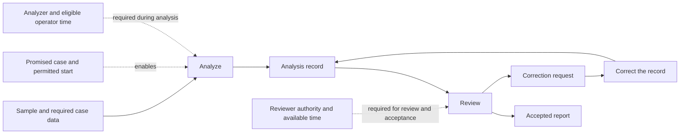
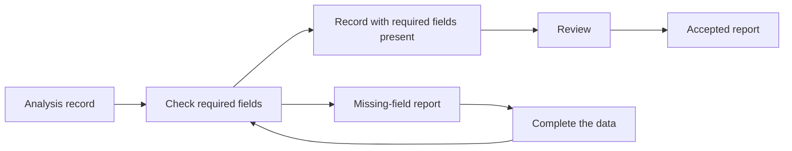

## APP-ME-01 — Choose the Smallest Method-Engineering Result Needed for Release EC-417

The team must release engineering change `EC-417`, but signed supplier pinout evidence is expected thirteen days after the target software-integration slot. The team calls the difficulty its “release methodology”. That label hides several possible subjects: relations among Methods, test-rig support, evidence currentness, human decision authority, and allocation of supplier and safety Work. Choosing the wrong subject can delay the release, overload the safety engineer, expose confidential geometry to an AI provider, or turn an observed timing association into an unsupported causal claim.

Use this application when a receiving-Work difficulty is described as one methodology problem while several unlike practice objects may be responsible. The practical gain is the smallest truthful Method Engineering result that changes the present decision. Do not run the whole route when one known capability or support defect, one source-currentness repair, or one individual qualification already answers the question.

The first move is to name the receiving result and ask which result is needed now. Continue only when an unresolved relation changes the release choice:

| Current question | Smallest useful result | Stop or continue |
| --- | --- | --- |
| Is the difficulty a Method, a candidate account, a family or local grouping, a relation, or a non-Method subject? | `ME.1` focus result | Stop with the non-Method return when capability, support, evidence access, or another subject owns the difficulty. |
| Which identified Methods and candidate accounts are current enough to inspect? | `ME.2` repertoire with exact identity, edition, evidence-window, and input/result refs | Stop when the bounded repertoire answers the question; enter `ME.18` only for a named account-recovery gap that ordinary recovery cannot close. |
| What must the selected subject contribute in this situation? | `ME.3` criteria with actual subjects, evidence, and stops | Stop with the criteria set when no comparison or qualification is needed. |
| Does a disputed Method criterion provide enough protection to justify its burden? | `ME.3` recommendation to retain or change the criterion, with the useful reason and amendment limit | Finish when the recommendation answers the question; the current requirement governs feasible action until the authorized change. |
| What unlike contributions are bundled under “release methodology”? | `ME.4` kind-preserving dossier | Stop after recovery when package navigation, not subject fitness or architecture, is the problem. |
| Can one identified Method or candidate account serve the bounded Work? | `ME.5` individual qualification with status preserved | Stop with that individual result; continue only when interactions among subjects change the decision. |
| What changed, and may the observed change support causal reliance? | `ME.19` differentiation account plus the separate `C.28` causal-use result | Stop when description is enough or the causal-use result is `unsupported`; do not promote chronology into evidence. |
| Which arrangement of Work, allocation, evidence, support, permission, and authority satisfies the receiving constraints? | `ME.6` architecture decision over named structures | Finish with the supported decision, including incumbent retention or a relation-only result; enter ME.7 only for an unresolved whole question. |
| Does the proposed whole already obtain? | `ME.7` whole-or-account result | Record obtaining relations only when identity and relation evidence support them; otherwise finish with the supported prospective account or lower claim. Select worthwhile feasible realization or testing; add a plan where coordination needs one. |

EC-417 continues beyond the early returns because evidence timing, Method relations, allocation, support, authority, and recovery burden jointly change the release decision. All identifiers, dates, observations, capacities, and outcomes below are scenario assumptions for this worked decision.

### 1. Bound the EC-417 receiving result and three viewpoint-governed readings of one Work

The project must release engineering change `EC-417`: controller firmware `4.8` together with harness revision `H-17`. The receiving result is one released controller change whose affected safety requirements, implementation revisions, supplier pinout, verification results, evidence status, and release authority are traceable.

The release is day `D0`. The target software-integration slot is `D-21`; signed supplier pinout is expected at `D-8`; software remains reversible until `D-1`. An AI provider may propose requirement-to-test links. It has no release authority and cannot receive confidential supplier geometry.

Project, process, and case readings are intended to describe the same release Work. A current episteme counts as a view only after a separate `E.17.0` judgment against an exact viewpoint edition:

| Intended viewpoint | Candidate description would expose | Boundary |
| --- | --- | --- |
| project | dates, allocations, boards, authorities, and release slots | schedules do not create a Method or a second Work |
| process | recurring supplier-evidence, integration-bundle, verification, and authorization correspondences | recurrence does not identify one process-Method or composite whole |
| case | the changing evidence, mismatch, exception, and next decision of this release | the case description is neither the Work nor a Method |

The three readings expose different Method and support questions. This application reports none of their epistemes as a current `U.View` until the exact candidate episteme, viewpoint edition, fixed rules, and positive `E.17.0` judgment are available. Any Method, relation, capability, allocation, or authority claim still needs its own identity or evidence.

### 2. Choose the subject before redesigning it

`ME.1` compares materially different subjects:

| Focus option | Disposition |
| --- | --- |
| `C-EC-Release-v2` as one Method | reject as a focus assumption; it is a proposed-whole candidate account, not an identified Method |
| an established release-Method family | reject because no governed family relation is supplied |
| project-local locator `LG-EC417-ReleaseMethods` | retain for comparison of the four identified Methods only; it creates no family |
| `C-AI-Trace-Review` | keep as a candidate account but do not select as the focus because trace suggestions govern neither evidence reconciliation nor release authority |
| relations among four identified Methods and two evidence-reconciliation accounts | select because evidence timing, result use, allocation, and authority relations change the release decision |
| test-rig capability/support | retain as a non-Method rival; current evidence does not make it the sole subject |

The selected Method-relation focus contains identified Methods `M-HW-Verify`, `M-SW-Integrate`, `M-Supplier-Approve`, and `M-Release-Authorize`, plus candidate accounts `C-Evidence-Reconcile-Internal` and `C-Evidence-Reconcile-Supplier`. No fifth Method, submethod, established family, or composite whole is asserted.

Reopen to the test-rig capability/resource decision if two of the next three comparable delays occur while required evidence is complete and the rig is unavailable. That observation changes the subject rather than merely lowering a Method score.

### 3. Separate observed differentiation, causal support, and today's decision

The twenty-release window records eight reopened releases. Six of those eight had a late supplier-pinout/integration-bundle mismatch before rig reservation. The rig was available in seven of the eight reopened releases; two rig-outage cases elsewhere in the window completed under the same procedure when backup capacity appeared. Two earlier comparable quarterly-cadence releases reconciled the same versioned input before their safety boards and did not reopen.

`DA-EC417-CadenceDifferentiation-1` retains a partial descriptive account of the counts and timing/co-occurrences above. This application does not supply the dated source editions, variant appearances, selection decisions, and diagnostic rival comparison needed to complete the differentiation history. Keep that reconstruction gap; these observations neither complete ME.19's historical result, choose B2, nor identify a causal effect. ME.19:5.1 supplies a filled constructed signoff history to show that separate operation, not evidence about EC-417.

The receiving causal-use question is `CUQ-EC417-CadenceEffect-1`: would entering provisional-evidence reconciliation at `D-21`, rather than waiting for signed evidence at `D-8`, reduce mismatch-related reopenings in EC-417-like releases for this team, supplier, and change class? `CUR-EC417-CadenceEffect-1` records `causalUseClaimKind = causalEffectClaim` and target rung `interventionalActionRung`.

Its actual components are:

- `evidencePathRefs = [EP-EC417-BundleSequence-20, EP-EC417-RigAvailability-20, EP-EC417-QuarterlyCadence-2]`;
- `empiricalDataRegimeRefs = [EDR-EC417-NaturalReleaseHistory]`;
- no identification result and no estimate result;
- common threat screen `CTS-EC417-CadenceEffect-1`, with `causalUseQuestionRef = CUQ-EC417-CadenceEffect-1`.

The threat screen keeps intervention consistency, confounding/exchangeability, overlap, interference, missingness/selection, measurement, and target transport as live threats; temporal ordering alone is clear. `routedThreatRefs = []`: no specialist result closes a live threat. The C.28 verdict is therefore **`unsupported`**.

No positive interventional causal reliance is supported. The observed timing and co-occurrence remain in separate non-causal result `DC-EC417-CadenceMismatch-1` as a trial hypothesis and design constraint. Unsupported uses include the claims that cadence mismatch caused the reopenings or that B2 will reduce them. Reopen only when a governed comparison or replayable identification/bound result varies reconciliation timing while rig availability, approver capacity, outcome definition, and evidence access are controlled or explicitly modeled.

Today's architecture decision remains separate. `AD-EC417-B2-Trial-1` may consume the non-causal mismatch result, capacity calculation, the covering trace/safety/release assignments, `PERM-TraceAcceptReject-17`, the two independently supported direct authority relations, and reversibility to choose a bounded trial. It may not consume the `unsupported` causal-use result as positive evidence.

### 4. Recover candidate accounts only when ordinary Method recovery is insufficient

Ordinary `A.3.1.MR` recovery suffices for `M-HW-Verify` and `M-SW-Integrate`. The evidence-reconciliation question enters `ME.18` because oral version judgments and supplier/internal workarounds are absent from the records and the receiving decision needs a stronger account.

The evidence programme keeps its moves distinct:

- occurrence observation and artifacts record overt evidence handling;
- Critical Decision Method probes recover recalled cues, options, judgments, and counterfactual reflections;
- event-log comparison records recurrence and deviation;
- the twelve-plus-one sample, claim-to-evidence matrix, contradiction-by-scope rule, and held-out discriminator are the bounded expert synthesis.

Four firmware-only and four internal harness-plus-firmware releases accepted versioned provisional pinout evidence before safety closure. Four supplier-originated releases required signed evidence at closure. Four boards were observed. CDM probes involved two supplier, two software, one hardware, and one safety practitioner.

The thirteenth supplier-originated case is reserved unseen. Before inspection, the internal account predicts that explicit version/uncertainty plus later reconciliation is sufficient; the supplier account predicts that supplier-originated geometry will require the signed-evidence branch; the rig-capacity rival predicts that progress follows rig availability. The held-out case presents supplier-originated geometry, the signed-evidence cue, a decision to wait for the signed branch, the expected branch variation, and a completed result. It supports the supplier account without a load-bearing surprise, contradicts neither account outside its scope, and leaves transfer unresolved.

`C-Evidence-Reconcile-Internal` and `C-Evidence-Reconcile-Supplier` remain scoped candidate Method accounts. No occurrence, interview, event regularity, majority pattern, or held-out fit admits either as a Method or proves effectiveness, population frequency, or causality.

### 5. Build the repertoire and criteria without preselecting an architecture

`ME.2` returns an inspectable repertoire for the relation comparison:

| Subject | Exact current inputs for this replay | Source use | Limit |
| --- | --- | --- | --- |
| `M-HW-Verify` | A.3.1 identity result `IDR-HW-Verify-17`; description edition `MD-HW-Verify-4.2`; evidence window `EW-HW-Verify-EC397-416` covering `EC-397` through `EC-416`; established input/result relation `IR-HW-Verify-17` | accepts the named harness/pinout edition and returns `VR-EC417-H17` | no established family or Method-lineage relation follows from co-listing |
| `M-SW-Integrate` | A.3.1 identity result `IDR-SW-Integrate-17`; description edition `MD-SW-Integrate-4.8`; evidence window `EW-SW-Integrate-EC397-416` covering `EC-397` through `EC-416`; established input/result relation `IR-SW-Integrate-17` | consumes the named firmware, harness, and evidence edition and returns an integration record that preserves edition, uncertainty, and use | no evidence-reconciliation or whole-Method identity follows |
| `M-Supplier-Approve` | A.3.1 identity result `IDR-Supplier-Approve-17`; description edition `MD-Supplier-Approve-H17.3`; evidence window `EW-Supplier-Approve-12` covering the twelve preceding supplier-originated releases; established input/result relation `IR-Supplier-Approve-17` | consumes the supplier revision and evidence bundle and returns signed approval or the explicit missing-approval stop | supplier transfer beyond the named source window remains open |
| `M-Release-Authorize` | A.3.1 identity result `IDR-Release-Authorize-17`; description edition `MD-Release-Authorize-2026Q3`; evidence window `EW-Release-Authorize-20` covering the named twenty releases; established input/result relation `IR-Release-Authorize-17` | consumes the named evidence, verification, assignment, and authority results and returns release, withhold, or next-slot authorization | it does not perform the safety-evidence decision or create release authority |
| `C-Evidence-Reconcile-Internal` | candidate-account edition `CA-ER-Internal-1`; source window `EW-ER-Internal-8` covering four firmware-only and four internal harness-plus-firmware releases | derived from those eight internal cases and their artifacts | Method identity and supplier transfer remain open |
| `C-Evidence-Reconcile-Supplier` | candidate-account edition `CA-ER-Supplier-1`; source window `EW-ER-Supplier-4+1` covering four supplier cases plus the held-out thirteenth case | derived from that bounded source set | Method identity, population scope, and relation to the internal account remain open |
| `C-AI-Trace-Review` | candidate-account edition `CA-AI-Trace-Review-1`; exact source contents `ATP-2`, `HDR-TraceAcceptReject-17`, and `RES-TraceAcceptReject-17` | `ATP-2` contributes prompt-and-guard description content; `HDR-TraceAcceptReject-17` documents the one dated human Work occurrence in this filled case, `W-TraceAcceptReject-17-01`, and identifies its distinct exercise-evidence carrier `EV-PEX-TraceAcceptReject-17-01`; `RES-TraceAcceptReject-17` records its result `RES-TraceAcceptReject-17-01`; the AI provider and its input suggestion remain separate Systems/content | no autonomous authority, effectiveness, transfer, Method identity, family, causation, superiority, applicability, or composition claim |

The four Methods alone remain in local comparison locator `LG-EC417-ReleaseMethods`; the three accounts are adjacent repertoire entries with preserved statuses. The values in the table are pinned for reliance from `D-21` through `D0`. For an identified Method, rely on its current A.3.1 identity result, description edition, evidence window, and only each established relation needed by the use. For a candidate account, rely on its current account edition, named source contents or source window, preserved status and limits, and only already-established relations needed by the use; missing Method identity or a generic input/result relation remains an open limit, not a required field. If a required value is absent or has changed, stop repertoire reliance and reopen only that `ME.2` entry.

At `D0` this application's reliance window ends. It supplies no post-`D0` recovery plan, Work, or results establishing the conditions for later recovery.

For later non-AI recovery, create a new `A.15.2` WorkPlan when coordination needs one; a plan is not a prerequisite for every valid Work occurrence. Whether planned or unplanned, the later action needs its applicable independent ME.2 qualification/currentness, readiness, assignment, and permission/authority results. A WorkPlan describes possible Work and establishes none of those results or an `A.15.1` dated occurrence. Absence of a plan alone neither establishes nor prohibits later Work.

This application ends with withhold/next-slot. `C-EC-Release-v2` stays outside the membership table as a proposed-whole architecture subject; missing family, Method-lineage, account-identity, and AI-transfer bases block only the claims that require them.


`ME.3` states candidate-neutral contributions and locates every condition with its actual subject. The case separately names the Systems, performed decision Work and results, covering assignments, and independently obtaining permission or direct decision-authority relations:

| Human System and performed decision Work | Covering assignment | Permission or direct decision-authority relation |
| --- | --- | --- |
| `TraceReviewer-17`; bounded set `W-TraceAcceptReject-17` returns accept/reject for each AI suggestion actually used; this filled case contains `W-TraceAcceptReject-17-01` | `ASG-TraceReview-17`, `D-21` through `D0` | exact grant occurrence `PERM-TraceAcceptReject-17` and its currentness result `CUR-PERM-TraceAcceptReject-17-D21-D0`; the register entry is evidence, and the dated Work-to-grant exercise is a separate relation |
| `SafetyReviewer-17`; `W-SafetyEvidenceDecision-17` returns accept/reject for B2 entry, closure, or recovery evidence | `ASG-SafetyReview-17`, `D-21` through the next authorized slot | `AUTH-SafetyEvidence-17`: subject `SafetyReviewer-17`, named evidence-decision scope and that window, basis `SafetyDecisionCharter-17`; reliance needs the matching register entry and linked safety-decision record |
| `ReleaseDecider-17`; `W-ReleaseDecision-17` returns branch-entry and release/withhold/next-slot decisions | `ASG-ReleaseDecision-17`, `D-21` through the next authorized slot | `AUTH-ReleaseDecision-17`: subject `ReleaseDecider-17`, selection of A or at most three B2 trials and the release disposition in that window, basis `ReleaseDecisionCharter-17`; reliance needs the matching register entry and linked release-decision record |

The baseline B2 branch relies on one filled `A.2.8.PER` grant occurrence rather than inferring permission from a charter or register:

| Grant field | Filled case value |
| --- | --- |
| relation and beneficiary participant | `PERM-TraceAcceptReject-17 : GrantedPermissionRelation@Context`; `PermissionBeneficiarySlot` selects `beneficiarySystemRoleAssignmentRef=ASG-TraceReview-17`. `TraceReviewAssignment` is declared as a `U.SystemRoleAssignment` species; occurrence `ASG-TraceReview-17` has admitted System `TraceReviewer-17` as holder, `HumanTraceReviewer` as assigned kind, and covers `W-TraceAcceptReject-17-01` within `D-21` through `D0`. |
| permitted-action participant | `PermittedActionSpecificationSlot=ACT-TraceAcceptReject-EC417-e1`: inspect one non-confidential provider-generated requirement-to-test-link suggestion for `EC-417` and return accept or reject. It grants no safety-closure or release decision. |
| instituting act and grantor assignment | At `D-22 16:00`, admitted System `EngineeringAssuranceLead-17` performs speech act `SA-GrantTraceAcceptReject-17` under `ASG-TracePermissionGrantor-17 : TracePermissionGrantorAssignment`, a declared `U.SystemRoleAssignment` species whose holder is that System and whose assigned kind is `TracePermissionGrantor`; the act records `institutes.permissions=PERM-TraceAcceptReject-17`. The assignment grounds the holder and kind but neither acts nor supplies decision authority by form. |
| policy, scope, and window | `grantValidityPolicyRef=TraceReviewCharter-17-e1`; its predicate admits the exact grantor assignment and speech act for `scope=CS-EC417-AITraceSuggestions`. `validityWindow=D-21 00:00..D0 23:59`; the policy is not single-use. |
| currentness and ending | `CUR-PERM-TraceAcceptReject-17-D21-D0` checks the exact participants, instituting act, grantor assignment, policy edition, ClaimScope, and window and records no revocation or supersession at each EC-417 trace-decision checkpoint through `D0`. `DRE-TraceAcceptReject-17-e1` in `DecisionRightsRegister-17` carries evidence for that result; it neither institutes nor equals the grant. `revocationOrSupersessionRef=absent`; the occurrence expires at `D0` and has no carry-forward. |

The occurrence identity is the tuple `SA-GrantTraceAcceptReject-17`, beneficiary assignment ref `ASG-TraceReview-17`, action-specification edition `ACT-TraceAcceptReject-EC417-e1`, policy edition `TraceReviewCharter-17-e1`, ClaimScope `CS-EC417-AITraceSuggestions`, and the `D-21..D0` effective interval. A change in any member ends or splits the occurrence.

Only one provider suggestion is used in the filled case: `AI-TraceSuggestion-EC417-01`. At `D-21 10:00..10:20`, admitted System `TraceReviewer-17` performs `W-TraceAcceptReject-17-01` under `ASG-TraceReview-17`; the Work instantiates `ACT-TraceAcceptReject-EC417-e1` within the grant scope and returns `RES-TraceAcceptReject-17-01=accept`. `PEX-TraceAcceptReject-17-01 : PermissionExerciseRelation@Context` connects that dated Work to the exact `PERM-TraceAcceptReject-17` occurrence, with `beneficiarySystemRoleAssignmentRef=ASG-TraceReview-17`, `exerciseScope=CS-EC417-AITraceSuggestions`, and `exerciseInterval=D-21 10:00..10:20`. `EV-PEX-TraceAcceptReject-17-01` is the ledger evidence about this exercise and remains distinct from the exercise relation. No second suggestion, Work result, or exercise is asserted; every later used suggestion would require its own dated Work, result, currentness check, and Work-to-grant exercise relation.

Assignment, permission/authority relation, performed Work, and decision result imply none of one another. Capability, responsibility, access, currentness, readiness, and evidence remain separate as well. The AI provider holds none of the human assignments or relations. `ASG-TraceReview-17` and `PERM-TraceAcceptReject-17` end at `D0`; continuing safety or release assignments and authority extend neither trace relation. For this worked application, after `D0` no new AI suggestion is requested, accepted, or used, and no later trace-review assignment, permission, Work, result, or exercise is claimed. Every earlier trace-review occurrence and result remains in the evidence history.

| Criterion | Actual subject and bound | Evidence or stop |
| --- | --- | --- |
| trace correspondence | released result: each affected safety requirement links to one or more named current implementation revisions and one or more named verification results; every correspondence link is inspectable | versioned trace record; absence of either required link kind stops safety closure |
| confidentiality | supplier geometry and AI-provider access relation | geometry remains outside the provider; any exposure stops the AI-supported route |
| decision-Work assignments | the three admitted human Systems and their three baseline `ASG-*` occurrences | every performed occurrence matches its covering assignment's holder, Work scope, and window; missing or mismatched assignment fails without erasing the Work |
| permission and decision authority | `PERM-TraceAcceptReject-17`, `AUTH-SafetyEvidence-17`, `AUTH-ReleaseDecision-17`, and their governed results | APP section 5 records the grant participants and grounds once; `CUR-PERM-TraceAcceptReject-17-D21-D0` supports pre-Work currentness, `PEX-TraceAcceptReject-17-01` relates dated Work to that grant, and `EV-PEX-TraceAcceptReject-17-01` remains evidence about the exercise; missing, out-of-scope, circularly supported, or AI-provider authority fails |
| evidence state | provisional/signed evidence inputs, their relation, and safety-closure guard | signed evidence supersedes the explicit provisional edition only for safety-closure reliance; provisional uncertainty, earlier Work use, and the provisional-to-signed relation remain traceable; missing signed evidence stops closure |
| reversibility | integration Work and implementation state | rollback within one hour until `D-1`; failure stops an early-integration route |
| capability/support | named hardware/safety capabilities, PLM/CI edition recovery, pinout schema, and rig access | missing capability, unknown input edition, or unavailable verification route blocks the contribution that relies on it |
| peak burden | safety-engineer allocation on the selected peak day | at most `0.40` of an eight-hour day, or `3.20 h`; transferred burden remains visible |
| board burden | each joint-board Work occurrence | at most 45 minutes per board |
| release stop | `W-ReleaseDecision-17`, `ASG-ReleaseDecision-17`, `AUTH-ReleaseDecision-17`, and receiving result | missing signed evidence, required verification, covering assignment, or direct authority relation yields withhold or next-slot, never silent waiver |

These criteria admit no Method and select no alternative. Signed-first, provisional-first, supplier-preparation, and safety-preparation variants remain serious possibilities.

### 6. Recover package contributions and qualify individual subjects

The incumbent “release methodology” mixes unlike material. `ME.4` returns open navigation sections while preserving kinds:

- Methods: the four identified Methods;
- candidate accounts: the two reconciliation accounts, `C-AI-Trace-Review`, and proposed whole `C-EC-Release-v2`;
- descriptions and source claims: stage table, release checklist, supplier procedure, AI prompt, bundle records, and evidence grades;
- Systems/support/access: PLM, CI, test rig, AI provider, and provider-access relation;
- capabilities/assignments: safety competence, supplier-configuration responsibility, and `ASG-TraceReview-17`, `ASG-SafetyReview-17`, and `ASG-ReleaseDecision-17`;
- permissions/authority: `PERM-TraceAcceptReject-17`, `AUTH-SafetyEvidence-17`, and `AUTH-ReleaseDecision-17`, distinct from the assignments, performed Work, and decisions;
- inputs/results/premises: pinout schema, evidence bundle, verification result, and confidentiality premise;
- relations: production/use, schema correspondence, provider access, allocation, responsibility, permission, and authority.

These are dossier navigation sections, not technical kinds or Method components. Only identified Methods and candidate accounts travel to individual qualification, each with the dependency slice needed to judge it.

`ME.5` returns status-preserving individual results:

| Subject | Individual return |
| --- | --- |
| `M-HW-Verify` | qualified to accept the affected change/pinout version and produce the verification result under named rig and hardware-capability conditions |
| `M-SW-Integrate` | qualified to produce an integration record that preserves the exact provisional or signed edition, uncertainty, and earlier-use history; later signed evidence supersedes provisional only for closure reliance; one-hour reversibility still applies |
| `M-Supplier-Approve` | qualified to produce signed approval or the explicit missing-approval stop under named access and supplier responsibility |
| `M-Release-Authorize` | qualified to return release, withhold, or next-slot authorization when `ReleaseDecider-17` performs `W-ReleaseDecision-17` under `ASG-ReleaseDecision-17` and `AUTH-ReleaseDecision-17`; Work, assignment, and authority remain separate |
| two reconciliation accounts | retained as scoped candidate accounts; `A.3.1` identity remains open |
| `C-AI-Trace-Review` | retained as a human-governed candidate account that specifies a trace-suggestion contribution; `TraceReviewer-17` performs accept/reject Work under `ASG-TraceReview-17` and `PERM-TraceAcceptReject-17` |

ME.5 cannot qualify the provider-default AI proposal as currently supplied: neither an identified Method nor a candidate Method account has been provided. Independently, implementing the proposal would expose confidential geometry to the AI provider, and the proposal names no admitted human performer, covering assignment, or permission/authority relation. Those failures would block this use even if a candidate account were supplied.

Local schema correspondence `A-17` maps signed or explicitly provisional pinout-version fields to the integration bundle, preserves the exact edition and uncertainty used, and is supported on five stored bundles for the named editions. Later signed evidence does not erase a provisional basis. It is one local connection, not whole compatibility.

Another project needing only hardware verification can stop with the individual qualification of `M-HW-Verify`; it does not need a package-recovery or architecture-comparison result. A project whose only useful result is the bounded qualification of `C-Checklist-Reconcile` can retain that subject as a candidate account with A.3.1 identity still open and stop without calling it a Method. A project investigating supplier reconciliation can likewise stop with the retained supplier account. EC-417 continues because combined evidence timing, allocation, support, authority, and recovery burden change the release decision.

### 7. Compare A, B, B2, and R across the structures that change the decision

The alternatives share the receiving result but arrange Work and burden differently:

For this constructed comparison, `2.07 h` is safety-engineer time for traceability and safety-closure work: checking the current requirement–implementation–verification correspondences and preparing or recording the closure disposition. It excludes the separately counted signed-delta preparation and `0.33 h` board, and any additional affected verification or integration rework.

| Alternative | Work and evidence arrangement | Allocation and stop |
| --- | --- | --- |
| `A` | use signed evidence before integration and hold one final reconciliation board | choose prospectively at `D-21` when signed evidence is available or early-integration entry conditions are absent; under baseline `D-8` availability it misses the target slot by thirteen days |
| `B` | integrate from an explicit provisional edition at `D-21`, preserve its uncertainty and use, and reconcile it to signed evidence at `D-8`; safety engineer performs all signed-delta preparation | `D-8` safety demand is `2.00 + 0.33 + 2.07 = 4.40 h`, or `0.55`; reject under the `0.40` peak-day limit |
| `B2` | same Work order and evidence-history rule as B, but supplier-configuration role performs `1.60 h` of signed-delta preparation | `D-8` safety demand is `0.40 + 0.33 + 2.07 = 2.80 h`, or `0.35`; moved supplier burden remains explicit |
| `R` | after B2 entry and missing signed evidence at closure, preserve performed integration plus the provisional edition, uncertainty, and earlier use; on signed evidence, record the relation/delta, re-baseline, repeat comparison and affected verification, then retain, roll back, or repeat integration | withhold release; signed evidence supersedes provisional only for closure reliance; a full repeat includes `1.60 h` supplier preparation plus `2.80 h` safety preparation/board/trace-closure (`0.40 + 0.33 + 2.07`); affected verification/integration rework is additional and has no fixed case duration. An earlier stop records only the Work and burden actually incurred |

The provisional board occurs on `D-21`; the signed-evidence board occurs on `D-8`. Both last 20 minutes and therefore remain under the separate 45-minute limit. They do not occur on the same day. Per-release safety effort is `4.73 h` for B and `3.13 h` for B2 after the separate `D-21` board is included. The selected `D-8` peak-day result and per-release totals answer different burden questions.

#### Signed-delta preparation for B2

Under B2, the supplier-configuration role prepares the comparison of the signed supplier pinout received for closure with the exact provisional pinout edition used in `D-21` integration. Retain both edition identifiers and the provisional uncertainty and use history; identify the changes, and use schema correspondence `A-17` to locate the affected integration-bundle fields. `SafetyReviewer-17` checks that comparison and identifies the affected traceability and verification checks for the safety board. The preparation result is a version-linked pinout-difference record with the affected checks, not a B-versus-B2 allocation decision or a release authorization. The assumed preparation burden remains `1.60 h` supplier plus `0.40 h` safety; performing affected verification, deciding safety closure, and any integration rework remain separate. Missing signed evidence invokes R as described in section 8.

`ME.6` keeps several structures distinct:

- **Method relations:** the four identified Methods are co-used; every composition/order relation for `C-EC-Release-v2` remains proposed;
- **Work relations:** A is signed-first; B/B2 are provisional-first then signed reconciliation; each B2 branch that uses AI suggestions contains bounded human Work set `W-TraceAcceptReject-17` with one accept/reject occurrence per used suggestion; R can occur only after B2 entry, retains already-performed Work, and repeats that trace-review Work for every repeated AI suggestion;
- **allocation:** B overloads the safety engineer, while B2 transfers `1.60 h` and stays within the peak bound; admitted Systems `TraceReviewer-17`, `SafetyReviewer-17`, and `ReleaseDecider-17`, their three covering assignments, trace permission `PERM-TraceAcceptReject-17`, and the two direct authority relations remain separate;
- **subject/support/permission/authority:** the three decision Systems and their Work remain distinct from their assignments, the trace permission, and the two direct authority relations; supplier configuration, PLM, test rig, and AI provider retain separate responsibility/access/support relations;
- **description correspondence:** checklist order corresponds only partially to Work overlap and branch stops;
- **cultural relation:** retention of a weekly-integration practice remains a later cultural-continuation question.

`AD-EC417-B2-Trial-1` selects only a prospective three-release B2 trial under `ASG-TraceReview-17`, `ASG-SafetyReview-17`, `ASG-ReleaseDecision-17`, `PERM-TraceAcceptReject-17`, `AUTH-SafetyEvidence-17`, `AUTH-ReleaseDecision-17`, capacity, confidentiality, evidence, and reversibility conditions. It consumes `DC-EC417-CadenceMismatch-1` as a non-causal rationale and treats the causal-use verdict as `unsupported`. A remains a pre-entry alternative. R is a post-entry recovery and can never become a retrospective A occurrence. No obtaining ArchitectureRelation or `methodPartOf` fact is asserted.

### 8. Return a proposed-whole account and a bounded trial

`ME.7` receives `C-EC-Release-v2` with:

- intended result: a traceable safety-relevant release under named evidence and authority conditions;
- reusable invariant: reconcile the exact provisional or signed evidence edition with the integration bundle before safety closure;
- participants and contributions: the four identified Methods, two reconciliation accounts, the three admitted decision Systems, their decision Work/results and covering assignments, and separately governed support/capability/permission/authority subjects;
- inputs/results: pinout/evidence state, implementation revision, verification result, signed approval or stop, and release authorization;
- variation: signed-first A or bounded provisional-first B2 before entry; post-entry recovery R;
- bounds: confidentiality, human AI-suggestion decision, evidence edition/uncertainty/history, signed-before-closure reliance, peak burden, board duration, rollback, covering assignments, and named permission/authority relations;
- reidentification rule: the account changes when its receiving result, invariant, participant contribution, evidence branch, or authority/stop rule changes materially.

The four participant Methods are identified, but the proposed whole is not. The result is therefore a prospective candidate Method account, proposed relation sets, guards, adapters, fallbacks, stops, variation points, and a trial WorkPlan. Writing or selecting that account creates neither a world-side Method, obtaining composition, ArchitectureRelation, nor MethodDescription.

At `D-21`, `ReleaseDecider-17` performs `W-ReleaseDecision-17` under `ASG-ReleaseDecision-17` and `AUTH-ReleaseDecision-17`, after `SafetyReviewer-17` performs the needed evidence decision under `ASG-SafetyReview-17` and `AUTH-SafetyEvidence-17`. B2 entry also requires `TraceReviewer-17` to perform accept/reject Work under `ASG-TraceReview-17` and the current `PERM-TraceAcceptReject-17` for every AI suggestion actually used by the branch. The filled baseline is `W-TraceAcceptReject-17-01` and `PEX-TraceAcceptReject-17-01` from section 5; any additional used suggestion would require a distinct dated Work, result, currentness check, and exercise relation.

The decision chooses A before integration if signed evidence is already available or if versioned provisional evidence, supplier preparation, confidentiality, the trace-review assignment or permission, or a safety/release assignment or authority condition for B2 is absent. Under the baseline `D-8` assumption and with every B2 entry condition satisfied, it may authorize only three B2 releases.

Each B2 occurrence must keep confidential geometry outside the provider, record `TraceReviewer-17` accept/reject for every AI suggestion under `ASG-TraceReview-17` and `PERM-TraceAcceptReject-17`, hold its boards on the named days, stay at or below `3.20 h` peak safety effort, obtain signed evidence before closure, and reach the target slot or record why it did not. A confidentiality, assignment, permission, or authority breach stops B2 immediately.

If signed evidence is missing at `D-8`, withhold release and enter R. R preserves the performed integration record, provisional edition, uncertainty, and earlier decision use. If signed evidence arrives by `D0` while the existing evidence and reversibility guards still hold, the team records its relation and delta to provisional, re-baselines the bundle, repeats the comparison and affected verification, and records whether early integration was retained, rolled back, or repeated.

If closure is still unresolved at `D0`, `ReleaseDecider-17` returns withhold/next-slot and this application's R occurrence ends as a failed B2 trial. All AI-supported continuation stops at `D0`. Any later non-AI recovery is outside this application and follows the future-recovery boundary in section 5.

These boundaries do not rewrite any earlier Work or evidence basis. Signed evidence supersedes provisional only for safety-closure reliance. For the constructed series of at most three B2 trials, count one failed trial when that release has a capacity or mismatch failure or enters R. Count that trial only once even if several categories or events occur; retain all categories as reasons for analysis. Entering R counts once for its trial even if recovery later succeeds. After two distinct failed trials, `ReleaseDecider-17`, within the applicable `AUTH-ReleaseDecision-17` scope, returns B2 for revision or rejects further B2 use before any fourth release. The required safety-evidence accept/reject remains a separate `SafetyReviewer-17` result under `AUTH-SafetyEvidence-17`; revising the candidate account is separate work, not an authority granted by this release decision. The existing decision covers at most three trials regardless of the failure count: any further release requires a new applicable decision. The immediate confidentiality, assignment, permission, and authority stops above do not wait for two failures.

### 9. Configure and test the enactment-support arrangement before claiming that a Method Base works

The B2 material now exists, but that does not show that a person can find the current edition, distinguish candidate from admitted content, tailor the live branch, or stop before a tool overreaches. `ME.10` therefore starts from three named user tasks rather than from a repository or platform design. The bounded support use `USE-EC417-B2-Support-1` asks whether `TraceReviewer-17`, `SafetyReviewer-17`, and `ReleaseDecider-17` can use the B2 material for `WP-EC417-B2-Trial-1` under the existing confidentiality, evidence, assignment, permission, authority, reversibility, and `D0` conditions.

#### 9.1 Fix the same three task rows before comparing support configurations

| User task | Mandatory observation and stop | Configuration evidence |
| --- | --- | --- |
| retrieval by `TraceReviewer-17` | recover `MBE-EC417-B2-1`, candidate status, prompt episteme `ATP-2`, the confidentiality boundary, and the `D0` stop | one performed retrieval through `SYS-EC417-PLM-1` |
| tailoring by `SafetyReviewer-17` | use a non-confidential fixture, preserve signed-before-closure, reject a stale edition, and stop on missing permission or authority | one admitted CI-use Work with the observations below; the [tailoring input, action and result remain undefined](#me10531---missing-tailoring-definition) |
| branch selection by `ReleaseDecider-17` | distinguish pre-entry A, bounded B2, and post-entry R; stop B2 when assignment, permission, authority, confidentiality, or reversibility is absent | one performed selection task through `SYS-EC417-PLM-1` |

Published files and manual lookup are candidate configurations with no performed task evidence for these three rows, so those configurations remain untested rather than failed. Adding an interaction with `SYS-EC417-AIProvider-1` and feedback Work or a feedback receiving relation also remains untested: no mandatory row needs either, and this support test contains no provider interaction, used AI suggestion, human review of such a suggestion, feedback Work, feedback SpeechAct, or feedback receiving use. The bounded PLM/CI candidate configuration is the only one with one observation for every current row. The described observations support retrieval, branch selection and the tested tailoring actions; the missing tailoring definition and permission/authority-stop observation prevent a pass for the full tailoring row or complete task set. The configuration is not established as globally smallest or superior to every alternative.

#### 9.2 Admit the two entry epistemes to the Method Base

`MBC-EC417-B2-1` is the project Method Base entry collection for this support purpose and window. It keeps its project namespace, current entry-disposition rule, and continuity condition. The two candidate entries are separate C.2.1 epistemes:

- `ECA-EC417-C-Release-v2-1` states the explicit candidate status and current account of `C-EC-Release-v2`;
- `ERP-EC417-WP-B2-1` is about WorkPlan `WP-EC417-B2-Trial-1`, not about performed release Work.

Entry membership is an instituted relation, not a folder listing. `SYS-EC417-MB-PermissionGrantor-1`, its obtaining grantor assignment `RA-EC417-MB-PermissionGrantor-1`, and admitted permission-granting SpeechAct `SA-EC417-MB-PermissionGrant-1` ground exact permission `PERM-MBENTRY-EC417-1` for curator assignment `RA-EC417-MB-Curator-1`, action specification `PAS-EC417-MB-AdmitRemove-1`, scope `SCOPE-EC417-MB-Entries-1`, and the `D-21` through `D0` window. `AG-EC417-MB-Curator-1` and the obtaining curator assignment supply the A.13 performer core; the permission itself creates neither Work nor a result.

`MECH-EC417-MB-EntryDisposition-1` declares reusable operation `settleEntryDisposition(entry, collection, admissionWork) -> entryDisposition`. Its closed local value kind contains exactly `MBEDV-EC417-Admit`, `MBEDV-EC417-Remove`, and `MBEDV-EC417-Stop`; display words, records, plans, and assertions are not those values. A completed application requires the curator to identify the entry episteme, the collection, the entry-disposition rule, and the admission question; check kind and status, provenance, purpose fit, applicability, return condition, and current membership; and then perform one observable branch-closing act. Without that act there is inspection Work but no completed application or result binding.

At `D-21 10:00–10:08`, admitted Work `W-MBA-EC417-ECA-1` applies the operation to the candidate-account episteme. At `10:10–10:18`, admitted Work `W-MBA-EC417-ERP-1` applies it to the WorkPlan episteme. Each Work has its own performance history, extent, `WorkContainedInEC417MethodEngineering` occurrence, A.13 core, A.15.1 admission, post-admission assignment attribution, and `PERM-MBENTRY-EC417-1` exercise. Applications `APPL-MBENTRY-EC417-ECA-1` and `APPL-MBENTRY-EC417-ERP-1` end only at their pair-specific positive approval acts; terminal bindings `RB-MBENTRY-EC417-ECA-ADMIT-1` and `RB-MBENTRY-EC417-ERP-ADMIT-1` carry exact value `MBEDV-EC417-Admit`.

Those facts institute `MBB-EC417-ECA-1` and `MBB-EC417-ERP-1` as the two `MethodBaseEntryBelongsTo@Project` episodes. Each episode is identified by its exact entry, collection, and maximal continuous interval. A repeated positive result during an open episode creates no second membership; removal requires its own permitted negative application and result. No such removal obtains through `D0`.

#### 9.3 Test actual use and keep the structure gap separate

The collection makes the two epistemes eligible for the support use. Three separately admitted Work occurrences supply the following observations; the tailoring row's mandatory permission/authority stop remains untested:

| Performed user Work | Direct System use and observed result | Boundary |
| --- | --- | --- |
| `W-MESUP-EC417-Retrieve-1`, `TraceReviewer-17`, `10:30–10:42` | `SSUW-EC417-Retrieve-PLM-1` relates that Work to `SYS-EC417-PLM-1`; the user retrieves `MBE-EC417-B2-1` and recovers candidate status, `ATP-2`, confidentiality, and the `D0` stop | no general access entitlement, capability, or authority follows |
| `W-MESUP-EC417-Tailor-1`, `SafetyReviewer-17`, `10:42–10:55` | `SSUW-EC417-Tailor-CI-1` relates that Work to the non-confidential `SYS-EC417-CI-1` fixture; the user preserves signed-before-closure and rejects the stale edition | the [tailoring operation remains undefined](#me10531---missing-tailoring-definition) and the permission/authority stop remains untested; this neither performs release Work nor approves closure |
| `W-MESUP-EC417-Select-1`, `ReleaseDecider-17`, `10:55–11:08` | `SSUW-EC417-Select-PLM-1` relates that Work to `SYS-EC417-PLM-1`; the user distinguishes A, B2, and R and applies the named B2 stops | the aid neither makes the release decision nor acquires authority |

Each `SupportSystemUsedInWork@EC417` occurrence requires the independently admitted Work, one exact admitted System, an actual input/output interaction, and use of the returned value in that task. Colocation, access, a click trace, or tool output is insufficient. Each Work keeps its own enacted support-use Method, performer core, containing-System relation, assignment, and post-admission attribution.

`RES-MESUP-EC417-B2-1` returns `task-pass` for retrieval and branch selection, retains the observed tailoring fixture, signed-before-closure and stale-edition results, and returns `missing-task-set[tailoring-input-action-result]` plus the separate `missing-task-test[tailoring-permission-authority-stop]` for the full tailoring task. The branch-selection stop cannot supply an observation of another user's tailoring action. This support test includes no `SupportSystemUsedInWork@EC417` occurrence with `SYS-EC417-AIProvider-1`; retrieving `ATP-2` is not provider use. No feedback occurrence `SA-MESUP-EC417-FB-1` is asserted. A later failed task would need its own repair and rerun Work rather than a rewrite of these histories.

`PSO-EC417-B2-Use-1` remains a proposed organization whose four A.22 candidate groups stay separate: identified constituents; the two membership episodes and three direct PLM/CI-use occurrences; current-edition, status, confidentiality, signed-evidence, assignment, permission, authority, reversibility, and `D0` constraints; and the named support-use frame. The case has no selecting System, enacted selection Method, dated structure-selection Work, or direct participation or operation-binding basis. `ESA-EC417-B2-1` therefore returns `missing-selection-basis` and designates no selected `U.Structure`. That structure-selection gap neither erases the observed task results nor fills the separate missing tailoring test.

The membership episodes, their IBA assertion or evidence epistemes, optional construction account `MBCA-EC417-B2-1`, edition episteme `MBE-EC417-B2-1`, publication occurrence `PUB-MBE-EC417-B2-1`, named-use reliance episteme, proposed organization, selection-gap episteme, and task result remain distinct. Membership and publication do not prove usability; the bounded task results do not prove a general holder capability, Method fit, effectiveness, release performance, or selection of the proposed structure.

#### 9.4 Stop separately at the remaining Method Engineering questions

| Pattern question | EC-417 result or stop |
| --- | --- |
| ME.8 | `C-EC-Release-v2` remains a candidate account. Improve that account or a description of one admitted constituent Method; do not return a `U.MethodDescription` for the candidate whole. |
| ME.9 | Profile `MRP-EC417-B2-Review-1` relates the [signed-versus-provisional pinout preparation](#signed-delta-preparation-for-b2) to later reconsideration of the candidate. Preparation and reopening remain unresolved for their separately named missing bases. The full claims, receiving results, missing bases, and cross-use relation are given in §9.4.1 below. |
| ME.10 | Keep the retrieval and branch-selection passes, described CI/guard observations, missing tailoring definition and tailoring-stop test, `missing-selection-basis`, memberships, edition/publication results and provider/feedback gaps separate. A missing premise blocks only the task or stronger claim that requires it. Optional AI use, feedback or A.22 selection is not a completion condition for the observed PLM/CI uses; the tailoring definition and mandatory stop test are required for the full task-set pass. Actual membership, System-use, Work, permission and task-result claims still need their own obtaining basis. |
| ME.10–ME.14 and ME.16 capability input | The current application supplies assignments and authority facts but no A.2.2 capability record for a person, AI System, team, or other holder. Any decision that needs holder, Work family, envelope, measures, qualification window, currentness, and evidence returns that missing input. Its absence alone does not establish a need for capability development. |
| ME.11 | The three-release statement remains a WorkPlan. Add a release only after the corresponding dated release Work occurrence, its performers, enacted constituent Methods, Systems, capabilities, relied-on relations, conditions, domain result, burdens, deviations, and authority facts obtain. The Work does not enact the candidate whole. |
| ME.12–ME.14 | ME.12 returns each correction to the maintained result it can affect. ME.13 stays on the candidate branch and cannot claim transfer before a performed held-out release situation. ME.14 can finish a present comparison of A, B, B2, and stop or next-slot from the available qualified observations and estimates, while preserving burden, confidentiality, capabilities, Systems, Work, relations, recovery, side effects, reversibility and evidence limits. A demonstrated release-worth claim still needs actual release and alternative evidence; any chosen trial retains its entry conditions. `CUR-EC417-CadenceEffect-1` remains `unsupported`. |
| ME.15 | Maintain editions of `C-EC-Release-v2` as a candidate lineage until A.3.1 independently admits a Method with changed reusable semantics. Constituent Methods, descriptions, tools, and prompts remain separate. |
| ME.16 | For each release that actually occurs, keep Method or candidate changes separate from description, PLM/CI/AI Systems, support Work, access, capability, assignment, permission, authority, release Work, and release-result changes. Retain decision-relevant adequate existing capability on its current A.2.2 basis without requiring development; return that missing basis when needed. Only a required capability-change claim consumes an independently obtained development result or returns its missing/stale result and next governing action. Omit capability detail that cannot change the decision. |
| ME.17 | EC-417 supplies no C.20 Discipline recognition, bounded Method Engineering population, enacted Method Engineering variant or cultural-relation evidence. Keep those wider claims unsupported; no cultural inquiry is needed merely to complete the release or support result. If culture becomes the receiving question, use the bounded account and the MeCaMinD, SRA and Essence sources only for the relations they actually support. |

##### 9.4.1 Preparation now, reopening after performed trials

Invoke ME.9 only for Method representation profile `MRP-EC417-B2-Review-1`, because two unlike actions must be related without becoming one view. Both return to candidate `C-EC-Release-v2` and current candidate-account episteme `ECA-EC417-C-Release-v2-1`.

**Preparation now.** C.37 claim group `C37-EC417-B2-Prepare-1` has receiver `SafetyReviewer-17` and exact action ‘check the supplier-prepared signed-versus-provisional pinout comparison and identify the affected safety checks before release’, using the [instruction in section 7](#signed-delta-preparation-for-b2); direct subject result `ERP-EC417-WP-B2-1` is a `C.2.1` episteme about proposed allocation and order, evidence entry, confidentiality, recovery, and stops while preserving WorkPlan status. A.2.4 classifies that preparation use, and A.10 path `P-APP-EC417-Prepare-1` returns `pass` in its current-edition window. ME.6 decision `AD-EC417-B2-Trial-1` governs the trial alternative: its predicate compares A, B, and B2 against the receiving, capacity, confidentiality, assignment, permission, authority, evidence, and reversibility conditions; its actual outcome selects no more than three prospective B2 trials under those conditions. That trial choice does not supply a directly governed result admitting this representation's contribution to the preparation action. The preparation claim group is `unresolved` until the preparation-use owner returns its governing predicate and actual admitting or declining result. The trial decision grants neither performed Work nor any assignment, permission, or authority.

**Reopening after performed trials.** C.37 claim group `C37-EC417-B2-Reopen-1` has receiver `MethodEngineer-17` and exact later action ‘decide which findings from performed trial Work reopen the candidate’. In this application the three-release statement remains WorkPlan `WP-EC417-B2-Trial-1`: no corresponding release Work has yet been admitted, no exact candidate-episteme/viewpoint-edition pair has been tested under `E.17.0`, and no direct receiving governor has returned a predicate and outcome for that reopen action. A.2.4 classification or an A.10 path cannot replace those missing results, so this claim group is `unresolved`.

**The relation between the uses.** The cross-use profile records the shared evidence-entry, confidentiality, recovery, and stop correspondences, the preparation claim group's missing receiving result, and the reopening claim group's separate missing Work, conformance, and receiving bases; it keeps WorkPlan, any later Work, both actions, candidate readings, conformance judgments, and receiving results separate. It creates no super-view, Method admission, fit, transfer, worth, publication, or mathematical graph.

### 10. Apply sensitivity without rewriting past Work

If signed supplier pinout is available at `D-21`, the prospective choice reverses to A before integration. A then reaches the target slot with one final board and avoids the provisional board, later signed-delta preparation, and post-entry recovery exposure. B2 remains only if another named conflict justifies its extra branch.

This sensitivity changes the current prospective decision. It does not relabel earlier B2 Work as A, erase a recovery occurrence, or prove that either alternative is generally better.

### Result and stop

The application returns:

- one selected Method-relation focus and a named non-Method reopen observation;
- an inspectable status-preserving repertoire and situated criteria set;
- a kind-preserving package dossier and individual qualifications;
- two scoped candidate reconciliation accounts with held-out limits;
- differentiation account `DA-EC417-CadenceDifferentiation-1`;
- `unsupported` causal-use result `CUR-EC417-CadenceEffect-1` and separate non-causal `DC-EC417-CadenceMismatch-1`;
- architecture decision `AD-EC417-B2-Trial-1`, with A pre-entry, B rejected on peak demand, B2 selected only for bounded trial, and R post-entry;
- proposed-whole account `C-EC-Release-v2` and its trial WorkPlan, with no obtaining composition claim;
- two instituted Method Base entry-membership episodes for the candidate-account and WorkPlan epistemes, with collection, edition, publication, construction-account, evidence, and reliance results kept separate;
- bounded support result `RES-MESUP-EC417-B2-1` as specified in section 9.3: passes for retrieval and branch selection, the observed tailoring fixture, signed-before-closure and stale-edition results, and the separate missing tailoring definition and untested permission/authority stop;
- separate `ESA-EC417-B2-1=missing-selection-basis`, AI-provider-use, feedback, and holder-capability gaps; and
- candidate-status, same-Work/viewpoint, trial, coherence, fit or transfer, worth, lineage, introduction, and cultural-continuation stops for ME.8–ME.17.

Stop before release when signed evidence, verification, confidentiality, capability/support, named human authority, peak capacity, board duration, or rollback conditions fail. At `D0`, if R has not closed successfully, issue withhold/next-slot, close this application's R occurrence, and stop all AI-supported continuation; do not claim later Work merely because a next slot or continuing safety/release authority exists. Preserve all earlier Work and evidence history. For later non-AI recovery, apply the section 5 boundary.

Stop only the enactment-support task or claim whose mandatory criterion fails or whose required task result, membership, capability, provider, feedback or selection basis is missing. Retrieval and branch selection retain their passes, and the observed tailoring fixture, signed-before-closure and stale-edition results remain. The missing tailoring definition and untested permission/authority stop prevent a complete task-set pass; unused AI/feedback features and the unselected A.22 proposal do not cancel the supported observations. Membership cannot repair a failed task, and a task pass selects no structure and proves no general capability. Stop Method Engineering at an earlier sufficient result when no whole question remains. Reopen only the affected result when its subject, source, evidence, authority, burden, task, System use, receiving criterion or relation truth changes.

The application establishes no causal effect, Method identity for any candidate account, effective composite Method, universal lifecycle, cross-domain transfer, general holder capability, selected A.22 support structure, AI-provider use or feedback return inside the support test, positive release Work, or broad cultural continuation. It supplies only the bounded support-use facts and pattern stops stated above.

## Compare explanations of a pattern language

An engineer has a use-bounded description of an admitted Method for checking a claim against its source. The engineer now asks why
the surrounding language separates source allocation, coherence checking and reconstruction: should those
three entries become one review procedure? This is a constructed comparison. The engineer knows ordinary
procedures and can consult the complete framework, but has no private authoring notes.

Use [ME.8](#me8---author-a-methoddescription-for-named-uses) for the claims describing the checking Method.
[ME.23](#me23---architect-a-problem-first-methoddescription-pattern-language) supplies the different answer
about the language arrangement: its entries serve independent questions, with different useful results and
source returns. The existing arrangement is candidate A. The author proposes a shorter paragraph, B, and a
table, C, for the same receiving question.

**B — Selected explanation in prose.** Use ME.21 to identify which source contributions were carried into the
language. Use ME.12 when a maintained claim contradicts its basis. Use ME.24 when a promised source contribution
cannot be recovered.

Choose the entry for the missing result and return to the affected question and its basis. Grouping these
entries does not establish parts of one Method; a MethodDescription still concerns its own admitted Method.

**C — The same selected claims in a table.**

| Current question | Contribution to obtain |
| --- | --- |
| Which source contributions were carried into the language? | ME.21's source-allocation answer. |
| A maintained claim contradicts its basis. What needs correction? | ME.12's coherence answer. |
| A promised source contribution cannot be recovered. What is missing? | ME.24's reconstruction answer. |

Choose the entry for the missing result and return to the affected question and its basis. Grouping these
entries does not establish parts of one Method; a MethodDescription still concerns its own admitted Method.

**Make the comparison.** [ME.22](#me22---compare-method-descriptions-by-content-and-representation) separates
the available contrasts. B selects and rewrites content from A; A against B does not isolate a layout effect.
C rearranges B's selected claims while retaining its common conditions. B against C can therefore address that
presentation difference. The full ME.23 account remains available for conditions or questions beyond this
selected explanation.

For the stated task, the answer must preserve the reason for separate entries and select the first missing
result. With an adequate allocation and one contradictory maintained claim, direct ME.12 use is enough.
In a changed case, an argument needed for a new recheck becomes unavailable. Return the affected current-use
claim and source relation, preserving the earlier answer and independently supported contributions. If the
question becomes publication authorization, obtain that separately applicable result.

A reading comparison would keep the engineer's preparation, task, source access, tools and permitted help
comparable and retain the initial answer before giving a corrective cue. Record reading or source-return
effort only when it is observed. A shorter paragraph or a table alone establishes no reduction in total
effort, and a correct response establishes neither learning nor the effectiveness of the described Method.

The source comparison supports the selected claims and their returns. It supplies no observed advantage of B
or C for this reader. Retain the existing explanation unless an obtainable comparison can establish a
worthwhile change. If a needed relation is absent, restore that content with ME.8 or the applicable language
answer before crediting a new form. If the promise is instruction, use the corresponding HCD or NSTD
contribution and its evidence conditions.

# Framework Boundary and Refresh

## Intended use and ordinary non-use

Use this framework when a Method-related identity, architecture, description, support, evidence, change, or
continuation question blocks a practitioner decision. Use one pattern or a small cooperating set. Do not use it
merely because a project performs domain Work by a known Method, publishes a document, installs a tool, schedules
training, or wants a generic process diagram.

Return to the owning domain when the missing result concerns its subject, quantities, consequences, safety,
law, authority, or direct Method. A Method Engineering result can request and use such a specialist return; it
does not replace it.

## PatternID and reader order

`ME.*` is this framework's PatternID namespace. The numbers are stable addresses, not steps. The Parts provide
a reader route over six problem families. Logical dependencies in the Table of Contents mean only that one
result may consume another. Actual Work can overlap, branch, repeat, omit a result, or begin from a later pattern
when its inputs already exist.

## Source use and currentness

The framework combines questions about Methods, their descriptions, performed Work, capability, instruments, variants and culture. Project, process and case management can provide different viewpoints on the same Work. This synthesis uses those views to expose different questions while keeping the Work and its participating Methods distinct.

Direct Method Engineering sources contribute situation-responsive construction, Method content and ecosystems, representation, verification, validation, evaluation, efficacy, effectiveness, professional Method evolution, organizational introduction, and transmission cases. Their findings remain limited to the studied firm, ecosystem, telecom enterprise, OEM, workshop family, Method family, or institutional publication record. Claims of universal transfer, causal effect, long-term retention, or superiority need further evidence. Each pattern states the exact source use and reopening condition for its claims.

Refresh only the affected pattern when a governing FPF distinction changes, a direct source changes practitioner action or case facts, a worked case can no longer support its branch, or replay exposes a missing independently useful Method Engineering move. A new source does not reopen the entire framework by default. ME.24 follows the changed premise through affected claims and uses; unknown dependency reach widens the question rather than licensing a claim that everything else is unaffected.

## FPF dependency and compatibility

**Depended-on state.** This edition selects **First Principles Framework (FPF) — Core Conceptual Specification, Version September 2026**, status **Normative kernel, eternal alpha**, at the current-pattern state of **2026-09-05**, with the bounded dependencies stated below. The exact depended-on units are the FPF PatternIDs cited in this edition's Table of Contents dependencies and in each pattern's SoTA and Relations sections. Read `Current FPF` in each imported body as this selected dependency basis, including those bounded dependencies, not an instruction to substitute whichever revision is newest when the reader opens it.

**Direct uses.** The dependency supplies transdisciplinary Method and episteme identities; use-bounded representation selection and co-use; direct relation and selected-structure governors; evidence and causal-use boundaries; Work, WorkPlan, performer, capability, permission, publication, comparison, selection, currentness, and cultural-continuation results. Each ME pattern names the exact subset it consumes. `C.37` retains authority over one receiver/action claim groups, their direct-result, reliance, receiving-result, exposure/loss, disposition, and return positions. ME.9 retains only the MethodDescription or candidate-account profile that relates those complete rows across Method uses; ME.10 retains only the Method-material task-set and support-configuration specialization. Common episteme, view, mathematical-lens, publication, structure, collection, and representation-use results remain with their FPF governors.

**Compatibility and migration.** This Method Engineering edition remains an account bound to the stated FPF state. A later compatible FPF change leaves unaffected ME results reusable. A changed relied-on Solution, predicate, kind, relation, or result form reopens only the consuming ME pattern and this dependency relation; migrate that dependency explicitly and issue a revised edition or migration account before claiming compatibility. Until that explicit revision, the stated dependency remains in force.

**Bounded dependency migration — ME.2 currentness.** For ME.2's G.11 use, this edition selects the currentness result in [FPF's September 2026 use-specific assurance and currentness edition](https://github.com/ailev/FPF), `FPF@2026-09-07-EA03-ASSURANCE-CURRENTNESS`. It replaces the 2026-09-05 G.11 basis only for ME.2's repertoire-currentness question: continued applicability can be sufficient without refresh Work or a waiver; changed relied-on premises reopen the affected use, and actual evidence, permission and qualification windows remain binding. The repository is the discovery route to that supplying edition and G.11, not permission to substitute a later revision. ME.2's G.2/G.5 uses, C.37 and all other unaffected FPF dependencies retain the basis stated above. FPF remains external. Reopen this dependency only when the supplied G.11 result or ME.2's receiving claim, conditions or use changes.

**Bounded dependency — description structure in ME.22/.23.** These two methods select [`C.2.8 U.ExtractableStructuralInformation`](https://github.com/ailev/FPF/blob/main/FPF-Spec.md#c28---uextractablestructuralinformation) from the September 2026 FPF publication of 9 September 2026 when the comparison concerns selected structure a reader can extract from a method account or pattern-language explanation. C.2.8 governs the expressed episteme, expressing publication form and reader or observer, qualified by the comparison conditions and its own scale. ME.22 retains the smallest content/form contrasts and actual evidence; ME.23 retains the direct-description or smaller-language alternative. Extraction effort, receiving usefulness and Method effectiveness remain separate questions. Other dependencies retain their stated basis. Reopen this bounded dependency when the supplied characteristic or its receiving comparison changes.

**Mathematical-method contributions in ME.6.MC and ME.25.** These two additions select [this FPF source edition](https://github.com/ailev/FPF/blob/b8d6d845ba50ef52c233b8188f0e94b6368a80f7/FPF-Spec.md) for their FPF dependencies. C.29 and its refinements supply mathematical correspondence, transfer, computational formulation and realization; C.11.DUA appraises attainable further inquiry; C.11/C.11.CRC, C.18 and E.22/E.23 supply choice, contribution comparison, retained alternatives and improvement. Unaffected ME bodies retain the earlier dependency selections. MATH.17/.18 supply operations on operations and their interpretations, and CMP.14 supplies interacting computations, through the linked Foundational Thinking publications. Their mathematical results remain conditional on the model's correspondence to the work. A change to an operation or condition on which the comparison or transformation relies reopens that use; it does not reopen unaffected Method Engineering results.

**Bounded dependency — constituent enactment and replacement.** The Preface, ME.6 and ME.23 additionally select `B.1.5.EW — Recover How Constituent Actions Enact Encompassing Work` and `B.1.5.RS — Replace a Constituent Method in Its Encompassing Uses` from the September 2026 multilevel-methods edition of [FPF Core](https://github.com/ailev/FPF/blob/main/FPF-Spec.md), selected `FPF-Spec.md` SHA-256 `7e5396dc56427e3ae25f1ae0aa79477caa5e93539712dfbf0c65a50537038e54`. B.1.5.EW supplies the recovery of constituent and encompassing work at a selected moment, including the conditions under which the constituent can be performed. B.1.5.RS compares whether a proposed constituent replacement preserves what each encompassing use requires. Other FPF selections above remain unchanged.

**Authority direction.** FPF does not depend on this DPF for the validity of its transdisciplinary results. A transdisciplinary discovery returns to FPF for its own architecture, review, and edition decision; Method Engineering keeps only the specialist remainder. Domain DPF results remain optional specialist returns with their producer's scope, evidence, authority, and stop.

## Representative case coverage

Use the cases below to examine different questions. They do not establish one shared entity history or a
universal evidence chain. For each case, limit the Method Engineering question and conclusion to what its
observations can support.

| Case | What it lets a practitioner inspect | Boundary retained |
| --- | --- | --- |
| H/L/W source-to-language application | source-local recovery, semantic allocation, description comparison, language relations, reconstruction and an affected source-change return | constructed application; no measured whole-production effectiveness, total-effort advantage or general transfer follows |
| EC-417 release decision | Method focus, candidate reconstruction, situational criteria, architecture alternatives, a prospective whole, and a named-user support test | constructed scenario; no Method identity, causal effect, transfer, effectiveness, or culture follows |
| SSFD in one automotive OEM | actual workplace projects, changed application situations, reported limitations, later observations, and impact evidence | the Method was used with a broader methodology; contribution and transfer remain bounded |
| sustainable-design Method workshops | comparison of three Methods and their components across many professional workshops | immediate self-report does not establish long-term product results or recombined-variant effectiveness |
| Halogen professional design practice | cyclic Method adaptation under changing project demands, practitioner skill, and organization | one multidisciplinary firm does not establish population frequency, causal improvement, or universal transfer |
| Digital Vaccine health-services ecosystem | situation-responsive Method construction and an unlike-domain ex-ante evaluation replay | one operating ecosystem and ex-ante evaluation do not establish long-term effect or transfer |
| MeCaMinD cards and Game Board | generation and progressive changes to the carrier, followed by performed facilitation Work by five novice facilitators | qualitative sessions with several purposes do not establish Method admission, long-term retention or causal superiority |
| security-risk assessment in one telecom enterprise | organizational selection through definition-of-done, release-checklist, forum, training, and later use/non-use observations | several interventions covary; no isolated cause or outside-enterprise transfer is established |
| OMG Essence editions | institutional generation, formal selection, publication, issue handling, machine-readable carriers, and memory across editions | publication and institutional selection do not establish recurring enactment, broad recognition, retention, or effectiveness |

The pattern bodies state which case they consume and the exact result or stop. A later reader should not join the
cases into one population, project history, or stronger evidence claim merely because they appear in one table.

## External result use

The framework can consume domain results from Systems Engineering, Human Capability Development, Organization
Change, Operations Management, Music and Dance Practice Engineering, Administration, finance, safety, law,
research, or another practice. It preserves the producer's scope, evidence, authority, and stop. A sibling DPF
may offer a reusable route when available; otherwise use the direct Method and source that can truthfully return
the needed specialist result.

## Edition return

**Method Engineering Principles Framework**, identified by the version date at the beginning of this file, designates this framework account: its Readme, Table of Contents, Preface with the PLUS-ME profile and bounded production-MethodDescription, six Parts, the H/L/W worked application, the imported EC-417 cross-pattern application, framework boundary, and the exact pattern-body and application sources selected by the deterministic assembly. The edition name designates that claim-bearing framework account; a file is one carrier of it.

`METHOD-ENGINEERING-PRINCIPLES-FRAMEWORK.md` is one generated all-in-one Markdown presentation carrier for the edition. The carrier presents the selected reader form. Publication occurrence, actual access or use, currentness beyond the stated dependency and source windows, Suite membership, another product's availability, source authority, and Work authority each need their own basis.

## Publication boundary

Pattern bodies are the authoritative working references. The Readme, Preface, Table of Contents, Card, and
cross-pattern application help readers enter and combine them; they do not replace their conditions or stops.
Repository paths, campaign state, review correspondence, source-set digests, and landing evidence are excluded
from this practitioner publication.


# SOURCE_FILE: Engineering DPF Suite/MUSIC-AND-DANCE-PRACTICE-ENGINEERING-PRINCIPLES-FRAMEWORK.md
---
# Music and Dance Practice Engineering Principles Framework

> A domain pattern language for creating, performing, transmitting, and deliberately developing music and dance practices and the environments that sustain them.

- **Author:** Anatoly Levenchuk, with AI-assisted development and review
- **Version:** 20 September 2026
- **Status:** Eternal alpha: a published working framework, already used in analyses and worked applications, while continuing to evolve.
- **License:** [CC BY 4.0](https://creativecommons.org/licenses/by/4.0/) for original framework content; third-party material retains its own terms.
- **Publication:** [FPF repository](https://github.com/ailev/FPF)

Begin with a concrete difficulty in a performance, rehearsal, teaching encounter, style-development project, or the environment that sustains a practice.

Use the Table of Contents below to search by a familiar term or working question and find the relevant PatternID. Use the pattern's recurring difficulty to recognize the problem in the actual performance or practice. Apply its Solution, worked cases, and checklist to the performers, material, practice, or supporting arrangement. Use another pattern when its result is needed for the present decision.

The Readme shows connected uses of the language through performance, teaching, and practice-development difficulties. The Preface explains the recurring distinctions. The full Table of Contents also serves questions outside the examples; pattern bodies supply the working moves, evidence limits, and stops. Their order is a reading route through the field, while creation, rehearsal, performance, observation, and development can overlap.


# Table of Contents

Search the Keywords & Search Queries column for the performance, teaching, practice, or development difficulty you recognize. Each row explains the pattern's contribution and links to its full body. The Readme offers selected starting examples; use the complete index for other working questions.

`MDPE.*` is the PatternID namespace of this framework. The numbers are stable addresses; the Parts below give reader order and do not prescribe Work order.

## Public units

| Unit | Reader use |
| :--- | :--- |
| [Music and Dance Practice Engineering Principles Framework Readme](#music-and-dance-practice-engineering-principles-framework-readme) | Follow style development, preparation of a performing whole, and transfer with practice continuation. |
| [Citation](#citation) | Cite this framework or one pattern with its author, title, release date, and publication address. |
| [Preface](#preface) | Understand the distinctions that make the twenty-two patterns work together. |
| [Cross-Pattern Application](#cross-pattern-application) | See a constructed example in which several patterns change one social-dance and live-music development decision. |
| [Framework Boundary and Refresh](#framework-boundary-and-refresh) | Check scope, example forms, external results, source limits, and reopen conditions. |

**Part I - Engineering Subject and Style-Development Architecture**

| § | ID & Title | Status | Keywords & Search Queries | Dependencies |
| :--- | :--- | :--- | :--- | :--- |
| 1 | [MDPE.8 - Characterize the Music-or-Dance Work, Methods, and Change Question](#mdpe8---characterize-the-music-or-dance-work-methods-and-change-question) |  | *Keywords:* performance, practice, Method, style, material, medium, performing whole, change question. *Queries:* "What is actually changing in this music or dance project?" "Does the difficulty concern performed Work, capability, a reproducible practice, or its supporting environment?" Characterize the subjects and simultaneous contributions well enough to choose a bounded engineering question and evidence that addresses the right result. | FPF A.15.1, A.3.2, C.32.MWA |
| 2 | [MDPE.1 - Frame a Music-or-Dance Work, Practice, Style, or Medium Project](#mdpe1---frame-a-music-or-dance-work-practice-style-or-medium-project) |  | *Keywords:* creation brief, piece, performance project, practice development, style line, festival, school, medium. *Queries:* "What result should this music or dance project produce, for whom and at what scale?" "Are several linked briefs needed for different subjects?" Frame the bounded project, intended use, conditions, and success questions so later creation, realization, and observation concern the same undertaking. | MDPE.8; FPF A.15.6, C.11 |
| 3 | [MDPE.21 - Design How a Music-or-Dance Style Is Produced and Reproduced](#mdpe21---design-how-a-music-or-dance-style-is-produced-and-reproduced) |  | *Keywords:* style development, production, reproduction, variant, performer, teaching, recognition, selection, cultural architecture. *Queries:* "How will later performers produce and receivers recognize the intended distinctions?" "Which different arrangements could sustain that style across performances and changed conditions?" Compare the Methods, capabilities, memories, and support relations that produce and reproduce the practice, then select a bounded architecture and specify its first test. | MDPE.8, MDPE.1; FPF C.32.MWA, C.36 |
| 4 | [MDPE.24 - Decide Whether a Music-or-Dance Practice Has Formed a New Whole](#mdpe24---decide-whether-a-music-or-dance-practice-has-formed-a-new-whole) |  | *Keywords:* new practice, style line, new whole, scene, event system, persistence, architecture, reidentification. *Queries:* "Do the observed relations warrant treating this practice as a new whole?" "Can the existing scene or arrangement still explain the result that matters?" Examine the supported identity and persistence claims before changing the project subject, its architecture, or the decisions assigned to the proposed whole. | MDPE.21, MDPE.12; FPF A.1, A.22, C.36 |

**Part II - Performance Possibilities and the Performing Whole**

| § | ID & Title | Status | Keywords & Search Queries | Dependencies |
| :--- | :--- | :--- | :--- | :--- |
| 5 | [MDPE.9 - Generate and Compare Performance Candidates](#mdpe9---generate-and-compare-performance-candidates) |  | *Keywords:* performance candidates, composition, choreography, interpretation, movement, instrument, generative model, variation, comparison. *Queries:* "Which materially different candidates expose the current creative assumption?" "What observation involving a performer could change our choice?" Generate and compare possibilities with their bodily, instrumental, partner, venue, and rehearsal conditions, then retain, revise, branch, or reject candidates for the intended use. | MDPE.1; FPF C.17, C.18, C.19 |
| 6 | [MDPE.10 - Develop and Test Performing Capability](#mdpe10---develop-and-test-performing-capability) |  | *Keywords:* performing capability, rehearsal, learning, representative task, transfer, performer, ensemble, robot, assistance. *Queries:* "Who must become capable of performing what under which conditions?" "Does the ability survive a changed partner, cue, instrument, or setting?" Develop and test the limiting contribution in representative Work, including simultaneous bodily, expressive, instrumental, and coordination demands, and return the demonstrated capability envelope. | MDPE.9; FPF A.2.2, E.23.CDI |
| 7 | [MDPE.3 - Configure and Coordinate the Performing Whole](#mdpe3---configure-and-coordinate-the-performing-whole) |  | *Keywords:* performing whole, performer, partner, instrument, prosthesis, robot, venue, sensing, timing, coordination. *Queries:* "Which configuration lets the performers carry out the intended performance with their partners, instruments, and other support?" "Where do individually capable performers or working tools fail through latency, contact, cues, control, or recovery?" Configure the smallest useful whole and its external support relations, and test the interactions that make representative performance possible. | MDPE.9, MDPE.10; FPF A.15.1, A.22 |

**Part III - Performance, Observation, Recognition, and Selection**

| § | ID & Title | Status | Keywords & Search Queries | Dependencies |
| :--- | :--- | :--- | :--- | :--- |
| 8 | [MDPE.11 - Interpret or Shape Material While Performing](#mdpe11---interpret-or-shape-material-while-performing) |  | *Keywords:* interpretation, improvisation, live coding, score, choreography, material, cue, responsive performance. *Queries:* "How is prepared material interpreted or new material shaped while performing?" "Which live partner, timing, instrument, or participation constraint changes the move?" Keep the performer's contribution and the actual conditions visible as material is realized, varied, or generated, preserving only traces that a later decision needs. | MDPE.3; FPF A.15.7 |
| 9 | [MDPE.5 - Integrate Production and Presentation for Performed Music-or-Dance Work](#mdpe5---integrate-production-and-presentation-for-performed-music-or-dance-work) |  | *Keywords:* performed Work, production, presentation, concert, social dance, event, recording, stream, intended use. *Queries:* "Do production and presentation results work together for this performed occurrence?" "What actually happened for the performers and receivers under these conditions?" Integrate the bounded music or dance Work with its production and presentation contributions, retaining the evidence needed to judge the intended use. | MDPE.3, MDPE.11; FPF A.15.1, E.24.PUB |
| 10 | [MDPE.12 - Observe and Compare Music-or-Dance Performance and Cultural Results](#mdpe12---observe-and-compare-music-or-dance-performance-and-cultural-results) |  | *Keywords:* performance observation, partner response, listener, judge, sensor, comparison, cultural result, evidence limits. *Queries:* "Which observed difference can change this music or dance decision?" "What can sound, video, interaction, self-report, or population evidence actually show?" Compare the relevant performance and cultural claims for their specific subjects, conditions, populations, and intervals, then return the supported result and remaining uncertainty. | MDPE.5; FPF A.10, A.19.ECS |
| 11 | [MDPE.23 - Develop and Test Music-or-Dance Recognition Capability](#mdpe23---develop-and-test-music-or-dance-recognition-capability) |  | *Keywords:* recognition capability, listening, discrimination, timing, style recognition, applicability, cue dependence, transfer. *Queries:* "Can this performer, listener, partner, teacher, or recognizer detect the intended distinction?" "Does recognition work without the training cue and in a changed situation?" Develop and test the exact recognition task, locating the remaining discrimination, retrieval, applicability, or action difficulty for the named holder. | MDPE.12; FPF A.2.2, E.23.CDI |
| 12 | [MDPE.13 - Design How Music-or-Dance Variants Are Recognized and Selected](#mdpe13---design-how-music-or-dance-variants-are-recognized-and-selected) |  | *Keywords:* recognition, selection, judging, curation, competition, recommendation, programme, access rule, feedback. *Queries:* "Which variants does this arrangement make visible and reward?" "How do performers and teachers adapt to what is selected?" Design and test bounded recognition-and-selection arrangements, exposing their criteria, proxy effects, access consequences, feedback, and retained alternatives for the actual practice and participants. | MDPE.12, MDPE.23; FPF C.36, C.11 |

**Part IV - Changed Conditions, Transmission, Memory, and Continuation**

| § | ID & Title | Status | Keywords & Search Queries | Dependencies |
| :--- | :--- | :--- | :--- | :--- |
| 13 | [MDPE.6 - Choose Whether and How to Use a Music-or-Dance Result under New Conditions](#mdpe6---choose-whether-and-how-to-use-a-music-or-dance-result-under-new-conditions) |  | *Keywords:* adaptation, changed instrument, body, partner, venue, medium, reuse, revision, branch, preservation. *Queries:* "Can this music or dance result serve a new receiving use?" "Which timing, interaction, function, or meaning must survive the change?" Compare source and receiving conditions, identify the relations that matter, and choose reuse, revision, branching, a discriminating probe, or a stop for the bounded case. | FPF C.11, C.34 |
| 14 | [MDPE.17 - Design and Test Transmission of a Music-or-Dance Method](#mdpe17---design-and-test-transmission-of-a-music-or-dance-method) |  | *Keywords:* transmission, teaching, receiving enactment, demonstration, imitation, reconstruction, transfer, retention, source contribution. *Queries:* "What Method did the receiving performer's Work actually enact?" "Which contribution from teaching, demonstration, or material to that result does the evidence support?" Design and test receiving enactment under relevant conditions, allowing productive variants and exposing cue dependence, prior capability, and the evidence limits on transmission. | MDPE.6; FPF C.28, A.10 |
| 15 | [MDPE.18 - Build Usable Music-or-Dance Cultural Memory and Lineage Evidence](#mdpe18---build-usable-music-or-dance-cultural-memory-and-lineage-evidence) |  | *Keywords:* cultural memory, archive, recording, score, embodied knowledge, lineage, borrowing, reconstruction, provenance. *Queries:* "What can the surviving records and capabilities support for this decision?" "Which lineage claims need another source or reconstruction trial?" Build a usable memory and lineage account that preserves selected traces, embodied gaps, mixed derivations, and source returns for attribution, teaching, restoration, or later performance. | FPF A.3.1.MR, C.2.1, A.10 |
| 16 | [MDPE.19 - Decide Whether a Music-or-Dance Variant Can Continue and What to Change](#mdpe19---decide-whether-a-music-or-dance-variant-can-continue-and-what-to-change) |  | *Keywords:* continuation, retention, restoration, loss, reproducibility, replacement performer, teaching, venue, cultural variant. *Queries:* "Can present participants reproduce this variant in representative Work?" "Which failing capability, support, memory, or transmission relation prevents another occurrence?" Use available evidence for a qualified continuation account or decision about retention, restoration, revision, local retirement or bounded loss. Select a new reproduction test only when its attainable contribution warrants the whole burden. Claims of tested continuation, tested replacement or later enactment need representative observed Work; causal-contribution claims need appropriate evidence. | MDPE.17, MDPE.18; FPF C.36, A.10 |

**Part V - Supporting Environment, Practice Conflicts, Local Change, Alternatives, Trajectories, and Next Work**

| § | ID & Title | Status | Keywords & Search Queries | Dependencies |
| :--- | :--- | :--- | :--- | :--- |
| 17 | [MDPE.22 - Test a Support-Environment Change for a Music-or-Dance Practice](#mdpe22---test-a-support-environment-change-for-a-music-or-dance-practice) |  | *Keywords:* practice environment, venue, school, platform, tools, access, organizer, support Work, resource burden. *Queries:* "Which environmental relation must change for this practice to continue?" "After the support intervention, which surrounding relations hold and what music or dance result was observed?" Test the chosen change through actual practitioner and receiving Work, exposing missing capability, authorization, access, recurring support, or burdens shifted to others. | MDPE.1, MDPE.12; FPF A.2.2, A.22, C.28 |
| 18 | [MDPE.14 - Choose a Response to Conflicting Music-or-Dance Results](#mdpe14---choose-a-response-to-conflicting-music-or-dance-results) |  | *Keywords:* conflicting results, local optimization, rhythm, expression, partner response, safety, participation, scale, Work overlap. *Queries:* "Which improvement damages another result that still matters?" "What part-whole, scale-order, simultaneous-Work, slower-constraint, or representation relation creates the conflict?" Recover the actual relationship and choose a bounded response that respects the relevant performer, partner, whole-performance, and practice consequences. | MDPE.12, MDPE.21; FPF C.32.MWA, C.11 |
| 19 | [MDPE.15 - Make and Test a Local Practice Change](#mdpe15---make-and-test-a-local-practice-change) |  | *Keywords:* local practice change, intervention, trial, revised exercise, rule, tool, Method, observed result. *Queries:* "What exactly changed in this bounded intervention?" "What did the trial establish for the next practice decision?" Perform and test the already-selected local change, observe its direct result under stated conditions, and return the supported revision or next question while retaining unresolved capability and cultural claims. | MDPE.6, MDPE.14; FPF A.15.1, A.10, C.11 |
| 20 | [MDPE.16 - Keep Music-or-Dance Alternatives Available for Later Use](#mdpe16---keep-music-or-dance-alternatives-available-for-later-use) |  | *Keywords:* development alternatives, diversity, minority variant, later use, branch, capability, access, archive. *Queries:* "Which materially different alternatives remain usable for a later need?" "Does a changed condition require upkeep, or does current availability still suffice?" Retain supported alternatives with their actual performers, capabilities, relationships, tools, rights and conditions. Select upkeep or trials only when needed, worthwhile and obtainable; an older evidence carrier alone does not end availability. | MDPE.9, MDPE.12; FPF C.18, C.19, B.3.4, G.11 |
| 21 | [MDPE.20 - Forecast, Observe, and Revise How a Music-or-Dance Practice May Develop](#mdpe20---forecast-observe-and-revise-how-a-music-or-dance-practice-may-develop) |  | *Keywords:* practice development, forecast, trajectory, mechanism, cultural change, observation, competing explanation, revision. *Queries:* "How might this practice develop through different mechanisms?" "What preparation or continuation is supported now, and what would justify further observation?" Return qualified trajectories and a current development decision on the available basis. A claimed empirical update names its obtained observation and transfer limits; a sufficient current forecast requires no new trial or renewal record. | MDPE.12, MDPE.16; FPF B.5.2, A.3.3, C.28, C.11, B.3.4 |
| 22 | [MDPE.7 - Choose the Next Music-or-Dance Development Work](#mdpe7---choose-the-next-music-or-dance-development-work) |  | *Keywords:* next development Work, choice, probe, refusal, rehearsal, intervention, opportunity cost, current evidence. *Queries:* "Which bounded action is worth doing next in this music or dance project?" "Would a trial, a repair, or keeping a branch available help most, or does a different question need an answer?" Use the actual performance, capability, transmission, support, and development results to select the next useful Work within its conditions. | MDPE.12, MDPE.15, MDPE.20; FPF C.11, C.24 |

# Music and Dance Practice Engineering Principles Framework Readme

## Practical entries

Bring the performance, teaching, or practice-development decision that is waiting. These selected examples show how one pattern's result changes what another method can do, where a useful branch can stop, and what changes when the conditions do. They are not a catalogue or a required sequence. If no example fits, use the [Table of Contents](#table-of-contents) to open a pattern by its working question. Use a direct specialist method when it already supplies the needed result.

The [Preface](#preface) explains the shared language and its Music and Dance profiles. You can ask an assisting agent: “Explain this and give me your comments in the language of my work, without framework jargon.”

### MDPE-CARD-STYLE-DEVELOPMENT — Develop a new style without mistaking one showcase for a maintained practice

- **Situation:** A collective has an exciting performance and wants to invest in a recurring practice, but other participants have not yet reproduced the relation that made the showcase work.
- **Question:** Which change and next commitment are justified for the practice the collective wants to develop?
- **First useful result or honest blocker:** A bounded practice-development question, a selected arrangement for the intended recurrence, and a specified first representative test; or the missing participant, capability, authority, or support that prevents it.
- **Start with:** [MDPE.8](#mdpe8---characterize-the-music-or-dance-work-methods-and-change-question) to distinguish the subjects being changed, [MDPE.1](#mdpe1---frame-a-music-or-dance-work-practice-style-or-medium-project) to frame the project, and [MDPE.21](#mdpe21---design-how-a-music-or-dance-style-is-produced-and-reproduced) when different ways to produce and reproduce the intended practice need comparison.
- **Stop or return:** Finish at the supported local change or next-development decision. Return when an observed performance, changed participant, or support condition defeats the selected arrangement.

The [constructed social-dance and live-music case](#a-constructed-social-dance-and-live-music-development-decision) begins with a rehearsed pair and a live coder who have made a successful showcase. The organizers want unfamiliar pairs to sustain partner-responsive timing in a monthly social event. MDPE.8 separates that recurring practice from the showcase and from a possible later style line. MDPE.1 bounds the present project to one twenty-minute block. MDPE.21 compares the showcase arrangement with a social-practice arrangement: the latter needs varied partners, readable timing, a host, usable sound and floor conditions, and another opportunity to practise. The intended social use selects the latter for a trial.

[MDPE.22](#mdpe22---test-a-support-environment-change-for-a-music-or-dance-practice) addresses the missing opportunity by arranging that protected event block. Its result supplies the participants, host, floor, and permission for the trial. [MDPE.5](#mdpe5---integrate-production-and-presentation-for-performed-music-or-dance-work) brings the music, dance, sound, and event contributions together for a pair's performance. [MDPE.12](#mdpe12---observe-and-compare-music-or-dance-performance-and-cultural-results) compares what happens across eight pairs: three sustain the intended timing; five return to a memorized phrase after a dense accent change, and four on the far side report difficulty locating the pulse.

That observation makes a particular conflict current for [MDPE.14](#mdpe14---choose-a-response-to-conflicting-music-or-dance-results): musical changes and the partner cue must work together during the same performance. The team treats a longer verbal explanation as insufficient for the identified sound and timing difficulty. The team compares constraining the musical changes, keeping the showcase arrangement, and maintaining separate showcase and social configurations. It selects the split. [MDPE.15](#mdpe15---make-and-test-a-local-practice-change) carries that choice into a changed social configuration: the musician moves large accent changes away from the partner-cue interval, and the sound operator re-aims the monitor. In the later round, six pairs sustain the timing and two still need teacher cues. Both the sound and musical configuration changed, and the pairs had already practised, so these observations do not isolate either change's effect.

[MDPE.7](#mdpe7---choose-the-next-music-or-dance-development-work) consumes the changed configuration and those limited observations when comparing the larger festival slot, another transfer trial, capability development, and stopping the social branch. In this case the team chooses an unfamiliar-partner trial and keeps the current event block for a month. The showcase branch remains useful for its own audience. [MDPE.16](#mdpe16---keep-music-or-dance-alternatives-available-for-later-use) can maintain that branch when its performers, material, equipment, and permissions remain available. Another receiving group or a season-long continuation promise would make different results necessary; the worked decision has not established either. The full case remains below, including its scope and the conditions for those returns.

### MDPE-PERFORM — Create alternatives and prepare a performing whole

- **Situation:** An attractive arrangement or movement candidate works in a rendering or isolated demonstration, but its live performer and coordination demands remain unsettled.
- **Question:** Which candidate can serve the intended performance, and which relation must be repaired before relying on it?
- **First useful result or honest blocker:** Candidate dispositions tied to a performer-involving comparison, or the unavailable performer or condition that prevents that comparison.
- **Start with:** [MDPE.9](#mdpe9---generate-and-compare-performance-candidates) with the intended use from [MDPE.1](#mdpe1---frame-a-music-or-dance-work-practice-style-or-medium-project). If the candidate is already selected, enter at the limiting capability in [MDPE.10](#mdpe10---develop-and-test-performing-capability) or the uncertain interaction in [MDPE.3](#mdpe3---configure-and-coordinate-the-performing-whole).
- **Stop or return:** Stop when the present creation or performance decision has the result it needs. A changed venue, instrument, performer, or receiving use reopens the contribution that depends on that condition.

MDPE.9's constructed music example compares three arrangements for singer, clarinet, cello, and live electronics. The intended relation is antiphonal: the participants must hear and answer one another, with room for breath and recovery from electronic failure. Dense spectral doubling, sparse instrumental answers, and generated responses pose different demands. A rendering can expose range and balance; a short rehearsal with the intended musicians can expose breath, cueing, latency, and recovery.

Suppose that rehearsal shows that the dense version masks the answers, the sparse version preserves the desired space, and the generated responses arrive too late for the intended exchange. Those observations can reject the first candidate for this use, retain an acoustic branch, and return the electronic branch for revision. For a further electronic trial, the musical requirement and failed timing relation guide MDPE.3: configure the cue and signal path, identify who can detect a missed response, and provide the recovery the performers need. Test that interaction together. If a performer cannot make the required response even with an adequate cue and setup, MDPE.10 addresses that capability instead.

[MDPE.11](#mdpe11---interpret-or-shape-material-while-performing) concerns how musicians realize the prepared material and steer its permitted live variation. If a trial shows that dropping the electronic response and using an acoustic answer sustained the exchange, preserve that observed fallback and its conditions for the next decision. MDPE.5 asks whether production and presentation let the intended recipients encounter the same musical relation: a successful monitor mix for the performers can still leave the audience unable to hear the answers.

If the next venue changes audibility or latency, use [MDPE.6](#mdpe6---choose-whether-and-how-to-use-a-music-or-dance-result-under-new-conditions) to decide whether the existing result can be used, revised, or branched for that venue. Return the affected cue, sound, or performance result for repair. A working acoustic branch can remain available while the electronic branch is revised; a stored score alone does not establish that its musicians and setup are available.

### MDPE-TRANSFER — Move a practice to new conditions and keep it reproducible

- **Situation:** Learners can repeat a taught coordination with the teacher but cannot use it with unfamiliar partners, and a school wants to rely on the practice beyond the present class.
- **Question:** What transferred, what still depends on the teaching situation, and which result is needed for the school's next commitment?
- **First useful result or honest blocker:** The relations the receiving version must preserve and a judgement of whether existing evidence supports its use; or the missing capability, source content, partner, or support that prevents it.
- **Start with:** [MDPE.6](#mdpe6---choose-whether-and-how-to-use-a-music-or-dance-result-under-new-conditions) for the changed conditions and [MDPE.17](#mdpe17---design-and-test-transmission-of-a-music-or-dance-method) for receiving performance. Use [MDPE.23](#mdpe23---develop-and-test-music-or-dance-recognition-capability) when the uncertainty concerns recognition rather than the movement that follows.
- **Stop or return:** Keep the claim at the tested receiving use. Return a recognition problem to MDPE.23, a performance limitation to MDPE.10, or a missing support relation to MDPE.22. A broader continuation promise requires its own basis.

Suppose the teaching team wants learners to use two already taught partner-coordination variants with unfamiliar partners. MDPE.6 compares the class with that receiving use. Partner timing and contact must remain readable; teacher labels and a fixed exercise order need not remain. The team can choose a receiving version of the teaching arrangement that varies those conditions while retaining the original class for learners who still need its support.

MDPE.17 follows what the receiving dancers actually do, which taught method or variant their performance enacts, and how they used the demonstration or lesson material. When the performance fails, MDPE.23 can separate “did not recognize the current coordination” from “recognized it but could not perform the response”. Its constructed recognition case asks for a spoken A/B response before the movement. The learner identifies ten of twelve held-out trials with unfamiliar partners and music, but seven of twelve immediately after a rapid switch between dance contexts. This supports the tested recognition and a remaining transition-sensitive limit; it does not establish movement fluency. A correct recognition followed by a failed response returns to MDPE.10. If competent recognizers cannot maintain the distinction across the intended contexts, revise the distinction or receiving task before drilling it.

These results change the receiving trial and the next teaching move. MDPE.17 uses representative dance-performance observations to judge the receiving claim. It can report that the source was used and a receiving variant was enacted while leaving the source's causal contribution undecided. Productive changes to the received variant can remain when they preserve the relations the receiving use needs.

When the school asks whether another teacher can continue the practice, [MDPE.18](#mdpe18---build-usable-music-or-dance-cultural-memory-and-lineage-evidence) identifies what the lesson descriptions, recordings, and testimony can actually help that teacher recover, including the embodied relations they omit. [MDPE.19](#mdpe19---decide-whether-a-music-or-dance-variant-can-continue-and-what-to-change) uses this evidence together with available performance and support results to assess the stated continuation promise. Existing evidence may support continuation with the current teacher while replacement remains unknown. Test a replacement only when the result is needed, obtainable, and worth the full teaching, performer, support, and observation burden. A claim that replacement performance was tested must rest on that performance; the proposal to develop another teacher is already a useful, narrower result.

## Citation

If you use this framework, cite it as below and add the version date shown above:

```text
Levenchuk, Anatoly. Music and Dance Practice Engineering Principles Framework.
GitHub repository: https://github.com/ailev/FPF
```

For a particular pattern, add its PatternID and title, for example: Music and Dance Practice Engineering Principles Framework, MDPE.17 - Design and Test Transmission of a Music-or-Dance Method. Retain the release date, and include a permanent link or stored copy when the exact wording matters.

# Preface

Music and Dance practices are engineered when an Agent deliberately changes performers, material, tools,
teaching, rehearsal, production, recognition, selection, transmission, venues, media, platforms, archives, or
other supporting Systems and relations so that representative Work and later reproduction can change. The
engineering subject may be one occurrence, a reusable Method, a maintained practice, a style-development
arrangement, or a proposed new whole. The patterns make that subject and the evidence needed by the decision
explicit.

This framework specializes systems engineering practice for Music and Dance style development. It uses current
FPF for transdisciplinary distinctions such as System, Agent, Method, Work, result, evidence, architecture,
representation, dynamics, choice, capability, cultural evolution, and precise plain language. Direct Systems
Engineering Methods and sources supply project focus, use, architecture, realization, configuration,
consequence, and assurance work where the case needs them. Use these Methods and sources directly, including
when no Systems Engineering DPF edition is available. This framework
adds the Music-and-Dance Methods, structures, cases, transfer tasks, recognition tasks, selection arrangements,
practice conflicts, and cultural evidence that change action in this domain.

## MDPE.Preface:1 - A first result and a sufficient combination

Use the language when a Music or Dance practitioner needs a reusable move for a recurring difficulty or must
connect several specialists' results. A composer may have promising material that the ensemble cannot realize;
a teacher may obtain fluent repetition that fails with an unfamiliar partner; an organizer may attract an
audience while the intended practice becomes harder to learn or sustain. The first useful result is the smallest
performance, capability, integration, or decision result that lets the work continue or justifies a stop. The reader can enter a single
pattern whenever it supplies that answer.

The language offers a repertoire of Methods and domain integrations. A project selects the contributions it
needs. Their connection is determined by a receiving use: a candidate creates a capability demand, a
configuration enables a performance trial, or an observation changes a development choice. Read the following
combinations as examples of those result relations.

| Waiting question | Contributions used together | Useful result and next branch |
| --- | --- | --- |
| Can this material work in the intended performance? | `MDPE.1` supplies the brief; `MDPE.9` compares candidates through performer-involving trials. Use `MDPE.10` for a limiting capability and `MDPE.3` for coordination in the performing whole. `MDPE.11` guides interpretation or live shaping, `MDPE.5` integrates production and presentation, and `MDPE.12` obtains the comparison the choice needs. | A candidate choice needs a trial-supported disposition; a performance claim needs the relevant observed occurrence. Demonstrated capability or a configured whole can enable the next trial without establishing its result. Failure returns to the contribution that prevents the intended use; one commissioned work need not open style-development work. |
| Will the practice remain usable with other performers or in changed conditions? | `MDPE.6` decides what the receiving use must preserve or change. `MDPE.17` tests enactment by receivers, using `MDPE.10` or `MDPE.23` when capability is limiting. `MDPE.18` supplies memory and lineage evidence; `MDPE.19` returns a qualified continuation account or decision and tests reproduction when that inquiry is selected. | A receiving-use decision can permit a bounded adaptation. A receiving trial supports transmission only at its tested scope. Current evidence may suffice for bounded continuation; a stronger delayed or replacement-performer claim needs its appropriate Work evidence. |
| Which change can make a style-development arrangement work? | `MDPE.8` and `MDPE.1` bound the subject; `MDPE.21` compares arrangements for producing and reproducing the intended distinctions. `MDPE.22` addresses support, `MDPE.13` selection, and `MDPE.14` conflicts. `MDPE.15` tests a selected change; `MDPE.16` maintains useful alternatives. `MDPE.20` adds a forecast only if it changes a decision, and `MDPE.24` tests a proposed new whole only if the project boundary depends on that claim. | A selected architecture, observed local change, or continuation decision is useful before wider cultural uptake is known. `MDPE.7` integrates the available results when they still leave a choice of next work. |

The [constructed cross-pattern application](#cross-pattern-application) carries the third question through a
social-dance and live-music trial. It shows why the intended receiving use changes the architecture, how an
observation defeats the first repair idea, and why the next investment remains bounded. The Readme shows shorter worked connections; each pattern retains its own Solution, worked cases, checks, and stop.

If a direct composition, choreography, teaching, engineering, or operations Method already supplies the complete
answer, use that result. The MDPE contribution is useful where its domain integration saves the practitioner
from having to reconstruct the missing connection between specialist work and the Music-or-Dance decision.

## MDPE.Preface:2 - Several structures operate at once

During one performance a dancer may control muscular effort, execute a movement element, shape a figure,
coordinate with a partner, enact a dance style, contribute to a social event, and participate in reproducing a
practice. A musician may control an effector, produce an attack or sustained tone, shape a phrase, coordinate
with an ensemble, enact a musical style, perform for a receiving situation, and contribute to a practice at the
same time. These are not steps in one lifecycle.

Distinguish these five views, and any others the case needs, when they change action:

- Method composition: which smaller Methods or Method parts contribute to a larger Method;
- Method unfolding: which result or condition permits a later move;
- simultaneous Work: which Work occurrences overlap or participate in a larger bounded Work whole;
- capability and provider structure: which Agents and supporting Systems provide the capabilities, authority,
  access, equipment, and recurring Work needed by the performance; and
- cultural evolution: how Method variants are generated, enacted, recognized, selected, transmitted, retained,
  changed, and lost across a practitioner population.

A first–then account normally describes an unfolding or Work order. A vertical drawing, a list, training before
performance, or build-the-builder dependence does not establish a simultaneous holonic level. Use `MDPE.14`
when a decision depends on a supported part–whole relation, stated scale order, overlap of simultaneous Work, a
slower constraint, or a representation use whose local gain conflicts with another Music-or-Dance result.

**Constituent actions in ongoing work.** A useful vertical must show what the performer can or cannot do through its constituent actions. In a stipulated dance case, strength and static axis control are adequate and the figure is remembered, but balance during rotation is not. The missing coordination lies between muscular actions and the figure. MDPE.10 develops and tests the required performing capability; MDPE.17's transmission question includes whether another performer can actually reproduce the Method. The needed teacher, practice conditions and variety of combinations must be available, with return to the complete figure after intermediate practice. Use B.1.5.EW to recover these connections. Use MDPE.14 only when an actual conflict between results remains. A remembered description can persist while the cultural practice becomes unreproducible; one successful performance, conversely, does not establish population-level retention.

## MDPE.Preface:3 - Performance, recognition, selection, and continuation are different results

A detector can distinguish a signal without a listener recognizing a style. A listener can recognize a style
without selecting it. A curator or platform can select a variant without receivers being able to enact it. A
receiver can enact it once without retaining it. A score, recording, video, model, or archive can remain while
the capability and support needed for present reproduction disappear.

The patterns preserve these distinctions because each one exposes another engineering failure and next move.
`MDPE.12` qualifies observations. `MDPE.23` develops recognition capability. `MDPE.13` changes
recognition-and-selection arrangements. `MDPE.17` tests receiving enactment and source contribution. `MDPE.18`
makes memory and lineage evidence usable. `MDPE.19` returns a supported continuation account or decision, selecting a reproduction test or targeted change only when needed and worthwhile.
Success in one of these results does not establish the later results merely because they follow it.

## MDPE.Preface:4 - Project Work and cultural change

A composition session, improvisation, rehearsal, lesson, tanda, concert, social party, recording, release,
festival, competition, archive reconstruction, or platform experiment is bounded Work. It may generate or enact
a Method variant, expose consequences, and influence later selection. Music or Dance culture continues across
many such Work occurrences, Agents, carriers, organizations, places, and periods. One project can influence that
culture. Its bounded result is distinct from the culture as a whole and does not by itself establish retention
across the population.

This distinction lets a practitioner stop early. Most uses end with a project result: a project brief, candidate
set, demonstrated capability, performed Work occurrence, comparison, receiving-use decision, tested
support-environment change decision, local practice-change result, or trajectory decision. Open continuation or
cultural-development patterns only when the decision concerns reproduction across receivers, occasions, or a
practitioner population.

## MDPE.Preface:5 - Conditions on a whole combination

A combination must fit the intended use as a whole. Preserve one common account of the performers and receiving
conditions, the intended result, and the characteristics the trial must protect. A configuration tested with a
familiar pair, a recording judged by listeners, and a lesson observed by its teacher may each be useful; a
social-practice decision still needs evidence about coordination among the participants who will use it. When
observations concern different conditions, identify the missing receiving trial before combining their claims.

Check the shared resources over the complete selected work. Include preparation, coordination, performer
effort, the actual trials, observation, and the support required for another occurrence. Several individually
affordable Methods can require the same teacher, instrument, floor, or event interval. State the local resource
estimates and whether work can overlap; use the relevant operations Method when queues, recurring load, or
money flow determine the decision.

For example, consider a constructed planning case with one shared 120-minute rehearsal. Setup and warm-up take
30 minutes, each candidate trial takes 20, the unfamiliar-partner transfer takes 20, and observation review
takes 20. With three candidates the complete combination needs `30 + 3 × 20 + 20 + 20 = 130` minutes. Although
any two of the activities fit, the whole combination does not. Testing two consequential candidates needs 110
minutes and preserves the transfer observation that the decision depends on. These are local estimates, not
standard rehearsal durations. If fatigue or setup variability consumes the remaining ten minutes, revise the
plan or narrow the promised result before treating the trial as sufficient.

The same condition applies to later reproduction. A retained variant needs the necessary performer capability,
material, equipment, access, and recurring support together. Keeping a recording while losing the only teacher
may preserve an archive contribution but leave the practice unavailable. `MDPE.16`, `MDPE.19`, `MDPE.21`, and
`MDPE.22` apply this condition to their selected branches. A change in a shared condition reopens the combinations
that need it; results that remain valid in their original conditions can still be used there.

## MDPE.Preface:6 - Shared patterns and specialized Music and Dance Methods

Music and Dance both involve embodied timing, material variation, performance, recognition, transmission,
supporting environments, and cultural change. They also have different bodies, instruments, media, social
relations, notation traditions, training Methods, criteria, and evidence. A shared pattern keeps only the move
that changes action in both fields. Direct Music, Dance, teaching, choreographic, compositional, rehearsal,
production, event, platform, robotics, or machine-learning Methods guide the specialized Work in each field.

The framework covers varied settings. Dance can be social or staged; performance can involve partners,
soloists, ensembles, collectives, robots, or hybrid arrangements. Music can be acoustic, electronic, or live-coded.
The working cases include classes, parties, concerts, festivals, battles, competitions, recordings, online events,
archives, and short-video platforms. A pattern that
works only for its motivating case must be narrowed, repaired, or returned to a direct Method.

## MDPE.Preface:7 - Music, Dance, and overlapping use profiles

The Music and Dance profiles below narrow this language to the work being done. They inherit the problem of
connecting specialist contributions, the result relations in [A first result and a sufficient
combination](#mdpepreface1---a-first-result-and-a-sufficient-combination), and the common [combination
conditions](#mdpepreface5---conditions-on-a-whole-combination). They also inherit the practical checks, architectural reasons,
source limits, and refresh rule in this Preface and [Framework Boundary and Refresh](#framework-boundary-and-refresh).
Each profile states what changes in the material, interaction, Method, evidence, or useful result. A more
specific use inherits only the answers that still apply under its changed conditions.

### MDPE.Preface:7.1 - Music: making and realizing musical possibilities

Use the Music profile when a musical intention must survive composition or live generation, instrumental or
vocal realization, and the receiving situation. The limiting contribution may concern attack and sustained sound,
phrasing, timbre, ensemble timing, a live algorithm, or a production medium. The first choice is which audible or
performer-experienced distinction matters for this use and which material may vary. `MDPE.1` and `MDPE.9` make
that choice inspectable; the selected composition, improvisation, arrangement, recording, or coding Method does
the specialized work.

`MDPE.10` and `MDPE.3` connect the musical demand to the performer and instrument configuration. Use `MDPE.11`
when the performer interprets or changes material during the occurrence, and `MDPE.5` when sound, projection,
venue, recording, or distribution must make the result usable. The first useful result can be a performed
candidate and a reason to retain or change it. `MDPE.12` selects the listening, notation, acoustic, interaction,
or other comparison that can answer the waiting question. Choose the representation for that question: a good
sequence alignment can help compare variants while leaving timbre, bodily effort, or the listener's experience
unanswered.

Live coding is a narrower Music use in which the performer can change running code while shaping sound. Its
trial must include the actual performer, performance system, intended set, and recovery conditions. Algorave
adds an event use with dancing, sound, visible algorithmic process, and community conventions. A seated concert
may call for another presentation arrangement. In the constructed cross-pattern case, dense musical changes
that work in a showcase fail the unfamiliar partners' timing needs. The team preserves the showcase branch and
trials a different social configuration. That decision gives this Music profile a concrete result while
leaving future audience recognition and cultural continuation open.

### MDPE.Preface:7.2 - Dance: making movement usable for its participants

Use the Dance profile when a movement intention must survive embodiment, interaction, and its receiving use.
Partner connection, balance, weight transfer, movement quality, space, fatigue, and the relation to music can
change both the Method and its evidence. A social pair's need to read a partner differs from a staged group's
need to present a chosen phrase. The creation brief names that use before selecting choreography, teaching,
rehearsal, or observation Methods. `MDPE.3` tests the resulting coordination; `MDPE.10` develops a limiting
performing capability; `MDPE.12` distinguishes kinematic indications, participant experience, and judgement.

The Balboa-and-brushes material used in `MDPE.3`, `MDPE.10`, and `MDPE.14` makes a useful narrower problem
visible: a dancer can keep the foot in motion while a partner cannot tell when the weight event occurs. A
prospective trial separates continuing floor contact from the pressure or weight event to be perceived. The
pair compares a continuous shuffle with a version that makes the chosen weight arrival clearer, obtains the
partner's timing report, and then varies partner or musical conditions. The result sought is a partner-readable
coordination relation under those conditions. Foot-contact timing alone cannot settle it. This is a Method-design
example, with no claimed result from an actual learner or pair.

Use the staged-production branch when dancers, costumes, props, light, sound, venue, and presentation must work
together for a commissioned performance. The NDT production case discussed below shows why a specialist choice
must return to its effect on the intended Dance use. Use the social branch when changing partners,
participation, or responsive movement determines success. Neither branch supplies the other's assurance: a
camera-readable group phrase leaves social transfer untested, while successful social interaction leaves a
touring production's realization questions unanswered. `MDPE.6` helps select the changes when a project moves
between them.

### MDPE.Preface:7.3 - Teaching and recognition in Music and Dance

This profile crosses both fields when the intended distinction can be performed or noticed in one setting but
does not travel to the setting where it matters. It reuses the Music or Dance task definition and changes the
immediate result to demonstrated capability. `MDPE.10` asks what the named performer can do in representative
work; `MDPE.23` asks what the named performer, partner, listener, teacher, or recognizer can distinguish and use.
`MDPE.17` adds evidence about a source contribution when the decision concerns transmission to receivers.

In a constructed lesson case, a learner succeeds with the teacher's cue and fails after that cue disappears.
Before reteaching the whole task, compare return to the familiar cue with a change in task difficulty or partner
conditions. Cue-dependent expression, missing skill, fatigue, and a changed interaction imply different next
moves. The first useful result is the bounded capability or recognition limit and a discriminating next trial.
The contextual-inference sources below motivate this probe; they do not choose one universally superior
schedule. A direct lesson Method such as TOCA may provide the selected exercise and feedback. Attendance, a teacher's
approval, and delayed transfer answer different questions.

### MDPE.Preface:7.4 - Style development and continued practice

This profile applies when later performers must produce recognizable variation across occasions. It reuses
the field-specific performance and teaching contributions and adds relations among production, recognition,
selection, transmission, memory, and support. Development builds the capabilities and means of reproduction;
the practice's ecology affects what participants can encounter and select; cultural evolution changes what is
transmitted, recombined, retained, or lost. Several of these processes can operate during one event and across
different periods. The project selects the local relations it can change.

`MDPE.21:4.1` works through a local Zouk choice between choreography-and-showcase and partnered-recurrence
arrangements. Because the intended use is social dancing, the project selects a rotating-partner and varied-music trial
with observations of readable response, balance, recovery, and refusal. `MDPE.13` becomes useful if selection keeps rewarding a
different result; `MDPE.22` becomes useful if another class or event cannot be sustained. `MDPE.18` and `MDPE.19`
address memory and reproduction when present traces no longer suffice. The selected architecture and specified first
trial are useful results before population-wide uptake is known.

This profile adds recurring support and observation to the work needed for one occurrence. Retain several style or
performance alternatives through `MDPE.16` only with the support that keeps them usable. A school, platform,
or event series can also constrain later performers by rewarding camera-legible or easily judged features.
`MDPE.14` compares the resulting conflict; `MDPE.20` returns qualified competing trajectories when a forecast
can change the next investment. Additional observation is selected only when worthwhile and obtainable. The new-whole question in `MDPE.24` arises when evidence about persistence and
relations would change the project boundary. A project concerned only with one commissioned work stops earlier.

### MDPE.Preface:7.5 - Robotic, AI, and equipped performance

These uses overlap the Music and Dance profiles and can be narrowed further by instrument, movement task,
configuration, or receiving situation. Their common inheritance is the intended performance and the
combination condition. Their substantial change is who or what holds the capability, which development Method
can change it, and how the complete performing configuration is tested. The performer, the device being
changed, and the person or team choosing the next development action may occupy different positions.

The Shimon material in `MDPE.10:4` distinguishes robotic composition continuation and marimba performance from
the human team's practice-development decisions. The Jason Barnes material distinguishes human practice,
prosthesis control, and their combined performing result. Test the musical task in the combined configuration before using a component benchmark to support a
performance claim. `MDPE.3` integrates the participants and
interfaces; `MDPE.10` selects human practice, control learning, calibration, or co-adaptation as appropriate;
`MDPE.12` limits the result to the tested material and conditions. Candidate movements produced by AI similarly need
performer interpretation and embodied trials before they support a Dance result.

Choose this profile when those differences change action. A purely acoustic ensemble can use the Music profile
without machine-specific development work. Transfer from a robotic Music case to Dance remains a separate
question about the proposed body, task, coordination, and evidence. Further narrowing is useful when it exposes
another changed move or test; overlapping membership alone adds no dependency or order. For example, one
partner-Dance teaching trial can reuse both the social-Dance and teaching profiles while its live musician uses
the live-coding branch. Their shared timing condition must be tested in the same performing whole.

## MDPE.Preface:8 - What this publication foregrounds and leaves outside

This publication foregrounds five connected problem families: selecting the engineering subject and
style-development architecture; creating performance possibilities and preparing the performing whole;
performing and making decision-relevant differences observable and selectable; transferring and keeping a
reproducible practice; and developing the supporting environment, resolving practice conflicts, performing a
selected local change, preserving alternatives, testing trajectories, and choosing the next bounded Work.

It does not contain scores, choreographies, exercises, curricula, event procedures, software, instrument
techniques, artistic canons, legal or safety decisions, or complete domain histories. Use their direct Methods,
sources, and authorities. The pattern bodies state where such results enter and what they can support. Systems
Engineering, Human Capability Development, Method Engineering, Organization Engineering, Operations Management,
Rhythmics, and other DPFs remain separate framework products. Check whether a usable edition of a sibling framework is available before relying on it.

## MDPE.Preface:9 - Architectural Rationale

MDPE keeps performance and style development in one language because the same project repeatedly crosses their
boundary. The sound or movement produced today depends on learned capability, tools, selection, and support;
changing that production can alter what later participants can learn or retain. Individually addressable
patterns let the practitioner enter at the costly difficulty and stop when the waiting decision has a useful
answer. Their publication groups make the field readable without requiring a complete end-to-end project.

Music and Dance share embodied timing, variation, coordination, recognition, and transmission, so a shared
pattern can preserve a reusable move across both. The narrower profiles supply musical or movement material,
specialist Methods, relevant observers, and tests. Shared membership earns its place only while the same
recognizable problem, action, result, and stop remain useful. Separate Music and Dance frameworks become
preferable if their recurring problems or maintenance needs diverge enough that readers repeatedly have to
undo the shared account.

Several other architectural choices are consequential for use:

| Serious alternative | Why this language uses another arrangement | When the alternative serves the reader |
| --- | --- | --- |
| Direct FPF and Systems Engineering, specialist Methods, and a guide | Those sources can identify Systems, choices, and evidence while still leaving the practitioner to assemble the Music-or-Dance brief, performing-whole trial, receiving-use decision, or style-reproduction architecture. MDPE supplies the recurring domain integration. | Use the direct result when it already answers the same working question with the same practical result and limits. Keep only the MDPE contribution that still changes the action. |
| One broad style-engineering pattern | Configuration, recognition capability, support, local change, and continuation have different entry problems and independently useful results. Distinct patterns make each result reachable. | Use one direct Method when the present work has one coherent result and its complete move is already described. A broad chapter can explain shared reasons without absorbing the individual Methods. |
| Separate performance-engineering and style-engineering DPFs | Their frequent result exchange would make one project reconstruct connections between performance, capability, recognition, teaching, and later reproduction. | Reconsider the split when recurring uses and source changes mostly stay within one side and separate maintenance improves those uses. |
| One cross-domain Style Engineering DPF covering other cultures as well | FPF already supplies the transferable cultural-evolution distinctions. The constructive Methods and evidence for Music and Dance remain domain-specific. | Use FPF and the appropriate inquiry or domain Method for another culture. A new domain language needs its own connected practical contributions. |
| Organize the language primarily by body, phrase, performance, event, scene, and style levels | A working difficulty often crosses several simultaneous structures. Beginning from a level would hide the conflict or integration that the practitioner needs to address. | Use a scale or part-whole view inside a question that depends on that relation, particularly with `MDPE.14` or `MDPE.24`. |

The Systems Engineering specialization concerns selected Systems: performers and equipment, production
organizations, venues, schools, archives, or platforms. A project names what each change must enable for Music
or Dance; it may need several System descriptions at once. Cultural style remains a subject of production,
recognition, transmission, and inquiry through those relations. Method Engineering contributes when the changed
subject is a Method, MethodDescription, family of Methods, or enactment support. Human capability-development,
organization-change, and operations contributions enter when their results are needed by the selected use.
[External result use](#external-result-use) states the framework-edition reliance; a useful specialization
relation does not by itself establish a dependency on a sibling edition.

Use `MDPE.7` to form a next-development choice from heterogeneous domain results, and `MDPE.15` to perform
and test an already selected local change. A choice can be useful before the change
is performed, and a failed attempt can inform another choice. Preserving both results makes that return clear.
Similarly, generation, recognition, selection, transmission, and continuation keep distinct evidence demands.
Their connections support an inquiry or development decision without making one success stand for the whole
cultural process.

## MDPE.Preface:10 - Shared source contributions and their limits

The shared architecture follows the practical questions raised by the sources. Systems-engineering and
Method-engineering syntheses contribute changing project subjects, several useful descriptions, replaceable
Methods, and architecture that can evolve. Capability-development sources contribute representative work and
transfer. Work-management and organization sources contribute continuing support, shared-resource limits, and
arrangements that can actually perform the changed practice. FPF supplies the general distinctions used to
combine those contributions. The Music and Dance sources below show where specialist content changes the
working move. For each pattern's detailed basis and evidence limits, return to its discussion of sources.

**Practice construction and its supporting environment.** The practitioner-authored [Live Coding: A User's
Manual](https://livecodingbook.toplap.org/book/) and [Algorave guidelines](https://github.com/Algorave/guidelines/blob/master/README_en.md)
connect live musical work with performer-built tools, visible process, event conventions, and a community.
MDPE adopts the need to consider these relations together in `MDPE.5`, `MDPE.21`, and `MDPE.22`. It adapts the
event guidance to an actual local brief: the performer Method, technical rehearsal, participants, capacity, and
costs must still be obtained. The manual describes a plural field; the actual case still needs the Method that its performer will use. A manifesto or calendar supplies evidence of another kind from a tested local performance or
later cultural uptake.

The [Street Tango Concept](https://tangonuevo.ru/stc7eng) provides a practitioner-authored example of deliberate
work on technique, exercises, teaching, and a proposed style. The [TOCA Method](https://tocamethod.com/?lang=en)
provides one teaching line organized around Touch, Observation, Control, and Awareness. Such sources make
positive construction and teaching moves recoverable. They also leave serious alternatives: another teaching
line may fit the learners better, and a commissioned performance may need no continuing style programme.
Practitioner accounts can support a stated contribution while leaving disputed origins and wider recognition
unsettled. `MDPE.17` and `MDPE.18` preserve that separation in transmission and lineage work.

**Production as a connected result.** Kloosterman and van Kempen's 2026 [study of an NDT Dance production](https://doi.org/10.1016/j.ccs.2026.100710)
reconstructs choreography, dancers' work, costume and prop development, technical rehearsal, presentation,
recording, and later judgement. It supports the `MDPE.5` question of whether specialist choices jointly realize
the intended Dance use. It also shows why `MDPE.21` and `MDPE.22` sometimes need continuing organizational and
technical capability. NDT is a resource-rich case; its bespoke production and touring conditions cannot be
assumed for a local class or voluntary scene. The reusable contribution is the return from a specialist choice
to the performance it must enable. A cheaper local arrangement may be preferable when it preserves that use.

**Observation, representation, and recognition.** [Comparative musicology](https://doi.org/10.1093/9780191872303.003.0002),
the [Global Jukebox](https://doi.org/10.1371/journal.pone.0275469), and the 2026 [rhythm-aware melodic-alignment
study](https://arxiv.org/abs/2607.12673) offer different ways to compare musical material. MDPE adopts question-led
comparison and adapts borrowed representations to timing and other domain distinctions. The alignment study is
a preprint, and its variant analysis supports a different claim from a listener's judgement or an event choice.
In Dance, Whitehead and colleagues' [spontaneous-interactivity study](https://doi.org/10.3389/fpsyg.2024.1465595)
combines kinematic analysis, coding, and experienced participants' interpretations. It supplies observation and
interpretation methods at a bounded scope. Audience or community recognition requires the corresponding
recognizers, task, conditions, and evidence. `MDPE.12`, `MDPE.23`, and `MDPE.13` therefore retain separate results
for observing, developing recognition, and arranging selection.

**Learning under changed conditions.** The 2021 [COIN sensorimotor study](https://doi.org/10.1038/s41586-021-04129-3)
and later [work on contextual cues and transition statistics](https://doi.org/10.1016/j.isci.2026.116281) distinguish
memory updating from expression under inferred context. `MDPE.10` and `MDPE.23` adapt that distinction into a
choice of cue and transfer probes. Returning to a previously successful context can help distinguish a
retrieval problem from a missing capability. The motor-learning evidence leaves Music, Dance, broader memory,
and non-human transfer claims to their own tests. Likewise, the [Music focus-of-attention review](https://doi.org/10.3389/fpsyg.2024.1290596)
does not select one cue for every performer. Keeping more than one plausible learning explanation changes what
the next trial should test.

**Human, machine, and combined contributions.** The [Shimon project](https://gtcmt.gatech.edu/shimon) and its
[robotic-gesture study](https://doi.org/10.3389/frobt.2024.1461615), the [Drumming Arm study](https://doi.org/10.1109/ICRA48506.2021.9561943),
and [JIZAI ARMS co-design](https://doi.org/10.1145/3544548.3581169) require separate accounts of component change,
performing configuration, capability, and development decisions. MDPE adopts those distinctions in `MDPE.3` and
`MDPE.10`; it uses exploratory equipped-body work only at its demonstrated scope. JIZAI prototype interaction
leaves Dance performance and transfer untested. In the 2026 [movement-model co-design study with Voguing and
Dancehall dancers](https://doi.org/10.1145/3772318.3791515), participants valued high and low fidelity differently
and rejected a middling compromise in the studied setting. `MDPE.9` and `MDPE.16` retain the possibility that
several materially different alternatives are preferable to one averaged output. That result does not prescribe
a universal fidelity level; the performers, tradition, model, and task bound its use.

**Open development and cultural inquiry.** [Quality Diversity through Human Feedback](https://proceedings.mlr.press/v235/ding24h.html)
provides a computational Method for shaping diversity with human similarity judgements. MDPE adapts the question
of which useful differences are being lost, while creation and curation still need their domain Methods.
Yaman, Tian, and Lindström's 2026 [semantic-knowledge and innovation study](https://doi.org/10.1073/pnas.2530750123)
gives reason to test knowledge-guided creation alongside random variation. Neither source supplies a universal
artistic search rule. `MDPE.16` keeps usable branches and their maintenance costs visible; `MDPE.20` asks which
mechanism and observation could change the development choice.

The 2024 cultural-evolution [computational-workflow](https://doi.org/10.1073/pnas.2322887121) and
[experimental-design](https://doi.org/10.1073/pnas.2322886121) papers contribute explicit target claims, model
checks, and design trade-offs. They serve the independent inquiry into transmission, mixing, retention, or
intervention effects when its answer matters for a constructive decision. Historical reconstruction,
ethnography, and domain observation remain serious alternatives for questions those computational Methods
cannot answer. A better local performance and a supported explanation of later cultural change remain distinct
results.

## MDPE.Preface:11 - Practical judgement, bias, and what changes next

The language gives a practitioner a way to locate the missing contribution and stop at a useful result. Its
price is attention to conditions and interfaces: someone must obtain the relevant performer or receiver
observations, reconcile specialist results, and keep any selected alternative reproducible. For one settled
performance, using the full style-development combination would add effort without answering another live
question. For a continuing practice, omitting teaching, recognition, or support can make an attractive local
result disappear at the next occurrence.

The following questions apply to the complete chosen use. Reuse an existing answer when its subject and
conditions still match; give a new answer for the changed part of a profile.

- What exactly must become possible, for which performers or receivers, and under which conditions? The brief
  and the selected Methods must concern that same use.
- Does each needed contribution have an available result, or is it still proposed? Identify the missing
  capability, configuration, receiving observation, or support that prevents the next action.
- Can the whole combination meet the shared resource and interaction conditions above? Protect the trial that
  distinguishes the consequential alternatives when narrowing the work.
- Which observation answers the decision, whose competence makes the judgement usable, and what do its
  representation and population leave out? Separate local observation, causal contribution, transmission, and
  later continuation whenever the conclusion depends on those differences.
- Who can make the chosen change, and whose performance, participation, or recurring work will it affect? Use
  the actual decision and participation arrangements, including applicable refusal or revision, for the case.
- What is the first useful result, the next action or stop, and the changed condition that would make the
  conclusion worth reopening?

The source set gives particular visibility to named projects, published research, well-documented teaching
lines, and technical interventions. Quiet social practice, oral or embodied knowledge, poorly archived variants,
and participants absent from the observed population may be harder to recover. Camera-readable movement,
measurable timing, platform visibility, or an expert's preferred technique can then become a misleading proxy
for the receiving use. Keep the affected participants' experience and the intended working task in the
comparison. The detailed correction belongs in `MDPE.12`, `MDPE.13`, or `MDPE.18` according to the result at issue.

Transfer also depends on the production resources, learner, and performing configuration. Results from NDT,
human motor learning, or one robot retain those conditions when another profile uses them. The published Algorave
guidance and TOCA teaching material can support a brief or lesson design while leaving a local investment
Method, actual costs and capacity, or a community-recognition result to be obtained. Where one of those inputs
is decisive, identify it and the use it blocks. Available creation, teaching, or observation contributions remain
usable for the questions they answer.

Keep the architecture responsive to what changed. A new instrument or model may first require a configuration
and performance trial; a changed teaching Method may require transfer evidence; an altered selection rule may
require returning to the variants and capabilities it rewards. A changed receiving population or support
capacity can reopen the whole combination even if its individual Methods remain useful elsewhere. Revise the
framework boundary only when the evidence changes the recurring problem, the shared specialization, or a
material result relation. [Source use and currentness](#source-use-and-currentness) gives the common refresh
rule; each selected pattern supplies its local return.

## MDPE.Preface:End


# Part I - Engineering Subject and Style-Development Architecture

## MDPE.8 - Characterize the Music-or-Dance Work, Methods, and Change Question

> **Pattern type:** Music-and-Dance engineering entry pattern

> **Public result:** a bounded Music-or-Dance development focus with a current characterization, live alternatives or material uncertainty, and the smallest decision that matters

### MDPE.8:0 - Use This When

Use this pattern when a project says it will create, improve, teach, perform, preserve, spread, or modernize
*music*, *dance*, a *style*, a *school*, or a *scene*, but the next decision still has no clear subject.

This ambiguity is expensive. A team can improve a recording while the performance Method remains unusable,
train one dancer while the partnered configuration remains broken, publish a course while no learner transfers
the capability, or promote a style name while the practice that made it recognizable disappears.

The first useful result is a bounded development focus. It contains a current characterization, the live
alternatives that could still change the work or one material uncertainty that prevents forming them, and the
smallest decision that matters. It names:

- the deciding Agent and the decision now waiting;
- the Music-or-Dance Work that matters;
- the subject expected to change and what is known about its current state;
- the competing subjects, Methods, explanations, or change questions that remain live;
- the uncertainty or observation that can change which alternative is current;
- the capable Agent, bounded Work, and Method that the Work will enact to make or test the selected change; and
- the nearest stop, return, or unresolved dependency.

Stop when the deciding Agent can select the next bounded question or name the observation needed before that
selection.
Do not use this pattern when a direct composition, choreography, improvisation, rehearsal, teaching, production,
event, preservation, ethnographic, historical, or Systems Engineering Method already names the subject and
returns the result needed by the current decision.

### MDPE.8:1 - The Recurring Difficulty

Ordinary domain words often join unlike objects and activities:

- a **performance occurrence** and the material or recording left by it;
- a **performing capability** and the Work in which that capability is exercised;
- a **Method** for composing, moving, partnering, teaching, judging, or organizing and a description of that Method;
- a **performing whole** made from performer, body or effector, instrument, partner, software, venue equipment,
  sensing, timing, and correction relations;
- a **practice or style line** that is produced, taught, recognized, selected, transmitted, and retained through
  many Work occurrences and several populations; and
- a **medium, support System, or supporting capability**: a venue, school, festival series, archive, platform,
  instrument-making capability, or software service, for example.

Several of these can be active at once. During one dance, a dancer or pair performs Dance Work in which bodily regulation, movement, partner coordination, phrase shaping, and participation all occur. That Work can enact several Methods at the relevant holonic or functional positions, including a style-specific Method. During one music performance, a musician or robot performs Music Work in which effector control, attacks and continuous sound, phrase shaping, and ensemble coordination occur; that Work can likewise enact several Methods. This simultaneous organization is not a first–then Method unfolding. Rehearsal before performance or building an instrument before playing it is a different relation.

When the project does not distinguish these subjects, evidence migrates between claims. One performance becomes
“proof” of cultural continuation; one video becomes “proof” of transmission; one course description becomes
“proof” of capability; or one autonomous robot performance becomes “proof” that the robot chose how the practice
should develop.

### MDPE.8:2 - Solution

Produce a **bounded Music-or-Dance development focus** small enough to guide the next Work and rich enough to prevent the wrong subject or question from being selected.


The following is a compact Method description, not a mandatory Work sequence. A practitioner may revisit any
distinction as evidence changes the question.

#### MDPE.8:2.1 - Begin with the pending decision

Write the decision in ordinary language and name the Agent who will use the result. Examples:

- Which Zouk teaching and partnering change should we trial next?
- Can this robot–instrument configuration perform the selected material under live tempo changes?
- Which capability prevents a pair from transferring a figure into social improvisation?
- Should this festival change its judging and presentation arrangement?
- What must be rebuilt before this nearly lost repertoire can be performed again?

If no decision, action, or later use can be named, state that missing decision or use as the blocker.

#### MDPE.8:2.2 - Name the subject expected to change

Choose the narrowest subject that still changes the decision. Common subject kinds include:

- musical or movement material;
- one performance occurrence or its production and presentation arrangement;
- a performing Agent's capability;
- a performer–instrument, partnered, ensemble, robotic, or hybrid performing whole;
- a Music-or-Dance Method or Method family;
- a teaching, recognition, selection, transmission, or continuation relation;
- an event, school, venue, archive, platform, or other supporting System; or
- the architecture by which a practice or style is produced and reproduced.

These are examples, not a closed classification. If two subjects can change independently, keep two questions or
state their relation; do not hide both under *the dance* or *the music*.

State whether the subject and relation exist now, are proposed for possible future realization, are known only
through a qualified source, or remain unavailable. A persuasive brief, score, choreography, model, course, or
platform page does not by itself bring the proposed practice into existence.

#### MDPE.8:2.3 - Recover the Work and Method that matter

Name the bounded Work whose result can change the decision and the domain Method it enacts. Distinguish:

- the performing Agent from non-agentive instruments, software, records, and other participating Systems;
- a reusable Method from its MethodDescription and from dated Work;
- performance Work from engineering or inquiry Work that changes or studies the practice;
- simultaneous contribution at several holonic scales from a temporal or logical unfolding inside one Method;
- capability-development Work from later Work in which capability is exercised; and
- enabling or build-the-builder Work from the performance it later enables.

Use Systems Engineering when the changed subject is an engineered performer, instrument, interface, venue,
platform, school, archive, or other selected System. Use Method Engineering when the changed subject is a Method,
Method family, MethodDescription, Method base, enactment support, or Method trial. This pattern adds the
Music-and-Dance distinctions and receiving decision; it does not repeat the general engineering Method.

#### MDPE.8:2.4 - Bound a cultural claim only when it changes the decision

If the question concerns a style, school, scene, tradition, or practice, state which relation is current:
generation, transmission, reconstruction, recognition, selection, retention, loss, or a feedback effect on later
production. Name the population, place, period, carriers, and observation needed by the decision.

A style name, press attention, official listing, course, archive, platform count, or one performance supplies no
general continuation claim. Use current `C.36` and `C.36.P` for the cultural-evolution case. Use `MDPE.21` when
the project must design how a style is produced and reproduced, `MDPE.19` for present continuation, and `MDPE.20`
for competing future trajectories.

#### MDPE.8:2.5 - Keep live alternatives and uncertainty visible

Do not let the first plausible formulation erase a competing subject or explanation that would change the next
Work. State at least two live alternatives when more than one survives. When the project cannot yet form
alternatives, state the material uncertainty—for example, individual capability versus partnered coordination,
a changed artifact versus a changed Method, or local recurrence versus wider recognition—and the smallest
observation that can resolve it. Alternatives that answer different decisions remain separate questions.

#### MDPE.8:2.6 - Select the first result that can change Work

Name the direct Method or DPF result that can answer the change question. For example:

- `MDPE.9` or a direct composition, choreography, improvisation, or rehearsal-prototyping Method for several
  performance candidates and their dispositions;
- `MDPE.10` or a direct capability-development Method for demonstrated transfer to representative Work;
- `MDPE.3` or a direct ensemble, partnering, staging, instrument-interface, or Systems Engineering Method for a
  tested performing whole;
- `MDPE.12` or a direct observation and comparison Method for a bounded decision;
- `MDPE.17` or a direct teaching and transmission Method for receiving enactment; or
- a direct historical, ethnographic, causal, preservation, production, event, or organizational Method when that
  Method already returns the needed result.

If the result is unavailable, name what is missing—a MethodDescription, capable Agent, input, evidence,
authority, access, or relation—what decision it blocks, and what observation permits another attempt.

### MDPE.8:3 - First Useful Result

A short result can be written as:

> **[Deciding Agent]** must decide **[decision]** about **[typed Music-or-Dance subject]**. Current Work and
> configuration are **[current characterization]**. **[Alternative A]** and **[alternative B]** remain live, or
> **[material uncertainty]** prevents a responsible choice between them. **[Observation]** can change which
> question or option is current. The project will use **[Method or supplied DPF result]** to obtain **[first
> result]**. It stops or returns when **[condition]**.

Use this description to guide the next decision. Establish any claimed change from observations of the result.

### MDPE.8:4 - Worked Cases

#### MDPE.8:4.1 - A social-dance style project

A local Zouk school says it wants dancers to remain responsive to unfamiliar partners while using a wider range
of music. In the present class, dancers reproduce the taught sequence with familiar partners, but transfer to
social Work has not been observed. Two questions remain live:

- does the limiting relation lie in individual movement capability and therefore call for changed embodied
  exercises; or
- does it lie in partnered cue–response and context-conditioned retrieval and therefore call for rotating-partner,
  varied-music practice?

The material uncertainty is whether a familiar-partner classroom success hides the first or second limitation.
The smallest deciding observation is a bounded social trial with unfamiliar partners and varied music, recording
partner-readable response, loss of balance, recovery, and the style-bearing timing distinction. The teachers
therefore select the partnered-transfer question for the next trial while retaining the individual-capability
question if failure remains across partners. The result is a development focus, not the claim that the wider
Zouk practice has changed.

#### MDPE.8:4.2 - Shimon

Shimon can continue seeded material and perform the result during a bounded music occurrence. That supports
composition and performance claims about the robot and its configuration. It does not show that Shimon selected
the later practice-development question. If the human team chooses how the composition Method, instrument
interface, or public practice should change, the team is the practice-developing Agent; Shimon is the performing
Agent only for the Work it actually performs.

#### MDPE.8:4.3 - A dance party

At one party, muscles and sensing function, a dancer executes movements, partners coordinate, phrases unfold,
couples dance several styles, organizers run the event, and participants reproduce a social-dance culture. These
descriptions can all be true at once. A project that wants to improve a turn therefore asks whether the changed
subject is body capability, a figure Method, partnered timing, floor organization, teaching, or the style's wider
recognition. The answer selects the subject to change, not a first stage in a lifecycle.

#### MDPE.8:4.4 - *The Call*

The project joins a songbook, choir Work, recordings, datasets, models, an installation, and participant rules.
“Develop AI music” is too coarse. One useful question may concern choir–model musical material; another the
recording and model System; another the proposed participant practice. Each receives its own Method and evidence.
Produced artifacts and an exhibition do not by themselves establish a durable style or later cultural retention.

### MDPE.8:5 - Checks and Common Repairs

| Check | Failure it prevents | Repair |
| --- | --- | --- |
| Decision and user are visible | A broad topic replaces a working problem. | Name the deciding Agent and the choice or Work that waits. |
| Changed subject is typed | *Music*, *dance*, *style*, or *practice* hides unlike objects. | Name material, capability, Method, Work, System, relation, or cultural process. |
| Actual and proposed are separate | A brief, course, score, or model is treated as realization. | State the possible future and the Work and observation needed to realize and check it. |
| Agent and participating Systems are separate | Tools, records, or platforms act by grammar; or `System` hides the practitioner. | Use the ordinary Agent name for the agentive holder and the technical `U.System` basis where needed. |
| Relation among scales is stated | A vertical list is read as a first–then Method unfolding or a holonic level merely because of its layout. | Name simultaneity, part–whole, first–then, enabling, or capability-development relation. |
| Live alternatives or material uncertainty remain visible | The first plausible question hides another subject or explanation that would change Work. | State the alternatives and the observation that can select among them; if they cannot yet be formed, name the material uncertainty. |
| First result changes action | The result is only an inventory or terminology lesson. | Name the Method, observed difference, next decision, and stop or return. |


### MDPE.8:6 - Sources and Epistemic Boundaries

| Source line | Contribution used here | Boundary |
| --- | --- | --- |
| Current FPF `E.10.ARCH`, `C.36.P`, `A.3.1`, `A.3.2`, `A.15.1`, `C.32.MWA`, and `C.36` | General wording repair; Method, description and Work distinctions; non-isomorphic practice structures; cultural-evolution discipline. | FPF does not supply the Music-and-Dance entry cues, representative Work, or domain change question. |
| [Renata Peçanha interview, Zoukology](https://zoukology.com/renata-history/) | One practitioner account connecting music, partner experimentation, movement, teaching, choreography, criticism, and continuity. | It is not independent whole-field history and establishes neither sole origin nor universal recognition or effectiveness. |
| [Holly Herndon and Mat Dryhurst, *The Call*, Serpentine](https://www.serpentinegalleries.org/whats-on/holly-herndon-mat-dryhurst-the-call/) | Distinguishable musical, choir, recording, dataset, model, installation, and participant subjects inside one project. | The project record establishes artifacts and an exhibition, not a general AI-art Method, durable style, or later retention. |
| [Georgia Tech Shimon account](https://news.gatech.edu/news/2017/06/13/robot-uses-deep-learning-and-big-data-write-and-play-its-own-music) | A performing robot case that separates bounded autonomous composition/performance from later practice development. | The public account does not establish robot authority over the later project or population-level cultural continuation. |
| [Pavel Sobiray, Street Tango Concept](https://tangonuevo.ru/stc7eng) | A projective description plus exercises, teaching, and participant reports supporting a bounded authorial practice. | The creator source does not establish independent superiority, sole origin, whole-field recognition, or long-term retention. |

Recheck only a claim whose source or receiving use changed. Popularity, official status, or a newer publication is
not enough by itself.

### MDPE.8:7 - Relations

- `MDPE.1` uses a compatible development focus—current characterization, live alternatives or uncertainty, and the smallest decision—to frame one project; it does not have to follow `MDPE.8` as a fixed stage.

- `MDPE.21` and `MDPE.24` become relevant when the question concerns style-production architecture or the
  formation of a new practice whole.
- `MDPE.9`, `MDPE.10`, `MDPE.3`, `MDPE.11`, `MDPE.12`, and `MDPE.17` return different domain results. One result
  does not establish the others.
- `MDPE.14` uses the bounded development focus when the named subject, live alternatives or uncertainty, affected
  Systems, or current decision changes the practice conflict.
- `MDPE.16` uses it when the current subject, later use, live alternatives or material uncertainty changes which
  branches should remain available.
- `MDPE.18` uses it when the current practice subject or decision changes which source, lineage, reconstruction,
  or gap claims are worth recovering. The focus does not itself supply those claims.
- Systems Engineering supplies results for selected engineered Systems. Method Engineering supplies results for
  changed Methods. MDPE retains the Music-and-Dance subject, domain Method, representative Work, evidence, and
  receiving decision.
- Composition, choreography, improvisation, teaching, rehearsal, performance, production, curation, historical,
  ethnographic, preservation, and other direct Methods remain independently maintained.

### MDPE.8:End

## MDPE.1 - Frame a Music-or-Dance Work, Practice, Style, or Medium Project

> **Pattern type:** Music-and-Dance project-framing pattern

> **Public result:** one scale-bound Music-or-Dance project brief

### MDPE.1:0 - Use This When

Use this pattern when a project is ready to commit people, equipment, venues, money, teaching, publication, or
engineering effort, but its “creative brief” still moves silently among four different ambitions:

- produce one artifact or performance occurrence;
- establish or change a repeatable performance practice;
- deliberately develop a style line across several variants and generations; or
- build or change a medium or support System through which Music or Dance is produced, learned, presented,
  recognized, or retained.

Choosing the wrong subject can let one local output satisfy its acceptance criteria while the intended project result remains absent. A good concert does not establish a reproducible practice. A course does not establish learner capability. A platform does not establish a style. A manifesto does not establish that the proposed Method is enacted.

The first useful result is a project brief that states the selected subject and scale, intended Work and use,
what must be preserved and may vary, the material conflict or unresolved live choice, whose recognition matters,
which Agent can decide, what Work is expected to realize the proposal, and which observation reopens the decision.
When two commitments cannot both be satisfied, keep the conflict visible in the brief and state which decision
it changes.
Do not use this pattern when a commission, choreography, production, co-creation, event, Systems Engineering, or
other direct Method has already settled those questions and returns the project basis needed by the next Work.

### MDPE.1:1 - The Recurring Difficulty

Music-and-Dance projects often begin with a compact phrase: “make a piece”, “launch a dance style”, “build an AI
music practice”, “run a festival”, or “preserve the tradition”. The phrase can coordinate enthusiasm while
leaving different Agents committed to different results.

Four project subjects recur:

| Project subject | What the project changes | Evidence that begins to matter |
| --- | --- | --- |
| Artifact or performance occurrence | Musical or movement material, production, and one bounded performance or artifact. | The occurrence happened or the artifact was produced and used under the stated conditions. |
| Performance practice | A repeatable Method, performing capability, configured whole, teaching and receiving conditions. | Representative Work can be performed again with stated continuity and variation. |
| Style-development line | How variants are produced, recognized, selected, transmitted, retained, and fed back into later production. | The proposed architecture changes those relations locally; later distributed uptake remains a separate claim. |
| Medium or support System | Instruments, software, venue, platform, school, archive, event series, provider, or another enabling System. | The realized System enables the named Music-or-Dance Work and meets its use and assurance conditions. |

The four subjects can be connected and developed together, but they are not one object and do not share one
success test. A project may need several linked briefs rather than one ambiguous brief.

### MDPE.1:2 - Solution

Frame the project around the subject whose change will make the next commitment worthwhile. The sections below
describe the reasoning needed for the brief; they are not a fixed lifecycle.

#### MDPE.1:2.1 - Select the subject and scale

Start from the decision named by `MDPE.8` or from an equally clear direct project question. Choose one primary
subject from the table above. Name any linked subjects and the relations through which their results will be used.

For example, a festival project may change an event-production System while also testing whether its curation and
teaching relations support a style-development line. The festival is not thereby the style, and one edition is
not the whole event series.

When the primary or linked subject is an engineered System, select the Systems Engineering result that is
actually missing:

| Missing engineering result | Direct Systems Engineering pattern |
| --- | --- |
| Which actual or intended System is the project System-of-Interest, and when that focus must reopen | `SYSE.1 — Choose and Reopen the Project System-of-Interest` |
| Which linked use and System concepts make the intended value and boundary testable | `SYSE.2 — Develop Linked Use and System Concepts` |
| Which functional organization, bearers, and interfaces remain viable alternatives | `SYSE.5 — Develop Functional Organization and Bearer Alternatives` |
| Which architecture is selected and what evidence reopens it | `SYSE.6 — Decide and Reopen the Engineering Architecture` |
| Which recursive realization arrangement can create, integrate, qualify, operate, and change the System | `SYSE.3 — Develop the Recursive Realization Network` |
| Which assurance claim, evidence, uncertainty, and return must accompany the result | `SYSE.4 — Prepare Engineering Assurance and Return Evidence` |

These are conditional exits, not a mandatory sequence. `MDPE.1` specializes their use by stating which
Music-or-Dance Work, style distinction, performance relation, and cultural consequence the engineered System is
meant to enable. Use Method Engineering when the project subject is a Method or Method family rather than the
engineered System or performance result.

#### MDPE.1:2.2 - State the intended Work and first use

Name the Work that will exercise or use the changed subject and the maintained domain Method it enacts.
Examples of this Work include composing, choreographing, practising, teaching, partnering, improvising,
rehearsing, performing, listening, judging, curating, producing, presenting, and archiving.

Name the performing or deciding Agent in ordinary language. Keep the technical `U.System`, SystemRole kind,
assignment, capability, and Work attribution recoverable when the claim relies on them. Instruments, software,
scores, recordings, venues, and publications can contribute without becoming Agents.

#### MDPE.1:2.3 - Separate proposal from realization

State what exists now and what the project proposes. A brief, score, choreography, MethodDescription, lesson
programme, model, architectural description, or manifesto can describe a possible future. It does not make the
performance, practice, style relation, or supporting System exist.

Name the realization Work expected to produce or change the world-side result. Name the earliest observation that
would show whether the proposed result works with the performers, participants, instruments, partners, venues,
and other receiving conditions.

#### MDPE.1:2.4 - Choose preservation and variation

State which distinctions must survive and which may change. Depending on the project, these may concern rhythm,
timing, sound, movement quality, partner response, form, improvisational freedom, instrument relation, social
function, participation, authorship, lineage, or another domain characteristic.

Avoid both extremes. Freezing one manifestation can destroy a living practice; unlimited variation can erase
the distinction the project meant to develop. `MDPE.12` and `MDPE.23` become relevant when the project needs an
observation or developed recognition capability to test the boundary.

When preservation, variation, safety, access, visibility, cost, authorship, participation, or cultural continuity
cannot all be improved together, name the material conflict or unresolved live choice. State the affected Agents
and Systems, which commitments cannot presently coexist, which decision the conflict changes, and what
observation or authority is needed before choosing. Do not turn a disputed objective into an agreed requirement.

#### MDPE.1:2.5 - Name participants, affected Systems, and decision rights

Name who creates, performs, learns, teaches, curates, organizes, funds, publishes, senses, judges, and bears the
effects as far as the decision needs them. Technical ability, authorship, funding, ownership of a venue, or
platform visibility does not by itself grant authority over another Agent or a whole cultural practice.

When participation, access, cultural material, visibility, safety, attribution, or stewardship changes, state the
authority, permission, commitment, consent, contest, refusal, exit, or revision relation on which the proposed
decision relies. Leave a disputed part open when that relation is missing.

#### MDPE.1:2.6 - Set the recognition and reopen boundary

Name the Agent or population expected to distinguish or use the result, the conditions of recognition, and the
first observation that can defeat the project basis. Familiarity with a label, press attention, official listing,
or one approving response is not a recognition Method.

The brief closes when the next project commitment can be made or refused without changing the subject by accident.
It reopens when representative Work, participant response, feasibility, authority, safety, recognition, cost, or
another named condition defeats a relied-on claim.

### MDPE.1:3 - First Useful Result

A scale-bound brief can fit in one page:

> - **Project decision:** [commitment now waiting].
> - **Primary subject and scale:** [artifact or occurrence / performance practice / style-development line /
>   medium or support System].
> - **Intended Work and use:** [who does what, using which domain Method, and for whom].
> - **Linked subjects:** [only those whose result is used, with the relation stated].
> - **Existing and proposed:** [what obtains now; what could exist after realization Work].
> - **Preserve / vary:** [domain distinctions and allowed variation].
> - **Conflict or unresolved live choice:** [commitments that cannot presently coexist, affected Agents or Systems, and the decision or observation that can resolve it].
> - **Recognition boundary:** [who must discriminate or use what, under which conditions].
> - **Participants and decision rights:** [deciding Agent, affected Agents or Systems, and relied-on authority or
>   permission].
> - **Realization and first test:** [Work expected to produce the change and the earliest representative
>   observation].
> - **Stop or reopen:** [condition that blocks, defeats, or returns the decision].

The brief guides Work. Assess success from evidence of the result.

### MDPE.1:4 - Worked Cases

#### MDPE.1:4.1 - A filled brief for a local Zouk trial

This constructed project example uses the practitioner source to ground the kind of change. The example is
illustrative, rather than a historical account of Brazilian Zouk. A local school is deciding whether to commit six weeks of teacher
time and one social event to a changed partnered practice. Its brief is:

> - **Project decision:** fund and run one bounded class-and-social trial, or keep the present course unchanged.
> - **Primary subject and scale:** one repeatable local partnered-performance practice; not one choreography and
>   not the whole Zouk style or population.
> - **Intended Work and use:** teachers use embodied and partnered exercises; dancers then improvise with
>   unfamiliar partners to varied music at the local social event.
> - **Linked subjects:** the teaching Method and event arrangement supply conditions for the practice trial;
>   neither is identified with the practice.
> - **Existing and proposed:** current learners reproduce taught sequences with familiar partners; the proposal
>   introduces rotating-partner cue–response tasks, varied music, and supervised social-floor trials.
> - **Preserve / vary:** preserve partner-readable response, safety, balance, and the intended timing distinction;
>   vary figures, partners, music, and phrase choices.
> - **Conflict or unresolved live choice:** a filmed showcase rewards fixed camera-legible choreography, while
>   the stated project needs unfamiliar-partner social transfer. That fixed-choreography showcase would not test
>   transfer to unfamiliar partners in social improvisation. The school selects social transfer for this
>   commitment and leaves a showcase as a separate later project.
> - **Recognition boundary:** participating partners must distinguish and use the cue–response relation during
>   social Work; teacher approval or a style label is insufficient.
> - **Participants and decision rights:** the two teachers decide the local teaching trial; dancers consent and
>   may refuse or leave an exercise; the venue controls its safety conditions. None decides for the wider culture.
> - **Realization and first test:** teachers conduct the changed classes and then observe unfamiliar pairs across
>   two music conditions, noting readable response, balance loss, recovery, and refusals.
> - **Stop or reopen:** stop on unsafe or non-consensual conditions; reopen the teaching choice if transfer fails
>   across unfamiliar partners or if the timing distinction disappears.

The conflict field changes the commitment: without it, the team would have funded a showcase and called the
result practice development. The returned brief selects a social-transfer trial. It is not the performed trial
or evidence that the local practice, much less the wider style, has changed.

#### MDPE.1:4.2 - *The Call*

The project joins a songbook, singing exercises, choirs, recordings, datasets, AI models, exhibition equipment,
and proposed participant rules. A single “AI music” brief would hide at least three subjects: musical material and
performances, a choir–model medium, and a proposed participant practice. The project can engineer them together
while assigning each its own realization Work and test. Produced recordings and an installation do not establish
a durable style or retained practice.

#### MDPE.1:4.3 - Street Tango

The source publishes concepts, exercises, and a lesson programme and reports completed teaching and participant
experience. Describe both the proposed practice and the creator's existing, bounded practice. Broader
field recognition, superiority, sole origin, and long-term retention remain separate questions. A useful brief
therefore distinguishes what the creator can decide and realize from what later participants and the wider Tango
population may or may not retain.

#### MDPE.1:4.4 - A commissioned work

Once a commission has selected one musical work, the commissioning Method may already settle parties, artistic
objectives, development events, deliverables, costs, and rights. Use that Method directly. Return to `MDPE.1` only
if the project is still confusing the commissioned work with a repeatable practice or a new medium.

### MDPE.1:5 - Checks and Common Repairs

| Check | Failure it prevents | Repair |
| --- | --- | --- |
| One primary subject is selected | A style, genre, mood, product, or event label decides nothing. | Choose artifact/occurrence, practice, style-development line, or medium/support System. |
| Linked subjects retain their identities | One document becomes a universal brief. | State each result and the relation by which another part of the project uses it. |
| Proposal and realization are separate | Publishing the brief is treated as creating the result. | Name realization Work and the first world-side observation. |
| Preservation and variation are explicit | The project either freezes a practice or erases its distinction. | State what must survive and what may change for the receiving use. |
| Material conflict or unresolved choice is visible | Incompatible commitments are rewritten as one agreed objective. | Name the affected Agents or Systems, the commitments that cannot presently coexist, the decision changed, and the observation or authority needed. |
| Recognition has a user and Method | Promotion or familiarity is treated as recognition. | Name the recognizing Agent or population, conditions, and observation. |
| Ability and authority are separate | The party able to fund, publish, teach, or amplify is assumed to decide for all. | State authority, permission, consent, contest, refusal, exit, or revision. |


### MDPE.1:6 - Sources and Epistemic Boundaries

| Practice or source line | Contribution used here | Boundary |
| --- | --- | --- |
| [American Composers Forum, *Anatomy of a Commission* and Sample Deal Memo](https://composersforum.org/anatomy-of-a-commission) | Direct commissioning practice for a selected new concert work. | It rejects one-size-fits-all use and does not settle practice or medium framing. |
| [Common Ground Manual 2024](https://fabric.dance/wp-content/uploads/2024/06/Common-Ground-Manual-2024.pdf) | Participatory Dance co-creation with shared direction, participant voice, named contributions, access, discussion, and revision. | One bounded human participatory-Dance Method is not universal for solo, robotic, AI, hybrid, or other Music-and-Dance projects. |
| [Renata Peçanha interview, Zoukology](https://zoukology.com/renata-history/) | One practitioner account of deliberate practice change and continuity. | It is not independent whole-field evidence of origin, prevalence, recognition, or effectiveness. |
| [Holly Herndon and Mat Dryhurst, *The Call*, Serpentine](https://www.serpentinegalleries.org/whats-on/holly-herndon-mat-dryhurst-the-call/) | A joined medium-and-practice case with several distinct world-side and projective subjects. | It supplies no general AI-art Method or later retention claim. |
| [Pavel Sobiray, Street Tango Concept](https://tangonuevo.ru/stc7eng) | Projective practice design plus bounded teaching and participant evidence. | The creator source does not establish whole-field recognition, superiority, or long-term retention. |

The four-subject distinction is a source-informed engineering judgement. Reopen it when a direct Method supplies
the same project decision with less burden or when repeated use reveals another independent subject whose omission
changes project commitment.

### MDPE.1:7 - Relations

- `MDPE.8` can supply the current change question. Neither pattern is a mandatory first stage for the other.
- `MDPE.21` supplies a style-production and reproduction architecture when that is the selected subject.
- `MDPE.24` supplies a decision about whether several relations now warrant treating a practice as a new whole; a project brief does
  not establish that transition.
- `MDPE.9`, `MDPE.10`, `MDPE.3`, `MDPE.5`, `MDPE.12`, and `MDPE.23` supply different realization and test results.
- For an engineered medium or support System, use `SYSE.1` for project-System focus, `SYSE.2` for linked use
  and System concepts, `SYSE.5` for functional and bearer alternatives, `SYSE.6` for the architecture decision,
  `SYSE.3` for the recursive realization network, and `SYSE.4` for the assurance return. These are selected by
  the missing result, not used as a required sequence.
- Use Method Engineering for specialist Method recovery, construction, composition, support, trial, and revision.
  MDPE adds the Music-and-Dance subject, artistic and embodied Methods, recognition, style-development, cultural
  continuation, and domain evidence.

### MDPE.1:End

## MDPE.21 - Design How a Music-or-Dance Style Is Produced and Reproduced

> **Pattern type:** Music-and-Dance style-development architecture pattern

> **Public result:** one selected architecture for changing how a style is produced and reproduced, with its first representative test specified

### MDPE.21:0 - Use This When

Use this pattern when a project has named a new or changed musical or dance style, yet the surrounding practice
still produces the predecessor. New traits may appear in a manifesto, choreography, recording, tool, class, or
showcase, while familiar training, instruments, partner habits, production conventions, recognition, curation,
teaching, circulation, and memory keep pulling later Work back toward the old result.

The practical difficulty is architectural. A style is not established by selecting visible traits. Repeated
Music or Dance Work depends on several relations that can reinforce or obstruct one another. A performer may be
capable of a new movement that partners cannot read. A composer may create a new rhythmic language that existing
rehearsal and notation practices cannot reproduce. A class may transmit a phrase while an event, camera, judge,
or platform selects a different quality. A recording may circulate while no receiving Agent can reconstruct a Method from it and perform representative
Work that enacts that Method.

The first useful result is a decision about which local arrangement of Methods, Agents, Systems, and relations to
change, why that change is expected to affect later production, and which representative Work will test the
expectation.

Do not use this pattern merely to describe a style, classify a genre, write a history, or produce one work. Use
the applicable analysis, composition, choreography, performance, production, or historical Method directly when
no style-reproduction decision is waiting.

### MDPE.21:1 - The Recurring Difficulty

A style-development project commonly starts from one of four incomplete moves:

- **trait first:** specify rhythm, timbre, movement vocabulary, posture, texture, form, costume, or another visible
  distinction and assume later Work will reproduce it;
- **creator first:** credit one Agent, school, scene, manifesto, or tool and treat that contribution as control of
  a distributed practice;
- **artifact first:** publish a track, video, score, choreography, dataset, or tutorial and treat availability as
  transmission and retention;
- **institution first:** build a class, festival, platform, archive, or competition and treat the supporting
  System as the style itself.

Each move can contribute. None identifies how later performers, teachers, listeners, dancers, partners,
producers, curators, or tools will keep producing and recognizing the intended distinctions under changed
conditions.

For engineering purposes, use *style* as an ordinary name for a reproducible cultural distinction or family of
distinctions. Recover the world-side Methods, Work, capabilities, Systems, memories, and relations that matter in
the current project. Do not turn the word *style* into one entity that creates, decides, remembers, or acts.

### MDPE.21:2 - Solution

Design the local architecture that makes the intended distinctions producible, performable, recognizable,
selectable, transmissible, and recoverable. These are concurrent concerns in a living practice, not stages that
every project performs in one order.

#### MDPE.21:2.1 - Begin with a representative recurrence

Name one result that should recur after the initial novelty has passed. Examples include:

- dancers can use a changed partnering and timing practice with unfamiliar partners at a social event;
- musicians can learn, rehearse, vary, and perform a rhythmic or timbral language beyond the founding ensemble;
- teachers can develop capability without reducing the style to copied figures or one recorded phrase;
- listeners, partners, judges, curators, or sensing Systems can discriminate a relied-on difference under the
  conditions where their response changes later Work.

State what continuity must survive and what variation remains valuable. If the project cannot name a desired
recurrence, return to `MDPE.1`; it may be producing one work rather than developing a style line.

#### MDPE.21:2.2 - Recover the current reproduction architecture

Follow one actual or representative Music-or-Dance occurrence backward into the conditions that made it possible
and forward into the conditions that influence its reuse. Open only the concerns that can change the decision:

| Architecture concern | Practical question |
| --- | --- |
| Variant production | Which Work enacting composition, choreography, improvisation, arrangement, rehearsal, or tool-supported Methods produces materially different candidates? |
| Performing capability | Which bodily, perceptual, instrumental, ensemble, partnering, or technical capabilities must function during representative Work? |
| Performing configuration | Which Agents, instruments, software, spaces, cues, permissions, and signal, contact, access, control, timing, or coordination relations must obtain together? |
| Recognition | Who must notice which difference, in what conditions, with what capability and observation? |
| Selection and amplification | Which teaching, repertoire, programming, judging, peer-copying, audience, market, or platform relations make some variants more likely to recur? |
| Transmission and reconstruction | Through which lessons, imitation, notation, recordings, examples, models, or joint Work can a receiving Agent reconstruct a Method and perform representative Work that enacts it, or develop a useful receiving variant? |
| Memory and recurrence | Which embodied capability, repertoire, archive, curriculum, instrument setting, venue practice, or recurring event makes later recovery possible? |
| Supporting environment | Which schools, ensembles, venues, platforms, instruments, software, providers, archives, or event series enable or constrain the other relations? |

The table is a set of architecture concerns, not a universal component list and not a first–then process. In one
dance performance, bodily coordination, partner response, figure execution, stylistic enactment, event
participation, and contribution to a living practice may occur simultaneously at different scales. In one music
performance, fingering, phrasing, ensemble coordination, stylistic enactment, presentation, and contribution to a
repertoire may likewise occur together.

Use Systems Engineering when the project changes a performer-supporting System, instrument, venue, school,
platform, archive, or other engineered System. Use Method Engineering when the changed subject is a composition,
training, teaching, rehearsal, improvisation, recognition, selection, transmission, or other Method. `MDPE.21`
adds the Music-and-Dance purpose, distinctions, simultaneous performance concerns, receiving use, and cultural
consequences that make those general engineering results useful here.

#### MDPE.21:2.3 - Find what currently reproduces the predecessor

Compare the intended recurrence with the current architecture. Look for a relation that repeatedly defeats the
new distinction. Typical examples are:

- candidate generation changes, but training and rehearsal still develop the predecessor's capability;
- performers can enact the distinction, but partners, listeners, teachers, or judges cannot recognize it;
- a workshop produces local success, but receiving Agents cannot reconstruct the practice elsewhere;
- a platform amplifies camera-ready hooks while the project needs partner response, long form, or live musical
  variation;
- an archive retains records while embodied capability, instruments, venues, or teaching Methods disappear;
- one school stabilizes a useful practice but its authority, access, or incentives suppress valuable variants.

Name the observed relation and the consequence it has for Work. Do not call a whole population, market,
platform, or culture “the bottleneck” when the project has not identified a changeable relation.

#### MDPE.21:2.4 - Develop several architecture candidates

Do not let the first plausible intervention define the architecture. Develop materially different candidates.
For example:

| Candidate emphasis | Change considered | What it may reveal |
| --- | --- | --- |
| Capability-first | Change drills, embodied correction, listening practice, rehearsal, or ensemble training. | Whether performers can enact the distinction in representative Work. |
| Recognition-first | Change examples, comparison tasks, partner cues, judging or curation, and how learner, partner, listener, judge, or curator observations are used in later teaching or selection. | Whether a relied-on Agent can discriminate the distinction and use that observation in the next Work. |
| Transmission-first | Change teaching, joint practice, notation, demonstrations, recordings, or reconstruction tasks. | Whether another Agent can reproduce and adapt the practice rather than copy one artifact. |
| Circulation-and-memory-first | Change event recurrence, repertoire, archives, publishing form, access, or retrieval. | Whether later Work can recover the practice under changed people, places, or media. |
| Medium-first | Change instrument, software, camera arrangement, platform, venue, or production System. | Whether the support System enables the intended Work instead of selecting another result. |
| Coupled minimal change | Change two or more tightly linked relations whose separate repair would fail. | Whether the joint change resolves a conflict that neither local repair can resolve alone. |

These are candidate emphases, not prescribed kinds. A useful candidate states the Systems and Methods it changes,
the Agents whose Work or capability is involved, the direct signal, contact, access, teaching-use, observation-use, selection, or other relations changed, the authority and
consent needed, the expected effect, and the earliest observation that could defeat it.

#### MDPE.21:2.5 - Select a bounded change and specify its first test

Choose the smallest architecture change that can alter the waiting decision. A project can change a class, tool, event, repertoire, recording practice, platform
feature, recognition task, or relation among them. It cannot decide by itself that a wider population has
recognized, selected, transmitted, or retained the result.

Specify the representative Music or Dance Work that would test the candidate. The test must vary at least one
condition that the style-development claim must survive: performer, partner, ensemble, teacher, venue,
instrument, repertoire item, audience, medium, or time. Name the observations of the intended difference and
unwanted side effects, and the next decision they can change.

The architecture decision can close with the chosen arrangement and this specified test. Carrying out the
selected change and test is further Work, using `MDPE.15` or the applicable direct Method. A claim about tested
recurrence requires observations of the relevant later Work. Keep project choice, performed intervention,
observed change, and later distributed uptake as separate claims.

### MDPE.21:3 - First Useful Result

A style-production and reproduction decision can be recorded compactly:

> - **Desired recurrence:** [what Music or Dance Work should remain possible beyond the first example].
> - **Continuity and variation:** [what must remain recognizable; what may or should vary].
> - **Current reproduction:** [the Methods, Agents, Systems, and relations that now reproduce the practice].
> - **Defeating relation:** [the observed relation that pulls later Work toward another result].
> - **Architecture candidates:** [at least two materially different changes considered].
> - **Selected local change:** [the Methods, Systems, and direct signal, contact, access, teaching-use, observation-use, selection, or other relation to change; the Agent authorized to decide].
> - **Expected Work effect:** [what should become possible or more reliable in representative Work].
> - **First test:** [representative Work, varied condition, observation, and decision it can change].
> - **Outside the claim:** [population-wide recognition, selection, spread, retention, or causal effect not yet observed].
> - **Stop or reopen:** [missing authority, capability, support, evidence, or adverse effect that defeats the choice].

This result is an architecture decision for a bounded project. It is not the style, the cultural practice, the
performed intervention, or evidence that a population later retained the change.

### MDPE.21:4 - Worked Cases

#### MDPE.21:4.1 - Selecting an architecture for local Zouk recurrence

A local project wants unfamiliar partners to reproduce a changed timing and partner-response distinction in
social Dance Work. Current classes teach fixed sequences with familiar partners, and the event rewards a polished
showcase. Two architecture candidates change different relations:

| Candidate architecture | Constituent Methods and Systems | Proposed or observed relations relevant to recurrence |
| --- | --- | --- |
| Choreography-and-showcase | A choreographer fixes phrases; teachers reproduce them; familiar pairs rehearse; a camera and event present the result. | In this unselected candidate, the phrase description or video would be used by teachers in teaching Work; familiar pairs would perform repeated-pair rehearsal Work; and event selectors would use camera-facing observations when choosing showcase material. These are proposed relations, not claims that they currently obtain or cause recurrence. |
| Partnered-recurrence | Teachers use embodied capability tasks and cue-response exercises; dancers rotate partners and music; observers watch supervised social Work; teachers revise tasks and variants. | The selected trial requires teachers to use capability tasks in teaching Work, rotating pairs to perform cue-response Dance Work with changed partners and music, and named observers to report observations of that social Work. It proposes that teachers later use those reports when revising tasks and variants. These are trial requirements and proposed later-use relations; observation during and after the trial establishes which ones obtained. The project tests whether the arrangement supports recurrence with unfamiliar partners; causal contribution remains a trial hypothesis. |

The project selects the partnered-recurrence architecture because the waiting decision concerns social use with
unfamiliar partners. The choreography-and-showcase row remains an unselected proposal. The selected architecture is also a trial hypothesis: the project has not yet established
that its teaching, partner-rotation, observation, or later-use relations cause recurrence. The selected first change is a six-week rotating-partner and
varied-music teaching trial, followed by supervised social Work. Observers record readable response, balance,
recovery, refusal, and whether the intended timing survives. Failure returns to the capability or cue relation;
success supports only the local architecture decision, not wider Zouk recognition or retention.


#### MDPE.21:4.2 - Choreo-camps and short-video selection

A travelling workshop network may connect teachers, cities, learners, cameras, video archives, status, and later
bookings. The network can reproduce front-facing phrases, clean synchronization, short hooks, and camera-legible
detail even when teachers describe a broader dance practice.

The project may compare a camera-and-publication change, a change in how teachers use learner observations, and a coupled candidate that
also changes how learners reuse material outside the recorded group. The first test is not view count alone. It
observes whether receiving dancers can learn, vary, and perform the intended qualities in another class or event,
and whether the changed publication arrangement still selects the same narrow result.

#### MDPE.21:4.3 - *The Call* as a medium-and-practice case

The project joins a songbook, singing exercises, choirs, recordings, datasets, AI models, exhibition equipment,
and proposed participant relations. Those elements can produce works without yet establishing a reproducible
music practice or style line.

Architecture candidates may emphasize choir capability, model-and-dataset interaction, receiving-group teaching,
or exhibition circulation and memory. A representative test asks whether another configured group can learn,
adapt, and perform the intended musical relations under stated conditions. Produced recordings, publicity, and
one successful installation remain different from later cultural recognition or retention.

#### MDPE.21:4.4 - One commissioned work

If the decision concerns one selected composition, choreography, recording, or performance, use the direct domain
and project Methods. Do not enlarge the work into style-development architecture unless later reproduction across
variants, performers, conditions, or generations is part of the intended result.

### MDPE.21:5 - Checks and Common Repairs

| Check | Failure it prevents | Repair |
| --- | --- | --- |
| The intended recurrence is visible | “New style” remains a label or trait list. | State what later Agents must be able to perform, recognize, transmit, or recover. |
| Current reproduction is grounded in Work | A diagram starts from abstract cultural nouns. | Trace one representative occurrence backward and forward through actual Methods, capability, Systems, and relations. |
| Architecture concerns are not stages | Generation, training, performance, recognition, and memory become a fictitious lifecycle. | Show which concerns operate together and which first–then relation belongs only to one chosen Method. |
| Several candidates differ materially | The first institutional or technical idea becomes inevitable. | Vary the principal changed relation, not just the wording or tool. |
| The selected change is locally actionable | The project claims it will change “culture”, “the market”, or “the algorithm”. | Name the Agent, System or Method changed; the direct signal, access, contact, participation, observation-use, teaching-use, or selection relation; and the authority to change it. |
| The specified test addresses representative recurrence | Publication or an initial demonstration substitutes for the intended later use. | Specify the changed condition and observation of later enactment, recognition, or recovery required by the claim; a tested-result claim needs the obtained observations. |
| Project action and cultural evolution remain separate | Local authorization or success becomes population selection. | State local Work and effect now; claim wider transmission, recognition, selection, or retention only from later evidence. |


### MDPE.21:6 - Sources and Epistemic Boundaries

| Source or practice line | Contribution used here | Boundary |
| --- | --- | --- |
| [`C.36 — Cultural Evolution and Cultural-Evolution Engineering`](https://github.com/ailev/FPF/blob/main/FPF-Spec.md#c36---cultural-evolution-and-cultural-evolution-engineering) | General separation of local intervention from distributed generation, transmission, recognition, selection, retention, and loss. | It does not supply the Music-and-Dance architecture, direct domain Methods, cases, or representative tests. |
| Music-and-Dance eco-evo-devo synthesis (unpublished source note) | Music-and-Dance eco-evo-devo synthesis; developmental machinery, ecology, recognition, selection, memory, conflicts, and candidate new-whole tests. | The intake provides hypotheses and cases, not a universal ontology, measured prevalence, or proof that one architecture works. |
| [Vanchurin et al., *Toward a theory of evolution as multilevel learning*](https://doi.org/10.1073/pnas.2120037119) | A model source for learning-like dynamics across scales and downward effects. | The cultural and engineering transfer remains a working hypothesis; it does not prescribe a project Method. |
| [Mauch et al., *The evolution of popular music: USA 1960–2010*](https://doi.org/10.1098/rsos.150081) | An empirical example of feature change and large-scale musical-style analysis. | Recorded-pop measurements do not establish the production, teaching, performance, recognition, or retention architecture of every music practice. |
| [Urban Dance Camp](https://www.urbandance.eu/) | A live example of travelling workshop and video-mediated dance infrastructure. | Provider materials establish neither a new cultural whole nor the causal effect of the network. |
| [Holly Herndon and Mat Dryhurst, *The Call*, Serpentine](https://www.serpentinegalleries.org/whats-on/holly-herndon-mat-dryhurst-the-call/) | A joined choir, model, dataset, recording, exhibition, and participation case. | The project source does not establish a general AI-music Method or durable cultural uptake. |

Use only the architecture concerns that change the current choice or test. Reconsider the architecture decision when a Music-or-Dance field Method supplies a better way to design and test the same reproduction change.

### MDPE.21:7 - Relations

- `MDPE.8` identifies the current subject and change question; `MDPE.1` frames the project scale.
- `MDPE.9`, `MDPE.10`, and `MDPE.3` supply candidate, capability, and performing-configuration results when those
  concerns limit the selected architecture.
- `MDPE.11`, `MDPE.5`, `MDPE.12`, `MDPE.23`, and `MDPE.13` keep enactment, occurrence, observation, recognition
  capability, and recognition-and-selection arrangements separate.
- `MDPE.6`, `MDPE.17`, `MDPE.18`, and `MDPE.19` address receiving use, transmission, usable memory, and continued
  reproduction.
- `MDPE.22` supplies a tested support-environment change result; `MDPE.14` supplies a practice-conflict decision; `MDPE.16` supplies checked availability of useful alternatives; `MDPE.20` supplies a trajectory decision; and `MDPE.24` supplies a decision about whether evidence warrants treating a new whole as the project subject.
- `MDPE.21` uses applicable Systems Engineering results when the project changes an engineered System and applicable Method Engineering results when it changes a Method.

### MDPE.21:End

## MDPE.24 - Decide Whether a Music-or-Dance Practice Has Formed a New Whole

> **Pattern type:** Music-and-Dance whole-reidentification pattern

> **Public result:** a project-boundary and architecture decision, or the observation still needed

### MDPE.24:0 - Use This When

Use this pattern when a school, scene, camp network, event circuit, platform practice, canon, genre, or style is
called a new cultural level and that claim would change what the project engineers, funds, maintains, measures,
governs, or holds responsible.

Visibility and influence are not enough. One famous teacher, popular label, recurring event, camera convention,
recommendation algorithm, archive, or viral phrase can change a practice while remaining a participant, tool,
memory, or mediating relation inside an existing whole. Conversely, a network or practice may become stable
enough to have its own changing states, memory, transitions, selection, persistence, boundary, and effects on
lower-scale Music or Dance Work. Treating that arrangement only as “background” can then hide the actual
engineering subject.

The first useful result is one of three answers for the current project:

- keep the existing whole and change a named participant or relation inside it;
- treat a candidate new whole as the EntityOfConcern and reframe the project around its boundary and architecture;
- leave the question open and name the observation needed before the project boundary changes.

Do not use this pattern when “level” merely means a teaching difficulty, skill grade, analytical zoom, hierarchy
label, or step in a Method. Use the direct capability, learning, architecture, part–whole, or unfolding pattern.

### MDPE.24:1 - The Recurring Difficulty

Music and Dance make new-whole claims especially tempting. A named practice can have its own vocabulary,
followers, visual identity, press coverage, classes, and media while still being produced and selected through an
older scene. A single festival can recur without becoming an event-system whole distinct from its provider. A
platform can amplify short dance phrases without the platform itself becoming a dance style. A canon can guide
later performance while remaining an episteme used by Agents and Systems rather than an acting cultural subject.

Two expensive errors follow:

1. **Premature enlargement.** The project invents governance, measures, maintenance, ownership, or causal powers
   for a “new level” that is only a label, a local `U.SystemRole` kind, a classification under that kind, an analytical grouping, or an influential participant.
2. **Missed reidentification.** The project continues optimizing isolated classes, artifacts, or events although a
   persistent network now has its own architecture, constraints, risks, memory, and recurring Work.

Ask whether the existing whole remains the right subject of the claim that matters to the project.

### MDPE.24:2 - Solution

Compare two explanations before changing the project boundary:

- **existing-whole explanation:** the observed change comes from new participants, capabilities, Methods,
  measurements, media, selection relations, or architecture inside the already identified whole;
- **new-whole explanation:** a different whole now has to carry the current identity, architecture, capability,
  persistence, effect, or responsibility claim.

Use `A.1` and `B.2` for the general holon and whole-reidentification decision. `MDPE.24` supplies the Music-and-Dance
questions, observations, cases, and project consequences that make that general move useful in this field.

#### MDPE.24:2.1 - State the project consequence first

Name the decision that would change if a new whole were recognized. For example:

- whether to engineer one festival edition or an enduring festival-series System;
- whether to improve one school or work on a teaching-and-performance network spanning schools;
- whether to tune one publication channel or address a platform-mediated dance practice with its own memory and
  trend dynamics;
- whether to preserve individual records or maintain a living repertoire-and-performance whole;
- whether responsibility and assurance stay with local providers or must also address a separately identified
  coordinating System.

If both answers lead to the same Work, measure, authority, and boundary, defer the whole-reidentification question.


#### MDPE.24:2.2 - Name the existing whole and the candidate

Name the existing whole that currently carries the claim, its identity through change, and the parts or
participants already recognized. Then name the candidate new whole without using only a genre, scene, school, or
platform label.

For a choreo-camp case, the existing whole might be a broader commercial-dance teaching and performance scene.
The candidate might be a persistent cross-city network constituted by recurring providers, teachers, learners,
publication Systems, status relations, and linked Work. For an annual festival, the existing whole might be one
edition produced by an organization; the candidate might be an enduring festival-series System with its own
operation, memory, commitments, and identity across changing editions.

A chosen scale of description is not a world-side whole. A coarse-graining operation can summarize many lower
states and reveal useful macrovariables, but the representation creates neither constituents nor part–whole
relations. Ground the candidate in actual Systems or other admitted holons, constructive relations that exist,
and the direct criterion for its proposed kind.

#### MDPE.24:2.3 - Look for Music-and-Dance whole-making relations

Use the following questions as probes, not as a score and not as a checklist that creates the answer:

| Probe | Music-or-Dance observation that could matter |
| --- | --- |
| Boundary | Participation, repertoire, performance, teaching, publication, or access relations distinguish the candidate from neighboring practices. |
| Constitutive relations | Recurring coordination, supervision, commitment, exchange, teaching, performance, or mediation relations hold the candidate together rather than merely connecting unrelated participants. |
| States at this scale | The candidate can be in materially different states such as expanding, fragmenting, canonizing, losing capability, changing repertoire, or changing circulation. |
| Memory | Embodied lineages, repertoires, curricula, archives, maintained instrument or software configurations, event arrangements, and recurring teaching, performance, maintenance, or handover Work can support later recovery after participant turnover. Name what present Agents actually use, in which Work, and what they recover. |
| Transitions | The candidate has identifiable changes among its states, not merely a sequence of lower-scale performances or publications. |
| Recognition and selection | Variants, teachers, performers, works, or Methods are amplified, suppressed, retained, or dropped through relations that obtain at the candidate boundary. |
| Downward effect | The candidate changes what performers train, what creators make, what teachers teach, what partners expect, or what events and media present. |
| Persistence and identity | The candidate remains identifiable across turnover of individual Agents, artifacts, events, venues, or trends under a stated reidentification rule. |
| Temporal scale | Its state and memory persist across enough lower-scale Work to matter to the project; “slower” is evidence only when the relation is observed. |
| Larger-assembly compatibility | The candidate has interfaces and identity conditions under which it can remain a constituent of a larger scene, discipline, organization, or cultural ecology. |

When an assignment is used as memory evidence, name the `A.2.1` assignment species and direct predicate, its
actual participants and extent. Then name the separate, existing relation by which performed Work, a maintained
result, or another continuity-bearing contribution supports later recovery. An assignment, roster, archive, or
configuration record alone does not establish performed Work, recovery, or cultural memory.

No single row establishes a whole. A popular name can lack constitutive relations. An archive can supply memory but
no current performance capability. A network can persist but remain only an exchange relation among existing
organizations. A platform can select variants without becoming either the artistic practice or the whole that
performs it.

#### MDPE.24:2.4 - Try the existing-whole explanation

Before enlarging the project, ask whether the observed novelty can be handled by a smaller repair:

- a performer or teacher developed a new capability;
- a Method or repertoire changed while the practice remained the same whole;
- an event series added a provider, venue, or publication System;
- a camera, judge, recommender, or market relation changed visibility or selection;
- a new archive or curriculum improved memory;
- measurement or recognition became more discriminating;
- an architecture view omitted an already existing relation.

When one of these explanations carries the current claim, keep the existing whole. Engineer the changed System,
Method, capability, memory, or relation directly. Importance, novelty, synergy, complexity, or surprise does not
force whole reidentification.

#### MDPE.24:2.5 - Reidentify only when the project needs the candidate whole

If the existing whole cannot carry the claim, apply the complete FPF holon criterion and the criterion for the
candidate's kind. State why the new whole, rather than its participants or a model of them, now carries the
relevant boundary, architecture, capability, persistence, or effect claim.

Then change the project accordingly. Name the new EntityOfConcern, its boundary, constituents, interfaces,
identity-through-change rule, architecture concerns, intended Work or capability, affected Agents and Systems,
and the observations and responsibilities that now matter. Do not attribute agency, authority, goals, or Work to
the new whole unless their own conditions obtain.

If evidence is missing, return an open result. Specify a feasible observation: follow whether a camp network
persists after founding teachers leave; test whether its publications and teaching relations alter production in
several cities; compare whether a festival series keeps commitments and capability across edition turnover; or
observe whether a platform-mediated practice retains state and downward constraints after one trend ends.

### MDPE.24:3 - First Useful Result

A project-boundary decision can be kept in this compact form:

> - **Decision affected:** [what engineering, funding, maintenance, measurement, or responsibility changes].
> - **Existing whole:** [the current EntityOfConcern and its identity-through-change rule].
> - **Candidate new whole:** [the grounded candidate and proposed admitted kind].
> - **Observed change:** [the world-side change that raised the question].
> - **Existing-whole explanations tried:** [the smaller repairs that may carry the claim].
> - **Whole-making relations observed:** [boundary, construction, states, memory, transitions, selection, persistence, downward effect, and larger-assembly fit as applicable].
> - **Decision:** [keep existing whole / reidentify candidate whole / open].
> - **Project consequence:** [changed boundary, architecture question, Work, measure, authority, or no change].
> - **Needed observation:** [only when the result remains open].
> - **Reopen condition:** [new construction, loss of persistence, changed identity rule, or contrary evidence].

The record describes a decision about actual wholes. It does not create either whole, make a label into a kind,
or turn evidence and models into world-side construction.

### MDPE.24:4 - Worked Cases

#### MDPE.24:4.1 - One choreo-camp versus a persistent network

One camp brings teachers and learners together, records classes, and publishes videos. That can be an event and a
set of Work occurrences inside an existing dance scene. Visibility, international attendance, and repeated
branding do not yet require a new whole.

A persistent network becomes a serious candidate when recurring teaching, travel, status, booking, publication,
and learner-migration relations hold it together; it retains repertoire and memory across individual camps;
teacher and phrase selection changes over time; and the network changes how dancers train and choreographers
create material in several cities. The project then compares two practical choices: improve one event/provider,
or treat the network's boundary, architecture, persistence, access, and downward effects as the engineering
subject. If persistence and cross-city effects are only asserted, the result stays open and names the observation.

#### MDPE.24:4.2 - A short-video platform and a dance practice

A recommendation algorithm, camera convention, or viral phrase can mediate visibility and selection without
becoming a dance practice or cultural whole. Engineer the mediating System and relation when that explanation is
enough.

A platform-mediated practice becomes a candidate new whole only if actual production, imitation, publication,
recognition, trend memory, participant relations, and recurring selection form an identifiable boundary and
persist beyond individual trends, while also changing lower-scale phrase construction and training. Even then,
the software platform, the wider participant practice, and a particular style remain different candidates. The
project must select which one carries its current claim.

#### MDPE.24:4.3 - Annual social-dance festival editions

One festival edition is bounded event Work. A continuing festival series may be an enduring System if it retains
identity, commitments, providers, participant relations, memory, operating capability, and interfaces across
changing editions and organizers. Recognizing the series changes Systems Engineering and Operations Management:
the project now addresses the series' architecture, recurrence capability, records, supplier and community
relations, and failure modes rather than treating each edition as an isolated event.

If only the name and archive persist while no recurring organization, capability, commitment, or constructive
relation obtains, keep the editions and records separate.

#### MDPE.24:4.4 - A new genre label

A label can coordinate discovery, criticism, teaching, marketing, or community talk. Use those relations directly.
Do not infer a new whole until the candidate has grounded construction, identity, states, memory, transitions,
selection, persistence, and project consequences that the existing-whole explanation cannot carry.

### MDPE.24:5 - Checks and Common Repairs

| Check | Failure it prevents | Repair |
| --- | --- | --- |
| A project decision changes | “New level” becomes academic classification. | Name the boundary, Work, measure, architecture, funding, maintenance, or responsibility that differs. |
| Existing whole is named first | Novelty erases the current EntityOfConcern. | State the existing whole and try smaller explanations before reidentification. |
| Candidate is grounded | A label, diagram, metric, archive, or macrovariable becomes the whole. | Name actual constituents, constructive relations, boundary, identity rule, and kind criterion. |
| Part–whole, scale, and coarse-graining stay distinct | A representation operation substitutes for world-side construction. | Use scale for the chosen description, coarse-graining for the model operation, and direct patterns for obtaining part–whole relations. |
| Music-and-Dance relations change the test | Generic emergence language hides the field problem. | Observe repertoire, performance, teaching, embodied memory, recognition, selection, circulation, and lower-scale production as the case requires. |
| Downward effects are observed | Influence is asserted from fame or correlation. | Name the relation and compare lower-scale Work under relevant conditions. |
| Persistence survives turnover | One event, creator, artifact, or trend becomes a level. | Observe identity and memory across turnover or keep the result open. |
| Kind and agency are not assumed | A network, scene, canon, or platform is treated as an acting System by grammar. | Apply the direct kind criterion; attribute Agent, authority, goal, capability, and Work only when their conditions obtain. |

### MDPE.24:6 - Sources and Epistemic Boundaries

| Source or practice line | Contribution used here | Boundary |
| --- | --- | --- |
| [`A.1 — Holon Ontic Foundation`](https://github.com/ailev/FPF/blob/main/FPF-Spec.md#a1---holon-ontic-foundation-uholon-and-admitted-holon-kinds) and [`B.2 — Whole Reidentification`](https://github.com/ailev/FPF/blob/main/FPF-Spec.md#b2---meta-holon-transition---whole-reidentification) | General construction, identity, existing-whole comparison, and whole-reidentification requirements. | They do not supply the Music-and-Dance candidate relations, observations, cases, or project consequences. |
| [`C.36 — Cultural Evolution and Cultural-Evolution Engineering`](https://github.com/ailev/FPF/blob/main/FPF-Spec.md#c36---cultural-evolution-and-cultural-evolution-engineering) | Separation of local intervention, cultural relations, new-whole claims, mediation, and distributed change. | A cultural-evolution case does not itself establish a new holon or authorize a project. |
| Music-and-Dance eco-evo-devo synthesis (unpublished source note) | Candidate-level probes: states, memory, transitions, selection, temporal persistence, and downward effects; music, dance, camp, and platform cases. | The transfer from multilevel-evolution models is a working hypothesis and does not replace FPF construction or kind criteria. |
| [Vanchurin et al., *Toward a theory of evolution as multilevel learning*](https://doi.org/10.1073/pnas.2120037119) | A mathematical and theoretical source for multiscale learning-like dynamics. | A model scale, coarse-graining, or macrovariable is not by itself a world-side holon. |
| [Czaplicka, Baumann, and Rahwan, algorithmic mediation and cumulative culture](https://doi.org/10.1098/rsif.2024.0686) | A source for asking how algorithmic mediation changes cultural transmission and accumulation. | A modelled mediator or observed influence does not establish that the platform, practice, or style is a new whole. |

Reconsider the whole-reidentification decision if a domain study supplies a better discriminating observation. Use FPF and direct domain Methods when they already supply the complete result.

### MDPE.24:7 - Relations

- `MDPE.8` and `MDPE.1` name the subject, scale, and project decision before whole reidentification is attempted.
- `MDPE.21` designs how a style is produced and reproduced. A rich reproduction architecture can still belong to
  an existing whole; `MDPE.24` asks whether the EntityOfConcern itself changed.
- `MDPE.12` supplies observations only when they can distinguish the existing-whole and new-whole explanations.
- `MDPE.22` may change the support environment without creating a new whole. `MDPE.14` handles a supported practice conflict
  without assuming that the conflict produced whole reidentification.
- Systems Engineering and the applicable organization, operations, administration, maintenance, or platform DPF
  supply general Methods after the candidate engineered System is identified. MDPE supplies the artistic-practice
  boundary, domain observations, and consequences for performance, teaching, recognition, and cultural continuity.


### MDPE.24:End

# Part II - Performance Possibilities and the Performing Whole

## MDPE.9 - Generate and Compare Performance Candidates

> **Pattern type:** Music-and-Dance performance-candidate pattern

> **Public result:** several identified candidates with supported retain, revise, branch, or reject decisions

### MDPE.9:0 - Use This When

Use this pattern when a composer, choreographer, performer, teacher, live coder, human–AI team, or other
practice-developing Agent has one plausible answer and is about to treat it as the only serious candidate. Also
use it when many takes, phrases, model outputs, arrangements, figures, or rule sets have accumulated but nobody
has exposed their consequences in the Music or Dance Work that matters.

The costly errors lie at both extremes:

- the first fluent, familiar, visible, or easily notated answer is accepted before breath, body, partner,
  instrument, timing, control, rehearsal, or recovery demands become visible; or
- generation continues without a receiving decision, so an archive of variants replaces comparison and later
  Work cannot tell what to retain, revise, branch, or reject.

The first useful result is a small set of materially different candidates, each kept under its actual kind and
tried in proportion to the decision, with observations, evidence limits, and one next treatment.

Use the applicable composition, arrangement, orchestration, choreography, improvisation, live-coding, editing,
generative, co-creative, constraint-design, or other domain Method to make candidates. `MDPE.9` does not replace
those Methods. It adds the shared engineering move of challenging the incumbent answer, involving the intended
performer, and returning bounded dispositions.

Do not use this pattern when a direct domain Method already returns the same candidates, trials, comparison, and
next decisions; when only one settled work is needed; when the gap is performing capability (`MDPE.10`) or
configuration (`MDPE.3`); or when the current question is archive, open-ended search, or accountable final choice
(`C.18`, `C.19`, or `C.11`).

### MDPE.9:1 - The Recurring Difficulty

Music-and-Dance creation never starts from an empty possibility space. Learned Methods, bodies, instruments,
software, partners, venues, audiences, notation, and cultural memory make some variants easy to produce and
others hard even to notice.

Those constraints are productive, but they also hide assumptions. A notation system makes written differences
easy to compare while bodily control remains invisible. A model can produce many fluent samples while rehearsal
cost and performer agency remain hidden. A teacher can vary visible figures while preserving the same partner
relation—or preserve the figure while losing the weight change that made it work. A camera can make a phrase look
clear while contact, effort, timing, or navigation fails for the dancers.

Ask which materially different candidates expose the current assumption and which observation involving a
performer will change the next creation decision.

Each candidate keeps its domain kind. Depending on the case, a candidate may be musical or movement
material; a score, choreography, prompt, or another description used in performance Work; or a specification of
constraints intended to obtain during Work. Keep material, descriptions, constraint claims, performed relations,
Work occurrences, and performance occurrences distinct.

### MDPE.9:2 - Solution

Generate and compare enough difference to challenge the current commitment. Stop when the next creation decision
can be made. Keep capability, production readiness, cultural recognition, and population-wide selection as
separate claims that local comparison has not established.

#### MDPE.9:2.1 - Name the use and incumbent assumption

State the receiving use, intended performer, and decision. Examples include choosing material for an ensemble
rehearsal, selecting movement relations for a social-dance exercise, deciding which human–AI interface deserves
another prototype, or preserving branches for later choreography.

Then state the incumbent assumption in a form that another candidate can challenge. For example:

- denser doubling is needed to preserve harmonic identity;
- the visible figure carries the partnered timing;
- higher model fidelity gives a dancer more useful control;
- a symmetric duet rule is easier to perform and read;
- the most popular take is the best concert arrangement.

A genre label or request to “be more creative” is not a testable incumbent assumption.

#### MDPE.9:2.2 - Produce materially different candidates

Apply suitable domain Methods and keep each candidate identifiable. Record only the derivation, edition,
configuration, or distinguishing relation needed for the current comparison.

A candidate is materially different when the difference could change the receiving decision. Change rhythm,
attack, instrumentation, form, partner relation, body organization, spatial relation, interface, generative rule,
constraint, recovery mechanism, or another relevant feature. Renaming a copy or changing an irrelevant parameter
does not add useful diversity.

Prefer a few candidates that pull the decision in different directions over many near-duplicates. Preserve a
branch when its trade-off or stepping-stone value may matter later; do not force every difference back into one
revised identity.

#### MDPE.9:2.3 - Choose a proportionate performer-involving trial

For each serious candidate, choose the cheapest Work that can expose the relied-on consequence:

- notation, rendering, or simulation can expose range, balance, geometry, latency, or feasibility;
- a listening pass can expose timbre, masking, form, or perceptual distinction;
- an embodied walkthrough can expose reach, weight, effort, contact, balance, or control;
- a rehearsal fragment can expose breath, cueing, ensemble timing, recovery, and instrument interaction;
- a pair, social-floor, battle, class, installation, or audience probe can expose relations that isolated studio
  Work cannot.

Use the intended performer or performing Agent where practical. A justified proxy can answer a narrower question,
but state what it cannot show.

When a candidate is a constraint specification, identify the participants, relations, and conditions it proposes.
Observe the later Work to establish whether those relations held. Producing the rule card does not produce the duet
relation.

#### MDPE.9:2.4 - Separate observation from judgement

Keep the trial, observation, and decision apart. A dancer's felt control, partner report, audio recording, motion
trace, rehearsal interruption, listener discrimination, model score, or audience response can each bear on a
claim. None automatically supplies the whole judgement.

Interpret the observations for the named use. A candidate can be novel but unusable, technically feasible but
artistically wrong, effective for one body but unsafe for another, or valuable only as a branch. Avoid collapsing
control, effort, quality, novelty, popularity, fidelity, and cultural recognition into one score.

#### MDPE.9:2.5 - Give every candidate a next treatment

Return one scoped disposition:

- **retain** — use or compare the candidate again under the stated conditions;
- **revise** — change the named feature and retry under a stated condition;
- **branch** — preserve the difference as a separate line or for another use;
- **reject** — stop using it for the stated performer, conditions, and purpose.

Do not write “reject globally” unless the claim truly covers all relevant performers and uses. A disposition does
not authorize later Work, select a production programme, establish performing capability, or show that a wider
practice recognized or retained the candidate.

### MDPE.9:3 - First Useful Result

Use one short comparison table:

| Candidate | Material difference and producing Method | Performer-involving trial and observation | Disposition, limit, and next condition |
| --- | --- | --- | --- |
| [identified material, description, or constraint specification] | [difference that challenges the incumbent assumption; direct Music or Dance Method] | [performer, Work, conditions, observation, and proxy limit if any] | [retain / revise / branch / reject for the named use; evidence limit; next action or stop] |

Above the table, state:

> - **Receiving use and decision:** [what later Work or commitment will use the result].
> - **Intended performer:** [performing Agent, ensemble, robot, hybrid, or other admitted System].
> - **Incumbent assumption:** [the claim the candidate set must challenge].
> - **Comparison grounds:** [characteristics that can change the decision without being collapsed into one score].
> - **Reopen condition:** [changed performer, use, configuration, evidence, or live alternative].

Use the candidate dispositions within their stated trial and receiving-use limits.

### MDPE.9:4 - Worked Cases

#### MDPE.9:4.1 - Human–AI movement generation

A movement-generation project compares model and interface variants with Voguing and Dancehall dancers. High,
low, and intermediate fidelity can create different relations between recognizability, dancer interpretation,
control, surprise, and tool-development value. A model score alone cannot decide among them.

The project identifies the generated movement material and interface edition, lets dancers improvise with each
candidate, records what they could recognize, control, adapt, or reject, and returns separate dispositions for
choreographic stimulus and tool design. A low-fidelity candidate may remain useful as a stimulus while a more
faithful one serves another use. The reported study supplies a direct co-design Method; another project must not
copy its dispositions without new trials.

#### MDPE.9:4.2 - Three music arrangements

A composer prepares a work for singer, clarinet, cello, and live electronics. The intended relation is
antiphonal; breath and a recoverable electronic failure mode matter. Three arrangements differ materially:

- dense spectral doubling preserves pitch content but may mask the antiphonal relation;
- sparse instrumental answers preserve space and breath;
- generated responses allow variation but add latency and recovery demands.

Rendering exposes range and balance. A short rehearsal with the intended musicians exposes breath, cueing,
latency, and fallback recovery. The first version can be rejected for the current use, the second retained for an
acoustic branch, and the third revised for another trial. Those decisions do not yet select a concert programme.

#### MDPE.9:4.3 - Balboa, brushes, and articulated weight

The [Dance profile](#mdpepreface72---dance-making-movement-usable-for-its-participants) illustrates the distinction between a continuous carrier and discrete articulation. A teacher
can generate partnered phrase variants in which continuing floor contact and movement remain legato while the
weight event appears at contact onset, direction change, weight arrival, or partner-readable pressure.

A pair trial asks both dancers where the weight event became usable. One candidate can be retained for clear
partner timing, another branched for delayed articulation, and another revised because free-leg texture displaced
the standing-leg pulse. These examples guide candidate design; use separate capability evidence for the named pair.

#### MDPE.9:4.4 - Ableton comping as a direct-Method stop

Ableton Live's comping Method retains takes, supports audition, copies chosen portions to a main lane, and
preserves source material. When that Method already returns the takes, auditions, composite, source relations,
and receiving use needed by the project, stop. Apply `MDPE.9` only when a broader performance question remains—for
example, when two composites create different breath or ensemble demands, or branches must remain available.

#### MDPE.9:4.5 - Shimon and the development decision

The reported Shimon case supports a bounded claim: after people supplied a four-measure seed, the robot generated
the remainder and performed it on marimba. One generated remainder is not a compared candidate set. The case also
does not make the robot holder of the team's later practice-development decision.

`MDPE.9` would become relevant if several identified continuations or gesture variants were tried under stated
musical conditions and the Agent responsible for the development decision returned bounded dispositions.

#### MDPE.9:4.6 - Duet constraint specifications

One duet rule says that dancer P changes travel direction only after dancer Q produces a readable pressure-change
event. Another permits either dancer to initiate while the other preserves contact through the response. The
cards describe candidate constraints; they do not make pressure, initiation, contact, or response occur.

During partnered-improvisation trials, the dancers use the cards and observers record whether the proposed
relations obtained and remained readable. One rule may be revised because the pressure event is ambiguous; the
other may branch because mutual initiation improves recovery while weakening intended asymmetry.

### MDPE.9:5 - Checks and Common Repairs

| Check | Failure it prevents | Repair |
| --- | --- | --- |
| One receiving decision is named | Generation has no stopping condition. | State what later Work or commitment will use the comparison. |
| Candidate kinds remain visible | Material, score, rule, Work, and occurrence collapse into “version”. | Identify each candidate under its actual kind and state how performance Work uses it. |
| Difference can change the decision | Near-duplicates inflate diversity. | Challenge the incumbent assumption through a relevant relation or characteristic. |
| Intended performer is involved | Rendering or model score hides embodied and instrumental consequences. | Use representative Work or state the narrower proxy claim. |
| Observation and judgement stay separate | One response silently becomes the whole evaluation. | State the observation, interpretation, use, uncertainty, and limit. |
| Every candidate has a scoped disposition | An archive substitutes for a decision. | Retain, revise, branch, or reject for the named performer, conditions, and use. |
| Local disposition stays local | A trial is reported as cultural recognition or selection. | Use `C.36` and later population evidence for those claims. |
| Direct domain Method is used first | Generic procedure replaces composition, choreography, improvisation, or production practice. | Stop when the field Method already returns the needed result. |

### MDPE.9:6 - Sources and Epistemic Boundaries

| Source or maintained result | Contribution used here | Boundary |
| --- | --- | --- |
| FPF `C.17`, `C.18`, `C.19`, `C.11`, `A.15.1`, and `A.3.1`–`A.3.2` | Difference characterization, archive and pool treatment, accountable choice, Work, Method, and MethodDescription distinctions. | They do not supply Music-or-Dance candidate kinds, direct creation Methods, performer trials, or domain dispositions. |
| Chédin et al., [co-designing movement-generation models with Voguing and Dancehall dancers](https://doi.org/10.1145/3772318.3791515) and [repository copy](https://ualresearchonline.arts.ac.uk/id/eprint/26884/) | Model and interface variants, dancer improvisation, structured practitioner comparison, and return to model design. | The reported fidelity result is not a universal Dance rule or evidence for another population or use. |
| Reis et al., [human–AI choreographic co-creation](https://doi.org/10.1080/14794713.2025.2515754) | Performer interpretation and adaptation remain part of choreographic Work with AI. | The study does not define one general choreography Method or establish cultural selection. |
| Ableton Live 12, [Comping](https://www.ableton.com/en/live-manual/12/comping/) | A direct Music-production Method for retaining, auditioning, and combining takes. | Use it directly when it already returns the needed result. |
| Georgia Tech, [Shimon composition and performance account](https://news.gatech.edu/news/2017/06/13/robot-uses-deep-learning-and-big-data-write-and-play-its-own-music) | A bounded robotic generation-and-performance case and a counterexample to candidate-set and decision-holder overclaims. | It establishes neither several compared variants nor the robot's authority over practice development. |
| Timing examples in the [Dance profile](#mdpepreface72---dance-making-movement-usable-for-its-participants) and the local Balboa cases | Continuous carrier, discrete articulation, several event locations, and partner-readable candidate differences. | It is Method-design input, not a demonstrated capability result or universal teaching order. |

For a constraint-specification candidate, name participants, proposed relations, trial observations and the resulting disposition. Use a direct field Method when it supplies the same result with less burden. Reconsider a candidate when it no longer fits the stated receiving use and trial conditions.

### MDPE.9:7 - Relations

- `MDPE.1` can supply intended use, preservation, and variation constraints. It is not a mandatory preceding step.
- `MDPE.10` uses candidates only when their capability demands matter to the present decision; generation does
  not establish capability.
- `MDPE.3` uses a candidate only when it changes the performer, material, instruments, interfaces, timing,
  control, or another configuration decision.
- `MDPE.11` concerns shaping material during Work. `MDPE.5` concerns a performance occurrence and its availability.
  Neither result is the candidate comparison.
- `MDPE.13` can use candidates for a recognition-and-selection decision. `MDPE.14` can use them for a practice-conflict decision when they change a supported relation or moved burden. Each pattern returns its own result.
- `C.17` characterizes differences; `C.18` and `C.19` govern exploration records and current pools; `C.11` governs
  accountable choice; `C.36` governs later cultural relations.
- Systems Engineering supplies general performer, instrument, interface, venue, software, and configuration
  results. Method Engineering supplies general Method construction, composition, trial, and revision results when
  a Method is the changed subject. `MDPE.9` supplies the Music-and-Dance candidate, performer, trial, and decision
  specialization.

### MDPE.9:End

## MDPE.10 - Develop and Test Performing Capability

> **Pattern type:** Music-and-Dance performing-capability pattern

> **Public result:** demonstrated transfer to representative Music or Dance Work, with its limits

### MDPE.10:0 - Use This When

Use this pattern when intended Music or Dance Work asks more of a performer than current evidence supports, while
lessons, exercises, rehearsal hours, model training, equipment, credentials, or one successful demonstration are
being treated as the required capability.

The performer may be a person, pair, ensemble, robot, AI System, equipped person, or another configured whole.
The development Method and evidence must fit that holder. Human practice, pair rehearsal, robot-control
adaptation, model training, instrument redesign, prosthesis calibration, and human–machine co-adaptation are not
the same Method with a different noun.

The first useful result answers a bounded question: can this performer now do the named Music or Dance Work under
the conditions that matter, and where does the answer stop? It supports the next creation, configuration,
rehearsal, performance, or development decision within those limits.

Use current FPF `E.23.CDI` for the general capability-development move and `A.2.2` for capability identity,
envelope, measures, evidence, and currentness. `MDPE.10` adds what changes the action in Music and Dance: bodily,
rhythmic, perceptual, instrumental, partner, ensemble, expressive, technical, contextual, and performance
conditions; direct field Methods; and representative transfer.

Do not use this pattern when a direct teaching, rehearsal, adaptation, control, model-training, device-engineering,
or other domain Method already returns the holder-specific transfer result and limits. Do not use it for a missing
candidate set (`MDPE.9`), a capable but badly configured performing whole (`MDPE.3`), a curriculum or provider
design, or population-wide cultural transmission.

### MDPE.10:1 - The Recurring Difficulty

Capability-development projects often start from an available intervention instead of the Work that must become
possible. A class is purchased, exercises are assigned, a model is fine-tuned, a prosthesis is built, or rehearsal
hours are increased before anyone states who must become capable of what.

Four errors recur:

- **activity replaces transfer:** completing an exercise, course, build, training run, or rehearsal is treated as
  ability to perform under representative conditions;
- **the wrong holder gets the capability:** a person's adaptation is attributed to a device, a component result to
  a robot, one member's ability to a pair or ensemble, or a generated output to an entire human–AI arrangement;
- **one successful context becomes universal:** a result is generalized beyond the repertoire, partner,
  instrument, software, cue, venue, assistance, or time window that made it possible;
- **development becomes unbounded:** “master rhythm”, “learn the style”, or “build artistry” replaces a current
  Work family, limiting contribution, test, and stopping point.

Performing capability is also multiscale. During one occurrence, a musician may use bodily control, anticipation,
rhythm, phrasing, instrument interaction, ensemble coordination, and concert practice at once. A social dancer may
use posture, weight transfer, timing, figure vocabulary, partner response, floor navigation, and participation in
the event at once. These concurrent contributions are not a lesson sequence. Training may proceed through
first–then activities, but representative Work tests their joint functioning.

Capability belongs to an independently identified System. In practitioner prose, use the narrower useful name—
performer, performing Agent, dancer, musician, pair, ensemble, robot, or equipped performer. Keep performer
assignment, capability, development Work, provider contribution, and practice-development decision separate. The
performer and the Agent who chooses later development Work may be different.

### MDPE.10:2 - Solution

Develop one holder's capability for one named Music-or-Dance Work family. The subsections below form a useful
reasoning traversal, not a claim that capabilities function in this sequence during performance.

#### MDPE.10:2.1 - Name the performer and receiving Work

Identify:

- the performer or performing whole whose capability is being developed or tested;
- the Music-or-Dance Work family and intended use;
- the practice-development decision waiting for the result;
- the Agent who may make that decision;
- providers and other affected Systems when their contributions matter.

Do not infer capability from being assigned as performer, and do not infer performed Work from capability. For an
equipped person, distinguish the person, device, and combined configuration. For a pair or ensemble, use a
whole-level capability only when that whole is independently identified and the claim concerns its coordination.

#### MDPE.10:2.2 - Set the target from representative Work

Start from the candidate or performance family, not from a curriculum. State the material, performer
configuration, receiving conditions, required result, measures or qualitative distinctions, protected conditions,
representative Work, and currentness window.

Choose the smallest target that changes the present decision. “Know Balboa” is too broad. “This pair can keep a
continuous movement carrier while placing a partner-readable weight event through the selected phrase and tempo
range” can be tested. “This robot can produce the selected dynamic and timing range for the named repertoire and
gesture condition” can be tested.

`MDPE.9` can supply candidate demands; `MDPE.3` can supply a performing configuration. Neither establishes
capability.

#### MDPE.10:2.3 - Find the limiting contribution and protected trade-offs

Recover the direct domain Methods needed by the Work and identify a contribution whose current value materially
limits the target. Examples include:

- perception, attention, anticipation, pulse, rhythm, timing, or recovery;
- bodily or effector control, posture, effort, weight, contact, articulation, breath, or endurance;
- instrument, voice, software, sensor, actuator, model, or interface control;
- reading, memory, repertoire access, improvisation, or material transformation;
- partner, ensemble, group, conductor, audience, or interactive-System coordination;
- phrasing, dynamics, timbre, movement quality, expressive range, or controlled variation;
- safety, latency, reliability, error recovery, or support dependence.

These are examples of contributions, not one capability stack or universal rubric. Decompose only far enough to
select an intervention and transfer test without hiding an interaction. Keep a conflict visible when improving
speed, range, accuracy, novelty, or visibility may worsen expression, safety, autonomy, partner readability,
recovery, or another protected result.

#### MDPE.10:2.4 - Choose a development Method that fits the holder

| Capability holder | Examples of direct development Methods | Boundary to preserve |
| --- | --- | --- |
| person | focused practice, coaching, imagery, listening, movement, feedback, repertoire work, tool-supported practice | attendance and exercise success are not transfer; protect health, autonomy, and performance conditions |
| pair or ensemble | rehearsal, cue design, shared timing, partner feedback, coordination games, arrangement change | member capability and whole capability remain different |
| robot | control learning, trajectory or gesture adaptation, actuation change, calibration, mechatronic integration, rehearsal | a component benchmark or software result is not whole-robot performing capability |
| AI System | data, model, prompt, interface, fine-tuning, evaluation, recovery, and deployment Methods | output quality remains configuration-, distribution-, and use-bounded |
| equipped performer | human practice, device design, sensing and control calibration, co-adaptation, interface and safety Work | person, device, and combined-configuration capabilities remain separate |
| hybrid or collective | allocation, coordination, interface, communication, rehearsal, adaptation, and support Methods | the group label does not identify a capability holder by itself |

Choose teaching and attentional interventions by performer, material, limitation, and outcome. Current Music
evidence does not support one universal internal-versus-external focus cue. Current Dance evidence does not support
one universally superior teacher-led or learner-led pedagogy. Demonstration, correction, exploration, reflection,
peer feedback, choice, and deliberate return of attention to an automatized detail are candidate moves to test,
not a mandatory order.

#### MDPE.10:2.5 - Design practice for later contexts, not only acquisition

When the action must transfer, practice only in one repeated context can make acquisition look better than later
use. Characterize the cues available before action, feedback available after action, recent sequence of contexts,
and conditions of the receiving Work. The learner may group situations differently from the teacher's labels.

COIN offers a useful human motor-learning hypothesis: several motor memories can be created or updated while
their expression is mixed according to inferred context. Apparent forgetting can therefore be a failure to
retrieve or express an available response under the current cues rather than destruction of the earlier memory.

Use that claim as a hypothesis that changes a probe, not as an explanation attached after the fact:

- return to a previously successful context before reteaching;
- alter one cue while preserving the task;
- compare blocked and interleaved practice when flexible switching matters;
- vary cue reliability or the order and frequency of context transitions;
- test unfamiliar but relevant contexts and delayed transfer;
- record recovery, blending, interference, generalization, and protected performance conditions.

Keep rivals live: the target may lie outside the capability envelope; a different contribution may be missing;
fatigue, partner, tempo, device, or another condition may explain the result; or the intended coordination may not
have been isolated from its surrounding style organization. Stop relying on the contextual-inference hypothesis
when another explanation predicts the observations better.

The broader claim that all memory and reasoning work through the same COIN mechanism remains open. Context
dependence appears across several memory and decision domains, so the hypothesis is worth testing when it yields a
better learning or transfer experiment. It is not a reason to suppress rival explanations. In robot and AI work,
domain randomization, curriculum design, context-aware retrieval, and held-out-distribution tests are direct
machine-learning Methods; a shared word *context* does not establish the same mechanism as human motor learning.

#### MDPE.10:2.6 - Perform development Work and test transfer

Perform the selected development Work. Keep the Method, MethodDescription, performing Agent, capability holder,
provider contribution, affected Systems, direct results, and observations distinct.

Completion shows that development Work occurred. It does not establish changed capability or that the Work caused
the change. A before/after comparison is meaningful only when holder, configuration, measures, envelope, and
qualification windows remain comparable. Make a causal claim only when its own evidence supports it.

Then perform the representative transfer Work. Use the least costly test that exposes the target and protected
conditions. Where robustness changes the decision, vary one relevant condition: phrase or repertoire, tempo or
rhythmic density, partner or ensemble, venue or floor, instrument or device, software or model, assistance or cue,
fatigue or interruption, failure recovery, or delay before reassessment.

A reversible artistic experiment can support a narrower claim than a
safety-relevant public performance.

### MDPE.10:3 - First Useful Result

Record the result in a compact capability statement:

> - **Capability holder:** [performer or configured performing whole].
> - **Music-or-Dance Work family:** [the receiving Work].
> - **Current baseline and envelope:** [what the holder could do, under which conditions].
> - **Target and protected conditions:** [what must become possible and what must not be traded away].
> - **Limiting contribution:** [the contribution selected for development].
> - **Development Method and Work:** [what was done, by whom, with which provider or tool].
> - **Practice contexts:** [cues, feedback, transition history, and variation when these affect transfer].
> - **Representative transfer Work:** [task, configuration, conditions, and observations].
> - **Supported capability:** [what the holder can now do and the evidence used].
> - **Unsupported conditions:** [where the result must not be generalized].
> - **Receiving decision:** [what can now proceed, change, or stop].
> - **Reopen condition:** [changed holder, material, configuration, context, measure, evidence, or time window].

If transfer cannot be tested, name what is missing and which decision it blocks. “Needs more practice” is not a
useful result.

### MDPE.10:4 - Worked Cases

#### MDPE.10:4.1 - Balboa pair: readable weight timing

The [Dance profile](#mdpepreface72---dance-making-movement-usable-for-its-participants) illustrates a useful distinction: continuous contact and movement can carry time while
pressure, direction change, weight arrival, or another event articulates it. The target is not completion of an
exercise. It is that a named pair keeps the continuous carrier while placing a partner-readable weight event in a
representative social-dance phrase and preserving posture, connection, and readiness for redirection.

Practice can contrast full, partial, and zero transfer, move the articulated event, and interleave a few phrases.
The transfer Work uses partnered Dance rather than only the isolated exercise. The source supplies Method-design
ideas, not a capability claim about any pair.

#### MDPE.10:4.2 - Multidance, clean switching, and intentional transfer

Two different difficulties occur in multidance. Some dancers blend styles when they intend a clean switch. Others
switch whole dance organizations cleanly but cannot carry one chosen coordination into another style. Those are
different capability targets.

Suppose dancer P can use a torso-initiated direction change C in a tango phrase, and partner Q can read it. P can
also perform a kizomba phrase, but when asked to insert C, either omits it or shifts into the wider tango movement
organization. This does not show that C was forgotten.

An `A–B–A` probe first uses the tango phrase with C, then the kizomba phrase, then returns to the same tango cues
without new teaching. A later trial varies one explicit cue or the order. Observations change the next Work:

- prompt return of C in tango weakens a lost-capability explanation and favors work on cue recognition,
  interleaving, or deliberate transfer;
- failure in both initial and return tango weakens the context-expression explanation and points back to direct
  development of C;
- restoration of C in kizomba together with unwanted tango relations shows that C has not yet been isolated from
  the surrounding organization;
- dependence on partner, tempo, fatigue, or another condition changes the holder or envelope under development.

The practitioner report supplies the recognizable problem and a contextual-inference hypothesis. The probe is a
constructed application, not evidence about a named dancer or prevalence of the difficulty.

#### MDPE.10:4.3 - Shimon: robot capability, human development decision

The Shimon sources report bounded composition-continuation, marimba performance, actuator, dynamic-range,
striking-speed, and gesture results across configurations. For a capability claim, the robot is the holder.
Learned generation, sensing, control, actuation, rehearsal, and performance remain different contributions.

The human team is the practice-developing Agent that changes software, mechatronics, and trial conditions,
interprets evidence, and chooses later Work. The robot's performance does not assign that decision to it. Every
capability result stays limited to the tested configuration, material, measures, and conditions.

#### MDPE.10:4.4 - Jason Barnes and a robotic prosthesis

Barnes, each prosthesis, and Barnes-with-that-prosthesis have different capabilities. A useful capability account distinguishes
Barnes's bodily and musical capability; device sensing, control, actuation, grip, and response; combined drumming
or piano Work; engineering Work by the team; and Barnes's practice and co-adaptation.

Repeated public performances support later use under their conditions. They do not make device configurations
equivalent or establish that faster or autonomous strikes provide expressive control, endurance, piano transfer,
or cultural adoption.

#### MDPE.10:4.5 - JIZAI ARMS and generated movement

A team developing a wearable system with additional robotic limbs can produce prototypes and configurations,
obtain embodied observations, and make design decisions while Dance capability remains unestablished. A reachable pose or filmed role-play does not show
partner coordination, timing, force control, recovery, teaching, or later reproduction. Name the holder,
representative Dance Work, safe development Method, and evidence before making the claim.

Likewise, a model can generate movement that viewers call danceable without being a performer or capability
holder. The output can enter `MDPE.9` as material. Performability remains open until an identified dancer, robot,
or configured whole enacts it in representative Work.

### MDPE.10:5 - Checks and Common Repairs

| Check | Failure it prevents | Repair |
| --- | --- | --- |
| Performer and Work are named | A course, tool, or vague mastery goal drives the project. | State the holder, receiving Work, and decision first. |
| Capability is attributed to the right holder | Person, device, robot, pair, ensemble, and combined whole collapse. | Keep their capability claims separate and test the holder used by the decision. |
| Target and protected conditions precede intervention | Available exercises become the objective. | Derive the smallest capability demand from representative Work. |
| Contribution is specific but not isolated falsely | A local gain damages performance elsewhere. | Keep simultaneous interactions and protected trade-offs visible. |
| Development Method fits the holder | Human training language is copied into robot, AI, equipped, or collective cases. | Use the direct holder-specific Method and evidence. |
| Practice prepares later contexts | Repetition in one context masquerades as transfer. | Vary relevant contexts, cues, transition history, and delayed use where the claim requires it. |
| Context inference remains a hypothesis | Apparent forgetting receives one automatic explanation. | Use return-to-context and discriminating probes; retain rivals. |
| Representative Work is performed | Activity, credentials, or exercise success replace capability. | Test the target and protected conditions in receiving-like Work. |
| Causation is not invented | Improvement is credited automatically to teacher, exercise, model, or device. | Keep Work, before/after evidence, capability, and causal claim separate. |
| Result has limits and a reopen rule | One success becomes universal mastery. | State envelope, unsupported conditions, and currentness trigger. |

### MDPE.10:6 - Sources and Epistemic Boundaries

Capability development connects learning support, practice and transfer. Assess what the performer can do in the intended later Work and which conditions the assessment covers.

| Source or maintained result | Contribution used here | Boundary |
| --- | --- | --- |
| FPF `E.23.CDI` and `A.2.2` | General holder–Work–limitation–intervention–transfer Method and holder-dependent capability identity. | They do not supply Music-or-Dance material, body, rhythm, instrument, partner, ensemble, context, or performance filling. |
| Timing examples in the [Dance profile](#mdpepreface72---dance-making-movement-usable-for-its-participants) and the local Balboa cases | Layered timing, contact, weight, partner feedback, and variation for Dance capability design. | Method-design input only; no named-holder capability or mandatory lesson order. |
| Heald, Lengyel, and Wolpert, [COIN sensorimotor model](https://doi.org/10.1038/s41586-021-04129-3) | Separation of motor-memory creation or updating from context-dependent expression; graded mixtures under inferred context. | Tested in human sensorimotor adaptation; other performance and learning uses remain hypotheses requiring discriminating probes. |
| Heald, Lengyel, and Wolpert, [Contextual inference in learning and memory](https://doi.org/10.1016/j.tics.2022.10.004) | Context dependence across conditioning, episodic memory, economic decision-making, and motor learning motivates cross-domain tests. | It does not establish one COIN computation for every memory, reasoning task, or learner. |
| Ogasa et al., [decision uncertainty as a context for motor memory](https://doi.org/10.1038/s41562-024-01911-x) | Internal decision conditions can contribute to context-dependent expression. | One motor-adaptation factor does not reveal a learner's unrestricted context categories. |
| Kumar et al., [contextual cues and transition statistics](https://doi.org/10.1016/j.isci.2026.116281) | Cue availability, recency, transition history, blocked and interleaved schedules, and competing motor-memory expression. | Six visuomotor experiments do not establish one optimal schedule for every learner, Music or Dance task, or non-motor domain. |
| Reybrouck and Schiavio, [Music performance as knowledge acquisition](https://doi.org/10.3389/fpsyg.2024.1331806); Hohagen and Immerz, [focus of attention review](https://doi.org/10.3389/fpsyg.2024.1290596); Moura et al., [solo assessment criteria](https://doi.org/10.3389/fpsyg.2024.1467434) | Coupled bodily, auditory, visual, instrumental, attentional, technical, interpretive, expressive, rhythmic, and instrument-specific pressures. | These sources do not supply one universal cue, rubric, or capability-development Method. |
| Fitch and Barnstaple, [Dance as mindful movement](https://doi.org/10.1186/s12868-024-00894-9); Silang, Zhou, and Gao, [Dance pedagogy review](https://doi.org/10.3389/fpsyg.2026.1840900) | Automatized subskills, deliberate attention, demonstration, correction, exploration, reflection, dialog, feedback, and choice as candidate components. | The sources do not establish one definition of Dance, lesson order, or universally superior pedagogy. |
| Georgia Tech [Shimon project](https://gtcmt.gatech.edu/shimon), [2017 account](https://news.gatech.edu/news/2017/06/13/robot-uses-deep-learning-and-big-data-write-and-play-its-own-music), [actuator study](https://arxiv.org/abs/2007.14850), and [gesture study](https://doi.org/10.3389/frobt.2024.1461615) | Robot-holder capability, generation/control/actuation separation, bounded performance evidence, and separate human development decisions. | Results remain configuration-, material-, measure-, and condition-bounded. |
| Georgia Tech [Barnes prosthesis account](https://news.gatech.edu/news/2014/03/06/robotic-prosthesis-turns-drummer-three-armed-cyborg), [finger-control account](https://news.gatech.edu/news/2017/12/11/force-strong-amputee-controls-individual-prosthetic-fingers), and [Drumming Arm study](https://doi.org/10.1109/ICRA48506.2021.9561943) | Person, device, combined-configuration, engineering, co-adaptation, and performance distinctions. | One performer and device lineage does not supply a universal prosthesis or teaching Method. |
| Yamamura et al., [JIZAI ARMS](https://doi.org/10.1145/3544548.3581169) | Equipped-body configuration, co-design, embodied observations, and open questions. | Physical possibility and prototype interaction do not establish Dance capability or transfer. |

Reconsider the capability-development Method when a direct field Method supplies the same transfer result with less burden, a changed performer, partner, instrument or controller configuration requires different practice conditions or a different transfer test, or observations contradict a relied-on transfer hypothesis.

### MDPE.10:7 - Relations

- `MDPE.9` can supply a candidate and its capability demand. It does not establish capability.
- `MDPE.3` supplies the performing configuration and coordination basis. It does not establish that the holder can
  enact the selected material.
- `MDPE.5` may use a current capability result for the same holder, configuration, material, and conditions.
  Capability does not produce the later performance occurrence.
- `MDPE.14` can use current capability limits and protected conditions when they change a practice-conflict candidate, veto, representative trial, or moved burden.
- For human-general varied practice, applicability recognition, transfer, retention or tool dependence, use the applicable direct teaching or capability-development Method. Use a published Human Capability Development result when it answers the current question under its stated conditions.
- `C.36`, `MDPE.17`, `MDPE.19`, and `MDPE.20` govern cultural transmission, continuation, and trajectories. One
  holder's capability establishes none of them.
- Systems Engineering supplies general performer, device, instrument, interface, and configuration results.
  Method Engineering supplies general Method construction, support, trial, and revision when a Method is changed.
  This specialization uses those results when they change the performer-facing capability decision.

### MDPE.10:End

## MDPE.3 - Configure and Coordinate the Performing Whole

> **Pattern type:** Music-and-Dance performing-configuration pattern

> **Public result:** a performance-ready configuration and tested coordination basis

### MDPE.3:0 - Use This When

Use this pattern when performers, bodies or effectors, instruments, partners, ensemble members, robots, AI
Systems, software, media, space, timing, sensing, feedback, and interaction rules have each been considered, but
the intended Music or Dance Work still fails when they meet.

Every component may work alone. The whole can still fail through an unreadable partner cue, mismatched timing,
latency, weak recovery, spatial conflict, incompatible signal or connector, missing capability, hidden authority,
or a score and stage plan that describe coordination without making it occur.

The first useful result is the smallest performing whole needed by the current Work, the load-bearing relations
and supporting conditions that must obtain, and a proportionate test of the first uncertain coordination
condition. If the whole cannot be made ready, the result names the missing component, relation, capability,
permission, or safe test condition and the Work it prevents.

Use applicable ensemble, partnering, rehearsal, staging, instrument-setup, control, venue, interaction-design,
Systems Engineering, or other direct Methods to establish the configuration. `MDPE.3` adds the performance-specific
whole, simultaneous structures, timing, partner, material, and correction distinctions. Do not use it when a
direct Method already returns the same actual configuration, tested coordination, limits, and fallback.

### MDPE.3:1 - The Recurring Difficulty

Music-and-Dance projects optimize parts and discover incompatibility late. A dancer knows a figure but cannot lead
it through the intended contact. A musician can play a part but cannot hear the cue in the venue. A model produces
material faster than the performer-facing control can expose it. A robot reaches the notes but its actuation
noise, latency, gesture, or recovery changes the musical relation. A prosthesis increases striking speed while
moving control away from the musician. A stage plot lists equipment without saying who senses which state or how
a failure is corrected.

Documents often hide the failure:

- a diagram line is called an interface without naming the connector, signal, protocol description, or actual
  interaction;
- a score or count is treated as coordination rather than a description used by performers;
- a performer label is treated as an obtaining assignment and sufficient capability evidence;
- a component test is treated as evidence that the whole can perform;
- a proposed configuration is written as though its Systems and relations already obtain.

The opposite error is boundary inflation. Every venue, service, power source, archive, audience, and platform is
made a constituent of one enormous “performing system”. Select the smallest whole that can carry the Work claim;
keep external interacting and enabling Systems visible through their actual relations.

Several structures can operate simultaneously. During partnered Dance, bodily control, weight transfer, partner
communication, figure execution, musical timing, floor navigation, and social participation can all matter at
different scales. Rehearsal may address them in sequence; that first–then unfolding is not the holonic architecture
of the performing whole.

### MDPE.3:2 - Solution

Configure one performing whole for one named Music-or-Dance Work family. Use Systems Engineering for the general
system boundary, architecture, realization, and assurance. Use direct performance Methods to establish and
exercise the domain relations. `MDPE.3` joins those results around the particular musical or dance occurrence.

#### MDPE.3:2.1 - Fix the material, Work, and decision

State the selected material or candidate, the Work it must support, the intended conditions, the person or system
using the result, the first configuration assumption, and the consequence if that assumption fails.

Do not configure an abstract “show”, “dance”, or “music production”. Name the social-dance phrase, concert set,
improvisation constraint, installation interaction, recording occurrence, rehearsal family, or other use.

`MDPE.9` can supply a candidate. `MDPE.10` can supply current capability evidence. Neither selects or realizes the
performing whole.

#### MDPE.3:2.2 - Choose the smallest performing boundary

Identify separately:

- the candidate whole that will perform the Work;
- constituent Systems and their actual constructive relations;
- external interacting or enabling Systems;
- material, scores, prompts, choreography descriptions, props, floor area, energy, network access, and other
  values used by Work without being forced into the System kind;
- the interval or configuration for which the boundary applies.

A pair can be the whole when the current claim concerns pair-level coordination. A person with a configured
instrument or prosthesis can be the whole for a named Work family. An ensemble can be the whole when joint timing
and result production matter. An AI model is not automatically the performer because it generated input material.

Apply the general holon and Systems Engineering criteria rather than assuming systemhood from a group label. In
reader prose, call the performer a dancer, musician, pair, ensemble, robot, or equipped performer. Use technical
SystemRole classification and assignment only when a downstream claim needs them.

#### MDPE.3:2.3 - Select architectural views by the failure they expose

Use only views that can change the current decision:

| Concern | What to make visible |
| --- | --- |
| Functional contribution | Who or what produces sound or movement, senses timing, supports weight, generates material, cues another performer, presents the result, or recovers from failure. |
| Construction and physical connection | Bodies, instruments, devices, effectors, props, connectors, rooms, floors, wearables, and their actual constructive relations. |
| Timing and rhythm | Continuing carriers, discrete events, anticipated or perceived centres, timing tolerances, cue relations, and recovery after drift. |
| Sensing, control, and feedback | What state each performer or controller can sense, which action it can change, what feedback returns, and who corrects failure. |
| Placement, access, and safety | Spatial reach, visibility, audibility, movement paths, audience and performer access, collision, load, fatigue, and exit. |
| Participation and decision rights | Who performs, leads, follows, conducts, controls, authorizes, refuses, interrupts, or changes the Method. |
| Material and description use | How scores, choreography, recordings, prompts, generated material, rule cards, and cue sheets enter Work without becoming performers. |

These views need not be trees or isomorphic. They must refer consistently to the same Systems and relations where
the decision joins them. A list, diagram, stage plot, score, configuration file, or architecture description is an
episteme about the configuration, not the world-side configuration.

#### MDPE.3:2.4 - Name load-bearing relations and interfaces

For every relation whose failure can defeat the Work, state the participants, condition, direction or reciprocity,
and observation that matters. Examples include partner contact and weight exchange, musician-to-musician cueing,
instrument-to-audio signal, model-to-control display, controller-to-actuator command, performer-to-device sensing,
venue-to-listener audibility, or emergency-stop access.

Treat *interface* as a prompt to recover the concrete object or relation. In one case it is a connector or physical
boundary; in another a functional port; in another a protocol or API description; in another a direct interaction
predicate. The shared word does not make them instances of one useful kind.

Keep proposals and actual relations separate. A score can describe timing, a rule card can describe contact, and a
protocol can describe messages. Only actual Work and observation can establish that performers used them and the
stated relations obtained.

#### MDPE.3:2.5 - Ground timing in processes and events

Do not let notation or one measured onset replace the rhythm and coordination that performers use. Identify the
actual carrier and event relevant to the decision.

In Balboa, continuing floor contact and movement can carry time while pressure change, direction change, or weight
arrival articulates it. The foot-touch time, acoustic event, partner-readable event, intended beat, and perceived
p-centre can differ. In Music, a physical attack, acoustic onset, perceived beat centre, gestural cue, and software
timestamp can likewise differ.

Choose the observation that bears on the performance relation. A waveform onset can support one claim; it does not
define rhythm, partner intelligibility, or musical timing for every use.

#### MDPE.3:2.6 - Establish and challenge the first uncertain relation

Use direct Methods to realize the configuration: setup, fitting, calibration, rehearsal, cue design, sound check,
partner practice, control tuning, safety preparation, access preparation, venue setup, or another applicable
Method.

Then test the first load-bearing relation with the weakest evidence that it will hold during the intended Work. A short pair trial may expose cue readability.
A rehearsal fragment may expose latency and recovery. A venue test may expose audibility and sightlines. A robot
probe may expose actuation noise, control delay, or emergency stop. Test the whole-level relation rather than
repeating component qualification.

Include correction and recovery. State who or what senses deviation, what action can restore the relation, and the
condition that stops Work safely. A perfect-run description is not performance readiness.

### MDPE.3:3 - First Useful Result

Record the configuration in a compact basis:

> - **Music-or-Dance Work:** [selected material, occurrence or Work family, and receiving use].
> - **Performing whole:** [smallest whole that carries the Work claim].
> - **Constituents:** [Systems and obtaining constructive relations].
> - **External enablers and interactions:** [Systems and conditions outside the whole].
> - **Material and descriptions:** [scores, prompts, recordings, rules, or other values used by Work].
> - **Selected views:** [only the functional, physical, timing, control, placement, participation, or material views needed].
> - **Load-bearing relations:** [participants, conditions, timing, control, and correction].
> - **Current capabilities and assignments:** [only those relied on].
> - **Coordination probe:** [representative Work, observation, and result].
> - **Unsupported dependency:** [missing component, relation, capability, authority, evidence, or safe condition].
> - **Fallback and stop:** [correction, recovery, or refusal condition].
> - **Reopen condition:** [changed material, performer, component, relation, venue, configuration, or evidence].

The basis describes the actual or proposed configuration. It is not the performing whole, does not make relations
obtain, and does not produce a performance occurrence.

### MDPE.3:4 - Worked Cases

#### MDPE.3:4.1 - Balboa pair, carrier, and readable event

For one partnered phrase, the pair can be the performing whole. The selected views expose bodily support, continuing
movement and contact, partner connection, and discrete pressure, direction, or weight events. The question is when the weight event becomes usable through the connection. Foot contact or a count alone does
not settle that question.

A short pair trial tests whether the legato carrier persists, the event is readable in the selected phrase and
tempo range, and the pair can recover after redirection. The result remains limited to that pair and configuration.

#### MDPE.3:4.2 - Shimon, marimba, control, gesture, and people

For a bounded robot-only marimba occurrence, Shimon is the performer. Generation software, controller, actuators,
physical robot, marimba interaction, supplied seed, room, and human engineering Work contribute through different
relations. The human team selects later development Work; it is not silently a constituent performer of every
robot occurrence.

Actuator changes concern speed, dynamics, noise, and strike control. Head and arm gesture conditions concern
interaction, attention, synchronization, and interpretation by human musicians. These are different views of
different configurations, not one timeless robot architecture.

#### MDPE.3:4.3 - Jason Barnes as an equipped performer

For selected drumming Work, Barnes with a configured prosthesis can be the performing whole. Barnes, the device,
sensing, autonomous-stick controller, audio input, drum kit, and relevant signals remain identifiable. The basis
states which are constituents, which interact externally, and which sensing, control, actuation, audio-response,
stick-to-drum, stop, and redirection relations obtain.

Neither Barnes's prior musicianship nor the device specification establishes the whole-level capability. Later
finger-control and piano Work use another configuration and reopen only the claims whose holder, connection,
control, material, or conditions changed.

#### MDPE.3:4.4 - Separate performing arrangements in *The Call*

The project includes a songbook, exercises, choirs, recording protocol, datasets, choral models, spatial-audio
installation, and a data-trust experiment. These contribute to different performing arrangements.

A choir-recording occurrence has one performer, recording, material, space, assignment, and protocol arrangement.
An interactive installation has another model-running, spatial-audio, visitor-control, signal, response, and venue
arrangement. A project description can relate them without making every System a constituent of one performing
whole.

#### MDPE.3:4.5 - JIZAI ARMS before a Dance claim

The co-design Method can return a working wearer–device prototype and observations from embodied role-play. That
configuration is useful for engineering and interaction decisions. It does not yet return a Dance performing
whole capable of selected Work.

A Dance application must identify wearer, wearable base, robotic arms, partner or ensemble, sensing and control,
space, timing, safety, correction, representative Work, and evidence. Until then, report the missing Dance
configuration rather than treating extra limbs as capability or style.

#### MDPE.3:4.6 - Direct-Method stop

A solo musician already has the current instrument, room, material, monitoring, permissions, tested setup, and
fallback. The direct instrument and venue Methods return the configuration and evidence needed by the performance
decision. No whole-level ambiguity remains; applying `MDPE.3` would add only another description.

### MDPE.3:5 - Checks and Common Repairs

| Check | Failure it prevents | Repair |
| --- | --- | --- |
| One Work and performer boundary are selected | The project configures an abstract show or one enormous System. | Name the occurrence or Work family and choose the smallest whole that carries it. |
| Constituents and external enablers stay distinct | Every venue, service, audience, or platform becomes a part. | State actual constructive and interaction relations. |
| Several views answer different concerns | Function, construction, timing, control, and placement collapse into one tree or process. | Select each view for the failure it exposes and maintain correspondences only where needed. |
| Descriptions stay separate from configuration | A score, diagram, stage plot, or approval makes relations obtain. | Name realization Work, actual participants, relations, and evidence. |
| Interface wording is recovered | A line or noun hides the load-bearing relation. | Identify the connector, port, protocol description, signal, representation, or direct interaction meant. |
| Timing is grounded | Count, timestamp, or onset substitutes for rhythm and coordination. | Name the actual carrier, event, perception, cue, and observation used by the decision. |
| Whole-level coordination is tested | Component success is generalized to the performance. | Challenge one load-bearing relation in representative Work. |
| Correction and safe stop are explicit | Readiness assumes a perfect run. | Name sensing, feedback, recovery, refusal, and stop conditions. |
| Agent and decision holder are not inferred from signal production | Robot, controller, conductor, or platform gets unintended authority. | Attribute Work and decisions to the Agent or System that actually performs them. |

### MDPE.3:6 - Sources and Epistemic Boundaries

| Source or maintained result | Contribution used here | Boundary |
| --- | --- | --- |
| FPF `A.1`, `A.22`, `A.6.F`, `A.6.M`, `A.6.RSIR`, `A.2`, `A.2.1`, `A.2.2`, `A.15.1`, and `F.6` | System admission, selected structures, function, module and interface-claim recovery, assignment, capability, Work, and attribution. | They do not supply Music-or-Dance material, performer, carrier, articulation, partner, ensemble, or performance use. |
| [SYSE.5 — Develop Functional Organization and Bearer Alternatives](SYSTEMS-ENGINEERING-PRINCIPLES-FRAMEWORK.md#syse5---develop-functional-organization-and-bearer-alternatives) | General engineered-System functional organization, bearer, allocation, interface, feasibility, and conflict alternatives. | A possible architecture is distinct from the configuration that exists; MDPE specifies the performance relations. |
| Timing examples in the [Dance profile](#mdpepreface72---dance-making-movement-usable-for-its-participants) and the local Balboa cases | Continuing carrier, discrete articulation, several event locations, pair boundary, partner feedback, and layered coordination. | Method-design input, not one historical definition, universal teaching Method, or capability result. |
| Georgia Tech [Shimon project](https://gtcmt.gatech.edu/shimon), [2017 account](https://news.gatech.edu/news/2017/06/13/robot-uses-deep-learning-and-big-data-write-and-play-its-own-music), [actuator study](https://arxiv.org/abs/2007.14850), and [gesture study](https://doi.org/10.3389/frobt.2024.1461615) | Robotic generation, performance, actuation, gesture, timing, interaction, and performer/developer separation. | The sources do not establish one timeless configuration, robot-held development authority, or cultural retention. |
| Georgia Tech [Barnes prosthesis account](https://news.gatech.edu/news/2014/03/06/robotic-prosthesis-turns-drummer-three-armed-cyborg), [finger-control account](https://news.gatech.edu/news/2017/12/11/force-strong-amputee-controls-individual-prosthetic-fingers), and [Drumming Arm study](https://doi.org/10.1109/ICRA48506.2021.9561943) | Equipped performer, shared control, device-to-instrument interaction, representative performance, and changing configurations. | One performer/device lineage does not define every equipped performance. |
| Yamamura et al., [JIZAI ARMS](https://doi.org/10.1145/3544548.3581169) | Collaborative body-system design, prototype configuration, embodied role-play, and open interaction questions. | Prototype reachability does not establish Dance performance or capability. |
| Serpentine, [*The Call*](https://www.serpentinegalleries.org/whats-on/holly-herndon-mat-dryhurst-the-call/) | Named choirs, recording protocol, datasets, models, installation, and participation arrangements. | The source describes distinct performing arrangements; it supplies no universal Music Method. |
| Whitehead et al., [interpersonal coordination in Dance improvisation](https://doi.org/10.3389/fpsyg.2024.1465595) | Movement relation, directed influence, participant report, and other observations for human dyads. | One synchrony score does not configure a pair or prescribe a partnering Method. |
| Abalde et al., [joint music making](https://doi.org/10.1016/j.neubiorev.2024.105816) | Prior knowledge, social relations, goals, strategies, cueing, anticipation, correction, and mutual adaptation as ensemble concerns. | The research framework is not one ensemble configuration or Systems Engineering Method. |

Retain only views that change the configuration or its evidence. Use a direct field Method when it returns the same coordination result with less burden.

### MDPE.3:7 - Relations

- `MDPE.9` supplies a candidate only when it changes the configuration. Candidate generation does not establish
  the whole.
- `MDPE.10` can supply capability evidence for one holder or configuration. Capability does not establish
  coordination or actual parthood.
- `MDPE.3` uses applicable system and architecture results from `SYSE.5` and other Systems Engineering
  patterns; the music, movement, partner, ensemble, timing, and performance specialization remains here.
- `MDPE.11` and `MDPE.5` can use the configuration in later Work. Availability of the whole produces neither an
  interpretation nor a performance occurrence.
- `MDPE.14` can use a current conflict among part–whole relations, overlapping Work, a stated scale order, a slower constraint, or a representation use; it returns a bounded practice-conflict decision rather than performing the selected change.
- `A.1` governs System admission; `A.22` selected structures; `C.30` architecture; `C.29` representation use; and
  the direct Method, Work, capability, assignment, evidence, and measurement patterns govern their own claims.


### MDPE.3:End

# Part III - Performance, Observation, Recognition, and Selection

## MDPE.11 - Interpret or Shape Material While Performing

> **Pattern type:** Music-and-Dance performance-enactment pattern

> **Public result:** the interpretation realized, or material generated or changed, during performance Work

### MDPE.11:0 - Use This When

Use this pattern when prepared material, a score, choreography, generative rule, prompt, task, rehearsal result,
or configured performer is being treated as though it were the performed result.

The pattern covers cases in which a musician interprets a score, a social dancer combines learned coordinations with partner response, an improviser generates material inside a form, a live coder changes running code, or a robot uses generated material in performance. The direct Methods differ; the shared difficulty is knowing what existed before Work, what the performer could change during Work, and what interpretation was realized or material generated during that Work.
The first useful result names the prepared material and constraints, the performer and domain Method, the
interpretation or material generated or changed during Work, and the smallest trace needed by the next decision.
It keeps the material, its descriptions, the Work, direct artifacts, and the performance occurrence distinct.

Use the direct interpretation, improvisation, live-coding, partnering, conducting, instrumental, vocal, robotic-
control, or co-performance Method first. Do not use this pattern when that Method already returns the same
material–Work result and useful traces; when alternatives still need comparison (`MDPE.9`); when capability or
configuration is missing (`MDPE.10`, `MDPE.3`); or when the current need is to produce and present the occurrence
(`MDPE.5`) or observe it (`MDPE.12`).

### MDPE.11:1 - The Recurring Difficulty

Prepared and responsive performance coexist across Music and Dance. A classical musician realizes notated
material differently on each occasion. A social dancer draws on learned coordinations while responding to music,
partner, floor, and surrounding dancers. Jazz, improvised Dance, and live coding can generate material while the
performance is already under way.

Project language often collapses several objects:

- a score, choreography, prompt, code listing, cue, or rule describes material, a Method, constraints, or some
  combination;
- musical or movement material is what a performer uses or generates; its bearer is not necessarily the material;
- world-side contact, timing, safety, instrument, latency, or participation constraints obtain or fail during
  Work; a rule card only states proposed constraints;
- the performer performs dated Work, and that Work enacts a domain Method;
- the interpretation or generated material is a result within that Work;
- a recording, code state, changed score, sensor trace, or note preserves selected traces;
- the bounded performance occurrence and its presentation to listeners, viewers, partners, or participants remain
  a separate result.

When these collapse, rehearsal success becomes a performance occurrence, an improvised change is backdated into
the score, a recording becomes “the performance”, or the performer's contribution disappears. The opposite error
is recording every micro-action, disrupting the Work and producing a trace no later decision can use.

### MDPE.11:2 - Solution

Use a simple before–during–after account for one bounded Work. This is a temporal unfolding of the Work, not a
holonic level structure and not three separate Work occurrences. Generation and performance can overlap; live
branches can repeat or return.

#### MDPE.11:2.1 - State the receiving question and performer

Name the decision that needs the result: next rehearsal, creation revision, capability demand, production choice,
comparison, teaching return, or local practice-development move. Name the performer or performing whole, the
bounded Work, and the direct Method.

Use ordinary names such as dancer, musician, pair, ensemble, live coder, robot, or hybrid performer. The Agent who
chooses later practice development may be different. Shimon can perform marimba Work while the human team chooses
later engineering and development Work.

#### MDPE.11:2.2 - Recover what exists before Work

Open only positions that can change the performance or receiving decision:

| Before-Work position | Question |
| --- | --- |
| Material | Which rhythm, melody, texture, phrase, figure, coordination, code-produced structure, or other content is available, and which version matters? |
| Bearer or memory | How can the performer recover it: embodied memory, instrument configuration, score, choreography, recording, code, demonstration, or cue? |
| Description | Which indications guide action, and do they describe material, a Method, constraints, or several of these? |
| Proposed constraints | Which relations are intended to hold among which participants and under which conditions? |
| Obtaining conditions | Which body, instrument, partner, timing, space, latency, safety, access, or participation conditions actually bear on Work now? |

A candidate from `MDPE.9` remains material, a description, or a constraint specification under its actual kind.
Its prior disposition neither makes it available nor makes a relation obtain.

#### MDPE.11:2.3 - Distinguish preservation, variation, and generation

Before Work, state only the distinctions needed by the current use:

- **preserve:** a rhythmic relation, melodic contour, partner cue, interaction rule, lyrical meaning,
  recognizability condition, or another relation must survive;
- **vary:** the performer may change timing nuance, ornamentation, path, dynamics, phrase order, code parameters,
  articulation, or partner response;
- **generate or revise during Work:** new movement, melodic continuation, running-code transformation, spatial
  response, or a new constraint may arise only as the situation develops.

These positions are decision-relative. A detail preserved for one competition, ensemble, or partner can be open
to variation in another use.

#### MDPE.11:2.4 - Perform Work under the direct Method and steer only live branches

Perform using the applicable domain Method. Several Methods may function simultaneously at different scales: a
dancer can use balance and timing, partner interaction, and an Urban Kiz performance Method in the same Work. That
simultaneity is not a first–then procedure and does not show that one Method contains the others.

When current sound, movement, partner response, audience response, code behavior, equipment state, or safety can
change the next action, use current FPF situation-responsive steering. The performer uses the smallest set of
available actions supported by current facts, authority, and stop conditions. The performer uses a score,
recommendation, signal, or audience response to inform the choice.

The subject-specific performance Method continues to govern the Work. Use the general steering result only to
choose the next action when a live branch exists.

#### MDPE.11:2.5 - Identify what interpretation or material was realized or changed

At a useful boundary, answer:

1. Which prepared material was used or interpreted?
2. Which material or operative constraints were generated, selected, transformed, or revised during Work?
3. Which preserved distinctions survived, changed, or remain unknown?
4. Which observation or direct artifact can support the next decision, and what can it not show?

Plain language is often enough: “The pair retained pulse and partner-readable weight transfer, changed the travel
path after congestion, and added one turn response; the video shows the path but not partner pressure.”

#### MDPE.11:2.6 - Preserve only traces with a use

| Receiving use | Possible direct trace | Important limit |
| --- | --- | --- |
| rehearsal or performer reflection | short audio/video segment, code state, cue note, performer annotation | recording or self-report can omit partner, body, or audience relations |
| creation revision | changed score, choreography note, diff, stem, take, marked phrase | the revision does not establish later enactment |
| technical diagnosis | sensor trace, latency log, actuation record, synchronized capture | measured features may not represent artistic or partner meaning |
| teaching or transmission | annotated example and conditions under which the distinction was recoverable | one example does not establish transfer or retention |
| later observation | occurrence locator, provenance, observer conditions, source return | observation and comparison belong to `MDPE.12` |

A direct artifact is not automatically published, accessible, current, or sufficient evidence. Use publication,
memory, and lineage patterns when those later relations matter.

### MDPE.11:3 - First Useful Result

Keep the result concise:

> - **Receiving question:** [the next rehearsal, creation, production, teaching, observation, or development decision].
> - **Performer and Work:** [dancer, musician, pair, ensemble, robot, hybrid; bounded Work and Method].
> - **Before Work:** [material, bearer or memory, descriptions, proposed constraints, obtaining conditions].
> - **Preserve / vary / generate:** [the distinctions used by this occurrence].
> - **During Work:** [current fact, choice, material or constraint generated or changed, and stop if relevant].
> - **Performed result:** [the interpretation realized or material generated or revised during the Work].
> - **Direct traces:** [artifacts or observations and the claim each can support].
> - **Unknown or unsupported:** [what the traces cannot establish].
> - **Next use or reopen:** [decision served and condition that returns the question].

Use the stated traces to support the next decision within their limits.

### MDPE.11:4 - Worked Cases

#### MDPE.11:4.1 - NDT premiere preparation and performance

The documented NDT production developed choreography, costumes, props, light, sound, stage choices, touring
constraints, and film or archive arrangements before the premiere. Those are prepared material, descriptions,
configurations, and constraints; they are not the premiere occurrence.

For the performance question, identify the dancers and other performers, direct Dance Methods, prepared movement and production material, relations that obtained, and what interpretation and material the premiere Work realized. `MDPE.5` identifies the occurrence and presentation; `MDPE.12` handles later observation and judgement.

#### MDPE.11:4.2 - Live coding

In live coding, running code can be visible and changed while sound or audiovisual material is produced. A useful
result names the performer's live-coding Method, starting code and material, allowed transformations, current
technical and audience conditions, code states or musical material actually produced, and trace needed by the
next decision.

Field sources describe several practices, not one universal live-coding Method. An event calendar or Algorave
label is neither material realized in a performance nor evidence of audience recognition or cultural retention.

#### MDPE.11:4.3 - Social dance

A dancer enters a song with learned coordinations and a domain Method. Partner response, floor density, phrasing,
and balance can change the next contribution. The dancer may preserve pulse and readable connection while changing
path, figure, timing nuance, or articulation.

The result names what was preserved, what changed, the partner relation that informed the change, and which trace
or report can support the next teaching or practice question. The teacher's later judgement is not the partner
relation during Work.

#### MDPE.11:4.4 - Shimon generation and performance

People supplied a four-measure seed; Shimon generated the remainder and performed it on marimba. Do not assume that
composition continuation happened during marimba performance. If the sources identify separate generation and
performance Work, treat the generated continuation as prepared material for the later occurrence. Use in-Work
shaping only when timing and evidence support that claim.

#### MDPE.11:4.5 - Balboa, brushes, and event timing

Continuous floor contact, audible onset, weight arrival, perceived rhythmic location, and partner-readable pressure need not coincide. In a dance trial, the pair can preserve pulse and continuing contact while changing free-leg articulation. The performed result identifies what the dancers did and which relation the partner could use. Video, audio, contact trace, performer report, and partner report bear on different claims.

#### MDPE.11:4.6 - Direct-Method stop

A chamber ensemble uses a maintained interpretation and rehearsal Method that already identifies the score
edition, interpretive choices, performers, Work, recording, limits, and return. No cross-domain integration
question remains. Use that Method directly; return to `MDPE.11` only if in-Work generation or the
material–description–constraint boundary becomes unclear.

### MDPE.11:5 - Checks and Common Repairs

| Check | Failure it prevents | Repair |
| --- | --- | --- |
| Material, description, and occurrence stay distinct | “The choreography was performed, so choreography is the performance.” | Name material, bearer, performer, Work, realized result, and occurrence separately. |
| Proposed and obtaining constraints stay distinct | A rule card creates the duet relation by wording. | Observe whether the stated relation obtained among named participants. |
| Preservation and variation are explicit | “Improvised freely” hides the Method and boundary. | State preserved distinctions, allowed change, current facts, performer authority, and stop. |
| Direct domain Method remains primary | A generic pattern replaces music, dance, live-coding, partnering, or control practice. | Use `MDPE.11` only for material–Work integration. |
| Simultaneous Methods are not a lifecycle | Multi-scale enactment becomes a fictitious sequence. | Keep simultaneous Methods separate from any teaching or Work unfolding. |
| Performer and practice developer stay distinct | A robot or performer gets authority over later development by grammar. | Name who performed and who chose later Work. |
| Trace matches the claim | Video is used as evidence of pressure, felt control, or audience response. | State what each trace can support and obtain the missing observation. |
| Recording burden is bounded | Every micro-choice becomes paperwork. | Preserve only information that can change the receiving decision. |

### MDPE.11:6 - Sources and Epistemic Boundaries

| Source or maintained result | Contribution used here | Boundary |
| --- | --- | --- |
| FPF `A.15.7` Situation-Responsive Work Steering | A bounded next-action choice from current facts while preserving domain Method, chooser, performer, authority, stop, and feedback. | It supplies no Music or Dance material, performance Method, occurrence, or artifact choice. |
| FPF `A.15.1` Work, `A.2.1` assignment, and `F.6` attribution | `A.15.1` governs dated Work, the performing Agent as a sufficiently agentic System, enacted Method, containing System, and direct result relations; `A.2.1` governs a declared assignment species and obtaining occurrence; `F.6` governs performed-Work attribution through that assignment. | These results do not determine material, interpretation, occurrence, or presentation, and an assignment does not establish Work. |
| [Live Coding: A User’s Manual](https://livecodingbook.toplap.org/book/) and [Algorave guidelines](https://github.com/Algorave/guidelines/blob/master/README_en.md) | Running-code changes and improvisatory composition during performance; visible technical Systems and public conditions. | The sources describe heterogeneous practice, not one universal Method or one local application. |
| [Kloosterman and van Kempen, NDT production case](https://doi.org/10.1016/j.ccs.2026.100710); see also `MDPE.5:4.2`, *Tell Your Mom You Love Your Skin* | Prepared choreography and production material, rehearsal integration, premiere, direct artifacts, review, and archive. | One production does not supply a universal Dance interpretation Method or moment-by-moment account. |
| [Shimon project](https://gtcmt.gatech.edu/shimon) | Robot-performed generation and marimba Work, with separate human-led engineering and practice development. | The sources do not establish in-performance generation for every occurrence or robot-held cultural authority. |
| Timing examples in the [Dance profile](#mdpepreface72---dance-making-movement-usable-for-its-participants) and the local Balboa cases | Continuing carrier, audible onset, weight arrival, perceived rhythmic location, and partner-readable pressure. | A design and observation basis, not a universal exercise order or completed capability result. |

Use a direct field Method when it supplies the same result with less burden. Keep the material–Work distinctions that change the current action or evidence.

### MDPE.11:7 - Relations

- `MDPE.9` can supply material, a description, or a constraint specification for the performer's Work.
- `MDPE.10` and `MDPE.3` can supply capability and configuration. They do not produce the Work or realized result.
- `MDPE.5` identifies and presents the performance occurrence; `MDPE.12` observes and compares it. Neither is the realized interpretation or generated material.
- `MDPE.18` governs usable cultural memory and lineage when direct traces enter later continuation Work.
- Direct Music and Dance Methods govern subject Work. Current FPF governs general steering, Work, Method,
  description, evidence, and publication distinctions.
- This specialization uses applicable Systems Engineering and Method Engineering results when Systems or Methods
  are changed.

### MDPE.11:End

## MDPE.5 - Integrate Production and Presentation for Performed Music-or-Dance Work

> **Pattern type:** Music-and-Dance production-and-presentation integration pattern
> **Public result:** one bounded occurrence of Music-or-Dance Work (`U.Work`), with the production and presentation relations that enabled its intended use, any containing event and artifacts kept separate, and unresolved limits stated

### MDPE.5:0 - Use This When

Use this pattern when the direct Music or Dance performance Method and the needed production, venue, sound,
recording, access, safety, publication, and operations Methods have supplied—or can supply—their own results, but
the project has not yet shown that those results can work together for one intended Music-or-Dance Work
occurrence. The unresolved question is whether production and presentation will preserve the artistic or
participatory relations on which the intended use depends.

The recurring danger is local success with a failed whole. A costume works as a constructed object but blocks a
movement. A camera records the stage but hides the relation between live code and sound that the audience was
meant to encounter. A sound system operates but masks a timing relation on which partner Dance depends. A venue
protects its operations by changing participation into passive viewing. Every specialist can complete valid Work
while the performed Music or Dance fails its intended use.

The first useful result identifies one intended `U.Work` occurrence, its performers and intended participants or
audience, the artistic or participatory relations that must survive production, the direct results already
available, and the one unresolved relation most likely to prevent useful performance or presentation.

Use the direct performance, social-dance, event, stage, venue, sound, light, recording, streaming, accessibility,
safety, publication, and operations Methods for their own results. Use this pattern only for the remaining
Music-and-Dance integration problem: whether those results jointly enable the intended Work and receiving use
without silently changing either.

Do not use this pattern when:

- material still needs to be created, interpreted, improvised, or compared (`MDPE.9`, `MDPE.11`);
- performer capability or the performing whole is the current difficulty (`MDPE.10`, `MDPE.3`);
- one direct production Method already returns the performed Music-or-Dance Work occurrence, receiving
  conditions, artifacts, limits, and next decision for this use;
- only a generic venue, safety, platform, organization, or operations result is missing; or
- the Music-or-Dance Work already occurred and the question concerns observation, judgement, recognition,
  selection, or cultural continuation (`MDPE.12`, `MDPE.13`, `MDPE.19`).

### MDPE.5:1 - The Recurring Difficulty

The central subject in this pattern is one bounded Music-or-Dance `U.Work` occurrence performed by named Agents. The Work enacts the applicable direct Music or Dance Method. The performers can be people, a pair, an ensemble, or another performing Agent such as an autonomous robot.

Distinguish that Work from a score, choreography, rehearsal result, capable performer, configured instrument,
working technical System, or announcement. A recording file, stream, publication, event series, style, and later
cultural practice are also distinct from the performed Work.

Production, venue operation, recording, moderation, curation, and publication are other Work occurrences, even
when some happen at the same time and one Agent contributes to several.

A concert, party, milonga, competition, festival, class, exhibition, or online session can contain or otherwise
coordinate several Music-or-Dance Work occurrences. The containing event is not identical to any one of them. In
social Dance, both partners perform and receive one another's actions; a passive audience is not required.

Three collapses make later decisions unreliable:

- **preparation becomes performed Work:** rehearsal or technical readiness is reported as though the intended Work happened;
- **artifact becomes performed Work:** a file, photograph, sensor trace, or stream is reported as the historical Work occurrence;
- **availability becomes response:** access, attendance, or a view count is reported as recognition, value, uptake,
  selection, or retention.

The production arrangement can also take control unnoticed. Venue, camera, competition format, platform metric,
or operating convenience changes movement, sound, interaction, or access, while no one names the trade-off or the
Agent who may decide it. Stage-front assumptions then make a party, jam, battle, improvised duet, or participatory
performance look like a defective theatre production.

### MDPE.5:2 - Solution

Use a bounded production-and-presentation unfolding. It is a useful order for the Work, not a hierarchy of
Methods and not a claim that all production proceeds in one sequence.

#### MDPE.5:2.1 - Name one intended Music-or-Dance Work occurrence and its use

State:

- the intended Music-or-Dance `U.Work` occurrence and, only when it changes the decision, its containing event;
- the performers and their direct Music or Dance Method;
- the intended participants, partners, audience, recording users, or other recipients;
- what those people must be able to do: participate, hear a relation, see a process, encounter a work, use a
  recording, or something else;
- the musical, movement, interaction, authorship, or participation qualities that production must preserve; and
- who may decide artistic changes, who governs safety and permission, and who can refuse or stop participation.

Choose a grain that changes the decision. A festival organizer may need to coordinate a programme containing
several Work occurrences; a social-dance pair may need one dance inside the party; a recording team may need one
performed take and its relation to the later published artifact. Keep each Work occurrence identifiable even when
the production decision spans the containing event.

#### MDPE.5:2.2 - Bring in only results that can change that use

Check compatibility with the same intended Work occurrence, time, material, performers, conditions, and use. Examples
of relevant results include:

- enacted material or interpretation from `MDPE.11`;
- demonstrated capability from `MDPE.10` and an established performing whole from `MDPE.3`;
- a venue, floor, medium, sound, light, costume, prop, instrument, recording, stream, access, safety, permission,
  operating, or publication result from its direct Method.

Do not replace a missing result with a plan or description.
Bring in a result only when it can alter the intended Work occurrence, its use, or the next production decision.

#### MDPE.5:2.3 - Find production choices that change Music or Dance

At each load-bearing relation, ask what a locally reasonable production choice changes for the performer or
participant. Useful probes include:

- Can performers hear, see, feel, or predict the cues their Method needs?
- Does costume, prop, instrument, stage, floor, latency, or camera position change feasible movement or timing?
- Does the arrangement preserve partner response, improvisation, visible process, spatial relation, or performer
  control when one of these carries the intended meaning?
- Can intended participants enter, understand conditions, take part, refuse, and leave safely?
- Does recording or streaming preserve the relation needed by its later use, or only a visually or audibly
  convenient fragment?

When the answer exposes a conflict, compare alternatives in the language of the affected Music or Dance Work.
Keep safety, permission, artistic authority, participant rights, and technical feasibility distinct. One does not
automatically override the others merely because its specialist reports first.

#### MDPE.5:2.4 - Test the riskiest relation in representative conditions

Use rehearsal, sound check, floor trial, costume run, camera test, network test, access walk-through, or another
direct probe. Test the relation most likely to invalidate the intended use, not the easiest subsystem.

For example, test whether dancers can change direction safely at expected floor density, whether a performer can
hear a timing cue at event volume, whether the audience can see the live coding rather than only projected output,
or whether a recorded form preserves the rhythmic event used by a later learner.

The probe returns an observation and a production decision. It does not establish artistic value, audience
recognition, or later cultural effect.

#### MDPE.5:2.5 - Perform the Music-or-Dance Work and state what actually became available

Perform under the direct domain Method and operate the chosen presentation arrangement. If conditions change
during Work, use the applicable domain Method and bounded situation-responsive steering; do not turn the planned
unfolding into a script that overrides present facts.

After the boundary, state separately:

- the performed Music-or-Dance `U.Work` occurrence, performers, material or interpretation, and actual conditions;
- the containing event or production relation, if it matters;
- how intended participants or audience members could actually encounter or use the performed Work;
- direct artifacts such as recordings, programme items, photographs, code states, or sensor traces;
- any later publication Work and the resulting publication occurrence;
- deviations, failed relations, unsupported claims, and the next decision.

An artifact is not the performed Work occurrence. Publishing an artifact does not recreate that Work. Availability does not
establish attention, response, recognition, selection, or cultural continuation.

If the intended Music-or-Dance Work did not occur or could not serve the intended use, return the missing
condition, the use it blocked, and an observable condition for trying again. A cancelled performance, inaccessible stream, unusable
recording, or unsafe floor can still support a useful next decision without being renamed a success.

### MDPE.5:3 - First Useful Result

> **Performed-work integration result**
>
> - **Intended Work occurrence and use:** [bounded Music-or-Dance Work; what participants or audience members needed from it].
> - **Performers and direct Method:** [person, pair, ensemble, or performing Agent; Music or Dance Method].
> - **Relations that had to survive production:** [musical, movement, interaction, authorship, participation].
> - **Direct results used:** [only the specialist results compatible with this Work and use].
> - **Representative probe:** [risky relation, conditions, observation, resulting choice].
> - **What occurred:** [the `U.Work` occurrence, material or interpretation, and actual conditions].
> - **What became available:** [participation, encounter, access, delivery, or artifact use that actually obtained].
> - **Containing event, artifacts, and publication:** [kept separate from the historical Work occurrence].
> - **Limits and next decision:** [missing relation, unsupported claim, or observable retry condition].

### MDPE.5:4 - Worked Cases

#### MDPE.5:4.1 - *The Call*: a human–AI choral medium

*The Call* joined common musical material, fifteen vocal ensembles or choirs, a recording protocol, a dataset,
bespoke models, production, and exhibition. Training a model or recording a choir was not the whole artistic
result. The production question was whether those relations together made the intended human–AI choral medium
available without replacing it with a technically convenient model demonstration.

The reported choral Work occurrences, recordings, dataset, models, and exhibition are different results. The source does not
establish a universal production Method, recognized new style, comparative cost, or durable cultural continuation.

#### MDPE.5:4.2 - `TYMYLYS`: a modern-Dance production

The NDT production of *Tell Your Mom You Love Your Skin* combined a guest choreographer and design team, dancers,
costume and technical capabilities, suppliers, venue, final rehearsal, film, archive, and touring constraints.
Costume and hanging wooden elements had to meet aesthetic, movement, material, robustness, and transport needs.
Final rehearsal integrated light, sound, stage, and Dance before the premiere.

Choreography, costume construction, lighting, sound, stage, touring, film, archive, systems engineering,
organization, and operations kept their own Methods and results. The shared `MDPE.5` move was to test where those
results changed what dancers could enact and what the audience could encounter. Later reviews and the artistic
director's judgement are observations for `MDPE.12`, not parts of the performed Dance Work.

#### MDPE.5:4.3 - A social-dance integration trial

This constructed project example illustrates the result. A weekly West Coast
Swing organizer must decide whether to open the next party at the planned floor density after moving to a smaller
room. The intended Music-or-Dance Work is one representative three-minute pair dance inside the party. The
partners must be able to hear the timing, maintain partner-readable response and their slots, adapt movement to
nearby pairs, decline any figure, and leave safely.

The partners' direct West Coast Swing Method, the DJ's music and playback result, the venue's room and electrical
result, and the organizer's conduct and emergency provisions are kept primary. WSDC social-floor guidance supplies
slot orientation, adaptation to available space and nearby dancers, partner attention, refusal, and safe stopping.
CDSS venue guidance supplies questions about floor, capacity, sound, access, equipment, staffing, and contingency.
Neither result shows that this pair can dance under the assembled conditions. The riskiest relation is therefore
expected floor density to partner-readable timing and safe slot use.

During a representative floor trial, ten volunteer pairs dance to the planned track at event volume. In the first
configuration, pairs at the far side report losing the pulse, two slots repeatedly cross the traffic line, and
several dancers shorten movement enough to break the intended elastic response. The organizer refuses the
planned configuration, re-aims the speakers, marks a no-dance passage, and lowers the admitted floor density. A
second trial lets the representative pair complete the track with readable timing and no slot crossings observed.

The performed result is that pair's bounded Dance Work occurrence under the second configuration. The containing
party trial coordinates ten pair Work occurrences. The sound-check record, floor sketch, and short video are
artifacts, not the performed Dance Work. The trial made participation under those conditions available; it did not establish artistic value, whole-scene
recognition, long-term safety, or cultural continuation. The organizer keeps the lower density for the next party
and reopens the decision if attendance, room layout, music, or incident reports change the relation.

#### MDPE.5:4.4 - Algorave guidance without performed local Music Work

Algorave practitioner guidance can shape a programme and production brief: a dance-event setting, adequate sound,
visible algorithmic process, varied technologies, a diverse programme, affordable access, conduct, accessibility,
and community contact. It does not supply local collaborators, performer Methods, venue, costs, authority,
capability, or performed Music Work. Use the guidance to prepare the local event; establish what occurred from
that event's Work and observations.

#### MDPE.5:4.5 - Recording and publication

A singer performs one studio take. The take is a performed Music `U.Work` occurrence. The audio file is a direct
artifact. Editing and mastering produce later artifacts. Publishing one master is further Work and creates a publication
occurrence under stated access conditions. Access does not establish listening or recognition.

#### MDPE.5:4.6 - Shimon and its development team

When Shimon autonomously continues a composition and performs marimba Work within the supported conditions, it is
the performing Agent for that bounded Work. People configure the robot, organise and operate the concert, and
choose later changes to the practice. That performed Music Work occurrence does not make Shimon the producer,
curator, cultural selector, or practice-developing Agent.

#### MDPE.5:4.7 - Direct-Method stop

A small acoustic duo uses a maintained local performance-and-venue Method that already identifies performers,
material, room, permission, safety, performed Work occurrence, recording, audience access, limits, and next
decision. Use that result directly. Return to `MDPE.5` only when another medium, participant arrangement, specialist interface, or
intended use creates the integration problem.

### MDPE.5:5 - Checks and Common Repairs

| Check | Failure | Repair |
| --- | --- | --- |
| Performed Work is world-side and bounded | Rehearsal, plan, containing event, file, or programme is called the performance. | Name the performers, `U.Work` occurrence and interval; name any containing event and artifacts separately. |
| Intended use is visible | “Produce the show” hides what participants or audience members need. | State what they must be able to do and which artistic or participatory relations must survive. |
| Direct Methods remain primary | A generic integration pattern absorbs choreography, sound, venue, safety, recording, or operations. | Use each direct Method for its own result; integrate only at relations that change Music or Dance use. |
| Performer has the useful kind | Every human, robot, tool, and venue is called a performing System. | Name the person, pair, ensemble, or other performing Agent that performs the Work; name the direct Method that the Work enacts, and name equipment and support by their actual contributions. |
| Production does not silently govern art | Venue approval is treated as the artistic decision. | Expose the trade-off and keep artistic authority, safety, permission, feasibility, and participant rights distinct. |
| Social and participatory forms fit | Every case assumes a stage and passive audience. | Let partners or participants both perform and receive; bind the actual containing event. |
| Performed Work and artifacts stay distinct | “The file is the performance.” | Separate the historical Work occurrence, artifact production, publication Work, and access. |
| Availability is not response | Attendance or views are called recognition or success. | Hand the performed Work and artifacts to `MDPE.12`; use `MDPE.13` for recurring selection arrangements. |
| Failure still changes action | “The presentation was unavailable” ends the work. | Name the missing condition, blocked use, and observable retry condition. |
| The pattern adds subject value | A direct production Method already returns everything needed. | Stop; do not add a cross-domain wrapper. |

### MDPE.5:6 - Sources and Epistemic Boundaries

| Source or maintained result | Contribution used here | Boundary |
| --- | --- | --- |
| [Holly Herndon and Mat Dryhurst, *The Call*, Serpentine](https://www.serpentinegalleries.org/whats-on/holly-herndon-mat-dryhurst-the-call/) | Human–AI choral production joining material, choirs, recording protocol, dataset, models, and exhibition. | No universal production Method, comparative cost, recognized new style, or durable continuation follows. |
| [Kloosterman and van Kempen, NDT production case](https://doi.org/10.1016/j.ccs.2026.100710), *Tell Your Mom You Love Your Skin* | Obtaining Dance-production case with choreographic, costume, technical, venue, rehearsal, film, archive, and touring relations. | One well-resourced production does not define all Dance production or establish artistic superiority. |
| [Algorave guidelines](https://github.com/Algorave/guidelines/blob/master/README_en.md) | Direct community event-programming Method that returns an event programme and production brief covering setting, sound, visible process, programme diversity, affordability, access, conduct, and community contact. | The result does not supply a performer Method, local technical rehearsal, performed Music Work, audience recognition, or later cultural continuation. |
| [Shimon project](https://gtcmt.gatech.edu/shimon) | Bounded robot performance separated from human production and later practice development. | Concert presentation does not establish robot-held authority, a style, or cultural continuation. |
| Yamaha, [*Seven Ways to Ensure a Smooth Sound Check*](https://hub.yamaha.com/proaudio/livesound/seven-ways-to-ensure-a-smooth-sound-check/) (2022) | Current practitioner guidance for an input list, stage plot, performer–engineer communication, console scene, monitor and house mix, room listening, and show checklist. | A successful soundcheck does not identify or preserve every artistic relation or establish the performed Music Work and its receiving use. |
| World Swing Dance Council, [*Social Etiquette for Swing Dancers*](https://worldsdc.com/social-etiquette/), and Country Dance and Song Society, [*Community Culture and Safety Toolkit*](https://cdss.org/wp-content/uploads/resources/ccs-toolkit/CCS-Toolkit-Full.pdf), especially Part 5 (2024) | Maintained social Dance, Music, and song-event guidance for venue access, floor, acoustics, sound, capacity, staffing, equipment safety, responsibilities, and contingencies. | These checks prepare a containing event; they do not establish one pair's performed Dance Work, partner-readable timing, artistic value, or whole-community safety. |
| Los Angeles Department on Disability, [*Accessible Public Meetings and Events Toolkit*](https://resources.disability.lacity.gov/guidance/events) | Current direct guidance for performer and audience accommodations, captions, transcripts, audio description, accessible media, technical tests, and later correction of recorded or streamed material. | Accessibility provisions do not by themselves establish that the intended musical, movement, or participatory relation survived, nor that recipients recognized or valued it. |
| FPF `A.15.1`, `A.15.7`, `A.22`, `E.24.PUB` | Work grounding, bounded live steering, several architecture views, and publication distinctions. | These results supply no Music or Dance production choice. |
| Systems Engineering, Operations Management, and direct production Methods | Configurations, services, operating results, specialist evidence, and direct Work. | Local success does not establish artistic or participatory fit; `MDPE.5` does not absorb these Methods. |

These current practices supply different specialist results. The table shows which Music-or-Dance integration
question can remain after those results are available:

| Current direct practice | Result already supplied | Remaining integration failure | MDPE.5 move that remains | Stronger claim not made |
| --- | --- | --- | --- | --- |
| Live Music soundcheck and Algorave event programming | Input list, stage plot, checked signal and monitor conditions, plus a programme and production brief | These results do not show that a selected performer's Work preserves the intended sound, visible-process, or audience relation in the assembled conditions. | `MDPE.5:2.3–2.5` selects and probes that relation, then records the performed Work and receiving use separately. | No universal live-production Method, prevalence, effectiveness, or cultural uptake. |
| WSDC social-floor guidance and CDSS Dance-event preparation | Slot orientation, adaptation, partner attention, refusal and stopping, plus venue, floor, access, sound, capacity, staffing, equipment, and contingency questions | These results do not show that pair Work remains readable, participatory, and safe at the intended density. | `MDPE.5:2.4` tests the load-bearing floor–sound–pair relation in representative conditions. | No whole-field event recipe or population-wide safety claim. |
| Accessible live, recorded, and online event provision | Selected accommodations, media forms, technical checks, captions, transcripts, or audio description | Provision of access does not identify which musical, movement, or participation relation the receiving use needs or whether it survived the chosen medium. | `MDPE.5:2.1` names that use and `MDPE.5:2.5` states what actually became available without turning access into recognition. | No universal accessibility solution, artistic-value claim, or evidence of later use. |
| NDT guest-choreographer Dance production | A premiered work and production arrangement with specialist costume, set, light, sound, stage, touring, film, and archive results | Specialist completion can still change what dancers can enact and what an audience can encounter. | `MDPE.5:2.2–2.4` compares those results against the intended Dance use at their load-bearing relations. | No universal Dance-production Method or proof of artistic superiority. |

Across these forms, test relations where otherwise valid specialist results change the Music-or-Dance Work or its intended use. Use a direct Method when it already returns the complete result.

Reconsider how to integrate the results if a direct field Method offers the same result with less burden, or a representative Music-or-Dance case defeats a relied-on integration assumption.

### MDPE.5:7 - Relations

- `MDPE.1` supplies a compatible project focus and intended use; it does not produce the Music-or-Dance Work
  occurrence.
- `MDPE.9`, `MDPE.10`, and `MDPE.3` can supply candidates, capability, and the performing whole.
- `MDPE.11` supplies interpretation or material realized during Work; that result is not the performed Work
  occurrence or its presentation.
- `MDPE.12` receives the performed Music-or-Dance Work occurrence, artifacts, and conditions for observation
  and comparison.
- `MDPE.13` concerns recurring recognition-and-selection arrangements; one presentation does not establish one.
- This specialization uses applicable Systems Engineering and Method Engineering results when an engineered
  System or Method is changed.

### MDPE.5:End

## MDPE.12 - Observe and Compare Music-or-Dance Performance and Cultural Results

> **Pattern type:** Music-and-Dance observation-and-comparison pattern
> **Public result:** observations and a bounded comparison that can change one Music-or-Dance decision without turning a convenient signal into the whole result

### MDPE.12:0 - Use This When

Use this pattern after a rehearsal, performance, recording, class, event, practice change, or publication when a
practitioner must decide what the result indicates. Use it when applause, a sensor trace, teacher approval, felt
fluency, attendance, a competition score, a platform count, a review, or a style label is about to stand for all
the relevant Music or Dance results.

A compact first move is:

> For decision **D**, observe subject **S** under conditions **C** with observer or instrument **W**, compare it
> with **K**, and do not use the result to claim **L**.

For example: “To decide whether to retain this Balboa exercise, ask the partner when weight transfer became
readable, align that report with video and sound, compare three articulation variants, and do not treat partner
readability as evidence of whole-style recognition.”

The first useful result names the decision, the world-side subject, the indication being used, the observer or
instrument, the direct observation Method, the conditions and representation, the comparison basis, the resulting
judgement, and the claim that remains unsupported.

Use direct listening, movement-analysis, participant-observation, motion-capture, sensing, judging, ethnographic,
corpus, historical, audience-study, or other domain Methods for their own results. Use this pattern only when
several Music-or-Dance result kinds or witnesses must be kept distinct and connected to one practical decision.

Do not use this pattern when:

- the occurrence or artifact has not yet been produced or presented (`MDPE.5`);
- the current question is only what material was enacted or changed during Work (`MDPE.11`);
- one direct observation Method already returns the subject, evidence, comparison, uncertainty, and next use;
- the difficulty is a local choice among already formed options rather than obtaining evidence (`C.11`);
- the project must develop recognition capability (`MDPE.23`) or redesign a recurring recognition-and-selection
  arrangement (`MDPE.13`); or
- a general evidence, characteristic, or cultural-evolution distinction is sufficient without Music-or-Dance
  specialization.

### MDPE.12:1 - The Recurring Difficulty

Music and Dance can be observed through different access relations. A microphone records sound but not visible
movement or partner pressure. Video records selected geometry but can miss effort, contact, attention, and what a
partner feels. A performer reports control and surprise unavailable to a camera. A partner experiences timing and
readability through interaction. A teacher, judge, listener, community participant, historian, curator, or
researcher brings another capability and another use. A sensor supplies indications; it does not interpret them by
itself unless an identified inference Method and performer of that Method do the work.

The same performance can be technically precise, hard for its performer, unreadable to a partner, exciting for
one audience, rejected by another scene, amplified by a platform, and short-lived culturally. These statements
concern different subjects, populations, relations, and time spans. They cannot be merged by the word *success*.

Projects nevertheless overread the easiest signal:

- onset detection becomes “good rhythm”;
- performer confidence becomes transferred capability;
- applause or attendance becomes recognition;
- competition rank becomes artistic value;
- a press article, academic citation, standard, or university programme becomes evidence of prevalent practice;
- platform visibility becomes cultural retention.

This produces a systematic distortion. Ballet, formal concert practice, government standards, or highly
publicised engineering Methods can dominate institutional sources while current adult practice or commercial
project Work follows other Methods. Published visibility is evidence about discourse and availability; it is not
automatically evidence of actual use.

The opposite error demands a large controlled study before any decision. Most Music and Dance projects cannot
obtain one. They then either stop learning or hide intuition behind unqualified prose. A practitioner judgement or
expert estimate can support a bounded, reversible move when its basis, uncertainty, and update condition are
visible.

### MDPE.12:2 - Solution

Use an observation-and-comparison unfolding. It is a teaching order for obtaining the result, not a level stack
and not a claim that all witnesses operate sequentially. Several observations can be made at once; cultural
observations can require later Work and longer time spans.

#### MDPE.12:2.1 - Start from the decision and the claim

State:

- the creation, performance, capability, production, receiving-use, teaching, practice-development, continuation,
  or forecast decision;
- the Agent who will use the result and the authority or permission boundary when it matters;
- the subject and the claim to be observed;
- an alternative observation that could change the next move;
- the time span and evidence cost justified by the decision; and
- the point at which more observation is unlikely to change it.

If no plausible observation can change the decision, state that fact and
return to the decision frame.

#### MDPE.12:2.2 - Separate the subject, indication, and judgement

The **subject** is what exists or happens in the world: a performance occurrence, artifact, movement relation,
rhythmic structure, performer capability, partner interaction, recognition response, transmission event, or
continuing practice relation.

An **indication** is something used as evidence: a detected onset, force trace, coded movement, report, count,
recording, review, or archive record. The indication is not automatically the characteristic inferred from it.

A **judgement** says what the observations mean for the current decision. Name the practitioner or other capable
Agent making that judgement.

Examples of observation families include:

| Observation family | What it can support | What it does not establish alone |
| --- | --- | --- |
| technical indication | timing, pitch, kinematics, contact, latency, code state, or another bounded characteristic under stated conditions | performer experience, partner meaning, artistic value, recognition, or uptake |
| performer report or behaviour | control, effort, attention, fluency, comfort, surprise, or expression for this task and configuration | transfer to other contexts or audience response |
| partner or participant response | readability, timing, connection, consent, safety, or engagement for these participants and conditions | whole-population recognition or stylistic legitimacy |
| practitioner judgement | an interpretation by a capable musician, dancer, teacher, judge, curator, or historian for one use | authority over every affected participant or evidence of prevalence |
| recognition observation | discrimination or identification by a named population in a stated task | selection, adoption, value, causal effect, or retention |
| cultural observation | transmission, copying, teaching, event use, amplification, persistence, transformation, or loss in a named practice and period | project authority, universal prevalence, or intervention effect |

The rows are kinds of observation, not levels of one stack and not mandatory steps.

#### MDPE.12:2.3 - Choose capable observers, instruments, and direct Methods

For each claim, ask:

- Who or what can access the relevant phenomenon?
- Which capability is needed to discriminate it?
- Which direct Method preserves the timing, embodiment, interaction, medium, population, or historical relation on
  which the claim depends?
- Is the observer also performer, teacher, judge, organiser, affected participant, platform operator, or
  practice-developing Agent, and does that position change interpretation?
- What report, trace, coding guide, instrument, corpus, interview, comparison task, or field procedure returns the
  observation?

Use ordinary useful names: listener, dancer, partner, teacher, judge, coder, researcher, sensor, or inference
software. Use `SystemRole` terminology only when classification or assignment changes the claim.

#### MDPE.12:2.4 - Choose a representation that preserves the needed structure

Representations support different operations and hide different relations:

| Representation | Useful for | Frequent blind spot |
| --- | --- | --- |
| audio or acoustic features | timing, pitch, timbre, onset, balance, alignment | movement, effort, partner relation, experienced meaning |
| video or movement coding | path, geometry, visible articulation, coordination | pressure, proprioception, attention, some contact and effort |
| motion or force sensing | kinematics, contact, force, timing, repeatability | artistic interpretation without an argued bridge |
| notation, choreography description, or code | declared structure and version comparison | what performers enacted and participants encountered |
| interview, report, rating, or commentary | experienced meaning, control, judgement, recognition, reasons | recall, framing, demand, competence, and population limits |
| corpus, event record, platform count, or archive | availability, distribution, recurrence, and lineage clues | actual use, recognition, selection, value, and undocumented practice |

A rhythm is not its notation, onset list, interval vector, or geometric diagram. Those are representations of
selected rhythmic structure. Use inter-onset intervals when the relevant event has a suitable onset and the
operation needs intervals; they do not by definition capture brush continuity, weight arrival, partner-readable
pressure, or every other rhythmic carrier.

State the performer configuration, task, venue or medium, comparator, population, period, and access condition
whenever changing one could change the observation.

#### MDPE.12:2.5 - Obtain observations before interpreting them

Preserve enough provenance to answer:

- what was observed;
- by whom or by which instrument;
- through which Method and representation;
- under which conditions and time span;
- what direct indication or report was returned; and
- what source or artifact lets another practitioner revisit it.

Record practitioner interpretation separately. A teacher can say that a movement became more readable, but the
supporting partner reports, video, comparison conditions, and competence should remain recoverable when the claim
matters.

#### MDPE.12:2.6 - Compare without inventing one universal score

Combine values directly only when the comparison relation is meaningful. Timing error can be compared across
trials under one definition. Partner readability, performer effort, safety, novelty, access, and cultural value
usually require several criteria, a trade-off, or a veto rather than one average.

Keep differences that change action visible. Examples:

- audible onset, weight arrival, perceived beat location, and partner-readable pressure can disagree;
- a movement can be feasible for one body or prosthesis and unavailable to another;
- experts and new social dancers can recognize different distinctions;
- platform visibility and practitioner reproduction can move in opposite directions; and
- rhythm can persist while melody, movement, medium, teaching, or social meaning changes.

#### MDPE.12:2.7 - State the result's epistemic status

State what supports each claim and how it was obtained. These descriptions can apply together: a bounded study, for example, can combine direct observations with practitioner judgements.

- **direct observation** — a person or instrument recorded the stated indication under named conditions;
- **practitioner judgement** — an identified capable practitioner interpreted observations for one use;
- **bounded study result** — a study supports the claim for its population, task, Method, and period;
- **expert estimate** — the best available informed estimate when stronger evidence is not readily obtainable;
- **open hypothesis** — a useful explanation to test through observations that could count against it;
- **unsupported claim** — a required subject, observer, Method, representation, population, or source is absent.

An open hypothesis can guide a cheap, reversible probe. For costly, irreversible, potentially harmful or
population-wide action, compare what attainable further evidence could change with its cost and delay
(`C.11.DUA`). Consider a smaller step, narrower use or stop when uncertainty makes the proposed action
unacceptable. Applicable authority and binding conditions still govern the action.

#### MDPE.12:2.8 - Return the comparison, not the later choice

Return the decision and claim, subjects, conditions, observers or instruments, direct Methods, representations,
observations, separate judgements, comparison, uncertainty, missing evidence, non-use boundary, and update
condition. Use the result in the pattern or direct Method for the next decision. The comparison supplies grounds
for that choice; authorization to act remains separate.

### MDPE.12:3 - First Useful Result

> **Observation and comparison result**
>
> - **Decision and possible change:** [who will use the result; what another observation could change].
> - **Subject and claim:** [world-side occurrence, relation, capability, response, or cultural process].
> - **Observer or instrument:** [listener, performer, partner, teacher, judge, researcher, sensor, software].
> - **Direct Method and representation:** [what makes the phenomenon accessible and what it omits].
> - **Conditions, population, and time span:** [only distinctions that change the claim].
> - **Observations:** [indications and reports with provenance].
> - **Judgement and comparison:** [separate interpretation; commensurable values and non-equivalent criteria].
> - **Epistemic status:** [direct observation, practitioner judgement, bounded study, expert estimate, open
>   hypothesis, or unsupported claim, as applicable to each claim].
> - **Limit and next use:** [claim not supported; missing observation; update or stop condition].

### MDPE.12:4 - Worked Cases

#### MDPE.12:4.1 - A Balboa-and-brushes comparison

This constructed project example shows the minimum result; its observations are illustrative project data, not a
claim about all Balboa dancers. A teacher must decide whether the B articulation is promising enough to retain as
the next brush-and-weight-transfer exercise without requiring a larger step. The subject is one pair's repeated
Dance Work, not a population or a causal mechanism.

For this constructed comparison, the same recorded brush pattern supplies the audible timing reference in every trial. The three instructions keep the same small-step phrase and continuous movement but align each audible brush accent with a different event: **A — first floor contact; B — arrival of weight on the supporting foot; C — change of travel direction.** These labels identify the trial instructions whose enactment is observed below.

The following observations are obtained under one tempo, one pair, the same eight-bar phrase, and a randomized
order of the three articulation variants:

- an audio trace gives the audible brush onset for each trial;
- side video gives visible foot placement and step size;
- the receiving partner reports an ambiguous direction in three of six A trials, none of six B trials, and two of
  six C trials; and
- the performing dancer reports similar effort for A and B but greater effort for C.

The teacher judges B to be the best current exercise candidate because B trials had fewer ambiguity reports than
A and C, effort similar to A, and no larger visible step. This is a descriptive within-pair contrast and a
practitioner judgement for one phrase. It does not establish that B caused the report difference; random order
reduces one possible bias but does not supply a separate causal result.

The next class therefore retains B provisionally and tests it with four unfamiliar partners and two music
conditions. The evidence does not support whole-style recognition, social-floor transfer, long-term learning, or
the same timing relation for other pairs, tempi, or styles. Reopen the choice if the unfamiliar-partner trials do
not preserve the observed contrast or if the audio–weight relation changes with tempo.

#### MDPE.12:4.2 - Direct Dance-observation Methods

Current sources offer different Methods: kinematic and directed-influence measures, researcher coding and
classifier validation, experienced-improviser segmentation and rating, multimodal field inquiry, and participant
checking. Each exposes different relations. None alone establishes audience recognition, cultural selection, or
long-term transmission.

Choose from the claim. If the question concerns participant meaning or contested interpretation, a force trace is
not a substitute for participant access and response.

#### MDPE.12:4.3 - Comparative Music and rhythm-aware representation

Comparative-Music sources use listening, notation, acoustic features, coded corpora, macro-features, and
rhythm-aware sequence comparison. McBride and Fitch aligned many Irish dance-tune variants before examining
mutability, substitution, positional conservation, and covariance. The rhythm-aware adaptation matters because a
borrowed sequence representation can erase timing distinctions central to the material.

This can support a bounded continuity or transmission claim for those materials and Methods. It does not decide
artistic value, performer control, event investment, or current audience recognition.

#### MDPE.12:4.4 - Institutional visibility versus actual practice

Suppose official standards, university courses, and professional press repeatedly name one engineering Method,
while project teams are observed using other Methods and reporting compliance in the official vocabulary. Or
suppose academic Dance literature is dominated by ballet while adult social-dance events are much more common in
everyday practice. The two source sets describe different cultural processes.

Use the available records and an expert estimate with a stated basis when a large prevalence study is infeasible.
Do not report institutional discourse as project use, or sparse informal documentation as absence of practice.

#### MDPE.12:4.5 - `TYMYLYS`: occurrence, reviews, and process judgement

NDT produced and premiered `TYMYLYS`. Later reviews, audience conditions, production evidence, and the artistic
director's judgement of the process are different subjects. They can inform a decision about retaining a guest-team
production approach without being averaged into “overall success.” None alone establishes cultural retention.

#### MDPE.12:4.6 - Shimon and Jason Barnes

Reported performances by Shimon and by Jason Barnes with a prosthesis provide bounded evidence about generation,
actuation, control, dexterity, coordination, and transfer under stated conditions. Shimon or Barnes performs the
bounded Work; the people developing the robot or prosthesis and the performing Agent can be different Agents.

Concert success or media attention does not establish a new style, whole-population recognition, or independent
robotic cultural stewardship.

#### MDPE.12:4.7 - Missing recognition evidence

A proposed event or teaching change claims that a population will recognize an intended distinction. Existing
guidance supplies material and observation ideas but no population, comparison task, transfer conditions, or
result. Return the missing recognition evidence and blocked decision. Use `MDPE.23` if the population must develop
the capability; use `MDPE.13` if the selection arrangement itself must change.

#### MDPE.12:4.8 - Direct-Method stop

A musician uses a maintained listening-and-acoustic-comparison Method that already identifies recordings,
listeners, competence, conditions, representation, comparison basis, uncertainty, and the mix decision. Use that
result directly. `MDPE.12` adds nothing unless several result kinds or cultural horizons must remain distinct.

### MDPE.12:5 - Checks and Common Repairs

| Check | Failure | Repair |
| --- | --- | --- |
| Decision leads | Evidence is collected because it is available. | Name what another observation could change and stop when it no longer can. |
| Subject is world-side | A label, notation, score, or file becomes the phenomenon. | Name the occurrence, structure, relation, capability, or cultural process and its grounding. |
| Indication and judgement differ | “The sensor measured quality.” | Name the indication, inference, interpreter, and bridge to the practical decision. |
| Performer and observer have useful kinds | Everyone is called a System. | Use musician, dancer, partner, teacher, judge, performing Agent, sensor, or software according to actual work. |
| Direct Methods remain primary | The pattern becomes a universal evaluation Method. | Use Music, Dance, sensing, field, historical, and recognition Methods for their results. |
| Representation preserves the needed structure | Onset or geometry is treated as the rhythm itself. | Name the rhythmic carrier and event relation; choose the representation for the intended operation. |
| Comparison is lawful | Non-equivalent criteria disappear into an average. | Keep trade-offs, vetoes, distributions, and differently scaled results visible. |
| Availability is not use | Press, curricula, standards, attendance, or views become prevalence. | Separate discourse, access, observed Work, population, and period; state their basis, epistemic status, and uncertainty. |
| Evidence and its burden fit the decision | An estimate becomes fact, or a costly decision automatically demands more research. | Keep the claim within what the available evidence supports and respect binding conditions. Obtain further evidence only when its attainable contribution warrants its cost and delay; otherwise use a bounded judgement, narrow the action or stop (`C.11.DUA`). |
| Observation does not make the choice | A comparison is reported as authority to act. | Pass evidence to the decision Method and preserve authority, consent, and ethics separately. |

### MDPE.12:6 - Sources and Epistemic Boundaries

| Source or maintained result | Contribution used here | Boundary |
| --- | --- | --- |
| FPF `A.10`, `C.17`, `C.29`, `C.36` | Evidence grounding, characteristic claims, representation lenses, and cultural-evolution distinctions. | They do not select Music or Dance subjects, observers, representations, or direct observation Methods. |
| [Comparative musicology](https://doi.org/10.1093/9780191872303.003.0002), [Global Jukebox](https://doi.org/10.1371/journal.pone.0275469), and [rhythm-aware melodic alignment](https://arxiv.org/abs/2607.12673), discussed in the Preface | Listening, notation, acoustic, coded, macro-feature, and rhythm-aware comparisons. | Corpus and alignment results do not decide artistic value, investment, recognition, or current performance fit. |
| [Whitehead et al., spontaneous Dance interactivity](https://doi.org/10.3389/fpsyg.2024.1465595), discussed in the Preface | Kinematic analysis, coding and experienced participants' interpretations in one bounded study; §4.2 distinguishes the observation families a current question can require. | No one Method establishes audience recognition, cultural selection, or long history. |
| Timing examples in the [Dance profile](#mdpepreface72---dance-making-movement-usable-for-its-participants) and the local Balboa cases | Distinctions among contact, onset, weight arrival, perceived rhythmic position, partner-readable pressure, and useful representations. | A design and observation basis, not evidence of universal improvement or transfer. |
| [Kloosterman and van Kempen, NDT production case](https://doi.org/10.1016/j.ccs.2026.100710), [Shimon project](https://gtcmt.gatech.edu/shimon), and the [Drumming Arm study](https://doi.org/10.1109/ICRA48506.2021.9561943); see §§4.5–4.6 | Creator reports, participant responses, critic judgements, process judgements, performance evidence, and later decisions remain separate. | No single case establishes whole-field prevalence, superiority, retention, or causal intervention effect. |

When literature or measurement is not readily available, retain a labelled expert estimate and its update condition
instead of inventing a source or blocking every bounded action.

### MDPE.12:7 - Relations

- `MDPE.5` supplies a performance occurrence, actual conditions, and direct artifacts.
- `MDPE.11` supplies enacted material or material changed during Work for the observation and comparison here.
- `MDPE.10` supplies a capability claim only after representative Work; one fluent rehearsal is insufficient.
- `MDPE.23` develops and tests recognition capability; `MDPE.13` designs recurring recognition-and-selection
  arrangements.
- `MDPE.19` and `MDPE.20` can use compatible observations for continuation and possible-trajectory decisions while
  retaining time span and uncertainty.
- This specialization uses applicable FPF evidence, characteristic, representation, and cultural-evolution
  results.

### MDPE.12:End

## MDPE.23 - Develop and Test Music-or-Dance Recognition Capability

> **Pattern type:** Music-and-Dance recognition-capability pattern
> **Public result:** demonstrated recognition in representative changed conditions, or a decision to change the distinction, signal, representation, or intended recognizing population

### MDPE.23:0 - Use This When

Use this pattern when a musical, movement, rhythmic, interaction, or stylistic difference matters to a project,
but the people or agents expected to use that difference cannot reliably notice or distinguish it outside a
familiar cue, teacher example, recording, partner, venue, or label.

Examples include a dancer who can identify a style only from the song title, a partner who cannot feel the intended
weight arrival, a musician who hears a rhythm after it is named but not inside unfamiliar material, a judge whose
decision follows costume or school reputation, or recognition software that succeeds on its training performers
and fails on new ones.

The first useful result states:

- who needs the capability;
- what world-side difference must be recognized;
- what task shows recognition;
- which cues are legitimate and which would leak the answer;
- the direct perceptual, bodily, musical, dance, or machine-learning Method used to develop capability; and
- the changed conditions in which transfer will be tested.

Use direct ear-training, rhythm-training, movement-perception, partner-sensing, somatic, style-comparison,
perceptual-learning, judging, curation, or machine-recognition Methods for their own results. Use this pattern for
the Music-and-Dance engineering decision that remains: whether the distinction is learnable and usable by the
intended recognizers under the conditions where later Work needs it.

Do not use this pattern when:

- the project only needs observations from already capable observers (`MDPE.12`);
- performance capability rather than recognition is limiting (`MDPE.10`);
- the task is to choose, authorise, or operate a recognition-and-selection arrangement (`MDPE.13`);
- a direct domain Method already demonstrates the required recognition and transfer; or
- the distinction has no named receiving Work or decision and is merely an interesting classification.

### MDPE.23:1 - The Recurring Difficulty

A physical difference can exist without being available to a particular observer. An observer can discriminate two
examples without naming them, can name them without knowing when the distinction matters, or can recognize them in
one classroom context and fail in performance. Recognition is therefore not one undifferentiated mental event.

For this pattern, recognition capability belongs to a named holder and a named family of recognition tasks. The
holder can be a musician, dancer, partner, teacher, listener, curator, judge, performing Agent, or machine
recognizer. A population result concerns a distribution of performances by sampled members unless the population is
also an organised Agent performing collective Work.

Useful recognition tasks include:

- discriminate whether two occurrences differ in a stated respect;
- identify which distinction or category obtains;
- locate a difference in time, space, body, sound, or interaction;
- predict the next relevant change;
- notice that a learned coordination, concept, or Method applies in the current situation; and
- act on the recognized difference without the training cue giving away the answer.

These tasks can rely on different capabilities. A dancer can hear that two rhythms differ yet be unable to locate
the event that changes partner timing. A teacher can name a style but fail to distinguish its enacted movement from
a costume cue. A classifier can label audio without understanding, authority, or cultural participation.

Three failures are especially costly:

1. **Cue dependence.** Training and test share a teacher, label, costume, recording, partner, or fixed order, so the
   cue rather than the intended distinction controls the answer.
2. **Context-bound retrieval.** The capability appears lost when music, partner, venue, body state, task, or recent
   transition changes, although the earlier response can return in its old context.
3. **A bad distinction.** Intended recognizers cannot reliably access the signal, the categories overlap for the
   receiving use, or the representation omits the relation that matters. More repetition then trains noise or a
   proxy.

Recognition must also stay separate from selection. A listener may recognize a variant and reject it. A platform
may amplify material that its users do not recognize as intended. A judge can recognize a difference without the
authority to define a culture. Demonstrated recognition supplies evidence to `MDPE.13`; it does not make the later
selection decision.

### MDPE.23:2 - Solution

Use a recognition-capability development unfolding. It is an order for learning and testing Work, not a hierarchy
of Methods. Perception, bodily regulation, memory access, interaction, and action can function simultaneously during
one recognition task.

#### MDPE.23:2.1 - Name the holder, task, and receiving use

State:

- the capability holder or sampled population;
- the Music or Dance Work in which recognition matters;
- the world-side subjects and difference to be recognized;
- the required response: discriminate, identify, locate, predict, recognize applicability, or act;
- the cost of false positive, false negative, delay, or uncertainty; and
- the later decision that a demonstrated capability can change.

Do not begin from a style name alone. “Recognize Urban Kiz” is incomplete. A usable task might be: distinguish two
movement-and-partner-interaction variants while music, clothing, and teacher cues vary, because a festival teaching
decision depends on whether learners can preserve the intended difference.

#### MDPE.23:2.2 - Ground the distinction and expose cue leakage

Use `MDPE.12` or a direct observation Method to identify the actual characteristic or relation and the indications
that make it accessible. Separate:

- the world-side rhythmic, acoustic, movement, contact, spatial, or interaction difference;
- its representation in notation, syllables, audio features, video, geometry, labels, or examples;
- cues legitimately available in later Work; and
- accidental cues present only in teaching or the dataset.

If competent observers cannot agree under a suitable task, inspect the distinction before training novices. The
right result can be a narrower category, a changed representation, a different signal, two separate distinctions,
or abandonment of the proposed distinction.

#### MDPE.23:2.3 - Establish a baseline with plausible rivals

Test before more teaching. Include same/different or alternative cases that prevent answer-by-label. Record accuracy
or another task result, response time when it matters, confidence, abstention, and the errors that would change the
project decision.

Compare at least these rival explanations when relevant:

- the holder cannot perceive the signal;
- the signal is available but the category or boundary is unclear;
- the distinction is recognized but the required action cannot be performed;
- cue conflict, attention, fatigue, pair coordination, or current conditions block expression;
- earlier learning is retrieved only in its old context; and
- the proposed distinction does not support the intended use.

Do not call every wrong performance a recognition failure. A capable listener can identify a rhythm that the same
person cannot yet play; a dancer can recognize a partner cue but lack movement capability to answer it.

#### MDPE.23:2.4 - Develop capability through varied but relevant tasks

Choose the direct domain Method from the failure. Examples include:

- contrastive listening with matched distractors;
- singing, clapping, stepping, movement, or partner response tied to the same rhythmic relation;
- changing tempo, instrument, performer, view, orientation, body, partner, or venue while preserving the target
  difference;
- moving between notation, syllables, sound, movement, force, and geometry only when the correspondence is taught;
- fading labels, teacher demonstrations, fixed order, or costume cues;
- interleaving neighbouring styles or variants when discrimination is the goal; and
- training machine recognizers on varied carriers and performers while protecting a held-out transfer set.

Variation is not valuable by sheer quantity. Vary contexts expected in later Work or needed to distinguish rival
explanations. Preserve protected conditions such as safety, consent, fatigue bounds, accessibility, and cultural
source integrity.

#### MDPE.23:2.5 - Probe context-dependent access before declaring loss

The COIN model treats sensorimotor adaptation as contextual inference over several memories. Broader work on memory
also reports context dependence, but one common computational account for all kinds of memory remains an open
hypothesis. Use the hypothesis when it changes a cheap discriminating probe.

When a learned response disappears:

1. return briefly to the earlier successful context without reteaching;
2. check whether the response reappears;
3. vary one cue, partner, material, venue, task, or transition at a time;
4. compare blocked and interleaved tasks and an unfamiliar but relevant setting; and
5. record recovery, interference, unintended intrusion, deliberate transfer, and delayed retention separately.

Immediate return in the old context supports a retrieval or context-classification problem over simple capability
loss. Finding no context effect supports a different explanation. Either result changes the next development Method.

#### MDPE.23:2.6 - Test transfer without the teaching answer

Use held-out examples and changed conditions representative of later Work. The test should preserve the target
relation while changing irrelevant cues. Include a delayed test when retention matters.

For a human recognizer, ask for the smallest response that establishes the target capability without demanding a
different performance capability. For machine recognition, hold out performers, recordings, devices, venues, or
styles according to the intended use and inspect error distributions rather than one average score.

Return one of these useful results:

- demonstrated recognition within named transfer limits;
- recognition that remains dependent on a named cue or context;
- evidence that access or representation, rather than learning, is limiting;
- recognition without the performance capability needed for later action;
- a revised distinction, task, signal, representation, or intended population; or
- an unsupported claim naming the missing Method, access, examples, capability, or evidence.

### MDPE.23:3 - First Useful Result

> **Recognition-capability result**
>
> - **Holder and receiving Work:** [musician, dancer, partner, teacher, listener, judge, performing Agent, machine
>   recognizer, or sampled population; later use].
> - **Recognition task:** [discriminate, identify, locate, predict, recognize applicability, or act].
> - **Grounded distinction:** [world-side difference; legitimate indications; representation and omissions].
> - **Cue controls and baseline:** [matched rivals, answer leakage removed, error pattern].
> - **Development Method:** [direct perceptual, musical, dance, bodily, partner, or machine-learning Method].
> - **Context probe:** [return, variation, rival explanation, observed recovery or interference].
> - **Transfer test:** [held-out examples, changed conditions, delayed test if relevant].
> - **Result:** [demonstrated capability and limits, context dependence, changed distinction, or missing basis].
> - **Next use:** [performance development, observation, changed-condition use, transmission, or selection design].

### MDPE.23:4 - Worked Cases

#### MDPE.23:4.1 - Balboa weight arrival and brush articulation

A teacher wants dancers to distinguish audible brush onset, weight arrival, perceived beat centre, and
partner-readable pressure. These events can be related but are not identical. The capability holder can be a
dancer performing a solo discrimination task or a partner sensing the relation through contact.

Use sound, video, contact or force indications, partner reports, and direct Balboa teaching. Fade verbal labels,
vary music and partner, and test unfamiliar articulations. Success means the dancer or partner can make the stated
discrimination under the intended conditions; it does not prove whole-style recognition or performance mastery.

#### MDPE.23:4.2 - A multidance recognition-transfer trial

This constructed project example tests recognition rather than performance quality. A multidance learner must
notice which of two already taught partner-coordination variants is current before choosing a response during a
social dance. The world-side distinction is the timing-and-contact relation enacted by the pair. Music label,
track title, teacher voice, costume, familiar partner, and fixed presentation order are answer-leaking cues; the
partner's changing timing and contact remain legitimate cues in the later Work.

Before additional teaching, the learner identifies the current coordination in eleven of twelve trials with the
familiar teacher-partner but only six of twelve with an unfamiliar partner and matched music. Errors follow the
expected style of the track even when the partner enacts the other coordination. Returning to the familiar room
and teacher-partner without reteaching restores eleven of twelve correct responses.

This result makes context dependence a useful current explanation, but the probe changes room and partner
together. It does not distinguish retrieval of a context-linked memory from teacher-partner cue leakage, access
to the enacted timing-and-contact signal, the COIN mechanism, or another explanation. If the mechanism changes
the next teaching decision, vary familiar and changed rooms separately from familiar and unfamiliar partners.

The selected direct teaching Method uses contrastive partner-sensing tasks, matched musical distractors, rotating
partners, randomized order, and gradual removal of labels. The recognition response is only a spoken A/B
indication after a short partner cue and before the learner performs the target coordination. Inability to perform
the subsequent movement therefore cannot be counted as a recognition error.

A held-out test uses two unfamiliar partners, previously unheard excerpts, and no teacher or style labels. The
learner identifies ten of twelve trials, but falls to seven of twelve when the test immediately follows a rapid
Tango–Kizomba switch. The result is demonstrated recognition transfer within the tested music and partner
conditions, with a remaining transition-sensitive limit. It is not performance fluency, authority to classify the
styles for others, or evidence that the scene selects either variant.

The teacher therefore stops adding blocked repetition and adds interleaved transition probes before the next
social-use test. If distinguishing retrieval from cue access would change that intervention, the next probe uses
the room-by-partner comparison above. If performance still fails after a correct recognition response, the
project moves to `MDPE.10`; if competent recognizers cannot maintain the distinction across the intended contexts,
it revises the distinction or receiving use instead of drilling a leaking cue.

#### MDPE.23:4.3 - One rhythm through several representations

A learner meets the same rhythmic structure through audible material, conventional notation, onset intervals,
dum–tak syllables, takadimi or konnakol-like position syllables, movement, and geometry. These representations make
different operations easy and can also provide accidental cues.

Teach the correspondences needed by the intended Work, then test the rhythm through an unseen carrier and another
representation. A correct label beside familiar notation is not transfer. Nor does a geometric proximity score show
that a musician, dancer, or partner recognizes the relation in performance.

#### MDPE.23:4.4 - Scene-recognition claim with no Method

A proposed Algorave event or Tarraxo teaching variation is said to be recognisable to a relevant scene. Current
guidance can supply material, programme, teaching, and observation choices, but the available sources do not
supply the population, competence criterion, comparison task, transfer test, and result needed to support the claim.

Either recruit suitable recognizers and design a bounded study, lower the claim to an identified practitioner
judgement, or leave the recognition claim open. Attendance, teacher approval, platform counts, and one participant
report do not become scene recognition.

#### MDPE.23:4.5 - Machine recognition

A classifier distinguishes dance or music variants in its training recordings. Hold out performers, recording
conditions, devices, tempi, and neighbouring styles according to the intended use. Inspect which cues drive errors
and whether the model can abstain when the distinction is unavailable.

Classification transfer establishes only the stated machine capability. It does not establish understanding,
authority, cultural membership, or permission to judge people.

#### MDPE.23:4.6 - Direct-Method stop

An ear-training Method already defines the interval distinction, matched examples, cue fading, varied musical
contexts, delayed transfer test, error interpretation, and next lesson. Use it directly. `MDPE.23` is unnecessary
unless the Music-or-Dance project must connect that capability to another recognizing population, representation,
interaction, or cultural decision.

### MDPE.23:5 - Checks and Common Repairs

| Check | Failure | Repair |
| --- | --- | --- |
| Holder and task are named | “The audience should recognize the style.” | Name the sampled people or Agent, recognition task, context, response, and later use. |
| Distinction is grounded | A label or representation becomes the thing recognized. | Name the world-side sound, movement, rhythm, interaction, or relation and how it is accessed. |
| Recognition differs from performance | A wrong movement is treated as proof of failed perception. | Test the smallest recognition response separately, then test performance capability if needed. |
| Cue leakage is controlled | The teacher, costume, file name, or fixed order gives the answer. | Match irrelevant cues, fade prompts, randomise order, and use held-out examples. |
| Variation serves transfer | More contexts are added without a receiving use. | Vary conditions expected in later Work or needed to distinguish rival explanations. |
| Context-bound access is tested | Reappearance in the old context is called relearning. | Return to the old context before reteaching and vary one relevant cue at a time. |
| Human and machine claims retain their kinds | Classifier accuracy becomes cultural understanding. | State the task, holder, data, conditions, error distribution, and non-use boundary. |
| Recognition differs from selection | A capable recognizer is treated as authorised judge or curator. | Pass capability evidence to `MDPE.13`; establish authority and selection separately. |
| The distinction can be changed | Repetition continues despite ambiguous or inaccessible categories. | Revise the signal, representation, boundary, population, or intended use; abandon the distinction when needed. |
| Direct Methods remain primary | A cross-domain pattern replaces ear training, Dance pedagogy, partner sensing, or ML evaluation. | Use each direct Method for its result and retain only the cross-result Music-and-Dance decision here. |

### MDPE.23:6 - Sources and Epistemic Boundaries

Compare development Methods by their expected gain, burden, protected conditions and transfer. Test the recognition capability in representative later Work, using a Music or Dance distinction, a recognizer and a suitable task.

| Source or maintained result | Contribution used here | Boundary |
| --- | --- | --- |
| [Heald, Lengyel, and Wolpert, *Contextual inference underlies the learning of sensorimotor repertoires*](https://doi.org/10.1038/s41586-021-04129-3) and [*Contextual inference in learning and memory*](https://doi.org/10.1016/j.tics.2022.10.004) | Context-sensitive creation, expression, and updating of memories; discriminating return and cue-variation probes. | The first model is sensorimotor; one identical computation for every memory and every agent remains an open hypothesis. |
| Context-dependent recall and transfer (unpublished source note) | Multidance switching and blending cases, rival explanations, and human and ML probes. | The intake supplies hypotheses and source leads, not a general Method or an established cross-domain result. |
| Balboa, Brushes, Pulse, and P-Center (unpublished source note) | Continuous carrier, articulation, several timing centres, partner feedback, and interleaved recognition tasks. | It does not prove one universal exercise order or transfer to all performers. |
| [Wood et al., *The Global Jukebox*](https://doi.org/10.1371/journal.pone.0275469); comparison methods in `MDPE.12:6` | Recordings, coding guides and coder training make selected musical distinctions available for comparison; reliability differs by characteristic. | Agreement on a coded feature does not establish its recognition or meaning for a different population. |
| [Whitehead et al., *Capturing spontaneous interactivity*](https://doi.org/10.3389/fpsyg.2024.1465595) | Compare kinematic coordination measures with the improvising dancers' reports; their disagreement can change the recognition task or observation method. | These observations do not establish audience recognition of the proposed style distinction. |
| [Dawou Tarraxo, TOCA Method: student book and teacher guide](https://tocamethod.com/) | A teaching approach combining touch, observation, control and awareness, with individual and partnered exercises and progressions. | This is one practice-specific teaching approach; its description alone does not demonstrate recognition or transfer by the current learners. |

Use contextual inference as a working explanation only while it predicts observations better than relevant rivals.


### MDPE.23:7 - Relations

- `MDPE.12` supplies grounded observations and can expose whether recognition, signal access, representation, or
  comparison is limiting.
- `MDPE.10` concerns capability to perform Music or Dance Work; recognition can be present without performance and
  performance can follow contextual cues without explicit recognition.
- `MDPE.13` can use demonstrated recognition capability for the same people or agents, distinction, conditions, and
  transfer limits. Capability neither authorises nor performs selection.
- `MDPE.6` and `MDPE.17` can use recognition evidence when changed-condition use or receiving enactment depends on
  noticing the relevant difference.
- When capability development is selected, [FPF E.23.CDI](https://github.com/ailev/FPF/blob/main/FPF-Spec.md#e23cdi---developing-capability-for-a-named-work-family)
  guides the baseline, target, limiting contribution, protected conditions and representative transfer check.
  Direct Music and Dance Methods still supply the intervention.
- When a previously demonstrated response fails after conditions change and competing explanations would change
  the next teaching or support decision, use [FPF E.23.CAE](https://github.com/ailev/FPF/blob/main/FPF-Spec.md#e23cae---capability-access-and-expression-differential-probe).
  Compare a qualified reference condition with a controlled change without further teaching; distinguish whether
  the response is selected as applicable, accessible, expressed and enacted, while retaining surviving explanations.
  The probe supplies observations for the later choice; it neither selects the intervention nor establishes a memory mechanism.

### MDPE.23:End

## MDPE.13 - Design How Music-or-Dance Variants Are Recognized and Selected

> **Type:** DPF pattern body
>
> **Primary working result:** a **selected recognition-and-selection arrangement and its observation plan**, or a comparison showing why the current arrangement should not yet change. The design names who can encounter and recognize the variants, who may make which choices, how visibility and feedback are shaped, which trade-offs are accepted, and what later observations can overturn the choice. A design is not an implemented arrangement and does not establish a cultural effect.

### MDPE.13:0 - Use This When

Use this pattern when Agents working through a recurring recognition-and-selection arrangement repeatedly change
which musical or movement variants are noticed, rewarded, taught, copied, or kept—and this pressure is being
treated as a neutral measurement or inherited fact. For example, organizers, teachers, judges, curators, platform
operators, archive stewards, or practice-development teams may do so through a festival, party, competition,
school, ensemble, venue, label, platform, or archive arrangement.
Typical costly failures are recognizable:

- battle rules reward camera-readable movement, while organizers speak as if the result represented social-floor dancing;
- a school teaches only what fits its progression and then mistakes teachability for the boundary of the style;
- a music event selects for one stage, duration, equipment, or publication format and silently removes other viable performance Methods;
- views, applause, attendance, or a jury score stand in for recognition, value, or cultural continuation;
- performers adapt to judges, teachers, curators, partners, cameras, or recommendation Systems, but nobody treats that feedback as a design effect.

The working question is: **What bounded arrangement should let these variants be encountered, distinguished, compared, selected, contested, and returned to later practice for this use?**

A short reading aid is:

1. **Encounter:** who can meet the variant, through what event, medium, class, performance, or interaction?
2. **Recognition:** who can distinguish the relevant difference under the conditions that matter?
3. **Selection:** who may decide what is programmed, ranked, taught, funded, amplified, copied, or retained?
4. **Feedback:** how do those decisions change what performers, creators, teachers, organizers, or platforms do next?

These questions describe related structures, not a linear cultural process. They may all be active during one event. Use `A.22.CGUS` only when a maintained unfolding of design or implementation Work is needed.

Use the applicable specialist Methods—for example, judging, curation, teaching, event programming, recommendation, archive stewardship, permission, and decision Methods. This pattern adds the Music-and-Dance integration: it shows how Work enacting several such Methods, together with the arrangement relations that exist, can jointly shape selection pressure across embodied performance, partner interaction, sound, teaching, events, media, and later practice.

Do not use this pattern merely to judge one performance under an adequate existing Method, to train recognition capability (`MDPE.23`), or to observe a result (`MDPE.12`). Use it when the recurring arrangement itself or its cultural feedback must be compared or changed.

### MDPE.13:0.1 - Working Distinctions

| Name | Meaning here |
| --- | --- |
| **variant** | One musical or movement form, interpretation, occurrence, artifact, Method, teaching line, or event form being compared with alternatives. The word does not assert one common physical kind. |
| **recognition** | An Agent or sensing System distinguishes a relevant difference under stated conditions. Exposure, a label, applause, or a metric does not by itself establish recognition. |
| **selection** | A local decision or a distributed cultural relation changes which variants are programmed, taught, funded, amplified, copied, used, or retained. A project choice and population-level cultural selection are different results. |
| **recognition-and-selection arrangement** | The people, organizations, technical Systems, Methods, authority, access, evidence, and feedback relations that make encounter, recognition, and selection possible for one bounded use. A rulebook or diagram can describe this arrangement but does not make it operate. |
| **observation plan** | The subjects, conditions, observers or instruments, comparison basis, time horizon, and decision that later observations must support. It is not evidence that the predicted effect already occurred. |

Use narrow actor names when they carry the meaning: dancer, partner, musician, teacher, judge, curator, organizer, participant, platform operator, or recommendation System. Say *Agent* when a person, organization, robot, or AI service actually chooses or develops a practice. Do not replace these useful names with the hypergeneral *System*.

### MDPE.13:1 - Problem

Music and Dance cultures are shaped by many overlapping arrangements. A partner responds during a dance; a teacher chooses material for a class; a jury ranks performances; a curator composes a programme; a venue constrains duration and equipment; a camera changes what remains visible; a platform orders recordings; participants copy what they can recognize and use. None of these arrangements measures the whole culture.

When their differences stay hidden, one convenient proxy becomes the objective. A competition can narrow practice toward judgeable features. A short-video format can favor immediate legibility and repetition. A school can preserve a lineage while suppressing improvisation or variants that do not fit its progression. A safety rule can enable participation while excluding a form whose risks need another treatment. A curator can widen access and still create a new gatekeeping bottleneck.

The error is expensive because the arrangement is reflexive. Performers and creators learn what is rewarded and change timing, duration, movement amplitude, risk, notation, labels, repertoire, or presentation. Teachers and organizers adapt in turn. The arrangement therefore helps produce the very evidence later used to justify it.

The opposite error is to call cultural selection too distributed to engineer. No team controls an entire culture, but teams do choose festival programmes, judging Methods, course progressions, publication formats, access rules, recommendation Methods, and feedback channels. Those bounded choices can be designed and tested.

### MDPE.13:2 - Forces

| Tension | What must remain visible |
| --- | --- |
| expertise ↔ entry | Skilled recognition can preserve subtle distinctions; closed expertise can exclude newcomers or competing traditions. |
| continuity ↔ novelty | Stable criteria support lineage; the same criteria can make an unfamiliar but useful variant illegible. |
| comparability ↔ diversity | Common tasks make comparison possible; one task can erase partner-facing, embodied, improvisational, or long-horizon qualities. |
| decision speed ↔ contestability | One curator or algorithm can decide quickly; plural review, appeal, revision, refusal, and exit cost time and coordination. |
| visibility ↔ distortion | Amplification helps variants reach people; metrics and media formats can make performers optimize the proxy. |
| local choice ↔ cultural outcome | A team can select and implement a design; later recognition, copying, retention, or loss remains a separate distributed result. |

### MDPE.13:3 - Solution

Design the recurring arrangement rather than treating its output as a neutral verdict. Bound one cultural-development decision, describe the current arrangement through several concern-specific views, expose its feedback into later practice, compare materially different alternatives, and select a design together with observations that can reveal its benefits and harms.

The following questions can be answered together and revised as conflicts appear. They are not stages or levels.

#### MDPE.13:3.1 - Bound the decision

Name:

- the event, class, scene, ensemble, platform use, archive use, competition, or other practice setting;
- the family of variants whose treatment may change;
- the practitioner or practice-developing Agent making the design decision;
- the participants and affected parties whose encounter, recognition, choice, safety, access, or later practice matters; and
- the decision the arrangement must support.

For example: “The festival team must decide how social-floor, battle, workshop, and short-video uses will recognize and select urban-kiz movement variants without making camera visibility the whole-practice objective.”

If the practice boundary is unclear, use `MDPE.8`. If the variants do not yet exist, use `MDPE.9`. Availability of variants does not establish their recognition or value.

#### MDPE.13:3.2 - Describe the current arrangement with several views

Use only the views that can change the decision.

| View | Show | Question answered |
| --- | --- | --- |
| **encounter and participation** | event or medium, access conditions, invitation, admission, consent, refusal, exit | Who can actually meet or participate in the variant, and who is filtered out first? |
| **recognition** | variant, recognition task, capable recognizer or sensing System, representations, comparison conditions, uncertainty | Which difference can be distinguished, by whom, and in which Music or Dance situation? |
| **selection and authority** | decision, chooser, criteria, evidence, authority, permission, affected parties | Who may decide what, and whose judgement or rights constrain that decision? |
| **mediation and visibility** | venue, schedule, camera, recording, publication, recommendation System, format, metrics | What is amplified, obscured, reordered, or transformed before people respond? |
| **feedback and contest** | returned observations, rewards, exclusion, performer or teacher adaptation, appeal, revision, refusal, alternate venue | How can the arrangement change later practice, and how can a harmful effect be challenged? |

These are views of one arrangement. A partner can recognize timing while a jury selects a battle result and a camera mediates visibility during the same festival occurrence.

Ground the current arrangement in actual Work and relations. A policy, scoring table, syllabus, event page, model, or platform description is evidence about an arrangement, not the arrangement itself. When a recognition Method, authority, or feedback relation is missing, report that missing result and the design decision it prevents.

#### MDPE.13:3.3 - Find the pressure that changes later practice

For each important selection or visibility relation, ask what a rational participant is likely to optimize. State the expected change as a hypothesis, not as an observed fact.

Examples of **feedback hypotheses** include:

- a camera-framed battle may reward large, brief, front-facing distinctions over partner-readable timing;
- one school progression may favor material that is easy to name and assess over material learned through varied embodied situations;
- a fixed-duration music programme may exclude slow-form or installation-like performance Methods;
- a recommendation System may amplify already visible material and make popularity appear self-validating;
- expert criteria may preserve subtle lineage distinctions while freezing one historical interpretation.

For each hypothesis, identify the affected Agent or practice, the predicted change, a plausible rival explanation, and an observation that could distinguish them. Use `MDPE.12` for the resulting comparison and `C.28` only when a causal claim needs stronger support.

#### MDPE.13:3.4 - Create materially different alternatives

Do not compare the incumbent arrangement with a cosmetic rewrite. Change at least one load-bearing relation: who recognizes, who chooses, which evidence matters, how access is allocated, how alternatives remain available, or how feedback and contest work.

Common **arrangement families**, used as examples rather than a closed taxonomy, include:

| Arrangement family | Likely gain | Likely burden or failure |
| --- | --- | --- |
| expert jury or curator | subtle discrimination and programme coherence | gatekeeping, narrow canon, conflicts of interest |
| participant or peer selection | situated knowledge and local legitimacy | popularity loops, coordination cost, incumbent-network advantage |
| performer or creator choice | autonomy and experimentation | weak receiver input and hidden affected-party costs |
| algorithm-mediated visibility | scale and responsive ordering | opaque criteria, metric gaming, feedback amplification, format narrowing |
| several independent views with retained alternatives | plural evidence and protection from one-selector failure | slower decisions, unresolved conflicts, greater explanation cost |
| rotating, random, or exploration allocations | access for unusual or not-yet-legible variants | lower immediate fit and possible arbitrary harm |

Use novelty–quality–diversity reasoning when one ranking would destroy useful alternatives or stepping stones. State which dimension of diversity matters and why.

#### MDPE.13:3.5 - Select a bounded arrangement and plan observation

Compare alternatives for the current decision. Keep non-equivalent criteria separate: safety or consent may be a veto; partner experience, technical control, novelty, continuity, accessibility, resource burden, and commercial return may produce trade-offs rather than one score.

Use `C.11` when an `OptionSet` is ready. The selected result includes:

- the bounded setting, variants, participants, and intended use;
- the chosen encounter, recognition, selection, mediation, feedback, contest, and exit relations;
- the Agents, technical Systems, Methods, capability, evidence, authority, permission, and resources required;
- the predicted benefit, burden, excluded alternative, and affected party for each important trade-off;
- the observations and time horizon that can change the decision; and
- implementation, rollback, or reopening conditions.

The result is complete when it lets the responsible Agent choose and organize implementation Work. It does not claim that the arrangement already operates or that the culture has selected or retained anything. Implement the chosen event, teaching, judging, platform, publication, or community change through its direct Methods. Observe later recognition, selection, transmission, retention, and loss separately.

### MDPE.13:4 - Worked Cases

#### MDPE.13:4.1 - A social-dance festival separates battle, floor, teaching, and media uses

A festival team finds that its battle jury and short-video publication reward large, front-facing distinctions. Partners on the social floor care more about timing, connection, traffic awareness, consent, and recoverability. Teachers choose material that can be taught during a workshop. Treating the battle ranking as “what the scene selected” would collapse four uses.

The team compares three arrangements:

- keep one battle ranking and publish it as the festival’s representative result;
- keep the battle result but add an independent social-floor recognition task with rotating experienced partners;
- keep both results, add non-ranked demonstration places for variants that fit neither task, and label media clips by the use they show.

Suppose the team selects the third arrangement for one festival. The observation plan distinguishes battle scores, partner reports, participation and refusal, safety incidents, later workshop choices, repeat participation, and which variants appear again outside the media format. The festival can learn whether the arrangement changed access or practice. It cannot yet claim that the wider dance culture retained a variant.

#### MDPE.13:4.2 - An Algorave programme protects live practice from one publication format

The [Algorave guidelines](https://github.com/Algorave/guidelines/blob/master/README_en.md) describe an event-programming Method. Its direct result is an event programme and production brief covering a dance-event setting, sound, visible process, technological diversity, non-headliner organization, affordable access, conduct, accessibility, and community contact. That result shapes encounter and programme selection but does not establish a performed local event, audience recognition, or later cultural retention.

A local organizer expects short clips to favor immediately legible visual interfaces and brief musical events. The organizer compares curator-only programming, popularity-ranked submissions, rotating themes, and a mixed arrangement that uses curatorial feasibility checks while retaining exploration places for materially different live-coding Methods. For this constructed example, suppose the organizer selects the mixed arrangement for one local event. It names venue limits, performer needs, access and conduct requirements, selection authority, publication treatment, and observations of audience discrimination and later performer adaptation. The direct event-programming Method supplies the programme and production brief. `MDPE.13` adds only the unresolved design question: how curator choice, exploration places, publication treatment, audience recognition, and performer feedback should jointly shape which live-coding variants remain available for later practice.

#### MDPE.13:4.3 - Stop at the direct Method when the arrangement is not being redesigned

A competition already maintains suitable eligibility, judging, conflict-of-interest, scoring, appeal, publication, and rule-revision Methods. The current question is one performance result under those Methods. Use the competition Method and `C.11` where a choice remains. Do not invoke `MDPE.13` merely to restate the judging process.

Return to `MDPE.13` when the combined arrangement is itself in question—for example, when qualification access changes, peer recognition is added, media amplification is separated from judging, or non-ranked alternatives must remain available.

### MDPE.13:5 - Recognition and Assurance

The result is usable when a cold reader can answer these questions without guessing:

- What recurring Music-or-Dance difficulty makes the current arrangement costly?
- Which variants, uses, participants, and affected parties are in scope?
- Who can encounter and recognize the relevant difference?
- Which Agent makes each bounded choice, with what authority and evidence?
- Which technical System only mediates access or visibility rather than choosing artistic value?
- How can participants contest, revise, refuse, or exit?
- How may the arrangement change later performer, creator, teacher, organizer, or platform Work?
- Which materially different alternatives were compared?
- What was selected, what trade-off was accepted, and what observation can reopen the decision?
- Are design, implementation, local selection, and later cultural effect kept separate?

Assure the arrangement after implementation with direct evidence. Check that the named Agents, Systems, Methods, access, authority, and feedback relations actually operate; then use `MDPE.12` for observations that can update the design. Attendance, publication, applause, view count, or institutional status may be useful observations, but none alone establishes recognition, artistic value, population selection, or continuation.

Expert estimates are acceptable when direct evidence is unavailable and the decision cannot wait. Name them as estimates, state the basis and uncertainty, and prefer a cheap reversible trial when possible.

### MDPE.13:6 - Common Failures and Repairs

| Failure | Repair |
| --- | --- |
| “The audience selected this style.” | Name the population, recognition or response task, actual local decision or distributed cultural relation, conditions, and evidence. |
| “The algorithm decided what is valuable.” | Name the recommendation System, its Method and metric, the ordering it produces, the Agents who set or use it, and the affected parties. |
| “The rubric makes the result objective.” | Recover the criteria, representation, competent judges, uncertainty, authority, conflicts, and qualities the task cannot observe. |
| “We published the variants, so diversity is preserved.” | Separate publication and access from later recognition, use, transmission, and retention. |
| “The policy exists, so the arrangement is implemented.” | Check the actual Agents, Systems, Work, Methods, authority, access, and feedback relations. |
| “One committee, founder, or platform governs the culture.” | Bound its actual decision and influence; keep other arrangements, distributed selection, contest, and exit visible. |

### MDPE.13:7 - Consequences

| Benefit | Cost or caution |
| --- | --- |
| Hidden cultural pressure becomes a designable arrangement. | The analysis may expose conflict rather than one tidy objective. |
| Music and Dance uses can be compared without one universal judge. | Each use still needs direct Methods, capable participants, and evidence. |
| Several selectors or retained alternatives can reduce one-selector failure. | Coordination, explanation, and observation cost more. |
| Reflexive effects become testable hypotheses. | Predictions can be wrong and must not be reported as cultural facts. |
| Project choice stays separate from cultural selection and continuation. | Approval or implementation alone cannot count as cultural success. |

### MDPE.13:8 - Rationale and Source Use

FPF `C.36` already distinguishes generation, transmission, recognition, selection, retention, loss, mediation, and deliberate intervention. This pattern adds the Music-and-Dance engineering move: compare and change the recurring arrangements through which embodied timing, partner interaction, sound, teaching, events, cameras, venues, audiences, and platforms make variants legible and worth repeating.

| Source or maintained result | Use here | Boundary |
| --- | --- | --- |
| `C.36` Cultural Evolution and Cultural-Evolution Engineering | Keeps project choice, intervention, performed Work, actual change, recognition, selection, transmission, retention, loss, mediation, and effect distinct. | It does not supply the Music-or-Dance participants, criteria, Methods, or arrangement design. |
| `A.22`, `C.30`, `C.30.AD` | Support several structures and one architecture description for the bounded arrangement. | A view or description does not make the arrangement operate. |
| `C.11`, `C.28` | Support local choice among formed alternatives and stronger treatment of causal claims when needed. | A `ChoiceResult` does not implement the design or establish cultural selection. |
| `MDPE.12`, `MDPE.23` | Supply bounded observation and demonstrated recognition capability. | Observation and capability do not confer authority or make a selection decision. |
| [Algorave guidelines](https://github.com/Algorave/guidelines/blob/master/README_en.md), checked 2026-08-25 | Supply the direct community event-programming Method and its event-programme-and-production-brief result: setting, sound, visible process, programme diversity, affordability, access, conduct, and community contact. | The direct result does not supply the additional recognition-and-selection arrangement, a performed local event, audience recognition, or cultural continuation. |
| [Renata Peçanha on Brazilian Zouk](https://zoukology.com/renata-history/) and [Pavel Sobiray on Street Tango](https://tangonuevo.ru/stc7eng), checked 2026-08-25 | Supply bounded cases of deliberate variation, teaching, criticism, events, participant response, and continuation. | Creator and practitioner accounts do not establish whole-field prevalence, superiority, causal effect, or authority. |

Recheck the design when the practice boundary, event or platform architecture, recognition task, participant population, authority, or observed feedback changes enough to alter the choice.

### MDPE.13:9 - Relations

| Relation | Use in this pattern |
| --- | --- |
| `C.36`, `C.36.P` | Frame cultural change and intervention without confusing project choice with later cultural effect. |
| `A.22`, `A.22.CGUS`, `C.30`, `C.30.AD` | Separate selected structures, maintained unfoldings, architecture, and descriptions. |
| `C.11` | Select among already formed arrangement alternatives. |
| `A.10`, `C.17`, `C.28` | Ground evidence, characteristics, novelty/value claims, and causal claims when they matter. |
| `A.2.8`, `A.2.8.PER`, `D.1`–`D.4` | Keep authority, permission, participation, responsibility, affected-party consequences, refusal, and exit visible. |
| `E.10.ROLE`, `A.2`, `A.2.1`, and `F.6` | Recover ambiguous role wording, local system-role kinds, and obtaining assignments only when the current attribution depends on them; use `F.6` only when performed Work is attributed through an assignment. |
| `C.18`, `C.19`, `G.5`, `G.11`, `E.24.PUB` | Keep search, retained alternatives, publication, currentness, and refresh separate from cultural recognition and selection. |
| `MDPE.9`, `MDPE.12`, `MDPE.23` | Supply variants, observations, and recognition capability without claiming selection or continuation. |

### MDPE.13:End

# Part IV - Changed Conditions, Transmission, Memory, and Continuation

## MDPE.6 - Choose Whether and How to Use a Music-or-Dance Result under New Conditions

> **Type:** DPF pattern body
>
> **Primary working result:** a **receiving-use decision** for one musical or movement result under changed conditions. The decision says: use it as obtained, revise an identified subject or relation before use, keep a distinct receiving branch, reject the current options, obtain one decision-changing observation, or name the missing Work and the applicable Method needed to answer it. It does not perform the revision, establish transmission or lineage, grant authority, or schedule later Work.

### MDPE.6:0 - Use This When

Use this pattern after a direct Music, Dance, teaching, engineering, or capability-development Method has produced or proposed a result and the receiving conditions differ enough to make immediate reuse doubtful.

Changes that commonly matter include a different:

- dancer, musician, body, prosthesis, instrument, controller, partner, or ensemble;
- room, floor, stage, recording medium, software, AI service, or publication format;
- participant population, teaching setting, social event, recognition arrangement, or production constraint; or
- intended performance, learning, interaction, or cultural-development use.

The recognizable failure is **choice by label**. A team keeps the same name—score, routine, style, technique, course, arrangement—and assumes the result can be used unchanged. The notes or visible steps survive, while timing, articulation, partner communication, capability, safety, consent, or production relations fail. The opposite failure is to call every difference a new style or to add a generic “adaptation process” after a direct Method already gave the needed answer.

The practical question is:

> Given this direct result and these receiving conditions, should we use it as obtained, repair it for this use, preserve a distinct branch, stop, or gather one observation that could still change the choice?

First use direct arrangement, transcription, choreography, inclusive-teaching, instrument-design, Systems Engineering,
rehearsal, and capability-development Methods for the Work that creates or changes their results. Use `C.17` only when the choice needs a supported characteristic claim about a named bearer. Continue here only when a Music-or-Dance receiving-use choice remains.

A compact teaching unfolding is:

1. name the chooser, source result, receiving use, and changed condition;
2. keep only available options: **use as obtained**, **revise before use**, **branch**, or **stop**;
3. compare them through the Music-or-Dance relations that the receiving use cannot lose;
4. ask whether one affordable observation can still change which option survives; and
5. return one decision with its limits and next question.

This is a readable unfolding of the choice Work, not an architecture view, a fixed project lifecycle, or proof that every case must be performed in this order. Use `A.22.CGUS` only when the branches and returns of a maintained unfolding need their own description.

Do not use `MDPE.6` for a choice made inside one ongoing improvisation or performance, for historical lineage, for transmission to another holder (`MDPE.17`), for performer capability (`MDPE.10`), or for the later cultural continuation of a practice (`MDPE.19`).

### MDPE.6:0.1 - Working Distinctions

| Name | Meaning here |
| --- | --- |
| **source result** | The identified material, Method, MethodDescription, arrangement, teaching result, performing configuration, or other direct Music-or-Dance result being considered. Keep its actual kind. |
| **receiving conditions** | The bodies, instruments, partners, media, places, participants, capabilities, constraints, and intended use under which the result may now be used. |
| **use as obtained** | Use the identified result without changing the decision-bearing subject or relation. Later enactment can still require authorization and planning. |
| **revise before use** | Select an already-described change to an identified subject or relation because the current result fails a receiving-use requirement that can be repaired. |
| **branch** | Keep source and receiving variants separately because their differences matter and collapsing them would destroy useful information, capability fit, or later choice. State derivation; historical lineage requires separate evidence. |
| **receiving-use decision** | The chooser's current `C.11` `ChoiceResult`. It selects an option or a next inquiry; it does not change the source result or receiving world. |

Use narrow names—arranger, choreographer, teacher, dancer, musician, partner, performer, ensemble, project team—rather than replacing them with *System*. A technical System, instrument, robot, or AI service remains named when it is the actual changed subject or enabling element. The chooser is an Agent with enough agency to make the decision.

### MDPE.6:1 - Problem

Music and Dance results cross conditions constantly. A phrase moves between instruments. Movement is translated between bodies. A social-dance figure enters another floor culture. A choir performance becomes training material for a model. A performer uses a new prosthesis. A teaching task enters a mixed-abilities group. A live practice is compressed into a recording or short video.

Several different things can happen under one familiar name:

- a function is preserved through different means;
- visible material is preserved while timing, interaction, or meaning changes;
- a receiving variant adds possibilities unavailable in the source configuration;
- one load-bearing relation is lost, although a superficial likeness remains; or
- both source and receiving variants remain useful and should not overwrite each other.

Without a receiving-use decision, teams either copy too literally or redesign without preserving what made the source useful. They also confuse separate claims. A derivation claim becomes a lineage claim; one successful occurrence becomes demonstrated performer capability; a technical recommendation becomes permission; a chosen revision is reported as completed Work; or a renamed branch is treated as a newly established style.

A bounded project can choose a usable receiving treatment while leaving population recognition, historical ancestry, transmission, retention, and long-term cultural effect open.

### MDPE.6:2 - Forces

| Tension | What must remain visible |
| --- | --- |
| recognizability ↔ function | Familiar notes, steps, labels, or shapes help coordination; preserving only them can destroy timing, contact, articulation, or use. |
| source continuity ↔ receiving fit | Source constraints carry knowledge; the new body, instrument, medium, or participant group can make literal reuse impossible. |
| repair ↔ branching | Repair reduces maintenance burden; a distinct branch can preserve valuable alternatives and body- or medium-specific relations. |
| evidence ↔ decision cost | One more rehearsal or comparison may change the choice; indefinite probing delays useful Work without changing the survivor. |
| technical feasibility ↔ permission and value | A result can be playable or physically possible while still lacking consent, authority, safety, or value for the receiving use. |
| local choice ↔ cultural claim | A project can choose a receiving variant now; transmission, recognition, style identity, and continuation remain later questions. |

### MDPE.6:3 - Solution

Apply `C.11` to the choice for the changed Music-or-Dance use. Direct Methods supply the concrete result; `MDPE.6` supplies a domain-specific option set and comparison rule over continuity, receiving fit, repairable failure, derivation, loss, and preservation of alternatives.

#### MDPE.6:3.1 - Bind one chooser and one receiving use

State one sentence:

> **[chooser]** must decide how **[source result]** may be used for **[receiving use]** after **[conditions]** changed.

Name the result's kind instead of using *material* or *practice* as an umbrella. A score, sounding occurrence, movement description, Method, dancer–prosthesis configuration, class design, and event arrangement are different subjects. Name each when the decision governs several of them.

The chooser is the `C.11` `DecisionSubject`: for example, an arranger responsible for a concert recommendation, a choreographer responsible for maintained material, or a teaching team responsible for a receiving class. Technical ability, authorship, funding, or platform control does not silently grant authority. Obtain authority, permission, consent, responsibility, and commitment through their governing Methods.

#### MDPE.6:3.2 - Establish the direct result and the changed conditions

Use the direct Method's actual result. Record only differences that can alter the receiving choice. Useful **condition families**, offered as examples, are:

- performer and body configuration: morphology, effectors, sensing, control, fatigue, injury, prosthesis, robot, or AI contribution;
- musical or movement carrier: instrument, tuning, range, notation, floor, contact, spatial relation, partner, ensemble, or medium;
- performance use: social interaction, stage, competition, installation, recording, class, rehearsal, or publication;
- participation and support: consent, safety, access, teaching capability, venue, equipment, time, cost, or maintenance; and
- cultural relation: expected recognizers, lineage claim, source attribution, scene boundary, or retained alternatives.

Keep the smallest set of condition families that can change the decision. Unsupported differences remain unknown rather than assumed loss or equivalence.

#### MDPE.6:3.3 - Form the available options

The default option family is:

| Option | Keep it only when |
| --- | --- |
| **use as obtained** | the direct result meets every must-condition for the receiving use and no decision-bearing mismatch requires change; |
| **revise before use** | an already-described, feasible change can repair the mismatch without erasing a useful alternative that must remain; |
| **branch** | source and receiving variants both matter, or the changed condition makes one identity misleading; derivation and limits can be stated; |
| **stop this receiving use** | no current option meets must-conditions or the decision lacks authority, permission, capability, or acceptable risk. |

Omit impossible options. Do not invent them inside late-stage choice Work. If candidate material or action options still have to be generated or reframed, use the applicable creation Method, `MDPE.9`, `C.18`, or the applicable current FPF pattern for unfinished next-action recovery. A capable Agent begins the selected local change only after the separate choice, through Work that enacts the applicable direct Method. That change Work does not generate the option set for `MDPE.6`.

#### MDPE.6:3.4 - Apply a Music-or-Dance comparison rule

Make the rule readable before calculating or scoring anything:

1. eliminate an option that violates a receiving-use veto such as consent, safety, performer capability, a required musical or movement relation, or a non-negotiable production constraint;
2. among the survivors, compare supported use, repair burden, known loss, uncertainty, derivation clarity, and whether a valuable source or receiving alternative disappears;
3. keep ties and incomparable options visible rather than hiding them in one score; and
4. prefer another observation only when an affordable observation can change the surviving option set or the choice among survivors.

The relevant relations are case-specific. Music can require range, articulation, timbre, phrasing, pulse, balance, ensemble cueing, or recording behavior. Dance can require effort, weight transfer, spine, focus, timing, contact, partner readability, floor use, consent, or spatial safety. These are examples of decision-bearing characteristics, not a checklist to complete.

Use `C.17` when a characteristic claim needs support and `C.11.CRC` when the decision depends on what one finite candidate contributes relative to the receiving configuration. Neither characterization chooses or authorizes the use.

#### MDPE.6:3.5 - Decide whether to probe again

Name the best next feasible observation: a rehearsal, partner trial, instrument comparison, recognition task, safety check, or other direct probe. State what result would change the choice and what the probe costs.

Probe again only when the observation can remove or create a survivor, break a tie, show that the current set should be rejected, or reveal that the question belongs elsewhere. Do not keep probing merely because uncertainty remains. If the observation would change only the implementation of an already-selected option, close this choice and plan the later Work separately.

#### MDPE.6:3.6 - Return the receiving-use decision

Return, in plain language:

```text
chooser and receiving use:
source result and changed conditions:
available options:
must-conditions and comparison basis:
decision: use as obtained | revise | branch | reject current set | probe again | neighboring question
preserved, changed, added, lost, and unknown relations that justify the decision:
authority, permission, capability, or evidence still required:
condition that reopens the decision:
```

This is the domain form of a `C.11` `ChoiceResult`, not a new record kind. Use the shortest form that makes the choice and limits recoverable.

If the decision is **revise** or **branch**, a capable Agent performs Work that enacts the applicable direct Music, Dance, teaching, production, event, tool, or engineering Method and that makes and tests the selected change. If a broader development action or choice remains, use `A.15.7` during current Work or `C.11` for an already formed bounded choice. Use planning Methods only after the choice; a decision does not schedule an edit, rehearsal, lesson, performance, or release.

### MDPE.6:4 - Worked Cases

The two main cases are constructed replays. Their sources establish the direct Methods; the named scores, phrases, rehearsals, characteristic readings, and decisions below are illustrative rather than reported source occurrences.

#### MDPE.6:4.1 - Music: revise an automated arrangement before concert use

The direct Method from McCloskey and colleagues receives a multipart MusicXML score and a target set of monophonic instruments or voices with playable ranges. It searches transpositions, part assignments, and octave changes. A feasible result preserves rhythm, note durations, rests, and bar lines within its scope. It does not establish balance, timbre, articulation, performer capability, concert suitability, or permission to release.

Suppose `Arrangement-Q17-A` is playable by a school ensemble. A rehearsal supports its rhythmic entries and ranges but shows that the current balance masks a required antiphonal response. Articulation remains uncertain.

The arranger compares:

- use the arrangement as obtained;
- change the dynamics and one voice allocation before use; or
- keep an unrepaired branch.

The antiphonal response is a must-condition. Use as obtained fails it. Branching preserves the failure. The described low-burden revision keeps the feasible assignment and repairs the relation. Another articulation observation may refine the edit but cannot change the need for it.

The decision is **revise before use**. It identifies the arrangement, failed relation, proposed repair, concert-use limit, and reopen condition. It neither edits the score nor authorizes rehearsal or release.

Direct source: Matthew McCloskey, Gabrielle Curcio, Amulya Badineni, Kevin McGrath, and Dimitris Papamichail, [*Automated Arrangements of Multi-Part Music for Sets of Monophonic Instruments* (2023)](https://arxiv.org/abs/2301.12084), checked 2026-08-25.

#### MDPE.6:4.2 - Dance: keep a translated phrase as a distinct branch

Stopgap's `Translation` Method begins with movement made by one dancer and a receiving dancer with different physicality. Dancers observe effort, spine, focus, direction, rhythm, and detail; they find a correlative version rather than imitate one conventional shape. The direct Work can return translated versions and a choreography decision. It does not settle every later identity, partner cue, permission, or cultural claim.

Suppose `Phrase-P3-T` is developed from `Phrase-P3`. A duet rehearsal supports direction, rhythm, focus, and partner dialogue for the named pair. It also shows changed effort, elevation, contact geometry, and partner timing.

The choreographer compares:

- use both phrases under one material identity;
- replace one phrase by revising the other in place; or
- keep the receiving phrase as a distinct branch derived from the source phrase.

One identity hides body- and cue-dependent differences. Revision in place erases a useful alternative. The receiving phrase already supports its intended duet use, so the branch survives. Another performance trial may refine the limits but cannot remove the need for two conditioned versions in this decision.

The decision is **branch**. It states derivation, supported use, preserved and changed relations, and limits. Participant permission, maintenance authority, description changes, and later rehearsal Work remain separate.

Direct source: [Stopgap, *Inclusive Choreography — Translation*](https://www.stopgapdance.com/inclusive-choreography/), checked 2026-08-25.

#### MDPE.6:4.3 - Stop when the direct Method already returns the whole answer

A performer-specific prosthesis design-and-trial Method can configure Jason Barnes's drumming prosthesis and establish bounded control, rebound, stroke, synchronization, and performer-validation results. DanceAbility can adapt improvisational movement and teaching for a mixed-abilities group. JIZAI ARMS co-design can produce and test an exploratory equipped-body prototype.

Use those direct Methods when their result is the whole current question. Enter `MDPE.6` only if an identified rhythm, movement, Method, description, or performance relation must also cross into another receiving condition and the direct result does not decide how it should be used. This boundary prevents the pattern from becoming a generic wrapper around engineering, teaching, or choreography.

### MDPE.6:5 - Recognition and Assurance

The decision is usable when a cold reader can answer:

- What direct result already exists, and which Work enacting which Method produced it—or, if it is only proposed, which MethodDescription proposes it?
- What receiving condition and intended use changed?
- Who is the chooser?
- Which options are actually available?
- Which Music-or-Dance relation is a veto, and which differences are trade-offs?
- What is preserved, changed, added, lost, or still unknown for each serious option?
- Why is another probe worth or not worth its cost?
- What was chosen, rejected, or passed to another question?
- Which authority, permission, capability, implementation, transmission, lineage, or cultural claims remain separate?
- What later observation can reopen the decision?

Assure the choice from the direct result and evidence it actually uses. A familiar label, one filmed performance, publicity, a prototype, a published course, or official endorsement does not establish receiving fit, prevalence, effectiveness, style identity, or continuation. Expert judgement is acceptable with a stated basis and uncertainty when direct evidence is unavailable.

### MDPE.6:6 - Common Failures and Repairs

| Failure | Repair |
| --- | --- |
| “It has the same name, so use it unchanged.” | Compare the decision-bearing Music or Dance relations under the receiving conditions. |
| “It looks different, so it is a new style.” | Decide local use and derivation; leave population recognition and cultural identity to their own evidence. |
| “Adapt it somehow.” | Identify the subject and relation to revise, or send unfinished option generation to the direct creation Method, `MDPE.9`, or `C.18`. |
| “The prototype works, so the repertoire transfers.” | Separate the engineered System and capability evidence from the musical or movement result being considered. |
| “A successful trial proves transmission.” | Use `MDPE.17` for representative receiving enactment and source-contribution limits. |
| “The decision authorizes the change.” | Obtain authority, permission, consent, commitment, and the later Work plan separately. |
| “We need more evidence” without a decision-changing question. | Name the observation that could change the survivor; otherwise decide under current uncertainty. |

### MDPE.6:7 - Consequences

| Benefit | Cost or caution |
| --- | --- |
| Shared labels no longer decide receiving use. | The team must identify the actual bearer, relation, and changed condition. |
| Useful source and receiving alternatives can both survive through branching. | Branches add maintenance, description, teaching, and comparison cost. |
| Direct Methods continue to guide adaptation, engineering, and teaching Work. | Use `MDPE.6` only when the direct Method has not already returned the receiving-use decision needed under the changed conditions. |
| One affordable probe can prevent a costly wrong choice. | Not every uncertainty deserves more Work. |
| Local use can be decided without inventing lineage or cultural success. | Historical and cultural questions remain open and may require later work. |

### MDPE.6:8 - Rationale and Source Use

Agents perform Work that enacts direct Music, Dance, teaching, control, instrument-design, and Systems Engineering Methods to create or change their respective subjects. Current FPF already characterizes bearers and governs local choice. `MDPE.6` adds the recurring Music-and-Dance construction of **use as obtained**, **revise**, and **branch**, together with a comparison over receiving fit, embodied or musical continuity, repairable failure, derivation, known loss, and preservation of useful alternatives.

| Source or maintained result | Use here | Boundary |
| --- | --- | --- |
| `C.11` Decision Theory | Supplies the chooser, available option set, comparison basis, probe-worthiness decision, and `ChoiceResult`. | It does not construct the Music-or-Dance receiving-use options or domain comparison rule. |
| `C.17`, `C.11.CRC` | Support characteristic and contribution comparisons needed by the choice. | Characterization does not choose, authorize, or perform use. |
| McCloskey et al., [automatic arrangement for monophonic instruments](https://arxiv.org/abs/2301.12084) | Supplies a direct Music Method with explicit preserved and changed score characteristics and a feasibility boundary. | It does not establish rehearsal, balance, timbre, performer capability, concert use, or cultural effect. |
| Stopgap, [Inclusive Choreography](https://www.stopgapdance.com/inclusive-choreography/) | Supplies a direct Dance translation Method for Work that changes movement across physicalities while attending to effort, spine, focus, direction, rhythm, and detail. | It does not establish one universal material identity, transfer result, permission, or cultural continuation. |
| [Drumming Arm study](https://doi.org/10.1109/ICRA48506.2021.9561943) and [JIZAI ARMS co-design](https://doi.org/10.1145/3544548.3581169) | Supply direct engineering and equipped-performance boundaries. | Device or prototype results do not by themselves decide cross-condition use of musical or movement subjects. |

Reopen the decision when the source result, receiving condition, intended use, option set, must-condition, evidence, chooser, authority, permission, or probe value changes enough to alter the choice.

### MDPE.6:9 - Relations

| Relation | Use in this pattern |
| --- | --- |
| `C.11`, `C.11.CRC` | Govern the local choice and finite contribution comparison. |
| `C.17`, `A.10` | Ground the characteristic and evidence claims used by the choice. |
| `A.22.CGUS` | Describes a maintained branching unfolding when one is needed; the short entry list is only a teaching unfolding. |
| `MDPE.9` | May supply performance candidates; `MDPE.6` neither generates nor ranks that candidate set. |
| `MDPE.10`, `MDPE.3` | Own demonstrated performer capability and the configured performing whole. |
| `MDPE.12` | Supplies later observations only when they can reopen the receiving-use decision. |
| `A.15.7`, `C.11`, and the applicable direct Music-or-Dance Method | Govern a next action during current Work, an already formed bounded choice, and the later selected change respectively. |
| `MDPE.17`, `MDPE.18`, `MDPE.19` | Own transmission, usable cultural memory and lineage evidence, and continuation or loss. |
| `C.36`, `C.36.P` | Keep population-level cultural claims separate from one receiving-use choice. |
| `C.24` and applicable planning Methods | Use them for planning after a choice; the receiving-use decision is not a Work plan. |

### MDPE.6:End

## MDPE.17 - Design and Test Transmission of a Music-or-Dance Method

> **Type:** DPF pattern body
>
> **Primary working result:** an **identified receiving Method variant**, observations from representative receiving Work, transfer limits, a separately qualified source-contribution status, and a decision to retain or change the transmission arrangement, or stop the proposed receiving use. If source contribution is not supported, preserve the receiving result and say only that the source was used; do not promote resemblance or succession to transmission.

### MDPE.17:0 - Use This When

Use this pattern when a lesson, demonstration, score, choreography, recording, prompt, model, software package, or copied artifact has reached another practitioner and someone is about to say that a Music-or-Dance Method was transmitted.

The costly difficulty is easy to recognize:

- dancers reproduce one shown phrase while the teacher supplies every cue, but cannot use the Method with another partner, tempo, phrase, or music;
- musicians read one score or repeat one example, but the intended rehearsal, interpretation, improvisation, or ensemble Method does not appear in later Work;
- an event guide reaches an organizer, while the local event is run through another practice;
- code, model weights, movement traces, or a control policy are copied to a robot or AI service and the copy is called learned practice;
- the receiver creates a useful changed variant, but the project calls every difference a transmission failure; or
- one successful occurrence is reported as capability, population adoption, or long-term continuation.

The engineering question is:

> What source content and receiving conditions should we arrange so that a receiving Agent can perform representative Music-or-Dance Work under a receiving Method, and what observation would show what transferred, what changed, and whether further change is needed?

A compact teaching unfolding is:

1. name the receiving use and representative Work;
2. identify the source content, carrier, provider Work when present, and receiving Agent;
3. choose direct teaching, rehearsal, reconstruction, learning, or control Methods;
4. vary the conditions that matter to the receiving claim and observe receiving Work;
5. distinguish source use, receiving enactment, transfer, retention, and source contribution; and
6. retain the useful received variant; keep the transmission arrangement when it suffices, or select a worthwhile change or stop.

Provider Work, receiving Work, and observation Work can overlap or occur at different times. The list is a teaching unfolding, not a universal cultural process, Work plan, or architecture view.

Use the direct Music, Dance, teaching, rehearsal, reconstruction, robotics, machine-learning, event-programming, or community Method without `MDPE.17` when it already returns the receiving Method variant, representative enactment, transfer limits, source-contribution boundary, and a supported continuation decision. Use this pattern when those results remain collapsed or missing after direct Work.

Do not use this pattern merely to decide whether to reuse a result before receiving Work (`MDPE.6`), to recover a candidate Method from records (`A.3.1.MR` or `MDPE.18`), to develop general human capability, or to claim population continuation (`MDPE.19`).

### MDPE.17:0.1 - Working Distinctions

| Name | Meaning here |
| --- | --- |
| **source content** | The MethodDescription, material, demonstration, example, recording, score, prompt, code, model, or other input actually used by provider or receiving Work. It is not automatically the Method. |
| **provider Agent** | A teacher, coach, director, developer, model-training team, organizer, or other Agent that performs provider Work. Direct self-study can have no separate provider Agent. |
| **receiving Agent** | The person, pair, ensemble, organization, robot, AI service, or hybrid Agent expected to perform representative receiving Work. A file, model checkpoint, webpage, or mailbox is a carrier, not the receiver. |
| **receiving enactment** | Representative receiving Work actually enacts an admitted receiving Method under stated conditions. A MethodDescription or candidate-Method hypothesis does not establish enactment. |
| **transfer** | The receiving Agent performs Work that enacts the Method under a relevant changed condition or held-out task. Immediate reproduction in the training condition may be useful without establishing transfer. |
| **source contribution** | A causal claim that named source content, provider Work, or a provider arrangement contributed to the receiving result. Source use and later resemblance are not enough by themselves. |
| **received Method variant** | The Method identified through receiving Work, including the preserved, changed, added, or absent relations that matter to the receiving use. It may be useful without being identical to the source Method. |

Use *teacher*, *dancer*, *musician*, *partner*, *ensemble*, *organizer*, *robot*, or *AI Agent* when that narrow name carries the decision. Use *technical System* for a model, carrier, instrument, or platform that does not itself choose or learn. A performing whole can include Agents and technical Systems without making every constituent an Agent.

### MDPE.17:1 - Problem

Methods do not travel as files. Descriptions, demonstrations, scores, recordings, exercises, prompts, instruments, software, and models can support another Agent's Work, but they remain descriptions, material, carriers, or tools. A teacher's successful demonstration is provider Work. A learner's receiving Work is another occurrence. A copied visible form is not the same result as an enacted Method.

The receiving Method can also change productively. A dancer with another physicality may preserve effort, timing, focus, or partner dialogue through a different visible form. A musician can preserve rhythmic or ensemble relations through another instrument, notation, control interface, or improvisational vocabulary. A robot or AI Agent may use different sensing and control while meeting the same bounded performance demand. Treating literal imitation as the only success criterion can destroy the first useful receiving variant.

At the same time, one successful performance is weak evidence. It may depend on continuous teacher cues, one memorized example, one partner, one tool version, one room, or one context that triggers recall. The performer may already have had the capability; the named source may have contributed little; delayed retention may fail; another context may elicit an old conflicting pattern.

Useful transmission therefore requires more than delivery. Provider and receiving Agents perform the required Work; the receiving Work enacts the received Method, and observation Work obtains evidence proportionate to the intended claim.

### MDPE.17:2 - Forces

| Tension | What must remain visible |
| --- | --- |
| access ↔ enactment | Source content can be available without the receiving Agent being able to use the Method. |
| fidelity ↔ useful transformation | Literal copying can preserve appearance; a changed form can better preserve load-bearing musical, movement, interaction, or control relations. |
| support ↔ independent use | Teacher, partner, prompt, score, controller, or tool support can belong to the intended configuration; removing it matters only when the receiving use requires less support. |
| blocked success ↔ transfer | Repetition in one cue-rich condition can succeed while another partner, tempo, material, venue, or task fails. |
| capability ↔ source contribution | A receiving Agent can perform successfully without the named source causing the result; source content can be used without producing enough capability. |
| local result ↔ cultural continuation | One receiving Agent can perform Work that enacts a Method while the population never recognizes, copies, or retains it. |
| human learning ↔ other Agents | Human motor-learning evidence can guide hypotheses; robots and AI Agents require their own direct learning and control Methods. |

### MDPE.17:3 - Solution

Design transmission around representative receiving Work. Select the source content and receiving conditions, arrange direct provider and receiving Methods, make support and context variation deliberate, observe the receiving Agent performing, preserve useful transformations, and decide whether the transmission arrangement can be retained or needs a worthwhile change.

#### MDPE.17:3.1 - Begin with the receiving use

State what later decision the result must support. For example:

- admit a movement or musical Method into one performer's repertoire;
- let a teacher offer a class under stated conditions;
- rely on a pair or ensemble in a performance;
- program a local event under a community Method;
- use a robot, AI Agent, or equipped performer in one performance configuration; or
- choose the next repair to a teaching or reconstruction arrangement.

Then name representative Work. A workshop exercise can be representative for the next lesson without representing social dancing. A short robot test can establish one control envelope without representing a concert. A repeated phrase can show immediate reproduction without showing improvisational use. The receiving claim cannot be stronger than the Work used to test it.

#### MDPE.17:3.2 - Name source, provider, receiver, and carrier separately

Describe the arrangement in ordinary actor-and-action language:

- What source content is actually used, and how is it used?
- Who performs provider Work, under which direct Method, if a provider exists?
- Which receiving Agent performs which representative Work?
- Which Method should that Work enact?
- Which performing whole—bodies, instruments, partners, software, space, sensing, and control—makes the Work possible?
- Which observer or instrument returns the observations needed by the receiving decision?

The same Agent can occupy several positions, but the Work occurrences and results remain distinct. A performer can teach themself from a recording. A founder can also teach. An organizing team can receive an event-programming Method while musicians receive performance Methods. A model-development team can configure a robot while the robot later performs Music Work.

Do not draw a source-to-receiver arrow and treat it as causal transmission. A graph can display supported relations, but each relation still needs its own evidence.

#### MDPE.17:3.3 - Choose what should persist and what may change

Name the **transmission-relevant relations** for this receiving use. Examples include:

- Music: pulse, articulation, phrasing, rebound, ensemble cueing, relation to musical structure, improvisational response, or live transformation;
- Dance: weight transfer, effort, focus, timing, contact, invitation, partner readability, spatial relation, or response to music;
- human–technical performance: sensing, control, actuation, model use, correction, stop authority, or division of initiative; and
- teaching or event practice: exercise, correction, turn-taking, participation, conduct, access, programme, or feedback relations.

Do not preserve a style label instead of these relations. State which differences are acceptable, which are desired innovations, and which would make the receiving Method unsuitable for the stated use.

#### MDPE.17:3.4 - Design support and context variation for the claim

Choose direct teaching, rehearsal, reconstruction, learning, evaluation, or control Methods. Then design a probe proportionate to the claim.

| Claim | Useful probe family |
| --- | --- |
| **immediate receiving enactment** | representative Work under the intended support and configuration; |
| **less-supported enactment** | remove or reduce only the teacher, model, prompt, or partner cue whose absence matters to the intended use; |
| **transfer** | change one relevant partner, tempo, music, material, instrument, room, cue, source example, input distribution, or task while preserving the claim boundary; |
| **retention** | repeat representative Work after a delay under stated conditions; |
| **source contribution** | use a source-specific contrast, withdrawal, alternative source, incorrect demonstration, or other causal comparison suited to the case and qualify it through `C.28`; |
| **correction and adaptation** | introduce or observe a relevant error signal and inspect how the next action or receiving variant changes. |

Variation is not automatically better. Use it when it can reveal cue dependence, transfer, or generalization for the current decision. A constant-practice condition can be adequate for another claim. Preserve task, exposure, fatigue, order, and support differences that could explain the result.

For human motor learning, context-sensitive recall is a useful working hypothesis. If performance disappears, first test whether it returns in the learning context. Then vary one relevant context factor. A recovered action may not have been forgotten; another context may have selected another motor memory. COIN supports this hypothesis for sensorimotor repertoires, not a universal law for every kind of learning. The practical requirement is still representative Work across the contexts in which the capability must be available.

#### MDPE.17:3.5 - Perform receiving Work and classify the result

Observe what the receiving Agent does, not merely what was delivered. Keep these results separate:

1. **source available** — content or a carrier can be accessed;
2. **source used** — provider or receiving Work actually relies on named content;
3. **receiving enactment** — representative Work enacts an admitted receiving Method under stated conditions;
4. **transfer** — enactment occurs under the changed condition required by the use;
5. **retention** — enactment recurs after the stated delay and conditions;
6. **source contribution** — a suitable comparison supports the causal claim about named content or provider Work; and
7. **population continuation** — a later cultural result owned by `MDPE.19` and `C.36`.

Do not discard a positive receiving-enactment result merely because source contribution remains undecided. Report: “The receiving Agent performed representative Work that enacted variant V under conditions K; source S was used; S's causal contribution was not tested.” That is more useful than either claiming transmission or calling the whole attempt a failure.

If the observed Work does not enact an admitted Method and only a candidate explanation is available, return the observations to Method recovery rather than inventing a Method from one occurrence.

#### MDPE.17:3.6 - Preserve the received variant and decide how to continue

Name what the receiving Method variant preserves, changes, adds, omits, or leaves unknown. Keep Method, MethodDescription, material, performing configuration, and capability changes separate. A changed movement phrase is not automatically a changed teaching Method; a changed model is not automatically a changed performer Method.

When the received variant and its supported limits suffice for the intended use, retain the arrangement. If a remaining limitation or worthwhile improvement calls for change, choose the smallest useful repair. Examples include another carrier, clearer demonstration, different exercise, reduced cueing, more representative partner or material variation, a corrected MethodDescription, changed tool or instrument configuration, added feedback, or a source-specific comparison. Select further work only when its attainable contribution warrants its cost and delay. Stop or narrow the proposed receiving use when the required conditions cannot be met.

Return:

```text
receiving Agent, use, and representative Work:
source content and how it was used:
provider Agent and Work, when present:
receiving Method and performing whole:
support and context variation:
observed enactment, transfer, and retention limits:
received Method variant — preserved, changed, added, absent, unknown:
source contribution — supported | not supported | undecided | not needed:
continuation decision — retain arrangement | selected change | narrower use | stop:
condition that reopens the decision:
```

Keep the report's claims within what the observed Work and evidence support.

A receiving observation or changed Method variant can also reopen an existing `MDPE.14` conflict decision, but
only when it crosses a stated limit or changes the same conflict, candidate, comparison, residual
tension, moved burden, or representative test. If none of those decision-bearing relations changes, keep the
existing conflict result; do not rerun conflict work merely because another receiving occurrence was observed.

### MDPE.17:4 - Worked Cases

#### MDPE.17:4.1 - A partner-Dance transmission trial

This constructed project example illustrates the returned result. Its class is illustrative, and population
effectiveness remains untested. A Tarraxo teacher must decide whether dancers `P` and `Q` can use a taught
partner-coordination Method in the next supervised social practice without continuous teacher cues. The receiving
use requires weight transfer, timing, partner-readable invitation and response, musical adaptation, and recovery
after an interrupted connection. It does not require a literal copy of the teacher's phrase.

The source content is a current Tarraxo practitioner description, two exercises, and the teacher's demonstration.
The teacher performs provider Work through the direct Tarraxo teaching Method. `P` and `Q` are the receiving
Agents. In the first two lessons they perform receiving Work as one pair while the teacher supplies continuous
timing and correction cues. The pair can repeat the shown phrase, but that observation supports only
teacher-assisted enactment with the original partner and music.

The receiving trial removes continuous cueing and uses three ninety-second dances: (1) the original `P`–`Q`
pair with an unheard track in the taught tempo range; (2) `P` with experienced changed partner `R`; and (3)
`Q` with another experienced changed partner `S`, with an unexpected pause and restart during the `Q`–`S`
dance. The teacher observes but does not cue.

`P` and `Q` preserve weight arrival, timing, and readable invitation and response across the changed music and
partner trials until the interruption in the `Q`–`S` dance. After that pause, `Q` restarts the memorized phrase
instead of first re-establishing partner information; `S` stops the attempt. Seven days later, the original `P`–`Q`
pair again performs Work that enacts the Method without reteaching under the changed-music condition.

The admitted receiving Method variant therefore preserves the timing, weight-transfer, and partner-dialogue
relations, allows a changed visible phrase, and transfers across the tested music and experienced-partner changes.
Retention is supported only for seven days with the original pair. Recovery after an interrupted connection
remains absent for `Q` with changed partner `S`; unfamiliar novice partners, a wider tempo range, and an
unsupervised party were not tested. The source content and provider Work were used. No source-specific comparison
was run, so their causal contribution is **not tested** rather than inferred from improvement.

The next transmission change is one exercise in stopping, re-sensing the partner, and rebuilding the invitation
before restarting. The next trial repeats the failed interruption condition for `Q` with two changed partners.
Reopen the result if that trial fails, if the intended social setting requires a wider partner or music range, or
if a later receiving observation crosses one of the stated transfer or retention limits. Source access,
phrase copying, one successful dance, and seven-day recurrence each support a narrower claim than the complete
receiving-Method result above.

#### MDPE.17:4.2 - Music: distinguish receiving performer Work from event-organizer Work

A live-coding performer studies *Live Coding: A User's Manual*, examples, and tools. An organizing team separately uses the Algorave guidelines for programme, access, conduct, technological diversity, visible process, and community contact.

At one event, two receiving claims are possible:

- the performer changes code or an algorithmic process during a bounded Music performance under the selected live-coding Method; and
- the organizing team programs and runs the event under the selected event-programming Method.

One successful set does not establish that the organizing team can perform event-programming Work under the Method in changed conditions, and a well-run event does not establish performer capability. Test each through representative Work. For performer transfer, change a relevant musical material, tool, or venue condition. For organizer transfer, change a programme or access condition while preserving the community requirements. Record source use separately; the causal contribution of the manual and guidelines still needs its own evidence.

#### MDPE.17:4.3 - Robot or AI Agent: copied values are inputs, not transmission results

A team copies code, weights, movement data, or a control policy to another robot or AI system. The copied values configure the technical system. They do not establish that an Agent can perform the intended Music-or-Dance Work under a Method.

When the configured receiver has enough agency to act as the receiving Agent, test representative Work. Adapt source-removal, held-out-task, alternative-demonstration, and incorrect-demonstration probes when the direct machine-learning Method supports them. Bhoopchand and colleagues used such distinctions to separate following, within-episode recall, generalization, and source-specific information use. Their GoalCycle3D tasks and metric are not a universal Music-or-Dance test.

If the technical system merely produces output under another Agent's control, name it as part of the performing whole.

#### MDPE.17:4.4 - Stop when source material does not yet yield a reusable Method

*The Call* provides a songbook, exercises, recordings, datasets, choral AI models, an installation, and governance experiments. These are valuable source materials and project results. The project page does not by itself supply one complete reusable Method for a later choir–model project.

Recover or select the needed candidate Method first through direct inquiry or `A.3.1.MR`/`MDPE.18`. Then use `MDPE.17` only when a receiving choir, organizer, model-development team, or configured performing whole performs representative Work under an admitted receiving Method.

### MDPE.17:5 - Recognition and Assurance

The transmission test result is usable when a cold reader can answer:

- What receiving use and representative Work are being tested?
- Who is the receiving Agent, and what performing whole supports the Work?
- What source content was actually used?
- Did a provider Agent perform separate Work, or was this direct self-use?
- Which direct Methods govern teaching, rehearsal, reconstruction, learning, control, and observation?
- Which musical, movement, interaction, control, or participation relations should persist?
- Which context and support changes make the test representative?
- What was observed: access, source use, receiving enactment, transfer, retention, or source contribution?
- What receiving Method variant now exists or remains only a candidate?
- Does the supported result suffice, or is a change, narrower use or stop warranted? What later observation can reopen that decision?

Assure only the claim the probe can support. A delivered lesson, copied artifact, one repeated example, one concert, or one model checkpoint is not sufficient for a stronger claim. Human motor studies, robot-learning experiments, practitioner sources, and project pages contribute hypotheses and probes within their own populations and tasks; none supplies universal prevalence or effectiveness.

### MDPE.17:6 - Common Failures and Repairs

| Failure | Repair |
| --- | --- |
| “The lesson was delivered, so the Method was transmitted.” | Observe representative receiving Work under an admitted receiving Method. |
| “The learner copied the example, so transfer succeeded.” | Test the relevant changed partner, material, cue, tempo, instrument, task, or context. |
| “The receiver needed support, so transmission failed.” | Decide whether that support belongs to the intended performing whole; remove it only when the receiving use requires less support. |
| “The receiving version differs, so it is wrong.” | Compare load-bearing relations and preserve a useful received variant with its derivation and limits. |
| “The result appeared after teaching, so teaching caused it.” | Report source use and receiving enactment; add a source-specific comparison only when the causal contribution matters. |
| “The model or file was copied, so the practice was learned.” | Treat copied values as inputs or configuration; test the receiving Agent's representative Work. |
| “One receiver succeeded, so the culture retained the practice.” | Send the bounded receiving evidence to `MDPE.19`; do not infer population continuation. |

### MDPE.17:7 - Consequences

| Benefit | Cost or caution |
| --- | --- |
| Delivery is replaced by evidence of receiving Work. | Representative tests cost more than checking attendance or file transfer. |
| Useful transformations survive instead of being rejected as imperfect copies. | Variant identity and limits must be maintained. |
| Context-bound performance is distinguished from transfer and retention. | More than one condition or time point may be needed. |
| Source use and source contribution remain distinct and evidence-bounded. | A causal comparison can be expensive or unnecessary for the local decision. |
| Human, robotic, AI, ensemble, and hybrid cases share one result boundary. | Their direct learning, control, safety, and capability-development Methods can differ sharply. |

### MDPE.17:8 - Rationale and Source Use

FPF `C.36` already distinguishes cultural generation, transmission, recognition, selection, retention, loss, and deliberate intervention. The remaining Music-and-Dance engineering problem is how to arrange carriers, provider Work, receiving Work, embodied or technical performance conditions, context variation, and representative probes so another Agent can perform Work that enacts a received Method variant.

| Source or maintained result | Use here | Boundary |
| --- | --- | --- |
| `C.36`, `C.36.P`, `A.15.1`, `A.3.1`, `A.3.2`, `A.10`, `C.28` | Separate cultural relations, Work, Method, MethodDescription, evidence use, and causal source contribution. | They do not supply the domain receiving Work or transmission design. |
| Crone et al., [synchronous versus non-synchronous imitation](https://doi.org/10.1016/j.humov.2021.102776) | Supports separating continuously model-supported Dance Work from later less-supported Work. | One short choreography with novice participants does not select a universal Dance teaching Method. |
| Loria et al., [dyad practice in Music motor learning](https://doi.org/10.1038/s41598-026-43485-w) | Supports keeping acquisition, delayed retention, and transfer as different claims. | Observation, total exposure, distributed practice, and mallet-specific transfer limits remain. |
| Bhoopchand et al., [few-shot imitation as cultural transmission](https://doi.org/10.1038/s41467-023-42875-2) | Supplies adaptable support-removal, held-out-task, alternative-demonstration, and incorrect-demonstration probes for artificial Agents. | Its tasks, metric, agents, and demonstrators are not universal Music-or-Dance tests. |
| Ranganathan et al., [variability versus specificity in motor-skill retention](https://doi.org/10.1016/j.humov.2025.103431) | Prevents a universal “more varied practice is better” rule. | One bimanual task and 24-hour retention result do not settle other tasks or transfer questions. |
| Heald, Lengyel, and Wolpert, [COIN](https://doi.org/10.1038/s41586-021-04129-3) and [cross-domain review](https://doi.org/10.1016/j.tics.2022.10.004) | Supports return-to-context and context-variation probes for human sensorimotor memory. | Wider learning and cultural-transmission use remains a testable hypothesis. |
| [Tarraxo Agency](https://www.tarraxo-agency.com/), [TOCA Method](https://tocamethod.com/?lang=en) | Supply source-local teaching and practice descriptions for the Dance case. | They do not establish the constructed receiving result, population effectiveness, lineage completeness, or continuation. |
| Blackwell et al., [*Live Coding: A User's Manual*](https://livecodingbook.toplap.org/book/) and Algorave [guidelines](https://github.com/Algorave/guidelines/blob/24b2ad588f7f0110e8b7d5e3c57736e6056c4270/README_en.md) | Supply heterogeneous live-coding source content and one event-programming MethodDescription. | They do not establish receiving enactment, one sound style, source contribution, prevalence, or continuation. |
| Serpentine, [*The Call*](https://www.serpentinegalleries.org/whats-on/holly-herndon-mat-dryhurst-the-call/) | Supplies named source materials and project relations for a human–AI Music boundary case. | The page does not supply a complete reusable Method or later receiving result. |

Iterated-reproduction studies of rhythm show that repeated reconstruction can regularize and transform material. Use that as a hypothesis about receiving variants, not as a universal teaching Method or proof of why one receiver changed.

Recheck the result when the receiving use, Agent, Method, performing configuration, source content, provider Work, context, support, probe, observation, contribution question, or later continuation decision changes enough to alter the conclusion.

### MDPE.17:9 - Relations

| Relation | Use in this pattern |
| --- | --- |
| `MDPE.6` | May supply a receiving-use choice and acceptable variation; it does not establish receiving enactment. |
| `MDPE.18`, `A.3.1.MR` | Supply source and candidate-Method recovery when the Method is not yet admitted. |
| `MDPE.10`, `MDPE.3` | Supply performer capability and the configured performing whole when those results change the test. |
| `MDPE.11`, `MDPE.5`, `MDPE.12` | May supply receiving Work, performance occurrence, observation, and comparison results. |
| Method Engineering or an applicable direct Music-or-Dance Method | May supply a changed Method, MethodDescription, material, or configuration intended for another receiving Agent and guide the Work that makes the change. |
| `MDPE.19` and `MDPE.20` | May use bounded transmission evidence when it changes continuation or trajectory. |
| `MDPE.14` | May use a receiving observation or changed Method variant only when it changes the same conflict, candidate, comparison, residual tension, moved burden, or representative test. Otherwise its existing conflict decision remains usable. |
| `A.15.7` and `C.11` | May use bounded transmission evidence when it changes the next action during current Work or one already formed bounded choice. |
| `C.28` | Governs the source-contribution claim when that stronger causal conclusion matters. |
| applicable direct domain Methods | Use them for teaching, rehearsal, reconstruction, learning, control, event-programming, and evaluation Work; capable Agents perform that Work. |

No relation above imposes one teaching sequence or claims that provider, receiving, and observation Work must be separate in time.

### MDPE.17:End

## MDPE.18 - Build Usable Music-or-Dance Cultural Memory and Lineage Evidence

> **Type:** DPF pattern body
>
> **Primary working result:** **source-traceable cultural-memory and lineage evidence for one Music-or-Dance decision**. The result states what each source supports, which lineage explanations remain possible, what embodied or present-practice information is missing, and which inferences the current decision may use. It is evidence about past and present practice, not the past Work, living Method, capability, or cultural continuation itself.

### MDPE.18:0 - Use This When

Use this pattern when a creation, reconstruction, attribution, teaching, transmission, restoration, retirement, or practice-development decision depends on what earlier musicians, dancers, teachers, organizers, tools, or communities did—and the surviving sources do not give one ready answer.

Typical costly failures are:

- a video, score, notation, playlist, event page, or software repository is treated as the reusable Method;
- an archived artifact is treated as proof that a living practice continues;
- a founder or institution's story is repeated as the complete lineage;
- a shared or changed label stands in for continuity or discontinuity of material, Method, performance, or population;
- visible movement or sounding result survives while partner pressure, bodily effort, instrumental technique, correction, or teaching practice disappears;
- the volume of academic, press, official, or platform material is mistaken for prevalence in actual Music or Dance Work; or
- research grows without identifying the decision it can change.

The practical question is:

> Which named claims do the available sources support for this decision, over what extent and uncertainty; which materially different explanations remain live; and which inferences are blocked?

A compact teaching unfolding is:

1. name the decision, subject, population, place, period, and intended use;
2. identify the world-side Work, Methods, people, artifacts, and events at issue before interpreting their records;
3. build one source-to-claim table with limits;
4. compare lineage alternatives only where evidence leaves more than one live;
5. identify embodied, performative, technical, and present-use gaps; and
6. return the evidence that the decision may use and the limits of that use.

Source discovery, comparison, and gap testing can loop. The list is not a historical lifecycle or required research schedule.

Use direct oral-history, historical, ethnographic, ethnomusicological, Dance-documentation, archive, process-mining, phylogenetic, network, or preservation Methods when the inquiry requires that specialist Work. `MDPE.18` integrates their results for one Music-or-Dance engineering decision; it does not replace specialist fieldwork or formal inference.

Do not use this pattern merely to manage an archive (`C.18`), test receiving enactment (`MDPE.17`), choose changed-condition use (`MDPE.6`), or decide whether a variant is still reproducible (`MDPE.19`). This evidence can inform those Methods but does not perform their Work.

### MDPE.18:0.1 - Working Distinctions

| Name | Meaning here |
| --- | --- |
| **source object** | A recording, video, score, notation, interview, programme, review, photograph, event log, dataset, software artifact, instrument, costume, or other identified object used to support a claim. Keep its actual kind. |
| **work record** | A source about a Work occurrence. It is not the Work, Method, or capability it describes. |
| **cultural-memory evidence** | Evidence that material, descriptions, capabilities, Methods, carriers, or relations from earlier practice can be retrieved or used for the current decision. Artifact survival is only one possible contribution. |
| **lineage claim** | A supported claim about derivation, borrowing, mixture, convergence, branching, naming, teaching, influence, revival, or succession among identified variants, Methods, artifacts, Work occurrences, Agents, or populations. |
| **living continuation** | Repeated enactment and reproduction by a bounded population under stated conditions and period. It is tested by `MDPE.19`, not inferred from archive presence. |
| **source-to-claim row** | One source object, the part used, the supported claim, its limit, and the decision use. Several sources can support or challenge one claim. |

*Cultural memory*, *lineage*, *origin*, *founder*, *repertoire*, *style*, and *tradition* are useful ordinary expressions, not automatic root kinds. When a decision depends on them, say whether the subject is material, Method, MethodDescription, Work, capability, performance, event, artifact, population, or cultural relation.

A score, onset list, geometric rhythm representation, video, or motion trace is an episteme or artifact about a world-side musical or movement subject. It does not replace the rhythm, movement, performance Work, or performer–environment relations it represents.

### MDPE.18:1 - Problem

Music and Dance leave selective traces. A recording can preserve sound while losing fingering, actuation, ensemble cues, room interaction, or the Method that generated it. Video can preserve visible movement while hiding pressure, weight transfer, lead-and-response, muscular effort, attention, sensation, or corrections. Scores, choreography descriptions, prompts, code, instruments, costumes, datasets, and event programmes preserve other selections.

Different carriers therefore support different claims. A performer may retain capability without being able to describe the Method. An archive may preserve records after known holders lose representative capability. A school may preserve a name while changing its Methods. A revival may use old records while creating a new Method variant. A new body or instrument can preserve one function while branching another relation.

Lineage is rarely one tree. Musical material can come from one line, bodily or instrumental technique from another, event conventions from a third, and the name from a later instituting group. Horizontal borrowing, mixture, convergence, geography, ecology, and source bias can produce relations that a single genealogy hides.

Even with these gaps, a festival can publish a qualified attribution note, a teacher can choose a reconstruction trial, and a restorer can identify the next capability test.

### MDPE.18:2 - Forces

| Tension | What must remain visible |
| --- | --- |
| actionability ↔ completeness | The practitioner needs evidence soon enough to act; the historical record may never become complete. |
| visible record ↔ embodied practice | Durable media are easier to inspect; tacit, bodily, partner, informal, private, and marginal Work is under-recorded. |
| attribution ↔ distributed change | Named creators and teachers matter; later recognition, selection, transmission, and continuation involve other Agents and populations. |
| one lineage ↔ several trait histories | One tree is easy to tell; material, technique, event form, terminology, and teaching can have different relations. |
| official visibility ↔ actual practice | Standards, universities, theatres, platforms, and archives leave records; everyday commercial, social, peer, and informal practice can be more prevalent with weaker documentation. |
| source criticism ↔ source-community rights | Access and comparison improve evidence; consent, attribution, privacy, return, and future-use obligations constrain the inquiry. |
| precision ↔ readable use | Claims need clear kinds and limits, expressed in language that a reader new to the case can understand. |

### MDPE.18:3 - Solution

Build only the cultural-memory and lineage evidence that one decision needs. Preserve source identity, link every relied-on claim to a retrievable source passage or item, keep competing explanations when they can change the decision, and state what the records cannot establish.

#### MDPE.18:3.1 - Bound one decision

State:

- the practitioner or practice-developing Agent who will use the result;
- the decision: for example attribution, reconstruction, teaching content, changed-condition use, restoration, retirement, or next development;
- the musical or movement subject;
- the population, place, period, and receiving use; and
- the claim strength needed now.

For example: “The festival workshop team must decide which Tarraxo creator and teaching claims to attribute to named sources and which movement and partnering distinctions to trial; it does not need a complete global genealogy.”

This boundary prevents both unlimited research and careless inference. A broad subject such as “history of tango” is not yet a decision use.

#### MDPE.18:3.2 - Identify source objects and world-side subjects

For every relied-on source, ask:

- What object is this—a recording, testimony, MethodDescription, notation, event record, dataset, instrument, publication, or something else?
- Which world-side Agent, Work occurrence, Method, performance, artifact, event, or population does it concern?
- Who created or recorded it, for what purpose, audience, language, and conditions?
- Which part of the source is used?
- What access, consent, attribution, editing, preservation, or future-use conditions apply?

Do not infer a Method from one work record. When several grounded Work occurrences or heterogeneous sources may support a reusable Method, use `A.3.1.MR`; use `ME.18` only when a larger specialist reconstruction programme is needed. Process mining can help when an event log has defensible event, case, activity, object, and correlation choices. A frequent path is neither a norm nor a Method by itself, and logs usually omit embodied and tacit Work.

#### MDPE.18:3.3 - Build the source-to-claim table

Use a compact table:

| Source and retained part | Supported claim | Limit | Decision use |
| --- | --- | --- | --- |
| identified source object and relevant page, section, time span, track, frame, or data slice | the smallest claim the source supports | what the source does not show, competing explanation, uncertainty, or access limit | how the claim can change the named decision |

Separate observation from interpretation. Preserve the source's position: practitioner self-description, participant testimony, institutional statement, scholarly analysis, platform record, archive metadata, or later reconstruction. Corroboration can strengthen a claim; repeated copying of one source cannot.

Source age and currentness depend on the claim. An old recording can be primary evidence for an old occurrence. An old teaching manual may be historical evidence but poor guidance for current safety, preservation technology, or SoTA Method. When current practice or effectiveness matters, seek current enactment and direct practitioner evidence rather than relying on official adoption or publication count.

State the epistemic status: observed, source-attributed, corroborated, disputed, plausible expert estimate, or unknown. Large prevalence measurements are rarely affordable; a bounded expert estimate can guide a reversible decision when its observations and uncertainty are stated.

#### MDPE.18:3.4 - Compare lineage alternatives by the traits that matter

Do not force one genealogy over every subject. Ask which **lineage dimension** changes the decision:

- musical or movement material;
- bodily or instrumental technique;
- Method or teaching line;
- event, venue, platform, or participation form;
- name, institutionalization, or publication line; or
- population transmission and continuation.

Keep two or more alternatives only when sources support them and the difference matters. Useful alternatives include derivation from one line, mixture of several lines, independent convergence, deliberate branching, revival from records, or ecological evocation under similar constraints. A neat tree is a representation choice; test whether the relations are actually tree-like before using it.

If sources support only one bounded attribution and no serious rival, do not invent a second history to look balanced. State the supported claim and the unresolved gaps.

#### MDPE.18:3.5 - Expose what records cannot carry

Check the **practice gaps** relevant to the decision:

- embodied or instrumental capability;
- pressure, weight, touch, effort, sensation, timing, articulation, or correction;
- partner, ensemble, audience, venue, or equipment relations;
- operative constraints and situation-responsive choices;
- teacher feedback and learning context;
- software, model, prompt, data, or control configuration; and
- present holders, access, transmission opportunities, recognition, selection, and reproduction.

A source need not fill every gap. Say which gap blocks the decision and which can be tested by representative Work. Use `MDPE.17` to test receiving enactment and `MDPE.19` to test current continuation. Do not make those results from records alone.

#### MDPE.18:3.6 - Return decision-usable evidence

Return only the information needed by the receiving decision. The following prompts can help:

```text
decision, user, subject, population, place, period, receiving use:
source-to-claim rows:
supported lineage relations by dimension:
live alternatives and why they matter:
embodied, performative, technical, and present-use gaps:
allowed decision uses:
blocked inferences:
useful continuation or stop:
source-change and evidence-change reopen conditions:
```

The result may be small. One qualified attribution, one usable MethodDescription, and one unresolved embodied gap can be enough. Select further inquiry or representative Work only when its attainable contribution warrants its burden for the receiving decision. The practitioner uses this evidence when choosing, authorizing, teaching, transmitting, restoring, retiring, or continuing the practice through the applicable direct Methods.

### MDPE.18:4 - Worked Cases

#### MDPE.18:4.1 - Dance: a Tarraxo workshop attributes claims without inventing a complete genealogy

A festival workshop team must choose an attribution note and a small set of movement and partnering distinctions to trial. Current practitioner sources do not support a complete Tarraxo genealogy.

| Source and retained part | Supported claim | Limit | Decision use |
| --- | --- | --- | --- |
| Tarraxo Agency home page, checked 2026-08-25 | The organization describes development and promotion of Tarraxo projects, artists, festivals, workshops, and performances. | Self-description; no independent origin, prevalence, effectiveness, or continuation result. | Describe the organization and event line as its own claim. |
| Gwany and Liliana practitioner profile, checked 2026-08-25 | The profile attributes creation to Gwany, dates the partnership, and reports teacher-training Work. | Source-attributed creator and training claims, not adjudicated sole origin. | Credit the claim to the profile rather than state it as complete history. |
| TOCA Method page, checked 2026-08-25 | One teaching MethodDescription emphasizes touch, observation, control, awareness, connection, musicality, drills, isolation, and placement. | Commercial practitioner source; no proof of effectiveness, receiving capability, or universal Tarraxo essence. | Select these distinctions for a bounded teaching trial. |

Angolan antecedents, predecessor relations, independent corroboration, and current receiving capability remain open. The workshop can publish the qualified note and test the selected Method. `MDPE.17` becomes current only when receiving enactment or source contribution is the next question.

#### MDPE.18:4.2 - Music: an Algorave brief uses a pinned community source

An organizer must decide what an introductory workshop and event should preserve from the documented Algorave line while allowing local variation.

| Source and retained part | Supported claim | Limit | Decision use |
| --- | --- | --- | --- |
| Blackwell et al., *Live Coding: A User's Manual* (2022), sections “What is Live Coding?”, “Partial Histories”, and “Algorave” | Live coding is heterogeneous; Algorave is a coined rallying genre with changing local practices and communities. | Partial practitioner-scholar history; no one sound style, local enactment, global prevalence, or continuation result. | Present the event as one local realization of a heterogeneous practice. |
| Algorave guidelines, pinned commit `24b2ad5`, README lines 1–24 | Most acts should use code-based or algorithmic generation and expose the process; every act need not be live coded or project a screen; other approaches can be mixed. | Community event-programming MethodDescription, not evidence that receiving Agents perform Work under a Method described there or that an event team uses the guidance. | Set minimum workshop and programme constraints without imposing universal screen projection. |

The evidence supports a qualified event brief. Performer capability, code–sound control, room and projection setup, audience relation, and actual event Work require direct Methods and later observations.

#### MDPE.18:4.3 - A human–AI Music project page is not a style lineage

The Serpentine page for *The Call* names artists, a songbook, singing exercises, a recording protocol, fifteen choirs, datasets, choral AI models, an installation, and a data-trust experiment. It supports claims about that project and those materials.

It does not supply one reusable Method for later choir–model Work, establish autonomous cultural memory in a model, or prove a durable style line, receiving capability, recognition, or continuation. A later project may cite the materials it actually uses. `MDPE.6` governs changed-condition use; `MDPE.17` governs receiving enactment and source contribution.

#### MDPE.18:4.4 - Record survival is not living continuation

A video and notation of a dance survive, but no identified dancer can reproduce the pressure, timing, partner relation, and correction Method under representative conditions. The result can preserve the visible sequence, source history, and embodied gaps. It must not call the practice retained.

Use `MDPE.19` to test whether reconstruction is feasible, whether a new branch should be developed, or whether the loss should be acknowledged.

### MDPE.18:5 - Recognition and Assurance

The evidence is usable when a cold reader can answer:

- Which decision and receiving use bound the inquiry?
- Which world-side subjects are at issue, and which sources merely describe them?
- For every relied-on claim, which source part supports it and what is the limit?
- Are testimony, institutional statements, scholarly analysis, platform traces, and present Work identified rather than blended?
- Which lineage dimension matters, and does the evidence support a tree, network, mixture, convergence, or only a local attribution?
- Which embodied, performative, technical, or present-use relations are missing from the records?
- Does source visibility differ from evidence of actual practice prevalence?
- Which use is supported now, and which inference is blocked? If further inquiry is selected, what decision can it change?

Assurance means replaying source-to-claim use, not counting citations. Check source identity, retained part, production context, permissions, corroboration, contradictory evidence, currentness for the claim, and the downstream use. When a mutable page changes, reopen only the claims and decisions that relied on it.

### MDPE.18:6 - Common Failures and Repairs

| Failure | Repair |
| --- | --- |
| “The video preserves the dance.” | State which visible relations it preserves and which bodily, partner, correction, and capability relations remain missing. |
| “The score contains the performance Method.” | Keep notation, material, performance Work, instrument configuration, and Method separate. |
| “The founder's story is the lineage.” | Attribute the claim to its source; compare other supported relations and dimensions when they can change the decision. |
| “The archive proves the practice is alive.” | Use `MDPE.19` to test representative reproduction and continuation. |
| “The official or academic literature shows what people actually do.” | Seek project and practitioner evidence; state prevalence as an estimate or unknown when measurement is unavailable. |
| “The frequent process-mining path is the Method.” | Recover event-log modelling choices and use `A.3.1.MR` for a candidate Method; preserve tacit and embodied gaps. |
| “We need the complete history before acting.” | Return the smallest source-traceable evidence that supports the named decision and block only unsupported inferences. |

### MDPE.18:7 - Consequences

| Benefit | Cost or caution |
| --- | --- |
| Attribution, reconstruction, teaching, and restoration can proceed without invented certainty. | Sources and claim limits must be maintained. |
| Different lineage dimensions remain visible. | The result may be a network or several partial relations rather than one simple story. |
| Records no longer stand in for embodied Methods or living practice. | Representative Work and specialist inquiry may still be needed. |
| Informal and practitioner cultures are not erased by institutional source bias. | Expert estimates require a stated basis, epistemic status, and uncertainty. |
| New evidence reopens only dependent claims. | Source-to-claim tracing costs more than copying a received narrative. |

### MDPE.18:8 - Rationale and Source Use

FPF supplies evidence discipline, cultural-evolution distinctions, archive and current-pool treatment, and common candidate-Method recovery. The Music-and-Dance specialization is the integration of audio, notation, video, bodily and partner evidence, instrument or software configuration, teaching lines, event practice, human–AI materials, and contested creator claims for one practical decision.

| Direct Method source | Use here | Boundary |
| --- | --- | --- |
| Oral History Association, [Best Practices](https://oralhistory.org/best-practices/) and [Ethics](https://oralhistory.org/oha-statement-on-ethics/) | Preserve narrator and interviewer positions, production and editing context, agreements, access, citation, and respectful contextualization. | New interviewing, participant review, preservation, and access Work stay with oral-history Methods. |
| Library of Congress, [Primary Sources](https://www.loc.gov/programs/teachers/getting-started-with-primary-sources) and Digital Inquiry Group, [Historical Thinking Chart](https://www.inquirygroup.org/history-lessons/historical-thinking-chart) | Separate observation and inference; recover creator, purpose, audience, time, place, context, corroboration, and contradiction. | General historical inquiry remains with its direct Method. |
| Society for Ethnomusicology [Archiving SIG](https://www.ethnomusicology.org/page/Groups_SIGsArch), legacy [documentation manual](https://www.ethnomusicology.org/store/viewproduct.aspx?id=1237833), and [ethics statement](https://www.ethnomusicology.org/page/EthicsStatement) | Preserve documentation, archive preparation, field position, permission, future-use, access, and source-community concerns. | The 2001 manual is historical guidance; current technical preservation requires current specialist sources. |
| Barnstaple et al., [Dance reporting](https://doi.org/10.3389/fcogn.2024.1385087) | Preserve performer and instructor background, setting, equipment, movement, music, adaptations, delivery, and fidelity where decision-bearing. | Complete reporting does not prove embodied preservation or receiving capability. |
| Evans et al., [limits of tree thinking](https://doi.org/10.1098/rstb.2020.0056) | Compare traits separately and consider horizontal transfer, convergence, geography, ecology, and observation bias. | Formal phylogenetic or network inference requires suitable data and its own Method. |
| Hyafil and Baumard, [evoked and transmitted culture models](https://doi.org/10.1371/journal.pone.0264509) | Offers vertical transmission, horizontal diffusion, and ecological or evoked alternatives when quantitative data and assumptions fit. | The model does not turn artifacts into cultural traits or establish one local lineage. |
| [Process Mining Manifesto](https://www.tf-pm.org/resources/manifesto) and [*Process Mining Handbook*](https://doi.org/10.1007/978-3-031-08848-3) | Supplies conditional event-log discovery, conformance, enhancement, monitoring, and prediction Methods. | Event and object identities are modelling choices; logs omit tacit Work, and frequent paths are not Methods. |

Case sources: [Tarraxo Agency](https://www.tarraxo-agency.com/), [Gwany and Liliana](https://www.tarraxo-agency.com/team/gwany-liliana/), [TOCA Method](https://tocamethod.com/?lang=en), Blackwell et al. [*Live Coding: A User's Manual*](https://livecodingbook.toplap.org/book/), Algorave [guidelines](https://github.com/Algorave/guidelines/blob/24b2ad588f7f0110e8b7d5e3c57736e6056c4270/README_en.md), Serpentine [*The Call*](https://www.serpentinegalleries.org/whats-on/holly-herndon-mat-dryhurst-the-call/), and [Street Tango Concept](https://tangonuevo.ru/stc7eng). Mutable pages were checked 2026-08-25; their use remains limited to the claims stated above.

### MDPE.18:9 - Relations

| Relation | Use in this pattern |
| --- | --- |
| `MDPE.8` | Supplies the bounded development focus when the current practice subject or decision changes which source, lineage, reconstruction, or gap claims are worth recovering. It does not supply those claims. |
| `A.10` | Governs claim-bound evidence reliance. |
| `A.3.1.MR`, `ME.18` | Recover candidate Methods from grounded Work and heterogeneous sources when required. |
| `C.18`, `C.19` | Govern archives, retained alternatives, and live-pool treatment rather than historical inference. |
| `C.36`, `C.36.P` | Keep generation, transmission, recognition, selection, retention, loss, and intervention distinct. |
| `MDPE.6`, `MDPE.14`, `MDPE.17`, `MDPE.19` | May use source evidence when it changes receiving use, reconstruction, transmission, or continuation decisions. |
| direct historical, ethnographic, archive, preservation, process-mining, phylogenetic, and network Methods | Use them for specialist evidence construction and formal inference. |

### MDPE.18:End

## MDPE.19 - Decide Whether a Music-or-Dance Variant Can Continue and What to Change

> **Type:** DPF pattern body
>
> **Primary working result:** a **qualified continuation account or decision**. It names the Music-or-Dance subject, representative Work and horizon, the supporting arrangement, available evidence and limits, and the supported continuation, targeted change, restoration, local retirement, investigation or bounded-loss conclusion. A current dependence account or supported decision can finish without another test. A **tested continuation decision** additionally identifies the relevant change, representative Work actually observed, and failure, resilience or inconclusiveness. A post-change reproduction result and a tested causal contribution remain separate.

### MDPE.19:0 - Use This When

Use this pattern when one successful performance, surviving record, famous name, or remaining expert is being treated as proof that a Music-or-Dance practice can continue.

The practical question is:

> Can the named Music-or-Dance variant still be reproduced for the intended use when a credible performer, partner, teacher, instrument, venue, organizer, software, or context change occurs—and what should we change if it cannot?

Typical situations include:

- a dance school depends on one teacher-organizer and does not know whether another teacher can run the class and social practice;
- an ensemble can perform a work only with one specialist or rare instrument;
- an archive contains recordings and notes, but no current performer has reproduced the practice;
- a festival, competition, platform, or school keeps a style name visible while the Work that once reproduced it has changed or disappeared; and
- a robotic or AI Music project retains code and recordings while the hardware, runtime, calibration, operator capability, or performance Method can no longer be assembled.

The gain is not a label such as *alive*, *viable*, or *lost*. The gain is a usable account of what sustains reproduction, what dependence matters to the intended horizon, and whether continuation, a targeted change, inquiry or local retirement warrants its burden.

Use direct repertoire, teaching, rehearsal, preservation, reconstruction, instrument-maintenance, software-maintenance, event-production, community-stewardship, deprecation, or retirement Methods without this pattern when they already return the needed continuation decision. Use `MDPE.19` when the project still confuses a record, one occurrence, one bearer, or one provider decision with continuation of a practice.

Use another pattern when the live difficulty is narrower:

- `MDPE.18` for source-traceable memory and lineage evidence;
- `MDPE.17` for receiving enactment and source contribution;
- `MDPE.10` for developing performer capability;
- the applicable direct Method for carrying out and testing an already selected local change;
- `MDPE.20` for several possible future cultural trajectories; or
- `MDPE.5` for producing one performance occurrence.

### MDPE.19:0.1 - Working Distinctions

Name the world-side subject before using continuation language. A *variant* in this pattern can be, for example, a performance Method, musical or movement material, a teaching Method, a performance configuration, an event form, or a recognition arrangement. These subjects can continue or fail independently.

Keep five distinctions visible:

| Distinction | Practical consequence |
| --- | --- |
| Record versus practice | A score, video, model, tutorial, or archive entry can support reconstruction; reproducing the practice requires Music-or-Dance Work. |
| Occurrence versus reproducibility | One performance shows that one performance occurred. Continuation requires another representative occurrence or credible capacity to produce one when needed. |
| Performer versus performing whole | A performing Agent performs Work, and that Work enacts a Method. The wider performing whole can also require a body, partner, instrument, software, venue equipment, or other supporting Systems. |
| Support versus fragility | Intended support is not a defect. It becomes a continuation risk when the receiving use requires replacement, variation, or operation after that support changes. |
| Local retirement versus cultural loss | A school can stop a class and an ensemble can remove a work from its repertoire. Neither decision establishes that a wider practice has disappeared. |

Here *Agent* means a System with enough agency for the deciding or performing contribution in the case. Use *System* for an instrument, venue, platform, archive, software component, or other participant when agency is not established or is irrelevant.

### MDPE.19:1 - Problem

Music and Dance practices are reproduced by arrangements of actual Work, Methods, performer and audience capabilities, bodies and instruments, teaching, organizers, venues, media, memory, recognition, and selection. These contributions can fail on different time scales.

A visible trace often hides that structure. A school publishes a class schedule, but only one teacher can make the partner practice work. An ensemble owns a score, but its instrument and performer cannot be replaced. A video preserves a choreography while timing, partner response, improvisation, and teaching knowledge have vanished. A platform reports many views while few practitioners can recognize or enact the style. Conversely, a practice can continue under a new label or medium and be wrongly declared lost.

The expensive error is to protect the visible trace while the reproduction arrangement collapses—or to fund a restoration project without finding the relation that actually prevents another representative occurrence. The project needs a bounded answer about reproduction, not a declaration about culture in general or a new experiment merely to complete that answer.

### MDPE.19:2 - Forces

| Force | Tension |
| --- | --- |
| Fidelity and change | A living practice must preserve some distinctions while changing across performers, bodies, instruments, material, and settings. |
| Excellence and replacement | One outstanding performer can keep a result reachable while making the practice dependent on one person. |
| Documentation and embodiment | Records make reconstruction possible, but tacit timing, touch, attention, interaction, and correction can remain absent. |
| Support and independence | A partner, score, cue, controller, venue, or teacher can be a legitimate part of the practice; removing all support is not automatically a better test. |
| Urgency and evidence | Waiting can lose a bearer or instrument, while premature intervention can freeze or misrepresent the practice. |
| Continuation and opportunity cost | Maintaining one arrangement uses teaching time, venues, money, tools, and attention that could support other practices. |
| Stewardship and authority | An archive, school, festival, platform, or state body may provide support without having authority to define a community's practice. |

### MDPE.19:3 - Solution

Select one continuation promise and describe the arrangement that makes representative Work possible. Use the available evidence to return a qualified account, supported continuation, targeted change or local stop. Select a new reproduction test only when its attainable contribution warrants its full design, performer, support, observation and displaced-Work burden. For a selected change, use its direct domain Method; a claimed tested replacement or renewed reproduction requires representative Work under the relevant condition. A later success does not establish the change's causal contribution without the appropriate `C.28` result.

The sections below distinguish current assessment, selected testing and change, and their returns. They are not compulsory stages after an adequate current result. The continuation arrangement itself is a structure of Systems and relations; observations, capability development and support changes may overlap or repeat.

#### MDPE.19:3.1 - Choose one continuation promise

State what must still be possible, for whom, where, and over what horizon. Include:

- the subject—for example, a partnered-improvisation Method, a rhythmic accompaniment practice, a work in active repertoire, or a robotic performance configuration;
- representative Work that matters to the intended use;
- the practitioner population, place, and period;
- the distinctions that must persist and the variations that remain acceptable; and
- one credible change under which reproduction matters.

Prefer a claim that can fail. “Keep Tarraxo alive” is too broad. A testable promise is: “during the next season, at least two teacher-organizer pairs can run a social Tarraxo practice in which dancers use the admitted timing, partner-response, and improvisation Method with varied partners and music, even when the present lead teacher is absent.”

If the project cannot name representative Work or continuity discriminators, return that gap to `MDPE.1`, `MDPE.18`, or the direct Music or Dance Method. Do not manufacture a reproduction test from a genre label.

#### MDPE.19:3.2 - Describe the current continuation arrangement

Recover only the contributors and relations that could change the promise. Useful questions include:

| Concern | Ask about the actual case |
| --- | --- |
| Enactment | Which performing Agent performs the representative Work, and which Method does that Work enact? |
| Performing whole | Which bodies, partners, instruments, software, controllers, spaces, or other Systems must be configured with the Agent? |
| Capability | Who can perform, teach, organize, maintain, recognize, or correct the practice under the stated conditions? |
| Memory | Which recordings, notation, tutorials, oral histories, model files, or other epistemes can support another occurrence, and what do they omit? |
| Provision | Which Agents provide teaching, rehearsal, venue, event, maintenance, access, or technical support? |
| Recognition and selection | Which audience, teacher, curator, competition, platform, or practitioner population can recognize the relevant differences, and which choices affect later opportunities? |
| Authority | Who may change the class, repertoire, event, support service, publication, or technical configuration? |

Do not call every item a carrier. State the relation: a teacher develops capability; a score describes material; a venue enables an event; a maintainer keeps an instrument usable; an organizer schedules Work; an audience or jury recognizes a difference; a performing Agent performs Work, and that Work enacts a Method.

Mark a **continuation-critical relation** when losing or changing it could defeat the stated promise. The first useful result can be as small as “the practice currently depends on one Agent who both teaches the Method and organizes the only recurring event; neither contribution has a tested replacement.”

#### MDPE.19:3.3 - Use present reproduction evidence

Use compatible observations of representative Work under current conditions. Arrange new Work only for a needed worthwhile and obtainable observation. For a claimed observed reproduction, identify:

- who performed and which Systems and relations formed the wider performing whole;
- the Method and material used;
- which continuity discriminators and allowed variations were observed;
- which support relations were needed; and
- what the occurrence establishes for the continuation promise.

One successful occurrence supports present enactment. It does not by itself support replacement capacity, transmission, population prevalence, or continuation over the whole horizon.

When no current reproduction can be attempted, keep the current dependence, uncertainty or local retirement conclusion if it answers the receiving question. Use `MDPE.18` and direct historical, archival or reconstruction Methods only when the inquiry is attainable and its expected contribution warrants the whole inquiry burden. Record survival can support a restoration proposal, not a claim that reproduction already occurred.

#### MDPE.19:3.4 - Select a useful test of a relevant change

First ask whether uncertainty about a credible change affects the current decision and whether an obtainable test could distinguish the possibilities well enough to justify all its work, delay and cost. Available evidence can suffice for continuation under the supported conditions while replacement remains unknown. If a test is selected, choose a change relevant to the stated horizon. For example:

- another teacher, performer, partner, organizer, venue, instrument, controller, or software version;
- a delay before the next occurrence;
- different material, tempo, audience, partner, stage, or social setting;
- loss of one provider or support relation; or
- a different receiving population.

Do not remove a legitimate constituent merely to claim independence. If safe withdrawal is impossible or harmful, use a rehearsal, simulation, historical comparison, or other qualified evidence and state the weaker conclusion.

Varying context is especially important when literal repetition can conceal cue dependence. A performer who succeeds only with one teacher, one partner, one exercise order, or one room may have learned a narrow context-response relation rather than the capability needed by the continuation promise. `MDPE.17` and Human Capability Development govern stronger transfer claims; this test only reveals whether the continuation decision needs them.

#### MDPE.19:3.5 - Change the selected relation and test the claimed reproduction

When a change is warranted, target the continuation-critical relation supported by the current account or a completed test. A supported fragile continuation or authorized local retirement need not first manufacture a failure experiment. Examples of targeted changes include:

| Observed weakness | Relation-specific intervention |
| --- | --- |
| One performer or teacher is irreplaceable | Develop and test another Agent's capability; distribute teaching or correction Work; preserve access to the remaining expert without assuming unlimited unpaid Work. |
| Material survives but tacit Method is missing | Combine source recovery with rehearsal, annotation, oral history, movement or sound analysis, and a receiving trial. |
| Instrument, hardware, software, or calibration is the single point of failure | Maintain it, prepare a compatible replacement, preserve configuration information, or branch to a variant with declared changes. |
| One venue, organizer, or event provides the only recurring opportunity | Develop another provider arrangement, share organizing capability, or redesign the practice for another suitable setting. |
| Practitioners can perform representative Work that enacts the variant, but audiences or selectors cannot recognize it | Develop recognition capability or change the presentation and selection arrangement through `MDPE.13`, while preserving the variant's relevant distinctions. |
| Literal reproduction is infeasible or undesirable | Select a branch that preserves the needed function or relations and state what changed; do not claim uninterrupted identity without evidence. |
| Support cost or harm exceeds current value | Retire the named class, repertoire membership, service, publication, or support arrangement within authority; preserve useful memory and notify affected Agents when required. |

When the task includes performing a selected intervention, a capable and authorized Agent uses the applicable direct teaching, coaching, rehearsal, preservation, maintenance, software, event-production, organization-change or retirement Method. The continuation decision neither grants permission nor establishes that the intervention occurred. A warranted proposal can finish before that Work; a claimed tested intervention cannot.

When the requested result is tested post-change reproduction, observe representative Work under the changed condition. A document, training event, software change, new assignment or maintenance action is not that result. If reproduction succeeds, report the Work and changed arrangement; if it fails or remains inconclusive, report that result. Claim that the intervention repaired or strengthened continuation only with a suitable `C.28` basis. A bounded keep, reverse, revise or stop decision can use the weaker supported result without another trial or causal comparison.

#### MDPE.19:3.6 - Return the supported continuation account or decision

State the smallest conclusion supported by the available basis. Distinguish a qualified current account from a performed test:

| Supported conclusion | Useful decision |
| --- | --- |
| Reproduction survived the relevant change | Continue the named arrangement for the stated horizon; retain the test and recheck condition. |
| Current evidence supports reproduction under one named dependent arrangement | Continue within that supported horizon, retaining the dependence and any unknown replacement. Strengthening the relation or testing replacement is a separate choice. |
| Reproduction succeeded after the arrangement changed | Keep or continue the arrangement only for the tested scope; monitor the reproduced Work, dependencies, and burdens moved elsewhere. This result alone does not identify what caused the difference. |
| A `C.28` result supports the selected change's causal contribution | Use the weakest supported contribution claim needed by the decision; preserve the comparison, scope, alternatives, uncertainty, and moved burdens. |
| Current reproduction failed, but restoration conditions are available | Propose or authorize a restoration trial only if its attainable contribution warrants its full burden; retain the direct Method, performer capability, source basis, support, permission and stop condition. An available but unwarranted trial need not be undertaken. |
| One provider no longer supports the practice | Retire only that provider's class, event, repertoire membership, service, or publication; make no wider loss claim without evidence. |
| Observation supports absence in a stated population, place, and period | Acknowledge bounded loss, preserve useful source material, and state what later observation would revise the conclusion. |
| Evidence cannot distinguish the live alternatives | Finish the qualified account or decision supported across those alternatives. Select one useful attainable observation only when its contribution warrants its whole burden; otherwise keep the uncertainty and withhold claims that depend on resolving it. |

A useful return fits in one paragraph:

> The current social-dance practice reproduces under its normal weekly arrangement but fails when the lead teacher-organizer is absent: assistants can demonstrate figures yet cannot sustain partner-responsive improvisation or run the event. The school will co-teach the next six sessions, give two assistants organizing responsibility, and then repeat the test with varied partners and music. Until that test succeeds, the school may claim current enactment supported by one fragile arrangement, not distributed continuation of the practice.

Include the evidence limits, deciding Agent, authority, affected Agents, cost, and recheck condition when they change the decision. The decision is not the practice, the intervention Work, or the later cultural result.

### MDPE.19:4 - Worked Cases

#### MDPE.19:4.1 - Partner Dance: reproduction returns after the support arrangement changes

This constructed example illustrates the limits of the continuation claim. A
Tarraxo school advertises a class and holds many workshop videos, but one lead teacher chooses material, corrects
partner response, recruits dancers, books the room, and runs the weekly social practice. The continuation promise
is one partner-responsive class-and-social occurrence during the next term when the lead teacher is absent.

Two assistants first run a representative session with varied partners and music while the lead teacher observes
without cueing. Both demonstrate figures, one can correct timing and partner response, and neither completes the
organizing Work needed to start and sustain the social session. Current reproduction therefore fails under the
credible teacher-organizer change for two different reasons: missing correction capability and missing event
provision.

The school uses its direct teaching and event-production Methods for six co-taught sessions. One assistant takes
correction Work; the other takes room, communication, admission and session-running Work. They then run another
representative class and social session without the lead teacher. The session occurs, the assistants correct the
observed timing and partner-response failures, and the planned social Work continues with varied partners and
music. The school therefore keeps the changed arrangement for the next term and repeats the absence test after
three months.

The warranted conclusion is: **representative reproduction succeeded after the support arrangement changed**.
Several changes occurred together and no comparison isolated their contributions. The school does not need that
stronger claim for the reversible keep-and-monitor decision, so it records the causal contribution of each change
as **not tested**. If the school later must choose which costly element to retain, it can use a `C.28`-governed
comparison. Until then, “the co-teaching intervention repaired continuation” would be stronger than the obtained
evidence.

#### MDPE.19:4.2 - Ensemble: the score survives, the active repertoire does not yet

An ensemble owns a score and recording, and one specialist can perform the work on a rare instrument. In this constructed case, current rehearsal, instrument, performer, permission and venue evidence support one scheduled concert. A replacement trial would displace needed preparation without changing that choice: the ensemble continues the concert arrangement and states its single-specialist dependence. That is a complete current decision, not a tested replacement. For a five-year active-repertoire promise the same basis is insufficient: maintenance, another performer, rehearsal access and organizer commitment have no tested replacements.

For that changed five-year question, suppose a qualified alternate performer, maintained instrument, rehearsal access, permission and preparation window make replacement testing both obtainable and worth its full burden. The ensemble tests an alternate performer with the maintained instrument and later a compatible substitute instrument. The first test exposes missing technique; the second changes timbre beyond the admitted continuity limit. The resulting decision can be to train the alternate performer and maintain the original instrument for two seasons while keeping the substitute as a distinct branch. These failed tests remain failed; a score-preservation project alone would not solve either failure.

#### MDPE.19:4.3 - Archive reconstruction: a new present variant without invented continuity

Film, notes, music, and testimony survive for a partner-dance practice, but no current pair has been observed performing representative Work that realizes its timing, partner response, improvisation, and social use. `MDPE.18` supplies source-traceable evidence and visible gaps. A reconstruction team then uses direct movement-analysis, oral-history, rehearsal, teaching, and performance Methods to prepare a receiving trial.

If a pair performs representative Work, the project can claim a present reconstructed variant within the tested limits. It cannot infer uninterrupted transmission, historical identity beyond the evidence, population recognition or durable retention. Testing another pair and organizer after a delay becomes a separate useful inquiry only when the receiving continuation question needs that attainable contribution.

#### MDPE.19:4.4 - A school closes a class; the wider practice remains an open question

A school may stop offering a class because the teacher leaves, the venue closes, safety conditions change, or another programme has higher value. The school can decide about its own class and support. It cannot, from that decision alone, retire the style or declare it lost in the city.

If the wider question matters, observe the named practitioner population, Work, reproduction opportunities, place, and period with a suitable field Method. When no useful wider decision depends on the answer, stop at the local retirement result.

#### MDPE.19:4.5 - Stored AI Music code is not a reproducible performing whole

A repository contains model weights, code, musical material, configuration notes, and a recording. The result supports memory and possible reconstruction. It does not show that a current Agent and compatible hardware, runtime, interfaces, calibration, instruments, and support can perform representative Music Work.

A reconstruction test assembles the performing whole and attempts the named Work. Success establishes one present occurrence under that configuration. A later test after a software or hardware change can support a bounded continuation decision. Neither test establishes that a wider Music culture recognizes or retains the variant.

### MDPE.19:5 - Recognition and Assurance

Recognize successful use when a practitioner can answer four questions without consulting project history:

1. What Music-or-Dance subject should remain reproducible, and in what representative Work?
2. Which actual relation currently makes reproduction possible?
3. What available basis and limits support the current account? If a change was tested, what failed, survived or remained inconclusive?
4. What continuation, targeted change, inquiry or local stop follows, and which stronger claims remain unsupported?

Assure the result with the following checks:

- the performing and deciding Agents are named as Agents only where agency matters;
- records and descriptions are not treated as performing Agents or living practice;
- the wider performing whole and its support are visible when their configuration changes the result;
- continuity discriminators and allowed variation prevent both identity-free drift and frozen purity;
- one occurrence, receiving enactment, recognition event, or local provider decision is not inflated into population-wide retention;
- a post-change reproduction claim includes repeated representative Work, not only completed training, documentation, software, maintenance, or organizational activity;
- a claim that the selected change repaired or strengthened continuation also has the `C.28` causal-use result needed by the decision;
- retirement is limited to the arrangement within the deciding Agent's authority;
- a loss claim names its population, place, period, observation basis, uncertainty, and revision condition; and
- causal contribution is claimed only through `C.28` when the decision needs it.

### MDPE.19:6 - Common Failures and Repairs

| Failure | Repair |
| --- | --- |
| “The archive proves the practice is alive.” | Use the archive through `MDPE.18` for what it supports. A claimed present reproduction needs representative Work evidence; a qualified current account need not commission a new trial. |
| “One expert can still do it, so continuation is secure.” | Bound continuation by that dependence and horizon. Use applicable replacement evidence or select a worthwhile obtainable test when the promised use requires replacement. |
| “We ran a workshop, so transmission succeeded.” | Use `MDPE.17` for receiving enactment; then test later reproduction if continuation is current. |
| “Remove every support to prove independence.” | Keep intended constituents; vary only a relation whose change matters to the promised use. |
| “The ministry, platform, or press recognizes it, so practitioners retain it.” | Use that evidence for visibility or official recognition and inspect practitioner Work separately. |
| “Our school stopped, so the dance is lost.” | Retire the school's arrangement; make a wider claim only from wider evidence. |
| “We strengthened continuation by writing a manual.” | Repeat representative Work. Report renewed reproduction under the changed arrangement; claim the manual's causal contribution only with a suitable `C.28` result. |
| “The practice failed; preserve everything.” | Identify the failed relation and compare a targeted repair, a branch, local retirement, and bounded loss. |
| “If continuation is fragile, remove the obstacle or continue anyway.” | State the supported dependence and horizon. A qualified continuation, targeted repair proposal or authorized local retirement can finish now; a tested repair still requires its actual representative Work and evidence. |

### MDPE.19:7 - Consequences

Positive consequences:

- preservation resources target performer capability, teaching, instrument, software, venue, organizer, recognition, or memory according to the observed failure;
- hidden dependence on one bearer or provider becomes visible before loss;
- reconstruction can create a useful present variant without fabricating an uninterrupted lineage;
- a living practice can change medium or name without being declared lost merely because its old trace disappeared;
- local retirement remains separate from cultural extinction; and
- evidence about actual practitioner Work is not displaced by official, academic, or media visibility.

Costs and limits:

- representative tests consume performer, venue, instrument, teaching, and observation capacity;
- some relations cannot be varied safely or ethically, so conclusions remain weaker;
- changing one continuation relation can move cost or burden to teachers, maintainers, organizers, source communities, or alternative practices; and
- no bounded project can guarantee future cultural retention. It can only improve or qualify the reproduction arrangement within its horizon and authority.

### MDPE.19:8 - Rationale and Source Use

UNESCO's intangible-cultural-heritage practice distinguishes documentation from continued recreation, transmission, community participation, and revitalization. This pattern uses that distinction without treating official listing or policy authority as evidence of actual practice.

Experimental cultural-evolution work distinguishes several transmission arrangements, learning opportunities, costs, redundancy, and information-loss mechanisms. It supports varying the relation relevant to a claim rather than assuming one universal transmission-chain test.

Singh and Hill's long Northern Aché observation shows what a bounded negative result can and cannot establish. Extended failure to observe Dance or infant-directed song can challenge a universality claim and support absence in the observed population and period. It does not reconstruct the loss event, cause, date, or responsible Agent, and it grants no authority for an outside restoration project.

Dance-interaction and reporting studies show why video or movement geometry alone can miss partner response, touch, timing, agency, feedback, teaching, and social setting. Direct Music and Dance Methods remain necessary for deciding which differences matter and for performing the test.

| Source | Use in this pattern | Limit |
| --- | --- | --- |
| UNESCO, [2003 Convention](https://ich.unesco.org/en/convention), [Transmission](https://ich.unesco.org/en/transmission-00078), and [Safeguarding without freezing](https://ich.unesco.org/en/safeguarding-00012) | Distinguish record preservation, enactment, transmission, recreation, participation, and revitalization. | Listing and policy do not establish present continuation or value in one population. |
| Singh and Hill, [“Loss of dance and infant-directed song among the Northern Aché”](https://doi.org/10.1016/j.cub.2025.04.018), 2025 | Bound a negative continuation claim by population, observation, and period. | Does not identify a loss event, cause, or authorized intervention. |
| Derex et al., [“Trade-offs, control conditions, and alternative designs in the experimental study of cultural evolution”](https://doi.org/10.1073/pnas.2322886121), 2024 | Select transmission and reproduction probes according to the claim and cost. | No experimental arrangement is the default for field practice. |
| Barnstaple et al., [“This time with feeling”](https://doi.org/10.3389/fcogn.2024.1385087), 2024; Whitehead et al., [“Capturing spontaneous interactivity”](https://doi.org/10.3389/fpsyg.2024.1465595), 2024 | Preserve bodies, interaction, setting, equipment, participant evidence, and coordination in Dance tests. | Their measures do not by themselves establish continuation or select an intervention. |

Refresh a source only when a newer result changes a test, intervention, evidence limit, or continuation decision. Publication status, official authority, and press attention do not substitute for actual Work in the named practice.

### MDPE.19:9 - Relations

| Related result | Use here |
| --- | --- |
| `C.36` and `C.36.P` | Supply cultural generation, transmission, recognition, selection, retention, intervention and loss distinctions. `MDPE.19` specializes them to a Music-or-Dance continuation account or decision, including a selected reproduction test. |
| `MDPE.17` | Supplies compatible evidence of receiving enactment and source contribution. One receiving occurrence does not establish later continuation. |
| `MDPE.18` | Supplies source-traceable memory, lineage alternatives, and missing embodied knowledge. Evidence of memory is not present reproduction. |
| `MDPE.10` | Supplies compatible performer-capability evidence and its limits. Capability without representative Work is not continuation. |
| `MDPE.13` | Supplies recognition-and-selection changes when failure lies in how variants become visible, recognized, or selected. |
| Applicable direct teaching, rehearsal, preservation, maintenance, software, event-production, organization-change or retirement Method | Governs actual selected intervention Work by a capable and authorized Agent. `MDPE.19` uses compatible observations for a tested result; a continuation account or warranted proposal does not imply that Work was performed. |
| `MDPE.20` | Can use qualified present continuation evidence and its limits as input to competing trajectory hypotheses; a tested input names the Work actually observed. |
| `A.15.7`, `C.11.DUA` and `C.11` | Use the continuation result for the current next action; appraise a questionable inquiry demand including its design and whole burden; or resolve an already formed bounded choice, respectively. These decisions remain separate from later Work. |
| `C.28` | Governs a causal claim that an intervention contributed to later continuation or loss. Observation and succession alone are insufficient. |
| Systems Engineering results for architecture, configuration, capability, assurance, and support | Supply compatible results when the continuation promise depends on a designed performing whole or supporting arrangement. They do not replace the Music-or-Dance continuity discriminators or representative Work. |

### MDPE.19:End

# Part V - Supporting Environment, Practice Conflicts, Local Change, Alternatives, Trajectories, and Next Work

## MDPE.22 - Test a Support-Environment Change for a Music-or-Dance Practice

> **Type:** DPF pattern body
>
> **Primary working result:** a **tested support-environment change decision**. It records one intended Music-or-Dance Work or cultural relation, the selected surrounding relation, the authorized environment-change Work, whether the intended relation now obtains, later Music-or-Dance observations including failure or worsening, causal-contribution status only when needed, moved burdens and alternatives, and a keep, revise, branch, reverse, or stop decision with a reopen condition.

### MDPE.22:0 - Use This When

Use this pattern when a promising artifact, class, event, manifesto, tool, score, choreography, or performance has been created, yet the surrounding environment keeps reproducing another practice.

Typical situations include:

- dancers learn material in class but have no recurring social setting in which to use it with varied partners;
- musicians have a new performance Method but lack rehearsal access, instruments, technical support, programming opportunities, or listeners able to recognize the intended differences;
- a festival presents one experimental work while its teaching, selection, scheduling, documentation, and follow-up arrangements return performers to the old line;
- a video or platform gives a movement high visibility while rewarding camera-facing repetition and weakening partner response or full-body practice;
- an archive preserves material while access, source permissions, performer capability, and reconstruction Work remain absent; or
- a human–robot or AI-assisted performance succeeds once, while maintenance, calibration, operator capability, venue conditions, safety, and event provision cannot support another occurrence.

The practical question is:

> Which surrounding relation should change so the intended Music-or-Dance Work can recur? After the change, did that relation hold, what later Music-or-Dance Work was observed, and what should the project keep, revise, or stop?

The gain is a decision supported by a test of the environment change. Creating a programme, policy, or platform feature, booking a venue, or making a community claim does not yet establish the intended Music-or-Dance result. A failed or worsened trial can be the most useful result when it identifies the missing relation or moved burden. A new class, stage, or archive interface matters only when its required relation obtains and later Music-or-Dance Work or a named current decision can be observed separately.

Use a direct school, event, venue, platform, archive, production, operations, organization-change, access, funding, or maintenance Method without `MDPE.22` when a capable Agent can perform the environment-change Work that enacts it and the result account already distinguishes the result about the surrounding relation from later Music-or-Dance observations and from any causal-use result the decision needs. Use this pattern when several general Methods are applicable to Work that could change the environment, but none helps select the Music-or-Dance relation worth changing or keep those results separate.

Do not use this pattern merely to:

- create or compare Music-or-Dance material (`MDPE.9`);
- develop performer capability without changing the supporting environment (`MDPE.10`);
- design recognition and selection inside an already bounded arrangement (`MDPE.13`);
- test whether a practice currently reproduces (`MDPE.19`);
- resolve a conflict among simultaneous Work, selected structures, or holon positions (`MDPE.14`); or
- claim that one local success created a new scene, style, level, or cultural whole (`MDPE.24`).

### MDPE.22:0.1 - Working Distinctions

An **environment** here is the selected set of surrounding Systems and relations whose change can alter the
named Music-or-Dance Work or cultural relation.

Keep four results separate:

| Result | What a practitioner can observe |
| --- | --- |
| **environment-change Work** | A named Agent performed the venue, teaching, platform, archive, funding, maintenance, access, event, or organization-change Work. |
| **support in place** | The named provider can perform the needed Work under the current conditions; time and equipment are available; the required permission, access, retrieval, participation, financing or other specified relations hold for the intended use. |
| **later Music-or-Dance observation** | Representative Work, recognition, transmission, selection, memory use, or continuation was observed later; no change or worsening is also a result. |
| **causal contribution** | A `C.28` result supports using the environment change as a cause of the later difference. Succession and before/after observation do not supply this result. |

Name the actual contribution instead of treating an institution or label as the relation:

| Ordinary word | Recover the practical relation |
| --- | --- |
| school | teaching and correction Work, capability development, access, repertoire choice, scheduling, certification, financing, and maintenance of the teaching arrangement |
| venue | permission, time, space, floor or acoustic conditions, equipment, safety, access, financing, and recurring event provision |
| festival or event | programming, performer invitation, rehearsal, presentation, recognition, selection, documentation, financing, and later opportunities |
| platform | interface and publication Work, discovery, ticketing, recommendation, payment, financing, moderation, performer adaptation, recruitment, and recurring event provision |
| archive | source preservation, description, access, permission, consent, community custody, retrieval, representation limits, embodied knowledge, comparison, and return to a current decision |
| scene or community | an observed practitioner population and its recurring teaching, organizing, maintenance, participation, memory, recognition, selection, and continuation relations |

A school, platform, festival, camera, algorithm, or archive does not automatically constitute a cultural level. It
can participate in several arrangements at once. Treat *scene*, *ecology*, and *niche* as useful reader words only
after naming the Systems and relations relevant to the project.

Use narrow Agent names—teacher, dancer, musician, organizer, curator, maintainer, archivist, developer, audience
researcher—when their agency changes the decision. Use *System* for venues, instruments, software, archives,
platforms, and other participating wholes when agency is not current. When an assignment itself changes the
decision, record the `A.2.1` assignment species and direct predicate, actual holder and other participants,
assigned local system-role kind, and relevant extent. If performed Work attribution matters, use `F.6` and name
the Work-facing contribution separately. Otherwise name the direct Work, capability, authority, access, participation, or
resource relation. Creating a role label or an assignment does not make the needed Work occur.

### MDPE.22:1 - Problem

A Music-or-Dance practice is produced and reproduced through more than performers and material. Bodies and instruments are developed; rehearsal and social Work recur; venues admit some uses and exclude others; teachers and media make some distinctions easy to transmit; audiences and selectors learn what to notice; archives and platforms make some variants available; organizers allocate time, access, attention, and resources.

Projects often intervene at the most visible object. They publish a manifesto, build a tool, book a stage, add a course, upload a video, or fund a festival. The intervention can be completed while the old environment keeps selecting, teaching, presenting, and reproducing the old practice.

The failure becomes expensive when:

- performer capability is developed for Work that never obtains outside training;
- a venue or platform changes visibility but not receiving enactment or continuation;
- a new selection arrangement removes useful variation or rewards a proxy such as camera readability;
- infrastructure exists but no capable and authorized Agent performs the needed teaching, organizing, maintenance, access, or other recurring Work; when a formal assignment matters, no obtaining assignment connects a holder to the needed local kind and contribution;
- one support change moves burden or risk onto teachers, organizers, maintainers, performers, or source communities; or
- a local result is advertised as culture-wide change and prevents further testing.

The project must connect an environment change to one actual Music-or-Dance result within the scope it can influence.

### MDPE.22:2 - Forces

| Force | Tension |
| --- | --- |
| Artifact and recurrence | A powerful work can influence a practice, but a recurring opportunity, provider capability, memory, and selection arrangement may still be missing. |
| Access and distinction | Wider access can enlarge participation while flattening features that require specialist capability or conditions. |
| Local support and cultural autonomy | A project can change its own event, school, tool, or service; wider practitioners retain their own choices and Methods. |
| Visibility and enactment | Views, listings, reviews, and official recognition can change attention without changing Music-or-Dance Work. |
| Standardization and variation | Shared formats ease coordination and teaching while potentially excluding bodies, instruments, local variants, improvisation, or useful alternatives. |
| Continuity and experimentation | Stable provision supports practice; protected experiments are needed when the current arrangement reproduces a poor local optimum. |
| Fast environment change and slow practice change | A booking or software change can occur quickly; capability, recognition, transmission, and cultural retention can change much later. |
| Benefit and moved burden | New access or production can increase unpaid teaching, maintenance, moderation, travel, equipment, or safety burden elsewhere. |

### MDPE.22:3 - Solution

Choose one intended Music-or-Dance result, recover the surrounding relation that blocks or distorts it, compare several bounded environment changes, realize one change through the relevant engineering or management Method, and observe actual practice before deciding what to keep.

The following sections describe one useful sequence of work under this Method. The environment description is a selected structural view. In continuing programmes, environment Work, Music-or-Dance Work, observation, and revision can overlap.

#### MDPE.22:3.1 - Name the Music-or-Dance result before the infrastructure

Begin with the Work or cultural relation that should change. Examples include:

- another receiving Agent performs representative partner-dance Work outside class;
- musicians can rehearse and present a live-coding Method under usable acoustic and technical conditions;
- an audience or jury recognizes a rhythmic, movement, or interaction distinction that currently disappears;
- a variant remains reconstructible after a tool, venue, teacher, or organizer change;
- several alternatives survive a selection event; or
- practitioners can return an archive result to a current teaching, performance, attribution, or restoration decision.

State the practitioner population, place, period, affected Systems, success observation, and evidence limit. Do not start with “build a community,” “launch a platform,” or “create an ecosystem.” Those phrases do not say what Music-or-Dance result should improve.

#### MDPE.22:3.2 - Recover the current supporting relation

Use observations from `MDPE.12`, `MDPE.13`, `MDPE.17`, `MDPE.18`, and `MDPE.19` when compatible. Inspect the current environment through the result it is expected to support.

| Cultural or practice relation | Environment questions |
| --- | --- |
| generation | Do performers have material, instruments, bodies or effectors, time, tools, rehearsal, and permission to produce several variants? |
| performance | Do the venue, technical Systems, schedules, coordination, safety, and provider capability allow representative Work? |
| transmission | Do provider and receiving Agents participate, is the source content accessible, and is teaching or rehearsal Work performed under the relevant varied receiving conditions? |
| recognition | Can the relevant audience, partner, teacher, curator, sensor, or jury perceive the difference that the project needs? |
| selection | Which programming, judging, recommendation, funding, repertoire, or participation choice amplifies or removes variants? |
| memory | Can source material, descriptions, testimony, configuration information, and embodied knowledge be found and used by a current decision? |
| continuation | Which performer, teacher, organizer, venue, instrument, software, or support relation has no credible replacement over the chosen horizon? |

Choose the smallest relation whose change could alter the intended result. A whole-scene redesign is rarely a bounded project. A weekly social-practice opportunity, another qualified Agent's recurring teaching contribution, equipment maintenance, an audience-comparison session, or an archive return to one current decision may be enough for the first test.

#### MDPE.22:3.3 - Generate alternatives that change different relations

Generate alternatives from different parts of the support arrangement. For a dance practice that remains trapped in class, alternatives might include:

- add a recurring social practice with suitable music and varied partners;
- change the teaching Method so class Work includes partner response and uncued use;
- develop another organizer and teacher rather than add more learner places;
- partner with an existing event instead of creating a new venue; or
- keep the class as a stage or fitness practice and stop claiming social-practice transfer.

For a live-coding Music line, alternatives might change rehearsal access, technical support, performer onboarding, event curation, audience orientation, streaming configuration, or follow-up publication. They are different because they change different relations and can produce different failure modes.

Keep enough genuinely different alternatives to avoid treating the first infrastructure idea as inevitable. A low-cost probe is useful only when its attainable contribution warrants its whole burden; neither its low price nor this comparison requires a further experiment after a sufficient result. `C.17`–`C.19` and `MDPE.16` govern stronger open-ended alternative sets.

#### MDPE.22:3.4 - Select a bounded change with authority and operating continuity

Compare alternatives by the Music-or-Dance result, required capability, time, resources, safety, access, moved burden, reversible learning, and consequences for alternatives. Identify the Agent who can decide and the relation that gives that Agent authority.

Use the relevant DPF result or direct domain Method:

- Systems Engineering for the supporting System, interfaces, configurations, evidence, and enabling Systems;
- Organization Change Engineering when the change alters who may request, undertake or accept Work, or the authority and participation relations among those organizational roles;
- Operations Management for recurring event or service Work, demand, queues, capacity, quality and reliability, including who is already assigned which Work and the remaining capacity under existing authority;
- Organization Administration for access, verification, authorization, records, and service provision;
- Human Capability Development for human teaching and transfer; and
- direct Music, Dance, production, venue, platform, archive, safety, legal, financial, and maintenance Methods for their own Work.

Protect continuing Work when the change occurs. A festival cannot cancel the only existing practice line merely to test a new one unless the authorized decision and affected-system consequences support that choice. A platform or archive change must preserve source, permission, configuration, and recovery conditions proportionate to the risk.

#### MDPE.22:3.5 - Perform the environment change and observe each result separately

A capable Agent performs the chosen environment-change Work, and that Work enacts the applicable direct
domain Method. Then answer three questions separately: did the intended surrounding relation begin to hold;
what later Music-or-Dance Work or cultural relation was observed; and did the project need a causal-contribution claim?

| Weak completion claim | Observations needed for the current decision |
| --- | --- |
| “The class launched.” | Did the scheduled teaching and access relations obtain, and did learners later perform the intended Work under representative conditions? |
| “The venue was booked.” | Was the use permitted, were time and suitable floor or acoustic conditions available, did capable providers and intended participants take part, and did the intended Work recur? |
| “The platform feature shipped.” | Did the named discovery, receiving use, attribution, payment, participation, or event-provision relation obtain, and what later Music-or-Dance Work was observed? |
| “The archive was digitized.” | Could an authorized practitioner retrieve and use the material in a current decision or Work occurrence, with source, consent, embodied knowledge and representation limits visible? |
| “The competition category was added.” | What differences became observable or selectable, what valuable variation became harder to present, and whose Work or burden changed? |
| “The robot performed.” | Can the configured performing whole, operator capability, maintenance, calibration, safety and event provision support another occurrence? |

A failed, unchanged or worsened trial is a complete first result when it identifies the tested relation and informs the current decision. If a new weekly event attracts observers but learner pairs do not perform the intended receiving Work, do not call the event a functioning arrangement or optimize promotion by default. Return the event relations that obtained, the failed receiving Work, moved burden and the supported keep, revise or stop. A next discriminating change is selected only when it is feasible and its expected contribution warrants its whole burden, including designing the trial.

Later difference does not by itself establish intervention effect. Use `C.28` only when the decision depends on
the environment change having caused that difference. A reversible keep, revise, or stop decision can often rely
on the weaker but truthful result: the relation now obtains and the stated later observation occurred under the
changed arrangement.

#### MDPE.22:3.6 - Keep, revise, branch, reverse, or stop

Return the tested result and current decision. Include a causal-use field only for a causal claim. A failed or sufficient keep/stop result needs no future experiment field.

```text
intended Music-or-Dance Work or cultural relation:
selected surrounding relation and current failure:
environment-change Work, deciding Agent, authority, and direct Method:
did the intended surrounding relation obtain?:
later Music-or-Dance observations, including no change or worsening:
if a causal contribution is used: the C.28-supported claim and limits:
moved burdens, lost alternatives, and uncertainty:
decision — keep | revise | branch | reverse | stop:
decision-changing reopen condition; next observation only for a selected further inquiry:
```

Call an arrangement *functioning* only when the relations required by its stated use obtain. Call a later
difference an intervention *effect* only when the admitted `C.28` result supports that causal use. Neither word is
required for a complete failed or inconclusive result.

A positive local observation establishes no culture-wide adoption, source contribution, attractor, new level, or
new cultural whole. Use `MDPE.24` only when the project has evidence of an independently persistent whole with its
own memory, state changes, selection, and observable relations to lower-holon Work. Use `MDPE.20` for competing
future trajectories.

A compact return can read:

> A festival added a three-hour social-practice block, prepared two organizers, and changed the music and floor
> arrangement for a named partner-Dance use. At the second event, twelve learners attempted uncued
> partner-responsive Work with varied partners; eight completed it and four still required teacher cues. The event
> relation obtained and the mixed receiving result was observed under the changed arrangement. Causal contribution
> was not tested. Suppose two further protected trials have available participants and a useful window, and their expected contribution warrants the design, teaching and participant burden; the project selects them to address the
> remaining cue dependence. This is not formation of a city scene or durable cultural continuation.

### MDPE.22:4 - Worked Cases

#### MDPE.22:4.1 - A failed social-Dance support trial changes the next decision

This constructed example illustrates how a failed trial can produce a useful result. Two
workshops teach a partner-Dance Method, but learners have no recurring setting for uncued use with varied
partners. The project compares another workshop, a new guided practice, and a suitable music-and-practice block
inside an existing social event. It chooses the existing event because it can provide music, floor, host, access
and experienced partners without creating another venue.

The host and DJ perform the authorized event-change Work. The advertised block runs with suitable music and a usable floor; the host is present and varied partners are available. During the trial, seven learners complete short dances with experienced
partners, but no two learners sustain the intended uncued partner response together. The teacher repeatedly enters
the floor to restore timing, and experienced dancers carry more support Work than the project intended. Attendance increases, but learner pairs do not sustain the intended uncued partner-response Work.

The trial supports a complete environment-change decision: the event relations obtained; the intended receiving
result did not; support burden moved to the teacher and experienced dancers; causal contribution was not needed
or tested. The project keeps one more protected trial, changes the
teaching Method to include uncued partner recovery, and uses a guided partner rotation. If learner pairs still
cannot perform representative Work that enacts the Method, it stops claiming that an event opportunity is the current blocker and returns to the capability or Method question.

In a paired completion case, the same failed receiving result is sufficient to stop claiming that adding an event opportunity solves the problem. Another trial would consume the remaining teacher and partner capacity without changing that current stop. The result is complete with the failure, moved burden and bounded decision; it needs no further intervention. If a later receiving task needs to distinguish a capability gap from the teaching Method and protected participants, provider capacity, permission and time make a useful contrast attainable, the project may select it. That selection is not an observed success.

#### MDPE.22:4.2 - Algorave needs more than live-coding software

A local group installs live-coding tools and publishes an open invitation. Few musicians perform because the venue lacks a suitable sound check, new performers cannot recover the event Method, curation favours polished prerecorded sets, and the audience cannot see the relation between code changes and sound.

The group uses the maintained Algorave guidance and local event-production Methods to compare changes in onboarding, technical rehearsal, projection, curation, and recurring scheduling. It selects a bounded arrangement: a technical rehearsal, visible code, short first sets, a curator able to return performance-relevant feedback, and a second event date announced before the first.

Record separately whether the rehearsal, curation, visible-code, event and repeat-opportunity relations obtain; whether new performers complete representative live-coding Work; and whether audience observations distinguish live generation from playback. Do not attribute any later difference to the arrangement without the causal-use result that the decision needs. Cultural continuation still requires repeated receiving and reproduction evidence.

#### MDPE.22:4.3 - Short video changes the selection environment

A dance school gains attention from short camera-facing clips. Teachers begin selecting front-facing phrases that read in a loop; partner response, spatial travel, and long-form improvisation receive less class and event time.

The platform-facing publication and selection arrangement changes which differences receive attention. The school compares a separate social-practice series, clips that expose partner response, longer documentation linked from short clips, and no intervention. It chooses the first two and observes both platform engagement and representative social Work.

If social use and platform visibility later move in opposite directions, `MDPE.14` handles the conflict among the representation use, slower platform constraint, and simultaneous social Work. The narrower `MDPE.22` result records the two changed relations, the later observations, and their causal-contribution status separately.

#### MDPE.22:4.4 - A human–robot dance trial requires an enabling arrangement

A human–robot Balboa performance has succeeded once. Repetition depends on a maintained robot configuration, floor conditions, calibration, a safety operator, two capable human dancers, suitable music, rehearsal time, and festival permission.

Systems Engineering and maintenance results specify and sustain the technical whole; Human Capability Development supports the dancers and operator; event and safety Methods govern the festival occurrence. `MDPE.22` selects which missing environmental relation to change first—here, recurring rehearsal access—and observes whether another representative performance becomes possible. The direct robotics, safety, maintenance, and event-production Methods still govern their respective Work.

### MDPE.22:5 - Recognition and Assurance

Recognize a complete first result when a practitioner can point to:

1. one intended Music-or-Dance Work or cultural relation;
2. one surrounding relation that blocked or distorted it;
3. several meaningfully different environment changes;
4. one authorized environment-change Work occurrence;
5. whether the intended surrounding relation now obtains;
6. later Music-or-Dance observations, including failure or worsening; and
7. a keep, revise, branch, reverse or stop decision, with a causal-contribution claim only when used and no mandatory next trial after a sufficient or failed result.

Assure the result by checking that:

- the environment boundary is selected for the current result rather than defined as “everything around the practice”;
- schools, venues, platforms, archives, events, scenes, and communities are not collapsed into one kind;
- environment-change Work, obtaining support, later Music-or-Dance observation, and causal contribution remain separate;
- the actual provider, contribution and relevant direct relations are stated; assignment detail is included when it changes the decision;
- the named Agent has authority for the local change but is not made owner of the wider culture;
- direct engineering, management, teaching, artistic, safety, legal, and maintenance Methods govern their respective Work;
- official, academic, press, and platform visibility are used only for the claims they support;
- the intervention does not silently delete alternatives or move unacceptable burden;
- the observation horizon is long enough for the local claim but is not inflated into durable retention; and
- a new scene, level, attractor, or cultural whole is not claimed from one designed arrangement or event.

### MDPE.22:6 - Common Failures and Repairs

| Failure | Repair |
| --- | --- |
| “Build a community around the new style.” | Name the practitioner Work and the participation, teaching, event, recognition, or memory relation that should change first. |
| “The platform will solve distribution.” | Specify the publication, discovery, access, recommendation, payment, moderation, or technical support relation and observe receiving use. |
| “Add another class.” | Check whether the missing result is capability, uncued transfer, social opportunity, organizer Work, partner mix, recognition, or continuity. |
| “The event happened, so the practice changed.” | Observe later performance, transmission, recognition, selection, or reproduction separately. |
| “The infrastructure exists, so users can use it.” | Test actual access, permission, capability, configuration, provider Work, and representative use. |
| “Copy the successful festival, school, or platform.” | Recover which relations produced its result and whether they obtain in the receiving setting. |
| “One environment change caused the cultural effect.” | Use `C.28` when causal contribution changes the decision; otherwise report succession and bounded observations. |
| “The whole ecology must be redesigned.” | Choose the smallest support relation whose change can answer the project question. |
| “A local success created a new cultural level.” | Test the `MDPE.24` criteria over a suitable period; keep the current claim local. |

### MDPE.22:7 - Consequences

Positive consequences:

- projects stop confusing an artwork, class, tool, event, platform trace, or archive with the practice they were meant to support;
- general Systems Engineering and management Methods receive a clear Music-or-Dance purpose and success observation;
- hidden provider, venue, instrument, access, recognition, and recurring-Work dependencies become actionable;
- infrastructure changes can be compared by practitioner result rather than organizational prestige or output count;
- local experiments can improve a practice without claiming control of cultural evolution; and
- evidence of failure supports a useful stop or a better-targeted next intervention when one is warranted.

Costs and limits:

- environment changes often require several independent Agents and authorities;
- observations relevant to the practice can arrive later than the technical or organizational change;
- observation can require performer, audience, teacher, organizer, or source-community participation;
- a bounded intervention can move burden, reduce diversity, or create new dependence; and
- the wider culture can ignore, transform, or reverse the project's result.

### MDPE.22:8 - Rationale and Source Use

Eco-evo-devo and niche-construction analogies draw attention to how artists and practitioners change their environment. They build schools, clubs, labels, festivals, camps, archives, tools, media
and platforms that change later generation, teaching, recognition, selection and retention. This pattern keeps
the useful engineering move while avoiding a literal biological transfer.

Historical art-world, scene and niche-construction studies remain useful for discovering candidate relations. They
do not select a current project architecture. The present-practice cases below add three concerns to the inquiry: infrastructure
can include self-maintenance under precarity and representation pressure; Agents operating a Music platform perform financing, event-format, and participant-activation Work; and Dance-archive Work must handle embodied knowledge, community custody, consent and representation limits as well as digitization.

| Source | Use in this pattern | Limit |
| --- | --- | --- |
| Laland, Odling-Smee, and Feldman, “Niche construction, biological evolution, and cultural change,” 2000 | Supplies deliberate modification of conditions that can feed back on later practice and selection as a hypothesis-generating analogy. | Biological niche construction is not the ontology or universal Method of Music and Dance projects. |
| Howard S. Becker, *Art Worlds*, 1982 | Exposes cooperative Work, conventions, resources, distribution, support, and audiences behind artistic results. | Historical sociology does not select a current project architecture or establish one causal relation. |
| Andy Bennett and Richard A. Peterson, eds., *Music Scenes*, 2004 | Supplies local, translocal, and virtual scene cases and cautions against treating genre labels as the whole social organization. | Scene descriptions do not establish one current scene or authorize intervention. |
| Schmidt, Bork Petersen, Schnor, and Vedel, [“Dancing necessities: Infrastructures, interventions, and maintenance”](https://doi.org/10.7146/peri.v21i39.152261), 2024 | Adds venue economy, education, self-organized spaces and cooperatives, critique, self-archiving, maintenance, structural precarity and representation to a current Dance-infrastructure inquiry. | One Danish contemporary-Dance field inquiry does not establish the same relations or priorities for social Dance, another country, or Music. |
| Riom, [“Being a ‘Global Music Platform’: Platform Work in Light-Tech Capitalism”](https://doi.org/10.1177/20563051241274658), 2024 | Shows in one multi-sited Sofar Sounds ethnography that platform Work included digital incorporation, venture financing, event-format adaptation, and recruitment and generification of participants. | One company and field period do not define all Music platforms or establish the causal contribution of any operation. |
| Bench and Elswit, [“If the archive can’t consent: Reimagining motion data and AI ethics for dance’s embodied histories”](https://doi.org/10.1017/cfc.2025.10009), published 2026 | Adds embodied knowledge, community custodial relations, participatory design, consent, representational harm, pedagogical encounters, and limits of pose or motion data to current Dance-archive and AI Work. | An essay and bounded Dunham Technique collaboration do not supply a universal archive, consent, machine-learning, or reconstruction Method. |
| UNESCO, [Transmission](https://ich.unesco.org/en/transmission-00078) and [Safeguarding without freezing](https://ich.unesco.org/en/safeguarding-00012) | Keeps documentation, transmission, participation, recreation, and revitalization distinct. | Official recognition does not establish local enactment, prevalence, value, or continuation. |
| Blackwell et al., [*Live Coding: A User's Manual*](https://livecodingbook.toplap.org/book/) and Algorave [guidelines](https://github.com/Algorave/guidelines/blob/24b2ad588f7f0110e8b7d5e3c57736e6056c4270/README_en.md) | Supply source-local live-coding and event-programming distinctions for the worked case. | They do not establish prevalence, receiving enactment, continuation, or one preferred sound style. |

The three present-practice cases support different parts of an environment inquiry:

| Present-practice case | Observed relations and decision result | Use in an environment inquiry | Evidence status, transfer limit, and reopen |
| --- | --- | --- | --- |
| Danish contemporary-Dance infrastructure | Venues and their economy, education, self-organized spaces and cooperatives, critique and self-archiving interact with maintenance, precarity and representation. | Inspect financing, self-maintenance, representation, provider burden and alternatives in `MDPE.22:0.1`, `3.2`, `3.4` and `3.6`. | A current field inquiry and expert account, not a prevalence estimate or causal law. Reopen if social-Dance or another field shows that these relations change no decision or that a missing relation dominates. |
| Sofar Sounds as Music-platform Work | Digital devices, financing, event format and activation of artists, hosts, volunteers and guests jointly shape what concerts and performer adaptations become repeatable. | Include interface, ticketing, financing, participant recruitment, event provision and performer adaptation in platform questions; a discovery intervention can affect those relations. | Evidence from one multi-sited ethnography. Reopen when another Music platform supplies an unlike operating result that changes the relation set or intervention choice. |
| Dunham Technique, motion data and AI archive Work | Documents, film, educator bodies, oral history, teaching encounters, community custody, consent and representational limits jointly affect what can be recovered or reused. | Include source and consent relations, embodied knowledge, community custody, representation limits and a return to current Work in archive questions; digitization alone cannot complete the result. | A current bounded collaboration and conceptual analysis. Reopen when Work using a direct archive or source-community Method returns a different smallest usable result or rejects one of these relations. |

Refresh a source when it changes the selected surrounding relation, intervention, observation, limit, or decision. A
newer source, official rule, popular case, or academic visibility does not displace actual project evidence by
status alone.

### MDPE.22:9 - Relations

| Related result | Use here |
| --- | --- |
| `E.10.ROLE`, `A.2.1`, and `F.6` | Recover ambiguous role wording, an obtaining assignment species and occurrence, and performed-Work attribution only when those distinctions change the support decision. None establishes agency, capability, authority, or Work. |
| `MDPE.21` | Supplies the selected style-development architecture and first support relation worth testing. It does not make the environment change occur. |
| `MDPE.12` and `MDPE.13` | Supply compatible observations about performance, recognition, and selection when they identify an environmental blocker or distortion. |
| `MDPE.17` | Supplies receiving-enactment and transmission limits that can expose missing provider, access, teaching, or context relations. |
| `MDPE.18` and `MDPE.19` | Supply memory, lineage, continuation, and fragile-support evidence when the environment change concerns archive use, restoration, or sustained reproduction. |
| `MDPE.14` | Returns a decision about a conflict among simultaneous Work, selected structures, holon positions, slower constraints, or representation uses exposed by the environment change. One tested change does not settle that wider decision. |
| `MDPE.16` | Preserves alternatives and stepping stones that the environment change might otherwise remove. |
| `MDPE.20` and `MDPE.24` | Use the tested local environment-change result when forecasting trajectories or testing a new cultural whole. The result establishes neither trajectory nor new whole. |
| `C.36` and `C.36.P` | Supply the general cultural relations and boundary discipline. `MDPE.22` supplies their Music-and-Dance support-environment specialization. |
| Systems Engineering, Organization Change Engineering, Operations Management, Organization Administration, Human Capability Development, and direct domain Methods | Use each for its supporting-System, organization, recurring Work, service, human learning, or specialist result; capable Agents perform the Work. `MDPE.22` returns the Music-or-Dance-specific tested environment-change decision without absorbing that Work. |
| `C.28` and `C.11.DUA` | `C.28` governs a causal contribution used by the decision. `C.11.DUA` appraises a questioned demand for further inquiry: what obtainable inquiry could change the decision, and whether that contribution warrants its full work, delay and cost. |

### MDPE.22:End

## MDPE.14 - Choose a Response to Conflicting Music-or-Dance Results

> **Type:** DPF pattern body
>
> **Primary working result:** a **bounded practice-conflict decision**. It names two or more Music-or-Dance
> results that cannot all be improved by the same local change, states the relation that makes the conflict
> relevant, compares materially different responses, and returns one of four outcomes: a selected change with a
> representative trial, a deliberately preserved tension, different variants for different uses, or the next
> observation needed before choosing. The result is a decision, not performed reconfiguration Work or proof of
> improvement.

### MDPE.14:0 - Use This When

Use this pattern when a local change candidate improves, or is expected to improve, one Music-or-Dance result
while another result is observed to worsen, appears at risk, or disappears from the current decision. A stated part–whole,
scale-order, Work-overlap, slower-constraint, or representation relation must make this more than an ordinary
list of criteria.

Typical situations include:

- a larger social-Dance figure is easier for spectators to see but exceeds the space, partner information, or
  effort limits of a crowded floor;
- a musician improves one difficult gesture while phrase shape, ensemble coordination, sound, or attention to
  the whole performance deteriorates;
- a robot's visible social gesture becomes easier to read while timing, mechanical noise, or musical
  interaction crosses an accepted limit;
- a competition arrangement makes performances easier to compare while training, improvisation, participation,
  or cultural continuity is put at risk;
- a short-video carrier increases discovery while attribution, teaching use, partner response, or long-form
  composition remains unsupported; or
- a school makes entry easier by simplifying material but removes distinctions needed for later style
  development.

The practical question is:

> Which results conflict in this bounded situation, what relation connects their selected structures, and which
> response protects the important results without hiding the burden moved elsewhere?

The first gain is a bounded decision, with a representative trial when a change is selected.

Use `C.30.ILC` and `C.32.MLAO` without this pattern when the general cross-scope residual and candidate frame are
enough. Use a direct choreographic, partnering, instrumental, rehearsal, production, event, judging, platform,
safety, or engineering Method without `MDPE.14` when it already returns the same Music-or-Dance conflict
decision, vetoes, trial, and observation plan. Use `MDPE.14` when the decision still depends on
Music-or-Dance-specific relations, candidate families, criteria, or receiving uses.

Do not use this pattern when:

- the relation is only first–then order in one Method or Work unfolding—use the direct Method or `A.22.CGUS`;
- several criteria concern one subject but no part–whole, scale, overlap, slower-constraint, or representation
  relation changes the decision—use ordinary comparison;
- the missing result is a venue, school, platform, archive, access, or recurring-Work relation—use `MDPE.22`;
- the performing whole has not yet been configured—use `MDPE.3`;
- the current task is to preserve several live development alternatives—use `MDPE.16`; or
- a local change has already been chosen and only its performance and representative trial remain—use
  `MDPE.15` or the applicable direct Method.

A receiving observation or changed Method variant from `MDPE.17` reopens an existing `MDPE.14` decision only
when it changes the same conflict, candidate, comparison, residual, moved burden, or representative test. When
none of those changes, the current decision remains usable.

### MDPE.14:0.1 - Five Conflict Branches

The five branches below identify different relations.

| Branch | Relation that must be stated | Typical Music-or-Dance use |
| --- | --- | --- |
| **cross-holon** | A named part–whole relation connects a movement, phrase, performer, instrument, event part, Method part, or Work part to a named whole. | A phrase becomes more spectacular while partner coordination or the whole performance deteriorates. |
| **cross-scale** | A declared spatial, temporal, organizational, population, or other scale order connects the compared subjects. | A change helps one performance grain while a larger or slower scale result crosses a limit. |
| **simultaneous Work** | Named Work occurrences or Work parts overlap in one bounded interval or situation. Overlap establishes neither parthood nor scale. | Phrase Work, partner sensing, floorcraft, audience-facing performance, and event participation compete for attention or space. |
| **slower constraint** | A teaching, repertoire, judging, platform, event, or institutional arrangement changes more slowly and constrains current Work through a named relation. | A judging system or recommender changes which variants performers prepare or present. |
| **representation use** | A representation preserves some distinctions, hides others, and is used in a named decision. | A camera view, score, sensor, metric, or model favours visible or measurable features over partner, listener, or performer use. |

One case can use several branches, but each claimed relation needs its own support. Do not infer a cross-scale
relation from a vertical drawing, longer duration, page position, coarse-graining operation, or the fact that two
activities occur together.

Keep three additional distinctions visible:

- **Method unfolding** describes possible first–then or branching Work under a Method; it is not a simultaneous
  holonic architecture.
- **Coarse-graining** suppresses distinctions in a description for a use; it does not create a world-side holon
  or part–whole relation.
- **Observed difference and causal contribution** are different claims. A before/after or side-by-side difference
  can inform a reversible decision. Claim that a change caused the difference only through `C.28` when that
  causal use matters.

Use *Agent* for dancers, musicians, teachers, organizers, judges, robots, AI Systems, or acting collectives when
their agency is relevant and supported. Use *System* for bodies, instruments, floors, software, venues,
platforms, records, and other participants when agency is not current.

### MDPE.14:1 - Problem

During one performance or practice situation, several results matter together. A dancer regulates effort and
balance while producing movement units, figures, phrases, partner interaction, a performance, and participation
in a social event. A musician regulates an effector while shaping notes, rhythm, phrase, ensemble interaction,
sound, and the whole performance. Teaching, repertoire, judging, event, and platform arrangements can constrain
what is prepared and performed.

These descriptions concern different kinds of subjects: Work parts, Systems in a performing whole, slower
arrangements, and representations. The recurring engineering difficulty is
that project participants optimize an easy local proxy and lose another result that remains important.

Examples of the failure include:

- larger movement is called better Dance while partner information, floorcraft, safety, or participation falls;
- timing accuracy is called better Music while expressive timing, sound, or ensemble response disappears;
- higher judging reliability is called better style while one criterion or one cultural arrangement dominates;
- platform attention is called cultural success while attribution, learning, enactment, or continuation remains
  unknown; and
- technical feasibility is called successful practice while performer burden, consent, access, and event
  operation fail.

The cost can be high: performers are injured, partners stop participating, instruments or robots are pushed
beyond reliable configurations, schools teach for the wrong use, competitions select brittle variants, and
later development follows evidence that no longer represents the intended practice.

### MDPE.14:2 - Forces

| Force | Tension |
| --- | --- |
| Local observability and whole-practice fit | A small feature is easier to measure and change; the wider Work and practice carry other results. |
| Virtuosity and sustainable capability | Technical challenge can expand expression while exceeding bodies, effectors, attention, rehearsal, or replacement capacity. |
| Coordination and local freedom | Partner or ensemble coordination needs shared information; improvisation and expression need room to vary. |
| Participation and precision | Wider entry can increase enactment while simplified distinctions can limit later mastery or style integrity. |
| Visibility and embodied use | Camera, stage, judge, or platform legibility can select features unlike those needed by partners, musicians, or participants. |
| Several structures and one decision | Several architecture views can matter, yet the practitioner still needs one bounded next move. |
| Immediate observation and slower consequence | One occurrence or metric changes quickly; capability, repertoire, selection, and continuation can change later. |
| Improvement and moved burden | A candidate can reduce one conflict while moving cost, risk, attention, exclusion, maintenance, or evidence burden elsewhere. |

### MDPE.14:3 - Solution

Bound one Music-or-Dance situation and select only relation branches whose named participants and supported or obtaining relations establish a conflict that changes the bounded decision. For a conflict across declared scopes, reuse the general FPF residual frame. For every admitted branch, use the domain-specific relations and vetoes, compare materially different responses, and return a bounded decision. A capable Agent performs any selected change Work; that Work enacts the applicable direct Method, and `MDPE.12` qualifies later observations.

The following subsections describe one useful sequence of work under this Method. Project Work can overlap or
revisit them.

#### MDPE.14:3.1 - Bound the situation and decision

Name:

- the representative Music-or-Dance Work occurrence or proposed trial;
- the performing Agents and wider performing whole;
- the local result someone wants to improve;
- the other result that must remain acceptable;
- the affected Agents and Systems;
- the place, interval, material, configuration, and evidence horizon; and
- the deciding Agent, current authority, and later use of the decision.

For a possible-future case, do not write as if the performance or conflict already occurred. State the proposed
relations and the observation that could support or defeat them.

A usable entry is:

> During dense-floor social partner-Dance Work, increasing the amplitude and speed of a turn–steps–counter-turn
> phrase is expected to improve distant-camera visibility while partner-readable weight transfer, floorcraft,
> rhythmic clarity, and bounded effort may cross their accepted limits.

#### MDPE.14:3.2 - Select and support the conflict branch

For every branch used, state the two subjects and the relation between them.

| Question | Required answer |
| --- | --- |
| Which Method or Work part changed? | Name the larger Method or Work whole and the actual part relation, or do not call it a part. |
| Which Work obtains together? | Name the overlapping Work occurrences, interval, participating Agents and Systems, and results that must coexist. |
| Which scale order matters? | Name the scale variable and ordering relation. If none is stated, do not call the conflict cross-scale. |
| Which slower arrangement constrains current Work? | Name the judging, teaching, platform, repertoire, event, or institutional relation and the current Work it constrains. |
| Which representation changes the decision? | Name the represented subject, preserved and hidden distinctions, receiving use, and the decision that consumes it. |

Also state whether the basis is an observed difference, a design hypothesis, an association, or a causal
contribution. The selected structural relation does not by itself carry a causal effect.

If none of these relations changes the decision, stop using this pattern and use ordinary comparison.

#### MDPE.14:3.3 - Use the residual frame when the conflict crosses declared scopes

Use `C.30.ILC` when the conflict is an architecture residual across named holon levels or declared scopes of the described whole or whole family, and a selected structure carries or relates those scopes. After that residual is recovered, use `C.32.MLAO` if residual-reducing architecture candidates are needed. In that branch:

- recover the residual and the affected holon or scope references;
- name selected structures and architecture characteristics;
- make several residual-reducing candidates visible;
- state what each candidate preserves, loses, and moves elsewhere;
- state the evolution window and source-return condition; and
- name the applicable pattern for comparison, choice, enactment, observation, or causal use.

For a simultaneous-Work or representation-use conflict without that cross-scope relation, keep the participants, selected structures, conflict and limits established in §§3.1–3.2 and continue with the domain responses below. Overlap or a different representation alone supplies no scope relation for the residual frame.

In either branch, use the Music-and-Dance details that change action:

- movement, phrase, musical, partner, ensemble, performer–instrument, event, judging, platform, and
  representation relations;
- bodily, equipment, acoustic, floor, consent, attribution, permission, and access vetoes;
- candidate families such as changing local articulation, partner or ensemble interfaces, the performing whole,
  judging or publication arrangements, or separate variants for separate uses;
- criteria such as partner information, musical timing and sound, expressive control, floorcraft, injury risk,
  participation, recognition, attribution, teaching use, and retained variation; and
- representative Music-or-Dance trials and observations that can support or defeat the decision.

If these domain details change no action or stop, use the applicable FPF pattern and direct domain Method.

#### MDPE.14:3.4 - Generate responses that fail differently

Generate alternatives that change different relations or distribute burdens differently. For example:

- change the local movement, articulation, fingering, actuation, phrase, or control relation;
- change the interface between partners, ensemble members, robot and instrument, performer and cue, or performer
  and venue;
- change the performing whole or the wider event arrangement rather than the local technique;
- change judging, publication, attribution, teaching, or platform relations;
- separate uses that need different variants instead of forcing one compromise;
- add capability, feedback, sensing, rehearsal, moderation, or evidence where the conflict is hidden;
- change the representation or metric so a protected result becomes visible; or
- preserve the current tension deliberately within stated limits.

Include a no-change alternative when the tension is productive or every feasible intervention creates a worse
burden. Include a small probe when current evidence cannot distinguish the alternatives.

For every alternative, state the changed subject and relation, expected gain, protected result, new burden,
realization conditions, and observation that could defeat it. A new drawing or name is not a new alternative
unless it changes Work or a decision.

#### MDPE.14:3.5 - Compare with domain criteria and vetoes

Use `A.19.CPM` for explicit comparison and `C.11` for local choice. Keep the Music-and-Dance criteria visible,
for example:

- performer effort, attention, injury risk, expressive control, and sustainable capability;
- partner or ensemble information, consent, coordination, and room for variation;
- timing, dynamics, sound, phrase, musical response, and interaction;
- audience, judge, teacher, partner, listener, or sensor recognition;
- participation, access, attribution, refusal, and exclusion;
- teaching, rehearsal, event, equipment, software, and maintenance burden;
- retained alternatives and repertoire diversity; and
- later transmission, continuation, and reversibility.

Preserve incomparable results, veto conditions, uncertainty, and dissent. A weighted score cannot compensate for
a breached safety, consent, permission, or equipment limit. A candidate that moves burden to an unpaid teacher,
organizer, maintainer, partner, or source community must show that burden.

#### MDPE.14:3.6 - Return one bounded response

The deciding Agent returns one of four useful results:

| Result | Meaning |
| --- | --- |
| **selected change and trial** | Select a change and representative trial, with capability, permission, resources, protected conditions, and rollback visible. |
| **deliberately preserved tension** | Keep the current arrangement because the tension is productive or every feasible change is worse; state operating limits and a recheck condition. |
| **split use** | Maintain different variants or arrangements for different receiving conditions rather than forcing one compromise. |
| **next discriminating observation** | Name one observation that can distinguish candidates, including subject, conditions, expected differences, and stop. |

The result is not permission, performed Work, or an observed improvement. Establish authority and permission
separately. A capable Agent performs and tests the selected change through Work that enacts the applicable direct Music,
Dance, engineering, teaching, event, safety, judging, platform, or production Method.

A compact return can use this form:

```text
bounded situation and deciding Agent:
conflicting Music-or-Dance results:
branch or branches and supported relations:
evidence status — observed difference | hypothesis | association | causal contribution:
cross-scope residual and candidate-frame references, when that branch applies:
Music-or-Dance relations, criteria, vetoes, and candidate families added:
comparison result and local-choice result:
decision — selected change | preserved tension | split use | next observation:
direct Method and representative trial, if selected:
protected results, moved burdens, and rollback:
observation plan and smallest reopen condition:
```

#### MDPE.14:3.7 - Use later observations without inflating the claim

After a capable Agent performs the selected change through Work that enacts the direct Method, use `MDPE.12` or the applicable observation Method to
compare the local and protected results under representative Work. Record moved burden and changed selection
conditions separately.

A later observation revises this decision only when it changes the same conflict, candidate, comparison,
residual, moved burden, or test. Use `C.28` only when the decision depends on claiming that the change caused the
later difference. A local observation establishes neither style improvement nor cultural selection, retention,
or progress.

### MDPE.14:4 - Worked Cases

#### MDPE.14:4.1 - Dense-floor social Dance uses cross-holon and simultaneous-Work branches

This constructed teaching application concerns an Urban Kiz pair. It is informed by current direct swing-floor
guidance, but it does not report an observed Urban Kiz population. The World Swing Dance Council guidance says
to adapt slot size, choreography, and footwork to available space and shifting dancers, attend to the partner,
and place partner well-being above display. The source supports the floorcraft and partner-use relations; it does
not supply this project's observations or a universal partner-Dance Method.

The pair considers enlarging and accelerating a turn–steps–counter-turn phrase. The phrase is a part of the
performance Work, while rhythmic interpretation, partner sensing, floorcraft, audience-facing display, and party
participation obtain together. This is a cross-holon and simultaneous-Work case; no scale claim is needed.

The pair compares three alternatives:

- reduce amplitude and travel while preserving phrase order;
- redistribute rotation and add earlier partner-readable weight-transfer cues; and
- keep the larger phrase for staged or low-density use and a compact variant for the social floor.

In the constructed trial, the second alternative preserves rhythmic order and improves partner prediction but
remains too large near the floor edge. The pair therefore chooses split use: the compact variant for dense floors
and the larger variant for staged or low-density Work. Safety and partner refusal remain vetoes; distant-camera
visibility is a non-compensating loss. Reopen when floor density, partners, music, or receiving use changes.

#### MDPE.14:4.2 - Robotic Music uses simultaneous Work and performing-whole relations

In the cited Shimon work, the robot can perform Music autonomously enough to be treated as the performing Agent
for the named trial. The human research team is the practice-developing Agent that selects and changes the
configuration. These contributions remain different.

Visible head gesture can improve communicative legibility while timing, mechanical noise, or musical
plausibility crosses an accepted limit near tempo transitions. Robot–instrument configuration, gesture-control
relations, musical Work, and observer Work matter together; no universal scale stack follows.

Candidate trials include reducing gesture amplitude near difficult transitions, separating communicative motion
from actuation timing, or accepting bounded timing deviation under a musical criterion that values legibility.
The team chooses only after the robot edition, control architecture, safety, and evidence are stated. Results from
another configuration do not rank these candidates without a supported correspondence.

#### MDPE.14:4.3 - Breaking judging returns a probe, not a promise that more criteria solve the conflict

This source-supported case concerns competition and sportification. The 2024 WDSF-oriented performance model
relates breaking to technique, vocabulary, originality, execution, musicality, opponent-relative strategy, music
that is not known in advance, fatigue, injury, audience, and judging. It supplies possible criteria and relations,
not evidence that one scoring architecture is adequate.

The 2025 Paris-results study found good reliability for originality and poor reliability for the other four
categories. The result defeats the simple premise that more explicit categories or more technical observables
necessarily improve agreement. A 2019–2023 field inquiry also reports that hip-hop actors did not fully adhere to
Olympic breaking and that organizations addressed cultural-preservation concerns. That evidence adds
practitioner, institutionalization, format, and cultural-continuation relations; it does not establish one causal
effect of Olympic judging on every breaking practice.

For a constructed local event, the project compares three responses: develop judges for each criterion and check their agreement while retaining the competition format; separate ranked competition from non-ranked improvisational practice so one result does not govern both uses; or keep the existing ranking for the competition while limiting what it can say about improvisational value and cultural continuation. It selects a discriminating probe before choosing a lasting arrangement: compare reliability by criterion together with practitioner observations of what the trial format makes harder to present. This choice proposes the probe; it supplies no new observation or evidence that adding criteria solves the conflict. `MDPE.13` governs the recognition-and-selection arrangement; a capable Agent performs any selected change through Work that enacts the applicable competition Method.

#### MDPE.14:4.4 - Short-video discovery, attribution, and teaching require different relations

This teaching application uses two current source results. Taylor's TikTok study separates the recommendation
feed, sound feature, and captions and shows how each can enable or obscure attribution. Blanchet and colleagues'
two movement-learning studies show that segmentation and emoji labels improve learning only inside a
well-designed lesson structure; visual aids can also overload attention. Neither result shows that short video by
itself causes a style change.

A school that wants both discovery and transferable partner-Dance learning therefore does not compare “short
video” with “long video” as one scalar choice. It separates:

- a discovery carrier with source and dance-credit information;
- a structured teaching carrier with part learning, fading guidance, and an uncued whole-practice test;
- partner-responsive Work that no front-facing representation can establish; and
- platform visibility, attribution, learning, and social-practice observations.

The school chooses split use and a representative trial. Reopen when attribution fails, learners cannot perform
the whole without cues, partner response does not transfer, or the platform changes the relevant affordance. The sources support the selected relation structure and candidate set. The school decision is a constructed
application; actual use would require the corresponding Work and observations.

#### MDPE.14:4.5 - Training before performance is not a lower simultaneous level

A dancer can first develop strength and later perform; a musician can first rehearse fingering and later play.
Earlier capability-development Work is not therefore a simultaneous performance part or lower level. During
performance, obtained capability can constrain possible Work. Use Human Capability Development for the training
programme. Use `MDPE.14` only when a present capability, body, Method, Work, or slower arrangement creates one of
the supported conflict branches in the bounded situation.

### MDPE.14:5 - Recognition and Assurance

Recognize a complete first result when the practitioner can answer:

1. Which Music-or-Dance results conflict in the bounded situation?
2. Which conflict branch applies, and what relation supports it?
3. If the conflict crosses declared scopes, which residual and candidate-frame work is reused from `C.30.ILC` and `C.32.MLAO`? Otherwise, which named participants, structures and local conflict guide the response?
4. Which Music-or-Dance relations, candidate families, criteria, vetoes, and trials change the decision?
5. What comparison and choice were made, or which observation is still needed?
6. When change Work is selected, which capable Agent will perform it and which direct Method will it enact? For every result, what would reopen the decision?

Assure the result by checking that:

- cross-scale is used only with a stated scale order;
- part–whole, Work overlap, slower constraint, representation use, and Method unfolding remain different;
- actual and possible-future Work are not mixed;
- observed difference, association, design hypothesis, and causal contribution are not collapsed;
- local and protected results both have evidence or explicit uncertainty;
- safety, consent, authority, permission, access, attribution, and equipment limits are not traded away by a score;
- alternatives differ by changed relation or failure mode;
- moved burden and lost alternatives are visible;
- the deciding Agent is not confused with the performing Agent or wider performing whole;
- results from direct comparison, choice, enactment, observation, and causal Methods remain separate; and
- a local decision is not reported as cultural selection, retention, progress, or a new whole.

### MDPE.14:6 - Common Failures and Repairs

| Failure | Repair |
| --- | --- |
| “These are the levels of Dance or Music.” | Name the subjects and relations; keep Method, Work, System, representation, capability, and cultural views distinct. |
| “They overlap, so one is part of or above the other.” | State overlap, parthood, and scale independently. |
| “First train, then perform, so training is the lower level.” | Keep capability-development Work and later performance separate; inspect obtained capability during performance only when it changes the conflict. |
| “The metric improved, so the practice improved.” | Observe the protected result and moved burdens through the applicable Method. |
| “The camera shows the whole conflict.” | State the represented subject, preserved and hidden distinctions, and receiving use. |
| “The judging categories are explicit, so agreement and cultural fit will improve.” | Test reliability by criterion and keep practitioner, format, improvisation, and cultural-continuity relations visible. |
| “The platform spread the clip, so it transmitted the Dance.” | Separate discovery, attribution, lesson structure, receiving enactment, transfer, and later continuation. |
| “We generated options, so the problem is solved.” | Use the applicable comparison and choice Methods or return one discriminating observation. |
| “The best weighted score wins.” | Preserve vetoes, incomparability, uncertainty, and non-compensable harms. |
| “The trial worked, so the culture improved.” | Keep local observation separate from later recognition, selection, transmission, and retention. |

### MDPE.14:7 - Consequences

Positive consequences:

- local optimization is checked against the wider performance and practice relations that matter now;
- conflicts supported by named relations and strong enough to change the bounded decision stay visible across distinct holonic positions, scales, simultaneous Work, slower constraints, and representation uses;
- practitioners receive a bounded decision;
- split-use variants can preserve valuable differences when one compromise would damage both uses;
- representation and metric losses become engineering inputs; and
- artistic, bodily, technical, event, platform, and cultural concerns can be coordinated without absorbing their
  direct Methods.

Costs and limits:

- relation recovery can show that the case needs only ordinary comparison;
- representative trials may require performers, partners, venues, instruments, robots, audiences, judges, or
  teachers;
- later observations can overturn the current decision;
- some tensions should remain rather than be solved; and
- a bounded project cannot control distributed cultural evolution.

### MDPE.14:8 - Rationale and Source Use

#### What current FPF already supplies

`C.30.ILC` recovers a cross-scope or interlevel residual. `C.32.MLAO` frames residual-reducing candidates with
selected structures, preserved and lost structure, new burdens, an evolution window, and a named pattern for the
next question. `C.32.MWA` keeps several non-isomorphic architecture views separate. `A.19.CPM` owns explicit
comparison, `C.11` local choice, and `C.28` any causal-use claim.

With those results, a practitioner still needs the Music-and-Dance relation branches, bodily and artistic vetoes,
partner and ensemble criteria, judging and platform alternatives, split-use choices, representative trials, and
domain observations supplied by `MDPE.14`.

#### Domain sources and the decisions they change

| Source or maintained result | Action-changing use here | Limit and smallest reopen |
| --- | --- | --- |
| [World Swing Dance Council, “Social Etiquette for Swing Dancers”](https://worldsdc.com/social-etiquette/) | Direct practitioner guidance supports adapting slot width, choreography, and footwork to available floor space and shifting dancers, attending to the partner, and putting partner well-being above display. This makes floorcraft, partner information, safety, and split use load-bearing in the social-Dance branch. | Updated content is attributed to 2019 and concerns swing. It does not establish Urban Kiz prevalence, one universal floorcraft Method, or the constructed trial observations. Reopen when current direct social-Dance guidance or a result from Work using such a Method changes the candidate set or vetoes. |
| Llurda-Almuzara and Garcia-Falgueras, [“From theory to practice: modeling performance in breaking”](https://doi.org/10.3389/fspor.2024.1489456), 2024 | Adds opponent-relative strategy, music not known in advance, audience and judging, fatigue and injury, and several performance criteria to the competition branch. It blocks reduction to one technical score. | This is a proposed performance model aligned with WDSF rules, not proof of adequate judging or cultural effects. Reopen when direct competition evidence changes the criteria or relation set. |
| Sato, [“Reliability of judging in Olympic breaking at the 2024 Paris games”](https://doi.org/10.3389/fpsyg.2025.1593158), 2025 | Observed reliability differs by criterion: originality was good while technique, vocabulary, execution, and musicality were poor. This rejects the premise that adding explicit categories alone solves agreement. | One Olympic event, one scoring system, and official result data do not establish validity, causal effects on training, or transfer to other Dance forms. Reopen with another criterion-level result or evidence that changes the decision. |
| Lessard and Demain, [“Vers un ‘Breaking fédéral et olympique’...”](https://doi.org/10.1080/07053436.2024.2368674), 2024 | A 2019–2023 field inquiry reports partial non-adherence to Olympic breaking and preservation concerns. This adds practitioner, institutionalization, format, and cultural-continuity relations to the judging decision. | The French field case does not represent every breaking population or establish that one arrangement caused a cultural change. Reopen when a direct population or event result changes the response. |
| Taylor, [“Algorithms, affordances and the ambiguity of credit on TikTok”](https://doi.org/10.1080/10304312.2025.2518971), 2025 | Separates recommendation feed, sound, and caption affordances and shows how informal Dance-credit practices can succeed or fail. This makes attribution and platform relations separate from discovery. | One digital ethnography and challenge case do not establish the origin of every Dance, the causal effect of recommendation, or learning transfer. Reopen when a platform or creator result changes attribution choices. |
| Blanchet et al., [“Enhancing the Educational Potential of Online Movement Videos”](https://doi.org/10.1145/3706598.3714062), 2025 | Two user studies show that segmentation and emoji labels help only inside a well-designed lesson; visual aids can overload attention. This separates discovery carrier, lesson structure, guided part practice, and uncued whole-practice testing. | TikTok challenges and short motor-learning studies do not establish partner-Dance transfer, durable retention, cultural continuation, or one universal lesson design. Reopen with representative transfer or retention evidence. |
| Timing examples in the [Dance profile](#mdpepreface72---dance-making-movement-usable-for-its-participants) and the local Balboa cases | Distinguishes continuous carriers, discrete articulation, timing centres, and representation choices. It helps recognize conflicts without merging Music and Dance Methods. | It supplies comparison and Method-design input, not one universal timing ontology or shared exercise Method. |
| [Shimon project](https://gtcmt.gatech.edu/shimon), [mechatronic expressivity study](https://arxiv.org/abs/2007.14850), and [social-gesture study](https://doi.org/10.3389/frobt.2024.1461615) | Supplies configuration-bound actuation, gesture, timing, attention, noise, and musical-plausibility concerns for robotic Music trials. | Separate configurations and studies are not one comparable evidence set and do not establish cultural continuation or human-held development authority for the robot. |

The social-Dance case is a constructed teaching application informed by direct guidance. The breaking cases use
reported model, reliability, and field-inquiry results but stop before unsupported causal conclusions. The
short-video case uses current platform and learning results to change the selected relation structure and candidate set; its
school decision remains a constructed application until performed Work and observations obtain.

Refresh a source when it changes a relation branch, candidate, veto, observation, or decision. A newer paper,
official rule, popular style, or platform metric does not displace representative project evidence by status.

### MDPE.14:9 - Relations

| Related result | Use here |
| --- | --- |
| `C.30.ILC` and `C.32.MLAO` | Supply residual triage for an architecture conflict across declared scopes and, after that triage, the residual-reducing candidate frame when needed. The local overlap and representation branches use them only if that cross-scope relation is established. |
| `C.32.MWA`, `A.22`, and `A.22.CGUS` | Keep non-isomorphic selected structures and first–then Method unfoldings distinct from simultaneous practice architecture. |
| `A.19.CPM` and `C.11` | Own explicit comparison and the bounded local choice. Their results become part of the Music-or-Dance conflict decision. |
| `MDPE.8` | Supplies the bounded development focus when its named subject, live alternatives or uncertainty, affected Systems, or current decision changes the conflict. The focus does not decide the conflict. |
| `MDPE.3`, `MDPE.9`, and `MDPE.10` | Supply a configured performing whole, current candidates, capability limits, and protected conditions when these change the conflict. |
| `MDPE.12` and `MDPE.13` | Supply qualified observations and recognition-and-selection arrangements without turning observation into choice or cultural effect. |
| `MDPE.15` | Carries one selected local change into performed Work through an applicable direct Method and can return revision evidence. A capable Agent performs that Work. |
| `MDPE.16` | Preserves split-use variants and other alternatives that the decision should not erase. |
| `MDPE.17` | Supplies a receiving observation or changed Method variant only when it changes the same conflict, candidate, comparison, residual, moved burden, or test. Otherwise the current decision remains usable. |
| `MDPE.22` | Supplies a tested support-environment change when a surrounding relation is changed; that result does not settle the wider practice conflict. |
| `MDPE.20` and `MDPE.24` | May use bounded observations for trajectory or new-whole questions. A conflict decision establishes neither. |
| Work enacting an applicable direct Music, Dance, engineering, teaching, event, safety, judging, platform, or production Method | A capable Agent performs and tests the selected change. `MDPE.14` returns the conflict decision, not that Work. |
| `C.28` | Governs a causal claim that a selected change contributed to a later difference when that claim changes the decision. |
| Human Capability Development and other specialist DPFs | Own capability-development and specialist Methods. Their results enter only for a stated receiving use. |

### MDPE.14:End

## MDPE.15 - Make and Test a Local Practice Change

> **Type:** DPF pattern body
>
> **Primary working result:** a **local practice-change result account** for one already-selected Music-or-Dance change. The account identifies the decision used, performed Work, changed subject or failed attempt, direct result, bounded trial observations and limits, and the later-evidence question.

### MDPE.15:0 - Use This When

Use this pattern when a Music-or-Dance project has already selected one feasible local change and now needs to make and test it without turning a proposal into an accomplishment or one trial into a cultural claim. Examples of such changes include:

- musical or movement material;
- one performance, teaching, rehearsal, improvisation, composition, choreography, arrangement, or control Method;
- a performing capability or a support arrangement for that capability;
- an instrument, body interface, robot, software tool, venue, or other enabling System;
- a performing-whole, event, class, curation, recognition, or selection arrangement; or
- a bounded repertoire or practice variant retained for later transmission or comparison.

Start only when one change has been chosen through `C.11`, `MDPE.6`, `MDPE.7`, a bounded change decision from `MDPE.13` or `MDPE.14`, or an applicable direct Music, Dance, teaching, production, event, or engineering decision Method. A capable Agent must perform representative Work that enacts the direct Method used to make and test the selected change.

A short first-use mantra is:

> **[Practice-developing Agent]** will use **[direct change Method]** in **[bounded Work]** to change **[named practice subject in starting configuration]** toward **[intended direct result]**, while protecting **[named characteristics and affected Systems]** and observing **[bounded trial question]**. If an assignment changes the decision, **[declared assignment species]** relates that Agent to **[local system role]** through **[direct predicate]**; attribute any dated Work performed under that assignment separately. A named `ChoiceResult` made by **[DecisionSubject]** under **[decision-authority relation]** selects **[named option or change]**; permission, consent, capability, resources, and safety conditions for the Work are stated separately.

This mantra helps a practitioner notice the required objects and relations. The order of its fields is not a WorkPlan and does not establish the order of performed Work. If the sentence cannot be completed, return the missing choice, authority, permission, Method, capability, resource, subject, configuration, evidence, or relation and the Work it blocks.

The practical gain is a usable account of performed change Work and an observed changed subject, partial change, or failed attempt, contrasted with a proposal or plan. A later practitioner can tell what was chosen, who acted, what Work occurred, what subject changed, what direct result appeared, what was merely observed, and which claim still needs later evidence.

Use the direct domain Method without this pattern when it already returns that complete result for the present decision. Do not use this pattern when:

- the change still has to be chosen—use `C.11`, `MDPE.6`, `MDPE.7`, or the direct decision Method;
- a practice conflict still needs comparison or a decision—use `MDPE.14`; return here only when it selects one feasible local change and representative trial, or a named DecisionSubject makes another bounded ChoiceResult that selects the change;
- the present task is only planning or tool-call sequencing—use the applicable planning Method, `A.15.2`, or `C.24`;
- the task is only to develop performer capability—use `MDPE.10` or Human Capability Development;
- the task is to obtain receiving enactment by another Agent—use `MDPE.17`;
- the task is to establish recognition, selection, retention, spread, or loss in a population—use `C.36` and the applicable later MDPE pattern; or
- no Work can be performed and the current result can only be a possible-future description.

### MDPE.15:0.1 - Precision Restoration

Restore these distinctions before relying on change language.

| Word or phrase | Recover before relying on it |
| --- | --- |
| *selected change* | The `ChoiceResult` or direct decision, its `DecisionSubject`, selected option, basis, scope, authority boundary, and conditions. A preferred idea or proposal is not a selected change. |
| *practice-developing Agent* | An admitted Agent that performs the attributed development Work. If role wording is ambiguous, `E.10.ROLE` recovers the intended claim. `A.2.1` governs an obtaining occurrence of a declared assignment species; `F.6` governs attribution when dated Work is performed under that assignment. Assignment does not establish agency, capability, authority, permission, consent, resources, or successful Work. |
| *authority* and *permission* | Separate obtaining relations. Decision authority supports the bounded choice under its applicable direct governor. `A.2.8.PER` governs permission and non-prohibition for the relevant action. Skill, authorship, ownership, contribution, fame, a role label, or audience response establishes neither. |
| *practice subject* | The particular Method, material, description, capability holder, tool, performing configuration, teaching arrangement, event arrangement, recognition arrangement, repertoire element, or other subject intended to change. *Practice* is not one universal object. |
| *change Work* | One dated `U.Work` occurrence performed by a capable Agent and enacting an applicable change Method, with its extent, inputs, conditions, and supporting Systems recoverable. A WorkPlan or record is not the Work. |
| *trial or evaluation Work* | Separate Work that obtains observations about the changed subject or its use. It can overlap change Work, follow it, or be absent; state the obtaining relation instead of assuming one process. |
| *actual change* | A supported `U.Transformation` or other governed world-side change between identified starting and later conditions. A changed description, declaration, or dashboard does not by itself establish it. |
| *direct result* | The immediate result attributable under the change Method and evidence—for example, an edited arrangement, changed cue relation, installed tool setting, or revised class arrangement. |
| *observation* | Evidence obtained by named observation, rehearsal, listening, movement-analysis, sensing, inquiry, or comparison Work. An observation is not automatically an effect or value judgement. |
| *effect* | A supported consequence relation from the intervention or changed subject to another changed characteristic or System under stated conditions. Temporal succession alone is insufficient. |
| *local practice change* | A bounded change within one project, class, event, ensemble, pair, tool, school, organization, or other named scope. It establishes no population-wide cultural relation by itself. |

A MethodDescription can be edited while the Method remains unchanged, or a Method can change while no adequate description exists. A performer can gain capability while the teaching Method stays unchanged. An artifact can change while the practice that uses it does not. Name the subject whose identity and characteristics carry the claim.

### MDPE.15:1 - Problem Frame

Music and Dance projects often make change look easier than it is. A score is edited, a phrase is renamed, a robot gains a technical ability, a class receives a new exercise, or a competition publishes a new rule. The visible artifact then stands in for a changed Method, changed performance, improved capability, or changed culture.

The opposite error is equally common: useful local Work is dismissed because it did not transform a whole scene. A bounded local change can be valuable without proving transmission or retention. The needed result is an account of one selected change, the Work that attempted it, the actual subject and direct result, the bounded trial evidence, and what remains open.

### MDPE.15:2 - Problem

Five substitutions make local practice development unreliable.

1. **Choice-for-change substitution.** A decision or proposal is reported as though the subject already changed.
2. **Plan-for-Work substitution.** A schedule, checklist, prompt, score annotation, or call plan is reported as performed Work.
3. **Artifact-for-practice substitution.** A new description, recording, model, or tool version is reported as a changed Method, capability, performance, or practice.
4. **Observation-for-effect substitution.** A liked rehearsal, higher technical reading, or later event is attributed to the change without the needed relation and comparison.
5. **Local-for-cultural substitution.** One project intervention is reported as transmission, recognition, selection, retention, spread, or attractor movement in a practitioner population.

These substitutions make failed attempts disappear, hide moved burdens, and prevent later practitioners from knowing what can be reused.

### MDPE.15:3 - Forces

| Force | Tension to preserve |
| --- | --- |
| **Action vs truthful entry** | The project needs to act; the selected change, authority, subject, Method, and conditions must still obtain at execution time. |
| **Small trial vs representative use** | A bounded trial keeps cost and risk manageable; an over-sheltered trial may say little about intended performance Work. |
| **Direct result vs wider effect** | Immediate results can often be observed; performer, audience, event, and cultural effects need separate relations and evidence. |
| **Change vs continuity** | A useful variant must change enough to answer the question while preserving identity, safety, consent, source return, and alternatives that the decision protects. |
| **Work integration vs ontic separation** | Change and trial can be coordinated in one project, but choice, authority, WorkPlan, Work, transformation, result, evidence, and effect remain different things. |
| **Local agency vs distributed culture** | A practice-developing Agent can alter a local arrangement; receiving practitioners and cultural selection are not under that Agent's control. |
| **Success visibility vs failed-attempt learning** | A changed artifact is easy to show; a failed or partial transformation can contain the more decision-relevant result. |

### MDPE.15:4 - Solution

A capable Agent performs Work that enacts the applicable direct Method to make the selected local change. Observation Work obtains a bounded trial result. Use this pattern to prepare an account that distinguishes the objects and relations involved. The numbered subsections explain the MethodDescription; they are not a WorkPlan, and actual Work can follow a different order.

The load-bearing relations differ. The decision selecting the change must still apply; its authority and permission relations must obtain; and the needed capability, resources, and safety conditions must be present when change Work begins. That Work can produce a changed subject, a new variant, a partial change, or a failed attempt. Reidentification compares the starting and later subject. Trial Work can overlap change Work, follow it, or remain independent. An effect claim additionally needs a suitable comparison or causal Method; a result account relies only on the observations and relations actually obtained. Later cultural continuation remains a different question.

When the applicable Method contains branches, joins, returns, cycles, or several live continuations, represent that unfolding with `A.22.CGUS`; the traversal below is only one demonstrative slice. A causal graph used through `C.29` represents causal claims or hypotheses; `C.28` governs the evidence needed for their intended use. The graph does not command action. An acausal constraint model can preserve relations without choosing a calculation or action direction.

#### MDPE.15:4.1 - Admit one selected and still-feasible change

Identify:

- the decision source, selected option, `DecisionSubject`, and applicable direct authority relation;
- the practice-developing Agent that can perform the change Work, the declared `A.2.1` assignment species and
  obtaining occurrence when assignment changes the decision, and the `F.6` Work attribution when that Work occurs;
- permission, consent, safety, access, and resource conditions for the Work;
- the changed practice subject and its starting configuration;
- the intended direct result and present use;
- the direct change Method; and
- the smallest observation that could change the next decision.

Recheck these values immediately before Work. A choice, authority relation, permission, consent, capability claim, or resource commitment established for one subject and configuration does not extend automatically to different participants, a new venue, another robot edition, or a wider cultural intervention. If the selected change no longer satisfies these conditions, return to the `DecisionSubject` instead of silently revising the option during implementation.

#### MDPE.15:4.2 - State what will and will not change

Describe the target through its own kind and identity conditions. Useful subjects include:

- a named musical or movement-material entity;
- one Method or Method part whose identity continues through the change;
- a new Method variant related to, but not identical with, its source;
- one MethodDescription or performance description;
- a capability of one human, robot, AI, pair, ensemble, or hybrid holder;
- one instrument, body interface, software, robot, venue, or enabling configuration;
- one teaching, rehearsal, performance, event, curation, recognition, or selection arrangement; or
- one locally maintained repertoire member or branch.

State protected characteristics and boundaries. For a Dance change these may include weight transfer, partner-readable pressure, effort, balance, floorcraft, consent, rhythmic interpretation, style-bearing distinctions, and bodily variability. For a Music change they may include pitch, rhythm, pulse, timbre, articulation, breath, gesture, ensemble cueing, latency, performer control, and musical plausibility. Select only those that can change the present decision.

#### MDPE.15:4.3 - Prepare only the plan the Work needs

Use `A.15.2` when a `U.WorkPlan` is needed. Keep it small enough to expose:

- the performing Agents, any decision-bearing `A.2.1` assignments, and supporting non-agent Systems;
- the selected change and direct Method;
- required material, tools, venue, bodies, instruments, software, or data;
- safety, consent, access, stop, and rollback conditions;
- the relation between change Work and any trial or evaluation Work;
- the observations and evidence to retain; and
- the next decision that may use the result.

Use `C.24` only when tool or call planning is current. A useful plan remains an episteme and never establishes that Work occurred.

#### MDPE.15:4.4 - Perform the change Work under the direct Method

Identify the dated `U.Work` occurrence, performing Agent, enacted Method, inputs, conditions, and direct outputs. The Agent performs Work that enacts the applicable domain Method—for example, composition, arrangement, choreography, translation, teaching, rehearsal, somatic practice, instrument setup, control, software development, event production, curation, or recognition-arrangement design—and that Work changes the identified subject.

If current facts change a live execution branch, `A.15.7` can help choose one bounded next action under the already-admitted Method. It does not replace the prior change decision.

When the Work stops or only partly succeeds, preserve that result. Name the stopped condition, actual output, unchanged or partly changed subject, recoverable state, and next safe action.

#### MDPE.15:4.5 - Reidentify the subject after Work

Compare the starting and later conditions under `A.3.4` or the direct governor of the change. Ask:

1. Did the intended subject actually change?
2. Does its identity continue, or did Work produce a new variant or artifact?
3. Which relation supports the claimed transformation?
4. Which characteristics changed, stayed within bounds, or became unknown?
5. Did another subject change instead—for example, only the description, tool setting, performer capability, or event arrangement?

Report the subject that actually changed. If the class plan changed but teaching Work did not, report the plan change. If the dancer enacted a phrase once but capability transfer was not tested, report the occurrence and observation. If software changed but the robot did not perform under the intended conditions, report the software result and missing trial.

#### MDPE.15:4.6 - Obtain a bounded trial and keep its Work separate

Choose trial conditions representative enough for the decision and safe enough for the current change. Identify:

- the tested subject and configuration;
- the performer and observer Systems;
- the trial or evaluation Method;
- obtaining relation to the changed subject;
- relevant environment, audience, partner, instrument, venue, tempo, media, or platform conditions;
- observations, uncertainty, and missing witnesses; and
- protected characteristics and stop conditions.

Change Work and trial Work may overlap—for example, a dancer adjusts a partnering cue during a supervised trial—or occur separately, as when an arrangement is edited and later rehearsed. State their temporal relation separately from any part–whole relation. A trial can be a constituent of larger change Work when its performance contributes to that encompassing work; explain the connection using `B.1.5.EW`. Overlap or succession alone does not establish it.

#### MDPE.15:4.7 - Separate direct result, observation, and effect

Return only the strongest supported statement.

| Available relation | Supported statement |
| --- | --- |
| Work produced an identified artifact or configuration | State that direct result and its source Work. |
| Starting and later conditions support a transformation | State the actual changed subject and transformation relation. |
| Trial Work produced observations | State the observations, witnesses, conditions, uncertainty, and limits. |
| A suitable comparison or causal Method supports a consequence | State the bounded effect and the relation that supports it. |
| Only temporal order or participant judgement is available | State succession or judgement; do not upgrade it to effect. |
| No representative trial occurred | State the direct result and the missing trial; do not infer intended-use fitness. |

Use practitioner judgement as evidence when the practitioner, question, basis, conditions, uncertainty, and update condition are visible. Do not replace direct use evidence with press attention, university publication, standard conformance, platform reach, or a technical score.

#### MDPE.15:4.8 - Return the local practice-change result account

Return a readable account containing:

```text
Local Music-or-Dance practice-change result account:
  selected change and decision source:
  DecisionSubject, practice-developing Agent, authority, and permission:
  changed practice subject and starting configuration:
  direct change Method:
  performed change Work:
  changed subject, new variant, or failed attempt:
  direct result:
  separate trial or evaluation Work and its relation to change Work:
  bounded observations, affected Systems, and limits:
  supported effect, if any:
  protected characteristics, losses, and residual conflict:
  retained alternatives and rollback or source return:
  later-evidence question:
  next decision and reopen condition:
```

This optional writing aid describes the named objects and relations. The account records evidence about the attempted Work and any resulting change.

If the change cannot lawfully proceed, return an unavailable-change statement naming:

- the missing choice, authority, permission, capability, Method, resource, evidence, configuration, or relation;
- the change Work or development decision it prevents;
- any safe partial result already obtained; and
- an observable retry condition.

#### MDPE.15:4.9 - Keep the later cultural question open

One local change can supply a Method or repertoire input to `MDPE.17`, an observation to `MDPE.12`, a revision to `MDPE.14`, or evidence to `MDPE.7`. It does not establish that another practitioner can perform representative Work that enacts the Method, that a population recognizes or selects the variant, or that the variant is retained. State the smallest later question explicitly.

#### MDPE.15:4.10 - What Changes in Practice

Before this pattern, a project can show a new score, phrase, class, rule, tool, or technical result and say the practice improved. After it, the project can identify the decision, actual Work, changed subject or failed attempt, direct result, bounded trial evidence, moved burden, and the cultural claim that remains open. Failed and partial changes become reusable evidence instead of disappearing from the development story.

### MDPE.15:5 - Worked Cases and Boundaries

#### MDPE.15:5.1 - Music arrangement: perform the selected revision, then rehearse it

Here *then* names an actual relation in this case: the revised arrangement must exist before that edition can be rehearsed. It is not a universal order for change Work and trial Work.

`MDPE.6` contains a source-grounded constructed replay in which an automated monophonic arrangement preserves rhythm, durations, rests, bar lines, playable ranges, and rhythmic entries, while a rehearsal exposes a masked antiphonal relation. The lawful choice is *revise before use*: adjust dynamics and one voice allocation.

`MDPE.15` starts after that choice. The capable arranger or production team performs the selected revision. Identify a development-role assignment when the Work is attributed under it. A named `ChoiceResult` made by a named `DecisionSubject` under a separate authority relation selects the revision; permission and consent for the Work are checked separately. Arrangement Work under the applicable Music Method edits the identified score and produces a new arrangement artifact or version. In a later rehearsal, the intended singer and instrumentalists perform the rehearsal Work. A named observer, such as the arranger or rehearsal leader, performs observation Work and records antiphonal clarity, balance, breath, cueing, articulation, and playability under stated room and performer conditions.

The result account can state that the arrangement artifact changed and that the bounded rehearsal supported or failed the antiphonal criterion. It cannot state that the ensemble acquired durable capability, that a concert succeeded, or that a musical practice spread. If the rehearsal never occurs, the correct result is the edited artifact plus the missing representative trial.

#### MDPE.15:5.2 - Dance translation: preserve source and receiving branches

The `MDPE.6` Dance replay uses Stopgap's direct inclusive-choreography contribution to frame a selected *branch* response for a phrase under changed physicality. The change subject is not an abstract choreography. It is the identified receiving phrase or its description, related to a source phrase and intended pair.

Choreography or translation Work performed by a capable Agent under the stated authority, permission, consent, and source-use conditions produces a receiving branch while retaining source return. During the pair trial, the dancers perform representative Dance Work while a named observer performs observation Work and records effort, elevation, contact geometry, timing, partner-readable cueing, and intended expressive use. The result can support the changed phrase branch and its bounded use. It does not erase the source, make both phrases one identity, establish another dancer's capability, or prove scene-level recognition.

If the selected branch lacks permission to alter the identified source material, create the receiving variant, or change the named source-to-receiving relation, return unavailable change even when the branch is technically performable. If the branch also calls for making a selected source or lineage-account episteme edition available, name the edition, audience, and bounded use; check separately whether the publication activity is permitted. Perform that activity under its applicable direct Method and, when it is claimed as dated Work, use `A.15.1` and `F.6` for Work and attribution. Apply `E.24.PUB` only to the distinct availability occurrence. Missing permission blocks the publication activity and the claimed availability, not an otherwise permitted alteration.

#### MDPE.15:5.3 - Recognition arrangement: a rule change is not recognition or selection

Suppose `MDPE.13` returns a bounded decision to change how one social-dance event admits battle entries: publish a revised category description, add a practitioner panel, make an appeal procedure usable, and identify who gives feedback to whom about which decision. Its `DecisionSubject` and authority for that decision are named separately from the Agent performing the change Work. Identify an assignment when it governs that Work's attribution; recheck permission, consent, resources, and capability. Event-policy and implementation Work can then change the local arrangement. A later event can supply observations about actual participation, decisions, refusals, appeals, and affected Systems.

The published rule is a direct artifact. The obtaining panel, assignments, and appeal relations are separate world-side arrangement changes. The event observations are separate again. None proves that a wider scene recognizes or retains the affected variants. If the event never runs, report the changed description and untested arrangement rather than a successful recognition change.

This is a constructed application, not a report about a named event.

#### MDPE.15:5.4 - Shimon: software or control change needs a configured performance trial

A human robot-development team may choose to change gesture timing, sensing, or control after a Shimon performance study. Treat the team as the practice-developing Agent only when its agency and capability are sufficient and it has the authority and permission needed for the attributed development Work. Shimon is the performing Agent for the bounded Music Work when it performs that Work autonomously under the tested conditions; the Music Work enacts the applicable performance Method. Engineering Work can change software, hardware, sensing, or control. Music trial Work then has to use the changed configuration under stated tempo, gesture, instrument, observer, and sound conditions.

A software commit or bench result does not establish a changed musical performance Method. A trial can support timing, synchronization, gesture, attention, noise, or plausibility observations only for its configuration. Cultural influence and autonomous practice-development authority remain unsupported unless separate evidence establishes them.

#### MDPE.15:5.5 - Teaching change: variable contexts are tested through transfer, not repetition count

A Dance teacher selects a local change from repeating one figure in one cue condition to practising the same coordination across varied partners, tempi, entry cues, floor conditions, and phrase positions. The class plan and cue descriptions can change first. Teaching and practice Work then occur. Representative later Dance Work tests whether the learner can retrieve and adapt the coordination under a held-out situation.

Context-inference and transfer hypotheses can justify the trial design, but they do not establish transfer. Human Capability Development governs the capability-development Method and transfer evidence; the `MDPE.15` result account keeps the local teaching-arrangement change, performed Work, and trial result distinct. For a robot or AI performer, use its applicable training and evaluation Method rather than copying the human mechanism claim.

#### MDPE.15:5.6 - Direct-Method stop

If a direct composition, choreography, arrangement, translation, teaching, rehearsal, instrument, software, robot-control, event-production, curation, or recognition-arrangement Method already returns the selected change, performed Work, changed subject or failed attempt, direct result, trial observations, limits, and later-evidence question, use it and stop. This pattern adds value only when those domain results are otherwise collapsed or omitted.

### MDPE.15:6 - Bias Annotation

| Bias risk | Likely distortion | Repair |
| --- | --- | --- |
| **Artifact bias** | A changed score, video, prompt, class plan, model, or rule stands for changed practice. | Name the artifact and any separate Method, capability, arrangement, Work, and effect claims. |
| **Success-story bias** | Failed or partial change Work is omitted. | Preserve stopped Work, actual outputs, unchanged or partly changed subject, and retry condition. |
| **Stage-production bias** | Concert, ballet, theatre, or festival production becomes the default local-change case. | Test social, paired, improvised, teaching, recorded, online, robotic, and low-resource cases. |
| **Human-only bias** | The performer, learner, observer, and practice-developing Agent are assumed to be one person. | Identify each Agent, supporting non-agent System, decision-bearing assignment, and Work attribution in human, robotic, AI, ensemble, and hybrid cases. |
| **Metric bias** | Technical improvement stands for artistic, bodily, partner, audience, or practice improvement. | Preserve non-equivalent observations, affected Systems, protected characteristics, and limits. |
| **Authority bias** | The best performer, teacher, founder, robot, platform, or audience is assumed to own the change. | Name the `DecisionSubject`, practice-developing Agent, authority, permission, consent, and the usable means by which an affected participant can refuse. |
| **Cultural-control bias** | One implementation is treated as style evolution. | Keep the later transmission, recognition, selection, retention, spread, and loss questions open. |

### MDPE.15:7 - Conformance Checklist

| Check | Passing observation |
| --- | --- |
| **CC-MDPE15-01 — Selected input** | One feasible change, decision source, selected option, basis, and current conditions are identifiable. |
| **CC-MDPE15-02 — Subject identity** | The changed Method, material, description, capability, tool, arrangement, repertoire element, or other subject and starting configuration are named. |
| **CC-MDPE15-03 — Agents and affected Systems** | The `DecisionSubject`, practice-developing Agent, Work performer, tested performer, observers, and affected Systems remain distinct where the case requires them. |
| **CC-MDPE15-04 — Authority and permission** | Authority, permission, consent, safety, resource, and stop conditions are supported rather than inferred from contribution or skill. |
| **CC-MDPE15-05 — Direct Method** | The applicable Music, Dance, teaching, event, production, or engineering change Method is named and not replaced by this framework pattern. |
| **CC-MDPE15-06 — Work actuality** | Dated change Work is separate from its WorkPlan, descriptions, calls, and account. |
| **CC-MDPE15-07 — Transformation** | The actual changed subject, new variant, partial change, unchanged subject, or failed attempt is stated through its governing relation. |
| **CC-MDPE15-08 — Trial separation** | Change Work and trial or evaluation Work have their obtaining overlap, succession, or independence relation stated. |
| **CC-MDPE15-09 — Result discipline** | Direct result, observations, effect claim, value judgement, and later cultural claim remain separate. |
| **CC-MDPE15-10 — Alternative preservation** | Protected source return, rollback, live branches, and elimination reasons from `MDPE.16` or the decision remain visible when applicable. |
| **CC-MDPE15-12 — Practical return** | The account tells a practitioner what changed, what did not, what was observed, what remains open, and what decision can use it. |

### MDPE.15:8 - Common Failures and Repairs

| Failure | Why it fails | Repair |
| --- | --- | --- |
| “We approved the new Method.” | Approval is not Work or change. | Perform the applicable change Work and identify the later subject. |
| “The plan was implemented.” | The WorkPlan and Work are different epistemic and world-side entities. | Identify dated Work and actual outputs; otherwise report planned only. |
| “The choreography changed.” | The changed subject may be only a description, one phrase branch, one performance, or one dancer's enactment. | Reidentify the governed subject and its continuity or derivation relation. |
| “The trial succeeded.” | Success hides criterion, observer, conditions, uncertainty, and non-equivalent harms. | State observations and the bounded conclusion they support. |
| “The change caused better performance.” | Temporal order or preference is not a consequence relation. | Use an applicable comparison or causal Method, or report succession and judgement only. |
| “The robot improved its practice.” | Engineering Work, robot configuration, performance Work, and practice-development agency are collapsed. | Separate the changed System, performing Agent, Work, capability, practice-developing Agent, decision authority, Work permission, and any obtaining assignment that changes the decision. |
| “The community adopted it.” | One class, event, publication, or platform trace does not establish distributed cultural relations. | Use receiving enactment, recognition, selection, retention, and population evidence separately. |
| “Nothing changed, so there is no result.” | A failed or partial attempt can change the next decision. | Return the actual stopped Work, unchanged or partly changed subject, evidence, and retry or stop condition. |

### MDPE.15:9 - Consequences

The pattern makes local Music-or-Dance development inspectable. It prevents a proposal, choice, plan, artifact, technical reading, or enthusiastic rehearsal from standing for a changed practice. It also preserves useful failures and partial changes as decision evidence.

The cost is explicit identity and relation work. A team may discover that it changed the wrong subject, lacks representative trial conditions, or cannot support the desired effect claim. That narrower result is preferable to a broad success story because it tells the next practitioner what can actually be reused.

### MDPE.15:10 - Rationale

Music and Dance practices change through local Work long before any population-level cultural relation can be established. Locality does not make the change unimportant; it makes the claim bounded. The pattern therefore closes one gap between architecture or choice and cultural evolution: Work enacting an applicable direct Method carries one selected change into the world, and the result account preserves its direct evidence.

Both fields repeatedly change materials, embodied or instrumental Methods, performing configurations, teaching and event arrangements, and selection arrangements through trials whose observations are not equivalent. Capable Agents make those changes through Work that enacts direct Music and Dance Methods. This pattern adds the cross-domain separation and result account needed to prevent those results from collapsing.

### MDPE.15:11 - SoTA and Source Use

| Source or maintained result | Adopted contribution | Boundary |
| --- | --- | --- |
| Current FPF `C.11`, `A.15.2`, `C.24`, `A.15.1`, `A.3.4`, `A.2.8`, `A.2.8.PER`, `E.10.ROLE`, `A.2.1`, `F.6`, `A.6.RCD`, `E.23`, `A.10`, and `C.36` | Separate choice, plan, tool/call planning, performed Work, actual transformation, obligation, permission, role-word recovery, assignment occurrence, performed-Work attribution, missing-governor recovery, improvement loop, evidence reliance, and local versus cultural change. | These patterns do not supply the changed Music-or-Dance subject, direct change Method, domain trial, or paired-domain result account; no listed pattern is a generic grant of agency or decision authority. |
| `MDPE.6` source-grounded Music and Dance replays | Feasible *revise before use* and *branch* choices whose implementation and trial remain separate. | The constructed identifiers and later Work are examples, not reported occurrences or transferable effectiveness claims. |
| `MDPE.13` recognition-and-selection arrangement cases | A possible-future description is terminal until another decision; a bounded feasible change decision can supply this pattern after authority, permission, and feasibility are checked again. | Arrangement design, implementation, actual recognition or selection, and later cultural effect remain separate. |
| McCloskey et al., [automatic arrangement for monophonic instruments](https://arxiv.org/abs/2301.12084) | A direct Music Method with explicit preserved and changed score characteristics and a feasible-result boundary. | It does not establish rehearsal, balance, timbre, performer capability, concert use, or cultural effect. |
| Stopgap, [Inclusive Choreography](https://www.stopgapdance.com/inclusive-choreography/) | Direct Dance translation and inclusive-choreography distinctions that change movement, body, effort, cue, and source-return decisions. | It does not establish one universal translation Method, one material identity, capability transfer, or scene recognition. |
| Shimon project sources maintained by `MDPE.14` | Distinct engineering change, robotic performance, observation, and human-led practice-development roles. | They do not support an unreported local change occurrence, robot-held development authority, Dance transfer, or cultural continuation. |
| [COIN sensorimotor study](https://doi.org/10.1038/s41586-021-04129-3) and [contextual cues and transition statistics](https://doi.org/10.1016/j.isci.2026.116281), discussed in the Preface's learning section | A reason to test retrieval and transfer under changed cues and representative contexts rather than count repetitions in one setting. | Human motor-learning evidence does not automatically transfer to every cognitive, robotic, or AI learner and does not establish transfer in the current case. |

Mutable web-source claims are dated to 2026-08-26. Recheck only a claim that depends on a changed source, configuration, direct result, or current FPF relation. A new source does not reopen unrelated local-change accounts.

### MDPE.15:12 - Relations

- `C.11`, `MDPE.6`, `MDPE.7`, a bounded `MDPE.13` change decision, or a direct decision Method may supply the selected-change input. None performs or authorizes the Work.
- `MDPE.14 → MDPE.15` is a conditional selected-change and constraint input. `MDPE.14` returns the practice-conflict decision and representative-trial conditions; a capable Agent performs the selected change through Work that enacts the applicable direct Method, and `MDPE.15` returns the local practice-change account.
- `MDPE.16 → MDPE.15` is a conditional alternative-preservation constraint. The local trial does not silently delete branches, source return, stepping stones, or archive records.
- `MDPE.15 → MDPE.16` is revision feedback when an actual trial changes live membership, performer feasibility, retained use, stepping-stone value, or the supported reason for suspension or removal.
- `E.10.ROLE` only recovers ambiguous role wording. `A.2.1` governs an obtaining assignment occurrence and its declared species; `F.6` governs attribution when an Agent performs dated Work under that assignment. None supplies agency, capability, authority, permission, consent, resources, or successful Work.
- `A.15.2` governs a WorkPlan when one is needed; `C.24` governs tool or call planning only when that question is current; `A.15.1` governs performed Work; `A.3.4` governs bounded actual change.
- `A.15.7` governs bounded next-action steering when current facts change a live branch under an already-admitted Method. It is neither the prior choice nor a universal improvisation Method.
- `MDPE.15 → MDPE.7` is a conditional evidence input. The local result can change the next development choice; it does not make that choice.
- `MDPE.15 → MDPE.14` is revision feedback only when observations change the same conflict, candidate, comparison, residual, moved burden, or representative test.
- `MDPE.15 → MDPE.17` can supply an actual changed Method or repertoire variant with its conditions for receiving enactment. It can also supply a MethodDescription as source content. The description or a failed change attempt alone does not establish an actual changed Method or receiving enactment.
- `MDPE.12` may use later observations under its own comparison question. `MDPE.10` and Human Capability Development own capability-development and transfer results.
- `C.36`, `MDPE.17`, `MDPE.19`, and `MDPE.20` own later transmission, cultural continuation, retention or loss, and trajectory claims. One local change establishes none of them.

### MDPE.15:End

## MDPE.16 - Keep Music-or-Dance Alternatives Available for Later Use

> **Type:** DPF pattern body
>
> **Primary working result:** a **use-bounded alternative-availability result**. Each branch is live for a named later use, under selected upkeep or reconstruction, awaiting repair before trial, archive-only, suspended, or removed from this development question. A live branch has an actual bearer or arrangement, capable performer, obtaining dependencies, access, permissions, resources and usable configuration, with sufficient applicable availability evidence. Upkeep Work and a next trial are included only when needed and selected. Real rights, venue, calibration and promised-use windows remain conditions of availability; the evidence carrier's age alone does not end it.

### MDPE.16:0 - Use This When

Use this pattern when one score, format, canon, body model, technique, instrument setup, competition rule, school, market, platform signal, model score, or fashion is becoming the only development line before the important uncertainty has been reduced.

Typical warning signs are:

- a competition or platform selects what is easy to judge or display, and hard-to-display variants disappear;
- a teacher keeps only what beginners can copy quickly, removing distinctions needed for later mastery;
- a production team stabilizes one reliable arrangement before testing a musically different branch;
- a movement or music model optimizes one representation and loses variants useful to actual dancers or musicians;
- one body, instrument, venue, robot configuration, or current capability becomes the assumed norm;
- a presently weak variant is discarded although it preserves a useful contrast, source relation, future combination, or reachability into another region of the development space; or
- an archive is mistaken for a live repertoire even though nobody can currently perform, reconstruct, or use much of it.

The practical question is:

> Which materially different alternatives should remain usable for this development question, what actual conditions and available evidence support that use, and what change would require upkeep, a trial or a different disposition?

The gain is a small set of alternatives that a named Agent can still reconstruct, rehearse, perform, teach, or test when the next decision needs them.

Use a direct composition, choreography, improvisation, rehearsal, repertoire, curation, archive, production, teaching, rights, capability-development, tool, operations, or engineering Method without `MDPE.16` when one branch and its later use are already known. Use `MDPE.16` when a wider practice-development decision must keep several materially different branches usable and coordinate their different upkeep, evidence, and trials.

Do not use this pattern when:

- the task is to generate and compare a small set of performance candidates—use `MDPE.9`;
- one current `OptionSet` is ready for a bounded choice—use `C.11` or the applicable domain choice pattern;
- one change has already been chosen and only its performance and test remain—use the applicable direct Music, Dance, teaching, event, production, tool, or engineering Method;
- the task concerns archive/front stewardship without a Music-or-Dance specialization—use `C.18`;
- the task concerns a reusable pool policy without a Music-or-Dance specialization—use `C.19`;
- the task is to establish present cultural continuation or loss—use `MDPE.19` and `C.36`; or
- the named objects are complementary parts of one project rather than alternatives for the same question.

If the development question, named later use or actual branches cannot be named, return the missing value and the decision it blocks. When availability needs upkeep or restoration, also establish the capable and authorized performer and direct Method before relying on that proposed Work. An already obtaining condition does not need a newly assigned maintenance task.

### MDPE.16:0.1 - Working Distinctions

| Name | Meaning here |
| --- | --- |
| development alternative | An identified actual or possible-future bearer or arrangement that can answer the same bounded development question through a materially different Method, structure, characteristic profile, use, or failure mode. |
| variant | A bearer related to another bearer through a stated variation, derivation, transformation, lineage, or family relation. Resemblance or a shared label is insufficient. |
| live alternative | An alternative with sufficient applicable evidence of availability for its named later use and conditions. A title, file, archive row, maintenance plan or former capability alone does not make it live. |
| branch availability | An obtaining combination of bearer or arrangement, capable performing Agent or whole, required capabilities and dependencies, access, permission, rights, resources, and usable configuration for the named later use. |
| upkeep or reconstruction result | The world-side capability, access, relationship, configuration, or other condition obtained through a direct Music, Dance, teaching, archive, rights, capability, tool, event, operations, or engineering Method. A plan or record of that Work is not the result. |
| availability evidence | Dated evidence that the branch can still be reconstructed, rehearsed, performed, taught, configured, accessed, or otherwise used as claimed under representative conditions. |
| stepping stone | An alternative kept available because it enables later generation, learning, combination, representation change, source return, or reachability, even when it is not a current performance choice. |
| repertoire | Alternatives available to named performing Agents or performing wholes in named Work, not every stored artifact under one style label. |
| selection-pressure claim | A claim that may report only an association or trace, an obtaining rule or constraint, a causal-contribution hypothesis, or a bounded causal-use result. These claim strengths support different next moves. |
| archive/front membership | Results governed by `C.18`. Recorded, non-dominated, and live-for-this-question are different membership relations. |
| current `OptionSet` | Options currently available for one `C.11` choice. The wider development set can supply candidates to it but is not one permanent `OptionSet`. |

Novelty, diversity, usefulness, style recognition, embodied accessibility, technical feasibility, and cultural continuation are different characteristics and relations. A branch can be novel and unusable, useful and ordinary, weak now but a valuable stepping stone, visible but no longer reproducible, or stored but unavailable.

### MDPE.16:1 - Problem

Music and Dance practices develop through variation, performance, comparison, repair, recombination, teaching, transmission, selective use, forgetting, and rediscovery. Early convergence can make current Work easier while shrinking what later practitioners can do.

Local arrangements often select one proxy:

- competitions select judgeable differences;
- platforms select visible and quickly recognizable differences;
- schools select teachable differences;
- production teams select reliable differences;
- models select differences represented in their data, objective, and interface; and
- present performers select differences within their current capability and access.

Those selections can be useful locally. The error is reporting their winner as the only valuable development line. Awkward, embodied, minority, low-visibility, high-learning-cost, or temporarily weak alternatives can carry source continuity, reachability, contrasting evidence, access for another performer, or a later combination.

Keeping everything is equally poor. Unbounded accumulation consumes attention and resources, while a catalogue can hide that capabilities, relationships, rights, tools, venues or teaching arrangements have disappeared. Practitioners choose which branches should remain usable and whether current evidence supports their actual conditions. Obtain or restore a condition only when needed and worthwhile; use archive-only, suspended, removed or bounded-use dispositions when later availability is unsupported or no longer warrants its full cost.

### MDPE.16:2 - Forces

| Force | Tension to preserve |
| --- | --- |
| Current usefulness and later option value | An alternative with weak current performance may be a useful contrast, source branch, training aid, or input to a future combination. |
| Diversity and bounded attention | Too little variety traps development; too much untyped variety prevents action. |
| Shared question and unlike bearers | Alternatives answer one question, while their materials, Methods, capabilities, arrangements, and performers retain different kinds. |
| Exploration and reliable current Work | Practice needs distant and niche trials while performances, classes, and events still have to work. |
| Retention and supported removal | Keeping every branch is costly; removing one can erase source return, minority practice, or future reachability. |
| Representation and embodied use | A score, video, notation, geometry, embedding, or model output preserves some distinctions and hides others. |
| Project decisions and cultural evolution | A project can govern its trials and maintained set; distributed cultural selection and retention are different relations. |

### MDPE.16:3 - Solution

Bound one Music-or-Dance development question and identify alternatives that answer it differently. Decide which should remain usable for a later decision or trial. Use the available evidence to establish each branch's actual availability and limits. Where a condition must be restored or maintained, select the worthwhile feasible upkeep or reconstruction through its direct Method and assess the obtained result. Retain sufficient current availability without a new rehearsal or generic expiry date. State actual rights, resource or qualification deadlines and other conditions that change the use. A further trial is selected only when its contribution warrants its full cost and delay. Keep archive-only, suspended, removed and use-bounded dispositions distinct, and qualify a suspected selection pressure by its actual trace, constraint, hypothesis or causal-use basis.

The following sections explain how to apply this Method. Upkeep, rehearsal, trials, ordinary performances, teaching, and revisions can overlap and use distinct Methods; the explanatory order does not imply one temporal process or one holonic level.

#### MDPE.16:3.1 - Bound the development question and later use

Name:

- the Music-or-Dance practice subject and present configuration;
- the question for which several answers remain useful;
- the later performance, teaching, reconstruction, comparison, source-return, or combination use that makes each branch worth keeping;
- the horizon and next decision;
- the practice-developing Agent responsible for the branch set;
- the Agent authorized to spend resources or change each branch's availability arrangement;
- affected Agents and Systems;
- safety, consent, permission, source, access, and other protected conditions; and
- the attention, rehearsal, equipment, venue, compute, rights, or maintenance budget.

A useful question is narrower than “preserve dance diversity.” For example: “Which partner-readable timing variants must remain usable while this Balboa phrase family is developed for social dancing at three tempo ranges?”

The practice-developing Agent need not own the alternatives, control the culture, perform every branch, or have authority to change every dependency. If required access, capability, permission or configuration does not obtain, a plan to restore it does not make the branch live. Retain a supported existing arrangement or report the affected branch as suspended or archive-only; any selected restoration still needs a capable, authorized performer.

#### MDPE.16:3.2 - Form actual alternatives for the same question

For each candidate, name the bearer or proposed arrangement and its actual kind. Then state how it answers the bounded question differently.

A score, dancer, robot, recording, Method, event format, and cultural label do not become alternatives merely because they appear in one table. They can be participants, descriptions, evidence, or components of different development branches. If they do not answer the same question under a stated alternative relation, split the set.

Seek alternatives that fail differently. Include, when useful:

- a locally reliable branch and a more distant exploratory branch;
- low- and high-fidelity variants rather than only a middling compromise;
- variants for different bodies, partners, instruments, venues, media, or receiving uses;
- a source-preserving branch and a deliberately transformed branch;
- human, robotic, AI, ensemble, equipped-human, or hybrid performance arrangements under their own capabilities; and
- a no-change branch when every intervention moves a worse burden.

#### MDPE.16:3.3 - Ground each branch in use and availability

For every branch that may remain live, identify:

- the intended Music-or-Dance Work and later receiving use;
- the actual bearer or arrangement that must remain available;
- the performing Agent or performing whole and the capabilities it must retain;
- the body, partner, instrument, cue, venue, media, equipment, software, teaching, operational, or source dependencies;
- the existing arrangement supporting availability, and the direct Music, Dance, teaching, archive, rights, capability-development, event, production, tool, operations or engineering Method when a condition needs obtaining or restoration;
- the authorized Agent responsible for any needed upkeep or reconstruction Work;
- the resource, consent, permission, attribution, access, and rights conditions;
- the applicable evidence of availability for the named conditions, and a further observation only when its result is needed and worth obtaining; and
- the premise change that would reopen availability, including a real rights, venue, calibration, resource or promised-use deadline when one applies.

A recording can support reconstruction; it is not the performance, Method, or capability. A movement animation can support a trial; it is not evidence that a dancer can use the movement with a partner. A software snapshot can support restoration; it is not evidence that licenses, hardware, performers, and venue conditions still permit use. A model score can characterize one representation; it is not performer-facing usefulness.

#### MDPE.16:3.4 - State what is observed before naming a selection pressure

One observation can support several explanations. Class enrolment, views, bookings, a competition result, a teacher's choice, or the declining use of an arrangement is first an observation with a sampling basis. Before treating it as a pressure, state which claim is available:

| Available claim | What it supports here |
| --- | --- |
| association or trace | Describes co-occurrence or change. It can inform a qualified present account or a worthwhile next observation; it does not by itself justify changing the suspected cause. |
| obtaining rule, constraint, access, capability, or resource relation | Establishes a current condition that directly admits or blocks Work. It can justify removing that condition when the Agent has authority and the other required relations are known. |
| causal-contribution hypothesis | States that an arrangement may be helping retain or remove the branch. Give its basis, serious rivals, uncertainty, decision reach and reopen condition. Select a discriminating trial only when feasible and worth its full burden; retain an adequate bounded decision when no such trial is needed. |
| bounded `C.28` causal-use result | States the causal use supported and the nearby stronger use not supported. The receiving decision still remains with this pattern or its direct Method. |

For example, “the electronic branch appeared in only one of four recent events” can fit unavailable equipment, venue restrictions, performer readiness, curation, audience response or sampling variation. The trace can motivate checking a relation when that check can change the decision at worthwhile cost. A documented venue rule establishes an access constraint. A latency-to-curator-rejection claim remains a causal-contribution hypothesis until an applicable basis supports that causal use; a current bounded availability decision can finish without settling it.

Also inspect the representation used to compare alternatives. Ask what distinctions it preserves or suppresses and whether another representation could change membership, upkeep or a selected trial. Choose any new comparison by its full contribution and cost; neither a population study nor a cheap reversible test is required merely to complete a sufficiently supported decision.

#### MDPE.16:3.5 - State every branch's current disposition

| Disposition | Practical meaning |
| --- | --- |
| live for named use | Applicable evidence supports actual availability for the named use and conditions. A calendar window is included when it bounds that availability; no generic renewal period is required. |
| upkeep or reconstruction selected | Direct Work has been selected or begun, but current availability is not yet claimed. |
| repair before trial | One named, recoverable defect blocks a useful availability check or trial. |
| archive only | Source or lineage value remains, but current usability is not claimed. |
| suspend | A named capability, evidence, permission, safety, access, rights, or resource condition is missing. |
| remove from this development set | A supported reason defeats the present use; archive or source return remains when needed. |

These dispositions describe availability for the current use; they do not establish cultural retention. A branch not chosen today can remain live. A stored branch, maintenance record, or promised rehearsal need not be live.

#### MDPE.16:3.6 - Obtain and check the conditions that keep a branch live

For every branch reported as live, show the smallest obtaining arrangement that keeps it available:

1. actual bearer or arrangement and named later use;
2. capable performing Agent or whole;
3. required dependencies, permissions, access, rights, resources, and usable configuration;
4. responsibility and authority for upkeep or reconstruction when that Work is needed;
5. direct upkeep, rehearsal, reconstruction, capability-development, relationship-maintenance, configuration-management or access Work only where maintaining or restoring availability actually needs it;
6. the obtaining condition, with the world-side result of any upkeep or reconstruction Work distinguished from its plan;
7. applicable availability evidence under representative conditions, with its date and qualification where relevant to the receiving use; and
8. the actual stop or reopen condition and any real expiry of rights, qualification, resources or a promised use window.

Use the applicable direct Method when upkeep or reconstruction is needed. A capable Agent performs that Work and the result must support the claimed availability. Existing sufficient availability evidence can instead sustain an unchanged branch without new Work. A branch can be live for rehearsal but not public performance, for one robot configuration but not another, or for one teacher and learner population but not a whole scene.

#### MDPE.16:3.7 - Choose trials that distinguish the alternatives

Select a trial or observation only when a materially uncertain branch disposition or development decision needs its result, the full contribution warrants cost and delay, and performers, capability, access, rights, resources and an opportunity window make it obtainable. Keep a live, archive-only or stepping-stone branch on sufficient available grounds without designing a trial merely to finish its record. For a selected trial, prefer a contrast that exposes different failure modes over repetition of the representation that selected the current winner.

Useful contrasts include actual performers versus notation or model scores alone; varied partners, bodies, instruments, tempi, phrases, venues, audiences, or media; held-out contexts when retrieval and transfer matter; source and receiving branches when transmission matters; and changed cue, timing, latency, noise, attention, fatigue, or operational conditions.

A selected trial belongs to its direct Method. Keep branch availability, trial plan, performed trial, observation and resulting disposition distinct. At the set level, choose to explore, stabilize, redirect, suspend or retire a branch from the current question on the basis that supports that decision. A trial plan is not a performed trial, and an availability result is not proof of the later cultural or performance outcome.

#### MDPE.16:3.8 - Remove only for a supported reason

Before removing or collapsing a branch, state the present use from which it is removed; the evidence, constraint, or decision supporting removal; whether the reason is reversible; the source, lineage, minority, recovery, contrast, or stepping-stone value that would be lost; which affected Agents and Systems bear the loss; whether archive-only retention is useful; and the condition that could reopen membership.

Do not call an alternative eliminated merely because it is not today's winner. Do not keep it live merely because deletion feels irreversible.

#### MDPE.16:3.9 - Keep the result usable

```text
Development question and next decision:
Branch and actual bearer or arrangement:
Named later use and materially different contribution:
Current disposition:
Performing Agent or whole and required capability:
Dependencies, rights, access, permission, resources, and configuration:
Responsible and authorized upkeep/reconstruction Agent, when such Work is needed:
Direct upkeep or reconstruction Method, Work, and obtained result, when needed:
Existing obtaining arrangement and availability limits:
Applicable availability evidence and conditions; relevant date or actual use/qualification deadline:
Observed association, obtaining constraint, causal hypothesis, or causal-use result:
Selected worthwhile and feasible trial or observation, if any:
Source return or archive relation when needed:
Stop or reopen condition:
```

Include upkeep and trial fields only when those actions are selected. Keep a limitation or retained reason with the substantive availability result only when it changes a later recipient's choice.

This result can supply live candidates to a current `C.11 OptionSet`, constraints to a local intervention, or inputs to direct repertoire, archive, curation, teaching, production, and engineering Methods. Each receiving Method specifies its admissible inputs and characteristic result; a capable Agent performs Work that enacts it to obtain that result.

### MDPE.16:4 - Worked Cases

#### MDPE.16:4.1 - Dance movement generation: different fidelity can preserve different value

Chédin et al. report iterative work with Voguing and Dancehall connoisseurs involving repertoire curation and capture, model and interface variants, dancer improvisation with generated movement, structured comparison, and return to model design. In that setting, high- and low-fidelity outputs could each be useful while a middling compromise was rejected.

The source does not establish that either branch remains available after the study. A new project can call a branch live only after identifying the model or movement material, permitted source use, capable dancers, usable interface and configuration, and a representative improvisation or reconstruction check. Stored outputs without those conditions are archive or reconstruction inputs, not a live repertoire.

#### MDPE.16:4.2 - Balboa phrase family: carrier, articulation, and partner readability

Use the timing distinctions in the [Dance profile](#mdpepreface72---dance-making-movement-usable-for-its-participants) when phrase or teaching alternatives differ in continuous movement and discrete articulation. A project can compare variants in which a salient event is related to contact onset, direction change, weight arrival, partner-readable pressure, or another justified event while keeping continuous movement visible.

A visible-footwork branch may be attractive to viewers but weak for partner readability. Another may be clear to a partner but demanding at a particular tempo. A third may work as a teaching contrast rather than a performance choice. To keep one live, the project names the dancers or teacher who can enact it, source and permission conditions, the tempo and partner range, periodic pair practice, and a dated partner-readability check. The brushes analogy supplies another representation and comparison cue; it does not make Music and Dance variants members of one set.

#### MDPE.16:4.3 - Constructed Music case: restore a live-electronic branch before calling it available

A small ensemble wants to keep both a sparse acoustic-response arrangement and a live-generated-response arrangement for a spring performance. The electronic branch was used only once in four recent events. That trace alone does not show whether equipment access, venue rules, performer readiness, latency, curation, audience response, or sampling variation is narrowing use.

The ensemble initially reports the electronic branch as **suspended**, not live: its old plugin no longer runs on the replacement laptop and the venue has not approved the networked setup. The production lead has authority over the approved equipment budget and assigns direct configuration and rehearsal Work. An audio engineer restores the project from source stems in a supported environment, documents the changed plugin and its audible limits, obtains the venue's equipment permission, and prepares the acoustic branch as fallback. The musicians then perform a twenty-minute representative rehearsal with the replacement laptop, expected monitoring, response timing, and one simulated network failure.

The rehearsal record, measured latency trace, successful fallback, musician report, and venue permission are evidence only for this configuration and performance window. They change the electronic branch from **suspended** to **live for the spring performance**. They do not prove audience preference or cultural retention. If the same setup cannot be restored on a second machine before the stated date, the branch returns to **repair before trial**; if the rights or source project become unavailable, it becomes **archive only**. A later venue rejection would establish an access constraint, while a claim that latency causes curators to reject the branch would still need a bounded causal-use basis or a reversible trial.

In the paired unchanged case, the same musicians, restored configuration, venue permission and spring performance window remain supported, and no new relevant problem has appeared. The rehearsal record is older, but remains applicable; the electronic branch stays live without another rehearsal. If venue permission ends or the plugin again becomes incompatible, the corresponding availability fails even if that record was produced yesterday.

#### MDPE.16:4.4 - Robotic Music: social gesture and control branches

A Shimon project can compare gesture-amplitude, gesture-timing, sensing, control, and actuation arrangements. Mechanical evidence from one configuration, social-gesture evidence from another, and musical-plausibility observations from a changing-tempo trial remain configuration-bound.

For a named performance trial, Shimon can be the performing Agent. The human project team is the practice-developing Agent that changes and maintains the branch set. A branch is live only while the named hardware, software, calibration, safety envelope, operators, score or improvisation interface, and representative run remain available. A configuration record without a successful current run is reconstruction input, not a live robotic-Music branch.

#### MDPE.16:4.5 - Social-dance branches answer different questions

A multistyle social-dance project may work with Tango, Tango Vals, Milonga, Kizomba, Tarraxo, Urban Kiz, Zouk, Lambazouk, Balboa, or other style-bearing branches. Those names do not define one alternative set.

For party programming, the alternatives are event arrangements under participant capability, music, floor, consent, timing, and community conditions. Their availability is checked through actual DJs, teachers or hosts, suitable music, venue access, capable participants, and the named event conditions. For one dancer's movement development, the alternatives may instead be coordination, rhythmic-interpretation, or partner-response variants drawn from several styles, kept live through capability practice and changed-context use. Split the sets when their receiving decisions differ. Do not infer adult practice from ballet, university, press, or competition visibility.

#### MDPE.16:4.6 - A tool's own retention Method can be sufficient

Ableton Live comping can retain takes, audition them, copy selected regions to a main lane, and preserve source highlights. Use that direct production Method when take identity, readable project files, compatible software, rights, and a successful reopen-and-audition check fully answer the current result.

Use `MDPE.16` only when a wider Music development question still needs branches with different performers, arrangements, venues, styles, capabilities, or later uses. Do not duplicate every tool lane in another maintenance file.

### MDPE.16:5 - Recognition and Assurance

Recognize a complete first result when a practitioner can answer:

1. What bounded development question and named later use do the alternatives serve?
2. What actual bearer or arrangement constitutes each branch, and how does it differ materially?
3. Which branches are live, under upkeep, awaiting repair before trial, archive-only, suspended, or removed?
4. For every live branch, which capable Agent or whole and obtaining dependencies, rights, access, resources and configuration keep it available, with direct upkeep Work only where needed?
5. What applicable evidence supports availability, and what premise change or actual deadline changes the receiving use?
6. Is a suspected selection pressure only an observed trace, an obtaining constraint, a causal-contribution hypothesis, or a bounded causal-use result?
7. What is the supported next decision or reopen condition? If a further trial is selected, what makes it worthwhile and obtainable?

Assure the result by checking that:

- complementary project parts are not mislabeled as alternatives;
- a file, archive row, maintenance plan, former capability, or software snapshot is not reported as live availability;
- every live branch has an actual bearer, named later use, capable performer and obtaining dependencies supported by applicable availability evidence; necessary upkeep has actual authority and an obtained result, while unchanged availability creates no new Work requirement;
- live-set, archive, front, pool, selected-set, and current `OptionSet` relations remain separate;
- Music, Dance, body, partner, instrument, venue, style, source, access, capability, and production distinctions appear when they change availability, disposition, or trial;
- every claimed pressure states the observed arrangement and relation, claim strength, evidence or expert-estimate basis, uncertainty, decision reach, and reopen condition;
- weak branches kept as stepping stones name the later reachability, contrast, learning, combination, or source value;
- removal names the present use, affected Agents and Systems, lost value, and reopen condition; and
- a maintained project branch set is not reported as population-level cultural retention.

### MDPE.16:6 - Common Failures and Repairs

| Failure | Repair |
| --- | --- |
| “Keep all variants.” | Bound one question; give each branch a later use, supported current disposition and action-changing condition. Select upkeep and trials only when their contribution warrants their full burden. |
| “The maintenance record says it is preserved.” | Establish actual bearer, performer, dependencies and applicable availability evidence. If upkeep was needed, distinguish its obtained result from a plan; do not require new upkeep merely to substantiate an unchanged available branch. |
| “These files are our repertoire.” | Name the actual bearer, capable performing Agent or whole, Method, representative Work, and evidence. |
| “Its use declined, so the platform removed it.” | Report the trace; distinguish an actual constraint, causal hypothesis and supported causal-use result under `C.28`. A qualified availability decision need not settle the cause or commission a test; select further inquiry or intervention only on its own worthwhile, feasible and authorized basis. |
| “The top-scoring candidates are the answer.” | State the representation and comparison basis; preserve incomparability and must-conditions; use `C.11` for the later choice. |
| “Not selected means eliminated.” | Separate current non-use from live, upkeep, stepping-stone, source, and archive value. |
| “Popular means culturally retained.” | Recover actual receiving and reproduction relations or keep the claim as an estimate with uncertainty. |
| “All named styles belong to one space.” | Reidentify the development question and split the set when one alternative relation fails. |
| “The project kept it, so the culture retained it.” | Keep project availability separate from distributed recognition, selection, transmission, retention, and loss. |

### MDPE.16:7 - Consequences

Positive consequences:

- one current winner no longer erases useful source, minority, body-specific, low-visibility, or exploratory branches by default;
- practitioners know what each retained branch is for and what to try next;
- weak but useful stepping stones have use-bounded availability supported by named bearer, capability, access, permission, configuration, upkeep, or reconstruction relations rather than merely appearing in a list;
- representation loss, obtaining constraints, and bounded causal-use claims become inputs to development decisions;
- removal becomes a bounded decision rather than silent drift; and
- direct Music, Dance, teaching, production, archive, tool, and engineering Methods govern their respective Work.

Costs and limits:

- maintaining identities, rights, capabilities, evidence, availability, and dispositions takes attention;
- some alternatives remain incomparable;
- representative trials can require performers, partners, instruments, robots, venues, audiences, or teachers;
- some branches should move to archive-only status or leave the current set; and
- a project cannot guarantee distributed cultural continuation.

### MDPE.16:8 - Rationale and Source Use

Current FPF characterizes candidate bearers, open-ended generation, archive/front stewardship, pools, selected sets, bounded choices, causal-use claims, evidence, and cultural relations. This pattern supplies the missing Music-and-Dance specialization: it relates a branch's actual bearer, performing capability, partner or ensemble conditions, instrument or body demands, rights and access, direct upkeep Work, checked availability, observed domain constraints or causal hypotheses, and discriminating trials to one practice-development decision.

| Source or maintained result | Use here | Limit |
| --- | --- | --- |
| Current FPF `C.17`, `C.18`, `C.19`, `G.5`, `C.11`, `A.10`, `C.28`, `C.29`, and `C.36` | Characterization, generation, archive/front stewardship, pool policy, selected-set declaration, local choice, evidence, causal-use bounds, representation, and cultural relations. | Do not supply Music-or-Dance alternatives, upkeep Work, checked availability, performer-facing trials, or domain selection pressures. |
| `MDPE.9` and its direct sources | Performance-candidate kinds, performer-involving comparison, and branch or rejection dispositions. | One performance-candidate set is smaller than a continuing development set. |
| Chédin et al., [co-designing movement-generation models with Voguing and Dancehall dancers](https://doi.org/10.1145/3772318.3791515) and [repository copy](https://ualresearchonline.arts.ac.uk/id/eprint/26884/) | Practitioner collaboration, repertoire curation, model/interface variants, dancer improvisation, and the different value of high- and low-fidelity outputs in the reported case. | Does not establish a universal fidelity curve, style authority, or prevalence claim. |
| Ableton Live 12, [Comping](https://www.ableton.com/en/live-manual/12/comping/) | Direct Music-production Method for retaining and auditioning takes while preserving source material. | A tool lane is not a universal alternative kind, repertoire, or development decision. |
| Timing examples in the [Dance profile](#mdpepreface72---dance-making-movement-usable-for-its-participants) and the local Balboa cases | Continuous carrier, discrete articulation, several perceived timing centers, partner-readable timing, and candidate teaching and movement variants. | Supplies Method-design input, not a demonstrated universal Balboa repertoire or cultural-retention result. |
| Shimon project sources maintained by `MDPE.14` | Configuration-bound musical, gesture, timing, attention, noise, and control distinctions for robotic Music trials. | Separate studies do not form one comparable evidence set or establish cultural continuation. |

Reconsider the affected availability use when a source premise, configuration, performer population, right, intended use or other relevant condition changes. Retain applicable support when only the evidence carrier's age or an immaterial publication detail changes. A justified review policy and actual use deadlines still apply.

### MDPE.16:9 - Relations

| Related result | Use here |
| --- | --- |
| `MDPE.8` | Supplies the bounded development focus when the current subject, intended later use, live alternatives or material uncertainty changes which branches should remain available. |
| `MDPE.9` | Can supply performance candidates and trial observations; wider development membership remains a separate decision. |
| `C.17`–`C.19`, `G.5`, and `C.11` | Supply characterization, archive/front, pool, selected-set, and local-choice results without being replaced here. |
| `MDPE.13` | Supplies a recognition-and-selection arrangement only when its pressure changes branch dispositions or trials. |
| `MDPE.14` | Can return split use or another practice-conflict decision that requires selected alternatives to remain available. |
| Applicable direct Music, Dance, teaching, archive, rights, capability-development, event, production, tool, operations, or engineering Method | Obtains the selected upkeep, reconstruction, access, permission, capability, configuration, rehearsal, or trial result and supplies its evidence. `MDPE.16` relates that result to branch availability and the wider development decision. |
| `MDPE.7` | Can consume the supported live alternatives and their limits for a current choice or recommendation. |
| `MDPE.20` | Uses alternatives with their supported availability conditions to construct competing trajectories. A retained current result need not be refreshed or trialled merely to become this input. |
| `MDPE.17`, `MDPE.18`, and `MDPE.19` | Separately govern receiving enactment, usable cultural memory, and present continuation or loss. |
| Direct composition, choreography, improvisation, repertoire, teaching, rehearsal, curation, event, tool, and engineering Methods | Use them for domain Work; capable Agents perform that Work and obtain its results. |

### MDPE.16:End

## MDPE.20 - Forecast, Observe, and Revise How a Music-or-Dance Practice May Develop

> **Type:** DPF pattern body
>
> **Primary working result:** a **qualified trajectory and development decision** for one named Music-or-Dance practice. It contains the serious trajectories relevant to the decision, their available evidence or expert-estimate basis, distinguishing implications, uncertainty and conditions, and the supported preparation, continuation, change or stop. It can be complete without a new observation or observation plan. An **empirical update** additionally names the observation actually obtained, including applicable published evidence, and what it changed or left unresolved. Each trajectory remains qualified by its practice subject, population, place, period, horizon, mechanisms, structures and representations.

### MDPE.20:0 - Use This When

Use this pattern when a practice-developing Agent must decide what to change, preserve, test, teach, publish, or prepare for, but the same present observations support several materially different developments of a Music-or-Dance practice.

Typical situations include:

- one popular rhythm, movement, performance format, teaching form, or platform trend is called the future;
- a geometric prototype, statistical cluster, reconstructed lineage, prevalence estimate, or repeated transmission result is called an attractor without a dynamics model;
- one creator, book, school, competition, festival, platform, or technical tool is credited with determining later culture;
- a team assumes that current recognition, streaming, enrolment, or press visibility establishes future reproduction;
- a style-switching or style-mixing observation is explained by one memory or learning model without rival explanations;
- one local success is expected to spread through a scene despite unknown teaching, partner, venue, recognition, selection, and retention relations; or
- an intervention is selected before anyone states what later observation would make the forecast wrong or change the decision.

The practical question is:

> What serious developments fit the available basis, what differs among them, and what can the project now do, prepare, retain or stop within its supported conditions?

The gain is a usable present forecast and decision with conditions for revision. When an observation is actually obtained, the project can carry it through to a bounded update while preserving serious rivals and transfer limits.

Use current FPF and a direct field Method without `MDPE.20` when they already supply the practice-specific trajectories, observations, and development decision. Use `MDPE.20` when generic hypotheses and cultural relations still leave Music-or-Dance performers, materials, structures, recognition tasks, transmission mechanisms, scene conditions, and domain probes unspecified.

Do not use this pattern for:

- one local performance-candidate disposition—use `MDPE.9`;
- one lineage or source-recovery question—use `MDPE.18`;
- one present continuation or loss question—use `MDPE.19`;
- one chosen local change without competing future trajectories—use the applicable direct Music, Dance, teaching, event, platform, or engineering Method;
- a geometric, rhythmic, statistical, or active-inference model whose receiving use is not cultural development—use its direct modelling Method and current FPF; or
- a future claim for which no present decision, preparation, observation, or stop would change.

### MDPE.20:0.1 - Working Distinctions

| Claim or subject | Keep separate here |
| --- | --- |
| possible trajectory | A conditional episteme about how a named practice or distribution may change; not the future practice itself. |
| geometric prototype or centrality | A relation in one declared representation and candidate space; not a dynamical attractor by itself. |
| statistical cluster | A pattern in observations or represented cases; not a transformation mechanism or future. |
| reconstruction bias | A tendency in repeated perception, memory, imitation, teaching, or reproduction under stated conditions; not population selection by itself. |
| increasing frequency or prevalence | A population characteristic over a period and sampling basis; not necessarily retention, equilibrium, value, or causal mechanism. |
| lineage or reconstructed ancestor | A historical relation or hypothesis; not a prediction of later change. |
| dynamics attractor | A claim requiring a state space, transition relation or law, conditions, and basin or stability evidence under `A.3.3`; not a synonym for recognizable style. |
| project choice | A decision by an admitted Agent within authority; not later recognition, selection, transmission, retention, or loss in a practitioner population. |
| publication of a forecast | Work that can itself change attention and later observations; not an intervention effect merely because influence is possible. |

Use *Agent* for a dancer, musician, teacher, organizer, curator, human development team, robot, or AI participant when enough agency is established for the named contribution. Use *System* for instruments, bodies, floors, venues, software, records, platforms, media, and other participants when agency is not current.

### MDPE.20:1 - Problem

Music and Dance practices change through many relations at once. Performers vary material and Methods. Bodies, instruments, robots, media, venues, and tools make some variants easier. Teachers and peers reconstruct what they receive. Audiences, partners, judges, curators, platforms, and communities recognize and select different features. Some variants reproduce, split, hybridize, become niche, or disappear. Published descriptions and forecasts can alter attention and copying.

The same present pattern can therefore arise from different mechanisms. A rhythm family may become concentrated because listeners reconstruct it toward familiar ratios, performers prefer what their bodies can coordinate, teachers simplify it, a platform amplifies it, a competition rewards it, or the sampling method sees only one scene. Selective transmission and biased transformation can also fit similar population observations.

Projects nevertheless collapse these possibilities into one attractive story. “It is central in the geometry,” “the creator was influential,” “it went viral,” “the dancers remember by context,” or “the style is an attractor” then substitutes for a forecast. The project cannot say what evidence would distinguish the stories, which change it can make, what burden might move, or when to stop relying on the forecast.

The opposite failure is an unbounded scenario list. If trajectories name no mechanisms, expected observations, decision, or update condition, they preserve uncertainty but do not guide Work.

### MDPE.20:2 - Forces

| Force | Tension to preserve |
| --- | --- |
| Action and uncertainty | A project needs a next move while several futures remain serious. |
| Domain detail and overfitting | Performer, partner, scene, rhythm, body, instrument, platform, and teaching detail can change the forecast; one local case must not become a universal law. |
| Structural regularity and mechanism | A useful representation can expose a regularity without explaining how practice changes. |
| Individual change and population change | Retrieval, learning, preference, or reproduction by one Agent can contribute to but does not establish a scene trajectory. |
| Deliberate development and distributed culture | A team can change a school, event, tool, or publication; wider recognition and retention remain distributed. |
| Prediction and reflexivity | Publishing or teaching a forecast can change the practice being forecast, but not every forecast has a material effect. |
| Informative probes and participant burden | Better discrimination can require performers, partners, teachers, audiences, venues, or communities whose time, consent, and risk matter. |
| Open alternatives and usable decisions | Drift and no-attractor cases must remain possible without turning the result into an endless list. |

### MDPE.20:3 - Solution

Name the practice, population, horizon and receiving decision; recover the available evidence or qualified expert basis; construct the serious trajectories and their distinguishing implications; then return the preparation, continuation, change or stop that this basis supports. Keep drift or no stable attractor among the possibilities when relevant. Select further observation only when its contribution warrants its full cost and delay and it is obtainable. An empirical update uses the observation actually obtained; an adequate current forecast is not an unfinished experiment plan.

The sections below explain how to apply the forecasting Method; they do not describe stages of cultural change.

#### MDPE.20:3.1 - Name what may change and why the forecast is needed

State:

- the Music-or-Dance practice, variant family, repertoire, performance form, teaching arrangement, event practice, or other changing subject;
- the practitioner population or scene, place, and current period;
- the forecast horizon and relevant scale;
- the characteristic or relation expected to change—for example transformation of material, variant distribution, recognition, participation, reproduction, retention, splitting, hybridization, or loss;
- the deciding Agent and the decision, preparation, or later Work that may use the forecast;
- the Agent's authority and the separate permissions needed for any proposed intervention; and
- the conditions under which no forecast is worth further effort.

Do not forecast “the future of dance” when the decision concerns whether one school should test two teaching arrangements during the next season. Do not use one local population as though it were every practitioner carrying the same label.

#### MDPE.20:3.2 - Recover present practice without turning one trace into prevalence

Use only current results that can change the trajectories or decision. Possible inputs include:

- the bounded practice and project focus from `MDPE.8` and `MDPE.1`;
- live variants and alternatives from `MDPE.9` and `MDPE.16`;
- performer capability and context sensitivity from `MDPE.10`;
- observations from `MDPE.12`;
- recognition-and-selection arrangements from `MDPE.13`;
- practice-conflict decisions from `MDPE.14`;
- receiving enactment and transmission from `MDPE.17`;
- cultural memory and lineage evidence from `MDPE.18`;
- present continuation tests from `MDPE.19`; and
- support arrangements from `MDPE.22`.

These are conditional inputs, not a lifecycle or mandatory checklist. A lineage story, archive count, enrolment figure, streaming trace, competition result, platform impression, press corpus, university syllabus, or expert estimate may be useful evidence for a named claim. None alone establishes enacted prevalence or continued reproduction.

When direct evidence is too costly or absent, use the best available expert estimate with its basis, uncertainty, and update condition. Do not demand an infeasible population study merely to avoid making a bounded decision.

#### MDPE.20:3.3 - Choose structures and representations for the forecast question

Name the world-side subject before choosing a representation. In a rhythm case, identify the actual Music or Dance material, Work, continuous carrier, events, positions, and temporal relations needed by the question. In a movement case, identify bodies, partners, movement and contact relations, figures, phrases, or performances. In a scene case, identify practitioners, events, schools, media, variants, and reproduction relations.

Then state:

- the selected structure and characteristics;
- the representation—such as notation, timing trace, video annotation, geometric rhythm space, movement features, repertoire relation, interaction graph, distribution, or historical tree;
- the operations it supports;
- the distinctions preserved and lost; and
- the population and observations to which it is tied.

Changing the representation can change which regularities and candidate mechanisms are visible. Geometry is one representation family. Centrality, symmetry, distance, a local optimum, and a dynamical basin remain different relations even when drawn in one picture.

#### MDPE.20:3.4 - Construct trajectories from different mechanism families

Build a small set of serious, materially different trajectories. Use only mechanism families relevant to the case. These can include:

- **perceptual or reconstructive:** listeners, dancers, teachers, or imitators systematically transform material toward familiar or easier structures;
- **motor, bodily, instrumental, or robotic:** coordination, effort, morphology, control, latency, or instrument constraints make some variants easier to perform and reproduce;
- **contextual retrieval and interference:** cues, partners, music, venues, body state, or transition history change which learned repertoire is expressed;
- **capability development:** teaching, rehearsal, feedback, context variation, and transfer change who can enact or recognize the variants;
- **motivation and interest:** some challenges, surprises, identities, affiliations, or rewards attract attention and repeated practice under a named population and use;
- **material and ecological:** floors, venues, instruments, media, tools, schedules, cost, access, and safety change feasible Work;
- **mediation and network:** teachers, peers, events, recordings, platforms, recommendation, and network topology change exposure and reconstruction chains;
- **recognition and selection:** partners, audiences, judges, curators, schools, organizers, and communities amplify or reject different features;
- **transmission, retention, and loss:** variants reproduce with transformation, remain locally available, split across populations, or cease to be enacted; and
- **drift, branching, or no stable attractor:** change has no stable basin under the selected horizon, or several branches remain viable.

Keep serious rivals whose differences matter to the forecast or its receiving use. The same preparation can be warranted across remaining trajectories; do not invent an action-changing rival merely to force another probe.

For each trajectory, state the mechanism claim, conditions, expected direction or distribution, uncertainty, and observations that would be surprising under it. Use `A.3.3` only when an actual state-space and transition-law claim is made. Use `C.28` only when the decision relies on a causal contribution.

#### MDPE.20:3.5 - Derive observations that distinguish the trajectories

Ask what would differ if the practice developed along one trajectory rather than another. Useful observations can include reproduction errors across iterated teaching or imitation chains; return, interference, or transfer under changed cues, partners, music, venues, or transition orders; performer success and burden across bodies, instruments, tempi, phrase structures, and configurations; recognition by partners, teachers, audiences, judges, or sensors; continued enactment across events and periods; distribution changes across populations; responses to changed network, recommendation, judging, teaching, or access arrangements; and persistence, reversal, splitting, or disappearance after a pressure is removed.

First decide whether a further observation is needed for the receiving judgement, worth its full design, acquisition and participant burden, and obtainable with actual capability, consent, access, resources and a useful window. If selected, specify:

- which rival trajectories predict different outcomes;
- the capable Agent, bounded observation Work, and direct Music, Dance, teaching, experiment-design, active-learning, event, platform, cultural-evolution, or engineering Method that the Work will enact;
- the population, setting, comparison, representation, and time window;
- the sampling, measurement, transfer, consent, and burden limits;
- what result would retain, narrow, reject, replace, or add a trajectory; and
- what decision may change.

Prefer a selected observation that can discriminate among mechanisms over one that merely adds compatible evidence. Ground relied-on observations through `A.10`; state characteristics and temporal limits through `C.16` and `C.27`. An inconclusive observation is a complete empirical result with its limits. A qualified current forecast or preparation/stop decision can also be complete without commissioning an observation.

#### MDPE.20:3.6 - Choose the supported response and obtain observations when selected

During ongoing Work, use `A.15.7` to select the next action. Use `C.11` for a bounded choice from available options, including a choice already supported by existing evidence or expert judgement. Further observation is a separate option only when its marginal contribution warrants total cost, delay and displaced Work, and a capable performer, access, authority, resources and window make it feasible. If selected, a capable Agent performs the observation through its direct Method. Use the obtained result to revise the trajectories and development decision; no observation is invented when that Work is unavailable or not selected.

Possible next Work includes observing one discriminating event; running a bounded trial under changed context, representation, teaching, network, event, or selection conditions; preparing for two trajectories because both remain consequential; keeping alternatives available through `MDPE.16`; selecting a reversible response through `MDPE.14`; changing a support arrangement through `MDPE.22`; or stopping because no remaining distinction changes current Work.

For an intervention, name the changed subject, intended receiving use, authorized Agent, affected Agents and Systems, expected local result, possible cultural consequences, and observation that could defeat the relied-on causal claim. Project selection does not establish later cultural selection. Do not call a proposed probe a test result or a future observation obtained.

#### MDPE.20:3.7 - Include the forecast's possible influence

Publishing, teaching, funding, platforming, or institutional endorsement of a forecast can change attention, recognition, imitation, selection, or measurement. Include this as a trajectory condition or rival mechanism when it can change the decision.

Do not assume influence from publication alone. Keep the forecast episteme, publication or teaching Work, carrier made available, receiving encounters, later practice changes, and evidence of causal contribution as separate subjects and relations.

#### MDPE.20:3.8 - Return the qualified decision and distinguish an empirical update

Return the qualified forecast and its receiving decision on the available basis. Use the observation fields only for an empirical update:

```text
Initial practice, population, horizon, and decision:
Serious rival trajectories and their differing expected observations:
Available evidence or qualified expert-estimate basis, conditions, and uncertainty:
For an empirical update: obtained observation, direct Method or source, source-to-claim relation, uncertainty, and transfer limits:
Trajectory retained, narrowed, rejected, replaced, or added, and why:
Changed or unchanged preparation, intervention, or stop:
Authorized Agent and affected burden when action changes:
Smallest reopen condition:
```

Retain trajectories that remain useful and not defeated under their conditions. Narrow their population, horizon, representation or mechanism when the evidence supports only a smaller claim. Reject or replace a trajectory when a discriminating result defeats it; add a rival when the basis reveals another mechanism. Preserve the earlier forecast and observation dates and their scope. Their continued applicability depends on the receiving claim and premises, not on replacing an old date with a new one.

One observation seldom identifies a population future. Use the weakest update justified by the evidence. A source from another population can narrow a mechanism claim or change a local probe while remaining too distant to justify a local intervention. A useful result can be qualitative or inconclusive. Its precision comes from specifying the decision, subjects, relations, conditions, evidence, and reopen condition.

### MDPE.20:4 - Worked Cases

#### MDPE.20:4.1 - A rhythmic family: complete one forecast update

During its current term, a city social-dance school notices that one rhythm family appears increasingly often in adult beginner and intermediate classes and social events. It must decide whether to standardize a central pattern for the next term, keep teaching several variants, or first change how it observes transmission.

It starts with four serious trajectories:

1. reconstruction during listening, remembering, singing, drumming, or teaching pulls variants toward population-specific rhythmic priors;
2. performer, tempo, partner, or instrument constraints select variants that are easier to enact;
3. network topology, teachers, event programming, and media exposure interact with which variants are selected and how they are reproduced; or
4. the apparent center is local branching or sampling drift rather than a stable attractor.

Toussaint's geometries help state rhythm structures, equivalences, distances, transformations, and candidate neighborhoods. They do not choose among these trajectories. The initial geometric observation therefore supports no curriculum change by itself.

**Obtained observation and update.** This is a constructed school decision using a published experiment as external evidence, not a report of a completed school experiment. Marjieh et al. placed participants in controlled social networks where they chose and sang melodies from neighbors. The study reports differences across network topologies and reports that those differences diminished when selection or reproduction bias was removed. That result favors an interaction among topology, selection, and reproduction in the experimental singing networks. It gives the school's third trajectory a bounded external basis: the observed topology differences depended on selection and reproduction in the source experiment. It does not establish which trajectory governs this school, its dancers, or its rhythm family.

For this constructed case, suppose two short teaching-chain sessions are obtainable within the team's scheduling authority and participant consent, and their expected decision contribution warrants the added learner and teacher time and displaced teaching. The team selects that bounded probe rather than a curriculum-wide change. It plans to compare selected and reproduced variants, partner readability and performer burden under two peer-exposure arrangements. The external result and its transfer limit can inform this probe choice; they do not establish a local cultural mechanism or report the proposed sessions as already performed.

The interaction trajectory now has this qualified external support; reconstruction, performability, branching and sampling explanations remain live for the school. Reopen the curriculum decision when the selected local probe obtains or a relevant population, representation or other premise changes. An inconclusive probe can support keeping several variants without automatically commissioning the next observation.

**Paired present-use case.** Keep the same serious trajectories, available evidence and qualified teacher judgement, but suppose extra sessions cannot fit the current term and their missing result does not prevent a bounded choice: continue the supported teaching scope and decline a larger festival investment. The conditional forecast and that preparation decision are complete. Do not invent another investigator or trial. If the learner population changes or a real venue/rights window closes, reconsider the affected choice. If only the forecast carrier's date changes and the relevant premises still hold, retain the qualified result without renewal.

#### MDPE.20:4.2 - Multidance switching: separated styles, blending, loss, or context-bound expression

A school observes that some partner dancers switch cleanly between Tango, Kizomba, and Urban Kiz while others blend the available repertoire or cannot intentionally transfer one coordination into another style. The school wants to change its next term, but one observation supports several trajectories.

Serious rivals include:

- capabilities for the styles remain available but latent-context inference gates their expression, so earlier repertoire returns under earlier cues;
- a target coordination was never developed robustly enough, so changed context exposes a capability limit rather than retrieval;
- music, partner, cue, or transition history creates interference;
- dancers deliberately develop a hybrid practice that receiving partners and events may recognize or reject; and
- teaching and event arrangements select clean switching, blending, or dominance of one branch over time.

The COIN model supplies one testable explanation for contextual expression and updating of several human sensorimotor memories. Keep capability, interference, deliberate hybridization and scene-level selection as relevant rivals. An individual `A → B → A` or cue/order probe through `MDPE.10`, and later partner, teaching or event observations, are selected only when their contribution and full burden warrant the obtainable Work. Existing qualified evidence can already support a bounded teaching decision. A stronger scene-level forecast retains its population and transfer requirements; neither a recovered movement nor a COIN label supplies them.

Different results justify different Work: vary context and transfer practice, repair missing capability, change partner cues, preserve deliberate hybrid branches, or change the event and teaching arrangement. One dancer's recovered movement does not establish a population trajectory.

#### MDPE.20:4.3 - Short video: discovery aid, selection pressure, or measurement artifact

A dance school sees short camera-facing clips gaining views while its partner-response and long-form improvisation material appears less often in classes. It considers increasing short-form production.

The project compares trajectories in which clips merely aid discovery, clips select front-facing and quickly legible movement, teachers counterbalance the medium through uncued partner Work, different populations split between media-facing and social practice, or the observed change is a measurement artifact caused by comparing views with actual enactment.

Distinguishing observations can concern class and social-floor use, partner recognition, curriculum, continued enactment or differences between exposed and unexposed settings. Select such observation only when worthwhile and obtainable. `MDPE.22` can address an actual support-environment change and `MDPE.14` a split-use response. A qualified present forecast and bounded production decision may be complete on the available basis; unperformed changes supply no observations or cultural-effect evidence.

#### MDPE.20:4.4 - Live coding and Algorave: a label does not forecast a practice

A team sees tools, live-code performances, a manifesto, events, recordings, teaching, and an audience community developing together. It asks whether a local Algorave series will become a continuing practice, merge with another electronic-music scene, remain an event format, or disappear after organizer and venue support ends.

The forecast distinguishes tool accessibility, performer capability, live-performance recognition, event operations, publication, community reproduction, and dependence on named organizers and venues. Observations include independent new performers, repeated events without the original team, transformed but recognizable Methods, audience and curator recognition, and survival under changed tools or venue conditions.

If the question becomes whether these relations constitute a new cultural whole rather than a branch or event format, use `MDPE.24`. A coined name, manifesto, or successful series alone does not answer either question.

### MDPE.20:5 - Recognition and Assurance

Recognize a complete first result when a practitioner can answer:

1. What Music-or-Dance practice, population, place, period, horizon, and decision does the forecast concern?
2. What structures and representations support the current observations, and what do they lose?
3. What materially different mechanisms produce the competing trajectories, including drift or no stable attractor?
4. Which distinguishing implications make the serious trajectories different, and what available basis or possible observation could narrow or defeat them?
5. What available evidence or qualified expert basis supports the forecast and decision? If an empirical update is claimed, which obtained observation supports it, from which direct Method or source and with what limits?
6. Which trajectory was retained, narrowed, rejected, replaced, or added?
7. What preparation, intervention, or stop changed or remained unchanged, and what would reopen it?

Assure the qualified result and, when claimed, the empirical update by checking that:

- individual transformation, population distribution, prevalence, retention, and loss are not merged;
- prototype, centrality, cluster, reconstruction bias, lineage, increasing frequency, and dynamics attractor remain different claims;
- actual practice, representation, model, forecast, future occurrence, project decision, intervention, and later cultural effect remain different subjects or results;
- the relevant trajectories have conditions and distinguishing implications; serious rivals are preserved without inventing an extra rival or a probe-design task merely to finish the forecast;
- an empirical update cites the observation actually obtained, its direct Method or source, evidence basis, source-to-claim relation, population, setting, uncertainty and transfer limit;
- the available basis supports the stated trajectory dispositions and receiving decision, including qualified retention, robust preparation, a stop or an inconclusive result; no new experiment is required merely for completion;
- Music-or-Dance performers, materials, structures, Methods, scenes, recognition tasks, and probes remain visible after FPF reuse;
- expert estimates show basis, uncertainty, and update condition;
- publication, standards, universities, media, and platform attention are not substituted for enacted prevalence or continuation;
- intervention authority, permission, affected Agents and Systems, and moved burdens are visible; and
- a numerical probability appears only when a supported model and evidence justify it.

### MDPE.20:6 - Common Failures and Repairs

| Failure | Repair |
| --- | --- |
| “This rhythm is central, so it is the attractor.” | State the representation and centrality relation; construct rival reconstruction, performance, selection, branching, and drift trajectories. |
| “The style is popular, so it will persist.” | Name population, sampling basis, reproduction relations, horizon, and observations after the current pressure changes. |
| “The creator caused the culture.” | Separate creation, publication, recognition, copying, transformation, selection, and retention; use causal language only for supported contributions. |
| “COIN explains style evolution.” | Keep COIN as one bounded sensorimotor-context hypothesis and preserve relevant capability, interference, partner, teaching, selection and population rivals. Choose additional tests by their actual contribution and whole cost. |
| “The model predicts 72%.” | Name the model, variables, population, horizon, calibration, evidence, and decision; use qualitative branches when numbers are unsupported. |
| “We have many scenarios.” | Make the serious mechanisms, distinguishing implications, available basis and supported preparation/stop decision clear. Use an obtained observation for a claimed empirical update; do not require new Work to complete a qualified current forecast. |
| “Publishing the forecast will make it true.” | Treat publication influence as a rival causal claim and observe receiving and later change separately. |
| “Our intervention selects the future.” | Keep project choice separate from distributed cultural recognition, selection, transmission, retention, and loss. |

### MDPE.20:7 - Consequences

Positive consequences:

- projects replace one fashionable future story with several testable developments;
- structural, perceptual, motor, teaching, media, recognition, selection, and retention mechanisms can compete without being collapsed;
- drift, branching, and no-attractor possibilities remain visible;
- any new observation or intervention is selected for decision contribution worth its full burden under feasible conditions;
- expert judgement remains usable with its limits distinguished from population measurement;
- forecasts can prepare a project for several developments; and
- direct Music, Dance, research, teaching, event, platform, and engineering Methods govern their respective Work.

Costs and limits:

- several trajectories require more thought than one extrapolation;
- observations can be slow, distributed, ethically sensitive, or confounded by the forecast itself;
- a bounded project rarely measures a whole cultural population;
- some mechanisms remain observationally hard to distinguish;
- interventions can move burden or change the practice being studied; and
- a forecast's horizon bounds the claim it makes. Extending that claim needs an applicable basis; it does not invariably require fresh evidence. Reconsider the affected use when a relied-on premise changes, a justified review is due or an actual rights, resource or promised-use window ends. An older carrier alone creates no renewal obligation.

### MDPE.20:8 - Rationale and Source Use

The current FPF supplies rival-hypothesis construction, dynamics and causal-use discipline, evidence, measurement, temporal limits, next-action choice, and the general cultural relations of generation, transmission, recognition, selection, retention, loss, mediation, and deliberate influence. `MDPE.20` adds the Music-and-Dance mechanisms, structures, performers, scenes, evidence, probes, interventions, and consequences that change an actual development decision.

| Source or maintained result | Use here | Limit |
| --- | --- | --- |
| Current FPF `B.5`, `B.5.2`, `A.3.3`, `C.28`, `A.15.7`, `C.11`, `A.10`, `C.16`, `C.27`, `C.29`, and `C.36` | Rival hypotheses, actual dynamics and causal-use claims, next action and bounded choice, evidence, measurement, time, mathematical representations, and cultural relations. | Do not supply the domain trajectories, structures, observations, probes, intervention choices, or consequences. |
| Buskell, [What are cultural attractors?](https://pmc.ncbi.nlm.nih.gov/articles/PMC5491627/) | Separates transformation tendency, cluster point, increasing frequency, and equilibrium uses of *attractor*. | The word *attractor* or one regularity does not identify a mechanism or future. |
| Acerbi et al., [Cultural selection and biased transformation: two dynamics of cultural evolution](https://pmc.ncbi.nlm.nih.gov/articles/PMC8126458/) | Shows why selective transmission and biased transformation can fit similar observations. | Similar distributions do not establish one process. |
| Deffner et al., [Bridging theory and data: A computational workflow for cultural evolution](https://pmc.ncbi.nlm.nih.gov/articles/PMC11621747/) | Supplies a specialist theory-to-data Method with generative assumptions, estimands, synthetic validation, and empirical comparison. | The complete research Method is not mandatory for every first-use practitioner forecast. |
| Jacoby et al., [Cross-cultural comparison of rhythm priors in 15 countries](https://www.nature.com/articles/s41562-023-01800-9), and Ravignani et al., [Musical evolution in the lab exhibits rhythmic universals](https://www.nature.com/articles/s41562-016-0007) | Supply iterated-reproduction evidence for structured, population-sensitive rhythmic reconstruction. | Laboratory reconstruction is not the whole historical or social selection process. |
| Spiech et al., [4/4 and more](https://www.nature.com/articles/s44271-025-00360-0) | Shows in the reported experiments that groove responses to complexity depend on meter familiarity, supporting an encultured predictive-perception hypothesis. | Does not provide a universal interest curve or future style trajectory. |
| Toussaint, *The Geometry of Musical Rhythm*, 2nd ed. (2020), especially chapters 8, 17–18, 36, and 39–42 | Supplies rhythm representations, metrics, transformations, similarity, complexity, genealogical hypotheses, and transmission cases. | The constructions do not constitute a universal rhythm ontology or causal theory of cultural attractors. |
| Heald, Lengyel, and Wolpert, [Contextual inference underlies the learning of sensorimotor repertoires](https://doi.org/10.1038/s41586-021-04129-3) | Supplies a testable human sensorimotor model of context-sensitive creation, expression, and updating of multiple motor memories. | Wider Music, Dance, cognition, robot, AI, and cultural use remains a rival-bearing hypothesis. |
| Marjieh et al., [Characterizing the Interaction of Cultural Evolution Mechanisms in Experimental Social Networks](https://arxiv.org/abs/2502.12847) | In controlled singing networks, topology differences diminished when selection or reproduction bias was removed; use the result to construct and update rival trajectories involving topology, selection, and reproduction together. | The source population and Work are controlled melody choice and singing, not a universal cultural law, a Dance scene, or evidence that the same interaction governs another population. |

Use source editions and case conditions that can change the current trajectories, observation, or decision. A newer or more popular model does not displace a better-grounded local hypothesis by status alone.

### MDPE.20:9 - Relations

| Related result | Use here |
| --- | --- |
| `MDPE.8` and `MDPE.1` | Supply a bounded practice and development decision when current. |
| `MDPE.7` | Can consume a qualified current forecast and its limits for preparation, continuation, change or stop. An empirical update is a separate stronger claim with its actual observation, not a mandatory input. |
| `MDPE.9`, `MDPE.10`, `MDPE.12`, `MDPE.13`, and `MDPE.16` | Can supply variants, capability and context observations, recognition-and-selection arrangements, and live alternatives only when they change trajectories or probes. |
| `MDPE.14` and `MDPE.22` | `MDPE.14` can return a bounded practice-conflict decision; `MDPE.22` can return a tested support-environment change decision. A capable Agent performs any further intervention through Work that enacts the applicable direct Method. Neither result establishes the later cultural effect. |
| `MDPE.17`, `MDPE.18`, and `MDPE.19` | Supply receiving enactment, usable cultural memory, and present continuation evidence without becoming forecasts by themselves. |
| `MDPE.24` | Reopens the subject boundary only when a trajectory depends on whether a new cultural whole has formed. |
| Applicable Rhythmics Methods and direct rhythm sources | Supply rhythm structures, representations, performance and learning observations, and cultural-change hypotheses when they change the whole Music-or-Dance decision. |
| Direct Music, Dance, teaching, experimental-design, active-learning, cultural-evolution, event, platform, and engineering Methods | Use them for their respective Work, models, probes, interventions, and specialist evidence; capable Agents perform the Work. |

### MDPE.20:End

## MDPE.7 - Choose the Next Music-or-Dance Development Work

> **Type:** DPF pattern body
>
> **Primary working result:** a **next Music-or-Dance development decision account**. It cites one lawful `C.11 ChoiceResult` or a direct domain decision and identifies the `DecisionSubject` and the independently supported authority for that bounded choice. For **choose now**, it identifies the intended development Work and its conditions. For **probe again**, it identifies the bounded probe Work. For **reject the current set**, it records why no current option survives. When **another question is current**, it names that question and the Method or pattern that can answer it rather than inventing Work that was not selected. It also states protected conditions, affected Systems, and the revisit or retry condition.

### MDPE.7:0 - Use This When

Use this pattern when Music-or-Dance observations have accumulated but the next bounded development Work is still unclear. A new artifact, performance, class, event, intervention, tool, or growing scene may have succeeded or failed, yet that result alone does not say whether to:

- generate or compare another material or performance candidate;
- develop performer capability;
- reconfigure a performing whole or choose a response to a supported practice conflict;
- make and test one local practice change;
- keep several alternatives open;
- obtain receiving enactment or improve a teaching and receiving-enactment arrangement;
- repair a cultural-memory or lineage account;
- perform bounded reconstruction, teaching, archival, or retirement Work after the applicable continuation result;
- run one discriminating observation or trajectory probe;
- perform or present one bounded Music-or-Dance occurrence under its direct Method;
- make one selected episteme edition available for a named use under `E.24.PUB`;
- stabilize an identified practice subject in a named configuration, or make that subject available for a named use under the applicable direct Method and relation.

`Reject current set`, `probe again`, and `another question is current` are possible `ChoiceResult` forms. The last form says that the present issue is not resolved by choosing among this `OptionSet`; it names the question that now needs an answer. Refusal of the present set and waiting for a stated revisit condition are not additional development-Work options merely because they can be written in the same list.

Start with one current `DecisionSubject` and only the live options that answer the same development question. Bring in results from other MDPE patterns or direct Methods only when they can change this choice. The pattern is not a final checklist over the whole DPF.

A compact first-use mantra begins by stating:

> **[DecisionSubject]** must now choose among **[bounded development options]** for **[named Music-or-Dance practice subject and use]**. The choice can change only if **[named evidence, conflict, capability, authority, or consequence]** changes.

Then apply an explicit `ChoiceRule` and obtain one lawful `ChoiceResult`. This walkthrough is a teaching aid. A live comparison may revisit its options, basis, and probe as observations change. If the Agent carrying out the comparison lacks authority to make the bounded choice, return a recommendation to the named `DecisionSubject`; if no current `DecisionSubject` and supporting authority relation can be identified, return an unavailable-decision statement. Keep permission and the other Work-entry conditions separate from the choice.

The practical gain is a bounded next-development decision. For selected Work, the account identifies one intended occurrence, a capable Agent, and stated authority, permission, resources, and entry conditions, or names the missing condition that makes the Work unavailable. A successful performance no longer silently becomes a decision to scale, canonize, or preserve. A failed trial no longer silently becomes abandonment.

Use `A.15.7` rather than this pattern when an already-admitted Method is being enacted and current facts merely require one bounded next action inside its live branch. Use a direct Music, Dance, teaching, curation, event, production, strategy, or engineering decision Method when it already returns the complete result. Do not use this pattern when:

- the development subject and question are still hidden—use `MDPE.8`;
- candidate generation is still the current question—use `MDPE.9`, `C.18`, or the direct generator;
- one fixed `C.11 OptionSet` already has a complete domain choice rule and result—use that result directly;
- a chosen option only needs a WorkPlan or tool/call sequence—use `A.15.2` or `C.24`;
- one selected local change must be performed—use `MDPE.15`;
- the current task is to establish cultural recognition, transmission, retention, or loss rather than choose project Work—use `C.36` and the applicable domain Method.

### MDPE.7:0.1 - Precision Restoration

| Word or phrase | Recover before relying on it |
| --- | --- |
| *next development Work* | One intended bounded `U.Work` whole with a named result, capable performing Agent, supporting non-agent Systems when needed, and conditions. *Next* names the current decision, not a universal lifecycle position. |
| *development* | A bounded intended change in material, Method, capability, performing arrangement, performance evidence, repertoire, teaching, recognition arrangement, cultural account, continuation, or another named practice subject. It does not mean growth by default. |
| `DecisionSubject` | The person, team, organization, committee, pair, ensemble, or other sufficiently agentic collective that carries the local choice. It need not perform the later Work. |
| *practice-developing Agent* | An admitted Agent that performs the attributed development Work. If role wording is ambiguous, `E.10.ROLE` recovers the intended claim. `A.2.1` governs an obtaining occurrence of a declared assignment species; `F.6` governs attribution when dated Work is performed under that assignment. Assignment does not establish agency, capability, authority, permission, or successful Work. |
| *authority* and *permission* | Separate obtaining relations. Decision authority supports the bounded choice under its direct governor; `A.2.8.PER` governs permission and non-prohibition for the relevant action. Skill, authorship, fame, contribution, ownership of a tool, a role label, or audience response establishes neither. |
| `ChoiceResult` | The `C.11` result: choose now, reject the current set, probe again, or state that another named question is current. The fourth form changes the question being answered and names the Method that can answer it. A `ChoiceResult` is not authorization, commitment, plan, Work, or effect. |
| *recommendation* | An episteme advising a choice without the authority relation needed to make that bounded decision. Keep it distinct from a decision made under independently supported authority. |
| *revisit condition* | An observable change in evidence, configuration, capability, pressure, affected-System consequence, authority, or use that can change the present result. |

A development decision can concern an episteme, material, Method, capability, System, arrangement, or later Work. Name the governed subject rather than saying *develop the dance*, *improve the music*, or *grow the culture*. When the subject or chooser changes scale, reidentify it and its relations.

### MDPE.7:1 - Problem Frame

Music and Dance projects produce heterogeneous evidence. A performer feels more fluent, a partner can read a cue, a technical metric improves, an audience responds, a judge recognizes a style, a platform amplifies a clip, a class reproduces a phrase, or an archive preserves a source. These are not interchangeable results and do not imply the same next Work.

Without a bounded choice, projects either repeat the most recent activity or jump to a grand cultural intervention. A good performance triggers publication and scaling before capability and transfer are understood. A failed rehearsal kills a branch that only needed another performer or context. A visible trend displaces local repertoire. An interesting lineage claim consumes effort even though it cannot change the next creation decision.

The pattern connects current domain results to one accountable choice.

### MDPE.7:2 - Problem

Five shortcuts repeatedly waste development effort.

1. **Latest-result rule.** The most recent success, failure, metric, or opinion selects the next Work.
2. **Whole-suite checklist.** Every available pattern result is gathered even when most cannot change the choice.
3. **Performer-for-chooser substitution.** The person or robot that performed is assumed to own the practice-development decision.
4. **Choice-for-authority substitution.** A technically preferred option is reported as a decision made under authority although the supporting relation is missing.
5. **Project-for-culture substitution.** A local team chooses Work as though it could directly make a population recognize, select, retain, or spread a variant.

The result is either unbounded planning, premature scaling, analysis without action, or action whose authority and intended consequence cannot be recovered.

### MDPE.7:3 - Forces

| Force | Tension to preserve |
| --- | --- |
| **Enough evidence vs timely action** | More observations may help; only a feasible probe that can change the choice justifies delay. |
| **Local result vs wider horizon** | One occurrence can guide the next trial; it rarely establishes transfer, retention, or trajectory. |
| **Creative exploration vs bounded commitment** | A practice needs alternatives; one current Work decision still needs a finite `OptionSet`. |
| **Expert judgement vs inspectability** | Practitioners can act under sparse evidence; the basis, uncertainty, affected Systems, and update condition must stay visible. |
| **Performing agency vs development authority** | A capable performer or autonomous performance can coexist with human, team, organizational, or shared development authority. |
| **Coordination vs process fiction** | Results from many patterns can inform one choice without forming one lifecycle or mandatory sequence. |
| **Present action vs cultural evolution** | Local Work can alter conditions and variants; later cultural relations remain distributed and uncertain. |

### MDPE.7:4 - Solution

Construct a small Music-or-Dance development `OptionSet`, compare it under one explicit domain `ChoiceRule`, obtain a lawful `ChoiceResult`, and relate that result to independently supported authority, permission, capability, and intended Work. The sections below present an ordinary first-use walkthrough of the MethodDescription. They expose the main relations and decision branches. A `ChoiceResult` depends on the current `OptionSet` and `ChoiceRule` from which it was obtained; other checks can overlap or recur. When the branching and return structure itself must be selected, persisted, or compared, represent it under `A.22.CGUS`.

#### MDPE.7:4.1 - Name the chooser, subject, and decision extent

Identify:

- the `DecisionSubject` and `DecisionSubjectGranularity`;
- the Agent expected to perform later development Work, when different from the `DecisionSubject`, and any assignment that changes the decision or that Work's attribution;
- the Music-or-Dance practice subject and current configuration;
- the current intended consequence and affected Systems;
- the decision horizon and resource limit; and
- the authority, permission, consent, safety, and refusal relations that obtain or remain missing.

Use local system-role kinds and assignments when attribution matters. Do not infer that a dancer decides for a pair, a bandleader for an ensemble, a teacher for a scene, a founder for a style, a robot for its development team, a platform for its users, or a statistical majority for a community.

#### MDPE.7:4.2 - Recover only results that can change this choice

Possible inputs include:

| Result | Use only when it changes |
| --- | --- |
| `MDPE.8` development focus | subject, scope, affected Systems, or current question |
| `MDPE.1` creation basis | intended use, material, performer, style-bearing constraint, or creation decision |
| `MDPE.9` candidate dispositions | which material or performance branches remain feasible |
| `MDPE.10` capability evidence | which performer-involving Work is feasible or what development is needed |
| `MDPE.3` performing configuration | whether constituents, interfaces, timing, space, sensing, or coordination support the option |
| `MDPE.11` performed-result and `MDPE.5` occurrence results | which interpretation or material was realized, which occurrence was presented, and under which conditions |
| `MDPE.12` observations | which technical, bodily, partner, audience, recognition, or cultural claims change the comparison |
| `MDPE.13` arrangement result | whether recognition-and-selection design or local implementation is current |
| `MDPE.6` changed-condition choice | whether one result can be used, revised, branched, stopped, probed, or whether another question is current |
| `MDPE.14` practice-conflict decision | which selected change, preserved tension, split use, next observation, moved burdens, and residuals remain |
| `MDPE.15` local-change result | what actually changed or failed, the observations that support that result, and which later question remains |
| `MDPE.16` use-bounded alternative-availability result | which branches, stepping stones, repair needs, or tests remain live for the named later use |
| `MDPE.17`–`MDPE.20` cultural results | whether receiving enactment, lineage, continuation, loss, or trajectory evidence changes the present project choice |

No row is mandatory. A direct Method result can supply the needed input. If a result is unavailable and cannot change the choice, omit it rather than open a research project.

#### MDPE.7:4.3 - Construct a finite domain `OptionSet`

Build only options that the current `DecisionSubject` can actually choose or probe now. Useful option families include:

- continue or vary creation Work;
- run one performer-involving trial or observation;
- develop a named capability for representative Work;
- reconfigure a performing whole, Method relation, interface, or event arrangement;
- make one selected local change;
- retain, repair, suspend, or remove a development alternative;
- teach or obtain receiving enactment;
- improve a recognition or selection arrangement;
- repair a lineage or continuation account;
- perform bounded reconstruction, teaching, archival, or retirement Work after the applicable later result;
- run one trajectory-discriminating probe;
- perform or present one bounded Music-or-Dance occurrence under its direct Method;
- make one selected episteme edition available for a named use under `E.24.PUB`;
- stabilize an identified practice subject in a named configuration, or make that subject available for a named use under the applicable direct Method and relation.

These are families, not a compulsory menu. Define each concrete option by its intended Work, performing Agent, supporting non-agent Systems when needed, direct Method, intended result, conditions, resource demand, affected Systems, and stop or rollback condition. A concrete inquiry or problem-framing option names its bounded Work and intended result; the question to be answered is not itself Work. Options that belong to different choosers or decisions go into different `OptionSet` instances. Rejecting the current set is a `ChoiceResult`; `another question is current` identifies a different question and its applicable Method; a revisit condition says when to open the choice again. None is silently added as another Work option.

#### MDPE.7:4.4 - State the Music-or-Dance comparison basis

Use the characteristics and consequences that can reverse the present choice. Depending on the case, these can include:

- musical or movement value for the intended use;
- performer, partner, ensemble, audience, or participant effects;
- rhythmic, bodily, instrumental, spatial, interactive, or expressive constraints;
- safety, consent, accessibility, injury, fatigue, and refusal;
- capability, transfer, setup, venue, tool, latency, production, and resource demands;
- source continuity, attribution, rights, repertoire loss, and alternative-space value;
- recognition, participation, transmission, continuation, and cultural uncertainty; and
- information value of the next feasible trial or observation.

Use `A.19.CPM` when a formal comparison relation is needed. Keep incomparability, ties, must-constraints, and missing evidence visible. Do not make one score, applause count, follower count, standard, publication volume, or institutional claim stand for all consequences.

#### MDPE.7:4.5 - Apply one explicit `ChoiceRule`

Use `C.11` to state the rule by which the current basis supports one of four results:

- **choose now** — one option or lawful tie-set survives and no further feasible probe is worth its cost;
- **reject the current set** — no current option survives; when more Work follows, name the question that becomes current;
- **probe again** — one feasible observation can still change which option survives or whether the set is rejected; or
- **another question is current** — the present issue is generation, pool policy, selected-set declaration, planning, enactment, cultural inquiry, or another named problem rather than local choice among the current options.

The domain `ChoiceRule` should say how protected Music-or-Dance characteristics, affected Systems, live alternatives, transfer horizon, cultural uncertainty, and present resource limits bear on the result. Expert judgement is allowed; hidden judgement is not.

#### MDPE.7:4.6 - Connect the choice to authority and intended Work

A `ChoiceResult` does not authorize or plan Work. Relate it to the conditions needed for use:

- the direct authority relation that independently supports the bounded choice; if no current direct governor exists, return the `A.6.RCD` missing-governor result rather than inferring authority from a job title or assignment;
- the practice-developing Agent and, when different, the Agent that can perform the intended Work, with supporting non-agent Systems named separately;
- permission or non-prohibition through `A.2.8.PER` when applicable, without treating it as authority, capability, readiness, or success;
- the intended bounded Work and result, without claiming that the Work occurred;
- a `U.WorkPlan` under `A.15.2` only when planning is current; and
- a tool or call plan under `C.24` only when that planning is current.

This is a relation inventory, not a first–then Work sequence. Some relations may already obtain before the comparison; others can remain missing after a lawful choice.

If the System that compared the options lacks decision authority, return a recommendation to the named `DecisionSubject`. If no current authority relation supports the bounded choice, return an unavailable-decision account with the blocked decision and retry condition. If a decision under supported authority exists but permission, capability, resources, or another Work-entry condition is missing, keep the choice and return the unavailable-Work condition separately. Do not widen the chooser label to make either gap disappear.

#### MDPE.7:4.7 - State revisit, stop, and rollback conditions

Name observations that can reopen the decision, such as:

- a representative performer or pair cannot perform the representative Work under the selected branch;
- safety, consent, accessibility, effort, partner readability, musical plausibility, or another must-constraint fails;
- a changed configuration invalidates evidence;
- a retained alternative becomes feasible or a selected one loses source return;
- the receiving population or event conditions change;
- another bounded probe can now reverse the choice;
- authority, permission, capability, or resources change; or
- the question crosses from local project Work to transmission, retention, loss, or trajectory inquiry.

State rollback or safe-stop treatment when the selected Work can damage a bearer, performer, repertoire, event, or relationship.

#### MDPE.7:4.8 - Return the next-development decision account

Return a readable account containing:

```text
Next Music-or-Dance development decision account:
  DecisionSubject and granularity:
  practice subject, configuration, use, and affected Systems:
  current OptionSet:
  admitted source results and limits:
  comparison basis and domain ChoiceRule:
  lawful ChoiceResult and reason:
  another current question and applicable Method, when needed:
  authority, permission, consent, and refusal boundary:
  practice-developing Agent or intended Work performer:
  intended bounded Work and result:
  protected characteristics and retained alternatives:
  resource, capability, safety, and evidence limits:
  revisit, stop, rollback, or retry condition:
```

If `ChoiceResult = probe again`, the next bounded development Work can be the named probe when authority and capability obtain. If `ChoiceResult = another question is current`, name that question and its applicable pattern or direct Method; do not wrap the question change in an invented Work decision.

#### MDPE.7:4.9 - What Changes in Practice

Before this pattern, a project reacts to the latest performance, metric, opinion, or trend. After it, the `DecisionSubject` can show the bounded options, the domain rule, the evidence that matters, the authority boundary, the intended Work, and the condition that would reopen the choice. The next step becomes small enough to perform and informative enough to develop the named practice.

### MDPE.7:5 - Worked Cases and Boundaries

#### MDPE.7:5.1 - Music arrangement: presentation or another rehearsal

Suppose `MDPE.15` reports that an arrangement artifact was revised to restore an antiphonal relation and that one bounded rehearsal supports improved clarity while one articulation judgement remains uncertain. The current `DecisionSubject` is the production team. Performing in the ensemble does not by itself establish authority for this decision.

The live options may be: present under the tested conditions, run one additional rehearsal with the intended room and singer, revise articulation first, or perform maintenance Work that retains the acoustic branch and suspends the electronic branch. The current set can instead be rejected for the present concert use. If the room-and-singer rehearsal can still reverse whether presentation is safe and musically plausible, `ChoiceResult = probe again` can select that rehearsal as the next bounded Work. If it cannot change the survivor relation, choose now rather than demand more analysis.

The rehearsal schedule, venue permission, and any WorkPlan remain separate from the choice.

For a completed choice, see the [constructed social-dance and live-music application](#a-constructed-social-dance-and-live-music-development-decision). Its organizing team selects an unfamiliar-partner transfer trial and keeps the current event block for one month; the observations do not yet support the larger festival investment.

#### MDPE.7:5.2 - Social dance: do not scale a phrase after one fluent pair trial

A pair trial reports that one Urban Kiz phrase is fluent for the participating dancers but partner readability degrades at a faster tempo and in denser floor traffic. A teacher or event team should not infer that the phrase is ready for a general class or party programme.

For a teaching-development decision, live options can include another varied-partner transfer trial, a slower-tempo cue repair, a branch for advanced participants, or a teaching format limited to lower floor density. The current set can instead be rejected for the proposed crowded-floor use. The deciding teacher or school, participating dancers, pair, venue, and scene remain different Systems. A bounded varied-partner trial may be the next Work when it can change whether the branch remains live.

This is a constructed application; it does not report a named class, pair, or event.

#### MDPE.7:5.3 - Movement-generation project: return to practitioner comparison, not platform release

The Chédin et al. case supports high- and low-fidelity movement-generation outputs having different practitioner uses, while a middling compromise was rejected in that setting. A maintained alternative account can record the branches, their proposed uses, and the evidence about availability.

Before choosing another dancer-involving comparison, a model or interface repair, or maintenance Work for the low-fidelity stimulus branch, establish that the relevant branch is available for the named practitioner use: its output or bearer can be obtained; a capable and permitted Agent can use it; and the required model, interface, configuration, access, and upkeep relations obtain. If only the account survives, choose reconstruction or upkeep Work, or let `C.11` return `reject current set`; stopping is not disguised as another development-Work option.

The project team or other named `DecisionSubject` makes the next decision only under an independently supported authority relation. Release, cultural recognition, and transmission need separate results. A new model score that cannot change the performer-facing decision is not a reason to postpone the choice.

#### MDPE.7:5.4 - Shimon: the team chooses a configured trial; the robot performs it

After a changing-tempo performance trial, the human project team may compare: adjust gesture timing, change sensing, accept a bounded synchronization loss, run another observer task, or perform the documentation and configuration Work needed to retire the present branch. Shimon can perform Music Work autonomously within the demonstrated configuration. The human team is the reported practice-developing Agent; this account names it as `DecisionSubject` only for project-local choices covered by an independently supported authority relation.

The selected next Work identifies its robot configuration, tempo conditions, observer task, musical criteria, noise and gesture constraints, authority, and stop rule. A technical speed result from another configuration enters only if it changes this comparison. One trial does not establish cultural adoption or robot-held authority.

#### MDPE.7:5.5 - Cultural continuation is a different question, not invented project authority

A group of organizers observes that a social-dance variant appears less often at their event and considers declaring it lost or launching a restoration programme. Their event trace does not establish population-level loss, and their organizational authority may not extend beyond the event.

The lawful local result can identify `MDPE.19` for a qualified account of the supported continuation and its limits, including a decision to continue only the current event or retire that local arrangement. A representative continuation test, `probe again` with a receiving-enactment observation, or a local event experiment is a separate choice when the Work is obtainable and its contribution warrants the full burden under the organizers’ actual authority. The result cannot be “the community will restore the style” unless a named chooser, authority, Work, population and later cultural relations support that claim.

#### MDPE.7:5.6 - Direct-decision and live-branch stops

Use a direct artistic, rehearsal, teaching, event, curation, operations, strategy, or engineering decision Method when it already supplies the bounded options, comparison, chooser, authority, intended Work, and revisit condition. Use `A.15.7` when a current fact changes only the next action inside ongoing Work under an admitted Method. `MDPE.7` adds no value by renaming either result as practice development.

### MDPE.7:6 - Bias Annotation

| Bias risk | Likely distortion | Repair |
| --- | --- | --- |
| **Latest-result bias** | The newest applause, failure, score, or opinion selects the next Work. | Compare only current options under a declared basis and reopen condition. |
| **Scale-up bias** | A local success triggers publication, standardization, teaching, or cultural intervention. | Ask what the local evidence supports and which later relation is still missing. |
| **Stage and ballet bias** | Concert, ballet, theatre, or festival production defines development for all Music and Dance. | Include social, improvised, partnered, class, recorded, online, robotic, community, and low-resource cases when relevant. |
| **Human-only bias** | Performer, chooser, developer, observer, and affected System are assumed to be one human. | Identify each System, local system-role kind, assignment, and authority in human, robotic, AI, ensemble, and hybrid cases. |
| **Founder or expert authority bias** | Artistic contribution or skill becomes a decision right. | Name the obtaining authority and permission; otherwise return a recommendation. |
| **Institutional-source bias** | Standards, universities, press, platforms, competitions, or archives stand for actual practice use and value. | Use field evidence or bounded expert judgement with uncertainty and update conditions. |
| **Cultural-control bias** | One team selects Work for a whole practitioner population. | Bound local authority and use the cultural patterns for distributed relations. |
| **Analysis bias** | Every missing result triggers another study. | Probe only when one feasible observation can still change the choice. |

### MDPE.7:7 - Conformance Checklist

| Check | Passing observation |
| --- | --- |
| **CC-MDPE7-01 — Recognizable choice** | One current Music-or-Dance development difficulty and finite decision extent are visible. |
| **CC-MDPE7-02 — Chooser identity** | `DecisionSubject`, granularity, practice-developing Agent, later Work performer, and affected Systems are separated where needed. |
| **CC-MDPE7-03 — Bounded OptionSet** | Every option answers the same current question and is feasible, probe-able, rejectable, or explicitly unavailable. |
| **CC-MDPE7-04 — Selective input use** | Only source results that can change the choice are admitted with their subjects, conditions, limits, and currentness. |
| **CC-MDPE7-05 — Domain ChoiceRule** | The rule exposes Music-or-Dance characteristics, must-constraints, affected Systems, uncertainty, probe value, and alternative loss that matter. |
| **CC-MDPE7-06 — Lawful ChoiceResult** | The result is choose now, reject current set, probe again, or another named question is current, with the reason it follows. |
| **CC-MDPE7-07 — Authority separation** | Choice, recommendation, authority, permission, consent, commitment, planning, and Work remain distinct. |
| **CC-MDPE7-08 — Intended Work** | When Work is selected, the bounded Work, capable performer or Agent, direct Method, intended result, and conditions are identifiable without claiming occurrence. |
| **CC-MDPE7-09 — Cultural boundary** | Local Work and authority are not reported as transmission, recognition, selection, retention, spread, or loss. |
| **CC-MDPE7-10 — Probe discipline** | A further probe is selected only when feasible and able to change the present result. |
| **CC-MDPE7-12 — Practical return** | The reader can identify what to do next, who may decide and act, what result is sought, and when to revisit or stop. |

### MDPE.7:8 - Common Failures and Repairs

| Failure | Why it fails | Repair |
| --- | --- | --- |
| “The last performance went well, so scale it.” | One occurrence does not establish capability transfer, wider use, or cultural effect. | Construct live options and select the smallest next Work the evidence supports. |
| “Run every pattern before deciding.” | Reader order and pattern membership are not a process. | Use only results that can change the present choice. |
| “The artist decides.” | Performer, creator, practice-developing Agent, `DecisionSubject`, and authority holder can differ. | Identify each Agent, local system role, and obtaining relation. |
| “The robot chose its next development.” | Autonomous performance does not establish development authority or choice Work. | Name the actual chooser and evidence; narrow the claim if the robot only performed. |
| “The community wants this.” | No bounded population, representation, chooser, authority, or evidence is named. | State the local `DecisionSubject` or run the appropriate participation and cultural inquiry. |
| “More data would help.” | Every uncertain case becomes endless analysis. | Name one feasible probe that can change the `ChoiceResult`; otherwise choose, reject the current set, or state which other question is current. |
| “The decision is the plan.” | Choice, commitment, WorkPlan, tool/call plan, and Work are different. | Return the choice and authority account; hand planning to its direct Method. |
| “Next means the next lifecycle stage.” | The pattern does not prescribe one sequence across Music and Dance. | Define *next* relative to the current bounded chooser and question. |

### MDPE.7:9 - Consequences

The pattern turns heterogeneous Music-or-Dance evidence into one bounded, accountable next-development choice. It prevents recent success, institutional visibility, performer skill, or cultural rhetoric from silently selecting Work. It also lets practitioners use expert judgement with visible evidence gaps.

The cost is a disciplined stop. Some results remain unavailable because the chooser, authority, capability, safe option, or discriminating evidence is missing. Some interesting observations are omitted because they cannot change the choice. That reduction protects attention and keeps the next Work small enough to perform and learn from.

### MDPE.7:10 - Rationale

Developing practices do not follow one lifecycle. Composition, capability, configuration, performance, teaching, event operation, cultural memory, transmission, retention, and inquiry can proceed, overlap, pause, or recur under different Methods and authorities. The shared need is one decision that selects the next bounded Work from the present situation.

Music and Dance choices must preserve body, instrument, partner, ensemble, rhythm, material, performance, event, repertoire, style, and cultural distinctions that change which Work is informative or harmful. `C.11` supplies the general choice result; this pattern constructs and interprets the Music-or-Dance development options and return.

### MDPE.7:11 - SoTA and Source Use

| Source or maintained result | Adopted contribution | Boundary |
| --- | --- | --- |
| Current FPF `C.11`, `A.19.CPM`, `A.15.7`, `A.15.2`, `C.24`, `A.2.8`, `A.2.8.PER`, `E.10.ROLE`, `A.2.1`, `F.6`, `A.6.RCD`, `A.10`, and `C.36` | Local choice, comparison, live next-action steering, planning, obligation/prohibition, permission/non-prohibition, role-word recovery, assignment occurrence, performed-Work attribution, missing-governor return, evidence, and local-versus-cultural relations. | FPF supplies no generic authority relation by job title or assignment. Use the applicable direct authority governor or return its missing-governor result. These patterns do not construct the domain option families, Music-or-Dance `ChoiceRule`, or practitioner-facing next-development account. |
| Published MDPE results selected in §4.2 | Conditional inputs from creation, candidates, capability, configuration, enactment, performance, observations, changed-condition choice, conflict architecture, local change, alternatives, transmission, lineage, continuation, and trajectories. | Adjacency and reader order supply nothing; each input is used only when its subject, conditions, and limits change the current choice. |
| Chédin et al., [co-designing movement-generation models with Voguing and Dancehall dancers](https://doi.org/10.1145/3772318.3791515) | Practitioner collaboration, unlike model/interface variants, dancer-involving comparison, and bounded return to another design question. | The study does not establish authority for platform release, define one universal Dance choice rule, or establish cultural adoption. |
| Timing examples in the [Dance profile](#mdpepreface72---dance-making-movement-usable-for-its-participants) and the local Balboa cases | Partner-readable timing, continuous carrier, articulation, p-centers, bodily criteria, and concrete next-trial questions. | It is Method-design input, not a demonstrated capability result, authority source, or universal teaching sequence. |
| Shimon project sources maintained by `MDPE.14` | Configured robotic Music performance, distinct human practice-development roles, and unlike technical, gesture, attention, noise, and musical criteria. | The sources do not establish one general robot-development choice Method, Dance transfer, robot-held authority, or cultural continuation. |

Mutable web-source claims are dated to 2026-08-26. Recheck the affected choice only when a source, configuration, direct result, option, authority relation, or intended use on which it relies changes.

### MDPE.7:12 - Relations

- `C.11` supplies the local `ChoiceResult`. `A.19.CPM` supplies comparison relations when needed. Neither grants authority, commits, plans, or performs Work.
- `A.15.7` is the preferred entry for bounded next-action steering inside ongoing Work when current facts change a live branch under an already-admitted Method. It does not replace the broader development choice here.
- `MDPE.12`, `MDPE.15`, `MDPE.16`, and later `MDPE.20` are common conditional inputs. The full result table in `MDPE.7:4.2` is a selection aid, not a required unfolding or Work order.
- `MDPE.15 → MDPE.7` is evidence input only when the local changed subject, failed attempt, direct result, or bounded observations change the next decision.
- `MDPE.16 → MDPE.7` is decision input only when live branches, stepping stones, repair needs, tests, or removal reasons change the current `OptionSet` or comparison.
- `MDPE.7 → MDPE.15` occurs only when the `ChoiceResult` selects one feasible local change. The decision authority supporting that choice, the practice-developing Agent, an assignment when Work attribution needs it, applicable permission, capability, resources, and other Work-entry conditions remain separate; the chosen Work remains unperformed.
- `A.2.8` governs obligations and prohibitions; `A.2.8.PER` governs permission and non-prohibition. `E.10.ROLE` only recovers ambiguous role wording; `A.2.1` governs an obtaining assignment occurrence and its declared species; `F.6` governs attribution when an Agent later performs Work under that assignment. Decision authority uses its applicable direct governor or an `A.6.RCD` missing-governor result. A recommendation is not silently upgraded to a decision under authority.
- `A.15.2` governs a WorkPlan after choice when one is needed. `C.24` governs tool or call planning. `A.15.1` governs any later Work occurrence.
- `C.36` and `MDPE.17`–`MDPE.20` govern receiving and cultural claims. The project chooses only Work within its supported authority.

### MDPE.7:End

# Cross-Pattern Application

## A constructed social-dance and live-music development decision

This constructed case illustrates one bounded use of the pattern language. Its collective and observations are
illustrative; popularity and formation of a new style remain untested.

An organizing team runs a monthly partner-Dance practice with live-coded Music. The team can act as the
practice-developing Agent for scheduling trials and choosing the next local investment; the dancers and musician
remain the performing Agents for their own Work. One rehearsed pair and one live coder produced an exciting
showcase. The team is about to buy a larger festival slot, although unfamiliar pairs have not yet sustained the
coordination and the musician's rapid changes have not been tested on a social floor.

### Enter through the costly difficulty

`MDPE.8` keeps four subjects separate: the successful showcase Work, the candidate partner-coordination Method,
the proposed recurring social practice, and a possible later style line. The present project concerns the
recurring practice inside one twenty-minute event block. It does not concern city-wide cultural adoption.

`MDPE.21` compares two materially different style-development architectures. The showcase architecture joins a
rehearsed pair, live coder, screen, sound system, and spectators around a repeatable presentation. The social
practice architecture joins varied pairs, partner-readable timing, a live musician, a host, floor and sound
conditions, observation, later teaching, and another event opportunity. Because the intended use is partner
Dance among unfamiliar participants, the team selects the social-practice architecture. Its first test concerns
the relation between live musical articulation and partner-readable coordination under event sound and floor
conditions.

### Keep simultaneous Work separate from the decision unfolding

During the trial, the musician performs Music Work, eight pairs perform Dance Work, the organizer operates the
event block, and two observers obtain decision-relevant indications. These Work occurrences overlap. They are
not levels in a Method stack. The project account nevertheless has a first–then dependency: select the test,
perform it, obtain observations, and only then choose the next investment. That dependency is a useful teaching
and decision unfolding, not the architecture of the simultaneous Work.

### Test the support relation and the performed Work

Using `MDPE.22`, the team selects one small change to the surroundings: a protected twenty-minute
social-practice block with a host, admitted participants, a usable floor, event-volume sound, and permission for
the live coder. The organizer performs the scheduling and event-change Work; the musician and sound operator use
their direct Methods to configure the musical and sound conditions. The trial now has its event block, floor,
permission, and host. Having these conditions does not yet show that participants perform the intended Dance practice.

`MDPE.5` integrates the direct Dance, live-coding Music, sound, and event results for one representative pair's
two-minute Dance Work inside the larger trial. `MDPE.12` then compares observations from all eight pairs. In the
first round, three pairs preserve partner-responsive timing through the live-coded changes. Five pairs revert to
a memorized phrase after a dense accent change, and four pairs on the far side report that the pulse becomes
hard to locate. The observation supports a local integration failure under these conditions. Applause and a
short video do not answer the partner-use question.

### Choose and perform one local change

The team first proposes a longer verbal explanation. `MDPE.14` exposes this as a poor candidate: it moves burden
to participants but does not change the simultaneous Music–Dance relation that failed. The team compares three
responses: keep the showcase configuration, constrain musical changes during partner-cue intervals, or keep
different configurations for showcase and social-practice use. It selects the split-use response and a bounded
trial of the social-practice configuration. The decision preserves the showcase branch instead of calling it
wrong for every use.

`MDPE.15` now carries the selected response into actual Work. The live coder changes the social-practice
configuration so that large accent changes do not coincide with the partner-cue interval, and the sound operator
re-aims the monitor toward the social floor. In a second round, six of eight pairs preserve partner-responsive
timing; two still depend on teacher cues. The configuration and sound relation changed, and the later observation
is usable for the next decision. Because two changes occurred together and the pairs had already experienced the
material, the team records causal contribution as not tested. It does not report that the intervention improved
the practice as a general fact.

### Choose the next Work and stop before a cultural claim

`MDPE.7` compares four live options: buy the festival slot, repeat the social-practice trial with unfamiliar
partners and reversed round order, return the two cue-dependent pairs to capability development, or stop the
social branch while retaining the showcase branch. The comparison uses the intended social use, partner
readability, safety, performer burden, available time, and what another observation can change. The team chooses
one unfamiliar-partner transfer trial and keeps the present event block for one month. It does not buy the larger
slot yet.

The first useful result from using these patterns is a bounded practice-development decision. The team has a bounded practice subject,
a selected architecture, one support-environment change result, one observed integration failure, one performed
local change with limited observations, and one next-development decision. It can now run the next trial.
Video views, applause, one event, and the changed configuration do not establish transmission, continuation,
cultural selection, or a new whole.

The case stops without `MDPE.17`, `MDPE.19`, or `MDPE.24`: no second receiving group, delayed reproduction, or
independently persistent whole is yet part of the decision. If the team asks whether another receiving group can
perform representative Work that enacts the received Method, whether the practice continues after a season, or
whether a new cultural whole has formed, the team opens the corresponding pattern to state what the available
evidence supports and what a stronger claim still needs. Further observation follows that pattern's actual
conditions for inquiry. Unused patterns are not incomplete stages.

# Framework Boundary and Refresh

## Intended use and ordinary non-use

Use this framework for recurring engineering difficulties in creating, performing, developing, transmitting,
sustaining, recognizing, selecting, or deliberately changing Music or Dance practice under evolving stylistic
conditions. Use a direct Music, Dance, teaching, rehearsal, production, event, platform, robotics,
machine-learning, or other specialist Method when it already supplies the complete move, result, check, and
return needed now. Use FPF directly when the question is transdisciplinary and no Music-or-Dance specialization
changes action.

## PatternID and reader order

`MDPE.*` identifies patterns in this Music and Dance Practice Engineering Principles Framework. A PatternID is a
stable local address for one authoritative pattern body in this product. Its number does not encode reader order,
lifecycle stage, Method composition, level, or dependency. The five Parts group patterns for reading; the practical entries connect them for selected working situations.
Neither imposes a project sequence or a Method hierarchy.


## Source use and currentness

Each pattern records the sources that change its move, result, test, or return and states what those sources do
not establish. Academic attention, institutional endorsement, press coverage, standardization, popularity of a
label, and availability of an artifact do not by themselves show current practice, effectiveness, prevalence,
transmission, or retention. When direct evidence is sparse, use an explicit expert estimate and its revision
condition rather than fabricating a measurement programme.

Refresh only the affected pattern, relation, practical entry, or source use when a direct source changes, a new
Music-or-Dance Method alters the recommended move, an FPF result used below changes, or representative reader and
practitioner use reveals a costly omission. Reopen the pattern-language architecture only when that evidence
changes a pattern identity, split or merge, material result relation, problem-family coverage, or product
boundary.

## External result use

This release has one framework-edition dependency. It uses the [First Principles Framework Core Conceptual
Specification, September 2026](https://github.com/ailev/FPF), specifically the use-specific assurance and
currentness edition `FPF@2026-09-07-EA03-ASSURANCE-CURRENTNESS`. Use that edition's named PatternIDs below;
its B.3.3 assurance criteria, B.3.4 evidence-applicability result and G.11 currentness result supply the
MDPE.16/20 receiving use in the second row. The public FPF repository supplies the discovery route; the
edition designation identifies the content relied on, not whichever revision is newest. FPF remains
external: this DPF does not copy it or make FPF depend on this domain framework.

| Relied-on FPF results | Receiving use in this edition | Why this is a dependency | Reopen condition |
| --- | --- | --- | --- |
| `A.1`, `A.2`, `A.2.1`, `A.3.1`, `A.3.2`, `A.15.1`, and `C.2.1` | Keep Systems, Agents, Methods, MethodDescriptions, Work, results, assignments, and epistemes distinct across all `MDPE.*` patterns. | Removing or materially changing these distinctions would invalidate pattern subjects, result forms, or worked cases. | Recheck only the affected MDPE claims when one of these relied-on FPF results changes for the same use. |
| `A.10`, `B.3.3`, `B.3.4`, `C.11`, `C.28`, and `G.11` | Qualify evidence and assurance for the receiving use, make bounded choices, separate observation from causal contribution, and reconsider affected currentness. | MDPE.16/20 may retain sufficient availability evidence or a qualified forecast without a new check; actual rights, calibration, configuration and promised-use conditions still apply. | Recheck only the receiving relation whose claim, use or relevant premise changes. Preserve the minimum limitation needed by a later recipient. |
| `A.22`, `C.30`, `C.32.MWA`, `C.32.MLAO`, and `C.36` | Describe several architectures, reduce conflicts among structures and holon positions, and separate cultural generation, enactment, recognition, selection, transmission, retention, and loss. | `MDPE.13`, `.14`, `.17`, `.19`, `.20`, `.21`, `.22`, and `.24` use these distinctions to avoid collapsing unlike world-side relations. | Recheck only the receiving architecture or cultural-evolution result whose governing FPF distinction changes. |
| `E.23.CDI` and `E.24.PUB` | Keep capability development and publication occurrence separate from performance, artifact, availability, recognition, and use in `MDPE.5`, `.10`, and `.23`. | Without these external results the corresponding capability or publication claim lacks support and must return to a direct Method. | Recheck when the relied-on capability-development or publication result changes for the receiving use. |

Systems Engineering, Human Capability Development, Method Engineering, Organization Engineering, Operations
Management, and Rhythmics are external specialization boundaries, not assumed dependencies of this edition. A
pattern may use a published result from one of those DPFs when the pattern names the receiving use and the result
is available and current for it. Until then, use the named direct Systems Engineering, teaching, organization,
operations, rhythm, Music, or Dance Method and the pattern's direct sources. A sibling product name, shared Suite
membership, or a planned pattern establishes no dependency, compatibility, authority, or availability.

If a Music-or-Dance case exposes a working move that remains useful after all Music-and-Dance distinctions are
removed, return a bounded amendment proposal to FPF. The proposal must name the recurring situation, changed
action, first useful result, what remains after subtracting the contribution of current FPF, evidence, and reopen condition. The domain observation does
not become a Core result until the separate FPF decision accepts it, and FPF does not acquire a reverse
dependency merely because the discovery began here.

## Edition return

**The version date shown above** is the public designation of the framework episteme expressed by this Readme, the Table of
Contents, Preface, the twenty-two pattern bodies named in that table, the completed constructed cross-pattern
application, and this boundary-and-refresh unit. The pattern bodies and these named support units are the
claim-bearing source of the edition. The all-in-one Markdown publication is a presentation of the same selected
content and must agree with it.

The designation identifies the edition content. Support each claim about admission, publication, currentness,
availability, access, or actual use with the decision, occurrence, or relation and evidence that establishes that
particular claim. Record each claim once in its appropriate publication or use account, separately from pattern
bodies and ToC rows. A public locator belongs beside the edition cue only when a publication relation makes that
return usable.

## Publication boundary

This edition contains its Readme, Table of Contents, Preface, twenty-two pattern bodies, completed constructed
cross-pattern application, and boundary-and-refresh material. Source citations point to external works; the
edition does not reproduce those works or the software that assembles this file.


# SOURCE_FILE: Engineering DPF Suite/OPERATIONS-MANAGEMENT-PRINCIPLES-FRAMEWORK.md
---
# Operations Management Principles Framework

> A domain pattern language for admission, continuation, coordination, service, quality and improvement decisions in continuing operation.

- **Author:** Anatoly Levenchuk, with AI-assisted development and review
- **Version:** 20 September 2026
- **Status:** Eternal alpha: the current Methods can be used for their stated operating questions and conditions; the framework continues to develop as practice and evidence change.
- **License:** [CC BY 4.0](https://creativecommons.org/licenses/by/4.0/) for original framework content; third-party material retains its own terms.
- **Publication:** [FPF repository](https://github.com/ailev/FPF)

Start with the [Readme](#operations-management-principles-framework-readme) for a working difficulty or the [Table of Contents](#table-of-contents) for a familiar question or PatternID. Open the smallest useful pattern, reuse current matching inputs and stop at its sufficient result. For references to this version, use the [Citation](#citation).

# Table of Contents

Use the Readme for worked connections across several operating questions. Use this Table of Contents to find an individual method by difficulty, needed result or PatternID. Pattern bodies contain the authoritative moves, cases, evidence limits, and stops.

`OPS.*` is this framework's PatternID namespace. Numbers are stable addresses; the Parts give reader order and do not prescribe Work order.

## Public units

| Unit | Reader use |
| :--- | :--- |
| [Operations Management Principles Framework Readme](#operations-management-principles-framework-readme) | Connect readiness, capacity, commitments, service results and changes to operating practice; follow the consequences of a changed condition. |
| [Preface](#preface) | Keep Work, actual structures, subjects, commitments and units distinct when interpreting views, records and accounts; identify when control relations change an operating decision. |
| [Cross-Pattern Application](#cross-pattern-application) | Follow PumpWorks, public-hospital and AI-assisted cases through local coordination, human conditions, service commitments, operating consequences, accounts, Method improvement, quality responses, simultaneous Work and cultural continuation. |
| [Framework Boundary and Refresh](#framework-boundary-and-refresh) | Check available packages, FPF dependency, sibling returns, source limits, representative cases, and edition boundary. |

## Part I — Bound the Operation and Select Coordination Views

| § | ID & Title | Status | Keywords & Search Queries | Dependencies |
| :--- | :--- | :--- | :--- | :--- |
| 1 | [OPS.1 - Identify the Operating System, Commitments, and Flow Units](#ops-1) |  | Which actual operation, commitments, subjects, and units should orient this decision? | FPF A.1.SCR, A.6.REL, C.2.1, A.10 |
| 2 | [OPS.2 - Select the Work-Management Mode](#ops-2) |  | Which project, process, case, queueing, control, or mixed views answer the current questions? | OPS.1; FPF A.22, C.29; conditional C.30.LCA, B.2.5, C.27.TA |

## Part II — Recover Operating Subjects and Maintain Current State

| § | ID & Title | Status | Keywords & Search Queries | Dependencies |
| :--- | :--- | :--- | :--- | :--- |
| 3 | [OPS.3 - Distinguish Operating Subjects, Cases, Queues, Resources, and Records](#ops-3) |  | Which exact subjects and relations sit behind the cases, Work items, queues, resources, events, and records? | OPS.1, OPS.2; FPF A.6.REL, C.2.1; conditional B.2.5 |
| 4 | [OPS.4 - Maintain Shared Attention to Current Subject State](#ops-4) |  | Which qualified current claims let named participants decide, resume, and coordinate? | OPS.2, OPS.3; FPF C.2.1, A.10, A.15.8; conditional C.30.LCA |

## Part III — Admit Demand and Continue Cases

| § | ID & Title | Status | Keywords & Search Queries | Dependencies |
| :--- | :--- | :--- | :--- | :--- |
| 5 | [OPS.5 - Admit Work and Limit Starts](#ops-5) |  | Which exact eligible demand may enter now under bounded start conditions? | OPS.2, OPS.3, OPS.4; FPF C.11, A.10 |
| 6 | [OPS.6 - Continue Cases and Handle Exceptions](#ops-6) |  | What Work may happen next in this admitted case, and what evidence supports progression? | OPS.5; FPF A.15.7, C.11, A.10 |

## Part IV — Revise Priority and Existing Commitments

| § | ID & Title | Status | Keywords & Search Queries | Dependencies |
| :--- | :--- | :--- | :--- | :--- |
| 7 | [OPS.7 - Manage Aging, Urgency, and Service Commitments](#ops-7) |  | Does temporal or consequence evidence revise current priority or an existing bounded commitment? | OPS.6 evidence; FPF C.27.TA; conditional C.27, C.11 |

## Part V — Coordinate Queues and Treat the Current Constraint

| § | ID & Title | Status | Keywords & Search Queries | Dependencies |
| :--- | :--- | :--- | :--- | :--- |
| 8 | [OPS.8 - Coordinate Queues and Buffers](#ops-8) |  | What is ready for which service, and what should release and protection policy control? | OPS.3, OPS.4; conditional OPS.9–OPS.11; FPF C.16, A.22, E.18 |
| 9 | [OPS.8.1 - Choose Releases When Work Can Return](#ops81---choose-releases-when-work-can-return) | Stable | When may new work start if an earlier result can return, and what resource time must remain available? | OPS.8, OPS.5; conditional OPS.10.1/.2, OPS.15.1, MMP.8/.8.SD |
| 10 | [OPS.8.2 - Use Protective Capacity While Keeping It Available](#ops82---use-protective-capacity-while-keeping-it-available) | Stable | Which auxiliary work can use idle reserve while its completion or interruption preserves the required service? | OPS.8; conditional OPS.10.1/.2, OPS.12, DOCA.1/.4, HCD.2, ME.1/.11 |
| 11 | [OPS.9 - Diagnose and Treat the Current Constraint](#ops-9) |  | Which current limiting relation and treatment are supported against a serious rival? | OPS.3, OPS.4; conditional OPS.8, OPS.10, OPS.11; FPF C.16, C.28, C.11.CRC |

## Part VI — Qualify Capacity and Coordinate Operating Structures

| § | ID & Title | Status | Keywords & Search Queries | Dependencies |
| :--- | :--- | :--- | :--- | :--- |
| 12 | [OPS.10 - Qualify Capacity Under Variability](#ops-10) |  | What fits usable resource windows, and what service claim does the variability basis support? | OPS.3, OPS.4; conditional OPS.8, OPS.9, OPS.11; FPF C.16, C.27.TA, C.11.CRC |
| 13 | [OPS.10.1 - Construct and Compare Capacity Models](#ops101---construct-and-compare-capacity-models) | Stable | Which service model answers the capacity question, and how do variation, dependence and the completion criterion change the comparison? | OPS.10, OPS.11.1, OPS.15.1; conditional OPS.10.2, MMP.7/.13, CMP.9; FPF C.29, C.11.CRC |
| 14 | [OPS.10.2 - Construct and Revise a Feasible Deadline Schedule](#ops102---construct-and-revise-a-feasible-deadline-schedule) | Stable | How can a schedule meet the deadline with precedence, shared resources and calendar gaps; which starts can be delayed, and what must change after a disruption? | OPS.10, OPS.11.1, OPS.15.1; conditional OPS.10.1, OPS.7/.8, MMP.10, CMP.4/.5; FPF C.29 |
| 15 | [OPS.11 - Coordinate Interacting Operating Structures](#ops-11) |  | Which actual couplings can defeat a local plan, and which decisions must be coordinated? | OPS.3, OPS.4; conditional OPS.8–OPS.10; FPF A.22, E.18.NET, C.11.CRC |
| 16 | [OPS.11.1 - Construct and Reconcile Operating Models Across Scales](#ops111---construct-and-reconcile-operating-models-across-scales) | Stable | How can local routes, shared resources and order-level completion be modeled together without losing the conditions that decide the plan? | OPS.11, OPS.19; conditional OPS.15.1, MMP.10/.18; FPF A.22.CGUS, E.18.3, C.29 |

## Part VII — Protect Human Conditions and Establish Service Commitments

| § | ID & Title | Status | Keywords & Search Queries | Dependencies |
| :--- | :--- | :--- | :--- | :--- |
| 17 | [OPS.12 - Protect Human Conditions in Operating Decisions](#ops-12) |  | Which feasible operating intervention protects affected people and supports the service? | OPS.3; conditional OPS.10, OPS.13–OPS.15; FPF C.16, A.10, A.11.OP |
| 18 | [OPS.13 - Align Commitments, Resources, and Service Outcomes](#ops-13) |  | What service can the authorized parties agree under actual resources, evidence and conditions? | conditional OPS.10, OPS.12, OPS.14, OPS.15, OPS.18; FPF A.10, C.16 |

## Part VIII — Compare Operating Consequences and Build Useful Accounts

| § | ID & Title | Status | Keywords & Search Queries | Dependencies |
| :--- | :--- | :--- | :--- | :--- |
| 19 | [OPS.14 - Relate Throughput, Cash, and Operating Consequences](#ops-14) |  | What service, resource, payment and receipt differences change the operating choice? | conditional OPS.10, OPS.12, OPS.13, OPS.15; FPF C.16, A.10, A.11.OP |
| 20 | [OPS.15 - Build a Decision-Specific Operating Account](#ops-15) |  | Which observations and meanings support the receiving operating decision? | OPS.3; conditional OPS.4, OPS.12–OPS.14, OPS.18; FPF C.16, A.10, E.13, A.11.OP |
| 21 | [OPS.15.1 - Derive Operating Quantities from Events](#ops151---derive-operating-quantities-from-events) | Stable | How do events yield waiting, resource occupancy and completion quantities when work overlaps, returns or remains unfinished at the cutoff? | OPS.15; conditional OPS.11.1; FPF C.16, C.29; MMP.7 for an observation model |

## Part IX — Improve Methods, Control Quality, Reconcile Work, and Continue Practice

| § | ID & Title | Status | Keywords & Search Queries | Dependencies |
| :--- | :--- | :--- | :--- | :--- |
| 22 | [OPS.16 - Improve the Operating Method from Evidence](#ops-16) |  | What does bounded evidence support: adopting, revising or branching an admitted operating Method; retaining or revising a candidate account; testing Method identity; stopping; or further observation? | OPS.15/.17/.18; applicable OPS.10–OPS.13, OPS.19; conditional OPS.11.1, OCE.11; ME.11–ME.16; FPF A.3.1.MR, A.3.1, A.3.2, A.15.1, A.15.2, A.10, C.16 |
| 23 | [OPS.17 - Compare and Refresh Operations Methods](#ops-17) |  | Which operating moves fit this Work family, and what change reopens their use? | ME.15; conditional OPS.5–OPS.15, OPS.18, ME.11, ME.13, ME.14; FPF A.3.1, A.3.2, C.16, G.5, A.11.OP |
| 24 | [OPS.18 - Control Operating Quality and Reliability](#ops-18) |  | What continuation, acceptance, containment or recovery action does the evidence support? | conditional OPS.12–OPS.15, OPS.17; FPF C.16, A.10, A.11.OP |
| 25 | [OPS.19 - Reconcile Simultaneous Operating Work Across Cases and Scales](#ops-19) |  | Which cross-scale reconfiguration, bounded continuation, or exact unresolved conflict preserves the simultaneous operating results that matter? | OPS.1, OPS.3; conditional OPS.11, OPS.12, OPS.15, OPS.17; FPF C.32.MWA, C.11 |
| 26 | [OPS.20 - Deliberately Continue and Change Operations Culture](#ops-20) |  | How do practitioners in the named population transmit, independently enact, select, retain or lose an Operations practice, and what continuation, change or uncertainty does the evidence support? | OPS.16, OPS.17, OPS.19; FPF C.36; ME.17 |

# Operations Management Principles Framework Readme

## Practical entries

Operations Management connects decisions about continuing service: what may start, what a case needs next, what the available resources can support, what can be promised, and what must change when results fail. These decisions use different results. A capacity calculation can constrain admission; an incident can change priorities; a service promise can remain unresolved after a feasible schedule has been found.

These selected examples show how to combine the methods around a current difficulty; they are not a catalogue or a boundary of the field. Enter where adequate inputs are available and stop at the result the decision needs. The Table of Contents gives direct access to OPS.1–OPS.20 and their nested methods. The [Preface](#preface), including its [conditions on a whole combination](#opspreface10---conditions-on-a-whole-combination), explains why individually useful operating moves can conflict when they use the same resources, authority or evidence.

You can ask an assisting agent to explain a pattern or comment on your case in ordinary language, without framework jargon.

The numbers in these applications are constructed. Their professional premises are supplied for the example; actual clinical, safety, financial and release decisions need the corresponding qualified inputs.

### OPS-PUMPWORKS — Find the next supported controller-service decision

- **Situation:** PumpWorks must continue controller test service and incident response while incomplete inputs, rig access, operator recovery and field-release decisions interact.

- **Question:** What can start and finish within the available window, and which other decision must change if the plan changes?

- **First useful result or blocker:** A readiness and capacity basis for a supported operating plan, with deferred demand and the permission, staffing or funding result still needed.

- **Start with:** [OPS.8 - Coordinate Queues and Buffers](#ops-8) when the immediate difficulty is ready work and incomplete inputs. Reuse an adequate operating account; recover a missing subject or commitment only if it can change this decision.

- **Stop or return:** Return changed feasibility to admission and affected commitments. A supported test-service plan does not supply field-release evidence or authority.

1. **Keep the same subjects across the needed views.** [OPS.1 - Identify the Operating System, Commitments, and Flow Units](#ops-1) bounds the continuing control-service operation. [OPS.3 - Distinguish Operating Subjects, Cases, Queues, Resources, and Records](#ops-3) separates a release candidate, incident, rig request and test attempt. [OPS.2 - Select the Work-Management Mode](#ops-2) can use case, recurring-process and queueing views for their different questions. [OPS.4 - Maintain Shared Attention to Current Subject State](#ops-4) makes the relevant evidence, unresolved conditions and next decisions recoverable to the participants; they need not share one screen.
2. **Establish readiness for the next action.** In the [PumpWorks application](#app-ops-01--pumpworks-continuing-control-service-operation), twelve matters appear on boards but only four are ready test packages. OPS.8 identifies what the test can use now. The test's future output is not its own prerequisite. If laboratory permission is current and the unresolved safety question concerns only field release, the test may proceed while release remains held. A safety condition that also governs testing changes that conclusion.
3. **Distinguish missing inputs from insufficient usable time.** Across forty rig-access hours, the example records twenty testing, four setup, four unavailable and twelve without eligible work. [OPS.9 - Diagnose and Treat the Current Constraint](#ops-9) uses eligibility and service histories to distinguish late prerequisites from a resource deficit in the required window. The historical starvation does not settle the next window: [OPS.10 - Qualify Capacity Under Variability](#ops-10) finds six usable rig-hours and four packages needing two consecutive hours each. All four require eight hours and cannot fit.
4. **Make the adverse case and other demands part of the plan.** Suppose one planned package requires an immediate two-hour repeat and then passes, while the other planned packages pass first time. Two completions plus that repeat use six hours; three plus the repeat need eight. [OPS.12 - Protect Human Conditions in Operating Decisions](#ops-12) preserves the operator's required recovery and incident coverage after hour six. Extra rig access needs qualified relief as well as the resource owner's decision. The full application also compares advance funding and a later slot; an extra window alone does not make the whole extension feasible.
5. **Use the combined result to decide starts and returns.** [OPS.19 - Reconcile Simultaneous Operating Work Across Cases and Scales](#ops-19) retains the feasible two-package plan, defers the third to its qualified later slot and keeps a competing trial closed in the same six-hour window. [OPS.5 - Admit Work and Limit Starts](#ops-5) gives each considered item its disposition. [OPS.7 - Manage Aging, Urgency, and Service Commitments](#ops-7) handles the affected local priority or existing promise under the appropriate authority. [OPS.11 - Coordinate Interacting Operating Structures](#ops-11) checks that access and evidence still concern the required interval and configuration.

If an extra window, qualified relief and the other required conditions later become available, reopen the affected plan and offer. Keep the useful readiness rule and unchanged evidence. Within an already admitted incident, [OPS.6 - Continue Cases and Handle Exceptions](#ops-6) can instead apply a sufficient current rule directly; report progression only when the performed work and result support it.

### OPS-SERVICE-WINDOW — Offer service that rooms, people and commitments can support together

- **Situation:** A recipient requests additional service. Visible space appears sufficient, but qualified staff, existing commitments, support work and recovery share the same window.

- **Question:** What can the parties credibly agree without moving the shortage or burden out of view?

- **First useful result or blocker:** A supported smaller offer, another feasible resource or timing arrangement, a refusal, or the particular professional or authority result still missing.

- **Start with:** [OPS.13 - Align Commitments, Resources, and Service Outcomes](#ops-13), distinguishing the requested target, forecast and actual undertaking.

- **Stop or return:** Obtain the parties' decision on a changed promise. Internal replanning does not discharge an existing commitment; an unresolved professional condition remains with its responsible practitioner.

1. **Use the resource that actually limits this service.** In the constructed [hospital application](#app-ops-02--public-hospital-emergency-flow-probe), two rooms each have four available hours, but one qualified team has four usable hours. Supplied clinical and operating assumptions require thirty minutes per routine visit, including turnover, and reserve one team-hour for the stated urgent-case scenario. OPS.10 therefore supports six routine visits in total, not sixteen from the room count.
2. **Subtract what is already promised.** Two visits are committed and six additional visits are requested. The supported proposal is four additional routine visits under the stated reserve. Serving all six additional requests needs another qualified arrangement or an agreed later time. Eligibility, clinical priority and protected conditions remain supplied professional decisions.
3. **Make the schedule usable for everyone who supplies it.** OPS.12 follows the support team's other duty and recovery. Where the supplied windows permit two groups of three visits, that arrangement can preserve both service and support duties. If the reserve changes from one to two team-hours, only four routine visits fit: after the two existing commitments, the additional offer falls to two. Return that changed resource result to OPS.13 before confirming the larger offer.
4. **Use an account that retains unfinished obligations.** [OPS.15 - Build a Decision-Specific Operating Account](#ops-15) distinguishes the historical due-request cohort from completed visits. Twenty-seven timely, three late-completed and ten still-open requests give timely service of `27/40 = 67.5%`. The completed-only `27/30 = 90%` answers another question. Use the due-cohort result for overdue service, while the clinical evidence determines clinical action.

[OPS.14 - Relate Throughput, Cash, and Operating Consequences](#ops-14) enters when paid cover, displaced service or funding changes the choice. It compares actual differing payments and receipts over the decision horizon. An allocated share of an unchanged room or salary cost is not an avoided payment, and a later receipt cannot fund an earlier expense without an available financing arrangement.

### OPS-ACCEPTED-RESULT — Faster generation still leaves the promised result unavailable

- **Situation:** An AI-assisted software operation produces more drafts at lower unit cost, but qualified review, acceptance and deployed-service conditions limit what the recipient can rely on.

- **Question:** Which operating change improves the needed result, rather than merely increasing attempts or moving work to reviewers?

- **First useful result or blocker:** A supported admission or service change, a comparison of feasible alternatives, or a quality response with the evidence needed for continuation.

- **Start with:** OPS.15 to recover the requested result and its population, then OPS.10 when the actual acceptance-resource bound decides the immediate question.

- **Stop or return:** Retain the distinction between drafts, review decisions, accepted changes and authorized deployments. A settled resource bound can answer the current request without an additional model or experiment.

1. **Follow generation to acceptance.** In the constructed [software application](#app-ops-03--ai-assisted-software-operation-probe), sixty drafts can be generated per day but qualified staffing supports six individual review decisions. Each accepted output needs its own decision. Ten accepted outputs tomorrow are therefore excluded under the current arrangement. Recent days with four to six accepted outputs do not supply a probability for tomorrow, or a guarantee that all six reviews will accept.
2. **Compare changes at the receiving result.** [OPS.17 - Compare and Refresh Operations Methods](#ops-17) compares limiting starts, obtaining qualified review capacity and changing preparation or acceptance. OPS.12 follows review, rework, interruptions and recovery; OPS.13 uses the resulting capacity and conditions to form a later or narrower offer. If the recipient accepts a review service instead of accepted output, make that changed result explicit.
3. **Keep payment and service consequences together.** A separate constructed day in the application has four accepted outputs due. Both alternatives generate sixty charged drafts, use six reviews and pay the same salary of 240. The current alternative pays 60 for drafts and accepts four outputs: total payments 300. The cheaper-generation alternative pays 30 plus 10 for rework and accepts two: total 280. Its 20 payment reduction leaves two due outputs unaccepted. OPS.14 compares that service consequence before treating the lower generation price as an improvement.
4. **Use deployed-service evidence for the deployed-service decision.** [OPS.18 - Control Operating Quality and Reliability](#ops-18) uses a separately defined population of one million eligible service requests with a 99.9% success objective. The permitted failure amount is 1,000; 1,500 unsuccessful requests consume 150% of it. Under the example's authorized response policy, discretionary feature releases pause while permitted urgent recovery and security work continue. Restart needs the agreed service evidence. Accepted code and a fresh reporting period do not establish restored service.

When recovery, review and testing compete for the same people or environment, OPS.19 uses their separate results to change starts or allocations while preserving the required service. Software assurance, security and release authority remain inputs from their responsible practices.

### OPS-PRACTICE-CHANGE — Change the way of working without treating publication as successful use

- **Situation:** A new admission or handover method looks promising, but testing it competes with continuing service, and a local success is being used to justify wider adoption.

- **Question:** What can be retained or changed now, and which later-use claim does the evidence actually support?

- **First useful result or blocker:** A supported local method-use decision or revised candidate account, followed only when needed by a separate conclusion about the named practitioners' use.

- **Start with:** OPS.17 when alternatives need comparison, or [OPS.16 - Improve the Operating Method from Evidence](#ops-16) when the question concerns one method or proposed way of working.

- **Stop or return:** Keep a sufficient current result. Treat the proposed way as a candidate when its status as a reusable method is still unresolved; publication, attendance and tool use do not establish independent later application.

1. **Select the changed operating contribution.** Compare the proposed action and result with current practice and a simpler sufficient correction. Readiness-based admission, protection of an established constraint and extra capacity solve different problems. Use the constraint diagnosis from OPS.9, retaining an unresolved rival explanation when it could change the treatment.
2. **Establish that the trial can coexist with service.** OPS.19 can keep a trial closed when two package completions and a possible repeat already occupy all six rig-hours. OPS.16 uses an actual coexistence result, including incident coverage, support, permission, fallback and the return to continuing service, before relying on a later trial window. A plan to obtain those conditions is not their availability.
3. **Limit the local conclusion to what was done.** In the later constructed PumpWorks interval, the already admitted method `PW-TestAdmission-v2` is tried on two packages. One is correctly admitted; the other is correctly held for missing permission, while service and recovery remain protected. OPS.16 retains that method for the specified package family and conditions, keeps the earlier method for the unaffected family and leaves provider-unavailability use unresolved. This does not establish general superiority or wider independent use.
4. **Ask a different question when another group must use it.** [OPS.20 - Deliberately Continue and Change Operations Culture](#ops-20) bounds the practitioners, practice and interval. In the six-week example, two coordinators use the method correctly in familiar eligible cases; a third starts a case without required provider support. Preserve the supported familiar use and revise the failed branch. The other named shift and longer retention remain unknown. The current conclusion can finish without a new experiment; a later receiving use may justify a feasible protected replay of the unresolved branch.

### OPS-RELEASE-AND-WAIT - Change admission without losing the customer's wait

- **Situation:** The reported time from internal admission to completion falls after a limit on work in progress, but customers receive their orders no earlier.
- **Question:** What improved, and what waiting did the internal measure leave out?
- **First useful result or blocker:** A comparison that keeps the resource arrangement, release rule and customer's waiting origin together.
- **Start with:** [OPS.11.1 - Construct and Reconcile Operating Models Across Scales](#ops111---construct-and-reconcile-operating-models-across-scales) for the arrangement being changed, and [OPS.15.1 - Derive Operating Quantities from Events](#ops151---derive-operating-quantities-from-events) for the observations used to compare it.
- **Stop or return:** Keep a sufficient comparison. Return a changed service limit to admission and commitments; investigate further only if a remaining uncertainty can change that decision.

1. **Construct the alternatives on the same operation.** Four orders arrive at time zero. Each needs one hour at A and then two hours at B. The two stations have independent resources, work in order and start as soon as permitted; there are no setups, failures or returns. OPS.11.1 keeps these premises and the customer's completion event while OPS.8 supplies the admission and transfer policy. With individual transfer and all orders admitted at zero, B finishes at hours 3, 5, 7 and 9.
2. **Apply the changed admission rule.** With at most two orders admitted but unfinished, admit another immediately when a completion frees a place. Admissions occur at 0, 0, 3 and 5; the same resource calculation gives the same four completions. [OPS.10.2 - Construct and Revise a Feasible Deadline Schedule](#ops102---construct-and-revise-a-feasible-deadline-schedule) places the operations under that admission rule and the unchanged resource conditions. OPS.10 uses the resulting schedule for its capacity and service question. The last order is still ready at hour 9.
3. **Measure both waits from their own events.** OPS.15.1 derives a mean internal residence of four hours and a mean customer wait of six. Across the empty-to-empty nine-hour interval, the corresponding count-time areas are 16 and 24 order-hours. Eight order-hours moved outside the admission boundary. OPS.15 presents that distinction to the decision maker; a lower internal average alone does not establish earlier delivery.
4. **Return a changed physical premise to the plan.** If one operator must instead perform every A and B operation without overlap, the four orders require twelve operator-hours. The previous nine-hour plan is infeasible. OPS.11.1 revises the shared-resource account; [OPS.10.1 - Construct and Compare Capacity Models](#ops101---construct-and-compare-capacity-models) derives the resource-time obstruction, and OPS.19 reconciles competing work. A promise to deliver all four by hour 10 needs a changed arrangement or a revised commitment through OPS.13.

The [Foundational Thinking Suite Reference](https://github.com/ailev/FPF/blob/main/Foundational%20Thinking%20DPF%20Suite/FOUNDATIONAL-THINKING-DPF-SUITE-REFERENCE.md#38-change-an-operating-flow-without-hiding-its-waiting) develops this constructed example through the mathematical formulation and its computation. A real WIP limit can improve service through reduced interference or rework; that conclusion needs the corresponding mechanism and comparison.

### OPS-PROTECT-AND-DEVELOP - Prepare or learn while preserving promised service

- **Situation:** A specialist has finished a first pass and could start new work, but an earlier result may return for correction. Some of the waiting interval could be used for preparation or learning.
- **Question:** Which new work can proceed while the promised service remains feasible, and what counts as improvement?
- **First useful result or blocker:** An operating choice that preserves the required correction window, identifies a useful auxiliary unit and retains the customer's whole waiting interval.
- **Start with:** OPS.11.1 to recover the work and shared resources; then combine OPS.8.1, OPS.8.2 and the capacity, scheduling and quantity methods for the consequences that affect the choice.
- **Stop or return:** Use a sufficient arrangement. Return an impossible promise to its conditions or OPS.13; return the value of the proposed learning or improvement to HCD, DOCA or ME.

1. **Keep the unfinished service in the operating model.** In this constructed case, report X arrived at hour −2 and its first pass finished at zero. At hour one, a separate reviewer either accepts it or supplies a correction requiring two uninterrupted specialist-hours. If correction is needed, its completion supplies the promised result, required by hour three. New session Y needs the same specialist for four uninterrupted hours, is ready at zero and must finish by seven. OPS.11.1 retains the shared specialist and feedback event; OPS.15.1 distinguishes first-pass completion from delivery of the required result.
2. **Construct a response that can use the actual feedback.** Two hours of correction and four hours for Y fit within seven available hours, but that total does not settle their placement. OPS.10.2 shows that starting Y at zero would postpone correction until 4–6, too late for X. [OPS.8.1 - Choose Releases When Work Can Return](#ops81---choose-releases-when-work-can-return) preserves the 1–3 correction window. If X is accepted at one, run Y at 1–5; if it returns, correct X at 1–3 and run Y at 3–7. This rule uses information available at the choice and meets both stated requirements.
3. **Use only an auxiliary unit that leaves the protected action ready.** Suppose a prepared exercise takes half an hour and its closure and restoration of the specialist's work context take another quarter-hour. No earlier recall is included in this case, and the required resources remain available. [OPS.8.2 - Use Protective Capacity While Keeping It Available](#ops82---use-protective-capacity-while-keeping-it-available) fits the unit at 0–0.75, before the feedback at one. A longer indivisible lesson could consume the correction window. HCD.2 still has to supply meaningful practice and feedback; the timing calculation alone establishes no learning gain. DOCA.1/.4 or ME.1/.11 can instead develop a preparation opportunity or method trial with its own full burden.
4. **Measure the promised result and compare the cost.** OPS.15.1 retains X's wait from −2: three hours if accepted at one and five if corrected by three. Y waits five or seven hours from its own arrival. The exercise neither erases that waiting nor creates an additional accepted customer result. OPS.14 can compare its incremental financial consequences when that changes the choice; HCD or ME establishes its intended development contribution.
5. **Reopen the affected relation when the condition changes.** Move the review to hour two and retain the two-hour correction and deadline three. Even an idle specialist can finish only at four. OPS.10.1 identifies that finite timing obstruction; holding all new work cannot remove it. Obtain earlier usable feedback, a correction method that actually fits, or a revised commitment through OPS.13. Preserve the unaffected resource and waiting definitions.

### OPS-PREPARE-AND-RESPOND - Prepare useful work and keep a response possible

- **Situation:** A requested result needs preparation, several participants and a timely decision. More starts or more status messages are consuming the same attention needed to finish it.
- **Question:** What should be prepared, promised and started, and how soon must a consequential change reach someone who can act?
- **First useful result or blocker:** A feasible service arrangement, including the needed preparation and response, or a specific condition that requires a different offer.
- **Start with:** OPS.1 and OPS.13 for the recipient's result; use OPS.11.1, OPS.10.2, OPS.4 and OPS.14 to connect the work, response and financial consequences.
- **Stop or return:** Use the arrangement while its assumptions hold. Obtain any missing professional contribution and agree changes to the promise with the responsible parties.

1. **Choose a useful whole result before dividing the work.** In the constructed [report case](#ops1355---a-review-must-leave-time-for-the-response), the recipient needs an accepted comparison by hour fourteen. Input recovery, analysis and release contribute to one report. Two teams recording their contributions do not create two accepted reports. OPS.1 fixes this result and its completion event; OPS.11.1 connects the contributions. If a smaller comparison would serve the recipient, OPS.13 can offer it explicitly. Omitting a relation that the decision needs would instead leave an unfinished result.
2. **Prepare what the selected work will need.** Recover the input, capabilities and resource windows with OPS.13:4.2. A prerequisite may already be available or have a supported arrival before its consuming operation starts. When an unresolved fact could change the offer, use C.11.DUA to compare a useful inquiry with a conditional offer or accepting the stated uncertainty, where the service permits those choices. Count any selected inquiry or trial as work with its own burden. OPS.5 then distinguishes an offer, an agreed commitment and permission to start. OPS.8.1 updates release choices when earlier work returns, and OPS.8.2 can place preparation in spare time that the planned return permits.
3. **Make the information arrive while a remedy can still work.** The report needs its input by ten. At seven, recovery takes two hours after authorization, so authorization is needed by eight. A review at nine loses the opportunity. [OPS.13:4.5](#ops1345---observe-early-enough-to-act) constructs the detection, decision and recovery timing; in its example, a response starts by 7.5 and delivery occurs by 13.5. OPS.4 supplies the relevant state to the participant who can decide. If recovery cannot start before ten, the same signal instead leads to a changed remedy or service offer.
4. **Keep the four accounts connected and distinct.** The work account counts the accepted report and the operations it requires. The information account follows when the input failure becomes known and usable for a decision. The attention account preserves the analyst's three uninterrupted hours and includes the coordination and recovery burden; extra messages can disrupt that interval. The financial account follows the payments and receipts changed by the choice. OPS.15.1 supplies the event and interval definitions, OPS.12 the human conditions, and OPS.14 the financial comparison. Sharing a diagram does not give these quantities one conservation law.
5. **Check funding and the next admission against the changed arrangement.** Suppose immediate input recovery requires a payment of 120 currency units, only 100 is available, and the report would bring 300 the following day. At the required payment time, available funds fall short by twenty. Obtain that funding in time or change the plan; its eventual positive balance cannot fund an earlier payment. Once recovery occupies a resource, include that occupation before admitting another job. A favorable status color supplies neither that resource nor the money.

### OPS-ADVICE-IN-USE - Follow an operating explanation into the user's work

- **Situation:** Reports and lessons are being produced, but their recipients still cannot choose or adapt the described operating method, or different teams offer incompatible advice.
- **Question:** Is the obstruction in the operating claim, its explanation, the learning arrangement or the later application?
- **First useful result or blocker:** A corrected claim or explanation, usable support for the recipient's next action, or a clearly bounded learning or transfer question.
- **Start with:** OPS.1 for the service result, then [EXD.4](https://github.com/ailev/FPF/blob/main/Engineering%20DPF%20Suite/EXPLANATION-DESIGN-PRINCIPLES-FRAMEWORK.md#exd4---co-construct-and-repair-an-explanation-in-dialogue), [ME.12](https://github.com/ailev/FPF/blob/main/Engineering%20DPF%20Suite/METHOD-ENGINEERING-PRINCIPLES-FRAMEWORK.md#me12---verify-method-and-methoddescription-coherence), [HCD.19](https://github.com/ailev/FPF/blob/main/Engineering%20DPF%20Suite/HUMAN-CAPABILITY-DEVELOPMENT-PRINCIPLES-FRAMEWORK.md#hcd19---evaluate-instructional-material-through-representative-reader-work-and-diagnose-its-repair) or [HCD.12](https://github.com/ailev/FPF/blob/main/Engineering%20DPF%20Suite/HUMAN-CAPABILITY-DEVELOPMENT-PRINCIPLES-FRAMEWORK.md#hcd-12) according to the difficulty actually found.
- **Stop or return:** Stop when the intended use is supported. Publishing a correct text, understanding it with help and applying it independently later are different results; pursue the one the service promises.

1. **Follow the recipient's question.** In [the admission example](#ops-release-and-wait---change-admission-without-losing-the-customers-wait), mean internal time is four hours while mean customer waiting remains six. Suppose a reader asks why. EXD.4 uses that question to explain the two starting events: the two-hour average before admission remains part of the customer's wait. The useful result is a correctly bounded comparison, from which the reader can reject an apparent delivery improvement caused only by moving the counting boundary.
2. **Repair the claim or the explanation where it fails.** If a second team's advice equates arrival-to-delivery time with processing time in this same queued operation, ME.12 locates the contradicted claim and its dependent calculation. If the teams simply measure different intervals, retain their definitions and relate them through OPS.15.1 instead. If the account is correct but the reader cannot recover the omitted waiting interval, EXD.4 supplies the missing relation. HCD.19 distinguishes what the published material supplied from what a teacher later explained, so a successful helped response does not hide a missing explanation in the material.
3. **Test the intended further use.** For a claim about transfer, HCD.12 uses a materially unfamiliar condition whose consequence is already understood by the assessor. Sharing a previously independent resource can invalidate the old completion schedule; the reader must reconstruct the relevant occupations with OPS.10.2. A worked variant already shown to that reader tests supported reuse, so choose another unrehearsed condition when independent adaptation is the claim. These constructed examples explain the test; they report no observed learner result.
4. **Coordinate production and receiving support.** Count publication when the agreed publication result is delivered. If the service also includes explanation, practice or later application, OPS.11.1 includes their work, resources and completion conditions; OPS.10.1 compares the support demand with available capacity. A growing queue of requests for clarification may call for one material repair under HCD.19 rather than more publications. OPS.14 compares the consequential costs. Preserve a useful completed publication without claiming that it has already changed anyone's capability.

The long applications add case-specific conditions and returns. Use the common Operations methods whose results the current decision needs, together with the qualified contributions of the relevant professional practice.

# Preface

Operations Management begins when the current question is how to coordinate continuing Work, cases, demand, commitments, resources, service, evidence, and decisions in an actual operating System.

The framework begins before optimization. OPS.1–OPS.4 identify the operation and commitments, select views for the current questions, distinguish subjects from records and maintain a usable current account. OPS.5–OPS.7 guide admission, case continuation and local priority or existing commitments. OPS.8–OPS.11 connect those decisions to queues, constraints, capacity and interacting structures. OPS.12–OPS.18 add human-condition interventions, credible service commitments, operating-financial comparisons, decision-specific accounts, evidence-bounded Method improvement, Method-repertoire choices and quality/reliability control. OPS.19 reconciles simultaneous operating results across cases and scales. OPS.20 tests deliberate continuation or change of Operations practice in a bounded practitioner population.

## OPS.Preface:1 - Start from a difficulty in continuing operation


A production coordinator can have a busy cell while promised orders remain unfulfilled. A service lead can see an improving completed-case average while difficult requests remain open. A software team can generate changes faster while qualified review, incident recovery and delivery to users fall behind. In each situation, the question is what the operation can do next while preserving the results people already depend on.

Use OPS when continuing Work needs an admission, continuation, coordination, service, quality or improvement decision. The first useful result may be very small: one request deferred with a clear reconsideration condition, one permissible next action in an admitted case, a corrected service denominator, or a feasible response to a conflicting duty. When the required inputs are already clear, use the corresponding Method directly. Otherwise, OPS.1–OPS.4 recover only the operating focus, subjects, views or current claims that the decision needs.

The recurring difficulty is that a locally reasonable move can lose its purpose at the receiving boundary. Starting more work can consume the time needed to finish existing commitments. A completed test may still lack the configuration correspondence needed for release. A cheaper method may shift unpaid checking to another participant. Calling all of these situations a flow problem leaves some decisive questions unanswered; ignoring their resource and timing relations can make the proposed service impossible.

## OPS.Preface:2 - Competing demands on one operation


Operations practitioners choose among consequences that are useful on different subjects and horizons. Earlier service may cost more. A larger ready buffer can protect a scarce resource while increasing waiting and holding burden. A small batch can expose defects sooner while consuming more setup. A Method trial can improve later practice while using the same expertise that current incident recovery needs. OPS keeps those differences visible long enough for the responsible participants to make the choice.

Three conditions shape that choice throughout the repertoire. First, only usable capacity at the required time can support a promise; nominal hours, equipment counts and available money answer different questions. Second, existing commitments and protected human, service and specialist conditions limit which alternatives are feasible. Third, the evidence must fit the claim: a load bound, observed event, forecast and causal explanation support different decisions. Within the feasible alternatives, the responsible decision maker can state a preference for earlier service, lower payment, greater resilience or another relevant gain. The framework supplies no common score that converts every consequence into the same value.

## OPS.Preface:3 - Work, descriptions, structures, and records remain distinct


Work is admitted under its own conditions. Project, programme, process, case, queueing, and control views describe or coordinate Work for different questions; they do not create rival Work kinds. A selected actual structure consists of its actual constituents and obtaining relations. A board, diagram, mathematical graph, event log, case file, model, or dashboard is a representation or record with a bounded use.

Name the actual structure that changes the decision: transformation-flow, queue/resource-dependency, commitment, event, case-state, control, or another exact structure. Do not call every connected arrangement a graph. A graph is one mathematical lens after its nodes, edges, semantics, and receiving use are selected.

## OPS.Preface:4 - Demand, commitments, subjects, and units remain distinct


Demand can enter before Work is admitted. A commitment has parties, content, conditions, horizon, authority, status, and evidence limits. A subject can be a customer, case subject, physical item, release candidate, incident, material, service relation, account, or another exact entity. A Work item, case, batch, transaction, physical item, result, and commitment are not one “flow unit” by default.

Every counted unit needs an identity rule and receiving use. Every measure and queue policy inherits that unit. The foundation patterns therefore make identity and relation gaps visible before later flow, constraint, capacity, quality, or financial decisions use them.

## OPS.Preface:5 - Several management views can coexist on the same Work


A project view can expose time-bounded commitments, WorkPlan content, decisions, dates, allocations, and closure. A process view can expose recurring Method, inputs, results, order, and controls. A case view can expose changing subject state, new facts, exceptions, permissible next Work, and closure. A queueing view can expose membership, waiting, order or service relation, and resource demand. A control-structure view can expose observation, actuation, reference, supervision, feedback, and unlike rates.

These views need not be isomorphic. Co-use requires subject and grain correspondence, governing commitments, state correspondence, handoff or coexistence conditions, update and decision rules, conflicts, and stops. The Table of Contents order is a reader route, not a claim that actual Work must follow these views or patterns in order.

**Constituent actions in ongoing work.** For example, inspecting a returned item can constitute part of resolving its service case, while resolving that case constitutes part of operating a repair service. All three can be under way during the inspection. A change from cosmetic acceptance to a requirement about intermittent failure changes the inspection needed in that case; faster visual checks alone cannot establish the new result. The operative must have the diagnostic capability and access the case requires, and shared test equipment must fit the combined operating demand. OPS.19 examines simultaneous work and conflicts, using FPF B.1.5.EW to recover these constituent connections when needed. The service commitment is not met merely because one inspection ends.

## OPS.Preface:6 - Shared attention is stronger than visibility and weaker than consensus


A current operating account carries qualified claims about exact subjects and commitments for named decisions. It includes evidence and provenance, uncertainty and disagreement, permissions and authority, next decisions or permissible Work, and refresh or expiry conditions. Different participants may use different views while preserving subject and claim correspondence.

One source of truth is not required. A visible dashboard is not sufficient. The useful result is that participants can recover what is claimed, by whom or from which source, for which horizon and decision, with which uncertainty and authority, and what must happen next.

## OPS.Preface:7 - The control branch is conditional


Observer, controller, plant, supervisor, observation, actuation, feedback, and rate distinctions enter an Operations decision only when they change its coordination choice. Current FPF supplies generic control relations, selected control-structure views, and rate/dynamics claim discipline. Operations retains the decision-specific operating System, commitments, current state, intervention, authority and evidence for that intervention, and service or production consequences.

A controller product, loop diagram, feedback label, or control room does not make every operation a control loop. A selected control view establishes neither feedback closure, rate adequacy, stability, safety, authority, evidence sufficiency, nor an Operations Method.

## OPS.Preface:8 - Pattern relations do not prescribe an operating lifecycle


`OPS.1 → OPS.2`, `OPS.1 → OPS.3`, `OPS.2 + OPS.3 → OPS.4`, `OPS.2 + OPS.3 + OPS.4 → OPS.5`, `OPS.5 → OPS.6`, and `OPS.6 → OPS.7` are useful result dependencies only where a matching current input changes the receiving decision. They are not a mandatory calendar sequence. A subject account can be repaired while a view is selected; a stale claim can be refreshed without reopening the operating System; admission can start from current OPS.1–OPS.4 inputs; an already admitted case can enter OPS.6 directly; and a temporal or consequence question can enter OPS.7 when its evidence and authority exist.

`OPS.5` permission applies only to the same admitted matter and effective conditions and does not establish performed Work. `OPS.6` progression or unmet condition is evidence input to `OPS.7`, not authority to revise priority or a commitment. The bodies may repeat, reopen, branch, stop, or return without forming a lifecycle or universal case-state machine.

OPS.8–OPS.11 likewise have conditional result relations: queue policy can require a constraint or capacity result; diagnosis can require a capacity bound or a coupled-structure explanation; a capacity change can require another owner's decision. Their useful results can return to OPS.5–OPS.7 without making the available patterns a sequence.

The service and Method decisions also have conditional relations. OPS.12 helps preserve the required human conditions when choosing a feasible operating arrangement; OPS.13 can expose the resource decision that a promise needs; OPS.14 compares the consequential payments and receipts; OPS.15 makes the receiving claim inspectable. OPS.16 improves one exact admitted Method or status-preserved candidate way from bounded evidence, OPS.17 selects or refreshes a Method repertoire, and OPS.18 governs the response to quality and reliability evidence. Each can be entered directly when its question is live and the needed inputs exist.

Use OPS.18:4.4 to reconstruct an incident, develop explanations of its contributing conditions and choose supported prevention. Keep containment, restart, completion of a correction and later recurrence evidence distinct. OPS.16 receives a resulting operating Method-change question; OPS.17 receives a repertoire comparison. B.5.2 and C.28 help with explanation and causal support, while C.11/C.11.CRC govern the preventive choice and its whole burden. Use C.11.DUA if the value or feasibility of further inquiry remains in question.

OPS.19 opens only when several otherwise valid operating results conflict across subjects, scopes, or horizons; its result can constrain an OPS.16 trial without deciding the later Method change. OPS.16, OPS.17 and OPS.19 may supply a practice variation or operating consequence to OPS.20. That pattern independently supports its population, predicate and continuation decision; sufficient current grounds can finish it, while a selected intervention or claimed later result has its own authority and evidence. These dependencies do not form an improvement lifecycle.

Use the smallest pattern whose result can change the current decision. Stop when the result is sufficient or when the next needed result belongs to another specialist practice or remains unsupported by the current evidence and authority.

## OPS.Preface:9 - Use the Methods together where their results meet


OPS is a repertoire of related Methods. The Parts group their descriptions for reading; they do not declare one composite Method that every operation must perform. The useful connection is a result needed by another decision. Keep that result's subject, conditions, horizon and evidence when reusing it, and obtain only the missing contribution. The following combinations illustrate where more than one result matters.

| Current difficulty | Contributions that can cooperate | Decision-changing branch |
| --- | --- | --- |
| An admitted case cannot take its planned next step. | OPS.6 refreshes the case and selects permissible continuation. OPS.7 uses the resulting delay or unmet condition if current priority or an existing commitment needs a separate decision. | If the current domain rule supplies the next action, use it. If several permissible actions remain, compare them. A changed case fact need not reopen queue or capacity policy. |
| Ready work waits while a resource sometimes has nothing usable to process. | OPS.8 recovers readiness and protection; OPS.9 distinguishes missing inputs from insufficient usable time; OPS.10 supplies a bound or suitable service analysis when that question can change treatment. | An existing readiness rule may settle dispatch immediately. A new constraint buffer needs a supported limiting relation; more capacity is a separate alternative for a demonstrated window deficit. |
| A recipient requests more service than the present arrangement supports. | OPS.13 forms the promise question and uses the relevant resource result from OPS.10, human-condition comparison from OPS.12, financial difference from OPS.14 and observations from OPS.15. | The parties may change timing, scope or resources, refuse the request, or keep a missing result explicit. A feasible schedule supplies only one premise of the service agreement. |
| Quality or service evidence requires action now. | OPS.18 selects monitoring, service control, acceptance or recovery and develops incident explanations when prevention needs them. OPS.15 repairs an unclear observation; OPS.12 and OPS.13 address affected duties or continuing service. | Apply a qualified response already settled by the evidence and authority. Further discrimination is unnecessary for prevention when the remaining explanations support the same available correction; keep any limit on the causal claim. |
| Locally supported decisions interfere, or the way of working needs change. | OPS.19 reconciles simultaneous operating results; OPS.17 compares reusable moves; OPS.16 evaluates one bounded Method trial; OPS.20 tests one population relation about continued practice. | Open only the relevant question. A cross-scale decision can keep a trial closed; a trial decision can support one local use while wider receiving enactment or retention remains unknown. |

OPS.11 connects any of these uses to an actual coupling that can defeat it: for example, resource access granted for another interval or test evidence for another configuration. OPS.4 keeps the necessary claims recoverable for the participating decision makers. Neither requires building a complete enterprise model. The detailed input and return conditions remain in the cited bodies' Solutions and Relations.

## OPS.Preface:10 - Conditions on a whole combination


When several operating moves are to be used together, judge their combined demands against the same actual operation and interval. OPS.10:4.2–4.4 supplies the resource and timing questions; OPS.12:4.4 supplies the comparison by affected group; OPS.13:4.2–4.4 preserves service and commitment conditions; OPS.14:4.4 preserves payment timing; OPS.17:4.4 and OPS.19:4.4–4.7 resolve consequential co-use conflicts. The whole chosen arrangement must fit the resources actually available, preserve each protected condition, comply with applicable rules and use evidence adequate for the claims on which it relies.

For each shared resource needed over a time window, combine the remaining demand from continuing Work with the additional setup, coordination, observation, recovery and trial work that the proposed moves require in that window. Keep setup, rework and reserves separate only when they are not already included in the service-time estimate. Compare the combined load with usable time under the required capability, configuration and access. Passing this necessary load bound still needs a feasible sequence where arrivals, precedence or simultaneous resource use matter. Check cash when payments fall due as well as at the end of the comparison horizon. A later receipt cannot fund an earlier payment unless an actual financing arrangement supplies that possibility.

Check the policies together too. A permitted incident exception can displace another start, reserve or commitment; identify that displaced consequence and the participant entitled to decide it. A local start policy, service objective, safety stop and provider permission can all constrain one action without having the same authority. Resolve an incompatible demand through the appropriate holders, or retain a bounded action plus the unresolved return. A favorable total throughput or financial result does not offset a breached protected service class or human condition.

The evidence used by the combination must refer to the same subjects, configurations, populations and relevant intervals, or state the qualified correspondence. A forecast of visits cannot be substituted for accepted packages, and evidence from an earlier provider arrangement may not support the current one. Separate what is already established from what an authorized intervention must still produce. The common result is a supported operating decision; performance, acceptance and subsequent effect are observed afterward under their own criteria.

PumpWorks makes the whole condition tangible. In its stated repeat scenario, two test completions plus the possible two-hour repeat use all six usable rig-hours. If a proposed Method trial also needs that rig in the same window, its demand must join that total. A separately feasible trial and a separately feasible service plan do not establish their coexistence. Extra rig access alone also leaves qualified relief, incident coverage, advance funding and field-release evidence to be established. The application therefore retains the six-hour service plan, defers the third package under its qualified later slot, and keeps the trial closed until its distinct coexistence conditions obtain. The later OPS.16 trial belongs to a later interval with those conditions supplied.

If a shared condition changes, reopen each combination that relied on it and the specific local result made stale by the change. Keep independent results whose subjects and conditions still match. A new resource window can alter admission and a service offer while leaving a valid subject account and a useful readiness rule available.

## OPS.Preface:11 - Check the combined decision and its result


Recognizing that one local gain can damage another result is enough to find a useful entry. Relying on a combined decision requires answers to the following substantive questions. Use the selected bodies' existing answers when they match; investigate a question only where its missing or changed answer can affect this use.

- **What must continue, for whom, and under which conditions?** Recover the operating System, result, subjects, demand and commitments through OPS.1 and OPS.3. Preserve the recipient's waiting and acceptance boundary when another view counts different events.
- **What does each Method contribute to this decision?** Recover its first useful result, current inputs and stopping condition from its body. If a direct rule already answers the question, use that result without adding a repertoire comparison.
- **Can the whole arrangement obtain under its shared conditions?** Apply the preceding whole-combination condition to the combined resource use, policy interaction, protected results, funding and evidence. Use OPS.19 when reconciling the conflict is itself the missing operating result.
- **What may the participants decide and perform now?** Distinguish a proposal, admission, authorized intervention, performed Work and accepted result. OPS.5, OPS.6, OPS.13 and OPS.18 supply their different decision and evidence boundaries; the service or specialist authority remains explicit.
- **Which observation would reverse this decision?** Keep the relevant refresh or stop from the used body. For Method improvement, distinguish the local trial decision in OPS.16 from the population predicate and later interval in OPS.20.

The cases document three consequential misreadings of combined use. Moving incomplete matters out of the ready queue improves that queue's appearance while leaving the recipient's waiting unresolved; OPS.8 retains the earlier waiting origin. Reporting only completed requests can hide due but still-open commitments; OPS.15 reconstructs the receiving population. Extending the rig operator's duty can improve utilization while consuming protected recovery and incident coverage; OPS.12 and OPS.19 change the operating arrangement. These are reasons to inspect the receiving result and affected people in an actual case, not reasons to add every possible measure to every decision.

## OPS.Preface:12 - Architectural Rationale


The repertoire is organized around questions that can close separately. Admission can be decided while a later Work occurrence is still unperformed. A capacity bound can be established while service agreement remains open. An account can be correct while a quality response is undecided. A local Method change can be supported while wider retention remains unknown. Giving each result a direct entry makes those useful stopping points available and lets changed facts reopen only their real consumers.

Other arrangements are serious alternatives at a suitable scope.

| Alternative | When it is useful | Why this framework retains another choice |
| --- | --- | --- |
| Use a current local rule or FPF plus one direct professional source. | One well-bounded question already has an adequate answer and no new operating synthesis is needed. | Across recurring operating questions, repeatedly reconstructing the domain units, service consequences and professional returns costs effort. OPS makes that shared reasoning available; it still preserves the cheap direct use. |
| Adopt a connected Kanban, TOC, TameFlow, BPM or SRE arrangement. | Its Methods, evidence and objectives fit the operation and the practitioners can sustain them. | A school can supply useful combinations, but the operation also has commitments, case facts and protected consequences outside a selected school mechanism. OPS.17 compares the actual reusable moves and retains a whole arrangement only to its supported scope. |
| Coordinate through one project plan or process model. | Work and dependencies are sufficiently predictable and the chosen description answers the receiving questions. | Changing cases, recurring subprocedures, shared-resource queues and time-bounded changes can need different views of the same Work. OPS.2 preserves their correspondence without requiring every operation to use every view. |
| Optimize one formal resource or financial model. | The modeled feasible set, objective, resource relations and assumptions fit the actual decision. | The optimizer cannot supply omitted acceptance, permission or protection conditions. OPS.10 and OPS.14 use its qualified result; OPS.11 and OPS.19 preserve consequential relations outside that model. |
| Manage from one common dashboard. | Its observations, access and refresh are adequate for the participants' decisions. | Displaying one account is a representation choice. OPS.3–OPS.4 preserve subject and claim meaning; OPS.15 can construct another decision-specific account, and OPS.18 separately decides the response. |
| Use one continuous-improvement cycle for all change. | It provides a useful local learning rhythm without merging the claims it handles. | Operating reconfiguration, a Method trial, repertoire maintenance and population continuation have different subjects and evidence. OPS.19, OPS.16, OPS.17 and OPS.20 retain those differences while sharing results conditionally. |

The control branch follows the same choice. FPF supplies control relations, views and temporal-claim discipline; OPS supplies the operating reason to use them and the resulting intervention question. A production controller, a service supervisor and a human decision maker can participate in different relations. Their presence does not require one feedback model for the whole operation. Prefer the simpler coordination account when no control relation changes the decision.

OPS.11.1 and OPS.15.1 develop two constructions used by these decisions: an operating model connecting resource use, activities and order completion, and quantities calculated from the corresponding events. They retain shared resource use, branch joins, repeated work and unfinished cases where those change the answer. The model can then be compared with observations without mistaking a changed boundary or denominator for better service. Use the construction that supplies the missing model or quantity; reuse one that is already adequate.

## OPS.Preface:13 - Apply the repertoire in production and service settings


The framework has one cross-domain Operations scope. Its three applications are worked uses, not separate factory, healthcare or software profiles. They inherit the same distinction among demand, commitment, Work, accepted result and evidence, the same conditional entry rule, and the same whole-combination condition. What changes is the operating subject, the practical gain, the necessary professional premises and the evidence that can support the result.

| Setting and exact return | Domain-specific gain | Conditions that change from another setting |
| --- | --- | --- |
| Production and controller test service — APP-OPS-01 and OPS.8–OPS.14 | Match eligible packages to real equipment windows, account for setup and repeated attempts, and compare a completion date with its accepted evidence and cash consequences. | Material/configuration correspondence, equipment access, qualified operators, product acceptance and field-release decisions matter. Busy equipment and additional attempts alone do not establish accepted service. |
| Public-hospital emergency service — APP-OPS-02 and OPS.12–OPS.15 | Coordinate the service that the supplied clinical decisions require, preserve cases still waiting, and expose conflicts between rooms, qualified team time, support work and recovery. | Clinical eligibility, priority, treatment, consent and protection are supplied professional results. A common service measure must retain consequential patient groups; the numerical probe supplies no clinical threshold or patient-outcome claim. |
| AI-assisted software operation — APP-OPS-03 and OPS.13–OPS.19 | Relate faster generation to qualified acceptance, incident recovery, test capacity and the actual user promise, while counting attempts, accepted changes and deployed-service events separately. | Provider/model conditions, review burden, configuration-specific evidence, security, software assurance and deployment authority can reverse the choice. Changed generation cost or episode count does not supply added acceptance capacity. |

Coordinator, performer, service recipient, resource provider and acceptance authority name participants through their contribution or authority in the case. The same participant can coordinate a case and accept its result when both responsibilities and the necessary authority are established. Count that person's existing assignments against their actual available resources. Changing their case allocation or dispatch order within current authority is an operating decision.

OPS.11.1 connects the product transformations, resource use, enabling conditions and commitment or authority relations needed for that decision. Its report-route example compares a new completeness check with unchanged acceptance authority, then contrasts changing who may accept the report. OPS.16 uses such a comparison to bound an improvement or trial. A proposed organization change can require new contribution, assignment or support relations; OCE supplies that work at its own scope. Acquiring and sustaining a new practice can also require development and introduction methods even when job titles stay unchanged. Their actual work competes for resources and belongs in the operating account.

## OPS.Preface:14 - Gains, burden and limits of combined use


The combined use makes an operating choice explainable: which result it protects, which demand waits, which resource or authority is missing, what another participant must supply, and what observation will change the decision. It supports a truthful refusal or narrower service offer as well as a new start. Its costs are the observations, correspondence work, coordination and occasionally specialist analysis needed to make those claims. Reuse a current account or direct rule when it already answers the question; a larger model earns its effort only through a decision, assurance or recovery use.

The examples favor operations where cases, commitments, resource windows and result evidence can be recovered. Real operations can have incomplete records, unequal access to information and affected people whose burden is absent from the official account. OPS.12 asks those affected about displaced work and conditions; OPS.15 preserves missing observations and omitted populations. A manager's account alone can therefore be insufficient even when its arithmetic is correct. Retain disagreement and professional limits instead of treating missing information as zero burden or permission to proceed.

The three constructed applications demonstrate the reasoning and its branches. They do not establish comparative effectiveness across domains, future service probabilities, clinical or engineering outcomes, causal superiority of a Method, or sustained population retention. A result that needs any of those claims requires evidence for that use. The [source and refresh account](#source-use-and-currentness) identifies what to reconsider when a professional premise changes.

## OPS.Preface:15 - What this publication covers and leaves outside


The patterns cover independently enterable questions about operating focus, views, subjects, current state, admission, continuation, priority, queues, constraints, capacity and structural coordination. They connect that work to affected people, supported promises, operating and financial consequences, useful accounts, bounded Method improvement, Method-repertoire selection, quality/reliability responses, reconciliation of simultaneous operating results, and deliberate cultural continuation.

A plan or calculation does not establish performed Work, accepted service, a health effect, field release, Method identity, causal improvement or later use by a practitioner population. Those claims require their own evidence, conditions, authority and specialist results. The package table keeps the Operations questions distinct.

## OPS.Preface:End


# Part I — Bound the Operation and Select Coordination Views

<a id="ops-1"></a>
## OPS.1 - Identify the Operating System, Commitments, and Flow Units


### OPS.1:0 - Use This When

Use this pattern when people want to improve a process, clear a backlog, raise utilization, accelerate flow, or redesign a board but cannot yet name the operation whose result must continue. Typical warning signs are an organization name used as the operating boundary, one ticket called the customer need, a queue column treated as the Work, or a service promise discussed without its parties, conditions, or horizon.

The first useful move is to write one bounded operating-focus statement:

> For this decision and horizon, `OperatingSystem-X` must continue supplying `Result-or-Service-Y`; current demand and commitments are `...`; the decision-bearing subjects and counted units are `...` under these identity rules; the unresolved boundary, authority, evidence, or control question is `...`.

That statement is useful before a workflow, target, priority, or policy is chosen. It gives `OPS.2` a real coordination question and gives `OPS.3` exact subjects to distinguish.

Recognition is cheap: enter when a practical decision cannot name its operating System, continuing result, commitments, or tracked unit. Assurance is claim-specific: System identity, commitment, Work, subject identity, authority, evidence, safety, value, and effectiveness use their own governing patterns and specialist Methods before reliance.

Do not use OPS.1 merely to rename an already bounded operation, classify every object as a System, approve a strategy, design a product, authorize Work, or choose an improvement Method. If the current blocker is a product or asset change, organization change, one person's capability, finance, law, safety, or another specialist result, obtain that result and return only if it changes the operating focus.

### OPS.1:0.1 - Working Distinctions

| Name used here | Meaning |
| --- | --- |
| operating System | One actual System whose continuing operation and results are current for the decision. It is not inferred from an organization name, process diagram, product label, software tool, or reporting boundary. |
| continuing result or service | The result, service, or preserved condition the operation must keep supplying to a named receiver under stated conditions. Continuation does not prove value, quality, acceptance, or fulfilment. |
| demand | A request, need, condition, candidate Work claim, arrival, or other input entering the operating decision. Demand is not automatically admitted Work or a commitment. |
| commitment | A promise or obligation with parties, promised result or service, conditions, horizon, authority, and current status. A due date or priority label alone is not a commitment. |
| operating subject | The exact System, item, case subject, material, service relation, account, or other entity whose state or relation can change the operating decision. |
| flow or case unit | A decision-specific counted or tracked unit with an identity rule and receiving use. Treat Work items, cases, physical items, batches, transactions, commitments, and results as different units unless their identity rules and evidence establish that the labels denote the same counted or tracked unit for this use. |
| operating boundary | The included subjects, Work, resources, relations, environments, and time horizon needed for this decision, plus explicit exclusions and specialist returns. |
| control-relevant operating concern | A question in which observation, decision, actuation, supervision, feedback, or unlike rates can change current coordination. It is an entry cue for an FPF control view, not a kind of operation. |
| operating-focus result | The bounded result returned by OPS.1: operating System, continuing result, demand, commitments, subjects and units, boundary, evidence or authority gaps, next pattern, and reopen condition. |

### OPS.1:1 - Problem Frame

Operations work begins in the middle. Demand has arrived, commitments already exist, cases are open, resources are shared, records disagree, and service must continue while changes are considered. Familiar representations make that situation look simpler than it is. A board foregrounds Work items, an organization chart foregrounds positions, a process map foregrounds recurring order, and a product model foregrounds the engineered object.

Answering the operating question may require several of these representations. A useful starting boundary therefore comes from the continuing result and present decision, then identifies the actual operating System, commitments, subjects, and units needed to decide.

### OPS.1:2 - Problem

Without an operating focus, later optimization can improve the representation while degrading the operation. A team can shorten one board column while customer cases age, increase resource utilization while service commitments fail, count ticket closures while the field condition persists, or optimize product-control performance while release and incident-response Work remain blocked.

The failure propagates. Queue, constraint, capacity, quality, service, finance, and Method-improvement decisions inherit the wrong boundary and unit.

### OPS.1:3 - Forces

| Force | Tension |
| --- | --- |
| Urgency | A visible backlog invites immediate action, while an incorrect operating boundary makes the action locally efficient and globally harmful. |
| Familiar names | Company, team, product, service, platform, and process names help orientation, while none alone identifies the operating System. |
| Several commitments | Customer, safety, provider, release, support, and financial commitments can coexist without one being the universal priority. |
| Countability | Boards and logs offer convenient units, while convenience does not establish identity or receiving use. |
| Continuing service | The operation must act with incomplete evidence, while uncertainty does not license invented state or authority. |
| Bounded entry | The first result must be affordable, while later decisions need enough identity and boundary precision to avoid rework. |

### OPS.1:4 - Solution

Limit the operating focus to what the current decision needs; identify the actual System, continuing result, relevant commitments, and subject/unit boundary. Begin from the result that must continue, not from a preferred board, workflow, metric, or school.

#### OPS.1:4.1 - Pattern-Use Unfolding

1. **Name the first user and decision.** State who needs the focus, what decision it enables, the relevant horizon, and the first useful result or honest blocker.
2. **List materially different operating-System candidates.** Consider the whole organization, a service operation, production cell, development operation, hospital function, supply relation, personal operation, product or asset, and coordination software when each is plausible. Use `A.1.SCR` only when System identity changes the decision; otherwise name the actual subject and leave through its pattern.
3. **State the continuing result or service.** Name its receiver, conditions, horizon, and the observation that would show interruption or degradation. Keep value, quality, acceptance, fulfilment, safety, and causal effect as separate claims.
4. **Recover demand and commitments.** Distinguish requests and candidate Work from admitted Work. For each decision-bearing commitment, name parties, promised result or service, conditions, horizon, authority, current status, and evidence gap.
5. **Name operating subjects.** Identify the customers, cases, physical items, release candidates, incidents, transactions, materials, services, accounts, or other subjects whose state or relation changes action.
6. **Define every tracked unit.** State the unit's identity rule, start and finish when it is a Work item, subject/result relation, counted interval, and receiving use. Do not call every unit a flow item merely because a board counts it.
7. **Draw the operating boundary.** Include only the Work, resources, relations, environments, and time horizon needed by the decision. Name excluded product, organization, asset, finance, legal, safety, capability, and other specialist questions with their return conditions.
8. **Check the control branch.** If observation, decision, actuation, supervision, feedback, or rate separation can change coordination, record the control-relevant operating concern for `OPS.2`. Do not construct a control view or infer a feedback relation here.
9. **Recover authority and evidence limits.** Name who may use the focus for which decision, what evidence supports it, what remains uncertain, and which missing fact blocks reliance.
10. **Return, dispose, and reopen.** State the selected operating focus, rejected candidates, next pattern, truthful stop, and one observable change that reopens the boundary, commitment, subject, or unit. When a change reopens any focus field, list the known downstream views, accounts, policies, and later decisions that consumed that field; mark each `recheck`, `still usable`, or `return`, and give the decision-local reason. Leave an unrelated consumer intact.

#### OPS.1:4.2 - Record the Result

| Result position | Required content |
| --- | --- |
| use boundary | First user, decision, horizon, first useful result, and truthful stop. |
| operating-System candidates | Candidate referents, decisive identity and boundary facts, selected System or subject-pattern return, and rejected alternatives. |
| continuing result or service | Receiver, result or preserved condition, operating conditions, interruption observation, and unresolved value, quality, safety, or acceptance claims. |
| demand and commitments | Demand classes; commitment parties, contents, conditions, horizons, authority, status, and evidence gaps. |
| subjects and units | Exact subjects, unit identity rules, Work-item start/finish where relevant, subject/result relations, and receiving uses. |
| boundary and returns | Included Work, resources, relations, environments, horizon, exclusions, and specialist results needed. |
| control concern | The decision-changing observation, actuation, supervision, feedback, or rate question, or an explicit `not current` result. |
| continuation | Next useful pattern and an observable reopen condition. |
| downstream disposition | Every known view, account, policy, or later decision that consumed a changed focus field, marked `recheck`, `still usable`, or `return` with its reason; unrelated consumers remain intact. |

#### OPS.1:4.3 - What Changes in Practice

The practitioner stops treating “the process”, backlog, service label, or reporting unit as self-evident. Every later view, queue, capacity measure, or intervention must refer to one operating System, a continuing result, explicit commitments, and units whose identity and use are known. A missing boundary or commitment becomes a useful blocker before a policy change accumulates cost.

### OPS.1:5 - Archetypal Grounding — PumpWorks Continuing Control Service

PumpWorks must continue weekly evidenced controller releases while field incidents, provider changes, test-rig access, safety questions, and service commitments coexist.

| Candidate | Disposition for this decision |
| --- | --- |
| PumpWorks company | Too broad; corporate, financial, and legal questions remain specialist returns. |
| controller product | An engineered product and possible plant/controller participant, not the operation coordinating its continuing service. |
| field installation | A product-use and service subject whose state matters, not the whole release-and-incident operation. |
| board and issue tracker | Representations and records used by the operation; neither acts as the operating System. |
| `PumpWorks-ControlServiceOps` | Selected operating System because its continuing Work coordinates evidenced releases, incident response, provider change, rig access, and service commitments. |

The continuing results are usable evidenced releases and truthful incident/service responses, not card movement or software deployment alone. Current demand includes `ReleaseCandidate-R42`, `FieldIncident-I73`, `SafetyQuestion-S19`, `ProviderChange-P8`, and test-rig requests. They are not one unit kind.

The weekly release commitment names the product/service receivers, required evidence, release horizon, release authority, and hold conditions. Incident response has different parties and horizons. Provider access and safety review have their own commitments and authority. OPS.1 records each without ranking them by label.

The operating subjects include the release candidate, field installation, incident case, safety question, provider change, rig booking, evidence results, and service relation. A release-candidate Work item may be counted for one workflow; the incident case and field pump remain separately identified. The selected boundary excludes product redesign, safety acceptance, corporate finance, and provider-contract decisions except as named returns.

Unlike rates make a control concern current: sub-second product control, minute-to-hour field observation, daily incident triage, weekly release, and slower provider change can affect the release decision. OPS.1 passes that concern to OPS.2 without declaring a control structure, feedback closure, stability, safety, or a universal control Method.

Reopen the focus if the operation's continuing result changes, field-service Work makes another System the decision bearer, a commitment's parties or authority change, or the current units cannot preserve subject identity across the next decision.

Suppose `ProviderChange-P8` becomes a separately authorized provider-transition operation rather than Work inside `PumpWorks-ControlServiceOps`. Recheck the OPS.2 migration-project view and the OPS.4 provider-access and authority claims because they consumed that boundary. Keep the release-validation process view and the `FieldIncident-I73` case account usable while their subjects, commitments, and relations remain unchanged. Return provider-contract authority to its specialist owner. The focus record carries these three dispositions instead of discarding every downstream result.

### OPS.1:6 - Bias-Annotation

| Recurring bias | Likely drift | Repair |
| --- | --- | --- |
| process-name bias | “The release process” becomes the operating System. | Start from the continuing result and compare exact System candidates. |
| organization-boundary bias | A department or company name fixes the operation. | Recover the Work and relations that make the bounded operation relevant. |
| ticket-as-subject bias | The record becomes the customer, product, incident, or commitment. | Name the represented subject and the record relation separately. |
| commitment-by-date bias | A due date or service target is treated as an obtaining promise or authority. | Recover parties, content, conditions, horizon, status, and authority. |
| unit-of-value bias | Every counted item is called value or flow. | State identity and receiving use; use the source-local term only within its boundary. |
| controller-name bias | A controller product makes every operating question a control question. | Enter the control branch only when control relations or rates change coordination. |

### OPS.1:7 - Conformance Checklist

- [ ] The opening names a first user, operating decision, horizon, and useful stop.
- [ ] The operating System is selected from materially different candidates or the result truthfully returns to another subject pattern.
- [ ] The continuing result or service names its receiver and conditions without declaring value, quality, safety, acceptance, or fulfilment by wording.
- [ ] Demand, commitments, admitted Work, subjects, records, and units remain distinct.
- [ ] Every decision-bearing commitment names parties, content, conditions, horizon, authority, status, and evidence limits.
- [ ] Every counted or tracked unit has an identity rule and receiving use.
- [ ] The boundary names included Work and relations, exclusions, specialist returns, and evidence or authority gaps.
- [ ] A control concern is recorded only when it can change the decision; no diagram or controller label establishes it.
- [ ] The next pattern and one observable reopen condition are explicit.
- [ ] A reopened focus gives every known consumer of the changed field a `recheck`, `still usable`, or `return` disposition and leaves unrelated consumers intact.

### OPS.1:8 - Common Anti-Patterns and How to Avoid Them

| Anti-pattern | Repair |
| --- | --- |
| “Optimize the whole value stream.” | Name the operating System, receiver, result, subjects, and exact selected transformation-flow structure before optimizing. |
| “The backlog is demand.” | Distinguish external demand, candidate Work claims, admitted Work, deferred demand, and records. |
| “One ticket equals one customer outcome.” | Recover the customer or service subject, case, Work items, results, and record relations. |
| “All urgent items have commitments.” | Recover the actual promise or obligation and its authority; urgency and queue rank are separate. |
| “The board is our operating model.” | Treat the board as a representation; select the operation and decision before choosing views. |
| “The controller is the operation.” | Keep the engineered controller, controlled plant, service operation, control structure, and operating account distinct. |

### OPS.1:9 - Consequences

The pattern prevents premature optimization and gives later patterns stable subjects, commitments, units, and return conditions. It also exposes when the useful next result belongs to product engineering, organization change, maintenance, finance, safety, law, capability development, or another specialist practice.

The cost is early boundary and identity work. Some urgent requests stop because no one can support the operating System, commitment, unit, authority, or evidence claim. That is cheaper than optimizing a proxy whose relation to the continuing result is unknown.

### OPS.1:10 - Rationale

Continuing operation is coordinated through actual Systems, Work, relations, commitments, and results. A board, process description, metric, or school can help only after its subject and use are fixed. Beginning from the continuing result and decision makes the boundary small enough to use while preserving the distinctions later queue, constraint, capacity, quality, service, and improvement decisions consume.

### OPS.1:11 - SoTA-Echoing

| Practice question | Selected current line and serious alternative | Defect overcome and governed loci | Source roles and limits | Reopen condition |
| --- | --- | --- | --- | --- |
| How should a practitioner establish the first operating focus before changing a board, policy, measure, or flow? | The selected current line is **subject-, commitment-, and decision-first**: bound the operating System or subject, continuing result, commitments, operating subjects, tracked units, authority, and evidence before selecting a management Method or representation. The serious default is **workflow- or school-first**: take an existing process, value-stream, backlog, board, or branded Method as the operation and its items as the units. | The default can optimize a representation or convenient count while the service, case, product, or commitment degrades. **Adapt:** `OPS.1:4.1` and `OPS.1:4.2` require a decision-bounded focus and consumer disposition; `OPS.1:5` demonstrates selection and local reopening; `OPS.1:7` checks that downstream consumers are rechecked without discarding unaffected results. **Reject:** a board, school, or source-local unit as the operating boundary by default. | FPF supplies System, relation, account and evidence distinctions. This pattern connects Work, Methods and the viewpoints needed for the operating decision. The Kanban Guide describes a bounded workflow. TameFlow and DEMO also examine commitments, hidden queues, interactions and coordination Work. Use these accounts to compare proposed operating boundaries. | Reopen if a stronger current comparison or repeated unlike use shows that a workflow-first entry preserves the same subject identity, commitments, specialist returns, downstream repair locality, and decision value at lower effort, or if a relied-on source changes one of those moves. |

The selected comparison is supported by the following bounded source roles and limits.

Relate Methods, performed Work, resources and the structures selected for the operating question. Projects, processes, cases and queues can expose different features of that Work.

| Source line | Retained contribution | Use boundary |
| --- | --- | --- |
| Current FPF `A.1.SCR`, `A.6.REL`, `C.2.1`, and `A.10` | Conditional System recognition, obtaining relations, claim-bearing accounts, and evidence reliance. | FPF does not select the Operations result, commitments, domain units, intervention, or service consequence. |
| [The Kanban Guide 2025.5](https://kanbanguides.org/the-kanban-guide/2025.5/) | Define a workflow and its Work items explicitly before using flow measures or active-item policies. | One minimal Kanban Method does not identify every operating System, case, commitment, physical subject, or suitable management view. |
| TameFlow 2022 and its precursor, see the [source account](#source-use-and-currentness) | Distinguish optional demand from committed Work and make hidden queues, constraint, financial, interaction, and human-condition questions visible. | The four concerns do not create four transformation-flow kinds or one universal operating boundary. |
| DEMO 2020/2024, see the [source account](#source-use-and-currentness) | Make production and coordination Work, commitments, parties, responsibility, and transaction structure visible. | DEMO constructs remain organization-specific source contributions and do not become FPF ontology or a complete Operations Method. |

### OPS.1:12 - Relations

- `A.1.SCR` governs conditional System recognition; OPS.1 consumes that result and adds the operating continuation, commitment, subject, and unit boundary.
- `A.6.REL` and direct subject patterns govern obtaining relations. `C.2.1` governs persisted claim-bearing accounts; a focus statement creates neither relation nor world state.
- `OPS.2` consumes the operating System, commitments, subjects, units, decision questions, and any control-relevant concern. `OPS.3` consumes subject candidates, commitments, evidence questions, and identity gaps.
- `OPS.5` later consumes the eligible demand and current commitments for admission; `OPS.15`, `OPS.17`, and `OPS.19` later consume the operating scope for account, repertoire, and simultaneous-Work decisions.
- Product engineering, OCE, Maintenance, HCD, finance, governance, administration, safety, law, medicine, and other specialists retain their subjects, Methods, evidence, and authority.

### OPS.1:End

<a id="ops-2"></a>
## OPS.2 - Select the Work-Management Mode


### OPS.2:0 - Use This When

Use this pattern when the same continuing Work is being called a project, process, case, workflow, queue, programme, or control loop and that choice changes coordination. Enter when one view hides a decision that another exposes: a process map may not show a permissible next action for an exceptional case, a project plan hides recurring service, a case file hides aggregate load, a queue hides commitments and subject state, or a loop diagram hides the operating account.

The first useful move is a question-to-view decision:

> For decision `D` about subjects `S` at grain `G`, use view `V` and coordination Method `M` under conditions `C`; relate it to views `V2...` through these subject correspondences, commitments, handoffs, coexistence rules, and stop conditions.

This result need not select one permanent mode. It may choose one view, several compatible views, or no new view when the existing coordination already answers the question.

Recognition is cheap: enter when practitioners disagree about “what kind of Work this is” or cannot answer a current question from the existing view. Assurance is heavier: selected structures, direct relations, Work, Methods, planning claims, control claims, rates, authority, safety, and evidence keep their own FPF or specialist tests.

Do not use OPS.2 to classify Work into a universal natural kind, infer performed Work from a plan, select a structure by diagram appearance, or prescribe one lifecycle. If the question concerns only the identity of an already selected structure, mathematical lens, or architecture view, use `A.22`, `C.29`, or `C.30.LCA` directly.

### OPS.2:0.1 - Working Distinctions

| Name used here | Meaning |
| --- | --- |
| Work | Intended or performed activity under its governing FPF pattern. A management view describes or coordinates Work; it does not create another Work occurrence. |
| viewpoint question | The exact question a view must answer for a named user and decision, such as dates and allocation, repeatability, changing subject state, aggregate waiting, or feedback and rate separation. |
| Work-management mode | The selected use of one or more descriptions and coordination Methods for the current Work and questions. It is a decision result, not a Work kind or maturity stage. |
| project view | A description emphasizing a time-bounded undertaking, commitments, intended results, decisions, dates, WorkPlan content, allocation, dependencies, and closure conditions. |
| programme view | A description coordinating several projects or change commitments and their dependencies or intended contributions. The label does not create a containing System, benefit, or authority. |
| process view | A description emphasizing a recurring Method, inputs, results, repeated order or constraints, and control points. It does not prove that every occurrence follows the description. |
| case view | A description organized around a changing subject, current facts, commitments, discretionary or constrained next Work, exceptions, and closure conditions. The case is not its file. |
| queueing view | A description of eligible items, membership, order or service relation, waiting, arrival, departure, resource demand, and policy for one receiving question. The queue is not a board column. |
| control-structure view | A current FPF description of one selected control structure and its actual observation, actuation, reference, supervision, feedback, and rate-relevant relations. It is conditional, not an Operations default. |
| coordination Method | A reusable way of coordinating the Work under stated conditions. A view can expose what the Method needs without being that Method. |
| mixed-mode decision | An explicit co-use account stating subject correspondence, scope and grain, commitments, handoff or coexistence conditions, decision rules, conflicts, and stops among unlike views and Methods. |

### OPS.2:1 - Problem Frame

Project, process, and case management are often offered as competing descriptions of reality. Operations practice then chooses a tool or school and lets its default object model decide what exists. Yet one release operation can have a project for platform migration, a recurring process for validation, cases for field incidents, a queue for a scarce test rig, and a control view for observation and intervention at unlike rates.

These views are useful when they supply information needed by the receiving decision. They need not be isomorphic. Select each for the question it can answer and preserve correspondence where decisions cross them.

### OPS.2:2 - Problem

One-mode selection loses information. A process-only account can force evolving cases through a route whose next Work depends on new facts. A case-only account can hide repeatable validation and shared capacity. A project-only account can treat continuing service as a temporary deliverable. A queue-only account can optimize waiting while breaking a commitment. A control-only account can turn observation and actuation into a complete management Method.

The opposite failure is an ungoverned hybrid: every tool and view is kept, but subjects, grains, states, and decisions disagree. Participants spend more effort reconciling records than coordinating Work.

### OPS.2:3 - Forces

| Force | Tension |
| --- | --- |
| Familiar methods | Teams can act quickly with a known project or process Method, while familiarity can hide the wrong question. |
| Several truths | Unlike views can all be useful, while their subjects and state claims may conflict. |
| Runtime discretion | Some Work can be planned, while new facts require case-responsive continuation. |
| Aggregate coordination | Individual cases need attention, while shared queues and resources require a population view. |
| Control language | Feedback and rate distinctions can change coordination, while a loop diagram can overclaim stability, safety, or authority. |
| Affordability | A full multi-model account is expensive, while one view may omit the next decision. |

### OPS.2:4 - Solution

Select views and coordination Methods from the operating questions they must answer. Preserve Work identity across views, select actual structures independently, and combine only those views whose distinct information changes the decision.

#### OPS.2:4.1 - Pattern-Use Unfolding

1. **Recover the operating input.** Start from the OPS.1 operating System, continuing result, commitments, subjects, units, horizon, and decision. Stop if the mode question is only a label preference.
2. **List the viewpoint questions.** Name each user, decision, subject, grain, horizon, and missing information. Separate planning, recurring execution, case continuation, aggregate waiting/capacity, and control questions.
3. **Generate serious view candidates.** Include project or programme, process, case, queueing, and control-structure views only where their questions are current. Include the incumbent as the no-change option, and a simpler view when it is a plausible alternative.
4. **Compare fit to the current Work.** Examine predictability, recurrence, subject identity, decision latency, runtime discretion, plannability, shared-resource coupling, exception frequency, evidence refresh, and authority. These are comparison prompts, not a universal scoring formula.
5. **Select the coordination Method separately.** State which reusable coordination Method is used with each view, its applicability, burden, evidence, and stop. A notation, board, model, or view does not establish a Method.
6. **Select actual structures independently.** Use `A.22` when a transformation-flow, queue/resource-dependency, commitment, event, case-state, control, or other actual structure changes the decision. A mathematical graph or diagram remains a representation.
7. **Use the control branch conditionally.** When observation, decision, actuation, supervision, feedback, or rate separation changes coordination, use `A.22` and `C.30.LCA` to identify one selected control structure and recover the needed view. Use `B.2.5` only for an obtaining two-sided supervisor relation and `C.27.TA`, `C.27`, or `A.3.3` for the exact rate, temporal, or dynamics claim. Stop without a control view when no control relation changes the decision.
8. **Compose views explicitly.** State subject correspondences, scope and grain, governing commitments, state correspondence, handoff or coexistence conditions, decision rights, update rules, conflicts, and stop conditions. Do not rely on a “hybrid” label.
9. **Test with a changing case.** Ask what happens when new evidence defeats the plan, a case crosses a process boundary, queue delay changes a commitment, or control evidence arrives at a different rate. Repair only the affected view or correspondence.
10. **Return and reopen.** Record selected and rejected views, coordination Methods, unresolved correspondences, next subject-account need, and one observation that reopens the decision.

#### OPS.2:4.2 - Record the Result

| Result position | Required content |
| --- | --- |
| use boundary | Users, decisions, subjects, grains, horizons, and useful stop. |
| viewpoint questions | The planning, recurrence, case-state, aggregate waiting/capacity, control, or other exact questions that remain current. |
| candidate views | Incumbent (no change), serious alternatives, selection reasons, rejected uses, and missing evidence. |
| coordination Methods | Named Methods, applicability, burden, evidence, authority, and stops; no identity with the view or tool. |
| selected structures | Exact actual structures and direct relations relied on, plus representation and mathematical-lens boundaries. |
| mixed-mode correspondences | Subjects, grains, commitments, state correspondence, handoffs/coexistence, update and decision rules, conflicts, and stops. |
| control branch | Selected FPF control view and relied-on relations/rate claims, or an explicit `not current` or return result. |
| continuation | Inputs supplied to OPS.3/OPS.4 and an observable reopen condition. |

#### OPS.2:4.3 - What Changes in Practice

The team stops asking whether Work “is” a project, process, or case. It asks which descriptions and coordination Methods answer each decision, then relates them through exact subjects and commitments. A view can be added, narrowed, or retired without retyping the Work or rebuilding every other view.

### OPS.2:5 - Archetypal Grounding — PumpWorks Mixed Operating Views

`PumpWorks-ControlServiceOps` coordinates several unlike questions:

| Current question | Selected view and Method contribution | Boundary |
| --- | --- | --- |
| How should `FieldIncident-I73` continue after new field evidence? | Case view over the field installation, incident state, commitments, evidence, authority, and permissible next Work. | The ticket is a record; safety and product decisions retain their owners. |
| How is release evidence repeatedly produced and checked? | Process view of the recurring validation Method and its input/result relations. | A process description does not establish that an occurrence happened or conformed. |
| How is a time-bounded provider-platform migration coordinated? | Project and, when several projects are coordinated, programme views of commitments, WorkPlan content, decisions, allocations, and closure. | The plan is not performed Work, adoption, or benefit. |
| How is scarce rig access coordinated across eligible requests? | Queueing view over exact request membership, order/service relation, waiting, resource access, and policy. | Establish request membership, service order, and resource access for this queueing view; a board column alone does not establish them. |
| Which observations and interventions matter at unlike rates? | Conditional control-structure views for the product-side plant/controller/observer/supervisor relations and the operating-supervision relation. | FPF owns the generic structures and rate claims; the diagram is neither the account nor the Operations Method. |

The views preserve correspondences to `ReleaseCandidate-R42`, `FieldIncident-I73`, `SafetyQuestion-S19`, `ProviderChange-P8`, the test rig, commitments, evidence results, and decisions. The incident case can request a validation-process occurrence; that occurrence can consume rig capacity; its evidence can inform the weekly release decision; a platform-migration project can change provider access. None of these relations makes the views one structure.

The product-control structure has `FieldPumpInstallation-P4` as plant, `FieldTelemetryObserver-O4`, `DeployedController-C17`, and `FieldModeSupervisor-S1` only where their direct relations obtain. The operating-supervision structure has `ReleaseSupervisorTeam-S2` receive operating-state reports and return release, hold, rollback, or permitted-mode constraints to the operating System. The timing claims remain separate: sub-second product control, minute-to-hour field observation, daily incident triage, weekly release, and slower provider change. OPS.2 selects their use; it establishes no feedback closure, stability, safety, or authority.

Reopen the mode decision when a new subject cannot be related across views, a plan repeatedly fails after new facts, queue policy changes a commitment, a control relation becomes decisive, or maintaining one view costs more than the decision value it supplies.

### OPS.2:6 - Bias-Annotation

| Recurring bias | Likely drift | Repair |
| --- | --- | --- |
| one-true-kind bias | Work is declared inherently project, process, or case. | Recover the question, subject, and selected view; preserve Work identity. |
| tool ontology bias | The tracker schema decides which objects and states exist. | Identify subjects and relations first; treat the schema as representation. |
| hybrid-label bias | “Hybrid” hides missing correspondences and decision rules. | State subject/grain mappings, commitments, coexistence, conflicts, and stops. |
| process-normality bias | Exceptions are forced back into the designed route. | Use a case view when new facts change permissible next Work. |
| project-temporariness bias | Continuing operation is treated as a project deliverable. | Keep the time-bounded change view separate from ongoing service Work. |
| loop-as-method bias | A feedback diagram becomes the whole Operations Method. | Use the conditional FPF control branch and retain the operating decision separately. |

### OPS.2:7 - Conformance Checklist

- [ ] The decision begins with an OPS.1 operating focus and exact viewpoint questions.
- [ ] Work identity is preserved across every selected view.
- [ ] Project, programme, process, case, queueing, and control are selected for questions rather than declared natural Work kinds.
- [ ] Coordination Methods, views, actual structures, diagrams, and tools remain distinct.
- [ ] Selection considers predictability, recurrence, subject identity, decision latency, runtime discretion, plannability, and relevant coupling without pretending to use a universal score.
- [ ] Every mixed-mode use states subject and grain correspondence, commitments, coexistence or handoff, update and decision rules, conflicts, and stops.
- [ ] The control branch names actual participants and direct relations only where they obtain and returns rate/dynamics claims to their FPF owners.
- [ ] A changed case or cross-view probe can expose a failed selection or correspondence.
- [ ] Rejected views, unresolved gaps, next inputs, and a reopen condition are explicit.

### OPS.2:8 - Common Anti-Patterns and How to Avoid Them

| Anti-pattern | Repair |
| --- | --- |
| “Everything is a process.” | Identify changing subjects and ask whether discretionary or constrained case continuation is needed. |
| “Every initiative is a project.” | Separate time-bounded change commitments from recurring and continuing operation. |
| “Case management means no process.” | Retain reusable Methods and recurring subwork while letting subject state govern permissible next Work. |
| “Put all work in one queue.” | Name eligibility, service/resource relation, commitment effects, and the subjects that must remain separate. |
| “Use one integrated model.” | Preserve non-isomorphic views and relate only the claims the decision consumes. |
| “The loop proves control.” | Recover actual relations and use direct rate, dynamics, evidence, safety, and assurance patterns. |

### OPS.2:9 - Consequences

The pattern lets an operation combine familiar management practices without letting any one practice define the ontology. It makes view debt visible: missing correspondences, duplicated state, stale mappings, and coordination cost become explicit decision inputs.

The cost is maintaining subject and state correspondence where several views are genuinely useful. Some integrations are rejected because the views answer no different question or cannot preserve identity and commitments reliably.

### OPS.2:10 - Rationale

Different views earn their place by changing a decision. Project, process, case, queueing, and control descriptions foreground unlike structures, times, and questions. Treating them as views preserves their strengths and avoids a false taxonomy of Work. Explicit mixed-mode rules then make coexistence testable without requiring one universal model.

### OPS.2:11 - SoTA-Echoing

| Practice question | Selected current line and serious alternative | Defect overcome and governed loci | Source roles and limits | Reopen condition |
| --- | --- | --- | --- | --- |
| Which management views should coordinate one operation when project, process, case, queueing, and control questions coexist? | The selected current line is **question-relative multi-view selection with explicit subject, state, commitment, and decision correspondence**. The serious alternatives are one canonical project/process/case taxonomy and an ungoverned overlay of tool views. | A single view suppresses questions it cannot answer; an ungoverned overlay produces incompatible status, identity, and authority claims. **Adapt:** `OPS.2:4.1` selects each view from its question, `OPS.2:4.2` records correspondence and unresolved conflicts, `OPS.2:4.3` permits local addition or retirement, and `OPS.2:5` tests coexistence. **Reject:** treating a view name as the Work's ontological kind or combining views without a receiving decision. | Select each view of Work for its question, using FPF distinctions for actual structures, representations and control. CMMN, DCR, Kanban and layered-control sources address different case, workflow and control questions; compare their contributions for the views needed by the operation. | Reopen if a current integrated Method answers the unlike questions with no worse subject/state correspondence, authority clarity, repair locality, and application effort, or if repeated use changes a view's decision contribution or the minimum correspondence rule. |

The selected comparison is supported by the following bounded source roles and limits.

Project, process, case, queueing and issue-tracking descriptions can provide different views of the same Work. Select the views for their practical questions and preserve the correspondences needed to use their answers together.

| Source line | Retained contribution | Use boundary |
| --- | --- | --- |
| Current FPF `A.22`, `C.29`, `C.30.LCA`, `B.2.5`, `C.27.TA`, `C.27`, and `A.3.3` | Select actual structures and views, keep mathematical representations distinct, recover control relations, and govern rate/dynamics claims. | FPF does not choose the Operations questions, domain coordination Methods, commitments, or service consequences. |
| [CMMN 1.1](https://www.omg.org/spec/CMMN/1.1/PDF) and [DCR](https://doi.org/10.4204/EPTCS.69.5) | Case planning, runtime discretion, declarative conditions, milestones, and responses can support continuation after new facts. | The specifications supply different case and constraint formalisms, not one complete Operations Method or universal case ontology. |
| [The Kanban Guide 2025.5](https://kanbanguides.org/the-kanban-guide/2025.5/) | Define a workflow, Work items, states, active-item management, and flow measures for a bounded Kanban use. | Kanban is one Method that can coexist with project, case, control, or other views; it does not establish comparative dominance. |
| Layered-control and LCA sources, see the [source account](#source-use-and-currentness) | Make observer, controller, plant, supervisor, observation, actuation, feedback, and unlike rates visible. | Current FPF owns the generic control structure and claim discipline; source labels establish neither operating Method nor stability or safety. |

### OPS.2:12 - Relations

- `OPS.1` supplies the operating System, continuing result, commitments, subjects, units, horizon, and control concern.
- `A.22` governs selected structures; `C.29` governs mathematical-lens use; `C.30.LCA`, `B.2.5`, `C.27.TA`, `C.27`, and `A.3.3` govern the conditional control branch.
- `OPS.3` receives selected subjects, grains, view correspondences, direct-relation questions, and representation gaps. `OPS.4` receives the selected participant views and their state-correspondence obligations.
- `OPS.5` later consumes the selected coordination form for admission. `OPS.6` later consumes case-state and continuation needs. `OPS.8`–`OPS.11` later consume queue, constraint, capacity, and interacting-structure questions without making those structures values of one mode taxonomy.
- Project Management, case management, BPM, Kanban, SRE, and other practices offer candidate coordination Methods. Select a particular Method using its applicability conditions and evidence.

### OPS.2:End

# Part II — Recover Operating Subjects and Maintain Current State

<a id="ops-3"></a>
## OPS.3 - Distinguish Operating Subjects, Cases, Queues, Resources, and Records


### OPS.3:0 - Use This When

Use this pattern when one card, ticket, order, object identifier, case file, event row, or status label is being asked to stand for several different things. Enter when a measure cannot say what it measures, a queue cannot say what waits, an incident record is treated as the incident, a resource is treated as its availability, or two views cannot agree because they identify their subjects differently.

The first useful move is to choose one decision-bearing subject and write:

> Subject `S` is of `kind K`, with identity condition `I`. The decision-bearing claim `Q` about `S` and its relations `R` to Work and commitments is qualified for time or horizon `T`, supported by evidence `E`, and represented in record or view `V`. Missing identity or relation governor: `G`.

Repeat only for items whose distinction changes the decision. The result is a small operating-subject account, not a universal data model.

Recognition is cheap: enter when a record label, metric denominator, queue item, or “work object” has several plausible referents. Assurance is claim-specific: entity kinds, Work, relations, commitments, state, evidence, event occurrence, control participation, resource availability, and representation each retain their FPF or specialist tests.

Do not use OPS.3 to model every object in the operation, redesign a database, declare an event log complete, infer a case from a ticket, or create a catch-all `operational object` kind. If an existing subject pattern already answers the identity or relation question, use it and record only the Operations correspondence needed here.

### OPS.3:0.1 - Working Distinctions

| Name used here | Meaning |
| --- | --- |
| operating subject | The exact entity, relation, case subject, material, service, account, or other concern whose state or relation changes the operating decision. This is a reading position, not a new universal kind. |
| case | One bounded continuing Work situation organized around a named subject, commitments, current facts, evidence, authority, permissible next Work, and closure conditions. The case is neither its file nor every Work item within it. |
| Work occurrence | Actual dated Work admitted through its governing pattern. A ticket, plan, or event record does not establish that Work occurred. |
| Work item | A bounded item admitted to a selected workflow or coordination account with stated start, finish, subject/result relation, and receiving use. |
| queue membership | An obtaining relation placing one eligible item in one named waiting or service order under a policy and time window. A column or list is a representation. |
| buffer membership | An obtaining relation to a bounded protective or coordination reserve with purpose, policy, extent, and receiving use. It is not inferred from spare inventory or a board column. |
| resource relation | The exact availability, access, consumption, support, allocation, or other relation through which a System, capability, material, information, time, or condition is used by Work. The resource and relation remain distinct. |
| event | An occurrence or change under its subject rule and time boundary. An event record or timestamp is evidence about it, not the event by identity. |
| record or trace | A claim-bearing episteme about subjects, Work, events, relations, or decisions, recorded on an identified carrier. Its claims have stated sources and scope limits. |
| state claim | A qualified claim about one subject at a stated time or horizon with provenance, uncertainty, conditions, and authority. A status label is one possible representation. |
| control participant meaning | Observer, controller, plant, or supervisor as the participant meaning in one actual direct relation and selected control structure. The label is not a universal kind or proof that the relation obtains. |
| operating-subject account | The smallest relation-specific set of identities, direct relations, records, state claims, and explicit gaps needed by the current operating decision. |

### OPS.3:1 - Problem Frame

Operational tools compress the world so people can coordinate. That compression is useful until one row is read as the customer, order, case, Work, queue position, resource claim, event history, and current state at once. Object-centric and case-responsive approaches repair parts of this problem, but their own records and identifiers still need receiving-use limits.

The practitioner needs a small account that restores identity and obtaining relations before measures and policies are applied. The account can use several records and views while keeping the world-side subjects and claim-bearing epistemes distinct.

### OPS.3:2 - Problem

When identities collapse, flow measures acquire false denominators, cases close while the conditions they were meant to resolve persist, queue policies compare unlike items, resources are double-counted, and events are reconstructed into Work that may never have occurred. A record update can then masquerade as an operational change.

The opposite failure is an enterprise ontology project. It delays action, imports tool categories as truth, and still may omit the few direct relations that the current decision consumes.

### OPS.3:3 - Forces

| Force | Tension |
| --- | --- |
| Coordination shorthand | One ticket or identifier is affordable, while it can hide several subjects and relations. |
| Measurement | Stable units enable comparison, while identity changes and joins can silently change the measured population. |
| Several records | Logs, trackers, files, and physical observations can complement one another, while their claims may conflict. |
| Runtime change | Cases and subjects evolve, while records arrive late or use stale identity rules. |
| Resource scarcity | Capacity decisions need resource relations, while people and machines must not be reduced to scalar capacity. |
| Minimality | The operation needs decisive distinctions now, while a complete domain model is expensive and brittle. |

### OPS.3:4 - Solution

Build the smallest operating-subject account that preserves exact identities, obtaining relations, time, evidence, and representation for the current decision. Start from the subjects and views selected by OPS.1 and OPS.2; add no item merely because a source schema contains it.

#### OPS.3:4.1 - Pattern-Use Unfolding

1. **Name the receiving decision and suspected compression.** Name the two items being treated as the same, the measure, queue, case continuation, commitment, control question, or account use that depends on that identity assumption, and what fails if the assumption is false.
2. **Select the primary subject.** Name the entity or relation whose state changes action and its identity condition across time. Use its direct subject pattern when kind membership is load-bearing.
3. **Separate case, Work, and Work item.** Name the case subject and closure conditions; admit actual Work independently; define each coordination Work item by start, finish, subject/result relation, and receiving use.
4. **Recover queue and buffer relations.** Name eligible item, queue or buffer, membership interval, order or protective purpose, policy, resource/service relation, and evidence. A drawn position creates none of these facts.
5. **Recover resources through exact relations.** Distinguish the System, capability, material, information, access condition, or time from availability, access, allocation, support, consumption, or other obtaining relation. Preserve authority and human-condition questions.
6. **Separate events, records, and state claims.** Identify the occurrence or changed subject; identify each record and carrier; state what claim it supports, source, time, uncertainty, and limit. Do not reconstruct Work from event order alone.
7. **Recover commitments and direct relations.** Use `A.6.REL` or the direct governor for each relied-on relation. Keep promise, obligation, fulfilment, responsibility, authority, assignment, and evidence distinct.
8. **Apply the control branch only when selected.** Preserve actual Systems or holons and direct observation, actuation, reference, supervision, and feedback relations. Treat observer, controller, plant, and supervisor as relation-specific meanings. Use `B.2.5` only when both observation/report and returned influence/constraint sides obtain.
9. **Reconcile records by subject and claim, not by row.** State correspondences, conflicts, missing joins, identity changes, currentness limits, and which source can support which decision. Keep unresolved claims visible.
10. **Stop at the smallest sufficient account.** Return exact subjects, direct relations, records, state claims, gaps, and reopen conditions to OPS.4. Leave unrelated objects outside.

#### OPS.3:4.2 - Record the Result

| Result position | Required content |
| --- | --- |
| use boundary | User, decision, horizon, suspected compression, and useful stop. |
| subjects and identity | Exact primary and related subjects, governing kinds or predicates, identity conditions, and unresolved referents. |
| cases and Work | Case subject and closure; actual Work basis; Work-item start/finish, subject/result relation, and receiving use. |
| queue, buffer, and resource relations | Participants, membership or access interval, purpose/policy, order or extent, direct relation, and evidence. |
| events and records | Occurrences, claim-bearing records and carriers, source, scope, time, uncertainty, and non-admissible inferences. |
| state and commitments | Qualified state claims, commitment relations, provenance, authority, conflicts, and currentness. |
| control relations | Actual participant meanings and observation/actuation/reference/supervision/feedback relations, or an explicit `not current` result. |
| continuation | Account content supplied to OPS.4, explicit gaps, and observable reopen conditions. |

#### OPS.3:4.3 - What Changes in Practice

Measures, queues, and dashboards acquire named subjects and relation semantics. A card move updates the record. Separately establish any change in the subject or relation that the updated record represents. Teams can keep several tools while knowing which claim each can support and where a missing identity or relation blocks action.

### OPS.3:5 - Archetypal Grounding — PumpWorks Subject Account

The weekly release decision initially sees four cards and a rig calendar. OPS.3 expands only the distinctions that change action:

| Visible item | Recovered subject or relation | Record boundary |
| --- | --- | --- |
| `ReleaseCandidate-R42` card | A release-candidate subject and its candidate contents, required evidence results, release Work items, and receiving release decision. | The card and commit identifiers are records; moving the card does not change deployed field state or satisfy the release commitment. |
| `FieldIncident-I73` ticket | A case organized around `FieldPumpInstallation-P4`, reported symptoms, service commitments, evidence, authority, permissible next Work, and closure conditions. | Ticket closure does not establish restored field condition or fulfilled service. |
| `SafetyQuestion-S19` issue | A question episteme, related evidence needs, specialist safety decision, and any Work items created to obtain that result. | A red label is neither a safety state nor authority to accept risk. |
| `ProviderChange-P8` epic | A time-bounded change subject with provider relations, access conditions, project WorkPlan content, affected release cases, and decisions. | The epic does not make the provider part of PumpWorks or prove performed migration Work. |
| test-rig booking row | Queue membership of an exact eligible request for resource relation to `TestRig-2`, with interval, order/policy, access condition, and status evidence. | The booking row records planned access. Establish request eligibility, allocation authority, performed test Work, and test completion separately. |

Records remain distinct: ticket, trace, source commit, build result, test result, service log, field-engineer report, telemetry record, and release decision each support bounded claims. A multi-object event record may relate one event to several subjects, but it does not identify those subjects with one case or prove the represented Work.

For the product-side control view, `FieldPumpInstallation-P4`, `FieldTelemetryObserver-O4`, `DeployedController-C17`, and `FieldModeSupervisor-S1` retain their relation-specific meanings. For operating supervision, `ReleaseSupervisorTeam-S2` is an admitted acting System only where supported and the two-sided report/constraint relation to `PumpWorks-ControlServiceOps` is recorded only if both sides obtain. The diagram, participants, relations, state claims, and operating account remain distinct.

The result supplies OPS.4 with exact subjects, records, current claims, conflicts, permissions and refresh needs. Reopen only the affected identity or relation when a release candidate is superseded, an incident splits or merges under an explicit rule, a queue membership changes, a record source becomes stale, or a claimed control relation loses one side.

### OPS.3:6 - Bias-Annotation

| Recurring bias | Likely drift | Repair |
| --- | --- | --- |
| card-identity bias | Card, case, Work item, and subject become one thing. | State separate identities and direct relations. |
| case-file bias | The file becomes the continuing case. | Name the subject, commitments, current facts, permissible Work, and closure conditions. |
| queue-container bias | A column or list is treated as an obtaining queue. | Recover membership, order/service relation, policy, interval, and evidence. |
| resource-scalar bias | A person, machine, or capability is reduced to available hours. | Preserve the subject and exact access, support, allocation, or use relation. |
| event-log realism | A log is treated as complete performed Work. | Preserve source limits and admit Work independently. |
| object-centric collapse | Multi-object linkage is read as one universal case or process. | Keep subjects, event relations, records, views, and receiving uses distinct. |
| control-role reification | Observer, controller, plant, or supervisor labels become permanent kinds. | Recover participant meanings in exact obtaining relations. |

### OPS.3:7 - Conformance Checklist

- [ ] The account begins from one receiving decision and a named suspected compression.
- [ ] Each decision-bearing subject has an identity condition and direct subject governor when needed.
- [ ] Case, actual Work, Work item, queue membership, buffer membership, resource, event, record, and state claim remain distinct.
- [ ] Work items state start, finish, subject/result relation, and receiving use.
- [ ] Queue, buffer, and resource claims name exact participants, purpose or policy, interval, and obtaining relation.
- [ ] Records state source, carrier, claim scope, time, uncertainty, and non-admissible inference.
- [ ] Direct relations use current governors; a representation or co-occurrence creates none.
- [ ] Control participants and two-sided feedback are recorded only where actual relations obtain.
- [ ] The result is the smallest account sufficient for the decision and names gaps and reopen conditions.

### OPS.3:8 - Common Anti-Patterns and How to Avoid Them

| Anti-pattern | Repair |
| --- | --- |
| “One issue equals one unit of value.” | Name the represented subject, Work item, result relation, identity rule, and receiving decision. |
| “The customer is in the queue.” | State whether the queued participant is a request, case, Work item, physical subject, or another exact entity. |
| “The resource is 80% utilized.” | Identify the resource subject, availability/allocation/use relation, time window, Work, and decision. |
| “The event log shows the process.” | State the logged events, object relations, source coverage, reconstruction rule, and missing Work evidence. |
| “Status Done means fulfilled.” | Recover the commitment, supplied result, acceptance or fulfilment evidence, and authority separately. |
| “The dashboard closes the feedback loop.” | Recover both in-life relation sides and keep the display, claims, rates, and proof separate. |

### OPS.3:9 - Consequences

The pattern produces trustworthy units for measurement and policy and makes cross-view reconciliation possible. It also localizes repairs: a stale record source, changed identity rule, missing relation, or uncertain state claim can reopen without rebuilding the whole operating account.

The cost is refusing convenient conflations. Some metrics and historical analyses become unusable because their unit identity or source coverage cannot be recovered. That loss is explicit rather than hidden in a precise-looking chart.

### OPS.3:10 - Rationale

Operations decisions act on subjects and obtaining relations, while coordination normally uses records and representations. Keeping those layers distinct preserves practical speed without allowing tool schemas to decide ontology. A minimal relation-specific account is enough when it names what can change the decision and what remains unsupported.

### OPS.3:11 - SoTA-Echoing

| Practice question | Selected current line and serious alternative | Defect overcome and governed loci | Source roles and limits | Reopen condition |
| --- | --- | --- | --- | --- |
| What is the smallest operating account that preserves decision-bearing subjects and relations across cases, queues, resources, events, and records? | The selected current line is **subject- and relation-first, multi-object where needed, with records and events retained as qualified evidence**. The serious default is **case-ID, ticket, schema, or event-log first**, where one recorded identifier or serialization becomes the operating subject. | The default creates false identities, denominators, completion claims, and causal or state inferences. **Adapt:** `OPS.3:4.1` recovers exact subjects and direct relations, `OPS.3:4.2` records representation and evidence limits, `OPS.3:4.3` localizes repair, and `OPS.3:5` tests several unlike subjects. **Reject:** record closure, event order, shared fields, or one case identifier as sufficient world-side state. | OCEL and object-centric process management are the best-known-line candidates for escaping one-case convergence in event data. CMMN and DCR are serious bounded case/constraint alternatives; DEMO contributes commitment and coordination distinctions; current FPF governs obtaining relations and claim-bearing accounts. These sources do not prove performed Work, current world state, causal effect, or one universal operating ontology. | Reopen if a stronger current account or repeated use preserves the same identities, direct relations, provenance, uncertainty, and local repair at lower effort, or if a source changes the minimum multi-object or record-use distinction. |

The selected comparison is supported by the following bounded source roles and limits.

| Source line | Retained contribution | Use boundary |
| --- | --- | --- |
| Current FPF `A.6.REL`, `C.2.1`, `B.2.5`, and direct subject patterns | Recover obtaining relation occurrences, claim-bearing epistemes, two-sided supervision relations, and subject-specific identity. | FPF does not choose Operations subjects, domain queues, records, service commitments, or intervention consequences. |
| [CMMN 1.1](https://www.omg.org/spec/CMMN/1.1/PDF) and [DCR](https://doi.org/10.4204/EPTCS.69.5) | Preserve changing case facts, discretionary planning, milestones, and declarative condition/response relations. | A case plan or constraint model is not the case subject, performed Work, or complete Operations Method. |
| [OCEL](https://www.ocel-standard.org/specification/overview/) and [object-centric process management](https://doi.org/10.3390/math11122691) | Relate events to several objects and retain object histories instead of forcing one case identifier. | OCEL 2.1 adds serializations to the OCEL 2.0 model; neither an event log nor an object link establishes the world-side operation, complete Work, or one universal case. |
| DEMO 2020/2024, see the [source account](#source-use-and-currentness) | Distinguish production and coordination Work, transaction roles, commitments, responsibility, and result relations. | Source-local transaction constructs do not become general FPF relation kinds or a complete operating ontology. |
| Integrated material, transaction, information, financial, and relation-specific network sources, see the [source account](#source-use-and-currentness) | Preserve several connected, non-isomorphic structures for one decision. | Shared nodes or proximity do not create one universal flow or network identity. |

### OPS.3:12 - Relations

- `OPS.1` supplies operating scope, subject candidates, commitments, units, and evidence questions. `OPS.2` supplies selected views, grains, correspondences, and conditional control questions.
- `A.6.REL` and direct subject patterns govern obtaining relations and identities; `C.2.1` governs claim-bearing accounts; `B.2.5` and `C.30.LCA` govern the conditional control relation/view boundary.
- `OPS.4` consumes exact subjects, direct relations, records, state claims, provenance, conflicts, permissions, and gaps.
- `OPS.8`, `OPS.9`, `OPS.10`, `OPS.11`, `OPS.12`, and `OPS.18` later consume the exact subjects and relations whose queue, constraint, capacity, interaction, human-condition, or quality claim is current.
- Data engineering, process mining, product engineering, safety, finance, law, medicine, and other specialists retain their schemas, inference Methods, evidence, and authority.

### OPS.3:End

<a id="ops-4"></a>
## OPS.4 - Maintain Shared Attention to Current Subject State


### OPS.4:0 - Use This When

Use this pattern when people must coordinate continuing Work but act from stale, partial, conflicting, differently authorized, or differently grained accounts of the same operating subjects. Typical cues are “we need one source of truth”, a control room with no claim provenance, a board that hides field state, a case handoff that loses the next decision, or a dashboard whose users cannot tell what they may change.

The first useful move is to create or repair one participant-usable account for one decision:

> For subjects `S` and commitments `C`, current claims are `Q` at horizons `T`, supported by `E` with provenance and uncertainty `P`; participants may read or change `...`; disagreements and gaps are `G`; next decisions or permissible Work are `N`; refresh or expiry occurs under `R`.

Aligned attention does not require identical screens or consensus. It requires that participants can recover the subjects, qualified claims, evidence, permissions, disagreements, and next decision relevant to their Work.

Recognition is cheap: enter when a participant cannot resume, decide, or explain a material disagreement from the maintained account. Assurance is claim-specific: world state, evidence, authority, permission, Work, safety, stability, causal effect, and release or acceptance decisions keep their own governing patterns.

Do not use OPS.4 to build a generic dashboard, mandate transparency, create one shared mental model, replace specialist records, or declare state true because it is visible. If the current problem is a Work-performance configuration or recovery dependency after interruption or support loss, use `A.15.8` for that general question and keep the operation-specific state and commitments here.

### OPS.4:0.1 - Working Distinctions

| Name used here | Meaning |
| --- | --- |
| current operating account | A participant-usable set of qualified claims tied to exact operating subjects, commitments, evidence, permissions, decisions, and refresh conditions. It is neither the operating System nor a universal database. |
| subject-state claim | A claim about one exact subject or relation at a stated time or horizon, with scheme, conditions, provenance, uncertainty, and authority. |
| currentness | The condition under which a claim remains usable for a named decision and horizon. Recent timestamps alone do not establish it. |
| provenance | The source, observation, transformation, record, and responsibility facts needed to judge the claim's receiving use. Provenance does not make the claim true by itself. |
| uncertainty | Missing, estimated, conflicting, stale, or bounded information whose reach can change action. |
| disagreement | Two or more recoverable claims, interpretations, or decisions that cannot yet be used as one result. Visibility of disagreement is compatible with aligned attention. |
| permission and change authority | Separately supported relations governing who may read, write, approve, hold, release, or otherwise use account content. Visibility, responsibility, assignment, and capability imply none of one another. |
| next decision or permissible Work | The decision or Work option currently enabled, blocked, or awaiting a named condition. The account does not perform or authorize it by display. |
| participant view | A use-bounded representation of selected account claims for one participant action. Several views may coexist when subject and claim correspondence remain recoverable. |
| control representation | A view, loop diagram, dashboard, or control-room display representing selected control structures, relations, rates, or account claims. It establishes none of those facts by appearance. |
| attention-maintenance result | The smallest repaired current account, participant views, gaps, refresh rules, and next-decision returns that let the named participants coordinate. |

### OPS.4:1 - Problem Frame

Continuing operation needs a present account because the operation outlives one meeting, screen, shift, or model session. Claims arrive at different rates from field observations, cases, tests, providers, plans, queues, and specialist decisions. Different participants need different slices and hold different authority.

The aim is therefore not one display or total agreement. It is recoverable correspondence between exact subjects, qualified claims, evidence, permissions, disagreements, and the next decisions each participant must make.

### OPS.4:2 - Problem

Visibility without claim discipline amplifies error. A fresh dashboard can repeat stale field state, a green board can hide an unresolved service commitment, and an integrated twin can merge observations with predictions and planned states. Participants appear aligned until a decision exposes different referents, time horizons, or authority.

The opposite failure stores every record and overwhelms users. Important gaps, conflicts, and expiry conditions disappear in detail, so people reconstruct state from memory or private channels.

### OPS.4:3 - Forces

| Force | Tension |
| --- | --- |
| Speed | Participants need a quick current view, while rushed aggregation can erase provenance and uncertainty. |
| Several horizons | Field control, incident response, release, provider change, and finance update at unlike rates. |
| Several participants | People need different views and permissions, while divergence can hide conflicting claims. |
| Continuing Work | Handoffs and interruptions require recoverability, while an account cannot guarantee capability or performance. |
| Disagreement | Teams want one answer, while preserving a qualified conflict can be safer than premature consensus. |
| Representation | Dashboards and control rooms improve attention, while appearance can be mistaken for state, authority, or proof. |

### OPS.4:4 - Solution

Maintain the smallest decision-specific account that lets named participants recover exact subjects, current qualified claims, commitments, evidence, uncertainty, permissions, disagreements, next decisions, and refresh conditions. Present several views when needed, but keep claim and subject correspondence explicit.

#### OPS.4:4.1 - Pattern-Use Unfolding

1. **Name participants and decisions.** State who must resume, coordinate, hold, release, escalate, or perform next Work; name the horizon and useful stop for each action.
2. **Import exact subjects and relations.** Use the OPS.3 operating-subject account. Do not let a dashboard row, case file, queue position, or control diagram replace the subject or obtaining relation.
3. **Select only decision-changing claims.** For each subject or commitment, state the current claim, effective scheme, conditions, time or horizon, and action it can change.
4. **Attach evidence and provenance.** Name source, observation or result, carrier, transformation, version, evidence reach, and uncertainty needed for reliance. Keep prediction, plan, observation, and decision claims distinct.
5. **Expose conflict and absence.** Preserve incompatible claims, missing observations, stale evidence, unknown authority, and unresolved specialist returns. Do not average them into false agreement.
6. **Recover permissions and authority.** State who may read, write, annotate, accept, hold, release, or change each relied-on claim or decision. Keep assignment, capability, responsibility, permission, and authority separate.
7. **State next decisions and permissible Work.** Name what is enabled, blocked, awaiting evidence, or returned to a specialist; include the condition and participant that can advance it.
8. **Construct participant views.** Select the smallest representation for each action. Preserve subject identity and claim correspondence; show what the view omits and where claims conflict, and provide a return to the owning account. Do not require one screen.
9. **Keep control views separate.** A selected FPF control view may expose observer, controller, plant, supervisor, observation, actuation, feedback, and rates. The account carries qualified operating claims about those subjects and relations; the view or loop picture establishes neither current state, feedback closure, rate adequacy, stability, safety, authority, nor an Operations Method.
10. **Test interruption and handoff when current.** Use `A.15.8` for the general Work or WorkPlan performance-configuration question. Ask a representative next participant to recover the bounded question, current claims, evidence, disagreements, permissions, next Work, and stop without private memory.
11. **Refresh, expire, and reopen.** State update sources, expected cadence or event, expiry rule, supersession and conflict handling, and the observation that reopens only the affected claim, view, or decision.

#### OPS.4:4.2 - Record the Result

| Result position | Required content |
| --- | --- |
| use boundary | Participants, actions or decisions, horizons, first useful result, and truthful stops. |
| subjects and commitments | Exact OPS.3 subjects and direct relations; commitment parties, content, conditions, status, and authority. |
| current claims | Claim content, effective scheme, time/horizon, conditions, uncertainty, and receiving action. |
| evidence and provenance | Sources, observations/results, carriers, transformations, versions, reach, and missing evidence. |
| permissions and authority | Read, write, annotate, accept, hold, release, and change relations with their scope and basis. |
| disagreement and gaps | Conflicting or missing claims, affected decisions, specialist returns, and non-admissible compression. |
| next decisions and Work | Enabled, blocked, awaiting, or returned actions; required condition and responsible participant. |
| participant views | Selected claims, subject correspondence, explicit scope of omitted material, conflict cues, return route, and access limits. |
| refresh and recovery | Update or expiry conditions, handoff/recovery observation when current, and smallest reopen rule. |

#### OPS.4:4.3 - What Changes in Practice

Participants stop asking whether everyone sees the same dashboard. They ask whether each participant can recover the exact subjects, claims, evidence, permissions, disagreements, and next action needed for that participant's decision. A visible conflict or honest unknown becomes a usable coordination result. A record update no longer masquerades as changed world state.

### OPS.4:5 - Archetypal Grounding — PumpWorks Current Operating Account

The weekly release decision uses a small account rather than one status board:

| Account claim | Evidence, uncertainty, and authority | Next decision or Work |
| --- | --- | --- |
| `FieldIncident-I73` may affect controller behavior at `FieldPumpInstallation-P4`. | Field-engineer report and telemetry record are current to different times; lab reproduction is absent; service-impact extent is disputed. Field service may update observations but cannot accept product safety. | Continue bounded diagnosis, obtain lab evidence, and keep release effect unresolved. |
| `ReleaseCandidate-R42` passed tests `T1–T8`; `T9` remains blocked by rig access. | Signed test results identify candidate and fixture versions; the test-rig booking is current but does not prove a completed test. Release authority remains separate. | Await exact rig access and `T9`; no release from card status. |
| `SafetyQuestion-S19` has no current specialist decision. | The issue record contains a question and evidence request, not a safety verdict. Only the named safety authority can return the needed result. | Hold the affected release use or narrow its scope under the current authority rule. |
| `ProviderChange-P8` changes model-artifact access after the current window. | Contract and technical-access records disagree on effective date. | Resolve the access relation or choose the supported incumbent route. |
| Weekly evidenced-release commitment is at risk. | Incident, test, provider, and release claims have different horizons and authority. The account displays the relation without collapsing them into one status. | Release, hold, rollback, narrow, or renegotiate only through the corresponding authority and evidence. |

The product-side control view separately represents `FieldTelemetryObserver-O4`, `DeployedController-C17`, plant `FieldPumpInstallation-P4`, `FieldModeSupervisor-S1`, and their direct relations where supported. The operating-supervision view separately represents reports from `PumpWorks-ControlServiceOps` and constraints returned by `ReleaseSupervisorTeam-S2`. The separately qualified temporal claims concern sub-second product control, minute-to-hour field observation, daily incident triage, weekly release, and slower provider change.

The OPS.4 account may cite claims about those participants, relations, and rates. The control diagram does not establish their current state, two-sided feedback, stability, safety, release authority, or the account itself. A dashboard can display the release hold and missing `T9`; it does not create either fact.

For a shift or model-session handoff, the next participant must recover the operating question, five subject claims above, evidence versions, unresolved conflicts, permissions, next permissible Work, and stop. If recovery requires private memory or an unrecorded chat, `A.15.8` returns the exact missing carrier, update/use relation, cue, or support condition. OPS.4 then repairs the operation-specific account claim or view.

Reopen only the affected claim when new telemetry arrives, `T9` completes, safety authority returns a decision, provider access changes, a commitment is renegotiated, or a participant view can no longer support its action.

### OPS.4:6 - Bias-Annotation

| Recurring bias | Likely drift | Repair |
| --- | --- | --- |
| single-source-of-truth bias | One database or screen is treated as the world and final authority. | Preserve exact claims, provenance, conflicts, permissions, and receiving decisions. |
| visibility-as-alignment bias | Everyone can see the board, so coordination is assumed. | Test whether each participant can recover the next decision and disagreement. |
| consensus bias | Conflicting qualified claims are forced into one status. | Keep disagreement explicit with evidence reach and resolution condition. |
| freshness bias | The newest timestamp is assumed current for every horizon. | State claim-specific currentness and expiry for the receiving use. |
| access-authority bias | The ability to edit or view is treated as authority to decide. | Recover permission and decision authority separately. |
| representation-as-control bias | A loop or control room is treated as feedback closure or operating Method. | Recover actual relations and keep view, account, rates, and stronger claims distinct. |
| memory-repair bias | People or models are told to remember more after handoff failure. | Use A.15.8 to recover the missing state, carrier, update/use relation, cue, or support condition. |

### OPS.4:7 - Conformance Checklist

- [ ] The account begins from named participants, decisions/actions, horizons, and useful stops.
- [ ] Exact OPS.3 subjects, commitments, and direct relations remain recoverable in every relied-on view.
- [ ] Each current claim states content, scheme, time/horizon, conditions, evidence/provenance, uncertainty, and receiving action.
- [ ] Observation, prediction, plan, record, decision, and world-state claims remain distinct.
- [ ] Disagreements, missing observations, stale evidence, and specialist returns remain visible with their decision reach.
- [ ] Read, write, annotate, accept, hold, release, responsibility, capability, and authority relations are not inferred from one another.
- [ ] Next decisions and permissible Work name their enabling or blocking conditions.
- [ ] Participant views preserve subject and claim correspondence, make omitted scope and claim conflicts visible, and provide a return to the owning account.
- [ ] A control representation establishes none of current state, feedback closure, rate adequacy, stability, safety, authority, or Method.
- [ ] Refresh, expiry, supersession, handoff/recovery observation when current, and smallest reopen rules are explicit.

### OPS.4:8 - Common Anti-Patterns and How to Avoid Them

| Anti-pattern | Repair |
| --- | --- |
| “Build one dashboard for everyone.” | Start from participant actions and select claims and views for each, with correspondence and return. |
| “Green means done.” | Recover the subject state, commitment, evidence, acceptance or fulfilment result, and authority. |
| “Latest update wins.” | Apply claim-specific currentness, source reach, conflict, and supersession rules. |
| “Make everyone agree.” | Preserve qualified disagreement and name the evidence or authority needed for resolution. |
| “If it is editable, the team owns it.” | Separate access, permission, responsibility, assignment, and decision authority. |
| “The control room closes the loop.” | Recover the in-life relation sides and rate claims; treat the display as a representation. |
| “The handoff failed because attention was low.” | Identify the missing subject claim, carrier, update/use relation, cue, permission, or stop. |

### OPS.4:9 - Consequences

The pattern improves continuation across shifts, tools, teams, and interruptions without requiring one representation or consensus. It makes uncertainty and disagreement actionable and lets views change without losing subject identity.

The cost is explicit provenance, permission, conflict, and refresh maintenance. Some attractive dashboards become secondary because they cannot preserve the claim and authority distinctions needed by the decision.

### OPS.4:10 - Rationale

Shared attention is an operating achievement when participants can coordinate from qualified claims about the same subjects and commitments. That achievement is weaker than universal agreement and stronger than common visibility. A small decision-specific account preserves the distinction, while FPF continues to govern epistemes, evidence, Work-performance recovery, structures, and control claims.

### OPS.4:11 - SoTA-Echoing

| Practice question | Selected current line and serious alternative | Defect overcome and governed loci | Source roles and limits | Reopen condition |
| --- | --- | --- | --- | --- |
| How should participants maintain shared attention to current operating state without treating visibility as truth, agreement, authority, or control? | The selected current line is a **small decision-specific account of qualified claims with provenance, uncertainty, permissions, conflicts, participant views, next action, and refresh**. The serious default is a **single real-time dashboard, latest record, or “single source of truth”** used as the shared state. | The default hides stale or incomparable claims, erases qualified disagreement and authority, and lets a display stand for world state or feedback closure. **Adapt:** `OPS.4:4.1` selects claims from participant actions, `OPS.4:4.2` returns a refreshable account, `OPS.4:4.3` permits honest conflict and local repair, and `OPS.4:5` tests handoff and recovery. **Reject:** common visibility or edit access as sufficient evidence, agreement, permission, or control. | Current FPF supplies the account, evidence, recovery, temporal, and control boundaries. Kanban is the official comparator for bounded workflow visibility; OCEL and object-centric work preserve several histories; DORA, harness, and loop sources supply fast-changing AI-assisted-operation cases; layered-control/LCA sources expose relation and rate distinctions. None establishes a universal shared-state carrier, authority model, or effectiveness result. | Reopen if a stronger current coordination account or repeated handoff case achieves the same provenance, conflict, authority, refresh, and recovery value with lower burden, or if a source changes the minimum claim content or account/control boundary. |

The selected comparison is supported by the following bounded source roles and limits.

| Source line | Retained contribution | Use boundary |
| --- | --- | --- |
| Current FPF `C.2.1`, `A.15.8`, `A.10`, `C.30.LCA`, and `C.27.TA` | Claim-bearing account focus, configuration/recovery testing, evidence use, control-view boundary, and temporal/currentness claims. | FPF supplies no Operations subject selection, service commitment, domain intervention, or release authority. |
| [The Kanban Guide 2025.5](https://kanbanguides.org/the-kanban-guide/2025.5/) | Make workflow definition, Work items, active items, states, and flow measures visible for managing a bounded Kanban workflow. | Board visibility and measures do not establish world state, shared truth, every case, or a complete operating account. |
| [OCEL](https://www.ocel-standard.org/specification/overview/) and [object-centric process management](https://doi.org/10.3390/math11122691) | Preserve several subject histories and event-object relations instead of forcing one case identifier. | Event records remain evidence with source and serialization limits; they do not establish current state or authority by themselves. |
| DORA 2025, harness engineering, and loop engineering, see the [source account](#source-use-and-currentness) | Make context capacity, bounded concurrency, traceable episodes, evidence-gated stopping, integration burden, and human continuation needs visible in AI-assisted operation. | Fast-changing software/provider cases have short refresh horizons and establish no universal attention, memory, stopping, or effectiveness rule. |
| Layered-control and LCA sources, see the [source account](#source-use-and-currentness) | Expose unlike observation, actuation, supervision, feedback, and rate relations in selected structures. | The source diagrams and labels are not the operating account, Operations Method, stability proof, safety result, or authority. |

### OPS.4:12 - Relations

- `OPS.3` supplies exact subjects, direct relations, records, state claims, provenance, conflicts, permissions, and gaps. `OPS.2` supplies selected participant and control views plus correspondence obligations.
- `C.2.1` governs the claim-bearing account episteme; `A.10` governs evidence reliance; `A.15.8` governs the general Work/WorkPlan performance-configuration and recovery question.
- `C.30.LCA`, `B.2.5`, `C.27.TA`, `C.27`, and `A.3.3` govern the conditional control structure, relation, and rate/dynamics claims. OPS.4 retains operation-specific commitments, state, intervention, authority/evidence, and consequences.
- `OPS.5` later consumes current eligible demand, commitments, and uncertainty for admission. `OPS.6` consumes case state and permissible next Work. `OPS.15` and `OPS.18` remain separate inspectability and operating quality/reliability decisions.
- Security, privacy, law, safety, medicine, product engineering, finance, governance, and other specialists retain their evidence, permission, authority, and decision results.

### OPS.4:End

# Part III — Admit Demand and Continue Cases

<a id="ops-5"></a>
## OPS.5 - Admit Work and Limit Starts


### OPS.5:0 - Use This When

Use this pattern when exact eligible operating demand may be explicitly started or committed now, but the operating System cannot honestly start everything that appears ready. Typical cues are “pull the next item”, “approve this case”, “the card is top priority”, “the agent is free”, “the rig has an opening”, or “we already selected it” without a current admission decision, start permission, or explicit start limit.

The first useful result is one bounded admission account:

> For eligible demand `D` serving operating result or commitment `R`, under criteria and non-negotiable conditions `K`, explicit-start limit `L`, deciding authority `A`, configuration and horizon `H`, each considered item is `admitted`, `deferred`, `rejected`, or `returned`; an admitted item has effective start conditions and an authorized starter where one exists; residual demand and the next review or return remain visible.

Recognition is cheap: enter when one exact demand item needs a truthful “may enter now?” answer. Assurance is stronger: eligibility, admission, priority, permission, commitment, actual Work, result, safety, release, and service fulfilment each retain their own evidence and authority.

Do not use OPS.5 to design a queue or buffer policy, identify or exploit the current constraint, size capacity under variability, coordinate interacting structures, or make a whole-service commitment credible. Return those questions to `OPS.8`–`OPS.13` when their results are available, or to a qualified direct source. If the current problem is continuing an already admitted case after facts changed, use `OPS.6`. If age, dependency, risk, or consequence may revise priority or an existing commitment, use `OPS.7`.

### OPS.5:0.1 - Working Distinctions

| Name used here | Meaning |
| --- | --- |
| eligible demand | An exact demand item, such as a request, need, condition, case, or candidate Work item, that may be considered for current admission. Identify the demand claim and the subject it concerns separately. Eligibility is not admission, priority, permission, commitment, or Work. |
| option or request | A possible demand item presented for consideration. Its presence in a list or account creates no right to admission. |
| admission decision | A bounded decision about whether exact demand may enter the selected current coordination account under stated criteria, limits, horizon, and authority. |
| admitted item | Eligible demand whose admission conditions obtain for the stated configuration and horizon. Admission permits a further start decision under its conditions; it does not establish start or result. |
| deferred item | Demand not admitted now, with the observation, condition, horizon, or changed fact that would make reconsideration useful. |
| rejected item | Demand declined for this operating use, with its reason and any receiving return that another owner can answer. |
| returned item | Demand for which a named missing, stale, unsupported, or externally owned condition prevents this admission decision. |
| start permission | An obtaining permission or authorization for the admitted matter under effective conditions. A comparison or selected answer is not permission unless the deciding System also has and exercises the required authority. |
| explicit-start limit | A stated bound on what may be started now for this operating use. It is not a universal WIP number, capacity model, queue policy, or constraint-buffer design. |
| commitment | A promise or obligation with parties, content, conditions, horizon, authority, and status. Admission can rely on or create a bounded commitment only where the relevant authority is present. |
| authorized starter | The System permitted to initiate the admitted Work under the effective conditions. Responsibility, capability, availability, and permission remain separate. |
| Work occurrence | Dated Work whose occurrence is established from performance evidence, independently of the demand-admission decision. A card move, approval, selected item, plan, agent invocation, or generated artifact does not establish that Work occurred. |
| residual demand | Every considered or still-relevant demand item not in the admitted set, with enough identity and disposition to avoid hidden starts or silent loss. |
| admission result | The dispositions, reasons, conditions, authority, horizon, starter relations, residual demand, and next review or return that make the admission decision usable. |

### OPS.5:1 - Problem Frame

Continuing operation usually receives more apparent demand than it can honestly start. Requests arrive through customers, incidents, clinical cases, release candidates, providers, planned changes, automated agents, and internal commitments. Each item may be valuable, urgent, visible, or technically ready while still lacking the identity, evidence, permission, access, authority, or explicit-start condition required now.

The practical problem is not merely choosing the highest-ranked item. It is deciding which exact demand may cross into current operating coordination without hiding residual demand or treating selection alone as evidence that Work occurred.

### OPS.5:2 - Problem

Boards and intake systems compress unlike truth states. “Ready”, “selected”, “approved”, “assigned”, and “in progress” become interchangeable labels. A high priority is treated as permission; an available performer as authority; a scheduled slot as capacity; a generated change as started Work; and an admission decision as a fulfilled commitment.

The opposite failure keeps every item nominally open. Nothing is explicitly rejected, deferred, or returned, so the operation accumulates hidden commitments and starts. Practitioners cannot recover which demand was considered, why it did not enter, or what would justify another look.

### OPS.5:3 - Forces

| Force | Tension |
| --- | --- |
| responsiveness versus truthful starts | Delay can harm service, but premature starts create hidden Work, interruption, or unsafe continuation. |
| common intake versus unlike subjects | A shared account aids coordination, but incidents, patients, release candidates, provider changes, and rig requests retain different identities and conditions. |
| comparison versus direct rule | Several live alternatives may need choice, while mandatory or recognition-based conditions should not be converted into an artificial option contest. |
| local limit versus wider policy | One explicit-start bound can close the current decision without claiming a complete queue, capacity, or constraint Method. |
| visibility versus authority | Making demand and evidence visible helps, but neither visibility nor rank grants permission or commitment authority. |
| fast admission versus adequate evidence | A short-horizon answer is useful only if evidence currentness, conditions, and reopen triggers remain explicit. |
| focus versus residual demand | A bounded admitted set reduces active burden, but deferred, rejected, and returned demand must not disappear. |

### OPS.5:4 - Solution

#### OPS.5:4.1 - Recover only the action-changing operating inputs

Name the deciding operating System, receiving result or commitment, configuration, and horizon. Reuse matching current `OPS.2`, `OPS.3`, and `OPS.4` results only where the selected coordination form, exact subjects and relations, current claims, uncertainty, permissions, commitments, or gaps can change admission. If an input is stale, mismatched, or absent, repair or return that exact blocker; do not reconstruct the whole operation by default.

#### OPS.5:4.2 - Name each exact demand item and its proposed use

For every item under consideration, state the demand subject, claimant or source, proposed operating result, relevant commitment, and why admission is current. Keep a request, option, candidate Work item, admitted item, commitment, start permission, and performed Work separate even when one record represents several of them.

#### OPS.5:4.3 - State criteria, non-negotiable conditions, and the explicit-start limit

Record the conditions that can change the admission decision. Test exact identity; relevant readiness and evidence; required authority or permission; intended receiving use; safety, legal, clinical, security, or other specialist returns; performer and access conditions; current commitments; and the capacity, resource access, bounded concurrency, or explicit-start limit that matters now.

Do not translate these into a universal score. Some conditions are mandatory, some admit qualified comparison, and some require a return to another owner.

#### OPS.5:4.4 - Choose only where a real choice exists

When a direct domain rule, mandatory condition, or recognition branch gives the answer, apply it and record the basis. When several live admissible alternatives genuinely require comparison, form a stable current OptionSet and comparison basis and use `C.11`. If the options or comparison facts are insufficient, choose a bounded probe only when it can change the decision, or return the missing condition. Do not manufacture an OptionSet merely to make admission look analytical.

#### OPS.5:4.5 - Give every item a usable disposition

Return each considered item as:

- **admitted**, with reason, effective conditions and horizon, governing authority, authorized starter where established, and next review;
- **deferred**, with the condition, observation, horizon, or changed fact that makes reconsideration useful;
- **rejected**, with the reason and receiving return where another owner can answer the need; or
- **returned**, with the exact missing or externally owned result, what it blocks, safe stop, and retry condition.

Keep the residual demand visible. Record no start merely because the item is admitted.

#### OPS.5:4.6 - Close the local decision and expose wider returns

State the admitted set, current explicit-start limit, unresolved or residual demand, next review, and the facts that reopen this admission. If the answer now depends on queue ordering, buffer design, a current constraint, capacity under variability, interacting structures, credible whole-service commitments, clinical triage, safety acceptance, release, law, finance, or another specialist result, return to that owner without filling the gap locally.

### OPS.5:5 - Archetypal Grounding — Three Admission Replays

#### OPS.5:5.1 - PumpWorks controller service

`PumpWorks-ControlServiceOps` considers `ReleaseCandidate-R42`, `FieldIncident-I73`, `SafetyQuestion-S19`, `ProviderChange-P8`, and competing test-rig requests while maintaining weekly evidenced-release commitments. The current account exposes missing test `T9`, a safety-return gap, provider-access conflict, release authority, service consequences, and the current rig-access relation.

OPS.5 keeps the items separate. It can admit bounded incident-diagnosis Work for `FieldIncident-I73` when identity, incident authority, evidence, performer, and access conditions obtain. It defers release continuation whose required `T9` evidence or rig access is absent. It returns `SafetyQuestion-S19` to the competent safety authority. A high rank, booked rig request, release candidate, or weekly horizon creates neither capacity, permission, Work, nor release. The first usable result is the item-by-item admission account and visible residual demand; the first honest blocker is the exact missing permission, evidence, access, or specialist return.

#### OPS.5:5.2 - Public-hospital emergency-care operation

One emergency-care operating function considers operating Work around exact patient and clinical-case subjects, changing observations, waiting, bed relations, service horizons, and current clinical and operating evidence. OPS.5 can return a bounded operating admission disposition only from authorized inputs. It does not turn a patient into a generic Work item or infer clinical priority from waiting age.

If consent, clinical evidence, competence, medical-safety, privacy, statutory permission, or another specialist condition is missing, the result names that blocker and its owner. Operations neither supplies treatment authority nor overrides clinical judgement. The first useful result is an authorized operating admission or an exact returned condition, not a dashboard state or automatic triage result.

#### OPS.5:5.3 - AI-assisted software operation

One software operation considers user issues, agent episodes, candidate changes, harness and tool access, traces, test results, human decisions, and release commitments. OPS.5 uses current context and tool capacity, bounded concurrency, integration burden, evidence needs, and established human or other authority to decide what may start.

A model score, available agent, free context window, generated patch, or scheduled episode does not by itself establish admission, permission, performed Work, or release. The result admits only the exact bounded Work whose identity, conditions, evidence, access, authority, and start limit obtain; it defers or returns the rest with retry conditions. Security, software assurance, provider capability, agenthood, and release authorization remain direct specialist returns.

### OPS.5:6 - Bias-Annotation

| Bias or pressure | How it distorts admission | Countermeasure |
| --- | --- | --- |
| visibility and rank bias | The top visible item appears authorized and ready. | Test identity, evidence, permission, authority, and start conditions separately. |
| sunk-commitment pressure | Earlier planning or public promise is used to force admission. | Recover the actual commitment parties, conditions, authority, and current status. |
| utilization pressure | Every available person, rig, tool, or model is filled immediately. | State the bounded receiving result and explicit-start limit; preserve deliberate non-start. |
| automation bias | A model recommendation or generated artifact is treated as admission or Work. | Require a separate admission result, authorized starter, performance evidence, and later result evidence. |
| urgency leakage | Age or consequence language becomes automatic admission order. | Leave priority and commitment revision to `OPS.7`; use only the current admission criteria here. |
| silent-rejection pressure | Deferred or rejected demand disappears from the account. | Preserve identity, disposition, reason, retry or return, and residual demand. |
| source-school anchoring | A familiar board, backlog, buffer, or WIP rule supplies the whole Method. | Adopt only the bounded mechanism that changes this decision and keep its limits explicit. |

### OPS.5:7 - Conformance Checklist

- [ ] The exact operating System, receiving result or commitment, configuration, and horizon are named.
- [ ] Every considered demand item has an identity and proposed receiving use.
- [ ] Eligibility, admission, priority, permission, commitment, Work, and result remain distinct.
- [ ] Matching `OPS.2`, `OPS.3`, and `OPS.4` inputs are reused only where action-changing and current.
- [ ] Admission criteria and non-negotiable conditions include relevant evidence, authority, permissions, access, specialist returns, and currentness.
- [ ] The explicit-start limit is bounded to this use and is not presented as a universal queue, capacity, or constraint policy.
- [ ] `C.11` is used only for several real live alternatives on a stable comparison basis.
- [ ] Every item is admitted, deferred, rejected, or returned with reason, conditions, horizon, and next review or return.
- [ ] The authorized starter is named only where that relation is established.
- [ ] Residual demand remains visible.
- [ ] Admission is not claimed as started or completed Work.
- [ ] Wider Operations and specialist questions return to their direct owners.

### OPS.5:8 - Common Anti-Patterns and How to Avoid Them

| Anti-pattern | Failure | Repair |
| --- | --- | --- |
| top card means start | Rank substitutes for authority and permission. | Record admission, permission, starter, and start conditions separately. |
| everything is “in progress” | Hidden starts erase residual demand and overload the operation. | Apply an explicit-start limit and give every item a disposition. |
| availability implies capacity | A free slot, worker, rig, tool, or model is treated as a complete capability and access result. | Recover the exact performer, resource relation, capability, permission, and configuration. |
| choose-first option set | An artificial score replaces mandatory conditions or direct rules. | Use the direct branch; compare only genuine admissible alternatives. |
| admission by artifact | Ticket creation, assignment, plan, model output, or code generation becomes “Work started”. | Admit actual Work only from independent performance evidence. |
| rejection without return | Demand silently disappears or repeatedly re-enters. | Keep the reason, residual identity, owner, and retry condition. |
| local rule claims the system | One start limit becomes a universal WIP, queue, capacity, or constraint Method. | Bound the result and return wider policy questions. |

### OPS.5:9 - Consequences

The operation gains a truthful boundary between demand and current starts. Participants can see what entered, what did not, why, under whose authority, for which horizon, and what should be reviewed. Hidden starts and silent residual demand become easier to challenge.

The cost is explicit identity, evidence, conditions, authority, and disposition work. Some demand remains visibly deferred or returned rather than cosmetically “active”. This pattern does not promise optimal throughput, maximum utilization, service fulfilment, or a complete queue, capacity, or constraint design.

### OPS.5:10 - Rationale

Admission is valuable because it protects the boundary between possible demand and authorized current Work. Combining it with queue design, performed Work, or service assurance would make a locally usable decision depend on much wider results and would hide exactly where permission and evidence are needed.

The four dispositions prevent the false binary “start or lose”. Direct rules remain direct, genuine alternatives can be compared, and residual demand stays available for reconsideration or specialist return. The pattern therefore closes the smallest decision that lets a continuing operation limit starts while leaving unresolved queue, constraint, capacity, interacting-structure, and whole-service questions for their own decisions.

### OPS.5:11 - SoTA-Echoing

| Practice question | Selected current line and serious alternative | Defect overcome and governed loci | Source roles and limits | Reopen condition |
| --- | --- | --- | --- | --- |
| How should an operating System decide what may enter now without confusing priority, permission, commitment, and Work? | The selected line is a **bounded item-by-item admission account with explicit conditions, authority, starter relation, start limit, residual demand, and review**. The serious default is a **ranked backlog or workflow-state transition used as permission to start**. | The default hides mandatory conditions and residual demand and lets visibility or selection stand for authority and Work. **Adapt:** `OPS.5:4.1`–`OPS.5:4.6` reuse current inputs, separate truth states, apply direct rules or genuine comparison, and return four dispositions. **Reject:** universal backlog ontology, fixed WIP number, or local admission as proof of performance or service. | Current FPF `C.11` supplies bounded choice among already formed alternatives, not admission criteria or authority. The Kanban Guide supplies bounded Work-item, active-item, WIP, age, cycle-time, throughput, and explicit-policy concepts. TameFlow supplies the option-versus-committed-Work and hidden-demand concerns. Reinertsen supplies queue, delay, variability, feedback, and economic trade-off mechanisms. None supplies a universal Operations Method, start permission, or complete current capacity result. | Reopen if a stronger admission account preserves all truth states, residual demand, authority, start limits, and specialist returns with less burden, or if a source changes an action-bearing admission condition. |

The selected comparison is supported by these bounded source roles.

| Source line | Retained contribution | Use boundary |
| --- | --- | --- |
| Current FPF [`C.11`](https://github.com/ailev/FPF/blob/main/FPF-Spec.md#c11---decision-theory-decsn-cal) | Choice, rejection, probe, and reroute among an already formed current OptionSet. | Supplies no domain criteria, permission, commitment, performed Work, or operating result. |
| [The Kanban Guide 2025.5](https://kanbanguides.org/the-kanban-guide/2025.5/) | Bounded Work-item boundary, active-item management, WIP, throughput, Work-item age, cycle time, and explicit workflow policies. | Supplies no universal board, queue discipline, WIP value, service guarantee, or complete admission Method. |
| TameFlow sources, see the [source account](#source-use-and-currentness) | Distinguish options from committed Work and expose hidden demand, commitment, interaction, financial, and human-condition concerns. | The backlog/buffer prescription and concern set are not universal kinds or comparative proof. |
| Reinertsen, see the [source account](#source-use-and-currentness) | Queue, delay, batch, WIP, feedback, variability, and multivariable economic trade-offs. | Supplies no universal priority score, permanent optimum, local-utilization rule, authority, or Work evidence. |

### OPS.5:12 - Relations

- `OPS.2` supplies a selected coordination-form decision where that form changes admission. `OPS.3` supplies exact operating subjects and direct relations. `OPS.4` supplies current claims, evidence, permissions, commitments, uncertainty, and gaps. None of those results admits demand by itself.
- `C.11` governs comparison only when several live admissible alternatives require choice. `A.10` governs evidence reliance; `A.15.8` governs performance-configuration and recovery questions when they become the actual blocker.
- `OPS.6` may consume a matching valid admission or permission for the same matter and conditions. This relation permits possible Work; it establishes neither Work nor progression.
- `OPS.7` separately governs current priority or bounded commitment revision. `OPS.8`–`OPS.13` retain queue, buffer, constraint, capacity, interacting-structure, and wider commitment questions.
- Clinical, safety, legal, privacy, security, finance, product release, capability, and other specialist practices retain their subjects, evidence, permission, authority, and conclusions.
- Pattern order is not Work order. Practitioners may enter OPS.5 directly when matching current inputs already exist, repeat it as demand changes, or stop after its result.

### OPS.5:End

<a id="ops-6"></a>
## OPS.6 - Continue Cases and Handle Exceptions


### OPS.6:0 - Use This When

Use this pattern during one admitted continuing case when current facts, an exception, or a changed condition makes the standard next action uncertain. Typical cues are “the normal route no longer fits”, “the ticket moved but nothing changed”, “the model recommends a fix”, “we are waiting for one more result”, or “who may act now?” while the case subject, permission, performer, evidence, and next permissible Work are unclear.

The first useful result has one of two forms:

> **Progression:** for case subject `S` in qualified state `Q` at configuration and horizon `H`, matching permission `P` and domain Method `M` support next Work `W` by responsible performer `R`, with stop or fallback `F` and expected evidence `E`; after independently supported performance, report the progressed state `Q'` and its evidence to the participant responsible for the next operating decision under return conditions `N`.
>
> **Blocker:** condition `K` is missing, stale, contradicted, unauthorized, unsafe, unsupported, or unavailable; owner or source `O` must supply the bounded result; safe fallback or stop is `F`; retry when `T` obtains.

Recognition is cheap: enter when participants cannot choose or execute the next permissible Work in an admitted case from the current facts. Assurance is stronger: selected action, permission, responsible performer, actual Work, resulting evidence, and progressed case state each require separate support.

Do not use OPS.6 to design one universal workflow or case lifecycle, reconstruct a reusable Method from event data, infer progress from a ticket, plan, model, trace, or record update, or revise priority merely because the case is old. Use `A.15.7` for the general situation-responsive next-action Method, `A.3.1.MR` when reusable Method recovery from several performances is the actual question, and `OPS.7` when temporal or consequence evidence can change priority or an existing commitment.

### OPS.6:0.1 - Working Distinctions

| Name used here | Meaning |
| --- | --- |
| case | One bounded continuing Work situation organized around an exact subject, state, commitments, evidence, authority, and permissible next Work. It is not its file, ticket, queue position, or every Work item within it. |
| case subject | The patient, incident, user issue, release candidate, service relation, request, physical item, or other exact subject around which continuation is being coordinated. |
| case-state claim | A qualified claim about the case subject and relevant relations at a stated time or horizon. It changes only from adequate evidence. |
| exception | A fact or condition for which the standard continuation branch is absent, contradicted, no longer adequate, or requires bounded choice or return. It is not automatically an error or rare event. |
| matching admission or permission | A valid `OPS.5` result or other direct authorization for the same matter, effective conditions, configuration, and horizon. Similar labels or earlier permission do not suffice. |
| deciding System | The System authorized to select or confirm the next permissible Work. It may differ from the responsible performer. |
| responsible performer | The System assigned and capable for the selected Work under its conditions. Assignment, capability, permission, authority, and performance remain distinct. |
| next permissible Work | The exact Work that may occur next under the applicable domain Method, permission, obligations, evidence, and stop conditions. A task description or tool call alone does not show that this Work was performed. |
| action choice | A selected next Work, probe, fallback, stop, or return. Choice does not perform the Work or progress the case. |
| Work occurrence | Dated performance admitted from direct evidence under the relevant configuration. Intention, assignment, invocation, trace presence, or artifact creation does not establish it alone. |
| evidence expected from performance | The observations, produced results, or records needed to judge what occurred. State the claim each supports, including any claim of a changed subject state or a failure. |
| record update | A change to a ticket, case file, plan, model, trace, database, or dashboard. It may carry evidence but is not the case-state change by itself. |
| unmet condition | The exact missing, stale, contradicted, unauthorized, unsafe, unsupported, or unavailable condition that prevents a truthful next action or progressed state, together with its return or stop. |
| progression result | Either an evidenced progressed case state with its next return, or an unmet-condition return with owner, fallback or stop, and retry condition. |

### OPS.6:1 - Problem Frame

Continuing cases do not simply advance because a standard sequence exists. New observations, dependency failures, changed permissions, resource relations, specialist decisions, or unexpected outcomes can make yesterday's next action unsafe, impossible, or irrelevant. The operation still needs a bounded way to continue without replacing the applicable clinical, engineering, legal, safety, security, or other domain Method.

The practical problem is to select the next permissible Work from the current situation and then admit progression only after performance and evidence, while returning exact blockers rather than fabricating a state transition.

### OPS.6:2 - Problem

Workflow systems encourage a false equation: transition selected equals Work performed equals case progressed. A case-file state, agent loop, plan update, model recommendation, or “done” ticket appears to settle the case even when no authorized performer acted or the resulting subject state is unknown.

The opposite failure treats every exception as improvisation. Practitioners bypass mandatory domain branches, create an ungoverned OptionSet, or keep analyzing without a responsible performer, stop, evidence expectation, or return. Cases then drift between records while obligations and commitments remain unresolved.

### OPS.6:3 - Forces

| Force | Tension |
| --- | --- |
| responsiveness versus currentness | Cases need timely continuation, but stale facts or permission can make the selected action inapplicable or harmful. |
| domain Method versus local exception | The applicable Method constrains permissible Work, yet current facts may require recognition, adaptation, comparison, probe, or return. |
| chooser versus performer | The System that decides may not perform; collapsing them hides assignment, capability, permission, and responsibility. |
| action versus evidence | Selecting a good action is useful, but it does not show that Work occurred or the case changed. |
| recordability versus subject truth | Files and transitions support coordination, but they represent rather than constitute the case subject and state. |
| automation speed versus authority | Automated episodes can run quickly, but tool access and output do not establish permission, software assurance, release, or accountable continuation. |
| progress pressure versus honest blocker | A visible “next state” is attractive, while naming an unmet condition may be the only truthful result. |

### OPS.6:4 - Solution

#### OPS.6:4.1 - Confirm the case and matching permission

Name the exact case subject, current configuration and horizon, and the demand or commitment being served. Recover a matching valid `OPS.5` admission or other direct permission for the same matter and conditions. If permission is absent, expired, contradicted, or owned elsewhere, return that blocker immediately; do not select Work or claim progression under a merely similar item, earlier approval, queue rank, or general mandate.

#### OPS.6:4.2 - Refresh the action-changing situation

Recover the current qualified case state, applicable domain Method, obligations and operating commitments, action-changing evidence and its currentness, relevant permissions and authority, and the condition that made continuation uncertain. Follow only the reach that can change the next action; unaffected case claims remain reusable under their conditions.

#### OPS.6:4.3 - Separate decision, performance, records, and state

Name the deciding System, responsible performer, required permission or authority, available actions, actual Work to be performed, records used or changed, and the state claims the result may support. Do not infer one relation from another. If performer capability, assignment, access, permission, or authority is missing, return that exact condition.

#### OPS.6:4.4 - Use the least elaborate adequate steering branch

Apply the direct mandatory branch when a current rule and facts determine the next permissible Work. Use recognition when one current situation clearly matches a governed action. Adapt within the applicable domain Method when a bounded variation is authorized. Use `C.11` only when several admissible live actions genuinely require comparison. Select a bounded probe only when its expected information can change the decision. If no permissible action exists, generate candidates through the owning practice or return the missing result instead of improvising an ungoverned action.

#### OPS.6:4.5 - Specify the executable continuation contract

State the selected next Work, responsible performer, permission and effective conditions, stop or fallback, expected evidence, and the return to continuing operation. Name the observable change that would invalidate the action and require refresh. An existing plan, instruction, prompt, ticket-transition record, or model recommendation can carry this contract if it states these terms and identifies the required authorization.

#### OPS.6:4.6 - Admit performance and update state separately

After the Work, recover direct performance evidence, the changed subject or result, failures and limits, and the claim each observation supports. Update the case-state claim only when the relevant Work and resulting evidence are independently adequate. If Work did not occur or evidence is insufficient, retain the earlier state claim under its stated limits and return the unmet condition. Never use a record update, successful invocation, generated artifact, or selected action as automatic progression evidence.

#### OPS.6:4.7 - Return one usable result

Return either:

- an evidenced progressed case state, its evidence and limits, fulfilled or still-open obligations, and next return; or
- the unmet condition, direct owner or source of the needed result, safe fallback or stop, and exact retry condition.

State what remains outside: priority or commitment revision, queue and capacity policy, specialist judgement, release, safety, security, clinical outcome, legal permission, and other direct results.

### OPS.6:5 - Archetypal Grounding — Three Continuing-Case Replays

#### OPS.6:5.1 - PumpWorks field incident

`FieldIncident-I73` is an admitted continuing case under the current incident Method. The operation refreshes incident impact, deployed-controller and telemetry correspondence, missing test `T9`, rig access, provider conditions, safety return, release authority, and service commitments. The incident chooser, responsible diagnostic or validation performer, release and safety authorities, candidate Work, records, and case state remain distinct.

If current permission and rig access support a bounded diagnostic replay, OPS.6 states that Work, performer, stop, fallback, and expected telemetry or test evidence. Report case progression only after the Work and evidence support a changed incident claim. If `T9`, rig access, safety return, provider permission, or current telemetry is absent, the result names that unmet condition and returns to its owner. A ticket move, agent run, recommendation, or code change does not by itself establish incident progression or release.

#### OPS.6:5.2 - Public-hospital clinical case

One admitted clinical case continues from the exact patient and clinical-case subjects, current observations, applicable clinical and operating Methods, authorized practitioners, bed and resource relations, service obligations, and current consent, privacy, safety, and statutory conditions. A qualified clinical System retains medical decisions.

OPS.6 can state the next authorized clinical or operating Work, responsible performer, stop or fallback, and evidence needed before the case-state claim changes. Missing consent, clinical evidence, bed relation, competence, medical-safety return, or statutory permission remains an unmet condition, not an Operations workaround. A record closure, bed-board move, or elapsed wait does not establish treatment, patient change, or clinical resolution.

#### OPS.6:5.3 - AI-assisted user issue

An admitted user issue encounters a changed trace, tool result, provider condition, model input, candidate change, or harness state. The operation refreshes evidence and applies the software domain Method and current established authority. It distinguishes the human or other deciding System, the responsible performer, agent episode, tool invocation, candidate change, test evidence, issue record, and release decision.

The continuation contract may authorize one bounded diagnostic, test, or repair Work with context and tool limits, stop, fallback, evidence expectation, and human return. Report issue or candidate progression only after performance evidence supports it. A successful episode, green local test, visible trace, automated loop, or generated patch does not by itself establish issue progression, an integrated change, software assurance, a security result, or release permission.

### OPS.6:6 - Bias-Annotation

| Bias or pressure | How it distorts continuation | Countermeasure |
| --- | --- | --- |
| workflow-state bias | A configured transition becomes the case truth. | Recover the exact case subject, performance evidence, and qualified state separately. |
| action bias | Selecting any next step feels better than returning a blocker. | Use direct mandatory and recognition branches first; return when no permissible action exists. |
| automation bias | A successful agent episode or model output is treated as progress. | Separate invocation, Work, artifact, evidence, integration, and case-state claims. |
| plan-completion bias | Updating a plan or checklist appears to satisfy the obligation. | Name the actual Work, responsible performer, result, and evidence expected. |
| stale-permission bias | Earlier admission is reused after conditions changed. | Match matter, conditions, configuration, horizon, and authority before selection. |
| expert-shadowing bias | Operations quietly substitutes for clinical, safety, legal, or engineering judgement. | Return the bounded specialist result and keep the receiving coordination decision local. |
| exception novelty bias | Every surprising event is treated as unprecedented improvisation. | Reuse the applicable domain Method and choose the least elaborate adequate branch. |

### OPS.6:7 - Conformance Checklist

- [ ] The exact case subject, configuration, horizon, and served demand or commitment are named.
- [ ] A matching valid admission or permission exists for the same matter and conditions.
- [ ] Current case state, domain Method, obligations, commitments, evidence, and exception are recovered.
- [ ] The deciding System, responsible performer, permission, capability, assignment, and authority remain distinct.
- [ ] Available actions, selected action, actual Work, records, evidence, and state claims remain distinct.
- [ ] Direct mandatory or recognition branches are used when adequate.
- [ ] `C.11` is used only when several admissible live actions genuinely require comparison.
- [ ] The continuation contract names Work, performer, conditions, stop or fallback, expected evidence, refresh, and return.
- [ ] Case progression is reported only after independently supported Work and adequate resulting evidence.
- [ ] A plan, ticket, model output, episode, trace, or record update is not treated as progress by itself.
- [ ] The result is either evidenced progression or an exact unmet-condition return with owner, fallback or stop, and retry.
- [ ] Specialist and wider Operations results remain with their owners.

### OPS.6:8 - Common Anti-Patterns and How to Avoid Them

| Anti-pattern | Failure | Repair |
| --- | --- | --- |
| workflow transition equals progress | A representation substitutes for changed case state. | Require independently supported Work and resulting evidence. |
| selected action equals Work | A choice or instruction becomes a performance claim. | Name performer and admit the dated Work separately. |
| agent ran, therefore case advanced | Invocation and output hide authority, integration, and subject evidence. | Preserve episode, Work, artifact, test, integration, decision, and state distinctions. |
| generic exception handler | One fallback overrides domain Methods and specialist returns. | Recover the applicable Method and exact unmet condition. |
| chooser-performer collapse | Decision authority, assignment, capability, and performance become one relation. | Name and support each relation independently. |
| stale authorization carryover | Permission survives changed conditions by default. | Revalidate exact matter, configuration, horizon, and effective conditions. |
| endless analysis | No responsible performer, stop, evidence expectation, or return is stated. | Produce the executable continuation contract or a blocker return. |

### OPS.6:9 - Consequences

The operation gains a defensible continuation move for exceptional and changing cases. Practitioners can tell what may happen next, who should perform it, what evidence will count, when to stop, and whether the case truly progressed or remains blocked.

The cost is that visible motion no longer counts as progress by default. In some cases, the account cannot yet report progression while an unmet condition is returned. The pattern does not promise a universal workflow, automated resolution, clinical or engineering correctness, release, service fulfilment, or evidence that the selected Method is generally effective.

### OPS.6:10 - Rationale

Case continuation sits between permission and evidence. If it collapses into admission, selection appears to perform Work. If it collapses into priority or commitment management, elapsed time or consequence pressure can bypass the applicable domain Method. Keeping the continuation contract and the later state update separate makes exceptions usable without inventing a lifecycle.

The two-result form is deliberate. An exact unmet condition with owner, safe fallback, and retry can be the complete useful Operations result. It prevents administrative state changes from hiding missing permission, capability, evidence, or specialist conclusions.

### OPS.6:11 - SoTA-Echoing

| Practice question | Selected current line and serious alternative | Defect overcome and governed loci | Source roles and limits | Reopen condition |
| --- | --- | --- | --- | --- |
| How should an admitted continuing case choose and evidence its next permissible Work when facts or exceptions change? | The selected line is **situation-responsive steering inside the applicable domain Method, with separate permission, chooser, performer, Work, evidence, state update, stop, and return**. The serious default is a **workflow, case-plan, ticket, or automated loop transition used as the progression result**. | The default confuses representation with subject state and choice with performance. **Adapt:** `OPS.6:4.1`–`OPS.6:4.7` confirm permission, refresh action-changing facts, choose the least elaborate branch, specify performance, and admit state change only from evidence. **Reject:** one universal case lifecycle, record-to-Method inference, or agent output as progress. | Current FPF `A.15.7` supplies the general next-action steering Method and `C.11` bounded choice. CMMN contributes discretionary case planning and state representation; DCR contributes condition, response, inclusion, exclusion, marking, execution, and acceptance distinctions. DEMO contributes bounded commitment, coordination, and responsibility distinctions. DORA, harness, and loop sources contribute short-horizon evidence, bounded concurrency, traceable episodes, stops, integration burden, and human continuation. None supplies the case's domain state, authority, Work, progression evidence, release, or universal Operations Method. | Reopen if a stronger continuation account preserves the same permission, domain-Method, performer, performance, evidence, state, blocker, and return boundaries with less burden, or if a source changes the permissible-action or evidence contract. |

The selected comparison is supported by these bounded source roles.

| Source line | Retained contribution | Use boundary |
| --- | --- | --- |
| Current FPF [`A.15.7`](https://github.com/ailev/FPF/blob/main/FPF-Spec.md#a157---situation-responsive-work-steering-and-next-action-selection) | Currentness, domain-Method limits, chooser, performer, authority, direct branch, comparison, probe, fallback, stop, and feedback for live next-action selection. | Supplies no case-specific permission, state, obligation, domain evidence, operating commitment, or progression result. |
| Current FPF [`C.11`](https://github.com/ailev/FPF/blob/main/FPF-Spec.md#c11---decision-theory-decsn-cal) | Choice among several formed admissible alternatives and bounded probe-worthiness. | Does not generate permissible actions, authorize performance, or prove state change. |
| CMMN 1.1 and the DCR source line, see the [source account](#source-use-and-currentness) | Discretionary planning, condition and response, inclusion and exclusion, marking, execution, and acceptance distinctions. | A notation, case file, model, or transition neither chooses, authorizes, performs, nor proves effective continuation. |
| DEMO, see the [source account](#source-use-and-currentness) | Production/coordination Work, commitment, responsibility, and transaction distinctions. | Source-local roles do not assign authority or establish performance in another organization. |
| DORA 2025, harness engineering, and loop-engineering sources, see the [source account](#source-use-and-currentness) | Context and tool capacity, bounded concurrency, traceable episodes, evidence-gated stopping, integration load, and human continuation. | Supply no universal AI operation, agenthood, model capability, release, security, safety, provider authority, or effectiveness result. |

### OPS.6:12 - Relations

- `OPS.5` supplies admission or permission only for the same matter and effective conditions. It permits possible Work; it establishes neither Work nor case progression.
- `A.15.7` governs the general situation-responsive steering Method. `A.3.1.MR` separately governs candidate reusable Method recovery from several performances or other direct evidence.
- `C.11` governs comparison only where several admissible live actions require choice. `A.10` governs evidence reliance; `A.15.8` governs the performance configuration or recovery dependency when that is current.
- `OPS.7` may consume an evidenced progressed state or unmet condition only as evidence where it changes priority or an existing commitment. It does not inherit revision authority.
- `OPS.8`–`OPS.13` retain wider queue, capacity, interacting-structure, and commitment-account questions.
- Clinical, medical-safety, consent, privacy, legal, software assurance, security, release, provider, capability, and other specialist practices retain their decisions and evidence.
- Pattern order is not a case lifecycle. Practitioners may enter OPS.6 directly with a matching valid admission, repeat it as facts change, stop at a blocker, or return to another current pattern.

### OPS.6:End

# Part IV — Revise Priority and Existing Commitments

<a id="ops-7"></a>
## OPS.7 - Manage Aging, Urgency, and Service Commitments


### OPS.7:0 - Use This When

Use this pattern when age, time remaining, a promised horizon, dependency change, new risk or consequence evidence, a progressed case state, or an unmet condition can change current priority or an existing bounded operating commitment. Typical cues are “this is old, so put it first”, “the deadline means we must release”, “the queue score escalated it”, “the patient has waited longest”, or “the issue is urgent” without a named consequence, authority, commitment, or decision horizon.

The first useful result is one bounded priority-and-commitment disposition:

> For exact subject or case `S` in qualified state `Q`, temporal claim `T`, existing commitment `C` with parties, conditions, horizon, and commitment authority `A_C`, and decision-bearing dependency, risk, consequence, recovery, and evidence `E`, current priority is `P` for coordination use `U` under priority authority `A_P`; commitment disposition is `K` when it changes; immediate coordination action or truthful blocker is `N`; affected parties, effective horizon, evidence limits, and next review are explicit.

Name the Systems holding `A_P` and `A_C`; the same System may hold both. Record any missing required authority in blocker `N`.

Recognition is cheap: enter when a temporal or consequence fact can reverse a current priority or commitment decision. Assurance is stronger: state, age, rate, trend, urgency, priority, queue rank, clinical triage, legal or safety permission, and commitment authority remain separate claims.

Do not use OPS.7 to sort every queue by age, create a universal urgency scale, identify the current constraint, size capacity, design service levels, perform clinical triage, authorize release, or establish a credible whole-service commitment account. Return those results to `OPS.8`–`OPS.13`, `OPS.18`, or their specialist owners. Use `C.27` only when the claim concerns intervention-sensitive rate, rhythm, recovery, or regime change; ordinary state, age, rate, or trend readings do not require it.

### OPS.7:0.1 - Working Distinctions

| Name used here | Meaning |
| --- | --- |
| exact subject or case | The incident, patient case, user issue, release candidate, service relation, request, or other subject whose temporal and consequence claims matter. It is not automatically the queue item or record. |
| state claim | A qualified claim about the subject and relevant relations at a stated time or horizon. |
| age | Elapsed time since a defined event for an exact subject under a stated clock and conditions. Age is not urgency, priority, or rank. |
| time remaining | The interval between the current reference time and one relevant horizon under stated assumptions. A deadline alone creates no permission. |
| rate or trend | A relation concerning change per interval or a supported direction across observations. It is not an intervention effect by default. |
| intervention-sensitive temporal claim | A claim that an intervention changes a rate, rhythm, recovery, inertia, or regime. It requires the stronger discipline of `C.27`. |
| urgency | A decision-relative judgement that delay can change a named consequence, commitment, risk, recoverability, or supported use. It is not a durable kind or scalar by default. |
| priority | A current relation used for one coordination decision. It may inform but does not automatically equal queue position, admission order, clinical triage, economic value, authority, or service promise. |
| queue rank | A position under one queue policy and unit definition. It is not the universal expression of priority and can remain outside this pattern. |
| bounded commitment | An existing promise or obligation with parties, result or service, conditions, horizon, authority, and current status. |
| commitment disposition | Preserve, clarify, renegotiate, or withdraw an existing bounded commitment under the applicable authority and conditions. |
| whole-service commitment account | A wider account relating demand, resources, capability, uncertainty, service outcomes, and credible promises. It remains with `OPS.13`, not OPS.7. |
| priority-and-commitment result | The current priority disposition and reason, changed commitment disposition where authorized, immediate coordination action or blocker, parties, horizon, evidence, and next review. |

### OPS.7:1 - Problem Frame

Time matters in operations because delay can alter consequences, commitments, dependencies, recoverability, and the usefulness of later action. Yet the same elapsed time can mean different things for an incident, patient, release candidate, provider change, user issue, maintenance condition, or administrative request.

The practical problem is to make the temporal claim decision-bearing without converting it into automatic urgency, rank, or authority. The operation needs a current disposition that can preserve or revise priority and, where authority exists, maintain or change one bounded existing commitment.

### OPS.7:2 - Problem

Age dashboards and escalation scores compress distinct claims. The oldest item appears most urgent; urgency appears to dictate queue position; a missed horizon appears to authorize release, treatment, staffing, or spending; and one local reprioritization appears to settle a system-wide service promise.

The opposite failure treats time as display-only. Practitioners notice age or deterioration but do not connect it to consequence, recovery burden, dependency, affected parties, existing commitment, authority, or next review. Avoidable delay then becomes visible only after a promise or protected condition has failed.

### OPS.7:3 - Forces

| Force | Tension |
| --- | --- |
| simple age signal versus decision relevance | Age is cheap to compute, while consequence and commitment meaning depends on subject, conditions, and horizon. |
| fast escalation versus authority | Delay can demand attention, but priority and commitment changes require their respective authorized Systems. |
| local coordination versus system policy | One priority disposition can change immediate Work without designing queue order, capacity, constraint, or whole-service promises. |
| current evidence versus forecast | Deterioration, delay cost, and recovery burden may be uncertain; unsupported projections should not become urgency facts. |
| fairness versus unlike consequences | A common waiting rule can be legible, while clinical, safety, service, economic, and recovery consequences remain unlike and separately governed. |
| preserving promises versus truthful renegotiation | Keeping a commitment can matter, but hiding infeasibility harms affected parties and later recovery. |
| measurement versus intervention claim | State, age, rate, and trend can be observed directly; claimed intervention effects require stronger temporal and causal discipline. |

### OPS.7:4 - Solution

#### OPS.7:4.1 - Recover the exact subject, state, and existing commitment

Name the exact subject or case, its current qualified state, configuration and horizon, and the existing bounded commitment. Record the commitment's parties, promised result or service, conditions, horizon, authority, current status, and evidence limits. If no such commitment exists, do not create one by calling a target, service label, or desired date a promise.

Treat a matching `OPS.6` progressed state or unmet condition as evidence input only where it remains current for this decision. It neither authorizes nor entails priority or commitment revision.

#### OPS.7:4.2 - Qualify the temporal claim before interpreting it

State the defining event, clock, observation time, horizon, and conditions. Decide whether the claim is current state, age, time remaining, rate, trend, or an intervention-sensitive temporal claim. Keep ordinary readings ordinary. Use `C.27` only when an intervention is claimed to change rate, rhythm, recovery, inertia, or regime; keep the `C.27.TA` time-window, cadence, and currentness discipline for all temporal uses.

#### OPS.7:4.3 - Relate time to the decision-bearing consequences

Recover only what can change this decision: promised service, dependency state, risk, consequence of further delay, reversibility, recovery burden, affected parties, evidence and uncertainty, current comparison basis, and any feasible probe that could still reverse the result. Name clinical, safety, legal, security, financial, or other specialist claims without replacing their owners.

Age alone does not prove urgency. Express urgency as “delay can change `X` for decision `Y` under evidence `Z`”, or leave it unsupported.

#### OPS.7:4.4 - Separate priority authority from commitment authority

Name the System authorized to maintain or change priority for the selected coordination use. Separately name the System authorized to preserve, renegotiate, withdraw, or otherwise alter the existing commitment. A coordinator may have one authority but not the other. Rank, expertise, responsibility, impact, and visibility grant neither by themselves.

#### OPS.7:4.5 - Decide the bounded dispositions

For priority, preserve, raise, or lower it only when current evidence is sufficient and the decision is authorized; state the reason and intended coordination use. If the decision cannot be made, name the unresolved priority question, its intended recipient, and the condition for resuming the decision.

For the commitment, preserve it when support and conditions remain adequate; otherwise trigger authorized clarification, renegotiation, or withdrawal. When escalation or specialist return is needed, send the unresolved priority or commitment question to the participant with the relevant authority and state the decision expected from that participant. Include each unresolved question in the immediate coordination action or truthful blocker recorded in `OPS.7:4.6`.

Use `C.11` only where several real admissible dispositions need comparison. A bounded probe is suitable only when it can change the disposition before the relevant horizon.

#### OPS.7:4.6 - State immediate action, parties, horizon, and review

Record the current priority disposition, commitment disposition when one changes, immediate coordination action or truthful blocker, affected parties, effective horizon, supporting evidence and uncertainty, and next review or reopen trigger. Notify or coordinate with affected parties through the established relation; this pattern does not invent notification authority or prove receipt.

#### OPS.7:4.7 - Return wider policy and specialist questions

Do not convert the local result into queue rank, buffer or constraint policy, capacity, clinical triage, legal permission, safety acceptance, financial value, release authority, service design, or a credible whole-service commitment account. Return those questions to `OPS.8`–`OPS.13`, `OPS.18`, or the competent specialist practice.

### OPS.7:5 - Archetypal Grounding — Three Aging and Commitment Replays

#### OPS.7:5.1 - PumpWorks incident and release horizon

`FieldIncident-I73` has an exact age and current incident state; PumpWorks also has a weekly evidenced-release horizon, dependencies on test `T9`, rig access and a safety return, service consequences, reversibility, recovery burden, and distinct release and safety authorities. OPS.7 relates those facts to the existing commitments and to the coordination decision.

The result may raise the incident's current priority and trigger authorized clarification or renegotiation of the weekly release commitment, while naming the immediate diagnostic, access, or stakeholder coordination action. Incident age alone does not dictate rig queue rank. The weekly horizon does not create release permission. The local revision establishes no rig policy, current constraint, capacity, safety acceptance, release, or credible service-wide commitment account.

#### OPS.7:5.2 - Public-hospital waiting and deterioration

One clinical case has a defined waiting age, current observations, possible deterioration evidence, dependencies on clinicians, beds and other resources, a service horizon, affected patient and care participants, and explicit clinical and operating authorities. OPS.7 makes those relations available to the authorized priority and commitment decision.

It does not equate waiting age with clinical urgency or triage. A qualified clinical System retains medical judgement and treatment authority. The Operations result may preserve or change the current coordination priority and prompt an authorized service-commitment return, but queue redesign, staffing and capacity, consent, privacy, medical safety, statutory permission, treatment efficacy, and patient outcome remain with their direct owners.

#### OPS.7:5.3 - AI-assisted software issue and service promise

One user issue has an exact age and state, user and service consequence, dependency on tool or model access, current trace and test evidence, integration load, recovery burden, bounded concurrency, and a promised horizon. OPS.7 relates those facts without treating model score, episode count, or dashboard severity as automatic urgency.

The authorized System may revise the issue's coordination priority or trigger an authorized commitment renegotiation, with an immediate check, integration action, fallback, or stop and next review. The result does not establish software assurance, security, model capability, provider authority, agenthood, causal effectiveness, integration, release permission, or service fulfilment.

### OPS.7:6 - Bias-Annotation

| Bias or pressure | How it distorts temporal decisions | Countermeasure |
| --- | --- | --- |
| age-equals-urgency bias | Elapsed time substitutes for consequence and decision context. | Relate delay to one named risk, commitment, dependency, recovery, or supported use. |
| score reification | A severity or priority number appears to be an objective property. | Recover the comparison basis, intended coordination use, evidence, and authority. |
| deadline authority | A date is treated as permission to release, treat, spend, or bypass a condition. | Keep commitment horizon, priority, and specialist permission separate. |
| queue-rank collapse | Current priority becomes one universal queue position. | Bound the disposition and return queue policy to its owner. |
| commitment-preservation bias | An earlier promise is preserved despite unsupported conditions. | Revalidate parties, content, conditions, horizon, authority, and feasibility evidence. |
| local-to-system overreach | One reprioritization is reported as a service-wide promise or capacity result. | State the local result and return to `OPS.13` or the wider owner. |
| intervention-story bias | A change in rate or recovery is attributed to the chosen action without adequate temporal support. | Apply `C.27` only to the intervention-sensitive claim and preserve evidence limits. |

### OPS.7:7 - Conformance Checklist

- [ ] The exact subject or case, qualified state, configuration, and horizon are named.
- [ ] The existing commitment has parties, content, conditions, horizon, authority, status, and evidence limits.
- [ ] Any `OPS.6` result is used as evidence only at the matching configuration and horizon.
- [ ] State, age, time remaining, rate, trend, and intervention-sensitive temporal claims are distinguished.
- [ ] `C.27` is used only for an intervention-sensitive rate, rhythm, recovery, inertia, or regime claim.
- [ ] Urgency names the consequence, commitment, risk, recovery, or supported use that delay can change.
- [ ] Priority, queue rank, clinical triage, economic value, permission, and commitment remain distinct.
- [ ] Priority authority and commitment authority are separately established.
- [ ] The current comparison basis and any useful probe are explicit.
- [ ] Priority and commitment dispositions, immediate action or blocker, parties, horizon, evidence, and next review are recorded.
- [ ] The local result is not presented as queue, capacity, constraint, service-design, assurance, or whole-service commitment result.
- [ ] Specialist questions return to their direct owners.

### OPS.7:8 - Common Anti-Patterns and How to Avoid Them

| Anti-pattern | Failure | Repair |
| --- | --- | --- |
| oldest first by nature | Age becomes a universal priority rule. | State the subject, consequence, commitment, comparison basis, and policy owner. |
| urgency score as fact | A representation hides assumptions, evidence, and receiving use. | Reconstruct the decision-relative claim and uncertainty. |
| deadline grants permission | Commitment pressure bypasses clinical, safety, legal, security, or release authority. | Keep horizon, priority, and permission as separate results. |
| local escalation becomes queue policy | One disposition silently reorders every item. | Bound the coordination result and return the queue decision. |
| promise by label | A service target or desired date is treated as an obtaining commitment. | Recover parties, content, conditions, authority, and status. |
| record change becomes stakeholder agreement | A revised field is treated as renegotiation or receipt. | Use the established commitment and communication relations and preserve evidence of acceptance. |
| temporal overanalysis | Ordinary age or rate triggers unnecessary dynamics modelling. | Keep ordinary temporal claims ordinary; use `C.27` only when the intervention-sensitive claim is current. |

### OPS.7:9 - Consequences

The operation gains a disciplined way to act before avoidable delay becomes failure while resisting automatic escalation. Practitioners can explain why priority changed, whether a bounded commitment changed, who held each authority, which parties are affected, and when the result must be reviewed.

The cost is that age, urgency, rank, and promise can no longer be carried by one convenient score. Some cases return to queue, capacity, clinical, safety, legal, finance, release, or whole-service owners. The pattern establishes no optimal ordering, patient outcome, released change, fulfilled commitment, or operational effectiveness.

### OPS.7:10 - Rationale

Temporal facts become useful only through a receiving decision. Age is broadly observable, but urgency depends on what delay changes; priority depends on one coordination use; and commitment alteration depends on parties, conditions, and authority. Keeping these relations separate prevents time pressure from becoming unearned permission.

The pattern is intentionally local. It can preserve or revise one current priority and one existing bounded commitment without waiting for a complete queue, capacity, or service-design account. Explicit returns keep queue, buffer, constraint, capacity, service-design, whole-service commitment, and specialist questions with their governing patterns or competent participants.

### OPS.7:11 - SoTA-Echoing

| Practice question | Selected current line and serious alternative | Defect overcome and governed loci | Source roles and limits | Reopen condition |
| --- | --- | --- | --- | --- |
| How should age and changing consequence inform current priority or an existing commitment without becoming automatic rank or authority? | The selected line is a **decision-relative temporal and commitment account with separate state, age, urgency, priority, authority, bounded commitment, immediate action, and review**. The serious default is an **age, deadline, or priority score used as universal queue rank and escalation authority**. | The default hides subject identity, unlike consequences, permission, and the local-versus-system boundary. **Adapt:** `OPS.7:4.1`–`OPS.7:4.7` qualify the temporal claim, relate it to consequences and commitments, separate authorities, decide bounded dispositions, and return wider policy. **Reject:** age as urgency, urgency as rank, or local revision as whole-service commitment. | Current FPF `C.27.TA` supplies temporal aspect, window, cadence, and currentness discipline; `C.27` governs intervention-sensitive rate, rhythm, recovery, and regime claims. The Kanban Guide supplies bounded Work-item age and flow measures. Reinertsen supplies delay and economic trade-off mechanisms. DEMO supplies bounded commitment and responsibility distinctions. None sets operating priority, queue rank, clinical triage, specialist permission, or whole-service commitment authority. | Reopen if a stronger current disposition preserves subject, temporal, consequence, authority, commitment, local/wider, and specialist-return boundaries with less burden, or if a source changes an action-bearing temporal or commitment relation. |

The selected comparison is supported by these bounded source roles.

| Source line | Retained contribution | Use boundary |
| --- | --- | --- |
| Current FPF [`C.27.TA`](https://github.com/ailev/FPF/blob/main/FPF-Spec.md#c27ta---temporal-aspect-time-windows-rhythm-cadence-and-currentness) | Temporal subject, event, interval, horizon, window, cadence, and currentness discipline. | Supplies no Operations priority, queue rank, commitment, authority, or intervention. |
| Current FPF [`C.27`](https://github.com/ailev/FPF/blob/main/FPF-Spec.md#c27---temporal-claim-adequacy-state-readings-temporal-trends-and-intervention-sensitive-change) | Discipline for intervention-sensitive effort, inertia, rate, rhythm, recovery, and regime claims. | Ordinary age and rate readings need not invoke it; it supplies no operating decision or causal result by itself. |
| [The Kanban Guide 2025.5](https://kanbanguides.org/the-kanban-guide/2025.5/) | Bounded Work-item age, cycle time, throughput, WIP, active-item management, and explicit policy. | Supplies no universal priority rule, queue rank, service guarantee, or specialist authority. |
| Reinertsen, see the [source account](#source-use-and-currentness) | Delay, queue, variability, feedback, batch, and economic trade-off mechanisms. | Supplies no universal cost-of-delay value, fixed score, permanent optimum, or local authority. |
| DEMO, see the [source account](#source-use-and-currentness) | Bounded commitment, responsibility, production, and coordination distinctions. | Source-local transaction constructs do not assign authority, prove acceptance, or establish a service-wide commitment elsewhere. |

### OPS.7:12 - Relations

- `OPS.6` supplies a progressed state or unmet condition only as evidence where it changes this decision at the same configuration and horizon. It does not authorize a priority or commitment revision.
- `C.27.TA` governs temporal aspect, window, cadence, and currentness. `C.27` governs intervention-sensitive rate, rhythm, recovery, inertia, or regime claims; neither supplies Operations priority or authority.
- `C.11` governs comparison only when several admissible live dispositions require choice. `A.10` governs evidence reliance.
- `OPS.5` retains admission and explicit-start conditions. A current priority relation neither admits demand nor establishes start permission or Work.
- `OPS.8`–`OPS.11` retain queue, buffer, constraint, capacity, variability, and interacting-structure decisions. `OPS.13` retains the credible whole-service commitment account. `OPS.18` retains operating quality and reliability questions.
- Clinical triage, consent, medical safety, law, privacy, security, finance, product assurance, release, provider authority, and other specialist results remain with their direct owners.
- Pattern order is not a lifecycle. Practitioners may enter OPS.7 directly when its current evidence and authority exist, repeat it as conditions change, or return without using OPS.5 or OPS.6 in the same episode.

### OPS.7:End

# Part V — Coordinate Queues and Treat the Current Constraint

<a id="ops-8"></a>
## OPS.8 - Coordinate Queues and Buffers


### OPS.8:0 - Use This When

Use this Method when items wait across service or resource boundaries, a downstream activity is starved despite full boards, or release and buffer rules need to change for the continuing result of an operation. It is especially useful when teams optimize their own columns while unfinished inputs accumulate elsewhere.

Start by asking: **what is ready for which service, what is waiting for something else, and what loss should a buffer prevent?** The first useful result is a bounded queue-and-buffer policy: eligible population, ordering and release rules, protective purpose and amount where justified, replenishment action, exception authority, and a condition for reconsideration. A useful result can establish eligibility and release rules while returning an unresolved sizing question.

Use OPS.5 for one admission decision, OPS.6 for the next permissible Work in an admitted case, and OPS.7 for a local priority or existing-commitment decision when the shared policy remains adequate. Recover confused subjects through OPS.3. A numerical service or protection claim whose uncertainty matters also needs OPS.10.

### OPS.8:1 - Problem frame

An operation may contain several queues and joins. A release needs a tested configuration, a safety result and an authorized decision; a shipment needs product and documents; a case may need more than one specialist contribution. Completing one contribution does not make the whole result ready.

A queue is a selected waiting population eligible for a named service, ordered under a stated policy. A buffer protects or decouples something against a specified disturbance. A board column can describe either, both under separate rules, or neither. The policy question concerns the actual waiting and protection arrangements, not the appearance of that column.

### OPS.8:2 - Problem

Local limits can hide unfinished Work beyond a board boundary. Conversely, removing every visible queue can eliminate the ready supply that protects a costly or time-critical activity. Starting more items may increase incomplete kits while the activity needed for completion still lacks usable inputs.

The operation therefore needs to coordinate release, readiness, ordering and protection together, while preserving the distinction between a customer's waiting time and the waiting visible at one service station.

### OPS.8:3 - Forces

| Force | Practical tension |
| --- | --- |
| less started Work and reliable replenishment | A small started population can reduce congestion, but too little eligible supply can leave an important resource idle. |
| local autonomy and joins | A team can finish its own contribution while the receiving activity still waits for the rest of its kit. |
| small batches and setup burden | Smaller transfers can expose problems sooner; frequent setups or transactions can consume scarce time. |
| pooling and differentiated service | Sharing eligible demand can reduce idle capacity while changing failure exposure, priority, tail delay or fairness. |
| simple rules and protected conditions | A common dispatch rule is easy to use, but clinical, safety, compatibility and contractual conditions may require distinct treatment. |

### OPS.8:4 - Solution

#### OPS.8:4.1 - Fix the result, service boundary and population

Name the continuing result and its acceptance conditions, the service or resource in question, and the horizon. Reuse the operating focus and current subject account when they fit. Distinguish demand, an admitted matter, a work item, a service visit, a batch and an accepted result. One matter can require several visits; failed or repeated visits are not additional accepted matters.

State the event from which end-to-end waiting is counted. Define ready-queue membership by the inputs, permission, capability and access required for the next service. Keep upstream waiting, blocked matters and work already in progress visible under their own rules; excluding an item from the ready queue does not erase it from the operation's load or commitments.

#### OPS.8:4.2 - Recover incomplete joins and ready supply

At each consequential handoff, ask what the receiver can actually use now. Match the required inputs to the same configuration, case or result. Record the missing input and its supplier when the kit is incomplete. Inspect arrivals and eligibility changes over time, not just one queue snapshot.

A complete kit is relative to the next action. A test can be ready because its configuration, equipment, procedure and permission are available even though its test result does not yet exist. That result may be a prerequisite for later release. Requiring the future output as an input would prevent the action that produces it.

Where several actual structures interact, use OPS.11 to recover the relevant coupling. A local “Done” label is insufficient evidence that a receiving service has its inputs.

#### OPS.8:4.3 - State what each buffer protects

Select only the protection needed for the operating question.

| Arrangement | What its policy controls or protects | Useful quantity |
| --- | --- | --- |
| ready-work buffer before a selected service | service continuity during replenishment delay | eligible service load, related to the resource's operating calendar |
| inventory reserve | availability of specified material under replenishment and consumption uncertainty | usable quantity by material, location and condition |
| capacity reserve | response or recovery when load or availability changes | usable resource time with the necessary capability and access |
| limit on started items | congestion and exposure from concurrent unfinished matters | items under an explicit start/finish boundary, with load differences retained |

For the selected arrangement, state the shortage or disturbance, the consequence of failure, who replenishes it, what consumes it, and what signal changes action. A customer's commitment has its own parties and conditions; it does not automatically put the item in a protective buffer.

#### OPS.8:4.4 - Compare policies by their operating mechanism

Compare the current policy with one material alternative before adding a more elaborate policy family.

- If incomplete kits create downstream starvation, coordinate the missing inputs and release into the receiving service only when its kit is ready.
- If excess starts congest the relevant operation, compare a whole-boundary release limit with the existing local limits. Count unfinished matters that crossed local board boundaries.
- If a supported constraint needs protection, relate release and replenishment to its usable pace. Use OPS.9 when the constraint itself is uncertain.
- If pooling is proposed, test service compatibility, routing, resource failures, priority and the service criterion that matters. Compare segregated service where pooling changes a protected class or failure exposure.
- If batch size is the lever, compare setup or transaction burden with waiting, holding, feedback and rework consequences. Transfer batch and processing batch may differ.

Keep the end-to-end result and waiting origin fixed in the comparison. Reducing a downstream queue by holding demand just outside its measured boundary is not an end-to-end improvement.

When earlier work can revisit a resource after the release signal, [OPS.8.1 - Choose Releases When Work Can Return](#ops81---choose-releases-when-work-can-return) constructs the release decision with that remaining or contingent demand. When auxiliary work could occupy an idle reserve, [OPS.8.2 - Use Protective Capacity While Keeping It Available](#ops82---use-protective-capacity-while-keeping-it-available) constructs its interruption or completion and the return to protected service. Reuse an adequate existing arrangement when the proposed use changes none of its relevant conditions.

#### OPS.8:4.5 - Size protection only to the supported use

Translate plausible replenishment delays into the amount consumed during those delays, using the protected activity's calendar and rate. For example, a rig consuming one rig-hour of eligible load per open hour needs two ready rig-hours to cover a stated two-open-hour replenishment interruption. This protects that scenario under those assumptions; it is not a probability guarantee.

Compare the carrying, delay and attention costs of more protection with the consequences of shortage. Include unusable or expired stock, changing case mix, correlated demand, failures, recovery and competing service classes where they change the choice. Use OPS.10 for a capacity/service comparison or a model-qualified distributional claim.

A relation among average population, arrival rate and time can check consistent units and accounting. It cannot determine a protective percentile or establish that a buffer never empties. If replenishment behavior or shortage consequences are unknown, keep the part of the policy that is supported and return the exact missing sizing input.

#### OPS.8:4.6 - Return and operate the bounded policy

State the eligible population, ordering rule, release condition, selected protective amount or unresolved amount, replenishment signal and action, exception authority, affected commitments, and review condition. Use the operation's existing account when it can carry that information.

For a trial, state its horizon, monitored consequences and withdrawal condition. Observe whether the policy changes accepted results, total waiting, starvation, rework, burden and protected service classes—not just the number of cards in one column. A demand, eligibility, replenishment, access or acceptance change can reopen the policy before the scheduled review.

### OPS.8:5 - Archetypal Grounding

#### OPS.8:5.1 - PumpWorks: twelve matters, four ready test packages

In this constructed case, PumpWorks coordinates weekly evidenced controller releases and incident response. Across five eight-hour rig-access windows, its history shows 20 hours of test execution, 4 of setup, 4 of unavailability and 12 with no eligible job. The final board snapshot contains twelve matters. Four test packages are ready and require eight rig-hours under their current estimates.

The practitioner obtains two different results from these inputs. The snapshot supports a ready queue of four packages with eight rig-hours of estimated load. The history shows lost open time with no eligible job. Neither establishes that twelve matters form one service queue or that rig capacity limits accepted releases.

The immediate policy is to book and dispatch only packages whose next-test inputs, permission and access are current; track the remaining matters by their missing inputs; and retain their waiting in the end-to-end account. The existing authorized priority rule orders the eligible packages. No new buffer quantity is claimed until replenishment and shortage consequences are known.

ReleaseCandidate-R42 lacks test evidence T9. If the inputs and lab-test permission for T9 are current, that missing output is not a reason to mark the test itself ineligible. SafetyQuestion-S19 and release authority remain separate conditions for the later release decision.

The return to OPS.9 is precise: distinguish late readiness from insufficient usable rig time as explanations for lost accepted releases. The return to OPS.10 is the eligible-load and access-window comparison, including recovery and rework. OPS.11 handles ProviderChange-P8 when its access decision changes those windows. The first policy can be used while those wider questions remain bounded and explicit.

#### OPS.8:5.2 - A small protection calculation

A service has one qualified resource, consuming one unit of ready service load per open hour. Its coordinator has a supported planning scenario in which replenishment can be interrupted for two open hours, and no other resource can serve that class. A two-unit ready buffer covers that interruption if service demand and eligibility remain as stated.

Keeping only one unit leaves one open hour exposed in that scenario. Keeping four units adds no protection needed for the specified two-hour interruption, although another supported disturbance might justify it. If the replenishment gap can instead be four hours, the two-unit conclusion reopens. The result is a scenario-qualified policy choice; a service-probability claim would need a different basis.

#### OPS.8:5.3 - Patient waiting is not one interchangeable queue

A hospital coordinator receives qualified clinical eligibility and priority for a particular resource class. The operating queue includes only cases that can use that service under those conditions. Patients awaiting a different clinical decision or capability remain visible in the wider waiting account.

OPS.8 can coordinate the resource queue and readiness information. It does not supply the clinical eligibility, triage rule, consent or treatment decision. Pooling unlike service classes is not justified merely because the combined list is shorter.

### OPS.8:6 - Bias-Annotation

| Bias | Consequence | Countermeasure |
| --- | --- | --- |
| board-boundary bias | Waiting disappears when an item leaves a local column. | Retain the operation's population and waiting origin. |
| zero-buffer ideal | Protection is removed together with avoidable congestion. | State the disturbance and shortage consequence before changing the amount. |
| complete-kit absolutism | Every future result is demanded before any useful action can start. | Define readiness for the next service, not for the whole case's eventual completion. |
| local-utilization pressure | More starts create incomplete kits and downstream waiting. | Inspect the accepted result and receiver-ready inputs. |
| pooling optimism | Mean efficiency hides class-specific or failure-related loss. | Compare the actual service criterion and resource assumptions. |

### OPS.8:7 - Conformance Checklist

1. Can the reader identify the operating result, service boundary, eligible queue members and wider unfinished population?
2. Does readiness describe inputs for the next service without requiring that service's future output?
3. Does every selected buffer have a protective purpose, units, replenishment action and shortage consequence?
4. Is the chosen policy compared with the current arrangement using total waiting and accepted results?
5. Is its amount justified for the stated scenario or distributional claim, or returned as an exact unresolved question?
6. Are exception authority, affected commitments, monitored consequences and reopening conditions usable by the participants?

These questions recognize a constructible policy. Assurance additionally requires the case evidence, capability, permission, load and uncertainty basis needed for the particular protection or service claim.

### OPS.8:8 - Common Anti-Patterns and How to Avoid Them

| Anti-pattern | Why it fails | Repair |
| --- | --- | --- |
| Count every board item as ready supply. | Some items lack prerequisites or use another service. | Recover membership and missing-input populations. |
| Treat commitment as buffer membership. | A promise does not establish eligibility or physical protection. | State the two relations separately. |
| Size a “never empty” buffer from averages. | A mean relation does not establish the shortage tail. | Qualify replenishment scenarios and consequences through OPS.10. |
| Improve the metric by moving its start boundary. | The customer can wait just as long outside the reported queue. | Preserve the end-to-end origin and show local waiting separately. |
| Use one pooling or batch rule everywhere. | Compatibility, failure, setup and service objectives differ. | Compare the concrete alternative under the receiving operation's conditions. |

### OPS.8:9 - Consequences

The operation can reduce avoidable congestion while retaining justified protection. Participants can see whether the next useful action is to replenish a kit, dispatch eligible work, restrict starts, obtain capacity evidence or coordinate another structure.

The cost is maintaining consequential eligibility and replenishment information. A more precise ready queue can initially look smaller without any improvement in the wider operation. The practical benefit is a better policy decision; realized improvement still requires the operating evidence.

### OPS.8:10 - Rationale

Queue coordination works at the receiver's service boundary and at the wider result boundary together. The first prevents dispatch of unusable inputs; the second prevents hidden waiting and local improvement from replacing the actual purpose.

Protection and concurrency control are therefore selected by their effects, not by a shared label or a management school. A cheap eligibility rule can be useful before a numerical buffer study, while a numerical guarantee cannot borrow that rule's adequacy.

### OPS.8:11 - SoTA-Echoing

| Practice question and selected line | Serious alternative, trade-off and pattern change | Source roles, limits and reopen condition |
| --- | --- | --- |
| How should local completion and downstream readiness be coordinated? **Adapt** whole-operation ready-supply and complete-kit reasoning. | Local column limits are cheaper but can miss joins; a complete-kit rule applied to the whole case can block useful investigation. Sections 4.1–4.4 and 5.1 instead bind readiness to the next service while retaining total waiting. The added input matching is justified when it changes dispatch or starvation. | Tendon, *The Book of TameFlow* (2022), complete-kit example and time-buffer discussion, printed pp. 135–137 and 141–143, is a mechanism candidate. [The Kanban Guide 2025.5](https://kanbanguides.org/the-kanban-guide/2025.5/) is the serious workflow-policy comparator. Neither establishes one policy for every operation. Reopen when the join, eligibility or receiving result changes. |
| How much protection or batching is useful? **Adapt** disturbance-specific protection and the setup-versus-delay comparison. | Minimizing every queue or batch ignores the cost of shortage or repeated setup. Sections 4.3–4.5 and 5.2 require a purpose and supported scenario instead of a universal optimum. This costs an explicit consumption/replenishment account, not necessarily a full optimizer. | Tendon's time-buffer account and Reinertsen, *The Principles of Product Development Flow* (2009), E6–E9 and Figure 5-4, supply competing mechanism candidates. Their models do not establish a protection tail or transferable batch optimum. Reopen when setup, replenishment, feedback or shortage consequences change. |
| Should eligible demand be pooled? **Adapt** model- and service-criterion-specific comparison. | Pooling can improve one mean measure while worsening a protected tail or class. Section 4.4 keeps the service criterion and failure assumptions explicit; no pool-all default is selected. | [Andradóttir, Ayhan and Down (2017)](https://doi.org/10.1016/j.ejor.2016.05.009) and [Cao et al. (2021)](https://doi.org/10.1287/opre.2019.1976) supply counterexamples under different modeled conditions. Their results do not prescribe a rig or clinical queue. Reopen for the actual routing, failure, abandonment or service-class change. |

### OPS.8:12 - Relations

OPS.3 and OPS.4 supply matching subject and current-state accounts. OPS.5 consumes the applicable admission or release limit; OPS.6 uses the policy for permissible case continuation; OPS.7 supplies local priority under its authority without redesigning the queue.

OPS.9 supplies a supported constraint account when protection depends on that diagnosis. OPS.10 qualifies load, capacity and protection/service uncertainty. OPS.11 coordinates couplings that a local queue rule cannot resolve.

Current FPF C.16 and C.27.TA govern measurement and time use. A.22 and E.18 govern relevant structures; E.18.NET applies only to independently identified flow structures with obtaining cross-flow relations. Clinical, safety, legal and other specialist permission remains with the practice that supplies it.

### OPS.8:End

## OPS.8.1 - Choose Releases When Work Can Return

> **Type:** Method pattern
> **Status:** Stable
> **Normativity:** Normative

### OPS.8.1:1 - Problem frame

**Use this when** finishing one operation can trigger new work even though the previous result may still need correction, another visit or downstream acceptance. A specialist finishes an analysis and begins a long client session; the analysis then returns for urgent revision. A part leaves a machine but may return after inspection. An admission limit frees a place at local completion while later work still needs the same resources.

Choose what event should permit another start, what remaining and possible work that start must accommodate, and how the decision changes when feedback arrives. The result is a release rule that can be operated: a signal, eligible next work, a load or time condition, treatment of returns and a response when the conditions no longer fit.

Start with the result and resource that the rule must protect. If the existing rule already handles these returns adequately, use it through OPS.5 rather than reconstruct it for every admission. Identifying the resource that limits throughput, when that is uncertain, is a separate contribution from OPS.9.

### OPS.8.1:2 - Problem

A completion signal establishes that something finished within its stated boundary. The next start can nevertheless displace work still needed for the previous customer's result. A rule that waits for all possible later claims can create the opposite loss: useful resources remain idle while a completed item awaits a response that uses none of them.

The operator needs to compare these consequences before selecting a signal. The signal, the population limited by a card or count, the resource load and the customer's completion event may have different boundaries.

### OPS.8.1:3 - Forces

| Force | Practical tension |
| --- | --- |
| Earlier release and correction capacity | Starting sooner can advance new work but occupy the resource needed when an earlier result returns. |
| Simple counts and unequal demands | One freed place is easy to recognize; the returning and incoming jobs may require very different resources and times. |
| Protection and useful idle time | Holding capacity can preserve a deadline; excessive protection postpones work without improving the required service. |
| Feedback timing and decisions | Waiting can reveal whether a return is needed, but that information may arrive too late to protect the result. |
| Local pace and the receiving result | A constraint's completion can regulate replenishment while another resource or downstream join determines customer delivery. |

### OPS.8.1:4 - Solution

**Working sequence:** choose the receiving result → locate the proposed release signal → recover work that remains or can return → compare the next admission with the capacity it would leave → choose the rule and its response to feedback → operate it and reconsider the changed conditions.

The capacity comparison can return to the proposed signal, job selection, resource arrangement or commitment. A signal that works for one product mix may fail for another.

#### OPS.8.1:4.1 - Choose the completion and release events separately

Name the service to be protected, its receiving result and relevant horizon or deadline. Retain the event from which the customer has been waiting. Then identify the event currently proposed to permit another start: an operation completes, the selected constraint consumes its next ready job, a job leaves a controlled loop, acceptance arrives, or the remaining workload falls below a limit.

For a count limit, identify what enters and leaves its population. For a replenishment signal, identify the activity and ready supply it serves. Define readiness for the next operation using OPS.8; future outputs need not already exist.

Ask what obligation or operating work survives the signal. Trace it to the resource that would perform it. A card may be returned when a job leaves one loop even though that job still contributes load to another resource or a later visit. Preserve those contributions in the comparison.

#### OPS.8.1:4.2 - Recover known work and possible returns

For each resource that can change the release decision, establish the unfinished operations already assigned to it, their remaining occupancy, calendars and required times. Include known later visits by the same job. Count the resource use of each visit, while retaining one customer's result and waiting history.

For work that may return, identify the event that reveals the need, when the resource could be needed and the possible amount and kind of work. A supported bound, a small set of scenarios or a joint probability model can be enough, depending on the receiving question. Preserve shared causes: the same defect may return several jobs together.

Separate work already known to remain from allowance for work that is still contingent. If a return becomes known, replace its contingent allowance with the actual remaining work; do not add both for the same visit. When acceptance or another suitable event excludes that return within the selected horizon, release the corresponding allowance. An acceptance event does not remove separately retained warranty or other later service obligations.

When the possible return cannot yet be quantified, keep the supported comparison and identify which promised service remains unsupported. Further observation is useful when it can change the release choice. The responsible person can choose to release despite the unresolved possibility; distinguish that choice from a claim that the earlier service is protected.

#### OPS.8.1:4.3 - Test what capacity the next start leaves

Begin with the simplest consequence that can decide the question. In a fixed horizon, the known remaining occupancy, the proposed job's occupancy and a chosen allowance for returns can be compared with usable resource time.

For example, a resource with five usable hours cannot complete two hours of existing work, two hours of a protected return and two hours of new work within that horizon. Passing the total-hours comparison is only a necessary condition: readiness, precedence, joint resources and uninterrupted windows may still prevent placement. OPS.10.2 constructs that schedule or obstruction.

Match the comparison to the promised protection:

- For a stated return scenario, place that return and the new work with their readiness, access and deadlines.
- For protection over a bounded family, show that the selected response can handle every member of that family.
- For a probability requirement, use the joint model and the operating policy through OPS.10.1; a mean return load alone does not determine a service probability.

A policy that reacts to feedback must use information available at the time of its choice. If release is allowed before inspection, the policy needs an executable response when inspection later requires a return. It cannot choose an early start only in retrospect for the outcomes in which no correction was needed.

A workload-control norm can instead be a calibrated congestion-control quantity. Retain its definition and units: a route-position-weighted load is not the same quantity as occupied hours available before a deadline. Use its operating comparison for its intended purpose, and a finite schedule when the deadline question requires one.

#### OPS.8.1:4.4 - Compare signals and their return treatment

Compare the existing rule with a material alternative on the same arrivals, resources, receiving result and waiting origin. Keep the rule's actual mechanism visible.

| Candidate rule | What permits new work | What to resolve about returns |
| --- | --- | --- |
| Completion at a selected constrained activity triggers replenishment | That activity consumes the next ready supply and calls for its replacement. | Which later work can revisit this resource or occupy another resource needed for delivery? What ready supply and remaining capacity protect those visits? |
| A job's departure frees a place in a limited loop | The controlled population falls below its limit. | Is a return inside that loop, or admitted through another rule after departure? Retain its load wherever it will be served. |
| Remaining workload fits the selected norms | The candidate's contributions fit the resource-specific load rule. | Include repeated visits under that rule, distinguish known work from uncertain returns, and define what happens when feedback changes the load. |
| Acceptance permits the next start | The selected receiving event closes the exposure being protected. | Does waiting for this event preserve useful capacity, or unnecessarily hold a place while acceptance uses another resource? |

The names Drum-Buffer-Rope, CONWIP and workload control locate families of these methods; they do not settle the particular boundaries or exception rules. A rule can combine a replenishment signal with a return allowance or use a separate return queue. Evaluate that combination rather than assuming that choosing a name determines its behavior.

Compare the delay imposed on new work with the protected earlier result. If holding one job would starve an important resource, consider another ready job with compatible resource use, a smaller independently useful unit, another capable resource or a different start window. Any exception that spends protected capacity changes what the rule can support. OPS.7 and OPS.13 supply priority and commitment decisions when the two services cannot both be retained.

#### OPS.8.1:4.5 - Define the actions at release and feedback

Choose the next eligible work and the condition under which it can start. Make the condition usable in the operation's existing account: for example a freed loop place together with a reserved correction window, or a remaining-load calculation updated at inspection.

At a return, restore the work's readiness and resource demand, replace the corresponding allowance, and apply the selected priority and placement rule. Keep the original customer clock. A repeated service visit may restart a station's own interval without restarting the customer's wait.

At no-return confirmation, remove only the allowance that the event actually resolves, then reconsider held work. At late or ambiguous feedback, update the possible demand and the time left; absence of a message alone does not establish acceptance.

Observe whether the rule changes completion, total waiting, resource starvation, actual correction burden and displaced work. Reopen it when the return route, feedback time, service duration, resource access, product mix or receiving requirement changes. Stop redesigning once the existing inputs support a usable rule or a specific choice requiring changed conditions.

### OPS.8.1:5 - Archetypal Grounding

#### OPS.8.1:5.1 - An analysis returns during the next client session

A specialist finishes report X at hour zero. A review at hour one will either accept it or identify a correction requiring two uninterrupted specialist-hours. If a correction is needed, the corrected report is required by hour three. These are the two stated possibilities; the correction input becomes usable at hour one.

New job Y is a four-hour live session using the same specialist throughout. It is ready at zero, can start at any suitable time, must finish by hour seven and cannot be paused to perform X. Other resources do not change these conditions.

Releasing Y to run at 0–4 on X's first completion gives X no correction window before three. In the return case, the earliest correction is 4–6. The completion signal did not remove X's possible resource need.

A rule that preserves X's 1–3 correction window works as follows:

| Feedback at hour one | Specialist's next work | Completion of Y |
| --- | --- | ---: |
| X accepted | Start Y at 1 and finish at 5. | 5 |
| X needs correction | Correct X at 1–3; run Y at 3–7. | 7 |

The same observable rule handles both possibilities. It costs one hour of delayed Y completion in the no-return case relative to starting at zero. Holding a loop place until review and returning the place earlier while separately preserving the correction window can implement the same resource decision.

If Y instead needs one uninterrupted hour, with the other conditions unchanged, it can run at 0–1 and leave the same 1–3 correction window. Waiting for review before starting that Y would add delay without improving the stated protection of X.

Change the review time to hour two while retaining X's deadline three and its two-hour correction. Even an idle specialist can now finish that correction only at four. Keeping Y outside the system does not repair this obstruction. The operation needs earlier usable feedback, a genuinely shorter correction or a changed commitment.

#### OPS.8.1:5.2 - A free place and a full receiving resource

A manufacturing resource S is available continuously from 0 to 5. Job A is already running there from 0 to 2. A part X undergoing inspection elsewhere may need one additional two-hour visit to S; the answer becomes available at hour one, and any such visit must be complete by five.

A new job Y would require two uninterrupted hours at S and is also wanted by five. Its upstream activity has space and emits a release signal. There are no other operations needed for these completions.

Protecting the stated return and promising Y requires 2 + 2 + 2 = 6 hours in a five-hour window. The free upstream place does not remove this obstruction.

At hour one, one hour of A remains. If X is accepted, the remaining requirement is one hour of A plus two of Y; A finishes at two and Y runs 2–4. If X returns, its visit can run 2–4, but Y cannot also finish by five. Replacing the two-hour return allowance with X's known visit preserves this result; adding both would falsely claim eight original hours of demand.

This example uses full occupied hours and a finite deadline. A workload norm based on a different weighted quantity would need its own interpretation. If Y instead used an independent resource, holding it because of S's protected hours would require another reason.

#### OPS.8.1:5.3 - Waiting for an event that cannot consume the resource

An operation completes a job inside a machining loop. The remaining customer acknowledgment will use a separate administrative service, and the operating arrangement excludes any further use of the machining loop for this job in the horizon under consideration. The next eligible part has the required resources and fits the loop's release rule.

Keeping the machining-loop card until that acknowledgment would postpone the part without protecting any machining work in the stated horizon. Return the card at the loop's completion and retain the customer's outstanding acknowledgment in its own account. If inspection can instead return the part to that machine, this premise is lost and the release decision reopens.

### OPS.8.1:6 - Bias-Annotation

A board or card encourages attention to visible membership. Keep the resource work that survives a boundary crossing. Conversely, a policy designed around a painful return can retain every item until remote final acceptance; test whether that event can still change the protected resource use.

Expected load can make correlated returns appear manageable. Use the return pattern needed for the actual consequence. The cases above establish conditional consequences under stated inputs; they do not estimate how often corrections occur in a real operation.

### OPS.8.1:7 - Conformance Checklist

- The receiving result, its time requirement and the proposed release event are distinguishable.
- Known remaining operations and possible returns retain their resource use, readiness and customer waiting origin.
- Any claimed protection states its scenario, bounded family or probability interpretation; an unresolved risk remains visible in the release choice.
- A total-load screen is followed by placement when calendars, precedence or uninterrupted work can change feasibility.
- Feedback replaces or releases the relevant allowance; it does not count the same return twice.
- The selected rule states what happens to both returning work and the next candidate, including conflicts that need a changed priority or commitment.
- A changed feedback time or return route can reopen the decision.

### OPS.8.1:8 - Common Anti-Patterns and How to Avoid Them

| Mistake | Consequence | Repair |
| --- | --- | --- |
| Treating a local completion as the end of resource responsibility | A new long job displaces an earlier correction. | Retain the remaining and contingent resource demands after that event. |
| Holding every place until remote final acceptance | Unrelated acknowledgment delays useful service. | Choose the controlled loop and retain obligations outside it in their own account. |
| Reserving for a return and then adding the same work again | Artificial overload blocks usable capacity. | Replace the matching allowance when the return becomes known. |
| Calling a mean return load protective | A burst or correlated return defeats the promised deadline. | Test the scenario, bounded family or joint probability required by that promise. |
| Resetting the customer's clock when work returns | A policy appears faster by losing earlier waiting. | Separate visit intervals from the original receiving interval. |

### OPS.8.1:9 - Consequences

The release rule can exploit available capacity while retaining the demand that may return. Its price is the information and coordination needed to distinguish the relevant events and resource contributions. A small deterministic comparison may suffice; larger operations can need the capacity and scheduling constructions.

Some conflicts remain real. Protecting an earlier correction can delay new work, and waiting for information can itself make the earlier result unattainable. The method exposes those choices for the responsible operating decision.

### OPS.8.1:10 - Architectural Rationale

A release rule can permit new work at local completion while the customer's result still requires another resource or a later visit. The method therefore couples that event with the work still needed and with the consequence of the next start.

The comparison works in both directions. Requirements of the receiving result constrain local starts; actual readiness and resource windows constrain the delivery that can be supported. A specialist's service, a loop's population and the customer's result can retain different boundaries without becoming inconsistent.

The rule need not model every future complaint. Its horizon and service question determine which returns matter. Distinguishing a known visit, a contingent allowance and new work makes updates local and keeps counts from replacing the work they are intended to regulate.

### OPS.8.1:11 - SoTA-Echoing

For the question “may this new job start while earlier work can return?”, the selected line combines a defined release signal with the remaining resource demand and the required service. Two simpler alternatives are one-in/one-out counting and waiting for final acceptance. The first can omit consequential load; the second can delay work without protecting that service. Sections 4.1–4.5 add the event, load, timing and feedback operations needed to decide between them. Cases 5.1–5.3 demonstrate different outcomes, including a condition under which holding capacity cannot help.

Hopp and Spearman, *Factory Physics*, third edition, §10.4 and §§14.3.1–14.3.2, supply CONWIP's controlled-loop construction and the distinction between counting jobs and accounting for unequal resource demands. Adopt the loop boundary and adapt the treatment of work diverted for rework: freeing a card requires retaining whichever other admission and load rules govern that work. No universal final-customer-acceptance boundary is inferred.

Steve Tendon, *The Book of TameFlow* (2022), printed pp. 117 and 138, supplies a concrete contrast: a constrained team's completion triggers replenishment, while the teaching exercise also permits a customer return for reprocessing and retains elapsed project time. Adopt the separate signal and customer-clock operations. Adapt the release choice to the actual return resource and timing through sections 4.2–4.5; the exercise does not establish that every operation can absorb any later correction.

[Thürer and Stevenson, *Workload Control in Job Shops with Re-entrant Flows: An Assessment by Simulation*](https://eprints.lancs.ac.uk/id/eprint/78334/1/Thurer_and_Stevenson_IJPR_Manuscript_Text_Figures_and_Tables.pdf), §§3.2 and 4.3–4.4, compare load accounting and release behavior for known repeated visits. Their corrected load weights route positions, and a starvation-triggered exception can exceed a norm. Adopt explicit repeated-visit accounting; distinguish that congestion policy from the finite occupied-hours test in 4.3. The study does not supply the timing or distribution of an as-yet-undiscovered correction.

[Prabhu and colleagues (2024)](https://doi.org/10.2478/mspe-2024-0014), the REM subsection on printed p. 149 and comparison on pp. 152–153, combine regular and re-entrant workload in a release rule. Adapt that combined-load comparison in 4.2–4.3: possible corrections still awaiting discovery need an allowance or scenario in addition to known visits, and resource-specific time limits remain. The study's rankings differ for flow time, throughput and modeled profit, supporting the receiving-question comparison in 4.4. Its rotor-blade simulation does not select a universally best rule. The occupied-hours screen here is an accounting bound followed by placement, rather than a protection claim inferred from an average population-time relation.

Reopen the selection when another signal or accounting method supports the same receiving result with less delay, information or coordination, or when returns, resource sharing, interruption, feedback timing or service requirements change. Compare outcomes at the original customer boundary; changing that boundary is not evidence that the rule improved service.

### OPS.8.1:12 - Relations

OPS.8 supplies the queue, readiness and protective-policy context. OPS.5 applies the resulting rule to a particular admission; OPS.6 continues an admitted case; OPS.7 and OPS.13 handle priority and commitment changes.

OPS.11.1 supplies the operating arrangement and resource relationships. OPS.15.1 constructs the visit, occupancy and customer-time quantities. OPS.10.1 compares capacity and uncertain service; OPS.10.2 constructs the finite schedule and revises it after feedback. These contributions let the release rule remain about when to start work rather than redefining the underlying quantities or scheduling method.

MMP.8 and MMP.8.SD supply sequential information and consequence reasoning when the choice depends on what can be learned before acting. C.11 supports choice under the actual alternatives and resources; C.29 retains correspondence between the modeled load and the operating work.

### OPS.8.1:End

## OPS.8.2 - Use Protective Capacity While Keeping It Available

> **Type:** Method pattern
> **Status:** Stable
> **Normativity:** Normative

### OPS.8.2:1 - Problem frame

**Use this when** a person, machine or computing resource has idle intervals reserved for another service, and useful auxiliary work could occupy those intervals. An operator could prepare the next job or practise a skill. A machine could run an experimental batch. A computing resource could run a background analysis. Each choice is useful only if its interruption or completion leaves the required service available on the terms being protected.

Construct a usable arrangement: eligible auxiliary work, conditions for starting it, what triggers its end or interruption, and how the resource becomes ready for the protected work. The first result can be a short timing comparison that accepts one candidate and rejects another.

Start from the protection already selected through OPS.8: what work needs which capability, amount of resource, response time and access. If an existing arrangement meets those conditions and the proposed auxiliary work changes none of them, apply it. Choosing a learning goal or an improvement experiment belongs to the corresponding development method; this pattern establishes whether its execution fits the operation.

### OPS.8.2:2 - Problem

“No work is running” and “this capacity can be promised elsewhere” describe different conditions. An auxiliary job can consume the time needed to resume the protected service, retain a required resource after suspension, or create another commitment that prevents recall.

Keeping all such intervals empty can also forgo useful preparation and development. The practitioner needs to distinguish work that preserves the selected protection from work that spends it, and to compare the useful contribution with the costs of interruption and recovery.

### OPS.8.2:3 - Forces

| Force | Practical tension |
| --- | --- |
| Useful preparation and availability | Auxiliary work can improve later service while obstructing a call that arrives now. |
| Short fragments and retained progress | Smaller units can be easier to stop, but repeated saving, switching and reconstruction can consume their value. |
| Nominal priority and actual release | A priority rule can demand a return while the required person, machine state or memory remains unavailable. |
| Development and present capability | Learning may expand future options; the protected work still needs capability available today. |
| One return and sustained service | A quick first response can conceal exhaustion, displaced recovery or insufficient capacity for subsequent calls. |

### OPS.8.2:4 - Solution

**Working sequence:** recover the protected service → choose an auxiliary unit → construct its interruption or completion and the return to service → compare the preserved service and useful gain → operate the arrangement and revise changed conditions.

#### OPS.8.2:4.1 - Recover what must remain available

Name the protected work, the event that can call the resource, and the condition that counts as ready. Readiness includes the capability, access, configuration and inputs needed for the next protected action. Moving a person back to a workstation may precede readiness if the person still needs a handover or must reconstruct the situation.

Distinguish two common requirements:

- Be ready by a known time, with no earlier call included in the selected protection.
- Be ready within a stated delay after a call that can arrive while auxiliary work is running.

A job that fits the first requirement may fail the second. Also retain the amount and duration of protected service needed after the return; a prompt start alone may not satisfy the commitment.

Separate capacity needed for this protection from capacity left over after it. An idle interval does not establish either amount. If several services rely on the same reserve, retain their relevant joint demand through OPS.10.1. OPS.12 supplies the human capability, fatigue, rest and relief conditions that the allocation must preserve.

#### OPS.8.2:4.2 - Choose a unit that can yield the required resources

Identify a useful auxiliary contribution and its actual execution conditions. Preparation, learning, research, an improvement trial and an ordinary lower-priority job can all qualify. Compare the unit that can be stopped or completed, not the whole project name.

For that unit, establish how progress and resources can be released:

| Auxiliary arrangement | What must be established |
| --- | --- |
| Finish before a known protected start | The unit, cleanup and restoration fit the available calendars before that start. |
| Pause and resume later | A permissible stopping point can be reached; the needed resources are released; sufficient state remains for resumption. |
| Abandon and later restart | Abandonment is permissible, resources can be recovered in time, and lost work and any remaining effects are included in the choice. |
| Transfer the auxiliary work | A capable recipient is available, the handover fits, and the transfer does not consume another resource needed by the protected service. |

For human work, a short note of the current state, next step and unresolved difficulty can reduce later reconstruction when that information would otherwise be lost. Use the existing work materials when adequate. Include the time to leave that note and the effort of repeated transitions; a mandatory elaborate record can consume the benefit.

For equipment, recover the work needed to leave a usable state: for example completing an indivisible cycle, removing material, cleaning or restoring a fixture. For computing, distinguish pausing execution from releasing the memory, accelerator, license or other allocation the protected job needs. A saved computation can help auxiliary resumption without itself preparing the protected job.

Retain effects outside the suspended activity. Stopping an AI computation does not undo a request it already sent to a person or another service. Establish what has occurred before deciding how to resume or repeat that activity.

#### OPS.8.2:4.3 - Construct the return to protected work

Starting from a possible call, follow the actual operations until the protected resource is ready. Include detection, remaining work before a permissible interruption, preservation or disposal of auxiliary work, resource release, movement or handover, and restoration of the protected configuration or context.

For a simple serial return with immediately available supporting resources, the elapsed time is:

**return delay = detection delay + remaining time to interruption + release time + transfer time + protected-work restoration time.**

Use each duration once. For example, a stop procedure that already saves and releases the auxiliary state does not need a second saving allowance.

Where operations can overlap or must wait for a person, tool or calendar window, construct their precedence and resource placement through OPS.10.2. Adding durations alone then does not determine the return time. The resulting schedule must end at protected-work readiness, rather than at the pause command or departure from the auxiliary task.

Compare the resulting readiness with the protected requirement. For an anytime-call claim, cover the states in which the auxiliary work may be interrupted, including its longest indivisible segment and consequential calls during setup. For a known-time requirement, place completion and restoration before that time. Keep the information available when each decision must be made; an arrangement cannot choose the right auxiliary start using a later call's timing.

Use a bound, a finite set of scenarios or a joint probability model according to the service question. A typical transition time does not establish a maximum or a percentile. OPS.10.1 supplies the corresponding uncertain-capacity comparison. If a material duration remains unknown, retain what the comparison does establish and decide whether learning it can change the choice.

Finally, check that the returned resources can perform the protected work for its required duration. If the arrangement fails, change the auxiliary unit, preparation, recall timing or supporting allocation, or leave this capacity available. Spending some protection is a different operating choice that requires reconsidering the affected commitment through OPS.7 or OPS.13.

#### OPS.8.2:4.4 - Compare useful gain with the whole interruption cost

Compare feasible auxiliary candidates with leaving the interval unused. Retain the result each candidate could supply and the work needed to obtain it, including preparation, interruptions, lost partial progress, later auxiliary resumption and any new obligations.

An already-paid salary does not make those consequences vanish. Use OPS.14 for a financial comparison when it can change the decision. Use OPS.12 when repeated transitions can impair continuing human service. Observe a trial through OPS.16 or ME.11 when an unresolved operating effect justifies one; do not demand a new experiment when the available comparison already settles the choice.

If development is the intended gain, DOCA.1 and DOCA.4 construct the opportunity and transition. HCD.2 adds the practice, feedback and support needed for a human capability gain. An interruptible activity can fit the reserve and still teach little. ME.1 and ME.11 support a method-improvement question and its trial. These contributions establish the value being sought; the return construction establishes compatibility with the operation.

Choose the simplest adequate arrangement. The choice may favor a short useful unit, preparation outside the protected resource, another resource, a later window or continued availability. Extra work is not automatically the best use of every interval.

#### OPS.8.2:4.5 - Operate the start, recall and resumption conditions

Before starting, establish that the protected service is covered under the selected conditions, the auxiliary unit can use the interval, and the recall or finish signal will reach the performer or controller in time. The existing queue and work instructions can carry the arrangement.

On recall, execute the selected interruption and restoration, then start the protected action when its inputs are ready. If the supporting resource or restoration condition has changed, use the corresponding alternative or revise the affected commitment; repeating the old timing estimate cannot restore availability.

When protected work permits auxiliary resumption, recover its actual state and any changes that occurred during the interruption. Continue from a still-valid checkpoint, revise the plan, restart or discard the unit according to the chosen arrangement. Preserve already incurred work and effects in that decision.

Reopen the arrangement when call timing, service demand, resource access, capability, auxiliary stopping behavior, restoration or repeated interruption costs change. Stop elaborating once the operation has a usable choice under the conditions it needs to protect.

### OPS.8.2:5 - Archetypal Grounding

#### OPS.8.2:5.1 - Practice during an operator's reserve interval

An already-qualified operator has a 45-minute interval during which a call can require a return to protected service within five minutes. Once back, the operator and required equipment can sustain that service. A proposed practice exercise uses an independent training setup and can be stopped at short points.

The constructed timing assumptions are maximum durations under this arrangement:

| Return operation | Minutes |
| --- | ---: |
| Detect the call | 1 |
| Reach a stopping point and leave the needed resumption note | 1 |
| Move to the protected workstation | 1 |
| Recover its current situation and prepare the next action | 2 |
| Total, with these operations serial and no additional waiting | 5 |

This exercise fits the stated response requirement. The calculation does not establish its learning value; its practice and feedback still need to serve the selected development question.

A live lesson with a 25-minute segment that cannot be left can exceed the entire five-minute allowance before transfer or restoration begins. Its fit within the 45-minute interval does not make it suitable for this anytime-call protection.

Now change the workstation's restoration to five minutes. The former exercise gives 1 + 1 + 1 + 5 = 8 minutes and no longer preserves the response. Preparing a usable handover in advance might reduce restoration, but that is a changed arrangement whose time and burden must be included. Otherwise choose another activity or preserve readiness.

#### OPS.8.2:5.2 - A free machine but an unavailable setter

A machine must be ready for its protected job at 09:30. There is no earlier-call requirement in this case. An auxiliary trial needs five minutes of setup by a setter, twenty minutes of unattended machine time and five minutes of restoration by that setter. The setter is available from 09:00 to 09:20 and then from 09:40. The protected job's operator is available at 09:30.

The duration sum is thirty minutes. But setup at 09:00–09:05 and running at 09:05–09:25 leave restoration waiting until 09:40–09:45. The trial does not fit the protected start.

If a separately useful ten-minute trial is available, setup at 09:00–09:05, running at 09:05–09:15 and restoration at 09:15–09:20 fit both calendars. The machine is ready before 09:30. Alternatively, prepare a different unit or obtain another qualified setter; merely labeling the trial low priority changes none of these times.

This arrangement protects the named start. It has not established immediate recall during the trial's indivisible machine cycle.

#### OPS.8.2:5.3 - Suspending a background AI job leaves its accelerator occupied

A protected computation needs an accelerator and its memory. A background job uses that allocation while the protected queue is empty. The scheduler can suspend the job's execution, but under this configuration suspension retains the accelerator allocation. Starting the protected job requires that allocation to be released.

A “suspend on arrival” rule therefore fails to provide the needed resource even if the suspension command is immediate. For example, Slurm's generic-resource documentation states that resources allocated to a suspended job remain unavailable to other jobs. Use a release mechanism supported by the actual application and scheduler, such as checkpointing followed by termination and later restart.

For a constructed alternative, allow one minute to receive the call, checkpoint and terminate; one minute to release and clean up the allocation; and one minute to load the protected computation. With those serial bounds and resources available, the three-minute return fits a three-minute start requirement. The protected computation's subsequent capacity needs are also assumed to fit.

An extra cleanup wait breaks that bound. Keeping the allocation free may then be the usable choice. Separately retain the cost of restarting the auxiliary computation and any external actions that its earlier execution already caused.

### OPS.8.2:6 - Bias-Annotation

A utilization display makes idle time conspicuous while the protection it supplies may be invisible. Conversely, a label such as “reserve” can discourage useful work even when its full return fits the service requirement.

A successful short return can hide later costs. Repeated interruption may waste auxiliary progress, exhaust a person or occupy supporting resources. Judge the arrangement at the receiving service and the intended auxiliary result, rather than by occupied minutes alone.

The numerical cases are constructed timing comparisons. They establish conditional consequences, not measured interruption times for people, machines or AI systems.

### OPS.8.2:7 - Conformance Checklist

- The protected work has a recognizable readiness condition, response or start requirement, and sufficient continuing service.
- The auxiliary unit has a usable completion, interruption, transfer or abandonment mechanism.
- The return includes consequential resource release, supporting calendars and restoration.
- The claimed protection covers the relevant call times and auxiliary states under the selected bound, scenario or probability model.
- Auxiliary benefit is compared with transition, restart and continuing-service costs.
- New commitments and external effects survive the accounting of suspension and resumption.
- A changed return condition can change the start or recall decision.

### OPS.8.2:8 - Common Anti-Patterns and How to Avoid Them

| Mistake | What fails | Repair |
| --- | --- | --- |
| Filling every idle interval | Protection disappears when the call arrives. | Recover the protected service and fit the whole return before promising the interval. |
| Treating priority as interruptibility | An indivisible operation or retained allocation prevents recall. | Identify the actual stopping and resource-release mechanism. |
| Ending the calculation at “paused” | Travel, cleanup or restoration delays readiness. | Calculate through the first ready protected action. |
| Fitting duration without fitting calendars | A needed setter or handover participant is unavailable. | Place return operations with their required resources. |
| Treating an easy-to-stop lesson as capability gained | An operating fit substitutes for practice and transfer. | Retain HCD's learning and capability question separately. |
| Counting only the first successful return | Repeated transitions damage auxiliary progress or sustained service. | Compare the whole relevant operating interval and its actual burden. |

### OPS.8.2:9 - Consequences

Useful preparation and development can occupy otherwise idle intervals without spending the selected protection. This requires an arrangement whose return fits, not a universal permission to fill reserve time.

The construction can also justify leaving an interval empty. It exposes which change would make another use feasible: a smaller auxiliary unit, earlier preparation, a different resource, faster restoration or a revised service commitment.

### OPS.8.2:10 - Architectural Rationale

Protective capacity is useful through the work it can perform when needed. Its availability depends on capability, timing, location, access and state. The same idle machine or person can therefore be available for one protected service and unavailable for another.

The auxiliary unit, its interruption and the restoration form one operating construction. Keeping them together prevents an attractive auxiliary result from hiding the work needed to resume service. Preserving the auxiliary state and restoring the protected state remain separate contributions.

The method uses ordinary scheduling and capacity comparisons for the return. Its particular contribution is selecting and operating auxiliary work around that return, including the effects that remain after interruption. The comparison retains both the encompassing service and the smaller actions through which availability is restored.

### OPS.8.2:11 - SoTA-Echoing

The selected approach compares a complete return with the protected service, then evaluates the auxiliary contribution and its burden. Simpler alternatives remain useful: keep the resource ready, or use only capacity established as excess to protection. Temporarily occupying protective capacity needs the additional construction in sections 4.2–4.5.

Steve Tendon, *The Book of TameFlow* (2022), printed pp. 226–229, distinguishes productive, protective and excess capacity and uses excess capacity for preparation and development. Adopt that distinction. Applying it to temporary use of the reserve adds an explicit interruption and restoration construction; the source's use of excess capacity does not itself establish that permission. Its fixed-expense argument also leaves transition burden, consumables, lost alternatives and changed service consequences to the receiving comparison.

Hopp and Spearman, *Factory Physics*, third edition, §4.4.3 and §§7.4.2–7.4.3, supplies two useful constructions: move eligible preparation outside machine downtime, and use already-capable workers where work needs them. The simple worker-transfer equivalence assumes no handoff delay. Adapt preparation and transfer to the actual return calendars in 4.2–4.3; training and zero-time handover cannot silently replace present operating capability.

[Van Zoonen and Scharp, *Managing Daily Work Intrusions* (2025)](https://doi.org/10.1037/str0000362), describes a ready-to-resume planning intervention. Adopt the small state-and-continuation aid when it reduces reconstruction. Their field study reports reduced attention residue alongside increased general exhaustion, so include the intervention's burden and do not infer a universal response-time benefit. Sections 4.2 and 4.4 keep those two effects in the choice.

The Slurm documentation makes computational resource release concrete: [suspension](https://slurm.schedmd.com/preempt.html) can retain memory and licenses, and [generic resources](https://slurm.schedmd.com/gres.html) remain allocated to suspended jobs. [Requeueing](https://slurm.schedmd.com/sbatch.html) restarts the batch script, so application recovery must be supplied separately. [Backfill scheduling](https://slurm.schedmd.com/sched_config.html) protects expected starts using runtime limits; that is a different timing requirement from an unknown call. [Prolog and epilog behavior](https://slurm.schedmd.com/prolog_epilog.html) adds real preparation, cleanup and failure conditions. Adapt these mechanisms to the selected configuration rather than inferring released capacity from a generic pause command.

Reopen the arrangement when a different auxiliary unit or return mechanism improves useful service at acceptable cost, or when call timing, allocations, interruption behavior or restoration changes.

### OPS.8.2:12 - Relations

OPS.8 selects the protection and its operating purpose. OPS.5 applies a start rule; OPS.7 and OPS.13 handle an incompatible priority or commitment. OPS.8.1 treats earlier work that can return after a release; this method treats the auxiliary work occupying resources needed for protection.

OPS.10.1 supplies capacity and uncertainty comparisons; OPS.10.2 places interruption and restoration with precedence and calendars. OPS.11.1 recovers the operating arrangement, and OPS.15.1 keeps occupancy and waiting intervals distinct.

OPS.12 supplies human capability and workload conditions, OPS.14 the financial comparison, and OPS.16 the operating trial. DOCA.1/.4, HCD.2 and ME.1/.11 supply development choices, practice and method trials when those are the auxiliary contribution.

C.11 supports the choice between useful gain, retained protection and unresolved risk. MMP.10 and CMP supply the constraint and obtaining methods used by the scheduling contribution when the simple comparison no longer suffices.

### OPS.8.2:End

<a id="ops-9"></a>
## OPS.9 - Diagnose and Treat the Current Constraint


### OPS.9:0 - Use This When

Use this Method when an operation is not producing its accepted result as required and someone proposes to remove a bottleneck, increase capacity, automate a step or accelerate a team. The question is which relation currently limits completion, and what treatment the evidence supports.

The first useful result is a bounded constraint account: the lost result and observation window, relevant observations, a candidate explanation and a serious rival, discriminating support or an exact probe request, and a treatment or hold decision. It can conclude that the proposed resource addition is unsupported while specifying a useful readiness or measurement action.

Use OPS.8 when a queue policy can be repaired without settling a wider constraint claim. Use OPS.10 when the immediate question is a load/capacity/service comparison with an already adequate causal basis. A safety, clinical, engineering or financial diagnosis remains with the qualified practice that supplies it.

### OPS.9:1 - Problem frame

A queue can be long because service capacity is scarce, inputs arrive in bursts, prerequisites are incomplete, acceptance is delayed, or earlier defects return as rework. Several of these mechanisms can obtain together. A resource may be idle for much of a week and still constrain a short critical window.

Here a current constraint is a supported limiting relation for one operating result under a stated arrangement and horizon. It can concern usable capacity, readiness, sequence, quality, access, a decision or another condition. It is not a permanent label attached to the busiest person or machine.

### OPS.9:2 - Problem

Local speed and utilization are easy to observe. The causal relation to accepted operating results is harder. An improvement can halve touch time while leaving completion unchanged because work still waits for acceptance, a complementary input or another resource.

The opposite error demands a complete causal model before making any useful decision. A small feasibility bound, a discriminating observation or a reversible probe can sometimes rule out a proposed treatment at much lower effort.

### OPS.9:3 - Forces

| Force | Practical tension |
| --- | --- |
| urgent treatment and adequate diagnosis | Delay can be costly, but the wrong treatment consumes resources and can move congestion elsewhere. |
| one focal constraint and distributed delay | Focusing effort helps, while several short waits or alternating regimes can defeat one-resource explanations. |
| local measures and accepted results | Touch time, busy time and queue length can change without changing what the operation delivers. |
| useful probes and protected conditions | A probe can discriminate explanations only while preserving the relevant professional, acceptance and comparison conditions. |
| learning and migration | A useful treatment changes the arrangement; its success can make the former constraint cease to be current. |

### OPS.9:4 - Solution

#### OPS.9:4.1 - Fix the result and the shortfall

Name the operating result, its accepted unit, demand or commitment being compared, relevant subjects, horizon and acceptance criteria. Reuse current OPS.1–OPS.4 inputs where they fit. Distinguish accepted demand, service attempts and accepted results; a failed test or reopened case can consume capacity without adding a result.

State the shortfall in terms that can change a decision: fewer accepted results, unacceptable time to result, missed qualified service conditions, or another explicit operating consequence. Preserve the result definition and case mix in later comparisons. A changed definition reopens the account rather than silently improving the metric.

#### OPS.9:4.2 - Reconstruct where completion is lost

Follow representative matters through the relevant services and joins. Recover entry, eligibility, start, completion, return and acceptance events. Distinguish processing, setup, starvation, blocking, unavailability and rework only where they can explain the shortfall.

Use the event sequence and the resource calendar together. A snapshot identifies a population at one time; it does not explain a week of waiting. A utilization average can hide a critical peak. Record uncertainty and missing events before calculating a causal-looking rate.

If the result is delayed by many small waits, inspect cadence, handoff and decision timing across the path rather than forcing one scarce-resource answer.

#### OPS.9:4.3 - State a mechanism and a rival

Express the candidate explanation as a relation: “Under this demand and access pattern, the final test cannot process the required eligible load before the horizon,” or “Late prerequisite delivery leaves the booked rig without eligible packages.”

Name an alternative that could produce the same observation and change treatment. Examples are insufficient usable rig time versus incomplete kits; scarce acceptance effort versus evidence repeatedly missing at acceptance; or slow processing versus arrivals concentrated near the deadline.

Give each explanation an expected observation and a possible defeater. If both predict the same data, the present observation cannot choose between them. Do not rename a queue “the constraint” to close that gap.

#### OPS.9:4.4 - Obtain the least burdensome discriminating basis

Select the basis appropriate to the claim and decision:

- A resource/precedence bound can establish infeasibility under explicit demand, capability, calendar and acceptance assumptions. Show a feasible schedule as well when claiming that a proposed treatment makes the result achievable.
- Event-history replay can reveal starvation, blocking, rework and timing relations. Its observational explanation remains limited by event quality and unobserved conditions.
- A bounded field probe changes one consequential mechanism under the applicable professional Method and permission. State the comparison cases or windows, preserved conditions, interference, expected observations and stopping rule.
- A specialist causal or scheduling analysis is warranted when uncertainty, confounding or coupled behavior can reverse a consequential decision and the simpler basis cannot resolve it.

For a probe, keep the same accepted-result criteria and record demand, mix, resource availability and consequential conditions. Shared queues or common providers can affect nominal comparison cases too. Use an appropriate time-blocked, matched or other justified comparison; a convenient before/after label does not remove interference or confounding.

Current FPF C.16 governs the measurement chain and C.28 governs what causal use the basis supports. The operation still has to supply the actual measurement or probe, the professional premises and its observations.

#### OPS.9:4.5 - Compare treatments from the current arrangement

Compare the incumbent with a finite change that acts on the supported mechanism. Candidate treatments include protecting usable constraint time, changing release or dispatch, completing prerequisites earlier, reducing avoidable setup or rework, obtaining capacity, or changing a domain Method.

Account for implementation effort, transition loss, displaced work, downstream congestion, affected commitments and reversibility. Use C.11.CRC for the finite comparison and C.11 for the choice when several admissible alternatives remain. Resource acquisition is not preferred merely because it is easy to count.

A treatment is supported only to the scope of the evidence. A deterministic scenario can show feasibility; it does not establish actual field effectiveness. A probe can support a bounded effect without showing that the same treatment remains useful under another demand regime.

#### OPS.9:4.6 - Return the decision and remeasure

Return the result definition and window, observations, supported explanation or unresolved rival, basis and limits, selected treatment or probe/hold decision, authority, affected decisions and the next observation that can change the conclusion.

After a treatment, inspect the accepted result and the actual load, waiting, quality and resource consequences. Reopen when demand, mix, eligibility, access, acceptance, recovery or a coupled structure changes. Do not keep “improving the bottleneck” after the relation that justified the label has disappeared.

### OPS.9:5 - Archetypal Grounding

#### OPS.9:5.1 - PumpWorks: readiness or rig capacity?

PumpWorks coordinates weekly evidenced releases. In the constructed history, five eight-hour rig-access windows contain 20 test hours, 4 setup hours, 4 unavailable hours and 12 hours with no eligible job. Twelve matters appear on local boards at the final snapshot, but only four ready test packages require eight rig-hours.

A proposal to buy more rig time cites the twelve cards. The practitioner identifies the claimed result—accepted evidence-complete releases—and distinguishes it from test attempts and ready packages. The history supports a late-readiness explanation, but it does not rule out insufficient rig time in a later peak window.

The initial account is:

| Element | Bounded result |
| --- | --- |
| observed loss | twelve open hours without an eligible job; accepted-release shortfall still requires its own event and acceptance account |
| candidate explanation | prerequisite delivery misses usable rig windows |
| serious rival | eligible demand exceeds usable rig time in the relevant deadline windows |
| discriminating next observation | timestamp package eligibility, usable rig slots, starts, results, returns and final acceptance for the same release population |
| bounded probe | where engineering and test permissions allow, prepare the next-test inputs earlier for a comparable class; preserve test/acceptance criteria and record mix, access and shared-resource effects |
| present decision | do not infer a rig-capacity treatment from card count; operate the supported ready-queue policy and obtain the missing discriminatory basis |

If earlier readiness reduces starvation but accepted releases remain unchanged, that result does not establish completion improvement. Inspect acceptance waiting, rework and the next consequential coupling. If usable access is then reduced by ProviderChange-P8, re-evaluate the capacity explanation under the new window.

This is a completed diagnostic/probe decision. It is not a claim that the constructed probe has been performed or that late readiness has already been established as the sole cause.

#### OPS.9:5.2 - A narrow capacity treatment with a feasible witness

A different constructed service must finish five ready jobs within twelve hours. All upstream inputs are complete. Each job requires two hours of final verification and then ten minutes of certification; the certificate service has reserved slots after each possible verification completion. Acceptance requires both results, with no failures or rework in this stated scenario.

The verifier is available for eight hours. Verification completions occur at hours 2, 4, 6 and 8, so no more than four jobs can be accepted. Extra upstream processing capacity cannot change that bound: the five inputs are already ready.

The resource owner can supply two additional verifier-hours within the same twelve-hour horizon. With that change, the fifth verification completes at hour 10 and certification at hour 10 plus ten minutes. The comparison therefore returns a feasible five-job treatment candidate under the stated conditions. Its selection still uses the supplied resource cost, permission and protected consequences.

If certification availability later falls to two reserved slots, the old verifier treatment no longer supports five accepted jobs. The same result definition now exposes another limiting relation. Adding further verifier time cannot repair that missing certification capacity.

#### OPS.9:5.3 - Faster automation without more accepted cases

An operation automates a repeatable step and halves its touch time, but the same accepted-case rate remains. The practitioner keeps the accepted-case criteria, mix and observation window fixed and inspects waiting and returns at acceptance.

If cases repeatedly lack the evidence the acceptor needs, “hire more acceptors” and “complete evidence before presenting the case” are distinct treatments. The next result is the smallest justified comparison that separates those explanations. A model score or automation benchmark does not settle it.

### OPS.9:6 - Bias-Annotation

| Bias | How it misdirects treatment | Countermeasure |
| --- | --- | --- |
| busy-resource attribution | High utilization becomes the causal explanation. | Relate usable capacity and timing to the accepted-result shortfall. |
| queue-length attribution | Visible waiting is treated as sufficient proof of the constraint. | Test eligibility, arrivals, returns and a serious rival. |
| preferred-solution bias | Automation, hiring or acquisition is selected before diagnosis. | State a defeater and compare a treatment that acts on another plausible mechanism. |
| before/after confidence | Coincident changes are attributed to the intervention. | Preserve comparison conditions and account for interference and confounding. |
| permanent-bottleneck identity | Attention remains on a resource after conditions change. | Remeasure the current limiting relation and accepted result. |

### OPS.9:7 - Conformance Checklist

1. Is the accepted result and shortfall fixed for the relevant population and horizon?
2. Do observations distinguish the mechanisms that could change treatment?
3. Is there a serious rival with a discriminatory observation or defeater?
4. Does the selected bound, replay, probe or specialist analysis support the claim actually made?
5. Does the treatment act on that mechanism and include consequential interactions and transition costs?
6. Can participants act on the treatment, hold or exact probe request and recognize when it must reopen?

These questions recognize an inspectable diagnosis and decision. Assurance depends on the actual observation quality, comparison validity, professional premises and authority; a complete account is not itself causal evidence.

### OPS.9:8 - Common Anti-Patterns and How to Avoid Them

| Anti-pattern | Failure | Repair |
| --- | --- | --- |
| Every operation has one permanently named bottleneck. | Distributed delay and changing regimes are excluded before observation. | State the result-relative limiting relation and allow unresolved or multiple mechanisms. |
| A fast local step proves whole-operation improvement. | Acceptance, joins and rework may dominate the result. | Preserve the accepted unit and inspect the whole relevant path. |
| A capacity ratio is a feasible schedule. | Precedence, access and simultaneous-resource conditions can defeat it. | Supply the timed witness or retain an infeasibility bound only. |
| A generic causal checklist replaces the field probe. | No actual admissible change or observation is specified. | Name the professional Method, changed action, comparison and stop. |
| A successful treatment remains the answer forever. | The arrangement and limiting relation have changed. | Reopen the account after the material change. |

### OPS.9:9 - Consequences

Effort can be directed to a mechanism that affects accepted results. An exact “not yet justified” treatment decision can prevent waste while leaving a cheap useful policy or probe available.

The cost is some additional measurement and comparison discipline. The appropriate depth depends on the consequence of error: a reversible readiness trial and a major capacity acquisition need not carry the same evidence burden.

### OPS.9:10 - Rationale

A constraint claim connects an arrangement to an operating result. Its meaning therefore depends on demand, acceptance, time and complementary resources. A resource label cannot retain that meaning when those conditions change.

Diagnosis and treatment belong together, but they are different conclusions. Keeping the rival and evidence limit visible permits action at the smallest justified scope without turning either caution or urgency into a universal rule.

### OPS.9:11 - SoTA-Echoing

| Practice question and selected line | Serious alternative, trade-off and pattern change | Source roles, limits and reopen condition |
| --- | --- | --- |
| What should be treated when local speed does not improve accepted output? **Adapt** result-relative diagnosis followed by mechanism-specific treatment. | Constraint-focused improvement is useful, but a forced single-resource answer can miss many waits or incomplete inputs. Sections 4.1–4.3 and 5.1/5.3 preserve the accepted result and require a serious rival. The extra event discrimination is worthwhile when it can reverse treatment. | Tendon, *The Book of TameFlow* (2022), constraint and complete-kit reasoning, is a mechanism candidate. Reinertsen, *The Principles of Product Development Flow* (2009), E8's accumulated small waits, is the action-changing rival. Neither proves the current case's cause. Reopen for a different waiting mechanism or demand regime. |
| How much evidence is enough before acting? **Adapt** the least burdensome bound, replay or admissible probe that can distinguish the live alternatives. | Pure utilization ranking is cheaper but cannot support the causal move; a complete optimizer or experiment is unnecessarily costly for some bounded decisions. Sections 4.4–4.6 and 5.2 separate infeasibility, feasible scenario and actual effect. | Current FPF C.16 and C.28 supply measurement and causal-use discipline; C.11.CRC supplies finite comparison. The professional operational data, probe and authority remain case inputs. Reopen when confounding, interference or consequence makes the selected basis insufficient. |
| Should the former constraint keep receiving improvement effort? **Adopt** remeasurement of the accepted result and current arrangement after change. | A fixed improvement programme can keep optimizing a relation that no longer limits completion. Section 4.6 and the changed certification case make migration observable at modest extra comparison effort. | The constraint-refocusing line in Tendon and the changing-information reasoning in Reinertsen are compatible mechanism candidates, not guarantees of improvement. Reopen if the result, acceptance conditions or connected resources change. |

### OPS.9:12 - Relations

OPS.1–OPS.4 supply matching operating focus, subject identities and current observations. OPS.8 supplies relevant queue, readiness and buffer policy; OPS.10 supplies usable-capacity and service comparisons; OPS.11 exposes couplings that can sustain or move a limiting relation.

OPS.5–OPS.7 consume supported operating-policy consequences under their own admission, continuation, priority and commitment authority. A domain Method change returns to its owner. OPS.16 is available for the separate local operating-Method-improvement question but is not a prerequisite for diagnosing the current constraint.

Current FPF C.16, C.27.TA/C.27, C.28, C.11.CRC and C.11 govern measurement, temporal and causal claims, finite contribution and choice. They do not supply a clinical, engineering, safety, labor or financial diagnosis merely by being cited.

### OPS.9:End

# Part VI — Qualify Capacity and Coordinate Operating Structures

<a id="ops-10"></a>
## OPS.10 - Qualify Capacity Under Variability


### OPS.10:0 - Use This When

Use this Method when demand, a proposed commitment, a queue policy or a resource change requires an answer about what the operation can support. Typical cues are “we have enough hours on average,” “the system is only eighty percent utilized,” “add another person,” or “this buffer should guarantee the deadline.”

The first useful result is a capacity-and-service comparison for the actual demand, resource arrangement and horizon. It states usable resource time, required load, relevant variation, feasible alternatives, supported service consequences and uncertainty. It returns a bounded option or the exact missing input needed to decide.

Start with a simple load/time bound and add only the analysis that the service question requires. Use OPS.9 when the limiting mechanism is itself unresolved. Use OPS.5 for an individual admission decision under an adequate capacity basis. A clinical staffing rule, engineering capability, labor condition or financial authorization is supplied by its own qualified practice.

When the needed calculation is missing, OPS.10.1 - Construct and Compare Capacity Models develops finite, mean or probabilistic service consequences from the operating conditions. OPS.10.2 - Construct and Revise a Feasible Deadline Schedule develops resource sequencing, calendar placement and conditional time reserve for a finite delivery. Reuse an adequate calculation without repeating these constructions.

### OPS.10:1 - Problem frame

Capacity is useful only relative to a service, resource capability, operating conditions and time window. Nominal resource hours, accessible hours, hours usable by the required skill or configuration, completed service visits and accepted operating results are different quantities.

Variability matters even when totals fit. Demand can arrive together, service can take longer, a provider can withdraw access, a qualified person can be absent, or failed work can return. The operation may have enough total hours and still miss a deadline because the needed hours occur at the wrong time or require incompatible resources.

### OPS.10:2 - Problem

Average load divided by nominal capacity can conceal unusable time, setup, recovery, skill restrictions and rework. A favorable mean can also conceal long waits or losses for a protected service class.

The opposite response applies a sophisticated queueing model to every decision. That creates calculation effort and apparent precision without improving a bounded choice that a transparent schedule or stress scenario could already settle.

### OPS.10:3 - Forces

| Force | Practical tension |
| --- | --- |
| utilization and timely service | Keeping a resource busy can consume the slack needed to absorb a burst or recover. |
| simple estimates and changing conditions | A mean estimate is cheap; its validity can disappear when mix, timing or availability changes. |
| pooling and capability | Shared time can help only where the resource can perform the required service under its conditions. |
| capacity and reversibility | Extra capacity can be costly or slow to obtain; scheduling and batch changes can be cheaper but have their own consequences. |
| explicit reserve and apparent waste | Unused capacity can look inefficient while protecting a specified response or recovery scenario. |

### OPS.10:4 - Solution

#### OPS.10:4.1 - State the demand and service question

Name the accepted result, population, demand profile, horizon and service criterion. Distinguish a service-visit queue from the operation's final accepted-result population. State whether the question concerns a hard deadline for known jobs, a mean delay, a probability of completion, a protected response class or a bounded overload scenario.

Recover the initial unfinished work and its remaining service requirements. Preserve the customer's waiting origin when local release times differ. If a target is an existing commitment, keep its parties and authority; a calculated service scenario does not create a promise.

#### OPS.10:4.2 - Recover usable time and required load

For each necessary resource, identify capability, access, calendar, location, configuration and skill conditions. Deduct known unusable intervals only where they actually remove the needed service. Keep uncertainty about outages or absence separate from known deductions.

Translate each demand class into resource-time requirements under the supplied Method. Include normal setup, joint-resource occupancy, expected or scenario-specific rework, recovery and other consequential load. State which effects are already included in a service-time estimate so they are not counted again as lost capacity.

Use compatible units. Two hours of a specialist and two hours of a general resource are not four hours of interchangeable service. A test attempt and an accepted release are not two interchangeable outputs.

The first calculation is a necessary bound: required load cannot exceed usable time for a resource within the required window. Passing that bound is not enough when precedence, arrival timing, simultaneous resources or non-interchangeable classes can prevent a schedule.

#### OPS.10:4.3 - Choose the smallest adequate service analysis

| Receiving question | Appropriate first analysis | What it can establish |
| --- | --- | --- |
| Can these known jobs fit the actual windows? | A finite schedule using arrival, readiness, service, calendar and precedence data, or a necessary time/resource bound. | A feasible assignment; impossibility only when a necessary bound or complete valid search excludes the deadline. |
| What is a useful mean steady-state screen? | A queueing approximation whose population, service, routing, stability and dependence assumptions fit. | A qualified mean estimate, not a tail guarantee. |
| What happens under a specified disruption or burst? | A trace replay or explicit stress schedule, with actual policy and resources. | A conditional scenario result, not its probability of occurrence. |
| Does a changing or coupled operation meet a probabilistic service target? | A stochastic model or simulation of the relevant inputs and policy, retaining parameter and model uncertainty. | A conditional service probability; reliance on actual service additionally needs the corresponding input and model basis. |

For a single continuously available compatible server operating first-come, first-served, a finite calculation can be very small. For each job in arrival order, start is the later of its arrival and the previous finish; finish is start plus service time; wait is start minus arrival. This assumes no other setup, interruption, precedence or resource requirement. Add those conditions to the schedule when they apply.

Do not use a steady-state approximation for a finite overload or changing regime merely because it yields a number. Correlated bursts, feedback, blocking, priorities and skill classes may require a different model. A specialist analysis is a named input with a receiving use, not a substitute for stating the operating question.

#### OPS.10:4.4 - Test variability and the proposed change

Compare the current arrangement with the smallest material alternatives: demand/admission changes, timing, usable access, skill coverage, batch/setup changes, pooling or segregation, reserve, recovery and capacity acquisition.

Keep the result and service criterion fixed. Inspect arrival patterns as well as total demand, service and recovery variation as well as average duration, and common-cause losses as well as independent failures. Test the plausible adverse conditions that can reverse the choice.

A batching change may reduce setup time while delaying the first result or defect feedback. A pooled resource may improve a mean while changing a tail or protected class. A reserve must name the disturbance and capability it covers. A proposed schedule must not claim improvement by moving waiting outside the measured start boundary.

Use C.11.CRC for the finite comparison of consequences, resource cost, transition, reversibility and affected options. Keep a recommendation, provision of the resource, authority to use it and the resulting performance separate.

#### OPS.10:4.5 - State exactly what the result supports

Name each result as a hard bound, a feasible schedule under stated inputs, a stress scenario, an estimated mean, a percentile/probability forecast or an unresolved question. Attach the relevant uncertainty, data window and model limitations. Historical coverage of a target is not automatically its future probability.

For a consistently defined population with stable compatible averages, Little's relation L = λW connects mean in-system count, effective flow rate and mean time. Returns, rework, abandonment and finite-window boundary terms need correct population accounting. The arrival/exit rate of service visits is not necessarily the rate of accepted final results. The relation is useful for consistency; it neither supplies a delay distribution nor makes a protective buffer sufficient.

If the available basis supports only a load bound, return that bound and the exact missing service information. A missing distribution does not prevent a known infeasibility result or a useful conditional stress comparison.

#### OPS.10:4.6 - Return the operating decision and refresh basis

Return demand and result units, horizon, usable capacity and load assumptions, the selected analysis, alternative consequences, chosen option or exact blocker, provision/decision authority, residual demand and reopening conditions.

OPS.5 can use this basis for admission. OPS.8 can use it for release and protection. OPS.7 can use changed feasibility evidence for an existing commitment. Use OPS.13, or an appropriate method from the responsible service practice, to establish a wider credible service offer; the local capacity result alone does not supply it.

Reopen when mix, arrivals, access, capability, absence, failure/rework, resource coupling or the service criterion changes. Retain observations of actual performance so the next decision can test, rather than silently inherit, the previous model.

### OPS.10:5 - Archetypal Grounding

#### OPS.10:5.1 - PumpWorks: fit, reserve and a deferred package

In this constructed extension, four eligible test packages each require two consecutive rig-hours, including their normal setup, under the current estimate. In the next eight-hour horizon, this operation has access during hours 0–6; hours 6–8 are currently reserved for another use. This gives six continuous usable rig-hours. Permission and required configuration for the tests are current; release authority and SafetyQuestion-S19 remain separate.

The initial load is eight rig-hours, so all four packages cannot fit the six usable hours even before uncertain recovery. More ready packages or a larger buffer cannot remove that deficit.

For comparison, assume one adverse scenario: one of the planned packages needs a single consecutive two-hour repeat, after which it passes. The failed attempt is identified on completion and its repeat can run next under the current test conditions. This is a supplied scenario, not an estimated failure probability. The resource owner can offer hours 6–8 to this operation through a separate access and cost decision that accounts for the displaced use.

| Option | Usable rig-hours | Planned packages | Explicit reserve | Accepted test packages without repeat | Accepted packages in the one-repeat scenario |
| --- | ---: | ---: | ---: | ---: | ---: |
| current access, plan three | 6 | 3 | 0 | 3 | 2, with unfinished load returned |
| extra access, plan three | 8 | 3 | 2 | 3 | 3 |
| extra access, plan four | 8 | 4 | 0 | 4 | 3, with unfinished load returned |

If the operating decision requires three completed packages in both stated scenarios, the second option supports that comparison; the first does not. If the decision instead values four nominal completions and can accept the stated adverse shortfall, the third is a different choice. Cost, permission and affected commitments remain explicit rather than being hidden in “maximum utilization.”

The first useful return can therefore be: obtain the authorized extra access, admit three packages for this plan, reserve two hours for the named repeat scenario, and return the fourth package to OPS.5 and any affected existing commitment to OPS.7. If the extra access is not obtained, use the six-hour result instead.

No probability or release guarantee is claimed. More than one repeat, a longer repeat, changed configuration or another loss reopens the comparison. A passed test package still does not settle the release decision for R42.

#### OPS.10:5.2 - Equal total load, different waiting

One continuously available server processes four one-hour jobs. There is no setup, failure, other resource or initial backlog.

| Scenario | Arrival times in hours | Start times | Waiting times |
| --- | --- | --- | --- |
| one burst | 0, 0, 0, 0 | 0, 1, 2, 3 | 0, 1, 2, 3 |
| one job per hour | 0, 1, 2, 3 | 0, 1, 2, 3 | 0, 0, 0, 0 |

Both consume four server-hours and finish the last job at hour 4. If the criterion is completion within two hours of arrival, two of four jobs meet it in the burst scenario and all four in the second. The difference follows from the stated arrival scenarios, not from shifting the measurement origin or claiming a forward probability.

This result tells the practitioner why total hours alone cannot settle service. It does not authorize delaying already arrived demand and then starting its clock later.

#### OPS.10:5.3 - Nominal beds and qualified capacity

A hospital's bed count is not the capacity for every care requirement. The receiving question may depend on the supplied clinical class, staffing qualification, equipment, cleaning readiness, access and synchronized availability.

OPS.10 can compare operating arrangements from those qualified inputs and state a resource-time or scenario result. If the clinical eligibility or staffing Method is missing, it returns that exact input. It does not invent a clinical staffing ratio or treat every empty bed as usable service capacity.

### OPS.10:6 - Bias-Annotation

| Bias | Consequence | Countermeasure |
| --- | --- | --- |
| nominal-capacity bias | Calendar presence substitutes for usable capability and access. | Recover the relevant service and resource conditions. |
| average sufficiency | Equal totals are treated as equal service. | Inspect arrival timing, variation and the actual service criterion. |
| double-counted loss | A failure is included in service time and again deducted from capacity. | State each estimate's contents and count the effect once. |
| precise-number confidence | A sophisticated model hides poor premises. | Match model scope to the question and qualify the result kind. |
| reserve-as-waste bias | Recovery capacity is removed to increase utilization. | Compare the named disturbance and service consequence. |

### OPS.10:7 - Conformance Checklist

1. Are demand, service visits, accepted results and the waiting origin distinct where they affect the calculation?
2. Does usable capacity include the actual capability, access, calendar and joint-resource conditions?
3. Does required load include relevant setup, recovery and rework without double counting?
4. Does the chosen analysis fit the finite/steady, deterministic/stochastic and dependence conditions?
5. Are the service criterion, uncertainty and adverse scenarios explicit in the option comparison?
6. Does the result distinguish its supported claim from resource provision, authority and a service promise?
7. Can the receiving admission, queue or commitment decision use the result and identify its reopening condition?

The calculation is recognizable when another practitioner can reproduce its inputs and outputs. Assurance requires the empirical and professional basis appropriate to the claimed bound, model or forecast.

### OPS.10:8 - Common Anti-Patterns and How to Avoid Them

| Anti-pattern | Failure | Repair |
| --- | --- | --- |
| Total demand is below total hours, so the deadline is safe. | Timing, precedence or incompatible capability can prevent a schedule. | Recover the actual resource windows and a feasible witness. |
| Use mean utilization as a service guarantee. | The wait distribution and relevant tail remain unknown. | State the intended service criterion and select a suitable analysis. |
| Treat a scenario as a probability. | No occurrence model or calibrated data supplies that probability. | Label the conditional result and return the missing probabilistic basis. |
| Treat every person or machine-hour as interchangeable. | Capability, configuration and access differ. | Compare usable service capacity by the relevant class. |
| Count repeats as additional delivered results. | Attempts and accepted outputs have different identities. | Keep load and result populations separate. |
| Buy capacity before establishing the limiting mechanism. | The added resource may not change completion. | Use OPS.9 where the treatment basis is unresolved. |

### OPS.10:9 - Consequences

The operation can distinguish known infeasibility, conditional feasibility and supported service uncertainty. Admission and protection decisions can use reserve deliberately rather than treating all unused time as waste.

The cost is maintaining resource and workload premises that can change. A modest schedule can be enough for a small finite decision; a consequential probabilistic promise may need substantial specialist modeling and evidence.

### OPS.10:10 - Rationale

Usable capacity, workload and service are related but different. A load bound answers whether enough required resource time exists. A schedule answers whether that time can be used as needed. A service forecast adds a claim about uncertain outcomes. Keeping these questions separate prevents a cheap answer to one from being mistaken for an answer to all three.

### OPS.10:11 - SoTA-Echoing

| Practice question and selected line | Serious alternative, trade-off and pattern change | Source roles, limits and reopen condition |
| --- | --- | --- |
| Can average population and flow data establish timely service? **Adopt** compatible population accounting; **reject** using a mean identity as a tail guarantee. | Mean utilization cannot distinguish the two arrival scenarios in 5.2. A mean-flow identity can recover different mean times from compatible population data, but does not establish their two-hour completion fractions. Sections 4.1, 4.3 and 4.5 retain the service criterion and result kind. | [Little (2011)](https://doi.org/10.1287/opre.1110.0940) supplies the mature mean-relation basis, not a deadline model. The finite example provides the decision-changing contrast at comparable calculation effort. Reopen when the population, boundary, returns or required service claim changes. |
| What model should handle dependent arrivals and feedback? **Adapt** model selection to the actual temporal and network dependence. | A simple independent-input mean approximation is easier but can omit consequential burst structure. Sections 4.3–4.5 call for a suitable specialist model only when that omission can reverse the decision. | [Whitt and You (2022)](https://doi.org/10.1002/nav.22010) is a bounded model candidate: a single-class open single-server network with Markovian routing, nonrenewal arrivals and feedback, estimating mean steady-state performance through dispersion functions. It does not supply every service tail or transient solution. Reopen for nonmatching routing, classes, regime or service criterion. |
| Should the response be more capacity, pooling, or a different batch policy? **Adapt** finite comparison of setup, waiting, reliability and service effects. | Capacity additions can be lumpy; smaller batches and pooling can have different protected consequences. Sections 4.2–4.4 and 5.1 retain those costs and scenarios rather than selecting a universal utilization or pooling rule. | Reinertsen (2009), batch-size trade-offs, supplies a mechanism candidate. [Andradóttir et al. (2017)](https://doi.org/10.1016/j.ejor.2016.05.009) and [Cao et al. (2021)](https://doi.org/10.1287/opre.2019.1976) supply conditional pooling counterexamples. Their studied conditions are not transferable staffing or rig prescriptions. Reopen when capability, failures, batching or the service criterion changes. |

### OPS.10:12 - Relations

OPS.3 and OPS.4 supply the matching subjects, resource relations and qualified current observations. OPS.8 supplies the release/queue/buffer policy whose consequences are analyzed. OPS.9 supplies a supported limiting mechanism when choosing a capacity treatment depends on it. OPS.11 handles consequential cross-structure constraints.

OPS.5 consumes an adequate capacity basis for admission; OPS.6 continues permitted Work without treating the plan as performance; OPS.7 uses changed feasibility for an existing bounded commitment. OPS.13 and OPS.14 use the capacity basis with their own service and financial inputs to address the wider commitment and operating-consequence decisions.

Current FPF C.16, C.27.TA/C.27, C.11.CRC and C.11 govern measurement, temporal interpretation, finite comparison and choice. Field specialists supply the capability, labor, engineering, clinical, safety and financial premises for their respective uses.

### OPS.10:End

## OPS.10.1 - Construct and Compare Capacity Models

> **Type:** Method pattern
> **Status:** Stable
> **Normativity:** Normative

### OPS.10.1:1 - Problem frame

**Use this when** a capacity decision has a service question and an operating arrangement, but the calculation needed to compare its alternatives is missing or misleading. A faster machine produces longer queues. Two staffing plans have the same average hours but different completion risks. A workload controller changes an aggregate smoothly while the customer is waiting for one complete order.

Model how the available resources produce the required result, then calculate the consequence of each proposed change. Keep the arrival, service, resource and completion meanings attached to the quantities. The result can be a finite schedule, an obstruction, a mean estimate, a conditional probability or a useful bound.

**First useful move.** Select one result and its time criterion. Recover who or what must serve it, what is already waiting and what prevents the next service from starting. A resource-time shortfall may settle the question immediately.

The reader needs to interpret rates, durations and elementary probability for the branches used. A practitioner can obtain a specialist calculation while retaining the operating assumptions and result interpretation. Use an adequate existing model directly; reconstruct it when a changed resource, arrival process or question invalidates a needed relation. OPS.10 selects the wider capacity/service decision. This method develops the model used in that decision.

### OPS.10.1:2 - Problem

Dividing mean demand by nominal capacity suppresses the arrangement that makes service possible. It can hide shared attention, interrupted availability, burst arrivals and visits that fail to produce a final result. A mean waiting-time formula can then be used to promise a deadline it never calculated.

At the other extreme, a full simulation can consume effort while leaving a simpler decisive bound unused. The difficulty is to model enough of the service process to answer the question and identify which assumption or relation needs revision when the model is insufficient.

### OPS.10.1:3 - Forces

| Force | Practical tension |
| --- | --- |
| Amount and timing | Enough total resource time may exist, yet be unavailable when a job needs it. |
| Detail and useful consequence | A richer model can retain a lost dependency, but also cost more to build and maintain. |
| Average performance and individual service | A mean can compare recurring load without determining a completion probability or hard deadline. |
| Local change and shared work | Speeding one activity can move waiting or consume a resource needed elsewhere. |

### OPS.10.1:4 - Solution

Model how work arrives, uses resources and reaches completion. Calculate each alternative against the same service question. If an assumption fails, revise it and the results that depend on it. Enter at a later step when its inputs are already adequate.

#### OPS.10.1:4.1 - Define the completion question and its clock

Choose the operating population, arrival event, completion event and horizon. Keep an order, its visits and its accepted result distinct. For each alternative, measure customer waiting from the same event unless the question concerns that starting event.

State the output needed: all listed jobs finished by a date; a mean residence time in a continuing regime; a fraction completed within a duration; a probability under a specified model; or protection against a stated disturbance. Recover the initial unfinished work and its remaining requirements. A system started empty is a different input from a busy operation observed halfway through a shift.

For example, “the two jobs need four hours on average” does not yet answer “with what probability will both be complete by hour four?” Section 5.2 constructs both answers from the same service assumptions.

#### OPS.10.1:4.2 - Construct usable service and a first load bound

Use the operating model to identify the resources needed by each activity, including simultaneous needs. Recover usable calendars, capabilities, access, setup, interruption, restart and return rules. An unattended machine interval may occupy the machine while releasing its operator.

For a finite horizon, sum the required remaining occupancy separately for each resource. Compare it with the time in which that resource can perform this work. If the requirement exceeds that time, the proposed completion is impossible under those inputs. If it fits, timing, precedence or resource compatibility may still prevent a schedule.

For recurring demand, a useful first load expression is:

```text
resource demand per unit time =
    sum over arriving classes of
    (class arrival rate * expected resource time used by one arrival)
```

Expected resource time includes the modeled visits, setups and recovery attributable to that arrival. A return may require another visit without producing another delivered order. If return behavior depends on congestion or policy, recover that dependence before reusing the old expectation.

Divide this demand by the usable resource time supplied per unit time to obtain an offered-load ratio. It can exceed one: the work offered exceeds that capacity. The observed fraction of time busy remains at most one. Both measures can be useful, but they answer different questions.

Define service time for the chosen server. Include an interruption in effective service when the model treats it as extending that server's service; otherwise represent the unavailable interval separately. Count its loss once. Waiting for another team or for permission is not automatically occupancy of this server. A batch's shared machine time is also different from the sum of its parts' elapsed times. OPS.11.1 and OPS.15.1 supply these resource and event constructions.

#### OPS.10.1:4.3 - Build the finite or changing-regime account

For a continuously available single server, first-come service, known arrivals and service durations, construct each start and finish in arrival order:

```text
start[i]  = max(arrival[i], finish[i-1])
finish[i] = start[i] + service[i]
wait[i]   = start[i] - arrival[i]
```

The initial finish represents the server's remaining occupied time; it is zero for an empty system available at zero. This recurrence obtains the earliest schedule under that fixed policy. It does not choose a better job order.

When a job needs an uninterrupted usable interval, replace the proposed start by the first interval that fits its duration and required resources. If work can pause, account for the work completed before each interruption and the permitted restart, including lost setup or recovery. Construct precedence and resource choices explicitly when several activities interact. OPS.10.2 develops this finite schedule, including calendar windows and conditional time reserve. A feasible candidate demonstrates its own schedule; a failed search does not demonstrate that all schedules fail.

For a changing regime, begin with the actual initial state and advance arrivals, completions, failures, returns and control actions using their event rules. A model of continuous aggregate quantities can use fewer variables when amounts and rates are the required outputs: write its accumulation balance and the rule that determines outflow. Retain any capacity, nonnegativity and delay constraints of that rule. Section 5.3 shows why a proportional outflow and a constant service rate give different completion accounts.

A feedback policy can be part of either an event or continuous model. Its requested capacity change must correspond to an obtainable operating change, such as an available shift, machine setting or additional resource.

#### OPS.10.1:4.4 - Construct a continuing-regime mean when that is the question

First establish the modeled regime: arrival process, service order, number of servers, availability, initial transients, return behavior and relevant dependence. Long-run parameters do not describe an arbitrary finite overload merely because their units fit.

For one continuously available first-come server, consider independent, identically distributed interarrival intervals and independent, identically distributed service times, with the two sequences independent. Let `lambda` be the arrival rate, `E[S]` the mean service duration and `rho = lambda * E[S]`. With finite second moments and `rho < 1`, a useful two-moment approximation is:

```text
mean queue wait ≈ ((ca² + cs²) / 2) * rho / (1-rho) * E[S]
mean residence  ≈ mean queue wait + E[S]
```

Here `ca²` is interarrival variance divided by squared mean interarrival time; `cs²` is service-time variance divided by squared mean service time. The factor `rho/(1-rho)` retains the sharp rise near saturation. Both arrival and service variation matter.

Use this as a qualified mean calculation under those premises. In the Poisson-arrival case, the displayed mean wait equals the established single-server result for a general independent service distribution with finite second moment. Section 5.1 uses that special case. Neither use supplies a wait percentile.

Temporal dependence can defeat a description consisting of two moments. Count arrivals in windows at time scales relevant to the queue; examine whether their variance relative to mean changes with window length. Retain that dependence in a richer queue model or in simulated arrival paths when it can change the choice. Dispersion-based queueing analysis supplies one such mean-performance alternative; it retains its own stationarity and service assumptions.

Do not substitute the one-server formula after pooling servers, adding priorities, introducing blocking or changing the dependence. Reconstruct the model of service. A deterministic arrival every hour and a one-hour uninterrupted service can operate continuously without a queue; its feasible timing is not invalidated by a stochastic formula singular at `rho = 1`.

#### OPS.10.1:4.5 - Obtain the needed probability or protective bound

For a finite probability question, specify the joint uncertain inputs, initial state and operating policy. When a policy adapts during execution, base each choice on information available at that time. Separate schedules chosen after each complete outcome is known do not establish one policy that can be executed. When there are few combinations of uncertain inputs, enumerate them; otherwise generate paths from that joint model and apply the event rules to each path. For each path, test the stated service predicate, such as both named orders complete by hour four. Aggregate by the paths' probabilities, or estimate the probability with the sampling uncertainty needed by the decision. MMP.7/.13 and CMP.9 supply observation, inference and sampling methods when those contributions are needed.

Preserve dependence between arrivals, service durations, outages and returns. Equal marginal means or distributions do not make different joint models equivalent. Section 5.2 changes only service dependence and changes the probability while preserving the mean completion time.

A scenario without probabilities supports a conditional consequence. A family of bounded disturbances can support a protective bound if the response is shown to work for every disturbance in that family. One successful replay supplies only its case. A mean replenishment time multiplied by a consumption rate gives no such worst-case or probability statement by itself.

Include the starting backlog and horizon for a transient service question. Use a continuing-regime mean only for the mean question it answers. For an empirical claim, interpret source coverage and input/model uncertainty as well as calculation or sampling error. Obtain another observation only if the unresolved difference can alter the receiving decision.

#### OPS.10.1:4.6 - Compare operating changes and return their consequences

Change the modeled mechanism of each alternative: service requirement, resource access, setup, interruption, release, route or policy. Recalculate the affected consequence while preserving unaffected inputs and the common service question.

Compare the relevant results separately: completion, waiting, resource demand, cost, burden and recovery. Use the existing finite-comparison or portfolio methods when these consequences compete. A faster nominal operation can lose to a more predictable one on mean residence, yet remain preferable at another arrival rate or cost.

Distinguish waiting moved before admission from service made faster by reduced interference. The first can improve an internal measure without earlier delivery; the second needs the changed service mechanism in the model. Return the result to admission, release/protection or commitments together with the conditions that can change it. A modeled resource does not establish that it has been provided or authorized.

Stop with the answer the decision needs: a usable alternative, demonstrated shortfall, sufficient bound or an identified unresolved relation. Reopen the affected calculation when arrivals, mix, service, access, dependence or the requested service criterion changes.

### OPS.10.1:5 - Archetypal Grounding

#### OPS.10.1:5.1 - A slower machine gives a better mean, within its capacity

Jobs arrive as a Poisson process at one job per three hours. A continuously available first-come machine serves one job at a time; its service durations are independent across jobs and of arrivals. Service includes all job-specific recovery. There is no other setup, loss, resource or return. These are constructed alternatives, not fitted claims about two products.

Machine A takes one hour with probability 0.9 and eleven hours with probability 0.1. Its mean service is two hours, its variance is nine squared hours and `cs² = 2.25`. Machine B always takes 2.2 hours, so its service variance is zero. Poisson arrivals give `ca² = 1`.

| Result | A | B |
| --- | ---: | ---: |
| Mean service, hours | 2 | 2.2 |
| Offered-load ratio | 2/3 | 11/15 |
| Mean queue wait, hours | 6.5 | 3.025 |
| Mean arrival-to-completion time, hours | 8.5 | 5.225 |

For example, A's mean wait is `((1+2.25)/2) * ((2/3)/(1/3)) * 2 = 6.5`. The special-case mean relation applies to these stated service laws. B has the larger mean service duration and higher load ratio, yet the smaller mean residence. Its absence of service variation changes the queue consequence.

If the decision needs a mean residence below six hours, B meets that modeled criterion and A does not. Cost and actual availability still affect the operating choice. No percentile or empirical improvement is established.

Change the arrival rate to 0.48 jobs per hour. A's mean service rate is 0.5 and B's is about 0.455. A has load ratio 0.96, while B has 1.056. The former comparison cannot justify B for that continuing arrival regime. Return the increased demand to capacity or admission instead of inserting a ratio above one into the steady-mean formula.

#### OPS.10.1:5.2 - Four hours on average, with a missed-deadline risk

Two independent jobs are ready at time zero. One server processes them in fixed order without interruption. Each service takes one or three hours with probability one half, independently of the other service. Both jobs must be complete by hour four.

| Service durations, hours | Last completion, hour | Probability | Both complete by four? |
| --- | ---: | ---: | --- |
| 1, 1 | 2 | 1/4 | Yes |
| 1, 3 | 4 | 1/4 | Yes |
| 3, 1 | 4 | 1/4 | Yes |
| 3, 3 | 6 | 1/4 | No |

Mean last completion is four hours; the probability of meeting the deadline is three quarters. Replacing both durations by their mean of two hours would produce a single on-time schedule and discard that risk.

An additional independent server capable of the same work would allow both to start at zero and finish by three in every listed case. That is a conditional alternative; obtaining it is another operating action. Without it, a deadline of six covers all cases in this bounded model.

Now keep both marginal service distributions but make their durations equal, perhaps because a shared job condition affects both. The only outcomes are (1,1) and (3,3), each with probability one half. Mean last completion remains four; deadline probability falls to one half. The changed dependence reopens the probability result without changing the two means.

#### OPS.10.1:5.3 - An aggregate curve and a completed job

A controller represents remaining workload `q` in job-equivalents, starting at one with no new arrivals. Its assumed output rate is `k*q`, with `k = 1 per hour`. The balance gives `q(t) = exp(-t)`: after one hour, about 0.368 job-equivalents remain. This model can support an aggregate regulation question where that outflow law fits.

A different operating account says one indivisible job takes exactly one uninterrupted hour on the available resource. Its completion event occurs at hour one. A constant-rate fluid balance, stopped at zero, also gives `q(t) = max(1-t,0)` in job-equivalents, but its intermediate fractions do not make the actual job partially delivered.

Even the exponential curve permits another interpretation under different premises. For one exponentially distributed service duration with mean one hour, it is the expected number of unfinished jobs; completion by one hour then has probability about 0.632. It is not a deterministic promise.

The practitioner chooses the account by the receiving question and the operating service law, not by whether the display uses a curve or discrete events. For the fixed one-hour deadline, use the completion event. For aggregate feedback, establish the outflow relation and how a commanded rate change can be realized. A new capacity setting without a corresponding operating mechanism leaves the proposed intervention unsupported.

### OPS.10.1:6 - Bias-Annotation

Nominal speed attracts attention because it is easy to compare. Section 5.1 keeps recovery variation and queue consequences visible. A smooth trajectory can be equally persuasive: section 5.3 recovers what the curve represents before interpreting it as a completed result.

A familiar formula can survive after its regime disappears. Reconstruct the changed arrival, service or dependence relation rather than preserving the number merely because the formula still accepts the inputs.

### OPS.10.1:7 - Conformance Checklist

1. Are the completion event, clock and service criterion clear before the calculation?
2. Are usable resources and each job's demands represented, with shared occupancy and losses counted once?
3. Does a finite schedule preserve the initial backlog, policy, calendars and precedence it uses?
4. Does a continuing-regime calculation retain its arrival, service, dependence and stability premises?
5. Is a probability derived from the joint uncertain model, and a protective bound from its stated disturbance family?
6. Does the comparison distinguish a changed service mechanism from a changed measurement boundary?
7. Can admission, protection or commitment use the result and identify what would reopen it?

**Recognition and assurance.** A reproducible conditional calculation is a model result. For reliance on actual service, establish the resource availability and input assumptions that can change the decision, at the assurance level the work requires. Missing information may leave a probability unknown while a resource bound still settles the decision.

### OPS.10.1:8 - Common Anti-Patterns and How to Avoid Them

| Tempting move | Consequence | Repair |
| --- | --- | --- |
| Replace the utilization factor by the busy fraction alone. | The rise in waiting near saturation disappears from the mean calculation. | Retain `rho/(1-rho)` with the selected model's premises. |
| Put mean durations into one schedule and report its deadline as assured. | Different uncertain paths collapse into an unrepresentative outcome. | Calculate the required predicate over the joint paths or derive an applicable bound. |
| Deduct interruption time after already including it in effective service. | The same capacity loss is counted twice. | Choose a consistent service/availability representation. |
| Apply the old one-server model after pooling resources or changing service dependence. | The mathematical account no longer describes the proposal. | Reconstruct the affected service mechanism before comparing its result. |

### OPS.10.1:9 - Consequences

The practitioner can obtain a capacity comparison from the smallest sufficient construction and see which operating change would alter its conclusion. Mean, scenario, deadline and probability questions remain connected without substituting one answer for another.

The cost grows when dependence, calendars or uncertain service matter. A bounded decision may finish with an elementary obstruction; a probability-sensitive decision may need richer modeling and input support. The method makes that additional work conditional on the receiving question.

### OPS.10.1:10 - Architectural Rationale

To compare capacity choices, explain how available resources perform activities under a policy and produce the required results. Measurement supplies the quantities, mathematics supplies relations and computing obtains consequences. Their correspondence to the operating work determines what a calculation answers.

The construction therefore separates what the resources must do, how their service evolves and which result is requested. The same arrangement can need a finite deadline model today and a continuing mean model for another decision. Cases 5.1–5.3 show changes of variation, dependence and interpretation that a single scalar capacity value cannot retain.

Common model construction, inference and comparison remain in their supplying Methods. This pattern supplies the service laws and operating assumptions needed to use those Methods for a capacity decision.

### OPS.10.1:11 - SoTA-Echoing

For a quick mean comparison of one continuing first-come server, **adopt** the service-process and two-moment construction in [Hopp and Spearman, Factory Physics, third edition](https://www.waveland.com/browse.php?t=587), §8.6.5, equations 8.25–8.26. A utilization-only calculation is cheaper but loses the action-changing service variation in section 5.1. Sections 4.2 and 4.4 retain both variance contributions, the saturation factor and their premises. The formula is a mature approximation with a useful exact Poisson-arrival special case, not a universal service law. Its low calculation cost is accepted for the mean question; a changed operating regime or a required deadline probability reopens the choice.

For dependent traffic, **adapt** the richer description developed by [Whitt and You (2022)](https://www.columbia.edu/~ww2040/RQNA_pub.pdf), §§2.1–2.2: count dispersion over time retains variability a fixed two-moment description can lose. This costs additional traffic characterization. Section 4.4 selects that effort when the lost dependence matters. Their robust-queueing construction approximates mean performance in a steady regime under its stationarity and independent-service assumptions. Although the derivation uses a worst-case construction, the returned result estimates a mean; it does not guarantee an upper bound on individual waits. Changed dependence, routing or the requested result reopens that use.

For changing aggregate workload, [Oliveira, Sagawa and Mušič (2025)](https://apem-journal.org/Archives/2025/APEM20-1_029-042.pdf), §§3–4, supplies a current continuous feedback-control alternative. **Adapt** its explicit accumulation and capacity-response account for a suitable aggregate question; **reject** treating continuous versus discrete representation as the test for whether feedback is possible. Sections 4.3 and 5.3 retain the outflow law, completion interpretation and obtainable capacity change. An event model requires individual timing detail and is preferable when that detail decides the deadline. The paper's simulated control response does not establish physical access or every individual completion. Reopen when a changed service law or required completion event invalidates the chosen correspondence.

The finite probability and changed-dependence case is a direct construction from its stated premises. It avoids a simulation project for four enumerable outcomes. Use a larger probabilistic construction when the joint inputs or the risk question being answered require it.

### OPS.10.1:12 - Relations

OPS.10 selects the capacity/service decision. OPS.10.2 constructs the detailed deadline schedule and its conditional reserve. OPS.11.1 supplies the shared-resource and completion model; OPS.15.1 constructs the operating quantities. OPS.9 diagnoses an unresolved limiting mechanism. OPS.5/.8/.13 use capacity results in admission, protection and commitments; OPS.19 reconciles simultaneous operating work.

MMP.10 supplies constraint construction, MMP.11 the response formulation and MMP.7/.13 the observation and inference contributions. CMP.9 supplies a randomized estimator when enumeration is insufficient. C.29 qualifies returning a mathematical result to its operating subject; C.16 preserves quantity meaning, and C.11/C.11.CRC supply common comparison and decision-use discipline.

### OPS.10.1:End

## OPS.10.2 - Construct and Revise a Feasible Deadline Schedule

> **Type:** Method pattern
> **Status:** Stable
> **Normativity:** Normative

### OPS.10.2:1 - Problem frame

**Use this when** a team must deliver particular results by particular times, but a list of tasks and estimated durations does not establish whether the work fits. Two ready tasks compete for one specialist. A test needs an uninterrupted window. A delayed input changes which remaining operation can now postpone delivery.

Construct a finite schedule: assign the required operations to times and resources under their actual conditions. Use it to identify a feasible way to meet the deadline, an obstruction that excludes the deadline, or the choice still unresolved. Then determine which delays the plan can absorb and revise it when a consequential condition changes.

**First useful move.** Name the recipient's completion event and deadline. Trace the remaining operations to that event, including required handovers and acceptance. Mark the people, equipment and calendar windows they share. OPS.11.1 supplies that operating account; OPS.15.1 supplies event and clock interpretation.

**Practical gain.** The planner can state what should start when, which reservations matter, how much postponement is still possible under the chosen arrangement, and what change could recover a threatened commitment.

This method addresses finite delivery timing within the broader capacity and service question of OPS.10. Its subject is the proposed schedule, not the performed work or a new customer promise. Use an adequate existing schedule directly when its conditions still answer the question. Use OPS.10's demand and capacity analysis when the question instead concerns sustained throughput or a distribution of future delays.

The elementary cases need time intervals, arithmetic and a dependency diagram or equivalent list. A large search may need a scheduling specialist. Known jobs with known durations do not require a probability model.

### OPS.10.2:2 - Problem

A dependency diagram can allow work to proceed in parallel while the same person must perform both branches. A resource total can fit a day while a continuous operation fits none of its open windows. A priority rule can produce a late plan even though another order meets the deadline.

A second error arises after a plan has been obtained. Its apparent spare time is spent independently by several participants, or a once-critical sequence continues to determine priorities after resource access has changed. The practitioner needs a construction that connects the proposed times, their feasibility, the reserve being used and the conditions requiring revision.

### OPS.10.2:3 - Forces

| Force | Tension |
| --- | --- |
| Early results and shared resources | Advancing one result can postpone another. |
| Compact model and consequential detail | Whole-operation durations are convenient, but attendance phases or calendar gaps can decide feasibility. |
| Fast plan and strong conclusion | A useful candidate may be easy to obtain; optimality or impossibility needs an additional argument. |
| Deferred starts and protection | Waiting can reduce aging or premature work while consuming opportunities to recover delay. |
| Stable coordination and changed facts | Keeping appointments has value, but preserving an invalid order can lose the delivery. |

### OPS.10.2:4 - Solution

**Working mantra.** Recover the recipient's result and deadline; pass them to a description of the remaining operations and the events that enable each one. Carry that description into shared resource occupations and usable calendar windows. Use those conditions to choose a sequence and place operations, returning a complete feasible plan or the reason a proposed placement fails. Compare the plan with a necessary bound before claiming that earlier completion is impossible. Pass the feasible plan to a calculation of conditional start windows and delivery reserve. Use those windows to compare early work, postponement and deliberate protection. When a condition changes, retain completed facts, reopen the affected dependencies and resource competition, obtain the revised plan, and return its delivery consequences to the people choosing priorities and release.

#### OPS.10.2:4.1 - Recover the delivery question and remaining work

State the result that must be available, its deadline and its waiting origin. An internal completion can precede transport, approval or receiving acceptance. Include those operations when the promise needs them.

Separate hard requirements from preferences. "Meet all three dates" asks for feasibility. "Finish the last order as early as possible" minimizes the last completion. "Obtain the first result sooner" can prefer a different order. If competing recipients cannot all receive their earliest possible result, OPS.7 supplies the priority and commitment choice.

For each remaining operation, recover its readiness event, required predecessors, duration or bounded scenario, eligible resources, and whether it can be interrupted. Include setups, transfers and known return work when they consume relevant time. Retain completed operations and work already under way as facts; estimate only their remaining requirements.

Keep the finite work list at the detail the decision needs. If a task requires an operator only during loading, recover that phase without decomposing every machine movement. If an unknown duration could reverse the decision, compare supported bounds or obtain that particular input. A full event history is unnecessary when the supplied conditions already settle the schedule.

#### OPS.10.2:4.2 - Construct precedence, occupation and calendar conditions

A precedence relation states which event must occur before another operation may begin. For a continuous operation i of duration p_i, finish f_i equals start s_i plus p_i. A finish-to-start relation from i to j with required delay l requires s_j >= f_i + l. At a join, every required predecessor must satisfy its relation. An actual partial handover can use an earlier event, provided the downstream work can use that partial result.

Resource sharing adds a different condition. Two operations requiring the same exclusive resource cannot occupy it at the same time. Their order is a choice unless the operation already fixes it. For a pool, check how many eligible members are needed simultaneously; one free but unqualified person does not supply the required capability.

Recover each occupation separately. A machine may hold an order for three hours while its operator is needed only in the first hour. Represent the machine interval and that operator interval with their common start. Apply each resource's capacity and calendar to its own intervals. Use half-open intervals, including the start and excluding the finish, when a resource can pass immediately to the next operation.

Distinguish three calendar conditions that require different placements:

- A continuous occupation must fit wholly inside an available window.
- Work that may pause can accumulate processing across open windows, with any restart cost included.
- A machine may continue through an operator's absence when that phase needs no attendance.

A rule allowing an operation to start during working hours does not establish that its later occupied hours are available. Where several resources are needed together, find a window in which their required occupations are jointly possible.

Check that the precedence relations can be satisfied. A finish-to-start cycle with positive total required duration and delay is an obstruction. When the work actually revisits a station, represent the later visit as a later operation rather than requiring one operation to precede itself.

MMP.10 supplies the joint formulation. Keep the operational reason for a condition recoverable: actual precedence, chosen resource order, calendar closure, admission policy or deadline. A chosen order can be reconsidered without pretending the technological route changed.

#### OPS.10.2:4.3 - Place the work and distinguish the resulting conclusions

For a small case, start with operations whose required predecessors have been placed. Choose an eligible operation, find its earliest jointly available placement after readiness, reserve the required intervals, and continue. Several reservations may be made within one long machine operation when its attendance phases allow other work.

At a resource conflict, compare the competing orders. A near deadline or a long downstream continuation can guide the first attempt; neither is a universal priority theorem. Preserve alternatives when that first attempt fails or gives an inadequate result. Inserting work into a gap, leaving a resource temporarily idle, or changing an uncommitted order can permit a schedule that a simple dispatch rule misses.

Once the relevant orders are fixed, calculate the earliest times consistent with them. With continuous availability and finish-to-start relations, each start is the maximum of its readiness and predecessor finishes plus their required intervening delays. Chosen resource-order relations also contribute predecessors. For partial attendance, connect the occupied phases, not the finish of an unrelated unattended phase. With calendars, move each proposed occupation to the next jointly permitted window and propagate the resulting finish.

Check the complete candidate against every required operation, precedence, occupation, calendar and completion event. A feasible assignment is a witness that the modeled work fits; the participants must still have the stated access and capability.

Use cheap necessary bounds before a larger search. A required dependency chain cannot finish faster than its ordered work permits. A resource cannot supply more mandatory occupation than its available capacity in the required window. A continuous operation cannot use several disjoint short windows as one long window. Passing these bounds does not construct a schedule.

Return the actual strength of the result:

| Obtained result | Supported conclusion |
| --- | --- |
| Complete feasible schedule meeting the dates | Those dates are attainable under the stated conditions. |
| Feasible completion C and lower bound L on the earliest possible completion | The optimum lies between L and C. Equality establishes an earliest completion. |
| Necessary condition incompatible with the deadline, or a complete valid search excluding every permitted schedule | The deadline is impossible within that modeled arrangement. |
| A failed priority rule, restricted sequence or interrupted search | That attempt found no satisfactory plan; other permitted schedules remain unresolved. |

CMP.4 supplies justified search when the operational choices remain numerous. CMP.5 supplies relaxations and bounds. Give the specialist the actual resource and calendar conditions and the conclusion needed; the name of a solver does not determine either.

Stop when a suitable plan or sufficient obstruction answers the decision. Further optimization is useful only when its possible improvement matters.

#### OPS.10.2:4.4 - Derive time reserve and conditional criticality

First state the event against which reserve is measured. If the proposed final completion is C and its deadline is D, D-C is the plan's final margin. A negative value shows that this plan misses the deadline; it does not by itself exclude another plan.

For a precedence network with fixed durations, continuous calendars and no binding resource contention, calculate early starts forward and latest starts backward. Start the backward pass from the selected final time T, retaining any earlier hard intermediate deadlines. For each successor, subtract the required intervening delay from that successor's latest start. The earliest of those bounds and any deadline on the operation gives its latest finish; subtract its duration to obtain its latest start. Latest start minus early start is its total float relative to those targets. Free float is the delay that leaves the successors' early starts unchanged, including their required intervening delays.

When only the final event governs this calculation, setting T to the earliest final completion identifies zero-float paths controlling that completion. An earlier intermediate deadline can instead give zero float to work protecting that intermediate event; identify which event the result concerns. Using a later final deadline adds delivery margin where other commitments permit it, so an operation on the longest precedence path can have positive deadline float. Several longest paths can exist. Serial operations may draw on the same margin, so their individual floats are not independent allowances to add together.

With shared resources, retain the selected allocations and orders when making the timing calculation. For whole-operation exclusive occupations, add the chosen resource-order relations to the precedence network; its timing is conditional on those orders. For partial occupations or calendars, use the corresponding phase and window constraints. A different allowed order or calendar can change the controlling sequence.

To assess a proposed postponement, hold the stated commitments fixed, delay that start, and refit the affected work. Identify the latest feasible placement or the set of feasible start windows that still meets the protected event. Calendar gaps can make intermediate start times infeasible even when a later window exists. A backward arithmetic pass that ignores those gaps supplies no usable postponement permission.

Call a sequence critical only with its plan, resource choices and target event recoverable. Test a claimed critical operation by changing its duration or availability and recalculating the consequence at that scope. An operating bottleneck concerns the mechanism limiting sustained flow under a workload; it need not be an operation controlling this finite deadline. OPS.9 supplies that diagnosis.

#### OPS.10.2:4.5 - Choose early work, deferred starts and protection

Compare start policies inside the feasible windows. Starting earlier can reveal problems and retain recovery time. Deferring can avoid aging, premature expenditure or work invalidated by a later input. Retain the recipient's original waiting boundary in either comparison.

When protection is needed, name the event and disturbance to be absorbed. Choose an internal target earlier than the commitment, or reserve time before a consequential join. Determine its amount from the delay scenario, supported bound or risk model that matters to the decision. A final margin is available time; calling it a buffer adds a policy for preserving and using it.

For known deterministic conditions, the feasible schedule can be enough. To protect against a stated extra hour of review, add that hour to the appropriate operation and recompute the plan. This answers the scenario without inventing its probability. A service-probability claim needs the corresponding duration and dependence model; OPS.10.1 supplies that construction.

After inserting protection, recheck resource and calendar feasibility. Moving a feeding operation earlier can take another task's reservation. Keeping two hours before final delivery does not make those hours usable before an earlier calendar closure. Do not allocate the same margin to several independent promises without checking their combined delay.

Return the selected target times, reserved intervals and response to reserve consumption to OPS.8 for release and protection. OPS.7 uses the delivery consequences for priorities; OPS.14 supplies financial comparison when it can change the start policy.

#### OPS.10.2:4.6 - Reconstruct the affected remainder after a change

At the current time, retain actual starts, completions and ongoing occupations. Replace the changed duration, readiness, access window, required operation or commitment. Do not restart completed work or shorten an uninterrupted operation merely to recover the former finish date.

Follow the changed operation through both its successors and the resources it shares. A task outside its precedence descendants can still lose a resource window. Include resulting admission changes and downstream joins; widen the affected set until its remaining boundary conditions are unchanged.

Try retaining unaffected reservations and the useful parts of the former plan. Refit the affected work under those commitments. If that restricted repair fails, identify which still-changeable reservation or resource order could matter and compare a broader rearrangement with its coordination cost. Failure while preserving the old order excludes only that restricted repair.

Recompute completion times, feasible postponement windows and protected reserve. Compare them with the same recipient events and deadlines. Return the actionable difference: a changed start or allocation, reserve consumed, an obtainable operating remedy, a commitment needing reconsideration, or an unresolved scheduling choice. Retain unaffected model and calculation results whose premises still hold.

### OPS.10.2:5 - Archetypal Grounding

#### OPS.10.2:5.1 - A deliverable with a join and shared deadline margin

A report needs preparation P, taking four hours, and evidence extraction E, taking two. Different people can perform them concurrently from time zero. Review V takes three hours after both finish; release R takes one hour after review. These resources are independently available, durations are known, and release completes delivery. The deadline is hour ten.

| Operation | Predecessors | Earliest interval | Latest start for delivery at 10 | Total float |
| --- | --- | --- | ---: | ---: |
| P | None | 0-4 | 2 | 2 |
| E | None | 0-2 | 4 | 4 |
| V | P and E | 4-7 | 6 | 2 |
| R | V | 7-8 | 9 | 2 |

The precedence path P-V-R takes eight hours and controls earliest delivery. E has two hours of free float before its delay moves V's early start. Starting E at hour two preserves delivery at eight and may avoid producing an input earlier than useful. Starting it at four instead gives V at 6-9 and R at 9-10, consuming all final margin.

P, V and R each have two hours of total float against ten, but they share those hours. Delaying P by two moves V to six and R to nine; another two-hour delay of V would miss the deadline.

To preserve one hour before the external deadline, use an internal delivery target of nine. The latest starts become P at one, E at three, V at five and R at eight. They jointly give one feasible deferred plan with the intended final reserve.

Return to execution of the earliest-start plan. At hour two, preparation is found to need three further hours instead of two. E is already complete. Continue P to five, then V at 5-8 and R at 8-9. The new final margin is one hour. The changed input reopens preparation and its successors; E's completed result remains available.

#### OPS.10.2:5.2 - A failed short-task priority is not an impossible deadline

Two jobs are ready at zero. U needs three hours of one specialist followed by seven hours of unattended equipment work. V needs two hours of that specialist followed by one unattended hour. The equipment is different for the two jobs, all resources are continuously available, and both results are required by hour ten.

Doing the shorter specialist task first gives V at 0-2, its equipment at 2-3, U at 2-5 and its equipment at 5-12. That plan misses the deadline.

Doing U first gives specialist intervals U at 0-3 and V at 3-5. U's equipment runs at 3-10 and V's at 5-6. Both dates are met. U's own required chain takes ten hours, so the plan also attains the lower bound for the last completion.

In the first plan, the chosen resource relation V-before-U makes V part of the sequence controlling the final finish. In the second plan, V can finish well before U. That criticality was a consequence of the selected order. Five hours of specialist demand alone revealed neither the successful order nor the ten-hour completion.

#### OPS.10.2:5.3 - Shared attendance still permits machine overlap

Five orders arrive at zero. Each needs A for two hours and then B for three, with order 1-5 on each station. Each station has one continuously available machine; there are no setups, returns or other work. B completion makes an order ready for its customer. No operation is interrupted. Admit the first two at zero and the next order immediately when a B completion frees one of the two places.

With independent station resources, earliest A intervals are 0-2, 2-4, 5-7, 8-10 and 11-13. B finishes at 5, 8, 11, 14 and 17.

Now both stations use one operator. A requires continuous attendance; B requires attendance only in its first hour and holds its machine for all three hours. The old A intervals conflict with B attendance. Recovering the phases yields this revised plan:

| Order | Admission | A with operator | B with operator | B unattended | Completion |
| --- | ---: | --- | --- | --- | ---: |
| 1 | 0 | 0-2 | 2-3 | 3-5 | 5 |
| 2 | 0 | 3-5 | 5-6 | 6-8 | 8 |
| 3 | 5 | 6-8 | 8-9 | 9-11 | 11 |
| 4 | 8 | 9-11 | 11-12 | 12-14 | 14 |
| 5 | 11 | 12-14 | 14-15 | 15-17 | 17 |

At hour two, start B1 before A2; then place A2 inside B1's unattended phase. Repeating that choice keeps B working continuously. The operator's intervals do not overlap, and no more than two orders are admitted and unfinished.

B cannot begin before hour two and must process five orders sequentially for three hours each. Every completion therefore satisfies f_Bi >= 2+3i; the plan attains all five bounds. The shared operator changes starts at A without delaying any recipient result.

Customer times average eleven hours. Internal times are 5, 8, 6, 6 and 6 hours, averaging 6.2; the remaining average 4.8 hours occurs before admission. These quantities retain their different event boundaries.

#### OPS.10.2:5.4 - A calendar gap makes final margin unusable for a test

A maintenance test becomes ready at hour two. It needs a rig and an engineer together for three uninterrupted hours. A separate analyst then needs one hour to issue the acceptance result and is available throughout. The rig is available from two to ten; the engineer from zero to five and from six to ten. Acceptance is due at eight.

The test fits at 2-5 and acceptance work at 5-6. The final margin is two hours, but the test cannot be postponed by one hour: 3-6 crosses the engineer's absence. The next complete test window starts at six, giving acceptance at ten. Within the original deadline, the margin can postpone the analyst's work, not the test.

Before execution, the engineer's first window is shortened to end at four. Common availability before the latest possible test finish at seven is 2-4 and 6-7: three hours in total, but no continuous three-hour interval. This excludes acceptance by eight. The earliest remaining test is 6-9 followed by acceptance at 9-10.

The obstruction identifies a useful remedy to investigate: restore attendance through five or obtain another qualified continuous window ending by seven. Merely reporting three available engineer-hours, or silently allowing the test to pause, does not answer the stated operation.

These examples are constructed scheduling cases. Their conclusions follow from the stated intervals and bounds, not from measured industrial performance.

### OPS.10.2:6 - Bias-Annotation

Finite deterministic schedules favor work whose remaining operations and durations can be specified. Discovery work or frequent unplanned returns can require scenarios, rolling revision or a different service model. Keep that uncertainty visible without withholding a useful known-date bound.

The examples assume that named people and machines are interchangeable only where stated. Human fatigue, location, recovery and skill conditions can change available occupation. Recover them when they alter the proposed plan rather than treating a calendar reservation as supplied capability.

### OPS.10.2:7 - Conformance Checklist

- The completion event, waiting origin, deadlines and any optimization preference are explicit.
- Required operations, precedence and partial resource occupations describe the work being planned.
- Resource sharing, capability, calendars and interruption conditions are jointly respected.
- A claimed feasible result includes an executable assignment of the required work.
- An impossibility or optimality conclusion has the necessary bound or complete-search basis.
- Float, feasible postponement windows and final margin retain their target and resource-order conditions.
- Protection has a named event, burden and delay basis, and the protected plan remains feasible.
- Revision follows shared-resource competition as well as precedence and preserves completed facts.

### OPS.10.2:8 - Common Anti-Patterns and How to Avoid Them

| Mistake | Consequence | Repair |
| --- | --- | --- |
| Schedule each department's copy of one person independently | The plan double-books the actual person. | Constrain that person's combined occupied intervals. |
| Keep the first priority rule after it misses a date | A poor sequence is presented as an impossible commitment. | Reconsider permitted orders or obtain an impossibility argument. |
| Spend each task's float independently | Several tasks consume the same delivery margin. | Recompute their joint postponement. |
| Treat the original critical sequence as permanent | New resource competition or delay is missed. | Recalculate conditional criticality from the changed arrangement. |
| Deduct closed hours while allowing a continuous task to span them | A nominal working-time calculation produces an impossible operation. | Place the complete required occupation in a permitted window. |
| Add a buffer without rescheduling its feeders | Earlier work competes with existing reservations. | Check the full protected assignment. |

### OPS.10.2:9 - Consequences

The method produces a usable temporal arrangement or a specific obstacle instead of an unsupported date. Conditional reserve also gives release and priority decisions something concrete to use.

Detailed scheduling costs inquiry and maintenance, and optimization may consume more effort than its possible benefit. A feasible plan remains dependent on the supplied work and access conditions. Reusing unaffected assignments and reopening consequential changes limits that burden without treating the first plan as permanent.

### OPS.10.2:10 - Architectural Rationale

Precedence, resource competition and calendars enter together because each can exclude a superficially plausible plan. The precedence-only calculation remains a useful reduced case and lower bound when resources are relaxed. It becomes the full answer only when the omitted conditions do not invalidate its assignment.

Feasibility precedes reserve use: a gap in an impossible plan is no protection. Reserve is then interpreted against a specific event and selected choices, allowing early and deferred policies to be compared without claiming that one always improves delivery.

The operating construction supplies phase occupations, appointments, available windows, receiving deadlines and the changed remainder. MMP.10 and CMP provide general formulation and search; repeating their algorithms would not recover these operating facts. Keeping criticality conditional also lets a planner revise a local sequence without mistaking it for the sustained-flow constraint of the whole service.

### OPS.10.2:11 - SoTA-Echoing

For the question "Can this finite work meet its dates with shared resources?", adopt explicit interval feasibility and sequence choices. The [OR-Tools Job Shop account, variables and constraints](https://developers.google.com/optimization/scheduling/job_shop) supplies precedence and exclusive-resource alternatives; its [CP-SAT result definitions](https://developers.google.com/optimization/cp/cp_solver#cp-sat_return_values) distinguish a feasible answer, a proven optimum, proven infeasibility and an unresolved stop. Adapt these constructions in :4.2-4.3 to operating attendance phases and recipient deadlines. A precedence-only forward pass is cheaper and sufficient when resources do not bind. In :5.2 it cannot choose the specialist order, so explicit resource choices earn their added effort. These sources support the formulation and answer distinctions, not a claim that one solver is best for every operation. Reconsider the formulation or search method when problem size or new operating constraints make its cost or representation inadequate.

For calendar feasibility, adopt the explicit distinction between elapsed interval and working duration in [IBM's Scheduling Tutorial, chapter 4](https://ibmdecisionoptimization.github.io/tutorials/html/Scheduling_Tutorial.html#Chapter-4.-Adding-calendars-to-the-house-building-problem). Its example permits suspension during days off and explains separate restrictions on starts, ends and occupied extent. Adapt :4.2 and :4.4 to choose the rule from the operation: :5.4 requires a whole uninterrupted occupation. Combining open hours would answer a different permitted-work question. The extra interval check is small and decides the example; the tutorial does not establish whether a real test may pause. Reopen when interruption, attendance or calendar rules change.

For a known schedule or a named delay scenario, compare an explicit feasible plan with tested reserve against fixed critical-chain and percentage-buffer prescriptions. [Herroelen and Leus, On the Merits and Pitfalls of Critical Chain Scheduling, PMI conference paper (2000)](https://www.pmi.org/learning/library/merits-pitfalls-critical-chain-scheduling-1102), sections on critical sequences, buffers and computational experiments, supplies historical counterexample and experimental evidence. Adapt its attention to resource-dependent sequences and schedule revision; reject treating an initially selected chain or a fixed percentage as sufficient protection. This changes :4.4-4.6: preserve useful reservations, compare the delay actually being protected, and recheck resource feasibility after buffer placement. The cost is a more explicit comparison and possible coordination changes. The paper's old software comparisons and experimental percentages are not present-day performance claims. Reopen when an applicable protection policy meets the same delivery and coordination requirements with better supported burden or outcomes; probabilistic protection requires its own uncertainty basis.

### OPS.10.2:12 - Relations

OPS.10 selects the deadline or service question. OPS.10.1 constructs the capacity, mean or probability account when that question requires it. OPS.11.1 supplies the operating arrangement and resource identities; OPS.15.1 supplies event-defined time and occupancy quantities.

OPS.7 uses changed delivery consequences for priorities and commitments. OPS.8 uses feasible release times and protection; OPS.9 diagnoses throughput-limiting mechanisms. OPS.14 contributes financial consequences when early or deferred work changes the decision.

MMP.10 supplies the constraint formulation and its interpretation. CMP.4 supplies search with justified exclusions and CMP.5 supplies relaxation and bound reasoning when needed. C.29 returns the calculated schedule to its operating meaning; B.5.MPC coordinates changed subject premises, mathematics and computation. A.22.CGUS helps recover enabled alternatives before a sequence is fixed.

### OPS.10.2:End

<a id="ops-11"></a>
## OPS.11 - Coordinate Interacting Operating Structures


### OPS.11:0 - Use This When

Use this Method when a local operating change depends on, or changes, another arrangement: material processing and order transactions, test work and release evidence, resource access and service commitments, or observation and supervisory decisions. Typical symptoms are a feasible local plan that cannot be completed in practice, a faster resource followed by more waiting elsewhere, or incompatible decisions by people responsible for different parts of the operation.

The first useful result is a bounded coordination decision: the affected structures and concrete couplings, feasible alternatives and consequences, decisions required from their respective owners, unresolved relations, and a return condition. Start from one operating question or proposed change, not from a map of the whole enterprise.

Use OPS.8 for a queue-policy question that does not require wider coordination, OPS.9 for an unresolved constraint diagnosis, and OPS.10 for a capacity/service calculation. Product or organization redesign belongs to the corresponding engineering practice when that is the object being changed.

### OPS.11:1 - Problem frame

An operation depends on several actual structures. Its resource participation, material transformation, case and commitment relations, information production/use, financial settlement and decisions may be described in different views. Those structures overlap through particular subjects and relations; the views need not be isomorphic.

Here the Method governs coordination of an operating change across the selected structures. It does not make their diagrams into the structures, reduce them to one “flow,” or give one coordinator authority over every participating decision.

### OPS.11:2 - Problem

A local plan can omit a necessary coupling. Product is made but goods cannot be issued without documents. Tests complete but the evidence does not apply to the release configuration. Capacity exists but access is not granted in the required window. A resource-saving change transfers cost, risk or burden to another participant.

The opposite error builds an elaborate network description without changing any decision. The operation needs the smallest set of actual couplings that can reverse the proposed action, together with a usable coordination result.

### OPS.11:3 - Forces

| Force | Practical tension |
| --- | --- |
| local clarity and cross-structure effects | A narrow view makes one decision easy while hiding a prerequisite or consequence elsewhere. |
| end-to-end coordination and independent authority | The result depends on several decisions, but their authority does not merge. |
| unlike quantities and comparison | Material, time, money, risk and human burden can all matter without having one valid scalar measure. |
| model detail and useful action | More represented relations can increase effort without improving the current choice. |
| stable agreements and changing conditions | A coordinated plan can become infeasible after access, evidence, demand or commitment changes. |

### OPS.11:4 - Solution

#### OPS.11:4.1 - Start from the proposed operating change

Name the operating result, current arrangement, proposed change and horizon. State which consequence would make the change useful or unacceptable. Reuse the current OPS.1–OPS.4 account and a matching OPS.8–OPS.10 result where available.

Select the affected Systems and participants by the actual consequences, not by the organizational chart alone. A supplier, customer, operator or neighboring service can matter without appearing inside the local department boundary.

If one direct pattern already settles the decision and no cross-structure relation can change it, use that result and stop.

#### OPS.11:4.2 - Identify the structures needed for this question

For each selected structure, recover the actual constituents, obtaining relations, applied constraints and use. Say what the current view shows and which material features it omits.

Use A.22 for the general structural question. Use E.18 for one transformation-flow structure and E.18.2 for a mathematical description when that lens is useful. Select an E.18.NET network only when at least two transformation-flow structures are independently identified and obtaining cross-flow relations connect their positions under the applicable constraints and use frame.

A branching process, several views of one flow, and several independently identified flows are different cases. Financial or decision relations need not be reclassified as a transformation flow to be relevant. If a required relation or identity cannot be recovered, retain the proposed description and name the missing basis.

#### OPS.11:4.3 - Recover each decision-changing coupling

For each coupling, state what depends on what, through which relation, under what condition and timing. Keep subject correspondence separate from production, supply, permission, evidence support, commitment or causal influence.

A useful working statement is: “This shipment can use this product only after these required documents are available”; “this test result applies to this configuration”; or “this provider grant permits this resource use during this interval.” Name the basis and responsible decision-maker when reliance on that statement matters.

Distinguish a missing fact from evidence that a proposed relation does not obtain. Missing permission does not establish forbiddenness; it means the action lacks the required permission basis. Conversely, a positive relation claim can still be unusable when an endpoint, scope or time binding is missing.

Follow only the couplings that can change the current decision. If another step is unaffected, leave its details with its own account rather than reconstructing it here.

#### OPS.11:4.4 - Compare coordinated alternatives

Trace the finite change through the selected couplings. Compare the current arrangement with feasible alternatives, preserving the operating-result unit, horizon, acceptance conditions and protected consequences.

Include resource demand, service effects, financial timing, recovery, human burden and other consequences only when they can change the choice. Obtain financial quantities from the responsible financial Method and assumptions; a generic “value” label cannot stand in for cash, cost, obligation or benefit. Do not add unlike quantities into one score without an applicable comparison rule.

Check that the proposed decisions can coexist. A new release limit can overload a shared acceptance activity; a batch change can delay the information needed for another decision; an earlier delivery can require funding or access that has not been supplied. Use OPS.10 for the relevant load/service question and OPS.9 when the claimed limiting mechanism is still uncertain.

When the operating model itself needs to be built or reconciled, use OPS.11.1 to connect activities, shared resources, branch joins and completion at the required scales. Reuse an adequate model when the needed couplings are already represented.

Keep modeling assumptions and evidence limits visible. A simulation can compare its modeled alternatives; it does not establish that the actual operation has the same relations or effects.

#### OPS.11:4.5 - Obtain or return the coordinated decisions

Name which operating policies can change within existing authority, which decisions must be obtained from other holders, and what remains held until an unresolved result is supplied. Distinguish an agreed coordinated plan, a proposed plan awaiting decisions, and the observed implementation.

Return the smallest actionable account: the selected change or alternatives, operative couplings, affected decision-makers, conditions and sequence needed for compatibility, protected consequences, unresolved inputs and next review. Use the existing operating account where it can carry that meaning.

A coordination result can be a partial agreement plus an exact missing return. Do not hide a missing clinical, safety, legal, financial, capability or release decision behind a complete-looking network diagram.

#### OPS.11:4.6 - Observe the consequences and reopen the affected part

After authorized implementation, inspect the accepted result and the affected coupling assumptions. Reopen the relevant decision when a provider changes access, evidence applies to another configuration, an acceptance condition changes, a resource becomes unavailable or an affected party's commitment changes.

When observation, actuation, supervision or feedback changes the operating choice, recover those actual relations and their delays through the current FPF control and temporal patterns. A shared dashboard does not establish the two-sided relations or response properties.

An organization-design, capability-realization or product/service-engineering change returns to its owning practice. Keep a bounded operating adjustment local when that larger change is not needed.

### OPS.11:5 - Archetypal Grounding

#### OPS.11:5.1 - PumpWorks: a rig plan is not a release decision

PumpWorks continues weekly evidenced controller releases while incident I73, release candidate R42, safety question S19 and provider change P8 coexist. In this constructed use, the four ready test packages carry eight rig-hours of estimated load. The current capacity comparison names actual usable rig windows rather than the number of board cards.

The question is whether a changed readiness and rig-access plan can support the release work without losing another necessary condition.

| Selected structure or relation set | Concrete coupling needed for the decision | Receiving action |
| --- | --- | --- |
| rig-use arrangement | provider access, qualified operator and configuration jointly permit the specified test during the booked window | choose only feasible slots and return changed access to OPS.10 |
| test-evidence relations | T9's result must concern the configuration used for R42's release decision | preserve configuration/result correspondence; a result for another version does not close the evidence gap |
| release-supervision relations | ReleaseSupervisorTeam-S2 uses the required evidence and safety result to issue its authorized release, hold or other decision | obtain that decision separately from completing the test |
| existing service commitments | the evidenced-release horizon has parties, conditions and authority for revision | return changed feasibility to OPS.7 and the commitment holder |

Suppose lab-test permission is current and S19 concerns field release. The coordinated result can permit T9 within its actual test conditions, keep the field release held pending S19 and the release decision, and request the needed provider access. If S19 also governs the lab test, that test lacks a sufficient permission basis and remains held too; the diagram cannot decide that scope.

OPS.8 maintains the ready queue and keeps incomplete matters visible. OPS.9 distinguishes readiness loss from an unsupported rig-bottleneck claim. OPS.10 compares the usable windows with eligible load and recovery scenarios. OPS.11 returns the compatible decisions and the missing safety or provider result to the appropriate owner.

If P8 reduces available rig time, reopen the capacity and dependent admission/release-policy decisions. Do not reinterpret a completed test as approval to bypass S19 or as evidence that the weekly service commitment has been fulfilled.

This case does not require claiming that every row is an independent flow structure. The selected permission, evidence, supervision and commitment relations are sufficient for the stated coordination question.

#### OPS.11:5.2 - Chemical make-to-order: material completion and document work

In a chemical make-to-order setting, goods issue depends on both available product and required commercial documents. The same order-processing resource can be needed for new-order transactions and invoicing. A material-only plan can therefore produce stock that cannot be shipped under the actual transaction conditions.

The first coordination result names that shared-resource and shipment-prerequisite coupling, then compares a compatible transaction/release policy with the local manufacturing plan. Actual commercial rules, financial consequences and authorization remain supplied inputs. The [Perez et al. (2023) model](https://doi.org/10.1016/j.compchemeng.2023.108363) is a worked comparison of this kind, not proof of a particular plant's realized improvement.

#### OPS.11:5.3 - AI-assisted operation: generation, acceptance and deployment

An AI-assisted software operation can generate candidate changes faster while human acceptance, test environments or deployment permissions remain unchanged. Candidate changes, tool calls, episodes, evidence and accepted releases have different identities and resource demands.

The practitioner follows only the relevant couplings: which configuration a test supports, who can accept the change, which provider/tool access is available, and what deployment conditions apply. A useful result might reduce admissions to the acceptance capacity, reserve a compatible test environment and return an unresolved release decision. It does not infer agent capability or software assurance from a higher generation count.

### OPS.11:6 - Bias-Annotation

| Bias | Consequence | Countermeasure |
| --- | --- | --- |
| diagram realism | A represented connection is treated as an obtaining relation. | Recover participants, relation basis, constraints and use. |
| one-flow reduction | Money, decisions, materials and evidence are merged because all are drawn as arrows. | State each relation and quantity under its own meaning. |
| department-boundary bias | A provider, customer or neighboring service consequence is omitted. | Select affected participants by the operating consequence. |
| local optimum confidence | A feasible local plan is treated as a feasible end-to-end plan. | Trace the necessary cross-structure conditions and shared resources. |
| authority aggregation | One coordinator appears able to grant every participating decision. | Obtain or return decisions to their actual authority holders. |

### OPS.11:7 - Conformance Checklist

1. Is one operating change or conflict and its intended result clear?
2. Are the selected actual structures distinguished from their views and mathematical descriptions?
3. Does each consequential coupling have recoverable participants, relation, conditions, timing and basis?
4. Are incompatible units and protected consequences retained in the comparison?
5. Can the proposed decisions coexist under the actual resource, evidence and authority conditions?
6. Does the result distinguish agreed change, proposed change, missing return and implementation evidence?
7. Is the next change that reopens each affected decision explicit?

Recognition means a practitioner can produce this bounded coordination result. Assurance requires the obtaining relations, qualified consequences and authority on which the chosen action relies; a complete map supplies none of them by itself.

### OPS.11:8 - Common Anti-Patterns and How to Avoid Them

| Anti-pattern | Failure | Repair |
| --- | --- | --- |
| Call every connected diagram a flow network. | Different structures and descriptions are collapsed. | Apply A.22/E.18/E.18.NET only to the object that meets the corresponding conditions. |
| Optimize material production while ignoring transaction prerequisites. | Product can accumulate without an admissible shipment. | Recover the actual goods-issue and shared-resource coupling. |
| Use evidence from the wrong configuration. | A completed test does not support the current release claim. | Bind the result to the exact subject and conditions. |
| Turn missing information into a negative world claim. | Lack of evidence is mistaken for evidence of absence. | Return the exact unresolved basis and its consequence for use. |
| Treat a coordinated diagram as permission. | The relevant decision-maker may not have authorized the action. | Obtain or return the required decision explicitly. |
| Map the enterprise before answering a small question. | Modeling effort displaces the useful operating result. | Select only relations that can reverse the current choice. |

### OPS.11:9 - Consequences

The operation can coordinate a change without making local gains invisible to affected participants. A small coupling account can prevent incompatible schedules, unsupported release claims and displaced costs.

The cost is recovering the relations and obtaining decisions across boundaries. Some outcomes remain partial because another practice owns a necessary result. That partial result is useful when it identifies the exact next decision and preserves what can already proceed.

### OPS.11:10 - Rationale

Cross-structure coordination is needed because one operating result can depend on relations that no single view preserves. The useful unit is not the biggest possible model; it is the set of couplings that can change a concrete decision.

Retaining different relation meanings also preserves responsibility. A financial consequence, a safety permission and a causal explanation can all constrain the same plan while requiring different evidence and different decisions.

### OPS.11:11 - SoTA-Echoing

| Practice question and selected line | Serious alternative, trade-off and pattern change | Source roles, limits and reopen condition |
| --- | --- | --- |
| How can a locally feasible plan fail at completion? **Adapt** coordination of actual material, transaction and shared-resource prerequisites. | A material-only or transaction-only plan is cheaper but can omit a condition that makes its result unusable. Sections 4.3–4.5 and 5.2 retain the coupling and compare only the detail needed for the decision. | [Perez et al. (2023)](https://doi.org/10.1016/j.compchemeng.2023.108363) supplies a coupled-scheduling candidate and modeled failure evidence. Its chemical-supply-chain simulations do not validate every operation or a universal financial objective. Reopen when the business rule, shared resource or material/transaction coupling changes. |
| How much cross-structure representation is useful? **Adapt** a question-relative selection of obtaining relations at the relevant scales. | One universal flow diagram loses relation meaning; an exhaustive enterprise map costs more than some local decisions warrant. Sections 4.1–4.3 and 5.1 use a small actual-coupling account and keep descriptions separate. | [Wassick and Perez (2025)](https://doi.org/10.1002/aic.18688), §§3.2–3.5, supplies the current network-of-networks perspective. A.22 and E.18.NET supply the exact structural distinction. The perspective does not establish realized autonomous coordination or make every relation a flow. Reopen for a missing decision-changing structure or a simpler adequate representation. |
| Can faster software generation be treated as faster service? **Adopt** subject-correct coupling of generation, evidence, acceptance and permission. | Counting episodes or artifacts is cheaper but can omit acceptance capacity and deployment conditions. Section 5.3 retains the accepted-result boundary while 4.4 traces resource and permission consequences. | The existing Operations subject/current-account Methods and current FPF evidence and relation patterns supply the governing distinctions. They do not establish model capability, software assurance or field performance. Reopen when the actual acceptance path, provider constraint or evidence binding changes. |

### OPS.11:12 - Relations

OPS.1–OPS.4 supply the operating focus, relevant views, subject distinctions and qualified current claims. OPS.8–OPS.10 supply queue, diagnostic and capacity results that can require coordination. OPS.5–OPS.7 consume the resulting conditions within their own admission, continuation, priority and commitment questions.

Current FPF A.22, E.18, E.18.2 and E.18.NET govern selected structures and their descriptions; A.6.REL governs direct relation questions. C.11.CRC and C.11 govern finite comparison and choice. B.2.5 and the current control/temporal patterns apply when actual supervision, feedback and response timing affect the choice.

Organization Change Engineering supplies a relevant organization or coexistence Method only at its current scope; a case-specific result still has to exist. Engineering, clinical, safety, labor, legal, financial and other practices retain their direct decisions. OPS.12–OPS.18 provide their own human-condition, service, financial, account, Method-improvement, repertoire and quality Methods. OPS.19 consumes an OPS.11 coupling result only when several otherwise valid operating results conflict across subjects, scales, or horizons. OPS.16 local Method improvement and OPS.20 cultural continuation remain separate questions with their own evidence and authority.

### OPS.11:End

## OPS.11.1 - Construct and Reconcile Operating Models Across Scales

> **Type:** Method pattern
> **Status:** Stable
> **Normativity:** Normative

### OPS.11.1:1 - Problem frame

**Use this when** an operating change looks useful in one account of the work but its consequence cannot be recovered in another. A department appears to have spare capacity while the person doing its work is already occupied elsewhere. A laboratory reports completed samples while the customer needs a complete order. A team can describe individual tasks but cannot explain what controls delivery by the wider service.

Construct the operating arrangement needed for the decision, then connect its local and wider accounts. Here a model is a description used to obtain an answer about the operation. A drawing, a set of conditions, a calculation or a simulation can serve that use. The operation is the work being described.

**First useful move.** Choose one proposed change and one recipient's result. Follow a case through the resources and completion conditions that the change can affect. Where two descriptions refer to the same worker, order or event, bring those references together before calculating.

**Practical gain.** The manager can compare feasible arrangements without mistaking local capacity for available shared capacity or local completion for delivery. The result may also identify the particular coupling that makes a proposed change fail.

The reader needs to understand the work well enough to identify its participants and events, or work with someone who does. The elementary cases below need arithmetic and time intervals. A more demanding calculation can be obtained from a modeling specialist.

Use an adequate existing operating model directly when its assumptions and retained detail answer the present question. A staffing total alone may settle a proposed start. This method is useful when choosing or reconciling the model changes the answer; it does not require a description of the whole enterprise.

### OPS.11.1:2 - Problem

Descriptions at different scopes can each look reasonable while making incompatible assumptions about the same operation. A resource appears once in each departmental plan and is then treated as two resources. An internal exit becomes the completion event of an external service, although acceptance still takes time. Several samples are aggregated to one order without retaining which sample prevents delivery.

Adding detail everywhere makes the account harder to build, interpret and maintain. Keeping only totals can erase the dependence that matters. The practitioner needs a way to find and retain that dependence while leaving irrelevant detail out.

### OPS.11.1:3 - Forces

| Force | Tension |
| --- | --- |
| Local understanding and shared operation | Each team knows its work; a common resource or receiving condition crosses team boundaries. |
| Compactness and useful distinction | An aggregate is easy to use until two cases with the same aggregate require different decisions. |
| Stable account and changing policy | A useful service approximation can cease to apply after routing, release or staffing changes. |
| Several working questions | An order deadline, machine load and cash receipt concern related but different subjects and events. |
| Timely decision and additional inquiry | An unresolved premise can matter, but obtaining more detail costs time and may leave the decision unchanged. |

### OPS.11.1:4 - Solution

Construct the needed outside result, recover the work that obtains it, reconcile shared participants, and connect the quantities and events at each useful scale. Refine an account when its omitted distinction can change the proposed action. Return the resulting comparison with the conditions on which it depends.

#### OPS.11.1:4.1 - Fix the receiving result and the proposed change

State what the recipient must obtain and which event makes it available. For an order, this may require accepted components, transport and permission to use the result. For a machine service, it may be restored operation. Use the completion condition of the present service.

Name the alternative under consideration: another release time, a different allocation, a larger transfer batch, changed routing or another operating method. Identify the quantities that would make the alternative preferable and any conditions it must preserve. OPS.1 supplies the operating focus and OPS.19 the wider reconciliation when several results govern the choice.

Retain the difference between a fixed input and a decision variable. If a contractor's two-day turnaround is a commitment that cannot change, the present model can use it as an input. If the proposal changes how that contractor is used, recover the response to that change rather than assuming the same turnaround.

#### OPS.11.1:4.2 - Recover what obtains the result

Follow one case from its relevant arrival to its receiving completion. At each step, identify the required input, what can happen next, the condition that enables it and what the step produces. Include external work when the result depends on it, even if that work is absent from the organization chart.

Separate the route from the resources used along it. For each consequential operation, determine which resources it holds and for how long. A machine may hold a part throughout a cycle while needing an operator only for loading and unloading. A person may be shared between apparently separate stations. A pool may provide alternatives only when the members have the needed capability and access.

Recover joins and returns. Two component outputs may both be needed before acceptance; a correction may revisit a resource already assigned to new work. A release rule must then account for unfinished obligations as well as newly admitted cases.

Represent the relevant network of transformations and conditions. Distinguish an input or result passed to another operation, a resource used by several operations, and a condition that enables an operation. Label those relations in a diagram or state them in a table. An arrow without a stated meaning can hide whether a result is needed, a person is occupied or someone must authorize the action. A route may branch, join or return; it need not be one predetermined sequence.

Connect that network to the commitments and authority on which it relies. Identify who can request, promise, declare completion and accept the relevant result. Those acts can themselves take time and consume resources. Their organizational meaning and their resource demand answer different questions. Counting a person's existing assignments establishes demand on that person; it does not establish or redesign the person's authority.

Compare an alternative by stating what changes: a transformation, its required inputs or outputs, an enabling rule, resource occupancy, a commitment or an authority relation. Keep unchanged relations available for reuse. A changed release limit or route does not by itself establish a change to the organization's roles. Conversely, leaving the boxes and job titles unchanged does not establish that people can exercise a newly assigned responsibility.

A.22.CGUS helps express available continuations and their conditions before fixing a sequence. OPS.8 supplies readiness and release policy. Use the existing description of those relations when it already conveys them; the work does not require a particular diagram.

#### OPS.11.1:4.3 - Reconcile shared participants and operating conditions

Compare the local accounts at their connections. Establish whether two resource names denote the same resource, interchangeable members of a pool, or different resources. Do the same for cases, batches, deliveries and completion events.

Apply the constraint once to the actual shared participant. If one operator serves two stations, both demands compete for that person's available intervals. If one vehicle carries several orders together, those orders share the trip; their inclusion does not create several vehicle trips.

Compare calendars and eligibility. Six hours of available labor and six hours of eligible work can remain incompatible when they occur at different times or require different skills. Conversely, an unattended stage can permit another operation during part of the same elapsed interval.

Keep different receiving questions distinct. The project sponsor's completed result, the performer's completed assignment and the administrator's settled expense can have different boundaries. Connect the relevant events instead of treating the shared word “completed” as an identity. OPS.3 supplies subject recovery; F.0.1 and F.9 help when local meanings or their correspondence remain unresolved.

#### OPS.11.1:4.4 - Connect the quantities and events across scales

Choose the relationship needed between the accounts. Sometimes a wider quantity is a sum of disjoint local quantities. Sometimes it is a union, a maximum, a rate over an interval or a conditional response. Derive that operation from the receiving question.

For example, an order requiring every component becomes ready at the latest required component completion, provided no further work remains. Adding component completion times would describe neither that event nor the elapsed time. Parts processed together in a feasible machine batch share its occupation; take the union of that machine's occupied intervals when calculating its busy time.

When aggregating, preserve the condition under which the summary is usable. A department's average service rate may help a sustained-load question but leave the deadline of a particular batch unresolved. A sample-count summary may omit which order is waiting for its final sample.

To construct a sufficient summary, first express the requested result in the quantities you propose to retain. Derive the answer from those quantities and their stated conditions. If an omitted detail still enters the answer, look for two allowed arrangements with the same summary and different answers. Such a pair disproves sufficiency; failing to find one does not establish it. Retain the distinguishing relation, derive a useful bound, or restrict the answer. In the laboratory case below, the sample-to-order relation and the latest required completion provide the order's completion event; sample totals alone cannot. C.29.1 develops this construction and preservation question. MMP.18 constructs compatible exchanges when mathematical models must be coupled, including shared quantities, time scales, feedback and uncertainty.

#### OPS.11.1:4.5 - Refine the part that can reverse the choice

Start from the smallest available account that addresses the question. Open a local part when a consequential result depends on its hidden timing, sharing, variation, return or completion condition.

A service block described by a fixed delay can be adequate for a question that leaves its load and resources unchanged. If the proposed release creates congestion inside that block, replace the fixed delay with the load-sensitive account needed for the comparison. Keep unaffected neighboring blocks at their sufficient level of detail.

Changing scope and changing detail are different moves. Adding a subcontractor widens the modeled operation. Showing the subcontractor's internal batching adds detail. The first can be necessary while the second is irrelevant because the contract already supplies the required response.

Identify uncertainty separately from a deliberate simplification. “The loading time is unknown” calls for an estimate, range or observation if the answer depends on it. “We combine identical loading steps” is a modeling choice whose effect can be compared. C.11.DUA governs whether resolving an uncertainty is worth more than a restricted answer or a different action.

#### OPS.11.1:4.6 - Obtain and interpret the operating alternatives

Translate the recovered conditions into a form from which the requested result can be obtained. MMP.10 constructs constraints; OPS.10 selects the service and capacity question. Use a hand calculation when it suffices, or choose a computational procedure under C.29.2 and the relevant CMP methods.

Check the obtained alternative against the operating arrangement. Can the people and equipment occupy the proposed intervals? Are the receiving inputs available together? Does the calculated final event make the result usable? A schedule can satisfy a mistaken model, so successful computation alone does not settle these questions.

For a comparison across scales, return the local change and its wider consequence together. Explain where a delay, burden or unfinished obligation moves. OPS.14 supplies financial consequences when they can change the choice; their quantities need their own interpretation.

Stop with a sufficient comparison or the missing contribution that prevents one. Retain the assumptions a recipient needs to use the result. When routing, resources, calendars or acceptance changes, revise the affected account and propagate the change through the relationships that consumed it.

### OPS.11.1:5 - Archetypal Grounding

#### OPS.11.1:5.1 - Two departments share one operator

Three units need preparation and then inspection. Each step takes two hours of one operator's attention. Preparation and inspection are shown as separate departments, each with an eight-hour day. A departmental summary assigns six hours to each and appears to permit same-day completion.

Recovering the resource references shows that the same person performs both steps. The work needs twelve operator-hours. This excludes completion within eight hours under the stated arrangement, without needing a detailed simulation. Preparing and inspecting each unit in turn attains twelve hours if no other restrictions apply.

Now inspection changes: its first half-hour requires the operator, followed by one and a half hours of unattended machine operation. The operator demand becomes 7.5 hours, but that total alone does not prove an eight-hour schedule. With one inspection machine, a feasible sequence is:

| Unit | Preparation | Inspection with operator | Inspection unattended | Completion |
| --- | --- | --- | --- | ---: |
| 1 | 0–2 | 2–2.5 | 2.5–4 | 4 |
| 2 | 2.5–4.5 | 4.5–5 | 5–6.5 | 6.5 |
| 3 | 5–7 | 7–7.5 | 7.5–9 | 9 |

The machine's final unattended interval extends beyond the operator's work. Completion by hour eight is still impossible: preparing all three units and starting all three inspections needs 7.5 operator-hours, followed by the last inspection's 1.5 unattended hours. The schedule attains that nine-hour bound. Separating resource occupancy from elapsed processing gives the next design question: what can shorten or overlap that final tail?

#### OPS.11.1:5.2 - Sample throughput does not determine order completion

A laboratory has one machine that processes up to two samples in a four-hour batch. Order U needs samples u1 and u2; both are ready at zero. Order V needs v1, ready at hour three. No other work remains after the required samples finish.

Starting U's two samples at zero completes U at four. Processing V next completes V at eight. Waiting until hour three and batching u1 with v1 completes those samples at seven; u2 then completes at eleven. Both alternatives use two machine cycles and process three samples, yet the order completions differ: (4,8) versus (11,7).

For a promise U by five and V by nine, only the first alternative meets both. The model must retain the sample-to-order relation and the all-required completion condition. A total sample count cannot answer that promise. If partial results become useful to the customer, revise the receiving result rather than assuming the same all-required condition.

#### OPS.11.1:5.3 - An outside service can remain compact

A team must release a report by Friday. An external reviewer undertakes to return comments within one working day for the proposed submission class and volume. The team's comparison changes its internal preparation sequence but leaves that submission within the commitment.

The model needs the external review step, its working calendar and the team's response to comments. It can use the promised response as a conditional input without modeling the reviewer's internal allocation. If the proposal instead triples submissions beyond the commitment, that input no longer answers the changed use. Return to the external capacity or commitment question before relying on the old delay.

#### OPS.11.1:5.4 - Change a report route while retaining its acceptance authority

A laboratory has promised an accepted report. Its operator produces an analysis record; a qualified reviewer examines that record and can require correction. Only the reviewer's acceptance makes the report available for the promised use. The same person may hold both roles if the applicable rules allow it; their occupied intervals must then be reconciled as one person's demand.

The solid arrows below pass named work products. The dotted links state conditions supplied by commitments, authority or resources; they do not pass the report or prescribe a sequence.



Suppose incomplete case data repeatedly occupy reviewer time. One proposal inserts an automated completeness check between the analysis record and review:



This second diagram shows only the changed route. The first diagram's start conditions, review authority, substantive correction return and resource constraints still apply. The automated check establishes field presence, not correctness or acceptance. Add its computing demand and the operator's completion work to the resource account; compare the saved review work with that added demand. The new route can be worse if it moves the bottleneck to a scarce operator. A simulation or trial is useful only if the remaining uncertainty can change the choice.

These proposals change different things:

| Proposal | What changes and what must be obtained |
| --- | --- |
| Give an already qualified and authorized reviewer a different case or time slot. | Reconcile that person's existing assignments and commitments through OPS.10–OPS.13 and OPS.19. The allocation need not change any authority relation. |
| Insert the completeness check under existing permission. | Compare the changed route and its resource consequences. OPS.16 can govern a useful trial; a locally usable operating arrangement can supply its conditions. |
| Let the operator accept reports without the previously required reviewer. | The proposed completion and authority relations change. Obtain the relevant professional acceptance decision and organization-design/assignment result before relying on the proposal. A faster route does not authorize it. |
| Introduce the route where staff cannot yet perform or sustain it. | Establish the needed capability, practice and support. Use the relevant development, Method-introduction or organization-change methods for that question; put their actual learning and support work into the same resource account. An unchanged organization chart does not supply those capabilities. |

The result is a comparison of identified changes and their consequences, with any missing decision left visible. It need not become a redesign of the whole organization.

These are constructed operating cases, not measured performance claims.

### OPS.11.1:6 - Bias-Annotation

The examples favor discrete cases and identifiable completion events. Continuous production can require amounts and rates; an incident service can require continuing availability rather than a final case exit. Choose the modeled subjects from the receiving result. Do not force every operation into orders moving through a line.

The method also favors consequential detail. That can miss an effect outside the initially named decision. When a participant identifies a plausible displaced burden or failure, include the affected relation before treating the local comparison as sufficient.

### OPS.11.1:7 - Conformance Checklist

- The model answers a named operating question and uses the recipient's completion or service condition.
- Routes, resource occupancy, calendars and eligibility are distinguishable where they change feasibility.
- Shared participants remain shared across local accounts.
- Product dependencies, resource use, enabling conditions and authority relations retain their meanings; a proposed change identifies which of them changes.
- Each aggregate or cross-scale relationship has an operation and conditions appropriate to its receiving use.
- A refinement recovers an answer-changing distinction; unaffected detail can remain compact.
- The returned result distinguishes the computed consequence from the assumptions about the operation that support it.
- A changed premise identifies the affected account and receiving consequences.

### OPS.11.1:8 - Common Anti-Patterns and How to Avoid Them

| Observed or text-invited mistake | Consequence | Repair |
| --- | --- | --- |
| Give each departmental box its own copy of a shared worker | Individually feasible plans compete for the same hours. | Reconcile resource references and impose the common occupancy constraint. |
| Sum or average local completions to obtain delivery | The result ignores joins and the final required contribution. | Derive the receiving completion event and its relation to local events. |
| Preserve a fixed service delay after changing its load | The comparison suppresses the congestion it may cause. | Reopen that service response under the proposed conditions. |
| Treat a changed route or a new assignment as proof of organizational redesign | Resource regulation becomes confused with changing who may promise or accept a result. | Compare the product, resource, commitment and authority relations separately, then obtain the result needed for each actual change. |
| Expand every box before comparing an alternative | Modeling consumes resources without improving the decision. | Refine the part whose omitted distinction can reverse the comparison. |

### OPS.11.1:9 - Consequences

Local operating proposals become comparable at the scope where their consequences matter. The account also gives collaborators a definite contribution to obtain: an occupancy interval, service response, completion relation or calculation.

The result remains conditional on the work description and model choices. A more detailed account can cost more without improving the decision; an omitted interaction can invalidate it. Keeping the relationships between accounts visible makes a later correction localizable.

### OPS.11.1:10 - Architectural Rationale

Coordination uses several descriptions because the work supports several questions. Forcing them into a single hierarchy hides shared resources and cross-cutting relations. Leaving them disconnected permits incompatible assumptions. This method connects the quantities and participants needed for one operating decision while allowing the accounts to retain different purposes.

The outside result selects useful internal detail. The same principle also permits a return from an internal obstruction to a changed promise or wider arrangement. The direction is therefore iterative rather than a one-time decomposition.

The operating contribution is the construction of routes, resource use, joins, calendars and completion relations. General mathematical coupling, constraint formulation and computation remain available through their own methods. This keeps the domain method usable without creating a second general modeling language.

### OPS.11.1:11 - SoTA-Echoing

To compare a change involving shared resources or several contributors to one result, choose the model's scope and detail from the receiving question. Adopt that purpose-led selection from [Robinson's conceptual-modeling tutorial (2017), §§2–6](https://informs-sim.org/wsc17papers/includes/files/041.pdf), and adapt it to the route, resource and completion construction in :4.2–4.5. The selected answer retains the relations that determine the requested consequence and leaves the rest compact. Robinson supplies the distinction between scope, detail, assumptions and simplifications; the operating constructions here make that selection usable before deciding whether computer simulation is needed.

A serious default is to combine departmental capacity and output totals. In :5.1 those totals conceal competition for one person; in :5.2 total sample throughput does not determine either order's completion. Recovering the shared resource and the sample-to-order join corrects those answers without describing every internal action. It costs an inquiry into the relevant identities and timing, but the first case can already be rejected by an arithmetic bound. Conversely, a detailed schedule of every supplier would add inquiry and maintenance without changing :5.3's comparison: its conditional one-day commitment is sufficient. Sections :4.4–4.5 therefore construct or test a sufficient summary and refine only a consequential omission.

[Hopp and Spearman, Factory Physics, third edition](https://www.waveland.com/browse.php?t=587), supplies production reasoning about batches, capacity and variability for identifying these dependencies. Applying one of its relations to another kind of operation still requires recovering the corresponding subjects and events. [Oliveira, Sagawa and Mušič (2025)](https://apem-journal.org/Archives/2025/APEM20-1_029-042.pdf) offers a continuous, feedback-controlled workload account as another choice. For sustained aggregate regulation, a compact continuous account can avoid event-level detail; use it when its flow relation and capacity-control mechanism fit the operation. For an individual deadline, retain the individual completion relation or obtain a justified bound; continuous draining alone does not determine that event. Neither the production relations nor the control paper establishes adequacy for every service.

Dietz and Mulder's *Enterprise Ontology* (2020), §§4.4.4–4.4.6, distinguishes acts that produce a result from acts that establish and discharge commitments, and distinguishes their coordination structure from one sequential flow. The useful contribution here is to preserve request, promise and acceptance relations while calculating the work and resources that carry them. This method does not adopt a universal tree structure, human-only agency or a claim that the organizational model alone determines every operating consequence. Section :5.4 keeps an unchanged authority arrangement while changing the product route; a different proposal changes the acceptance relation and therefore needs another supplying method.

Anderson's *Kanban* (2010), chapter 1 and chapter 10's capacity-allocation discussion, combines regulation of work in progress with an approach to introducing changed practice. The [Kanban change principles](https://kanban.university/kanbans-change-management-principles/) explicitly distinguish change management from service delivery. Use the relevant operating rule and assess its introduction separately. In particular, allocating WIP slots among work classes does not by itself establish staffing, elapsed service time or the authority to change a commitment. Those remain modeled conditions.

Reconsider this choice when a changed promise, resource or policy makes an omitted relation affect the answer, or when an alternative construction obtains the same required answers with less inquiry and maintenance. A newly observed coupling reopens the affected account, not every part of the operation.

### OPS.11.1:12 - Relations

OPS.11 identifies interacting operating structures; this method constructs and reconciles the accounts needed to reason about their consequences. OPS.19 uses the result when several work scopes and outcomes constrain one choice.

OPS.3 recovers operating subjects. OPS.8 supplies readiness, release and protection; OPS.10 addresses capacity and service; OPS.15 and OPS.15.1 supply the event-defined account. OPS.16 uses the current and proposed operating networks to bound an improvement or trial. OCE.4 and OCE.6 supply contribution design and effective assignments when those organizational relations must change; OCE.11 coordinates an organization change with continuing service. Existing assignments and their resource consequences can be modeled here without redesigning those relations.

C.32.MWA supplies practice-architecture synthesis. C.29 connects mathematical descriptions to their subjects; C.29.1 develops result preservation between mathematical accounts. MMP.18 constructs mathematical coupling, MMP.10 the joint constraints, and C.29.2 the computational formulation. B.5.MPC and its revision method coordinate a change crossing these contributions.

### OPS.11.1:End

# Part VII — Protect Human Conditions and Establish Service Commitments

<a id="ops-12"></a>
## OPS.12 - Protect Human Conditions in Operating Decisions


### OPS.12:1 - Problem frame

**Use this when** an operating choice changes people's workload, exposure, attention, discretion, support or recovery. Typical situations include extending a service window, adding an urgent job, automating preparation, changing handovers or asking the same people to cover several services.

Begin with the affected work and the people who perform, receive and support it. Ask where the proposed gain creates additional work or removes a protected condition. The first useful result is an authorized operating intervention, or a bounded proposal awaiting the specific authority or evidence it needs, with its service effect and human consequences made explicit.

Operations practitioners can change demand, schedules, task arrangements and support within their authority. This pattern governs those operating interventions. Health assessment, clinical judgment, capability development, employment conditions and organization design require their own qualified work when the choice depends on them. An ordinary schedule correction under established conditions can proceed without a general assessment of people's wellbeing.

In PumpWorks, an extra two hours of rig access is useful only if qualified people can cover it. Extending the same operator's work would consume protected recovery and the preparation for incident duty. The practical choice is qualified relief, a different service promise or another feasible arrangement.

### OPS.12:2 - Problem

An operating plan often counts the visible task while omitting the attention needed for interruptions, rework, coordination and recovery. A local gain then appears as spare capacity even though another service or group supplies the effort.

Averages can conceal that transfer. Lower mean workload can coexist with an unacceptable burden for the small group handling exceptions. Asking people to cope better leaves the operating source of the burden intact when demand, scheduling or missing support causes it.

### OPS.12:3 - Forces

| Force | Practical tension |
| --- | --- |
| service demand and protected conditions | Urgent work may matter greatly while the proposed staffing arrangement remains infeasible. |
| aggregate benefit and affected groups | A faster main queue can increase effort for support staff, customers or people handling exceptions. |
| immediate relief and sustainable work | Temporary cover can contain a current problem while its recurring cause still requires a different arrangement. |
| useful evidence and collection burden | Existing records and participant accounts may settle the choice; a broad survey can delay action and create more work. |
| local discretion and professional judgment | An operating practitioner can revise a plan within authority while needing a specialist result for a disputed protection or capability claim. |

### OPS.12:4 - Solution

#### OPS.12:4.1 - Recover the affected work and applicable conditions

Name the operating decision, service horizon, tasks and affected groups. Follow the work beyond the visible queue: who prepares inputs, handles failures, answers interruptions, supplies handovers and receives incomplete results? Include the work the proposed intervention would displace.

Recover the applicable conditions from current assignments, service arrangements and qualified protection or capability results. These may concern recovery, exposure, supervision, safe staffing, access to help or a limit on simultaneous responsibilities. Keep their scope clear. A condition supplied for one task, person group or environment may need reconsideration under another.

Use ordinary descriptions first. A roster, service log and conversation with affected practitioners can be enough to identify that an extra task overlaps existing duty. If a protection is known to be breached, take the permitted containment action and seek the required authority promptly; collecting a wider score is not a prerequisite for that response.

#### OPS.12:4.2 - Inspect actual demand and burden

Compare planned work with what people have to do under normal and consequential adverse conditions. Distinguish assigned hours, time actually worked, interruptions, recovery opportunities and work left to someone else. Ask affected people what the schedule or system record omits.

Use existing permitted observations at the level needed by the decision. An exception log may show that a new intake policy creates repeated calls to one specialist. A participant's report may identify an exposure or conflict that has not yet been measured. Preserve that report's reach while deciding what action or further inquiry it warrants.

State the claim the evidence supports. A record of missed recovery is an operating observation. A report of exhaustion is the person's account of their condition. A health diagnosis or a general causal estimate requires the appropriate professional method. A narrow uncertainty about health effects does not erase a supplied operating limit or an observed service conflict.

If the choice depends on a missing result, ask for the specific answer: for example, whether a proposed task arrangement satisfies a named protection for the affected group over the next shift. State the receiving decision and needed time. Continue work whose conditions are already established.

#### OPS.12:4.3 - Develop alternatives that change the source of burden

Begin with alternatives that reduce unnecessary demands or change the operating arrangement. Compare at least the serious feasible alternative to current practice; do not generate a large menu when one bounded correction settles the problem.

| Source of burden | Useful operating alternative | Condition to preserve |
| --- | --- | --- |
| Collection or coordination work has no current use. | Remove or simplify the unnecessary work after checking its receiving decision, assurance and recovery use. | Retain the information or action that a real consumer still needs. |
| Admitted demand exceeds supported service. | Limit new admissions, change scope or renegotiate the service time. | Preserve existing commitments until the authorized parties revise them. |
| One person must serve incompatible duties. | Provide qualified relief, separate the duties or change their timing. | The relief must have the capability, assignment and support the receiving task requires. |
| Rework and handovers create repeated interruptions. | Repair the input, handover or support arrangement that creates the interruption. | Keep consequential exceptions visible and ensure that someone can handle them. |
| A changed task exceeds current capability. | Change the task or support and obtain the needed capability-development result. | A training proposal must fit the actual learning need and available time. |

Personal support can be valuable when it answers a real need. It is inadequate as the sole response to an operating arrangement that continues to violate a protected condition. Where a structural change to the organization is needed, formulate that change question and its required consequence comparison for the responsible practitioners.

#### OPS.12:4.4 - Compare the consequences by affected group

Test protected conditions before weighing optional gains. Reject an alternative that violates an applicable condition. The decision maker can then compare the remaining service, burden, resource and financial consequences with an explicit preference.

For each material affected group, ask what work increases or decreases, when it occurs, what recovery or support remains, and what consequence would change the decision. This need not become a universal personnel score. A short comparison of two rosters can reveal the decisive conflict.

Consider adverse conditions that bear on the choice: an incident during the extension, a missing relief worker, additional rework or a failure in automated support. Keep the scenario's assumptions visible. An arrangement that works only if no exception occurs can be selected only for a use whose required protection allows that condition.

Use OPS.13 for the resulting service commitment and OPS.14 when payment, displaced contribution or funding changes the choice. A financial benefit is one consequence among those that remain after feasibility has been established.

#### OPS.12:4.5 - Authorize, observe and revise the intervention

Make the next action clear: who may authorize it, who can perform it, what work changes, when it starts and how existing service is handled. State the protected conditions and the observable event that would require stopping, reversing or obtaining another decision. Use the operation's existing means of communicating changes.

Choose a proportionate observation for the uncertainty that remains. Check, for example, that relief actually arrives, incident coverage obtains and the planned recovery can occur. A favorable report from one shift supports a claim about that shift and participating group. Broader continuation or causal claims need evidence appropriate to those uses.

Reopen the intervention when the demand, affected group, task, support, protection or observed burden changes. If the same problem recurs, return the failed operating-method assumption to OPS.17 or the responsible method-change work. Temporary relief can remain useful while that separate question is addressed.

### OPS.12:5 - Archetypal Grounding

#### OPS.12:5.1 - PumpWorks obtains relief or changes the promise

This constructed case concerns four ready test packages, each requiring two rig-hours. Six hours are available. In the adverse scenario, one planned package needs one additional two-hour test and then passes; all other planned packages pass first time. Two completions and the repeat fit six hours. Three completions and the repeat need eight.

The resource owner offers two more rig-hours. The supplied staffing arrangement requires the current operator to leave rig duty after hour six so that protected recovery and subsequent incident duty remain possible. The operation must maintain its stated incident coverage. These are conditions of this case, not a universal safe-hours rule.

| Alternative | Human and service consequence | Decision |
| --- | --- | --- |
| Keep the current six-hour window. | The operator's recovery and incident arrangement remain intact; the adverse scenario supports two completions. | Use this baseline while another feasible arrangement is unresolved. |
| Extend rig work using the same operator. | The extension conflicts with the supplied recovery and incident-duty conditions. | Reject this staffing arrangement. More completed tests cannot compensate for the conflict. |
| Extend to eight hours with qualified relief for the extra work. | The original operator's conditions can remain intact, and three completions fit the stated adverse scenario. | Return a feasible staffing proposal, conditional on confirmed relief, the required handover, access and financial authorization. |

The operating practitioner first asks the staffing authority for qualified cover of the extension and confirms that the handover fits the stated plan. If cover or authorization is unavailable, the service promise must use a feasible plan. Four completions with one repeat still require ten rig-hours.

For the extended plan, the immediate observations concern the actual relief, handover, recovery and incident coverage. A report that the shift was manageable adds one observation to the continuation decision, alongside evidence of actual cover and recovery. It cannot by itself establish a health effect or general safety of longer shifts.

Laboratory test permission and field release remain separate decisions. The extra person supplies operating capability; that assignment does not decide safety question S19 or authorize release candidate R42.

#### OPS.12:5.2 - A hospital changes an admission batch

In a constructed hospital operation, six already qualified routine service cases are scheduled to arrive together. The visible preparation task fits the main team's hours, but the receiving support team reports that the batch overlaps another required duty and removes its planned recovery. Existing shift records confirm the overlap.

The coordinator compares adding qualified support, staggering the cases within their permitted service windows, and retaining the batch. Clinical priority and each patient's care requirements are supplied by the responsible practitioners. Two groups of three can satisfy those conditions and the support arrangement; changing the timetable is within the coordinator's authority.

The selected intervention staggers the arrivals and communicates the new times to the receiving team and affected service users. The next observation checks actual arrivals, support work and any delayed cases. An urgent clinical change returns to the qualified clinical decision and may reopen the operating plan. The result is a feasible service arrangement; it makes no clinical claim about the patients.

#### OPS.12:5.3 - AI preparation transfers effort to readers

An assisted service triples draft production while keeping the same acceptance team. Readers report more interruptions and unfinished reviews. The relevant operating work includes checking outputs, resolving errors and answering requests, so draft count does not represent the whole burden.

The practitioner compares limiting generated drafts to the acceptance rate, obtaining qualified review capacity, and changing preparation so that fewer unusable drafts reach readers. An immediate admission limit can reduce the growing backlog under the existing service authority. A changed preparation method needs evidence that it preserves the required output quality; additional review capacity needs a real capability and staffing result.

The observation follows accepted results, rework, interruptions and the readers' accounts over the chosen window. If fewer drafts leave service commitments unsupported, use OPS.13 to obtain the needed service decision from the responsible parties. Requiring readers to clear every generated draft by extending their work would recreate the original burden.

### OPS.12:6 - Bias-Annotation

People with little control over schedules may find it difficult to report a conflict, while a manager sees only completed output. Use an appropriate way to obtain their account and compare it with the work arrangement; silence is weak evidence that no burden exists.

A productivity measure also favors the group whose work it counts. Follow exception handling and displaced work to the affected recipients before describing the intervention as a gain. Keep unlike observations visible when they support different decisions.

### OPS.12:7 - Conformance Checklist

| Check | Evidence sufficient for the declared use |
| --- | --- |
| The intervention concerns actual operating work. | Tasks, affected groups, demand, displaced work and horizon are recoverable. |
| Protected conditions have a valid basis. | Their source, scope and consequence for the proposed arrangement are clear. |
| Evidence has an appropriate reach. | Operating observations, participant accounts and professional conclusions remain distinguishable. |
| Alternatives change the relevant arrangement. | The comparison includes a source-level intervention or explains the specific result needed to create one. |
| The choice preserves affected groups. | Service benefit and transferred burden are visible, and protected conditions are checked before preference. |
| The action can be carried out and revised. | Authority, capability, communication, observations and stop or reversal conditions fit the chosen intervention. |

### OPS.12:8 - Common Anti-Patterns and How to Avoid Them

| Misuse | Working repair |
| --- | --- |
| Treat unused calendar hours as available effort. | Recover actual duties, interruptions, required recovery and support for that time. |
| Average away the burden on the exception team. | Compare the material consequences for that team and the service it supplies. |
| Wait for a wellbeing survey before correcting a known breached condition. | Take the permitted operating response from the established condition and seek any missing authority. |
| Offer resilience training while leaving the incompatible assignment in place. | Repair demand, timing, duty or support; add learning work when an actual capability need calls for it. |
| Generalize a successful shift to all people and conditions. | Preserve the observed group and conditions, and obtain further evidence only for the broader intended use. |

### OPS.12:9 - Consequences

Human conditions become explicit inputs to an operating choice. The service plan can use qualified relief, reduced demand or a different arrangement before hidden burden appears as delay, rework or loss of support.

A feasible intervention may reduce near-term completions or require additional resources. Participant inquiry and observation also consume time. Focusing on the actual choice and using existing evidence limits that effort while preserving necessary protection.

### OPS.12:10 - Rationale

The operating arrangement is a practical point of intervention because it determines what work is admitted, who must handle it and what happens during exceptions. Following those consequences by affected group exposes transfers that an average throughput measure can conceal.

The separation between protection and preference keeps a necessary condition intact while leaving room for legitimate choices about service and resources. Separating observed burden from professional health claims permits useful operating action without inventing an unsupported diagnosis.

### OPS.12:11 - SoTA-Echoing

The practice question is how to improve service when the proposed change alters people's working conditions. For this question, the strongest supported starting line changes harmful demands and work arrangements at their source, then evaluates the actual consequences. It improves on an individual-coping response in the PumpWorks case because only a different duty arrangement preserves both recovery and service coverage.

[HSE's guidance on work demands](https://www.hse.gov.uk/stress/standards/demands.htm) relates workload and work patterns to capability and reported concerns. [NIOSH's hierarchy of controls for Total Worker Health](https://www.cdc.gov/niosh/twh/php/hierarchy/index.html), published in 2024, prioritizes eliminating, substituting or redesigning harmful conditions before relying on education and individual behavior. Sections 4.1–4.3 adapt these moves to a bounded operating decision. The sources do not supply one safe workload threshold for all people, tasks and jurisdictions; the applicable condition must come from the current professional and operating basis.

The serious alternative is a broader organizational intervention where authority, contribution arrangements or recurring staffing allocation cause the conflict. OCE.13's consequence comparison helps when that is the actual subject. The local operating correction remains appropriate when it can resolve the problem within current authority at lower effort. Escalate the specific unresolved arrangement rather than making every schedule decision depend on organization redesign.

The case comparisons are constructed demonstrations, not effectiveness estimates. Reopen the selected intervention when a changed population, demand pattern, protection result or better-supported method changes its feasible consequences.

### OPS.12:12 - Relations

OPS.5 and OPS.7 supply admission and priority choices whose human consequences may need examination. Use OPS.10 to qualify capacity and OPS.13 to establish a supported service commitment with the authorized parties when that is the receiving need. OPS.14 supplies decision-specific financial consequences, and OPS.15 can provide the necessary operating account.

OPS.18 governs the continuation or recovery action when quality and reliability are at risk. OPS.17 helps reconsider the method whose assumptions created recurring burden. OCE.13 applies when the subject is an organization change; a Human Capability Development method is needed when the unresolved result concerns capability development.

FPF C.16 supports measurement whose basis matters to the decision. A.10 keeps evidence reach distinct from the claim being made. A.11.OP helps remove work that has no contribution to the current decision, required assurance or recovery.

### OPS.12:End

<a id="ops-13"></a>
## OPS.13 - Align Commitments, Resources, and Service Outcomes


### OPS.13:1 - Problem frame

**Use this when** someone needs a credible service promise, an existing commitment has become doubtful, or a resource change could alter what the operation can deliver. The question may concern test evidence by Friday, timely patient service, an incident response or accepted outputs from an assisted workflow.

Begin with the result the recipient needs and the promise being considered. Recover its scope and deadline, then test what work, resources and outside results it requires. The first useful result is a supported commitment agreed by the authorized parties, an explicit revision or refusal, or the precise missing decision that prevents agreement.

This pattern concerns service commitments within continuing operations. Capacity analysis supplies one input; the promise also depends on acceptance, protected conditions, dependencies and authority. If an individual job fits an already supported service arrangement, use the ordinary admission method. A disputed engineering, clinical, staffing or safety result requires the corresponding qualified practitioner.

PumpWorks has four ready packages needing eight rig-hours and a six-hour window. Even extra rig access leaves questions about repeats, qualified cover and acceptance. A promise of test completion also has a narrower result than permission to release the controller into the field.

### OPS.13:2 - Problem

A target can become a promise in conversation without the parties deciding what is included or whether the operation can support it. Average capacity can hide a missed time window, an unavailable skill or a downstream acceptance delay.

The reverse failure treats any uncertainty as a reason to avoid a useful commitment. The operation needs a promise whose scope and conditions fit the evidence, together with a clear action if those conditions change.

### OPS.13:3 - Forces

| Force | Practical tension |
| --- | --- |
| recipient need and feasible service | The desired result can exceed the available work, resources or authority. |
| nominal capacity and usable windows | Enough total hours can coexist with an impossible sequence or conflicting assignments. |
| efficiency and recovery | Fully loading normal work can consume the reserve needed for an accepted adverse scenario. |
| stable promises and changing conditions | Resource loss or rework can require timely renegotiation while the existing obligation remains in force. |
| useful commitment and uncertainty | A bounded scenario can support a conditional plan; a probability claim needs a matching forecasting basis. |

### OPS.13:4 - Solution

#### OPS.13:4.1 - Recover the service and the parties' current position

Identify the promising party, recipient, accepted result, eligible demand, start and end events, horizon, required service level and any agreed exceptions. Use the recipient's service boundary. Waiting that begins before an internal queue is visible can still matter to the promise.

Keep three statements distinguishable:

| Statement | Meaning and required basis |
| --- | --- |
| Forecast | An estimate of what may happen under stated demand, method and conditions, with uncertainty appropriate to the use. |
| Service objective | The level of service the relevant parties want the operation to achieve. |
| Commitment | An undertaking by identified parties, to an identified recipient, for a result under agreed conditions and authority. |

Recover outstanding commitments, including work already admitted and obligations to other recipients that a new plan would displace. A newly requested target does not silently replace them. When an existing promise is wider than the currently supportable result, keep the unresolved part explicit.

Ask what acceptance requires. A completed test attempt, a passed test with applicable evidence, the customer's acceptance of that evidence and an authorized product release can occur at different times and under different authorities.

#### OPS.13:4.2 - Obtain the work, resource and dependency basis

Map the required work far enough to identify consequential dependencies and timing. Recover the remaining work on already admitted items, upstream readiness, actual resource windows, needed skills and configurations, setup, handover, recovery and downstream acceptance. Use OPS.10 when the capacity comparison needs development.

Check the resources' availability for the required time, assignment and use. A provider's offer remains conditional until its resource decision is made. A person already assigned elsewhere supplies no additional simultaneous capacity merely because their skill is suitable.

Use OPS.12 where the proposed arrangement changes human conditions. Obtain the exact professional result needed by a disputed capability, protection or release claim. A forecast can state an unresolved condition, while a commitment that depends on it needs either the result or an explicit agreement about that condition.

Keep existing evidence when it fits this demand, configuration and horizon. If a historical service forecast excludes stalled items or concerns a different work mix, inspect that limitation before relying on it. OPS.15 helps reconstruct the eligible population and observation basis.

#### OPS.13:4.3 - Test the proposed promise at the required level

Start with a transparent load and time-window bound. If known work already exceeds usable resources before the deadline, select another plan or resource decision before adding a sophisticated model. Where order matters, lay out a feasible sequence with the required resources available together.

Compare the normal case with adverse and changed-condition cases that can alter this service decision. Include relevant repeats, absence, arrival bursts, failed inputs or delayed acceptance. State how each case consumes resources and which result it supports. Reserve time protects a named scenario only while its location, capability and availability fit that scenario.

A finite set of cases establishes what those cases show. A time-plus-probability promise needs a defensible forecast for the eligible population under sufficiently matching conditions. Inspect model assumptions, data coverage, dependence and the consequence of errors. Obtain appropriate forecasting or statistical expertise when that claim exceeds the available method.

Preserve customer classes or conditions whose losses matter separately. A favorable overall service proportion can coexist with an unacceptable result for a protected class. The target and the permitted consequence come from the service decision; the forecast supplies evidence for that decision.

#### OPS.13:4.4 - Choose and agree a supported response

Select among the supported alternatives: keep the proposed promise, change its scope or time, change the resource arrangement, refuse the request or obtain a missing result. Compare consequential financial differences with OPS.14 when payment, displaced use or funding changes feasibility or preference.

State the selected result in the parties' ordinary service terms. Include the conditions on which they rely, the relevant uncertainty and the observation that would require another decision. Make any requested recipient action explicit, such as timely provision of an input or acceptance by a specified date.

For an existing promise, obtain an authorized acceptance or refusal of the proposed revision. Until that agreement changes, continue to report the old obligation and its current risk. Record an unresolved position as unresolved. Internal replanning alone cannot discharge the promise.

A short confirmation in the existing service account can be sufficient. Add detail where the commitment's consequences require it, such as several recipients, contractual terms or a consequential uncertainty. Qualified legal or commercial work supplies those terms when needed.

#### OPS.13:4.5 - Observe early enough to act

Choose the observations and review point from how quickly the plan can become infeasible and how long recovery takes. Confirm resource decisions before they are needed. Follow readiness, actual progress, repeats, acceptance and protected conditions where a change would affect the promise.

Work backward from the last time a useful response can start. Include the delay before detecting the problem, conveying it to someone who can decide, making that decision and obtaining the remedy. Use OPS.10.2 when resource windows or other work affect the remedy's timing. For a response intended to preserve the promise, the whole detection-to-remedy sequence must fit the remaining usable window. If no such response fits, use the early information to compare another remedy or a service revision. A percentage of reserve consumed can help direct attention; it supplies neither a delay probability nor the resources needed to respond.

Use this response timing to choose a periodic review, an event signal or both. A report of a consequential change can require action before a dashboard threshold is crossed. Where the current account supports continuation and no shared decision is needed, a status meeting need not interrupt the work. Preserve other purposes for meeting, such as learning or resolving an actual disagreement.

When the basis changes, calculate the affected service consequence and contact the responsible parties while a useful choice remains. Preserve what can still be performed under existing authority. Use observed delivery and acceptance to determine which promised results were fulfilled, and retain any remaining obligation. A changed forecast records the new outlook.

### OPS.13:5 - Archetypal Grounding

#### OPS.13:5.1 - PumpWorks states what the rig plan supports

This constructed case concerns four ready packages requiring two consecutive rig-hours each, including normal setup. Rig access currently covers hours 0–6. Hours 6–8 are reserved for another use, and their owner can make a separate access decision that accounts for displacement.

The normal case has no repeat. In the adverse case, exactly one planned package needs one immediately available two-hour repeat and then passes; all other planned packages pass first time. The repeat need is known when its first attempt ends. Test permission and configuration are current. The stated schedules also require qualified coverage and any handover to fit within the available plan.

| Plan | Normal case | One-repeat case | Service consequence |
| --- | --- | --- | --- |
| Six hours; plan two packages and retain two hours for the repeat. | Two completions use four hours. | Two completions plus the repeat use six hours. | Two completions fit both stated cases. |
| Six hours; plan three packages with no reserve. | Three completions use six hours. | Three completions plus the repeat require eight hours. | The three-completion promise is unsupported for the stated adverse case. |
| Eight hours; plan three packages and retain two hours for the repeat. | Three completions use six hours. | Three completions plus the repeat use eight hours. | Three completions fit both cases if extra access and coverage are authorized. |
| Ten hours; plan four packages and retain two hours for the repeat. | Four completions use eight hours. | Four completions plus the repeat use ten hours. | This requires a further resource arrangement; it is not supplied by the two-hour extension. |

Reserve remains available for the repeat whenever it becomes necessary. Since all packages are ready, the repeat can follow its failed attempt without another dependency delay. A longer repeat, more than one repeat, later permission or lost access reopens these schedules.

OPS.12's staffing comparison requires qualified relief for an extension that would otherwise consume the original operator's protected recovery and incident coverage. The responsible parties must also settle the extension's payment and funding. These inputs determine whether the eight-hour alternative is available for commitment.

Suppose the test-service authority and customer accept the two-case basis, the three-package scope and the evidence required for a completed test package. Once the additional access, relief and other prerequisites are confirmed, they can agree the three-completion service under those stated conditions. Before confirmation, that result remains a proposal. If only the six-hour arrangement is available, the supported proposal covers two completions under the same adverse-case requirement.

The calculation supplies no probability of the adverse event and no guarantee beyond its conditions. A customer requiring a quantified delivery probability needs a matching forecasting basis. An existing four-completion promise remains a live obligation until the authorized parties accept a revision.

#### OPS.13:5.2 - A test promise and a field-release promise differ

Field release of candidate R42 requires applicable T9 test evidence, the result of safety question S19 and the authorized release decision. A test-service commitment can establish when the agreed test result should be available. Its acceptance criteria concern that test service.

If S19 is still unresolved or T9 evidence does not apply to the configuration proposed for release, the release practitioner lacks a result needed for the wider promise. The operating response is to state that dependency and obtain the missing decision. The test work can continue where its laboratory permission and other conditions allow it.

If an earlier commitment promised field release, agreeing a narrower test service does not close it. The recipient needs an explicit revision, refusal or unresolved release position from the parties authorized to make that decision.

#### OPS.13:5.3 - Hospital room capacity and staffing support different counts

In a constructed routine service, two rooms are each available for four hours. One qualified team is available for four hours and each planned visit uses thirty minutes of that team's time, including the required turnover work. The responsible clinical practitioners supply the eligible cases and the planning durations. Two visits are already committed.

Eight room-hours would appear to allow sixteen visits. The qualified-team bound allows eight in total and at most six additional visits under the normal assumptions. A supplied adverse scenario reserves one team-hour for an urgent case, reducing the plan to six routine visits in total and four additional visits.

The coordinator can propose four additional routine visits under both stated cases, obtain another qualified arrangement, or offer later appointments with the affected recipients' agreement. A room booking alone cannot support the larger promise. The service decision preserves clinical priority and the team's protected conditions; a changed clinical need can reopen the plan.

#### OPS.13:5.4 - An assisted service promises a review result

An assisted production service can generate sixty drafts per day. Each accepted output requires its own review decision, and staffing supports six such decisions per day. In the recent matching work mix, those reviews yielded four to six accepted outputs. A recipient requests ten accepted outputs tomorrow.

Even the normal review bound excludes ten accepted outputs from that staffing arrangement. Increasing generation cannot resolve the deficit. The service provider can propose a later accepted-output target, obtain qualified acceptance capacity, or offer six review decisions if that narrower result is useful to the recipient. The recent four-to-six range describes those observations; it supplies no stated probability for tomorrow.

If the recipient accepts the review service, the parties specify what a completed review includes and how rejected or revised drafts continue. They preserve the original accepted-output request as refused, revised or unresolved rather than counting review completion as acceptance.

#### OPS.13:5.5 - A review must leave time for the response

An accepted report is due at hour fourteen. Once its validated input is available, analysis needs three uninterrupted hours and release needs one more. These operations and their resources are available in that order until fourteen. The latest usable input is therefore hour ten.

At hour seven, an input failure occurs. A supplied recovery method needs two hours after authorization; its qualified performer and resources are available immediately. Authorization must occur by eight if recovery is to supply the input by ten. The next routine review at nine is too late: even immediate authorization then gives input at eleven, leaving analysis until fourteen and requiring release from fourteen to fifteen, outside its available window.

Instead, suppose detection takes at most fifteen minutes and conveying the result and deciding together take another fifteen. Recovery can start by 7.5, finish by 9.5, and be followed by analysis until 12.5 and release until 13.5. The response preserves half an hour before the deadline under these stated bounds. The signal needs to reach the person who can authorize recovery; an updated chart that nobody uses would not supply this response.

Now change one fact: the recovery resource cannot start before ten. Recovery could supply input at twelve, but the three-hour analysis would already overrun its availability until fourteen; release would require a further hour. Sixteen is only the arithmetic end if those windows were extended, not a supported delivery time. Faster notification alone cannot restore the promise. Obtain a different workable remedy or an agreed service revision. The earlier calculation remains valid only with its earlier availability premise.

These times illustrate a constructed operating choice, not a measured service probability.

### OPS.13:6 - Bias-Annotation

Urgency and commercial pressure can make a desired date feel like an established promise. Read back the result and conditions to the actual parties, and distinguish an offer from their agreement.

Resource counts also favor what is easy to see: rooms, machines or generated drafts. Follow the binding skill, acceptance and time conditions before describing the service as feasible. Preserve the interests of recipients whose existing work would be displaced.

### OPS.13:7 - Conformance Checklist

| Check | Evidence sufficient for the declared use |
| --- | --- |
| The service has a recoverable meaning. | Parties, recipient, eligible demand, accepted result, time basis, level and conditions are clear. |
| Existing obligations remain visible. | Affected commitments and the authority to revise them can be identified. |
| Capacity is usable for this service. | Resources, capability, windows, sequence, dependencies and protected conditions support the plan. |
| Uncertainty matches the claim. | Scenario conclusions stay within their cases; probability claims have an appropriate forecasting basis. |
| The result is an actual decision or a clear gap. | Acceptance, refusal, requested revision or unresolved input is distinguished from the internal plan. |
| Change can be handled in time. | Observations and response points preserve a useful choice before the promise fails. |

### OPS.13:8 - Common Anti-Patterns and How to Avoid Them

| Misuse | Working repair |
| --- | --- |
| Turn a historical service forecast into a promise without agreement. | Recover the recipient, conditions and commitment authority, then test the receiving use. |
| Add nominal hours while the required skill is unavailable. | Use the time in which all required resources and conditions obtain together. |
| Count reserve twice, as both normal work capacity and protection against repeats. | Show the sequence and load for the actual normal and adverse cases. |
| Treat a planning update as release from an existing promise. | Obtain the authorized parties' decision and retain any unresolved obligation. |
| Count a narrower result as the promised outcome. | Keep test, customer acceptance, review decision and field release distinct wherever the service depends on them. |

### OPS.13:9 - Consequences

The responsible parties can make a useful promise with explicit grounds, or offer a concrete alternative that the recipient can decide. Capacity, protected human conditions and acceptance become parts of one service choice.

The supported promise may be narrower, later or more expensive than the requested target. Some uncertainty can remain even after a sound decision. Timely observation and agreed responses make that uncertainty manageable without presenting the forecast as certainty.

### OPS.13:10 - Rationale

A resource calculation answers what work can fit under its assumptions. A commitment also establishes who undertakes what for whom. Connecting these claims preserves both the practical scheduling evidence and the parties' decision.

Starting with a simple bound prevents needless forecasting when the plan is already impossible. Adding scenario or statistical depth only for the required claim preserves an affordable first result while allowing stronger assurance where the consequence needs it.

### OPS.13:11 - SoTA-Echoing

The practice question is how to make service commitments under uncertain demand and constrained resources. The selected best-known line combines explicit work and time boundaries, a forecast appropriate to the claim, and a service decision by the responsible parties. Compared with a plan based on average utilization or an unqualified target, it exposes the answer-changing deficits shown by PumpWorks and the hospital case.

[The Kanban Guide 2025.5](https://kanbanguides.org/the-kanban-guide/2025.5/) describes a service-level expectation through elapsed time and probability, informed by the relevant cycle-time history. Section 4.3 adopts that explicit forecast shape when a probabilistic claim is needed. It also asks whether the observed population and operating conditions fit the new promise. The guide's workflow forecast does not itself provide resource authority or customer agreement.

The [SRE Workbook's service-objective guidance](https://sre.google/workbook/implementing-slos/) (2018) starts from user-relevant service behavior and distinguishes the intended indicator from how it is measured. Sections 4.1 and 4.2 adapt that distinction to the promised result, eligibility and acceptance evidence. This is a useful alternative to a resource-only account, while a software-service indicator remains insufficient for a clinical or engineering acceptance decision.

Steve Tendon, *The Book of TameFlow* (2022), printed pp. 215-220 and 259-269, connects reserve consumption, progress and management attention. Adopt its use of changing conditions to focus intervention, including information that arrives before a formal alarm. Section 4.5 adds the time and resource construction that tests whether a response can preserve the promise and exposes the need for another remedy or a revised agreement. The book's heuristic conversion from a duration fraction to a delivery probability (p. 212), and its use of mean flow time as the 50th-percentile cutoff (p. 220), do not establish those probabilities. A probabilistic promise needs the applicable distribution; an alarm needs a workable response. Retain periodic meetings where they perform another needed function. Reconsider the observation policy when detection, authority, remedy duration or resource availability changes.

For a small known job set, a feasible sequence and explicit adverse case can answer the commitment question at lower effort than a stochastic model. PumpWorks uses that branch. A changed demand distribution, recurring service-level claim or consequential tail risk can justify the stronger forecasting work. Reopen the basis when work mix, windows, resources, acceptance or the promised result changes.

### OPS.13:12 - Relations

OPS.5 guides admission under an existing service arrangement, and OPS.7 guides decisions about aging work and commitments that need attention. Use OPS.10 to qualify capacity, OPS.12 to compare human consequences and OPS.14 to compare operating and financial alternatives relevant to the promise.

OPS.15 helps construct an account whose event population and time basis support the service claim. OPS.18 guides the operating response to quality and reliability evidence. OPS.17 helps select or refresh the operating method when its assumptions no longer support the service.

FPF A.10 governs the fit between evidence and the claim relied on. C.16 supports the exact measure and uncertainty where those matter, while A.11.OP limits additional analysis to what can change the decision or supply required assurance or recovery.

### OPS.13:End

# Part VIII — Compare Operating Consequences and Build Useful Accounts

<a id="ops-14"></a>
## OPS.14 - Relate Throughput, Cash, and Operating Consequences


### OPS.14:1 - Problem frame

**Use this when** an operating alternative appears worthwhile because it raises output, lowers unit cost, releases capacity or brings money sooner. Examples include buying an extra resource window, changing a service mix, deferring work or automating preparation.

Begin with the actual alternatives and the horizon of the decision. Ask which accepted service, resource use, payments and receipts differ. The first useful result is a comparison that lets the responsible practitioner choose a feasible alternative, make an explicit trade-off or request the missing financial or resource decision.

This pattern governs the operating and financial consequences of a bounded operations choice. Use financial statements, investment appraisals or funding decisions supplied by qualified practitioners when the comparison needs them. If producing one of those results is the main unresolved work, obtain it for the named choice. An operating throughput calculation cannot settle them by itself.

In PumpWorks, completing a third test package now yields positive eventual net cash. Deferring the same package can yield more net cash over the same horizon, and the immediate option can still lack money for its advance payments. The comparison must make all three statements visible.

### OPS.14:2 - Problem

A local efficiency measure can hide what the operation gains or loses. More completed attempts may create no accepted output; accepted output may have no paying demand; recognized revenue may arrive before cash; and lower allocated cost per unit may leave every actual payment unchanged.

Comparing only one attractive option compounds the problem. Its positive net cash gives no answer about the alternative, while a short horizon can make delayed receipts disappear from view.

### OPS.14:3 - Forces

| Force | Practical tension |
| --- | --- |
| local output and accepted value | A faster resource can create unfinished work, rework or output the recipient does not accept. |
| resource contribution and complete feasibility | A useful contribution-per-hour ranking can fail when jobs are indivisible or several resources are scarce. |
| eventual net cash and funding | A positive result can require payments before the operation has authority or cash to make them. |
| current horizon and later consequences | A short decision window can obscure delayed receipts, commitments and recurring costs. |
| money and other operating conditions | Cash consequences matter within the service, human and quality conditions governing the choice. |

### OPS.14:4 - Solution

#### OPS.14:4.1 - Name the alternatives and the operating change

State the decision, recipient of the comparison, alternatives and horizon. Include current practice or deferral when either is a real option. Establish which alternatives satisfy applicable service, protection and authority conditions; use OPS.12/.13 where those conditions need development.

Describe the operational difference: what accepted result changes, which demand it serves, what work and resources it requires, which work is delayed or displaced, and what happens after failure. Use a schedule or bounded scenarios when timing matters. Keep unresolved assumptions visible.

Follow the proposed gain to its receiving use. Saving preparation time can matter because it changes a payment, frees a resource for another accepted job or protects service. Name the actual consequence before attaching a monetary value to the saved time.

#### OPS.14:4.2 - Choose quantities that answer the decision

Keep the accounting basis with the quantity being compared.

| Quantity | What the practitioner needs to recover |
| --- | --- |
| Physical throughput | The physical output counted, its unit and period, keeping completed service results separate from the attempts needed to obtain them. |
| Monetary throughput or contribution | The selected model of proceeds less specified variable costs, with its cost assumptions and demand basis. |
| Recognized revenue or accounting profit | The accounting period and recognition rules supplied for that purpose. |
| Cash receipts and payments | The amounts that actually enter or leave, their timing, conditions and authority. |
| Released resource capacity | The usable time or capability released and the next service or avoided payment that could use it. |

Choose only the quantities whose difference can change the decision. A throughput-accounting model can be useful for a short-horizon product or service mix when one resource is limiting and its assumptions fit. The common direct-material treatment presumes that other costs remain largely fixed over that horizon. Per-use cloud charges, contracted labor or changed support costs can defeat that presumption.

For a suitable model, compare contribution per unit of the scarce resource together with demand limits. With coupled resources, indivisible jobs, sequencing requirements or binding commitments, obtain the feasible schedule or corresponding optimization result. A ranking alone does not determine the feasible mix.

#### OPS.14:4.3 - Build the incremental financial comparison

For each alternative, identify future payments and receipts that differ because of the choice. State amount, time and the condition that produces the flow. The same unchanged amount in both alternatives cancels in their difference; keep it elsewhere if the receiving account needs the whole operation's cash position.

Inspect avoidability. A historical payment is not saved by declining future work. An allocated share of rent may remain unchanged, whereas an additional contracted shift or per-use charge can be avoidable. A cost that is fixed this week can become avoidable at a later renewal, so use the decision's actual horizon.

Include displaced use when it is real. Identify the best relevant foregone alternative and its consequence, or state the qualified premise that no material contribution is displaced. Count that loss once. If the cash comparison already includes the missing receipts and avoided costs of displaced work, do not subtract the same foregone contribution again as an extra opportunity cost.

Connect receipts to demand, delivered service, acceptance and payment conditions. Consider the adverse cases that can change the choice: repeat work, delayed acceptance, nonpayment or a lost resource window. A claimed receipt needs its stated basis even when its arithmetic is simple.

#### OPS.14:4.4 - Check timing, funding and horizon effects

Calculate each alternative's net cash within the horizon, then the difference between alternatives. State the direction: completing now minus deferring, for example. Keep this difference distinct from the net cash of either option.

Lay out consequential advance payments and later receipts. Determine whether available authorized funds cover each payment when due, taking prior payments, receipt dates and other obligations on the same funds into account. A favorable final balance can coexist with an earlier funding gap.

Show material flows just outside the horizon and test whether extending it changes the conclusion. A timing advantage can be useful for the receiving cash decision; describe its duration and effect. For longer-lived assets, financing, taxes, discounting or statutory accounting, request the qualified result needed by that use. The simple undiscounted comparison below does not answer those questions.

A fixed annual allocation can be an inadequate description of current need. Refresh the operating forecast and request a resource or funding decision where conditions have changed. A revised forecast itself grants no spending authority.

#### OPS.14:4.5 - Return the choice, trade-off or exact missing result

Present the feasible alternatives with the consequential service, resource, human, quality and financial differences. State the assumptions that could reverse the comparison and the observation or decision that would resolve them.

If one alternative is better on the receiving decision's criteria, recommend it with that basis. If earlier service costs more, make the price of that service visible to the authorized decision maker. Preserve mandatory conditions before comparing preferences.

The result can be a short operating account rather than a permanent dashboard. Use OPS.15 when the source events or definitions need repair. After action, compare actual flows and operating results with the assumptions needed for continuation; reopen the affected method or service decision if they change.

### OPS.14:5 - Archetypal Grounding

#### OPS.14:5.1 - PumpWorks compares the same third package on one horizon

This constructed comparison runs from the start of month 1 through the end of month 2. Four test packages are ready. Each needs two rig-hours. In the supplied adverse case, one of the two packages retained in both alternatives needs one immediately available two-hour repeat and then passes. The third package passes first time in either alternative.

The two retained packages have the same costs and receipts in both alternatives, so they cancel in this incremental comparison. Their work uses the current six-hour window, including the repeat. The decision concerns when to complete the third package.

The customer permits either date below. It pays 900 currency units at the end of month 2 if the third package's evidence meets the stated test-service acceptance criteria by day 20 of that month. Laboratory permission is supplied. Customer acceptance of this test service has its own scope; R42's field release still requires applicable T9 evidence, S19's safety result and release authority.

| Alternative | Work and acceptance | Payments that differ | Receipt | Net cash through month 2 |
| --- | --- | --- | --- | --- |
| Complete now. | Extend from six to eight rig-hours in month 1; complete the two retained packages, their repeat and the third package. The third package's evidence is accepted in month 1. | Pay 300 for extra rig access, 400 for qualified relief and 100 for consumables before the extra work in month 1: 800 total. | Receive 900 at the end of month 2. | 900 − 800 = +100. |
| Defer the third package. | Complete the two retained packages and repeat in the six-hour window. Use a confirmed two-hour spare slot on day 10 of month 2 for the third package; its evidence is accepted by day 20. | Pay 100 for consumables before the deferred test. The supplied resource account confirms that already-paid rig/staff arrangements stay unchanged and the spare slot displaces no accepted job or other foregone contribution. | Receive 900 at the end of month 2. | 900 − 100 = +800. |

Completing now minus deferring gives +100 − (+800) = **−700 currency units** over the stated horizon. Earlier test service costs 700 more under these assumptions. The financial comparison favors deferral; the responsible practitioner may still value earlier service enough to justify that cost if the governing conditions allow the choice.

The immediate option needs 800 before any receipt. Only 500 is currently available under the supplied cash allowance, so this option has a **300 funding gap**. Its eventual +100 net cash does not fill that earlier gap. The practitioner must obtain the additional authorized funding or choose a funded alternative. The deferred option still requires its 100 payment when due.

Qualified relief preserves the original operator's recovery and incident coverage in the proposed extension. Its 400 payment is part of making that alternative feasible. The resource owner's access and displaced-use decision is also required. Paying the fee cannot supply either the staffing result or permission to release the product.

#### OPS.14:5.2 - A moved receipt changes the short-horizon result

Now suppose the deferred package misses the month-2 acceptance cutoff and its 900 receipt moves to month 3. Keep every other fact the same.

| Comparison horizon | Complete now | Defer with month-3 receipt | Now minus defer |
| --- | --- | --- | --- |
| Start of month 1 through end of month 2 | +100 | −100 | +200 |
| Start of month 1 through end of month 3 | +100 | +800 | −700 |

The +200 difference is a cash-timing advantage inside the shorter horizon. The account shows the excluded 900 receipt and the cost of completing earlier. Extending the horizon reveals the original −700 difference; no lasting gain was created by ending the account sooner.

If the immediate package instead misses acceptance or payment, its 900 receipt also moves or disappears while the spent 800 remains. The practitioner therefore checks the acceptance and payment premise for both alternatives. A new failure or financing consequence requires a changed comparison rather than reuse of these totals.

#### OPS.14:5.3 - One resource can still require a discrete choice

Suppose two indivisible jobs compete for three usable machine-hours. Under the stated contribution model, job A yields 70 currency units and needs two hours; job B yields 100 and needs three. Demand exists for one of each, both are otherwise feasible, and partial jobs have no accepted result.

A has the higher ratio: 35 per hour versus approximately 33.33. Choosing A leaves one unusable hour and yields 70. Choosing B yields 100. The feasible alternatives, not the ratio order alone, settle this decision.

With several scarce resources or service obligations, the practitioner uses the appropriate scheduling or optimization method. This small example establishes the effect of indivisibility; it supplies no general optimal scheduling algorithm.

#### OPS.14:5.4 - Hospital and assisted-service choices retain their purpose

A hospital can compare the payments required for two qualified staffing arrangements after the responsible practitioners establish clinical priority, care requirements and protected conditions. If one arrangement violates a required condition, a lower payment cannot make it feasible. If both satisfy the service, their resource and financial consequences can inform the operating choice. The comparison supports the hospital's stated service purpose.

Consider one constructed working day with four accepted outputs due. Both options produce sixty charged drafts for the same demand under unchanged human and acceptance conditions; the salaried team completes six individual review decisions. All payments use the same currency.

| Generator | Generation payment | Additional rework payment | Accepted / rejected after six reviews |
| --- | --- | --- | --- |
| Current | 60 at 1 per draft | 0 | 4 / 2 |
| Alternative | 30 at 0.5 per draft | 10 | 2 / 4 |

Both leave fifty-four drafts unreviewed; rejected work and the paid rework remain unaccepted. The same 240 salary is paid today, with no other payment or receipt. Total payments are 300 versus 280: the alternative saves 20 cash, while payments per output accepted that day rise from 75 to 140. These are daily payment ratios; they do not close the unfinished work. The unchanged salary yields no cash saving, and qualified review capacity remains six decisions per day. Retain the current arrangement for the four due outputs under confirmed funding and decision authority; qualify any later generator or service change before relying on it.

### OPS.14:6 - Bias-Annotation

An attractive option is easier to defend when its comparator is absent. Describe the same service result, horizon and changed flows for every serious alternative, including deferral where it is real.

A budget category or unit-cost display can also dominate attention because it is already reported. Recover the amount that actually changes and the authority needed to act. Show a material delayed receipt even when it lies outside the chosen reporting window.

### OPS.14:7 - Conformance Checklist

| Check | Evidence sufficient for the declared use |
| --- | --- |
| The comparison has a real choice. | Alternatives, receiving decision, service result and horizon are explicit. |
| Quantities retain their meaning. | Physical output, contribution, accounting amounts, cash and released capacity have their own units and basis. |
| Operating feasibility is preserved. | Demand, resource windows, human conditions, acceptance, rework and displacement fit each alternative. |
| The incremental account is causal enough for the choice. | Changed payments and receipts follow from stated actions and conditions; unchanged amounts cancel only in the difference. |
| Timing is visible. | Advance payments, receipts, funding gaps and material flows outside the horizon are shown. |
| The result supports the actual decision. | The preference or trade-off, uncertainty, authority gap and reopen condition can be recovered. |

### OPS.14:8 - Common Anti-Patterns and How to Avoid Them

| Misuse | Working repair |
| --- | --- |
| Recommend an option because its own net cash is positive. | Calculate the same result for the actual alternatives over a common horizon. |
| Call reduced allocated cost an avoidable payment. | Recover what payment changes, when it changes and why. |
| Rank indivisible jobs only by contribution per hour. | Compare feasible whole-job combinations or obtain the needed scheduling result. |
| Subtract displaced contribution twice. | Trace whether the lost receipts and avoided costs already appear in the comparison. |
| Use an eventual receipt to justify an unfunded advance payment. | Identify the amount and authority required before work starts. |
| Treat a receipt outside the horizon as permanently lost. | Show its expected date and test a horizon adequate to the receiving decision. |

### OPS.14:9 - Consequences

The practitioner can explain why an operating alternative changes service, resources or money and what premise could reverse the choice. A worthwhile release of capacity remains visible even when it does not immediately reduce payments.

The comparison can require information from resource owners, customers or finance. A wider horizon may need a different model. Keeping the account bounded to the live decision reduces unnecessary work while preserving material later consequences.

### OPS.14:10 - Rationale

Accepted operating results, accounting recognition and cash occur through different events and rules. Following the actual consequences between them prevents a local production measure from standing in for the receiving financial decision.

Comparing alternatives on one basis makes an incremental claim intelligible. Separating final net cash from timing and funding then preserves the conditions under which the chosen work can actually begin.

### OPS.14:11 - SoTA-Echoing

The practice question is how to choose operating work when output, scarce resources and financial timing interact. The selected strongest line uses relevant future differences between feasible alternatives, with a constrained-throughput model only where its assumptions fit. Compared with a single unit-cost or utilization figure, this line explains both PumpWorks' cheaper deferred service and the immediate funding gap.

[ACCA's treatment of relevant costs](https://www.accaglobal.com/my/en/student/exam-support-resources/fundamentals-exams-study-resources/f5/technical-articles/relevant-costs.html) supplies the future incremental cash and opportunity-cost reasoning used in sections 4.3–4.4. PumpWorks adapts that reasoning to explicit acceptance dates and two alternatives. The instructional model does not supply tax, financing permission, discounting or statutory recognition rules.

[ACCA's throughput-accounting treatment](https://www.accaglobal.com/gb/en/student/exam-support-resources/fundamentals-exams-study-resources/f5/technical-articles/throughput-constraints2.html) contributes the scarce-resource mix question under short-horizon cost assumptions. Section 4.2 retains the useful contribution comparison while the whole-job case shows a limit of using the ratio as a decision rule. Variable cloud or labor payments require the actual cost model.

The [Beyond Budgeting principles](https://www.afponline.org/docs/librariesprovider7/default-document-library/bb-principles-handout-2020-%281%29.pdf?sfvrsn=157d3a6b_2), in a 2020-named handout citing Hope, Bunce and Röösli's 2011 work, support resource decisions responsive to current need. Section 4.4 adapts that move when a fixed allocation no longer describes the operating situation. It preserves the separate funding decision; a refreshed forecast is not authorization. The source is practitioner guidance, not proof that every operation benefits from the whole management model.

For a money-bearing choice with significant long-term or financing effects, a qualified investment or financial model is the stronger alternative to this simple account. Use it when those consequences can change the decision. Reopen the comparison when demand, avoidability, acceptance, displacement, funding or horizon changes.

### OPS.14:12 - Relations

OPS.10 helps establish the feasible resource alternatives. OPS.12 supplies a method for comparing human conditions, and OPS.13 guides the commitment and resource decisions that can make an alternative usable. OPS.15 helps construct the operating account where events or definitions need reconciliation.

OPS.18 guides action when quality or reliability changes the expected result or recovery work. OPS.17 helps select a different operating or financial method when the current model's assumptions fail. Qualified finance and accounting practitioners supply the result needed for investment, financing, tax or statutory use.

FPF C.16 preserves comparison characteristics, units and model assumptions; A.10 keeps their evidence reach explicit. A.11.OP limits account detail to what contributes to the decision, required assurance or recovery.

### OPS.14:End

<a id="ops-15"></a>
## OPS.15 - Build a Decision-Specific Operating Account


### OPS.15:1 - Problem frame

**Use this when** an operating decision cannot be supported by the available account: figures disagree, a denominator excludes important work, events from different services are combined, or a dashboard does not show the fact that could change the next action.

Begin by writing the decision and the observation that could change it. Then recover the actual subject, population and time basis. The first useful result is an operating account: the selected observations, their meaning and limits, and the claim they support for that decision. It can be a short table, an existing record or a view in the current tool.

This pattern governs the construction and maintenance of that account within continuing operations. It does not choose every action the account can inform. Use an adequate existing account directly when its meaning and evidence fit. Statistical estimation, causal investigation or a professional acceptance judgment needs its own method when the receiving claim requires it.

Suppose forty service requests have all reached their due dates. Twenty-seven finished on time, three finished late and ten remain open. Reporting 27 out of 30 completed requests as “90% on time” leaves the overdue open work out of the service judgment. The due-request account shows 27 out of 40, or 67.5%. Recovering the question changes which of these true calculations is useful.

### OPS.15:2 - Problem

Available records often reflect the tool that generated them. A board counts matters, a rig log counts attempts, an invoice records an amount due and a payment account records a receipt. Combining them without their subject and event meanings can produce an apparently precise but unusable conclusion.

More collection can make the problem worse when it increases reporting effort without resolving the choice. The practitioner needs enough evidence to support the actual decision and preserve necessary assurance or recovery.

### OPS.15:3 - Forces

| Force | Practical tension |
| --- | --- |
| useful summary and retained meaning | A compact number can hide the population, exceptions or source loss that determines its use. |
| common subjects and unlike views | Several readers can need different accounts of the same operation. |
| current information and collection cost | Fast refresh matters only where the decision or evidence can change quickly enough to use it. |
| comparable values and changed conditions | A new definition, work mix or measurement method can make old and new values incomparable. |
| sufficient decision evidence and unresolved detail | A bound can settle the choice even while some observations remain unknown. |

### OPS.15:4 - Solution

#### OPS.15:4.1 - Start from the receiving decision

Name who needs to decide, what choice is open and when the answer can still change action. State the fact or comparison that would distinguish the choices. “Should we retain this service promise?” requires different evidence from “Which rig should receive the next ready package?”

Identify the operating subject and the result of concern. For each needed claim, recover its population: requests, test attempts, accepted packages, shifts, incidents or another explicitly defined set. Preserve the service boundary relevant to the recipient, including work that waits before entering the visible internal workflow.

Inspect existing accounts and observations before adding collection. Reuse one whose subject, conditions, time and definition fit. If a current qualified result already determines the next action, return it with its limit. Building a new dashboard is unnecessary for that choice.

#### OPS.15:4.2 - Define the claims and measures

For each decision-bearing quantity, make its meaning recoverable. A ratio needs its numerator, denominator and eligibility rule. A duration needs its start, end, unit and treatment of unfinished cases. A count needs its event or result identity, observation window and duplication rule.

Choose the interpretation with the receiving use. Completed-only cycle time may describe completed work; it cannot by itself describe how all admitted work is progressing. A due-date cohort contains work whose required completion date falls within the selected period. Open work whose deadline has passed differs from open work whose deadline lies in the future.

Use the following questions only where their answers affect the claim:

| Question | Consequence for the account |
| --- | --- |
| What belongs to the population? | Inclusion, exclusion, cancellations, diverted work and service classes change the denominator or reach. |
| When is the event observed? | Clock origin, cutoff, timezone where material, and reporting delay change the time claim. |
| What constitutes completion or acceptance? | Attempts, completed work, accepted service and a later release can be counted differently. |
| How is the value obtained? | Source, measurement rule, sampling and missing data determine what the number supports. |
| Can the values be compared? | Changed definitions, methods, mix or conditions may require recalculation on a common basis. |

Keep uncertainty explicit when it can change the decision. Use an interval, separate unknown category or qualified estimate appropriate to the claim. A precise display does not remove missing observations.

#### OPS.15:4.3 - Reconcile source events and subjects

Trace the quantities to the events or observations that establish them. Recover which request, case, configuration, test, resource and result an event concerns. One event can concern several subjects, and one subject can have many events. Use their actual relationships when joining accounts. If the decision depends on which configuration or provider relation held at a particular time, obtain evidence for that interval; a relation record alone may not supply it.

For example, a second test attempt may add rig-hours while leaving the number of accepted test packages unchanged. Issuing an invoice for a package and receiving its payment are different events. A release can depend on several test results and a safety decision. Counting these records as interchangeable “completed items” loses the question the account must answer.

Inspect material gaps at the boundary of the measuring system. Server logs can omit failures that occurred before a request reached the server. A queue view can omit rejected, diverted or blocked requests. Obtain another source or narrow the claim where that loss matters.

Use OPS.15.1 when the account needs intervals or aggregates derived from those events. Its construction retains shared batch occupancy, repeated visits, cancellations and the portions of unfinished visits inside an observation window. Reuse a quantity already derived on the required population and boundary.

Reconcile disagreement before aggregating it away. Recover whether two totals use different cutoffs, populations or definitions. If the underlying observations permit it, recalculate on a common basis. Otherwise preserve the disagreement and state the narrower supported comparison or missing result.

#### OPS.15:4.4 - Present the account for its actual readers

Lead with the claim supported for the decision, then show the observations and qualifications needed to assess it. Retain the source and time basis in the existing account at the detail the use requires. Distinguish observed state, an interpretation, a forecast and the decision made from them.

Several views can be useful. A coordinator needs current readiness and service risk; a finance practitioner needs accepted service, payable amounts and receipts; a release practitioner needs evidence applicable to a particular configuration. Keep the correspondence between their subjects explicit where the decision crosses views.

A shared table is appropriate when it preserves these meanings. Separate views are appropriate when they answer different questions. The account's form follows its use; an attractive common display cannot make unlike quantities interchangeable.

#### OPS.15:4.5 - Stop collection at the decision-relevant boundary and refresh on change

Ask whether unresolved detail can still change the decision. If even the favorable bound misses the criterion, the uncertainty need not be resolved for that conclusion. Other work may still need the detail for recovery, fairness, required assurance or a different decision; keep those uses separate.

Choose refresh timing from the decision window, rate of relevant change, observation delay and cost of stale information. A live incident can require rapid updates. A stable resource decision may need an update only when demand, configuration, access or another relied-on condition changes.

Remove recurring collection that has no current decision, assurance or recovery use, applying A.11.OP. Before stopping it, identify any real consumer that would lose a necessary result. Reuse a current observation only for the conditions and claims it still supports.

Return the account with the supported claim, remaining action-changing uncertainty and next useful observation. Use the appropriate operating method to decide admission, commitment, financial choice or control action from it.

### OPS.15:5 - Archetypal Grounding

#### OPS.15:5.1 - Forty requests produce two different service measures

In this constructed case, all forty uncancelled requests in the selected cohort have reached their due dates. At the observation cutoff, twenty-seven finished on time, three finished late and ten remain open. The local service objective concerns timely completion of this due-date cohort and is 90%.

| Observation or calculation | Value | Supported meaning |
| --- | --- | --- |
| Requests completed by the cutoff | 27 + 3 = 30 | Thirty members of the cohort have a completion event. |
| On-time proportion among completed requests | 27 / 30 = 90% | Ninety percent of the completed members finished on time. |
| On-time proportion among all requests due | 27 / 40 = 67.5% | The cohort received timely service on twenty-seven of its forty requests. |
| Still-open requests whose deadlines passed | 10 | These members have already missed the timely-service condition. |

The corrected account says that the due-date cohort missed its 90% objective. It retains the completed-only measure where someone actually needs that narrower description. The ten open requests remain visible for recovery and the recipients' current service decisions.

A later completion of an overdue request changes its open/closed state but cannot make its original completion timely. If the parties revise a future commitment, preserve the original deadline where the historical comparison needs it. New requests with future deadlines belong to a separately defined current-work view, so they do not silently dilute this cohort's result.

Use the existing service method to handle the overdue work and affected commitments. The account supports the missed-objective claim. It does not identify why the service failed or prove that a proposed staffing change will fix it.

#### OPS.15:5.2 - A favorable bound can settle the reporting decision

Consider a separate forty-request cohort with the same 90% objective. Thirty-one are known timely, seven are known late, and two have unresolved completion timestamps. The most favorable result is 33 / 40 = 82.5%, if both unknown requests were timely.

The cohort missed the objective under either interpretation of those two timestamps. Further lookup cannot change that classification. The practitioner reports the supported result and the remaining range, from 31 / 40 = 77.5% to 82.5%.

The missing timestamps may still matter to contacting those recipients, recovering service or correcting a source defect. Continue that work for its stated use without making it a prerequisite for the already settled cohort judgment.

#### OPS.15:5.3 - PumpWorks keeps four views connected

The operation's board includes release candidate R42, incident I73, safety question S19 and provider change P8. A rig history records attempts and setup. The test service records completed packages and customer acceptance. Finance records invoices, payments and receipts. These accounts concern related work, but their rows do not share one universal item identity.

| Reader and decision | Account needed | Correspondence that must remain clear |
| --- | --- | --- |
| Rig coordinator choosing the next slot | Eligible packages, required rig time, configuration and access | A repeat refers to its package and adds resource demand without adding another completed package. |
| Service coordinator handling a promise | The promised test result, recipient, due time, completion and acceptance | A package can be complete at the rig while the customer's evidence acceptance remains pending. |
| Finance practitioner comparing now with deferral | The same third package, payments, acceptance condition and receipt date | The receipt follows the stated payment terms; completion in month 1 does not put cash in month 1. |
| Release practitioner deciding field use | T9 evidence applicable to R42's configuration, S19's result and release authority | Customer acceptance of a test service does not settle the separate release decision. |

For the immediate financial alternative in OPS.14, the third package is accepted in month 1 and its 900 receipt is due at the end of month 2. The account can show both events without calling them the same completion. The rig view retains the repeat among the two earlier packages, so the third package's financial comparison does not acquire an extra test by a mistaken join.

If P8 changes a provider window, update the affected capacity and service claim. If the release configuration changes, reconsider applicability of T9 evidence. The relevant refresh follows the changed subject and claim rather than a requirement to rebuild every view.

#### OPS.15:5.4 - Hospital and assisted-service accounts expose omitted work

A hospital coordinator asks whether all routine cases due today received the agreed service. A department's completed-visit report omits patients transferred before the visit and cases still waiting. Recover the service definition and each case's disposition from the qualified care and operating records. A transfer may count as fulfilled, redirected or unresolved depending on the actual agreed service; the report cannot choose that meaning by omission.

The resulting account preserves the eligible cases and reasons for unlike dispositions. It can support service coordination while clinical outcome claims remain with qualified clinical evidence. A different clinical priority can require a different operating action without erasing the earlier service history.

In an assisted production service, the system reports sixty generated drafts and six review decisions. The recipient asks for accepted outputs. Recover which review concerns which draft and request, whether revision created another attempt, and which results actually met acceptance. Counting generated versions or repeated reviews as new accepted results would overstate service.

A useful account shows current review decisions, accepted outputs, rework and outstanding requests with their own time bases. The capacity conclusion can then use review effort, while the recipient's service claim uses accepted outputs. OPS.13 guides the commitment decision and OPS.18 guides a quality response when the evidence requires one.

### OPS.15:6 - Bias-Annotation

Completed cases and successful transactions are easier to observe than abandoned, diverted or still-open work. Begin with the population the decision concerns and inspect the places where observation can lose its members.

A measure already reported can also become the default objective. State the intended service value and why the selected observation bears on it. Keep a useful proxy qualified where direct observation is unavailable, and revisit it when its relationship to the value changes.

### OPS.15:7 - Conformance Checklist

| Check | Evidence sufficient for the declared use |
| --- | --- |
| The account serves a live decision. | The choice, recipient, time for action and distinguishing observation are clear. |
| Subjects and populations are stable. | The relevant work, events, results, inclusions and exclusions can be recovered. |
| Quantities have a meaning. | Units, numerator/denominator where needed, start/end rules, cutoff and interpretation are explicit. |
| Sources support the claim. | Observation method, missingness, delay and comparability fit the receiving use. |
| Views can be related without conflation. | Shared subjects and unlike event meanings are preserved where decisions cross views. |
| Collection and refresh have a purpose. | Each retained observation serves the decision, necessary assurance or recovery, with a relevant change or expiry condition. |

### OPS.15:8 - Common Anti-Patterns and How to Avoid Them

| Misuse | Working repair |
| --- | --- |
| Use completed-only data to describe every due request. | Recover the due population and retain overdue open work in the service denominator. |
| Join every event to one arbitrary case identifier. | Preserve the actual relationships among requests, attempts, configurations and accepted results. |
| Add a second dashboard to reconcile a definition conflict. | Resolve the differing populations, dates or meanings before choosing a presentation. |
| Treat a current file as current evidence. | Recover the observation time and the conditions under which it remains applicable. |
| Collect every unresolved detail before making any decision. | Test whether its possible values can change this choice, while preserving other necessary uses. |
| Infer the cause of a failure from a descriptive difference. | Use the account to frame the causal question and obtain the appropriate investigation result. |

### OPS.15:9 - Consequences

The reader can recover what a reported value says about the operating decision. Different practitioners can use unlike views of the same work while retaining the connections needed for a service, resource or release choice.

Some apparent disagreements remain after their meanings are clarified because the evidence is incomplete or incomparable. The account exposes that limit. A smaller set of relevant observations can reduce recurring effort, although repairing a lost event population may require work on the source system.

### OPS.15:10 - Rationale

A measure is useful through the claim it supports for a decision. Starting with that claim makes eligibility, event identity and time rules practical necessities rather than optional metadata.

Separate views preserve the different consequences of one piece of work. Bounds and directed refresh then reduce collection whose answer cannot affect the current choice, while retaining the observations needed for another real use.

### OPS.15:11 - SoTA-Echoing

The practice question is how to obtain a trustworthy operating account without measuring everything. The selected strongest line starts from the receiving decision, qualifies the observation's population and implementation, and preserves event relationships across views. Compared with one universal dashboard, it explains both the forty-request discrepancy and PumpWorks' different service, resource and cash events.

The [SRE Workbook's guidance on service indicators](https://sre.google/workbook/implementing-slos/) distinguishes what service behavior an indicator should represent from how the measurement is implemented. Sections 4.2–4.3 adopt that distinction: a server log or completed-item table can omit events belonging to the service question. The source is a 2018 software-service treatment; the method here applies its observation-boundary reasoning to the constructed operating cases without deriving clinical or financial conclusions from it.

[Kanban's flow measures](https://kanbanguides.org/the-kanban-guide/2025.5/) make work boundaries and elapsed-time evidence explicit. The account retains their useful defined-population discipline while choosing measures for the present decision. The due-cohort example uses a service-deadline population that must be defined separately from a completed-item cycle-time population.

The [OCEL 2.0 specification](https://www.ocel-standard.org/2.0/ocel20_specification.pdf), sections 3–4, and [van der Aalst's 2023 account of object-centric process mining](https://www.mdpi.com/2227-7390/11/12/2691) support preserving events' relationships to several objects. Section 4.3 adopts that representation choice where one case identifier would lose the PumpWorks relationships. These sources describe representation and analysis; they do not establish the operating decision or the validity time of every relation. A larger measurement or process-mining system is appropriate when its result changes the decision; the simple account remains preferable where existing observations and a transparent bound suffice.

FPF A.11.OP supplies the contribution test used in section 4.5: keep collection for its actual decision, assurance or recovery use. The examples demonstrate the reasoning, not an empirical claim that smaller accounts always outperform richer ones. Reopen the chosen account when the decision, population, event meaning, source coverage or observation method changes.

### OPS.15:12 - Relations

OPS.4 guides shared operating attention using qualified state claims; this pattern helps construct the account when those claims are not yet supported. OPS.3 helps identify the operating subjects that source events concern.

OPS.5–OPS.10 provide admission, continuation, aging, queue, constraint and capacity questions that can select the account's observations. OPS.12–OPS.14 provide human-condition, commitment and financial uses. OPS.18 guides the control action based on quality and reliability evidence, while OPS.17 helps reconsider a failed method assumption.

FPF C.16 governs the measurement characteristics, units and comparison basis used here. A.10 keeps evidence reach explicit, and E.13 helps examine a proxy when its relationship to the intended value is in question. A.11.OP limits recurring account work to its actual contribution.

### OPS.15:End

## OPS.15.1 - Derive Operating Quantities from Events

> **Type:** Method pattern
> **Status:** Stable
> **Normativity:** Normative

### OPS.15.1:1 - Problem frame

**Use this when** a decision depends on waiting, unfinished work, output or resource use, but the available totals do not make clear what was counted. Two teams report different “cycle times”. A batch completion appears against several orders and inflates machine use. A short observation window excludes unfinished cases and makes service look faster.

Choose the operating subject and boundary events, construct the relevant intervals or counts, and aggregate them under a common clock and population rule. The first useful result can be a corrected comparison or a bound showing that an unknown event cannot change the decision.

**Start with one case.** Identify the events that would start and end the proposed measurement, then locate what the records actually establish about them. A database timestamp can mark entry of a record rather than occurrence of the work event.

**Practical gain.** The practitioner can tell a change in service from a change in counting, find which records are needed for a particular decision, and use partial observations without inventing a complete history.

The reader needs to identify the operation's subjects and events and understand elementary intervals, rates and averages. Statistical inference requires additional methods when the intended claim goes beyond the observed cases.

Use an existing quantity directly when its definition and observations already fit the receiving question. This pattern does not require a new log format or complete event capture before an operating decision.

### OPS.15.1:2 - Problem

An operating name can conceal several measurement constructions. Time from customer request, internal release, service start or approval produces different intervals. Counting orders, visits, samples or occupied resources produces different populations. A shared event can belong to several accounts without becoming several occurrences.

Aggregation can hide these differences. A mean over completed cases omits those still waiting. Summed task durations double-count overlapping occupation. Missing end events are silently treated as zero or as completion at the observation cutoff. The resulting number may be calculated correctly from the records while answering another question.

### OPS.15.1:3 - Forces

| Force | Tension |
| --- | --- |
| Common indicators and different decisions | One familiar name is convenient, but recipients can need different event boundaries. |
| Case detail and shared work | Individual cases need their own histories while a batch or resource episode occurs once. |
| Timely feedback and unfinished cases | A short window supports prompt action but cuts through residence and service intervals. |
| Comparable aggregates and heterogeneous work | Counts are simple while resource demand, routes and acceptance conditions differ. |
| Additional observation and useful action | A missing timestamp may matter or may be irrelevant to the decision already supported. |

### OPS.15.1:4 - Solution

Define the quantity from the operating question, reconstruct the events and their subjects, derive the intervals or count changes, and then aggregate. Keep incomplete observation visible in the result. Return the number with enough meaning to use or recompute it.

#### OPS.15.1:4.1 - Choose what the decision needs to measure

Name the subject and the consequence being compared. A customer's time to an accepted result, a machine's occupied time and the number of service visits answer different questions even when they concern the same order.

Define membership of the counted population. State when a subject enters and leaves that population. For unfinished orders, choose the arrival and completion events for the service being considered. For a ready queue, include the conditions that make the next operation possible.

Separate unique cases from visits. A return for correction may create another visit to a station while the same customer case remains unfinished. If the case is closed and later reopened, decide whether the receiving question concerns separate episodes or one extended service. Use its operating meaning; do not decide from the number of log rows.

OPS.15 supplies the decision-specific account, and OPS.3 helps identify its subjects. A short statement of the chosen quantity is enough when it removes the ambiguity.

#### OPS.15.1:4.2 - Relate the records to the operating events

For the events used in the calculation, recover the subject, event meaning and occurrence time as far as the available information supports them. Distinguish occurrence time from recording time when their difference affects the result. Reconcile time zones, clock offsets and timestamp precision before comparing events from different systems.

Recover the relationships needed by the question. A dispatch can concern several order lines; one machine cycle can process several parts; one invoice can cover charges for several deliveries. Keep the common event identifiable while following each related subject. A row per event-subject relation is a useful representation, but its row count is not automatically an event count.

Check what the recorded label establishes. “Completed” may mean that a worker reported completion, that inspection accepted the result or that the customer received it. If the receiving comparison needs a later event, either obtain it or report the result under the available boundary.

Use MMP.7 when selection, censoring or the recording procedure affects an inference. Missing records do not by themselves show that the corresponding work did not occur.

#### OPS.15.1:4.3 - Construct the intervals and count changes

For each relevant subject or visit, pair the boundary events belonging to that episode. Its elapsed residence is end time minus start time. If only a range for an endpoint is known, propagate that range instead of selecting an unsupported point.

For resource use, reconstruct the intervals during which the resource is occupied under the chosen meaning. Occupied machine time, operator attention and reservation can differ. A machine can run unattended while its operator serves another machine.

Combine intervals according to the quantity. For a single resource's occupied fraction, take the duration of the union of its occupied intervals; overlapping descriptions of the same occupation are counted once. To measure total occupied resource-hours across distinct resources, sum those resource-specific durations. To measure part residence during batch processing, retain each part's interval.

Calendar time and available working time are also different quantities. For working time, intersect the interval with the relevant open-calendar intervals before adding durations. A calendar conversion does not remove a customer's overnight wait from elapsed service time.

For counts, follow entries and exits of the chosen population. With fixed case identity and no splitting or merging, ending population equals starting population plus entries minus exits. Include cancellations or other exits under their own meanings. If the subject is split or combined, recover the changed counting unit before using that balance.

#### OPS.15.1:4.4 - Respect the observation window

Choose a positive-duration observation window for a time-average quantity. Include the subjects already present at its beginning and those still present at its end.

For a subject entering at a and leaving at d, its contribution within the window [u,v] is:

~~~
overlap = max(0, min(d,v) - max(a,u)).
~~~

For a subject known to remain present through v, use v as the overlap endpoint without asserting completion at v. An unknown arrival before u similarly contributes from u while leaving the full residence unresolved.

Add these overlaps to obtain the population-time area. Divide by v-u to obtain the mean population during that window. This is the area under the population count: each present subject contributes one unit for each unit of time it remains present.

For a fixed counting unit without splitting or merging, an empty-to-empty interval gives a useful relation. Its population-time area equals the sum of residence times of all episodes that leave. With at least one departure, mean population equals departure rate multiplied by mean residence of those same episodes. The departure rate is the successful completion rate only when every departure meets the chosen completion condition. If no episode occurs, the area and mean population are zero; a mean residence over zero departures is undefined.

For example, three cases enter at zero. One is cancelled at hour one; the others complete successfully at hours two and three. Area is 1+2+3=6 case-hours over three hours, so mean population is two. All three departures contribute to that relation. The two successful completions remain a separate result count.

On an arbitrary cut window, the departed-episode mean and departure rate alone generally omit the partial intervals. Calculate each present episode's overlap with the window, including episodes still unfinished at its end.

This finite observation identity does not estimate an unseen tail, establish a long-run regime or explain what caused waiting. OPS.10 uses the appropriate capacity or queueing model when those further questions matter.

#### OPS.15.1:4.5 - Aggregate only compatible observations

Keep the population, event pair, clock and weighting rule consistent within the reported aggregate. Combine totals before dividing when group sizes differ. An unweighted mean of departmental means gives each department equal weight, not each case equal weight.

Choose the weighting from the question. A case-weighted mean describes a typical counted case. Resource-demand weighting describes a different burden. Retain classes when the proposed change affects them differently or an aggregate conceals a service commitment.

To compare policies, use the same recipient boundary unless changing that boundary is the point of the decision. If internal admission moves later, report upstream waiting together with internal residence before concluding that customers receive results sooner.

For uncertain or incomplete observations, derive the consequence still supported. A residence known to be between four and ten hours cannot decide an eight-hour criterion. It can already satisfy an upper limit of twelve hours under the same assumptions. Choose further observation through C.11.DUA; a complete history is not a prerequisite for every comparison.

#### OPS.15.1:4.6 - Return the quantity to the operating decision

Explain the result in terms the recipient uses: for example, “the machine was occupied for forty of the sixty available minutes” or “the shorter internal time excludes four hours of waiting before admission”.

Retain the definition and observations needed to reproduce a consequential quantity, using the existing account when it suffices. Distinguish a direct calculation from a model-based estimate or forecast. MMP.13 supplies inference when the result must generalize beyond the observed population.

When a check fails, localize the repair: a subject was counted twice, a boundary event was misidentified, a clock was shifted, an unfinished interval was excluded, or the aggregation rule answered another question. Correct that construction and the decisions that used it. A changed route, acceptance event or recording procedure reopens the affected quantity.

### OPS.15.1:5 - Archetypal Grounding

#### OPS.15.1:5.1 - A window cuts through unfinished work

Observe an operation from hour zero to hour eight. Case A arrived at minus three and leaves at two. B arrives at one and leaves at four. C arrives at six and is still present at eight.

| Case | Full known residence | Residence inside [0,8] |
| --- | --- | ---: |
| A | 5 hours | 2 hours |
| B | 3 hours | 3 hours |
| C | At least 2 hours; unfinished | 2 hours |

The population-time area is seven case-hours, so mean population is 7/8. Counting departures gives two in eight hours. Their full residence mean is four hours; multiplying 2/8 by four gives one, not 7/8.

There is no contradiction. The departure cohort includes three hours of A before the observation window and excludes C's two observed hours. Computing the clipped intervals answers the window question. C's eventual completion is unnecessary for that result.

Now the question changes to the mean full residence of all three cases. C's endpoint matters. If no later information is available, the sum is at least ten hours and the mean at least 10/3, with no supported finite upper bound. The earlier mean population does not fill that missing endpoint.

#### OPS.15.1:5.2 - One batch, several parts, one machine

A machine processes three parts together from minute zero to thirty. The completion event is linked to all three parts. The machine is otherwise available throughout a sixty-minute observation window.

The batch occupies thirty machine-minutes: utilization under this occupied-time definition is 30/60. The parts accumulate ninety part-minutes of batch residence. Copying the cycle interval into three part records preserves each part's history but does not create ninety machine-minutes.

Part 2 requires another ten-minute cycle from minute forty to fifty. Machine occupation becomes forty minutes and utilization 40/60. There are three distinct parts and four processing visits. The returned part's additional visit consumes capacity while its customer-level completion follows the acceptance rule.

If an operator attends only loading and unloading, machine occupation does not establish operator attention time. Recover those intervals before making a staffing claim.

#### OPS.15.1:5.3 - An unknown endpoint need not stop the decision

One uninterrupted processing episode starts at hour ten. A reliable observation shows it still in progress at fourteen and a later observation shows completion by twenty. The elapsed processing duration is bounded by four and ten hours; its precise endpoint is unknown.

A question about completion by eighteen remains unresolved. A question about completion by twenty-two is already settled by the observation at twenty. The second decision needs no search for the precise endpoint. If the claim instead concerns uninterrupted duration and interruption was possible but unobserved, that premise must be revisited before using the duration bound.

These cases are constructed demonstrations of the measurement operations.

### OPS.15.1:6 - Bias-Annotation

Event logs privilege what the information system records. Unrecorded work, informal coordination and off-system waiting can disappear from an apparently complete account. Compare the chosen event meaning with the work when that omission could alter the decision.

Case counting also privileges discrete populations. For continuous material, the corresponding subject may be an amount with changing inflow and outflow. Retain its unit and balance; a row count cannot replace the measured amount.

### OPS.15.1:7 - Conformance Checklist

- The quantity has a subject, population, event boundaries, clock and receiving question.
- Common events remain identifiable when related to several subjects.
- Case, visit, part and resource counts are distinguished where their consequences differ.
- Interval combinations match the question, including overlap and calendars.
- A cut observation window retains initially present and unfinished subjects.
- Aggregation uses compatible definitions and an appropriate weighting rule.
- Missing observations produce supported bounds or an unresolved contribution rather than invented completion.
- A claimed service improvement retains the recipient's waiting origin.

### OPS.15.1:8 - Common Anti-Patterns and How to Avoid Them

| Mistake invited by ordinary records | Consequence | Repair |
| --- | --- | --- |
| Count one event-subject row as one event | A shared batch or delivery is multiplied. | Count distinct occurrences or the intended subject relations explicitly. |
| Treat the observation cutoff as completion | Unfinished work receives a false short duration. | Clip its exposure to the window and retain its unresolved endpoint. |
| Sum overlapping resource intervals | Recorded occupation can exceed possible available time. | Form the union for each resource before calculating its occupied fraction. |
| Compare internal time after moving admission | A counting change appears as faster customer service. | Include upstream waiting under the unchanged recipient boundary. |
| Use a mean without its population and weights | Different mixtures masquerade as changed performance. | Reconstruct the aggregate from compatible totals and counts. |

### OPS.15.1:9 - Consequences

Operating comparisons become reproducible and many apparent disagreements resolve into different measurement constructions. Partial observations can still support a useful decision.

Recovering event meaning can require domain knowledge that a data export does not contain. Some questions remain underdetermined, and some aggregations intentionally discard detail. Retaining those limits prevents an observed quantity from silently becoming a prediction or explanation.

### OPS.15.1:10 - Architectural Rationale

Events establish boundaries from which intervals and populations can be constructed. The receiving question then determines how to combine them. This ordering lets one set of observations support several accounts without forcing all participants to use one completion event.

The method distinguishes an occurrence, its record and its participation in several subjects' histories. That distinction preserves common work while avoiding duplicate counts. Window clipping follows the same principle: retain the part actually observed without inventing the unobserved rest.

General measurement and inference methods supply the epistemic conditions. The operating contribution is how arrivals, service, returns, delivery and resource occupation produce the quantities used by operating decisions.

### OPS.15.1:11 - SoTA-Echoing

When a decision needs comparable quantities from shared events or a cut observation window, derive the interval contributions before averaging. Adopt the sample-path area construction from [Sigman's notes on Little's Law](https://www.columbia.edu/~ks20/stochastic-I/stochastic-I-LL.pdf) and adapt the shared-event representation of [OCEL 2.0, §§2–4](https://www.ocel-standard.org/2.0/ocel20_specification.pdf). This is preferable to a completed-only average when a window cuts through visits: :5.1 obtains 7/8 for mean population where the departure shortcut gives one. Sections :4.3–4.4 retain partial exposure and all relevant exits. Sigman's area argument supports that finite calculation; estimating an unseen tail or a long-run regime requires additional premises.

A second serious default is to copy a shared processing interval into each case's row and sum those durations as machine time. In :5.2 this would turn thirty machine-minutes into ninety. Keeping the common cycle identifiable while following its three parts preserves both the machine occupation and part residence. OCEL supplies qualified event-to-object and object-to-object relations and changing attributes. Its instantaneous records still require the interval interpretation in :4.2–4.3; the standard does not establish how much work occurred or whether a policy improved service.

The added effort is to recover a shared relationship or an interval boundary when the receiving quantity depends on it. A simple case table remains sufficient when events belong to one case and the table retains the boundaries needed for the calculation. A few shared-event references can handle a small batch; full OCEL serialization is unnecessary. Sections :4.2–4.5 retain only the relationships, window contributions and weighting needed by the question. This avoids both a misleading flattened total and a log-format project that leaves the measurement question unanswered.

[Hopp and Spearman, Factory Physics](https://www.waveland.com/browse.php?t=587), supplies the operating uses of flow, cycle-time and capacity quantities. This pattern reconstructs their populations and boundaries before applying those relations; a compatible average alone does not establish a cause. Reopen the construction when an event changes meaning, a recording change affects an interval or shared occurrence, the decision needs another population, or a simpler construction preserves the same required distinctions. The affected event relation or aggregate is the place to revise.

### OPS.15.1:12 - Relations

OPS.15 chooses the decision-specific account; this method constructs its operating quantities. OPS.3 supplies subject distinctions, OPS.8 consumes readiness and waiting quantities, and OPS.10 uses them in capacity and service models.

OPS.11.1 reconciles operating models whose inputs and outputs use these quantities. C.16 supplies common measurement, and F.0.1/F.9 recover and relate local meanings when needed.

MMP.7 accounts for the observation and recording law; MMP.13 supplies inference. C.11.DUA governs the worth of another observation. C.29 qualifies using a mathematical relation to answer the operating question.

### OPS.15.1:End

# Part IX — Improve Methods, Control Quality, Reconcile Work, and Continue Practice

<a id="ops-16"></a>
## OPS.16 - Improve the Operating Method from Evidence


### OPS.16:0 - Use This When

Use this Method when repeated delay, rework, blockage, burden, quality failure, or a changed condition makes one operating way current for an evidence-bearing change decision. Enter through one of two branches: an operating Method already admitted as `U.Method`, or a provisionally identified reusable way carried only by a source-traceable `A.3.1.MR` candidate-account episteme.

The first useful result preserves that starting status. For an admitted Method, it names the exact Method and relied-on version or `U.MethodDescription`, the operating use, proposed change, bounded trial question, evidence status and decision that the evidence can change. Before admission, it names the candidate reusable way only through its source-traceable account, real rivals, gaps and explicit absence of `U.Method` and `U.MethodDescription` status. A distinguishing question is included only when it changes the receiving use. The account can support an identity test, revision, comparison, stop or selected further observation without an automatic future-study commitment.

Use `OPS.17` when the current question is which operating Method or candidate from a repertoire deserves comparison. Use `OPS.18` when existing evidence already calls for one quality or reliability control response. Use `OPS.19` when simultaneous Work across cases or scales must first establish a feasible trial and protected conditions. Use current `ME.11`-`ME.16` when the specialist question is trial design, coherence, fit, worth, lineage, introduction, or revision without the receiving Operations decision.

Recognition is noticing that a recurring operating difficulty challenges a way of working rather than only one case. Assurance preserves exact Method or candidate-account status, source support, use limits, needed authority and the bounded return. A claimed trial additionally needs its prospective plan, independently admitted actual Work, typed observations and qualified evidence. A favorable episode, new board field or rollout supplies none of those by itself.

### OPS.16:1 - Problem frame

Operating Methods need revision when demand, services, constraints, technologies, participants, or protection conditions change. Local evidence can make that revision practical, but only if the team can tell what was intended, what was actually done, which Method was enacted, what changed, and which decision the observations support.

Improvement language often collapses those distinctions. A proposed way is named as a new version before its reusable semantics have been admitted. A trial schedule is reported as completed Work. A tool output is treated as the operating result. One successful case becomes proof of effectiveness or transfer. The resulting decision can widen an unsupported practice or discard a useful incumbent for the wrong reason.

The Operations question is narrower and more actionable: given an admitted Method or a status-preserved candidate account, what bounded operating decision is justified by the actual trial Work and qualified consequences now available?

### OPS.16:2 - Problem

An operating team needs to improve one way of working without turning local learning into an uncontrolled change. The team must preserve service, reliability, human recovery, permission, and other protected conditions while obtaining evidence that can distinguish current, revised, branched, stopped, and still-uncertain alternatives.

The evidence rarely arrives as one result. Actual Work can show that a readiness rule was followed, while service evidence remains too short to establish reliability, fit elsewhere is unknown, burden is only partly observed, and a changed provider invalidates a description. Combining these observations into one improvement score hides the decision boundary.

Before Method admission, the difficulty is sharper. The candidate account may be strong enough to guide a distinguishing observation, but it is still an episteme about a possible reusable way. Calling the candidate enacted, adopted, or branched would decide its identity before the required `A.3.1` work.

### OPS.16:3 - Forces

| Force | Practical tension |
| --- | --- |
| learning and continuity | A trial must expose a useful difference while the continuing operation still needs service, recovery, safety, and support. |
| status and action | Practitioners need to act on a promising way, while a candidate account cannot be treated as an admitted Method. |
| plan and occurrence | A prospective plan makes observation possible, while only actual Work can supply occurrence evidence. |
| local evidence and wider use | One bounded trial can settle a local choice while leaving transfer, general reliability, practical worth, and causality unresolved. |
| change and lineage | A reusable semantic change can require a Method variant, while a changed tool, description, support, or departure may leave Method identity unchanged. |
| speed and assurance | A small trial can reduce delay, but it must stop if the required authority is missing or a protection condition no longer holds. |
| one decision and many observations | Service, flow, human condition, finance, burden, side effects, and missing evidence can all matter without becoming one score. |

### OPS.16:4 - Solution

Build one status-preserving evidence chain from the operating question to the supported decision. In the pre-admission branch, a current account revision, retention, comparison or stop can finish under `A.3.1.MR` without another question, trial plan or performed trial. If a trial is selected, state the change hypothesis and alternatives, establish its actual conditions, keep planned and actual Work distinct, type observations and qualify their reach through the current owners. Return only the decision supported by the evidence and actual authority.

#### OPS.16:4.1 - Fix the operating question and status branch

Name the operating System, Work family or service, current difficulty, receiving decision, decision maker, horizon, and protected conditions. Then select the branch from evidence already available; the desired outcome does not select it.

| Starting branch | Required identity | First decision-facing statement |
| --- | --- | --- |
| admitted Method | Exact `U.Method`, exact relied-on Method version or separately classified `U.MethodDescription`, current operating use, maintained claim, and evidence window | What local `adopt`, `revise`, `branch`, `stop`, or `further observation` decision could this evidence support? |
| pre-admission candidate | Exact `A.3.1.MR` candidate-account episteme for the provisionally distinguished reusable way, source support, real rivals, gaps, use limits and explicit non-admission; a distinguishing question only when it changes use | Which identity-test, account-revision, comparison, stop or selected further-observation result can this basis support? |

A candidate label such as “v2”, a checklist, a repeated local habit, or a repository entry does not move the second row into the first. Independently apply `A.3.1` to admit a Method and `A.3.2` to classify a separate description episteme. If those results are unavailable, retain the candidate branch.

#### OPS.16:4.2 - State a bounded change hypothesis and alternatives

Write the hypothesis in operating terms: for the named use and interval, changing the specified action or condition is expected to alter a named operating result without violating stated protections. Name the observation that could defeat the hypothesis and the decision it would change.

Use OPS.11.1 when the question requires reconstructing the current and proposed networks of transformations, resources and enabling conditions. State which operation, input, output, release rule, resource assignment or receiving commitment changes. Preserve the distinction between changing the operating route, changing the reusable way described, and establishing changed relations or capabilities in the organization. A change in one does not establish the other two.

Keep materially different, status-preserved alternatives in view:

- continue the current admitted Method or current observed practice for its supported use;
- use a revised admitted Method where its identity and description are already established;
- retain or test a candidate account without calling it a Method;
- branch an admitted Method by a real applicability or semantic difference;
- stop the proposed change or seek another observation.

Use `OPS.17` when serious candidates must be recovered or compared. Consume an `OPS.19` result only when its cross-scale decision changes feasible trial Work or a protected trial condition. A trial need not compare every named alternative; it must preserve the alternatives that can still change the receiving decision.

#### OPS.16:4.3 - Establish the conditions for running the trial

Recover the service, reliability, human-condition, access, permission, support, recovery, and resource conditions on which the trial relies. State the basis, interval and responsible party for each condition. Use existing resource, schedule and service results from OPS.10–OPS.13 or OPS.19 where they establish the required arrangement. Count existing assignments, trial work, learning and support against the same actual resources.

Obtain ordinary access, support and work allocations from their existing providers under the current arrangements. Use an organization-change result when the proposal needs to change the contribution, responsibility or authority arrangement itself, rather than use it for another case. Granting already-permitted tool access can be an administration service; transferring responsibility for accepting a result needs the corresponding organizational and professional decisions. Use a sufficient authorized result directly; OCE supplies design or coordination where that question remains unresolved, and OCE.11 coordinates the organization change with continuing service when needed. Unchanged job titles do not make a proposed arrangement effective. Obtain any missing capability or practice support from its appropriate development or introduction method.

A conditional WorkPlan can name a missing arrangement and the decision needed to establish it. Before starting the dependent trial Work, confirm that its allocation, permitted overlap, service protection, support, recovery and hand-back conditions hold for the required interval. A prospective plan does not establish their availability. If a condition is missing, keep the affected trial Work closed, as an OPS.19 decision may require, and state what can still proceed.

#### OPS.16:4.4 - Write a prospective trial WorkPlan

Plan the smallest trial whose observations can change the receiving decision. Name intended tasks, proposed performers, admitted constituent Methods expected to be enacted, supports, protected conditions, observations, burdens, stop rules, hand-back, and later receiving uses. Keep the plan prospective and identify the interval during which its premises must remain current.

A compact plan can use these positions:

| Position | What to state |
| --- | --- |
| status-preserved subject | Exact admitted Method and relied-on description, or exact candidate account and its missing admission basis |
| operating question | Current use, proposed change, comparison, decision maker, and decision-changing observation |
| intended Work | Tasks, proposed performers, expected admitted constituent Methods, containing System, and temporal window |
| conditions and stops | Authority, permission, support, service, recovery, human protection, fallback, and hand-back |
| observations | Direct subjects, measures or descriptions, collection point, burden, and later receiving use |
| return | Decision branches, unsupported stronger uses, next observation, and reopen condition |

This is a writing aid rather than a new trial object. `A.15.2` governs the `WorkPlan`. The plan is neither performed Work nor evidence that the candidate whole or changed Method was enacted.

#### OPS.16:4.5 - Admit actual trial Work and direct results separately

After the trial interval, identify only Work that actually occurred. For each Work occurrence, recover the actual performer, temporal extent, containing System, enacted admitted Methods, and departures under `A.15.1`. Identify each direct result through its relevant domain owner. Keep later service Work, recovery Work, observation Work, and decision Work as separate wholes where their identities require it.

Never record the candidate reusable way or its candidate account as enacted. In the pre-admission branch, actual Work may enact independently admitted constituent Methods and may supply observations relevant to the candidate account. It does not enact the candidate whole.

A completed task also does not prove a Method change. A changed board, prompt, tool, description, support arrangement, or local departure changes Method identity only when reusable Method semantics change under `A.3.1`. Keep the changed object and direct relation instead when they do not.

#### OPS.16:4.6 - Type observations by subject and receiving use

Separate every observation that can change the decision. Do not combine them into a single improvement score.

| Observation position | Direct subject and use | Unsupported stronger reading to avoid |
| --- | --- | --- |
| operating result | The named Work or operating System result for the selected interval | The changed Method caused a general improvement. |
| service or reliability | Eligible service events, accepted results, loss, recovery, or reliability condition | One completed case establishes broad reliability. |
| human condition | Affected participants, exposure, recovery, load, or support | Reported completion means burden was acceptable. |
| queue or constraint | Waiting, eligibility, admission, resource use, blockage, or displacement on its own population | Local utilization proves total-flow gain. |
| financial consequence | Incremental payment, receipt, cost, contribution, or horizon-specific consequence | A favorable accounting value authorizes the change. |
| side effect | A separately identified beneficial or harmful consequence | An observed side effect explains the whole result. |
| burden | Time, attention, coordination, training, observation, or apparatus required | Small trial effort proves affordable sustained use. |
| missing evidence | The absent observation, affected decision, and next way to obtain or stop | Absence may be filled by a nearby proxy. |
| Method or description claim | The exact reusable semantic or description claim that observations support or contradict | Every tool, wording, support, or local-use change creates a Method variant. |

Use `OPS.15` when the observation population or event correspondence is not yet trustworthy. Use `OPS.18` when the evidence calls for a quality or reliability control decision. Those results retain their own subjects and authority.

#### OPS.16:4.7 - Qualify the evidence through its current owners

Ask only the specialist questions that the receiving decision needs. Current `ME.11` supplies representative and discriminating trial evidence; `ME.12` examines coherence; `ME.13` examines situational fit or transfer; `ME.14` examines practical worth; `ME.15` maintains Method lineage and variant claims; and `ME.16` separates target, introduction strategy, actual Work, observations, and bounded revision. Reuse their current results instead of recreating them inside Operations.

Use `A.10` for evidence reliance, `C.16` for measurement validity, and `C.27.TA` for the temporal window. Use `C.27` when the receiving use requires a temporal-claim adequacy check, and the `C.28` causal-use result when the decision relies on a causal claim. Return temporal order, association or direct occurrence evidence at its supported strength, keeping the limits needed by the decision in the existing operating return. A favorable occurrence automatically establishes none of coherence, transfer, practical worth, sustained effectiveness, or causality.

Increase assurance effort only where it can change the decision. The extra identity and evidence distinctions are worthwhile when they prevent an unsupported start, branch, or stop. If a simpler observation settles the same bounded choice under the same protections, use it and leave stronger claims unresolved.

#### OPS.16:4.8 - Compare alternatives under authority and protected conditions

Compare the current, revised, branched, stopped, and still-uncertain alternatives that remain feasible. Use the same operating use, interval, result definition, and protected conditions. Carry uncertainty as an explicit interval, scenario, or missing claim. Preserve alternatives that remain non-dominated for materially different uses or conditions.

Identify the Agent authorized to make the local operating decision and the predicate, scope, and basis of that authority. Clinical, safety, release, financial, employment, security, and other specialist decisions remain with their owners. Expertise, sponsorship, assignment, access, and a tool recommendation do not transfer authority.

A favorable result cannot make an infeasible alternative feasible. Stop or narrow the trial when permission, qualified support, fallback, recovery, evidence validity, or another protected condition is absent.

#### OPS.16:4.9 - Return a status-preserving operating decision

Use the branch selected in section 4.1.

| Branch | Permitted return | Required boundary |
| --- | --- | --- |
| admitted Method | `adopt`, `revise`, `branch`, `stop`, or `further observation` | Bind the decision to the exact admitted Method and relied-on version or description, named operating use, conditions, evidence window, and authority. |
| pre-admission candidate | continue to the separate `A.3.1` identity test; revise or retain competing candidate accounts; stop; or seek further observation | Keep the candidate reusable way inside its candidate-account episteme. Return no Method adoption, Method branch, or `U.MethodDescription` claim. |

For either branch, return the exact operating use, supported evidence, unsupported stronger use, protected conditions, decision maker and relevant repertoire, lineage or reopen consequence. Include a next observation only for a selected further inquiry; a completed candidate-account revision or stop needs none. When the decision consumes a returned value from a governed operation application, `A.6.1` binds that exact value and `C.2.1` identifies its separate result episteme. Do not turn it into a generic Work result or produced entity. Keep the decision and any Method-lineage update separate from trial Work.

An `adopt` or `branch` return makes an admitted Method available only for the named operating use and conditions. It does not establish organization-wide adoption, cultural selection or retention, causal superiority, a new capability, or authorization elsewhere. Send a result to `OPS.20` only as an admitted local Method variant with its exact relied-on description and bounded evidence, or as a status-preserved candidate-account or observed-practice variation.

#### OPS.16:4.10 - Keep the return short enough to decide from

A useful return lets the responsible practitioner answer four questions quickly: which admitted Method or candidate account was considered; which available sources support the result and, if a trial is claimed, what actual Work and observations occurred; what current account or decision is supported; and what remains unsupported or reopens the decision. Attach detailed evidence through its owning account rather than restating it.

What changes in practice: the team stops saying “we tried the new process and it worked.” It preserves Method or candidate-account status and source limits, finishes a supported current account, and separates a selected trial's plan, actual Work and observations. Service and authority limits remain binding in every branch.

### OPS.16:5 - Archetypal Grounding

#### OPS.16:5.1 - PumpWorks branches an admitted package-admission Method

This constructed case continues the PumpWorks control-service operation. The incumbent package-admission Method is admitted `PW-TestAdmission-v1`. A source-traceable `A.3.1.MR` candidate-account episteme proposed adding current package readiness, required permission, qualified support, a downstream acceptance path, and a stop on new starts when incident margin is consumed. Before this trial, its EntityOfConcern was independently admitted as `PW-TestAdmission-v2 : U.Method`. Separate episteme `PW-TestAdmission-Description-e2 : U.MethodDescription` passed `A.3.2` and is the exact description relied on here. The candidate account, admitted Method, and MethodDescription remain different objects.

The local hypothesis is that `v2` will reduce avoidable setup and unsupported starts for the named control-service package family without damaging incident response or protected recovery. The alternatives are retain `v1` for the whole family, use `v2` for the named family, branch by an applicability condition, stop the change, or obtain further evidence. The control-service operations lead holds the local package-admission authority; safety and field-release decisions remain with their existing holders.

The prior OPS.19 result keeps the trial closed while incident coverage, recovery, support, permission or feasible rig use is absent. In the later trial interval, the service and resource owners confirm permitted overlap, retained incident coverage, manual fallback, a qualified support window, the stop on new starts and hand-back. Those conditions make a two-package trial feasible. The earlier plan could describe them while they were still unavailable; it could not authorize an unsupported start.

The two-package trial begins as a `WorkPlan`. It names two intended package-admission decisions, proposed coordinators, `v2` as the admitted Method expected to be enacted, support and fallback, the service and recovery protections, the readiness and permission observations, the burden to record, and the stop. In the constructed later week, `Coordinator-C17` performs `PW-Admission-A-1` from 09:10 to 09:18 and `Coordinator-C22` performs `PW-Admission-B-1` from 10:05 to 10:12, both inside `PumpWorks-ControlServiceOps`. Each is separately admitted Work and enacts admitted `v2`.

| Actual occurrence | Work and direct result | Decision-relevant observation |
| --- | --- | --- |
| package A admission | In `PW-Admission-A-1`, `Coordinator-C17` confirms readiness and current permission and admits the package. Separate admitted test Work `PW-Test-A-1` later completes and returns its accepted test result. | The readiness and permission branch is usable for this occurrence; the package result does not by itself establish why it succeeded. |
| package B admission | In `PW-Admission-B-1`, `Coordinator-C22` finds that the permission basis is not current and holds the package. No test Work starts and no test result exists for this package. | The explicit hold prevents an unsupported start while preserving the package as pending demand. |
| continuing service | Incident coverage, manual fallback, and protected recovery remain available through the trial interval and hand-back. | The trial stayed within its supplied conditions; broader reliability remains untested. |
| burden and description | The account retains the additional readiness and permission checks, support use, departures, and exact description edition separately. | The bounded burden is visible; sustained affordability and description adequacy outside this use remain open. |

The observations support the readiness and permission branch for these two decisions. They do not establish transfer to another service, causal superiority over `v1`, general reliability, or practical worth across a broader horizon. The operating decision can rely on the actual occurrences, available service protection and observed hold. If a later decision asks whether `v2` causes fewer unsupported starts than `v1`, these observations do not supply the needed `C.28` comparison and inference basis. Return that causal-support gap while preserving the independently supported branch decision.

The selected return is `branch`. Retain admitted `PW-TestAdmission-v2` under `PW-TestAdmission-Description-e2` for the named control-service package family and the supplied support and service conditions. Keep admitted `v1` for an unaffected family whose current facts still fit. Before widening the `v2` branch, require a discriminating observation under provider unavailability. Record the authorized operating decision, Method-lineage update, and repertoire return separately from the trial Work. Reopen when permission, provider support, incident margin, package family, relied-on description, or the next discriminating observation changes.

#### OPS.16:5.2 - A hospital keeps a proposed readiness way pre-admission

A public-hospital emergency-flow team observes repeated handover clarification and proposes a reusable readiness way for transferring a patient case between clinical areas. The provisionally distinguished way is carried by candidate account `ED-Handover-Readiness-CA1`. The account retains two serious explanations: missing readiness information may cause avoidable repeat work, while changing clinical priority or diagnostic uncertainty may explain the same delay. It names the missing identity evidence and the observation that could distinguish those accounts. No `U.Method` or `U.MethodDescription` has been admitted.

A bounded `WorkPlan` proposes observing two handover intervals under current staffing and safety conditions. It names the intended information check, qualified participants, privacy protection, stop, and the later identity decision. When actual clinical and coordination Work occurs, it is admitted separately. Only independently admitted triage, clinical-assessment, and handover Methods may be recorded as enacted. The candidate whole and its account are not enacted.

Suppose one repeated clarification follows missing readiness information while another follows a new clinical finding despite complete information. The first observation supports part of `ED-Handover-Readiness-CA1`; the second preserves the rival and shows that one fixed readiness rule cannot explain every delay. Patient, clinical case, `WorkPlan`, actual Work, information observations, safety conditions, and clinical decisions remain separate.

The current return is a revised candidate account with the rival and missing identity evidence retained. That revision is complete; it is not `adopt` or `branch`. If the later receiving decision needs Method identification, further discrimination may be needed before the separate `A.3.1` test; select the inquiry only when its obtainable contribution warrants its whole burden. An unavailable observation leaves the identity claim unsupported without erasing the current account. Medical priority, consent, privacy, safety, staffing and worker-health decisions remain with their qualified owners.

#### OPS.16:5.3 - An AI-assisted software operation stops at a provider boundary

A software operations group has independently admitted `AI-ReleasePrep-v3 : U.Method` for one release-preparation family. Exact `AI-ReleasePrep-Description-e4 : U.MethodDescription` states the human review, evidence capture, security check, fallback, and release-authority boundary. A prompt repository, model endpoint, and usage counter are supporting Systems or records; none is the Method or proof of enactment.

The trial `WorkPlan` compares the current human preparation route with admitted `v3` for a small set of eligible low-risk changes. It names actual human reviewers, the admitted Method expected to be enacted, model and provider condition, security and software-assurance checks, fallback, review burden, evidence window, and a stop if the provider or model condition changes. Actual release-preparation and review Work is admitted separately. Model calls, traces, generated text, test results, security observations, human decisions, and release authorization retain their own subjects.

For eligible cases under the qualified provider and model condition, the observations can support a bounded `adopt` or `branch` decision if human review, assurance, service, and burden conditions remain current. If the provider changes the model to an unqualified edition during the interval, the existing evidence no longer supports that branch. The team stops AI-assisted starts for the changed condition and uses the named fallback while qualification is unresolved.

The return preserves the admitted Method and its exact description while narrowing its applicable branch. It establishes neither model capability in general, causal superiority, release authority for the tool, nor transfer to high-risk changes. Security, software assurance, model capability, employment, and release decisions remain with their owners.

### OPS.16:6 - Bias-Annotation

| Recurring bias | Likely drift | Working repair |
| --- | --- | --- |
| novelty and solution bias | The proposed change is named as a Method version before identity is established. | Begin from the admitted-Method or candidate-account branch and preserve it through the return. |
| success-story bias | One completed or favorable case becomes proof of effectiveness, fit, or worth. | Type the direct observations and state each unsupported stronger use. |
| plan-completion bias | A scheduled trial or configured tool is reported as performed Work. | Keep `WorkPlan`, actual Work, supporting Systems, and direct results separate. |
| survivorship bias | Held, stopped, failed, or missing-evidence cases disappear from the trial account. | Retain every trial-eligible disposition and the reason it did not produce a result. |
| measurement availability bias | A visible cycle-time or usage measure becomes the improvement objective. | Start from the operating decision and qualify the measure's subject and use. |
| rollout bias | Publication, training, access, or local use becomes organization-wide adoption. | Limit the return to the named operating use; use `OPS.20` only for a separate population-level cultural question. |
| tool-change bias | A prompt, board field, model, or support change is called a new Method. | Apply the reusable-semantics identity test and retain the actual changed object otherwise. |

### OPS.16:7 - Conformance Checklist

- [ ] The operating System, use, difficulty, receiving decision, decision maker, horizon, and protected conditions are explicit.
- [ ] The starting branch names either an exact admitted `U.Method` and relied-on version or `U.MethodDescription`, or an exact `A.3.1.MR` candidate account with source support, real rivals, gaps and explicit non-admission. A distinguishing question is required only when it changes the receiving use.
- [ ] For a selected trial, the bounded hypothesis, current alternative, material change or branch, stop and decision-changing observation preserve every Method or candidate status; a supported current candidate account does not create that trial.
- [ ] The trial uses applicable resource and service results; OCE.11 is selected for coexistence around an organization change. Conditions needed for the trial hold when its dependent Work starts; a conditional plan preserves any remaining gap.
- [ ] A selected trial's `WorkPlan` names intended tasks, proposed performers, expected admitted constituent Methods, supports, observations, burdens, protections, stops, hand-back and later use without claiming actual Work.
- [ ] Every actual Work occurrence has actual performers, enacted admitted Methods, extent, containing System, departures, and direct results. No candidate whole or candidate account is enacted.
- [ ] Operating, service or reliability, human-condition, queue or constraint, financial, side-effect, burden, missing-evidence, and Method or description observations retain their direct subjects and uses.
- [ ] Coherence, fit or transfer, worth, evidence reliance, measurement validity, temporal window, and causal reach are qualified only where the receiving decision needs them and through their current owners.
- [ ] Alternatives use the same operating basis, preserve protected conditions, carry uncertainty, and remain within named authority.
- [ ] The return uses the permitted branch vocabulary, exact use, evidence window and limits, and relevant repertoire, lineage and reopen consequences. A next observation belongs only to a selected further inquiry, not to every completed account revision or stop.
- [ ] A board, prompt, tool, description, support, or local departure changes Method identity only when reusable Method semantics changed under `A.3.1`.
- [ ] The result claims no organization-wide adoption, cultural selection or retention, causal superiority, new capability, or authority outside its boundary.

### OPS.16:8 - Common Anti-Patterns and How to Avoid Them

| Misuse | Working repair |
| --- | --- |
| “We trialled candidate v2, so the team enacted it.” | Keep the reusable way in its candidate account; record only actual Work and independently admitted constituent Methods as enacted. |
| “The rollout finished, therefore the new Method is adopted.” | Separate introduction Work, later operating Work, local decision, and any population-level cultural claim. |
| “The package passed, so the Method works.” | Retain the package result, service conditions, comparison, evidence window, and unsupported causal or transfer claim. |
| “The dashboard improved after the change.” | Recover the observation population, covarying conditions, validity window, and decision that the value can support. |
| “The new tool created a new Method.” | Test whether reusable inputs, operations, applicability, or result semantics changed; otherwise record the tool or description change directly. |
| “The trial must continue because learning is valuable.” | Stop when protection, authority, evidence validity, or a decision-changing comparison is absent. |
| “One standard branch should replace every local variant.” | Retain non-dominated variants for materially different uses and conditions. |
| “No adverse event occurred, so reliability is established.” | State the exposure and observation window; keep broader reliability unresolved. |

### OPS.16:9 - Consequences

Practitioners can improve an operating Method without losing track of what was planned, performed, observed, or decided. The two status branches let teams learn from a candidate reusable way before admission while preventing candidate language from becoming an enactment or adoption claim.

The method adds explicit identity, evidence, and authority work. That effort is concentrated on distinctions that can change an operating start, branch, or stop. Some useful trials end with further observation, a revised candidate account, or a narrower branch rather than a general improvement claim.

A bounded decision also preserves later learning. Lineage, repertoire, service evidence, and an `OPS.20` cultural question can receive the exact result they need without inheriting a stronger claim.

### OPS.16:10 - Rationale

An operating improvement is a decision about a way of working under actual service conditions. Its evidence becomes usable only when the object under change, performed Work, direct observations, and receiving authority remain identifiable.

The status split prevents circular proof: a candidate is not admitted because a plan calls it a Method, and actual Work is not said to enact a candidate whose identity remains unsettled. The typed observation and specialist-return steps prevent one favorable outcome from silently supplying coherence, fit, worth, reliability, or causality.

Local decisions remain valuable even when stronger claims are open. A branch that works for one package family under one support condition can improve operation now while preserving the evidence needed to reconsider transfer or cultural continuation later.

### OPS.16:11 - SoTA-Echoing

The practice question is how to turn evidence about one way of operating into a bounded Method-change decision. The selected line combines current Method Engineering's trial-to-revision route with FPF identity, Work, evidence, time, measurement, causality, and choice governors, then adds Operations service consequences and authority. It deliberately requires more identity and evidence bookkeeping than a generic improvement loop, but limits that effort to distinctions that can change a start, branch, stop, or stronger claim.

| Practice question | Best-known line | Serious alternative or default | Defect overcome and pattern mutation | Source roles and limits | Reopen condition |
| --- | --- | --- | --- | --- | --- |
| How should a local trial become an operating Method decision? | Preserve the admitted-Method or candidate-account branch from prospective trial through actual Work, typed observations, specialist qualification, and an authorized bounded return. | A generic improvement cycle that names a proposed process, trial, favorable result, and adoption as successive states is the serious default. | The default can make the plan prove the occurrence and the favorable occurrence prove the Method. **Adapt:** current `ME.11`-`ME.16` and FPF `A.3.1.MR`, `A.3.1`, `A.15.2`, `A.15.1`, `A.10`, `C.16`, `C.27.TA`, `C.27`, `C.28`, and `C.11` into sections 4.1-4.9. The added effort is exact status and evidence recording; at comparable application effort it prevents unsupported adoption and preserves a usable local decision. | The current Method Engineering First Edition is the best-known specialist line for trial, coherence, fit, worth, lineage, introduction, and revision. The named FPF patterns govern identity, Work, and evidence. They do not supply the Operations service consequence or local operating authority, and this pattern does not replace their tests. | Reopen if an admitted FPF pattern supplies the complete status-preserving trial-to-decision binding, or if current Method Engineering changes the Operations action or result boundary. |
| How should rapid feedback and reliability protection shape an operating change trial? | Use small decision-changing observations, automated or direct feedback where it is valid, risk-sensitive scrutiny, and an explicit reliability stop; adapt cadence and apparatus to the actual engineered setting. | Copying hourly integration, complete automation, one approval regime, or one software pipeline into every operation is the serious default; blanket delay is the opposing default. | Universal transfer ignores hardware, provider, assurance, and service conditions, while blanket delay suppresses useful feedback. **Adapt:** sections 4.3-4.8 require actual supports, protected conditions, fallback, burden, and current evidence; **reject** universal cadence and removal of independent assurance. The accepted trade-off is slower feedback where qualification or physical access requires it. | DORA's current pages for [continuous integration](https://dora.dev/capabilities/continuous-integration/), [continuous delivery](https://dora.dev/capabilities/continuous-delivery/), and [risk-sensitive change approval](https://dora.dev/capabilities/streamlining-change-approval/) are best-known-line candidates for small changes, frequent integration, automated feedback, and risk-sensitive review; the [Google SRE error-budget example](https://sre.google/workbook/error-budget-policy/) is a service comparator with explicit stops; Zampetti et al., [“Continuous Integration and Delivery Practices for Cyber-Physical Systems”](https://doi.org/10.1145/3571854) (2022), supplies failure and transfer evidence from heterogeneous pipelines. These sources do not establish universal cadence, complete automation, safety authority, or transfer beyond their studied settings. | Reopen when a corrected DORA result, stronger cross-domain comparison, or another engineered-holon class changes the integration, assurance, approval, cadence, platform, or reliability-control boundary. |
| What evidence justifies widening, branching, or stopping an admitted Method? | Keep direct occurrence, coherence, fit or transfer, practical worth, measurement, time, and causal reliance as separately governed questions; widen only the claim whose evidence and conditions support it. | One success story, before-and-after dashboard, or absence of an adverse event is the serious default. | The default hides population, exposure, covarying change, burden, and unsupported reach. **Adopt:** the separation supplied by current `ME.12`-`ME.16`, `A.10`, `C.16`, `C.27.TA`, `C.27`, `C.28`, and `OPS.18` in sections 4.5-4.9 and all three cases; **reject** automatic causal or transfer inference. The extra comparison effort is limited to a stronger claim that would change the decision. | Current Method Engineering and FPF are best-known-line sources for the typed judgements used here; `OPS.18` supplies Operations quality and reliability consequences. They qualify the evidence but do not choose this operating alternative or transfer specialist authority. | Reopen when a new evidence window, population, comparison, validity threat, causal result, service condition, or materially different alternative can change the branch. |
| How should a promising reusable way be handled before Method admission? | Carry a source-traceable `A.3.1.MR` candidate account with real rivals, gaps and use limits; add a useful distinguishing question and return to `A.3.1` identity testing only when warranted. | Calling the proposal “vNext”, treating its checklist as a `U.MethodDescription`, or recording actual Work as enactment of the candidate. | These shortcuts erase the identity question. **Adopt:** the status-preserving branch in sections 4.1, 4.5 and 4.9 and the hospital case; **reject** candidate enactment and adoption language. A supported account or comparison can finish without another question or experiment; an actual selected trial retains its own question and Work evidence. | `A.3.1.MR` supplies ordinary candidate recovery, not Method admission, MethodDescription membership, effectiveness or an Operations decision. `A.3.1` remains the admission owner. | Reopen when the relied-on source, real rival, candidate identity or receiving-use distinction changes. |

### OPS.16:12 - Relations

`OPS.15` supplies a decision-specific account when observations, populations, or event relations are not yet trustworthy. `OPS.17` supplies status-preserved admitted Methods, repertoire claims, or candidate-account alternatives. `OPS.18` supplies quality or reliability evidence and its control result. None changes a Method's or candidate's status by adjacency.

OPS.10–OPS.13 supply the needed resource, schedule, human-condition and service contributions; OPS.19 supplies a cross-scale decision when it changes feasible trial Work or protected conditions. OCE.11 supplies coexistence around an organization change. Use each result within its supported scope and confirm the conditions needed for execution; a prospective arrangement remains conditional.

Current `ME.11`-`ME.16` govern representative trial evidence, coherence, fit or transfer, worth, lineage, introduction, observation, and bounded revision. `A.3.1.MR`, `A.3.1`, `A.3.2`, `A.3.4`, `A.15.2`, `A.15.1`, `A.6.1`, `C.2.1`, `A.10`, `C.16`, `C.27.TA`, `C.27`, `C.28`, `C.11`, and `E.23` retain their direct identity, Work, result, evidence, choice, and improvement questions. This pattern composes their results for one Operations decision; it creates no second generic trial object or replacement specialist test.

`OPS.20` may receive an admitted local Method variant with its exact relied-on description and bounded evidence, or a status-preserved candidate-account or observed-practice variation. It independently supports the practitioner population, cultural predicate and bounded continuation decision. A new intervention or later observation is required only for the claim or selected work that needs it, with its own authority and evidence. One local decision supplies no cultural continuation claim.

### OPS.16:End

<a id="ops-17"></a>
## OPS.17 - Compare and Refresh Operations Methods


### OPS.17:1 - Problem frame

**Use this when** the current way of running an operation repeatedly misses its purpose, a changed condition defeats one of its assumptions, or a serious alternative could improve a live operating decision. You may need to choose how ready work enters a queue, how an exceptional case continues, or how a service responds to failures.

Start with that decision and one family of Work: the actual work people and other systems perform to produce the operating result. Recover what the present method does, where it fails and what result an alternative must improve. The first useful result is a small repertoire of operating methods with their applicable uses, evidence, costs and reasons to reconsider them. A repertoire is a maintained selection of ways of working, with enough guidance to choose among them.

Operations management is the wider practice. This pattern governs the choice and maintenance of reusable operating methods within it. If an existing method already fits the situation and its conditions still hold, use it for the current decision. Replacing a display, repairing a tool or resolving one unusual case may need only that bounded action. A present comparison or traceable candidate account can be complete while a stronger operating-effect claim remains unsupported. Developing or testing that claim is separate work, selected only when its attainable contribution is worth the whole burden.

A PumpWorks board contains twelve matters, yet only four test packages are ready for the rig. Buying more rig time, restricting work in progress and repairing readiness can all sound like remedies. Their value depends on why work waits. Comparing their operating moves makes that question answerable before the team commits to a school or tool.

### OPS.17:2 - Problem

A named approach often bundles useful operations with assumptions about demand, resources, evidence and the purpose of the organization. Adopting the bundle can import an unsuitable objective or omit a condition that made its source example work. A local success also gives weak grounds for general use if the team cannot recover what was actually changed.

A catalogue creates a different difficulty: it preserves names but leaves every practitioner to reconstruct applicability. The needed knowledge is what each method lets the operation do, what it requires, and what observable change would defeat the claim.

### OPS.17:3 - Forces

| Force | Practical tension |
| --- | --- |
| reuse and fit | A known method saves invention, while local demand, authority or capability can invalidate its assumptions. |
| improvement and adoption cost | A stronger response can consume training, observation and coordination effort that a simpler adequate response avoids. |
| local gain and operating result | Faster preparation can move unfinished work to acceptance or consume incident cover elsewhere. |
| comparison and preference | Several feasible methods can remain worthwhile for different service, burden and financial consequences. |
| consistency and exception | A stable work policy helps coordination; a justified urgent exception can require explicit displacement and recovery. |

### OPS.17:4 - Solution

#### OPS.17:4.1 - Frame the choice in operating terms

Name the Work family, the result served, the receiving decision and its horizon. Describe the current method through a recent representative case: what triggered action, what inputs and resources were used, what people did, what result was accepted and where work or information waited. Use existing evidence first.

State the consequential discrepancy. “The board has twelve cards” is an observation. “Four ready packages cannot receive their required two-hour rig visits before Friday” names a service problem. If the mechanism is unresolved, state how that uncertainty affects the current choice. OPS.9 helps with a disputed constraint; OPS.15 helps when the existing account cannot make the distinction.

Keep current practice and the least costly adequate response in the comparison. A corrected readiness check may be enough when a wholesale planning change offers no further decision-relevant benefit.

#### OPS.17:4.2 - Recover candidate operations from their sources

Read each candidate at the level that could actually be reused. Recover its input, sequence or conditional rules, first useful result, required capability and support, evidence for the claimed effect, and conditions for stopping or changing its use. Retain the source and its relevant version or date when that changes the meaning.

For example, an explicit limit on started work requires a start/end definition and a policy for reaching the limit. A rule protecting a scarce resource requires evidence of the resource's limiting role for the named demand and horizon. A case method requires conditions under which a practitioner may choose or change the next action. These are different claims even when one tool presents them together.

The following repertoire supplies starting comparisons. Select only the row needed by the operating question.

| Operating question | Candidate move | Evidence and limit that change its use |
| --- | --- | --- |
| Too much work starts while eligible work waits | Define readiness, control work in progress and pull new work when the stated capacity is available, using the Kanban line. | Recover item boundaries, actual waiting and the start policy. A limit must protect the receiving service; its value is not inferred from the number of board cards. |
| A particular resource or dependency limits the result | Protect its useful time and feed it appropriately, using bounded moves from the Theory of Constraints (TOC) and TameFlow. | Establish the current limiting mechanism. Historical average utilization alone can miss starvation or short peak overloads. |
| New information changes an admitted case | Choose or revise the next action under case conditions, using CMMN case planning or declarative condition/response rules. | Recover prerequisites, pending obligations and practitioner discretion. A recurring subprocedure can remain fixed inside the case. |
| A customer-relevant service objective is missed | Relate eligible service events, observed loss and an authorized response through a service-level objective (SLO) and an error-budget policy that connects permitted loss to action. | Check event coverage and response timing. An aggregate can hide a severe short incident or an affected customer group. |
| Repeated production results change or a lot needs disposition | Use statistical monitoring for variation, or an acceptance plan for the particular lot. | The population, sampling basis and decision differ. A monitoring signal does not supply a lot-disposition decision. |
| More output appears financially worthwhile | Compare contribution per scarce resource under a suitable model, and compare actual incremental payments and receipts over the decision horizon. | Recover demand, variable costs, displacement, acceptance and timing. Coupled constraints and indivisible jobs can defeat a simple ranking. |
| Extra service consumes human recovery or attention | Remove avoidable demand, redesign the work pattern or provide qualified coverage before relying on individual coping. | Recover affected groups and supplied protection conditions. Use OPS.12 to choose the intervention. |

A source's example is evidence for what it demonstrates. Treat a proposed combination as a candidate whose compatibility and fit still need examination. A tool's changed version is a reason to inspect its effect on the method, rather than sufficient evidence of a new Method variant.

#### OPS.17:4.3 - Compare feasible ways of working

First exclude options that violate a supplied protection, authority limit or necessary operating condition. For the remaining options, compare the consequences that could change the decision: accepted service, resource demand, delay, quality, human burden, financial effect and the effort to introduce and sustain the method.

Use the same Work family, horizon and result definition for each option. Carry uncertainty as an interval, scenario or unresolved claim suitable for the use. Separate an observed result from a forecast or causal explanation. A method that worked in one team may still be a useful candidate elsewhere; the evidence for that receiving use must remain visible.

An option is dominated when another feasible option is at least as good on all consequential comparison characteristics and better on at least one, under the stated comparison. Keep non-dominated options when the preference remains unresolved. The authorized decision maker can choose among them by an explicit priority or justified trade-off. For example, earlier service may justify a higher payment; a weighted score cannot make a breached recovery condition acceptable.

Increase comparison effort only where it can change the choice. If every proposed option depends on the same unresolved mandatory staffing condition, obtain that missing result before refining their service scores.

#### OPS.17:4.4 - Compose compatible moves and state the usable result

Several moves can serve one operation. Readiness-based admission can coexist with case discretion and a reliability stop rule. Check the shared subject and the points at which one rule changes another rule's permission, priority, resource use or stopping condition.

Resolve a consequential conflict before using the combination. An urgent incident may override a WIP policy under an existing service authority. The exception needs the displaced work, remaining protected conditions and recovery action to be clear. A general “urgent” label cannot supply those facts.

Return the selected use and the actual level of support: an applicable established method, a conditional alternative, a traceable candidate account with an unresolved operating claim, or an unsuitable use with its reason. On the available basis, the repertoire can retain current practice, keep or revise a candidate account, or reject a proposed use. Preserve the gap needed by a later stronger use in that same return. Keep any selected first action, its conditions and evidence limits, burden and reason to reopen close to the consequential choice. An existing operating note or method description can hold this result; maintaining a second catalogue adds value only if someone uses it to choose work.

#### OPS.17:4.5 - Refresh the affected method claim

Reconsider a method when a relied-on condition changes, its operating result deteriorates, or a credible alternative changes the comparison. Locate the failed claim before replacing the whole repertoire. A change in customer acceptance can affect a service forecast while leaving readiness checks useful.

Use ME.15 when the reusable semantics change: inputs, operations, applicability or result may define a Method variant. Keep changes to the description, supporting tool and one local departure distinguishable. Preserve evidence only for the claims and conditions it still supports. A combination of previously admitted methods needs its own evidence where their interaction changes the claimed result.

Use the available qualified evidence, estimates and judgement to complete the comparison needed by the decision maker, or to document the proposed method's origins and unresolved claims. Retain the adequate incumbent or bounded candidate account with its actual gap when no further inquiry can make a worthwhile attainable contribution. Use ME.7 for the status of a proposed whole and ME.14 for its practical worth. Maintaining an account or choosing a repertoire supplies no additional Method admission, compatibility, empirical fit or transfer evidence, or permission for operating use.

When an unresolved operating effect could change the decision, compare the attainable contribution of a new trial question or evidence acquisition with its whole burden: design, performance, interpretation, delay and displaced operating Work. Select it only when that contribution is obtainable and worth the burden. For a selected trial, return the effect to observe, protected conditions, authority, stop and comparison basis. When the question concerns competing explanations, include the observation that could distinguish them. ME.11 can guide that trial. The repertoire choice itself establishes neither that the candidate was performed nor that it improved service.

### OPS.17:5 - Archetypal Grounding

#### OPS.17:5.1 - PumpWorks chooses what to change

This constructed case concerns the engineering test service, `PumpWorks-ControlServiceOps`. Its board includes release candidate R42, incident I73, safety question S19 and provider change P8. They are unlike matters requiring different actions. Four packages are ready for testing and need eight rig-hours.

A historical forty-hour rig log contains twenty execution hours, four setup hours, four unavailable hours and twelve hours with no eligible job. The next service window has six usable rig-hours. The team compares three responses:

| Response | What the evidence supports | Result of the comparison |
| --- | --- | --- |
| Extend the rig window immediately | The four ready packages exceed the current window; more usable time could help this peak. Historical idle time does not remove that fact. | Keep a capacity alternative for OPS.10/.13, conditional on actual access, qualified cover, rework and the service horizon. |
| Admit only test-ready packages to the rig queue and make the next eligible package visible | The board count mixes unlike matters; the log also shows lost opportunities when no eligible package was available. | Select the existing readiness criteria for queue admission and make readiness timestamps available for the next operating review. |
| Treat the rig as the persistent constraint and impose a new protective buffer | The supplied log does not settle whether readiness failures, peak demand or rig access limits accepted service over the relevant horizon. | Return the constraint question to OPS.9 before choosing the buffer policy. |

The result combines a usable admission move with an unresolved capacity choice. It does not erase the four-package peak. Readiness and rig-access evidence answer different parts of the problem, so both remain in the repertoire.

The resulting instruction for the next window is concrete: use the established readiness criteria to populate the test queue; compare the six-hour plan with any authorized extension using OPS.13; reopen constraint protection if matched demand, readiness and rig-use histories show the rig consistently limiting accepted service. S19's field-release decision remains with the authorized safety and release practitioners. A permission for laboratory testing has the scope supplied by those practitioners.

#### OPS.17:5.2 - A hospital continues an evolving discharge case

In a constructed hospital service, a standard checklist works for the recurring discharge subprocedure, but a newly discovered home-support need changes one patient's case. Repeating the checklist cannot decide the next action. The practitioner compares a fixed sequence with conditional case planning.

The local care plan requires a qualified clinical decision and confirmation of necessary home support before discharge. The selected case rule allows the responsible practitioner to arrange assessment and support in the order the situation permits, while keeping both conditions visible. A change in support can reopen planning. The standard medication-check subprocedure remains applicable when the case reaches it.

This is a method comparison about continuing the case. The clinical judgment and the patient's actual readiness come from their own qualified work. The case account supplies the conditions and the evidence needed by the operating decision.

#### OPS.17:5.3 - Faster AI drafting changes the constraint

Suppose an assisted drafting service generates twenty candidates per day while qualified readers can accept six. A tool update raises generation to sixty; the acceptance capability stays at six. The old rule of keeping every generator busy now increases waiting and review burden.

Compare a controlled generation rate, extra qualified acceptance capacity, and a changed acceptance method. Limiting starts to the demonstrated acceptance capacity can be a current operating response. The other two choices need capability, burden and quality evidence. OPS.12 checks the transferred reading burden, OPS.13 qualifies the service commitment and OPS.18 supplies the acceptance and reliability conditions.

The repertoire refresh concerns the claim that more generation improves accepted throughput. ME.15 distinguishes a changed generation method from a support-only update. That distinction preserves what existing evidence still supports without assuming that either kind of update improves the whole service.

#### OPS.17:5.4 - A current comparison and a later worthwhile trial

For a later PumpWorks decision, admitted Method R continues to meet the package-admission requirements for the same permitted use. Proposed N combines its readiness check with a different sequencing rule. The sources and proposed interaction are traceable, but whether N preserves the permission-expiry hold while reducing repeat checks remains unsupported. No rig slot or trial permission is available before the decision window. The operating note retains R for current use and N as a candidate account with that precise gap. This completes the current comparison and lineage return.

Later, twenty-four planned package admissions make the repeated checking burden consequential. N now has a credible estimated saving of ten to fifteen minutes per admission, but preservation of the permission-expiry hold is still uncertain. A comparison of R and N on representative ordinary and expired-permission inputs can change the choice. A rig slot, qualified people and the appropriate trial permission are available. Design, performance, interpretation and return together need three of five available hours and displace no required operating Work; the potential four to six hours saved across the planned admissions makes that inquiry worthwhile.

The team selects the bounded comparison, with the permission-expiry hold as a required result and a stop if supplied support or permission ceases. R remains selected pending the result. The trial permission does not supply Method admission or authority for normal service use. Any later fit, transfer or causal claim still needs evidence adequate for that claim.

### OPS.17:6 - Bias-Annotation

People who have invested in a school or tool can find its benefits easier to see than its operating costs. Include current practice and a simpler adequate response, and ask affected practitioners where the proposed gain creates additional work.

Available telemetry also favors measurable activity over accepted service. Inspect omitted work, blocked cases and receiving practitioners' effort before choosing comparison characteristics. The repertoire can remain small when those observations identify the only live choice.

### OPS.17:7 - Conformance Checklist

| Check | Evidence sufficient for the declared use |
| --- | --- |
| The choice has a working purpose. | The Work family, receiving decision, discrepancy and horizon can be recovered. |
| Candidate content is actionable. | Inputs, operating moves, first result, needed capability/support and source limits are clear. |
| The comparison preserves feasibility and preference. | Protected conditions are checked before trade-offs; consequential differences and unresolved preferences remain visible. |
| Composition is usable. | Shared conditions, exceptions, displacement and stops are compatible for the selected use. |
| The returned claim has appropriate support. | Supported uses, current candidate accounts, actual evidence gaps and any selected worthwhile attainable trial are distinguished. |
| Refresh can be directed. | A changed condition can be traced to the affected method claim and its receiving decision. |

### OPS.17:8 - Common Anti-Patterns and How to Avoid Them

| Misuse | Working repair |
| --- | --- |
| Choose a school from a general maturity score. | Compare its actual moves against the current service problem at comparable adoption effort. |
| Protect the apparently busiest resource. | Establish which mechanism limits the named accepted result and horizon before choosing the protection. |
| Add an expedite lane while claiming an unchanged WIP policy. | State the exception authority, displaced work and recovery, and requalify the combined policy. |
| Keep evidence attached to a method name after its conditions change. | Reassess the affected applicability or effect claim and retain unaffected evidence. |
| Call a promising combination proven because its components are familiar. | Examine the available interaction evidence and keep the unproved claim as a gap in the current candidate account. Obtain more operating evidence only when its attainable contribution is worth the whole burden for the receiving decision. |

### OPS.17:9 - Consequences

Practitioners can reuse a bounded operating move without importing a whole school's objective or record system. The repertoire also makes changed conditions easier to address: the team can revise one admission rule or acceptance assumption while retaining useful neighboring methods.

The comparison takes effort, and some effect claims remain uncertain until local use. Maintaining only decision-relevant alternatives and finishing the supported comparison limits that cost. Further inquiry is selected for the contribution it can make at its full cost. Broader comparative effectiveness remains an empirical question.

### OPS.17:10 - Rationale

Method-level comparison preserves the connection between a working problem and the action intended to change it. It is especially useful where several traditions overlap in vocabulary but act on different objects: a ready queue, a case, a scarce resource, a service-event population or a cash consequence.

The separate feasibility and preference steps preserve non-negotiable conditions while allowing a real choice among useful alternatives. Directed refresh then follows the claim that failed, making evidence reuse possible without treating the method as timeless.

### OPS.17:11 - SoTA-Echoing

The practice question is how to select and maintain operating methods when demand, constraints and evidence change. The best-supported line for the uses shown here is a conditional composition of explicit work control, case continuation and decision-specific evidence. Its advantage over whole-school adoption is recoverable in the cases: it retains the ready-queue move, the peak-capacity question, case discretion and the new acceptance bottleneck separately. This is a reasoned synthesis for those uses; comparative superiority across all operations has not been established.

| Source contribution | Adopted or adapted move and serious alternative | Change in this pattern and limit |
| --- | --- | --- |
| [The Kanban Guide 2025.5](https://kanbanguides.org/the-kanban-guide/2025.5/) | Adopt explicit workflow boundaries, WIP control and elapsed-time evidence; compare with an unrestricted start policy. | Sections 4.2–4.4 require the item boundary and the consequence protected by a limit. The guide's knowledge-work metric set is not imposed on every method. |
| Steve Tendon's *The Book of TameFlow* (2022), pp. 25–27, 135 and 142, and Donald Reinertsen's *The Principles of Product Development Flow* (2009), chapters 2–9 | Adapt constraint protection and cost-of-delay questions; compare with maximizing each resource's utilization. | The PumpWorks comparison needs a diagnosed limiting mechanism and an actual service horizon. These are historical mechanisms; their age or continued use does not establish superiority. |
| [CMMN 1.1](https://www.omg.org/spec/CMMN/1.1/PDF) and the [DCR condition/response line](https://doi.org/10.4204/EPTCS.69.5) | Adopt explicit case conditions and permitted discretion where a fixed sequence cannot cover the evolving facts. | The hospital case preserves obligatory conditions while allowing a different next action. A notation does not supply clinical authority or evidence. |
| [SRE service objectives](https://sre.google/workbook/implementing-slos/), [NIST process monitoring](https://www.itl.nist.gov/div898/handbook/pmc/section3/pmc332.htm) and [lot acceptance](https://www.itl.nist.gov/div898/handbook/pmc/section2/pmc21.htm) | Select evidence by the operating question; compare with one aggregate quality dashboard. | Section 4.2 distinguishes service loss, recurring variation and lot disposition, with OPS.18 as the receiving control method. |
| [ACCA relevant-cost comparison](https://www.accaglobal.com/my/en/student/exam-support-resources/fundamentals-exams-study-resources/f5/technical-articles/relevant-costs.html) and [throughput accounting](https://www.accaglobal.com/gb/en/student/exam-support-resources/fundamentals-exams-study-resources/f5/technical-articles/throughput-constraints2.html) | Retain constrained-resource contribution and incremental cash as different comparisons; compare with a general local-efficiency ranking. | Section 4.3 preserves horizon, actual costs and accepted demand. OPS.14 develops the financial consequence; statutory or investment uses need their own methods. |
| [NIOSH's hierarchy of controls for Total Worker Health](https://www.cdc.gov/niosh/twh/php/hierarchy/index.html) | Prefer removal or redesign of harmful conditions to relying first on individual coping. | Feasibility and the OPS.12 receiving result preserve affected groups and supplied protections. |

These sources contribute different strengths: formal rules, practitioner guidance, technical models and worked financial reasoning. The repertoire preserves those evidence limits. Reopen a selected claim when a better-supported competing move, changed source meaning or changed operating condition affects the choice.

### OPS.17:12 - Relations

OPS.5, OPS.6, OPS.8 and OPS.9 supply the concrete admission, continuation, queue and constraint questions for which a repertoire entry can be selected. OPS.12–OPS.15 and OPS.18 supply human-condition, service, financial, account and control results needed by particular comparisons. Their use follows the live question.

ME.15 guides maintenance of Method variants and the evidence they can reuse. ME.11 supplies a trial method for a selected worthwhile and attainable local comparison; ME.13 and ME.14 address fit and worth where those judgments are required. The full operating-Method-change question of OPS.16 and cultural continuation question of OPS.20 remain distinct from maintaining this repertoire.

FPF A.3.1/A.3.2 distinguish performed Work, a Method and its description when the comparison relies on those claims. C.16 and G.5 support meaningful comparison characteristics and selection among alternatives. A.11.OP limits additional collection or apparatus to what contributes to the decision, needed assurance or recovery.

### OPS.17:End

<a id="ops-18"></a>
## OPS.18 - Control Operating Quality and Reliability


### OPS.18:1 - Problem frame

**Use this when** an operating result may no longer meet its requirement, observed service failures exceed the agreed allowance, a recurring process changes, a lot needs acceptance or an incident raises a containment, recovery or recurrence-prevention question.

Begin with the result at risk, the affected population or configuration, and the action someone is authorized to take. Select the evidence method for that question. The first useful result is a decision about the affected work, service or output, together with the next action and the evidence and conditions needed to support it.

This pattern governs operating decisions about quality and reliability. A monitoring account is one input. A qualified product requirement, clinical decision, statistical method or engineering acceptance result may be another. If the question is only how to define and reconcile observations, use OPS.15. If a current response policy and adequate evidence already settle the action, apply them directly.

For example, twelve nonconforming items in a sample can trigger investigation under a process-monitoring rule. A lot-disposition decision still needs its own acceptance basis. Likewise, exhausting a software service's error budget can pause discretionary changes while urgent restoration continues under the responsible authority.

### OPS.18:2 - Problem

Different quality questions are often compressed into one status: the process looks stable, the customer objective was met, the lot passed or the service is restored. Each statement needs different evidence and supports a different action.

A dashboard can therefore look satisfactory while the actual service remains impaired. The opposite failure reacts to every fluctuation as a process change, consuming effort and destabilizing work without a suitable monitoring basis.

### OPS.18:3 - Forces

| Force | Practical tension |
| --- | --- |
| prompt response and false signals | Earlier detection can help containment while unsuitable thresholds create unnecessary interventions. |
| stability and acceptability | A stable process can repeatedly produce results that fail the requirement. |
| aggregate service and local consequence | A good average can hide an affected customer group or a short severe incident. |
| restoration and causal understanding | Service may be recoverable before the cause is fully established, while recurrence prevention still needs investigation. |
| continuity and protected conditions | Urgent recovery work requires the capability, authority and protections of its actual operation. |

### OPS.18:4 - Solution

#### OPS.18:4.1 - Recover the result, requirement and available action

State the operating result at risk: conforming output, correct responses, timely service, availability or restored operation. Recover the relevant population, configuration, period, requirement and consequence of failure. Name the authority for continuation, containment, acceptance and restart where those decisions differ.

Use the actual requirement. A product specification, an agreed service objective and a statistical control limit answer different questions. A control limit describes variation under its model. A requirement states what the result must satisfy. Recover each from its appropriate basis.

If a known violation already calls for a protective action, take that action under the current authority while obtaining the missing diagnosis or recovery result. A broad data analysis is unnecessary before a response already required by the observed condition.

#### OPS.18:4.2 - Select the evidence branch

| Current question | Evidence method | First operating use |
| --- | --- | --- |
| Has a recurring process changed from its established behavior? | A suitable statistical monitor with a qualified baseline, sampling rule and response policy. | Continue observation or investigate and contain the affected process/result. |
| Is event-based service meeting its objective? | Good/eligible event definitions, observation coverage, window, permitted loss and a response policy. | Adjust continuation or change activity under the service decision. |
| Should a particular lot or result be accepted? | Its qualified acceptance plan, defect definitions, sampling basis and relevant risks. | Accept, reject, segregate, rework or obtain the missing acceptance result. |
| Can an impaired service be restored or restarted? | Evidence of the failure, containment or repair, and the required restart conditions. | Restore service under the appropriate authority and continue any unresolved investigation. |
| What prevention does an incident or near miss need? | Reconstructed events, material explanations and sufficient support for feasible protective measures. | Select and verify prevention under :4.4, retaining the limits on the causal conclusion. |

Branches can be complementary. Select each because its answer changes the current action. A favorable result from one branch cannot supply the evidence required by another.

For recurring variation, recover whether observations are comparable, whether the baseline is appropriate and whether the selected model fits the data. Independence, changing sample size, seasonality, clustering or rare events can change the required monitor. A simple chart should yield to a qualified statistical method when its assumptions or detection performance are inadequate.

For an event-based service, define the good and eligible events from the recipient's experience. Check omitted events, important subgroups and observation delay. A fast failure can require a timely alert before an end-of-window aggregate is available.

For acceptance, recover the lot or item, what counts as a defect, the sampling/inspection method, and the consequences of accepting unacceptable output or rejecting acceptable output. Obtain the qualified plan where it is missing. An operating practitioner can use a supplied plan without deriving its statistical design anew.

#### OPS.18:4.3 - Interpret the observation within its evidence limits

Calculate the selected quantity from its declared population. Use OPS.15 when event identity, coverage, time or missing observations need repair. Preserve any consequential uncertainty in the control decision.

A process-monitoring signal supports the action specified by its policy; it does not identify the cause by itself. An observation within the limits can still violate a product requirement. A capability claim needs the relevant stable-process and specification basis.

An error budget expresses permitted service loss for a stated objective and population. Compare observed loss with that allowance, then apply the authorized policy. Protected safety, human or clinical conditions remain applicable regardless of budget remaining.

A sample acceptance result supports the named lot decision under its plan and risks. It does not establish that every item conforms, that the process is stable or that a known failure mechanism has been corrected.

#### OPS.18:4.4 - Carry out containment or recovery and preserve continuing service

Select an action within the available authority: continue with observation, segregate affected output, pause a risky change, adjust admission, restore a known workable configuration, rework a lot or request the needed professional decision. State the affected scope and any service that must continue.

Obtain the capability, access and protected human conditions required for the action. Use OPS.12/.13 if recovery competes with existing service or relies on extra cover. An urgent label can identify priority; the actual assignment and authority determine who may act.

Where containment restores service before the cause is known, state what remains unresolved. Enter the following inquiry when prevention still needs an explanation. Extending a correction to new operating conditions requires support for its protective effect there; a stronger causal claim needs evidence for that claim. Reuse sufficient existing results, and apply a qualified correction directly when they settle the action.

1. **Reconstruct the incident.** Recover the failed result and requirement, affected occurrences and configurations, sequence, effects and containment already performed. Obtain the relevant participants' knowledge and permitted records. Distinguish observations from inferred links and identify missing facts that could matter to prevention.
2. **Develop the material explanations.** Follow contributing conditions beyond the immediate symptom, allowing several interacting conditions or rival accounts. Use B.5.2 when plausible explanations still need to be developed. For a disputed link, identify the existing observation, established mechanism or attainable test that could support or challenge it. C.28 helps qualify the causal conclusion; domain knowledge and evidence must supply the links in this incident.
3. **Choose supported prevention.** Compare retaining adequate protection, a narrow configuration or access correction, a change to the reusable way of working and a larger redesign where these are credible alternatives. Assess future exposure and avoidable consequences together with the full effort, delay, displaced service and other burden of each change. C.11 governs the choice; use C.11.CRC when the contribution of a finite change to the present arrangement needs that comparison. Zero loss in a near miss does not remove the exposed future consequence.
4. **Assign and verify the chosen change.** Name who will deliver it, the required result and its completion conditions. A recurring operating Method change belongs to OPS.16; choosing among ways to retain in an operating repertoire belongs to OPS.17. A local configuration, access or maintenance correction can finish as that correction. Verify completion separately from the restart conditions and later recurrence observations in :4.5.

Require sufficient support for the proposed protection under the relevant explanations that remain plausible. If they all support the same available correction, choosing a final causal account is unnecessary for that prevention decision. Retain the unresolved explanation wherever it limits a claim or later use. Obtain another observation when it can change the prevention, its permissibility or burden, or what the evidence warrants saying. If the worth or feasibility of that inquiry is itself unsettled, use C.11.DUA. Applicable protection and evidence requirements continue to govern the action.

#### OPS.18:4.5 - Verify restart and choose the next observation

Recover the condition under which service, normal production or discretionary change may resume. Obtain the observation that actually establishes it: applicable test evidence, a confirmed working configuration, restored service behavior, qualified acceptance or another required result.

Check the observation's scope and time. A restarted process, a new reporting period or an empty incident queue is not itself evidence that the defect was corrected. Preserve residual uncertainty and a response if the condition fails again.

Choose follow-up from the consequence and detection need. Large isolated departures, small persistent drift and rapid incidents may need different observation rules. Retain enough evidence for the continuing decision, and end collection that no longer contributes to a decision, required assurance or recovery.

Return the action, its evidence, affected population/configuration, authority and restart or next-observation conditions in the existing operating account. The selected control decision is the result; the chart or dashboard makes its basis inspectable.

### OPS.18:5 - Archetypal Grounding

#### OPS.18:5.1 - A process signal calls for containment and investigation

In this constructed recurring inspection operation, the supplied stable reference proportion of nonconforming items is p₀ = 0.02. Samples contain n = 200 independent, comparable items under the stated binomial basis. The local monitoring policy uses a three-standard-deviation p-chart rule and calls for segregation of the affected output and investigation when the upper limit is exceeded.

The upper limit is p₀ + 3√(p₀(1 − p₀)/n) = 0.02 + 3√(0.02 × 0.98 / 200), approximately **0.0497**, or 4.97%. The corresponding lower value is negative and is truncated to zero.

The next sample contains twelve nonconforming items: 12 / 200 = **0.06**, or 6%. This exceeds the specified upper limit. The practitioner applies the policy's containment and investigation response and identifies the sampled output, source process and current configuration.

The arithmetic establishes the signal under that rule. It does not identify why the items failed, determine another lot's disposition or show that the process is capable of meeting a product specification. The three-standard-deviation calculation defines the limit for this rule; it does not supply an exact confidence or false-alarm probability. With this low reference rate, a claim about false-alarm or missed-detection probability needs an appropriately qualified binomial or other statistical design.

Suppose the investigation finds a changed setup condition. Returning to the earlier setup and obtaining the required process and output evidence can support restart under the responsible authority. A single subsequent point below the limit is insufficient to establish every one of those claims. A persistent smaller shift may call for a monitor such as an exponentially weighted moving average (EWMA), which retains information from successive observations, if its detection properties fit the need.

#### OPS.18:5.2 - Service loss exceeds the agreed budget

In a constructed software service, the objective is **99.9% successful requests** over the defined window. The account includes 1,000,000 eligible requests, with success and eligibility measured at the service boundary relevant to users. The allowance is:

- 1,000,000 × (1 − 0.999) = **1,000 unsuccessful requests**;
- observed unsuccessful requests = **1,500**;
- budget consumed = 1,500 / 1,000 = **150%**.

The observed success proportion is 99.85%. The service has exceeded the stated allowance by 500 unsuccessful requests.

Its previously authorized local policy pauses discretionary feature releases when the budget is exceeded, permits the specified urgent recovery and security work, and requires investigation of the affected service. The practitioner applies that policy, names the eligible population and affected service, and directs the authorized recovery work. This is the policy of the constructed case; another service needs its own objective and permitted response.

A total of 1,500 also needs timely interpretation. If most failures occurred in the last few minutes or affected one important user group, the aggregate alone can understate the current incident. Inspect the relevant time and group breakdown where it changes containment.

Now suppose a calendar boundary starts a new reporting window while the failing request path remains impaired. The operation still lacks restoration evidence. Later, the recovery team restores a known working configuration, verifies the previously failing user path and obtains the live observations required by the agreed restart criteria. The responsible service owner can then decide whether to resume discretionary changes. Keep any unresolved causal or recurrence question visible.

The responsible owner uses budget consumption in the stated service policy. Independent safety and acceptance conditions still apply, and recovery work requires qualified people with the appropriate assignment.

#### OPS.18:5.3 - The lot decision uses its own plan

A separate constructed supplier lot arrives after the process signal above. The supplied product-acceptance plan defines the lot, defects, sampling and disposition authority. For this illustration, it specifies a random sample of fifty items and acceptance only if at most one is nonconforming. Its qualification for the actual product and producer/consumer risks belongs to the supplied plan.

The sample contains two nonconforming items. The acceptance practitioner rejects or segregates the lot as the plan requires and obtains the prescribed rework or supplier response. Even if a process chart for that producer has no current signal, the lot fails this stated acceptance rule.

If the lot had passed, the result would support its disposition under the plan's risks. It would not settle the earlier process investigation. If the plan or its risk qualification is missing for the actual use, obtain that result before relying on this sample rule; these illustrative numbers do not provide a general acceptance plan.

#### OPS.18:5.4 - Human service and AI assistance need their actual result

In a hospital operation, the due-request account can show missed service times while clinical priority changes the permissible response. The operating coordinator uses qualified clinical decisions and the current service authority to choose additional cover, rescheduling or another permitted intervention. A low average waiting time cannot clear an individual case whose required condition is unmet.

After an intervention, the coordinator observes the affected service and support work under the selected continuation conditions. A clinical outcome or health-effect claim requires its own evidence. OPS.12 helps preserve human conditions when recovery work adds demand.

In an assisted production service, a monitor may show fewer detected defects after a model change while the current sample excludes difficult requests. Recover that population before interpreting the improvement. Continue or contain the affected use according to the requirement and policy for accepted outputs.

A changed model can also alter the relevant failure modes. Qualification of the current acceptance method, actual accepted results and any affected customer promises may therefore need reconsideration. A passed sample from the earlier version is reusable only for the claims and conditions it still supports.

#### OPS.18:5.5 - An unresolved cause need not delay a supported correction

In this constructed print-shop incident, the customer approved proof P2, but the booklets reproduce P1. Records and participant accounts establish that the operator followed the work card containing P1; P2 was unavailable at the station, and the admission check asked only whether a proof was attached. The quality rule requires the affected order to be held.

Trace how P1 reached the station and why P2 was unavailable. Two explanations remain plausible: the preparer copied the earlier attachment, or the station received it from a stale synchronized folder. The records do not distinguish those paths. Both leave the same exposed condition: production can start without checking the proof against the customer's approved edition.

For this case, a qualified proof-control procedure is available for both paths: retrieve the approved proof through the authorized source, check its edition at the station and require first-article acceptance before releasing the order. The responsible production manager has authority and the necessary staff and access to apply it; its effort fits the continuing service commitments. These are supplied premises of the example, not results inferred merely because both explanations sound plausible.

The manager applies that correction. Staff verify that P2 is available, perform the edition check and obtain the required first-article acceptance for restart. Selecting between the copying and synchronization explanations is not a prerequisite to this adequately supported response. Their difference would become relevant if, for example, a proposed automatic retrieval change protected only one path; that proposal would need the missing discrimination or a protection covering both.

OPS.16 addresses any resulting decision to change the recurring operating Method; OPS.17 is needed only for a repertoire choice among competing ways. Completion of the proof-control change is observed separately from recurrence over the later orders and exposure that the prevention claim covers. A clean first article does not establish a long-term recurrence rate.

If the edition check catches P1 before printing, no booklets are spoiled: the check has protected this order. Whether further change is needed depends on the remaining exposure and available protection.

### OPS.18:6 - Bias-Annotation

Visible control limits can look authoritative even when their model or baseline does not fit the operation. Keep the required product or service result beside the monitoring claim and inspect the assumptions before extending its use.

A recent repair can also encourage early closure. Verify restored service at the affected scope, and distinguish that result from identification of the cause and evidence about recurrence. Acknowledging the remaining question allows useful recovery without overstating it.

### OPS.18:7 - Conformance Checklist

| Check | Evidence sufficient for the declared use |
| --- | --- |
| The result and possible action are clear. | Requirement, affected population/configuration, consequence and response authority are recoverable. |
| The evidence method answers that question. | Monitoring, service-objective, acceptance, recovery and prevention uses retain their distinct bases. |
| The observation is interpretable. | Baseline, sample or event population, coverage, time, model and uncertainty fit the claim. |
| The action follows the applicable rule. | Continuation, containment, acceptance, restoration or Method change uses the actual policy and protected conditions. |
| Restart has real evidence. | The required result is established at the relevant scope and time; a reporting reset does not stand in for it. |
| Remaining work is directed. | Unresolved cause, recurrence risk, missing professional result or changed method assumption has a concrete receiving use. |
| Prevention has sufficient support. | Further discrimination changes prevention, permissibility, burden or a supported claim; a common adequately supported correction can proceed with the remaining explanation explicit. |

### OPS.18:8 - Common Anti-Patterns and How to Avoid Them

| Misuse | Working repair |
| --- | --- |
| Treat statistical stability as product conformity. | Compare output with its requirement and obtain the applicable capability or acceptance result. |
| Use a chart signal as proof of a specific cause. | Contain as required and investigate the actual mechanism. |
| Let an error budget authorize every kind of loss. | Preserve independent safety, human, clinical and acceptance conditions. |
| Accept a lot because the process chart looks normal. | Apply the lot's qualified acceptance plan and risks. |
| Resume normal work when the reporting window resets. | Verify the actual restart conditions and obtain the authorized continuation decision. |
| Reuse an old monitor after the population or failure modes change. | Requalify the affected observation and detection method for the new use. |

### OPS.18:9 - Consequences

The practitioner can connect quality and reliability evidence to a concrete operating response. The action remains scoped to the affected output, service or configuration, while necessary service can continue under its own conditions.

Monitoring and acceptance can incur false alarms, missed failures, inspection cost or delayed service. Recovery can restore operation while leaving a cause unresolved. Selecting the method and evidence by consequence makes these trade-offs visible instead of hiding them in a single green status.

### OPS.18:10 - Rationale

Monitoring, acceptance, restoration and prevention regulate different moves. Selecting the evidence from the current decision preserves the meaning of a statistical limit, a product requirement, a service objective and a supported protective change.

The separation between containment, restored service and causal knowledge also supports proportionate action. A practitioner can act on sufficient operating evidence while obtaining the stronger result needed for prevention, wider use or a more consequential commitment.

### OPS.18:11 - SoTA-Echoing

The practice question is how to control operating quality and reliability from evidence suited to the required action. The selected best-known line uses qualified statistical monitoring, user-relevant service indicators and explicit acceptance or recovery criteria. Compared with one aggregate quality status, it exposes the distinct decisions in the worked cases.

| Source and practice question | Selected move and alternative | Operative contribution and limit |
| --- | --- | --- |
| [NIST proportions control charts](https://www.itl.nist.gov/div898/handbook/pmc/section3/pmc332.htm) and [process stability](https://www.itl.nist.gov/div898/handbook/ppc/section4/ppc45.htm) | Use a monitor suited to recurring variation, instead of reacting to every raw fluctuation. | Sections 4.2–4.3 and 5.1 preserve baseline, population and model. The three-sigma example establishes its rule's signal, not an exact risk guarantee. |
| [NIST EWMA guidance](https://www.itl.nist.gov/div898/handbook/pmc/section3/pmc324.htm) | Consider a memory-bearing monitor when persistent small shifts matter more than one large point. | Sections 4.5 and 5.1 retain detection delay and assumptions as reasons to change the method. A new chart requires a suitable design and reference basis. |
| [NIST process capability](https://www.itl.nist.gov/div898/handbook/pmc/section1/pmc16.htm) and [acceptance sampling](https://www.itl.nist.gov/div898/handbook/pmc/section2/pmc21.htm) | Select specification/capability or lot-disposition evidence for that question, instead of reusing a monitoring verdict. | Sections 4.2–4.3 and 5.3 keep the lot, defect and producer/consumer risk basis separate. |
| [SRE service objectives](https://sre.google/workbook/implementing-slos/), [error-budget policy](https://sre.google/workbook/error-budget-policy/) and [alerting on SLOs](https://sre.google/workbook/alerting-on-slos/) | Relate user-relevant observed loss to an agreed action and timely detection, instead of using infrastructure availability alone. | The service case adopts the loss calculation and policy relation. Local targets, exceptions, authority and restart evidence are supplied for the actual service. |
| Ries, *The Lean Startup* (2011), chapter 11; [Lean Enterprise Institute, Five Whys](https://www.lean.org/lexicon-terms/5-whys/); [Google SRE, Postmortem Culture](https://sre.google/sre-book/postmortem-culture/) (2016) | Recover contributing conditions and assign supported prevention, instead of stopping at the first symptom or treating a question count as causal proof. | Sections 4.4 and 5.5 adapt incident reconstruction, knowledgeable participation, countermeasure selection and follow-up. The historical accounts and practice guidance do not prove a particular causal chain or a recurrence reduction; those claims need their own evidence. |

The NIST handbook provides standing technical models; retrieval dates do not make them new methods. The SRE Workbook supplies software-service guidance and a dated 2018 policy example. Their contributions are adapted to the stated operating decisions; broader effectiveness across every service is not established.

For an individual known failure, immediate qualified containment can be the stronger response than developing a new statistical monitor. For recurring uncertain behavior, a designed monitor can reduce reactive disturbance and improve timely detection. Reopen the selected method when the population, baseline, loss consequence, detection need or authorized policy changes.

### OPS.18:12 - Relations

OPS.15 helps construct the observation account when its subjects, coverage or definitions are unresolved. OPS.4 guides shared attention to qualified operating state. OPS.5–OPS.7 guide admission, continuation and attention to aging work when the control decision changes those actions.

Use OPS.12 for human conditions and OPS.13 for service commitments and resource choices affected by containment or recovery. OPS.14 helps compare consequential operating and financial alternatives. OPS.16 evaluates a change to an operating Method; OPS.17 compares and refreshes the repertoire of ways available for operating work.

B.5.2 helps develop rival explanations of the incident; C.28 qualifies their causal support. C.11 and C.11.CRC support the choice and whole-burden comparison of preventive changes. C.11.DUA enters only when the contribution or feasibility of a requested inquiry remains in question.

FPF C.16 governs the measures and statistical assumptions relied on, and A.10 preserves evidence reach. A.11.OP limits additional monitoring or records to their decision, assurance or recovery contribution. Engineering, clinical and other qualified practitioners supply the specific acceptance, protection or restoration results their domains require.

### OPS.18:End

<a id="ops-19"></a>
## OPS.19 - Reconcile Simultaneous Operating Work Across Cases and Scales


### OPS.19:0 - Use This When

Use this Method when several kinds of operating Work are present together and a locally sensible choice can harm another case or service, worsen an operating result, or move a result into a horizon where its consequence changes. Typical moments include keeping a busy resource utilized while incident coverage is thinning, completing one case sooner by moving delay to a shared acceptance queue, or starting improvement Work while current commitments and human recovery still need protection.

The first useful result is a short cross-scale operating account and decision. It names the local choice, the simultaneous Work and structures that can reverse it, the conflicting results and measures on their own subjects, feasible alternatives, authority and protection conditions, the selected reconfiguration or bounded continuation, and the condition that reopens the decision. It may instead return one exact unresolved conflict when a necessary result or authority is missing.

Start here only when the decision genuinely crosses subjects, operating scopes, or time horizons. Use `OPS.8` for one queue-policy question, `OPS.9` for one current-constraint question, `OPS.10` for one capacity-and-service comparison, and `OPS.11` for one interacting-structure coordination question that those patterns can settle directly. Use current `ME.6` when the primary question is comparison of Method or candidate-account co-use rather than reconfiguration of continuing operating Work. Use `OPS.16` when the current object is one operating Method change, and `OPS.20` when the current claim concerns continuation or change of enacted practice in a practitioner population.

### OPS.19:1 - Problem frame

Continuing operation brings several Work wholes and decision structures together. Customer or patient cases progress while shifts provide service, queues and constraints are coordinated, incidents or recovery Work consume margin, financial-control Work changes the feasible horizon, and Method-improvement Work may be planned or performed. These wholes can overlap without becoming parts of one master process.

A local measure sees only its own subject and scale. Rig utilization can rise while case completion, cash timing, incident resilience, or participant recovery worsens. Faster case admission can overload inspection or release. A change programme can meet its milestone while the continuing service loses a protected condition.

Here *scale* means the subject, operating scope, or time horizon on which a result is claimed. It does not imply a universal hierarchy of team, department, organization, or enterprise levels. The Method selects only the scales and relations that can change the current operating choice.

### OPS.19:2 - Problem

Operations teams often receive several correct local accounts that recommend incompatible actions. A queue report says start now, a capacity account retains a recovery reserve, a service account says hold, a financial comparison favors deferral, and an improvement plan needs the same specialist. Combining the numbers into one dashboard does not reconcile their subjects, horizons, evidence, or authority.

The opposite failure is an exhaustive enterprise model. It can describe many structures while leaving the practitioner unable to decide what to start, hold, reconfigure, or return. The practical need is a bounded decision that preserves each material result, exposes moved burden, and stops when an indispensable premise is missing.

### OPS.19:3 - Forces

| Force | Practical tension |
| --- | --- |
| local action and wider consequence | A narrow choice is easy to execute, while its delay, risk, cash need, or burden may appear elsewhere. |
| immediate completion and retained resilience | More Work can start now only by consuming recovery, incident, or acceptance margin needed later. |
| unlike results and one decision | Service, cash, quality, human recovery, throughput, and evidence can all matter without one defensible common score. |
| simultaneous Work and sequence | Some Work has real order; other Work overlaps or remains a separate whole. One sequence can hide the conflict. |
| coordination and distributed authority | One operating decision needs several inputs, while clinical, safety, financial, service, and employment authority do not merge. |
| enough structure and timely action | Omitting a material relation makes the choice unsafe; mapping every relation delays the useful result. |
| current evidence and changing conditions | A sound decision can become false when access, demand, commitments, support, or the evidence window changes. |

### OPS.19:4 - Solution

Build the smallest truthful account that lets the authorized operating decision preserve simultaneous Work and its material consequences. Begin with the exposed local choice, recover only decision-changing structures and results, construct materially different alternatives, and return a reconfiguration, bounded continuation, or exact unresolved conflict.

#### OPS.19:4.1 - Fix the operating question and exposed local choice

Name the operating System, the useful result or service that must continue, the receiving decision, the current horizon, and the exact local choice that exposed the conflict. State the local measure or reason supporting that choice and the consequence that could defeat it.

Examples are: start a third package to keep a rig utilized; release more cases into a diagnostic queue; extend a shift to clear backlog; defer inspection to protect a shipping date; or open a Method trial while incident coverage is reduced.

Reuse a current `OPS.1` operating focus and `OPS.3` subject account when they are available. If the subject, commitment, or decision cannot be identified, return that missing basis before comparing alternatives. If no result outside the local choice can reverse it, use the direct local pattern and stop.

#### OPS.19:4.2 - Recover the simultaneous Work without forcing one whole

Identify the actual or intended Work whose relations matter to the decision. Check case Work, shift or continuing-service Work, queue or constraint coordination, incident and recovery Work, financial-control Work, and Method-improvement Work only when each can change the choice.

For actual Work, preserve each independently supported Work whole and identify any supported parts or episodes separately. Record precedence, succession, or overlap only as relations among the identified Work. For intended Work, keep the `WorkPlan` and its conditions distinct from performed Work. Shared performers, timestamps, resources, labels, or diagrams do not establish parthood.

An admission–processing–inspection–delivery order can be real for one case while service coordination and improvement Work overlap it as separate wholes. Record both facts. Do not turn all concurrent activity into one process or all ordered activity into organization levels.

#### OPS.19:4.3 - Select the structures that can reverse the choice

Select only the subjects, Work, Methods, resources, commitments, accounts, authority relations, and descriptions that can change the decision. Recover the exact obtaining relation or supported claim used from each structure.

Keep every process diagram, board, event log, financial model, and dashboard separate from what it represents. State what the representation preserves, what it omits, and which current decision uses it. Use `C.32.MWA` when a general synthesis across non-isomorphic practice structures is needed; its result is architecture evidence, not the operating decision returned here.

A compact working account can use these positions:

| Position | What to record |
| --- | --- |
| local choice | the proposed start, hold, sequence, allocation, or policy and the local reason for it |
| simultaneous Work | the independently identified Work wholes and only the part, order, episode, or overlap relations used by the choice |
| decision-changing structures | the cases, queues, constraints, resources, commitments, accounts, authority, and descriptions whose relations can reverse the choice |
| conflicting results | each result or measure with its subject, scale, horizon, evidence, and protected condition |
| alternatives | materially different feasible arrangements, including bounded continuation and a truthful stop |
| return | authorized decision or exact unresolved conflict, together with its conditions and reopen trigger |

This table is a writing aid, not a new operating record type.

#### OPS.19:4.4 - Keep results and measures on their own subjects

State each decision-relevant result on the subject and scale it actually concerns. Case completion, total flow, service, current-constraint protection, resilience, cash, participant recovery, quality, and improvement evidence do not become one result because they appear on the same dashboard.

For every relied-on measure or claim, name its subject, scheme or interpretation, time window, evidence basis, and receiving use. Distinguish a direct observation from an association, contribution claim, forecast, or causal claim. Keep an unavailable result as a gap rather than filling it with a nearby proxy.

Use `OPS.12` for human-condition evidence, `OPS.14` for operating and financial consequences, `OPS.15` for a decision-specific account, and `OPS.18` for a quality or reliability control decision when their questions are current. Their results constrain this choice; they retain their own subjects and authority.

#### OPS.19:4.5 - Construct materially different operating alternatives

Compare the current arrangement with at least one alternative that changes the decision. Include bounded continuation, reconfiguration, defer or hold, and stop only where each is feasible and materially different. Do not rename the same arrangement or vary only its presentation.

For every alternative, expose where it moves delay, burden, evidence risk, cash need, service exposure, quality risk, or recovery cost. Ask which participant or operating scope receives that moved consequence and whether the required condition or authority is current there.

Preserve protected conditions before seeking a local gain. An alternative that requires unavailable access, unsupported overtime, missing clinical authority, consumed incident margin, or evidence from the wrong configuration is not yet feasible. Return the exact missing result instead of treating the alternative as available.

#### OPS.19:4.6 - Apply authority, commitment, evidence, and currentness conditions

Identify which operating policies can change within current authority and which decisions belong to another holder. Recover commitments, permissions, protection conditions, evidence windows, and stop rules that the selected alternative relies on.

Use `C.11` for the bounded choice when the chooser, option set, rule, evidence, and authority are present. A coordination proposal, model optimum, or majority preference does not supply missing authority. A clinical, safety, legal, financial, employment, or release result remains with its professional owner.

When a required result is unavailable, decide only what can proceed without it and return the blocked remainder. A partial operating decision plus one exact missing input is preferable to a complete-looking but unauthorized reconfiguration.

#### OPS.19:4.7 - Return the cross-scale operating decision

Return one of three useful results:

1. **Cross-scale reconfiguration.** Change which Work starts or is held, or change allocation, sequence, support, or another operating relation so the material results can coexist under current authority and conditions.
2. **Bounded continuation.** Keep the current arrangement for a named scope and interval because changing it would consume a protected condition or lacks a better supported alternative.
3. **Exact unresolved conflict.** Name the incompatible results, missing evidence or authority, what can still proceed, and the result that must return before the decision can close.

Record the decision, conditions, protected consequences, deferred demand, responsible return, and reopen trigger. Do not infer implementation, later effectiveness, a changed Method, or cultural continuation from the decision.

Send the result to `OPS.16` only when it changes a feasible Method trial or protected trial condition. Send it to `OPS.20` only as a candidate practice variation or consequence; that Method independently supports its population, predicate and continuation decision. Any selected intervention, needed authority or claimed later observation keeps its own basis.

#### OPS.19:4.8 - Keep the result short enough to use

The practitioner should be able to state the conflict, alternatives, decision, and reopen condition in a brief account. Add structural detail only when it changes feasibility, consequence, authority, or evidence reach.

Recognition is the ability to spot when a local operating choice is exporting harm or consuming another scope's protected condition. Assurance requires supported Work and relation claims, qualified consequences, current authority, and explicit evidence limits. A larger model, more measures, or a cleaner diagram supplies none of those by itself.

What changes in practice: the operator stops asking which local measure should win and instead records which simultaneous results can reverse the choice, compares feasible arrangements, protects current conditions, and returns one authorized action or exact unresolved conflict.

### OPS.19:5 - Archetypal Grounding

#### OPS.19:5.1 - PumpWorks: preserve incident coverage and recovery

In this constructed continuation of the PumpWorks control-service case, four ready test packages require two rig-hours each. Six rig-hours are currently available, and the retained adverse scenario includes one immediate two-hour repeat. A field incident consumes the change interval and two hours previously available from specialist E27 while exhausting the interruption reserve. No qualified relief is available for an extension.

The local utilization proposal starts all four ready packages and therefore consumes eight rig-hours. Preserving the retained two-hour repeat would require ten rig-hours, so an eight-hour plan silently displaces that repeat. The current financial comparison says only that qualified deferral of the third package is worth 700 more within the stated two-month horizon than immediate completion, while the service account protects incident coverage and E27's recovery. No current priority, acceptance-window, or financial premise decides the fourth package.

| Decision-bearing item | Supported current fact | Conflict exposed |
| --- | --- | --- |
| package cases and test Work | four ready packages, two rig-hours each, plus one retained two-hour repeat | two selected packages can complete and the repeat can remain reserved inside six hours; the third has a qualified deferral premise, while the fourth has no supported later disposition yet |
| incident and service Work | the incident consumes the change interval and interruption reserve | an extension removes protected response and recovery margin |
| rig and specialist resource use | the rig can appear locally available while qualified specialist support is not | rig utilization alone overstates feasible Work |
| financial consequence | qualified deferral of the third package is worth 700 more in the stated horizon | immediate completion is locally visible but financially worse under the current premises |
| proposed Method trial | its support, permission, service, and recovery conditions are not yet current | starting the trial would convert missing conditions into unsupported Work |

The sequence-only alternative forces incident response, test execution, release coordination, financial comparison, and Method-improvement Work into successive steps of one process. It hides their different subjects, overlap and authority. A combined schedule remains useful when it preserves those distinctions. The utilization-first alternative spends eight rig-hours on all four packages and therefore needs ten hours to retain the adverse repeat; keeping it to eight silently displaces that repeat, while extending qualified specialist Work consumes protected recovery and requires support not present in the current account.

`OPS.19` returns a bounded cross-scale reconfiguration: preserve incident coverage and E27's recovery; complete the two selected packages and reserve the possible two-hour repeat inside six rig-hours; defer the third package to its qualified later slot; hold the fourth package's start and return its later disposition as unresolved because no qualified priority, acceptance-window, or financial premise selects it; and keep the Method trial closed until service recovery, support, permission, and trial conditions are current. Reopen if qualified relief and access become available, the financial horizon or acceptance premise changes, a qualified fourth-package disposition basis returns, or the incident or service result changes.

This result does not decide the later Method change. It supplies `OPS.16` only with the feasible trial boundary and protected conditions.

#### OPS.19:5.2 - Public-hospital emergency flow: bed occupancy is not the whole decision

A public-hospital emergency function can have a locally attractive bed-occupancy or diagnostic-throughput proposal while patient priority, diagnostic queues, room constraints, shift coverage, clinician recovery, and safety conditions recommend a different action. The pattern does not supply the missing clinical or staffing judgment.

The practitioner identifies the patient cases, current clinical decisions, queue and room relations, service commitments, staffing and recovery conditions, and the exact authority needed for the proposed change. A bounded result can reconfigure admissions or support only where those inputs permit it. If clinical priority, consent, safety, or staffing authority is missing, the result is the exact blocked decision and what can continue safely, not a utilization-driven substitute.

#### OPS.19:5.3 - AI-assisted software operation: generation rate is not release capacity

An AI-assisted software operation can raise candidate-change or ticket-completion counts while incident recovery, human review, test and assurance Work, release queues, provider or compute limits, and deployment authority remain unchanged. Model calls, tool episodes, candidate artifacts, accepted changes, release results, and user service are different subjects.

The practitioner compares the locally faster generation arrangement with alternatives that limit admission to acceptance capacity, reserve incident and recovery margin, or hold Work when provider or evidence conditions are stale. A cross-scale decision may reduce starts, reserve a compatible test environment, and return an unresolved release or assurance result. It does not infer model capability, accepted software, cultural adoption, or better service from more generated artifacts.

These unlike cases test the same decision form while preserving their professional owners. They do not establish effectiveness across the three domains.

### OPS.19:6 - Bias-Annotation

| Bias | Likely drift | Countermeasure |
| --- | --- | --- |
| utilization bias | Busy resources are treated as the operating result. | State the useful service, case, cash, resilience, quality, and recovery consequences that can defeat utilization. |
| scale collapse | Case, shift, service, operating-System, and improvement results are added or averaged as though they share one subject. | Keep subject, scope, horizon, scheme, and evidence with every claim. |
| sequence bias | All simultaneous Work is forced into one process order. | Preserve independently grounded Work wholes and their actual order, episode, part, or overlap relations. |
| dashboard realism | A visible measure or diagram is treated as the obtaining operation. | Recover the represented subjects, relations, omissions, and receiving use. |
| scalarization bias | Unlike consequences are compressed into one ungrounded score. | Compare them through the applicable decision rule and protected conditions. |
| authority aggregation | One coordinator appears able to grant clinical, safety, financial, employment, and release decisions. | Name the actual decision holder and return missing authority. |
| action bias | Starting something is preferred to a bounded hold or unresolved result. | Keep defer, hold, stop, and exact missing return as legitimate alternatives. |

### OPS.19:7 - Conformance Checklist

1. Is the operating System, useful result, receiving decision, horizon, and exposed local choice clear?
2. Are the simultaneous Work wholes and only their supported part, episode, order, or overlap relations identified?
3. Are actual Work, intended Work, Methods, subjects, structures, descriptions, and records kept distinct?
4. Does every selected structure or relation have a decision-changing use?
5. Are results and measures stated on their own subjects, scales, horizons, schemes, and evidence bases?
6. Do the alternatives differ materially and expose moved delay, burden, evidence risk, cash, service exposure, quality risk, or recovery cost?
7. Are protected conditions, commitments, authority, and currentness checked before an alternative is called feasible?
8. Does the return clearly state reconfiguration, bounded continuation, or exact unresolved conflict?
9. Are downstream Method-trial and cultural questions left to `OPS.16` and `OPS.20` under their own entry conditions?
10. Can a cold practitioner state what changes now and what reopens the decision without reconstructing an enterprise model?

Recognition passes when the practitioner can produce the short cross-scale account and distinguish the material conflict. Assurance requires the obtaining relations, evidence reach, protection conditions, and authority used by the selected decision.

### OPS.19:8 - Common Anti-Patterns and How to Avoid Them

| Anti-pattern | Failure | Repair |
| --- | --- | --- |
| Maximize the visible resource. | Local utilization consumes service, recovery, cash, or acceptance margin elsewhere. | Compare the resource choice with every material protected result and moved burden. |
| Treat a shared timeline as proof that distinct Work wholes are parts or successive steps of one process. | Overlap and separate Work identities are lost behind unsupported succession or part relations. | Recover each Work identity and the exact temporal or part relation actually used. |
| Balance everything in one score. | Unlike subjects, horizons, and uncertainties disappear behind weights. | Keep each consequence explicit and apply a grounded decision rule. |
| Let the dashboard define the situation. | Records and representations replace the operation and its missing facts. | Recover subjects, evidence, omissions, and current relations before relying on the display. |
| Map the enterprise before choosing. | Modeling cost grows while the exposed decision remains unresolved. | Select only structures that can reverse the current choice. |
| Treat a feasible model as authorization. | Another holder's permission or professional judgment is bypassed. | Obtain or return the exact authority-bearing result. |
| Call the reconfiguration a Method improvement. | One operating allocation decision silently changes Method identity. | Open `OPS.16` only when reusable Method semantics and a bounded evidence question are current. |
| Call one successful continuation cultural adoption. | Local use becomes an unsupported population claim. | Use `OPS.20` for the independently supported population and cultural predicate. Current grounds can suffice; new intervention and later evidence are conditional on the claim or selected work. |

### OPS.19:9 - Consequences

The operation gains a decision that can preserve current cases, service, resilience, cash, human recovery, quality, and improvement conditions without pretending they are one measure. A bounded hold or exact missing return becomes an actionable result rather than evidence of weak coordination.

The cost is explicit recovery of several subjects, relations, evidence windows, and authority conditions. Some decisions remain partial. This cost is proportionate when the selected structures can reverse the choice; detail that cannot do so stays with its direct owner.

### OPS.19:10 - Rationale

Simultaneous operating Work creates a domain decision beyond generic several-structure synthesis. `C.32.MWA` can produce the architecture evidence, but it does not select the operating reconfiguration, apply Operations commitments and protected conditions, or return the service, cash, quality, recovery, and authority consequences.

The Method also remains distinct from `OPS.11`. Interacting-structure coordination can settle one concrete coupling, while `OPS.19` opens when several otherwise valid operating results conflict across subjects, scopes, or horizons and must be reconciled in one authorized Operations decision.

The short result keeps the burden bounded. Coherence comes from explicit relations and qualified consequences, not from a master diagram, universal scale stack, branded school, or exhaustive model.

### OPS.19:11 - SoTA-Echoing

| Practice question | Selected current line and decision | Serious alternative, defect overcome, and pattern change | Source roles, limits, and reopen condition |
| --- | --- | --- | --- |
| How should one operating decision use several structures that do not line up one-for-one? | **Adapt** a question-relative synthesis of actual Work, subjects, descriptions, resources, commitments, accounts, and authority, then add the Operations reconfiguration and stop. | A universal flow diagram or enterprise model is easier to standardize but changes descriptions into the operation and can hide unlike relations. Compared with that standardized diagram, this account deliberately spends extra effort naming unlike subjects, relations, and representation losses; the trade is accepted because those distinctions can reverse the authorized operating choice, and section 4.3 limits the extra work to structures that can do so. Sections 4.2–4.3 and the three grounding cases select only decision-changing structures and state their losses. | Current `C.32.MWA` supplies the strongest general synthesis line. [DEMO 2020](#source-use-and-currentness) is a serious structure-plus-flow comparator; [Perera et al. (2017)](https://doi.org/10.1007/s41109-017-0053-0), [Perez et al. (2023)](https://doi.org/10.1016/j.compchemeng.2023.108363), and [Wassick and Perez (2025)](https://doi.org/10.1002/aic.18688) supply bounded multi-network evidence. None defines a universal Operations ontology or proves effectiveness. Reopen when a missing structure changes the decision or a simpler account preserves the same relations and stops. |
| How should local flow or utilization gains be compared with wider operating consequences? | **Adapt** explicit workflow and flow-measure discipline, distinct operational, financial, informational, and human concerns, and the constraint-accounting warning against local optimization; keep every result on its own subject and apply a bounded operating choice. | Maximizing utilization or adopting one school wholesale is cheaper to explain but can move delay, cash need, burden, and resilience loss outside the visible measure. Sections 4.4–4.6 and PumpWorks expose those transfers and retain protected conditions. | [The Kanban Guide 2025.5](https://kanbanguides.org/the-kanban-guide/) supplies the maintained minimal workflow and four-measure comparator, not a complete Operations baseline. [TameFlow 2022](#source-use-and-currentness) contributes separate concern areas and option-versus-commitment reasoning. [Bragg 2007](#source-use-and-currentness) and [Caspari and Caspari 2004](#source-use-and-currentness) are historical mechanism sources for the operating-financial bridge. None establishes universal dominance or effect. Reopen when a current comparison changes a relied-on mechanism, consequence, or effort trade-off. |
| How much modeling is enough before acting? | **Adopt** the smallest account that exposes the conflicting results, materially different alternatives, authority, decision, and reopen condition. | An exhaustive map can improve coverage but delays a bounded choice and still supplies neither evidence nor permission. Sections 4.7–4.8 stop after the actionable return and reopen only the affected part. | Current `C.32.MWA`, `OPS.11`, and `OPS.15` supply the internal best-known line for proportional structure selection, coupling, and decision-specific accounts. They do not make the cross-scale operating decision. Reopen when a real case cannot recover a material conflict at this effort or when omitted structure repeatedly reverses the result. |

### OPS.19:12 - Relations

- **Receives from:** `OPS.1` and `OPS.3` for the operating System, commitments, subjects, cases, resources, records, and relation candidates; reidentify any subject or boundary whose current facts no longer support the earlier result.
- **Receives from:** `OPS.11`, `OPS.12`, `OPS.15`, and `OPS.17` for interacting-structure evidence, human-condition consequences, a decision-specific account, and applicable status-preserved Method or repertoire claims. An absent or stale result stays an exact gap.
- **Coordinates with:** `OPS.8`–`OPS.10`, `OPS.13`, `OPS.14`, and `OPS.18` when queue, constraint, capacity, commitment, operating-financial, quality, or reliability results can reverse the choice; each pattern retains its own subject and result.
- **Uses:** current `C.32.MWA` for general several-structure architecture evidence, `C.11` for a bounded choice when its conditions obtain, and the current FPF Work, structure, evidence, measurement, temporal, causal-use, and representation owners for the exact claims relied on here. None supplies the Operations reconfiguration or its domain authority.
- **Provides to:** `OPS.16` only where the cross-scale decision changes the feasible Method trial or protected conditions. The receiving trial independently establishes its subject status, evidence, alternatives, authority, and available return.
- **Provides to:** `OPS.20` only as a candidate practice variation or operating consequence. The cultural Method independently supports its bounded population, predicate and continuation decision; an intervention, needed authority or claimed later observation has its own basis.
- **Does not replace:** clinical, safety, legal, financial, employment, software-assurance, release, product, organization, capability, or cultural decisions owned by their direct practices.

### OPS.19:End

<a id="ops-20"></a>
## OPS.20 - Deliberately Continue and Change Operations Culture


### OPS.20:0 - Use This When

Use this Method when an operation must continue or change enacted practice across a bounded population of Operations practitioners. Typical signs are that a method's author or coach will leave, two shifts use the same carrier differently, an operating rule is visible but not followed independently, or a local improvement must survive handover without becoming a compulsory rollout.

The first useful result is a bounded cultural account and a supported `continue`, `revise`, `branch`, `replace`, `stop`, or `unknown` decision. Name the Operations Management Discipline or smaller practice, practitioner population, operating setting, period and qualification window, and the exact admitted Method or status-preserved candidate/observed-practice input. State one testable cultural claim with its value, participants, applicability, positive and failed cases, current evidence and limits. Sufficient available grounds can finish the account; credible action-changing explanations remain visible, and a new intervention or observation is selected only for a useful attainable contribution.

Use `OPS.16` for one operating Method trial and local Method-change decision. Use `OPS.17` to compare or refresh a repertoire of operating Methods. Use `OPS.19` when simultaneous Work across cases or scales must first be reconciled. A publication, training event, tool rollout, local project decision, or one successful service episode stays with its direct owner unless a bounded population relation is also current.

Here *Operations culture* is ordinary practice wording for how the named population generates, transmits, recognizes, selects, remembers, retains, changes, or loses Operations practice. It is not a generic culture object, an adoption stage, or a claim that the organization acts as one participant.

Recognition is noticing that continuation across practitioners matters, rather than merely a local trial or carrier update. Assurance concerns the same result: a testable predicate, honest subject status, named participants and intervals, and separate evidence and consequences. A selected intervention needs current authority, protection and feasible work; a claimed later result needs the observations it asserts. Neither two explanations nor another experiment is required to complete every account. Attendance, publication, usage count, a mandated field, or favorable service data does not by itself establish the cultural claim.

### OPS.20:1 - Problem frame

Operations depend on practices that cross shifts, sites, providers, and generations of practitioners. Readiness checks, incident stops, acceptance rules, recovery routines, and case-specific judgment can disappear when one experienced person leaves, or persist only as a card that no longer guides actual Work.

Visible carriers make continuity easy to overstate. A method description is published, a board field becomes mandatory, everyone attends a handover, or a tool reports high use. Those facts may establish publication, access, training Work, rule selection, or tool activity. They do not establish that a practitioner independently enacted the Method, that a population selected it, that it was retained after support ended, or that it caused a service result.

The Operations question is practical and bounded: which relation concerning one practice is supported in this practitioner population, what may explain its positive and failed cases, and what continuation or change is justified now? A further intervention or observation earns its place from what it can change in that decision or warranted claim.

### OPS.20:2 - Problem

A team wants useful operating practice to continue and harmful or stale practice to change. It often responds with training, publication, a required field, or a tool rollout because those actions are visible and easy to count. If the team cannot state the value, participants, applicability, positive case, and failed case for one cultural predicate, those activities cannot show what changed.

Several identities are also compressed. A school label becomes a Method; a MethodDescription becomes the Method; handover Work becomes transmission; local use becomes population selection; a successful service result becomes retention and proof of causality. Once joined, these claims cannot direct the next observation or preserve a truthful `unknown`.

Intervention adds a further boundary. An Operations lead may be permitted to change one handover or local carrier without authority over another shift, professional practice, employment condition, safety decision, or wider field. The proposed intervention, performed Work, changed subject, later cultural observation, and later operating consequence must therefore remain separately inspectable.

### OPS.20:3 - Forces

| Force | Practical tension |
| --- | --- |
| continuity and change | Stable practice supports reliable handover, while stale practice can preserve yesterday's assumptions. |
| carrier and enactment | Cards, descriptions, repositories, rules, and training make practice recoverable, while none proves independent enactment. |
| local use and population claim | One practitioner can use a Method correctly, while the relation claimed for a population needs its own participants and evidence. |
| speed and retention | Receiving enactment can be observed soon, while retention and loss need later intervals. |
| explanation and action | A visible failure invites immediate retraining, while access, recognition, authority, applicability, or Method fit may explain it better. |
| service and cultural evidence | Service, reliability, flow, toil, adoption, and human-condition consequences matter, while they are not the cultural predicate. |
| authority and participation | A local Agent can alter an assigned carrier or handover, while wider professional or organizational change may remain outside its authority. |
| common language and status | School and community names help practitioners orient, while labels do not establish Method identity, enactment, or population adoption. |

### OPS.20:4 - Solution

Bound one Operations practice and practitioner population, preserve the practice input's status, and state the cultural claim supported by the available basis. Keep the world-side claim apart from its episteme, evidence and operating consequences. Decide what can continue or must change within the actual scope, authority and protected service conditions. Compare credible action-changing explanations, and select a new observation or intervention only when its attainable contribution warrants the whole burden, delay and displaced work, including inquiry design. A supported current account need not become an experimental assignment.

#### OPS.20:4.1 - Bound the practice, population, and status branch

Name the current Operations Management Discipline result when it is available. Otherwise name the smaller practice and population under `C.36` and keep the Discipline claim unresolved. State the operating System or service, place, period, qualification window, and the people or other actual participants meant by transmitting, receiving, recognizing, selecting, remembering, retaining, generating, or losing.

Then preserve the input status:

| Starting branch | Required input | Claim still missing |
| --- | --- | --- |
| admitted Method | Exact admitted local `U.Method` variant, exact relied-on version or separately classified `U.MethodDescription`, and bounded evidence for the operating use | The practitioner population and cultural predicate remain independently supported claims. Any intervention, needed authority, or claimed later observation has its own basis. |
| candidate or observed practice | Exact candidate account or source-described practice variation, its status, actual claim-bearing materials, and independently supported Work facts | No Method, MethodDescription, enactment, or Method-culture claim is available until its direct governor succeeds. |

An `OPS.16` return may supply either row exactly. An `OPS.17` repertoire may supply current alternatives and lineage claims. An `OPS.19` result may supply a candidate variation or consequence when its cross-scale decision matters. None supplies the cultural claim by adjacency.

#### OPS.20:4.2 - Select one value and one testable cultural predicate

Choose the relation that can change the current decision. State the value, participant meanings, participants, applicability condition, positive test, and discriminating negative or failed case before naming the relation as obtaining.

| Predicate family | Operations question | Example positive and discriminating negative |
| --- | --- | --- |
| generation | Did the named practitioners originate a distinguishable operating variation during the stated interval? | A source-traceable variation and its generating Work are recoverable; the negative is a relabelled carrier with no changed practice claim. |
| receiving enactment or another transmission relation | After the source practitioner or coach is absent, does the receiver independently perform eligible Work using the admitted Method or honestly bounded observed practice? | An eligible case is handled under the exact rule and stop; the negative is a completed handover followed by an unsupported start. |
| recognition | Does the named population identify the practice or result as the one meant by the local term in applicable cases? | Practitioners distinguish the practice from its serious rival; the negative is agreement on the label with incompatible case judgments. |
| selection | Does a named selecting participant or population choose the value under an explicit applicability rule? | Actual eligible decisions designate and use the selected value; the negative is a mandatory field with no corresponding Work. |
| memory | Can the population or its identified memory arrangement recover the value and its applicability at the named interval? | Practitioners recover the current rule and stop from identified carriers; the negative is an archive entry that directs a stale or unsupported action. |
| retention | Does the same predicate remain supported after the qualification interval and relevant support change? | Independent positive cases recur after the stated interval; the negative is use only while the author or coach is present. |
| loss | Has a previously supported relation ceased for the named participants and interval? | Eligible cases now fail the earlier predicate under otherwise applicable conditions; the negative is only a missing carrier record with no observation of practice. |

Use the lightest truthful claim. Apply `A.6.RCD` only when a reusable or local compound predicate is needed; open `A.6.REL` occurrence identity only when a later use must distinguish relation occurrences. Other cultural claims remain explicit gaps unless independently tested.

#### OPS.20:4.3 - Separate the practice, carriers, Work, claims, and consequences

Keep each actual subject and claim visible:

| Position | What it can establish | What it does not establish by itself |
| --- | --- | --- |
| admitted Method or candidate account | The exact reusable way or the exact pre-admission question and status | Publication, enactment, or a population relation |
| MethodDescription, card, board field, repository, checklist, or archive | Recoverable content, access, current wording, or retained carrier | The Method, correct use, selection, or retention |
| publication or training Work | A dated publication or learning occurrence with actual participants | Receiving enactment, population adoption, or later retention |
| operating Work | What actual practitioners did, with admitted enacted Methods where supported | A population-wide relation or causal explanation |
| local decision or rule | What an authorized chooser selected for its scope | Actual enactment, cultural selection elsewhere, or effectiveness |
| cultural claim episteme | A separately stated claim about the named value, participants, predicate, and interval | The world-side relation it describes |
| service, reliability, flow, toil, adoption, or human-condition observation | A direct consequence for its own subject and interval | The cultural predicate or proof that an intervention caused it |

For the primary predicate, record the world-side claim, the separate episteme that states it, evidence and reliance, and observations at named intervals. Preserve `unknown` and missing information. A later observation neither creates the earlier occurrence nor proves that the intervention caused the change.

#### OPS.20:4.4 - Identify only the participating subjects that change the decision

Name the carriers, Systems, Work occurrences, decision rules, forums, assignments, permissions, authority relations, support arrangements, and selected structures that the hypotheses or intervention actually use. State which participant can act through each and which condition it changes.

Do not bundle a card, board, handover, coach, rule, repository, and practice into one cultural mechanism. A carrier can improve access, a forum can supply recognition Work, an assignment can locate responsibility, and an authority predicate can permit a change; their effects and evidence differ.

Use `A.22` only when one selected organization of identified constituents and obtaining relations changes the decision. Use `C.30` only for a current architecture question. A compact plain account is enough when the intervention depends on one carrier or one Work occurrence.

#### OPS.20:4.5 - Keep action-changing explanations and select useful inquiry

Retain credible non-equivalent explanations whose different consequences could change the continuation or warranted claim. Do not invent another explanation to fill a fixed count. Common rivals include:

- the carrier and visible rule are sufficient for independent use;
- case replay, coaching, local authority, or a forum is needed for unfamiliar cases;
- practitioners cannot recognize applicability even though they can recover the content;
- required support or permission is absent;
- the Method no longer fits the changed operating condition.

For a needed comparison, state the consequences that differ and what an attainable observation could settle. Use sufficient current observations when they answer the receiving question. Select a new contrast only if its contribution warrants its whole cost, delay, practitioner burden and displaced service, including the effort of designing it; use C.11.DUA when that demand needs appraisal. Use `B.5` and `B.5.2` for a needed durable hypothesis account, `C.27` for temporal adequacy, `A.3.3` for a state-space and transition-law claim, and `C.28` for causal reliance.

If the observations cannot distinguish the explanations, retain `unknown` for that explanatory question. An independently supported current continuation or local response can finish while the explanation remains unresolved. An unavailable contrast withholds only its dependent claim; it creates no study commitment or omission record.

#### OPS.20:4.6 - Compare alternatives and bound the intended action

Compare the alternatives that remain serious for the named population:

- retain the current carrier and selection arrangement;
- change one carrier, handover, forum, rule, or selection arrangement;
- branch the arrangement for a population, setting, case, or condition;
- replace the current means;
- stop or revert the intervention;
- preserve a relevant `unknown`, selecting a discriminating observation only when it is useful and obtainable.

For the intended continuation or change where authorization is required, name the decision-making Agent and its assignment, permission, or authority predicate, participants, scope, positive basis, and protected conditions. A factual account creates no intervention to authorize. A selected change also states reversible exposure and its intended operating consequence. Expertise, sponsorship, attendance, tool ownership, assignment, permission, and authority are not interchangeable.

Keep service stops, safety, recovery, privacy, consent, security, release authority, employment conditions, and professional judgments with their current owners. A missing authority or protection returns an exact `stop` or narrower branch; it does not justify a broader rollout.

#### OPS.20:4.7 - Keep a selected change and its observed results distinct

When the task includes performing a selected change, use the direct Method under its actual authority and protections. Keep the following claims separate, using only those made by the result. A recommendation can finish as a warranted proposal; a claimed performed test or later cultural result cannot finish without its actual Work and observations.

| Claim | Basis when claimed |
| --- | --- |
| proposed intervention | Intended changed subject or relation, supported contribution, scope, needed authority, protection and stop; a later observation only for the selected inquiry or claim that needs it |
| intervention Work | Actual performers, enacted admitted Methods, history, interval, containing System, used Systems, departures, and direct result |
| actual changed subject | The card, rule, handover, assignment, forum, carrier, or other subject that actually changed |
| later cultural observation | The same testable predicate applied to named participants at the named later interval |
| later operating consequence | Service, reliability, flow, toil, adoption, human condition, burden, non-use, rejection, or another direct result for its own subject |

An intervention can be performed without changing the intended subject. A changed subject can be followed by no change in the cultural predicate. A positive cultural observation can coexist with a poor operating consequence. Admit and decide each claim through its direct owner.

#### OPS.20:4.8 - Return a bounded continuation decision

Return `continue`, `revise`, `branch`, `replace`, `stop`, a retained set, or `unknown`. Bind the result to the exact practice status, value, predicate, participants, setting, period, qualification window and evidence. Include the authority and protected conditions the intended action requires; an intervention is not a universal completion condition.

Include:

- the available positive, negative, inapplicable, unknown, or missing-information observations, including later observations when a later claim is made;
- the retained serious alternatives and explanation still live;
- separate service, reliability, flow, toil, adoption, or human-condition consequences;
- population, authority, time, transfer, and causal limits;
- a material reopen condition and, only for a selected useful attainable inquiry, its next observation.

Return a changed admitted-Method or lineage claim to `OPS.16` or `ME.15` only when that exact maintained claim is contradicted. Return repertoire implications to `OPS.17`. Return candidate or source material to its candidate account or source claim. Population spread alone changes none of those objects.

#### OPS.20:4.9 - Keep the first account small

A compact account states the bounded practice and population, honest subject status, one cultural claim with its evidence, positive and failed cases, and the continuation the current basis supports. Keep the relevant uncertainty, limits, operating consequences and grounds a later recipient needs in that same result. Add credible action-changing explanations, intervention details or later observations only when the actual claim or selected work needs them. An unselected experiment creates no empty field or separate no-experiment explanation. The account is a writing aid, not a cultural object or proof.

What changes in practice: an Operations lead can retain a supported bounded practice, repair a particular gap, or stop an unsupported branch without counting publication, attendance, fields or tool use as adoption. A selected worthwhile test still distinguishes its actual Work and results from unknown transmission, selection, retention or causality.

### OPS.20:5 - Archetypal Grounding

#### OPS.20:5.1 - PumpWorks tests receiving enactment across two shifts

This constructed case continues the PumpWorks control-service operation. The bounded practitioner population is the coordinators of the named `PW-Early` and `PW-Late` shifts during the next six weeks. The admitted input is `PW-TestAdmission-v2 : U.Method` under exact `PW-TestAdmission-Description-e2 : U.MethodDescription` and the bounded `OPS.16` evidence. That evidence includes one correct admission, one truthful hold for missing permission, preserved service conditions during the trial, and a branch decision. It establishes no population relation.

The value under test is the admitted package-admission Method for eligible control-service packages. The primary predicate is receiving enactment: after the initial author is absent, a shift coordinator independently applies `v2` to an eligible package, records a truthful hold when a required condition is absent, and preserves the service stop. The discriminating negative is a completed handover followed by an unsupported start. Publication of the description, attendance at handover, a readiness card, a board field, local use, and a successful test result remain different claims.

Keep the participating subjects separate: admitted `v2`; `PW-TestAdmission-Description-e2`; the readiness card; the board field; each handover Work occurrence; any replay or coaching Work; each package-admission decision and later test Work; and the service results. The cultural-claim episteme states the receiving-enactment predicate for the two shifts and six-week window. Actual decisions and later service observations supply evidence for their own claims.

Two explanations remain live:

- `H-PW-1`: the readiness card plus board field is sufficient for independent receiving enactment; it predicts correct unfamiliar as well as familiar decisions after access and handover.
- `H-PW-2`: replay of an incident or provider-handover case plus current local authority is needed for unfamiliar cases; it predicts correct familiar decisions but a false start or escalation failure when the unfamiliar case has not been replayed.

The control-service operations lead is the decision-making Agent for a bounded intervention. In this constructed case, current predicate `PW-Handover-Change-Authority-1` permits the lead to add one case replay to the existing `PW-Early` handover for this six-week probe. It permits no change to field-release, safety, staffing, employment, or the `PW-Late` handover. Incident coverage, manual fallback, protected recovery, required permission, qualified support, and the stop on unsupported starts remain protected. The change is reversible by removing the added replay after the probe.

The selected intervention adds one familiar-case replay to `PW-Early`'s existing handover. The proposal, performed replay Work, revised handover content, and later package decisions are recorded separately. During the later interval, two coordinators independently apply `v2` correctly in familiar eligible cases. A third coordinator starts a provider-unavailability case without the required support, satisfying the discriminating negative. The unsupported start is a failed receiving-enactment observation, not an authorized relaxation of the stop.

These observations do not isolate the card, board field, replay, authority reminder, practitioner background, or case familiarity as the cause. They also do not establish six-week retention: the observation window is still open. Service results from the three packages remain separate, and no favorable package outcome repairs the failed predicate.

Return `revise` for the unsupported provider-unavailability branch and retain the observed familiar-use contribution of the card-plus-replay arrangement for the named `PW-Early` coordinators. Keep the failed case, `PW-Late`, and longer retention distinct. For continuation limited to the supported familiar conditions, suppose another comparison would displace needed service without changing this decision: that bounded `continue` can finish without a new replay or causal explanation. The failed unsupported start remains failed and supplies no permission to repeat it.

Now suppose the next receiving use requires the provider-unavailability decision to be made independently. The current evidence does not support that extension. Select a provider-unavailability decision replay only if a qualified facilitator, participants, protected interval, and current permission for that additional replay are available and its result can change whether the extension is allowed. No unsupported operational start is part of that probe. The proposal completes the decision to test; a claimed tested extension still needs its actual result and independent later use. If the trial is unavailable or not worthwhile, withhold that extension while preserving the supported familiar branch. Reopen the affected result when the Method, description, population, authority, protection or receiving condition changes.

#### OPS.20:5.2 - A hospital keeps the cultural claim on the candidate branch

A public-hospital emergency-flow team carries proposed handover way `ED-Handover-Readiness-CA1` only through its `A.3.1.MR` candidate account. A checklist, training event, mandated field, and observed clinical handovers establish neither a Method edition nor Method enactment. The bounded population is the licensed transfer coordinators for one named emergency unit and shift over four weeks; clinical practitioners, patients, and other units are not silently joined to it.

The testable value is the status-preserved readiness practice described by the candidate account, and the primary predicate is receiving use of that observed practice without a Method-culture claim. A positive case is an eligible transfer in which a coordinator independently performs the described information check and records a truthful stop when qualified clinical or support information is absent. The negative is a completed mandatory field followed by transfer Work with no recoverable check. The candidate account, checklist, field, training Work, actual clinical Work, patient case, and population claim remain separate.

Credible explanations are that the checklist and field make the practice recoverable, or that qualified case discussion and local permission are needed because changing clinical priority defeats a fixed check. Retain a current bounded receiving-use account when existing eligible-case evidence supports it, without asserting Method admission or wider culture. A new comparison of ordinary handover and qualified case replay is selected only if it can change the receiving decision and warrants feasible licensed participation, support, time and burden. Any intervention stops until current clinical and administrative authority permits it and preserves consent, privacy, safety, staffing, worker health and medical priority.

The return can be a qualified current continuation, `revise` for the candidate account, or `unknown` for the unsupported population relation. It cannot become Method adoption, Method retention, or clinical effectiveness. Return observations to the candidate account and its later `A.3.1` identity question when that question is current; clinical decisions and protections remain with their qualified owners. Missing evidence for a wider claim creates no new clinical experiment merely to finish the account.

#### OPS.20:5.3 - An AI-assisted software operation separates tool use from selection

A software operations group has admitted `AI-ReleasePrep-v3 : U.Method` and exact `AI-ReleasePrep-Description-e4 : U.MethodDescription` for one low-risk release-preparation family. A prompt repository, model endpoint, tool rollout, and usage counter are carriers, Systems, or records. They do not show that the on-call population selects or enacts `v3`.

The group bounds two named on-call rotations and one release interval. It tests one selection predicate: for an eligible low-risk change under the qualified provider and model condition, the responsible human practitioner selects `v3` only when its human review, evidence capture, security check, fallback, and release-authority conditions are current. The negative is a logged tool invocation followed by release preparation that omits one required condition.

Credible rivals are that description plus repository access is sufficient, or that a case replay and explicit recognition of the provider/model qualification boundary are needed. Existing eligible-case observations can support a bounded current selection account under the unchanged qualified provider condition. Select a reversible provider-change replay for one rotation only when its attainable result can change the decision enough to warrant the available participants, facilitator, protected window and whole burden, under current release and training authority. Actual handover, release-preparation, review, security and release Work remain separate, as do model calls, generated text, traces, test results, decisions and service consequences.

If the provider or model changes to an unqualified edition, the current branch stops and the named fallback applies. The result can retain one population-specific selection claim while returning the changed-provider branch as `unknown` or `stop`. Security, software assurance, model capability, release, employment, and governance consequences remain with their owners; usage count and one successful release establish none of them.

### OPS.20:6 - Bias-Annotation

| Recurring bias | Likely drift | Working repair |
| --- | --- | --- |
| rollout bias | Publication, training completion, access, or a configured tool becomes population adoption. | Derive one predicate with named participants, positive and failed cases, and later evidence. |
| label and school bias | SRE, Kanban, TameFlow, TOC, Lean, BPM, or another community name becomes an enacted Method or field spine. | Recover the exact Method, candidate account, carrier, Work, and cultural claim used in the case. |
| carrier bias | A card, repository, checklist, or board field becomes the practice and its continuation mechanism. | Separate access and content claims from actual Work and the population predicate. |
| mandate bias | A required field or policy is read as selection and enactment by every practitioner. | Test actual eligible decisions and retain unsupported, copied, or bypassed cases. |
| organization-as-agent bias | “The organization adopted” hides selecting, receiving, and authorizing participants. | Bound the population and name the capable participant for each predicate and action. |
| success-story bias | A favorable service result proves transmission, retention, and causality. | Observe the cultural predicate and operating consequence separately; use `C.28` only for causal reliance. |
| intervention bias | Performing training or changing a carrier is reported as successful cultural change. | Separate proposal, Work, changed subject, later predicate, and later consequence. |
| maturity bias | Several missing relations are averaged into an adoption stage. | Return supported predicates and explicit gaps, including `unknown`. |

### OPS.20:7 - Conformance Checklist

- [ ] The Operations Management Discipline result or smaller practice boundary, operating System or service, setting, place, period, and qualification window are explicit.
- [ ] The practitioner population identifies the participants meant by transmitting, receiving, recognizing, selecting, remembering, retaining, generating, or losing.
- [ ] The input is either an exact admitted Method plus relied-on description and bounded evidence, or an exact status-preserved candidate or observed-practice account with no Method, MethodDescription, or enactment inflation.
- [ ] One value and cultural predicate have participant meanings, applicability, a positive test, and a discriminating negative or failed case.
- [ ] Other cultural predicates remain explicit gaps unless independently tested.
- [ ] The world-side claim, claim episteme, evidence and reliance, and observations at named intervals remain separate.
- [ ] Methods, candidate accounts, descriptions, carriers, publications, training, rules, Systems, Work, local use, population claims, and consequences retain their actual identities.
- [ ] A selected structure or architecture is opened only when its organization changes the decision.
- [ ] Credible action-changing explanations and relevant uncertainty remain without a fixed hypothesis count. A new inquiry has an attainable contribution worth its whole burden, including design effort, and feasible participants, capability, access, resources, window and authorization.
- [ ] The intended action's needed Agent, assignment, permission or authority predicate, participants, scope, positive basis and protected conditions are named. A selected intervention also bounds reversible exposure; a current account creates no new change to authorize.
- [ ] The proposed intervention, performed intervention Work, actual changed subject, later cultural observation, and later operating consequence are distinct.
- [ ] Service, reliability, flow, toil, adoption, human-condition, burden, non-use, and rejection observations retain their own subjects and do not prove the cultural predicate or causality.
- [ ] The return is `continue`, `revise`, `branch`, `replace`, `stop`, a retained set, or `unknown`, with the available grounds, material alternatives, gaps, limits and reopen condition. A next observation appears only for a selected worthwhile inquiry; stronger later claims keep their own actual evidence.
- [ ] OPS.16, OPS.17, and OPS.19 inputs preserve their exact status and supply no cultural relation by adjacency.

### OPS.20:8 - Common Anti-Patterns and How to Avoid Them

| Misuse | Working repair |
| --- | --- |
| “Everyone attended, so the Method was transmitted.” | Observe independent eligible Work after the author or coach is absent. |
| “The field is mandatory, so the population selected the practice.” | Test whether actual eligible decisions designate and use the value rather than merely complete the field. |
| “The repository has stable editions, so the culture retained the Method.” | State the retained value, participants, interval, applicability, positive case, and failed case; test practitioner retention separately. |
| “The service improved, so the intervention changed culture.” | Keep service evidence, cultural observation, and any causal claim separate. |
| “The school is popular, so its Method fits this operation.” | Use the school as a dated source or alternative and compare the exact operating move and conditions. |
| “The operations lead owns the process and may change every shift.” | Recover the actual assignment, permission, or authority predicate and its scope. |
| “One failed unfamiliar case means the practice should be replaced.” | Compare carrier, recognition, support, authority, and Method-fit explanations before choosing revise, branch, replace, or stop. |
| “No long study exists, so no local cultural claim can be made.” | Make the smallest bounded claim supported by current observations and leave prevalence, causality, and retention unknown. |

### OPS.20:9 - Consequences

Operations practitioners can deliberately continue or change practice without treating every rollout signal as culture. A testable predicate, bounded population and current evidence support a qualified decision now; a new discriminating observation is selected when it can improve that use enough to warrant its feasible work.

The method also preserves useful local knowledge. A card, replay, field, forum, or authority reminder can remain in the retained set for the use it supports even when another shift, unfamiliar case, long-term retention, or causal explanation remains unknown.

The cost is narrower language and the evidence required by the actual claims. Retention and loss can require longer intervals, and separate service or human consequences may need specialist Work. Neither a current account nor an unavailable future observation authorizes an unsupported population change.

### OPS.20:10 - Rationale

Cultural continuation is a relation question about identified values and participants, not a property inferred from a framework name or artifact count. By making the positive and failed cases explicit, practitioners can see whether the next action should change access, recognition, support, authority, applicability, or the Method itself.

Credible action-changing explanations help prevent a ritual intervention. Carrier sufficiency and replay-plus-authority dependence can call for different observations, but distinguishing them is not required for every bounded continuation. A small reversible probe is selected when its attainable contribution warrants its burden, without claiming control of the whole practice or unsupported causality.

Keeping the Method, description, carrier, Work, claim, evidence, and consequence separate also preserves the earlier Operations results. `OPS.16` can remain a valid local Method decision while `OPS.20` finds that receiving enactment failed in one population. A population observation can inform the repertoire without silently rewriting Method identity or service authority.

### OPS.20:11 - SoTA-Echoing

The practice question is how to continue and deliberately change Operations practice across a bounded practitioner population. The selected line combines current `C.36` cultural-relation distinctions and `ME.17` intervention discipline with exact Operations Method status, operating authority, protected service conditions, repertoire return, and separate service, reliability, flow, toil, adoption, and human consequences. The comparison uses the accepted `SRC-DOMAIN-CULTURAL-CONTINUATION-CASES-2001-2026` card as a source-to-claim locator; that card is not independent empirical proof.

| Practice question | Best-known line | Serious alternative or default | Defect overcome and exact pattern mutation | Decision and comparable effort | Exact source roles and limits | Smallest reopen condition |
| --- | --- | --- | --- | --- | --- | --- |
| How can a team state and test cultural continuation without turning a rollout into adoption? | Bound one practice and population; preserve admitted-Method or candidate status; test one generation, transmission, recognition, selection, memory, retention, or loss predicate with positive and failed cases. | A rollout or maturity account combines publication, attendance, mandated fields, use, service success, and retention into one adoption stage. | The default cannot show which relation failed or which observation should change the decision. Sections 4.1-4.3 and 4.8 add the status branch, testable predicate, separate claim and evidence, and bounded return. | **Adopt** `C.36`'s relation separation and **adapt** `ME.17`'s Method Engineering route to Operations; **reject** the maturity-stage default. The extra effort is one predicate and evidence boundary at comparable rollout-observation effort, while unrelated relations are omitted. | Current `C.36` supplies the general cultural distinctions and intervention boundary; current `ME.17` supplies the two status branches, rival hypotheses, authorization, interval observations, and decision return. Neither supplies the Operations population, service consequences, or local authority in this pattern. | Reopen when C.36 or ME.17 changes a used predicate, status branch, authorization boundary, or return, or when repeated Operations use needs another action-bearing relation. |
| How should an Operations team choose an intervention when the visible failure has several plausible explanations? | Retain credible action-changing explanations; use sufficient current grounds for continuation, or select a worthwhile attainable observation and permitted change under reversible exposure. | Generic training, communication, and tool rollout is the serious default response to inconsistent use; immediate compulsory standardization is the stronger version. | The default does not distinguish access, recognition, authority, support, case familiarity, or Method fit. Sections 4.5-4.7 and PumpWorks section 5.1 add rival hypotheses, a provider-case observation, bounded authority, protected stops, and separate intervention Work and effects. | **Adapt** the case-based `C.36`/`ME.17` line and **reject** generic rollout as the default. The attainable contribution must warrant case-design effort, practitioner burden and displaced service. A bounded current decision may finish without a new case; a selected test keeps its narrower conclusion. | The [Google SRE organization-change case](https://sre.google/workbook/organizational-change/), [community-driven adoption case](https://sre.google/resources/practices-and-processes/community-driven-software-adoption/), and [postmortem culture account](https://sre.google/workbook/postmortem-culture/) supply dated interventions, receiving arrangements, and cultural practices. They do not prove universal uptake, causal superiority, or transfer to PumpWorks. | Reopen when a later case or comparison shows that the selected explanation set misses a decision-changing mechanism, or when authority or protection conditions change. |
| How should editions, archives, cards, and institutional choices contribute to a cultural claim? | Treat generation, publication, institutional selection, carrier memory, receiving enactment, practitioner selection, and retention as separate claims with their own participants and intervals. | A current official edition, archive, standard, repository, or training catalogue is treated as proof that practitioners retained and enact the practice. | The proxy erases the difference between a maintained description and actual Work. Sections 4.2-4.4, the subject table in 4.3, and the hospital and AI cases keep carriers and institutional facts from establishing Method culture. | **Adopt** the claim separation; **reject** official status as an enactment or retention proxy. The same carrier inspection is reused, with additional population observation only for the stronger claim. | `SRC-DOMAIN-CULTURAL-CONTINUATION-CASES-2001-2026` locates the Agile history, Team Topologies editions and learning carriers, OMG Essence editions, GFMAM frameworks, CDIO versions, Shell archive, IVS consultation, OECD principles, and UK Service Standard revision. Their primary pages support the reported development, publication, training, consultation, or institutional-selection events, not recurring practitioner enactment, prevalence, retention, or effectiveness. | Reopen only when a direct source changes the exact edition, event, receiving or selection arrangement, retention evidence, or limit used by this pattern. |
| What should the team do when population evidence is sparse or long-term retention is not yet observable? | Make the smallest bounded conjecture or claim supported by named observations, label estimates and gaps, retain relevant `unknown`, and finish the supported current decision; choose a new discriminating observation only for a useful attainable contribution, without inventing prevalence or causality. | One default suppresses any action until a large population study exists; the opposing default generalizes from one favorable local case. | Delay can block a safe reversible probe, while generalization hides population, interval, and negative cases. Sections 4.5-4.9 and all three cases permit bounded action while preserving unknown transfer, causality, and retention. | **Adapt** the accepted case-comparison line; **reject** both forced certainty and study-or-stop as universal defaults. The trade-off is a deliberately local decision with a stated reopen condition rather than a field-wide conclusion. | The accepted source card's thirteen unlike cases, `SRC-MUSIC-DANCE-PRACTICE-EVOLUTION-CASES-2026`, `SRC-DORA-2025`, and `SRC-CI-CD-CPS-SRE-2018-2026` supply inspectable generation, receiving, selection, carrier, revision, and heterogeneous-transfer observations. The registry explicitly states that no case proves every link, universal uptake, causal superiority, one cultural level, or long-term retention. | Reopen when a later interval, better comparative source, changed population, or decision-changing negative case supports or defeats the bounded claim. |

### OPS.20:12 - Relations

`C.20` supplies the current Discipline result when one is needed. `C.36` governs the general cultural-evolution case, including generation, transmission, recognition, selection, memory, retention, loss, and intervention distinctions. `ME.17` supplies the general admitted-Method and candidate branches, testable-predicate intervention route, rival hypotheses, authorization boundary, interval observations, and bounded return. OPS.20 adds the Operations practitioner population, exact operating input, operating authority, service and reliability conditions, consequences, and repertoire return.

`OPS.16` may supply an admitted local Method variant with its exact relied-on description and bounded evidence, or a status-preserved candidate-account or observed-practice variation. OPS.20 independently supports its population, predicate and receiving decision; any intervention, needed authority or later observation has its own basis. `OPS.17` may supply current repertoire and lineage claims; a listed school, edition or repertoire entry proves no enactment or culture. `OPS.19` may supply a candidate practice variation or consequence; every cultural claim remains independent.

`OPS.12`, `OPS.13`, `OPS.14`, `OPS.15`, and `OPS.18` retain human-condition, service, financial, account, quality, and reliability questions when those consequences change the decision. An actual `OCE.11` result may supply obtaining simultaneous-Work conditions; a plan or possible-future arrangement does not.

`A.3.1` and `A.3.2` govern Method and MethodDescription status. `A.13` and `A.15.1` govern actual performers and Work. `A.6.RCD` and conditionally `A.6.REL` govern the bounded relation claim and occurrence identity. `A.10`, `C.16`, `C.27`, and `C.28` retain evidence, measurement, time, and causal questions. `B.5` and `B.5.2` govern durable hypotheses and consequences. `C.11.DUA` appraises a questionable inquiry demand, including design and whole burden; `C.11` governs an already formed bounded choice. `A.22` and `C.30` apply only when a selected structure or architecture claim changes the decision. None is activated merely because a cultural-intervention account names the subject.

### OPS.20:End

# Cross-Pattern Application

## APP-OPS-01 — PumpWorks continuing control-service operation

PumpWorks must continue weekly evidenced controller releases while field incidents, provider changes, test-rig access, safety questions, and service commitments coexist. The application is constructed to demonstrate connected operating decisions; it is not evidence that an intervention succeeded.

`OPS.1` selects `PumpWorks-ControlServiceOps` as the operating System rather than the whole company, controller product, field installation, or coordination software. It states the continuing evidenced-release and incident-response results, exact demand and commitments, unlike subjects and units, boundary, authority and evidence gaps, and a control-relevant concern caused by unlike rates.

`OPS.2` selects a case view for `FieldIncident-I73`, a process view for recurring release validation, a project/programme view for the time-bounded provider-platform migration, a queueing view for rig demand, and conditional control views. It preserves correspondences to the same subjects and commitments rather than calling the Work one true mode.

`OPS.3` distinguishes `ReleaseCandidate-R42`, `FieldIncident-I73`, `SafetyQuestion-S19`, `ProviderChange-P8`, test-rig requests, Work items, queue membership, resource access, records, events, state claims, and direct relations. Ticket, trace, commit, test result, service log, and dashboard remain claim-bearing records and representations under their limits.

`OPS.4` maintains a current account of incident impact, release evidence, missing test `T9`, safety-return gap, provider-access conflict, release authority, service consequence, next permissible Work, and refresh conditions. Participants may see different authorized views, while subject and claim correspondence remains recoverable.

`OPS.5` considers `ReleaseCandidate-R42`, `FieldIncident-I73`, `SafetyQuestion-S19`, `ProviderChange-P8`, and competing test-rig requests separately. It admits only demand whose identity, evidence, permission, authority, access, commitment, and explicit-start conditions obtain; defers or rejects other demand with reasons and reconsideration conditions; and returns `SafetyQuestion-S19` to the competent safety authority. A high rank, rig request, weekly horizon, or selected release candidate creates neither capacity, permission, Work, nor release.

`OPS.6` continues the admitted `FieldIncident-I73` case under its current incident Method. It refreshes incident, deployed-controller, telemetry, `T9`, rig-access, provider, safety, and release evidence; separates chooser, responsible performer, authorities, next Work, performance, records, and case state; and returns either an evidenced progressed incident state or the exact unmet condition. A ticket move, agent run, recommendation, or code change does not by itself establish progression or release.

`OPS.7` relates the incident age and weekly evidenced-release horizon to service consequence, dependencies, current evidence, reversibility, recovery burden, and the existing commitments. It returns a bounded priority and commitment disposition by the respective authorized Systems. Age does not dictate rig queue rank, and the horizon creates no release permission; the local result supplies no rig policy, constraint identity, capacity, safety acceptance, release, or credible whole-service commitment account.

The wider operating question now concerns readiness, usable rig time and their coupling to the release decision. Across five eight-hour rig-access windows, the constructed log records 20 hours of test execution, 4 of setup, 4 of unavailability and 12 with no eligible job. At the final snapshot, twelve matters appear on local boards; four ready test packages require eight rig-hours. Snapshot membership and interval history remain different observations.

OPS.8 separates the four eligible packages from incomplete matters and selects readiness for the next test as the booking/dispatch condition. Future test evidence is not an input to the test that produces it. In the branch where lab-test permission for T9 is current and S19 concerns field release, T9 may enter the ready queue while R42's release remains held. If S19 also governs the lab test, the test needs that permission basis too. Upstream and blocked waiting remains visible.

OPS.9 keeps the accepted-release result separate from test attempts and asks whether late prerequisites, insufficient usable rig time in a deadline window, or another relation explains the loss. The first return is a discriminating observation/probe: timestamp eligibility, access, starts, results, returns and acceptance under comparable conditions. Twelve cards do not establish a rig constraint, and twelve starvation hours do not rule out a later peak capacity deficit.

OPS.10 compares the next actual resource window. Suppose the operation has continuous rig access during hours 0–6 of an eight-hour horizon; hours 6–8 are reserved for another use. Four packages at two consecutive rig-hours each require eight usable hours, so all four cannot fit the six available hours. Under a supplied scenario in which one planned package needs an immediately available two-hour repeat and then passes, planning three packages plus that recovery reserve requires eight usable hours. If the resource owner supplies hours 6–8 through an access decision that accounts for the displaced use, and the operating choice is to support three completions in both stated scenarios, three packages can be planned and the fourth returned to OPS.5; affected existing commitments return to OPS.7. This is scenario-qualified test capacity, not a probability or release guarantee.

OPS.11 connects the plan to provider access, configuration/evidence correspondence, release supervision and existing commitments. A result for another configuration does not close R42's T9 gap. A changed P8 access decision reopens the capacity and dependent policy; an unresolved S19 or missing release decision keeps the affected release held. The coordination result identifies which operating change can proceed and which professional return is still needed.

The product-side control view has plant `FieldPumpInstallation-P4`, `FieldTelemetryObserver-O4`, `DeployedController-C17`, and `FieldModeSupervisor-S1` only where their direct relations obtain. The operating-supervision view has reports from `PumpWorks-ControlServiceOps` and release, hold, rollback, or mode constraints returned by `ReleaseSupervisorTeam-S2` only where both sides obtain. The timing claims remain separately governed: sub-second product control, minute-to-hour field observation, daily incident triage, weekly release, and slower provider change. Neither view is the operating account or Operations Method.

The next connected choice is whether to promise test completion, buy more resource time or change how the operation works. OPS.17 compares readiness-based admission, constraint protection and an extra rig window. Existing readiness criteria can be used now. A new constraint buffer needs the discriminating evidence from OPS.9; a peak-capacity alternative remains relevant even though earlier rig time was lost for lack of eligible work.

OPS.12 follows the staffing consequences. The supplied arrangement requires the current rig operator to stop that duty after hour six so protected recovery and subsequent incident coverage remain possible. Extending the same person's rig work is infeasible under those conditions. Qualified relief can make the extension a usable staffing proposal; if relief is unavailable, use the shorter feasible plan. Confirm handover, access and financial authority before treating the proposal as available.

OPS.13 distinguishes the desired objective, a forecast and the parties' commitment. In the stated one-repeat case, two completions and the repeat use six rig-hours; three completions and the repeat use eight; four completions and the repeat use ten. The repeat is immediately available after its failed attempt and then passes, while every other planned package passes first time. The two-hour extension therefore supports three completions under that case only when the staffing and other prerequisites obtain. A probability claim needs its own forecasting basis. Any existing wider promise requires the authorized parties' explicit decision; a new test-service promise leaves R42's field release dependent on applicable T9 evidence, S19 and release authority.

OPS.14 compares the same third package from the start of month 1 through the end of month 2. In this financial case, the repeat occurs among the two packages retained in both alternatives; their costs and receipts cancel in the difference. The third package passes first time in either alternative. The customer permits either completion date and pays 900 at the end of month 2 for test evidence accepted by day 20 of month 2.

| Financial alternative | Work, acceptance and cash | Result through month 2 |
| --- | --- | --- |
| Complete the third package now. | Extend to eight hours in month 1; pay 300 for rig access, 400 for qualified relief and 100 for consumables before the extra work. The third package's evidence is accepted in month 1; receive 900 at the end of month 2. | Net +100. The 800 advance payment exceeds the available 500 allowance by 300. |
| Defer the third package. | Use six hours for two packages and the repeat. Complete the third in a confirmed two-hour spare slot on day 10 of month 2 and obtain acceptance by day 20. Pay 100 for consumables and receive 900 in month 2. The supplied resource account confirms unchanged already-paid rig/staff arrangements and no displaced accepted job or other foregone contribution. | Net +800. The incremental cash of completing now is −700. |

Earlier service must justify that extra 700 under the receiving decision. If the deferred receipt moves to month 3, its net cash through month 2 becomes −100 and the short-horizon difference becomes +200. Extending the account through month 3 restores −700, with all other facts unchanged. Delayed or failed acceptance of the immediate package likewise moves or removes its 900 receipt while the spent 800 remains. Resource, funding and field-release authorities retain their separate decisions.

OPS.15 connects the rig, service, finance and release views through their actual subjects and events. A repeat adds rig work without creating another accepted package. Test completion, customer acceptance, an invoice, a receipt and field release have different time and evidence bases. For a separate historical due-request cohort, forty requests have reached their deadlines: twenty-seven timely, three late-completed and ten still open. The completed-only measure is 90%; timely service to that due cohort is 67.5%. The latter answers the cohort service question.

OPS.18 selects the quality or reliability response needed for the affected result. Test acceptance uses its qualified criteria; statistical monitoring addresses recurring variation; an incident needs containment and restoration evidence. If the release-related service fails a requirement, the permitted response and restart conditions follow that service and authority. Neither a passing test nor a new reporting window supplies the remaining safety or release result.

OPS.19 now reconciles the simultaneous incident, package, rig, specialist, recovery, financial, and Method-trial results. It preserves incident coverage and E27's recovery; completes the two selected packages while retaining the possible two-hour repeat inside six rig-hours; defers the third package to its qualified later slot; holds the fourth package because no current priority, acceptance-window, or financial premise selects it; and keeps the Method trial closed until service recovery, support, permission, and trial conditions are current. This is a bounded cross-scale reconfiguration, not a utilization target or a later Method decision.

In a later interval, OPS.16 takes admitted `PW-TestAdmission-v2 : U.Method` under exact `PW-TestAdmission-Description-e2 : U.MethodDescription` and coexistence conditions confirmed by the service and resource owners: incident coverage, fallback, qualified support, the stop on new starts and hand-back. The two-package actual trial returns one correct admission and one truthful hold for missing permission while service and recovery remain protected. OPS.16 returns `branch`: retain `v2` for the named control-service package family and supplied conditions, keep admitted `v1` for the unaffected family, and require a provider-unavailability observation before widening. The result establishes neither transfer, causal superiority, general reliability, nor population continuation.

OPS.20 bounds the coordinators of `PW-Early` and `PW-Late` over six weeks and examines receiving enactment of admitted `v2`, including a truthful stop when a required condition is absent. The constructed authorized replay remains limited to `PW-Early`. Two coordinators later use `v2` correctly in familiar eligible cases; a third starts a provider-unavailability case without required support. Retain the supported familiar-use contribution and return `revise` for the failed branch, keeping `PW-Late` and longer retention `unknown`. That bounded current continuation needs no new experiment. Select a provider-unavailability decision replay only when a changed receiving use warrants its feasible, protected and authorized work; no unsupported operational start is part of it. Neither the current account nor a selected probe repairs the failed past predicate or establishes causality.

The application can enter or stop after any matching pattern and reuse current inputs without replaying earlier bodies. Simultaneous operating reconciliation, local Method improvement, and cultural continuation remain linked but distinct decisions. Other professional questions retain their direct owners.

## APP-OPS-02 — Public-hospital emergency flow probe

| Probe position | Reused result | Boundary retained |
| --- | --- | --- |
| operating focus | One emergency-care operating function, service commitments, patient and clinical-case subjects, horizon, authority, and evidence gaps. | A hospital, department label, queue, or information system does not automatically identify the operating System. |
| views | Case view for changing patient state, process view for recurring clinical/support Methods, queueing view for waiting and scarce beds/resources, project view for a time-bounded service change. | Clinical priority, treatment, consent, privacy, medical safety, and statutory authority remain specialist results. |
| subjects | Patient, clinical case, intervention Work, triage queue membership, bed/resource relation, clinician System, observation, record, and state claim remain distinct. | A patient is not a ticket or queue unit for every use; record closure is not clinical resolution. |
| current account | Qualified patient/case claims, evidence, uncertainty, permissions, disagreements, next decisions, and refresh. | Shared visibility grants no treatment authority and proves no medical outcome. |
| admission | `OPS.5` returns a bounded operating admission disposition for exact patient and clinical-case subjects from current authorized clinical and operating inputs, or names the missing specialist condition. | Waiting age is not clinical priority; Operations supplies no treatment, consent, privacy, medical-safety, labor, or statutory authority. |
| case continuation | `OPS.6` states the next permissible clinical or operating Work, responsible performer, permission, stop or fallback, and evidence needed before the case-state claim changes. | A bed-board move, record transition, selected action, or elapsed wait proves no treatment, patient change, or clinical resolution. |
| aging and commitment | `OPS.7` relates waiting age, deterioration evidence, service horizon, dependencies, consequences, and current commitments for the separately authorized priority and commitment decisions. | It does not equate age with triage or supply queue redesign, staffing/capacity, treatment efficacy, privacy, legal permission, medical safety, or patient outcome. |
| queues and buffers | OPS.8 coordinates a queue for a supplied clinical/service class and keeps patients awaiting other inputs visible in the wider account. | Queue membership does not supply clinical eligibility, triage, consent or treatment permission. |
| current constraint | OPS.9 distinguishes insufficient qualified service from delayed prerequisites, returns or timing using an admissible professional observation or probe. | A long wait or occupied bed is not a diagnosis or permission to change clinical work. |
| capacity and variability | OPS.10 compares usable resource windows, staffing/capability inputs, arrivals and recovery under the supplied service requirement. | A nominal bed count is not every care class's capacity; clinical and labor premises remain qualified inputs. |
| interacting structures | OPS.11 coordinates the consequential bed, clinical/support, information and decision relations for one operating change. | A combined view grants no medical, privacy or statutory authority and establishes no patient outcome. |
| human conditions | OPS.12 compares actual duties, support work and recovery before selecting cover or a different arrival schedule. | Qualified clinical and human-condition inputs determine the feasible operating alternatives. |
| service commitments | OPS.13 relates the promised service to usable rooms, qualified team time, existing appointments and an urgent-case reserve. | The responsible parties decide any changed promise; clinical eligibility and priority remain supplied inputs. |
| operating consequences | OPS.14 compares the actual payments and displaced service of feasible staffing or timing alternatives. | The hospital's service purpose and protected conditions govern the choice alongside cash consequences. |
| decision-specific account | OPS.15 recovers the due cases, transferred or still-waiting cases, completion events and the service definition. | A completed-visit measure and a due-cohort service measure answer different questions. |
| method improvement | OPS.16 keeps proposed handover way `ED-Handover-Readiness-CA1` on its source-traceable candidate-account branch, separates a prospective observation plan from actual clinical and coordination Work, and returns revision plus a later identity question. | No admitted Method, enacted candidate whole, causal improvement, or clinical-effectiveness result is inferred; identity, clinical priority, consent, privacy, safety, staffing, and worker health retain their owners. |
| method repertoire | OPS.17 compares recurring subprocedures with conditional case planning when new patient or support facts alter the next action. | The selected operating method preserves the required clinical decisions and case conditions. |
| quality and reliability | OPS.18 connects missed service or recurring operating failures to a permitted response and actual continuation evidence. | Clinical outcomes, product acceptance and operating service evidence retain their own qualified methods. |
| simultaneous operating Work | OPS.19 reconciles patient cases, queues, rooms and qualified team time, service commitments, support burden, and recovery conditions for one bounded operating change. | Bed occupancy or diagnostic throughput cannot substitute for missing clinical priority, consent, safety, staffing, or authority. |
| cultural continuation | OPS.20 returns the receiving-use claim supported for licensed transfer coordinators in the named unit, shift and interval, preserving the handover candidate's status and truthful stop. A new comparison is selected only for a useful attainable contribution within clinical and administrative authority. | No Method-culture claim, wider adoption, retention, clinical effectiveness or transfer is inferred; a selected test is not performed evidence. |


In a constructed extension, two rooms are each available for four hours. One qualified team has four usable hours, and each planned routine visit requires thirty minutes including turnover work. The responsible practitioners supply eligibility, duration assumptions, clinical priority and protected conditions. Two visits are already committed, and six more are requested. Reserving one team-hour for the supplied urgent-case scenario leaves six routine visits in total: two existing commitments and four additional visits.

OPS.13 therefore supports a proposal for four additional routine visits under both the normal and stated adverse cases. Serving all six additional requests would need another qualified resource arrangement or an agreed later time. A room count cannot supply the missing team capacity. Any proposed deferral still needs to fit the clinical result and the recipient's service agreement.

OPS.12 follows the support team's work. Suppose the six routine visits can occur in two groups of three within their permitted windows, preserving the support team's other duty and recovery. The coordinator can select that authorized schedule and observe actual arrivals, support work and delayed cases. OPS.14 compares the real payments and displaced service if the alternative is extra qualified cover. An allocated share of existing room or salary cost alone does not establish an avoidable payment.

OPS.15 makes the service report answer the recipient's question. For a separate historical due-date cohort with twenty-seven timely, three late-completed and ten still-open requests, timely service is 27/40 = 67.5%; 27/30 = 90% describes only completed requests. Transfer and cancellation meanings come from the actual service agreement. The coordinator uses that account to handle overdue service while retaining any required clinical inquiry.

OPS.17 selects conditional case planning where changed clinical or home-support facts make the fixed next step inadequate; the recurring qualified subprocedure remains usable inside the case. OPS.18 selects the operating response to a missed service requirement and checks continuation conditions after the intervention. Those results coordinate the service; clinical assessment and treatment evidence come from the responsible practitioners.

OPS.16 can keep the proposed handover way pre-admission while observations distinguish missing readiness information from changing clinical facts. OPS.19 can reconfigure only the operating relations supported by current clinical, staffing, service and recovery inputs. OPS.20 can finish a qualified current cultural account within its licensed population and candidate branch; any new receiving-use probe must warrant its obtainable work under current authority. A checklist, training event, occupied bed or improved local count establishes none of the retained specialist results.

## APP-OPS-03 — AI-assisted software-operation probe

| Probe position | Reused result | Boundary retained |
| --- | --- | --- |
| operating focus | One software operation, user/service commitments, issues and candidate changes, bounded concurrency, evidence, and stop. | A model, provider, harness, tool, agent episode, trace, and operating Agent are not one System or unit. |
| views | Case view for user issue, process view for recurring validation/release, queueing view for tool/context capacity, project view for a migration, conditional control view for observation/intervention loops. | Software engineering assurance, security, model capability, provider authority, and human authority retain their owners. |
| subjects | Issue, agent episode, candidate change, Work item, tool access, trace event, test result, human decision, and release record remain distinct. | An event trace does not establish performed Work, causal effect, or complete state. |
| current account | Current candidate/evidence correspondence, uncertainty, permissions, next decision, bounded context and concurrency, refresh and handoff recovery. | A successful model run, visible trace, or automated loop proves no release, transfer, safety, or effectiveness. |
| admission | `OPS.5` uses current context and tool capacity, bounded concurrency, integration burden, evidence needs, and established authority to decide which exact issue, episode, diagnostic, test, or change Work may start. | A model score, available agent, free context window, generated change, or scheduled episode does not by itself establish admission, permission, performed Work, integration, or release. |
| case continuation | `OPS.6` handles an admitted issue under the software Method, selects or returns the next permissible Work, and reports issue or candidate progression only after performance evidence supports it. | A successful episode, green local test, trace, loop, or generated patch does not by itself establish issue progression, software assurance, a security result, integration, or release. |
| aging and commitment | `OPS.7` relates issue age, user and service consequence, dependencies, evidence, integration load, recovery burden, bounded concurrency, and promised horizon to a local priority or commitment disposition. | It supplies no model capability, provider authority, agenthood, causal effectiveness, security, release permission, fulfilled service, queue, or capacity result. |
| queues and buffers | OPS.8 distinguishes ready issues or test packages from matters awaiting inputs, and states the tool-access and protection conditions for the selected service. | Episode counts and board columns are not one interchangeable queue or delivered-result population. |
| current constraint | OPS.9 tests generation speed, acceptance capacity, missing evidence and rework as different explanations of lost accepted results. | A local benchmark or faster artifact generation does not establish whole-service improvement. |
| capacity and variability | OPS.10 compares usable tool/provider, test and acceptance capacity with burst, retry and recovery load. | Token/context limits, accessible hours and qualified human acceptance are different constraints; a scenario is not a service promise. |
| interacting structures | OPS.11 coordinates configuration/evidence bindings, provider access, acceptance and deployment decisions. | A passing run or complete dependency diagram grants no integration, security or release authority. |
| human conditions | OPS.12 follows review, rework, interruptions and support burden created by faster generation. | Protected recovery and capability remain inputs to any extra acceptance capacity. |
| service commitments | OPS.13 distinguishes draft production, review decisions, accepted outputs and the result promised to the recipient. | A larger generation rate supplies no additional qualified review time or automatic revision of an existing promise. |
| operating consequences | OPS.14 compares charges, actual additional payments, released qualified time and accepted results over one horizon. | A lower cost per generated draft can coexist with higher cost or burden per accepted result. |
| decision-specific account | OPS.15 relates requests, episodes, candidate versions, reviews, tests, acceptance and deployment through their actual subjects. | Repeated attempts remain distinguishable from new accepted service results. |
| method improvement | OPS.16 trials exact admitted `AI-ReleasePrep-v3` under its relied-on description only for eligible low-risk changes and records actual release-preparation, review, evidence, burden, fallback, and stop conditions separately. | A provider or model change to an unqualified edition stops that branch; no general capability, causal superiority, high-risk transfer, security, assurance, or release authority is inferred. |
| method repertoire | OPS.17 compares controlled generation, additional qualified acceptance capacity and a changed preparation or acceptance method. | A support change and a semantic Method variant have different evidence-reuse consequences. |
| quality and reliability | OPS.18 selects the acceptance, service-monitoring or recovery question and applies its authorized response. | Software assurance, security, field effect and release authority remain separately established where needed. |
| simultaneous operating Work | OPS.19 reconciles generation, incident recovery, human review, test and assurance Work, release queues, provider limits, and deployment authority for one bounded change. | Draft, episode, or ticket counts do not establish accepted changes, releases, service improvement, or authority. |
| cultural continuation | OPS.20 returns the selection claim supported across the two named rotations and release interval, preserving human review, evidence, security, fallback and release conditions. A provider-change replay is selected only for a useful feasible inquiry; current evidence can suffice for an unchanged qualified branch. | Repository access, tool use and counts establish neither enacted Method culture nor a valid changed-provider branch. |


In a constructed extension, an assisted software-production service can generate sixty candidate drafts per day. Each accepted output requires its own review decision, and qualified staffing supports six such decisions per day. Recent matching days produced four to six accepted outputs from those reviews. A recipient asks for ten accepted outputs tomorrow. The review bound already excludes that request under the present arrangement; the observed range supplies no probability for tomorrow.

OPS.17 compares the current generation policy with limiting starts to supported acceptance work, obtaining qualified review capacity and changing preparation or acceptance. OPS.12 checks how each alternative changes reading, rework, interruption and recovery demands. Use an existing adequate admission policy for the immediate bound; a changed method needs evidence for the effect it claims.

With OPS.13, the responsible parties can offer a later accepted-output target, obtain another qualified arrangement or agree a narrower review service if it is useful to the recipient. They retain the original request as revised, refused or unresolved. Six review decisions are not six accepted changes or six authorized deployments.

For OPS.14, take a separate constructed day with four accepted outputs due. Each option generates sixty charged drafts for the same demand and uses six individual reviews. The current option costs 1 per draft with no extra rework payment; four outputs are accepted and two rejected. The alternative costs 0.5 per draft plus a 10 rework payment; two are accepted and four rejected. With the same 240 salary and no other payments or receipts that day, payments are 300 versus 280, or 75 versus 140 per output accepted that day. Both leave fifty-four drafts unreviewed; rejected work and paid rework remain unaccepted. The 20 cash saving adds no review capacity. Retain the current arrangement for the four due outputs under the existing human, acceptance, funding and authority conditions.

OPS.15 keeps the request, generated version, review attempt, test result, accepted output and deployment event related without counting them as one result. It also recovers difficult or rejected requests omitted by an apparently favorable acceptance sample.

For a deployed software service, suppose a separately defined account contains one million eligible requests against a 99.9% success objective, and 1,500 of those requests were unsuccessful. OPS.18 identifies a 1,000-request failure allowance consumed at 150%. Under the constructed authorized policy, discretionary feature releases pause while permitted urgent recovery and security work continues. Restart depends on actual service evidence under the agreed criteria. This event-based service result is distinct from acceptance of generated code; each retains its own population, requirement and authority.

OPS.19 can therefore reduce starts, reserve a compatible test environment, or hold release Work while preserving incident recovery and qualified review. OPS.16 can retain an admitted low-risk Method branch only under the exact provider and model condition; a changed edition triggers its stop and fallback. OPS.20 may retain a supported selection account for the named rotations without a new trial, but tool use is not cultural continuation and the changed-provider branch remains `unknown` or `stop` until qualified. Any new inquiry is selected for its useful attainable contribution; security, assurance, capability, release, employment and governance remain with their owners.

# Framework Boundary and Refresh

## Intended use and ordinary non-use

Use this framework when a decision about continuing Work needs a better operating basis: the operation or subjects are unclear, current evidence cannot support admission or continuation, queues and resources conflict, human conditions, service, financial consequences, Method choice or quality require a decision, several operating results must be reconciled, or a bounded population relation about continued practice must be tested. Use the one pattern or small cooperating set whose result answers that question.

Do not use it merely because a project exists, a process is documented, a board has cards, a dashboard is visible, a controller exists, or a management school is familiar. Return product or asset engineering, organization change, one human's capability, strategy, finance, governance, administration, safety, legal, medical, ecological, security, and other specialist results to their owners.

## PatternID and reader order

`OPS.*` is this framework's PatternID namespace. The numbers are stable addresses. The nine Parts organize the twenty available bodies for reading. A result dependency applies when one decision needs the matching result; actual Work can overlap, branch, repeat or start from existing inputs.

## Source use and currentness

The framework connects Methods and Work with resources, transformation flows, queues, constraints and descriptions. Project, process, case, queueing, issue-tracking and operations-management viewpoints can concern the same Work. Changing conditions, improvement cycles and the scale at which a change is made affect which diagnostic and coordination results are useful. Each pattern develops the contribution needed for its operating question.

The Kanban Guide 2025.5, TameFlow sources, Reinertsen, Throughput Accounting and TOC, DEMO, integrated relation-specific structures, CMMN, DCR, OCEL, object-centric process management, layered control and LCA, statistical process control and SRE, DORA, harness engineering, and loop engineering each contribute bounded questions or Methods. No source school organizes the framework. Each body names the contribution it uses, its current limit, and the observation that reopens that use.

The decision-bearing current comparisons are in `OPS.1:11` through `OPS.7:11`: operating-focus selection versus workflow-first entry; question-relative multi-view coordination versus one canonical or ungoverned mode; subject/relation-first accounts versus case-ID or log-first accounts; qualified shared attention versus a dashboard or latest-record default; bounded admission versus rank or state as start permission; evidenced situation-responsive case continuation versus workflow or automated transition as progress; and decision-relative temporal and commitment disposition versus age or score as automatic rank and authority. Each comparison names its governed loci and smallest reopen condition. The further comparisons in OPS.8:11–OPS.11:11 concern receiver-ready supply and purpose-specific protection, rival-based constraint diagnosis, variability-appropriate capacity/service analysis, and actual cross-structure coordination. Primary queueing and coupled-scheduling sources qualify those uses; the published Whitt–You 2022 model supplies the same bounded network-analysis line as its 2020 preprint. These comparisons do not rank one source family across all eleven questions.

Refresh the affected pattern when a source changes its practitioner action, identity, relation, view, account, or stop. Use the comparison conditions in that pattern's SoTA-Echoing section to decide whether a proposed source change improves the current guidance.

The comparisons in OPS.12:11–OPS.18:11 extend this basis to changes in work demands, staffing and support, supported service promises, incremental cash and constrained-resource models, observation populations, bounded Method trials, conditional Method composition, quality-control questions and incident prevention. HSE and NIOSH contribute work-demand and intervention guidance; ACCA contributes relevant-cost and throughput-accounting reasoning; the SRE Workbook and NIST handbook contribute service-indicator, monitoring, capability and acceptance distinctions. OPS.18 also adapts Ries's chapter 11, LEI's Five Whys guidance and the 2016 SRE postmortem chapter for reconstructing contributing conditions and choosing supported prevention. Their assumptions and professional limits remain explicit in the bodies. Historical methods are identified as such; a source's date or maintained status alone does not establish the strongest answer for the operating question.

OPS.19:11 and OPS.20:11 add current comparisons for cross-scale operating reconciliation and bounded population-level cultural probes. They use several-structure, workflow, operating-financial, service-change, and cultural-continuation sources only for their stated mechanisms and limits. Neither pattern claims a universal school, comparative effectiveness across domains, or transfer beyond the named conditions; each body states the observation that reopens its source use.

OPS.11.1 draws on conceptual modeling to choose scope and detail while representing shared resources and order completion. OPS.15.1 uses relationships between events and their participants to construct intervals and aggregates. Their source discussions distinguish finite event histories from steady means, and modeled capacity from the work and resources actually available.

Queueing and scheduling provide complementary constructions in OPS.10.1/.2. A mean comparison can distinguish fast but variable service from slower predictable service; it does not settle an individual deadline. A finite schedule can establish attainability under shared resources and calendars; protection against uncertain delay additionally needs a disturbance or probability account. The bodies compare these source contributions at the question they answer, retaining the cost and limits of a richer model.

OPS.8.1 compares release signals while retaining known visits and possible returns. OPS.8.2 distinguishes capacity left over after protection from temporarily used reserve, then constructs its return to service. Factory Physics, TameFlow, workload-control studies, interruption research and computational preemption contribute different mechanisms and limits. Together, the two bodies connect the release decision to feasible recovery; they do not make final acceptance a universal release signal or idle time universally available for development.

### Shared source choices for the repertoire

The shared architectural choice is to combine source contributions by the operating question they answer. The following comparisons explain that choice across several bodies; each cited body's SoTA-Echoing section retains the more specific mechanism, worked distinction and reopen condition.

| Professional answer | Contribution adopted or adapted in OPS | Alternative, limit and reason to reconsider |
| --- | --- | --- |
| [The Kanban Guide 2025.5](https://kanbanguides.org/the-kanban-guide/2025.5/) defines a workflow, controls started work and relates a service expectation to elapsed time and probability. | OPS.5, OPS.8, OPS.13 and OPS.17 use explicit boundaries and policies for admission, waiting and forecasts. | Retain a bounded Kanban use where it answers the question. For a wider operating decision, also recover case facts, commitment authority and resource conditions. Reconsider the selected policy when item boundaries, demand or the service population change. |
| TameFlow's complete-kit and constraint-protection mechanisms, Reinertsen's economic flow trade-offs, and the queueing comparisons in OPS.8:11–OPS.10:11 answer different waiting questions. | OPS adapts receiver-ready supply, rival-based diagnosis and analysis chosen for the required service claim. | These mechanisms remain useful, while the pooling and dependent-arrival models qualify their reach. A missing prerequisite, a deadline peak and accumulated small waits can require different treatment. Reopen the choice when the mechanism or modeling assumptions change. |
| [CMMN 1.1](https://www.omg.org/spec/CMMN/1.1/PDF), the DCR source line and [OCEL](https://www.ocel-standard.org/specification/overview/) distinguish case planning, declarative conditions and multi-object event accounts. | OPS.2, OPS.3, OPS.6 and OPS.15 adapt their different contributions to evolving case decisions and subject-correct evidence. | A fixed procedure can remain sufficient for recurring subwork. A formal plan or event record leaves actual permission, Work and resulting state to be established. Reconsider the chosen description when a changed case or missing object relation can alter continuation. |
| The coupled-scheduling and several-network sources discussed in OPS.11:11 connect material and transaction requirements to shared resources. | OPS.11 and OPS.19 retain a coupling only when it can reverse the operating decision, then coordinate the affected choices. | A full network model may be useful for strongly coupled scheduling; one simple binding condition can suffice for a local decision. The cited industrial models and perspectives do not establish an obtaining relation or autonomous coordination in another operation. |
| [HSE's work-demand guidance](https://www.hse.gov.uk/stress/standards/demands.htm) and [NIOSH's Total Worker Health hierarchy](https://www.cdc.gov/niosh/twh/php/hierarchy/index.html) address the demands and arrangements that produce human burden. | OPS.12 adapts changing the source of burden; OPS.13, OPS.17 and OPS.19 preserve supplied human conditions in the combined choice. | Individual support can help, but cannot resolve incompatible duties by itself. The sources supply no universal workload threshold. Reconsider the intervention when the affected people, demands, support or qualified protection change. |
| [ACCA's relevant-cost reasoning](https://www.accaglobal.com/my/en/student/exam-support-resources/fundamentals-exams-study-resources/f5/technical-articles/relevant-costs.html) compares cash consequences that differ because of a choice. | OPS.14 connects incremental payments and receipts to accepted service, displaced uses and timing; OPS.13 and OPS.19 use the resulting financial premise. | A short-horizon throughput model can help with a fitting resource-mix question. Funding, long-lived investment or accounting recognition can require another qualified result. Reopen when avoidability, displacement, acceptance or the horizon changes. |
| The [SRE Workbook's service-indicator treatment](https://sre.google/workbook/implementing-slos/) distinguishes user-relevant behavior from its measurement; the [NIST process-monitoring and control handbook](https://www.itl.nist.gov/div898/handbook/pmc/pmc.htm) separates statistical monitoring and acceptance questions. | OPS.13, OPS.15 and OPS.18 adapt the observation boundary and select the evidence branch needed for a service, process, lot or recovery decision. | A simple supplied acceptance rule may settle one result; a monitoring model answers another question. Error-budget guidance for software service does not establish clinical or product safety permission. Reconsider a branch when requirements, omitted events or model fit change. |

Anderson's *Kanban* (2010) combines operating mechanisms with an approach to evolutionary change; later Kanban principles explicitly distinguish service delivery and change management. OPS uses their contribution to admission, release, queues and flow while separately considering how a changed practice can become usable. Dietz and Mulder's *Enterprise Ontology* (2020), §§4.4.4–4.4.6, helps distinguish product-making from request, promise and acceptance relations. OPS.11.1 retains those relations in the operating model without treating every new assignment as a new authority structure. A source's single programme can therefore contribute to several domains; its title does not allocate all of its methods to one DPF.

Tendon and Doiron's *Tame your Work Flow* (2020), chapters 6–8, connects a proposed production improvement to a package that customers can use and to its financial consequences. OPS.1 and OPS.13 retain the receiving result and commitment; OPS.14 compares the future payments and receipts that differ between feasible alternatives. Shared contributions belong in one combined comparison, with each receipt and payment counted once. The book's instructional cases do not establish that higher physical throughput necessarily increases financial throughput, or that one accounting model resolves participants' disagreements.

Chapter 21 presents its starter patterns as prototypes and an illustrative route. Its organizational vertical slice connects performers and successive management responsibilities; it is a different relation from a method's constituent and encompassing methods. OPS.17 selects usable operating moves and their conditions, while OPS.20 addresses their continuation among practitioners. OPS.13 and OPS.18 connect signals to response timing and supported corrective action. The full starter sequence, CEO participation and financial throughput as a single objective apply only where that organizational arrangement and purpose fit; they are not prerequisites for an ordinary local operating decision.

Tendon's *The Book of TameFlow* (2022), pp. 194-203 and 241-247, contributes the connection between a useful outcome, its work package and preparation involving the people who will perform it. OPS-PREPARE-AND-RESPOND combines that contribution with the current service, resource and financial methods. The package boundary follows the recipient's needed result; a financial throughput measure is useful only where its assumptions fit that decision. Pages 249-269 connect execution changes to future admissions and focused management attention. OPS.13 supplies response timing, and OPS.8.2 checks whether a proposed assisting resource can actually be released and restored. Source-specific prescriptions about immutable queue positions, a compulsory common deadline or a universal ban on concurrent work are replaced by comparison of the affected commitments and feasible arrangements.

These correspondences are source-supported reasons for the Methods' organization, not evidence that the complete OPS repertoire outperforms every other arrangement. A stronger professional result can replace one analysis or coordination contribution while preserving the other Methods. Reopen the architecture itself when repeated use shows that the question boundaries systematically hide a needed operating result, or when an integrated alternative preserves the relevant subjects, commitments, protections and evidence at lower total burden. A changed source title or publication date alone does not establish that gain.

### Bibliographic returns for shared sources

The source comparisons above and in the bodies use the following works. The dates identify the editions consulted; the contribution and applicability of each work are explained beside its use.

- **Flow and operating trade-offs:** Steve Tendon and Daniel Doiron, *Tame your Work Flow* (2020), and Steve Tendon, *The Book of TameFlow* (2022, ISBN 978-99957-44-13-7); Donald G. Reinertsen, *The Principles of Product Development Flow* (2009, ISBN 978-1-935401-00-1). The [TameFlow publication page](https://leanpub.com/tameflow) also carries later revisions. OPS uses the consulted books' option, commitment, constraint and economic-flow mechanisms.
- **Operating and financial consequences:** Steven M. Bragg, *Throughput Accounting: A Guide to Constraint Management* (Wiley, 2007), and John A. Caspari and Pamela Caspari, *Management Dynamics: Merging Constraints Accounting to Drive Improvement* (Wiley, 2004). These historical sources explain the constraint-accounting mechanisms compared in OPS.14 and OPS.19.
- **Organizational transactions:** Jan L. G. Dietz and Hans B. F. Mulder, *Enterprise Ontology: A Human-Centric Approach to Understanding the Essence of Organisation*, first edition (2020) and [second edition](https://link.springer.com/book/10.1007/978-3-031-53361-7) (2024). OPS draws on its production, coordination and commitment distinctions.
- **Coupled operating structures:** Hector D. Perez, Kyle C. Harshbarger, John M. Wassick and Ignacio E. Grossmann, [“Integrating information, financial, and material flows in a chemical supply chain”](https://doi.org/10.1016/j.compchemeng.2023.108363), *Computers & Chemical Engineering* 178 (2023), 108363. Its integrated supply-chain model supports the comparison of connected structures under the case's assumptions.
- **Case conditions and responses:** Thomas Hildebrandt and Raghava Rao Mukkamala, [“Declarative Event-Based Workflow as Distributed Dynamic Condition Response Graphs”](https://doi.org/10.4204/EPTCS.69.5), EPTCS 69 (2011), 59–73, and the [DCR documentation](https://documentation.dcr.design/documentation/). Read these alongside CMMN's planning model when selecting a representation for case continuation.
- **Layered control:** Mung Chiang, Steven H. Low, A. Robert Calderbank and John C. Doyle, [“Layering as Optimization Decomposition”](https://doi.org/10.1109/JPROC.2006.887322) (2007); Gautam Goel, Niangjun Chen and Adam Wierman, [“Thinking Fast and Slow: Optimization Decomposition Across Timescales”](https://arxiv.org/abs/1704.07785) (2017); Nikolai Matni, Aaron D. Ames and John C. Doyle, [“Towards a Theory of Control Architecture”](https://arxiv.org/abs/2401.15185v1) (2024). These papers supply models of decomposition and operating rates. Figure's [Helix report](https://www.figure.ai/news/helix) (2025) describes its own humanoid-control system.
- **AI-assisted operation:** DORA, [*State of AI-assisted Software Development*](https://dora.dev/research/2025/dora-report/) (2025.2; see the [errata](https://dora.dev/research/2025/errata/)); Hailin Zhong and Shengxin Zhu, [*AI Harness Engineering: A Runtime Substrate for Foundation-Model Software Agents*](https://arxiv.org/abs/2605.13357v1) (2026, v1); Ivan Belcic and Cole Stryker, [“What Is Loop Engineering?”](https://www.ibm.com/think/topics/loop-engineering) (17 July 2026). OPS compares the report, research proposal and provider explanation for their distinct contributions to context, tools, feedback and stopping in software work.

## FPF dependency and compatibility

The OPS methods are described in their pattern bodies. The Table of Contents, SoTA-Echoing and Relations identify their external FPF contributions and receiving uses. For an OPS use that requires an FPF contribution, open the [current FPF edition](https://github.com/ailev/FPF/blob/main/FPF-Spec.md), identify the needed pattern edition, and check that its content and use conditions provide the stated contribution. Retain a permanent link or copy of the edition actually used. If the contribution is unavailable or no longer fits, keep the dependent use open and reconsider the affected OPS pattern and dependent conclusions. Unaffected results remain reusable.

**Direct uses.** FPF supplies System recognition, direct relation and selected-structure governors, Work and WorkPlan distinctions, Methods and descriptions, claim-bearing accounts, evidence and provenance, time and currentness, mathematical-lens use, control relations and views, Work-performance recovery, comparison, choice, simultaneous Work, and culture mechanics. Operations Management retains operating subjects, commitments, domain quantities and Methods, evidence, authority, interventions, service and production consequences, and receiving decisions.

**Compatibility.** A compatible FPF change leaves unaffected OPS results reusable. A changed relied-on kind, relation, Solution, predicate, or result form reopens the consuming OPS pattern and its dependency claim. Qualify that affected use before relying on the changed contribution.

**Authority direction.** FPF does not depend on this DPF for its transdisciplinary results. A transdisciplinary discovery returns to FPF through its own decision and review. An Operations-specific remainder found in FPF returns to this DPF and is removed from the general host rather than duplicated.

## Sibling-domain returns and availability

The patterns have no mandatory sibling-DPF result for every displayed use. The FPF contributions and direct Operations sources needed for each displayed use are named in its pattern body. Clinical, safety, legal, privacy, security, finance, product-release, capability, and other domain results remain direct returns rather than sibling frameworks silently imported into the edition.

OPS.16 uses the published Method Engineering trial, coherence, fit, worth, lineage and bounded-introduction guidance. OPS.11.1 models the affected transformation network and its proposed change; OPS.10–OPS.13 and OPS.19 can establish the resource and service conditions its trial needs. OCE supplies changed organizational relations and their realization when those are needed, with OCE.11 coordinating change and continuing service. Existing assignments and authorized operating allocations remain inputs to the Operations resource account. OPS.17 uses the published Method Engineering repertoire guidance. OPS.20 uses the current FPF and Method Engineering cultural-continuation contributions while retaining the Operations population, predicate, supported continuation, evidence and needed authority; intervention is conditional on the selected work. OPS.12 can use Organization Change Engineering's consequence comparison when the intervention changes the organization. The supplying methods are available at their own scope. A case-specific capability, staffing, coexistence, cultural, or consequence result must still be established for the receiving Operations decision.

Strategy retains direction and strategic commitments; Corporate Finance financial decisions; Corporate Governance and law authority; Organization Administration enabling conditions; Maintenance restored asset functioning; Systems Engineering product/service engineering and assurance; Human Capability Development one human's capability development; and other specialists their own subjects, Methods, evidence, and authority. Use an available current return, a qualified direct source, or an explicit missing-result blocker.

The following direct returns help when the operating question exposes work owned by a neighboring framework. They are conditional discovery routes, not additional prerequisites for every OPS use. The supplied guidance remains external to this edition; a case-specific result must still satisfy the receiving OPS conditions.

| Missing result in the operating situation | External guidance and practical return |
| --- | --- |
| An organization change competes with continuing service for coverage and support. | [OCE.11](https://github.com/ailev/FPF/blob/main/Engineering%20DPF%20Suite/ORGANIZATION-CHANGE-ENGINEERING-PRINCIPLES-FRAMEWORK.md#oce11---coordinate-change-work-with-continuing-service) establishes and operates a bounded coexistence arrangement. OPS.16 uses the actual arrangement and observations for its trial conditions; a possible-future plan remains prospective. [OCE.13](https://github.com/ailev/FPF/blob/main/Engineering%20DPF%20Suite/ORGANIZATION-CHANGE-ENGINEERING-PRINCIPLES-FRAMEWORK.md#oce13---observe-and-compare-organization-change-consequences) supplies consequence comparison when the changed subject is the organization arrangement. |
| The required contribution of one human is unclear, or a training proposal is being used as a capacity answer. | [HCD.1](https://github.com/ailev/FPF/blob/main/Engineering%20DPF%20Suite/HUMAN-CAPABILITY-DEVELOPMENT-PRINCIPLES-FRAMEWORK.md#hcd-1) derives demand from that person's representative later Work and returns diagnosis, profile or non-training questions as appropriate. A demand account supplies neither present capability nor usable staffed capacity; OPS retains the current service and allocation decision. |
| A changed prompt, tool, procedure or support arrangement may change the reusable Method. | [ME.15](https://github.com/ailev/FPF/blob/main/Engineering%20DPF%20Suite/METHOD-ENGINEERING-PRINCIPLES-FRAMEWORK.md#me15---maintain-method-variants-provenance-and-reuse) distinguishes reusable semantic change from description, support and local-Work changes and preserves candidate status. OPS.16–OPS.17 retain the operating effect, feasible use and repertoire decision. |
| The operation needs a separately prepared inquiry, comparison or recommendation, and the support engagement is unclear. | [PSD.1](https://github.com/ailev/FPF/blob/main/Engineering%20DPF%20Suite/PROBLEM-STRUCTURING-AND-DECISION-SUPPORT-PRINCIPLES-FRAMEWORK.md#psd-1) bounds the support return, recipient and later choice owner. A formed operating choice with adequate inputs can stay with its direct OPS Method and applicable choice rule. |
| A wish to develop the operation precedes any clear worthwhile contribution or adequate alternatives. | [DOCA.1](https://github.com/ailev/FPF/blob/main/Engineering%20DPF%20Suite/DEVELOPMENT-OPPORTUNITY-CONSTRUCTION-AND-DEVELOPMENT-DIRECTION-ADVISING-PRINCIPLES-FRAMEWORK.md#doca1---bound-the-development-opportunity-inquiry) bounds the subject, receiving use, horizon and affordable opportunity inquiry. If the operating difficulty and adequate alternatives already exist, use the direct operating or decision-support result. The opportunity inquiry grants no service commitment or implementation authority. |

Use the linked contribution only while its current content still supplies the stated result and boundaries. Keep the edition or copy actually used with a consequential receiving result. If a supplier's content, availability or case conditions change, requalify the affected return; unrelated OPS uses remain available.

## Available packages

| Package | PatternIDs | Availability in this edition |
| --- | --- | --- |
| `OPS-A — Identify operating subjects and coordination form` | `OPS.1`–`OPS.4` | Available authoritative bodies in this edition. |
| `OPS-B — Admit and progress continuing Work` | `OPS.5`–`OPS.7` | Available authoritative bodies in this edition. |
| `OPS-C1 — Queue, buffer, and current-constraint decisions` | `OPS.8`, `OPS.8.1`–`OPS.8.2`, `OPS.9` | Available authoritative bodies in this edition. |
| `OPS-C2 — Capacity, variability, and interacting-structure decisions` | `OPS.10`, `OPS.10.1`–`OPS.10.2`, `OPS.11`, `OPS.11.1` | Available authoritative bodies in this edition. |
| `OPS-C4 — Human condition, commitment, consequence, account, and operating control` | `OPS.12`–`OPS.15`, `OPS.15.1`, `OPS.18` | Available authoritative bodies in this edition. |
| `OPS-E1 — Local operating-Method improvement` | `OPS.16` | Available authoritative body in this edition. |
| `OPS-E2 — Operations Method repertoire` | `OPS.17` | Available authoritative body in this edition. |
| `OPS-E3 — Simultaneous operating Work` | `OPS.19` | Available authoritative body in this edition. |
| `OPS-E4 — Operations cultural continuation` | `OPS.20` | Available authoritative body in this edition. |

These package labels keep the questions and returned results distinct. They do not prescribe an operating lifecycle, maturity ladder, or reader sequence; start from the current question and use the smallest body or exact cooperating set that can change the decision.

## Representative case coverage

| Case | What it tests | Boundary retained |
| --- | --- | --- |
| PumpWorks continuing controller service | mixed releases and incidents, readiness, rig windows, constraint rivals, recovery reserve, provider/evidence/release couplings, protected human conditions, test-service promises, incremental cash, decision-specific accounts, quality responses, cross-scale reconfiguration, bounded Method trial, and population-level receiving enactment. | Constructed decisions, trials, and observations; no general effectiveness, causal superiority, transfer, performed field release, safety, stability, service fulfilment, or cultural retention is established. |
| Public-hospital emergency flow | patient/case/queue/resource boundaries, qualified readiness and capacity, case continuation, support burden, service promises, financial alternatives, due-cohort evidence, operating recovery, a pre-admission Method candidate, cross-scale coordination, and bounded receiving-use observation. | Operations supplies no clinical triage, treatment, medical-safety, consent, privacy, legal, labor, patient-outcome, Method-identity, or Method-culture result. |
| AI-assisted software operation | user issue, candidate and episode distinctions; eligible queues, provider/test/acceptance capacity, retries, human review burden, Method trial and refresh, accepted-output promises, financial consequences, service reliability, cross-scale release coordination, and bounded on-call selection. | System/Agent recognition, security, software assurance, provider/model capability, causal effect, integration, release, human authority, high-risk transfer, and cultural continuation outside the named population retain their owners. |

## Edition return

This publication contains the Readme, Table of Contents, Preface, nine Parts, eight connected practical entries, three extended applications, framework boundary and the pattern bodies listed in the contents.

Use any of the twenty-six patterns whose working question and conditions match your situation. Combine them when one needs another's result. Each body states the professional contributions, evidence and authority its use requires.

Use the package table and each body's conditions to locate the Operations result that can change the current decision.

## Publication boundary

Pattern bodies are the authoritative working references. The Readme, Preface, Table of Contents, practical entries, and applications help readers enter and combine them; they do not replace conditions, evidence boundaries, stops, or specialist returns.

This is a domain framework Reference carrier. It is neither an educational Guide nor the Engineering DPF Suite Reference. A Guide is organized for learning and memory formation; this Reference is organized for lookup and direct pattern use.

## Citation

```text
Anatoly Levenchuk, with AI-assisted development and review.
Operations Management Principles Framework.
20 September 2026.
GitHub repository: https://github.com/ailev/FPF
```


# SOURCE_FILE: Engineering DPF Suite/ORGANIZATION-ADMINISTRATION-PRINCIPLES-FRAMEWORK.md
---
# Organization Administration Principles Framework

**Author:** Anatoly Levenchuk, with AI-assisted development and review\
**Release date:** 20 September 2026\
**Status:** Eternal alpha — an evolving framework, revised as methods and evidence improve.

ADM helps administrators examine administrative requests, give justified refusals and provide usable results under the organization's rules. Its fifteen patterns also help improve the arrangements supporting this work by connecting organizational rules, participants, permissions, work and records. Establish any permission required for the action being taken; specialist decisions remain with the people authorized to make them.

[First edition and source basis](#first-edition)

# Table of Contents

**Reader entry**

| § | Publication unit | Use |
| --- | --- | --- |
| R | [Organization Administration Readme](#organization-administration-readme) | Connect institutional conditions, usable provision, recovery and arrangement change. |
| P | [Preface](#preface) | Understand the administrative field, its connected methods and their limits. |

**Part A - Identify the Work and the Organizational Condition**

| § | ID & Title | Status | Keywords & Search Queries | Dependencies |
| :--- | :--- | :--- | :--- | :--- |
| A.1 | [ADM.1 - Frame the Work Being Enabled](#adm1---frame-the-work-being-enabled) | Stable | What is this request for?; trip complete; business result; service boundary | [OPS.3][OPS] and [C.32.MWA][MWA] for a disputed work or structure boundary. |
| A.2 | [ADM.2 - Establish the Relevant Participants and Relations](#adm2---establish-the-relevant-participants-and-relations) | Stable | Who receives?; who decides?; assignment; counterparty; authority | [A.6.REL][REL]; an adequate assignment may come from [OCE.6][OCE]. |
| A.3 | [ADM.3 - Determine What Changed and When It Takes Effect](#adm3---determine-what-changed-and-when-it-takes-effect) | Stable | Effective date; future appointment; suspension; record correction | [A.6.REL][REL]; ADM.2 when the relevant relation is unclear. |
| A.4 | [ADM.4 - Reconcile Participant-Relative Accounts](#adm4---reconcile-participant-relative-accounts) | Stable | Payer and recipient; same transfer; different records; conflicting claims | [SIE.4–6][SIE] for unresolved cross-source meaning or identity; ADM.3 when effectivity matters. |

**Part B - Design the Repeated Case, Resolve Exceptions and Supply the Result**

| § | ID & Title | Status | Keywords & Search Queries | Dependencies |
| :--- | :--- | :--- | :--- | :--- |
| B.1 | [ADM.5 - Design the Reusable Administrative Case](#adm5---design-the-reusable-administrative-case) | Stable | Repeated request; service instruction; approval and provision; ordinary correction | ADM.1–3 for unsettled inputs; ADM.6–10 for the needed handling actions; [OPS.5–6][OPS]. |
| B.2 | [ADM.6 - Resolve an Administrative Exception](#adm6---resolve-an-administrative-exception) | Stable | Opaque refusal; missing authority; conflicting requirement; competent return | ADM.7–9 for the missing claim, permission or provision; [OPS.6][OPS] for situated continuation. |
| B.3 | [ADM.7 - Check the Claim Needed for This Decision](#adm7---check-the-claim-needed-for-this-decision) | Stable | Evidence reuse; wrong test; insufficient evidence; unavailable checker | [A.10][A10] for source-to-use recovery; [SYSE.28][SYSE] when check placement needs design. |
| B.4 | [ADM.8 - Establish and Exercise the Required Permission](#adm8---establish-and-exercise-the-required-permission) | Stable | Standing grant; spending authority; read versus download; conflicting restriction | [A.2.8.PER][PER]; ADM.2–3 for participant or effective-time questions. |
| B.5 | [ADM.9 - Provide a Usable Administrative Result](#adm9---provide-a-usable-administrative-result) | Stable | Approved but unusable; failed access; partial effect; safe recovery | ADM.8 for an unresolved permission; [SYSE.26][SYSE] when supported interaction or recovery needs design. |
| B.6 | [ADM.10 - Reconcile What Was Owed, Performed and Recorded](#adm10---reconcile-what-was-owed-performed-and-recorded) | Stable | Unconfirmed payment; obligation; fulfillment; record correction; gross and net | ADM.3–4 for time and correspondence; ADM.7–9 for a needed check, permission or provision; [OPS.15][OPS]. |

**Part C - Engineer the Administrative Arrangement**

| § | ID & Title | Status | Keywords & Search Queries | Dependencies |
| :--- | :--- | :--- | :--- | :--- |
| C.1 | [ADM.11 - Join Providers Around the Administrative Result](#adm11---join-providers-around-the-administrative-result) | Stable | Provider handoff; local completion; receiving prerequisites; failed join | [SYSE.8][SYSE] and [OPS.8][OPS]; ADM.2–3 and ADM.8 for institutional inputs; [SYSE.24][SYSE] for a complete obtaining choice. |
| C.2 | [ADM.13 - Keep Administrative Records Fit for Their Uses](#adm13---keep-administrative-records-fit-for-their-uses) | Stable | Earlier decision; correction history; retention; disposal; authorized retrieval | ADM.3–4; [A.10][A10] and [SIE.4–6][SIE] for source, meaning and identity questions. |
| C.3 | [ADM.14 - Connect a Control to Its Purpose and Competent Decision](#adm14---connect-a-control-to-its-purpose-and-competent-decision) | Stable | Control purpose; rule owner; wrong proxy; qualified check; remedy | [SYSE.9][SYSE] and [SYSE.28][SYSE]; ADM.6–8 for case use; ADM.15 for consequences. |

**Part D - Assess and Change the Arrangement**

| § | ID & Title | Status | Keywords & Search Queries | Dependencies |
| :--- | :--- | :--- | :--- | :--- |
| D.1 | [ADM.15 - Judge Administrative Consequences](#adm15---judge-administrative-consequences) | Stable | Usable result; mistaken refusal; pre-entry failure; T+N; shifted effort | ADM.1 and ADM.7–10; [OPS.12–15][OPS] and [OCE.13][OCE] for the relevant consequence question. |
| D.2 | [ADM.16 - Change an Administrative Arrangement Without Losing Open Cases](#adm16---change-an-administrative-arrangement-without-losing-open-cases) | Stable | Old and new terms; transition authority; open claim; retention; independent handling | ADM.13–15; [SYSE.29][SYSE] for technical transition; [ME.15][ME] for method variants; [ME.17][ME] for Method Engineering culture. |

**Source return**

| § | Publication unit | Use |
| --- | --- | --- |
| S | [Sources and direct returns](#sources-and-direct-returns) | Recover the applied instructions, source arguments and their limits. |

# Organization Administration Readme

## Practical entries

Organization Administration connects the condition someone needs for their work with the people, rules and providers that can supply it. A correct eligibility result can be reused by a permission decision; that decision gives a provider the bounds of the action; evidence of the actual effect lets the participants determine what was supplied and what remains owed. A failure or changed condition returns to the particular question it affects.

ADM-E2, ADM-E3 and ADM-E7 are ordinary practical entries showing these connections. They are selected examples, not a catalogue or a sequence for every request. An ordinary request with adequate inputs can use its existing instruction directly. For a small ambiguity, [ADM.1 - Frame the Work Being Enabled](#adm1---frame-the-work-being-enabled) may suffice: arranged transport and accommodation can be complete even when the traveller's negotiations fail. The next negotiating decision belongs to the person responsible for that work.

Use the Table of Contents for other questions. You can ask an assisting agent to explain a pattern or comment on your case in ordinary language, without framework jargon. In `ADM.15:4.3`, `15` identifies the pattern and `4.3` its section; the Parts and `§` positions give publication order.

### ADM-E2 — A future appointment is being used for today's access request

- **Situation:** A researcher needs archive access by a particular date. The appointment, read grant, technical configuration and provider capacity concern the same request but establish different conditions.

- **Question:** Which condition is already established, and what must the next participant supply for access to become usable?

- **First useful result or blocker:** An answer about the supplied eligibility basis, followed by the applicable service response; when the institutional conditions hold, usable authorized access or the unresolved provision task.

- **Start with:** [ADM.3 - Determine What Changed and When It Takes Effect](#adm3---determine-what-changed-and-when-it-takes-effect) for the date question. Use [ADM.2 - Establish the Relevant Participants and Relations](#adm2---establish-the-relevant-participants-and-relations) if the beneficiary, deciding person, grant or provider responsibility is unclear.

- **Stop or return:** Apply the service rule to an established positive or negative condition. Send only an actual unresolved basis to the source or person able to resolve it; keep adequate earlier results.

1. **Match the basis to the intended use.** In the constructed archive case, the supplied appointment begins on 1 October and the rule requires an effective appointment. It therefore does not satisfy that condition for 25 September. A directory entry made earlier does not advance the effective date. This negative result settles the question about this appointment; another inquiry is needed only if a different basis is actually claimed or another relevant condition remains unresolved.
2. **Pass the established conditions to provision.** Change the requested use to 2 October. Suppose the appointment now covers the work, an accepted identity result exists, and the custodian has granted reading of document D that day. [ADM.8 - Establish and Exercise the Required Permission](#adm8---establish-and-exercise-the-required-permission) supplies the bounds for the actual performer and action. It does not substitute an appointment or a working credential for the read grant.
3. **Find the failed provider contribution.** If the researcher cannot open D, [ADM.9 - Provide a Usable Administrative Result](#adm9---provide-a-usable-administrative-result) uses the grant and failed attempt to direct recovery. In its case, the provider corrects an account mapping and the researcher then opens D. That result supports the named use; an administrator's successful login would not establish the same fact. A permitted alternative reading channel may suffice, while a download falls outside a read-only grant.
4. **Return a changed condition to the decision it affects.** If recovery moves use to 4 October, the 2 October grant no longer answers the permission question. If two otherwise ready cases instead need the same specialist's two-hour window and each requires two hours, [ADM.11 - Join Providers Around the Administrative Result](#adm11---join-providers-around-the-administrative-result) exposes the four-hour demand. The responsible parties must change timing, priorities or qualified provision before promising both. The valid appointments and grants need not be reconstructed unless that change affects their conditions.

### ADM-E3 — One party says “payment” and the other says “receipt”

- **Situation:** Participants' records describe a payment differently, and a closed case or lost provider response leaves fulfillment uncertain.

- **Question:** What was owed, what effect occurred, and which correction is now justified without paying twice?

- **First useful result or blocker:** A correspondence between the participant accounts and a supported fulfillment conclusion, or the particular unknown effect that the provider must recover.

- **Start with:** [ADM.4 - Reconcile Participant-Relative Accounts](#adm4---reconcile-participant-relative-accounts) when meanings or event identity differ. If those are already adequate, proceed directly to the outstanding effect or fulfillment question.

- **Stop or return:** Retain both correct accounts of one event. Correct a record through its authorized procedure, supply established missing performance under the applicable permission, or preserve an unknown effect before a potentially duplicate action.

1. **Determine what each account asserts.** An outgoing payment and an incoming receipt can describe one transfer from different positions. An issued instruction, a credited amount and discharge of an obligation are different facts. ADM.4 establishes the correspondence using the participants, event evidence, amount, time and relevant local meanings; the shared word “paid” cannot supply it.
2. **Ask for the fact that can change the next action.** In the constructed case of 1,000 units owed, 600 are confirmed credited and a second instruction for 400 has an unknown effect. [ADM.7 - Check the Claim Needed for This Decision](#adm7---check-the-claim-needed-for-this-decision) isolates the missing claim: whether that second attempt credited the intended account. Another receipt upload or a changed status label would not answer it. ADM.9 sends the original attempt reference through the provider's recovery channel.
3. **Use the recovered effect under the actual terms.** [ADM.10 - Reconcile What Was Owed, Performed and Recorded](#adm10---reconcile-what-was-owed-performed-and-recorded) applies the supplied rule that credited amounts discharge the corresponding obligation. Confirmed credit of the 400 establishes full fulfillment. Confirmed failure before credit leaves 400 outstanding and permits the applicable authorized continuation. Continued uncertainty establishes neither full fulfillment nor a definitely unpaid 400.
4. **Preserve the history needed for correction.** A provider report arriving on 12 September can establish that credit occurred on 10 September. [ADM.13 - Keep Administrative Records Fit for Their Uses](#adm13---keep-administrative-records-fit-for-their-uses) preserves the earlier grounds, later evidence and their correspondence. Correcting the account neither repeats the credit nor changes its event time. A new fee or allocation dispute returns to the terms and competent interpretation it affects.

### ADM-E7 — A new policy starts while earlier cases remain open

- **Situation:** A service owner is introducing an allowance while receipt-based journeys, unsettled payments and disputed claims remain.

- **Question:** How can the authorized change become usable without losing the conditions that still govern earlier cases?

- **First useful result or blocker:** A decision by the authorized policy owner and usable handling for the affected cases, or the missing policy, provider or evidence contribution; adequate evidence may instead support retaining the arrangement.

- **Start with:** [ADM.16 - Change an Administrative Arrangement Without Losing Open Cases](#adm16---change-an-administrative-arrangement-without-losing-open-cases), using the actual retention or change question and one case whose treatment could differ.

- **Stop or return:** Finish the selected change with the promised provision and continued support for the earlier cases that still need it; identify any unresolved cases and their next responsible action. A new form, successful data import or quiet old queue does not settle a grant, obligation or required historical use.

1. **Use consequences to select the change, not merely a closure count.** [ADM.15 - Judge Administrative Consequences](#adm15---judge-administrative-consequences) separates usable provision, correct and mistaken refusal, unresolved effects and work shifted to applicants. Its access-service case has 70 closures among 80 registered requests, but only 60 confirmed provisions; twenty additional requests failed before registration. Such an account can justify correcting an established defect without waiting for a general effectiveness study. A proposed policy change still needs its own grounds and competent decision.
2. **Apply the adopted transition to the fact that selects the regime.** In ADM.16's constructed allowance case, journeys authorized before 1 November retain receipt-based terms; later authorizations use the allowance. A journey authorized on 28 October, performed on 3 November and claimed on 6 November therefore keeps the earlier terms. A recorded election before disbursement can select the permitted variant only with the confirmation required by the adopted rule. Unknown authorization or election facts remain specific questions, not guesses from the form version.
3. **Turn that decision into usable handling.** [ADM.5 - Design the Reusable Administrative Case](#adm5---design-the-reusable-administrative-case) consumes the policy and transition conditions to specify the minimum request, necessary checks, competent decision, provider action, completion evidence and exceptions. ADM.11 obtains the provider contributions and resolves their joins. If a control gives the wrong response, [ADM.14 - Connect a Control to Its Purpose and Competent Decision](#adm14---connect-a-control-to-its-purpose-and-competent-decision) distinguishes a defective test or implementation from a policy requiring authorized change.
4. **Establish usable handling and preserve unresolved effects.** For the changed provision, perform the bounded trial or rehearsal required before widening reliance: include an old-regime case, a new-regime case and the consequential election or unknown-payment branch. The recipient must obtain the promised result; a converted record is only one input. For an unchanged use, reuse adequate existing observations. A new staff exercise is needed only if its result can change the assignment or support decision. ADM.9/.10 recover an earlier payment effect before another payment or conversion that could duplicate it. ADM.13 retains the grounds needed for active disputes and legitimate historical use. Ending new requests through an old form does not by itself authorize disposal of those records.

The [Preface](#preface) explains the common boundaries and the wider provider relationships. When ordinary handling cannot resolve a missing rule, authority or effect, [ADM.6 - Resolve an Administrative Exception](#adm6---resolve-an-administrative-exception) sends an answerable question to the competent participant while preserving independent permitted work.

# Preface

## ADM.Preface:1 - The working problem

Organization Administration concerns the institutional conditions and services through which people can do organizational work. A researcher needs legitimate access to an archive. A traveller needs an approved journey and usable accommodation. A supplier needs the agreed payment to arrive. The administrator's useful result is the particular condition supplied to the relevant participant under the applicable rules.

The work enabled can have a different outcome. A correctly administered journey can end in unsuccessful negotiations. Conversely, someone may complete the business task despite a failed administrative service by spending personal time or obtaining an improvised workaround. Judging only the business result conceals the service failure; judging only closed requests conceals the burden on the person trying to work.

The practical difficulty is often smaller than “redesign administration”. A handler may need to establish which person is entitled to receive a result, whether an appointment is effective yet, or whether two records describe the same event. A service owner may instead need to design a repeatable handling instruction or coordinate several providers. Selecting the actual question keeps each inquiry proportionate.

## ADM.Preface:2 - How the contributions connect

The four patterns in Part A provide different first results. ADM.1 identifies the administrative condition needed for particular work. ADM.2 identifies the participants and organizational relations that determine who may receive, decide or perform an action. ADM.3 determines the relevant change and its effective time. ADM.4 establishes how participant accounts correspond and which disagreements remain.

Part B connects those results to design and actual handling. ADM.5 produces a reusable case instruction when one is missing. A handler uses ADM.6 for a genuine obstacle, ADM.7 for a needed claim check and ADM.8 for the particular permission. ADM.9 connects authorized performance to the beneficiary's usable condition. ADM.10 reconciles an obligation, its actual fulfillment and the participant records. These are different entry questions; an ordinary case with adequate inputs and an existing instruction can proceed directly.

Part C concerns the arrangement that supplies those cases. ADM.11 joins provider contributions around the recipient's result and the actual undertakings that support it. ADM.13 keeps records fit for their legitimate current and historical uses. ADM.14 connects a reusable control to its purpose, qualified check, competent decision and remedy. Use these questions when an existing arrangement is insufficient; a routine handler can apply adequate provider and control instructions directly.

Part D supports retention and change. ADM.15 examines provision, correctness, restrictions, recovery and burden for the population the decision concerns. ADM.16 uses the relevant evidence to retain the arrangement or obtain and implement its competent transition decision. Open cases, active permissions, obligations and record uses retain the conditions that actually govern them until those conditions are validly changed.

Use a result when the next question needs it. An existing, adequate appointment can be used directly; a handler does not repeat an organizational investigation for every request. An unexplained effective date calls for ADM.3. An amount mismatch between records may start at ADM.4. The publication order is a finding aid; these questions do not require four stages for every case.

For example, a researcher asks for archive access on 25 September to prepare an experiment. ADM.1 identifies the needed condition as usable access by that date. ADM.2 finds that the supplied access rule requires an effective appointment and a distinct read grant. ADM.3 establishes that the offered appointment begins on 1 October, so it does not satisfy the appointment condition on 25 September. That negative result settles the time question for the supplied basis. The handler applies the service rule to that result; a further eligibility inquiry is not needed merely because the result is negative.

If the researcher separately claims an earlier appointment whose decision and scope are unavailable, that is a different unresolved basis. The issuing appointment office receives the specific question of whether that appointment covers the researcher, relevant work and September date. For a request on 2 October, an effective appointment and valid read grant may already be supplied; if login fails, the next task is to repair provision under that grant.

These results also supply administrative inputs to wider work. ADM.5 helps a service owner design a repeatable instruction for receiving, checking, deciding, providing and recording requests. Its result is the instruction; it neither decides a particular request nor performs its provision. During actual handling, OPS.5–6 can resolve admission or situated continuation questions. When a project must choose how to obtain replacement provision, SYSE.24 compares the complete arrangements using adequate administrative permissions, responsibilities and provider conditions. A routine request through an established provider can use its existing instruction directly.

The same distinction matters when a record says “paid” but an earlier payment's effect is unknown. ADM.7 identifies the missing effect claim, ADM.9 recovers the provider attempt, and ADM.10 applies the actual fulfillment rule to the evidenced credit. These are connected questions in that case, not compulsory stages for every payment. A confirmed adequate result can be reused. A sent instruction or a corrected record cannot create a missing credit.

A service owner can then use the recurring evidence at a different scale. Repeated lost payment responses may reveal a provider join to repair through ADM.11, a claim check to reconsider through ADM.14 or a consequence account to examine through ADM.15. ADM.13 preserves the grounds needed to recover those events. If a changed arrangement is selected, ADM.16 keeps the old cases and unresolved effects connected to their applicable conditions. One adequately resolved case does not automatically establish a service-wide improvement.

## ADM.Preface:3 - Different things, different accounts and different structures

First establish what each statement concerns. “The trip” may mean a journey, negotiating work or the administrative handling that enabled both. Those are related subjects with different completion conditions. By contrast, the payer's disbursement and the recipient's receipt can be correct accounts of one transfer. A useful common account preserves the correspondence between them.

An organizational relation also differs from a claim about it. An appointment can already be effective although a directory has not been updated. A future appointment can already be recorded although it is not effective today. Some rules make registration part of constitution; in those cases the record-related act matters because the rule makes it matter. The practitioner determines which situation applies from the supplied rule and facts.

Several arrangements can concern the same people without becoming one hierarchy. One service may support several projects; one administrative case may require several specialist decisions and providers. A shared record can help the participants coordinate while their responsibilities remain distinct. Use the actual enabling, provision, assignment and evidence relations. When a decision depends on comparing several structures, C.32.MWA supplies that comparison; the common label or shared people do not establish parthood.

Consider two projects whose researchers need archive access during the same morning. In this constructed case, each request has an adequate appointment, identity result and valid grant, but each still needs an account mapping before the archive provider can configure usable access. That mapping is a prerequisite of configuration; it is not a prerequisite of the identity check that has already supplied its result.

Both requests are ready for mapping. The same qualified specialist has one two-hour window, and each mapping requires two hours of that specialist's work under the supplied method. Each request fits alone; together they require four hours. The responsible service parties must resolve priorities, timing or qualified additional provision under their actual commitments before promising both in that window. ADM.11 identifies the shared contribution and its receiving inputs. ADM.9 establishes the usable access after provision, and ADM.15 accounts for the recipients' waiting and any displaced work.

The projects, requests, providers and grants therefore have different boundaries. The appointment and grant results can remain adequate while the combined provider promise is unsupported. A larger window or qualified additional capacity changes that promise question; reuse earlier results only within their scope and effective time. If the revised use exceeds those conditions, return to ADM.3 or ADM.8 for the relevant time or permission question. Use C.32.MWA when the decision needs a fuller comparison of such structures.

There is also the question of what a handler is doing through an operation. Comparing the relevant dates can perform the temporal part of checking an appointment condition, which performs part of examining an access request. The applicable rule and the facts selected for it connect these descriptions of the work. ADM.3's worked case shows how this connection can fail despite correct date comparison. Use [B.1.5.EW][EW] when you need to recover that connection or identify an operation to learn, obtain or correct; use an already understood connection directly.

## ADM.Preface:4 - Correct use and its cost

The first pass can fit in an ordinary request or note: name the action or condition, the participants it concerns, the governing rule when one matters, the relevant time, the available grounds and the next action. Add a timeline, comparison table or explicit event identity only when the receiving decision requires it. A service-level inquiry also names its population and the consequence that could change the decision.

For a consequential use, examine whether the result distinguishes the requested condition from its evidence, identifies who may resolve a missing condition, and preserves any limitation that changes the next action. A claim of completed provision needs the promised usable effect. A supported relation claim needs the applicable rule and facts. A common event account needs enough correspondence to distinguish it from another event. These are different questions, and an adequate answer to one can be reused without pretending that it answers the others.

Elapsed delay, labor and money also answer different questions. The laboratory's T+N shorthand needs an explicit starting event and administrative result; reducing that delay can still worsen correctness or shift effort to the applicant. Include relevant unfinished and pre-entry cases before treating a portal indicator as the service outcome. A bounded observed defect may support a correction while a general effectiveness or causal claim remains unresolved.

This approach can reduce repeated checking, opaque refusals and unnecessary reconciliation. It also requires access to people and evidence that a portal may hide. A participant's account can remain unresolved when a needed source or qualified decision is unavailable. State the missing result and who can supply it; useful administrative framing can finish with that actionable gap.

## ADM.Preface:5 - Why use this language

General operations methods already organize cases and current work; semantic-integration methods already align meanings and identities. The recurring administrative difficulty is connecting those results to institutional eligibility, authority, effectivity and the condition owed to a participant. Keeping those questions together helps a handler choose the next action without replacing the specialist's rules.

A complete legal, tax, financial, employment or security determination remains with the qualified source and competent decision maker for that question. These patterns explain how to identify, request and use such a result. They do not supply a jurisdiction's substantive rule merely by naming its subject.

A single portal or ledger is a possible implementation. It can reduce duplicate entry but can also conceal distinct meanings, authorities or unresolved provider effects. A whole-problem service boundary is useful when it follows the participant's needed result; it becomes costly when it expands into every related organizational problem. Choose the smallest arrangement that retains the needed relations and practical returns.

## ADM.Preface:6 - Sources, evidence and changed conditions

The administrative laboratory discussions contribute concrete failures and distinctions: an enabling service versus the enabled work, an organizational relation versus a record, and an opaque refusal versus an actionable condition. The framework connects the service to the participant's work and examines the burden of obtaining it. Its proposed methods and constructed cases explain how to address these questions; assess a particular service's performance from its actual use.

The Readme selects a few first questions from this field; the Preface connects institutional conditions, case handling, provider contributions and participant accounts. These entries shorten the full pattern instructions and omit case-specific rule details and specialist tests. Return to the relevant Solution before applying a branch whose conditions matter. The pattern bodies retain ordinary correction, established refusal, unresolved evidence and failure recovery as different outcomes.

The source discussions also contain broader accounting ontologies, technology proposals and particular reported incidents. This publication keeps the distinctions needed for administrative decisions and the resulting actions; it does not reproduce those complete source structures. Use the direct sources below when an interpretation, assumption or proposed extension depends on material that the pattern's stated use leaves outside. A local legal, financial, employment or security decision still requires its competent rule and evidence.

The strongest useful synthesis here combines those distinctions with the actual relation, permission, operations and semantic-integration instructions named in the patterns. The Partridge accounting and agentology arguments support preserving participant-relative meanings after event identity is established. Their full ontology and one-database proposals are not needed for that result. NIST's digital-identity guidance contributes a bounded distinction between identity processes and other eligibility or permission questions; its institutional authority does not determine a local entitlement.

The worked cases below are constructed. They state the policy and facts needed to reason through the next action. A successful construction shows how the instruction applies under those conditions. A walkthrough of a proposed transition, actual receiving use and later independent handling support different claims. Current adequate evidence can justify retaining the arrangement; an additional observation is selected for the decision it can change. Demonstrating organizational effectiveness requires observations of the actual service and affected participants, including failures, unfinished cases and displaced effort.

Revisit the affected result when the requested action, participant, rule, effective time, source meaning or evidence changes. Reuse unaffected results within their conditions. A corrected directory entry can justify a new account without creating another appointment; a valid policy change can alter later handling even if the old form remains unchanged.

## ADM.Preface:End

# Part A - Identify the Work and the Organizational Condition

## ADM.1 - Frame the Work Being Enabled

**Type:** Architectural\
**Status:** Stable

### ADM.1:0 - Use this when

Use this pattern when an administrative request is hard to interpret, several providers call their part “done”, or one word such as “trip” hides different results. Begin with the person trying to do something and the condition the administration is expected to supply.

The pattern governs the relation between the work intended and its needed administrative condition. Its first result is a bounded enabling question: what condition is needed, for whom, from whom and by when. This lets the handler select the relevant service instruction or return a business question to the person responsible for that work.

If those facts are already clear and an adequate instruction covers the request, apply that instruction. A complete map of the organization adds nothing to a straightforward request.

### ADM.1:1 - Problem frame

A participant asks for travel, access, reimbursement, an appointment or another administrative result because it makes some work possible. The request may name a form or portal operation instead of the needed condition: “close the ticket”, “create an account”, or “approve the trip”. A local provider can perform that operation while the participant still cannot do the intended work.

The relevant participants may belong to different units or organizations. A research group requests access, an archive owner decides eligibility, and a technical provider provisions a credential. The administrative question connects their contributions to the needed condition across those unit or organizational boundaries.

### ADM.1:2 - Problem

How can a handler establish what administration is expected to supply, and recognize its completion, without confusing that result with the outcome of the work it enables?

A vague completion label has practical costs. It can send a failed negotiation to a travel desk, close an unusable access request, or make a service owner claim that administrative success guarantees a business outcome.

### ADM.1:3 - Forces

The handler needs enough context to identify the real result, but asking for the whole business plan can delay a simple service. Providers need precise boundaries for their commitments, while the participant needs a condition that works across those boundaries. An early answer should enable action, yet a superficially complete record can hide a missing permission or a failed provision.

These pressures favour a small explicit question. Expand it only where a missing distinction could change the provider, the applicable rule, the expected result or the next action.

### ADM.1:4 - Solution

#### ADM.1:4.1 - Recover the needed condition from the request

Ask what the participant intends to do and what administrative condition is missing. Use the participant's ordinary description first. “I need to examine the archive before the experiment” is more useful than beginning with the account-creation form.

Then name the condition that would make the administrative part usable. For archive work this may be permitted read access for the named researcher during the necessary interval. For a journey it may be authorized travel with usable transport and accommodation. Keep additional conditions only when they change the requested use.

Distinguish the condition from its usual evidence. A booking confirmation supports a claim about accommodation; the traveller still needs accommodation that can actually be used. Once the authorized decision maker approves the stated journey and expenditure under the travel rule, that authorization is established. The providers still have to supply usable transport and accommodation.

#### ADM.1:4.2 - Separate the subjects hidden by the label

For each completion or failure statement, ask what happened to what. “The trip succeeded” could concern the journey, the negotiating work, the administrative case or the records supporting expense settlement. State the relevant subject and its result before combining the statements.

Use a short comparison when several meanings are active. Different subjects may have an enabling relation, a contribution relation or some other connection. Determine that connection from the actual work. If the statements instead concern one event from different participants' positions, use ADM.4 to preserve their correct correspondence.

When an operations account is genuinely unclear about cases, work, resources or descriptions, OPS.3 supplies those distinctions. When several selected structures change the decision, use C.32.MWA. A routine enabling question does not require either inquiry to be repeated.

#### ADM.1:4.3 - Bound the administrative promise

Name the participant who needs the condition, the provider or providers expected to supply it, the relevant time and the supplied conditions for its use. Recover the applicable authority or eligibility through ADM.2 only when it is unresolved. Use ADM.3 when timing or change affects the answer.

Write a first result in ordinary language, for example:

> The archive service needs to provide Mara with usable, permitted read access to collection R by 25 September so that she can prepare experiment E. The archive owner decides eligibility; the access provider supplies the technical means. The experiment's outcome remains with the research team.

That statement is sufficient to locate the next service or eligibility question. It need not become a new form. If the provider is unknown, the first useful result can identify the missing responsibility and the service owner who must establish it.

#### ADM.1:4.4 - Choose the next action and stop

When the requested condition, recipient, provider and needed time are identified, and the applicable service instruction's prerequisites for the next handling action are established, the handler uses that instruction to obtain or verify provision. Reuse adequate supplied facts and decisions. If a required fact or decision is unresolved, the handler sends the specific question to someone able to resolve it: the deciding authority, specialist, provider or person responsible for the substantive work.

For a missing administrative condition, state what the participant still cannot use and why the local “done” evidence is insufficient. For a failed business result after the administrative condition was supplied, return the next business decision to the responsible person. An administrative provider can still examine its own contribution if new evidence connects it to that failure.

Framing finishes when the receiving person can act on the bounded question or identified gap. It does not have to wait for all the enabled work to finish.

#### ADM.1:4.5 - What changes in practice

The request becomes about a usable condition and a responsible next action. The handler can distinguish an incomplete service from an unsuccessful business task, and providers can see which joins matter to the participant's use. An already adequate request proceeds directly.

### ADM.1:5 - Archetypal Grounding

#### ADM.1:5.1 - A completed journey and an unsuccessful negotiation

In this constructed case, an employee travels to negotiate a supply agreement. The supplied travel rule requires an eligible traveller, authorized expenditure, usable transport and accommodation, and settlement of the required expenses. Those conditions are satisfied. The parties nevertheless fail to reach the intended agreement.

| Subject | Stipulated result | Next action |
| --- | --- | --- |
| Journey and stay | The employee travelled and used the accommodation. | Retain the relevant provision evidence for its intended administrative use. |
| Negotiating work | The parties reached no agreement. | The person responsible for the negotiating work decides whether to revise the offer, continue negotiations or stop. |
| Administrative handling | The stated travel conditions and required expense settlement were satisfied. | The handler may report that administrative result complete under the supplied rule. |

The first useful account names these results separately. It does not repair a failed negotiation by reopening a completed hotel booking. If the accommodation had been unusable and the employee had arranged a replacement personally, the administrative account would instead retain that failure and the displaced effort even if the negotiations later succeeded.

#### ADM.1:5.2 - An ordinary request that needs no reframing

A requester identifies the eligible traveller, destination, permitted dates and existing booking instruction. The provider and completion condition are clear. The handler uses that instruction. Asking for another description of the organizational architecture would add effort without changing the next action.

### ADM.1:6 - Bias-Annotation

An internal service view can privilege the provider's queue over the participant's actual work. Ask the participant what condition is usable and include a justified failed or abandoned request when it changes the service account. The business owner can also misattribute every failed outcome to administration; keep the claimed causal contribution separate from the observed service failure.

A participant may be unable to disclose the full business purpose. Request only enough permitted context to determine the needed condition and applicable rule.

### ADM.1:7 - Conformance Checklist

For the actual enabling question, examine whether:

1. The participant's intended work and the administrative condition are identifiable in ordinary language.
2. Each completion or failure claim refers to the relevant subject.
3. The recipient, provider, needed time and action-changing use conditions are supplied or named as unresolved.
4. Evidence such as an approval or provider message is interpreted against the promised condition.
5. The next action reaches someone able to resolve the remaining question, and an adequate ordinary request can proceed without a wider investigation.

These questions assess the framing. Whether the service was actually supplied requires evidence of that result under its applicable conditions.

### ADM.1:8 - Common Anti-Patterns and How to Avoid Them

**Closing the form while the condition is absent.** An account-creation ticket says “done”, but the person cannot read the authorized material. Return the usable-access question to the provider with the actual failed use and applicable grant.

**Treating one label as one subject.** A report counts “completed trips” without distinguishing journeys, business results and administrative cases. State which result is counted and retain any correspondence needed for the decision.

**Expanding every request into service redesign.** A handler sends an eligible ordinary request into a discovery workshop. Use the adequate existing instruction; reserve redesign for a repeated or unresolved arrangement problem.

### ADM.1:9 - Consequences

The handler gains a clearer service boundary and a smaller next task. This can make hidden provider failures and participant burden visible. It also prevents a service result from being used as evidence of an unrelated business success.

The result is limited by the available service conditions and context. If an organization has not assigned responsibility for the needed condition, identifying that gap is useful but does not supply the missing provider commitment.

### ADM.1:10 - Architectural Rationale

The enabled work is the starting point because it explains why the administrative condition matters. The administrative result remains separate because it has its own applicability, provider and completion evidence. This separation supports both a simple direct request and a service spanning several providers.

A department-first boundary can be adequate when one provider already supplies the entire needed condition. It becomes inadequate when a local completion leaves the participant unable to work. A whole-business boundary has the opposite cost: it can make administration responsible for results it neither decides nor supplies. The bounded enabling relation retains the useful connection without either expansion.

### ADM.1:11 - SoTA-Echoing

The practice question is how to define an administrative result at enough scope to help the participant without absorbing the whole business task. Keep the enabling administrative service distinct from the participant's business work, and use OPS.3 to distinguish cases, work and descriptions. Use C.32.MWA when competing structures change the answer.

The serious default is a department or catalogue item whose completion defines success. GOV.UK's whole-problem service guidance is a useful comparator because it expands attention to the user's needed outcome while cautioning against an oversized service. Here that contribution changes §§4.1–4.3: start from the needed condition, follow the relevant provider joins, and keep the business outcome separate. At the same first-pass effort, one condition sentence can expose a missing result that a ticket label conceals; a wider service inquiry is accepted only when that distinction changes action.

The July laboratory, especially 11:56–14:59 and 20:37–30:49, supplies reported situations and conceptual distinctions used in this synthesis. The GOV.UK guidance supplies a service-design comparison. The organization's rules determine local administrative authority; observations of the service are needed to judge an improvement claim.

Reconsider this selection if actual cases show that the stated condition fails to distinguish administrative completion from the enabled result, or if a smaller existing service instruction gives the same needed boundary more reliably.

### ADM.1:12 - Relations

ADM.2 supplies participants and organizational relations when those facts determine the request. ADM.3 resolves effectivity or change; ADM.4 compares accounts after their subjects are identified. These are conditional result uses, not steps required for every case.

OPS.3 supplies the general case/work/description distinction. C.32.MWA supplies a comparison of several structures when their non-matching boundaries affect the decision. The administrative handler uses the applicable service instruction for the next administrative action on the bounded question. The person responsible for the substantive work receives a business question.

### ADM.1:End

## ADM.2 - Establish the Relevant Participants and Relations

**Type:** Architectural\
**Status:** Stable

### ADM.2:0 - Use this when

Use this pattern when an administrative action depends on who the people or organizations are to one another: who may receive a service, who is responsible for it, who may decide, or who may perform the resulting action. Typical signals are “the employee is in the directory”, “management approved”, or “the administrator can do it” without the relation needed for this request.

The subject is the organizational relation that changes the administrative action. The first result names its participants, applicable conditions and grounds, or the exact missing relation that a competent person must resolve.

Reuse an adequate supplied assignment, entitlement or grant. If the only problem is a failed technical action under already established conditions, pass that problem to the provider using the existing instruction.

### ADM.2:1 - Problem frame

An administrator works with people in several capacities. The requester can act for a beneficiary. An organization's policy owner can define service conditions while another person decides an individual request. A technical operator can implement that decision. The relevant relations may connect people, organizations, resources and particular actions.

A role title is a useful clue to the source of those relations. It is insufficient when the intended action depends on a particular appointment, delegation, permission or obligation. A person can also fill several functions, each under its own conditions. The inquiry concerns the relation required for the action, rather than a count of departments or job titles.

### ADM.2:2 - Problem

How can a handler identify the participants and organizational standing that actually determine an administrative action?

If the handler substitutes an authenticated identity or a familiar role label for the relevant relation, the service may be provided to an ineligible recipient or refused to someone whose valid relation is missing from the convenient record. If decision authority and technical capability are conflated, an implementation action can silently replace a required decision.

### ADM.2:3 - Forces

Ordinary handling should reuse reliable facts and familiar responsibilities. A consequential action may nevertheless depend on a narrower grant or a different effective interval. An organizational chart makes people findable, but it may not show the counterparty, covered action or authority that this case needs.

The handler also needs a usable return when a relation cannot be established. Collecting more identity documents will not resolve every missing delegation or eligibility condition.

### ADM.2:4 - Solution

#### ADM.2:4.1 - Name the action and the participants it requires

Start with the proposed administrative action or needed condition. Identify the participant who would receive it and the person or organization expected to supply it. Distinguish the requester from the beneficiary when that difference affects the rule.

Then identify who may decide the unresolved question and who may perform the decided action. Keep only participants that change the result. A direct request with one authorized provider may require only a short sentence; a delegated payment may require the principal, delegate, payee and responsible treasury performer.

If a name, identifier or account may select the wrong person or organization, resolve that identity question before attaching organizational standing to it. SIE.5 supplies cross-source identity work when ordinary supplied evidence is inadequate.

#### ADM.2:4.2 - Recover the relation needed for this use

State the relation in ordinary language with its participants: “Mara holds the appointment covered by the archive eligibility rule”, “the archive custodian may grant read access to collection R”, or “Lee may configure the access that the custodian has granted”.

Recover the applicable source and conditions. Ask what establishes the relation, what action or resource it covers, when it applies, and what relevant restriction or ending condition can change the present use. A supplied current assignment can answer this inquiry directly. OCE.6 provides assignment results for an organizational-change question; reuse one only for the participants and responsibilities it actually establishes.

A.6.REL governs the underlying distinction between a relation obtaining and someone asserting or recording that it obtains. Its ordinary branch permits a readable relation statement. Add an occurrence identifier or a full relation model only when later work needs to distinguish another occurrence of that relation, including a later episode with the same participants.

#### ADM.2:4.3 - Keep eligibility, decision authority and performance distinct

For the intended action, ask which relation supplies each necessary condition. An effective appointment can make a person eligible to request access. A valid grant can permit a particular read action. A separate assignment and permission can allow a technical operator to configure the resource.

These facts can be supplied together in a well-designed service instruction. Keep them separately recoverable when a failure, restriction or later use depends on the difference. A.2.8.PER supplies the distinctions between granted permission, actual exercise and a finding of non-prohibition. A finding that no prohibition was located cannot fill a missing grant where the applicable rule requires one.

When a grant and another governing requirement imply incompatible conclusions for the same participant's action, identify the conflicting claims and their overlapping scope and time. First apply an existing precedence rule when its stated conditions select which claim governs that use. If the rule does not settle the conflict, reuse an adequate existing authorized decision or ask the person whose authority covers this conflict to decide which claim governs the specified action, scope and interval. Until a rule or such a decision settles it, return that question as unresolved. Do not infer precedence from record recency, seniority or technical capability.

#### ADM.2:4.4 - Return the usable participant account or the specific gap

The first result can be a short statement attached to the request. Name the relevant participants, the relation needed for each action, its effective conditions and the grounds that the receiving decision needs. Keep an unsupported relation claim explicit as a claim requiring resolution.

For example, “the supplied appointment establishes eligibility from 1 October; a read grant is still needed from the archive custodian” is actionable. “More approvals required” conceals the missing result and the person who can supply it.

A missing fact goes to a source or checker able to establish it. A missing grant or disputed rule application goes to the competent decision maker. If a valid condition is already met and provision failed, send the provider the authorized action and actual failure. Identification of a gap does not itself resolve it.

#### ADM.2:4.5 - What changes in practice

The handler asks the right person for the particular missing result and reuses adequate relations already supplied. Identity checking, eligibility, authority and technical performance no longer substitute for one another. The request can proceed as soon as its actual conditions are established.

### ADM.2:5 - Archetypal Grounding

#### ADM.2:5.1 - One access request, three different grounds

This constructed case concerns Mara reading collection R on 2 October for experiment E. The supplied archive rule makes an effective research appointment an eligibility condition. It authorizes the archive custodian to grant access and assigns technical configuration of an approved grant to Lee. The following case facts are supplied:

| Relevant relation | Supplied fact | Administrative consequence |
| --- | --- | --- |
| Research appointment | Mara's appointment is effective from 1 October and covers experiment E. | The appointment satisfies this case's stated appointment condition on 2 October. |
| Read grant | The custodian's valid grant permits Mara to read collection R during October. It excludes downloading. | The permitted action is reading within that scope and interval. |
| Configuration responsibility and permission | Lee is assigned and permitted to configure the granted access. | Lee can perform that configuration; a different access decision remains with the custodian. |

The handler can now ask Lee to repair Mara's failed login under the read grant. The result of this pattern is the participant and relation account that makes that request legitimate and precise. Whether Mara can actually read the collection still depends on successful provision.

A download request is a different action. The handler can state that it falls outside the supplied grant and return it through the archive's applicable decision route. The read grant is not widened by the technical availability of a download button.

#### ADM.2:5.2 - A familiar name identifies the wrong person

A directory contains two people named Mara. The appointment refers to one and the account request to the other. The handler first establishes the participant identity using the relevant sources. The appointment cannot be applied to the second person merely because the name matches.

If the identity and appointment were already unambiguous in an adequate request, the handler would reuse them. This pattern does not impose duplicate identity checking on every case.

#### ADM.2:5.3 - An applicable rule and an unresolved conflict

In both branches of this constructed case, Mara has the valid October read grant for collection R. A current security restriction prohibits reading that collection from 09:00 to 11:00 local time on 2 October. Her intended read is at 09:30. The grant and restriction therefore give incompatible conclusions about the same participant, action, collection and interval. The supplied authority account names the archive policy owner as the person authorized to resolve this kind of conflict.

In the first branch, an applicable policy explicitly gives that temporary security restriction precedence over read grants during the stated interval. The handler applies the rule and returns its result: the restriction governs Mara's 09:30 read, so that action cannot proceed under the grant. No further discretionary decision is needed to settle this inquiry. The result concerns the stated overlap; it does not rewrite the October grant.

In the second branch, the same grant, restriction, intended action and decision authority are supplied, but no applicable precedence rule or existing resolving decision is available. The handler returns the particular unresolved question to the archive policy owner: which claim governs Mara's read of R at 09:30 within the 09:00–11:00 restriction? Naming that person does not supply the answer. The handler does not authorize the disputed read from these inputs.

### ADM.2:6 - Bias-Annotation

Organizational charts and provider tools tend to foreground staff and ignore claimants, contractors, external counterparties or people represented by someone else. Include a participant when their relation changes the requested action, even if the convenient tool has no field for it.

Visible seniority can also bias a handler toward assuming authority. Recover the action-specific basis when it matters; expertise, employment, ownership and permission can have different implications under the supplied rule.

### ADM.2:7 - Conformance Checklist

For the named action, examine whether:

1. The requester, beneficiary, provider and decision maker are distinguished where their difference matters.
2. The needed relation is stated with its participants and applicable rule or adequate supplied result.
3. Its action, resource, interval and relevant restriction fit this use.
4. A role title, authenticated identity or technical capability has not replaced a missing institutional condition.
5. The result distinguishes an established relation, an unresolved claim and a missing decision.
6. The next request names both the missing result and someone competent to supply it.

The participant account supports the receiving action only within those conditions. It does not establish that the action was performed.

### ADM.2:8 - Common Anti-Patterns and How to Avoid Them

**Using the organizational chart as a universal permission table.** A person's department is known, but the requested expenditure exceeds the supplied delegation. Recover the delegation for that action and return the uncovered decision to its competent holder.

**Asking the technical operator to decide entitlement.** A provisioning team receives “please make it work” although eligibility is unresolved. Obtain that decision first, then give the operator the resulting action and scope.

**Repeating the wrong check.** Another identity check is requested when the actual missing fact is whether an appointment is effective. Reuse adequate identity evidence and resolve the relation or time question.

### ADM.2:9 - Consequences

A precise participant account can reduce misdirected questions and make delegated actions intelligible. It also exposes places where an organization has no clear deciding or provision responsibility.

The account may require qualified interpretation of a policy or relation. That can limit the dependent action. A supported eligibility result can remain useful while a distinct permission question is unresolved.

### ADM.2:10 - Architectural Rationale

The pattern begins with the action because that determines which relations matter. Starting from every relation a person has would make an ordinary service request unnecessarily large. Starting from a job title alone would lose the conditions that justify the action.

General relation and permission instructions remain with their FPF suppliers. The administrative contribution is the use-specific join: whose institutional standing supplies the requested condition, whose decision is needed, and which provider can act on it. That join can remain a readable sentence when the inputs are adequate.

### ADM.2:11 - SoTA-Echoing

The practice question is how to use organizational standing without confusing identity, eligibility, decision authority and provision. The selected line adopts A.6.REL's obtaining-versus-assertion distinction and A.2.8.PER's granted-permission distinctions, and adapts the laboratory's rule-owner, handler and provider separation to the administrative request.

The serious default is to infer entitlement from a directory identity, organizational title or technical account. NIST SP 800-63-4 is a bounded comparator: its identity-proofing, authentication and federation model helps identify what a digital-identity result actually establishes. It does not decide this archive's eligibility or read grant. That comparison changes §§4.1–4.3 and the access case: retain the supplied identity result and obtain only the different relation that remains missing. The extra explicitness is justified when that difference changes the action; adequate combined inputs can still be reused directly.

The May and June laboratory discussions provide failure examples and the specialist/handler distinction. OCE.6 supplies an actual assignment method for its own organizational-change question. Neither a reported incident nor an identity standard proves that a local authority relation obtains; the supplied rule and case facts do that work.

Reconsider how the handler establishes participant standing and authority for the intended action if a different institutional regime changes who can decide, if a grant's beneficiary or scope cannot be resolved by these instructions, or if a simpler available method preserves the same action-changing relations more reliably.

### ADM.2:12 - Relations

ADM.1 supplies the needed administrative condition when the action is unclear. ADM.3 determines the relevant effective time or relation change. ADM.4 handles incompatible or differently organized accounts of the participant or relation.

A.6.REL supplies relation obtaining and conditional occurrence identity. A.2.8.PER supplies the permission distinctions. OCE.6 can supply an adequate effective assignment; SIE.5 supplies identity resolution when sources do not select the participant reliably. The case's existing service instruction uses the resulting facts for its own decision and provision.

### ADM.2:End

## ADM.3 - Determine What Changed and When It Takes Effect

**Type:** Architectural\
**Status:** Stable

### ADM.3:0 - Use this when

Use this pattern when an administrative decision depends on whether an appointment, grant, obligation or other organizational condition has begun, continues, is suspended or has ended. It also applies when a changed record is being treated as a changed relation.

The subject is the particular organizational relation or condition at the time relevant to the action. The first result states what changed, when the change matters and what that permits the handler to conclude. A missing rule or fact remains an explicit question to the person able to resolve it.

If an adequate supplied result already establishes the condition for the intended time, use it. Reconstruct a history only when another date, episode or disputed change can alter the decision.

### ADM.3:1 - Problem frame

An organization can approve an appointment before it takes effect. A directory can be updated before or after that date. A handler can learn about the appointment later still. These moments matter to different claims.

The same issue occurs with payment, delegation, cancellation and suspension. A payment instruction can exist before its effect is known. A corrected amount in a report can change what the organization claims without changing the earlier transfer. Some governing rules, however, make a particular registration or notice part of the act that changes the relation. The handler must recover that rule rather than assume that records are always constitutive or always merely descriptive.

### ADM.3:2 - Problem

How can a handler determine the organizational condition applicable to one action without turning a record date, a later discovery or an intended future change into a present fact?

The wrong time can cause premature access, an incorrect refusal or a claim that a later correction retrospectively supplied missing authority. A useful answer identifies both the relevant state and the next action warranted by the available basis.

### ADM.3:3 - Forces

Current handling needs a quick usable answer. Historical disputes may require a more precise account of what was effective and what participants could then know. A convenient latest record reduces search but can conceal future applicability or a gap between two episodes.

Time detail also has a cost. Dates, time zones and interval boundaries matter only as finely as the receiving decision requires. The governing rule determines the relevant precision; adding timestamps without identifying the changed relation creates false exactness.

### ADM.3:4 - Solution

#### ADM.3:4.1 - Fix the relation and the time of the intended use

State the condition the administrative action depends on. If the relation or participants are unclear, use ADM.2. Name the time being asked about: eligibility for a request on 25 September, a grant during a session, or an outstanding obligation after a particular payment.

Keep the time of the intended action separate from the time at which someone now examines the case. Later evidence may improve a historical account. It does not by itself change which rule or relation applied at the earlier moment.

#### ADM.3:4.2 - Recover what can make the condition change

Use the applicable rule to identify the relevant act or event and its conditions. The rule may make an authorized decision effective on a stated date, require another participant's acceptance, require a registration, or give a cancellation effect only after notice. Obtain the qualified interpretation when that requirement is unresolved.

Recover the actual case facts needed by that rule. An appointment document may be adequate evidence of its stated decision and effective date. A future plan supplies an intended change, not a completed change. An unconfirmed event remains unresolved for any conclusion that depends on it.

A.6.REL supplies the distinction between relation change and assertion or description change. Apply the direct relation's obtaining and continuity conditions; the record's location or revision date does not replace them.

#### ADM.3:4.3 - Separate the relevant times

Distinguish these times when their difference can change the next action:

| Time question | What it identifies |
| --- | --- |
| When did the relevant act or event happen? | The decision, notice, transfer or other occurrence relied on. |
| When does the relation or condition begin, change or end? | The effective boundary under the applicable rule. |
| When was the event observed or learned about? | The evidence or participant knowledge available at that moment. |
| When was the record created or corrected? | The history of the assertion or description used to represent the condition. |

This is a set of different questions, not a requirement to create four database fields. If the same supplied fact answers several of them and no distinction changes the use, say so simply. Where a deadline crosses time zones or a suspension begins within a day, recover the rule's actual time basis before judging the boundary.

#### ADM.3:4.4 - Determine whether the condition holds at the requested time

Apply the rule to the facts for the requested time. State whether the relevant condition holds, does not hold, or remains unresolved on the available basis. A supported negative result settles that condition for the stated participants, basis and time. Do not relabel it as unresolved merely because the requested action cannot proceed on that basis. Conversely, an unresolved claim is not a positive or negative finding about the relation merely because the form requires one status value.

For a later history that must distinguish episodes, use the direct same-versus-new-occurrence rule under A.6.REL. The same person and role can participate again after an earlier appointment ended. A new record alone does not establish another episode; a reused identifier alone does not establish continuity.

When only the description was corrected, update the account and retain the correction history needed for its use. A claimed cancellation, suspension or new grant requires the corresponding governing act and conditions.

#### ADM.3:4.5 - Return the effect on the actual request

Give the handler the conclusion for the relevant action and time, its decisive basis and any remaining condition. A small timeline is useful when the ordering itself explains the answer.

Return the established positive or negative result to the handler, who applies the service rule for the response or case decision it actually requires. If another basis, a disputed interpretation or an exception is a live unresolved question, name that question and the source or authorized person able to resolve it. The negative result alone does not create such a question. Correcting the account and deciding whether any earlier handling needs a remedy are separate tasks; the appropriate policy owner or decision maker supplies a remedy when the applicable conditions call for one.

This inquiry can finish with an established positive or negative result, or a precisely bounded unresolved claim. A later eligibility or transition decision is a distinct result when the actual service or change question requires one.

#### ADM.3:4.6 - What changes in practice

When a familiar operation does not give a usable temporal answer, recover how it performs the required check. [B.1.5.EW][EW] helps identify that connection, its conditions and a constituent operation to learn, obtain or correct. The worked case in §5.4 applies this question to choosing and comparing dates. An understood connection can be used directly.

The handler can use a future appointment for the interval it actually covers, preserve a valid relation despite delayed recording, and distinguish a corrected report from a changed institutional condition. The next question concerns the missing rule, event or effective boundary instead of an undirected request for more documents.

### ADM.3:5 - Archetypal Grounding

#### ADM.3:5.1 - An appointment recorded before it is effective

In this constructed case, the supplied appointment rule makes an authorized appointment effective on the date stated in the decision; entry in the directory reports it. The archive's eligibility rule requires an effective appointment. The case supplies these facts:

| Local date | Fact | Consequence for the access question |
| --- | --- | --- |
| 20 September | The competent person makes Mara's appointment decision, stating an effective date of 1 October. | The decision exists; its stated appointment condition concerns the later interval. |
| 22 September | The directory is updated with that appointment and effective date. | The record is available; updating it has not advanced the stated effective date. |
| 25 September | Mara requests access for that day. | The supplied appointment does not satisfy the effective-appointment condition for this date. |
| 1 October | The appointment becomes effective under the supplied rule and facts. | It can supply the appointment condition for a later request within its scope. |

The handler returns: “This appointment begins on 1 October and does not meet the effective-appointment condition for 25 September.” With only the supplied appointment and rule, that negative result completes the temporal inquiry. The handler uses the applicable service instruction for the required response to the request. The appointment's effective date is not an unresolved question, and the temporal result does not itself replace any separately required service decision.

Now add a different fact: Mara claims a second appointment, said to begin on 20 September, but its issuing decision and scope are unavailable. The October appointment's negative result remains established. The handler asks the issuing appointment office to confirm whether the separately claimed appointment covers Mara, the relevant work and 25 September. This request concerns the missing alternative basis; it is not a mandatory further inquiry in the first case.

For a request on 2 October, the appointment condition can be adequate. A separate valid read grant and actual usable access still matter to that action. If both institutional inputs are already supplied and login fails, the provider receives the technical provision problem.

#### ADM.3:5.2 - A late record and a constitutive registration are different cases

Suppose the same appointment rule applies, but the directory is not updated until 3 October. The authorized decision and its 1 October effective date are adequately evidenced. The handler can establish the appointment condition for 2 October and correct the directory's account. The delay in recording does not move the appointment's effective date under this rule.

Now consider a different, explicitly supplied rule for a resource reservation: the reservation becomes effective only when the authorized allocation is entered into the designated registry. The case supplies an approved allocation at 12:00 and the required registration at 13:00, with all other conditions met. Before 13:00 the rule's constitutive condition is incomplete; afterward it is complete. Here registration matters because the rule assigns it that role.

The handler therefore asks what the actual rule makes effective. “The record is missing” alone cannot distinguish absent evidence, incomplete constitution and a reporting defect.

#### ADM.3:5.3 - The same participants after a gap

A history query asks whether Mara was appointed continuously through November. The supplied rule and records establish an appointment ending on 31 October and a later appointment beginning on 1 December. The same person, organization and role do not fill the November gap. The handler retains the separate intervals needed for the historical decision and obtains any different claimed basis for November instead of inferring continuity from the matching name.

#### ADM.3:5.4 - The date comparison within request examination

While examining Mara's 25 September request, the handler compares that date with the appointment's 1 October effective date. This comparison performs the temporal part of checking the required appointment condition. Through that check, the handler performs part of examining the access request. The supplied rule, Mara's appointment and the time of intended use connect those operations.

A handler might instead compare 25 September with the directory's 22 September entry. The calendar comparison can be correct while failing to answer whether the appointment condition holds. The repair is to recover which event and date the applicable rule makes decisive, then repeat the temporal check using that basis. Reuse the already adequate appointment decision. Someone who cannot make this rule-to-fact connection needs to learn that operation or obtain a qualified interpretation they can use in the check.

The reservation case in §5.2 changes the connection: its supplied rule makes registration at 13:00 decisive. Copying the appointment case's treatment of registration would now produce the wrong condition. Being able to compare times does not supply the ability to identify their institutional meaning.

These are connected descriptions of the handler's work; count that work once. A permission decision can subsequently use the temporal conclusion. The archive provider's configuration and the researcher's work with the document have their own relations to the handling; neither explains how the handler performs this check.

### ADM.3:6 - Bias-Annotation

The latest convenient record can dominate the account even when it describes a future state or was corrected late. Conversely, a participant's recollection can be treated as decisive without the applicable rule. Keep both the facts needed to determine the relation and the evidence limits needed to rely on the account.

A retrospective reader has knowledge that the original handler may not have had. Distinguish the relation that applied then from the information available then when judging the earlier action.

### ADM.3:7 - Conformance Checklist

For the requested time, examine whether:

1. The relation or condition and its participants are clear.
2. The applicable rule identifies what makes it begin, change, continue or end.
3. The relevant act or event and its effective boundary are supported or explicitly unresolved.
4. Observation and record times remain separate where they change interpretation.
5. A later correction, repeated name or reused identifier has not supplied an unsupported continuity or historical-authority claim.
6. The return states the consequence for the actual request and identifies any missing result and competent resolver.

The same result can be reused while the relation, time, governing conditions and relied-on facts remain adequate.

### ADM.3:8 - Common Anti-Patterns and How to Avoid Them

**Treating future registration as present eligibility.** A directory shows next month's appointment. Apply the effective date to the intended action.

**Assuming that every record merely reports.** A reservation rule expressly requires entry in a designated registry before the reservation is effective. Inspect that constitutive condition rather than copying an appointment example's different rule.

**Repairing history by overwriting the latest row.** A corrected report makes an earlier decision appear authorized without identifying any valid earlier basis. Preserve the difference between correcting the account and establishing what actually applied.

**Inferring continuity from the same participants.** A later appointment repeats the same person and role after a gap. Apply the relation's episode rule for the history being asked about.

### ADM.3:9 - Consequences

A time-specific answer can prevent premature action and avoid refusing a valid current relation merely because its usual record lags. It makes historical disagreement more precise: a dispute can concern the effective event, the evidence available then or a later description.

The cost is recovering the rule and enough history for the receiving decision. When that basis is missing, a precise unresolved condition is the truthful result. The pattern does not create the authority to change or retrospectively validate the relation.

### ADM.3:10 - Architectural Rationale

The relation and requested time come first because they select which events and records matter. A full chronology would otherwise collect details that cannot change the action. Separate time questions become useful only when their answers differ consequentially.

Using the latest status alone is adequate when it reliably states the condition for the relevant interval and no live contrary fact remains. It is inadequate for future changes, delayed reporting or contested episodes. The additional timeline is a response to those difficulties, not a universal administrative data model.

### ADM.3:11 - SoTA-Echoing

The practice question is how to distinguish an effective organizational change from a change in what participants know or record. The selected line adopts A.6.REL's direct obtaining and continuity rules, and adapts the laboratories' relation/record distinction to administrative applicability.

The serious default is “use the latest row as the current state”. Its advantage is low handling effort. Its defect appears when that row contains a future appointment, when recording lags, or when registration is itself constitutive. Sections 4.2–4.4 and the paired registration cases retain the rule that determines which interpretation applies. The practitioner can still use an adequate latest account directly; a timeline is added only when it resolves an action-changing difference.

The May laboratory's relation/record discussion and the later ADM source pack's effective-condition distinctions supply failure reasoning and synthesis inputs. A.6.REL supplies the general method for relation change and optional occurrence identity. [B.1.5.EW][EW] supplies the explanation of constituent and encompassing work applied in §5.4. This is a selected practical comparison, not empirical proof that one temporal database design is best.

Reconsider the instruction when a governing relation uses an additional constitutive condition, when repeated episodes cannot be distinguished for the required history, or when a new record arrangement changes what evidence a handler can obtain.

### ADM.3:12 - Relations

ADM.2 supplies the relevant participants and relation when those are not already established. ADM.4 receives a source-account disagreement that remains after the time questions are explicit. ADM.1 supplies the intended administrative condition and deadline when they are unclear.

A.6.REL supplies the relation's obtaining, continuity and conditional occurrence-identity discipline. The qualified policy or relation source supplies the actual constitutive and effective conditions. The existing service instruction receives the result for the requested time; a competent decision maker receives any unresolved eligibility or remedy question.

### ADM.3:End

## ADM.4 - Reconcile Participant-Relative Accounts

**Type:** Architectural\
**Status:** Stable

### ADM.4:0 - Use this when

Use this pattern when participants describe an administrative event or condition differently and that difference affects what someone should do. “We paid”, “we received”, “the account is active” and “the case is closed” can each be correct within one purpose while leaving another participant's question unanswered.

The subject is the administrative event or relation being described, together with the participant accounts needed for the receiving action. The first result is a usable correspondence that preserves each correct meaning, or a precise unresolved claim and its next resolver.

If the records already concern an unambiguous subject and supply adequate compatible facts for the action, use them directly. Reconciling accounts does not require a common database or a redesign of every source schema.

### ADM.4:1 - Problem frame

Several participants can be involved in one transfer, appointment or provision. Each keeps records for its own decisions. A payer records an outgoing payment; a recipient records an incoming receipt. An appointment owner records an effective assignment; a service provider records technical access. The first pair may describe one event differently, while the second pair may describe different related conditions.

A shared label, identifier or screen can conceal that distinction. A useful account identifies the subject, the claim made about it, the participant's position, the relevant time and the action for which the claim is used.

### ADM.4:2 - Problem

How can participants use their accounts together without erasing a correct difference or inventing agreement about an unresolved fact?

Forcing every record into one meaning can remove the creditor's claim or the specialist's qualification. Preserving every wording difference without examining its subject can leave an ordinary administrative action blocked. The practitioner needs a bounded correspondence, not either extreme.

### ADM.4:3 - Forces

A common event account helps coordination and reduces contradictory copying. Local accounts retain purposes, authority and distinctions that the shared representation may omit. The practitioner needs to proceed with an adequate subset of facts while preserving any uncertainty that can change the decision.

The comparison must also separate representation from effect. A consistent set of records does not itself transfer money, grant access or establish a relation. Conversely, different entry times need not mean that participants describe different events.

### ADM.4:4 - Solution

#### ADM.4:4.1 - Start from the receiving action

State what each relevant participant needs to decide or perform. A payer may need to establish whether an obligation is discharged; a recipient may need to allocate a receipt to an invoice. The administrative correspondence serves those actions.

Recover each source statement in its own terms. Ask what the participant means by “paid”: an instruction was issued, a transfer settled, or a particular obligation was discharged under an applicable rule. Retain the author, source, intended use and time when those facts affect interpretation. The exact authority of a source matters to the claim for which it is used.

Do not demand a universal vocabulary before an ordinary action can proceed. If a supplied statement is already clear and adequate, use it.

#### ADM.4:4.2 - Identify the subjects before comparing the claims

Determine whether the statements concern one subject, different subjects, or subjects whose identity remains unresolved. Use the information appropriate to the actual event or relation: participant identities, the relevant action, source reference and its issuer, amount and currency where applicable, effective time and supporting evidence.

A matching local identifier is evidence to interpret within its source scheme. It does not alone prove event identity. Repeated participants can also take part in another event. Use SIE.5 when the cross-source identity question cannot be resolved from adequate supplied facts; SIE.4 and SIE.6 supply the needed alignment and claim-composition methods for a substantive meaning problem.

For a relation history, use ADM.3 and the direct A.6.REL identity rule only as far as the receiving use needs. A different edition of a claim can still describe the same relation.

#### ADM.4:4.3 - Choose the correct comparison result

Distinguish three situations:

| Situation | Result and next move |
| --- | --- |
| Correct participant-relative accounts of one subject | Preserve each account's meaning and state the correspondence needed for the participant actions. An outgoing payment and an incoming receipt can both describe the same transfer. |
| Different or related subjects | State the relation between them and use the appropriate facts for each question. A payment instruction, the resulting transfer and an obligation are different subjects; a label such as “payment” can refer to any of them. |
| Incompatible claims or an unresolved fact about the relevant subject | Preserve the exact claim and uncertainty. Obtain the evidence, qualified interpretation or authorized correction that can resolve it before relying on that disputed conclusion. |

These situations are distinguished by the case facts and meanings, not by a preference for agreement. Several can occur in one case: the parties can identify the same transfer and still disagree about the fee or its effect on an obligation.

#### ADM.4:4.4 - Retain only the correspondence needed for use

State the common subject and how each local account refers to it. Keep the local purpose, participant-relative meaning, effective time and authority or evidence qualification that changes the receiving action. A short joined explanation can be enough.

For the payer/recipient case, retain that A17 calls transfer T a disbursement by P and B82 calls T a receipt by Q. The shared event description can say that 300 moved from P to Q at the evidenced time. P and Q then apply their supplied conditions to their different administrative decisions.

Correct a source record only through the source's appropriate authority and procedure. A useful cross-source explanation does not authorize overwriting a participant's account or silently replacing its rule.

#### ADM.4:4.5 - Return the remaining question and stop

If the correspondence and supplied facts answer the receiving question, let the participant act under the applicable instruction. Record the useful correspondence where that action needs it.

If an amount, time or effect remains unknown, state the exact missing fact and request it from a source or checker able to establish it. If institutional applicability is disputed, return it to the competent decision maker. A technical retry is appropriate only after the state and applicable recovery rule are adequate; a missing settlement confirmation is not a reason to issue a potentially duplicate payment.

The reconciliation can finish with a correspondence plus one bounded unresolved claim. It need not make every source identical or settle questions outside the receiving use.

#### ADM.4:4.6 - What changes in practice

Participants can retain different correct descriptions and still coordinate. A handler can also distinguish a meaning problem from an unknown effect, a wrong identity or a rule question and request the right next result. Consistent wording becomes a means of understanding the event, rather than a substitute for establishing it.

### ADM.4:5 - Archetypal Grounding

#### ADM.4:5.1 - One transfer, two correct administrative accounts

In this constructed case, organization P makes one authorized transfer T of 300 currency units to hotel Q for invoice I. The case supplies bank evidence that the full amount was credited to Q at 13:00 on 10 September, with no fee deducted. The supplied invoice terms make the full 300 credit to this destination discharge P's 300 obligation. Q's supplied allocation rule applies a matching identified receipt to I. These conditions, including the authority for the payment and record actions, are inputs to the example.

P enters record A17 at 13:05 and calls T an outgoing payment or disbursement. Q enters B82 at 15:20 and calls T an incoming payment or receipt. The local record-entry events differ. Both records describe the same settled transfer at 13:00.

The handler establishes the correspondence using the bank reference with its issuer, the payer and recipient, destination, amount, currency, effective time and settlement evidence. The result is:

| Account retained | Correspondence | Action it supports |
| --- | --- | --- |
| P's A17: disbursement of 300 to Q for I | A17 describes transfer T from the payer's position. | P's responsible handler records the outgoing payment and, under the supplied invoice conditions, records the 300 obligation as discharged. |
| Q's B82: receipt of 300 from P for I | B82 describes T from the recipient's position. | Q's responsible handler allocates the receipt to I and updates the outstanding receivable under Q's supplied conditions. |

Both descriptions survive because their different directions are correct relative to different participants. The common event description supplies neither spending authority nor the rule for discharge or allocation; those are explicit inputs in this case. The participants can use this correspondence without replacing their ledgers or local record identifiers.

#### ADM.4:5.2 - The amount differs

Now suppose P's account concerns 300 and Q reports a credit of 290. The handler first asks what each amount measures. A fee, a gross-versus-net distinction, another transfer or a genuinely incorrect claim could change the answer.

If evidence establishes a 300 gross transfer and a 10 fee, those quantities can be compatible descriptions. Whether the payer's obligation is discharged still depends on the applicable payment conditions. If the evidence is unavailable, the handler preserves the unresolved credit or fee claim and obtains the needed source result. Neither a shared reference nor a familiar payment status settles it.

#### ADM.4:5.3 - The same label names different subjects

A traveller says “the trip was unsuccessful”; the travel desk says “the trip is complete”. The traveller means the negotiations produced no agreement. The desk means the travel conditions were supplied and the expense handling completed. ADM.1 separates those subjects and their connection. Treating them as two conflicting measurements of one result would send the next action to the wrong person.

In another case, two records both show “reference 17”, but the numbers belong to different issuing systems. The handler cannot combine them until identity is established. The shared numeral is insufficient correspondence.

### ADM.4:6 - Bias-Annotation

A common representation often adopts the vocabulary of the party that owns the tool. That party's purpose and authority can then appear universal. Ask whose decision each claim supports and which local qualification would be lost by the proposed common wording.

Access can also be asymmetric. One participant may have settlement evidence that another cannot inspect. Preserve the resulting reliance limit and request an adequate permitted source return; apparent silence or lack of access is not itself proof that the event failed.

### ADM.4:7 - Conformance Checklist

For the receiving administrative use, examine whether:

1. The participant actions and the subjects of the source statements are identifiable.
2. A claimed common identity is supported beyond an ambiguous shared label or reference.
3. The comparison distinguishes compatible participant-relative meanings, different subjects and incompatible or unresolved claims.
4. Relevant quantities, times, source meanings and institutional qualifications survive the correspondence.
5. Each participant can identify what the result supports and what it leaves unresolved.
6. A needed correction, evidence request or qualified decision reaches the appropriate source or responsible person.

These questions assess the usable correspondence. A separate claim that an obligation was discharged or an action was permitted still uses its governing conditions.

### ADM.4:8 - Common Anti-Patterns and How to Avoid Them

**Forcing correct directions to agree.** A common ledger replaces both “disbursement” and “receipt” with one participant's term. Preserve the common transfer and each participant's relation to it.

**Making the identifier do every job.** A matching reference is used as proof of identity, amount, settlement and authority. Establish the correspondence, then retain the separate facts each conclusion requires.

**Resolving missing effect by copying a status.** A payer's “sent” field is copied as “received” in another account. Obtain evidence of the relevant effect and preserve uncertainty until that evidence or the applicable recovery decision is adequate.

**Reconciling different subjects as contradictory views.** Negotiating work and travel administration are treated as one result. Identify their subjects and use the appropriate next action for each.

### ADM.4:9 - Consequences

A bounded correspondence can make participant accounts jointly usable while retaining their correct differences. It can reduce unnecessary schema redesign and make the unresolved question easier to route.

The result may remain partial because some meaning, evidence or institutional condition is unavailable. That limitation is useful when it isolates the exact conclusion that cannot yet be relied on. It does not require withholding every independently supported fact.

### ADM.4:10 - Architectural Rationale

The receiving action comes first because it determines which correspondence matters. Subject identity precedes comparison of participant meanings because a viewpoint label cannot establish that two statements concern the same thing. Institutional consequence follows separately because a common event description cannot determine a rule it does not contain.

The serious alternatives are full normalization into one account and leaving every source separate. Normalization can be economical when meanings and authority already match. It loses useful content when participant-relative meanings or decision conditions differ. Separate sources can remain adequate when one action needs only one account; a bounded correspondence is worthwhile when the participants must act together.

### ADM.4:11 - SoTA-Echoing

The practice question is how to preserve correct participant-relative accounts while producing an administrative result the parties can use. The selected line adopts SIE.4–6 for real alignment, identity and claim-composition work, and adapts the Partridge accounting and agentology comparison after the administrative subject is established.

The serious rival is one normalized representation whose terminology replaces all local accounts. The Partridge papers distinguish organizing an account around a participant from describing the common represented event, and separately examine how direction is represented. That contribution changes §§4.2–4.4 and the payer/recipient case: establish the common event, retain how each participant describes it, and keep the next institutional action under its supplied rule. The full BORO ontology and one-database infrastructure are not selected for this bounded result.

Thoroughly Modern Accounting, especially PDF pp. 9–10 and 13–14, and Ontology then Agentology, PDF pp. 5–8, supply conceptual arguments and worked representations. They do not establish the facts of a particular transfer or empirical superiority in every administrative setting. The July laboratory and later source pack supply the distinction between different subjects and different accounts of one subject. Both contributions are needed to avoid treating every disagreement as a viewpoint difference.

At comparable handling effort, a small explicit correspondence retains action-changing meaning without a full schema merger. Maintaining it has a cost when source meanings change. Reconsider the selected correspondence when a new participant, source scheme, quantity, effective-time rule or institutional decision makes the retained distinctions insufficient, or when an existing integrated account already supplies them adequately.

### ADM.4:12 - Relations

ADM.1 separates the enabled work and administrative result when a broad label hides different subjects. ADM.2 supplies participant standing and authority; ADM.3 supplies effective conditions and relation history. Use their results only when the receiving comparison needs them.

SIE.4–6 supply alignment, identity and claim composition for unresolved semantic integration. OPS.4 supplies usable current claims for ongoing handling. A.6.REL governs a relation occurrence and its distinction from revised descriptions when that history matters.

The responsible handler uses the correspondence with the applicable service or specialist instruction. In the transfer case, P's handler applies the supplied obligation-discharge condition and Q's handler applies the receipt-allocation rule. If a payment or other provision is still needed, the assigned and authorized provider follows the applicable instruction for that action. The provider performs it only when that instruction's prerequisites are met. The handler sends an unresolved substantive question to the specialist or decision maker competent to answer it.

### ADM.4:End

# Part B - Design the Repeated Case, Resolve Exceptions and Supply the Result

## ADM.5 - Design the Reusable Administrative Case

**Type:** Architectural

**Status:** Stable

### ADM.5:0 - Use this when

Use this pattern when a service owner has an administrative result to supply repeatedly and the applicable policy, but handlers lack a usable instruction for receiving, checking, deciding, providing and closing individual requests. A new reimbursement service, for example, needs more than a form and a list of approvers.

The first useful result is an instruction that a handler and the relevant specialists can apply to an ordinary request, including the action to take when a needed condition fails. Start with one representative request and the condition promised to its recipient. Follow it far enough to identify the decision, actual provision and evidence of completion.

Use an adequate existing instruction directly. This pattern is unnecessary for each later request and does not itself approve a request, appoint a provider or authorize an exception. A missing substantive policy belongs to the person competent to supply it; a form designer cannot fill that gap by choosing convenient fields.

### ADM.5:1 - Problem frame

The designer is working on how a class of administrative requests will be handled. The enabled work and requested condition are already sufficiently clear, or ADM.1 can establish them. The supplied policy determines such matters as eligibility, permitted amounts, deciding authority and any mandatory evidence. Actual service participants supply the remaining operational constraints.

The reusable instruction and an individual case have different results. The instruction describes what the handler, decision maker and provider do under stated conditions. In a particular case, those people apply it to actual facts, make any required decision and perform the provision. A completed design cannot establish that any claimant has received a result.

The relevant scope may be small: reimbursing one category of travel expense for one employee population. Add a variant only when it changes the needed input, authority, action or result. A single instruction need not absorb every service that happens to share a portal.

### ADM.5:2 - Problem

A service often begins with an application form. Each department adds fields and approvals, yet nobody establishes how the approved request produces a usable result. Handlers then improvise missing evidence rules; applicants repeat information; providers close requests after issuing instructions whose effects remain unknown.

The opposite response leaves all handling discretionary. Skilled staff may resolve familiar cases, but a new handler cannot tell which decisions are already settled by policy, which require a qualified person and which information is actually needed.

### ADM.5:3 - Forces

| Force | Tension |
| --- | --- |
| Repeatability | An instruction should support consistent handling while retaining legitimate variations and exception conditions. |
| Minimum burden | Reuse known facts and decisions while obtaining the evidence the actual decision needs. |
| Institutional authority | A designer can describe a decision and its recipient without possessing the authority to make or delegate it. |
| Usable completion | A provider's intermediate activity is easy to record; the promised effect may require a different observation. |
| Practical size | One short instruction can be sufficient, while a diagram that omits refusal, uncertainty or recovery is incomplete for those cases. |

### ADM.5:4 - Solution

#### ADM.5:4.1 - Fix the supported result and governing inputs

Name the condition to be supplied, its recipient, applicable time and supported request class. Recover the actual policy and the people authorized to decide, perform and correct the relevant actions. Distinguish a supplied rule from an assumption that still needs its competent source.

Keep the work enabled separate. A travel reimbursement service supplies an authorized reimbursement; it does not determine whether the traveller's negotiations succeeded. If the policy makes a particular business condition relevant, include that condition and the person or evidence that can establish it.

An unavailable policy, unassigned payment provider or missing qualified test is a design gap. State the exact missing contribution and who can supply it before promising the affected result.

#### ADM.5:4.2 - Work backwards to the minimum request

For each action-changing condition, identify the fact, evidence or existing result that the handler needs. Reuse a sufficiently current assignment, permission or prior check within its actual scope. Ask the applicant only for information that cannot adequately be recovered and that matters to handling.

Specify how the handler relates the evidence to the actual claimant and request. A receipt must concern this expense; an assignment must cover the relevant person and time. “Upload documents” leaves these questions unanswered. ADM.7 supplies the case check when the correspondence or support is disputed.

Specify where the request enters, how the applicant can correct an ordinary omission, and what the handler returns when the request is outside the supported class. Collect and expose personal information only for the stated handling need under the applicable information rules.

#### ADM.5:4.3 - Identify the actual decisions and actions

For each consequential branch, name who applies the rule or makes the decision, the conditions used, and what the next participant receives. A direct policy rule may already determine the required response. A case-specific approval remains a decision when the policy requires an authorized person to make it.

Keep the handler's preparation, a specialist's judgment, the competent person's authorization and the provider's performance distinct. Completing a checklist neither transfers approval authority nor performs payment. ADM.8 resolves a permission question; OPS.5–6 can supply admission or situated continuation when actual handling needs one.

State which independent action may proceed while another condition is pending. An instruction for obtaining a price quote need not inherit the spending authorization required for a later booking unless the applicable rule makes that authorization a condition of the inquiry.

#### ADM.5:4.4 - Connect authorization to provision and completion

Identify the provider who will perform the authorized action and the input that provider needs. Define completion from the recipient's promised use: access that works under the grant, accommodation that can be occupied, or funds credited under the applicable payment terms.

Choose evidence adequate for that effect. An issued instruction may establish that the provider was asked to act; it may leave performance unknown. ADM.9 supplies the needed provision and recovery inquiry. ADM.10 reconciles a discrepancy among the obligation, performance and records.

Specify the record returned to each participant: the relevant decision, actual result, effective conditions and any unresolved next action. Use an existing case record where it suffices. Participants need enough correspondence to recover the same case; they need not adopt one universal description of every event.

#### ADM.5:4.5 - Describe ordinary correction and genuine exceptions

Give the handler the existing response for a correctable omission or an established negative condition. A missing receipt may receive the policy's correction request. A clearly excluded expense may receive its reasoned refusal and applicable challenge route. Neither outcome requires inventing another discretionary decision.

Use ADM.6 when an actual gap prevents ordinary handling: conflicting facts, an inapplicable rule, unresolved authority, incompatible requirements or provision whose effect cannot be established. Name the competent destination and the bounded question. A transfer to “support” without anyone assigned to resolve it is still a gap.

For potentially duplicate actions, include recovery of the earlier attempt before repetition. The instruction should state what remains permitted while the uncertain effect is investigated, rather than calling the entire service complete or restarting it blindly.

#### ADM.5:4.6 - Exercise and publish the usable instruction

Walk through a representative supported request with its prospective handler, deciding person, provider and result consumer. Add variations that exercise the actual branches: a correctable omission, a decisive negative condition, an authority gap and an uncertain provider effect.

Ask each participant to recover their next action from the instruction. Repair missing joins and unnecessary requests. A desk walkthrough establishes that the described handling is intelligible under the supplied facts; a trial of actual provision is needed to establish that the provider can deliver the promised condition.

Return the instruction with its supported class, applicable policy, effective conditions and known gaps. Use the organization's existing place for such instructions. The first real request then uses the applicable instruction; it does not reopen the design without a changed condition or observed defect.

### ADM.5:5 - Archetypal Grounding

#### ADM.5:5.1 - A reimbursement instruction

Suppose policy P permits reimbursement of documented business-travel expenses up to 500 units for employees with an effective relevant assignment. P requires a named finance approver's case decision; treasury is authorized to pay approved claims. The payment terms define the promised effect as the approved amount credited to the claimant's designated account. These are supplied conditions for this example, not universal reimbursement rules.

The service owner and participants develop this instruction:

| Question | Instruction for the supported class |
| --- | --- |
| What enters? | Receive the claimant's identity, expense, amount, business purpose, receipt and relevant assignment reference. Recover adequate information already held. |
| What is checked? | The handler establishes claimant/assignment/expense correspondence, the applicable category and amount, and whether this expense has already been reimbursed. A disputed claim uses ADM.7. |
| What ordinary correction applies? | Return a missing receipt for the correction P allows. Apply P's response to an established excluded category, including the available challenge route. |
| Who decides? | The finance approver applies P and makes the required decision for the exact claim and amount. The handler's completed preparation supplies input to that person. |
| Who performs? | Treasury receives the approved claim and the account information through the authorized channel, then issues the permitted payment. |
| When is provision complete? | Adequate provider evidence establishes the approved credit to the intended account. An instruction acknowledgement alone leaves the effect to be established. |
| What is returned? | The claimant receives the decision and actual provision result or precise remaining condition. Finance and treasury retain the corresponding evidence needed for their duties. |
| What requires resolution? | Conflicting assignment evidence, unclear approving authority or an unknown earlier payment effect goes to its competent resolver through ADM.6. Recover the earlier effect before a possible duplicate payment. |

Later an employee claims 200 units. The supplied assignment and receipt support eligibility, and adequate records establish no earlier reimbursement. The handler prepares the case, the finance approver approves it, and treasury performs payment. Evidence of the credit supports completion and the returned record. The existing instruction has been enacted; it has not been redesigned.

#### ADM.5:5.2 - A variant outside the supplied policy

A contractor submits an otherwise identical receipt. P covers employees, and no contractor rule is supplied. The handler follows the instruction's outside-scope response and identifies the missing contractor-policy question to its competent source. The service owner cannot extend P by adding a contractor checkbox. If another applicable instruction already covers contractors, the request can use it.

### ADM.5:6 - Bias-Annotation

Designers tend to optimize the fields and handoffs they can see, while applicants bear repeated entry, waiting and inaccessible channels. Exercise the instruction from the recipient's attempt to obtain the condition as well as from each provider's task.

The example assumes an explicit policy and identifiable decision makers. An informal service may use a short agreed instruction, but informality does not create missing authority. The pattern also assumes that the substantive policy is supplied; it offers no independent judgment that the policy is lawful or desirable.

### ADM.5:7 - Conformance Checklist

**Recognition.** The result is a reusable instruction for a bounded class. It connects entry and evidence to actual deciding and performing participants, a usable completion condition, the returned account and meaningful failure branches.

**Assurance for reliance.** Trace a supported request and a relevant failing variation. Can the participants recover their own next action without inventing authority, supplying a needless fact or mistaking an intermediate acknowledgement for completion? Check any consequential dependency against its actual policy, source or provider capability. Describe a walkthrough and an operational trial according to what each establishes.

### ADM.5:8 - Common Anti-Patterns and How to Avoid Them

A **form presented as a service** specifies inputs but leaves the decision and actual provision unassigned. Follow one request through to the recipient's usable condition.

**Design on every request** repeats the architecture inquiry despite an adequate instruction. Apply the existing instruction; reopen only the defective or changed condition.

**Every refusal becomes an escalation** sends settled cases to another decider. Retain the policy's ordinary response and challenge route; reserve exception resolution for the actual unresolved question.

### ADM.5:9 - Consequences

Handlers can begin ordinary cases with less improvisation, while specialists receive specific questions and providers receive actionable decisions. Applicants can distinguish a correction request, a reasoned refusal and unfinished provision.

Design costs become visible: someone must obtain missing policy, test correspondence and agree how to observe completion. More detailed documentation is useful only while it changes handling. The instruction's successful construction does not establish service effectiveness; that requires evidence from actual cases and participants.

### ADM.5:10 - Architectural Rationale

The reusable object is the handling instruction. Authority remains with the actual participants, and successful provision remains an effect of their work. Keeping these distinct lets the service reuse its design without treating a model, approval or record as the beneficiary's result.

Conditional connections are sufficient. A settled case need not visit every specialist; an uncertain effect does need its qualified recovery. This preserves both efficient ordinary handling and accountable exceptional handling.

### ADM.5:11 - SoTA-Echoing

The working question is how to make an administrative service repeatable while keeping institutional decisions and actual provision connected. The June laboratory and ADM source pack distinguish developing a service from using it. Part of this question is how the service supports the participant's intended work and what effort it requires from them. The laboratory material supplies reported situations; assess service effectiveness from its actual use.

The selected synthesis uses the actual [OPS.5–6][OPS] instructions for admission and continuation during handling, with ADM's explicit evidence, authority and usable-result joins. [CMMN 1.1][CMMN], §§4.1–4.3, supplies a serious case-model alternative: work toward an outcome can use evolving information and discretionary planning. Its model does not supply the local eligibility policy, appoint the decider or establish real provision.

An adequate existing service instruction is the strongest low-cost alternative and should be used directly. A process diagram or case model is also sufficient when it already carries the needed conditions and returns. Sections 4.2–4.5 become necessary where the representation omits those joins; no particular notation or CMMN conformance is required.

Reopen the affected design when policy, supported population, deciding authority, provider capability or a demonstrated handling failure changes it. A new form or software feature alone is not a new administrative result.

### ADM.5:12 - Relations

ADM.1 supplies the condition the service enables; ADM.2–3 supply participants and effective relations when those are unsettled. The handler uses ADM.7 for a needed claim check, ADM.8 for permission, ADM.9 for usable provision and ADM.10 for reconciliation. A genuine obstacle returns through ADM.6 to the person able to resolve it.

[OPS.5–6][OPS] supply decisions during actual handling. [SYSE.26][SYSE] supplies the design of a supported interaction and its failure recovery when that engineering question is live. Neither return is a mandatory preliminary to using an adequate administrative instruction.

### ADM.5:End

## ADM.6 - Resolve an Administrative Exception

**Type:** Architectural

**Status:** Stable

### ADM.6:0 - Use this when

Use this pattern when a real obstacle prevents the applicable administrative instruction from producing its ordinary result: a needed fact is disputed, the rule does not cover the case, requirements conflict, authority is unresolved or provision has failed in a way the ordinary recovery cannot resolve.

The first useful move is to state the exact condition preventing the next action and identify the person or source able to resolve it. The result is a resolved condition and usable continuation, or a reasoned disposition with the applicable correction or challenge route. A request for resolution is an intermediate result when the answer is still unavailable.

Apply a sufficient existing rule or recovery instruction directly. An ordinary missing-field correction or a negative condition already settled by policy is not automatically an exception. This pattern grants no authority to waive a requirement, invent evidence or extend a permission.

### ADM.6:1 - Problem frame

A handler is working on a particular request for an administrative condition. The relevant action, participant and intended time are known well enough to locate what is blocked. The handler may have a service instruction, prior decisions and evidence from the provider.

The obstacle belongs to a particular question. A missing identity result, an unresolved eligibility rule, an unavailable authorized decider and an unknown payment effect call for different work. They can occur in one case without becoming interchangeable reasons to “escalate”.

Resolution also has several possible stopping points. Finding the competent source creates an actionable request; receiving its answer may settle the condition; an authorized provider must still perform any resulting provision. The handler states which result is actually available.

### ADM.6:2 - Problem

An opaque refusal leaves the participant unable to correct the case. Repeated transfers between departments can move the request without moving the unresolved question. A handler may compensate by improvising a waiver, treating technical access as permission, or repeating a payment whose earlier effect remains unknown.

At the other extreme, every negative answer is sent to a discretionary decision maker. This delays cases whose governing rule already supplies the response and obscures the genuinely unresolved alternatives that do need judgment.

### ADM.6:3 - Forces

| Force | Tension |
| --- | --- |
| Continuity | The participant needs a next move, while some missing results require qualified work that the handler cannot perform. |
| Competence | A reachable person is useful only if they can supply the needed fact, interpretation, decision or provision. |
| Direct resolution | A matching rule or prior result may settle the question without a new choice. |
| Legitimate alternatives | A permitted alternative can restore use; convenience cannot create permission to bypass a restriction. |
| Accurate progress | A sent request, received decision and usable effect must remain distinguishable. |

### ADM.6:4 - Solution

#### ADM.6:4.1 - Recover the blocked action and the actual obstacle

State the intended action, its participant, applicable time and the condition that is not established. Use the existing case facts; reopen ADM.1–3 only when the requested result, relevant relation or effective time is itself unclear.

Separate what is known from what is missing. “No appointment is effective on this date under the supplied decision” is an established result. “An earlier appointment is claimed but its decision cannot be recovered” is a separate unresolved basis. A provider's failure message may establish that a login attempt failed while leaving institutional permission intact.

If the applicable rule already determines the response, apply it. A policy-defined refusal can finish that bounded inquiry and still expose the available correction or challenge route. The existence of that route does not make a challenge mandatory.

#### ADM.6:4.2 - Identify the smallest resolution task

Locate the missing contribution before choosing a recipient.

| Actual obstacle | Needed contribution |
| --- | --- |
| A material claim is unsupported or disputed | Evidence or a competent check of that exact claim; ADM.7 helps specify it. |
| The rule's application or scope is unresolved | Interpretation from the source or person authorized to settle that question. |
| Requirements yield incompatible conclusions | A matching precedence rule or adequate resolving decision; ADM.8 keeps the permission question bounded. |
| A required authority is absent or unclear | A decision or assignment by the person permitted to provide it, if the governing arrangement allows one. |
| Authorized provision failed or its effect is unknown | Investigation and recovery by the provider able to establish or change that effect; ADM.9 applies. |

A named department is not yet a resolution mechanism. Identify an actual receiving function or person and the result they can supply. If no such assignment exists, return that gap to the person authorized to arrange it. Do not fabricate a specialist answer to keep the case moving.

#### ADM.6:4.3 - Reuse what already resolves the question

First apply a matching rule, adequate evidence or existing authorized decision within its conditions. Confirm the relevant subject, scope and time; a nearby case's answer may concern a different person or action.

When more than one legitimate continuation remains, use the applicable decision method to select among them. [OPS.6][OPS] supplies the situated continuation: direct rule or recognition first, a real choice only when alternatives remain, and a bounded probe only if its answer can change the action.

An authorized exception can permit a bounded action under its actual conditions. It does not make a failed factual claim true. Record or communicate the condition that was waived or varied separately from the evidence that remains absent or negative.

#### ADM.6:4.4 - Send an answerable question and preserve permitted work

Give the resolver the question, relevant facts, actual conflict or gap, intended use of the answer, and any time condition that changes its usefulness. Use existing evidence references and protect information according to the applicable rules. Avoid forwarding an entire personal file when a narrower account suffices.

State who will consume the result and perform the next action. Obtain a usable return arrangement through the existing service channel; do not assume that sending a message appointed the recipient or established a response commitment.

Continue independent permitted work when its own prerequisites hold. A spending-approval question can block booking while a permitted price inquiry proceeds. An unresolved earlier payment effect blocks a potentially duplicate payment, but may leave an evidence inquiry fully permitted.

#### ADM.6:4.5 - Apply the actual answer or issue the reasoned disposition

On return, check that the answer concerns this subject, action, scope and time. Apply a settled condition under the service instruction. A new authorization supplies a permission result; the provider still needs to perform the authorized provision.

For a refusal, explain the action-changing reason and the correction, alternative or challenge route that the applicable arrangement actually provides. A competent refusal may be the correct case disposition while the requested condition remains unprovided. Do not report the beneficiary's service as supplied merely because the administrative inquiry ended.

If the answer or effect is still unavailable, preserve the specific uncertainty, the responsible next action and any applicable time or stop condition. The useful completed result may be an actionable resolution request, with the dependent provision still unfinished.

### ADM.6:5 - Archetypal Grounding

#### ADM.6:5.1 - A valid read grant and a failed identity route

A visiting researcher has an effective appointment and a valid archive read grant for 2 October. The supplied access policy additionally requires an accepted identity result for the person using the service. The portal's device credential succeeds, but its identity service cannot complete the required person check.

The handler establishes three facts: the grant is valid, the requested use is within it, and the person-check result is unavailable. The device result cannot answer the missing person question. The handler has no authority to remove that requirement.

The supplied support instruction permits the identity support officer to perform a qualified attended check through a protected channel. The handler sends that officer the specific failed attempt and needed identity question. This is a resolution request; the researcher does not yet have usable archive access.

The officer performs the prescribed check and returns an accepted result for this person and attempt. The archive provider then completes the authorized access setup. The researcher successfully opens the permitted archive material, supplying evidence of usable provision through ADM.9. These are three distinct results: the check, its use in handling, and access that actually works.

If the attended route is unavailable too, the handler reports the unavailable check and the existing support or challenge route. The valid grant is preserved; it does not supply missing identity evidence. A different service that does not depend on that check may proceed under its own conditions.

#### ADM.6:5.2 - A settled negative and a genuine alternative basis

A request for 25 September cites only an appointment effective on 1 October. The service rule requires an effective appointment at use and prescribes a response explaining the failed condition. ADM.3 supplies the negative temporal result; the handler issues that response. No further eligibility decision is needed for the supplied appointment.

The requester then identifies a different appointment said to begin on 1 September, but the relevant decision and scope are unavailable. The new question goes to its issuing office: does that appointment cover this person, work and requested date? If an adequate existing decision is recovered, use it. If it is not recovered, preserve the gap. The later descriptive record of a valid September appointment would not itself make that appointment begin later.

### ADM.6:6 - Bias-Annotation

Handlers often classify an unusual participant as an invalid request or assume that every exception deserves special permission. First distinguish a valid unsupported case, a settled negative condition and a genuine uncertainty.

A digital route can conceal barriers experienced by people who cannot use that channel. The pattern requires an actual permitted support or redress arrangement when one is supplied; it does not presume universal availability or let the handler invent it.

### ADM.6:7 - Conformance Checklist

**Recognition.** The handler can name the blocked action, exact obstacle, needed contribution and competent destination. A settled result is applied; an unresolved question remains explicit.

**Assurance for reliance.** Trace the actual response back to its authority or evidence and forward to the next action. Verify that an alternative preserves the relevant conditions, that independent permitted work is not blocked by association, and that a request for resolution has not been reported as the received answer or completed provision.

### ADM.6:8 - Common Anti-Patterns and How to Avoid Them

**Escalation by forwarding** moves the case but supplies no question or capable recipient. Identify the smallest missing contribution and who can return it.

**A negative answer treated as uncertainty** repeats a decision already supplied by the rule. Apply its ordinary response; investigate only a separately live alternative or challenge.

**An exception that rewrites the facts** describes absent evidence as a passed check. Keep the authorized variation and the unresolved or negative fact distinct.

### ADM.6:9 - Consequences

Participants receive an intelligible next action instead of an unexplained transfer. Handlers can use existing rules and answers more quickly while reserving specialist attention for unresolved questions.

Some cases remain blocked because the competent contribution is unavailable. Making that condition explicit is useful, but it does not provide the requested service. Evidence from actual handling is needed to establish whether resolution reduces delay or displaced effort.

### ADM.6:10 - Architectural Rationale

The unit of resolution is the action-changing question. That unit connects the case to the source or participant able to answer it without making the handler a universal authority. Separating the answer from its later execution preserves accountability when several people contribute to one administrative result.

### ADM.6:11 - SoTA-Echoing

The working question is how to restore legitimate continuation when ordinary administrative handling cannot supply its result. The May and June laboratories expose opaque refusal, specialist judgment and execution gaps. The selected method joins those domain distinctions to the actual direct-rule, recognition and continuation instructions in [OPS.6][OPS].

[NIST SP 800-63-4][NIST]'s redress treatment supplies a bounded comparison for digital-identity failures: accessible issue handling, review, correction and human support. It does not determine a local appointment or entitlement. That limit shapes §§4.2 and 5.1: a qualified identity result is requested from its proper source and then used by the service.

[CMMN 1.1][CMMN] provides a serious alternative for adaptive case planning. Its information and discretionary-work constructs can carry the handling arrangement, but do not by themselves settle institutional authority. An adequate ordinary instruction is the cheaper alternative and remains sufficient when it already resolves the condition.

Reopen the affected instruction when repeated exceptions reveal a missing ordinary branch, an unavailable competent provider or a changed governing rule. Repetition alone does not justify waiving the condition.

### ADM.6:12 - Relations

ADM.1–3 establish the needed condition and relevant effective relations when those are unclear. ADM.7 specifies the needed factual check; ADM.8 resolves permission within the applicable rule. The handler uses the returned result in continuing the case, while the authorized provider performs provision under ADM.9. ADM.10 supplies reconciliation when an obligation or recorded effect remains disputed.

ADM.5 is used when the recurring instruction itself needs repair. [OPS.6][OPS] supplies a current continuation decision without requiring redesign of that instruction for every exception.

### ADM.6:End

## ADM.7 - Check the Claim Needed for This Decision

**Type:** Architectural

**Status:** Stable

### ADM.7:0 - Use this when

Use this pattern when an administrative action depends on a particular claim and the handler needs to establish whether available evidence adequately supports that claim for this use. Examples include an effective assignment, an expense's eligibility, the identity of the person requesting access or the effect of an earlier payment.

Start by writing the claim and the action that depends on it. The first useful result is a supported answer, a supported negative answer, or the exact missing evidence or competent check. Reuse a sufficient existing result within its conditions.

Do not run an additional check merely because a form has a field for it. A settled decision whose applicable rule requires no further check can use its established basis. This pattern applies an existing qualified check to a case; redesigning a control or inventing a specialist test is a separate task.

### ADM.7:1 - Problem frame

A handler, deciding person or provider is about to rely on a claim. The claim concerns an identified participant, event, relation, amount or condition at a relevant time. The governing service rule supplies the criterion where one is needed.

A check can establish different things: that a document came from its stated issuer, that a receipt concerns this expense, that a condition holds under a policy, or that a provider effect occurred. A successful check of one thing cannot silently answer another. An authentic assignment record can describe a future appointment; a successful credential operation can leave the person's eligibility unestablished.

The handler specifies and uses the needed result. The person or mechanism competent to perform the check supplies its evidence or judgment. Administrative responsibility for the case does not confer every specialist competence.

### ADM.7:2 - Problem

Administrative checks often follow available documents instead of the decision. Staff confirm that a file exists, a signature is valid or an automated service returned green, then treat that observation as proof of entitlement or completion.

Repeating all checks can also be harmful. It imposes burden without improving the answer, particularly when an adequate result already exists or when the checked fact cannot change the decision. Meanwhile, a consequential missing claim can remain hidden behind several successful but irrelevant checks.

### ADM.7:3 - Forces

| Force | Tension |
| --- | --- |
| Claim precision | A broad label such as “verified” is convenient but conceals what was actually established. |
| Proportionate effort | A wrong answer can matter greatly, while unnecessary checking delays legitimate work and collects avoidable information. |
| Reuse | A prior result may remain adequate, or may concern a different subject, rule, condition or time. |
| Competence | A general evidence account can expose a gap without supplying the qualified domain test. |
| Distinct outcomes | False, unsupported, inapplicable and unavailable can require different next actions. |

### ADM.7:4 - Solution

#### ADM.7:4.1 - State the claim and receiving action

Specify what needs to be true, for whom or what, under which relevant rule and time, and which action depends on the answer. Split a compound claim only when its components need different sources or can lead to different actions.

Ask what a wrong positive or negative answer would change. That consequence helps identify the applicable evidence requirement and any needed specialist contribution; it does not authorize the handler to invent a numerical confidence threshold.

For example, proving that a claimant has an effective assignment does not prove that a particular expense falls under it. Checking the expense's category does not establish that it has not already been reimbursed. Select only the claims actually required for the receiving action.

#### ADM.7:4.2 - Match available evidence to the claim

Recover an existing result before commissioning another check. Identify the actual subject, source, criterion, relevant time and stated limitations. Establish enough correspondence to know that the result concerns this person, expense, grant or provider attempt.

Distinguish the source's identity from the truth of its content. A signed record can support an origin claim while leaving scope, effective date or substantive correctness disputed. [A.10][A10] supplies source recovery and bounded reliance when that account needs to remain inspectable; it does not perform the domain check.

Use ADM.3 for a live effective-time question and ADM.4 when participant accounts or cross-source identity prevent the match. Do not build a larger evidence record when the ordinary source and its conditions already answer the question.

#### ADM.7:4.3 - Reuse the result or perform the smallest competent check

Reuse a result while its subject, criterion and action-changing conditions match the current use. Name the specific change that would defeat reuse: a different person, a revised policy, a revoked grant, an altered subject or a later time outside the result's scope.

When evidence is insufficient, select the qualified procedure or competent person that can answer the remaining question. A records custodian may recover a decision; the authorized specialist may interpret a rule; the payment provider may establish an attempt's effect. A new generic document request cannot replace any of these.

If a domain method is missing, return that method gap through ADM.6. If a separately required assurance claim is current, [B.3][B3] supplies the argument about that exact claim and use. Consequence alone does not require constructing such an assurance claim.

#### ADM.7:4.4 - Preserve each action-changing outcome

Return the substantive result in ordinary language and retain distinctions the next action needs.

| Outcome | Meaning and continuation |
| --- | --- |
| The claim is supported for the stated use | The deciding person or handler may use that result under the applicable rule; the check itself does not grant permission or perform provision. |
| Evidence supports the negative condition | Apply the service rule's response to that established negative result. |
| The evidence is insufficient or conflicting | Preserve the unresolved claim and request the particular additional evidence or judgment needed. |
| The chosen check is inapplicable | Choose the check that actually answers the claim, or return the missing method; an irrelevant test supplies no positive or negative answer. |
| The check cannot currently be performed | Use an adequate existing result or separately permitted alternative if available; otherwise report the unavailable check and dependent action. |

An unavailable mechanism is a fact about checking, not a negative answer about the claimant. A policy may prescribe refusal or deferral when evidence is missing, but that disposition still differs from proof that the claim is false.

#### ADM.7:4.5 - Bind the result to the actual use

Return the claim, its answer, the material basis and any limitation that changes action. Add enough identity and timing to prevent substitution between check and use. If a payment instruction can change after approval, verify that the provider receives the approved amount and destination under the applicable procedure.

A historical observation cannot establish an indefinitely changing condition. [SYSE.28][SYSE] supplies the engineering question of where a check or enforcement mechanism must act when later changes can defeat it. Use an adequate existing control directly in a case; do not redesign its placement merely because a request arrived.

The consuming person then applies the governing rule or makes the required decision. Keep that decision and subsequent performance separate from the check. Reopen only a result affected by a material changed condition.

### ADM.7:5 - Archetypal Grounding

#### ADM.7:5.1 - An eligible expense, with one missing answer

Use the reimbursement policy P from ADM.5. Elena claims 200 units for travel on 10 September. P requires an effective relevant assignment, a receipt corresponding to an eligible business-travel expense, and no earlier reimbursement of the same expense. In this constructed case, P accepts the assigned manager's confirmation of business purpose.

The existing appointment decision covers Elena and the trip date. The handler reuses that temporal result. The receipt identifies Elena's actual journey and amount; the accepted manager confirmation supplies its business purpose. Those results support the corresponding eligibility claims without another appointment inquiry or purpose interview.

The payment log contains an earlier instruction for the same expense, but its effect is unknown. The missing claim is now precise: was that expense already reimbursed by this attempt? A bank or payment-provider effect inquiry can answer it. Another receipt upload cannot.

The provider confirms that the earlier instruction failed before any credit. That result supports the negative answer to “already reimbursed by this attempt”; the handler still checks the actual policy's required coverage of any other possible reimbursement. Suppose the adequate case records establish none. The finance approver can now make the required decision. The provider then performs any authorized payment. The check neither approved the claim nor paid it.

If the earlier effect remains unknown, the handler preserves that uncertainty. A potentially duplicate payment waits for recovery under ADM.9–10.

#### ADM.7:5.2 - The wrong test and an unavailable test

An archive requires an accepted person-identity result and a valid read grant. A device credential succeeds. That observation supports the device operation it actually checked; the handler cannot use it as the required person result or read grant.

If the person checker is unavailable, the outcome is unavailable checking. The existing approved alternative may supply a qualified person check through ADM.6. If the person check instead establishes that the person is different from the grant beneficiary, that is a substantive negative correspondence result, and the applicable service rule supplies the response.

These cases require different next actions despite each sometimes being displayed as “verification failed”.

### ADM.7:6 - Bias-Annotation

Available data and automated scores can dominate the question even when they concern convenient proxies. Start with the actual claim and inspect what the selected check can establish.

The pattern assumes access to applicable criteria and qualified sources. It cannot infer those from institutional prestige, a familiar interface or an applicant's ability to produce more documents. Additional collection should have an action-changing purpose and follow the actual information rules.

### ADM.7:7 - Conformance Checklist

**Recognition.** A reader can recover the exact claim, dependent action, applicable criterion, subject correspondence and substantive outcome. Existing adequate evidence has an explicit scope of reuse.

**Assurance for reliance.** Examine the actual source and check for this claim. Try a relevant subject substitution, changed effective time or unavailable-check case. Confirm that each produces the correct limitation or next action under the rule. Use the qualified domain procedure for consequential correctness; a well-filled evidence table alone cannot establish it.

### ADM.7:8 - Common Anti-Patterns and How to Avoid Them

**Green means eligible** substitutes a successful technical operation for the required institutional claim. State the property actually checked and recover the missing result.

**Unknown means false** turns unavailable evidence into an accusation or an incorrect case account. Preserve uncertainty while applying the policy's actual response to missing evidence.

**Check everything again** ignores adequate existing results. Recheck only a claim whose receiving use or relevant condition has changed.

### ADM.7:9 - Consequences

The handler can reduce irrelevant requests and direct missing-evidence work to the source that can answer it. Decisions receive more precise inputs, and a refusal can distinguish a failed condition from an unavailable check.

This may expose a previously hidden method or evidence gap. More precise uncertainty is not a successful check, but it prevents unsupported permission, denial or duplicate action. Actual service observations are needed to establish the effect on errors and participant burden.

### ADM.7:10 - Architectural Rationale

The organizing relation is between one claim, its evidence and its receiving use. That relation allows a source result to be reused where it remains adequate and limited where it does not. Institutional decisions and provider actions retain their own conditions instead of being collapsed into a generic “verified” status.

### ADM.7:11 - SoTA-Echoing

The working question is how to check the administrative claim that matters to a particular decision without replacing it by an available proxy. The May laboratory's control-purpose problem supplies the domain failure. [A.10][A10], especially §§4.1–4.2 and 4.5–4.6, supplies source and bounded-use recovery; [B.3][B3] is retained only for an actual separately named assurance question.

The selected synthesis applies that evidence discipline with [SYSE.28][SYSE]'s actual reuse, outcome and change-before-use instructions. A generic checklist is the serious low-cost alternative: it suffices when its items already match the case claims and preserve consequential outcomes. It fails when one “pass/fail” field hides an inapplicable or unavailable check, which motivates §§4.1 and 4.4.

[NIST SP 800-63-4][NIST]'s separation of digital-identity functions supports the bounded identity example. It does not supply an expense rule or a universal permission test. The cases are constructed applications, not estimates of checking accuracy.

Reopen a result when its relevant subject, rule, evidence or use changes. Reopen the reusable checking design when actual failures show that the test cannot answer the claimed question or cannot protect the interval before reliance.

### ADM.7:12 - Relations

ADM.2–4 supply participant, relation, time and account correspondence when needed. The handler uses the check result in the actual permission or case decision; ADM.8 governs the permission question, and ADM.9 governs provision. An unavailable competent check returns through ADM.6.

ADM.10 uses effect evidence to reconcile an obligation and performance. [A.10][A10] retains the source-to-use account; [B.3][B3] addresses an actual assurance claim; [SYSE.28][SYSE] designs or repairs a check's placement when that separate question is live.

### ADM.7:End

## ADM.8 - Establish and Exercise the Required Permission

**Type:** Architectural

**Status:** Stable

### ADM.8:0 - Use this when

Use this pattern when an intended administrative action needs a permission and the performer must establish the applicable grant, its conditions or a material conflict before acting. Examples include approving expenditure, booking a journey, reading an archive or instructing a payment.

Start with the actual performer and intended action, including the resource, extent and time that matter. The first useful result is the applicable permission and its conditions, an established lack of the required permission, or the precise unresolved authority question. When the current work includes performance, the performer then acts within the established bounds.

Use an adequate standing grant directly. The pattern does not require a fresh approval for every exercise. Technical ability, an appointment or an absence of known prohibition can be relevant inputs; each supplies only the condition it actually establishes.

### ADM.8:1 - Problem frame

A person or organization proposes an action for which the applicable institutional arrangement requires authority. The beneficiary of a grant may perform the action or may act through another participant whose own authority must be established. Approval of expenditure, delegation to an agent, access to a technical system and actual performance can therefore concern different actions.

The permission question is bounded. Permission to ask for a quote may already exist while permission to incur expenditure is still missing. Permission to read a collection does not necessarily cover downloading or disclosing it.

The local policy, agreement or competent decision supplies the substantive grant and conflict rules. This pattern establishes and uses their application to the case; it does not invent the institution's authority structure.

### ADM.8:2 - Problem

Administrative handling often treats all successful preparatory steps as “approval”. A directory entry, supervisor endorsement or enabled button is then used as if it granted the exact action. Conversely, staff repeatedly seek approval already supplied by a standing grant.

Conflicts create a further error. A handler may assume that a permit overrides a prohibition, or ask another decider despite an applicable precedence rule already settling the case. Both responses lose the actual authority and scope of the decision.

### ADM.8:3 - Forces

| Force | Tension |
| --- | --- |
| Usable authority | A performer needs an actionable answer, while broad labels conceal resource, purpose, amount and time limits. |
| Reuse | Standing grants reduce repeated decisions, but cannot cover changed actions or expired conditions. |
| Conflict | An applicable rule can settle incompatible conclusions; unresolved cases require a competent result. |
| Technical enforcement | A mechanism can block or enable an action without constituting institutional permission. |
| Performance | Permission supports an action but does not establish that the action occurred or its promised result was supplied. |

### ADM.8:4 - Solution

#### ADM.8:4.1 - Name the action and actual participants

Specify who intends to do what, to which resource or recipient, for what relevant purpose, extent and time. Identify whose grant is being used and whether the performer acts for another participant. Add a delegation question only when the action depends on one.

Separate neighboring actions when their permission conditions differ. A manager's authorization to approve a travel expense does not automatically authorize the travel handler to approve it; the handler may instead be authorized to prepare the claim or issue a booking after that approval.

Use ADM.2 for an unclear participant or relation and ADM.3 for uncertain effectivity. Use already adequate results without rebuilding the organizational account.

#### ADM.8:4.2 - Recover the required positive basis and conditions

Obtain the applicable grant or rule-derived permission and the source that establishes it. Match the beneficiary, action, resource, extent and effective conditions to the proposed exercise. Check a relevant revocation, suspension or unmet prerequisite when it can alter this use.

Establish separately any eligibility condition required by the grant. A valid appointment can meet an appointment condition while leaving the required read grant absent. A technical credential can support authentication without supplying spending authority.

If the governing arrangement requires a positive grant, a non-prohibition finding alone is insufficient. If the rule itself permits the action under specified conditions, apply that rule; do not manufacture a separate approval requirement.

#### ADM.8:4.3 - Resolve only the conflict that actually applies

Determine whether the apparently competing conclusions concern the same beneficiary and action with overlapping scope and time. A download restriction may leave a permitted read untouched. A restriction from 09:00 to 11:00 does not by itself govern an action at noon.

For an actual conflict, follow [A.2.8.PER][PER]'s distinction. First apply a matching current precedence rule when it selects the applicable conclusion. Otherwise reuse an adequate authorized resolving decision for this scope and time. Only a remaining unresolved conflict calls for the competent person to decide the exact question.

The title of an office, the presence of two records or the handler's preferred outcome supplies no precedence. Preserve the unresolved condition if the authorized answer is unavailable. An authorized variation does not retroactively make a failed factual prerequisite true.

#### ADM.8:4.4 - Return the bounded permission result

State which action by which performer is permitted, under what action-changing conditions, or why the required basis is absent or unresolved. Include the relevant source or decision reference where the recipient needs it to rely on the result.

Apply the ordinary service response to an established negative condition. If a distinct alternative basis is actually claimed, investigate that question. A missing grant, conflicting evidence and a settled prohibition need not receive the same response.

Keep a request for permission separate from the received grant. Use ADM.6 to obtain a missing competent answer or resolve an unavailable authority arrangement. The handler does not acquire the authority by documenting the gap.

#### ADM.8:4.5 - Exercise within the established bounds

If the present task is only to answer the permission question, stop with that answer and its conditions. When the task includes the action, the authorized performer carries it out under those conditions and obtains the evidence of actual performance needed by its consumer.

Before a delayed exercise, revisit only facts that can change the permission: expiration, revocation, changed amount, resource, purpose or performer. A permission for one date does not extend because provision was late. A different permitted action may proceed while a separate grant remains pending.

Technical enforcement implements its specified rule. A successful operation supplies evidence about the operation and effect it actually achieved. Use ADM.9 when the beneficiary's promised condition still needs to be provided or established; use ADM.10 when performance and records disagree.

### ADM.8:5 - Archetypal Grounding

#### ADM.8:5.1 - A quote and a booking have different prerequisites

A travel handler is permitted by the supplied service policy to request nonbinding prices. The same policy permits booking only after a named budget holder authorizes the expenditure. A traveller supplies a destination and date, but the budget authorization is pending.

The intended first action is a nonbinding price inquiry. The standing permission covers the handler, inquiry and relevant provider; the stipulated other conditions hold. The handler can obtain a quote now. That action does not create the budget holder's approval or commit the organization to the booking.

After the budget holder authorizes a specified booking up to 300 units for the named trip, the handler receives a 280-unit offer within those conditions. The existing booking instruction and grant permit the handler to book it. An otherwise similar 340-unit offer is outside the supplied amount condition and needs its applicable response or a new competent decision.

The budget holder's decision, handler's booking action and traveller's usable travel arrangements remain separately recoverable.

#### ADM.8:5.2 - A grant, a temporary restriction and an unresolved variant

A researcher has a valid read grant for collection R on 2 October. A security instruction restricts that same read action from 09:00 to 11:00. The supplied policy explicitly gives this temporary security restriction precedence during that interval. At 09:30 the handler applies that rule: the read action is restricted, and no additional discretionary decision is needed.

At noon the temporary restriction no longer covers the requested action. Suppose the grant and all its other conditions still hold and no other applicable restriction is present. The researcher can exercise the read permission. The earlier conflict does not create an all-day ban.

Now change the case: both conclusions apply at 09:30, but no matching precedence rule or adequate resolving decision is available. The handler returns the exact conflict to the authorized security/access decision maker and preserves the unresolved permission question. Naming that person is not the resolving decision.

#### ADM.8:5.3 - Permission survives a provider failure within its conditions

For a permitted read at noon, the portal fails to open collection R. The grant is still valid. The provider investigates the failed use under ADM.9, using any permitted existing recovery route.

The provider may not silently give download access when the grant covers reading only. If recovery is delayed beyond the grant's effective day, the permission question reopens for the later use. Repairing software neither broadens the action nor extends its time.

### ADM.8:6 - Bias-Annotation

Organizational status, familiarity and a powerful interface can be mistaken for authority. Examine the actual grant and action instead of the participant's prestige or technical capability.

A permission account can also become needlessly restrictive by carrying every neighboring action's prerequisites into the present one. Keep the bounded action visible, including ordinary permitted inquiry and correction.

### ADM.8:7 - Conformance Checklist

**Recognition.** The result identifies the action, performer, positive basis where required, material conditions and any applicable conflict. It distinguishes the grant, its exercise and a non-prohibition finding.

**Assurance for reliance.** Compare the actual grant and rule to a changed amount, action or time that could alter the answer. For a conflict, establish the scope overlap and the rule or authorized result that settles it. For performance, obtain evidence of what the performer actually did; a permission record alone cannot supply that evidence.

### ADM.8:8 - Common Anti-Patterns and How to Avoid Them

**The button grants authority** treats technical capability as institutional permission. Recover the rule or grant required for the action.

**Approval everywhere** repeats a standing authorization or blocks inquiry behind an unrelated spending prerequisite. Match the condition to the particular action.

**Permit always wins** invents conflict precedence. Apply the actual matching rule or adequate resolving decision; return only the unresolved question.

**A repair enlarges the grant** supplies an excluded action or later use as a convenient workaround. Recover permission for the changed action before relying on it.

### ADM.8:9 - Consequences

The performer can use established authority without needless reapproval, while material limits remain explicit. Handlers can give a precise response to absent permission and keep technical repair separate from institutional decision.

This requires access to the operative grant and conflict rules. Some actions remain unresolved when those sources or decisions are unavailable. An intelligible permission account improves the basis for action; it does not prove that the later provision succeeded.

### ADM.8:10 - Architectural Rationale

A permission is a relation under particular conditions, its exercise is an action, and the provider's usable result may be a further effect. Preserving those distinctions lets the handler reuse a grant, identify a real conflict and repair a failed provision without accidentally changing institutional authority.

### ADM.8:11 - SoTA-Echoing

The working question is how to make an administrative action legitimate and executable without confusing grant, eligibility, enforcement and performance. The selected instruction follows the actual [A.2.8.PER][PER] grant, exercise, non-prohibition and conflict distinctions, especially §4.6. The laboratories supply the administrative cases in which device permission, institutional conditions and usable access diverge.

[OASIS XACML 3.0][XACML], terminology and §7.2, supplies a serious policy-decision/enforcement comparison. Its architecture separates information, decisions and enforcement; it requires defined handling of inapplicable or indeterminate outcomes. Sections 4.2–4.5 retain that separation without prescribing XML or importing an XACML enforcement operation as a general legal obligation.

A direct standing rule is the strongest simpler alternative and is sufficient when its conditions settle the action. A universal approval workflow adds cost and can misclassify independent actions; an allow/deny interface alone can conceal the missing institutional basis. The constructed cases test these distinctions under supplied rules, not the legality of an actual organization.

Reopen the affected permission when its beneficiary, action, scope, rule or effective conditions change. Changes to a technical implementation require reconsidering permission only where they change those conditions or the action being performed.

### ADM.8:12 - Relations

ADM.2–3 establish the relevant participants and effective relations; ADM.7 checks a needed claim without granting permission. ADM.6 supplies a competent return for a genuine unresolved question. The authorized performer uses the applicable permission in acting, and ADM.9 establishes the promised usable condition when provision is the next task.

[A.2.8.PER][PER] governs the grant/exercise/non-prohibition distinction. [OPS.6][OPS] supplies situated continuation when a legitimate next action still needs to be selected.

### ADM.8:End

## ADM.9 - Provide a Usable Administrative Result

**Type:** Architectural

**Status:** Stable

### ADM.9:0 - Use this when

Use this pattern when a participant needs an authorized administrative condition to become usable, or when an approval or completion message does not establish that the promised result is available. Typical cases are access that still fails, accommodation that cannot be occupied or a payment instruction whose effect is unknown.

Start with what the recipient must be able to do and the provider action expected to make that possible. The first useful result is the promised usable condition with adequate evidence, or the exact remaining provision failure and accountable next action.

Use an adequate existing provision and recovery instruction directly. A request only for a permission answer can finish under ADM.8; a service whose promised result is a booking can finish with a usable booking. The completion criterion follows the actual promise, not a universal demand to prove all later business outcomes.

### ADM.9:1 - Problem frame

A beneficiary, relevant permission and intended administrative condition are known sufficiently to act, or the outstanding prerequisite is explicit. A provider has the ability and assignment to perform the needed action. The handler connects that provider's work to the condition the participant will use.

Several results may occur on the way: a request is accepted, a decision is issued, work is scheduled, a provider acts and an effect becomes usable. Each may be valuable for its own purpose. The handler must determine which one satisfies the particular service promise.

Provision can be synchronous and simple. A participant may immediately receive the required document through an authorized channel. Delayed or externally effected provision may instead require enough attempt identity and observation to recover a failure without duplicating work.

### ADM.9:2 - Problem

A service reports completion when its internal task ends. The recipient then discovers that access still fails, the reservation is unusable or funds have not been confirmed. The unresolved work moves to the recipient, while the service's record appears successful.

A blind retry can make matters worse. An unobserved payment may already have occurred; an interrupted account change may be partly applied. Repeating the instruction without knowing its effect can produce duplication or contradictory conditions.

### ADM.9:3 - Forces

| Force | Tension |
| --- | --- |
| Recipient use | The beneficiary needs a practical condition, while provider systems expose intermediate activity more readily. |
| Permission | The authorized action may be clear even when provision fails; a workaround may change its scope. |
| Recovery | Fast retries can help reversible operations but can duplicate uncertain external effects. |
| Evidence | Adequate confirmation should support the promised use without demanding an unnecessary ceremony from every recipient. |
| Continuity | An honest partial or unknown result needs a next action, not merely an accurate failure label. |

### ADM.9:4 - Solution

#### ADM.9:4.1 - Recover the promised usable condition

Name the recipient, condition, relevant time and intended use. Recover the applicable authorization and provider assignment from existing results. Use ADM.1 or ADM.8 only for an actual unresolved framing or permission question.

Describe completion so the handler and recipient can distinguish it from a preparatory step. “The researcher can retrieve the permitted document on the intended day” is different from “the administrator entered an access rule”. Conversely, when the requested result is a reservation that can later be used, occupied accommodation is not the immediate completion criterion.

State any prerequisite whose absence still prevents provision. An approved service plan does not establish that a provider has been assigned or can deliver it.

#### ADM.9:4.2 - Give the capable provider an executable request

Use the existing supported channel and instruction. Supply the authorized action, actual recipient, relevant resource or destination, effective conditions and information needed to perform it. Preserve sensitive information through the applicable protected mechanism.

For a simple immediate action, the ordinary request and result may suffice. When delay, cancellation or uncertain external effects matter, preserve an identifier and evidence that allow the provider and handler to recover the same attempt. Do not create a separate job-tracking scheme for every trivial request.

Identify who can investigate or repair the effect. A generic support link is insufficient if no provider is actually assigned to answer the relevant question. ADM.6 can obtain the missing contribution.

#### ADM.9:4.3 - Establish the effect needed for this use

The provider performs the authorized action. The handler then uses evidence adequate for the promised effect: a recipient's successful use, a qualified provider confirmation or another observation accepted by the applicable arrangement.

Match that evidence to this beneficiary, resource, amount, configuration and time where those distinctions matter. A successful test with an administrator's account cannot automatically establish the beneficiary's access. One document successfully opened establishes only the scope that the observation and supporting conditions carry.

Keep the result proportionate. An ordinary confirmed delivery need not provoke a new independent test unless the promise or actual uncertainty requires it. An “instruction accepted” response cannot establish a downstream effect that the provider has not yet observed.

#### ADM.9:4.4 - Distinguish failure, partial effect and unknown effect

Locate what actually happened before choosing recovery.

| Observed situation | Next provision question |
| --- | --- |
| No effect occurred and the cause is established | Can the provider correct that cause and retry under the existing authorization and recovery instruction? |
| Part of the effect occurred | What remains needed, what must be preserved, and would another action duplicate or contradict the completed part? |
| The effect may have occurred but cannot yet be established | How can the provider recover the earlier attempt's actual state before a potentially duplicate action? |
| The promised condition is usable | Does the available evidence support the requested completion statement within its scope? |

A failed response channel does not prove that the provider action failed. Look up or investigate the same attempt when possible. If the provider cannot establish its effect, preserve that uncertainty and restrict the dependent repeat action according to the applicable recovery rule.

For a payment, ADM.10 connects the recovered effect to the obligation and records. Technical data or software recovery stays with its qualified engineering method; this pattern does not invent a rollback procedure.

#### ADM.9:4.5 - Recover a permitted path and return the actual result

Apply an adequate existing recovery instruction or permitted alternative. Confirm that it supplies the promised condition within the same relevant authorization. An alternative read channel can be sufficient; sending a downloadable copy may be outside the read grant.

If the action, amount, recipient, resource or effective time changes materially, obtain the required permission result through ADM.8. An expired grant cannot be extended by treating the later use as completion of an earlier support ticket.

Return the usable result and relevant limitations, or the remaining condition, competent next action and applicable time or stop condition. Distinguish successful provision, a partial usable result and an unresolved effect. Ending an investigation with a reasoned refusal is a possible case disposition, but it does not mean the requested condition was supplied.

Use [SYSE.26][SYSE] when the supported interaction or failure recovery itself needs design. A single failed request with an adequate recovery path needs that path applied, not a new portal.

### ADM.9:5 - Archetypal Grounding

#### ADM.9:5.1 - The read grant is valid and the service still fails

A researcher has an effective appointment, an accepted identity result and a valid grant to read document D from archive R on 2 October. The provider has been assigned to supply that access. These prerequisites are stipulated as adequate for the example.

An administrator installs the expected access rule and marks the request complete. The researcher attempts to open D under their actual account and receives an access error. The installation is an observed provider action; the promised condition is still unavailable.

The existing support instruction lets the archive provider inspect the account/resource mapping for that attempt. The provider finds that the rule was associated with a different account identifier. It corrects the mapping under its assigned authority. The researcher then opens D through the permitted channel, and the evidence supports completion for the named document and time.

If the service promise instead covered a larger collection, this single opening would need the applicable additional evidence of that scope. The handler does not promote a narrow observation into a whole-collection result.

If the ordinary channel remains unavailable, a supplied authorized attended-reading route may provide the same permitted use. A downloadable copy is not a substitute when the grant excludes downloading. If the usable access cannot be supplied until 4 October, the grant for 2 October does not cover that later use; the permission question reopens.

#### ADM.9:5.2 - A payment response disappeared

Treasury is authorized to transfer 400 units to a specified recipient. The payment provider receives an instruction, but the response connection fails. The available observation is “the response was lost”; it does not establish whether funds were credited.

The handler preserves the original attempt reference and requests its effect through the provider's authorized inquiry channel. The provider confirms credit to the intended account. Under the supplied payment terms, that evidence establishes the promised effect; no second payment is needed.

If the provider instead confirms failure before any credit, treasury can use its applicable authorized retry instruction. If the effect remains unknown, the handler returns that uncertainty and the effect-recovery task. ADM.10 determines what can then be said about the obligation and records.

### ADM.9:6 - Bias-Annotation

Provider dashboards favor events inside the provider's control. Recipients may experience a failure after every internal task has succeeded. Observe the condition relevant to the recipient's use without assuming that one person's feedback represents every user or future attempt.

The pattern also resists a universal requirement that every recipient perform a ceremonial acceptance test. Use the evidence adequate for the actual promise, uncertainty and receiving decision.

### ADM.9:7 - Conformance Checklist

**Recognition.** The result names the beneficiary's promised usable condition, actual provider action and evidence of effect. A partial or unknown result identifies what remains and who can act.

**Assurance for reliance.** Compare the evidence with the actual recipient, resource and effective conditions. Exercise an uncertain-effect or partial-effect case where repetition could cause harm, using the existing qualified recovery method. Establish that the alternative or retry stays within its permission and does not silently duplicate completed provision.

### ADM.9:8 - Common Anti-Patterns and How to Avoid Them

**Closed means supplied** equates an internal record with the beneficiary's condition. Recover the actual promised effect and its evidence.

**Retry to discover what happened** uses another consequential action as a diagnostic for the first. Recover the earlier effect through a suitable observation or qualified recovery.

**Any workaround is equivalent** ignores scope or permission changes. Compare the alternative's actual use with the promise and grant.

### ADM.9:9 - Consequences

Completion becomes meaningful to the participant who needs to work. Failed provision can retain its valid authorization and receive focused provider recovery, while unknown effects are less likely to trigger duplicate actions.

The cost is access to evidence beyond the provider's immediate task status and, sometimes, cooperation across providers. A bounded successful use establishes that result under its conditions; service-wide reliability requires broader observations.

### ADM.9:10 - Architectural Rationale

Authorization, provider action and beneficiary effect are connected but distinct. The first allows an action, the second occurs through performance, and the third determines whether the promised condition was supplied. This separation makes recovery local: repair the failed contribution without inventing another permission or erasing an already completed effect.

### ADM.9:11 - SoTA-Echoing

The working question is how administrative handling reaches the participant's usable condition, including recovery after ambiguous provider effects. The May and July laboratories supply the access and enabling-service failures. Include the participant's effort in obtaining the service when judging whether provision is usable.

The selected instruction uses [SYSE.26][SYSE], §§4.1–4.5: begin with the user's undertaking, distinguish progress from result and uncertainty, recover the same attempt before a consequential replay, and keep support connected to failed use. ADM adds the explicit institutional grant, promised condition and beneficiary correspondence.

A provider completion response is the serious simpler alternative. It is sufficient when its actual semantics and evidence establish the promised effect; it is insufficient when it only acknowledges receipt of an instruction. This comparison determines §§4.3–4.4. No particular portal, persistent job model or universal recipient test is selected.

Reopen the affected provision or recovery instruction when the promised use, authorization, provider capability or effect evidence changes, or an actual failure reveals an unsupported transition. The constructed cases establish an intelligible application, not measured service reliability.

### ADM.9:12 - Relations

ADM.1 supplies the enabled condition and ADM.8 the relevant permission when either is unresolved. ADM.7 checks a needed effect claim; ADM.6 obtains a missing competent contribution. ADM.10 connects the actual effect to an obligation and participant records.

The handler applies an existing service instruction from ADM.5 where one is needed. [SYSE.26][SYSE] supplies supported-interaction and recovery design for a genuine engineering question; engineering realization itself remains with its qualified provider and method.

### ADM.9:End

## ADM.10 - Reconcile What Was Owed, Performed and Recorded

**Type:** Architectural

**Status:** Stable

### ADM.10:0 - Use this when

Use this pattern when participants need to determine whether an administrative obligation was fulfilled, yet the obligation, actual performance and records do not line up clearly. A payment record may be closed while part of the credit remains unconfirmed; an access obligation may be recorded as fulfilled while the recipient could not use the permitted resource.

Start with the particular obligation and its applicable fulfillment rule, then compare the performance evidence and records for that same subject and time. The first useful result is a supported reconciliation, or the exact remaining discrepancy and competent next action.

Use a sufficient existing reconciliation directly. An isolated spelling correction with no effect on meaning does not require this inquiry. The pattern does not supply statutory accounting, tax, valuation, treasury or legal discharge rules; use the rule actually governing the obligation and obtain a qualified interpretation when that rule is unresolved.

### ADM.10:1 - Problem frame

The handler is comparing what one participant owed another, what actually happened and what the participants recorded. Those may be three different claims about related subjects. A record may describe an instruction, debit, credit, allocation or case closure; each can have a different effective or recording time.

The obligation's fulfillment condition must be known. Issuing an instruction, crediting a recipient, accepting a deliverable and making a resource usable can be different conditions. The handler cannot infer which condition discharges an obligation from the most convenient system status.

Participant-relative descriptions remain legitimate. A payer's outgoing payment and a recipient's incoming receipt can concern the same transfer. ADM.4 supplies their correspondence when needed; this pattern then determines what that event establishes about the particular obligation.

### ADM.10:2 - Problem

A handler compares two totals or status fields without establishing their meaning, scope or time. Apparent equality is then reported as settlement, or a harmless difference in recording time is treated as failed performance.

A more serious error turns missing evidence into another payment. The record says 400 remains, so someone instructs 400 again, although the earlier instruction may already have credited the recipient. Correcting the account requires recovering the event before changing the world.

### ADM.10:3 - Forces

| Force | Tension |
| --- | --- |
| Comparable claims | Common amounts and labels can conceal different events, quantities, purposes or periods. |
| Institutional effect | Actual performance matters under a supplied fulfillment rule; the handler cannot invent that rule. |
| Honest uncertainty | Unconfirmed effect differs from known nonperformance and may prevent a safe repeat action. |
| Participant accounts | Several correct records can coexist while their correspondence needs to remain recoverable. |
| Corrective authority | A record correction, additional provision and change to an obligation can require different authority. |

### ADM.10:4 - Solution

#### ADM.10:4.1 - Fix the obligation and the question being answered

Identify who owes what to whom, for which subject, quantity or usable condition, purpose and relevant time. Recover the operative agreement, decision or rule and its actual fulfillment condition. Include a change, suspension, allocation or permitted offset only when it matters to this obligation.

State the receiving question: whether the obligation was fulfilled by a particular date, what is still established as outstanding, why two accounts differ, or which corrective action is now needed. A historical statement and a present payment decision may require different evidence.

If the fulfillment rule is unavailable or disputed, obtain its competent interpretation. A ledger label cannot supply the missing rule. Use ADM.3 for a material effective-time question.

#### ADM.10:4.2 - Align the claims before comparing them

Recover what each record asserts and what evidence supports actual performance. Establish event identity and participant correspondence through ADM.4 when needed. Use [SIE.4–6][SIE] for a genuine unresolved source-meaning or identity question.

Match quantities, units, direction, gross or net basis, allocation, observation time and coverage where those distinctions can change the conclusion. A debit from the payer and a credit to the recipient may be different observations of a transfer. Two identical amounts may instead belong to two different transfers.

[OPS.15][OPS] supplies comparison of observations for matching subjects and bases when that operational comparison is needed. It does not determine the obligation's fulfillment rule. Once the claims are adequately aligned, compare them directly without constructing an unnecessary shared database.

#### ADM.10:4.3 - Apply the fulfillment rule to established performance

Determine which evidenced effects satisfy which part of the obligation under the supplied rule. Keep the actual event, evidence of it and institutional consequence distinct. A later report can improve knowledge of an earlier credit without making the credit occur on the report date.

Distinguish at least the differences that change the next action:

| Difference | What must be resolved |
| --- | --- |
| Meaning or identity | Whether the records concern comparable claims about the same subject or event. |
| Time or coverage | Whether one account is earlier, later or covers a different interval or subset. |
| Quantity or condition | Whether established performance meets the amount or usable condition actually owed. |
| Authority or allocation | Whether the governing decision permits the claimed change, correction, offset or application. |
| Unknown effect | Whether an earlier action actually supplied any of the condition; missing evidence is not proof of nonperformance. |

A known fulfilled part and an uncertain remainder can coexist. Report each with its basis. Do not infer that a whole obligation is settled merely because the case record is closed, or that an uncertain remainder is definitely unpaid.

#### ADM.10:4.4 - Select the correction that matches the discrepancy

For a recording defect with adequate performance evidence, obtain the authorized correction and retain the needed connection to the original event and prior account. Correcting a description does not undo or repeat the historical action. If the governing rule gives a recording act a constitutive effect, apply that rule explicitly.

For established missing performance, identify the provider action and permission actually required to complete it. ADM.8 supplies a live permission inquiry; ADM.9 supplies provision. A handler authorized to edit a case record is not thereby authorized to issue payment or amend the obligation.

For an unknown earlier effect, first recover the same attempt through its competent provider. If the effect occurred, reconcile and correct the account. If it did not occur, use the applicable authorized continuation. If it remains unknown, preserve that uncertainty and the next recovery action before any repetition that could duplicate performance.

A real dispute about the obligation or its interpretation returns through ADM.6 to its competent decision maker. The reconciliation cannot settle that dispute by choosing one participant's preferred record.

#### ADM.10:4.5 - Return the reconciled account and remaining action

Give the participants the bounded conclusion, material basis and any unresolved difference. Retain each participant's correct account and explain its correspondence where a common event is used.

A small case may finish with a short note: the named obligation was fulfilled by the confirmed effect at the relevant time, and the record has been corrected by the authorized handler. An unresolved case needs the precise missing claim, its competent recipient and the action that depends on it.

Reopen only the affected conclusion when new evidence, a corrected meaning, a valid changed obligation or a relevant effective-time fact arrives. Do not reopen unrelated reconciled cases merely because the same provider supplied the new information.

### ADM.10:5 - Archetypal Grounding

#### ADM.10:5.1 - One thousand owed, six hundred confirmed, four hundred unknown

Organization P owes supplier Q 1,000 units for invoice I. The supplied terms say that amounts credited to Q's designated account discharge the corresponding portion of this obligation. For this example there are no fees, offsets, other credits or changes to I.

Evidence confirms a 600-unit credit to that account. A second instruction for 400 units was issued, but its effect is unknown. The case record says “paid 1,000” because both instructions were sent.

The handler establishes that the confirmed 600 discharges that portion under the supplied terms. The second instruction establishes an attempted payment, not its credit. The remaining 400 has an unresolved effect; the available evidence does not establish whether the actual outstanding amount is now 400 or zero. The record's closed status cannot settle the question.

The handler uses the original second-attempt reference to ask the payment provider whether and when Q's account was credited. The possible returns have different consequences:

| Provider result | Reconciliation and next action |
| --- | --- |
| The 400 was credited to Q's designated account | The supplied terms establish full fulfillment. The authorized handler corrects the account or evidence linkage as needed; there is no remaining payment to issue. |
| The attempt failed without a credit | The available evidence establishes 400 still outstanding under the stated assumptions. The competent participants arrange the properly authorized remaining provision. |
| The effect still cannot be established | Retain the confirmed 600 and the 400-unit uncertainty. Continue the assigned effect inquiry before any potentially duplicate payment. |

Suppose the confirmed second credit occurred on 10 September but the provider's report arrived on 12 September. The event time remains 10 September. A report made on 11 September with only the earlier evidence should have stated uncertainty. The later evidence supports a better historical account, not a new credit on 12 September.

#### ADM.10:5.2 - Compare debit, credit and fee before deciding fulfillment

In a different case, P's account shows a 1,000-unit debit, while Q's account shows a 990-unit credit and a separate fee claim. Before inferring an unpaid balance, the handler establishes the event correspondence, quantity bases and actual fee allocation.

If the supplied terms require a net 1,000 credit to Q, the 990 credit alone does not establish full performance of that condition. If a different applicable term assigns the fee differently, its competent interpretation determines the institutional consequence. The two record totals cannot choose the term.

Likewise, a 1,000-unit receipt allocated to another invoice cannot automatically close I. The handler needs the actual allocation basis and authority before applying the receipt to this obligation.

### ADM.10:6 - Bias-Annotation

The most accessible ledger can appear to be the truth for every question. Inspect whether it records instructions, effects, obligations or a participant's classification before relying on it.

Financial examples make quantities visible, but administrative fulfillment can concern usable access or another condition. Do not force every such condition into a monetary balance. The pattern also does not equate one common event account with one mandatory database.

### ADM.10:7 - Conformance Checklist

**Recognition.** The result distinguishes the obligation, its fulfillment rule, evidenced performance and records. It states what is established, what remains uncertain and which correction or provision is actually needed.

**Assurance for reliance.** Trace the conclusion through actual event correspondence, comparable quantities and times, and the governing rule. Examine a missing-effect, changed-allocation or delayed-evidence case that could alter the next action. Verify that a record correction and any new provision use their own authority, and that uncertainty has not become an invented settlement or duplicate action.

### ADM.10:8 - Common Anti-Patterns and How to Avoid Them

**The ledger is closed, therefore the obligation is discharged** substitutes record status for the applicable fulfillment condition. Apply the rule to evidenced performance.

**The totals match, therefore the accounts agree** ignores gross/net basis, identity, allocation or time. Align the claims before comparing amounts.

**Unconfirmed means unpaid** turns missing evidence into an instruction to repeat. Recover the earlier effect and retain uncertainty until the result supports a continuation.

**Correcting history by changing the event** treats a revised account as another payment or a retroactive obligation change. Distinguish authorized description correction from actual provision and constitutive acts.

### ADM.10:9 - Consequences

Participants can see which portion of a claim is established, why apparently different accounts may both be correct and what work remains. Reconciliation can avoid duplicate provision and direct corrections to the person with the right authority.

The process depends on adequate event evidence and an applicable fulfillment rule. A precise unresolved account may be the only supportable result. Broader accounting correctness and operational effectiveness require their own qualified evidence.

### ADM.10:10 - Architectural Rationale

The obligation, performance and record have different change conditions. Their connection is established through event correspondence and the operative institutional rule. Keeping those conditions separate permits a later correction of knowledge without changing the event, and a legitimate additional action without treating every discrepancy as missing performance.

### ADM.10:11 - SoTA-Echoing

The working question is how to determine fulfillment across participant accounts without confusing instructions, effects and records. The July laboratory supplies the administrative problem. Use an account suited to the decision while preserving accounts needed for other purposes. Partridge and colleagues' [accounting][PARTRIDGE-A] and [agentology][PARTRIDGE-B] arguments support preserving participant-relative meanings around an established common subject.

The selected synthesis combines that representational contribution with [OPS.15][OPS]'s comparable-observation question, [SIE.4–6][SIE]'s meaning and identity work, and [SYSE.26][SYSE]'s recovery of uncertain provider effects. The substantive fulfillment rule remains an explicit local input.

Direct matching of two records is the serious simpler alternative and suffices when their semantics, coverage and evidence already support the requested conclusion. A universal ledger or wholesale ontology replacement adds no needed result to the worked cases. Sections 4.1–4.4 instead make the institutional rule and unresolved effect visible while retaining adequate existing records.

The 2018 representation arguments are conceptual sources, not current evidence that a particular accounting system is superior. Reopen the affected reconciliation when the obligation, source meaning, allocation, evidence or effective-time basis changes. A broader financial or accounting claim needs its qualified method and evidence.

### ADM.10:12 - Relations

ADM.3 supplies material effectivity distinctions; ADM.4 establishes participant-relative correspondence before this pattern determines what performance fulfills. ADM.7 supplies a missing claim check. ADM.8 establishes any needed permission, and the provider performs remaining provision through ADM.9. ADM.6 returns an unresolved substantive question to its competent source.

[SIE.4–6][SIE] and [OPS.15][OPS] supply meaning, identity and observation comparison within their scopes. The handler uses those results under the actual fulfillment rule; none of those methods creates the obligation or authorizes payment merely by describing it.

### ADM.10:End

# Part C - Engineer the Administrative Arrangement

## ADM.11 - Join Providers Around the Administrative Result

**Type:** Architectural

**Status:** Stable

### ADM.11:0 - Use this when

Use this pattern when several providers contribute to an administrative condition and their local completions do not yet give the recipient a usable result. A new colleague may have an appointment, identity confirmation and an access approval while still being unable to use the required archive.

Start at one consequential join: what does the receiving provider need for its next action, what is actually available, and who can supply the missing contribution? The first useful result is a workable connection between the contributions, including the responsibility and recovery arrangements needed to fulfill the service promise.

Use adequate existing joins directly. A routine case does not require remapping the whole service. If the open question is which complete arrangement a project should use to obtain provision, use SYSE.24 with the relevant administrative conditions; this pattern supplies those conditions and identifies gaps.

### ADM.11:1 - Problem frame

The practitioner is arranging contributions to a particular administrative result or a bounded class of such results. Relevant participants include the recipient, specialist decision makers, providers who perform provision, and whoever has undertaken to arrange the combined result.

The contributions can have different subjects and authorities. An appointment decision, identity result, permission grant, technical configuration and successful use remain distinct even when they concern one researcher. A service catalogue groups descriptions; it does not establish the authority, commitments or working connections among the providers.

The service owner needs enough of the arrangement to explain how the recipient's condition will be supplied, who handles a failed join and which uncertainty prevents a promise. The account can be a short instruction or a few entries in an existing service description.

### ADM.11:2 - Problem

Each provider reports completion against its local criterion. The next provider receives the wrong identifier, an expired result or a decision that does not authorize the required action. The recipient then becomes the investigator and coordinator of a service that was presented as one result.

Centralizing the form does not necessarily repair these joins. It can hide the distinct decisions or move unresolved work into another queue. Conversely, duplicating every specialist function inside one service can be costly and may exceed the service owner's authority.

### ADM.11:3 - Forces

| Force | Tension |
| --- | --- |
| Recipient result | One usable condition may require several separately governed contributions. |
| Local competence | Each provider must retain its qualified judgment while returning something another participant can use. |
| Readiness | Prerequisites belong to the next action; a later result must not be demanded before the action that produces it. |
| Responsibility | Coordination, performance, ownership, permission and commitment can belong to different participants. |
| Proportion | One failed join may need one correction; a genuinely different obtaining arrangement requires a wider comparison. |

### ADM.11:4 - Solution

#### ADM.11:4.1 - Recover the promised condition and actual undertakings

Name the recipient's condition, scope, time and completion evidence. Recover who has undertaken to supply or arrange it and under which terms. Keep a desired target, a forecast and an actual commitment distinct; OPS.13 supplies a live promise question.

Identify only the provider contributions that can change this result. Use existing assignments, permissions and adequate decisions from ADM.2–3 and ADM.8. An unassigned future provider is a proposal, not available capacity or a current undertaking.

When nobody is responsible for resolving a combined-service failure, return that assignment or commitment question to the person authorized to settle it. Naming a coordinator in a diagram does not create the missing responsibility.

#### ADM.11:4.2 - Inspect what each receiving action needs

At a consequential join, state the receiving action and the input it can use. Match the input to the actual person, case, resource, configuration and effective conditions where those distinctions matter.

Use [OPS.8][OPS]'s next-action readiness rule. An identity check can begin when its required information, capable checker and permission are available; the identity result is an output of that action. The later grant decision may need that result. Requiring the final grant before the check would create a false circular dependency.

A local completion label is useful only through what it establishes. Determine whether the receiver has the evidence, decision, resource or actual condition needed next. Retain legitimate participant descriptions and use ADM.4 or SIE when their correspondence is unresolved.

#### ADM.11:4.3 - Make the consequential joins executable

For each unresolved join, obtain the missing agreement or qualified contribution. State who supplies what, who receives and uses it, the conditions of use, and how a mismatch returns to someone able to resolve it.

Use the existing channel when it carries the needed result. A new portal or common record is an implementation choice. Providers may retain separate records if the receiving correspondence is adequate and the required information remains accessible under its applicable restrictions.

Distinguish transferred work from transferred responsibility. A provider may finish an assigned check while another participant retains the obligation to arrange usable access. A change to that obligation requires its actual authorized basis; forwarding the request does not supply one.

#### ADM.11:4.4 - Arrange continuity and recovery where failure matters

Identify the failure that can defeat the combined result: a missing specialist answer, invalid scope, delayed provider, lost correspondence or uncertain earlier effect. Assign the resolution task to the participant capable and authorized to supply it, with the return needed by the next action.

Preserve independent permitted work. A ready price inquiry may proceed while booking authority is pending. Preserve completed contributions within their supported conditions instead of restarting every provider after a local failure.

For overlapping cases, inspect relevant resource windows, priorities, repeated work and existing commitments. OPS.8 supplies operational joins and protection; OPS.12–13 supply material burden and promise questions. A shared specialist already committed elsewhere is not additional simultaneous capacity.

Unknown external effects require the provider recovery in ADM.9–10 before a potentially duplicate action. The combined service retains a precise unfinished condition even when every internal queue would prefer to close its own item.

#### ADM.11:4.5 - Exercise the join and choose the next arrangement decision

Walk one supported case through the actual contributions and a material failing join. Ask the receiving provider to recover its next action from the supplied result, and ask the recipient whether the promised condition has been established.

A description walkthrough tests the arrangement's intelligibility. A bounded operational trial can establish actual transfer, performance and use under its observed conditions. Neither establishes every future provider's reliability.

Return the usable join, its governing undertakings and limitations, or the exact missing provider result. If the existing arrangement cannot supply the condition and a complete obtaining choice is now live, pass these administrative facts to [SYSE.24][SYSE]. That comparison may retain, adapt or replace the arrangement; the join diagnosis does not predetermine centralization or outsourcing.

### ADM.11:5 - Archetypal Grounding

#### ADM.11:5.1 - Three completed contributions and a missing account correspondence

An organization undertakes to arrange Mira's access to document D by 10:00 on 2 October. The service coordinator has the supplied assignment to resolve cross-provider gaps until that condition is established. The appointment office, identity service, authorized grant maker and archive provider retain their distinct responsibilities.

The appointment office supplies a decision effective on 1 October. The identity service returns the accepted person result for institutional identifier M. The grant maker issues a valid read grant for M and D on 2 October. The archive provider requires the corresponding account identifier to configure access.

The first three contributions are adequate within their stated conditions. The missing input is the correspondence between M and the account that will actually read D. “Identity complete” does not establish that correspondence. The coordinator sends the bounded mapping question to the assigned access provider, which can recover the account binding through its authorized directory procedure.

After establishing that binding, the archive provider configures the permitted account. Mira opens D, and the available evidence supports the promised condition. The service did not need another appointment decision, identity interview or grant merely because the mapping was missing.

| Join | What the receiver actually uses |
| --- | --- |
| Appointment to grant decision | The relevant person, effective assignment and scope required by the supplied access rule. |
| Identity result to grant decision | The accepted person result for that beneficiary under the rule's conditions. |
| Grant to archive provision | The permitted action and resource, effective time, beneficiary and supported account correspondence. |
| Archive provision to service completion | Evidence that the intended recipient can use D within the grant. |

If the provider cannot recover the mapping, the service retains that precise gap and the accountable recovery action. The coordinator's assignment does not authorize inventing a mapping or broadening the grant.

#### ADM.11:5.2 - Shared provision does not establish shared capacity

Two services rely on the same specialist during a two-hour window. Each local plan assumes that the specialist is available for its full two-hour job. The assignments reveal an overlap; a common catalogue has not doubled capacity.

The responsible parties use the actual service priorities and commitments to resolve the resource question. They may change timing or obtain qualified additional provision where authorized. The administrative join account supplies the affected cases, needed specialist results and obligations. A claim that a new shared-service arrangement will solve the problem remains conditional until its actual capability and timing are established.

### ADM.11:6 - Bias-Annotation

The service owner can overvalue the part visible inside their own department. Follow the recipient's failed use and the receiving provider's actual prerequisites.

The pattern can also overfit a single coordinator. Coordination is needed where an unresolved join requires it; an adequate direct provider arrangement may operate without another intermediary. No fixed departmental structure is implied.

### ADM.11:7 - Conformance Checklist

**Recognition.** The account connects the promised condition to consequential provider contributions, actual receiving prerequisites and capable failure returns. It distinguishes coordination from the authority and commitments of the participants.

**Assurance for reliance.** Exercise a normal join and a relevant mismatch or unavailable-contribution case. Establish that the next action receives the right subject and effective result, completed work is preserved within its conditions, and someone has the actual undertaking to resolve the remaining service failure. Qualify wider reliability or capacity claims through their proper methods.

### ADM.11:8 - Common Anti-Patterns and How to Avoid Them

**Every department is done** reports local completions while the recipient still lacks the result. Inspect the missing receiving input or usable effect.

**The future output is an entry condition** prevents a check from starting because its result is demanded first. Recover the prerequisites of the actual next action.

**A common catalogue creates one provider** substitutes publication grouping for capability and responsibility. Identify the actual contributions and obtaining relations.

### ADM.11:9 - Consequences

The recipient can obtain coordinated provision with fewer unexplained returns, and providers receive narrower, usable requests. Existing specialist results can remain useful through a local failure.

The arrangement requires access to real commitments, resource conditions and recovery capabilities. It may reveal that a promised result is unsupported. That finding enables an honest service or obtaining decision; it is not itself the missing provision.

### ADM.11:10 - Architectural Rationale

The administrative result is connected through contribution, evidence, permission, performance and responsibility relations. Those relations need not form one hierarchy or one composite method. Identifying them at the consequential joins preserves specialist authority while making the undertakings that support the beneficiary's result explicit.

### ADM.11:11 - SoTA-Echoing

The working question is how separate providers supply one administrative condition without losing the institutional decisions and failure responsibilities between them. The June laboratory distinguishes developing this service arrangement from using it. Judge the arrangement also by the effort it requires from the participant.

The selected synthesis uses the actual [SYSE.8][SYSE] provider-arrangement distinctions, [OPS.8][OPS]'s receiving-action readiness and [OPS.13][OPS]'s separation of forecasts, objectives and commitments. [GOV.UK Service Standard point 2][GOVUK] contributes a whole-user-problem comparison by analogy; it supplies no local authority or provider commitment.

An adequate direct arrangement is the strongest simpler alternative and remains sufficient. A central portal can improve entry but does not necessarily repair result correspondence or failure responsibility. Sections 4.2–4.4 retain those joins; a whole obtaining comparison stays with SYSE.24 rather than being inferred from a preference for centralization.

Reopen an affected join when a provider, required input, permission, commitment, capability or recipient use changes. The constructed cases explain the method under supplied arrangements and make no general cost-saving claim.

### ADM.11:12 - Relations

ADM.1 supplies the administrative condition; ADM.2–4 supply participants, effectivity and correspondence when unsettled. ADM.5 carries reusable handling, and ADM.6 returns a genuine provider gap to its competent resolver. The authorized providers use ADM.7–10 for needed checks, permission, provision and reconciliation.

[SYSE.8][SYSE] develops provider concepts, [OPS.8][OPS] supplies operational joins, and [SYSE.24][SYSE] selects a complete obtaining arrangement when that question is live. ADM.15 examines the resulting consequences; ADM.16 governs an actual institutional transition.

### ADM.11:End

## ADM.13 - Keep Administrative Records Fit for Their Uses

**Type:** Architectural

**Status:** Stable

### ADM.13:0 - Use this when

Use this pattern when someone must later establish an administrative relation, decision or provision, and the retained records may not support that use. A handler may need to explain an earlier refusal, recover the terms that governed an open claim, correct a mistaken account or decide what can be disclosed or disposed of.

Start with the later question and its legitimate reader. The first useful result is the smallest adequate record arrangement for that use, including its interpretation, access, correction and retention conditions, or the exact missing source or competent decision.

Use an adequate record directly. Do not reconstruct every historical event for an ordinary request that already has a sufficient basis. This pattern supplies no universal retention period, disclosure right or legal priority; apply the governing rule and obtain the qualified answer when its application is unresolved.

### ADM.13:1 - Problem frame

The practitioner is maintaining records used in administration. A record may contain a request, rule edition, decision, grant, provider instruction, observed effect or participant account. It may be stored in one system or recovered from several adequate sources.

What is recorded and what occurred have different conditions. An appointment may already be effective before a directory is updated. A rule may instead make a particular registration act part of constitution. The handler must preserve the distinction applicable to the actual case.

Future readers also differ. A recipient needs an intelligible response; a dispute resolver needs the relevant grounds; a provider may need only the current authorized instruction. Fit for one use does not imply unrestricted access or fitness for every other use.

### ADM.13:2 - Problem

A current status overwrites the earlier decision and its grounds. Later staff cannot explain why an action was taken, which terms applied or whether a payment was actually made. Alternatively, an organization keeps every document indefinitely while losing the interpretation or access route needed to use it.

Correction, restricted use and disposal are often treated as one operation. Someone deletes an old account to fix a current display, or keeps exposing information because another legitimate purpose requires retaining it. Both errors substitute a storage action for the actual institutional question.

### ADM.13:3 - Forces

| Force | Tension |
| --- | --- |
| Future use | Enough grounds must remain recoverable without collecting every available fact. |
| Historical accuracy | A corrected account should improve the answer while retaining material earlier decisions and their basis. |
| Access | A record needed for one authorized use may contain information unnecessary for another reader. |
| Retention | Continuing obligations or disputes can require records while other information has reached its disposal condition. |
| Representation | Several correct participant accounts can coexist; a common storage location does not make their meanings identical. |

### ADM.13:4 - Solution

#### ADM.13:4.1 - Name the uses the record must support

Identify who must establish what, for which subject, purpose and time. Include only uses that the applicable service, authority, obligation, recovery or record rule actually requires.

For an earlier refusal, the needed answer may be the request assessed, the applicable rule, the grounds then used and the response given. For a current provider action, the necessary record may be much smaller: an adequate current authorization and its relevant conditions.

Distinguish a required future use from speculative convenience. If an existing source can reliably supply the needed grounds within its authorized access and retention conditions, a second full copy may add no useful result.

#### ADM.13:4.2 - Retain the content and correspondence needed by those uses

Keep the relevant source, decision or event identity, meaning, effective time and recording time where those distinctions change the answer. Identify the material rule or instruction edition used in an earlier decision.

Separate what the source asserts, what the handler established and what action occurred. A provider instruction record does not establish its effect. A copied decision retains only the scope its actual authority and conditions support.

Use [A.10][A10] when the source-to-use account must remain recoverable and contestable. Use ADM.3–4 or SIE for a material temporal or cross-source correspondence question. An ordinary case reference and relevant source can suffice; a complete provenance graph is not a prerequisite for every record.

#### ADM.13:4.3 - Make authorized retrieval and interpretation workable

Arrange a usable return to the record for each required reader. Confirm that the reader can recover the content and understand its meaning under the relevant conditions, rather than merely finding an export filename.

Apply the actual access and disclosure rules. Give a participant the information needed for the legitimate use through an appropriate protected channel. Separate the ability to retain a record from permission to disclose all of its contents.

Where an old format or system is being retired, identify the reading capability, context and identity that must survive. A conversion that preserves visible words but loses the relation between decision, beneficiary and effective date may defeat the needed use. Technical conversion and restoration use their qualified methods.

#### ADM.13:4.4 - Correct the right thing

Determine whether the defect concerns a description, an absent evidential link, an actual institutional act or missing provision. Select the corresponding authorized correction.

For a mistaken description, preserve enough of the original and correction to support the required historical use. State what was corrected and the effective facts the new account describes. A spelling correction does not constitute another appointment or move its effective date.

If the governing rule makes a registration act constitutive, apply that rule to the actual act and its timing. Editing a descriptive field cannot silently perform the required registration. If payment was not performed, a corrected “paid” field cannot supply it; use ADM.9–10.

A later source may change what can now be established about an earlier event. Preserve both the earlier decision's actual grounds and the later qualified account. The competent case procedure determines any resulting revision or remedy.

#### ADM.13:4.5 - Separate new use, disclosure, retention and disposal

For a proposed change, identify which action is being considered. Stopping new requests through an old form, restricting access, correcting a record, ending reliance on an obsolete rule and disposing of retained data are different actions.

Recover the applicable retention and disposal conditions, including a live dispute or hold when one exists. Match them to the actual record class and use. Obtain a qualified interpretation when restrictions conflict; do not invent precedence from the oldest or most convenient instruction.

Apply authorized disposal only to the eligible scope. Retention for one continuing purpose does not authorize unrelated new use or unrestricted disclosure. Conversely, stopping ordinary use does not establish that every required historical record can be deleted.

#### ADM.13:4.6 - Exercise the needed retrieval and return the arrangement

Try the question that made the record necessary: recover the earlier grounds, identify the effect of a correction, or supply the permitted extract. Include a relevant adverse case such as a changed identifier, unavailable old reader or disputed source.

Return the record arrangement and its applicable limits, or the exact missing capability, source or decision. A representative retrieval establishes that use under its conditions; it does not establish every legal or historical claim concerning the repository.

Reopen the affected arrangement when a required use, rule, reader, record meaning, dispute or provider capability changes.

### ADM.13:5 - Archetypal Grounding

#### ADM.13:5.1 - Explaining the earlier access response

On 25 September a researcher requests archive access using an appointment effective on 1 October. Policy P requires an effective appointment at the requested time. The handler establishes that the supplied appointment does not meet that condition and gives P's prescribed response.

For a later explanation, the relevant record retains the assessed request and date, appointment decision and effective date, policy P, the negative temporal result and the actual response. The record does not state that every possible earlier appointment was disproved, or that a separate read grant was checked, when neither inquiry occurred.

A later directory correction fixes the spelling of the researcher's name while preserving identity and the appointment's effective date. The authorized record maintainer corrects the current display. The historical account still explains the September response, and no new appointment or retrospective date is invented.

Now suppose the researcher presents a different, earlier appointment decision. That new source may change the current eligibility account. The handler retains the earlier assessment's actual basis and sends the new source through the applicable case procedure. ADM.3 establishes the temporal claim; ADM.8 supplies any still-required read-permission question. The record of the earlier response is not silently replaced by a fiction that the new source was used at the time.

#### ADM.13:5.2 - A dispute hold and an obsolete service form

Suppose the organization's supplied record rule requires the decision and material grounds for a disputed claim to remain available to the authorized resolver until the hold is released. A separate instruction ends new requests through an old form on 1 November. The old system also contains routine diagnostic records with their own disposal conditions.

The service owner can stop new use of the form under that instruction. The active dispute's decision and grounds still need their permitted retrieval route. The resolver receives the relevant protected account; other readers do not receive unrestricted access merely because retention continues.

Before withdrawing the old reader, the provider demonstrates that the retained decision, source meaning and correction history can be recovered through the authorized replacement. The service owner applies the separate disposal conditions to eligible diagnostic material. If the scope of a restriction or hold is unclear, its competent source receives that question.

Neither keeping the entire old system forever nor deleting it at form closure follows from the supplied rules.

### ADM.13:6 - Bias-Annotation

Current-system designers tend to privilege present fields over historical explanation. Future-use advocates can make the opposite error and retain everything without a defined legitimate purpose. Begin with the concrete uses and rules.

Records also reflect the perspective of their producer. Preserve participant correspondence and material disagreement instead of assuming the most centralized account is correct for every question.

### ADM.13:7 - Conformance Checklist

**Recognition.** The record arrangement names the required use and reader, necessary content and meaning, applicable access, and the distinct correction and retention conditions. It separates a description from any constituting act or actual provision.

**Assurance for reliance.** Recover the actual answer through the intended reader and channel. Check a relevant correction, changed identifier, retention hold or system-withdrawal case. Establish that the needed grounds remain interpretable and that disclosure or disposal follows its own applicable authority. A successful export job alone cannot establish those claims.

### ADM.13:8 - Common Anti-Patterns and How to Avoid Them

**Current status replaces the past** destroys the grounds for an earlier decision. Preserve the material earlier account and the correction needed by later uses.

**The record creates the event** treats an edited field as appointment, authorization or payment. Identify whether the actual rule makes a recording act constitutive and whether that act occurred.

**Retain means disclose** extends a legitimate retention purpose into unrestricted access. Apply the disclosure rule to the reader's particular use.

### ADM.13:9 - Consequences

Participants can explain decisions, recover obligations and correct descriptions without inventing events. Service changes can preserve necessary history while allowing eligible obsolete material to be removed.

The cost is maintaining the access and interpretation needed by actual uses, not merely storage. An unresolved restriction or unavailable historical source can still limit a conclusion. The pattern makes that gap actionable without claiming universal record compliance.

### ADM.13:10 - Architectural Rationale

Records connect participants to claims about relations, decisions and performance. Their usefulness depends on recoverable meaning, legitimate access and the time at which the claim matters. Distinguishing these uses from storage operations prevents correction, cessation and disposal from becoming one accidental action.

### ADM.13:11 - SoTA-Echoing

The working question is how administrative records remain usable for current and historical institutional questions. The May and June laboratories and the qualified ADM source pack supply the relation/record, correction and execution distinctions. [A.10][A10] and [SIE.4–6][SIE] supply bounded source recovery and meaning correspondence.

[ISO 15489-1:2016][ISO]'s public abstract connects records, metadata, responsibilities, business context and controls. That conceptual scope informs §§4.1–4.5. The full paid standard and its clauses are not used here; no retention period or compliance conclusion is derived from the abstract.

A current case database with adequate history and retrieval is the serious simpler alternative and should be used directly. A universal immutable archive or one shared ontology does not by itself answer authorized access, correction or disposal. The selected method follows the actual institutional use and its rule rather than choosing one storage architecture.

Reopen the affected arrangement when its legitimate use, governing restriction, source interpretation or recovery capability changes. The worked examples are stipulated record situations, not jurisdictional advice or measured evidence of a particular system's superiority.

### ADM.13:12 - Relations

ADM.2–4 establish the relevant relation, time and participant account; ADM.7 supplies a needed evidence check. ADM.9–10 distinguish actual provision from the recorded account. ADM.6 returns an unresolved restriction or authority question to its competent source.

ADM.5 specifies what an ordinary case returns, and ADM.16 preserves required records during transition. [A.10][A10] supplies source-to-use recovery; [SIE.4–6][SIE] supplies unresolved meaning or identity work; [SYSE.29][SYSE] supplies the technical provision-retirement question.

### ADM.13:End

## ADM.14 - Connect a Control to Its Purpose and Competent Decision

**Type:** Architectural

**Status:** Stable

### ADM.14:0 - Use this when

Use this pattern when an administrative check or restriction is disputed, ineffective or burdensome, and its purpose, governing requirement, competent owner or remedy is unclear. A mandatory field may reject legitimate requests while failing to prevent the problem it was meant to address.

Start with the action the control checks or prevents and the condition that justifies doing so. The first useful result is a defensible connection from the institutional requirement to the needed claim, qualified check, deciding authority and usable failure response, or an exact missing contribution.

Apply an adequate existing control directly in a case through ADM.7–8. Do not redesign it for every request. A costly or inconvenient control is not thereby invalid, and discovering a questionable requirement does not authorize the handler to suspend it.

### ADM.14:1 - Problem frame

The practitioner is examining a reusable control arrangement. Its purpose may be to prevent unauthorized expenditure, establish eligibility, avoid duplicate provision or protect a required access condition. The actual rule and affected participants determine which interest or obligation is at stake.

The requirement, test, observation, administrative decision and enforcing mechanism can be different objects. A policy owner can require an eligible expense to be paid once; a competent checker establishes the expense and prior effect; treasury uses the result in a payment decision; software may enforce a corresponding restriction.

The service owner needs to know whether these contributions actually connect. A committee decision or a green technical test cannot stand in for every one of them.

### ADM.14:2 - Problem

A control survives because the form or system requires it. Its original purpose is lost, the responsible owner cannot be found and the only available response is “the system will not allow it”. Staff add workarounds or more approvals while the underlying risk remains.

Another failure removes the control to reduce delay without establishing what it protected. The service becomes faster by losing a valid restriction, shifting the check to the applicant or making later recovery impossible.

### ADM.14:3 - Forces

| Force | Tension |
| --- | --- |
| Purpose | A control needs an actual institutional reason, while its technical form may outlive that reason. |
| Competence | The rule owner, qualified tester, case decider and software provider can be different participants. |
| Burden | Checking can prevent loss while also excluding valid cases or creating unnecessary effort. |
| Evidence | A test must answer the relevant claim for the actual subject at the point of reliance. |
| Revision | A better design can be proposed before it has been authorized or implemented. |

### ADM.14:4 - Solution

#### ADM.14:4.1 - Recover the requirement and its competent owner

Name the controlled action, affected participant and condition to be checked or preserved. Recover the actual policy, commitment or other governing source, its scope and effective time, and who is responsible for maintaining or authorizing a change to it.

Ask what failure the requirement addresses and whose interest or obligation that failure affects. Retain an unavailable purpose or disputed applicability as an explicit question. A form field's presence does not establish the requirement; an observer's inability to explain it does not establish that it has no valid use.

Apply a matching rule or adequate existing interpretation directly. If the rule itself is disputed or incomplete, ADM.6 supplies the bounded return to the competent owner. Continue independent work under its own established conditions.

#### ADM.14:4.2 - State the claim and decision the control must serve

Translate the requirement into the actual case question: whether this beneficiary is eligible at use, whether this action has the necessary authority, or whether this expense has already been reimbursed.

Distinguish the factual result from the decision made with it. An unavailable identity check is not proof of ineligibility. An authorized exception can permit a bounded action while the failed or absent factual result remains as it was.

Identify who needs the result and how it changes action. If the existing test answers another claim, name the gap. Do not choose a convenient measurement merely because the system can produce it.

#### ADM.14:4.3 - Obtain the needed qualified method and placement

Reuse an adequate qualified procedure or specialist result within its conditions. [SYSE.9][SYSE] supplies the acquisition question when a missing expert contribution can change the design: specify the needed answer, its use and the attainable work rather than requesting generic approval.

Use [SYSE.28][SYSE] when the test's placement or enforcement needs design. Determine where the checked property can change, where another subject can be substituted, and where the result can still prevent the prohibited reliance. An earlier successful check may remain sufficient through controlled steps that cannot defeat it.

Keep test qualification, implementation and authority distinct. A software provider can implement a supplied rule without being competent to define its legal or security criterion. A specialist result can qualify a test without appointing the person authorized to waive the requirement.

#### ADM.14:4.4 - Provide an intelligible response for each consequential outcome

Specify what the handler or mechanism returns when the condition is satisfied, contradicted, unsupported, inapplicable or currently uncheckable. Use only the distinctions that change action, but preserve those distinctions through the actual interface.

For each failure or uncertainty, name the permitted correction, competent review, existing alternative or reasoned refusal. A technical block should affect the dependent action; it need not cancel an unrelated permitted inquiry or evidence-recovery request.

Connect the returned reason to the source and condition the participant can act on. “Rejected by validation” is insufficient when the participant needs to correct a specific mismatch or challenge the relevant rule. ADM.6–8 supply the case-level resolution, check and permission uses.

#### ADM.14:4.5 - Compare and authorize a change to the right contribution

Compare retaining the current arrangement with the material feasible alternative: clarify a response, reuse an adequate result, change the qualified test or its placement, repair implementation, or ask the authorized rule owner to revise the requirement.

Keep protected conditions visible before weighing optional speed or cost. Include false rejection, missed violations, unavailable checking, displaced work and recovery where they can alter the choice. ADM.15 supplies the consequence comparison.

Choose the smallest supported change. A correct policy with a defective implementation may need technical repair; a genuinely obsolete policy needs its authorized revision. A proposal or committee discussion does not establish adoption. A case handler uses the current applicable rule or an actual authorized exception while that decision remains open.

#### ADM.14:4.6 - Exercise the changed control in its receiving use

For a selected change, exercise a supported case, a known violating case and the relevant uncertainty or unavailable-check branch. Include a changed subject or post-check change when it can defeat reliance. Use the qualified domain procedure for the actual assurance claim.

Confirm that the intended decision receives the correct result and that the failure response reaches someone able to act. A desk comparison supports the design account; a trial of the real implementation supports only the behavior actually observed.

Return the retained or changed control arrangement, its governing basis, actual evidence and remaining gaps. Use ADM.5 for an affected reusable handling instruction and ADM.16 when the authorized change alters open cases, grants or records.

### ADM.14:5 - Archetypal Grounding

#### ADM.14:5.1 - Duplicate expense control checks the wrong identity

Policy P requires eligible expenses to be reimbursed once. The qualified case procedure establishes the actual expense and checks its earlier reimbursement effects. A portal has implemented a shortcut that compares only uploaded image hashes.

A claimant uploads a new photograph of an expense whose reimbursement is already confirmed. The image hash differs, so the shortcut does not identify the earlier payment. The controlling claim is “this expense has already been reimbursed”, not “this file has previously been uploaded”.

The service owner recovers P and the adequate existing expense-correspondence procedure. For the actual case, the handler uses the qualified source and effect evidence to establish the earlier reimbursement and applies P's response. That bounded result can be used immediately; it does not depend on completing a new platform design.

For the reusable repair, the assigned provider implements the supplied correspondence and effect check where the payment decision uses it. The design retains the actual expense identity and evidence needed by the qualified procedure. It does not prescribe an arbitrary universal key or treat equal amounts as one expense.

The exercise includes the same expense with a different photograph, two distinct expenses with equal amounts, and an unavailable prior-payment source. The first must retain the earlier reimbursement result; the second must preserve the distinct expenses; the third must return the missing effect evidence rather than pass the check. These are stated completion conditions for the design and trial, not claims that an implementation has already passed them.

#### ADM.14:5.2 - A paper requirement and an existing policy answer

A service form requests an original paper receipt. The operative policy explicitly permits a qualified electronic receipt for the same expense class, and an adequate existing interpretation covers the submitted receipt. The handler can apply that supplied policy result; another policy decision is unnecessary. The service owner sends the inconsistent form or implementation to its authorized maintainer for repair.

Change the situation: the operative policy actually requires the original for this class and its purpose is disputed. The handler cannot remove the condition by editing the form. The competent owner receives the requirement question and the evidence about burden and alternatives. An existing permitted exception may be used within its scope; otherwise the current rule supplies the case response until it is validly changed.

### ADM.14:6 - Bias-Annotation

Control advocates can interpret every delay as the price of protection, while service-improvement advocates can interpret every restriction as waste. Neither view supplies the actual requirement or evidence of effectiveness.

Digital implementations favor conditions that are easy to count. Inspect whether the convenient property is the one the institutional decision needs, and include the participant who bears a mistaken rejection or extra collection task.

### ADM.14:7 - Conformance Checklist

**Recognition.** The control account identifies its purpose and governing source, the competent rule owner, needed claim, qualified checking contribution, consuming decision and failure response.

**Assurance for reliance.** Use the qualified procedure to examine a valid, violating and relevant unavailable or changed-subject case at the point of use. Establish that the proposed repair changes the intended contribution under actual authority, preserves protected conditions and gives the participant an actionable return. A policy signature and a technical test remain evidence for different claims.

### ADM.14:8 - Common Anti-Patterns and How to Avoid Them

**The form is the policy** treats a mandatory field as sufficient authority. Recover the operative requirement and its actual scope.

**The proxy is the protected condition** substitutes an image hash or document presence for the decision's claim. Identify and test the actual correspondence.

**Faster means better** removes checking without examining its consequence. Compare the permitted alternatives and retained protection.

### ADM.14:9 - Consequences

Handlers can apply settled rules directly, participants receive more intelligible responses and recurring control defects reach the contribution that can be repaired. A valid restriction can remain effective while unnecessary implementation burden is removed.

The inquiry may expose a missing qualified test or unavailable rule owner. Those gaps can prevent a particular change without invalidating every current control or requiring a general redesign.

### ADM.14:10 - Architectural Rationale

The institutional requirement, factual check, administrative decision and enforcing mechanism each have their own conditions and responsible participants. Connecting them explicitly lets a repair stay local and prevents a successful result in one place from acquiring the authority or meaning of another.

### ADM.14:11 - SoTA-Echoing

The working question is how a control remains justified and usable as the administrative situation changes. The May and June laboratories supply the purpose, competent-owner and opaque-refusal failures. The selected synthesis uses [SYSE.9][SYSE] for a worthwhile missing specialist contribution and [SYSE.28][SYSE] for meaningful placement, reuse and consequential outcomes.

[OASIS XACML 3.0][XACML]'s decision/enforcement distinction is a bounded technical comparison. It helps keep an unresolved or inapplicable outcome separate from the policy that governs the response; it does not determine a local requirement or turn an enforcement operation into an institutional duty.

An adequate existing rule and qualified check are the strongest simpler alternative and should be applied. Adding another approval or a more elaborate technical block fails when the actual defect is wrong claim correspondence or missing remedy. Sections 4.1–4.5 therefore locate the governed contribution before choosing a repair.

Reopen the affected arrangement when the protected condition, rule, capable source, test applicability, implementation or observed consequences change. The constructed cases demonstrate the distinctions; they do not establish an empirical false-acceptance rate.

### ADM.14:12 - Relations

ADM.7 applies the established check to a case, ADM.8 supplies its actual permission question and ADM.6 returns a genuine unresolved condition. ADM.13 retains the grounds needed for explanation and correction.

[SYSE.9][SYSE] qualifies a needed specialist contribution and [SYSE.28][SYSE] places a supplied control. ADM.15 supplies the administrative consequence question, ADM.5 updates the affected handling instruction, and ADM.16 governs an authorized transition.

### ADM.14:End

# Part D - Assess and Change the Arrangement

## ADM.15 - Judge Administrative Consequences

**Type:** Architectural

**Status:** Stable

### ADM.15:0 - Use this when

Use this pattern when a decision about an administrative service depends on its actual consequences: whether to retain a promise, repair a control, change a provider arrangement or investigate a reported burden. A high closure rate or shorter provider handling time may conceal unusable results, mistaken refusals or work shifted to applicants.

Start with the decision and the consequence that could change it. The first useful result is a bounded account of provision, correctness, restrictions, recovery and participant effort relevant to that decision, or the exact missing observation.

Use adequate current evidence directly. A known protection breach or supported case defect can justify its applicable response without waiting for a new dashboard. This pattern does not make one speed, cost or satisfaction measure the universal objective of administration.

### ADM.15:1 - Problem frame

The practitioner is assessing a service or proposed change for an identified population, arrangement and period. Relevant participants include recipients, handlers, specialist providers, people who recover failures and others whose work is displaced.

The service's result is institutionally defined. A legitimate refusal can be a correct disposition while the requested condition remains unprovided. A technically successful action can still be unauthorized or unusable. The enabled business work has its own outcome, as ADM.1 establishes.

The receiving decision determines the evidence needed. Describing this week's observed cases, forecasting a future service level and claiming that a redesign caused improvement are different questions.

### ADM.15:2 - Problem

Service reports often count completed tickets and average their duration. Requests abandoned before registration, unresolved cases and participants who supplied unrecorded effort disappear from the account. A local gain is then presented as a whole-service improvement.

Financial and time claims can drift too. Freed staff minutes are reported as cash savings even when no payment changes, or a faster administrative service is credited with the success of the business activity it enabled. These claims can lead the decision maker to retain the wrong arrangement.

### ADM.15:3 - Forces

| Force | Tension |
| --- | --- |
| Decision relevance | Evidence should change a real choice without becoming a permanent collection burden. |
| Population | Completed cases are easy to observe, while excluded, abandoned and unfinished needs may reveal the decisive loss. |
| Several consequences | Speed, correctness, protection, effort and money can move in different directions. |
| Claim strength | A descriptive contrast can be useful while causal and population-wide claims need stronger support. |
| Authority | An observer can reveal a trade-off without having authority to relax a protected condition or change the service. |

### ADM.15:4 - Solution

#### ADM.15:4.1 - Fix the decision, service result and affected population

Name who needs to decide what and when the answer can still change action. Recover the applicable service promise, eligibility and permission conditions, protected interests and actual condition the recipient needs.

Define the cases or attempts relevant to that use. Include unfinished and abandoned cases, repeated attempts and pre-entry failures where omitting them changes the conclusion. Distinguish these subjects rather than adding every log row to one denominator.

Ask affected participants what the visible service record omits. An account of repeated form failure may identify a missing population even before its size is established. Preserve that limited observation while deciding which further evidence matters.

#### ADM.15:4.2 - Choose the observations that can alter the decision

Use existing [OPS.12–15][OPS] and [OCE.13][OCE] results when they match the administrative question. Select only the relevant consequences; the following are discovery questions rather than compulsory metrics.

| Question | Necessary distinction |
| --- | --- |
| Was the condition supplied? | Promised usable effect versus approval, instruction or local closure. |
| Was the handling correct? | Legitimate refusal, mistaken refusal, unsupported approval and unresolved condition. |
| Was a restriction preserved? | Authorized use versus a successful action outside its permission or required protection. |
| What happened after failure? | Recovery, repeated work, unknown effect, abandonment and work shifted to another participant. |
| What time and effort changed? | Elapsed delay, each participant's work, interruptions and displaced work. |
| What financial consequence matters? | Actual or conditional payment, released capacity and the receiving use of that capacity. |

Use the qualified domain result for a substantive correctness or protection claim. A satisfaction answer can report the participant's experience; it cannot alone establish that the decision followed the governing rule.

#### ADM.15:4.3 - Make timing, counts and comparisons interpretable

For each chosen quantity, recover the subject, unit or category, observation period, inclusion rule and source. Ratios need a numerator and denominator; durations need a start, end and treatment of unfinished cases. OPS.15 supplies this observation discipline.

For the laboratory shorthand `T+N`, choose the start T for the receiving question. A recipient's need-to-result delay begins at that person's observed or reported onset of need; registered handling begins when the identified request enters the service's register. Name the selected event, its source and its supported time or interval. Keep the time of a report separate from the onset it reports. If the question instead concerns delay after a request became eligible or an action became permitted, identify the applicable rule, relevant facts and event that met its condition. A reported need alone does not establish that condition.

Define the usable ending condition and the evidence for its time. State the time unit and calendar; retain a missing time as unknown or as a supported bound. For an unprovided result, report elapsed time to a stated observation cutoff with its unfinished status. N measures elapsed time, not the sum of provider and recipient labor.

For a constructed access example, the owner wants to see how much delay a registered-handling report leaves outside its scope. Use elapsed hours on a 24-hour calendar; all dates are in October 2026 and all times are UTC+03:00. In an interview at 16:00 on 5 October, Noor reports that the need for document D began between 09:00 and 10:00 that day. The portal log records registration at 09:00 on 6 October. The selected usable end is the first confirmed successful read under Noor's valid grant: a test with Noor and the archive log establish it at 12:00 on 7 October.

| Duration question | Selected start and source | Elapsed time to that usable end |
| --- | --- | --- |
| Need-to-result | Noor's reported onset, 5 October 09:00–10:00, retained separately from the interview's 16:00 timestamp. | 50–51 hours, conditional on that reported onset interval. |
| Registered handling | Portal registration, 6 October 09:00, from the request log. | 27 hours; the 23–24 hours from reported need to registration are outside this clock. |

If this request's earlier need time were unavailable, the account would retain 27 registered hours and an unknown need-to-result duration; it would not turn unobserved earlier time into zero. If the access test instead established that provision was still unfinished at the 7 October 12:00 cutoff, the account would show 50–51 hours since the reported need and 27 hours since registration, both to that cutoff. Neither would be reported as a completed-result duration.

A shorter N is useful only alongside the relevant correctness, protection, recovery and effort conditions. Moving waiting outside the portal's clock is not evidence of shorter whole-service delay. The aspiration of immediate provision does not establish that zero delay is feasible or preferable for every service.

Align definitions and conditions before comparing arrangements or periods. Preserve material differences in case mix, eligibility, staffing, concurrent changes and missing observations. Recalculate on a common basis when the source permits; otherwise state the narrower comparison.

#### ADM.15:4.4 - Obtain or reuse proportionate evidence

Begin with existing case records, provider effects, qualified checks and participant observations. Match their scope and time to the current question. A recent report can contain old data; two records can repeat the same omission.

Obtain a missing observation only when its attainable answer can change the decision or a required claim enough to warrant collection and participant burden. Use permitted sources and avoid exposing identities unnecessarily.

Keep a walkthrough estimate, observed count, participant report, forecast and causal explanation distinct. [OCE.13][OCE] supplies the corresponding consequence comparison. A causal claim requires its actual causal method and domain evidence; a before/after display or plausible story does not supply that result.

#### ADM.15:4.5 - Compare the consequences and return an actionable conclusion

State what improved, worsened, stayed unchanged or remains unknown for the affected participants. Preserve valid restrictions and obligations before comparing optional gains. A shorter queue does not compensate for a protected condition by arithmetic.

For a financial choice, use [OPS.14][OPS] with the actual alternatives and horizon. Freed capacity has a financial consequence only through the relevant avoided payment, supported additional use or other qualified receiving account. A revised forecast does not grant spending authority.

Return the supported comparison and its limits to the authorized decision maker. A precise defect may justify a bounded repair while a broader effectiveness claim remains unresolved. Use ADM.14 for a control question, ADM.11 for a provider join or ADM.16 for a warranted transition.

Stop collection when unresolved detail cannot change this use and no other actual decision, assurance or recovery use requires it. Reopen only the affected claim when the population, rule, promise, evidence or arrangement changes.

### ADM.15:5 - Archetypal Grounding

#### ADM.15:5.1 - The portal reports closure and misses twenty requests

For a constructed weekly account, a service owner identifies 100 distinct access requests from the portal, help channel and a bounded requester follow-up. Repeated attempts are linked to their original request. The account's cutoff is the requested-use date for this cohort.

Eighty requests reached the portal. Sixty received the promised usable access. Ten received refusals; a qualified case review under policy P establishes that six followed P and four were mistaken. Ten entered requests remained unprovided at the cutoff. Twenty additional requests encountered entry failure and never reached the portal; their eligibility and possible eventual outcomes are not established by that failure.

| Observed group | What the account supports |
| --- | --- |
| 60 with usable access | Confirmed provision for those requests under the examined conditions. |
| 6 refusals consistent with P | Correct negative dispositions; the requested access was not supplied. |
| 4 refusals contrary to P | Specific handling defects with their applicable correction or remedy. |
| 10 entered but still unprovided | Open outcomes requiring their own timing, reason and next-action account. |
| 20 entry failures | A material omitted population; failed entry does not itself prove ineligibility. |

A report of 70 closed portal requests out of 80 is arithmetically consistent with the local closure convention. It does not establish 70 usable results or whole-population success. The broader evidence supports 60 confirmed provisions and six correct refusals as different result kinds.

The service owner can act on the four established mistaken refusals through the applicable case procedure and investigate the entry failure affecting the omitted group. A new general cost study is unnecessary for those bounded responses. The evidence still does not establish that the portal caused every failure or that the next cohort will have the same proportions.

#### ADM.15:5.2 - Freed provider time and additional applicant work

A walkthrough compares two feasible handling arrangements for the same stated expense class. Its scoped estimates are 10 provider minutes and 3 applicant minutes per case in the current arrangement, versus 6 provider minutes and 9 applicant minutes in the proposed self-service arrangement.

Under that estimation basis, provider effort falls by 4 minutes while applicant effort rises by 6. The estimated combined labor rises from 13 to 15 person-minutes. This sum is meaningful only for the declared labor boundary and compatible units; it is not elapsed service time or a financial net benefit.

Suppose no staffing payment changes within the decision horizon. The freed provider time may still be useful for another supported service, but it is not automatically a cash saving. OPS.14 asks what actual payment or displaced use changes. The authorized owner compares that consequence with applicant burden and the service's required conditions.

These are walkthrough estimates, not observations of an implemented change. If a material uncertainty remains and a feasible observation could change the decision, the owner selects that inquiry. Adequate existing evidence can instead justify retaining the current arrangement.

### ADM.15:6 - Bias-Annotation

The provider's boundary and successful cases tend to dominate reporting. Include relevant non-entry, refusal, unfinished work and recovery before treating a local indicator as the service's result.

The observer can also collect excessive detail or convert every uncertainty into a study. Bound collection by the actual decision and retain supported local action even when a wider claim remains unknown.

### ADM.15:7 - Conformance Checklist

**Recognition.** The account names the decision, institutionally defined result, observed population and material consequences for affected participants. It distinguishes usable provision, correct refusal, uncertainty, elapsed time, labor and financial effect.

**Assurance for reliance.** Trace a decision-bearing count or duration to its actual population and source, including a consequential omitted or unfinished case. Check comparability and the qualified basis of correctness claims. Obtain stronger domain, forecasting or causal evidence only for the stronger claim actually being made.

### ADM.15:8 - Common Anti-Patterns and How to Avoid Them

**Closed requests define success** erases unusable provision and legitimate versus mistaken refusal. Report the result kinds the decision needs.

**The clock starts when the queue sees it** hides earlier service waiting. Use the receiving boundary and state excluded time explicitly.

**Minutes saved are money saved** skips the actual payment or use consequence. Apply the financial comparison for the real horizon and alternative.

### ADM.15:9 - Consequences

The decision maker can retain an observed benefit, correct a specific loss and limit an unsupported claim without treating the whole service as one success or failure. Participant effort and unresolved outcomes become visible where they affect the choice.

The cost is reconstructing a sufficient observation boundary and, sometimes, obtaining qualified correctness evidence. The result can remain partial. A truthful bounded comparison is more useful than a precise aggregate that answers another question.

### ADM.15:10 - Architectural Rationale

Administrative consequences attach to different subjects: the recipient's condition, a decision's correctness, a restriction, a person's work and a financial account. Their correspondence supports comparison, but it does not make their measures interchangeable. Keeping those subjects and the receiving decision explicit prevents one convenient indicator from deciding the service's worth.

### ADM.15:11 - SoTA-Echoing

The working question is whether an administrative arrangement supplies its institutional result with acceptable consequences for the affected participants. The May laboratory's T+N discussion and the dependent ADM source pack contribute the delay question and its reliability and burden conditions. [OPS.15:4.2–4.3][OPS] supplies the operational start, end, source and uncertainty discipline used in §4.3. Compare delay, reliability and participant burden for the work the service enables. The historical aspiration of immediate administration is not adopted as a universal objective.

The selected method uses [OPS.12–15][OPS] for burden, commitments, financial comparison and observation, together with [OCE.13][OCE] for bounded consequence claims and actual causal-use limits. The TameFlow sources contribute through those qualified operational instructions rather than a universal profit or single-metric rule.

A dashboard of completed requests is the serious cheaper alternative and can answer a completed-request question. It fails for the broader service when entry failures, mistaken refusals or shifted effort change the decision. Sections 4.1–4.5 therefore preserve the actual population and unlike consequences. The [2025 shared-service cost review's author-institution abstract][SSC] also cautions against a general cost-reduction conclusion from weak or unclear company-wide baselines; its full article is not used here.

Reopen only the affected comparison when the rule, population, service boundary, evidence or receiving decision changes. The constructed counts and estimates demonstrate interpretation; they do not establish organizational effectiveness.

### ADM.15:12 - Relations

ADM.1 distinguishes the enabled work and administrative condition. ADM.7–10 supply relevant correctness, permission, effect and reconciliation results, while ADM.13 keeps needed grounds recoverable.

[OPS.12–15][OPS] and [OCE.13][OCE] supply the actual consequence and measurement instructions. The authorized owner uses the resulting evidence to repair a control through ADM.14, a provider join through ADM.11 or a selected arrangement through ADM.16.

### ADM.15:End

## ADM.16 - Change an Administrative Arrangement Without Losing Open Cases

**Type:** Architectural

**Status:** Stable

### ADM.16:0 - Use this when

Use this pattern when evidence supports a decision about retaining or changing an administrative arrangement, and existing cases, grants, obligations or records could be affected. A new allowance policy, provider or portal can leave earlier requests governed by different conditions.

Start with the actual decision and one affected case whose treatment could change. The first useful result is a warranted retention decision, an authorized transition with usable case dispositions, or a bounded proposal and the missing competent decision. A proposed change is not an adopted rule or completed migration.

Use the current arrangement directly when adequate evidence supports continuation under its applicable authority. A new trial is unnecessary for that conclusion. This pattern is not needed to process an ordinary request under an adequate existing instruction.

### ADM.16:1 - Problem frame

The practitioner is considering or implementing a change to a policy, control, provider arrangement, handling instruction or supporting system. These objects can change separately. A revised form does not necessarily change the institutional rule; a rule change may require changes in several providers and records.

Open work can depend on several effective regimes. The relevant grouping may follow the date of an authorization, the date an obligation arose, a participant's valid election or another condition supplied by the transition decision. Submission date and software version are not universal cohort rules.

The policy owner or other competent participant decides the institutional change. The service owner and providers arrange its actual application and recovery. Preparing the proposal, authorizing it, performing the change and establishing later usable provision remain different results.

### ADM.16:2 - Problem

A service switches to a new form or rule and treats every visible request as new. Earlier promises, valid grants, pending effects and disputes lose their governing conditions. Alternatively, the old arrangement is retained indefinitely because nobody identifies which remaining uses actually need it.

Training and publication can create a further illusion. Staff have received the new instruction, but later handling does not distinguish an ordinary case, a legitimate old-regime variant and an erroneous workaround. A successful rehearsal is then reported as established independent retention.

### ADM.16:3 - Forces

| Force | Tension |
| --- | --- |
| Improvement | A proposed gain can justify change, while adequate current practice may be the better continuation. |
| Institutional continuity | Existing cases can retain different conditions until an authorized decision actually changes them. |
| Operational feasibility | A valid policy needs capable providers, usable instructions and supported coexistence or recovery. |
| Historical use | Stopping new requests differs from ending obligations or disposing of records. |
| Learning | Publication and coached success can support change without establishing later independent use or its cause. |

### ADM.16:4 - Solution

#### ADM.16:4.1 - State what could change the continuation decision

Recover the current arrangement, observed consequences, relevant commitments and protected conditions. Use ADM.14–15 results when they answer the live control or consequence question.

Compare retention with the material feasible change. If the current arrangement already meets the relevant conditions and the proposed gain does not warrant its burden, the authorized decision maker can retain it on adequate existing evidence. Do not commission a new trial merely to justify continuing what is already supported.

For a change proposal, identify the actual object and intended difference: rule, control, provider, instruction, record or software. Use [ME.15][ME] only when maintaining an actual method variant or repertoire is the question. Changed wording, technical support or institutional authority does not by itself establish a new method.

#### ADM.16:4.2 - Recover affected uses and institutional conditions

Identify the materially different open and foreseeable case groups, active grants, obligations, unresolved effects, disputes and required historical uses. Use actual dependency evidence as well as current traffic; a quiet week does not establish absence of infrequent use.

For each action-changing group, recover the old conditions, intended new result, relevant authority and the fact that will determine its treatment. Preserve an unknown cohort classification when that determining fact is unavailable.

Use ADM.2–3 for a live relation or effectivity question and ADM.13 for required record use. An inventory label is not evidence that a grant expired, an obligation ended or a disputed claim was resolved.

#### ADM.16:4.3 - Obtain the competent transition decision

The authorized owner decides whether to adopt the institutional change and which conditions apply to which cases. Obtain the qualified legal, tax, contractual, security or other contribution only where that substantive question matters and is not already adequately answered.

State the actual effective conditions and any permitted election, exception, coexistence or termination. Neither automatic retroactivity nor universal preservation of old terms is assumed. Apply the supplied transition rule to the actual case facts.

Keep a proposal, received decision and implementation distinct. Until a valid decision changes an existing condition, the handler continues to apply the condition that governs that case. An internal forecast or deployment date does not revise a participant's right or obligation.

#### ADM.16:4.4 - Make one authorized next increment executable

The service owner arranges the providers, supported instructions and records needed for the selected transition. Name the source and receiving conditions, affected participants, actual action, required permission, completion evidence and recovery boundary.

Use [SYSE.29][SYSE] when technical provision changes or is retired. Retaining an old path, restoring an executable, restoring data and repairing forward have different conditions. A rollback option is usable only if it preserves the relevant state and obligations.

Explain the change where participants act. Give the applicable instruction, the fact that selects it and the competent support return. A notice or training invitation does not supply the new provider capability.

Preserve independent unaffected work. For an uncertain payment or other consequential effect, recover what already occurred through ADM.9–10 before repeating, converting or discarding the attempt.

#### ADM.16:4.5 - Establish the receiving use and its important failure branch

For an actual transition into changed provision, perform the bounded trial or clearly labelled rehearsal required by its governing method before widening reliance. Include the relevant old state, new ordinary case, legitimate variant and partial or unresolved effect.

The receiving participant must obtain the promised condition; a successful conversion job alone is insufficient. Identify the observation that would stop expansion or require repair, and who can authorize the corresponding continuation.

When the remaining question concerns staff handling the administrative cases independently or retaining that ability later, name the handling practice, staff, applicable rule and interval. State the behavior the evidence must establish: correct ordinary disposition, recognition of the relevant legitimate exception, and return of a genuine unresolved condition to its competent owner.

Reuse adequate existing observations within their scope. Select a new observation only when its attainable result could change the decision or warranted claim enough to justify the work and burden. Publication, attendance and coached performance retain their actual evidence value; they do not automatically establish independent later handling or a causal improvement.

Here the named population and interval, independent-use evidence, supported continuation and selective inquiry are an administrative adaptation of [ME.17][ME] §§4.1 and 4.4. ME.17 itself governs Method Engineering practice. Use it directly when the question concerns how method engineers transmit or retain their practice of constructing, checking or revising methods; apply the administrative instruction above to staff handling the cases.

#### ADM.16:4.6 - Complete the selected scope and retain honest residual work

Apply the authorized disposition to each materially different remaining use: continued bounded support, qualified transfer, an adequate outside result or an authorized end with its consequences understood.

Separate cessation of new requests, withdrawal of a served interface, ending an undertaking, restricting access and disposing of records. ADM.13 supplies the record-use question. A disabled button or quiet queue does not establish that every obligation and historical use has ended.

Return the actual completed change, supported continued uses, unresolved cases and next responsible action. Reopen the smallest affected condition when later evidence defeats the transition basis. A remaining local gap need not invalidate unaffected provision, but it must not be reported as completed migration.

### ADM.16:5 - Archetypal Grounding

#### ADM.16:5.1 - An allowance begins while earlier journeys remain open

A service owner proposes replacing receipt-by-receipt handling with a travel allowance. The authorized expense-policy owner, using the needed qualified inputs, adopts the following transition for this constructed case:

- Journeys authorized before 1 November retain the earlier receipt-based terms.
- Journeys authorized from 1 November use the specified allowance.
- A pre-November journey may use the allowance only through a recorded election before disbursement, with the confirmation required by the adopted transition rule.
- Existing unresolved payment effects and disputed claims retain their applicable recovery and record conditions.

The proposal alone supplied none of these permissions; the stated owner decision does. The service owner must now arrange actual handling.

| Case | Applicable continuation under the supplied decision |
| --- | --- |
| Journey authorized on 28 October, performed on 3 November, claim submitted on 6 November | Use the earlier terms unless the permitted election is actually established. The submission date does not select the new regime. |
| Journey authorized on 2 November | Use the allowance instruction with its actual eligibility and payment conditions. |
| Earlier journey with a valid recorded election and required confirmation before disbursement | Apply that authorized variant; it is not an erroneous workaround merely because the ordinary earlier terms differ. |
| Authorization date or election basis cannot be established | Recover the specific missing decision or fact through the competent source. Do not infer it from the form's version. |
| Payment instruction already issued, effect unknown | Recover that attempt's effect before another payment or a conversion that could duplicate it. |

The provider's initial proposal disables the receipt route on 1 November. The case comparison shows that the route still serves an authorized population. The responsible parties arrange bounded old-regime support or a qualified replacement that preserves its required inputs, decisions and recovery. They do not infer indefinite retention of the whole old platform.

A receiving-use trial exercises one old-regime claim, one new-regime claim and the relevant election or unknown-effect branch. The trial's actual observations qualify those uses; they are not replaced by a green data-import status. Historical grounds and active disputes remain retrievable under ADM.13.

#### ADM.16:5.2 - Retention is supported, while a new staff claim needs evidence

Suppose adequate current observations show that two handlers apply the adopted authorization-date rule, recognize its permitted election and return an unknown decision to the issuing office without the instruction's author choosing the answer. For continuation with those handlers under the same conditions, the responsible owner can use that evidence and retain the arrangement.

Now a different receiving use requires a new relief handler to work independently. Existing attendance at a presentation does not answer that question. A bounded practice exercise is feasible before the assignment, and its result can change the supported work the handler receives. The maintainer selects an equivalent case that preserves the old/new-regime distinction and the applicable return, and observes the handler's unaided disposition.

A correct result supports that observed application with the available instruction and prior preparation. It does not isolate the cause of success or establish long-term retention. An error selecting by submission date calls for a focused correction to the instruction, support or learning contribution that actually failed. A legitimate election under the transition rule must remain distinguishable from that error.

If the present decision only concerned the two already supported handlers, the new exercise would not be required merely to populate a training report.

### ADM.16:6 - Bias-Annotation

Change advocates can privilege the new arrangement's visible users and overlook old cases, disputes or infrequent recovery. Defenders of the old arrangement can treat every reference to it as a live dependency. Recover the actual use and its governing condition.

The pattern also guards against treating staff compliance or repeated use as proof of independent understanding. Name the behavior, population and interval the evidence actually covers.

### ADM.16:7 - Conformance Checklist

**Recognition.** The result identifies retention or the actual changed object, the competent decision, affected case conditions, executable provider actions and residual uses. It distinguishes proposal, authorization, performance and later evidence.

**Assurance for reliance.** Apply the transition to the relevant old, new, permitted-variant and unresolved-effect cases. Establish actual receiving use and the recovery boundary required by the selected change. For an independent-handling or retention claim, use observations that test that claim in the named population and interval; reuse adequate current evidence without manufacturing another experiment.

### ADM.16:8 - Common Anti-Patterns and How to Avoid Them

**New form, new terms for everyone** changes institutional conditions through a software date. Apply the actual authorized cohort rule.

**The old queue is empty, so everything can be deleted** confuses present traffic with remaining obligations and record uses. Give those uses their own supported disposition.

**Training happened, so the practice is retained** substitutes an event for later independent behavior. State and test only the claim the receiving decision needs.

### ADM.16:9 - Consequences

An organization can improve an arrangement while keeping open cases, effective permissions and historical grounds intelligible. Adequate current practice can also continue without unnecessary trial work.

The cost is temporary coexistence, qualified recovery or additional support where the transition actually needs it. Some uses can remain unresolved. The result states their real disposition instead of declaring universal migration success.

### ADM.16:10 - Architectural Rationale

Changes to rules, instructions, providers, records and technical systems have different effects on current work. An authorized transition connects those changes through the conditions governing actual cases. Separating continuation evidence from change performance also prevents a sound decision to retain practice from becoming an invented intervention.

### ADM.16:11 - SoTA-Echoing

The working question is how an administrative arrangement changes without losing the conditions that govern open work. The laboratories and ADM source pack distinguish changes to rules, service instructions and performed work. Evaluate the changed service by the work it enables and the burden it places on participants.

The selected synthesis uses [SYSE.29][SYSE]'s actual-use, coexistence, receiving-result and retirement instructions, with ADM's explicit grants, obligations, case cohorts and competent transition decision. [ME.15][ME] preserves the distinction between a method variant and changes to description, support or other governed objects.

[ME.17][ME] supplies source distinctions about a bounded population and interval, independent-use evidence, sufficient continuation and worthwhile inquiry. Section 4.5 adapts them to administrative case handling under the governing rule; ME.17's full method remains a direct return for a Method Engineering practice question. The adaptation preserves the limits on claims of later retention or causal improvement.

A retained arrangement with adequate current evidence is the strongest simpler alternative. A one-date cutover can also suffice when its actual conditions cover every affected use. It fails when authorization dates, valid elections, unresolved effects or record duties still distinguish cases; §§4.2–4.6 preserve those differences.

The historical TameFlow contributions are reused through qualified operations instructions, including revisable readiness and commitments. No universal meeting rule, irreversible commitment or untested cultural effect is adopted. Reopen the affected decision when the rule, population, evidence, capability or actual transition consequence changes.

### ADM.16:12 - Relations

ADM.14–15 supply control and consequence questions; ADM.2–3 establish relevant participants and effectivity. ADM.5 carries the changed reusable instruction, ADM.11 connects providers, and ADM.13 preserves required record uses. ADM.6–10 continue individual cases under their actual conditions.

[SYSE.29][SYSE] governs technical transition and retirement; [SYSE.24][SYSE] answers a still-open complete obtaining choice. [ME.15][ME] supplies the actual method-variant question. Section 4.5 adapts selected [ME.17][ME] distinctions to administrative independent handling; direct ME.17 use concerns Method Engineering practice. These contributions leave the institutional transition decision with its competent owner.

### ADM.16:End

# Sources and direct returns

## First edition

This is the first edition of the **Organization Administration Principles Framework**, with reference code **ADM** and fifteen patterns: ADM.1–11 and ADM.13–16. It offers prospective practitioner guidance for administrative conditions, cases and arrangements under the actual rules of the organization. Its constructed cases explain the instructions; claims about a particular service's effectiveness require that service's evidence.

Cite the framework name, release date and PatternID when the wording or source basis matters. A pattern address continues across editions only while its practical answer continues. The ToC's Part and position locate the current presentation.

Copyright © Anatoly Levenchuk. The original framework text and worked examples are licensed under [Creative Commons Attribution 4.0 International (CC BY 4.0)](https://creativecommons.org/licenses/by/4.0/). The [licensing notice](https://github.com/ailev/FPF/blob/main/LICENSING.md) states the scope and attribution terms. Referenced third-party works retain their own terms.

### External source states and refresh

Use the following source states when checking a source change or reconstructing this edition's basis. The applied-instruction table and source arguments below name the exact sections, contributions and limits used. The hashes identify the source texts used.

ADM relies on the cited FPF relation, permission, evidence and structure distinctions and on the named OPS, OCE, SIE, SYSE and ME instructions for their stated receiving uses. Those texts remain external to ADM. Removing a needed contribution or changing its meaning can invalidate the corresponding ADM instruction or return; it reopens that use.

| External source text | SHA-256 of the relied-on source state |
| --- | --- |
| [FPF A.6.REL][REL] | `7cc6e809db555cfda2f2d9373614810fff7f4cd411218f94b5a1e3a1315bf89f` |
| [FPF A.2.8.PER][PER] | `c940642c546f44de1e4ec1a139a78fe6757f377ba2a7762d688074f2deaf6bc7` |
| [FPF C.32.MWA][MWA] | `4cc2acb560b37dff68a9f6607b1957d373f4ee3968940d77309d59c032aab4be` |
| [FPF A.10][A10] | `376994b9f2837d55724e83cc9c1b6d798c6f139abbd6adbe01a614c1f3bcfea4` |
| [FPF B.3][B3] | `d9b76ef38ce2f46339fe7bd10bf88a3d77ba499a1497f54ea19009496786748b` |
| [Operations Management][OPS] | `3db33a91206c05eb21b83b51a613e1cbfb73a5925338b95fd968a4e64d548bbe` |
| [Organization Change Engineering][OCE] | `768881ebd8655e9736f49c5d01c53816d22cfb897b8f728c2a6928203b8c9bf4` |
| [Semantic Integration Engineering][SIE] | `24caed612eaec96e21b59062bf6c8e6df081b75485b4a3eea00c8756c4845a31` |
| [Systems Engineering][SYSE] | `d82c411414e50a001fa9f018b1b8c1039e701435e8cf1b6d8242b229ffed7b87` |
| [Method Engineering][ME] | `c7f791f9f6f7ef9899f287335204a2727e35a4bf4a54b611e174c9f79dd5076c` |

A changed source file calls for comparison of the relied-on sections. Unchanged contributions remain usable within their conditions. If a needed external instruction or its source cannot be recovered, retain the exact missing contribution and continue only the questions that do not depend on it. A citation supplies neither the organization's rule nor permission to act.

Revisit an affected pattern when a real use exposes an unclear action, a missed case, unsupported evidence or an excessive burden. Revisit the connected explanation when an individual result no longer supports the next question it promises to answer. A changed source meaning, organizational rule, population or operating condition reopens only the claims that depend on it. The relevant pattern's source return and stopping conditions identify the first place to work.

## Applied framework instructions

The cited methods retain their own scope. Use the named contribution when it answers a live question; the citation is not a requirement to read every framework before handling a request.

| Source | Contribution used here |
| --- | --- |
| [FPF A.6.REL — Relation Obtaining and Individuated Relation Occurrences][REL], §§4.2–4.7 | Readable relation use; obtaining versus assertion; occurrence identity only for a receiving use that needs to distinguish episodes; relation change versus description change. ADM.2–4 apply these distinctions to the actual administrative rule and facts. |
| [FPF A.2.8.PER — Granted Permission, Exercise and Non-Prohibition][PER], §§4.1 and 4.3–4.6 | Keep a grant, its exercise and a non-prohibition finding distinct; apply a matching conflict rule or adequate resolving decision before returning a genuine gap. ADM.2 and ADM.8 apply these distinctions to the named administrative action. |
| [Operations Management][OPS], OPS.3–6, OPS.8 and OPS.12–15 | OPS.3–4 distinguish operating subjects and usable claims; OPS.5–6 supply admission and continuation. OPS.8 supplies receiving-action readiness and operational joins. OPS.12–15 supply burden, promises, financial comparison and observations for the actual decision. Administrative eligibility, authority and fulfillment rules remain explicit inputs. |
| [FPF A.10 — Evidence Graph Referring][A10], §§4.1–4.2 and 4.5–4.6; [B.3 — Trust and Assurance Calculus][B3], §§4.1–4.2 | A.10 recovers the exact claim, source and bounded reliance without supplying the domain result. B.3 is used only for an actual named assurance claim; consequence alone does not create one. ADM.7 retains these limits. |
| [Organization Change Engineering][OCE], OCE.6 and OCE.13 | OCE.6 supplies an effective assignment for its organizational-change question. OCE.13 supplies bounded consequence comparison, population and evidence distinctions, and the limits of a descriptive or causal claim. Adequate results are reused within their actual scope. |
| [Semantic Integration Engineering][SIE], SIE.4–6 | Supplies alignment, cross-source identity and claim composition when the administrative accounts cannot be combined directly. |
| [FPF C.32.MWA — Practice-Architecture Synthesis from Several Structures][MWA] | Compares several structures when their differing boundaries or relations change the practice decision. |
| [FPF B.1.5.EW — Recover How Constituent Actions Enact Encompassing Work][EW] | Recovers how an operation performs encompassing work and which conditions connect them. ADM.3:5.4 applies it to temporal checking within request examination. |
| [Systems Engineering][SYSE], SYSE.24 §§4.1–4.9 | Compares complete obtaining arrangements for a project result. Adequate administrative permissions, responsibilities and provider conditions are inputs; the choice does not itself perform the later provision. |
| [Systems Engineering][SYSE], SYSE.26 §§4.1–4.5 and SYSE.28 §§4.1–4.5 | SYSE.26 supplies supported interaction, usable result and recovery of uncertain effects. SYSE.28 supplies check placement, condition-bound reuse and distinct outcomes. ADM.7 and ADM.9 use these results without requiring control or platform redesign for each case. |
| [Systems Engineering][SYSE], SYSE.8–9 and SYSE.29 | SYSE.8 develops provider arrangements with distinct contributions and undertakings; SYSE.9 uses adequate expert results or qualifies worthwhile missing contributions. SYSE.29 supplies actual-use transition, coexistence, recovery and retirement. ADM.11, ADM.14 and ADM.16 connect these results to institutional conditions. |
| [Method Engineering][ME], ME.15 and ME.17 §§0, 4.1 and 4.4 | ME.15 distinguishes actual method variants from changed descriptions, support or other governed objects. ME.17 governs Method Engineering practice. ADM.16:4.5 adapts its population, interval, independent-use, supported-continuation and selective-inquiry distinctions to administrative case handling, retaining their evidence limits. Direct ME.17 use concerns a Method Engineering culture question. |

## Administrative and representation sources

The following source arguments shaped the working distinctions. The constructed cases in this publication are applications of those distinctions with supplied facts; they are not reports of observed ADM deployments.

### Administration laboratories and synthesis

The dated laboratory transcripts and ADM-Lab synthesis are working source materials with no public full-text return supplied in this edition. The following accounts give their selected contributions, original locators and limits; the receiving ADM instructions are available in this publication.

- **Administration laboratory, 1 July 2023.** The transcript, especially 11:56–14:59 and 20:37–30:49, distinguishes the journey, work at the destination and administrative case; 30:52–42:21 develops participant and payment descriptions. ADM.1 and ADM.4 retain the subject and participant distinctions; ADM.9–10 connect them to usable provision and reconciliation. Reported situations and proposed ontologies do not establish universal administrative laws.
- **Administration laboratory, 27 May 2023.** The transcript, especially 14:53–19:40, 49:40–64:24 and 69:14–77:50, connects controls to their purpose, distinguishes relation state from records, and examines usable provision. ADM.2–3 retain the action-changing rule and record distinctions; ADM.6–9 apply the competent-check, permission and usable-provision questions. The T+N discussion at 69:14–77:50 supplies ADM.15's qualified elapsed-delay question.
- **Administration laboratory, 17 June 2023.** The transcript, especially 44:18–56:43 and 62:15–78:22, separates developing a service from using it and connects substantive judgments, execution and exception resolution. This supports the Preface's design/handling distinction, ADM.2's competent return and ADM.5–6's reusable instruction and exception resolution. ADM.11 and ADM.13–16 extend the corresponding provider, record, control and transition questions.
- **ADM-Lab source pack v0.1, 15 July 2026.** The synthesis, especially §§13–21 and 23–27, qualifies the earlier discussions. Section 15 supports the same-subject/participant-account comparison; §§20.1–20.2 propose the T+N delay question and qualify speed by reliability and participant burden. ADM.15 uses OPS.15:4.2–4.3 to make the selected start, usable end, source and time uncertainty recoverable. This is a dependent synthesis and authorial clarification, not independent corroboration.

### Enabling provision and decision accounts

The administrative contribution is to make the organizational condition support the participant's intended work and to examine the burden of obtaining that support. The accounting contribution is to choose an account that answers the operating decision while retaining accounts required for other purposes. ADM.1, ADM.9 and ADM.15 make the enabling result and participant burden explicit; [OPS.14–15][OPS] supply the financial comparison and observation methods used here.

### Accounting representations and TameFlow

- **Partridge and colleagues, Thoroughly Modern Accounting: Shifting to a de re Conceptual Pattern for Debits and Credits, 2018.** Published in *Advances in Conceptual Modeling, ER 2018*, LNCS 11158, pp. 134–148; [public bibliographic record and abstract][PARTRIDGE-A], DOI 10.1007/978-3-030-01391-2_20. The consulted preprint, PDF pp. 9–10 and 13–14, figures 7–8, supports the comparison of participant-relative and common representations and transaction direction. ADM.4 and ADM.10 adapt the representational contribution after event identity is established, while fulfillment remains governed by the actual obligation. The record identifies the work; its full-text download is restricted.
- **Partridge and colleagues, Ontology then Agentology, 2018.** The [paper][PARTRIDGE-B], especially PDF pp. 5–8, table 2 and figures 2–4, distinguishes the common represented subject from an actor's position and meaning. ADM.2 and ADM.4 retain the useful correspondence. The conceptual examples do not establish empirical superiority of one database or require adopting the complete source ontology.
- **Tendon and Doiron, Tame your Work Flow, 2020; Tendon, The Book of TameFlow, version 17 January 2022.** The consulted 2020 book, chapters 6–8 and 21, and the consulted 2022 book, chapters 15–16 and chapter 17 pp. 267–276, supply historical operating arguments about readiness, commitment, financial contribution and recurring problems. ADM.11 and ADM.15–16 use the qualified OPS instructions rather than universal single-metric, fixed-cost or cultural-effect claims. [OPS.14–15][OPS] supply the financial comparison and observation methods used here. Public returns are the publisher's [Tame your Work Flow catalogue page](https://leanpub.com/workflow) and [The Book of TameFlow page](https://leanpub.com/tameflow). The first is retired from sale; the second presents the continuing edition. These pages identify the works; the chapter and page locators above refer to the consulted editions.

### Using operational accounts

Use an account suited to the operating decision, relate workload and capacity to financial consequences, and refresh assumptions when the decision changes. Preserve other accounts for their respective purposes. [OPS.14–15][OPS] describe the corresponding comparison and observation methods.

For ADM.15, use the relevant receipts, payments, time and participant burdens on the declared comparison basis. This qualified reuse supplies no universal monetary objective, no rule that all allocated cost is useless, and no general equivalence between ROI or ROMI and a customer-value-to-acquisition-cost ratio. A cash comparison uses its declared incremental receipts and payments; a broader investment or customer-value claim requires the applicable finance or accounting method.

## Bounded current comparisons

[GOV.UK's Service Standard, point 2][GOVUK] supplies the whole-problem service comparison used in ADM.1 and ADM.11. Its user-problem boundary is useful here; it does not establish the authority, applicability or outcome of a local administrative service.

[NIST SP 800-63-4, Digital Identity Guidelines, July 2025][NIST], particularly its digital-identity model and Redress section, distinguishes identity proofing, authentication and federation and supplies bounded issue-handling and correction guidance. ADM.2 and ADM.6–7 retain the distinction between the needed identity result and a separate eligibility or permission condition. The federal digital-identity scope does not determine local entitlement.

[OMG CMMN 1.1, 2016][CMMN], §§4.1–4.3, supplies the case-outcome, information and model/execution comparison used in ADM.5–6. It does not supply institutional authority or imply CMMN conformance here.

[OASIS XACML 3.0, 2013][XACML], terminology and §7.2, supplies the policy-decision/enforcement comparison in ADM.8 and ADM.14. Its enforcement obligations are operations within that architecture; they are not imported as general legal duties.

[ISO 15489-1:2016][ISO]'s public abstract supplies the records, metadata, responsibilities, business-context and controls comparison in ADM.13. The full paid standard and its individual clauses were not inspected; the abstract supplies no local retention period or compliance conclusion.

[Goth, Catala-Perez and Hedderich's 2025 shared-service cost review][SSC] is used through its author-institution abstract. Its qualified concern about weak or unclear company-wide financial baselines limits a general administrative-cost-reduction claim in ADM.15. The full article was not read; the finding does not establish that shared services never save cost.

[REL]: ../FPF-Spec.md#a6rel---relation-obtaining-and-individuated-relation-occurrences
[PER]: ../FPF-Spec.md#a28per---granted-permission-exercise-and-non-prohibition
[MWA]: ../FPF-Spec.md#c32mwa---practice-architecture-synthesis-from-several-structures
[EW]: ../FPF-Spec.md#b15ew---recover-how-constituent-actions-enact-encompassing-work
[OPS]: OPERATIONS-MANAGEMENT-PRINCIPLES-FRAMEWORK.md
[OCE]: ORGANIZATION-CHANGE-ENGINEERING-PRINCIPLES-FRAMEWORK.md
[SIE]: SEMANTIC-INTEGRATION-ENGINEERING-PRINCIPLES-FRAMEWORK.md
[SYSE]: SYSTEMS-ENGINEERING-PRINCIPLES-FRAMEWORK.md
[PARTRIDGE-A]: https://biblio.ugent.be/publication/8577441
[PARTRIDGE-B]: https://www.scitepress.org/papers/2018/66063/66063.pdf
[GOVUK]: https://www.gov.uk/service-manual/service-standard/point-2-solve-a-whole-problem
[NIST]: https://pages.nist.gov/800-63-4/sp800-63.html
[A10]: ../FPF-Spec.md#a10---evidence-graph-referring-claim-bound-evidence-and-provenance-graph
[B3]: ../FPF-Spec.md#b3---trust-and-assurance-calculus
[CMMN]: https://www.omg.org/spec/CMMN/1.1/PDF
[XACML]: https://docs.oasis-open.org/xacml/3.0/xacml-3.0-core-spec-os-en.html
[ME]: METHOD-ENGINEERING-PRINCIPLES-FRAMEWORK.md
[ISO]: https://www.iso.org/standard/62542.html
[SSC]: https://forschung.hs-ansbach.de/de/publikationen/1447-shared-service-centers-sscs-and-administrative-cost-reduction-a-systematic-review-and-research-agenda


# SOURCE_FILE: Engineering DPF Suite/ORGANIZATION-CHANGE-ENGINEERING-PRINCIPLES-FRAMEWORK.md
---
# Organization Change Engineering Principles Framework

> A domain pattern language for changing an organization's contributions, working relations, and capability while its work continues.

- **Author:** Anatoly Levenchuk, with AI-assisted development and review
- **Version:** 20 September 2026
- **Status:** Eternal alpha: a published working framework, already used in analyses and worked applications, while continuing to evolve.
- **License:** [CC BY 4.0](https://creativecommons.org/licenses/by/4.0/) for original framework content; third-party material retains its own terms.
- **Publication:** [FPF repository](https://github.com/ailev/FPF)

Begin with the organization-change difficulty that blocks useful work: the contribution to make, a relation to establish or revise, a work arrangement to compare, or a capability to realize.

Search the Table of Contents by a familiar term or working question to find the relevant PatternID. Use that pattern's Problem frame, Solution, worked cases, and checklist for your organization and decision. Start with the smallest result that changes the decision; follow another pattern when its contribution is needed.

The Readme offers selected practical entries. The Preface explains recurring distinctions, and the cross-pattern applications show how several contributions can be used together. The complete Table of Contents also serves questions outside those examples. For references to this version, use the [Citation](#citation).


# Table of Contents

Search the Keywords & Search Queries column for a difficulty, subject, or result you recognize. Each row links to the full pattern. The Readme offers selected starting examples; use this complete index for other working questions.

`OCE.*` is this framework's PatternID namespace. Numbers are stable addresses; the Parts give reader order and do not prescribe Work order.

## Public units

| Unit | Reader use |
| :--- | :--- |
| [Organization Change Engineering Principles Framework Readme](#organization-change-engineering-principles-framework-readme) | Follow connected methods through arrangement design, consequences, coordinated changes and continuing practice. |
| [Citation](#citation) | Cite the framework or one pattern with its author, title, release date, and publication address. |
| [Preface](#preface) | Distinguish actual arrangements from proposed ones and choose the structures relevant to the decision. |
| [Cross-Pattern Application](#cross-pattern-application) | Work through PumpWorks, a hospital, a member-governed association, and OCE practice across practitioners. |
| [Framework Boundary and Refresh](#framework-boundary-and-refresh) | Find scope limits, dependencies, source use, related practices, and refresh conditions. |

**Part I - Frame the Change and Compare Organization Concepts**

| § | ID & Title | Status | Keywords & Search Queries | Dependencies |
| :--- | :--- | :--- | :--- | :--- |
| 1 | [OCE.1 - Identify the Changed Organization and Intended Contribution](#oce1---identify-the-changed-organization-and-intended-contribution) | Eternal alpha | *Keywords:* change focus, organization boundary, outside contribution. *Question:* Which organization are we changing, and what contribution should guide the change? | FPF A.1.SCR, A.1.CSD, A.15.6 |
| 2 | [OCE.2 - Recover Current Organization Work and Arrangement](#oce2---recover-current-organization-work-and-arrangement) | Eternal alpha | *Keywords:* current organization, actual Work, formal and informal arrangements. *Question:* How does the organization get work done, and which relations support or obstruct it? | OCE.1; FPF A.22, A.2.1, A.13, A.15.1 |
| 3 | [OCE.3 - Generate and Compare Organization Concepts](#oce3---generate-and-compare-organization-concepts) | Eternal alpha | *Keywords:* organization concepts, alternatives, exploration. *Question:* Which materially different organization concepts are worth comparing? | OCE.1, OCE.2; FPF A.22, C.17, conditional C.18, C.11 |

**Part II - Design Organization Relations and Work Arrangements**

| § | ID & Title | Status | Keywords & Search Queries | Dependencies |
| :--- | :--- | :--- | :--- | :--- |
| 4 | [OCE.4 - Design Contribution Architecture](#oce4---design-contribution-architecture) | Eternal alpha | *Keywords:* contribution architecture, specialization, boundary crossings. *Question:* How should contributions be distributed and connected across specialization boundaries? | OCE.1-OCE.3; FPF A.22, C.30, C.32.PAD |
| 5 | [OCE.5 - Define Organization Positions](#oce5---define-organization-positions) | Eternal alpha | *Keywords:* institutional position, vacancy, continuity. *Question:* Is a stable organization position needed, and what establishes its identity? | OCE.1; conditional OCE.4; FPF A.2.1, A.6.REL |
| 6 | [OCE.6 - Establish Holder Assignments and Enabling Relations](#oce6---establish-holder-assignments-and-enabling-relations) | Eternal alpha | *Keywords:* assignment, holder, authority, access, responsibility. *Question:* Who is assigned to contribute, with what authority and access, and which enabling relations are missing? | OCE.4; conditional OCE.5; FPF A.2.1, A.2.2, A.6.REL |
| 7 | [OCE.7 - Coordinate Product-or-Service and Organization Architecture Decisions](#oce7---coordinate-product-or-service-and-organization-architecture-decisions) | Eternal alpha | *Keywords:* product and organization architecture, Conway, alignment, mismatch. *Question:* How should the two architecture decisions constrain one another, including an intentional mismatch? | OCE.3, OCE.4; FPF C.30, C.32.CONWAY, C.32.PAD |
| 8 | [OCE.8 - Configure Human–AI, Robotic, and Provider Work Arrangements](#oce8---configure-humanai-robotic-and-provider-work-arrangements) | Eternal alpha | *Keywords:* train, hire, provider, AI, robot, hybrid, whole work arrangement. *Question:* Which complete arrangement enables participants to obtain the same bounded result? | OCE.1-OCE.3; FPF A.15.8, A.2.2, E.23.CDI, C.38, C.11 |

**Part III - Realize Change While Work Continues**

| § | ID & Title | Status | Keywords & Search Queries | Dependencies |
| :--- | :--- | :--- | :--- | :--- |
| 9 | [OCE.9 - Realize a Bounded Organization-Capability Increment](#oce9---realize-a-bounded-organization-capability-increment) | Eternal alpha | *Keywords:* capability increment, representative work, integration, exception return. *Question:* How can the organization obtain the selected contribution beyond an isolated demonstration? | OCE.4/OCE.8 decision; OCE.6; qualified integration, learning and service results |
| 10 | [OCE.10 - Diagnose Participation and Change Target Working Culture](#oce10---diagnose-participation-and-change-target-working-culture) | Eternal alpha | *Keywords:* participation, resistance, working culture, intervention. *Question:* Why is a needed contribution not occurring, and which intervention addresses the supported cause? | OCE.6; applicable HCD.1/HCD.3/HCD.4 or direct professional results; C.36; conditional C.28 |
| 11 | [OCE.11 - Coordinate Change Work with Continuing Service](#oce11---coordinate-change-work-with-continuing-service) | Eternal alpha | *Keywords:* continuing service, capacity, dual operation, recovery, hand-back. *Question:* How can change work overlap with service without breaching its protected conditions? | ME.6; applicable OPS admission, resource and service results; conditional OPS.11.1/OPS.19, OCE.8/OCE.16; direct protection results |
| 12 | [OCE.12 - Distribute Leadership Contributions in Organization Change](#oce12---distribute-leadership-contributions-in-organization-change) | Eternal alpha | *Keywords:* leadership, briefing, feedback, mutual assistance, continuity. *Question:* Which leadership contribution is missing from the next work episode, and how can it continue? | Qualified leadership and learning Methods; OCE.6; conditional OCE.10/OCE.11; applicable HCD results |

**Part IV - Observe Consequences and Revise the Organization**

| § | ID & Title | Status | Keywords & Search Queries | Dependencies |
| :--- | :--- | :--- | :--- | :--- |
| 13 | [OCE.13 - Observe and Compare Organization-Change Consequences](#oce13---observe-and-compare-organization-change-consequences) | Eternal alpha | *Keywords:* consequences, observation, comparison, gains, losses, causal limits. *Question:* What changed, for whom, and which comparison can change the next organization decision? | Qualified observation and measurement results; FPF C.16, A.10; C.28 when causal reliance is needed |
| 14 | [OCE.14 - Revise the Organization from Qualified Results](#oce14---revise-the-organization-from-qualified-results) | Eternal alpha | *Keywords:* organization revision, retention, repair, reversal, authority. *Question:* Which relation should change on the strength of the qualified result, under whose authority? | OCE.13 or a current direct result; actual authority; FPF C.11; conditional OCE.3-OCE.12/OCE.16 |

**Part V - Sustain Methods, Cross-Change Coordination, and OCE Practice**

| § | ID & Title | Status | Keywords & Search Queries | Dependencies |
| :--- | :--- | :--- | :--- | :--- |
| 15 | [OCE.15 - Develop and Refresh Organization-Change Methods](#oce15---develop-and-refresh-organization-change-methods) | Eternal alpha | *Keywords:* Method repertoire, candidate Method, local adaptation, refresh. *Question:* How can we repair a repertoire or construct an OCE candidate Method for the current use? | Method Engineering Principles Framework ME.1-ME.16 as applicable; FPF A.3.1, A.10 |
| 16 | [OCE.16 - Reconcile Simultaneous Organization-Change Work](#oce16---reconcile-simultaneous-organization-change-work) | Eternal alpha | *Keywords:* simultaneous changes, dependency, support retirement, direct return. *Question:* Does another separately managed change still need the condition we propose to alter? | ME.6; applicable OCE, OPS.1-OPS.7, A.15, C.32.MWA, and direct domain results |
| 17 | [OCE.17 - Continue and Renew Organization-Change Engineering Practice](#oce17---continue-and-renew-organization-change-engineering-practice) | Eternal alpha | *Keywords:* OCE practice, practitioner population, continuation, renewal. *Question:* Which practices continue across practitioners, and what makes them easier or harder to use? | FPF C.36; actual OCE cases; OCE.15/Method Engineering for Method repair; applicable HCD and direct conditions |

# Organization Change Engineering Principles Framework Readme

## Practical entries

Organization Change Engineering connects a proposed contribution with the relations that let an organization obtain it. A design states who should supply what to whom; assignments, access and authority determine which actions can occur; representative work shows whether the receiving result can be obtained. Observed consequences can then change a particular relation while useful parts of the arrangement continue.

These are selected examples of the language at work, not a catalogue or a prescribed transformation sequence. Enter where you have adequate inputs, and stop at the result your decision needs. The [Table of Contents](#table-of-contents) gives direct access to the methods; the [Preface](#preface) explains their boundaries and shared conditions. You can ask an assisting agent to explain a pattern or comment on your case in the language of your work, without framework jargon.

The cases are constructed illustrations. Their authority, service, learning and protection results are supplied premises, not evidence about actual organizations. In a real application, obtain the professional contribution or decision from the participant who can supply it.

### OCE-PUMPWORKS - Compare weekly AI-inspection work arrangements while service continues

- **Situation:** PumpWorks produces an inspection package with supporting evidence quarterly and needs the same bounded package weekly. Staffing, platform and provider proposals do not yet describe complete ways of obtaining it.
- **Question:** Which whole arrangement can produce the weekly contribution, and what is still needed before a trial or continuing use can rely on it?
- **First useful result or blocker:** A comparison of complete alternatives for the same result, with a decision or probe recommendation at its supported scope and the authority, access, support or protection still needed.
- **Start with:** [OCE.8 - Configure Human–AI, Robotic, and Provider Work Arrangements](#oce8---configure-humanai-robotic-and-provider-work-arrangements), using the current organization, contribution and relation accounts. Reopen those inputs only where the comparison exposes a gap.
- **Stop or return:** Keep the initial recommendation, a later trial authorization and an observed capability result distinct. A changed support or service condition returns to the action and decision that rely on it.

1. **Recover what the comparison is meant to change.** In the [PumpWorks application](#app-oce-01---pumpworks-weekly-ai-inspection-releases), [OCE.1 - Identify the Changed Organization and Intended Contribution](#oce1---identify-the-changed-organization-and-intended-contribution) bounds the engineering organization and its intended contribution. [OCE.2 - Recover Current Organization Work and Arrangement](#oce2---recover-current-organization-work-and-arrangement) recovers actual evidence supply, receiving decisions, provider support and service commitments. [OCE.3 - Generate and Compare Organization Concepts](#oce3---generate-and-compare-organization-concepts) uses participant knowledge to generate functional repair, changed stream/enabling relations and a provider hybrid.
2. **Make the contributions and their conditions explicit.** [OCE.4 - Design Contribution Architecture](#oce4---design-contribution-architecture) specifies Electrical's evidence supply, Integration's source check and the return of unsupported claims. Safety acceptance and release remain separate decisions. [OCE.6 - Establish Holder Assignments and Enabling Relations](#oce6---establish-holder-assignments-and-enabling-relations) establishes which appointment and access conditions are effective: E27's appointment and rig access obtain in the stated interval, while provider-repository access is decided but not effective. The separate claim of coordination responsibility lacks the rule and participant information needed to establish it. That distinction tells the practitioner which work can proceed.
3. **Compare whole ways for the same weekly result.** OCE.8 completes internal-platform, dual-holder and hybrid-trace alternatives around their performers, support, acceptance, burden and recovery. The quarterly baseline is useful comparison evidence but does not meet the weekly target. The result is a recommendation to probe the hybrid, with missing trial authority, effective provider access and protection/recovery evidence. It is not yet a choice of the hybrid or permission to run the probe.
4. **Use later supplied conditions without rewriting the earlier result.** The application's separate hypothetical continuation supplies trial authorization, effective permitted access, qualified learning support and service/recovery conditions. [OCE.9 - Realize a Bounded Organization-Capability Increment](#oce9---realize-a-bounded-organization-capability-increment) can then exercise the contribution through source/version checking, challenge, acceptance and an exception return. An ambiguous version cue defeats a rehearsal; its owner repairs it, and a qualified learning provider supplies practice, feedback and an uncoached assessment. The probe informs a separate bounded choice of limited hybrid use. Three later episodes, including provider-failure recovery and one without the initiating facilitator, support only the stated configuration, participants, release family and period.
5. **Include the whole change burden in continuing service.** [OCE.11 - Coordinate Change Work with Continuing Service](#oce11---coordinate-change-work-with-continuing-service) uses the supplied forty-hour week: twenty-four hours of service, six of other commitments and four of interruption reserve leave at most six for all change work. A six-hour incident uses the reserve and two of those hours, leaving four. Learning, setup, extra review and debrief must fit together; the owners reduce starts, and the displaced probe remains unperformed. A larger incident or lost support reopens the remaining allowance.
6. **Repair the actual participation difficulty.** [OCE.10 - Diagnose Participation and Change Target Working Culture](#oce10---diagnose-participation-and-change-target-working-culture) distinguishes ineffective access from discouragement of early challenge through blame or date-only recognition. Access repair and an authorized challenge-and-response change are different actions. [OCE.12 - Distribute Leadership Contributions in Organization Change](#oce12---distribute-leadership-contributions-in-organization-change) obtains the needed brief, role support, feedback and debrief from capable participants; the manager's allocation of time does not replace a learning provider's assessment. Later peer use can support a local participation result, while wider cultural or causal claims remain open.

If another change proposes retiring an evidence-return channel still needed for challenged packages, use OCE.16 as shown below. Migration completion alone does not end that receiving need. Apply an adequate retention or replacement result in the service arrangement without repeating its comparison.

### OCE-CONSEQUENCES - Keep a useful contribution while repairing the service it disrupts

- **Situation:** The intended contribution improves, but another service deteriorates and the same support holder may be committed in incompatible windows.
- **Question:** What do the observations establish, and which relation can the responsible owner change now?
- **First useful result or blocker:** A comparison preserving both gain and loss, then a justified authorized revision or the particular missing relation, protection or authority result.
- **Start with:** [OCE.13 - Observe and Compare Organization-Change Consequences](#oce13---observe-and-compare-organization-change-consequences) for the unresolved consequence question. If an adequate result already identifies the challenged relation, enter [OCE.14 - Revise the Organization from Qualified Results](#oce14---revise-the-organization-from-qualified-results) directly.
- **Stop or return:** Preserve a descriptive contrast at its supported scope. An authorized allocation change still needs effective assignments, usable support and the relevant receiving observations.

1. **Compare like observations and retain unlike consequences.** In the later, separately constructed PumpWorks episode, matching eligibility and counting rules apply to two eight-week windows. Late evidence returns fall from 8/40 (20%) to 3/40 (7.5%). Late service follow-ups rise from 2/20 (10%) to 6/20 (30%). Reports of extra checking after hours have no comparable earlier report set. OCE.13 retains all three results at their actual reach; staffing, incident and product mix still prevent attribution to the hybrid arrangement.
2. **Obtain the fact that changes the revision choice.** Suppose the assignment and work account separately confirms that one support holder is committed in incompatible windows. Qualified service and employment contributions establish protected coverage and feasible substitution. That result supports a bounded repair question without first proving the overall causal effect of the organization design.
3. **Compare the real revision alternatives.** OCE.14 compares the current assignment, a repaired support interval with qualified substitution, and suspension of the affected hybrid contribution with an available manual recovery. Under the supplied service constraint, unchanged double allocation cannot continue. The authorized owner selects support repair and accepts less time for other change work. Independent Safety acceptance and release authority remain unchanged.
4. **Make the decision usable and return its consequences.** After the required allocation and holder-acceptance acts occur, OCE.6 supplies the changed effective relation. OCE.9 establishes the still-missing support integration; OCE.11 protects the overlap and return to service; OCE.13 supplies the next comparison when it can change continuation. If protected coverage is unavailable, the dependent repair stops. The observed contrasts and unaffected contributions remain usable.

The [hospital application](#app-oce-02---public-hospital-emergency-flow-change) changes the receiving question: shorter waiting among admitted cases can coexist with more severe-case diversion and missing follow-up. Obtain the clinical and measurement result needed for the intended patient claim. A qualified protection requirement can justify an authorized pause before overall causal attribution is settled; OCE does not supply the clinical judgement or that authority.

### OCE-ASSOCIATION - Preserve contribution and authority across membership and service changes

- **Situation:** A distributed association depends on volunteers, employers, publication services and bylaw-governed decisions. A chair's term or another change can remove a condition needed by continuing work.
- **Question:** Which relations remain effective, which contribution can continue, and which direct decision must return to each affected change?
- **First useful result or blocker:** The position and assignment facts needed for the next action, coordinated architecture decisions or a supported cross-change dependency with its direct result still needed.
- **Start with:** OCE.6 for an enabling condition, [OCE.5 - Define Organization Positions](#oce5---define-organization-positions) when position continuity or vacancy matters, or [OCE.16 - Reconcile Simultaneous Organization-Change Work](#oce16---reconcile-simultaneous-organization-change-work) for a condition changed by a separate initiative.
- **Stop or return:** Stop the action whose authority or support has expired; keep unaffected permitted work. A referral to governance is not its decision, and OCE.16 creates no authority over the participating organizations.

1. **Separate a continuing position from its present holder.** In the [association application](#app-oce-03---distributed-member-governed-standards-association), OCE.5 describes the editorial-chair position already established by the effective bylaw, with its expected contribution and eligibility. If that basis is missing, the description remains a proposal or the position claim remains unresolved. Vacancy or a replacement holder need not create a different position. OCE.6 separately obtains the required election or appointment acts, volunteer acceptance, publication access and any employer permission. When no continuing position is needed, a direct assignment can suffice.
2. **Coordinate structures without forcing them to match.** [OCE.7 - Coordinate Product-or-Service and Organization Architecture Decisions](#oce7---coordinate-product-or-service-and-organization-architecture-decisions) compares organization-side, publication-service-side, joint changes and a bounded mismatch. Ballot rules, repositories, language communities and employer arrangements can justify different structures and timetables. Each responsible owner makes its own decision and states the contribution, accepted burden and condition that reopens it.
3. **Use the arrangement for a bounded receiving result.** With qualified participants, lawful source use, translation and repository support supplied, OCE.9 exercises an amendment packet through submission, challenge and correction. OCE.12 can supply peer facilitation and feedback. Packet preparation is not adoption of the standard. If the chair's term expires, OCE.11 stops the action needing that officeholder's authority; an OCE.14 reassignment remains a proposal until the body authorized by the current rules decides it.
4. **Follow one consequential dependency between changes.** Suppose a credential change expects authorization from an incoming chair, while the election change expects new credentials before the ballot establishing that chair. OCE.16 checks the alleged circle against the actual bylaws, authority, credential evidence and windows. Method Engineering ME.6 can compare the relevant order and support arrangements; OCE.4 and OCE.6 supply contribution and enabling-relation results; the association's governance body supplies the bylaw-authority judgement. Return each resulting condition, or the missing result, to both changes. An expired term remains expired, and a sufficient direct answer ends this coordination question.

### OCE-PRACTICE-CONTINUATION - Keep useful practice when names, examples and opportunities differ

- **Situation:** Practitioners use different labels for organization mapping; some recover useful relations, some fill charts, and others have no permitted case on which to act.
- **Question:** What is continuing, what needs repair, and what would another practitioner need to produce a usable result?
- **First useful result or blocker:** An account of observed use, a supported repair to its example or conditions for further use, or a specific method, capability, opportunity or access question.
- **Start with:** [OCE.17 - Continue and Renew Organization-Change Engineering Practice](#oce17---continue-and-renew-organization-change-engineering-practice) and one consequential episode.
- **Stop or return:** Retain adequate observed practice. Changed terminology, attendance and lack of opportunity do not by themselves establish either learning or loss of the method's useful action.

1. **Recover the action behind the label.** In the [practitioner application](#app-oce-04---oce-practice-across-a-practitioner-population), eight practitioners work across three organizations. Four observed cases recover actual work, evidence supply and receiving decisions under different titles; two show charts without the needed relation; two lack a suitable permitted case. These are continued use, a gap to examine and unobserved use respectively.
2. **Repair the contribution that failed.** Comparing a usable case with the shared example reveals that its recognition question rewards completed department boxes. Within the group's permission, a qualified facilitator and willing practitioners critique the cases, retain useful variants and replace the deficient example with a source-linked case and counterexample. Later feedback asks which supplied contribution and receiving decision the practitioner recovered.
3. **Use another method only for its distinct question.** If the actual OCE method already contains the needed move, repairing its example need not create a variant. [OCE.15 - Develop and Refresh Organization-Change Methods](#oce15---develop-and-refresh-organization-change-methods) enters when the reusable method or available repertoire lacks an answer; it returns an account of available methods and remaining gaps, or an OCE candidate requiring the applicable Method Engineering qualification. Use qualified HCD or learning help when distinguishing a human difficulty from conditions of use would change the action. Use OCE.10 for participation in the target organization, which is a different question from continuation of OCE practice.
4. **Keep the later observation within its reach.** In the fictional follow-up, one practitioner recovers the contribution and authority in another case; another cannot obtain permitted evidence access. Retain the observed use and return the access gap to its owner. This does not establish the intervention's causal effect or lasting retention across the profession. A later changed case or lost support reopens the particular conclusion it affects.

## Citation

If you use this framework, cite it as below and add the version date shown above:

```text
Levenchuk, Anatoly. Organization Change Engineering Principles Framework.
GitHub repository: https://github.com/ailev/FPF
```

For a particular pattern, add its PatternID and title, for example: Organization Change Engineering Principles Framework, OCE.1 - Identify the Changed Organization and Intended Contribution. Retain the release date, and include a permanent link or stored copy when the exact wording matters.

# Preface


Use Organization Change Engineering when the decision is how to change an organization's relations or capability to make an intended contribution. For other management decisions, use their responsible practices.

Start outside-in with the contribution needed or the condition to preserve. Recover how the organization gets work done and the relations that make that possible, including effects on continuing service and other Systems. A chart can help locate a question; inspect the organization and Work it depicts.

The recurring difficulty is that a change proposal can name a desirable organization model while leaving the work of making it useful unspecified. An approved chart can coexist with inaccessible evidence; a capable employee can lack an effective assignment; faster internal work can shift delay to service users. OCE helps practitioners identify the particular relation or capability at issue, compare ways to change it, and obtain a result that another participant can use. A smaller repair or an explicit missing condition may answer the immediate question.

The language offers related Methods that can be used in different combinations. Its seventeen patterns retain separate entries because an organization concept, an effective assignment, an operating contribution, a consequence comparison and a revised arrangement answer different questions. The [pattern selection and result relations](#pattern-selection-and-result-relations) identify those first results. To recognize a useful entry, start with a concrete difficulty in work; obtain the stronger evidence and authority only for the claim or action that will rely on them.

## OCE.Preface:1 - From a bounded change to continuing organization development

Continuing organization development concerns how an organization can keep making worthwhile contributions as its situation changes. OCE supplies the deliberate change of organization relations and capability within that broader work. Strategy can change the intended direction; Operations can reveal an unworkable commitment; human learning can supply a needed capability; product or platform engineering can change what support is possible. Each contribution retains its own result and professional basis.

A bounded increment can therefore lead to further development without turning into one indefinitely continuing project. In the [PumpWorks application](#app-oce-01---pumpworks-weekly-ai-inspection-releases), weekly evidence work becomes possible under additional conditions. Later observations show fewer late evidence returns alongside more late service follow-ups. The next change concerns a support assignment and its work interval. The organization can retain the useful contribution while repairing that relation, then observe what follows. A revisable programme can connect such efforts through actual commitments and dependencies; its description does not make future work performed or require a fixed maturity ladder.

Keep the subject of development explicit:

| Subject and practical question | Needed result and connection |
| --- | --- |
| A person must perform a contribution under stated conditions. | Human Capability Development supplies the human demand, diagnosis, intervention, assessment or later-use evidence actually needed. OCE can change assignment, access, support and work opportunity around that person. Their development and the organization's ability to obtain a joint contribution remain separate claims. |
| An organization must obtain a contribution through several participants and supports. | OCE.9 establishes and exercises the selected relations in representative work, including exception and recovery paths. Individual demonstrations are inputs; the receiving claim concerns what the organization can obtain under its actual conditions. |
| Participants in the changed organization repeatedly avoid or distort a needed contribution. | OCE.10 examines the cause in concrete episodes and changes a supported participation or working-culture condition. Access, workload, authority, learning and recognition can require different interventions. |
| OCE practitioners must continue a useful way of doing organization-change work across cases. | OCE.17 examines how the operative Method is encountered, criticized, selected, enacted, retained or lost. OCE.15 and Method Engineering receive a Method defect; HCD receives a human-development question. A source collection or workshop can support continuation, but later practice supplies its evidence. |

Use these distinctions to connect development contributions: later work can expose a learning need, improved support can make existing capability usable, and criticism of an OCE case can improve the Method. The relevant result crosses between practices only when it changes the receiving question.

## OCE.Preface:2 - Actual, formal, and possible claims remain distinct

Sources differ in what they can establish. Use a chart, policy, position description, process map, interview, Work trace or service record for the bounded claim it supports. Check whether the asserted organization relation actually holds in the relevant situation and time window.

An organization concept describes possible relations; choosing it does not establish them. A WorkPlan describes intended change Work. Support claims about performed Work, changed relations, organization capability, participation, adoption, implementation outcomes, organization results, retention and culture with the evidence each claim needs.

## OCE.Preface:3 - Several structures and several views can coexist

For the current decision, select the structure and direct relation you need to inspect. Relevant structures may concern contributions, Work, assignments, authority, resource access, information use, material transfer, service provision, coordination, capability, providers or culture. They need not be isomorphic. Do not call every connected arrangement a graph; a mathematical graph is one possible lens after its nodes, edges, relation meanings and intended use are selected.

Project, process, and case views can expose different claims about the same Work. A project viewpoint foregrounds commitments, allocations, and decision slots; a process viewpoint recurring contributions and controls; a case viewpoint changing evidence, exceptions, and next decisions.

**Constituent actions in ongoing work.** During a rehearsal of a proposed work arrangement, eliciting a handoff from one participant can be part of testing the new coordination Method, within the team's ongoing adoption work. If the intended arrangement requires colleagues to notice an exception without a manager's prompt, the facilitator's prompt changes the evidence obtained. Participants can know their individual tasks yet lack the intermediate coordination that makes the arrangement work. Make the needed practice and available support explicit before extending the change. FPF B.1.5.EW recovers the constituent connection; successful performance in this rehearsal remains distinct from sustained organizational capability.

## OCE.Preface:4 - Pattern relations do not prescribe a lifecycle

`OCE.1 → OCE.2 → OCE.3` shows the result dependencies when the change focus, current-organization account and concept alternatives must all be developed. It is not a calendar sequence. A current account can be repaired while a repertoire is refreshed; a known concept can enter downstream design without repeating every earlier result; changed evidence reopens only defeated claims.

Use the smallest pattern whose result can change the decision. Follow a prescribed sequence when the selected Method requires it. The PumpWorks application is a worked example, the Table of Contents gives reading order, and a return to another practice asks for a needed specialist result.

## OCE.Preface:5 - How the contributions connect

The patterns connect organization design and realization with consequence comparison, revision, Method development and continuation of OCE practice. The [Table of Contents](#table-of-contents) identifies the specific question addressed by each pattern.

Use OCE.13 to assemble decision-relevant observations and compare consequences; causal attribution needs its own support. Use OCE.14 to decide how to revise organization relations within the decision-maker's authority and identify the work still needed. OCE.9–OCE.12 retain the local observation, correction and continuation tests used in realization, participation, service and leadership work.

Use `OCE.10` for a participation or adoption gap in the target organization's working culture, with `OCE.12` for leadership contributions and `C.36` for culture mechanics. Use OCE.17 to follow how OCE Methods are encountered, criticized, selected, enacted, retained or lost among practitioners. Distinguish that practice from its description and carrier, and identify the actual uses within the practitioner population. Treating that population as one System or capability holder requires a separate basis.

Continuing organization development can combine these contributions with Strategy, Operations, Administration, human learning, research and product engineering. A comparison can remain useful when a proposed revision cannot proceed. An authorized revision still needs realization and later observation.

## OCE.Preface:6 - Conditions for using the contributions together

A combination must fit the actual organization and interval in which its results are needed. Preparing participants, practising, installing support, running old and new arrangements together, reviewing exceptions, observing consequences and recovering service can all consume the same person's time or depend on the same provider. Individually plausible contributions can therefore be unavailable together. Establish the joint feasibility of the selected contributions with the participants whose work or support is required, including capability, access, authority and protection conditions that hours alone cannot express. When change work overlaps with a continuing service, use OCE.11 to recover the complete overlap with the affected participants and service owner.

OCE.11's constructed PumpWorks case makes this condition concrete. In E27's supplied forty-hour week, continuing service uses twenty-four hours, other commitments six and interruption reserve four, leaving at most six for all change-related work. A six-hour incident consumes the reserve and two change hours, leaving at most four. Learning, setup, extra review and debrief must fit that remainder together. The responsible owners reduce the change start; the displaced probe remains unperformed. This is a qualified case input, not a general capacity formula. Another specialist's availability and the provider's support require their own basis. A larger incident can invalidate the remaining allowance.

The same joint question applies to relations as well as resources. A repository change may retire an evidence return while another change still needs it. OCE.16 finds that consequential dependency between separately managed changes and returns the direct result to each. ME.6 supplies a needed Method co-use comparison; OCE.8 supplies a whole work-arrangement comparison; Operations and other responsible practices supply the operating and professional decisions. Where the interaction affects continuing service, OCE.11 applies the relevant results to that bounded overlap and hand-back. Once a sufficient result exists, use it within its conditions.

When an interval, support, protection or authority condition changes, reconsider the combinations that depend on it. The change need not invalidate an independent organization account, comparison or retained Method. This permits continued useful work while a defeated branch waits for the result it needs.

## OCE.Preface:7 - Architectural Rationale

OCE is organized around recurring organization-change difficulties and the results that answer them. FPF supplies the shared distinctions for Systems, relations, capability, Work, evidence, Methods, comparison and choice. The OCE contribution is to use them in organization-change work: generate organization concepts, design contribution and position arrangements, establish assignments and enabling relations, realize a contribution while service continues, examine consequences, revise the organization, and continue the practice of doing that work. Using FPF and direct sources alone is sufficient for a question they already answer; the connected OCE language makes the recurring domain work available without reconstructing it each time.

The separation among patterns follows consequential choices in practice:

| Architectural choice | Serious alternative and when it can help | Why the distinction changes OCE use |
| --- | --- | --- |
| Separate contribution design, position identity, effective assignment and realization. | A chart or position description can give a compact view. A direct arrangement can suffice where vacancy and position continuity do not matter. | OCE.4 describes proposed contribution relations. OCE.5 establishes a continuing position when needed. OCE.6 establishes or checks the assignment and enabling relations; OCE.9 tests the resulting organization contribution. A proposed design, appointment and installed tool can be useful before the capability exists. |
| Coordinate organization and product/service architectures through separate decisions. | Similar boundaries can reduce a demonstrated coordination burden. | OCE.7 compares organization-side change, product/service-side change, joint change and a bounded mismatch. Shared platforms, scarce capability, independent assurance, regulation and provider relations can justify unlike structures. Each decision still needs its own authority and evidence. |
| Compare complete work arrangements for the same result. | A learning, staffing, provider, platform, automation or robotic proposal can be a useful candidate contribution. | OCE.8 completes each serious option around one result, use, horizon and acceptance basis before comparison. Supporting work, recovery, participant consequences and professional conditions can reverse a component's apparent advantage. A human–AI synergy claim needs comparison with the applicable solo alternatives and representative evidence. |
| Give realization, participation, service coexistence and leadership their own entries. | A broad implementation model can help orient engagement and support. | OCE.9–OCE.12 answer different causes and return different first results. A participation gap may need access repair; a service conflict may need a smaller change interval; a leadership contribution may need practice and support. The same word “implementation” does not determine those actions. |
| Keep consequence comparison separate from organization revision. | A local observe-and-correct Method can already close a bounded problem. | OCE.13 can produce a useful comparison when nobody present can authorize a revision. OCE.14 can use a direct service, safety or authority result without a broader observation exercise. Causal evaluation is needed where causal reliance changes the decision; a qualified descriptive result can support a narrower response. |
| Distinguish Method maintenance, working culture in the target organization and OCE practice across practitioners. | One combined learning or culture account can show their connections. | OCE.15 can repair a Method even when it is popular; OCE.17 can investigate why a sound Method no longer gets used. OCE.10 acts on a target organization's participation and recurrent work. A change in any one can supply evidence to the others without settling their claims. |

A fixed change-stage model is useful when a selected Method actually requires that sequence. The language as a whole instead preserves direct entries, conditional returns and simultaneous work. Its Parts group reading, and its pattern relations explain how one result can support another. Neither relation imposes a complete route on every use.

## OCE.Preface:8 - Applying the language in different settings

The shared questions about contribution, actual work, relations, realization and consequences stay available as the setting narrows. The existing applications show which assumptions must change:

| Setting | What changes in the use | First result that remains useful at the boundary |
| --- | --- | --- |
| Engineering organization with AI and provider support | Same-result comparison must include the actual support, evidence, provider-access and recovery configuration. Safety acceptance and release authority can remain separately held. | PumpWorks first returns an arrangement recommendation with a precise reroute. Only the later episode's additional authority, access and professional conditions permit its bounded probe. |
| Public hospital with uninterrupted clinical service | Clinical competence, licensure, patient protection, privacy, staffing and case mix qualify the organization-change work. Product-team assumptions need their own justification. | A contribution or arrangement comparison can expose the professional result still missing. Observations about admitted cases do not answer for diverted or unobserved patients. |
| Member-governed standards association | Bylaws, independent employers, voluntary work windows and expiring officeholder authority replace assumptions of one executive and freely allocable staff. | A qualified editorial arrangement or revision proposal remains useful while a binding decision waits for its actual authority. |

These applications use shared Methods with changed conditions; they do not establish transfer of a clinical, engineering or governance result between the settings. The [practitioner-population application](#app-oce-04---oce-practice-across-a-practitioner-population) changes the subject again: it concerns OCE continuation across practitioners, including observations outside one organization's control. It needs evidence about their actual cases and opportunities, rather than treating the population as one organization or capability holder.

## OCE.Preface:9 - Practical gains, costs and limits

The practical gain is a more precise next change: retain what works, identify the relation that prevents the intended contribution, obtain its missing professional result, or stop an unsupported action. The consequence comparison keeps an observed local improvement visible beside transferred burden. Revision can change the failing relation without discarding the whole arrangement. The cost is work to recover current conditions, involve knowledgeable participants, compare serious alternatives and observe use. Even a small intervention can consume scarce learning, support and recovery time.

The sources and cases bring perspectives with different limits. A sponsor can see formal milestones while workers experience hidden coordination or displaced work. Available records can omit dissenting, departed or peripheral participants and people without permitted evidence access. Ask whose missing account could change the diagnosis or comparison, and preserve uncertainty when it cannot be obtained. Healthcare implementation research, software service practice and technical-product examples require qualification when used in another setting. The constructed applications illustrate the Methods; they supply no estimate of OCE's comparative effectiveness or enduring organizational improvement.

## OCE.Preface:10 - Questions before relying on a combined result

For the current use, ask:

- Which organization, contribution and changed relation does this result concern, and what can the receiving participant now do?
- Which claims describe possibilities, effective relations, performed work or demonstrated capability, and what supports the distinction?
- Do the necessary contributions fit together under the actual time, support, authority and protection conditions?
- Which observations include benefits, displaced burden, affected participants and material uncertainty? Does the proposed reliance need stronger evidence?
- Which result still has to come from another practice, and which action depends on it?
- What changed condition would reopen this conclusion while leaving the other results usable?

Use the selected bodies' checklists for their specific questions. Recognition of an OCE difficulty needs less than assurance of an organization capability, authorized revision or causal effect; the claimed result determines the further evidence.

## OCE.Preface:End


# Part I - Frame the Change and Compare Organization Concepts

## OCE.1 - Identify the Changed Organization and Intended Contribution

> **Type:** Method pattern
> **Status:** Eternal alpha
>
> **Primary working result:** a **bounded organization-change focus** naming the actual organization System, intended outside contribution, changed Work and capability questions, consequence-bearing Systems, decision and authority boundary, evidence gaps, next result, and one observation that reopens the focus.

### OCE.1:0 - Use This When

Use this pattern when a request says “transform the organization”, “change the operating model”, “reorganize the team”, or “become AI-first”, but nobody can yet state which organization is changing or what outside contribution should improve. Enter when a chart, programme name, leader’s remit, or population label is standing in for the organization and the affected Work.

Begin with the decision that needs the focus and the contribution expected outside the organization boundary. Identify the actual organization System when systemhood matters. Keep the actual organization distinct from a possible future organization, a target chart and the programme for changing it. Treat a coalition, provider network or list of people as that organization only when the required System and relation claims are supported.

The first useful result is small: one organization, one intended outside contribution, the Work and capability questions that may need to change, the authority under which the focus can be used, and a bounded affected-System account or explicit discovery gap.

Do not use OCE.1 to choose strategy, grant corporate or legal authority, manage continuing operations, design a product, develop one person’s capability, or decide a target organization. Obtain the specialist result when it is the current blocker. Return to OCE.1 only if it changes the organization, contribution, affected Work, authority, or consequence boundary.

### OCE.1:0.1 - Working Distinctions

| Name used here | Meaning |
| --- | --- |
| changed organization | The actual organization System selected for one change decision. A business-unit name or chart box may help locate it but does not establish its boundary or relations. |
| intended outside contribution | The contribution the organization is intended to make to a containing, using, receiving, or neighboring System under stated conditions. It orients change; assess its value and achievement separately. |
| changed Work question | A question about the actual or intended Work whose result, performer, coordination or conditions may need to change. Distinguish this Work from the Work of the change programme. |
| organization capability question | A question about the named organization’s ability to perform a named Work family under stated conditions. Capability is not a position, tool, training event, resource, assignment, or isolated result. |
| decision-relevant organization facts | Separately governed claims about actual Work occurrences or intended Work, supplied results and contributions, holder assignments, decision authority, resource access, information use, material transfer, service provision, coordination, and participation. These fact questions help choose what to investigate next. |
| affected-System account | The ordinary `A.1.CSD` result for Systems whose decision-relevant characteristics may change through supported relations or modal paths. Assess harm, benefit, interest and causal effect separately. |
| authority boundary | The independently supported relation under which a named System may issue or use the current organization-change decision. Sponsorship, responsibility, capability, budget, and assignment do not imply it. |
| organization-change focus | The bounded result returned by this pattern. It selects attention and downstream questions; it does not select an organization concept or authorize change Work. |

### OCE.1:1 - Problem Frame

Organization change is often named from the inside: a reporting line, function, headcount, technology introduction, merger programme, or leadership concern. Yet the reason for changing usually lies in a contribution outside that description: safer service, shorter evidenced delivery, restored reliability, a different customer outcome, or a new regulatory result.

Starting from the inside hides cross-boundary Work and can smuggle the preferred intervention into the problem. A bounded focus keeps the contribution, organization, affected Work, authority, and consequences visible before concepts are generated.

### OCE.1:2 - Problem

Without a bounded focus, every later result can be locally polished and globally misplaced. A team can optimize one handoff while the intended contribution depends on another organization; call a provider part of the organization without a supported relation; treat employees as the only affected Systems; or widen an executive request into authority for every downstream decision.

The change effort then has no truthful stop because neither the receiving contribution nor the changed organization was fixed.

### OCE.1:3 - Forces

| Force | Tension |
| --- | --- |
| Urgency | Leaders want a target quickly, while a false organization boundary makes later speed expensive. |
| Familiar labels | Charts and programme names aid orientation, while they can hide the actual System and relations. |
| Outside contribution | One contribution should orient the focus, while an organization can make several contributions to several receivers. |
| Consequence breadth | Employees and customers are visible, while providers, service Systems, products, natural Systems and future users may also bear consequences. |
| Authority | A bounded decision needs a legitimate issuer, while responsibility, influence, sponsorship, and access can be mistaken for authority. |
| Reopening | The focus must be useful now, while evidence about Work, contribution, authority, or affected Systems can defeat it. |

### OCE.1:4 - Solution

Select the smallest organization-and-contribution focus that can orient the current change decision. Recover the actual organization through `A.1.SCR` when needed, use `A.1.CSD` for affected-System discovery, then state the intended contribution, Work and capability questions, authority, participation questions and result needed by downstream patterns.

An ambiguous transformation request is enough to enter when the receiving decision lacks a clear organization or contribution. Before relying on the focus, obtain evidence for its claims about System identity, Work, contribution, assignment, authority, access, participation, capability and consequences.

#### OCE.1:4.1 - Pattern-Use Unfolding

1. **Name the receiving decision and first user.** State who needs the focus, what decision it enables, the horizon, and what useful result permits a stop.
2. **List materially different organization candidates.** Consider a formal entity or unit, an organization spanning cross-boundary Work, or one including providers when each is plausible. Keep a return to a non-organization question available. Use `A.1.SCR` only when System identity changes the decision.
3. **State the intended outside contribution.** Name the receiver, relevant conditions, and supplied result or preserved condition. Keep strategy, value, benefit, and performance as separate questions.
4. **Recover changed Work and capability questions.** Name the Work families, result or contribution relations, performer or coordination facts, and capability claims that could change. Do not infer them from a chart, proposed position, plan, or tool.
5. **Name other decision-relevant organization facts.** Ask which holder assignments, authority relations, resource-access relations, information-use relations, material transfers, service provisions, coordination occurrences, and participation facts must be recovered next. If a source calls these an “interface”, select the boundary and direct relations before relying on it.
6. **Discover consequence-bearing Systems.** Use `A.1.CSD` from the organization, contribution, affected Work, horizon, and decision. Include employees, providers, customers, products, service Systems, neighboring organizations and other material Systems when supported.
7. **Recover authority and specialist returns.** Name the authority subject, decision scope, window, and basis. Return unresolved strategy, governance, legal, safety, labor, operations, engineering, finance, or person-capability results to their owners.
8. **Select, return, and reopen.** State the organization, contribution, included questions, affected-System scope, exclusions, rejected candidates, next result, and one observation that reopens the focus.

#### OCE.1:4.2 - Record the Result

| Result position | Required content |
| --- | --- |
| use boundary | First user, receiving decision, horizon, and useful stop. |
| organization candidates | Candidate Systems or intended referents, supporting and missing relations, rejected alternatives, and selected organization. |
| intended contribution | Receiver, contribution claim, conditions, and unresolved value or performance questions. |
| changed Work and capability | Work families, current or intended status, supplied-result or contribution relations, and capability questions. |
| organization facts to recover | Named assignment, authority, access, information-use, transfer, service, coordination, and participation questions; no catch-all relation. |
| affected Systems | `A.1.CSD` reference or bounded Systems, supported relations or modal paths, possible changed characteristics, gaps, and specialist returns. |
| authority | Subject, decision scope, window, basis, and evidence boundary; otherwise an authority blocker. |
| continuation | Next useful result and one observable reopen condition. |

#### OCE.1:4.3 - What Changes in Practice

The practitioner stops treating “the organization” as self-evident. Every downstream concept or intervention must answer to one contribution, actual Work and capability questions, affected Systems, and a real authority boundary. The focus remains small without erasing providers, customers, continuing service, or specialist constraints.

### OCE.1:5 - Archetypal Grounding -- PumpWorks AI-Inspection Releases

PumpWorks wants weekly evidenced AI-inspection releases while field service and support continue. The initial request says “make Engineering product-oriented and AI-first.” The chart does not decide whether the changed organization is all of PumpWorks, the Engineering organization, a release coalition, or a provider-inclusive whole.

| Candidate | Current disposition |
| --- | --- |
| `PumpWorks` legal and operating company | Too broad for this organization-design decision; corporate and legal questions remain specialist returns. |
| `PumpWorks-EngineeringOrg` | Selected actual organization System because the named Work and decision concern its cross-functional engineering contribution. |
| “AI release team” | Not an actual organization System; retain as a possible future concept label. |
| AI provider plus PumpWorks Engineering | A possible cross-boundary configuration, not an obtaining organization whole. Provider relations must be recovered directly. |

The intended outside contribution is that `PumpWorks-EngineeringOrg` enables weekly evidenced AI-inspection releases usable by the product and service organization while current field service and support continue. Its value, feasibility, safety and achievement remain separate questions.

Changed Work questions concern product definition, electrical and software integration, safety evidence, model-artifact supply, release decisions, and field-service information returns. The capability question asks whether Engineering can repeatedly produce the evidenced release under those conditions. A plan, AI tool, or isolated build does not establish that capability.

Affected-System discovery includes the contributing practitioners, provider, customers and service personnel, released products, service Systems, and other Systems reached through supported safety, information, Work, or use relations. The focus records unknown customer-use and provider-authority paths.

The engineering director’s sponsorship is not universal authority. The next `OCE.2` account must recover actual Work, supplied-result and information-use relations, holder assignments, safety and release authority, rig access, provider service and support relations, participation, and evidence windows. Reopen the focus if field-service or provider Work makes another organization System the decision-bearing subject.

### OCE.1:6 - Bias-Annotation

| Recurring bias | Likely drift | Repair |
| --- | --- | --- |
| chart-boundary bias | A box becomes the changed organization. | Test System identity and the relations needed by the decision. |
| intervention-first bias | “Agile”, “AI-first”, or a target operating model becomes the contribution. | State the outside contribution and changed Work first. |
| employee-only bias | Only people inside the formal unit are treated as affected. | Trace supported relations to consequence-bearing Systems without inferring value or harm. |
| sponsor-authority bias | A visible sponsor is assumed to hold every decision right. | Recover subject, scope, window, basis, and evidence for authority. |
| capability-by-resource bias | A tool, hire, training event, or budget is reported as capability. | Name the Work family and conditions and obtain capability evidence. |
| whole-by-cooperation bias | Repeated cooperation with a provider creates one organization. | Keep Systems and their obtaining relations distinct. |

### OCE.1:7 - Conformance Checklist

- [ ] The opening names a receiving decision, first user, horizon, and useful stop.
- [ ] The changed organization is selected from materially different candidates with supported System status.
- [ ] The intended contribution names its receiver and conditions without claiming value or achievement by declaration.
- [ ] Work, capability, assignment, authority, access, participation, and supplied-result claims remain separately governed.
- [ ] Affected-System discovery uses supported relations or modal paths and states uncertainty and specialist returns.
- [ ] Claims about assignment, responsibility, sponsorship, permission, capability and authority have their respective support; none is inferred from another category alone.
- [ ] An “interface” is never used instead of the selected boundary and direct relations.
- [ ] Exclusions, next result, and an observable reopen condition are explicit.

### OCE.1:8 - Common Anti-Patterns and How to Avoid Them

| Anti-pattern | Repair |
| --- | --- |
| “The whole company is transforming.” | Name the decision and compare organization candidates at the smallest decision-changing grain. |
| “Our goal is to implement Team Topologies.” | Treat the topology as a possible concept; recover the contribution first. |
| “Employees are the stakeholders.” | Discover consequence-bearing Systems and keep interest, representation, protection, benefit, and harm separate. |
| “The executive asked for it, so authority is covered.” | Recover the authority relation for each relied-on decision scope. |
| “Training the team creates the capability.” | Treat training as a possible intervention and evaluate capability for the Work family separately. |

### OCE.1:9 - Consequences

The focus makes later recovery and concept generation answerable and reveals when the useful next result belongs outside OCE. Some requests narrow sharply or stop because the contribution, organization, authority, or consequence path is unsupported.

The cost is early disagreement about boundaries and evidence. That disagreement occurs before a target organization accumulates commitment and sunk cost.

### OCE.1:10 - Rationale

An organization-change decision concerns the relations that need to change among actual Systems and Work. Beginning with outside contribution protects the reason for change while System and consequence recovery prevent an inside-only view. The pattern stops before concept generation because a bounded focus is already useful.

### OCE.1:11 - SoTA-Echoing

| Source line | Retained contribution | Use boundary |
| --- | --- | --- |
| Current FPF `A.1.SCR`, `A.1.CSD`, `A.15.6`, and `A.10` | System recognition, affected-System discovery, project-relative subject recovery, and evidence use. | Use these results for System, affected-System and evidence questions; select the contribution, Work/capability questions, authority return and continuation for the OCE decision. |
| Fraccaroli, Zaniboni, and Truxillo, [work-design review](https://doi.org/10.1146/annurev-orgpsych-081722-053704) | Work design and affected-person outcomes belong in the initial boundary. | Use the review to frame work-design and affected-person questions; qualify its applicability to the organization being changed. |
| Aust et al., [organizational interventions and occupational health](https://doi.org/10.5271/sjweh.4097) | Worker health, wellbeing, retention, implementation, and conditions remain possible consequences. | Evidence varies by intervention and outcome; assess effectiveness for the intended intervention. |
| Albert, [organization-structure perspectives](https://doi.org/10.1007/s41469-023-00152-y) | Activity arrangement, decision representation, and legal-entity structure answer different questions. | Choose the perspective for the current question and recover the organization boundary and obtaining relations from appropriate evidence. |

Reopen when a recurring first-use case cannot orient change through one organization/contribution focus, or when evidence shows that an omitted System, relation, authority, or consequence class changes action.

### OCE.1:12 - Relations

- `A.1.SCR` governs System recognition when systemhood is load-bearing; `A.1.CSD` governs affected-System discovery. Use their results to define the organization and consequence boundary for OCE.1.
- `A.15.6` keeps project System, use, Work, Method, support, and development subjects distinct; `A.10` governs evidence reliance.
- Strategy supplies direction and strategic commitments. Corporate Governance and specialist legal practices supply their authority results. Obtain the applicable authority result before relying on the focus for that decision.
- `OCE.2` consumes the selected organization, contribution, Work questions, named organization-fact questions, affected-System gaps, and authority boundary. `OCE.3` receives the focus only with a grounded current account or explicit tolerated gap.
- Use `OCE.10` for target-organization working-culture questions arising from participation or adoption gaps; use `OCE.17` for the culture of OCE practice among practitioners.

### OCE.1:End

## OCE.2 - Recover Current Organization Work and Arrangement

> **Type:** Method pattern
> **Status:** Eternal alpha
>
> **Primary working result:** a **grounded current-organization account** that identifies the actual Work, supplied results, holder assignments, authority, responsibilities, resource access, information use, material transfer, service provision, coordination, participation, and results needed by one organization-change decision, while keeping formal, observed, contradicted, and unknown claims distinct.

### OCE.2:0 - Use This When

Use this pattern when a chart, process map, job catalogue, policy, target operating model, or leader interview is being used as a complete account of the current organization. Enter when a decision depends on how Work actually proceeds, who contributes, which assignments and authority relations obtain, what resources are accessible, or where formal and observed claims diverge.

Begin with a compatible `OCE.1` focus or equivalent content. Select only the Work and direct relations that can change the decision.

The first useful result is a bounded account with each claim's source, status, window and uncertainty. Stop when it supports the decision or identifies the gap that prevents it.

Do not use OCE.2 to invent target positions, assign holders, redesign contribution boundaries, or judge an informal relation defective merely because it differs from policy. Use `OCE.3` for concepts and the owning downstream pattern for design or assignment.

### OCE.2:0.1 - Working Distinctions

| Name used here | Meaning |
| --- | --- |
| actual Work | A dated performed occurrence admitted under `A.15.1`, with the performers' `A.13` basis, an enacted Method, time interval and containing System. If that basis is incomplete, keep the supported observations and the unresolved Work claim. A schedule, workflow description or recurring label is not Work. |
| supplied result and contribution | A result or preserved condition supplied to a receiving System or Work through a named relation. A duty statement does not prove supply. |
| organization position | An organization-dependent institutional position governed by OCE.5. Its identity depends on the owning organization, an effective establishment basis, and identity-bearing expected-contribution and assignment-eligibility criteria. It continues only while that basis remains in force and those criteria remain the same. It is neither a System, system-role kind, assignment, holder, nor description. |
| position description | An episteme describing a position, its expected contributions, eligibility, and applicability. A description does not establish the position or an assignment. |
| system-role kind | A local classification usable by a declared assignment species. Support any assignment, capability, responsibility, authority or performed-Work claim separately. |
| assignment | An obtaining occurrence of a declared species under `U.SystemRoleAssignment`. Its holder, assigned system-role kind, scope, window, and any real position participant remain recoverable. Identify the actual performer separately. |
| authority | A direct relation under which a named System may issue a named decision result within a scope, window, and basis. It is not inferred from assignment, responsibility, seniority, or participation. |
| resource-access relation | The relation by which Work or a System can use a named resource under stated conditions. Resource presence, budget, and licence are different claims. |
| boundary relations | Named contribution, information-use, material-transfer, decision, service-provision, access, or coordination relations across a selected organization boundary. “Interface” may be retained as ordinary shorthand only after the boundary, selected structure, members, and direct relations are stated. |
| formal/observed claim pair | Two separately sourced claims about what should obtain and what evidence says obtains. Their difference is a finding, not automatic failure. |
| current-organization account | The bounded episteme returned for one decision use, describing the supported Work and organization-relation claims and their gaps. |

If an existing organization-position claim lacks an effective establishment basis or the OCE.5 identity criteria, do not infer a position from a title or description. Record the expected-contribution claim, eligibility claim, holder, and assignment separately, plus the missing position-establishment or identity basis.

### OCE.2:1 - Problem Frame

Formal descriptions support authorization, communication, administration, or staffing. Observed Work exposes who resolves exceptions, which evidence reaches a decision, where providers enter, what resource is scarce, and which informal coordination preserves service. Both can matter; neither replaces the other.

Select separate contribution, Work, assignment, authority, resource-access, information-use, material-transfer, service-provision, and coordination structures for the decision. They can overlap without being isomorphic. A mathematical graph is an optional lens only after its nodes, edges, semantics, and use are selected.

### OCE.2:2 - Problem

When the chart stands for the organization, a designer can move boxes while leaving the actual bottleneck untouched. When observation stands alone, a temporary workaround can be mistaken for a reusable arrangement and formal authority or safety obligations can disappear.

The resulting concept has no defensible baseline. Later claims cannot say which relation changed, whether it obtained before, or who bore the burden.

### OCE.2:3 - Forces

| Force | Tension |
| --- | --- |
| Economy | A fast baseline is needed, while collecting everything produces an unusable inventory. |
| Formal and observed truth | Formal claims matter, while actual Work can differ and either branch can be stale. |
| Sensitive evidence | Interviews and traces reveal hidden Work, while they expose people, power, and provider relations. |
| Several structures | Contributions, Work, authority, and access answer different questions, while one diagram is easier. |
| Attribution | Practitioners need to know who performed Work and issued decisions, while assignment, authority, and performance are easy to collapse. |
| Currentness | Relations change during recovery, while false precision can outlive its evidence window. |

### OCE.2:4 - Solution

Recover the smallest evidence-bearing set of actual Work and direct organization relations that can change the decision. Use `A.22` to select each structure and the direct FPF or domain governor for each relation. Preserve formal, observed, contradicted, and unknown statuses, evidence provenance, and currentness.

One decision-changing difference between a formal description and observed Work is enough to enter. Support each Work, supply, assignment, authority, access, information-use, transfer, service-provision or coordination claim with evidence appropriate to its meaning and time window.

#### OCE.2:4.1 - Pattern-Use Unfolding

1. **Bound the recovery use.** State organization, contribution, decision, horizon, Work families, selected structures, and exclusions.
2. **Collect sources for the needed claims.** These may include charts, position descriptions, policies, decision records, Work products, observations, interviews, provider records and service evidence. State what each can establish.
3. **Recover actual Work and results.** For a relied-on Work claim, recover the performers' `A.13` basis and the `A.15.1` occurrence basis. Keep plans, routine descriptions, schedules and reports distinct from the Work occurrences they describe. When the basis is incomplete, record the supported observations and the missing basis.
4. **Recover supplied-result and boundary relations.** For every relevant path, name supplier and receiver Systems, result or content, direct predicate, conditions, and evidence. Distinguish a contribution supplied, information used, material transferred, decision issued or accepted, service provided, resource accessed, and coordination occurrence.
5. **Recover position-related claims without invention.** A current organization position requires its establishment and continuation basis. Otherwise record only the position description, expected contribution, eligible system-role kinds, holder Systems, and assignments that are separately supported. Use `A.2.1` for obtaining assignments.
6. **Recover authority, responsibility, resources, and access.** Name each direct relation. Record a blocker instead of inferring authority or access from hierarchy, responsibility, budget, or tool presence.
7. **Compare formal and observed claims.** State `agree`, `contradict`, `unknown`, or `changed-window` for each decision-changing pair. Ask what result and consequence the difference has; do not call it dysfunction by default.
8. **Inspect participation and consequences.** Identify whose Work and burden are absent, which affected-System questions remain open, and which sensitive claims require protection or specialist handling.
9. **Stop at the decision boundary.** Return the account, gaps, and constraints when they are enough to generate concepts or expose a blocker. Do not design the target inside the baseline.
10. **Reopen from evidence.** Reopen the smallest Work or relation claim when a new occurrence, source edition, participant account, provider condition, authority decision, or service result defeats it.

#### OCE.2:4.2 - Record the Result

| Result position | Required content |
| --- | --- |
| use boundary | Organization, contribution, receiving decision, horizon, selected structures, and exclusions. |
| source evidence | Source or observation, claim kind, scope/window, sensitivity, and evidential limit. |
| actual Work | Supported occurrences, performers and their A.13 basis, enacted Methods, time intervals, conditions, containing Systems, associated results and limits; otherwise the observations and unresolved occurrence claim. |
| supplied results and boundary relations | Participants, direct predicate, result/content/resource, conditions, carrier/support distinction, evidence, and status. |
| position-related claims and assignments | Position establishment/continuation basis when available; otherwise separate description, expected-contribution, eligibility, holder, and assignment facts plus the missing establishment or identity basis. |
| authority, responsibility, resources | Direct relations, subjects, scopes, windows, bases, evidence, and blockers. |
| formal/observed comparison | Matched claims with `agree`, `contradict`, `unknown`, or `changed-window` and the decision consequence. |
| participation/consequences | Missing participants, hidden burden, affected-System questions, protection needs, and specialist returns. |
| return | Grounded account, unresolved gaps, constraints for `OCE.3` or `OCE.11`, stop, and reopen triggers. |

#### OCE.2:4.3 - What Changes in Practice

The organization is no longer represented by one chart. Practitioners can see which Work and relations matter, where formal and observed claims differ, what remains unknown, and which gap must be resolved before a concept or coexistence decision can be trusted.

### OCE.2:5 - Archetypal Grounding -- PumpWorks Current Relations

The `OCE.1` focus selects `PumpWorks-EngineeringOrg` and weekly evidenced AI-inspection releases while service continues. Recovery is limited to release Work, result supply and use, decision authority, provider service, rig access, and field-service information return.

| Selected claim | Formal claim | Observed or current evidence | Current disposition |
| --- | --- | --- | --- |
| integrated-release evidence | Software prepares the integrated package at the quarterly checkpoint | Electrical engineers supply compatibility evidence used in a recurring cross-functional review with Software | Both supplied-result and information-use relations obtain in sampled occurrences; the chart does not show them |
| safety and release decisions | “Safety signs the release” | A named safety reviewer issues an evidence-acceptance result; the release director issues the release decision | Preserve two decision and authority relations |
| field-service information return | Field Service supplies quarterly feedback | Fault-pattern information reaches Product through a service liaison; completeness and window are unknown | Retain the observed information-supply/use relations and evidence gap |
| provider contribution | Provider supplies inspection models | Provider supplies model artifacts and remote support; access, exception handling, assurance, and decision authority differ by case | Recover each supply, service, access and authority relation separately; a claim that both parties form one organization needs its own basis |
| inspection-rig access | Engineering has the rig | The rig is shared with service diagnostics and unavailable in some release windows | Resource presence is supported; decision-window access is not |
| “release team” | A cross-functional release team performs releases | No maintained team assignment or position-establishment basis is supported; named people contribute through several assignments and coordination occurrences | Keep the phrase as a view label; recover holders, assignments, Work, and authority separately |

The account records sampled occurrences and source windows. Organization capability and causal-bottleneck claims need additional evidence appropriate to those claims. The rig-access gap, separate safety and release decisions, informal service return, and provider exception path constrain `OCE.3` and a future `OCE.11` decision.

### OCE.2:6 - Bias-Annotation

| Recurring bias | Likely drift | Repair |
| --- | --- | --- |
| chart realism | Formal reporting relations become all organization relations. | Select each decision-changing structure and recover its relations. |
| observation realism | One workaround becomes a stable arrangement. | State occurrence, scope, recurrence evidence, and currentness. |
| title-to-position bias | A title identifies a position, system-role kind, assignment, capability, and authority. | Require the position basis or keep every supported claim separate. |
| carrier-as-relation bias | A meeting, ticket, API, or document becomes the contribution relation. | Name participants, direct predicate, result or content, conditions, and carrier use. |
| deviation-as-defect bias | Any formal/observed mismatch is called resistance. | Ask what result and consequence the difference produces. |
| complete-model bias | Recovery expands until every relation is mapped. | Stop at the receiving decision or blocker. |

### OCE.2:7 - Conformance Checklist

- [ ] The account names one decision, horizon, selected structures, and exclusions.
- [ ] Sources state scope, window, sensitivity, and evidential limits.
- [ ] Actual Work is separate from plans, routines, process descriptions, and reports.
- [ ] Contribution supply, information use, material transfer, decision, service provision, access, and coordination remain distinct.
- [ ] A position claim has an establishment/continuation basis, or only its separately supported neighboring facts are recorded.
- [ ] Job title, position, system-role kind, holder, assignment, capability, responsibility, participation, and authority remain distinct.
- [ ] Every authority and access relation names its participants, scope, window, basis, and evidence.
- [ ] Formal/observed differences have explicit status and are not judged by mismatch alone.
- [ ] The result stops before target design and supplies usable constraints.

### OCE.2:8 - Common Anti-Patterns and How to Avoid Them

| Anti-pattern | Repair |
| --- | --- |
| “The org chart is the as-is architecture.” | Recover the Work and direct relations needed by the decision. |
| “The process map proves this is how work happens.” | Treat it as an episteme; identify actual occurrences and evidence. |
| “The product owner owns the decision.” | Recover the authority or ownership relation; the word “owner” supplies neither. |
| “Everyone works around the process, so adoption is low.” | Name the formal/observed relation difference, result, burden, and reason first. |
| “We need a complete digital twin.” | Recover only the structures and currentness needed by the decision. |

### OCE.2:9 - Consequences

The baseline can support concept generation because claims are tied to subjects, relations, evidence, and windows. It can also preserve valuable informal contributions that a target design might destroy.

The cost is plural representation. Contribution, authority, Work, access, and information-use structures may need different views. Their non-isomorphism is a finding.

### OCE.2:10 - Rationale

Ground the account in observed Work and supported direct relations. Separating formal and observed claims makes discrepancies inspectable. Requiring a position-establishment basis prevents a title or description from becoming an organization object by wording alone.

### OCE.2:11 - SoTA-Echoing

| Source line | Retained contribution | Use boundary |
| --- | --- | --- |
| Current FPF `A.22`, `A.6.REL`, `A.2.1`, `A.13`, `A.15.1`, and `A.10` | Structure selection, relation recovery, assignments, performers, Work, and evidence use. | OCE.2 selects organization-specific questions and direct receiving relations. |
| Albert, [organization-structure perspectives](https://doi.org/10.1007/s41469-023-00152-y) | Activity, decision, and legal-entity structures can all matter and need not coincide. | The perspectives are lenses for recovery, not one complete model. |
| Grote et al., contribution-based engineering role modeling (`SRC-ENGINEERING-ROLE-MODELING-2025`) | Required contributions can expose role bundles more accurately than inherited titles. | Use the role bundles to examine needed contributions. Assignment and transfer beyond the studied cases require their own basis. |
| Fraccaroli, Zaniboni, and Truxillo, [work-design review](https://doi.org/10.1146/annurev-orgpsych-081722-053704) | Actual Work characteristics and affected-person outcomes belong in the baseline. | Use direct evidence for authority and capability claims, and a separate decision for the target organization. |

Reopen when representative use exposes a decision-changing relation the result cannot preserve, or when a stronger source changes how formal and observed claims should be compared.

### OCE.2:12 - Relations

- `OCE.1` supplies organization, contribution, Work/capability questions, affected-System gaps, authority boundary, and horizon.
- `A.22` governs selected structure identity; direct relation patterns govern supplied-result, assignment, authority, access, information-use, transfer, service, and coordination claims.
- Use `A.13` for the performer basis, then `A.15.1` for actual Work; use `A.2.1` for assignments. Support each claim needed by the receiving decision.
- `OCE.5` governs organization-position identity and descriptions; `OCE.6` governs holder assignments and enabling relations. Until their needed result is available, record the missing position-establishment or identity basis rather than inferring a position.
- `OCE.3` consumes the grounded Work and direct-relation account. `OCE.11` consumes it for change/continuing-Work coexistence.

### OCE.2:End

## OCE.3 - Generate and Compare Organization Concepts

> **Type:** Method pattern
> **Status:** Eternal alpha
>
> **Primary working result:** a **bounded organization-concept comparison** stating how alternatives differ in contribution, Work, assignment eligibility, authority, resource access, information use, service, coordination, capability, provider involvement, coexistence and burden; which participant contributions or missing voices matter; the decision or honest stop; and evidence that reopens the comparison.

### OCE.3:0 - Use This When

Use this pattern when one incumbent arrangement, target operating model, topology, reporting-line change, centralization/decentralization slogan, or provider proposal is being treated as inevitable. Enter when the organization and intended contribution are bounded and enough current Work and relation evidence exists to generate serious alternatives.

Begin with a compatible `OCE.1` focus and `OCE.2` current account or equivalent content. State which gaps are tolerated and which block comparison.

The first useful result is a small decision set of materially different possible organization concepts. Describe each concept with its assumptions, participant input, supporting evidence, trade-offs and authority conditions. A rejected concept remains useful when it exposes a hidden contribution or burden.

Do not use OCE.3 to make a concept obtain, establish a position, assign holders, establish capability, authorize change Work, or prove adoption or effectiveness. Send selected design questions to `OCE.4`–`OCE.8` and realization to `OCE.9`.

### OCE.3:0.1 - Working Distinctions

| Name used here | Meaning |
| --- | --- |
| organization concept | A possible organization configuration described far enough to answer one decision. Its Work and relations remain possible until realized and observed. |
| concept alternative | A materially different way to satisfy or revise the intended contribution, including repairing the incumbent configuration. |
| selected structure | Constituents and relations selected for a comparison use, such as contribution, Work, assignment, authority, resource-access, information-use, service, coordination, or capability structure. |
| view | A description produced under a viewpoint. Project, process and case viewpoints ask different questions; charts, maps or models can present the resulting descriptions. |
| bounded generation move | The OCE.3 move that varies decision-bearing relations through incumbent repair, changed specialization/contribution/authority, and boundary/provider or human–AI alternatives, then stops at a small serious set. |
| participant contribution | Evidence or a proposed alternative supplied by people or other Agents whose knowledge of actual Work, burden, authority, safety, service or providers can change the set or comparison. Participation is not consensus or veto. |
| concept assumption | A claim that must hold for feasibility or worth but is not established. |
| coexistence and change burden | The demands and risks of changing while continuing Work shares the same conditions. These include learning and migration effort, provider and governance demands, service interruption, opportunity costs, and the effort or risk of reversal. |
| organization-concept comparison | Alternatives, criteria, evidence, uncertainty, consequences, decision or stop, and reopen conditions. It is not a target organization by itself. |

### OCE.3:1 - Problem Frame

Organization concepts arrive with persuasive forms. Charts foreground reporting; team topologies interaction; provider proposals service boundaries; process views recurring contributions. Each can expose a question, but none contains every authority, capability, resource, contribution, or consequence relation.

Concept generation must vary decision-bearing relations rather than redraw one configuration. It must include incumbent repair and obtain design knowledge from participants whose Work or burden is otherwise hidden.

### OCE.3:2 - Problem

A favored concept turns evidence collection into confirmation. Practitioners compare names instead of relations, infer capability from a proposed position, infer authority from hierarchy, and hide the burden of continuing service.

Several diagrams may still be views of one concept. Without a serious alternative and participant contribution, the decision cannot expose which assumption makes the preferred concept better.

### OCE.3:3 - Forces

| Force | Tension |
| --- | --- |
| Diversity | Serious alternatives reveal assumptions, while decorative variants waste attention. |
| Comparability | Shared concerns aid comparison, while concepts allocate contributions and burden through unlike structures. |
| Participation | Actual Work knowledge can change alternatives, while participation can be burdensome, unsafe, or outside authority. |
| Novelty and continuity | New relations may unlock capability, while incumbent relations carry memory, authority, and service continuity. |
| Product/organization alignment | Mirroring can reduce some coordination, while one-to-one correspondence is contingent. |
| Decision speed | A bounded selection is useful, while scalar scores create false precision. |

### OCE.3:4 - Solution

Generate a small decision set by changing the relations that matter to the contribution. Begin from the incumbent and current relation account; vary specialization, supplied-result, authority, assignment, access, coordination, provider, and human–AI relations; include affected participants whose knowledge can change a candidate; and stop when the set contains serious alternatives that challenge the favored concept's assumptions, or a generation gap is explicit.

Use `C.17` only after candidates exist, and only for novelty, diversity, value, or comparison characteristics actually judged. Use `C.18` only when retained or open-ended exploration -- including its Archive, Front, descriptors, telemetry or lineage -- is part of the working question. Use `C.11` or another applicable decision Method after alternatives, non-negotiables, uncertainty, and authority are explicit.

#### OCE.3:4.1 - Pattern-Use Unfolding

1. **Bind the comparison.** Name organization, contribution, decision authority, horizon, current account, non-negotiables, and tolerated or blocking gaps.
2. **State comparison dimensions before forms.** Name the supplied-result, Work, specialization, eligibility, assignment, authority, access, information-use, service and coordination relations that can change the decision. Keep differences in product/service architecture, human–AI or provider arrangements, capability, coexistence conditions and burden explicit.
3. **Choose bounded participants.** Invite or otherwise obtain contributions from participants whose knowledge of actual Work, burden, local adaptation, authority, safety, service or providers can alter the candidate set or comparison. Record missing participation and protection limits; preserve decision authority separately.
4. **Generate materially different alternatives.** Include incumbent-plus-repair; a changed specialization, contribution, or authority configuration; and a boundary/provider or human–AI alternative when plausible. Each alternative must change at least one named decision-bearing relation. Stop when another variant changes no live assumption or criterion, or record the unmet generation need.
5. **Decide whether retained exploration is current.** For a one-time small decision set, proceed without Archive/Front apparatus. Use `C.18` only for retained or open-ended exploration; use `C.17` only to characterize candidates already present.
6. **Describe selected structures.** Name possible constituents and relations. Use charts, maps, scenarios, prototypes, or mathematical lenses only for declared questions and state their losses.
7. **Expose feasibility assumptions.** State required capabilities, authority, resource access, provider commitments, product/service claims, participation conditions, and continuing-service constraints.
8. **Compare contributions and burdens.** Compare intended contribution, coordination, resilience, affected-System consequences, participant burden, service interruption, reversibility, and uncertainty.
9. **Choose, narrow, probe, or stop.** Select under named authority, retain ties, or request the specialist result that changes the comparison. Selection does not establish organization relations.
10. **Return constraints and reopen evidence.** Supply the selected questions and assumptions to downstream patterns and name observations that reopen them.

#### OCE.3:4.2 - Record the Result

| Result position | Required content |
| --- | --- |
| comparison boundary | Organization, contribution, decision, authority, horizon, non-negotiables, and tolerated/blocked gaps. |
| generation account | Domain generation branches used, relation changed by each alternative, stop rule, discarded decorative variants, and any conditional `C.18` use. |
| participant contribution | Participants sought, contribution used, missing voice, protection/burden limit, and effect on alternatives or comparison. |
| concept structures | Possible supplied-result, Work, eligibility/assignment, authority, access, information-use, service, coordination, capability, and provider relations. |
| assumptions | Capability, authority, access, commitment, product/service, participation, and service-continuity claims with status. |
| comparison | Contribution, coordination, resilience, affected Systems, participation, coexistence, burden, reversibility, and uncertainty. |
| specialist returns | Needed result, owning practice, scope, and effect on the comparison. |
| decision or stop | Selection, narrowed question, probe, or stop; basis, alternatives, ties, and authority. |
| continuation | Downstream constraints and evidence that reopens the comparison. |

#### OCE.3:4.3 - What Changes in Practice

Teams compare possible organization relations rather than fashionable names. The incumbent can be repaired, product and organization structures can differ deliberately, participants can change the alternatives without receiving an automatic veto, and provider or AI contributions can be designed without pretending that outsourcing or automation supplies authority, capability, or results.

### OCE.3:5 - Archetypal Grounding -- PumpWorks Concepts

The comparison uses `PumpWorks-EngineeringOrg`, weekly evidenced AI-inspection releases, the `OCE.2` account, and non-negotiable safety authority, evidence traceability, and continuing service.

Product, Electrical, Software, Safety, Field Service, platform, provider, and service-liaison participants contribute knowledge of actual Work, scarcity, burden, authority, exceptions and provider conditions. Missing customer-use evidence remains visible; participation does not transfer the release decision.

| Concept | Possible relation changes | Main promise | Main burden and uncertainty |
| --- | --- | --- | --- |
| `OC-PW-FUNCTIONAL-REPAIR` | Retain functional assignments; establish named electrical-evidence supply and use, safety acceptance, release decision, rig-access priority, and field-service information-return relations | Preserves specialist depth, current authority, and low migration burden | Coordination load may remain high; weekly recurrence is unproved |
| `OC-PW-STREAM-ENABLING` | Create a stream-aligned release configuration with explicit Safety and platform contributions while retaining functional capability homes | Shortens some evidence and decision paths | Requires new assignments, authority, access, and capability; scarce specialists may be overloaded |
| `OC-PW-PROVIDER-HYBRID` | Expand provider model-operation and evidence-preparation contributions while PumpWorks retains safety, release, exception, recovery, and service decisions | May increase specialist capacity | Commitment, access, assurance, recovery, knowledge retention, and authority remain unresolved |

A chart view can show possible position descriptions; a process view recurring release contributions; a case view one release’s evidence and next decision; and a project view transition commitments and conflicts. These are views of possible or actual Work and relations, not four concepts.

The small set needs no Archive or Front. `C.17` may characterize diversity or novelty after the three concepts exist. If later exploration retains many variants and lineage across decisions, that new use can invoke `C.18`.

If the authorized decision-maker must decide before provider and capacity evidence arrives, the honest result is a narrowed choice between functional repair and stream/enabling plus named probes. Selection supplies design constraints; it does not make a configuration obtain.

### OCE.3:6 - Bias-Annotation

| Recurring bias | Likely drift | Repair |
| --- | --- | --- |
| topology prestige | A fashionable form becomes the only serious concept. | Generate alternatives by changing named relations, including incumbent repair. |
| diagram diversity | Several views count as several concepts. | Compare underlying possible relations. |
| expert-only design | Designer knowledge excludes actual Work and burden. | Obtain bounded participant contributions and record missing voices. |
| mirroring determinism | Product architecture dictates organization structure one-for-one. | Test named correspondences and deliberate non-mirroring. |
| resource invisibility | A concept moves scarce capability or burden without showing it. | Compare participants, resource windows, and transferred burden. |
| selection-as-reality | The chosen concept is reported as the new organization. | Preserve possible status until realization and observation. |

### OCE.3:7 - Conformance Checklist

- [ ] The comparison has a compatible focus and grounded current account or explicit blocking gaps.
- [ ] Comparison dimensions distinguish proposed relations, arrangements, capability, coexistence conditions and burden before forms are chosen.
- [ ] Participants whose Work or burden can change the alternatives contribute under bounded protection and authority.
- [ ] The set contains materially different relations and an incumbent-repair branch.
- [ ] `C.17` characterizes existing candidates; `C.18` appears only when retained or open-ended exploration is current.
- [ ] Each concept names possible direct relations; views remain descriptions.
- [ ] Capability, authority, access, provider commitment, and continuity assumptions remain explicit.
- [ ] The decision does not convert selection into an obtaining organization.
- [ ] Downstream constraints and reopen evidence are explicit.

### OCE.3:8 - Common Anti-Patterns and How to Avoid Them

| Anti-pattern | Repair |
| --- | --- |
| “Choose between functional, matrix, and product.” | Name the contribution, authority, access, service, coordination, capability, and burden relations that differ. |
| “Team Topologies is the target architecture.” | Use its concepts for one candidate and compare unlike alternatives. |
| “Organization should mirror product architecture.” | State the proposed correspondence and test exceptions and burden. |
| “The provider owns the AI part.” | Recover contribution, commitment, access, assurance, recovery, responsibility, and authority separately. |
| “The workshop generated options, so participation is covered.” | Show whose knowledge changed which alternative and whose absence remains material. |
| “The highest weighted score wins.” | Preserve non-negotiables, uncertainty, incompatible measures, and authority. |

### OCE.3:9 - Consequences

A target organization is no longer a picture selected by familiarity. Practitioners obtain alternatives with visible participant knowledge, feasibility, consequences, and transition burden.

The cost is that a favored concept can remain unresolved. More evidence or a smaller probe may be required before selection.

### OCE.3:10 - Rationale

Organization concepts are possible relation structures for a named contribution. Several views can help, but the decision turns on relations and consequences. A bounded domain generation move avoids importing open-ended search apparatus into every design while keeping that option available when retained exploration is real.

### OCE.3:11 - SoTA-Echoing

| Source line | Retained contribution | Use boundary |
| --- | --- | --- |
| Current FPF `A.22`, `C.17`, `C.18`, `C.11`, `C.30`, and `C.32.CONWAY` | Selected structures; characterization of existing candidates; conditional open-ended exploration; bounded choice; architecture and mirroring distinctions. | Use these patterns for their stated questions; generate the organization-specific alternatives and participant/burden comparison here. |
| Conway (1968) and Colfer & Baldwin (2016) | Communication and product structures can constrain one another; mirroring has exceptions. | Test the correspondence for the chosen product and organization; allow exceptions and compare alternatives. |
| Skelton and Pais, `Team Topologies` (2019; 2025) | Stream-aligned, enabling, platform, subsystem, and interaction concepts can generate candidates. | The line is software-heavy. Establish authority, capability and effects separately for the local case. |
| Schulze-Meeßen and Hamborg, [participatory work-design representations](https://doi.org/10.1016/j.apergo.2023.104012) | Participant-facing prototypes can improve some recognition and acceptance. | Keep the study's recognition and acceptance results separate from evidence about organization relations and participants' contributions. |
| Heusinkveld and Smits, [organization-design knowledge perspectives](https://doi.org/10.1007/s41469-024-00176-y) | Design ideas should be examined through plural development and translation perspectives. | Use the perspectives to examine design knowledge, then make the local concept decision under the applicable authority. |

Reopen when a recurring concept family cannot be generated by these branches, a representation hides a decision-bearing relation, or actual realization defeats the comparison dimensions.

### OCE.3:12 - Relations

- `OCE.1` supplies organization, contribution, authority boundary, and affected-System scope. `OCE.2` supplies actual Work, direct relation evidence, and gaps.
- OCE.3 supplies bounded organization-concept generation. `C.17` characterizes candidates already present; `C.18` governs retained/open-ended exploration only when current; `C.11` governs bounded choice.
- `A.22` governs selected structures; `C.30` and `C.32.CONWAY` govern architecture and mirroring claims.
- `OCE.4`, `OCE.5`, `OCE.7`, and `OCE.8` consume selected constraints for specialization, positions, product/service alignment, and human–AI/provider configurations. `OCE.11` consumes current and possible relations for coexistence.
- Use `OCE.9` to realize the selected concept; identify performed Work and changed organization relations from their evidence.

### OCE.3:End

# Part II - Design Organization Relations and Work Arrangements

## OCE.4 - Design Contribution Architecture

> **Type:** Method pattern
> **Status:** Eternal alpha
>
> **Primary working result:** an **inspectable contribution-architecture design**: a decision and possible-future description recording selected specialization boundaries, contribution-relation specifications, acceptance and exception conditions, affected burdens, receiving decisions, and the evidence needed to establish which direct relations later obtain.

### OCE.4:0 - Use This When

Use this pattern when an organization concept has been selected or narrowed, but its chart, topology, or operating-model label still does not say how contributions reach their receivers. Enter when specialization boundaries, supplied results, information use, decisions, services, resource access, or coordination must be designed before positions or assignments can be settled.

Begin with a compatible `OCE.1` focus, `OCE.2` current account, and `OCE.3` concept comparison or equivalent content. Name any tolerated evidence gap and any gap that blocks design.

The first useful result is small: one organization concept, a few decision-bearing contribution-relation specifications, their intended suppliers and receivers, the selected specialization boundaries, and the conditions under which later Work may realize or reopen them.

Use `C.30` directly when the question is only whether one actual or candidate structure is architecture-relevant. Use `OCE.5` for position identity, `OCE.6` for holder assignments and enabling relations, `OCE.7` for paired product-or-service and organization architecture decisions, and `OCE.9` for realization and organization-capability evidence.

### OCE.4:0.1 - Working Distinctions

| Name used here | Meaning |
| --- | --- |
| specialization boundary | A selected boundary between domains of organization contribution or Work for the current design use. Decide separately which organization units, positions, assignments, and authority relations are needed at that boundary. |
| contribution-relation specification | Possible-future design content naming an intended direct relation kind or predicate, supplier and receiver, result or preserved condition, applicability, acceptance or use condition, exception return, scope, horizon, and evidence need. The specified relation remains proposed until its obtaining conditions are met. |
| contribution relation occurrence | One obtaining occurrence of the admitted direct relation named by a specification or current account. Its predicate, participants, applicability, interval, and evidence must be recoverable independently of the design. |
| contribution structure | An actual `A.22` structure selecting obtaining contribution relation occurrences and their participants for one declared use. Describe a candidate contribution structure as possible-future content until the selected occurrences obtain. Information-use, decision, access, service, coordination, legal-entity, and Work structures can remain separate. |
| contribution architecture | The way selected structures organize the named organization for its intended contribution, qualified under `C.30`. Actual architecture requires the applicable subject relations and architecture relation to obtain; candidate or desired architecture remains claim or description content. |
| position-design need | A need to decide whether one or more expected contributions warrant a stable organization position. `OCE.5` makes that decision and, when warranted, defines the position. |
| acceptance condition | The condition under which a receiver can use or accept the supplied result for the named decision. State the condition in the specification or claim, then use the applicable predicate and evidence to test whether it is met. |
| exception and escalation relation | An obtaining direct relation for returning an unusable result, resolving a conflict, or issuing a decision when ordinary contribution cannot continue. Specify that relation explicitly when designing a possible future. |
| contribution-architecture decision | A decision selecting possible-future organization structures, relation specifications, constraints, and open refinements for later change Work. It does not make those structures or relations actual. |

### OCE.4:1 - Problem Frame

Organization design often begins with grouping: functions, products, customers, regions, programmes, professions, or platforms. Grouping helps attention, yet the organization contributes through relations that cross those groups. Evidence is supplied and used, decisions are issued and accepted, materials move, services are provided, resources are accessed, and exceptions return.

A contribution-architecture description makes intended relation specifications, any obtaining occurrences, and their receiving decisions visible while distinguishing proposed from actual relations. It may use several structures because activity grouping, decision representation, legal entities, information use, and service provision answer different questions. The design can then state which boundaries should change and which cross-boundary contributions must remain.

### OCE.4:2 - Problem

A target chart can move boxes while preserving the failed contribution path. A topology can give every group a familiar label while leaving the result, receiver, acceptance condition, or exception owner unknown. A generic “interface” can hide that one boundary carries evidence supply, a separate release decision, resource access, provider service, and field information.

The design then cannot guide position definition or realization. Teams infer authority from placement, capability from staffing, and acceptance from handoff. When problems appear, nobody can tell whether the missing element is Work, an assignment, access, an authority relation, a contribution predicate, or evidence that the relation obtains.

### OCE.4:3 - Forces

| Force | Tension |
| --- | --- |
| Specialization | Concentrated knowledge and equipment can improve contribution, while every boundary creates coordination and return needs. |
| Stable ownership | Receivers need reliable contribution, while fixed boxes can preserve obsolete Work and authority assumptions. |
| Several structures | One picture is easy to communicate, while contribution, decision, access, service, legal, and Work structures need not coincide. |
| Participant knowledge | People performing Work and using its results can expose hidden relations, while participation does not transfer design authority. |
| Provider boundaries | External provision can add capability and scale, while contracts, access, recovery, evidence, and decision authority remain separate. |
| Realization | Designers need a usable possible-future account now; later Work may realize the relations, and observations can support claims that they obtain. |

### OCE.4:4 - Solution

Design from the intended contribution and the relations needed to produce, use, accept, and return results. Select the few structures that change the current decision. State possible-future crossings as contribution-relation specifications, then make a contribution-architecture decision that fixes only the boundaries and conditions later Work must realize.

Recognition is cheap: one selected organization concept whose result path cannot be stated from supplier to receiving decision is enough to enter. Assurance is relation-specific: each actual contribution, information-use, decision, service, access, material-transfer, or coordination claim needs its own predicate, participants, scope, window, and evidence.

#### OCE.4:4.0 - One bounded first design

For a small first use, keep the selected concept and already qualified constraints fixed and resolve one troublesome contribution crossing. Suppose a small engineering organization has the authority and participant inputs needed to decide how compatibility evidence reaches its release integrator. A short design note can state:

> Electrical supplies a configuration-C7 compatibility-evidence package to Integration for Friday's review. Each claimed interface must have a traceable source and test; Integration returns an unsupported claim to Electrical before evidence closure. The design decision keeps electrical expertise with Electrical and package assembly with Integration, using the agreed review time rather than merging the two specializations. Safety acceptance and release remain separate decisions. A missing source or an unworkable review burden reopens this design. Use the first package to test whether the planned supply and exception return actually work.

This is one bounded design result, not evidence that the supply relation already obtains. Reuse the supporting focus, current account, participant correction and decision basis instead of restating them. Add another structure, alternative or specialist return when it can change this decision; a missing authority or protection premise remains a blocker. The same short note can carry the needed content listed below. Elaborate the questions that remain open rather than turning this first use into a full-organization redesign.

#### OCE.4:4.1 - Pattern-Use Unfolding

1. **Bind the design question.** Name the organization, intended outside contribution, selected concept, decision subject, authority, horizon, affected Systems, and first receiving use of the result.
2. **Recover the current relation basis.** Carry forward current Work and direct-relation evidence from `OCE.2`, plus constraints, participants, assumptions, and burdens from `OCE.3`. Record unavailable or incompatible inputs explicitly.
3. **Select structures by question.** Choose contribution, Work, decision, information-use, material-transfer, service, access, coordination, legal-entity, or other structures only when each changes the design. Use process, project, and case viewpoints on the same Work to expose different Method, coordination, state, and authority constraints. Retain the account of obtaining occurrences unless new evidence warrants revision; keep proposed structures and crossings modal. Preserve differences among the selected structures when those differences matter to the decision.
4. **Set specialization boundaries.** Group contribution or Work where shared knowledge, equipment, evidence, decision, locality, customer, product, service, or provider conditions justify it. State the condition and the burden moved by each boundary.
5. **Write contribution-relation specifications.** For every decision-bearing crossing, name the intended direct relation kind or predicate, supplier and receiver Systems, result or preserved condition, applicability, acceptance or use condition, exception return, scope, horizon, and evidence need. Use “interface” only as an orientation label after this content is visible. Do not report an occurrence before its predicate is satisfied.
6. **Obtain participant corrections.** Use participant-facing views to test actual Work, burden, accessibility, safety, provider, and service-continuity assumptions. Record whose contribution changed the design and which material voice is missing.
7. **Compare whole structures.** Compare how each candidate handles intended contribution, coordination load, decision latency, evidence, scarce capability, resilience, provider dependence, affected Systems, reversibility, and change burden. Keep unlike characteristics separate unless a justified aggregation Method exists.
8. **Make the architecture decision.** Use `C.32.PAD`, `C.11`, or the applicable decision pattern for the claim being made. State selected structures, accepted losses, fixed constraints, open refinements, rejected alternatives, and reopen observations. Preserve modal status.
9. **Return position and paired-architecture questions.** Send stable expected-contribution and eligibility needs to `OCE.5`. Send organization/product-or-service correspondence pressure to `OCE.7`. Keep holder, authority, capability, and realization questions with their owners.
10. **Specify realization evidence.** Name which later Work and observations can show that each specified relation obtains, fails, or remains unresolved. Supply design constraints to `OCE.9` without reporting organization capability.
11. **Stop at contribution sufficiency.** Return when affected practitioners can name the contribution path, boundaries, contribution-relation specifications, accepted burdens, open refinements, and observations that reopen the design.

The steps are a reasoning aid. Existing structures may be repaired, new boundaries may be tried, and participant evidence may reopen an earlier decision at any time.

#### OCE.4:4.2 - Record the Result

| Result position | Required content |
| --- | --- |
| design boundary | Organization, contribution, concept, authority, horizon, first receiver, and affected Systems. |
| selected structures | Structure kind, constituents, occurrence refs when actual, modal structure or relation claims when proposed, declared use, and known losses. |
| specialization decisions | Boundary, reason, expected gain, burden moved, retained cross-boundary contribution, and open refinement. |
| contribution-relation specifications | Intended direct relation kind or predicate, supplier, receiver, result or preserved condition, applicability, acceptance/use, exception return, scope, horizon, and evidence need; occurrence ref only when independently established. |
| participant corrections | Participants sought, design change made, missing voice, burden or protection limit, and unresolved claim. |
| architecture decision | Selected option, fixed constraints, accepted losses, rejected or retained alternatives, modal or actual status, and decision basis. |
| downstream returns | Position needs, paired product/service questions, realization constraints, specialist results, and missing governors. |
| continuation | Realization observations, evidence windows, and the smallest event that reopens the decision. |

#### OCE.4:4.3 - What Changes in Practice

Practitioners design the contribution path before finalizing boxes. Every stable boundary has a reason, every decision-bearing crossing has an explicit relation specification, and every target relation retains its modal status until its direct predicate is satisfied. Position, assignment, capability, authority, and provider questions remain available for their own decisions instead of being hidden in the chart.

### OCE.4:5 - Archetypal Grounding -- PumpWorks Contribution Architecture

PumpWorks continues from the `OC-PW-STREAM-ENABLING` concept. The current decision concerns weekly evidenced AI-inspection releases while field service continues. `PumpWorks-EngineeringOrg` is the organization; the proposed stream configuration and its relations remain possible-future content.

The selected design describes several proposed structures: contribution relations for supplying results to receiving decisions; decision relations that separate safety-evidence acceptance from release authorization; access relations for the test rig and model artifacts; provider-support service relations; and field-information relations for returning operating observations.

| Proposed crossing | Contribution-relation specification | Acceptance, exception, and evidence need |
| --- | --- | --- |
| Electrical → Release Integration | supply compatibility-evidence package for the named configuration | Integration can trace every claimed interface and test; unresolved mismatch returns to Electrical before evidence closure |
| Platform → Release Integration | provide qualified test environment and deployment service | Configuration and availability window match the release candidate; outage opens the fallback environment decision |
| AI provider → PumpWorks Integration | supply versioned model artifact and remote support under named access conditions | Provenance, compatibility, recovery, and access are present; provider supplies neither safety acceptance nor release authority |
| Release Integration → Safety | supply assembled evidence package and unresolved assumptions | Safety can evaluate the named release claim; rejection returns the exact missing or contradicted evidence |
| Safety → Release director | issue an evidence-acceptance result | Acceptance concerns the evidence question; the release director separately issues the release decision |
| Field Service → product and integration teams | provide incident and use-condition information | The report identifies product configuration and service episode; privacy and customer-use gaps return to their owners |

The design groups recurring release-integration contribution without dissolving Electrical, Safety, platform, provider, or field-service specialization. Its specifications return a position-design need for stable release-evidence integration to `OCE.5`, a holder/access question for `OCE.6`, and a product-module/organization-boundary question for `OCE.7`.

The table describes proposed relations. In later realization, use `OCE.9` to compare actual Work and independently evidenced relation occurrences with the design and determine whether a bounded organization-capability increment is supported.

#### OCE.4:5.1 - Transfer Probes

| Setting | Reusable move | Required return or changed content |
| --- | --- | --- |
| public-hospital emergency flow | Start from the patient-care contribution, separate clinical decision, diagnostic-information, transfer, access, escalation, and continuing-service structures | Use clinical rather than product-release terms; obtain statutory clinical-authority, labor, privacy, safety, bed-access, and Operations results from their owners |
| distributed standards association | Start from the standard-publication contribution, volunteer Work, editorial evidence, member decision, ballot, publication-service, and employer-resource relations | Use the association’s bylaws and elected authority; retain several employers, volunteer availability, publication, and finance conditions rather than assuming one employer hierarchy |

These are hypothetical transfer probes of the design move. Adoption and benefit would require evidence from actual use.

### OCE.4:6 - Bias-Annotation

| Recurring bias | Likely drift | Repair |
| --- | --- | --- |
| chart completion | Every required contribution receives a box, so the design appears complete. | Trace direct results to receiving decisions and exception returns. |
| interface bundling | Several unlike relations become one line. | Name each direct predicate and use a visibly reduced orientation label only afterward. |
| symmetry preference | Similar product or customer groups receive identical organization units. | Preserve differences in Work, authority, evidence, capability, provider, and service conditions. |
| informal-relation erasure | Useful observed coordination disappears because policy does not name it. | Preserve the observed relation and decide whether to formalize, support, replace, or stop relying on it. |
| participation-as-approval | A workshop is treated as design authority or adoption. | Record the knowledge contribution and keep authority and realization separate. |
| future-as-current | The selected picture is called the new organization. | Keep possible relations in claim and decision content until direct evidence shows they obtain. |

### OCE.4:7 - Conformance Checklist

- [ ] The organization, contribution, concept, authority, horizon, and first receiving use are explicit.
- [ ] Each selected structure answers a declared question and states its losses.
- [ ] Specialization boundaries name their gain and moved burden.
- [ ] Every decision-bearing crossing has a contribution-relation specification naming the intended direct relation kind or predicate, supplier, receiver, result, conditions, acceptance/use, exception return, and evidence need.
- [ ] “Interface” does not replace direct relation content.
- [ ] Participant knowledge changes or challenges identifiable design content.
- [ ] Contribution-relation specifications, modal architecture claims, and obtaining relation occurrences remain distinguishable.
- [ ] Position, holder, assignment, capability, authority, product/service, and realization questions have explicit returns.
- [ ] The decision states fixed constraints, open refinements, accepted losses, and reopen observations.

### OCE.4:8 - Common Anti-Patterns and How to Avoid Them

| Anti-pattern | Repair |
| --- | --- |
| “Create product teams and define interfaces.” | Name the contribution and Work basis for each boundary, then write separate possible-future specifications for supplied-result, decision, information-use, access, service, and coordination relations. |
| “One owner per deliverable.” | Recover the result, receiver, acceptance decision, contributing Systems, authority, and exception path; choose an ownership predicate only when it is actually governed. |
| “Put everyone involved in one team.” | Select the smallest contribution-bearing boundaries and preserve scarce capability homes, independent acceptance, providers, and continuing service where they change the decision. |
| “The matrix has two reporting lines.” | State which contribution, decision, authority, access, or coordination relation each line is intended to represent. |
| “The architecture is now implemented.” | Compare actual Work and obtaining relations after change; retain the current item as decision and possible-future description until then. |

### OCE.4:9 - Consequences

The contribution-architecture design becomes inspectable before a chart is finalized. Position design can start from expected contributions, and realization can test independently obtaining relation occurrences against explicit specifications instead of visual conformity.

The cost is that one page may no longer contain the whole answer. Several structures and evidence returns may be needed, and an attractive topology can remain undecided when a provider, authority, access, safety, or service condition is missing.

### OCE.4:10 - Rationale

An organization contributes through actual Systems, Work, and direct relation occurrences. Design-time specifications preserve why a proposed boundary exists without asserting that the relation already obtains, so later evidence can show whether the intended architecture was realized.

Several structures are expected. The activity arrangement, decision representation, legal entities, information use, access, and service provision can overlap without becoming one structure. Their non-isomorphism can expose a design risk rather than a modeling defect.

### OCE.4:11 - SoTA-Echoing

#### OCE.4:11.1 - Current-Line Selection for Contribution Design

| Comparison position | Selected result for practice |
| --- | --- |
| Current question | Which organization structures and possible-future direct-relation specifications should guide one contribution decision? |
| Selected current line | Treat organization design as several complementary questions—configuration, control, channelization, and coordination—then select only the structures that change this contribution decision. Bind proposed crossings to contribution and receiving use, and keep participant corrections and later occurrence evidence visible. |
| Serious alternative | Start from one chart, topology, operating-model template, or activity grouping and infer interfaces from adjacency. |
| When the alternative is sufficient | A single representation is enough for orientation when it makes no claim to settle direct relations, authority, acceptance, or realization and the underlying occurrences are already established elsewhere. |
| When the selected line changes action | If the representation cannot name the supplied result, receiver, acceptance or use, exception return, or an unlike structure that changes the decision, write relation specifications and compare the necessary structures before fixing boxes. |
| Reopen | Reconsider the selection when a representative contribution cannot be expressed, a serious alternative reaches the same decision with less modeling burden, or a current source changes the organization-design action. |

#### OCE.4:11.2 - Source Contributions and Boundaries

| Source line | Retained contribution | Use boundary |
| --- | --- | --- |
| Current FPF `A.22`, `C.30`, `C.30.AD`, `C.32`, and `C.32.PAD` | Selected structures, actual versus modal architecture, candidate synthesis, descriptions, and decisions remain separate. | Use these distinctions to qualify the local design; derive specialization boundaries and contribution content from the organization’s working problem. |
| Joseph and Sengul, [current organization-design review](https://doi.org/10.1177/01492063241271242) | Contemporary organization design uses complementary configuration, control, channelization, and coordination approaches; one representation or feature does not cover the field. | The review organizes research rather than selecting a local organization, relation predicate, or architecture decision. |
| Albert, [organization-structure perspectives](https://doi.org/10.1007/s41469-023-00152-y) | Activity arrangement, decision representation, and legal-entity perspectives can expose different design consequences. | Select the local organization and any additional perspective needed for its design question. |
| Grote et al., [contribution-based engineering role modeling](https://doi.org/10.1109/ISSE65546.2025.11370103) | Required contributions and stakeholder evidence can expose organization-specific contribution bundles and gaps. | The evidence covers three industrial cases and one workshop/clustering Method. Test transfer beyond those cases; decide local positions and assignments separately. |
| Fraccaroli, Zaniboni, and Truxillo, [work-design review](https://doi.org/10.1146/annurev-orgpsych-081722-053704) | Work characteristics, technology, diversity, and affected-person outcomes belong in design. | Supply the target organization and authority basis locally, and select a Method suited to its design problem. |
| Schulze-Meeßen and Hamborg, [participatory work-design representations](https://doi.org/10.1016/j.apergo.2023.104012) | Participant-facing representations can improve recognition and design knowledge. | Use representations to elicit design knowledge; test actual relations, authority, capability, and effects with the evidence appropriate to each claim. |

Reopen when representative use exposes a recurring contribution crossing the result cannot express, a serious alternative produces the same decision with less modeling burden, or a direct source changes the specialization or participant action.

### OCE.4:12 - Relations

- `OCE.1` supplies the organization, contribution, authority boundary, and affected-System scope. `OCE.2` supplies current Work and direct-relation evidence. `OCE.3` supplies candidate relation structures, assumptions, participants, and burdens.
- `A.22` governs actual selected structures; `C.30` governs possible-future structure and relation content; `A.6.REL` and the applicable domain predicates govern obtaining direct relation occurrences; `C.32.PAD` governs an architecture decision when that use is current.
- `OCE.5` consumes stable position-design needs. `OCE.6` establishes holder assignments and enabling relations. `OCE.7` consumes organization-side structure for paired product-or-service decisions.
- `OCE.9` consumes design constraints and later returns realization evidence. `OCE.12` may consume contribution architecture for leadership-contribution distribution.
- Strategy, Corporate Governance, Operations, Administration, Systems Engineering, finance, legal, labor, safety, privacy, and other specialists supply only their available compatible results or qualified direct sources.

### OCE.4:End

## OCE.5 - Define Organization Positions

> **Type:** Method pattern
> **Status:** Eternal alpha
>
> **Primary working result:** **organization-position descriptions and establishment or continuation decisions** that name the owning organization, effective establishment basis, identity-bearing expected contributions and assignment-eligibility criteria, continuation conditions, and evidence needs without asserting a holder or performed Work.

### OCE.5:0 - Use This When

Use this pattern when an organization needs a stable institutional position for expected contributions, but a title, job description, team label, or current holder is being used as the position itself. Enter when vacancy, holder replacement, eligibility, establishment, abolition, or continuation changes the decision.

Begin with a bounded organization and contribution need. A compatible `OCE.4` result is useful when the position follows from a new contribution architecture; an existing law, charter, bylaw, appointment scheme, or organization decision may instead supply the basis for a current position.

The first useful result names one owning organization, one position identity, its establishment and continuation basis, the expected contributions that distinguish it, the eligible system-role kinds, and a description usable by `OCE.6`. A vacant position is a complete result when no holder decision is current.

Use `A.2.1` directly when only a holder assignment is needed and no organization-position identity changes the use. Use `OCE.6` to establish assignments, authority, responsibility, resource, or access relations. Use Human Capability Development for developing a person's capability and applicable labor, legal, governance, compensation, privacy, or safety practice for their own decisions.

### OCE.5:0.1 - Working Distinctions

| Name used here | Meaning |
| --- | --- |
| organization position | An organization-dependent institutional subject whose identity depends on one owning organization, an effective establishment basis, and identity-bearing expected-contribution and assignment-eligibility criteria. |
| establishment basis | The applicable constitutive rule and the authorized act or other facts satisfying it for the owning organization. A statute, charter, bylaw, or organization decision may supply the rule or its application basis. A document is evidence or a carrier unless the applicable rule gives its issuance constitutive effect. |
| continuation basis | The current facts and governed relation under which the position remains in force with the same identity-bearing criteria. |
| expected contribution | A possible-future contribution expected from a holder assigned through an eligible system-role kind. It is position content, not performed Work or evidence of result. |
| assignment-eligibility criteria | Criteria selecting which local system-role kinds may be assigned in relation to the position. Classify a particular System, assess its capability, and establish its assignment separately. |
| position description | An episteme describing the position, basis, expected contributions, eligibility, conditions, and neighboring requirements. Editing the description changes the episteme first. |
| holder | One actual `U.System` that may participate in an assignment concerning the position. A position can be vacant, and one System can hold several assignments. |
| title | A designation useful for recognition and retrieval. Title continuity does not prove position continuity; title change does not by itself reidentify the position. |

### OCE.5:1 - Problem Frame

Organizations need persistent contribution loci that survive ordinary holder changes. A safety-acceptance position, treasurer position, editorial-chair position, or release-integration position can remain while vacant, while different eligible Systems are assigned, or while its description is republished.

The persistent subject is institution-dependent. Its establishment, identity, and continuation depend on the owning organization and its applicable authority. Expected contributions and eligibility make the position usable for organization design, while the actual holder, assignment, capability, authority, responsibility, and Work remain separately governed.

### OCE.5:2 - Problem

When title, position, role kind, holder, and assignment are merged, ordinary changes become ambiguous. Replacing a person can appear to abolish a position. Renaming a title can appear to create one. Readers can mistake a job description for a grant of authority or proof of capability. A vacant position can disappear from the model even though the organization still relies on its expected contribution.

The reverse error models every recurring contribution or temporary assignment as a position. The organization records supposed positions without an establishment basis, and downstream users cannot tell which vacancies, appointments, or descriptions have institutional force.

### OCE.5:3 - Forces

| Force | Tension |
| --- | --- |
| Continuity | The organization needs stable contribution expectations, while holders, descriptions, and Work change. |
| Local law | Position identity depends on the organization and applicable basis, while reusable modeling needs a common working move. |
| Contribution breadth | One position can expect several contributions, while a broad bundle can hide incompatible eligibility or authority. |
| Eligibility | The position needs qualified kinds of assignee, while kind membership, capability, and assignment require separate evidence. |
| Vacancy | Planning and governance may need the position while no holder exists. |
| Description usability | Practitioners need a readable description that distinguishes the institutional position from its description and holder assignments. |

### OCE.5:4 - Solution

Define the position from its owning organization and institutional contribution, then recover the direct establishment and continuation predicates that give it force. Select only the expected contributions and eligibility criteria that distinguish the position for its current use. Publish a description after the position claim is recoverable, or publish an explicitly proposed description while establishment remains a future decision.

Recognition is cheap: enter when a decision about a position is blocked by confusion among vacancy, holder change, and description revision. Assurance is stronger: a current position claim needs its owning organization, direct establishment basis, identity-bearing criteria, continuation condition, scope, interval, and evidence.

#### OCE.5:4.0 - One first position description

Suppose a standards association's effective bylaw 8 already establishes an editorial-chair position, its expected contribution and its eligible local role kind. An organizer preparing an appointment can begin with one short description:

> The association's EditorialChair position is established by bylaw 8 and is currently vacant. It remains the same position while that basis and its identity-bearing criteria remain in force. It expects amendment-packet preparation and the return of unsupported evidence to contributors. The association's defined MemberEditorSystemRole kind is eligible for assignment. Return publication access as an enabling need for the separate appointment decision. Holder selection, authority, and effective access remain to be established.

Return that description and its bylaw basis to the person arranging the assignment. The appointment, candidate's capability and effective access remain OCE.6 or direct-owner questions. If the establishment or continuation basis is missing, return a proposed description or unresolved position claim instead.

The fuller questions below become useful when the position's identity, eligibility, contribution or institutional basis is unresolved or must change. Reuse current answers and add only the neighboring requirements that change this position or the next assignment; no separate form is required.

#### OCE.5:4.1 - Pattern-Use Unfolding

1. **Bind the position question.** Name the owning organization, intended contribution, current design or operating need, decision subject, authority, horizon, and first receiver of the position description.
2. **Recover candidate claims.** Collect the current charter, bylaws, organization decisions, position descriptions, title uses, contribution architecture, assignments, holder facts, and observed Work. State what each source can establish.
3. **Find the establishment predicate.** Identify the applicable domain predicate, authority, act or relation that creates the position, its effective condition, and its owning organization. If the applicable predicate or establishment basis is unavailable, retain a proposed description or unresolved position claim.
4. **Set the identity-bearing criteria.** State the expected contributions and assignment-eligibility criteria that distinguish this position. Add another criterion only when changing it would change which institutional position the organization means.
5. **Specify eligible role kinds.** Name the exact local system-role-kind domain and criteria relevant to assignment. Keep System classification, candidate-holder capability, and actual assignment as later questions.
6. **Separate neighboring relations.** State responsibility, authority, permission, resource, access, compensation, reporting, or membership requirements as separately governed needs. Include one only when it changes the position design or downstream assignment.
7. **State continuation and termination.** Name the basis remaining in force, identity-bearing criteria that must remain, effectivity window, abolition or suspension condition, and evidence that triggers re-evaluation. Holder or description change alone preserves identity unless the applicable basis says otherwise.
8. **Write the position description.** Give the title or designations, owner, basis, expected contributions, eligibility, scope, conditions, neighboring requirements, vacancy status, and source return. Mark a proposal as possible-future content.
9. **Test identity changes.** Replay vacancy, holder replacement, title change, description correction, changed expected contribution, changed eligibility, abolition, and re-establishment. State which preserve identity and which require a new or unresolved position claim.
10. **Return assignment input.** Supply position identity, eligible kinds, expected contributions, establishment/continuation facts, and enabling needs to `OCE.6`. Return capability, legal, labor, governance, compensation, privacy, or safety questions to their owners.
11. **Stop at position sufficiency.** Return when a reader can tell whether the position exists, what makes it the same position, which contributions it expects, who may be assigned by kind, and what observation reopens that account.

#### OCE.5:4.2 - Record the Result

| Result position | Required content |
| --- | --- |
| use boundary | Owning organization, contribution need, decision, authority, horizon, and first receiver. |
| position identity | Position reference or proposed reference, owning organization, direct establishment predicate and basis, identity-bearing criteria, scope, and interval. |
| expected contributions | Receivers, results or preserved conditions, applicability, acceptance needs, and relation to `OCE.4` when current. |
| eligibility | Exact local system-role kinds, criteria, exclusions justified by the contribution, and unresolved classification or capability questions. |
| neighboring requirements | Separately governed authority, responsibility, permission, access, resource, compensation, reporting, membership, legal, or safety needs that change later assignment. |
| continuation | Current basis, continuation evidence, suspension or abolition condition, and identity-changing observations. |
| description | Title/designations, content, source return, publication boundary, current or proposed status, and known losses. |
| assignment return | Inputs and gaps supplied to `OCE.6`; no holder or Work assertion. |

#### OCE.5:4.3 - What Changes in Practice

Practitioners can keep a position visible while vacant and can replace a holder without rewriting the position. They can also change a title or description without claiming an institutional change. When expected contribution or eligibility changes materially, the organization makes that identity question explicit instead of hiding it in a revised document.

### OCE.5:5 - Archetypal Grounding -- PumpWorks Release-Evidence Integration Position

The `OCE.4` design requires stable coordination of electrical compatibility evidence, platform test results, provider model artifacts, unresolved assumptions, and the evidence package used by Safety. PumpWorks decides that this expected contribution should persist beyond one release or holder.

`PumpWorks-EngineeringOrg` is the owning organization. Authorized organization decision `PW-OD-2026-04` establishes `PW-ReleaseEvidenceIntegrationPosition` from 2026-10-01 while the decision remains effective. The identity-bearing expected contribution is to maintain the traceable release-evidence assembly and return unresolved mismatches to the participants supplying the underlying evidence. The eligible local system-role kinds are `SystemsIntegrationEngineerSystemRole` and `ReleaseEvidenceCoordinatorSystemRole` under the current PumpWorks role-kind scheme.

The position description names coordination and evidence-return expectations; safety-evidence acceptance and release authority remain with their separate decision-makers. The description records test-environment and provider-artifact access as enabling needs for `OCE.6`. The position is initially vacant.

| Change | Position disposition |
| --- | --- |
| a holder is assigned on 2026-10-01 | Same position; `OCE.6` governs the assignment occurrence |
| holder leaves and the position becomes vacant | Same position while `PW-OD-2026-04` and identity-bearing criteria remain in force |
| title changes to “Release Evidence Coordinator” | Same position if the designation changes and the identity-bearing criteria do not |
| description clarifies a reporting view | Same position; the description episteme changes |
| expected contribution changes from evidence integration to issuing the release decision | Reopen identity and authority; do not silently continue the same position |
| `PW-OD-2026-04` is abolished with no continuation rule | The current position ceases; later re-establishment needs a new or explicitly continued identity basis |

The result supplied to `OCE.6` contains the position, eligible kinds, expected contribution, access needs, effectivity, and vacancy. It contains no candidate-holder selection or capability conclusion.

#### OCE.5:5.1 - Transfer Probes

| Setting | Reusable move | Required return or changed content |
| --- | --- | --- |
| public-hospital emergency flow | Define a clinical coordination or acceptance position from the hospital's applicable statutory and governance basis and its contribution | Clinical authority, licensure, labor agreement, shift assignment, privacy, and patient-safety conditions remain separate and can block assignment |
| distributed standards association | Define an editorial-chair or treasurer position from bylaws, member decision, expected contribution, eligibility, term, and continuation rules | Election, volunteer availability, employer permission, financial authority, publication access, and actual Work remain separate; no executive hierarchy is assumed |

### OCE.5:6 - Bias-Annotation

| Recurring bias | Likely drift | Repair |
| --- | --- | --- |
| title realism | A familiar title is treated as the position identity. | Recover owner, establishment basis, expected contribution, eligibility, and continuation. |
| incumbent anchoring | The current holder's skills and habits define the position. | Start from the organization contribution and keep holder-specific capability or preference outside the identity. |
| document constitution | Publishing or editing a job description is treated as establishment. | Apply the direct establishment predicate and keep the description as an episteme. |
| hierarchy default | Every position is placed in a reporting tree. | Add reporting, authority, or membership only through their direct relations and when they change use. |
| vacancy erasure | An unfilled position disappears from organization design. | Retain the position while its establishment and continuation conditions obtain. |
| durable-object inflation | Every temporary contribution or assignment becomes a position. | Require an institutional establishment basis and stable identity-bearing criteria. |

### OCE.5:7 - Conformance Checklist

- [ ] One owning organization and one current or proposed position are explicit.
- [ ] The establishment predicate, authority, basis, effectivity, and evidence are stated or a missing governor is returned.
- [ ] Identity-bearing expected contributions and eligibility criteria are distinguishable from descriptive detail.
- [ ] Eligible system-role kinds come from an exact local domain; eligibility does not classify or assign a holder.
- [ ] Vacancy, holder change, title change, description change, identity-criterion change, abolition, and re-establishment have explicit dispositions.
- [ ] Authority, responsibility, permission, access, resources, compensation, reporting, membership, capability, and Work use their own relations when current.
- [ ] The position description states current or proposed status and its source return.
- [ ] The `OCE.6` return contains no inferred assignment or capability.

### OCE.5:8 - Common Anti-Patterns and How to Avoid Them

| Anti-pattern | Repair |
| --- | --- |
| “The product manager role owns the roadmap.” | Recover whether the phrase denotes a position, role kind, assignment, authority, responsibility, contribution expectation, or current Work; establish each needed claim directly. |
| “Create a position by adding a box to the chart.” | Obtain the authorized establishment decision or other applicable constitutive basis, then publish the chart as a view. |
| “The position requires strategic thinking and leadership.” | State the expected contribution and eligible role kinds first; send measurable holder capability and person-development needs to their owners. |
| “The incumbent defines the job.” | Use observations of Work and participants’ knowledge as evidence, then decide the position from the organization’s intended contribution and institutional basis. |
| “No holder means no position.” | Check continuation conditions. Record vacancy and the assignment need separately. |

### OCE.5:9 - Consequences

Position continuity, vacancy, assignment, and description revision become manageable. Organization design can name persistent expected contributions while separately recording the actual holders and position descriptions.

The cost is local grounding. Different organizations can establish positions through different legal, governance, membership, or organization predicates. A reusable title list cannot replace that work.

### OCE.5:10 - Rationale

A position is useful because it persists across ordinary holder and Work changes. That persistence requires an organization-dependent identity rather than a label or person. Expected contribution and eligibility provide the stable organization-design content; establishment and continuation provide institutional force.

Keeping the position separate from `U.SystemRoleAssignment` also preserves cases where an assignment has no position and cases where a position is vacant. It lets `A.2.1` retain exact assignment species while OCE supplies the domain subject needed by organization design.

### OCE.5:11 - SoTA-Echoing

#### OCE.5:11.1 - Current-Line Selection for Position Design

| Comparison position | Selected result for practice |
| --- | --- |
| Current question | Does this recurring expected contribution need a stable organization-dependent position, or can direct assignments, tasks, projects, or other arrangements carry it? |
| Selected current line | Establish or preserve a position only when vacancy, holder replacement, continuation, institutional force, and identity-bearing expected contribution or eligibility change the decision. Otherwise keep the contribution and direct assignments without inflating a durable position. |
| Serious alternative | Treat the job title, job description, chart box, role taxonomy, or fully deconstructed task/project market as the default organization design. |
| When the alternative is sufficient | A direct task, project, or assignment is sufficient when no stable institutional locus must persist across holders and no establishment or continuation claim is needed. |
| When the selected line changes action | If the organization must recognize vacancy, continuation, abolition, eligibility, or the same contribution locus across holder changes, recover the owning organization and establishment predicate, then define identity-bearing criteria. |
| Reopen | Reconsider when unlike institutional settings defeat the identity test, current work-design evidence changes the position versus direct-assignment choice, or the institutional locus must persist outside any one owning organization. |

#### OCE.5:11.2 - Source Contributions and Boundaries

An organization position can persist across holders, carry several expected contributions and remain vacant. Determine which position is in force from the organization's rules for establishing and continuing it.

| Source line | Retained contribution | Use boundary |
| --- | --- | --- |
| Current FPF `A.2.1`, `A.2.2`, `A.6.REL`, `A.10`, `A.13`, and `A.15.1` | Role-kind classification, assignment, capability, relation obtaining, evidence, performer, and Work remain separately governed. | FPF does not currently define the organization-dependent institutional position. |
| Rogiers and Collings, [job-deconstruction paradoxes](https://doi.org/10.5465/amp.2022.0236) | Task- and project-based alternatives can add adaptability, while deconstructing jobs creates persistent human and organization paradoxes rather than a universal replacement for positions. | Make the local position-versus-direct-arrangement choice using the organization’s contribution and institutional conditions. |
| Grote et al., [contribution-based engineering role modeling](https://doi.org/10.1109/ISSE65546.2025.11370103) | Deriving contribution bundles from required process contributions and stakeholder evidence can expose gaps hidden by titles. | Test transfer beyond the bounded engineering cases; establish local positions and assignments under the owning organization’s rules. |
| Albert, [organization-structure perspectives](https://doi.org/10.1007/s41469-023-00152-y) | Activity grouping, decision representation, and legal-entity perspectives can give different evidence about a position's place. | Use the perspective as evidence, then recover the position’s establishment basis and any separate authority relation. |
| Fraccaroli, Zaniboni, and Truxillo, [work-design review](https://doi.org/10.1146/annurev-orgpsych-081722-053704) | Work characteristics and affected-person outcomes must inform position design and later holder use. | Combine work-design evidence with the organization’s establishment basis; assess a proposed holder’s current capability separately when a holder decision is current. |

Reopen when a representative institutional setting cannot distinguish position identity from assignment, a stronger source changes the position-versus-direct-arrangement choice or identity-bearing criteria, or the required institutional locus must persist outside any one owning organization.

### OCE.5:12 - Relations

- `OCE.1` supplies the organization and contribution boundary. `OCE.2` supplies current descriptions, assignments, holders, Work, and gaps in the position-establishment or identity basis. `OCE.3` and `OCE.4` supply possible position needs and expected contributions.
- `A.2.1` defines direct assignment species and occurrences. `A.2.2` defines holder capability. `A.6.REL` governs direct relation obtaining and occurrence identity.
- `OCE.6` consumes position identity, eligibility, expected contributions, effectivity, and enabling needs; a position must have its own establishment basis when one is needed.
- Legal, labor, governance, compensation, privacy, safety, licensing, membership, and other domain practices govern their own predicates and decisions. An OCE position description can cite their available results without absorbing them.
- `OCE.9` later tests organization capability and actual relations. That test requires organization-level evidence beyond the holder-assignment and vacancy facts.

### OCE.5:End

## OCE.6 - Establish Holder Assignments and Enabling Relations

> **Type:** Method pattern
> **Status:** Eternal alpha
>
> **Primary working result:** the **obtaining holder assignments and enabling relations** needed for a bounded organization contribution, together with their predicates, participants, authority, effectivity, evidence, unresolved gaps, and any possible-future specifications that have not yet taken effect.

### OCE.6:0 - Use This When

Use this pattern when a contribution architecture or position design names who must contribute, yet the actual holder assignment, authority, responsibility, resource, access, permission, or other enabling relation is unclear or not effective. Enter when a staffing decision, appointment letter, budget, licence, roster, or tool account is being treated as proof that the complete arrangement now obtains.

Begin with a bounded contribution need and candidate holder Systems. Use an `OCE.5` position when the assignment depends on one; otherwise begin from the direct contribution and the exact local system-role kind. Recover the authority under which each change can be made.

The first useful result can be partial: one effective assignment, its exact species and interval, separately effective enabling relations, and a visible list of pending, contradicted, expired, or missing relations. A truthful blocker is useful when authority or a direct predicate is absent.

Use `A.2.1` directly when the assignment species and occurrence are already known and no OCE coordination changes the result. Use Administration for participant records, provisioning, or service cases; Human Capability Development for developing a holder's capability; Corporate Governance, legal, labor, safety, security, finance, or another specialist practice for their decisions and predicates; and `OCE.9` for organization-capability realization.

### OCE.6:0.1 - Working Distinctions

| Name used here | Meaning |
| --- | --- |
| candidate holder | An actual `U.System` being considered for an assignment. Assess classification, eligibility, capability, consent, and assignment under the criteria applicable to the proposed contribution. |
| assignment specification | Possible-future content naming a proposed direct assignment species, participants, applicability, intended interval, and conditions. |
| assignment decision | A separately governed decision to establish, change, suspend, or end an assignment. It creates an occurrence only when the admitted species predicate gives that decision constitutive effect and every condition is satisfied. |
| assignment occurrence | One obtaining occurrence of a directly declared species under `U.SystemRoleAssignment`, with holder, exact local system-role kind, every real additional participant, predicate, applicability, and uninterrupted interval recoverable. |
| position-sensitive assignment | An assignment species whose direct predicate requires an actual `OCE.5` organization position as a participant. The position is included only because it changes predicate or identity. |
| enabling relation | Readable OCE wording for one separately admitted authority, responsibility, permission, resource-allocation, access, membership, commitment, or other relation needed for the contribution. It is not a new root relation family. |
| capability evidence | Evidence bearing on a holder-dependent `A.2.2` capability instance. Assignment, title, position, training, resource, or tool presence does not replace it. |
| assignment-and-enabling result | The account of direct relation claims returned by this pattern, including effective relations, proposed changes, and unresolved conditions. |

### OCE.6:1 - Problem Frame

Organization change becomes operational when actual Systems hold effective assignments and the other relations needed for their contribution obtain. An appointment can identify a holder and system-role kind, while resource access, decision authority, responsibility, equipment availability, provider commitment, and capability remain separate. Each has its own participants or bearer, governing conditions, basis, and effective interval.

The practitioner therefore coordinates a small set of direct changes rather than filling one staffing row. They decide what should become effective, obtain the acts or services required by each owner, and then verify the relations that actually obtain.

### OCE.6:2 - Problem

A chart or roster can show a name next to a position before an appointment is effective. A signed appointment can coexist with missing system access. A budget can exist without a resource-allocation relation for the Work. Responsibility can be stated without an admitted predicate. A capable person can lack authority, while an authorized holder can lack capability for the current envelope.

When these claims are bundled, later Work fails in ways that look personal or motivational. The organization cannot identify the exact missing relation, its owner, or its effective window. Conversely, a completed provisioning ticket can be mistaken for the whole organization change.

### OCE.6:3 - Forces

| Force | Tension |
| --- | --- |
| Speed | Contributions need holders quickly, while premature effectiveness claims hide blockers. |
| Exact species | Reusable assignment logic is valuable, while appointments, shifts, elected offices, provider assignments, and equipment roles have different participants and predicates. |
| Capability and authority | Both can be necessary for Work, while neither implies the other. |
| Resource readiness | Access and equipment can enable contribution, while their presence does not assign a holder or establish capability. |
| Several owners | Organization change needs a coherent result, while legal, governance, labor, security, finance, administration, and safety retain their authority. |
| Currentness | Assignment and access can expire or be suspended, while stale records remain visible. |

### OCE.6:4 - Solution

Start from the contribution and select the exact assignment species, then establish every needed neighboring relation through its own owner and predicate. Keep proposed, decided, effective, contradicted, expired, and missing states separate. Return only relations whose obtaining conditions are satisfied, along with explicit gaps that change Work entry or later realization.

Recognition is cheap: one required contribution with an ambiguous holder or missing enabling condition is enough to enter. Assurance is predicate-specific: the holder, local role kind, additional participants, authority, applicability, extent, basis, evidence, and currentness of every relied-on relation must be recoverable.

#### OCE.6:4.0 - One bounded first return

For a small first use, take one contribution with a current, reusable assignment result and resolve the enabling gap that changes its next Work. In the PumpWorks case below, verify the appointment's continued effectivity and obtain the repository-access owner's current result. The practitioner can return this short account to the person arranging the integration:

> E27's release-integration appointment is effective from 2026-10-01 under PW-APPT-2026-17 and the declared PumpWorks appointment species. Its participants and uninterrupted interval are recoverable from that result. Provider-repository access is decided but not effective because identity federation is unfinished. Administration/security owns the access return. Provider-artifact integration remains blocked. The appointment still obtains; effective access and capability for provider-tool use require separate evidence.

Keep the existing assignment, authority and capability evidence with this account rather than reproducing it. When the access owner returns effective access, reassess the dependent Work; any other required but missing relation or capability remains a blocker. The fuller questions below are for new, unresolved or changed claims. This first use does not require re-declaring a current assignment species or surveying every possible enabling relation.

#### OCE.6:4.1 - Pattern-Use Unfolding

1. **Bind the contribution and use.** Name the organization, contribution, position when current, receiving decision or Work, scope, horizon, effectivity need, affected Systems, and first consumer of the result.
2. **Recover authority and participation conditions.** Identify who may establish or end each assignment and enabling relation, under which predicate, basis, scope, and interval. Obtain consent, labor, election, membership, or protection results when their owners require them.
3. **Identify candidate holder Systems.** Recover each actual System, exact local system-role-kind classification when needed, relevant capability evidence, availability, conflicts, and current assignments. Keep preference and development needs separate.
4. **Select or declare the direct assignment species.** Begin with an ordinary claim, such as “E27 is appointed as release integrator under the PumpWorks appointment conditions.” Reuse an applicable species under `A.2.1`; declare one only when the needed species is missing. Recover the holder slot, exact local assigned-kind domain, every real additional participant, predicate, applicability, and occurrence-identity law. Add an `OCE.5` position participant only when the species truly depends on it. For a new species, use `A.2.1:4.1–4.4` and `A.6.REL` together with the organization's applicable assignment rules. These sources explain participants, obtaining conditions and episode identity; the organization must supply its own appointment or election rule. If that rule or a required participant kind is absent, return the missing governor for this assignment. Reuse an existing species without declaring it again. Expose an episode identifier only when the receiving use must distinguish or cite that episode.
5. **Specify the proposed assignment.** State candidate holder, assigned kind, position or locus when required, intended interval, conditions, conflicts, and basis. Preserve possible-future status.
6. **Make or obtain the assignment decision.** Use the applicable decision and authority. Determine whether and when the direct species predicate becomes satisfied; a document or record is constitutive only when that predicate says so.
7. **Establish neighboring enabling relations.** For each required authority, responsibility, permission, resource, access, membership, commitment, compensation, provider, or equipment relation, obtain the direct owner's result and satisfy its predicate. Return `missing-governor` rather than inventing a general relation.
8. **Verify effectivity and contradiction.** Observe or otherwise ground the relation occurrence, participants, interval, basis, and currentness. Classify each claim as proposed, decided-not-effective, effective, contradicted, expired, suspended, or missing.
9. **Check capability separately.** Use `A.2.2` for the holder's ability under the required Work envelope. State whether a capability result supports current use, requires development, or remains unavailable. Assignment remains usable as a relation claim even when capability fit fails.
10. **Coordinate records and provision.** Use Administration for participant state, access cases, provisioning, reconciliation, and records when available. A record supports retrieval and evidence; the direct relation remains the result consumed here.
11. **Return precise downstream results.** Supply effective assignments and enabling relations to `OCE.9`; send the authorized holder/resource-assignment result to `ADM.2` under `XRI-07`; send gaps to the exact owner whose action can change them.
12. **Stop at entry sufficiency.** Return when the people preparing the receiving Work or realization decision can tell which relations obtain now, which conditions block entry, which owner must act, and which observation reopens the account.

#### OCE.6:4.2 - Record the Result

| Result position | Required content |
| --- | --- |
| use boundary | Organization, contribution, position or direct need, receiving Work/decision, scope, horizon, and first consumer. |
| holder basis | Candidate Systems, local kinds and classifications when current, capability references, availability, conflicts, and evidence limits. |
| assignment species | Species, holder, assigned-kind domain, additional participants, predicate, applicability, identity law, and authority. |
| assignment branches | Proposed specification, decision, effective occurrence, interval, basis, evidence, and proposed/decided-not-effective/effective/contradicted/expired/suspended/missing disposition. |
| enabling relations | One row per direct authority, responsibility, permission, resource, access, membership, commitment, provider, equipment, or other relation actually needed; predicate, participants, basis, interval, evidence, and gap. |
| capability boundary | Required Work envelope, current capability result or unavailable return, and development or alternative-holder question. |
| records and provision | Available Administration or specialist result, record/source reference, and the direct relation it supports without replacing. |
| continuation | Work-entry effect, downstream receivers, expiring conditions, contradictions, and smallest reopen observation. |

#### OCE.6:4.3 - What Changes in Practice

Practitioners stop asking whether a position is “filled” as if that settled readiness. They can point to the exact effective assignment, authority, access, resource, and capability claims needed by the receiving Work. Missing relations become actionable returns to their owners instead of character judgments about a holder.

### OCE.6:5 - Archetypal Grounding -- PumpWorks Assignment and Access

`PW-ReleaseEvidenceIntegrationPosition` exists and is vacant. PumpWorks considers `Engineer-E27`, an actual System classified under `SystemsIntegrationEngineerSystemRole`, for the recurring release-evidence integration contribution.

The organization declares `PumpWorksReleaseIntegrationAppointment <: U.SystemRoleAssignment`. Its required participants are the holder System, one assigned role-kind value from the PumpWorks integration-role domain, and the actual `PW-ReleaseEvidenceIntegrationPosition`. Its predicate requires an effective appointment decision issued under the named PumpWorks staffing authority, an in-force position, fixed participants, the required holder acceptance, and no current suspension. One occurrence is the maximal uninterrupted interval during which that predicate remains true for those participants.

Appointment decision `PW-APPT-2026-17` becomes effective on 2026-10-01. The resulting assignment occurrence has `Engineer-E27` as holder and `SystemsIntegrationEngineerSystemRole` as assigned kind. The decision record describes and supports the occurrence because this species gives the effective decision constitutive force; the file alone is not the assignment.

| Needed relation | Current result | Consequence |
| --- | --- | --- |
| release-integration assignment | effective from 2026-10-01 under the species above | Holder and assigned kind are usable for the bounded contribution |
| test-rig access | effective rig-access occurrence under the admitted PumpWorks rig-access predicate for the named rig and release window after provisioning evidence | Integration Work may use the rig within that scope; licence or account evidence outside the interval does not establish access during it |
| provider-artifact repository access | decided but not effective because provider identity federation has not completed | Work entry remains blocked for provider-artifact integration; Administration/security owns the provisioning return |
| release-evidence coordination responsibility | source text says “responsible”, but no admitted predicate and participants are current | Return `missing-governor`; do not convert the assignment or position expectation into a responsibility occurrence |
| safety-evidence acceptance authority | the direct safety-evidence-acceptance authority relation obtains for another named Safety holder under its own predicate and basis | `Engineer-E27` coordinates evidence and cannot issue the acceptance result |
| release authority | the direct release-authority relation obtains for the release director under its own predicate and basis | The integration assignment supplies no release decision power |
| holder capability | current evidence supports the required integration Work envelope except provider-tool use | HCD or a supervised trial can address the capability gap without changing the effective appointment |

The result supplied to `OCE.9` contains one effective assignment, one effective rig-access relation, one pending provider-access relation, two separately held authority relations, a missing responsibility governor, and the bounded capability gap. Return the authorized holder/resource-assignment result to `ADM.2` for the Administration work that depends on it.

#### OCE.6:5.1 - Transfer Probes

| Setting | Reusable move | Required return or changed content |
| --- | --- | --- |
| public-hospital emergency flow | Declare the exact appointment or shift-assignment species, recover licensed holder, clinical authority, access, equipment, and current interval | Statutory authority, licensure, labor, fatigue, privacy, safety, and bed/equipment availability can each block entry; verify the required conditions from their current evidence rather than the HR roster alone |
| distributed standards association | Declare bylaw- or election-sensitive assignment species for a volunteer position and recover publication, ballot, repository, and financial access | Employer assignments, volunteer acceptance, elected term, member authority, several time zones, and employer permission remain separate; no executive staffing predicate is imported |

### OCE.6:6 - Bias-Annotation

| Recurring bias | Likely drift | Repair |
| --- | --- | --- |
| roster truth | A name in a staffing table is treated as an effective assignment. | Apply the direct species predicate and current interval. |
| title authority | Seniority or position title supplies authority. | Recover the independently obtaining authority relation. |
| budget readiness | Budget or headcount is treated as usable resource access. | Identify the resource, allocation/access predicate, scope, and effectivity. |
| capability by appointment | Selection is treated as ability. | Use holder-dependent capability evidence and fit for the Work envelope. |
| record completion | Provisioning or HR record closure is treated as organization realization. | Verify the direct relations needed by the receiving contribution. |
| universal assignment | Every appointment receives the same binary holder/kind form. | Declare exact species and every real participant that changes predicate or identity. |

### OCE.6:7 - Conformance Checklist

- [ ] The contribution, receiving Work or decision, position when current, scope, horizon, and first consumer are explicit.
- [ ] Every assignment uses one directly declared `A.2.1` species with exact participants, predicate, applicability, identity, and interval.
- [ ] The position participates only when it changes the direct assignment species.
- [ ] Proposed, decided-not-effective, effective, contradicted, expired, suspended, and missing branches remain distinguishable.
- [ ] Authority, responsibility, permission, resource, access, membership, commitment, provider, equipment, and compensation relations use direct predicates.
- [ ] Capability is holder-dependent and separately evidenced for the required Work envelope.
- [ ] Records and provisioning support but do not replace direct relations.
- [ ] Downstream results name only relations that obtain and the exact gaps that block use.

### OCE.6:8 - Common Anti-Patterns and How to Avoid Them

| Anti-pattern | Repair |
| --- | --- |
| “The position is staffed, so the team is ready.” | Recover the assignment occurrence, capability fit, authority, permissions, resources, access, provider conditions, and receiving Work separately. |
| “RACI assigns responsibility.” | Treat the matrix as a description; apply an admitted responsibility predicate or return a missing governor. |
| “The manager delegated it in chat.” | Recover the communicative Work, authority, delegation predicate, participants, scope, effectivity, acceptance, and evidence required by the applicable domain. |
| “The tool licence grants access.” | State the actual access or permission occurrence and its current scope; licence ownership can be a separate condition. |
| “The employee completed training, therefore can perform.” | Use HCD evidence and `A.2.2` to establish the bounded capability instance and fit; training completion remains a separate result. |
| “The assignment ended because the record is stale.” | Distinguish missing current evidence from demonstrated predicate failure; record the occurrence as ended only when its direct identity law supports that conclusion. |

### OCE.6:9 - Consequences

Assignments and enabling relations become usable by later Work, Administration, and capability realization without being bundled. Expiration, suspension, partial provision, and missing authority can be handled locally.

The cost is coordination across owners. Legal authority, security permission, labor consent, finance allocation, and specialist capability require the relevant owners’ actions and evidence; the coordinated design must make those dependencies visible.

### OCE.6:10 - Rationale

An assignment answers who holds which local system-role kind under one direct species. Organization contribution often needs more: authority to decide, responsibility to respond, access to resources, provider commitments, and capability under current conditions. These requirements matter together, but each calls for its own claim and evidence.

Separating specification, decision, and effectivity also gives the practitioner an honest path from design to actuality. A partial result can guide the next action without claiming that the complete arrangement exists.

### OCE.6:11 - SoTA-Echoing

#### OCE.6:11.1 - Current-Line Selection for Assignment and Enabling Relations

| Comparison position | Selected result for practice |
| --- | --- |
| Current question | Which holder assignment and enabling relations actually support the bounded contribution now? |
| Selected current line | Begin from the contribution and interdependent Work, select or declare the exact assignment species, and verify assignment, authority, responsibility, permission, resource, access, provider, and capability claims through their separate predicates and current intervals. Return partial and missing states rather than a completed staffing row. |
| Serious alternative | Use a roster, RACI, appointment letter, function-allocation table, budget, or provisioned account as the complete readiness result. |
| When the alternative is sufficient | Such an artifact is sufficient as a retrieval view when every relied-on direct relation is already established, current, and recoverable from its owner. |
| When the selected line changes action | If Work entry depends on another owner, predicate, effectivity window, or evidence for consent, access, authority, resources, provider support, or capability, verify the affected claim separately and return its exact gap. |
| Reopen | Reconsider when actual use exposes a recurring relation state the result cannot express, a direct source changes the holder/enabling action, or a needed relation has no applicable definition. |

#### OCE.6:11.2 - Source Contributions and Boundaries

| Source line | Retained contribution | Use boundary |
| --- | --- | --- |
| Current FPF `A.2.1`, `A.2.2`, `A.6.REL`, `A.13`, `A.15.1`, `F.6`, and `A.10` | Direct assignment species, holder capability, relation obtaining, performer, Work, assignment-bound attribution, and evidence remain separate. | Obtain responsibility, authority, resource, and access predicates from their owning domains; select a coordination Method for the organization’s contribution. |
| Joseph and Sengul, [current organization-design review](https://doi.org/10.1177/01492063241271242) | Configuration, control, channelization, and coordination expose different organization-design features and consequences. | Use these design features to find the local assignments and enabling relations that need current evidence. |
| Grote et al., [contribution-based engineering role modeling](https://doi.org/10.1109/ISSE65546.2025.11370103) | Required contributions and stakeholder evidence can expose candidate holder/role bundles and gaps. | Use the bundles as candidate input; establish assignments and positions, recover authority, and assess capability separately. |
| Fraccaroli, Zaniboni, and Truxillo, [work-design review](https://doi.org/10.1146/annurev-orgpsych-081722-053704) | Technology, algorithmic management, diverse work arrangements, and affected-person outcomes change holder and enabling conditions. | Recover assignment identity and authority and access predicates from the applicable local rules. |
| Waterson et al., [function allocation for responsible AI](https://publications.ergonomics.org.uk/uploads/Function-Allocation-for-Responsible-Artificial-Intelligence-How-do-we-allocate-trust-and-responsibility.pdf) | Allocation should expose interdependence, joint operation, decision points, responsibility points, outcomes, authority, and dynamic trust. | The evidence comes from an early framework and small experiments. Test its fit for the local human–AI arrangement; qualify responsibility allocation and authority transfer under their own rules. |

Reopen when a recurring assignment species or enabling relation lacks an applicable definition, when a stronger direct source changes the holder/enabling action, or when actual use shows that the partial-result states cannot guide Work entry.

### OCE.6:12 - Relations

- `OCE.4` supplies contribution and enabling needs. `OCE.5` supplies position identity, eligibility, expected contributions, and effectivity when a position-sensitive assignment is current.
- `A.2.1` governs assignment species and occurrences. `A.2.2` governs capability. `A.13` and `A.15.1` govern performer and Work; `F.6` applies only when precise assignment-bound attribution is needed.
- `OCE.9` consumes effective assignments and enabling relations for realization and organization-capability evidence. `ADM.2` may consume the authorized holder/resource-assignment result under `XRI-07`.
- Administration can supply records, access cases, provision, and reconciliation. Corporate Governance, legal, labor, security, safety, finance, privacy, HCD, and other practices keep their predicates, decisions, and evidence.
- When a sibling result is unavailable, use a qualified direct source if it answers the needed question; otherwise retain an explicit missing result.

### OCE.6:End

## OCE.7 - Coordinate Product-or-Service and Organization Architecture Decisions

> **Type:** Method pattern
> **Status:** Eternal alpha
>
> **Primary working result:** **coordinated but separately governed product-or-service and organization architecture decisions** that name both holons and selected structures, correspondence pressure, four candidate forms, expected gains and losses, authority, evolution window, realization returns, and observations that reopen either decision.

### OCE.7:0 - Use This When

Use this pattern when a product or service architecture and an organization design constrain each other strongly enough that deciding one side alone would create avoidable coordination, evidence, provider, safety, or evolution burden. Enter when “the organization should mirror the product”, “teams own services end to end”, or “change the platform to fit the organization” is being used as the decision.

Begin with one bounded contribution and at least one organization-side structure or candidate from `OCE.3` or `OCE.4`. Recover the product-or-service focus, concept, architecture claims, and qualified specialist contributions from Systems Engineering or another owning practice when available. State missing inputs and what they block.

The first useful result can be a bounded mismatch: two separately governed decisions that say which structures will align, which will remain deliberately non-isomorphic, what burden is accepted, and what observation will reopen that choice.

Use `C.32.CONWAY` directly when only correspondence candidate synthesis is needed. Use `C.32.PAD` or the owning domain pattern for each architecture decision. Use `OCE.4` when only organization contribution structure is changing, Systems Engineering when only the engineered product architecture is current, and Operations when the question concerns managing continuing Work rather than changing the organization.

### OCE.7:0.1 - Working Distinctions

| Name used here | Meaning |
| --- | --- |
| organization-side architecture content | Actual or modal `C.30` content about the named organization holon and selected contribution, Work, decision, information, access, service, coordination, legal, or other structures. |
| product-or-service-side architecture content | Actual or modal architecture content about the named product, service System, offering System, platform, or other exact product-or-service-side holon. For each stated directional pressure, identify whether this content describes the influence-source side or the side being changed. |
| correspondence pressure | A bounded claim that one side's selected structures influence the feasibility or burden of candidates on the other side through a named relation. It is not a universal law or automatic decision. |
| correspondence frame | The `C.32.CONWAY` synthesis frame used while either side is modal or the direct influence relation is unresolved. |
| exact correspondence row | A reusable `C.32.CONWAY` row about one obtaining direct influence relation whose two participants are obtaining `C.30` architecture-relation occurrences, with each holon and selected structure recoverable. |
| evolution window | The period and expected change range over which the correspondence decision is intended to guide Work. |
| coordinated decision set | Two or more separately governed decisions linked by shared assumptions, constraints, and reopen conditions. |
| bounded mismatch | A deliberate choice to keep selected structures non-isomorphic for the stated window while accepting and managing the resulting burden. |

### OCE.7:1 - Problem Frame

Products and services are produced, operated, supported, assured, and changed through organizations. Communication, deployment, test, approval, provider, evidence, and capability-home structures can make some product or service architectures easier to sustain. Technical dependencies can in turn create coordination and specialization pressure in the organization.

Correspondence can help without becoming one-to-one mirroring. Independent safety acceptance, scarce specialist homes, legal entities, platform services, regional operations, provider contracts, and continuing service can justify deliberate non-isomorphism. The task is to decide both sides with their gains, losses, authorities, and evolution windows visible.

### OCE.7:2 - Problem

One-sided decisions externalize burden. A modular product can be assigned to nominally independent teams that still share one test rig, safety decision, data source, or specialist. A reorganized stream can inherit a tightly coupled product that requires constant cross-stream integration. A service boundary can be redrawn without the provider authority, observability, or recovery conditions needed to operate it.

Mirroring language hides these facts when it treats similarity as adequacy or inevitability. Practitioners can also mistake an influence on the design, expressed in a chart, architecture description, or decision record, for the Work that realizes it. They then cannot tell what relation created the pressure, which System performed the Work, or which side should change.

### OCE.7:3 - Forces

| Force | Tension |
| --- | --- |
| Local autonomy | Aligned boundaries can reduce coordination, while shared safety, evidence, platform, and capability conditions can require cross-boundary relations. |
| Technical integrity | Product or service cohesion matters, while organization migration and provider arrangements constrain feasible change. |
| Specialist depth | Stable capability homes improve difficult Work, while contributors may face queues and extra handoffs across those boundaries. |
| Independent authority | Separate acceptance or governance can protect a characteristic, while it prevents full end-to-end ownership. |
| Evolution | Current alignment can be useful, while products, services, people, providers, and regulation change at different rates. |
| Evidence | Correspondence studies reveal contingent patterns, while a local decision still needs direct structures, relations, and consequences. |

### OCE.7:4 - Solution

Frame one exact organization/product-or-service architecture pair and generate four candidate forms: change the organization side, change the product-or-service side, change both, or keep a bounded mismatch. Compare complete candidates across the declared evolution window. Make the organization and product-or-service decisions under their own authorities, then connect them through explicit constraints, accepted burdens, realization returns, and shared reopen conditions.

Recognition is cheap: one architecture choice whose feasibility depends on an unlike structure on the other side is enough to enter. Assurance is stronger: actual correspondence claims require the exact holons, selected structures, direct influence predicate and occurrence, conditions, evidence, and window. Modal material remains in the synthesis frame.

#### OCE.7:4.0 - One first paired decision

An instrument maker's engineering organization and inspection product form one bounded pair: two contribution groups serve two product modules that share a test setup. For the next two releases, reuse their current architecture accounts, participant corrections and qualified test, safety and service constraints. The proposed coordination pressure stays in a synthesis frame unless its direct influence relation is established.

The two authorized decision-makers can work from one short paired note:

> The organization-only candidate would merge the groups and disrupt an existing specialist-service commitment. The product-only and joint candidates require redesign that cannot fit the two-release window under the current engineering assessment. We therefore choose a bounded mismatch. The product decision retains the module and test boundaries. The organization decision retains the two groups and specifies one integration contribution and exception return per release. The gain is low migration burden; the accepted cost is shared-test coordination and no claim of independent release by each group. Reopen both decisions if the shared-test burden defeats the protected service commitment, or when the two-release window ends.

Each decision-maker records the decision for their own subject and authority. Send the needed assignment, access, test-time and service-protection requests to their owners for action before the dependent releases. Keep the existing evidence with the note. Use the fuller questions below for an unresolved claim or consequence that could change the pair, rather than rebuilding settled architecture accounts.

#### OCE.7:4.1 - Pattern-Use Unfolding

1. **Bind the paired question.** Name the intended contribution, organization holon, product-or-service holon, decision subjects, authorities, current Work, horizon, evolution window, protected characteristics, and first users of both decisions.
2. **Recover both architecture sides.** Separate actual `ArchitectureRelation` occurrences from candidate, required, desired, or expected `ArchitectureClaim` content. Name each selected structure, description source, currentness, and known loss.
3. **Recover each directional pressure relation.** State which side supplies the influence source and which side contains the changed architecture referent for this candidate; the direction can reverse between pressures. State how a communication, Work, test, deployment, approval, evidence, provider, capability-home, legal, service, or other source structure constrains the transformed-side candidate. Use the applicable direct predicate or keep a `C.32.CONWAY` frame with a missing governor. A reciprocal claim requires its own reversed frame or relation occurrence.
4. **Select decision characteristics.** Name the few characteristics and burdens that can reverse the choice. Ask about the intended contribution, coordination, latency, changeability, safety, evidence, resilience, provider dependence, capability and service continuity, migration, effects on affected Systems, or another exact concern.
5. **Prepare all four candidate forms.** Change the organization side while retaining product/service content; change the product/service side while retaining organization content; change both; or keep a bounded mismatch with explicit cost and return. A form can be rejected quickly when a non-negotiable condition fails.
6. **Obtain qualified domain inputs.** Use available `SYSE.1`, `SYSE.2`, and `SYSE.9` results for engineering focus, linked use/System concepts, and professional contributions when compatible. Use qualified direct sources or return the missing result when a sibling body is unavailable.
7. **Compare whole consequences.** Include current and transition Work, provider and platform arrangements, independent authority, evidence paths, scarce capability, legal and service boundaries, affected Systems, reversibility, and the burden of preserving deliberate non-isomorphism.
8. **Challenge the preferred pair.** Ask which omitted dependency, exception, configuration, operating episode, or later evolution would reverse the choice. Use prototypes, simulations, participant criticism, sampled Work, or specialist results only within their evidence limits.
9. **Make separate decisions.** Use `C.32.PAD`, `C.11`, or the owning pattern for each decision. State selected structures, fixed constraints, open refinements, accepted losses, authority, effectivity, retained alternatives, and relation to the paired decision.
10. **Specify realization and coexistence returns.** Name the organization-change Work, product/service realization Work, continuing-service conditions, assignment/access needs, and observations each owner must return. Keep the realization Work and its evidence separate from the decisions selecting it.
11. **Reopen locally or jointly.** Reconsider only the affected decision when one side changes without altering the correspondence choice. Reopen both when the pressure relation, accepted mismatch, protected characteristic, or evolution window changes materially.
12. **Stop at coordinated sufficiency.** Return when both owners know what is selected, what remains open, why structures align or differ, which burden is accepted, and what evidence can reopen the pair.

#### OCE.7:4.2 - Record the Result

| Result position | Required content |
| --- | --- |
| paired boundary | Contribution, two holons, decision subjects, authorities, current Work, horizon, evolution window, protected characteristics, and first users. |
| architecture sides | Actual relation or modal claim status, selected structures, descriptions, sources, currentness, and known losses for each side. |
| correspondence | Direction of each pressure, direct influence predicate/occurrence or synthesis frame, source and transformed architecture content, affected characteristic, evidence, and missing governor. |
| candidate forms | Organization-side change, product/service-side change, joint change, bounded mismatch, expected gain, known loss, migration burden, and rejected non-negotiables. |
| comparison | Contribution, coordination, safety, evidence, resilience, provider, capability, service, affected-System, reversibility, and uncertainty consequences that change this decision. |
| separate decisions | Selected option and structure effects, authority, fixed/open boundary, accepted losses, retained alternatives, effectivity, and cross-reference to the paired decision. |
| realization returns | Work, assignments, access, provider, coexistence, specialist, observation, and evidence results required from each owner. |
| continuation | Local and joint reopen observations, source-return conditions, and end of the evolution window. |

#### OCE.7:4.3 - What Changes in Practice

Practitioners stop treating product and organization architecture as either independent or forced copies. They can change the cheaper or more valuable side, change both, or accept a visible mismatch. Independent safety, evidence, platform, provider, capability-home, and service boundaries become design constraints rather than embarrassing exceptions to a topology slogan.

### OCE.7:5 - Archetypal Grounding -- PumpWorks Product and Organization Decisions

PumpWorks is deciding how weekly AI-inspection releases should relate to the product's module/evidence structure. The organization-side input is the `OCE.4` contribution-architecture design. The product-side input identifies field-module boundaries, model artifacts, electrical compatibility evidence, shared platform services, safety evidence, and release configuration. Both sides remain possible-future where their direct relations do not yet obtain.

The current directional pressure uses the product-side architecture as influence source and the organization-side architecture as transformed side: module and evidence dependencies influence how independently release contributions can be prepared, tested, accepted, and deployed. The synthesis stays in a `C.32.CONWAY` frame until direct influence and both actual architecture relations are available. If an organization-side structure is later claimed to constrain a product-architecture candidate, PumpWorks records a second frame or occurrence with the direction reversed; reciprocity is not inferred from the first pressure.

| Candidate form | Proposed change | Main gain | Known loss or burden |
| --- | --- | --- | --- |
| organization-side change | Create one stream-aligned release configuration around the current product/evidence couplings | Shorter recurring coordination path | Cross-stream shared rig, Safety, platform, and scarce specialists remain bottlenecks |
| product/service-side change | Refactor module and evidence-package boundaries while retaining functional contribution homes | More independent test and evidence preparation | Product migration and assurance cost; organization coordination still spans releases |
| joint change | Align selected release-evidence packages and stream contributions while keeping shared platform and independent Safety relations explicit | Reduces some repeated crossings without hiding protected independence | Requires coordinated product refactoring, new assignments/access, and transition Work |
| bounded mismatch | Retain current product and functional organization for the window; add named integration and evidence-return relations | Lowest migration burden | Continuing coordination load and slower learning are accepted and measured |

PumpWorks selects the joint candidate for a bounded release family. The product architecture decision selects the alignment of module/evidence-package boundaries. The organization decision selects stream contribution boundaries and identifies the release-evidence integration need. Safety acceptance remains independent, platform and scarce capability homes remain shared, and provider support does not mirror a product module.

The two decisions cite the same assumptions and evolution window but retain separate authorities and realization Work. `OCE.6` supplies assignments and access; product realization remains with Systems Engineering; `OCE.9` later tests organization relations and capability; Operations supplies continuing-release and service observations. A changed safety regime, provider boundary, platform coupling, product family, or observed coordination burden reopens the affected decision pair.

#### OCE.7:5.1 - Transfer Probes

| Setting | Reusable move | Required return or changed content |
| --- | --- | --- |
| public-hospital emergency flow | Pair the hospital organization structures with the emergency-service architecture: triage, diagnostics, treatment, bed flow, escalation, and information continuity | There may be no product modularity question; statutory clinical authority, privacy, labor, safety, facility, and continuing Operations can justify deliberate non-isomorphism |
| distributed standards association | Pair volunteer/editorial organization structures with the standard-development and publication-service architecture | Bylaw decisions, ballots, employer resources, volunteer availability, repositories, publication services, and language communities evolve at different rates; no single firm boundary or executive authority is assumed |

### OCE.7:6 - Bias-Annotation

| Recurring bias | Likely drift | Repair |
| --- | --- | --- |
| mirroring determinism | Structural similarity is treated as a law or quality. | Recover the exact pressure, candidate forms, gains, losses, and local decision. |
| organization-only repair | Teams move while product/service dependencies remain unchanged. | Include the product/service-side and joint candidates. |
| product-only repair | Technical modularity is expected to remove authority, evidence, or provider coordination. | Preserve organization-side structures and enabling relations. |
| autonomy prestige | End-to-end ownership hides shared safety, platform, capability, and service relations. | State protected independent/shared contributions and their burdens. |
| diagram causality | Architecture descriptions are said to create the result. | Name Systems, Work, direct influence relations, decisions, and realization separately. |
| window blindness | Current alignment is treated as permanent. | State the evolution window and asymmetric change rates. |

### OCE.7:7 - Conformance Checklist

- [ ] The contribution, two exact holons, decisions, authorities, current Work, and evolution window are explicit.
- [ ] Actual architecture relations and modal claims remain distinguishable on both sides.
- [ ] The correspondence uses a direct predicate/occurrence or an explicitly provisional `C.32.CONWAY` frame.
- [ ] Organization-side, product/service-side, joint, and bounded-mismatch candidates are considered.
- [ ] Comparison includes the characteristics, independent/shared contributions, migration, affected Systems, and uncertainty that can change this decision.
- [ ] Systems Engineering or other domain results are consumed only when available and compatible.
- [ ] The paired decisions retain separate authorities, subjects, fixed/open boundaries, and realization Work.
- [ ] Local and joint reopen observations are stated.

### OCE.7:8 - Common Anti-Patterns and How to Avoid Them

| Anti-pattern | Repair |
| --- | --- |
| “The organization must mirror the product architecture.” | State the exact structures and pressure relation, then compare all four candidate forms and accepted losses. |
| “Every service has one autonomous team.” | Recover shared platform, data, safety, evidence, provider, capability, Operations, and governance relations before deciding autonomy. |
| “Refactor the monolith and coordination will disappear.” | Name the organization Work and relations that the technical change is expected to alter, and observe them after realization. |
| “Reorganize around customer journeys.” | Identify the service and contribution structures, decision authority, shared capabilities, provider boundaries, and journeys' representation losses. |
| “The Conway workshop approved the target.” | Treat workshop output as candidate and participant evidence; make the separate architecture decisions under current authority. |

### OCE.7:9 - Consequences

Product-or-service and organization changes become one coordinated design question without losing their distinct subjects and authorities. Deliberate non-isomorphism becomes a controllable decision with visible cost.

The cost is broader evidence and coordination. Two decision owners may need different sources, and the attractive joint candidate can remain blocked by migration, safety, provider, capability, or continuing-service conditions.

### OCE.7:10 - Rationale

Mirroring is useful as a contingent hypothesis about coordination and cognitive burden. Current reviews and cases also show co-evolution, changing causal direction, value- and regulation-sensitive exceptions, and situations where deliberate non-correspondence supports search or contribution. A four-form comparison turns that evidence into constructive alternatives instead of a slogan.

Separate decisions preserve accountability and distinguish selected changes from realized ones. An organization change can be selected while product realization is still future, or a product architecture can change while the organization remains stable. Their correspondence matters only through named relations and consequences.

### OCE.7:11 - SoTA-Echoing

#### OCE.7:11.1 - Current-Line Selection for Coordinated Architectures

| Comparison position | Selected result for practice |
| --- | --- |
| Current question | Which organization-side, product-or-service-side, joint, or bounded-mismatch candidate best serves the contribution across the declared evolution window? |
| Selected current line | Treat architecture correspondence as contingent, directional, and co-evolving. Compare all four candidate forms because value capture, regulation, authority, evidence, search, migration, provider, and capability conditions can make correspondence or deliberate non-correspondence preferable for a bounded use. |
| Serious alternative | Apply universal mirroring or fixed end-to-end ownership from product modularity, a communication pattern, or a team-topology slogan. |
| When the alternative is sufficient | Similar boundaries can be selected when direct local evidence shows that they reduce the decision-bearing burden without defeating protected shared or independent relations. |
| When the selected line changes action | If value, search, regulation, authority, shared platform, independent assurance, provider, or changing interorganization boundaries alter the consequences, retain the unlike structures and compare joint change and bounded mismatch explicitly. |
| Reopen | Reconsider when a recurring case needs another candidate form, current evidence changes the correspondence answer, or observed realization exposes a missed pressure or burden. |

#### OCE.7:11.2 - Source Contributions and Boundaries

| Source line | Retained contribution | Use boundary |
| --- | --- | --- |
| Current FPF `C.30`, `C.32`, `C.32.CONWAY`, `C.32.PAD`, `A.22`, and `A.6.REL` | Exact holons, actual and modal architecture, candidate synthesis, four correspondence forms, decisions, structures, and relation obtaining remain distinct. | Apply these distinctions while the authorized owners make the organization and product/service decisions separately. |
| Joseph and Sengul, [current organization-design review](https://doi.org/10.1177/01492063241271242) | Contemporary organization design is multi-approach and contingent; coordination and structure cannot be reduced to one representation or feature. | Select the local product/organization pair and test the relevant consequences before deciding. |
| Zani, Denicol, and Broyd, [megaproject organization-design review](https://doi.org/10.1016/j.ijproman.2024.102634) | Temporary and interorganizational boundaries evolve, and integration of product and organization architectures is a distinct design question. | Qualify transfer from megaprojects before using the evidence to choose a lifecycle, correspondence strategy, or product change in another setting. |
| Brusoni et al., [twenty-year modularity synthesis](https://doi.org/10.1093/icc/dtac054) | Product, organization, and industry architectures co-evolve; causal direction and the value of fit depend on context, evolution, and the question being asked. | Recover local authority and any claimed direct influence, then compare candidates for the declared window. |
| Burton and Galvin, [value and mirroring exceptions](https://doi.org/10.1016/j.jbusres.2022.07.023) | Regulation and value capture can make deliberate non-correspondence and stronger supplier ties preferable despite product modularity. | Treat the result as evidence from one industry case; test whether its value and regulatory conditions apply to PumpWorks. |
| Conway, [historical communication/architecture anchor](https://www.melconway.com/Home/Committees_Paper.html) | Communication arrangements can shape designed-system structure. | Use this historical anchor to ask about communication pressure; qualify the direct local relation and compare mirroring with the other candidate forms. |
| MacCormack, Rusnak, and Baldwin, [historical product/organization architecture study](https://doi.org/10.1016/j.respol.2012.04.011) | Comparable products developed under different organization forms provide evidence of architecture correspondence. | Test correspondence in the local pair and compare redesign consequences before selecting a change. |
| Colfer and Baldwin, [mirroring evidence and exceptions](https://doi.org/10.1093/icc/dtw027) | Mirroring is prevalent but not universal; exceptions and organizational forms matter. | Assess local adequacy separately; recover decision authority and, when realization is claimed, the actual performers and Work. |
| DORA, [loosely coupled teams](https://dora.dev/capabilities/loosely-coupled-teams/) | Team independence, testing, deployment, and coordination load provide practitioner recognition and possible pressure variables. | Use this software-heavy practitioner guidance for recognition, then test local relations and ownership against the broader research and the organization’s conditions. |

Reopen when a recurring organization/product-or-service case needs another decision-changing candidate form, a current source changes the correspondence answer, or observed realization shows that the selected pressure and burden variables miss the actual constraint.

### OCE.7:12 - Relations

- `OCE.3` supplies organization concepts and correspondence assumptions. `OCE.4` supplies the organization-side contribution-architecture design. `OCE.6` can supply effective assignments and enabling relations needed by realization.
- `C.32.CONWAY` supplies correspondence framing and exact rows; `C.32.PAD` supplies project architecture decisions; `C.30` and `A.22` govern architecture content and selected structures.
- Available compatible `SYSE.1`, `SYSE.2`, and `SYSE.9` results may supply engineering focus, linked use/System concepts, and qualified contributions. Systems Engineering retains product architecture and realization.
- `OCE.9` consumes organization design constraints and later returns actual relation/capability evidence. `OCE.11` can coordinate organization-change and continuing-service Work. Operations returns operating observations.
- Governance, Administration, legal, labor, safety, privacy, finance, providers, HCD, and other practices keep their decisions, predicates, evidence, and authority.

### OCE.7:End

<a id="oce-8"></a>

## OCE.8 - Configure Human–AI, Robotic, and Provider Work Arrangements

> **Type:** Method pattern
> **Status:** Eternal alpha
>
> **Primary working result:** a **bounded same-result Work-arrangement comparison** that keeps the obtaining baseline and serious whole candidate arrangements comparable, carries decision-bearing participant knowledge and protected conditions, and returns one authorized allocation or development choice, an authorized probe, rejection of the current set, or an exact reroute.

### OCE.8:0 - Use This When

Can this organization obtain the same bounded result another way -- by repairing the current arrangement, developing a current holder, assigning another internal holder, obtaining a provider contribution, changing a Method or support arrangement, or configuring human, AI, robotic, and provider Systems together? Use OCE.8 when that is the live organization-change question and the current way is insufficient or uncertain.

First check that the governed result, receiving use, situation, horizon, and acceptance basis are current enough to hold fixed. If the real question is whether the result is still needed, affordable, correctly defined, or accepted for that use, return before comparing arrangements. Contribution deletion, demand reduction, and result redefinition are different decisions.

Begin with a bounded organization and contribution plus current-enough Work and relation evidence. Carry forward the OCE.3 alternatives, assumptions, participant contributions, missing voices, and protection limits that can change an arrangement, comparison, or return. Equivalent qualified content is sufficient; the PatternIDs are not mandatory stages.

The first useful result may be an exact blocker. A missing authority, protected-condition result, access relation, provider condition, or result premise is more useful than an invented allocation. Use OCE.9 to realize a selected design or carry out a duly authorized bounded attempt even when necessary relations are not yet effective. Before dependent Work, establish the required choice or trial authorization, access, capability, and other necessary relations on their own grounds, or return the exact gaps.

Do not use OCE.8 for routine dispatch inside an already accepted arrangement, execution-time robot control, capability development alone, procurement alone, or product/service design alone. Return those questions to Operations, the applicable human-capability, AI, robotics, provider, Systems Engineering, or other owning practice.

### OCE.8:0.1 - Working Distinctions

| Name used here | Meaning |
| --- | --- |
| result premise | The governed contribution or result, receiving use, situation, horizon, and acceptance basis held stable enough for same-result comparison. |
| Work-arrangement description | An episteme describing one possible-future way to obtain a result through named Work, performers or providers, capabilities, assignments and enabling relations, Methods and supports, authority and decision points, interfaces, recovery or exit, protected conditions, and evidence. Identify the actual Systems and relations separately when realization is claimed. |
| obtaining baseline | The separately grounded actual Work, performers, assignments, capabilities, supports, provider/service relations, authority, access, and direct relations currently relevant to the decision. |
| representative Work family | A recurring enough Work/result class used to generate and compare possible arrangements. Use the class to generate candidates; a configuration probe requires an exact WorkPlan or actual Work occurrence with the corresponding performer and authority basis. |
| arrangement fragment | Training, staffing, provider, interface, platform, automation, or another partial intervention that is not yet one complete way to obtain the governed result. |
| whole candidate arrangement | A complete-enough possible way to obtain the result under the same use, situation, horizon, acceptance basis, evidence window, and protected conditions. |
| participant contribution | Bounded evidence or a proposed alternative from people or other Agents whose knowledge of Work, burden, adaptation, authority, safety, service, providers, or affected use can change this decision. Agreement, a veto, authority, choice, adoption, or a changed relation each needs its own basis. |
| recommendation | An episteme proposing an option or probe and its grounds. A recommendation can inform a choice; authorization, assignment, provider commitment, and Work require their own decisions or realization evidence. |
| lawful disposition | The current decision result: choose now, probe again, reject the current set, or reroute to an exact missing premise, authority, or supplier result. |
| provision and enactment | Actual provider or internal Work, supplied results, effective assignments and relations, performed change Work, and later capability evidence. These require their own direct predicates and observations. |

### OCE.8:1 - Problem Frame

A bounded organization unit cannot reliably obtain a needed contribution. Familiar responses are to recruit a specialist, train an incumbent, buy an AI service, automate a task, acquire a robot, outsource the result, add a platform, or ask current members to absorb more Work.

These proposals can hide unlike changes. The limitation may be one holder’s capability, an ineffective assignment, missing authority, an unusable interface, weak input evidence, a provider commitment, a Method defect, a shared platform bottleneck, or a recovery condition. A useful decision compares whole ways of obtaining one result rather than ranking people, tools, and suppliers as isolated substitutes.

### OCE.8:2 - Problem

Partial proposals are easy to present but may be incomparable as complete ways to obtain the result. A training course is compared with a provider service although the course does not repair the interface. A complete hybrid configuration is compared with a failing incumbent baseline. A robot demonstration is treated as a Work arrangement without assignments, safeguards, fallback, or service continuity. A provider promise is read as provision, and a recommendation is reported as a decision.

Static “human versus machine” allocation also hides distributed Work. Identify how people, AI Systems, robots, provider Systems, platforms, artifacts, authorized decision-makers, and affected participants are involved -- as performers, supports, providers, or participants in other relations, as applicable. A hybrid chosen on presumed superiority can add coordination and review burden while performing worse than the best applicable solo configuration.

### OCE.8:3 - Forces

| Force | Tension |
| --- | --- |
| same-result comparability | Candidates need one parity basis, while some attractive proposals quietly change the result, use, acceptance basis, or horizon. |
| completeness and speed | Whole arrangements expose real burdens, while an early decision may have missing inputs and limited time. |
| capability and acquisition | Developing current holders preserves knowledge, while another holder or provider may close the gap sooner. |
| automation and judgement | AI or robotic support can expand capacity, while interaction, review, control, recovery, and exception Work can erase the gain. |
| provider leverage and dependence | Providers can supply scarce capability or service, while custody, continuity, substitution, recovery, and exit can become new constraints. |
| participation and authority | Work and affected-use knowledge can change the options, while decision authority and specialist predicates remain separately held. |
| assurance and learning | A representative probe can discriminate among candidates, while a demonstration outside the receiving situation supplies false confidence. |
| continuity and change | A new arrangement may improve the target result, while migration and continuing service protect current contributions and affected Systems. |

### OCE.8:4 - Solution

Hold one result premise stable. Recover the obtaining baseline, generate serious candidates from five arrangement families, and complete only those fragments that can become whole ways of obtaining the same result. Carry participant knowledge and missing voices into the exact candidates, assumptions, protected conditions, comparison positions, or returns they change.

Compare whole candidates rather than labels. Include the best applicable solo configuration whenever a human–AI or human–robotic synergy claim can change the choice. Freeze only complete-enough ways into the C.11 OptionSet, name the DecisionSubject and authority, and apply an explicit ChoiceRule. Choose, authorize a discriminating probe, reject the set, or reroute; do not promote a recommendation into a decision.

Recognition is cheap: a proposed staffing, provider, platform, automation, or hybrid answer that cannot yet be compared as one whole way is enough to enter. Assurance is stronger: a choice needs current authority, a frozen OptionSet and basis, protected-condition results, and enough evidence for the stated rule. Configuration testing additionally needs the exact A.15.8 plan-or-actual-Work input.

#### OCE.8:4.1 - Pattern-Use Unfolding

1. **Test the result premise.** State the governed result, receiving use, situation, horizon, and acceptance basis. Return to OCE.1, OCE.3, or the exact contribution, demand, affordability, product, service, or acceptance owner if one of those is the live decision.
2. **Bind the organization question.** Name the organization, contribution, representative Work family, affected Systems, decision boundary, protected conditions, evidence window, and intended user of the comparison.
3. **Carry decision-bearing participant knowledge.** For each current or missing perspective, state the bounded evidence or proposal and the exact arrangement, assumption, protected condition, OptionSet position, comparison basis, or return it changes. Preserve protection and burden limits. Keep the basis for agreement, a veto, authority, choice, adoption, and participation repair separate from these knowledge contributions.
4. **Recover the obtaining baseline and bottleneck.** Ground actual Work, performers, assignments, capabilities, supports, provider relations, authority, access, interfaces, recovery, and current evidence. Name the exact limiting contribution or relation; do not substitute a chart or tool inventory.
5. **Generate across the five families.** Consider developing a current holder, assigning another internal holder, obtaining a provider contribution, changing a Method/interface/platform/support arrangement, and allocating bounded Work across human, AI, robotic, provider, or hybrid Systems. Also retain the current arrangement and the smallest repair that could make it adequate. Reject a family by a decision-bearing condition, not a stereotype.
6. **Complete candidates around parity.** Give each retained way the same required result, representative Work, use, situation, acceptance basis, scope, horizon, protected conditions, and honest account of any non-equivalence. Mark a baseline or fragment as baseline-only, incomplete, dominated, rejected, or retained for combination until it is whole.
7. **Preserve governed objects and truth status.** Keep performers, supports, capabilities, assignments, provider commitments and provision, participant contributions, authority, decisions, information and asset custody, interfaces, recovery, plans, actual Work, and possible configurations distinct.
8. **Compare whole consequences.** Use only characteristics that can reverse the choice: contribution quality, latency, cost and resource use, coordination, cognitive and physical burden, autonomy, safety, security, privacy, resilience, continuing service, affected-System consequences, reversibility, uncertainty, provider dependence, and capability erosion. Compare the best applicable solo way when a synergy claim is material.
9. **Freeze and decide lawfully.** Put only complete-enough ways in one frozen OptionSet. Name the DecisionSubject, current authority, comparison basis, ChoiceRule, probe value, retained alternatives, conditions precedent, and one lawful disposition. A recommendation remains separate.
10. **Return selected constraints and evidence needs.** Send only selected possible-future relation, assignment, provider, capability, Method/interface/platform, coexistence, probe, and observation needs to their direct owners and later OCE.9 use. Report authorization, provision, performed Work, changed relations, capability, adoption, and organization results only with the support required for each claim.
11. **Reopen the smallest premise or candidate.** Reopen the result premise when its use, demand, identity, horizon, acceptance basis, or affordability changes. Reopen one candidate when its supplier result changes. Reopen the OptionSet when parity, authority, a protected condition, or another decision-bearing candidate changes.
12. **Stop at decision-usable sufficiency.** Stop when the authorized decider can choose, authorize a discriminating probe, reject the set, or follow an exact reroute without confusing a proposal with an obtaining arrangement.

#### OCE.8:4.2 - Generate Serious Arrangement Families

| Arrangement family | Complete the candidate with | Return without overclaim |
| --- | --- | --- |
| develop a current holder or admitted collective | Exact holder System, target Work family, current capability envelope and evidence, limiting contribution, intervention and provider if any, protected conditions, and representative transfer check. | E.23.CDI and the direct human, AI, robotic, organizational, or domain development Method own development and transfer. Check transfer to the target Work separately from completion of training, tuning, calibration, tooling, or provider delivery. |
| recruit or assign another internal holder | Required contribution, candidate holder kind and actual System when known, capability fit, exact assignment species, authority, resource and access needs, integration Work, continuity, substitution, and evidence. | OCE.5 and OCE.6 own positions, obtaining assignments, and enabling relations. Assess capability and verify assignment effectivity separately from recruitment and titles. |
| obtain a provider contribution | Provider System, bounded Work/result/service/support, capability evidence, receiving acceptance, retained or supplied authority, information and asset custody, access, dependency, monitoring, failure return, continuity, recovery, substitution, and exit. | Procurement, contract, finance, legal, privacy, security, safety, Administration, and provider practices retain their direct results. A promise is not provision; provider success is not receiving-organization capability. |
| change a Method, contribution interface, or platform/support arrangement | Exact limiting result, Method or MethodDescription, direct contribution/interface relation, supporting System, changed burden, migration, trial, recovery, and evidence that the change addresses the bottleneck. | OCE.4, OCE.7, OCE.15, Method Engineering, Systems Engineering, Administration, Operations, or the direct platform owner retains the changed object and result. Test whether the realized change improves the named bottleneck. |
| allocate bounded Work across human, AI, robotic, provider, or hybrid Systems | Work status; separately identified performers, supports, and providers; capability evidence; assignments and permissions; authority and decision points; interfaces and coordination; control, supervision, override, escalation, recovery; and representative probe evidence. | A.15.8 owns a configuration/recovery probe only after its exact input exists. A.13 and A.15.1 own actual performers and Work. Direct AI, robotics, human-factors, safety, and domain Methods own mechanisms and thresholds. |

The obtaining baseline and these five families are generation aids, not six automatic options. One whole arrangement may combine several families. A failing baseline remains comparison evidence outside the target-result OptionSet; a partial intervention remains a component until the other required relations and conditions are supplied.

#### OCE.8:4.3 - Keep Configuration, Choice, Provision, and Enactment Separate

Use a named Work family to generate possible arrangements; identify intended performers only in the particular plan. For a prospective A.15.8 configuration or recovery probe, require one exact present WorkPlan; intended performers and configured performance stay declaration-local to that plan. For an actual baseline or probe, require one exact admitted Work occurrence and independently recover its actual performers and supports.

A recommendation can propose a preferred option or probe. Choose now additionally requires a named authorized DecisionSubject and sufficient current basis. Probe again requires an authorized reversible probe whose observations can discriminate among pending options at proportionate burden. Reject current set means no complete option survives the rule. Reroute names the exact missing premise, authority, or supplier result. After the decision, verify provision, performed Work, changed relations, capability, adoption, and organization effectiveness through the evidence appropriate to each claimed result.

#### OCE.8:4.4 - Record the Result

| Result position | Required content |
| --- | --- |
| result premise | Governed contribution/result, representative Work, receiving use, situation, acceptance conditions, scope, evidence window, horizon, and premise-return conditions. |
| organization boundary | Organization, affected Systems, decision boundary, protected conditions, and intended user of the comparison. |
| current arrangement | Actual Work, performers, assignments, capabilities, supports, provider/service relations, authority, access, interfaces, recovery, evidence, and exact bottleneck. |
| participant knowledge | Contributor or missing perspective, bounded evidence/proposal or protection limit, and exact candidate, assumption, condition, comparison position, or return changed. |
| generation account | Families considered, fragments and combinations, value-based rejection reason, and each non-option’s baseline-only, incomplete, dominated, rejected, or retained-for-combination status. |
| whole candidates | Same-result parity, Work/configuration, capability/development, assignment/authority, Method/interface/platform, provider, protected-condition, consequence, recovery/exit, and evidence positions. |
| comparison | Decision-reversing gains, losses, burdens, uncertainties, applicable best-solo comparator, and non-negotiable conditions. |
| choice boundary | DecisionSubject, authority, frozen OptionSet, comparison basis, ChoiceRule, probe value, retained alternatives, lawful disposition, conditions precedent, and exact blocker. |
| continuation | Direct supplier requests, selected possible-future constraints, evidence obligations, realization boundary, and local or premise-level reopen conditions. |

Reuse current accounts of Work, Systems, capability, assignments, Methods, decisions, evidence, and relations. Record only the positions needed to understand or act on this comparison.

#### OCE.8:4.5 - What Changes in Practice

Practitioners stop asking whether “AI,” “a provider,” “training,” or “another hire” is best in the abstract. They compare complete ways of obtaining one result, see whose knowledge changed the set, preserve authority and protected conditions, and can name why the honest result is a choice, a probe, rejection, or reroute. Downstream realization receives explicit constraints and evidence duties instead of an automation or outsourcing slogan.

### OCE.8:5 - Archetypal Grounding -- PumpWorks Weekly Evidence Arrangement

PumpWorks intends weekly evidenced AI-inspection releases usable by the product and service organization while field service continues. The obtaining functional handoff produces the package quarterly, so it is useful baseline evidence but does not satisfy target-result parity.

The comparison inherits OCE.3 contributions by decision effect. Product, Electrical, and Software describe their integration Work, version dependencies, incompatibility returns, trace needs, and review burden. Safety supplies independent evidence-acceptance conditions and exceptions. Field Service and the service liaison supply continuing-service, incident-return, and fallback knowledge; customer-use evidence remains missing. The platform participant contributes knowledge of shared rig capacity, access, and recovery. The provider explains artifact, support, access, assurance, failure-return, and knowledge-retention conditions. Each contribution changes named assumptions or options. Agreement, a veto, trial or release authority, a choice, and adoption each require their own basis.

Family fragments are classified before choice:

| Generation input | Disposition | Why it is not yet a target-result option |
| --- | --- | --- |
| obtaining functional handoff | baseline-only | It misses weekly cadence and repeats integration burden. |
| develop Engineer-E27 | incomplete | It does not repair inputs, interface failure, capacity, recovery, or assembly. |
| second internal holder | retained for combination | It still needs capability, assignment, access, integration, continuity, and authority. |
| provider end-to-end package | rejected | It conflicts with access/confidentiality, receiving knowledge, recovery, Safety acceptance, and release authority. |
| interface/platform repair | retained for combination | It repairs evidence flow but not review judgement or capacity. |

Three complete possible-future ways share the weekly result, bounded release family, evidence interval, OCE.4 crossings, independent Safety evidence acceptance, separate release decision, continuing service, and manual/revert need:

| Option | Whole arrangement | Decision-reversing unknowns |
| --- | --- | --- |
| PW-WA-INTERNAL-PLATFORM | Engineer-E27 manually reviews traces and assembles the package over versioned inputs, permitted automated rig collection, a provider-artifact handoff with established custody, and a manual/revert path; Safety accepts evidence and the release director decides release. | Weekly capacity, review error and time, handoff latency and provenance, service burden, and recovery. |
| PW-WA-DUAL-HOLDER | Assign a second qualified integration holder; both holders partition and cross-review Work over the same interface, rig, Safety/release, continuity, fallback, and provider-artifact conditions. | Capability and assignment, acquisition time and cost, coordination, shared access, continuity, and substitution. |
| PW-WA-HYBRID-TRACE | The provider’s AI System proposes trace links from permitted versioned content; rig support collects named results; Engineer-E27 accepts or rejects each suggestion and assembles the package after targeted development addresses only E27’s provider-tool capability gap; Safety and release decisions stay separate and a manual/revert path remains. | Effective access, confidentiality and custody, provenance, false links, mismatches, review burden, provider/model failure return, and specialist-safety conditions. |

The constructed ChoiceRule excludes a way that cannot preserve Safety and release authority, confidentiality, provenance, service continuity, or practicable failure return. The hybrid is a probe recommendation because its narrow trace-review question could discriminate false-link, burden, and recovery risk before provider commitment or another-holder acquisition. It is not selected.

No exact PumpWorks trial DecisionSubject or effective arrangement-trial authority is supplied. Engineering sponsorship, Safety acceptance authority, and release authority do not substitute. Provider repository access is decided but ineffective, and protection, recovery, burden, and specialist-safety results remain unresolved. The lawful current disposition is reroute: obtain the deciding System and authority predicate, basis, scope, horizon, and authorized probe, plus effective access, custody, provenance, recovery, and specialist-safety results.

No exact present WorkPlan or trial exists. A requested PW-TraceReview-RepresentativeProbePlan name does not make one present. If a probe is authorized, its owner first forms the exact WorkPlan and keeps intended performers declaration-local. If Work later occurs, admit that exact occurrence and independently recover actual performers. The probe can then compare applicable human-only, AI-suggestion-only, and hybrid trace results for completeness, false links, mismatches, review burden, provenance recovery, provider failure return, and protected Safety/release conditions.

#### OCE.8:5.1 - Unlike Transfer Probe -- Emergency-Department Medication Reconciliation

A public hospital emergency department considers third-party AI support from medication-history assembly through acceptance of the reconciled list and any medication-order action. Continuous service, patient and worker protection, privacy, licensed practice, and statutory authority remain in force. PumpWorks thresholds, roles, and options do not transfer.

Gather decision-bearing perspectives before drawing specialist conclusions. Clinicians and pharmacists describe actual reconciliation Work, exceptions, handoffs, suggestion-review burden, and fallback. Other emergency-department workers, Operations, and service staff supply queue, coordination, downtime, and continuity knowledge. Patients and caregivers supply evidence about medication-use, communication, privacy, and protection conditions; a missing voice qualifies only the dependent claim or option. Provider technical and service staff supply service-boundary, data/model handling, support, failure-return, substitution, knowledge-retention, and exit knowledge. Use these contributions to revise the comparison. Any clinical or legal conclusion, agreement, veto, authority, choice, or adoption claim needs its own applicable basis.

| Direct owner | What absence blocks | Result needed to reopen the affected option |
| --- | --- | --- |
| clinical governance and licensure | Any discrepancy acceptance, reconciled-list acceptance, or medication-order action assigned to provider AI/staff or an unqualified holder. | For each action and holder: allowed, conditional, or forbidden, with authority/licensure basis, scope, supervision, escalation, interval, and evidence. |
| clinical safety and target-domain practice | AI-suggestion options and their probe, not a complete clinician-only way. | Conditions for displaying, using, checking, overriding, escalating, and stopping suggestions, plus comparison, failure, and clinician-only fallback evidence. |
| privacy, information governance, and cybersecurity | Any unapproved data flow or provider service. | Permitted fields, purpose, accessors, locations, interval, provider access, custody, retention/deletion, provenance, incident return, and patient-information condition. |
| provider, procurement, contract, and service | Reliance on an unproved promise, continuity, recovery, substitution, or exit. | Bounded promise and capability evidence, continuity window, failure return, substitution, exit, and data/model/artifact/knowledge return. |
| Operations, workforce/labor, human factors, and patient/worker protection | Any arrangement or probe whose service burden or fallback cannot be compared safely. | Service window, queue/workload and coordination burden, downtime/manual fallback, staffing constraints, protection conditions, and stop/revert observations. |

For each provider contribution, use only the action and holder combination permitted by the direct authority, licensure, safety, and data-governance results. Bounded processing or suggestions can be considered within those conditions; clinical acceptance or medication-order action needs its own affirmative basis. Verify provision separately from a commitment and qualify capability for the required Work envelope separately from one successful case. Keep applicable clinician-only and AI-only comparisons visible; reject AI-only enactment when a direct authority or safety result forbids it. When a required result is absent, keep the dependent action blocked and name the request and affected option. Obtain the jurisdiction-specific predicates even when a proposal includes “human in the loop”.

### OCE.8:6 - Bias-Annotation

| Recurring bias | Likely drift | Repair |
| --- | --- | --- |
| technology-first framing | The tool or supplier becomes the decision subject. | Hold the result premise and representative Work stable, then generate whole arrangements. |
| novelty preference | The obtaining arrangement is excluded because it is familiar. | Include the baseline and its smallest serious repair. |
| fragment comparison | Training, hiring, outsourcing, platform, and automation labels are compared as if complete. | Complete each around parity or mark its non-option status. |
| hybrid optimism | Human–AI or human–robotic coupling is presumed synergistic. | Compare the best applicable solo configuration and observe interaction burden. |
| provider halo | Contract, catalogue, or demonstration is read as provision and capability. | Recover capability evidence, acceptance, custody, continuity, recovery, substitution, and exit. |
| participation theater | A workshop is said to provide consent, authority, or adoption. | Show whose knowledge changed which decision position and keep authority separate. |
| generic oversight | “Human in the loop” replaces exact decision, control, override, escalation, and evidence. | Request the direct predicates and conditions for this Work and jurisdiction. |
| recommendation inflation | A preferred probe becomes a ChoiceResult. | State the authorized DecisionSubject, rule, and lawful disposition independently. |

### OCE.8:7 - Conformance Checklist

- [ ] The governed result, receiving use, situation, horizon, and acceptance basis are stable enough for same-result comparison, or the exact premise return is named.
- [ ] The organization, contribution, representative Work family, affected Systems, authority boundary, protected conditions, and evidence window are explicit.
- [ ] The obtaining baseline and exact limiting contribution or relation are grounded.
- [ ] Current and missing participant perspectives are connected to the exact candidate, assumption, protected condition, comparison position, or return they change.
- [ ] The baseline and all five arrangement families were considered, with value-based rejection or non-option status.
- [ ] Only complete-enough whole ways under one parity basis enter the OptionSet.
- [ ] The best applicable solo configuration remains visible when a synergy claim is material.
- [ ] Work family, WorkPlan, actual Work, intended performers, actual performers, supports, and configuration claims remain distinct.
- [ ] Capability, assignment, authority, recommendation, choice, provider promise, provision, Work, adoption, and enactment remain distinct.
- [ ] The DecisionSubject, current authority, OptionSet, comparison basis, ChoiceRule, probe value, lawful disposition, and exact blockers are present.
- [ ] Prospective A.15.8 testing has one exact present WorkPlan; actual testing has exact admitted Work and independently recovered performers.
- [ ] Direct specialist, provider, realization, participation-repair, and OCE.9 returns name the result needed and what it changes.

### OCE.8:8 - Common Anti-Patterns and How to Avoid Them

| Anti-pattern | Repair |
| --- | --- |
| “Automate 60 percent of the process.” | Name the result and Work, then specify performer/support roles, interfaces, authority, recovery, and evidence for complete candidates. |
| “Train the current team or outsource.” | Complete both ways around capability, access, integration, provider, continuity, and transfer conditions before comparison. |
| “AI plus a reviewer is safest.” | Request the exact safety and authority results; compare human-only, AI-only when admissible, and combined performance at parity. |
| “The vendor owns the outcome.” | Separate supplied Work/result/service, receiving acceptance, retained authority, provider capability, provision, and exit. |
| “The robot passed the demo.” | Require representative Work or a present WorkPlan, applicable safety conditions, actual performers/supports, recovery, and receiving-use evidence. |
| “Participants chose the hybrid.” | Record their decision-bearing evidence or proposal and make the choice under current authority. |
| “Start the pilot and decide later.” | First name the trial DecisionSubject, authority, reversible probe, protected conditions, evidence window, and stop/revert rule. |
| “OCE.8 selected it, so the new arrangement exists.” | Return selected constraints to direct owners and OCE.9; observe actual Work, relations, capability, and results separately. |

### OCE.8:9 - Consequences

The organization can compare development, assignment, provider, Method/interface/platform, and hybrid possibilities without collapsing them into one automation scale. Baselines and fragments stay visible, participant knowledge changes explicit decision positions, and a missing authority or safety result becomes a precise return.

The cost is disciplined incompleteness. Attractive proposals may remain outside the OptionSet, and the current result may be reroute rather than a choice. Whole-candidate evidence can require specialist, provider, participant, and Operations work before a lawful probe or allocation is possible.

### OCE.8:10 - Rationale

The recurring organization problem is not “human or technology?” It is how one organization should obtain a bounded contribution through representative Work under current conditions. That frame keeps development, assignment, provider, Method/interface/platform, and hybrid branches comparable while their changed objects and direct owners remain distinct.

A sociotechnical comparison is stronger than static function allocation because distributed Systems, artifacts, providers, decision points, communication, adaptation, affected-person burden, and recovery can determine whether the arrangement works. A same-result comparison is stronger than a list of interventions because it prevents a complete hybrid from winning against a failing baseline and partial fragments.

Choice remains a separate governed act. Recommendation, provider commitment, configuration testing, provision, performed Work, capability change, participation repair, adoption, and operating-organization capability each need their own truth makers.

### OCE.8:11 - SoTA-Echoing

#### OCE.8:11.1 - Current-Line Selection for Work Arrangements

| Comparison position | Selected result for practice |
| --- | --- |
| Current question | Which complete organization arrangement can obtain this bounded result through representative Work under the same use, situation, horizon, acceptance basis, and protected conditions? |
| Selected current line | Compare complete ways of obtaining the same result in the work, retaining the current arrangement and serious alternatives. Include participant knowledge, human and technical contributions, and the evidence and limits of each proposed or operating arrangement. |
| Serious alternative | Allocate functions on a static human-versus-machine scale, choose staffing/procurement/automation separately, or presume hybrid superiority. |
| Defect overcome | Those alternatives hide distributed Work, incomplete candidates, provider and interface burdens, decision and responsibility points, affected participants, the best solo comparator, and recovery or exit. |
| Practical move | Keep one result premise, use decision-bearing participant knowledge, complete whole candidates, freeze one OptionSet, and return an authorized choice or probe, rejection, or exact reroute. Verify enactment later. |
| Trade-off | More inputs and exact returns are required; a fast slogan may become an explicit blocker. In exchange, the decision does not externalize burden or invent authority, capability, provision, or effect. |
| Reopen | Reconsider when a representative case cannot yield decision-usable whole arrangements, another current pattern supplies the move with less burden, a source changes practitioner action, or use defeats the result-premise, authority, provider, recovery, or evidence boundary. |

#### OCE.8:11.2 - Source Contributions, Limits, and Currentness

| Source line | Retained contribution | Use boundary and currentness |
| --- | --- | --- |
| Current FPF A.15.8, A.2.2, E.23.CDI, C.38, and C.11 | Configuration inputs and recovery probes; holder-specific capability and development; same-result comparison; and separately governed choice. | Use these patterns to qualify configuration, comparison, and choice; generate organization-specific candidates here and obtain local authority and realization evidence from their owners. |
| Naikar et al., [distributed and joint human–AI design](https://doi.org/10.1080/00140139.2023.2281898) | Distributed teams, artifacts, networked technologies, communication, adaptation, and self-organization replace a dyadic human-versus-machine frame. | Treat the conceptual synthesis and illustrative application as design input; qualify the local allocation Method and institutional authority separately. |
| Waterson et al., [function allocation for responsible AI](https://publications.ergonomics.org.uk/publications/function-allocation-for-responsible-artificial-intelligence-how-do-we-allocate-trust-and-responsibility) | Interdependence, joint operation, decision and responsibility points, outcomes, authority, dynamic trust, failure, and recovery extend static allocation. | The evidence comes from an early framework and small experiments. Select local responsibility predicates, legal rules, and organization-design Methods for the actual setting. |
| Vaccaro, Almaatouq, and Malone, [human–AI meta-analysis](https://doi.org/10.1038/s41562-024-02024-1) | Human-only, AI-only, and combined comparison remains visible when synergy matters; task type and the best solo alternative can reverse the answer. | The evidence covers heterogeneous experiments through June 2023. Test local comparative performance and obtain authority, safety, and provider conditions separately. |
| NASA, [Objective Function Allocation Method](https://techport.nasa.gov/projects/95457) | Several human, automation, and robotic allocations can be compared through task and performance trade spaces rather than stereotypes. | Qualify transfer from the completed deep-space project to the local organization, provider, authority, and affected-person conditions. |
| Lagomarsino et al., [adaptive task planning and dynamic role allocation](https://doi.org/10.1146/annurev-control-022624-013624) | Communication, skill transfer, adaptive planning, control, feedback, and reallocation matter when robotic roles change during Work. | Robotics algorithms, safety thresholds, and execution-time control remain with direct engineering and Operations Methods. |
| ISO [6385:2016](https://www.iso.org/standard/63785.html) and ISO [10218-1/-2:2025](https://www.iso.org/committee/5915511/x/catalogue/) | Human, social, technical, equipment, workspace, environment, skill, well-being, lifecycle, and current industrial-robot safety conditions belong in applicable comparisons. | Check which edition and requirements apply to the arrangement. Use the relevant requirements in the comparison, then qualify performers, capability, authority, and safe use for the actual arrangement. |
| NIST [AI RMF 1.0 Core](https://airc.nist.gov/airmf-resources/airmf/5-sec-core/) and [human–AI interaction appendix](https://airc.nist.gov/airmf-resources/airmf/appendices/app-c-ai-risk-management-and-human-ai-interaction/) | Explicit roles and oversight where applicable, third-party risk, deployment-representative evaluation, monitoring, incident response, recovery, override, and change management. | AI RMF 1.0 is voluntary and under revision in 2026. It supplies risk-management outcomes, not OCE authority, a universal human-in-the-loop rule, or provider adequacy. |
| Aksin and Masini, [shared-service organization configurations](https://doi.org/10.1016/j.jom.2007.02.003) | Shared-service configurations and their effectiveness are contingent rather than one universal best practice. | Qualify transfer from administrative and business services before choosing an internal, external, engineering, clinical, robotic, AI, or mixed arrangement. |
| Goth et al., [shared-service administrative cost evidence](https://doi.org/10.1108/JSTP-10-2024-0345) | Objective cost-reduction evidence for administrative shared services is often weak or methodologically under-specified. | Require local evidence of cost gain, capability, provision, and arrangement adequacy before relying on the proposed shared service or outsourcing. |

When a changed source or specialist result alters an assumption, obligation or comparison for this arrangement, reopen the affected result premise, candidate or OptionSet. Return a missing reusable arrangement move exposed by use to OCE.15.

### OCE.8:12 - Relations

- OCE.1 supplies the bounded organization and contribution. OCE.2 supplies actual Work, direct relations, and evidence. OCE.3 supplies alternatives, assumptions, participant contributions, missing voices, and protection or burden limits that change this decision.
- OCE.4, OCE.6, and OCE.7 may supply contribution specifications, obtaining assignments and enabling relations, and paired-architecture constraints. Their PatternIDs are not mandatory stages.
- A.15.8 supplies configuration and recovery-probe discipline only after one exact present WorkPlan or admitted actual Work exists. A.13 and A.15.1 govern actual performers and Work.
- A.2.2, E.23.CAE, and E.23.CDI govern capability identity/evidence, ambiguity-resolving probes, development, and transfer. C.38 and C.11 govern same-result comparison and choice mechanics.
- OCE.5 and OCE.6 retain positions, assignments, and enabling relations. OCE.4, OCE.7, OCE.15, Method Engineering, Systems Engineering, Administration, Operations, and platform owners retain the objects and results they change.
- Provider, procurement, contract, finance, legal, labor, privacy, security, safety, human-factors, AI, robotics, target-domain, and governance practices retain their predicates, evidence, thresholds, commitments, and authority.
- OCE.9 later receives selected possible-future constraints and returns actual bounded organization-capability evidence and gaps. OCE.10 retains participation and target-working-culture repair. Use those patterns when realization or participation repair becomes the current question.

### OCE.8:End

# Part III - Realize Change While Work Continues

## OCE.9 - Realize a Bounded Organization-Capability Increment

> **Type:** Method pattern
> **Status:** Eternal alpha
>
> **Primary working result:** a tested, condition-qualified ability of an organization to obtain one contribution through representative work, or the exact unrealized condition and next repair that prevent it.

### OCE.9:0 - Use This When

The design has been selected and tools or appointments may already exist, but the organization still cannot produce the intended contribution reliably enough for the receiving use. Use OCE.9 to make one bounded organization-capability increment work: establish the necessary contribution and enabling relations, exercise them together, repair the first failure, and observe later use.

Start with one useful request-to-result path and its exception return. Ask who must actually supply, interpret, challenge and accept what. The first useful result can be a missing access, authority, learning, support or service condition; entering this Method does not require realization to have succeeded.

A selected design or an authorized bounded attempt can still contain unrealized relations. Obtain those relations through their owners before the dependent action. An arrangement recommendation alone supplies neither a choice nor trial permission.

Do not use this pattern for an isolated tool installation, one person's training, introduction of one Method, or a product-integration question that has no organization-change difficulty. Use the direct professional Method for that question. OCE.9 consumes its result when the organization contribution needs it.

### OCE.9:1 - Problem Frame

A change practitioner and the participating workers must make a designed contribution possible while the organization continues working. The difficulty often lies between otherwise competent participants: the request uses one version, a provider returns another, a holder cannot inspect the source, or nobody can accept an exception without improvising.

The governed subject is the organization's bounded capability, not the design document or the purchased platform. Here capability means an ability to obtain the stated contribution under stated conditions. The practical gain is a usable contribution with known limits, or a precise repair that replaces an undifferentiated “implementation is incomplete”.

### OCE.9:2 - Problem

Separate completion reports hide broken crossings. Staffing can be complete while access is ineffective. Training can be complete while the receiving task offers no opportunity to use it. A successful demonstration can depend on a facilitator who will not be present in ordinary work.

The organization needs evidence from the complete contribution and its failure return. It must retain which conditions were supplied, which actions occurred, and what the observed result can support.

### OCE.9:3 - Forces

| Force | Tension |
| --- | --- |
| Small increment | A small change is easier to recover from, but a fragment that never reaches a receiving use cannot demonstrate organization capability. |
| Integration | Participants must work together, while assignment, authority, access, provision, learning and acceptance remain different results. |
| Representative practice | Realistic work exposes failures, but exposure must stay within the authorized and protected envelope. |
| Continuing service | Learning, supervision and recovery require time that existing service may already consume. |
| Repetition | Later use tests dependence on special support; no fixed number of repetitions proves every capability claim. |

### OCE.9:4 - Solution

#### OCE.9:4.1 - Select a complete, small contribution

Name the changed organization, receiving user, contribution, current arrangement and either the selected design or the duly authorized bounded attempt. Hold the acceptance basis and representative work family clear enough to recognize success and failure. If the desired result itself is disputed, return to OCE.1 or the result owner. If neither a design has been selected nor an attempt authorized, return the missing arrangement or trial decision; an OCE.8 recommendation alone is insufficient.

Choose a slice that reaches an actual receiving decision or useful output. “Install the repository” is a support task. “Supply a version-bound evidence package, obtain acceptance or a reasoned return, and recover a missing-source case” is a candidate organization-capability slice.

State the permitted variation, observation window, protection and recovery conditions. Use a short existing work note if it carries these facts; no new record format is required.

#### OCE.9:4.2 - Trace the contribution and exception paths with participants

Walk backward from the accepted result to its request, then forward through a representative exception. Ask each participant to show the input used, contribution made, next recipient and basis for accepting or returning it.

Inspect the crossings that can defeat the slice: source/version interpretation, effective assignment, decision authority, access, equipment, provider response, information custody, available time and support. A chart or a specification helps locate these questions but does not answer them.

Obtain the participants' account of the difficult parts. A receiver may know why a formally complete package is unusable; a provider may reveal a support-window limit absent from the design.

When participants can perform separate tasks but the contribution still fails, choose one action at a revealing moment. Explain what encompassing work is being performed through it now and which constituent actions make it possible. For example, interpreting a source can be part of judging support for a claim while that judgement is part of preparing an inspection package. The package's intended use changes what the interpretation must establish.

Use `B.1.5.EW` to follow those connections in both directions, only while they change performance, learning, allocation or use. Recover an unclear operation, obtain a capable contributor, or practise an understood operation under the encompassing conditions. Stop at an understood operation or an available contribution sufficient for this use. Keep the genuine earlier-result dependencies alongside this vertical. An enabling tool or external service has its own relation to the work; needing it does not by itself make its production a constituent action.

Use available knowledge to vary one whole condition and identify what must change in the selected action; then consider a limitation of that action and its effect on the whole. Distinguish the absent intermediate operation from inadequate access, a misleading cue or an infeasible demand. Further observation is useful when its attainable result can change the repair, what can be concluded about the capability or how the result may be used, and that gain warrants its full burden.

#### OCE.9:4.3 - Obtain and exercise the missing conditions

When a needed condition is missing, first use an adequate result or contribution already available. When a new outside result is needed, use `A.15.9` and `C.11.DUA` to compare its obtainable contribution and complete burden with a narrower return, another arrangement or continuation under the remaining uncertainty. For the selected request, name the participant or subject, configuration and window, missing condition, needed support for the claim, protection boundary and condition for trying again. Distinguish a promise from effective provision. If a required condition remains absent, keep the dependent action stopped and return the usable independent result.

Use OCE.6 for assignment and enabling-relation questions. Obtain actual access or support through Administration, the provider or other responsible practice. Use OCE.11 when learning, dual operation or recovery conflicts with continuing service. Use OCE.12 when the missing contribution is explanation, constructive challenge, mutual help or another leadership activity.

When a person needs development, supply the representative later-work demand and the task conditions. HCD.1, HCD.3 and HCD.4 help establish the demand, distinguish a human capability target from non-training causes, and qualify a capability profile where those questions are open. HCD.6 helps design a sufficiently whole practice task that exposes the missing action; HCD.7 arranges its support; HCD.9 conducts attempts with feedback; HCD.11 assesses what the person performed. Obtain the qualified provider and subject-specific criteria these Methods need. A described learning Method is usable guidance, while its required contribution must still be performed or supplied.

Secure the whole learning opportunity: an appropriate demonstration, practice on the difficult situation, criterion-based feedback, and later use under the receiving conditions. The learning professional qualifies that design and its assessment. The organization supplies the time, tools, access, protection and support needed to use it. Assess independent later performance in the receiving work, with any instructor assistance made explicit.

#### OCE.9:4.4 - Run a bounded integrated attempt

Before starting dependent trial work, confirm its decision and authority, protected conditions, effective access, capable participants, service coverage and recovery. Stop the defeated branch if one of these is missing. Independent preparation may continue under its own conditions.

Exercise the ordinary request, contribution, challenge, acceptance and exception return with the actual intended configuration and participants. Include a relevant failure such as missing evidence or provider unavailability. Keep the test small enough for the agreed recovery to remain credible.

Compare the observed contribution with its acceptance basis. Record a failed attempt as failed, including special assistance and workarounds. A receiving owner accepts only the result within that owner's remit; evidence acceptance is not automatically release or service authorization.

#### OCE.9:4.5 - Repair the first defeated crossing and observe later use

Repair the supported difficulty rather than relabel the whole change. An unsuitable design returns to OCE.4, OCE.7 or OCE.8. An ineffective relation returns to its owner. A participation or recurrent-practice difficulty enters OCE.10. Revise the trial or learning arrangement if the new observation defeats its premise.

Then exercise the repaired crossing inside the complete contribution again. Include the variation, support loss or substitution relevant to the intended claim. When independence from an initiating facilitator matters, observe a later episode without that person doing the work.

Choose repetition and observation strength from the consequence and variability of the receiving use. Three successful examples may justify a narrow local conclusion and still be inadequate for a reliability commitment, a substitute holder or a different product family.

#### OCE.9:4.6 - Return a bounded capability result and usable hand-back

State the contribution now supported, configuration, participants or qualified substitutions, work family, observed window, retained support, failures, limits and next reconsideration. The receiving Operations owner must accept the service and support consequences through its own decision.

Alternatively return the exact unresolved condition, who can supply it, the dependent action stopped, and the observation that permits another attempt. A useful realization result need not be positive.

Keep improvement at the right scale. A platform defect returns to its platform owner; a human target to its learning provider; a poor contribution premise to the organization decision; a recurring local norm to OCE.10. Those developments may interact without becoming one development object or a prescribed lifecycle.

#### OCE.9:4.7 - When stronger assurance is needed

For a consequential capability reliance, use A.2.2 and A.10 to qualify the capability and evidence rather than extrapolating from the demonstration. If the account asserts precise dated Work or a change attributed to the intervention, independently establish the performer through A.13 and the Work/change claim through A.15.1 and A.3.4; add assignment-bound attribution only when it is used. When Method enactment is claimed, identify the Method enacted in the actual Work.

A claim that this intervention caused the improvement requires the relevant causal-use qualification through C.28. Ordinary observation can support a narrower continuation or repair without making that causal claim.

### OCE.9:5 - Archetypal Grounding

#### OCE.9:5.1 - PumpWorks: a failed source-version rehearsal

This constructed six-week continuation begins after the appointment date in OCE.6. It is separate from OCE.8's earlier hybrid recommendation and reroute. None of its observations is empirical evidence about an actual company.

The earlier case lacks trial authority, effective provider access and protection/recovery results. The practitioner identifies the missing results and requests them from their owners; participants do not start the dependent trial until the required conditions hold. For the continuation, suppose the properly authorized change decision-maker separately defines and authorizes a bounded representative probe, the provider and security owner test permitted source access, and the service owner supplies coverage and manual-recovery conditions. E27's appointment and rig access are effective. The missing coordination-responsibility predicate remains missing.

The contribution is one weekly, version-bound inspection-evidence package. Electrical supplies source evidence; the provider’s AI System proposes trace links; E27 checks, challenges and assembles them; Safety separately accepts or returns the evidence. The provider stays outside PumpWorks-EngineeringOrg. Release remains another decision.

| Attempt or observation | What changes in practice |
| --- | --- |
| The first rehearsal includes an obsolete source revision beside the current one. The display makes their labels hard to distinguish, and the package contains an unsupported link. | E27 returns the link instead of calling the package complete. The tool/description owner fixes the version cue. The observation also returns to the learning provider; “train harder” is not the sole repair. |
| A qualified provider demonstrates correct and incorrect binding, offers varied practice cases and criterion-based feedback, and observes a fresh case without coaching under the repaired configuration. | The learning result now answers the tool-specific demand at its stated limit. OCE.9 still needs the integrated organization contribution, not merely the individual assessment. |
| The authorized probe supplies comparison evidence. A separate, qualified OCE.8 arrangement decision then selects limited hybrid use under current protection, burden and recovery conditions. | Performing a probe has not selected an arrangement. The chosen use has its own decision basis. |
| Three later weekly package-preparation episodes exercise the revised contribution and return paths. One provider-unavailable case uses the qualified manual fallback; the last episode omits the initiating facilitator. | The receiving owner can inspect what the organization accomplished under those conditions, including retained support and the failure return. Three is a case value, not a general capability threshold. |

The resulting conclusion is bounded to that release family, configuration, participants/support and observed window. It does not establish capability for another holder, general reliability, customer benefit, release permission or enduring culture. OCE.11 carries the interruption and service account; OCE.10 follows whether early challenge becomes a recurrent local practice; OCE.12 supplies the brief, feedback and peer-support work.

If a separate repository change would retire Electrical's evidence-return support too soon, use OCE.16 for the cross-change question. Consume ME.6's or the direct owner's returned retention/replacement result; do not silently assume it from migration completion.

##### OCE.9:5.1.1 - Clear source labels with a missing interpretation skill

Consider a different failure in the same kind of contribution. The source labels and access are adequate. E27 can retrieve the current source and enter its identifier, yet cannot determine whether the source supports the claim under the package's stated configuration. At the act of comparing claim and source, that interpretation is part of assessing evidence, which is part of preparing the package for its receiving decision. Correct retrieval and transcription leave this intermediate operation unresolved.

Recover or obtain the required domain interpretation. A qualified interpreter can supply the missing contribution without waiting for E27 to master it. If developing E27's capability is also chosen, provide practice that keeps the claim, configuration and acceptance conditions together. If the package changes configuration, examine whether the same source still supplies support. If neither E27 nor that contributor can make the judgement, return the unsupported claim. The original case's misleading version cue instead calls for a tool/description repair; these explanations lead to different actions.

#### OCE.9:5.2 - An association's amendment packet

A member-governed association can realize a bounded evidence-preparation contribution without acquiring an employer's authority over volunteers. Suppose an editorial Method, volunteer acceptances, permitted evidence use, translation and repository support are supplied. Members submit, challenge and revise one amendment packet in two rounds.

The first useful capability result is preparing that packet under those conditions. A missing bylaw or ballot-authority result stops adoption of the standard, not independently permitted editorial preparation. Volunteer windows and publication support replace PumpWorks employment and release assumptions.

Suppose the supplied editorial rules distinguish a correction of wording from a proposed requirement change. A volunteer can copy a submission accurately but cannot yet apply that distinction. Classifying the submission is part of preparing the packet for the appropriate receiving decision, and the rules governing that decision constrain the classification. Obtain an explanation or another qualified editorial contribution; practise a contrasting pair of submissions when that can repair the limitation. Until the distinction is resolved, retain the submission without presenting it as a completed classification.

### OCE.9:6 - Bias-Annotation

A sponsor can choose an easy demonstration or hide exceptional assistance. Include the failure and support conditions that matter to the receiving use, make refusals and failed attempts reportable, and separate participant accounts from the sponsor's success claim. Do not equate slower performance during safe learning with unwillingness.

### OCE.9:7 - Conformance Checklist

- The slice reaches a named contribution and receiving use, including an exception return.
- The participants can distinguish selected design, effective conditions, performed attempt and capability conclusion.
- Missing assignment, access, authority, learning, service or protection results stop their dependent action.
- When adequate separate actions fail to form the intended contribution, the needed constituent/encompassing connection and the supported repair are explained.
- Failed attempts, repairs, assistance and later-use conditions remain visible.
- The conclusion states its configuration, work family, window, support and limits; stronger reliance has its own evidence.
- The receiving operation has an explicit hand-back or a named remaining gap.

### OCE.9:8 - Common Anti-Patterns and How to Avoid Them

| Anti-pattern | Better action |
| --- | --- |
| Count installations, appointments or attendance as realized capability. | Follow one contribution to its receiving use and exercise the exception path. |
| Repair the person when the source, access or task cue is defective. | Compare rival causes and repair the supported condition through its owner. |
| Treat a facilitator-assisted demonstration as normal operation. | Record the assistance and observe the claimed continuation arrangement. |
| Repeat the successful trial until it looks convincing. | Select the variations and failure conditions that can defeat the receiving claim. |

### OCE.9:9 - Consequences

The organization obtains a small contribution with inspectable limitations, and the next repair becomes specific. This requires participant time, suitable practice, support and observation. A narrower result can be more useful than an unsupported declaration that the whole change is implemented.

### OCE.9:10 - Rationale

A complete small contribution exposes dependencies that isolated deliverables conceal. Exercising its failure return reveals who can challenge, decide and recover when the nominal path breaks. Repeated use tests whether the contribution depends on temporary assistance. Returning observations to the relevant organization, platform, Method or learning question allows development at several scales without merging their results.

The same action can help perform an encompassing contribution at that moment; it need not merely produce an input for a later task. This explains why knowing the separate steps can leave an intermediate interpretation or coordination unperformable. B.1.5.EW supplies the general recovery, while OCE.9 uses it to obtain a complete organizational contribution. Follow only the connections relevant to this difficulty, retaining external support and sequence relations in their own meanings.

### OCE.9:11 - SoTA-Echoing

The practice question is how an intended organization contribution becomes usable beyond an introduction event. **Adapt** determinant-sensitive implementation and work-linked learning, while retaining direct integration and introduction Methods for their own results.

| Comparison and selected move | Effect here, evidence limit and reopen condition |
| --- | --- |
| A qualified SYSE.11 System-use result and ME.16 Method-introduction result are serious reusable alternatives to inventing another technical integration or rollout procedure. They do not alone establish the organization's contribution crossings. | Steps 4.1–4.6 consume those results and exercise participation, receiving acceptance, continuing support and later use. Keep the direct result when it answers the whole question; use OCE.9 only for the remaining organization realization. Reopen if that domain difficulty disappears. |
| [Implementation Mapping](https://www.frontiersin.org/journals/public-health/articles/10.3389/fpubh.2019.00158/full) connects performer actions, determinants, mechanisms and practical support; its [2025 review](https://www.frontiersin.org/journals/public-health/articles/10.3389/fpubh.2025.1603178/full) limits any claim of a guaranteed matching procedure. | Adapt steps 4.2–4.5 to recover the condition that changes contribution and select worthwhile further work. The review reports substantial implementation effort and no formal evaluation of the Mapping approach's effect in its included studies. Preserve those limits when selecting inquiry and observation; the health evidence does not validate PumpWorks. An unfit mechanism or defeated condition reopens that intervention. |
| Current [transfer research](https://www.tandfonline.com/doi/full/10.1080/1359432X.2024.2376909) and [reverse training transfer](https://doi.org/10.1016/j.ssci.2025.106920) challenge a course-completion account by connecting workplace opportunity, feedback and reciprocal learning. | Adapt steps 4.3–4.5: secure qualified practice and later use, and return work failures to learning design. Scoping and maritime evidence are not engineering effect estimates. The accepted cost is practice/support time; a receiving-task or support change reopens the learning reliance. |

### OCE.9:12 - Relations

OCE.1 supplies the organization/contribution focus; OCE.4 and OCE.8 supply design and arrangement decisions; OCE.6 supplies effective assignments and enabling relations. OCE.10 addresses supported participation and working-culture difficulties, OCE.11 service coexistence, OCE.12 leadership contributions, OCE.15 a Method-account question, and OCE.16 a consequential cross-change dependency.

Use the current SYSE.11 bounded System-use result and ME.16 introduction result for the configuration and use they support. B.1.5.EW recovers the constituent/encompassing performance when a connection inside the contribution is unclear. A.15.9 and C.11.DUA govern obtaining a needed outside result. Use the named HCD demand, diagnosis, profile, practice, support and assessment Methods for the human questions in step 4.3; HCD.12 or HCD.13 addresses unfamiliar use, delay or changed support when that separate question matters. Their actual results retain their conditions. OCE.13/OCE.14 are not prerequisites for the observations and corrections needed by this bounded Method, and this Method does not supply their general organization-observation or revision functions.

### OCE.9:End

## OCE.10 - Diagnose Participation and Change Target Working Culture

> **Type:** Method pattern
> **Status:** Eternal alpha
>
> **Primary working result:** a warranted participation or working-culture response, its bounded consequences when performed, or the exact unresolved explanation, professional result or stop. A response can be supported across surviving explanations without claiming a unique cause or creating a new study.

### OCE.10:0 - Use This When

People nominally support an organization change, but the needed contribution is avoided, distorted, late or unnecessarily burdensome. Begin with one concrete episode: what contribution was expected, what happened when a participant tried, and what made another action more reasonable or safer?

Use OCE.10 to investigate the organization-side conditions and choose a supported response. When the task includes performing an intervention, retain its protection and authority limits and observe the receiving work. A sufficiently supported recommendation or current continuation may finish before an intervention or new inquiry is selected. The target-working-culture branch concerns how local ways of contributing, challenging and helping are learned, recognized and repeated; it is not a programme for changing people's personalities.

The first useful result may be “repair the missing access”, “change the contradictory consequence”, “obtain qualified practice”, or “the current evidence does not distinguish these causes”. A resistance label or a culture score is not an intervention.

Do not use this pattern to settle an employment, clinical, legal or personal-welfare case, or to replace a direct task or service decision whose cause is already known. Use its qualified owner. OCE.17 concerns the culture of Organization Change Engineering practice; OCE.10 concerns the organization being changed.

### OCE.10:1 - Problem Frame

A practitioner and the affected participants need to make a selected contribution workable in the target organization. A new request may conflict with an old reward, an effective duty, workload, belonging, legitimate concern or an established local practice. Formal design and nominal consent can coexist with those conflicts.

The governed move is a bounded intervention on participation conditions or recurrent working practice. The practical gain is a different, supported action instead of repeated persuasion or a larger training order.

### OCE.10:2 - Problem

The same visible non-use can have different causes. A participant may not know how, may lack permission or access, may be overloaded, may expect punishment for raising a problem, or may see a genuine defect in the change. Acting on the wrong explanation can increase burden and concealment.

An initial helpful conversation also differs from cultural continuation. A practice can be used once because its initiator is present and disappear in the next episode.

### OCE.10:3 - Forces

| Force | Tension |
| --- | --- |
| Timely action | A bounded repair is useful now, but a convenient cause can be unsupported. |
| Participation | Affected people know their work and consequences; consultation does not automatically confer choice or authority. |
| Local culture | Recognition and repeated practice matter, while a population-wide label can hide unlike situations. |
| Protection | Candid accounts need appropriate privacy and protection; inquiry must not become covert assessment or retaliation. |
| Evidence | Small observations can guide a local repair without supporting a universal or causal claim. |

### OCE.10:4 - Solution

#### OCE.10:4.1 - Recover one consequential participation gap

Choose a missed or distorted contribution that changes the organization's result. Recover the request, participant, receiving work, situation and timing. Ask for an actual example rather than a general attitude.

With the affected participant, reconstruct what was understood, attempted, available and expected to happen next. Ask what the person stood to lose, protect or accomplish by acting differently. Compare the account with permitted task evidence, including an occasion when the contribution did work. A manager's explanation is one source, not the default truth.

Keep work-relevant evidence and personal information separate. Obtain the appropriate permission and protection for interviews, observation or shared examples. Stop that inquiry branch when its lawful or professional basis is absent.

#### OCE.10:4.2 - Distinguish explanations that imply different actions

Keep the smallest live set of rival explanations that would change the next move. The following are examples, not a closed taxonomy:

| What the episode may show | Discriminating question | Different next action |
| --- | --- | --- |
| The source cannot be inspected. | Does the same participant perform correctly when access and the task conditions are supplied? | Repair effective access through its owner. |
| The task is unfamiliar or a skill does not transfer. | Is the difficulty still present under usable task conditions, and which representative later action is affected? | Use a qualified human-target diagnosis and learning provider. |
| Contribution competes with commitments or recovery. | What work and interruption burden occupy the necessary interval? | Obtain an allocation or service/change decision, using OCE.11 where applicable. |
| Early challenge is punished or date-only compliance is rewarded. | What actually follows a challenge, and does that consequence differ from the stated policy? | Obtain an authorized change to the consequence and test its use. |
| The role or change conflicts with participants' understanding and concerns. | Can people explain the contribution and its limit, and which concern survives that explanation? | Use inquiry, role dialogue or participant co-design; revise the design when the concern is valid. |
| A recurrent norm blocks help or challenge. | How do people learn, recognize and repeat that norm in the relevant group? | Change the demonstrated practice, recognition and support, then observe recurrence. |

Current HCD.3 can help distinguish a same-person capability target from task, access and support causes. Use the appropriately qualified professional when a clinical judgement or learning intervention is actually needed. Preserve a surviving rival when evidence does not distinguish it, and withhold an unsupported unique-cause conclusion. Request a new contrast only when its attainable result could change the response or warranted claim enough to justify its whole burden, delay and displaced work. Include the effort of designing the inquiry; C.11.DUA supplies that appraisal when needed. If the response is robust across the rivals, the contrast cannot arrive in time, or its burden exceeds its contribution, finish the qualified response on the available basis.

#### OCE.10:4.3 - Choose a bounded, source-supported intervention

State the intended contribution, supported condition or surviving explanations, mechanism hypothesis, participants, effort, protection and authority, expected first difference, adverse consequence and stop. Choose the actual Method or professional intervention that fits those facts. When several explanations support the same bounded response, retain that uncertainty without inventing a unique cause. A determinant name or a strategy-menu item does not supply the Method.

For a role-understanding difficulty, conduct a working conversation: reconstruct the expected result and limit with the participant; compare them with the person's goals, concerns and observed task; resolve the actionable misunderstanding or return the unresolved design conflict; agree one next contribution and how feedback will be obtained. OCE.12 can help obtain and sustain this leadership contribution.

For a challenge norm, jointly construct a usable challenge-and-response practice. Name what evidence may be challenged, how a concern reaches the receiving decision, who can respond, what protects a legitimate question, and how useful challenge will be recognized. Practise an actual difficult case so participants can test the challenge, response, and protection conditions.

For a burden, incentive, access or authority conflict, obtain the direct change from the owner who can establish it. Persuasion is not a substitute. For missing capability, obtain qualified demonstration, practice, feedback and later-use evidence. A genuinely new Method account returns through OCE.15 and Method Engineering qualification.

#### OCE.10:4.4 - Perform the intervention and observe both use and cost

Run the smallest meaningful intervention under its agreed conditions. Make the new action and receiving response available at the point where the contribution occurs. Observe use, refusal, non-use, workarounds, burden and the receiving result.

Keep changes to the target arrangement separate from changes in how it is introduced. A repaired access path, protected discussion and new practice exercise can all contribute; their joint outcome does not identify each component's causal effect.

If the intervention produces harm, overload or a new protection problem, stop or reduce it under its governing rule. If participants reveal a valid flaw in the change, return that flaw to the design or decision owner rather than inferring a capability or motivation problem in the participant.

#### OCE.10:4.5 - Follow cultural continuation only where it is claimed

For a target-working-culture question, follow the relevant practice variant through demonstration, teaching, copying, recognition, challenge, working memory and later use. Who learned it from whom? What happened when a peer used it? Did the consequences in the receiving work encourage the stated action or its opposite? What remains available for the next participant?

Look beyond the initiating meeting. Observe another work episode and, when independence is claimed, an episode without the original sponsor performing the support. Record the population, relation, situation and window; a local finding does not describe every team in the organization.

Use C.36 for the cultural relations. The decision to promote a practice and the evidence that a population has learned or repeated it are different claims. A debrief, favourable survey or new document can support inquiry but cannot alone establish changed working culture.

#### OCE.10:4.6 - Return the consequence, revise or stop

Return what the available grounds warrant now. For a performed intervention, state what changed in participation and receiving work, what remained costly or missing, and which rival explanation survives. Continue only within the support of the current observations; revise a defeated mechanism or return a professional question to its owner. A useful response can remain warranted while its isolated causal explanation is unresolved.

An intervention can be useful without being sufficient. Distinguish a bounded participation improvement, evidence of recurrent local practice, an unchanged gap and a wider causal or cultural claim.

For ordinary local action, a short account of the episode, supported response and its use limit can suffice. Include a next observation only when the inquiry has a worthwhile attainable contribution. Stronger causal reliance uses C.28 and suitable evidence. Privacy, worker protection, safety, employment authority and professional competence remain direct conditions even for a small intervention. For a wider consequence comparison, use OCE.13; for an authorized organization-relation revision, use OCE.14. This Method includes the observations and local corrections needed for a claimed performed intervention.

### OCE.10:5 - Archetypal Grounding

#### OCE.10:5.1 - PumpWorks: make early evidence challenge usable

In a constructed continuation of the weekly inspection-package change, missing source inputs are disclosed late. Do not infer this cause from the earlier OCE.8 case: its trial authority and provider-access gaps remain separate until supplied.

The participants reconstruct a disputed trace. Permitted task evidence and their accounts show two difficulties: a source-access defect and a local pattern of blaming the person who delays a release. Praise is attached to meeting the date, even when the evidence later needs repair. Another participant also needs practice in explaining a version-binding objection.

The access owner repairs the first condition. For the second, the authorized change owner establishes a protected early-challenge route and changes what is recognized in the package discussion: a timely, substantiated challenge that enables correction is a contribution, not failure to cooperate. Participants co-design the request and response using the disputed trace. A qualified provider supplies practice and feedback for the difficult explanation; the receiving task gives a real opportunity to use it.

In the next constructed episodes, a peer raises a missing-source question before package assembly, the receiver investigates it, and the discussion recognizes the useful correction. A later participant can recover the example and uses the same practice without the initiating sponsor prompting the exchange.

The supported result is a changed local participation practice in those episodes. Access repair, changed consequences and practice happened together; no isolated causal effect is claimed. A count of earlier reports is insufficient by itself: the questions must be relevant and the burden and receiving result must be inspected. The whole organization's culture, release quality and enduring adoption remain unestablished.

For a current continuation of the combined repair, suppose the existing observations support its useful contribution and acceptable burden, while a component-by-component comparison would take the qualified provider away from needed practice and could not change the decision to retain it. Continue within that scope and keep the causal alternatives unresolved. A new interview or experiment is not required to finish that response. If changed access, burden or protection makes the response differ across the surviving explanations, select an obtainable worthwhile contrast or take the warranted narrower action or stop; do not claim the missing distinction.

If available interviews instead showed that people already challenge freely but cannot obtain the needed source, the appropriate intervention would be access repair, not a culture campaign.

#### OCE.10:5.2 - Participation without common employment authority

In a distributed standards association, silence may reflect language, time-zone burden, employer-owned evidence or a seniority norm. An executive-style demand for commitment would miss the actual constraints.

Suppose the association obtains qualified translation and a lawful evidence-use boundary. Participants test an asynchronous challenge-and-response practice on one amendment packet. A junior member can submit a permitted question, an editor responds within an accepted volunteer window, and the correction reaches the packet. Later peer use can support a narrow norm-change observation.

The association has not acquired authority over employer time or permission to publish protected evidence. Missing bylaw or publication decisions still stop their dependent action.

### OCE.10:6 - Bias-Annotation

Sponsor-centred inquiry can turn valid objections into resistance. Fear of consequences can make reported agreement unreliable. Use several relevant perspectives, protect dissent and compare accounts with work evidence. Do not infer a capability deficit, personal motive or group culture from one visible non-use.

### OCE.10:7 - Conformance Checklist

- The gap concerns a concrete contribution and receiving work, not only an attitude label.
- Rival explanations that change action have been considered and uncertainty remains visible. A new contrast is selected only for a worthwhile attainable contribution, including design effort, delay and displaced work; a response supported across the rivals can finish without it.
- The chosen intervention has a supported mechanism, suitable Method, owner, protection and stop.
- A claimed performed intervention uses actual observations of use, non-use, burden and receiving consequences. A recommendation, current continuation or selected probe is not reported as a newly performed intervention.
- A cultural claim includes transmission, recognition and later use within a named population and window.
- A stronger causal or professional claim is not inferred from a local participation result.

### OCE.10:8 - Common Anti-Patterns and How to Avoid Them

| Anti-pattern | Better action |
| --- | --- |
| “People resist change; communicate more.” | Recover one episode and distinguish the causes that imply different repairs. |
| Commission training for an access, authority or workload defect. | Repair that condition and reassess the remaining human target. |
| Declare culture changed after a workshop. | Follow practice transmission, receiving consequences and later peer use. |
| Suppress objections to protect momentum. | Test whether the objection exposes a design, protection or contribution problem. |

### OCE.10:9 - Consequences

The practitioner can choose a smaller intervention that addresses the actual difficulty and can stop an unsupported one. Participants gain a workable contribution and a way to raise valid concerns. Inquiry, protection, practice and follow-up consume effort; they may reveal that the selected design itself must change.

### OCE.10:10 - Rationale

Participation arises in a working situation with capabilities, relations, interests and consequences. Changing only an explanation or a person's knowledge can leave the operative constraint intact. Cultural continuation adds a further question: whether others can learn and use the practice when the initial intervention is no longer carrying it.

### OCE.10:11 - SoTA-Echoing

The practice question is how to choose a useful participation intervention rather than treating non-use as one kind of resistance. The selected line is determinant-sensitive, participatory and mechanism-explicit. It accepts the cost of bounded inquiry and follow-up rather than assuming a universally correct change recipe.

| Comparison and disposition | Pattern consequence, source limit and reopen condition |
| --- | --- |
| **Adapt** [Implementation Mapping](https://www.frontiersin.org/journals/public-health/articles/10.3389/fpubh.2019.00158/full): connect a performer's action, determinant, mechanism and practical support. The [2025 scoping review](https://www.frontiersin.org/journals/public-health/articles/10.3389/fpubh.2025.1603178/full) exposes uneven prioritization and outcome evaluation. | Steps 4.1–4.4 select and test an intervention; a determinant catalogue alone does not do so. The research supplies no guaranteed matching algorithm or engineering effect. Reopen when the mechanism, setting or observed consequence defeats the selection. |
| **Use, with a boundary**, the [2025 CFIR guide](https://pmc.ncbi.nlm.nih.gov/articles/PMC12357348/) for selecting informative determinants and sources. A serious menu-based alternative can organize inquiry but does not itself provide intervention design or enactment. | Step 4.2 keeps a small action-changing explanation set; step 4.3 must still obtain the actual Method. More coded factors are not a better intervention. Reopen if an omitted determinant changes the action. |
| **Retain as comparators** current [ADKAR](https://www.prosci.com/methodology/adkar) and [Kotter's evolving accelerators](https://www.kotterinc.com/methodology/8-steps/), not caricatures of training-only or linear change. Their engagement and support moves may be useful. | Steps 4.2–4.6 additionally bind the local cause, actual authority, consequences and recurrence evidence. Provider accounts are not independent comparative proof. Keep their direct contribution where it fits; reopen if it answers the local question more economically without losing those conditions. |
| **Adapt bounded participant inspection** from the [sociotechnical-prototype experiment](https://doi.org/10.1016/j.apergo.2023.104012). Understandable representations can help participants inspect proposed work; whether cooperation improves must be observed in subsequent use. | Step 4.3 uses a concrete working case and participant co-design, then step 4.4 observes use. The experiment does not establish implementation effectiveness. Reopen when participants cannot understand or use the proposed arrangement. |

### OCE.10:12 - Relations

OCE.6 and the direct relation owners establish assignments, authority and enabling conditions. OCE.8 can reconsider a flawed Work arrangement. OCE.9 integrates the repaired contribution; OCE.11 addresses service/change burden; OCE.12 supplies and develops leadership contributions. OCE.15 and current Method Engineering qualify a new Method account rather than treating an intervention label as an admitted Method.

Current HCD.1/HCD.3/HCD.4 can supply demand, target-diagnosis and capability-profile results; missing learning, clinical or other professional results remain external. C.36 governs cultural relations, C.28 stronger causal use, and C.11.DUA appraisal of a questionable inquiry demand. OCE.17's OCE-discipline culture is a different subject, not a synonym for target-organization working culture.

### OCE.10:End

## OCE.11 - Coordinate Change Work with Continuing Service

> **Type:** Method pattern
> **Status:** Eternal alpha
>
> **Primary working result:** a bounded, authorized arrangement for change and continuing service to coexist, its observed consequences and hand-back, or an exact reason that no current coexistence is available.

### OCE.11:0 - Use This When

The organization must change while continuing to serve users, but learning, setup, dual operation or recovery compete with existing commitments. Use OCE.11 to make that overlap workable: identify the service conditions that must survive, account for the whole change burden, obtain the necessary decisions, operate a bounded change slice and recover before handing it back.

Begin with one impending collision in time, support or coverage. A vacant calendar slot is not evidence of service headroom. The first useful result can be a smaller change interval, retained support, deferred work or a stop at an unavailable service result.

This pattern concerns coexistence around an organization change. Its operating resource account can include assignments made under an unchanged authority structure: new work does not by itself establish organizational redesign. Conversely, a changed practice can need learning, support and new contribution relations even when job titles stay unchanged. Routine dispatch and case priority belong to Operations; a whole Work-arrangement comparison belongs to OCE.8; comparison of Method or candidate-account co-use belongs to ME.6. OCE.16 supplies the cross-change entry and per-change return when another separately managed change alters a needed condition.

### OCE.11:1 - Problem Frame

A change practitioner and the receiving service owner must agree what can change while current users still depend on the organization. A pilot may require the same scarce expert as live service. Training may consume recovery time. A temporary bridge may be removed before the receiving service owner can manage the new arrangement.

The governed move is to establish and operate a bounded coexistence arrangement. Describe its actual coverage, change exposure, support, interruption response and hand-back conditions. Qualify any whole-service capacity claim separately.

### OCE.11:2 - Problem

Change plans often count installation but omit learning, supervision, double entry, observation, exception repair, recovery and catch-up. The resulting plan allocates the same participant’s time or support resource twice.

An incident can then consume the assumed margin while the change continues unchanged. A nominal migration finish can retire support that another change or service still uses. Neither a milestone nor an approved document establishes that the overlap remains workable.

### OCE.11:3 - Forces

| Force | Tension |
| --- | --- |
| Continuing commitments | Users need service while the organization needs time to improve its ability to serve them. |
| Real burden | Learning and recovery are necessary work, not free overhead. |
| Limited exposure | A small trial reduces possible harm, but only if fallback and support are actually usable. |
| Several decisions | Allocation, admission, priority, service protection and change authority may belong to different owners. |
| Hand-back | Temporary support must eventually end, but ending it by date alone can remove a still-needed condition. |

### OCE.11:4 - Solution

#### OCE.11:4.1 - Recover the service that the change can disturb

Name the continuing contribution, receiving users, current commitments, operating configuration and interval. Ask the service owner for the applicable coverage, response, protection and recovery conditions and the evidence that supports them.

Identify the particular change contribution and the resources it can consume or interrupt. Do not substitute total staffing, average utilization or a free calendar for the qualified service result. When coverage under variability, a buffer policy or a service-credibility judgement is needed and not supplied, obtain that professional result before relying on it.

#### OCE.11:4.2 - Account for the overlap at the needed times

With the participating workers and service owner, place the continuing commitments and the complete change burden in the same relevant time and resource view. Include preparation, practice, coaching, dual operation, observation, extra review, exception handling, recovery, catch-up and hand-back.

Keep unlike constraints visible. A holder can have hours but lack the needed capability, authority or access. Another participant's free time may not substitute. A provider's availability can constrain the whole attempt.

Use the smallest representation that reveals the collision. A weekly allocation can suffice for one expert; a time-sensitive service may need shift-level or event-level conditions. Do not add unlike resources into one unexplained capacity number.

Use OPS.11.1 when the overlap requires reconstructing a network of transformations, resources and enabling conditions. Keep changes to the product route distinct from changes to who can request, promise or accept the result. Count the change work and its support beside continuing work wherever they occupy the same resource. Reuse an adequate operating model; this coordination method does not require another model of its own.

#### OCE.11:4.3 - Construct a bounded coexistence arrangement

Combine the direct decisions into a workable overlap. Specify the service coverage to retain, the size and timing of change exposure, available practice/support, the bridge or fallback, the condition for reducing or stopping starts, and what the receiving service owner must obtain at hand-back.

For example, limit a trial to one package, place its protected learning interval where the qualified coach is available, retain the old evidence-return channel until its last consuming obligation ends, and defer further starts when an incident consumes the agreed margin. Each condition must have an effective owner and basis.

Do not repeat a comparison that another Method has already supplied:

- Use ME.6 for a material co-use choice involving Methods or candidate accounts, including changed order, support, allocation or burden when the Methods themselves stay unchanged.
- Use OCE.8 when the question is which whole arrangement should obtain the same result.
- Use OCE.16 when a separately managed change would remove a contribution, access path, authority or support interval needed here. Apply the returned direct result if it already answers the dependency.

If no arrangement satisfies the service and protection conditions, reduce the change, reschedule it, obtain different support, or return the decision to its authorized decision-maker. Do not make the plan feasible by silently assuming overtime or weaker protection.

#### OCE.11:4.4 - Obtain the decisions that make the arrangement usable

Before the dependent work starts, obtain the current service and change decisions, effective allocations and access, relevant admission or amended commitments, specialist protection results and recovery acceptance.

OPS.5–OPS.7 supply admission, case continuation and bounded priority or commitment decisions. OPS.8–OPS.13 and OPS.19 supply the applicable release, resource, capacity, human-condition, service and combined operating results. Use the result that answers the actual overlap question; request a missing professional result with its contribution, interval, operating conditions, basis for reliance and condition for reconsidering an unavailable input. A resource calculation does not confer authority or make a pending assignment effective.

Verify the operating conditions separately from approval of the change plan. Obtain another employer’s allocation from that employer and renewed officeholder authority under its applicable rules.

#### OCE.11:4.5 - Operate the overlap and respond to interruption

Observe service and change separately at the points that can change action. Compare actual work and support with the agreed conditions. When a signal is reached, reduce the change slice, stop new starts, use the qualified fallback or begin recovery under the applicable rule.

Treat a hard safety, rights, security or legal condition as a condition, not a spendable reliability budget. A service-specific trade-off requires that service's own rule and observations; borrowing software percentages does not establish it.

Record what actually happened. Deferred learning or a cancelled probe is not performed work. Failed attempts, missing observations, and unused reserve must remain visible rather than being counted as successful change outcomes. When an interruption invalidates a permission, access condition, support assumption or participant window, renew that input before restarting the defeated branch.

#### OCE.11:4.6 - Recover and hand back with explicit remaining obligations

Recover the affected service and re-establish the conditions required for restart before resuming the blocked change. Avoid charging the same recovery interval to both service restoration and planned change output. If the original arrangement no longer fits, return to the exact allocation, commitment or co-use decision.

At hand-back, obtain the receiving service owner’s acceptance of the actual configuration, support, capability conditions, open obligations and next reconsideration. Retire temporary support only when its agreed consuming obligations and replacement conditions are satisfied.

Return the actual overlap and service consequences, not merely the plan. An honest result can be “service recovered; the trial was deferred; this missing observation remains open”.

#### OCE.11:4.7 - Stronger assurance follows the receiving claim

Use the direct operating and professional governors for service capability, safety, fatigue, security, legal authority or reliability. A.10 governs the evidence used; C.11 governs a precise choice claim. If the account asserts dated Work, performer or transformation claims, qualify them through A.13, A.15.1 and the relevant change governor rather than inferring them from an allocation table.

For an ordinary bounded coordination decision, retain only the facts that change the allowed overlap, stop, recovery or hand-back. The Method does not require a portfolio office, a universal capacity model or a new record for every observation.

### OCE.11:5 - Archetypal Grounding

#### OCE.11:5.1 - PumpWorks: an incident consumes the change interval

This is a constructed continuation, not a completion of OCE.8's earlier reroute. Suppose trial authority, effective provider access, protection, a qualified manual fallback and the service owner's coverage/recovery result have separately been supplied for the bounded weekly-package experiment.

The service owner supplies the following forty-hour envelope for E27. It is a case input, not an OCE capacity formula. Other participants and provider support have their own qualified availability; E27's hours do not establish theirs.

| E27's weekly envelope | Normal planned week | Week with the constructed incident |
| --- | ---: | ---: |
| Continuing service | 24 hours | 30 hours, including 6 incident hours |
| Other accepted commitments | 6 hours | 6 hours |
| Interruption reserve still unconsumed | 4 hours | 0 hours |
| At most change-related work | 6 hours | 4 hours |
| Total envelope | 40 hours | 40 hours |

Learning, setup, extra review and debrief all consume the change allowance. The incident takes four reserve hours and two hours returned from change. The responsible owners reduce the planned change start and make the necessary OPS.5/OPS.7 admission or commitment dispositions. No overtime is assumed.

The service is recovered under the service owner's rule. The displaced probe remains unperformed and its observation missing, regardless of the milestone status. Before restarting, check current access, support and service conditions. If the incident exceeds the supplied recovery envelope, the four-hour change remainder is not automatically available.

During later bounded use, one provider-unavailable package uses the qualified manual return within its supplied service conditions. OCE.9 uses that observation only for its narrow organization-capability conclusion. OCE.11 returns the actual service consequence and the support/hand-back conditions; it does not declare general reliability from this episode.

#### OCE.11:5.2 - A retained support result is ready to use

Suppose repository consolidation would retire Electrical's evidence-return contribution before a challenged package is closed. OCE.16 identifies the consuming action and interval; ME.6 and the direct owners return a qualified retention arrangement through the last consuming package and a tested replacement.

Use that result in the coexistence arrangement: preserve the support interval, adjust the proposed retirement and carry the receiving obligation to hand-back. Do not open another comparison merely because a new repository option exists. If the result already answers the dependency, further inquiry that cannot change this use is unnecessary.

The retention decision still does not establish provider access, service recovery or trial authority that it did not supply. If one of those is absent, stop its dependent action rather than reopening the answered retention question.

#### OCE.11:5.3 - Volunteer windows and an expiring chair

A standards association coordinates amendment preparation with current ballot and publication obligations. Members accept bounded volunteer windows under independent employers. The chair's term ends before a proposed binding decision.

The members and service participants negotiate the editorial overlap and protect publication support within their accepted volunteer commitments. Their agreement by itself changes neither an employer's allocation nor the chair's term. Return the authority question to Governance and stop the binding decision. Separately permitted editorial work can continue. Establish the successor’s authority under the applicable rules before resuming that decision; the project date does not renew the expiring term.

In a hospital, the equivalent service conditions include licensed competence, staffing/fatigue, medical safety and privacy. Obtain those results from the responsible professionals before a patient-facing trial.

### OCE.11:6 - Bias-Annotation

A change sponsor may count only visible project tasks, while a service owner may treat all existing demand as immutable. Recover actual commitments, displacement and hidden learning/recovery burden with the affected participants. Make deferred work visible without treating honest interruption reporting as poor performance.

### OCE.11:7 - Conformance Checklist

- Continuing users, commitments, configuration and protection/recovery conditions are explicit.
- The overlap includes learning, support, dual operation, observation and recovery at the times they consume resources.
- Required co-use, arrangement, admission and commitment decisions are obtained from their owners and not repeated here.
- Stop, reduction and fallback conditions change actual action.
- Interrupted or deferred work and missing observations remain visible.
- The receiving service owner accepts hand-back and the end condition for temporary support.

### OCE.11:8 - Common Anti-Patterns and How to Avoid Them

| Anti-pattern | Better action |
| --- | --- |
| Schedule change in “spare” time without service evidence. | Obtain the coverage and recovery result for the actual interval and participants. |
| Treat learning and dual operation as free. | Include their burden in the same overlap view as service commitments. |
| Spend a hard protection condition as an error budget. | Use the governing professional limit; reduce or stop the change when it does not hold. |
| Recompare a dependency already answered by a current direct result. | Apply the result and retain only genuinely open inputs. |
| End a bridge because migration is nominally complete. | End it when its consuming obligations and qualified replacement conditions are satisfied. |

### OCE.11:9 - Consequences

The organization can reduce change exposure before it defeats continuing service, and can distinguish a recovered service from a completed change. The cost is explicit support, participant time and sometimes slower change. A stop can preserve the possibility of a later useful attempt.

### OCE.11:10 - Rationale

The coexistence problem is temporal and relational: who must provide which contribution while another condition is changing? Counting all burden and applying the direct owners' results makes that overlap inspectable. Observation and hand-back keep a once-credible plan from silently becoming an unsupported operating commitment.

### OCE.11:11 - SoTA-Echoing

The practice question is how to sustain an actual service during bounded organizational change. The selected line combines qualified service conditions, complete overlap accounting, limited exposure, interruption response and accepted hand-back.

| Comparison and disposition | Pattern consequence, evidence limit and reopen condition |
| --- | --- |
| **Reuse** ME.6 for co-use comparison and the applicable OPS results for admission, allocation, capacity and service. OPS.11.1 constructs a needed operating network; OPS.19 reconciles interacting operating results. A broader portfolio comparison remains useful when the question exceeds one bounded overlap. | Steps 4.1–4.4 use those results to account for the organization's learning, support, recovery and hand-back work. Select the contribution needed for the overlap; there is no requirement to apply the whole OPS repertoire. A published capacity method must still be applied to the actual operation before its result can support this change. Reopen the affected question when its conditions change. |
| **Adapt** bounded exposure and failure return illustrated by Google's [Canarying Releases](https://sre.google/workbook/canarying-releases/) and service-sensitive reduction illustrated by its [Example Error Budget Policy](https://sre.google/workbook/error-budget-policy/), both 2018 operational references. | Steps 4.3–4.6 qualify exposure, observations and recovery for the actual service. The deliberate cost is slower change and retained support. Software rollback assumptions, percentages and windows do not transfer to people or physical systems; a missing domain recovery/protection result stops that branch. |
| **Reject as a sufficient answer** date-led completion or calendar-only allocation: both can leave learning and recovery unaccounted for. | The forty-hour case includes those costs and preserves the deferred probe. This is a constructed demonstration, not evidence that a fixed reserve is generally adequate. Reopen when observed burden or variability defeats the supplied envelope. |

### OCE.11:12 - Relations

OCE.9 uses the allowed realization interval and returns its observed support needs. OCE.10 can expose a participation consequence of overload or conflicting incentives; OCE.12 needs genuine time for leadership and learning contributions. OCE.8 owns whole-arrangement comparison. OCE.16 qualifies cross-change dependencies and returns direct results; ME.6 owns any required co-use comparison.

OPS supplies the operating focus, admission and commitment decisions, resource and service results, and the combined operating decision needed for the overlap. Use OPS.11.1 if constructing or reconciling its operating model changes that decision; otherwise reuse the available account. Direct professional owners retain service capacity, protection and recovery judgements outside the supplied OPS result. Coordinating the overlap does not create a missing result. OCE.13/OCE.14's wider organization observation and revision remain outside this bounded method.

### OCE.11:End

## OCE.12 - Distribute Leadership Contributions in Organization Change

> **Type:** Method pattern
> **Status:** Eternal alpha
>
> **Primary working result:** a performed leadership contribution and a tested arrangement for continuing it, or the exact missing participation, capability, authority or support result.

### OCE.12:0 - Use This When

A change depends on somebody making its purpose intelligible, surfacing concerns, helping people perform roles, negotiating assistance or turning a difficult episode into learning. That work is missing, or it works only while one initiator is present. Use OCE.12 to obtain the particular leadership contribution, perform it, develop the needed capability and support its next use.

Start with the contribution that should change: who needs to understand, decide, learn, challenge, help or coordinate what? Choose a concrete working conversation or other qualified Method and name the agreement, corrected action, support or observation it should return.

Leadership here means contribution to people's coordinated work and development. It is not a personality essence, a job title or universal decision authority. The person who facilitates, the person who coaches and the person who can allocate time may be different people.

Do not use this pattern as a substitute for the domain decision, a clinical intervention, an employment action or an already sufficient operating instruction. Use the qualified owner for that result. A needed leadership contribution may come from a peer or mentor who is not the participant's manager.

### OCE.12:1 - Problem Frame

A change practitioner needs practical cooperation from people whose understanding, concerns, attention, capability and working circumstances differ. Formal assignments do not ensure that a difficult question is asked, assistance is obtained or a new skill survives its first use.

The governed move is to obtain, perform and sustain a specific leadership contribution in the organization change. The useful result is something it enabled in the receiving work, with a way to continue or an honest support gap.

### OCE.12:2 - Problem

A role roster can name a sponsor, champion and coach while leaving their actual work unspecified. A central leader may perform every difficult conversation and make the arrangement appear self-sustaining. A leadership course may improve a practice exercise but leave no safe opportunity, feedback or support in the workplace.

The organization needs the contribution and its conditions, not another list of leadership traits.

### OCE.12:3 - Forces

| Force | Tension |
| --- | --- |
| Distributed contribution | Several people can lead useful work, while each has a bounded capability, authority and available time. |
| Role performance | People need a clear expected contribution without reducing their concerns or identity to a job description. |
| Development | Developing the required capability is one task; securing a suitable opportunity and support for later use, and obtaining evidence of that use, is another. |
| Continuation | The initiator should not be indispensable to every episode, but removing that person cannot mean removing all support. |
| Plural authority | Peers and volunteers may contribute leadership without being another person's subordinate. |

### OCE.12:4 - Solution

#### OCE.12:4.1 - Locate the contribution that is missing

Name one receiving difficulty. Examples include an unclear purpose, a feared consequence nobody raises, confusion on entering a role, loss of attention to the expected result, a need to leave or hand over a role safely, incompatible contributions, unavailable help or learning time, and a challenge that the group does not know how to handle.

Recover the expected contribution, situation and evidence. Ask the affected participants what help would change their next action. If the problem is an ineffective access relation or an unresolved technical decision, obtain that direct result rather than substituting an inspiring conversation.

Use OCE.10 when the cause of a participation gap is still uncertain. OCE.12 can also be entered directly when the needed leadership work is already clear.

#### OCE.12:4.2 - Select a concrete contribution and capable participants

Choose a Method for the actual difficulty: a preparation brief, a change-of-situation huddle, a role-performance conversation, task-focused feedback, a debrief, participant inquiry or a qualified coaching/development intervention. State the result it should return and why it fits.

Obtain capable, willing contributors and real time. Separate facilitation, domain knowledge, decision authority, resource provision, coaching and peer support. A capable facilitator need not be able to assess professional competence; a manager may allocate time without knowing how to coach the task.

Secure the participation and protection conditions. For non-subordinates, negotiate contributions through their actual authority and commitment arrangements. A leadership label creates no right to command employer time, protected disclosure or another professional's decision.

#### OCE.12:4.3 - Perform the working conversation

Choose the smallest conversation that can produce the needed result.

**Before shared work, conduct a brief.** State the intended result and current conditions; ask participants to explain their contribution and its limit; identify missing capability, access, time or support; agree the challenge, exception and help paths. Confirm who can make each actual decision. Close with the next contribution and the conditions that would stop or change it.

**When the situation changes, conduct a huddle.** Bring forward the new fact and the affected contribution. Reassess the immediate work, burden and support with the relevant participants. Return any allocation, priority or authority decision to its owner. A huddle cannot approve what its participants are not authorized to decide.

**For role performance, work with the participant.** Recover the expected result and role boundary, then compare them with the participant's understanding, aims, concerns and observed work. Help the person enter the role, maintain attention on its contribution or arrange a lawful, safe handover through the actual assignment procedures. Agree one next contribution or a specific repair and obtain feedback from that work. Do not infer a defective personality from role difficulty.

**After an episode, conduct a task-focused debrief.** Reconstruct what happened from the relevant work and evidence. Ask what helped, what failed, which explanation remains uncertain and what should change next. Assign the actual repair through its owner and agree a later observation. Focus on the task and its conditions, with protection for reporting error; a debrief is not an improvised disciplinary or clinical session.

For a contribution conflict, make the incompatible requests, evidence, consequences and authority visible. Negotiate what can change and return the remaining decision to its owner. Agreement to discuss a conflict is not evidence that it has been resolved.

#### OCE.12:4.4 - Develop the missing contribution capability

When capability is missing, give a qualified learning provider the exact target: who needs to perform which contribution, in what later situation, under which conditions and with what evidence of useful performance.

Obtain a suitable learning design. It may combine a worked demonstration, observation of a competent colleague, practice on the difficult situation, criterion-based feedback and later use without coaching. These are design positions to qualify for the target, not a universal curriculum or mandatory number of hours.

Current HCD.1/HCD.3/HCD.4 can supply a representative-work demand, a qualified target or non-training return, and a capability profile. They do not supply every learning, assessment or transfer Method. Obtain the missing professional result directly; do not award a generic leadership or “master” qualification from one episode.

The organization must make later use possible. Obtain protected practice time, usable tools and information, a receiving task, feedback and support. If the workplace punishes the contribution being learned, return that condition to OCE.10 or its direct owner rather than commissioning another course.

#### OCE.12:4.5 - Arrange the next episode without making a hero indispensable

Agree how the contribution continues: a qualified peer arrangement, access to useful working examples, available coaching or escalation, and an accepted allocation of time. Record only what the next participant needs to perform the work; a growing manual is not the result.

Observe a subsequent episode. When independence from the initiator is the claim, let another qualified participant perform the contribution without the initiator doing it for them. Retain the support actually needed. Rotation is useful only when the next participant is qualified and the participation/authority conditions permit it.

Return an observation to the appropriate development scale. A person's target can change, the organization's support may need repair, a platform may need redesign, or the Method may need qualification. Mentor, manager, provider and receiving worker retain their distinct contributions.

#### OCE.12:4.6 - Return the enabled contribution and its limits

State what the leadership work enabled in the receiving episode, what remained unsupported, what the next episode showed and which assistance was still present. Keep an agreement, performed contribution, capability assessment and cultural-continuation claim distinct.

Use OCE.10 for the recurrent target-working-culture question. Use OCE.11 when the contribution competes with service, and OCE.15/current Method Engineering when the leadership Method itself needs qualification or revision.

Ordinary use can be a brief conversation and a visible next action. Stronger reliance on assessed capability, causal effect or culture requires the relevant professional evidence and A.2.2, C.28 or C.36. Precise dated Work and performer claims require their own A.13/A.15.1 basis; recover actual performance evidence rather than relying only on a participant roster or written plan.

### OCE.12:5 - Archetypal Grounding

#### OCE.12:5.1 - PumpWorks: distributed help around a disputed trace

This constructed continuation assumes the bounded probe and work conditions separately supplied in OCE.9; the earlier OCE.8 recommendation has not become trial authority by being discussed.

Before an inspection-package episode, E27 and an Electrical peer conduct a contribution brief. They state the source/version evidence needed, distinguish tool suggestions from checked links, identify who can challenge a missing source, and confirm that Safety accepts evidence while release authority remains separate.

The first rehearsal exposes an ambiguous version cue. During a protected debrief, E27 shows where the cue led to a mistaken interpretation; the Electrical peer reconstructs the receiving interpretation; the tool/description owner takes the correction. The debrief returns a repair request and a plan for another observation; it gives no basis for judging that E27 lacks commitment.

Different contributors supply the enabling work:

| Needed contribution | What is actually supplied |
| --- | --- |
| Protected learning opportunity | The line manager obtains time under the service/change arrangement; a calendar invitation alone is not the allocation. |
| Difficult challenge practice | A qualified coach/provider demonstrates the conversation, observes varied practice and returns criterion-based feedback. |
| Acceptance boundary | Safety explains which evidence it can accept or return; the separate release decision remains with its authorized holder. |
| Recovery visibility | The service liaison explains the consequence of an incident and the conditions for reducing the change. |
| Peer continuation | E27 and a qualified peer retain a useful example and a way to obtain support for the next episode. |

In a later episode, the peer conducts the brief and raises a missing-source question without the initiating facilitator doing so. The receiver investigates and the group uses the agreed return. The continuation arrangement works in that constructed episode with its retained support.

This does not establish an enduring distributed-leadership culture, universal leadership capability, causal effectiveness or a professional qualification. The learning provider owns its assessment; OCE.9 judges the bounded organization contribution; OCE.10 follows recurrence and recognition.

#### OCE.12:5.2 - A mentor who is not a manager

In a member-governed standards association, a prospective facilitator observes a qualified colleague conduct an evidence-challenge discussion. The pair practises a difficult disagreement with feedback. The prospective facilitator then conducts a later editorial episode within the accepted volunteer and bylaw boundaries.

The mentor supplies demonstration and feedback, not employer authority. The elected chair or other authorized holder makes only the decisions within the actual term and remit. The association obtains an inspectable contribution and a bounded learning result; it has not created a new hierarchy.

If employer time, evidence rights or a qualified learning result is unavailable, the dependent activity stops or changes. A public-hospital version additionally requires the proper clinical, staffing, fatigue, privacy and patient-safety conditions; leadership training does not authorize patient-facing work.

### OCE.12:6 - Bias-Annotation

A celebrated initiator can hide dependence on personal effort or informal power. A formal leader can mistake compliance for understanding. Make peer, service and participant contributions visible, test later use with the stated support, and preserve legitimate refusal or disagreement. Avoid clinical, coercive or employment interpretations of an ordinary work conversation.

### OCE.12:7 - Conformance Checklist

- The leadership contribution answers one concrete receiving difficulty.
- Its Method, intended result and capable contributors are explicit.
- Facilitation, expertise, coaching, authority and time provision remain separate where needed.
- The contribution is performed; a role roster alone is not the result.
- Development includes qualified practice, feedback and an actual opportunity for later use.
- The continuation claim states the next episode, retained support, limits and remaining gap.

### OCE.12:8 - Common Anti-Patterns and How to Avoid Them

| Anti-pattern | Better action |
| --- | --- |
| Appoint a champion and assume the leadership work exists. | Name and perform the contribution needed by the receiving task. |
| Ask the central leader to handle every difficult conversation. | Develop and observe a qualified peer arrangement with retained support. |
| Teach constructive challenge while punishing it at work. | Repair the contradictory consequence and provide a protected receiving opportunity. |
| Treat mentor, manager and decision authority as one role. | Obtain each contribution and authority through its actual relation. |

### OCE.12:9 - Consequences

The organization can obtain useful leadership work from several qualified participants and can expose dependence on an initiator before it becomes critical. This requires protected time, capable support and honest feedback. Some contributions remain specialist or authority-bound and should not be rotated merely to demonstrate distribution.

### OCE.12:10 - Rationale

Leadership becomes usable when expressed as work that helps another contribution succeed. Briefs, role conversations and debriefs produce different results; matching the Method to the difficulty makes those results inspectable. Work-linked development and subsequent use connect the holder’s learning with the organization’s support. The mentor’s contribution and managerial authority remain separate.

### OCE.12:11 - SoTA-Echoing

The practice question is how leadership work becomes useful and repeatable in a change. **Adapt** task-focused team communication and multilevel, work-linked leadership development. A single capable change lead remains a valid arrangement when it supplies the needed contributions and continuation; distribution is not a universal value or permission to rotate unqualified people.

| Comparison and selected contribution | Effect here, limit and reopen condition |
| --- | --- |
| AHRQ's current TeamSTEPPS [brief](https://www.ahrq.gov/teamstepps-program/curriculum/team/tools/briefs.html), [debrief](https://www.ahrq.gov/teamstepps-program/curriculum/team/tools/debrief.html) and [tool set](https://www.ahrq.gov/teamstepps-program/resources/modules/index.html) give concrete alternatives to a generic call for better communication. | Adapt step 4.3 to the bounded organization task: clarify contributions before work and derive a correction afterwards. These are qualified adaptations outside healthcare, not clinical permission or an engineering effect estimate. Reopen when the conversation fails to produce its intended work result or protection. |
| The [2024 LOCI trial](https://doi.org/10.1016/j.josat.2024.209437) combines assessment/feedback, leadership training/coaching and higher-level support, offering a serious alternative to an isolated leadership course. | Adapt steps 4.2, 4.4 and 4.5 by obtaining support at the relevant levels and later work. The multicomponent clinical study does not identify one universally effective component or prove transfer to PumpWorks. Added support costs time; changed setting or unsupported transfer reopens the intervention choice. |
| [Making soft skills stick](https://www.tandfonline.com/doi/full/10.1080/1359432X.2024.2376909), 2024, and [reverse training transfer](https://doi.org/10.1016/j.ssci.2025.106920), 2025, connect learning with workplace opportunity, feedback and reciprocal work-to-training effects. | Adapt steps 4.4–4.6: request qualified practice and later-use evidence, and return actual task failures to learning design. Scoping and maritime evidence are not causal guarantees. Reopen the target or support when the contribution does not survive its receiving conditions. |

### OCE.12:12 - Relations

OCE.10 diagnoses and changes participation or target-working-culture conditions. OCE.9 uses the leadership contribution to realize the organization increment. OCE.11 secures feasible overlap with service. OCE.6 and the direct institutional owners establish assignments and authority; OCE.15 and current Method Engineering address the Method itself.

Current HCD.1/HCD.3/HCD.4 and qualified learning providers retain their demand, target, profile, intervention and assessment results. C.36 governs a cultural-continuation claim; C.28 a stronger causal claim. OCE.17's culture of OCE practice is distinct from these leadership contributions in the target organization.

### OCE.12:End

# Part IV - Observe Consequences and Revise the Organization

## OCE.13 - Observe and Compare Organization-Change Consequences

> **Type:** Method pattern
> **Status:** Eternal alpha
>
> **Primary working result:** a decision-useful comparison of observed organization-change consequences, stating what the evidence supports and preserving conflicting results, uncertainty, missing evidence, and the next decision or observation question.

### OCE.13:1 - Problem frame

**Use this when** a decision about an organization change needs to know what changed, for whom and under which conditions. A release handoff becomes faster, but field-service replies become later and participants report more unplanned checking. The result may justify retaining one contribution and investigating another; a single “change succeeded” score cannot tell the decision owner what to do.

Begin with the receiving decision and one finding that could change it. Name the organization arrangement, the contribution or protection that matters, the people or other Systems affected, and when the answer is needed. Inspect existing observations before commissioning more measurement.

Continuing organization development is the wider concern. This Method covers **comparison of organization-change consequences**: operating, contribution, coordination, human-condition, customer and relevant surrounding-System results as they bear on a particular decision. The primary result is a qualified comparison, not an intervention, revision authority or a causal explanation.

A descriptive comparison can be useful: fewer late evidence returns alongside more late service follow-ups. Its conditions and limits travel with it. An observation plan is an earlier useful result when evidence is missing, but remains a plan.

**Use the direct owner instead** when an already understood local defect has a sufficient correction under OCE.9–OCE.12 or the receiving operation. A binding authority or protection condition can also require a direct response without a general evaluation. Use measurement or evaluation specialists for results that need their competence. OCE.13 organizes their contributions around the organization-change question; it does not replace them.

### OCE.13:2 - Problem

Local improvement is easily mistaken for an overall result. A shorter handoff can transfer work to another role, defer an exception, exclude difficult cases or depend on extra support. Favorable implementation outcomes, such as attendance or adoption, can coexist with poor customer or worker consequences.

Observations can also cease to be comparable. Demand, staffing, eligibility, the work configuration or the measurement procedure changes, but a before/after chart hides the difference. Missing observations are treated as zero problems; plausible explanations become asserted causes.

The practitioner needs to assemble the consequences that can change the decision, qualify what each observation supports and return a comparison that preserves both gains and losses.

### OCE.13:3 - Forces

| Force | Tension |
| --- | --- |
| Decision timing | An answer is needed while change is still possible, but some consequences emerge only later. |
| Comparability | A shared basis permits useful contrast, while the work, population and measurement can change. |
| Breadth and effort | Relevant transferred burdens must be found, while observing every possible consequence would stop useful work. |
| Attribution | A decision may need a causal claim, while descriptive evidence is often the available and sufficient first result. |
| Affected participants | People can expose hidden consequences, while evidence use must respect privacy, protection and the cost of contributing it. |

### OCE.13:4 - Solution

Choose the consequence questions from the receiving decision, obtain or reuse observations at their supported scope, compare them without hiding conflicting effects, and state the next usable result or gap.

Recognition needs only a consequential unanswered question. Assurance depends on how the comparison will be used. An ordinary count under an agreed procedure can support a bounded descriptive claim. A patient-effect estimate, a causal claim, a general reliability claim or an assertion about a whole population requires the corresponding professional method and evidence. More polished reporting does not strengthen the underlying claim.

#### OCE.13:4.1 - Start with the decision and what could change it

Recover the arrangement or change being examined and the actual organization it concerns. Name the intended contribution, current commitments and protected conditions. Ask the receiving owner what findings could alter retention, repair, stopping or further inquiry, and when that choice remains possible.

Do not begin by choosing a dashboard. Begin, for example, with “Should the release-support arrangement continue under its current assignment?” The relevant findings may include timely evidence, the burden placed on service work and the conditions under which the same people supply both.

Ask affected participants which consequences the initial account omits. Follow the contribution outward and the work backward: who receives the result, who supplies it, who handles failures, whose work is displaced and which surrounding System could bear a material consequence? Participant accounts can reveal a question without yet settling its answer.

Bound the inquiry by that decision. If one current service or authority result already determines the permitted next action, return it directly. If a wider observation would not change the decision, do not require it merely to fill an evaluation framework.

#### OCE.13:4.2 - Make the consequence questions observable

Look across operating results, contribution crossings, coordination, human conditions, customers and relevant surrounding Systems. These are places to discover a missed consequence, not six compulsory metrics. Select only the questions whose answers can change the receiving use.

For each selected comparison, make the following recoverable in ordinary language or an existing measurement account:

- the exact subject and eligible episodes, including which people, recipients, failures or diverted cases are excluded;
- the arrangement, exposure and other conditions under which each observation applies;
- the observation period, relevant delay and baseline or other comparator;
- the characteristic, unit or category and the measurement or collection Method;
- missing observations, uncertainty and the basis on which the readings can be compared;
- the interpretation the receiving decision needs and the claim the evidence cannot yet support.

For a late evidence-return proportion, for example, identify the eligible requested crossings, the agreed receiving deadline, the observed return time and the rule for cases still open at the end of the window. “Late” must mean the same thing on both sides of the proposed contrast. If the rule changes, recover a common basis from the underlying observations where possible or state that the values are not comparable.

Use C.16 for the exact measurement question, including the applicable model, calibration, scale and uncertainty. Reuse a qualified measurement procedure instead of inventing a new one to suit the desired conclusion. A survey response about burden, an observed missed deadline and an inferred workload mechanism remain unlike results.

Preserve subgroup and reach differences that could change the decision. An average among completed cases may say nothing about those diverted, abandoned or never admitted. Do not enlarge the observed population merely because the decision concerns the whole organization.

#### OCE.13:4.3 - Obtain and qualify the observations

Inspect current records and existing results first. Reuse one only if its subject, arrangement, period, measurement and intended use fit this question. A current file can contain an old observation, and a recent observation can concern another configuration.

Where permitted and within competence, collect ordinary work observations through the applicable procedure. Bind a reading to its actual episode and source. For a reported experience, preserve who or what population the report represents, how it was obtained and the limits of its use without unnecessarily exposing identities.

Request the smallest missing professional result. It may be a valid denominator, a clinical interpretation, a customer observation, a worker-protection constraint, an estimate under a tested measurement model or causal support. Name the receiving question and the required scope; a request for “more evidence” alone gives the provider little to act on.

Triangulate a consequential self-report with appropriate other evidence when this can distinguish live explanations. Two sources can share the same omission or incentive. Agreement between them is not automatic independence or proof.

Keep observation, report and interpretation separate. “Six returns were late under the stated rule” differs from “participants report doing checks after hours” and from “the new assignment caused overload”. Preserve missing or incompatible evidence locally: an absent customer result may block a customer-benefit claim while leaving the evidence-return comparison usable.

#### OCE.13:4.4 - Compare consequences under their supported basis

Put the qualified values beside their common basis and important differences. State what improved, worsened, remained unchanged or cannot be compared, and who receives each consequence. Keep losses visible even when the intended contribution improves.

Test the explanations that could alter interpretation: demand and case mix, staffing, seasonal conditions, other concurrent changes, selection into the observed set, delayed effects and changes to the measurement procedure. Do not list every imaginable rival. Seek a distinguishing result only when its answer can change the claim or decision.

A before/after contrast usually leaves these alternatives open. Report that contrast as such. Do not subtract unrelated scales into a net-success score or silently let a local efficiency gain compensate for a protected condition. A lawful trade-off, if needed, is a decision for the appropriate owner, not an operation performed by the observer's spreadsheet.

If the receiving claim needs “caused by”, identify the exact causal-use question and obtain the applicable C.28 support and domain evaluation result. Different questions may call for different designs. Neither an appealing mechanism story nor the existence of a comparison group automatically supplies identification, validity or transfer to another organization.

A stronger causal study is not a universal prerequisite for a bounded response. A current assignment conflict or qualified protection result may support a specific authorized repair while the overall effect remains uncertain. Conversely, a favorable descriptive trend cannot authorize an action whose required conditions do not hold.

#### OCE.13:4.5 - Return the comparison and the next question

Give the receiving decision the supported contrasts, their subjects and periods, the conflicting benefits and burdens, incompatible or missing evidence, surviving explanations and the exact uncertainty that still changes action. Keep enough provenance to recover the observations and enough currentness information to know when they cease to apply.

A compact result can say:

> For the declared release family and observation windows, late evidence returns decreased, while late service follow-ups increased. The counting rules are aligned; staffing and case mix are not held equal. The comparison does not attribute either difference to the hybrid arrangement. The next decision-changing question is whether the current release-support assignment occupies the interval needed for service return.

Use OCE.14 when that result challenges an organization relation and a revision is the next question. Use OCE.10 for a supported participation or target-culture question, OCE.11 for a service/change conflict, or the direct measurement, safety, customer or other owner for its missing result. Give OCE.15 or OCE.17 feedback only when a reusable Method or practice-continuation question actually arises.

If the next useful output is an observation plan, name the question, procedure, permitted source, responsible provider, timing and conditions. Do not describe its proposed readings as obtained.

What changes in practice is the choice of the next move. The organization can retain an observed gain, investigate a displaced loss and stop an unsupported claim without treating them as one all-or-nothing verdict on the change.

### OCE.13:5 - Archetypal Grounding

#### OCE.13:5.1 - PumpWorks gains and transferred burden

This is a constructed extension of the PumpWorks example. Its observations are fictional. A separately authorized limited hybrid arrangement is in use for the weekly evidenced release family.

The receiving decision is whether the current release-support assignment should continue. The example supplies permitted records and a locally qualified counting procedure. It defines an eligible evidence crossing and service follow-up, the agreed information deadline and how open cases are handled. The same definitions apply in two declared eight-week windows.

| Observation under the supplied procedure | Before | After | Supported descriptive contrast |
| --- | --- | --- | --- |
| Eligible evidence returns that missed their agreed window | 8 of 40: 20% | 3 of 40: 7.5% | The observed late proportion is lower by 12.5 percentage points. |
| Eligible field-service follow-ups that missed their agreed information window | 2 of 20: 10% | 6 of 20: 30% | The observed late proportion is higher by 20 percentage points. |
| Protected reports of unplanned cross-checking after formal hours | The supplied material does not give a comparable earlier report set. | Some interviewed participants describe additional checking. | This is a bounded report, not a measured population change or causal result. |

Staffing, incident mix and product mix may differ. The equal denominators do not make the before and after cases a controlled experiment or identical population.

OCE.13 preserves both numerical contrasts and the limited interview evidence. It does not average the two proportions, call the change a net success or infer whole-organization customer benefit. The observed return improvement remains useful even while its cause and wider effects remain open.

The next inquiry is specific. Inspect the obtaining release-support and service assignments, their work intervals and the relevant work evidence to determine whether one holder is committed in incompatible windows. Request the service owner's qualified coverage and substitution conditions if revision becomes the receiving question. The comparison itself does not supply those results.

The result returned to OCE.14 therefore contains the two contrasts, the report's limited reach, live staffing and mix explanations, and the exact assignment question. If the later assignment result confirms a conflict, an authorized revision can respond to that conflict without claiming that this observational comparison established the hybrid arrangement's full causal effect.

#### OCE.13:5.2 - Hospital waiting time and missing severe cases

A public hospital reports shorter emergency-department waiting times after a flow change. The supplied observation covers admitted cases, while more severe cases are diverted and some have no comparable follow-up in the available material.

The first OCE result is not “patient benefit improved”. It identifies the changed population and the missing consequence of diversion. The practitioner returns the exact eligibility, observation and clinical-interpretation questions to qualified measurement and clinical owners. The current admitted-case waiting result may remain reportable at its narrow scope; it cannot stand for all arrivals or outcomes.

An authorized clinical decision-maker may separately require a protective pause. OCE.13 preserves that result and its basis; OCE.14 can carry only the actual authorized organization scope. Neither pattern supplies treatment advice or creates clinical, statutory or worker-protection authority.

#### OCE.13:5.3 - A changed counting rule

A service team reports fewer late replies, but changed the rule from elapsed hours to working hours between windows. If retained timestamps and the applicable collection procedure permit recalculation, compute both sets under one justified rule. If not, report the two observations with their different meanings and return the comparability gap.

The repair is to the comparison basis, not automatically to the organization. Demanding an organization redesign or a causal study before resolving this simple difference would miss the immediate result.

### OCE.13:6 - Bias-Annotation

Available metrics favor visible, easily counted work; ask which recipient or burden is missing. Survivor and selection bias can make the observed population easier after the change; preserve exclusions and changed eligibility. Sponsor preference can reward a favorable story; show the strongest decision-changing rival and the people bearing the loss.

Participant evidence can expose what records omit, but contributors may face unequal risks or incentives. Keep lawful evidence use, protection and the limits of each report part of the result.

### OCE.13:7 - Conformance Checklist

- [ ] The receiving decision, arrangement, affected organization, timing and decision-changing questions are explicit.
- [ ] The chosen consequences follow the contribution and affected parties rather than a compulsory metric panel.
- [ ] Subjects, eligible episodes, windows, conditions, measurement procedures and comparison basis are recoverable.
- [ ] Reports, observations, interpretations, uncertainty and missing evidence retain their different meanings.
- [ ] Relevant gains, losses, transferred burdens and subgroup differences remain visible.
- [ ] Live rival explanations are addressed to the degree needed by the receiving use; causal claims have separately qualified support.
- [ ] Professional, privacy and protection conditions remain with their actual owners.
- [ ] The return supplies a usable comparison or a clearly identified plan/gap, its limits and the next decision or observation question.

### OCE.13:8 - Common Anti-Patterns and How to Avoid Them

| Anti-pattern | Better move |
| --- | --- |
| “The dashboard is green, so the change succeeded.” | Recover the receiving decision, omitted consequences and who bears the costs. |
| “Before is worse than after, so the intervention caused improvement.” | Report the qualified contrast and obtain causal support only for the causal use actually needed. |
| “The averages improved for everyone.” | Inspect population reach, exclusions and decision-changing subgroup differences. |
| “No record means no adverse consequence.” | Keep missing observation separate from a measured zero. |
| “One missing measure invalidates everything.” | Stop only the dependent comparison or claim; preserve supported results. |
| “More data will solve the authority gap.” | Return the authority question to its owner; an observation result does not authorize the action. |

### OCE.13:9 - Consequences

The practitioner obtains a result that can support a specific next decision without concealing displaced work or overstating causation. A useful local contrast can survive an unresolved wider question, and a missing observation becomes an actionable request rather than a vague demand for more study.

The cost is explicit comparability and source work. Some results arrive later than the decision window or remain inaccessible. The appropriate response may be a narrower claim, a bounded observation or an authorized precaution supplied by another owner.

### OCE.13:10 - Rationale

Organization change alters relations through which contributions are obtained and burdens distributed. Observing only the intended local result can miss the reason a revision is needed. Beginning with the receiving decision selects an informative, affordable observation scope.

A qualified comparison preserves the meaning of each value and the conditions under which it was obtained. That permits a decision owner to distinguish a real conflict, a measurement problem and an unresolved causal question, instead of treating every disappointing observation as proof that the whole arrangement failed.

### OCE.13:11 - SoTA-Echoing

The practice question is how to obtain enough consequence evidence to change an organization decision. The selected line is decision-led, context-sensitive and proportionate evaluation. Two serious alternatives are reporting the existing KPI set unchanged and requiring a full causal evaluation before any useful return.

**Adapt the current evaluation line.** The [updated MRC framework (Skivington et al., 2021)](https://doi.org/10.1136/bmj.n2061) connects questions, intervention/context relations, stakeholders and consequential uncertainty. Sections 4.1–4.2 adopt those questions for organization contributions and displaced burden rather than a fixed phase sequence. It is a health-intervention research contribution, not evidence that this OCE Method produces a particular effect.

The [Magenta Book (HM Treasury, May 2026)](https://www.gov.uk/government/publications/the-magenta-book/magenta-book-central-government-guidance-on-evaluation-html), especially §§2.2.1–2.2.2 and §3.4, supports intended-user and decision-timing questions, proportionate designs and explicit explanatory limits. Sections 4.3–4.5 adapt that line: reuse suitable evidence, expose rivals and request specialist attribution when it changes the use. Obtain the local measurement result and organization decision authority from their respective owners.

**Compare the consequences of change.** Distinguish desired results, observed drift, sacrificed Work and different development contributions. The PumpWorks and hospital cases show how those distinctions affect an OCE comparison.

**Reject** unchanged KPI reporting when it omits a decision-changing burden, and reject universal causal study as the price of a descriptive result. At comparable effort, qualifying the two relevant contrasts in PumpWorks yields a more useful next question than broad reporting. More demanding evidence is deliberately retained when its answer can change a high-consequence claim. Reopen the selected comparison when a changed population, procedure, configuration, applicable rival design or later consequence defeats its basis.

### OCE.13:12 - Relations

[C.16](https://github.com/ailev/FPF/blob/main/FPF-Spec.md#c16---measurement--metrics-characterization-mmchr) supplies measurement and comparability distinctions. [A.10](https://github.com/ailev/FPF/blob/main/FPF-Spec.md#a10---evidence-graph-referring-claim-bound-evidence-and-provenance-graph) governs claim-bound provenance and gaps. [C.28](https://github.com/ailev/FPF/blob/main/FPF-Spec.md#c28---causaluse-cal-causal-use-questions-identification-and-realizability) governs the support needed for a particular causal use. The applicable domain professional still supplies the measurement, interpretation or causal result.

OCE.1/OCE.2 and the current arrangement supply the organization and actual-work question where those facts are not already known. OCE.9–OCE.12 keep the observations and corrections needed for their own bounded Methods; they need not wait for a wider OCE.13 comparison.

OCE.14 receives qualified results when an organization relation may need revision. OCE.10 receives a participation or target-culture question; OCE.11 a service/change conflict. OCE.15 and OCE.17 receive feedback only when it changes a reusable Method or the continuation of OCE practice.

Strategy, Operations, human development and clinical, safety, labor, legal, privacy, financial, ecological or customer-domain owners retain their decisions and professional results. The framework's current dependency account distinguishes an available Method from a still-missing result in the case.

### OCE.13:End

## OCE.14 - Revise the Organization from Qualified Results

> **Type:** Method pattern
> **Status:** Eternal alpha
>
> **Primary working result:** an authorized retain, repair, replace, reverse, stop or investigate disposition for identified organization relations or conditions, with its effective scope, accepted losses and remaining realization or observation work; without authority, a bounded proposal or exact authority request.

### OCE.14:1 - Problem frame

**Use this when** a qualified result challenges an organization relation or condition that was previously selected or put into use. A release-support arrangement improves evidence returns but occupies a service interval already promised to customers. The next question is which relation should change, who can change it and what useful contribution must be preserved.

Start from the challenged relation and the result that challenges it. Recover what obtains now, what was only proposed, and the current authority for a change. Then form materially different bounded alternatives.

Continuing organization development is the wider concern. This Method covers **revision of the organization's contribution, assignment, authority, access, support, provider, participation or other relevant relations and conditions**. Strategic direction, investment, continuing Operations, human development and specialist protection decisions retain their own owners. A revisable development programme is not one indefinitely continuing work occurrence or a universal maturity ladder.

OCE.13 can supply consequence observations, but is not a mandatory predecessor. A direct service, authority, safety, provider or arrangement result may already answer the evidence question. The first useful result can be a scoped proposal or missing-authority return; a practitioner does not acquire decision authority by applying the Method.

**Use a narrower direct response** when the current design remains suitable and only its realization or an ordinary operating correction is missing. OCE.9–OCE.12 or the receiving operation may already close that question. Use OCE.15 and Method Engineering for a defective reusable Method, and the appropriate owner when the intended direction itself is disputed.

### OCE.14:2 - Problem

Organizations can preserve an arrangement long after its premises fail, or replace too much after one adverse observation. The former transfers losses to less visible participants; the latter destroys useful contributions and creates unnecessary transition work.

A revised chart, a chosen option and a signed decision are also easily mistaken for the new organization. Assignments, permissions, access, support and actual capability may still be absent. An old arrangement may no longer be recoverable even when its diagram remains available.

The practitioner needs to identify a useful revision subject, compare complete alternatives under current evidence and authority, make the actual decision or relation effective within its scope, and return the work that remains.

### OCE.14:3 - Forces

| Force | Tension |
| --- | --- |
| Timely response | A loss may need action before its full causal mechanism is known, while unsupported intervention can make it worse. |
| Preservation and change | A bounded repair can retain a useful contribution, while too narrow a repair can leave the defeated premise untouched. |
| Authority | A legitimate owner can change one relation, but cannot silently change another owner's commitments or protections. |
| Continuing service | Transition and learning consume resources already committed to operating work. |
| Recovery | Reversal can limit loss, but people, access, providers and obligations may have changed since the earlier arrangement. |

### OCE.14:4 - Solution

Recover the current relation and the challenged premise; distinguish revision from direct correction; generate and compare bounded alternatives; make the authorized disposition effective; and return unrealized work and future observations.

Recognition is light: one consequential result can justify examining a relation. Assurance is specific to the disposition. A proposal needs a recoverable problem and alternatives. An authorized decision needs its actual mandate and applicable decision rule. An obtaining assignment or enabling relation needs the acts and conditions that make it effective. Realized capability and causal effect require their own evidence.

#### OCE.14:4.1 - Recover what can be revised now

Name the relation or condition, its participants, the contribution it supports and the evidence of its current state. Separate an obtaining arrangement from a selected but unrealized design. If only a proposal is being changed, the result remains a revised proposal until a proper owner decides and the applicable conditions take effect.

Recover the present problem, relevant observations and limits, accepted commitments, affected parties and hard constraints. Ask which current premise is defeated or uncertain. “Performance is down” is too broad if the actual issue is one support interval that now overlaps a service obligation.

Identify the owner and scope of the contemplated decision, including its effective period. A manager's assignment authority, a provider's commitment, a safety acceptance and a member body's ballot decision can be separate. An old approval may not cover a new holder, a different configuration or a later term.

Keep the governing evidence close to the claim. If current evidence does not establish whether the relation obtains, obtain the missing result through OCE.2/OCE.6 or its direct owner. Do not redesign a relation that is only imagined to obtain.

#### OCE.14:4.2 - Choose the smallest revision subject that answers the problem

Decide what kind of result is actually missing.

| Current difficulty | First useful return |
| --- | --- |
| A selected arrangement has not yet been made usable. | OCE.9 and the direct assignment, access, support or professional owner supply realization conditions; revision is needed only if the selection itself must change. |
| A known local participation, leadership or service defect has a sufficient correction. | Use OCE.10, OCE.11, OCE.12 or the actual operating owner. |
| An organization premise or relation no longer fits the contribution or conditions. | Continue here with bounded organization-revision alternatives. |
| The reusable OCE Method lacks a needed move or no longer fits. | Return the specific problem and evidence to OCE.15 and Method Engineering. |
| Direction, investment or another external commitment is now the real question. | Return that question to its owner; preserve the organization facts it needs. |

Smallest does not mean cosmetic. Change enough of the arrangement to answer the defeated premise, while keeping useful unaffected contributions visible. If no local revision can meet the intended contribution and constraints, return the larger question explicitly.

A missing observation may justify a bounded inquiry instead of a redesign. A qualified risk may justify an authorized protective action before all explanations are settled. Preserve which of these is the current reason.

#### OCE.14:4.3 - Form materially different bounded alternatives

Keep the current arrangement visible with its observed benefits, costs and limits. If a binding condition excludes its continued use, retain it as a reference, not as an admissible continuation option.

Try different ways of answering the problem:

- repair a failing contribution or enabling condition while keeping the successful arrangement;
- change holder assignment, authority distribution, support, work interval or provider boundary;
- isolate or stop the affected contribution while preserving other work;
- reverse to a specifically recoverable earlier arrangement;
- conduct a bounded observation or probe when it can distinguish alternatives that would change the decision.

Complete each serious alternative around the result, affected relations, people, support, authority, protection and transition it actually needs. “Add training” or “use a provider” is still a fragment until those dependencies and contributions are supplied.

Use OCE.3–OCE.8 when a concept, contribution architecture, continuing position, assignment, paired architecture or whole work arrangement must be designed or compared. Bring back that result; do not replace it with a revision label. A product-side change still needs its product or service owner.

Test reversal against the present world. Are the former holder, access, evidence, provider support and recovery conditions still available and permitted? An earlier chart does not restore them. Keep a qualified alternative with its real cost, or return the precise recovery gap.

#### OCE.14:4.4 - Compare complete options under one current basis

Compare the alternatives against the same intended contribution, decision window and current constraints. For each, expose what is retained or surrendered, who bears the loss, effects on continuing service and other commitments, transition work, recovery conditions and uncertainty.

Carry non-negotiable conditions separately from trade-offs. An organization owner cannot waive clinical, safety, legal, labor, privacy or financial conditions merely because the organization alternative looks attractive. Obtain the exact applicable result from the qualified owner.

Use C.11 after the options, chooser and comparison basis are defined. The result may be a choice, rejection of the set, further probe or reroute. A probe also needs its own permission, exposure and recovery conditions; choosing to investigate does not authorize arbitrary live work.

Request stronger evidence only where its possible result can change the choice or its permitted scope. For example, an actual double allocation can justify a scheduling repair without proving the overall causal effect of the organization design. If the choice depends on that effect, obtain the appropriate causal and domain evaluation result.

Make accepted losses explicit. A repair that protects service by reducing new change work can be preferable, but the surrendered change contribution remains a real consequence. Do not hide it in an overall success label.

If no currently admissible alternative answers the question, return that result and the smallest missing decision or condition. Do not silently select an incomplete option to keep the programme moving.

#### OCE.14:4.5 - Make the authorized disposition effective

The proper owner performs or obtains the acts required by the actual organization rule and records their result. These may establish, change, retain, revoke or time-limit a decision, assignment, permission or commitment. State the subject, scope, effective time or condition, accepted losses and remaining approvals.

Do not assume one universal authorization ceremony. A member association may need a ballot and a current office holder; an employer may require assignment acceptance and a published allocation; a provider relation may require its own agreement and provision. Apply the rule that governs the actual relation.

A decision can be issued while its operational conditions remain ineffective. Keep those facts separate. Use OCE.6 when the revision changes an assignment or enabling relation. A decision to provide access is not the provision of access, and a revised work allocation is not evidence that the contribution has succeeded.

When authority is missing, return the bounded proposal, alternatives and exact request to the proper owner. Stop the action that depends on that authority. Other unaffected work may continue only under its own existing conditions.

Use the organization's normal record when it preserves the result. The Method requires a recoverable disposition and its limits, not a new universal revision form or central register.

#### OCE.14:4.6 - Return the work and the observation that can reopen it

Give the receiving participants the effective result and the remaining work:

- OCE.9 receives the contribution still to be realized and its acceptance or failure conditions.
- OCE.10 and OCE.12 receive the actual participation, explanation, challenge, leadership or learning-support need.
- OCE.11 receives the permitted overlap, continuing-service protection, recovery and hand-back conditions.
- OCE.16 receives a consequential dependency only if another separately managed change actually uses the altered condition.
- OCE.13 receives the next observation that could change the disposition, including transferred burden or an anticipated effect that fails to appear.

These are conditional returns, not a required circuit through every pattern. A direct owner may already hold a sufficient result.

Retain the reason for the revision, the rejected alternatives and the losses needed for a later decision. Reopen the affected relation when its authority expires, a relied-on condition changes, a protection or service result fails, or observation defeats the intended contribution. Keep unrelated results usable.

What changes in practice is the scope of action: the organization can retain a demonstrated contribution, repair a particular relation and expose the cost and unfinished realization, rather than treating a new diagram as a completed change.

### OCE.14:5 - Archetypal Grounding

#### OCE.14:5.1 - Repairing PumpWorks support while preserving the release contribution

This constructed case continues only after the separately supplied conditions of limited hybrid use. Safety acceptance and release authority remain separately held; the coordination-responsibility predicate is still missing.

OCE.13 supplies a bounded comparison: late evidence returns fell from 8/40 to 3/40, while late service follow-ups rose from 2/20 to 6/20 under the same counting rules. Staffing, incident and product mix remain possible explanations. The comparison does not prove that the hybrid arrangement caused either difference.

For this revision case, additional inputs are explicitly supplied:

- a current assignment and work account confirms that one release-support specialist is committed in incompatible release-checking and service-return intervals;
- the qualified service and employment owners specify protected coverage and a feasible substitute for the delimited support contribution;
- the proper organization owner can change that allocation, but cannot change Safety acceptance or release authority;
- the direct owners confirm that a bounded manual recovery arrangement remains available under its stated conditions.

The revision subject is the support assignment and interval, not the entire organization or the reusable hybrid Method.

| Complete alternative | Retained contribution and loss | Disposition under the supplied conditions |
| --- | --- | --- |
| Keep the present assignment and observe further. | Keeps the familiar release arrangement, but leaves the confirmed interval conflict. | Rejected for the next interval where protected service coverage would fail. It remains the comparison reference. |
| Move the cross-check/support interval and obtain the qualified substitute. | Preserves the weekly release contribution and protected service coverage; reduces the allowance for additional change work. | Selected by the proper owner within its allocation authority. |
| Suspend the affected hybrid contribution and use the qualified manual recovery arrangement. | Avoids the hybrid-dependent support conflict but surrenders its expected contribution and consumes the manual recovery effort. | Retained as a recoverable alternative under the separately supplied conditions. |

The choice uses the direct assignment conflict and qualified coverage result. It does not require an unsupported claim about the hybrid arrangement's full causal effect.

Suppose the required holder acceptance and allocation acts are then performed under the organization's rules. The support interval and assignment become effective at their stated time. That is the obtained relation result. The revised support integration has not yet demonstrated capability or produced a later release result.

OCE.9 receives the remaining integration and representative-use question. OCE.11 receives protected service coverage, reduced change allowance and the hand-back conditions. OCE.13 receives the next comparable evidence-return and service-follow-up observations. If another separately managed change relies on the old support interval, OCE.16 qualifies that particular consumer and returns the direct result to it.

Now remove one supplied condition: protected service coverage is not available. The selected repair cannot take effect as proposed; no substitute is invented. The consequence comparison remains valid at its original scope. The owner must obtain the missing coverage, select another currently permitted alternative or stop the dependent work. The result is not rewritten as successful realization.

#### OCE.14:5.2 - A good proposal after an association chair's term

A standards association has evidence that an editorial-return assignment delays member review. The proposed reassignment is reasonable, volunteers are willing and the repository can support it. The current chair's term has nevertheless ended, and the bylaws do not give that former holder the required decision authority.

OCE.14 returns a bounded proposal and the exact current authorization question to the association's governance owner. It can preserve ordinary interim work only to the extent already permitted by the applicable rules. It cannot extend the term, manufacture employer commitments or treat volunteer agreement as a substitute for the required decision.

After an authorized decision-maker supplies a current decision, use OCE.6 to establish the specific assignment and access relations where needed. Carry out the later editorial work under those effective conditions. Adopting the standard still requires its own decision.

#### OCE.14:5.3 - Protective action before causal attribution

A hospital's qualified safety owner supplies a current requirement to pause one organization-flow trial under a stated patient-protection condition. The available waiting-time comparison has changed case mix and cannot attribute an overall effect.

OCE.14 can carry the actual authorized pause and its organization scope while preserving the unresolved causal question. It cannot alter clinical treatment, statutory responsibilities or protection requirements by preference. A favorable median waiting time supplies no missing authority to continue.

### OCE.14:6 - Bias-Annotation

Action bias favors a visible redesign over a sufficient correction; ask which relation is actually defeated. Sunk-cost bias favors continuing an arrangement despite a lost premise; keep stopping and reversal visible. Restoration nostalgia treats an old arrangement as still available; verify present recovery conditions.

Sponsor power can hide burdens accepted by someone else. Identify the affected parties and the actual authority for each trade-off, keeping professional and protected conditions outside ordinary compensation.

### OCE.14:7 - Conformance Checklist

- [ ] The challenged organization relation or condition and its current evidence are identified separately from a proposed design.
- [ ] The actual decision scope, owner, effective interval and hard constraints are recovered.
- [ ] Direct correction, realization, Method repair and strategic questions are distinguished from organization revision.
- [ ] Materially different complete alternatives include an honest current reference and any feasible repair, stopping, recovery or probe branch.
- [ ] Comparison preserves contribution, losses, burden-bearers, continuing service, transition, uncertainty and recovery.
- [ ] The authorized acts and any remaining ineffective conditions are stated without implying realized capability.
- [ ] Missing authority, protection or external results stop only the dependent action; no replacement or approval is invented.
- [ ] Receiving work, conditional cross-change consumers and the observation that can reopen the disposition are explicit.

### OCE.14:8 - Common Anti-Patterns and How to Avoid Them

| Anti-pattern | Better move |
| --- | --- |
| “One metric worsened; redesign the whole organization.” | Recover the challenged premise and the smallest revision that can answer it. |
| “The sponsor approved it, so every condition is satisfied.” | Separate the sponsor's scope from other authority, protection, assignment and provision results. |
| “The revised chart is now the organization.” | Identify which decisions and relations actually took effect and which contribution remains unrealized. |
| “We can always roll back.” | Qualify the former holder, access, obligations, support and present recovery conditions. |
| “Wait for full causal proof before any response.” | Match evidence to the actual decision; a qualified risk or direct relation conflict may support a bounded authorized response. |
| “The new assignment solved service and capability.” | Observe the receiving work under the changed conditions; an effective relation is not its later performance. |

### OCE.14:9 - Consequences

A useful contribution can survive a revision while its failing support or assignment changes. The decision owner sees the real losses, authority boundaries and unfinished work, and later observers know what result could defeat the disposition.

The cost is completing alternatives and obtaining the exact relations and external results they require. A revision may remain a proposal, a choice with pending conditions or a stopped dependent action. Those are usable results when they make the next work clear.

### OCE.14:10 - Rationale

An organization is changed through actual relations and contributions, not merely through its description. Consequence evidence therefore has to reach a concrete revision subject and a legitimate decision, while the selected arrangement still has to become usable.

Separating comparison, authority, effectivity and realization lets a practitioner act at the justified scope. It also preserves the value of a good observation when a repair is blocked, and the need for further observation after an authorized repair.

### OCE.14:11 - SoTA-Echoing

The practice question is how to revise an organization after consequences or changed conditions defeat a current premise. The selected line combines explicit alternatives and losses, actual authority, practical support and evidence-driven revision. A serious alternative is to continue a staged rollout toward its original target, treating feedback only as a request for more implementation effort.

**Connect revision to the desired result.** Separate the result sought in the world from the Methods used to obtain it. Relate authority, support, the first performed Work, sacrificed alternatives and later improvement. Distinguish organization revision from contributions to direction, platform, learning and research. Sections 4.1–4.6 and the PumpWorks case show these moves.

**Adapt proportionate evaluation use.** The [MRC update (Skivington et al., 2021)](https://doi.org/10.1136/bmj.n2061) and [Magenta Book (HM Treasury, May 2026)](https://www.gov.uk/government/publications/the-magenta-book/magenta-book-central-government-guidance-on-evaluation-html) support revisiting explanations and evidence needs when the receiving decision changes. Section 4.4 retains stronger causal inquiry where it matters without making it a prerequisite for every bounded revision. Obtain local authority and the direct service, clinical or employment result from their qualified owners.

**Reject** both blind rollout continuation and automatic full redesign. At comparable bounded effort, recovering the actual support conflict and completing three alternatives preserves a useful contribution while exposing its cost. The trade-off is that some proposed repairs stop for a missing condition instead of producing a confident new plan. Reopen the decision when an applicable rival, an unavailable recovery condition, changed authority or later consequence defeats its selected basis.

### OCE.14:12 - Relations

[C.11](https://github.com/ailev/FPF/blob/main/FPF-Spec.md#c11---decision-theory-decsn-cal) supplies choice after the options, chooser and basis are formed. A.3.4 distinguishes the actual bounded change; A.10 and G.11 support evidence and currentness for the relied-on claims.

OCE.13 supplies a qualified consequence comparison when needed. A current direct owner result can also enter OCE.14 without a general observation exercise. OCE.1/OCE.2 recover the organization and actual relations when those are uncertain.

OCE.3–OCE.8 supply the applicable concept, contribution, position, assignment, paired-architecture or whole-arrangement result. OCE.6 establishes obtaining assignments and enabling relations; OCE.9 realizes the contribution; OCE.10/OCE.12 support participation and leadership; OCE.11 coordinates change with continuing service.

OCE.16 handles an actual consequential dependency on a condition another separately managed change uses. OCE.15 and Method Engineering receive a reusable-Method defect; OCE.17 can receive evidence about continuation of OCE practice. Obtain the required authority, professional evidence and actual work results from their respective owners.

### OCE.14:End

# Part V - Sustain Methods, Cross-Change Coordination, and OCE Practice

## OCE.15 - Develop and Refresh Organization-Change Methods

> **Type:** Method pattern
> **Status:** Eternal alpha
>
> **Primary working result:** an **organization-change Method development-and-repertoire result for a named use**. It contains either a repaired named-use repertoire, a bounded OCE candidate Method account prepared for Method Engineering qualification, or both, while keeping intervention contributions, implementation functions, situation claims, mechanisms, source/evidence limits, authority/capability/support conditions, affected Systems, outcomes, and refresh triggers distinct.

### OCE.15:0 - Use This When

Use this pattern when practitioners need to choose, combine, construct, adapt, explain, or replace ways of changing an organization and the available material mixes stage models, intervention lists, implementation strategies, process models, determinant accounts, evaluation frames, local routines, consultancy packages, research findings, tools, training, and remembered practice.

Begin with the organization-change situation and the next OCE result. Choose one or both branches:

1. **Repertoire branch:** recover, qualify, compare, select, and refresh the smallest set of Methods, candidate accounts, and source contributions for the named use.
2. **Domain candidate branch:** construct or adapt the OCE-specific semantics of one bounded candidate Method -- its receiving OCE result, intervention contribution, participants, affected Systems, authority, capability, support, protection, situation claims, mechanism hypotheses, outcome distinctions, stops, and allowed variation -- then pass it to Method Engineering for identity, qualification, trial, fit, worth, variant, and introduction decisions.

The first useful result can be a small inspectable repertoire, a domain-filled candidate account, or an honest blocker. Do not use OCE.15 to declare a branded framework universally effective, turn an intervention label into a Method, infer adoption from participation, or treat a project, process, or case view as the Method.

### OCE.15:0.1 - Working Distinctions

| Name used here | Meaning |
| --- | --- |
| organization-change Method | An independently admitted reusable way of obtaining or preserving an OCE result under stated applicability and limits. |
| candidate Method account | An episteme describing a possible reusable way of doing while identity or applicability remains open. Track admission separately from inclusion in the repertoire. |
| intervention contribution | A bounded action, support, participation, communication, reinforcement, structural, or other contribution proposed for an OCE result. A label may be too coarse to identify a Method. |
| implementation strategy | A bounded contribution intended to improve implementation of an innovation or way of working. It is neither automatically a complete Method nor the implemented result. |
| process model | A description organizing implementation activities or temporal dependencies. Recover the reusable Method and actual Work separately. |
| determinant account | Claims about conditions that may enable, hinder, or explain implementation. Obtain an action sequence and any needed causal support separately. |
| evaluation frame | Questions, characteristics, measures, and comparison rules used to evaluate implementation. It is not an intervention. |
| implementation outcome | A result such as acceptability, adoption, appropriateness, feasibility, fidelity, cost, penetration, or sustainment for a named referent and window. Report it separately from the intended outside organization contribution. |
| organization result | The operating, contribution, coordination, capability, human-condition, customer, or other affected-System result whose change matters. It remains distinct from implementation activity and outcome. |
| intended mechanism | An explanation of how a contribution could change a named condition. State whether it is a hypothesis or has qualified causal support. |
| decision-sensitive situation claims | Claims about named Systems, relations, conditions, histories, resources, authority, technologies, institutions, populations, and continuing Work that can change selection or fit. |
| situation-change account | Observed or anticipated changes in those facts and the observation that reopens a fit, mechanism, support, status, or selection claim. |
| Method repertoire | The smallest inspectable set of admitted Methods, candidate accounts, source contributions, statuses, relations, evidence limits, gaps, and selection positions for one use. |
| MethodDescription and its carrier | A description states Method content; a file, book, card, software tool, or other medium carries that description. Training can use descriptions and carriers as support. Recover the Method described separately. |
| participation and adoption | Record actual participant contributions and relations. Qualify adoption for a separate bounded referent and window; assess capability, retention, effectiveness, and culture with the evidence required for each claim. |

### OCE.15:1 - Problem Frame

Recognizable schools and recipes make communication cheap but hide unlike functions: diagnosis, participation, strategy, process guidance, determinant analysis, evaluation, training, reinforcement, structural change, resource provision, and cultural work. A complete sequence is often applied when one bounded repair would do.

A useful OCE Method result therefore preserves what each item is for, its candidate or admitted status, situation claims, mechanism hypotheses, implementation outcomes, organization results, and adaptation triggers.

### OCE.15:2 - Problem

A method base can become a shelf of brands. Popularity is treated as admission; a local success as effectiveness; a changed slide deck as a Method variant; attendance as adoption; a determinant framework as an intervention; and a favorable implementation outcome as the organization result.

When results disappoint, practitioners cannot tell whether the problem lies in Method semantics, description, performer capability, authority, support, implementation, changing conditions, measurement, or the organization concept.

### OCE.15:3 - Forces

| Force | Tension |
| --- | --- |
| Practical speed | Teams need a contribution now, while Method identity and evidence cannot be granted by a familiar label. |
| Repertoire breadth | Several mechanisms prevent recipe lock-in, while an encyclopedic catalogue is unusable. |
| Domain development | OCE must supply domain semantics, while general Method identity and qualification remain in Method Engineering. |
| Changing conditions | Stable criteria support reuse, while situation facts change during organization-change Work. |
| Bundles | Contributions can complement one another, while interactions, burden, and causal contribution are hard to isolate. |
| Participation | Involvement can improve information, while it can be symbolic, burdensome, unsafe, or outside authority. |
| Evidence | Reviews improve grounding, while heterogeneous measures and settings limit transfer and causal claims. |

### OCE.15:4 - Solution

Start from the receiving OCE result, choose the repertoire branch, domain candidate branch, or both, and preserve every item’s function and status. Use OCE.15 to specify what the organization-change Method must do in its working situation. The current Method Engineering Principles Framework supplies general focus, repertoire, criteria, qualification, trial, fit/transfer, worth, variant/provenance, and introduction/revision results.

Recognition is cheap: a named recipe with no inspectable function, status, situation, evidence boundary, or receiving result is enough to enter. Assurance is claim-specific: Method admission, source reliance, situation fit, actual Work, contribution, implementation outcome, and organization result remain separate.

#### OCE.15:4.1 - Pattern-Use Unfolding

1. **Name the receiving OCE result.** State organization, contribution, OCE question, receiver, horizon, decision authority, and stop. Do not begin from a framework name.
2. **Choose the branch.** State whether the need is repertoire repair, domain candidate construction/adaptation, or both. Name the result that each branch must return.
3. **Recover current items and functions.** Identify admitted Methods, candidate accounts, observed routines, intervention or implementation-strategy contributions, process models, determinant accounts, evaluation frames, support, and actual Work. Preserve status and function.
4. **Qualify source contributions.** Record source and edition, population and setting, claim used, measures, evidence design, reported limits, and the OCE decision that the source can change.
5. **Record decision-sensitive situation facts and changes.** Name the Systems, relations, conditions, histories, resources, authority, technology, institutions, populations, and continuing Work that matter. Record observed or anticipated changes and the reassessment trigger.
6. **State reusable semantics and relevant mechanisms.** Describe entry conditions, operations or contributions, dependencies, stops, results, and allowed variation. Explain the mechanism when its distinction changes the proposed Method or its use, retaining whether the explanation is a hypothesis or an evidence-supported claim. For example, inability to perform a contribution and lack of access can require different repairs. Select other human or organizational conditions only when they change the receiving result; use the source frameworks to investigate that question rather than completing a fixed factor list.
7. **Recover capability, support, authority, and protection.** State who must be capable, assigned, permitted, and authorized; needed tools, data, forums, providers, time, resources; and affected Systems needing representation or specialist protection.
8. **Preserve several Work viewpoints.** Project views foreground commitments, dates, resources, and decision slots; process views recurring contributions and controls; case views changing evidence, exceptions, and next decisions. Use these views to describe the same Work; identify the reusable Method separately.
9. **Compare individual items before bundles.** Ask which item can contribute to the receiving result. For a bundle, state contribution relations, overlap, interactions, combined burden, contradictory assumptions, and stops.
10. **Complete the repertoire branch.** Return the smallest qualified set, visible gaps, selection or probe, and refresh triggers. State whether the selected items remain separate or have been qualified as one composed Method.
11. **Complete the domain candidate branch.** Construct or adapt the bounded candidate semantics with OCE result, intervention contribution, participants, affected Systems, situation facts, authority/capability/support/protection, mechanism hypotheses, implementation outcomes, organization results, stops, and allowed variation. Then use `ME.1`, `ME.3`, `ME.5`, `ME.11`, `ME.13`, `ME.14`, `ME.15`, and `ME.16` as applicable. Obtain the applicable admission, trial, fit, worth, variant, and adoption results through those Methods.
12. **Observe and refresh the smallest claim.** Bind Work, participation, implementation outcomes, organization results, and unintended consequences to the item, semantics, population, conditions, and window. Refresh only the defeated claim.

#### OCE.15:4.2 - Record the Result

| Result position | Required content |
| --- | --- |
| named use and branch | Organization, contribution, receiving OCE result, receiver, horizon, authority, stop, and selected branch or branches. |
| item identity/status/function | Method or candidate; separate intervention strategy, process model, determinant account, evaluation frame, description, carrier, tool, training, support, WorkPlan, actual Work, and local routine. |
| domain candidate semantics | Entry conditions, contributions/operations, dependencies, stops, result, variation; participants and affected Systems; authority/capability/support/protection; mechanism and evidence needs. |
| situation facts and changes | Decision-sensitive facts, observed or anticipated changes, and reassessment triggers. |
| implementation and organization results | Implementation outcomes with referent/window and distinct intended organization results. |
| sources/evidence | Source edition, population, setting, measures, design, used findings, limits, qualification window, and unintended-consequence questions. |
| views and structures | Project/process/case viewpoints; same Work; selected Method, Work, assignment, authority, support, or cultural structures; losses. |
| alternatives/bundles | Individual qualification, interaction, overlap, combined burden, contradictions, uncertainty, and status. |
| disposition | Repertoire, candidate return to ME, selected item/set/probe/stop, authority, alternatives, and next action. |
| refresh | Defeated claim, observation, currentness/retirement meaning, preserved history, and external return. |

#### OCE.15:4.3 - What Changes in Practice

Practitioners stop asking which complete framework should be rolled out. They can repair a repertoire or construct the OCE-specific semantics of a candidate, distinguish strategy, process, determinants, evaluation, implementation outcomes, and organization results, and then use Method Engineering for general Method decisions.

### OCE.15:5 - Archetypal Grounding -- PumpWorks Method Result

PumpWorks needs ways to support current-relation recovery, concept comparison, participation, and a bounded capability increment while service continues.

| Item | Function and status | Situation/mechanism hypothesis | Evidence boundary and next use |
| --- | --- | --- | --- |
| `C-PW-PARTICIPATORY-WORK-RECOVERY` | Candidate Method account: reconstruct one release case with protected contributions from Product, Electrical, Software, Safety, Field Service, platform, and provider participants | Opportunity to contribute, meaning, and belonging may improve information quality; participation adds burden and may be unsafe | Use as an `OCE.2` evidence probe only with authority, confidentiality, and burden limits |
| `C-PW-EVIDENCE-RETURN-REPAIR-TRIAL` | Domain candidate: in sampled releases, require Electrical to supply compatibility evidence, the integration holder to use it, Safety to issue an evidence-acceptance result, and the release director to issue the release decision; observe each direct relation and stop on safety or service breach | Visible evidence-use and authority relations may improve coordination; recurrence and reinforcement remain hypotheses | No trial exists. Send the candidate semantics to ME for qualification and trial design; a successful occurrence would not establish whole-organization capability |
| `C-PW-STREAM-ENABLING-INCREMENT` | Candidate account for one stream-aligned increment with enabling Safety and platform contributions | Shorter handoffs may improve coordination; scarce-specialist overload and identity loss compete | Team Topologies is a concept source, not effectiveness proof; assignments, authority, access, coexistence, and service evidence are required |
| `C-PW-PROVIDER-HYBRID-INCREMENT` | Candidate account expanding provider contribution under named access, assurance, exception, recovery, and release-authority relations | External capacity may improve ability; dependence, knowledge loss, and authority ambiguity may worsen results | Provider commitment and authority are unresolved; selection stops until those results exist |
| `PW-QUARTERLY-HANDOFF-PRACTICE` | Observed local-practice account, not an admitted Method | Current coordination may preserve specialist assurance but contribute to delay | Keep as evidence; use ME candidate recovery only if reusable semantics are needed |

For this use, participatory Work recovery is an implementation-strategy contribution inside a candidate Method. The release-case sequence describes the process; claims about missing rig access and authority form a determinant account; the evaluation frame supplies the questions for the measurement plan. Record actual participation separately. Assess feasibility, fidelity, and sustained use as distinct implementation outcomes, and weekly evidenced releases with continuing safe service as organization results. Use the evidence appropriate to each question.

Use project, process, and case views to coordinate commitments, recurring evidence contributions, and one release’s changing evidence. Identify the reusable Method separately. The repertoire branch can select the participatory probe; the domain candidate branch can return the evidence-relation candidate account to Method Engineering for qualification and trial design. Attendance records support an attendance claim; keep decision-bearing contributions and adoption separate.

### OCE.15:6 - Bias-Annotation

| Recurring bias | Likely drift | Repair |
| --- | --- | --- |
| brand-recipe bias | A framework is treated as one admitted universal Method. | Recover reusable contributions, function, status, sources, and situation limits. |
| framework-function collapse | Determinants, process, strategy, evaluation, and outcomes become interchangeable. | Record each item’s function and receiving use. |
| stage-sequence bias | A teaching or project order becomes a lifecycle. | Preserve dependencies, overlap, early stops, and several views. |
| participation-romance | More involvement is assumed beneficial and harmless. | State purpose, authority, protection, burden, missing voices, mechanism, and consequences. |
| resistance label | Capability, authority, resources, incentives, access, mastery, meaning, belonging, participation, or protection collapse into a person defect. | Diagnose the named condition or relation. |
| static-situation bias | Conditions are assessed once. | Record changed facts and reassessment triggers during change and continuing Work. |
| evidence inheritance | Findings transfer automatically to an adaptation or bundle. | Bind evidence to semantics, population, conditions, alternatives, and window. |
| carrier-as-Method | A playbook, course, tool, canvas, or workshop becomes the Method. | Keep Method, description, carrier, support, Work, and result distinct. |

### OCE.15:7 - Conformance Checklist

- [ ] The result names the receiving OCE use, authority, stop, and repertoire/candidate branch.
- [ ] Every item retains its identity, status, function, and limits of supported use.
- [ ] Domain candidate construction supplies OCE semantics and returns general Method decisions to the named ME results.
- [ ] Situation claims state the relevant facts, their observed or anticipated changes, and what those changes mean for use.
- [ ] Strategy, process model, determinant account, evaluation frame, implementation outcome, and organization result remain distinct.
- [ ] Mechanisms remain hypotheses or evidence-bearing claims.
- [ ] Capability, assignment, permission, authority, access, support, provider commitment, and protection remain distinct.
- [ ] Project, process, and case views describe the same Work; the reusable Method is identified separately.
- [ ] Bundles expose overlap, interactions, contradictions, burden, and status.
- [ ] Refresh names the smallest defeated claim and preserves unaffected uses and history.

### OCE.15:8 - Common Anti-Patterns and How to Avoid Them

| Anti-pattern | Repair |
| --- | --- |
| “Kotter versus ADKAR: choose one.” | Recover contributions, functions, mechanisms, situations, evidence, and smaller alternatives. |
| “Use CFIR as the change Method.” | Use a determinant account only for the bounded questions it answers; choose or construct action separately. |
| “Communication and training handle resistance.” | Identify the condition that defeats the contribution or makes participation unacceptable. Choose a repair for that condition; training requires a learnable contribution to repair. |
| “We tailored the slides, so this is our Method variant.” | Send changed reusable semantics to ME; otherwise maintain the description, support, or local Work result. |
| “Everyone attended, so adoption and success are proven.” | Obtain separate participation, implementation-outcome, organization-result, capability, retention, and culture evidence. |
| “The process view is our change Method.” | Name the viewpoint and same Work; recover the reusable way of doing separately. |

### OCE.15:9 - Consequences

The organization can maintain plural change Methods without arbitrariness and can develop domain candidate semantics without duplicating general Method Engineering. Practitioners see why an item is present, what it can do, which conditions and mechanisms are assumed, and what outcome it can and cannot establish.

The cost is disciplined status and evidence work. Popular interventions can remain source contributions or candidate accounts; bundles need explicit interaction reasoning; selected candidates can still fail in actual Work.

### OCE.15:10 - Rationale

Organization-change Methods address changing organization relations, affected people and Systems, distributed authority, continuing service, and heterogeneous intervention evidence. These conditions change what practitioners must do. Use Method Engineering and FPF for general questions of Method identity, architecture, qualification, trial, fit, worth, variants, introduction, and culture.

Recover the relations among the Method, performed Work, descriptions, capability, instruments, roles, variants and culture. Project, process and case management can offer different viewpoints on the same Work. OCE.15 uses both connections to develop the organization-change Method repertoire.

### OCE.15:11 - SoTA-Echoing

| Source | Retained contribution | Boundary and practitioner implication |
| --- | --- | --- |
| Hagl et al., [change-management intervention review](https://doi.org/10.1016/j.hrmr.2023.101000) | Intervention families and ability, motivation, and opportunity-to-contribute mechanisms support repertoire fields. | The synthesis is not a universal sequence; interactions, boundaries, measurement, and consequences remain open. |
| Ekendahl et al., [context-based adaptation](https://doi.org/10.1080/14697017.2026.2638768) | Decision conditions must be assessed and reassessed while change unfolds. | Use the study’s entity/process perspectives to inspect changing conditions; qualify the local adaptation Method separately. |
| Kamarova et al., [behavior and organizational-change synthesis](https://doi.org/10.1002/job.2832) | Mastery, meaning, belonging, and participation counter recipe and “resistance” reduction. | The synthesis is selective and primarily individual-level. |
| Wang et al., [implementation-framework scoping review](https://doi.org/10.1186/s13012-023-01296-x) and Nilsen, [taxonomy](https://doi.org/10.1186/s13012-015-0242-0) | Determinant, process, strategy, evaluation, and measurement purposes must remain distinct. | Use the taxonomies to distinguish functions, then select or construct the Method needed for the local result. |
| Powell et al., [ERIC strategies](https://doi.org/10.1186/s13012-015-0209-1) | Discrete implementation strategies can be candidate contributions. | Determine the required sequence, local fit, and effects for the selected contributions. |
| Damschroder et al., [updated CFIR](https://doi.org/10.1186/s13012-022-01245-0) and Reardon et al., [CFIR User Guide](https://doi.org/10.1186/s13012-025-01450-7) | A determinant framework requires project-specific boundary and construct operationalization. | CFIR is not designed to develop an innovation or specify the implementation process and is not a universal OCE Method. |
| Proctor et al., [implementation outcomes](https://doi.org/10.1007/s10488-010-0319-7) and [ten-year review](https://doi.org/10.1186/s13012-023-01286-z) | Implementation outcomes need named referents and remain distinct from service, client, and organization results. | Causal relations among strategies, mechanisms, implementation outcomes, and downstream outcomes remain weakly established. |
| Current Method Engineering Principles Framework | General Method results, connected conceptual synthesis, and several viewpoints on one Work. | OCE.15 consumes the named ME results and adds only organization-change semantics and use. |

Reopen when a source or representative use exposes a materially different domain contribution, framework function, mechanism, situation change, outcome boundary, bundle interaction, or candidate-development need, or when Method Engineering makes an OCE move redundant.

### OCE.15:12 - Relations

- The supplying product is the current `Method Engineering Principles Framework` named in the framework dependency account. `ME.1` supplies Method focus, `ME.2` named-use repertoire structure, `ME.3` situational criteria, `ME.5` individual qualification, `ME.11` trial, `ME.13` fit/transfer, `ME.14` worth, `ME.15` variants/provenance, and `ME.16` introduction/observation/revision.
- OCE.15 supplies the receiving OCE result, organization-change contribution, participants and affected Systems, decision-sensitive situation facts, authority/capability/support/protection, mechanism hypotheses, implementation outcomes, and organization results. A domain candidate remains a candidate until the applicable ME results say otherwise.
- `OCE.1` supplies organization and contribution; `OCE.2` and `OCE.3` can supply current relations and concepts. Any OCE pattern can request a named-use repertoire or domain candidate.
- `OCE.10` can consume a qualified contribution for participation or target-organization working-culture repair and return observations. `OCE.13` supplies later organization and affected-System observations. Qualify any Method-effectiveness claim against the evidence and intended use.
- `OCE.16` consumes a compatible Method/repertoire result for simultaneous Work. `OCE.17` concerns enacted OCE discipline culture and can supply bounded feedback; it is not the owner of the target organization’s culture.

### OCE.15:End

## OCE.16 - Reconcile Simultaneous Organization-Change Work

> **Type:** Method pattern
> **Status:** Eternal alpha
>
> **Primary working result:** a **qualified cross-change question and per-change return for one consequential dependency**. The question identifies separately managed changes, the organizational condition one change would alter, the other change's exact action or decision that may use it, the interaction window, the claim status and evidence, the Method needed for that question and its result owner, and any exact missing result. After that direct Method returns, OCE.16 tells each affected change which governed result it can use, what condition it must preserve or revise, and what observation reopens the question.

### OCE.16:0 - Use This When

Use this pattern when two or more separately managed organization changes may alter the same contribution, holder assignment, authority, access path, provider relation, information return, acceptance route, capability-development condition, support interval, or continuing-Work condition, but no current account yet establishes whether they form one decision question.

A recognizable entry is small: one change proposes to alter a named organizational condition and another change plausibly uses that condition for one consequential participant action or decision in an overlapping window. The first useful result can be a qualified cross-change question, a direct exit because the claimed dependency is absent or already answered, or an exact request for a missing owner result.

Do not use OCE.16 merely because initiatives run at the same time, share a dashboard, use different descriptions, or draw from one aggregate resource pool. If the exact question and its consequences for each change are already recoverable, use the direct Method and stop. OCE.16 does not compare joint architectures, select an arrangement, reschedule a portfolio, authorize Work, establish compatibility, or create a superior change authority.

### OCE.16:0.1 - Working Distinctions

| Name used here | Meaning |
| --- | --- |
| separately managed change | A proposed or actual organization change with its own subject, intended result, status, scope, owner, evidence, and next decision. Separation does not imply independence. |
| organizational condition | A contribution, assignment, authority, permission, access path, provider or support relation, information return, acceptance route, participation condition, capability condition, or other organization relation or condition that a change may alter. |
| consequential dependency | A claim that alteration of one named condition can change another change's exact action or decision within a stated window. It is not proved by temporal overlap, a diagram, or a participant's interpretation alone. |
| participant account | A bounded report from a participant or affected System about an action, demand, consequence, or condition. Use it to locate a possible dependency, then test the claimed contradiction against current evidence and recover decision authority separately. |
| qualified cross-change question | Ordinary decision-support content naming the changes, altered condition, consumer action or decision, window, participants, evidence and claim status, direct Method, result owner, and any missing input. |
| direct Method | A Method whose result answers the qualified question within its stated applicability. For example, ME.6 compares ways of using Methods together; an appointment requires the applicable assignment Method and actual authority. |
| per-change return | A readable application of already-governed direct results to every affected change. It adds no second choice or authorization. |
| direct exit | A stop in OCE.16 because no consequential consumer exists, the dependency is unsupported, or the direct answer and its per-change consequences are already available. |

Different project, process, case, architecture, Method, organization, and operating descriptions remain different. OCE.16 asks whether one change alters a condition another actually uses; it does not force unlike subjects into one view or one programme.

### OCE.16:1 - Problem Frame

Each change can look locally plausible while the conjunction is not. One effort can promise autonomy while another introduces a new approval; a provider or repository transition can retire an evidence-return contribution that another change still needs; two changes can rely on the same holder in action windows that aggregate availability hides; or an authority change can depend on a credential contribution whose own authorization depends on the incoming authority.

The reverse error also matters. Practitioners can infer a contradiction from different language, a programme map, or one actor's prediction even though the direct relations are compatible. The useful move is therefore not a universal scan or premature joint design. It is a bounded dependency probe around one consequential action.

### OCE.16:2 - Problem

Separately maintained change accounts often stop at their own boundary. The owner of the alteration sees a completed migration, assignment, or design; the owner of the consuming change discovers the missing condition only during enactment. A central coordination layer can make the problem worse by replacing exact subjects, truth statuses, and authorities with traffic-light summaries.

Without a domain entry-and-return Method, practitioners either miss the interaction or duplicate the direct comparison. The first loses an enabling condition. The second lets a coordination note appear to choose architecture, authority, support, or operating commitments that remain owned elsewhere.

### OCE.16:3 - Forces

| Force | Tension |
| --- | --- |
| Cheap discovery | A possible interaction should be noticed early, while exhaustive pairwise initiative comparison creates disproportionate maintenance. |
| Participant knowledge | Participants often see the consequential action first, while their account can be incomplete, interpreted, or strategically framed. |
| Local autonomy | Each change needs bounded ownership, while local closure cannot silently defeat another change's still-current premise. |
| Several structures | Project, process, case, Method, organization, and operating views can each matter, while no fixed trio or master view applies to every question. |
| Direct authority | Coordination needs a usable return, while comparison, choice, authorization, acceptance, and specialist predicates stay with their direct owners. |
| Timing | Total allocation can look feasible, while consequential actions, access, authority, or support windows still collide. |
| Evidence economy | The probe should be proportionate, while a consequential claim needs more than temporal overlap or a shared label. |

### OCE.16:4 - Solution

For one proposed organizational alteration, identify one plausible consumer in another change and qualify their exact dependency before invoking any substantive comparison. Use a Method that supplies the required result under the question's conditions, and return that result to every affected change.

Recognition is cheap: one named alteration and one plausible consumer action are enough to inspect. Assurance is use-specific: recover the changes and subjects, current statuses, altered condition, receiving action or decision, interaction window, participant accounts, direct evidence, governing Method and result owner. OCE.16 cannot assure a result the direct route has not produced.

#### OCE.16:4.1 - Five-Move Pattern-Use Unfolding

1. **Bind the separately managed changes.** Name each actual or proposed change, its subject, intended result, current status, scope, owner, next decision, and relevant window. Do not begin from a programme row or assume that two descriptions name one Work.
2. **Find one consequential dependency.** For one organizational condition a change would alter, ask: which other change uses this condition, for which exact participant action or decision, and during which window? Stop if there is no plausible consequential consumer. Do not inventory or pairwise-scan every initiative.
3. **Qualify the claim with participants and available results.** Recover the participant account and distinguish observed fact, current relation, expected consequence, proposal, interpretation, and decision. Use what is already known to examine the named condition, consumer action, timing, effectivity and alternatives. Seek a further observation or outside result only when its attainable contribution can change the next action, change which conclusion is supported or make the proposed use admissible, and that gain warrants its full burden; use `C.11.DUA` and `A.15.9` for that question. Return a supported or absent dependency, a compatible difference, an unresolved claim, or a missing fact or owner result with its effect on the proposed continuation.
4. **Use the Method for the required result.** Choose the applicable Method and result owner using the question in the table in section 4.2. Give it the smallest sufficient question and evidence. Use the comparison, selection, compatibility judgment, acceptance, or authorization returned by that Method and its actual owners.
5. **Return governed results to every affected change.** For each change, state the direct result it can use, the condition it must preserve, revise, obtain, or stop assuming, the owner and validity window, and the observation that reopens the question. Leave unaffected Work on its current basis. If the direct result is missing, return that exact absence and its consequence rather than filling it by coordination language.

#### OCE.16:4.2 - Choose the Method for the Required Result

| Qualified question | Direct route and OCE.16 boundary |
| --- | --- |
| Can admitted Methods or candidate Method accounts be co-used under materially different Work order, allocation, subject/support, provider-access, authority, evidence, burden, description, or cultural relations? | Use ME.6. It can return a relation-only arrangement while every Method remains unchanged and no composite Method is proposed. OCE.16 supplies the missed cross-change input and later per-change return only. |
| Which prospective organization synthesis preserves the relevant subjects and several structures with tolerable conflict and moved burden? | Use C.32.MWA for the prospective organization synthesis; return its result to the affected changes. |
| What contribution, crossing, position, assignment, permission, authority, access, provision, or enabling relation should be specified or established? | Use OCE.4, OCE.5, OCE.6, or the direct provider, governance, administration, or specialist result. OCE.16 preserves each truth status and authority. |
| How should product or service architecture and organization architecture be coordinated? | Use OCE.7. OCE.16 only reveals a relied-on condition altered by another change. |
| Which whole human, AI, robotic, provider, platform, or hybrid arrangement should obtain a bounded result? | Use OCE.8 to complete and compare arrangements, preserving the distinction between a probe recommendation and an authorized choice. |
| Which organization-change Method or candidate account is available for a named use? | Use OCE.15 and the applicable Method Engineering results for the repertoire, admission, or refresh question. |
| What does current operating Work require, admit, continue, interrupt, prioritize, or return? | Use the applicable current OPS.1-OPS.7 and A.15 results; obtain any missing operating or capacity decision from its direct owner. |
| What authority, safety, legal, financial, security, labor, clinical, service, or capability predicate is required? | Use the named domain owner. A referral is not the result; OCE.16 returns the exact missing predicate when it is unavailable. |

A direct route can need several suppliers. Name each requested result, its owner, and its authority and evidence conditions, then return those results to the affected changes.

#### OCE.16:4.3 - Record the Result

| Result position | Required content |
| --- | --- |
| changes and subjects | Independently identified changes, affected subjects, statuses, scopes, owners, intended results, next decisions, and windows. |
| alteration and consumer | The exact organizational condition one change would alter and the other change's consequential action or decision that may use it. |
| claim qualification | Participant accounts; observed facts; current relation/effectivity evidence; expected consequences; proposals; interpretations; decisions; uncertainty and missing facts. |
| direct route | Applicable Method, bounded question, required inputs, result owner and authority, and any unavailable result. |
| direct result | The governed comparison, relation, authority, operating, specialist, stop, or missing-result return. Do not relabel it as an OCE.16 decision. |
| per-change return | For every affected change: usable result, preserved or revised condition, next action or stop, validity window, and reopen observation. |
| continuation and exit | Any further work selected for this question, what unaffected Work remains unchanged, and whether the Method exits without further coordination. |

A short note in an existing change account can carry the result. Retain only what the affected changes need to act on the dependency.

#### OCE.16:4.4 - What Changes in Practice

Practitioners stop asking whether whole initiatives “conflict” and stop waiting for a central programme view to decide. They test one alteration against one consequential consumer action, distinguish participant interpretation from current relation evidence, reach the Method that owns the substantive result, and give that result back to every affected change.

### OCE.16:5 - Archetypal Grounding -- PumpWorks Support Retirement

PumpWorks already has an OCE.8 hybrid-trace probe recommendation, not a selected or enacted arrangement. Its trial DecisionSubject and trial authority are missing; provider repository access is decided but not effective; protection, recovery, burden, and specialist-safety results remain unresolved. Safety evidence acceptance and the release decision have separate authorities. Engineer-E27's integration assignment and rig access are also distinct from provider access.

Now suppose a separately managed repository-consolidation change proposes to retire the existing Electrical evidence-return contribution when migration is declared complete. The hybrid-trace change may still need that contribution when Engineer-E27 handles a challenged package after the nominal migration date.

Apply OCE.16:

1. **Bind.** Keep the hybrid-trace arrangement change and repository-consolidation change separate. Record their candidate/proposal statuses, owners, scopes, next decisions, and migration, probe, integration, Safety-acceptance, and release windows.
2. **Find one dependency.** Ask whether retiring the existing evidence-return contribution at migration completion can remove evidence needed for E27's challenged-package integration action before Safety acceptance and release decision.
3. **Qualify.** Treat “challenged packages can occur after migration” as an expected consequence until release history, migration scope, package provenance, current repository relation, participant accounts, and timing evidence support it. Keep decided-but-ineffective provider access, E27 assignment/rig access, Safety acceptance, release authority, protection, and recovery as separate claims. If the evidence shows that challenged packages cannot cross that boundary, return an absent dependency and exit.
4. **Route.** If the candidate accounts' co-use result depends on first-then order, evidence return, access, authority, or support, ME.6 compares retirement at migration completion, bounded retention, qualified replacement, and the incumbent. The authorized decision owner chooses, applying C.11 when a precise choice result is needed. OCE.4 specifies any changed evidence-return contribution; OCE.6 establishes assignment, access, permission, authority, or provision relations; OCE.8 retains the arrangement/probe reroute and protected-condition duties. OCE.16 makes none of those selections.
5. **Return.** Tell repository consolidation whether migration completion can also retire the contribution, what governed retention/replacement condition applies, and what observation reopens it. Tell the hybrid-trace change which evidence-return and access conditions it may rely on, which are still missing, and what stops its probe. Preserve the separate Safety and release decisions.

If ME.6 returns bounded retention until challenged packages and acceptance obligations end, use that relation arrangement under the actual decision owner’s authority. If direct owners instead establish a qualified replacement, return that result. If no lawful provider access, protection, recovery, or authority result exists, return the exact absence to both changes.

A continuing-service question takes the direct service and OPS route. Use OCE.11 for change/service coexistence and obtain the actual coexistence and service results before relying on them. Nominal completion of either change does not prove that the other's premise has survived.

#### OCE.16:5.1 - Unlike Transfer -- Distributed Standards Association

A distributed standards association changes its credential issuer while also changing elected committee-holder assignments. The issuer proposal expects authorization from the incoming elected chair; the election proposal assumes voters receive new credentials before the ballot that establishes that chair. Independent member organizations, bylaw authority, current term expiries, and credential and ballot obligations remain distinct.

OCE.16 binds the two proposal accounts and asks one consequential question: does the ballot action lawfully depend on credentials from the new issuer during a window in which that issuer itself lacks authorization? Participant accounts can expose the cycle, but the supplied bylaws, current authority relations, credential evidence, ballot rule, and term windows qualify it.

Use ME.6 if the proposal Methods or candidate accounts require a different order or support/authority arrangement; use OCE.4 and OCE.6 for credential contribution and enabling relations; use the actual Governance result for bylaw authority. A direct result may retain the current issuer, establish a lawfully authorized interim contribution, change order, or stop with a missing interim-authority result. OCE.16 selects none of them and cannot extend an expired term.

Return the governed credential condition to the election change and the governed authorization/order condition to the issuer change. When an already authorized independent secretariat can continue narrowly, its decision owner may retain that contribution through the named credential and ballot obligations and move cutover afterwards. When no such permission exists, return the exact missing authority and affected continuations to both changes. No universal executive, PumpWorks staffing authority, or one-firm portfolio structure transfers to this case.

### OCE.16:6 - Bias-Annotation

| Recurring bias | Likely drift | Repair |
| --- | --- | --- |
| local-completion bias | One change's milestone is treated as closure of another change's premise. | Test the altered condition against one consequential consumer action and return the direct result to both. |
| simultaneity bias | Overlapping dates are treated as a dependency. | Name the exact altered condition, consumer action, consequence, and interaction window. |
| inconsistency literalism | A participant's inconsistency claim becomes an objective contradiction. | Preserve the account, then test current relations, evidence, interpretation, and authority separately. |
| resistance attribution | A challenged conjunction is dismissed as opposition to change. | Ask what organizational prescription, action, burden, authority, or support condition the participant identifies. |
| aggregate-capacity bias | Total FTE or team count is treated as proof of feasible participation. | Inspect exact role demands, consequential actions, access, timing, informational benefit, and burden. |
| programme-superiority bias | A central view silently chooses for direct owners. | Route each substantive question to its governing Method and return its result without new authority. |
| artifact inflation | A cross-change table or dashboard becomes a control structure or compatibility certificate. | Keep the note as ordinary decision-support content and recover actual subjects and relations. |
| duplicate-decision bias | OCE.16 repeats ME.6 or an OCE comparison after routing. | Attribute the comparison and choice to the direct result; OCE.16 only qualifies entry and returns it. |

### OCE.16:7 - Conformance Checklist

- [ ] Each change, subject, status, owner, scope, result, next decision, and window is independently identified.
- [ ] One named organizational alteration is connected to one consequential action or decision, not merely to coincident dates.
- [ ] Participant accounts, facts, relations, expected consequences, proposals, interpretations, and decisions remain distinct.
- [ ] Recognition is cheap and assurance is specific to the claimed use and result.
- [ ] The selected Method answers the required question under the stated conditions; its result owner is identified before substantive alternatives are compared.
- [ ] ME.6 owns Method/candidate-account co-use, including unchanged-Method relation-only arrangements.
- [ ] OCE.16 makes no architecture selection, compatibility judgment, authorization, acceptance, readiness, priority, or capacity decision.
- [ ] Every affected change receives the governed result or exact missing result; unaffected Work keeps its current basis.
- [ ] A direct exit is used when the dependency is absent or already answered.
- [ ] The result requires no universal inventory, fixed project/process/case schema, dashboard, programme hierarchy, or new persistent artifact.

### OCE.16:8 - Common Anti-Patterns and How to Avoid Them

| Anti-pattern | Repair |
| --- | --- |
| “Put every initiative in the reconciliation matrix.” | Begin from one alteration and one plausible consequential consumer; stop when no decision changes. |
| “These two plans use different language, so they conflict.” | Recover the actual subjects, relations, action, condition, and window before asserting dependency. |
| “OCE.16 selects the combined arrangement.” | Route Method/candidate-account synthesis to ME.6 and organization relations to their direct OCE or domain owners. |
| “The programme owner can waive the missing access.” | Obtain the actual permission, authority, provider, security, or other direct result. |
| “The person has capacity across the quarter.” | Inspect the consequential action windows, assignment, access, authority, burden, and support. |
| “Migration is complete, so old support can end.” | Return the direct relation result to every change that still consumes the condition. |
| “The dashboard is green, therefore the changes are compatible.” | Treat the display as a carrier; recover the evidence, decision, and actual relations it describes. |
| “Create a new coordination body for every interaction.” | Use the existing owners and Methods; establish a new organization relation only through its direct design and authority results. |

### OCE.16:9 - Consequences

A practitioner can discover an interaction before one change removes another's premise, challenge an alleged inconsistency without dismissing the participant, reach the correct direct Method, and preserve the result across local change boundaries. Several authorities and unlike structures remain visible.

The cost is a bounded qualification effort and an honest possibility of no result. Participants and owners must expose exact actions, windows, evidence, and authority. The Method can end with an unsupported dependency, a missing fact, or an unavailable owner result rather than a harmonized plan.

### OCE.16:10 - Rationale

The difficulty addressed here is finding a consequential dependency and returning its resolution across separately managed changes. ME.6 already compares Method and candidate-account co-use through order, allocation, support, access, authority, evidence, burden, and other decision-changing structures, including relation-only arrangements with unchanged Methods. OCE.4-OCE.8 and direct domain Methods already own contribution, assignment, enabling, architecture, and arrangement results.

Use OCE.16 when the consequential cross-change question still needs to be found or qualified, or when a direct result still needs to reach the changes that depend on it. The consequential-action probe is smaller than an initiative inventory yet stronger than temporal overlap. Per-change return prevents a locally completed change from concealing a defeated premise without creating a superior authorization.

### OCE.16:11 - SoTA-Echoing

| Source | Retained contribution | Boundary and practitioner implication |
| --- | --- | --- |
| Kanitz, Huy, Backmann and Hoegl, [No change is an island](https://doi.org/10.5465/amj.2019.0413) | Interacting changes can generate cognitive, normative, and procedural inconsistency judgments beyond a simple resource collision. | Inspect joint demands and organizational prescriptions. The primary abstract supports recognition of possible inconsistency; qualify local causal and effectiveness claims with further evidence. |
| Skov and Lê, [Resisting by not resisting](https://doi.org/10.1177/00187267241248529) | Actors can construct relationships and inconsistency claims between mandated changes. | Test the claimed dependency and underlying condition; neither dismiss it as resistance nor accept it automatically. Use the abstract for this recognition question; a motive diagnosis requires its own qualified evidence. |
| Rishani, Schouten and Hoever, [Navigating multiple team membership](https://doi.org/10.1111/spc3.12899) | Membership, time allocation, and variety are different, with heterogeneous relations to effectiveness. | Inspect actual role demands, action windows, informational benefit, and burden. No universal team-count or utilization threshold transfers. |
| Zhang, Li, Zhang, Deng and Yang, [Time the Surge](https://journals.aom.org/doi/abs/10.5465/amj.2024.0522?af=R) | Non-coinciding project portfolios and shared external overlap make timing of team activity consequential. | Probe whose actions coincide rather than using total allocation alone. Use the primary abstract to recognize a timing question, then obtain a schedule qualified for the actual work. |
| Martinsuo and Ahola, [Multi-project management in inter-organizational contexts](https://doi.org/10.1016/j.ijproman.2022.09.003) | Inter-organizational multi-project settings alter strategy, resource, governance, and learning questions. | Challenge one-firm authority assumptions. Use the conceptual primary abstract to recognize interorganizational questions; obtain the applicable authority and Method from their owners. |
| Fischer, Marcus and Röglinger, [A portfolio management Method for process-mining-enabled improvement projects](https://doi.org/10.1007/s12599-024-00906-2) | A contemporary portfolio Method can directly relate strategy, identification, selection, implementation, and monitoring in its bounded setting. | Use such a Method when portfolio selection is the problem. Do not generalize its cases, data, or authority to every organization change. |
| Current ME, OCE, OPS, A.15, C.32.MWA, and C.11 results | Supply the substantive Method-co-use, organization, operating, Work, synthesis, and decision results. | Use OCE.16 for discovery, qualification, access to the direct Method, and per-change return; obtain any missing substantive result from its owner. |

Reopen when a direct supplier or existing entry supplies the same recognition, qualification, and per-change return at comparable effort; representative use finds no missed interaction that changes action; a new source defeats the consequential-action probe or participant/evidence boundary; or changed ME, OCE, OPS, or domain results make the route or promised use false.

### OCE.16:12 - Relations

- [ME.6 in the current Method Engineering Principles Framework](METHOD-ENGINEERING-PRINCIPLES-FRAMEWORK.md) owns Method and candidate-account co-use comparison, including relation-only arrangements with unchanged Methods. OCE.16 supplies a qualified cross-change input and per-change return.
- [C.32.MWA](https://github.com/ailev/FPF/blob/main/FPF-Spec.md#c32mwa---practice-architecture-synthesis-from-several-structures) owns prospective practice-architecture synthesis after relevant structures and subjects are selected.
- [OCE.4](#oce4---design-contribution-architecture), OCE.5, and [OCE.6](#oce6---establish-holder-assignments-and-enabling-relations) own contribution-design, position, assignment, and enabling-relation results. [OCE.7](#oce7---coordinate-product-or-service-and-organization-architecture-decisions) owns paired product/service and organization architecture decisions.
- [OCE.8](#oce8---configure-humanai-robotic-and-provider-work-arrangements) owns whole same-result arrangement comparison and its choice, probe, rejection, or reroute result.
- OCE.15 supplies a compatible named-use Method/repertoire result. OCE.16 does not repair or admit it.
- [The current Operations Management Principles Framework](OPERATIONS-MANAGEMENT-PRINCIPLES-FRAMEWORK.md) supplies currently available operating results. A.15 supplies general Work distinctions and decisions. C.11 and direct domain governors own choices.
- Use OCE.11 for its change/service-coexistence Method; OCE.16 does not supply that Method's actual result. Use OCE.13 to compare wider organization-change consequences, OCE.14 to revise an organization relation within its authority and effectivity limits, and OCE.17 to examine continuation of OCE practice. These are optional returns for their own questions, not substitutes for the direct owner of the current cross-change result. A missing service, Strategy, Governance, Administration, HCD, safety, legal, finance, security, procurement, or provider result stays missing until its direct owner returns it.

### OCE.16:End

## OCE.17 - Continue and Renew Organization-Change Engineering Practice

> **Type:** Method pattern
> **Status:** Eternal alpha
>
> **Primary working result:** a bounded account of which OCE practice continues, how its continuation is supported or impeded, and the justified retention, intervention or return, with observed later use or an exact observation gap.

### OCE.17:1 - Problem frame

**Use this when** an organization-change practice seems to be spreading, fading or changing among practitioners, and that difference matters to their next work. A case group still teaches “organization mapping”, yet its members now submit charts without recovering who supplies an input, who uses it and who can decide. Elsewhere the old name disappears, but practitioners still make those distinctions in real cases. The useful question is what continues in the work, not which label survives.

Start with one consequential OCE move in one organization-change episode. Compare the practice claimed with the action and usable result actually recoverable there. Then examine the connections through which another practitioner could encounter, attempt, criticize and continue it.

Continuing organization development is the wider concern. This Method covers the cultural continuation of **Organization Change Engineering practice across practitioners and work settings**. Its subject is the practice and the relations through which it is transmitted, recognized, selected, enacted, retained or lost. A practitioner population is not automatically one organization, System or capability holder. A Method is a reusable way of obtaining a result. Its description, a carrier such as a file or course handout, and an occasion of using the Method are different things; teaching can use the description and carrier as support.

The first useful result may be “the operative practice continues under another name”, “the recognition rule rewards the wrong result”, or “there was no suitable opportunity to observe use”. A supported intervention can follow; a workshop or profession-wide survey is not an entry requirement.

**Use another pattern when** the question is the working culture of the organization being changed: OCE.10 supplies that branch. Use OCE.15 when the reusable OCE Method or repertoire itself needs repair. A person's learning target without a cultural-continuation question belongs with HCD or the qualified learning provider. An adequate current continuation account can simply be used.

### OCE.17:2 - Problem

Practice can disappear while its carrier thrives. People attend events, repeat a vocabulary and fill the expected forms, but no longer obtain the result that made the practice useful. Conversely, a changed tool, title or teacher can hide a practice that remains effective for its bounded use.

A generic response -- more communication, more training or tighter compliance -- misses different causes. A newcomer may misunderstand the move, lack permitted case access, be rewarded for another result, have insufficient support, or correctly reject a Method whose conditions no longer fit. Treating all these cases as loss of skill burdens people and can spread the wrong practice.

The practitioner needs to discover the operative variant and the relation that can be changed, preserve competing explanations, and observe what happens in later work.

### OCE.17:3 - Forces

| Force | Tension |
| --- | --- |
| Recognizable practice | Shared names help people find one another, while changed names and tools can conceal continuity or difference. |
| Evidence at working scale | One real case can reveal a useful gap, while one case cannot represent a whole profession. |
| Transmission and opportunity | Good explanation matters, while access, permission, time and suitable work determine whether it can be attempted. |
| Recognition and participation | Peer judgement can sustain useful distinctions, while prestige, compulsory participation and rewards for appearances can suppress them. |
| Continuity and renewal | Retaining a useful variant saves effort, while preserving a harmful or obsolete one defeats the purpose. |

### OCE.17:4 - Solution

Recover a concrete OCE move, trace its continuation conditions, distinguish the difficulty, and change only the relation the evidence supports. Observe a later suitable use before making a continuation claim.

Recognition is light: an apparent difference between claimed practice and one real OCE episode is enough to begin. Assurance is proportional to the result being used. A claim about one later use needs its case evidence; a claim about a population, lasting retention, learning or intervention effectiveness needs additional evidence suited to that claim. These are not interchangeable levels of confidence in one fact.

#### OCE.17:4.1 - Recover the operative variant from real work

Choose an episode in which an OCE move should matter. Examples include bounding the changed organization, recovering an actual contribution crossing, comparing organization concepts, distinguishing appointment from authority, protecting continuing service or revising a relation after adverse consequences. Name the receiving result: what should another person have been able to do with the work?

Inspect the permitted work products and, where needed, a work observation or the practitioner's explanation. Ask what difficulty was recognized, which distinctions changed an action, what was done, what result followed and what the recipient could use. For an OCE.2 case, “we drew the process” is not yet the answer. Recover a particular input, its supplier and user, the occasion of its use, and the evidence or decision relation that mattered.

Compare that occurrence with the relevant OCE Method and any declared local adaptation. Keep three possibilities open: the same operative move in different words; a genuinely different variant; and a familiar name with no evidence of the required move. A missing account can also be an observation gap rather than an absent practice. Ask for the smallest permitted evidence that distinguishes them.

Do not make conformity to one notation the criterion. If a short conversation and work trace make the relation recoverable, a missing chart does not defeat the result. If a polished chart cannot support the receiving decision, its presence does not supply it.

#### OCE.17:4.2 - Trace how another practitioner could continue it

Follow the connections relevant to this move. Who shows a real case? Which source and counterexample does the practitioner encounter? Who can question the result? What opportunity allows an attempt? What support, permission and evidence access are needed? Which result receives recognition? What remains available when a mentor leaves or the next case differs?

Distinguish exposure, understanding, an authorized opportunity, an attempted use, repeated use and later retention. These can have different evidence and different owners. A case bank can remain accessible while no one has time to use it; an excellent teacher can leave behind no recoverable explanation; a practitioner can understand a move but lack permission to inspect the receiving organization's work.

Inspect a supported instance alongside the doubtful one when that contrast could change the explanation. Include a peripheral, dissenting or departed participant when excluding that experience could reverse the account. This is a bounded inquiry, not a requirement to map every member or association.

Keep observed cultural selection separate from the group's decision about an intervention. Practitioners may copy a prestigious example despite the facilitator's choice, or retain a useful variant without a central decision. Neither copying nor a management decision proves that the practice is better.

#### OCE.17:4.3 - Distinguish the difficulty before choosing a remedy

Ask which explanation changes the next work. Use the evidence already available; request another contrast only when its possible answers can change the intervention or the scope of the conclusion.

| What the case suggests | Discriminating next move |
| --- | --- |
| The example omits the operative OCE distinction. | Compare it with the actual Method and a usable case. Repair the description or example if the Method already supplies the answer. |
| A practitioner encounters the right account but interprets it differently. | Have them explain and attempt the relevant move on a permitted case; identify the exact misunderstanding before selecting qualified learning support. |
| No suitable case, access, permission or work interval exists. | Return the specific opportunity or enabling gap to its owner. Do not infer a learning failure from non-use. |
| Recognition rewards a completed chart or fluent vocabulary. | Compare the rewarded product with the contribution, alternatives, authority or consequence result its recipient actually needs. Inspect what participants reasonably optimize. |
| Workload, support or protection makes the practice impracticable. | Obtain the relevant workload, service or protection result. More practice is not a substitute for it. |
| A previously qualified practitioner seems unable to perform the move. | Use an applicable HCD.3 differential when it can change the next action; preserve access, conditions, adaptation and enactment as alternatives to capability loss. |
| The Method no longer fits the problem or causes unacceptable consequences. | Return the problem, failed move, conditions and evidence to OCE.15 and the applicable Method Engineering work. Do not propagate a replacement before its qualification. |
| Later use cannot be observed. | State what remains unknown and the smallest permitted observation needed. Neither continuation nor loss has been established for that use. |

These are competing explanations, not diagnostic labels to assign to people. Several may coexist. A report of difficulty is evidence of that report; its proposed explanation may still need support. Stronger causal reliance uses the appropriate C.28 and professional result.

HCD.3's observation-first use of Candidate E.23.CAE can help separate an apparent loss from changed conditions or access when its stated conditions hold. Its result is a qualified human target, non-training return or unresolved differential, not a cultural verdict. Candidate E.23.CDI contributes to separately qualified development and transfer uses. Obtain any missing intervention, assessment or learning result from the appropriately qualified provider.

#### OCE.17:4.4 - Change the practice relation that matters

Generate a few materially different responses to the supported difficulty. Keeping a useful current variant is one of them. Compare the expected contribution, burden, participation conditions and the observation that could show each response was mistaken.

For a transmission gap, let practitioners compare an actual organization-change result with the deficient example. Make the missing distinction visible in critique, preserve the exact source and a counterexample, and arrange a later opportunity to use it. For example, compare a filled organization chart with a recoverable evidence-supply and receiving-decision relation; ask what each lets the receiving practitioner decide.

For misdirected recognition, change what the group asks contributors to show. A case can be recognized for tracing an actual contribution, exposing an authority limit, comparing serious alternatives or preserving conflicting consequences. Let practitioners challenge the judgement and show why a different form still supplies the result. A facilitator's permission to change peer feedback is not authority to change an employer's appraisal, credential or pay rule.

For a single-mentor dependency, obtain another qualified practitioner and a recoverable explanation of the case, including why plausible alternatives failed. A name on a support roster is insufficient: the person must be willing, capable and available for the required contribution.

For an obsolete or defective Method, retain the problem evidence and return it to OCE.15. If the direct Method already contains the needed branch, repair its transmission rather than inventing a new variant. If it does not, a cultural intervention cannot supply the missing reusable answer.

Select a response only within the actual authority and participation conditions. Qualified learning, facilitation, human assessment, employment, service and protection results remain with their direct providers. A bounded case discussion can be useful without claiming to be a complete development intervention.

#### OCE.17:4.5 - Perform the intervention and look beyond the event

Obtain the commitments, lawful evidence use, work opportunity, support and qualified contributions that the selected response requires. Separate what was agreed from what was done. Record the actual case discussion, changed example, recognition decision or support contribution at the detail needed for later interpretation.

At a later suitable opportunity, inspect whether the practitioner used the relevant OCE distinctions and produced a result another participant could use. Choose a case without the original initiator, or with a changed condition, when that contrast matters to the intended continuation claim. Do not require every case to be unassisted: assistance may be a legitimate part of the practice, but its contribution must remain visible.

An event attendance record supports attendance. A later case can support a bounded enactment claim. Learning, transfer, lasting retention and the causal contribution of the intervention each need their own qualified evidence. If there was no permitted opportunity, the next result is an opportunity gap, not evidence that teaching failed.

Check the cost of the response as well as its apparent success. Did additional case work displace service, expose protected information, discourage dissent or shift the burden to an unsupported practitioner? Stop or narrow the dependent intervention when those conditions fail.

#### OCE.17:4.6 - Return the supported continuation and its limits

State which operative variant, practitioners, cases and period the account covers; what was observed; what remains inferred or missing; what changed in transmission, recognition or support; and what decision or next observation follows. Ordinary work can use a short note with the relevant case references.

Return a specific reusable-Method problem to OCE.15: the failed or adapted move, receiving OCE result, conditions, evidence and surviving alternatives. Return an organization's participation or authority question to that organization's actual owner and the applicable OCE pattern. Keep a human capability question with the qualified HCD or professional result.

Retain a useful variant without requiring a new intervention. Revise the account when a later case defeats its scope, a source changes the relied-on move, support disappears, a new burden is found or the practice is no longer needed. Keep the conclusion within its supported practitioner, case, and time scope; any wider standard requires a separate basis.

The group can now retain a usable variant, repair a demonstrated continuation gap, or return a missing condition without treating these as the same result.

### OCE.17:5 - Archetypal Grounding

#### OCE.17:5.1 - Eight practitioners and a disappearing label

This constructed case illustrates the Method; the observations are fictional, not evidence about a real community. Eight OCE practitioners from three organizations share a case collection. The collection's “organization mapping” label is disappearing. The set of practitioners is not asserted to be one System.

The supplied material includes permitted case extracts, the group's current example and recognition questions, and explanations from the practitioners. The current OCE.2 Method supplies the reusable move being examined. The case group's permission covers peer discussion of the permitted material, not employment decisions.

| Supplied case evidence | First result of the comparison |
| --- | --- |
| Four practitioners' cases, under a different title, recover actual input supply, its receiving use and the relevant decision authority. | The operative OCE.2 move is observed in those cases despite the label change. |
| Two newer cases contain filled charts but do not recover the consequential evidence crossing. Their explanations do not yet supply the missing relation. | There is a bounded practice gap to investigate; neither population-wide loss nor an individual incapability is established. |
| Two practitioners had no suitable permitted case during the period. | Use is unobserved for them. Their absence from the case set is not a failed attempt. |

The facilitator compares the chart-only cases with a usable one. In the usable case, an engineering decision-maker uses a particular maintenance observation from a field-service report; the account shows who supplies the information, who may release it, and who uses it. The chart-only example shows departments but cannot answer those questions. The group's existing recognition rule asks whether every department box is present. That is evidence of a competing recognition demand, not yet proof of its exclusive causal role.

The group retains the four usable variants. Within its permission, it chooses a bounded response for the gap: a qualified practitioner leads one case critique, the group replaces the deficient example with a source-linked case and counterexample, and later peer feedback asks for the usable contribution and decision relation. The practitioners agree a permitted later opportunity where one exists. No employer is assumed to supply time or access merely because the group chose the response.

In the fictional follow-up, one of the two practitioners independently recovers the crossing and receiving authority in a different organization case. The other cannot access the required evidence in the later window. The result is therefore mixed: a later operative use is observed for one practitioner, and an access gap remains for the other. It is not “two people trained, one passed”; no controlled learning-effect claim was sought or supplied.

The continuation account names those cases and limits. The access question returns to its organization owner. If the critique had instead found that OCE.2 itself lacked a needed move, the facilitator would return that specific problem to OCE.15; changing peer recognition would not repair the Method.

#### OCE.17:5.2 - A useful absence and a voluntary boundary

An association sees fewer position-design diagrams and fears that its members have abandoned organization design. A permitted case shows why: the current OCE.5 question concluded that a short-lived editorial contribution needed direct assignments, not a continuing institutional position. The absence of a position diagram is appropriate use, not cultural loss. The group keeps the example and asks whether its recognition questions wrongly require the diagram.

Members work for independent employers. The association can offer a case clinic under its participation rules, but cannot promise employer evidence, assign protected work or extend an expired chair's authority. If access is denied, only the access-dependent use remains unobserved. This boundary changes what the group may do; it is not solved by calling the members a community.

### OCE.17:6 - Bias-Annotation

Prestige can make a copied example appear valid; inspect the actual receiving result and a serious countercase. Survivor bias can hide departed or excluded practitioners; include their experience when it could change the account. A facilitator can prefer visible events over slow, less visible work opportunities; distinguish the event from later use and its costs.

The goal is useful continuation, not maximum conformity. Preserve dissent that reveals a poor Method, unsuitable conditions or a less burdensome valid variant.

### OCE.17:7 - Conformance Checklist

- [ ] A named operative OCE move is recovered from a real or explicitly constructed work episode and compared with its Method or declared variant.
- [ ] The practitioner and case scope is explicit; a population is not silently made one capability holder.
- [ ] Transmission, recognition, opportunity, enactment and retention are distinguished where they can change the explanation.
- [ ] Competing source, interpretation, access, support, recognition, capability and Method-fit explanations receive the evidence their use needs.
- [ ] The selected retention or intervention is within actual authority, participation, professional and protection conditions.
- [ ] Performed work and later observations are distinguished from proposals, attendance and missing opportunities.
- [ ] Learning, transfer, causal effect and population-wide continuation are claimed only with their separately qualified evidence.
- [ ] The result names its usable scope, exact gaps, direct returns and an observation or source change that would reopen it.

### OCE.17:8 - Common Anti-Patterns and How to Avoid Them

| Anti-pattern | Better move |
| --- | --- |
| “Nobody uses the old term, so the practice is lost.” | Recover the action and receiving result across changed words and tools. |
| “Run the same course for every non-user.” | Distinguish misunderstanding, opportunity, support, recognition and Method fit before selecting learning work. |
| “The workshop restored our culture.” | Inspect later suitable cases and state exactly what their evidence supports. |
| “Everyone must use our form.” | Judge the operative OCE result; preserve a different form that makes the necessary relation recoverable. |
| “The group selected it, so it will be retained.” | Observe copying and continued use separately from the intervention decision. |
| “The practice should survive indefinitely.” | Reconsider its usefulness and conditions; return a defective or obsolete move to Method Engineering through OCE.15. |

### OCE.17:9 - Consequences

Practitioners can retain useful OCE work across changes in vocabulary, tools, teachers and settings, and can repair a specific transmission or recognition difficulty without imposing a generic programme. The account also makes legitimate non-use and missing observation visible.

The cost is access to informative cases and willing, qualified contributions. Some conclusions remain narrow because later work, permission or evidence is absent. That limit is preferable to burdening people with an intervention whose actual target has not been found.

### OCE.17:10 - Rationale

An OCE practice matters because its distinctions change organization-change action and the result a recipient can use. Its cultural continuation depends on more than a preserved description: practitioners must encounter the move, have conditions for using it, receive meaningful criticism and recognition, and be able to continue in later work.

This makes diagnosis by case comparison practical. A preserved result under a new name, a chart rewarded for the wrong feature and an absent work opportunity lead to different actions. Keeping those differences visible permits both continuity and renewal without treating every change as loss.

### OCE.17:11 - SoTA-Echoing

The practice question is how to respond when an apparent OCE practice fails to continue. The selected line is case-based recognition followed by a mechanism-matched, condition-qualified response and later observation. The serious alternative is a common communication or training package applied to every apparent non-use. It is cheaper to schedule, but cannot distinguish a deficient example from missing permission or a valid refusal of an obsolete move.

**Recover the practice being continued.** Identify operative Methods across descriptions, instruments and practitioners, and examine repeated Work in unlike settings. Sections 4.1–4.2 and the two cases show how exposure, support, use and continuation can differ.

**Adapt current implementation inquiry.** The [NPT coding manual (May et al., 2022)](https://doi.org/10.1186/s13012-022-01191-x) and [NPT-derived strategy synthesis (May et al., 2025)](https://doi.org/10.1186/s13012-025-01444-5) are best-known-line contributors for matching implementation work to an identified difficulty. They change sections 4.3–4.5: ask about understanding, participation, support and appraisal before selecting a response. The synthesis used 63 health/social-care studies and interpretive coding; it supplies no comparative effectiveness result for OCE practitioners.

**Retain the contextual challenge.** The [NPT consolidation, version 1 (May, Finch and Rapley, 2026)](https://doi.org/10.3310/nihropenres.14315.1) strengthens attention to changing conditions and distributed burdens in sections 4.2 and 4.5. It does not establish cultural-evolution or individual-learning mechanisms.

At comparable bounded effort, inspecting one useful and one doubtful case can distinguish next actions that the generic package leaves conflated. The deliberate cost is obtaining case evidence and professional input where the question needs them. **Reject** the claim that this comparison establishes intervention efficacy. Reopen the selected response when later cases, a better applicable rival or changed source evidence defeats its mechanism, protection or continuation premise.

### OCE.17:12 - Relations

[C.36](https://github.com/ailev/FPF/blob/main/FPF-Spec.md#c36---cultural-evolution-and-cultural-evolution-engineering) supplies cultural-case, transmission, recognition, selection and memory distinctions, including the difference between an intervention and observed cultural change. A.10 supports evidence provenance; C.28 governs stronger causal reliance.

OCE.2, OCE.3, OCE.5 and other OCE Methods supply the actual domain moves recognized in cases. [OCE.15](#oce15---develop-and-refresh-organization-change-methods) receives a reusable-Method or repertoire problem and uses current Method Engineering for qualification, fit, trial and variants.

OCE.10 governs participation and working culture in the organization being changed. OCE.12 can supply a concrete qualified explanation, critique or support contribution. OCE.13 can provide a consequence comparison relevant to a practice question; OCE.14 supplies an authorized organization-relation revision, not authority over a practitioner population.

Current HCD.1/HCD.3/HCD.4 supply their bounded human-demand, diagnostic and profile results. Learning design, practice, assessment, transfer and retention outside those results remain requests to qualified providers. The framework's dependency and sibling-return account states the current CAE/CDI contribution limits; the population does not become one development holder by association.

### OCE.17:End

# Cross-Pattern Application

## APP-OCE-01 - PumpWorks weekly AI-inspection releases

This constructed case concerns the existing PumpWorks engineering organization. PumpWorks intends weekly evidenced AI-inspection releases while field service and support continue; the case is illustrative, not empirical evidence about a company.

`OCE.1` selects `PumpWorks-EngineeringOrg` rather than the whole company, an imagined AI team, or a provider-inclusive whole. It states contribution, Work/capability questions, affected Systems, authority boundary, and reopen evidence.

`OCE.2` recovers actual release Work; electrical-evidence supply and use; separate safety-acceptance and release decisions; provider model-artifact and support provision; rig access; field-service information return; holder assignments; participation; and evidence windows. It keeps the relations separate and leaves any position claim unresolved until its establishment and identity basis is available.

`OCE.3` obtains contributions from affected Work participants and generates three alternatives by changing named relations: functional repair, stream/enabling, and provider hybrid. The small decision set needs no Archive/Front. `C.17` can characterize candidates after generation.

`OCE.4` selects several structures and writes possible-future contribution-relation specifications for electrical and platform evidence, provider artifacts, Safety acceptance, the release decision, and field-service information return. The specifications describe proposed relations; later realization must establish whether they obtain.

`OCE.5` establishes one continuing release-evidence integration position because vacancy, holder replacement, expected contribution, and eligibility matter across releases. Safety acceptance and release authority stay outside that position.

`OCE.6` returns one effective holder assignment and rig-access relation, one provider-access relation that is decided but not effective, separately held acceptance and release authority, a missing responsibility governor, and a bounded capability gap. The receiving practitioner can act on the distinct effective and missing conditions.

`OCE.7` compares organization-side, product-side, joint, and bounded-mismatch candidates. PumpWorks selects a bounded joint change while shared platform, independent Safety, scarce capability homes, and provider support remain deliberately non-isomorphic.

`OCE.8` holds the weekly evidenced package and acceptance basis stable, keeps the quarterly functional handoff as baseline-only, and completes three whole candidates: `PW-WA-INTERNAL-PLATFORM`, `PW-WA-DUAL-HOLDER`, and `PW-WA-HYBRID-TRACE`. Participant knowledge changes named option and protection positions. The hybrid is only a probe recommendation; missing trial DecisionSubject/authority, ineffective provider access, and unresolved protection/recovery evidence make the current disposition `reroute`, not a `ChoiceResult`.

OCE.15 repairs the named-use repertoire and constructs one evidence-return repair candidate. It distinguishes implementation strategy, process description, determinants, evaluation frame, implementation outcomes, and organization results, then uses the current Method Engineering Principles Framework for general Method qualification and trial decisions.

For a hypothetical simultaneous repository-consolidation change, OCE.16 asks whether retiring the existing Electrical evidence-return contribution at migration completion can remove evidence needed for Engineer-E27's challenged-package integration action. It keeps the hybrid recommendation, trial authority, provider access, E27 assignment and rig access, Safety acceptance, release authority, protection, and recovery as separate claims. ME.6 supplies comparison of retirement, bounded retention, qualified replacement, and the incumbent; authorized owners decide, applying C.11 when a precise choice result is needed, while OCE.4 and OCE.6 own changed contribution and effective-relation results. OCE.16 returns those governed results or exact gaps to both changes and makes no second selection.

Enter at the question relevant to the current work and stop when its needed result has been obtained. At this point, the hybrid arrangement remains a recommendation with explicit realization and evidence gaps.

### Conditioned continuation -- realization, participation, service and leadership

The following is a new hypothetical six-week continuation beginning after the OCE.6 appointment's effective date. It does not alter the initial recommendation or reroute. Suppose the properly authorized decision-maker separately authorizes a bounded representative probe; the provider and security owner make permitted access effective; qualified learning and service owners supply the practice, coverage, protection and recovery conditions. The missing coordination-responsibility predicate remains missing.

OCE.9 follows the weekly contribution from Electrical evidence through provider suggestions and E27's source/version check to separate Safety acceptance. A failed rehearsal exposes an ambiguous version cue. Its owner repairs the cue; a qualified provider supplies practice, feedback and fresh uncoached assessment. The probe supplies evidence to a separate bounded OCE.8 decision that selects limited hybrid use. Three later weekly package-preparation episodes, including a provider-failure manual return and one without the initiating facilitator, support only the stated release family, configuration, participants/support and observation window.

OCE.10 distinguishes an access defect from the discouragement of early disclosure through blame and date-only recognition. The authorized intervention changes the challenge/response and recognition practice, with qualified practice where needed; subsequent peer use supports a narrow local result, not an isolated causal effect or whole-organization culture. OCE.12 supplies the contribution brief, role support, task feedback and debrief through several capable participants, including the manager who obtains time and the learning provider who owns the assessment.

OCE.11 accounts for learning, setup, extra review and debrief inside the supplied change allowance. An incident consumes the reserve and reduces change work; the displaced probe remains unperformed. A current retention/replacement result returned through OCE.16 and ME.6 is applied to the support interval and hand-back without another comparison. The pattern bodies provide the actions, numerical service example, stops and evidence limits. General reliability, customer benefit and enduring culture would require their own observations beyond this constructed case.

### Consequence comparison and authorized support revision

The following further episode is constructed. It adds observations after the separately authorized limited use, without changing the initial reroute or the six-week continuation. A locally qualified procedure supplies two eight-week before/after windows for the same release family, with the same eligibility and counting rules.

| Supplied observation | Before | After | OCE.13 result |
| --- | --- | --- | --- |
| Late integration-evidence returns among eligible crossings | 8 of 40, or 20% | 3 of 40, or 7.5% | A lower observed late proportion under the stated rule. |
| Field-service follow-ups missing their agreed information window | 2 of 20, or 10% | 6 of 20, or 30% | A higher observed late proportion under the stated rule. |
| Protected reports of unplanned cross-checking after formal hours | No comparable earlier report set is supplied. | Some participants report additional work. | A bounded report whose population reach and causal interpretation remain limited. |

Staffing, incident and product mix remain possible explanations. OCE.13 preserves the improvement beside the service loss; it supplies neither a net-success score nor attribution of either change to the hybrid arrangement. The next question concerns the actual release-support and service assignments and their work intervals.

For the OCE.14 continuation, suppose a separately supplied assignment/Work account confirms that the same support holder is committed in incompatible windows. Qualified service and employment owners supply protected coverage and feasible substitution; the actual organization owner can change that allocation, and the direct owners confirm a recoverable manual arrangement.

OCE.14 compares retaining the current assignment with observation, repairing the support interval and qualified substitution, and suspending the affected hybrid contribution with manual recovery. Under the supplied service constraint, unchanged double allocation is not an admissible continuation. The proper owner selects the support repair and accepts a reduced allowance for other change work. Safety acceptance and release authority remain separately held; the missing coordination-responsibility predicate is not supplied by this choice.

Suppose the required allocation and holder-acceptance acts then occur. OCE.6 supplies the changed effective relation where applicable. OCE.9 receives the still-unrealized support integration, OCE.11 the protected overlap and hand-back, and OCE.13 the next comparable observations. OCE.16 is used only if another separately managed change consumes the altered condition. If protected coverage is unavailable, the dependent repair stops; the descriptive comparison and unaffected earlier results remain usable.

## APP-OCE-02 - Public hospital emergency-flow change

| Change question | Application |
| --- | --- |
| Situation | A public hospital emergency department must reduce unsafe waiting and handover loss while continuous clinical service, statutory authority, labor constraints, and patient protection remain in force. |
| focus and current account | `OCE.1` bounds the department and safe timely care contribution; `OCE.2` separates actual clinical Work, assignments, treatment decisions, information use, bed access, and service provision. |
| Concepts and contribution design | `OCE.3` compares incumbent repair, a cross-specialty flow configuration, and a hospital/community-provider boundary change. `OCE.4` specifies who supplies and receives diagnostic information, who transfers patients and accepts handover, and who supplies bed access, escalation decisions, treatment decisions, and continuing service. Distinguish proposed relations shown in a pathway view from relations already in effect. |
| Position and assignment branch | Use `OCE.5` to define a stable coordination or acceptance position when its establishment, vacancy, and continuation matter. Otherwise proceed directly to holder assignment under `OCE.6`. Verify the holder's license, the kind and effective interval of the shift or appointment, clinical authority, access, equipment, and labor/fatigue conditions separately. |
| Paired architectures | Use `OCE.7` to compare the selected hospital organization and emergency-service architectures. Statutory clinical authority, shared diagnostics, facility constraints, and uninterrupted Operations may justify retaining a bounded structural mismatch instead of mirroring a product-team structure. |
| Work arrangements | `OCE.8` compares complete ways to produce the same required result: for example, changing the qualified holder, improving an interface, obtaining a provider contribution, or combining clinician and AI performance. Use clinician/pharmacist, other worker/Operations, patient/caregiver, and provider knowledge to examine the options. Obtain the licensure/authority, clinical-safety, privacy/data, provider-continuity/exit, workforce, and protection results needed for each option; an absent result blocks the action that depends on it. |
| Realization and participation | OCE.9 can prepare and exercise a bounded contribution only under the necessary clinical and service conditions. OCE.10 distinguishes access, workload, role understanding and local challenge norms rather than treating every gap as resistance. |
| Continuing service and leadership | Use OCE.11 to obtain clinical coverage, staffing/fatigue, privacy, and recovery results for the planned exercise before patient-facing exposure. OCE.12 organizes a qualified brief, debrief, or learning-support contribution. Qualify clinical competence separately and establish medical decision authority under the applicable rules. |
| Consequence comparison | OCE.13 examines a shorter admitted-case waiting time alongside changed case mix, more severe-case diversion and missing follow-up. It returns the exact measurement and clinical comparison question rather than inferring patient benefit for all arrivals. |
| Authorized revision | An applicable clinical-safety requirement may justify a bounded protective pause ordered by an authorized decision-maker under OCE.14 before overall causal attribution is settled. The pause remains within that decision-maker's clinical and statutory remit and the applicable worker-protection conditions. |
| Method return | `OCE.15` distinguishes implementation strategies and outcomes from patient, worker, and service results. |
| What fails or stops | PumpWorks cadence, product-team topology, release authority, and provider assumptions do not transfer. Verify clinical Work, authority, access, and patient benefit independently of a pathway description. |
| specialist return | Clinical safety, medical authority, labor, privacy, legal, public-governance, and Operations Management results are required where they change the decision. |
| Non-transfer boundary | OCE helps organize the change and formulate requests to qualified clinical, legal, labor, and service-continuity decision-makers. Those specialists supply the substantive judgments within their respective remits. |

## APP-OCE-03 - Distributed member-governed standards association

| Change question | Application |
| --- | --- |
| situation | A distributed professional association wants faster evidence-backed standards revisions, but Work is performed by members across independent employers and no single executive holds universal assignment or change authority. |
| focus and current account | `OCE.1` tests whether the association, one committee, or a cross-organization coalition is the changed System. `OCE.2` recovers volunteer Work, member assignments, bylaw authority, evidence use, publication decisions, and provider services. |
| Concepts and contribution design | Use member and secretariat knowledge to generate and compare alternatives under `OCE.3`. `OCE.4` specifies evidence supply, editorial return, ballot, publication-service, employer-resource, and volunteer-coordination crossings while keeping the different legal and employer structures visible. |
| Position and assignment branch | Use `OCE.5` to define an editorial-chair or treasurer position, including its establishment rule, any required member decision, term, expected contribution, and eligibility. The position need not be an employment position. Under `OCE.6`, establish the elected or other bylaw-governed assignment through the required acts. Verify volunteer acceptance, repository/publication access, financial authority, employer permission, and the relevant effective intervals separately. |
| Paired architectures | `OCE.7` compares the selected member/editorial organization architecture with the standard-development and publication-service architectures. A bounded mismatch may be worth retaining: changes to ballot rules, repositories, publication services, and employer arrangements can follow different timetables, while language-community needs and volunteer availability constrain who can participate and when. |
| Bounded realization and participation | In a separately conditioned continuation, qualified editorial participants have volunteer acceptances, lawful evidence use, translation, and repository support. Under OCE.9 they prepare one amendment packet through submission, challenge, and correction. Under OCE.10 they try an asynchronous challenge-and-response practice; later peer use can support a narrow observation of changed participation norms. Packet preparation is not adoption of a standard. |
| Continuing service and leadership | Use OCE.11 to protect accepted volunteer and publication windows and stop a decision that requires the chair's authority when that term expires. OCE.12 organizes peer facilitation, qualified practice and feedback, and a later editorial episode in which participants can demonstrate the capability. A mentor need not be a manager. |
| Revision after changed authority | OCE.14 can return an editorial/evidence-return reassignment as a proposal when the chair's term has ended. Only the body or office-holder authorized under the current bylaws may make the required decision; any interim continuation stays within existing rules. |
| Practice continuation | Use OCE.17 to examine how members encounter and continue OCE moves under their participation and evidence conditions. Obtain any needed association-governance decisions and employer permissions separately. |
| Method return | OCE.15 records participation burden, authority gaps, and situation changes without treating member consultation as adoption or authority. |
| Simultaneous-change return | Suppose a credential-issuer change expects authorization from an incoming elected chair, while the election change expects new credentials before the ballot that establishes that chair. Under OCE.16, examine the supplied bylaws, current authority, credential evidence, ballot rules, and term windows to assess the claimed circular dependency. Use ME.6 to compare order/support arrangements and OCE.4 and OCE.6 to resolve contribution and enabling relations; obtain the bylaw-authority judgment from the association's authorized governance body. Return the resulting credential and authorization/order conditions to both changes. An expired term remains expired. |
| What fails or stops | Employer hierarchy, employee-only participation, and a single-company position or assignment model do not transfer. Missing required member, bylaw, employer, or provider authority blocks establishment or use of the dependent relation. |
| specialist return | Association governance, applicable law, publication, finance, and employer commitments remain separately owned. |
| Non-transfer boundary | Establish each organization's authority and commitments under its own rules. Use those conditions when designing and comparing organization relations and candidate change Methods across organizations. |

## APP-OCE-04 - OCE practice across a practitioner population

This constructed application concerns eight OCE practitioners across three organizations, not the working culture of one target organization. The population is not asserted to be one System. Supplied permitted case extracts, practitioner explanations, a shared source example and peer-recognition questions allow examination of one OCE.2 move: recovering actual contribution and receiving-decision relations.

The old “organization mapping” label is fading. Four observed cases still recover actual Work, evidence-return and decision relations under different titles. Two newer cases provide filled charts but do not recover the relevant crossing; their explanations do not yet close it. Two practitioners have no suitable permitted case in the period.

Using OCE.17, the group first separates three results: continued operative use in the four observed cases; a bounded gap to investigate in the two chart-only cases; and unobserved use for the two without opportunity. The group compares a usable crossing with the shared deficient example and finds that its recognition question rewards completed department boxes. This finding gives the group a reason to examine how the move is taught and how its use is recognized. It does not yet establish a sole cause or an individual capability deficit.

Within the case group's permission, a qualified facilitator and willing practitioners choose and perform a bounded case critique. They retain the usable local variants and replace the deficient example with a source-linked case and counterexample. In later peer feedback, they ask practitioners to show the contribution and decision relation that the recipient can use. A permitted later case opportunity is arranged where its owner can supply it. Any employment decision, qualified learning assessment, or evidence-access permission still requires its own authorized and qualified provider.

In the fictional follow-up, one practitioner independently recovers the crossing and receiving authority in a different case; another lacks permitted evidence access. The first is an observed later use, while the second is an access gap. These observations support neither causal attribution to training nor profession-wide retention.

Return the access question to the person or body responsible for granting it. Use HCD.3 only if distinguishing a human capability, misconception, or behaviour limit from an access or work-condition gap would change the next action. Return a specific reusable-Method defect to OCE.15/Method Engineering if the critique discovers one; correcting an example does not by itself call for a new Method variant. Use OCE.10 for working-culture questions about the target organization. OCE.17 gives the complete practice sequence and an unlike association case, including the relevant stop conditions.

# Framework Boundary and Refresh

## Intended use and ordinary non-use

Use this framework when an intended contribution requires deliberate change to an organization's relations or capability, or when such a change creates material consequences. Enter OCE.17 when the continuation or renewal of OCE practice among practitioners is the working question. Use one pattern or a small cooperating set.

Do not use it merely because Work occurs inside an organization, a manager makes a routine decision, an operating flow needs coordination, one person needs capability development, or a product requires engineering. Use the practice that owns that question; return a result to OCE only when an organization-change decision needs it.

## PatternID and reader order

`OCE.*` is the Organization Change Engineering PatternID namespace. Numbers are stable addresses, not steps. The Parts provide reader order. A dependency identifies a result needed for a particular use.

## Using the available Methods

This publication contains all seventeen pattern bodies. For the selected use, gather the required case observations, obtain professional contributions, verify authority and effective relations, and check which planned results have actually been realized. If a needed Method is not provided here or in an available sibling framework, obtain a qualified contribution or stop the dependent action.

## Pattern selection and result relations

| Working question | Start or continue with | First returned result | Main return or continuation |
| --- | --- | --- | --- |
| Which organization and contribution are being changed? | `OCE.1` | Bounded organization-change focus | `OCE.2`, `OCE.3`, or the direct owner of a non-OCE question |
| What Work and relations obtain now? | `OCE.2` | Grounded current organization account | `OCE.3` or the exact missing evidence/relation owner |
| Which materially different organization concepts deserve comparison? | `OCE.3` | Status-preserving concept set and decision | `OCE.4`, conditional `OCE.5`, `OCE.7`, or `OCE.8` |
| Which contribution paths and specialization boundaries should guide design? | `OCE.4` | Contribution-architecture decision and possible-future description, including relation specifications | `OCE.5`, `OCE.7`, `OCE.9` for realization, or the owner of the needed relation |
| Does a stable institutional position need to exist? | `OCE.5` | Position identity and establishment/continuation result, or direct-arrangement return | `OCE.6` or the applicable institutional owner |
| Which assignments and enabling relations obtain? | `OCE.6` | Predicate-specific effective relations and exact gaps | `OCE.9` for realization, `ADM.2`, or the relation owner |
| How should product/service and organization architectures constrain each other? | `OCE.7` | Separate coordinated decisions across four candidate forms | product/service owner, `OCE.9` for realization, or continuing Operations |
| Which complete work arrangement can produce the same bounded result? | `OCE.8` | Same-result baseline and whole-candidate comparison, followed by an authorized choice or probe, rejection, or reroute; a preliminary result may be a recommendation | Obtain the needed capability, assignment, provider, safety/domain, or Operations result from its owner. Use OCE.9 to realize missing conditions; dependent trial Work still needs its own authorization. |
| How can the selected organization contribution become usable? | OCE.9 | Bounded capability increment or exact failed/unrealized condition | OCE.6, OCE.10–OCE.12, receiving operation or the direct result owner |
| Which response can repair this participation or working-culture gap? | OCE.10 | Supported response and bounded consequences when performed, or an unresolved competing explanation or gap; no new contrast when the current response is sufficiently supported across rivals | direct relation/learning owner; OCE.9, OCE.11 or OCE.12 where its result is needed |
| How can change and continuing service coexist? | OCE.11 | Authorized overlap, observed service/change consequences and hand-back, or deferral/stop | current ME.6, OPS.5–OPS.7, OCE.8/OCE.16 or the exact service/protection owner |
| Which leadership contribution is missing or dependent on one initiator? | OCE.12 | Performed contribution and tested continuation arrangement, or exact support gap | qualified learning provider, OCE.10/OCE.11, assignment/authority owner or OCE.15 |
| What changed, for whom and under which conditions? | OCE.13 | Qualified consequence comparison with conflicting results, competing explanations and gaps, or an observation plan | OCE.14, OCE.10/OCE.11, or the owner of the needed measurement, evaluation or affected-result judgment |
| Which organization relation should now be retained, repaired, replaced, reversed, stopped or investigated? | OCE.14 | Authorized disposition with effective scope, losses and remaining work; otherwise a proposal or authority request | OCE.6/OCE.9–OCE.12, later OCE.13, and OCE.16 only for an actual cross-change consumer |
| Which organization-change Methods are usable and worth developing? | OCE.15 | Named-use repertoire or domain candidate account | Method Engineering and the exact missing OCE result owner |
| Which other separately managed change uses the organizational condition now being altered? | OCE.16 | Qualified cross-change question, direct exit, or specific missing result; then return of the resolved condition to each affected change | ME.6, C.32.MWA, the applicable OCE/OPS/A.15 Method, or the specialist responsible for the needed decision or result |
| Which OCE practice continues across practitioners and work settings? | OCE.17 | Scoped continuation account, a retained practice variant, permitted intervention, or specific return, with later observation or a named gap | OCE.15/Method Engineering for a reusable-Method problem; applicable HCD or direct opportunity, authority and evidence owners |

Choose the next pattern from the result needed, not from a presumed lifecycle. OCE.13/OCE.14 can use a direct result without repeating a wider evaluation; OCE.17 can support retaining useful practice without a new intervention.

## Source use and currentness

### Source use and conceptual synthesis

Recover a Method across descriptions, instruments, practitioners and variants while distinguishing it from performed Work and capability. Project, process and case viewpoints on the same Work can inform assignments, participation and development of organization capability. Learning, professional Work, organization and platform development, and inquiry can contribute at different scales; distinguish their results when choosing or revising a change.

Each pattern's SoTA-Echoing section identifies the direct sources used for its moves, the retained contribution, and the source's limits. The summaries below highlight contributions that span several decisions or impose a significant reliance boundary.

The shared architecture also draws on sources whose contributions span the early design and Method questions. [Albert's organization-structure account](https://doi.org/10.1007/s41469-023-00152-y) distinguishes activity, decision and legal-entity perspectives. OCE.1–OCE.7 retain several selected structures because those perspectives can expose different work and authority claims. Those perspectives provide useful views, not an exhaustive organization ontology. The [work-design review by Fraccaroli, Zaniboni and Truxillo](https://doi.org/10.1146/annurev-orgpsych-081722-053704) keeps actual work characteristics and affected-person outcomes in design. The [participatory-prototype study](https://doi.org/10.1016/j.apergo.2023.104012) supports making a proposed arrangement understandable to participants; it does not establish that the arrangement is enacted or effective.

For coordinated architectures, OCE.7 adapts the contingent line developed in [Joseph and Sengul's organization-design review](https://doi.org/10.1177/01492063241271242), the [modularity synthesis by Brusoni and colleagues](https://doi.org/10.1093/icc/dtac054) and the [value-and-mirroring case by Burton and Galvin](https://doi.org/10.1016/j.jbusres.2022.07.023). Organization and product structures can affect one another while their desirable correspondence changes with regulation, value, search and evolution. Conway's communication argument remains a historical anchor. The practitioner consequence is to compare organization-side change, product/service-side change, joint-change and bounded-mismatch candidates for the same pair and horizon, then use evidence about that pair to choose the next move. An industry case or software guideline supplies no universal organization form.

OCE.15 uses the [change-intervention review by Hagl and colleagues](https://doi.org/10.1016/j.hrmr.2023.101000) and the [implementation-framework review by Wang and colleagues](https://doi.org/10.1186/s13012-023-01296-x) to retain different intervention contributions and implementation functions. [Nilsen's 2015 taxonomy](https://doi.org/10.1186/s13012-015-0242-0) supplies a historical distinction among framework functions; [ERIC's 2015 catalogue](https://doi.org/10.1186/s13012-015-0209-1) supplies candidate implementation strategies. The [2025 CFIR User Guide](https://doi.org/10.1186/s13012-025-01450-7) strengthens situation-specific determinant inquiry; a determinant account still leaves the intervention Method to be selected or constructed. [The ten-year review of implementation outcomes](https://doi.org/10.1186/s13012-023-01286-z) also limits inference from adoption or implementation success to later service and organization results. OCE.15 supplies the domain problem, mechanism hypothesis, participants and conditions to Method Engineering for its qualification work.

For engagement and continuation, the [ADKAR](https://www.prosci.com/methodology/adkar) and [Kotter](https://www.kotterinc.com/methodology/8-steps/) provider accounts used in this edition are serious repertoire comparators. They contribute targeted support, enabling action and reinforcement; Kotter's account also describes evolution from steps into accelerators. In the OCE case, practitioners still need to establish which organization relations obtain, whose authority applies and what service recovery or capability evidence supports the intended action. Provider descriptions are not independent evidence that one school is more effective.

For OCE.8, Naikar et al. and Waterson et al. contribute distributed sociotechnical and responsibility/recovery questions. Vaccaro et al.'s findings support comparison with the best applicable solo arrangement when synergy matters. NASA and Lagomarsino et al. contribute human/automation/robotic allocation and dynamic-reallocation questions. ISO 6385:2016 contributes ergonomic requirements and ISO 10218-1/-2:2025 industrial-robot safety requirements; check the editions and requirements applicable to the proposed work. The voluntary NIST AI RMF 1.0 contributes third-party, monitoring, incident, recovery, override, and change-management questions; check later revisions before relying on those contributions. Aksin and Masini plus Goth et al. bound shared-service configuration and cost claims. The local choice still needs authority and a whole-arrangement comparison, followed by separate provision and enactment evidence. Require a human in the loop only when the direct authority, safety, or performance basis warrants it.

For OCE.16, Kanitz et al. support inquiry into cross-initiative cognitive, normative, and procedural interference. Skov and Lê help distinguish a claimed inconsistency from established conditions. Rishani et al. distinguish membership, allocation, variety, informational benefit, and burden; Zhang et al. add participant-specific timing pressure. Martinsuo and Ahola challenge one-firm governance assumptions, while Fischer et al. supply a bounded portfolio alternative. Use these findings to formulate the dependency question. A portfolio Method remains one alternative. Test OCE.16 effectiveness with applicable evidence and make the local decision under current authority.

For OCE.9–OCE.12, Implementation Mapping and its 2025 review support cause-sensitive intervention with explicit limits; the 2025 CFIR guide supports inquiry into determinants, not an implementation procedure. The transfer, LOCI, and TeamSTEPPS sources connect qualified practice, feedback, workplace support, and concrete leadership contributions. Use the sociotechnical-prototype experiment to plan participant inspection; verify cooperation during actual Work. SRE examples help plan bounded exposure and recovery, but their software thresholds and trade-offs do not override the target domain's hard protection conditions. The bodies explain the alternatives, practical moves, and source limits. The constructed OCE cases illustrate those moves rather than establish their empirical effectiveness.

For OCE.17, the [NPT coding manual (2022)](https://doi.org/10.1186/s13012-022-01191-x) and [NPT-derived strategy synthesis (2025)](https://doi.org/10.1186/s13012-025-01444-5) contribute mechanism-sensitive inquiry and intervention candidates. The latter interprets 63 NPT-using health/social-care studies published through 2021, not comparative OCE effectiveness. The [2026 consolidation, version 1](https://doi.org/10.3310/nihropenres.14315.1), with two reviews approved with reservations, strengthens changing-context and burden questions; it supplies no general cultural-evolution or individual-learning proof. OCE.17 adapts these contributions to actual OCE case recognition, transmission, opportunity and later use.

For OCE.13/OCE.14, the [MRC update (2021)](https://doi.org/10.1136/bmj.n2061) contributes questions about the decision, context, stakeholders, and uncertainty. The [Magenta Book (May 2026)](https://www.gov.uk/government/publications/the-magenta-book/magenta-book-central-government-guidance-on-evaluation-html), especially §§2.2.1–2.2.2 and §3.4, supports proportionate evidence use and explanatory limits. OCE adapts these contributions from health-intervention research and government evaluation to the design of local comparisons. Obtain local measurements, qualify causal claims, and make organization-design and professional decisions separately. The bodies give the concrete comparisons, alternatives, and reopen conditions.

Refresh only the affected pattern or repertoire claim when a governing FPF distinction changes, a direct source changes practitioner action, a representative case defeats a branch, or use exposes a missing OCE move. A new publication alone does not reopen the framework.

## FPF dependency and compatibility

**FPF sources.** This framework uses the **First Principles Framework (FPF) — Core Conceptual Specification** and the patterns named in the OCE bodies. The ordinary links lead to evolving public text; a link alone does not identify the edition underlying a particular claim.

**Recovering a comparison baseline.** To assess a later FPF change, obtain from the OCE author or source holder the previously used FPF passage and any additional host text for the consuming OCE claim, identified by PatternID and text edition. Compare those texts with the proposed changed source. Until the earlier text is recovered, the before/after compatibility conclusion for that dependency remains unresolved. Other OCE uses can continue when their needed premises and results can be established independently.

**Direct uses.** FPF supplies concepts and rules for System recognition, affected-System discovery, direct relations and selected structures, Work and WorkPlans, assignments and performers, capability, evidence, comparison, choice, Method identity and description, several-structure reconciliation, currentness, and culture mechanics. OCE applies these to organization-change situations, domain relations and Methods, participants, authority, consequences, and receiving results.

**Conditions of outside results.** C.32.MWA, A.15.8 and A.15.9 answer different architecture, work-performance and outside-result questions. Use the relevant source's stated applicability, status and claim limits. OCE.16 can expose a need for their contributions; use a supplied result only within the conditions it establishes. A route to a Method does not provide that result.

**Compatibility.** A compatible FPF change leaves unaffected OCE results reusable. A changed relied-on kind, relation, Solution, or result form reopens only the consuming pattern and dependency claim.

**Dependency and contribution direction.** This release uses FPF's transdisciplinary concepts and rules. Return a transdisciplinary discovery to FPF and an organization-change-specific move to OCE. Propose a change of placement through the owning framework's decision; keep one authoritative definition of the moved content.

## Current Method Engineering dependency

The supplying product is the [Method Engineering Principles Framework](METHOD-ENGINEERING-PRINCIPLES-FRAMEWORK.md). OCE.15 uses ME.1 for Method focus, ME.2 for named-use repertoire structure, ME.3 for situation criteria, ME.5 for individual qualification, ME.11 for trial, ME.13 for fit/transfer, ME.14 for worth, ME.15 for variants/provenance, and ME.16 for introduction/observation/revision.

OCE.16 uses ME.6 when Methods or candidate accounts can be co-used in materially different ways because of composition, Work order or overlap, allocation, subject/support arrangement, provider access, authority, evidence, burden, description, culture, or another selected structure. ME.6 can return a relation-only arrangement while the Methods remain unchanged. OCE.16 only discovers and qualifies a cross-change input before that comparison and returns its governed result afterwards.

OCE.9 and OCE.10 use ME.16 to obtain a needed Method-introduction result; OCE.9 retains organization realization and OCE.10 participation as its own question. OCE.11 obtains ME.6's qualified co-use result when its overlap question requires one and applies it without a second comparison. OCE.12 and OCE.15 return a leadership Method-account or repertoire question to the current Method Engineering result that answers it.

OCE.17 returns the actual practice problem, variant, case conditions and continuation evidence through OCE.15 when the reusable Method needs work. A cultural intervention does not itself qualify a Method variant, development intervention or transfer result.

OCE.15 supplies the Method Engineering work with domain-specific content: the organization-change result and intervention contribution, participants and affected Systems, decision-sensitive situation facts and changes, authority/capability/support/protection conditions, mechanism hypotheses, implementation outcomes, and organization results. OCE.16 supplies an account of the separately managed changes, altered organizational condition, consequential consumer action, interaction window, participant and evidence basis, and required return to each change. Use the supplying framework's [Table of Contents](METHOD-ENGINEERING-PRINCIPLES-FRAMEWORK.md#table-of-contents) to find the named Method and obtain its result.

Apply the supplying Method to qualify an OCE candidate or obtain the needed fit, trial, transfer, or variant result. Use local evidence for introduction, adoption, and effect claims, and establish authority for a cross-change arrangement separately. Reopen only the consuming OCE claim when a named ME result changes, becomes unavailable, or no longer answers the receiving use.

## Sibling-domain returns

Use Strategy for direction and commitments, Corporate Governance and the applicable legal practice for authority, Organization Administration for continuing provision, Operations Management for continuing Work, Human Capability Development for one person's capability development, and Systems Engineering for product/service engineering decisions. Obtain legal, safety, medical, ecological, labor, financial, and other professional judgments from qualified specialists. Check the available body or provider before relying on a specific result.

The supplied [Operations Management Principles Framework — First Edition](OPERATIONS-MANAGEMENT-PRINCIPLES-FRAMEWORK.md) contains OPS.1–OPS.20. This OCE framework uses the named OPS.1–OPS.7 results for bounded operating-scope, work-management, state, shared-attention, admission, case-continuation, and service-commitment questions. Other OPS patterns remain available under their own working conditions; their presence does not silently make them inputs to every OCE use. OCE.11 coordinates a bounded change/service overlap using the actual service or applicable OPS result; OCE.16 returns cross-change questions to the same direct owners.

The [Human Capability Development Principles Framework](HUMAN-CAPABILITY-DEVELOPMENT-PRINCIPLES-FRAMEWORK.md) supplies Methods for human development. OCE.9, OCE.10, OCE.12 and OCE.17 use HCD.1, HCD.3 and HCD.4 where applicable: representative later-work demand, a human target or non-training diagnosis, and a condition-qualified capability profile. OCE.9 also identifies the practice-design, support, feedback and assessment Methods needed to develop a missing human contribution. Use HCD's current Table of Contents for further programme, transfer, retention and revision questions. A Method's presence supplies guidance; an OCE case still needs the performed contribution and its qualified result. Changed task or support conditions reopen the consuming result, not the whole framework.

The HCD source qualifies E.23.CAE's observation-first reference contrasts for HCD.3. The applicable HCD bodies and OCE.8:4.2 also qualify uses of E.23.CDI concerning the independently identified holder System, baseline and target capability, limiting contribution, protected conditions, and representative transfer evidence. Use each within those receiving boundaries and its own stated applicability. OCE.17 requires the applicable HCD result and a separate System basis for any claim that its practitioner population is one capability holder.

The [Systems Engineering Principles Framework](SYSTEMS-ENGINEERING-PRINCIPLES-FRAMEWORK.md) provides SYSE.11 for a bounded System/configuration-use question. When application of SYSE.11 returns qualified integration evidence, OCE.9 can use that evidence, its limits, and fallback while establishing the organization contribution and participation relations separately. Open the supplying SYSE.11 body for its configuration/use conditions.

Use [Problem Structuring and Decision Support](PROBLEM-STRUCTURING-AND-DECISION-SUPPORT-PRINCIPLES-FRAMEWORK.md) when the missing result is inquiry or advice: for example, a bounded advising engagement, plural problem formulations, an alternative set, a value-sensitive comparison or a qualified recommendation. PSD.1 establishes the engagement and authority boundary; PSD.3 supports competing formulations; PSD.8–PSD.13 supply the needed alternative, comparison and recommendation contributions under their own conditions. OCE supplies its organization-specific result to that work. The adviser can return a useful comparison or exact missing premise while the recipient's choice and organization-change authority remain separate.

Use [Development Opportunity Construction and Development Direction Advising](DEVELOPMENT-OPPORTUNITY-CONSTRUCTION-AND-DEVELOPMENT-DIRECTION-ADVISING-PRINCIPLES-FRAMEWORK.md) when useful future work or a development direction still has to be constructed. DOCA.1–DOCA.4 can recover the inquiry, worthwhile problem, prospective contribution and support configuration; DOCA.5 examines whether necessary conditions can hold together. These uses can stop at a conditional opportunity without an adviser or a selected programme. For an organization, OCE.8 becomes the direct entry when one result, use and acceptance premise are sufficiently stable and the decision concerns whole ways to obtain it. A result for human learning, organization capability or AI support still comes from its own practice; a reachable direction or recommendation does not supply that result or authorize its realization.

When the needed sibling result is available and current for the use, apply it within its scope. Otherwise obtain a qualified direct contribution or name the missing result and the OCE action that depends on it.

## Representative case coverage

The applications and related pattern-local cases are constructed examples of combined use. Keep each episode's supplied facts and unresolved conditions visible when following its continuation; the examples illustrate the Methods, not empirical results about real organizations or practitioners.

| Case | Useful comparison or move | Boundary for reuse |
| --- | --- | --- |
| [PumpWorks AI-inspection releases](#app-oce-01---pumpworks-weekly-ai-inspection-releases) | Connect design, assignment, and whole-arrangement comparison with OCE.15/OCE.16 Method and cross-change questions. Follow the separately conditioned OCE.9–OCE.12 continuation through a failed rehearsal, qualified practice, later use, participation intervention, service interruption, and peer leadership; then use OCE.13/OCE.14 for consequence comparison and support-allocation revision. | The initial quarterly baseline is outside the weekly OptionSet; the hybrid remains a recommendation and access remains ineffective in that episode. Later episodes supply their additional conditions. Release requires its own authorization, and the bounded observations establish neither general reliability nor enduring culture. Conflicting descriptive results supply no net-success or causal conclusion; missing protected coverage blocks the dependent repair, not the comparison. |
| [Public hospital emergency flow](#app-oce-02---public-hospital-emergency-flow-change) | Choose between a stable position and direct assignment, verify licensed holders, and compare whole clinician/provider/human–AI arrangements while care continues. Follow patient/worker protection, privacy/data, provider-continuity/exit, and structural-mismatch questions through realization, participation, and leadership. Examine case mix when comparing waiting times; a separate qualified safety result can support an authorized protective pause. | Obtain medical, legal, labor, privacy, provider-service, and clinical-safety judgments from qualified specialists. Competence, coverage, fatigue, protection, and recovery conditions precede patient-facing trial work. Admitted-case waiting observations do not establish benefit for diverted or unobserved patients; a protective pause needs its own authority. |
| [Distributed standards association](#app-oce-03---distributed-member-governed-standards-association) | Connect bylaw-governed assignment and the OCE.16 issuer/election dependency with amendment-packet preparation, asynchronous challenge, qualified translation and evidence use, accepted volunteer windows, and peer-facilitator learning. Consider a revision after the chair's authority expires. | Packet preparation is not adoption of a standard. Obtain Governance, ME.6, OCE.4/OCE.6, and professional results from their direct providers. Authority remains with bodies and office-holders established under association and employer rules; an expired term cannot support a new binding decision. A revision proposal remains a proposal until an authorized body or office-holder decides. |
| [OCE practitioner population](#app-oce-04---oce-practice-across-a-practitioner-population) | Recognize operative use despite changed labels; distinguish chart-only cases from missing opportunities; repair a source example and peer recognition, then examine mixed later observations. | No single holder System is claimed for the population. An observed later use, an access gap, a learning effect, and profession-wide retention require different evidence. |

## Publication boundary

The full pattern bodies are the working references for each Method's moves, conditions, evidence boundaries, stops, and specialist returns. Use the Readme, Preface, Table of Contents, and applications to find and combine the relevant patterns.

This framework presents organization-change Methods and their relations. Use an instructional Guide for sequenced learning and memory formation. The Engineering DPF Suite Reference supports cross-framework lookup.


# SOURCE_FILE: Engineering DPF Suite/PROBLEM-STRUCTURING-AND-DECISION-SUPPORT-PRINCIPLES-FRAMEWORK.md
---
# Problem Structuring and Decision Support Principles Framework

> A domain pattern language for clarifying difficult situations, structuring inquiry, comparing alternatives, and returning qualified decision support.

- **Author:** Anatoly Levenchuk, with AI-assisted development and review
- **Version:** 20 September 2026
- **Status:** Eternal alpha: a published working framework, already used in analyses and worked applications, while continuing to evolve.
- **License:** [CC BY 4.0](https://creativecommons.org/licenses/by/4.0/) for original framework content; third-party material retains its own terms.
- **Publication:** [FPF repository](https://github.com/ailev/FPF)

Begin with the difficulty that blocks useful work: what problem is being addressed, whose concerns matter, which inquiry result is missing, or what advice the available evidence supports giving to a decision-maker.

Use the Table of Contents below to search by a familiar term or working question and find the relevant PatternID. Open the pattern and apply its Problem frame, Solution, worked cases, and checklist to your actual inquiry or decision-support question. Start with the smallest useful result; use another pattern when its contribution is needed, and leave the later choice to the authorized decision-maker.

The Readme offers selected practical entries. The Preface explains how the contributions work together, why this arrangement is useful, and what qualifies a combined result. The full Table of Contents also serves questions outside those examples; the pattern bodies supply the working moves, conditions, and stops. For references to this version, use the [Citation](#citation).

# Table of Contents

Search the questions and keywords for the result you need. PSD numbers are stable pattern addresses; Parts and positions are reading order, not a workflow. Dependencies below name direct governors and conditional uses, not a requirement to run every listed pattern.

## Public units

| Unit | Reader use |
| :--- | :--- |
| [Readme — Problem Structuring and Decision Support](#readme--problem-structuring-and-decision-support) | Find a direct first result and an honest stop for the question at hand. |
| [Citation](#citation) | Cite the framework or one pattern with its author, release date and publication address. |
| [Preface](#preface) | Understand how to combine qualified results while each supplying practice remains responsible for its conclusions and the authorized chooser makes the decision. |
| [Development-direction advising](#psd-advising-development-direction-advising) | Compose development-direction advice from qualified holder-specific results. |
| [Construct a Bounded Development Opportunity](#psd-opportunity-construct-a-bounded-development-opportunity) | Construct a useful conditional opportunity before a result is settled, without requiring an adviser. |
| [Cross-pattern applications](#cross-pattern-applications) | Follow the contested flood and development-direction uses with their scope and source limits. |
| [Framework boundary, sources and refresh](#framework-boundary-sources-and-refresh) | Find the covered problem families, external returns, source arguments and affected-refresh conditions. |
| [Source responsibility and references](#source-responsibility-and-references) | Read the advising sources, their qualification dates and limits without a separate working file. |

**Part I — Engagement, Participation, Formulation and Boundary**

| § | ID & Title | Status | Keywords & Search Queries | Dependencies |
| :--- | :--- | :--- | :--- | :--- |
| 1 | [PSD.1 - Bound the Decision-Support Engagement and Authority Boundary](#psd-1) | Candidate | engagement, authority, recipient. What advice is needed, for whom, and who makes the later choice? | FPF A.15.9, A.10, C.11; PSD.2–PSD.4 when participation, formulations or scope remain live. |
| 2 | [PSD.2 - Recover Participants, Concerns, and Affected Systems](#psd-2) | Candidate | participants, concerns, affected Systems. Whose consequential concern or absence could change the inquiry? | Uses the bounded PSD.1 question; FPF A.1.CSD for consequence-bearer discovery. |
| 3 | [PSD.3 - Generate Plural Problem Formulations](#psd-3) | Candidate | plural formulations, framing, disagreement. Which different accounts imply different inquiries or interventions? | PSD.1 and PSD.2 when their results are needed; FPF C.17 and C.18 only for their direct objects. |
| 4 | [PSD.4 - Set and Reopen the Problem Boundary](#psd-4) | Candidate | boundary, exclusions, scope, revision. What is the smallest usable cut, and what would reopen it? | An adequate formulation and bounded engagement; PSD.1–PSD.3 for their live questions; FPF A.2.6 for exact scope membership when required. |

**Part II — Models, Methods and Facilitated Inquiry**

| § | ID & Title | Status | Keywords & Search Queries | Dependencies |
| :--- | :--- | :--- | :--- | :--- |
| 5 | [PSD.5 - Construct Complementary Situation and Option Models](#psd-5) | Candidate | complementary models, questions, assumptions, losses. Which model supports which claim, and where does the join fail? | Qualified inquiry inputs; FPF A.1.1, C.29 and A.10; PSD.6 or PSD.7 for their live questions. |
| 6 | [PSD.6 - Select and Combine Problem-Structuring Methods](#psd-6) | Candidate | problem-structuring Methods, fit, combination. Which reusable way supplies the missing contribution under these conditions? | PSD.1; PSD.5 and PSD.7 when joined; FPF A.3.1, A.3.2 and B.1.5 for their exact claims. |
| 7 | [PSD.7 - Facilitate Inquiry and Preserve Material Dissent](#psd-7) | Candidate | facilitation, attribution, meaning, dissent. What can participants recognize and what remains materially contested? | PSD.2–PSD.4 when live; FPF A.2.9; specialist truth and authority remain direct returns. |

**Part III — Alternatives, Values, Uncertainty, Consequences and Robustness**

| § | ID & Title | Status | Keywords & Search Queries | Dependencies |
| :--- | :--- | :--- | :--- | :--- |
| 8 | [PSD.8 - Generate Decision Alternatives](#psd-8) | Candidate | alternatives, mechanisms, staged directions. Which live candidate differs materially from the incumbent? | Bounded engagement and formulation inputs; FPF C.17, C.18 and C.38 only when their results are needed. |
| 9 | [PSD.9 - Represent Values and Trade-Offs](#psd-9) | Candidate | values, objectives, trade-offs, compensation. Which distinctions matter, and what must a score not compensate away? | PSD.8 and PSD.11 inputs where needed; FPF A.19 and C.16 for applicable space or measurement claims. |
| 10 | [PSD.10 - Represent Decision-Relevant Uncertainty and Evidence Limits](#psd-10) | Candidate | uncertainty, evidence, scenarios, information. Which unknown can change eligibility, comparison or the current return? | Uses actual candidate and consequence questions; FPF A.10 for reliance and C.11 for later probe choice. |
| 11 | [PSD.11 - Compare Consequences](#psd-11) | Candidate | consequences, interactions, partial comparison. What follows under the stated configuration, and what comparison is warranted? | Qualified PSD.8–PSD.10 inputs; FPF C.11.CRC and A.19.CPM for their direct comparison contributions. |
| 12 | [PSD.12 - Test Robustness and Sensitivity](#psd-12) | Candidate | robustness, sensitivity, reversals, information value. Under which justified conditions does the result hold or reverse? | Qualified comparison inputs; PSD.10 for unresolved evidence; FPF C.11 for an actual probe choice. |

**Part IV — Recommendation, Follow-up and the Development of Practice**

| § | ID & Title | Status | Keywords & Search Queries | Dependencies |
| :--- | :--- | :--- | :--- | :--- |
| 13 | [PSD.13 - Prepare and Return a Decision-Support Recommendation](#psd-13) | Candidate | recommendation, retained set, request, blocker, abstention. What can responsibly be returned now without taking the choice? | PSD.1 and the qualified contributing PSD.8–PSD.12 results; FPF A.15.9, A.10 and C.11. |
| 14 | [PSD.14 - Prepare and Use a Decision Follow-up Arrangement](#psd-14) | Candidate | follow-up, observation, interpretation, change. Which relied-on premise changed, and which advice must be reconsidered? | PSD.13 when recommendation follow-up is live; FPF A.10 for one known reliance; A.10.1 when a changed source requires discovering and revalidating several uses; G.11 for currentness; direct subject or service guidance for its own question. |
| 15 | [PSD.15 - Develop and Refresh Problem-Structuring and Decision-Support Methods](#psd-15) | Candidate | Method repertoire, fit, evidence, source refresh. Which offering should be retained, changed, tested or retired? | PSD.6 and actual follow-up evidence; direct Method-engineering and evidence results when required. |
| 16 | [PSD.16 - Reconcile Simultaneous Problem-Structuring and Decision-Support Work](#psd-16) | Candidate | simultaneous inquiry, coupling, interference, facilitation. Which arrangement preserves a threatened result at acceptable burden? | PSD.5–PSD.7 where their contributions interact; FPF C.32.MWA for needed several-structure synthesis. |
| 17 | [PSD.17 - Deliberately Continue and Change Problem-Structuring and Decision-Support Culture](#psd-17) | Candidate | cultural continuation, interpretation, retention, mediation. What changes across practitioners beyond publication or local performance? | PSD.15 and PSD.16 when current; FPF C.20 and C.36 for their direct cultural claims. |

# Readme — Problem Structuring and Decision Support

## Practical entries

Bring the question that is blocking useful work. The examples below show how an inquiry result changes the next comparison or recommendation, and how a changed premise can send that use back. They are not a catalogue or a required sequence. Use the pattern index or search when another question is live; an adequate direct result can finish the task. The [Preface](#preface) and its [Architectural Rationale](#psdpreface6---architectural-rationale) explain how the contributions fit together. You can ask an assisting agent: “Explain this and give me your comments in ordinary language, without framework jargon.”

If the useful future contribution itself is still unclear, enter [Construct a Bounded Development Opportunity](#psd-opportunity-use-this-when) directly. You can construct an opportunity and stop at its next question without appointing an adviser. When a distinct performer must recommend a development direction to a recipient, use the [advising profile](#psd-advising-development-direction-advising) or the second example below.

### PSD-CARD-01 — Turn a contested situation into a usable recommendation

- **Situation:** A municipal committee needs advice on a pre-season pumping arrangement. Operations staff emphasize capacity, residents raise unequal protection, and responders question safe access and deployment.
- **Question:** What can the inquiry recommend while preserving those differences and the committee's investment authority?
- **First useful result or blocker:** Attributed formulations and a usable inquiry boundary; then a conditional comparison whose omissions remain visible in the recommendation.
- **Start with:** [PSD.1](#psd-1) for the receiving question and authority boundary. If these are adequate, enter at the missing participation, formulation, model or comparison result.
- **Stop or return:** Return the supported advice or its limitation through `PSD.13`. Reopen the dependent model, alternative, scope or recommendation when a material concern or premise changes. The committee retains the later choice.

The constructed [flood-pump application](#app-psd-01--a-flood-pump-calculation-is-not-the-whole-investment-answer) begins with an independent inquiry team preparing a return for the committee. `PSD.2` discovers affected people and concerns beyond those able to attend. `PSD.3` preserves different formulations: insufficient capacity, unequal protection, fragile maintenance and unsafe deployment. Their consequences inform the `PSD.4` boundary: compare the pre-season pumping arrangements while keeping material downstream effects and mobility constraints visible. Long-term relocation remains outside this inquiry.

That boundary changes the modeling question. `PSD.5` keeps nominal pumping capacity separate from whether people can reach assistance and whether a mobile pump can arrive when roads fail. `PSD.6` compares a capacity-only calculation with a bounded combination of attributed inquiry and conditional technical analysis. The combination is useful only if its contributions can be obtained and their subjects, conditions and meanings can be joined. `PSD.7` lets participants correct the claim “the pumps protect the district”: a capacity result does not answer the separate access question. A concern map supplies questions for comparison, not numerical weights.

`PSD.8` retains the current arrangement, fixed pumps, mobile pumps and a still-incomplete staged direction. The following slice compares only fixed and mobile pumps. Its loss and cost figures are illustrative units, not measured impacts or a complete investment account.

| Alternative | Loss with normal roads | Loss with road access lost | Cost |
| --- | ---: | ---: | ---: |
| Fixed pumps | 2 | 3 | 8 |
| Mobile pumps | 1 | 9 | 5 |

With an assumed road-loss probability `p` and cost weight `λ`, the illustrative lower-is-better scores are `2 + p + 8λ` and `1 + 8p + 5λ`. `PSD.9` keeps the trade-off premise separate from protected conditions; `PSD.10` retains the missing basis for `p`. `PSD.11` supplies the comparison, and `PSD.12` exposes its reversal: fixed pumps score lower when `7p > 1 + 3λ`. At `λ = 0.5`, mobile pumps score lower for `p = 0.2`, but fixed pumps do for `p = 0.6`. Neither input is established for the committee's decision by this calculation.

The `PSD.13` return therefore retains the conditional comparison while withholding a whole-investment ranking. Access, assistance and protection conditions remain unqualified; the baseline and staged direction were not disposed of by the two-row calculation. A further result is requested through `A.15.9` only if its obtainable contribution warrants the burden. Even resolving road access would not by itself settle the value trade-off.

Suppose the committee authorizes a study, and a qualified source then establishes that mobile deployment is unavailable during the required window. `PSD.14` returns to the mobile alternative and its consequence premises; this is not a reason to insert a convenient value of `p`. Preserve the earlier conditional calculation as such, but do not use it as the current investment basis. If a newly affected group reveals an omitted consequence, return to the boundary as well. Study authorization still leaves pump procurement to its own decision.

### PSD-CARD-02 — Recommend a development direction without taking the choice

- **Situation:** A separate advisory team must recommend a ninety-day reliability direction for a service organization: internal development, an external provider or a mixed human–AI arrangement.
- **Question:** Which direction or information-gaining step do the available premises support, and which claims remain conditional?
- **First useful result or blocker:** A retained set with its comparison limit, or a supported direction or bounded probe recommendation when the missing premises become available.
- **Start with:** `PSD.1` for the engagement; then use `PSD.8`–`PSD.13` at the first missing result. The [profile](#psd-advising-development-direction-advising) and [development-direction application](#app-psd-02--development-direction-advice-with-unlike-holder-premises) supply the connected account and its other holder cases.
- **Stop or return:** Give the supported advice with its material limits. Use `PSD.14` for a real changed-premise or follow-up question, preserving independent claims. The authorized chooser decides whether to commit or probe.

In the constructed organization case, the committee has the stated mandate, and the advisory service's competence, confidentiality and conflict conditions are met. Reliability takes priority over throughput; security, critical-service continuity and a bounded probe budget are protected. The operating account identifies the recovery contribution, an interface account describes the current arrangement, and a priority statement supplies the receiving value. These inputs help define the `PSD.8` alternatives, but none compares all three whole arrangements.

The first `PSD.13` return retains internal development, the provider and the mixed arrangement, and states that their whole-arrangement comparison is missing for this recovery result and horizon. Inspect an adequate existing specialist result before commissioning another. Through the profile's `A.15.9` return, request the bounded comparison only when its attainable contribution warrants the complete acquisition burden. The supplier chooses how to produce its result; the adviser retains the recommendation question.

Now add qualified arrangement and security results that cover all three directions. They exclude the specified provider because it cannot preserve the security boundary; internal development remains feasible. A separately qualified probe proposal specifies the remaining question, distinguishing observations, feasible resources, exposure and stops. Compared with immediate commitment, it supports obtaining that information at bounded cost. Using the needed value, uncertainty, consequence and robustness results from `PSD.9`–`PSD.12`, `PSD.13` can recommend considering that probe first while retaining internal development. Those additional premises support the stronger return. They establish neither a throughput effect nor permission to perform the probe.

For a later probe of AI configuration A, `PSD.14` needs a viable arrangement: an owner can report material changes, competent suppliers can interpret them, and the committee can receive the consequence in time. If observations now concern configuration B while the evaluation still covers A, block advice to extend or deploy B pending the premises needed for that use. Keep the earlier advice about A and an independently supported internal-development claim. An observation notice does not itself choose an operational fallback or revoke permission.

The human branch makes a different missing premise visible. An engineer considering evidence review and interface coordination may have permitted access to review material, yet lack a basis for independent capability and transfer; coordination practice and feedback may also be unavailable. Retain the conditional opportunities. Neither course attendance nor the organization's arrangement comparison supplies those human development results.

## Citation

This framework is published in the [FPF repository](https://github.com/ailev/FPF). If you use it, please cite:

```text
Anatoly Levenchuk, with AI-assisted development and review.
Problem Structuring and Decision Support Principles Framework.
20 September 2026.
GitHub repository: https://github.com/ailev/FPF
```

For a particular pattern, add its PatternID and title, for example: PSD.13 - Prepare and Return a Decision-Support Recommendation. Retain the release date, and include a permanent link or stored copy when the exact wording matters.

# Preface

A useful answer can be smaller than the question that first brought people together. “Which pump should we buy?” may first need a distinction between a pump's rated capacity and whether assistance can actually reach the affected people. “What should we develop next?” may first need a worthwhile future contribution rather than a training plan or a model upgrade. Problem Structuring and Decision Support helps people make those differences usable without claiming that one discussion, model or recommendation settles the whole situation.

The framework serves practitioners and assisting agents who formulate questions, conduct inquiry, compare alternatives and prepare qualified advice. They may be internal analysts, facilitators working with affected groups, or professionals advising another person or organization. A team can investigate a question for its own later decision while keeping the analysis and choice distinct. The development-direction advising profile adds a distinct recommending performer where that service relationship is the question.

Problem Structuring and Decision Support also supports the maintenance of the Methods and working arrangements that make this work dependable. Its pattern language offers a repertoire for recurring difficulties. The Parts group those difficulties; pattern numbers are addresses, and an actual inquiry selects contributions by the results it needs.

## PSD.Preface:1 - Start from the missing result


A *pattern* describes a recurring difficulty and a useful way to respond. A *Method* is a reusable way of doing the work; a workshop appointment, diagram or software package is not that way merely because it carries a familiar name. Open the pattern that can change the current answer. If an adequate result already exists, use it within its conditions instead of restarting the inquiry.

Some questions are contested. People can disagree about what is wrong, who bears a consequence, what counts as useful service or which evidence should matter. Preserve differences that change action. Making them explicit does not require every position to have equal evidential support, and a shared sentence does not establish unanimous endorsement.

Other questions are already sufficiently formed. They can enter directly at a missing alternative, specialist premise, comparison or recommendation. A person exploring an opportunity can stop even earlier, without asking another performer for advice.

## PSD.Preface:2 - How the results connect


Problem structuring makes a difficult situation investigable. It can change which question is worth answering, whose consequences are considered, what counts as the problem and which interventions become plausible. Decision support uses suitably qualified formulations, alternatives, value accounts and evidence to help a receiving decision. A problem formulation can be a complete useful return before a recommendation is possible; a well-formed question can also enter comparison directly.

[PSD.1](#psd-1) establishes the receiving use when that use is unclear. [PSD.2](#psd-2) supplies attributed concerns and participation limits, while [PSD.3](#psd-3) shows how rival formulations change evidence needs, boundaries and possible responses. [PSD.4](#psd-4) uses the needed engagement and participation results directly, alongside the formulations, to choose a usable inquiry boundary. A formulation alone cannot establish who receives the result or whether an affected person's concern has been represented adequately.

Within that boundary, a model can answer one question and expose another. [PSD.5](#psd-5) makes the contributions and limits of complementary models usable. [PSD.6](#psd-6) compares the ways of obtaining the needed results and qualifies any combination. [PSD.7](#psd-7) helps participants examine the developing meanings and return shared and contested claims. A corrected concern can therefore change a model or reopen the boundary while independent analysis continues. [PSD.16](#psd-16) becomes useful when the actual interaction between these activities threatens their results.

Formulations and models inform the alternative construction in [PSD.8](#psd-8). A consequential difference may then need a value account from [PSD.9](#psd-9), an uncertainty account from [PSD.10](#psd-10), a consequence comparison from [PSD.11](#psd-11), or the conditions under which a comparison holds or reverses from [PSD.12](#psd-12). Obtain only the result that is missing. For example, a sensitivity result can expose a missing road-access premise without requiring another round of alternative generation. A new service concern that the option set cannot address gives a reason to revisit that set or its formulation.

[PSD.13](#psd-13) connects the qualified inputs to what the recipient can use now: a direction, a retained set, a conditional comparison, a probe, a request or an abstention with its reason. [PSD.14](#psd-14) connects a material later observation to the advice it can change when follow-up is needed. Neither relation requires performing all preceding patterns. The full [flood-pump application](#app-psd-01--a-flood-pump-calculation-is-not-the-whole-investment-answer) shows the connections, including a useful first engagement question and a later whole-investment blocker.

## PSD.Preface:3 - Keep unlike contributions distinct


A concern map can preserve what different participants mean. A hydraulic model can estimate a stated physical consequence. A value account can explain which differences matter to the receiving decision. These accounts can inform one another, but none becomes the represented situation or acquires the other's evidential authority.

Likewise, human capability and transfer, organization arrangements, AI evaluation, legal conditions and safety are different questions. This framework helps specify the result needed from each practice and how its absence affects advice. It does not supply those practices' conclusions. Qualify a source's contribution for the subject and configuration of the advice; similar wording does not establish that its result applies elsewhere.

State what each result supports. A description may explain a proposed arrangement; a claim that its relations already hold needs evidence about that arrangement. A score may inform a choice, which remains with the authorized chooser. Advice for a particular client needs results qualified for that case; an available Method alone does not supply them.

## PSD.Preface:4 - Qualify the whole combination for the receiving question


Use the questions in [PSD.6, Combine contributions through explicit joins](#psd644---combine-contributions-through-explicit-joins) for the combination you actually propose. Each supplying result must be qualified for its own claim, fit the receiving subject, configuration, service meaning and horizon, and meet the conditions of joint use. State any conversion that needs additional work: a concern may suggest an objective, but its frequency of mention supplies no value weight; a scenario can condition analysis, but its presence supplies no probability.

Check shared conditions at the scope where they matter. The needed participants must have usable ways to contribute or correct attribution; specialist evidence must cover the relied-on claim; the Methods must be jointly possible with the available competent effort, data access and time. Include preparation, interpretation and coordination where they consume the same limited resources. Results from one dataset retain that shared evidence dependence. Three compatible pairs establish neither a feasible whole arrangement nor three independent confirmations.

In a constructed budgeting variant of APP-PSD-01, attributed concern recovery needs four team-hours, conditional technical analysis needs six, and preparation of the integrated return needs five. These estimates include their preparation and joining effort, require suitably competent staff, and draw on one twelve-hour budget before the board's deadline. The hours cannot be shared or credited to two activities. Every pair needs at most eleven hours, yet the whole needs fifteen. The proposed combined return therefore needs three more hours, a supported arrangement with lower total effort, or a narrower answer or later delivery agreed within the engagement. Omitting a required contribution leaves that whole return unsupported. The individual inquiry or calculation can still be useful at its stated scope. These numbers illustrate a joint condition; a real engagement supplies its own estimates and resource rules.

Evidence effort follows the claim someone will rely on. A sketch may locate a disputed service meaning, and a conditional calculation may identify the assumption worth investigating. A recommendation that relies on physical performance, safety, rights or professional competence needs the relevant practice's qualified result. [PSD.5, Match assurance to the claim being used](#psd545---match-assurance-to-the-claim-being-used) states that boundary. There is no framework-wide sample size, confidence score or completed-workshop count that can replace it. Ask what possible finding could change the bounded return; acquire evidence for that question and stop collecting when further work cannot improve that return enough to justify its burden. Retain a mandatory domain check whenever the intended reliance requires it.

The common practical tension is between obtaining a timely usable answer and preserving the distinctions that can defeat it. More participation can reveal a missing concern while consuming scarce attention. More models can widen the answer while adding interpretation work. A complete ranking can be easier to communicate while requiring judgements the evidence does not supply. State the accepted cost or narrower result, and return to the affected contribution when its conditions fail.

**Constituent actions in ongoing work.** During a decision-support conversation, distinguishing two meanings of a proposal can constitute part of constructing the problem frame, while that framing is part of supporting the pending decision. If the decision concerns allocation of a shared resource, treating each party's local success as the shared criterion can defeat the whole comparison. The facilitator needs the intermediate ability to elicit and compare these meanings, in addition to subject knowledge and the ability to run the meeting. FPF B.1.5.EW makes that vertical recoverable. The PSD Methods structure the decision support; the participants, subject expertise, authority and resources needed by the resulting course of action must still be available.

## PSD.Preface:5 - Complete a bounded answer in an open situation


Useful inquiry does not require certainty about everything. It requires knowing what the present answer covers, what it leaves open and what could change it. A partial comparison, a retained pair of alternatives, a narrowly qualified recommendation or an exact request can complete the current question.

Keep protected conditions outside a compensating score when their governing source requires that protection. If the requirement's justification is in question, use [PSD.9 §4.4](#psd-9) and C.11.DUA: compare its protective contribution with its full burden. State separately what change is justified, whether the requirement remains in force, and how it could be amended.

If plausible variation in the estimates or value judgements used by a comparison or recommendation could change its conclusion, test that variation at proportionate effort through [PSD.12](#psd-12). Report whether and under what conditions the conclusion changes. When the response at a central input can hide a consequential nonlinear difference, PSD.12 section 4.3.1 supplies a small paired-response check. Its constructed equal weights are not actual event probabilities. State when a weight or probability is assumed. A missing premise should block only the claims that need it; independent content can remain useful.

A recommendation belongs to the advising activity. Prepare it for the recipient's intended use; leave the later choice and any authorization to the actors entitled to make them. Plans, performed work and observed effects need their own basis. This separation protects the recipient's agency and makes a later change intelligible: the new evidence may narrow advice without rewriting what was previously chosen or done.

## PSD.Preface:6 - Architectural Rationale


The language joins problem structuring and decision support through their results because a technically sound answer can address an inadequate question, and an insightful reframing can leave the recipient with no usable comparison. Keeping the contributions individually addressable lets a practitioner repair the missing connection without repeating adequate work. It also preserves a direct inquiry result when no later recommendation is required.

These serious alternatives explain when the arrangement is worth its cost:

| Alternative | When it is sufficient or preferable | Why the broader PSD arrangement may be needed |
| --- | --- | --- |
| Use one qualified calculation or decision model for a fixed question. | The relevant alternatives, consequence meanings, value premises and evidence are adequate, and the calculation answers the receiving question. | A contested service meaning, excluded alternative or unqualified premise can invalidate the stronger return while the calculation remains useful. PSD makes that distinction actionable. |
| Use one familiar problem-structuring method (PSM) or facilitated workshop. | Its actual actions and participation conditions fit the required result at acceptable effort. | A workshop can recover concerns without supplying a technical consequence or qualified preference model. PSD.6 compares a sufficient single Method with a bounded combination and preserves the missing contribution. |
| Use separate problem-structuring and decision-analysis accounts. | One account closes the question, or competent practitioners can already qualify the joins. | A reader otherwise has to reconstruct how a frame becomes an objective, which uncertainty changes the comparison, and what advice is warranted. The shared explanation exposes those joins while the bodies retain their distinct Methods. |
| Apply a complete fixed process to every case. | A recurring service has an established Method whose dependencies and conditions fit the present engagement. | A formed question may need only one comparison, while a contested question may reopen an earlier boundary. The PSD repertoire makes both possible and lets actual dependence, rather than publication order, determine the route. |
| Use general FPF guidance and the direct subject practice. | The live question is already covered by a choice rule, a bounded evidence request or a specialist Method. | PSD retains the professional work of constructing rival formulations, choosing PSM and analytical contributions, facilitating their interpretation and returning qualified advice. The general distinctions alone do not perform that work. |

The scope also includes improving and continuing this practice. A better way to elicit concerns, a repair to simultaneous inquiry, and the successful transfer of that way to another team are different achievements. PSD.15–PSD.17 preserve their separate questions and evidence. They become relevant when the repertoire, interaction or continuation is itself at issue; an ordinary comparison need not become a professional-development programme.

### PSD.Preface:6.1 - The development-direction profile and neighboring results


The [development-direction advising profile](#psd-advising-development-direction-advising) is a bounded use of the shared PSD contributions. Its difference is consequential: advice concerns a developing subject whose capability, support configuration, horizon and professional relationship can change what is supportable. A sponsor may differ from the person whose private assessment matters; human transfer evidence differs from an organization's arrangement comparison and from an AI configuration's evaluation. The profile's [guidance on evidence about the developing subject](#psd-advising-recover-only-the-relevant-holder-premises), [comparison guidance](#psd-advising-compare-for-this-receiving-use), [worked uses](#psd-advising-worked-uses-and-stopping-points), and [recognition and assurance account](#psd-advising-recognition-assurance-and-practical-gain) supply those narrower answers. Its professional source account retains the actual service boundaries; they do not become entry requirements for every PSD inquiry.

The independently published [Development Opportunity Construction and Development-Direction Advising framework](https://github.com/ailev/FPF/blob/main/Engineering%20DPF%20Suite/DEVELOPMENT-OPPORTUNITY-CONSTRUCTION-AND-DEVELOPMENT-DIRECTION-ADVISING-PRINCIPLES-FRAMEWORK.md) offers directly addressed contributions when the missing result concerns development opportunities themselves. DOCA.3 constructs a worthwhile receiving problem and proposed contribution; DOCA.5 checks whether a development direction and its required supports can be achieved together; DOCA.7 bounds the distinct advising relationship. A qualified opportunity can enter PSD.8, and a bounded service can use the needed PSD comparison or recommendation. Use PSD.3 to examine a contested problem formulation. Use the contribution that is missing; a formed PSD question with adequate inputs needs no preceding DOCA traversal. The complete opportunity MethodDescription and advising profile included here retain their narrative uses.

The [direct-practice boundary account](#what-remains-with-another-practice) identifies the result needed from human development, organization arrangements, technical evaluation and other practices. Such a result supplies a premise for this inquiry; the supplier retains its Method, evidence and conclusion. For example, an organization's qualified comparison of provider and internal arrangements can support advice, while a publication describing how to make that comparison cannot settle the client's case.

PSD therefore supplies a repertoire and explanations of its connected uses. A claim that a selected combination is one composite Method needs the whole action, identified part Methods, permitted variations and joins specified in PSD.6. A Part groups reading material; a profile narrows use; a result dependency states what one contribution needs from another. Those relations do different work. Reconsider the organization of the language when its field boundary, a profile's independently useful result, or a recurring contribution changes.

### PSD.Preface:6.2 - Why the source lines are combined


Problem-structuring methods give the framework a substantive answer before optimization begins: make rival interpretations and their practical consequences available for inquiry. Smith and Shaw's [2019 characterization](https://doi.org/10.1016/j.ejor.2018.05.003) and Kogetsidis's [2025 application review](https://doi.org/10.1108/IJOA-08-2024-4746) support a diverse continuing practice, with exploratory and published-application limits. The framing comparisons used in PSD.3 add the need to make contextual changes visible. PSD uses these contributions to construct materially different formulations and stop when they are sufficient for the inquiry or decision they serve. It rejects both a sponsor's brief as an unquestioned final frame and endless collection of perspectives that changes no next action. The exact comparison and its source limits remain in [PSD.3, SoTA-Echoing](#psd311---sota-echoing).

The older critical review of combining problem-structuring methods with multiple-criteria decision analysis (MCDA) by [Marttunen, Lienert and Belton (2017)](https://doi.org/10.1016/j.ejor.2017.04.041) makes the interfaces between structuring and analysis part of the problem. The exploratory workshop comparison by [Lami and Tavella (2019)](https://doi.org/10.1016/j.ejor.2018.12.016) provides a bounded counterexample to uniform workshop usefulness. PSD adapts their contributions into the smallest complementary model set and explicit Method joins in PSD.5–PSD.6. This costs more interpretation than applying one familiar technique. Retain the cheaper technique when it supplies the same result and conditions; the reviewed applications establish no universal winning combination.

The analytical line supplies ways to build alternatives, express values, compare consequences and identify useful uncertainty questions. The [2025 MCDA synthesis by Greco, Słowiński and Wallenius](https://doi.org/10.1016/j.ejor.2024.07.038) informs matching preference information to the comparison and recommendation form. [Borgonovo and colleagues' 2026 decision-analysis synthesis](https://doi.org/10.1016/j.ejor.2025.05.023) connects alternative construction, uncertainty, sensitivity and information acquisition. PSD.8–PSD.13 adopt these as selective contributions: a justified scalar model remains usable, incomplete preferences can leave a retained set, and one missing branch limits the whole recommendation. The cost of this arrangement is a less decisive-looking return when the premises warrant less decisiveness.

Under unsettled futures, [Lempert and colleagues' 2024 DMDU analysis](https://doi.org/10.3389/fclim.2024.1380054) supports decision-relevant inquiry despite low-confidence knowledge. The older [2019 DAPP account](https://doi.org/10.1007/978-3-030-05252-2_4) contributes pathway timing and failure conditions. PSD.10, PSD.12 and PSD.14 use those distinctions to expose holding regions, reversals and attainable follow-up. They leave probabilities, local thresholds and authority to their actual sources. A qualified probabilistic analysis remains preferable when its premises fit; calling uncertainty difficult is not a reason to discard it.

Professional sources add conditions on the return that a technically correct comparison may leave open. PSD.13 uses selected ICMCI engagement and conflict clauses within consulting and NCDA provisions within human career services. The [profile source-responsibility account](#source-responsibility-and-references) separately qualifies AI used by an adviser. These bounded normative contributions address competence, intelligible reliance and the service relationship. They supply neither a universal advising protocol nor effectiveness evidence for an intervention. The wider [source map](#where-the-source-arguments-live) returns to the facilitation, follow-up, repertoire and cultural-continuation arguments in their own bodies.

Reconsider the affected arrangement when a simpler Method supplies the same useful return, a shared condition or join fails, a material perspective cannot be preserved, or better evidence changes a source contribution. A local case may need a different Method without defeating the whole language. Repeated failures of the same boundary or profile, or a recurring practical need that the existing contributions do not meet, are reasons to reopen the architectural choice.

## PSD.Preface:7 - Whose conditions and evidence shape the answer


The sponsor's first question, the participants who can attend, and the analyst's familiar models all affect what is made visible. Record whose concerns are attributed, which affected people or consequences remain unrepresented, and how a material correction can reach the result. PSD.2 and PSD.7 provide that work. More participation does not make all claims equally supported, and a dissenting position has only the practical or institutional effect justified in the case. Domain rules determine a right, duty or protected condition.

The worked applications emphasize institutional investment and development advice. They are constructed teaching cases, and the source studies have their own populations, professional settings and access limits. A practitioner transferring the guidance must qualify local meanings, communication access, evidence and service conditions that can alter use. Method familiarity, fluent AI output, participant confidence and publication visibility can all be mistaken for support of a different claim. The relevant pattern's evidence and bias questions help locate that claim; no single confidence measure qualifies the whole inquiry.

## PSD.Preface:8 - Questions before relying on a combined return


The opening and direct entries help recognize the first useful action. Assurance asks whether the result is supported for its intended reliance. Use the checklists in the patterns actually selected, and reuse their qualified answers when the subject, content, receiving use and conditions remain the same. For the combination, answer the following questions:

- Can the recipient recover what this return answers, whose later decision or inquiry it serves, and what remains outside it? An early inquiry may end with a formulation or precise question.
- Do material concerns, competing frames and boundary choices survive into the models, alternatives and comparison that depend on them? A supported correction must reach the claim it changes.
- Does each relied-on result cover the needed subject, configuration, meaning and horizon, with its actual evidence limits? Have shared assumptions or sources been counted only for the support they supply?
- Do the selected Methods meet the [joint conditions](#psdpreface4---qualify-the-whole-combination-for-the-receiving-question), including total effort and required interpretation? Feasibility of each pair does not establish that all the required work can be done together.
- Does the scope of the recommendation match the alternatives and conditions actually examined? In APP-PSD-01, two pump options can be compared conditionally while the whole investment question remains open. In APP-PSD-02, a qualified provider exclusion can close that branch, while an unexamined provider cannot simply disappear.
- Is it clear what information to request, when the inquiry can finish, and which advice must be reconsidered if a premise changes? Does the authorized decision-maker retain the later choice or action? The development profile also needs its stated service conditions and evidence about the developing subject; those qualifications are not inherited merely from generic PSD use.

These questions address failures shown in the applications: one service phrase hiding unlike concerns, an unjustified conversion of qualitative meaning into a score, and a partial comparison presented as a whole recommendation. Correct the particular meaning, obtain the missing contribution or narrow the return. Answer the questions in the working account the recipient needs; actual performance and later effects require their own evidence.

## PSD.Preface:9 - Let practice change without making every case start over


A corrected concern, altered access condition or new model configuration can change the current result. Identify the claims that depend on the change and ask the responsible practitioner to reconsider them. Obtain and interpret the relevant observation before choosing a response; the mere arrival of a notice is not evidence that the new configuration is safe or effective.

A different problem concerns how inquiry itself is conducted. Use [PSD.15](#psd-15) when the professional repertoire needs a justified change, [PSD.16](#psd-16) when simultaneous inquiry activities interfere, and [PSD.17](#psd-17) when a practice must be continued or changed across practitioners. These are conditional uses, not a required tail on every recommendation.

Contemporary source comparisons belong with the pattern claims they support. Earlier traditions remain valuable where their limits are understood. Neither a fashionable school nor an old success is enough to establish the present Method's fit. What changes in practice is the reader's ability to return a useful answer with visible limits—and to change that answer, or the way of obtaining it, when the actual basis changes.

## PSD.Preface:End


# Part I — Engagement, Participation, Formulation and Boundary

<a id="psd-1"></a>
## PSD.1 - Bound the Decision-Support Engagement and Authority Boundary

> **Type:** DPF pattern body
> **Status:** Candidate
>
> **Primary working result:** a **bounded engagement question** that names the decision-support return, its recipient, the holder or subject, the horizon, the receiving decision or Work, the choice owner and authority boundary, the current scope, the smallest missing value, and an observable condition for reopening.

### PSD.1:0 - Use This When

Use this pattern when someone asks a decision-support performer to “help decide”, “structure the problem”, “recommend what to do”, or “say what should develop next”, but the engagement is not yet bounded well enough to produce a responsible result. The missing value may be the recipient, holder or subject, horizon, receiving decision, receiving Work, choice owner, authority, consequence, or kind of return expected.

Begin with the later decision or use that the decision-support result is meant to inform. Separate the performer who prepares decision support from the person or arrangement that receives it and from the Agent that owns the later choice. Then return one bounded engagement question or the exact value that is still missing.

The practical gain is an affordable start that works both before overt contest and inside a disputed situation. It prevents a workshop, model, score, or recommendation from silently becoming the decision, and it gives later problem-structuring or analytical Work a recoverable subject and stop.

Do not use PSD.1 merely because a chooser must select among an already-qualified live option set; use `C.11` or the applicable domain choice rule directly. Use one holder-specific practice directly when it owns the whole question and no decision-support composition remains. A scientific, legal, ethical, safety, governance, or other specialist question stays with that practice unless its result must be returned into a separately governed decision-support engagement.

### PSD.1:0.1 - Working Distinctions

| Working term | Meaning in this pattern |
| --- | --- |
| decision-support engagement | The bounded situation in which a performer is expected to make a useful result available to a receiving decision or Work. The phrase alone establishes no Method, assignment, authority, WorkPlan, dated Work, service, or product. |
| decision-support performer | The actual or intended person, team, organization, tool-supported arrangement, or other capable System expected to prepare the return. A title, department, model, report, or tool output does not establish this performer or its authority. |
| recipient | The person or arrangement to whom the decision-support return is addressed for a named use. The recipient may or may not own the later choice. |
| holder or subject | The person, organization, System, arrangement, place, policy, capability, or other exact subject whose alternatives or consequences are under consideration. It is not inferred from the recipient's identity. |
| choice owner | The Agent authorized to make, reject, defer, probe, or reroute the later decision. It may coincide with the recipient or performer only when that coincidence and authority are independently supported. |
| receiving decision or Work | The later choice or Work whose next action can change because of the decision-support return. A recommendation is one premise for that use, not the choice or Work itself. |
| bounded engagement question | The smallest decision-support question that makes the intended return, use, participants, scope, authority boundary, and reopen condition usable now. It is a practitioner result, not a universal account schema. |

### PSD.1:1 - Problem frame

Decision-support practice often begins before there is a stable “problem”. One engagement opens with several participant groups arguing about causes and values. Another opens with a calm request for advice whose recipient, subject, horizon, or later authority is still vague. Both can be prematurely forced into a workshop brief, model boundary, criteria table, or option set.

The primary concern here is the boundary of one decision-support engagement for one receiving use. The first useful result is not a complete problem formulation, alternative set, comparison, recommendation, plan, or decision. It is a question and authority boundary precise enough to say what result can be prepared now, what remains outside, and where a missing value must return.

Recognition is deliberately cheap: one unclear decision-bearing value is enough to open the pattern. Consequential use adds direct evidence for identity, assignment, permission, authority, source reliance, safety, law, ethics, and other claims that the engagement actually consumes. The short opening does not lower those assurance burdens.

### PSD.1:2 - Problem

An unbounded engagement can expand into every concern, participant, model, consequence, and possible future. The performer gathers material without knowing which later action it can change. A premature boundary creates the opposite failure: the sponsor's wording becomes the only formulation, the visible recipient is treated as the choice owner, or an analytical result is presented as authorization.

These failures compound. A favourite problem-structuring Method can be selected before the decision-support use is known. A list of stakeholders can stand in for affected Systems and material concerns. A model can hide excluded consequences. A recommendation can absorb holder-specific conclusions or take a choice that belongs elsewhere.

The missing discipline is to bind the engagement to one intended return and separately governed later use while keeping the boundary explicitly provisional. Contestation, plural formulations, affected participants, models, alternatives, values, uncertainty, and follow-up open only when they can change that return.

### PSD.1:3 - Forces

| Force | Tension |
| --- | --- |
| Affordable opening | A practitioner needs a first result quickly, while the most visible request may omit the value that makes any result usable. |
| Useful scope | A boundary is needed to act, while early closure can suppress affected participants, rival formulations, or decisive consequences. |
| Advice and choice | A performer must say something useful, while the later decision and its authority remain separate. |
| Stable use and revisable framing | The engagement needs a current question, while new evidence or participation can legitimately reopen it. |
| Plain roles and exact claims | Recipient, adviser, sponsor, analyst, and decider are useful words, while titles and labels establish no assignment, capability, or authority. |
| Domain ownership | Decision support must combine relevant premises, while holder, legal, ethical, safety, scientific, and governance practices retain their Methods and conclusions. |
| Recognition and assurance | One vague value can justify a cheap clarification, while high-consequence use requires stronger direct evidence and stops. |

### PSD.1:4 - Solution

Bind the engagement to the smallest receiving decision or Work that can use a decision-support return. Name the distinct participant positions, subject, horizon, expected return, current scope, and authority boundary. Return the bounded engagement question when those values are adequate; otherwise return the exact missing value instead of inventing it.

#### PSD.1:4.1 - Name the receiving use before the problem statement

Start with one ordinary sentence:

> Make **[kind of decision-support return]** available to **[recipient]** about **[holder or subject]** for **[receiving decision or Work]** within **[horizon]**; **[choice owner]** retains the later choice.

Ask what action can change because of the return and what consequence makes delay, error, or omission material. If no receiving decision or Work can be named, distinguish exploratory inquiry, research, learning, communication, or another direct use rather than manufacturing a decision-support engagement.

The requested return can initially be a bounded question, participant-and-concern account, plural formulation set, model or Method-selection result, alternative gap, comparison, recommendation, blocker, or abstention. Do not require a recommendation when an earlier honest result is more useful.

#### PSD.1:4.2 - Separate performer, recipient, holder, and choice owner

Name each position separately even when one System may occupy two positions:

1. who is expected to prepare the decision-support return;
2. who will receive it and for what use;
3. which exact holder or subject is under consideration; and
4. who owns the later choice, deferral, probe, or reroute.

State any coincidence explicitly. A manager can receive advice without owning the board's later decision. A team can perform analysis for its own authorized choice, but the analysis Work, recommendation result, and later `ChoiceResult` remain distinct. A tool, document, score, model, department, job title, or meeting creates none of these positions by visibility alone.

Recover assignment, capability, permission, responsibility, conflict, commitment, or authority only to the extent that the current use relies on it. Use their direct patterns for consequential claims. If the required choice owner or authority basis cannot be recovered, return that exact gap.

#### PSD.1:4.3 - Bound the subject, horizon, receiving Work, and consequence

State the holder or subject at the grain whose alternatives or consequences can change. Add the relevant configuration, place, population, operating condition, and interval only when they change the answer. State the receiving decision or Work and the horizon over which the return is expected to remain useful.

Name at least one consequence of getting the boundary wrong. This is a recognition cue, not a complete consequence analysis. When affected Systems, missing participants, duties, interests, or representation can change the engagement, continue with `PSD.2`. When several problem formulations imply materially different actions, continue with `PSD.3`. When included and excluded concerns need a deliberate scope decision, continue with `PSD.4`.

#### PSD.1:4.4 - Choose a provisional boundary and the next truthful branch

Record what is inside the engagement now, what remains outside, and what observation would move that boundary. Do not treat package order or the numbering of patterns as a practitioner sequence. Choose the next branch from the missing result:

| Current situation | Next truthful branch |
| --- | --- |
| participants, concerns, consequences, or representation are incomplete | recover the participation and concern account through `PSD.2` |
| materially different formulations or intervention logics remain hidden | generate plural problem formulations through `PSD.3` |
| the engagement has no usable included/excluded scope and reopen basis | set and reopen the problem boundary through `PSD.4` |
| the engagement is bounded but needs a model, a choice or combination of problem-structuring Methods, or facilitation | use `PSD.5` for the model, `PSD.6` for Method selection or combination, or `PSD.7` for facilitated inquiry |
| the engagement is bounded and the live gap is alternatives, uncertainty, comparison, or recommendation | begin with the first missing result in `PSD.8`–`PSD.13` |
| another practice owns a premise that can reverse the return | inspect or request the smallest bounded result through `A.15.9` |
| an authorized chooser already has an adequate option set and comparison basis | use `C.11` or the direct domain choice rule; stop treating engagement framing as the live question |

Several branches may be live together. Their results can proceed concurrently when their subjects and returns are clear. Co-occurrence does not turn the table into a workflow or make the engagement one Method.

#### PSD.1:4.5 - Record the bounded engagement question or exact stop

Use the smallest account that another participant or later use must recover:

| Result position | Required content |
| --- | --- |
| intended return | The smallest decision-support result sought now, including blocker or abstention as valid branches. |
| recipient and use | Who receives the result, which decision or Work can change, and the horizon. |
| holder or subject | The exact subject, configuration, place, population, or interval needed by the current question. |
| participant positions | Decision-support performer and choice owner, plus only the assignments or authority facts the current use needs. |
| current boundary | Included concerns and consequences, important exclusions, and why that cut is usable now. |
| missing value or next branch | The exact participant, formulation, scope, source, alternative, evidence, authority, or other result still needed. |
| reopen condition | The smallest observable change that can alter the question, scope, authority boundary, or next branch. |

A compact result may be one sentence and one stop:

> For **[recipient]** and **[receiving decision]**, prepare **[return]** about **[subject]** within **[horizon]**; **[choice owner]** retains the later choice. The engagement is blocked until **[exact missing value]** is recovered.

Do not add a role register, stage model, workshop plan, evidence pack, or account field merely because a larger case might need it.

#### PSD.1:4.6 - Reopen locally and preserve the later choice

Name the event that can invalidate the current boundary: a changed recipient, holder, horizon, receiving Work, authority relation, participant or concern, formulation, source, alternative family, evidence condition, consequence, or later decision. Reopen only the affected position and its dependent results.

A returned recommendation may inform the later decision, and follow-up may observe that later decision, but neither retroactively turns the decision-support performer into the choice owner. If the later choice changes the problem structure, use `PSD.14` to determine which follow-up or reframing question is current.

#### PSD.1:4.7 - What changes in practice

The practitioner stops accepting “the problem” as a sufficient start. Within the first exchange, they can name the return, recipient, subject, horizon, later use, and choice owner—or return the exact missing value. Method selection, modeling, participation, alternative generation, and recommendation Work begin from that result instead of being used to discover silently what the engagement was supposed to accomplish.

### PSD.1:5 - Archetypal Grounding

#### PSD.1:5.1 - Contested flood-pump decision

A municipal resilience office asks a decision-support team to “solve the pump problem” before the next flood season. Operations staff prefer another permanent pump; finance questions capital exposure; residents contest which districts and harms count; and the emergency investment board owns the later funding and deployment decision.

The team does not begin with a pump model or consensus workshop. It first returns this bounded engagement question:

> For the municipal resilience office, prepare a recommendation for the emergency investment board's pre-season funding and deployment decision about the district flood-pumping arrangement over the next flood season. Compare permanent, mobile, staged, and no-new-purchase branches only after affected districts, operating conditions, safety limits, and material dissent are recoverable; the board retains the later choice.

The boundary is useful but incomplete. `PSD.2` is next because affected residents, operating groups, concerns, and consequence-bearing Systems can change the engagement. `PSD.3` is also live because “insufficient capacity”, “unequal protection”, “maintenance fragility”, and “unsafe deployment” imply different interventions. The team stops before model or option selection if the board's authority, the decision horizon, or an affected district remains unrecoverable.

#### PSD.1:5.2 - Development-direction advice without taking the choice

An engineering executive asks an advisory team, “What should we develop next for AI-assisted incident response?” The phrase does not yet say whether the holder is a person, team, organization capability, model, agent arrangement, or operating platform; whether the recipient or an investment committee owns the choice; or whether the horizon is the next release or the next two quarters.

After one clarification, the holder is the organization's AI-assisted incident-response arrangement, the executive is the recipient, the investment committee owns the later portfolio choice, the horizon is two quarters, and the requested return is a source-qualified development-direction recommendation. The first result is:

> For the executive's two-quarter investment proposal, prepare a bounded recommendation about development directions for the AI-assisted incident-response arrangement; the investment committee retains the later choice. Return the exact missing human-capability, organization, operations, model-evaluation, safety, or authority result before using it as a premise.

No contest is assumed. With the engagement bounded, the practitioner may inspect external results through `A.15.9` and begin with the first missing result among `PSD.8`–`PSD.13`. PSD.1 authorizes no training programme, organization change, model modification, purchase, WorkPlan, or choice.

#### PSD.1:5.3 - Cheap non-use when the choice is already local

A procurement board is the authorized chooser, has three qualified pump options, a current comparison basis, and no unresolved participant, formulation, scope, authority, or outside-practice premise. The live question is which option to select. Use `C.11` or the board's direct choice rule. Repeating PSD.1 would add no useful boundary.

### PSD.1:6 - Bias-Annotation

**Scope:** decision-support engagements for a named receiving decision or Work. **Lenses:** **Gov** concerns participation and decision authority; **Arch**, the engagement boundary and dependent contributions; **Onto/Epist**, keeping the subject, claims, recommendation, and later choice distinct; **Prag**, a useful return at proportionate effort; **Did**, plain entry cues that preserve the distinction between cheap recognition and consequential assurance.

| Recurring bias | Likely drift | Repair |
| --- | --- | --- |
| sponsor-language bias | The sponsor's first wording becomes the problem and scope. | Name the receiving use, affected consequence, exclusions, and reopen condition before accepting the formulation. |
| authority-by-visibility bias | The meeting chair, report author, model owner, or recipient is treated as the choice owner. | Recover the later decision and its authority basis separately. |
| Method-first bias | A familiar PSM, workshop, model, or scoring scheme determines the engagement boundary. | Return the bounded question first; select Methods only for the result that is actually missing. |
| stakeholder-list bias | A visible list is treated as complete participation and concern recovery. | Continue with `PSD.2` when affected Systems, representation, duties, interests, or dissent can change the return. |
| recommendation-as-choice bias | A confident recommendation, rank, or tool output is presented as authorization. | State the recipient, choice owner, next use, and stop at the recommendation boundary. |
| exhaustive-framing bias | Every possibly related concern is admitted before any useful result can be returned. | Choose the smallest current boundary and one observable reopen condition. |

### PSD.1:7 - Conformance Checklist

- [ ] The opening names a recognizable receiving decision or Work and the smallest useful decision-support return.
- [ ] Decision-support performer, recipient, holder or subject, and choice owner are separately recoverable.
- [ ] Any coincidence among those positions is explicit and does not transfer authority by wording alone.
- [ ] The holder or subject, horizon, relevant configuration, and at least one consequence of a wrong boundary are visible at the grain needed by the current use.
- [ ] The current included and excluded scope and one observable reopen condition are stated.
- [ ] Contestation opens `PSD.2`–`PSD.4` only when participants, formulations, or scope can change the return; it is not a membership requirement for PSD.1.
- [ ] A bounded direct-advice case can proceed to the first missing `PSD.8`–`PSD.13` or external-result branch without a compulsory problem-structuring sequence.
- [ ] Missing authority, subject, horizon, source, or receiving use produces an exact return rather than an invented value.
- [ ] The result does not claim that a recommendation is the later choice, that planned Work occurred, or that an effect obtained.
- [ ] The body supports both a contested-situation entry and development-direction advising without giving either entry a different meaning of engagement or authority.

### PSD.1:8 - Common Anti-Patterns and How to Avoid Them

| Anti-pattern | Repair |
| --- | --- |
| “First agree what the problem is.” | Preserve materially different formulations and ask which receiving decision each would change. |
| “The client is the decision maker.” | Separate recipient, holder, choice owner, and authority basis; name any supported coincidence. |
| “Run the workshop and the scope will emerge.” | State the intended return and provisional boundary before choosing the workshop Method. |
| “The model says option A, so that is the decision.” | Keep model result, recommendation, authority, and later `ChoiceResult` separate. |
| “We need every stakeholder before we can start.” | Return a bounded current question and use `PSD.2` to expose which missing participant or concern can change it. |
| “This is only advice, so authority does not matter.” | State who may prepare, receive, rely on, and choose whenever those differences change use or consequences. |
| “Use PSD.1 as stage one of every engagement.” | Bypass it when the receiving question and authority boundary are already adequate and another result is the live gap. |

### PSD.1:9 - Consequences

A decision-support engagement gains a usable first result before it gains heavy apparatus. Practitioners can stop on one missing value, route contestation to participation and plural-formulation Work, or proceed directly to alternatives and recommendation when the question is already bounded. Recommendations become easier to inspect because their recipient, subject, horizon, authority boundary, and next use were not reconstructed after the analysis.

The cost is explicit clarification at the start and occasional reopening later. Some requests will stop before analysis because no receiving decision, choice owner, horizon, or subject can be supported. Others will widen after affected participants or rival formulations become visible. Those are useful returns, not failed stages.

### PSD.1:10 - Rationale

The engagement boundary is the smallest professional decision-support result that can coordinate problem structuring and later analysis without pretending that either has already occurred. Starting from a fixed problem statement is too narrow for contested or revisable framing. Starting from an unlimited situation is too broad to guide a return. Starting from a Method confuses the means with the receiving use.

Generic FPF patterns already govern outside-practice results, evidence, permission, agency, and choice. PSD.1 does not reproduce them. It contributes the field-specific opening that connects a separately governed later decision to a provisional problem-structuring and decision-support boundary, and it tells the practitioner which exact downstream question is now live.

### PSD.1:11 - SoTA-Echoing

| Practice question | Best-known line | Serious alternative or default | Defect overcome and pattern mutation | Source roles and limits | Reopen condition |
| --- | --- | --- | --- | --- | --- |
| How should a practitioner open an ill-structured or contested decision-support situation? | The best-known line is to bind inquiry to a named receiving use while keeping framing plural, contextual, and revisable before committing to one PSM, model, or formulation. | A fixed sponsor brief or Method-first workshop is the serious default; an unbounded “include everything” inquiry is the opposite default. | Both defaults hide the decision-support return: one naturalizes the first frame, the other cannot stop. **Adapt:** `PSD.1:4.1`–`4.4`, the flood-pump case, and the first seven checklist rows require a receiving use, provisional boundary, plural-formulation return, and local reopen before Method choice. | Smith and Shaw's [2019 PSM review](https://doi.org/10.1016/j.ejor.2018.05.003) is a best-known-line candidate for the continuing PSM branch and its differing characteristics; Kogetsidis's [2025 review](https://doi.org/10.1108/IJOA-08-2024-4746) is an application comparator. Kelly and Gero's [2022 framing review](https://doi.org/10.1017/dsj.2022.25), Litster, Cardoso, and Hurst's [2024 systems-mapping study](https://doi.org/10.1017/S089006042400012X), and Nickel, Hurst, and Duimering's [2024 contextual trade-off study](https://doi.org/10.1017/dsj.2024.34) support explicit candidate framing, contextual comparison, and revision. The reviews are non-exhaustive; the studies establish neither one framing ontology, universal Method, shared frame, prevalence, nor superiority. | Reopen if comparative practice shows a lower-effort opening that preserves the same receiving-use, plurality, authority, stop, and revision value, or if a source changes the conditions under which framing must be reopened. |
| How should decision-support advice remain useful without becoming the later choice? | The best-known current FPF line is result-first and authority-bounded: name the receiving decision, reuse or request only the outside-practice result it needs, return the recommendation as a premise, and let the authorized chooser produce the separate `ChoiceResult`. | Expert-report, approval, score, or model-output language treated as the decision is the serious default. | The default transfers authority by format and hides blockers. **Adopt:** `PSD.1:4.1`, `4.2`, `4.5`, the development-direction case, and the authority checks keep performer, recipient, holder, outside-result owner, and choice owner distinct. | Current `A.15.9` supplies the smallest bounded-result return and supplier/receiver authority split; current `C.11` supplies choice over an already-available option set. Neither pattern bounds a professional problem-structuring and decision-support engagement or selects its next field-specific branch. | Reopen if direct choice or outside-result guidance gains the complete engagement-boundary move at equal or lower effort, or if practitioner use shows that the current separation prevents rather than improves a necessary authorized combined role. |

### PSD.1:12 - Relations

- `PSD.2` receives a bounded receiving inquiry when participants, concerns, affected Systems, duties, interests, representation, or dissent can change the return.
- `PSD.3` receives the case when materially different problem formulations imply different boundaries, evidence, values, or interventions. `PSD.4` receives the deliberate included/excluded scope and reopen decision.
- `PSD.5`–`PSD.7` receive model, PSM-selection, and facilitation questions only when those results are current. `PSD.8`–`PSD.12` receive alternatives and comparison questions after the engagement is bounded.
- `PSD.13` prepares and returns a recommendation without authorizing the later decision. `PSD.14` relates changed premises and later observations to continuation, adjustment, evidence refresh, or reframing.
- `A.15.9` supplies the inspect-reuse-or-request boundary for one outside-practice result. `A.10` governs any evidence, source, currentness, or bounded reliance claim actually used.
- `C.11` governs the later choice over an already-available option set. `A.13`, assignment, capability, permission, responsibility, and authority patterns govern those actual claims when the engagement relies on them.
- Both `PSD-CARD-01` and `PSD-CARD-02` begin from this same engagement and authority meaning. The entries add unlike extended-use examples; they neither redefine PSD.1 nor impose a traversal order.

### PSD.1:End


<a id="psd-2"></a>
## PSD.2 - Recover Participants, Concerns, and Affected Systems

> **Type:** DPF pattern body
> **Status:** Candidate
>
> **Primary working result:** an **explicit participation and concern account** for one bounded receiving inquiry: who is participating or represented, which affected Systems and possible consequences remain material, which concerns, duties, interests, and dissent are recoverable, what is missing or uncertain, and what would reopen the account.

### PSD.2:0 - Use This When

Use this pattern when a bounded decision-support inquiry may be shaped mainly by its loudest, most available, or formally powerful participants, while quieter participants, represented people, consequence-bearing Systems, or material concerns can still change the formulation or return.

Begin from the bounded engagement question in `PSD.1` when it is current. Recover possible consequence bearers through `A.1.CSD`, then recover the participation conditions and concerns needed by this particular inquiry. Return an explicit account rather than treating attendance, a stakeholder list, or one facilitated conversation as proof of completeness.

The practical gain is a visible basis for whose situations and concerns can change the inquiry without requiring universal inclusion or pretending that participation transfers decision authority. Do not use PSD.2 for a generic contact list, public-relations audience map, or organization chart. Use `A.1.CSD` directly when the only live question is which Systems may undergo a material change. Use the direct governance, legal, ethical, safety, representation, conflict, or authority practice when that practice owns the whole question.

### PSD.2:0.1 - Working Distinctions

| Working term | Meaning in this pattern |
| --- | --- |
| participant | A person or arrangement whose contribution is sought or used in the bounded inquiry. Participation alone proves neither System status, representativeness, agreement, capability, nor authority. |
| affected System | An actual System or intended referent that may undergo a relevant change through a supported direct relation or a stated modal path. Use `A.1.CSD` for this discovery and keep actual and possible relations distinct. |
| concern | A source-attributed matter that a participant, represented person, duty holder, interest holder, or affected-System account makes material to the receiving use. A recorded concern is not thereby true, decisive, or jointly held. |
| representation | A supported basis on which one participant speaks, reports, advocates, or acts for another person or constituency. Presence, title, confidence, or similarity does not establish it. |
| participation condition | An access, timing, language, safety, capability, format, dependency, or other condition that changes whether a contribution can be made or relied upon. |
| participation and concern account | The smallest recoverable account of current and missing participation, affected Systems, concerns, duties, interests, dissent, evidence, uncertainty, and next use for one bounded inquiry. |

### PSD.2:1 - Problem frame

Contested situations rarely present a neutral list of stakeholders. Sponsors, operators, specialists, residents, customers, regulators, future users, and consequence bearers enter through different channels and with unequal time, language, safety, information, and formal power. Some affected Systems cannot speak; some people speak without a supported representative relation; some participants hold duties or authority without bearing the largest consequences.

The primary concern here is not universal participation. It is whether the current inquiry has enough explicit participation and concern recovery to avoid a materially misleading formulation, model, alternative set, comparison, or recommendation. Recognition can begin with one plausible missing bearer or one silenced concern. Consequential claims about harm, duty, representation, evidence, law, safety, or authority still require their direct assurance.

### PSD.2:2 - Problem

A stakeholder list collapses several different questions: who attends, who contributes evidence, who may be affected, who holds a duty or interest, who represents whom, and who decides. The most visible contributors then define the concern set. Non-attendance is read as indifference; a representative's statement is generalized beyond its basis; a possible consequence is reported as an observed one; or a facilitator's synthesis becomes false consensus.

The opposite failure is exhaustive participation. Work stops until every possibly related person is present, even when the bounded receiving use needs only the smallest material account and an honest missing-participant stop. PSD.2 must expose consequential absence without claiming that every inquiry is a deliberative assembly.

### PSD.2:3 - Forces

| Force | Tension |
| --- | --- |
| Practical inclusion | Missing voices can reverse the inquiry, while universal recruitment is impossible. |
| Consequence discovery | Affected Systems matter even when they cannot participate, while possible impact must not be reported as fact. |
| Participation and authority | Contributions need access and protection, while neither attendance nor facilitation transfers the later choice. |
| Concern fidelity | Duties, interests, experiences, and dissent must remain attributable, while a usable account cannot become a transcript archive. |
| Representation | Some people must rely on representatives, while titles and self-selection do not prove the relation. |
| Recognition and assurance | Cheap cues should expose a gap, while consequential claims need direct sources and specialist checks. |

### PSD.2:4 - Solution

Recover participants and concerns relative to one bounded inquiry and receiving use. Start from possible consequence bearers, not only invitees. Keep participation, affected-System status, concern attribution, representation, and decision authority as separate claims. Return the smallest account that can change the next problem-structuring or decision-support result.

#### PSD.2:4.1 - Bind the account to one inquiry

Name the `PSD.1` bounded engagement question, or state the same subject, recipient, receiving decision or Work, horizon, and authority boundary directly. Do not import a participation account from another decision merely because the organization, place, or topic is similar. If the engagement identity or receiving use is missing, return that gap to `PSD.1`.

Ask: whose situation, contribution, duty, interest, or possible change could make the current return materially different? This question bounds discovery without assuming that every discovered bearer must attend.

#### PSD.2:4.2 - Discover affected Systems before equating them with participants

Use the smallest `A.1.CSD` pass that can challenge the current boundary. Name the focus, configuration, scope, horizon, receiver, examined possibilities, actual direct relations, modal paths, bearers, possible changed characteristics, evidence, uncertainty, and reopen trigger at the grain the inquiry needs.

An affected System may be a participant, be represented by a participant, or have no feasible participation channel. Participation can reveal a bearer or path, but it does not prove System construction, a relation occurrence, a consequence, or authority. Use the direct relation pattern for an obtaining claim. Open `A.6.REL` only when later work must distinguish this occurrence from another occurrence of the same relation kind, including another episode with the same participants; a readable current relation assertion is otherwise enough.

#### PSD.2:4.3 - Recover participation positions and conditions

For each materially distinct contribution, record who contributes, the basis of involvement, what knowledge or experience is being offered, the participation channel, and any condition that limits access or reliance. Name missing or unsafe participation explicitly.

Recover a representative relation only when the current use relies on it. State whom the participant represents, for what question, under which basis, and with what limit. Keep self-report, specialist evidence, advocacy, delegated representation, duty, interest, sponsorship, facilitation, and choice authority distinct.

#### PSD.2:4.4 - Attribute concerns, duties, interests, and dissent

Record each material concern in ordinary language with its holder or source and the consequence or receiving-use difference it could make.

Establish what the concern is about before joining it to another concern under the same word. Ask what is being done or changed, where that object or work begins and ends, and what would count as the relevant result. Participants saying “the trip is complete” may mean that the remote task is finished, the traveler has returned, or the expense case is closed. Those are different objects with different completion conditions. Recover how they are related and which result each participant needs. In other cases, participants do concern themselves with the same object: duration and cost can describe the same identified journey. Keep that common reference when it fits.

Use this recovery where ambiguity changes the inquiry; ordinary unambiguous concerns need no separate object inventory. Also identify who or what may bear the consequences; that bearer can be the object being discussed or another System. Distinguish:

- reported experience from externally supported evidence;
- duty from preference or interest;
- individual concern from a represented constituency claim;
- disagreement from an unresolved factual question; and
- absence of evidence from evidence of absence.

Keep minority and unresolved positions visible. Facilitation may make contributions usable; it does not establish consensus, truth, priority, permission, or authority.

#### PSD.2:4.5 - Return the smallest explicit account

| Result position | Required content |
| --- | --- |
| bounded inquiry | Subject, receiving use, horizon, recipient, and retained choice owner. |
| current participation | Participants, contribution bases, channels, and material participation conditions. |
| consequence bearers | Actual Systems or intended referents, supported relations or modal paths, possible changes, evidence, and uncertainty. |
| concerns and positions | Attributed concerns, duties, interests, agreements, dissent, and unresolved questions; the objects and relations needed to understand materially ambiguous terms. |
| representation | Any relied-upon representative relation and its scope; otherwise the explicit gap. |
| material absences | Missing participants, bearers, concerns, channels, or assurance that can change the inquiry. |
| next use and reopen | Which formulation, scope, facilitation, value, or later result consumes the account, and what observation reopens it. |

Stop when the account is adequate for the named next use, not when every possible participant has been contacted. If a missing participant or concern can reverse that use, return the gap, narrow the claim, request the direct result, or abstain.

#### PSD.2:4.6 - Use the account without making it decide

Pass materially different concerns into `PSD.3`, boundary challenges into `PSD.4`, participation conditions into `PSD.7`, value inputs into `PSD.9`, and participant-facing inquiry results into `PSD.16`. Inclusion in the account does not settle a formulation, priority, model, alternative, recommendation, or later choice.

Reopen locally when a new bearer, consequence path, participant, concern, duty, interest, representation basis, dissent, participation condition, receiving use, horizon, or authority relation can change a dependent result.

#### PSD.2:4.7 - What changes in practice

The practitioner stops using an invitation list as the social boundary of the problem. They can show who and what may be affected, who contributed under which conditions, whose concerns are attributed rather than generalized, what remains missing, and exactly which next result could change.

### PSD.2:5 - Archetypal Grounding

#### PSD.2:5.1 - Flood-pump participation and concern account

For the emergency investment board's pre-season pump decision, the team begins with the `PSD.1` engagement. Operations and finance staff are available, but district residents, emergency responders, maintenance contractors, downstream ecology staff, and people with limited mobility may bear different consequences.

An `A.1.CSD` pass distinguishes observed basement flooding and pump downtime from possible displacement, access failure, downstream transfer, and ecological change. Resident contributions are attributed by district and channel; one neighborhood association is not assumed to represent every resident. Emergency responders hold operational knowledge and duties but do not thereby own the investment choice. A no-new-purchase concern remains visible beside capacity, equity, maintenance, safety, and environmental concerns.

The returned account names inaccessible evening meetings and missing mobility-service evidence as participation gaps. It is adequate to open `PSD.3`, because the recovered concerns support materially different formulations. It does not declare consensus or recommend a pump.

#### PSD.2:5.2 - Affected System without a speaking participant

A service redesign may change response time for a machine-supported monitoring arrangement and for patients who cannot participate directly. The arrangement and patients can enter the affected-System account through supported paths even when no direct participant is available. A clinician, advocate, or family member contributes only under the stated evidence or representation basis. The practitioner returns the unresolved representation or consequence gap rather than inventing a voice.

#### PSD.2:5.3 - Cheap non-use

A current, low-consequence internal choice has one authorized team, one directly affected workcell, an already-supported consequence account, no representation question, and no material dissent. The live question is comparison among three qualified settings. Repeating PSD.2 adds no value; use the comparison or choice pattern directly.

#### PSD.2:5.4 - A completed trip with an unfinished task

A sponsor asks why business trips are failing. An employee has returned from a site visit, and administration has closed the expense case, but the equipment fault the employee was sent to repair remains unresolved. “Trip completed” therefore gives three different answers: journey complete, administrative case complete, remote repair incomplete.

The inquiry identifies the repair work and its intended result, the journey that enabled the visit, and the administrative provision and records. It examines their actual connections: timely travel and site access may enable the repair, while closing an expense case does not settle whether the repair is complete. The first result is a corrected question: what prevents completion of the remote repair, and which travel or administrative conditions contribute to that difficulty? Faster expense processing may be useful, but its completion cannot answer the repair question.

For an unlike case, “access granted” can mean that permission was issued while the account is still unable to open the needed system. Identify the permission, configured access and actual use before deciding what failed. Conversely, an employee and administrator discussing the duration and reimbursable cost of the same identified journey can retain one common object with different concerns. Roles and words alone do not decide object identity.

### PSD.2:6 - Bias-Annotation

**Scope:** participation and concern recovery for one bounded decision-support inquiry. **Lenses:** **Gov** keeps contribution, representation, duty, and choice authority distinct; **Arch** tracks which participants and concerns can change dependent results; **Onto/Epist** separates Systems, reports, possible paths, and supported relations; **Prag** stops at a sufficient account; **Did** supplies plain recognition cues and an explicit assurance boundary.

| Recurring bias | Likely drift | Repair |
| --- | --- | --- |
| visibility bias | Available or powerful speakers define the concern set. | Start from possible consequence bearers and record material absences. |
| attendance-as-representation bias | Presence or title is treated as authority to speak for others. | State the representation basis, scope, and limit separately. |
| participation-as-proof bias | A workshop report is treated as proof of Systemhood, consequence, or consensus. | Keep participation, relation, evidence, and agreement claims distinct. |
| stakeholder-exhaustion bias | Work waits for universal participation. | Stop at adequacy for the named use and return exact gaps. |
| harmony bias | Facilitation erases minority or unresolved positions. | Preserve attributed dissent and its consequence for the next result. |
| human-only bias | Non-speaking or non-human consequence bearers disappear. | Use `A.1.CSD` to recover affected Systems and possible changes. |

### PSD.2:7 - Conformance Checklist

- [ ] The account is bound to one receiving inquiry, subject, horizon, and authority boundary.
- [ ] Participants, affected Systems, represented people, duty or interest holders, and choice owner are not collapsed.
- [ ] Actual relations, modal paths, observed changes, and possible consequences remain distinguishable.
- [ ] Material concerns are attributed; recording them does not imply truth, priority, consensus, or authority.
- [ ] Any relied-upon representation and participation condition is supported and scoped.
- [ ] Missing participants, bearers, concerns, or assurance produce a visible gap, narrowed claim, request, blocker, or abstention.
- [ ] The stopping rule is adequacy for a named next use rather than exhaustive recruitment.
- [ ] Recognition is cheap, while legal, ethical, safety, harm, duty, representation, and authority claims retain their direct assurance.
- [ ] The result can feed plural formulation, boundary, facilitation, value, or inquiry Work without deciding any of them.

### PSD.2:8 - Common Anti-Patterns and How to Avoid Them

| Anti-pattern | Repair |
| --- | --- |
| “The stakeholder register is complete.” | Ask which plausible consequence bearer or participation condition could change the receiving use. |
| “Everyone agreed in the workshop.” | Preserve who expressed what, under which channel and limits; establish consensus only through its direct basis. |
| “The community representative speaks for residents.” | Recover the constituency, mandate, scope, and dissent or return the representation gap. |
| “Affected means invited.” | Discover consequence bearers independently of participation. |
| “Every concern becomes a criterion.” | Pass concerns to the formulation and value patterns; do not convert them silently. |
| “No one mentioned it, so it is irrelevant.” | Distinguish missing evidence or access from supported non-materiality. |

### PSD.2:9 - Consequences

Problem formulations and later recommendations gain a recoverable social and consequence basis. Quiet, represented, missing, and non-speaking bearers remain visible without requiring impossible universal participation. The cost is explicit attribution and occasional stopping when representation, access, or consequence evidence is inadequate.

### PSD.2:10 - Rationale

Problem structuring needs more than generic affected-System discovery and more than a meeting roster. `A.1.CSD` supplies the shared discipline for finding consequence bearers and keeping actual and modal paths honest. PSD.2 adds the field-specific participation move: recover contribution conditions, concerns, duties, interests, representation, and dissent for a bounded receiving inquiry, then pass rather than decide them. Concern recovery also identifies what each material statement concerns. Otherwise a shared word can make completed support work appear to settle an unfinished task, or turn different objects into apparent disagreement about one object.

### PSD.2:11 - SoTA-Echoing

| Practice question | Best-known line | Serious alternative or default | Defect overcome and pattern mutation | Source roles and limits | Reopen condition |
| --- | --- | --- | --- | --- | --- |
| How should participation be recovered in an ill-structured decision-support situation? | The continuing PSM branch, including facilitated modeling and multi-method arrangements documented for ill-structured situations. | A sponsor-built stakeholder list or open workshop is the serious default; universal recruitment is the opposite default. | A sponsor's list can hide consequential absence, while universal recruitment supplies no usable stop. **Adapt:** `PSD.2:4.1`–`4.5` returns a use-bounded participation and concern account whose omissions and dissent remain visible. | Smith and Shaw's [2019 PSM review](https://doi.org/10.1016/j.ejor.2018.05.003) and Kogetsidis's [2025 review](https://doi.org/10.1108/IJOA-08-2024-4746) support the continuing branch, differing Methods, and documented facilitated or multi-method use. They do not establish representativeness, universal facilitation sufficiency, or comparative superiority. PSD's architecture assigns participation and concern recovery to this pattern; attribution, representation limits, and missing-participant stops are constraints on that account. Current `A.1.CSD` separately supplies consequence-bearer discovery. The resulting combined PSD rule is an adaptation, not an externally demonstrated best participation protocol. | Reopen if newer comparative evidence changes the conditions under which facilitated participation is adequate, the direct FPF contribution changes, or a material bearer or participation condition is discovered. |
| How should affected Systems enter without turning participation into proof? | Use current `A.1.CSD` to recover actual Systems or intended referents, direct relations or modal paths, possible changed characteristics, evidence, uncertainty, and receiver connection; then use PSD.2 only for the participation-specific account. | Attendance, complaint volume, or generic impact language is the serious default. | It confuses reports, bearers, paths, changes, and authority. **Adopt:** `PSD.2:4.2` and the non-speaking-bearer case keep those claims separate. | Current `A.1.CSD` is the direct FPF source for affected-System consequence discovery. Each obtaining claim remains with its direct relation pattern; `A.6.REL` adds occurrence identity only when later use must distinguish occurrences of the same relation kind. These contributions do not recruit participants, establish representation, facilitate inquiry, or rank concerns. Domain safety, legal, ethical, and scientific practices retain their own Methods and thresholds. | Reopen if the direct patterns acquire the full participation-and-concern move at equal or lower effort, or if evidence changes a relied-upon bearer, path, or consequence. |

### PSD.2:12 - Relations

- `PSD.1` supplies the bounded subject, receiving decision or Work, horizon, recipient, and authority boundary; absent or stale values return there rather than being inferred.
- `A.1.CSD` supplies affected-System consequence discovery. The relevant direct relation pattern governs each obtaining claim; `A.6.REL` applies only when the receiving use must distinguish occurrences of the same relation kind.
- `PSD.3` receives materially different participants and concerns as formulation input without treating inclusion as settlement. `PSD.4` receives boundary challenges.
- `PSD.7` receives participation conditions for facilitation; `PSD.9` receives attributed value inputs; `PSD.16` receives participants and concerns needed by the inquiry result.
- Direct governance, conflict, representation, legal, ethical, safety, evidence, assignment, and authority patterns govern those claims. PSD.2 neither replaces them nor authorizes the later choice.

### PSD.2:End


<a id="psd-3"></a>
## PSD.3 - Generate Plural Problem Formulations

> **Type:** DPF pattern body
> **Status:** Candidate
>
> **Primary working result:** a **plural formulation set** for one bounded receiving inquiry: materially different accounts of what warrants intervention, each with its subject, boundary, affected participants or Systems, value tension, evidence need, intervention logic, assumptions, and consequence for the receiving use.

### PSD.3:0 - Use This When

Use this pattern when one wording of “the problem” is becoming naturalized even though materially different accounts would change what is included, what evidence matters, which interventions are plausible, whose values are exposed, or what the recipient should do next.

Begin from the bounded engagement question in `PSD.1`. Use the `PSD.2` participation and concern account when affected participants, Systems, duties, interests, or dissent are material. Generate formulations that differ in decision-bearing structure, not merely vocabulary, and return them without selecting a winner.

The practical gain is an inspectable choice of frames before modeling, option generation, or comparison locks in the sponsor's first account. Do not use PSD.3 for a thesaurus exercise, generic creativity session, alternative generation for an already-stable problem (`PSD.8`), or archive/front stewardship (`C.18`). If one formulation is already adequate and no credible rival could change the receiving use, proceed to the actual missing result.

### PSD.3:0.1 - Working Distinctions

| Working term | Meaning in this pattern |
| --- | --- |
| problem formulation | A bounded, source-qualified account of what condition or relation warrants inquiry or intervention for a named receiving use. It proposes a subject, boundary, concern, evidence need, and intervention logic; it is not the situation itself. |
| plural formulation set | Two or more materially different formulations retained together because each can change a downstream boundary, model, alternative family, value treatment, evidence request, or recommendation. |
| material difference | A difference that changes at least one decision-support move. Synonyms, rhetorical emphasis, or unexplained labels are not material plurality. |
| intervention logic | The connection a formulation proposes between the condition treated as problematic and the families of action, inquiry, adaptation, or restraint worth considering. It is a hypothesis, not proof of causation or effectiveness. |
| framing commitment | A supported or provisional inclusion, exclusion, assumption, value emphasis, or causal hypothesis built into one formulation. |

### PSD.3:1 - Problem frame

Ill-structured situations do not arrive with one neutral problem object waiting to be described. “Insufficient capacity”, “unequal protection”, “maintenance fragility”, and “unsafe deployment” can concern the same pumping arrangement while selecting different bearers, boundaries, evidence, interventions, and consequences. The formulations may conflict, overlap, or remain jointly useful.

The primary concern is to make those decision-bearing differences recoverable before one model or Method absorbs them. Recognition is cheap: one credible rival intervention logic is enough to test plurality. Assurance remains direct for every factual, causal, evaluative, legal, ethical, safety, authority, or source claim used within a formulation.

### PSD.3:2 - Problem

The sponsor's first sentence often becomes the model title, data request, option space, and final recommendation. Its assumptions disappear because they are encoded as scope. A second failure produces many “perspectives” that differ only in wording and therefore add ceremony without changing any downstream work. A third treats plurality as permanent indecision and refuses to bound the inquiry.

The needed discipline is neither immediate convergence nor unlimited reframing. It is to construct a small set of materially different formulations, expose what each makes visible and suppresses, and stop when additional formulations no longer change the current receiving use.

### PSD.3:3 - Forces

| Force | Tension |
| --- | --- |
| Plurality | Rival formulations can prevent premature closure, while decorative variety wastes effort. |
| Usability | Each formulation must guide a next move, while early precision can pretend that contested claims are settled. |
| Participant fidelity | Concerns should shape formulations, while participation does not prove the formulation. |
| Evidence | A formulation reveals what evidence matters, while it must not smuggle unsupported causes or effects into the case. |
| Exploration and stopping | New frames can reveal alternatives, while an unbounded set cannot support a decision. |
| Authority | A recipient may compare formulations, while neither a facilitator nor the set itself owns the later choice. |

### PSD.3:4 - Solution

Generate a bounded set of problem formulations whose differences are visible in their downstream consequences. Bind every formulation to the same receiving inquiry unless an identity change is explicitly returned to `PSD.1`. Preserve sources, assumptions, uncertainty, and conflicts; then hand the set to boundary, modeling, alternative, and inquiry patterns without declaring a chosen problem.

#### PSD.3:4.1 - Fix the receiving inquiry, not the problem answer

State the subject, recipient, receiving decision or Work, horizon, and retained choice owner from `PSD.1`. Import only those `PSD.2` participants, affected Systems, concerns, duties, interests, and dissent that can change this inquiry. If the subject or receiving use differs, create or recover the other engagement rather than merging formulations across identities.

Write the current formulation in one sentence. Mark its source, factual support, assumptions, and important exclusions. This makes the default frame inspectable rather than privileged.

#### PSD.3:4.2 - Generate structural contrasts

Seek contrasts along the smallest productive set of questions:

- What condition or relation is treated as problematic, for whom or what?
- Which bearer, place, configuration, horizon, or consequence is central?
- Which value, duty, interest, or risk makes intervention worth considering?
- Which mechanism or dependency is hypothesized, and what evidence could challenge it?
- Which action families become plausible, and which disappear?
- Who can prepare, receive, authorize, or implement a response?

Do not require one formulation per question. Combine contrasts into coherent candidate formulations. If two formulations imply the same boundary, evidence, action family, and receiving-use consequence, merge them or state that their difference is rhetorical.

#### PSD.3:4.3 - Give every formulation a usable face

For each retained formulation, record:

| Position | Required content |
| --- | --- |
| formulation | One ordinary-language account of what warrants inquiry or intervention. |
| subject and bearers | Exact subject, affected participants or Systems, configuration, place, and horizon needed by the claim. |
| boundary and exclusions | What the formulation includes, what it suppresses or defers, and why. |
| value tension | Attributed concern, duty, interest, risk, or desired change that makes the formulation material. |
| evidence need | Current support, uncertainty, contrary evidence, and the smallest question that could reverse or narrow it. |
| intervention logic | Action, inquiry, adaptation, or restraint families made plausible, without claiming effectiveness. |
| receiving-use consequence | Which model, alternative, comparison, scope, recommendation, or decision-support return would change. |

Where a durable formulation is used as a claim-bearing episteme, preserve its source and identity through the direct episteme pattern. Ordinary working sentences need no new root kind.

#### PSD.3:4.4 - Test material plurality without ranking

Compare each pair only far enough to ask whether the difference changes a downstream move. Preserve incompatibility when one formulation requires evidence, values, boundaries, or interventions that another excludes. Record overlap when formulations can be investigated together.

Do not score, rank, vote, synthesize, or select unless another pattern and authority govern that result. `C.17` may characterize novelty, diversity, or use of an already-generated formulation set when that characterization is material. `C.18` applies only when the project must govern generation records, descriptors, archives, fronts, telemetry, or retained exploration value. Neither pattern supplies the PSM-specific construction of problem formulations.

#### PSD.3:4.5 - Stop and return the plural formulation set

Stop when every retained formulation changes at least one named downstream move and another credible formulation would not change the current receiving use enough to justify its cost. There is no universal target count. A claim of plurality requires at least two materially different formulations; a case with only one adequate formulation should not manufacture a set.

Return the formulations, their contrasts, shared and disputed premises, evidence gaps, dependent next results, and reopen conditions. If a missing participant, concern, fact, source, or authority relation prevents a responsible formulation, return the exact gap, narrow the claim, request the bounded result, or abstain.

#### PSD.3:4.6 - Pass plurality forward without creating a workflow

Pass the set to `PSD.4` when included and excluded scope must be chosen, to `PSD.5` when different models are needed, to `PSD.8` when formulations imply different alternative families, and to `PSD.16` when the inquiry result must retain plural formulations. These branches may be concurrent. Pattern numbering is not a compulsory stage sequence.

Reopen locally when a new participant, concern, affected System, evidence result, value tension, intervention family, horizon, receiving use, or authority fact creates a materially different formulation or defeats one already retained.

#### PSD.3:4.7 - What changes in practice

The practitioner stops asking participants to agree on one problem sentence before useful work begins. They can show a small set of genuinely different formulations, the evidence and actions each foregrounds, and the exact next result that plurality changes.

### PSD.3:5 - Archetypal Grounding

#### PSD.3:5.1 - Four formulations of the flood-pump situation

For the board's pre-season decision, the `PSD.2` account supports four material formulations:

1. **Capacity shortage:** peak inflow can exceed available pumping capacity; flow, reliability, and deployment evidence matter; permanent or mobile capacity becomes salient.
2. **Unequal protection:** current arrangements shift flood exposure toward particular districts and mobility-constrained residents; distribution, access, and representation evidence matter; allocation and protection rules become salient.
3. **Maintenance fragility:** failures arise from maintenance, spares, staffing, and coordination dependencies rather than nominal pump count; readiness, contracting, and staged maintenance alternatives become salient.
4. **Unsafe deployment:** emergency placement and operation can create worker, resident, traffic, or downstream risks; safe operating envelopes and restraint branches become salient.

These are not synonyms. They imply different scope, evidence, model, alternative, and value work. The team keeps overlaps and conflicts visible and sends the set to `PSD.4`; it does not vote for “the real problem” or infer that any intervention is effective.

#### PSD.3:5.2 - Development-direction advice

For an AI-assisted incident-response arrangement, “model accuracy is inadequate”, “operator coordination is fragile”, and “authority escalation is unclear” imply different holders, evidence, intervention families, and safety questions. PSD.3 retains all three only if each can change the two-quarter development recommendation. Generic slogans such as “improve AI capability” and “make the system better” fail the material-difference test.

#### PSD.3:5.3 - Cheap non-use

A repair team has a verified broken seal, one affected assembly, one authorized repair decision, and no rival account that changes evidence or action. The live question is which qualified replacement to use. Generating plural problem formulations would add ceremony; proceed directly to comparison or choice.

### PSD.3:6 - Bias-Annotation

**Scope:** plural problem formulation for one bounded decision-support inquiry. **Lenses:** **Gov** keeps framing influence and later choice authority distinct; **Arch** exposes how formulations change dependent results; **Onto/Epist** separates the situation, formulation, claims, evidence, and causal hypotheses; **Prag** requires material difference and a stopping rule; **Did** provides ordinary-language contrasts before formal models.

| Recurring bias | Likely drift | Repair |
| --- | --- | --- |
| sponsor-frame bias | The opening brief becomes the only formulation. | Externalize it with sources and exclusions, then seek structural contrasts. |
| vocabulary bias | Synonyms are counted as plurality. | Require a changed boundary, evidence need, intervention family, value, or receiving-use consequence. |
| consensus bias | Participants must agree on one wording before inquiry. | Retain incompatible formulations and name their downstream differences. |
| causality bias | A framing hypothesis is reported as the cause. | State mechanism, support, uncertainty, and falsifying or narrowing evidence. |
| option leakage | Problem formulations become preselected solutions. | State intervention families as consequences of a frame, not proven answers. |
| endless-reframing bias | Every possible perspective stays live. | Stop when added formulations no longer change the named use enough to justify cost. |

### PSD.3:7 - Conformance Checklist

- [ ] Every formulation concerns the same bounded subject and receiving use, or the identity change is returned to `PSD.1`.
- [ ] Material participants and concerns from `PSD.2` are used as inputs without being treated as proof or settlement.
- [ ] Each retained formulation changes at least one boundary, evidence need, model, alternative family, value treatment, or receiving-use consequence.
- [ ] Sources, assumptions, exclusions, uncertainty, and intervention logic are visible.
- [ ] Causal, evaluative, legal, ethical, safety, and authority claims retain their direct assurance.
- [ ] The set is not ranked, selected, synthesized, or converted into a decision by this pattern.
- [ ] The stopping rule prevents both decorative plurality and endless reframing.
- [ ] Missing premises produce a gap, narrowed claim, request, blocker, or abstention.
- [ ] The result can feed `PSD.4`, `PSD.5`, `PSD.8`, or `PSD.16` without imposing a universal traversal order.

### PSD.3:8 - Common Anti-Patterns and How to Avoid Them

| Anti-pattern | Repair |
| --- | --- |
| “Agree on the problem first.” | Agree on the receiving use; retain materially different problem formulations. |
| “Brainstorm ten frames.” | Keep only formulations that change a named downstream move. |
| “Every stakeholder gets a frame.” | Build coherent formulations from material differences; participation identity does not define one frame each. |
| “The most popular frame is true.” | Popularity establishes neither truth, causal support, value priority, nor authority. |
| “A novel wording is a new problem.” | Use the material-difference test; use `C.17` only if novelty characterization itself matters. |
| “The formulation set is an option archive.” | Use `PSD.8` for decision alternatives and `C.18` for governed archives or fronts. |

### PSD.3:9 - Consequences

Later models, boundaries, alternatives, and recommendations inherit visible framing assumptions instead of one hidden sponsor frame. Practitioners can investigate incompatible accounts without forcing premature consensus. The cost is explicit source and contrast work, and some engagements will stop because a framing premise cannot yet be supported.

### PSD.3:10 - Rationale

Problem formulation is a field-specific generative move: it connects contested descriptions, concerns, values, evidence needs, and intervention logics to a receiving decision-support use. Generic candidate-set patterns can characterize or steward a set after generation, but they do not construct problem formulations. PSD.3 therefore owns the smallest plural-formulation result while reusing direct FPF patterns for evidence, episteme identity, relations, set characterization, and authority.

### PSD.3:11 - SoTA-Echoing

| Practice question | Best-known line | Serious alternative or default | Defect overcome and pattern mutation | Source roles and limits | Reopen condition |
| --- | --- | --- | --- | --- | --- |
| How should a practitioner preserve plural framing without losing a usable inquiry? | Treat framing as selection and organization of what matters, externalize materially different formulations, compare their consequences, and revise them as contextual evidence changes. | A fixed sponsor brief is the serious default; unconstrained perspective collection is the opposite default. | The first hides framing commitments and the second cannot stop. **Adapt:** `PSD.3:4.1`–`4.5` requires structural contrasts, downstream materiality, sources, and a receiving-use stop. | Kelly and Gero's [2022 framing review](https://doi.org/10.1017/dsj.2022.25) supports multiple non-equivalent meanings of design framing; Litster, Cardoso, and Hurst's [2024 study](https://doi.org/10.1017/S089006042400012X) supports observation of changing externalized team framing; Nickel, Hurst, and Duimering's [2024 study](https://doi.org/10.1017/dsj.2024.34) supports contextual trade-offs. These sources establish neither one framing ontology, universal Method, shared team frame, prevalence, causality, nor superiority. | Reopen if later comparative evidence changes the best-known framing line or if contextual evidence materially changes a retained formulation. |
| What remains specifically PSM work after generic candidate handling is subtracted? | PSM practice retains the construction and facilitation of rival problem formulations for ill-structured situations; FPF supplies direct evidence, relation, identity, and later-choice governors around that result. | Treating formulation as generic brainstorming, alternative generation, or archive management is the serious default. | It loses the relation between a formulation and the concerns, boundaries, evidence, and intervention logic of the receiving inquiry. **Adopt:** the formulation face in `PSD.3:4.3` and the pass-forward boundary in `4.6`. | Smith and Shaw's [2019 review](https://doi.org/10.1016/j.ejor.2018.05.003) and Kogetsidis's [2025 review](https://doi.org/10.1108/IJOA-08-2024-4746) support PSM as a continuing, diverse, facilitated branch for ill-structured situations. Current `C.17` characterizes novelty/diversity/use of a named set; current `C.18` governs open-ended generation, archives, fronts, descriptors, and telemetry. None proves that one PSM, formulation count, facilitation arrangement, or archive policy is universally sufficient or superior. | Reopen if a direct generic pattern acquires the full PSM-specific construction at equal or lower effort, or if PSM evidence changes the material plurality test. |

### PSD.3:12 - Relations

- `PSD.1` supplies the bounded subject, receiving use, horizon, recipient, and authority boundary. `PSD.2` supplies material participants, affected Systems, concerns, duties, interests, and dissent.
- `PSD.4` receives the plural set when the current included/excluded problem boundary must be chosen. `PSD.5` receives formulation-dependent model needs.
- `PSD.8` receives formulation-dependent alternative families; it does not retroactively define the problem. `PSD.16` can retain the plural formulation set in an inquiry result.
- `C.17` may characterize novelty, diversity, or use of the generated set. `C.18` governs archive/front/generation-record stewardship only when those objects are actually needed.
- Direct episteme, evidence, relation, value, causal, legal, ethical, safety, governance, and choice patterns govern their own claims. PSD.3 neither ranks the set nor authorizes the later choice.

### PSD.3:End


<a id="psd-4"></a>
## PSD.4 - Set and Reopen the Problem Boundary

> **Type:** DPF pattern body
> **Status:** Candidate
>
> **Primary working result:** a **usable problem scope and reopen basis** for one bounded receiving inquiry: the formulations, participants, affected Systems, concerns, relations, conditions, horizons, and intervention families included now; material exclusions and unknowns; the basis the recipient needs to judge the cut; and observable conditions for widening, narrowing, or otherwise revising it.

### PSD.4:0 - Use This When

Use this pattern when a decision-support inquiry either expands toward everything connected with the situation or excludes a concern, bearer, relation, horizon, or intervention family that could reverse the usefulness of the result. Use it after or alongside `PSD.3` when plural formulations imply different boundaries.

Choose the smallest boundary that supports the named receiving decision or Work, make consequential exclusions visible, and state how the boundary can reopen. The practical gain is an actionable scope without pretending that what lies outside is false, irrelevant forever, or unaffected.

Do not use PSD.4 merely to decide whether one exact `U.ContextSlice` belongs to an already-declared `U.Scope`; use `A.2.6` for that claim. Do not use it for generic document scope, organizational jurisdiction, a System boundary owned by a direct engineering practice, or a static project charter when no problem-structuring question remains. Return to `PSD.1` if the receiving use or engagement identity itself is unclear.

### PSD.4:0.1 - Working Distinctions

| Working term | Meaning in this pattern |
| --- | --- |
| engagement boundary | The `PSD.1` boundary around the decision-support return, recipient, subject, horizon, receiving use, and authority. |
| problem boundary | The provisional cut that determines which formulations, bearers, concerns, relations, conditions, horizons, evidence, and intervention families are treated as material now. |
| material exclusion | An omitted or deferred item that could change the current result and therefore must remain visible with a reason, uncertainty, and reopen condition. |
| usable scope | The smallest current problem boundary adequate for a named next result and its assurance burden. It need not be exhaustive or permanent. |
| reopen basis | An observable change or newly recoverable value that can make the current boundary too narrow, too broad, or otherwise unfit for the receiving use. |
| `U.Scope` | A declared scope for exact `U.ContextSlice` membership, governed by `A.2.6`. An ordinary problem boundary need not be reified as one. |

### PSD.4:1 - Problem frame

Every formulation makes a cut. It foregrounds some participants, Systems, concerns, causal or modal paths, operating conditions, time horizons, evidence, and intervention families while leaving others outside. In ill-structured situations those cuts are often contested and revisable rather than simply discovered.

The primary concern is not to find the one true perimeter. It is to choose and expose a boundary adequate for one receiving use while preserving the exclusions and observations that could require revision. Recognition can begin with one plausible boundary reversal. Consequential inclusion, exclusion, relation, harm, authority, legal, ethical, safety, or factual claims retain their direct assurance.

### PSD.4:2 - Problem

An implicit sponsor boundary hides who and what the inquiry sacrifices. A comprehensive “whole system” map creates the opposite failure: every related condition enters, no stopping rule survives, and the receiving decision disappears. An exact scope declaration can conceal that the underlying inquiry cut remains contestable.

Once models and data collection begin, their available variables make the boundary appear natural. Excluded concerns then vanish rather than remaining explicit deferrals. A later observation is treated as noise instead of evidence that the inquiry should widen, narrow, or change formulation.

### PSD.4:3 - Forces

| Force | Tension |
| --- | --- |
| Actionability | A current cut is needed to proceed, while premature closure can reverse the result. |
| Completeness | Wider scope can reveal consequences, while unlimited scope destroys affordability and accountability. |
| Explicit exclusion | Material omissions must stay visible, while a boundary register should not become an encyclopedia. |
| Stability and revision | Dependent work needs a current scope, while new evidence can legitimately reopen it. |
| Exact membership | Exact contextual membership sometimes matters, while ordinary problem boundaries need not become `U.Scope` values. |
| Authority | A boundary can inform later work, while it does not authorize the later decision or erase specialist jurisdiction. |

### PSD.4:4 - Solution

Set the problem boundary relative to one receiving use and one or more current formulations. Name what is included, material exclusions or unknowns, and the observable changes that can reopen the cut. Keep the reason for its adequacy where the recipient needs it to judge or use the scope. Use `A.2.6` only when a receiving claim depends on exact `U.ContextSlice` membership in a declared `U.Scope`.

#### PSD.4:4.1 - Fix the receiving use and current formulations

Recover the subject, recipient, receiving decision or Work, horizon, and choice owner from the current `PSD.1` engagement question or a qualified direct source for the same inquiry. Name the `PSD.3` formulations whose consequences the boundary must preserve. Use one adequate current formulation directly when plural formulations are unnecessary. Keep a materially contested exclusion or boundary reason in the scope where it can change the receiving use.

Use a current `PSD.2` account where participants, affected Systems, concerns, duties, interests, dissent, representation limits, or possible consequence paths can challenge the cut. Inclusion in that account does not require inclusion in every current model or analysis; exclusion from the boundary does require an honest reason when material. When an input needed for the cut is unavailable, stale, or incompatible, obtain a qualified direct result or return the exact missing premise. A formulation alone does not establish current representation or choice authority.

#### PSD.4:4.2 - State the boundary through decision-bearing dimensions

Name only dimensions that can change the receiving use:

- subject, configuration, place, population, and operating condition;
- included formulations and affected bearers;
- concerns, duties, interests, relations, dependencies, and consequence paths;
- evidence interval, uncertainty, and time horizon;
- intervention, adaptation, restraint, and no-action families; and
- participating, receiving, implementing, and choice-authority positions where material.

Carry forward the object distinctions recovered with the concerns. If “business trip” names both remote repair and administrative provision, say which work this inquiry concerns and which dependencies it includes. A boundary around expense processing cannot support a conclusion that the remote repair was completed. Several concerns about one identified journey can instead share that object boundary.

State the cut in ordinary language; add an exact `U.Scope` declaration only when the receiving use needs it. A boundary is not justified by drawing a box or using the word “system”.

#### PSD.4:4.3 - Keep material exclusions and unknowns alive

For every omitted item that could change a downstream result, record the item, exclusion reason, current evidence or uncertainty, consequence of being wrong, and reopen observation. Distinguish:

- outside for this receiving use from irrelevant in general;
- deferred from rejected;
- unknown membership from supported non-membership;
- absent evidence from evidence of absence; and
- a practical stopping decision from a claim that no relation or consequence exists.

Items with no plausible consequence for the current use need not receive a full record. Items that can reverse a high-consequence result require proportionate direct assurance or an explicit stop.

#### PSD.4:4.4 - Challenge the cut before accepting it

Apply the smallest relevant challenges:

1. **bearer challenge:** could a participant or affected System outside the cut undergo a material change?
2. **formulation challenge:** would another retained formulation include a different mechanism, value, horizon, or intervention family?
3. **action challenge:** does the cut make one alternative appear necessary by excluding feasible restraint, adaptation, or no-action branches?
4. **evidence challenge:** are data availability or model convenience defining the boundary?
5. **authority challenge:** does the cut silently transfer a duty, jurisdiction, implementation burden, or later choice?
6. **reversal challenge:** what smallest observation would make the current result unusable or materially different?

Repair only the affected dimension. A challenge does not require maximal widening.

#### PSD.4:4.5 - Use exact scope membership only when needed

When a downstream claim depends on whether one exact `U.ContextSlice` belongs to one declared `U.Scope`, use `A.2.6`. Distinguish an evaluation result of true, false, or unknown. Unknown means the available basis cannot decide; obtain the missing input, narrow the attempted use, or abstain instead of asserting exclusion. Changing the extension creates a new scope; a refit that preserves the extension does not.

Do not force every ordinary concern or participant into `U.Scope`. PSD.4 governs the field-specific judgement that a problem boundary is usable for the current inquiry; `A.2.6` governs exact contextual membership. A `C.2.3` formality threshold concerns how strictly a claim is expressed and is selected separately, only when the receiving use needs it.

#### PSD.4:4.6 - Return the usable scope and reopen basis

Return the scope in the smallest form that answers the current question. Keep the following content where it changes the recipient's understanding or reliance; a local clarification can finish in the scope itself.

| Result position | Content needed by the recipient |
| --- | --- |
| receiving use | Subject, recipient, decision or Work, horizon, and retained choice owner. |
| formulation basis | Current formulations and the material differences the boundary preserves. |
| included scope | Bearers, concerns, relations, conditions, horizons, evidence, and intervention families included now. |
| exclusions and unknowns | Material omissions or uncertainties, reasons, consequences of error, and direct assurance still needed. |
| adequacy reason, where needed | Why this is the smallest usable scope, when the recipient needs that basis to judge the cut or avoid mistaking an exclusion for a settled fact. |
| dependent uses | Models, facilitation, alternatives, value treatment, comparison, recommendation, or inquiry results that consume the scope. |
| reopen basis | Observable triggers and the dimension to widen, narrow, replace, or re-formulate. |

If no defensible boundary is available, return the exact missing premise, blocker, narrowed claim, or abstention. Do not hide the stop by expanding the map.

#### PSD.4:4.7 - Reopen locally and state what changed

Reopen when a new participant, affected System, concern, formulation, relation, operating condition, evidence result, value tension, intervention family, horizon, receiving use, or authority fact can change the current result. Name the old boundary, new observation, affected dimension, and dependent result.

Widen, narrow, or replace only that portion. If a declared `U.Scope` or a relied-upon membership result changes, apply `A.2.6`; if the engagement identity or receiving use changes, return to `PSD.1`; if a new formulation is needed, return to `PSD.3`.

#### PSD.4:4.8 - What changes in practice

The practitioner stops treating scope as either the sponsor's box or an ever-growing map. They can state a small usable cut, defend why exclusions are tolerable now, and show the precise observation that would reopen each consequential part.

### PSD.4:5 - Archetypal Grounding

#### PSD.4:5.1 - Flood-pump boundary

For the board's pre-season decision, the current boundary includes the district pumping arrangement, permanent and mobile capacity, maintenance and staffing dependencies, deployment safety, district access, the next flood season, and material downstream transfer paths. It preserves all four `PSD.3` formulations rather than reducing the inquiry to pump count.

Long-term watershed redesign and permanent residential relocation are outside the current investment return, but they are not declared irrelevant. Relocation rights and downstream consequences remain material exclusions because they can reverse a recommendation. The boundary records that verified cross-district flood transfer, a safety limit outside the assumed operating envelope, or evidence that no feasible pump branch protects mobility-constrained residents will reopen the relevant dimension.

The result is usable for model and alternative work. It does not authorize funding, assert that every included consequence obtains, or make the emergency board competent to settle legal, ecological, or safety questions.

#### PSD.4:5.2 - Narrowing after a failed generalization

An incident-response inquiry initially covers all product lines. Evidence shows that the proposed escalation pattern applies only to one regulated line and one staffing configuration. The practitioner narrows the problem boundary and dependent recommendation instead of claiming organization-wide use. Other lines remain explicit unknowns with their own reopen conditions.

#### PSD.4:5.3 - Cheap non-use

A laboratory test claim already has a declared `U.ClaimScope` with population, configuration, and interval selectors. The live issue is whether one proposed test's `U.ContextSlice` belongs to that scope. Use `A.2.6` directly. PSD.4 adds no problem-structuring judgement.

#### PSD.4:5.4 - One adequate formulation and a consequential exclusion

An analyst and a maintenance lead already share the formulation “why are the authorized pump checks late?” Their immediate clarification is whether to examine this week's check queue or expand into redesigning the whole maintenance organization. The available queue and assignment facts support the first cut. The analyst returns: “Examine this week's authorized checks, their staffing and access dependencies, and the late returns.” This scope answers the local question; it needs no new rival-formulation inquiry or separate explanation of why PSD.3 was not used.

A later board asks whether the same result establishes readiness for the flood season. Now the exclusion of uncompleted seasonal checks can change its decision. The returned scope must retain that those checks were outside the weekly lateness inquiry and that their readiness remains unestablished. The board needs the seasonal check result before relying on a readiness claim. This added limitation serves the new receiving use; it does not undo the supported weekly scope or authorize operation.

### PSD.4:6 - Bias-Annotation

**Scope:** provisional problem boundaries for a named decision-support use. **Lenses:** **Gov** keeps inclusion, jurisdiction, and choice authority separate; **Arch** exposes dependencies on the cut; **Onto/Epist** distinguishes situation, formulation, ordinary boundary, declared `U.Scope`, and evidence; **Prag** seeks the smallest usable scope; **Did** makes exclusions and reopen cues readable without a specialist notation.

| Recurring bias | Likely drift | Repair |
| --- | --- | --- |
| sponsor-boundary bias | The brief's perimeter becomes unquestionable. | Challenge it with bearers, formulations, actions, evidence, authority, and reversal. |
| map-completeness bias | More nodes are treated as better scope. | Require each included dimension to change the receiving use. |
| data-availability bias | Available variables define the problem. | Record excluded concerns and evidence gaps independently of the model. |
| box-as-ontology bias | A drawn perimeter is treated as proof of a System boundary or exact scope membership. | State the ordinary decision-support cut; use the direct engineering practice for a System-boundary claim and `A.2.6` for contextual membership when either is needed. |
| exclusion-as-falsehood bias | Outside the current inquiry becomes “does not matter”. | Record material exclusions, uncertainty, consequence, and reopen basis. |
| boundary-freeze bias | Later contrary evidence is absorbed without revising scope. | Reopen the smallest affected dimension and dependent results. |

### PSD.4:7 - Conformance Checklist

- [ ] The boundary is tied to one receiving use, subject, horizon, and authority boundary.
- [ ] Current formulations and material participation or affected-System inputs are recoverable.
- [ ] Included bearers, concerns, relations, conditions, evidence, horizons, and intervention families are stated only at the needed grain.
- [ ] Material exclusions and unknowns retain reasons, consequences of error, and reopen observations.
- [ ] The bearer, formulation, action, evidence, authority, and reversal challenges were applied proportionately.
- [ ] The result carries the reason for the cut where the receiving use needs it, including any materially contested exclusion.
- [ ] Ordinary problem-boundary judgement is not confused with exact `U.ContextSlice` membership in `U.Scope`.
- [ ] Missing premises produce a gap, narrowed claim, request, blocker, or abstention.
- [ ] Reopening changes the smallest affected dimension and identifies dependent results.
- [ ] The scope neither authorizes the later choice nor displaces direct legal, ethical, safety, scientific, engineering, or governance practices.

### PSD.4:8 - Common Anti-Patterns and How to Avoid Them

| Anti-pattern | Repair |
| --- | --- |
| “Everything is connected, so include everything.” | Include only what can change the named receiving use; preserve material exclusions and triggers. |
| “Outside scope means irrelevant.” | State outside-for-now, consequence of error, and reopen condition. |
| “The model boundary is the problem boundary.” | Let formulations and concerns challenge available variables and model convenience. |
| “Draw the system boundary.” | Name the problem-structuring cut; establish any System-boundary or exact contextual-membership claim through its direct pattern. |
| “Unknown means excluded.” | Separate true or false membership from an unknown evaluation; unknown does not establish exclusion. |
| “Scope was agreed at kickoff.” | Reopen when the named observation can change the receiving result. |

### PSD.4:9 - Consequences

The inquiry becomes bounded enough to support models, alternatives, comparison, and recommendation while keeping consequential omissions recoverable. Revision can be local rather than a complete restart. The cost is explicit exclusion work and occasional narrowing, widening, or stopping when a premise cannot be assured.

### PSD.4:10 - Rationale

Problem boundaries are practical framing commitments. A discovered perimeter or exact membership test alone does not establish that a cut is adequate for a receiving inquiry. PSD.4 contributes that PSM-specific judgement and preserves the conditions under which the cut must change. `A.2.6` remains the direct owner of exact contextual membership when that stronger claim is needed.

### PSD.4:11 - SoTA-Echoing

| Practice question | Best-known line | Serious alternative or default | Defect overcome and pattern mutation | Source roles and limits | Reopen condition |
| --- | --- | --- | --- | --- | --- |
| How should a problem boundary remain useful and revisable? | Treat framing as a contextual selection of what matters, compare materially different cuts, state exclusions, and revise the boundary when new evidence changes the receiving use. | A fixed sponsor scope is the serious default; an unbounded whole-situation map is the opposite default. | The first suppresses consequential exclusions and the second cannot stop. **Adapt:** `PSD.4:4.1`–`4.4` and `4.6` require decision-bearing dimensions, material exclusions, proportionate challenges, and the scope reason needed by the receiving use. | Kelly and Gero's [2022 framing review](https://doi.org/10.1017/dsj.2022.25), Litster, Cardoso, and Hurst's [2024 mapping study](https://doi.org/10.1017/S089006042400012X), and Nickel, Hurst, and Duimering's [2024 contextual trade-off study](https://doi.org/10.1017/dsj.2024.34) support explicit framing, externalized change, and contextual trade-offs. They establish neither one framing ontology, universal Method, shared frame, fixed boundary, prevalence, causality, nor superiority. | Reopen if later field evidence changes the best-known boundary practice or if new contextual evidence changes an included or excluded dimension. |
| When does a receiving use need exact contextual scope membership? | Keep ordinary inquiry cuts in plain language; use current `A.2.6` only when the receiving use must decide whether one exact `U.ContextSlice` belongs to one declared `U.Scope`. | Treating every diagram box or topic perimeter as a declared exact scope is the serious default. | It substitutes apparent precision for boundary judgement and can hide unavailable evaluation. **Adopt:** `PSD.4:4.5` distinguishes true, false, and unknown evaluation results and routes extension changes to the direct pattern. | Current `A.2.6` supplies exact contextual membership, extension change, and refit discipline. Its applicability axis is independent of `C.2.3` formality. It does not judge which participants, concerns, formulations, intervention families, or exclusions make a PSM boundary usable. Direct engineering, legal, safety, ethical, and governance practices retain their own boundaries and thresholds. | Reopen if the direct scope pattern gains the complete problem-boundary judgement at equal or lower effort, or if a relied-upon scope or membership result changes. |

### PSD.4:12 - Relations

- `PSD.1` supplies the engagement identity and authority boundary. `PSD.2` supplies participation, concern, and affected-System challenges. `PSD.3` supplies the plural formulation set whose differences the boundary must preserve.
- `PSD.5` and `PSD.6` receive the scope and formulation basis for modeling and PSM-arrangement questions. `PSD.16` receives the scope and reopen basis for the inquiry result.
- `A.2.6` governs exact `U.ContextSlice` membership in a declared `U.Scope` when that claim is needed. `A.1.CSD` supplies consequence-bearer challenges; exact relations remain with their direct governor.
- Direct evidence, legal, ethical, safety, scientific, engineering, governance, assignment, and authority patterns govern their own claims. PSD.4 neither establishes those results nor authorizes the later choice.

### PSD.4:End


# Part II — Models, Methods and Facilitated Inquiry

<a id="psd-5"></a>
## PSD.5 - Construct Complementary Situation and Option Models

> **Type:** DPF pattern body
> **Status:** Candidate
>
> **Primary working result:** a **multi-model decision account**: the smallest useful set of situation and option models, the questions each answers, their correspondences and limits, and the claims or unresolved questions that a named receiving inquiry may use.

### PSD.5:1 - Problem frame

**Use this when** one diagram, spreadsheet, simulation, or agreed story is being asked to explain a contested situation, represent everyone's concerns, predict consequences, and identify the best intervention. Also use it when several models exist but their different subjects, assumptions, or meanings make their combined result unclear.

Start with the question that could change the next decision-support move. Choose a model that can answer it, then add another only for a material question the first cannot answer. The gain is a usable account of complementary and conflicting findings, not a larger model collection.

The governed object is that bounded account of model contributions. A model makes selected claims about a subject; a diagram, table, or screen expresses some model content; the people, pumps, service arrangements, and possible changes being considered remain the subjects. The account connects these without making them one object.

**Do not use this pattern** when one already-qualified calculation or model answers the entire receiving question and no material contrast remains. Use the direct modeling, engineering, scientific, or evidence practice for its own validity question. Return to problem formulation or boundary work when the difficulty is that nobody can say what the models should help decide.

### PSD.5:2 - Problem

A capacity calculation cannot show whose service standard should govern. A rich picture can reveal attributed concerns without estimating a failure probability. A scenario can expose a vulnerable condition without predicting how often it will occur. Treating any one of these as a complete account hides questions it was never built to answer.

Adding models does not automatically repair the loss. Two models may reuse the same data, employ incompatible units or populations, or label different quantities “risk”. Agreement can be duplicated error; disagreement can reflect different questions rather than a defect. A composite dashboard can conceal both.

### PSD.5:3 - Forces

| Force | Tension |
| --- | --- |
| Discrimination | Each model should change a claim, alternative, or inquiry priority, while exploratory models may first reveal what question matters. |
| Plurality | Material perspectives deserve distinct expression, while collecting every imaginable model makes the engagement unaffordable. |
| Correspondence | Related models need interpretable connections, while forced translation can erase their different meanings. |
| Credibility | Consequential reliance requires qualified evidence, while a preliminary model can still be useful for recognizing a missing premise. |
| Revision | A shared boundary permits comparison, while a model may reveal why that boundary must reopen. |

### PSD.5:4 - Solution

Build a question-led set of complementary models. For each, state its subject, intended use, assumptions, evidence, and what it omits. Compare only the overlapping claims whose meanings can be aligned, retain material differences, and return the usable claims together with their limits.

#### PSD.5:4.1 - Recover the questions and current boundary

Use the plural formulation set from `PSD.3` where its differences identify claims or intervention logics that models must discriminate. A formulation is an interpretation of the problem, not already a validated model of the situation. Use the `PSD.4` scope and reopen basis for the same subject, receiving decision, operating conditions, and horizon.

These are conditional inputs, not compulsory earlier stages. A qualified direct source may supply the needed formulation or scope. If a needed result is unavailable, stale, outside the present use, or incompatible, return its exact missing premise or narrow the inquiry; do not infer it from the presence of another model.

Turn the live differences into questions, such as “Does this arrangement retain service when road access is lost?” and “Whose loss is omitted by the aggregate service measure?” Keep question, assumed condition, and proposed intervention separate.

#### PSD.5:4.2 - Choose complementary contributions at the needed grain

Consider what each model can actually contribute before selecting a notation or tool.

| Needed contribution | A possible model | Limit to preserve |
| --- | --- | --- |
| Make different interpretations and concerns discussable. | A rich picture, purposeful-activity model, or attributed cognitive map. | It expresses selected interpretations; agreement with the drawing is not agreement with an intervention or proof of a causal relation. |
| Examine a proposed mechanism or dependency. | A causal, stock-and-flow, network, or dependency model. | An arrow may be a hypothesis or structural assumption. A causal claim requires its direct evidence. |
| Explore changed conditions and intervention responses. | A scenario or conditional simulation. | A scenario is not a probability estimate; a simulated response depends on the model and inputs. |
| Expose objectives and distinguish consequences. | An objectives hierarchy, criteria model, or consequence table. | The arrangement does not supply legitimate weights, commensurability, or permission to trade one concern against another. |
| Test a technical feasibility premise. | A domain calculation or qualified engineering model. | Feasibility holds only within its configuration, operating envelope, evidence, and uncertainty limits. |

Select the smallest set that covers the material questions. A qualitative model may reveal a question worth quantifying; a numerical model may reveal a missing qualitative distinction. Neither direction is a universal order. Drop a model that supplies no distinct contribution unless its independently grounded evidence is needed to challenge another.

#### PSD.5:4.3 - Make each model's use intelligible

A reader should be able to say: “This model concerns this subject, answers this question under these conditions, and supports this limited use.” Supply the assumptions, evidence source and interval, important omissions, and an observation that would invalidate or narrow that use. Identify the exact model content or edition when a changed value could alter the result.

For a mathematical formalism, simulation, or learned representation, apply `C.29` when the choice of mathematical object, mapping, preserved structure, or information loss changes the claim. For example, a road graph can preserve routes and travel-time assumptions while omitting residents' access rights and the reliability of an untested deployment procedure. C.29 does not establish those omitted facts.

Ordinary local meaning needs only the relevant meaning, units, scope, or evidence statement. Use `A.1.1` when the decision needs to establish whether a model applies to a stated subject within a stated claim scope, whether an assignment holder actually uses the model during Work concerning that subject, or whether fixed model and expression contents satisfy a declared coherence criterion under a comparison scheme. Select its broader bounded model-use structure only when the organization of those relations changes the receiving decision. Neither a model collection nor the word “context” supplies that structure.

#### PSD.5:4.4 - Reconcile overlaps without forcing one model

For each overlap that matters, compare the subject and configuration, population, time horizon, units, definitions, assumptions, and evidence dependencies. Establish whether the models concern the same object or different related objects before treating them as views of one thing. For example, a travel-expense model and a repair-performance model can concern different work commonly called a business trip; matching that label does not equate their completion conditions. State an actual correspondence only as far as the objects and meanings support it. If “service failure” means lost pumping capacity in one model and inability to reach a refuge in another, keep the meanings distinct and ask whether a further relation can be established.

Classify a consequential mismatch before repairing it: different questions, different assumptions, incompatible meanings, contradicted evidence, or a genuine unresolved conflict. Correct a unit or input error locally. Retain alternative assumptions when their truth is not known. When the conflict can reverse the receiving result, compare an obtainable direct investigation with retaining the qualified alternatives or narrower answer through `C.11.DUA`. Use `A.15.9` for a selected outside-practice contribution, including its whole acquisition burden.

Do not average unlike outputs, infer a shared probability from scenario counts, or count models drawing on one dataset as independent confirmation. A combined explanation may show how models inform one another without claiming that they form one unified model.

#### PSD.5:4.5 - Match assurance to the claim being used

Recognition can begin with a sketch and a plausible contrast. Before consequential reliance, inspect the claims that bear the result: source qualification, implementation or calculation correctness, fitness to the intended use, validation evidence, sensitivity, and extrapolation limits as applicable. The direct domain practice determines what is sufficient; this pattern supplies no universal validation threshold.

Separate confidence in the modeler, internal consistency, empirical adequacy, robustness to assumptions, and authority to decide. A stakeholder's confidence can affect whether a model is used, but cannot substitute for evidence. A model that cannot yet support a recommendation may still support the narrower result “this conclusion depends on an unresolved assumption”. That limit does not itself select a test.

Return a qualified claim, a narrowed use, or an explicit inability to discriminate; include an evidence request when its contribution warrants acquisition. Where an unresolved safety, rights, legal, or technical premise blocks the proposed reliance, retain that stop. A stronger use needs its direct competent result; obtaining it remains a separate feasible and worthwhile continuation.

#### PSD.5:4.6 - Return the account and its reopen basis

Keep enough content for the recipient to recover:

- the subject, question, receiving use, configuration, and horizon;
- each selected model's distinct contribution, current content, source basis, assumptions, and losses;
- the material correspondences, conflicts, and shared evidence dependencies;
- what the account supports, what remains hypothetical or unknown, and which alternatives or claims it can discriminate; and
- the observation that would reopen a model, its connection to another, the problem formulation, or the boundary.

This can be a short annotated comparison; it need not be a new repository or universal record form. If no model combination answers the question, say so. A missing direct result is more useful than a polished but unsupported combined answer.

The same account may inform Method selection, alternative generation, uncertainty treatment, or conflicts between simultaneous inquiries. Each recipient takes only the current, compatible contribution it needs; the account does not complete those later judgements.

#### PSD.5:4.7 - What changes in practice

Instead of asking which model is “the right one”, the practitioner asks which claims need a model, what each selected model contributes, and which difference would change the next move. Models can remain usefully plural while their overlaps and limits are explicit.

### PSD.5:5 - Archetypal Grounding

#### PSD.5:5.1 - Flood-pump models that answer different questions

In this illustrative continuation of the flood-pump inquiry, the board needs a pre-season decision-support return about permanent pumps, mobile capacity, maintenance, staffing, and access. The current formulations distinguish capacity shortage, deployment reliability, unequal service, and transferred downstream consequences. The scope includes the next flood season and preserves relocation rights and long-term watershed change as material exclusions.

The inquiry team constructs the following bounded account. The values are illustrative case premises, not engineering advice.

| Question and model | Account slice | Consequence for inquiry |
| --- | --- | --- |
| Can nominal capacity meet the assumed inflow? A capacity calculation. | Permanent and mobile branches meet the assumed requirement only with the stated operating units available; no deployment delay is represented. | Nominal capacity alone cannot discriminate reliability or access. |
| Can mobile units reach and serve the district? An access-and-deployment scenario model. | With the main road unavailable, the mobile branch has no supported arrival-time claim. A second route is a hypothesis requiring an operations result. | Keep the mobile branch conditional; arrival time remains unsupported. A route/deployment request is selected only if its obtainable contribution warrants acquisition for this decision. |
| What counts as adequate service, and for whom? An attributed concern map. | The residents' association emphasizes property protection. A separately heard group of mobility-constrained residents requires reachable assistance. Neither statement represents all residents. | Preserve the two service meanings; the hydraulic output does not settle their relation or priority. |

The account returns: “Nominal capacity is not presently the discriminating uncertainty. The mobile branch depends on an unqualified access premise. The service comparison must retain both property protection and reachable assistance.” It does not rank the branches.

If verified access evidence closes the transport gap, only the affected model claim and its dependent uses reopen. If no feasible pump branch supports the service concern, the problem boundary reopens. Repeated use of the same inflow dataset by both technical models supplies one evidence dependency, not two confirmations.

#### PSD.5:5.2 - Development advice across two holders

An adviser compares a training direction for two service teams. A skills map suggests similar learning needs, but each team's queue model uses its own demand and staffing evidence. The combined account keeps those holders separate: an improvement simulated for Team A supplies no performance claim for Team B.

For Team B, retain the plausible training direction with its unknown demand and performance contribution; Team A's benefit estimate does not transfer. A trial is a further choice whose attainable contribution must warrant its burden. More detailed modeling of Team A would not repair the absent Team B evidence.

#### PSD.5:5.3 - Cheap non-use

A technician needs one conversion under an already-qualified formula, with agreed units and no material uncertainty about applicability. Use that calculation directly. A rich picture, scenario set, and second model would add no discriminating result.

### PSD.5:6 - Bias-Annotation

**Scope:** models supporting bounded problem-structuring and decision-support questions. **Lenses:** **Onto/Epist** separates subject, model, expression, and evidence; **Prag** selects useful discrimination; **Arch** exposes model connections; **Gov** preserves later choice and direct authority; **Did** makes different model contributions readable.

Model-prestige bias favors the most technical representation. Agreement bias counts correlated outputs as corroboration. Model-availability bias turns measurable variables into the whole problem. Counter these by naming each model's question, inspecting shared assumptions and evidence, and keeping material unmodeled concerns visible. Plurality itself can become a bias: remove a redundant model when it changes no claim or assurance need.

### PSD.5:7 - Conformance Checklist

- [ ] The account serves a named subject, question, receiving use, configuration, and horizon.
- [ ] Needed formulation and scope inputs are current and compatible, or their exact gaps are returned.
- [ ] Each model supplies a distinct useful contribution; one sufficient model remains a valid cheaper exit.
- [ ] The subject, model content, expression, evidence, and possible intervention remain distinguishable.
- [ ] Assumptions, important losses, and limits accompany every relied-on output.
- [ ] Material overlaps are compared by meaning, scope, units, and evidence dependency; unresolved differences are not averaged away.
- [ ] Mathematical-lens and actual model-use claims receive their direct treatment only when needed.
- [ ] Recognition, validation, confidence, causal evidence, and authority are not substituted for one another.
- [ ] The returned account identifies usable claims, unresolved discriminating questions, and local reopen conditions.

### PSD.5:8 - Common Anti-Patterns and How to Avoid Them

| Anti-pattern | Repair |
| --- | --- |
| “The simulation represents the situation.” | State the exact question, represented conditions, and omitted concerns. |
| “Three models agree, so the evidence is stronger.” | Recover whether their assumptions, data, or implementation errors are shared. |
| “Every perspective needs its own complete model.” | Retain only perspectives whose difference changes a present claim or use; use a smaller expression where sufficient. |
| “The qualitative map supplies the probabilities.” | Keep attributed beliefs separate from calibrated evidence; the missing calibration limits the claim, and acquisition needs its own receiving value. |
| “Consistency means validity.” | Test the relevant model-to-world claim through the direct practice. |
| “C.29 governs every picture.” | Open its mathematical-lens branch only for a real mathematical-lens choice that changes use. |

### PSD.5:9 - Consequences

The recipient sees which model can answer which question and where the combined account stops. Contradictions can guide inquiry instead of being hidden by one score. The cost is explicit assumptions and correspondence work; limit that work to overlaps that could alter the result. A smaller qualified answer may replace an apparently comprehensive conclusion.

### PSD.5:10 - Rationale

Complementarity is a relation between useful contributions to a question, not a model count. Purpose-led selection and explicit loss preserve different interpretations while making technical claims inspectable. Separate assurance keeps a useful representation from becoming unearned evidence about the world.

### PSD.5:11 - SoTA-Echoing

| Practice question | Best-known line | Serious alternative or default | Defect overcome and pattern mutation | Source roles and limits | Reopen condition |
| --- | --- | --- | --- | --- | --- |
| How should models contribute jointly without hiding their different meanings? | Select models by the questions they answer and inspect the joins between problem structuring and analysis. | One comprehensive model is the serious default; an unconstrained collection is the rival expansion. | **Adapt:** `PSD.5:4.1`–`4.4` choose the smallest complementary set and expose incompatible meanings. Compared with expanding one model, this deliberately accepts some correspondence work to preserve a material concern that the single model omits; it makes no universal claim of lower cost. | Marttunen, Lienert, and Belton's [2017 review of PSM–MCDA combinations](https://doi.org/10.1016/j.ejor.2017.04.041) is a critical synthesis candidate for combination benefits and interface difficulties, including value-tree and weighting issues. Its reviewed applications are not controlled evidence that more models are better or that one combination fits every inquiry. The question-led selection and non-use rule are PSD adaptations. | Reopen if a simpler model answers the same material questions with equivalent limits, or a new mismatch shows that the chosen combination loses a consequential meaning. |
| What justifies relying on a model-supported claim? | Qualify the intended use, evidence, and losses separately from confidence in the model or its producer. | Technical sophistication, modeler reputation, or participant confidence is treated as sufficient credibility. | **Adapt:** `PSD.5:4.3`–`4.6` and the flood-pump case retain applicability, evidence dependencies, and unresolved assumptions. The extra assurance effort is accepted only where it can change reliance; sketches remain usable for recognition. | Schwarzburg, Trauer, and Rebentisch's [2024 confidence study](https://doi.org/10.1017/dsj.2024.14) supplies bounded empirical evidence that model-, modeler-, and stakeholder-related factors are associated with confidence and reliance. Its exploratory survey and proposed application model do not validate a particular decision model or establish causal decision quality. Current `C.29` supplies mathematical mapping and loss discipline, not validation, causality, or authority. `A.1.1` supplies the three model relations used above; it applies only when their claims matter to the decision. | Reopen when direct validation contradicts a relied-on claim, the use leaves its qualification window, or a current modeling practice offers the same assurance at materially lower effort. |

### PSD.5:12 - Relations

- `PSD.3` supplies formulations only where their differences guide model discrimination. `PSD.4` supplies the scope and reopen basis for the same subject and decision. Missing needed values require qualified direct sources or an exact gap.
- `PSD.6`, `PSD.8`, and `PSD.16` may use the model account to discriminate their Method, alternative, or simultaneous-inquiry claims. Representation does not make the represented condition obtain.
- `PSD.10` may use the account's evidence only for the same configuration and horizon; that evidence neither entails its uncertainty judgement nor authorizes action.
- `C.29` governs load-bearing mathematical-lens use. `A.1.1` governs claims about a model's applicability, its actual use in assigned Work, and the coherence of fixed model and expression contents under a declared criterion and comparison scheme. Direct scientific, engineering, causal, and evidence practices retain their own truth and adequacy questions.
- Value treatment and comparison remain separate from constructing models. A model can expose a value conflict without settling it, and the later choice remains with its authorized owner.

### PSD.5:End


<a id="psd-6"></a>
## PSD.6 - Select and Combine Problem-Structuring Methods

> **Type:** DPF pattern body
> **Status:** Candidate
>
> **Primary working result:** an **engagement Method and limits**: the selected reusable way of conducting the bounded inquiry, why its contributions fit the required result, how any combined Methods connect, and the conditions under which the selection must change or stop.

### PSD.6:1 - Problem frame

**Use this when** a favorite workshop recipe, analytical technique, or problem-structuring method is being proposed before anyone has tested whether it can produce the needed result with these participants, uncertainties, conflicts, and resources. Also use it when several useful Methods are available but their combination has no clear contribution or usable join.

Start by naming the result the engagement is missing. Compare the simplest sufficient Method with a serious alternative, including a bounded combination when one Method cannot supply the needed contributions. The practical gain is a defensible way of proceeding, with visible limits and a cheaper exit when elaborate facilitation adds no value.

A **Method** (`U.Method`) is a reusable way of doing under stated applicability, participant meanings, preconditions, intended effects, and bounds. The governed question here is which such way fits this decision-support engagement and whether a proposed combination is coherent. A document describes it, a plan schedules intended work, and people enact it in actual work; none of those is the Method merely by appearance.

**Do not use this pattern** to select software by feature count, establish that a named person is competent or authorized, or schedule an already-selected Method. If one direct calculation or an existing sufficient Method closes the question, use it. If the missing result is the engagement's purpose or scope, return that question before choosing a workshop.

### PSD.6:2 - Problem

A popular method can be well described and still be wrong for the current inquiry. It may require participation that cannot be obtained, assume a shared purpose that is disputed, depend on data that do not exist, or produce agreement when the recipient actually needs competing claims and discriminating evidence.

Combining methods creates further risks. A concern map becomes numerical weights without an elicitation basis. A scenario becomes a probability distribution. Two workshops duplicate the same task while an essential technical question remains unanswered. A schedule of activities is called an integrated Method even though no one can explain what connects its results.

### PSD.6:3 - Forces

| Force | Tension |
| --- | --- |
| Fit | A Method must address the live difficulty, while familiar expertise makes some candidates easier to enact. |
| Participation | Joint inquiry can expose differences, while access, power, time, language, and willingness constrain genuine participation. |
| Complementarity | Several Methods can supply distinct contributions, while more methods add joins, effort, and failure opportunities. |
| Reuse and adaptation | Reusable ways make preparation and learning possible, while a local adaptation may change their identity or assurance needs. |
| Timeliness | The receiving decision has a horizon, while a deadline does not make missing premises true. |

### PSD.6:4 - Solution

Select by needed contribution and actual applicability, not by a school name or workshop format. Recover what each candidate Method does, compare alternatives at comparable effort, and justify every combination through the meaning of its inputs, outputs, and conditions.

#### PSD.6:4.1 - State the required result and selection conditions

Use the `PSD.4` scope for the same subject and receiving decision when it constrains the selection. Use a `PSD.5` model account only where its models, limits, or conflicts can discriminate candidate Methods. Neither input creates a mandatory sequence.

Recover the current facts that can change Method fit: whether the difficulty concerns interpretation, evidence, interconnected choices, values, or action; who can participate and through which channels; what disagreement must remain visible; the available expertise and data; and the time and resource boundary. Obtain consequential participation, competence, safety, and authority premises from qualified direct sources.

A source is useful only for its named subject, condition, and evidence window. If a required scope, model, or participation premise is missing or incompatible, state the exact gap, select a narrower use if defensible, or stop. Do not treat availability of a MethodDescription as evidence that the Method fits.

#### PSD.6:4.2 - Recover candidate Methods as ways of doing

For each serious candidate, describe the action in plain language: what participants do, with what accepted inputs, to produce which result under which conditions. When the proposed reusable way is already recoverable, use `A.3.1` to identify it.

Use `A.3.1.MR` only when several grounded occurrences or direct sources create a candidate-recovery question about what reusable way the material may show, and no Method has yet been established. It returns provisional source-traceable candidate accounts, a distinguishing question, or an honest lower result; Method identification remains a separate `A.3.1` question.

If the way is known and only its wording is unclear, clarify the statement; use `E.10` only if an FPF kind or relation question remains. If a prospective recipe lacks a decision about its intended action or applicability, return that missing design question to the person designing the engagement Method. A missing design choice is not by itself a reason to reconstruct past practice.

For a concrete contrast, three grounded inquiry accounts may leave two explanations plausible: a fixed question sequence with local exceptions, or a reusable rule that changes questions when a concern is challenged. That is a candidate-recovery question for `A.3.1.MR`. A new proposal saying only “interview residents” leaves its intended return and conditions unstated: ask its author to make those design choices, without inventing earlier inquiries. Once the proposed way is sufficiently stated, apply `A.3.1` without requiring such a history.

For example, an attributed-mapping Method elicits a participant's claims, explores their implied connections, checks the rendering with that participant, and retains unresolved differences. A conditional-analysis Method evaluates named alternatives under stated conditions with qualified models and returns consequences and limits. Their labels are insufficient; their actual contributions and applicability make comparison possible.

A source description can explain a Method without demonstrating its effectiveness in this engagement. Keep instructions, reported applications, direct comparative evidence, and practitioner competence distinct. A document about several Methods is not automatically a `U.MethodDescription` of one composite Method; `A.3.2` governs that membership.

#### PSD.6:4.3 - Compare the simplest sufficient candidate with a real alternative

Choose the comparison dimensions from the required result. The following questions are often decisive:

- Does the Method reveal the material interpretations, or does it require agreement that is absent?
- Can it use the available evidence without manufacturing precision?
- Can affected participants meaningfully contribute or challenge the result through available channels?
- Does it produce the kind of result the next inquiry needs?
- Can the needed expertise, time, and resources be provided?
- What important limitation or failure would remain?

Compare a single sufficient Method, the plausible incumbent, and a bounded combination only when each is a live alternative. Do not turn every engagement into a survey of all PSM families. State the trade-off if a richer result costs more preparation or excludes a faster route. Method popularity, a successful workshop elsewhere, and participant satisfaction do not establish comparative fit here.

If the necessary premise cannot be tested before the receiving decision, select a qualified provisional use or return the limitation. A declared gap is not a low score to be averaged away.

#### PSD.6:4.4 - Combine contributions through explicit joins

Combine only when the second Method contributes something material the first cannot provide at acceptable effort. Name the result or preserved condition passed between them, its meaning, the receiving precondition, and what happens when the join fails.

An attributed concern map can supply candidate objectives for examination. It cannot supply legitimate numerical weights without the separate elicitation and value assumptions those weights require. A qualitative scenario can supply a condition for technical analysis, not its probability. Keep such conversions as explicit additional work or leave the outputs uncombined.

Recover order from dependence. An analysis may need a specific formulation before it can run, while participation inquiry and technical evidence collection can proceed concurrently once their common question is clear. Their later join still needs compatible subject, conditions, meanings, and limits. Document order, calendar order, and simultaneous use do not establish Method composition.

When the engagement needs one composite `U.Method`, first identify the whole under `A.3.1`, then use `B.1.5` to qualify its independently identified part Methods and whole-forming claims. State the whole action, applicability, accepted inputs, result, required joins, allowed variations, exposed interactions, and failure or stop conditions. A different part, ordering, or interface outside the permitted variations can identify another Method.

If several Methods are merely coordinated without a recoverable whole, return that bounded arrangement honestly. It may be useful interim planning content, but it is not yet the promised engagement Method. Name the missing whole-action or join question rather than relabeling the activity list.

#### PSD.6:4.5 - Assess the fragile premise and retain a stop

Examine the assumption most likely to make the selected way unusable: for example, whether a participant can challenge an attributed statement, whether a model accepts the needed scenario, or whether two outputs mean the same thing. Use present support to select a qualified Method or narrow its promised result. When a rehearsal, direct evidence check, or bounded trial could improve that selection, apply `C.11.DUA` to its obtainable contribution and full cost, delay, access, and burden before commissioning it; `A.15.9` governs an outside-practice request.

State what the trial can establish. A successful rehearsal may show that the contribution can be produced under those conditions; it does not demonstrate universal effectiveness or later implementation success. If a required participant, expertise, safeguard, or evidence input is unavailable, adapt the Method within its admitted variation, choose another, narrow the result, or return a blocker.

Continue only while the selected Method can produce its declared result without concealing the unresolved premise. A deadline may justify a narrower return; it does not justify claiming that an omitted contribution was completed.

#### PSD.6:4.6 - Return the selected Method and limits

| Result position | Content the recipient needs |
| --- | --- |
| Required use | The subject, receiving question, needed result, and current selection conditions. |
| Selected Method | Its reusable action, generic participant meanings, preconditions, intended result, and bounds; enough source content to recover that way of doing. |
| Comparative reason | The serious alternative, the defect or trade-off that changed selection, and the effort accepted. |
| Combination, if needed | Identified part Methods, real dependence or overlap, joins and adapters, whole-level conditions, permitted variation, and failure routes. |
| Reliance limits | What the available source and trial evidence establish, what remains untested, and which direct premises are still required. |
| Reopen basis | A changed result need, participant access, evidence, scope, resource, or failed join that would alter the selection. |

Keep dated assignments and scheduling in the work plan. Record actual enactment and its results separately. A selected Method is neither a commitment by absent participants nor proof that anyone has enacted it.

Supply this result to facilitated inquiry or the reconciliation of simultaneous engagements only where the same situation and qualification window fit. A receiving practitioner still checks the current conditions; Method availability is not fit, enactment, or cultural uptake.

#### PSD.6:4.7 - What changes in practice

The practitioner can explain why this way of working fits, which simpler alternative was considered, and where the arrangement would fail. Adaptation becomes a reasoned change of action and conditions instead of an unexamined mixture of workshop exercises.

### PSD.6:5 - Archetypal Grounding

#### PSD.6:5.1 - Choosing a bounded flood-pump inquiry Method

In this illustrative case, the board needs a pre-season return while service meanings remain contested and the mobile-pump branch depends on unqualified road-access evidence. The current scope and model account make two contributions material: recovering attributed service claims and testing the conditional technical premise.

The author of the engagement design compares three plausible ways:

| Candidate | Contribution and present limit | Selection consequence |
| --- | --- | --- |
| Capacity analysis alone. | Can examine nominal capacity, but cannot recover different service meanings or establish mobile access. | Insufficient for the declared return; retain it only as a bounded technical contribution. |
| A broad facilitated exploration of the whole flood situation. | Can expose more interpretations, but exceeds the pre-season question and available participation time. | Defer the broader inquiry; keep its boundary challenges visible. |
| Attributed mapping joined with conditional access-and-capacity analysis. | Addresses the two discriminating needs, provided attribution can be checked and technical premises have competent sources. | Select the bounded combination with explicit joins and stops. |

The proposed reusable whole is: **for a bounded intervention inquiry with contested service meanings and conditional technical feasibility, contrast attributed service claims with qualified conditional consequences, resolve only the joins needed for the receiving question, and return shared findings and unresolved contrasts without choosing the investment.**

The mapping part elicits, connects, and confirms attributed claims. The analysis part tests named configurations and conditions and reports supported consequences or exact gaps. They can proceed in parallel after the subject and conditions are fixed. Their join accepts only outputs concerning the same intervention, service meaning, and horizon; an unmatched service claim is retained as an unresolved question, not converted to a technical metric.

The whole admits written or spoken elicitation when attribution and challenge remain possible. It does not admit replacing participant confirmation with the sponsor's paraphrase. Its externally usable result is the bounded claim account; internal map-editing steps are not separately promised services. Those action, join, variation, and boundary conditions identify the proposed composite Method for the `A.3.1` and `B.1.5` questions.

For actual use of this combination, participation must permit attribution and challenge. Without qualified access evidence, the return remains a conditional technical claim. A direct access inquiry is worthwhile when an obtainable result can change the pre-season decision enough to warrant its burden; otherwise the conditional claim completes this return. The plan's date and assigned analyst are separate from the reusable Method.

#### PSD.6:5.2 - A failed join rather than a failed workshop

A team proposes transferring the frequency of concerns mentioned in interviews into numerical criteria weights. The mapping Method yields attributed concerns, not preferences under a weighting model. The join fails even if the interviews were well facilitated.

The practitioner either obtains a separately justified elicitation Method and tests its assumptions or keeps the value contrast qualitative. The failed conversion does not invalidate the interviews or authorize invented weights.

#### PSD.6:5.3 - Cheap non-use

An operations team has an agreed question, a current qualified calculation Method, sufficient evidence, and no material participation or interpretation conflict. Use that Method. A new multimethod arrangement adds cost without changing the required result.

### PSD.6:6 - Bias-Annotation

**Scope:** selection and bounded composition of Methods for problem structuring and decision support. **Lenses:** **Prag** tests fitness and effort; **Onto/Epist** separates Method, description, plan, enactment, and evidence; **Arch** exposes real joins; **Gov** preserves participation and authority conditions; **Did** makes the reusable action explicit.

Facilitator-familiarity bias favors the method the team can already run. Brand bias mistakes a school name for an identified way of doing. Integration bias treats more techniques as broader competence. Time-pressure bias hides omitted contributions. Counter these with one serious simpler alternative, a result-based contribution comparison, and the exact fragile premise that could reverse selection.

### PSD.6:7 - Conformance Checklist

- [ ] The selection names the missing result and current subject, scope, conditions, and receiving use.
- [ ] Needed model, participation, expertise, and authority premises are qualified or explicitly missing.
- [ ] Candidate Methods are recoverable reusable ways, not merely titles, descriptions, plans, or reported workshops.
- [ ] A serious simpler alternative and the selected trade-off are explicit.
- [ ] Each additional Method supplies a distinct material contribution.
- [ ] Passed results preserve meaning, scope, and limits; conversions requiring new evidence are not hidden.
- [ ] Real dependence and possible overlap are distinguished from document and calendar order.
- [ ] Any composite-Method claim satisfies the direct whole and part questions; a mere arrangement remains an honest lower result.
- [ ] Fragile premises, allowed variation, failure routes, and local reopen conditions are stated.
- [ ] The result establishes neither actual enactment, participant commitment, effectiveness, nor later choice authority.

### PSD.6:8 - Common Anti-Patterns and How to Avoid Them

| Anti-pattern | Repair |
| --- | --- |
| “We always run this workshop.” | Recover the required result and compare one serious sufficient alternative. |
| “The agenda is the Method.” | State the reusable action and applicability separately from dated scheduling. |
| “The techniques appear in order, so they compose.” | Test actual dependence, part-Method identity, whole action, and joins. |
| “The qualitative output can be scored numerically.” | Identify the extra elicitation, measurement, or model assumptions; otherwise retain the qualitative result. |
| “The method worked elsewhere.” | Carry the source's subjects, conditions, evidence limits, and actual contribution into this selection. |
| “A shorter deadline removes the need for that input.” | Narrow the declared return or stop; do not mark the missing contribution as completed. |

### PSD.6:9 - Consequences

Selection becomes inspectable and adaptations become easier to challenge. Methods can contribute together without forcing one universal workflow. The cost is a small comparison and join analysis; a genuinely composite Method may require more identification and assurance work. The pattern can therefore return an existing single Method, a bounded composite, or an explicit incomplete selection.

### PSD.6:10 - Rationale

Method fit is relational: it depends on what the engagement needs and what its conditions permit. Complementary labels do not establish complementary results. Recovering reusable actions and their joins explains why the combination can work and what would defeat it, while keeping plans and enacted outcomes separate.

### PSD.6:11 - SoTA-Echoing

| Practice question | Best-known line | Serious alternative or default | Defect overcome and pattern mutation | Source roles and limits | Reopen condition |
| --- | --- | --- | --- | --- | --- |
| Which PSM contribution fits the engagement? | Compare assumptions, contributions, conditions, and needed outcomes; retain a simpler sufficient route. | A familiar branded PSM is used as a default regardless of the difficulty. | **Adapt:** `PSD.6:4.1`–`4.3` compare actual ways of doing and their limits. A short comparison costs more than automatic selection but is justified when a missing contribution can reverse the return; it does not require a full method catalogue. | Smith and Shaw's [2019 PSM characterization](https://doi.org/10.1016/j.ejor.2018.05.003) is a conceptual comparison candidate that makes differences among approaches inspectable; its exploratory family characterization is not a method-ranking algorithm. Lami and Tavella's [2019 workshop comparison](https://doi.org/10.1016/j.ejor.2018.12.016) supplies bounded counterexample evidence to a uniform-usefulness claim: outcomes varied across SCA, SSM, and self-organized workshops in an exploratory MSc-student study. It establishes no universal winner or professional-field effectiveness. | Reopen when the intended outcome or participation conditions change, or better comparative evidence changes the fit of a serious candidate. |
| When does combining Methods improve the result? | Require a distinct contribution and an intelligible join; qualify a composite Method only when its whole action is recovered. | More techniques, a sequence diagram, or an agenda is treated as an integrated Method. | **Adapt:** `PSD.6:4.4`–`4.6` and the failed-weighting example expose the conversion or missing result. **Adopt:** `A.3.1`, `A.3.2`, and `B.1.5` keep reusable way, description, whole-forming facts, and enactment distinct. Extra join work is accepted only for a material contribution; otherwise the single-Method alternative wins. | Marttunen, Lienert, and Belton's [2017 PSM–MCDA review](https://doi.org/10.1016/j.ejor.2017.04.041) supplies the critical combination line and concrete interface difficulties, not evidence that arbitrary mixtures work. The current FPF patterns supply identity and composition rules, not empirical validation of this engagement Method. | Reopen when a join loses meaning, a part or whole identity changes, a critical precondition fails, or a single Method supplies the same useful result at lower effort. |

### PSD.6:12 - Relations

- `PSD.4` supplies the scope/result frame for the same subject and decision. `PSD.5` supplies model contributions only where they discriminate Method alternatives. Either needed input can be replaced only by a qualified direct result or returned as an exact gap.
- `PSD.7` and `PSD.16` may consume the selected Method and limits for the named situation and qualification window. Availability establishes neither fit nor enactment or cultural uptake.
- `A.3.1.MR` supplies provisional accounts only when several grounded occurrences or direct sources create a reusable-way recovery question and no Method is yet established; `A.3.1` identifies a recoverable proposed way without making that recovery compulsory. `A.3.2` governs a description of one identified Method; `B.1.5` governs the composite qualification when needed.
- `A.15.2` governs intended Work and `A.15.1` actual Work and its enactment relation. Direct competence, participation, authority, evidence, and safety practices govern their own premises.
- This selection can request a missing domain result; it cannot manufacture that result by choosing a better workshop format.

### PSD.6:End


<a id="psd-7"></a>
## PSD.7 - Facilitate Inquiry and Preserve Material Dissent

> **Type:** DPF pattern body
> **Status:** Candidate
>
> **Primary working result:** **shared and contested claims without forced identity**: a bounded inquiry return that distinguishes what participants understand, support, reject, or leave unresolved, with attribution, evidence limits, consequences for the receiving use, and a way to reopen material differences.

### PSD.7:1 - Problem frame

**Use this when** participants need to work on a decision-support question but disagree about its meaning, evidence, consequences, or acceptable action. Also use it when a smooth workshop is producing an apparently unanimous answer that participants cannot recognize as their own.

Start by making the inquiry's purpose, participation conditions, challenge route, and later choice boundary clear. Help participants state and test claims in terms their holders can recognize. Return useful common ground and material disagreement; agreement is one possible result, not a condition for an honest return.

The governed object is the bounded account of shared and contested claims for the receiving inquiry. Facilitation is the practical work of enabling that inquiry; the account is its result, not the conversation itself or a decision by the group. Shared wording, shared understanding, assent to a claim, consent to an action, and authority to choose remain different.

**Do not use this pattern** merely to circulate one clear qualified fact, record attendance, or administer an already-valid decision rule when no inquiry or interpretation problem remains. Direct mediation, adjudication, safeguarding, or emergency-command work retains its own remit. If the engagement has no recoverable receiving question or choice owner, return that missing premise.

### PSD.7:2 - Problem

Facilitation can suppress the differences it is meant to make usable. A participant's objection becomes a neutral-looking label, an absent group is treated as represented, and silence is recorded as consent. A model becomes “our view” although participants attach different meanings to it.

The opposite failure is endless disagreement. Every difference reopens the whole discussion, no one distinguishes an evidence gap from a value conflict, and the recipient receives a transcript instead of a result. Productive inquiry needs neither forced consensus nor unlimited debate; it needs a bounded account of what matters and what can be done with it.

### PSD.7:3 - Forces

| Force | Tension |
| --- | --- |
| Participation | The inquiry needs relevant voices, while access, language, hierarchy, time, and safety can limit meaningful contribution. |
| Common ground | Shared understanding can support joint work, while common wording can conceal opposed claims. |
| Challenge | Claims should be open to examination, while criticism can be socially costly or become personal conflict. |
| Closure | A usable return is needed, while unresolved dissent may materially constrain it. |
| Attribution | Readers need to know whose claim is carried, while confidentiality and representation limits constrain disclosure. |

### PSD.7:4 - Solution

Create conditions for participants to express, understand, challenge, and revise claims. Distinguish disagreement by what would resolve it, preserve material differences with their consequences, and return only the agreement and support actually established.

#### PSD.7:4.1 - Recover the inquiry, participation, and Method conditions

Use the current `PSD.2` participation and concern account only for participants, affected Systems, concerns, representation limits, and missing voices material to this inquiry. Use the `PSD.6` engagement Method and limits only for the same situation and qualification window. These inputs help establish what to facilitate; their availability does not show that participation is complete or the Method is being enacted.

Recover the receiving question, intended result, and later choice boundary from the current engagement terms or another qualified direct source. Make clear what this interaction can establish and what remains with the decision owner or a direct specialist.

If an input needed for the result is missing, stale, or incompatible, obtain its qualified direct source or name the precise gap. Do not infer consent, representation, permission, or authority from a participant list, a concern map, or a Method description. An affected System need not have a person present who is entitled or able to represent all its concerns.

#### PSD.7:4.2 - Establish workable participation and challenge conditions

Tell participants what is being asked, how their contribution will be used, how attribution and correction will work, and who will receive the return. Choose channels that permit meaningful contribution and challenge: a joint session, separate conversation, written response, accessible format, or a combination suited to the actual conditions. A workshop is not mandatory.

Make the facilitator's remit and material interests visible. If the facilitator also owns a preferred intervention or controls participants' opportunities, choose safeguards appropriate to that conflict, such as independent handling of a contested claim or a different facilitator. Do not describe the arrangement as neutral merely because the facilitation script is neutral.

Recover any rule governing consent, participation, confidentiality, or later decision from its actual authority. Ask whether the proposed conditions are usable, but do not treat acceptance of the discussion format as assent to its eventual findings. Where credible participation would expose someone to material harm or coercion, use an appropriately protected route, obtain competent support, narrow the claim, or stop that part of the inquiry.

#### PSD.7:4.3 - Elicit and test meaning before merging claims

Ask for concrete statements: what is happening or might happen, to whom, under which conditions, why it matters, and what would change the speaker's view. Show how a contribution has been represented and invite its holder to correct the meaning. When useful, ask another participant to restate the claim and let its holder identify the remaining difference.

Separate observations, reported experience, causal hypotheses, preferences, duties, proposed actions, and commitments. A participant may agree that a claim was represented accurately while disagreeing that it is true or desirable. Keep those answers distinct.

Use models and shared displays to make questions discussable. A new connection or translation remains a proposal until its meaning and evidence are established. If two participants use “reliable service” differently, retain the two meanings instead of selecting a single label for convenience.

#### PSD.7:4.4 - Turn material disagreement into a usable inquiry result

A disagreement is material when it can change a formulation, candidate intervention, consequence claim, value treatment, recommendation, implementation condition, or legitimate receiving use. Preserve at least the disputed claim, its attributed positions, why the difference matters, the current basis, and what could change the next move.

| Difference | Useful facilitation move | Honest remaining result |
| --- | --- | --- |
| Different meanings or scopes. | Recover examples and conditions; test a paraphrase or explicit distinction. | A repaired meaning or two still-distinct readings. |
| Different factual or causal claims. | Identify the evidence, assumption, or discriminating observation required. | A qualified claim, unresolved evidence question, or bounded contradiction. |
| Different values, interests, or priorities. | Make the consequence and trade-off explicit without pretending it is a missing measurement. | Attributed value positions for the later value or choice question. |
| Disputed right, duty, representation, or choice authority. | Obtain the direct competent rule or result. | A supported boundary, exact authority gap, or stop on the disputed use. |
| Different willingness to endorse or commit. | Ask what, if anything, each participant actually supports and on what conditions. | Bounded support, dissent, abstention, or a separately established commitment. |

An objection is neither an automatic veto nor something to erase by a majority count. Its effect follows from the actual claim and applicable decision rule. A vote can establish its own result when authorized; it does not settle truth, all participants' consent, or the legitimacy of an unsupported trade-off.

Continue with unresolved differences when the receiving use can honestly preserve them. If a missing premise prevents that use, return the premise or narrow the result. Do not ask participants to manufacture consensus to keep the engagement on schedule.

#### PSD.7:4.5 - Keep the result faithful without collecting everything

Keep enough attribution and evidence for the recipient to understand and challenge each material claim. Retain the scope of representation: “the association's representatives stated” is different from “residents agreed”. Where a protected contribution cannot be openly attributed, preserve its qualified status and disclosure limit without inventing public endorsement.

A transcript is not normally needed. Reuse a concise claim account, a corrected map, or annotated conclusions. Avoid collecting personal detail that contributes nothing to the receiving question, and do not promise anonymity or confidentiality that the actual arrangements cannot support.

Recognition of a difference needs no formal relation register. If later reliance requires a claim that consent, authorization, representation, or another relation obtains, use that relation's direct pattern and evidence. Use `A.6.REL` only when the receiving use must additionally distinguish occurrences of the same relation kind, including separate episodes with the same participants.

#### PSD.7:4.6 - Close with shared and contested claims

Read back the proposed return at the grain needed for its use. Invite correction of meaning, attribution, support, conditions, and omissions. Record a correction that arrives after the discussion if it materially changes the return; identify which dependent use must reopen.

The recipient should be able to distinguish:

- shared understanding of a statement from support for that statement;
- supported common claims from conditional claims, unresolved evidence, and dissent;
- participants who responded from absent, unreachable, unrepresented, or declining participants;
- proposed action from commitment or authorization; and
- what the inquiry enables now from the direct result still needed.

Use `A.2.9` when the live question is whether the communication enabled a named recipient to understand or do something and what smallest repair is needed. An acknowledgement or later action is not sufficient proof of understanding, consent, or causal effect. Add exact communicative-Work detail only when that stronger reliance is actually needed.

Return the common claims, material disagreements, evidence gaps, their consequences for the receiving question, and the next discriminating question or reopen condition. The account may inform alternative generation, a recommendation, or reconciliation between simultaneous inquiries. It neither chooses the matter nor requires all participants to become one collective viewpoint.

#### PSD.7:4.7 - What changes in practice

The facilitator no longer measures success by a smooth meeting or a unanimous closing slide. The useful result is that participants can recognize how their claims were carried and the recipient can see what is shared, disputed, unknown, and still outside the group's authority.

### PSD.7:5 - Archetypal Grounding

#### PSD.7:5.1 - A flood-pump return that retains disagreement

In this illustrative inquiry, the board's current engagement terms reserve the investment choice to the board. The participation account distinguishes the residents' association from a separately consulted group of mobility-constrained residents; neither represents all district residents. Operations staff supply their current technical assumptions, while the selected Method calls for attributed service claims and conditional technical analysis.

The facilitator presents three proposed conclusions and obtains these corrections:

| Proposed conclusion | What inquiry establishes | Returned claim |
| --- | --- | --- |
| “The pumps can protect the district.” | The technical calculation concerns nominal capacity under stated inflow and availability assumptions. It does not establish deployment access or every resident's protection. | The conditional capacity claim is shared by the responding participants; the broader protection claim is unsupported. |
| “Residents want the least expensive pumping option.” | Association representatives emphasize property protection and cost. The separately heard group asks how assistance remains reachable when roads fail. No complete cost comparison or district-wide endorsement is available. | Preserve the two attributed service concerns; do not claim a common preference or a chosen option. |
| “The mobile branch is acceptable if capacity is sufficient.” | Operations staff cannot yet support its arrival-time premise under the road-loss condition. The mobility concern remains material even if nominal capacity is adequate. | Keep the branch conditional on access evidence and retain the service disagreement for alternatives and recommendation. |

The result says: “There is a shared conditional reading of nominal capacity, not shared endorsement of an investment. The mobile branch has an unresolved access premise. Property-protection and reachable-assistance concerns remain separately attributed. The board receives these claims and gaps; the inquiry has made no investment commitment.”

The facilitator sends the wording back through the available channels for attribution correction. Missing replies remain missing replies. A later verified access result can close that technical question without resolving the value difference; a participant's corrected service meaning reopens only the affected claim and its downstream use.

#### PSD.7:5.2 - A manager's summary is not a team's consent

A manager proposes a development direction and asks staff to comment in a meeting where dissent could affect their assignments. Silence is not an adequate basis for “the team supports the plan”.

The facilitator offers an appropriately protected response route or a separately facilitated discussion and states its real disclosure limits. Until usable participation is possible, the return reports the manager's proposal and the limitation on staff input. It does not fabricate agreement, infer hidden opposition, or undertake specialist safeguarding work without its proper support.

#### PSD.7:5.3 - Cheap non-use

Two analysts agree on a clarified unit conversion and only need the corrected value in their calculation note. Send the qualified correction and confirm the needed understanding. A new facilitated inquiry or dissent register adds no useful result.

### PSD.7:6 - Bias-Annotation

**Scope:** facilitated inquiry that supports a bounded receiving decision without owning it. **Lenses:** **Gov** separates participation, representation, consent, and choice; **Onto/Epist** separates claim meaning, support, evidence, and occurrence; **Prag** seeks usable closure; **Arch** preserves dependencies on unresolved claims; **Did** makes contested meanings recognizable.

Consensus bias treats a quiet room as a successful outcome. Sponsor bias gives one formulation privileged status. Attribution bias extends one representative's statement to a population. Conflict-avoidance bias weakens an objection until it no longer changes the result. Counter these by checking the exact proposed return with its holders and preserving each material disagreement's practical consequence.

### PSD.7:7 - Conformance Checklist

- [ ] The inquiry's receiving question, intended result, and later choice boundary are recoverable.
- [ ] Needed participation and Method inputs fit the present situation and qualification window, or their exact gaps are returned.
- [ ] Participation, correction, challenge, attribution, and disclosure conditions are usable rather than merely announced.
- [ ] The facilitator's material interests and limits are visible.
- [ ] Shared meaning, claim support, factual evidence, value preference, consent, and authority remain distinct.
- [ ] Material dissent retains attribution, basis, consequence, and a discriminating question or reopen condition.
- [ ] Absence, silence, abstention, and representation limits do not become agreement.
- [ ] Direct relation claims receive their own assurance; an occurrence register is not compulsory.
- [ ] The return is concise enough to use and precise enough for participants to challenge.
- [ ] Closure neither invents a decision nor conceals a premise that prevents the receiving use.

### PSD.7:8 - Common Anti-Patterns and How to Avoid Them

| Anti-pattern | Repair |
| --- | --- |
| “Everyone agreed with the slide.” | Ask which meaning and claim each response actually supports. |
| “No objection means consent.” | Recover the participation conditions and any applicable consent rule; otherwise report only the observed response. |
| “The representative speaks for everyone affected.” | Carry the actual representation basis and limits. |
| “Keep dissent in the transcript; simplify the recommendation.” | Preserve every disagreement that can change the receiving recommendation or its conditions. |
| “Every objection blocks progress.” | Distinguish its consequence under the actual evidence, authority, and decision rules. |
| “A neutral script makes the facilitator neutral.” | Expose material interests and choose an appropriate safeguard or facilitator. |

### PSD.7:9 - Consequences

The receiving practitioner obtains usable common ground without losing the disagreements that can reverse a decision-support claim. Evidence questions, value conflicts, and authority gaps can take different next routes. The cost is explicit correction and dissent handling, and sometimes a narrower return when meaningful participation is unavailable.

### PSD.7:10 - Rationale

Facilitation helps people make claims and differences inspectable; it does not make their meanings, interests, or authority identical. Bounded closure works when the result says what further work can rely on and where reliance must stop. This can preserve disagreement while still enabling a concrete next move.

### PSD.7:11 - SoTA-Echoing

| Practice question | Best-known line | Serious alternative or default | Defect overcome and pattern mutation | Source roles and limits | Reopen condition |
| --- | --- | --- | --- | --- | --- |
| How can facilitation make different meanings usable? | Attend to the actual interaction: elicit concrete contributions, test formulations with participants, and revisit how the developing model carries their meanings. | Following a workshop script or completing a shared diagram is treated as sufficient evidence of common understanding. | **Adapt:** `PSD.7:4.2`–`4.3` and `4.6` add targeted meaning and attribution checks within the same interaction. The extra attention is accepted for a material difference, without requiring a full recording or research study. | Franco and Greiffenhagen's [2018 facilitated-modeling analysis](https://doi.org/10.1016/j.ejor.2017.08.016) supplies a bounded empirical account of situated OR practice, not a universal script. Zimmermann and Curran's [2023 microlevel study](https://doi.org/10.1002/sdr.1743) supplies the more specific candidate line on facilitator questions, references to contributions, and recursive development of shared meaning in one heritage-science workshop. Neither establishes universal transfer, consensus, or causal effectiveness for every engagement. | Reopen when participants cannot recognize the returned meaning, the channel suppresses material contributions, or stronger comparative practice supplies the same fidelity with less effort. |
| How should inquiry close when disagreement remains? | Return attributed common claims, material dissent, and the exact missing evidence or authority result. | A unanimous summary is manufactured, or all disagreement postpones every useful return. | **Adapt:** `PSD.7:4.4`–`4.6` and both substantive cases separate meaning, support, truth, consent, and choice. This accepts a less simple summary in exchange for preserving an action-changing difference; an already-clear factual correction takes the cheap exit. | Current `A.2.9` supplies receiving-use judgement and the distinction between communication, response, achievement, consent, and authority. Current `A.6.REL` supplies occurrence distinction only when needed; direct predicates and evidence establish obtaining relations. Retaining material dissent is the PSD solution constraint for contested decision support, not an empirical claim that disagreement always improves decisions or grants a veto. | Reopen when a direct rule changes the effect of dissent, new evidence resolves a disputed claim, attribution is corrected, or the receiving use can no longer preserve the unresolved difference honestly. |

### PSD.7:12 - Relations

- `PSD.2` supplies the current participation and concern account only where it is material to the inquiry. `PSD.6` supplies the engagement Method and limits only for the matching situation and qualification window. Needed missing inputs return to qualified direct sources or exact gaps.
- `PSD.8` may use this inquiry result where it changes the candidate set; agreement is not required and material dissent stays explicit.
- `PSD.13` and `PSD.16` may use the participation and dissent account to preserve material agreement and disagreement in a recommendation or simultaneous-inquiry decision. The account grants no choice authority.
- `A.2.9` governs a communication's receiving-use question and any stronger communicative-Work claim. Direct patterns govern actual consent, representation, permission, duty, and authority; `A.6.REL` adds occurrence identity only for a need to distinguish same-kind occurrences.
- Direct evidence, causal, value, legal, safety, safeguarding, and governance practices answer their own substantive questions. Facilitation can expose their missing results but cannot replace them.

### PSD.7:End


# Part III — Alternatives, Values, Uncertainty, Consequences and Robustness

<a id="psd-8"></a>
## PSD.8 - Generate Decision Alternatives

> **Type:** DPF pattern body
> **Status:** Candidate
>
> **Primary working result:** a finite **candidate set** for one decision-support question, with materially different alternatives, their supported and unresolved premises, and the exact candidate gaps that still matter.

### PSD.8:1 - Problem frame

**Use this when** an inquiry has clarified what matters but the proposed decision still contains only the incumbent, a sponsor's preferred project, or two labels such as “buy or build”. Also use it when a request for development advice names a course, provider, reorganization, or AI tool before the possible directions have been constructed.

Start by asking what different action could address each live formulation or concern. Change the mechanism, arrangement, combination, timing, or commitment being considered, then state enough of each resulting alternative for a fair consequence comparison. The practical gain is a choice worth examining, including an honest gap when no supported alternative is available.

The governed object is the candidate set, not a selected action. A candidate describes a possible intervention or commitment; its description does not establish feasibility, permission, performed Work, or benefit. Alternatives may address competing formulations rather than obtain exactly the same result. Preserve that difference instead of inventing parity.

**Do not use this pattern** when an adequate finite set already exists and only comparison or an authorized choice remains. Use the direct domain practice when it already owns the complete alternative-generation question. A population or lineage without a population-local recipient or chooser is not a recipient of development advice; an authorized researcher's intervention is a different decision-support case.

### PSD.8:2 - Problem

An apparently open choice can be closed before analysis begins. A list of pump models omits deployment arrangements; a list of training courses omits changing the Work that prevents capability expression; a list of AI models omits the tool, data, or operating configuration responsible for the failure.

Unrestricted ideation creates the opposite difficulty. Hundreds of names can repeat the same intervention, depend on unsupported capacities, or combine benefits that cannot coexist. Novelty does not make an alternative useful, and an attractive candidate does not become admissible because it survived a workshop.

### PSD.8:3 - Forces

| Force | Tension |
| --- | --- |
| Breadth and relevance | A different mechanism may expose a better direction, while an unbounded search consumes the decision horizon. |
| Plural formulations | Alternatives should address material interpretations without pretending that every interpretation seeks the same result. |
| Imagination and qualification | A proposal may be worth investigating before feasibility is known, while unsupported proposals cannot be presented as ready commitments. |
| Combination and interaction | Hybrid or staged directions can preserve options, while shared resources, incompatibilities, and delay can remove their apparent advantage. |
| Generation and choice | Early preference helps identify concerns but can suppress candidates before their consequences are known. |

### PSD.8:4 - Solution

Construct alternatives from the live decision question and useful differences in the inquiry. Make each candidate complete enough for its next use, separate qualification gaps from rejected directions, and stop with a bounded set or a precise missing-alternative result.

#### PSD.8:4.1 - Recover the receiving question and useful inputs

Name the recipient, holder or subject, horizon, current arrangement, later choice owner, and the commitment being considered. Recover the protected conditions and resource bounds that can change which alternatives are live. If the request still has no recoverable question or authority boundary, return that missing premise rather than inventing a development programme.

Use a `PSD.3` formulation set only where its differences suggest different interventions. A formulation is not itself an action. Use the `PSD.5` model account only where a model discriminates candidate mechanisms or exposes an omitted consequence. Use `PSD.7` inquiry results where a shared or contested claim changes the alternatives; agreement is not required.

These are conditional contributions. Use a qualified direct result when it supplies the same needed premise. If the needed input is absent, stale, or incompatible with this subject and horizon, retain the precise gap. Neither adjacent PatternIDs nor a completed workshop supplies an alternative by itself.

#### PSD.8:4.2 - Vary the decision-changing contents

Ask what the proposal is meant to achieve, why that result matters, and what other way could address the concern. Generate some ideas independently before group discussion when early advocacy could anchor the whole inquiry. Then use differences and objections to construct additional candidates.

Useful prompts include changing the intervention mechanism, obtaining arrangement, scale, timing, resource allocation, or commitment. Consider combining compatible actions, retaining the present arrangement, declining a proposed change, and obtaining information before a larger commitment. These are prompts, not a mandatory taxonomy or a required number of options.

Describe “no new action” against a real baseline. It may still include already authorized maintenance, contractual duties, continuing costs, deterioration, or exposure. It is not a cost-free, consequence-free empty world.

For a staged direction, say what happens first, what later choice remains open, which observation could inform it, and what delay or irreversibility the first commitment introduces. Do not call a probe reversible merely because it is small; obtain the direct feasibility, consent, safety, and recovery premises when they matter.

#### PSD.8:4.3 - Turn labels into sufficiently complete candidates

For each material alternative, state the proposed change from the current arrangement, affected subjects, intended result, enabling conditions, major burdens, evidence basis, and unresolved premise. Distinguish what is supported now from what is proposed or unknown.

Use `C.38` only when several whole ways are intended to make the same receiving result available and labels still hide their different burdens. If the alternatives seek different results, retain the difference and let the decision-support comparison expose it. Do not force a same-result declaration merely to obtain a neat table.

A combination is another candidate when its interactions can change consequences. Check shared staff, facilities, money, dependencies, sequencing, and incompatible assumptions. Two independently attractive components do not establish an attractive combined arrangement. A provider's advertised capability, a course title, or a benchmark score is not a qualified result for this holder.

#### PSD.8:4.4 - Distinguish exploration from a live commitment option

Keep a promising but unresolved proposal available for inquiry without presenting it as an admissible commitment. A short annotation is enough: “comparison-ready within these conditions”, “requires this qualification”, or “excluded for this stated reason”. These phrases describe the present use; they create no new universal status system.

Inspect an adequate existing specialist result before requesting more. Preserve useful directions and the exact limit on a stronger claim. A decision-changing cross-practice gap becomes a feasibility, allocation, transfer, security, or other request only when `A.15.9` selects its obtainable contribution against the whole acquisition burden through `C.11.DUA`. A missing result may block one branch while others remain useful.

Use `C.17` when a claim about novelty, diversity, or usefulness of the named candidates needs characterization. Use `C.18` when open-ended generation, archive, or front stewardship is actually needed. Neither characterization nor archive membership chooses the decision alternative. Use `C.19` only for an actual live-pool policy question; thin evidence alone supplies no default exploration policy.

#### PSD.8:4.5 - Challenge coverage and stop proportionately

Ask whether the set still reflects only one favored formulation, one available technology, or one powerful participant's concern. Check whether a materially different mechanism, genuine no-change case, compatible combination, or bounded probe was omitted without reason. Merge labels that have the same decision-changing contents; retain differences that alter consequences or supported use.

Stop when the set is sufficient for the present comparison: material formulation differences have an addressed candidate or an explicit gap, each retained row is intelligible, protected-condition exclusions are visible, and additional search has no identified benefit worth the remaining effort. This is bounded sufficiency, not proof that all possible alternatives have been found.

If only one lawful direction survives, report that fact and its basis without manufacturing a rival. If none survives, return the missing qualification, infeasible requirement, or need to reopen the problem. A gap is a useful result; a decorative list is not.

#### PSD.8:4.6 - Return the set without making the choice

Return the question, subject and horizon; the exact candidate contents; their material differences; supported conditions and remaining gaps; excluded branches and reasons; and the observation that would add, remove, or change a candidate. Use the smallest readable form that lets another practitioner reconstruct those distinctions.

`PSD.11` may use this set as the alternatives for its named consequence comparison. The comparison must still establish its own value, evidence, and scope basis. Use the set as an input to any further ranking or recommendation. The authorized chooser makes the choice. Any later programme or WorkPlan needs its own basis; support claims about performed work and achieved effects with evidence of those occurrences.

### PSD.8:5 - Archetypal Grounding

#### PSD.8:5.1 - Flood-pump alternatives beyond a purchase contest

In this illustrative case, the board needs a pre-season return for the next flood season. The inquiry distinguishes nominal capacity, deployment reliability, unequal service, and downstream consequences. The model account says that nominal permanent and mobile capacity can meet the assumed inflow when the stated units are operating, but mobile arrival under road loss is not yet supported. Reachable assistance remains a separate service concern.

The inquiry turns those premises into three candidate descriptions and one unfinished proposal for staging:

| Candidate | Different action being considered | Present use and gap |
| --- | --- | --- |
| N — continue the present arrangement | Keep already authorized operation and maintenance; make no new capacity commitment. | A real baseline for comparison, not an assumption of adequate service or zero cost. |
| F — fixed-capacity change | Add fixed capacity with the necessary operating, staffing, and support arrangement. | A proposed whole change; direct engineering and service results must qualify its consequences. |
| M — mobile-reserve arrangement | Obtain mobile capacity together with its transport, deployment, staffing, and access arrangement. | Retained for inquiry; the road-loss deployment premise prevents an unconditional commitment claim. |
| S — unfinished staged proposal | The proposal would preserve a later capacity choice informed by an access or service inquiry, but its first intervention has not been specified. | Keep the construction question open: what should change first, and how would that permit the later choice? Specify that intervention and qualify its temporary provision, resource overlap, delay and recovery before comparing S as a distinct direction. Adding the benefits of F and M does not answer these questions. |

The property-protection and reachable-assistance concerns remain distinct. They lead the team to ask whether each whole arrangement serves both; they do not establish an approved priority between them. No candidate is dropped because its proponent dissents from the majority.

Return N, F and M with their stated limits, and retain S as an unfinished proposal with a named construction question. The supported comparisons remain usable at their stated scope. If commitment-ready options are needed, identify the missing premise for M and the unfinished construction and qualification of S. Keep those gaps visible without claiming that the usable set exhausts all possibilities.

#### PSD.8:5.2 - A ninety-day development-direction question

An advisory team is asked which direction a service organization should consider for a ninety-day reliability horizon. “Train, outsource, or use AI” is not yet a set of comparable directions. The adviser resolves the labels into internal development with covered service duties, a qualified provider arrangement, and a mixed human–tool arrangement with specified oversight and fallback. A bounded mixed-arrangement probe is a separate candidate when its information and operating consequences differ from deployment.

Each branch needs its own supplier result. Human capability evidence does not establish transfer to the representative later Work; provider evidence does not establish interface or security fit; model evaluation does not establish reliability of the mixed arrangement. If the organization-allocation comparison is missing, return that exact gap rather than ranking the three labels.

For advice about one person, the same move generates directions only from qualified human and target-Work premises. For an AI arrangement, it distinguishes parameter, data, scaffold, tool, code, and environment changes only where the case makes those objects live. Neither application imports the other's mechanism or evidence.

#### PSD.8:5.3 - Cheap non-use

A recipient already has two complete, qualified ways of obtaining the same repair result and asks which to choose. Use the existing set and the applicable comparison or `C.11` choice guidance. Another brainstorming exercise adds no candidate-changing result.

### PSD.8:6 - Bias-Annotation

**Scope:** alternatives for bounded decision-support engagements. **Lenses:** **Prag** tests useful differences; **Onto/Epist** separates proposed arrangements from facts; **Arch** exposes combinations and dependencies; **Gov** preserves protected conditions and later authority; **Did** replaces label lists with intelligible candidates.

Incumbency, sponsor anchoring, technology availability, and novelty bias can each shrink or distort the set. Challenge the omitted mechanism and baseline, not merely the number of ideas. Counter the opposite bias toward endless variety by asking what additional candidate could actually change the present comparison.

### PSD.8:7 - Conformance Checklist

- [ ] The recipient question, holder or subject, current arrangement, horizon, and separate choice boundary are recoverable.
- [ ] Formulations, models, and inquiry claims contribute only where they change the candidates.
- [ ] Alternatives differ in decision-changing contents, not merely names.
- [ ] The no-change case includes its actual continuing obligations and consequences.
- [ ] Combinations and staged directions expose interactions, delay, and unresolved enabling conditions.
- [ ] Supported, proposed, and unknown premises remain distinguishable.
- [ ] Qualification gaps and excluded branches have exact reasons; missing alternatives are not fabricated.
- [ ] The stopping point states bounded sufficiency, not exhaustive search.
- [ ] The returned set permits a later comparison without asserting selection, authority, Work, or benefit.

### PSD.8:8 - Common Anti-Patterns and How to Avoid Them

| Anti-pattern | Repair |
| --- | --- |
| Score the sponsor's option against “do nothing”. | Recover a real baseline and a materially different mechanism or explain why none is live. |
| Treat buy, provider, AI, and internal as peer kinds. | Describe the proposed whole arrangements and their receiving results. |
| Exclude a proposal because feasibility is unknown. | Keep the inquiry candidate separate from commitment eligibility and name the missing result. |
| Add component benefits to justify a hybrid. | Qualify the combined configuration and its interactions. |
| Treat novelty or archive membership as selection. | Use the characterization or archive result only for its stated function. |
| Generate forever because the set is not exhaustive. | Stop at the bounded comparison need and retain a specific reopen condition. |

### PSD.8:9 - Consequences

The recipient gets a genuinely wider but finite decision question, with candidate gaps visible before scoring. The cost is some additional construction and qualification effort. Concentrate it on omitted differences that could change the decision; do not describe every possible arrangement in equal detail.

### PSD.8:10 - Rationale

Structured inquiry becomes useful to choice when its differences change what can be done. Alternative construction preserves those differences while qualification prevents imagination from becoming an unsupported commitment. Keeping generation separate from comparison permits a promising proposal to remain investigable without calling it a winner.

### PSD.8:11 - SoTA-Echoing

| Practice question | Best-known line | Serious alternative or default | Defect overcome and pattern mutation | Source roles and limits | Reopen condition |
| --- | --- | --- | --- | --- | --- |
| How can an engagement escape the incumbent without producing a decorative idea list? | Use objectives and materially different mechanisms to guide alternative construction. | Unstructured group brainstorming is cheap; a supplied option menu is cheaper still. | **Adapt:** :4.1–:4.3 add concern-led prompts and independent generation where anchoring matters. The deliberate cost is a short construction pass before comparison; an adequate existing set takes the cheap exit. | Borgonovo et al.'s [2026 decision-analysis review](https://doi.org/10.1016/j.ejor.2025.05.023), especially its value-focused-thinking discussion, is a current synthesis candidate. Keeney's [2012 value-focused brainstorming](https://doi.org/10.1287/deca.1120.0251) supplies the specific objective-led and individual-before-group procedure. Its policy example is not universal effectiveness evidence. | Reopen if a simpler elicitation gives the same material breadth or the objectives themselves suppress a live formulation. |
| When is a staged alternative genuinely different? | Preserve options only through explicit dependencies, observations, and feasible later changes. | Compare only fixed end-state projects, or label an underspecified pilot “adaptive”. | **Adapt:** :4.2–:4.4 require a specified and qualified first commitment, later question, and delay or lock-in consequence. The unfinished S example shows why a staging label is insufficient. Additional description is justified only when timing changes the comparison. | The [2019 DAPP chapter](https://doi.org/10.1007/978-3-030-05252-2_4) is the best-known-line candidate for pathway dependencies and failure conditions; its water-policy applications do not supply PSD's local thresholds, authority, or universal sequence. | Reopen when monitoring, lead time, or reversibility makes the staged direction infeasible or no longer distinct. |
| Does a novelty result already supply the alternatives? | Keep characterization, generation stewardship, and local choice separate. | Read a novelty profile or archive as a ready option set. | **Adopt:** :4.4 uses C.17 and C.18 only for their actual objects; :4.6 retains the PSD candidate result. This avoids reconstructing machinery when ordinary candidate descriptions suffice. | Current `C.17` characterizes bounded novelty or use; `C.18` governs generation, archive, and front stewardship; `C.38` forms same-result ways. Their exact boundaries defeat the broader reading, but none supplies holder feasibility. | Reopen only if a direct contribution or the receiving candidate question changes. |

### PSD.8:12 - Relations

- `PSD.3` supplies formulation differences for candidate formation, not selected actions. `PSD.5` supplies discriminating model claims, not the obtaining conditions they represent. `PSD.7` supplies shared and contested inquiry claims only where they change the set; dissent remains explicit.
- `PSD.11` may consume the candidate set for the same named comparison. It establishes its own comparison result; generation does not select.
- `C.17`, `C.18`, `C.19`, and `C.38` supply characterization, generation stewardship, live-pool policy, and same-result construction only under their own use conditions.
- `A.15.9` supplies bounded use of an outside-practice result and selection of a worthwhile further request. Direct holder and domain practices supply feasibility, mechanisms, protected conditions, and evidence.
- `C.11` governs the later local choice over an adequate option set. A missing or incompatible input returns to its qualified direct source or remains an exact gap; no neighboring body is a compulsory prerequisite.

### PSD.8:End


<a id="psd-9"></a>
## PSD.9 - Represent Values and Trade-Offs

> **Type:** DPF pattern body
> **Status:** Candidate
>
> **Primary working result:** a **decision-usable value account**: attributed concerns and objectives, their consequence measures, protected conditions, admitted trade-offs, unresolved disagreements, and limits for one named comparison.

### PSD.9:1 - Problem frame

**Use this when** a scorecard's criteria came from a template, “importance” weights have no stated meaning, or the same benefit appears under several headings. Also use it when people agree that reliability, development, safety, or fairness matters but mean different consequences for different subjects.

Begin with one concern: important to whom, about which subject and situation, and why? Trace it to a consequence that could distinguish the live alternatives. Then state how that consequence will be represented and whether it may be traded against another. The gain is a comparison whose value assumptions can be understood and challenged.

The governed object is the value account for that comparison. An objective expresses what is wanted; a measure describes a characteristic; a preference orders consequences; a protected condition limits permissible trade-offs. They can be related without becoming the same thing. Neither an expressed preference nor a numerical weight supplies authority to waive a duty or another person's rights.

**Do not use this pattern** when a current, qualified value account already answers the exact comparison question. Use the direct measurement practice for a missing measurement alone, the appropriate authority or domain practice for a condition's current force, and `C.11.DUA` for a disputed requirement's justification. Use the authorized choice owner for the later decision. This pattern does not determine universally correct values.

### PSD.9:2 - Problem

Criteria can appear neutral while deciding the result. “Install more pumps” embeds an action in an objective. “Service quality” may count the same avoided outage again under reliability, satisfaction, and reputation. Equal weights may silently favor the concern represented by the largest number of criteria.

Numbers can conceal a second substitution. A budget amount, a probability, an ordinal judgement, and a protected condition become interchangeable entries in a spreadsheet. Normalizing each to zero–one does not establish comparable value. A mean of participants' weights can erase a disagreement about who bears the consequence or what may be traded at all.

### PSD.9:3 - Forces

| Force | Tension |
| --- | --- |
| Completeness and usability | Material values must remain visible, while an enormous hierarchy burdens elicitation and repeats consequences. |
| Measurement and meaning | Observable measures help comparison, while easily measured proxies can displace the actual concern. |
| Trade-offs and protection | Some sacrifices are legitimate within the question; others require a separate authority or are outside permissible compensation. |
| Individual and collective values | A common comparison is useful, while unlike participants need not share one value function. |
| Precision and honest incompleteness | Explicit scales and preference questions can clarify a choice, while unsupported weights create false precision. |

### PSD.9:4 - Solution

Recover the values behind the decision, organize them around consequences, and declare only the measurement and trade-off structure that the receiving comparison can support. Keep unresolved preferences and protected conditions visible rather than completing a score by assumption.

#### PSD.9:4.1 - Recover whose concern changes the comparison

Name the subject, affected people or Systems, configuration, horizon, and receiving question. Use `PSD.2`'s participation and concern account where it supplies relevant attributed concerns, duties, interests, missing voices, or representation limits. That input is not already a value model or a mandate to aggregate preferences.

For each material concern, ask who expresses or bears it, what consequence matters, and under what conditions. Recover an actual assignment, local system-role classification, or authority relation only where the concern's meaning or governing force depends on it. A title such as resident, manager, or expert does not establish representation or decision rights.

If a needed concern or binding condition is unavailable, use a qualified direct source or return the exact gap. Do not treat non-response as indifference. Distinguish participants' current statements from the analyst's proposed interpretation and from an established obligation.

#### PSD.9:4.2 - Distinguish ends, means, and repeated consequences

Ask “Why does this matter here?” to identify the consequence sought. Ask “How might it be achieved?” to expose possible means. “Provide training” may be one means; reliable performance in representative later Work may be the relevant end. The distinction is local to the question: a process experience can itself be valued when participants actually care about it.

Organize objectives only as far as the structure helps. For a small decision, a few attributed statements may be enough. A hierarchy or means–ends map is useful when several levels or overlaps would otherwise be lost.

Test apparent duplicates through their meaning and consequence path. Avoid counting one consequence twice under different names. But statistical correlation alone is not duplication: service loss and distribution of that loss can remain different values even when their observed measures covary. Conversely, statistical independence does not prove that a preference model may add the values.

Retain an objective only if it represents a material value, protected condition, or decision-changing distinction. When simplifying, state the lost distinction and check that it cannot reverse the intended comparison. Do not delete a concern merely because it is difficult to measure.

#### PSD.9:4.3 - Give each measure a usable meaning

For every consequential measure, state the characteristic, subject or participant tuple, scale and unit where applicable, direction of preference, horizon, source, and missingness rule. Distinguish a direct measure from a proxy and say what the proxy cannot establish.

Use `C.16` for measurement and `A.19` when a declared multi-characteristic space or reusable predicate is needed. A.19 supplies coordinate and scale meanings; it does not perform scoring, aggregation, comparison, or selection. A number missing its subject or scope is not repaired by placing it in a common column.

Keep raw consequence descriptions alongside any value transformation that the comparison uses. A performance scale and a value scale answer different questions. If an ordinal judgement is used, preserve its ordering without assuming equal intervals or averaging categories. If a numerical value function is used, state the consequence range, anchors, interpolation or shape, and the elicitation basis that makes the transformation meaningful.

#### PSD.9:4.4 - Separate conditions from compensable objectives

Identify which conditions are binding, which are aspirations, and which are uncertain claims requiring a competent result. Record the source and use of each condition. A participant's request for a minimum service level is a value claim; a separately established legal or safety requirement has its own governing basis.

Do not compensate for a failed protected condition by adding benefits elsewhere. If its meaning, applicability, or authority is disputed, retain that dispute and ask for the exact interpretation rather than choosing a convenient threshold. A comparison may proceed on an explicitly narrower slice while the whole-decision conclusion remains blocked.

When the live question is whether the requirement itself should be retained or changed, use `C.11.DUA` §4.3 with the competent domain contribution. Identify the protected person or System and interest, unwanted outcome, governed quantity or activity, conditions and horizon. Distinguish background, attributable increment and total exposure where they affect the judgement. Examine the causal and measurement basis, uncertainty, threshold or precision choice, marginal protection, full burden and displaced protective work. Compare retention, tightening, revision, replacement or removal only where they are meaningful alternatives. A safety label does not supply that basis, and expense alone does not defeat a protective requirement.

Return the supported requirement recommendation and the reason or limit the recipient needs, together with its present force, amendment authority and feasible time window. The appraisal can finish even when amendment is unavailable; the currently binding condition still constrains action. State a resulting impasse when no acceptable alternative or timely amendment is feasible. A later correction does not restore an already lost opportunity. Use this return only for the disputed requirement; an adequate ordinary value account needs no new appraisal.

Some thresholds are preference choices rather than prohibitions: an aspiration level, budget preference, or tolerated inconvenience. Say which they are and whose judgement they express. A threshold crossing is not automatically a decision or permission to act.

#### PSD.9:4.5 - Elicit trade-offs over consequences, not criterion labels

Before assigning weights, ask which concrete consequence profiles the value holder prefers and why. For an additive value model, a weight concerns the value of an improvement over a stated consequence range, not the abstract importance of the criterion's name. Changing that range can require elicitation again.

Test whether a proposed compensatory model fits the expressed preferences. If one consequence's value depends on another, retain that interaction or use a suitable model. If a participant refuses the trade-off, do not encode refusal as an extreme but negotiable weight unless that faithfully represents the judgement.

Several forms can be useful: qualitative preference statements, a priority order, threshold rules, an additive or non-additive value model, or an outranking relation that can preserve incomparability. Choose the least burdensome form that preserves the decision-changing distinction. The domain Method supplies its elicitation and validity conditions; naming MCDA does not satisfy them.

Keep each materially different value account attributable. A common account requires an explicit and legitimately governed way to combine or reconcile the judgements. Voting, averaging, or a sponsor's preference is not a default aggregation rule. Where several preference models remain compatible with the expressed judgements, retain that family rather than fitting one arbitrary point estimate.

#### PSD.9:4.6 - Return the account and its exact incompleteness

Return the attributed concerns and objectives; consequence meanings and measures; protected conditions and their sources; admitted trade-offs or preference relations; material interactions and dissent; unsupported transformations; and what would change the account. When a requirement's merits were in question, include the bounded appraisal return and the limit imposed by its current force from §4.4.

`PSD.11` may use it only for the named comparison. The account can support a partial order or leave a comparison unresolved. Missing preference information is not automatically missing empirical evidence: a further experiment may estimate consequences without deciding how they should be valued.

Recognition needs only a material ambiguity, duplication, or unexplained trade-off. Consequential reliance additionally needs qualified measurements, faithful elicitation, a justified aggregation Method when used, direct authority for binding conditions, and the applicable domain assurance. A readable value table satisfies none of those stronger claims by itself.

### PSD.9:5 - Archetypal Grounding

#### PSD.9:5.1 - Two meanings of flood service

In the illustrative flood-pump engagement, a residents' association emphasizes property protection, while a separately heard group of mobility-constrained residents emphasizes reachable assistance. The board is the later choice owner, not an assumed representative of every value judgement.

The analyst replaces a generic “service quality” score with this account:

| Concern | Consequence representation | Trade-off or qualification boundary |
| --- | --- | --- |
| Reduce property loss. | A qualified loss estimate for the affected properties and flood conditions. | The estimate is not evidence of reachable assistance; its valuation and uncertainty remain explicit. |
| Keep assistance reachable. | Whether the defined assistance service can reach the named population under the relevant access conditions. | The expressed concern is retained. Any binding access or safety condition needs its direct competent basis; it is not inferred from participation. |
| Maintain pumping service. | Hours of unavailability for the specified pumping service over the season. | This operational measure does not cover all property or human consequences. |
| Limit resource use. | Resources required by each whole arrangement, including continuing obligations and transition. | A cost preference does not permit violation of a separately established protected condition. |

The analyst removes a second “reliability benefit” entry that merely repeats the same pumping-service hours. Reachable assistance stays separate even if failures often occur in the same storms. That is not duplicate value.

If the board adopts a trade-off between operating-service hours and budget units for a narrow analytical slice, the account names that value judgement, range, and limit. It does not present the slice as the residents' common value function. If the association and the other group reject a common trade-off, the return carries separate accounts and a stated disagreement; another hydraulic simulation cannot resolve that disagreement.

#### PSD.9:5.2 - Development directions do not share a universal improvement score

For the ninety-day service-organization case, a qualified strategy result gives reliability priority over throughput for the current horizon. That premise helps frame the comparison but does not supply numerical weights or a causal effect estimate.

| Proposed holder-specific input | What the value account may use | What it must not infer |
| --- | --- | --- |
| Human capability result for representative later Work. | The supported performance distinction and the person's relevant protected conditions. | Course attendance, assessment performance, retention, and transfer are not one interchangeable development value. |
| Organization result for positions, interfaces, and continuing service. | Contribution and service consequences for the named arrangement. | A local team's gain is not automatically a gain for the organization or another team. |
| AI/model evaluation for a named version and environment. | The qualified performance, resource, oversight, and failure distinctions. | A benchmark percentage is not a person's capability measure or the whole service's reliability. |

The adviser keeps those premises in their own meanings. A common service-level comparison is possible only after qualified domain results connect each direction to that same service and horizon. Without that connection, “human 4, organization 4, AI 4” is not a meaningful equal score. The return requests the missing consequence relation rather than normalizing the three numbers.

#### PSD.9:5.3 - Cheap non-use

Two qualified replacement parts have the same relevant consequences except for a directly comparable resource cost, and the authorized recipient's cost preference is already explicit. Reuse that account. An objectives hierarchy and a fresh weighting workshop would add no value distinction.

#### PSD.9:5.4 - Retain a protective restriction or revise a redundant control

These constructed variants concern a service team's proposed use of an external inference provider. In the first, a qualified configuration result shows that the proposed route exposes identifiable confidential incident records to provider staff who have no part in serving those clients. An available internal route meets the current service need within its support budget. The restriction prevents that disclosure; relaxing it for the faster external route would expose those clients without a corresponding needed service gain. The value account therefore supports retaining the restriction and excludes this external route for the current use. It does not infer that all provider configurations are unsuitable.

In the second variant, the configuration and access protection remain adequate. The disputed rule additionally requires three hours of manual transcription of an access log. Assume the competent review has established that the retained, inspectable electronic log covers the same events and that transcription adds no omitted event or distinct check. The same three hours would otherwise test a newly exposed, unreviewed access path to the same protected records. On these facts, retaining the extra transcription displaces more protective work without an identified protective gain. Recommend revising that requirement to use the qualified electronic record while keeping the actual access controls. If a missing event or an independent check is found, that premise changes the recommendation.

The rule owner cannot amend the transcription requirement before this decision. The recommendation is still complete, but it is not an exemption: present options must satisfy the rule or remain deferred. The lost testing opportunity remains a consequence of the present constraint. The contrasted results follow from the stipulated contribution and burden, not from the words security, digital or redundant.

### PSD.9:6 - Bias-Annotation

**Scope:** value representation for one bounded comparison. **Lenses:** **Onto/Epist** separates concern, measure, preference, and obligation; **Prag** preserves decision relevance; **Gov** exposes representation and authority; **Did** makes trade-offs concrete.

Template bias imports irrelevant criteria. Proxy bias rewards what is easy to count. Splitting one objective into many criteria can change its apparent importance. Sponsor averaging can conceal who bears a loss. Counter these by returning to attributed consequences, inspecting overlaps, and retaining disagreement and missingness. Do not replace one template with a mandatory elaborate hierarchy.

### PSD.9:7 - Conformance Checklist

- [ ] Values are attributed to the relevant subjects and receiving comparison, with representation limits intact.
- [ ] Objectives and possible means remain distinct at the grain that changes the decision.
- [ ] Repeated consequences are not counted twice; correlation alone does not justify deletion.
- [ ] Measures retain subject, scale, unit, horizon, evidence, proxy limits, and missingness.
- [ ] Binding conditions, aspirations, and unresolved authority questions are distinguished. A live merits question receives an appraisal of protective contribution and burden, with a supported recommendation and unchanged current force.
- [ ] Value transformations and weights have declared ranges and an elicitation basis.
- [ ] Interactions and refusals to compensate are preserved.
- [ ] Any collective aggregation has an explicit basis; incompatible accounts remain visible otherwise.
- [ ] The return states partiality, dissent, direct-source gaps, and exact reopen conditions.
- [ ] A value account is not a comparison result, authorization, or claim of effect.

### PSD.9:8 - Common Anti-Patterns and How to Avoid Them

| Anti-pattern | Repair |
| --- | --- |
| “Everyone agrees safety is important, so give it twenty percent.” | Recover the actual condition, its source, and whether compensation is permitted. |
| “Equal weights are neutral.” | State the consequence ranges and inspect how criterion splitting changes the result. |
| “These two measures correlate, so one is redundant.” | Examine whether they represent the same valued consequence. |
| “Normalize everything to zero–one.” | Establish value meaning and admissible operations before any transformation. |
| “The workshop mean is the public preference.” | Preserve attribution and require an explicit aggregation basis. |
| “Collect more data to resolve the value dispute.” | Identify whether the missing input is evidence, preference, representation, or authority. |

### PSD.9:9 - Consequences

The comparison becomes open about what it values and what it cannot exchange. Simplifying the account can reduce burden without losing material distinctions. Some decisions remain partially ordered or disputed; that is a truthful result, although it may be less convenient than a single score.

### PSD.9:10 - Rationale

Value representation makes consequences decision-relevant without confusing description with preference or preference with permission. Concrete trade-off questions expose assumptions hidden by criterion labels. Preserving multiple admissible accounts lets later comparison show where a conclusion is shared and where it depends on a disputed judgement.

### PSD.9:11 - SoTA-Echoing

| Practice question | Best-known line | Serious alternative or default | Defect overcome and pattern mutation | Source roles and limits | Reopen condition |
| --- | --- | --- | --- | --- | --- |
| How can objectives be concise without omitting what matters? | Inspect means–ends structure, relevance, overlaps, and sensitivity to simplification. | Retain an exhaustive descriptive hierarchy, or delete criteria by correlation alone. | **Adapt:** :4.2–:4.3 keep a small consequence-led account and test any lost distinction. More analyst attention is accepted where it prevents double counting; small clear cases remain short. | Marttunen et al.'s [2019 objectives-hierarchy study](https://doi.org/10.1016/j.ejor.2019.02.039) supplies the comparative methods and retrospective environmental cases. It supports disciplined simplification, not one optimal hierarchy or a statistical license to discard values. | Reopen when a removed distinction can reverse the comparison or a lighter structure preserves the same concerns. |
| Must incomplete preferences become one weighted score? | Match the preference model to the available judgements and preserve a family of compatible models when necessary. | Fit a single additive model or average participants' weights for convenience. | **Adapt:** :4.4–:4.6 retain protected conditions, explicit compensation assumptions, and distinct value accounts. The accepted trade-off is a possibly less decisive result for less invented precision. | Greco, Słowiński, and Wallenius's [2025 MCDA review](https://doi.org/10.1016/j.ejor.2024.07.038) compares preference information, models, and recommendation forms, including robust ordinal regression. It is a best-known-line candidate for model–information fit, not evidence of a universally correct value system. | Reopen if new elicitation narrows the compatible models or a domain obligation changes admissible compensation. |
| Can common coordinates perform the value judgement? | Declare meanings and scales separately from preference, comparison, and selection. | Treat a dashboard or normalized vector as the decision model. | **Adopt:** :4.3 uses A.19 only for the declared space or predicate and leaves value elicitation here. The distinction adds little effort to an existing table and prevents a false consumer result. | Current `A.19`, `C.16`, and the direct comparison patterns supply the relevant typing and operation boundaries. They do not elicit the engagement's values or authorize a trade-off. | Reopen when the scale, predicate, consequence range, or receiving use changes. |

### PSD.9:12 - Relations

- `PSD.2` may supply the participation and concern account that changes the value question. That contribution is not already a weight set or a collective mandate.
- `PSD.11` consumes the value account only for the named comparison. The account does not silently scalarize or authorize its result.
- `C.16` governs measurements; `A.19` supplies a declared characteristic space or predicate when needed. Scoring, aggregation, comparison, and selection remain separate direct operations.
- Direct ethics, law, safety, governance, finance, and holder practices supply the particular conditions and claims they own. `A.15.9` helps obtain a missing qualified contribution without transferring that authority.
- If a required value or source premise is absent, stale, or incompatible, use a qualified direct result or return its exact gap. A completed model, candidate list, or workshop does not fill it by adjacency.

### PSD.9:End


<a id="psd-10"></a>
## PSD.10 - Represent Decision-Relevant Uncertainty and Evidence Limits

> **Type:** DPF pattern body
> **Status:** Candidate
>
> **Primary working result:** **bounded decision claims and unresolved discriminating questions**: what the evidence supports about the live alternatives, what could change that comparison, and which uncertainty cannot presently be resolved.

### PSD.10:1 - Problem frame

**Use this when** a point estimate, “high confidence” label, or model output makes a decision look more settled than its evidence permits. Also use it when a long uncertainty list does not say which unknown could reverse, narrow, defer, or invalidate the decision-support return.

Take one relied-on claim and ask: if this claim were different within its supported limits, what would change about these alternatives or their admissibility? State the supported claim and the remaining question together. The gain is a useful uncertainty account, not the impossible removal of all uncertainty.

The governed object is that decision-linked account. A claim about an uncertain consequence, an attributed belief, a model assumption, missing evidence, and a disputed value are different inputs. Their relevance to one decision does not turn them into one probability or a common confidence score.

**Do not use this pattern** when the only question is a source's provenance or currentness and no decision-support comparison changes; use `A.10` or the direct source practice. If the uncertainty account already supports the present use, reuse it. Direct domain practices retain their own measurement, forecasting, causal, safety, and evidential conclusions.

### PSD.10:2 - Problem

A numerical estimate can hide the conditions under which it is meaningful. An access model may estimate arrival time only when the road is open; a training study may concern an immediate test rather than later Work; an AI evaluation may concern a previous version or operating distribution. Averaging the results does not repair their missing applicability.

Conversely, a demand for certainty can stop every useful return. Some uncertainty cannot change the ordering, while another can show that all alternatives fail a protected condition. A useful account distinguishes those cases. It also separates a question that better evidence can answer from a disagreement about values or authority that evidence alone cannot settle.

### PSD.10:3 - Forces

| Force | Tension |
| --- | --- |
| Qualification and action | A decision needs bounded support, not complete knowledge, while an unsupported premise can make action indefensible. |
| Probability and ignorance | Probabilities can represent uncertainty well when justified, while invented distributions hide model disagreement or lack of knowledge. |
| Reduction and relevance | More information may narrow an estimate without changing any available decision. |
| Shared evidence and corroboration | Several sources can provide distinct support or merely repeat the same data and assumptions. |
| Stable comparison and changing conditions | Alternatives need a compatible basis, while source, holder, and environment changes can invalidate that basis. |

### PSD.10:4 - Solution

Connect each material uncertainty to the exact claim and decision it can change. Use a representation justified by the available knowledge, retain dependencies and limits, and return a bounded claim, discriminating question, narrowed use, or blocker.

#### PSD.10:4.1 - Start from a comparison that could change

Name the subject, configuration, horizon, receiving question, considered alternatives, and result currently being claimed. Ask which premise could change their consequences, relative standing, eligibility, or the need for a probe. If the alternatives themselves are unclear, return that candidate question.

Use `PSD.5`'s model account only where its evidence or assumptions bear on this same configuration and horizon. The model can expose an uncertainty without resolving it. A current qualified direct result can supply the same premise without requiring a model-building exercise.

Check both relative and absolute consequences. An uncertainty shared by all alternatives can leave their order unchanged yet show that none meets a required service or safety condition. Do not dismiss it as irrelevant merely because it is not a ranking discriminator.

#### PSD.10:4.2 - Represent what is unknown at its actual kind

Choose a form that answers the live question without claiming more knowledge than exists.

| Available basis | Useful representation | Limit that must remain visible |
| --- | --- | --- |
| Qualified stochastic model or elicited probabilistic judgement. | A distribution or probability statement tied to its event, population, conditions, and horizon. | Calibration, sampling, elicitation, model assumptions, and applicability still matter. Confidence in the analyst is not the event probability. |
| Supported bounds but no distribution. | An interval or set of admissible values. | An interval is not a uniform distribution; state what supports its endpoints and what lies outside its claim. |
| Several materially different models or future conditions. | Conditional claims under named models or scenarios. | Their count or frequency in an ensemble does not supply real-world likelihood. |
| A decisive absent result or unrepresented mechanism. | The exact missing claim and the comparison it prevents. | A blank cell is neither zero effect nor equal performance. |
| Incompatible interpretations, preferences, or authority claims. | Attributed alternatives and the unresolved interpretation or judgement. | Statistical uncertainty reduction alone cannot reconcile them. |

These are use choices, not a universal taxonomy of uncertainty. Different forms may coexist in one account. Distinguish a physical or behavioral variability claim from uncertainty about its model, data, or applicability whenever the distinction changes the return.

If a probability is useful but unsupported, state the conditional comparison it would enable and request the needed basis. Do not assign equal probabilities to scenarios simply to make an expected-value calculation run.

#### PSD.10:4.3 - Qualify the relied-on claims

For each decision-bearing source result, keep the claim, subject, supplying result kind, source edition or effective window, assumptions, evidence, intended use, exclusions, and material dissent recoverable. Use `A.10` for the actual bounded reliance question; its disposition does not establish the source claim's truth or authorize the decision.

Ask whether the evidence concerns the same holder, intervention, environment, and horizon. Separate observed results, forecasts, expert judgements, and unsupported extrapolations. An observation of a benefit is not automatically a causal effect; the direct causal or domain Method supplies that support.

Use an already-qualified result within its limit. If a consequential cross-practice result is still missing, `A.15.9` supports the smallest request or blocker. Do not ask another practice to “remove the uncertainty”; ask for the specific claim, bound, interpretation, or test that could change this comparison.

#### PSD.10:4.4 - Preserve dependency and model disagreement

Recover shared data, common causes, conditional assumptions, and other dependencies when they affect the consequence comparison. Evidence repeated by several models is not several independent confirmations. Expert or model aggregation needs its own justified Method; the number of voices alone does not determine a probability.

Keep incompatible assumptions separate until a direct result supports their combination. For example, a scenario with a failed access route and a scenario with a functioning route can test different claims; combining their most favorable outcomes produces no realizable case.

Where alternative models disagree, identify the overlapping proposition and what explains the difference: scope, input, representation, mechanism, or unresolved evidence. A new measurement may discriminate the models; sometimes the honest answer is that the present use must retain both. Do not turn disagreement into a narrow average solely because a downstream table expects one number.

#### PSD.10:4.5 - Form a discriminating question

Write the question in terms of its possible consequences for the current return:

> For this subject and horizon, establish whether this premise lies inside the region supporting alternative A, outside it, or remains unresolved; state the evidence and limits needed for that use.

The requested result may concern eligibility rather than ranking. It may also show that no available alternative works, that a different formulation is needed, or that only a reversible analytical use is supported.

Name a feasible observation, calculation, interpretation, or comparison that might answer the question, its supplying practice, and the relevant time or access limit. If no feasible inquiry can answer before the decision window closes, say so. Do not promise that more data will settle structural ignorance.

This pattern identifies decision-linked questions. `PSD.12` can later examine reversals and information priorities; `C.11` or the direct choice owner decides whether an actual next probe is worth its cost and authorized. A question with high uncertainty is not automatically the best probe.

#### PSD.10:4.6 - Return the strongest supported claim and no stronger

A short return states:

- what claim about which alternatives is supported, for which configuration and horizon;
- its uncertainty representation, source limits, and dependencies;
- what different answer could change the comparison, admissibility, or receiving use;
- the exact unanswered question or blocker; and
- what source, observation, candidate, value, or configuration change would reopen the account.

Return “unchanged within the tested bounds” only when those bounds cannot alter the stated result. Return a conditional or narrowed claim when support covers only part of the use. If a required protected-condition premise is unsupported, preserve the direct domain stop rather than compensating with confidence elsewhere.

Recognition may begin with one unexplained estimate. Consequential reliance requires the evidence and assurance demanded by the direct practice, including its independent checks when applicable. This pattern supplies no universal evidence score or acceptable uncertainty threshold.

When a relied-on source actually changes, revalidate the affected use. Use `G.11` for a currentness question and `A.10.1` when the changed claim must be traced through several actual uses. Do not discard unrelated claims merely because they share a source file.

### PSD.10:5 - Archetypal Grounding

#### PSD.10:5.1 - Which flood-pump uncertainty matters now?

In the illustrative pre-season inquiry, nominal permanent and mobile capacity meets the assumed inflow only with the stated units operating. The model omits arrival delay. The team cannot turn that conditional result into “mobile service is reliable”.

| Relied-on or proposed claim | Evidence limit | Decision-linked return |
| --- | --- | --- |
| Nominal mobile capacity is adequate. | The capacity calculation assumes operating units on site. | Use for capacity only. It does not discriminate the missing deployment arrangement. |
| Mobile units can serve the district after road loss. | No qualified arrival and deployment result exists for that condition. | Ask for the route-loss deployment result; M remains conditional for the service comparison. |
| The two technical models corroborate the inflow assumption. | They reuse the same inflow dataset. | Retain one shared evidence dependency, not two confirmations. |
| Pumping-service hours represent all affected residents' loss. | Reachable assistance and property protection have different meanings. | Return the missing consequence relation or keep separate accounts; a tighter inflow estimate will not settle the value question. |

If a direct deployment result later supports a bounded arrival range, the account changes only the affected claim and its uses. If the range still spans service failure, the result is a discriminating question for robustness, not an unconditional feasibility claim. If all arrangements share an unsupported power-supply assumption, that common uncertainty can invalidate all of them even while their relative order stays fixed.

#### PSD.10:5.2 - Development evidence with three different limits

For a ninety-day organization recommendation, suppose the adviser has an immediate human assessment, a queue model for the current team, and an offline AI benchmark. Each can inform a different bounded claim.

The human assessment does not establish retention or transfer to later service Work. The queue model does not establish the performance of a reallocated or mixed arrangement without its staffing and interaction premises. The benchmark does not establish current-version service reliability under the operating distribution and oversight arrangement.

The return names three possible supplier questions at their own grain: representative later-Work capability, changed-arrangement service consequences, and exact-version operating evaluation. Only questions that could change the live recommendation are pursued. Averaging the three “confidence” labels would repair none of these gaps.

#### PSD.10:5.3 - A bounded input to SensorCo's strategic commitment

SensorCo's illustrative twelve-month question concerns defending devices, offering an integrated service, licensing data, or exiting a segment as generic AI inspection prices fall. The strategy team owns the strategic comparison; the board separately holds commitment authority.

Suppose the integrated-service direction relies on an uncertain repeat-demand claim, while the licensing direction relies on a still-unqualified permission premise. The PSD return names the repeat-demand conditions that could alter the service comparison and the exact rights interpretation missing for licensing. It supplies neither the strategic facts nor a permission judgement by itself.

Under the decision-linked uncertainty relation, `STR.11` may use the supplied result only for this commitment and compatible horizon. A changed alternative, claim scope, demand question, evidence window, or commitment reopens that use. If the result is unavailable or incompatible, the strategic receiver uses a qualified direct source or keeps the exact gap; a MethodDescription or analogy is no substitute for the result.

#### PSD.10:5.4 - Cheap non-use

An analyst needs to recover which calibration edition a measurement cites, and no candidate comparison is being made. Use the source and evidence practice directly. A decision-linked uncertainty account would add no current result.

### PSD.10:6 - Bias-Annotation

**Scope:** uncertainties that can change a bounded decision-support return. **Lenses:** **Epist** separates evidence and belief; **Prag** tests action-changing relevance; **Arch** exposes dependencies; **Gov** preserves direct authority and protected conditions; **Did** makes an unknown into a useful question.

Precision bias favors a number over an honest set or gap. Confidence rhetoric can substitute reputation for evidence. Model averaging can conceal shared errors. Certainty seeking can consume the entire decision window. Counter these with exact conditional claims and an explicit account of what a different answer would change.

### PSD.10:7 - Conformance Checklist

- [ ] Each material uncertainty is linked to a claim, alternatives, configuration, horizon, and receiving use.
- [ ] The account tests eligibility and shared failure as well as ranking changes.
- [ ] Probabilities, intervals, scenarios, missing results, and disputes retain their different meanings.
- [ ] Every probability or bound has an adequate basis; scenario counts are not probabilities by default.
- [ ] Source, holder, intervention, and environment limits accompany relied-on evidence.
- [ ] Shared evidence, common causes, and incompatible model assumptions remain visible.
- [ ] Each proposed inquiry names a result that could change the return and a feasible limit or honest inability.
- [ ] The disposition is bounded, conditional, narrowed, or blocked as the actual support requires.
- [ ] Direct assurance, permission, and choice are not inferred from an uncertainty account.
- [ ] Changed sources reopen only affected uses, with their own subject judgements.

### PSD.10:8 - Common Anti-Patterns and How to Avoid Them

| Anti-pattern | Repair |
| --- | --- |
| “Confidence is eighty percent.” | Say whose judgement, about which proposition, under what evidence and probability interpretation. |
| Give three scenarios equal probability because three were drawn. | Retain scenario-conditional claims until a distribution is justified. |
| Average incompatible model outputs. | Locate the disputed proposition and keep the alternative assumptions or exact gap. |
| Discard uncertainty common to all candidates. | Check whether it changes absolute admissibility or shows that all fail. |
| Commission more data without a decision question. | State which possible answer could change the comparison or its use. |
| Replace missing holder evidence with another holder's success. | Request the exact transfer or applicability result; retain the blocker if it is unavailable. |

### PSD.10:9 - Consequences

The recipient can see what is known well enough for this decision and which unknown deserves attention. Some numerical precision is lost, but unsupported certainty is removed. The work can become smaller: once an uncertainty cannot change the bounded return, further refinement needs another justification.

### PSD.10:10 - Rationale

Uncertainty matters through its effect on a decision claim, not through its size alone. Preserving the source, representation, and dependency of each premise makes that effect inspectable. A bounded unknown can support useful inquiry without pretending to supply the missing fact or the eventual choice.

### PSD.10:11 - SoTA-Echoing

| Practice question | Best-known line | Serious alternative or default | Defect overcome and pattern mutation | Source roles and limits | Reopen condition |
| --- | --- | --- | --- | --- | --- |
| When should uncertainty be probabilistic, and when should alternatives remain conditional? | Use qualified probabilistic analysis where its premises hold; retain multiple plausible conditions when decision-relevant probabilities or models are unsettled. | Predict-then-act under one agreed forecast, or reject all probabilistic reasoning whenever uncertainty is difficult. | **Adapt:** :4.1–:4.4 select the representation by the actual basis and test shared failure. Additional scenario work is accepted only when one forecast could conceal a material reversal. | Lempert et al.'s [2024 DMDU/IPCC analysis](https://doi.org/10.3389/fclim.2024.1380054) is the synthesis candidate for decision relevance despite low-confidence knowledge. It does not make scenarios equiprobable or provide a universal uncertainty taxonomy or local risk threshold. | Reopen when a qualified distribution becomes available, model disagreement changes, or an omitted future defeats the claimed bounds. |
| Which missing evidence deserves a question? | Connect elicitation, sensitivity, and information acquisition to the alternatives and consequences they can change. | Rank unknowns by variance or confidence alone. | **Adapt:** :4.5–:4.6 require a discriminating question before further inquiry. The practical trade-off is less general data collection for a more explicit decision boundary. | Borgonovo et al.'s [2026 review](https://doi.org/10.1016/j.ejor.2025.05.023) supplies the current decision-analysis connection among uncertainty, sensitivity, and information value. It is a synthesis, not validation of PSD's particular evidence or a universal probe rule. `A.10` supplies only bounded reliance; `C.11` retains actual local probe choice. | Reopen if another unknown can change eligibility, a model revision changes the discriminator, or no feasible inquiry fits the decision window. |

### PSD.10:12 - Relations

- `PSD.5` may supply model evidence and assumptions for the same configuration and horizon. Representation alone establishes neither the subject condition nor this uncertainty judgement.
- `PSD.11` may use the bounded claims and questions where they change its consequence comparison. Evidence neither entails that result nor authorizes the later decision.
- `STR.11` may use a supplied decision-linked uncertainty result only where it can change the strategic commitment comparison. The result carries its own scope and horizon; it imports neither the whole PSD practice nor strategic facts or authority.
- `A.10` governs claim-bound evidence and reliance; `A.15.9` governs a needed outside-practice request or use. `G.11` and, for several actual changed uses, `A.10.1` govern currentness and affected-use revalidation.
- `PSD.12` owns the distinct robustness and information-priority question. `C.11` or the direct decision owner governs an actual probe or choice. Missing, stale, or incompatible inputs remain exact gaps unless a qualified direct result supplies them.

### PSD.10:End


<a id="psd-11"></a>
## PSD.11 - Compare Consequences

> **Type:** DPF pattern body
> **Status:** Candidate
>
> **Primary working result:** an **inspectable consequence comparison** for exact alternatives, affected subjects, conditions, horizon, value accounts, and evidence, including the relations that hold and those that remain unresolved.

### PSD.11:1 - Problem frame

**Use this when** alternatives have been named or ranked but nobody can reconstruct what each would change, for whom, over what time, and under which assumptions. Also use it when a development direction looks attractive from one component's score while its service, transition, interaction, or protected-condition consequences remain absent.

Begin with one alternative and one consequence that matters. Trace the proposed change through its supported mechanism and conditions to the affected subject, then compare that same consequence for the other alternatives. The gain is a comparison that explains its result and its limits.

The governed object is the consequence comparison, not the future outcome or the authorized choice. A consequence claim may be a forecast, conditional model result, observation, or unsupported hypothesis.

**Do not use this pattern** when a current qualified comparison already covers the exact alternatives and receiving use. Use the direct domain Method for a single missing calculation or effect estimate. If the only remaining question is the authorized choice among adequate options, use `C.11` or the direct decision guidance.

### PSD.11:2 - Problem

A rank can hide an incomplete causal story. A larger pump does not by itself establish delivered flood service. A better-trained worker does not by itself remove a queue constrained by interfaces. A stronger model benchmark does not establish reliability of the deployed service arrangement.

Even accurate separate estimates can form a false comparison. Alternatives may use different baselines, populations, operating assumptions, or horizons. Shared benefits can be counted twice, losses shifted to excluded people, and an average used to hide a tail or distributional difference. The missing work is a consequence account on a compatible basis, not merely a more sophisticated ranking algorithm.

### PSD.11:3 - Forces

| Force | Tension |
| --- | --- |
| Common basis and real difference | Alternatives need comparable questions, while their mechanisms and affected subjects can genuinely differ. |
| Detail and affordability | Transition, distribution, and dependencies may reverse a conclusion, while exhaustive modeling can miss the decision window. |
| Multiple values and synthesis | A recipient needs a usable comparison without losing protected conditions or incompatible value accounts. |
| Prediction and evidence | A conditional model can inform a future choice without becoming an observed or causal result. |
| Precision and partiality | Numerical relations can clarify a comparison, while absent or incompatible evidence may leave no defensible total order. |

### PSD.11:4 - Solution

Build consequence claims for the same receiving question, align only the meanings that can be aligned, apply the declared comparison rule, and return the supported relation together with uncertainty, dissent, and exact gaps.

#### PSD.11:4.1 - Fix the comparison, not just its column names

Name the recipient question, subject or holder, current configuration, horizon, relevant affected subjects, and exact alternatives. Use `PSD.8`'s set only as the candidate family; generation supplies no ranking. A proposal missing a decisive premise remains conditional rather than silently joining the eligible set.

Use `PSD.9`'s value account only for this comparison. Keep its attributed values, protected conditions, scales, and unagreed trade-offs. Use `PSD.10`'s bounded claims and discriminating questions only where their evidence concerns the same configuration and horizon.

These inputs can come from current qualified direct sources. If one is absent, stale, or incompatible, return the exact missing premise or narrow the comparison. Do not infer a usable value account from a workshop or a qualified forecast from a diagram.

#### PSD.11:4.2 - Establish consequence paths at the needed grain

For each material alternative, connect the proposed change to intermediate conditions and the consequences that the value account actually uses. Identify who or what bears each consequence, when it appears, whether it persists, and which enabling conditions it needs.

Include transition burdens, delayed effects, and shifted losses when they can alter the comparison. Distinguish the present arrangement from an empty or ideal baseline. Use `C.11.CRC` when the missing input is specifically a finite change's contribution relative to the current configuration; reuse an already adequate contribution claim rather than reconstructing it.

Direct domain models and evidence supply effect estimates and mechanisms. A causal arrow or before–after difference is not sufficient causal support; use the direct causal or field guidance for a causal claim. A qualitative pathway can still identify a missing relationship without estimating its magnitude.

Do not extend a consequence beyond its qualified horizon without a stated model and source. If a short operating horizon excludes a material long-term lock-in or displaced loss, expose the exclusion and reopen the boundary where necessary.

#### PSD.11:4.3 - Construct a consequence account before aggregating

Keep each alternative's material consequence profile visible. For every relied-on entry, show the relevant subject, meaning, unit or category, condition or scenario, time, source, uncertainty, and missingness. A short parallel description can suffice; use a table when it makes repeated comparisons clearer.

Separate physical or service consequences from how they are valued. A budget estimate, hours of service loss, a probability distribution, and a consent condition do not become interchangeable because they occupy adjacent columns. A lower cost can be compared directly under its scale while a disputed value trade-off remains unresolved.

Where there is a distribution, preserve its event definition and dependence on the alternative and conditions. Expected values alone are insufficient when a tail, threshold, reversibility, or distribution across affected subjects can change the decision. Where no distribution is justified, retain conditional scenarios or bounds.

A missing value is unknown, not zero or equal to the competing alternative. A qualified narrower slice remains usable only with its excluded consequences explicit.

#### PSD.11:4.4 - Check dependencies and shared burdens

Ask whether consequences share a cause, depend on the same resource, overlap in their accounting, or change under combination. A human–tool arrangement needs a whole-arrangement result; adding a worker's effect to a tool's effect can omit coordination loss or count the same resolved case twice.

Use the dependence structure required by the selected model. Do not assume independent failures simply because separate estimates exist. Linearity can justify adding expected contributions without independence, but it does not justify duplicated quantities, unsupported causal contributions, or a joint tail probability.

Inspect whether a claimed dominance survives the common conditions. Different favorable assumptions for different alternatives produce no fair comparison. If a required correspondence or joint model is missing, keep the particular relation unresolved.

#### PSD.11:4.5 - Apply only an admitted comparison rule

State what “better”, “equivalent”, “dominated”, or “incomparable” means for this use. A coordinatewise comparison may establish that one alternative is no worse on every included coordinate and better on at least one. That conclusion remains limited to those coordinates, conditions, and admissible alternatives; it is not an overall recommendation.

Use the current value account for any compensatory score, priority rule, threshold, or outranking Method. Do not convert ordinal judgements to arithmetic, add a hidden tie-breaker, or adopt a group average to force closure. If several value models remain admissible, show which relations hold throughout them and which depend on the model.

Use `A.19.CPM` when its profile, comparator, admissibility, and evidence conditions obtain. Its set-valued comparison outcome remains distinct from the application and evidence account, a result episteme, selection, or permission. Use the appropriate direct comparison Method otherwise; a table alone does not assert a CPM application.

Distinguish three important outcomes. Two alternatives can be tied under a rule, incomparable because of supported conflicting consequences, or not yet comparable because a necessary input is missing. Preserve the difference. If no candidate meets a protected condition, return that failure rather than ranking the least nonconforming candidate as acceptable.

#### PSD.11:4.6 - Return the relation and what would change it

State the exact alternatives and question; common basis; consequence profiles and source limits; applied rule; supported relations; material value disagreement; excluded or unresolved comparisons; and the smallest change that could invalidate the result.

`PSD.12` may use this comparison and its evidence for the same configuration and horizon to test robustness. It does not inherit a robustness claim merely from a clean table. An authorized chooser or recommendation practitioner may use the comparison to inform their own judgement. Establish the basis for a resulting programme or WorkPlan separately, and use evidence of actual performance to support any claim about subsequent Work or its effects.

Recognition begins when a rank lacks a recoverable consequence path. Assurance requires qualified direct models, evidence, source reliance, calculation or implementation checks, and the relevant domain protections. A replayable comparison can still be empirically wrong; independent support of its premises remains necessary.

### PSD.11:5 - Archetypal Grounding

#### PSD.11:5.1 - A flood-service comparison with no scenario-free winner

Continue the illustrative next-season case with N, F, M, and S: continue the present arrangement, change fixed capacity, obtain a mobile reserve arrangement, or use a staged combination.

Suppose a later qualified deployment analysis now provides the previously missing conditional operating results for M. A compatible resource estimate and service model provide the following hypothetical analytical slice. Costs are incremental budget units above the common continuing baseline; service loss is hours when the specified pumping service is unavailable. Lower is preferred on both measures for this slice. No scenario probability is supplied.

| Alternative | Incremental budget units | Service-loss hours with normal access | Service-loss hours with road loss |
| --- | --- | --- | --- |
| N — continuing baseline | 0 | 7 | 11 |
| F — fixed-capacity change | 8 | 2 | 3 |
| M — mobile-reserve arrangement | 5 | 1 | 9 |
| S — staged combination | Not yet qualified | Not yet qualified | Not yet qualified |

These figures are invented to demonstrate the comparison; they are not engineering, financial, safety, or investment advice. The current sources do not establish reachable assistance or all property-loss consequences. Those value and protected-condition questions remain outside this numerical slice and can block an overall recommendation.

Under normal access, M costs less and has fewer service-loss hours than F. Under road loss, F loses fewer service hours but costs more. Thus the slice establishes no condition-independent dominance between F and M. N uses fewer incremental resources but loses more service hours; zero incremental cost does not mean that the baseline has no continuing obligations or consequences.

S is not assigned zero or dropped as an inferior candidate. Its missing whole-arrangement result is returned as a gap. The inspector can reproduce the narrower relations while seeing why neither those relations nor the table supports a complete four-candidate recommendation.

#### PSD.11:5.2 - Compare whole development arrangements, not component scores

In the ninety-day organization case, a course assessment and an AI benchmark cannot be placed directly into one service-reliability ranking. Suppose the adviser obtains a qualified allocation and operations comparison for two whole arrangements: I, internal development with covered service duties, and H, a mixed human–tool arrangement with oversight and fallback.

The hypothetical supplier result gives ninety-day unplanned service-loss bounds of 12–18 hours for I and 8–20 hours for H, on the same service definition and operating conditions. Both retain their separately qualified resource and security conditions. No joint relation between the uncertain losses is supplied.

Those marginal bounds do not establish that H is always better, nor do they establish equality. H permits both a lower and a higher loss than I within the supplied bounds. The comparison returns an unresolved robust service ordering and asks which coordination or operating condition accounts for that difference. A joint model could provide a stronger relation, but it must be supplied rather than inferred from overlapping intervals.

The human capability result, organization-allocation result, and exact-version AI evaluation remain separate premises of that whole-arrangement comparison. No human learning effect is transferred to a model, and no model score stands for the organization's outcome.

#### PSD.11:5.3 - Cheap non-use

A current qualified comparison already covers two replacement arrangements, their transition costs, service consequences, and the recipient's value rule. Reuse it for the authorized choice. A second consequence table with the same content adds no new result.

### PSD.11:6 - Bias-Annotation

**Scope:** consequence comparisons for bounded decision-support use. **Lenses:** **Onto/Epist** separates alternative, forecast, observation, and result; **Arch** exposes interaction and distribution; **Prag** fixes the receiving question; **Gov** preserves conditions and authority; **Did** makes the comparison replayable.

Ranking bias prefers closure over partiality. Baseline bias compares change with an empty world. Aggregation bias hides losers and shared burdens. Model precision can conceal missing applicability. Counter these by exposing consequence paths, testing the common basis, and stating the exact relation actually supported.

### PSD.11:7 - Conformance Checklist

- [ ] Alternatives, subject, configuration, affected subjects, horizon, and receiving use are fixed for the comparison.
- [ ] Candidate, value, and uncertainty inputs are current and compatible or their gaps are returned.
- [ ] Each material consequence has a supported path, subject, timing, and uncertainty account.
- [ ] Transition, interaction, shared burdens, and displaced losses are included where they can change the result.
- [ ] Measures, value transformations, protected conditions, and evidence retain their different meanings.
- [ ] Missing entries are not zero, equal, or silently favorable.
- [ ] The comparison rule and admissible operations are explicit.
- [ ] Ties, supported incomparability, and inability to compare are distinguished.
- [ ] The result states supported relations, limits, dissent, and exact reopen conditions.
- [ ] Comparison does not establish robustness, recommendation, authorization, Work, or effect.

### PSD.11:8 - Common Anti-Patterns and How to Avoid Them

| Anti-pattern | Repair |
| --- | --- |
| Compare a component's score with a whole arrangement's outcome. | Obtain consequence claims for the same receiving subject and use. |
| Use favorable conditions for each alternative. | Hold the comparison basis fixed or show explicit conditional branches. |
| Sum separately advertised benefits. | Recover overlap, interaction, and the qualified whole-arrangement result. |
| Treat overlapping uncertainty intervals as equality. | State what relation the bounds actually support and what joint information is missing. |
| Rank a failed protected condition by compensatory score. | Keep eligibility separate and return the failure. |
| Call an archive front a consequence comparison. | Recover the actual comparator, consequence profiles, conditions, and evidence. |

### PSD.11:9 - Consequences

A recipient can inspect why an alternative compares favorably and exactly where that conclusion stops. Partial comparisons remain useful, and missing domain results become precise requests. The cost is explicit consequence and dependence work; focus it on distinctions that could reverse the result rather than building a maximal model.

### PSD.11:10 - Rationale

A consequence comparison connects proposed actions to values through qualified claims about affected subjects. Keeping that chain visible prevents a ranking from silently deciding the model, value system, or protected conditions. Separate comparison and choice allow a well-supported partial answer to remain a valid result.

### PSD.11:11 - SoTA-Echoing

| Practice question | Best-known line | Serious alternative or default | Defect overcome and pattern mutation | Source roles and limits | Reopen condition |
| --- | --- | --- | --- | --- | --- |
| How should alternatives be connected to consequences? | Use explicit outcome models with the conditions and dependencies needed by the decision. | Rank isolated attributes or tool outputs without a consequence path. | **Adapt:** :4.1–:4.4 reconstruct only decision-changing consequence paths and shared burdens. The added effort is accepted when an omitted interaction could reverse the comparison; a qualified existing account is reused. | Borgonovo et al.'s [2026 decision-analysis review](https://doi.org/10.1016/j.ejor.2025.05.023) supplies the current graphical-model and uncertainty line. It does not validate a local mechanism or establish causal effects from arrows. `C.11.CRC` supplies a missing finite configuration-relative contribution, not field calculations. | Reopen when a changed configuration, mechanism, affected subject, or horizon invalidates a consequence path. |
| What comparison is justified by conflicting or incomplete values? | Use a declared preference model and preserve its partial or model-dependent relations. | Impose one total weighted rank. | **Adapt:** :4.5–:4.6 retain ties, incomparability, and missing-input distinctions. The deliberately accepted trade-off is less rhetorical decisiveness for a truthful relation. | Greco, Słowiński, and Wallenius's [2025 MCDA review](https://doi.org/10.1016/j.ejor.2024.07.038) is a comparison candidate for alternative preference and recommendation forms. Its finite-action methods do not supply local values, probabilities, or decision authority. | Reopen if elicitation or evidence changes the admitted model set or resolves a previously missing comparison. |
| Does generic candidate stewardship already compare the consequences? | Keep profile comparison, finite contribution, and archive/front stewardship distinct. | Treat C.18 as a general consequence-ranking Method. | **Adopt:** :4.2 and :4.5 use the exact C.11.CRC and A.19.CPM contributions when needed; the PSD consequence account retains its field question. No archive machinery is required for a small comparison. | Current `C.18` governs generation, archive, and front objects; `A.19.CPM` governs its admitted set-valued comparison; direct domain Methods supply consequence models. Their different result boundaries defeat the broader attribution. | Reopen when the current question actually becomes archive stewardship or a direct comparison contribution changes. |

### PSD.11:12 - Relations

- `PSD.8` supplies the alternative family, `PSD.9` the value and trade-off account, and `PSD.10` bounded evidence and uncertainty claims. Each is used only under compatible subject, configuration, horizon, and receiving conditions.
- `PSD.12` may consume the comparison's evidence to test robustness for that same use. The comparison does not entail the robustness result.
- `C.11.CRC` supplies a missing finite configuration-relative contribution claim. `A.19.CPM` supplies an admitted profile comparison only when its own conditions obtain. `C.18` retains its different archive/front and generation function.
- Direct engineering, operations, human-development, AI/model, financial, scientific, and other practices govern their own consequence and evidence results. `A.10` qualifies reliance; `A.15.9` supports a needed bounded outside contribution.
- `C.11` or the direct decision owner supplies the later choice. An unavailable, stale, or incompatible premise is replaced by a qualified direct result or remains a named gap, never filled by neighboring-pattern presence.

### PSD.11:End


<a id="psd-12"></a>
## PSD.12 - Test Robustness and Sensitivity

> **Type:** DPF pattern body
> **Status:** Candidate
>
> **Primary working result:** **robust regions, reversals, and information priorities** for one decision-support comparison: the conditions under which a claim holds, changes, or cannot be established, and the questions that could usefully change it.

### PSD.12:1 - Problem frame

**Use this when** a favored alternative depends on a forecast, weight, model, or threshold that might change, or when a precise ranking hides plausible reversals. Also use it when the recipient asks whether further information would improve the decision rather than merely improve the estimate.

Start with one claim: what exactly should remain true, under which changes? Vary the decision-bearing conditions within a justified range and inspect where the claim survives or fails. The gain is a bounded statement of stability and a useful next question, not the adjective “robust” applied to an entire project.

The governed object is that robustness account. **Sensitivity** describes how a result changes with inputs, assumptions, or models. **Robustness** says whether a declared performance, admissibility, or comparison condition continues to hold across specified variation. A sensitive magnitude can leave the preferred set unchanged; an insensitive average can hide a decisive threshold crossing. Section 4.3.1 supplies a small paired-response test when the response at a central input can conceal such a difference.

**Do not use this pattern** when a current robustness result already covers the exact comparison and changes now in question. Use direct model validation for whether a model is adequate in the first place, and the authorized choice owner for the actual decision or probe. Stability inside a model does not validate the model or authorize action.

### PSD.12:2 - Problem

A one-point ranking can hide a narrow region of support. Small changes in a value trade-off can reverse it; a common-cause failure can defeat every alternative; a different model can change which conditions are even represented.

Sensitivity work can also miss the decision. A tornado chart may rank output variance rather than choice relevance. One-factor-at-a-time tests can miss interactions. Running thousands of similar scenarios can create an appearance of broad coverage, and their frequency can be mistaken for probability. More calculations do not by themselves support a stronger robustness claim.

### PSD.12:3 - Forces

| Force | Tension |
| --- | --- |
| Coverage and effort | Joint or structural changes can matter, while unrestricted scenario expansion consumes the available time. |
| Stability and truth | Repeated agreement supports only the tested model and region, not the omitted world. |
| Values and evidence | Better information can resolve a fact, while a disputed trade-off needs a value judgement or legitimate collective decision. |
| Flexibility and commitment | Staging can preserve options, while monitoring, lead time, reversibility, and later authority may be unavailable. |
| Information and action | A probe can change a decision, but it also costs time, resources, exposure, and foregone opportunity. |

### PSD.12:4 - Solution

Declare the claim and variation space, challenge it with the least costly tests that cover the live failure mechanisms, and return supported regions, reversals, and bounded information questions. Keep the actual later decision separate.

#### PSD.12:4.1 - State what is being tested

Recover the exact alternatives, consequence comparison, value basis, subject, configuration, horizon, and receiving use. Use `PSD.11`'s comparison and evidence only where they match those conditions. A qualified direct comparison can supply the same input.

Specify the test. It might ask whether one alternative remains no worse under a declared rule, whether every retained alternative meets a service threshold, whether a protected condition is ever violated, or whether the recommendation must remain conditional. Different tests can produce different answers.

Name the robustness criterion before interpreting results. Satisfactory performance across tested conditions, worst-case loss, regret relative to the best available alternative in each condition, and stability across compatible value models answer different questions. Do not change the criterion after seeing which candidate it favors. If the criterion or admissible trade-off is unresolved, return that question rather than presenting a universal winner.

#### PSD.12:4.2 - Bound the changes by evidence and the decision

Identify the uncertainties or judgement changes that could affect this test: input values, future conditions, model structures, consequence definitions, preference models, evidence qualification, candidate membership, or horizon. State why the selected variations are relevant and what they omit.

Ranges and scenarios need a basis. Distinguish observed bounds, elicited judgements, scientifically or operationally plausible cases, and deliberately extreme stress tests. A stress-test failure can reveal vulnerability without establishing the failure's probability.

Preserve dependencies and feasibility. Joint variations should describe possible or explicitly hypothetical conditions, not arbitrary combinations of incompatible endpoints. Changing a binding legal, safety, consent, or security condition is not an ordinary parameter perturbation. Its meaning, applicability and current force require their own competent result. If the question is whether its protection warrants its measure, threshold or burden, use the bounded `C.11.DUA` §4.3 appraisal through `PSD.9` §4.4. Return the substantive recommendation and actual amendment authority/window separately; until a revision applies, test present alternatives under the binding condition.

If a needed variation cannot be bounded, retain that coverage gap. “Across all plausible futures” is stronger than “across the three stated futures” and needs stronger support.

#### PSD.12:4.3 - Test locally, then expand where the failure can hide

Begin with a cheap discriminating test: a boundary value, an alternative value judgement, an omitted condition, or a direct challenge to one decisive assumption. Recompute the same comparison for all affected alternatives under that changed basis.

Use joint or global variation when interactions, nonlinearities, common causes, thresholds, or structural alternatives can change the result. A one-at-a-time test is insufficient for a claim about those combinations. Use the direct modeling and analysis Method to choose suitable tests, sampling, or proofs; this pattern mandates no universal algorithm or scenario count.

Keep empirical variability, model uncertainty, and value disagreement distinguishable. If a model change alters the meaning or comparability of an output, repair the comparison before treating the difference as another numerical sample.

A computational result is limited by the tested region and procedure. An analytical inequality may establish a whole region under its assumptions; a finite sample usually establishes only sampled behavior unless a further guarantee is justified. State that difference.

##### PSD.12:4.3.1 - Compare a central response with two equally displaced inputs

Use this small test when the response to a varying input may make a central estimate misleading. It needs a response account suitable for the stated comparison, not an assumed probability distribution.

1. Name the input and the response it affects. Fix the arrangement, affected subject, time window, other relevant conditions, response unit and preferred direction. Choose a central input `x` and displacement `h > 0` so that `x-h`, `x` and `x+h` lie within the account's admissible domain. Equal input differences and averaging the responses must be meaningful on their respective scales; numerical labels alone do not suffice.
2. Obtain the three comparable response values from the qualified model or suitable observations. For response `r`, calculate the endpoint mean and its difference from the central response: `D = (r(x-h) + r(x+h))/2 - r(x)`. The equal weights define this constructed test. Calling the mean a real-world expectation requires a separately qualified probability model.
3. Interpret `D` on the declared response coordinate. A positive difference means the endpoint mean exceeds the central response: worse for a loss, better for a benefit whose higher value is preferred. For a target-valued response, use its declared preference rule. Zero means no midpoint gap at these three points; it does not prove linearity or robustness over an interval. Examine each tested response against any independently justified threshold as well.
4. Widen the displacement or test another consequential condition only when it could change the receiving decision and the model's domain permits it. Report the tested values and gaps; do not turn one finite comparison into a regional convexity, derivative or global robustness claim.

If the response account or scale is inadequate, return that specific limit. A clearly conditional calculation or qualitative comparison may remain useful; requesting more observations is a separate worth question, not an automatic next step.

When a harmful response suggests changing exposure, formulate the actual alternative arrangement and compare its whole contribution through `C.11.CRC`. Include the means, carrying burden and displaced work required to maintain a proposed protection. A stated spending limit alone does not enforce a consequence limit. `C.16` governs quantity and scale use; `C.29` governs a needed mathematical-representation correspondence and its transfer limits. The robustness account remains the result here.

#### PSD.12:4.4 - Map holding regions and reversals


Report which condition holds in each relevant region, where alternatives exchange order, where a threshold is crossed, and where the comparison becomes unsupported. Include boundaries and ties when they can change the return.

Separate a genuine reversal from a different question. A new value rule, candidate, subject, or horizon may define another comparison rather than a parameter change inside the old one. Preserve the original basis so that the reader can see which happened.

Test omissions as well as numbers. A stable two-candidate result can be irrelevant if a material third candidate remains unexamined. A common failure can show that all current alternatives are inadequate. Return that candidate or formulation gap instead of calling the least bad option acceptable.

The result may be a robust retained set, a conditional preference, several non-dominated alternatives, a failure region, an unresolved boundary, or a blocker. No single preferred alternative is required.

#### PSD.12:4.5 - Connect the remaining uncertainty to information value

Ask what feasible observation, experiment, calculation, or interpretation could move the comparison across a material boundary. Distinguish “this factor changes the output a lot” from “this attainable result could change the decision”.

Where a qualified probabilistic and value model permits information-value analysis, include the possible decisions after the information, the informativeness of the actual probe, and its cost and delay. Perfect-information value can be an upper bound; it is not the value of an imperfect test. Information values from several sources are not automatically additive.

Where probabilities are not defensible, state the discriminating conditions and what a probe could resolve without inventing expected value. Some uncertainty will remain; a broad research programme is not the default response.

Use `C.11` or the direct decision owner for the actual choice of a next probe over the current options, budget, value, and cost. This pattern supplies information priorities and conditions, not probe authorization or a research WorkPlan. A preference or authority dispute may require an explicit judgement rather than more empirical data.

#### PSD.12:4.6 - Examine adaptive alternatives without assuming free flexibility

When a staged candidate is live, test what it actually preserves. The later observation must arrive early enough, be interpretable, and leave a feasible response within the remaining resources and authority. Include monitoring cost, lead time, temporary exposure, transition burdens, and irreversible loss of options where material.

A policy-failure condition is not automatically an action trigger. The future decision arrangement must determine what observation warrants reconsideration and who can act. If those premises are missing, return the candidate's specific adaptive-capability gap.

Do not favor a pilot solely because uncertainty is high. A probe can be unsafe, too slow, uninformative, or unable to change the relevant commitment. Conversely, a bounded information result can be more useful than a premature direction recommendation when its supported value justifies the delay.

#### PSD.12:4.7 - Return a bounded robustness account

Return the tested claim and comparison basis; the variation region and omissions; the method and evidence limits; supported holding regions and reversal conditions; unresolved comparisons or candidate gaps; information priorities and feasibility limits; and the observation that reopens the result.

`PSD.13` may use this evidence for the same configuration and horizon to compose a recommendation. Evidence does not entail that recommendation or the later receiving decision. An unavailable, stale, or incompatible robustness result can be replaced only by a qualified direct result or an explicit gap.

Recognition starts with a plausible reversal. Consequential assurance also requires qualified model and source use, correct analysis, adequate challenge coverage, and the direct domain's protection and independence requirements. Robustness to uncertain parameters does not cure an invalid model or missing safety result.

### PSD.12:5 - Archetypal Grounding

#### PSD.12:5.1 - An explicit reversal boundary for the pump comparison

Use the illustrative F and M slice from `PSD.11`: F costs 8 incremental budget units and loses 2 service hours with normal access or 3 with road loss; M costs 5 and loses 1 or 9 hours. N remains the baseline and S still has an unqualified whole-arrangement result. The following calculation tests only F against M; it does not close the wider candidate comparison.

For an illustrative analytical question, suppose a declared value model minimizes expected service-loss hours plus `lambda` times incremental budget units. Here `lambda` is an explicitly elicited value conversion, in service-hour-equivalent value per budget unit; it is not a measurement conversion or an unspoken public preference. Let `p` be the road-loss probability if a qualified probability model supports one.

Under those assumptions:

- F's value loss is `2 + p + 8*lambda`.
- M's value loss is `1 + 8*p + 5*lambda`.
- F has lower value loss precisely when `7*p > 1 + 3*lambda`; equality is a tie.

For `lambda = 0.5`, the reversal is at `p = 5/14`, approximately 0.357. At `p = 0.2`, F and M give 6.2 and 5.1 respectively, so M is better under this model. At `p = 0.6`, they give 6.6 and 8.3, so F is better. These are invented sensitivity settings, not a forecast.

The source comparison supplied no probability. Therefore the valid return is the conditional boundary, not a claim that either setting is likely. If a probability model cannot be qualified, retain the scenario comparison instead of assigning equal chances.

A different declared test asks whether modeled service loss is at most 4 hours in both stated access conditions. F satisfies that illustrative test; M fails it under road loss. This is a different robustness criterion, not a hidden replacement for the value model. The four-hour cut is an example, not a domain standard. F's result covers only those two modeled conditions.

The account returns the reversal boundary, the limited threshold result, the unresolved probability and value premises, and S's candidate gap. Reachable assistance, wider property consequences, and protected conditions still require their direct results. None of the calculations authorizes a pump investment.

##### PSD.12:5.1.1 - A separate constructed delay-response question

Keep the preceding probability and value-reversal question separate. For this new illustration, fix a thirty-day service window and one access interruption. A stipulated model supplies the service-loss hours for F and M at three access delays; lower service loss is preferred. Each arrangement and all other modeled conditions stay fixed while delay varies.

| Access delay in days | F: service-loss hours | M: service-loss hours |
| --- | ---: | ---: |
| 0 | 2 | 1 |
| 1 | 2.5 | 3 |
| 2 | 3 | 9 |

With `x = 1` day and `h = 1` day, M's central response is 3 hours, its endpoint mean is `(1 + 9)/2 = 5` hours, and `D = 2` hours. F's central response and endpoint mean are both 2.5 hours, so its `D = 0`. F has no midpoint gap at these three points; this does not establish a linear response between them.

Under the separately declared four-hour service-loss criterion, M's two-day response of 9 hours fails. F satisfies that criterion at the three stated points only. Neither endpoint mean is an expected real loss without a probability basis, and a central response below four hours does not settle the endpoint test.

The useful return is the finite response difference, M's failure condition and the remaining model and coverage limits. F's additional investment and the feasibility of any alternative access protection still need their whole-configuration comparison. If the stipulated model lacks support for real use, retain the calculation as conditional or illustrative; do not report an established pump-performance result. No additional observations or investment are authorized by it.

#### PSD.12:5.2 - What would change a development recommendation?


In the illustrative ninety-day organization case, I is internal development with covered service duties and H is a mixed human–tool arrangement. The earlier supplier bounds, 12–18 and 8–20 service-loss hours, do not establish a robust ordering.

Suppose a qualified joint operating model now supplies two admissible conditions within those bounds:

| Condition | I: service-loss hours | H: service-loss hours | Supported comparison on this coordinate |
| --- | --- | --- | --- |
| Required handoff coverage is present. | 14 | 10 | H has less service loss. |
| The specified handoff coverage is absent. | 16 | 20 | I has less service loss. |

The robustness result locates a reversal in the whole arrangement's coverage condition. It does not attribute the difference solely to human learning or model quality. The useful next question is the feasibility and persistence of that exact coverage under the proposed allocation, not a generic demand for a higher AI benchmark or another course test.

If that result can be obtained within the decision window, the adviser can return it as an information priority with its cost and limits. If not, the recommendation remains conditional or retains both directions. A service model for another team or model version does not close this holder-specific boundary.

#### PSD.12:5.3 - Cheap non-use and honest stop

A current analysis already proves the same service comparison throughout the relevant parameter interval, and the only proposed new computation repeats interior points without challenging another assumption. Reuse the result. If the untested issue is instead a missing causal or safety premise, stop the robustness calculation and obtain that direct result; more parameter samples will not supply it.

### PSD.12:6 - Bias-Annotation

**Scope:** robustness and information questions for bounded decision support. **Lenses:** **Epist** distinguishes model stability from truth; **Prag** tests decision relevance; **Arch** exposes interactions and omitted alternatives; **Gov** preserves protected conditions and future authority; **Did** makes reversals and limits readable.

Winner-protection bias selects narrow ranges or convenient criteria. Scenario-count bias mistakes volume for coverage. Variance bias selects a probe that cannot change the decision. Flexibility bias assumes cost-free adaptation. Counter these by declaring the claim, criterion, region, and real response capability before interpreting the result.

### PSD.12:7 - Conformance Checklist

- [ ] The exact comparison, subject, configuration, horizon, and robustness claim are stated.
- [ ] The robustness criterion is explicit and not chosen after seeing the preferred winner.
- [ ] Variation ranges, scenarios, dependencies, and exclusions have a recoverable basis.
- [ ] Binding conditions are not silently relaxed as parameters. A disputed requirement's merits return remains separate from its present force and from the robustness result.
- [ ] Tests address relevant interactions, structural differences, and omitted alternatives.
- [ ] Sampled behavior, analytical region claims, and unsupported extrapolation are distinguished.
- [ ] A paired-response test states its admissible inputs, comparable response scale, construction weights, preferred direction and exact finite result; no midpoint gap or constructed mean is overread as global robustness or an actual expectation.
- [ ] Holding regions, ties, reversals, failures, and gaps are reported at their actual scope.
- [ ] Information priorities concern attainable decision-changing results and include cost or feasibility limits.
- [ ] Adaptive claims account for observation, lead time, response feasibility, and later authority.
- [ ] The return supplies evidence for recommendation, not truth, authorization, Work, or effectiveness.

### PSD.12:8 - Common Anti-Patterns and How to Avoid Them

| Anti-pattern | Repair |
| --- | --- |
| “The winner is robust” after a few small perturbations. | State the claim, variation region, method, and untested failure mechanisms. |
| Count successful scenarios as a success probability. | Supply a qualified probability measure or report conditional coverage only. |
| Change one input at a time despite common-cause failure. | Test the relevant joint conditions under a justified dependence model. |
| Treat the largest output variance as the best information target. | Ask whether attainable information can change a decision or eligibility. |
| Recommend a pilot whenever evidence is thin. | Establish information value, safety, timing, reversibility, and response feasibility. |
| Change the robustness criterion to preserve the preferred option. | Show the different questions and return the criterion disagreement. |

### PSD.12:9 - Consequences

The recipient learns not only what currently compares favorably but where the conclusion can fail. A retained set or conditional recommendation can be more useful than a fragile winner. The cost is targeted recomparison and explicit coverage limits; stop when further work cannot change the declared return or when a different missing premise governs the next action.

### PSD.12:10 - Rationale

A decision-support result is strengthened by exposing its reversal conditions, not by defending one point estimate. Separating uncertainty, values, model structure, and response capability prevents robustness from becoming a general assurance label. Decision-linked information priorities keep remaining uncertainty useful without making inquiry endless.

### PSD.12:11 - SoTA-Echoing

| Practice question | Best-known line | Serious alternative or default | Defect overcome and pattern mutation | Source roles and limits | Reopen condition |
| --- | --- | --- | --- | --- | --- |
| How can a comparison remain useful when future conditions or models are unsettled? | Stress-test declared performance and comparison claims across justified conditions; examine feasible adaptation where it matters. | Optimize one forecast or call an unspecified staged policy robust. | **Adapt:** :4.1–:4.4 and :4.6 return bounded holding and failure regions. Extra scenario and response analysis is accepted when a single forecast or assumed flexibility can conceal failure. | Lempert et al.'s [2024 DMDU analysis](https://doi.org/10.3389/fclim.2024.1380054) supplies the current robust-decision line; the [2019 DAPP chapter](https://doi.org/10.1007/978-3-030-05252-2_4) supplies pathway, timing, and failure-condition distinctions. Their applied domains do not supply universal thresholds, scenario probabilities, or local authority. | Reopen when an omitted condition, implementation lead time, or response constraint defeats the stated region. |
| Which sensitivity result should guide further inquiry? | Link local and joint sensitivity to the decision boundary and the value of attainable information. | Use output variance or a one-factor chart as a universal research priority. | **Adapt:** :4.3–:4.5 distinguish magnitude sensitivity, reversal, and probe value. More computation is justified only when the added question can change the bounded return; actual probe choice remains separate. | Borgonovo et al.'s [2026 review](https://doi.org/10.1016/j.ejor.2025.05.023) is the synthesis candidate for sensitivity and information acquisition. Its formal approaches need their own model assumptions; `C.11` retains the local choice and probe-worthiness result. | Reopen when the feasible probe, decision window, dependency model, or costs change. |
| What can a central-input response conceal? | Compare the central response with a symmetric endpoint mean and test consequential thresholds separately. | Rely on the central response alone or infer a whole-region property from three points. | **Adapt:** :4.3.1 and :5.1.1 make a finite nonlinear-response check usable without inventing probabilities. | Taleb and West's [2023 finite-difference and convexity account, §III-C and Appendix B](https://arxiv.org/html/2209.14631v2), supplies the distinction between a finite comparison and stronger smoothness, regional or probability claims. Its clinical models do not validate a decision-support response model. | Reopen when the response model, scale, supported domain, subject or decision threshold changes. |
| What if the value model, rather than the forecast, is incomplete? | Test relations across the models compatible with the expressed preferences. | Treat one fitted weight vector as uniquely known. | **Adapt:** :4.1–:4.4 retain value-dependent reversals instead of calling preference uncertainty factual noise. The deliberate trade-off is a possibly larger retained set. | Greco, Słowiński, and Wallenius's [2025 MCDA review](https://doi.org/10.1016/j.ejor.2024.07.038) supplies robust ordinal regression as a best-known-line candidate for this question, not a requirement to use one algorithm or to collapse participants' values. | Reopen when elicitation or a legitimately governed value decision changes the compatible model set. |

### PSD.12:12 - Relations

- `PSD.11` may supply the consequence comparison and its evidence for the same configuration and horizon. Evidence enables this test but does not establish its result.
- `PSD.13` may consume robust regions, reversals, and information priorities as evidence for its recommendation. This neither entails the recommendation nor transfers the later choice authority.
- `A.10` governs bounded evidence reliance; direct domain and modeling practices govern the validity of claims, models, ranges, and tests. Changed actual source uses receive their direct revalidation rather than a blanket robustness assertion.
- `C.16` governs quantities, scales and response comparability; `C.29` governs a needed mathematical representation and its correspondence limits. Neither supplies domain validation merely through the calculation.
- `C.11.CRC` compares a proposed finite change to the arrangement, including the feasibility and burden of maintaining a protection. A sensitivity result does not itself change that arrangement.
- `C.11` governs an actual local choice and the worth of another probe. Information priority, probe selection, WorkPlan, performed inquiry, and observed effect remain distinct results.
- Candidate formation, value elicitation, model repair, and follow-up remain their own questions when the test exposes a gap there. Missing or incompatible inputs require a qualified direct result or an exact stop, not an invented prerequisite lifecycle.

### PSD.12:End


# Part IV — Recommendation, Follow-up and the Development of Practice

<a id="psd-13"></a>
## PSD.13 - Prepare and Return a Decision-Support Recommendation

> **Type:** Method pattern (DPF)
> **Status:** Candidate
>
> **Primary working result:** a **decision-support recommendation account** for a named recipient, subject, horizon and receiving decision: the supported disposition, considered alternatives, reasons, source limits, material dissent, protected conditions, next use and reconsideration basis. The account may be a short return or a larger package; it informs the later decision without authorizing it.

### PSD.13:1 - Problem frame

**Use this when** analysis is available, or its decisive gap is known, but the recipient still cannot tell what the decision-support performer recommends and on what conditions. A score, workshop agreement or specialist answer is not yet a recommendation for this decision. The same need arises in an ordinary, non-contested request: “Which development direction should we consider over the next four months?”

Start with the receiving question and the strongest answer the available basis permits. Return a supported direction, retained or ranked set, bounded probe, smallest-result request, blocker or abstention. Do not force a single preferred action when the result actually supports a partial order or a missing-premise return.

Problem structuring and decision support is the wider practice. This pattern governs its **recommendation-composition and return branch**: turning qualified premises into advice usable by a particular recipient. It does not govern the recipient's choice, the specialist Methods that produced the premises, implementation, or proof that the advice caused an improvement.

The gain is practical: the recipient can distinguish what is recommended now, why, what remains unresolved, what must not be traded away, and what evidence would change the answer. A complete result can be two sentences when they identify one missing premise and the exact recommendation it prevents.

**Do not use this pattern** merely to reproduce an adequate recommendation, report one specialist result, or make a choice from an already adequate basis. Use the direct communication, supplying-practice or choice guidance instead. An unformed opportunity question needs opportunity construction before advice; an unsettled engagement question returns to `PSD.1`. Neither case requires a disagreement workshop unless formulation, participation or dissent actually changes the result.

### PSD.13:2 - Problem

A recommendation often becomes stronger while it travels. “This option performs better in this model” becomes “the best option”; “the group did not object” becomes “stakeholders agreed”; “the report was received” becomes “the decision was approved.” The lost conditions are precisely those the receiving decision needs.

Development advice adds a second failure. A plausible story can combine human learning, organization change and AI evaluation as if they supplied interchangeable evidence. A course catalogue then stands in for transfer into later Work, a position description for a whole-arrangement comparison, or a benchmark score for deployment safety.

The practitioner needs a positive composition rule, not just warnings. Which conclusion follows from these premises for this recipient? Which alternative remains live? Which missing result is worth requesting? When does declining to recommend supply the most useful answer?

### PSD.13:3 - Forces

| Force | Tension |
| --- | --- |
| Usable direction and warranted strength | The recipient needs an actionable answer; incomplete preferences or evidence may justify only a retained set or bounded question. |
| Synthesis and supplier ownership | Several results must become one account without absorbing their Methods, evidence limits or authority. |
| Clarity and material plurality | A short return is easier to use, but omitted dissent or an omitted alternative can reverse its meaning. |
| Timeliness and protected conditions | Delay has consequences, but urgency does not convert missing permission, consent or safety evidence into an admissible premise. |
| Professional judgement and recipient choice | An adviser should explain a reasoned position without making the recipient's values, mandate or commitment for them. |
| Continuity and changed conditions | An earlier recommendation may remain useful in part even when one configuration, source or assumption changes. |

### PSD.13:4 - Solution

Compose the recommendation at the strength and scope of its decision-bearing premises, then return it for the agreed use. The following moves express information dependencies, not a compulsory sequence of meetings or documents. Adequate existing results may close several needs at once.

#### PSD.13:4.1 - Recover the receiving use and the right to provide this advice

State who receives the answer, the exact subject or holder, the horizon, the question and the later decision or other Work that will use it. Recover the actual choice owner separately. A recipient may also be the choice owner when that authority is established; receiving an answer does not establish it.

Use an adequate `PSD.1` engagement result for the same subject and decision. Otherwise obtain the qualified direct facts or return the exact missing recipient, question, scope or authority premise. Do not infer the engagement from a title, course, department or tool output.

For development-direction advising, distinguish the recommending performer from the recipient at the grain of this application. The client, sponsor, holder, recipient and chooser may coincide in some respects and differ in others; recover only the differences that affect the advice, disclosure or later choice. A larger organization may contain both adviser and recipient. Merely naming two roles of one self-advisory actor does not create the distinct-performer engagement; direct domain and `C.11` guidance remain available.

Establish applicable professional scope, competence, material conflicts and permitted reliance before offering positive advice. For example, management-consultancy engagement and conflict conditions are informed by the [ICMCI competence framework v4.0, C.1.1–2, C.2.1 and E.3.5](https://www.cmc-global.org/sites/default/files/public/icmci_cmc002_competence_framework_version_4.0_1.pdf). Human career-service consent and assessment limits come from the applicable professional source, such as the [NCDA 2024 Code of Ethics, A.2 and E.2](https://www.ncda.org/aws/NCDA/asset_manager/get_file/3395). These are different service conditions, not one universal profession or evidence that a proposed intervention works.

If a material mandate, competence, conflict or admissibility condition cannot be satisfied, return the scoped blocker or appropriate referral. A persuasive presentation cannot repair that condition. Existing emergency, safety or legal response duties retain their own direct authority and must not wait for completion of a PSD account.

#### PSD.13:4.2 - Recover what the available premises actually support

For every premise that can change the disposition, recover its claim, exact subject and configuration, source or supplier, applicable window, intended use, uncertainty and reliance limit. Inspect available results first; use `A.15.9` to reuse an adequate result, retain its useful limit, or select a worthwhile obtainable missing contribution, and `A.10` to qualify the actual reliance. This pattern adds no second specialist-acquisition Method.

Read a comparison as a result over particular alternatives under particular values, evidence and assumptions. A `PSD.12` robustness result contributes only where it can change this recommendation for the same configuration and horizon. It neither entails the whole recommendation nor authorizes the later decision. Preserve the `PSD.9`–`PSD.11` comparison basis needed to interpret it.

Keep the live set and the compared subset explicit. A result about internal development and one mixed human–AI arrangement does not dispose of an external provider or a materially different probe. A gap about one candidate can prevent ranking that candidate while leaving an independent comparison usable. Do not narrow the set simply because evidence is easier to obtain for the familiar option.

Preserve material agreement, disagreement and affected-party concerns from `PSD.7` or a qualified direct account. Distinguish a factual objection, a value conflict, an authority condition and a question about representation; they call for different responses. Give the objection and its consequence enough prominence to survive the return. Attribution and disclosure must respect the applicable protection and confidentiality conditions.

For development opportunities, consume a qualified opportunity result: the problem or promise, dependencies, bounded reachability, uncertainty and next question. A search/archive entry, a fashionable technology or a candidate label supplies none of those by itself. Opportunity construction is a separate Method with an independently useful result; composing advice does not complete missing search, dependency or reachability work.

#### PSD.13:4.3 - Select the warranted recommendation disposition

Ask what the recipient can responsibly consider **now**, given the question, alternatives, protected conditions, comparison and consequence of delay. Explain the inference from the relied-on premises to the disposition. The six forms below are result branches, not stages to complete.

| Disposition | Positive basis and useful return | Boundary |
| --- | --- | --- |
| Retained or ranked set | Several directions remain live. Return the warranted order, partial order or trade-offs and the unresolved distinction that could narrow it. | A retained set is not consensus; an order valid under one scheme is not a universal ranking. |
| Supported direction | Qualified premises and a declared decision-support rule justify preferring one direction for this use. State the advantage and the conditions under which it holds. | Other candidates need an explicit disposition; protected conditions cannot disappear into a compensating score. |
| Bounded information-gaining probe | A specified uncertainty could change the advice, and a qualified probe is feasible and proportionate to the delay, burden and risk it introduces. Name the question, bounded exposure, useful evidence and stop. | Thin evidence alone does not justify a probe. The probe's authorization, WorkPlan and execution remain separate. |
| Smallest-result request or handoff | A named practice can supply a missing comparison, feasibility, interpretation, or other result whose obtainable contribution warrants the full formulation, qualification, delivery, performance, interpretation, delay, and displaced work for this receiving question. Use A.15.9 and C.11.DUA for that selection. | Request the bounded premise; the supplier keeps its Method and does not take over the recommendation or choice. A missing premise alone can remain a limitation. |
| Blocker | A missing, stale, incompatible, inadmissible or unauthorized premise prevents the requested responsible recommendation. Name the premise, affected use and what would resolve or reroute it. | State any still-usable partial result; do not convert uncertainty into either a confident negative or a positive recommendation. |
| Abstention | The recommendation premise itself fails, or the requested kind of advice cannot responsibly be supplied within the engagement. State the failed premise and the correct receiving account where one exists. | An abstention is not an adverse factual finding about the subject and is not abandonment of any obtaining professional duty. |

A mixed answer can be useful if its scopes are unmistakable: retain two directions and block a stronger ranking, with a comparison request only when selected for its attainable value. Do not present these as contradictory overall statuses.

The strength of each claim stays inside the narrowest material limit of the premises on which **that claim** depends. If one input supports only a particular AI configuration, the recommendation cannot silently extend it to another. If an unused source expires, it does not invalidate unrelated claims merely by appearing in the same bibliography.

When a total order is unwarranted, prefer an explicit partial answer to invented weights or probabilities. When the declared scheme does support one direction, do not conceal that conclusion behind an uninformative list. Explain why a serious remaining alternative loses for this use, and what would reverse that judgement.

#### PSD.13:4.4 - Make the recommendation account inspectable at the smallest useful size

The account is a claim-bearing result, not a mandatory template or new record kind. A short message may carry it; a consequential institutional matter may need a larger package and protected annex. Keep the following content recoverable wherever it can change reliance.

| Position | Decision-useful content |
| --- | --- |
| Receiving frame | Recipient, recommending performer, holder or subject, question, horizon, choice owner, receiving decision and next Work. |
| Candidate domain | Considered alternatives, compared subset, exclusions with their basis, retained alternatives and any candidate gap. |
| Relied-on premises | Exact results and relevant source editions or dates, configurations, qualification windows, evidence limits and supplying owners. |
| Comparison and inference | Scheme, material trade-offs, protected conditions, robust regions or reversals, and the reasoning that supports the disposition. |
| Unresolved content | Material uncertainty, dissent, evidence losses, unsupported extensions and what each prevents. |
| Return | One or more explicitly scoped dispositions and the next consideration, request, reroute or separately governed choice they support. |
| Reconsideration | The source, observation, configuration, threshold, authority, horizon or candidate change that could alter a specified claim or disposition. |

Put the disposition and its most important limit first. Keep the evidence and reasoning reachable without requiring the recipient to reconstruct the entire analysis. Where a protected annex limits access, the accessible return must still state the resulting reliance restriction; it must not hide that a decisive premise is unavailable to the recipient.

A threshold in this account needs a source and an owner for its meaning. “Reconsider when recovery evidence no longer supports the continuity condition” is useful only if the named evidence, condition and receiving question can be recovered. `PSD.14` designs how such evidence will be obtained and interpreted. If a positive recommendation depends on ongoing observation, an unassigned or infeasible observation obligation is a material limit now, not an administrative detail to repair after handoff.

#### PSD.13:4.5 - Return the advice without taking the later choice

Make the result available to the actual recipient in a form suited to the agreed use. For a receiving-use question, apply `A.2.9`: what should the recipient understand or do, what evidence is enough to judge that, and what smallest repair or stop follows? Explaining the conditional nature of a ranking may be necessary; obtaining agreement with it is not the same task.

Keep the communicative Work, recommendation content, carrier, recipient response and later effect distinct. Delivery establishes neither understanding nor reliance, consent, choice, implementation or effectiveness. A recorded acknowledgement may support receipt; it does not establish an authorized decision. A communication can perform an authorization only under its own actual performer, authority and institutional conditions.

The authority-holding System may later choose, reject, retain alternatives, commission a probe or reroute under `C.11` or its direct domain rule. A corporate organ may consume the recommendation and unresolved disagreement through `CGOV.11`; that organ, not this account, performs the authorization Work. Do not require a corporate-governance framework where the actual decision is personal or otherwise outside its subject.

Returning the advice closes this recommendation application, including an honest stop branch. Later premise refresh and a newly composed recommendation are later work. Any promised professional contact, referral or service closure remains governed by the actual relationship; closing this application neither invents nor cancels those duties.

### PSD.13:5 - Archetypal Grounding

The examples are hypothetical. Assumed specialist results illustrate the pattern; they assert no real public decision, client assessment or intervention effectiveness.

#### PSD.13:5.1 - A pump comparison that cannot yet choose an investment

An East-District authority asks a separate analysis team for advice on flood-pump investment for the coming season. Its receiving decision is whether and how to commit funds. The live candidates include a baseline `N`, fixed pumping `F`, mobile pumping `M` and staged combination `S`.

The qualified numerical slice concerns pumping-service loss and incremental cost, not the whole public consequence. In the stated model, `F` has loss 2 in normal access and 3 with road loss, at cost 8; `M` has loss 1 and 9, at cost 5. The baseline and staged alternative are not closed by this two-option comparison. Reachable assistance, property consequences and protected conditions still require their direct evidence and value judgements.

A sensitivity result supplies the conditional boundary `7p > 1 + 3λ` for `F` to have the lower weighted loss, where `p` is the assumed road-loss probability and `λ` the declared cost weight in this illustrative model. Neither value has been established for the actual investment question. With `λ = 0.5`, `p = 0.2` favours `M`, while `p = 0.6` favours `F`. This is evidence of a possible reversal, not evidence that either probability obtains.

The team returns:

> Retain fixed and mobile pumping for the current pumping-service/cost comparison. A whole-investment recommendation is blocked by the unqualified road-access basis, unresolved assistance and protection consequences, and the unclosed baseline/staged branches. The current model favours different options under different declared assumptions; it does not justify a preferred investment. Reconsider the affected comparison when those results or the authority's value and protection premises change.

A material objection about reachable assistance remains in the return, not buried below the numerical result. The authority can decide what further evidence to commission under its own mandate. A bounded consequence/access request is a useful continuation when an obtainable result can improve the investment decision enough to warrant its acquisition burden. Neither that request nor the conditional comparison authorizes spending, a public trade-off or an operational response.

#### PSD.13:5.2 - Development advice with a positive branch and an honest gap

A committee asks a separate advisory team which direction to consider for ninety-day service reliability. The holder is the service organization; the committee is recipient and, by the assumed mandate, choice owner. Internal development, an external provider and a mixed human–AI arrangement are live directions. Critical-service continuity, a security boundary and a bounded budget are protected.

An operations account, position/interface account and strategy priority are available, but none compares the whole obtaining arrangements. The first complete return retains the three directions for consideration and states that their whole-arrangement ranking is unsupported for this horizon and protected conditions. A published Method for obtaining a comparison is not the client-specific result. A comparison request follows only if its attainable contribution warrants the full acquisition burden; the unranked answer need not propose that work.

For a separately stated continuation, suppose qualified allocation and security results now cover all three directions. They support a bounded mixed-arrangement probe, retain internal development, and exclude this provider configuration under the security condition. The probe evidence question, feasibility, exposure and stop are supplied rather than invented. The adviser can then recommend considering that probe first while retaining internal development; throughput remains uncertain and the protected conditions remain binding. These new premises, not a change of wording, permit the stronger answer.

This continuation does not promote an earlier I/H-only comparison into full-set closure. A different provider, a materially different probe, or model configuration B needs its own qualification. If the mixed result covered only configuration A, advice about B retains that qualification gap or a blocker while independently qualified internal-development content can still be returned. The committee's later choice and probe WorkPlan are separate.

A material provider interest must be disclosed and treated under the engagement's conflict conditions before this positive advice is relied on. A sponsor wanting one supplier does not settle the holder's need or the committee's choice.

#### PSD.13:5.3 - Unlike holders and ordinary non-use

For a person asking a separate adviser about four months of engineering-management development, suppose qualified accounts of current work show useful cross-discipline coordination experience, while an additional individual transfer study would consume much of the available horizon. The adviser can recommend considering a coordination direction within the person's accessible work and support, with uncertainty about the four-month capability gain. This is a substantive direction for consideration, not proof of intervention effect or independent transfer. A course attendance record alone would not support that advice. When current premises support two directions without ordering them, return that retained set and its distinguishing limit; the person's later choice remains theirs.

For an authorized team considering an AI scaffold or human–AI allocation, name the exact changed object, version, environment, evaluation validity, oversight and protected conditions. Use AI/security and, where relevant, organization-allocation results. A human learning study or a ranked recommender-system output does not establish those premises. If a known inadmissible configuration cannot meet the protected boundary, block that recommendation; if the evidence is merely absent, name the gap rather than claiming failure.

For a non-cultural population or lineage with no population-local recipient or chooser, abstain from attributing a recipient-owned development recommendation to it. Return population change to its evolutionary account. A separately authorized research team considering an intervention is a different recipient-owned case with scientific, safety and governance premises; naming that case establishes none of them.

For a chooser who already has an adequate option set and needs only to make their own decision, use direct domain or `C.11` guidance. Neither an adviser nor a PSD return package needs to be invented.

### PSD.13:6 - Bias-Annotation

A decisive-sounding answer can conceal uncertainty, but perpetual qualification can also conceal a warranted recommendation. Test both errors: what stronger claim is unsupported, and what useful claim is being withheld despite adequate premises?

Sponsor preference, provider interest and model convenience can shape the candidate domain before the recommendation is written. Inspect exclusions and unclosed branches, not just the displayed winner. Preserve material dissent without implying that every view has equal evidential support or that unanimity is required.

An available numerical score may dominate attention while a consent, continuity or access condition is left in prose. Keep non-compensable conditions visible at the point of disposition. Conversely, do not invent a protected condition from the adviser's personal preference.

### PSD.13:7 - Conformance Checklist

**Recognition** asks whether recommendation composition is the missing result: a named recipient needs an answer that combines qualified premises, and the account can change their next consideration. A short supported answer with its necessary limit can close a small use; a selected request or exact blocker can also be useful.

**Assurance** asks whether this particular disposition is warranted for its intended reliance. Consequential uses add the direct domain's evidence, competence, independence, consent, safety, security, institutional and validation conditions; the size of the account does not lower them.

| Check | Sufficient answer |
| --- | --- |
| Receiving use | Recipient, subject, horizon, recommending performer, receiving decision/Work and separate choice boundary are recoverable. |
| Premise fit | Every decision-bearing input fits its actual configuration, window and use, or its gap and consequence are explicit. |
| Candidate and comparison coverage | The live set, compared subset, retained alternatives, exclusions, scheme and material reversals are visible. |
| Warrant | The inference supports the stated disposition without inventing preferences, probabilities, authority or supplier results. |
| Conditions and dissent | Material protection, disagreement, evidence loss and professional restrictions survive the return. |
| Use and reconsideration | The recipient can find the next use and exact reason to reconsider; required observation is feasible or named as a limit. |
| Result boundaries | Recommendation, communication, later choice, WorkPlan, implementation and effect have not been substituted for one another. |

If one check fails, repair or narrow the affected claim or return the honest stop. Request a missing result only when its obtainable contribution warrants acquisition. Do not erase independently usable content to make the account look uniform.

### PSD.13:8 - Common Anti-Patterns and How to Avoid Them

| Anti-pattern | Repair |
| --- | --- |
| Copy the highest score into “we recommend” | Recover the candidate domain, preference/evidence conditions and decision-support inference; retain a partial order when that is all they support. |
| Make a stronger recommendation by omitting an inconvenient branch | State the compared subset and the unclosed alternative or objection, with its effect on the answer. |
| Treat a specialist answer as the whole advice | Preserve supplier scope and compose only the inference that this recipient's question still needs. |
| Use a probe as the default answer to uncertainty | Name the decision-changing question, feasible evidence, exposure, delay and stop before recommending the probe. |
| Turn delivery or agreement into authorization | Obtain the later choice and authority evidence separately; repair understanding without seeking manufactured consent. |
| Offer a universal development prescription | Recover holder-specific premises; return the smallest gap where human, organization and AI evidence differ. |
| Hide a blocker behind a long report | Lead with what cannot yet be responsibly recommended and the exact result that could change it. |

### PSD.13:9 - Consequences

The recipient gains a bounded answer that can be challenged, declined, acted on through the proper decision, or refreshed without reconstructing the entire engagement. Partial results and honest stops become usable outputs rather than signs that the analyst failed to choose.

The cost is explicit reasoning at the boundary between analysis and advice. Some requests cannot be closed with a single direction, and some attractive probes remain unsupported. This preserves the distinction between useful decision support and a persuasive but unwarranted prescription.

### PSD.13:10 - Rationale

Recommendation composition has work left after generic evidence, comparison and choice guidance. Evidence can support a claim without determining what to advise; a comparison can leave alternatives unresolved; a choice rule belongs to the later decision. This pattern connects those qualified results to one recipient's question and makes the supported disposition intelligible.

The six return forms avoid two extremes: treating every uncertainty as failure, and treating every engagement as a duty to name a winner. They do not replace domain decision rules. The narrowest-material-premise rule applies claim by claim so that one failed branch neither contaminates unrelated advice nor disappears inside an overall positive answer.

### PSD.13:11 - SoTA-Echoing

The practice question is **how to return useful advice from qualified analysis without manufacturing a complete order, professional competence or recipient choice**. The selected line combines explicit decision-analysis warrant with a source-bounded professional return. Its additional explanation costs effort; that cost is justified where a lost condition could change the next decision, and is reduced to a short return in a simple case.

| Question and selected move | Serious alternative, defect and changed locus | Source role, limit and reopen condition |
| --- | --- | --- |
| How does comparison become advice? **Adapt** structured preference-to-recommendation reasoning, preserving the actual problem and model conditions. | A single score is economical when a justified model covers the question. It fails when incomplete preferences or an unclosed candidate branch are silently filled in. Sections 4.2–4.4 require the scheme, inference and scope rather than banning scalar comparison. | [Greco, Słowiński and Wallenius (2025), *Fifty years of multiple criteria decision analysis*](https://doi.org/10.1016/j.ejor.2024.07.038), is a best-known-line synthesis of finite-action MCDA and different preference-to-recommendation procedures. It supplies neither this engagement's values nor universal superiority of one procedure. Reopen when a rival gives equally warranted advice with materially lower burden, or the finite-action/model assumptions cease to fit. |
| What must accompany technically supported organizational advice? **Adapt** explicit engagement, client involvement and conflict qualification. | A technically correct memo can suffice for a bounded analytical request. It is insufficient when reliance also depends on mandate or a material provider interest. Sections 4.1 and 5.2 keep those conditions with the advice. | [ICMCI v4.0 (2021), C.1.1–2, C.2.1 and E.3.5](https://www.cmc-global.org/sites/default/files/public/icmci_cmc002_competence_framework_version_4.0_1.pdf), is a substantive professional comparator, not a universal procedure or effectiveness study. Reopen on a changed applicable service rule or evidence that this qualification omits a material relationship condition. |
| What makes a human career return usable? **Adopt within that service** intelligible basis, consent and competent assessment use; retain referral where required. | Generic “best next course” advice is shorter but can conceal the person's receiving question and unsupported assessment. Sections 4.1, 4.5 and 5.3 retain these boundaries while leaving intervention and transfer evidence to their owners. | [NCDA Code of Ethics (2024), A.2, A.10 and E.1–2](https://www.ncda.org/aws/NCDA/asset_manager/get_file/3395), is a profession-specific normative comparator. It proves no learning effect and supplies no AI-holder assessment rule. Reopen when the actual service or applicable professional conditions change. |

### PSD.13:12 - Relations

- `PSD.1` supplies the bounded engagement question for the same subject and receiving decision. Its availability does not establish the particular mandate or impose temporal order.
- `PSD.7` supplies material shared and contested claims. They inform the recommendation without settling the later choice.
- `PSD.8`–`PSD.11` supply the candidate, value, uncertainty and comparison results needed to interpret the advice. `PSD.12` supplies robust regions, reversals and information priorities only where they can change this recommendation for the same configuration and horizon.
- `A.15.9` supplies qualified use and selection of worthwhile acquisition for external results; `A.10` governs their actual reliance. Holder practices retain facts, Methods, protected conditions and conclusion authority.
- `A.2.9` supplies receiving-use judgement and the distinction between communication and its institutional effects. `C.11` or the direct domain rule owns the later choice; WorkPlan, Work and effect remain separate.
- `PSD.14` uses this recommendation to establish which later decision, consequences, signposts and premise changes matter. It obtains later authorized decision and implementation evidence as distinct results; this recommendation supplies neither.
- `CGOV.11` may use the recommendation and unresolved disagreement for the named corporate matter. Only the authority-holding System supplies the authorization Work.
- Missing, stale, out-of-scope or incompatible contributions call for an adequate qualified direct result or the exact missing-result return. A neighboring pattern, profile or source being available does not supply a performed result or require a complete language traversal.

### PSD.13:End


<a id="psd-14"></a>
## PSD.14 - Prepare and Use a Decision Follow-up Arrangement

> **Type:** Method pattern (DPF)
> **Status:** Candidate
>
> **Primary working result:** a **follow-up arrangement and qualified current decision-support return**: what will be observed and interpreted, by whom and when, which recommendation or decision premise it can change, and what remains usable, must narrow, is blocked, needs a named contributor reopened, or warrants a later recommendation.

### PSD.14:1 - Problem frame

**Use this when** a recommendation or decision depends on conditions that may change, but nobody can yet say which observations matter, who will interpret them, or what result they should reopen. Also enter directly when a new source, configuration, observation or authority condition may have made existing advice stale.

A project may have a dashboard but no way to connect an alert to a particular assumption. An adviser may have promised to “check back” without establishing access to the receiving decision or its consequences. A revised AI evaluation may concern configuration B while the recommendation still relies on configuration A. In each case, more reporting alone does not close the gap.

Problem structuring and decision support is the wider practice. This pattern governs **follow-up of a structured decision and its supporting recommendation**. The regulated move is to design and use the connection from decision-significant observations to affected support results. Generic source currentness, domain operations, implementation control, strategy choice, professional service management and cultural continuation retain their own Methods.

The practical gain is a timely, bounded return: the advice still holds under stated conditions; a claim must narrow; a premise is missing; one contributor must revise its result; or a new recommendation is needed. The practitioner can preserve unaffected useful content without silently preserving an invalid whole.

**Do not use this pattern** when an existing adequate arrangement already covers the exact follow-up question and has no material change. Use it without redoing earlier framing or facilitation when the decision is already bounded and uncontested. Use the direct operation or emergency rule for an immediate operational response, and the direct currentness rule for a source-maintenance question that has no decision-support consequence.

### PSD.14:2 - Problem

A recommendation, a later authorized decision, implementation and observed consequences are different results. Yet follow-up often treats the recommendation as evidence of what was chosen and treats a plan as evidence of what was done. A missing report then looks like “no change,” and any later improvement looks like success of the advice.

The reverse failure is indiscriminate reopening. Every source revision, new observation or changed model version causes the whole engagement to restart, even when only one candidate or consequence claim relied on the changed premise. Useful independent results are delayed while the actual gap remains poorly specified.

Follow-up therefore needs both a designed observation arrangement and a claim-level return. A list of indicators is incomplete without an interpreting owner, a qualified receiving use, a timely route and an honest answer when access or evidence fails.

### PSD.14:3 - Forces

| Force | Tension |
| --- | --- |
| Timely warning and observation burden | Frequent data may detect changes sooner, but collection, interpretation and response have costs and can overwhelm the receiving work. |
| Focused learning and unexpected change | A targeted test can resolve a decisive question while overlooking a new concern outside the original model. |
| Continuity and justified revision | Stable advice avoids needless churn; preserving a conclusion after its premise fails creates false confidence. |
| Shared follow-up and differentiated authority | One arrangement connects observers, specialists, advisers and choosers without giving them each other's powers. |
| Trigger clarity and uncertain evidence | An explicit condition helps action, but a noisy measure or an unqualified threshold cannot decide the response. |
| Service continuity and a bounded engagement | Follow-up may require real client contact or referral while the completed recommendation application remains complete. |

### PSD.14:4 - Solution

Design follow-up around the claim or decision that could change, not around the data easiest to collect. Compare feasible arrangements, establish the necessary observation and interpretation work, and later return the smallest warranted change. Preparation may begin before recommendation delivery; actual observation and renewed advice remain later work.

#### PSD.14:4.1 - Recover the recommendation, decision and implementation separately

Name the receiving question, subject, horizon, recipient, choice owner, relevant alternatives, protected conditions and the recommendation's current disposition. An adequate `PSD.13` result supplies what was advised and why. If it is unavailable, stale or outside the present use, recover a qualified direct account or state the exact gap.

Then ask what is actually known about the later decision. Obtain evidence of the authority-holding System's authorized decision from that System or a qualified direct source, under the direct authority and `A.2.9` conditions. Distinguish a choice to commission a study, a choice of an intervention, rejection of the advice, and no established decision. A recommendation or its receipt proves none of them.

Recover implementation and consequence evidence only to the extent the current question needs it. A WorkPlan establishes intended work, not performance. An implementation report must support what was actually done, under which configuration and interval; an observation must identify what was observed and its limits. Whether the advice or action caused an effect requires the direct causal evidence and guidance, not chronology alone.

A useful current return can therefore be: “The recommendation remains conditional; the receiving decision is not yet established; no implementation consequence is claimed.” Unknown decision status must not be silently converted into continuation of a selected action.

#### PSD.14:4.2 - Name the premises and observations that can change the answer

For each material condition, connect the premise to the recommendation claim, compared alternative, model, protection condition or problem boundary that uses it. State what difference would change the current decision-support result and who can supply or interpret the needed evidence.

The observation may concern an expected consequence, an assumption, a new opportunity, a source's qualification, a participant's material objection, a protection breach or a changed authority condition. It need not be a numeric metric. A new affected group can reopen scope even while existing performance indicators remain favourable.

Use a small relation account such as the following; it is ordinary working content, not a prescribed register.

| Follow-up position | What must be recoverable |
| --- | --- |
| Current premise and receiving use | The exact claim, configuration, horizon and recommendation or decision-support result that relies on it. |
| Observation or source return | What evidence could test or change it, from which observation, supplier, participant or authoritative source. |
| Interpretation | Who can qualify the evidence, under what Method and uncertainty, and who judges its decision significance. |
| Signpost and reconsideration condition | The observable indication, the condition that makes reconsideration necessary, and the source of any threshold or protected limit. |
| Timing and access | When evidence is needed, delay in obtaining and interpreting it, access and disclosure conditions, and the effect of a missed observation. |
| Next result and owner | Which source, model, comparison, formulation or recommendation would change, and who retains the later choice or operational authority. |

A **signpost** is something watched because it can reveal a material change. A **reconsideration condition** states when that information requires a named question to be reopened. Neither is automatically a decision to change action. An operational rule may separately authorize a response to a defined signal; its authority and conditions must be established through that rule.

Choose timing from the consequence of late knowledge, not a universal calendar. If observation plus interpretation and authorized response would arrive after the relevant decision window, move the observation earlier, choose a feasible proxy with its limits, change the arrangement, or return that the promised follow-up is not adequate. Do not invent a threshold to make the table complete.

#### PSD.14:4.3 - Generate and compare follow-up arrangements

Consider genuinely different ways to obtain a useful return. Possibilities include a recipient-owned scheduled review using existing evidence, a targeted specialist test before a commitment, event-driven notification with qualified interpretation, or a coupled arrangement combining targeted tests with a limited route for unexpected changes. A justified one-off return with no continuing service may be enough for a short, low-consequence use.

Compare coverage of the material questions, detection and interpretation delay, uncertainty, participation, observer independence where required, effort, confidentiality, cost, and the feasible receiving response. Do not maximize the number or frequency of indicators. A technically precise observation is of little use if no authorized or competent receiver can act on its meaning in time.

Targeted monitoring tests a named question; broader observation can reveal unexpected change. Their balance is a design choice for this decision. The distinction is supported by the current environmental decision-support discussion in [Manley, Povak, Reynolds and Hessburg (2026), Discussion / “Change is inevitable, learning is critical”](https://www.frontiersin.org/journals/forests-and-global-change/articles/10.3389/ffgc.2026.1783129/full); it supplies neither a universal monitoring mix nor an effect guarantee for other domains.

Use a `PSD.16` conflict/facilitation-architecture result only if it constrains this design choice. For example, a material participant correction must reach the analyst before the comparison is used, or an observer cannot also carry an incompatible facilitation burden. The constraint does not choose the follow-up arrangement. Generate and compare alternatives that respect it; return to `PSD.16` only when the underlying interference itself needs a different decision.

Use `A.22` when the selected organization of independently identified constituents and obtaining relations is itself the subject of a structure claim. A proposed arrangement remains a design description until the required participants, access, assignments and relations are established. A diagram or a filled table does not establish the arrangement, its adequacy or its work.

#### PSD.14:4.4 - Establish a viable observation and return arrangement

Name who will observe, who will interpret, who receives the qualified result and who owns any resulting decision. Establish the assignments, capability, access, resources, timing and protection needed for those particular contributions. Several functions may be carried by one performer where suitable; distinguish them when competence, independence, workload or authority makes that difference material.

State what happens if the observer cannot obtain the evidence, the source becomes unavailable, the interpreting owner changes, or the evidence arrives too late. A failed observation is not a favourable observation. Return the gap and its effect on current reliance to the named receiver; use any existing authorized escalation or protection rule when it applies.

Where an actual professional service exists, fit contact, confidentiality, referral and closure to that service's conditions. The [NCDA 2024 Code, A.10 and B.1](https://www.ncda.org/aws/NCDA/asset_manager/get_file/3395), for example, constrains continuity and information sharing in career services; it creates no AI-holder duty or universal follow-up contract.

Before relying on the arrangement, test the decisive connection at proportionate cost: can an example material observation be obtained, qualified, delivered and understood as the named reopen question in time? A prospective walkthrough can expose an assignment or interpretation gap; it proves neither later enactment nor empirical effectiveness. Use stronger domain validation when the consequence requires it.

Record whether the result is a proposed arrangement with conditions, an established arrangement ready for its bounded use, or a blocker. Do not promise observation that has no capable performer or permitted source. State the closing or review condition for the arrangement so that a bounded recommendation does not create indefinite unowned monitoring.

#### PSD.14:4.5 - Interpret actual observations before revising advice

When evidence arrives, first establish its subject, configuration, interval, provenance, Method, uncertainty and allowed use. A current source label alone is insufficient. Use `A.10` for the actual reliance. An adequate existing interpretation may support the answer; a missing one may limit or block it. Select a further specialist result through `A.15.9` and `C.11.DUA` only when its attainable contribution warrants the whole burden within the receiving window.

Compare the qualified evidence with the exact condition it was meant to test. Distinguish a change in the world, a changed source claim, an expired reliance window, a changed value judgement, a revised model and a merely changed representation. A diary review date is not by itself an expired reliance window. When meaning, applicability and access remain compatible, a repaired reference may finish the source update without renewed advice, multi-use search or another result record. A real expired reliance window or missing necessary observation still limits present use.

A source changing from A to B does not establish that advice about A is now valid for B. Preserve the earlier result for its earlier subject and conditions. Return the current use as unqualified when its basis is missing; obtain further qualification only when the needed stronger answer warrants that contribution. Similarly, failure to observe a threshold crossing proves nothing unless the observation coverage and sensitivity support that inference.

Keep the observations and their interpretation distinct from the next decision. If an authorized owner supplies a changed action decision, recover it separately. If the adviser concludes that a different action should be considered, that is renewed advice, not implementation control.

#### PSD.14:4.6 - Return only the affected decision-support consequence

Trace the changed premise into the particular claim or disposition that relies on it. Preserve inspected independent results for their current conditions. If dependence or coverage remains unresolved, state that gap; do not label an uninspected branch unaffected.

| Current return | When it is warranted | What happens next |
| --- | --- | --- |
| Unchanged within stated conditions | Qualified evidence does not alter the relied-on premise, or the changed claim is outside the inspected use. | Retain that bounded advice and its current conditions. State the next observation only when an actual follow-up use needs it. This is not authority to continue an intervention. |
| Narrowed | A useful portion still has an adequate basis, but the previous scope, configuration, window or strength is no longer supported. | Return the surviving claim and the withdrawn scope explicitly. Do not relabel the narrowed result as the original whole. |
| Blocked for the affected use | A necessary premise, authority condition, observation or interpretation is unavailable or no longer adequate. | State what cannot responsibly be advised or relied on now, the missing basis and the receiver who can resolve or reroute it. Preserve separate usable content. |
| Reopen a named contributor | A needed stronger answer warrants an obtainable source, candidate, value, uncertainty, model, consequence, robustness or scope result, considering the complete acquisition burden. | Request that bounded result through its direct owner. The present qualified limit can close the earlier answer; a pending request is not the refreshed result. |
| Compose a later recommendation | Changed qualified premises require a different disposition or a newly composed answer to the receiving question. | Use `PSD.13` with the current premises and remaining gaps. Preserve the earlier recommendation occurrence and the separate later choice. |

These are scoped conclusions, not a universal status system or a five-step lifecycle. One event can leave an internal-development claim unchanged, narrow a mixed-arrangement claim to configuration A, block advice about B, and reopen its evaluation supplier. Only the affected combined recommendation needs recomposition.

Keep **continue, adjust, refresh and reframe** precise. Continuing reliance on unchanged advice is a decision-support return. Adjusting a selected action requires the competent owner and its authorized decision, even if the original formulation remains adequate. Refreshing a model or evidence invokes its supplier and does not itself change action. Reframing reopens the problem or boundary through `PSD.3` or `PSD.4` when the old question no longer covers the material situation.

For one known reliance question, use `A.10` and the direct subject guidance. If a changed source requires discovering and revalidating several actual receiving uses, use `A.10.1` for its bounded search, coverage, direct-reliance test and subject-result return. That discovery preserves actual dependence and material gaps; equivalent irrelevant mentions can be grouped. The direct decision-support answer can finish without an additional common account unless a receiver needs that overview. Any no-impact claim still requires adequate coverage and support. Citation or adjacency is not dependence. Use `G.11` for currentness, decay and scoped refresh planning/reporting when that is the live result; neither pattern supplies a new domain conclusion or recipient choice.

#### PSD.14:4.7 - Close the present return and preserve the next useful question

Return the observation, qualification, affected use and material limits needed by the current question. Name a next responsible receiver when further action is actually needed; a sufficient direct return creates no additional completion record. Preserve enough of the prior recommendation, decision and evidence to distinguish a later reassessment from a claim that the earlier Work was different.

Close when this bounded follow-up question has a supported answer or an explicit blocker and its receiving use is clear. Continue an obtaining observation or service arrangement only under its own scope and end condition. A completed recommendation application does not become an indefinitely unfinished application merely because later follow-up exists.

When follow-up evidence can change the decision-support Method repertoire, supply the bounded case, conditions, failure or useful variation to `PSD.15`. Its owner still compares the repertoire and obtains its own result. One successful delivery, revised diagram or favourable outcome proves neither general Method effectiveness nor cultural continuation.

### PSD.14:5 - Archetypal Grounding

The examples are hypothetical. Proposed arrangements, assumed authorizations, observations and qualified supplier returns are named separately to make their different effects inspectable.

#### PSD.14:5.1 - Follow a blocked flood-pump recommendation without inventing a decision

The East-District analysis team has returned a conditional fixed/mobile pumping comparison and blocked a whole-investment recommendation. The road-access basis, reachable assistance and protection consequences, and baseline/staged branches remain unresolved. There is no established investment choice to “monitor.”

The follow-up question is which missing evidence can reach a renewed investment consideration before the coming season. A prior engagement-arrangement decision requires material participant corrections to reach the analyst before any comparison is treated as closed. The follow-up designer uses that constraint, not a prescribed meeting sequence.

Three arrangements are compared. An end-of-season review is inexpensive but too late for the receiving decision. Continuous pump telemetry gives frequent technical data but does not resolve deployment permission, affected residents' access or the unanalysed staged alternative. A bounded pre-decision evidence arrangement obtains targeted logistics and consequence results, admits material participant corrections through the facilitator, and gives the analyst an interpretation window before the authority next considers investment.

The third arrangement is selected in this illustration because the named logistics and consequence suppliers, facilitator and analyst have the required availability and access, and the authority's next consideration date is known. It costs a small additional interpretation meeting. If any decisive supplier cannot return in time, the arrangement reports that limitation and preserves the blocker; it does not quietly move the decision deadline or claim the authority has agreed.

In the continuation, the authority supplies qualified evidence that it has authorized an access study, not a pump purchase. The study's performer then returns evidence that the mobile deployment arrangement assumed in the earlier comparison is unavailable for the required flood-period window. The analyst does not substitute a guessed road-loss probability.

The current return is: preserve the earlier fixed-pump performance claim for its original conditions; narrow the earlier fixed/mobile comparison to the prior deployment basis; block its current investment use; reopen the exact mobile-deployment and consequence inputs. The assistance and staged-alternative gaps remain open. The authority's study decision is recorded separately from the unchanged absence of a qualified investment decision.

The arrangement also preserves a route for a newly identified affected group to raise a material access concern. That concern would reopen the boundary question rather than merely add another performance reading. No favourable pump metric can by itself close that question.

#### PSD.14:5.2 - One changed AI configuration need not restart all advice

For a ninety-day reliability question, a committee received advice to consider a bounded mixed human–AI probe while retaining internal development. Assume the advice relied on qualified whole-arrangement, security and evaluation results for configuration A. A separate supplied decision shows that the committee authorized only a bounded probe under specified continuity and oversight conditions.

The follow-up designer compares a monthly report, an automated outcome stream without specialist interpretation, and configuration-change notification combined with a targeted probe-evidence review. The monthly option is too slow for the reversible-probe decision window. The stream alone cannot establish that a new scaffold or tool environment is covered by the previous evaluation. The combined option is selected only after the configuration owner, evaluation supplier, adviser and committee have the necessary notification, access, interpretation and receiving arrangements.

Now a configuration-change notice identifies B. That notice is evidence of a changed object, not evidence of B's quality. The probe observation covers B, while the relied-on evaluation still covers A. The response is deliberately split:

| Inspected use | Current consequence |
| --- | --- |
| Internal-development claim whose premises did not use A's evaluation or the changed allocation | Remains usable for its named service and horizon. |
| Earlier mixed-arrangement recommendation for A | Retained as the earlier conditional result; it is not qualification of B. |
| Advice to extend the probe or deploy B | Blocked pending the exact B evaluation, security and allocation premises that can change that advice. |
| Need for renewed comparison | Reopen only the suppliers and comparison claims that actually use the changed configuration; compose a later recommendation when their qualified returns support one. |

The configuration notice does not choose a fallback, stop a service or revoke a permission. If an existing authorized continuity or safety rule governs B, its competent owner applies it separately; otherwise the choice or authority gap is returned promptly. The adviser must not keep an apparently positive recommendation by treating silence from the evaluation supplier as approval.

The same locality works with a human development premise. If an employee's available practice time changes, requalify the affected intervention and transfer claim rather than rewriting unrelated organization or AI evidence. Applicable client-contact conditions may require a conversation, but that conversation does not itself establish transfer or consent to a different intervention.

#### PSD.14:5.3 - Cheap use, missed observation and proper stop

A recipient has one short, reversible comparison whose evidence remains valid until a named review date. Existing assignments and access already provide the only observation that can change it. Retain that arrangement; no dashboard or recurring workshop is needed.

If the named observation is missed, the current answer is the scoped evidence gap and its effect on reliance, not “unchanged.” If the receiving decision has ended and no continuing evidence, service or protection obligation remains, close this follow-up use with its final qualified return. Do not manufacture ongoing monitoring.

A population without a population-local recipient or choice owner does not acquire either through a follow-up table. Preserve the abstention from that recommendation use. A research team's separately authorized intervention has its own decision, experimental Work and observation conditions.

### PSD.14:6 - Bias-Annotation

Confirmation bias favours observing only the consequences that made the recommendation attractive. Include the discriminating failure and an affordable route for material unexpected change. Avoid turning this into exhaustive surveillance: the receiving decision and possible loss still bound effort and access.

Automation bias can make an alert look like an interpreted result or authorized command. Separate collection, qualification, judgement and decision even when software assists several of them. A human label alone also proves neither competence nor independence.

Outcome bias can rewrite the earlier advice as obviously correct or wrong after the event. Judge the earlier recommendation against its then-current premises and intended use; judge the later return against the changed evidence. A causal effectiveness claim remains a separate question.

### PSD.14:7 - Conformance Checklist

**Recognition** asks whether an observation or changed premise can alter current decision support and whether the path to a useful return is missing. One existing adequate result or one clearly scoped gap can close a small case.

**Assurance** asks whether this arrangement can obtain and qualify the needed evidence in time, and whether the actual current return follows from it. Consequential uses require their direct observation, validation, competence, independence, protection and authority conditions. A prospective walkthrough tests design only; it does not replace evidence from enactment.

| Check | Sufficient answer |
| --- | --- |
| Distinct results | Recommendation, later authorized decision, intended work, implementation and observation are separately established or explicitly unknown. |
| Material observation | Each selected observation can change a named premise, claim, alternative, condition or boundary; any threshold has a qualified meaning. |
| Design choice | Feasible arrangements were compared by coverage, delay, burden and receiving use; a PSD.16 constraint did not preselect the answer. |
| Viability | Observation, interpretation and return have the necessary performers, access, resources, timing, protection and failure route. |
| Current evidence | The actual evidence fits its subject, configuration, interval and intended use; absence or silence is not favourable evidence. |
| Local consequence | Unchanged, narrowed, blocked, reopened-contributor and later-recommendation conclusions name their exact affected scopes and gaps. |
| Authority and closure | Operational change and recipient choice retain their direct authority; the follow-up return has a bounded continuation or end condition. |

### PSD.14:8 - Common Anti-Patterns and How to Avoid Them

| Anti-pattern | Repair |
| --- | --- |
| Monitor implementation of what was merely recommended | Obtain the later decision and implementation evidence separately; state unknown status when they are absent. |
| Use an indicator list as the whole arrangement | Name its claim, interpreting owner, timing, receiving use and failure return. |
| Trigger an action automatically from a threshold | Establish the direct operational authority and response rule separately; otherwise return the qualified reconsideration question. |
| Rerun the whole engagement after every new version | Inspect changed claim content and actual reliance; preserve independently usable results and reopen only affected contributors. |
| Reuse an A-specific evaluation for configuration B | Retain the historical A result and obtain B's exact qualification. |
| Interpret a missed observation as no change | Return the gap and its consequence for reliance, with the responsible receiver. |
| Call later improvement proof that the advice worked | Obtain the direct causal or effectiveness result; chronology and satisfaction alone do not supply it. |
| Keep follow-up alive without an owner or end condition | Establish the actual service or observation obligation, or close with an honest bounded return. |

### PSD.14:9 - Consequences

The practitioner can react to a meaningful change without losing every previous result. The recipient sees what remains usable, what is unknown, which contributor should respond and whether a new recommendation is needed. Later decisions and operational responses remain attributable to their real owners.

The arrangement costs observation and interpretation effort and can expose a limitation before action is taken: no feasible way exists to watch a condition on which the advice depends. That is a useful result. A positive recommendation cannot honestly promise protection through follow-up that cannot be performed.

### PSD.14:10 - Rationale

The decision-support remainder is not generic monitoring or generic source refresh. It connects this recommendation's consequences, assumptions, alternatives, models, authority and problem boundary to a feasible observation-and-interpretation arrangement and a current advice return.

This connection must be designed before it is relied on, but design and use need not form a universal lifecycle. One changed observation can open the pattern directly. A proposal can stop at an infeasible observation condition; a later source can leave the answer unchanged; a changed boundary can require formulation work without first rerunning every calculation.

Locality is semantic rather than file-based. A shared file does not make all claims dependent, and separate documents do not make actually coupled claims independent. The stopping point is the last receiving question whose answer can change.

### PSD.14:11 - SoTA-Echoing

The practice question is **how to keep decision support useful under change without confusing observation with decision or causing indiscriminate recomputation**. The selected line designs decision-linked evidence and interpretation, combines targeted and unexpected-change coverage where warranted, and returns only the affected question. The trade-off is explicit observation and interpretation effort; lower-burden arrangements remain preferable when they cover the actual use.

| Question and selected move | Serious alternative, defect and changed locus | Source role, limit and reopen condition |
| --- | --- | --- |
| What should cause reconsideration? **Adapt** named signposts and switch/reconsideration conditions tied to the actual decision. | A fixed periodic review is adequate for slowly changing, covered conditions; alone it can miss a consequential change before the next decision. Sections 4.2–4.6 connect evidence, timing and affected result without treating a signal as automatic authority. | [Lynch et al. (2025), *RAD switch points and triggers for adaptation planning*](https://www.usgs.gov/publications/rad-resist-accept-direct-switch-points-and-triggers-adaptation-planning), is a current domain line using three natural-resource cases for iterative reevaluation. It supplies no universal threshold, response or institution. Reopen when a better-supported rival or changed decision window defeats this observation design. |
| Should follow-up only test the predicted outcome? **Adapt** a proportionate combination of targeted questions and observation for unexpected change. | Targeted tests are efficient for a specified uncertainty; broad surveillance can expose unanticipated change but adds burden and weakly identified signals. Sections 4.2–4.3 and 5.1 compare the mix instead of prescribing either alone. | [Manley et al. (2026), *Meeting the moment*, Discussion / “Change is inevitable, learning is critical”](https://www.frontiersin.org/journals/forests-and-global-change/articles/10.3389/ffgc.2026.1783129/full), is a contemporary environmental decision-support perspective distinguishing these monitoring uses, not a comparative effectiveness trial. Reopen on representative evidence that another mix covers the material questions with less burden or delay. |
| Does a returned recommendation end every relationship obligation? **Adapt** bounded service continuation and closure while keeping renewed advice a later application. | Ending all contact at delivery may fit a one-off analytical request but not an obtaining service duty; indefinite monitoring creates the opposite failure. Sections 4.4 and 4.7 require the actual relationship and end condition. | [ICMCI v4.0, C.1.1–2](https://www.cmc-global.org/sites/default/files/public/icmci_cmc002_competence_framework_version_4.0_1.pdf), is a professional comparator for assignment closure. [NCDA 2024, A.10](https://www.ncda.org/aws/NCDA/asset_manager/get_file/3395), governs its own service continuity/referral. Neither establishes a universal contract. Reopen when the actual service or applicable duties change. |

### PSD.14:12 - Relations

- `PSD.13` supplies the recommendation's receiving decision, conditions, dissent, gaps and reopen basis. It supplies no evidence that the later decision or implementation occurred.
- `PSD.16` supplies only a constraint that changes follow-up design. This pattern still generates and compares its own alternatives.
- `PSD.3`–`PSD.4` receive a materially changed formulation or boundary question; `PSD.5` and `PSD.8`–`PSD.12` receive only the affected model, candidate, value, uncertainty, consequence or robustness question. Availability does not imply that every contributor must run again.
- `A.10` qualifies one reliance use; `A.15.9` obtains a bounded external result; `A.10.1` discovers and revalidates affected receiving uses of a changed source when its several-use condition holds. `G.11` governs currentness and scoped refresh planning/reporting, not the new domain result.
- `A.22` governs a selected-structure claim when made. It does not establish the proposed arrangement, participant assignment, observation, decision or effectiveness from a representation.
- `A.2.9`, `C.11` and direct domain authority distinguish actual authorization, recipient choice and their records. `A.15.2` and `A.15.1` distinguish intended from performed Work; causal claims retain their direct evidence requirements.
- `PSD.15` may use this bounded follow-up evidence when it can change a repertoire decision under the relevant conditions. Evidence neither authorizes nor entails the repertoire result.
- Strategy-direction follow-up, domain operations and professional service management retain their direct owners. A `STR.12` result may be considered only when its exact subject, claims, authority, evidence and effective conditions fit; no strategy framework is a blanket prerequisite.
- An unavailable, stale, out-of-scope or incompatible input requires a qualified direct result or the exact missing-result return. A profile, pattern body or available Method is not an actual observation or decision.

### PSD.14:End


<a id="psd-15"></a>
## PSD.15 - Develop and Refresh Problem-Structuring and Decision-Support Methods

> **Type:** Method pattern (DPF)
> **Status:** Candidate
>
> **Primary working result:** a **current decision-support Method repertoire** for named recurring uses, with the ways offered or retained as candidates, their comparative reasons, applicability and evidence limits, cultural lineage, source-to-claim basis, and conditions for refresh or withdrawal from a particular use.

### PSD.15:1 - Problem frame

**Use this when** a practice needs to change which problem-structuring and decision-support Methods it can responsibly offer for future engagements. A familiar workshop no longer covers a recurring participation difficulty. A new analytical technique seems promising, but its input assumptions differ from those of the existing repertoire. Follow-up exposes a repeatedly broken join between a material correction and the recommendation that should use it.

Start with the recurring difficulty and the repertoire decision: which way should remain available for which situation, which proposed change deserves a trial, and which use should be narrowed or withdrawn? A better source or a qualified failure can justify a small change; the practice need not redesign its entire repertoire.

Problem structuring and decision support is the wider practice. This pattern governs **development and maintenance of its reusable ways of working**. A repertoire here is a bounded set of Methods and separately identified candidate accounts with usable conditions and reasons, not a catalogue of schools, a software inventory, a training curriculum or an assertion about the whole discipline.

The gain is a practical choice for the next engagement: a practitioner can recover what a Method does, where it fits, what evidence supports that use, what alternative remains, and when to ask for another result. A small repertoire can be better than a comprehensive list that hides unsupported transfers.

**Do not use this pattern** merely to choose an adequate existing Method for one engagement; use `PSD.6`. Use `PSD.14` to respond to a changed premise in one current recommendation, and `PSD.16` for a conflict in the current work arrangement. Enter this pattern only when that evidence can change a reusable Method, applicability claim or repertoire offering. Changing a document, tool, source locator or one local performance does not by itself create a new Method.

### PSD.15:2 - Problem

Professional repertoires tend to harden around what their practitioners can already teach, facilitate or compute. New situations are then forced into the incumbent's assumptions: unclear values become invented weights, unequal participation becomes apparent agreement, and a dynamic uncertainty problem becomes one fixed scenario.

The opposite failure is uncontrolled combination. Each engagement adds another technique or software assistant, but nobody identifies the reusable action, the meaning of the joins, the evidence that transfers or the conditions that defeat it. The resulting collection is larger without being more useful.

Published applications and local successes can compound the problem. A reported use is evidence of that use, not proof of general superiority. A new edition may improve a description without changing a Method. A promising variant may deserve a trial without inheriting its parent's fit. The practitioner needs a repertoire-development decision that preserves these differences and still supports action.

### PSD.15:3 - Forces

| Force | Tension |
| --- | --- |
| Professional continuity and change | Familiar ways preserve skill and comparability; an incumbent can also hide a recurring failure. |
| Plurality and usable choice | Several Methods may be warranted, but an undifferentiated list shifts all selection work to the next practitioner. |
| Generality and representative conditions | Reuse needs stable guidance; participation, power, values, evidence and authority vary across engagements. |
| Experiment and protected interests | Trials can improve practice, but participants and receiving decisions must not bear unbounded methodological risk. |
| Method and supporting arrangement | Tools, expertise and organizational conditions affect performance without necessarily changing the reusable way. |
| Lineage and present warrant | Provenance makes a variant recoverable; it does not establish fit, effectiveness or cultural uptake. |

### PSD.15:4 - Solution

Develop the repertoire around recurring decision-support results and the conditions that make them possible. Recover the actual Methods, compare live alternatives, trial a consequential change at the grain of its claim, and retain a bounded offering with its source and evidence return. These are dependencies in reasoning, not a compulsory lifecycle for every engagement.

#### PSD.15:4.1 - Bound the repertoire question by the work it must serve

Name the practitioner group or service using the repertoire, the recurring situation, the receiving decision-support result, and the horizon over which the offering matters. The starting question might be: “How can our engagements preserve a late but material participant correction without losing the ability to produce a timely qualified recommendation?”

Recover only conditions that can change the answer: disputed or already formed question; participants and power; access to affected parties; values and protected conditions; alternatives; uncertainty; available evidence; technical and facilitation capability; decision authority; receiving Work; and follow-up need.

Use a `PSD.14` result only when its evidence can change this repertoire decision under the relevant configuration and horizon. A changed mobile-deployment premise may show that the existing follow-up Method worked by returning the correct blocker. It does not by itself demonstrate a defective Method. If a supplied result is missing, stale or incompatible, use a qualified direct account or name the precise gap.

Distinguish a missing input, a failure to enact the stated Method, a support or capability problem, and a defect in the reusable way itself. A practice cannot repair absent stakeholder access simply by adding another modelling technique. Conversely, more training cannot repair a Method rule that systematically excludes the required correction.

#### PSD.15:4.2 - Recover candidate ways of working and their contribution boundaries

State each serious candidate as a way of doing: its entry conditions, participant meanings, actions, input/result commitments, required joins, allowed variation, and stop. Use `A.3.1` for Method identification. Keep an unresolved proposal as a candidate account; an attractive name, complete document or parent Method does not admit it.

When several grounded occurrences or direct sources leave the reusable way genuinely unclear, `A.3.1.MR` can help recover candidate accounts. It is not the route for filling a missing design choice in a prospective recipe. Ask the designer to state the proposed action and its conditions.

Decompose a heavyweight school or package only far enough to compare contributions. The following contrasts are useful starting questions, not an exhaustive taxonomy or automatic assignment rule.

| Recurring difficulty | Contribution to recover | Condition that must not be silently supplied |
| --- | --- | --- |
| Participants formulate different problems | Ways to elicit, represent and challenge attributed interpretations; purposeful-activity or concern-mapping contributions where suitable. | Attendance or a shared map does not establish equal influence, representation or agreement. |
| Related decisions cannot be treated independently | Ways to expose connected choice areas, feasible combinations and commitments. | A diagram of dependencies does not establish feasibility or authorize commitments. |
| Values and trade-offs are incompletely stated | Ways to elicit value judgements and compare alternatives under the admitted preference information. | A preference model cannot create legitimate weights or permission to trade a protected condition. |
| Consequences depend on uncertain conditions | Qualified conditional modelling, uncertainty analysis, scenarios, robustness and information-priority work. | A scenario is not its probability; one robust region does not cover every model or value scheme. |
| Analysis does not become usable advice | Ways to compose and explain a source-bounded recommendation, dissent, limits and next use. | A score or specialist answer is not the whole recommendation or recipient choice. |
| Advice loses its basis after change | Ways to observe decision-significant conditions, interpret evidence and reopen the exact affected result. | A signpost, dashboard or missed observation is neither an authorized response nor evidence of no change. |

Soft Systems Methodology, SODA/cognitive mapping, Strategic Choice, MCDA, scenario and robust-decision approaches can contribute to different rows under their actual source conditions. A software platform may support several such contributions. None supplies a universal Method merely by appearing in the repertoire.

`PSD.6` supplies the engagement-level comparison and combination discipline. Preserve its joins: an attributed concern may become a candidate objective for examination, not automatically a numerical weight; a scenario may constrain a calculation without supplying a probability. If a proposed whole cannot recover its reusable action and joins, retain the bounded candidate or arrangement description rather than calling co-use a composite Method.

#### PSD.15:4.3 - Compare the incumbent with a serious alternative before designing a variant

Name the current offering, a plausible competing Method, and a bounded adaptation or combination only where each is live. Compare them against the same recurring result and the actual conditions, at comparable effort where possible.

Ask what each lets participants and practitioners do, what it leaves unresolved, and where it fails. In addition to analytical adequacy, consider meaningful challenge, unequal power, facilitation burden, interpretation skill, source qualification, time to a usable return and cost of maintaining the offering. State a deliberately accepted trade-off when the richer result costs more.

Do not infer that one Method is universally better because it produces a precise score, a satisfying workshop or more alternatives. A single well-qualified Method can remain the best offering for a narrow use. Plural formulations can be necessary elsewhere; a numerical comparison can still be necessary after them.

When a change is needed, state its mechanism: which reusable action, input condition, dependency, decision rule or stop changes, what remains, and why that difference could repair the failure. Distinguish this from a change in wording, display, software, local staffing or performance. The latter may require maintenance or a new fit check without identifying another Method.

For example, replacing a paper map with a digital map while preserving attribution, challenge and unresolved-claim rules may change support and access. Replacing the challenge rule with automatic aggregation of all statements changes the reusable way and can lose dissent. The same interface change can therefore have different repertoire consequences depending on what practitioners actually do.

Use current `ME.15` guidance when generic variant identity, derivation or non-variant maintenance is the live subquestion and its exact claims fit. The remaining PSD question is whether that way serves the professional decision-support use: how interpretation, participation, values, uncertainty, authority and follow-up contribute to a usable return. Generic variant maintenance does not answer that field judgement.

#### PSD.15:4.4 - Build a source-to-claim basis, not a popularity ranking

For every repertoire claim that can change later use, retain the source contribution and its actual limit. An instruction can describe a Method; a reported application can show that it was used; an observed interaction can illuminate a failure mechanism; a comparative study can support a bounded advantage. These are not interchangeable evidence.

A useful basis line says: **this source or qualified experience supports this action or applicability claim for these conditions; this uncertainty remains; this new observation would change the offering**. Include source edition, relevant locus, evidence window and original meaning where they matter. Recover contrary cases and the serious alternative, not only supportive citations.

The [2019 Smith and Shaw review](https://doi.org/10.1016/j.ejor.2018.05.003) provides an exploratory way to compare PSM characteristics; its classification is not an exhaustive admission rule. [Kogetsidis's 2025 application review](https://doi.org/10.1108/IJOA-08-2024-4746) and [2026 online review of Europe and beyond](https://doi.org/10.1108/EMJB-06-2025-0214) provide leads about reported applications. Their journal and search boundaries limit what they establish about practice outside that corpus. Do not rank Methods by the number or location of publications.

A recent decision-analysis synthesis such as [Borgonovo et al. (2026)](https://doi.org/10.1016/j.ejor.2025.05.023) can identify developments in value-focused thinking, graphical modelling, uncertainty, sensitivity and information acquisition. It does not substitute for the source of a particular Method or cover every adjacent decision-support family.

Obtain missing source interpretation, domain evidence or representative evaluation through `A.15.9`, preserving supplier authority, and qualify actual reliance through `A.10`. If the decisive source contribution cannot be recovered, keep that offering conditional or return the source gap. Neither a famous school nor a new source date repairs the missing claim.

#### PSD.15:4.5 - Trial the claimed improvement in representative engagements

Turn the proposed improvement into a question that can fail. Specify the Method or status-preserved candidate, the situation represented, participant and power conditions, required capability and support, the serious comparator, the expected result, the burden accepted, and the observation that would retain, narrow or reject the proposal.

Select evidence proportionate to the claim. A walkthrough can expose an impossible join. A constructed exercise can test whether practitioners preserve an objection through a calculation. An authorized field trial can test feasibility and use in a real engagement. Broader transfer or causal-effectiveness claims need stronger and appropriately designed evidence. Do not generalize the last two from the first two.

Observe the working mechanism as well as the output: who could contribute or challenge; which material statement entered the model; where meaning changed; what was withheld; how uncertainty and protected conditions reached the recommendation; and whether the receiver could use it. The distinction between technically valid models and what people do with them is central to [Franco et al.'s behavioural OR review (2021)](https://doi.org/10.1016/j.ejor.2020.11.031). It supports attention to intervention configuration and interaction, not one universal trial design.

Preserve competing explanations. Better results may reflect a more skilled facilitator, a different participant group, more time, an easier problem or changed support rather than the Method difference. Where those cannot be separated, report what the trial establishes and what remains unresolved; a useful feasibility result need not pretend to be a causal result.

Do not use a consequential live decision as an uncontrolled Method experiment. Establish the authority, consent, protection, observation and fallback conditions appropriate to the engagement. A prospective candidate can be investigated through a separate trial arrangement without claiming that an unadmitted candidate whole has already been enacted as a `U.Method`.

Retain disconfirming results. A richer Method that cannot run within the actual access or competence conditions may be a poor offering for that use even when its idealized output is better. Conversely, a failed local performance does not disprove the Method when a required condition was absent; it may instead defeat the offered applicability claim.

#### PSD.15:4.6 - Return a small current repertoire with differentiated dispositions

Decide what the practice can now offer, for which use and with which limits. Useful dispositions include retaining an established offering; narrowing its applicability; adding a separately identified variant for a qualified use; retaining a proposal for a bounded trial; requesting missing evidence; and withdrawing an offering from one use while preserving its history.

Keep identification separate from validation. An independently identified Method may still have unproved practical fit. A candidate account may have useful trial evidence without yet resolving its Method identity. State both rather than using one maturity label for every question.

For each action-changing entry, make the following recoverable in the simplest form that serves its next user.

| Repertoire position | Content needed for use |
| --- | --- |
| Recurring situation and receiving result | Who uses the offering, what difficulty it addresses, which result it provides, and the conditions that matter. |
| Method or candidate | Exact reusable action and status; entry, joins, allowed variation and stop; where the full description can be obtained. |
| Comparative reason | Incumbent or serious alternative, the gained capability or repaired failure, and the accepted effort or other loss. |
| Evidence and source basis | Claim-sized sources and relevant trials, their configurations and limits, defeating evidence and the next unresolved question. |
| Lineage | The actual source way or candidate, preserved and changed semantics, and the evidence for derivation; cultural links only where established. |
| Current offering | What is available for this use, conditional, retained for trial, narrowed or withdrawn; required performer/support conditions and source responsibility. |
| Refresh and exit | Which changed claim, failed condition or receiving need would reopen this entry, and what remains usable elsewhere. |

A repertoire may retain alternatives without ranking them. When the actual question is declaring a selector-facing set result over already identified members, use `G.5` with the exact members, outcome, ordering and basis it requires. Distinguish alternatives retained for later choice from members all included in one named joint use. A Method-family registry or selector declaration supplies neither field fit nor actual enactment and need not be rebuilt for every repertoire update.

Make the next use easy to find: which Method a practitioner should inspect for the named situation, which claim still needs evidence, or which use has been withdrawn. A large source map that gives none of these is not the promised repertoire.

#### PSD.15:4.7 - Preserve cultural lineage without inventing cultural continuation

Record where a reusable change came from when that relation matters: an identified source Method, a documented adaptation, a changed stopping rule, a taught practice, or another qualified source. Similar names, chronological succession and a shared diagram do not establish derivation.

Keep proposed derivation, observed local enactment, transmission to another practitioner, recognition, selection, retention and loss distinct. A source publication can make a description available without proving that anyone learned or enacted the Method. A successful trial can justify a restricted offering without showing that a professional community adopted it.

Use `C.36` for an actual cultural-evolution question. Supply `PSD.17` with the repertoire's qualified variant or local evidence only when it matters to that cultural-continuation decision. Name the practitioner population, engagement/community, place and period that the evidence actually covers, and mark the unobserved links. The receiving cultural decision is not entailed or authorized by the repertoire.

This boundary applies equally to new software support and AI-assisted practice. A tool release is not cultural uptake; widespread use of a tool is not evidence that the same Method was enacted by everyone. Teaching, service change and deliberate cultural intervention require their own work and authority.

#### PSD.15:4.8 - Refresh the affected offering and preserve an honest stop

Maintain a responsible source and use return for the current repertoire. Reopen an entry when new evidence, a source claim, changed Method semantics, participation or authority conditions, support, qualification window or receiving need can change its offering. A new publication date or a file rename alone is not such a change.

For a changed claim, identify its exact repertoire use and the consequence: preserved, narrowed, reopened for a new trial or source result, or withdrawn from that use. Preserve independent entries and the earlier evidence for its original conditions. If applicability remains unresolved, state the uncertainty rather than assigning an unsupported negative or positive status.

A changed service rule might restrict the human career-advising branch without changing organization or AI-domain truth. A new AI configuration may invalidate evidence for a software-assisted offering without changing the manual Method. If the reusable decision-support action itself changes, identify and assess that semantic change rather than hiding it as maintenance.

Use `A.10` for a known bounded reliance, and `A.10.1` when a changed source requires discovering and revalidating several actual receiving uses. Invoke `G.11` for an admitted currentness or refresh-planning/reporting object when its conditions obtain, such as a relied-on evidence or selected set; it does not supply the new repertoire judgement or make every local entry a refresh-orchestration problem.

Close this repertoire question when the relevant offerings, conditions, source/evidence gaps and next uses are clear. Withdraw only the defeated use, not recoverable history or other supported uses. A still-unqualified new proposal can remain visible without being offered as established practice.

### PSD.15:5 - Archetypal Grounding

The cases are hypothetical. They distinguish source description, proposed Method change, constructed trial, qualified offering and later cultural evidence; they assert no actual practice-wide improvement.

#### PSD.15:5.1 - A late correction changes an offering, not the whole school

A public decision-support practice serves flood-investment engagements. It maintains an identified one-session inquiry Method: elicit and attribute concerns, compare the admitted alternatives with qualified inputs, record material dissent, and close the session with a bounded return. The Method presumes that all decision-bearing contributions needed for that return are available within the session. The practice has nevertheless offered it as the sole inquiry option for these engagements, including ones in which necessary input can arrive later.

The `PSD.14` pump follow-up case supplies a changed mobile-deployment premise and the resulting blocker. That alone is not a Method defect: the follow-up correctly prevented an unsupported investment use. The practice retains that evidence at its actual scope.

A separate examination of the one-session offering finds the action-changing mismatch. Engagements in this service can receive a qualified access correction after the meeting, while the reusable closing rule provides no way to bring it into the same pending recommendation. The practice must not advertise that offering as sufficient for such engagements.

Three alternatives are considered. Keep the one-session Method but restrict it to uses with the necessary inputs already available; defer the whole engagement until every possible input arrives; or construct a bounded correction-and-return variant that keeps attribution and conditional analysis, permits a material qualified correction before the receiving recommendation closes, and reopens only the affected comparison.

The third proposal changes a reusable join and closing condition, not merely the calendar. Its candidate account records the parent, retained actions, changed rule, required facilitator/analyst availability and stop when a late contribution cannot be qualified in time. Independent Method identification remains separate from evidence of practical fit.

The practice runs a constructed exercise, not a public investment experiment. Both the incumbent and proposed rule are examined on the same two realistic situations: all required inputs available at the meeting, and a material access correction arriving afterward. Participants' access, analyst time and the receiving deadline are made explicit. The test is whether the correction changes the exact affected comparison while preserving dissent and independent usable claims.

In the illustration, the incumbent gives an adequate bounded return in the first situation but leaves the second correction outside its closed result. The proposed rule preserves the correction and exposes its unresolved consequence in the second situation, at the cost of a further qualified return and analyst/facilitator time. This exercise supports the proposed join's feasibility under those conditions, not superior public decisions or transfer to all engagements.

The repertoire result is deliberately differentiated:

| Offering | Current use and limit |
| --- | --- |
| Existing one-session Method | Retained for the stated input-ready situation. Its broader late-input offering is withdrawn; the Method and other evidence are not erased. |
| Correction-and-return proposal | Retained as a candidate for a protected field trial; its intended join and observed exercise behaviour are recoverable. Any Method identification and field-fit conclusion must be established separately. |
| Wait for every possible input | Not selected for this service's present question because its unbounded delay defeats a timely qualified return; a named indispensable missing input can still require waiting or a blocker. |

No pump is chosen. The staged alternative and assistance/protection questions in the original investment case remain with their direct owners. The repertoire entry does not claim that other practitioners have received, enacted or retained the proposed variant; those cultural links remain unproved.

#### PSD.15:5.2 - Non-contested development advice and a new software assistant

An advisory service already supports formed development questions without a dispute workshop. Its repertoire includes a source-bounded recommendation Method: recover the recipient, holder and horizon; inspect qualified specialist results; compare only live alternatives under the declared scheme; return a warranted direction, retained set, probe, request, blocker or abstention; and keep the recipient's choice separate.

A new drafting assistant formats the same qualified premises and flags missing fields. If the adviser still performs the same qualification, comparison and return, the changed object is support. The practice checks access, confidentiality, capability and output reliability for that support; it does not create a new Method merely because the model version changed.

A different proposal lets the assistant select a preferred development direction from its own generated ranking and omit unranked candidates. That changes the reusable comparison and stopping rule. The practice cannot import the manual Method's evidence or call the proposal a harmless implementation detail.

The immediate repertoire decision is to retain the manual offering and withhold the stronger automated offering pending an exact candidate account, comparison basis and representative evidence. A useful trial must include an absent whole-arrangement result, an unclosed provider alternative, and an evaluation that covers configuration A while the request concerns B. Success means the return preserves the correct gap and independently useful content, not merely that the text is fluent or shorter.

The trial also has to cover the actual human professional-service conditions where present. Human career-assessment evidence does not establish an AI-holder result, and an organization's allocation evidence does not establish a person's learning transfer. No generic development-direction score bridges those differences.

This is repertoire work, not a recommendation for a particular client, authorization to deploy the assistant, or proof of the full opportunity-construction Method. A human or organizational recipient still makes its own later choice.

#### PSD.15:5.3 - A source update and a cheap non-use

A new version of a relied-on methodological source changes the conditions under which a comparison procedure may be used. The practice identifies the exact applicability claim in its repertoire. The supported entry for complete input data remains; the incomplete-data branch is narrowed and its source question reopened. Other Methods that do not use that claim remain unchanged.

If the new source only changes layout or a locator while preserving the relied-on claims, update that description or access information under its direct guidance. If one current engagement simply needs an adequate existing Method, stop repertoire development and use `PSD.6`. Neither situation warrants a new professional Method.

A review reporting more published applications can justify looking for a promising candidate or an unexamined domain. It does not by itself change a local offering's evidence or justify retiring a less frequently published Method.

### PSD.15:6 - Bias-Annotation

School loyalty and novelty bias pull in opposite directions. Compare the strongest applicable incumbent and the smallest useful new proposal; do not protect either by choosing an easy example. A practice's available expertise is a real constraint, but it is not evidence that other Methods lack value.

Publication and success-reporting bias can hide failed, unpublished or culturally distant uses. Preserve the source search boundary and distinguish reported applications from representative evidence. A corpus dominated by particular journals cannot establish the absence of a practice elsewhere.

Combination bias treats more techniques as richer support. Inspect the meaning and cost of the joins. Automation bias treats a change in software as either automatically new or automatically harmless; recover whether reusable actions and stops actually changed.

### PSD.15:7 - Conformance Checklist

**Recognition** asks whether the missing result is a reusable repertoire offering rather than an engagement choice, one source update, a support repair or a current follow-up response. One corrected applicability line can be the complete useful result.

**Assurance** asks whether the offered Method or candidate and its claimed use are warranted by the actual source and trial evidence. A description can identify a way without proving fit; a constructed exercise can support feasibility without proving real-world effectiveness or transfer. Consequential trials and offerings retain their direct participant, competence, independence, safety, confidentiality and authority conditions.

| Check | Sufficient answer |
| --- | --- |
| Recurring use | Practitioner, situation, receiving result, material conditions and repertoire decision are bounded. |
| Method recovery | Actual reusable actions, joins and stops are recoverable; Method, candidate, description, support and local Work remain distinct. |
| Comparative development | A serious alternative and the changed mechanism or applicability claim are explicit, with effort and losses. |
| Source and evidence | Each action-changing offering has a claim-sized basis, qualification limits, contrary evidence and an honest gap where needed. |
| Trial claim | The comparator and representative conditions fit the claim; observation, feasibility, fit, causal effect and transfer are not conflated. |
| Current offering | Retained, narrowed, candidate, withheld or withdrawn uses are usable by the next practitioner and do not hide different outcomes. |
| Lineage and refresh | Derivation has a basis; unproved cultural links remain gaps; only affected offerings reopen and recoverable history remains. |

A failed check may narrow one offering or retain a candidate for investigation while other entries stay usable. Do not label the whole repertoire current merely because every row has a source link.

### PSD.15:8 - Common Anti-Patterns and How to Avoid Them

| Anti-pattern | Repair |
| --- | --- |
| Treat one school as the permanent professional answer | Compare the actual contribution and assumptions against the recurring use and a serious alternative. |
| Turn every successful engagement into a new Method | Separate reusable semantics, one performance, support and applicability evidence. |
| Copy parent evidence to a hybrid | Identify the changed joins and trial the new claim under its own conditions. |
| Count papers, downloads or satisfied participants as general effectiveness | State what was observed and the source boundary; obtain the evidence needed for the stronger claim. |
| Offer a candidate as established because it has a complete description | Keep Method identification, trial status and fit claims separate. |
| Use participant agreement as proof that power and dissent were handled | Examine who could challenge, whose concerns entered the result, and what material disagreement remains. |
| Retire every entry after a source or tool update | Trace the changed claim to its actual offering and preserve independent uses. |
| Treat a repertoire or publication as cultural continuation | Establish transmission, receiving enactment, recognition, selection, retention or loss separately. |

### PSD.15:9 - Consequences

Future engagements gain a smaller, more discriminating starting point. Practitioners can reuse a Method for a supported situation, select an alternative, ask for a missing input or decline an unsupported extension. Changes become recoverable improvements or bounded experiments rather than accumulating workshop tricks.

The cost is maintaining meaningful applicability and evidence, not just names and editions. Some promising candidates remain unoffered, some broad claims narrow, and some local successes support only the conditions observed. That restraint leaves room for development without presenting uncertainty as established practice.

### PSD.15:10 - Rationale

The repertoire decision remains after Method identity, generic comparison, variant maintenance and set declaration have done their work. It asks which professional ways can help this practice structure problems and support decisions under actual participation, value, evidence, authority and follow-up conditions.

This is different from choosing a Method once. A future-use offering must preserve enough source, evidence, lineage and limits to survive transfer to another practitioner or engagement. It is also different from changing a culture: making a variant available does not establish the relations through which a community learns, enacts or retains it.

A changed premise can vindicate the incumbent's stop rather than defeat the Method. That is why development starts with the recurring failure or opportunity and the affected claim, not the mere fact that a recommendation changed.

### PSD.15:11 - SoTA-Echoing

The practice question is **how to develop a usable professional repertoire under heterogeneous situations and uneven evidence without turning either an incumbent school or each new technique into a universal answer**. The selected line is contribution-first comparison, explicit assumptions and joins, representative testing of the claimed change, and local source/evidence refresh. It accepts the cost of maintaining differentiated offerings; a simple established Method remains preferable when it covers the use at lower effort.

| Question and selected move | Serious alternative, defect and changed locus | Source role, limit and reopen condition |
| --- | --- | --- |
| How should unlike problem-structuring approaches enter the repertoire? **Adapt** explicit comparison of assumptions and contributions, with open family boundaries. | A familiar three-school catalogue is cheap to teach but hides differences that change participation and result use. Sections 4.1–4.3 compare the contribution rather than require a fixed membership list. | [Smith and Shaw (2019)](https://doi.org/10.1016/j.ejor.2018.05.003) is an exploratory conceptual comparator; [Kogetsidis (2025)](https://doi.org/10.1108/IJOA-08-2024-4746) is a later published-application line. Neither ranks Methods for this service. Reopen if a stronger account changes a load-bearing boundary or a representative case defeats the assumed fit. |
| Can current uptake evidence decide what to offer? **Reject that inference alone; adapt** reported applications as leads for candidates and source return. | A publication-frequency rule is inexpensive but confounds search coverage and visibility with practitioner use or worth. Sections 4.4, 4.7 and 5.3 preserve those distinctions. | [Kogetsidis (2026 online), Europe and beyond](https://doi.org/10.1108/EMJB-06-2025-0214), examines selected journals over 2010–2024. It is a current corpus-based comparator, not a census of practice or comparative effectiveness test. Reopen when new representative evidence changes the particular offering, not simply when another paper appears. |
| How should analytical advances change the repertoire? **Adapt** the specific value, model, uncertainty, sensitivity or information contribution needed by the use. | Adopting an entire analytical process can preserve coherence when its assumptions hold; importing it wholesale can require missing values, probability or evidence. Sections 4.2–4.4 retain exact inputs and joins. | [Borgonovo et al. (2026), decision analysis in OR](https://doi.org/10.1016/j.ejor.2025.05.023), is a contemporary synthesis of these contributions, explicitly not exhaustive of adjacent fields. It is not a Method-fit result for an engagement. Reopen on a materially better-supported analytical contribution or a failed input/return assumption. |
| What evidence warrants a Method improvement? **Adapt** examination of intervention configuration, interaction and outcomes at the claim's grain. | A technically valid output or favourable post-workshop rating is cheap to obtain but cannot alone identify the changed mechanism, comparative benefit or transfer. Sections 4.5 and 5.1 preserve trial type, comparator and confounding conditions. | [Franco et al. (2021), *Taking stock of behavioural OR*](https://doi.org/10.1016/j.ejor.2020.11.031), synthesizes different intervention-study questions and designs. It supplies no universal causal estimate or trial recipe. Reopen when a stronger representative design or counterexample changes the evidence required for the offering. |

### PSD.15:12 - Relations

- `PSD.14` supplies bounded follow-up evidence only when it can change the repertoire decision under the same relevant conditions and horizon. A local observation neither entails nor authorizes the repertoire result.
- `PSD.6` chooses and combines Methods for an engagement; this pattern develops and maintains the reusable offerings and their limits. It does not require a new repertoire cycle before every selection.
- `PSD.7`, `PSD.8`–`PSD.14` and `PSD.16` expose participation, alternative, comparison, recommendation, follow-up and arrangement requirements that a Method offering may need to preserve. Their available descriptions are not evidence of this particular Method's enactment or effectiveness.
- `A.3.1` governs Method identification; `A.3.1.MR` supplies candidate recovery only under its actual source/occurrence conditions; `A.3.2` governs a MethodDescription rather than admitting every multi-Method package.
- `ME.15` can supply qualified generic variant, derivation and non-variant maintenance guidance. Resemblance or shared repertoire vocabulary does not by itself establish a formal Method-specialization relation.
- `A.10` and `A.15.9` qualify and obtain exact source or specialist results. `A.10.1` and `G.11` apply to their respective affected-use and currentness questions, not as substitutes for the field repertoire decision.
- `G.5` declares a selector-facing result when that claim is live over identified members and grounds; it supplies neither a universal Method-family classification nor professional fit.
- `C.36` governs the cultural relation claims. `PSD.17` uses this repertoire as evidence or a variant for a separately bounded cultural decision; missing generation, transmission, receiving-enactment, recognition, selection, retention and loss links remain unproved.
- An unavailable, stale, out-of-scope or incompatible input calls for a qualified direct source or the exact gap. No sibling DPF, whole-language traversal or unperformed specialist result is implied by adjacency.

### PSD.15:End


<a id="psd-16"></a>
## PSD.16 - Reconcile Simultaneous Problem-Structuring and Decision-Support Work

> **Type:** Method pattern (DPF)
> **Status:** Candidate
>
> **Primary working result:** one **bounded conflict and facilitation-architecture decision**: which arrangement of inquiry, modelling, participation and decision return will be used for the named engagement, why it addresses the material interference, what burden or unresolved conflict remains, and what would reopen it.

### PSD.16:1 - Problem frame

**Use this when** useful activities in a decision-support engagement obstruct one another. An analyst needs stable assumptions while participants are still correcting the question. A facilitator cannot both handle a consequential objection and rebuild the displayed model. An evidence team qualifies one configuration while the advice recipient changes the configuration to be considered.

Start with the result at risk and the interference: “If we close this comparison now, this still-material contribution cannot enter it.” Recover only the relationships needed to understand that conflict, compare genuinely different arrangements, and decide the smallest warranted change within the applicable remit.

Problem structuring and decision support is the wider practice. This pattern governs a narrower subject: **the arrangement through which a named engagement's different kinds of work contribute to its result**. Here *facilitation architecture* means that arrangement of participation, modelling, inquiry, challenge and return—not a workshop agenda or a new institutional hierarchy. A diagram describes the arrangement; a reusable Method guides action; actual work enacts it.

The gain is a usable local decision without losing the value, evidence, participation or authority condition that made the conflict consequential. The result may retain the present arrangement with a stated limit, change it, or return the exact blocker to a competent owner. “Reconcile” does not require everyone to agree.

**Do not use this pattern** merely because two activities overlap in time. If they have no decision-relevant interference, continue them. Use `PSD.6` when the question is which Method fits, and `PSD.7` when a claim needs facilitated inquiry but the arrangement itself remains workable. Routine scheduling, specialist mediation, emergency command and decisions about the affected System retain their own Methods and authority.

### PSD.16:2 - Problem

A sensible script can conceal an unsound engagement. Its “elicit, model, compare, recommend” order says little about people correcting claims during modelling, technical evidence arriving during discussion, or a sponsor controlling both participation and the receiving decision.

The same display can also carry incompatible readings. A causal sketch supports exploration; a calculation supports a bounded consequence claim; the closing slide appears to authorize action. If their different uses are hidden, completing the slide can look like completing all three results.

Local repairs then export the difficulty. Moving inquiry outside the meeting frees analytical time but adds participation effort and delays correction. Adding a challenger can broaden discussion while reducing facilitation capacity. Freezing a model stabilizes computation while excluding a changed premise. The practitioner needs to expose and decide these consequences, not merely draw a cleaner sequence.

### PSD.16:3 - Forces

| Force | Tension |
| --- | --- |
| Closure and correction | A recipient needs a timely return, while new evidence or a material concern can invalidate part of it. |
| Analytical focus and participation | Detailed modelling needs concentrated effort; meaningful challenge needs attention when the interpretation is being formed. |
| Joint work and differentiated contributions | Working together can reveal important connections, while facilitation, technical judgement and choice have different conditions. |
| Local gain and transferred burden | Separation or parallelism can improve one contribution while adding delay, support effort or exclusion elsewhere. |
| Adaptation and continuity | The arrangement can change within an adequate Method's allowed variation; a change to its action or joins can instead require Method reselection. |
| Remit and consequence | A facilitator may change discussion conditions without having authority to change participation rights, protection, budgets or the eventual decision. |

### PSD.16:4 - Solution

Reconcile the engagement around the result and its necessary conditions. Preserve useful order where a real dependency warrants it; preserve overlap where the work actually overlaps. Change the relationship that causes the conflict rather than assuming that all activities must share one structure.

#### PSD.16:4.1 - Anchor the engagement and the result at risk

For an ongoing engagement, inspect a concrete occurrence: the objection that could not enter the model, the evidence received after a comparison closed, or the attention demand that stopped a participant's contribution. Distinguish an observed failure from a suspected mechanism. For a proposed engagement, use its intended-use case and proposed arrangement; name the later observation that would test it. A prospective design has no performed success to cite.

Recover the receiving question, subject, scope, horizon and decision boundary. Keep only participants, concerns, models and Method conditions that can change the arrangement decision. Existing `PSD.1`–`PSD.7` results can supply these inputs under the conditions in section 12; no complete earlier traversal is required.

Ask what a usable return must preserve. Examples include a materially different service concern, an interpretable model assumption, a qualified configuration-specific result, a workable challenge route, or the distinction between a recommendation and the recipient's choice. A deadline is a condition to address, not evidence that these requirements have been met.

If the supposed conflict concerns another subject or receiving decision, establish that separate boundary before joining the work. If an indispensable scope or authority premise is missing, obtain its qualified source or return that precise gap.

#### PSD.16:4.2 - Separate the structures that matter

Begin with the action whose contribution is unclear: for example, asking a participant to correct the meaning entered in a model. Use `B.1.5.EW` to explain what encompassing inquiry is being performed through that action now, which constituent operations make it possible, and which conditions of the whole change its performance. Follow each connection only as far as it changes this engagement. A missing skill, an unavailable contribution or a misunderstood operation may need a local correction before any rearrangement of the engagement.

When the arrangement decision depends on several different structures, use `C.32.MWA` to relate their accounts. The following distinctions help when they change that decision.

| Account | Example in a decision-support engagement | Distinction to preserve |
| --- | --- | --- |
| Reusable Method and its composition | Attributed inquiry contributes claims to conditional analysis under specified joins. | A Method's parts and necessary order are not the meeting's calendar or every activity performed there. |
| Work, its constituents and its temporal relations | Correcting an attributed statement can be part of recovering a concern within an ongoing inquiry. Separately performed model revision may overlap that inquiry; a calculation can require an earlier result. | Explain the constituent connection and any before-and-after dependence separately. Timing alone establishes neither parthood nor a composite Method. |
| Decision subject and affected Systems | Pumping equipment, access routes, service recipients and later operating arrangements. | A hierarchy among these subjects is not a hierarchy of inquiry Methods or participants. |
| Participation and authority | Residents contribute concerns; specialists qualify premises; a board receives advice and holds the investment choice. | Being present, having expertise, facilitating discussion and having permission to decide are different. |
| Descriptions and models | A concern map, a capacity model and a comparison note describe different claims for different uses. | Document sections and model nodes are not world-side parts, actors or authorizations. |
| Professional-cultural continuation | A community later reuses or rejects the engagement's facilitation variant. | A local choice or visible workshop does not establish transmission, uptake or effectiveness. |

State the correspondence that the current decision uses: for example, which participants can correct which model assumptions, which evidence can qualify which comparison, or which decision owner can change the receiving question. Preserve important losses in the description. A short map may omit timing details that the proposed arrangement now needs.

At a revealing moment, ask how a changed condition of the encompassing inquiry changes the selected action, and how a limitation in that action restricts the inquiry. Recover an unknown operation, obtain a qualified contribution, or practise the combination with its whole conditions still present. Stop the decomposition at an understood operation or sufficient available contribution.

Use the direct FPF pattern when a stronger relation claim matters: `A.3.1` for Method identity, `B.1.5` for Method composition, and the applicable Work or authority pattern for those distinct claims. A Method stack requires explained constituent connections, not a count of activities. If a changed whole no longer supports its old identity, reidentify it rather than preserving a convenient label.

#### PSD.16:4.3 - Locate the interference and its actual consequence

Describe how one contribution defeats or weakens a condition needed by another. “Modelling and discussion happen together” is not yet a conflict. “The only modeller also controls the discussion, so a contested assumption is entered without its holder being able to correct it” names an interaction that can change the result.

Follow the conflict far enough to identify its receiving consequence. Does it exclude a material alternative, change an attributed value, invalidate evidence use, obscure dissent, prevent meaningful participation, or exceed the engagement's remit? Separate a technical limitation, a value difference, an evidence gap and an authority dispute; they have different returns.

Inspect what is actually shared: a person's attention, a model, a data basis, access to participants, a decision horizon or a rule for closing a claim. Do not solve an evidence gap by voting, or a value dispute by accelerating the model. Use an adequate available specialist result when it answers the question.

When the interaction remains uncertain, compare continuing under that uncertainty, narrowing the return, correcting the arrangement and obtaining further information. Select an observation, rehearsal or outside contribution only when its obtainable result can change the next action enough to warrant its effort, delay and displaced work under `C.11.DUA`; use `A.15.9` for the outside contribution. Existing knowledge may already settle the action. Where a consequential condition is unsupported, lower or stop only the relying claim. Unaffected inquiry can continue when its own conditions remain valid.

#### PSD.16:4.4 - Construct alternatives that change the relationship

Compare the incumbent with at least one materially different workable arrangement. Select alternatives from the conflict, not from a universal menu.

A local separation can reserve discussion time while calculation pauses. Parallel inquiry and modelling can use explicit exchange points for consequential changes. Separate contribution channels can preserve a protected or unavailable participant's input, provided a usable correction route exists. A simpler provisional model can support discussion while a specialist develops the stronger analysis elsewhere. A different allocation of modelling and facilitation can remove an attention conflict, if the required people and capabilities are available.

State what each arrangement preserves, what it cannot yet produce, and who bears the extra work, delay or loss. A jointly edited model is not always preferable; when inputs and meanings are stable, bounded expert analysis can be sufficient. Nor does fully serial work automatically preserve participation: someone may become unavailable while another contribution is completed.

When the participants share the same relevant perspective and a missing perspective could change the inquiry, consider a prepared content challenger alongside a separate facilitator. Make that contribution explicit and source-supported; allow the group to decline it. It does not confer representation or consent on behalf of absent people. Its preparation and facilitation burden may make another participation route preferable.

Test whether the proposed change stays within the selected Method's permissible variation. A change from spoken to confirmed written inquiry may preserve the Method; replacing participant confirmation with a sponsor's interpretation does not. Return a changed action, result or join to `PSD.6` rather than calling it a scheduling adjustment.

#### PSD.16:4.5 - Make the bounded decision and retain the residual

Compare alternatives against the actual result conditions: faithful participation and interpretation, valid model and evidence use, feasible support, timeliness and applicable authority. Keep protected conditions outside compensating trade-offs unless their competent source actually allows that treatment. More output or a shorter meeting does not compensate for unsupported representation or evidence.

Choose within the established facilitation or engagement-design remit. If a proposed change requires another person's resources, changes a participation obligation or alters the authorized receiving decision, obtain the owner's decision. Until then, return a conditional proposal or blocker, not an implemented arrangement. The `C.32.MWA` synthesis informs this choice; it does not supply its authority.

State the selected change, the material reason, the alternative not taken, what remains unchanged, the residual difficulty, and the limit on the next return. Keep an adequate incumbent when another arrangement brings no justified gain. If no available arrangement preserves the necessary conditions, narrow the result or stop its unsupported part.

This decision concerns how decision support is conducted. It does not select the pump, authorize organization change, deploy a model, or establish agreement with the eventual advice.

#### PSD.16:4.6 - Judge the changed interaction and hand on its conditions

Judge the interaction that justified the change using available observations. Can a corrected concern reach the comparison before it is relied on? Can the modeller identify the evidence version? Can the participant challenge the representation through the chosen channel? Can the separate facilitator sustain the discussion while analysis proceeds? If an unresolved answer could change continuation, select a worthwhile further observation as in 4.3.

A rehearsal supports a prospective arrangement only at its tested scope. For a change used in ongoing work, inspect the resulting contribution and any burden moved elsewhere. A smoother meeting or a completed document alone is not evidence that the material conflict was resolved.

The first result can be a short decision note or spoken return with a recoverable basis. It makes the arrangement, scope, authority, retained conflict, missing result and next observation usable; it need not reproduce every model or conversation.

Carry only consequential constraints into follow-up. For example, a corrected service assumption must reach the named comparison owner; an observation about another configuration does not refresh this result. `PSD.14` still designs and compares its own follow-up alternatives. Evidence from this local variant may inform `PSD.17`, but cultural continuation requires its own observations.

Reopen when the receiving question, a material participant or premise, the model use, the arrangement's support, or the permitted decision changes; when the chosen exchange fails; or when a moved burden defeats another necessary condition.

#### PSD.16:4.7 - What changes in practice

The practitioner can say not only what the engagement does, but why its contributions can coexist without falsifying the return. A necessary sequence remains; a harmful coupling is changed; the unclosed part stays visible. The resulting decision is smaller and more useful than either a master lifecycle or an unbounded redesign of the whole engagement.

### PSD.16:5 - Archetypal Grounding

#### PSD.16:5.1 - A flood-pump inquiry cannot freeze away a service concern

This illustrative case continues the bounded attributed-inquiry and conditional-analysis Method. The board retains the investment choice; the engagement lead may arrange inquiry and model work within the agreed participation and resource conditions. The case supplies an available facilitator and analyst, not a general staffing requirement.

The analyst is preparing conditional comparisons; the working list includes fixed, mobile and staged pumping arrangements. The staged candidate still lacks a qualified consequence result. A separately consulted group has not yet corrected the rendering of its reachable-assistance concern. The current plan freezes the comparison before that correction can arrive. The facilitator is also expected to explain the calculations during the only discussion period. A finished comparison could therefore look complete while answering only the property-protection reading.

The relevant structures differ. Attributed inquiry and conditional analysis are Method contributions. Their actual work overlaps. The resident group, analyst and board have different participation and authority relations. A service-concern map and a hydraulic model preserve different claims. Investment implementation is later work, not a final level of the inquiry.

Consider the moment when the facilitator asks a resident to correct an attributed statement. Asking, interpreting the answer and confirming the amended wording are constituents of recovering that service concern; this recovery is part of the problem-structuring engagement now in progress. Suppose the resident means that assistance must reach people when the road is flooded, but the model records only protected property. Accurate transcription is insufficient: the missing connection is the translation of the confirmed concern into the model's question. The facilitator and analyst must preserve that meaning in the comparison or identify the service question it cannot answer. If they cannot make that translation, they need the relevant modelling contribution, not more accurate typing. The active exchange performs part of the inquiry while separate calculation can continue elsewhere.

The lead compares three arrangements:

| Arrangement | What it can preserve | Consequence for this case |
| --- | --- | --- |
| Keep the early freeze and explain the completed model in one session. | Analytical stability and the existing timetable. | Cannot support a claim that the uncorrected service concern was considered. A narrower technical return remains possible. |
| Stop every analysis until every participation response is complete. | Allows those responses to precede analysis. | Delays independent calculations and still cannot promise that every person will respond. |
| Continue bounded analysis while the facilitator maintains inquiry; join material corrections before the affected comparison closes. | Existing qualified calculations, a real correction route and separate attention to discussion. | Requires coordination effort and a clearly limited return if the correction or its technical consequence remains unresolved. |

Under the supplied remit and available support, the lead selects the third arrangement. The facilitator obtains correction of the attributed concern through its agreed channel. The analyst identifies which consequence claims that correction could change and carries unaffected calculations forward. The next return distinguishes qualified calculations, unresolved service claims and the exact access question. If the correction arrives too late for a supported comparison, the brief retains that limitation instead of silently dropping the concern.

A short resulting decision is:

> Keep inquiry and conditional analysis in parallel, with the facilitator handling claim correction and the analyst handling the affected model use. Close each comparison only with its current service meaning and evidence limits visible. Preserve the mobile-access gap and any unanswered contribution in the board's return. The investment choice is unchanged and remains with the board.

The moved burden is explicit: the facilitator and analyst must reconcile the corrected meaning with the consequence account, and the board may receive a narrower answer. A test follows one corrected statement into the draft comparison and checks whether its dependent claim is revised or left explicitly open. That test does not establish road access, district-wide agreement or a superior pump.

If separate analytical support becomes unavailable, the lead must reconsider the arrangement—for example by pausing calculation during the material discussion. The staffing premise cannot be replaced by a role label.

#### PSD.16:5.2 - A non-contested advice question with a moving evidence basis

A committee asks a separate advisory team for a ninety-day service-development comparison. No disagreement about the question is reported. Internal development and a human–AI support arrangement are live candidates; the organization's allocation and AI evaluation results remain specialist inputs.

During preparation, the system owner changes the proposed AI configuration from A to B. The evaluation already supplied concerns A. Meanwhile, the allocation analysis can still answer an independent question about internal development. The original plan waits for one whole “evidence package” and then issues one complete comparison. Its all-or-nothing join either delays useful work or tempts the adviser to pass A's result into B's claim.

The team considers keeping a historical-A comparison, waiting for every B premise before any return, and separating the returns by their actual dependencies. The first does not answer the committee's now-B question. The second remains possible but withholds the independent allocation result. Within its agreed control of analysis and delivery, the team retains the qualified internal-development contribution and keeps the cross-candidate comparison open wherever B is material. It considers a B qualification only if an obtainable result could change the recommendation within the receiving window and warrants the acquisition burden. Otherwise it returns the useful internal-development result and the unresolved B limitation.

The arrangement names the configuration owner who reports a further change, the specialist result each claim can consume, the person assembling the comparison and the condition for closing it. It does not freeze the operating system, prevent its owner from changing B, or turn the available internal-development result into the recommended direction.

The test substitutes another A-only result at the receiving join. It must remain an A contribution or an unusable input for the B claim, while the independent contribution stays usable. A later adequate B result can close that particular gap. A further change of subject or horizon reopens only the affected use.

This is reconciliation without a disagreement workshop. The decision changes how qualified results can be returned together; it supplies no AI safety, human learning, organizational feasibility or deployment authority.

#### PSD.16:5.3 - Overlap without an architecture problem

Two analysts examine independent uncertainties for an unchanged question using adequate sources. Neither consumes the other's result, blocks participation or changes a shared condition. Their calendars overlap, but no material interference has been identified. Continue the work; there is no reason to manufacture a common Method, hierarchy or facilitation redesign.

### PSD.16:6 - Bias-Annotation

**Scope:** arrangements of problem-structuring and decision-support work for a named engagement. The pattern does not govern every concurrent project activity.

Watch for analytical capture: the easiest-to-compute account becomes the whole question. Watch also for participation romanticism: a joint session is credited with representation, expertise or agreement it did not establish. The repair is to trace the actual claim and contribution, including absent or protected participation, rather than treating either the model or the meeting as authoritative.

Architectural tidiness can hide moved burden. Inspect the participant, specialist or recipient who now pays for the proposed improvement. A successful local variant remains local evidence, not proof that a profession has adopted it.

### PSD.16:7 - Conformance Checklist

| Check | Passing observation |
| --- | --- |
| Recognizable conflict | A specific engagement result and an interaction that can defeat one of its material conditions are identified; concurrency alone is insufficient. |
| Truthful anchor | Observed work and suspected mechanisms are distinguished; a prospective arrangement has a realization and later-test condition. |
| Non-isomorphic structures | Only relevant Method, work, subject, participation/authority, model/description or cultural accounts are used; their important relations and losses remain explicit. |
| Real alternatives | The incumbent and a materially different arrangement are compared for the same receiving use, including support, effort and moved burden. |
| Bounded decision | The chosen change or retained arrangement follows the actual remit; missing authority or specialist evidence remains a conditional return or blocker. |
| Intact Method and source use | Changes outside a Method's permitted variation return to Method selection; a new configuration does not inherit an old premise without qualification. |
| Interaction judgement | Available observations support the claimed change in the join, participation condition or attention arrangement; unresolved limits remain explicit, and further observation is selected by its possible effect and burden. Document completion does not establish success. |
| Usable continuation | The next recipient can recover what changed, what remains open, the consequential follow-up constraint and the smallest reopen condition. |

### PSD.16:8 - Common Anti-Patterns and How to Avoid Them

| Anti-pattern | Why it fails | Better move |
| --- | --- | --- |
| Turn the agenda into the architecture. | A sequence hides actual overlap, shared attention and authority conditions. | Recover the relations that change the current result. |
| Solve the model and declare the engagement complete. | Technical closure can exclude an unanswered interpretation or participation condition. | Qualify the technical return and preserve the missing contribution. |
| Separate everything to remove friction. | Extra handoffs can increase delay, exclusion and inconsistent assumptions. | Compare the moved burden with the conflict actually removed. |
| Add a challenger and claim absent people were represented. | A prepared perspective does not establish their participation or consent. | Keep the source and representation limit; obtain an appropriate direct contribution where needed. |
| Reuse the nearest available evidence package. | Its subject, version or horizon can differ from the current claim. | Qualify each consequential join or return its exact gap. |
| Declare a new culture after one workshop. | Local enactment supplies no observation of later transmission or retention. | Return the local variant and evidence to the distinct cultural question. |

### PSD.16:9 - Consequences

The engagement can return useful partial results without hiding how its work was arranged. Participants' corrections, specialists' premises and decision owners' authority remain connected but distinct. Necessary order is preserved without forcing all modelling, inquiry and observation into that order.

The cost is explicit coordination and sometimes a narrower or later return. Separate roles require support; separate channels require usable joins. Some conflicts remain with a specialist or authority owner. The gain is not friction-free work, but a defensible arrangement whose remaining limits the recipient can use.

### PSD.16:10 - Rationale

Method choice and faithful facilitation do not by themselves settle whether their enactment can satisfy several conditions at once. The same adequate inquiry Method may fail under one allocation of attention or one result-closing rule and remain usable under another. Conversely, an apparent scheduling change can replace a Method's essential confirmation or evidence condition.

The pattern therefore starts at one threatened result, recovers selected relationships, and compares arrangements through their consequences. A constituent can perform part of ongoing inquiry while other work overlaps it or supplies a later result. Recovering that vertical connection can locate a missing ability or semantic join that a different timetable would leave unresolved. This distinguishes structural interference from an ordinary claim disagreement and avoids reopening the entire engagement after each correction.

The choice is proportionate. A single sufficient sequence is retained when it works; a coupled arrangement is warranted when the actual interaction changes the answer. The result states what observations support it and what remains unresolved; a proposed arrangement still needs to work under the conditions in which it will be used.

### PSD.16:11 - SoTA-Echoing

**Practice question:** how should a practitioner alter a decision-support engagement when modelling, participation and result closure constrain one another? The selected line is a situation-qualified arrangement with explicit interactions and local tests. It is compared with a sufficient ordered Method, expert-only analysis and more intensive participatory arrangements; none is universally preferred.

| Question and selected answer | Serious alternative, defect and decision | Source role, limits and changed locus | Reopen condition |
| --- | --- | --- | --- |
| Which order can guide this engagement? Preserve supported dependencies while inspecting the actual model-building and participation interactions. | A fixed sequence is useful when it fits. **Adapt** a multi-structure account where that sequence hides interference; accept the extra coordination cost only for the threatened result. | Franco, Hämäläinen, Rouwette and Leppänen's [2021 behavioural-OR review](https://doi.org/10.1016/j.ejor.2020.11.031), especially §5.2, is a best-known-line synthesis and counterweight to an all-linear or all-nonlinear story: it reports relatively linear engagement paths alongside more complex model-building paths and situated facilitation. Its heterogeneous studies do not validate one arrangement here. This changes 4.1–4.3 and the local test in 4.6. | New comparative evidence or a failed join shows that the selected arrangement loses a consequential result or imposes unnecessary coordination. |
| Must modelling be completed before participants can affect it? Couple the contributions when their interaction changes the model's receiving use; retain expert analysis for a sufficient bounded technical question. | Expert-led production avoids some interaction cost. Fully joint modelling can expose meaning while consuming scarce attention. **Adapt**, rather than universally select, facilitated modelling and inspect consequential interpretations at their joins. | Franco and Montibeller's [2010 review](https://doi.org/10.1016/j.ejor.2009.09.030) supplies the operative expert/facilitated contrast, not a universal superiority claim. Franco and Nielsen's [2018 four-workshop study](https://doi.org/10.1007/s10726-018-9577-7) supplies situated evidence about facilitator formulations shaping interaction, not guaranteed consensus. These comparison contributions change 4.3–4.4 and 5.1. | Actual participation, meaning or support conditions defeat the proposed coupling, or a cheaper direct analysis now closes the use. |
| What if a homogeneous group lacks a material perspective? Consider a prepared challenge with distinct facilitation, not an invented voice for absent people. | Asking the same participants to argue both sides may add no missing information. **Adapt** the conditional challenge arrangement; **reject** its use as substitute participation or a universal staffing rule. | Cunico, Zimmermann and Videira's [2024 study, online 2023](https://doi.org/10.1080/01605682.2023.2263101), §§3 and 7, offers a serious alternative through one exploratory group-model-building application. Preparation, facilitator workload and role ambiguity are explicit trade-offs; effectiveness does not transfer automatically. It bounds 4.4 and the corresponding anti-pattern. | Direct participation becomes feasible, adequate perspective sources are absent, or the changed role damages inquiry or exceeds available support. |
| Is one model, agenda or hierarchy enough to settle the arrangement? Retain different structures through their warranted relationships. | A single view is cheaper when it preserves the needed distinction. **Adopt** the current `C.32.MWA` synthesis when it does not; **reject** layout as proof of a practice relation. | `C.32.MWA` supplies the common obtaining/prospective and several-structure Method. Here the applied decision concerns modelling, participation, challenge and return conditions; the synthesis alone supplies neither professional premises nor decision authority. This governs 4.1–4.2 and 4.5. | A direct relation or domain contribution changes the synthesis, or the conflict no longer needs several structures. |

These comparisons support bounded moves, not a universal workshop design or evidence of institutional effectiveness. Source change reopens the affected move or limit; it does not require every otherwise adequate engagement to restart.

### PSD.16:12 - Relations

- **`PSD.1` and `PSD.4` → `PSD.16`:** the bounded engagement question and usable scope frame this arrangement decision only for the same subject and receiving decision. They create no temporal order.
- **`PSD.2` → `PSD.16`:** the participation and concern account supplies only the participants and concerns material here; inclusion settles neither formulation nor authority.
- **`PSD.3` → `PSD.16`:** plural formulations enter where their inquiry changes the candidate arrangements. Agreement is not required and dissent remains explicit.
- **`PSD.5` → `PSD.16`:** the multi-model account is used only where it discriminates arrangement alternatives or claims.
- **`PSD.6` → `PSD.16`:** the engagement Method and limits apply only to the named situation and qualification window. Availability establishes neither fit, enactment nor cultural uptake.
- **`PSD.7` → `PSD.16`:** shared and contested claims preserve material agreement and disagreement in this decision; the account does not make the decision.
- **`PSD.16` → `PSD.14`:** the bounded arrangement decision supplies a follow-up design constraint only when it changes that design choice. The receiver still generates and compares its own alternatives.
- **`PSD.16` → `PSD.17`:** the local decision may supply evidence or a variant for a named cultural-continuation question. Visibility proves no generation, transmission, enactment, recognition, selection, retention or effectiveness; absent evidence leaves the corresponding link unproved.
- **Direct FPF and specialist returns:** `B.1.5.EW` recovers how an action performs encompassing work and which constituents make it possible; `C.32.MWA` supplies the several-structure synthesis. `C.11.DUA` selects worthwhile further investigation, and `A.15.9` supports reuse or worthwhile acquisition of an outside-practice result. Applicable Method, Work, authority and evidence patterns govern their own claims. If a required input is absent, stale, out of scope or incompatible, use a qualified direct result or retain the exact gap. Pattern adjacency and a MethodDescription supply no performed result.

### PSD.16:End


<a id="psd-17"></a>
## PSD.17 - Deliberately Continue and Change Problem-Structuring and Decision-Support Culture

> **Type:** Method pattern (DPF)
> **Status:** Candidate
>
> **Primary working result:** an **account of the current enacted decision-support culture and one bounded cultural-continuation decision**, with the affected practitioners and variants, authority, retained alternatives, later observations where obtained, and explicit evidence gaps.

### PSD.17:1 - Problem frame

**Use this when** a decision-support practice needs to change how its ways of working are passed on, recognized, chosen or kept alive across practitioners and engagements. A new team copies a recommendation format but loses its uncertainty and dissent. A capable facilitator leaves, and the remaining library does not preserve how to handle a contested contribution. A service rewards decisive-looking recommendations so consistently that honest blockers stop appearing in its examples.

The wider activity is problem structuring and decision support. This pattern governs **deliberate continuation or change of its enacted professional culture**: the relations through which particular Methods, practical judgement, descriptions and norms are generated, transmitted, recognized, selected, remembered, retained or lost. It does not treat a school name, profession, publication or software platform as one thing that acts.

Start with an ordinary sentence: “In our flood-advice service, new facilitators learn from case examples and observation; the examples retain the models but omit why an unresolved service concern limited the recommendation; we are deciding whether to change the receiving practice exercise.”

That sentence identifies a possible intervention, not proof of its cause or success. Recover the actual practitioners, work and sources far enough to decide whether to retain the arrangement, change it, branch to another variant, investigate, or stop. Adequate existing observations and qualified judgement can complete a continuation decision; another hypothesis or intervention is needed only when its contribution can change that decision.

The gain is continuity of usable practice without compulsory uniformity. A receiving practitioner can preserve the important judgement or make a justified adaptation; the service can see what the intervention changed and what it did not.

**Do not use this pattern** merely to select a Method for one engagement (`PSD.6`), update a repertoire offering (`PSD.15`), resolve one current work conflict (`PSD.16`), publish a document, or count participation. Enter the cultural question only when a generation, receiving-enactment, recognition, selection, memory, retention or loss relation matters. A client holder's capability development or a non-cultural population's evolution is not automatically the culture of decision-support practice.

### PSD.17:2 - Problem

A practice can preserve its visible forms while losing the reasons that made them useful. A concern map becomes a diagram to complete. A conditional comparison becomes an unconditional recommendation. A workshop's apparent agreement becomes a claim that affected people were represented. These changes can travel through teaching, templates, peer imitation, commissioning and recognition even when nobody intends them.

The reverse failure is to resist every variation in the name of fidelity. A receiving team faces different access, values, uncertainty or authority conditions, but is told to reproduce the original format. It may preserve the carrier while making the Method unusable.

Neither a new edition nor one successful engagement settles this problem. The practitioner needs to distinguish what was made available, what reached another person, what was actually done, what was selected and retained, and what consequence followed. A bounded intervention can then be chosen without pretending to control an entire discipline.

### PSD.17:3 - Forces

| Force | Tension |
| --- | --- |
| Continuity and adaptation | Important judgements must survive transfer, while a receiving situation may justify different actions or support. |
| Recognition and plural practice | Shared standards can make good work visible; one prestigious school or decisive-looking result can suppress warranted alternatives and dissent. |
| Reach and receiving enactment | Publication and digital support can reach many people without showing that they can use the Method. |
| Local authority and distributed culture | A service can change its own arrangements; other practitioners and institutions may choose differently. |
| Useful judgement and incomplete evidence | A bounded, reversible change may be warranted before long-term retention or causation can be established. |
| Memory and protected information | Cases can preserve practical meaning, but source qualification, confidentiality and participant protection can limit what may be shared. |

### PSD.17:4 - Solution

Begin with the enacted practice and the relation that needs attention. Compare a small set of materially different continuation options, choose only within the actual authority, and observe the receiving practice and decision-support consequences. Keep the intervention decision, its performance and the cultural observations separate.

#### PSD.17:4.1 - Name the current practice, population and intended consequence

Name the current decision-support Discipline as practiced here, not as a universal school label. Recover the particular Method or variant, the practitioner population, the engagement or community, the place and period, the relevant carriers, and the recurring result at risk.

For example, the relevant practice may be a municipal team's attributed inquiry and conditional comparison, carried through observed facilitation, concern maps, model explanations and bounded recommendation accounts. The question is whether another facilitation team can preserve those contributions in its receiving engagements. “The spread of PSMs” is too broad for that decision.

State the intended professional consequence. It might be that material dissent remains attributable; a missing premise stays visible; a receiving team can distinguish a conditional comparison from a full recommendation; or an unavailable participant contribution is not replaced by an invented consensus. Preserve any cost in time, access, capability or useful analytical independence.

Recover the deciding person or System and the intervention boundary. When a precise Agent claim is needed, `A.13` requires the actual System, a local agential kind and its criterion, evidence of classification, an obtaining assignment, and the relevant scope, situation and window. A team name or collection of practitioners supplies none of these by itself. Authority to change facilitation, training, commissioning or publication is a separate fact; it is not authority to choose the client's investment or to direct another community.

A short recognition account need not become a complete culture inventory. If the target is one receiving exercise, keep unrelated traditions, networks and institutional changes outside. If authority is missing, return the exact decision or permission question. If the cultural relation is not the problem, take the cheaper direct return.

#### PSD.17:4.2 - Recover what the evidence actually shows

Use `C.36` for the cultural relations and their distinctions. Begin with concrete practice evidence: the changed instruction, observed interaction, qualified account of learning, receiving enactment, selection decision, retained example or demonstrated loss. Label expert estimates and conjectures. A lack of a population study does not prohibit a useful bounded judgement.

The following questions help keep different claims apart. Open only those that can change the current decision.

| Relation at issue | Evidence to recover | What the evidence does not establish alone |
| --- | --- | --- |
| Variant generation | The proposed or actual difference in the reusable way, its source and conditions, or the changed teaching, recognition or memory arrangement. | A new name or file does not identify a new Method; a proposal is not an enacted variant. |
| Transmission | What contribution passed from which source through which carrier or interaction to which receiving practitioner, when and under what interpretation. | Sending or downloading a document does not prove understanding, skill or receiving enactment. |
| Receiving enactment | A bounded actual occurrence in which the receiving practitioner followed the identified Method, with its meaningful conditions and result limits. | Attendance, stated intention or a copied output does not prove that the Method was followed. |
| Recognition and selection | Who recognized which contribution under what criterion, and which practitioner or institution selected which variant for what use. | A local project choice, credential or endorsement does not prove population-wide selection or fitness. |
| Memory | A recoverable description, exemplar, explanation or other carrier that preserves the distinction needed for reuse. | An accessible archive does not show that practitioners retain the ability or habit of using it. |
| Retention or loss | Evidence over the stated interval and relevant opportunities that a contribution continued, changed or ceased to be usable or enacted. | Silence, a missing publication or no opportunity to use the Method does not by itself establish loss. |
| Mediation | The actual tool, platform, community or publication arrangement and the visibility, interpretation, recognition or selection relation it changes. | A prominent display, recommender output or high access count does not establish value, control or cultural success. |

Keep claim scope smaller than or equal to the observed population and period. A workshop account may show one useful adaptation. A review of published applications may reveal cases to inspect. Neither establishes how every practitioner in a country works.

The `PSD.15` repertoire supplies a variant, lineage or bounded evidence only when it changes this cultural decision. Its offering status is not evidence of transmission. The `PSD.16` arrangement result can similarly supply a local change or observation; resolution of one interference is not evidence that another team learned it. If either input is absent, stale, out of scope or incompatible, obtain a compatible result that supports the particular cultural link being claimed, or leave that link unproved.

For a claimed performed occurrence, first recover each actual performer's `A.13` basis and independently admit the occurrence through `A.15.1`: performance history, enacted Method, extent and the obtaining containing-System relation. Add `F.6` only when precise assignment-bound attribution is consumed. Missing attribution does not erase independently established Work. A case packet remains evidence or description, not the occurrence.

Do not demand a complete causal history before a small permitted intervention. Use the available basis to decide the present continuation. Leave explanations unresolved where their distinction cannot change that supported decision; select further inquiry through `C.11.DUA` only for an obtainable contribution worth its whole burden. If a new facilitator drops a concern, the cause might be an incomplete example, a changed participation condition, lack of skill, time pressure or the reward for a quick positive answer. Each can require a different change.

#### PSD.17:4.3 - Compare continuation options at the affected relation

Compare retaining the present arrangement, changing one material relation, maintaining a separate branch, and stopping or reverting the proposed intervention. Treat these as options when they are genuinely live, not as four mandatory forms to complete.

| Option | Useful question | Typical decision-support consequence |
| --- | --- | --- |
| Retain the present arrangement | Is the apparent failure outside its promised use, or is the current way already adequate at lower effort? | Preserve a useful narrow Method and avoid disrupting practiced judgement. |
| Change one arrangement | Would a change to facilitation, teaching, peer discussion, commissioning, recognition or source presentation address the identified mechanism? | Make the missing participation, interpretation or qualified-return move available in receiving practice. |
| Keep a separate branch | Do different access, participant or evidence conditions warrant different supported ways? | Preserve plural practice without pretending that all variants fit the same engagement. |
| Stop or revert | Does the change remove a protected condition, exceed authority, create an unmanageable burden or fail its stated purpose? | Return to a qualified arrangement, narrow the offering, or leave the receiving result explicitly blocked. |

Make the mechanism and trade-off explicit. Replacing a template may improve access but leave tacit facilitation judgement unaddressed. A guided practice exercise may expose that judgement but require an experienced facilitator and protected material. Changing recognition to include a well-grounded blocker can make honest returns visible, but a new checklist can also become another ritual.

A bundle of teaching, exemplar and peer-feedback changes may be one usable arrangement. If it is tried as a bundle, do not later attribute the result to one component without evidence. If the reusable decision-support action itself changes, return that Method or variant question to `PSD.15`; cultural desirability does not admit a proposed Method.

Keep the receiver's circumstances in the comparison. Translation, remote participation, professional-service conditions, available expertise and the ability to challenge an interpretation can change the required arrangement. Copying the source faithfully is not sufficient if the receiving use cannot enact its essential distinctions.

#### PSD.17:4.4 - Choose continuation or a bounded intervention

State who can choose, which continuation options are actually available, the intended participation or decision-return consequence, protected conditions, resources and period. If the available evidence supports retaining the present arrangement, record that choice and the conditions under which it applies. For a selected intervention, state what would stop, narrow or redirect the attempt.

Use `C.11` for an already formed bounded choice. Before developing or commissioning a new inquiry, use `C.11.DUA` to compare its attainable contribution with formulation, design, participant and facilitator time, access, interpretation, delay and displaced work. A missing formulation, alternative or probe-design result can remain the limit on a stronger answer; acquire it only when the current question warrants that work.

Keep the choice local. A team may change its own case discussion, mentor arrangement or presentation of examples under its remit. It cannot thereby compel another team to adopt a Method, expose protected client information, certify practitioners, or decide the client's investment. An invitation, a receiving team's agreement and a service-wide rule have different authority and participation consequences.

Use the best qualified judgement proportionate to the decision. A reversible exercise with non-sensitive material may proceed on a stated mechanism hypothesis and modest evidence. A consequential service change may require stronger capability, professional, participant-protection and governance results. Obtain them directly; the cultural account does not invent consent, safety or competence.

Retain any serious alternative and expected loss that matter to the choice. The useful return can be “try one receiving exercise for this cohort, keep the present route for experienced staff, and do not extend the change until an independent receiving use has been observed.” That is a completed bounded decision even though its later effect remains unknown.

#### PSD.17:4.5 - Perform and observe only the intervention that was chosen

Translate the decision into the actual teaching, facilitation, community, recognition or publication work needed. Keep proposed action and work planning separate from performance. A planned tutorial, a posted file and an actual guided exercise are different facts.

When performance is claimed, use the recovered `A.13` and `A.15.1` basis. An investigation of a proposed decision-support variant may enact an independently identified trial or teaching Method without pretending that the unadmitted candidate whole was already enacted as a `U.Method`.

Observe the receiving use that matters. Ask a receiving practitioner to reconstruct why a concern was retained, which premise limited a comparison, what remained outside the compared set, or why a blocker was the appropriate return. This is a possible intervention design, not a universal teaching recipe. Check whether it is suitable for the population and the professional situation.

Do not make participation in a real consequential decision an uncontrolled training experiment. Preserve the actual access, competence, confidentiality, challenge, source-use and fallback conditions. If sharing the original case would break them, use a qualified redacted or constructed case, or choose another route; acknowledge what that substitute cannot test.

Identify the actual changed object when a change is claimed. An amended example set, an altered display rule and a changed practitioner action are not the same transformation. Use `A.3.4` and the direct effect or Work-to-change predicate when those claims matter. A performed intervention, an observed value and a causal-effect claim remain distinct; a log or temporal succession supplies no missing relation.

#### PSD.17:4.6 - Test the receiving consequence and competing explanations

Compare the later observation with the intended consequence at the same scope. Preserve the actual result even when the intervention did not work as hoped.

| Professional consequence | A useful observation | An unsupported stronger inference |
| --- | --- | --- |
| Participation and dissent | A material affected concern can enter, be corrected and remain attributable in the receiving inquiry. | More attendees or fewer objections means equal influence or consensus. |
| Uncertainty and evidence | The practitioner preserves the relevant configuration, horizon, qualification and unclosed premise. | A complete model or fluent explanation means every input is adequate. |
| Recommendation return | The account preserves the compared subset, inference, dissent, limits and the appropriate direction, set, probe, request, blocker or abstention. | A signed-off report is necessarily useful advice or an authorized later choice. |
| Receiving use | The named receiver can recover what this result permits and where it must return. | Delivery, access or a positive reaction proves understanding, reliance, implementation or effect. |
| Continuation | The identified contribution appears in an independently observed later use under stated conditions. | One coached performance proves long-term retention or practice-wide adoption. |

Distinguish a useful local outcome from an explanation of why it occurred. An improved return might reflect the exercise, prior experience, a more skilled facilitator, additional time, a different problem, easier evidence or changed authority. Keep those alternatives live where the evidence cannot distinguish them.

When the next question is how this practice may develop, retain credible rivals whose difference can change the answer; do not manufacture a fixed number. Return the supported forecast or continuation with its material uncertainty. Select a new discriminating observation only when it is obtainable and worthwhile for that question. For example, an explanation-rich case library may support later independent use, or its effect may disappear without a mentor. A later uncoached case can inform that distinction; it does not isolate every causal influence.

Use `B.5` and `B.5.2` for hypotheses and testable consequences, `C.28` for an actual causal claim, and `A.3.3` only if a state-space and transition-law claim is needed. An ordinary uncertainty about continuation does not require a mathematical cultural-evolution model.

Ask practitioners and affected participants what was preserved, excluded or made harder. Retain dissent about the intervention itself. Reflective examination of practice can reveal a harmed relationship or lost contribution that a report count misses; it does not replace direct evidence needed for a claimed effect.

#### PSD.17:4.7 - Return the cultural account and keep its limits usable

Return the smallest account that lets the next user act. It should make the following recoverable without copying the entire history:

- the current practice, Method or variant, population, place, period and carriers;
- the cultural relation that justified attention and the evidence or labelled estimate;
- the bounded decision, actual authority, retained alternative and accepted cost;
- what was proposed, performed or changed, stated separately;
- the available receiving-enactment and decision-support observations, with the limits that affect reliance;
- the unproved transmission, recognition, selection, retention, loss or causal links;
- the supported continuation, responsible return, narrowing or stop, and any separately selected further observation.

A decision can close from the available basis with its relevant uncertainty. If further observation is selected, retain its question and conditions; an unperformed intervention supplies no successful cultural-change claim. Conversely, an observation can establish a receiving use without establishing that this intervention caused it.

Update the `PSD.15` repertoire only when the cultural evidence changes a Method offering, applicability, lineage or refresh decision. Return a changed current interference to `PSD.16`, an affected recommendation to `PSD.13` or `PSD.14`, and a capability or domain-truth question to its qualified owner. Each return identifies the next question and the pattern or practice that answers it.

Preserve the useful narrow incumbent and the unselected branch. A variant can be inappropriate for one receiving use while remaining valuable elsewhere. A deliberate decision not to continue it in a named setting is different from an unexplained loss across the profession.

#### PSD.17:4.8 - Refresh the affected relation or stop

Reopen when a consequential carrier, Method, practitioner population, receiving condition, source claim, authority or observation window changes; when the intervention loses its necessary support; or when evidence defeats the expected consequence. Trace the change to the particular cultural and professional claims it can alter.

A departure may remove mentoring capacity without proving that the Method was forgotten. A software update may alter which examples are visible without changing the decision-support Method. A source correction may invalidate one taught inference while leaving the rest usable. State the actual consequence and retain independent claims.

Use `A.10` for the bounded source reliance, `A.10.1` when several actual receiving uses of a changed source must be found and requalified, and `G.11` when its currentness or refresh-planning conditions obtain. Publication and access remain with their direct patterns. Neither source freshness nor carrier availability proves cultural continuation.

Close when the present answer and its material limits are clear; any selected later observation retains its own conditions. Stop or revert the intervention when its protected condition fails, its cost defeats the intended use, or no warranted next action remains. Do not keep generating variants or collecting cultural metrics merely because the entire culture cannot be proved.

### PSD.17:5 - Archetypal Grounding

The following cases are hypothetical. Observations stated inside them are additional case facts, not claims about actual communities, measured effectiveness, or the enactment of earlier proposed arrangements.

#### PSD.17:5.1 - Another team must learn the qualified return, not just its format

In a municipal flood-advice service, `DecisionSupportTeam-East` uses the identified attributed-inquiry and conditional-analysis Method. Its practitioners work with residents, finance, operations, ecology and emergency-service participants on the 2027 flood-pump question. Concern maps, model explanations, workshop records and recommendation accounts carry the practice.

The cultural question concerns East's practitioners and the receiving `DecisionSupportTeam-West` in the service's East district and controlled online case environment during March–May 2027. East may change its facilitation and teaching arrangements. West may choose how to prepare for its own permitted engagements. The board retains the investment decision.

The current practice already preserves a qualified fixed/mobile comparison, the unclosed staged alternative, and the reachable-assistance and protection questions. The `PSD.16` continuation supplies a bounded arrangement and correction route; the `PSD.15` repertoire supplies its applicability and lineage limits. Neither proves that West received or enacted this practice. The proposed late-correction Method whole retained for trial in `PSD.15` is still a candidate; this case does not admit or deploy it.

East sends a permitted case packet. West confirms that the file arrived. In a preliminary practice discussion, West's draft turns the conditional fixed/mobile comparison into an overall investment recommendation. The material service concern appears only in an appendix. The packet is available, but the needed interpretation did not survive this use. That observation does not show that West can never learn the Method or that every recipient misunderstood it.

East and West consider the following alternatives.

| Arrangement | Comparative reason |
| --- | --- |
| Keep sending the existing packet | Cheap and adequate for already experienced practitioners; the observed interpretation gap remains for this receiving group. |
| Add one guided qualification exercise using an explanation-rich case packet | West must explain what the comparison supports, what remains unclosed and why. This may address the observed gap, at the cost of experienced facilitator time. |
| Keep separate receiving routes | Experienced staff continue with the compact packet; practitioners needing the explanation use the exercise. This preserves differentiated support but requires clear entry conditions. |
| Stop the transfer attempt for this case | Necessary if source qualification, protected information, receiving capability or facilitation support cannot be secured. |

Within their stated remits, they choose the guided exercise for this receiving group and retain the compact route for experienced staff. The exercise and its packet are tested as one arrangement. No claim is made that the packet alone causes the improvement.

The hypothetical performer and occurrence basis is explicit. Both teams are independently recognized coordinated service Systems with defined boundaries and coordination Methods. The service's local inquiry-steward kind requires goal-directed, condition-sensitive regulation of inquiry and practitioner preparation, including correcting or stopping an unsupported return. Prior evidence establishes that each team meets that criterion. Its directly declared steward-appointment relation has distinct obtaining East and West assignments for the stated service scope and March–May window. These `A.13` facts do not grant investment authority or assert an Agency Grade.

The case separately supplies the performance histories: East's 12 March, 09:00–11:00 inquiry followed the attributed-inquiry and conditional-analysis Method; the two teams' 20 March, 09:00–10:30 exercise followed an independently identified guided-qualification teaching Method; and West's 10 April, 09:00–11:00 receiving inquiry followed the attributed-inquiry and conditional-analysis Method. A locally declared work-within-service relation applies only when the entire occurrence lies inside the service's defined facilitation or practitioner-preparation operations; the supplied boundaries and histories establish it for these three occurrences. They therefore have an `A.15.1` basis independent of the packet or timetable. This case does not need an additional assignment-bound `F.6` attribution claim.

During the exercise, West identifies the exact limit: “The fixed/mobile calculation is usable for its stated assumptions. It does not close the staged alternative or establish reachable assistance. Return those gaps with the qualified calculation; do not name an overall investment choice.” The facilitator challenges a substituted unqualified access premise. West keeps it outside the supported comparison.

In the later April inquiry, an independently observed receiving use preserves a resident's corrected service concern and the same distinction between qualified calculation and missing access evidence. The recommendation account retains the staged alternative as unclosed. No pump purchase, district-wide agreement or improved flood outcome is inferred.

The cultural return is deliberately narrower than “the service adopted the Method”:

| Claim | Supported result or gap in this case |
| --- | --- |
| Generation and memory | A new receiving-exercise arrangement and explanatory packet are recoverable; their source and intended use are explicit. This is not admission of a new decision-support Method. |
| Transmission and receiving enactment | The teaching interaction conveyed the qualified-return distinction, and one later West inquiry enacted the identified Method under stated conditions. File delivery alone did not establish either. |
| Recognition and selection | The exercise feedback recognized preservation of the conditional comparison and honest gaps. West selected that way for the named April engagement; this is not selection by the whole service or profession. |
| Retention and loss | One later receiving use is observed. Continuation beyond that interval, use by other teams and loss elsewhere remain unproved. |
| Intervention consequence | The intended distinction appeared in the receiving return. The evidence does not isolate the contribution of the exercise from prior skill, added attention or other conditions, and supplies no investment-effect claim. |

The evidence supports retaining the receiving arrangement for one further cohort with matching qualification and support conditions. A further uncoached observation is selected only when its attainable contribution to that next use warrants its burden. If mentoring becomes unavailable, the route is reconsidered rather than offered unchanged. East keeps the existing qualified Method and the compact route; the still-unqualified late-correction proposal remains a separate `PSD.15` candidate.

#### PSD.17:5.2 - A library of polished advice can hide the honest return

A non-contested development-advising service is considering a change to its case library. The display currently promotes the most-viewed positive recommendations. The service suspects that this makes a decisive-looking answer easier to copy than a warranted request or blocker.

The access records show visibility, not learning or enactment. Two explanations remain live: the display may shape what newcomers imitate, or already familiar cases may simply receive more views. The first useful result is the bounded account of visibility and the unresolved receiving-use question. A claim that the software caused a cultural failure remains unsupported; that limit does not by itself select a new study.

One proposed arrangement pairs a positive example with a qualified non-choice return and asks a receiving practitioner to explain the difference. Retaining the current display is the cheaper alternative; removing the automated promotion rule is a possible fallback. The service must establish its own deciding System, remit, professional conditions and permission before changing the live arrangement; the flood-service authority does not transfer.

The library's constructed client is the Northbank service organization. It needs reliable incident recovery over the next ninety days. Internal development would train its existing recovery team and rehearse revised procedures. The alternatives are an external recovery provider and the existing team assisted by AI configuration B for diagnosis. Critical-service coverage, the customer-data boundary and a capped probe budget remain protected.

For this teaching case, assume a qualified allocation result confirms that two recovery engineers are available for four hours each per week for twelve weeks of training and rehearsal, with the required on-call shifts still fully staffed. This establishes that Northbank has staff time for that internal-development programme under the stated coverage condition. Whether the programme will improve recovery remains unverified.

The available AI evaluation covers configuration A, while B uses different tools; it does not qualify B for this use. The external provider's arrangement has not been assessed. Report the supported staffing finding: Northbank can allocate those two engineers to the programme while maintaining on-call coverage. Retain the separate gaps in recovery effectiveness, B's qualification and the provider assessment, and leave the three-way ranking unresolved. Request the missing evaluation for B through A.15.9 only when its obtainable contribution warrants acquisition.

This exercise tests whether the distinction can be reconstructed from the library arrangement. It establishes neither actual client use nor cultural retention. A later permitted receiving engagement would supply different evidence. If the source gap is in the library's content rather than its display, obtain the missing qualification for configuration B or correct the library's claim about B; rearranging examples cannot qualify B.

The culture at issue is the advisers' way of handling evidence and returns. The human client's learning, an organization's allocation capability, an AI configuration's performance and a population's evolution remain separate subjects. Better teaching of their boundaries supplies none of those domain conclusions.

#### PSD.17:5.3 - Publication coverage and ordinary non-use

A review finds few published PSM applications in a region. The service may use that observation to look for practitioners or cases, but it cannot conclude that the practice is absent, lost or ineffective. The journal/search boundary is not the boundary of enacted culture. A local continuation decision can use qualified practitioner evidence without first commissioning a global survey.

If the only task is to correct a source locator, use the direct source or publication guidance. If the only question is which available Method fits tomorrow's engagement, use `PSD.6`. Neither requires a cultural intervention.

A non-cultural population or lineage does not become a deciding Agent because it changes over time. Return that subject question to its direct practice. A researcher may separately choose an authorized intervention with its own scientific and governance basis; that does not turn the observed population into the recipient or chooser of advice.

#### PSD.17:5.4 - Continue a supported practice

A service lead is deciding whether to retain the compact case packet and ordinary peer discussion for experienced advisers. In four inspected, uncoached returns from two recent cohorts, practitioners preserve the compared subset, uncertainty and material dissent. Qualified local judgement supports continuing this arrangement for the same uses and support conditions. The observations do not isolate the packet's contribution from experience or peer discussion, and establish no profession-wide retention.

A proposed two-hour comparison would displace the only available consultation on a consequential disputed return and would not change this continuation decision. Retain the present practice and those evidence limits. If a later interface hides the qualification or a new receiving group loses it, reopen that affected relation. The actual receiving loss and available teaching support in §5.1 instead warrant its bounded exercise; neither outcome is a universal rule to experiment or to retain.

### PSD.17:6 - Bias-Annotation

Prestige and publication bias can make visible schools look like the whole field. Preserve the actual population and evidence window, including qualified practitioner accounts and unobserved links.

Intervention bias favors changing something that already works. Keep the narrow incumbent, a cheaper continuation and stopping in the comparison. Fidelity bias pulls the other way: preserving the exact format can destroy the intended use under different receiving conditions.

Consensus and positivity bias reward smooth meetings and decisive recommendations. Inspect whether a dissenting concern, qualified non-choice or refused transfer remains recognizable and usable. Do not punish practitioners merely for exposing a genuine source or authority gap.

Automation and observer bias can make access counts or watched performances look like independent adoption. Distinguish what the tool displayed, what the practitioner understood, what was enacted later, and what the evidence cannot establish.

### PSD.17:7 - Conformance Checklist

**Recognition** asks whether a relation through which decision-support practice continues or changes is the missing result. One sentence naming the practice, receiving population, affected relation and next choice can be enough.

**Assurance** asks whether the authority, performer, occurrence, source, cultural and effect claims needed by that choice are qualified at their own scope. More elaborate records do not supply missing evidence. A small reversible intervention may use an explicit expert judgement; a broader effect or population claim needs its own basis.

| Check | Sufficient answer |
| --- | --- |
| Current practice | The Method or variant, practitioner population, engagement/community, place, period and carriers are recognizable. |
| Cultural question | The generation, transmission, receiving-enactment, recognition, selection, memory, retention or loss relation that changes action is named. |
| Continuation choice | A real decider and separate authority basis support the bounded choice, with its material alternatives, cost and limits. A supported retention needs no new intervention; a selected inquiry has attainable value, full burden and a stop. |
| Receiving meaning | Participation, dissent, uncertainty, qualified comparison and recommendation-use distinctions survive or their loss is reported. |
| Performance and consequence | Proposal, plan, performed Work, actual change, observation and causal effect are not substituted for one another. |
| Evidence limits | Source coverage, estimates, observed occurrences and unproved population or retention claims remain distinct. |
| Continuation or return | The result names what is retained, changed, narrowed, unproved or stopped and which direct question should reopen. |

A missing link can block a stronger claim while leaving a useful bounded decision intact. The checklist is not a requirement to prove every cultural relation before any professional improvement.

### PSD.17:8 - Common Anti-Patterns and How to Avoid Them

| Anti-pattern | Repair |
| --- | --- |
| Announce cultural adoption from a new edition or course | Recover actual transmission, receiving enactment and the population/period covered; retain the rest as gaps. |
| Teach only the finished model or recommendation format | Preserve the interpretation, material dissent, qualification and stop that made the result usable. |
| Make every receiving practice copy the source exactly | Compare the necessary meaning with actual access, capability and participation conditions; qualify an adaptation or retain a separate branch. |
| Treat a team title as intervention authority | Recover the deciding System's agency basis and the separate permission or authority for the named change. |
| Call one project choice population selection | State who chose what locally and obtain separate evidence for selection and continuation across practitioners. |
| Infer causation from a better-looking result after training | Preserve rival explanations and the actual scope of the observation; test the stronger claim only when the decision needs it. |
| Use popularity or publication counts as a fitness score | State what the measurement observes and recover the professional consequence that matters. |
| Keep intervening until all cultural links are proved | Close the bounded decision with honest gaps, retained alternatives and a specific next observation or stop. |

### PSD.17:9 - Consequences

A practice can continue important judgement without freezing one school or format. It can maintain different receiving routes, make a bounded intervention, and recognize that a well-grounded request or blocker can be a successful professional return.

The cost is attending to receiving practice and retaining inconvenient evidence. Some apparent adoption remains visibility, some short-term success remains a local observation, and some changes must be narrowed or stopped. The result is still useful before long-term or population-wide claims are warranted.

### PSD.17:10 - Rationale

The domain problem remains after the general cultural relations are separated. Decision-support culture must preserve how practitioners handle participation, contested meaning, values, evidence, uncertainty, alternative comparison and the boundary between recommendation and later choice. A generic account of copying or selection does not determine which of those professional contributions is at risk or how to repair its receiving use.

The pattern therefore starts from enacted practice and an intended decision-return consequence. It uses `C.36` for the cultural question and the direct patterns for agency, Work, evidence, choice, change and effect. It adds the professional comparison between facilitation, teaching, community, recognition and source-presentation arrangements.

A small intervention can proceed on qualified judgement without claiming general effectiveness. Keeping that distinction allows practical continuation and honest learning rather than either unbounded cultural control or paralysis until a complete history is known.

### PSD.17:11 - SoTA-Echoing

The working question is **how to continue useful decision-support judgement across practitioners and engagements without confusing visibility, prescribed practice, local performance and cultural consequence**. The selected line combines a bounded enacted-practice account, attention to receiving interpretation, comparison of actual continuation arrangements and evidence at the grain of the claim. It accepts the cost of observing practice; dissemination alone remains appropriate when availability is the only result needed.

| Question and selected move | Serious alternative, defect and changed locus | Source role, limit and reopen condition |
| --- | --- | --- |
| What can application reviews establish about a current culture? **Adapt** their reported cases as leads while retaining the corpus boundary. | A publication-based diffusion account is cheap to construct but misses unpublished practice and does not distinguish availability, enactment or retention. Sections 4.1–4.2 and 5.3 keep those claims separate. | [Kogetsidis (2025)](https://doi.org/10.1108/IJOA-08-2024-4746) and [Kogetsidis (2026 online)](https://doi.org/10.1108/EMJB-06-2025-0214) are dated application-review comparators, not required inputs to every case. The latter examines selected journals over 2010–2024, not a census or cultural-effectiveness trial. Reopen when better evidence changes the named population, relation or continuation decision. |
| What should a receiving arrangement preserve? **Adapt** a practice-facing account of context, trust, stakeholder engagement, facilitation and reflective professional learning. | A portable recipe or final-output template is useful when its meaning is already shared; alone it can hide practical judgement and ethical consequences. Sections 4.3–4.6 and 5.1 expose those receiving conditions. | Yearworth's [*The Practice of Problem Structuring*](https://doi.org/10.1002/9781119744856.ch6) and [*Evaluation*](https://doi.org/10.1002/9781119744856.ch12), published in 2024, present this practice-facing and evaluation line in their chapter summaries. They do not establish the effectiveness of the exercise proposed here. Reopen if a stronger practice account or receiving observation defeats the assumed mechanism or burden. |
| Does new AI-assisted problem structuring establish a transferable culture? **Retain as a candidate comparison**, separating generated material, human validation and later use. | A large shared output can widen the material considered, but treating that output as shared understanding or enactment loses the receiving problem. Sections 4.2, 4.5 and 5.2 require the exact receiving consequence. | [Voltan and Kells (2026), GOSR](https://doi.org/10.1002/sres.70125), is a contemporary conceptual proposal for facilitation with GenAI-assisted sensemaking. Its limitations include absent participant feedback and further practical testing; it is not evidence of widespread adoption or a universal PSD Method. Reopen on qualified receiving-use evidence, a changed tool/source condition or a defeated interpretation premise. |
| How might digital mediation change continuation? **Adapt** separate hypotheses about social learning and the mediating arrangement. | Treating a library or recommender as a neutral pipe ignores which variants become visible; importing a model's optimum into a professional service overstates transfer. Sections 4.2, 4.6 and 5.2 keep mechanism hypotheses and observations distinct. | [Czaplicka, Baumann and Rahwan (2025)](https://doi.org/10.1098/rsif.2024.0686) studies a simplified cultural-accumulation model combining network-based learning and algorithmic mediation. It supplies possible mechanisms for investigation, not a PSD field result or a prescribed mixing ratio. Reopen when an empirical or model result changes the specific mediation hypothesis under its stated conditions. |

### PSD.17:12 - Relations

- `C.36` supplies the cultural-evolution and intervention distinctions. This pattern retains the professional participation, interpretation, uncertainty and decision-return question. `C.36.P` can restore cultural wording when a label still hides the relied-on subject or relation.
- `PSD.15` supplies qualified repertoire evidence or a variant only when it changes the cultural-continuation decision. It neither entails nor authorizes that decision; absent or incompatible input leaves the exact link unproved.
- `PSD.16` supplies qualified local arrangement evidence or a variant under the same condition. A resolved conflict is not proof of transmission, receiving enactment, selection, retention or effect.
- `PSD.6` retains engagement-level Method selection; `PSD.7`–`PSD.14` retain participation, comparison, recommendation and follow-up results. Cultural work returns only a changed question to its direct owner.
- `A.13` and `A.15.1` qualify actual performers and dated Work; `F.6` applies only to a separately needed assignment-bound attribution. `A.3.1` and `A.3.2` distinguish the Method from its description or a candidate.
- `C.11` supplies a formed bounded choice; `B.5`, `B.5.2`, `A.3.3` and `C.28` govern the actual hypothesis, dynamics or causal question when needed. `A.3.4` and the direct Work-to-change or effect relation govern their own claims.
- `A.15.9` obtains an exact missing practice result; `A.10`, `A.10.1` and `G.11` apply to the bounded reliance, affected uses and currentness questions. Missing evidence does not create a whole-language prerequisite.
- Publication, access, archive or selected-set treatment, capability development and holder-specific truth remain with their direct patterns and qualified sources. Neither a cultural account nor a shared carrier supplies those results.

### PSD.17:End


<a id="psd-advising-development-direction-advising"></a>
# Development-direction advising

> **Publication use:** a practice-use profile of the Problem Structuring and Decision Support DPF.
>
> **Practical result:** a development-direction recommendation with its sources and limits, or a statement of what is still needed to prepare one.

<a id="psd-advising-use-this-when"></a>
## Use this when

Use this profile when a person, organization or AI arrangement is considering what to develop next, a distinct recommending performer must help a named recipient, and the answer depends on several qualified practices. The recipient needs a useful direction, retained set, probe, request, blocker or abstention for a stated horizon. They do not need to be in a dispute.

Development-direction work also has an earlier, independently useful branch: constructing an opportunity when the worthwhile problem or possible contribution is not yet settled. Enter [Construct a Bounded Development Opportunity](#psd-opportunity-use-this-when) directly for that question. A person can use it to explore future engineering Work without appointing an adviser or asking for a final recommendation. Its result is an opportunity with dependencies and a next question, not advice by another name.

This profile connects opportunity construction, the relevant PSD contributions and direct supplier results. It is not one compulsory Method with eight stages. The developing holder, opportunity, recommendation and later choice remain different objects. Human development, organization change, strategy, operations, AI engineering, safety and other practices keep their substantive Methods and conclusion authority.

The smallest useful result may be two sentences: “The available comparison covers internal development and configuration A, not the external-provider direction. Obtain the provider comparison for the same result, security boundary and horizon before ranking all three.” That is a complete bounded return.

Do not invent this engagement when a chooser already has adequate alternatives and needs only their own decision rule, or when one qualified domain Method answers the whole question. Use the direct domain or C.11 guidance. A non-cultural population or lineage without a population-local recipient or chooser belongs to its evolutionary account; a separately authorized researcher considering an intervention is a different case.

When the recipient asks which programme to design for future participants, begin with [PSD.1](#psd-1) and obtain the needed learning-product design result. Keep the audience description as a design assumption. For personal advice, identify the prospective participant and use the premises about that person's later work, starting performance and support that bear the answer. Missing premises limit the advice; obtain more only when their contribution warrants acquisition. The [programme-design case](ENGINEERING-DPF-SUITE-REFERENCE.md#recommend-a-programme-before-the-learners-are-known) shows the two uses.

<a id="psd-advising-enter-at-the-missing-result"></a>
## Enter at the missing result

The entries below are alternatives, not a work order. An adequate result can be reused; a material change can reopen one contribution without reopening the rest.

| Working question | Start here | First useful return |
| --- | --- | --- |
| What useful future contribution could be possible? | [Opportunity-construction Method](#psd-opportunity-use-this-when) | A candidate opportunity, dependencies, bounded reachability rationale and next question; no adviser is required. |
| Who is asking for what advice, and on what terms? | [Bound the advising engagement](#psd-advising-bound-the-advising-engagement), using PSD.1 | A recipient/holder/horizon question and service boundary, or the missing condition. |
| What facts about this holder could reverse the answer? | [Recover only the relevant holder premises](#psd-advising-recover-only-the-relevant-holder-premises) | The holder's current configuration and facts or gaps that can change the decision. |
| Which specialist result is missing? | [Use the direct result-acquisition Method](#psd-advising-use-the-direct-result-acquisition-method) | A useful qualified answer and its limit, a worthwhile bounded request, or a blocker. |
| Which directions are actually live, and how do they compare? | [Keep a qualified live candidate set](#psd-advising-keep-a-qualified-live-candidate-set) and [Compare for this receiving use](#psd-advising-compare-for-this-receiving-use) | A bounded set, comparison, partial order or discriminating question. |
| What can the recipient responsibly consider now? | [Compose the bounded recommendation](#psd-advising-compose-the-bounded-recommendation) and [Return it for the agreed use](#psd-advising-return-it-for-the-agreed-use) | One or more explicitly scoped recommendation dispositions with basis and limits. |
| Has something changed that affects earlier advice? | [Reconsider only affected advice](#psd-advising-reconsider-only-affected-advice) | Retained, narrowed or blocked claims; a request to the practice responsible for an affected result; or a later recommendation. |

A qualified opportunity supplies a candidate basis to PSD.8; PSD.9–PSD.12 supply comparison premises to PSD.13; PSD.14 handles an actual follow-up question. Each dependency applies only to the same relevant holder, configuration, use and horizon. Neither these links nor their order establishes performed Work, a composite Method, dispatch or authority.

<a id="psd-advising-bound-the-advising-engagement"></a>
## Bound the advising engagement

Write the question in ordinary terms: “For this recipient, what development direction should this holder consider within this horizon, and for what later use?” Identify the recommending performer separately from the recipient at the grain of this application. The recipient may also be the choice owner when that authority is established. Calling one self-advisory actor by two role names does not establish the distinct-performer relation.

Use [PSD.1](#psd-1) for the engagement question and authority boundary. Distinguish client, sponsor, developing holder, recommendation recipient and chooser only where the difference changes the advice, disclosure, protection or decision. An employer paying for a person's career service does not thereby become the recipient of every personal assessment; a sponsor preferring a provider does not settle the committee's choice.

Before positive advice, establish the applicable service scope, competence, conflicts, confidentiality, permitted reliance and referral or closure conditions. These are professional relationship questions in addition to generic permission. The [ICMCI competence framework v4.0, C.1.1–2, C.2.1 and E.3.5](https://www.cmc-global.org/sites/default/files/public/icmci_cmc002_competence_framework_version_4.0_1.pdf) supports agreed engagement content, client involvement and disclosure of material interests in management consulting. It does not authorize every adviser or prove that advice works.

For human career services, apply the actual professional conditions for informed participation, assessment competence, intelligible interpretation and appropriate referral. [NCDA's 2024 Code of Ethics, A.2, A.10 and E.2](https://www.ncda.org/aws/NCDA/asset_manager/get_file/3395) is a bounded professional source, not a universal rule for organizations or AI holders. Determine its applicability and any additional local requirements; do not infer consent or a client's capacity from a signed form alone.

AI assisting an adviser and AI being the developing holder are different cases. Where the [ICMCI AI Code v1.0, §§1.2, 2.2, 3.1–3.4, 5.1–5.4 and 7](https://www.cmc-global.org/sites/default/files/public/code_of_responsible_use_of_artificial_intelligence.pdf) applies, the consultant retains responsibility, checks material AI-assisted content, respects client-data restrictions and explains material AI use and its limits. An unverified generated memo cannot acquire professional warrant from the tool's availability. The actual client relationship governs these duties even when the holder is an organization or a person.

Return the missing mandate, competence, conflict treatment, consent or admissibility condition when it prevents the requested service. A blocker can complete this recommendation application while obtaining professional duties remain in force. Existing safety, legal or emergency duties keep their own direct authority.

Do not require participant mapping, facilitation or a contested-situation workshop merely to admit a formed question. Open PSD.2–PSD.7 only when a participant, boundary, formulation, model, Method choice or disagreement can change this result.

<a id="psd-advising-recover-only-the-relevant-holder-premises"></a>
## Recover only the relevant holder premises

Ask which fact, if different, would change a direction, protected condition, comparison or return. Recover that fact for the holder and configuration named in the advice question; do not build an exhaustive diagnosis as an entry fee.

| Developing holder | Premises that can matter | What cannot substitute |
| --- | --- | --- |
| Person | Representative later Work; current capability and evidence; access and expression conditions; target demand; resources; acceptable burden; intervention and transfer premises; consent and choice boundary. | A job title, course attendance, a generic competence inventory or another person's successful transition. |
| Organization | Needed contribution and receiving use; current Work and arrangement; positions and assignments; authority and interfaces; continuity; resources; candidate obtaining arrangements; strategy and protected conditions. | An organization chart, purchased platform, provider promise or one successful employee. |
| AI model, agent or composite arrangement | The changed object and its version; data, scaffold, tools or allocation; environment; evaluation validity; oversight and escalation; safety/security; baseline and protected conditions. | A human learning study, a benchmark from another configuration, a product label or a ranked recommender output. |

Current HCD demand, diagnosis and profile results can identify human premises; they do not, by that fact, establish an intervention's retention or transfer. OCE and Operations results can characterize a contribution or arrangement; they do not automatically compare every way of obtaining it. An AI result qualified for model/scaffold A is not evidence for B merely because both have the same product name.

For every material premise, retain the claim and identify its subject and configuration, the supplier or source, the qualification window, uncertainty and intended use. “Unknown” is useful when it says what cannot yet be inferred. Absence of evidence for one configuration is not evidence that every configuration is infeasible.

<a id="psd-advising-use-the-direct-result-acquisition-method"></a>
## Use the direct result-acquisition Method

Use [A.15.9 - Request and Use a Bounded Result from Another Practice](https://github.com/ailev/FPF/blob/main/FPF-Spec.md#a159---request-and-use-a-bounded-result-from-another-practice) for qualified use and selection of worthwhile acquisition, with [A.10](https://github.com/ailev/FPF/blob/main/FPF-Spec.md#a10---evidence-graph-referring-claim-bound-evidence-and-provenance-graph) for the actual reliance claim. State the question that the result must answer and identify the conclusion that remains unsupported without that answer. In advising, derive this question from the recipient's need for advice; in independent opportunity construction, derive it from the next unresolved dependency. Keep the useful present answer and its limit. Before formulating a further request, use A.15.9 and C.11.DUA to compare its obtainable contribution with the complete acquisition burden and available continuation; naming the dependency does not select that work.

An available result closes the need only when it covers the same material subject, configuration, use and window. An available MethodDescription says how a result might be obtained; it is not that result. The supplying practice chooses its Method and retains authority for its conclusion.

When acquisition is selected, request “a comparison of internal development, a provider and mixed support for this recovery result, ninety-day horizon, security boundary and continuity condition,” not “an organization-development strategy.” For a person, request the missing representative-Work demand or transfer premise, not “the right course.” For an AI configuration, request the relevant evaluation or safety disposition, not a generic endorsement of AI.

Use an adequate independent result while another branch is unresolved. State whether a missing premise prevents one claim, one candidate's admission, a pairwise comparison or the requested whole-set recommendation. Do not make the whole packet unusable merely because one unrelated source is old.

<a id="psd-advising-keep-a-qualified-live-candidate-set"></a>
## Keep a qualified live candidate set

If the useful future contribution itself is unsettled, use the full [opportunity-construction Method](#psd-opportunity-construct-a-bounded-development-opportunity). It searches neighboring uses, distinguishes a niche, a proposed provision promise and a worthwhile problem, constructs directions and supports, and exposes dependencies and reachability. A technology label or archive entry cannot fill that result.

Once candidate opportunities or an adequate formed question exist, use [PSD.8](#psd-8) to make the advice-relevant alternatives explicit. Keep each direction's status explicit: a feasible direction under stated conditions, a conditional opportunity, a candidate probe or a fragment retained for combination. Keep ruled-out configurations and named gaps visible as such, not as eligible alternatives. Do not let an attractive but conditional opportunity enter a decision-ready set as if its dependencies had obtained.

Keep materially different development, access/support, provider, Method/platform, allocation, staged and no-change directions when they matter. These are generation possibilities, not compulsory options. Several labels for the same intervention provide no real breadth. A different way of supplying the same result is not automatically a different worthwhile problem.

[OCE.8](ORGANIZATION-CHANGE-ENGINEERING-PRINCIPLES-FRAMEWORK.md#oce8---configure-humanai-robotic-and-provider-work-arrangements) can supply the organizational same-result arrangement comparison after the required result, receiving use, horizon and acceptance premise are stable enough. It returns a changed or unjustified result premise to its owner; it does not supply this profile's whole opportunity search.

Use C.18 only for an actual generation/archive/front question, with its declared generator, operators, descriptors and retention or comparison basis. Use C.19 only for an actual live pool with a current governing policy. Thin evidence creates neither a default exploration posture nor permission to exploit. A probe needs a useful discriminating question and its own feasible, protected and authorized execution basis; otherwise retain the useful direction or limitation without making another request merely to finish.

<a id="psd-advising-compare-for-this-receiving-use"></a>
## Compare for this receiving use

Use PSD.9–PSD.12 for values, uncertainty, consequences and robustness. State the candidate domain and the subset being compared, the receiving question, characteristics and scales, protected conditions, evidence and uncertainty, and the comparison rule that the result actually uses. Adequate current comparison results can be reused without running all four patterns.

C.16 supplies characterization; C.11.CRC preserves configuration-relative contribution; A.19.CPM supplies a comparison mechanism when its conditions hold. Consume a G.5 selector result only when its candidate domain, eligibility, Method, evidence, result kind and closure are actually established. A ranked list is not proof of that application.

Explain what the comparison can and cannot conclude. Preserve a partial order or non-dominated directions when the basis does not warrant a total ranking. If one direction is supported, explain its advantage over the strongest remaining rival and the conditions that could reverse it. Keep important value disagreement visible instead of manufacturing a shared weight.

Human consent and transfer, organization continuity and AI safety remain unlike premises. A protected condition cannot be compensated away by a favorable total score. When its own justification is disputed, use [PSD.9 §4.4](#psd-9) and C.11.DUA to compare the protected outcome, causal and measurement basis, threshold, additional protection and full burden. Carry the requirement recommendation and its actual amendment limit in the advice; current force still governs available action. Likewise, a comparison of internal development and one mixed arrangement does not rank an unexamined provider, another model version or a materially different probe.

When evidence is thin, first ask whether the missing distinction could change the answer and whether obtaining it is worth its burden and delay. A small request naming the missing result, a retained set or a blocker may be more useful than another elaborate model. A declared comparison is an input to advice, not the recipient's choice.

<a id="psd-advising-compose-the-bounded-recommendation"></a>
## Compose the bounded recommendation

Use [PSD.13](#psd-13) to return what the recipient can responsibly consider now. The following development-direction returns are alternative result branches, not a sequence.

| Return | When it is useful | Content that makes it more than a label |
| --- | --- | --- |
| Retained or ranked set | Several directions remain live and the current scheme supports their trade-offs, partial order or order. | The returned set and the comparison scheme, what preserves each direction, what remains unresolved and what could warrant narrowing. |
| Supported direction | Qualified premises justify preferring one direction for the named holder, use and horizon. | Its comparative advantage, the disposition of serious rivals, material limits and reversal conditions. |
| Bounded information-gaining probe | A specified uncertainty could reverse advice and the supplied probe basis supports proportionate information gain. | Question, possible distinguishing observations, exposure, feasibility, protected conditions and stop; choice and execution remain separate. |
| Smallest-result request or handoff | A supplying practice can provide a missing premise whose obtainable contribution warrants its whole acquisition burden for this advice. | The bounded result, subject, configuration and window, affected claim, and what would let advice resume; a useful answer can instead finish with its present limit. |
| Blocker | A missing, stale, inapplicable or unauthorized premise prevents the requested responsible recommendation. | What is missing, which stronger conclusion is blocked and which independent content remains usable. |
| Abstention | The requested recommendation premise fails or the service cannot responsibly supply that kind of advice. | The failed premise and appropriate receiving account or referral, without an invented adverse factual judgment about the holder. |

A mixed return can retain two directions and block a complete ranking, adding a third direction's premise request only when its contribution warrants acquisition. Keep the scopes explicit; do not report mutually inconsistent overall statuses.

For this profile, the recommendation account makes seven things recoverable:

- the recommending performer, recipient, developing holder, question, horizon, choice owner and intended next use;
- the actual candidate domain, compared subset, exclusions and candidate gaps;
- each relied-on specialist result and relevant source edition, configuration, window and reliance limit;
- the declared comparison scheme, material trade-offs, protected conditions and inference to the return;
- uncertainty, dissent, evidence losses and unsupported extensions that can alter reliance;
- the supported disposition and the next consideration, request, reroute or separately governed choice;
- the observation or change in a source, configuration, authority, horizon or policy that would reopen a named claim.

This is content, not a mandatory form. A small blocker needs only the positions that explain its missing premise and receiving use. A consequential positive recommendation may need a protected annex and a fuller claim-to-premise account.

Keep each claim inside the narrowest material limit of the premises on which that claim depends. If evaluation covers configuration A, advice about B remains unsupported. If the internal-development comparison does not depend on that evaluation, it can remain usable. A shared bibliography is neither a dependence relation nor a reason to invalidate everything together.

<a id="psd-advising-return-it-for-the-agreed-use"></a>
## Return it for the agreed use

Lead with the disposition and its most important limit. Explain the evidence and reasoning at the recipient's level, including what the result does not authorize. If a decisive premise cannot be disclosed, state the resulting reliance restriction without revealing protected content.

For an actual receiving-use problem, use A.2.9 to ask what the recipient needs to understand or do, what evidence would show that the return serves that use, and what smallest repair is needed. Making a conditional recommendation intelligible is different from persuading the recipient to accept it.

Delivery completes the recommendation application; it proves neither understanding nor reliance, consent, choice, implementation or effectiveness. Acknowledgement is not a ChoiceResult. A programme, course, organization-change plan, assignment, provider commitment or performed Work needs its own content and authority.

The actual professional relationship may require further contact, disclosure, referral or service closure. Those duties do not disappear when this recommendation is delivered, and they do not arise merely because a profile mentions follow-up. Sales persuasion, psychotherapy, teaching and implementation remain different Methods with their own conditions.

<a id="psd-advising-reconsider-only-affected-advice"></a>
## Reconsider only affected advice

Use [PSD.14](#psd-14) when a changed premise can alter advice. Locate the premise and the claims that actually used it; preserve the earlier recommendation as an account of what was returned under its earlier basis.

Choose further guidance by the question it answers. For one already-known bounded source-reliance question, use A.10. When a materially changed source claim requires discovering and revalidating several receiving uses, use A.10.1. When actual conditions change while the source is unchanged, use the direct subject guidance. Use G.11 when the needed result concerns currentness, decay or scoped refresh planning or reporting.

| Changed premise | Bounded response |
| --- | --- |
| Human assessment no longer covers the target Work or current person | Remove that assessment's support from the affected capability or intervention claim; retain the useful advice at its remaining strength. Obtain an assessment for that Work and the person's current conditions only when its contribution warrants the whole burden. Preserve unrelated organization or AI claims. |
| AI model/scaffold A is replaced by B | Requalify B's evaluation, safety and contribution premises. Retain only claims whose basis survives the change. |
| Provider access or security condition changes | Reopen the affected provider or mixed-arrangement claim and any ranking that depended on it. Do not infer that internal development failed. |
| Consulting scope, conflict or disclosure conditions change | Revisit the affected service return and permitted reliance, not the truth of every domain result. |
| An opportunity's useful problem or support dependency changes | Return to the corresponding opportunity claim; reassess any retained stepping stone and dependent advice. |
| A changed observation crosses the advice's stated threshold | Use the qualified observation and interpretation to retain, narrow, block or reopen the affected contribution; compose another recommendation only when needed. |

Observation, interpretation, professional contact and renewed recommendation are distinct Work. If positive advice depends on future observations, establish who can obtain and qualify them, with what access, timing, burden and response opportunity. An infeasible observation obligation is a present limit on advice. “Review in three months” does not by itself make an effective follow-up arrangement.

The source-currentness responsibilities for this profile and its opportunity Method are specified in the [source-responsibility account](#source-responsibility-and-references). A change to the generation Method can require revising that Method; a changed fact about one holder normally requires only requalifying the affected application.

<a id="psd-advising-worked-uses-and-stopping-points"></a>
## Worked uses and stopping points

The examples below are constructed cases. Assumed specialist results illustrate what a warranted return would require; they are not results about actual clients, performed Work or demonstrated intervention effects.

<a id="psd-advising-a-ninety-day-service-reliability-question"></a>
### A ninety-day service-reliability question

A committee asks a separate advisory team which development direction the service organization should consider over ninety days. The committee is recipient and, under the case's assumed mandate, choice owner. The three live directions are internal development, an external provider and a mixed human–AI arrangement. Critical-service continuity, a security boundary and a capped reversible-probe budget are protected. The adviser discloses and resolves a material provider interest under the agreed engagement conditions before offering positive advice.

An operating account identifies the recovery contribution in question. Organization information describes relevant positions and interfaces. A qualified priority statement puts reliability before throughput for this horizon. None of those results compares the whole obtaining arrangements. The current OCE.8 Method is available to guide that comparison, but no adequate result for this client is supplied.

The first complete return is therefore:

> Retain internal development, the provider and the mixed arrangement as directions for consideration. The available basis does not support their whole-arrangement ranking for this ninety-day reliability use and its continuity/security conditions. The operating and position/interface accounts remain useful inputs.

The adviser uses A.15.9 to inspect an existing result for the stated use and protected conditions. If it is adequate, use it. If the gap remains, the unranked answer can finish; a new comparison is selected only when its attainable contribution warrants preparation, supplier effort, interpretation, delay, and displaced work. A selected request goes to the organization-allocation and relevant specialist owners, who choose their Methods.

Now consider a separate hypothetical continuation. A qualified whole-arrangement comparison and security result cover the three named directions. They exclude the specified provider configuration because it cannot preserve the security boundary. Internal development remains feasible but does not resolve the mixed arrangement's key uncertainty: whether permitted AI assistance can reduce the recovery queue without imposing an unacceptable verification burden or weakening fallback.

The supplied probe account covers the mixed configuration being considered, its bounded exposure and resource budget. It makes the distinguishing observations recoverable: representative recovery evidence, verification burden and fallback performance under the protected continuity condition. It supports the probe as proportionate, not as proof of eventual improvement. Compared with committing directly to either development direction, the probe can resolve that specific uncertainty at the bounded cost while preserving internal development as an alternative. The advice can therefore be:

> Consider the bounded mixed-arrangement probe first, retaining internal development. The supplied allocation, probe-feasibility and security results support this information-gaining return for the ninety-day reliability question. Throughput effect is still uncertain. Preserve service continuity, security and the probe budget; reconsider when representative recovery evidence or a relied-on premise changes.

This is not whole-set closure from an internal/mixed-only comparison: the supplied security result explicitly disposes of this provider configuration. A different provider, another mixed configuration or a substantially different probe reopens its own premises. The committee's choice, any authorized probe WorkPlan and later Work remain separate.

<a id="psd-advising-a-person-considering-four-months-of-development"></a>
### A person considering four months of development

An engineer asks a separate career adviser whether to develop cross-functional management capability or pursue a specialist engineering direction over four months. The person is the developing holder and recommendation recipient; their own choice and the employer's separate assignment decisions must not be conflated.

The relevant input is representative later Work, not the management title. A qualified demand account might distinguish coordinating a cross-discipline review from supplying a difficult technical analysis. Current capability, accessible practice, time, consent, assessment limits and target-domain requirements can change which direction is plausible.

If only attendance and a course catalogue are available, return the missing intervention or transfer premise; do not prescribe the course or assert reachability. If qualified premises support both directions but not their order, retain them and name the distinguishing question, such as which representative Work the person can validly try within available support and time. The human branch uses current career information critically, as in [NCDG 2024, CD2 and CD3](https://www.ncda.org/aws/NCDA/pt/sp/ncdg_home_page); it does not infer learning transfer from career-information quality.

Before any separate advice request, the same person may independently use the [opportunity Method's human example](#psd-opportunity-a-person-exploring-future-engineering-work). That entry does not require the distinct adviser assumed here.

<a id="psd-advising-an-ai-or-composite-holder"></a>
### An AI or composite holder

An authorized team asks a separate recommending arrangement whether to modify a model, change a scaffold/tool configuration or alter human–AI Work allocation. Identify the object to be changed, its version, the intended environment, evaluation validity, oversight, protected conditions and receiving use. Model tuning, tool access and human–AI allocation are not interchangeable interventions.

Suppose a supplied evaluation supports scaffold A only in a bounded offline environment, while a proposed direction uses B with different tools. State that B's evaluation and safety premises remain unqualified; A's score does not transfer. A separately adequate organization-allocation comparison remains usable within its assumptions. Request B's result only if its obtainable contribution warrants acquisition for this receiving use.

If an applicable safety result excludes one configuration, exclude that configuration for the stated use. If evidence is merely missing, say so. A human course study supplies neither AI adaptation nor deployment safety. A recommender-system ranking can enter only as its separately qualified input; it is not the whole advice Method or deployment authority. Professional duties to human clients still apply where that service relationship actually exists.

<a id="psd-advising-a-population-without-a-recipient-and-an-inadmissible-engagement"></a>
### A population without a recipient, and an inadmissible engagement

A request to tell an unmanaged lineage which direction it should choose has no population-local recipient or chooser in this account. Abstain from that attribution and return variation, selection, reproduction, persistence and loss to the evolutionary source. Do not redescribe evolutionary change as recipient choice.

A research team may instead ask which authorized experimental intervention to consider. That is a separate recipient-owned question whose scientific, safety, ethical and governance premises must be established; the evolutionary countercase supplies none of them.

Likewise, a sponsor's instruction to conceal a material conflict or to rank a harmful unauthorized option cannot be repaired by a better score. Return the scoped blocker, referral or abstention required by the applicable professional and domain conditions.

<a id="psd-advising-recognition-assurance-and-practical-gain"></a>
## Recognition, assurance and practical gain

Recognition is inexpensive: another performer must help a named recipient make sense of qualified but incomplete development premises. A formed question can enter directly; a not-yet-formed opportunity can enter the independent Method. No institutional dispute, complete diagnosis or global candidate archive is required.

Assurance is use-specific. Check whether the material premises actually cover the holder, configuration and horizon, whether the comparison and recommendation follow from them, and whether service, protection and authority conditions permit the proposed reliance. High-consequence uses require their direct domain validation and independent assurance. A coherent profile, fluent explanation or available source does not establish those results.

In practice, a development request no longer silently becomes a course, staffing choice, organization-change programme or AI deployment. The recipient can see what is supported now, which alternatives remain, which result is missing for the stated question, and what would change the advice. The developer of an opportunity can stop even earlier, with a useful possibility and a discriminating question.

The [source-responsibility account](#source-responsibility-and-references) separates contemporary decision-support and professional sources, historical generation anchors, guidance from the practices supplying a needed premise, and application-specific results. It also states the bounded update responsibility. This profile claims neither universal cross-holder effectiveness nor that publication of a supplying framework has already produced any particular client's evidence.


<a id="psd-opportunity-construct-a-bounded-development-opportunity"></a>
# Construct a Bounded Development Opportunity

> **Kind of account:** MethodDescription for one reusable opportunity-construction Method.
>
> **First useful result:** a candidate opportunity with a worthwhile problem or proposed promise, dependencies, bounded reachability rationale, uncertainty and a next discriminating question.

<a id="psd-opportunity-use-this-when"></a>
## Use this when

Use this Method when a person or team is exploring what useful future Work could become possible for a named holder, but the problem, contribution or development direction is not yet fixed. A new technology, an emerging use, a changed constraint or dissatisfaction with familiar options may prompt the inquiry. The useful result is a constructed possibility that another person can inspect, not a list of fashionable subjects.

This is the opportunity-construction branch within the broader [development-direction advising profile](#psd-advising-development-direction-advising). It governs how a possible direction is made meaningful and conditionally reachable. It does not govern another person's recommendation, a development intervention, strategic commitment, procurement or the eventual choice.

A separate adviser is not required. A person exploring future engineering Work can begin here and stop at an opportunity or exact next question. If another performer later gives advice to a named recipient, the profile's engagement, professional and choice boundaries apply then.

Do not use this Method to reopen an adequate option set merely because more ideas could be generated. Use the direct choice or comparison Method when the worthwhile result and live alternatives are already sufficient. Use a qualified specialist Method directly when it owns the whole question. An evolutionary account of a population without a recipient is not a development-direction choice; a researcher's intervention question needs its own science and authority basis.

A complete first return can be modest: “This contribution could address the named receiving-use problem, but only if access to these records and the required review support can be obtained. The next question is whether the data owner can provide that bounded access.” Missing feasibility does not have to erase the useful problem; it prevents a stronger reachability claim.

<a id="psd-opportunity-the-reusable-way-described"></a>
## The reusable way described

The Method identified under [A.3.1](https://github.com/ailev/FPF/blob/main/FPF-Spec.md#a31---umethod-reusable-way-of-doing-with-explicit-applicability) is: construct a bounded development opportunity by relating possible later Work to neighboring uses and technologies, distinguishing a useful problem from an offered promise, constructing materially different directions and supports, qualifying their dependencies, and returning the strongest supported reachability claim and next question.

Its generic participants are the person or arrangement conducting the inquiry, the developing holder or subject, possible receivers or users of the later contribution, and sources or suppliers of material premises. They are Method-side meanings, not actual assignments or Work participants. The inquiry performer may also be the developing person; no distinct recommendation recipient is an applicability condition.

The minimum applicability is a recognizable later-Work concern or aspiration, a holder or bounded candidate holder, a useful horizon, and enough context to ask what would matter and what is protected. Some of these may be provisional. If they cannot be made specific enough to distinguish a useful possibility from a slogan, return the missing frame before claiming an opportunity.

The invariant result is an opportunity account or an honest gap, rejection or stop. It preserves the distinctions among possible value, supplied evidence, conditional reachability, actual access/support, recommendation, choice, plan, Work and effect. Holder, horizon, search seeds, technologies, suppliers and presentation can vary without changing that way of doing. Removing source qualification, treating a candidate as a commitment, or changing the result into advice to a distinct recipient changes the identification question.

This is one identified U.Method, locally designated **PSD-DEVELOPMENT-OPPORTUNITY-CONSTRUCTION**. Under [A.3.2](https://github.com/ailev/FPF/blob/main/FPF-Spec.md#a32---umethoddescription-description-episteme-for-a-way-of-doing), the claim-bearing account in this document is its MethodDescription, locally designated **PSD-DEVELOPMENT-OPPORTUNITY-CONSTRUCTION-2026-09-02-E1**. Its C.2.1 identity uses these claims, that exact Method as EntityOfConcern, and the effective reference scheme expressed by the distinctions below. The designators are locators. This identification establishes no actual enactment, capability, permission, successful development or empirical effectiveness.

<a id="psd-opportunity-working-distinctions"></a>
## Working distinctions

| Ordinary term | Meaning in this Method | Nearest tempting overread |
| --- | --- | --- |
| Later Work | The future work or contribution whose usefulness is being explored, at a grain sufficient to identify a receiver, situation and horizon. | A Work family or future description is not a dated Work occurrence or a WorkPlan. |
| Niche | A tentative match between a possible contribution and a receiving use under particular conditions. It is ordinary working wording, not a new universal kind. | A market category, technical novelty or empty space in a map does not show that anyone needs the contribution. |
| Proposed provision promise | A statement of what could be offered to a receiver, under which conditions and acceptance expectations. An existing promise is read from its exact source; a proposal is marked as a proposal. | A proposed offer is not an actual commitment, provider capability, access, provision or fulfilment. |
| Worthwhile problem | A problem statement with a named affected use, an unsatisfactory or foregone result, its significance and the conditions under which addressing it could be worth the burden. | Enthusiasm, prestige, a supplier's claim or the phrase “there is a problem” is not enough to establish actual need or value. |
| Direction and support configuration | A materially different possible change, together with the capabilities, access, Methods, people, tools, resources and relations it would require. | A candidate configuration is not an obtaining arrangement or an authorized intervention. |
| Bounded reachability | A source-qualified claim about whether specified transitions toward the candidate contribution could be made within the stated horizon and protected conditions. | Plausibility, a drawn path or success for a different holder is not proof that this holder can get there. |
| Stepping stone | A candidate or retained intermediate possibility with an explicit later option or region it could open. | Something easy, novel or educational is not automatically a stepping stone, a current best option or a justified probe. |

When promise content itself becomes a relied-on claim, use [A.2.3](https://github.com/ailev/FPF/blob/main/FPF-Spec.md#a23---upromisecontent-promise-content); commitment, provider, access and fulfilment remain separate. When a claim needs an actual Problem or problematic-for relation, use [C.22.PFR — Problematic-For Relation](https://github.com/ailev/FPF/blob/main/FPF-Spec.md#c22pfr---problematic-for-relation) to establish the actual condition, the applicable adverse criterion and the entity and use for which it is a problem. This Method can work with explicitly provisional problem statements without inventing those stronger relations.

<a id="psd-opportunity-prepare-the-smallest-useful-inquiry"></a>
## Prepare the smallest useful inquiry

State the holder, prospective later Work or concern, receiving situation, horizon, protected conditions and inquiry budget. Name what is known, what is merely suggested and which questions the inquiry may investigate. Include permissions needed for the inquiry itself; permission to read or ask is not permission to trial an intervention.

Do not demand a fully specified goal before discovery. “Explore a useful contribution to engineering handoffs in the next quarter” can be enough to begin if the possible receivers and stakes are recoverable. “Develop in AI” is not enough to end: it still needs a useful problem, contribution and dependency account.

A small reversible inquiry may use a few relevant source checks and conversations. A consequential commitment will need much stronger domain evidence, but that is not a reason to manufacture certainty during opportunity construction.

<a id="psd-opportunity-method"></a>
## Method

The six working sections unfold one reusable way. They express information dependencies and permit iteration; they are not six separately admitted submethods or a schedule. Return to the earliest changed claim, not automatically to the beginning.

<a id="psd-opportunity-1-recover-the-later-work-and-the-reason-to-explore"></a>
### 1. Recover the later Work and the reason to explore

Describe what the holder might contribute, for whom, in what situation and over what horizon. Distinguish the receiver's useful result from the holder's desired learning, status, product or technology use. Ask what would remain unsatisfactory if nothing changed, and whether the receiver actually cares about that difference.

Keep alternative formulations when they materially change the opportunity. One inquiry may concern recovering an acceptance premise; another may concern supporting shift handoffs. Those are not merely two implementations of one already accepted result. Use PSD.3 when competing formulations require substantive problem-structuring work.

Start from a qualified demand or problem account when one exists. If the reason to explore is only a supplier's enthusiasm, preserve it as a search lead, not as an established need. If the receiver says the proposed result is unnecessary, revise the contribution or reject that lead.

<a id="psd-opportunity-2-search-neighboring-technologies-uses-and-characteristics"></a>
### 2. Search neighboring technologies, uses and characteristics

Search from more than one direction. Work from an affected use toward possible support, from a technology toward unlike applications, and from a desired characteristic toward different ways of obtaining it. For each lead, record the source and the concrete difference that could matter.

| Search move | Question that changes a candidate |
| --- | --- |
| Neighboring use | Where does a comparable receiving difficulty occur, and what changes when users, scale, timing, environment or acceptance conditions differ? |
| Neighboring technology or Method | What other way could supply the contribution—manual, organizational, technical or mixed—and what does its source actually demonstrate? |
| Neighboring characteristic | Could a different latency, reliability, reversibility, accessibility, interpretability or burden create a useful contribution even without a new technology? |
| Combination or changed support | Could a known contribution become useful through different access, review, interfaces, resources or a bounded sequence of supported steps? |

Use explicit value questions to generate possibilities, rather than scoring only the first available products. Keeney's [2012 value-focused brainstorming](https://pubsonline.informs.org/doi/10.1287/deca.1120.0251) is a historical Method anchor for that move and for individual generation before group anchoring when a group is involved. It is not a requirement for a workshop, proof of current prevalence or a reachability theory.

Name the generation operation actually used—for example, substitute the receiving use, vary the required characteristic, combine two support contributions or remove an assumed technical constraint. Keep the search scope, source dates and stopping reason sufficient for the next use. Search time, idea count, novelty score and geographic distance from an archive are not evidence of practical value.

Stop widening when the inquiry has enough materially distinct leads to expose the decision-bearing unknowns at its chosen effort, or when a missing domain premise prevents useful further construction. State unsearched areas if their omission can change the return. Do not claim exhaustive search.

<a id="psd-opportunity-3-turn-a-lead-into-a-problem-and-a-proposed-promise"></a>
### 3. Turn a lead into a problem and a proposed promise

For each serious lead, connect four things in ordinary language: the receiving situation, the useful difference, the proposed contribution and the evidence or hypothesis linking them. Then ask whose facts or judgment can confirm whether that difference matters at the needed scale.

For example, “use a new model in engineering” may become “help a receiving engineer recover which acceptance conditions a supplied evidence package does not yet support.” The proposed promise concerns recoverable qualification information, not faster approval, higher quality or automatic acceptance. Those stronger benefits need separate evidence.

Keep the niche, problem and promise distinct. A niche names the possible fit. The problem explains why the missing or inadequate result matters. The proposed promise says what could be supplied and judged. A useful research opportunity need not be a commercial offer; it still needs a worthwhile question and an inspectable result.

Reject or revise a lead that has no supported worthwhile problem after proportionate inquiry. If value remains uncertain, retain a problem hypothesis with the exact confirming question, not a positive value claim. A provider's existing promise is evidence about what it offers, not that this receiver needs it or that it will be fulfilled.

<a id="psd-opportunity-4-construct-different-directions-with-their-supports"></a>
### 4. Construct different directions with their supports

Build materially different possibilities for addressing the problem or realizing the contribution. Change the intervention, the work performed, the distribution of contributions, the support, the timing or the proposed result where those differences matter. Distinguish a different result premise from a different way of obtaining one result.

A direction should say more than “train,” “buy,” “automate” or “hire.” State the prospective contribution, the holder change if any, necessary access and support, protected conditions and the transition that would have to become possible. One option may develop a capability; another may make an existing capability usable through better access; a third may obtain a qualified external contribution.

Use PSD.8 for the live alternative-construction question. Use direct HCD, OCE, AI, target-domain and other results for what the proposed changes would require. After one result/use/acceptance premise is stable, OCE.8 can compare whole organizational obtaining arrangements. Before that point, forcing every lead into the same-result comparison would conceal the still-open opportunity question.

Retain the obtaining baseline, a smaller repair, a staged direction or no change when they genuinely answer the inquiry. Do not count a fragment as a complete direction merely to populate a table, and do not discard a potentially useful contribution only because its supporting arrangement is not yet designed.

<a id="psd-opportunity-5-qualify-dependencies-and-bound-reachability"></a>
### 5. Qualify dependencies and bound reachability

Identify the premises whose absence would block the proposed transition or change its value. Typical dependencies concern holder capability, usable access, available support, resources and time, supplier contribution, acceptance, authority, safety or continuing Work. State who owns each premise and what result is adequate for this exact use.

Use those results through the [profile's single A.15.9 import](#psd-advising-use-the-direct-result-acquisition-method); do not perform an unqualified diagnosis or invent a supplier's answer. Inspect adequate existing results and retain the useful conditional opportunity. Select a new request only when its obtainable contribution warrants the complete acquisition burden for this inquiry.

For each material transition, state the relevant starting condition, the proposed change, the enabling premises, the evidence and uncertainty, and what could prevent completion within the horizon. Keep the joint condition visible: two individually feasible steps may compete for the same person's time, data access or budget. A chain is not feasible merely because each box sounds feasible.

Use the strongest honest wording:

| Basis | Reachability claim or return |
| --- | --- |
| Qualified premises cover the necessary transitions and their joint limits for this holder and horizon | State the bounded reachability supported by those premises, including residual uncertainty and protected conditions. This is not an observed effect. |
| A worthwhile candidate depends on a still-missing access, capability, support or resource result | Retain the conditional opportunity and state exactly which reachability claim cannot yet be made. That can complete this use; request the premise only when its attainable contribution warrants acquisition. |
| A qualified condition rules out the proposed transition | Reject or revise the affected direction for that use; preserve another direction whose basis is independent. |
| The holder's starting condition, required changes or enabling conditions are still unspecified | Return an unresolved candidate. Name the missing condition or change and the evidence needed to establish it before claiming a reachable next step. |

A person's capability envelope, an access/expression differential and a particular recovery test answer different questions. None alone selects an intervention or proves learning transfer. An AI benchmark, an organization allocation result and a provider promise have equally specific boundaries. Do not transfer one holder's mechanism or evidence to another by analogy.

Obtain the human, AI, engineering or other domain result establishing which changes are feasible for this holder and horizon; keep reachability conditional while that result is missing. A curriculum sequence, an archive entry or a “zone of proximal development” label can help identify a possibility to investigate.

<a id="psd-opportunity-6-preserve-useful-stepping-stones-and-return-the-next-question"></a>
### 6. Preserve useful stepping stones and return the next question

For a stepping-stone claim, name the option or region it could open, the enabling transition and the evidence that supports that connection. Distinguish a candidate stepping stone from one whose retention is already justified under an applicable policy. A data-access inquiry can be a candidate stepping stone toward representative evaluation; it does not itself demonstrate capability or authorize use of the data.

If a generation archive is useful, use [C.18](https://github.com/ailev/FPF/blob/main/FPF-Spec.md#c18---open-ended-search-archive-and-front-stewardship) with this named generator, its operators, descriptors, source/lineage and retention basis. A retained archive can preserve exploration value beyond the current front. Front membership needs its own comparator and admissibility; neither archive nor front is a recommendation or permission.

Claim a changed possibility space only when it matters and the earlier and candidate generation conditions are recoverable. A newly visited region inside the same admissible space is not an expansion. If a new access relation, operator or building block makes a formerly unavailable region reachable, state that exact change and its evidence. C.18 and the direct causal owner govern any stronger claim; this Method does not infer it from novelty.

When choosing which opportunity or question to consider next, declare the receiving policy: relevant value, burden, delay, protected conditions and uncertainty. A partial comparison can be enough. An actual C.19 pool policy is used only when that pool and policy exist; there is no default explore/exploit setting.

Return the useful opportunity and the unresolved distinction that limits it. Where the recipient needs a next inquiry question, state what its plausible answers could change. Before recommending a probe or request, compare its attainable contribution with its full burden and alternatives through C.11.DUA and A.15.9. A selected probe retains its feasibility, exposure, authority, and execution conditions; an inactive probe creates no request or omission record.

<a id="psd-opportunity-what-the-opportunity-account-contains"></a>
## What the opportunity account contains

Use a short account when it carries the needed distinctions. These are content positions, not a new universal record kind or a requirement to fill every field.

| Position | Inspectable content |
| --- | --- |
| Receiving frame | Holder or bounded candidate holder, later Work, receiver/use, horizon and the reason the question matters. |
| Problem and proposed promise | Worthwhile problem or explicitly unconfirmed problem hypothesis; proposed contribution and acceptance expectations; any existing promise kept distinct. |
| Search and difference | Sources and search operations used, materially different directions, relevant unsearched areas and why each retained direction is not just a renamed alternative. |
| Supports and dependencies | Necessary capability, access, support, resources, authority and other premises, their supplying owners and qualification state. |
| Reachability | Supported transitions and joint conditions; unknown or ruled-out transitions; the strongest warranted conditional or positive claim. |
| Uncertainty and protection | What may reverse the opportunity, what is protected and which stronger conclusions remain unsupported. |
| Stepping stone or retention | Only when relevant: the later option/region, enabling transition, lineage and actual retention or comparison policy. |
| Next question and return | The useful opportunity and its material limit; a discriminating question, reconsideration trigger, selected request, or separate next use only where it serves the recipient. |

The account may return a qualified candidate, a conditional candidate with a missing premise, a rejected direction with its reason, or an unresolved frame. It can stop without a recommendation. A source bibliography, score or diagram alone is none of these results.

<a id="psd-opportunity-worked-case-a-new-model-without-a-settled-problem"></a>
## Worked case: a new model without a settled problem

This is a constructed example of the Method, not a report about an actual model, organization or performed Work. Its source packet stipulates the bounded facts described below; absent facts remain absent.

An engineering-services unit hears that a new model can process long technical records. No accepted development problem or target result has been selected. The inquiry concerns useful contributions to engineering handoffs within ninety days, under confidential-data, independent-acceptance and continuing-service conditions. Buying or deploying the model is not the inquiry's objective.

The inquiry searches in three directions. From the technology, it explores record retrieval and qualification support rather than assuming autonomous decision-making. From uses, it considers evidence acceptance and shift handoff. From characteristics, it considers traceability of limits and reduced recovery burden; a manual index and a clearer handoff structure remain serious non-model possibilities.

The case's receiving-use statements identify two different worthwhile concerns. An acceptance engineer needs to recover which claims an evidence package actually supports. Shift staff need a usable account of unresolved exceptions and who can take the next authorized action. These statements establish why the possible contributions matter in the example; they do not establish that the model can supply them.

| Account position | Opportunity A: recover the acceptance premise | Opportunity B: support shift Work |
| --- | --- | --- |
| Proposed contribution | Help the receiver identify supported claims, missing premises and qualification limits in a bounded incoming evidence package. | Help shift staff recover unresolved exceptions, relevant conditions and the next permitted handoff without losing continuing-service responsibilities. |
| Niche and proposed promise | Qualification support for an acceptance engineer; a proposed inspectable claim-to-premise account, not automatic approval. | Handoff support for the named shift situation; a proposed recoverable exception account, not autonomous dispatch or a guarantee of recovery. |
| Material direction/support | Compare an analyst using a manual index with an analyst using bounded model-assisted retrieval over the same permitted source set. Independent acceptance remains external. | Compare a clearer human handoff arrangement with bounded model-assisted summarization plus a capable receiving holder, review support and fallback. |
| Protected conditions | Confidentiality, source traceability, independent acceptance and tolerable checking burden. | Service continuity, understandable exceptions, sufficient holder support and a usable fallback within shift attention limits. |
| Presently missing premise | The data owner has not qualified access to representative records for this purpose, including what may be processed by the proposed tool. | No adequate result establishes the receiving holder's capability and support under representative shift conditions. |
| Reachability now | Conditional only. No representative model-assisted evaluation or provision claim follows until the permitted source/access basis and other necessary transitions are qualified. | Conditional only. A model demonstration or a classroom success cannot establish capability, support or transfer into this shift configuration. |
| First useful question | Can the data owner supply a permitted, representative source set and a purpose/tool-specific access disposition for a bounded qualification inquiry? | What capability, workload and support result would establish whether the receiving holder can use this exception account during representative shift Work? |

The two directions address different result premises. They are not forced into one OCE.8 comparison. If the unit later stabilizes Opportunity A's result, use and acceptance basis, OCE.8 can compare complete manual, provider or mixed obtaining arrangements for that same result. That later comparison cannot supply the earlier choice of useful problem.

The return is **two conditional opportunities with different missing premises**. It is not “adopt the new model.” The original trend-only lead is not retained as a third opportunity because it identifies no useful receiving result.

For the next inquiry, suppose the data owner can provide a purpose-specific access disposition before the next commitment using an existing permissions account. Its answer would determine whether to keep the manual route alone or open the representative evaluation route, and that gain warrants the formulation, owner attention, delivery, and interpretation without protected-record processing or disruption to shift Work. Asking for this bounded disposition is then a useful selected acquisition. A possible later access probe is identified as a **candidate stepping stone** toward representative qualification work, not as an authorized probe or a proven development step.

An affirmative access disposition would open only the permitted evaluation possibility; it would not establish the model's usefulness, acceptance authority or the person's capability. A negative disposition would remove that processing route and reopen the manual or differently bounded contribution. An answer covering only public, non-representative samples would support only a narrow demonstration, not the original representative-use claim.

Both opportunities might later compete for the same review capacity. Their individual plausibility does not establish that they can be pursued together. The joint time/support question remains with its qualified owner before any combined reachability or plan claim.

A small archive is optional. If the unit retains these candidates for later inquiry, its record names this Method and the actual search operations, the two candidate accounts and their source lineage, the missing premises, and the retention reason: preserving distinct useful questions until their dependencies can be resolved. It claims no non-dominated front, expanded possibility space, performed trial or effectiveness.

<a id="psd-opportunity-a-person-exploring-future-engineering-work"></a>
## A person exploring future engineering Work

This is another prospective, constructed use. An engineer wants to explore a useful next contribution within four months without asking an external adviser for a recommendation. The holder is the person. The inquiry's source packet distinguishes two prospective Work families: technical evidence review and coordination of cross-discipline interface questions. No future assignment, promotion or learning effect is assumed.

The person searches neighboring applications of their technical experience, different characteristics of contribution and possible supports. Evidence review could emphasize identifying mismatches between claims and tests; interface coordination could emphasize recovering incompatible assumptions between specialists. The first is not renamed as the second merely because both involve reading documents.

A qualified demand statement in the case explains why each contribution could matter. For the evidence-review direction, access to a permitted example set is available, but the person's capability and the transfer from supported practice to representative Work remain unknown. For the coordination direction, access to the relevant participants and competent feedback support are not established. A job title and a course listing supply neither missing premise.

The first account retains two conditional opportunities. It names the particular evidence-review or coordination contribution, its prospective use, the four-month horizon, the relevant support and uncertainty, and the next question. For evidence review, that question is what bounded representative assessment can distinguish an absent capability from difficulty caused by the current support configuration. For coordination, the first question is whether an appropriate practice/feedback opportunity can actually be made available.

Current career information about these directions is qualified for accuracy, context and currency, following the human-only contribution of [NCDG 2024, CD2/CD3](https://www.ncda.org/aws/NCDA/pt/sp/ncdg_home_page). HCD and target-domain results still determine capability, intervention and transfer claims. The framework of career information does not make a course effective.

The person may stop here. There is no final advice episteme, no invented adviser and no compulsory institutional conflict. If a separate adviser is later engaged, the [profile's service and recipient conditions](#psd-advising-bound-the-advising-engagement) open then. If the person instead already has adequate alternatives and is ready to choose, direct domain or C.11 guidance is enough.

<a id="psd-opportunity-countercases-and-honest-lowering"></a>
## Countercases and honest lowering

A supplier proposes “AI transformation” to a small unit whose current receiving result is already adequate and whose users identify no worthwhile unmet contribution at the proposed scale. Novelty alone does not repair that missing problem. Reject the direction for this inquiry or change the question; an archive can retain a technical idea for another stated use without treating it as a present development opportunity.

A qualified dependency result may also defeat an otherwise worthwhile direction. If the only proposed processing route violates the protected data condition, reject that route for this use. If access has merely not been assessed, retain the conditional question. Forbidden, unknown and available are different results. If the protection requirement itself is being questioned, use C.11.DUA §4.3 with the competent domain result; PSD.9 §4.4 supplies the value-account return when needed. A supported revision recommendation may finish that question while the current requirement continues to constrain the opportunity's feasible use.

A course sequence described as “from beginner to leader” has no bounded reachability here until representative later Work, the actual holder, required transitions, support and transfer evidence are recoverable. Likewise, evidence that one AI version improved on one benchmark does not establish which development changes are feasible for a person or organization.

An opportunity is not a recommendation, and a recommendation is not a choice. An authorized commitment, WorkPlan, intervention, provider agreement or observed effect must be established separately even when the opportunity account is persuasive.

<a id="psd-opportunity-refresh-the-affected-opportunity"></a>
## Refresh the affected opportunity

Reconsider an opportunity when a relied-on problem, promise, source, holder configuration, dependency, protection, horizon or comparison policy changes. Map the change to the exact candidate claim and any retained stepping stone or downstream advice that used it. Preserve independent claims.

For example, suppose the data owner in the constructed model case later qualifies only a narrower source set. Retain the receiving need and the manual-index direction. Narrow the model-assisted candidate to the permitted set; remove the unsupported representative-use reachability claim and request missing evidence only if its obtainable contribution to that broader use warrants the whole acquisition burden. No earlier actual Work is erased by this change of knowledge.

If the new source set also excludes the particular region that a candidate stepping stone was meant to open, revise or remove that retention rationale. Another retained candidate does not become invalid by association. If the proposed next question is no longer discriminating, choose a new one under the receiving policy.

A factual change in one application does not automatically change this reusable Method. Reopen the Method's claims when evidence or a stronger practice line shows that its search, problem/promise construction, dependency reasoning, reachability rule or stop omits a material action. The [source-responsibility account](#source-responsibility-and-references) names that bounded responsibility separately from application follow-up.

<a id="psd-opportunity-recognition-assurance-and-use-of-this-description"></a>
## Recognition, assurance and use of this description

Recognition asks whether the useful future contribution and the conditions for achieving it still need to be worked out. One concrete later-Work concern plus a material unknown is enough to enter. Recognition is not an assurance judgment that a proposed development will succeed.

Assurance asks whether each value and reachability claim follows from sources qualified for this holder and use, whether important alternatives and protected conditions survive, and whether missing transitions remain visible. A hypothesis can be useful without being a feasible intervention. Before consequential enactment, obtain the direct capability, access, safety, professional, resource, authority and evaluation results required by that use.

| Named use of this description | Claims provided here | What must come from elsewhere |
| --- | --- | --- |
| Prepare a bounded opportunity inquiry | Applicability, working distinctions, search/construction moves, inputs, stops and result content. | Actual performer, permissions, resources and any dated WorkPlan. |
| Conduct or explain opportunity construction | The reusable action, dependency qualification and honest return branches. | Actual Work, participant and source-use relations; observations and any produced-result claims. |
| Inspect a candidate opportunity | Problem/promise distinction, supports, reachability reasoning, uncertainty, next question and refresh. | The truth and adequacy of the exact specialist premises and any stronger empirical claim. |
| Continue into advice or choice | An inspectable candidate basis or gap. | The profile's distinct-performer engagement and recommendation; direct choice authority and rule. |

<a id="psd-opportunity-source-informed-design-and-its-limits"></a>
## Source-informed design and its limits

The working question is how to construct a useful possibility before the target result and its obtaining arrangement are settled. A short menu of available technologies is efficient when an adequate result premise already exists; it fails this use when nobody has established why the proposed contribution matters. This Method retains the useful menu as search input and adds problem/promise construction, dependencies and a bounded first return.

[Phillips's 2025 practitioner account of decision analysis](https://pubsonline.informs.org/doi/full/10.1287/deca.2025.0356) treats models as purpose-dependent support for exploring possible futures, using only the ingredients the situation needs. Its sections on requisite models, decision conferences and decision-analysis technology inform the non-compulsory inquiry and the separation between analytical exploration and the accountable person's decision. This is a contemporary practitioner synthesis, not empirical validation of this cross-holder Method.

Keeney's older generation anchor informs explicit value questions; the human career framework informs that branch's alternatives and information qualification. C.18 governs any archive/front and possibility-space claim. These contributions are not interchangeable and do not, separately or together, prove practical reachability for an actual holder.

The substantive addition here is the complete prospective construction: from neighboring-use search through a worthwhile problem and proposed contribution to support dependencies, bounded reachability and a discriminating return. An archive-only approach preserves candidates but still needs a generator and domain facts. A same-result arrangement Method is powerful after its result premise is stable; it cannot substitute for this earlier question. Conversely, once the opportunity question is settled, this Method should stop and let the exact next owner work.

What changes in practice is concrete: “we should develop in this promising area” becomes a candidate contribution whose value, dependencies and next question can be inspected. The account can preserve a worthwhile possibility while refusing an unsupported reachability or advice claim.


# Cross-pattern applications

These constructed applications show how several pattern results can serve one working question. Their people, organizations, dates, data and supplied results are illustrative premises, not reports about actual clients or proof of effectiveness. A real use must establish its own facts, authority and evidence. The slices may overlap or reopen one another; their reading order is not a project lifecycle.

## APP-PSD-01 — A flood-pump calculation is not the whole investment answer

### The question and the people who need the answer

In a constructed 2027 case, a municipal resilience office asks a separate inquiry team to help the East-District Infrastructure Committee before the next flood season. The committee, called the board below, owns the later funding decision. The inquiry team may arrange the agreed investigation and return advice; it does not acquire investment or deployment authority.

The broad difficulty could lead to pump renewal, distributed storage, changed demand management or acceptance of a bounded risk. The current pre-season inquiry concentrates on the district pumping arrangement, including permanent and mobile capacity, maintenance, staffing and safe access. That smaller boundary does not reject storage or demand measures, settle relocation rights or declare long-term watershed effects irrelevant.

Using [PSD.1](#psd-1), the team first returns:

> Prepare a pre-season recommendation about the district pumping arrangement for the board's funding consideration. Make affected service concerns, operating conditions, protected limits and material dissent visible. Return a narrower comparison or a statement of the missing premise when the basis cannot support the whole investment question; the board retains the choice.

That is already a useful result. A missing recipient, horizon or authority boundary would stop a stronger engagement claim. Here those conditions are supplied by the example, while the problem formulation remains contested.

### Preserve the differences that can change an intervention

Operations and finance are readily available. Residents, emergency responders, maintenance contractors, downstream ecology staff and mobility-constrained people may experience different consequences. [PSD.2](#psd-2) distinguishes supported consequence paths from possible ones and from unknowns. One residents' association is not presumed to speak for every resident. An evening meeting that some people cannot attend is a participation limit, not evidence that they have no concern.

The resulting concerns support four different formulations through [PSD.3](#psd-3):

| Formulation | What changes in the inquiry |
| --- | --- |
| Capacity shortage | Examine inflow, available pumping capacity and reliability; added capacity becomes a serious direction. |
| Unequal protection | Examine where exposure and access burdens fall, including reachable assistance; an aggregate hydraulic result is insufficient. |
| Maintenance fragility | Examine spares, staffing, contracting and coordination; a maintenance or staged direction may address a different cause from pump count. |
| Unsafe deployment | Examine placement, traffic, worker and downstream conditions; a restraint or differently bounded direction may be necessary. |

The team does not vote for the one “real problem.” [PSD.4](#psd-4) keeps the next flood season, material downstream paths and deployment conditions inside the present inquiry. Long-term redesign and permanent relocation remain outside its present investment return, with their decision-bearing consequences visible. Evidence that no feasible pumping branch serves mobility-constrained residents, or that flood burden transfers beyond the assumed area, would reopen the boundary.

### Join inquiry and analysis without making one speak for the other

A capacity calculation, an access/deployment scenario and an attributed concern map answer different questions. Through [PSD.5](#psd-5), the team finds that nominal capacity is not yet the deciding uncertainty. The mobile branch has no qualified arrival-time claim when the main road is unavailable; the concern map also distinguishes property protection from reachable assistance.

[PSD.6](#psd-6) compares capacity analysis alone, a broad open-ended investigation and a bounded combination of attributed inquiry with conditional technical analysis. The bounded combination fits the pre-season return only while attribution can be checked and competent sources can qualify the technical premises. Its join requires the same intervention, service meaning and horizon. Counting how often a concern was mentioned does not produce a numerical value weight.

Through [PSD.7](#psd-7), a proposed sentence changes from “the pumps can protect the district” to a qualified nominal-capacity claim. The separately consulted group asks how assistance remains reachable when roads fail. That correction neither proves a pump inadequate nor disappears because the model does not represent it. The return preserves the two attributed service concerns and the unqualified access premise.

The actual inquiry and analysis can overlap. Suppose the proposed timetable freezes the model before a material service correction can reach the analyst. [PSD.16](#psd-16) compares keeping that freeze, stopping every calculation, and allowing bounded analysis while a supported facilitator maintains the correction channel. Under the case's supplied remit and available analyst/facilitator support, the third arrangement preserves independent calculations and permits the affected claim to be revised before it closes. If a correction or its consequence is still unresolved at the deadline, the board receives that limitation. No meeting order substitutes for the missing result.

### Use a numerical slice at its actual scope

[PSD.8](#psd-8) keeps no-new-purchase baseline `N`, fixed pumping `F`, mobile pumping `M` and unfinished staged proposal `S` visible in the present pumping inquiry. S still needs a specified first intervention before its consequences can be compared. Storage and demand-management leads remain outside this narrower set. The supplied numerical slice covers only `F` and `M`, on illustrative pumping-service-loss and incremental-cost scales:

| Direction | Loss with normal access | Loss with road loss | Incremental cost |
| --- | ---: | ---: | ---: |
| Fixed pumping, F | 2 | 3 | 8 |
| Mobile pumping, M | 1 | 9 | 5 |

These are model values, not monetary prices, measured municipal performance or a complete public-consequence account. Baseline, staged, assistance, protection and other material branches remain outside this calculation.

[PSD.9](#psd-9) keeps the declared value scheme separate from a participant's concern. [PSD.10](#psd-10) distinguishes an assumed road-loss probability from an established one. [PSD.11](#psd-11) can compare the stated consequences, and [PSD.12](#psd-12) exposes a possible reversal rather than hiding it.

In this deliberately stated weighted-loss model, let `p` be the assumed road-loss probability and `λ` the declared cost weight. The two totals are `2 + p + 8λ` for F and `1 + 8p + 5λ` for M. F is lower only when `7p > 1 + 3λ`. With `λ = 0.5`, `p = 0.2` favors M; `p = 0.6` favors F. Neither probability nor the weight has been established for the board's decision.

The result therefore identifies a decision-bearing uncertainty and a conditional comparison. It does not prove that a probability obtains, that assistance is reachable, that a protected condition can be traded away, or that F or M should be bought. More decimal places would not close those gaps.

### Return the useful comparison and the whole-question blocker together

Using [PSD.13](#psd-13), the team returns:

> Retain fixed and mobile pumping for the stated service-loss/cost comparison. Their order reverses under the declared assumptions. A whole-investment recommendation remains blocked by the unqualified access basis, unresolved assistance and protection consequences, and unclosed baseline, staged and other material branches. Keep the separately attributed service concern in the board's return; do not replace it with the calculation.

This completes the recommendation at its stated scope. If further inquiry is being considered, use A.15.9 to compare an obtainable access or consequence result with the useful answer already available, a narrower action, deferral or stopping. Select a request only when its contribution to the board's next decision warrants the whole burden of obtaining and using it within the decision horizon. If selected, the team asks the relevant operations/access or consequence practice for the smallest useful result for this configuration and flood-period window. Each supplying practice qualifies its result through its own Method. A qualified source closing access may leave the value disagreement untouched.

The board's decision to commission further inquiry would be another result. Funding an access study is not funding a pump, and receiving the recommendation is neither consent nor execution.

### A changed premise changes the right claim

The useful follow-up question is what evidence can reach the board before renewed consideration. [PSD.14](#psd-14) compares an end-of-season review, continuous pump telemetry and a bounded pre-decision evidence arrangement. Telemetry alone cannot settle deployment permission, reachable assistance or the staged alternative. The bounded arrangement is selected in this example only after supplier availability, access, interpretation time and the receiving date are supplied.

In a separate hypothetical continuation, the board authorizes an access study, not a pump purchase. A qualified return establishes that the mobile deployment arrangement assumed in the earlier calculation is unavailable during the required flood-period window. The analyst does not insert a guessed new probability.

The fixed-pump performance claim remains usable for its original conditions. The earlier F/M comparison remains an account of its earlier basis, but cannot support the present investment use. The exact mobile-deployment and consequence premises reopen; assistance, staged and other unclosed branches do not vanish. If a newly identified affected group changes the service meaning, the boundary question reopens as well.

The follow-up has returned an actionable distinction without making the board's choice. Missed observation would instead leave a scoped gap; silence would not mean the premise remained valid.

### Continue the professional practice only when that is the question

The same episode can expose a different need: another inquiry team may copy a recommendation's format while losing its limits. That is not another pumping calculation. [PSD.15](#psd-15) concerns a justified repertoire change, and [PSD.17](#psd-17) concerns continuation across practitioners.

The fuller constructed PSD.17 case supplies separate East and West teams, their relevant service assignments, the inquiry and teaching Methods, and distinct March–April occurrences. West's receipt of a permitted packet initially produces an overstrong investment recommendation. Under the case's teaching remit and available support, a guided qualification exercise is selected for that receiving group while the compact route remains for experienced practitioners.

In the exercise, West distinguishes the usable F/M calculation from the unclosed staged and assistance questions. One later independently observed West inquiry retains a corrected concern and the comparison's limits. This supports that bounded receiving use, not profession-wide adoption, long-term retention, a causal teaching effect or an improved flood outcome. The separate late-correction Method proposal remains a proposal; the teaching case does not deploy it.

These practice questions open only because the particular interpretation or working arrangement matters. They are not mandatory activities after every recommendation. The immediate practical gain remains simple: the board receives the useful calculation without losing the people, alternatives and conditions that prevent it from being the whole answer.

## APP-PSD-02 — Development-direction advice with unlike holder premises

### Two useful entries, not one compulsory advising process

The [development-direction profile](#psd-advising-development-direction-advising) connects qualified opportunity, holder, comparison and recommendation results. It is useful when a distinct recommending performer must help a named recipient. The developing holder, paying sponsor, recipient and chooser can differ. Their actual relationship determines what may be shared, relied on or decided.

There is also an earlier independent entry. A person or team can use [Construct a Bounded Development Opportunity](#psd-opportunity-construct-a-bounded-development-opportunity) to explore useful future work without asking anyone for a recommendation. Its account can end at a conditional opportunity and a discriminating question. Calling that result “advice” would introduce a different performer/recipient relation rather than merely change its title.

When advice is the question, [PSD.1](#psd-1) recovers the engagement and authority boundary. Applicable competence, conflict, confidentiality, informed participation and referral conditions remain professional questions, not a generic permission box. AI used by an adviser also differs from AI being developed. An available tool or fluent generated memo gives neither the service relationship nor its content a warrant.

### Begin before the target contribution is settled

Suppose an engineering-services unit hears that a new model can handle long records. “Adopt the model” is a search lead, not an accepted problem. Within a ninety-day inquiry, the unit explores neighboring uses, technologies and characteristics under confidentiality, independent-acceptance and service-continuity conditions.

The opportunity Method yields two different accounts:

| Candidate opportunity | Worthwhile receiving question | Dependency and first return |
| --- | --- | --- |
| Help an acceptance engineer recover which claims an evidence package supports. | Could a recoverable claim-to-premise account improve the qualification task without implying automatic acceptance? | Representative, permitted record access is not yet qualified. Retain manual indexing and bounded model-assisted retrieval as conditional directions, with representative tool access still unqualified. |
| Help shift staff recover unresolved exceptions and the next permitted handoff. | Could an understandable exception account improve this receiving situation without autonomous dispatch or loss of fallback? | Representative holder capability, workload and review support are not established. Retain a clearer human handoff and a bounded model-assisted direction, with their missing capability/support basis visible. |

The opportunity return is not a ranking or an adoption recommendation. A positive access disposition would open only the permitted inquiry, not prove the model useful. A refusal would close that processing route, while a public-only sample would support only a narrow demonstration. A possible access probe is a candidate stepping stone toward representative evaluation, not permission to perform it.

The two receiving results differ. A same-result arrangement comparison becomes relevant only after one result, use and acceptance premise is stable enough. Forcing both accounts into one such comparison would hide the still-open choice of useful problem. A generation archive is optional and supplies no value, reachability or authority by itself.

The unit may stop here. If a distinct adviser is later asked which direction to recommend, these accounts enter [PSD.8](#psd-8) at their actual conditional strength.

### A person exploring four months of engineering development

An engineer considers technical evidence review and cross-discipline interface coordination. They can first conduct their own opportunity inquiry. The relevant future work is a contribution they might make, not a job title or course name.

In the example, demand statements explain why both contributions could matter. A permitted evidence set is accessible for the review direction, but capability and transfer into representative work remain unknown. The coordination direction lacks a confirmed opportunity to work with the relevant participants and obtain competent feedback. Neither course attendance nor another person's successful transition fills those gaps.

If the person asks a separate adviser for a recommendation, the return is:

> Retain evidence review and coordination as conditional directions. The present evidence does not establish independent review capability or transfer, and access to coordination practice and feedback is unconfirmed. Neither a course prescription nor a four-month transition follows.

The person's own choice remains separate from an employer's assignment decision. Human demand, assessment, intervention and transfer results retain their direct owners. Career information can help compare opportunities but does not establish a learning effect. If practice time later changes, reconsider the dependent intervention or reachability claim; unrelated organization or AI evidence remains as it was.

### An organization needs a ninety-day reliability recommendation

A committee asks a separate advisory team which direction to consider for a service organization: internal development, an external provider, or a mixed human–AI arrangement. The committee is recipient and, under the example's supplied mandate, later choice owner. Reliability has priority over throughput for this horizon. Critical-service continuity, security and a bounded reversible-probe budget are protected.

An operating account identifies the recovery contribution; a position/interface account explains the current arrangement; a priority statement identifies the receiving value. None compares all three ways of obtaining the required result. The adviser uses the [single A.15.9 import in the profile](#psd-advising-use-the-direct-result-acquisition-method) to look for an adequate existing result and retain the supported answer and its limits. A remaining gap becomes a request only when its obtainable contribution warrants the complete acquisition burden.

The first complete return preserves the useful alternatives and the exact comparison limit:

> Retain internal development, the provider and the mixed arrangement as directions for consideration. The operating, interface and priority accounts remain useful, but do not support their whole-arrangement ranking for the ninety-day recovery result and the security/continuity conditions.

The availability of OCE.8 guidance would not change that return. A Method for obtaining a comparison is not the client's comparison, and the supplier chooses how to produce and qualify its own result.

Now take a separate hypothetical continuation. Adequate whole-arrangement and security results cover the three named directions. They exclude the specified provider because it cannot preserve the security boundary. Internal development remains feasible; a bounded mixed-arrangement probe could resolve whether permitted assistance reduces the recovery queue without excessive verification burden or weakened fallback.

The supplied probe result covers the actual question, distinguishing observations, feasibility, exposure, available resources and stop conditions. Compared with immediate commitment, it supports obtaining that information at bounded cost while retaining internal development. A disclosed material provider interest has also been treated under the agreed service conditions. These are additional premises, not improvements in rhetoric.

Using [PSD.9](#psd-9) through [PSD.12](#psd-12) only where their comparison results are needed, the adviser makes the advantage, serious rival, uncertainty and protected conditions recoverable. Through [PSD.13](#psd-13), the return is:

> Consider the bounded mixed-arrangement probe first and retain internal development. The supplied arrangement, probe and security results support this information-gaining recommendation for the named reliability use. Throughput effect remains uncertain. Preserve continuity, security and the budget; reconsider when representative recovery evidence or a relied-on premise changes.

This does not close three directions from an internal/mixed-only comparison: the separate security result explicitly disposes of this provider configuration. Another provider or materially different probe would need its own basis. Delivery, committee consideration, a later authorized probe plan, actual work and observed effect remain distinct.

### An AI configuration changes while independent advice survives

A team considers model modification, a different scaffold/tool configuration and a changed human–AI allocation. The exact changed object matters: a human training result establishes none of the AI evaluation or deployment-safety premises, and an organization-allocation result does not by itself evaluate a model.

Suppose the committee in the reliability example later authorizes only a bounded probe for configuration A under stated continuity and oversight conditions. An appropriate follow-up arrangement exists: the configuration owner can report material changes, specialist suppliers can qualify them, the adviser has interpretation time, and the committee can receive the revised use consequence.

A notice now identifies configuration B. Observation from B arrives, but the relied-on evaluation still concerns A. [PSD.14](#psd-14) produces a split return:

| Dependent use | What follows now |
| --- | --- |
| Internal-development claim independent of A's evaluation and the changed allocation | Retain it within its original service and horizon. |
| Earlier recommendation concerning A | Preserve it as the earlier conditional advice; do not relabel it as evidence for B. |
| Advice to extend the probe or deploy B | Block that stronger return pending the exact B evaluation, safety/security and allocation premises that matter. |
| Observation and operational response | Use the actual competent owner and applicable continuity or safety rule; a notice alone does not choose fallback, stop service or revoke permission. |

If a generator, candidate archive or open-ended search is itself changing, its actual operators, descriptors, retained candidates and governing policy need their direct account. Calling the holder “OEE” or displaying a front does not supply the missing B result, a worthwhile opportunity or deployment authority.

The observation arrangement is not automatic monitoring created by this text. If an expected result is missed, report the resulting reliance gap. If the decision has ended and no continuing service or protection duty remains, close the follow-up rather than inventing another review cycle.

### A population without a recipient, and a separate research question

A non-cultural population or lineage has no population-local recipient or chooser in this application. Abstain from attributing a development recommendation to it. Variation, reproduction, selection, persistence and loss belong to the evolutionary account; they are not renamed as the population's choice.

A research team may separately ask which experimental intervention to consider. That is a recipient-owned inquiry only when its scientific question, exact subject, authority, safety and other applicable conditions are established. The population countercase supplies none of those premises. The return may therefore identify the scientific or authorization question that must be answered before recommending an intervention.

### What remains the same across the branches

The useful common result is a qualified opportunity, comparison or recommendation with a stated receiving question and use. What differs is the premise required to support it. Human transfer, organizational obtaining arrangements, AI evaluation and scientific intervention are not one score or one development mechanism.

A supported direction should not be withheld merely because another branch remains uncertain. Equally, fluency, a method publication, a source bibliography or a favorable score cannot promote an unresolved branch. Follow the [profile](#psd-advising-development-direction-advising) for the full engagement and recommendation contract, the [opportunity Method](#psd-opportunity-construct-a-bounded-development-opportunity) for the earlier construction, and the direct patterns for their own results. The [source-responsibility account](#source-responsibility-and-references) keeps that profile's bounded source use separate from application-specific follow-up.

# Framework boundary, sources and refresh

## What this framework covers

Problem Structuring and Decision Support serves practitioners and assisting agents who help someone frame a question, conduct an inquiry, compare alternatives and receive a warranted result. The useful return may be an engagement question, several formulations, a model-use account, a comparison, a recommendation, or a blocker that identifies the unsupported premise. The recipient's later decision remains separately governed.

The framework also addresses the Methods and arrangements by which that professional help is developed, coordinated and continued. It does not promise that one technique, score, workshop or published description settles an actual client's problem. Its guidance is source-informed; the combined teaching cases are constructed demonstrations, not evidence that the whole pattern language has been implemented or is empirically superior.

| Recurring difficulty and characteristic failure | Useful result family and direct entry | Material connection |
| --- | --- | --- |
| The question, participants or scope are unclear; a sponsor's first story is treated as everyone's problem. | [PSD.1](#psd-1)–[PSD.4](#psd-4): a bounded engagement, participation and concern account, plural formulations and a revisable boundary. | These results qualify what later inquiry or comparison must answer. They are reused when adequate, not repeated before every calculation. |
| Models, Methods or discussions fail to make one another's contributions usable; an agenda, diagram or agreement stands in for warranted inquiry. | [PSD.5](#psd-5)–[PSD.7](#psd-7): complementary model claims, a usable inquiry Method and shared or contested meanings. | A join must preserve the question and limits of the supplying contribution. Material corrections reach the analysis or return they change. |
| Alternatives or their preferences are asserted before consequences, values and uncertainty justify them. | [PSD.8](#psd-8)–[PSD.12](#psd-12): a live candidate set, value account, uncertainty representation, consequence comparison and bounded robustness result. | A partial comparison remains partial. A missing candidate, protected condition or reversal can reopen the question whose answer the comparison relied on. |
| Advice, later action and professional change are confused; delivery is treated as choice, follow-up as automatic action, or publication as cultural uptake. | [PSD.13](#psd-13)–[PSD.17](#psd-17): a qualified recommendation, follow-up arrangement, justified repertoire change, reconciliation of simultaneous inquiry and bounded cultural-continuation decision. | Each use opens only when its own question is live. A recommendation does not require changing the professional repertoire or cultural arrangements. |

The four Parts arrange these recurring difficulties for reading. They do not assert a Method sequence, a hierarchy of professional importance or a partition of every real situation. Pattern numbers are stable addresses in this framework. An actual inquiry may use one pattern, return to an earlier result or need several contributions at once.

The [development-direction profile](#psd-advising-development-direction-advising) is a non-pattern use account connecting those contributions. [Construct a Bounded Development Opportunity](#psd-opportunity-construct-a-bounded-development-opportunity) describes a separately identified reusable Method and can be entered without an adviser. Both are reader support within this framework; neither adds a pattern or turns every cross-pattern use into one composite Method. The applications show their connections without replacing their full guidance.

## What remains with another practice

Use a direct source when it owns the whole current question. If a chooser already has an adequate option set and needs only their own decision, use [FPF C.11](https://github.com/ailev/FPF/blob/main/FPF-Spec.md#c11---decision-theory-decsn-cal) or the applicable domain decision rule. If an engagement needs just one missing specialist result, [FPF A.15.9](https://github.com/ailev/FPF/blob/main/FPF-Spec.md#a159---request-and-use-a-bounded-result-from-another-practice) gives the bounded inspect, reuse or request entry.

| Needed contribution | What PSD can do | What it does not supply |
| --- | --- | --- |
| Human capability demand, diagnosis, intervention or transfer | State which person's later Work and which advice premise need a qualified result; use the direct human-practice entry named in the development profile. | A diagnosis, effective curriculum, learning effect, occupational opportunity or demonstrated transfer from a course title or general guidance. |
| Organization, operating or provider arrangement | Specify the result, configuration, use, horizon and acceptance question to compare; retain independent alternatives when one premise fails. | This client's whole-arrangement comparison, implementation capacity or authority from a position description, operating account or published Method. |
| AI/model or other technical evaluation and safety | Identify the configuration and intended use, select a result request when its obtainable decision contribution warrants acquisition, and reconsider only advice that depends on a changed premise. | Evidence for configuration B from A, deployment permission from an evaluation, or practical reachability from novelty or an archive label. |
| Physical, scientific, financial, legal, ethical, safety or governance facts and rules | Expose the premise, its owner, qualification window and effect on the return. | A local threshold, mechanism, permission, professional duty or protected condition by analogy with another field or holder. |
| An evolutionary population or lineage | Recognize the absence of a population-local recipient and choice owner in the represented case. | A development recommendation to that population. A researcher selecting an intervention has a separate question, scientific basis and authority. |

These are boundaries of this guidance, not declarations that the neighboring practices or all their results are unavailable. A published Method may be available while the application-specific result is still missing. Ask for the smallest result that can change the answer; do not wait for every neighboring framework to be packaged, and do not fill a gap with a same-named result from another subject.

A real application must qualify the relied-on content for the stated subject, configuration, receiving use and horizon. [A.10](https://github.com/ailev/FPF/blob/main/FPF-Spec.md#a10---evidence-graph-referring-claim-bound-evidence-and-provenance-graph) governs that reliance, while the relevant domain practice governs the claim itself. Discovery, availability, evidence, applicability and authority are different questions.

## Where the source arguments live

Each pattern's SoTA-Echoing section owns its substantive comparison: the working question, selected move, serious rival, trade-off, source limits and observation that would reopen it. Use that argument before relying on a citation. The following map is a return aid, not a second source doctrine, a field census or independent confirmation of the sources it condenses.

| Source-informed contribution | Source line used and substantive limit | Return when the answer changes |
| --- | --- | --- |
| Engagement, participation and revisable framing | Smith and Shaw's 2019 PSM characterization and Kogetsidis's 2025 application review inform the continuing diverse PSM branch. Kelly and Gero 2022, Litster and colleagues 2024, and Nickel and colleagues 2024 inform non-equivalent frames and contextual revision. The bounded reviews and studies supply no universal ontology, representation guarantee or superior protocol. | [PSD.1](#psd-1), [PSD.2](#psd-2), [PSD.3](#psd-3) and [PSD.4](#psd-4): change the affected receiving-use, participation, formulation or boundary claim. |
| Model, Method and facilitation joins | Marttunen, Lienert and Belton 2017 provide the older critical PSM–MCDA combination anchor; Lami and Tavella 2019 supply an exploratory workshop contrast. Schwarzburg and colleagues 2024 distinguish confidence-related factors from validation. Franco and Greiffenhagen 2018 and Zimmermann and Curran 2023 contribute situated interaction evidence, not guaranteed consensus or general transfer. | [PSD.5](#psd-5), [PSD.6](#psd-6) and [PSD.7](#psd-7): requalify the particular claim, Method contribution, join or attributed meaning. |
| Alternative construction, values and comparison | Borgonovo and colleagues' 2026 decision-analysis synthesis and Greco, Słowiński and Wallenius's 2025 MCDA synthesis inform selective analytical contributions and preference-model fit. Keeney 2012 is a historical generation ingredient; Marttunen and colleagues 2019 inform disciplined objective simplification. These sources do not supply the engagement's values or warrant one total score. | [PSD.8](#psd-8), [PSD.9](#psd-9) and [PSD.11](#psd-11): revisit material alternatives, lost value distinctions or the actual comparison relation. |
| Uncertainty, adaptation and robustness | Lempert and colleagues 2024 connect low-confidence knowledge to decision-relevant inquiry. The 2019 DAPP account contributes pathway timing and failure conditions; the 2026 decision-analysis synthesis informs sensitivity and information acquisition. Scenario membership establishes no probability, and a formal method supplies no local threshold or authority. | [PSD.10](#psd-10) and [PSD.12](#psd-12): narrow the stated range, reopen a reversal or qualify a feasible information question. |
| Professional recommendation and development-direction use | PSD.13 uses NCDA 2024 within its profession and selected ICMCI v4.0 engagement clauses as a bounded older comparator. The profile's separate source account qualifies the used portions on 2 September 2026, including the ICMCI AI Code v1.0 of May 2026 for AI used by an adviser. That code is not AI-holder evaluation, and the older competence clauses are not represented as the complete latest standard. | [PSD.13](#psd-13) and the [profile source-responsibility account](#source-responsibility-and-references): revisit the service or source condition on which the advice relied. |
| Opportunity construction before a settled result | Phillips's 2025 practitioner synthesis informs selective future exploration; NCDG 2024 supplies a bounded human information/alternative contribution; historical value-focused generation is one ingredient. Their combination supports a prospective construction Method, not empirical proof that its opportunities are reachable or effective. | The [opportunity Method](#psd-opportunity-construct-a-bounded-development-opportunity) and its source-responsibility account: revise the changed search, dependency, reachability or next-question claim. |
| Follow-up under expected and unexpected change | Lynch and colleagues 2025 contribute domain-specific reconsideration triggers; Manley and colleagues 2026 contribute a perspective on targeted and broader observation. Their natural-resource settings do not set every client's monitoring mix, threshold or institutional response. | [PSD.14](#psd-14): reconsider the affected observation, interpretation, service obligation or recommendation use. |
| Professional Method development | PSM comparisons, Borgonovo and colleagues 2026 and Franco and colleagues' 2021 behavioural-OR synthesis inform contribution-specific repertoire and evidence questions. Kogetsidis's 2026 online review covers selected journals in 2010–2024; publication frequency is neither a practice census nor practical worth. | [PSD.15](#psd-15): change the specific offering, applicability or evidence claim, not the whole repertoire merely because a paper appeared. |
| Simultaneous inquiry | The older expert/facilitated contrast in Franco and Montibeller 2010, Franco and Nielsen's 2018 workshops, Franco and colleagues 2021 and Cunico and colleagues 2024 support bounded comparisons of interaction and challenge arrangements. They do not make one staffing or participation design universally best. | [PSD.16](#psd-16): requalify the actual interaction and local test; use C.32.MWA only when several structures need a joint synthesis. |
| Cultural continuation | Yearworth's 2024 chapter summaries inform a practice-facing account. Voltan and Kells 2026 remain a conceptual GenAI-assisted proposal requiring practical testing; Czaplicka, Baumann and Rahwan 2025 offer a simplified mediation model. Neither publication, generated output nor a modeled mechanism proves professional uptake or cultural effect. | [PSD.17](#psd-17): revise the population scope or the affected claim about receiving interpretation, mediation or continuation. |

Publication years identify sources; they do not by themselves identify a qualification window or show that a claim is still reliable. Older anchors remain useful for the particular contribution named above, while later work can repair their limits. Currentness is bounded to the actual inspected claim and intended use. No table here guarantees continuous monitoring or validates a local case.

## Change only what the new basis changes

Retain the source and conditions behind each premise that matters to your recommendation. When a source changes, revisit the advice that relied on it and state any revised limit. The [source responsibility and references](#source-responsibility-and-references) below identify the qualified sources and explain which claims to reconsider.

When a source, configuration or receiving condition changes:

1. Identify the claim that used it and whether the new information concerns the same subject and use. A notice is not yet a replacement evaluation.
2. Choose the guidance for the changed premise and the result needed. With an unchanged source but changed actual conditions, use the direct subject guidance. For one already-known bounded source-reliance question, use [A.10](https://github.com/ailev/FPF/blob/main/FPF-Spec.md#a10---evidence-graph-referring-claim-bound-evidence-and-provenance-graph); for a materially changed source claim whose receiving uses still need discovery or closure across several uses, use [A.10.1](https://github.com/ailev/FPF/blob/main/FPF-Spec.md#a101---revalidate-affected-uses-when-a-relied-on-source-changes); for currentness or a scoped refresh-planning or reporting result, use [G.11](https://github.com/ailev/FPF/blob/main/FPF-Spec.md#g11---telemetry-driven-refresh-and-decay-orchestrator) under its conditions. Keep independent supported content and return material missing premises as limits. Select a further supplier request through A.15.9 and C.11.DUA only when its attainable contribution warrants the whole acquisition burden. A compatible reference repair or sufficient direct answer needs no duplicate common account; a no-impact claim still needs adequate coverage and support.
3. Return the strongest answer still supported: unchanged within scope, narrowed, blocked, returned to its contributor or replaced by later advice. Use PSD.14 when a decision-support follow-up question is live.
4. Revise the reusable pattern, Method or profile only when its own claim changes. A client-specific result, professional service duty or observed outcome retains its own owner and history.

For example, loss of a mobile pump's access premise reopens that branch, not independent fixed-option arithmetic. Loss of trained reviewers invalidates a staffing-dependent mixed probe, not an unrelated internal option or the tool evaluation within its own scope. A changed professional disclosure condition concerns the applicable service, even when the developing holder is not AI. An unsupported transfer from one learner or model configuration cannot be repaired by broadening the name of the original evidence.

Keep earlier source states recoverable when revising this guidance. An updated description does not rewrite past Work, earlier advice, prior choices or their evidence. Changes that alter a recurring problem, useful result, boundary between practices responsible for a result or claim, or whole-field promise need the corresponding content decision; changed links or presentation alone do not create a new practice or prove improvement.

## Source responsibility and references

The Development-direction advising profile and Construct a Bounded Development Opportunity method use the following sources for the purposes shown. The cited portions were qualified on **2 September 2026**. Apply each source within the stated limits and reconsider a consequential claim when its source or use changes.

| Source and inspected portion | Selected role and affected content | Limit and local reopen |
| --- | --- | --- |
| [Keeney, Value-Focused Brainstorming, 2012](https://pubsonline.informs.org/doi/10.1287/deca.1120.0251), publisher abstract | Historical generation anchor: explicit values inform alternatives; individual generation can precede group anchoring. Opportunity Method §2. | Not a current-prevalence claim or general reachability theory. Reopen if a stronger generation line changes the inquiry's useful action. |
| [Phillips, Decision Analysis for Practitioners, 2025](https://pubsonline.informs.org/doi/full/10.1287/deca.2025.0356), “Requisite Decision Models,” “Decision Conferences and Workshops,” “Decision Models as Transitional Objects,” “Decision Analysis Technology” | Contemporary practitioner synthesis for purpose-dependent future exploration and selective use of analytical ingredients. Opportunity Method's inquiry/choice separation and source-informed design. | Experience-based account, not validation of this cross-holder construction Method or every future outcome. Reopen on a material limitation of that use. |
| [NCDG 2024](https://www.ncda.org/aws/NCDA/pt/sp/ncdg_home_page), CD2/CD3 | Human-branch alternatives, consequences and qualified current career information. Both human examples. | Does not supply intervention, transfer, organization or AI mechanisms. Reopen the human information-use claims when their source or receiving use changes. |
| [NCDA Code of Ethics 2024](https://www.ncda.org/aws/NCDA/asset_manager/get_file/3395), A.2, A.10 and E.2 | Human career-service participation, assessment competence and referral/closure boundaries. Profile engagement and return. | Profession-specific conditions; applicability must be established. No efficacy, legal or AI-holder assessment conclusion follows. Reopen only affected service claims. |
| [ICMCI competence framework v4.0, 2021](https://www.cmc-global.org/sites/default/files/public/icmci_cmc002_competence_framework_version_4.0_1.pdf), C.1.1–2, C.2.1 and E.3.5 | Agreed consulting engagement content, client involvement and material conflict disclosure. Profile engagement/return. | A verified bounded baseline, not a claim that v4.0 is the latest framework. Reopen when an applicable later clause changes the used service condition. |
| [ICMCI AI Code v1.0, May 2026](https://www.cmc-global.org/sites/default/files/public/code_of_responsible_use_of_artificial_intelligence.pdf), §§1.2, 2.2, 3.1–3.4, 5.1–5.4, 7 | Adds a qualified current source for AI used by an adviser: professional responsibility, material-output checking, data restrictions and client disclosure. | Applies within its stated professional/adoption scope. Does not supply AI-holder evaluation or intervention evidence. Reopen the affected service use, not every holder claim. |

The ICMCI [June 2026 release announcement](https://www.cmc-global.org/content/icmci-launches-global-code-responsible-use-ai-management-consulting) supports the AI Code's publication context. Its professional clauses above come from the Code itself, not the announcement. The [2026 competence-framework update presentation](https://www.cmc-global.org/content/icd-2026) is separately discoverable; the present account makes no claim to have inspected or replaced the entire revised certification framework. The older selected engagement clauses are not represented as a complete current standard.

### Obtain the result needed for the developing subject

| Method or source | Contribution to advising |
| --- | --- |
| [FPF A.3.1](https://github.com/ailev/FPF/blob/main/FPF-Spec.md#a31---umethod-reusable-way-of-doing-with-explicit-applicability) and [A.3.2](https://github.com/ailev/FPF/blob/main/FPF-Spec.md#a32---umethoddescription-description-episteme-for-a-way-of-doing) | Identify the reusable method and what describes its performance. Evidence of actual performance and effectiveness comes from the application. |
| [FPF A.15.9](https://github.com/ailev/FPF/blob/main/FPF-Spec.md#a159---request-and-use-a-bounded-result-from-another-practice), [A.10](https://github.com/ailev/FPF/blob/main/FPF-Spec.md#a10---evidence-graph-referring-claim-bound-evidence-and-provenance-graph) and [A.10.1](https://github.com/ailev/FPF/blob/main/FPF-Spec.md#a101---revalidate-affected-uses-when-a-relied-on-source-changes) | Obtain a needed specialist result, keep its evidence and limits, and revisit the advice that depends on a changed source. |
| [FPF C.18](https://github.com/ailev/FPF/blob/main/FPF-Spec.md#c18---open-ended-search-archive-and-front-stewardship), with C.19 when its search question applies | Support open-ended generation and use of an archive. Obtain results from the relevant domain practice to establish the opportunity's practical reachability and value in the case being considered. |
| HCD.1, HCD.3 and HCD.4 ([complete HCD first edition](HUMAN-CAPABILITY-DEVELOPMENT-PRINCIPLES-FRAMEWORK.md)) | Investigate demand from later human work, a limiting development target and a capability profile. These are the HCD contributions named for this PSD use; other HCD patterns remain available only under their own working conditions. Further intervention, curriculum and transfer results require their relevant methods and evidence. |
| [OCE.8](ORGANIZATION-CHANGE-ENGINEERING-PRINCIPLES-FRAMEWORK.md#oce8---configure-humanai-robotic-and-provider-work-arrangements) | Compare whole organizational arrangements once the needed result and its conditions are sufficiently established. Bring the actual organization's comparison back to the advice. |
| The applicable technical or professional practice | Supply the strategy, operating, AI evaluation, safety, authority or other case-specific premise that can change the opportunity or recommendation. |

The sources support the method's ingredients and their limits. Testing the combined opportunity-construction method, or establishing the effect of an intervention, requires evidence from its actual use.

### Keep source changes and case changes distinct

When a fact about one person, organization, model or provider changes, reconsider the opportunity or advice that depended on it. A changed human career-service condition affects the human engagement, assessment or return that used it; a changed consulting disclosure condition affects the applicable service. Keep the independent evidence for other subjects and conclusions.

Revise the reusable method when new evidence or a better approach changes its search, opportunity construction, dependency reasoning, reachability test or stopping rule. The person maintaining the advising profile and opportunity method retains the changed claim, its source, the affected method or pattern and the revised limit. Reopen a wider PSD contribution when one of its shared inputs or results changes.

A person using advice keeps the relevant subject, configuration, intended use, period and source conditions visible. Actual service relationships determine consent, confidentiality, competence, referral and closure duties. Apply the duties established for that relationship, and obtain a missing professional or technical result before relying on the affected conclusion.


# SOURCE_FILE: Engineering DPF Suite/RESEARCH-METHOD-PRACTICE-PRINCIPLES-FRAMEWORK.md
---
# Research Method Practice Principles Framework

> A research repertoire for qualifying a question, choosing and conducting a defensible inquiry, examining and returning its knowledge contribution, and retaining or improving the Methods that serve it.

- **Author:** Anatoly Levenchuk, with AI-assisted development and review
- **Version:** 20 September 2026
- **Status:** Eternal alpha: a working framework open to correction as methods, sources and uses change. This first edition supplies the complete RMP.1–RMP.9 repertoire, with direct entries, useful stops and research-specific Method improvement.
- **License:** [CC BY 4.0](https://creativecommons.org/licenses/by/4.0/) for original framework content; third-party material retains its own terms.
- **Publication:** [FPF repository](https://github.com/ailev/FPF)

Begin with the research difficulty that is blocking useful work: an ambiguous request, a sufficient source answer, an unsettled design, a consequential operational choice, actual material whose use cannot be reconstructed, a claim whose support is unclear, a credibility threat whose useful examination is undecided, a contested corpus, a knowledge account whose revision and return need care, or a research Method whose adequacy or improvement is in question. Use the Table of Contents to find a pattern by question or PatternID, and the Readme for selected practical examples. The Preface explains how the nine contributions connect and where direct entry or a return is useful. The connected applications show the resulting choices. For references to this dated version, use the [Citation](#citation).


# Table of Contents

Use this Table of Contents to find a pattern from your actual question or a known PatternID. The Readme offers selected practical examples. Pattern bodies contain the authoritative Methods, cases, evidence limits, and stops.

`RMP.*` is this framework's PatternID namespace. Numbers are stable addresses. This first edition contains RMP.1–RMP.9 in five reading Parts; supplied inputs and existing records allow direct entry, and reader order does not prescribe Work order.

## Public units

| Unit | Reader use |
| :--- | :--- |
| [Research Method Practice Principles Framework Readme](#research-method-practice-principles-framework-readme) | Follow research contributions from a question through a supported answer, correction or decision to stop. |
| [Preface](#preface) | Understand the nine Methods, their direct entries and shared conditions, serious alternatives, and the repertoire's scope. |
| [Cross-Pattern Application](#cross-pattern-application) | Follow seal, stream, historical and Method-correction cases through their needed research contributions and actual receiving consequences. |
| [Framework Boundary and Refresh](#framework-boundary-and-refresh) | Judge the combined result, inspect biases and limits, recover source contributions and public owner returns, check availability, and cite this version. |

**Part I - Qualify the Question and Choose a Design or Stop**

| § | ID & Title | Status | Keywords & Search Queries | Dependencies |
| :--- | :--- | :--- | :--- | :--- |
| 1 | [RMP.1 — Qualify the Research Question and Useful Stop](#rmp-1) |  | Does this request need research, and what exact question, supplied answer, owner return, or source hold is warranted? | receiving question and available sources; F.1, F.0.1 and A.10 for source use; E.8 for SoTA comparison; applicable domain contributions |
| 2 | [RMP.2 — Choose a Criticism-Bearing Research Design or Stop](#rmp-2) |  | Is evidence sufficient, is a useful obtainable design justified, is selection held, or is a qualified no-new-study answer warranted? | RMP.1 ResearchQuestionBrief or compatible direct input; qualified current frame; exact domain, measurement, access, ethics, safety and authority results |

**Part II - Operationalization and Research Trace**

| § | ID & Title | Status | Keywords & Search Queries | Dependencies |
| :--- | :--- | :--- | :--- | :--- |
| 3 | [RMP.3 - Operationalize the Design without Replacing the Question](#rmp-3) |  | Which operational choices preserve the selected research question and criticism, and which missing or defeated premise requires a return? | compatible RMP.1/RMP.2 or supplied brief/design; qualified domain and practical-owner results; RMP.4 for actual trace |
| 4 | [RMP.4 - Preserve a Criticism-Ready Research Trace](#rmp-4) |  | What can the actual research material support, and where do reconstruction, transformation, loss or restricted access prevent a named examination? | ongoing or inherited inquiry and receiving examination; surviving plans/records; RMP.1/RMP.2 returns and RMP.3 intentions when supplied; FPF A.10 and C.16 |

**Part III - Analyze Claims and Choose Credibility Work**

| § | ID & Title | Status | Keywords & Search Queries | Dependencies |
| :--- | :--- | :--- | :--- | :--- |
| 5 | [RMP.5 - Analyze and Criticize the Claim under Its Method](#rmp-5) |  | What bounded claim does the actual material support under its Method, and which criticism changes that answer? | supplied material, analysis, claim and receiving use; RMP.3 intentions and RMP.4 actual trace when relevant; exact RMP.1/RMP.2 returns; conditional RMP.6 |
| 6 | [RMP.6 - Choose the Credibility Test that Bears on the Claim](#rmp-6) |  | Which existing result, useful obtainable test, qualified no-test answer or exact selection hold bears on this claim and threat? | bounded claim, basis, use and threat from RMP.5 or direct input; qualified Methods, criteria and practical owners; conditional RMP.2/RMP.3/RMP.4 |

**Part IV - Synthesize Evidence and Revise the Exact Contribution**

| § | ID & Title | Status | Keywords & Search Queries | Dependencies |
| :--- | :--- | :--- | :--- | :--- |
| 7 | [RMP.7 - Synthesize a Contested Evidence Corpus](#rmp-7) |  | What does this contested corpus establish, and which dependence, incompatible target or missing contribution limits the synthesis? | compatible supplied question, synthesis design, operations and actual trace; conditional RMP.1-RMP.6 returns; RMP.8 when wider revision or receiving reliance needs it |
| 8 | [RMP.8 - Revise the Exact Episteme and Return Bounded Evidence](#rmp-8) |  | Which exact claim or model contribution should change, and what bounded evidence does its actual recipient need? | actual analysis, criticism or synthesis from RMP.5-RMP.7 or direct input; FPF episteme and affected-use relations; receiving criteria and authority |

**Part V - Improve and Refresh Research Methods and Practice**

| § | ID & Title | Status | Keywords & Search Queries | Dependencies |
| :--- | :--- | :--- | :--- | :--- |
| 9 | [RMP.9 — Improve and Refresh Research Methods and Practice](#rmp-9) |  | What Method or practice should be retained or corrected, and is further comparison worth its whole obtainable burden? | actual Method difficulty or changed research use; relevant Method Engineering and field criteria; qualified existing evidence; only affected RMP.1-RMP.8 returns |

# Research Method Practice Principles Framework Readme

## Practical entries

Research Method Practice helps a practitioner turn an uncertain question into a supported answer, an informative limitation or a decision about further inquiry. The methods connect through results: a question determines what a design must distinguish; operational choices preserve that comparison; actual material supports an analysis; criticism or synthesis can change the claim returned to its user. A later contribution can also expose a failed earlier premise.

These are selected examples of that cooperation, not a catalogue or a prescribed research sequence. Start with the contribution whose inputs you have. Use the [Table of Contents](#table-of-contents) for another question and the [Preface](#preface) for the repertoire's reasons and shared conditions. You can ask an assisting agent to explain a pattern or comment on your case in the language of your work, without framework jargon.

A short use can finish at [RMP.1 — Qualify the Research Question and Useful Stop](#rmp-1): if an applicable source already answers the receiving question, return its answer, source and relevant limits. No study or new brief is needed. If reading leaves an unresolved knowledge question, establish the non-routine choice, inspectable question-to-result connection and bounded contribution that make it research.

The examples below are constructed applications with supplied professional premises. Research can change the evidence used in a maintenance, environmental or other decision; its responsible practitioner retains the decision and its authority.

### RMP-SEAL — Separate routine qualification from a mechanism-validity inquiry

- **Situation:** A seal engineer needs to know whether an accelerated test supports a proposed use in pump maintenance, but the relation between laboratory degradation and service conditions may be unresolved.
- **Question:** Which contribution can answer the evidence question, and what must change if its comparison or transfer premise fails?
- **First useful result or blocker:** An applicable existing answer or return to routine qualification; otherwise a bounded research question and a decision about whether an obtainable inquiry can answer it.
- **Start with:** RMP.1 for an unsettled question. Use [RMP.2 — Choose a Criticism-Bearing Research Design or Stop](#rmp-2) directly when a compatible question, source account and useful stopping condition are already supplied.
- **Stop or return:** Finish the answer the evidence supports. Return a changed question to RMP.1, a failed design premise to RMP.2, and a maintenance choice to its responsible authority.

1. **Separate routine qualification from a surviving knowledge question.** In the [Pump-P4 application](#app-rmp-01--pump-p4-accelerated-seal-evidence), an already qualified acceleration relation, test method and acceptance criteria permit an engineering or assurance return. If current evidence already establishes that the proposed acceleration changes the degradation mechanism, return that answer. If the relation remains unresolved against serious alternatives, RMP.1 specifies what would retain, narrow or defeat it within the named material and operating envelope.
2. **Use that question to choose the inquiry or its stopping point.** RMP.2 distinguishes sufficient existing evidence, a justified selected design, a selection prevented by a missing result, and a completed decision to undertake no new study while the claim remains unresolved. Suppose the measurement specialist has not yet established whether the marker distinguishes the rival mechanisms. If its plausible results select different strategies, the experimental design is not yet selected. A decision to obtain that missing result remains separate. Check combined demands as well: two necessary tasks, each requiring four to six non-overlapping investigator-days, cannot be treated as fitting ten days while six plus six remains possible.
3. **Preserve the selected comparison in the actual operations.** Once a suitable marker, measurement procedure, material plan, safe conditions and access are supplied, [RMP.3 - Operationalize the Design without Replacing the Question](#rmp-3) specifies specimen identity and allocation, observation timing and the comparison's use. Three readings of one seal remain three readings, not three independent seals. If the specialist then finds that the marker cannot distinguish the mechanisms, return that failed premise to RMP.2. Substituting a convenient wear score needs its own relation to the question.
4. **Give analysis the actual material and its limits.** [RMP.4 - Preserve a Criticism-Ready Research Trace](#rmp-4) connects specimen P4-07's handling damage, absent observation and exclusion decision to the remaining material. [RMP.5 - Analyze and Criticize the Claim under Its Method](#rmp-5) uses that history to examine the inference; an absent reading alone does not determine the direction of bias. If a proposed field claim instead rests on a simulation, reproducing its reported curve leaves the model-to-field relation open. [RMP.6 - Choose the Credibility Test that Bears on the Claim](#rmp-6) asks whether an obtainable mechanism or field comparison can change that conclusion enough to warrant its burden. Selecting the comparison supplies no result from it.
5. **Combine contributions only for the question they jointly answer.** In the application's corpus branch, [RMP.7 - Synthesize a Contested Evidence Corpus](#rmp-7) finds that reports A and A2 describe one test, B an independent compatible test, and C service replacement under different conditions. A2 adds information but no independent estimate. For the laboratory mean-lifetime difference, the supplied independent estimates are 14 hours with standard error 4 and 8 hours with standard error 3. Under the case's justified common-effect model and normal approximation, inverse-variance weighting gives 10.16 hours, standard error 2.4 and an approximate 95% interval of 5.46–14.86 hours. C remains useful for its different service question.
6. **Return the consequence to the claim that uses it.** [RMP.8 - Revise the Exact Episteme and Return Bounded Evidence](#rmp-8) locates the claim that depends on an analysis or synthesis result. In its accompanying model example, a separate supplied analysis supports a fitted dry-laboratory wear relation; the synthesis does not establish that the same rate applies in wet service. Retain the laboratory fit, but withdraw the assertion of demonstrated transfer and the service replacement-time prediction that depends on it. Return that missing premise to the reliability receiver. The engineering wear limit and the receiver's maintenance decision retain their own grounds.

A supplied answer can enter at analysis, credibility comparison or synthesis without recreating the preceding work. If the common-effect premise fails, revisit the synthesis interpretation; if qualified field evidence later becomes available, reconsider the transfer question rather than repeating an unchanged laboratory calculation.

### RMP-CITIZEN — Investigate a stream anomaly without an affiliation gate

- **Situation:** Residents have downstream salinity records, a proposed explanation and material from other catchments. A comparison they intended to make becomes unavailable.
- **Question:** What survives the lost comparison, and how should that limit change the briefing used by an environmental decision maker?
- **First useful result or blocker:** A supported account of the observed pattern and the specific comparison or source relation still missing; where the research conditions hold, an appropriate inquiry or qualified no-new-study answer.
- **Start with:** RMP.1 if monitoring and research remain confused. With a selected field design, start at RMP.3; with inherited material, start at RMP.4.
- **Stop or return:** Preserve the supported observations and return the unsupported attribution. Site access, measurement qualification, community data authority and environmental response remain with their responsible participants.

1. **Keep the research question distinct from threshold monitoring.** In the [ResidentStream-S17 application](#app-rmp-02--residentstream-s17-salinity-anomaly), established sampling under a supplied threshold and response rule can finish with a monitoring result. An unresolved explanation involving road-salt transport, seasonality or sensor drift needs a question that can discriminate the live alternatives. Citizen or academic affiliation does not decide that distinction.
2. **Make the selected comparison recognizable in each observation.** Given qualified measurement, safe access and suitable comparison periods, RMP.3 identifies the site, period, hydrological conditions, sample and procedure. The laboratory may supply its qualified measurement result. The residents connect that result to their site-period comparison.
3. **Propagate the lost condition.** Suppose the reference reach becomes inaccessible during the informative thaw while downstream observations remain possible. RMP.4 preserves those observations, the missed site-period and its reason. A later dry-weather reference sample does not restore the paired thaw observation. Return the lost comparison to RMP.2; keep the actual history and any justified narrower use.
4. **Return the bounded claim.** RMP.5 may support the downstream pattern while leaving its source unresolved. RMP.6 considers a later matched observation only when it could answer the new question and is obtainable and worthwhile. The current limited answer can finish without commissioning it.
5. **Let other sources contribute without erasing the local gap.** RMP.7 can compare catchment studies under their actual conditions, but another catchment's similar chart does not recreate the missed local event. RMP.8 corrects a briefing that attributed the local anomaly beyond its evidence, preserving the downstream finding and carrying the causal uncertainty to its actual recipient.

The [historical application](#app-rmp-03--factory-closure-historical-transfer-probe) shows the same dependence between synthesis and correction with different material. Several histories repeat one memoir; an authenticated record dates the decision to close a factory before the protest said to have caused it. That evidence defeats the proposed cause of the earlier decision. It does not settle the decision's cause or the protest's effect on later implementation. RMP.8 returns the identified correction to the responsible museum editor without changing it into a claim about another event.

### RMP-CORRECTION — Repair an analysis and return its consequence without discarding a suitable method

- **Situation:** A completed analysis contains a calculation defect, and a later change in the observations may also challenge the method's fit.
- **Question:** Which object needs correction now, and when does a different method comparison become necessary?
- **First useful result or blocker:** A verified implementation correction with the affected analysis and claim returned to their users; under changed receiving conditions, a supported method decision or the still-unresolved qualification.
- **Start with:** [RMP.9 — Improve and Refresh Research Methods and Practice](#rmp-9), using the actual difficulty and receiving conditions.
- **Stop or return:** Retain a suitable method after a determinate repair. A selected comparison under changed conditions remains a plan until its results exist.

1. **Locate the defect and retain its scope.** In the [calculation application](#app-rmp-04), the supplied method is suitable for the independent observations 2, 4, 6 and 8 and specifies sample variance with denominator `n−1`. Their mean is 5 and squared-deviation sum is 20. The implementation divides by `n`, reporting 5 instead of `20/3`. RMP.4 identifies that computation and the analyses that used it.
2. **Correct and verify the affected result.** RMP.9 retains the method and repairs the denominator. RMP.5 recalculates the dependent analysis; RMP.8 returns any changed uncertainty or conclusion to the actual use that relied on it. The known-answer check settles this correction without new participants or an efficacy study. Unaffected analyses retain their existing support.
3. **Reopen fit when the question changes.** Now suppose the programme needs an equally weighted mean across independent sites, with unequal numbers of dependent observations within each site. The old pooled-observation analysis no longer answers that target under the case premises. RMP.9 compares candidates for the same site-level quantity. In the changed-situation case, a qualified statistician, existing simulation code and a two-day allocation make a useful comparison attainable: a t interval from independent site means versus resampling whole sites. The selected comparison is the result so far; the winning procedure and its qualification remain unresolved until actual results exist. Retain the restriction on the unsupported uncertainty claim and reconsider the acquisition if access, capability or worth changes.

# Preface

**Edition:** First edition, version 20 September 2026. The source-use account states the qualification dates and limits of the methodological contributions.

Research Method Practice can begin before a study or with supplied material and a claim. A current source answer may already be enough. Otherwise the practitioner may need a research-allocation answer, a question-preserving operational choice, an inspectable trace, an analysis of what the material supports, a useful credibility examination, a corpus answer, a precise knowledge revision or a decision about retaining or improving a research Method.

RMP.1 and RMP.2 form the pre-study contribution: qualify the question or return its source/owner answer, then use sufficient evidence, select a worthwhile design, return a true hold or complete a no-new-study answer. RMP.3 makes a selected design executable without replacing its question. RMP.4 preserves or recovers actual material for a declared examination. RMP.5 analyzes and criticizes the claim under its Method; RMP.6 decides which further credibility contribution, if any, should be obtained. RMP.7 appraises and synthesizes a corpus under its research question; RMP.8 revises the exact claim or model contribution and returns it to its actual use. RMP.9 distinguishes a Method difficulty from a limited correction, selects useful further comparison when warranted and returns its actual consequences. The nine Methods keep intention, conduct, claim support, acquisition, Method qualification and receiving authority distinct.

## RMP.Preface:1 - The practical question behind research and engineering

A reliability engineer may need to change a pump's maintenance interval, while a resident group may need to explain a stream anomaly. Both can reach the same difficulty: the answer needed for the next decision is uncertain, and the team does not yet know whether to retrieve an existing answer, apply a qualified Method, or design an inquiry. RMP.1/RMP.2 help the practitioner produce that first discriminating result. A bounded question or an exact return is useful before anyone commits to a study.

The distinction between research and engineering concerns the contribution being made. Engineering work can change a system so that it produces an intended result. Research work can change the account of what obtains, why it happens, or under which conditions a claim is defensible. One practitioner or team can make both contributions, and a research inquiry can require engineering an instrument or experimental arrangement. In the seal case, the engineered test arrangement and the resulting mechanism-to-evidence claim answer different questions. The maintenance decision then uses the claim together with the receiver's other criteria. Calling all three contributions “research” would hide which result is still missing.

Science also names a social institution: organizations, occupations, careers, funding, journals, and recognition. Those arrangements can enable inquiry and impose obligations. Their presence does not establish which Method can answer the question or whether the resulting claim survives criticism. A university team can perform routine qualification; a citizen group can develop a criticism-bearing question. RMP.1 therefore asks what difficulty, unresolved episteme, design choice, and criticism are present. It does not settle the philosophy of every practice called science, or replace the professional Methods and criteria of every research field.

The practical gain is a better next move: use the supplied answer, obtain an ordinary professional result, qualify a question, choose a defensible design, specify its operations, recover actual material, state the bounded claim, select relevant credibility work, synthesize compatible contributions, revise and return a knowledge account, or retain or improve a research Method. Each contribution can instead identify the particular missing result or changed premise. A request to “prove that the change works” may become a question about whether the relevant mechanism transfers—or return to routine engineering if that relation is already qualified. A later operational choice must preserve that question; a retained trace cannot compensate for losing its decisive comparison.

## RMP.Preface:2 - Forces that shape the first result

| Working tension | How it changes use of this repertoire |
| --- | --- |
| The receiver needs an answer soon, but a weak source frame can create false closure. | Start with a question-relative source result and an explicit useful stop. Seek a stronger comparison when an omitted rival or limit could change the answer and the attainable contribution warrants its whole burden. |
| A familiar instrument or Method makes work easier to organize, but it can hide the error that matters. | Establish the criticism demand before selecting a design; compare the different evidence relations of serious alternatives. |
| A team needs direction before every detail is settled, but a missing value may invalidate the proposed study. | Select a design only when remaining values preserve its family, criticism and feasibility. If a still-needed selection is prevented, name the missing owner result; a current allocation may instead finish with a qualified no-new-study answer. |
| Combining methods can answer a richer question, but it consumes shared resources and creates an additional integration claim. | Check the complete combination's feasibility and disagreement logic, including demands that no pair of components reveals. |
| Research should be usable across institutional settings, but access, competence, safety, rights, and responsibility still differ. | Apply the same membership conditions while obtaining the actual permissions, specialist results, and constraints for the setting. |
| The desired action gives the inquiry a use, but can also capture its conclusion. | Preserve a result that can defeat or narrow the favored claim and a receiver who retains the later decision. |
| A protocol needs specific choices, but some inquiry develops through engagement with its material. | State justified advance commitments, permit method-appropriate evolution, and preserve the reasons and timing of consequential changes. |
| Later criticism needs records, but exhaustive capture can hide decisive choices or expose protected information. | Preserve the material needed for the named examination, establish actual permitted access, and state which uses loss or redaction prevents. |

## RMP.Preface:3 - Research membership is not institutional status

Research can be performed in a company, public body, university, archive, community, independent practice, or citizen group. Affiliation, grant, venue, publication intent, title, or tool use is neither necessary nor sufficient. The boundary depends on an unresolved episteme for a named use, a non-routine choice under genuine uncertainty, a criticism-ready trace, and a bounded communicable contribution.

The same activity can sit on either side. A seal test can be routine qualification or a challenge to the relation that makes acceleration relevant. Stream sampling can be monitoring or an inquiry into an unexplained pattern and rival causes. Source reading can supply an already sufficient answer or form part of a source-critical design.

## RMP.Preface:4 - Question, frame, design, Work, result, and decision remain distinct

A receiving question names why knowledge may matter. A ResearchQuestionBrief states the intended episteme change, current frame, bounded question, criticism demand and constraints. It distinguishes what the evidence must establish for an adequate answer from when the present work may finish with uncertainty, refusal or a missing-input return. A research design is a prospective strategy connecting that question to observations or sources and method-appropriate criticism. A protocol or operationalization map elaborates a design. Performed Work, records, analysis output, criticism, a warranted episteme change, publication, recognition, and actual downstream use are further distinct.

RMP.1/RMP.2 supply the brief and current design disposition; RMP.3 supplies operational specification or an exact return; RMP.4 supplies the trace and its receiving limits; RMP.5 supplies the bounded claim and actual criticism; RMP.6 supplies the credibility choice and interprets an actual test return when one exists. RMP.7 supplies EvidenceSynthesis; RMP.8 supplies EpistemeChangeAndEvidenceReturn; RMP.9 supplies ResearchMethodPracticeRevision, including supported retention or a bounded correction. These names require the relevant content, not a new file for each result. A protocol remains an intention, and a trace represents only conduct supported by its records. Later conduct needs actual performance and its evidence. Domain claims need their qualified support, and the receiving practice retains study permission and its engineering, management, policy, regulatory or personal decision.

## RMP.Preface:5 - Criticism comes before method prestige

Experimental, field/observational, qualitative/reflexive, historical/source-critical, computational/model, synthesis, and mixed designs expose unlike errors. No family is a universal successor or top rung. RMP.2 asks which relation can expose the live rival, dependence, invalid source use, bias, context loss, or unsupported transfer and what would defeat or narrow the claim.

Real answer-changing alternatives make method capture visible; a numerical quota can invent false alternatives. A missing input holds a particular selection still needed when plausible values change its family, criticism or feasibility. A completed allocation can instead retain that unknown as a limitation of QualifiedNoNewStudy. Obtaining it is a separate commitment. A genuinely post-selection need preserves the selected relation across its full admitted range and the jointly admissible combinations.

## RMP.Preface:6 - Pattern relations do not prescribe a research lifecycle

`RMP.1 → RMP.2` is a result dependency only when a passing ResearchQuestionBrief and compatible current frame exist. RMP.2 can be entered directly with those supplied inputs. Either pattern can stop. A changed receiving question or frame returns to RMP.1; a changed selection premise reopens RMP.2.

RMP.3 can consume a compatible supplied brief and selected design. RMP.4 can preserve records before operationalization is complete or start directly from inherited work. RMP.5 can examine supplied material and analysis; RMP.6 can enter with a bounded claim and threat before or after new study work. Actual material or criticism can reopen a question, design or operation. The Table of Contents exposes RMP.1–RMP.9 in five reading Parts; neither Part order nor numbering is a research calendar. RMP.7 can enter from a supplied synthesis question, design and trace; RMP.8 can enter from an actual analysis, criticism or synthesis result. RMP.9 can enter from actual performance, criticism or a changed receiving use. Its result reopens only the dependent research contribution; a completed inquiry need not start Method improvement.

## RMP.Preface:7 - Use the two contributions together

RMP.1/RMP.2 supply two related Methods for a bounded pre-study use. RMP.1 qualifies why an inquiry is needed and what answer would be enough. RMP.2 decides whether current evidence already suffices, which design can answer the qualified question, or which missing result prevents that choice. Their combination is useful when a request arrives before either question has been settled. A current allocation can also finish with insufficient evidence and no new study when no worthwhile obtainable acquisition is selected. Direct use of either contribution remains possible under its stated inputs.

For an ambiguous request, begin with the [RMP.1 qualification procedure](#rmp141---pattern-use-unfolding). Its source, ordinary-practice, and missing-input returns can close the current request without design work. Only a passing ResearchQuestionBrief carries the intended episteme change, criticism demand, and useful stop into RMP.2. A colleague's compatible brief can supply the same input; repeating RMP.1 merely to record passage adds no result.

With that input, use the [RMP.2 design comparison](#rmp244---compose-serious-design-or-stop-options). Keep the receiving question fixed while alternatives change the evidence relation. The useful contrast might be between a mechanism experiment and field transfer evidence, between historical source criticism and corpus synthesis, or between new evidence and a sufficient current answer. The selected design must explain what error it can expose and which threats it leaves live. The [four disposition branches](#rmp247---return-exactly-one-researchdesigndisposition) then give the reader a usable conclusion.

The source-answer and design-allocation questions remain distinct. RMP.1 can finish with an available answer before unused membership prompts. RMP.2 compares qualified evidence with the brief's answer condition without repeating adequate source work. Permission to finish with uncertainty does not satisfy that evidence condition. EvidenceSufficientStop means the answer is adequate for that use; QualifiedNoNewStudy means no new study is selected while the remaining evidence limit stays visible.

If design comparison changes the question, receiving use, or useful stop, return that change to RMP.1. If it changes only an instrument, access, or other selection premise, reopen the affected RMP.2 comparison. A usable question can survive an infeasible preferred design. A supplied-answer stop or hold can likewise be the complete result of the present use. The Part that groups these bodies helps reading; it adds no third Method and requires no chronological research lifecycle.

## RMP.Preface:8 - Connect operationalization and actual trace

With a selected design, begin [RMP.3](#rmp-3) from one consequential observation or source choice. Explain how it bears on the bounded question, then specify the necessary units, selection, comparison, timing, Method and planned use of the material. A qualified domain protocol can supply much of this. The research contribution is the connection and the change condition, not another mandatory form.

The resulting ResearchProtocolAndOperationalizationMap makes clear what is executable and what remains blocked. A missing result may hold one operation while all admitted values preserve the selected design. A changed measure, source or comparison that can defeat the selected criticism returns to RMP.2. A changed question or useful stop returns to RMP.1. Apply those returns to the complete operational arrangement, including joint access, resource and retention conditions.

Use [RMP.4](#rmp-4) to capture the material whose loss would matter and to recover what actual work can support. Preserve plans separately from actual conduct, later reports and reconstruction. Connect observations, sources and computations to their uses through consequential selection and transformation. State what was known when a change was made, including substantial human and AI contributions.

A trace can be prepared before a final claim exists for the criticism or analysis already intended. It can also start from inherited work. A reconstructed plan remains a reconstruction, and a new run remains new work. For a named examination, determine what the intended critic can actually inspect; controlled originals, public summaries and irrecoverable losses support different uses.

One notebook may carry both the operational choices and the trace. Keeping their meanings distinct allows a reader to compare intention with conduct without multiplying documents. The next result may be an analysis-ready source set for its particular Method, or an honest account that the original comparison cannot be performed. RMP.5 supplies the research analysis and claim criticism, and RMP.6 the credibility choice, with their disciplinary inputs. RMP.7 supplies corpus synthesis when a qualified synthesis question, design and adequate actual material exist.

## RMP.Preface:9 - Connect analysis and the credibility choice

Use [RMP.5](#rmp-5) to follow a consequential connection from the actual material through its Method to the proposed claim. An adequate existing analysis can supply the result. Preserve the distinction between planned and later choices, contrary material, uncertainty and the stronger claim the result cannot support. A bounded interpretation or unresolved answer may finish the present use.

Use [RMP.6](#rmp-6) when a remaining credibility question can change the useful next move. Start directly with the supplied claim, basis, use and threat. Reproduction, replication, robustness, use-specific validation, corroboration and transfer examine different relations. Compare what the attainable result could change with access, preparation, performance, interpretation, protection, shared resources and displaced work.

The selected test, its operational specification and an actual returned result remain separate. Inability to attempt an examination is not a discrepant result; an inconclusive result is not evidence of absence. A current no-new-test answer retains its uncertainty, and a newly obtainable discriminating comparison can reopen the choice. The protected-function merits of a disputed requirement and the authority to amend its current force also remain distinct.

## RMP.Preface:10 - Connect corpus synthesis and exact revision

Use [RMP.7](#rmp-7) when the question concerns what a corpus jointly establishes. First inspect whether a supplied synthesis already answers it. Otherwise recover the reports, underlying studies or sources, their dependence, exclusions and missing contributions. The question and applicable Method determine whether to pool estimates, compare results without an aggregate, develop an interpretation, reconcile historical accounts or relate mixed findings.

A synthesis preserves useful differences. Two reports from one study may add information without adding independent support. A shared theme can remain situated rather than becoming a population percentage. A refusal to estimate a common magnitude can finish when it says what the corpus does and does not establish.

Use [RMP.8](#rmp-8) when that result or an individual analysis changes a wider claim, model or actual receiving use. Identify the same subject and conditions on both sides, retain the supported part and reconcile the affected dependent claims. A date for a decision does not by itself explain the later implementation. An unsupported field-transfer premise can invalidate a model's field prediction while leaving its laboratory relation usable.

Return the current answer with the basis, uncertainty and limitation that changes reliance. Known consequential uses need the permitted correction through their responsible owner. A short linked explanation may suffice; neither an unused change form nor a general consumer register is required. A worthwhile new research possibility remains a separate question of attainable contribution and whole burden.

## RMP.Preface:11 - Connect Method improvement and research consequences

Use [RMP.9](#rmp-9) when a research Method or its practice becomes the actual question. First distinguish the Method from its description, implementation, local execution, capability and affected claim. An adequate current Method can be retained, and a determinate correction can finish after its relevant verification.

When a material choice remains open, compare attainable alternatives for the same research purpose and the criticism it must withstand. Obtain further evidence only when its possible results can change that choice and its complete burden is warranted. Otherwise retain the supported position and restrict any unsupported use. A decision to decline a comparison does not qualify the Method.

A corrected analysis can return through RMP.5/RMP.8 while a wider Method question remains open. A Method change can instead reopen an operational choice, credibility claim or synthesis contribution. Keep the actual dependency and unaffected results visible. New research still needs the RMP.1 membership conditions; Method improvement does not prescribe a ninth stage after every study.

The relevant Method Engineering contributions supply reusable identity, trial, fit, worth, variant and introduction distinctions. [RMP.9's source account](#rmp911---sota-echoing) connects these to research practice. ME.14 permits an adequate present choice or a retained set with its limitation; further inquiry depends on its useful obtainable contribution and whole burden. RMP.9 applies those distinctions to the research question and its affected result. A sufficient research account can carry the decision without a separate ME.14 record.

## RMP.Preface:12 - Conditions for a usable combined result

Use one receiving question, intended episteme change, and useful stop across the combination. The source frame, rival accounts, applicability envelope, and supplied owner results must be compatible with that same use. Two locally plausible results cannot be combined when, for example, the brief concerns field seal degradation but the design comparison quietly assumes a different material or temperature mechanism. Requalify the changed question or obtain the missing relation before treating the design as its answer.

Feasibility concerns the whole selected strategy. For a mixed design, [RMP.2's family comparison](#rmp245---preserve-design-family-differences) requires a reason for each component and a warranted relation among its results. Check shared participant burden, access windows, specialist capacity, resources, and incompatibilities over the same intended period. Define what a component's failure or disagreement would do to the claim. An extra component earns its place by the uncertainty it can change; agreement produced by shared data or assumptions is not independent corroboration merely because two Methods were named.

Consider a constructed mixed inquiry into the stream anomaly. The same qualified investigator pool has twelve available investigator-days in the relevant window. Field comparison requires six, archival/source comparison five, and a computational sensitivity component four; assume these demands cannot overlap or share effort. Every pair fits, but all three need fifteen days. If all three are necessary for the proposed criticism, the whole option is infeasible with the supplied twelve-day capacity. Compare a feasible worthwhile arrangement or finish the current allocation with no new study and the evidence limitation retained. Additional capacity is an option to appraise, not an automatic acquisition. Removing one component changes the design whenever it removes a necessary challenge. Lack of capacity does not establish that the current evidence is sufficient.

If a capacity result remains necessary to select a useful strategy and its plausible values would change that choice, RMP.2 returns ResearchDesignHold. When the current allocation instead finishes with no new study, retain the unresolved capacity as a limitation rather than an awaited acquisition. When several owner results remain unresolved, apply [RMP.2's joint-input test in RMP.2:4.3](#rmp243---expose-selection-changing-inputs) before treating the remaining needs as PostSelectionNeed. The [RMP.2 result rule](#rmp247---return-exactly-one-researchdesigndisposition) supplies the required record and the action when a value arrives outside the admitted range.

These conditions first qualify the selected design and then constrain its operationalization. RMP.3 applies the same joint-input condition to the proposed conduct; RMP.4 preserves the actual choices and changes. Neither a completed protocol nor an extensive trace rescues a lost comparison or unsupported measurement relation. Preserve the completed question/design and unaffected material, identify the failed dependency, and return it to its owner. Competent execution and actual analysis require their own Methods and results. RMP.5 and RMP.6 can use the supported material to return a bounded claim and credibility decision; RMP.7/RMP.8 supply synthesis and broader revision when needed; RMP.9 addresses a distinct Method difficulty and returns only its actual consequences.

**Constituent actions in ongoing work.** During a study, classifying one observation can constitute part of constructing the analytical comparison, within an ongoing inquiry into a stated explanation. If the inquiry changes from describing recorded cases to explaining their occurrence, a classification that ignores how cases were selected may no longer support it. Recording skill and statistical calculation can both be available while the intermediate operationalization is inadequate. RMP.3 addresses that operationalization; the design and analysis Methods retain their own questions. Recover the vertical with B.1.5.EW and account for the access, specialist capability and shared observation burden needed by the combined work. Earlier collection is not assumed to continue during every later calculation.

## RMP.Preface:13 - Architectural Rationale

The question/design Part follows two decisions that practitioners can complete separately: whether a new inquiry is needed, and which strategy could answer its qualified question. Combining the Methods preserves continuity between them without forcing every request through a study. Separating their results also makes revision precise: a new source can close the question; an invalid sensor can reopen design while the question remains useful.

| Serious alternative | Why someone would choose it | Trade-off and when it is preferable |
| --- | --- | --- |
| Use FPF source/evidence practice and direct methodological sources without an RMP account. | It avoids another language and gives an experienced practitioner the original source detail. | Prefer it when an existing source result or qualified domain Method already supplies the required answer. When the boundary and design are both unresolved, the practitioner must reconstruct their connection, stop logic, and owner returns; RMP.1/RMP.2 make that recurring work explicit. |
| Organize the entry by institution, occupation, or familiar activity. | It is quick for administration and fits established service boundaries. | Keep it for staffing, grant, or institutional classification questions. It cannot distinguish routine laboratory qualification from a mechanism inquiry, or admit the equivalent citizen question, so it does not govern RMP membership. |
| Use one standard design hierarchy or fixed research sequence. | A mature domain can make recurring choices efficiently when the question, criteria, and evidence relation are already qualified. | Use that domain rule for its justified scope. Across the questions served here it can suppress source criticism, situated interpretation, transfer limits, and legitimate stops. RMP.2 compares the actual criticism and losses before adopting the domain's preferred route. |
| Use one combined question-and-design template. | It reduces handoffs and can work for a short, stable inquiry with all inputs supplied. | It can conceal a changed question inside a familiar protocol. RMP.1/RMP.2 keep the two results distinguishable even when one person creates them in one sitting; direct entry avoids making two documents compulsory. |
| Stop the published repertoire after question qualification alone. | RMP.1 already avoids unnecessary studies and returns adjacent work correctly. | It leaves a passing brief without the justified design-or-stop result needed by the seal and stream users. The second Method closes that pre-study question, including an explicit hold when selection cannot be completed. |
| Stop the repertoire at question and design. | It gives a complete pre-study disposition without a larger research account. | Use RMP.1/RMP.2 directly when that is the result needed. A selected design does not itself connect the detailed operational choices or preserve actual conduct; RMP.3/RMP.4 address those additional difficulties. |
| Combine protocol and trace into one undifferentiated result. | A small inquiry may use one notebook, reducing paperwork. | Keep that single carrier when useful, but distinguish intended choices from actual and reconstructed conduct. The distinction permits direct legacy entry and criticism of changes. |
| Use a comprehensive disciplinary handbook. | It can supply detailed professional techniques, instruments and qualified procedures for a known field. | Use that source for its actual contribution. RMP's nine Methods connect the research question, evidence and Method decision; they do not replace every discipline's professional practice. |

The source architecture follows the same choice. Generic source recovery, evidence use, and reusable Method qualification retain their existing owners; RMP connects their supplied results to the research question, design, operational choices, actual trace, bounded claim and credibility question. This costs an explicit external-result dependency, but preserves source maturity, domain competence, and the ability to stop when a supplied premise is absent. A retelling can reduce navigation, but it also creates a second account whose source qualifications need maintenance. RMP instead explains the receiving research use and returns to the supplying Method for its content.

<a id="what-this-preview-foregrounds-and-leaves-outside"></a>
## RMP.Preface:14 - What the repertoire foregrounds and leaves outside

The repertoire foregrounds the question/current-frame boundary, useful completion, exact owner returns, real design alternatives, honest allocation with insufficient evidence, question-preserving operations and trace, method-appropriate claim criticism, relevant credibility work, corpus synthesis, exact revision/return and research-Method improvement or retention.

Generic source, evidence, inference, representation, comparison, uncertainty, value, decision, Method, monitoring, assurance, acceptance, and current-state mechanics retain their FPF, Method Engineering, domain, or institutional owners. The full nine-pattern repertoire still depends on the particular field's professional criteria, competence and obtainable results.

## RMP.Preface:End


# Part I - Qualify the Question and Choose a Design or Stop

<a id="rmp-1"></a>
## RMP.1 — Qualify the Research Question and Useful Stop

> **Type:** Research Method Practice practitioner method pattern


### RMP.1:0 - Use This When

Use this pattern when a practitioner receives a request to research an issue and needs to decide whether existing knowledge is enough or a new study is needed. Begin with the question, its intended use and the available material. Use a suitable existing source answer, or prepare one through §4.3, and stop when it is sufficient. If the request belongs to routine professional work, use §4.4 to identify the needed result and who can supply it. Produce a **ResearchQuestionBrief** only when all four research-membership conditions pass.

Recognition cues include a favored answer looking for support, a request for “more data,” a surprising observation, a test whose relation to field use is disputed, a literature search that may already be sufficient, or a question that survives routine recovery. These cues justify opening the boundary question; they do not establish research. Affiliation, job title, grant, venue, publication plan, tool choice, or information collection establishes none of the four conditions.

The practical gain is an answer from existing knowledge or a research question that states what remains to be learned and when enough has been learned. Use `RMP.2` only after a compatible `ResearchQuestionBrief` and qualified current frame exist and the design disposition is still open.

Do not use RMP.1 to select a research design, prescribe an instrument, authorize access or risk, decide an engineering or policy action, or repair a reusable professional Method. Those decisions remain with their direct owners.

### RMP.1:0.1 - Working Terms

| Name in this pattern | What it denotes |
| --- | --- |
| receiving question and use | The practical or epistemic question for which an answer may matter, the receiver who needs it, and the bounded use the receiver proposes. The receiver retains value and decision authority. |
| qualified current frame | An account of what the sources support for the receiving question, the conditions under which they apply, and which important alternatives or gaps remain. It may be supplied or prepared through §4.3. |
| unresolved knowledge question | A question whose materially different answer or criticism could revise, retain, reject, narrow, or add an exact episteme for the named receiving use. Novelty to the performer alone is insufficient. |
| criticism demand | The kind of error, rival explanation, invalid source use, dependence, bias, missing context, or unsupported transfer that a defensible answer must be able to expose. It states what has to be challenged; it does not preselect a design. |
| answer condition | What the evidence must establish to answer the bounded question for its intended use, with the uncertainty that use permits. |
| useful stop | Completion with an adequate answer, or completion of the present work with a refusal, retained uncertainty or a missing-input return. In the latter case, state which answer condition remains unmet and what could reopen the work. |
| ResearchQuestionBrief | The passing RMP.1 result: a bounded question, current frame, intended episteme change, criticism demand, constraints, answer condition, work-stop and return conditions suitable for RMP.2. It is not a protocol or completed design. |
| exact supplied-result return | A current source, comparison, evidence-use, or retrieval result that already answers the receiving question within its stated scope and limits. It exits RMP.1 without asserting new research Work. |
| exact non-research return | The question, available material, expected result kind, direct owner, and reopen condition for adjacent Work such as qualification, monitoring, troubleshooting, audit, evaluation, or ordinary Method application. |
| research-boundary hold | A named missing or stale source/result, the question it prevents RMP.1 from deciding, its owner or supplier interface, and the condition for retry. “More research needed” is not a hold specification. |

Work that changes an episteme and Work that changes an operating, physical, social, or administrative state can be connected, but they are not the same Work. A research result may inform a later action; it neither performs nor authorizes that action.

### RMP.1:1 - Problem Frame

Many activities appear on both sides of the research boundary. A laboratory test can execute an already qualified engineering Method or challenge the mechanism that makes the test relevant. Repeated stream measurements can implement routine monitoring or investigate an unexplained pattern and rival causes. Reading sources can retrieve an already available answer or form one part of a criticism-bearing synthesis. Interviews can support routine evaluation or a situated inquiry whose interpretations and negative cases remain open.

The boundary is therefore relational. It depends on what is unresolved relative to a qualified current frame, what episteme may change for which use, which non-routine choice and criticism are required, how the Work will remain inspectable, and what kind of result will be returned. Neither a prestigious venue nor an informal citizen setting changes those relations.

A useful entry pattern must be permissive enough to inspect an ambiguous request and strict enough not to relabel every uncertainty as research. It must also preserve a cheap exit: if current source work already answers the question, starting a new study is a defect, not diligence.

### RMP.1:2 - Problem

Activity lists and institutional labels create false positives: searching, measuring, experimenting, coding, surveying, or publishing is treated as research even when it only applies a qualified Method or returns an established result. Institutional gates create false negatives: independent practitioners and community groups are excluded even when they pose a genuine unresolved question and preserve a criticism-ready trace.

A vague “not research” answer is no better. It strands useful Work without identifying the result that is actually needed, the owner who can supply it, or the condition under which a knowledge question would reopen. A vague “needs more research” answer hides the same defect in the opposite direction.

Without a useful stop, the topic expands indefinitely. Without a qualified current frame, novelty means only “new to me.” Without a named receiving use, a question can accumulate evidence without ever stating what episteme change would be useful. Without a criticism demand, a favored answer can dictate the search.

### RMP.1:3 - Forces

- A broad topic is easy to announce, while an answerable question needs a named receiver, phenomenon, unit or case, contrast, constraints, and stop.
- A quick source answer saves Work, while a weak or stale source cut can create false closure.
- A familiar protocol feels systematic, while routine execution does not establish an unresolved knowledge question.
- A surprising observation can open inquiry, while surprise to one performer is not qualified novelty.
- A concrete decision motivates research, while research must not inherit the receiver's value or authority.
- Criticism must be planned early enough to matter, while selecting the actual design belongs to RMP.2.
- Traceability supports inspection, while a checklist or repeated measurement alone does not make Work research.
- Communicability makes a result criticizable, while publication, unrestricted openness, and institutional recognition are not membership conditions.
- Holder-neutral access admits corporate, public, independent, and citizen practice, while ethics, safety, rights, confidentiality, access, and domain competence remain binding.

### RMP.1:4 - Solution

Start with the receiving question and attempt a sufficient answer from existing material. Use the four membership conditions when a knowledge question remains unresolved. Return the answer in the current exchange or work product; create a ResearchQuestionBrief only when all four conditions pass.

#### RMP.1:4.1 - Pattern-Use Unfolding

1. **Fix the receiver and use.** Name who needs an answer, the exact claim, model, corpus contribution, or explanation that could change, the action or later inquiry for which it may matter, and the owner of that later decision. Keep the proposed evidence use separate from permission, release, safety, policy, maintenance, or adoption authority.
2. **Find what existing material can answer.** Reuse an applicable source answer when one is available. Otherwise follow §4.3 from the question and accessible texts: locate relevant passages, recover their meaning and applicability, and show what they change in the answer. Compare alternatives when their differences could change that answer or the need for a study.
3. **Try the source-answer stop.** If the material resolves the receiving question within its intended scope, return the answer with the sources and limits needed to use it, and stop. Use the remaining steps when a research question survives.
4. **Form the candidate episteme change.** State what exact claim or corpus contribution could be retained, narrowed, rejected, qualified, or added. Name the phenomenon, unit, case, population or corpus, relevant relation or contrast, constraints, and smallest useful answer. A topic, task label, desired conclusion, or data-collection plan is not yet a research question.
5. **Apply the four conditions independently.** Establish unresolvedness, non-routine choice under genuine uncertainty, a systematic criticism-ready trace, and a bounded communicable episteme return. All four must pass. Record why the nearest plausible non-member does or does not fit.
6. **Name the criticism demand, answer condition and work stops.** Identify the error or rival that a useful answer must be able to expose, without choosing a design family. State what the evidence must establish for this use, which result would defeat or narrow the proposed claim, and what remains outside the inquiry. Separately state when the present work can finish with uncertainty, refusal or a missing-input return, for example because further inquiry lacks value or authority. Such a stop preserves any unmet answer condition.
7. **Return one exact disposition.**
   - return the already-sufficient source/result and stop;
   - return the adjacent non-research Work and its expected result to its direct owner;
   - return a research-boundary hold naming the unavailable source or owner result and retry condition; or
   - when every condition passes, return a ResearchQuestionBrief to RMP.2.
8. **Preserve later authority.** The brief says why an episteme change may matter. It does not choose the receiving action, select a design, authorize Work, or promise that the answer will support the desired decision.

#### RMP.1:4.2 - Four-Condition Research-Membership Test

| Condition | Passing question | Does not pass | Reopen cue |
| --- | --- | --- | --- |
| unresolved relative to a qualified frame and named use | Could a materially different answer or criticism revise, retain, reject, narrow, or add an exact episteme used by the named receiver? | The fact is merely new to the performer, the topic is interesting, or qualified retrieval/current-best work already supplies the answer. | A current source gap, serious rival, source limitation, or changed receiving question makes the exact episteme unresolved again. |
| non-routine design, interpretation, synthesis, or credibility choice under genuine uncertainty | Is the answer or defensible route not predetermined, and must a non-routine choice be justified against alternatives? | The Work executes an already qualified Method with supplied variables, criteria, and interpretation; only schedule, process variance, or execution risk is uncertain. | Method fit, an underlying mechanism or validity claim, or a materially new case becomes unresolved and can change the criticism logic. |
| systematic and criticism-ready | Can a critic recover the sources, premises, intended and performed moves, evidence, deviations, limits, and stops, and defeat or narrow the claim? | A checklist is completed, measurements are repeated, or records are stored without an inspectable question-to-return chain. | A recoverable trace and a defeasible claim can now be formed for the unresolved question. |
| bounded communicable episteme contribution | Is the intended result an inspectable claim or corpus contribution with applicability, limits, and a named return? | The only intended result is an immediate control action, compliance token, product acceptance, institutional recognition, private belief, or unbounded “knowledge.” | A bounded episteme change is stated separately from the later action or recognition. |

These are assurance questions for membership. Recognition cues—such as an experiment, a literature review, a laboratory, a surprising graph, an academic affiliation, or the word “research”—cannot substitute for any row.

#### RMP.1:4.3 - Answer from Existing Sources before Starting a Study

Use this route when the question has arrived before a suitable source answer. A supplied answer can be used directly when its question, sources and applicability fit the present use. The purpose here is to establish what remains to be investigated.

##### RMP.1:4.3.1 - Find and interpret the relevant material

1. **Say what answer is needed.** Restate the difficulty in the receiver's terms and say how an answer could change the next action. Use the texts and search facilities available; consider time or specialist help when they limit what you can resolve. Clarify a difference in the question before spending effort on the wrong one.
2. **Locate passages that can answer it.** Start with the available texts, their contents and their own terminology. Search the words used in the question and likely synonyms; follow a relevant passage to its definitions, conditions, examples or cited basis when they affect the answer. Use F.1 to choose sources by what their claims or limitations contribute. If one identified source already answers the question, use it directly.
3. **Repair the reading where needed.** When a search misses expected material, try another expression or source. Read a found passage with the surrounding context needed to interpret it; F.0.1 helps recover a consequential expression's local meaning. A correctly understood passage may concern a different population, setting or use. State that difference and seek the material needed for this question. Show the corrected answer so the receiver can tell what the repair achieved.
4. **Return what the sources support.** Explain the answer and point to the passages and editions on which it depends. Keep omissions and uncertainty that affect its use visible. A.10 supplies the claim-bound source and provenance relations. If the answer is sufficient, stop. The explanation already being used may carry the whole result; a separate retrieval log is needed only when reproducing or diagnosing the search is itself part of the work.

A missing text, unknown edition or unresolved applicability limits the conclusion that depends on it. Preserve the answerable remainder and say which source or competent contribution would resolve the remaining question. Further search is useful when its possible answers could change the receiving use; the presence of an unanswered question alone does not prescribe a new study.

##### RMP.1:4.3.2 - Compare alternatives when their difference matters

Use this branch when existing sources offer materially different answers, or when the receiver needs the best-known current answer. Begin with the working question and the criteria that matter for its use.

Select sources by their answer-changing roles in F.1. When the result claims a best-known current answer, apply the stricter source comparison in F.1:4.2.1 and E.8:11, including serious alternatives, relevant failure evidence and application effort. A recent publication or a history of adoption can help identify a source without establishing that preference.

For each proposed answer, recover its assumptions, conditions and support. When an approach claims an improvement over earlier work, compare the limitation it repairs with those it retains. Consult the earlier source when that comparison needs it; keep historical influence distinct from evidence that the present answer works. State a trade-off when the answers improve different characteristics. The comparison may finish by identifying a question whose answer would distinguish the alternatives.

Say what this comparison changes: the answer, its applicability, the remaining research question or the useful stop. If establishing a new conclusion from a body of research requires appraisal and synthesis, use RMP.7 with its needed question and design. F.0.2 applies when the actual work is conceptual synthesis for a framework-authoring decision. A broader G.2 pack is useful when its declared CG-Frame and repeated-refresh use is needed. These are conditional continuations; a sufficient comparison can finish here.

#### RMP.1:4.4 - Nearest Non-Members and Exact Returns

| Nearest non-member | Exact return | Reopen RMP.1 only when |
| --- | --- | --- |
| routine engineering qualification, verification, or validation under a qualified Method and supplied criteria | Return the test or qualification result to the domain engineering or assurance owner and the choice to its receiving authority. | A qualified frame exposes an unresolved mechanism, validity, transfer, or evidence question requiring a new criticism-bearing design. |
| routine monitoring or measurement against established variables, thresholds, and response rules | Return the observation or current-state result to Operations or the domain monitoring owner. | An unexplained pattern, rival causal account, invalid measure, or transfer question changes the epistemic task. |
| troubleshooting, incident response, or fault isolation aimed at restoring one operating result | Return the diagnosis and recovery result to the domain engineering, service, or Operations Method. | A knowledge question survives the recovery, matters beyond the episode, and passes all four conditions. |
| audit, compliance assessment, programme evaluation, or product acceptance against supplied criteria and authority | Return the verdict, evaluation, or acceptance result to the audit, governance, assurance, evaluation, or receiving-domain owner. | The validity of criteria, causal interpretation, transfer, or evidence claim itself becomes unresolved. |
| source retrieval, currentness checking, or bounded cross-source comparison sufficient for the use | Return the answer and the source, applicability and comparison limits needed by its receiver, using §4.3. | A material source gap or a new question changes what that answer can establish. |
| application of an already qualified professional Method to produce its ordinary domain result | Return the Work to that Method and domain owner. | Method fit, an underlying claim, or a materially new case creates the four-condition question. Repair of reusable Method identity, qualification, fit, trial, worth, or variants remains with Method Engineering. |

For adjacent Work or a missing result, carry forward the exact question, available material, expected result kind, owner, and reopen condition so useful Work can continue. A supplied answer returns to its receiver as a completed answer; it does not need a next owner task.

#### RMP.1:4.5 - Record the Result

A passing ResearchQuestionBrief contains these positions:

| Result position | Required content |
| --- | --- |
| receiver and use | Named receiver, proposed bounded evidence use, affected decision or practice, and the authority that remains outside research. |
| intended episteme change | Exact claim or corpus contribution that could be retained, narrowed, rejected, qualified, or added. |
| bounded question | Answerable question with phenomenon, unit, case, population or corpus, relation or contrast, constraints, and effective horizon where material. |
| qualified current frame | The source answer prepared through §4.3 or supplied for the same use, with its source editions, relevant alternatives, omissions and applicability limits. |
| membership account | Separate pass reasons for all four conditions and the nearest non-member considered. |
| criticism demand | Principal error, rival, invalid source use, dependence, bias, missing context, or unsupported transfer that a defensible answer must expose. |
| constraints and owner results | Domain criteria, safety, ethics, rights, confidentiality, access, instrument, authority, resource, or other conditions already supplied or still external. |
| answer condition | What the evidence must establish for an adequate answer to the bounded question, including applicable uncertainty and scope. |
| work-stop and reopen conditions | When the present work can finish with that answer or with a refusal, retained uncertainty or missing-input return; which unmet answer condition remains and what could reopen inquiry. |
| source and result limits | What the supplied source results establish, what they do not establish, and any source/result that must be returned rather than improvised. |
| continuation | Compatible brief and frame for RMP.2. No selected design, protocol, authorization, or receiving decision is implied. |

When a supplied result already answers the current use, return that answer with the source, applicability and limitation information the receiver needs to use it correctly. The current exchange or existing work product may already contain the whole result. Stop with that answer: no ResearchQuestionBrief, unused card answers, separate form or justification for omitting a study is required.

If someone will rely on the answer later or for a different use, retain the exact source/result and the scope, currentness or uncertainty that can change that receiver's reliance. Reuse an adequate existing explanation; add only the missing limitation or reason needed for that use.

For an exact non-research return or research-boundary hold, make the following relations recoverable from the available material or a short return:

| Return position | Required content |
| --- | --- |
| current question | The unresolved wording that arrived, without silently rewriting it into a different owner problem. |
| disposition basis | Supplied-answer sufficiency, nearest non-member, or named missing/stale source or owner result. |
| available material | Exact current results and limits worth carrying to the receiver or owner. |
| return target and expected result | Direct owner or supplier interface and the result kind needed next. |
| effect and retry | What stops now, what can continue, and the condition that would reopen RMP.1. |

#### RMP.1:4.6 - Frascati Criteria Mutated for This Boundary

The OECD Frascati criteria are a valuable cross-sector comparator for R&D. RMP.1 adapts them for holder-neutral, criticism-ready research practice; it does not copy a statistical classification or institutional gate.

| Frascati criterion | RMP.1 use |
| --- | --- |
| novel | **Adapt:** unresolved relative to a qualified current frame and named use. New-to-the-performer information is insufficient; global firstness, patent novelty, and publication priority are unnecessary. |
| creative | **Adapt:** a non-routine question, design, interpretation, synthesis, or criticism choice is required. Prestige originality and artistic creation are not required; routine protocol execution does not pass. |
| uncertain | **Adopt with precision:** the answer or defensible route is not predetermined. Schedule uncertainty, ordinary process variance, or execution risk without an unresolved knowledge claim is insufficient. |
| systematic | **Adopt:** preserve an inspectable question-to-return chain of sources, premises, intended and performed moves, evidence, deviations, limits, and stops. Repetition or checklist compliance alone is insufficient. |
| transferable and/or reproducible | **Adapt:** return a communicable criticism-ready contribution with bounded applicability and enough trace for another critic to inspect or reuse the reasoning. Do not require universal generalization, recurrence, or new-data replication from every historical, qualitative, field, citizen, or other inquiry. |

#### RMP.1:4.7 - First-Hour Qualification Card

Start with prompts 1–3, using the question and available material. If prompt 3 yields a sufficient answer, return it under §4.5 and finish the card there. Prompts 4–8 apply only while a research-membership question remains unresolved. A sentence or compact row is enough where an answer still needs to be made explicit.

1. Who needs what answer for which bounded use, and who retains the later decision?
2. What do the available sources already answer? Use §4.3 when the answer still needs to be recovered or compared; retain the sources and limitations that matter for this use.
3. Does that source answer resolve the receiving question? If yes, return it with the sources and limits needed for this use, and stop here.
4. What exact episteme could change, and what phenomenon, unit, case, corpus, relation, or contrast bounds it?
5. Why is the question unresolved relative to the frame rather than merely unfamiliar?
6. Which non-routine choice and genuine uncertainty prevent ordinary Method execution from being enough?
7. How could a critic inspect and defeat or narrow the claim?
8. What would make the answer adequate for this use? Separately, when should the present work finish with uncertainty or refusal, and what would reopen it?

If an answer still needed to decide the current branch depends on an unavailable source or owner result, name that hold immediately. If a nearest non-member fits, return it immediately. An unused later prompt is neither a missing input nor a reason to reopen a completed answer.

#### RMP.1:4.8 - What Changes in Practice

The practitioner stops asking, “Is this activity called research?” and asks, “What exact episteme remains unresolved for this use, why does it need a non-routine criticism-bearing route, and what is the cheapest honest stop?” The output either closes the request from current evidence, moves ordinary Work to its real owner, exposes a precise supply gap, or gives RMP.2 a question it can actually design for.

### RMP.1:5 - Archetypal Grounding

All cases below are constructed pedagogical cases. Their stipulated facts demonstrate the boundary method; they are not empirical claims about an actual pump, stream, archive, instrument, or authority.

#### RMP.1:5.1 - Corporate Seal-Test Case

A reliability engineer is asked to “research whether an accelerated seal test justifies changing the maintenance interval” for Pump-P4. The maintenance authority, safety owner, and domain engineering owner remain separate from the inquiry.

First apply the cheap branch. If the current engineering frame already supplies a qualified field failure mechanism, an applicable acceleration relation, a qualified test Method and instrument, acceptance criteria, and the exact evidence-to-use rule, then executing that test is routine qualification or validation. Return its test result to the engineering or assurance owner and the interval choice to the maintenance authority. The laboratory setting and possible publication do not make the Work research.

Suppose instead that the qualified current frame exposes this unresolved issue: the proposed high-temperature condition may change the dominant degradation mechanism, while installation damage and fluid exposure remain serious field rivals. A passing ResearchQuestionBrief can then read:

| Position | Constructed result |
| --- | --- |
| receiver and use | Reliability council needs evidence about whether the accelerated-test result can bear on the current seal-life claim. The maintenance authority retains the interval decision. |
| intended episteme change | Retain, narrow, or reject the claim that degradation observed under the selected accelerated condition is evidentially relevant to Pump-P4 field failure within the named operating envelope. |
| bounded question | Within the named Pump-P4 material, fluid, pressure, and temperature envelope, does the selected acceleration condition preserve the field failure-mechanism relation well enough for its degradation evidence to bear on the current seal-life claim? |
| current frame and rivals | Current sources support the field claim only provisionally. Acceleration-induced mechanism change, installation damage, batch/material variation, and field fluid exposure remain serious alternatives. |
| membership account | The relation is unresolved for the use; choosing how to distinguish mechanisms is non-routine; the intended Work can preserve sources, specimens, conditions, measurements, deviations, and limits; and the intended result is a bounded mechanism-to-evidence claim. |
| criticism demand | A defensible answer must be able to expose a mechanism change caused by acceleration and distinguish it from the named field rivals. RMP.1 does not choose the comparison or instrument. |
| constraints and returns | Domain engineering supplies admissible mechanism indicators and specimen identity; instrument owners supply feasibility and calibration; safety and access owners retain authority. Missing load-bearing results return to those owners. |
| answer condition | Establish whether the selected acceleration condition preserves the mechanism relation needed for the bounded seal-life claim. Qualified evidence can support, narrow or reject that relation; identifying a still-missing decisive result leaves it unresolved. |
| work-stop and reopen conditions | Finish with the supported answer or return the unresolved relation and its decisive missing result. RMP.2 distinguishes a still-needed selection from a completed allocation with no new study. A newly available result or worthwhile obtainable comparison can reopen that choice. The maintenance authority retains the interval decision. |

This case enters RMP.2 only with that brief and frame. If current retrieval already establishes that the acceleration relation is invalid for the named use, return that exact result and stop; a new study is not required merely to make the answer look experimental.

#### RMP.1:5.2 - Citizen Stream-Salinity Transfer

A resident team without academic affiliation observes an urban-stream salinity increase. If it is applying an established sampling Method, threshold, and response rule to report current state, return the observation to the domain monitoring owner. Repeated sampling and a public dashboard do not by themselves establish research.

Suppose a qualified current frame instead leaves sensor drift, road-salt transport, groundwater contribution, a changed outfall, and seasonal hydrology as serious rivals, and the community needs a bounded explanation for a named reach and period. The question may pass all four conditions: the explanation is unresolved for the use; the source, site, and comparison choices are non-routine; samples, instruments, conditions, exclusions, and interpretations can be traced and criticized; and the intended result is a communicable claim with limits rather than only an alert.

The brief names the reach, period, observations, relevant contrasts, source/currentness limits, rival accounts, criticism demand, safe access and sampling constraints, useful stop, and the public or operational receiver. Site permission, laboratory competence, environmental safety, privacy, and official response authority remain with their owners. Citizen status neither weakens nor strengthens membership. If the sensor is found invalid before the question can be qualified, return measurement repair or monitoring Work; do not hide the missing measure inside a research label.

#### RMP.1:5.3 - Historical Source-Critical Contrast

A local archive group asks whether a change in maintenance practice followed one directive or emerged earlier across workshop records. The question can be research without an experiment and without academic affiliation when the current frame is incomplete, rival chronologies matter, source provenance and silences need non-routine criticism, the trace is inspectable, and the result is a bounded historical claim. If one current authenticated record already answers the narrow date question, return that source result instead. Access, rights, conservation, and institutional interpretation authority remain external.

#### RMP.1:5.4 - Retrieval-Sufficient Stop

A product team asks to “research whether the current standard still permits configuration X.” A current question-relative source cut, needed source-local meanings, and exact evidence-use path establish the applicable edition and clause for that use, including its jurisdiction and effective-date limits. RMP.1 returns the answer and those source limits in the current exchange; the card ends at prompt 3. No membership account, interviews, survey or test is needed to complete that question.

A later team receives the answer for a proposed use in another jurisdiction. The retained edition, clause and jurisdiction limit show what the answer covers and make the new applicability question explicit. Obtain the missing applicability result from its competent source; the earlier answer does not become universal and the changed use does not by itself commission research. If the team instead disputes the clause's empirical adequacy for a materially new case, that new question needs its own current frame and four-condition test.

#### RMP.1:5.5 - Recover an Answer from the Texts

A product team asks to research whether instruction M still permits configuration X on housing V2. It has a 2021 instruction, the 2025 revision and a 2025 correction notice. All are stipulated source texts for this constructed case.

Searching the old instruction for "permitted configurations" returns X for V1. The new contents instead use "installation combinations"; its table lists X with V2. The adjacent note limits that row to dry service. The correction notice changes a different combination. Reading the table and its note changes the answer from "only V1" to "the 2025 instruction includes X with V2 for dry service." The answer identifies the edition, table and note. No experiment is needed to establish what that instruction says.

The team then reveals that it means wet service. The earlier answer remains useful within its dry-service scope; it does not resolve this new applicability question. The next useful result is the applicable instruction or an engineering judgement about wet service. If the team instead asks whether the instruction's claim holds in a materially new operating setting, qualify that empirical question under the four conditions before choosing a study.

#### RMP.1:5.6 - Compare the Answers that Existing Reports Can Supply

Return to the seal-test question in §5.1. One stipulated report supports a temperature-acceleration relation for a named material in water. A later report concerns another fluid and reports a different dominant degradation mechanism. Both are relevant to the receiving question; their different conditions prevent a direct ranking by publication date or test duration.

The comparison retains the first report's supported relation in water and the second report's warning about mechanism change in the other fluid. It changes "Which report gives the best acceleration factor?" into "Does the proposed test preserve the field mechanism for our material and fluid?" If an applicable existing study answers that question, return its answer and stop. Otherwise the remaining mechanism question and the criticism it requires become inputs to the research-membership test. A new study is chosen only through the subsequent design decision.

### RMP.1:6 - Bias-Annotation

| Recurring bias | Likely drift | Repair |
| --- | --- | --- |
| institutional-status bias | Academic employment, a grant, or a journal is treated as necessary or sufficient. | Apply the same four conditions to corporate, public, independent, academic, and citizen holders. |
| activity-label bias | Searching, testing, measuring, interviewing, coding, or publishing is classified by appearance. | Recover the intended episteme change, uncertainty, criticism, trace, and return. |
| novelty-to-me bias | Missing personal knowledge is called a novel question. | Qualify the current frame and attempt the supplied-answer stop first. |
| favored-answer bias | The desired conclusion sets the question and source cut. | State materially different answers and the criticism that could defeat or narrow the favored claim. |
| protocol bias | Use of a standard protocol is treated as creativity and systematicity. | Ask whether a non-routine choice remains and whether the trace connects question to criticism and return. |
| uncertainty inflation | Schedule, access, process variance, or ordinary execution risk is called epistemic uncertainty. | Name the exact unresolved claim or return the operational constraint to its owner. |
| data-volume bias | More observations are assumed to create a better question. | Define the answer-changing contrast and useful stop before requesting more data. |
| publication bias | Communication through a recognized carrier is treated as proof of research or truth. | Inspect the Work and result relations; keep publication and recognition separate. |
| openness absolutism | Unrestricted release is made a membership condition. | Require a criticism-ready trace and bounded communicability while preserving ethics, rights, confidentiality, safety, security, and community governance. |
| authority leakage | Evidence production is allowed to choose maintenance, policy, release, or personal action. | Name the receiver and use while leaving the decision and values with their direct owner. |
| AI/tool bias | Tool sophistication or fluent synthesis substitutes for source verification and criticism. | Recover exact sources, transformations, human/tool contributions, unsupported claims, and limits. |

### RMP.1:7 - Conformance Checklist

Apply these questions to the branch actually taken. The episteme-change and membership questions govern a ResearchQuestionBrief; a supplied answer, adjacent-Work return or research-boundary hold does not complete unused brief positions.

- [ ] **RMP1-01:** A recognizable ambiguous request, first move, practical gain, stop, and non-use boundary are visible before the detailed method.
- [ ] **RMP1-02:** The named receiver, bounded use, and separate later-decision authority are explicit.
- [ ] **RMP1-03:** The current frame is question-relative and records exact supplied results, source snapshot, omissions, and currentness limits.
- [ ] **RMP1-04:** Serious rivals or lineage are present when they can change the question; a source count is not used as coverage.
- [ ] **RMP1-05:** A sufficient supplied answer completes both the method and the card before unused brief positions; it retains the source and limits needed for the receiving use without a separate no-study form.
- [ ] **RMP1-06:** The intended episteme change is exact enough to be retained, narrowed, rejected, qualified, or added.
- [ ] **RMP1-07:** The bounded question names the phenomenon, unit, case, population or corpus, relevant relation or contrast, constraints, and useful answer.
- [ ] **RMP1-08:** Unresolvedness is established relative to the qualified frame and named use, not to the performer's memory.
- [ ] **RMP1-09:** A non-routine design, interpretation, synthesis, or credibility choice and genuine route/answer uncertainty are explicit.
- [ ] **RMP1-10:** The intended trace can expose sources, premises, performed moves, evidence, deviations, limits, and stops to criticism.
- [ ] **RMP1-11:** The intended result is a bounded communicable episteme contribution, not only action, compliance, acceptance, recognition, or private belief.
- [ ] **RMP1-12:** All four membership conditions pass independently before a ResearchQuestionBrief is returned.
- [ ] **RMP1-13:** The nearest plausible non-member is named and its difference is stated.
- [ ] **RMP1-14:** Routine qualification, monitoring, troubleshooting, audit/evaluation, source use, and ordinary Method application have exact owner/result returns and reopen conditions.
- [ ] **RMP1-15:** Missing or stale source/results produce a named hold with blocked question, owner/interface, and retry condition.
- [ ] **RMP1-16:** From the available question and source texts, the practitioner can follow §4.3 to a supported answer, a useful comparison or a named remaining gap. Source search, interpretation and applicability failures lead to the corresponding repair.
- [ ] **RMP1-17:** The application preserves the meanings and conditions of its FPF contributions. A comparison claimed as SoTA meets F.1:4.2.1 and E.8:11; ordinary source use follows its narrower question.
- [ ] **RMP1-18:** The criticism demand names an error or rival to expose without selecting a design family.
- [ ] **RMP1-19:** The brief distinguishes the evidence needed for an adequate answer from conditions for finishing with refusal or uncertainty; any unmet answer condition and reopen condition remain visible.
- [ ] **RMP1-20:** Domain truth, instruments, safety, ethics, rights, access, assurance, and authority remain with their direct owners.
- [ ] **RMP1-21:** RMP.2 receives only a compatible brief and frame; no design, protocol, authorization, or receiving decision is implied.
- [ ] **RMP1-22:** Corporate and citizen or independent cases receive the same membership test, with holder-specific constraints preserved.

### RMP.1:8 - Common Anti-Patterns and How to Avoid Them

| Anti-pattern | Why it fails | Repair |
| --- | --- | --- |
| “Everything uncertain is research” | Operational uncertainty may contain no unresolved knowledge claim. | Name the exact episteme change or return the constraint to its owner. |
| “Research happens only in research institutions” | Institution is neither a necessary nor a sufficient relation. | Apply the holder-neutral four-condition test. |
| “A literature search is the study” | Retrieval may already answer the question, or it may be only one supplied input. | Return the exact source result or form a separate criticism-bearing question. |
| “Choose the method, then write the question” | A favored apparatus or design can manufacture its own problem. | Qualify the frame, episteme change, and criticism demand before RMP.2. |
| “Run the standard test to be safe” | Routine qualification can be useful without being research. | Return the test result to its domain owner; reopen only on an unresolved mechanism, validity, transfer, or evidence question. |
| “Systematic means a checklist exists” | Administrative regularity does not make a defeasible question-to-return chain. | Preserve premises, performed moves, deviations, evidence, limits, and stops. |
| “No source result, so explore freely” | A missing load-bearing frame prevents honest membership and question qualification. | Return the exact source/currentness/comparison need and retry condition. |
| “One scientific method fits every question” | Historical, qualitative, observational, computational, experimental, and synthesis questions expose unlike errors. | State the criticism demand here and let RMP.2 compare design families. |
| “The research result decides the action” | Evidence relevance does not transfer values, permission, or authority. | Return the bounded episteme contribution to the receiving owner. |
| “Not research” | The label discards useful routing and hides reopen conditions. | Return the expected result, owner, available material, and exact retry condition. |
| “Apply Frascati as a legal or prestige gate” | Its R&D-statistics purpose and sector rules do not define all holder-neutral research practice. | Use the five criteria as explicitly adapted assurance questions with stated limits. |

### RMP.1:9 - Consequences

The receiver gains either a question fit for design comparison or a cheaper, more honest result. Unnecessary studies stop early. Routine engineering, Operations, assurance, audit, evaluation, source work, and Method application keep their own results and authority. Independent and citizen practitioners are admitted by the quality of the question-to-return relation rather than institutional status.

The cost is disciplined source qualification before attractive study activity begins. Some requests remain held because a current frame, rival map, measure, domain criterion, access result, or authority result is unavailable. Some highly visible “research” work returns as ordinary practice. These are useful losses: they make the missing value and next action explicit.

RMP.1 also constrains downstream overreach. RMP.2 receives a criticism demand but no preselected design, and the eventual receiver receives evidence relevance without surrendered decision authority.

### RMP.1:10 - Rationale

The four conditions separate the reason to inquire from the activity used. Unresolvedness prevents personal ignorance from masquerading as novelty. Non-routine choice distinguishes epistemic design from ordinary Method execution. Criticism-ready systematicity makes defeat and narrowing possible. A bounded communicable result distinguishes an episteme contribution from an immediate action, token, or private update.

The supplied-answer stop has equal standing with the passing branch. Research is not improved by repeating a question that qualified current evidence already answers. Exact non-member returns avoid the opposite error: adjacent practices remain valuable and can reopen RMP.1 when they expose a new mechanism, validity, transfer, measurement, source, or evidence question.

Beginning with the receiver but withholding its authority preserves relevance without advocacy capture. Stating the criticism demand before design comparison prevents a favored apparatus or prestige hierarchy from choosing the question.

### RMP.1:11 - SoTA-Echoing

The working question is: **How can a practitioner distinguish a genuine criticism-bearing research question from adjacent professional Work without making institutional status or one universal design the gate?**

The selected current line adapts the five criteria in the OECD's [Frascati Manual 2015](https://doi.org/10.1787/9789264239012-en)—novel, creative, uncertain, systematic, and transferable and/or reproducible—while respecting that the Manual is principally a methodology for R&D statistics. RMP.1 mutates “novel” into unresolved relative to a qualified frame and use, “creative” into a non-routine epistemic choice, “uncertain” into uncertainty about the answer or defensible route, “systematic” into a criticism-ready trace, and “transferable/reproducible” into a bounded communicable contribution that does not force every inquiry into replication or universal generalization.

UNESCO's [Recommendation on Open Science](https://www.unesco.org/en/legal-affairs/recommendation-open-science) supports participation by citizen and community actors and recognizes research contributions beyond a narrow institutional holder. RMP.1 uses that line to remove affiliation as a membership condition. It does not turn unrestricted openness into a requirement: ethics, safety, rights, confidentiality, security, access, and community authority continue to govern what may be done or shared.

A serious alternative is an institutional or activity-list gate: classify Work by employer, funding, venue, laboratory setting, publication intent, or use of familiar “research methods.” That gate is cheap to administer but creates both false positives and false negatives and cannot tell a routine test from a mechanism challenge. RMP.1 retains those features only as discovery cues and decides membership from the question, route uncertainty, criticism-ready trace, and intended episteme return.

These sources do not decide claim truth, supply domain instruments, authorize Work, or identify one universal design. Reopen this pattern's boundary claims when a stronger cross-sector research-classification source changes a criterion, when evidence shows that one condition misroutes a design family or holder, or when a source/currentness rule changes the qualified-frame result. Reopen only the affected claim or return, not every prior use.

### RMP.1:12 - Relations

- **`F.1` — Question-Relative Source Selection:** supplies a question-relative `SourceCutNote`; it does not decide research membership or relate every source meaning.
- **`F.0.1` — Source-Local Meaning Recovery:** supplies only the source-local meanings needed by the question.
- **`A.10` — Evidence Graph Referring:** supplies exact evidence-use and provenance paths and limits; it does not create truth, assurance, authority, or Work.
- **`F.0.2` and `G.2`:** supply conceptual synthesis for a framework-authoring decision and a broad refreshable SoTA pack respectively, when those uses are current. Ordinary source-answer preparation follows §4.3.
- **`E.8:11`:** defines SoTA and its comparison roles. Section 4.3.2 applies those distinctions to what the existing research can answer; its practical consequence is a changed answer, applicability, research question or stop.
- **Current Method Engineering:** owns reusable Method identity, repertoire, requirements, qualification, trial, fit, worth, variants/provenance, and introduction or revision. RMP.1 owns only the research-specific boundary and question semantics.
- **`RMP.2` — Choose a Criticism-Bearing Research Design or Stop:** consumes a compatible ResearchQuestionBrief and qualified current frame. RMP.1 does not select its design disposition.
- **Domain engineering, Operations, assurance, audit, evaluation, safety, ethics, rights, access, instrument, governance, and receiving authorities:** supply their own results and retain their own decisions.
- **OECD Frascati Manual 2015:** supplies the five-criterion comparator, adapted here rather than treated as a statutory or institutional gate.
- **UNESCO Recommendation on Open Science:** supports holder-neutral citizen and community participation while leaving legitimate restrictions and authority intact.

### RMP.1:End

<a id="rmp-2"></a>
## RMP.2 — Choose a Criticism-Bearing Research Design or Stop

> **Type:** Research Method Practice practitioner method pattern


### RMP.2:0 - Use This When

Use this pattern when a compatible `ResearchQuestionBrief` and qualified current frame already exist, but it is still unclear whether additional evidence-producing Work is useful and, if so, which design family can expose the error that matters. Begin by testing the current evidence against the brief's answer condition: what it must establish for this use. If new Work could still be useful, compare the real design-or-stop options on question fit, feasible criticism, validity threats, constraints, expected information gain, and supplied owner results.

Return one **ResearchDesignDisposition** for the present selection boundary: `EvidenceSufficientStop` when evidence already answers the use; `ResearchDesignDecision` when a useful feasible strategy is selected, with only genuinely invariant `PostSelectionNeed` items remaining; `ResearchDesignHold` when a named missing result prevents a particular selection still needed; or `QualifiedNoNewStudy` when the current allocation question is answered by selecting no new study while preserving an insufficient or bounded answer. A design is complete only when no missing construct relation, source admissibility, measurement, access, protection, authority or other load-bearing value can overturn its family, criticism or feasibility.

The practical gain is a useful answer about the current research commitment: use sufficient evidence, select a justified study, identify what still prevents selection, or finish with a bounded answer and no new study. A selected design is a justified strategy, not a protocol, performed Work, authorization, or promise that the desired answer will obtain.

Do not use RMP.2 to qualify an ambiguous “research” request, repair a weak current frame, write operational definitions, issue safety or ethics approval, procure access, engineer a reusable Method, execute a study, analyze records, or choose the receiving action. Return those questions to their direct owners.

### RMP.2:0.1 - Working Terms

| Name in this pattern | What it denotes |
| --- | --- |
| research design | A justified strategy connecting the qualified question to cases, units, materials, observations or sources, analysis intentions, method-appropriate criticism, validity threats, and a useful stop. A label, protocol template, report checklist, apparatus, or software package is not the design. |
| design family | A broad relation among question, evidence source, intervention or exposure, comparison, and criticism, such as experimental/quantitative, field/observational, qualitative/reflexive, historical/source-critical, computational/model, synthesis, or an explicit mixed composition. Family names do not erase domain variants. |
| criticism logic | The design's account of which material error, rival explanation, source failure, dependence, bias, or unsupported transfer can be exposed, by which contrast or challenge, and what result would defeat or narrow the claim. |
| serious design-or-stop option | An actual stop or feasible or conditionally feasible strategy for the same ResearchQuestionBrief that differs in an answer-changing evidence relation, criticism, validity trade-off, resource use, or refusal condition. A renamed method or more detailed version of the same relation is not another option. |
| EvidenceSufficientStop | A disposition stating that qualified current evidence already meets the brief's answer condition for the named use, with residual uncertainty and reopen conditions visible. It authorizes no downstream decision. |
| ResearchDesignDecision | A disposition selecting a worthwhile feasible design family and criticism logic against the actual alternatives, including no new study, with justification, threats, constraints, external results, refusal conditions, and useful stop. It asserts no performed Work or obtaining result. |
| PostSelectionNeed | A finite, explicit item still needed to instantiate, record, schedule, or support the selected design whose every admissible resolution leaves the selected family and core criticism logic unchanged. The set may be explicitly `none`. |
| ResearchDesignHold | A disposition withholding a particular selection still needed because one named missing or unresolved external result can change the family, core contrast, observation/source admissibility, criticism logic, feasibility, or refusal. It does not commission obtaining that result. |
| QualifiedNoNewStudy | A completed current research-allocation answer selecting no new study, with the insufficient evidence or bounded answer retained and the reason no worthwhile obtainable study is selected. A material unknown may remain a limitation or reopen condition; it is not automatically an awaited result. |
| selection-changing uncertainty | An unresolved value for which two plausible owner results lead to different serious strategies, criticism logics, or a stop/refusal. It cannot be hidden as operational detail. |
| expected information gain | The answer-changing reduction in uncertainty or discrimination among live claims expected from an option, relative to its cost, risk, constraints, and useful stop. It need not be a single number. |

Recognition is cheap: a team has a qualified question and an open choice about further inquiry. Assurance is stricter: real options address the same brief, a selected strategy has its load-bearing owner results, and the returned disposition keeps evidence adequacy separate from the current research commitment.

### RMP.2:1 - Problem Frame

Research questions do not determine one universal design. The same practical use can be served by a controlled comparison, a field observation, a qualitative account of situated mechanism, historical source criticism, a computational challenge, a synthesis of an existing corpus, a mixed composition, or no new study at all. Each exposes different errors and requires different observations, sources, access, and domain judgements.

A design family can also change when one external fact changes. If an accelerated condition alters the failure mechanism, an experimental comparison may need a different relation or may cease to bear on the field claim. If a salinity sensor is invalid or a site is inaccessible, a proposed field design may collapse or give way to a source synthesis. If archival provenance is unresolved, the relevant historical contrast may be impossible. Calling such values “details to settle later” creates a fictitious design.

The opposite error is endless pre-design elaboration. Exact file names, trace serialization, local schedule placement, or other bounded implementation choices can remain after selection when they cannot change the family or criticism logic. RMP.2 needs a test that separates those needs from load-bearing unknowns.

### RMP.2:2 - Problem

Method prestige often chooses the design before the question's criticism demand is understood. Randomization, statistical significance, interviews, simulation, triangulation, systematic review, or AI-assisted synthesis becomes a ritual answer rather than one candidate relation. The resulting design may be detailed but unable to expose the error that matters.

Premature selection hides missing owner results: a construct is not related to an observable, a source is inadmissible, an instrument cannot discriminate the change, a site cannot be entered safely, participants cannot be recruited legitimately, or the authority needed for the proposed Work does not exist. The team continues into protocol work and discovers too late that a different design—or no study—was required.

Indiscriminate holding wastes the other way. If a remaining need only assigns an already-required record locator or selects a schedule within a qualified fixed window, holding the family decision adds no epistemic protection. The practitioner needs a completed branch whose boundary can be tested, not a confidence adjective.

### RMP.2:3 - Forces

- Existing evidence can make a new study wasteful, while residual uncertainty alone does not show that evidence is sufficient.
- Unlike designs protect different claims, while a common score can erase the exact criticism each enables.
- Real alternatives expose favorite-method capture, while a fixed option quota can manufacture decorative comparisons.
- Domain, ethics, safety, access, and authority results are external, while their values may determine which design is possible.
- Early design selection gives direction, while a load-bearing unknown can make that direction fictional.
- Operational detail can wait, while “we will solve it later” often hides a selection-changing premise.
- Expected information gain supports proportionate Work, while uncertain gain cannot always be reduced to one probability or utility number.
- Mixed designs can connect unlike evidence relations, while adding methods does not guarantee triangulation or agreement.
- Reporting guidance improves transparency, while a checklist cannot choose or validate a design.
- The receiver needs relevance, while research must not inherit the receiver's decision authority.

### RMP.2:4 - Solution

Hold the ResearchQuestionBrief fixed and test whether current evidence already meets its answer condition. For a question that remains open, compare what obtainable strategies can contribute with the whole burden they require. Separate a selected study, a selection that still needs a missing result, and a completed allocation answer choosing no new study. Return one disposition and preserve all external authority.

#### RMP.2:4.1 - Admit the Design Question

1. **Load the exact brief and frame.** Recover the receiver and use, intended episteme change, bounded question, qualified current frame, serious rivals, criticism demand, constraints, source/currentness limits, answer condition and work-stop conditions. Direct entry is allowed when these values are supplied compatibly; ritual passage through RMP.1 is not required.
2. **Check stability.** If the receiving use, question, current frame, serious rival set, or useful stop has materially changed, return to RMP.1. Do not compare designs for a question that no longer obtains.
3. **Keep authority outside.** Name domain truth owners, instrument and measurement owners, ethics and safety authorities, access and rights holders, providers, resource owners, and the final receiving decision. A proposed design cannot supply their missing results.
4. **Define the design decision boundary.** State which family and criticism logic are being selected, which operational details are deliberately not selected here, and what would count as stop, refusal, or reopening.

#### RMP.2:4.2 - Test the Evidence-Sufficient Stop

Compare the qualified current evidence with the ResearchQuestionBrief's answer condition. Use the condition concerning what the evidence must establish, not a condition that permits work to end with uncertainty or refusal:

- Does it answer the bounded question for the named receiver and use?
- Does its applicability cover the phenomenon, unit, case, population, corpus, contrast, and horizon?
- Does it address the principal live rival or validity threat rather than merely agree with the favored answer?
- Are its source, evidence-use, provenance, uncertainty, and currentness limits compatible with the reliance proposed?

If the evidence meets the answer condition, return the answer with the source and limits needed for its use. This is `EvidenceSufficientStop`; the existing answer may already be the complete result. Finish before constructing unused design comparisons or a separate justification for omitting a study. For a later receiving use, retain any uncertainty, scope limit or reason that can change that receiver's reliance.

If the evidence is insufficient, ask what a new obtainable study could change and whether that contribution warrants its complete burden under the supplied constraints. Count preparation, access, measurement, execution, interpretation, participants, delay and displaced Work, including joint resource limits. Research worth includes a defensible contribution to knowledge and later inquiry; it is not confined to an immediate operating or commercial decision.

When supplied facts already justify selecting no new study for the current allocation question, return `QualifiedNoNewStudy` under §4.7 with the bounded answer or unresolved claim. Otherwise continue with the inputs and real options that can change the remaining selection. Budget, priority, availability and burden can bear on that allocation answer; they cannot turn insufficient evidence into sufficient evidence.

#### RMP.2:4.3 - Expose Selection-Changing Inputs

While a selection remains open, identify the external values that can alter the relevant family, criticism or feasibility:

| Input kind | Selection-changing question | Typical owner return |
| --- | --- | --- |
| construct or mechanism relation | Would a different qualified relation change what must be observed, manipulated, compared, or modeled? | Domain science, engineering, or theory owner |
| observation or source admissibility | Could the observation/source be incapable of bearing on the claim, or require a different source-critical relation? | Domain observation, archive, data, legal, rights, or source owner |
| instrument or measurement feasibility | Could sensitivity, specificity, calibration, disturbance, resolution, or construct validity eliminate the planned discrimination? | Measurement, instrument, laboratory, or domain owner |
| case, population, material, corpus, or site access | Could access or sampling conditions make the selected contrast impossible or materially different? | Site, archive, data, participant, asset, or access owner |
| ethics, safety, rights, confidentiality, or community authority | Could a legitimate restriction prohibit the strategy or require a different evidence relation? | Applicable ethics, safety, rights, privacy, security, or community authority |
| intervention, exposure, or comparison control | Could the intended manipulation or contrast not be made, observed, or attributed as assumed? | Domain, operational, provider, or authority owner |
| resource and provider feasibility | Could capacity, timing, specialist support, compute, laboratory, or field availability eliminate the family or core criticism? | Resource, provider, laboratory, platform, or programme owner |
| receiving authority or admissible use | Could the receiver be unable to use the result, or require a different claim and evidence relation? | Receiving decision or assurance authority |

For each unresolved input that can affect the remaining selection, contrast plausible owner results and the design consequences of each. If two plausible results change the family, core contrast, criticism logic, feasibility or stop/refusal, that particular selection remains held. If every admissible result leaves them unchanged, the item may be tested as a PostSelectionNeed. Where supplied facts already settle the current allocation question in favor of no new study, an unknown can instead remain a limitation or reopen condition of QualifiedNoNewStudy. Naming either kind of dependency does not commission obtaining the missing result.


**Joint-input test.** When several inputs remain unresolved, test their jointly admissible combinations. Include combinations unless supplied owner results exclude them. A set of PostSelectionNeed items is legitimate only while every admitted combination preserves the selected family, core contrast, criticism logic, feasibility, and refusal conditions. Testing one value at a time while fixing the others favorably does not establish this condition.

For example, two necessary tasks require non-overlapping effort from the same ten available investigator-days. Each remaining demand ranges from four to six days, and supplied results do not exclude six plus six. Checking six plus four and four plus six separately passes, but the jointly admissible six-plus-six combination needs twelve days. Do not return ResearchDesignDecision for that strategy. Return ResearchDesignHold with the unresolved demands, their owners, the feasible and infeasible combinations, and the result needed to reopen selection.

#### RMP.2:4.4 - Compose Serious Design-or-Stop Options

Compare the actual answer-changing options for the same brief. Preserve a feasible incumbent or routine alternative when it is serious, and compare further research with the relevant no-new-study outcome. A source, owner result or criticism relation may rule an apparent option out before detailed design work. Use that reason; there is no minimum number of options to invent or develop.

If only one serious research relation remains, judge whether it can expose the relevant error, is feasible and contributes enough to warrant its whole burden compared with no new study. Its uniqueness neither disqualifies it nor makes selection automatic. Add another option when it offers a genuinely different relation or trade-off that could change this choice.

For each remaining serious option, make the following relations clear, reusing the brief and adequate supplied results:

1. the intended episteme change and useful stop it addresses;
2. the cases, units, materials, population, corpus, intervention/exposure, observations or sources, and comparison relation needed at family level;
3. the principal criticism it can perform and the result that would defeat or narrow the claim;
4. the validity threats it addresses, creates, or leaves live;
5. required domain, source, instrument, access, ethics, safety, rights, authority, resource, and provider results, distinguishing supplied from assumed;
6. expected answer-changing information and the conditions under which the option adds nothing;
7. burden, risk, reversibility, timing, and recoverable refusal or stop; and
8. what remains for later operationalization and trace work if selected.

A serious option differs in an answer-changing relation. Changing software, sample-size notation, interview brand, report format, or level of detail without changing the evidence and criticism relation does not create another option.

#### RMP.2:4.5 - Preserve Design-Family Differences

| Design family | Characteristic question-to-evidence relation | Criticism that must remain visible | Load-bearing values that commonly hold selection |
| --- | --- | --- | --- |
| experimental/quantitative | Deliberately vary or assign an intervention/exposure or comparison condition and estimate a bounded difference or relation. | Rival causes, allocation, baseline imbalance, measurement error, model dependence, missingness, intervention fidelity, and applicability. | Manipulability, admissible comparison, mechanism relation, instrument validity, safety, authority, sample/case feasibility, and effect/uncertainty use. |
| field/observational | Observe obtaining exposures, states, changes, or contexts without free assignment and construct a comparison that bears on the claim. | Confounding, selection, measurement validity, site/context dependence, seasonality, missingness, reverse relation, and transfer. | Site access, observation admissibility, measure validity, temporal/spatial frame, comparison availability, and domain causal limits. |
| qualitative/reflexive | Develop a situated account of meaning, experience, practice, process, or mechanism from participants, records, interactions, or cases. | Researcher position, rival interpretation, negative/disconfirming cases, sampling relevance, context, participant voice, and unsupported transfer. | Legitimate participation/access, ethical relation, phenomenon framing, source/record admissibility, interpretive competence, and harm/confidentiality constraints. |
| historical/source-critical | Form a claim about an occurrence, interpretation, change, or lineage from incomplete and situated records. | Provenance, chronology, source purpose, survival and archival silences, alternative interpretations, anachronism, and corroboration limits. | Source authenticity and access, chronology, rights, archive completeness, admissible relation between record and claim, and missing rival records. |
| computational/model | Challenge a mathematical, algorithmic, simulation, or code-mediated claim through derivation, implementation, calibration, sensitivity, reproduction, validation, or intended-use comparison. | Code/data/environment dependence, implementation defects, parameter and structural sensitivity, calibration, validation, identifiability, and intended-use fit. | Model-to-phenomenon relation, data and code access, environment identity, validation target, compute feasibility, and domain acceptance criteria. |
| synthesis | Treat a contested existing evidence corpus as the governed object with a qualified question, eligibility, search, appraisal, integration, and refusal-to-pool logic. | Eligibility bias, search omissions, source dependence, heterogeneity, incompatible measures or meanings, appraisal limits, and publication/reporting bias. | Qualified corpus question, source trace, eligibility rules, appraisal method, comparable result relations, access, and currentness. |
| mixed | Relate two or more unlike component designs because the question needs distinct evidence relations, not because “more methods” is prestigious. | Each component's own threats plus the integration claim, disagreement, non-comparability, dominance of one component, and forced convergence. | A reason each component is necessary, component feasibility, a warranted relation among their results, and an honest rule for disagreement or partial failure. |

These families are a comparison surface, not a lifecycle or evidence hierarchy. A use may enter with an existing claim, source corpus, model, field anomaly, or proposed intervention. It may stop, repeat, switch family after a changed input, or compose unlike components explicitly.

#### RMP.2:4.6 - Compare on One Decision-Bearing Canvas

Compare the actual options on the following decision-bearing positions. Reuse the existing brief, evidence and owner results; a compact explanation can carry a small comparison.

| Comparison position | Required content |
| --- | --- |
| question and use fit | Exact brief positions addressed, intended episteme change, receiver, and useful stop. |
| evidence relation | Family-level cases/units/materials/corpus, intervention/exposure, observations or sources, comparisons, and analysis intention. |
| criticism logic | Principal error or rival exposed, defeating/narrowing result, and live threats left outside. |
| validity and transfer | Internal, measurement, source, construct, interpretive, contextual, external, or intended-use limits that matter to this claim. |
| supplied owner results | Current domain, source, instrument, access, ethics, safety, rights, authority, resource, and provider results; unresolved values stay explicit. |
| expected information gain | Which live uncertainty can change, how the result discriminates options or claims, and when added Work has no useful gain. |
| burden and refusal | Obtaining the needed inputs, preparation, execution and interpretation; time, cost, participants, materials, compute, risk, irreversibility, joint resource limits, displaced Work, and refusal or recovery condition. |
| continuation | Later operationalization/trace needs, stop, and exact premise change that reopens family selection. |

Do not collapse the comparison into an unqualified score. A bounded decision rule may combine coordinates, but protected constraints, unlike losses, and unknowns remain visible. One feasible option still has to warrant its burden compared with no new study; imaginary rivals add no protection.

#### RMP.2:4.7 - Return Exactly One ResearchDesignDisposition

**Branch A — `EvidenceSufficientStop`.** Use only when current qualified evidence meets the answer condition. Return the exact answer with the evidence, applicability and limitations needed for this use; keep a later receiver's decision-changing reason or uncertainty visible. The answer itself completes the branch. Select no design and create no unused option comparison or no-study form.

**Branch B — `ResearchDesignDecision` plus `PostSelectionNeed`.** Use only when one feasible family and criticism logic are justified by comparison with actual alternative strategies and with the option of no new study, the expected contribution warrants the whole burden, and no missing value can overturn the selection. Record the selected strategy, candidate comparison, justification, core contrast/criticism, threats, supplied external results, resource and refusal conditions, expected information gain, useful stop, rejected alternatives, and later needs. Before returning Branch B, apply the [joint-input test in RMP.2:4.3](#rmp243---expose-selection-changing-inputs) to the complete set of remaining needs. For each PostSelectionNeed, show:

1. the bounded value still needed and its owner;
2. the admissible range or alternatives already constrained by supplied results;
3. the invariant selected family and core criticism across every admissible value; and
4. the action if the value arrives outside that range.

An explicitly empty set is written as `PostSelectionNeed: none`. A need is not post-selection when its unfavorable value would change the family, core contrast, criticism, feasibility, or refusal; return Branch C instead.

**Branch C — `ResearchDesignHold`.** Use when a particular selection is still needed and a named missing result prevents deciding it. Make the missing result and owner, exact question and affected candidates, at least two plausible result values and their different design/stop consequences, currently viable alternatives, what Work must not begin, and the reopen condition recoverable. Do not name a “provisional selected design.” The hold identifies the conditional dependency; deciding to obtain that result is separate and requires its own worth, feasibility and authority. The hold can be a useful complete answer about what prevents selection without asserting that an investigation is under way.

**Branch D — `QualifiedNoNewStudy`.** Use when the present allocation question is settled by selecting no new study although the evidence does not meet the answer condition. Return the strongest bounded answer or state the exact claim that remains unresolved, together with the reason no worthwhile obtainable study is selected under the current facts and constraints. An unavailable evidence opportunity or the whole burden of the obtainable options exceeding their expected contribution may settle this answer. Keep limitations and the condition that could reopen the choice visible for the receiving use. A material unknown need not become a pending task when no acquisition has been selected. Do not call the evidence sufficient, imply a selected design, waive a receiving authority's requirements or present obtaining the missing result as commissioned.

The four branches are mutually exclusive for one present selection boundary. Their names distinguish the results; they do not require a separate document or an empty declaration of an unused branch. New evidence or a changed receiving use can reopen the choice. Only Branch B, or a compatible supplied selected-design result, gives RMP.3 a ResearchDesignDecision; a sufficient answer, QualifiedNoNewStudy or a hold does not.

#### RMP.2:4.8 - What Changes in Practice

The practitioner asks which obtainable strategy can expose the error that matters, what its contribution warrants, and whether a missing result still prevents the current choice. The team can use an already sufficient answer, select useful research, identify a genuine hold, or finish the present allocation with a bounded answer and no new study.

### RMP.2:5 - Archetypal Grounding

All cases below are constructed pedagogical cases. Their supplied values distinguish the four dispositions; they do not report actual pump, stream, archive, instrument, or authority results.

#### RMP.2:5.1 - Accelerated Seal-Test: Different Supplied Values

The supplied ResearchQuestionBrief asks whether a high-temperature acceleration condition preserves the field failure-mechanism relation well enough for degradation evidence to bear on the current Pump-P4 seal-life claim. Research does not choose the maintenance interval.

Compare the following relations when their supplied conditions make them serious:

| Option | Evidence and criticism relation | Principal loss or dependency |
| --- | --- | --- |
| stop on current evidence | Use an applicable result that already answers whether this acceleration condition preserves the relevant mechanism relation. | Cannot support a stronger maintenance or universal-life claim. |
| experimental/quantitative mechanism comparison | Compare degradation under the candidate accelerated and field-representative conditions using domain-admissible mechanism indicators; challenge acceleration-induced mechanism change and alternative material effects. | Requires qualified indicator relation, instrument feasibility, specimen/material comparability, safety, and authority. |
| field/observational relation | Use obtaining field exposures, failures, material batches, installation histories, and operating contexts to challenge whether the laboratory relation transfers. | Confounding, selection, sparse failure, measurement, and access may limit discrimination. |
| computational/model challenge | Test the proposed mechanism and acceleration relation through a domain-qualified model, sensitivity, calibration, and validation target. | Model-to-phenomenon relation, parameter identifiability, implementation, data, and validation can dominate. |

**EvidenceSufficientStop scenario.** A newly supplied current result already shows, with compatible materials and operating envelope, that the proposed acceleration condition changes the dominant degradation mechanism. The answer condition is met by the supported rejection of that test condition's relevance. RMP.2 returns the exact result, limitations, and reopen condition; it does not run an experiment to confirm an answer already sufficient for this use.

**ResearchDesignDecision scenario.** Domain engineering supplies the mechanism-indicator relation, measurement feasibility, material identity, safe operating envelope, and authority needed for the experimental comparison. The field and model options remain useful secondary evidence but cannot expose acceleration-induced mechanism change as directly within the current constraints. RMP.2 selects the experimental/quantitative family with that core comparison and criticism. `PostSelectionNeed` contains only the repository locator and serialization of already-required specimen, condition, observation, and deviation fields. The admissible choices change neither family nor criticism; an inability to record any required field falls outside the admitted range and reopens selection.

**ResearchDesignHold scenario.** The measurement owner has not established whether the proposed indicator distinguishes the two rival degradation mechanisms. One plausible result makes the experimental comparison discriminating; another makes it incapable of answering and favors field observation or a different model relation. RMP.2 returns a hold to the measurement/domain owner for that indicator-feasibility result, names both consequences, and begins no protocol Work. Whether to obtain the indicator-feasibility result remains a separate commitment.

**QualifiedNoNewStudy scenario.** The available evidence does not establish the relation for the bounded Pump-P4 case. The supplier confirms that the matched specimens no longer exist, and the qualified current frame shows that the obtainable field and model material cannot discriminate the competing mechanisms for that case. The present allocation answer is no new study: the relation remains unresolved. A future specimen collection would concern a different case and cannot recreate the lost comparison. If newly released, qualified field records make a relevant discriminating comparison obtainable within the available resources, reopen that choice and assess the useful study. Neither the earlier no-study answer nor a later selected design decides the maintenance interval.

#### RMP.2:5.2 - Citizen Stream Salinity: Dispositions without an Affiliation Gate

The resident team supplies a brief asking which rival account explains a salinity increase for a named reach and period: road-salt transport, groundwater contribution, a changed outfall, seasonal hydrology, or sensor drift. Academic status, funding, and publication plans are irrelevant.

- Return `EvidenceSufficientStop` if current validated monitoring and source results already discriminate the bounded anomaly for the named use. Preserve limits; the team does not need a new project for recognition.
- Return a field/observational `ResearchDesignDecision` when measure validity, safe site access, comparison reaches/periods, and required authority are supplied and the selected spatial-temporal contrast can challenge the live rivals. An exact trace-file locator can remain a PostSelectionNeed; calibration feasibility, site access, or admissible comparison cannot.
- Return `ResearchDesignHold` when sensor validity, safe/legal access, outfall-record access, or seasonal comparison availability can still make the field strategy invalid or favor source synthesis, instrument repair, or no study. The hold names the owner and result; it is not a request for an academic sponsor.

The environmental or operational receiver retains response authority. A research result may change the bounded explanation and evidence limits, not order remediation.

#### RMP.2:5.3 - Historical Source-Critical Case

An archive group asks whether a maintenance-practice change followed Directive-D or emerged earlier. Serious options are: stop on a current authenticated dated record; use a historical/source-critical design comparing provenance, chronology, workshop records, silences, and rival interpretations; or synthesize an already traced contested corpus when the question is corpus-level.

If the archive owner confirms access and provenance for the discriminating records, a historical/source-critical decision may be completed with only non-selection-changing transcription and locator conventions left. If provenance or access to the decisive record family remains unresolved and one result supports a chronology comparison while another eliminates it, that still-needed selection receives ResearchDesignHold. Do not substitute an experimental hierarchy or treat a reporting checklist as the design.

For a narrow chronology question, suppose one authenticated workshop series is the only presently accessible material that could distinguish practice before and after the directive. An online index and another scan format expose the same records and do not supply further design relations. A source-critical examination fits the two available investigator-days, its provenance and access are qualified, and an earlier or later dated entry would change the bounded chronology claim. This one serious research option can warrant ResearchDesignDecision; two invented designs add nothing. If that examination instead needs twenty investigator-days, supplied resource limits leave only two, and no feasible reduction preserves the discriminating relation, retain the unresolved chronology and return QualifiedNoNewStudy for that current allocation. A newly accessible independent ledger could change both the worthwhile comparison and the choice.

#### RMP.2:5.4 - PostSelectionNeed Counterfactual

Consider two remaining values after a field design appears selected:

| Remaining value | Counterfactual test | Disposition |
| --- | --- | --- |
| exact directory and identifier syntax for already-required observations and deviations | Every admissible syntax preserves the field family, spatial-temporal contrast, rival accounts, and criticism; an invalid non-recoverable syntax is outside the admitted range. | PostSelectionNeed |
| whether the only available sensor can discriminate salinity from temperature-dependent drift at the required scale | A positive result preserves the field comparison; a negative result requires another instrument, another evidence relation, or a stop. | ResearchDesignHold |

The difference is not how late the team plans to resolve the item. It is whether its value can change selection.

### RMP.2:6 - Bias-Annotation

| Recurring bias | Likely drift | Repair |
| --- | --- | --- |
| favorite-method bias | The practitioner's familiar design defines the question and rivals. | Hold the brief fixed and compare actual answer-changing relations with the relevant no-new-study outcome. |
| hierarchy bias | One design family is presumed strongest regardless of claim and threat. | Compare the specific evidence relation and criticism each option enables. |
| novelty-of-tool bias | A new sensor, model, AI workflow, or platform is treated as an informative design. | State the answer-changing contrast, threats, and validation relation independently of the tool. |
| false-stop bias | Constraint, fatigue, low priority, or desired certainty is called evidence sufficiency. | Tie EvidenceSufficientStop to the brief's answer condition and qualified current evidence; an allowed uncertainty return does not meet that condition. |
| provisional-design bias | A selected label is retained while a load-bearing value is “TBD.” | Run the counterfactual; if the family or criticism can change, return ResearchDesignHold. |
| hold-everything bias | Harmless record, naming, or schedule details prevent selection. | Bound admissible values and prove that the family and criticism remain invariant. |
| reporting-as-design bias | A reporting guideline or protocol template is treated as design evidence. | Use it later for transparency where applicable; select the question-to-criticism relation here. |
| mixed-method accumulation | More methods are assumed to triangulate or strengthen automatically. | Give every component an irreducible evidence role and specify integration, disagreement, and partial-failure logic. |
| information-gain theater | A number is assigned without a defensible outcome model or decision use. | State which live uncertainty can change and how; use qualitative bounds when they are the honest resolution. |
| authority leakage | Selection is treated as ethics, safety, access, funding, or downstream-action approval. | Consume exact owner results and return the decision without transferring authority. |

### RMP.2:7 - Conformance Checklist

Apply the questions to the actual disposition. A sufficient answer or QualifiedNoNewStudy does not fill unused selected-design or PostSelectionNeed positions; a hold states the missing dependency without asserting a commitment to acquire it.

- [ ] **RMP2-01:** A compatible ResearchQuestionBrief and qualified current frame are supplied; a changed brief is returned to RMP.1.
- [ ] **RMP2-02:** The receiver, evidence use, answer condition, work-stop conditions and separate later-decision authority remain visible.
- [ ] **RMP2-03:** EvidenceSufficientStop is tested before new evidence-producing Work is selected.
- [ ] **RMP2-04:** Evidence sufficiency covers the brief's scope, serious rival, provenance/currentness, uncertainty, and bounded use.
- [ ] **RMP2-05:** Constraint, cost, preference, or low priority is not mislabeled as evidence sufficiency.
- [ ] **RMP2-06:** The actual serious options address the same brief; a sole real research relation is judged against no new study without a quota of invented alternatives.
- [ ] **RMP2-07:** A feasible incumbent or routine alternative is retained when it is serious.
- [ ] **RMP2-08:** Every option states question fit, evidence relation, criticism, validity threats, external results, information gain, burden, refusal, and continuation.
- [ ] **RMP2-09:** Experimental, observational, qualitative, historical, computational, synthesis, and mixed families remain unlike; none is a mandatory successor or universal rank.
- [ ] **RMP2-10:** The selected option can expose the principal error or rival named in the brief.
- [ ] **RMP2-11:** Rejected alternatives and their actual losses are recorded without straw versions.
- [ ] **RMP2-12:** Construct/mechanism, observation/source, instrument/measurement, case/site, ethics/safety/rights, access, resource/provider, and authority inputs are distinguished.
- [ ] **RMP2-13:** Exact supplied owner results are separated from assumptions and missing values.
- [ ] **RMP2-14:** Every unresolved load-bearing value is tested with at least two plausible results and design consequences.
- [ ] **RMP2-15:** A value that prevents a still-needed selection by changing family, core contrast, criticism, feasibility or refusal produces ResearchDesignHold; an unknown does not create a pending investigation when the present allocation is already settled as QualifiedNoNewStudy.
- [ ] **RMP2-16:** ResearchDesignHold names the missing result, owner, affected candidates, plausible consequences, prohibited next Work, and reopen condition without commissioning acquisition.
- [ ] **RMP2-17:** A hold names no provisional selected design.
- [ ] **RMP2-18:** Every PostSelectionNeed has a bounded admissible range and an invariant-family/invariant-criticism argument.
- [ ] **RMP2-19:** A PostSelectionNeed value outside the admitted range reopens selection.
- [ ] **RMP2-20:** An empty PostSelectionNeed set is written explicitly as `none`.
- [ ] **RMP2-21:** One of EvidenceSufficientStop, ResearchDesignDecision plus genuine PostSelectionNeed, ResearchDesignHold, or QualifiedNoNewStudy answers the present selection boundary. QualifiedNoNewStudy preserves insufficient evidence or a bounded answer and the reason no new study is selected.
- [ ] **RMP2-22:** Only an actual ResearchDesignDecision or supplied equivalent supports entry to RMP.3; it is a prospective strategy, not a protocol, performed Work, authorization, evidence result, or receiving choice.
- [ ] **RMP2-23:** Expected information gain is tied to a live uncertainty and useful stop rather than prestige or data volume.
- [ ] **RMP2-24:** Reporting guidance is not treated as design selection or proof of execution.
- [ ] **RMP2-25:** Domain truth, measurement, instruments, ethics, safety, rights, access, resources, assurance, and authority remain with their owners.
- [ ] **RMP2-26:** The worked cases distinguish the four outcomes under different supplied values and preserve a genuinely worthwhile obtainable study, a true selection-changing hold, and external receiving authority.

### RMP.2:8 - Common Anti-Patterns and How to Avoid Them

| Anti-pattern | Why it fails | Repair |
| --- | --- | --- |
| “Use the gold-standard design” | Strength is question-, threat-, and feasibility-relative; one family cannot expose every error. | Compare serious options by the exact criticism demand. |
| “The protocol is the design” | A template can serialize choices without justifying them. | Record the question-to-evidence relation, alternatives, threats, and selection rule first. |
| “Evidence is incomplete, therefore study” | An unresolved claim does not select a useful obtainable acquisition. | Compare the whole burden and contribution; return QualifiedNoNewStudy when the current allocation closes without a new study. |
| “No budget, therefore evidence sufficient” | Resource refusal is not an epistemic conclusion. | Preserve the bounded answer or unresolved question in QualifiedNoNewStudy when no current study is selected; resource and receiving decisions remain with their owners. |
| “Select provisionally and validate later” | A missing mechanism, measure, access, safety, or authority result may overturn the family. | Return ResearchDesignHold with the exact owner result and forked consequences. |
| “Everything must be fixed before selection” | Some implementation details cannot change the selected relation. | Prove invariance across the bounded admissible values and record PostSelectionNeed. |
| “Two software packages are two designs” | Tool variation may leave evidence and criticism unchanged. | Require an answer-changing relation, threat, or refusal difference. |
| “Mixed means stronger” | Components can disagree, duplicate bias, or lack a warranted integration relation. | Name each component's irreducible role and the rule for disagreement or failure. |
| “A rerun is a replication” | Code/data/environment reproduction, new-data replication, validation, and robustness test different claims. | Name the live threat and select the credibility move that bears on it. |
| “The selected design authorizes the study” | Design justification does not grant access, safety, ethics, rights, resources, or receiving authority. | Keep every external owner result and later decision separate. |

### RMP.2:9 - Consequences

The team receives a decision that is useful before protocol Work begins. Existing evidence can stop waste. Selected designs retain the criticism and refusal logic that justified them. Missing owner results surface before detailed work hardens around a fictional premise. Legitimate operational details can remain without turning every design decision into an indefinite wait.

Pluralism has a cost: candidates cannot be compared by label or one universal evidence score. Practitioners must understand enough of serious alternatives to state their evidence relations and threats honestly. Some preferred designs will be held or rejected when access, measurement, mechanism, safety, or authority changes.

The four dispositions also protect later readers. They distinguish sufficient evidence, a selected strategy, a particular selection still held, and a completed allocation answer with insufficient evidence or a bounded answer. None confuses prospective design or a named missing result with performed or commissioned Work, or transfers downstream authority.

### RMP.2:10 - Rationale

Design is justified by criticism, not ceremony. A useful strategy creates a relation between the question and observations or sources that can make a material error visible. Comparing serious alternatives exposes what the preferred strategy cannot learn and prevents a familiar apparatus from defining the question.

The PostSelectionNeed counterfactual protects a selected design. If every admissible value and joint combination preserves the family, criticism and feasibility, later elaboration can proceed without reopening selection. If plausible values fork a selection still needed, calling that design complete would be false; ResearchDesignHold makes the missing dependency explicit. A completed current allocation choosing no new study can retain that same unknown as a limitation and reopen condition.

EvidenceSufficientStop preserves completion by an already adequate answer. QualifiedNoNewStudy separately preserves completion of the current allocation when evidence remains insufficient but no worthwhile obtainable study is selected. Keeping owner results external prevents RMP.2 from manufacturing domain truth, instrument validity, access, safety, ethics, or authority merely to finish a form.

### RMP.2:11 - SoTA-Echoing

The working question is: **How should a practitioner choose among unlike research designs—or stop—so that the selected strategy bears on the live criticism and no missing load-bearing result is concealed?**

The selected current line is design-plural and uncertainty-led. The MRC/NIHR [framework for developing and evaluating complex interventions](https://doi.org/10.1136/bmj.n2061) selects among efficacy, effectiveness, theory-based, and systems perspectives from what is already known, which uncertainty matters, and what evidence would be most useful; its phases can be entered, revisited, repeated, or stopped rather than treated as one compulsory sequence. RMP.2 generalizes that selection discipline without importing health-intervention phases into every domain.

Unlike source families constrain criticism differently. The [Standards for Reporting Qualitative Research](https://doi.org/10.1097/ACM.0000000000000388) emphasize transparent qualitative reporting while preserving flexibility across paradigms and methods; RMP.2 uses them as a warning that reporting completeness is not design selection. The American Historical Association's [Statement on Standards of Professional Conduct](https://www.historians.org/resource/statement-on-standards-of-professional-conduct/) foregrounds careful source use, methods and assumptions, evidence-interpretation relations, bias awareness, and alternative interpretations in historical work. The current [Cochrane Handbook](https://training.cochrane.org/handbook/current/chapter-02) makes the review question govern eligibility, search, collection, and synthesis rather than treating “review” as a carrier label. The National Academies' [Reproducibility and Replicability in Science](https://doi.org/10.17226/25303) keeps computational reproduction and new-data replication distinct, supporting threat-specific credibility choices rather than one repeatability ladder.

A serious alternative is a universal evidence hierarchy or linear “scientific method”: choose the highest-ranked feasible design, operationalize it, collect data, and report. That route can be efficient for a narrow recurring question, but as a universal selector it suppresses historical source criticism, qualitative reflexivity, observational constraints, model validation, corpus synthesis, and legitimate stops. RMP.2 retains domain hierarchies only when a qualified domain use makes them decision-bearing and compares their actual criticism and losses.

The selected sources do not supply domain truth, universal validity criteria, instrument feasibility, rights, access, safety, ethics, or authority. Reopen this pattern when a stronger design-selection source changes the serious families or criticism relation, when a family is systematically misrouted by the counterfactual test, or when a domain-specific evidence rule changes one candidate. Reopen only the affected comparison and disposition.

### RMP.2:12 - Relations

- **`RMP.1` — Qualify the Research Question and Useful Stop:** supplies the compatible ResearchQuestionBrief and qualified current frame. A changed question, use, frame, or useful stop returns there.
- **`RMP.1:4.3`:** shows how F.1, F.0.1 and A.10 contribute to an answer from existing sources and how a comparison can change the research question. RMP.2 uses that answer, its limitations and any unresolved criticism demand to decide whether and how to investigate.
- **Current Method Engineering:** owns reusable Method identity, repertoire, requirements, architecture, qualification, trial, fit, worth, variants, and introduction. RMP.2 selects a research strategy for one qualified question; it does not qualify a reusable Method.
- **Operationalization and trace practice:** RMP.3 requires an actual ResearchDesignDecision and its genuine PostSelectionNeed items, or compatible supplied equivalents. EvidenceSufficientStop, QualifiedNoNewStudy and ResearchDesignHold do not supply a selected design. Subsequent trace practice preserves the records of actual Work; the RMP.2 disposition does not assert that Work occurred.
- **Domain science and engineering, measurement and instrument owners, archives and data stewards, site and participant owners, ethics, safety, rights, privacy, security, community, resource, provider, assurance, and receiving authorities:** supply their own results and retain their own decisions.
- **MRC/NIHR complex-intervention framework:** supports perspective pluralism, uncertainty-led design, non-linear entry, reconsideration, and stopping for its declared intervention-research scope.
- **SRQR, AHA professional standards, Cochrane Handbook, and National Academies reproducibility/replicability account:** provide family-specific transparency and criticism distinctions; none is a universal design selector.

### RMP.2:End

# Part II - Operationalization and Research Trace

<a id="rmp-3"></a>
## RMP.3 - Operationalize the Design without Replacing the Question

> **Type:** Research Method Practice practitioner method pattern
> **Status:** Development preview

### RMP.3:1 - Problem Frame

Use this pattern when a research design has been selected but someone still has to decide which specimens, encounters, sources, observations or computations will make it executable. Begin with one consequential choice and ask: **how will this choice let us distinguish the alternatives in our research question?**

For example, a pump engineer has selected a comparison between accelerated and field-representative seal degradation. Choosing an easily measured wear score is useful only if that score can distinguish the mechanisms the comparison concerns. A detailed testing schedule cannot repair the missing relation.

This pattern governs the **operational specification of one bounded inquiry**: the connection between its selected design and the particular actions and records that will implement it. Operationalization can specify a numerical measure, an interpretive encounter, a historical source comparison or a model experiment. It is not limited to turning a concept into a number.

The first useful result is a **ResearchProtocolAndOperationalizationMap**: the protocol and question-relative reasons for its consequential choices, carried in whatever existing records suit the work. A short protocol with inline reasons may be enough. A complex inquiry can link qualified instruments, source accounts and established procedures rather than copy them into another form. The name does not require a separate document.

The practical gain is a usable specification, or an exact return before unsupported work begins. If a compatible qualified protocol already supplies the required choices and reasons, use it directly. If the question or design is still unsettled, return to RMP.1 or RMP.2. Designing a reusable domain Method, obtaining permission, performing the study and interpreting its findings remain separate work.

### RMP.3:2 - Problem

A selected design leaves room for operational choices, but not every remaining choice is harmless. Replacing a missing comparison reach, changing a construct's measure or recruiting only convenient cases can change the question the study is capable of answering. Teams often discover the problem after collecting material and then describe the actual arrangement as though it were the intended design.

The opposite response freezes every detail before the first encounter with data. That can be appropriate for a particular confirmatory commitment, but can obstruct legitimate qualitative, exploratory or source-critical development. A protocol must distinguish useful advance commitments from choices whose controlled evolution serves the inquiry.

How can a practitioner make the design executable, preserve its criticism and allow appropriate adaptation without either hiding a defeated premise or imposing a universal research checklist?

### RMP.3:3 - Forces

| Force | Tension |
| --- | --- |
| Specificity | Another person needs to know what to do, while copying entire domain manuals can hide the decisive research choice. |
| Methodological fit | Different questions need different observation and interpretation arrangements; familiar instruments and reporting templates can select those arrangements prematurely. |
| Advance commitment | Prior choices can protect criticism, while some inquiry depends on learning what to ask or inspect during engagement. |
| Feasibility | Access, timing, measurement and resources may each appear sufficient but fail in combination. |
| Records and protection | Later criticism needs consequential choices preserved, while indiscriminate recording can expose protected information or add unusable volume. |
| Supplied competence | A researcher can connect qualified results to the question without personally recreating every laboratory, statistical or source-critical Method. |
| Continuity | Most of a design may survive a local obstacle, while work depending on a defeated premise must stop or change. |

### RMP.3:4 - Solution

Keep the selected question and criticism visible while deciding what will be done. Resolve the consequential choices, check their combined effect, and return only the decision or external result that is actually missing or defeated.

#### RMP.3:4.1 - Recover the question and the selected design

Start with a compatible **ResearchQuestionBrief** from RMP.1 or a supplied equivalent. Recover what is being asked, for which use, within which population, setting, period or corpus, and what would count as a useful answer or stop. The intended episteme change is the change in an explanation, model or other knowledge claim that the inquiry seeks.

Recover the **ResearchDesignDecision** from RMP.2 or a supplied equivalent: the selected evidence relation, live alternatives, core contrast, threats and method-appropriate criticism. Here *criticism* means an examination capable of exposing an important error or limiting the proposed answer. It need not be a significance test or an experiment.

A ResearchDesignHold with a prestigious Method name is still a hold. Obtain the missing selection-changing result before treating the design as selected. Conversely, compatible supplied inputs allow direct entry; there is no requirement to recreate RMP-branded briefs or repeat earlier decisions.

Choose one operation that matters. Finish the sentence:

> We will obtain or examine this material in this way because it can distinguish this live alternative, within these limits.

For the seal inquiry, this may connect a mechanism-sensitive observation to the possibility that acceleration changes the degradation process. For a historian, it may connect an authenticated date to the rival possibility that a practice changed before the directive being investigated. If that connection cannot be stated, recover its source or return the unresolved design premise.

#### RMP.3:4.2 - Connect the question to particular material and actions

Specify the choices on which that connection depends. The following questions organize one operational specification; they are not a compulsory form to reproduce for every inquiry.

| Choice to settle | What makes the specification usable |
| --- | --- |
| Phenomenon, construct or meaning | State what the inquiry is trying to distinguish and why the proposed observation, source or encounter bears on it. A familiar variable name or cited scale does not establish that relation in the present use. |
| Units, cases and selection | Identify what is selected, exposed or changed, what is observed, and what the eventual answer is about. State inclusion and selection reasons and the source of the attainable sample or corpus. Repeated readings of one specimen are not additional independent specimens. |
| Comparison or interpretive relation | Explain what will be compared, challenged or interpreted, which rival it can expose, and what differences must be controlled, described or acknowledged. |
| Timing and context | Specify the periods, sequence, exposure or engagement conditions that make the material comparable or interpretable. Retain the conditions that could make a later observation a different case. |
| Measurement, source or engagement Method | Identify the qualified measurement procedure, source-critical technique, interview or field approach, computation or other supplied Method. Include the material version and conditions that affect its use. |
| Information and uncertainty | State why the attainable material is useful for the intended criticism, what its limits are, and which supplied domain or statistical judgement supports that expectation. |
| Execution and access | Say who or what supplies the necessary capability, material, facility, permission and access before the affected action. A proposed arrangement does not establish their availability. |

For quantitative inquiry, obtain the applicable sample-size or precision rationale, dependence model and measurement qualifications. RMP.3 connects those results to the research question; it does not supply a universal sample count, effect size, psychometric cutoff or causal-identification formula. An instrument indication becomes a measurement result only through its appropriate measurement account, including uncertainty and applicable qualification. FPF C.16 provides the common measurement and characterization discipline.

For a historical inquiry, operational detail may concern source series, authenticity, dates, provenance uncertainty, transcription and the possibility of archival silence. For qualitative inquiry, it may concern theoretical orientation, researcher and participant positions, encounter conditions and the permitted development of interpretation. Asking what a source or encounter can support is more useful than forcing either inquiry into a trial-outcome table.

Use qualified domain procedures where they already answer these questions. Record the research connection and any changed application condition, not a weaker replacement manual.

#### RMP.3:4.3 - State the intended use of the material and the records it needs

Explain how the planned observations or sources will enter the intended analysis or interpretation. Identify the supplied Method and the consequential choices still to be made under it. Specify exclusions, missingness treatment, stopping or adaptation rules where they matter. These are intentions; they do not constitute a performed analysis or a warranted result.

Decide what a later critic would need to examine those choices. A specimen identifier may connect an exposure record to a measured value. A search version may explain why a source entered a review. A dated protocol may distinguish an advance commitment from a choice made after an outcome was seen.

Arrange capture before the relevant distinction can be lost. RMP.4 supplies the actual trace and its limitations. Capture can begin while the operational specification is still developing; PatternID order is not a research calendar. Identify unresolved choices as unresolved rather than supplying an invented final claim to make the records look complete.

Plan permitted retention and access with their actual owners. A public summary, a controlled original and a later independent inspection can support different examinations. If the desired criticism needs information that cannot be retained or examined, settle that consequence in the design instead of assuming that a disclosure statement will make the criticism possible.

#### RMP.3:4.4 - Preserve useful commitments and method-appropriate flexibility

Record what was decided, why, and its timing relative to relevant data access, outcome exposure or interpretive engagement. Distinguish a study registration, a protocol and an analysis plan by their actual content. The label “preregistered” alone does not tell a critic which choice preceded which information.

Commit in advance where the chosen Method and receiving use rely on that commitment. Permit bounded evolution where it belongs to the inquiry, and explain how a change remains connected to the same question. If an external institution requires a particular registration or approval, obtain that result through its own rules; RMP does not grant it.

For example, a reflexive inquiry into how former workers experienced a factory closure can refine a prompt after an encounter exposes a previously unnoticed meaning. Preserve the starting prompt, the reason for refinement and the affected encounters. Changing the task to estimating the fraction of all former workers who agree with a proposition requires a different question and design; calling it another interview amendment does not preserve the original inquiry.

Other design families require their own operational distinctions:

| Inquiry | Consequential detail and return |
| --- | --- |
| Historical or source-critical | State which inspected documents can establish chronology and how contrary or inaccessible sources affect it. An unavailable earlier series cannot be treated as inspected silence. Return a defeated chronology comparison to RMP.2. |
| Computational or model-based | Specify the model–target relation, input and parameter choices, transformations, environment needs and intended sensitivity or analysis Method. A successful program run cannot supply a missing model–phenomenon justification. |
| Evidence synthesis | Make the supplied review question actionable through eligibility, search arrangements, screening, extraction and appraisal intentions. A convenient source restriction that can change the answer reopens the affected design; reporting the restriction is not sufficient justification. Actual synthesis remains separately performed. |
| Mixed inquiry | Explain what each component contributes, what they share, and how their results will be related. Check shared access, participants, resources and assumptions. Losing an archival chronology component cannot be repaired merely by adding interviews that depend on the same retrospective account. |

These are examples of method-sensitive choices, not a closed taxonomy or a checklist applied in full to each study.

#### RMP.3:4.5 - Test the whole arrangement and choose the exact return

Read the completed arrangement as a possible piece of work. Could it still expose the error or rival that justified the selected design? Check interactions among selection, access, measurement, timing, resources and records, including their jointly admissible unresolved values.

RMP.2:4.3 supplies the joint-input condition: every admitted combination of PostSelectionNeed values preserves the selected family, core contrast, criticism, feasibility and refusal conditions. A **PostSelectionNeed** is therefore a bounded remaining need, not anything the team happens to postpone. Apply that condition to the actual combined specification. Do not test each uncertainty while holding the others artificially favourable.

| What the specification reveals | Action and result |
| --- | --- |
| The choices and their joint effects stay within the selected question/design bounds. | Complete or amend the protocol and its reasons. State the supported scope, remaining bounded needs and change conditions, then proceed only with the supported work. |
| A particular external result is still missing, but every admissible value preserves the selected design. | Name the needed result, its owner, the action it blocks and the condition for resuming that action. Retain the design and the usable portions of the specification; do not call the blocked part executable. |
| A new value can defeat the selected family, contrast, criticism, feasibility or refusal condition. | Return that value and its consequences to RMP.2. Preserve the previous decision and any actual work in the trace. The protocol is not a place to silently select another design. |
| The question, intended knowledge change, population/context claim or useful stop changes. | Return the changed question to RMP.1 and carry its answer into the dependent design and specification. |
| Permission, resources or another practical decision are withheld independently of evidence sufficiency. | Return to that responsible owner. Preserve the research question and identify the prohibited action. Inability to proceed is not an evidence-sufficient stop. |

The distinction can be small but decisive. Waiting for the exact calibration result can block a measurement while the design remains justified if all admitted results preserve the required discrimination. Discovering that the instrument may not distinguish the competing mechanisms reopens design selection. A numerical value is not “mere detail” simply because it arrives late.

#### RMP.3:4.6 - Leave a usable operational result

The ResearchProtocolAndOperationalizationMap is usable for its stated scope when another suitably competent practitioner can recover:

- the brief and selected design being elaborated;
- the consequential operational choices and their question-relative reasons;
- the supplied Methods, qualifications and practical conditions on which those choices depend;
- the planned conduct, use of material and required records; and
- the remaining limitations and conditions for an amendment, return or stop.

These are meanings to preserve, not five new forms. A small inquiry may put them beside the relevant procedure in an existing protocol. Link larger source and instrument accounts by their actual versions and uses.

An unfinished specification can still be a useful partial result. Name its unsupported action or inference precisely. The next useful move is then obtaining the missing result or revisiting the defeated choice, not extending a protocol whose core comparison no longer works.

### RMP.3:5 - Archetypal Grounding

The following cases are constructed examples with supplied domain premises. Their identifiers and counts illustrate records and dependence; they are not recommended sample sizes, scientific thresholds or performed studies.

#### RMP.3:5.1 - Pump-P4: from a mechanism question to an executable comparison

The brief asks whether the accelerated condition preserves the field seal-degradation mechanism within a specified material/fluid envelope. The selected design compares accelerated and field-representative conditions. Assume the domain owner supplies a valid mechanism marker, qualified measurement procedure, safe conditions and an adequate specimen plan.

The team adds these entries to its existing protocol:

| Protocol choice | Question-relative reason and required record |
| --- | --- |
| Give each seal a specimen ID and retain its material batch and assigned condition. | The comparison concerns degradation under the two conditions; material and allocation must remain recoverable. |
| Measure the supplied mechanism marker at the design's specified exposure points with the qualified procedure. | A difference must bear on mechanism, not merely on total visible wear. Retain the procedure version, calibration basis, time and uncertainty. |
| Treat three readings from one seal as repeated observations of that seal. | Repetition can characterize measurement variation; it does not triple the independent specimen count in the supplied comparison. |
| Preserve missing observations and departures before preparing the comparison data. | A critic needs to distinguish material behaviour from allocation, handling and selection effects. |

This is an operationalization of the selected design because each choice preserves the mechanism question and names the material needed to challenge it. The team does not obtain permission or a maintenance decision merely by completing the protocol.

Now change one premise: the measurement owner reports that the marker cannot distinguish thermal degradation from the competing field mechanism under these conditions. The appropriate result is an RMP.2 return carrying that report and the lost discrimination. Substituting a more convenient wear score would require a justified new evidence relation. The brief and unaffected specimen information can remain useful.

On the valid-marker branch, specimen P4-07 is later damaged in handling before an observation. The protocol's planned missingness treatment tells the team what intention to consult; RMP.4 records what actually happened and what was decided. Whether the remaining data support an inference is a later analytical question.

#### RMP.3:5.2 - ResidentStream-S17: a missing comparison is not a scheduling detail

Residents have a compatible brief and a selected spatial-temporal comparison of salinity-related observations. The measurement and site owners supply a valid method, the calibration and uncertainty basis, permissible access and a feasible plan for informative hydrological conditions.

The operational specification identifies the reach and sampling point, the condition triggering the observation, the time relation between reaches, the qualified measurement result to obtain, and the weather, access and calibration records needed to interpret the comparison. A laboratory may supply the measurement result; residents need not recreate its internal Method.

If the reference reach becomes inaccessible during the informative thaw event while downstream observations remain possible, the original paired comparison has lost a required observation. Record the site, period and access failure, preserve the downstream material, and return to RMP.2. A later dry-weather reference is a different comparison premise, not routine completion of the old schedule. A narrower use can proceed only under the question/design that justifies it.

### RMP.3:6 - Bias-Annotation

Operational choices determine whose cases and which phenomena become visible. Inspect convenience sampling, survivorship, accessible-source bias and exclusions that protect a favoured explanation. A well-documented restriction can remain an answer-changing bias.

Also inspect the researcher's position. Prompt wording, relationships, technical competence and access can shape encounters and interpretations. Preserve the contribution that matters to the chosen approach; do not impose one philosophy of interpretation or universal coder-agreement requirement.

Instrument familiarity and organizational pressure favour choices that are easy to execute and report. Ask whether an inconvenient rival would still be observable under the completed arrangement. In mixed inquiry, check whether apparently different components rely on the same selected cases or assumptions.

### RMP.3:7 - Conformance Checklist

Use this checklist to examine the operational specification, not as a substitute for the domain Methods it relies on.

- The practitioner can recover a compatible question, current frame and selected design, with their criticism and useful-stop conditions.
- Each consequential operation has a recoverable question-relative reason and the units, context and timing needed to use its material.
- Measurement, source, analysis and practical-owner results are identified with their applicable conditions; proposed results are not represented as supplied.
- The specification distinguishes intentions from performed analysis and states the records required before relevant information is lost.
- Commitment and amendment timing is recoverable relative to the information already available. Legitimate adaptation remains method-appropriate.
- Unresolved operational choices satisfy the RMP.2 joint-input condition; a blocked action is named even when design selection remains valid.
- A defeated selection premise returns to RMP.2; a changed question returns to RMP.1; independent permission and resource decisions return to their owners.
- The result states which work is executable, which part is still unsupported and what will permit a return or continuation.

For a disputed or consequential use, follow one proposed observation from its actual unit and procedure through the planned comparison to the error it is supposed to expose. Then test the least favourable jointly admissible unresolved conditions. Correctly filled fields do not answer either question.

### RMP.3:8 - Common Anti-Patterns and How to Avoid Them

| Failure | Why it fails | Repair |
| --- | --- | --- |
| “We use the standard scale.” | Familiarity conceals whether administration, scoring or the construct relation fits this inquiry. | Recover the qualified relation and actual use; obtain a domain result or return the defeated design premise. |
| Three readings become three specimens. | The information claim silently changes its unit and dependence. | Keep observation and inference units distinct and use the applicable sampling and analysis rationale. |
| A completed reporting checklist is treated as a justified protocol. | Reporting detail cannot select or validate the research relation. | Connect each consequential choice to the question and supplied Method. |
| Every adaptation is either forbidden or hidden. | The first suppresses legitimate inquiry; the second removes criticism of selection and timing. | State justified commitments and preserve actual reasons, timing and scope of change. |
| A lost comparison is annotated but its original claim survives. | The record becomes more transparent while the design remains defeated. | Return the failed dependency to RMP.2 and identify what narrower work is still supported. |
| Each remaining need is tested with all others favourable. | The combined arrangement may be infeasible or incapable of criticism. | Apply the joint-input test to admissible combinations. |
| The protocol substitutes for permission or a scientific conclusion. | Research preparation does not supply either result. | Obtain the exact owner decision or the later analysis and criticism. |

### RMP.3:9 - Consequences

The practitioner can see which choices merely complete a selected design and which change its ability to answer. Records are planned early enough to preserve important distinctions, and existing qualified procedures remain usable without duplicate paperwork.

The cost is deliberate explanation of choices that might otherwise remain tacit. Some apparently ready studies will return to design selection or await an external result. This cost is justified when it prevents work whose observations could never answer the intended question. The method does not guarantee a useful finding or remove domain uncertainty.

### RMP.3:10 - Architectural Rationale

Separating design selection from operationalization protects two useful decisions. RMP.2 can compare evidence strategies without pretending every local detail is settled. RMP.3 can make one selected strategy executable without being allowed to change its criticism silently. The joint-input condition connects them: unresolved details are acceptable only inside the selected design's admitted bounds.

The operational specification and the actual trace remain distinct because an intention and an account of conduct answer different questions. They can occupy one notebook and can develop together. RMP.4 also supports inherited work whose prospective specification no longer exists.

The cheaper alternative is often best: use a competent domain protocol and adequate records directly. The RMP contribution is needed when the question-to-operation connection, change consequence or research-use limitation remains unresolved. A universal form would add burden while obscuring differences among measurement, interpretation and source criticism.

### RMP.3:11 - SoTA-Echoing

**Practice question.** How much and what kind of advance specification preserves a research question while allowing the inquiry its justified flexibility?

**Selected line.** Adapt question-relative, method-sensitive specification with inspectable commitments and amendments. Compared with either a universal protocol checklist or an unrestricted evolving notebook, this preserves both methodological fit and the timing needed for criticism. It deliberately requires reasons for consequential choices; it does not require more documentation where an adequate domain protocol already supplies them.

| Comparison and source role | Adopt, adapt or reject; effect on the Method and limit |
| --- | --- |
| Flake and Fried's [Measurement Schmeasurement](https://doi.org/10.1177/2515245920952393) is a methodological candidate against unexplained measure selection. Goos et al.'s [2026 measurement study](https://doi.org/10.1371/journal.pone.0356070) supplies bounded failure evidence from Many Labs measures. | **Adapt** the recoverable construct–measure relation and actual administration/scoring choices in §4.2. Reject publication or replication status as sufficient qualification for a changed measurement use. The sources neither validate the local instrument nor establish a universal research failure rate. |
| Lakens's [Sample Size Justification](https://doi.org/10.1525/collabra.33267) compares quantitative justifications tied to inferential aims and constraints. | **Adapt** its question-relative rationale in §4.2. Reject an unexplained inherited count and the treatment of a resource-limited sample as automatically sufficient. Applicable statistical calculations remain supplied Methods; power analysis is not a universal standard for qualitative or historical adequacy. |
| [SPIRIT 2025](https://www.bmj.com/content/389/bmj-2024-081477) is a bounded reporting comparator; [TOP 2025](https://www.cos.io/initiatives/top-guidelines) distinguishes registration, protocol and analysis-plan practices. | **Adapt** consequential specification and separate timed commitments in §§4.2–4.4. Reject the checklist or preregistration label as proof of design quality. Trial-specific objects apply where that design has them, not to every inquiry. |
| Haven et al.'s [qualitative preregistration study](https://doi.org/10.1177/1609406920976417) supplies a candidate starting account. Braun and Clarke's [RTARG argument and review](https://doi.org/10.1177/02692163241234800) challenges generic qualitative reporting and assessment defaults. | **Adapt** explicit starting commitments with approach-appropriate evolution in §4.4. Reject universal pre-data freezing and universal coder agreement. The Delphi consensus and reflexive-TA critique do not establish one procedure for all qualitative traditions. |
| AHA's [professional standards](https://www.historians.org/resource/statement-on-standards-of-professional-conduct/) and the [Cochrane Handbook, chapter 2](https://www.cochrane.org/authors/handbooks-and-manuals/handbook/current/chapter-02) supply source-critical and question-led selection comparators. | **Adapt** provenance, contrary material and question-relative selection in §§4.2 and 4.4. These practices cannot restore a lost archive or supply the actual historical or synthesis conclusion. |

The combined arrangement is a reasoned methodological synthesis, not a demonstrated universal improvement over every research practice. Reopen the affected choice when a changed construct, approach, source corpus or access condition defeats its research connection, or when a better domain procedure preserves that connection and its criticism with less burden.

### RMP.3:12 - Relations

- **RMP.1** supplies the bounded research question and useful stop; a changed question or receiving use returns there.
- **RMP.2**, especially §4.3, supplies the selected design and joint-input condition; a defeated selection premise returns there.
- **RMP.4** preserves actual conduct, changes and receiving limitations. It can begin capture while operationalization is developing.
- **FPF C.16** supplies measurement and characterization discipline; **FPF A.10** supplies claim-bound evidence and provenance discipline. RMP.3 adds the particular research question and operational connection.
- Qualified domain, statistical, interpretive, source, ethics, safety, access and resource practices supply their own results. Method Engineering applies when the reusable Method itself needs design or repair.
- **RMP.5** connects the actual material and analysis to a bounded claim; **RMP.6** chooses a useful claim-relative credibility examination and interprets its actual result. An operational protocol supplies relevant intentions and choices; it does not perform either contribution.

### RMP.3:End

<a id="rmp-4"></a>
## RMP.4 - Preserve a Criticism-Ready Research Trace

> **Type:** Research Method Practice practitioner method pattern
> **Status:** Development preview

### RMP.4:1 - Problem Frame

Use this pattern when research material must remain inspectable, or when a colleague receives an apparent result but cannot recover how the work produced it. Begin by naming one examination the material should support and locating the records on which that examination depends.

For example, residents recorded downstream salinity during a thaw, but the reference reach could not be visited. Keeping the chart and a tidy folder is useful, yet it cannot restore the missing paired observation. A useful trace identifies the missing site and period, the reason, what the remaining observations can support and which comparison is no longer available.

This pattern governs **the account of an inquiry's actual course and retained material for a named examination**. It connects plans, conduct, changes and the material used in a result. Its first useful result is a **ResearchTracePackage**: an inspectable account with the necessary records or reliable references to them, including limitations that change the receiving use. It need not be one archive or a copy of all the data.

“Criticism-ready” means that the material needed for the declared examination can actually be inspected under the stated conditions. A partial package can honestly explain why that examination is impossible. It cannot claim readiness for the examination its own limits prevent.

Enter while work is being planned or performed, before important records are lost. Alternatively, enter directly with inherited work and surviving material. There is no requirement to invent a new prospective protocol for completed work or to repeat RMP.1–RMP.3.

If an existing competent notebook, laboratory record or repository already supports the intended examination, use it. RMP.4 is needed when the conduct-to-material connection, change history or receiving limitation needs work. Evaluating the substantive explanation, reproducing a computation, issuing an access decision and performing new research remain separate contributions.

### RMP.4:2 - Problem

Research accounts are often written from the final result backwards. Earlier plans disappear, a missed observation becomes a blank cell, failed computations are omitted, and consequential human or AI choices become an undifferentiated “processing” step. A reader sees the conclusion but cannot examine how the available material came to bear on it.

Preserving everything is not a sufficient answer. Large collections can omit the decisive exclusion or timing information, be inaccessible in practice, or disclose material that its holders have not authorized for that use. A public summary may be readable while lacking the detail needed for a particular criticism.

How can a practitioner preserve enough of actual inquiry to make its important connections inspectable, recover inherited work honestly, and expose the exact limits of loss, reconstruction and restricted access?

### RMP.4:3 - Forces

| Force | Tension |
| --- | --- |
| Capture before loss | A later critic needs consequential detail that may disappear before a final claim is formulated. |
| Proportionate records | More detail can enable later questions, while indiscriminate capture increases burden and disclosure risk. |
| Plans and conduct | Prospective commitments help criticize actual choices, but neither an intention nor a later methods account establishes what occurred. |
| Adaptive inquiry | Interpretation can legitimately change, while hidden changes obscure the researcher's contribution and prior exposure to outcomes. |
| Access | A protected original may support a permitted examination that its public rendering cannot support. |
| Reconstruction | Surviving records may recover part of a history, while filling its remaining gaps can manufacture false certainty. |
| Reuse | One trace can support several examinations, but readiness for one does not establish readiness for another. |

### RMP.4:4 - Solution

Name the receiving examination, preserve its consequential material before loss, connect the records to actual choices and results, and state what the receiving reader can and cannot inspect. Keep original material, supported reconstruction and irrecoverable loss distinct throughout.

#### RMP.4:4.1 - Name the examination and choose the entry

State what someone is trying to examine. They may need to understand an exclusion, test whether a comparison was actually made, inspect an interpretation's grounding, or recover the inputs behind a reported computation. Identify the bounded question, design and material at issue.

A final claim is not a prerequisite. During preparation, the examination can concern whether the planned comparison was carried out or whether the forthcoming analysis has the material it needs. Preserve that intended use without inventing a result or ClaimCandidate. When a result is later supplied, connect its actual uses to the retained material.

Choose the entry that fits the work:

- **Planned or ongoing work:** recover the question/design and operational choices; identify what would be lost unless captured now; arrange and maintain the actual records.
- **Existing or inherited work:** begin with the receiving question, claimed result if any, and surviving original records. Recover the design, protocol and conduct only as far as those records support them.

RMP.1–RMP.3 can supply missing question, design or operational decisions. Direct entry is appropriate when compatible inputs already exist. In a legacy inquiry, uncertainty about an earlier design is part of the account, not permission to attribute a newly written protocol to earlier researchers.

Bound the package by the examination. Name which study portion, source set, encounters, specimens or computation it covers and the relevant period or version. If the receiving use changes, reconsider whether the preserved material is sufficient for that new use.

#### RMP.4:4.2 - Preserve the smallest material whose loss would matter

Ask what the critic would be unable to distinguish if one record disappeared. Start with those distinctions. Examples include which specimen was measured, which document was inspected, why a source was excluded, or whether an outcome was already visible when a choice was made.

Arrange capture at the point where the relevant event or choice occurs. An existing qualified laboratory or data practice may already do this. Reference its records and qualifications rather than reproduce them in an RMP form.

Preserve the applicable plans with their versions and timing. A registration, protocol and analysis intention may have different contents and dates. Keep enough to compare intention with conduct, including amendments. A record's title cannot establish its prospective status.

Distinguish these evidential situations in ordinary language:

| Basis for the account | How to report it |
| --- | --- |
| A contemporaneous record supports the event or choice. | Identify the record, its scope and the connection it supports. Its mere existence does not make every recorded statement true. |
| A person reports the event later. | Identify it as a later report and retain what supports or limits that account. |
| Surviving sources support a reconstruction. | Mark the reconstructed part, its sources, reasoning and uncertainty. |
| The relevant conduct, reason or timing is unknown. | Say what is unknown and which examination depends on it. |

Retain the distinction even if all four occur in the same notebook or account. Date a reconstruction as a reconstruction. A polished description of earlier intentions does not establish that those intentions preceded data access.

Actual retention, access and authorized destruction requirements come from their owners. Preserve permitted evidence of loss and its consequences where possible; do not retain prohibited material merely to improve a trace.

#### RMP.4:4.3 - Connect actual conduct, transformations and uses

Trace one consequential result or planned comparison back to its material. Identify the actual observation, source, encounter or computation and the selection or transformation between it and the receiving use.

For observations, retain the specimen, case, participant, site or sample identity at the permitted precision, together with the conditions needed to interpret it. Keep raw indications, qualified measurement results and derived values distinguishable. FPF C.16 supplies measurement discipline; a spreadsheet cell alone does not establish its unit, uncertainty or qualification.

For sources, distinguish a catalogue description from a document actually inspected. Preserve source and edition, locator, dating and provenance, the selection reason and any relevant transcription or translation. Keep contrary material and unexamined source families visible where they affect the question.

For transformations, retain the input–operation–output connection at the granularity the examination needs. Identify consequential filtering, recoding, deduplication, aggregation, translation, manual correction and model or computational steps. Preserve the actual version and parameters when they can change the result. FPF A.10 supplies the general claim-bound evidence/provenance discipline; this pattern makes the inquiry's actual research-use connections recoverable.

For computation, a useful trace can connect input versions, code and environment dependencies, parameters or seeds where relevant, the particular run and its outputs. Include relevant failures and manual interventions. An executable script plus a data folder does not by itself identify the run behind a displayed result.

For qualitative work, retain the grounding material and the researcher's consequential interpretations and changes under the selected approach. Researcher positioning or a change in questioning may be essential evidence; a universal coding-agreement score may not be appropriate.

For evidence synthesis, preserve searches as performed: sources or platforms, dates, query versions and resulting material, followed by screening, duplicate handling, exclusions and extraction changes. This supports examination of how the corpus was obtained. It does not perform appraisal or synthesis merely by recording their intended Methods.

In a mixed inquiry, preserve each component's trace and the actual combining or interpretive choices. Expose shared data and assumptions. Two streams of records do not establish independent corroboration if both depend on the same selected participants or retrospective source.

#### RMP.4:4.4 - Explain consequential changes and contributions

Preserve the earlier intention and actual change wherever their difference matters. State what changed, when, why, who made the consequential choice, which material it affects and what relevant data or results were available by then. Record uncertainty instead of filling an unknown reason with a plausible one.

Distinguish events with different consequences. A missed observation, excluded case, failed run, inaccessible source and revised interpretation are not interchangeable “cleaning.” A record can be intact yet excluded from a particular analysis; an observation can be absent because the event was missed rather than because its value was extreme.

If a choice was made after relevant outcomes were seen, retain that timing. Such a choice may still be justified for the actual Method and use, but cannot supply an advance commitment. A later sensitivity analysis or independent criticism is separately performed work, not a retrospective repair of the original timing.

Identify substantial human and tool contributions. For AI-assisted work, preserve what is needed to inspect the research-shaping contribution:

- the model or service identity available to the user, version or configuration when known, and timing;
- the relevant input context and output actually used, subject to the applicable protection and access conditions; and
- the responsible person's checks, acceptance, rejection or revision and the effect on the research work.

Exact prompt content belongs in the retained trace when it can change the examined research choice. Routine spelling or editorial assistance need not generate a transcript archive. An unavailable internal model state remains unavailable; do not invent it to make a service appear replayable.

If an AI output proposes a source that does not exist, preserve its rejection where that matters to the account and use the actual checked source as evidence. The rejected output is not a source in the scientific chain.

#### RMP.4:4.5 - Determine actual access and the consequences of loss

Confirm what material survives and how the receiving reader can inspect it. A repository link, an access policy and a custodian's assurance answer different questions. A public summary may omit the exact detail required for a criticism even though an authorized reader could inspect the retained original.

Apply the following distinctions to the named examination,