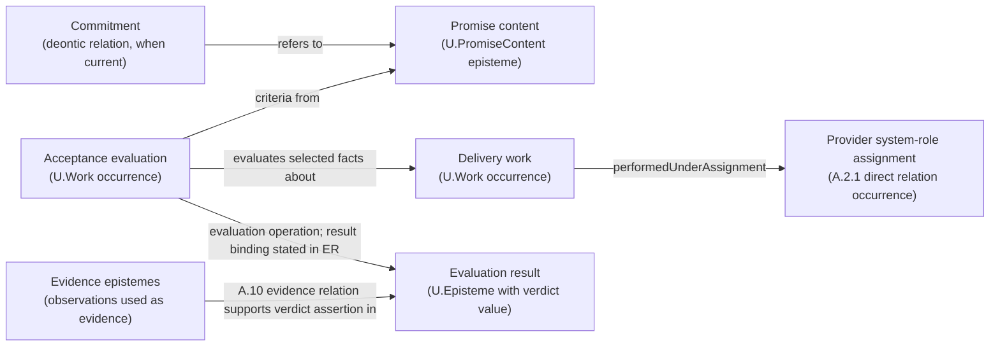

titioner identify which accepted stock can enter the brewing flow. That is a concrete supply condition for the café's service proposal. Establish the relation under the pattern that governs its predicate; E.18.NET supplies selection of the network needed for the question.

By contrast, grinding, dosing and wetting can be positions within one identified brewing structure. Examining that internal portion uses E.18; adding detail does not create a second flow. Keep the relation pattern's conclusion separate from any missing information needed to select the network, and carry both into the feasibility answer.

#### STR.8:4.3 - Diagnose the missing condition at the right subject

Distinguish the contribution's intended performer, the means used and the result needed. The following examples show different repairs:

| Observed or supported gap | Result to obtain | What would still remain separate |
| --- | --- | --- |
| No adequate way of doing the work is available | A qualified method or a bounded inquiry into a possible method | A person's ability to use it and actual provision conditions |
| A qualified performance account identifies a human capability gap | The appropriate learning and performance result | Organization access, assignment, time and support |
| The person can do the work but lacks effective access | The needed access under its owner's conditions | Capability development that is not actually missing |
| Several capable participants cannot complete the contribution together | A workable organization arrangement with its exception return | A tool installation or individual assessment alone |
| A product or platform cannot supply a required technical result | The relevant engineering result | Customer demand, permission and organizational acceptance |

These are diagnostic prompts, not a universal taxonomy. Name only the distinction that changes the next action. Missing observation may leave the cause unresolved; it is not evidence that the participant lacks capability.

If the strategy depends on a person's transfer from familiar to meaningfully unfamiliar work, HCD.12 supplies the bounded transfer account. Recover the earlier performance and permitted support first. If the difficulty is organization capability, OCE.9 supplies the complete contribution and exception-path realization after a selected design or authorized bounded attempt. Neither result proves the other.

#### STR.8:4.4 - Compare a smaller complete increment

Ask whether one attainable change can make the required contribution possible while preserving current work. An access repair, a supported hand-back or a focused capability increment may be enough. Compare it with retaining the current arrangement, obtaining the contribution externally or changing the direction.

A small increment must reach a useful result. Installing half a platform is not an organization-capability increment merely because it is small. Conversely, a bounded improvement in how a team accepts and uses an existing result can be valuable without a new major project.

Include learning, supervision, integration, dual operation and exception handling in the demand when they are needed. STR.14 resolves conflicts among simultaneous work; this pattern identifies which contributions and conditions it must reconcile. Financial affordability and permitted action remain separate professional questions.

#### STR.8:4.5 - Return supported feasibility or a precise dependency

Return the contribution, the supported relations that make it possible, and the first missing conditions that can change the strategy. State what can continue independently and which dependent commitment remains unavailable.

Ask the supplying practice for its smallest useful result. The request should name the contribution, subject, configuration, receiving use, horizon and limit that matter, not demand completion of an entire sibling framework. Use an available qualified direct result even when no published framework covers that practice.

After the result returns, update only the affected direction, option or commitment. A supported capability under one configuration remains qualified by that configuration; a successful demonstration with unusual assistance does not establish ordinary delivery without it.

Stop when the strategic comparison has the feasibility answer it needs or the external gap is known. Reopen when the contribution, participant, means, permitted use, support or shared resource condition changes enough to alter that answer.

### STR.8:5 - Archetypal Grounding

#### STR.8:5.1 - SensorCo: a platform is not a service capability

In the constructed SensorCo case, integrated service could use the installed physical sensor platform and field-service knowledge. The existing device and service contracts can support current obligations for twelve months. The proposed service direction still depends on demand, complete delivery cost and permitted use.

The team follows one prospective contribution: receive a customer's inspection question, obtain permitted observations, interpret them, supply the agreed answer and respond when the answer cannot be produced or accepted. Platform availability answers only part of that path.

Suppose the feasibility examination in this illustrative extension finds that the tool works, but the proposed service cannot yet name who covers incidents outside the ordinary support window. Replacing the tool would not answer that gap. The useful return is the required incident-support contribution and its cost, availability and responsible supplier. Dependent service commitments remain conditional; the four-day internal costing and trial-specification preparation can continue under its separate conditions.

The team also distinguishes three potential developments:

- An engineering change could make the platform supply a needed technical result.
- A participant may need practice and evidence of performance for a new interpretation task.
- The organization may need an effective path for accepting results and returning exceptions.

They may support the same service but do not become one development object. An attended course does not establish the organization's support arrangement; an accepted engineering output does not establish the person's transfer.

If a selected service design later needs organization realization, OCE.9 follows the whole contribution and its exception under the permitted conditions. If a particular person's unfamiliar-task performance is the missing premise, HCD.12 answers that bounded question. The StrategyTeam does not commission both merely because both patterns exist.

#### STR.8:5.2 - Joint demand changes the strategic promise

SensorCo has 80 shared-team person-days in the illustrative first month. Current service uses 52 and the incident reserve protects 8. A proposed 16-day service pilot, 8-day platform preparation and 6-day learning/support demand bring the total to 90.

All three proposals may be individually sensible while their joint configuration exceeds capacity. STR.8 returns the actual contributions and shared-person dependence to STR.14. Separate approval of three budgets would not supply the missing ten days.

A smaller proposed configuration uses 8 days for trial preparation and, only when separately permitted, initial use and interpretation; 6 for the platform subset; and 4 for targeted learning and support. With current service and reserve, it demands 78 days. That arithmetic identifies a candidate within the time ceiling; it does not demonstrate service capability or full economic viability. Customer time, permitted use, outside cost and acceptance still matter.

Only four internal preparation days are presently authorized in the connected case, from the eight-day envelope. The narrower current commitment and the larger possible configuration remain distinct.

#### STR.8:5.3 - The person has capability but no usable opportunity

A professional can already perform the relevant analysis, but their proposed arrangement grants no access to the inputs and no time to use the result. An additional course would not repair that condition. The next question concerns permitted access and work allocation.

In a constructed SensorCo extension, a capable analyst has a working credential for current-service observations, and the account-provisioning request is closed. The proposed trial needs a separately permitted use. Those facts establish neither that use permission nor a completed trial. The StrategyTeam identifies the intended beneficiary, data use, scope and period, and asks the authority governing that use to settle the permission question. FPF A.2.8.PER supplies the distinction between a current grant and work that actually exercises it. Failure to recover a grant does not by itself establish a prohibition. The separately authorized four-day internal costing and trial-specification preparation can continue under its existing conditions; it does not authorize the trial use.

Different descriptions can also concern one permission. Suppose the analyst describes what one identified grant permits and the administrator describes when that same grant expires. Both accounts point to the same act that granted the permission and the same beneficiary, permitted-use specification, scope and effective period, with that grant continuing under its governing policy. Their different concerns do not create two grants. Matching labels or visible attributes alone would not make separately instituted grants identical; a renewal or changed identity condition requires the question to be reconsidered.

If permission is then established but the technical path to the required trial inputs is unavailable, the missing contribution is provisioning under those conditions. A second permission request or another course would not fix that path. Successful provisioning in turn makes the inputs available; it does not perform the analysis or establish that its result is usable. The team can now request the analyst's actual contribution with the receiving question and acceptance condition, preserving any remaining allocation or support gap.

If genuinely unfamiliar work then exposes a performance gap, learning or transfer assessment becomes relevant. The earlier access diagnosis was not wrong merely because a different gap appears later.

#### STR.8:5.4 - A growing customer base does not fund the next round yet

In this constructed subscription-service case, one hundred customers are active at the beginning of the month. Twenty-four new customers enter and ten customers leave during the month; all use the same membership definition, with no other entries or exits. The closing base is 100 + 24 - 10 = 114. Fourteen percent growth describes this month's change, not a forecast that it will recur.

For a proposed further group, a qualified forecast gives twelve currency units of acquisition payment per customer now and fifteen units of later receipts net of provision and support payments, collected sixty days later. This first round has separate funding. The proposal is to fund another acquisition round after thirty days solely from those customer receipts. At that date there is no other available cash after current obligations and protected reserves.

The expected three-unit contribution per customer does not fund the thirty-day round: its receipts arrive later. The useful return is the missing financing or timing condition. STR.8 can compare a permitted earlier receipt, a later round or another supported funding arrangement; it does not assume one has been obtained. STR.9 compares the full resulting options when that account is sufficient, and STR.11 keeps the actual commitment separately authorized. The present service continues under its own adequate support.

### STR.8:6 - Bias-Annotation

A training provider may see every difficulty as a learning need; a technology provider may see a platform gap. Diagnose from the contribution and its failed condition before choosing the intervention.

Enterprise examples can also make formal reorganization seem inevitable. Compare ordinary continuation and a small complete improvement. Personal development retains the person's purposes and choice; a corporate capacity calculation does not supply a personal assessment.

### STR.8:7 - Conformance Checklist

- The proposed contribution, recipient and sustaining logic are clear.
- A growth-dependent direction has an explained population and funding loop with matching periods and material delays; an adequate existing account is reused.
- Material obtaining and exception relations identify what each participant must supply.
- Actual support, proposed arrangements and unknowns remain distinct.
- Method, person, organization, access and technical-result gaps receive different treatment when action depends on the difference.
- A small increment reaches a useful contribution, not merely a completed support task.
- Shared demands include continuing work and necessary protection.
- The return identifies the missing professional result and the dependent action it limits.
- Feasibility claims retain their configuration, evidence and authority boundaries.

### STR.8:8 - Common Anti-Patterns and How to Avoid Them

**The installed-platform conclusion.** A working tool becomes evidence of service delivery. Follow the result to acceptance and through an exception.

**Training for an access problem.** A competent person is sent to another course. Establish which condition actually prevents performance.

**Agility without cost.** Every component is made more changeable while ordinary provision loses support. Compare the useful change capability and its burden under the actual strategy.

**Three independent budgets.** A common team is allocated three times. Carry the shared dependence into one joint-capacity comparison.

### STR.8:9 - Consequences

The strategic comparison receives a supported feasibility claim, a narrower option or a specific missing contribution. Realization work can target the limiting condition, and already adequate means remain usable.

The account does not eliminate uncertainty. Some dependencies will need qualified external answers or observation of representative work. Keep the strategic return bounded so that it neither promises unrealized capability nor expands into every supporting profession's full task.

### STR.8:10 - Rationale

A direction's attractiveness and its attainability are different questions. Connecting provision and sustaining logic to actual conditions makes their relation inspectable without treating a business-model canvas as proof.

Different subjects develop through different contributions. A product can change while its organization cannot use the change; a person can perform while the needed access is absent. This is why the pattern diagnoses from the receiving result and preserves the separate professional returns.

### STR.8:11 - SoTA-Echoing

**How much capability for change should a strategy sustain?** [Teece's *Dynamic Capabilities: Foundational Concepts* (2025)](https://www.cambridge.org/core/elements/dynamic-capabilities/90101DC1EA1A6AFF9228C3FA4CD31930) relates strategic change to capabilities and the agility–efficiency trade-off. Adapt that line in sections 4.1 and 4.4: compare a useful configuration for the actual strategy instead of maximizing flexibility. The serious rival is efficient continuation with present capabilities; it wins when additional change capability costs more than its attainable contribution. The source is a theoretical synthesis, not causal proof of this configuration's performance.

For **diagnosing development at the right subject**, distinguish product change, organizational use, learning and enabling means within continuous development. This separation informs section 4.3's repairs. OCE.9's whole contribution and exception path and HCD.12's bounded unfamiliar-work transfer provide the more specific operational methods. A course or platform completion is the serious insufficient default, because it can leave the receiving contribution unavailable.

For **explaining whether customer growth can sustain the proposed direction**, adapt Ries's *The Lean Startup* (2011), chapter 10. Section 4.1 constructs the next-period population and funding path; section 5.4 separates observed growth from affordable repetition. This is more useful than choosing a sticky, viral or paid label when the actual loop or its timing is missing. [Roberts's 2023 financial-decision text, section 6.4](https://finance.wharton.upenn.edu/~mrrobert/resources/FDM/fdm-20230823.pdf), exposes the cash-flow, working-capital and discounting assumptions hidden in simplified customer-lifetime value. Use its financial qualification where the comparison needs it, not as a universal growth target or a requirement for a detailed model. The startup cases do not establish growth effectiveness; equal margins or referral coefficients do not establish equal calendar-time growth. Reopen when retention, acquisition, payment timing or delivery conditions change.

Reopen the diagnosis or method choice when representative work exposes another limiting condition, when a dependency changes or when an adequate lower-burden configuration becomes available.

### STR.8:12 - Relations

STR.5 and STR.6 supply the direction or option being examined. STR.8 returns the feasibility relations and gaps used by STR.9, STR.10 and STR.11. STR.14 reconciles their simultaneous demands. STR.12 supplies comparable observations when a sustaining claim depends on measured customer behaviour.

FPF A.6.P recovers an under-specified dependency claim; A.2.8.PER distinguishes the needed permission result from actual exercise. Use those contributions only for the question that remains unresolved. OCE.9 realizes an organization-capability increment under its entry conditions; HCD.12 tests a person's transfer when prior performance and meaningful novelty are established. Engineering, Operations, Finance and other professional practices retain their results and authority. For the cross-flow supply question illustrated in section 4.2, FPF E.18.NET selects the needed network of independently identified flow structures or nested networks and established cross-boundary relations. E.18 covers one flow structure and its internal portions; each relation claim is established under its governing pattern.

### STR.8:End

# Part III - Compare and Commit Within Authority

<a id="str-9"></a>
## STR.9 - Compare Robustness and Option Value

> **Type:** Method pattern
> **Status:** —

### STR.9:1 - Problem frame

Use this pattern when a preferred strategic option depends on uncertain conditions, or when keeping a later choice open is part of its attraction. Start by stating what the option must achieve, across which conditions, and which serious rival could become preferable.

The working result is a qualified comparison: where each option is acceptable, where preference reverses, which limits remain unresolved and what flexibility costs. It can support a recommendation or a narrower next commitment without supplying the authority to make it.

Robustness means that a stated performance or comparison condition holds across a declared range. Option value concerns the contribution of preserving a feasible later choice. Neither means guaranteed success in every future or a free ability to change course.

Reuse a sufficient comparison for the same options, configuration, horizon and criterion. A direct comparison or a justified probability-based model can be enough. More consequential reliance needs suitable domain evidence, model adequacy and assurance; stable outputs from an inadequate model do not establish a sound strategic choice.

### STR.9:2 - Problem

An option can win a weighted score while failing a protected condition. Another may be called robust because it wins under several nearly identical futures. A retained possibility may be treated as currently best even though it survives only for later exploration.

Flexibility introduces another overread. “We can switch later” can hide expired rights, unavailable capacity, slow observation or the work needed to preserve a fallback. An option description is not itself the ability to exercise that option.

### STR.9:3 - Forces

A common comparison basis makes alternatives intelligible, while genuine differences can resist one scalar ranking. Protected conditions, different beneficiaries and unresolved authority may need to remain explicit.

A bounded commitment can preserve future choices, but carrying and switching costs may make immediate commitment preferable. More analysis can expose a reversal while delaying the action that made the option valuable. The comparison therefore includes the cost and timing of both evaluation and realization.

### STR.9:4 - Solution

Compare complete options against the same question, then test the conditions that could change their acceptability or preference. Include the finite contribution to the current configuration and the actual conditions of future exercise.

#### STR.9:4.1 - Fix the comparison being claimed

Name the strategic subject, current configuration, alternatives, horizon, criterion and protected conditions. Use STR.6's complete-enough options and STR.8's supported or missing conditions. Compare the same question for every alternative.

Distinguish an option excluded by a current condition from one with a low expected benefit or an unresolved premise. Required permission is an eligibility question; uncertain demand is a consequence question. A missing estimate is not zero effect.

Use a qualified PSD.12 robustness account when it already covers the relevant configuration and variation. Strategy adds the effect on direction, commitment timing, capability and future exercise. A result for another horizon or a smaller configuration does not automatically answer this comparison.

When another participant's response can change the result, use STR.4's qualified response account for each candidate move. A common comparison basis can contain the same conditional response rule applied to different own moves, producing different responses. Do not hold the other participant's action fixed merely to make the columns look alike. Compare the induced outcomes, timing, full burden and protected limits; retain conditional results where the response premise is unresolved.

In STR.4:5.3, this changes integration's relevant outcome from promised maintenance to the provider's induced restriction. An effective prior interface transfer is a different arrangement to compare, not evidence that the original promise already prevents restriction. Ordinary comparisons under exogenous conditions remain sufficient when other participants' responses cannot alter the choice.

#### STR.9:4.2 - Choose the criterion that answers the actual decision

State what the chooser is trying to protect or improve. Expected-value comparison can be useful with defensible probabilities and a suitable value model. Under deep uncertainty, conditional performance, worst-case loss, regret or an acceptable region may serve better.

These criteria answer different questions. Worst-case comparison emphasizes the largest loss in the declared conditions. Regret compares an option's result with the best available alternative in each condition, under a common justified measure. A small regret does not make a breach of a protected obligation acceptable.

Keep material value disagreement explicit. A scalar can help only when its trade-offs are warranted for this use. Do not invent equal scenario probabilities, silently normalize unlike consequences or change the criterion after seeing the winner.

For a dominance claim, specify the compared characteristics, their preferred directions, conditions and evidence. Being no worse on every relevant coordinate and better on at least one can support dominance under that rule. A weighted-score win or a higher average does not establish dominance. Where a required consequence estimate is missing, leave the coordinate comparison unresolved. Non-dominated candidates still require a selection judgement.

#### STR.9:4.3 - Compare the whole finite change with the current configuration

Ask what would actually be added, removed or substituted. Include transition, support, recovery, common bottlenecks and displaced work. An indivisible training package or service commitment cannot be valued by multiplying an isolated local gain without checking its joint effect.

Use FPF C.11.CRC, *Configuration-Relative Contribution Comparison*, when this finite comparison is missing. It makes the current configuration, changed configuration, result and resource coordinates, interactions and option effects explicit. Reuse a sufficient existing account instead of making a second one.

When money is material, identify the offer or obligation behind each claimed change: who would pay or receive what, when, and under which demand and acceptance conditions over the chosen horizon. Use an adequate OPS.14 operating account for a bounded operating choice, or the qualified financial result needed for another use. Reconcile shared receipts, avoidable payments and displaced contributions once for each whole configuration. Disjoint feature lists or unchanged salaries do not establish those differences. Keep a missing estimate unresolved and reuse a sufficient account instead of commissioning another.

Before using a rate or priority score to compare whole financial results, recover its underlying quantity, denominator, interval and completion conditions through OPS.15. Determine any material delay loss from the actual changed receipts, payments or foregone contribution under the compared timing; postponing one receipt does not charge its entire value anew for every delayed period.

Compare an attainable addition with what is already there, not with an empty or ideal organization. Include the cost of obtaining the comparison separately from the cost of realizing its preferred option. Information that opens a later choice is not yet operating revenue or delivered benefit.

#### STR.9:4.4 - Find holding regions and meaningful reversals

Challenge a decisive assumption at the lowest effort that can expose its failure. Vary demand, cost, availability, model assumptions or a justified value judgement where those changes can alter the result. Test joint changes when shared causes, thresholds or interactions matter; changing one input at a time can miss them.

Separate the uncertain input, such as future demand, from the response created by a particular service or resource arrangement. If a central-input estimate could hide a material nonlinear response, use PSD.12 section 4.3.1's paired test or reuse a sufficient qualified analysis. Carry back the response values, tested domain, threshold result and limits on extrapolation. Equal test weights supply no event probabilities, and the same demand can affect two arrangements differently.

State where the option remains acceptable, where a rival becomes preferable and where the comparison is unsupported. Include a condition that defeats all present options when one is material. The least bad candidate is not necessarily admissible.

A new beneficiary, criterion or horizon may define a different comparison rather than a numerical perturbation of the old one. Preserve the earlier basis and make the change explicit. When the option set itself misses a serious response, return to STR.5 or STR.6 instead of treating the current ranking as sufficient.

#### STR.9:4.5 - Price the ability to decide later

For a staged or retained option, name who could exercise it, the observation needed, its expiry and the time required to respond. Determine what must remain available and what carrying it displaces.

Compare the retained flexibility with a serious immediate-commitment or continuation alternative. Include monitoring, coordination, switching and temporary exposure where they matter. An informative signal arriving after a contract becomes irreversible cannot preserve that decision.

When a failure condition suggests narrower exposure, specify what would actually limit the obligation or loss: changed admission terms, available support or a smaller complete service scope. Compare that arrangement through section 4.3. Keep an unqualified protection as a missing premise. A four-day preparation budget limits that preparation, not the service obligations of a later agreement.

Financial option valuation belongs to its qualified method and inputs. This pattern can compare reversibility and future choices without fabricating a monetary option price. A retained archive entry preserves reasoning; maintaining a working fallback can require an additional real contribution.

#### STR.9:4.6 - Return the comparison at its supported scope

State the preferred option or retained set under the chosen basis, the reason it beats the serious rival, the reversal conditions and the unresolved limits. A qualified recommendation, an infeasibility result or a worthwhile next inquiry can be complete.

Use STR.7 only when an attainable experiment could improve the choice enough to warrant its burden. STR.10 examines commitment consequences that remain unresolved, and STR.11 supports the separately authorized choice. Keep comparison, selection and actual resource commitments distinct.

Reopen when a changed option, condition, source result, criterion, timing or carrying cost can alter this comparison. Do not rebuild it because an unrelated source or file changed.

### STR.9:5 - Archetypal Grounding

#### STR.9:5.1 - SensorCo: preparation beats a viable rival only under stated conditions

All facts in this case are constructed. SensorCo can sustain its current device and service contracts for twelve months. The Board seeks a repeat paid contribution less exposed to generic-inspection price competition while protecting service and incident reserve.

Two prospective customers may discuss a bounded paid service trial next quarter at a price ceiling, subject to agreement and permitted use. Four funded internal days before the next Board consideration can complete costing and specify a possible trial. They could instead improve device diagnostics.

The current comparison concerns those four days and their contribution to the twelve-month question. It does not compare an already successful service business with an assumed failing device business.

For the exit comparison, assume that orderly exit and device continuation both satisfy the protected-service requirement under the three conditions below. The supplied comparison for this twelve-month decision includes the exposure avoided, net disposal proceeds, the best attainable use of released resources and any later consequence material to the choice. Under the Board's criterion, exit's supported advantages are outweighed by the continuing device contribution forgone and the full customer-transition burden.

| Condition at the relevant horizon | Comparison with device-only continuation and diagnostic work | Supported return |
| --- | --- | --- |
| Commoditization continues and an accountable-service opportunity remains attainable | Preparation can establish whether a relevant service arrangement is economically plausible; diagnostics improve the viable current direction but do not answer that question | Prefer the bounded preparation at the Board's accepted four-day sacrifice; keep the twelve-month service direction open |
| Purchasing freezes throughout the horizon, preventing a useful paid trial | The preparation no longer has the stated opportunity to inform this choice; device continuation supports existing obligations | Prefer device-only continuation and retain the four days for diagnostics |
| Data reuse is restricted | A permitted customer-local service might still be possible, while cross-customer licensing requires its own right | Continue preparation only if an attainable determination leaves a relevant permitted option; otherwise prefer device continuation |

The criterion is the Board's supplied trade-off, not a universal demand for experimentation. The third row is conditional rather than automatically pro-service. Licensing is not currently selectable without its required reuse right. Under the supplied whole-consequence comparison, continuation is preferable to exit. Reopen that comparison if an exit benefit, transition burden, continuing contribution or protected-service condition changes enough to reverse it; continuation need not become infeasible for exit to become preferable.

A complete cost calculation can also close the service question. If no relevant permitted configuration can cover delivery cost at attainable customer terms, the recommendation is device continuation without a trial. If a cost component is missing, the comparison remains unresolved.

Later capacity arithmetic answers another question. A proposed 78-person-day configuration fits the stated 80-day ceiling with protected service and reserve, but that alone does not show strategic merit or delivery capability. Within its six platform days, two preserve device-compatible interfaces and instructions, postponing a two-day service-diagnostic enhancement. That is the cost of the fallback through the first staged decision. It differs from the four-day device improvement forgone in the present preparation choice.

#### STR.9:5.2 - The criterion can change the answer even when the numbers do not

In a separate constructed public-service comparison, assume two configurations satisfy the supplied protected-access condition. A qualified model for this illustrative use gives the following waiting times under two stated demand conditions; neither condition has an assigned probability.

| Configuration | Condition 1: waiting minutes | Condition 2: waiting minutes | Worst waiting time |
| --- | --- | --- | --- |
| A | 10 | 12 | 12 |
| B | 4 | 16 | 16 |

If the responsible chooser minimizes the worst waiting time, A is preferable: 12 rather than 16 minutes. If the declared criterion instead minimizes maximum regret in waiting time, the best result in condition 1 is 4 and in condition 2 is 12. A's regrets are 6 and 0; B's are 0 and 4. B then has the smaller maximum regret, 4 rather than 6.

Neither calculation changes the stipulated waiting-time estimates or selects the public value rule. The practitioner returns the consequence of each rule for the responsible judgement. If B failed the protected-access condition, its smaller regret would not make it eligible. The example demonstrates a comparison distinction, not a public-policy prescription or a validated forecast.

#### STR.9:5.3 - SensorCo: two improvements can share one receipt

Consider a constructed later costing comparison, separate from the current four-day preparation and its authority. It concerns a device-health report offer, an alert offer and their combination for one prospective customer over the same twelve months.

Assume that either offer, or both together, would produce one incremental payment of 10,000 currency units at month 12 under the stated acceptance and payment conditions. The customer pays for one service, not for the number of independently developed features. The complete future additional payments within the horizon are 6,000 for reports, 5,000 for alerts and 11,000 for both. Existing receipts and payments remain unchanged, and the supplied account establishes no other material displaced contribution. Funding when payments fall due, resources and permitted service conditions are assumed available for this calculation; the arithmetic does not establish them.

| Compared future arrangement | Incremental receipt | Future additional payments | Incremental net cash over twelve months |
| --- | ---: | ---: | ---: |
| Continue without either new offer | 0 | 0 | 0 |
| Reports only | 10,000 | 6,000 | 4,000 |
| Alerts only | 10,000 | 5,000 | 5,000 |
| Reports and alerts | 10,000 | 11,000 | −1,000 |

Adding the two standalone net returns would give 9,000 by counting the same possible receipt twice. Under these assumptions, alerts have the strongest net-cash result. That is a conditional financial comparison, not the full strategic preference, an authorized service commitment or realized revenue.

Now change one premise: a qualified customer basis supports a further 8,000 payable only for the combined offer, with the other cash consequences unchanged. Its receipt becomes 18,000 and its net cash 7,000, reversing the financial ranking. If that extra payment is unsupported, keep it as an unresolved premise rather than adding it or silently setting it to zero. Combining improvements is not intrinsically bad; their actual joint contribution decides this comparison.

A supporting rate needs the same care. In a separate constructed account, two distinct results each pay 100 units on completion and take two and four hours sequentially on the same resource, with no other delay. Together they yield 200 over six hours, or 33⅓ units per hour, not the sum of their standalone rates, 75. By contrast, independent streams paying 100 and 50 in the same one-hour interval can jointly yield 150 in that interval. Recover the quantities, conditions and interval before aggregating.

These are undiscounted cash comparisons under supplied conditions. Earlier funding requirements and any material financing, timing or later effects still need the qualified account appropriate to the actual choice. The current preparation can obtain missing costing or customer answers without claiming that this later comparison has already occurred.

#### STR.9:5.4 - SensorCo: a central workload can hide the service exposure

This constructed extension examines the proposed 78-engineer-day first-month configuration, not the earlier four-day preparation decision. Fix its service scope, team and thirty-day window. A stipulated operating model gives total engineer-day demand, including the protected eight-engineer-day incident reserve, when zero, one or two additional trial requests arrive. These three request conditions are the model's stated test domain; none has an assigned probability.

| Additional trial requests | Total required engineer-days, including reserve |
| --- | ---: |
| 0 | 78 |
| 1 | 79 |
| 2 | 84 |

The PSD.12 paired comparison gives a central response of 79 engineer-days and an endpoint mean of 81 engineer-days, a two-engineer-day gap. This is not an expected workload. More importantly, the two-request response exceeds the actual 80-engineer-day capacity by four engineer-days. The central case's apparent fit therefore does not establish that the service scope can be supported under all three conditions. Removing the protected reserve is not an admissible repair.

One proposed response is to limit trial admissions to one and defer additional requests. That only narrows exposure if the actual customer terms permit deferral, the remaining service is a useful complete contribution, and the required admission and support arrangement is feasible. Those premises are not supplied here. The return is these three unanswered questions, alongside the failed two-request condition, not an asserted workload cap or a selected service commitment.

The Board can use permitted preparation to clarify that narrower arrangement and its full cost if this can change the choice. Existing device continuation remains a serious alternative. The earlier preparation authorization neither establishes the response model nor funds or limits a future service promise. A sufficient current capacity and terms account would be reused without another test.

### STR.9:6 - Bias-Annotation


A favoured strategy can determine the scenario set, weights and baseline before the comparison begins. Give its serious rival the same horizon, burden categories and evidential treatment.

Flexibility can be overvalued by people who enjoy exploration and undervalued by those rewarded for early commitment. Attribute the choice criterion and include the real cost of keeping later action possible.

### STR.9:7 - Conformance Checklist

- The alternatives share the receiving question, configuration boundary, horizon and comparison basis.
- Eligibility, missing support and consequence uncertainty remain distinct.
- The chosen criterion is explained; probabilities and scalar trade-offs have a suitable basis.
- A finite change includes interactions, transition, displaced work and protected results.
- The comparison identifies holding regions, reversals and material common failures.
- Future exercise has a responsible chooser, attainable timing and a carrying or switching cost.
- A dominance claim is supported under its stated rule and is not treated as selection.
- The return states why an option beats a serious rival and what could change that conclusion.

### STR.9:8 - Common Anti-Patterns and How to Avoid Them

**The average winner.** Good mean performance hides failure of a required condition. Separate eligibility from the comparison among eligible options.

**Robust in three versions of the same future.** Repeated similar scenarios supply little challenge. Test the materially different mechanism that could reverse the choice.

**Free option value.** The fallback requires maintained interfaces and scarce support that the plan omits. Include them or state the option's expiry.

**A new rule disguised as new evidence.** Changed preferences reverse the ranking, but the report says the old observation was wrong. Preserve both comparison bases.

### STR.9:9 - Consequences

The recipient can see the conditions under which the recommendation is useful and the point at which another option becomes preferable. Information priorities become tied to real decisions, and flexibility can be compared without pretending it is free.

The result can remain set-valued or conditional. That is preferable to a precise ranking unsupported by the model, evidence or legitimate value choice. It can still support a bounded current commitment.

### STR.9:10 - Rationale

Robustness, sensitivity, dominance and selection answer different questions. Keeping their results separate lets the practitioner use each contribution without assigning it another's authority.

The current configuration matters because a strategic addition interacts with what already works and with what must continue. The same nominal initiative can be attractive in one configuration and infeasible in another. A future option likewise has value through attainable exercise, not through its name.

### STR.9:11 - SoTA-Echoing

**How should strategy compare commitments under deep uncertainty?** Adapt the robust-decision and adaptive-pathway line discussed in [Lempert and colleagues' 2024 analysis](https://www.frontiersin.org/journals/climate/articles/10.3389/fclim.2024.1380054/full). Its use of consequential lower-confidence information changes sections 4.2–4.5: expose failure regions and feasible flexibility instead of optimizing against an unsupported single future. The serious rival is a qualified expected-value comparison, retained when its model and probabilities suffice. The source concerns climate assessment and methods, not evidence that one corporate strategy will succeed.

PSD.12 supplies the operational tests of holding regions, reversals and adaptive limits, including the bounded paired-response check when a central input conceals nonlinear exposure. Adopt those tests for the same comparison rather than repeating them. C.11.CRC supplies the finite configuration-relative contribution when an isolated score or marginal-rate argument misses interactions and indivisibility. This changes section 4.3 and the separate treatment of SensorCo's preparation, capacity and fallback costs.

For an operating gain's financial contribution, OPS.14 follows accepted demand through the actual incremental receipts, payments, timing and displaced use; OPS.15 recovers the quantities and event meanings behind an account. Adopt those bounded Methods when shared customer payments or unlike rates make an isolated initiative return misleading. An adequate existing financial account remains the cheaper alternative. The constructed cash comparison demonstrates the distinction, not a general financial advantage of one service design.

Reopen the method choice when defensible probabilities or better model evidence change the appropriate comparison, when a serious omitted option appears or when the timing and cost of future exercise defeat the flexibility claim.

### STR.9:12 - Relations

STR.6 supplies complete options and retention reasons; STR.8 supplies capability and dependency limits. STR.9 returns a qualified comparison to STR.10 and STR.11 and a decision-linked inquiry question to STR.7 when needed. STR.12 later relates actual observations to the stated reversal conditions.

OPS.14 supplies a bounded operating-financial consequence account; OPS.15 supplies the decision-specific quantities and aggregation when their meaning is unresolved. A different financial purpose retains its qualified professional Method. PSD.12 supplies robustness and sensitivity results within their declared scope. FPF C.11.CRC supplies a missing finite contribution comparison; C.11 governs local choice. C.18's archive/front distinctions keep retained exploration value separate from the current comparison and selection.

### STR.9:End

<a id="str-10"></a>
## STR.10 - Compare Commitments and Affected-System Consequences

> **Type:** Method pattern
> **Status:** —

### STR.10:1 - Problem frame

Use this pattern when a strategic option looks attractive but its actual obligations, displaced work or consequences for others remain unclear. Begin with the commitment someone could make now: what resources or conduct would it bind, for how long, and who or what would bear its consequences?

The working result is a comparison of bounded commitments and their material consequences. It makes the sacrifice, irreversibility, affected people and systems, protected conditions and unresolved professional questions visible before the choice is made.

A recommendation, an option description and a commitment are different results. A commitment binds specified resources or conduct through an authorized decision. Its scope is not established by a favourable score or a project title.

Reuse a sufficient consequence comparison when it concerns the same configuration, horizon and commitments. Do not open a comprehensive impact programme for a small question already answered by qualified direct evidence. Legal, financial, ethical, safety and other professional conclusions retain their own methods and authority; this pattern identifies their contribution without supplying it by implication.

### STR.10:2 - Problem

A programme's benefit is described at full scale while its cost covers only the first step. A pilot is considered reversible even though it creates customer expectations or removes the staff needed for current service. Costs shifted to another department or to participants disappear from the sponsor's comparison.

A second failure treats requirements as either unquestionable labels or negotiable weights. The requirement's present force and the merits of its protection are different questions. An attractive total benefit cannot silently remove a currently binding condition, while the condition's title alone does not prove that its design is proportionate.

### STR.10:3 - Forces

A strategic choice needs a usable account of consequences without requiring every possible remote effect to be modeled. An omitted consequence matters when a supported or credible pathway can change the choice, protection or inquiry.

Commitment can create coordination and make future contribution possible, while irreversibility can amplify error. Delaying commitment preserves some choices but can lose others. The comparison must therefore include time, affected parties and the actual continuation alternative.

### STR.10:4 - Solution

Describe the competing commitments on a common basis, trace their material consequences and compare them under the applicable protections and admitted trade-offs. Keep requirement appraisal separate from amendment and recommendation separate from authorization.

#### STR.10:4.1 - Name what would actually be bound

State the commitment's subject, decision holder, resources or conduct, duration, exclusions and conditions. Identify obligations that start immediately and those that depend on a later decision.

Separate preparation from execution and a bounded trial from continuing provision. If four days obtain an estimate, compare those four days and their result. If a service promise creates ongoing support, include that whole obligation in the relevant larger choice. A possible future benefit does not retroactively enlarge a current authorization.

Compare each candidate against the current arrangement and the same receiving decision. Include continued provision, a narrower commitment, deferral or withdrawal when it is a serious alternative. State when waiting itself creates a loss or new duty.

Distinguish the authority to choose an arrangement, a declaration, an actual duty and the means that could make later conduct credible. Where an individual duty is material, use FPF A.2.8 to establish its bearer, governed conduct, scope, period and actual governing basis. A duty can obtain even though breach remains possible. Determine separately whether available actions, information or incentives actually change, for whom and over which window.

When a proposed commitment changes later responses, compare that changed arrangement with the uncommitted alternative. Include its complete burden and lost useful freedom, and establish the actual means, scope, agreement and permissions before relying on them. Neither early commitment nor maximum flexibility is preferable by default.

#### STR.10:4.2 - Find who or what can bear a material consequence

Trace what the proposed action, failure, recovery or exit could change. Begin with the directly involved people and systems, then examine a plausible route beyond the familiar stakeholder list when it could alter the decision.

For example, a new support promise may divert staff from existing customers; ending one service may create transition work for a customer's operations. Keep the pathway and its evidential status explicit. A possible consequence is not an observed event or an established causal effect.

Use FPF A.1.CSD when discovering an omitted consequence-bearing system is the missing contribution. Use a qualified domain discovery result when it already covers the question. The label “community” or “ecosystem” does not by itself identify the actual bearer or establish a consequence.

Stop extending the search when further attainable discovery would not change the present comparison enough to warrant its burden. Return a consequential unknown when the pathway cannot yet be supported.

#### STR.10:4.3 - Compare the full consequence profiles

For each material commitment, state the contribution gained, resources consumed, work displaced, exposure created and recovery or exit needed. Include effects outside the sponsor's immediate budget and within the horizon that matters to the commitment.

Keep different consequences distinguishable. Time, money, service continuity, participant exposure and permission are not interchangeable because they fit in one table. Use a qualified PSD.9 value account and PSD.11 consequence comparison when available for this same question. A qualitative comparison is enough when it preserves the choice-changing difference.

Check interactions. Two initiatives may claim the same benefit or compete for the same incident team. Keeping a fallback may require work inside another initiative rather than an additional unallocated allowance. FPF C.11.CRC supplies a missing finite configuration-relative comparison; STR.14 resolves the corresponding simultaneous-work conflict.

#### STR.10:4.4 - Keep protected conditions and their merits distinct

Identify the condition currently governing action, its source, applicability and who can amend it. Apply that condition to the dependent commitment. Where its meaning or authority is unresolved, obtain the competent answer rather than selecting a convenient interpretation.

When the requirement itself is in question, examine the contribution it protects, its burden, alternatives and displaced protection. C.11.DUA supplies that appraisal with the relevant professional evidence. The answer may support retaining, revising, replacing or removing a requirement; a safety or compliance label alone does not settle those merits.

Return the appraisal and the actually available amendment route separately. Until an authorized revision applies, the current condition still constrains action. If no acceptable commitment or timely revision is available, return that impasse rather than compensating for it with benefits elsewhere.

#### STR.10:4.5 - Compare what reversibility would require

Name what can be restored, what cannot, who would act, the necessary time and the consequence of switching. A reversible technical change can still create irreversible disclosure, customer reliance or lost service time.

For a retained fallback, identify the enabling contribution and the sacrifice made to keep it available. STR.9 can compare its option value. If the required capability, permission or observation cannot be available in time, state the resulting limit on adaptation.

A temporary trial also needs responsible closure. Ending inquiry does not cancel an obligation already incurred. Prefer a smaller commitment when it preserves the worthwhile contribution and avoids exposure that the present basis cannot justify.

In STR.4:5.3, the provider's announcement leaves its restriction action available, while the qualified prior-transfer alternative removes that action for the needed window. Compare the latter's full consequences without treating a favorable model result as an effective transfer. The workshop's authority does not supply the other party's agreement; a recorded duty does not itself make the interface usable.

#### STR.10:4.6 - Return the supported commitment comparison

Return the serious commitments, their consequence profiles, protected conditions, admitted sacrifices, relevant reversibility and gaps. State which commitment is preferable under the given basis, which is unavailable and what could change that result.

The next useful result may be a recommendation, a request for one professional determination, a proposed requirement revision or a sufficient stop. STR.11 supports the authorized choice when that is the remaining question.

Reopen when the configuration, affected bearer, obligation, evidence, time window or governing condition changes enough to affect the commitment.

### STR.10:5 - Archetypal Grounding

#### STR.10:5.1 - SensorCo's small commitment and larger possible configuration

All conditions below are constructed teaching inputs. SensorCo can sustain current contracted service over twelve months. It has 80 relevant shared-team person-days for the illustrative first month: 52 for current service and 8 protected for incident recovery.

The team's comparison distinguishes the immediate four-day service preparation from two possible larger configurations:

| Candidate commitment | Demand and displaced work | Consequence for the choice |
| --- | --- | --- |
| Four internal days to complete costing and specify a possible trial | Already funded; no new purchase or customer-data use; postpones a four-day device-diagnostic improvement | Can be compared as a bounded information contribution while leaving the twelve-month service direction open |
| Original pilot, platform and learning/support proposal | 16 + 8 + 6 additional person-days; with service and reserve the total is 90 | Exceeds the 80-day capacity; separate budgets do not make the whole commitment available |
| Smaller proposed development configuration | 8 + 6 + 4 additional person-days; total 78 with service and reserve | Fits that time ceiling, but still needs the capability, permission, customer and financing conditions for dependent work |

The four preparation days are part of the smaller configuration's eight-day preparation/use envelope, not an additional four to add to 78. The current Board decision authorizes only those four internal days. The eighteen-day development demand remains a possible later configuration, not a present service promise.

Within the six platform days, two retain device-compatible interfaces and maintenance instructions. This postpones a two-day service-diagnostic enhancement and preserves a device return through the first staged decision. The two days are included in 78; the two remaining unallocated days are not counted again as fallback or incident reserve.

The consequence comparison also asks who bears trial participation time, travel, incident coverage and any transition burden. Those costs are not settled by the team-day balance. A proposal to license customer data needs the separately established right; apparent low operating cost does not make the missing right available.

The supported immediate recommendation remains four-day preparation under the supplied criterion, with viable device-only continuation retained. If complete costing already excludes every relevant permitted service arrangement, continuing devices is the useful result without a trial. A larger commitment needs the comparison for that larger scope.

#### STR.10:5.2 - Reconsidering a reserve is not spending it first

Suppose someone proposes using SensorCo's eight protected incident days to make the original 90-day programme look closer to feasible. Removing the reserve from the arithmetic leaves 82 days of demand, still above 80, and removes the protection the case requires.

A legitimate appraisal asks what incident exposure the reserve covers, what support and response evidence justify its size, what reducing it would displace and which alternative protects the contribution more efficiently. The competent owners supply that answer and any actual amendment authority. Until a revision applies, the comparison retains all eight protected days.

This is not an instruction to preserve every reserve forever. A supported change in workload or protection can justify revision. It is an instruction to compare protection and burden without silently treating a hoped-for revision as available capacity.

#### STR.10:5.3 - A public-service pilot can fail before benefit comparison

A municipal service proposes a temporary shift to one delivery channel. In this constructed case, a supplied protected-access obligation remains binding and the responsible body cannot suspend it. The proposal excludes the users who depend on the other channel.

A positive average waiting-time result does not cure that exclusion. The useful return is the unmet condition and a comparison of a configuration that preserves access, including its actual cost and feasibility. If no acceptable configuration is available, return the impasse. Calling the exclusion temporary does not make it admissible, and a larger survey does not determine the obligation's force.

### STR.10:6 - Bias-Annotation

Sponsor-centred accounting can omit customer, worker and partner costs. Recover a consequence through its affected bearer and pathway rather than assuming that those outside the budget are unaffected.

Attention can also overextend into speculative remote harm. Qualify the path and ask what a better answer could change. A bounded unknown is more useful than either an unsupported harm claim or a claim of exhaustive safety.

### STR.10:7 - Conformance Checklist

- Each commitment states what would be bound, by whom, for how long and under which conditions.
- Preparation, trial and continuing provision retain their different scope.
- The current arrangement and serious continuation alternatives are visible.
- Material consequences identify affected bearers, pathways, horizon and evidence limits.
- Full burden includes displaced work, shared resources, support and responsible exit.
- A fallback's enabling work and opportunity cost are counted once.
- Current requirements constrain action while their merits and amendment are examined separately.
- The return supports a bounded choice or a precise gap without claiming authorization.

### STR.10:8 - Common Anti-Patterns and How to Avoid Them

**One small line item, one large promise.** An initial fee is compared with a full-service benefit. Recover the continuing obligations before judging the larger commitment.

**Savings outside the sponsor's view.** Work is shifted to customers and called efficiency. Include their contribution, consent and burden where they affect the choice.

**Reserve as idle time.** Protected capacity is allocated before its purpose is examined. Compare an actual authorized change in protection, not a silently emptied reserve.

**Reversible because temporary.** A trial ends, but lost access or disclosed information cannot be restored. Name the consequence and closure conditions that remain.

### STR.10:9 - Consequences

The chooser can see the real sacrifice and the boundary of an available commitment. Hidden transferred costs, unsupported permissions and double-counted flexibility can change the proposal before obligations are created.

Some comparisons remain partial because a professional result or legitimate value judgement is missing. That limit can still support independent preparation, a narrower option or a justified stop.

### STR.10:10 - Rationale

A strategic commitment changes what participants may expect and which resources remain available. Its worth depends on the whole configuration and affected consequences, not only the sponsor's intended benefit.

Separating requirement merits from present force preserves both responsible criticism and reliable action. Separating advice from commitment allows a complete analytical return without assigning the analyst authority they do not hold.

### STR.10:11 - SoTA-Echoing

**How can affordable action remain accountable to its actual consequences?** Adapt the judgement requirement in [Rapp, Olbrich and Packard's 2026 article](https://doi.org/10.1007/s11846-025-00926-6) to the full commitment: available means and affordable loss still need appraisal. This changes sections 4.1, 4.3 and 4.5. The serious insufficient default counts only immediate sponsor spending. The source is a conceptual argument, not a universal method for valuing every affected party's loss.

PSD.9 and PSD.11 supply attributed values and compatible consequence comparison. Adopt their separation of protected conditions from compensable objectives and of consequence claims from actual effects. C.11.DUA adds the requirement-merits comparison without removing present force; this changes section 4.4 and the reserve example. A simple direct comparison remains preferable when it already covers the consequential differences.

The [OECD's 2025 policy-experimentation discussion](https://www.oecd.org/en/publications/oecd-science-technology-and-innovation-outlook-2025_5fe57b90-en/full-report/tools-for-agility-actionable-strategic-intelligence-and-policy-experimentation_288971cb.html) informs the separation of temporary inquiry from later continuation or phase-out. Adapt that point in section 4.5 without importing a policy process as a universal business procedure. Reopen the method choice when an omitted bearer, transferred cost, protected condition or exit effect can reverse the comparison.

### STR.10:12 - Relations

STR.8 supplies dependency limits and STR.9 the qualified option comparison. STR.10 adds the actual commitment, affected consequences and retained protection. STR.11 uses that result for choice; STR.12 later reconsiders only the affected commitments. STR.14 resolves shared-work conflicts.

PSD.9 and PSD.11 supply value and consequence accounts for the same use. FPF A.1.CSD discovers an omitted consequence-bearing system when necessary; C.11.CRC supplies finite configuration comparison; C.11.DUA appraises a disputed requirement. Their results leave professional authority and actual commitment separate.

### STR.10:End

<a id="str-11"></a>
## STR.11 - Select Strategy, Portfolio Commitments, and Assumptions

> **Type:** Method pattern
> **Status:** —

### STR.11:1 - Problem frame

Use this pattern when the strategic comparison is sufficient for a choice, but the proposed decision does not yet say what has been selected and what anyone is actually committing to. Begin by distinguishing a direction, alternatives retained for later choice, an intended joint set and authorized work.

The working result is an explicit, bounded strategic choice with its relied-on premises, resource and authority limits, exclusions and reconsideration conditions. When the engagement ends at advice, a complete qualified recommendation is the useful return; the recipient retains the decision.

Assumptions are premises on which the choice relies. Adopting them for a bounded decision does not make them true. Selecting a direction likewise does not make every initiative under it funded or feasible.

The practical gain is that participants can tell what to do now, what remains open and what answer is needed before further action. Do not reconstruct an adequate choice when only ordinary realization remains. Missing professional evidence or permissions still constrain their dependent commitments.

### STR.11:2 - Problem

“Approve the strategy portfolio” can mean several incompatible things. It may retain alternatives, prefer one direction, include several contributions for joint use or authorize their work. Participants can act on different readings of the same decision.

A second failure promotes the evidence during selection. Interest becomes forecast revenue, a partial estimate becomes full cost and an unresolved right becomes assumed permission. The selection meeting then appears to close gaps that no new result actually answered.

### STR.11:3 - Forces

A decision needs enough clarity to coordinate action without specifying every later task. Keeping uncertainty visible can support a bounded commitment, while leaving every clause conditional can make the decision unusable.

Several contributions may be worth using together but compete for shared resources or require different permissions. A strategic chooser may control direction and one budget without controlling customer consent, technical acceptance or every operating limit.

### STR.11:4 - Solution

Select only the result supported by the current comparison and authority. State its scope, keep retained possibilities separate from joint use, and connect the commitment to the premises that would change it.

#### STR.11:4.1 - Recover the chooser and the result the choice must produce

State who receives the comparison and who can choose the direction or commitment in question. Recover the relevant authority from the actual arrangement; a job title alone does not establish it.

Ask what is being decided now. It may be a strategic direction, a bounded preparation, one commitment, a jointly used configuration, continuation, deferral or rejection of the present set. If the task is only to recommend, return the recommendation and its limits without reporting the recipient's decision.

Use FPF C.11 for the local choice over an adequate option set and comparison basis. If the set is still incomplete, return to STR.5 or STR.6. If a live inquiry could change the choice, compare its worth through STR.7 rather than adding an automatic trial.

#### STR.11:4.2 - Carry the actual evidence and uncertainty into choice

Use the comparison for these alternatives, configuration, horizon and criterion. Retain supported claims, material uncertainty and conditions that make a candidate unavailable. Apply a changed basis to all affected alternatives; do not compare one under an old assumption and another under a new one.

A PSD.10 uncertainty result can supply the bounded claim or unresolved question. Use it within its population, conditions and source limits. An interest interview cannot become a conversion forecast in the final decision merely because a financial table needs revenue.

Choose the smallest useful result the evidence can support. A sound preparation decision may leave the larger direction open. A sufficient negative result can justify continuation or rejection without another experiment. When a necessary condition is missing, narrow the commitment or return the gap.

#### STR.11:4.3 - Say what kind of set is being retained or selected

Distinguish the set's intended use before calling it a portfolio:

| Intended result | Meaning for the participants |
| --- | --- |
| Alternatives retained for later choice | The members remain possible rivals; inclusion does not commission their work |
| Ordered alternatives | The basis supports an ordering for the named choice, with its qualifications |
| Members included for one joint use | The members are intended to contribute together; their relations and joint conditions must support that use |
| Authorized commitments | Specified resources or conduct are bound through the decisions of the holders who can make them |

These meanings are not four compulsory stages. A sufficient direct choice may need no set declaration.

When a downstream recipient needs an explicit selected-set declaration, use G.5's *DeclareSetResult* branch with already identified members and a current choice or inclusion basis. State the intended use, inclusion conditions, ordering and supporting basis. Its *Shortlist*, *RankedShortlist* and *JointUseSet* results distinguish, respectively, the retained alternatives, ordered alternatives and all-member joint use in the table.

Before selecting joint use, inspect shared capacity, dependence, incompatible conditions and displaced work. STR.8 and STR.14 supply missing support and reconciliation. Several individually attractive options do not become a feasible joint configuration by appearing in adjacent rows.

#### STR.11:4.4 - Bound the commitment in practical terms

State what is selected, for what purpose and horizon, what resources or conduct it binds, and what remains excluded or conditional. Name who provides or allocates the resources and who authorizes the dependent action.

Keep the scope legible to the people who will use it. If preparation is selected, say what it may obtain and what execution it does not include. If a continuing obligation is created, include its support and exit conditions. Preserve protected current work and the cost of keeping a fallback available.

Use ordinary existing decision notes when they carry the needed reasoning. Retain enough detail that a later participant will not infer a larger commitment or stronger evidence than the choice supports.

#### STR.11:4.5 - Make assumptions and reconsideration usable

Name the premises that can reverse, narrow or invalidate the chosen scope. Include an adopted criterion or filter where a changed rule would alter future selection. State what answer would matter and who can reconsider.

Distinguish a warning, an occasion for renewed judgement and an already authorized stop. STR.12 can establish the observation and response relation when ongoing follow-up is needed. Do not invent a monitoring assignment if the choice is already complete and no subsequent reliance requires one.

Keep the serious rival and the reason it was not chosen. A preserved fallback needs the conditions and cost that make later exercise possible. A rejected direction can remain in ordinary memory without a standing work commitment.

#### STR.11:4.6 - Return the decision and its remaining boundary

Return the recommendation or actual decision under its correct name, with the comparison basis, scope, conditions and next permitted contribution. State who still needs to supply a financing, capability, permission or other result before a larger move.

The immediate question is complete when the recipient can understand the selected result and act within its actual bounds, or when the impasse is clear. Completion need not select a full long-term strategy. Reopen only a condition that can change the choice or its usable scope.

### STR.11:5 - Archetypal Grounding

#### STR.11:5.1 - SensorCo selects four days, not a service business

In this constructed case, SensorCo's device-only continuation can meet existing service obligations for twelve months. The StrategyTeam advises; the Board has the separately supplied authority to select direction and the bounded internal commitment.

The comparison retains devices, integrated service, licensing and segment exit as different strategic directions. Six interviewed customers expressed interest, but that supports only those responses. Two may discuss a bounded paid trial next quarter at a price ceiling, subject to agreement and permitted use. Full travel and incident-support costs are not yet known, and licensing lacks an established required reuse right.

The team's recommendation is:

> Use four funded internal days to complete service costing and specify the smallest worthwhile trial against the prospective customers' terms. Postpone the four-day device-diagnostic improvement. Protect current service and reserve, retain viable device continuation and leave the twelve-month service direction open.

The stated reason is comparative: an attainable cost-and-trial answer can open or reject a relevant repeat paid contribution less exposed to generic price competition, at the sacrifice the Board is willing to make. Device continuation is a serious viable rival, not a straw alternative.

The Board then selects that preparation and authorizes those four days. This is a separate constructed decision, not an event inferred from the recommendation. No new purchase or new customer-data use is part of the preparation.

The team also has a possible first-month development configuration: 8 days for preparation and, only when permitted, initial trial use and interpretation; 6 for platform work; and 4 for learning/support. With 52 days of current service and an 8-day incident reserve, that is 78 of 80. The four authorized days lie inside the eight-day envelope. The remaining development work is not authorized by that arithmetic or by the preparation decision.

The three development contributions are candidates for joint use in that configuration, not three independently funded projects. Their supporting conditions and actual later inclusion must be decided at the relevant scope. The four strategic directions remain alternatives; retaining them does not schedule them together.

The reconsideration conditions also remain explicit. A sufficient complete-costing result that rules out every relevant permitted service configuration supports device continuation without a trial. A full-horizon purchasing freeze removes the preparation's stated opportunity. A missing required right blocks its dependent use. For later permitted trial use, a shared-work forecast received before the next allocation and exceeding the 80-day ceiling while preserving reserve causes the service owner to suspend the dependent trial activity within its agreed authority; the Board reconsiders scope.

#### STR.11:5.2 - A filter admits a proposal, not its expenditure

Consider a constructed four-condition filter: this quarter, reduce customer rework, allow checking within two weeks, and avoid irreversible migration for now. The following applications illustrate the difference between fitting that filter and obtaining a resource commitment.

A reversible correction to error-handling information has a supported rework contribution this quarter and a feasible two-week check. It fits the current filter. A branding proposal without a supported rework contribution remains unresolved on that condition; an irreversible migration fails the current filter.

The decision holder can now compare the fitting proposal's contribution, whole cost and displaced work. Fitting the filter alone supplies no allocation. If the holder selects it, state the bounded work and actual resource decision.

Suppose the responsible body later changes the rule to allow irreversible migration with specified transition protection. That can reopen the migration's eligibility; the rework, time, checking, feasibility and authorization questions still remain. If the change was merely proposed, actual selection continues under the existing rule. Preserve the earlier comparison's basis rather than rewriting its observations.

#### STR.11:5.3 - A personal recommendation leaves the person's choice intact

A self-directed professional has eight discretionary hours per week. A proposed direction needs six hours of study and six of client development. An adviser can return that infeasibility and compare a smaller scope, substitution or deferral; the adviser does not allocate the person's hours.

If an attractive two-hour exploration cannot answer the live question, the person may postpone it. A complete recommendation can therefore end with a supported smaller option or stop, without adopting the larger direction or commissioning an assessment that the decision does not need.

### STR.11:6 - Bias-Annotation

Decision meetings can reward confidence and compress qualifications. Carry the same evidence limits into the final choice that governed the comparison; do not promote the claim at the moment it becomes consequential.

A single executive view can also hide separate holders of access, service, participant agreement and resources. Recover those authorities only where they change action, without turning an ordinary choice into an unnecessary administrative inventory.

### STR.11:7 - Conformance Checklist

- The chooser and the present decision are explicit, with advice distinguished from actual choice.
- The evidence and comparison basis concern the same options, configuration and horizon.
- A retained alternative set, intended joint use and authorized commitments remain distinct.
- Joint commitments have a supported common configuration, not merely attractive component scores.
- The selected scope states its resources, exclusions, displaced work and unmet conditions.
- Material assumptions retain their support and use limits.
- Reconsideration conditions identify the decision they can change and the responsible holder.
- A bounded preparation, continuation, rejection or qualified recommendation can finish the immediate question.

### STR.11:8 - Common Anti-Patterns and How to Avoid Them

**A portfolio word does all the work.** Participants cannot tell whether members are alternatives or joint commitments. State the actual membership use and separate resource decisions.

**Evidence strengthened at approval.** Six interested respondents become reliable forecast revenue. Retain the original claim and obtain the missing result before a dependent larger commitment.

**A conditional approval read as permission.** The team begins customer-data use while the required right remains unresolved. Name the permitted preparation and the stopped dependent branch.

**A direction as a blank cheque.** An adopted filter authorizes every fitting initiative. Compare each material commitment and obtain its actual allocation and authority.

### STR.11:9 - Consequences

Participants receive a usable decision whose scope and dependencies can be understood without reconstructing the meeting. Useful advice can finish at advice, and a small commitment can advance the question while a larger choice remains open.

The result can expose that different holders must still supply different conditions. That is an honest limit on the present choice, not a reason to label the entire strategy unfinished.

### STR.11:10 - Rationale

Selection connects a comparison to an actual chooser and a bounded result. Keeping result kinds distinct prevents an archive or shortlist from creating work by implication and prevents the analyst's recommendation from borrowing authority.

Explicit assumptions make a choice revisable without making it provisional in every respect. Some work can be firmly authorized now while another branch remains conditional. That distinction is more useful than either total commitment or indefinite hesitation.

### STR.11:11 - SoTA-Echoing

**How should strategic selection preserve the meaning of its result?** Adopt C.11's explicit local choice and G.5's distinction between retained alternatives and members included for one named use. The serious default is one “approved portfolio” label that hides incompatible instructions. Sections 4.1–4.4 instead declare the chosen result and its scope. G.5's declaration branch uses an existing inclusion basis; it does not create resource authority or repeat the choice. Ordinary decision prose remains the cheaper sufficient answer when no downstream set declaration is needed.

For **bounded commitment under uncertainty**, adapt the revisable-action judgement discussed by [Rapp, Olbrich and Packard](https://doi.org/10.1007/s11846-025-00926-6) and the robust/adaptive line in [Lempert and colleagues' 2024 analysis](https://www.frontiersin.org/journals/climate/articles/10.3389/fclim.2024.1380054/full). This changes sections 4.2 and 4.5: select an attainable bounded result with explicit assumptions rather than treating either a forecast or uncertainty as a reason for automatic full commitment or automatic experimentation. These sources supply conceptual and methodological contributions, not validation of SensorCo's strategy.

Section 5.2 uses strategy as a filter for ordinary proposal selection. Its four-condition example preserves the distinction between filter fit and actual commitment. Reopen the method choice when evidence, joint-use conditions, authority or an adopted comparison rule changes what the decision can responsibly settle.

### STR.11:12 - Relations

STR.9 and STR.10 supply qualified comparisons. STR.11 keeps the actual strategic choice and commitment bounded; STR.12 supports later reconsideration. STR.8 and STR.14 answer missing capability and joint-work questions instead of treating approval as their solution.

PSD.10 supplies decision-linked uncertainty within its original limits. FPF C.11 supplies local choice; G.5 supplies an exact selected-set declaration when required. Realization, resource provision, customer agreement and professional acceptance retain their own results and holders.

### STR.11:End

# Part IV - Revisit and Sustain Strategic Practice

<a id="str-12"></a>
## STR.12 - Observe Signals and Pivot, Pause, Stop, or Continue

> **Type:** Method pattern
> **Status:** —

### STR.12:1 - Problem frame

**Use this when** a material observation may change a strategic assumption, comparison, selection rule or commitment, or when a chosen commitment lacks a feasible way to detect such a change in time.

A service trial may approach a shared-capacity limit before its next review. A cost estimate may invalidate the reason for further inquiry. A new opportunity may matter even though every existing indicator is green. Conversely, an alarming news item may concern a market the chosen direction does not serve. The working question is what this information changes for this decision, not whether the dashboard changed colour.

Strategy is the wider practice. This pattern governs the connection from a strategically material signal to a qualified continuation or reconsideration of direction and commitments. It does not govern routine process control, generic source maintenance, emergency response or implementation of an organization change.

The practical gain is a timely response of the right scope: continue on an adequate basis, change one assumption, reconsider a bounded commitment, or apply a stop already authorized for these conditions. Useful independent work remains intact.

**Do not use this pattern** to reopen a decision for every source revision or calendar review date. Reuse an adequate follow-up arrangement for the same question and conditions. Apply a direct operational or emergency rule when that is the live work; a later strategic interpretation need not delay an already required protective response.

### STR.12:2 - Problem

Strategic plans often name indicators without naming the decision they can change. An observer notices a signal, a manager interprets it as an instruction, and work changes without anyone distinguishing a warning from a judgement or an authorized response.

Another failure is inertia disguised as disciplined follow-up. The team gathers evidence after the choice can no longer be changed, treats a missed observation as confirmation, or leaves a conditional commitment running while a necessary permission or assumption has failed.

Both failures are possible with a sophisticated dashboard. The missing connection is between qualified evidence, the particular premise it bears on, the receiving decision and a feasible response.

### STR.12:3 - Forces

| Force | Tension |
| --- | --- |
| Responsiveness and stability | Early signals can justify timely change; reacting to every fluctuation destroys useful continuity. |
| Detection and response delay | Frequent observation helps only if interpretation and authorized response can still arrive in time. |
| Focused testing and new concerns | Named signposts test known premises but may miss a new beneficiary, consequence or opportunity. |
| Local response and strategic authority | An owner may suspend a trial without having authority to change the organization's direction. |
| Learning and exposure | Another observation may improve the choice while consuming the capacity or opportunity that made the option worthwhile. |
| Traceability and burden | The changed premise must remain recoverable without creating a reporting system larger than the decision. |

### STR.12:4 - Solution

Connect the signal to its actual receiving use. Qualify what was observed, distinguish the kind of change, and obtain or apply only the response supported by the evidence and authority. An applicable PSD.14 follow-up result can supply this connection; add only the missing strategic consequence.

#### STR.12:4.1 - Recover what was actually chosen and what still depends on conditions

Separate the recommendation, the authorized choice, intended implementation and observed performance. A recommendation to prepare does not establish a commitment to the larger direction. A plan to perform a trial does not establish either permission or performance.

Recover the decision's subject, horizon, alternatives, protected contributions, resources and relied-on assumptions. Identify the actual holder of each decision material to the possible response. Use the existing STR.11 or direct decision account where it is sufficient.

For each live dependency, ask which conclusion would change if it failed. A problem formulation, eligibility rule, consequence estimate and resource authorization are different possible targets. Do not label the entire strategy invalid merely because one target changes.

#### STR.12:4.2 - Make timely observation and interpretation feasible

Name a small set of decision-significant observations, their sources, capable interpreters, receiving owners and required timing. Include a route for a material unanticipated concern where the exposure warrants it. An observation can be a qualified participant account or changed permission, not only a number.

Distinguish three things:

- A **warning sign** suggests that a premise deserves attention.
- A **reconsideration condition** requires a named judgement to be reopened.
- An **authorized response rule** permits or requires a specified action when its established conditions hold.

A metric threshold alone supplies neither the third nor a sound interpretation of the first two. Recover the basis of a threshold and the authority of the rule separately.

Allow for observation, interpretation and response delay. If the next allocation occurs on Monday, a Friday review of the following week cannot protect that allocation. Move the observation earlier, change the commitment, use a qualified proxy or state that the promised follow-up is infeasible.

Establish the necessary access, assignments and resources. State the effect of a missing observation and the arrangement's end or review condition. A proposed observer list is not an established service.

#### STR.12:4.3 - Qualify the signal before changing its receiving conclusion

Identify what was actually observed, for which subject, configuration and interval, by what means and with what uncertainty. Separate an observation from a forecast, a revised model and a proposed policy. Missing data do not mean that the monitored condition remains satisfied.

Ask whether the evidence changes a relied-on premise, its applicability, the comparison basis, an adopted selection policy or only the wording of an account. A corrected link with unchanged meaning need not reopen a strategic choice. A new data-use restriction can block a dependent trial even if the expected revenue remains attractive.

Use an adequate existing interpretation. Seek further evidence only when its attainable contribution to this decision warrants its complete burden and delay, under C.11.DUA. A sufficiently adverse whole-cost result can justify stopping further inquiry; uncertainty does not create an obligation to run an experiment.

If the decision needs to compare what proportion of customers or participants took a defined step, and the existing account is insufficient, construct an interpretable reading from the permitted evidence:

1. Name the event and counted unit. A visit, account, person and paying organization can give different answers. State what counts as the event, such as a first paid order, rather than treating every recorded interaction as success.
2. Group units by a relevant common entry rule, such as registration during a named month; this is a cohort. Choose a common period after each unit's entry, such as its first twenty-eight days. Preserve material differences in offer, eligibility, channel and exposure. The same reporting date does not give newer and older entrants equal observation time.
3. Recover the numerator and denominator under that definition. For a proportion of customers placing an order, count each qualifying customer once in the numerator and retain all customers required by the denominator, including known non-purchasers. Unfinished follow-up or missing records cannot be silently counted as no order or removed to improve the fraction. Reconcile the counts with their source events and transformations where the present reliance needs that check.
4. Report both counts and the fraction, the observation period and material gaps. Compare like-defined readings; return the limitation where the groups are not comparable. A larger total can coexist with a smaller fraction. Totals still matter when the receiving question concerns workload, cash or an authorized limit.

This gives a descriptive comparison, not an effect attributed to the changed product. Different monthly groups can also differ because of selection or surrounding conditions. C.16 supplies measurement interpretation and comparability; C.28 governs a causal use. If the decision needs that stronger answer, use a qualified existing result or consider a bounded comparison under STR.7. An observed equality or a difference not distinguished from uncertainty does not establish practical sameness: the uncertainty must be small enough for the difference that matters to this decision.

When a changed source requires discovering and revalidating several actual receiving uses, use A.10.1 for that bounded work. For one known dependence, the direct source-reliance and subject Method may suffice. Citation alone does not establish dependence.

#### STR.12:4.4 - Compare the warranted responses

Consider the responses that can still achieve a worthwhile result: continue unchanged, narrow scope, change timing, pause a dependent activity, stop it, or choose a different direction. Compare their consequences, displaced work, closing duties, reversibility and current constraints. A pause is not free if it loses people, access or an expiring option.

Preserve the distinction between the present conclusion and the later action. Advice that a premise has failed can finish as advice. An owner can apply an already authorized stopping rule within its scope. A change outside that scope requires the actual competent decision.

Reopen only the material contribution. A changed demand assumption may require a revised comparison under STR.9, not a new capability programme. A newly affected group can require STR.1 or STR.3 to reconsider the question. A changed method or selection rule has its own grounds; do not quietly alter the rule to protect a favoured option.

Continuing is a substantive possible result. State why the signal leaves the inspected decision adequate under its current conditions. Do not use that limited conclusion to certify branches that were not inspected.

#### STR.12:4.5 - Make the current result usable and close the bounded question

Return the qualified signal, affected premise, supported response or recommendation, material limits and receiving owner. State the change in scope, conditions or commitment clearly enough that another participant can tell what may now be done.

Preserve the earlier observations, comparison and decision as earlier occurrences. A later change in selection policy can alter eligibility without making the earlier observations false. Record an actual new decision separately from the recommendation that preceded it.

Keep independent commitments only where their present basis remains adequate. If evidence or authority is missing, name the affected gap and any applicable protective rule. Close this follow-up question once the bounded return is supported; continuing observation proceeds under its own scope, rather than making every earlier decision perpetually unfinished.

### STR.12:5 - Archetypal Grounding

The following cases are constructed teaching cases, not reports of performed trials.

#### STR.12:5.1 - SensorCo stops the affected work, not the whole company

SensorCo's Board has authorized four engineer-days of preparation while leaving the twelve-month choice between a viable device-only direction and service alternatives open. The preparation includes complete service costing and a feasible trial design. It authorizes neither customer-data use nor the eighteen-day larger preparation-and-trial configuration.

Suppose the completed costing adequately includes support, travel, incidents and the displaced device work, and makes the service alternative unattractive relative to device-only activity under the relevant conditions. The team recommends no trial and continued device-only activity for the present decision. The Board can close the larger inquiry on that basis. Four days already spent do not justify buying another experiment. A missing incident-cost component would instead leave this comparison unresolved; it would not be a negative cost result.

In a different continuation, suppose the required permissions and later trial allocation have actually been established. The agreed rule requires the service owner to suspend the dependent trial if the qualified forecast before the next month's allocation exceeds eighty engineer-days while preserving the eight-day protected service reserve.

The capacity owner supplies a qualified forecast before allocation that exceeds eighty engineer-days with the eight-day reserve preserved. The service owner applies the agreed suspension rule to the affected trial; the Board reconsiders its scope, timing or rival. The forecast concerns next month's planned shared workload. The service owner's authority covers suspension of this trial, not redirection of the whole company. Independent device commitments and protected service continue under their existing authority.

If the same capacity issue is discovered during the original four-day preparation, there is no authorized trial to suspend. The result is an infeasible proposed allocation and a bounded return to the Board. Recovering the actual commitment changes the correct response.

#### STR.12:5.2 - A changed filter is not a changed observation

A working direction admits proposals that reduce rework this quarter, fit the available time, can be checked within two weeks and avoid irreversible migration. A proposal fits three conditions but fails the fourth.

Later, a participant suggests allowing irreversible migration where specified transition protection can be provided. That is a proposal to revise the filter, not evidence that the migration was always eligible. The responsible body compares the reason for the change and its consequences before adopting or rejecting it.

If the revised rule is adopted, the migration can be reconsidered for eligibility under that rule. Its actual rework contribution, time, checkability, protection and resource allocation still require their own support. If the proposal is rejected, the existing filter continues. Earlier observations do not need rewriting in either case.

#### STR.12:5.3 - A signal supports continuation

A professional has reserved two hours for an exploratory conversation. A general report predicts declining demand in another region, but the present conversation concerns an existing local client's known question and makes no demand-dependent investment.

A qualified inspection finds no dependence on that forecast. The person can continue the conversation within its original scope. This is a bounded no-impact conclusion, not a claim that all future client-development choices are unaffected.

#### STR.12:5.4 - More paid customers need not mean a better conversion result

A service is considering further spending on a revised onboarding offer. Its dashboard shows paid-customer counts rising from twenty to forty-five. The analyst recovers the registration groups and actual first orders instead of treating that increase as the effect of onboarding. Assume that the permitted records establish each customer's identity, entry and first-order date, with complete follow-up where stated.

| Registration group | Registered customers | Customers with a first paid order | Observation basis |
| --- | --- | --- | --- |
| January | 100 | 20 | Each customer's first 28 days |
| February | 300 | 45 | Each customer's first 28 days |
| March | 200 | 12 so far | Each customer's first 7 days only |

The observed twenty-eight-day proportions are 20% and 15%. More customers paid in February, but a smaller proportion of that registration group paid within the defined period. March's 6% after seven days is not its twenty-eight-day result. Without the older groups' seven-day readings, it cannot supply that shorter-period comparison either.

Suppose February also used a different acquisition channel. These records do not isolate the onboarding change's effect, prove that it is harmful, or establish the result for future customers. The analyst withdraws the claimed effect and returns the supported counts, proportions and uncertainty about that stronger inference. If an effect estimate is necessary for the next commitment, an adequate existing causal result or a worthwhile controlled comparison can supply it. The current descriptive correction can finish without another trial; the funding decision still needs its own comparison and authority.

### STR.12:6 - Bias-Annotation

Visible metrics can displace quieter changes in access, participant experience or affected interests. Begin with the receiving decision and its material conditions, not the available dashboard.

Sunk effort can favour continuation, while fear of being late can favour premature switching. Compare the still-attainable consequences and full response burden rather than rewarding either persistence or novelty by default.

### STR.12:7 - Conformance Checklist

- The actual recommendation, commitment and performance are distinguished.
- The signal has a qualified subject, interval, meaning and uncertainty.
- A behavioural proportion has a recoverable counted unit, numerator, denominator and follow-up period; its comparison retains material group differences.
- Its material receiving premise or decision is identified.
- Warning, reconsideration and authorized response remain distinct.
- Observation and response can occur within the relevant decision window.
- Continuing, narrowing and stopping receive a fair comparison where feasible.
- Changed policy is distinguished from changed evidence and actual authority.
- The result preserves supported independent work and names unresolved dependence.
- The bounded follow-up can close without commissioning further inquiry.

### STR.12:8 - Common Anti-Patterns and How to Avoid Them

**Dashboard command.** A colour change reallocates people without a qualified interpretation or decision. Recover the receiving premise and applicable authority.

**Late vigilance.** An accurate report arrives after an irreversible commitment. Design timing from the last useful response, including interpretation delay.

**Missing means green.** An unavailable report is treated as proof of continued adequacy. Return the observation gap and its actual effect on reliance.

**Pivot as universal virtue.** Every new fact produces a new direction. Compare continuation and the costs of changing the arrangement.

**Optimism as an obligation to spend.** A possible future improvement keeps an unattractive inquiry alive. Apply the same whole-burden comparison to the next inquiry as to other options.

### STR.12:9 - Consequences

Follow-up produces a decision-relevant return rather than an undifferentiated alert. Participants can tell what remains usable, what is paused, which question needs renewed judgement and who can decide it.

The method requires enough effort to establish interpretation and response, not merely collection. It may reveal that a promised observation arrangement is infeasible; the commitment must then respect that limit.

### STR.12:10 - Rationale

Strategic adaptation connects changes in circumstances to changes in action through evidence and authority. Keeping those connections explicit prevents both unauthorized reaction and unsupported continuity.

A revisable strategy need not be constantly revised. Preserving a qualified decision, stopping an inquiry on sufficient evidence and changing one dependent commitment are different successful outcomes.

### STR.12:11 - SoTA-Echoing

**How can a signal support timely adaptation without deciding the response by itself?** Adapt the distinction between switch points and observable triggers in [Lynch and colleagues' 2025 RAD analysis](https://www.usgs.gov/publications/rad-resist-accept-direct-switch-points-and-triggers-adaptation-planning). Its ecological adaptation cases inform sections 4.2–4.4's separation of observed indication, changed judgement and feasible response. They do not establish corporate trigger values. A periodic review remains the serious simpler alternative where the decision window and exposure permit it; an existing authorized control rule remains preferable for its direct operating question.

**What should change after observation?** Adopt PSD.14's qualified, scoped decision-support return rather than reopening the whole strategy after every source change. Sections 4.1, 4.3 and 4.5 preserve actual dependence and separate recommendation, later choice and performance. Section 5.2 distinguishes a new observation from a changed selection basis while allowing the problem account and filter to be revised. Revisit the arrangement when its signals, access, interpretation delay or response authority no longer support the receiving decision.

**How can a growth report distinguish volume from behaviour?** Adapt Ries's *The Lean Startup* (2011, chapter 7) by constructing comparable entry groups and reporting their counts as well as proportions in sections 4.3 and 5.4. A gross total alone is a weaker answer to a conversion question, although it may answer a capacity or payment question. The source's historical cohort examples do not remove time or selection confounding. [Microsoft's 2020 sample-ratio-mismatch account](https://www.microsoft.com/en-us/research/articles/diagnosing-sample-ratio-mismatch-in-a-b-testing/) supplies a concrete warning: filtering and missing units can reverse an experiment's apparent result. Retain its data-quality question, not a universal platform threshold or reporting workflow. Reopen interpretation when the counted unit, group membership, follow-up coverage or collection process changes.

### STR.12:12 - Relations

- **STR.1–STR.3** receive a changed strategic subject, assumption or problem formulation only where the signal changes that contribution.
- **STR.9–STR.11** supply the comparison and actual commitment to reconsider; their adequate independent results can remain usable.
- **PSD.14** supplies an applicable follow-up arrangement and qualified decision-support return.
- **C.16 and C.28** distinguish measurement construction and comparability from support for a causal use; **STR.7** supplies a bounded experiment design when further evidence is worthwhile.
- **C.11.DUA** bounds any proposed further evidence demand by attainable decision usefulness and whole burden.
- **A.10 and A.10.1** govern actual source reliance and, when needed, discovery of multiple affected uses; they do not choose the strategic response.
- **STR.13** receives a material method-learning question, while direct operating, emergency and organization-change Methods retain their work.

### STR.12:End

<a id="str-13"></a>
## STR.13 - Develop and Refresh Strategy Methods

> **Type:** Method pattern
> **Status:** —

### STR.13:1 - Problem frame

**Use this when** a strategic practitioner must choose, retain, adapt or retire a way of doing strategic work, or when later users cannot recover which method variant fits their situation and what supports that judgement.

A team may run a large scenario workshop for a choice already settled by an established constraint. Another may use a single forecast where materially different futures reverse the preferred direction. A third has useful experience in old documents but cannot tell which assumptions, participants or permissions made it applicable. The problem is not necessarily a missing technique. It may be the choice of technique, its explanation, available support or the loss of the reasons for using it.

Strategy is the wider practice. This pattern governs the strategic-method repertoire: usable ways of framing, generating, comparing, committing and reconsidering under particular conditions. A Method is a reusable way of doing; its description, a template, a tool and one performance are different things.

Distinguish that repertoire from the subject's way of obtaining its contribution. Finding how SensorCo could explain inspection errors is an STR.6 option-construction question; deciding whether the team's search routine can discover credible ways is a question here. If even the worthwhile contribution is unsettled, STR.5 supplies that earlier entry. Improving the strategy practitioner's Method does not itself obtain the customer's diagnostic result.

The practical gain is a supported present choice and enough retained reasoning for a later practitioner to reuse or reject it intelligently. Keeping the present method can be the complete result.

**Do not use this pattern** merely because the annual planning date arrived or a new technique is fashionable. Use the direct pattern for an ordinary strategic decision when the current method already suffices. Use STR.15 for an actual cultural-continuation question, and the direct learning or organization-change Method when capability, assignment or access is the missing result.

### STR.13:2 - Problem

Method selection often substitutes familiarity, novelty, conformance or one favourable outcome for practical worth. A method can be coherent and usable yet demand more effort or capability than the receiving decision warrants. Another can appear expensive while preventing a consequential error that a lighter alternative misses.

Maintenance compounds the problem. Every edited template becomes a new method, while a real change in entry or stop rules disappears into a document revision. Evidence from one team is silently attached to another variant or generalized to all strategy work.

A useful repertoire must therefore preserve both situated comparison and semantic identity. It must help someone decide what to do next, not merely catalogue names.

### STR.13:3 - Forces

| Force | Tension |
| --- | --- |
| Adequate judgement and burden | More analysis can improve a consequential choice while delaying it or displacing better work. |
| Reuse and situation fit | A familiar method carries experience but may not fit this uncertainty, authority or response window. |
| Stable meaning and useful adaptation | Small semantic changes can matter greatly; many visible document changes leave the method unchanged. |
| Local evidence and transfer | A useful local occurrence supports learning without establishing universal effectiveness. |
| Memory and accessibility | Retaining everything can preserve history while making the relevant reason difficult to find. |
| Method worth and actual use | A good method may remain unused because time, support or recognition is missing. |

### STR.13:4 - Solution

Start from the strategic decision the method must help, compare feasible alternatives at the strength of the available evidence, and maintain only the distinctions needed for later choice. ME.14 supplies the situated worth comparison; ME.15 supplies variant, provenance and reuse maintenance. Reuse adequate results from those patterns instead of repeating their work.

#### STR.13:4.1 - Name the receiving problem and the needed first result

State the strategic question, decision holder, horizon, uncertainty, stakes, available capability and support, current constraints and the last useful decision time. Name the first result that would help: a bounded frame, discriminating futures, comparable whole options, a sufficient cost comparison or a supported decision to stop.

Ask what is actually failing. The team may not know how to construct alternatives, may misunderstand an instruction, or may lack access to a qualified cost estimate. These require different contributions. A better method description cannot itself provide customer permission or shared capacity.

Recover the present method's operations, entry and stop rules, and the evidence for its current use. An ordinary existing account can suffice. Do not begin by commissioning a new method architecture or strategy platform.

#### STR.13:4.2 - Compare serious current alternatives

Include the current method, a feasible lighter or stronger alternative, a situation-specific branch and stopping the proposed method change where those can affect the choice. A support or capability change can be a serious rival to replacing the method.

For each alternative compare:

- the strategic result it can support and its material blind spots;
- the uncertainty and comparison basis it can represent responsibly;
- time, cognitive effort, coordination, tools and maintenance;
- required capability, access, assignments and authority;
- affected people, exposure, displaced work and reversibility;
- evidence strength, applicability limits and the remaining gap.

Keep observed performance, estimates and structural reasoning distinct. A completed workshop is not evidence that a better strategic decision followed. An adequate comparison may rely on credible estimates and constraints without pretending to have causal evidence.

Use ME.14 to return a situated keep, revise, replace, branch or stop, or a retained set with its unresolved limitation. A supported current course can coexist with an unresolved stronger claim. Further testing is selected only when its attainable decision contribution warrants the whole burden under C.11.DUA.

#### STR.13:4.3 - Change the right thing

Identify whether the proposed change alters reusable operations, dependencies, entry or stop rules, or only their description, representation or support. A clearer sentence is not automatically a new Method; a reordered decision rule can be a real semantic change even if its description needs only one sentence.

For a proposed variant, preserve the earlier way or source account, what is retained and changed, why it was changed and the intended situations. State which evidence for the earlier way still applies and what remains unsupported for the changed one. A traceable entry can preserve the proposal as a candidate and complete the present maintenance task.

When later users need to distinguish an identified FPF U.Method from a candidate proposal, use ME.15's independent admission step under A.3.1. Here admission means establishing a reusable way of doing, the kinds of participants it is for, its applicability and preconditions, intended result or preserved condition, and limits or stops. Establish that basis for the changed way itself or retain its candidate status. ME.14 answers the separate practical question of whether using or changing the way is worthwhile for this strategic decision.

For a non-variant change, name the actual object, the affected claim or edition and the needed maintenance action. Repair an ambiguous instruction where the ambiguity occurs and inspect its affected uses.

Obtain the relevant Method Engineering result when the open question is how to construct the method, whether its operations are coherent or whether it fits the intended conditions. Keep that answer distinct from section 4.2's comparison of its practical worth.

#### STR.13:4.4 - Preserve a repertoire that supports the next use

For each retained entry, make the problem, first useful result, method or candidate status, situation conditions, serious alternative and retention reason easy to recover. Keep the evidence and its limits attached to the exact semantics, performers, support and window they concern.

Where derivation matters, ME.15 preserves the relationship between variants and the separate descriptions and support editions. Where a downstream use needs an explicit set result, use G.5's applicable selection or declaration contribution. A declaration of an already selected set does not repeat the choice, admit its members or commission their use.

An existing working note, example, searchable discussion or method description may preserve all that is needed. Create a new card, diagram or archive only when it improves an actual retrieval or reuse problem enough to warrant maintenance.

Make retirement precise. Removing an entry from current offered choices need not erase its history or an adequate use elsewhere. State the conditions under which it should be reconsidered, not a universal expiry date.

#### STR.13:4.5 - Refresh affected uses and close the present method decision

When a source, alternative, capability, support condition or evidence claim changes, identify which current repertoire use depends on it. Use G.11 for the currentness or scoped-refresh question and A.10.1 when discovering several affected actual source uses is necessary. Neither produces a new strategic-method worth judgement by itself.

Retain independently adequate entries. A source update can finish with a repaired reference when meaning and applicability are unchanged. A failed transfer or changed constraint can require a new situated comparison or a narrower applicability claim.

Return what is kept, changed, branched or stopped, why, for which receiving work and under which limits. A qualified repertoire entry or a justified keep can close without another trial. If the method is adequate but is not transmitted, enacted or recognized, pass that distinct question to STR.15 rather than claiming that the worth comparison established cultural adoption.

### STR.13:5 - Archetypal Grounding

These are constructed teaching cases. Estimated burdens illustrate decisions, not measured comparative effectiveness.

#### STR.13:5.1 - SensorCo selects the analysis its current choice needs

SensorCo is considering device-only activity and service directions over twelve months. Several plausible futures can reverse the preferred commitment. Its team can use a qualified three-future comparison from STR.4 and STR.9, including whole service costs, permissions and the viable device rival. A single expected sales figure would conceal the decision's material uncertainty.

The method question changes if an authoritative restriction establishes that the service commitment under consideration is unavailable throughout the entire decision window. Suppose the restriction is sufficient for that eligibility conclusion and no feasible service alternative changes the present choice. Repeating the full scenario exercise cannot make that excluded commitment available.

The team then uses the established constraint and direct comparison to support the present device-only decision. It preserves the prior scenario reasoning for its qualified uses and possible later conditions. It does not infer that scenarios are generally worthless or that the company should never consider another service direction.

A useful repertoire can retain the following distinctions without inventing a universal ranking:

| Situation | Present method use | Reason and limit |
| --- | --- | --- |
| Several feasible commitments trade places across consequential plausible futures | Use a discriminating scenario and robustness comparison. | It exposes reversal conditions; it does not supply probabilities or authority. |
| A qualified constraint settles the present eligibility question and no live alternative changes it | Use the direct constraint and sufficient current comparison. | Extra scenario work does not change this choice; broader applicability remains unclaimed. |
| A necessary cost component is unresolved and attainable costing can change the choice | Obtain bounded complete costing before deciding on further inquiry. | A negative sufficient result can end inquiry; missing cost is not a negative result. |

The four-day preparation already authorized in the connected case remains a bounded allocation. A method preference does not enlarge it. If preparing a stronger comparison would exceed that allocation, the team must compare a smaller sufficient result, a different obtaining arrangement or a separate authorized decision.

#### STR.13:5.2 - A wording repair and a candidate branch

A strategy note says “approve the portfolio” where the established method already distinguishes retained alternatives from jointly authorized work. Readers repeatedly mistake a shortlist for allocation. The maintainer rewrites the instruction to name the actual result and checks the affected examples. This is a description repair, not a new method variant.

Separately, the team's present routine begins every direction inquiry with a full scenario workshop. It proposes a reusable change: test decisive eligibility constraints first, while retaining scenario work when it can still distinguish feasible choices. That changes an entry or ordering rule. It is a candidate branch whose preserved and changed semantics, intended situations and limits should be explicit.

The word change supplies no evidence for the new branch's effectiveness. A later local use can supply an occurrence with its conditions; it does not by itself establish transfer to a different team, decision or authority arrangement.

#### STR.13:5.3 - Retrieve the reason, not just the old answer

A practitioner retrieves a five-year-old device/service comparison. It contains a useful explanation of why incident support and data rights mattered. Its numerical estimates and permissions concern the earlier situation.

The practitioner retains the explanation and obtains the current conditions needed for the new choice. An accessible note pointing to the relevant reasoning can solve the memory problem. Rebuilding an archive or repeating the old recommendation is unnecessary.

### STR.13:6 - Bias-Annotation

Method specialists may overvalue analytical sophistication; incumbent teams may overvalue familiarity. Compare each against the same receiving result and credible full burden, including the best use of displaced effort.

A polished description can also hide weak transfer evidence. Preserve candidate status, contextual limits and the distinction between a method's plausibility, actual use and established contribution.

### STR.13:7 - Conformance Checklist

- The method question names a receiving strategic decision and useful first result.
- Current feasible alternatives include a sufficient incumbent or simpler course.
- Result, uncertainty, burden, capability, support, authority and reversibility inform comparison.
- Observations, estimates, contribution and causal claims retain their different reach.
- A semantic variant is separated from description, support and local Work changes.
- Retained reasoning supports actual later choice without automatic new record machinery.
- Candidate status and evidence remain bound to their exact subject and conditions.
- Refresh reaches affected uses without treating all entries as invalid.
- A justified keep, bounded repertoire result or stop can complete the question.

### STR.13:8 - Common Anti-Patterns and How to Avoid Them

**Annual method replacement.** A date or trend substitutes for a receiving problem. Retain an adequate method until a material choice warrants comparison.

**More analysis is always better.** A workshop continues after a sufficient constraint settles the decision. Compare attainable decision benefit with its full burden.

**New template, new Method.** A wording or layout revision creates false variants. Recover changed reusable semantics before naming a branch.

**Local success becomes a universal rule.** One favourable occurrence erases performer, support and situation limits. Preserve what the evidence actually reaches.

**Memory without a usable reason.** An archive retains answers but not their conditions. Make the relevant rationale and current-use limits recoverable.

### STR.13:9 - Consequences

Practitioners can select methods by the strategic result they need and explain why a lighter, stronger or different branch is worthwhile. Useful experience survives without every document revision multiplying the repertoire.

The result may reveal that the real missing contribution is support, capability or permission. It also leaves broad effectiveness claims unresolved when the present evidence supports only a bounded choice.

### STR.13:10 - Rationale

Strategic methods operate under different uncertainty, stakes, capabilities and authority. A situated repertoire preserves useful plurality without treating every method as equally suitable or searching for a universal winner.

Maintaining meaning and evidence separately from visible artifacts lets descriptions improve while genuine semantic changes receive the attention they need. Preserved reasoning supports later choice; a catalogue alone does not.

### STR.13:11 - SoTA-Echoing

**How should a strategic method earn its place?** Adopt ME.14's situated comparison of domain contribution, whole burden and current alternatives, rather than equating fit, popularity or task completion with worth. Sections 4.1–4.2 make continuation and a lighter sufficient method serious rivals. The contrast between a single forecast and uncertainty-sensitive judgement draws on [Lempert and colleagues' 2024 analysis](https://www.frontiersin.org/journals/climate/articles/10.3389/fclim.2024.1380054/full) and [Rapp, Olbrich and Packard's treatment of judgement under uncertainty](https://doi.org/10.1007/s11846-025-00926-6). These inform the comparison question; they do not prove a universal strategy-method ranking.

**What should a repertoire preserve?** Adopt ME.15's semantic-variant and evidence distinctions. The pattern also addresses how reasons, alternatives and criticism can be lost between people and tools. Sections 4.3–4.5 and cases 5.2–5.3 favour a retrievable qualified reason over automatic new variants or a larger archive. The repertoire retains several Methods and lets practitioners revise them as their uses change. Reopen the repertoire decision when a changed alternative, semantic rule, capability, source or supported use changes the situated comparison.

### STR.13:12 - Relations

- **STR.1–STR.12 and STR.14** supply receiving strategic questions and actual method-use experience; this pattern does not repeat their domain decisions. **STR.5** develops an unsettled contribution and direction; **STR.6** searches for and constructs the subject's obtaining ways. This pattern instead chooses or improves the Methods used to perform that strategic work.
- **ME.14** supplies situated practical worth; **ME.15** maintains variants, candidate lineages, provenance and reuse.
- **G.5** supplies an applicable selection or declaration result when a downstream set use requires it.
- **G.11** governs currentness and scoped refresh; **A.10 and A.10.1** govern source reliance and affected-use discovery where needed.
- **C.11.DUA** governs a proposed further evidence demand by its attainable contribution and whole burden.
- **STR.15** governs actual cultural continuation; direct organization-change and human-capability Methods supply their separate needed results.

### STR.13:End

<a id="str-14"></a>
## STR.14 - Reconcile Simultaneous Strategic Work Across Horizons and Scales

> **Type:** Method pattern
> **Status:** —

### STR.14:1 - Problem frame

**Use this when** individually plausible strategic commitments cannot coexist because current service, exploration, capability development, enabling means or governance require incompatible contributions, timing or authority across horizons or scopes.

The same engineer may cover incidents, prepare a platform and help trial participants. A strategy team may assume that a purchased tool creates an organization capability. A long-term direction may depend on a future provider while the present service cannot wait. None of these conflicts is resolved merely by putting initiatives in successive columns on a roadmap.

Strategy is the wider practice. This pattern reconciles strategic commitments when their work, means or decision rights cannot be considered independently. Relate who performs the work, how they do it, what they change or use and which contributions and decisions make the combined work possible.

The practical gain is a usable common configuration: what can continue together, what must change in scope or timing, which contribution is displaced and which external condition remains unresolved. A bounded reconciliation can finish without redesigning the organization.

**Do not use this pattern** for one clear scheduling question or a single missing capability result whose direct owner can already answer it. Use ordinary operations, resource planning, Method or organization-change guidance when that is sufficient. Do not redraw every structure because one local estimate changed.

### STR.14:2 - Problem

Strategic commitments are often evaluated one at a time. Each looks affordable, but together they exceed shared capacity or rely on the same unavailable performer. Alternatively, a local solution moves the burden: a team accelerates its trial by consuming incident reserve, or simplifies its process by giving unplanned work to a provider.

The description can conceal the conflict. A model of the future service is read as operating capability; a list of management roles is read as a work sequence; or current operations are treated as a phase that must finish before development starts. A useful future direction then appears feasible only because the account lost a different subject, contribution or authority.

### STR.14:3 - Forces

| Force | Tension |
| --- | --- |
| Present contribution and future capability | Development needs resources that may also protect current service. |
| Separate responsibility and joint feasibility | Different owners can authorize contributions without making their combination viable. |
| Timing and completeness | A smaller first increment helps only if it still supplies a complete useful result. |
| Multiple subjects and one strategic purpose | Product, organization, person and platform can develop together without becoming one subject. |
| Local gain and moved burden | A visible improvement can create delay, cost or loss in another scope. |
| Flexibility and carrying cost | A fallback preserves later choice while consuming work now. |

### STR.14:4 - Solution

Recover the concrete conflict and the unlike structures that change its answer. Compare different configurations, including continuation or stopping, and preserve the actual authority and realization conditions of the selected response.

For example, the order required by a trial method must fit the proposed work schedule and the availability of capable participants, while current service continues. C.32.MWA helps build one coherent account from these different relations when no single account settles the conflict. Reuse an adequate synthesis when available; relate its answer to the strategic direction, horizon and commitments.

#### STR.14:4.1 - Anchor the conflict in actual or proposed work

Name the strategic subject, receiving decision, useful contribution, relevant horizon and specific interference. Distinguish an observed conflict in performed work from a prospective conflict in a plan or intended-use case.

For actual practice, recover the qualified occurrence and conditions that support the claim. For a possible arrangement, state the proposed configuration, its assumptions and what would realize and later test it. A plausible plan is not evidence of successful performance.

Recover the relations that can change the conflict's answer. The following questions illustrate different relations to examine; use those relevant to the case.

| Question | Relation to recover |
| --- | --- |
| How is the required result obtained? | The parts of the way of working and any required order among its actions. |
| Which work interferes with other work? | Actual or planned work that overlaps, depends on another result or competes for the same person's time or other means. |
| What is being changed? | The work's relation to the product, organization, person or platform it changes. |
| What does the description represent? | The plan or model's correspondence to the work or subject being described, including a material condition it omits. |
| What makes performance possible? | The participant's needed capability and access, and the provider contribution on which the work depends. |
| Who can change the commitment? | Each decision holder's authority over the scope, timing, resources or permitted use at issue. |

In SensorCo, the proposed trial needs preparation before customer use and interpretation, but current incident response must remain available during that work. The same engineers contribute to both. The trial's order of actions and the staffing plan therefore answer different questions: what must precede customer use, and whether the required people can cover the overlapping demands. Compare them together.

Preserve these relations when comparing a narrower trial, changed timing or a qualified substitute. A sequence-only roadmap would hide the continuing incident demand, while a monthly total can hide the critical-day collision examined in section 5.1.

#### STR.14:4.2 - Trace the joint contribution and its binding conditions

For each material commitment, identify what it must obtain, when it is needed, who supplies it and which shared resources or permissions it uses. Include exception handling, support, recovery and closeout where the promised result depends on them.

Compare the same time window and units before adding quantities. A monthly person-day total can expose overload but conceal a critical-day collision, unavailable skill or forbidden use. Recover those conditions when they can change feasibility.

Distinguish authority over operating conditions, provision of means and capability gaps. The customer can control data access, the service owner can protect operating limits, the platform provider can supply a means, and a learner can need qualified capability. A strategy decision cannot replace their actual contributions.

Ask what a description leaves out. A roadmap may show milestones but omit overlapping support; an organization chart may show responsibility but not available performance. Add the missing relation to the decision account rather than treating the picture as the practice.

#### STR.14:4.3 - Construct and compare whole configurations

Consider alternatives that differ materially: narrow the promised result, shift timing, substitute a qualified provider, retain current service while deferring change, or stop a proposal that lacks a worthwhile feasible increment. Use internally sustained improvement when it can supply the missing contribution without a separate large transformation.

For each candidate compare the full finite change from the current arrangement: delivered and protected results, resources, timing, authority, uncertainty, displaced work, reversibility and affected interests. C.11.CRC supplies a missing configuration-relative comparison; reuse an adequate one.

Track moved burden. Reducing trial staff can increase provider support; moving training outside work hours can burden participants; delaying a platform feature can remove a fallback. Show the alternative work or contribution actually sacrificed.

Distinguish a feasible smaller whole from an unfinished fragment. A two-customer service promise still needs its permitted delivery and exception return. Do not call a demonstration successful delivery when the missing support is essential to the promise.

#### STR.14:4.4 - Reconcile the bounded commitments with their holders

Return the supported configuration and trade-off to the holders of the relevant decisions. They may alter scope, allocate work, change an authorized sequence, retain the current course or reject the proposal. State the actual decision separately from the recommendation and from conditions that remain pending.

A sum within capacity supports only that arithmetic result under its assumptions. It does not establish financing, participant agreement, capability, permission, value or safety. Obtain the missing professional result when the receiving choice depends on it, rather than requesting every neighbouring discipline by default.

Use OCE for a selected organization-capability change and OPS for actual service operation. Use the applicable human-capability and platform or systems-engineering contribution when those are the missing conditions. The practitioners responsible for those contributions retain their own work and authority.

If no feasible authorized configuration exists, name the conflict and its effect on the strategic choice. Deferral or a viable rival can be preferable to launching incomplete work.

#### STR.14:4.5 - Close the reconciliation and name its reconsideration condition

Return what can coexist, what changes, what is displaced, which limits remain and who holds any next required decision. Preserve enough of the comparison for participants to recognize the same configuration.

State the observation that would invalidate a material assumption and ensure it can arrive in time, using STR.12 where needed. Do not keep every independent commitment provisional because one branch awaits a contribution.

Close when the material conflict has a supported bounded resolution or an explicit external blocker. Reopen when timing, performance, capacity, provider conditions, authority or a newly exposed moved burden changes that resolution. The existence of several horizons alone does not require continual architecture work.

### STR.14:5 - Archetypal Grounding

These cases describe proposed arrangements under supplied teaching assumptions. They do not establish operating capability or actual intervention results.

#### STR.14:5.1 - SensorCo reconciles the shared month

SensorCo has eighty engineer-days available from a shared team in the coming month. Current service requires fifty-two; another eight protect incident recovery. The same people are needed for the proposed service trial, platform work and learning support.

| Work or protected capacity | Original proposal | Smaller proposed configuration |
| --- | ---: | ---: |
| Current service | 52 | 52 |
| Protected incident reserve | 8 | 8 |
| Trial preparation and separately permitted initial use and interpretation | 16 | 8 |
| Platform preparation | 8 | 6 |
| Targeted learning and support | 6 | 4 |
| Total engineer-days | 90 | 78 |
| Difference from the 80-day capacity | 10 over capacity | 2 unallocated |

Three separate budget approvals would not make ninety fit within eighty. Removing the eight-day reserve would still leave eighty-two and would breach the supplied service-protection condition. The team instead compares a smaller whole and device-only continuation.

The smaller configuration preserves current service and the reserve. Its eight-day trial envelope must include a complete bounded preparation and, only when separately permitted, initial use and interpretation. The platform subset and targeted learning must be sufficient for that actual service scope. If they are not, seventy-eight is merely the cost of an inadequate fragment.

Two of the six platform days preserve device-compatible interfaces and maintenance instructions. Only four remain for the service-specific subset. Retaining the device fallback therefore postpones a two-day service-diagnostic enhancement. These two fallback days are already inside the seventy-eight; they are not the two unallocated days. The fallback remains available through the first staged decision under the case's supplied conditions. Keeping it longer requires its own assessment.

The two unallocated days are not counted again as guaranteed incident reserve. They also do not prove that each critical day's staffing or required skill is available. The capacity owner must resolve any such material collision before a dependent allocation.

In a constructed timing variant of the seventy-eight-day configuration, the only analyst qualified for the initial customer interpretation has eight working hours available on Tuesday. Current service needs six; the interpretation needs four on that same day. The customer cannot yet accept a later result, and no qualified substitute is available. The proposal demands ten hours from an eight-hour day even though its monthly total remains seventy-eight. Two unallocated engineer-days elsewhere in the month do not supply qualified Tuesday hours.

The capacity owner returns this timing conflict before the dependent trial-use allocation. A changed customer deadline or a qualified substitute could permit a revised schedule; without either, defer that use and reconsider the service proposal. The monthly arithmetic, protected reserve and costed fallback remain valid. The collision concerns later customer interpretation, not the separately authorized four-day internal preparation.

At the present decision, the Board authorizes only four internal preparation days, taken from the eight-day envelope. The larger eighteen-day development configuration remains conditional. This four-day choice displaces a different four-day device-diagnostic improvement; it is not the two-day cost of maintaining the fallback.

The platform provider, learning participants and service owner must supply their separate results when later realization is selected. OCE.9 can guide a complete bounded organization-capability increment; the applicable HCD contribution establishes the needed learning or transfer result. A platform tool and a training attendance record do not establish the organization's ability to deliver the promised service.

The capacity calculation is not a complete economic appraisal. Customer time, vendor charges, data-use permission, financing and consequences for affected parties remain separately material conditions. If complete costing already makes the feasible service alternatives unattractive, device-only continuation can settle the choice without commissioning a trial.

#### STR.14:5.2 - A future provider does not solve today's conflict

An organization considers building a specialized internal analysis capability. A provider expects to offer a suitable service next year, but current work needs a smaller qualified result this quarter.

The team compares internal development, an available bounded specialist contribution and deferral. The future offer can influence the long-term choice, but cannot be counted as present supply. A small complete result may bridge the current need without recreating the future provider's full capability.

If no worthwhile intermediate result exists, the organization can defer or stop its proposed development. If a qualified ready service later becomes available, the case for continuing internal development changes. That is a new comparison, not evidence that the earlier provider promise had already been fulfilled.

#### STR.14:5.3 - The person is not spare organizational capacity

A professional has eight discretionary hours a week. A new practice would require six hours of study and six hours of client development. Calling one activity “personal development” does not make twelve fit within eight.

The person can reduce scope, substitute for named existing activity, obtain a different contribution or defer the plan. A smaller exploration is useful only if it can answer the live question. An adviser can compare these options; neither the adviser nor an employer allocates the person's discretionary hours by recommendation alone.

### STR.14:6 - Bias-Annotation

Managers may see only the capacity they allocate, missing customer effort, provider work or participants' personal time. Trace moved burdens to their actual bearers.

Roadmaps can also overemphasize sequential progress. Preserve real precedence where needed, but inspect concurrent operating, capability and support contributions instead of forcing them into stages.

### STR.14:7 - Conformance Checklist

- The conflict has a named strategic subject, contribution, horizon and decision.
- Actual work and a prospective configuration remain distinct.
- Selected structures preserve their different subjects and relations.
- Shared resources, timing, capabilities and authority inform joint feasibility.
- A serious alternative changes scope, timing, supply or the decision to proceed.
- Local gains expose displaced work and moved burden.
- A smaller configuration still supplies a complete useful result.
- Recommendation, actual allocation and pending professional results remain distinct.
- A resolved conflict or blocker closes the bounded question.

### STR.14:8 - Common Anti-Patterns and How to Avoid Them

**Separate budgets, shared people.** Every initiative is approved independently. Compare their simultaneous full configuration.

**Reserve as spare capacity.** A protected contribution is consumed to make a plan fit. Retain its current force and compare permissible alternatives.

**Tool equals capability.** A purchased platform is counted as an operating organization. Obtain the actual capability, access and exception-return results.

**Smaller means feasible.** A reduced plan omits an essential service contribution. Test the complete promised result, not just its total cost.

**Hierarchy by diagram.** Methods, subjects and overlapping work become universal levels. Recover their actual relations and the concrete interference.

### STR.14:9 - Consequences

Strategy can support a feasible bounded commitment while maintaining present contributions and future possibilities. Participants see the cost of a fallback, the burden of a local improvement and the precise result still needed from another holder.

The answer can be a smaller configuration, a changed sequence, continuation or stop. It may expose that arithmetic alone cannot settle a capability or authority conflict.

### STR.14:10 - Rationale

Several contributions can be simultaneous without being identical. Strategy needs a coherent account of their interaction, not one owner or lifecycle for all development.

Comparing whole finite configurations makes shared constraints and displaced contributions visible. Keeping realization and decision rights separate prevents a plausible synthesis from acquiring capabilities or permissions that no participant has supplied.

### STR.14:11 - SoTA-Echoing

**How should simultaneous strategic work be organized?** Adopt C.32.MWA's synthesis of unlike structures, comparison of moved burden and distinction between actual practice and future design. Sections 4.1–4.3 use these actions against the serious simpler alternative of a sequence-only roadmap. A direct schedule remains sufficient for one clear scheduling question; this pattern adds value when several different structures change the commitment.

The pattern relates multiple work horizons and the means that make later work possible. It separates developing subjects and their contributions within continuous organization development, as illustrated by SensorCo. This requires neither a universal hierarchy nor the assumption that a single project controls distributed cultural change.

For the tension between current efficiency and adaptive capability, [Teece's 2025 treatment of dynamic capabilities](https://www.cambridge.org/core/elements/dynamic-capabilities/90101DC1EA1A6AFF9228C3FA4CD31930) supplies a contemporary conceptual comparison. Sections 4.3 and 5.1 retain both protected current service and the cost of future flexibility; the source does not establish SensorCo's numerical capacity or validate its proposed configuration. Reopen the comparison when an actual shared constraint, provider contribution or moved burden changes the feasible whole.

### STR.14:12 - Relations

- **STR.8** supplies contribution and capability dependencies; this pattern reconciles their simultaneous commitments with current work.
- **STR.9–STR.11** supply the comparison and bounded choice; **STR.12** supplies material reconsideration.
- **C.32.MWA** supplies practice-architecture synthesis where several unlike structures need a coherent answer.
- **C.11.CRC** supplies a missing whole configuration-relative contribution comparison.
- **OCE, OPS, HCD and direct platform or systems-engineering Methods** retain their realization, operating and capability results.
- **STR.13 and STR.15** distinguish method choice from actual cultural continuation.

### STR.14:End

<a id="str-15"></a>
## STR.15 - Deliberately Continue and Change Strategy Culture

> **Type:** Method pattern
> **Status:** —

### STR.15:1 - Problem frame

**Use this when** a strategic-practice variant is being transmitted, enacted, recognized, selected, retained or lost, and the present question is what to continue or deliberately change in those relations.

A team may preserve rejected directions while decision meetings reward unsupported certainty. New members may receive a scenario template but never see how an inconvenient alternative affected a choice. A useful method may be understood yet remain unused because nobody has time or permission to perform it. Conversely, an existing way of discussing uncertainty may already work well enough that another culture initiative would add burden without useful change.

Strategy is the wider practice. This pattern governs cultural continuation and deliberate influence on strategic practice in a named population, organization, place and period. It does not equate culture with slogans, document collections or a universal organizational personality.

The practical gain is a small supported account of what is actually happening and a warranted continuation, change, branch or stop. An adequate account or decision to retain the existing arrangement can finish without an intervention.

**Do not use this pattern** when the whole question is which analytical method is worth using; enter STR.13. Use direct organization-change or learning guidance for a known assignment, access or capability problem with no unresolved cultural relation. Do not launch a cultural programme merely because one participant disagrees or one workshop has ended.

### STR.15:2 - Problem

Strategic culture is often inferred from stated values, attendance or publication. An organization calls itself experimental because it has an experiment form, or evidence-led because it stores reports. These facts do not establish what people actually enact, recognize or select.

The opposite simplification treats culture as something too diffuse to influence. It misses concrete relations: who introduces alternatives, how newcomers learn a practice, which objections remain visible, what decision holders reward and what future users can recover.

A project can deliberately change some of those conditions. It cannot infer actual transmission, persistence or improved decisions from its authorization or from completing the intervention.

### STR.15:3 - Forces

| Force | Tension |
| --- | --- |
| Continuity and change | Useful practices need preservation; habitual selection can also suppress better alternatives. |
| Visible material and enacted practice | Templates and archives carry distinctions but do not supply time, capability or authority. |
| Deliberate influence and distributed evolution | An intervention can target particular conditions without controlling every participant or later cultural result. |
| Recognition and decision quality | Confidence or popularity can attract attention without establishing contribution or evidence. |
| Local observation and wider claims | A few discussions may support a bounded account without describing the whole organization. |
| Learning opportunity and burden | More observation can improve a cultural decision while imposing work and exposure on participants. |

### STR.15:4 - Solution

Use C.36 to describe the cultural relations that matter to the present strategic-practice question. Compare continuation with a concrete change, keep the scope and evidence limits, and distinguish a proposed intervention from performed work and observed consequences.

#### STR.15:4.1 - Name the practice variant and the people and conditions in scope

Describe the strategic practice in ordinary words: for example, retaining serious rivals with their rejection reasons, distinguishing interest from demand, or returning a qualified uncertainty statement to a decision holder.

Name the population or participants, organization or community, place, period, relevant decision work and the variant or variants being compared. Include the tools and documents only where they carry, mediate or alter a material relation. A platform name does not identify the whole culture.

Recover a qualified actual account when describing current practice. If the account is prospective, identify it as a proposal or hypothesis. A local account must not become an organization-wide claim by dropping its scope.

The first result can be one sentence: “In this team, experienced analysts teach the alternative-comparison routine, meeting notes retain its reasons, but the next decision discussion omits unresolved cost claims.” That account still needs a basis for each asserted relation; its readability is not its evidence.

#### STR.15:4.2 - Separate the relations that can change the answer

Ask only about relations material to the case. The following questions help recognize them; they are not a required complete inventory.

| Cultural relation | Practical question |
| --- | --- |
| Generation and variation | How do new formulations, directions or ways of strategic work become available? |
| Transmission | Who passes the practice to whom, by teaching, copying, demonstration or another actual means? |
| Enactment | Who actually uses the practice in a qualified occurrence of strategic work? |
| Recognition | What is noticed, praised, criticized or treated as a competent contribution, and by whom? |
| Selection | Which variants or contributions are chosen for later use, support or further development? |
| Memory and retention | What reasons and examples remain available, and what is actually carried into later work? |
| Loss and mediation | Which distinctions disappear or become inaccessible, and how do tools, access or selection arrangements affect that? |

A retained document can support a memory claim without proving that a reader retrieved or used it. Attending a demonstration can establish attendance without establishing capability. A favourable decision outcome does not establish which cultural relation caused it.

Use the direct evidence, Work, measurement or causal Method when the receiving claim needs that stronger result. Preserve a useful qualified account when the stronger explanation remains unresolved.

#### STR.15:4.3 - Identify the specific continuation or change question

Locate the tension that changes action: unsupported confidence receives recognition, objections lose their context, a useful practice cannot be enacted within available time, or a source is reused outside its qualification window.

Consider different explanations when their consequences would change the response. Non-use may reflect poor practical worth, a misleading instruction, missing access, lack of capability or an actual selection practice. Do not diagnose unwillingness merely from a missing result.

If the method's worth is unresolved, use STR.13. If a description or source use is the issue, repair that contribution under its direct guidance. If time, capability or organizational support is missing, obtain the contribution rather than assuming that another message about values will supply it.

A sufficient account can justify continuation. An independently adequate archive can remain useful even while the meeting's recognition practice needs attention.

#### STR.15:4.4 - Compare feasible ways to influence the named relation

Compare keeping the arrangement, a narrow change, a branch for a different situation and stopping a burdensome intervention where those are meaningful alternatives. Name the relation each proposal would change and the work required to change it.

Possible actions include demonstrating how a qualified rival changes a real decision, preserving an objection with its receiving premise, changing discussion time, improving access to relevant reasoning, or changing what a decision holder explicitly recognizes. These are possibilities, not a standard programme.

For each proposal compare its attainable contribution, evidence, whole cost, delay, participant burden, exposure, displaced work and reversibility. Include the effort of designing the intervention before treating it as a freely available option. Further observation is selected under C.11.DUA only when it can improve the receiving decision enough to warrant that burden.

Establish the actual authority, participation, access and protection needed for a chosen intervention. A strategy team does not gain permission to alter employment recognition, disclose private discussions or impose extra participant work merely by naming culture as the subject. Use the applicable domain conditions.

#### STR.15:4.5 - Separate authorization, performance and observed change

State what is proposed or authorized, who will do what within which scope, the expected effect and what would support, narrow or defeat that expectation. Use the direct organization-change and learning Methods for their actual work when needed.

Later, recover what was performed separately from what changed in transmission, recognition, selection or retention. A revised agenda is an artifact change. Actual use of the new discussion arrangement is a further claim. Continued use across later decisions, and an effect on decision quality, require their own support.

Observe the decisive relation at a proportionate scope and time. Record missing observation as a limit, not as success. Compare the current result with the expected contribution and serious rival; a disappointing result can justify changing or stopping the intervention while retaining useful independent practice.

Do not infer that distributed cultural change is controlled by one project. Participants can adapt, reject or carry a practice elsewhere under conditions outside the intervention's scope.

#### STR.15:4.6 - Preserve what the next use needs and close

Return the bounded current account, supported continuation or change, material uncertainty and next action or stop. Keep the evidence and scope needed to distinguish the practice from its carrier, the intervention from its effect and a local result from a broader claim.

Use existing ordinary records where they suffice. A C.36 case or intervention card is useful when the receiving work needs those several claims kept together; it is not mandatory for every conversation.

Retain the reasons and conditions that future users need, including useful criticisms and alternatives. State when a changed population, source, tool, recognition practice or observed use would require reconsideration. Close the present question.

### STR.15:5 - Archetypal Grounding

The following observations are supplied within constructed teaching cases, not empirical findings about an actual organization.

#### STR.15:5.1 - SensorCo has memory but conflicting recognition

Consider SensorCo's strategy team and Board in its main office during the first quarter. For this exercise, materials from two successive decision discussions show that analysts preserve rejected directions and their reasons. The Board receives qualified uncertainty statements, including the distinction between interest from six customers and a supported sales forecast.

The same supplied account shows the chair praising confident sales numbers while the next discussion omits the unresolved travel and incident costs. The supported claim concerns these discussions and their materials. It does not establish the practice of every department or the cause of future commercial performance.

The team can now distinguish useful retention from the recognition and later selection problem. Replacing the archive is not the obvious remedy: it already preserves the alternatives. Issuing another scenario template also leaves the chair's treatment of unsupported certainty unchanged.

Compare three responses. Keep the useful archive and current discussion arrangement; add a template reminder; or change the decision discussion so the chair asks which qualified premise supports the preferred commitment and which serious rival remains. The third directly addresses the observed omission, while requiring discussion time and an authorized change in how contributions are considered.

Suppose the Board chooses that bounded change for its next two strategy discussions. The chair will invite a qualified uncertainty statement, retain a material counterargument with its receiving decision, and recognize a useful correction rather than a confident number alone.

Before use, establish the time, participation and permitted handling of discussion material. The proposed observation asks whether the relevant premise and rival actually reach the next decision and how they are treated. It does not count template completion as enactment.

At this point the completed result is a scoped account and an authorized plan for a bounded change. No later improvement is yet claimed. If the arrangement is actually used, its occurrence can support that local use; persistence or improved strategy needs additional qualified evidence. The existing archive can remain unchanged throughout.

Consider a separate constructed continuation after those two meetings. The supplied observations show the chair requesting qualified premises and the analysts stating the unresolved incident-cost question in both discussions. Each meeting preserves the cost objection with its receiving decision, and the chair explicitly recognizes the analysts' correction. In the subsequent commitment discussion, however, that premise is neither brought forward nor answered. The arrangement was used, but the expected carry-through to commitment failed in this case.

The Board stops extending this intervention in its present form and returns the specific loss between discussion and commitment preparation for redesign. The useful archive, original scoped account and actual use of the arrangement remain supported. This local failure does not establish failure of the whole culture or a causal effect on commercial performance; the Board retains the commitment decision.

#### STR.15:5.2 - Continuation is enough

In a different team, a qualified account of the recent review window shows experienced members demonstrating how to challenge a proposal, newcomers using that distinction in later discussions, and decision holders retaining the relevant objections with their response.

For the present question, no material loss or unsupported extension is identified. The steward can continue the arrangement and preserve the accessible examples. The account supports that bounded continuation, not universal superiority of the method. A new workshop or culture experiment is unnecessary unless it can change a subsequent decision.

#### STR.15:5.3 - Better access is not automatic transmission

A team moves an old strategic-method example into an easily found shared collection. That establishes a change in the example's availability under the supplied access conditions.

If nobody has yet retrieved or used it, the maintainer cannot claim that the practice has spread. A new reader may still need the example's old horizon, customer conditions and permission limits. Improving retrieval, qualifying current reliance and learning to enact the method are separate possible contributions.

The useful immediate result may be the accessible, qualified example. A claim about actual transmission or cultural persistence can remain unresolved without blocking that result.

### STR.15:6 - Bias-Annotation

Senior participants may mistake their own view for the whole organization's practice. Recover the scope and basis of each claim, including material differences between official accounts and observed use.

Visibility and confidence can be mistaken for worth. Preserve qualified criticism without presuming that every dissent is useful or that popularity is neutral evidence of contribution. Participants' burden and privacy also matter to any proposed observation or intervention.

### STR.15:7 - Conformance Checklist

- The practice variant, population, organization or community, place and period are bounded.
- Actual cultural relations have a qualified basis; prospective claims remain prospective.
- Transmission, enactment, recognition, selection, memory and loss are not collapsed.
- The specific continuation or change question has a serious alternative.
- Method worth, description, access, capability and cultural questions retain their different results.
- A proposed intervention accounts for whole burden, authority and participant conditions.
- Authorization, performance, local change, persistence and causal effect remain distinct.
- Existing adequate practice can continue without a new experiment.
- The result preserves the reasons and conditions needed for later use.

### STR.15:8 - Common Anti-Patterns and How to Avoid Them

**Culture by slogan.** Stated values are treated as ordinary practice. Recover what participants actually transmit, enact and select.

**Archive equals adoption.** A stored example is counted as a changed practice. Separate availability, retrieval, reliance and actual use.

**Training repairs everything.** Non-use is diagnosed as missing skill without inspecting time, permission, worth or recognition. Obtain the specific missing contribution.

**Intervention equals effect.** Completing a new agenda or workshop proves cultural change. Observe the named relation at its supported scope.

**One owner for evolution.** A project claims control over all later adaptations. Bound the deliberate intervention and separately describe distributed continuation or loss.

### STR.15:9 - Consequences

Practitioners can preserve a useful strategic practice and influence a concrete failure without treating culture as either an intangible slogan or a fully controllable system. The account makes it possible to keep a good archive while changing a harmful selection practice.

The method can expose that the evidence supports only a local account or a proposed intervention. That limit preserves useful immediate results while preventing premature claims about adoption, persistence or improved strategic performance.

### STR.15:10 - Rationale

Strategic practice continues through relations among people, work, descriptions, means and decisions. Those relations can vary independently: a method can be remembered but not used, used but not recognized, or recognized without adequate evidence.

Deliberate influence is most useful when it targets the actual relation and respects its conditions. Keeping continuation, intervention and observed effect separate makes learning possible without requiring every cultural question to become a new programme.

### STR.15:11 - SoTA-Echoing

**What is the useful unit of a strategy-culture question?** Adopt C.36's current relation-based cultural account rather than a vocabulary survey or a single culture score. Sections 4.1–4.3 distinguish variation, transmission, enactment, recognition, selection and memory only where they change the answer. C.36's contemporary cultural-evolution synthesis also keeps mediating systems and their selection effects visible; using a platform does not itself establish a cultural result.

The pattern addresses loss of reasoning, alternatives and criticism between people and tools because it can alter strategic practice. Sections 4.3, 4.6 and case 5.1 explain that contribution. The serious alternative is preserving the current arrangement or repairing access or description when that is the actual gap, rather than launching a broad culture programme.

**What can a deliberate intervention establish?** Keep C.36's distinction between project choice and distributed cultural change. Sections 4.4–4.5 require separate support for performance, changed relations, persistence and effects. This guidance informs the account and intervention question; it does not empirically validate SensorCo's proposed discussion change. Reopen the bounded conclusion when the population, receiving use, recognition arrangement, source conditions or observed continuation materially changes.

### STR.15:12 - Relations

- **C.36** supplies the cultural-evolution account and deliberate-influence distinctions.
- **STR.13** compares strategic-method worth and maintains the usable repertoire; an adequate method does not establish its cultural use.
- **STR.11, STR.12 and STR.14** supply actual commitment, follow-up and simultaneous-work conditions that can influence strategic practice.
- **OCE and HCD** retain actual organization-change and human-capability contributions when selected.
- **A.10 and A.10.1** govern current reliance on retained or changed sources where needed.
- **C.11.DUA** governs further inquiry by attainable decision usefulness and whole burden; direct evidence, Work, measurement and causal patterns govern the stronger claims that actually arise.

### STR.15:End

# Cross-pattern applications

## APP-STR-01 - Choose SensorCo's response to commoditized AI inspection

SensorCo is a constructed teaching case. Its numbers, participant assignments, observations and later events are supplied example conditions, not an empirical report or evidence that this framework has already improved an organization. Actual use needs the corresponding evidence and authority.

### The opening decision

SensorCo supplies physical inspection sensors and field service. Its generic AI-inspection price has fallen over twelve months. That margin previously helped fund service. The company has field-service knowledge and a certified sensor platform, but those assets do not establish demand for a new integrated service.

The StrategyTeam turns “find our AI strategy for 2027” into a bounded question for the Board: what can SensorCo responsibly pursue and commit to in the affected segment over the next twelve months while sustaining current service? Device-only continuation, integrated service, data licensing and exit remain alternatives.

The offering, SensorCo's service arrangement and the specialists' capabilities are different possible subjects of change. The existing platform can support a new contribution without supplying its data access, incident cover or acceptance conditions. A smaller improvement of an enabling condition remains an option alongside a new service initiative.

The team prepares the answer; the Board has separately established authority to select direction and bounded internal commitments. Data permission, customer agreement, financing and realized capability retain their separate conditions. This distinction permits a useful frame now without assuming that the eventual service direction has been chosen.

STR.1 can finish with this question. STR.2 next examines what the changed price premise affects. Its impact remains distinct from a changed customer population or an adopted rule of choice; each would require its own supported consequence. The later comparison will distinguish a four-day preparation decision from the still-open twelve-month strategy choice.

### Frame the uncertainty and preserve a serious rival

The price change challenges the contribution of another generic device offer; it does not prove that every device-only course is unviable. For this case, existing device and service contracts can fund the required current service throughout the twelve-month horizon.

The received PSD.10 uncertainty account concerns this same decision. Six interviewed customers expressed interest; that supports interest among those respondents, not an installed-base conversion rate. The service-cost estimate omits travel and incident coverage. The data-reuse right needed for licensing has not been established.

Two of the six customers are willing to discuss a bounded paid trial next quarter at a stated price ceiling, subject to agreement and permitted use. This is access to a possible trial, not orders or demonstrated demand. Four already-funded internal engineer-days can complete costing from existing records and specify the smallest relevant trial without a new purchase or new customer-data use. Only four discretionary days fall before the Board's next trial decision.

The Board's supplied criterion is to protect current service and its incident reserve, then seek a repeat paid contribution less exposed to generic-inspection price competition. It is willing to postpone a four-day device-diagnostic improvement for an attainable answer that could change the service decision. The criterion and trade-off belong to this case, not every Strategy use.

STR.3 therefore frames a choice about a differentiated contribution under decision-relevant uncertainty. Device-only continuation remains the serious present rival. Licensing is not selectable before the required right exists.

For the exit comparison, assume that orderly exit and device continuation both satisfy the protected-service requirement under the three conditions below. The supplied comparison for this twelve-month decision includes the exposure avoided, net disposal proceeds, the best attainable use of released resources and any later consequence material to the choice. Under the Board's criterion, exit's supported advantages are outweighed by the continuing device contribution forgone and the full customer-transition burden.

Continuation is therefore preferable to exit under these assumptions. Reopen that comparison if an exit benefit, transition burden, continuing contribution or protected-service condition changes enough to reverse it. Exit can become preferable while continuation remains feasible.

### Use different futures because they change the comparison

STR.4 and STR.9 compare the same twelve-month question under three plausible conditions. No probability is assigned.

| Future condition | Device-only continuation | Four-day service preparation | Consequence for the present choice |
| --- | --- | --- | --- |
| Commoditization continues and customers seek accountable service | Sustains current contracted service but does not supply the sought differentiated contribution. | Can establish whether an attainable paid trial is economically plausible and worthwhile. | Prefer the bounded preparation to those four days of device diagnostics at the Board's accepted sacrifice; the twelve-month service direction remains open. |
| Purchasing freezes for the full horizon | Sustains existing contracts without service-development work. | No customer can undertake a paid trial in time to inform this choice. | If established before preparation, continue device-only and retain the four days for diagnostics. |
| Customer-data reuse is restricted | Continues under its existing permitted uses. | A customer-local service may remain possible if its required use is permitted. | Continue preparation only while an attainable permission determination leaves a useful service option; otherwise prefer device-only. Cross-customer licensing is not a substitute for missing permission. |

This is a qualified comparison, not a forecast of three actual events. STR.5 retains different directions and their filters. STR.6 forms complete options within them rather than treating “AI,” “training” and “platform” as competing strategies.

A customer-local service can have an internal delivery option and a provider-assisted option with different support and access dependencies. Keeping a useful description of an unselected possibility is distinct from funding its trial. A new contribution or constraint can change the option space, not merely rescore old members.

### Decide whether more inquiry is worth doing

STR.7 first uses available incident records and complete travel-and-support costing. If sufficient costing shows that no feasible bounded service configuration can cover delivery cost at the customers' acceptable price, the useful return is device-only continuation without a trial. Missing a cost component is instead an unresolved comparison.

If a feasible trial remains and its possible results can change the commitment enough to warrant its burden, design the bounded trial. Its question concerns the two consenting customers' use and payment for the specified service and the bounded arrangement's ability to deliver it. It cannot establish general market demand.

Participant agreement, permitted use, exposure, actual resources, interpretation and closure must be established before the dependent work. An experiment on customer data cannot answer whether that use is permitted. The four-day preparation does not itself authorize execution.

### Make the whole proposed arrangement visible

STR.8 connects the service contribution to the actual service, platform, learning and support conditions. STR.10 and STR.14 compare the simultaneous configuration for the later shared month.

The team has eighty engineer-days. Current service needs fifty-two, with another eight protected for incident recovery. The initial proposal adds sixteen for the trial, eight for platform preparation and six for learning/support: ninety in total.

A smaller proposal uses eight days for bounded preparation and, only when separately permitted, initial use and interpretation; six for the platform subset; and four for targeted learning and support. With service and reserve, the total is seventy-eight. The remaining two days are unallocated, not additional guaranteed recovery capacity.

Two of the six platform days preserve device-compatible interfaces and maintenance instructions, leaving four for the service-specific subset. This postpones a two-day service-diagnostic enhancement. Those fallback days are already inside the seventy-eight and are different from both the two unallocated days and the four-day device improvement sacrificed for preparation now. The maintained fallback keeps a device-only return possible through the first staged decision; longer retention needs its own cost and capability assessment.

This smaller configuration is a candidate under the workload assumptions, not demonstrated capability. A critical-day collision or unavailable skill can still defeat it. If the reduced scope cannot supply a complete service contribution and exception return, it is an inadequate fragment, not a feasible successful service.

OCE.9 can guide the selected organization-capability increment. When realization is selected, the platform provider must supply the needed tool and access; the learning participants and provider must obtain the appropriate HCD result; the service owner must protect the operating limit. These required contributions remain separate. Customer time, vendor charges, financing and affected-party consequences also require their own applicable treatment: a person-day total is not the whole economic comparison.

### Select only the supported commitment

The team recommends four internal preparation days while retaining device-only continuation. The recommendation is preferable under the supplied criterion because the existing records and two customers' terms can still discriminate whether a relevant service option is worthwhile, at an explicitly accepted sacrifice.

The Board separately selects and authorizes those four days from the eight-day preparation/use envelope. It does not authorize all eighteen proposed development days, trial execution, wider service obligations or capital commitment. The twelve-month direction remains open.

STR.11 retains the PSD.10 limits in the decision: customer interest is not forecast revenue, incomplete costing is not a complete comparison, and missing licensing rights do not become available at approval.

### Reconsider in time and preserve independent work

STR.12 connects two illustrative signals to different returns.

A qualified next-month workload forecast above eighty engineer-days, with the eight-day reserve preserved, must arrive before allocation. If the dependent trial has later been authorized and the agreed suspension rule applies, the service owner suspends it within that authority and the Board reconsiders scope. During the original preparation, there is no trial to suspend; the team returns the infeasible proposed allocation.

If sufficient complete costing rules out a worthwhile service configuration during preparation, it can end the trial inquiry and support device-only continuation. If that sufficient adverse cost result is obtained only after an authorized trial, it blocks expansion and returns the preference to the Board. A missing necessary cost component leaves the comparison unresolved rather than supplying that negative conclusion.

These are case-specific conditions, not an automatic pivot rule. Changed permission, finance or affected-party conditions can also matter. Independent device commitments and protected service continue where their basis remains adequate.

### Sustain useful methods and cultural practice separately

STR.13 asks whether the scenario-and-staged-option method is worth retaining for the next question. If an established full-horizon purchasing freeze settles the present eligibility question, a sufficient direct comparison may be preferable to another scenario workshop. That does not invalidate the method under materially different uncertainty.

Suppose the team retains rejected directions and the Board receives qualified uncertainty, while recognition in the relevant discussions still favours confident sales claims. STR.15 can finish with that bounded account and a decision to keep the useful archive. A proposed change in how the Board considers premises and rivals needs its own authority, participant conditions and later observation. Publishing another template does not establish changed culture.

The connected case therefore produces several useful results without one universal cycle owner: a frame, a qualified comparison, a four-day commitment, a conditional larger configuration, external-result needs and timely reconsideration.

## APP-STR-02 - A professional considering a new practice

A self-directed professional has eight hours a week after current obligations. A proposed new paid practice needs six hours of study and six hours of client development. An adviser may supply qualified DOCA directions and their limits; the person retains the choice and their hours.

The first useful Strategy question can be commitment rather than opportunity construction. STR.5–STR.10 compare the current practice, a smaller exploration, a substitution for named existing work and deferral. The specified programme requires twelve additional hours a week, exceeding the available eight by four.

Compare a two-hour exploration with using existing information or postponing it. For example, a conversation with one prospective client may help clarify whether that client has the problem the proposed service would address. Its design must fit the permitted scope and include preparation and closure within the available time. The person can use the existing answer or postpone the exploration if the attainable answer would not improve this choice.

The result can be a smaller authorized personal commitment or a supported stop. Use the person's livelihood, learning aims and other purposes, including non-monetary ones, in the comparison. The person decides whether to accept the commitment.

## APP-STR-03 - A public service under deep uncertainty

A municipal service faces uncertain demand for two delivery channels. Its responsible body can reallocate a limited budget but cannot suspend a supplied protected-access obligation. These are example conditions, not legal advice.

STR.3 distinguishes uncertain consequences from a disagreement about whose access may be sacrificed. STR.9 compares service configurations under the same demand conditions; STR.10 preserves the protected limit. A temporary or inexpensive pilot excluding the most dependent users is not made acceptable by its average benefit.

For a separate numerical illustration, assume both A and B satisfy access protection. Their waiting-time estimates across two demand conditions are A: ten and twelve; B: four and sixteen. Minimizing worst waiting time favours A, with twelve instead of sixteen. Maximum regret instead favours B: A's regrets are six and zero, while B's are zero and four. Neither rule changes the supplied estimates.

The responsible body must make its actual criterion and choice explicit. Existing evidence may support continuing one channel with a reversible addition; a larger survey cannot decide the protected-value question. STR.12 then names the observation, receiving decision and capable authorized responder in time for a meaningful adjustment.

# Sources and refresh

## Source use and currentness

The source contributions below support particular actions, not independent confirmation of the entire framework or its constructed outcomes. Reuse a source at the strength, conditions and scope of its actual contribution. A newer date alone does not make a method better.

| Working question | Source contribution and selected use | Serious alternative and limit |
| --- | --- | --- |
| Which futures are worth constructing? | [Cordova-Pozo and Rouwette, 2023](https://doi.org/10.1016/j.futures.2023.103153), a review of scenario reviews, informs STR.4's discriminating futures. | A single qualified forecast can suffice; neither a two-by-two format nor general effectiveness follows from using scenarios. |
| How can a choice remain useful under deep uncertainty? | [Lempert and colleagues, 2024](https://www.frontiersin.org/journals/climate/articles/10.3389/fclim.2024.1380054/full), climate-assessment methodological analysis, informs robustness and adaptation in STR.9/12. | Optimization under one justified future remains useful. Transfer from climate assessment does not validate a corporate decision. |
| When should an adaptive course change? | [Lynch and colleagues, 2025](https://www.usgs.gov/publications/rad-resist-accept-direct-switch-points-and-triggers-adaptation-planning), ecological cases, inform the separation of signals and reconsideration in STR.12. | Periodic review or a direct authorized operating rule may suffice. The cases supply no universal corporate threshold. |
| How much agility is worth sustaining? | [Teece, 2025](https://www.cambridge.org/core/elements/dynamic-capabilities/90101DC1EA1A6AFF9228C3FA4CD31930), theoretical synthesis, informs capability and efficiency trade-offs in STR.8/14. | Neither maximal flexibility nor current efficiency is automatically best. The case's capability and cost claims need their own support. |
| Does revisable entrepreneurial action remove judgement? | [Rapp, Olbrich and Packard, 2026, online 2025](https://doi.org/10.1007/s11846-025-00926-6), conceptual analysis, informs qualified affordable-loss and commitment judgements. | Forecast-led and means-led approaches have different useful conditions; the argument proves no universal winner. |
| When is further inquiry worth doing? | [Camuffo and colleagues, 2024](https://doi.org/10.1002/smj.3580), randomized studies of teaching a scientific approach to firms, informs discrimination and legitimate termination in STR.7/12. | An adequate existing answer can end inquiry. The studies do not mandate an experiment or guarantee revenue in each new case. |
| Which alternatives should survive exploration? | [Toche, Pellerin and Fortin, 2020](https://doi.org/10.1017/dsj.2020.16), and [Al Handawi and colleagues, 2024](https://research.chalmers.se/en/publication/542239), inform selective retention and meaningful narrowing in STR.6–STR.9. | Immediate commitment saves carrying cost. Design research and a simulated component comparison do not establish universal strategic superiority. |
| How can a trial remain accountable? | [OECD, 2024](https://doi.org/10.1787/7b246309-en), and its [2025 STI Outlook chapter](https://www.oecd.org/en/publications/oecd-science-technology-and-innovation-outlook-2025_5fe57b90-en/full-report/tools-for-agility-actionable-strategic-intelligence-and-policy-experimentation_288971cb.html), inform bounded experimentation and later disposition. | A temporary pilot is not automatically permissible. Participation, rights, funding and professional determinations retain their own conditions. |

### Strategic-method synthesis

STR.5 and STR.6 distinguish reuse of a sufficient Method from search when the desired result or obtaining way is unclear. Their synthesis connects explanatory way construction and decision-relevant refinement with method plurality, useful intermediate possibilities and several work horizons. It imposes neither novelty nor a fixed decomposition depth on a sufficient existing use.

Strategy can denote a Method, an explanatory model, a choice or a filter; these uses answer different questions. Here, continuous organization development relates strategic direction to changes in the organization's work and capabilities. The subject's way of obtaining a contribution is distinguished from the strategic practitioner's repertoire. Personal and public-service strategies retain their own purposes; corporate return is not imposed on them.

The synthesis keeps five connected questions distinct: retaining and selecting useful search material; identifying what must develop and which means it needs; comparing the contribution of a whole finite arrangement; revising a problem account or comparison grounds; and preserving method reasoning while a practice continues through people and tools. Problem discovery and way generation can fail at different points; neither comparison nor execution substitutes for them. Complementary contributions may be needed at different times. Choosing a practice to transmit remains distinct from teaching it and observing adoption.

This is a conceptual synthesis for strategic practice. The worked cases illustrate the proposed moves under their stated conditions; they are not reports of field validation. Claims about actual performance, historical events or changing technologies need evidence at the strength and scope on which a decision will rely. The strategic actions needed for this edition are explained here and in the pattern bodies.

### Framework guidance and professional results

Use the named FPF pattern for its actual common contribution: A.10/10.1 for reliance and changed uses; C.11 and C.11.DUA for choice and worthwhile evidence; C.11.CRC for a finite configuration comparison; C.38 for complete comparable ways; C.17–C.19 for applicable characterization and search distinctions; C.32.MWA for unlike-structure synthesis; C.36 for culture; and G.5/G.11 for their selected-set and refresh questions. These references do not require all their apparatus in every Strategy use.

The Engineering DPF Suite's [Reference](ENGINEERING-DPF-SUITE-REFERENCE.md) helps locate the framework and pattern for the professional question.

- [Development Opportunity Construction and Development Direction Advising](DEVELOPMENT-OPPORTUNITY-CONSTRUCTION-AND-DEVELOPMENT-DIRECTION-ADVISING-PRINCIPLES-FRAMEWORK.md): DOCA.2 supplies contrasting leads; DOCA.3 separates and qualifies the worthwhile problem and proposed contribution, including provisional or negative returns. Reuse adequate DOCA.4/5 direction and reachability results or the DOCA.7 advising boundary when that is the missing contribution.
- [Problem Structuring and Decision Support](PROBLEM-STRUCTURING-AND-DECISION-SUPPORT-PRINCIPLES-FRAMEWORK.md): use the particular framing, values, uncertainty, consequence, robustness, recommendation or follow-up result. PSD.10's uncertainty limits remain operative in the SensorCo choice.
- [Organization Change Engineering](ORGANIZATION-CHANGE-ENGINEERING-PRINCIPLES-FRAMEWORK.md): obtain a selected capability increment or change/continuity result, notably OCE.9, without treating a design as realized capability.
- [Human Capability Development](HUMAN-CAPABILITY-DEVELOPMENT-PRINCIPLES-FRAMEWORK.md): obtain the needed capability, learning or transfer result for the actual holder and situation.
- [Systems Engineering](SYSTEMS-ENGINEERING-PRINCIPLES-FRAMEWORK.md) and [Operations Management](OPERATIONS-MANAGEMENT-PRINCIPLES-FRAMEWORK.md): obtain the specific product, platform, operating-capacity or service result.
- [Method Engineering](METHOD-ENGINEERING-PRINCIPLES-FRAMEWORK.md): ME.14 and ME.15 supply situated Method worth and variant/reuse maintenance for STR.13's strategy-practitioner repertoire. Those judgements do not themselves obtain the subject's customer contribution.

The DOCA, PSD and OCE contributions used here follow their 5 September 2026 source publications. When using a later edition, check whether the contribution's meaning and use conditions still fit. Other named contributions carry the specific pattern and result conditions stated in their receiving STR bodies. The adjacent file links are suite-relative: a standalone copy of Strategy does not contain the companions.

Financial, legal, safety or other professional conclusions may be available without a published sibling DPF. Use an adequate qualified result and actual permission where required. An absent product title is not a blocker; an absent necessary determination can be.

## Refresh the smallest affected use

Reconsider a source-dependent rule when a material later result changes the relevant comparison, transfer, burden or evidence reach. Reconsider a case use when its subject, horizon, assumptions, resources or authority no longer match. Preserve adequate independent results.

G.11 governs currentness and scoped refresh when those are the live questions. A.10.1 governs discovering and revalidating several changed-source uses when that is necessary. STR.13 returns the changed method-worth question; STR.12 returns the changed strategic decision. A corrected reference with unchanged meaning can finish without reopening either.

A current-looking file, intact link or completed rebuild establishes neither source applicability nor a useful strategic conclusion. If a necessary source or qualified result is unavailable, name the affected claim, its limit and the feasible next contribution or stop.

## Citation and reuse

Cite: Anatoly Levenchuk, *Strategy Principles Framework*, first edition, English working edition, 10 September 2026. For a specific pattern, add its STR identifier and title; retain the edition when the wording matters. Pattern identifiers are stable local addresses, not proof that all later editions preserve identical claims.

Original framework content is available under the CC BY 4.0 terms linked at the opening. Retain attribution and identify adaptations; third-party material remains under its own terms. The examples are constructed and make no claim of demonstrated organizational, financial or personal benefit.


# SOURCE_FILE: Engineering DPF Suite/SYSTEMS-ENGINEERING-PRINCIPLES-FRAMEWORK.md
---
# Systems Engineering Principles Framework

> A domain pattern language for bringing about and changing engineered Systems, from their intended use and architecture to realization, assurance, and continuing development.

- **Author:** Anatoly Levenchuk, with AI-assisted development and review
- **Version:** 11 September 2026
- **Status:** Eternal alpha: a published working framework, already used in analyses and worked applications, while continuing to evolve.
- **License:** [CC BY 4.0](https://creativecommons.org/licenses/by/4.0/) for original framework content; third-party material retains its own terms.
- **Publication:** [FPF repository](https://github.com/ailev/FPF)

Begin with the engineering question that blocks your project: the project System and its use, an architecture choice, a realization branch, an integration result, or the evidence needed for a decision.

Use the Table of Contents below to search by a familiar term or working question and find the relevant PatternID. Open the pattern and apply its Problem frame, Solution, worked cases, and checklist to the actual System, configuration, or engineering decision. Follow dependencies when a needed result is missing; engineering Work may otherwise overlap or begin from an already available result.

The Readme offers selected practical entries and Practical-Use Cards for connected use of several patterns. The Preface explains the recurring distinctions. The full Table of Contents also serves questions outside the examples, and the pattern bodies supply the working moves, conditions, and stops across kinds of engineered System.


# Table of Contents

Search the Keywords & Search Queries column for the engineering difficulty, subject, or result you recognize. Each row explains the pattern's contribution and links to its full body. The Readme offers selected starting examples; use the complete index for other working questions. Dependencies name result relations, not a mandatory entry order.

## Public units

| Unit | Reader use |
| :--- | :--- |
| [Systems Engineering Principles Framework Readme](#systems-engineering-principles-framework-readme) | Start from a recognizable engineering difficulty and choose one direct pattern or a small set of patterns. |
| [Citation](#citation) | Cite this framework or one pattern with its author, title, release date, and publication address. |
| [Preface](#preface) | Understand how 41 patterns connect common Systems Engineering, Platform Engineering and the selected software profile. |
| [Cross-Pattern Applications](#cross-pattern-applications) | Use two navigation walkthroughs and four worked applications in software, cyber-physical equipment and manufacturing. |
| [Framework Boundary and Refresh](#framework-boundary-and-refresh) | Check the publication's scope and professional source coverage, trace claims back to their sources, and find remaining profile obligations and reopen conditions. |

**Part I - Project Focus, Environment, Consequences, and Problem/System-Family Development**

| § | ID & Title | Status | Keywords & Search Queries | Dependencies |
| :--- | :--- | :--- | :--- | :--- |
| 1 | [SYSE.1 - Choose and Reopen the Project System-of-Interest](#syse1---choose-and-reopen-the-project-system-of-interest) |  | *Keywords:* project system-of-interest, intended System, project focus, product, solution, project boundary, outside effect. *Queries:* "Which System is this project actually changing or bringing about?" "Why is this the useful focus now, and what could reopen it?" Establish a shared project-system choice that lets later use, architecture, realization, and assurance decisions refer to the same subject. | FPF A.1.SCR, C.11 |
| 2 | [SYSE.16 - Recover the Systems and Conditions Needed for a Use Decision](#syse16---recover-the-systems-and-conditions-needed-for-a-use-decision) |  | *Keywords:* operational environment, suprasystem, using System, neighbours, interactions, operating conditions, context diagram. *Queries:* "Which surrounding Systems and conditions matter to this use decision?" "What containing, using, interacting, or boundary-crossing relations must the engineering account distinguish?" Recover the decision-relevant use context across its functional, constructive, interaction, and operating claims so the next concept or architecture choice has a grounded basis. | SYSE.1; FPF A.22 |
| 3 | [SYSE.17 - Find Systems That May Bear Engineering Consequences](#syse17---find-systems-that-may-bear-engineering-consequences) |  | *Keywords:* affected Systems, consequences, bystander, future operator, maintainer, ecological System, direct relation, possible path. *Queries:* "Who or what may undergo a consequence of this engineering change?" "Which supported relation or possible path makes that bearer relevant?" Discover and qualify consequence-bearing Systems while the project can still change its concept, constraint, alternative, probe, or stop decision. | SYSE.1, SYSE.16; FPF A.1.CSD, C.28, A.10 |
| 4 | [SYSE.2 - Develop Linked Use and System Concepts](#syse2---develop-linked-use-and-system-concepts) |  | *Keywords:* use concept, System concept, Concept of Operations, use case, scenario, user story, requirements, outside effect. *Queries:* "How will this System be used in a concrete situation?" "Which candidate System concept could support that use?" Link use claims to System-concept claims with their relevant neighbours, conditions, consequences, and uncertainty; expose the next architecture question or the missing use premise. | SYSE.1, SYSE.16, SYSE.17; FPF C.17 |
| 5 | [SYSE.22 - Coevolve Engineering Problems and System-Family Options](#syse22---coevolve-engineering-problems-and-system-family-options) |  | *Keywords:* problem formulation, System family, option generation, exploration, experiment, lineage, current alternatives. *Queries:* "How should the problem change when a prototype or operating observation reveals a new possibility?" "Which System-family options should remain under comparison now?" Develop problem formulations and possible System solutions together, preserving their lineage and returning new observations only to the choices they can change. | SYSE.1, SYSE.2, SYSE.6, SYSE.13; FPF C.11, C.17-C.19, G.11 |

**Part II - Architecture, Descriptions, Offerings, and Professional Contributions**

| § | ID & Title | Status | Keywords & Search Queries | Dependencies |
| :--- | :--- | :--- | :--- | :--- |
| 6 | [SYSE.5 - Develop Functional Organization and Bearer Alternatives](#syse5---develop-functional-organization-and-bearer-alternatives) |  | *Keywords:* function, functional organization, bearer, allocation, interface, operating mode, placement, redundancy. *Queries:* "Which different organizations could produce the required outside effect?" "How could Systems share or alternate the functional contributions?" Develop functional and constructive alternatives together with their proposed allocations, interfaces, integration dependencies, and evidence, giving the architecture decision materially different structures to compare. | SYSE.2, SYSE.16; FPF A.6.F, A.22 |
| 7 | [SYSE.6 - Decide and Reopen the Engineering Architecture](#syse6---decide-and-reopen-the-engineering-architecture) |  | *Keywords:* architecture decision, functional allocation, module boundary, interface, control, redundancy, product family, trade-off. *Queries:* "Which engineering architecture should the project choose for this use?" "Which evidence or changed condition would reopen that choice?" Select the decision-relevant structures, compare materially different alternatives and accepted losses, and state the constraints that later realization and specialist decisions must respect. | SYSE.2, SYSE.5; FPF C.30, C.32 |
| 8 | [SYSE.7 - Maintain a Decision-Usable Engineering Description Ensemble](#syse7---maintain-a-decision-usable-engineering-description-ensemble) |  | *Keywords:* engineering descriptions, model, requirement, CAD, simulation, digital twin, configuration, correspondence, contradiction. *Queries:* "Which claims across our models and records support this decision?" "Do they concern compatible subjects, configurations, intervals, and interpretations?" Maintain a usable ensemble of descriptions with explicit links to sources and returned evidence, justified correspondences, and identified contradictions that can change the engineering answer. | SYSE.6; FPF C.29, A.10 |
| 9 | [SYSE.8 - Develop an Integrated Offering and Provider Concept](#syse8---develop-an-integrated-offering-and-provider-concept) |  | *Keywords:* integrated offering, provider concept, service, access, consumables, maintenance, support, financing, risk allocation. *Queries:* "What continuing arrangement makes this engineered result usable?" "How do provider, access, and support choices change the technical concept and allocation of risk?" Develop the offering and provider concept alongside the System concept, naming the needed Systems, Work, promises, and supported contributions. | SYSE.2; FPF A.2.3 |
| 10 | [SYSE.9 - Request and Use Specialist Engineering Results](#syse9---request-and-use-specialist-engineering-results) |  | *Keywords:* specialist result, engineering contribution, receiving decision, safety, calculation, authority, evidence limits. *Queries:* "Which exact specialist answer could change this whole-System decision?" "What subject, configuration, conditions, and evidence must that answer address?" Use an adequate qualified specialist result or return its material limit. Select a new request only when its attainable contribution warrants the whole acquisition burden for the engineering choice; preserve the supplier Method and authority. | SYSE.2, SYSE.6; FPF A.15.9, C.11.DUA, A.6.REL, E.10.ROLE |
| 11 | [SYSE.10 - Assess Research, Model, and Trial Results for an Engineering Decision](#syse10---assess-research-model-and-trial-results-for-an-engineering-decision) |  | *Keywords:* research result, engineering model, simulation, experiment, prototype, field trial, formal proof, validity. *Queries:* "What can this research, model, or trial result support in our engineering decision?" "Which implementation correspondence or untested condition limits that use?" Assess what the result supports, its remaining uncertainty, and any need for further observation, so the decision uses partial knowledge within its justified limits. | SYSE.6, SYSE.7; FPF A.10, C.16 |

**Part III - Obtaining Engineering Results, Recursive Realization, Platforms, Independent Constituents, and Evolvability**

| § | ID & Title | Status | Keywords & Search Queries | Dependencies |
| :--- | :--- | :--- | :--- | :--- |
| 12 | [SYSE.24 - Choose How the Project Will Obtain a Needed Engineering Result](#syse24---choose-how-the-project-will-obtain-a-needed-engineering-result) |  | *Keywords:* make or buy, reuse, supplier, outsourcing, provider, AI assistance, integration burden, migration, exit, platform obtaining, repair, retain, share, build or buy. *Queries:* "How can the project obtain the same needed engineering result in different ways?" "Which arrangement includes the real assurance, support, capability, and exit costs?" Construct comparable whole arrangements and return a bounded choice, retained alternatives, worthwhile probe, or the premise that prevents comparison. | SYSE.1, SYSE.2; FPF C.11, C.18 |
| 13 | [SYSE.3 - Develop the Recursive Realization Network](#syse3---develop-the-recursive-realization-network) |  | *Keywords:* realization network, builder System, fabrication, adaptation, installation, qualification, build the builder, feasibility. *Queries:* "Which Systems and Work can realize the selected architecture?" "What is the first unsupported branch, including the means needed to build or change a builder?" Recover the bounded realization arrangement and select the next enabling action or the smallest earlier answer that infeasibility requires revisiting. | SYSE.6, SYSE.8; FPF E.18.NET, A.15 |
| 14 | [SYSE.11 - Integrate a System for One Bounded Use](#syse11---integrate-a-system-for-one-bounded-use) |  | *Keywords:* integration, bounded use, usable increment, installed interface, configuration, operating evidence, fallback. *Queries:* "Which actual configuration is usable for the intended purpose now?" "What still prevents locally completed parts or changes from working together?" Select one integration boundary, connect the contributing changes, observe the System in its resulting configuration during the named use, and return a configuration-specific result with evidence, limits, and fallback for the next decision. | SYSE.3, SYSE.12, SYSE.13, SYSE.18; FPF A.3.4 |
| 15 | [SYSE.12 - Develop an Engineering Platform for Practitioner Work](#syse12---develop-an-engineering-platform-for-practitioner-work) |  | *Keywords:* engineering platform, practitioner Work, model repository, manufacturing cell, test bench, AI assistant, evidence store, support, platform development, readiness, later use. *Queries:* "What must enable the engineers' actual modeling, building, testing, release, and observation Work?" "Which platform arrangement helps one Work family and obstructs another?" Develop and assess the enabling Systems and support through their contribution to practitioner tasks and the engineered result. | SYSE.15, SYSE.20; FPF A.2.2 |
| 16 | [SYSE.18 - Integrate Systems Governed by Different Agents](#syse18---integrate-systems-governed-by-different-agents) |  | *Keywords:* independent constituents, system of systems, interoperability, authority, interface, commitment, independent evolution, platform federation. *Queries:* "How can Systems governed by different Agents work together for this use?" "Which contribution or interface may change outside the integrating project's control?" Develop the bounded integration arrangement, identifying who governs each constituent and with what authority, how it may evolve, its operating conditions, and the evidence available. Name any agreements or observations still needed. | SYSE.6; FPF E.18.NET |
| 17 | [SYSE.23 - Choose What to Change So Later System Changes Become Easier](#syse23---choose-what-to-change-so-later-system-changes-become-easier) |  | *Keywords:* evolvability, future change, modularity, configurable family, builder platform, change lead time, test capability. *Queries:* "What should we change now so valuable later changes become easier?" "Is the limiting condition in the project System, its builders, the platform, or their joint arrangement?" Compare targeted changes against the stated future-change needs, dependencies, burden, and evidence for their expected contribution. | SYSE.22, SYSE.3, SYSE.6, SYSE.12, SYSE.20; FPF C.11, C.25, C.30, C.32 |

**Part IV - Configuration, Continuing Change, and Source Continuity**

| § | ID & Title | Status | Keywords & Search Queries | Dependencies |
| :--- | :--- | :--- | :--- | :--- |
| 18 | [SYSE.13 - Establish Configuration Identity, Variants, and Effectivity](#syse13---establish-configuration-identity-variants-and-effectivity) |  | *Keywords:* configuration identity, unit, variant, version, baseline, effectivity, installed state, bill of material. *Queries:* "Which actual or proposed configuration does this claim concern?" "For which units, conditions, and intervals does the evidence apply?" Establish the decision-relevant identities, differences, and effectivity links across engineering, manufacturing, operating, and maintenance descriptions, with evidence connecting records to the System. | SYSE.6; FPF A.22, C.2.1, C.27.TA |
| 19 | [SYSE.14 - Make a Release Decision for Named Engineering Work or Use](#syse14---make-a-release-decision-for-named-engineering-work-or-use) |  | *Keywords:* engineering change, release, release for build, release to service, configuration, permission, evidence continuity. *Queries:* "What may be released for which named Work or use?" "Which changed claims and evidence support that exact release decision?" Distinguish the release subject and authority, carry configuration-specific evidence, and return the bounded decision, conditions, or unresolved premise to the intended receiver. | SYSE.13, SYSE.19; FPF C.11, A.10, B.3 |
| 20 | [SYSE.19 - Revalidate Engineering Decisions When a Relied-on Source Changes](#syse19---revalidate-engineering-decisions-when-a-relied-on-source-changes) |  | *Keywords:* source change, supplier revision, standard, research correction, relied-on premise, impact analysis, revalidation. *Queries:* "Which engineering decisions relied on the claim that changed?" "Does the change affect current use, configuration, or release evidence?" Trace the changed source claims to actual reliance, preserve earlier source editions and decisions, and revalidate only the affected engineering answers and their dependent uses. | SYSE.7, SYSE.10; FPF C.2.1, A.10, G.11 |

**Part V - Assurance, Method and Work Architecture, Repertoire, and Cultural Continuation**

| § | ID & Title | Status | Keywords & Search Queries | Dependencies |
| :--- | :--- | :--- | :--- | :--- |
| 21 | [SYSE.4 - Select an Engineering Challenge and Qualify Evidence Use](#syse4---select-an-engineering-challenge-and-qualify-evidence-use) |  | *Keywords:* engineering assurance, claim, challenge, test, measurement, inspection, evidence use, validity boundary. *Queries:* "Which challenge could change reliance on this engineering claim?" "What configuration, conditions, uncertainty, and time limit the returned evidence?" Reuse compatible evidence or select a challenge; qualify the evidence use and identify the earlier focus, concept, architecture, realization, or specialist answer that must be reassessed when reliance changes. | SYSE.10, SYSE.11, SYSE.14; FPF A.10, B.3 |
| 22 | [SYSE.15 - Choose and Refresh the Engineering Methods Needed by a Project](#syse15---choose-and-refresh-the-engineering-methods-needed-by-a-project) |  | *Keywords:* engineering Method, repertoire, situation, application profile, variant, trial, qualification, refresh. *Queries:* "Which engineering Methods are needed to obtain this project's results?" "What evidence would justify keeping, changing, or rejecting a Method variant?" Select and refresh the repertoire for the actual System and engineering situation, retaining specialist Methods and the distinction between engineering and the System's operating Methods. | FPF A.3.2, C.36, E.23 |
| 23 | [SYSE.20 - Reconcile Overlapping Engineering Work and Required Order](#syse20---reconcile-overlapping-engineering-work-and-required-order) |  | *Keywords:* overlapping engineering Work, concurrency, required order, result dependency, Method structure, configuration, coordination. *Queries:* "Which modeling, implementation, trial, and review Work can overlap?" "Which result or released configuration really must exist before another use?" Reconcile the relevant Method, Work, System, representation, and support structures, returning the necessary ordering and conflict resolution for the current engineering decision. | SYSE.15; FPF A.15.1, A.22.CGUS, E.18.NET |
| 24 | [SYSE.21 - Deliberately Continue and Change Systems Engineering Culture](#syse21---deliberately-continue-and-change-systems-engineering-culture) |  | *Keywords:* Systems Engineering culture, Method variant, practitioner population, transmission, retention, branching, intervention. *Queries:* "Should this engineering practice continue, change, branch, or stop across the relevant population?" "What evidence distinguishes visibility, local enactment, and wider continuation?" Select a bounded and revisable cultural intervention or observation using the population, period, uncertainty, and authority that make its expected contribution actionable. | SYSE.20; FPF C.36, G.11 |

**Part VI - Platform Engineering: Supported Use and Continuing Change**

| § | ID & Title | Status | Keywords & Search Queries | Dependencies |
| :--- | :--- | :--- | :--- | :--- |
| 25 | [SYSE.25 - Choose a Platform Improvement from Practitioner-Task Evidence](#syse25---choose-a-platform-improvement-from-practitioner-task-evidence) |  | *Keywords:* platform improvement, practitioner tasks, failed attempts, transferred burden, competing hypotheses. *Queries:* "Which platform difficulty should we address next?" "What observation could reject this proposed improvement?" Observe successful, failed and assisted task attempts for one user population, then compare improvement mechanisms and total user/provider burden. Return a bounded improvement choice, a discriminating probe or the specific missing premise; use SYSE.24 when complete obtaining arrangements compete. | SYSE.12; SYSE.24 for whole obtaining; SYSE.36 for software task measures |
| 26 | [SYSE.26 - Design a Supported Platform-Use Path](#syse26---design-a-supported-platform-use-path) |  | *Keywords:* supported use, request and result, variants, retry, cancellation, support. *Queries:* "What must the user supply to obtain a usable engineering result?" "What is safe after an interrupted request?" Design one supported interaction from its required inputs through waiting, completion and failure, with a capable support provider. Return a supported-use description with a trial or missing provision identified; distinguish description, actual operation and readiness to rely on it. | SYSE.12, SYSE.13; SYSE.8 if the provider concept is missing |
| 27 | [SYSE.27 - Evolve Platform Interfaces and Contribution Paths](#syse27---evolve-platform-interfaces-and-contribution-paths) |  | *Keywords:* interface evolution, compatibility, units, defaults, physical connections, adapters, contribution, versioned change. *Queries:* "Does this change preserve the consumer's promised result?" "How can a contributor test and maintain an extension?" Compare implementation change, extension, adapter, explicit break and refusal by their effects on the behavior consumers rely on. Return a bounded evolution decision with consumer effects, a way to test the contribution and the maintenance/support arrangement or gap; send required migration to SYSE.29. | SYSE.13, SYSE.26; OCE.4/OCE.6 when organizational results are missing |
| 28 | [SYSE.28 - Place Qualified Controls in a Supported Path](#syse28---place-qualified-controls-in-a-supported-path) |  | *Keywords:* control placement, evidence reach, subject identity, reuse, unavailable checker, authorized exception. *Queries:* "Where can this property change before it is relied on?" "What stops when the required check is unavailable?" For a supplied constraint, trace where the relevant property can change, then place verification or enforcement to protect the dependent action. Return the placement, outcome meanings, applicability and remaining gaps, preserving separate domain qualification and decision authority. | SYSE.4, SYSE.13, SYSE.26; SYSE.32 for artifacts; applicable control authority |
| 29 | [SYSE.29 - Migrate and Retire a Supported Platform Path](#syse29---migrate-and-retire-a-supported-platform-path) |  | *Keywords:* platform migration, retirement, retained state, infrequent consumers, coexistence, recovery. *Queries:* "Can users complete the required work through the receiving path?" "What must remain after the old interface stops serving?" Recover affected uses and obligations, compare transition choices, and exercise one permitted increment with its failure branch. Return a bounded decision and next increment, or name its missing premise, with remaining uses and obligations accounted for. | SYSE.13, SYSE.18, SYSE.27; SYSE.34 for software/data |

**Part VII - Software Platform Engineering**

| § | ID & Title | Status | Keywords & Search Queries | Dependencies |
| :--- | :--- | :--- | :--- | :--- |
| 30 | [SYSE.30 - Make Software Builds Repeatable and Traceable](#syse30---make-software-builds-repeatable-and-traceable) |  | *Keywords:* software builds, resolved inputs, clean execution, byte reproducibility, timestamps, caches. *Queries:* "Which inputs produced the tested artifact?" "Can the specified package be reconstructed byte for byte?" Recover actual source, dependencies, instructions, toolchain and environment, then construct the specified output and, when needed, compare fresh executions under the declared reproducibility criterion. Return the procedure, input/output account and any required comparison result, or name the uncontrolled input or unexplained difference. | SYSE.13, SYSE.31, SYSE.33 for qualified inputs and conditions |
| 31 | [SYSE.31 - Keep Software Feedback Fast and Trustworthy](#syse31---keep-software-feedback-fast-and-trustworthy) |  | *Keywords:* software feedback, test meaning, flaky failures, quarantine, continuous integration, mainline. *Queries:* "Does this green check answer the current engineering question?" "Why do passing branches fail when combined?" Bind checks to the exercised artifact and conditions, preserve necessary slow or human evidence, and direct failures to their actual repairers. Return a usable feedback arrangement, or use the named DORA CI Method to obtain a checked shared-mainline revision for an already testable change awaiting integration. | SYSE.30, SYSE.33; exact DORA CI Method when integration is missing |
| 32 | [SYSE.32 - Promote Verified Artifacts without Rebuilding](#syse32---promote-verified-artifacts-without-rebuilding) |  | *Keywords:* artifact promotion, artifact identity, provenance, consumer trust, destination configuration, verification. *Queries:* "Does the received package still carry the tested artifact's evidence?" "What does a valid signature leave unestablished?" Preserve the selected artifact across transfer, separate destination configuration and apply the named SLSA verification Method with the consumer's configured expectations when authenticity is required. Return an applicable promotion basis or a specific identity, evidence or trust gap; actual runtime deployment remains a separate result. | SYSE.13, SYSE.28, SYSE.30, SYSE.31; SLSA v1.2 verification |
| 33 | [SYSE.33 - Provide Reconstructible Development and Test Environments](#syse33---provide-reconstructible-development-and-test-environments) |  | *Keywords:* development environment, test environment, reconstruction, infrastructure as code, isolation, state reconciliation, cleanup. *Queries:* "Can another user reconstruct an environment that actually supports this task?" "What should happen after partial provisioning or a failed retry?" Specify required resources, data, access and operating conditions, then reconstruct and exercise the environment. The first result is an observed usable environment with its limits, or a reconstructible description with the precise missing resource, permission or data source. | SYSE.13, SYSE.26; SYSE.34 for persistent state |
| 34 | [SYSE.34 - Change Software and Persistent Data with a Recovery Boundary](#syse34---change-software-and-persistent-data-with-a-recovery-boundary) |  | *Keywords:* persistent data, schema migration, compatible coexistence, concurrent writes, backfill, idempotence, recovery, information loss. *Queries:* "Can old and new software safely use the same changing data?" "What remains recoverable after a partial or lossy migration?" Define the data contracts, writers and intermediate states; qualify the transition and recovery actions against concurrent updates and partial effects. The first result is a bounded change and recovery procedure with its operating limits, decision holder and unresolved conditions. | SYSE.13, SYSE.27, SYSE.33; engine-qualified change/recovery Methods |
| 35 | [SYSE.35 - Control Release Exposure with User-Relevant Signals](#syse35---control-release-exposure-with-user-relevant-signals) |  | *Keywords:* release exposure, canary, representative tasks, control population, attribution, delayed outcomes, feature activation, recovery. *Queries:* "What evidence justifies widening use of a deployed candidate?" "When is a canary inconclusive rather than successful?" Select the population, task, observation interval and authorized exposure; compare outcomes while accounting for shared effects and state compatibility. The first result defines the comparison, decision conditions and qualified recovery action; observations then support a bounded proceed, stop or inconclusive result. | SYSE.34, SYSE.36, SYSE.41; SYSE.14 release authority |
| 36 | [SYSE.36 - Measure User Tasks and Set Software-Service Reliability Objectives](#syse36---measure-user-tasks-and-set-software-service-reliability-objectives) |  | *Keywords:* user task, service level indicator, service level objective, SLI, SLO, eligibility, missing outcomes, error budget. *Queries:* "Does this measurement count successful user tasks or only healthy components?" "What denominator and objective should govern this service?" Define eligible attempts, timely correct results and observation gaps before choosing telemetry; agree the objective and response policy with the relevant users, providers and decision holders. The first result is a task measurement definition and exercised instrumentation, or an exact measurement gap. | SYSE.4; subject owner, task meaning and suitable instrumentation |
| 37 | [SYSE.37 - Alert on Actionable Reliability Risk](#syse37---alert-on-actionable-reliability-risk) |  | *Keywords:* actionable alert, error budget, burn rate, multiple windows, sparse traffic, missing data, response capacity. *Queries:* "Does this reliability signal require action soon enough to justify an alert?" "Will the alert reach someone able to respond?" Derive budget-risk rules from the user task, objective and budget consumption; test evaluation, delivery, acknowledgement and the permitted response together. The first result is an exercised alert rule with its response and blind spots, or a precise observation or response gap. | SYSE.36; SYSE.38 for response; actual responder authority |
| 38 | [SYSE.38 - Diagnose and Restore a Failed Platform Task](#syse38---diagnose-and-restore-a-failed-platform-task) |  | *Keywords:* failed platform task, diagnosis, incident response, safe mitigation, partial effects, competing causes, restoration, specialist request. *Queries:* "Which stage of this user attempt failed, and what can restore useful work now?" "What observation would distinguish the remaining causes?" Establish actual impact and state, compare causes, and test a permitted mitigation without repeating unknown effects. The first result is a restored task or usable limited result, or a narrowed cause question naming the result needed from a specialist. | SYSE.26, SYSE.34, SYSE.36, SYSE.40, SYSE.41; OPS.3/OPS.4 when needed |
| 39 | [SYSE.39 - Reduce Repetitive Platform Work without Moving the Burden](#syse39---reduce-repetitive-platform-work-without-moving-the-burden) |  | *Keywords:* repetitive platform work, toil, automation, task simplification, transferred burden, maintenance, exceptions, horizon. *Queries:* "Will this change reduce total work or move it to users?" "When does automation repay its construction and operating cost?" Compare retaining the method, simplifying the task, removing its cause, improving the supported interaction and automation using user effort, provider effort, waiting and risk over a stated horizon. The first result is a bounded intervention with a way to compare total burden after use. | SYSE.25, SYSE.26, SYSE.36; SYSE.24 for whole obtaining |
| 40 | [SYSE.40 - Protect Software Platform Capacity and Isolate Failure](#syse40---protect-software-platform-capacity-and-isolate-failure) |  | *Keywords:* platform capacity, workload classes, admission control, bounded queues, isolation, deadlines, retry budget, serialization, recovery capacity. *Queries:* "Which shared limit lets one workload delay or disable another?" "Can the platform recover while demand remains excessive?" Compare capacity and execution changes, then exercise admission, isolation, bounded waiting and retries across shared dependencies. The first result is a tested protection arrangement for a stated envelope, with observed admitted, delayed and refused work and recovery limits, or the conditions that remain unqualified. | SYSE.26, SYSE.33, SYSE.36; SYSE.34/SYSE.41 for stateful recovery |
| 41 | [SYSE.41 - Deploy a Verified Software Configuration and Handle Partial Failure](#syse41---deploy-a-verified-software-configuration-and-handle-partial-failure) |  | *Keywords:* verified artifact, deployment, effective configuration, runtime readback, dependency test, partial failure, unknown effects, recovery. *Queries:* "Did the intended software and configuration become usable on each target?" "What may be retried after an interrupted deployment?" Prepare, install, configure and test the candidate against observed target state; reconcile partial outcomes before continuing. The first result is an observed runtime configuration with its test, interval and limits, or a precise failed or unknown partial state; exposure and release remain separate. | SYSE.13, SYSE.32, SYSE.33, SYSE.34; SYSE.11/SYSE.35 as receivers |

# Systems Engineering Principles Framework Readme

This framework helps engineers and managers bring about or change engineered Systems. Use its patterns to
connect intended use and problem formulations with System-family options, architecture, realization,
configuration, and evidence. The patterns also connect these decisions to the engineering platform,
evolvability, and continuing Method development. The framework applies across kinds of engineered System.
The framework also supplies a common Platform Engineering language and a selected Software Platform
Engineering repertoire for service software. The selected repertoire is not complete software engineering.
Software, electrical, ship, building, medical-device, cyber-physical, and other application profiles retain
the specialist Methods and sources that differ because their engineered Systems differ.

Start from a working difficulty. Engineering Work can overlap: a team can
refine use, architecture, realization, configuration, assurance, and its engineering Method during the same
bounded project interval. A logical dependency still matters when one result cannot be used before another
exists. Use the patterns to recover the actual result dependency; do not turn the order of this file into a prescribed
project sequence.

The [Preface](#preface) explains how the common engineering Methods, Platform Engineering and the selected
software profile fit together. Use [Architectural Rationale](#sysepreface9---architectural-rationale) when choosing or adapting
that combination, and [Check the combined engineering answer](#sysepreface10---check-the-combined-engineering-answer) when
several contributions must support one decision. These explanations reuse the full patterns and the existing
applications; the Table of Contents remains the direct route to any individual Method.

## Practical entries

The seven Parts help readers find patterns by recurring engineering problem family. These are selected
examples, not a catalogue or a coverage boundary. Each ordinary entry starts with one pattern and stops at
one first result or blocker. Follow its single stated continuation only when that condition holds. If none
of these examples fits, use the Table of Contents and open the pattern whose working situation matches yours.
Data change, alerting and failed-task diagnosis can start at `SYSE.34`, `SYSE.37` and `SYSE.38` respectively;
the software-feedback entry is not their prerequisite.

### SYSE-ENTRY-PROJECT-USE — Recover the project system-of-interest and the use that matters now

- **Situation:** Participants use one project name for several Systems or uses, so different decisions silently
  concern different subjects.
- **Question:** Which actual System or intended-system designator has this project selected as the project
  system-of-interest, and for which use is the next engineering decision being made?
- **First useful result or blocker:** A project-system choice account that identifies the actual System or
  intended-system designator selected as the project system-of-interest, the receiving use, and the decision
  horizon; or the unresolved System or use ambiguity.
- **Start with:** `SYSE.1`.
- **Stop or return:** Stop when the receiving decision can refer to the same System and use. Use `SYSE.16` only
  when an unresolved containing, using, neighbouring, or interacting System prevents that focus.

### SYSE-ENTRY-ARCHITECTURE — Choose among available engineering alternatives

- **Situation:** Several functional, bearer, or interface alternatives exist, but the project has no explicit
  architecture choice or condition for reopening it.
- **Question:** Which alternative should the project select for the named use and comparison basis?
- **First useful result or blocker:** One architecture decision with the selected structures, accepted
  losses, supporting evidence, and reopen conditions; or the missing comparison basis.
- **Start with:** `SYSE.6`.
- **Stop or return:** Stop when the receiving Agent can act on that decision. Use `SYSE.5` only when the apparent
  alternatives do not yet give different functions, bearers, or interfaces to compare.

### SYSE-ENTRY-OBTAINING — Compare complete ways of obtaining one needed engineering result

- **Situation:** The project has jumped to *build*, *buy*, *provider*, *reuse*, or *AI* before the alternatives
  describe the same result and include their integration, assurance, support, capability, and exit burdens.
- **Question:** Which whole arrangement should provide the result needed for the named use?
- **First useful result or blocker:** Several comparable obtaining arrangements and one choice, retained
  tie-set, worthwhile probe, rejected set, or a deferral until another named question is answered; or the missing result identity or acceptance
  basis that prevents comparison.
- **Start with:** `SYSE.24`.
- **Stop or return:** Stop at its bounded `C.11` choice result. Use `SYSE.3` only after an arrangement survives and
  its first unsupported realization branch becomes the next engineering question.

### SYSE-ENTRY-REALIZATION — Turn locally completed changes into one usable System increment


- **Situation:** Parts, software, or local changes are reported complete, but no actual System configuration has
  been shown usable for the intended operating purpose.
- **Question:** What is the smallest changed configuration that can be integrated and observed in that use?
- **First useful result or blocker:** A bounded usable increment with its configuration, use, evidence,
  fallback, and unresolved limits; or the missing integration or use evidence.
- **Start with:** `SYSE.11`.
- **Stop or return:** Stop when the release or operating decision can use that bounded result. Use `SYSE.3` only
  when the realization arrangement needed to produce an included part or result is missing.

### SYSE-ENTRY-CONFIGURATION — Identify what exists and where a claim applies

- **Situation:** Versions, baselines, installed units, description editions, and releases are mixed, so a change
  or evidence claim has no recoverable subject or effectivity.
- **Question:** Which System configuration does the claim concern, and where and when does it apply?
- **First useful result or blocker:** A configuration-and-effectivity account fit for the receiving
  decision; or the missing identity, configuration relation, or effectivity boundary.
- **Start with:** `SYSE.13`.
- **Stop or return:** Stop when the receiving decision can identify the same configuration and effectivity. Use
  `SYSE.14` only when a proposed or performed change now requires a release decision.

### SYSE-ENTRY-ASSURANCE-METHOD — Decide whether available evidence supports one engineering claim

- **Situation:** Tests or checks have passed, but no one can state which claim they support or which decision may
  rely on them.
- **Question:** What does the available evidence justify for the named claim, subject, conditions, and receiving
  decision?
- **First useful result or blocker:** A claim-specific evidence-use result with its limits; or the missing
  observation, correspondence, configuration, or authority.
- **Start with:** `SYSE.4`.
- **Stop or return:** Stop when the receiving Agent can rely, refuse reliance, or request the missing evidence.
  Use `SYSE.13` only when configuration or effectivity ambiguity prevents that judgement.

### SYSE-ENTRY-PLATFORM — Choose the next platform improvement from practitioner work

- **Situation:** Practitioners repeatedly wait, rework or seek support to complete a task, but the next platform
  change is unclear.
- **Question:** Which bounded improvement would change that task's result or burden?
- **First useful result or blocker:** One task-grounded improvement choice, worthwhile probe or precise
  missing-premise return, with the user and provider burden retained.
- **Start with:** `SYSE.25`.
- **Stop or return:** Stop at that result. Use `SYSE.24` only when the whole obtaining arrangement must be compared.

### SYSE-ENTRY-SOFTWARE-PLATFORM — Obtain fast and trustworthy software feedback

- **Situation:** Developers wait for software feedback or cannot trust the result they receive.
- **Question:** What arrangement can return useful feedback on the named change under the required conditions?
- **First useful result or blocker:** A usable feedback arrangement or the precise missing test, input or
  environment condition that prevents it.
- **Start with:** `SYSE.31`.
- **Stop or return:** Stop at that result. Use `SYSE.30` only when unrecoverable build inputs prevent it.

### Practical-Use Cards

These are selected examples of extended use across several patterns, not a catalogue or a prescribed workflow.
The mantra helps retain the dependency among results; each pattern body still supplies the working method and
its stop conditions.

#### SYSE-CARD-01 — Release a mixed physical-and-software change without losing service, configuration, or evidence

- **Situation:** A change crosses physical equipment, control software, operating service, configuration, and
  assurance. Participants use different meanings of the System and release readiness, while some engineering
  Work overlaps and some results have real dependencies.
- **Question:** How can the engineering team reach one qualified release recommendation and preserve the
  conditions under which the changed System, its evidence, and the trialled engineering Method may be used later?
- **First useful result or blocker:** A decision-usable project-system choice account and bounded operational-
  use account; or the missing System referent, project designation, boundary, use, consequence-bearing System,
  configuration, or evidence that prevents a responsible release decision.
- **Mantra:** Project-system choice and operational-use accounts expose affected Systems and support
  linked use, functional, bearer, and architecture choices. Configuration and effectivity bound the selected change; claim-specific release evidence retains its limits and unresolved safety conditions. A trialled Method enters the repertoire only for evidence-supported claim classes. Repertoire or cultural change requires claim-specific evidence. A qualified current cultural account or supported continuation needs no additional replay; a claimed later enactment needs its observed Work and consequences. These are result
  dependencies, not a calendar lifecycle: architecture, realization, configuration, assurance, platform, and
  specialist Work may overlap.
- **Start with:** `SYSE.1`. If the project focus already exists, start with the first unsupported result exposed
  by `SYSE.16`, `SYSE.2`, `SYSE.13`, or `SYSE.4`; use the other patterns only when their result is needed.
- **Stop or return:** Stop at a configuration- and effectivity-bounded release recommendation, its qualified
  assurance basis, and a bounded Method-repertoire disposition usable by the separately identified release
  authority. Return missing permission, functioning evidence, source claim, configuration fact, authority, or
  long-horizon observation. Reopen when the System, use, configuration, evidence horizon, or relied-on Method
  changes.

##### Expansion for SYSE-CARD-01

The cooperating patterns are `SYSE.1`, `SYSE.16`, `SYSE.17`, `SYSE.2`, `SYSE.5`, `SYSE.6`, `SYSE.13`,
`SYSE.14`, `SYSE.4`, `SYSE.15`, and `SYSE.21`. `APP-SYSE-01` shows one bounded use; it is not a universal
release sequence.

#### SYSE-CARD-02 — Develop a problem portfolio and System family without freezing either

- **Situation:** A project repeatedly optimizes one System option while the problem question, comparison
  conditions, available options, or the arrangement that realizes them keeps changing.
- **Question:** Which System-family option should survive the next decision, and does the obstacle call for a
  change to the selected System-family option, its builder arrangement, or both?
- **First useful result or blocker:** A bounded problem-and-option result from `SYSE.22`: one named problem
  question, a reidentifiable set of comparable System-family options, current evidence and protected conditions,
  and one decision to choose now, reject the set, run a worthwhile probe, or return a missing question or
  authority.
- **Mantra:** One problem question and the current System-family options remain distinct but linked by evidence.
  A shared comparison basis supports one of four outcomes: choose now, reject the set, run a worthwhile probe, or
  return the missing question or authority. When a valuable surviving option is blocked by its builder
  arrangement, the next comparison includes changes to that option, the builder arrangement, both, and the
  unchanged arrangement. The resulting choice remains current until a named input changes.
- **Start with:** `SYSE.22`. If the project system-of-interest designation or use is still ambiguous, first use `SYSE.1`; if option
  identities or configurations cannot be compared, return that blocker to `SYSE.13`.
- **Stop or return:** Stop after the `SYSE.22` choice when no builder constraint changes it. Use `SYSE.23` only
  when a surviving option is valuable and the relation between the selected System-family option and builder arrangement changes the next investment or
  reconfiguration choice.

##### Expansion for SYSE-CARD-02

Apply `SYSE.22` to the problem-and-option comparison and `SYSE.23` to the choice, under the stated conditions,
between changes to the System-family option, the builder arrangement, or both. Ask the Agent applying `SYSE.1`
to resolve a focus blocker and the Agent applying `SYSE.13` to resolve a configuration blocker only when it
prevents the corresponding Work. `APP-SYSE-02` shows how to navigate these result dependencies.

## Citation

If you use this framework, please cite:

```text
Levenchuk, Anatoly. Systems Engineering Principles Framework.
11 September 2026.
GitHub repository: https://github.com/ailev/FPF
```

For a particular pattern, add its PatternID and title, for example: Systems Engineering Principles Framework, SYSE.6 - Decide and Reopen the Engineering Architecture. Retain the release date, and include a permanent link or stored copy when the exact wording matters.

# Preface

Systems Engineering changes or brings about engineered Systems through explicit reasoning about use, problem
formulations, System families, architecture, realization, configuration, evidence, evolvability, and the
engineering arrangement itself. The phrase is not a synonym for *engineering of systems*. Software engineering,
electrical engineering, ship engineering, building engineering, medical-device engineering, and other profiles
concern different kinds of engineered System and retain specialist Methods, evidence, laws, tools, and sources.
This framework provides the common Systems Engineering layer that materially changes their Work, together
with a selected service-software platform branch. That selection does not replace the remaining professional
Methods or make one application profile universal.

FPF supplies the transdisciplinary distinctions used here: holons and Systems, parts and relations, Methods and
MethodDescriptions, Work and results, architecture as selected structures, evidence and assurance, decisions and
authority, cultural evolution, and precise plain language. This DPF applies them in engineering-specific moves: choosing a project system-of-interest, relating use and System concepts,
developing a problem portfolio and System-family options together, developing functional and bearer
alternatives, deciding engineering architecture, coordinating specialist returns, realizing recursively through
builder Systems, developing the platform used by practitioners, maintaining configuration and release evidence,
choosing changes to the project system-of-interest, its System-family option, the builder arrangement, or both for evolvability, and continuing engineering Methods.

## SYSE.Preface:1 - Choose a useful result and combine its needed contributions

Use SYSE when local engineering answers leave an important connection unresolved: a component works but the
intended use is unsupported, an architecture is attractive but its realization is missing, or a test result
does not identify the configuration and decision it can support. Seek the result that changes the next
engineering move. Depending on the question, obtain a selected alternative, a bounded usable increment,
a justified reliance decision, a discriminating trial, or an exact missing contribution.

The patterns describe a repertoire of Methods. A project can use one Method directly or combine several.
Start with the System, receiving use and decision that matter now. Reuse adequate concepts, configurations,
specialist conclusions and evidence. Follow a further pattern when its result is needed, and return the result
to the engineering decision that consumes it. For example, an obtaining comparison in `SYSE.24` can expose a
missing provider commitment for `SYSE.18`; an actual integration result from `SYSE.11` can support, but does
not make, the release decision in `SYSE.14`. The following sections explain these connections.

The choice of Methods must accommodate useful effects, cost and time, available evidence, and consequences for
other Systems. Preserving an option can be worth more than completing a design early; a faster local operation
can transfer delay or risk to integration, maintenance or a user. Compare the complete arrangements that would
produce the required result, including the work and support each retains. Use `SYSE.20` when shared resources,
conflicting conditions or actual dependencies determine what work can overlap.

If a current specialist Method or available result already answers the whole question, use it directly.
Common Systems Engineering becomes useful when the question crosses those local answers or changes their
receiving use. Stop when the bounded answer is sufficient; a missing premise holds only the conclusion or
action that depends on it.

## SYSE.Preface:2 - One System can appear in several engineering structures

An engineered System can be the project focus, a part of a using or containing System, the bearer of functions,
the result of realization Work, one configuration in a product family, a participant in operation, and the subject
of evidence. Each position expresses a different relation. Each pattern states that relation and the decision
for which it matters. Ownership does not prove parthood; interaction does not prove membership; a description is not
the described System; a release record is not the released configuration; and a passed component test does not establish an
outside benefit.

Describe the operational environment through the containing, using, neighbouring, and interacting Systems
and the conditions that matter to the current use. Call a System a suprasystem only when the engineered System under discussion is its proper part. `SYSE.16` restores those relations; `SYSE.17` follows the
planned use, realization, operation, maintenance, misuse, and change to Systems that can bear benefit, harm, or
another engineering consequence.

## SYSE.Preface:3 - Use and System concepts stay linked

A concept of use says how actual or intended Systems participate in an operating situation and what effects are
expected. A System concept says what engineered System arrangement could participate that way. Either can expose
a defect in the other. `SYSE.2` therefore guides an Agent in developing linked use-concept and System-concept
candidate families rather than letting one preferred technical solution determine the use story after the fact.

Functional organization and constructive organization answer different questions. A function claim concerns a
contribution under conditions. A bearer claim concerns an actual System or intended System referent that could
make that contribution. `SYSE.5` guides the Agent in developing alternatives for both and making allocation and
interface choices explicit. Then use `SYSE.6` to compare the candidates
for the current engineering use, record the selected result, and state the evidence and conditions that would
reopen the choice.

## SYSE.Preface:4 - Realization is recursive and continuous

Concept and architecture Work can continue during realization. Agents change engineered Systems by
performing Work with Methods. Those Agents rely on
builder and enabling Systems that may themselves require platforms, capabilities, resources, suppliers,
facilities, models, software, data, and further engineering. `SYSE.3` makes this recursive realization
arrangement visible. Use `SYSE.11` to obtain and modernize bounded usable increments.

The engineering platform is also an engineered System when it is deliberately developed to enable named
practitioner Work. `SYSE.12` starts from that Work—modeling, computation, build, integration, test, release,
observation, or another engineering activity—and asks which actual capability, service condition, access, data,
tool, automation, facility, or provider contribution is needed. Buying a tool or naming a platform does not
establish that engineers can perform the Work.

Independently governed constituent Systems require another distinction. Their authority, operation,
configuration, or evolution can remain partly independent even when a higher-level use depends on them.
Use `SYSE.18` to coordinate commitments, interfaces, configurations, decisions, and evidence while respecting
those limits on the integrating project's control.

## SYSE.Preface:5 - Common platform work and software-specific Methods

Platform Engineering concerns an enabling arrangement for named practitioner work. Its common language asks
what task should improve, how a supported interaction works, how interfaces and contributions change, where
already justified controls apply, and how users and obligations move when an old path is retired.
`SYSE.25`–`SYSE.29` supply those Methods. The platform's user can be a software developer, a production
planner, a laboratory practitioner or another engineer; the required professional means are not interchangeable.

A supported path includes usable inputs, results, failure returns and actual support. State which path is
described, what is currently provided, and what observations establish about the practitioner's task.
Use `SYSE.12` to assess the enabling arrangement, distinguishing evidence available before reliance from
observations of later use. `SYSE.8` develops a providing-System concept when
missing; `SYSE.18` handles independent provider decisions; `SYSE.24` compares whole obtaining arrangements.
Sharing, self-service and a portal remain alternatives to test, not default winners.

At this common Platform scope, standardizing an interaction competes with legitimate user variation;
improving one user's task can increase provider or maintainer work. A control can reduce one risk while
delaying feedback or blocking an authorized exception. Compare those effects for the actual user population
and undertaking. A one-off tool use whose result and support are already adequate need not become a shared
platform path.

The Software Platform Engineering branch supplies selected professional Methods in `SYSE.30`–`SYSE.41`.
They construct repeatable builds and trustworthy feedback; preserve verified artifacts; reconstruct environments;
manage compatible data change; produce and test actual runtime configurations; and govern bounded exposure,
task-relevant reliability, alerts, diagnosis, repetitive burden and resource pressure. A platform service and
the application it delivers have different users and success meanings. The same measurement Method can be used
for each when its conditions fit, without combining their evidence or error budgets.

Faster feedback must preserve meaningful tests, appropriate environment isolation, identified build inputs and
compatible retained state within available execution capacity. The software profile supplies the technical
moves needed to investigate those trade-offs: for example, `SYSE.30` identifies and controls build inputs,
while `SYSE.34` qualifies which application and data states can coexist or be recovered. A general request
for trustworthy evidence would leave those different working moves unresolved.

Enter the Method for the missing result and retain compatible existing results. Runtime deployment needs
its own observations and deployment test after artifact verification. Application behavior and permission
for wider exposure need the application's acceptance criteria and the release holder's decision. Recovery
with an old executable requires data compatible with its contract. These dependencies determine which
results are needed for the current engineering move.

The software profile is a selection for particular uses, or a bounded-use projection of the SYSE repertoire.
It reuses the common configuration, evidence, obtaining and provider Methods and adds the software Methods
whose inputs, operations or stops differ. Common Platform Engineering applies beyond software; it is not
obtained by renaming software objects. The seven Parts group the publication. A Method's participation in
a profile does not by itself make it a part of another Method.

Profiles can overlap. A laboratory with a software-supported instrument may need both the software build
Methods and separate instrument, sample and measurement Methods. A further profile is useful when it changes
what a practitioner can do, obtain or qualify in the same situation, or saves necessary source reconstruction.
State that difference and reuse the sufficient common answer. If a narrower label changes nothing in use,
the existing Method remains enough. This publication supplies the declared service-software repertoire;
the professional filling for further profiles remains with its domain sources.

The professional boundary remains concrete. A machining path can use the common interaction and provider
Methods, but it still needs qualified tooling, changeover, metrology, capability and nonconforming-material
Methods. A software path still needs application behavior, security and other specialist results not supplied
by this selection. Obtain missing professional results from the relevant practitioners and merge, release,
production-acceptance or organization-change decisions from their authorized holders.

## SYSE.Preface:6 - Configuration and evidence travel with continuing change

Engineering identity is decision-relative but not arbitrary. A product-family item, actual unit, installed
configuration, software realization, description edition, baseline, variant, state, and effectivity range can
differ. `SYSE.13` supplies the configuration basis needed by a named decision. `SYSE.14` connects a proposed or
performed world-side change to that basis, its deciding System, permission, implementation, release, cited
evidence, and unresolved conditions.

Evidence supports a stated claim only for the receiving decision and conditions to which that evidence applies. A model, experiment,
trial, test, certificate, review, or observation supports only the claims for which it is applicable. `SYSE.10` connects
research and trial results to engineering claim assessments. Use `SYSE.4` first to reuse compatible current results,
then to plan the smallest missing challenge, qualify evidence use, revise reliance, and return the result to
the Agent responsible for the earliest answer that the result could change. Safety, security, legal, ethical, financial, certification,
acceptance, permission, and release decisions keep their specialist criteria and authority.

A source change is not automatically a world-side System change. A changed model, standard, requirement,
MethodDescription, architecture description, or supplier claim first changes an episteme. `SYSE.19` traces the
claims and engineering decisions that relied on it and revalidates only the affected uses.

## SYSE.Preface:7 - A Method has several structures; Work can be simultaneous

An engineering Method can be described through several non-isomorphic structures. Its constructive composition
asks which Methods or method parts make up a larger Method. Its unfolding asks which results and dependencies
permit a next move. A Work account asks which Work occurrences overlap, participate in a larger Work whole, or
must occur in a real order. A provider or build-the-builder account asks which enabling Systems and capabilities
must exist. A cultural account asks how Method variants are generated, transmitted, enacted, recognized,
selected, retained, changed, and lost across a practitioner population.

Do not call every vertical list a level stack. A *first–then* relation normally describes an unfolding or Work
order. Simultaneous participation at different holonic or scale positions is different: physical computation,
model use, architecture judgement, configuration coordination, and assurance can all contribute during the same
bounded engineering Work while remaining different Methods or Work wholes. Use `SYSE.20` to recover those
overlaps, conflicts, dependencies, and required orders.

`SYSE.15` guides development of a decision-usable engineering Method repertoire. A standard, branded framework,
model-based recipe, toolchain, or AI workflow is a candidate contribution, not *the Method* by title. The
repertoire records fit, evidence, exclusions, branches, and reopen conditions. `SYSE.21` guides a different
decision: how an authorized Agent deliberately continues or changes the Systems Engineering culture of a named
practitioner population. One team choice or one successful project does not prove transmission, retention, or
cultural change.
Claims of later enactment and engineering consequences need their appropriate observations. A qualified current account or supported continuation may instead finish on existing evidence; a new study is selected only when its attainable contribution warrants its whole burden. Keep the deciding and affected Systems explicit.

## SYSE.Preface:8 - How project Work contributes to engineering culture

A gadget release, a subsystem architecture decision, a platform improvement, or an assurance account is a
bounded project result. The Systems Engineering Discipline is a continuing cultural phenomenon: Method variants,
terms, examples, tools, criteria, institutions, and practitioner habits are reproduced and changed across many
Work occurrences. A project can generate a candidate variant, enact it, produce consequences, and influence
selection. Cultural retention requires evidence across that practitioner population.

Most users should stop with the project pattern that resolves
their current difficulty. Open `SYSE.21` only when the receiving question is deliberately to continue or change a
Systems Engineering Method variant across a named practitioner population. Open the FPF cultural-evolution
patterns when the claim is transdisciplinary rather than Systems-Engineering-specific.

## SYSE.Preface:9 - Architectural Rationale

The common language connects use, architecture, realization and evidence at the engineering decisions that
need them together. A proposed System can have an attractive functional organization yet lack a viable
builder arrangement; a realized configuration can pass its tests yet fail the receiving use. The repertoire
therefore separates independently useful results and states how one result constrains or enables another.
Observations from realization or use can reopen an earlier assumption. A project phase plan remains usable
when it preserves those returns and the orders required by actual dependencies, physical operations and
governing decisions.

FPF distinctions and a curated standards or handbook route are a useful smaller answer when they already
supply the needed engineering move. SYSE adds the domain work of constructing linked use and System concepts,
complete obtaining arrangements, recursive realization and configuration-bound engineering judgements.
Its common layer does not replace the specialist procedure that determines a material, software or regulated
result. The [shared source account](#shared-engineering-sources-and-architectural-choices) explains the
different roles of process scope, engineering practice and professional procedures.

Platform Engineering retains `SYSE.12` for the enabling-System question and reuses `SYSE.24` for obtaining
alternatives and `SYSE.18` for independent provider decisions. The supported-interaction, interface-change,
control-placement and migration Methods have different first results; putting them all into one large
platform Method would make a narrow question harder to answer. The same reason supports direct software
bodies for a build, data change, alert or restoration question. Their detail is useful because it changes the
operation or evidence, not because each topic needs another title.

Exact external procedures remain preferable where they already answer the technical question. The software
profile uses SLSA's consumer verification and the continuous-integration source route in `SYSE.31` rather
than creating local substitutes for those Methods. External procedures alone do not connect the whole
supported use: the practitioner must still reconcile artifact identity, environments, data, provider limits,
task observations and release authority. Conversely, when only one of those results is missing, using its
direct source or pattern is sufficient; a full build-and-delivery traversal adds no necessary result.

Choosing a platform's architecture requires comparing the available arrangements. Retaining repaired local provision, sharing
a bounded contribution, obtaining external provision and adding an interface can each be appropriate.
[APP-SYSE-05](#app-syse-05---worked-application-construct-a-supported-software-build-and-delivery-path)
keeps the repaired local and thin shared arrangements tied after their matched initial trial; developing
the shared candidate further does not select it. This preserves a serious alternative to treating shared
provision or a portal as the inevitable outcome of Platform Engineering.

The common and software Methods are available together so that a reader can follow these real result
dependencies without duplicating the common Methods in every profile. A focused profile can reuse that
content while explaining its own changed conditions. Further physical and software profiles need their
professional filling: recoverable software state, irreversible material processing and an instrument's
measurement validity require different procedures. A new source or an unlike use that defeats a purportedly
common move should change that move's scope or the affected profile, while the other usable contributions
remain available.

## SYSE.Preface:10 - Check the combined engineering answer

Recognizing a situation, finding a Method and constructing a candidate answer do not establish that the
System is usable or that a change is authorized. The worked applications show how to obtain and limit an
answer; their stipulated observations are not evidence about the reader's own project. Before relying on
a combination, ask the following questions about the intended decision.

- **Do the contributions concern compatible subjects and uses?** Recover the project System and the relevant
  configuration, variant, interval and operating conditions through the existing answers for `SYSE.1`,
  `SYSE.13` and the patterns being used. Resolve any interpretation difference that changes whether the
  results can be used together.
- **Is each needed result available at the strength the decision requires?** A usable MethodDescription tells
  the practitioner how to obtain a result. A supplied observation, model conclusion or permission must have
  its own applicable basis. Use `SYSE.9` for a missing professional contribution; keep independent work moving.
- **Can the required contributions hold together for this undertaking?** Reconcile interfaces, shared
  resources, permissions, retained state and the receiving deadline. Over the same receiving horizon, count
  all work using the same constrained capacity, including support, rework and changeover; distinguish
  independent resources. Compatible pairs do not by themselves establish that the complete arrangement
  can produce the required result.
- **Whose result improves, and who bears the remaining burden or consequence?** At whole-SYSE scope, use
  `SYSE.16` and `SYSE.17` for the relevant surrounding and affected Systems. At Platform scope, include failed,
  abandoned and unsupported practitioner attempts in `SYSE.25`'s task evidence. In the software profile,
  `SYSE.36` keeps platform and application users, task success and missing observations separate.
- **What action does the evidence and authority permit now?** Reuse the applicable `SYSE.4` and `SYSE.10`
  evidence judgements and retain `SYSE.14`'s release boundary. Software artifact verification, actual runtime
  deployment, compatible data recovery and wider exposure need the distinct results in `SYSE.32`,
  `SYSE.41`, `SYSE.34` and `SYSE.35` when that action depends on them. A physical path instead needs its
  actual process, measurement, material disposition and production-acceptance results.

The whole-arrangement condition is visible in
[APP-SYSE-06](#app-syse-06---worked-application-qualify-a-machining-path-with-an-external-operation).
Its nominal 143 machining cycles do not establish delivery of 120 acceptable brackets: measurement,
yield, rework, coating and transport still determine the end-to-end result. The supported interface can
nevertheless be improved while the production claim remains open. The software application likewise
distinguishes a constructed supported path from its unresolved obtaining choice and application-exposure
result. Each application returns the particular missing contribution rather than discarding every useful part.

The examples foreground deliberate engineering projects with identifiable decisions and access to relevant
observations. A sponsor's or provider's account may omit a future operator, an infrequent user or a System
bearing harm. Missing access limits the conclusion; it does not make the omitted consequence harmless.
Software-practice sources also give stronger detail for software work than for physical production. Retain
that difference when using a common Platform Method in another domain.

These questions are inherited by the common Platform language and the software profile. Reuse a sufficient
answer when its subject, conditions and receiving use still match; examine the profile-specific difference
when they do not. Use the affected pattern's reopen condition when a project condition changes. When a
relied-on source changes, use `SYSE.19` to find the dependent conclusions. The practical gain is a usable
engineering answer with a bounded next move. The cost
is the work of reconciling contributions and obtaining the missing evidence; an isolated direct result
should not acquire that cost unless its receiving use needs the combination.

## SYSE.Preface:11 - Scope and specialist boundaries

The framework groups its common-engineering patterns in five connected problem families (Parts I–V): project focus, use, and joint
problem/System-family development; architecture and professional contributions; obtaining engineering results,
recursive realization, engineering platforms, independent constituents, and evolvability across the project system-of-interest and builder arrangement;
configuration and continuing change; and assurance, Method-and-Work architecture, repertoire, and cultural
continuation. Part VI adds the common supported-use and continuing-change Platform Engineering Methods.
Part VII adds the selected Software Platform Engineering Methods.

The 41 pattern bodies provide the authoritative descriptions of engineering Methods, cases,
checks, source uses, and relations. The Readme provides selected entries. This Preface explains the distinctions
that make the entries cohere. Two navigation walkthroughs show result dependencies. Four worked applications demonstrate joint use in
software, cyber-physical equipment and manufacturing, including filled values, reopen conditions,
inconclusive results and missing professional Methods, without defining a lifecycle.
The framework leaves the remaining specialist application-profile Methods, a full history of Systems Engineering,
curricula for developing human capability, organization design, general operations management, corporate governance,
finance, law, safety, security, ethics, and detailed domain standards to their own patterns, DPFs, or sources.
Return there when those results change the engineering decision.
The boundary prevents common language and a bounded software repertoire from replacing a specialist answer
with a vague analogy.


# Part I - Project Focus, Environment, Consequences, and Problem/System-Family Development

## SYSE.1 - Choose and Reopen the Project System-of-Interest

### SYSE.1:1 - Problem frame

Use this pattern when a project is already discussed through a familiar name—for example, a product, solution,
tool, provider, organization, component, desired effect, or broad programme—but no defensible current decision
yet identifies which System the project is intended to change or bring about. The choice matters because it
changes later questions about use, boundary, architecture, realization Work, evidence, and specialist decisions.

The first result is a **project-system choice account**: claim-bearing project decision content that names the
selected actual System or intended referent, the current reason for the choice, and what may reopen it.

First useful move: name one candidate actual System or intended referent, state the present use or change reason
for choosing it, and write the main unresolved assumption. This small project-system choice account is enough
to ask the next use-and-system concept question. Expand it only when disagreement, a valuable alternative, or a
later answer can change the choice.

If the choice is missed, participants can work competently on different projects while using the same project
name. A supplier optimizes a component, an integrator changes an operating assembly, and a client expects an
outside effect, yet each assumes that the familiar noun names the same project system-of-interest.

The payoff is a shared and revisable project focus. The choice can stabilize current
coordination while evidence from use, architecture, realization, or operation remains able to reopen it.

Use this pattern only when project coordination needs a System designation. If the decision already concerns
another recognized subject—for example Work, a Method, a capability, a state, a material portion, a
description, a collection, a structure, or a transformation—keep that subject under the pattern that defines
or constrains its claim. If the issue is only whether a named entity is a System, use `A.1.SCR`. If the System
has already been selected and the live question is how it participates in use, continue with `SYSE.2`.

At the first consequential use of source wording such as *system of interest*, *target system*, *our system*,
*product*, or *solution*, ask one question: **is the project choosing which actual System or intended referent
it will change?** If yes, state the candidate and its current use or change reason. *Project
system-of-interest* names the designation made for this project; it is not another System kind.

### SYSE.1:2 - Problem

Project names are chosen early, often before outside use, engineering boundaries, and realization constraints
are understood. The first plausible referent then becomes an unstated premise in later decisions. A tool
is selected as the project system-of-interest merely because it is purchased; a provider System is selected
merely because its people perform the Work; or a desired state is forced into a System because the project is organized around achieving
it.

The opposite error is also common: a useful tool, software product, or component is excluded by a slogan even
when its own product project legitimately selects it. Compare referents for the current project and keep the
choice revisable as understanding of the problem and solution changes together.

### SYSE.1:3 - Forces

| Force | Tension |
| --- | --- |
| Coordination and revision | Contributors need one usable focus now, while new evidence may change it. |
| Outside use and technical discovery | Outside use justifies the choice, while architecture and realization discoveries can revise the use and boundary. |
| Actual and intended Systems | Brownfield work can concern an existing System, while new development may only have an intended referent in decision or plan content. |
| One project and related projects | Related parties—for example, a client, supplier, integrator, provider, and operator—may share components and evidence while their projects select different Systems. |
| Candidate breadth and decision cost | A single familiar candidate hides alternatives, while an exhaustive catalogue delays the next useful question. |
| Stable language and ontic precision | A shared designation aids communication, while its name, description, or agreement does not establish System identity or the designation itself. |

### SYSE.1:4 - Solution

#### SYSE.1:4.1 - State the current project decision

Begin with the project whose coordination is current. State:

1. what change or later use this project is meant to enable;
2. which plan or decision needs a shared project-system designation now; and
3. which subject is presently proposed as the System to be changed or brought about.

Keep related projects separate. A manufacturer's planning-improvement project, a software vendor's product
project, and an integration provider's deployment project may use the same software and evidence without making
the same project-system choice. A programme or portfolio may coordinate shared matters—for example, priority,
resources, investment, risk, or evidence—without thereby becoming a composite acting System.

#### SYSE.1:4.2 - Recover the direct subject before forcing a System choice

Use `A.15.6` when project, process, or case wording hides whether the current subject is performed Work, a
reusable Method, a selected structure, a transformation-flow structure, a changed referent, or another claim.
If that direct subject answers the decision, stop this pattern use and keep the subject under its own FPF
pattern.

When the decision does need a System, distinguish two cases:

- For an actual System, use `A.1.SCR` when recognition is unresolved. Its constructive criterion supplies the
  tested System identity and boundary used in the comparison.
- For a System that does not yet exist, keep the intended referent in the current plan, decision, or description.
  Do not describe it as an already acting System.

Recognition and project designation remain different claims. Recognizing an actual System does not select it
for the project; selecting an intended referent does not make it physically present.

#### SYSE.1:4.3 - Generate and criticize materially different referents

Generate alternatives from the working situation. After the direct-subject exit
in §4.2, retain a candidate referent for the project system-of-interest only when it is one of two things:

1. an actual System, with `A.1.SCR` recognition when that recognition is decision-relevant; or
2. an intended referent for a System not yet present, kept as a designator in plan, decision, or description
   content rather than described as an already acting System.

Examples include an actual product System, tool System, engineering platform, operating System, provider
System, containing System, or organization System, and the intended referent of any such possible-future
System. A provider arrangement or organization qualifies only when that whole is an admitted actual System or
such an intended referent. A
subject changed by a tool, a collection, Work, Method, capability, state, description, or another holon remains
the direct subject or a related structure unless it satisfies the same System condition. The examples are
non-exhaustive. Retain only candidates that would change a later decision.

For each candidate, compare the claims that matter now:

- the outside use or change the candidate is expected to support;
- the project boundary and the relation to related projects;
- the participating and affected Systems;
- the boundary, interaction, constituent, containment, ownership, authority, or other direct relations that
  actually change the choice;
- the important characteristics, constraints, feasibility branches, evidence, and uncertainty; and
- the assumption or observation that would defeat the candidate.

Treat familiar project facts—payment, delivery, ownership, enterprise boundary, a diagram, the transformer that
performs realization Work, or the subject visibly changed by a tool—as evidence about candidates or project
boundaries. Choose the project system-of-interest through the project's stated use and decision.

Retain several candidates when later learning can change their order or when different candidates preserve
valuable options. Let the current decision, available resources, and named stop determine the candidate count
and comparison effort. Stop when the current choice is good enough to ask the next consequential question and
its reopening evidence is named.

#### SYSE.1:4.4 - Record the smallest useful choice account

The cheap first result contains only:

```text
Project-system choice account:
  current project and decision:
  selected actual System or intended referent:
  current use or change reason:
  main unresolved assumption:
  reopen condition:
```

Use any readable form for this content. Add further content—for example, comparison
grounds, candidate alternatives, boundary and participation claims, affected Systems, authority, realization,
or evidence—only when it changes the current choice or a downstream use.

Stop when the project can ask a concrete use-and-system concept question about the named referent for the stated
reason. The resulting account supplies that referent, reason, boundary question, alternatives, and reopen
condition to `SYSE.2`.

#### SYSE.1:4.5 - Reopen the choice from the answer that failed

Reopen the account when one of these changes the comparison:

- observed or expected use crosses the assumed boundary;
- authority or permission makes the intended change unavailable;
- an architecture candidate moves important functioning to another System;
- no feasible realization branch supports the selected referent;
- operating or assurance evidence defeats the reason for the choice; or
- a related project is separated, combined, or reoriented in a way that changes the current project decision.

Return to the smallest failed claim. A changed use assumption may require `SYSE.2` before the project focus
changes. A failed bearer or architecture candidate may return through `C.30` or `C.32`. Reopen `SYSE.1` only
when the evidence changes which System should orient this project or where the project boundary lies.

### SYSE.1:5 - Archetypal Grounding

#### Pumping station under flood risk

A flood-reduction project starts with the phrase “new pump”. The engineer compares the pump unit, the pumping
station, the drainage-control System, and a provider arrangement. Flood-control use crosses the pump-unit
boundary: positioning, power, control, discharge conditions, and downstream exposure belong to the station's
current use question. The engineer selects the pumping station and records:

```text
selected referent: intended pumping station
current reason: move water under the selected flood load as part of flood-control use
main unresolved assumption: downstream exposure remains acceptable
reopen: use, architecture, realization, or operating evidence changes that assumption or boundary
```

`SYSE.2` can now link the flood-load use claim to a station concept.
Later discovery that the proposed station increases downstream harm changes the linked use claim. It reopens
the project-system choice only when that changed claim defeats the reason or boundary used by the choice account.

#### Manufacturer and ERP vendor

A manufacturer opens a “new ERP” project because production plans repeatedly fail. The manufacturer compares
the software product, the planning organization, a deployed planning System containing people, software, data,
and decision interfaces, and the wider production-control System. It selects the intended deployed planning
System because the current project changes production-planning use and records data quality as the main
assumption.

The vendor's product project can separately select the ERP software product. “Software is always the project
system-of-interest” and “software is never the project system-of-interest” both erase the project-specific
decision. The two accounts preserve the shared software and the different uses.

#### Continuing building through several projects

For example, design, construction, operating retrofit, and heritage-restoration Work can concern one continuing building
while using different plans, transformer Systems, access arrangements, and evidence. In an occupied retrofit,
the engineer selects the continuing building because its occupied performance is being changed and records
access during use as the main unresolved assumption.

Several descriptions of the building do not create several Systems or projects. Conversely, one programme does
not become the performer of all Work. Each project account states its own reason for selecting the building and
can reopen that choice without inventing a birth-to-retirement order.

### SYSE.1:6 - Biases to Watch

Two recurring biases matter in this decision. **System inflation** forces every important project subject into
`U.System`; use `A.1.SCR` and the direct-subject exit before choosing. **First-candidate lock-in** turns the first
plausible referent into permanent project scope; retain material alternatives and state the reopen condition.

### SYSE.1:7 - Conformance Checklist

| ID | Requirement |
| --- | --- |
| `CC-SYSE1-1` | A conforming use SHALL name the current project and the decision that needs a project-system choice. |
| `CC-SYSE1-2` | It SHALL retain a direct non-System subject when System designation is not needed, and SHALL use `A.1.SCR` when actual System recognition remains load-bearing. |
| `CC-SYSE1-3` | It SHALL distinguish an actual System from an intended referent in plan, decision, or description content. |
| `CC-SYSE1-4` | The first useful account SHALL name the selected referent, current use or change reason, main unresolved assumption, and reopen condition. |
| `CC-SYSE1-5` | When materially different actual Systems or intended System referents remain plausible, the account SHALL compare their decision-relevant claims and SHALL keep every non-System subject under its direct pattern rather than admit it as a candidate referent for the project system-of-interest. |
| `CC-SYSE1-6` | Additional account content SHALL be added only when it changes the current choice or a downstream use. |
| `CC-SYSE1-7` | A stop SHALL make the next use-and-system concept question askable; a reopen SHALL name evidence or a changed project condition that can alter the choice. |
| `CC-SYSE1-8` | Related projects SHALL keep their own designation decisions even when they share Systems, Work, resources, descriptions, or evidence. |

### SYSE.1:8 - Common Anti-Patterns and How to Avoid Them

| Anti-pattern | Working symptom | Repair |
| --- | --- | --- |
| Project-name shortcut | The noun in a charter or backlog is used as the selected System without a use or change reason. | State the current project decision, generate plausible referents, and compare how each changes the next question. |
| Tool or provider substitution | The most visible tool or the System performing realization Work replaces the System whose use the project changes. | Keep tool, transformer, provider, changed subject, and project designation as separate claims; compare them as candidates only when each could orient this project. |
| First-candidate freeze | Work has started, so later use or feasibility evidence is treated as irrelevant to project focus. | Record the main assumption and reopen condition with the first choice; return evidence to that claim when it changes. |
| Important-subject inflation | A desired state, Work result, description, collection, capability, or transformation is called a System because the project centres on it. | Keep the direct subject and use its FPF pattern. Open `SYSE.1` only if a System designation is required for the current project decision. |
| Programme-as-performer | Shared resources or one programme plan are treated as proof of one composite acting System. | Use the programme or portfolio grouping for its coordination decision and establish any System composition separately. |

### SYSE.1:9 - Consequences

The project gains a focus that is stable enough for coordinated Work and explicit enough to challenge. Related
projects can share resources and evidence without being collapsed. Architecture and realization discoveries
can change the project focus without being treated as late exceptions.

The cost is visible uncertainty. Several candidate referents may remain current, and the account must be
revisited when a named assumption fails. That cost replaces the larger cost of optimizing an architecture or
realization network for the wrong project system-of-interest.

### SYSE.1:10 - Rationale

Systems Engineering needs a project focus because architecture, realization, and assurance questions require a
referent. That focus is a decision under uncertainty, not a fact supplied by the project name or by System
recognition alone. Separating actual System identity, intended reference, project designation, and the account
that describes the choice lets practitioners coordinate without confusing an episteme with the physical or
operational System.

Ask about outside use when comparing candidates because it tests why each candidate matters. This check does
not prescribe the calendar order of project Work. Problem framing, candidate development, architecture,
realization, and evidence can change one another; the explicit reopen condition makes that movement normal.

### SYSE.1:11 - SoTA-Echoing

| Current practice line | What changes in this pattern | Source and use | Adoption status |
| --- | --- | --- | --- |
| Design framing treats what matters to a design problem as revisable while problem and solution understanding develop together. | The Solution makes the project-system choice revisable and requires the use, assumptions, and contextual relations behind it. | Kelly and Gero (2022), Litster, Cardoso, and Hurst (2024), and Nickel, Hurst, and Duimering (2024). These conceptual and small empirical studies support explicit framing and revision, not one framing ontology or universal Method. | **Adopt and bound.** Adopt co-development and contextual comparison; reject an algorithmic or consensus-made designation. |
| Set-based design retains alternatives while learning can change feasibility or trade-offs. | The Solution asks for materially different referents and preserves valuable alternatives when the decision needs them. | Toche, Pellerin, and Fortin (2020) review the set-based line; Al Handawi et al. (2024) demonstrate margin-based exploration in one aeroengine-component case. | **Adapt.** Retain alternatives and narrow them by evidence; let the receiving project determine candidate count and decision choreography. |
| Decision making under deep uncertainty uses robust alternatives, staged commitments, monitoring, and revision rather than prediction alone. | The first account carries an unresolved assumption and a reopen condition; later evidence can change the choice. | Haasnoot et al. (2013), Marchau et al. (2019), Lempert et al. (2024), and Akse (2024), mainly in climate, infrastructure, policy, and sociotechnical-transition settings. | **Adapt.** Use staged commitment and explicit reopening; let the receiving project establish its scenarios, thresholds, triggers, and decision Method. |
| Entrepreneurial-action research treats available means, commitments, contingencies, prediction, and judgement as context-dependent complements. | Candidate generation may use available Systems and commitments without treating them as proof of the project referent or of success. | Chen, Liu, and Chen (2021), Zhang et al. (2023), and Rapp, Olbrich, and Packard (2026). Meta-analytic associations and conceptual synthesis do not establish one causal engineering Method. | **Adapt narrowly.** Keep contingent action and revision as candidate pressure; leave business and Strategy decisions with their practices. |

These sources support comparing and revising project focus. Actual System recognition uses the FPF `U.System`
criterion. Choosing an actual System or intended referent for the project uses the project's decision and case
facts, as in the pump, ERP, and building cases above.

### SYSE.1:12 - Relations

- `A.15.6` distinguishes project Work, process, case, Method, transformation, selected structure, and project
  system-of-interest wording before the practitioner uses this pattern to make a System choice.
- `A.1.SCR` supplies the constructive recognition result when the comparison depends on whether a candidate is
  an actual acting or changed System. It also supplies the direct-subject exit when systemhood is not
  load-bearing.
- `SYSE.16`, `SYSE.17`, `SYSE.2`, and `SYSE.8` may use the project-system choice account when their question
  concerns the same subject, configuration, decision, and evidence window. That use identifies the engineering
  focus for the receiving question; it imposes no temporal order.
- An engineer uses `SYSE.2` to develop linked use and concept claims whose failure may revise the choice. The
  resulting linked proposal helps frame the architecture question. `C.30` defines that question and `C.32`
  guides candidate synthesis; infeasibility or harm returns
  through the smallest linked claim and reopens this pattern only when project focus changes.
- `A.1.STM` provides the wider systems-mantra traversal when a practitioner must reconnect this local choice to
  outside use, architecture, realization Work, change, and recursive transformer Systems. It adds no project
  designation or fixed Work order.
- The applicable FPF decision, authority, evidence, value, harm, temporal, and direct-relation patterns define
  or constrain those claims when they become current; this pattern does not replace them.

### SYSE.1:End

## SYSE.16 - Recover the Systems and Conditions Needed for a Use Decision

### SYSE.16:0 - Use This When

Use this pattern when an engineering decision concerns an actual System or intended-system designator selected as the project system-of-interest, but everything outside it
has been reduced to one box called *environment*, *stakeholders*, *users*, *the business*, or *the platform*.
The decision needs to know which larger Systems contain it, which other Systems interact with it, which
transformation flows and interfaces matter, and which outside conditions can change the result.

Begin with one use situation and one receiving engineering decision. Recover only the Systems, direct relations,
selected structures, conditions, evidence, and assumptions that can change that decision.

The first useful result is a **bounded engineering-use account**. It describes how an actual System participates,
or how an intended System is expected to participate, in one named use situation. The account is an episteme used
by the decision. The situation, actual Systems, containing wholes, and other obtaining relations remain its
world-side subjects.

Do not use this pattern merely to draw a context diagram or inventory every nearby object. Use the governing FPF
pattern directly when one already-known relation—such as parthood, interface, interaction, flow, or an architecture
relation—answers the question. If the project system-of-interest designation is still unclear, use `SYSE.1` first.

### SYSE.16:0.1 - Terms and Distinctions

| Name in this pattern | What it denotes |
| --- | --- |
| project system-of-interest | A project-relative designation in plan or decision content. It names either an actual System or an intended-system designator. The designation, actual System identity, intended referent, and existence are separate claims. |
| use situation | A bounded actual situation in which the System participates, or a described possible-future situation in which the intended referent would participate. A scenario or diagram is a description of that situation. |
| containing whole | An actual System of which the selected System is a proper part under a stated relation, or a possible-future whole in a proposed proper-part claim. One System can belong to several relevant wholes under different relations. |
| suprasystem | Optional source wording for a containing whole. Use it only when the proper-part claim is stated. |
| other System in the use situation | An actual System, or intended referent, connected by a named non-part relation that matters to the decision. Examples include an interaction or transfer between named Systems; observation of one System by another; access granted by a provider System to a receiving System; supply of a named result from provider to receiver; receipt or use of that result; a commitment between named Agents; or a consequence relation. Each example names its own relation. |
| operating condition | A decision-relevant condition—for example, temperature, load, connectivity, price, an applicable regulation, or an available resource. A condition is a System only when it independently meets the System criteria. |
| functional organization | Selected transformation flows, interactions, and contributions, with the actual Systems that bear or participate in them. |
| constructive organization | Selected actual or proposed parts, bearers, modules, interfaces, and connections. Establish its parthood and connection relations independently of functional contribution. |
| engineering-use account | The episteme returned here: selected Systems, relations, structures, conditions, evidence, unsupported assumptions, and reopen conditions for one use decision. |

Relations commonly hidden by *environment* include parthood, interaction, ownership, location, authority,
access, permission, service provision, use, and consequence. Name the relation that actually bears on the
decision.

### SYSE.16:1 - Problem Frame

Engineering choices—such as choices about System functions, architecture, interfaces, offerings, assurance,
or change—depend on larger working situations. Teams nevertheless often begin with an inside representation,
such as a product boundary, organization chart, component list, requirement set, or model repository. Outside
Systems appear only as labels around a box.

The decision needs several selected structures: functional
transformation and interaction, constructive parts and interfaces, direct relations across the selected boundary,
operating conditions, and claims about what may change. One context diagram or tree cannot carry all of them.

### SYSE.16:2 - Problem

A generic environment box hides incompatible claims. A customer can own a System without operating it. An
operator can interact with it without containing it. A building can spatially contain a device while another
System whole receives the result of its functioning. A cloud service can sit outside a product boundary while
remaining part of an offering arrangement. A regulator can constrain Work without being part of the operational
System.

When those relations remain implicit, a plausible concept can fail in use, an interface can be assigned to the
wrong bearer, a provider can promise a result no arrangement can deliver, or later evidence can have no clear
decision to reopen.

### SYSE.16:3 - Forces

Recurring tensions include:

- A small use account helps early decisions; an exhaustive world model is neither possible nor useful.
- Project boundaries simplify Work, while outside Systems and conditions can still change the engineering choice.
- One System can participate in several wholes and selected structures at once.
- Functional transformation and constructive structure must correspond without being collapsed.
- Design choices concern possible futures; actual participation and observed conditions concern what obtains.
- Relevant surroundings continue to change—for example, providers, users, infrastructure, rules, competing
  offerings, or operating conditions.
- Existing vocabulary helps communication but can import ownership, lifecycle, or stakeholder assumptions that do
  not match the current relation.

### SYSE.16:4 - Solution

Recover the smallest set of Systems, structures, relations, and conditions that makes one use decision
well-grounded. Begin with the actual System or intended-system designator selected as the project system-of-interest and a named use situation; stop when the account
exposes a material mismatch, alternative, evidence gap, or reopen condition.

#### SYSE.16:4.1 - Perform the Move

1. **Bound the use and decision.** State the actual System or intended-system designator selected as the project system-of-interest,
   the use situation, configuration or variant, decision, relevant place, interval or horizon, and the description
   sources being used. Keep the descriptions separate from the Systems and situation.
2. **Find containing and receiving Systems.** Identify every larger System that matters because the selected
   System is, or would be, its proper part, and every System that receives or would receive a result of its
   functioning. State each direct relation and whether it is actual or proposed; retain several wholes when
   the decision depends on them.
3. **Recover functional organization.** Identify the transformation flows, interactions, and contributions in
   which the System participates, including the changed or receiving Systems and conditions. Use `A.6.F` for
   function-like claims and `E.18.NET` when a transformation-flow network is needed.
4. **Recover constructive organization.** Identify the structures that matter to this use—for example, parts,
   bearers, modules, interfaces, or connections. Use `A.22` for each selected structure and `A.6.M` only when
   module or interface claims obtain. Do not infer constructive parthood from a functional contribution.
5. **Add other Systems and conditions.** Include only a System or condition whose named relation can alter the use
   result or engineering choice. State that relation and its participants or state the relevant condition. Examples
   include a transfer from a named supplier System to a named receiver, access granted by a provider System, a
   permission or commitment between named participants, an available resource, or an operating constraint. When
   performed provider Work matters, identify the dated Work occurrence, performer Agent, and applied Method
   separately. For proposed provider Work, identify the intended Work, performer and Method, and the commitment
   or capability evidence actually available. Then name only the direct relations used by the decision: Agent
   participation in the Work, result production, supply or access from provider to receiver, receipt or use of
   the result, a commitment, or another governed provision relation. Distinguish obtaining relations from
   proposed ones; a commitment does not establish that Work or delivery occurred. Do not hide these objects or
   relations under *environment*.
6. **Separate future choices from present facts.** Mark descriptions as observations, predictions, design choices,
   commitments, or unsupported assumptions. A proposed interface or whole does not obtain merely because a model
   contains it.
7. **Test outside change.** Ask which relevant outside factors—for example, Systems, conditions, interfaces,
   providers, uses, or regulations—can change during the relevant horizon and which change would reopen the
   concept, architecture, offering, assurance, or configuration decision.
8. **Return the decision-changing result.** Supply the mismatch, alternative, evidence need, or qualified
   assumption to the receiving engineering Work. Leave unrelated surroundings out.

The numbered presentation is an `A.22.CGUS` learning unfolding, not a Work sequence. Work such as observation,
concept development, architecture development, or trial can overlap with changes in outside Systems and recur.

#### SYSE.16:4.2 - Record the Result

| Field | Required content |
| --- | --- |
| focus and decision | Project System-of-interest as an actual System or intended referent, project designation, use situation, receiving decision, configuration, place when relevant, and horizon. |
| containing and receiving Systems | Each larger or receiving System and the proper-part, transfer, interaction, or other direct relation that matters. |
| functional organization | Selected transformations, flows, interactions, contributions, changed or receiving Systems, and operating conditions. |
| constructive organization | Selected parts, bearers, interfaces, modules, and connections needed by the use. |
| other Systems and conditions | Providers, users, resources, constraints, and their stated obtaining or possible-future relations. |
| epistemic status | Observation, evidence-backed claim, prediction, design choice, commitment, or unsupported assumption. |
| co-change and return | Outside changes that reopen the decision, evidence that would reveal them, and the mismatch, alternative, or missing result supplied to receiving Work. |

A thin first-use account needs only one decision-changing containing or neighbouring System, one named relation
or condition, its epistemic status, and one result for that decision. For an unknown that can change the result,
state which decision it blocks. Use several representations when needed, keeping them distinct from the use
situation and System whole they describe.

#### SYSE.16:4.3 - What Changes in Practice

The engineer stops asking only what lies outside a product box and asks which Systems, structures, direct
relations, and conditions make this use work. Functional transformation and constructive structure stay
separate, outside change becomes an engineering input, and unsupported assumptions become visible results rather
than hidden context.

### SYSE.16:5 - Worked Case: Upgrading an Occupied Building's Heat-Pump Plant

An engineering team is deciding whether to add a new controller configuration to an existing heat-pump plant for
the next heating season. The decision asks whether occupied rooms can remain within the selected thermal range
while the plant responds to grid signals.

The decision-sized engineering-use account distinguishes these structures and relations:

- **Actual System and containing whole.** The heat-pump plant is an actual System and a proper part of the
  building heating System. The proposed controller is still an intended referent. The occupied building and its
  heating System are not assumed to be the same whole.
- **Functional transformation and transfers.** An electricity-distribution System transfers electrical energy
  through the feeder. A signal channel transmits demand-response information. The plant transfers thermal energy
  to the hydronic loop, and the loop and radiators transfer it to room air. Envelope heat transfer and occupant
  control actions also change room temperature.
- **Constructive organization.** The feeder, hydronic connections, sensors, controller interface, signal channel,
  and cabinet clearance are the selected bearers and interfaces for this decision. Their constructive relations
  do not follow from the functional-flow description.
- **Maintenance supply, access, and Work.** Under `MaintenanceCommitment-14`, maintenance company `HeatCare-7` commits to supply `ControllerInspectionResult-14` to building operator `BuildingOperator-1` before the controller-configuration decision. The building operator grants `HeatCare-7` plant-room access during stated windows. Technician `T-4` is the intended Agent for `ControllerInspectionWork-14`; that Work has not occurred. If it occurs, the Work produces the inspection result, `HeatCare-7` supplies the result to `BuildingOperator-1`, and the operator receives it for the controller-configuration decision. The commitment, access grant, intended assignment, capability claim, planned Work, result production, supply, and receipt remain separately supported claims.
- **Systems that may bear consequences.** Residents in a nearby building may experience increased low-frequency
  noise during night cycling. A model supports this possible consequence; no night measurement yet establishes
  an observed effect.
- **Unsupported assumptions.** Sensor latency and occupant override behaviour are unknown at the required load. A
  planned insulation change may alter the thermal model. Cabinet clearance is supported by a drawing but has not
  been checked in the plant room.

The account changes three next decisions. The Agent applying `SYSE.17` uses the possible acoustic-exposure and
maintenance-access consequences. The Agent applying `SYSE.8` uses the maintenance commitment, provider and access
relations, and the need for the inspection result. The Agent applying `SYSE.2` uses the revised use claims and
low-noise and cabinet-location alternatives. If the team also considers remote monitoring, that is a proposed
offering: this account establishes neither its provider commitment nor its authority. The dependent remote-
monitoring claim remains conditional. The team can act on the supported inputs.
**When the full pattern is unnecessary.** If the current question is only whether one already identified sensor
is a proper part of one known controller under an admitted relation, use the direct System and parthood patterns.
A broader engineering-use account adds no value.

### SYSE.16:6 - Bias Annotation

A source or representation—such as an official context diagram, stakeholder list, standard, or organization
chart—does not by itself establish that a relation obtains or a Method is effective. Any capable and authorized
Agent may develop the account; professional title, substrate, and organization label have their own evidence.
Specialist Methods and evidence remain with their domains—for example, electrical, building, safety, legal,
environmental, or financial practice. Agents with the relevant authority make the corresponding decisions.

### SYSE.16:7 - Conformance Checklist

- [ ] The actual System or intended-system designator selected as the project system-of-interest, use situation, receiving decision,
      configuration, and horizon are stated.
- [ ] Actual Systems and intended referents remain distinct from accounts, models, scenarios, and diagrams.
- [ ] *Suprasystem* is used only with a stated actual or possible-future proper-part relation.
- [ ] Functional transformation remains separate from constructive parts, bearers, and interfaces.
- [ ] Other Systems and conditions appear only when a named relation can change the decision.
- [ ] Observations, predictions, design choices, commitments, and unsupported assumptions remain distinct.
- [ ] Outside changes and evidence that reopen the decision are stated.
- [ ] The account returns a mismatch, alternative, evidence need, or qualified assumption rather than an
      exhaustive inventory.

### SYSE.16:8 - Common Failures and Repairs

These recurring abstractions hide a relation that changes the engineering decision:

| Failure | Repair |
| --- | --- |
| Everything outside becomes one environment box | Recover only the wholes, other Systems, conditions, and direct relations used by the decision. |
| Stakeholders stand for operational structure | Identify actual Systems and relations; use `SYSE.17` for consequence-bearing Systems. |
| Every larger or influential object is called suprasystem | Require a proper-part claim or use the actual relation. |
| Function is treated as a component | Keep transformation flows and constructive structures separate and state their correspondence. |
| Diagram is treated as reality | Keep the representation, subject, currentness, and evidence distinct. |
| Outside Systems are held constant | Record co-change and reopen evidence for the relevant horizon. |
| Environment analysis becomes an early phase | Revisit the account when concepts, architecture, evidence, configuration, or outside Systems change. |
| The team models the whole world | Stop at the smallest account that changes the receiving decision or exposes a missing result. |

### SYSE.16:9 - Consequences

Engineering alternatives become comparable in the use that gives them meaning. Interface choices expose their
bearers and receiving Systems, outside changes gain reopen conditions, and System or offering concepts no longer
rely on an unexplained environment label.

The cost is maintaining several selected structures and their correspondence. That cost is smaller than
preserving one stable diagram after its hidden assumptions have ceased to obtain.

### SYSE.16:10 - Rationale

Systems matter through particular part, interaction, transformation, interface, transfer, and consequence
relations under conditions. FPF supplies the general ontology for those claims. The engineering specialization is
the repeatable move from one use decision to the smallest outside structure that can change concept,
architecture, offering, assurance, configuration, or continuing development.

### SYSE.16:11 - SoTA and Source Use

Functional, constructive, interface, use and continuing-development views can expose different Systems and conditions relevant to a use decision. The method relates those descriptions to the Systems and relations the decision concerns.


| Source line | Retained contribution | Limit and guard |
| --- | --- | --- |
| [Naikar et al. 2023](https://doi.org/10.1080/00140139.2023.2281898) | Work domain, activity, strategies, social organization, cooperation, and Agent capabilities as coupled design questions in distributed human–AI settings. | Conceptual synthesis with an illustrative application; cognitive work analysis is one candidate Method, not a universal procedure. |
| [Polojärvi, Palmer, and Dunford 2023](https://doi.org/10.1002/sys.21664) | A review of sociotechnical Systems Engineering shows both broad social–technical usage and more precise specialist traditions. | The review proposes no single normative definition and does not show that technical Systems Engineering replaces social, legal, political, or ergonomics Methods. |
| Current FPF `A.1.SCR`, `A.22`, `A.6.F`, `A.6.M`, `C.28`, and `E.18.NET` | Actual-System recognition, selected-structure discipline, function and bearer repair, module and interface discipline, causal qualification, and transformation-flow structure. | These transdisciplinary moves do not supply the engineering-use return or redefine the subject relations used here. |

Reopen only a source-dependent claim that newer evidence can change. Assess enacted prevalence and effectiveness
separately from the publication of a newer standard, notation, or framework.

### SYSE.16:12 - Relations

- `SYSE.1` supplies the System designation, decision, boundary question, alternatives, and reopen evidence needed
  here. Its result creates no temporal order.
- `A.1.SCR` distinguishes an actual acting or changed System from a designation, role word, description, process,
  or organization label.
- `A.22` governs each selected structure. `A.6.F` restores function, bearer, capability, Work, and
  MethodDescription distinctions; `A.6.M` applies only to an obtaining module or interface claim.
- `E.18.NET` applies when the use needs a transformation-flow network. The network is a representation of
  selected transformations and dependencies, not the containing whole or a lifecycle.
- Agents applying `SYSE.17`, `SYSE.8`, or `SYSE.2` can use the account's consequence, provider, or concept
  results. Each Agent rechecks subject, configuration, horizon, evidence, and compatibility for the receiving use.
- Application profiles retain domain Methods and evidence—for example, Methods and results for operating physics,
  safety, legal compliance, medical use, finance, software, electrical systems, buildings, or ships.

### SYSE.16:End

## SYSE.17 - Find Systems That May Bear Engineering Consequences

### SYSE.17:0 - Use This When

Use this pattern when a decision about a proposed System, configuration, or use change already names some
participants—for example, users, owners, operators, or interacting Systems—but may still omit actual Systems whose
states or decision-relevant characteristics could change through Work or events such as realization, operation,
maintenance, misuse, failure, recovery, retirement, or later modification.

Begin with one proposed engineering alternative or change and the decision that can still alter it. Trace possible
consequences beyond the current contractual, organizational, and technical-interface boundaries. Keep obtaining
relations, modal path claims, observed changes, value judgements, and specialist decisions separate.

The first useful result is a **bounded engineering consequence account**. It names each actual System or intended
System referent that may bear a material consequence, qualifies the consequence and its evidence, and connects it
to an action or unresolved need in the receiving decision—for example, a constraint, alternative, probe, safeguard,
specialist question, monitoring condition, or explicit gap. The account is an episteme; the Systems and changes it
describes remain world-side. Add a value or representation claim only when the receiving decision uses it and its
own grounding is available.
`A.1.CSD` supplies the general discovery move. This pattern specializes it for engineering choices: start from a
proposed System, configuration, or use change and connect qualified consequences to the named engineering
decision.
Use `C.28` when one already identified causal claim is the whole question. Obtain a result from the applicable
specialist practice whenever the decision relies on authority outside Systems Engineering.

### SYSE.17:0.1 - Terms and Distinctions

| Name in this pattern | What it denotes |
| --- | --- |
| focus of inquiry | A proposed engineering alternative or change, together with the actual System or intended System referent and configuration to which it applies. If an observed result prompts the inquiry, use it as evidence for a newly stated change question. |
| consequence-bearing System | An actual System whose state or decision-relevant characteristic may change under the proposed alternative or change. A possible-future bearer remains an intended System referent inside a modal claim until it exists and can be recognized. |
| supported obtaining relation occurrence | An actual relation occurrence between identified participants under stated conditions. Record its predicate and conditions in a claim and support that claim with evidence; a line in a diagram is only a representation. |
| modal consequence-path claim | An episteme describing relations and changes that may connect the proposed alternative or change to a bearer, with candidate participants, conditions, evidence, uncertainty, and the limit that matters to the receiving decision. A probe is conditional on its selected contribution. Establish every world-side relation occurrence in the path separately. |
| consequence claim | A claim about a possible or observed change, bearer, conditions, direction, time, evidence, uncertainty, and causal status. The claim and its world-side change have separate identities. |
| value-qualified consequence claim | A descriptive consequence plus a stated value judgement—for example, benefit, harm, burden, or opportunity—under a named value frame, bearer, scope, and evidence. |
| affected-System claim | A consequence claim that identifies the System bearing the possible or observed change. It supports that bearer–consequence statement; establish any project assignment, authority, or other relation separately when the decision needs it. |
| unresolved decision need | An episteme naming a result or relation that the receiving decision needs but does not yet have—for example, additional evidence, a specialist result, an authority relation, an authorized representative, or a safeguard. |
| engineering consequence account | The episteme returned here: focus, examined situations, bearer references, supported obtaining relations, modal path claims, consequence claims, evidence, uncertainty, decision contributions, unresolved needs, and reopen conditions. |

Test System identity independently for every population or collection. Candidate bearers include actual Systems
such as a person, organization, technical System, or ecological System. Keep a not-yet-present or unidentified
bearer as an intended System referent inside the modal claim. A project assignment or decision authority requires
its own grounding.

### SYSE.17:1 - Problem Frame

Engineering decisions and descriptions guide realization, operation, maintenance, and modernization Work. The
resulting changes can reach Systems outside the project's influence and formal organization—for example, a
downstream resident, future operator, maintenance provider, ecological System, supplier, bystander, competing
resource user, or later user. Discover such a bearer from the consequence claim rather than from a stakeholder
label.

The engineering problem is to discover enough consequence-bearing Systems, qualify the claims about them, and
return unresolved consequences while the receiving engineering decision can still be altered.

### SYSE.17:2 - Problem

Stakeholder lists are commonly built from cues such as visibility, power, contracts, interfaces, or organization
charts. Those cues can miss, for example, quiet, weakly represented, future, indirect, non-human, or cross-boundary
consequence bearers.
The opposite error is to call every mentioned party affected without naming a change, evidence basis, or decision
use.

Diagrams create another error: a plausible arrow from a proposed change to a possible bearer is reported as an
actual relation or causal effect. Treat the arrow as a representation and ground its participants and predicate
separately. Scale words such as *person*, *team*, *organization*, *society*, and *ecosystem* provide candidate
scopes; recover actual Systems, whole–part relations, causal relations, and observed changes from their own
evidence.

Too little discovery exports cost or harm. Unbounded discovery makes action impossible because every imaginable
consequence appears equally real and authoritative.

### SYSE.17:3 - Forces

Recurring tensions include:

- Consequences can cross, for example, contractual, ownership, organizational, interface, and project boundaries.
- Early choices need expert judgement; exhaustive measurement is often unavailable or uneconomic.
- A weakly supported possibility can justify a cheap probe or reversible design, but not an observed-effect claim.
- A descriptive consequence claim, a value judgement, and a deontic or governance claim use different predicates
  and evidence.
- Constituent, containing, neighbouring, and later reidentified Systems can change differently; aggregates can
  hide those distributions.
- Specialist safeguards must inform the engineering decision without Systems Engineering claiming authority it
  does not have.

### SYSE.17:4 - Solution

Apply the general affected-System discovery move to one proposed engineering alternative or change. Retain only
consequence claims that change or hold open a named engineering decision, and state what supports each claim.

#### SYSE.17:4.1 - Perform the Move

1. **Name the focus and receiving decision.** State the proposed alternative or change, the actual System or
   intended System referent and configuration to which it applies, the use situation, relevant scope and horizon,
   and the engineering decision that can use the result.
2. **Generate consequence-producing situations.** Consider Work and events that may expose the alternative's
   consequences—for example, realization, intended use, maintenance, plausible misuse, failure, recovery,
   retirement, or later modification. Retain only situations whose consequences could alter the receiving decision;
   these examples do not impose a lifecycle.
3. **Trace outward without promoting hypotheses to facts.** Follow supported obtaining relation occurrences
   separately from modal consequence-path claims. For each modal path, name candidate participants and proposed
   relation kinds—for example, material transfer, energy transfer, information transfer, exposure, access, resource
   use, an economic relation, or an institutional relation—together with conditions, evidence, uncertainty, and
   the useful consequence or limit for this decision. A modal path does not itself select a probe.
4. **Recognize the bearer.** Identify each actual System from evidence about its identity and boundary. A role
   label, organization name, collection, description, or representative can help locate a candidate but does not
   establish that identity. Keep a possible-future bearer as an intended System referent in the claim until the
   System exists and can be recognized. State what remains unknown when recognition needed by the decision fails.
5. **Qualify the consequence.** State the characteristic or condition that may change, bearer, configuration,
   conditions, direction or magnitude cue when known, interval, and uncertainty. Distinguish an observed occurrence
   from a modal claim. State the evidence basis—for example, observation, measurement, simulation, model-based
   prediction, or a bounded expert estimate—and its limits. Use `C.28` when reliance depends on a causal,
   intervention, or counterfactual claim.
6. **Add value and specialist claims only when needed.** Name the bearer and value frame for a value-qualified
   consequence—for example, a claimed benefit, harm, burden, opportunity, or accepted loss. Preserve conflicts and
   distributions. Select any specialist acquisition through A.15.9 and C.11.DUA before sending the question with
   its System, claim, evidence, and receiving decision; keep the returned authority boundary visible.
7. **Change the engineering choice.** Add or revise a decision contribution—for example, a constraint, alternative,
   probe, safeguard, monitoring condition, reversible step, refusal, or escalation. When that contribution relies
   on permission, authority, responsibility, or representation, establish the required relation separately.
8. **Finish with the useful answer and its material uncertainty.** A qualified consequence account, constraint,
   alternative, or explicit unknown can complete this use. Select a further discovery action through C.11.DUA
   only when its obtainable contribution warrants the full preparation, access, performer, interpretation,
   delay, displacement, and downside. Compare observations separately and together against shared resources
   and the decision window. Retain the residual and reopen condition that matter to the receiver; an unselected
   inquiry needs no proposal or omission certificate.

The numbered presentation is an `A.22.CGUS` learning unfolding, not a required Work sequence. Discovery,
design, trial, specialist inquiry, and consequence observation can overlap and reopen one another.

#### SYSE.17:4.2 - Record the Result

| Field | Required content |
| --- | --- |
| focus and receiver | Proposed alternative or change; actual System or intended System referent and configuration to which it applies; use, scope, horizon, and receiving engineering decision. |
| examined situations | Consequence-producing Work or events retained because their consequences could alter the decision. |
| bearer references | Each actual System and its recognition basis, or each intended System referent and modal-reference basis; unresolved population, collection, or whole questions remain explicit. |
| relations and modal paths | Supported obtaining relation occurrences; separately stated modal consequence-path claims; conditions, evidence, uncertainty, any selected probes, and missing-relation blockers. |
| consequence claims | Changed characteristic or condition, bearer, configuration, time, direction or magnitude cue, observed-or-modal status, evidence basis, uncertainty, and causal status. |
| value and specialist results | Current value judgement and value-frame source, any conflict, the required specialist result, and its authority boundary. |
| engineering decision contribution | A named change to or unresolved need in the receiving decision—for example, a constraint, alternative, probe, safeguard, monitoring condition, reversible step, refusal, escalation, authorized representative, or protection result. |
| residual and reopen | Missing bearer references or modal paths and the concrete change that matters to a later receiving use. Include a further action only when its obtainable contribution warrants the complete inquiry burden. |

An initial account can contain one qualified consequence and one named uncertainty—for example, an
unidentified bearer, unsupported relation, or missing specialist result—when they already change the decision. A
bounded expert estimate is usable when better evidence is not affordable; label it as judgement with its basis and
uncertainty rather than measurement or prevalence evidence.

#### SYSE.17:4.3 - What Changes in Practice

Visibility, influence, contract, and project role stop being the entry criteria. Engineers trace a proposed
alternative or change to actual Systems or intended System referents, distinguish obtaining relations from modal
path claims, and feed uncertain but material consequences back into decisions while change remains affordable.

### SYSE.17:5 - Worked Case: Quiet Consequence Bearers of a Heat-Pump Upgrade

The engineering-use account from `SYSE.16` describes an existing heat-pump plant, a proposed controller, the next
heating season, and the architecture decision. The team examines consequences of the proposed controller for
Systems not captured by the original user-and-owner list:

| Possible bearer and change | Claim and evidence status | Engineering decision contribution |
| --- | --- | --- |
| Heat-pump plant: increased compressor cycling and wear | The current command relation obtains. Manufacturer data support a conditional wear estimate; the proposed configuration has not run for a heating season. | Add a cycle-rate constraint and monitored-service condition. |
| Maintenance-provider organization: higher expected inspection workload and less remaining recovery capacity | Service records and the current agreement identify the provider organization and the maintenance Work it performs. The additional workload remains an estimate, and no current commitment covers it. | Keep remote monitoring conditional; use `SYSE.8` or `SYSE.24` to settle provider capacity and commitment. |
| Maintenance technician: reduced cabinet clearance and greater exposure during inspection | Current geometry is described by drawings; the reduction under the proposed cabinet position remains unmeasured. | Hold the cabinet-location choice open pending a plant-room measurement and specialist safety result. |
| Individual residents in a nearby building: increased low-frequency night noise | An acoustic model supports a possible increase; no night measurement establishes an observed effect or its distribution among residents. | Retain a low-noise alternative and the unqualified noise/distribution claim; a stronger release claim still needs its applicable acoustic basis. The model settles neither legal compliance nor ethical acceptability. |
| Individual building occupants: room-temperature deviation during grid load shifting | Current thermal relations are supported, but sensor latency, override behaviour, and the distribution of deviations among occupants remain unresolved. | Retain an override-safe concept branch and the latency limit; select a trial when its obtainable result warrants the burden for the decision. |
| Electricity-distribution System: changed peak-load contribution | Meter history supports the baseline; the proposed controller effect is simulated. | Keep the grid-response claim conditional; commission measurement only when its obtainable contribution warrants the work. |

Each row links a possible or observed change to a named System and supports only the stated consequence and
decision contribution. Ground any authority or representation used later with separate evidence. The team can
make a bounded architecture choice using these qualified contributions while keeping measurement gaps explicit.
For example, suppose a plant-room measurement and competent safety interpretation are available before layout
freeze; their combined result could rule out an unsafe irreversible placement at a burden justified by that gain.
Select that acquisition. An unavailable seasonal noise study is a different proposal: retain the low-noise
alternative and the unqualified noise claim without making the study a condition of this narrower return.
The resulting account grants neither release permission nor evidence of an observed improvement.

**When the full pattern is unnecessary.** If one identified causal claim about one already identified System is
the whole question, use `C.28` and the direct subject pattern. A broader consequence-discovery account adds no
value.

### SYSE.17:6 - Bias Annotation

Trace consequences from proposed engineering alternatives and changes rather than sector stakeholder
taxonomies or institutional visibility. Declared compliance, publication volume, and academic or press attention are evidence about documents
and discourse. Actual prevalence needs observation or an appropriately qualified estimate of performed practice.

Use affordable evidence. A bounded expert estimate, simulation, or modal path claim can justify a reversible probe;
an observed-effect claim needs observation. Include any actual System or intended System referent whose qualified
consequence can change the decision; specialist authority remains with the applicable practice.

### SYSE.17:7 - Conformance Checklist

- [ ] One proposed alternative or change, its actual System or intended System referent, configuration, use,
      horizon, and receiving decision are stated.
- [ ] Actual Systems or intended System referents are found by tracing the proposed alternative or change, not by
      closing a role or stakeholder list.
- [ ] Supported obtaining relation occurrences remain distinct from modal consequence-path claims and
      missing-relation blockers.
- [ ] Every affected-System claim states the qualified consequence and bearer; every further relation used by the
      decision is grounded separately.
- [ ] Every material claim states bearer, changed characteristic or condition, configuration, time, evidence,
      uncertainty, and causal status.
- [ ] Every value-qualified consequence names its bearer and value frame, and any conflict remains explicit.
- [ ] Each retained consequence changes or holds open an engineering choice through a named decision contribution.
- [ ] The account retains the residual uncertainty and reopen condition needed by its recipient. Further inquiry
      is selected for attainable value against its whole burden, including the combined programme; no action or
      omission record is required merely because a gap remains.

### SYSE.17:8 - Common Failures and Repairs

These recurring failures hide a bearer, relation, claim status, or decision contribution:

| Failure | Repair |
| --- | --- |
| Only purchasers, owners, formal roles, or influential participants appear | Trace the proposed alternative or change outward and challenge the current boundary. |
| An affected-System claim is read as a project role | State the System and consequence; add a role or assignment only when that separate relation obtains. |
| A System is ignored because it cannot object | Discover bearers from possible consequences, whether or not they can object or are represented in project governance. |
| A diagram arrow becomes an actual relation | Keep it as a modal path claim until the represented relation occurrences and conditions are supported. |
| Scale labels become a System hierarchy | Recover actual Systems and the relations used to organize them; a scale label is only a search cue. |
| Every mentioned party is called affected | Require a decision-relevant possible or observed change under stated conditions. |
| Consequence list becomes an ethical verdict | Send actual value conflicts and authority questions to their governing practices. |
| Simulation becomes causal proof | Use `C.28` and retain the narrower supported claim. |
| Inquiry produces no usable result until definitive research exists | Use a bounded expert estimate or uncertainty claim when it improves a reversible choice. |
| Official visibility becomes prevalence | Separate source status, enacted practice, observed consequence, and expert estimate. |

### SYSE.17:9 - Consequences

Engineering decisions become harder to optimize for visible participants while exporting consequences elsewhere.
Quiet and future bearers enter through qualified consequence claims. Those claims can change the decision through,
for example, a probe, safeguard, specialist result, monitoring condition, or unresolved decision need.

The cost is additional inquiry and maintenance of uncertain claims. Every retained bearer or modal path claim must
change a decision, evidence need, probe, or reopen condition so the account does not grow without bound.

### SYSE.17:10 - Rationale

`A.1.CSD` supplies the transdisciplinary discovery action. Systems Engineering adds a recurring subject-specific
move: start from a proposed System, configuration, or use change, examine physical and operational consequences,
and connect qualified claims to the engineering decision that can still change the choice.

Questions that need specialist authority remain with the applicable practice.

### SYSE.17:11 - SoTA and Source Use

Active discovery addresses Systems overlooked in an initial project description, including Systems affected by a toxic pipe or by public use. Bearing an engineering consequence, having a preference, agreeing to a proposal and contributing to the project remain separate claims.


| Source line | Retained contribution | Limit and guard |
| --- | --- | --- |
| [Polojärvi, Palmer, and Dunford 2023](https://doi.org/10.1002/sys.21664) | Systems Engineering literature reaches sociotechnical and societal settings and benefits from precise specialist accounts. | Use the review as evidence for that scope and need; ground any universal definition or sufficiency claim separately. |
| [Volden and Welde 2022](https://doi.org/10.1016/j.ijproman.2022.06.006), [Williams et al. 2023](https://doi.org/10.1080/09537287.2023.2256287), and [Thabit, Sancino, and Mora 2025](https://doi.org/10.1111/puar.13877) | Plural success criteria, changing beneficiaries, continuing benefits, representation, equity, and broader outcome concerns. | Use these studies for the reported plurality and changing concerns; choose any score, representative, aggregation Method, or decision result under its own evidence and authority. |
| FPF `A.1.CSD`, `A.1.SCR`, `A.10`, `C.27`, `C.28`, `D.1`–`D.5`, and `E.10.ROLE` | General bearer and consequence discovery, System recognition, evidence, time, causality, value and conflict handling, audit use, and role-word recovery. | This DPF contributes recurring consequence-producing engineering situations, configuration inputs, receiving engineering decisions, and the specialist-interface move. |

Reopen only a source-dependent claim that newer evidence can change. Treat a new standard or academic framework
as evidence about its published claims; use observations or qualified estimates of performed practice for
prevalence and effectiveness.

### SYSE.17:12 - Relations

- `A.1.CSD` supplies the general discovery move and bounded consequence account. This pattern adds engineering
  alternatives, configuration, physical and operational situations, decision contributions, and specialist
  interfaces.
- `SYSE.1` supplies the System and candidate boundary; `SYSE.16` supplies use structures, other Systems,
  conditions, and unsupported assumptions. Equivalent qualified direct sources can be used without implying a
  temporal order.
- `A.1`, `A.14`, `B.1`, `B.1.2`, and `C.13` govern Systems, wholes, collections, delimitation, crossings, and
  constructive facts. Treat a scale word only as a cue until those objects and relations are grounded.
- `C.28` qualifies a causal-use claim. The Agent performing consequence-discovery Work applies this pattern to
  identify the Systems that may bear consequences and supplies the resulting account to the receiving engineering
  decision.
- `D.1`–`D.5` govern value frames, actual conflicts, mediation, and audits when those questions arise. An
  affected-System claim states the qualified consequence and bearer.
- A compatible consequence account can inform `SYSE.2`, `SYSE.8`, `SYSE.4`, `SYSE.6`, `SYSE.10`, `SYSE.14`, and
  specialist practices. Each receiver rechecks focus, configuration, use, horizon, evidence, and authority.
- Application profiles retain their own consequence-discovery Methods—for example, safety, security, medical,
  ecological, legal, economic, software, electrical, building, or transport specializations.

### SYSE.17:End

## SYSE.2 - Develop Linked Use and System Concepts

### SYSE.2:1 - Problem frame

Use this pattern when a project has selected an actual System, retained an intended System referent, or bounded
another engineering subject, but the proposed concept cannot yet be defended through concrete use. The team may
have, for example, an internal block diagram, requirement set, component list, product concept, or preferred
technical solution while phrases such as *environment*, *suprasystem*, *using system*, *Concept of Operations*, *use case*,
*scenario*, *requirement*, or *user story* stand in for several Systems, intended System referents, conditions,
relations, and effects. A compatible `SYSE.16` use-context account supplies decision-relevant operational
structures, neighbours, conditions, and outside changes. A compatible `SYSE.17` affected-system account supplies
qualified consequence claims and unresolved bearers. Use only result claims compatible with the current decision.

The result is a **linked use-and-system concept proposal**: bounded claim content that connects a concrete
use situation with a candidate System concept and states their main uncertainty. One or more descriptions may
carry the claims; no document form is required.

First useful move: link one concrete use claim to one candidate system-concept claim and state their main
uncertainty. This is enough to expose a grounded architecture question. Add further content—for example,
another use situation, structure, participant, failure, effect, or representation—only when it can change the
candidate or its boundary.

If this link is missing, internal elegance can substitute for usefulness. A pump passes a component test but
worsens downstream flooding; planning software is installed but cannot support production decisions with the
available data; a retrofit design works in an empty building but cannot be realized while the building is
occupied.

The payoff is a revisable account that keeps outside use connected to concept content about the selected actual
System, retained intended System referent, or other bounded engineering subject. Evidence about use can change
that concept content, while architecture and realization findings can change the use, boundary, or
affected-System claims.

Use this pattern while a concrete use claim and a candidate System concept still need to be developed together.
Use `C.30` and `C.32` when the current question is grounded architecture and candidate synthesis, `A.3.4` when
the question is whether one actual bounded change occurred, and the applicable Operations Management pattern
for continuing Work. Return to `SYSE.1` when evidence changes which System should orient the project.

At the first consequential use of source wording, ask: **does this claim connect concept content about the
selected actual System, retained intended System referent, or other bounded engineering subject with a concrete
use situation, participating or affected Systems, conditions, and outside effects?** If yes, name those
subjects and relations and use this pattern. A representation—for example, a ConOps, use case, scenario,
requirement, user story, diagram, or model—presents some of these claims. Its form establishes neither their
truth nor the required form for the proposal.

### SYSE.2:2 - Problem

A project-system choice does not determine the useful boundary or organization of the selected actual System or
intended referent. The same desired effect can be achieved through different actual or proposed changes—for
example, changes to the designated System, an external System, an interface, a
Work arrangement, or several sides together. A containing System may matter, but parthood must be established
directly. Use, interaction, placement, ownership, authority, affectedness, and shared environment are other
relation kinds and require their own grounds.

One-way handoffs make this worse. A supposedly complete use description is handed to concept development, then
architecture or realization discovers that the use cannot be supported. Conversely, one attractive technical
concept narrows the use description until only its successes remain visible. The recurring engineering problem
is to develop the use claims and system concepts together while preserving the distinctions needed to return a
failed claim.

### SYSE.2:3 - Forces

| Force | Tension |
| --- | --- |
| Outside effect and project boundary | Use justifies the System concept, while the useful change may cross the assumed boundary. |
| Several environment Systems and one simple story | A compact scenario helps reasoning, while one hierarchy can hide non-nested participants and affected Systems. |
| Function and feasible bearer | Required functioning guides concept development, while a function word or diagram does not supply a bearer. |
| Working descriptions and physical grounding | Models and scenarios keep claims inspectable, while their form does not establish use, transformation, architecture, or evidence. |
| Early usefulness and completeness | One linked claim can expose the next question, while a fixed comprehensive form delays learning. |
| Continuing revision and decision stability | Use and concept claims must change with evidence, while each downstream architecture question needs a stated current basis. |

### SYSE.2:4 - Solution

#### SYSE.2:4.1 - Start with one decision-changing use situation

Take the selected actual System or intended System referent and current reason from the project-system choice
account, or state the bounded engineering subject when no project-system choice is needed. If that choice is
needed but no compatible `SYSE.1` account is available for the same subject and decision, use a qualified direct
source for the focus claim or record the missing project-focus result and stop only the linked claim
it blocks. For an actual System, describe an actual or possible-future situation in which it participates. For a not-yet-present referent, keep the
intended participation in modal plan, decision, or description content; do not assert an actual System or
participation relation before identity inception. State:

1. the subject that relies on, uses, changes, or is affected by the proposal;
2. the direct relation by which that subject enters the use;
3. the condition or change expected;
4. the outside effect that matters to the current decision; and
5. the uncertainty that could change the concept.

Name the relying subject under its admitted kind; a person and a System are only two possible kinds. State the
direct relation by which it enters the use—for example, reliance, participation, performed Work, or affectedness.
Include affected Systems or intended System referents whenever their qualified consequence claims can change the
decision; participation in or ownership of the designated System is not required.

#### SYSE.2:4.2 - Name the subjects and direct relations hidden by environment language

Start from compatible current `SYSE.16` and `SYSE.17` results for the same subject, configuration, use, horizon,
and decision. If either result is unavailable, recover only the subjects and direct relations needed for the first
linked claim. Use `SYSE.16` when the decision needs several operational structures or a co-change boundary, and
`SYSE.17` when it needs active discovery of consequence-bearing Systems. A neighbouring System may matter, for
example, through constructive parthood, placement, interface, interaction, causal participation, use,
transformation, collection membership, assignment, ownership, permission, authority, or affectedness. State
only relations that are current and apply the FPF pattern that defines or constrains each claim.

Use `A.1.SCR` when the System status of a proposed participant or containing whole is unresolved. Use `A.22`
when the current question selects an organization among independently identified constituents and obtaining
relations for a named use. Keep several non-nested structures when one decomposition would hide a relevant
claim—for example, an interaction, control relation, affected System, or source-return condition.

Authority constrains who may change a System; it does not draw the System boundary. Ownership can matter to a
decision without establishing containment. A containing whole matters when its actual or proposed proper-part
relations and whole-level consequences change the use or concept. Distinguish supported actual relations from
proposed relations and qualified predictions; a future whole need not already exist for its proposed
arrangement to affect the concept.

#### SYSE.2:4.3 - Develop the use claim and candidate system concept together

Write one outside-facing use claim and one inside-facing concept claim:

```text
Linked use-and-system concept proposal:
  concrete use claim:
  candidate system-concept claim:
  main uncertainty:
  architecture question exposed:
  reopen condition:
```

Use any readable form for this content. The use claim names participating or affected Systems,
conditions, expected transformations or behavior, and outside effects only as far as the current decision
needs. The system-concept claim names what the proposed concept needs—for example, a boundary, functioning,
interface, resource, constraint, or placement—while leaving full architecture selection open.

Use `A.6.F` when function-like wording carries a claim. Name the required functioning and its proposed bearer.
Any remaining question—for example, about function, capability, Method, Work, module, interface, evidence, or
architecture—stays under the pattern that defines or constrains it. Use `A.6.M` only when an actual module or interface claim is
current. If no feasible bearer can support required functioning, revise the concept or use claim before
admitting an architecture candidate.

Use `A.3.4` for an actual observed transformation only after the continuing subject, boundaries,
before/during/after facts, and continuity rule are available. A required, intended, or simulated transformation
remains modal claim content; its description does not establish that the change occurred.

A functional or transformation-flow description of relevant environment structure can support the linked
proposal by showing selected functioning or flow relations for a named use. The proposal also states which use situation matters, which Systems participate or are affected, which outside
effect changes the decision, which candidate System concept is being considered, and what remains uncertain.
Model only the environment structure needed by those claims.

#### SYSE.2:4.4 - Compare changes on either side of the boundary

Develop alternatives when changing a different subject would change the engineering answer. Compare, for
example:

- an actual or proposed change to the designated System;
- a change to an external System or operating arrangement;
- a changed interface, placement, or resource relation; or
- coordinated changes on several sides.

Use a compatible `SYSE.8` provider-arrangement account when its supported provider-arrangement claims
or design constraints change the use, candidate System or intended referent, boundary, interfaces, realization
needs, or evidence. Consume only the compatible claims named for this use. Without a compatible current
`SYSE.8` account, use a qualified direct source for the needed provider-arrangement claim or record the missing
result and stop only the linked claim it blocks. Either account
may need revision when a shared claim changes; that dependency does not prescribe the order of engineering Work.
Obtain other decision-changing results from the specialist practice that owns them—for example, organization
change, Operations Management, Platform Engineering, Governance, safety, security, ethics, law, or finance. Keep each result claim linked to the
use or concept claim that consumes it.

For example, when source material names a product-service system, digital twin, digital thread, MBSE, PDM, PLM,
eXperience platform, or Multi-D arrangement, recover the actual contribution before using the umbrella term. A
concrete contribution—for example, a maintained model, configuration relation, simulation, observation return,
integration capability, or change decision—can enter the linked proposal through its direct claim. The umbrella
name alone does not decide whether this pattern, architecturing, realization, assurance, or a specialist practice
is the next use.

#### SYSE.2:4.5 - Expand only when another claim can change the candidate

The cheap first result is one linked use claim, one candidate concept claim, and their main uncertainty. Expand
when further content—for example, another use situation, load, failure, participant, affected System, harm,
benefit, or representation—could change the candidate. Add only the relevant:

- environment structures and obtaining relations;
- transformations, interactions, conditions, and effects;
- functioning, interface, placement, resource, and constraint claims;
- correspondence between a representation and the represented claims;
- alternatives, assumptions, evidence limits, and specialist returns.

If source words such as *operational system*, *system in operation*, *operations*, or *operational flow* are
current, distinguish two questions. Use this pattern for a System's participation in use and the concept that
supports it. Use Operations Management when the difficulty is managing continuing Work, queues, policies, or
flows. An operational adjective does not settle that choice.

#### SYSE.2:4.6 - Stop at a grounded architecture question and reopen from failed support

Stop when the current use claim and candidate concept expose a grounded architecture question and their main
uncertainty. The linked proposal supplies required functioning, operating conditions, outside effects,
decision-relevant environment structures, assumptions, and evidence limits to `C.30` and `C.32`.

Use `C.30.ASV` only when a structural description and its adequacy for a selected architecture use are current.
Do not open a full view or architecture-description apparatus merely because a sketch helped the discussion.

Reopen the smallest linked claim when:

- the use claim and concept claim no longer support each other;
- a candidate architecture lacks a feasible bearer or hides a harmful effect;
- realization evidence defeats an interface, resource, placement, or capability assumption;
- operating observation changes a condition or effect; or
- a specialist result changes permission, feasibility, harm, value, or the participating Work arrangement.

Return to `SYSE.1` only when the failed claim changes which System should orient the project or where the project
boundary lies.

### SYSE.2:5 - Archetypal Grounding

#### Pumping station under flood risk

In the preceding `SYSE.1` use, the engineer retains the intended referent `PumpingStation-P1` in decision content
and records downstream exposure as unresolved. No actual `PumpingStation-P1` exists yet. The first linked proposal
says:

```text
use claim: the intended referent would move water under the selected flood load without unacceptable downstream harm
system-concept claim: the description assigns pumping, positioning, power, control, and discharge functioning to the intended station referent
main uncertainty: downstream conditions may make the proposed discharge harmful
architecture question: which selected structures and possible bearers could support the claim
```

This is enough to use `C.30` and `C.32`. A component pump test can contribute evidence about an actual bearer,
but it establishes neither the not-yet-present station nor its outside effect. The engineer uses downstream-harm evidence to revise the use claim. The project-system choice reopens only if
the station referent no longer supports the project decision.

#### Manufacturer's ERP-enabled planning change

The manufacturer keeps `PlanningSystem-P1` as an intended System referent in its project decision; actual System
identity remains unestablished. Actual person Systems `Planner-A` and `Planner-B` perform `PlanningWork-PW1`. They use
actual deployed software runtime `ERP-Runtime-E3` and demand, capacity, material, and production-order records as
resources and evidence. The records are epistemes; `PlanningAPI-PA2` and the user interface are separately
identified interfaces.

The linked use claim says that `Planner-A` and `Planner-B` would revise production commitments during
`PlanningWork-PW1` using current records and `ERP-Runtime-E3`. The system-concept claim describes a possible
future organization in which these actual Systems, records, interfaces, and planning Methods could satisfy a
separately tested A.1 System criterion. Data currentness and interface latency are the main uncertainties. The
ERP vendor's product project can instead select `ERP-Runtime-E3` or its product referent for its own decision.
Installation completion, an organization chart, and user acceptance establish neither the manufacturer's
production effect nor the intended composite `PlanningSystem-P1`.

#### Occupied building heat-pump control

For `HeatPumpPlant-HP1`, `ControllerConfig-C2`, the next heating season, and `ArchitectureDecision-AD1`, the three
compatible input accounts use the same subject, configuration, use, horizon, evidence window, and receiving
decision:

- the `SYSE.16` use-context account states the `BuildingHeatingSystem-BH1` proper-part claim, energy and
  information transfers, plant-room access permission, and unsupported latency, override, insulation, and
  clearance assumptions;
- the `SYSE.17` affected-system account supplies the qualified `AcousticResult-AR4`, `SafetyResult-SR7`,
  `ThermalResult-TR5`, and their authority boundaries, including the unmeasured neighbour-noise and cabinet-
  clearance branches; and
- the `SYSE.8` provider-arrangement account supplies only the supported provider claims and design constraints:
  actual provider System `MaintenanceTeam-MT4`, the current access permission, expected diagnostic Work, the
  communications bearer, and the missing commitment and authority result for remote monitoring.

The three accounts change the linked proposal as follows:

```text
use claim: occupied rooms remain within the selected thermal range while qualified neighbour-noise and maintenance-access constraints hold
system-concept claim: ControllerConfig-C2 includes a cycle-rate limit, a low-noise branch, a measurable cabinet-location alternative, and a latency-tested override-safe branch
main uncertainty: night acoustic measurement and plant-room clearance are unavailable; remote-monitoring authority and commitment are unresolved
architecture question: which controller, sensor, cabinet, communications, and operating structures support those qualified claims
reopen condition: a specialist result, measurement, provider result, or operating observation defeats one of the linked claims
```

The remote-monitoring branch remains conditional because the provider-authority and commitment result is
unavailable. Realization and WorkPlan descriptions may include cabinet relocation, access preparation, and test
Work. Keep those realization and WorkPlan descriptions distinct from the System concept. If no feasible architecture supports the linked claims, revise this proposal. Reopen `SYSE.1` only if the
failure changes the project focus itself.

### SYSE.2:6 - Biases to Watch

Two recurring biases matter here. **Representation lock-in** treats a familiar use-model form as the use itself;
recover the represented Systems, relations, conditions, and effects. **Concept lock-in** narrows use until the
preferred concept always succeeds; keep the use claim revisable and return evidence to the smallest claim it calls into question.

### SYSE.2:7 - Conformance Checklist

| ID | Requirement |
| --- | --- |
| `CC-SYSE2-1` | A conforming use SHALL name one concrete use situation, one candidate system-concept claim, and their main uncertainty before requesting fuller documentation. |
| `CC-SYSE2-2` | It SHALL name the participating and affected subjects and SHALL state each decision-changing relation through the applicable FPF pattern. |
| `CC-SYSE2-3` | It SHALL distinguish parthood, placement, interaction, use, ownership, authority, and affectedness when more than one is current. |
| `CC-SYSE2-4` | Function-like wording SHALL identify the required functioning and proposed bearer through `A.6.F` before architecture use relies on it. |
| `CC-SYSE2-5` | Required or intended transformations SHALL remain modal claims; an actual transformation claim SHALL satisfy `A.3.4`. |
| `CC-SYSE2-6` | A ConOps, use case, scenario, requirement, model, diagram, or other representation SHALL remain distinct from the linked claims it presents. |
| `CC-SYSE2-7` | Conditional expansion SHALL add only information that can change the current concept, architecture question, evidence use, or return. |
| `CC-SYSE2-8` | The stop SHALL expose a grounded `C.30` or `C.32` question and the uncertainty carried into it. |
| `CC-SYSE2-9` | When architecture, realization, observation, or specialist evidence challenges a claim, that evidence SHALL return to the smallest use, concept, or project-focus claim it can change. |

### SYSE.2:8 - Common Anti-Patterns and How to Avoid Them

| Anti-pattern | Working symptom | Repair |
| --- | --- | --- |
| Environment-as-container | One box called environment, owner, or suprasystem is assumed to contain every relevant System. | Name the participating and affected Systems and the direct relation by which each changes the decision. |
| Representation lock-in | A ConOps, use-case, SysML, FAS, requirements, or story format is required before the working question is known. | Start from one linked claim and choose representations only for the use they improve. |
| Concept-as-finished-architecture | An internal concept diagram is treated as the selected architecture and other structures disappear. | Stop this pattern at the grounded architecture question; use `C.30` and `C.32` for architecture relations, selected structures, and candidates. |
| Fixed outside world | External Systems and Work arrangements are treated as fixed while only the designated System or its intended design may change. | Compare actual or proposed changes to the designated System, an external System, their relations, or several subjects; obtain specialist results where needed. |
| Test-as-benefit | One component or integration test is used as proof of outside use, benefit, acceptance, or complete assurance. | State which claim the evidence can support, its conditions, and which use or concept claim remains open. |

### SYSE.2:9 - Consequences

The project can ask architecture questions from a concrete outside-use basis without waiting for a complete
requirements package. It can compare changes across the assumed boundary, preserve non-nested environment
structures, and return evidence to the claim it can actually change.

The cost is ongoing concept maintenance. A use claim, System concept, and representation can diverge as new
evidence arrives. Keeping their relations explicit requires more care than freezing one document, but it avoids
the larger cost of treating an obsolete description as the use or architecture itself.

### SYSE.2:10 - Rationale

A System concept becomes useful to an engineering decision through concrete relations with other Systems and
conditions, yet no single containing whole or representation captures every consequential relation. Linking
use and System concepts makes the outside reason and inside proposal inspectable while leaving architecture
selection to the applicable FPF patterns.

The link is intentionally small. One use claim, one concept claim, and one uncertainty can already reveal a
missing bearer, harmful effect, or misplaced boundary. Fuller descriptions are justified by decisions they can
change, not by a prescribed documentation sequence.

### SYSE.2:11 - SoTA-Echoing


| Current practice line | What changes in this pattern | Source and use | Adoption status |
| --- | --- | --- | --- |
| Current use-case practice starts from user goals, admits human and nonhuman participants and failure paths, and revises end-to-end slices as work proceeds. Model-based system-architecture practice connects use cases to candidate functional groupings and interfaces. | The Solution starts with a concrete use situation and keeps success, failure, participants, behavior, and the system-concept claim connected while both change. | Jacobson et al., *Use-Case 3.0: The Definitive Guide — Refreshed* (2024); Weilkiens et al., *Model-Based System Architecture*, 2nd ed. (2022). These are provider and textbook Methods, not comparative proof of one universal sequence. | **Adopt and adapt.** Use revisable slices and explicit links to candidate functioning; choose the representation form for the receiving engineering decision. |
| Agile and continuing requirements research treats models, requirements, traceability, monitoring, and compliance links as maintained parts of changing work rather than one frozen preliminary package. | The linked proposal stays revisable, and representations are chosen for the decision and maintained only while they continue to carry useful claims. | Liebel and Knauss (2023) report one large software/telecommunications setting; Hernández, Moros, and Nicolás (2023), Norheim et al. (2024), and Kosenkov et al. (2025) synthesize software- and CPS-heavy requirements and compliance work. | **Adapt.** Maintain useful claims and choose representations by use; let the receiving project determine how requirements Work is organized. |
| Product-service system and servitization research treats useful offerings as configurations of products, service Work, provider and customer relations, capabilities, operations, digital support, and consequences. Reported performance is mixed and configuration-dependent. | The Solution compares actual or proposed changes to the designated System, external Systems, interfaces, and Work arrangements and asks for the specialist results that make those alternatives credible. | Brambila-Macias, Sakao, and Kowalkowski (2018); Braga Junior, de Toledo, and González (2020); Kim (2020); Brax et al. (2021); Åkesson et al. (2024); Menon et al. (2024); Zhao et al. (2025). | **Adapt.** Use the cross-boundary design pressure; establish each System, Work, provider relation, Method, and consequence directly in the receiving project. |

These current lines support continuing, use-led, model-linked revision within their stated domains. This pattern connects a use situation, subjects and relations, qualified consequences and a candidate concept, using compatible SYSE.16, SYSE.17 and SYSE.8 results. Relate evidence to the claim it can change. Apply each source within its stated domain and assess cross-domain transfer against the receiving use, Systems, relations and evidence.

### SYSE.2:12 - Relations

- A `SYSE.1` project-system choice account supplies the selected actual System or intended System referent,
  current reason, boundary question, alternatives, and reopen condition used here. A changed use or boundary
  returns to `SYSE.1` only when it changes the project focus.
- A compatible `SYSE.16` result supplies selected operational structures, conditions, and unsupported
  assumptions; a compatible `SYSE.17` result supplies qualified consequence claims and unresolved representation
  or protection needs; a compatible `SYSE.8` account supplies only its supported provider-arrangement claims and
  design constraints. Use each result only for a compatible subject, configuration, use, horizon, evidence
  window, and decision. These relations do not prescribe an order of engineering Work.
- Use `A.3.4` for the identity and boundary test of an actual bounded transformation. Intended, required, and
  simulated transformations remain claims or representations until that test applies.
- Use `A.6.F` to recover the object or claim meant by function-like wording and select the direct subject
  pattern. Use `A.6.M` only when a module or interface claim is current.
- Use `A.22` for selected-structure identity in decision-relevant environment structures. Use `C.30.ASV` for
  structural-view adequacy only when a description is relied on for a selected architecture use.
- The linked use-and-system concept proposal supplies functioning, operating conditions, outside effects,
  selected environment structures, assumptions, and evidence limits to the architecture question. `C.30`
  defines grounded architecture claims and relations; `C.32` guides candidate synthesis over selected
  structures.
- Architecture, realization, operation, or assurance evidence returns to the smallest linked claim it can
  change. Practitioners in organization change, Operations Management, Platform Engineering, Governance, safety,
  security, ethics, law, finance, and other specialist practices keep their Methods and supply only the results
  consumed by the linked proposal.

### SYSE.2:End

## SYSE.22 - Coevolve Engineering Problems and System-Family Options

### SYSE.22:0 - Use This When

Use this pattern when an engineering project keeps improving one problem statement and one proposed System while
the situation around both has changed. For example, a new operating condition, affected-System consequence,
supplier limit, technology, or evidence result can make the old problem–solution pair obsolete even while its
backlog closes.

Begin with one observation or claim that can change the current engineering decision. Put the selected problem
record beside the System option it currently constrains. State the receiving decision and the claim within it that
would change—for example, an admission rule, comparison coordinate, affected-System consequence, evidence need,
or choice. If none changes, keep the observation without reopening this decision.

The first useful result contains these four parts:

1. the problem records selected for current attention and a separately retained problem archive;
2. actual Systems in current configurations and possible-future System-family specifications with their
   architecture, membership, and effectivity bases;
3. supported problem–option correspondences and unresolved mismatches; and
4. one replayable `ChoiceResult`: choose an option or tie-set, reject the current set, request one worthwhile
   probe, or refer the question to the decision and authority that can answer it.

An Agent makes the bounded choice under authority. Other Agents later perform any authorized experiment or
implementation Work. A `DecisionSubject` states whose choice is represented; this is separate from the Agents who
later perform Work.

Use `SYSE.1`, `SYSE.16`, and `SYSE.17` first when project focus, operating environment, or affected Systems are
unclear. Use `SYSE.2` when one linked use-and-System concept is the immediate result, and `SYSE.6` when the problem
and option set are stable and only an architecture choice remains. Use `C.18` when the question concerns only an
archive or Front. A contested problem formulation may require a Problem Structuring and Decision Support Method;
a changed Method may require Method Engineering.

### SYSE.22:0.1 - Terms and Distinctions

| Name in this pattern | What it denotes |
| --- | --- |
| problem situation | The world-side condition or relation that can frustrate an interest or intended use. |
| problem record | A `ProblemCard` episteme describing a problem situation or unresolved claim for one decision and period. |
| problem archive | Retained problem records, weak signals, alternative formulations, and stepping stones kept for possible later inquiry under a stated retention rule. This is an open content set governed by that rule. |
| selected problem portfolio | The finite set of problem records receiving attention, resources, or experiments in the current decision horizon. |
| actual System configuration | A world-side System and its obtaining configuration during a stated interval. |
| possible-future System-family option | A specification of a candidate member, variant, or configuration under a named family architecture, membership rule, and effectivity basis. |
| System family | A family relation among member Systems or possible-future specifications under explicit membership and effectivity rules. The family is identified through that relation rather than reclassified as another System. |
| exploration archive | Retained candidate descriptions and lineage kept under a stated exploration-value rule. |
| Front | A non-dominated set identified for one candidate set, admission rule, comparator or dominance relation, characteristic set, and date. |
| decision OptionSet | The finite set admitted for one current `C.11` choice. Membership in an archive or Front supplies no automatic membership here. |
| problem–option correspondence | A supported claim stating how one option changes admission, comparison, consequence, evidence need, or next action for one selected problem. |
| experiment proposal | Possible-future content describing a bounded change and distinguishing observation whose expected decision value can be compared with its cost. |

The following identities are kept separate throughout this pattern: record, world-side subject, possible-future
specification, decision, planned Work, performed Work, and observation.

### SYSE.22:1 - Problem Frame

Engineering problems and System concepts develop together. For example, an architecture can expose a
manufacturing constraint; a prototype can change what users consider possible; an operating failure can reveal
an affected System absent from the original scope; a new component can make a previously unaffordable option
feasible.

Five recurring confusions make that mutual development hard to manage:

1. a problem situation is confused with its `ProblemCard`;
2. a problem archive is confused with the finite portfolio receiving attention now;
3. an actual System is confused with a possible-future specification;
4. an exploration archive or Front is confused with the current decision's `OptionSet`; and
5. an experiment proposal is confused with authorized and performed experiment Work.

Keeping these distinctions lets the project preserve lineage while changing only the claims affected by a new
observation.

### SYSE.22:2 - Problem

The usual failure is a frozen pair: one backlog becomes *the problem* and one baseline becomes *the solution*.
Local optimization continues after a relevant condition changes—for example, intended use, environment, a
protected characteristic, a supplier condition, or the reachable System family.

Another failure retains many alternatives without their identities and rules. A single *portfolio* mixes records
of unlike kinds—for example, signals, problem formulations, architectures, configurations, experiment proposals,
and decisions. A moving Pareto Front then hides changes in its candidate set or comparator and appears to
demonstrate improvement across incomparable questions.

Reopening everything after every signal is equally costly. The project needs dependencies and currentness
conditions for individual claims so it can revise a problem without restarting unrelated Work.

### SYSE.22:3 - Forces

- Stable identities preserve evidence and decisions, while stale problem or family boundaries make that
  continuity misleading.
- Retained variants preserve stepping stones, while a project still needs finite current commitments.
- Shared family architectures reduce repeated Work, while one environment or affected System can require a
  distinct branch.
- Several options can remain non-dominated, while the next project move still needs a choice or probe.
- Novelty can open a useful region, while admission, safety, evidence, integration, and service constraints remain.
- Dependencies support selective reopening, while records that change no decision add maintenance cost.
- A local gain can move cost, risk, Work, or failure exposure to another affected System.

### SYSE.22:4 - Solution

Maintain a finite selected problem portfolio and a separately identified set of System-family options. Connect
them through decision-bearing correspondence claims, compare them under the current use and evidence, and end the
pass with one replayable choice or probe result. Observations from either side can then reopen the other without
discarding archives and lineage. A supported current comparison can remain usable while its carrier ages; neither
retention nor an unchanged receiving use requires a fresh trial or a separate renewal certificate.

#### SYSE.22:4.1 - Pattern-Use Unfolding

The Method uses eight recurring moves. They organize production of the account; problem-development, System-development,
research, realization, integration, operation, and decision Work can overlap.

1. **Decision boundary.** The Agent identifies the actual System or intended-system designator selected as the project system-of-interest, or the System family and its
   membership and effectivity rules; current use, environment, affected Systems, configuration, horizon,
   resources, `DecisionSubject`, and authority complete the boundary.
2. **Situation and problem records.** The Agent separates the world-side occurrence or condition from assertions,
   observations, and evidence about it. Each selected `ProblemCard` states detection, problematic relation or
   unresolved claim, improvement check, constraints, affected Systems, evidence, receiving use, and the premises
   that make that evidence applicable. Include an expiry only where an actual qualification, right, resource or
   promised-use window ends; a review date alone does not invalidate the claim.
3. **Archive and portfolio.** Alternative formulations and weak signals remain in the archive under retention
   rules. The selected portfolio is finite and states why each record receives current attention or resources and
   what removes or reopens it.
4. **System-family options.** Actual Systems and configurations, candidate architectures, family membership and
   effectivity rules, and possible-future specifications are identified separately. Each option states what is
   realizable now and which builder or platform change it needs.
5. **Problem–option correspondences.** Every relied-on pair states the changed admission, comparison coordinate,
   protected characteristic, affected-System consequence, evidence need, or next action. A pair with no supported
   decision-bearing difference remains an unresolved mismatch.
6. **Plural comparison.** Archives, Fronts, and the decision `OptionSet` retain their own membership rules. The
   Agent compares several result and resource coordinates while retaining protected losses, uncertainty, and
   non-dominated alternatives. Do not force those coordinates into one scalar objective.
7. **Choice or probe.** The current `OptionSet` is fixed. The deciding Agent performs comparison-and-choice
   Work, applies `C.11.CRC` when a finite configuration-relative contribution comparison is needed, and applies
   `C.11` to produce a decision result: a choice, tie-set, rejection, named probe, or reroute. The Agent selects a
   probe only when its expected contribution warrants its full burden: participant and engineering effort,
   delay, foregone alternatives and displaced protective Work as well as direct expenditure. The performer,
   resources, access, authority and useful observation window must be available. An affordable discriminator is
   not by itself a worthwhile probe; a useful qualified result may stand without new observations.
8. **Later Work and selective reopening.** Assigned Agents plan, authorize, perform, and interpret later Work
   through the applicable relations. New observations reopen only the problem records, correspondences, options,
   Fronts, configurations, or decisions that relied on the changed claim.

#### SYSE.22:4.2 - Record the Result

The joint problem–System-family account records these eight items:

| Result position | Required content |
| --- | --- |
| decision boundary | Project System or System family, membership and effectivity basis, current use, environment, affected Systems, configuration, horizon, resources, chooser, authority, and receiving decision. |
| situation and claim basis | World-side occurrence, condition, or unresolved possibility; separate assertions, observations, evidence, source, interval, and uncertainty. |
| problem archive and portfolio | Retained and selected problem records, their different membership rules, lineage, resources, applicable premises, stops and reopen conditions; actual expiry where a qualification, right, resource or promised-use window ends. |
| System-family options | Actual Systems and configurations, family identity, architecture, variant and effectivity rules, possible-future specifications, realizability, and builder dependencies. |
| plural-search results | Exploration archive and each Front with its candidate set, retention or admission rule, comparator, characteristics, date, and currentness. |
| correspondences | Every decision-bearing problem–option claim, its source and uncertainty, plus unresolved mismatches. |
| choice or probe | Fixed `OptionSet`, shared comparison basis, choice rule, probe budget and value when relevant, result permitted by the choice rule, reason, and overturn conditions. |
| continuation | Retained alternatives, planned and performed later Work when it occurs, receiving results, and selective reopen relations. |

#### SYSE.22:4.3 - What Changes in Practice

The project stops treating backlog items and design variants as two fixed columns. It can say which world-side
change reopened which problem–option pair, why a candidate remains in an archive but not the current decision,
and why the choice rule permits a choice, rejection, probe, or reroute as the next result.

### SYSE.22:5 - Worked Case: Heat-Pump Controller Family

In this constructed case, a manufacturer maintains heat-pump controllers for occupied apartment buildings. The current decision concerns
the controller family and a reversible building pilot. Installed controllers and a laboratory unit are actual
Systems; the options below are possible-future specifications under the family's architecture and effectivity
rules.

The earlier selected problem was peak electrical demand during cold mornings. The preferred specification used a
schedule optimizer and cloud forecast service. These three field observations now reopen the comparison:

1. several buildings lose network service during the coldest periods;
2. compressor cycling increases service calls in one installed configuration; and
3. a new tariff rewards short demand reductions but penalizes slow recovery that leaves occupants cold.

The current problem portfolio and System-family options produce four correspondence rows:

| Problem record | System-family option | Decision-bearing correspondence |
| --- | --- | --- |
| peak demand, now with recovery-time and occupied-temperature acceptance | cloud schedule specification | Network loss makes the option inadmissible without a qualified fallback; recovery time enters comparison. |
| network-loss continuity | local-fallback specification | Local forecasting can change continuity and recovery, but processor-load and fallback evidence are missing. |
| compressor cycling for the affected configuration | variable-speed-control specification and incumbent control | Variable speed can change cycling and energy use while increasing calibration and service burden. |
| speculative voice-control request, retained only in the archive | voice-gateway specification, retained only in the option archive | No current use or affected-System consequence gives this pair decision priority. |

The final row explains archive retention and current non-selection; it supplies no `OptionSet` member. The first
three rows are the complete correspondence set used by the current decision.

The earlier Front compared energy use and peak demand. The current comparison uses a new candidate set and the
following complete coordinate set: continuity, recovery time, occupied-zone temperature, peak power, compressor
cycling, processor load, calibration effort, and service burden. It is therefore a new Front with its own basis.

The fixed current `OptionSet` has three members:

1. continue developing the cloud-schedule specification;
2. develop the local-fallback specification; or
3. develop the variable-speed-control specification.

Safety and occupied-zone comfort are hard guards. The remaining coordinates form a partial order. The cloud-
schedule specification without a qualified local fallback fails the network-loss guard. The variable-speed option
retains the incumbent local control during network loss and remains admitted, but evidence about processor load
and cold recovery is missing for the local-fallback option. That option cannot yet be admitted or rejected.

The **controller-family council** is the deciding Agent. Its current assignment authorizes it to choose the next
engineering probe, or decline new probing on the present basis, and allocate no more than 160 engineering hours.
A building operations manager separately
authorizes any occupied-building trial; the product-family owner separately authorizes later adoption. The probe
choice grants neither authority.

The council uses one shared comparison basis:

- The fixed `OptionSet` remains cloud schedule, local fallback, and variable-speed control.
- The current `BeliefState` contains the three field observations, the hard safety and comfort guards, the cloud
  option's network-loss failure, the variable-speed option's admitted local control, and the missing local-fallback
  processor-load and recovery evidence.
- The `OutcomeModel` states how each possible probe observation changes admission and the survivor relation. A
  local-fallback pass admits that option and leaves it non-dominated with variable-speed control; a guard failure
  or processor overload rejects it. The current calibration uncertainty changes burden estimates for variable-
  speed control but does not change its admission or resolve the local-fallback question.

| Candidate next probe | Bounded burden | Distinguishing observations | Effect on the current decision |
| --- | --- | --- | --- |
| Scripted network-loss and cold-recovery trial | 96 engineering hours, two hardware-in-the-loop bench days, one three-day reversible building-pilot window, and about one week of decision delay. | In each of two representative building configurations: no safety violation; occupied-zone recovery inside 20 minutes; and controller processor load below 70%. An established safety or comfort guard failure, or processor load at or above 70% in either configuration, is a contrary outcome even if the other configuration passes. Incomplete, uncertain or otherwise non-decisive observations remain unresolved only when no such failure has been established. | A pass admits local fallback and leaves it with variable-speed control in the survivor set while cloud-only is rejected. A contrary outcome rejects local fallback and leaves variable-speed control as the admitted next-development option. An unresolved outcome preserves the unresolved local-fallback status and requires a new bounded decision. |
| Variable-speed calibration trial | 128 engineering hours, four calibration-rig days, the same single building-pilot allocation, and about two weeks of decision delay. | Calibration effort and service burden may fall or rise within the currently supported range; the trial does not observe network-loss recovery or local-fallback processor load. | Either bounded outcome refines the burden comparison for an already admitted option but leaves the local-fallback admission defect and survivor question unchanged. |
| No probe | No immediate trial resource use or delay; preserves the scarce pilot allocation and engineering capacity. | No new observation. | Retain the qualified current comparison: cloud-only fails the guard, variable-speed control remains admitted, and local fallback is retained only as an unresolved candidate, not admitted for use. Later development or adoption still belongs to its competent owner. |

The `ChoiceRule` compares obtainable probes with retaining the qualified current result. Changing admission or
the survivor relation is a possible contribution, not an obligation to buy it. In the first resource situation of
this case, the council's qualified judgement is that resolving the local-fallback option before the next family
investment is worth the 96 hours, scarce pilot allocation and one-week delay. Assume that capable performers and
the windows can be obtained, and that this allocation does not displace more valuable protective or development
Work. This value-and-feasibility premise, not the 160-hour ceiling, supports the choice. The calibration trial
cannot resolve that question. The deciding Agent applies `C.11` and records
`ChoiceResult-HPF-1 = probe_again` for the network-loss and cold-recovery trial.

In the paired resource situation, the same discriminator would consume the only pilot window needed for already
supported protective maintenance, or no competent performer can use it before the investment decision. The
council can decline that probe and retain the qualified comparison above. Local fallback stays unresolved; no
observation or safety assurance is invented. A later owner can make a supported bounded development choice among
admitted options. No separate no-probe certificate is needed merely to keep the current comparison usable.

In the selected-probe situation, after that `ChoiceResult`, a planning Agent must still prepare the trial plan, the building operations manager
must authorize the occupied-building trial, and assigned Agents must perform and interpret the Work. Family
adoption remains a separate decision by the product-family owner. If pilot authority is withdrawn before
the trial Work, a new decision pass records `reroute` and the missing authority without rewriting `ChoiceResult-HPF-1`.
Later observations reopen only the three current problem–option correspondences and dependent family results; the
voice-control archive entry remains unchanged.

For currentness, first keep the same configurations, relied-on observations, calibration, rights and supported
use while only the source export date changes: the comparison remains usable. Now change a controller
configuration so that the relied-on processor-load evidence no longer covers it, or let a real calibration or
pilot permission window end: reopen or suspend the affected use, not every claim in the source. Keep the needed
qualification with the comparison for later receivers; do not turn the first case into renewal Work. The case's
20-minute and 70% limits are receiving acceptance conditions, not universal thresholds supplied by this pattern.
Their protective basis and any proposed amendment require the relevant engineering judgement and authority;
merely choosing or declining a probe changes neither.

### SYSE.22:6 - Bias Annotation

Watch for these six recurring biases:

| Recurring bias | Likely drift | Repair |
| --- | --- | --- |
| requirements-freeze bias | The approved backlog becomes the permanently current problem. | Recover the world-side situation and the receiving claim's applicable premises, including real time limits; reopen only decisions affected by their change. |
| solution-fixation bias | Every observation becomes a modification of the incumbent design. | Reopen both problem formulations and family alternatives; admit a branch, replacement, or stop when supported. |
| archive-as-portfolio bias | Everything worth remembering receives current attention and budget. | Keep retention membership separate from current portfolio membership. |
| one-Front bias | Points from changed candidates or comparators are plotted as one improvement curve. | Identify each Front and its basis; make any cross-basis comparison separately. |
| novelty bias | A distant or AI-generated option is treated as useful or admissible by novelty alone. | State the reference set, admission rules, consequences, and evidence. |
| measurement maximalism | The project waits for field-wide prevalence or conclusive causal attribution before a reversible probe. | Use proportionate evidence with explicit uncertainty and limits. |

### SYSE.22:7 - Conformance Checklist

- [ ] The decision boundary identifies the actual System or intended-system designator selected as the project system-of-interest, or the System family; current use, environment, affected
      Systems, configuration, horizon, chooser, and authority.
- [ ] World-side problem situations and `ProblemCard` epistemes remain separate.
- [ ] The problem archive and finite selected problem portfolio have separate membership rules.
- [ ] Actual Systems and configurations remain separate from possible-future specifications.
- [ ] Every option identifies its family architecture, membership or variant rule, and effectivity basis.
- [ ] Exploration archive, Fronts, and current `OptionSet` retain their own candidate and admission rules.
- [ ] Every relied-on correspondence changes a decision-bearing claim or remains visibly unresolved.
- [ ] The comparison preserves relevant result and resource coordinates, protected losses, affected-System
      consequences, uncertainty, and non-dominated alternatives.
- [ ] The choice or probe result states its basis, rule, full burden and value when relevant, actual obtaining
      conditions, authority, and reopen condition. Retaining a supported result is not conditional on a new probe.
- [ ] Proposal, planning, authorization, performed Work, observation, and later adoption retain separate results.

### SYSE.22:8 - Common Failures and Repairs


| Recurring failure | Repair |
| --- | --- |
| Backlog equals problem portfolio | Repair the selected `ProblemCard` values and state why each receives current attention. |
| Candidate specification equals future System | Keep the specification possible-future; state realization and later-test Work. |
| *Addresses problem* fills every correspondence cell | State the changed admission, coordinate, consequence, evidence need, or next action. |
| Archive equals Front | Preserve archive membership under its retention rule and Front membership under its comparator. |
| A changed Front is presented as improvement on the old Front | Identify both bases and make any cross-basis claim separately. |
| A probe choice is presented as family adoption | Identify later planning, authorization, Work, evidence, and adoption decision. |
| Every new source restarts the project | Trace the source claim to its receiving use and reopen only dependent results. |

### SYSE.22:9 - Consequences

The project can change both what it is solving and what Systems it considers without discarding lineage. Useful
stepping stones remain recoverable, stale comparisons become visible, and one bounded probe can be chosen while
the problem and System family remain revisable.

The cost is maintenance of identities and decision-bearing correspondences. Some cells remain unresolved, and
the best current result may be a probe, rejection, or reroute rather than a selected System variant.

### SYSE.22:10 - Rationale

FPF already supplies problem records, plural search, archives, Fronts, currentness, comparison, and choice.
Systems Engineering adds the action-changing specialization: selected problem formulations must be compared with
architecture- and configuration-identified System-family options under project use, operational environment,
affected-System consequences, realization limits, and engineering evidence.

The terms *problem factory* and *solution factory* describe different but corresponding Work and Method structures. The described Work can take place concurrently. Identify the Systems involved separately; use SYSE.20 when overlap or required order becomes the engineering problem.

### SYSE.22:11 - SoTA and Source Use

Engineering can revise problem formulations and System-family options together, including the Work and Methods used to develop them. Problem archives and portfolios retain material for later choices; comparison and acceptance use their stated bases. When the way of developing a System becomes the obstacle, the same inquiry can extend to its builders.


The table names the sources used here and the contribution and limits of each.

| Source | Retained contribution | Use boundary |
| --- | --- | --- |
| Dorst and Cross (2001), [*Creativity in the design process: co-evolution of problem–solution*](https://doi.org/10.1016/S0142-694X(01)00009-6) | Mutual development of problem and solution spaces in protocol studies of experienced industrial designers. | Use as bounded design-process evidence; establish the current System family and configuration separately. |
| Liker et al. (1996) and Sobek, Ward, and Liker (1999) on set-based concurrent engineering | Communication about design sets, delayed commitment, feasibility, and narrowing in automotive product development. | Transfer the set-based moves only where the receiving profile's constraints and evidence support them. |
| Castle, Stock, and Gorochowski (2024), [*Engineering is evolution*](https://doi.org/10.1038/s41467-024-48000-1) | Variation, expression, evaluation, selection, exploration, and exploitation as an engineering perspective. | Use the evolutionary analogy as a hypothesis source; ground the current engineering Method and cultural claims separately. |
| Taylor (2018), [*Evolutionary Innovations and Where to Find Them*](https://arxiv.org/abs/1806.01883), and Adams et al. (2019), [*The MODES Toolbox*](https://doi.org/10.1162/artl_a_00280) | Exploratory, expansive, and transformational change and operational measures for open-ended dynamics. | Apply these distinctions only when a possibility-space or open-ended-engineering claim changes the current decision. |
| Zhang et al. (2025), [*Darwin Gödel Machine*](https://arxiv.org/abs/2505.22954) | An AI-engineering case retaining a lineage-bearing archive of coding-agent variants for later improvement. | Treat coding benchmarks as one application case; test transfer to physical Systems and causal claims separately. |

Reopen one source-use row when changed evidence alters its practical contribution or boundary.

### SYSE.22:12 - Relations

- `SYSE.1`, `SYSE.16`, and `SYSE.17` supply project focus, operational environment, and affected-System
  consequences for compatible uses.
- `SYSE.2`, `SYSE.6`, `SYSE.7`, `SYSE.10`, and `SYSE.13` supply linked concepts, architecture decisions,
  descriptions, evidence, and family/configuration/effectivity identity.
- `SYSE.15` can supply a compatible engineering-Method repertoire. `SYSE.21` can supply bounded observations of
  an enacted variant and its population; each claim keeps its own evidence and transfer boundary.
- `C.22.2` governs `ProblemCard` epistemes and `C.22.PFR` any world-side `ProblematicForRelation`. `C.17`, `C.18`,
  `C.19`, `G.5`, and `G.11` govern characterization, archives and Fronts, live pools, selected sets, and
  use-qualified currentness. `G.11` does not require a refresh plan or waiver for continued applicability;
  `SYSE.19` and `SYSE.23` retain changed-premise and claim-specific receiving rules.
- `C.11.CRC` governs finite configuration-relative contribution comparisons and `C.11` the bounded choice.
- Supply the project focus, selected problem portfolio, System-family option set, correspondences, unresolved
  mismatches, and current `ChoiceResult` from `SYSE.22` to the Agent using `SYSE.23` for an investment or
  reconfiguration decision.
- Feedback reopens `SYSE.2`, `SYSE.6`, or `SYSE.13` only when the changed result crosses their stated reopen
  condition.
- Problem Structuring and Decision Support, Strategy, Method Engineering, and Operations Management retain their
  domain Methods even when their Work uses the same archives or decisions.

### SYSE.22:End

# Part II - Architecture, Descriptions, Offerings, and Professional Contributions

## SYSE.5 - Develop Functional Organization and Bearer Alternatives

### SYSE.5:0 - Use This When

Use this pattern when engineers can name a desired outside effect, use situation, or observed functioning
failure, but have already treated one familiar bearer cue—for example, a component, product, service, software
partition, or supplier offering—as the only candidate. Use it also when a functional diagram exists but no one
can show which actual Systems or intended System referents could bear the contributions named by its claims under
decision-relevant conditions—for example, operating, interface, placement, integration, or assurance conditions.

The first result is an **account that compares several functional organizations with the Systems and
interfaces that could realize them**. It records proposed many-to-many allocations, the conditions under which
each proposal could work, conflicts among proposals, evidence limits, and the first unsupported dependency.
The account is a claim-bearing episteme used by later architecture-decision Work. Realization and integration
require performed Work; observed functioning and evidence require their own grounding.

**First move.** In one sentence, name the required outside effect, the current decision question, and the first
familiar bearer assumption. Add one materially different way in which the contribution might instead be borne. If no
bearer or allocation choice is current, stop and use `A.6.F` for the function-like claim.

Use this pattern while an allocation choice can change an engineering decision. For one function-like
claim, use `A.6.F`; for one module or interface claim, use `A.6.M`; for transdisciplinary candidate synthesis
across several structures, use `C.32`; and for choosing an architecture from developed alternatives, use
`SYSE.6`. When a subject-specific Method—for example, one for physics, software semantics, clinical action,
electrical protection, or structural integrity—determines the answer, use the relevant application DPF with this
allocation account.

### SYSE.5:0.1 - Terms and Distinctions

| Name in this pattern | What it denotes |
| --- | --- |
| required outside effect | A claim about a change or preserved condition needed in a named receiving System under stated use and operating conditions. The claim is an episteme; the change, when it occurs, is world-side. |
| functional contribution claim | A function-like claim recovered through `A.6.F`: it names a predicate, a possible bearer, conditions, and the larger effect or functioning to which the contribution matters. A label such as *sense*, *control*, *store*, or *protect* is only a source cue until those positions are recoverable. |
| functional organization | A selected structure of required effects, functional contribution claims, and relations among them for a named System and use. In FPF it is a selected `U.Structure` described by an `ArchitectureStructuralView` in an `ArchitectureOf@Context` claim. Other representations—for example, a parts list, Work breakdown, or sequence diagram—describe their own subjects and require stated correspondence to this structure. Evidence of actual functioning requires its own grounding. |
| candidate bearer | An actual System considered for the contribution, or an intended System referent in candidate content. A bearer entry identifies that System or referent and the proposed contribution. Source cues—for example, a component kind, product label, module name, system-role kind, capability claim, or location—must be resolved to those subjects and relations. |
| constructive organization | A selected structure of actual Systems and relations among them—for example, parthood, connection, or placement—together with decision-relevant boundaries, modules, and physical interfaces; or candidate content describing such a possible-future structure. The structure, the Systems in it, and its descriptions are different objects. |
| interface specification | An episteme stating conditions for interaction across a boundary, such as exchanged quantity, units, geometry, protocol states, timing, capacity, error handling, or effectivity. The specification names its intended participants; actual connectors, conduits, physical boundaries, interaction occurrences, and compatibility evidence are identified separately by their own kinds and relations. |
| proposed function-to-bearer allocation | Candidate content that associates one or more functional contribution claims with one or more candidate bearers for stated use, conditions, configuration, and horizon. Establish any actual assignment, performed Work, demonstrated capability, or obtaining functioning through its own relation and evidence. |
| bearer-and-interface proposal | One linked candidate functional organization, constructive organization, proposed allocations, interface specifications or gaps, operating conditions, and predicted consequences. |
| materially different alternative | A proposal whose physical principle, distribution, placement, containment, redundancy, control boundary, interface grammar, realization dependency, or other selected structure can change the answer to a named decision question. Renaming the same arrangement or changing only drawing notation does not create another alternative. |
| allocation conflict | An explicit incompatibility between claims that cannot be satisfied together under the same conditions, or a protected loss created by one proposal. The account names the affected claims, Systems, characteristics, and conditions. |


Words such as *functional block*, *module*, *service*, *component*, *agent*, *sensor*, *platform*, and *open
interface* do not establish a common kind. Restore their subjects and relations before using them in an
allocation proposal.

### SYSE.5:1 - Problem Frame

An engineered System participates in a use situation through interactions under stated conditions. A desired outside effect can often
be produced by several functional organizations, and one functional contribution can often be borne by several
Systems together. Conversely, one System can bear several contributions in one configuration and different
contributions in another. Distribution can change, for example, across operating modes, failure states, product
variants, sites, and time.

The engineer therefore needs more than functional decomposition and more than a component search. The working
result links functional and constructive candidates to their outside use, proposed allocations, interface
realizations, placement, integration dependencies, and evidence. The result table below states its required
content. These selected structures answer different questions and need explicit correspondence where the decision
depends on them.

### SYSE.5:2 - Problem

Starting from the incumbent construction makes familiar parts look necessary. Starting from a functional graph
alone makes abstract elements look like purchasable or assignable things. A supplier search can then be mistaken
for proof that the proposed functioning is feasible, while an unsuccessful search can be mistaken for proof
that no bearer is possible.

The result is an allocation that survives on paper but fails in use. For example, a bearer may lack power,
capacity, placement, access, timing, environmental tolerance, or realization support. Two nominally conforming
interfaces may fail to interoperate. Several Systems must cooperate but their joint contribution and failure
handling are absent. A standard connector admits a damaging wrong connection. A general-purpose supporting
System can reduce one development burden while increasing, for example, latency, energy use, certification Work,
or continuing-change burden. Procurement and Work are
then organized around functional labels before actual supply items, assembly relations, and evidence needs are
known.

The opposite failure is endless decomposition and candidate generation. The engineering account is useful only
when it exposes alternatives and conflicts for a named decision question and stops at the first unsupported
feasibility dependency.

### SYSE.5:3 - Forces

The move must manage these recurring tensions:

- Reusing an incumbent construction saves effort, while it can hide a better physical principle or distribution.
- Functional abstraction protects solution freedom, while abstract labels can conceal, for example, physics,
  operating conditions, or joint bearer requirements.
- A general-purpose bearer can absorb several contributions, while specialization can improve, for example,
  performance, safety, energy use, evidence production, or fault containment.
- Standard interfaces can reduce coordination cost, while compatibility, integration, substitutability, and
  correct-use claims still need their own grounds.
- More alternatives preserve option value, while every alternative adds Work—for example, modeling, specialist
  analysis, comparison, or evidence production.
- Early quantitative estimates help eliminate infeasible candidates, while premature precision can hide
  unknown models, wrong subjects, or unsupported measurements.
- AI-assisted generation can widen a functional candidate set quickly, while bearer-feasibility and
  project-correctness claims still need project evidence.
- Engineering Work must proceed under incomplete knowledge, while later commitments—for example, purchase,
  realization, integration, or release commitments—need progressively stronger grounds.
- Selected structures—for example, functional, constructive, placement, control, information, configuration,
  and evidence structures—constrain one another while each answers its own engineering question.

### SYSE.5:4 - Solution

Develop several functional organizations and materially different bearer-and-interface proposals together. Enter
at the claim that blocks the current decision, keep the outside effect and use visible, and iterate between
functional and constructive accounts. Make every allocation, interface condition, conflict, evidence limit, and
decision-relevant consequence explicit. Use `C.32` for the general multi-structure candidate palette; apply the
Systems Engineering content below to make that palette usable for realization, integration, procurement,
assurance, and continuing change.

#### SYSE.5:4.1 - Perform the Move

1. **Bind the engineering decision.** Name the actual System or intended-system designator selected as the project system-of-interest, decision question,
   use situation, required outside effect or observed failure, configuration or variant, operating envelope,
   horizon, and protected characteristics. Use `SYSE.2` candidates and unresolved use–System mismatches when
   they are current and compatible; otherwise use a qualified direct source or record the missing result.
2. **Restore the blocking function-like claims.** For each material contribution, use `A.6.F` to state the
   predicate, possible bearer, receiving whole or effect, conditions, and claim status. Begin from outside use,
   an observed internal failure, a candidate construction, or a feasibility result as the current question
   requires.
3. **Develop several functional organizations.** Vary how interactions and contributions could combine to
   produce the required outside effect. Include decision-relevant situations—for example, operating, degraded,
   maintenance, recovery, or consequential foreseeable use—when they can change the decision. A tree is optional;
   other selected structures may represent, for example, flows, feedback, cooperation, shared contributions, or
   mode-dependent relations.
4. **Generate materially different bearer arrangements.** Start with actual or intended Systems that might
   carry the contributions. For each arrangement, state how each candidate System would be obtained and operated—
   for example, by using an available System, procuring or realizing one, relying on provider Work, or combining
   software and physical Systems. Record shared resources and changes to supporting Systems as dependencies
   unless they themselves carry a contribution. Vary decision-relevant structures—for example, physical principle,
   distribution, placement, redundancy, containment, control boundary, or interface grammar. State separately
   whether an actual System exists, whether it is procurable, what realization or provider Work is needed, and
   which candidate claim still lacks support.
5. **Write many-to-many proposed allocations.** Associate functional contribution claims and candidate bearers
   explicitly. Permit several bearers for one contribution, several contributions for one bearer, and different
   allocations by mode, use, configuration, place, or effectivity. Treat weak cues—for example, co-location,
   matching names, diagram overlap, product kind, ownership, or system-role assignment—only as possible evidence
   for a separately stated claim.
6. **Develop interface and placement conditions.** For every material interaction, state the boundary and
   participants. Add the conditions that matter to the decision—for example, exchanged quantity or signal,
   units, geometry, protocol states, timing, capacity, environment, error handling, configuration, and
   effectivity. Identify the physical realization or missing realization separately from the interface
   specification. Add decision-relevant constraints—for example, placement, access, assembly, maintenance,
   supply, or resource constraints—when they change feasibility.
7. **Challenge intended and unintended interaction.** Test the proposed arrangement against relevant cases—for
   example, loads, failures, swaps, reversals, stale configuration, unavailable resources, human or machine
   misuse, and external change. For consequential wrong use, compare candidate changes—for example, to geometry,
   keying, protocol, control, detection, containment, or operation. Test evidence supports a mitigation claim only
   for the tested interaction and conditions.
8. **Check realization and integration dependencies.** Identify each dependency needed to make and join the
   bearers—for example, a System, Method, capability, resource, service, assembly Work, configuration episteme,
   or specialist result. Record each dependency with its own kind and relation to the proposal. Distinguish a missing catalogue
   item from a missing physical principle and from a missing project capability. When a recursive realization
   dependency is current, use `SYSE.3` to develop it; do not hide it in a module name.
9. **Compare engineering consequences.** For each proposal, state predicted gains, losses, and unknowns for the
   current decision. Compare proposals for the engineering concerns that matter, such as performance, energy,
   safety, security, fault containment, latency, placement, service access, manufacture, assembly, integration,
   supply, cost, configuration, changeability, evidence burden, and affected-System consequences. Express each
   comparison through a characteristic with an explicit subject, conditions, Scale, and comparison frame.
   Bring in specialist Methods for the actual physics and risks.
10. **Exercise a representative slice.** Choose challenge Work suited to the claim—for example, computation or
    simulation Work, prototype-building and test Work, or a physical trial—and use representative conditions. Identify
    each performed Work, the Agent that performed it, and the observations produced. A model, simulation result, or trial
    observation remains an input to later claim assessment; its form alone does not establish feasibility of the
    whole proposal.
11. **State the decision use and local stop.** Record which alternatives remain usable, were revised, combined,
    or rejected; record the reasons, protected losses, and smallest unresolved dependency. When an architecture
    decision is current, use this account as an input to the Work governed by `SYSE.6`. When no admitted bearer
    can satisfy a sound contribution, choose explicitly among another bearer, a changed functional organization,
    new realization or supporting-System capability, bounded exploratory Work, or stopping the current proposal. Pause
    only the commitment whose basis is missing.

This numbered list is a learning and presentation unfolding governed by `A.22.CGUS`, not a WorkPlan or a
temporal account of performed Work. It keeps the reasoning questions together without requiring Work to follow
the displayed order. Functional reasoning, construction search, specialist analysis, realization, integration,
trial, and concept revision can overlap and recur. The logical dependency of one claim on another does not imply
that all Work producing the first result finishes before Work on the second begins.

#### SYSE.5:4.2 - Record the Result

| Result position | Required content |
| --- | --- |
| bounded use | Project System or intended referent, decision question, outside effect or observed failure, use situations, configuration, operating envelope, horizon, and protected characteristics. |
| functional alternatives | Several candidate claims about functional organization, or a justified smaller set; each names the selected functional structure or possible-future structure content, its functional contribution claims, interactions, conditions, modes, and unresolved causal or functioning claims. |
| bearer-and-interface alternatives | Candidate actual Systems or intended referents, obtaining or proposed constructive and placement structures, interface specifications and physical realizations or gaps, separate existence, procurement, provider-Work, and realization claims, and materially distinguishing principles. |
| proposed allocations | Explicit many-to-many function-to-bearer associations qualified by use, conditions, configuration, place, mode, and effectivity; actual functioning is grounded separately. |
| feasibility and conflict | Capability needs, loads, margins, resources, placement, realization and integration dependencies, wrong-use cases, conflicting characteristics, supported and unsupported claims, and first unsupported dependency. |
| evidence boundary | Models and descriptions used, performed analysis or trial Work, the Agents that performed it, observations, source editions, uncertainty, and claims those observations do and do not support. |
| decision use and local stop | Alternatives retained, revised, combined, or rejected; reasons and protected losses; the decision question and architecture-decision Work that can use the account; and the smallest unsupported commitment to pause or proposal to stop. |

The account can use several linked representations. Each representation names the functional organization,
constructive organization, or engineered System it describes, and the account states the correspondence among
those subjects.

#### SYSE.5:4.3 - What Changes in Practice

Engineers stop asking which named component implements each box and start asking which materially
different arrangements can produce the required outside effect under the actual use conditions. They no longer
treat functional names as purchase items or procurement specifications. Interface standards become inspectable
specifications and evidence questions. Failed feasibility changes the smallest affected functional or bearer claim instead of
silently collapsing the candidate set or restarting the whole project.

### SYSE.5:5 - Worked Case: Heat-Pump Plant Control and Protection

An occupied building has a heat-pump plant whose controller must respond to electricity-price and grid-flexibility
signals while maintaining room comfort and protecting compressors. The engineering team must choose a control
architecture for plant configuration `HP-2` that remains useful for the next three heating seasons. Earlier
concept-development Work produced two viable use/System concepts and one unresolved mismatch: centralized
optimization improves plant coordination, but communication loss must not remove local protection.

During allocation Work, the engineers restore four contribution families as claims whose bearer arrangements
remain to be chosen:

- modulate heat production against building demand under temperature, occupancy, tariff, and plant conditions;
- keep compressor pressure, temperature, cycling, and flow within protected limits;
- accept, validate, and act on external price or flexibility signals within declared timing and authority;
- retain local safe operation and recover state after communication, sensor, or controller failure.

They develop three materially different proposals:

1. A central building controller carries demand estimation, optimization, dispatch, and most protection logic;
   unit controllers provide actuation and a small emergency stop.
2. Local unit controllers carry protection and normal regulation; a supervisor sends bounded set-points and
   coordinates units, while loss of the supervisor leaves a declared local operating envelope.
3. Thermal storage and a tariff scheduler carry most time-shifting; local controllers retain protection and
   regulation, so grid response is split across storage, scheduler, drives, sensors, and plant state estimation.

The functional contribution claims and candidate bearers are not one-to-one. Protection is distributed across
software, local electronics, sensors, drive limits, valves, and physical pressure relief. Grid response depends
on the supervisor or scheduler, communication bearer, storage state, unit capability, and operating permission.
Every bearer entry identifies an actual System or intended referent and its proposed allocation. A model-box
label such as *protection* or *optimization* is only a cue for recovering those claims.

The interface account separates signal semantics, units, timestamps, command validity, latency, state quality,
fallback behavior, configuration identity, and physical connections. The team separately tests rejection of stale
commands, agreement of sensor units, local fallback behavior, and the integrated plant contribution. Simulation
Work challenges thermal and tariff behavior; Hardware-in-the-Loop Work
challenges timing and fallback; a bounded plant trial challenges actual integration. Each produces observations
with different claim limits.

An AI coding Agent proposes a fourth function graph and controller split. That Agent and the engineers perform
candidate-generation and criticism Work; the generated graph is a description candidate. It enters the
account only after its functional claims, candidate bearers, interface assumptions, and unsupported physical
dependencies are recovered.

The account retains proposals 2 and 3 and rejects proposal 1 because its local protection split cannot satisfy
the declared communication-loss condition. It also records one unresolved storage-cycling evidence need. The
two alternatives, allocation conflicts, predicted losses, and conditions for revisiting the decision become
inputs to architecture-decision Work governed by `SYSE.6`.

#### SYSE.5:5.1 - Small Wrong-Use Check

A service machine uses one lubricant cartridge and one cleaning-solvent cartridge. Cross-connection damages
seals. The engineer states the two fluid-delivery contributions and service conditions, then compares candidate
cartridges, ports, seals, and connection arrangements. The retained proposal uses mechanically distinct keyed
couplings whose materials and geometry fit the relevant fluids, pressure, assembly, and service conditions.

The check attempts every intended connection and the consequential swapped connections under the declared
conditions. A colour label is a cue, not evidence that cross-connection is impossible. If an intended connection
fails or a damaging swap remains possible, the allocation and interface proposal reopens. The resulting observations can support claims only about the tested configurations and wrong-use
cases.

### SYSE.5:6 - Biases to Watch

Three recurring biases matter here. **Incumbent-form bias** lets a function tree, current parts, or a supplier
catalogue determine the candidate architecture; start from the required effect and compare materially different
arrangements. **Conformance-label bias** lets an interface name, standard, or certificate replace project evidence;
state the interface claim and test it under the relevant conditions. **Fluent-generator bias** lets a plausible
human- or AI-generated graph outrun bearer physics; recover the claims, Systems, and unsupported dependencies.

Agents—for example, a person, team, organization, robot, or sufficiently agentic AI System—may perform
candidate-generation, modeling, criticism, or trial Work when they have the needed capability and authority. For each performed Work, record the
Agent, assignment, Method, observations, and claim limits. Application DPFs supply subject-specific Methods—for
example, Methods for physics, software, safety, law, environment, economics, or assurance.

### SYSE.5:7 - Conformance Checklist

| ID | A conforming use... |
| --- | --- |
| `CC-SYSE5-1` | names one actual System or intended-system designator selected as the project system-of-interest, decision question, use, configuration, operating envelope, horizon, and required outside effect or observed failure. |
| `CC-SYSE5-2` | restores function-like claims through their predicates, possible bearers, conditions, and receiving effects rather than relying on functional labels. |
| `CC-SYSE5-3` | develops materially different functional and bearer-and-interface alternatives or justifies why a smaller set is decision-sufficient. |
| `CC-SYSE5-4` | keeps functional organization, constructive organization, placement, Work, Method, descriptions, and evidence distinct. |
| `CC-SYSE5-5` | states many-to-many proposed allocations with use, mode, configuration, place, and effectivity where they change the decision. |
| `CC-SYSE5-6` | separates interface specifications, physical realizations, connections, interactions, and compatibility evidence. |
| `CC-SYSE5-7` | challenges consequential load, failure, integration, and wrong-use cases and states the tested boundary. |
| `CC-SYSE5-8` | states separately whether an actual System exists, whether it is procurable, what realization or provider Work is needed, and which candidate claim remains unsupported. |
| `CC-SYSE5-9` | names each decision-relevant dependency by its own kind and relation to the proposal. |
| `CC-SYSE5-10` | makes alternatives and explicit conflicts usable by named architecture-decision Work and records selection and realization as separate Work and claims. |

### SYSE.5:8 - Common Failures and Repairs


| Failure | Symptom | Repair |
| --- | --- | --- |
| Incumbent-parts decomposition | The current bill of materials becomes the functional organization. | Restate the outside effect and develop rival functional organizations before preserving the incumbent allocation. |
| Functional element as purchase item | A box named *sensor*, *protection*, or *storage* is treated as a procurement specification or purchase item. | Recover the function-like claim, candidate actual or intended bearer, interfaces, placement, capability need, and assembly relation. |
| One-to-one allocation | Every contribution is forced into one component and every component into one contribution. | Permit many-to-many and mode-dependent proposals; inspect joint and shared functioning. |
| Diagram overlap as relation | Matching labels or co-located symbols establish identity, allocation, or functioning. | State the direct claim and supporting evidence; keep representation correspondence separate. |
| Interface label as proof | *Standard*, *open*, or a connector name establishes compatibility or substitution. | State interface conditions and test conformance, integration, intended interaction, and consequential wrong use separately. |
| Available product as only candidate | Catalogue availability is treated as the boundary of possible construction. | Keep physical candidate generation separate from the choice of obtaining arrangement; use `SYSE.24` when that obtaining choice becomes current. |
| Unavailable product as no construction | An unsuccessful search erases candidate bearer descriptions already examined. | Retain the candidates and failure reasons; distinguish market absence, physical infeasibility, and missing project capability. |
| Fewer bearers as automatic improvement | Consolidation or a universal platform is assumed superior. | State transferred contributions, affected characteristics, scale window, losses, and evidence burden; keep it as one candidate. |
| AI graph as design truth | A generated function graph is accepted because it is connected or plausible. | Recover claims and bearers, challenge physical and interface dependencies, and qualify the generator and evidence. |
| Trial as universal proof | One simulation or bench result establishes full functioning and architecture adequacy. | State the Agent, Method, conditions, configuration, observations, claim limits, and the later claim-assessment Work that can use them. |
| Architecture decision hidden in generation | The preferred candidate is silently selected during modeling. | Preserve the decision-usable candidate account, including explicit losses and unresolved claims, as an input to architecture-decision Work governed by `SYSE.6`. |
| Whole-project stop | One missing bearer blocks every Work stream. | Pause only the unsupported commitment; select another bearer, revise the function, change realization capability, explore, or stop the bounded proposal. |

### SYSE.5:9 - Consequences

Engineers gain alternatives that can survive contact with physical realization, integration, procurement, and
operation. Functional freedom remains tied to stated bearer claims and use conditions. Supplier
claims and AI-generated candidates become inspectable inputs. Wrong-use cases, interface gaps, unallocated
contributions, and unsupported realization dependencies appear early enough to change the architecture choice.

The cost is maintaining correspondence among several selected structures and qualifying claims by use,
configuration, and evidence. Candidate diversity also costs modeling and specialist Work. Those costs are bounded by the decision question and stop rule: stop with decision-sufficient alternatives and
the first unsupported feasibility dependency.

### SYSE.5:10 - Rationale

FPF already explains functions, structures, modules, interfaces, candidate synthesis, and architecture choices.
Apply these to engineering by keeping the required outside effect and use visible while engineers iteratively
develop functional organizations, actual or intended bearer arrangements,
many-to-many allocations, physically meaningful interfaces, realization dependencies, wrong-use challenges,
and bounded evidence use for one engineered-System decision. Procurement, realization, assurance, and continuing
engineering Work need those constructive and integration details.

### SYSE.5:11 - SoTA and Source Use

Functional and constructive organization can diverge. Compare function-to-bearer allocations, including many-to-many relations, together with interfaces, intended and unintended uses, integration and later revision. Current FPF distinctions govern the selected views, roles and allocation relations used in that comparison.


| Source line | Use here | Epistemic boundary |
| --- | --- | --- |
| [Eisenbart, Gericke, and Blessing 2017](https://doi.org/10.1007/s00163-016-0242-3), [Yildirim and Campean 2020](https://doi.org/10.1007/s00163-020-00343-8), and [She, Belanger, and Bartels 2024](https://doi.org/10.1007/s00163-024-00434-w) | Supports heterogeneous function-model purposes and formalisms, iterative functional/structural reasoning, flow- and time-aware analysis, and functional decomposition as an exploratory move. | The reported ten-company exploration, mobility case, and preliminary metrics example support their bounded uses. Notation, sequence, broad effectiveness, and decomposition policy remain open questions. |
| [Monetti, Lundström, and Maffei 2025](https://doi.org/10.1080/21693277.2025.2566066) and [Grønvald et al. 2026](https://link.springer.com/article/10.1007/s11740-025-01412-4) | Brings assembly and modular-product consequences into early candidate development and requires explicit economic and data limits. | The sparse, bounded company evidence supports local assembly and modular-product consequences. Broader benefit, cost, substitutability, and Method-dominance claims remain open. |
| [Haddad and Seibel 2025](https://doi.org/10.1017/pds.2025.10205) | Supports AI-assisted generation and iterative refinement of candidate function structures. | The bounded course comparison reported 42% error-free and 72% fully connected outputs for its best configuration and left, for example, non-functional requirements, domain interdependencies, physical effects, and principal solutions outside. Use it as evidence for candidate generation under the reported conditions; project correctness, bearer feasibility, and architecture selection require project evidence. |
| Current FPF `A.6.F`, `A.6.M`, `A.22`, `C.30`–`C.32`, `C.31`, representation, comparison, evidence, and assurance patterns | Used for the normative ontology and transdisciplinary candidate-synthesis machinery. | This DPF uses those kinds and the general palette, then adds the applied Systems Engineering Method and result needed for engineered functional contribution, bearer allocation, physical interfaces, realization, integration, wrong-use challenge, and decision use. |

Official modular-open-system or model-based guidance may contain current interface fields or candidate prompts.
Treat enacted project prevalence, interoperability, effectiveness, and SoTA as separate claims grounded by direct
industrial observations or qualified expert estimates when stronger evidence is unavailable. State their
epistemic status.
Reopen only the claims affected by a newer source that changes the allocation Method, interface test, AI-use
boundary, modularity consequence, or application-profile restriction.

### SYSE.5:12 - Relations

- When compatible, practitioners can use linked use/System candidates and unresolved mismatches from a
  `SYSE.2` result as inputs. They must still check the subject, configuration, horizon, evidence, and compatibility
  before developing the alternatives in this account.
- Use `A.6.F` to restore each function-like claim and possible bearer. `A.6.M` governs module and interface
  claims; `A.22` and `C.30` govern selected structures and architecture relations. Applying those patterns alone
  does not produce the Systems Engineering allocation account defined here.
- Use `C.32` for general multi-structure architecture-candidate synthesis. `SYSE.5` specializes that Method with
  the required-effect, functional-organization, constructive-bearer, physical-interface, realization,
  integration, wrong-use, and decision-use questions. Use a C.32 candidate palette here only when its subject and
  fields fit the current decision question.
- The allocation-alternative account is an input to architecture-decision Work governed by `SYSE.6`. That Work
  may produce a chosen architecture and conditions for revisiting it. Candidate generation in `SYSE.5` does not
  select the architecture.
- When an unsupported realization or build-the-builder dependency, evidence claim, description-correspondence
  problem, or assurance question is current, apply `SYSE.3`, `SYSE.10`, `SYSE.7`, or `SYSE.4` respectively to
  its own subjects and sources. The realization dependency, evidence claim, description-correspondence problem, and assurance question concern different engineering subjects and require different Work results; Work performed for one does not supply the missing results for the others. A description ensemble remains distinct from candidate Systems, allocations,
  interfaces, and the selected architecture.
- Under `XRI-03`, practitioners can reuse a compatible `SYSE.5` result in `MDPE.3` when an engineered instrument,
  robot, hybrid body, venue, or software System is itself an architecture subject in the performing whole. Recheck
  the reused result against the MDPE subjects, authority, conditions, evidence, and current music-and-dance
  sources.
- Agents performing downstream application Work—for example procurement, manufacturing, configuration,
  maintenance, operations, software, electrical, mechanical, safety, or human-factors Work—use the result through
  their own Methods, authority, conditions, and evidence.

### SYSE.5:End

## SYSE.6 - Decide and Reopen the Engineering Architecture

### SYSE.6:0 - Use This When

Use this pattern when an engineering project has several architecture candidates, yet local design choices are
accumulating without one recoverable decision about the project-shaping structures of the engineered System.
Use it also when an earlier architecture decision still appears in a record, but changed conditions—for
example, use, integration, configuration, evidence, or operation—may have made its accepted losses and open
refinements stale.

The intended result is an **engineering architecture decision that selects one option, fixes the
project-shaping constraints, and states when to reconsider it**. In FPF this is an
`ArchitectureDecisionRelation@Project` supplied by `C.32.PAD`, not a second decision kind. In this Systems
Engineering specialization, the decision uses the required engineering content recorded below: each
candidate's use, functional organization, bearers, interfaces, realization, integration, affected-System
consequences, and evidence. The decision names
the selected option, explicit constraints, and results needed by later engineering Work.

**First move.** Name the architecture question, the decision subject, and the smallest project-shaping
structure choice that two current candidates answer differently. When the choice requires authority, cite the
separate authority relation; an assignment or architecture record does not supply it.

This pattern begins after candidate development and ends with a decision plus conditions for reconsideration.
Use `C.32` and `SYSE.5` to develop the candidates, `SYSE.7` to maintain architecture descriptions, `C.32.PAD`
directly when no Systems Engineering specialization changes the choice, and `SYSE.4` to qualify the decision or
identify the basis it still lacks. Release approval and evidence that the intended architecture now obtains
remain separate decisions and claims.

### SYSE.6:0.1 - Terms and Distinctions

| Name in this pattern | What it denotes |
| --- | --- |
| engineering architecture | The selected structures of an engineered System that shape consequential engineering choices, such as its functional allocation, interfaces, control, or redundancy. For a realized System, `C.30` identifies the `ArchitectureRelation` between that System and each actual selected `U.Structure`. Architecture descriptions state claims about these structures; proposals describe possible future arrangements and the conditions for their realization. |
| architecture candidate | An episteme that proposes selected-structure content, consequences, and conditions for one architecture option. It does not make an architecture relation obtain. |
| engineering project architecture decision relation | The `ArchitectureDecisionRelation@Project` supplied by `C.32.PAD` for an actual engineered System or intended referent and a recoverable composite project `U.Work`. It links the decision subject, candidate basis, selected option, constraints, accepted losses, and reconsideration conditions. The relation does not create the intended System or perform implementation Work. |
| chosen architecture | The structural option selected by the architecture decision, whether retained or intended to be realized. The decision record describes that choice and its constraints. Claims about future realization state what is intended; later observations establish the actual structure. |
| architecture characteristic criterion | One decision-specific criterion row supplied by `C.32.ACS`, with the characteristic, bearer, scale or qualitative frame, use, conditions, protected loss, and guardrail or comparison use needed by the decision. A quality word or metric name is not a criterion row. |
| architecture evaluation result | The result of an eval program under `C.32.ACE`, with its subject, configuration, conditions, parity frame, observations, and limits. It informs a decision; it does not select an option. |
| engineering architecture residual | An unresolved mismatch, loss, unsupported dependency, or omitted consequence tied to selected-structure content, a bearer or affected System, use and operating conditions, and a receiving engineering decision. The tie to that decision distinguishes a residual from an unrelated open task. |
| accepted loss | A disadvantage or unresolved residual that the decision subject knowingly accepts for the declared option, scope, horizon, and protected characteristics. Acceptance does not erase the consequence or establish permission from another decision subject. |
| open refinement | Decision content that leaves named lower-scope or neighboring structure choices undecided while fixing the project-shaping constraints they must satisfy. Interface, evidence, and affected-System claims retain their own Methods and grounds. |
| reopen condition | A stated event or observation—for example, a source or configuration change, characteristic crossing, failed dependency, or changed use—that requires the named decision subject to reconsider the decision. The condition opens reconsideration; the later decision remains a separate occurrence. |

Words such as *architecture*, *style*, *pattern*, *platform*, *modular*, *open*, *integrated*, *distributed*,
*AI-native*, and *evolutionary* are recognition cues until the current claim identifies the selected structures,
criteria, Method, decision relation, or observed change meant.

### SYSE.6:1 - Problem Frame

Engineering architecture decisions coordinate many later choices without deciding every detail. They can fix a
functional allocation, module boundary, interface grammar, placement, control boundary, redundancy principle,
product-family variation policy, evidence boundary, or other selected structure that several realization and
specialist decisions must respect.

The decision sits between possible futures and physical realization. Its grounds may include, for example,
current descriptions, comparisons, estimates, experiments, or specialist returns. Later Work may produce a different actual structure
or expose consequences that were not visible. The architecture decision must close enough choice for current
engineering Work while preserving alternatives and explicit conditions for revision.

### SYSE.6:2 - Problem

Without a bounded architecture decision, local choices become a de facto architecture. Contributors—for
example, component suppliers, software teams, construction specialists, operators, safety specialists, or
providers of supporting Systems—each optimize their own structure. Their decisions can be individually
reasonable and jointly incompatible. Burdens such as interface, placement, configuration, assurance, or
affected-System consequences appear only during integration or operation.

An oversized architecture decision causes the opposite failure. It fixes low-level details without the local
knowledge needed to choose them, substitutes centralized approval for specialist contribution, and makes every
revision look like a whole-project exception. A broad quality catalogue or one score does not solve the problem:
characteristics have different bearers, Scales, conditions, evidence, and protected losses.

A decision record can hide both failures. A file can be complete while the candidate basis is narrow, accepted
losses are absent, the selected structure is unclear, or no observation can reopen the decision. Engineers then
preserve documentation instead of maintaining a current engineering choice.

### SYSE.6:3 - Forces

The decision must manage these recurring tensions:

- Current engineering contributors need stable constraints, while architecture knowledge and operating
  conditions continue to change.
- Whole-System coherence requires cross-boundary constraints, while detailed choices need local specialist
  knowledge and room to vary.
- A small characteristic set makes trade-offs visible, while omitted affected Systems or scales can move the
  burden outside the chosen boundary.
- Early estimates are cheaper than realization, while integration and operating evidence are often more
  decision-relevant.
- Architecture moves such as modularity, reuse, distribution, or standardization can reduce one burden while
  increasing others—for example, coordination, evidence, latency, supply, cost, or failure-coupling burdens.
- Current contributors need one selected option as a common decision basis, while rejected or deferred
  alternatives can remain valuable when the environment, technology, or evidence changes.
- AI-assisted synthesis and analysis can widen and criticize alternatives, while authority, accepted loss, and
  the engineering decision still require an identified decision subject and adequate grounds.
- A decision that is easy to supersede supports continuing change, while a decision with no stable identity or
  effectivity cannot coordinate implementation and configuration.

### SYSE.6:4 - Solution

Apply `C.32.PAD` to the Systems Engineering decision. Compare candidates only when their engineering
consequences are visible enough for the current commitment. Select the smallest set of project-shaping
structures needed to coordinate later Work. State accepted losses and open refinements, then state which
later results—for example, from realization, integration, configuration, specialist, assurance, or operating
Work—can confirm or reopen the choice.

#### SYSE.6:4.1 - Perform the Move

1. **Bind the architecture question.** Name the actual engineered System or intended referent, composite
   project Work, decision subject, deciding Agent, use, configuration or variant, operating envelope, horizon,
   and the later decisions this architecture choice must coordinate. If the intended System does not yet exist,
   keep its referent in claim content as required by `C.32.PAD`. When the decision requires authority, cite the
   independently obtaining direct authority relation with its bearer, scope, basis, applicability, and interval.
   If that relation lacks a governing rule or does not obtain, candidate analysis may continue. Report the
   missing rule or authority relation; do not treat an assignment or record's presence as authorization.
2. **Select the project-shaping structures.** Identify the selected structures whose alternatives can change
   several downstream choices or a protected characteristic. Examples include functional, constructive,
   placement, control, transformation-flow, information, evidence, Method, Work, and organization structures.
   Name each structure and the relation under discussion; *important*, *cross-cutting*, and *hard to change* are
   prompts, not membership tests.
3. **Prepare candidates for the decision.** Start with a compatible `SYSE.5` account or a qualified direct
   source for functional organizations, candidate bearers, allocations, interfaces, and conflicts. Add
   provider-arrangement constraints from `SYSE.8`, description evidence from `SYSE.7`, specialist results from
   `SYSE.9`, and engineering claim assessments from `SYSE.10` only when they fit the same subject, configuration,
   use, horizon, decision, and evidence window. For each input, state what it describes and which claim it can
   support. Evidence informs the decision but neither authorizes nor entails it; a specialist result answers only
   its receiving question under its stated conditions. If an input is unavailable or incompatible, use a
   qualified direct source or record the missing result. Keep a candidate only when its unsupported
   dependencies—for example, bearer, interface, realization, integration, configuration, or evidence
   dependencies—are visible as bounded residuals that the decision subject can knowingly accept.
4. **Define the criteria before evaluating.** Select a small set of `C.32.ACS` rows tied to this use and decision.
   For every characteristic, name the bearer, scale or qualitative frame, operating conditions, protected loss,
   comparison use, and guardrail or reopen reading when one is justified. Keep non-equivalent characteristics—
   for example, safety, performance, cost, resilience, changeability, or evidence burden—in separate rows unless
   the decision supplies and justifies an aggregation Method that preserves the distinctions it uses.
5. **Compare coherent candidates.** Compare whole proposals rather than isolated module choices. Include
   decision-relevant consequences—for example, expected functioning, physical principle, interfaces, placement,
   failure containment, realization and integration dependencies, supply and provider conditions, configuration
   continuity, operating and maintenance effects, affected Systems, evidence burden, or change consequences. Use `A.19.CPM`, `C.11`, or another direct
   comparison or choice pattern for the claim actually being made.
6. **Challenge the preferred option.** Use challenge Work suited to the claim—for example, specialist criticism,
   computation or simulation Work, prototype and bench tests, integration trials, or operating observation. For
   each challenge, record the performed Work, the Agent that performed it, Method, configuration, conditions, and
   claim limits. Ask which omitted structure or
   affected System would reverse the preference. Use an AI-produced ranking or architecture description as one
   input. The identified deciding Agent remains responsible for the choice; physical adequacy needs its own evidence.
7. **Make the decision relation explicit.** Fill the current `ArchitectureDecisionRelation@Project` with the
   candidate basis, selected option, affected structures, criteria and trade-offs, accepted losses, rationale,
   consequences, effectivity and currentness claims, horizon, and rejected or retained alternatives. A bounded exception is a decision only
   when its scope, cost, protected loss, and reopen condition are explicit.
8. **Fix constraints and preserve refinement freedom.** State the decision-relevant constraints—for example,
   structure relations, interfaces, allocations, variation policies, or characteristic guardrails—that later
   Work must preserve. Separately state
   which implementation details and lower-scope structures remain open. Establish Work assignments, authority,
   commitments, and permissions through their own relations rather than through the architecture decision.
9. **Name the engineering uses.** Identify the receiving Work and the constraint or question it needs. Supply
   compatible selected-structure constraints and reconsideration conditions to `SYSE.3`, `SYSE.13`, and
   `SYSE.18` only where they change the receiving design choice. During decision Work, use `SYSE.9` to request a
   specialist contribution when one is needed. Use `SYSE.7`, `SYSE.10`, or `SYSE.4` for a current description
   gap, evidence question, or assurance question. Each receiver rechecks subject, configuration, horizon,
   authority, and compatibility.
10. **Design the continuation.** For each material assumption or accepted loss, name the event or observation
    that calls for reconsideration—for example, a source change, actual-structure comparison, characteristic
    reading, failed interface, changed use, or affected-System consequence. Name the decision subject and the question to reconsider. A
    threshold crossing supplies an observation, not an automatic replacement decision.
11. **Check what actually obtains.** After realization or integration Work, compare the observed configuration
    and selected structures with the decision content. Record divergence and evidence separately from the
    decision and its description. Supersede the decision when the smallest material changed claim alters the
    selected option, accepted loss, fixed/open boundary, or receiving Work.
12. **Stop at coordination sufficiency.** Return when affected practitioners can tell what current structures
    and constraints guide their Work, what remains open, which losses are accepted, which result they must
    return, and what can reopen the choice. Do not wait for complete detailed design.

This list is a learning and reasoning aid, not a lifecycle or temporal order. Work such as candidate
development, specialist analysis, realization preparation, evaluation, configuration, or architecture revision
can overlap. A
result dependency states which earlier result the receiving decision Work needs; it does not prescribe when each
producing Work occurrence must finish.

#### SYSE.6:4.2 - Record the Result

Record the decision with `C.32.PAD`. For Systems Engineering use, include the following content in the
decision relation and its cited subjects:

| Result position | Required content |
| --- | --- |
| bounded decision | Composite project Work, actual engineered System or intended referent, decision subject, use, configuration, operating envelope, horizon, question, and intended receiving decisions. |
| candidate basis | Compatible `SYSE.5` alternatives or qualified direct sources; provider-arrangement, affected-System, specialist, realization, configuration, and evidence conditions material to the choice. |
| selected structures | Obtaining structures or possible-future claim content, affected relations, selected option, fixed project-shaping constraints, and open refinements. |
| criteria and evidence | Decision-specific `C.32.ACS` rows, any `C.32.ACE` results, comparison or choice result, sources, observations, uncertainty, and limits. |
| trade-offs | Expected gains, accepted losses, unresolved residuals, rejected or retained alternatives, protected characteristics, and affected-System consequences. |
| engineering returns | Named constraints, questions, and result conditions supplied to receiving decisions—for example, realization, integration, configuration, description, specialist, assurance, supporting-System, operation, or maintenance decisions. |
| continuation | Observations and source changes that call for reconsideration, the decision subject and authority for that reconsideration, the supersession condition, and comparison of later actual structures with decision content. |

An ADR-like file or architecture description can publish parts of this result through `C.32.ADR` and
`C.30.AD`. Identify its correspondence to the decision relation. Ground the actual architecture and later Work's
use of the decision independently.

#### SYSE.6:4.3 - What Changes in Practice

The engineering project stops collecting local choices and starts making a bounded, inspectable commitment
across the structures that constrain several contributors. Downstream teams receive constraints and questions
their Work must answer. Detailed design remains free where the decision
leaves it open, and later integration or operating evidence can supersede the smallest affected decision rather
than forcing either silent drift or a whole-project restart.

### SYSE.6:5 - Worked Case: Architecture Decision for the Heat-Pump Plant Controller

Engineers using `SYSE.5` have produced two viable alternatives for an occupied-building heat-pump plant. In
alternative A, local unit controllers carry protection and normal regulation while a supervisor sends bounded
set-points. In alternative B, thermal storage and a tariff scheduler carry most time-shifting while local
controllers retain protection and regulation. Both can satisfy the current use concept; their structures and unresolved evidence
differ.

The project must choose the controller architecture for plant configuration `HP-2` for the next three heating
seasons. Its architecture board is the decision subject; a separate project relation gives the board authority
to make this decision. The board's assignment and the decision record do not create that authority. The resulting
`ArchitectureDecisionRelation@Project` selects these project-shaping structures:

- local protection remains within each unit boundary and does not depend on supervisor or utility
  communication;
- the supervisor can coordinate set-points only inside declared unit operating envelopes;
- plant-state and command interfaces carry units, timestamps, quality, validity, fallback, configuration, and
  effectivity conditions;
- a later storage branch can enter only through the declared thermal, control, configuration, and assurance
  interfaces.

The architecture board compares protection independence, room-comfort response, grid-flexibility response,
integration burden, energy and cycling consequences, maintenance access, and continuing change. Each criterion
names its bearer and conditions. Current evidence supports alternative A. Alternative B remains a future option
because storage-cycling, plant-space, supply, and economic claims are not yet sufficient for the current
commitment.

The accepted loss is less global optimization than the most centralized candidate predicts. The decision
protects local fail-safe behavior and records the operating evidence that can reopen the balance. Algorithm choice, hardware supplier, detailed state estimator, and user-interface design
remain open refinements provided they preserve the fixed structures and guardrails.

The controller and integration teams use the fixed structures while shaping controller, bench, installation,
and integration Work with `SYSE.3`. Configuration and interface-version Work uses `SYSE.13`; utility-signal
authority and service conditions are handled with `SYSE.18`. Model and trial results are assessed through
`SYSE.10`, and the assurance question is handled through `SYSE.4`. The Agents performing these neighboring
Work occurrences apply their respective Methods, and each Work occurrence produces its own result for its named
receiving use. The architecture decision only supplies relevant constraints and questions.
The architecture board reconsiders the decision if communication-loss trials violate local protection,
room-comfort or cycling observations cross their guardrails, the utility changes signal semantics, storage enters
current project scope, or the installed structure diverges materially from the selected option. A new decision
then names the changed configuration, remaining horizon, unresolved evidence gaps, and operating envelope. It may
supersede the earlier decision.

The architecture decision does not make the plant configuration obtain. After integration, observations of the
actual installed Systems and relations are compared with the decision content. A different wiring, fallback,
or control allocation is an implementation divergence even if the architecture record was left unchanged.

### SYSE.6:6 - Biases to Watch

Three recurring biases matter here. **Record-presence bias** treats a complete diagram or file as a current
decision; recover the selected option, constraints, accepted losses, effectivity, and reopen conditions.
**Single-score bias** lets a modularity measure, connection count, maturity level, or aggregate score hide different
bearers and losses; compare decision-specific criteria. **Software-transfer bias** imports a software architecture
example as a general engineering rule; recheck the physical realization, operating conditions, and evidence of
the engineered System.

Agents—for example, people, teams, organizations, robots, or sufficiently agentic AI Systems—may contribute to
synthesis, modeling, criticism, evaluation, or implementation when they have the needed capability and
assignment. The decision still names the decision subject, authority, accepted losses, evidence, and affected
Systems. Application DPFs supply subject-specific Methods—for example, Methods for physics, safety, software,
medicine, electrical or civil engineering, shipbuilding, manufacturing, law, environment, or economics.

### SYSE.6:7 - Conformance Checklist

| ID | A conforming use... |
| --- | --- |
| `CC-SYSE6-1` | names the composite project Work, actual engineered System or intended referent, decision subject, use, configuration, horizon, and receiving decisions. |
| `CC-SYSE6-2` | identifies project-shaping selected structures and relation claims rather than using *important* or *hard to change* as an architecture definition. |
| `CC-SYSE6-3` | admits candidates only with explicit functional, bearer, interface, realization, integration, affected-System, and evidence consequences or bounded residuals. |
| `CC-SYSE6-4` | defines decision-specific architecture-characteristic criteria before relying on eval results or scores. |
| `CC-SYSE6-5` | compares coherent alternatives and exposes gains, accepted losses, unknowns, and burdens moved elsewhere. |
| `CC-SYSE6-6` | returns one `C.32.PAD` decision relation and grounds the architecture claim, description, actual architecture, Work, and evidence through their own kinds and relations. |
| `CC-SYSE6-7` | distinguishes fixed project-shaping constraints from open refinement and preserves specialist authority. |
| `CC-SYSE6-8` | names each result needed by receiving Work—for example, a realization, configuration, specialist, description, assurance, supporting-System, operating, or maintenance result. |
| `CC-SYSE6-9` | states observable reopen conditions, the decision subject for reconsideration, and the question reopened. |
| `CC-SYSE6-10` | later checks the actual configuration and structures separately from the decision content and its publication. |

### SYSE.6:8 - Common Failures and Repairs


| Failure | Symptom | Repair |
| --- | --- | --- |
| Local choices as architecture | Interfaces, modules, suppliers, and software partitions accumulate without a joint decision. | Select the project-shaping structures and make one bounded `C.32.PAD` decision relation with explicit receiving Work. |
| Architecture as everything important | The decision includes every design detail and unresolved issue. | Keep only selected structures coordinating several choices or protected characteristics; leave named refinement open. |
| Hard-to-change definition | Costly change alone makes an item architectural. | Name the selected structure, current alternatives, consequences, and decision use; difficulty is one possible characteristic. |
| Quality catalogue | Generic qualities are scored without bearers, conditions, Scales, or protected losses. | Create a small `C.32.ACS` criteria set for the current decision and preserve non-equivalent readings. |
| Metric as selector | A dashboard or eval result chooses the architecture automatically. | Interpret the reading under its subject and parity frame, then use the direct comparison and decision patterns. |
| Modularity as universal good | More modules, fewer connections, an open standard, or one supporting System is assumed better. | Compare decision-relevant consequences—for example, function bearing, coupling, cohesion, substitution, integration, evidence, cost, supply, or change—under the stated use. |
| Candidate without realization | A plausible structure lacks a needed realization dependency—for example, a transformer System, capability, interface realization, integration relation, or evidence return. | Record a bounded residual or return the unsupported branch to `SYSE.3`; do not hide it in an architecture label. |
| Organization mirroring shortcut | Current teams or communication links are copied into technical architecture by analogy. | Use `C.32.CONWAY` only for a stated influence or correspondence question; keep organization and engineered-System structures distinct. |
| Record as decision | An ADR or diagram exists, but selected option, relation, losses, and effectivity are unclear. | Recover the decision relation first; publish it afterward through the description and publication patterns. |
| Decision as actual structure | Possible-future selected content is reported as installed architecture. | Inspect the actual Systems and obtaining relations after Work; keep divergence and evidence separate. |
| Frozen architecture | Later integration or operation contradicts the basis, but the old record remains authoritative. | Apply the named reopen condition and supersede the smallest affected decision. |
| Whole-project exception | Any local refinement or residual requires centralized architecture approval. | Preserve the fixed/open boundary and escalate only changes that cross a declared structure, guardrail, or affected decision. |

### SYSE.6:9 - Consequences

Engineering contributors gain a current structural commitment that is strong enough to coordinate their Work
and narrow enough to preserve local design knowledge. Accepted losses and unresolved residuals become visible.
Realization, configuration, assurance, operation, and maintenance receive explicit questions and return
conditions. The architecture can evolve through superseded decisions rather than through undocumented drift.

The cost is deliberate comparison and continuing maintenance of decision identity, descriptions, evidence, and
effectivity. Some candidates remain open longer, and a preferred local solution can be rejected because it
moves an unacceptable burden elsewhere. That cost is bounded by selecting only the project-shaping structures
and the smallest evidence capable of changing the decision.

### SYSE.6:10 - Rationale

`C.32.PAD` already supplies the transdisciplinary architecture decision relation. This specialization changes
the Systems Engineering move: candidates must expose use, functional organization, actual or intended bearers,
physical and informational interfaces, realization and integration feasibility, affected Systems, and
specialist evidence. The decision turns the selected option into constraints and result conditions for
realization, configuration, integration, assurance, operation, maintenance, and later checks of the actual
structure.

### SYSE.6:11 - SoTA and Source Use

Module boundaries and interfaces create trade-offs in architecture characteristics. Relate each choice and its accepted limitations to realization and integration, retain the reasons for the decision, and reconsider it when those relations change. The receiving project determines which characteristics and interface constraints matter.


| Source line | Use here | Epistemic boundary |
| --- | --- | --- |
| [Ford, Parsons, Kua, and Sadalage, *Building Evolutionary Architectures*, 2nd ed.](https://www.oreilly.com/library/view/building-evolutionary-architectures/9781492097532/) and [Richards and Ford, *Fundamentals of Software Architecture*, 2nd ed., 2025](https://www.oreilly.com/library/view/fundamentals-of-software/9781098175504/) | Supplies the current practitioner line for guided incremental architecture change, contextual characteristics, trade-offs, objective evaluation, and reopening. | The examples are software-centred. Their general Method is already generalized by `C.30`–`C.32`; software mechanics, team topologies, pipelines, and metric sets are not transferred as universal Systems Engineering rules. |
| [Monetti, Lundström, and Maffei 2025](https://doi.org/10.1080/21693277.2025.2566066), [Grønvald et al. 2026](https://link.springer.com/article/10.1007/s11740-025-01412-4), [Eichenwald et al. 2024](https://doi.org/10.1016/j.procir.2024.03.018), [Ghanjaoui et al. 2024](https://doi.org/10.1007/s13272-024-00773-3), and [Meixner et al. 2024](https://arxiv.org/abs/2402.09882) | Supports early assembly and realization feedback, explicit positive and negative modularity consequences, sparse economic evidence, and return from production feasibility to architecture. | The studies are bounded manufacturing and company cases. They do not establish universal modularity savings, one product/process/resource ontology, or automatic architecture-to-Work derivation. |
| [Demir, Chouseinoglou, and Tarhan 2024](https://doi.org/10.1002/smr.2703) | Supports the recurrence of architecture-decision participation, information-sharing, tracking, and rationale problems. | The 101-practitioner self-report survey is software-specific and does not establish a cross-domain decision Method or causal superiority of one authority arrangement. |
| [Lynch et al. 2025](https://doi.org/10.1016/j.jenvman.2025.126419) | Supports the distinction among an authorized decision, later observation, a reopen condition, and later re-evaluation. | The three natural-resource cases do not supply universal triggers, decision rights, or responses. The receiving engineering use must establish its own observations, consequences, evidence, authority, and choice. |
| [Becker et al. 2025 with the 2026 METR update](https://metr.org/blog/2026-02-24-uplift-update/), [Agarwal, He, and Vasilescu 2026](https://arxiv.org/abs/2601.13597), and [Pradas Gomez et al. 2025](https://doi.org/10.1017/pds.2025.10045) | Supports AI participation in bounded software and engineering-design Work with task-dependent gains, review needs, and integration consequences. | Use the evidence for bounded, task-dependent AI contribution. Complete-process autonomy, productivity transfer, independent problem selection, authority or responsibility transfer, and architecture adequacy remain separate claims. |
| Current FPF `C.30`–`C.32`, especially `C.32.ACS`, `C.32.ACE`, `C.32.PAD`, `C.32.ADR`, `C.32.CONWAY`, `C.31`, and comparison, choice, evidence, Work, and architecture-description patterns | Supplies the normative ontology, general criteria/eval/candidate/decision machinery, and description boundary used directly. | This DPF uses the `C.32.PAD` schema and general evolutionary-architecture Method, then adds the engineered-System admission and result-return specialization stated in the Solution and Rationale. |

Recheck an affected AI allocation or evidence claim when the tool generation, task distribution, engineering
profile, or quality outcome changes.

### SYSE.6:12 - Relations

- `SYSE.5` describes how to produce explicit allocation choices and conflicts. Practitioners using `SYSE.6`
  recheck a compatible result's subject, configuration, horizon, evidence, and conditions before using it as a
  candidate-set input; generation does not select.
- A compatible `SYSE.8` account can supply provider-arrangement constraints that change this architecture
  decision. Recheck its subject, configuration, use, horizon, evidence window, and availability. If it does not
  fit, use a qualified direct source or record the missing result. Keep the described offering or arrangement,
  provider Systems, performed Work, consequences, responsibility, and authority as distinct objects.
- A compatible `SYSE.7` account or `SYSE.10` assessment supplies evidence only when it can change this decision
  at the same configuration and horizon. A compatible `SYSE.9` account supplies a specialist result for its
  receiving question and conditions. During decision Work, a conditional `SYSE.9` request names the question,
  subject, conditions, authority, and desired result. Evidence and specialist results inform the choice; the
  decision subject retains the authority to make it. If an input does not fit, use a qualified direct source or
  record the missing result.
- `C.32.PAD` supplies the decision relation and the distinction among selected option, affected structures,
  Method and Work consequences, publication projection, and reopen conditions. `C.32.ACS` defines criteria rows;
  `C.32.ACE` defines eval programs and results; direct comparison and choice patterns govern their own claims.
- `SYSE.6` can supply selected-structure constraints and reconsideration conditions to `SYSE.3`, `SYSE.13`,
  and `SYSE.18` when they constrain the receiving design choice. The Agent performing each receiving Work
  applies its Method to generate and compare that Work's own alternatives and checks subject, configuration,
  horizon, and compatibility. If the decision result does not fit, use a qualified direct source or record the
  missing result.
- Practitioners use `SYSE.4` in assurance Work to qualify the engineering decision or identify the basis it
  still lacks. That assurance result is separate from architecture selection and from later acceptance,
  permission, release, and observed use success.
- `C.32.ADR`, `C.30.AD`, `E.17`, and `E.24.PUB` govern decision projection, architecture description,
  source-backed publication, and audience availability. A current decision can exist without one particular
  file, and a file can persist after the decision is superseded.
- Application DPFs retain subject-specific architecture Methods and safeguards for engineered-System
  profiles—for example, software, electrical, mechanical, civil, ship, medical, manufacturing, or human–AI
  engineering.

### SYSE.6:End

## SYSE.7 - Maintain a Decision-Usable Engineering Description Ensemble

### SYSE.7:0 - Use This When

Use this pattern when an engineering decision depends on several epistemes—for example, descriptions, models,
requirements, analysis reports, configuration records, test results, or records of operating observations—but the project cannot
yet tell whether they concern the same subject, compatible configurations and intervals, mutually interpretable
claims, or the evidence needed by that decision.

The first useful move is to name one receiving decision and the smallest set of claims that could change it.
For every description used by those claims, identify its subject, edition, reference scheme, intended use,
currentness, and the Work that relies on it. State a cross-description relation only when its participants and
meaning are recoverable.

The result is a **decision-bounded account of usable descriptions and their relations**: it names usable claims,
contradictions, unsupported correspondences, omitted claims, and refresh conditions. Its technical label is
`EngineeringDescriptionEnsembleAccount@Project`, a project-local `U.Episteme`. The account remains distinct
from the described engineered System, the descriptions it selects, their publication carriers, configuration
baselines, and evidence that their claims obtain.

Use a simpler description directly when one episteme already supports the decision and no material
cross-description claim is being made. Use `SYSE.10` when the problem is the credibility of an evidence source—for example, a model, experiment,
or trial—for a named engineering claim; use `SYSE.13`, `SYSE.14`, or `SYSE.19` when configuration identity,
change, release, or a changed source edition is the governing problem.

### SYSE.7:0.1 - Terms and Distinctions

Words such as *model*, *view*, *specification*, *requirement*, *data*, *digital thread*, *digital twin*,
*traceability*, and *single source of truth* are recognition cues. Before relying on them, restore the
objects and relations that matter to the decision.

| Cue | Decision-usable interpretation in this pattern |
| --- | --- |
| description | One claim-bearing `U.Episteme` with a recoverable `EntityOfConcern`, claim content, effective reference scheme, edition, and current use. An expression or carrier—for example, a file, diagram, database row, screen, or spoken utterance—may carry it or be used in a publication occurrence; identify the episteme and publication relation separately. |
| model | A description episteme used under a stated modeling purpose, assumptions, omissions, interpretation, and validity boundary. Record these conditions independently of its executable, mathematical, visual, or tool form. |
| view | The same episteme individual qualifies as `U.View` only when a `U.Viewpoint` episteme and obtaining `EpistemeViewpointConformanceRelation` are present under `E.17.0`. Establish that membership through the conformance relation; presentation labels—for example, a page title, diagram type, dashboard face, or `viewpointRef`—remain publication cues. |
| viewpoint | A claim-bearing episteme specifying concerns and conformance rules for a view. A cue such as a stakeholder name, discipline label, screen layout, or familiar view list qualifies only when it supplies that content. |
| representation | A visible or formal expression and, when current, its correspondence to an independently recovered object, relation, claim, or mathematical structure. Treat expressions—for example, diagrams, tables, queries, graphs, or executable files—as representations. Ground performed Work through Agent–Work attribution, authority through its own relation, and depicted claims through evidence. Use `C.29` for a declared mathematical-lens use and its preserved and lost structure. |
| publication | An `E.24.PUB` publication occurrence with its form, carrier, audience, bounded use, and selected source edition when those identities matter. Ground the described world-side relation independently and use `E.17.0` when `U.View` membership matters. |
| engineering data | Claim-bearing epistemes and values used in engineering Work, together with the identities, editions, reference schemes, provenance, applicability, and relations needed by that use. Ground their world-side subjects separately. |
| trace or link | A recoverable direct relation: for example, a claim depends on a source claim; a test result assesses a named claim; an interface description concerns a selected configuration; or a change affects a configuration item. A hyperlink or same-name token is only an index until the intended relation and participants are stated. |
| digital thread | A maintained arrangement of description, source, configuration, change, publication, and use relations across named engineering Work. State its bounded use, participating relations, Agents assigned to maintenance Work, and currentness conditions instead of inferring them from one chain or repository. |
| digital twin | A selected description, model, data, automation, observation, and use arrangement concerning a named subject. Support every additional claim—for example, about System kind, fidelity, synchronization, beneficial use, or completeness—on its own grounds. |
| ensemble | The selected description epistemes and relations needed by one bounded set of decisions. This is an ordinary collective word. Identify each carrier and governing reference scheme independently. |
| consistency | A named set of claims can be jointly used under stated schemes, configurations, intervals, and tolerances. Establish it from claim content under those conditions; syntactic agreement, shared identifiers, and storage co-location are only comparison cues. |
| coherence | The selected claims and their correspondences support the receiving decision without an unresolved contradiction or missing distinction material to that use. Its scope is the named decision and material claims. |

The described subject, description episteme, model use, representation, mathematical lens, view, viewpoint,
publication occurrence, carrier, source, evidence relation, configuration, and performed Work remain different
objects. Restore only the distinctions that can change the receiving decision.

### SYSE.7:1 - Problem Frame

Engineering decisions rarely depend on one self-sufficient description. A controller architecture can involve,
for example, an outside-use account, a description of functional organization, a bearer-and-interface description,
an equation-based plant model, a control-state description, a wiring schedule, a component catalogue claim, a configuration
record, a test procedure, recorded test observations, or an assurance argument. These epistemes may concern different subjects,
scales, configurations, and intervals. They may use different reference schemes and intentionally omit
different characteristics.

The difficulty is not solved by putting every expression into one repository or by declaring one model
authoritative. Engineers need to know which claims support which decision, what each claim concerns, how a
cross-description comparison is warranted, and what world-side or evidence result would expose a mistake.
Otherwise a coordination cue—for example, a model identifier, diagram label, common part number, generated
link, or synchronized timestamp—is silently treated as identity and agreement.

Two symmetric failures recur.

1. **One-model overreach.** A familiar product—for example, an architecture model, CAD assembly, requirements
   database, ontology, simulation, or digital-twin product—is expected to contain every useful engineering
   distinction. Its local
   ontology and omissions then become hidden project law.
2. **Unrelated-description accumulation.** Specialists maintain useful local epistemes but no one states their
   shared subjects, configuration applicability, interpretation, evidence, contradictions, or receiving
   decisions. The project has many artifacts and little joint decision support.

`SYSE.7` describes the applied engineering move between these failures. FPF supplies the transdisciplinary
distinctions for representations, epistemes, publications, views, evidence, configurations, and source
currentness. This pattern specializes their joint use for engineering descriptions supporting decisions—for
example, concept, architecture, realization, integration, operation, assurance, or modernization decisions—
about an engineered System and its affected Systems.

### SYSE.7:2 - Problem

A hidden gap in the description set can invalidate an engineering decision. Check whether the descriptions make
the following clear:


- the receiving decision and the claim that a description is expected to change;
- the actual System, intended referent, configuration, part, environment, Work occurrence, or other holon
  that a claim concerns;
- whether two descriptions concern the same individual, the same kind, related parts, successive
  configurations, or merely similarly named subjects;
- the reference scheme, scale, coordinate frame, units, tolerance, assumptions, omissions, and modeled interval;
- whether an alleged cross-description link is a representation correspondence, source dependency,
  configuration relation, transformation relation, evidence relation, or only a navigation aid;
- the edition and currentness of each source episteme and the Work that still relies on it;
- whether a diagram or simulation output describes a candidate, an intended configuration, an actual
  configuration, an observed occurrence, or a possible-future structure;
- which Agents produced, checked, changed, published, or use each result, through which Work and with what
  capability and authority;
- which contradiction, unsupported relation, or omitted characteristic blocks the next decision;
- what observation, configuration change, source change, or decision change requires refresh.

The result is often a false impression of precision. Every artifact may have an identifier and version while
the central engineering claim remains ambiguous. Automated trace generation can multiply this impression:
thousands of links exist, yet the project cannot say which direct relation each link records or which decision
would change if the linked claim failed.

### SYSE.7:3 - Forces

| Force | Tension to manage |
| --- | --- |
| Local specialist fitness and cross-specialist use | A local model should use the distinctions needed by its specialist Work; a receiving engineering decision still needs explicit correspondences and limits. |
| Minimum useful set and missing perspectives | Every additional description costs maintenance and collision checking; an omitted claim—for example, a functional, physical, temporal, affected-System, realization, or evidence claim—can make the decision unsound. |
| Stable subject identity and changing configurations | Several epistemes may concern one enduring System while referring to different particulars—for example, parts, variants, versions, effectivities, or intervals. Recover the identity relation instead of relying on a shared name. |
| Human readability and machine-supported checking | Text and diagrams can reveal meaning to people; formal expressions and automation can expose selected contradictions. Warranted reliance still requires an explicit interpretation, completeness boundary, and world-side correspondence. |
| Executable model and physical result | Simulation and generated code can shorten feedback; they can also reproduce shared assumptions and omit physical effects—for example, manufacturing, installation, environmental, or operating effects. |
| Shared model and federated descriptions | One common model can reduce translation for a bounded use; independently maintained descriptions can preserve needed expertise and authority. Choose from the receiving decision and the losses of each arrangement. |
| Current decision and future reuse | General data structures can enable later use; speculative completeness can delay the present decision and preserve obsolete distinctions. |
| Publication convenience and epistemic identity | One publication occurrence can make several epistemes available, and one episteme can appear through several publication forms. Carrier consolidation leaves claim content and editions distinct. |
| AI-assisted production and warranted reliance | AI Systems can produce candidate outputs—for example, text, code, diagrams, mappings, checks, or summaries—quickly. The outputs still need recoverable sources, subjects, error checks, and decision-specific acceptance. |
| Standards compatibility and present practice | Standards supply useful distinctions and exchange constraints. Treat conformance, official publication, and academic visibility as evidence of declared content; assess practical adoption, effectiveness, and current engineering Methods separately. |

### SYSE.7:4 - Solution

Maintain the smallest current set of engineering description epistemes that can change the receiving decisions,
and make every material cross-description use explicit. Select descriptions from decisions and Work. Existing
document inventories, notations, process presentations, and tool repositories are candidate sources rather than
the selection rule.

#### SYSE.7:4.1 - Perform the Move

1. **Name the receiving decision and its decision-changing claims.** State the decision, decision subject,
   intended use, project focus, current option set, and the claims for which a changed value, contradiction, or
   evidence result could change the choice.
2. **Recover each described subject.** For every needed claim, identify the actual System, intended referent,
   selected structure, configuration, part, environment, Work occurrence, Method, or other holon concerned.
   Distinguish an individual from its kind, one part structure from another selected structure, and a current
   configuration from a possible-future candidate.
3. **Select the description uses.** Choose the smallest set of epistemes needed, for example, to express,
   calculate, compare, communicate, realize, observe, or assure those claims. Examples include a use account,
   functional description, physical-structure description, equation model, state model, interface account,
   configuration record, trial
   result, or operating observation. Include each one only for a stated use.
4. **Identify each episteme and expression.** Record claim content, `EntityOfConcern`, effective reference
   scheme, edition, source, provenance, modeled interval or effectivity, assumptions, omissions, and relying
   Work. Separately identify any material expression or publication object—for example, a carrier, publication
   form, rendering, executable expression, database object, or generated summary—when its identity changes use.
5. **State interpretation and model-use conditions.** As needed by the decision, name conditions such as units,
   coordinate frames, scales, tolerances, abstractions, parameter sources, boundary conditions, solvers or
   inference procedures, and validation limits. State the project's interpretation separately from language rules
   and tool capabilities.
6. **Recover cross-description relations.** For every material link, state its participants and relation:
   same subject under different schemes; part or interface correspondence; claim dependency; source derivation;
   configuration applicability; transformation from one expression to another; test-to-claim assessment; or
   another direct relation. If the project lacks a governed relation kind or evidence for that claim, record an unsupported
   correspondence rather than inventing a generic trace edge.
7. **Check collisions at the claim level.** Compare claims only after subject, configuration, interval, scheme,
   scale, and tolerance are aligned or their differences are explicit. Classify the result as agreement for the
   bounded use, an explainable difference, an unresolved contradiction, a missing interpretation, or a missing
   world-side check.
8. **Check correspondence to realization and observation.** Identify which claims describe candidates or
   intentions and which concern actual configurations or occurrences. Connect design claims to relevant
   observations—for example, from realization, integration, trials, commissioning, operation, or affected
   Systems—through their evidence
   and configuration relations. Do not let description-to-description consistency substitute for physical
   adequacy.
9. **Choose publication forms for actual users.** Publish only the forms needed by the receiving Work and its
   users. Reuse or author a viewpoint only when `U.View` membership and conformance matter. Keep the source
   episteme, view, publication occurrence, form, carrier, and audience use separate.
10. **Assign maintenance Work.** For each material entry, identify the Agent assigned to change its description,
    decide a contested interpretation, accept a cross-description relation, or stop reliance, together with the
    needed capability and authority. Specify the observations that call for refresh and the Work that will update
    the affected account.
11. **Return the bounded result.** Make the usable claims, contradictions, unsupported correspondences, gaps,
    reliance limits, and refresh conditions available to the named engineering decisions and dependent Work.

This numbered list is a learning unfolding governed by `A.22.CGUS`, not a claim that description Work occurs
in one serial lifecycle. Description production, realization, checking, operation, and decision Work can overlap.
The displayed order expresses a logical dependency: claims cannot be compared until their content and subjects
are recoverable. It does not prescribe the order of performed Work.

#### SYSE.7:4.2 - Record the Result

Use a compact `EngineeringDescriptionEnsembleAccount@Project` when several descriptions materially support one
decision. It is a project-local episteme; the FPF kinds of its participants remain unchanged.

| Field | Required content |
| --- | --- |
| receiving decision | Decision, decision subject, intended use, interval, and downstream Work that will use the result. |
| decision-changing claims | The smallest claim set whose value, contradiction, evidence, or absence can change the decision. |
| description entries | For each episteme: source and edition, claim content, `EntityOfConcern`, reference scheme, configuration/effectivity, modeled interval, assumptions, omissions, and relying Work. |
| expression and publication entries | Material carriers, publication occurrences and forms, renderings, executable expressions, database objects, or generated summaries, each kept separate from the source episteme. |
| model-use conditions | Purpose, scale, units, coordinates, tolerances, boundary conditions, parameter sources, interpretation, calculation or inference Method, and validity limits needed by this use. |
| relations | Direct same-subject, part, interface, configuration, source, transformation, evidence, or other governed relations; unsupported correspondence hypotheses are marked as such. |
| collision results | Claim-level agreements, explainable differences, unresolved contradictions, missing interpretations, and missing world-side checks. |
| realization correspondence | Actual configuration or occurrence, observation/evidence basis, and the decision claim it can confirm, weaken, or reopen. |
| maintenance assignments | Assigned Agents, their system-role assignments, authority, capability, Work, and acceptance conditions for producing, checking, changing, or retiring description uses. |
| return and refresh | Receiving Work and the Agents assigned to it, accepted reliance limits, current gaps, triggering observations, and the smallest affected account or decision to reopen. |

The account can be published through, for example, linked text, tables, model queries, a repository view, or
generated reports. Its identity and sufficiency do not depend on one storage technology.

#### SYSE.7:4.3 - What Changes in Practice

Engineers stop asking whether documentation or “the model” is complete. They ask whether the current
description ensemble can support a named decision without hiding a subject mismatch, configuration mismatch,
interpretation gap, contradiction, or unsupported world-side claim.

The Agent performing modeling Work enacts the Method; modeling tools are resources. Ground decision authority
and warranted reliance on modeling results through their own relations. Traceability becomes a collection of
testable relations rather than a link count.
A digital thread is a maintained arrangement for named engineering uses. Use
the local label *digital twin* only when its selected subject, descriptions, automation, observations, and use
are stated.

The account includes conditions for reconsideration. A change to, for example, a configuration, source edition,
environment, model assumption, trial result, or receiving decision can call for refresh. The assigned Agent then
refreshes the affected claims and relations. Unaffected descriptions remain usable under their stated conditions.

### SYSE.7:5 - Worked Case: Controller Architecture Description Ensemble

The project is preparing evidence for a controller-architecture decision: whether plant configuration `HP-2`
should use direct compressor modulation alone or modulation coordinated with thermal storage over the next three
heating seasons. The plant, use, configuration, and decision focus are the same across the selected inputs.
Outside-use, functional, and bearer descriptions already exist, but the decision-changing claims remain
distributed across several descriptions. The engineering team constructs this bounded account:

| Entry | Subject and use | Material interpretation or relation |
| --- | --- | --- |
| use and operating-scenario episteme | The intended heat-pump plant in occupied-building use; supplies temperature, noise, maintenance, power-price, and grid-response situations. | Scenarios are possible use descriptions, not performed operation or test evidence. |
| functional-organization episteme | Candidate control organization: demand estimation, compressor modulation, storage dispatch, limit protection, and fault handling. | Treat the listed elements as functions until separate bearer and realization relations assign them to controller modules or software processes. |
| bearer-and-interface account | Candidate controller hardware, plant sensors, actuator connections, storage valve, communication interfaces, and allocations. | Names candidate Systems, physical interface specifications, and many-to-many function allocations for the decision. |
| equation-based plant model | Thermal plant and storage behavior under selected boundary conditions. | Modelica equations describe one selected physical abstraction; solver output is not observed plant behavior. |
| controller state and timing description | Control states, transitions, sampling assumptions, fallback conditions, and actuator commands. | The description concerns intended controller behavior and must correspond to the hardware timing and sensor claims. |
| component and wiring records | Sensor variants, controller I/O, update rates, error bounds, cable and connector configurations. | Catalogue claims apply only to component variants and conditions. |
| bench and commissioning results | Observations from controller-in-the-loop Work and later installed-plant trials. | Engineers use `SYSE.10` to qualify which engineering claims those results support and `SYSE.13` to keep tested configurations explicit. |

A collision check finds that the plant simulation and controller description assume a two-hertz supply-water
temperature update with an error bound of plus or minus 0.1 kelvin. The currently selected procurement variant
is specified only for a half-hertz update and plus or minus 0.3 kelvin under the installed cable length and
filtering arrangement. Matching the token `SupplyTemperatureSensor` across three tools had hidden the
difference.

The engineers recover the sensor variant and interface configuration instead of merely synchronizing names.
They update the model-use assumptions, evaluate another component and estimator option, and perform a
controller-in-the-loop trial. The resulting evidence revises the architecture comparison: direct modulation
remains acceptable for one building profile, while the storage branch remains unselected until it has either the
faster sensing configuration or a different estimator and the corresponding assurance result. This evidence
informs the current decision; it does not approve a later storage increment.

The account records the usable description editions, the unresolved estimator claim, the tested
configuration, and a reconsideration condition tied to component substitution or a changed grid-response
requirement. Controller, procurement, integration, configuration, and assurance Work use different publication
forms over recoverable source epistemes while the decision-changing relations remain explicit. The result stays
bounded to this decision.

An AI System also produces a proposed cross-description summary and candidate correspondence list. Those
outputs are new epistemes produced by performed Work. They are checked against source editions and
accepted only where the relation and participants are recoverable. The generated confidence score supplies
neither an evidence relation nor authority to alter the architecture decision.

### SYSE.7:6 - Bias Annotation

This pattern resists four recurrent source and practice biases.

- **Artifact bias.** Sources such as standards, university curricula, tool vendors, and process descriptions
  often organize engineering around named documents or model kinds. The pattern preserves useful distinctions but begins from
  current decisions and Work.
- **Official-model bias.** A heavily published source—for example, a normative language, standard, ontology,
  or repository—may have limited or ceremonial use in projects. Official publication establishes scope and declared
  capability; assess practical adoption, beneficial use, shared interpretation, and current SoTA separately.
- **Software-transfer bias.** Software practices such as executable models, generated links, continuous
  integration, and automated checks can be valuable. Physical concerns—for example, realization, supply, installation, calibration, environmental
  exposure, or operating evidence—remain distinct and may require slower or destructive checks.
- **Academic-evidence bias.** A bounded study—for example, a prototype consistency checker, digital-twin
  mapping study, or one case—can sharpen a Method without establishing broad industrial effectiveness. Use the
  best available expert judgment with a stated epistemic status when comparative field evidence is unavailable;
  do not demand an unaffordable prevalence study or upgrade publicity to use evidence.

### SYSE.7:7 - Conformance Checklist

- [ ] One receiving engineering decision, its decision subject, and the decision Work are named.
- [ ] Every selected description has a source episteme and edition, claim content, `EntityOfConcern`,
      effective reference scheme, configuration or effectivity where material, modeled interval, and use.
- [ ] Actual Systems, intended referents, kinds, parts, configurations, and occurrences are not merged by name.
- [ ] Model purpose, assumptions, omissions, scale, units, tolerances, and interpretation are sufficient for the
      receiving decision.
- [ ] A `U.View` claim cites a viewpoint episteme and obtaining E.17.0 conformance; otherwise *view* stays
      ordinary source wording.
- [ ] Publication occurrence, form, carrier, rendering, and source episteme remain separate where their
      identities change reliance.
- [ ] Every material “trace” is resolved to a relation or marked as an unsupported correspondence.
- [ ] Cross-description comparison aligns or explicitly distinguishes subject, configuration, interval,
      reference scheme, scale, and tolerance.
- [ ] Claims about physical realization, benefit, safety, compliance, and acceptance use their own evidence;
      description consistency supplies only its stated comparison result.
- [ ] AI-generated, transformed, or summarized descriptions retain source provenance, subjects, check
      results, and reliance limits.
- [ ] The maintenance Agent, assignment, capability, authority, triggering observations, and refresh Work are
      stated for material entries.

- [ ] The returned account names contradictions, gaps, unsupported relations, accepted reliance limits, and the
      smallest decision or account to reopen.

### SYSE.7:8 - Common Failures and Repairs


| Failure | Repair |
| --- | --- |
| Start from a compulsory document or view list | Start from the receiving decisions and decision-changing claims; add a description only when its use changes Work or reliance. |
| Treat one repository as one model | Recover each claim-bearing episteme, source edition, subject, scheme, and use independently of storage co-location. |
| Treat same names as same subjects | Resolve actual identity, kind, part, configuration, interval, and designation separately. |
| Count links as traceability | For each material link, name its participants, relation, relying decision, and failure consequence. |
| Call every publication face a view | Apply `E.17.0` only when `U.View` membership matters; otherwise name the publication form and bounded use plainly. |
| Let a simulation stand for the plant | State the modeled subject, assumptions, validity boundary, and evidence needed for the physical claim under `SYSE.10`. |
| Freeze one baseline as lifecycle truth | Keep configuration and effectivity under `SYSE.13`; refresh affected claims and relations when the world or source changes. |
| Demand one shared ontology | Use a shared scheme only where its benefits exceed lost specialist distinctions; otherwise maintain explicit correspondences and unresolved differences. |
| Create a digital twin by label | Name the selected subject, description/model set, automation, observations, current use, evidence, and maintenance Work; drop the label if it changes nothing. |
| Accept generated correspondence by confidence score | Treat it as a candidate episteme; inspect sources, subjects, relation, exceptions, and decision consequence. |
| Let specialists exchange files without a receiving use | Use `SYSE.9` to state the requested professional contribution, receiving decision, acceptance condition, and result to return. |
| Make the pattern or account act | Name the Agent, Method, and performed Work; epistemes describe, support, or constrain through use relations. |

### SYSE.7:9 - Consequences

**Benefits.** Decisions can use several specialist descriptions with their different boundaries intact.
Contradictions become claim-sized and actionable. Model, configuration, and evidence changes reopen bounded uses
rather than the whole project. Publication can be tailored to actual readers without changing source claims.
Automation can check more relations because the relation kinds and subjects are explicit.

**Costs.** Engineers must maintain subject identity, editions, interpretation, configuration applicability,
and selected correspondences. Some attractive links will remain unsupported. Specialists must expose enough of
their assumptions for the receiving decision, and the integration team must understand where formal checks stop.

**Risks.** The account can itself grow into a master-model bureaucracy. Prevent this by requiring a receiving
decision for every maintained entry and by retiring a relation when no current Work relies on it. Conversely,
aggressive minimization can omit a slow feedback channel—for example, a physical, affected-System, or
specialist channel; the result
check therefore asks what decision would become unsound if the omitted claim failed.

### SYSE.7:10 - Rationale

FPF already gives general precision for the needed transdisciplinary objects and relations, including epistemes,
descriptions, publications, views, reference schemes, representations, mathematical lenses, evidence,
currentness, configurations, and Work.

Select a heterogeneous set of descriptions for the engineered-System decisions. Preserve subjects and
configurations across functional, physical, behavioral, analytical, realization, and assurance uses. Expose
conflicts between claims, connect candidate and intended descriptions to evidence from actual realization and
operation, and turn gaps into questions for the engineering Work that can change the System or revise the decision.

The ensemble is decision-bounded because no description is complete for every use. The same plant can require
different selected structures and representations for different uses—for example, control design, installation,
maintenance, economic choice, safety assurance, or operator training. Choose and relate descriptions by the
claims that must be jointly usable now.

### SYSE.7:11 - SoTA and Source Use

Select descriptions for the engineering decision while keeping the subject, description, scheme and carrier distinct. Relate simultaneous descriptions through their correspondences, conflicts, gaps and update needs. Select aspects, levels, creator relations and model-federation links for that decision. Use descriptions to support research, realization and integration, and identify who performs the Work and who may authorize it.


| Source line | Retained contribution | Limit and guard |
| --- | --- | --- |
| [ISO/IEC/IEEE 42010:2022 and ISO/IEC/IEEE 15288:2023](https://www.iso.org/standard/74393.html) | Current standard vocabulary separates entity, architecture description, viewpoint, view, model kind, correspondence, and iterative or concurrent process application. | Use the standards for their declared vocabulary and constraints. Ground the project architecture, modeling Method, practical adoption, shared interpretation, and current practice separately; let the receiving engineering problem select the descriptions needed now. |
| [Lehner et al. 2025](https://doi.org/10.1007/s10270-025-01264-7) | A systematic mapping study shows heterogeneous model automation and uses in digital-twin engineering, with domain and subject dependence. | Treat the manufacturing- and transport-heavy literature as evidence of heterogeneous arrangements. Select ontology, Method, and subject kind for the current engineering use. |
| [ISO/IEC 30173:2023, ISO 23247-5:2026, and ISO 23247-6:2026](https://www.iso.org/standard/81442.html) | Current institutional work makes maintenance, continuity, connectivity, and integrated, unified, or federated composition visible as engineering-data arrangement choices. | Use these manufacturing standards to expose arrangement choices. Assess completeness, effectiveness, adoption, and the need for a digital-twin or digital-thread arrangement in the current engineering Work. |
| [Wu et al. 2025](https://doi.org/10.1016/j.aei.2025.103490) | One landing-gear case connects heterogeneous model semantics, conflict handling, traceability, and versioning. | Use it as a worked case for those relations. Physical configuration selection, release, supply, and broader use require their own evidence and Methods. |
| [SysML 2.0](https://www.omg.org/spec/SysML/2.0), [Modelica 3.7](https://modelica.org/language/), [ModelingToolkit 11](https://docs.sciml.ai/ModelingToolkit/stable/), and [Dyad 3.3.0](https://help.juliahub.com/dyad/stable/manual/changelog.html) | Rechecked 2026-08-25: the maintained families serve different uses—for example, architecture, requirements, acausal physical, symbolic-numeric, simulation, calibration, control, or integration uses—and a project may need several. Dyad 3.3 adds compiler-resolved editing and 3D multibody capabilities; each use still needs decision-led selection and explicit cross-description correspondence. | Specifications, changelogs, and provider documentation establish declared capabilities and maintenance. Assess comparative adoption and effectiveness separately; choose the model boundary, evidence, and correspondence from the engineering decision. |
| [Riedmaier et al. 2021](https://doi.org/10.1007/s11831-020-09473-7) and [Schwarzburg et al. 2024](https://doi.org/10.1017/dsj.2024.14) | Model use requires decision-specific verification, validation, uncertainty and extrapolation attention; warranted reliance can depend on model history, competence, access, and decision risk. | Treat confidence as one evidence result under stated conditions. Establish physical adequacy, decision correctness, and reliability separately; interpret the small non-probability practitioner sample accordingly. |
| [Becker et al. 2025 with the 2026 METR update, Agarwal et al. 2026, and Pradas Gomez et al. 2025](https://metr.org/blog/2026-02-24-uplift-update/) | AI Systems already participate in bounded software and engineering-design Work; task-specific allocation, provenance, review, integration, and observation remain necessary. | Use the sources for bounded contribution claims. Ground further claims—for example, productivity transfer, autonomous performance of larger Work, decision authority, or generated-description correctness—separately. |

Refresh a source-dependent claim when a new edition changes a relied-on language capability, composition option,
model-use boundary, automation result, or engineering-data relation. Treat publicity, standards announcements,
university curricula, and vendor demonstrations as evidence of what is declared or taught. When evidence with
a stated epistemic status changes a bounded engineering use, refresh the affected project claim,
correspondence, or reliance decision.

### SYSE.7:12 - Relations

- `C.2.1` supplies episteme identity, `EntityOfConcern`, effective reference scheme, and edition discipline.
- `C.2.P.DR` repairs declarative-representation overread; `C.29` applies only when a mathematical-lens use and
  its explicit correspondence, preserved structure, loss, and stop condition are current.
- `E.17.0` supplies the dependent `U.View` membership and viewpoint-conformance relation; `E.17` and
  `E.24.PUB` keep selected episteme, publication occurrence, form, carrier, reader, and use distinct.
- `A.6.3.RT` governs a representation-scheme transition when the same `EntityOfConcern` is deliberately
  redescribed; it does not establish world-side identity or the correctness of the receiving claims.
- `A.10`, `B.3`, and `G.11` govern evidence reliance, assurance, and source-edition currentness. `SYSE.10`
  specializes the return from research, models, and trials to engineering decisions.
- `E.15`, `C.27`, `SYSE.13`, `SYSE.14`, and `SYSE.19` govern configuration continuity, temporal claims, change,
  release, and revalidation when those are the current problems.
- A compatible `SYSE.1` result can supply the scope and intended-result frame for the same subject and decision.
  It does not prescribe Work order. If it does not fit, use a qualified direct source or record the missing
  result. Descriptions such as concept, candidate, provider, affected-System, or specialist descriptions remain
  governed by their own subject patterns.
- `SYSE.7` supplies evidence to `SYSE.6` only when the account can change the same architecture decision at the
  same configuration and horizon. The account neither authorizes nor entails that decision. If the account
  cannot serve the use—for example, because it is unavailable, stale, outside scope, or incompatible—`SYSE.6`
  uses a qualified direct source or records that missing result.
- `SYSE.7` supplies a MethodDescription or representation input to `SYSE.19` only for the named receiving use.
  Description order or conformance does not establish Method order or effectiveness. If the account
  cannot serve the use—for example, because it is unavailable, stale, outside scope, or incompatible—`SYSE.19`
  uses a qualified direct source or records that missing result.
- When the current problem is requesting and accepting a professional contribution, apply `SYSE.9` to that
  result and receiving decision. When neighboring Work—for example, realization, integration, supporting-System engineering, description
  federation, or assurance Work—needs a description, its governing pattern uses the source episteme through its
  own subject, configuration, evidence, and use relations. The Agent performing each neighboring Work applies its governing Method, and that Work produces its own result for the named receiving use.
- Engineering profiles—for example, engineering-data, physical, software, electrical, control, manufacturing,
  medical-device, ship, or building profiles—may specialize description Methods where their subjects,
  formalisms, evidence, and realization relations change the working move. A profile name alone adds no pattern.

### SYSE.7:End

## SYSE.8 - Develop an Integrated Offering and Provider Concept

### SYSE.8:0 - Use This When

Use this pattern when a project is defining what a provider will make available and under what promise. The
proposal may, for example, transfer a product, grant access to a shared enabling System, maintain an agreed
condition, or accept responsibility for an agreed result, but the project has not yet connected that promise to
the provider arrangement needed for the receiving use.

The result is an **account that connects a bounded offering to the provider arrangement, responsibility claims,
and evidence needed for it**. It becomes an input to engineering and neighboring decisions. The account
describes an engineering proposal; commercial viability, actual provider Systems, performed Work, duties, and
authority claims require their own support.

Apply the pattern when a choice among forms of provision—for example, transfer, access, continuing provision,
or responsibility for a result—changes the engineered System, interfaces, provider Systems, capabilities,
risks, or realization network. A mere change from *product* to *service* wording is outside its boundary. Use `A.2.3` for promise content alone; use `SYSE.1`,
`SYSE.16`, and `SYSE.2` when the project system-of-interest or use is unclear. Neighboring specialist practices retain
their own Methods, results, and authority—for example, practices governing demand, positioning, price, finance,
legal duty, organization change, continuing operations, or shared enabling Systems.

### SYSE.8:0.1 - Terms and Distinctions

The everyday words in this field are overloaded. Recover the object or relation before relying on them:

| Name in this pattern | What it denotes |
| --- | --- |
| client-side use | A bounded actual or possible-future situation in which a receiving System obtains or attempts to obtain a result. A scenario or journey is a description of that use. |
| promise content | A consumer-facing `U.PromiseContent` episteme stating the promised outcome, applicability, access terms when access is promised, and acceptance claims. Ground the provider, Method, Work occurrence, and any commitment through their own relations. |
| supplied or accessed subject | The product, asset, material portion, data, episteme, capability access, or other subject transferred, changed, accessed, or made available. It need not be a System. |
| provider System | An actual System that participates in a named provider relation, is classified under a local provider SystemRole kind, or holds an assignment under that kind. A department or company name is only a clue until the underlying System and relation are identified. |
| provider arrangement | The Systems and relations through which provision is expected to happen. Its account names actual providers and partners, possible-future provider referents, their assignments and other relations, and the capabilities, Methods, Work, interfaces, resources, and enabling Systems needed for provision. Claims about duty, risk, and evidence remain separate. |
| integrated offering concept | The engineering proposal that connects client-side use, promise content, supplied or accessed subjects, engineered Systems, provider arrangement, realization needs, evidence, and reopen conditions. This is a local collective name; the FPF kinds of its participants remain unchanged. |
| fulfilment or acceptance claim | A claim that evaluates evidence about performed Work, affected subjects and states, and the relevant direct relations against the promise content. Treat the promise, payment, fulfilment, and acceptance through their own relations. |

Bare *service* is a recognition cue. At a consequential use, apply the FPF service-word recovery in
`A.6.P:4.11a` and name the recovered referent or relation. A local `ProviderSystemRole` kind, an assignment
occurrence, an actual provider System, its capability, its Method, and its dated Work remain different objects.

### SYSE.8:1 - Problem Frame

Many engineered results are usable only through an arrangement that continues beyond transfer of a product.
For example, software needs operating infrastructure and change capability; a machine may need consumables,
calibration, maintenance, logistics, data, trained operators, or financing; and a promised condition such as
temperature, availability, or stock level needs Systems that can observe and restore it. Changing the commercial
or access relation can also change the technical architecture and the allocation of risks—for example,
variability, failure, asset, or update risk.

Product-only engineering leaves those changes to later improvisation. Service-first rhetoric creates the
opposite failure: every object and Work occurrence is bundled under one broad word, and the project assumes that
renaming the offer creates a desired effect—for example, demand, recurring revenue, sustainability, or
provider capability.

### SYSE.8:2 - Problem

A plausible technical product concept can coexist with an impossible provider concept. Recurring mismatches
include promising availability without observing the relevant state, retaining ownership without financing or
maintenance capability, automating access while transferring exception Work to users, and depending on partner
Systems whose responsibilities and interfaces are not engineered.

Four failures recur in engineering descriptions: a business model omits bearer and interface constraints; a
technical architecture description omits obligations and continuing Work; an SLA omits the actual provider
arrangement; and a service blueprint is treated as evidence that provision will work. Use the descriptions needed
for the bounded decision, with their claims and omissions explicit.

### SYSE.8:3 - Forces

The engineering decision must manage these recurring tensions:

- A useful first concept must be cheap, while the provider arrangement crosses several kinds of boundary—for
  example, technical, operational, organizational, financial, legal, or commercial.
- Arrangements such as product transfer, access provision, continuing activity, availability responsibility,
  or result responsibility allocate assets, variability, evidence, and risk differently.
- Provider Agents need freedom to choose Methods, yet promise content and acceptance claims must be explicit.
- A technically feasible arrangement can be commercially unattractive; a commercially attractive promise can
  be physically unrealizable.
- Partner Systems and internal shared enabling Systems can supply capability through relations that make them
  neither parts of the provider System nor subjects of the same project.
- Continuing change makes a frozen launch configuration inadequate; evidence must reopen both offer and provider
  choices.
- Current PSS and servitization literature supplies many representations and Methods. Selecting one for the
  current use and claiming a performance gain still require project evidence.

### SYSE.8:4 - Solution

Develop several client-use and provider-arrangement candidates together. For each candidate, distinguish the
promise content, supplied or accessed subjects, Systems, assignments, Methods, Work, responsibility and
authority claims, evidence, economic claims, and consequences that matter to the decision. Name the engineering
decision that consumes each choice and the specialist practice that must answer each specialist question.

#### SYSE.8:4.1 - Perform the Move

1. **Bound the use and decision.** Name the client-side use, intended change, receiving Systems, project
   system-of-interest or intended System referent, configuration, horizon, and decision. Use `SYSE.1`, `SYSE.16`, or `SYSE.17` results only
   when they fit that subject, configuration, use, horizon, decision, and evidence window. Otherwise use a
   qualified direct source or record the missing result, then pause only the decision that needs it. These result
   dependencies do not prescribe the order of Work.
2. **Recover the promise.** State the consumer-facing promise content, eligibility or applicability, access
   terms when access is promised, acceptance conditions, and evidence needed to evaluate fulfilment. Keep each
   actual commitment, permission, delivery relation, acceptance relation, payment, and Work occurrence separate.
3. **Name the subject.** Identify what is transferred, accessed, changed, used, restored, or kept within a
   stated range or condition: for example, a machine, material lot, software edition, data, access point, temperature range,
   stock state, or performed Work. Keep non-System subjects in their recovered kinds.
4. **Generate materially different candidates.** Compare plausible arrangements such as product transfer with
   support, access or use provision, continuing availability responsibility, result-oriented provision, and
   mixed forms. Retain variety when evidence can still change the choice.
5. **Develop the provider structure.** For each candidate, identify the actual provider and partner Systems.
   Represent a provider that does not yet exist only as an intended referent in a possible-future claim. Record the
   relations and assignments that obtain. Then name the capabilities, Methods, recurring and exceptional Work,
   interfaces, resources, data, tools, shared enabling Systems, supply relations, and recovery arrangements that
   can change the decision. State the kind of each relation—for example, parthood, interaction, transfer, access,
   obligation, or contribution—and ground it independently of any intended referent.
6. **Separate expected Work from responsibility and authority.** For planned Work, name the intended performer
   Agent or the conditions for selecting one, together with the sought result. For Work that has occurred, identify the actual performer Agent and the Work
   independently; add assignment-bound attribution only when the receiving use needs it. Separately identify the
   System that holds or owns each asset; the Agent expected to bear or manage variability and failure exposure,
   observe or restore a condition, and receive each decision or evidence result; and any current responsibility,
   commitment, permission, legal duty, or authority relation.
7. **Connect realization and continuing change.** Identify the realization and change Work, its intended or
   actual performer Agents as applicable, and the Systems it uses or changes. Name the subjects changed—for
   example, the product, provider capability, interfaces, data, operating arrangement, or shared enabling
   Systems. State what later evidence or change will reopen the concept—for example, evidence from a new
   configuration, update, migration, maintenance event, partner change, or recovery attempt.
8. **Obtain specialist results.** Request a specialist result only when it can change the candidate—for example,
   a result from strategy, marketing, commercial analysis, finance, law, organization change, operations,
   supporting-System engineering, safety, security, or environmental engineering. Preserve its source and
   authority boundary.
9. **Compare the candidates.** Compare decision-relevant consequences—for example, client-side use, technical
   feasibility, architecture, capability, value, cost, financing, risk allocation, operational burden,
   changeability, evidence, or affected-System consequences. Keep non-equivalent measures separate unless an
   explicit aggregation Method preserves the distinctions used by the decision.
10. **Record the bounded concept.** Give each candidate one current disposition: select it, retain it for later
    comparison, branch it by a stated condition, or reject it. Record unsupported claims, needed specialist and
    realization results, responsibilities, evidence needs, and conditions for reconsideration. A conditional
    candidate is useful when it makes the next decision visible.

These numbered moves are a CGUS presentation of the Method under `A.22.CGUS`: they expose logical
dependencies but do not prescribe Work order. Work such as use analysis, concept development, architecture,
organization change, operations, commercial analysis, trials, or realization can overlap and reopen earlier
decisions.

#### SYSE.8:4.2 - Record the Result

The smallest useful offering-and-provider account contains:

| Field | Required content |
| --- | --- |
| client-side use | Receiving Systems, intended change, use situation, configuration, horizon, and current decision. |
| promise and acceptance | Promise-content edition, applicability, access terms when access is promised, acceptance claims, evaluation Method, and required evidence. |
| subjects | The supplied, accessed, changed, or maintained subjects named by the proposal—for example, products, Systems, assets, material portions, data, epistemes, states, access, or Work. |
| candidate arrangements | Materially different arrangements—for example, transfer, access, continuing provision, responsibility for a result, or a mixed form—and each candidate's current disposition. |
| provider structure | Actual provider and partner Systems; named possible-future provider referents; the relations and assignments that obtain; and the capabilities, Methods, Work, interfaces, resources, data, shared enabling Systems, and recovery arrangements needed for provision. |
| expected Work, responsibility, and risk | Planned or performed Work, intended or actual performer Agents as applicable, result-restoration actions, asset custody or ownership, variability and failure exposure, and separately supported responsibility, obligation, permission, remedy, or authority claims. |
| realization and change | Required realization and change Work, the Systems it uses or changes, configuration and update conditions, provider-capability changes, dependencies, and unsupported feasibility claims. |
| specialist returns | The needed specialist result and its receiving use—for example, a commercial, financial, legal, organizational, operational, supporting-System engineering, safety, security, or environmental result. |
| evidence and consequences | Decision-relevant evidence and its limits—for example, evidence about fulfilment, use, performance, cost, value, burden, benefit, harm, or consequences for affected Systems. |
| receiving engineering use | Selected or retained concepts, the architecture or realization decisions that use them, and reopen conditions. |

An initial account needs the client-side use and decision, one promise claim, the supplied or accessed
subject, one actual provider System or named possible-future provider referent, one critical Work or direct
relation, and one
evidence gap or receiving decision. Other fields may say *not yet needed* when they cannot change the current
candidate. Mark an unavailable answer as *unknown* when the decision depends on it, and name what it blocks. The result may use several
representations. A publication or representation—for example, a canvas, contract draft, architecture view,
service blueprint, financial model, or operations account—is one source. Ground the provider arrangement from
its actual Systems and relations.

#### SYSE.8:4.3 - What Changes in Practice

The practitioner treats transfer as one boundary in a longer provider arrangement and recovers the objects and
relations hidden by *service*. The account keeps client-side use, promise content, subjects, technical
architecture, provider capability, continuing Work, responsibilities, evidence, and change distinct while
connecting them to the same engineering decision.

### SYSE.8:5 - Worked Case: Cast-Iron Transfer, Delivery, or Replenishment

A foundry organization and a machining company must decide how an accepted grey-cast-iron lot will reach the
machining plant. The lot is a material portion, not a System. The two organizations compare three provider
arrangements for the same machining use, material specification, unloading point, and planning horizon.

A commercial lead may decide price and credit and select an arrangement only after an operations coordinator
accepts its schedule. Each person has a current assignment and a separate authority relation. The assignments
identify their project participation; they do not create authority.

| Candidate | Promise and subject | Provider arrangement | Evidence and decision |
| --- | --- | --- | --- |
| **Gate transfer** | The accepted lot will be available at the foundry gate. | The foundry organization performs production Work; the machining company arranges transport from the gate. | Current lot and gate records support availability. The operations coordinator accepts the handover window. The current gate quote is EUR 40,000 with payment due in 30 days. The machining company would also pay EUR 1,800 for haulage within 7 days and perform eight staff-hours of pickup and exception coordination, valued at EUR 50 per hour under `CommercialComparisonRule-2`. The commercial lead retains gate transfer as the low-provider-burden alternative for the foundry, while recording the transport burden received by the machining company. |
| **Scheduled delivery** | The accepted lot will reach the plant's unloading point between 08:00 and 12:00 on the agreed day. | `ForgeHaul-A` is the proposed logistics-provider System. `Truck-12` is the intended transport bearer, and a driver selected under the qualified-driver condition is the intended Agent for the planned transport Work. The proposed `PlantHandover-and-Acceptance-Lot-27` relation keeps custody with the foundry until handover at the unloading point and lets the machining receiver accept only the identified lot, seal, mass, and visible condition against `LotAcceptanceRule-7`. Under proposed `DeliveryExceptionRecovery-Lot-27`, the provider dispatcher must arrange a replacement truck within four hours after a truck failure before handover. No transport, handover, acceptance, or recovery Work has yet occurred. | Operations coordinator `OC-4` performed delivery-assessment Work by applying the plant's delivery-planning Method. The resulting `DeliveryScheduleAssessment-Lot-27` uses the current carrier roster, unloading calendar, and ten recent runs on the same route: nine arrived inside a four-hour window, and one truck failure was recovered with a replacement in three hours. It supports the 08:00–12:00 window and four-hour recovery only for this route, lot class, season, and current provider roster; it establishes neither future performance nor legal responsibility. The authorized operations coordinator accepts that schedule. The current delivered-lot quote is EUR 42,000 with payment due in 30 days. The machining company would perform one staff-hour of arrival confirmation and handover Work, valued at EUR 50 under `CommercialComparisonRule-2`. For schedule-accepted candidates, that rule compares quoted buyer payments plus receiving transport-coordination Work valued at EUR 50 per hour; it selects a candidate only when its advantage exceeds EUR 100 and records any earlier payment obligation. Gate transfer totals EUR 42,200 and includes a haulage payment due within 7 days; scheduled delivery totals EUR 42,050 with payment due in 30 days. The authorized commercial lead therefore selects scheduled delivery for this lot and retains gate transfer as fallback. |
| **Stock replenishment** | Accepted stock at the plant will remain above a stated minimum during operating windows. | A stock sensor exists, but the replenishment controller is only an intended System referent. Observation Work, replenishment Work, access permission, custody, ownership, and restoration commitment remain separate claims. | Sensor history does not yet establish observation reliability; no finance result supports retained inventory; no authorized commitment supplies restoration responsibility. The candidate remains open only for a named observation test and finance decision. |

The authorized commercial lead uses `DeliveryScheduleAssessment-Lot-27`, the operations coordinator's schedule acceptance, and `CommercialComparisonRule-2` with the quoted payments, credit terms, and receiving transport burden to select scheduled delivery. Gate transfer remains the
fallback; stock replenishment remains a possible-future candidate pending its named observation test and finance
decision. The selection does not assert that transport, handover, acceptance, or recovery Work has occurred, and
the intended driver is not an actual performer until separately identified Work occurs. Engineers use the account
to carry product, interface, custody, Work, provider System, evidence, and recovery constraints into use,
architecture, and realization decisions. Commercial and operations decisions remain separate and use their own
authority and evidence. Replacing these relations with the phrase *cast iron as a service* would lose the decision.

### SYSE.8:6 - Bias Annotation

Select candidate distinctions and Methods for the named engineering decision rather than importing a branded
framework as a whole. Sources such as PSS, servitization, service design, SaaS, outcome contracting, or
engineering of shared enabling Systems can contribute bounded alternatives. Reported economic and
environmental gains are configuration-dependent. Academic popularity or official adoption is evidence of
visibility or declared use, not of enacted prevalence or success.

Identify each provider or receiving System from its own basis and name the actual Agent performing each Work
occurrence. Keep neighboring claims separate—for example, claims about ownership, legal duty, capability,
authority, assignment, or a later provider-development decision—even when one System participates in several of
them.

### SYSE.8:7 - Conformance Checklist

| ID | A conforming use... |
| --- | --- |
| `CC-SYSE8-1` | names a client-side use, intended change, receiving Systems, project system-of-interest or intended System referent, configuration, horizon, and decision. |
| `CC-SYSE8-2` | separates promise content, commitments, permissions, supplied or accessed subjects, Systems, Methods, Work, fulfilment, acceptance, payment, and evidence. |
| `CC-SYSE8-3` | compares materially different offering and provider arrangements rather than renaming one product. |
| `CC-SYSE8-4` | identifies provider and partner Systems, relations, assignments when current, capabilities, interfaces, Work, resources, shared enabling Systems, and recovery. |
| `CC-SYSE8-5` | separates expected Work, result restoration, custody or ownership, and risk exposure from any independently supported responsibility, duty, permission, or authority claim. |
| `CC-SYSE8-6` | connects the selected concept to realization, provider-capability change, configuration, continuing operation, and reopen evidence. |
| `CC-SYSE8-7` | preserves specialist decisions and authority rather than absorbing, for example, strategy, finance, law, organization change, operations, or Platform Engineering. |
| `CC-SYSE8-8` | returns a bounded conditional or selected concept with unsupported claims, evidence needs, receiving decisions, and reopen conditions. |

### SYSE.8:8 - Common Failures and Repairs


| Failure | Symptom | Repair |
| --- | --- | --- |
| Rename and declare victory | A product is called a service or solution with no changed engineering claim. | Recover the promise, subjects, provider arrangement, and decision; stop if none changes. |
| Service-object collapse | Provider, API, promise, Method, Work, ticket, access, product, and result share one referent. | Apply `A.6.P:4.11a`; name each referent and direct relation. |
| Product-only architecture | Technical transfer is designed while continuing provision and recovery are assumed. | Develop provider Systems, capability, Work, interfaces, resources, evidence, and change with the product concept. |
| Provider as organization label | A company or department label is used as if it had identified the actual Agent for every provider Work occurrence. | Recognize the actual Systems and Agents; separate local SystemRole kinds, assignments, capabilities, and Work attribution. |
| Universal PSS recipe | One canvas, maturity ladder, or servitization sequence is made mandatory. | Generate context-relevant alternatives and compare them under the named use and evidence. |
| Guaranteed gain | Recurring revenue, sustainability, loyalty, or market growth is inferred from the arrangement form. | Return the commercial, financial, environmental, and use claims to evidence and specialist decisions. |
| Hidden burden transfer | Automation or self-service reduces provider effort while increasing user Work or excluding cases. | Trace Work, exception handling, affected Systems, and burden under each candidate. |
| Specialist absorption | Systems Engineering invents a neighboring result—for example, a price, legal duty, organization design, operating policy, or Platform Engineering result. | Obtain the specialist result and use it as an input with its authority boundary. |
| Frozen provider | Launch architecture is treated as sufficient for continuing provision. | Record configuration, update, maintenance, partner, migration, recovery, and reopen evidence. |

### SYSE.8:9 - Consequences

The project can compare arrangements that change the engineered System and provider capability. Promises are
matched to feasible provider arrangements and evidence plans. Technical architecture exposes operational and
organizational dependencies, and specialist results reach the decisions that need them.

The cost is coordination across several practices and maintenance of corresponding descriptions. Viability and
success retain their own evidence and decisions. Record unsupported promise, capability, responsibility, and
evidence claims in the offering-and-provider account so that concept comparison and realization decisions can
branch or stop the candidate before commitment.

### SYSE.8:10 - Rationale

FPF already distinguishes promise content, SystemRole assignments, Systems, Methods, Work, evidence,
commitments, permissions, value, and direct relations. The recurring Systems Engineering difficulty is more
specific: a choice among transfer, access, continuing provision, or result responsibility changes both the
engineered subject and the provider arrangement that realizes and sustains use. This pattern connects the
offering choice with the provider arrangement needed to fulfil it.

### SYSE.8:11 - SoTA and Source Use

Offering and provider design distinguishes promises, access, participation, providers, Methods, performed Work, obligations, fulfilment and acceptance. Recover the relevant subjects and relations before drawing conclusions about a product-to-service transition, a shared project referent, attribution to an Agent, or a market or provider gain.


| Source line | Use here | Epistemic boundary |
| --- | --- | --- |
| [Brambila-Macias, Sakao, and Kowalkowski (2018)](https://doi.org/10.1017/dsj.2018.3), [Braga Junior, de Toledo, and González (2020)](https://doi.org/10.4322/pmd.2019.017), and [Kim (2020)](https://doi.org/10.1017/dsj.2019.30) | Support interdisciplinary PSS design, plurality of development Methods, and several possible representation structures. | Use the reviews and case comparison to generate alternatives. Select ontology, practical Method, and representation for the current engineering decision. |
| [Brax et al. (2021)](https://doi.org/10.1108/IJOPM-08-2020-0535), [Åkesson et al. (2024)](https://doi.org/10.1108/JMTM-11-2021-0457), [Menon et al. (2024)](https://doi.org/10.1016/j.jclepro.2024.142459), and [Zhao et al. (2025)](https://doi.org/10.1016/j.jclepro.2025.146690) | Support configuration-dependent provider performance, SME limits, mixed economic and environmental outcomes, and fragmented technical–social–ecological integration. | Use the studies as bounded evidence. Choose the enterprise arrangement from its use and evidence; assess prevalence separately; qualify any reusable provider-design Method through further cases. |
| Current FPF `A.2.3`, `A.1.SCR`, `A.13`, `A.15.1`, `A.15.6`, `F.6`, `A.6.P:4.11a`, `A.10`, `A.22`, `C.11`, `C.17`, `E.10.ROLE`, and `E.18.NET` | Supplies promise content, actual-System recognition versus intended reference, actual-performer and Work identity, optional assignment-bound attribution, project-focus distinctions, service-word recovery, evidence use, selected structures, value and temporal distinctions, role-word recovery, and transformation-flow structure. | Use these general distinctions directly. `SYSE.8` adds the engineering comparison of offering and provider arrangements and the bounded account returned to later decisions. |

Reconsider the affected source-dependent claim when later evidence changes a practical Method, performance
boundary, or receiving engineering decision. Treat academic or institutional visibility as evidence of
publication or declared use; assess enacted prevalence separately and import only the distinctions needed by the
current decision.

### SYSE.8:12 - Relations

- `A.15.6` supplies the general project-focus and system-of-interest distinctions. `SYSE.1` specializes that
  result for an engineering project; `SYSE.16` supplies the operational use-context account; and `SYSE.17`
  supplies consequence-bearing Systems and unresolved consequences. Compatible current results can be supplied
  directly; the relations do not impose a lifecycle order.
- A `SYSE.8` account supplies only its supported provider-arrangement claims and design constraints to the
  Agents performing linked-concept, realization, or architecture-decision Work. Those Agents apply `SYSE.2` to
  compare linked use and System concepts, `SYSE.3` to develop the recursive realization network, or `SYSE.6` to
  decide the engineered architecture.
- `A.2.3` defines promise content and its acceptance-facing structure. `A.6.P:4.11a` recovers the actual referent
  or relation hidden by *service* or *access* wording. Neither pattern selects a provider arrangement.
- Organization Change Engineering changes provider organization and capability; Operations Management
  coordinates continuing provision; and Platform Engineering changes shared enabling Systems and the Methods
  used to provide or evolve them. Neighboring practices—for example, strategy, commercial analysis, finance,
  law, safety, security, environmental engineering, or governance—retain their own decisions and authority.
- Application profiles retain specialized offering and provider Methods—for example, software, electrical,
  mechanical, building, ship, transport, medical, industrial, or public-sector Methods—when their subjects,
  risks, evidence, or working moves differ.

### SYSE.8:End

## SYSE.9 - Request and Use Specialist Engineering Results

### SYSE.9:0 - Use This When

Use this pattern when an engineering decision needs a result from another professional practice, but the
project is asking for a document, meeting, review, or job title instead of saying what the decision needs.
Typical requests such as *get architecture approval*, *send it to safety*, or *ask the electrical team* leave
the specialist question, scope, evidence, and later use unclear.

Start with the receiving engineering decision and inspect the relevant available specialist result. Return
the useful answer it supports, with the limit that matters; a qualified judgement or narrower engineering
conclusion can complete this use. A missing result for a stronger claim becomes a request only when its
obtainable contribution warrants the whole acquisition burden through A.15.9 and C.11.DUA. Bound a selected
request by the question, configuration, evidence, acceptance, authority, and intended use.

For a low-consequence exchange, the useful answer or selected request may fit in two ordinary sentences. When
later reliance needs several contributions recovered together, keep a **professional-contribution account**
connecting the actual request, expected performer, performed Work, returned result, evidence, acceptance, and
receiving use where those facts matter. An inactive request needs no field or explanation. The account describes these facts and their
relations. Capability, assignment, authority, Work, and result remain independently supported.

Use `SYSE.17` when the first problem is finding affected Systems, `SYSE.10` when research, model, experiment, or
trial evidence must be qualified, and `SYSE.4` when the project needs an assurance result. `SYSE.9` coordinates
the request, return, and engineering use. The applicable specialist DPF or direct source supplies the specialist
Method, whether the question concerns, for example, law, medicine, safety, security, economics, human factors,
manufacturing, software, or a physical science.

### SYSE.9:0.1 - Terms and Distinctions

The terms below keep the contribution separate from the organizational labels used to find it:

| Name in this pattern | What it denotes |
| --- | --- |
| professional contribution | Local shorthand for a bounded request, the specialist Work performed in response, its returned result, and the receiving use. The professional-contribution account is an episteme describing these objects and relations. |
| specialist | The Agent considered or selected to perform the requested Work because current evidence supports a relevant capability. When role classification or assignment matters, name the local system-role kind and assignment separately. |
| discipline | An admitted `U.Discipline`: a durable field-level practice-and-knowledge whole recognized through `C.20`. A field name or department alone is only a retrieval cue. |
| profession | A Plain collective designation for a socially maintained practice, its practitioners, and institutions that recognize or regulate their work. Recover the particular culture, practitioner classification, credential, or authority relation used by the decision. |
| contribution request | An episteme stating the result needed by a receiving decision. Any WorkPlan, assignment, or commitment needed to obtain it is a separate fact. |
| assignment | An `A.2.1` relation occurrence connecting a holder to a system-role kind for a stated situation and interval. Current capability and performed Work require their own support. |
| returned result | An independently identified result produced by specialist Work and supplied to a receiving decision. Name its governed kind; here it is often an episteme such as a calculation, constraint, observation, objection, or specialist decision. |
| review | A Plain word that may refer to a reusable review Method or to one dated review Work occurrence. State which is meant and identify any returned claim or decision separately. |
| authority or decision right | A separately supported relation with a bearer, scope, basis, applicability, and interval. |

A sentence such as “the refrigeration engineer supplied the compressor operating envelope” is often enough. For
a consequential decision, keep the Agent, capability basis, relevant assignment, Work, Method, returned result,
evidence, authority boundary, and receiving use recoverable. Agents perform the contribution
Work; discipline and profession names help find Methods and candidate Agents.

### SYSE.9:1 - Problem Frame

Whole-System decisions combine results from unlike practices. For example, controller selection may depend on
refrigeration performance, electrical protection, control stability, maintainability, acoustics, and safety.
Each specialist result can concern a different boundary, configuration, interval, characteristic, evidence
standard, and authority relation.

A project loses these differences when it exchanges department names and documents. Recurring examples are
an *architect* assumed to decide every cross-cutting question, a safety specialist asked to approve a design
beyond the available evidence, an AI Agent's report treated as the decision, and a scheduled review treated as
completed Work.

The opposite failure is administrative overload. For example, a small calculation acquires a responsibility
matrix, fixed role catalogue, approval workflow, and document template, yet the receiving engineer still cannot
say what result would change the decision. The remedy begins with the engineering question, not with an
organization chart.

### SYSE.9:2 - Problem

Producing or using a specialist result raises the following questions where they affect this receiving use.
An available qualified result can finish the answer before new production is considered. If acquisition is
selected, a request may leave the performer or Method unresolved while naming the resulting limit.

1. Which engineering decision or Work is waiting, and what could change because of the result?
2. What should the specialist return, and what kind of result will it be?
3. What subject does the result concern? For a System claim, which configuration, environment, use, interval, and
   assumptions bound it?
4. What Method, inputs, and evidence can answer the question, and where do they stop applying?
5. Which Agent can perform the Work within a current capability envelope, with the needed access and resources?
6. Which assignment, permission, authority, commitment, or responsibility relations matter, and what independently
   supports each one?
7. What will the receiver do with the return—for example, rely on it within a stated limit, reject it, request
   repair, or reopen the receiving decision?

When these questions remain hidden, documents move and approval fields fill while the engineering decision stays
unsupported. A useful return may instead identify a blocker, such as missing evidence, capability, authority,
input, or an applicable Method, together with the decision that cannot yet proceed.

### SYSE.9:3 - Forces

- Specialists need freedom to use their own Methods, while the receiving decision must compare results without
  erasing their limits.
- A contribution kind can remain useful when its performer changes, but capability, access, authority, workload,
  and conflicts depend on the current Agent.
- Assignment can make Work admissible without showing that Work occurred or produced an adequate result.
- Early collaboration reduces translation loss; independent criticism can expose shared assumptions. The
  consequence and conflict of interest determine which arrangement is needed.
- Informal conversation is often enough for a small reversible choice; high-consequence reliance needs
  recoverable scope, provenance, evidence, authority, and acceptance.
- Bounded contribution Work may be performed by any Agent with supported current capability, including a
  human, collective, AI, or robotic Agent. Allocate the Work from that evidence rather than from a species label
  or automation claim.
- A discipline evolves over years, while a project requests and performs dated Work now. These are related but
  not successive stages of one process.

### SYSE.9:4 - Solution

Use the available specialist result within its supported scope for the engineering decision. Select a new
contribution only when its obtainable value warrants acquisition. For that branch, bound the request, retain
the supplier's Method, enable a capable Agent, and assess the return before relying on it.

#### SYSE.9:4.1 - Perform the Move

1. **Name the receiving decision.** State the question, alternatives, deciding Agent, Work that will use the
   result, and consequence of delay or error.
2. **Use the present result and select any further acquisition.** Inspect what the available result supports
   for this decision and return its useful answer and material limit. If further inquiry is live, use A.15.9
   and C.11.DUA to compare its attainable contribution with preparation, qualification, supplier Work,
   delivery, interpretation, delay, displaced work, and alternatives. For a selected request, name the
   bounded calculation, constraint, objection, observation, or other result that supplies that contribution.
3. **Bound the result.** Name its subject and the applicability dimensions that could change the answer. For a
   System claim these may include the actual or intended System, configuration, part, environment, affected
   System, use, interval, scale, and assumptions.
4. **Retain the supplier's Method and evidence.** For a selected acquisition, the specialist practice
   identifies its Method, source family, inputs, observations, uncertainty, and non-use boundary. A missing
   Method limits the promised result; investigating it is another acquisition choice under step 2.
5. **Choose and enable the performing Agent.** Check current capability and the conditions that affect this Work,
   such as access, workload, conflicts, resources, and tools. Establish an assignment only when it matters.
   Establish permission, authority, commitment, or responsibility separately and from its own governing relation.
6. **Perform and identify the Work.** Keep planned Work distinct from dated Work. Record the enacted Method,
   inputs, performer, relevant assignment, and production of the result. A ticket, calendar entry, generated
   activity trace, or tool label does not prove this Work.
7. **Assess and use the return.** Check its subject, configuration, provenance, evidence, uncertainty, limits,
   and acceptance conditions. Accept it within a stated reliance limit, reject it, request repair, choose another
   contribution when its acquisition is worthwhile, or retain the blocker in the useful answer.
8. **Observe and reopen.** Use later evidence—for example from integration, realization, operation, affected
   Systems, or assurance—to reopen the smallest affected request, assignment, Method use, result, or engineering
   decision.

Step 2 can finish with the supported answer; steps concerning a new request or Work open only for that branch.
This is an `A.22.CGUS` learning unfolding, not a required temporal sequence for all project Work. Several Agents
may perform specialist Work concurrently and return partial results iteratively. The logical dependencies remain:
a title cannot replace a requested result, an assignment cannot replace Work, and a produced result cannot
replace its assessment and use.

#### SYSE.9:4.2 - Record the Result

Use an ordinary sentence for a small reversible exchange. Where further reliance needs a shared account, include only the following content that changes its interpretation; a missing-result limit need not become a request or an omission certificate:

| Field | Required content |
| --- | --- |
| receiving decision | Question, alternatives, deciding Agent, relying Work, consequence, and needed interval. |
| request and scope | Needed result, intended use, acceptance conditions, subject, configuration, environment, affected Systems, assumptions, and permitted blocker return. |
| Method, inputs, and evidence | Applicable Method or source, input editions, access, physical subjects, resources, tools, expected observations, uncertainty, and non-use boundary. |
| performer and governing relations | Candidate or selected Agent, capability envelope and currentness, assignment when relevant, conflicts, and separately supported permission, authority, commitment, or responsibility. |
| Work and returned result | Dated Work, performer, enacted Method, production relation, result content, provenance, evidence, dissent, limits, and currentness. |
| receiving disposition | Accepted reliance, rejection, requested repair, alternative contribution, or blocker and the decision or Work it changes. |
| reopen condition | Later source, configuration, use, capability, authority, conflict, or evidence change and the smallest claim or decision to reconsider. |

Several requests may serve one decision, but each result retains its own subject, Method, performer, authority
boundary, evidence, and use. The account is an episteme for reasoning and coordination; it is not the Work or the
world-side relations it describes.

#### SYSE.9:4.3 - What Changes in Practice

Instead of “sending the model to safety” or “waiting for architecture approval,” engineers request a result that
a capable Agent can produce and a receiving decision can use. Missing inputs, capability, authority, evidence,
or applicability become visible before they turn into late integration failures.

Useful returns include the requested supported result, a bounded objection that narrows or rejects the current
proposal, and a blocker. If no current Agent can produce the needed result, the next decision may, for example,
develop capability, obtain an external contribution, change the Method, or change the architecture. Those are
subsequent organization, capability, procurement, or engineering decisions; `SYSE.9` makes the need visible
without absorbing those practices.

### SYSE.9:5 - Worked Case: Contributions to a Heat-Pump Controller Decision

A project is deciding whether a heat-pump controller should use direct compressor modulation alone or coordinate
modulation with thermal storage. Its first coordination table contains rows labelled *controls*, *electrical*,
*acoustics*, *service*, and *safety*. Files have been uploaded, but the deciding engineer cannot tell which
configuration each result concerns or whether any result can change the decision.

The project first resolves the title rows into the results below and inspects the uploaded files for their
actual support. An adequate result is reused. For each still-missing contribution, the project selects a
request only when the obtainable improvement to the decision warrants its full acquisition burden. Several
individually worthwhile requests must also fit together within the decision window and shared specialist capacity:

| Result to use or, when selected, request | Receiving use | Performer and boundary |
| --- | --- | --- |
| Compressor and refrigerant operating envelope for two compressor variants under named plant and climate assumptions. | Compare controller and storage options. | A refrigeration-analysis team with current model-and-test capability. Its result does not decide control stability or acoustics. |
| Stability, estimator, sampling, fallback, and storage-dispatch assessment for named sensor, actuator, and plant-model configurations. | Decide which controller option may enter trial. | A controls-engineering Agent. An AI Agent may search parameter candidates, but this assignment does not include validation or the architecture decision. |
| Supply, protection, harmonic, I/O, and failure-isolation constraints for the controller, inverter, and installation. | Select interfaces and plan integration. | An electrical specialist with access to the actual supply arrangement and component editions. |
| Access, isolation, diagnostic, and replaceability objections for the installed arrangement. | Compare bearer placement and maintenance conditions. | A maintainer familiar with the intended installation; the result does not speak for every future operator. |
| Tonal-noise and vibration observations for stated compressor speeds, mounting, and rooms. | Compare use consequences and choose further trials. | An acoustics specialist. A generic product noise rating is an input, not the requested site-use result. |
| Refrigerant, leak, ventilation, and installation claims needed before release. | Decide whether the candidate may proceed and what remains unresolved. | The bearer of the relevant specialist authority is named separately; the word *safety* creates neither authority nor a universal veto. |

The controls request exposes a hidden gap. An AI Agent has produced an optimization report, and its provider
interface labels the run *verified*. The assignment covered parameter search, not validation, physical trial, or
the architecture decision. Suppose an available stability check and controller-in-the-loop trial can qualify the proposed option in the
decision window, and that contribution warrants their combined burden relative to retaining the existing
controller. A controls specialist then checks the assumptions, and the selected Work supplies observations
that `SYSE.10` qualifies for the receiving claim. The provider label proves none of
those results.

The refrigeration team returns a blocker: the supplier data and available tests do not cover the low-ambient,
high-storage-charge region used by one candidate. The project can run another trial, restrict the operating
envelope, choose another compressor, or change the storage strategy. Refusing an unsupported approval has made
the next engineering choices clearer.

The deciding engineer uses each accepted result only within its stated scope. The project neither merges the
specialist Methods nor transfers all authority to a “chief architect.” Later commissioning observations reopen
only the claims and architecture choices they can affect.

### SYSE.9:6 - Bias Annotation

Formal engineering literature often proposes arrangements such as fixed role catalogues, review boards, and
maturity ladders, especially for regulated public or military programmes. Software practice often proposes
cross-functional teams, fast feedback, DevOps, and platform arrangements. These are candidate Methods and
organization arrangements for their domains, not evidence that one arrangement fits every engineering project.

Evidence about a candidate Agent can come, for example, from credentials, prior Work, professional membership,
and tool-supported trials. Use each source only for the capability or relation it supports; current capability,
assignment, authority, performed Work, and result adequacy remain separately established. Apply the same rule to
human, collective, AI, and robotic Agents: allocate bounded Work from current evidence and observe the result.

Public sources such as standards, university courses, and publications show declared practice and public
attention. They do not by themselves establish enacted prevalence or better project results. When comparative
field evidence is not affordably available, state the expert estimate and its uncertainty.

### SYSE.9:7 - Conformance Checklist
Check the conditions needed by the claimed result. A reuse-only answer asserts no new supplier Work; a selected request or performed Work retains the applicable conditions below.

- [ ] The receiving decision, deciding Agent, relying Work, and consequence are named.
- [ ] A useful available answer and its material limit can finish the use. Any new request has an obtainable
      contribution worth its whole acquisition burden and states a bounded result rather than a title or document.
- [ ] Subject, configuration, environment, interval, assumptions, and non-use boundary prevent application to the
      wrong case.
- [ ] A selected acquisition retains the supplier's Method, inputs, expected evidence, and acceptance conditions,
      or names the missing basis without automatically assigning an inquiry.
- [ ] The performing Agent has a supported capability envelope and the needed access and resources; assignment,
      permission, authority, commitment, and responsibility remain separate claims.
- [ ] Dated Work, enacted Method, performer, production relation, and returned result are recoverable when the
      decision consequence requires them.
- [ ] The receiver accepts within a reliance limit, rejects, requests repair, selects another contribution, or
      records the blocker and affected decision.
- [ ] Reopen conditions name the later change that can invalidate the result instead of requiring a generic
      periodic review.

### SYSE.9:8 - Common Failures and Repairs

| Failure | Repair |
| --- | --- |
| Request a title, department, review, or document | Name the receiving decision and the smallest result that could change it. |
| Treat assignment as capability or performed Work | Check current capability, then identify the dated Work and result separately. |
| Put authority into *architect*, *owner*, or *safety* | Name the authority relation, bearer, scope, basis, applicability, and interval, or return the missing governor. |
| Ask for broad approval | Bound the claim, subject, configuration, Method, evidence, authority, and intended use; accept a bounded objection or blocker. |
| Treat an AI output or tool status as a specialist result | Recover the performing Agent, provider and tool boundaries, assignment, Work, provenance, checks, and decision use. |
| Hide a blocker to preserve the schedule | Name the missing condition or unsupported relation, the evidence needed to resolve it, and the decision it blocks. |
| Redesign the organization for one small missing result | Use the supported result first; select a further contribution by its obtainable value and full burden. Organization or capability change needs its own receiving question. |

### SYSE.9:9 - Consequences

Specialist results arrive in a form that an engineering decision can use. Missing capability, inputs, authority,
and evidence become visible early; dissent and applicability limits survive integration; and a performer can
change without redefining a discipline.

Consequential contributions require more explicit scope, provenance, and acceptance than title-based
coordination. The account becomes unnecessary administration if it is kept without a receiving decision, so use
ordinary sentences for small reversible exchanges and add structure only where it changes reliance or action.

### SYSE.9:10 - Rationale

Whole-System decisions depend on results from unlike professional practices. The FPF distinctions between local
system-role kinds, assignment, capability, Method, Work, production, evidence, deontic relations, and decisions
help engineers establish how each result was obtained and how it may be used.

Engineers begin with the integrating decision, use available support, select worthwhile further acquisition,
preserve each specialist Method and authority boundary, and make the useful answer or blocker available. Using the results together does
not merge the contributing practices into one discipline.

Professional culture and project Work remain different structures. A discipline may vary, select, and retain
new Methods over years. A project may select one of those Methods for intended use before it is enacted. Claim
actual project use only after capable Agents perform dated Work under the needed enabling arrangements and enact
the Method; accepted results and later evidence separately support continued use.

### SYSE.9:11 - SoTA and Source Use

Derive specialist coordination from the Work that needs to be done. Keep the needed contribution, the System and its role classification or assignment, capability, authority, Method, performed Work, result and receiving decision separately recoverable. A list of professional titles leaves these relations to be established for the project.


| Source line | Retained contribution | Limit and guard |
| --- | --- | --- |
| [Grote et al. 2025](https://doi.org/10.1109/ISSE65546.2025.11370103) | A current positive Method derives organization-specific engineering-role bundles from required process contributions and stakeholder evidence; three industrial cases report clearer responsibilities and recognized gaps. | The conference study is limited to Advanced Systems Engineering organizations, uses judgment-laden workshops and one clustering technique, and does not merge kind, position, capability, assignment or Work. |
| [Naikar et al. 2023/2024](https://pubmed.ncbi.nlm.nih.gov/38018437/) | Complex human–AI design should include distributed teams, artifacts, networked technologies, communication, adaptation and self-organization rather than one human–machine task list. | This is a conceptual synthesis with an illustrative application, not validation of one complete Method; its institutional cases do not justify military or centralized-authority ontology. |
| [Waterson et al. 2025](https://publications.ergonomics.org.uk/uploads/Function-Allocation-for-Responsible-Artificial-Intelligence-How-do-we-allocate-trust-and-responsibility.pdf) | Function allocation should include system interdependencies, joint operation, decision points, responsibility points, outcomes, authority and dynamic trust. | The framework and experiments are early and small; they establish neither universal responsibility allocation, AI moral agency, legal rules, nor a complete Work-design Method. |
| [Becker et al. 2025 with the 2026 METR update, Agarwal et al. 2026, and Pradas Gomez et al. 2025](https://metr.org/blog/2026-02-24-uplift-update/) | AI Systems already perform bounded software and engineering-design Work; allocation needs task-specific capability, quality, provenance, integration and observation. | Software dominates the evidence, and the sources do not establish autonomous complete engineering, independent problem selection, authority transfer, role-holder replacement, or universal productivity. |
| [INCOSE Competency Framework 2018](https://www.incose.org/docs/default-source/professional-development-portal/isecf.pdf) | Historical counterexample to title inference: role statements differ from job descriptions, one job can combine several roles, local tailoring and proficiency evidence matter. | It inherits a 2015 handbook, lifecycle/acquisition/defense framing and a fixed proficiency ladder. Its catalogue is neither current SoTA nor FPF ontology, assignment, Work or capability proof. |
| [Team Topologies, second edition 2025](https://teamtopologies.com/book) | Current author summary keeps cognitive load, platform grouping, whole-organization use and continuing adaptation visible as organization-design considerations. | The public page is not detailed chapter evidence or an independent effectiveness comparison. Software-team types and interaction modes are candidates, not universal engineering roles or DPF structure. |

Use an explicit epistemic status when field prevalence or causal effectiveness is not cheaply knowable. Expert
judgment can guide a bounded engineering move; identify it as judgment rather than a population measurement.
Reopen a contribution claim when a later engineering profile, role-derivation comparison, human–AI allocation study, actual project
result, or changed capability makes the current request, holder, authority, acceptance, or DPF boundary wrong.

### SYSE.9:12 - Relations

- `A.15.9` and `C.11.DUA` govern bounded result use and the value and feasibility of further acquisition. The engineering decision retains its configuration, integration, protection, and acceptance conditions.

- The cited FPF patterns `A.2`, `A.2.1`, `A.2.2`, `C.3`, `F.4`, `F.6`, and `E.10.ROLE` distinguish System
  recognition, local system-role kinds, classification, assignment, capability, and Work attribution. `SYSE.9`
  uses those distinctions; it does not create an engineering-title ontology.
- `C.20` identifies an admitted `U.Discipline` as a durable practice-and-knowledge whole. A profession name remains
  a Plain retrieval cue until the relevant culture, classification, institution, credential, or authority relation
  is identified. The Agent, rather than either label, performs the contribution Work.
- `A.3.1`, `A.3.2`, `A.15.1`, `A.15.2`, and `A.15.PROD` distinguish Method, MethodDescription, planned Work,
  dated Work, and result production. A request, assignment, Work record, returned result, delivery, acceptance,
  and use remain different objects or relations.
- `A.2.8`, `A.2.8.PER`, and the applicable domain governors keep commitment, permission, authority, and
  responsibility separate. Use `A.6.RCD` when a needed relation has no admitted governor.
- Work guided by `SYSE.7` maintains decision-usable descriptions; Work guided by `SYSE.10` qualifies research,
  model, experiment, and trial results; Work guided by `SYSE.4` builds an assurance result. These results can
  contribute to one engineering decision without becoming one Method or a mandatory temporal sequence.
- Work guided by `SYSE.9` can produce a specialist result for a `SYSE.6` decision only for the stated question
  and conditions. The result neither entails the architecture decision nor transfers the deciding Agent's
  authority. If it is unavailable or outside scope, the receiver uses another supported source or records the
  missing result.
- Organization Change Engineering supplies Methods for changing positions, units, assignments, authority, and
  capabilities when the contribution arrangement must change. Operations Management supplies Methods for
  coordinating continuing Work. Administrative Work maintains recurring records, access, and schedules.
  Procurement or provider Work obtains an external contribution. These remain distinct from requesting and using
  the specialist result.
- An applied engineering profile should specialize this pattern only when its Systems, risks, evidence, or
  professional Methods change the working move. A profession label by itself adds no profile pattern.

### SYSE.9:End

## SYSE.10 - Assess Research, Model, and Trial Results for an Engineering Decision

### SYSE.10:0 - Use This When

Use this pattern when an engineering decision relies on a knowledge or evidence input such as a theory,
heuristic, model, simulation result, benchmark result, experiment, prototype trial, test result, operating
observation, or research paper, but the project has not said what engineering claim the input supports, where
that support stops, or how the decision changes.

Begin with one sentence: “This decision may rely on this claim about this subject, configuration, use, and
interval.” Then connect each source or produced result to that claim and state whether it supports, contradicts,
narrows, or leaves the claim unresolved. The first useful result is a **bounded engineering claim assessment**
that names the decision effect and the stronger nearby claim that remains unsupported.

A small reversible choice may need only that sentence and its source. A fuller assessment is useful, for example,
when several evidence bases disagree, the result must survive handoff or delay, automation obscures provenance,
or an error would be costly. The assessment is an episteme about evidence use and its decision effect. It cites
the separately identified sources, subjects, Work, results, and any assurance or acceptance decision on which it
relies.

Use `A.10` directly when ordinary evidence reliance needs no Systems Engineering specialization. Use `C.28` for
causal, interventional, or counterfactual support; `C.11` when deciding whether one further probe is worth its
cost before a local choice; a specialist experimental-design Method for a set or sequence of experiments; and
`SYSE.4` for an assurance conclusion or release-facing consequence. Scientific and specialist practices retain
their own research Methods.

### SYSE.10:0.1 - Terms and Distinctions

The same research word can name a Method, dated Work, a result, or a publication. Restore the object and
relation needed by the engineering claim:

| Name in this pattern | What it denotes |
| --- | --- |
| research result | An episteme produced or revised by inquiry Work. A paper or another publication carries claims; identify the Agent and inquiry Work separately when their performance matters. |
| theory, hypothesis, or heuristic | A theory or hypothesis is a claim-bearing episteme proposed for explanation, prediction, or criticism. A heuristic may supply a context-dependent Method or a claim about such a Method for search, diagnosis, or choice. Use either as evidence only through a bounded evidence relation. |
| model or mathematical lens | A model is a description used for a stated subject, purpose, assumptions, omissions, and validity boundary. A mathematical lens additionally states its correspondence, preserved and lost structure, practical gain, and unsupported inference under `C.29`. The represented subject remains separately identified. |
| simulation | Plain wording that may denote a simulation Method, one dated simulation Work occurrence, or its result. For a relied-on result, identify the Agent, Method, model, Work, inputs, and produced result separately. A simulation result concerns model behavior unless a separate evidence relation supports a physical claim. |
| experiment, trial, or test | Plain words that may denote reusable Methods or dated evidence-producing Work. An experiment varies selected conditions to distinguish claims; a trial exposes an actual configuration to selected conditions; a test applies a Method and criterion to a named claim. State the Method, Work, and result separately. |
| verification, validation, or calibration | Plain words that may name a Method, dated Work, comparison, or result claim about a named subject. State that subject, the applied criterion or comparison, and the result. Calibration can improve fit while transfer and future adequacy remain separate questions. |
| observation or measurement result | An observation is an episteme about an occurrence or state. A measurement result attributes a value to a measurand with its Method, model, calibration, uncertainty, and time. The observed occurrence or measured state remains separately identified. |
| evidence | Use of an episteme for a named claim with provenance, polarity, scope, relevance window, and reliance limit under `A.10`. Citation or availability alone does not establish this use. |
| acceptance or assurance | An acceptance result records application of a governed rule to a named subject and input. An assurance result addresses a named assurance claim and reliance threshold. Each has its own Method, Work, authority, and evidence when those facts matter. |
| engineering claim assessment | The episteme produced here: which claims the named evidence supports, contradicts, narrows, or leaves unresolved for one engineering decision. |

A dashboard or report may display several of these objects together. Identify each object and relied-on relation
before using the display in an engineering decision.

### SYSE.10:1 - Problem Frame

Engineering decisions often precede complete knowledge. Models make alternatives cheap to explore; experiments
and trials expose selected parts of reality; operating observations arrive only after use. Each can be valuable
without supporting the whole decision.

For example, a heat-transfer model can compare storage concepts while saying little about installation error. A
controller bench can expose timing and interface faults while omitting occupants and seasonal operation. A field
trial can support one configuration in one environment while leaving rare failures and another variant
unresolved. A formal proof can establish a property of a formal object while leaving the implementation-to-model
correspondence unsupported.

Projects fail in both directions. Scientific or mathematical prestige is promoted to a universal engineering
law, so “the model says” or “research proves” dictates the design. Or useful partial knowledge is rejected
because it cannot settle the whole outcome. The engineering move is to use the strongest claim supported by the
current basis, state the stronger claim it does not support, and show what changes in the decision.

### SYSE.10:2 - Problem

A decision-usable assessment answers seven questions:

1. Which decision and alternative can change?
2. What claim about which subject, configuration, environment, use, interval, scale, and criterion is at issue?
3. What theory, model, observation, prior result, or other source is current, and what are its transfer limits?
4. Which Agent performed the dated Work that produced each result, which Method did that Work apply, and which inputs, tools, and physical or simulated subject did it use?
5. What evidence relation connects the result to the claim, with what polarity, uncertainty, and unsupported use?
6. What could overturn the reliance—for example, a rival explanation, shared assumption, configuration mismatch,
   failed trial, or affected-System consequence?
7. What decision effect follows—for example, a changed choice or constraint, another probe, postponement, redesign,
   or stop—and what later change reopens the assessment?

Without these answers, *validated*, *verified*, *passed*, *peer reviewed*, and *AI confidence* become authority
labels. Conversely, *not proved* becomes an excuse to ignore a well-scoped result that should change a reversible
choice.

### SYSE.10:3 - Forces

- Waiting for exhaustive evidence can destroy opportunity; relying on an unbounded claim can create avoidable
  harm and rework.
- Useful models omit detail deliberately. The missing structure matters only when it can overturn the decision.
- Simulations and formal analyses run quickly; later physical conditions such as manufacture, installation,
  wear, environment, and use may dominate the eventual result.
- Different practices use *verification* and *validation* for different subjects and relations. One universal
  ladder hides the current engineering question.
- More evidence costs time and can repeat one shared assumption. `C.11` governs one next local probe; specialist
  experimental design governs a non-myopic set or sequence.
- Independent criticism can expose common-mode error; collaboration can repair subject and interpretation
  mismatch. Neither arrangement is always superior.
- AI Agents can generate artifacts such as models, tests, scenarios, and summaries at scale. The same scale can
  amplify source opacity, benchmark leakage, hidden tool changes, and integration errors.
- Counterevidence—including failed trials, abstentions, contradictions, and out-of-envelope results—can matter
  more than the positive cases favored by publication and project reporting.

### SYSE.10:4 - Solution

Assess each engineering claim against the results actually available, preserve the distinction between model
behavior and physical evidence, and supply a supported reliance limit to the receiving decision. An authorized
Agent uses `C.11` or a specialist experimental-design Method when further evidence is a live alternative: the
choice determines whether to obtain it and, if so, which Work to undertake. This choice and any resulting probe
or experiment design remain separate from the later assessment of available results described here.

#### SYSE.10:4.0.1 - Keep Different Decision Inputs Distinct

Keep each decision input's kind explicit. An evidence-bearing result keeps its kind; state how it bears on a
named claim under `A.10`. An objective, reward, loss, or heuristic enters `C.11` as the evaluative or choice-rule
input it actually supplies; a number does not make it evidence. A novelty or surprise characterization remains a
characteristic claim. Use `SYSE.10` to assess the engineering claim and its evidence use. The deciding Agent
separately applies `C.11` to choose a current option or record a next-probe result.

#### SYSE.10:4.1 - Perform the Move

1. **Name the decision and claim.** State the alternatives, deciding Agent, consequence, needed interval, and
   claim whose support can change the choice. Bind the claim to a subject, configuration, environment, use,
   interval, scale, and criterion.
2. **Recover the current knowledge basis.** Identify the relevant source epistemes and editions, including
   explanations, hypotheses, heuristics, models, mathematical lenses, observations, prior Work, and contradictory
   results. State their currentness and transfer limits. Evidence does not define the claim it supports.
3. **State what each result can distinguish.** Name the rival claims or alternatives, applicable conditions,
   inputs and controls, measurements, sensitivity, uncertainty, and the result that would leave the decision
   unchanged. If the live problem is choosing one further probe, use `C.11`; for an experiment set or sequence,
   use a specialist experimental-design Method.
4. **Qualify model and representation use.** State the modeled subject, purpose, assumptions, omissions,
   parameters, boundary conditions, solver or inference Method, verification, calibration, validation,
   uncertainty, sensitivity, and extrapolation boundary needed by this claim. Use `C.29` for a mathematical
   correspondence and loss account.
5. **Identify Work, observations, and measurements.** Keep planned Work separate from dated Work. Name the
   performing Agent, enacted Method, tools, resources, subject configuration, inputs, controls, disturbances,
   result production, calibration, measurement interval, uncertainty, and missing data to the degree the claim
   needs.
6. **Construct the evidence use.** For each relied-on result, state the target claim, polarity, the actual grounding
   subject when one is part of the claim, source scheme, scope, relevance window, provenance, supported use, and unsupported use.
   Use `C.28` separately when the claim is causal or counterfactual.
7. **Compare and criticize.** Seek possible defeaters such as shared assumptions, implementation-to-model gaps,
   configuration mismatch, rival explanations, contradictory or negative results, selection effects, failed
   transfer, extrapolation, and affected-System evidence omitted by the original study.
8. **Record the assessment and decision effect.** State what is supported, contradicted, narrowed, or unresolved;
   the reliance limit; residual uncertainty; and the stronger blocked claim. Then state the resulting engineering
   action—for example, choose, narrow, postpone, redesign, seek evidence, or stop. The assessment itself supplies
   neither the decision nor its authority.
9. **Stop and reopen deliberately.** State why the current basis is enough for this decision. Record a compatible
   `C.11` result or specialist experimental-design result when further evidence is chosen. Name the later change
   that would matter, such as a change to a relied-on source, configuration, environment, use, Method, capability,
   observation, or claim.

This is an `A.22.CGUS` learning unfolding, not a lifecycle. Evidence-producing Work may overlap, iterate, or
occur in another order. A physical trial can precede simulation during reverse engineering; operating evidence
can reopen theory and architecture; a formal check and bench trial can address different claims concurrently.

#### SYSE.10:4.2 - Record the Result

Use one claim-and-decision sentence for a small reversible choice. For several evidence bases or consequential
reliance, record:

| Field | Required content |
| --- | --- |
| decision and claim | Alternatives, deciding Agent, relying Work, consequence, claim, subject, configuration, environment, use, interval, scale, criterion, and stronger nearby claim. |
| source basis | Source epistemes and editions, currentness, hypotheses, explanations, heuristics, prior observations, rival accounts, and transfer limits. |
| Method and Work | Evidence-producing Method, discrimination question, planned or dated Work, performer, tools and resources, inputs, controls, disturbances, subject configuration, and result production. |
| model or representation use | Modeled subject, purpose, assumptions, omissions, parameters, boundary conditions, computation or inference, verification, calibration, validation, uncertainty, sensitivity, extrapolation, and `C.29` correspondence when relevant. |
| observations and evidence | Observed occurrence or state, measurement Method and result, uncertainty and interval; target claim, polarity, grounding subject, scope, provenance, relevance window, supported and unsupported use. |
| criticism | Rival explanations, common assumptions, contradictions, negative results, configuration or implementation mismatch, selection effects, transfer limits, and omitted affected-System evidence. |
| assessment and decision effect | Supported, contradicted, narrowed, and unresolved claims; reliance limit; residual uncertainty; blocked stronger claim; and the choice, constraint, redesign, postponement, or stop that changes. |
| further evidence and reopen | Stopping reason and later change that reopens the assessment. When further evidence is chosen, the compatible `C.11` or specialist experimental-design result; if that required result is unavailable, name it and the dependent use on hold. |

The assessment may cite supporting records—for example, model cards, trial reports, measurement records, or
evidence graphs—instead of copying them. Keep the assessment tied to the receiving decision.

#### SYSE.10:4.3 - What Changes in Practice

Engineers stop asking whether a model is *validated* or a test *passed* in the abstract. They ask which claim
about which configuration is supported for which use, which nearby claim remains unsupported, and how the
decision changes.

Different inputs change different parts of the decision. For example, a theory can generate an alternative, a
heuristic can guide search, a simulation result can reject an infeasible region, a failed trial can expose an
interface assumption, and an operating observation can reopen a model-use claim. Each input keeps its governed
kind and epistemic status. Additional evidence is obtained only after an authorized Agent chooses the probe or
experiment design under the applicable Method.

### SYSE.10:5 - Worked Case: Evidence for a Heat-Pump Controller Increment

A heat-pump project is deciding whether to integrate a first controller increment that coordinates compressor
modulation with thermal storage. The claim is:

> For the named controller, sensor, and plant configurations, the controller keeps supply-water temperature
> within the declared comfort envelope and avoids harmful compressor cycling in selected low-ambient and
> tariff-response situations inside the qualified compressor-map region.

The project uses several unlike results:

| Method and Work | Result used | Supported and unsupported use |
| --- | --- | --- |
| analytic control reasoning | Stability and sampling claims for a linearized plant region. | Supports local stability under the stated approximation; does not cover nonlinear storage behavior, sensor faults, or installed performance. |
| Modelica simulation | Plant and controller traces over selected weather, load, and tariff situations. | Rejects several storage-dispatch candidates and supports one timing range; does not provide observed physical performance or cover unmodeled installation effects. |
| software-in-the-loop checks | Repeatable results for controller logic, state transitions, and selected properties. | Supports correspondence for the tested software edition; does not establish hardware timing, sensor behavior, actuator response, or building benefit. |
| controller-in-the-loop trial | Measurements from controller hardware, sensor emulation, inverter interface, and selected fault injections. | Supports timing, I/O, fallback, and selected cycling claims for the bench configuration; does not establish installed hydraulic, acoustic, or occupant effects. |
| installed-plant trial | Calibrated temperature, power, state, and fault observations during a bounded low-ambient interval. | Supports the first increment inside the observed and modeled envelope; does not establish seasonal reliability, another compressor variant, or every tariff policy. |
| independent criticism | Compressor-map and maintenance-access checks by relevant specialists. | Exposes an out-of-envelope map region and an inaccessible recovery action; neither result alone decides release. |

The simulation initially appears to support the timing claim, but the model assumes two sensor updates per
second while the selected installed configuration supplies one update every two seconds after filtering. The
project does not reuse that simulation for the installed timing claim. It updates the model account, changes the
estimator, repeats the controller-in-the-loop trial, and narrows the first increment's operating envelope.

An AI Agent produces fault scenarios and a trace summary. One scenario invents an interface state absent from
the source configuration. The summary is useful for finding source traces, but the project relies only on claims
connected to those traces, the actual configuration, and checking Work. The AI Agent's confidence score is not
validation, assurance, acceptance, or release.

The assessment supports integration inside the stated plant, sensor, compressor-map, charge-state, and
environment envelope; rejects reliance on the old timing simulation; and leaves seasonal cycling, the
high-storage-charge region, and another compressor variant unresolved. The architecture decision uses this
assessment, while `SYSE.4` separately determines the assurance result and any permission needed before
commissioning. Later operating observations reopen only the claims and choices that relied on the changed
envelope.

### SYSE.10:6 - Bias Annotation

Sources such as official verification procedures, software test automation, peer-reviewed papers,
sophisticated models, and AI benchmarks can contribute useful Methods or results. Their prestige, publication,
conformance label, mathematical form, or benchmark score does not establish a universal evidence order or the
project's effectiveness.

Across physical, cyber-physical, biological, and social-system cases, the relied-on evidence may depend on
configuration, calibration, integration, environment, use, or affected-System consequences that a software test
or simulation does not cover. Failed trials and actual project practice can matter more than published positive
cases.

Demanding definitive proof can be as harmful as overclaiming when no affordable study can settle the choice. Use
the best current assessment, state its epistemic status, make the decision reversible where possible, and name
the observations that would reopen it.

### SYSE.10:7 - Conformance Checklist

- [ ] The receiving decision, alternatives, deciding Agent, consequence, and claim are named.
- [ ] The claim has a subject, configuration, environment, use, interval, scale, criterion, and stronger nearby
      claim that remains unsupported.
- [ ] Theory, model, simulation, experiment, trial, observation, evidence use, assurance, and decision remain
      different objects or relations.
- [ ] Source editions, Work, performer, Method, model assumptions, physical grounding, observations, measurement
      uncertainty, and transfer limits are recoverable to the degree the reliance needs.
- [ ] Each evidence use states its target claim, polarity, scope, provenance, relevance window, supported use, and
      unsupported use; causal reliance uses `C.28`.
- [ ] Rival explanations, common assumptions, contradictions, negative results, configuration mismatch, and
      affected-System evidence have been sought in proportion to the decision consequence.
- [ ] The assessment states what is supported, contradicted, narrowed, or unresolved and how the decision changes;
      it is not treated as authority or acceptance.
- [ ] A further local probe comes from `C.11`, an experiment set or sequence from a specialist Method, and the
      stopping and reopen conditions are explicit.

### SYSE.10:8 - Common Failures and Repairs

| Failure | Repair |
| --- | --- |
| “Research proves the architecture” | Connect the source claim to the project claim, transfer limits, evidence use, and decision effect; keep the architecture decision separate. |
| “The model is validated” | State the modeled subject, purpose, configuration, comparison basis, result, uncertainty, unsupported use, and currentness. |
| Treat simulation as physical evidence | Keep model behavior separate from observations of the actual configuration; seek physical evidence only for claims that need it. |
| Treat test pass as acceptance or release | Separate test Work, criterion result, evidence use, acceptance rule, assurance, permission, and release decision. |
| Count reports or climb one universal test ladder | Examine independence, shared assumptions, claim match, and decision value; use `C.11` or specialist experimental design for further Work. |
| Hide a failed or negative trial | Record the result, validity limits, and alternatives it changes. |
| Accept a benchmark or AI confidence as general capability | State the task, population, configuration, Method, measure, result, checking Work, and transfer boundary. |
| Demand certainty before a reversible action | Use a stated reliance limit, accepted uncertainty, reversible choice, observation, and reopen condition. |

### SYSE.10:9 - Consequences

Research and model results guide decisions within their stated limits. Tests and trials address specific
claims; negative and partial results can change concepts, architecture, and realization Work early.

The cost is preserving configuration identity, assumptions, measurement provenance, uncertainty, evidence
polarity, and unsupported uses. Some decisions remain unresolved or receive a narrower operating envelope. Too
little evidence can shift harm to other Systems; too much low-value testing can delay the project. The Agents
performing Work guided by `SYSE.17`, `SYSE.4`, specialist Methods, or Methods for choosing further probes retain
their respective decision authority.

### SYSE.10:10 - Rationale

Engineering claim assessment connects heterogeneous knowledge and evidence results, actual configurations, and
decisions. It uses the FPF patterns for evidence, measurement, causal use, mathematical lenses, dynamics,
assurance, decisions, and currentness.

An authorized Agent chooses further probes using `C.11` or a specialist Method and records a choice or
experiment-design result. Assessment Work keeps descriptions, simulation results, and observations of actual
Systems separate, preserves configuration and extrapolation boundaries, and returns a claim-specific result to
the receiving engineering Work.

Research and engineering remain neighboring practices. Inquiry Work can produce, for example, explanations,
observations, models, and Method candidates; engineering Work uses them while choosing and realizing changes in
Systems, and later trials or operation can revise the inquiry account. Neither practice is a temporal stage or
subtype of the other.

### SYSE.10:11 - SoTA and Source Use

When using research to make an engineering decision, distinguish the physical phenomenon, model, computation, hypothesis, experiment, observation, evidence, candidate and decision. Return what the investigation supports for that decision and state the conditions of reliance. Select a specialized research line when it can change the practitioner move under consideration.


| Source line | Retained contribution | Limit and guard |
| --- | --- | --- |
| Current FPF `C.11:4.2.2–4.2.4` and [Huan, Jagalur, and Marzouk 2024/2026](https://arxiv.org/abs/2407.16212) | An authorized Agent applies `C.11` to choose on the current comparison basis and, when further inquiry is a live alternative, compare a feasible local probe using budget, cost and its value to the decision. The result can select a current option, reject the set, choose a probe, or reroute; current OED distinguishes the design of experiment sets and sequential policies through utility, design variables, model assumptions, computation, and robustness. | Assessment Work guided by `SYSE.10` produces an engineering claim assessment; when further evidence is chosen, it uses a compatible `C.11` or specialist experimental-design result. `C.29` can govern a mathematical-lens use, but neither a lens nor this assessment is an experiment plan. |
| [Riedmaier et al. 2021](https://doi.org/10.1007/s11831-020-09473-7) and [Schwarzburg et al. 2024](https://doi.org/10.1017/dsj.2024.14) | Decision-specific model use requires verification, validation, uncertainty quantification, extrapolation attention and consideration of model history, competence, access and decision risk. | No one VV&UQ Method is universal; the 2024 practitioner sample is small and non-probability. Confidence is not truth, physical adequacy, decision correctness or complete reliability. |
| [Papalambros et al. 2025, Yilmaz et al. 2015, and Koen 2003](https://www.cambridge.org/core/journals/design-science/article/design-science-why-what-and-how-revisited/75E30B42E451F82466818FDD4525D6EF) | Heuristics can be context-dependent strategies for intentional variation and candidate generation; current field synthesis retains their engineering relevance. | Koen is historical and philosophical; the 2015 experiment is one short task; the 2025 source is a retrospective. No heuristic family becomes universal law or proof of effectiveness. |
| [Lehner et al. 2025](https://doi.org/10.1007/s10270-025-01264-7) | Digital-twin engineering uses heterogeneous model transformations, code generation and interpretation across design, implementation and operation. | The mapped literature is manufacturing- and transport-heavy with heterogeneous maturity; it establishes neither one twin ontology nor physical evidence by synchronization. |
| [Hernández et al. 2023, Norheim et al. 2024, and Kosenkov et al. 2025](https://doi.org/10.1007/s00766-023-00396-w) | Requirements and compliance Work persist under continuous software and cyber-physical development through collaboration, traceability, monitoring, models and changing descriptions. | The evidence is software-heavy and uses *requirements* in several senses. It neither restores a requirements phase nor shows that legal interpretation, independent assurance or physical evidence disappear. |
| [Mohanani et al. 2022, Binamungu and Maro 2023, Fakhoury et al. 2024, and Wang et al. 2025](https://doi.org/10.1016/j.jss.2023.111749) | BDD, test-driven interaction and requirements-driven testing can connect selected software intents, scenarios and executable checks; template fixation and incomplete automation remain material. | Software cases do not turn tests into obligations, outside-use effects, acceptance, compliance or complete assurance; industry evidence and full automation remain limited. |
| [Krajcer et al. 2026](https://doi.org/10.1017/dsj.2026.10060) and [Mirzaei et al. 2026](https://doi.org/10.1017/dsj.2026.10054) | Current evidence supports task-specific AI acceleration or widening alongside losses in engagement, confidence, opacity, bias and diversity; critical evaluation and integration remain necessary. | The experiment concerns novice UX students and one tool family; the review aggregates heterogeneous design-thinking studies. Neither establishes transfer across engineering profiles or holder replacement. |
| [Becker et al. 2025 with the 2026 METR update, Agarwal et al. 2026, and Pradas Gomez et al. 2025](https://metr.org/blog/2026-02-24-uplift-update/) | AI already participates in bounded software and engineering-design Work, with task-, quality-, prior-use- and integration-dependent results. | The sources do not establish universal productivity, complete engineering autonomy, independent problem selection, authority transfer, or correctness of generated evidence. |

Treat “current SoTA” as claim- and use-specific. A newer paper does not automatically supersede a still-useful
Method; it must change the relied-on claim, alternative, validity boundary or engineering move. Conversely, an
old standard, famous framework or official procedure does not remain current merely because it is widely cited.
Use expert judgment with an explicit epistemic status when direct comparative evidence is unavailable and the
cost of obtaining it would exceed the decision value.

### SYSE.10:12 - Relations

- `C.2.1`, `A.3.1`, `A.3.2`, `A.3.3`, and `C.29` distinguish source and result epistemes, Methods,
  MethodDescriptions, dynamics, and mathematical-lens use without making them physical results.
- `C.11` governs the choice of one next local probe among available options. A specialist experimental-design
  Method governs a set or sequence of experiments. An authorized Agent applies one of those Methods in separate
  decision or experimental-design Work and supplies its result to assessment Work. The Agent performing assessment
  Work applies `SYSE.10`; that assessment Work does not include the distinct Work that chooses the probe or
  produces the experiment plan.
- `A.15.1`, `A.15.2`, `F.6`, and `A.15.PROD` distinguish planned Work, dated Work, performer attribution, and
  result production. A procedure, model, report, or status does not establish Work.
- `C.16`, `C.16.P`, and `A.18` govern measurement, characteristics, scales, units, uncertainty, and admissible
  operations. `A.10`, `G.6`, and `G.11` govern evidence use, provenance, and currentness; `C.28` governs causal
  and counterfactual support.
- `B.3`, `A.21`, `G.4`, and the applicable acceptance and permission patterns govern assurance, gates, and
  consequence-bearing reliance. An engineering claim assessment emits none of those results.
- Assessment Work can produce evidence for `SYSE.6`, `SYSE.4`, or `SYSE.19` only when the claim, configuration,
  horizon, and receiving decision match. Evidence neither authorizes nor entails those decisions.
- Results from engineering Work—for example realization, integration, operation, configuration change, specialist
  Work, or affected-System inquiry—become evidence only through their source and evidence-use relations. Adjacency
  between pattern names creates no such relation or temporal order.
- Applied engineering profiles should specialize Methods for modeling, simulation, experiments, tests, trials,
  or evidence use only when a domain-specific fact—such as the engineered-System kind, physical mechanism,
  regulation, characteristic, scale, or consequence—changes the working move. A domain noun by itself adds no
  profile pattern.

### SYSE.10:End

# Part III - Obtaining Engineering Results, Recursive Realization, Platforms, Independent Constituents, and Evolvability

## SYSE.24 - Choose How the Project Will Obtain a Needed Engineering Result

### SYSE.24:0 - Use This When

Use this pattern when a project needs one engineering result but someone has already assumed *we will build it*,
*we will buy it*, *a supplier will do it*, or *an AI agent can handle it*. The assumed answer may be attractive,
yet the other ways of obtaining the same result have not been described on a comparable basis.

Start by naming the result and its actual kind. It may be, for example, an engineered System, one usable System
configuration, a reusable Method or `MethodDescription`, access to a capability, performed provider Work, or an
engineering episteme. State who will use or rely on the result, what acceptance means for that use, and when the
result must exist or the Work must occur.

The first useful result is a written comparison of at least two complete arrangements that would produce,
perform, transfer, or make the same result available. One `C.11` `ChoiceResult` then says: choose one arrangement
or a retained tie-set now, reject the current set, perform one worthwhile probe, or reroute to another named
question. Each arrangement says what result would exist or occur, which Agents would perform which Work, which
Methods and Systems they would use, what relations would provide ownership or access, and what integration,
configuration, assurance, support, capability, and exit conditions the project would accept.

An arrangement is complete enough for comparison when its omitted burden cannot reverse the choice. *Purchase*
is a possible transfer or agreement inside an arrangement. An AI Agent is a possible performer inside an
arrangement. Method development is an enabling branch unless the sought result is a Method or `MethodDescription`; in that
case use `A.15.6` to decide whether the Method is the project Method-of-interest for the current question. The
short labels above identify parts or cues, while the comparison alternatives are whole arrangements.

Use `SYSE.5` when the unresolved question is only how functions could be borne. Use `SYSE.3` after an obtaining
arrangement has been retained and the next difficulty is whether its realization branches can work. Use
`SYSE.8` when the project is designing an offering and the provider arrangement that will sustain another
System's use. Specialist decisions—for example, commercial, financial, legal, governance, organization, operations, asset,
and capability-development decisions—remain with their specialist practices.

### SYSE.24:0.1 - Precision Restoration

| Wording in this pattern | Meaning used here |
| --- | --- |
| needed engineering result | The particular result this decision seeks, not a universal kind. The practitioner states the actual System, configuration, Method, `MethodDescription`, capability, access relation, performed Work, episteme, or other result and the use that makes it needed. |
| obtaining arrangement | The Systems, Agents, Work, Methods, and direct relations that would produce, perform, transfer, or make the result available in one possible future. The compared option is an episteme describing that arrangement; the described result still needs its own world-side facts. |
| complete arrangement | One option that states the result, performers and Work, Methods and means, provision or access relations, interfaces, integration, configuration, assurance, support, capability consequences, resources, and exit conditions far enough for the present comparison. *Complete* is relative to this decision. |
| internal or external | A qualifier relative to the project boundary chosen for this decision. Name the qualified System, Agent, Work, Method, capability, ownership or access relation, and authority separately when each matters. |
| buy, reuse, commission, subscribe, lease, develop | Common cues to relations and Work inside an arrangement. Expand a cue into the whole arrangement before comparing it. |
| provider | A System on the supplying side of a stated provision or access relation. When Work is expected or observed, name the Agent that performs it and state capability, assignment, duty, Work, and result claims separately where the comparison relies on them. |
| AI Agent | A possible Agent for named Work when the arrangement supports its agency, assignment, authority, capability, access, evidence, and stop conditions. Place it inside an arrangement and support the Work claim separately. |
| parity basis | The same acceptance conditions, use, configuration, horizon, consequence set, and counted burdens used to compare every arrangement. A scalar score is optional and cannot replace a protected condition. |


An Agent performs Work. Other participants—for example, tools, equipment, supplied Systems, materials, data,
and the changed subject—retain their own relations. Name the decision-making person, team, organization, or other
sufficiently agentic System and use the applicable FPF agency, assignment, and authority patterns when the
decision relies on that Agent.

### SYSE.24:1 - Problem Frame

Several recurring failures make this difficulty visible, often only after commitment. Internal development
begins because building is
prestigious or familiar. A polished supplier demonstration is accepted as if integration, configuration,
assurance, migration, support, and exit were already included. Outsourcing is treated as removal of engineering
responsibility. A continuing provider relation is compared with a one-time purchase price. An AI Agent is placed beside a department as a short label. Comparison becomes meaningful only after each
label is expanded into an arrangement that names Work, Methods, means, assignments, integration, and acceptance.

The practical difficulty is not merely make versus buy. It is constructing several ways of obtaining the same
result so that each way exposes the burdens and dependencies that can change the engineering choice. Until that
happens, general decision theory receives a false `OptionSet`: its rows seek different results, use different acceptance
conditions, and hide different Work.

### SYSE.24:2 - Problem

An engineering result can be obtained through many arrangements. For example, a project may adapt a System it
already has, acquire a ready product and integrate it, commission a custom result, obtain continuing provider Work
or access, develop the result with its own Agents, or combine several contributions. The same visible result can
depend on very different conditions, such as interfaces, provider capabilities, data custody, rights, configuration
evidence, support, internal capability, and recovery arrangements.

Ordinary make-or-buy tables hide these differences. Documented recurring failures include placing a purchase
price beside a fully burdened internal estimate, comparing an external demonstration with an internal production
configuration, omitting integration or continued-access burdens, omitting assurance, and treating contract award
as if the System, access, Work, or episteme had already been accepted and used.

The opposite failure is an exhaustive procurement programme before the engineering question is clear. A project
team can spend months choosing contract or tender forms while the needed result, acceptance basis, interfaces, and
capability consequences remain unsettled. The first pass therefore starts from one result and stops at the smallest
decision that changes the team's next Work.

### SYSE.24:3 - Forces

The following eight tensions recur in this decision.

| Force | Tension |
| --- | --- |
| Fast availability and later change | A ready product or provider arrangement may reduce time to first use while increasing dependence, migration cost, or change latency. |
| Internal capability and immediate delivery | Internal development can grow capability while delaying the result; an arrangement that relies on provider Work can make the result available sooner while displacing learning or making it dependent on continued access. |
| Comparable result and heterogeneous means | Every option must obtain the same result under the same acceptance conditions, while the Agents, Work, Methods, Systems, and relations can differ radically. |
| Low entry price and full burden | A visible price is easy to compare, while integration, assurance, data, support, change, and exit burdens often decide the outcome. |
| Provider freedom and engineering assurance | The Agent performing provider Work needs freedom to choose its Methods, while the receiving engineering team still needs evidence that the accepted result and interfaces satisfy the stated use. |
| Technical choice and specialist authority | The engineering team must connect the arrangement, while specialist practices retain their decisions, Methods, and authorities—for example, for commerce, law, finance, governance, organization, operations, safety, security, and assets. |
| Option generation and option choice | The engineering team must generate materially different complete arrangements before the deciding Agent applies `C.11` to the fixed `OptionSet`; generating and choosing are different Work. |
| Local result and affected Systems | An arrangement may help achieve the project result while transferring work, risk, lock-in, delay, or harm to affected Systems such as users, maintainers, partners, and providers. |


### SYSE.24:4 - Solution

#### SYSE.24:4.1 - Name one result and one decision

Write one sentence containing these five elements:

- the result being sought and its actual kind;
- the receiving use and the Systems whose use or condition matters;
- the configuration, operating conditions, horizon, and acceptance claims;
- the decision-making Agent and the decision it is authorized to make; and
- the latest useful date for that decision.

If the sentence alternates among a product, access, performed Work, capability, and an evidence episteme, the
decision still has several subjects. Split it or select the one result that changes the next commitment. If the
project system-of-interest, its actual or intended status, or its intended use remains unclear, return to
`A.15.6`, `SYSE.1`, `SYSE.16`, and `SYSE.2`.

The acceptance basis must be usable before arrangement generation. It can include several characteristics and
thresholds; it need not reduce them to one score. State protected conditions and affected-System consequences
that no arrangement may hide.

#### SYSE.24:4.2 - Generate complete ways of obtaining the result

Use the following six prompts to construct materially different arrangements:

- adapt or reuse an available System, capability, Method, or result;
- acquire a ready System and combine it with project integration, configuration, and assurance Work;
- commission provider Work that produces a custom result;
- obtain continuing provider Work, access, or operation under stated availability and recovery conditions;
- develop the result through Agents, Methods, and Systems within the chosen project boundary; or
- combine ready, provider, internal, and shared contributions.

For each applicable prompt, answer the eight common questions in §4.3 and write one whole possible-future
arrangement. Put only whole arrangements in the `OptionSet`. The same purchase relation can occur in several
arrangements; the same AI Agent can perform Work in internal, provider, or mixed arrangements; the same Method-
development branch can enable several options.

Apply `C.18` only when the team also runs a named open-ended generation effort whose archive, Front, descriptors,
telemetry, lineage, or next governing relation must remain available. In that branch, identify the generation
Method and fill the applicable `C.18` generation, archive, or Front record. `C.18` preserves that search result; it
does not supply the domain Method for constructing an obtaining arrangement.

#### SYSE.24:4.3 - Describe every arrangement with the same questions

The following eight questions form the common comparison set. Answer a question only as far as it can change
this comparison, but use the same basis for every option.

| Question | Required content |
| --- | --- |
| What result will exist or occur? | The result kind, identity or designator, acceptance claims, receiving use, configuration, horizon, and completion or availability condition. |
| Who does what? | Agents that may perform the named Work, applicable Methods, assignments and authority when relied on, and the Systems, data, tools, facilities, materials, and services participating in that Work. |
| How will the result be produced, performed, transferred, or made available? | Proposed production, transfer, custody, ownership, licence, access, provision, acceptance, or other relations. Use the specialist result that governs each relation when it changes the choice. |
| How will it fit and remain identifiable? | Interfaces, integration Work, configuration identity, effectivity, migration, interoperability, and any earlier engineering decision that an interface or integration failure would reopen. |
| What supports reliance? | Provider or builder capability, evidence for acceptance, assurance needs, uncertainty, unsupported claims, and one feasible next probe when it could change the choice. |
| What happens after first use? | Support, maintenance, updates, data and knowledge custody, replaceability, recovery, exit, and response to provider or technology change. |
| What capability changes? | Capability gained, retained, displaced, or made dependent on tools or providers for the named later Work. Use `E.23.CDI` or the Human Capability Development DPF when a capability-development decision becomes current. |
| What resources and consequences matter? | Relevant examples include time, money, scarce attention, capacity, risk, burden, benefit, and harm. Keep specialist results and affected Systems visible rather than folding them into one unexplained score. |

An unknown answer can remain unknown when it cannot change the choice. If it can reverse the choice, record it as
the comparison defect and either obtain the specialist result or make it the subject of one bounded probe.

#### SYSE.24:4.4 - Restore parity before comparing

Apply the same five parity elements to every arrangement: acceptance conditions, operating environment,
configuration boundary, evidence horizon, and burden categories. Assess ready demonstrations and internal-development
options against representative project conditions. For a provider arrangement, count both the fee and the
receiving team's remaining Work, retained risks, and exit burden outside that fee. For internal development,
include the opportunity cost, capability gap, assurance, support, and time until use.

Do not force unlike consequences into one weighted total when that would hide a protected condition or a
non-compensable loss. Keep a tie-set or a partial order when the available evidence supports several
non-dominated arrangements.

Apply `C.11.CRC` only when the missing input to arrangement comparison is what a finite proposed change
contributes relative to the project's current configuration. Name the current configuration `S0`, the finite
change `Δ`, the realizable changed configuration `S1`, and the arrangement-choice decision that will use the
comparison. Work applying `C.11.CRC` returns only that configuration-relative contribution claim. It neither
constructs an obtaining arrangement nor chooses among arrangements.

#### SYSE.24:4.5 - Use specialist results without taking over their Methods

Use a specialist result only where it can change the comparison. Examples include:

- Strategy for the result's contribution to a strategic choice and for option-set scope;
- Finance for funding, cash, valuation, and financial-risk claims;
- commercial and legal practice for offers, duties, remedies, rights, licences, and contracting;
- Governance or Administration for permission, accountability, tender, and public-procedure claims;
- Organization Change Engineering for positions, assignments, authority, human–AI or provider Work allocation,
  and internal capability arrangements;
- Operations Management for continuing demand, capacity, queues, service, exceptions, and provider performance;
- Enterprise Asset Management for portfolio-level acquire, retain, modify, share, or retire decisions;
- Human Capability Development for a person's capability-development programme; and
- safety, security, environmental, clinical, or other application practices for their acceptance and assurance
  results.

The Systems Engineering comparison cites the specialist result it uses and preserves that result's conditions.
The responsible specialist practice and authorized Agent still supply such results as the contract form, spending
decision, Work assignment, legal duty, or specialist assessment.

#### SYSE.24:4.6 - Choose, reject, probe, or reroute

Pass the completed `OptionSet` to `C.11`. State the `DecisionSubject`, comparison basis, `ChoiceRule`, and one
lawful `ChoiceResult`:

- choose one arrangement or a retained tie-set now;
- reject the current set and return to candidate generation;
- perform one feasible probe whose result can still change the survivor set; or
- reroute because a named realization, organization, finance, law, authority, or other question now governs the
  decision.

For a chosen or retained arrangement, identify its first unsupported realization branch and continue with
`SYSE.3`. The `ChoiceResult` is an episteme. Producing, performing, transferring, accepting, and using the sought
result still depend on the applicable Agents, Work, Methods, and direct relations.

#### SYSE.24:4.7 - Observe use and reopen the choice

Reopen when a changed premise can change the choice. Such a premise may concern result identity, acceptance,
provider or builder capability, an interface, configuration, evidence, a resource limit, support, an affected-
System consequence, or exit. A later provider failure can reopen the obtaining arrangement without reopening the
project system-of-interest. A changed project use can require a wider return to `SYSE.1` or `SYSE.2`.

#### SYSE.24:4.8 - Record the first useful result

The written comparison and choice are usable when a reader can recover the following seven contents:

| Content | Minimum useful answer |
| --- | --- |
| decision | Decision-making Agent, authority boundary, decision date, and the commitment that the Agent may make for the project. |
| sought result | Actual kind, identity or designator, receiving use, configuration, horizon, and acceptance basis. |
| arrangements | At least two materially different whole arrangements, including their Agents, Work, Methods, means, provision or access relations, integration, assurance, support, capability, resources, and exit conditions far enough for parity. |
| evidence and gaps | Evidence used, unsupported claims, specialist results still needed, and affected-System consequences. |
| choice | One `C.11` `ChoiceResult` and the basis that makes it lawful now. |
| continuation | First unsupported realization branch for a retained arrangement, or the named neighboring question that receives a `reroute` result. |
| reopen | Observations or changed conditions that can reverse the choice. |

#### SYSE.24:4.9 - What Changes in Practice

The engineering team stops comparing *buy*, *build*, *outsource*, *AI*, and *reuse* as if those words named
equivalent options. It compares complete ways of obtaining one result. This exposes integration, configuration,
assurance, provider dependence, internal capability, and exit before the commitment makes them expensive.

### SYSE.24:5 - Worked Cases

#### SYSE.24:5.1 - Climate control for a new greenhouse configuration

Small equipment company `GreenHeat-4` needs a climate-control System for greenhouse `GH-2`. Until identity
inception, `GreenhouseClimateControl-GH2` remains the designator for the intended System in the WorkPlan and
descriptions. The receiving use is control of heating, ventilation, misting, and shading during cold-night, rapid-
solar-rise, and failed-humidity-sensor conditions. Acceptance requires bounded temperature and humidity
performance, no unsafe actuator command after the sensor failure, identified software and controller
configuration, recoverable observations, and a supported fallback to manual operation. `GreenHeat-4`'s authorized
management team may choose the obtaining arrangement within its approved equipment budget; electrical-safety
acceptance remains with the named specialist authority.

`GreenHeat-4`'s engineering team develops four complete arrangements:

| Arrangement | Agents, Work, Methods, and means | Integration, assurance, support, capability, and exit |
| --- | --- | --- |
| Ready controller plus integrator | The controller vendor's engineering team supplies a configured controller; the integration company's team performs sensor, actuator, network, and commissioning Work; `GreenHeat-4`'s engineering team maintains greenhouse requirements and accepts the result. | The controller supports the existing field interface, but the greenhouse-specific failure behaviour and configuration export remain unsupported. Vendor support is available for three years; control logic cannot be maintained without vendor access. |
| Commissioned custom controller | The engineering provider's team designs and integrates a custom controller using its named engineering Method and supplies source, configuration, test evidence, and support. | The arrangement gives change access and an escrow proposal, but the provider has not shown representative sensor-failure evidence and cannot meet the required commissioning date without narrowing the first configuration. |
| Internal development with AI assistance | `GreenHeat-4`'s controls engineers lead development; a general AI Agent assists with code and test generation; an independent controls specialist reviews the safety-relevant behaviour. | The company can retain knowledge and change the result quickly, but it lacks a qualified hardware-in-the-loop environment and evidence that the team can complete assurance before commissioning. The receiving team uses its checks of the AI-produced code and tests as evidence for capability and acceptance claims. |
| Ready controller plus internal supervisory layer | The vendor controller retains safety interlocks and local fallback; `GreenHeat-4`'s controls team develops a supervisory optimization layer through a documented interface. | This preserves a supported safety boundary and gives the company control over greenhouse-specific optimization. The arrangement still depends on the controller interface, configuration export, and vendor update policy; failure of that interface defeats the option. |


The parity basis includes the same three operating conditions, commissioning date, interface set, configuration
evidence, assurance burden, data access, support horizon, internal capability consequence, expected change
latency, and exit condition for all four arrangements. The internal-only and commissioned-custom arrangements do
not survive the commissioning-date condition. The ready-controller and hybrid arrangements form a tie-set.

The two survivors have different burdens. The ready-controller arrangement is estimated at EUR 84,000, nine
weeks, and eighteen days of `GreenHeat-4` engineering Work; later greenhouse-specific changes require a vendor
release expected to take four to six weeks. The hybrid arrangement is estimated at EUR 96,000, eleven weeks, and
thirty-two days of internal engineering Work; if the supervisory interface remains supported, the controls team
can make a greenhouse-specific change within five working days. The operating plan expects at least three such
changes during the next three years.

The management team is authorized to commit up to EUR 7,000, forty engineering hours, two hardware-in-the-loop
laboratory days, and five elapsed working days to the obtaining decision. Those limits fit the remaining one-week
decision reserve without moving the commissioning date. The electrical-safety specialist may authorize the
failed-sensor injection in the laboratory; that authorization does not extend to a greenhouse trial.

The management team uses this `ChoiceRule`: preserve the failed-sensor, configuration-identity, and commissioning-
date conditions first. Probe only when the probe stays within the stated limits and every possible outcome changes
what the team may lawfully do. If both arrangements survive, choose the hybrid only when its added price is no more than EUR
15,000 and its added internal burden is no more than fifteen engineering days; otherwise choose the ready-
controller arrangement.

The proposed replay costs EUR 5,500, thirty-two controls-engineering hours, eight integrator hours, two laboratory
days, and five elapsed working days. It uses the intended sensor and actuator interfaces and injects the failed-
humidity-sensor condition while checking configuration export and the supported supervisory API. Its possible
observations have three decision effects:

- an unsafe local fallback or a configuration export that cannot reidentify the tested controller and software
  rejects both survivors and returns the team to arrangement generation;
- a safe fallback and usable configuration export combined with failed supervisory timing or withdrawn API
  support rejects the hybrid and retains the ready-controller arrangement; and
- a safe fallback, usable configuration export, and supported API within the timing limit retain both survivors;
  the price-and-burden branch of the `ChoiceRule` then selects the hybrid arrangement.

`ChoiceResult-GH2-1` is **probe again**. Choosing either arrangement without the replay would leave a protected
acceptance claim unsupported, while rejecting both would discard a survivor that one bounded replay can retain.
This worked case stops at that first useful result. APP-SYSE-04 continues the case through performed replay and a
later choice. `SYSE.3` begins only after the replay retains an arrangement and exposes its first unsupported
realization branch.

#### SYSE.24:5.2 - Obtain a pipeline-condition account rather than an inspection device

`WaterUtility-North` must decide which pipe sections enter its next replacement programme. The sought result is
engineering episteme `PipeConditionAccount-2027` for twelve kilometres of buried pipe; an inspection device is
only one possible means. Acceptance requires stated coverage, location error, uncertainty for wall-loss estimates,
blind-sample checks, raw observation access, configuration and date of the inspected pipe segments, and a
supported relation from observations to replacement decisions. The utility's engineering team compares four
arrangements:

- a specialist provider's field team performs inspection Work and supplies interpreted results but keeps the raw
  data;
- the utility acquires inspection equipment; its engineering team develops internal capability, performs the
  Work, and maintains the equipment and analysis Method;
- the utility leases equipment while the provider's qualified field team operates it and the provider's analysts supply raw observations and interpreted results; and
- a provider's field team performs data collection while the utility's engineering team controls the interpretation
  Method, acceptance checks, and continuing data custody.

The whole arrangements expose different calibration Systems, field access, operating interruption, performer
capability, data rights, configuration identification, blind-sample evidence, support, future repeatability,
internal capability, cost, and exit conditions. A purchase price is not compared with a provider invoice alone.
The internal arrangement includes training, qualification, equipment maintenance, field Work, analysis, and the
cost of delaying the replacement decision. The provider arrangements include acceptance and rework conditions,
raw-data access, repeatability, and recovery if the provider leaves the market.

The utility needs the account once within three months and has no present inspection-equipment capability. Its
asset-replacement board is authorized to choose the inspection arrangement within a EUR 250,000 ceiling and to
allocate at most thirty utility analyst-days. Operations separately authorizes pipe access and interruption; the
board cannot supply that result itself.

The equipment-purchase arrangement fails the time condition. The interpretation-without-raw-data arrangement
fails the evidence-custody and exit conditions. The Finance result compares funding, the Operations result states
pipe-access and interruption conditions, and the legal-practice result states data and remedy terms. The board
uses those results but does not replace their Methods or authorities.

The two survivors are compared on the same basis:

| Basis | Leased equipment with provider collection and interpretation | Provider collection with utility interpretation |
| --- | --- | --- |
| Interpretation capability | The provider presents three comparable surveys and blind-sample results within the required location and wall-loss limits. | The utility's two asset-integrity analysts have replayed the identified analysis Method on held-back observations from the same instrument family and pipe material; all six blind samples met the same limits. |
| Field access and time | The provider mobilizes the qualified field team and leased equipment in six weeks and supplies the account in eight weeks. | The same field team completes collection in six weeks; utility interpretation and acceptance take four more weeks. Both arrangements fit the three-month limit. |
| Evidence custody | The utility receives raw observations in an open format and an interpreted account, but only a summary of the provider's analysis Method. | The utility receives the raw observations, keeps the identified MethodDescription and analysis configuration, and produces the account itself. |
| Repeatability and support | Reanalysis depends on the provider's analysts; the price includes eighteen months of analysis support. | The utility can repeat the analysis; the provider supports instrument calibration and collection for twelve months. |
| Resources | EUR 230,000 and eight utility analyst-days. | EUR 185,000 and twenty-four utility analyst-days. |
| Capability and exit | The utility gains inspection data but remains dependent on an analysis provider. After provider exit, another analyst must be qualified before the account can be reproduced. | The utility gains interpretation capability and retains the account, observations, MethodDescription, and configuration. Provider exit affects later collection but not reanalysis of observations already held. |

The board's `ChoiceRule` first rejects any arrangement that misses acceptance, raw-data custody, or the three-
month limit. Among survivors, it prefers the arrangement that the utility can reproduce after provider exit when
its total price stays within EUR 200,000 and its internal burden stays within thirty analyst-days. If the utility
capability evidence or either resource limit fails, the rule retains provider interpretation instead; if both
interpretation claims fail, it returns **probe again** on one shared blind dataset.

The evidence supports the utility-interpretation branch. `ChoiceResult-PCA-2027-1` is **choose now**: the provider's
field team performs collection and the utility's engineering team controls the interpretation Method, acceptance
checks, and raw-data custody. A further probe would not change which arrangement survives because the utility capability and both resource
limits have already been checked on the common basis. In the choice record, state the provider capability
evidence still required for field collection, the blind-sample acceptance Work, and the first unsupported
field-access branch for `SYSE.3`. Contracting, inspection, acceptance of `PipeConditionAccount-2027`, and
pipe-replacement decisions still require their applicable Work.

### SYSE.24:6 - Bias Annotation

The pattern favours one decision-usable result over a complete procurement programme and favours comparable
whole arrangements over familiar make-or-buy labels. This makes hidden integration and capability burdens
visible early. It may underdescribe specialist concerns—for example, sector-specific market engagement, tender, contracting,
law, public accountability, finance, and post-award operations. Those Methods remain with their specialist
practices.

The pattern also favours preserving several non-dominated arrangements when evidence does not support a winner.
That can look slower than selecting a familiar supplier or internal team, but it prevents missing information
from being disguised as certainty.

### SYSE.24:7 - Conformance Checklist

The following eleven requirements form this pattern's complete conformance checklist.

| ID | Requirement |
| --- | --- |
| `CC-SYSE24-1` | The decision states one sought result with its actual kind, receiving use, configuration, horizon, and acceptance basis, and separately names the decision-making Agent. |
| `CC-SYSE24-2` | Every option is a whole possible-future obtaining arrangement. Treat cues or parts such as a purchase relation, provider label, AI Agent, internal team, or Method-development branch only inside such an arrangement. |
| `CC-SYSE24-3` | At least two materially different arrangements are generated before the deciding Agent applies `C.11` to the fixed `OptionSet`. |
| `CC-SYSE24-4` | The same result, acceptance conditions, operating environment, evidence horizon, and burden categories are applied to every arrangement. |
| `CC-SYSE24-5` | Each arrangement identifies Agents and Work separately from Methods, tools, supplied Systems, materials, data, changed subjects, assignments, and authority. |
| `CC-SYSE24-6` | Integration, interface, configuration, assurance, support, capability, data or knowledge custody, change, and exit consequences are stated wherever they can reverse the choice. |
| `CC-SYSE24-7` | Commercial, legal, financial, governance, organization, operations, asset, HCD, safety, security, and other specialist claims are obtained from their practices and used within those practices' conditions and authority boundaries. |
| `CC-SYSE24-8` | The comparison ends in one lawful `C.11` result: choose now, reject the current set, probe again, or reroute to another named question. |
| `CC-SYSE24-9` | A retained arrangement names its first unsupported realization branch, while its `ChoiceResult` remains separate from performed Work and the resulting production, integration, acceptance, or use facts. |
| `CC-SYSE24-10` | Reopen conditions name observations or changed assumptions that can reverse the obtaining choice without automatically reopening the project focus. |
| `CC-SYSE24-11` | The method supports separate comparisons for different result kinds, including a System configuration and an engineering episteme. |


### SYSE.24:8 - Common Anti-Patterns and How to Avoid Them

The following ten rows document recurring failures and their repairs.

| Anti-pattern | Working symptom | Repair |
| --- | --- | --- |
| Make-or-buy word comparison | Rows say *buy*, *build*, *outsource*, *AI*, or *reuse* without the result-bearing arrangement behind them. | Replace every row with a whole arrangement that answers the common questions in §4.3. |
| Demonstration versus production comparison | A polished external demonstration is compared with unfinished but fully burdened internal work. | Apply the same operating conditions, configuration, acceptance evidence, integration, support, and exit basis. |
| Award as result | Supplier selection or contract award is reported as if the System, Work, access, capability, or episteme had been obtained and accepted. | Keep commercial selection, Work, production, integration, acceptance, and use as separate results. |
| Provider absorbs engineering | Outsourcing is treated as removal of interface, configuration, assurance, affected-System, and change responsibility. | State what remains with the receiving project and which provider result supports each reliance. |
| AI as an arrangement | An AI Agent is a peer row beside purchase and internal development. | Place the Agent inside each arrangement where it may perform named Work; state capability, access, authority, evidence, stop, and recovery. |
| Method development as free support | A required new Method is hidden inside an option with no time, evidence, or capability consequence. | Treat it as a separate enabling realization branch, or as the sought result when Method development is the decision itself. |
| Lowest visible price | Purchase or provider price wins while integration, support, knowledge, opportunity cost, exit, and displaced capability remain uncounted. | Restore parity and obtain the financial and specialist results that can change the choice. |
| One scalar hides a protected condition | A weighted score compensates for a safety, authority, evidence, or exit failure that the receiving use cannot accept. | Keep thresholds and partial order visible; reject arrangements that violate protected conditions. |
| Procurement umbrella | Systems Engineering silently chooses tender, contract, incentive, legal duty, financing, organization, or operating policy. | Request the specialist result and use only its consequence for the obtaining decision. |
| Endless option inventory | The team keeps expanding market and technology lists after no new arrangement can change the next choice. | Use `C.19` for exploration policy and `C.11` for the bounded probe-or-choose stop. |

### SYSE.24:9 - Consequences

Projects gain a comparable choice before architecture, integration, supplier, capability, and assurance
commitments become difficult to reverse. Reuse, acquisition, provider Work, access, internal development, and
mixed arrangements can be considered without pretending that their short labels identify equivalent objects.

The cost is that an apparently simple purchase decision becomes an engineering decision with explicit
interfaces, configuration, evidence, support, capability, and exit. Another practice may have to answer a named
question first, so the first result may be a retained tie-set or one worthwhile probe rather than an immediate winner.

### SYSE.24:10 - Rationale

General decision theory can compare options only after they answer the same decision question and carry a shared
comparison basis. Systems Engineering adds the missing domain move: it constructs complete ways of obtaining an
engineering result across a designated project system-of-interest and its builder arrangements when those
structures matter, together with provider and internal Work, interfaces, configuration, assurance, and continuing
change.

The obtaining arrangement is the unit of comparison. Comparing whole arrangements keeps their different
contributions visible: an AI Agent can perform Work in several arrangements; Method development can enable an
arrangement or be the sought result of a separate project.

The pattern stops before procurement becomes a universal Systems Engineering Method. Specialist areas—for
example, market engagement, contracting, incentives, tender, public authority, finance, organization, and
provider operation—have their own problem families and evidence. Systems Engineering keeps their consequences connected to the engineered result
without taking over their decisions.

### SYSE.24:11 - SoTA Echoing

The following five source rows show how this pattern uses and limits the literature.

| Practice line | Contribution used here | Source and limit | Disposition |
| --- | --- | --- | --- |
| Systems engineering covers acquisition and supply whether performed within or outside an organization. | Keep internal and external provision inside one engineering comparison and preserve recursive, concurrent Systems Engineering use. | [ISO/IEC/IEEE 15288:2023](https://www.iso.org/standard/81702.html). The standard supplies process scope and terminology, not one obtaining Method or evidence that every listed process works in every project. | **Adopt the scope; reject lifecycle organization as the pattern's required order.** |
| Product realization distinguishes purchase, make/code, reuse, enabling products, integration, verification, and retained work products. | Generate unlike implementation arrangements and keep enabling Systems, integration, configuration, and evidence visible after the form is chosen. | [NASA Systems Engineering Handbook](https://www.nasa.gov/wp-content/uploads/2018/09/nasa_systems_engineering_handbook_0.pdf), Rev 2 (2016). NASA programme practice is a bounded source, not a universal commercial or application-profile Method. | **Adapt.** |
| Software acquisition-versus-development guidance compares off-the-shelf acquisition, internal development or service, contracted development or service, enhancement, and reuse with their risks. | Use these as candidate prompts and as a software transfer probe; do not turn the list into one cross-domain type. | [NASA SWE-033](https://swehb.nasa.gov/spaces/SWEHBVB/pages/32604475/SWE-033%2B-%2BAcquisition%2Bvs.%2BDevelopment%2BAssessment). It is NASA software guidance and does not settle hardware, provider, finance, law, or public-procurement choices. | **Adapt as one unlike-domain case.** |
| Procurement strategy can connect outcomes, internal and market capability, make-or-buy, packages and interfaces, delivery and contracts, tender, integration, risk, incentives, and collaboration. | Preserve the connected-arrangement view and the need to relate capability and interfaces to the outside result. | Prasetya et al., [“Procurement Strategy in Megaprojects”](https://discovery.ucl.ac.uk/id/eprint/10226738/) (2026), a review of 4,228 screened records and 91 full papers. Its evidence is centred on megaprojects and much of its process ends at award. | **Adapt the connected questions; keep the megaproject and pre-award limits.** |
| Payment form trades cost incentive against adaptation when design is incomplete. | Treat price and contract form as specialist inputs whose effect depends on uncertainty and change, not as engineering defaults. | Tadelis, [“Public procurement design: Lessons from the private sector”](https://faculty.haas.berkeley.edu/stadelis/pub_proc_des.pdf) (2012). The model and public/private comparison do not establish one universally superior contract. | **Use as a bounded contrast; leave contract choice outside this pattern.** |

These sources support the need for a connected obtaining decision but do not establish one complete Method for
every sector. Reopen this synthesis when cross-sector evidence changes the common arrangement questions, or when
several acquisition or procurement problem families remain after this pattern and the other named DPFs are
applied.

### SYSE.24:12 - Relations

The following relations locate this pattern's inputs, specialist boundaries, and continuations.

- `A.15.6` distinguishes an actual from an intended project system-of-interest and designates a project Method-of-
  interest only when that Method is the current question. `SYSE.1`, `SYSE.16`, `SYSE.17`, and `SYSE.2` supply the
  relevant use, environment, affected Systems, and linked use-and-System concepts when their results fit this
  decision.
- The six prompts and eight common questions in §§4.2–4.3 guide the Agent's Work of constructing complete
  obtaining arrangements. Apply `C.18` only to a named open-ended generation effort when its generation Method,
  variants, archive or Front, descriptors, telemetry, lineage, and next governing relation need a durable record.
  `C.19` governs how broadly to continue exploration. The deciding Agent performs comparison-and-choice Work by
  applying `C.11` to the available arrangements and produces a `ChoiceResult` for the receiving project decision:
  `choose now`, `reject current set`, `probe again`, or `reroute`. The Agent applies `C.11.CRC` only when a
  configuration-relative contribution comparison is missing.
- `SYSE.5` supplies functional and bearer alternatives; it does not choose how the project will obtain a needed
  result. `SYSE.6` supplies architecture decisions for the engineered System.
- `SYSE.8` may supply an offering-and-provider account when the sought result depends on continuing provision,
  access, custody, or responsibility. It does not choose the receiving project's obtaining arrangement.
- `SYSE.9` supplies a needed professional contribution and its receiving use. `SYSE.10` supplies bounded
  research, model, experiment, and trial results used in the comparison.
- The realization Agent applies `SYSE.3` to a retained obtaining arrangement and develops its first unsupported realization branch. Use
  the applicable FPF and DPF patterns separately for the realization network, WorkPlan, performed Work, and
  resulting facts.
- `SYSE.12`, `SYSE.18`, and `SYSE.23` supply platform, independently governed constituent, and project-system-
  of-interest-and-builder evolvability results when those questions can change the arrangement.
- `SYSE.13`, `SYSE.14`, and `SYSE.4` govern configuration, change and release, and claim-specific assurance.
- `A.13`, `A.15.1`, `A.2.1`, `F.6`, and the authority patterns establish actual Agent, Work, assignment,
  attribution, and permission facts separately; the obtaining-arrangement description remains an episteme.
- `E.23.CDI` and the Human Capability Development DPF govern capability-development questions. Organization
  Change Engineering, Operations Management, Strategy, Finance, Governance, Administration, Enterprise Asset
  Management, law, commercial practice, and application DPFs retain their own Methods, evidence, and decisions.

### SYSE.24:End

## SYSE.3 - Develop the Recursive Realization Network

### SYSE.3:0 - Use This When

Use this pattern when one grounded engineering architecture candidate or decision exists, but no current account
shows which actual Systems, capabilities, Methods, resources, interfaces, and Work could bring about the proposed
System or change.

The first useful move is to name one unsupported realization branch, its proposed transformer System or the
need to find one, the missing enabling condition, and one next planned action or earlier answer to revisit.
Expand only when another build-the-builder branch changes that next action.

The result is a `RecursiveRealizationArrangementResult@Project`, a project-local `U.Episteme` containing a
provisional realization-network description plus a distinct `U.WorkPlan`. It identifies the first unsupported
branch, proposed transformer and enabling Systems, identified gaps, result dependencies, and the earlier
answers that each gap can reopen. The description and WorkPlan are epistemes for analysis and planning. Establish
performed Work, actual change, an obtaining network, and feasibility through their direct evidence and patterns.

Use current FPF architecture patterns when the architecture or bearer choice is still open. Use the relevant specialist pattern when the question has left this realization account—for example, a
question about performed Work, transformation, production, capability, platform engineering, operations,
organization change, configuration, or assurance.

### SYSE.3:0.1 - Terms and Distinctions

| Cue | Meaning used here |
| --- | --- |
| realization | Actual or intended Work and transformations by which an engineered System or configuration can be produced or changed. A description or decision does not realize its subject. |
| creator, builder, developer, or manufacturer | A cue to recover separately the admitted System, its local SystemRole and assignment, its capability, its Method, and its performed Work. |
| realization-network description | A project episteme that describes proposed transformations, participating Systems, result dependencies, and gaps for one current realization question. It is not the selected world-side structure it describes. |
| selected realization network | An `A.22`/`E.18.NET` `U.Structure` established through independently identified transformation-flow or nested-network members, obtaining cross-boundary relations, endpoint bindings, and one use frame. Other project descriptions contribute only the claims that support those values. |
| build the builder | A recursive branch in which Work changes or produces a System, capability, Method support, tool, or platform needed by later realization Work. It is not a permanent creator hierarchy. |
| platform or toolchain | A cue to identify the enabling Systems, services, interfaces, capabilities, and conditions that matter here, then establish their availability, fit, Work, and integration contributions separately. |

An engineer is an admitted System classified by and assigned to an engineering SystemRole for the Work. The
performer System, SystemRole, assignment, Method, capability, WorkPlan, Work, transformation, result episteme,
and engineered System remain distinct.

### SYSE.3:1 - Problem frame

Use this pattern when an engineer has one grounded architecture candidate or project architecture decision,
but cannot yet show how existing Systems and feasible Work can bring about or change the proposed System and
its selected structures. The architecture may name suitable bearers for required functioning while a
realization branch—for example, fabrication, adaptation, integration, configuration, installation,
qualification, or build-the-builder Work—remains unsupported.

First useful move: name one unsupported realization branch, the proposed transformer System, the missing
enabling condition, and one next planned action or earlier answer to revisit. This is enough to turn a broad
claim that the architecture is "buildable" into a specific feasibility question. Expand the description only
when several branches interact or the next action itself depends on realizing a transformer System,
capability, Method, tool, or platform contribution.

If this move is missed, a project description—for example, a product tree, WBS, schedule, toolchain diagram,
or platform name—can look like a realization argument. Engineers can then plan Work for a System that does not exist, assign Work to a label
that has no capable holder, or discover late that a selected interface, material, access condition, or
integration relation cannot be realized.

The payoff is a bounded realization account. The engineer inspects dependencies only far enough to find the
first unsupported one, plans one useful next action, and uses an infeasibility result to reopen only the
smallest earlier answer it changes. A build-the-builder branch appears only when changing an enabling System,
capability, Method support, tool, or platform changes that next action.

Use this pattern after the architecture has at least one candidate bearer for every required functioning at
issue. Otherwise keep the architecture question open with `A.6.F`, `C.30`, and `C.32`. Use `A.3.4` for an actual
bounded change, the A.15 family for Work and production claims, and `E.18` or `E.18.NET` only when their
selected-structure conditions are met. Use Operations Management or project-portfolio practice when the live
question is queue, capacity, priority, or shared-resource coordination rather than realization of one
architecture candidate.

At the first consequential use of words such as *creator*, *builder*, *developer*, *design*, *production*,
*deployment*, *platform*, *toolchain*, or *baseline*, ask: **which realization branch is unsupported?** Name
the intended result or change, the proposed transformer System or unresolved need for one, and the missing
enabling condition. Use the local `TransformerSystemRole` to describe the System's contribution only when that distinction matters. Treat a source stage name or tool label as a cue; establish the
Work order, assignment, capability, and relation that the current branch actually uses.

### SYSE.3:2 - Problem

An architecture candidate proposes an organization of the System, but it does not make that organization
exist. For example, a selected module, interface, placement, control relation, or configuration may depend on
changes to pre-existing materials and Systems, first constitution of new Systems, integration Work, and Systems capable
of performing that Work. Those transformer Systems can themselves need new capabilities, tools, Methods,
resources, configuration, or prior change.

A single decomposition rarely exposes all of these dependencies. A component tree follows the proposed
System; a WBS follows intended Work; an organization chart follows one organization; a platform inventory or
diagram follows selected technical means. None alone answers which actual Systems can perform the needed Work
under the stated conditions. The engineering difficulty is to connect these descriptions without merging
architecture, intended change, transformer capability, WorkPlan, performed Work, and evidence into one diagram.

### SYSE.3:3 - Forces

| Force | Tension |
| --- | --- |
| Architecture intent and physical feasibility | Selected structures guide realization, while their candidate or decided status does not make them actual. |
| Backward dependency and forward Work | Reasoning backward reveals missing support, while actual Work and change proceed through their own facts and may follow another order. |
| Useful recursion and endless decomposition | A missing transformer capability can open another realization branch, while most questions need only the first unsupported branch. |
| Readable provisional description and typed relations | A provisional realization-network description makes dependencies visible, while an actual `E.18.NET` selection requires independently identified members, obtaining relations, and endpoint bindings. |
| Shared platforms and local conditions | A platform can enable several branches, while its name does not establish availability, fit, capability, or one universal pipeline. |
| Project focus and specialist depth | Systems Engineering must keep the whole realization question connected, while specialist practices retain their Methods and decisions. |
| Plan stability and revision from feasibility evidence | A WorkPlan coordinates the next action, while new evidence can revise the branch, architecture candidate, system concept, or project focus. |

### SYSE.3:4 - Solution

#### SYSE.3:4.1 - Start from one named architecture result

Start with one current architecture result for one described holon:

1. the current `C.30` architecture question and claim;
2. one `C.32` candidate configuration or one `C.32.PAD` project architecture decision;
3. the selected structures, constraints, assumptions, and expected architecture gain that matter to
   realization; and
4. the next use for which feasibility must be known.

The input may remain modal. A candidate structure is not an obtaining `ArchitectureRelation`, and a project
decision does not make the decided structure actual. Keep the architecture result and the realization account
as separate claims. When provider capability, continuing provision, access, custody, responsibility, or recovery
can change realization, use only the supported claims and design constraints from a compatible `SYSE.8`
provider-arrangement account for the same subject, configuration, use, horizon, decision, and evidence window.
Without a compatible current account, use a qualified direct source for the claim needed by this branch or
record the missing result. The account supplies supported provider claims and design constraints. Establish the
provider arrangement, provider Systems, performed Work, responsibility, and authority separately when the branch
uses them.

Check the architecture boundary before proceeding. If the candidate lacks a bearer for required functioning,
reopen the bearer question under `A.6.F` and `C.32`. Continue here when the candidate has a proposed functional and
structural answer but the Systems and Work needed to constitute, change, integrate, or qualify it remain
uncertain.

#### SYSE.3:4.2 - Describe one realization branch

Write one branch in ordinary language. Include only the distinctions that change the feasibility question:

- the architecture result to be realized;
- the pre-existing System, material, assembly, description, or other referent that would be changed, or the
  identity and completion conditions for a System that does not yet exist;
- the intended change, production result, interface state, integration state, or configuration relation;
- the proposed transformer System or unresolved need for one and the local `TransformerSystemRole` condition
  it would meet for this Work;
- the needed Method, capability envelope, resource, tool or platform contribution, access condition, interface,
  integration, and configuration relation; and
- the fact or specialist result that would make the branch usable, require its repair, or reopen an earlier answer.

Keep modal and actual claims apart. An intended change belongs in a plan or description until an actual
continuing referent, boundary, conditions, and before/during/after facts satisfy `A.3.4`. When the proposed
System does not yet exist, describe changes to pre-existing materials or assemblies and use `A.15.PROD` later
for independently grounded identity inception and production completion. Do not describe transformation of a
future System before it exists.

The claim that a candidate transformer will perform the Work is also modal. Name the candidate holder System,
or the unresolved need for one, and the local `TransformerSystemRole` condition in the WorkPlan. Use `A.2.1` only when an assignment occurrence actually obtains, and use `A.2.2` only when the
holder's capability has a recoverable Work family, envelope, measures, qualification window, and currentness
condition. Treat a job title, supplier category, tool list, past success, or Method description as possible
evidence inputs; establish the capability claim through its Work family, envelope, measures, qualification
window, and currentness.

#### SYSE.3:4.3 - Find the first unsupported answer

Use the `A.1.STM` long mantra to keep the architecture result, intended outside use, and builder dependencies in
attention. Read the logical dependency backward and find the first unsupported answer that prevents one credible
next realization action. *First* means logically first for this dependency, not earliest in a calendar or
prescribed process.
Use these six working questions to classify the first gap:

| Working question | Result or next practice that resolves the gap |
| --- | --- |
| Which existing System could perform the intended Work? | Name a candidate transformer System and role condition, or use the System-recognition or specialist-search Method that can supply one. |
| Can that System perform the Work under the required conditions? | State the missing `A.2.2` capability claim, threshold, envelope, qualification, or currentness result. |
| Which Method and means make the intended result plausible? | Name the Method question and the missing resource, tool, access condition, or platform contribution. |
| Can the selected structures be constituted and connected? | Name the missing interface, integration, configuration, placement, or production-feasibility result. |
| Which prior change makes the transformer or means available? | Open one recursive realization branch for that System, capability, Method, tool, or platform contribution. |
| Does the proposed architecture still have an admissible realization? | If no branch remains, name the `C.32` candidate, architecture decision, or linked use-and-system concept that the failure requires the practitioner to reopen. |

Record the first gap even when later gaps are already suspected. Use it to choose the next action.

#### SYSE.3:4.4 - Recurse only when the next action depends on it

Open another branch when the current transformer System, capability, Method, tool, or platform contribution
must itself be brought about or changed before the current branch can proceed. Apply the same questions to that
branch. Do not introduce fixed builder levels: a transformer System can serve several branches or projects,
and evidence from a later branch can change an earlier branch claim.

When several branches must be considered together, begin with a Plain provisional realization-network
description. Name the proposed members and the missing cross-branch relation or binding. Use `E.18` only for one
selected transformation-flow structure whose identity is established. Use `E.18.NET` only after at least two
independent member structures, the obtaining cross-flow relation occurrences, the endpoint bindings,
applied constraints, and the current use frame are recoverable. Until then, the episteme describes a proposed
realization network; it is not the selected network itself.
When a cross-branch arrow uses a generic cue—for example *creates*, *builds*, *uses*, *supplies*, or *depends
on*—replace it with the actual production, participation, use, evidence, integration, configuration, supply, or
other relation through the pattern that defines it. If the relation kind or case facts are not yet available, keep the dependency as a
provisional claim and name what must be established.

Keep each `DesignRunTag` local to one leaf-position binding. Represent any wider dependency or Work order
through the direct relations that establish it.

#### SYSE.3:4.5 - Plan the next Work separately

Create or amend one `A.15.2` WorkPlan after the first unsupported answer is visible. The smallest useful
WorkPlan needs one substantive PlanItem that states:

- the present EntityOfConcern and planning horizon;
- the intended Work or investigation;
- the candidate performer System and local SystemRole-kind conditions;
- the Method, capability threshold, resources, tools, access, and dependencies needed for that Work; and
- the result or evidence that will update the branch or reopen an earlier answer.

The next Work can take different forms—for example, investigating a supplier, qualifying a capability,
developing a fixture, changing a transformer System, obtaining a specialist result, integrating a bounded slice,
or revising the architecture candidate. Select the
action that resolves the first unsupported answer; do not schedule every visible branch.

The WorkPlan states intended Work and its conditions. Establish every later assignment, capability, resource
availability, relation, Work occurrence, transformation, and result through its direct evidence and pattern. When Work is later performed, use `A.15.1` and `F.6` for its performer and
attribution, `A.3.4` for actual changes, and `A.15.PROD` for production, identity-inception, or completion
claims. Compare the resulting facts with the plan only when that separate question is current.

#### SYSE.3:4.6 - Obtain specialist results without absorbing their Methods

Keep the realization branch connected while leaving specialist decisions with the practice that can make
them. Examples include:


| Current gap | Result needed here | Practice that keeps the detailed Method |
| --- | --- | --- |
| A shared tool or platform cannot yet support the Work | capability, availability, interface, configuration, or change result for the named platform System | Platform Engineering or the applicable domain engineering practice |
| A transformer organization lacks a suitable structure, assignment, authority, or coordination relation | a named organizational or authority result and its conditions | Organization Engineering, Systems Management, Governance, or the applicable authority practice |
| Several projects contend for a transformer or resource | the direct interdependency, capacity, timing, or priority result used by this branch | Operations Management or project-portfolio practice |
| A configuration or integration relation is unresolved | the configuration identification, compatibility, change, integration, or release result needed by the branch | configuration or integration practice for that domain |
| A capability or use claim needs a challenge | the claim-bound evidence and reliance result | `SYSE.4` and the applicable assurance or specialist practice |

Name the contribution that an enabling arrangement actually makes. For example, identify the bounded contribution
of a platform, team, supplier, administrative service, or configuration repository. When no maintained receiving
pattern exists, retain the unresolved specialist need and the decision it blocks.

#### SYSE.3:4.7 - Stop at one actionable gap and name the affected earlier answer

The first result can be stated in five lines:

1. **Architecture input:** the named candidate or decision and the selected structures at issue.
2. **Unsupported branch:** the intended result or change whose realization is not yet supported.
3. **Missing support:** the proposed transformer System or unresolved need for one and the capability,
   Method, resource, platform contribution, interface, integration, or configuration result still needed.
4. **Next Work:** one WorkPlan item that can resolve that gap.
5. **Affected earlier answer:** the branch, architecture answer, linked concept, or project-focus claim to reopen if the result defeats it.

Stop when these five lines make the next action and affected earlier answer clear. Expand only when interacting branches or
build-the-builder recursion changes that next action.

When feasibility evidence arrives, update the branch description and WorkPlan. If one branch fails but another
admissible branch remains, repair or replace that branch. If no admissible realization remains, reopen the
architecture candidate or decision. Reassess the linked use-and-system concept under `SYSE.2` only when its use or concept claim must change,
and reassess the project-system choice under `SYSE.1` only when the project focus or boundary must change. Cost already incurred supplies no
reason to preserve an unsupported answer.

### SYSE.3:5 - Archetypal Grounding

#### Pumping station under flood risk

`FloodPumpStation-7 : U.System` exists at configuration `FPS7-C18`. `SYSE.2` supplies a compatible station
concept for changing that station so it can move water under the selected flood load without unacceptable
downstream harm. `StationArchitectureDecision-7`, a compatible `SYSE.6` result, selects
`StationArchitectureCandidate-7` with a changed discharge assembly, interfaces, placement, and control
relations. The architecture has proposed bearers for the required station functioning; the open question is how
to realize the changed assembly. `Station7ProviderArrangementAccount-R1`, a compatible `SYSE.8` result, supplies
only current provider, access, custody, and recovery claims that bear on the supplier branch. It establishes no
supplier capability, assignment, Work, or production result.
The first use produces this filled five-line result:

1. **Architecture input:** `StationArchitectureCandidate-7`, including the selected discharge interface,
   placement, material, geometry, and tolerance claims.
2. **Unsupported branch:** `ManifoldRealizationBranch-1`; a pre-existing discharge-manifold blank must be
   changed, and a newly constituted mounted subassembly must satisfy those claims.
3. **Missing support:** `SupplierWeldCell-4` is the candidate transformer System for later welding Work. The
   branch still needs a capability result for the selected material and geometry and a feasible positioning
   fixture.
4. **Next Work:** the WorkPlan contains `FixtureAndSupplierFeasibilityInvestigation-1`. Its intended performer
   is `StationRealizationEngineeringTeam-2`, not the supplier weld cell whose later production capability is
   being investigated.
5. **Affected earlier answer:** if no fixture-and-weld branch meets the selected interface and access conditions,
   reopen the `C.32` comparison of interface, material, module split, and placement alternatives.

For this case, the PlanItem records the following intended Work and conditions:

| PlanItem part | Pump case value |
| --- | --- |
| Present EntityOfConcern and horizon | The one present EntityOfConcern is the already identified architecture-candidate episteme `StationArchitectureCandidate-7`. `ManifoldRealizationBranch-1` remains PlanItem content about the unsupported branch. The case-local supplier-feasibility window is 2026-09-07 through 2026-09-18, before the next discharge-interface choice. |
| Intended Work | Compare feasible fixture and welding arrangements for the selected manifold material, geometry, tolerance, access, and interface conditions. |
| Intended performer and local role condition | The already admitted System `StationRealizationEngineeringTeam-2` is the intended performer. The plan requires a positive classification judgment under local `FixtureAndSupplierFeasibilityInvestigatorSystemRole`, constituted in `StationRealizationFeasibilityPractice-2026` by the assignable contribution of comparing fixture-and-weld branches and producing `FixtureAndWeldFeasibilityAccount-1`. This investigation-facing condition is distinct from `SupplierWeldCell-4` as the candidate transformer System for later welding Work. The plan establishes neither the classification judgment nor an assignment occurrence. |
| Method, capability, resources, and dependencies | The plan names `FixtureAndSupplierFeasibilityMethod-v2`; requires a current capability-fit result for the engineering team before Work entry; and supplies the architecture candidate, manifold material and geometry claims, access conditions, supplier capability statements, and their evidence references as inputs. These planned conditions establish no capability or resource availability. |
| Planned result and affected earlier answer | The intended result is `FixtureAndWeldFeasibilityAccount-1`, which identifies a supported fixture-and-supplier branch or names the failed interface, material, module, or placement assumption that requires renewed `C.32` comparison. The result does not yet exist merely because the PlanItem names it. |

`Station7RecursiveRealizationArrangement-R1 : U.Episteme` is the case result. Its EntityOfConcern is
`StationArchitectureDecision-7` for the bounded station-realization question. It cites the provisional
realization-network description and the distinct WorkPlan, names `ManifoldRealizationBranch-1` as the first
unsupported branch, records the proposed transformer and enabling Systems, and names the earlier architecture claim that the
fixture-and-weld gap can reopen. It establishes neither an obtaining realization network nor performed Work.

If the fixture itself must be developed, that need opens one recursive branch for a toolmaking System and its
capability. The engineer stops there unless this branch changes the immediate investigation. If no admissible
weld or fixture branch remains, the engineer reopens the `C.32` comparison of interface, material, module split,
and placement alternatives. The engineer reassesses the linked station concept under `SYSE.2` only if the concept or outside-use claim must change.
The fixture does not become part of the pump merely because realization needs it. The supplier's shop title
does not establish welding capability, and the WorkPlan does not establish that welding Work or manifold
change occurred.

#### Manufacturer's ERP-enabled planning change

The architecture candidate concerns one deployed production-planning System. It names the software bearer,
interfaces to order and shop-floor Systems, selected data and decision relations, and the planning functions
that those Systems are expected to support.

The first unsupported branch is the change from current product, order, and resource descriptions to the
configuration and integration state required by the candidate. `PlanningIntegrationTeam-2` is the candidate
transformer System for `RepresentativePlanningDataIntegrationWork-1`: mapping one representative data family
and configuring its source-to-planning interface. The planned holder-dependent capability requirement is the
ability of that team to apply `BoundedPlanningDataMappingMethod-v1` under the actual source semantics, access,
timing, and configuration conditions. This is WorkPlan content until `A.2.2` supplies a current capability
result and `A.2.1` supplies an assignment occurrence when one is needed.

`MigrationToolService-3` is a separate proposed tool or service contribution to that Work: access to a named
mapping-execution interface under the selected configuration. This case attributes no transformer assignment
or data-mapping capability to that service label. If a later claim relies on it as an acting System, the
engineer applies System recognition before making separate claims about its role, capability, and Work. The
immediate WorkPlan item names `PlanningIntegrationTeam-2` as intended performer of the representative-slice
feasibility investigation and asks for `RepresentativeIntegrationFeasibilityAccount-1` plus any organization-
design result needed to make the slice feasible.

If the gap concerns who may change source definitions, which organization holds an assignment, or which
authority relation applies, the engineer obtains that result from Organization Engineering or Governance
rather than encoding it as a technical interface. If the branch cannot preserve the required decision timing
or data meaning, the engineer reopens the `C.32` comparison of interface, placement, and responsibility
structures. The engineer reassesses the linked planning concept under `SYSE.2` only when the planning-use claim must change. The words *platform* and *migration pipeline* establish
neither integration capability nor one universal Work order.

#### Occupied building retrofit

`SYSE.2` supplies the continuing building, the occupied-use claim, and a candidate concept through the occupied
region, safe-entry, egress, and essential-service interfaces. `C.30` and `C.32` supply candidate building zones,
service paths, interfaces, and load-bearing relations. Temporary access, work-area isolation, and construction
sequencing remain realization and WorkPlan questions.

The first unsupported branch is how a contractor System can reach and change the selected building region
while the occupied-use boundary and essential services remain supported. The candidate transformer System is
one contractor team. Access-equipment Systems remain separate resources or participating Systems unless their
relation to the team is independently established. The missing support is a capability claim under the occupied
configuration, access, isolation, load, and service-continuity conditions. The first WorkPlan item is a
contractor-capability and temporary-access investigation for those conditions.

If no admissible access arrangement remains, the engineer reopens the `C.32` comparison of zones, service
paths, placement, and interfaces. The engineer reassesses the linked occupied-use concept under `SYSE.2` if continuing occupancy or the use boundary must change. A
construction sequence is plan content; it is not the building concept, the changed building, or evidence that
the Work has occurred.

### SYSE.3:6 - Biases to Watch

Two recurring biases matter here. **Diagram-made feasibility** treats a product tree, schedule, or toolchain
description as proof that capable transformers and relations obtain; return to the first unsupported branch.
**Endless builder recursion** expands every dependency before choosing useful Work; recurse only when the added
branch changes the next action.

### SYSE.3:7 - Conformance Checklist

| ID | Requirement |
| --- | --- |
| `CC-SYSE3-1` | A conforming use SHALL start from one named `C.30`/`C.32` architecture candidate or decision and SHALL state the selected structures and use for which realization feasibility matters. |
| `CC-SYSE3-2` | If required functioning has no candidate bearer, the practitioner SHALL reopen the bearer question under `A.6.F` and `C.32` rather than treating the missing architecture answer as realization Work. |
| `CC-SYSE3-3` | The first result SHALL name one unsupported realization branch, the proposed transformer System or unresolved need for one, the missing enabling condition, one next WorkPlan item, and the earlier answer to reopen if it fails. |
| `CC-SYSE3-4` | Intended change SHALL remain modal; an actual transformation claim SHALL satisfy `A.3.4`, and a not-yet-existing System SHALL use production and identity-inception claims rather than a fictional prior transformation. |
| `CC-SYSE3-5` | A proposed transformer-role assignment and capability SHALL remain plan or candidate content until `A.2.1` and `A.2.2` supply their direct results. |
| `CC-SYSE3-6` | The realization description and `A.15.2` WorkPlan SHALL remain different epistemes; neither SHALL be treated as performed Work, actual change, production, or an actual selected network. |
| `CC-SYSE3-7` | Recursion SHALL be added only when realizing a transformer System, capability, Method, tool, resource, or platform contribution changes the next action. |
| `CC-SYSE3-8` | `E.18` and `E.18.NET` SHALL be used only after their member, relation, constraint, endpoint-binding, and use-frame conditions are met; otherwise the result SHALL remain a Plain provisional realization-network description. |
| `CC-SYSE3-9` | Platform, organization, operations, portfolio, configuration, integration, authority, and assurance questions SHALL retain their specialist Methods and supply named results to this branch. |
| `CC-SYSE3-10` | A branch failure SHALL reopen only the smallest architecture, concept, use, or project-focus claim it can change; a local failure SHALL not reopen every earlier answer. |
| `CC-SYSE3-11` | `DesignRunTag` and flow valuation SHALL remain local to their leaf bindings; the result SHALL establish no global stage or lifecycle order. |

### SYSE.3:8 - Common Anti-Patterns and How to Avoid Them

| Anti-pattern | Working symptom | Repair |
| --- | --- | --- |
| Architecture realizes itself | A selected module or interface is treated as evidence that it can be produced, changed, integrated, or qualified. | Name one realization branch, transformer System, enabling condition, and the earlier claim to reopen if feasibility fails. |
| WBS as realization network | Work packages or schedule rows stand in for changed referents, transformer Systems, capabilities, and relations. | Keep the WorkPlan as intended Work and describe the realization dependency separately. |
| Transformation before existence | A future pump assembly, software deployment, or building configuration is said to change before it exists. | Name changes to pre-existing referents and use `A.15.PROD` for later identity inception and completion. |
| Creator hierarchy | Fixed developer, builder, producer, and operator levels replace case-specific transformer roles and recursive dependencies. | Recurse from the first unsupported branch without fixed levels; admit each System and assignment separately. |
| Universal platform pipeline | One toolchain or internal platform is prescribed for every engineered System. | Treat the named platform System and its capability, interface, availability, and change contribution as one possible branch. |
| Diagram-made network | Arrows labelled *builds*, *uses*, or *depends on* are treated as an actual `E.18.NET` structure. | Keep a provisional realization-network description until the member structures, obtaining cross-flow relations, endpoint bindings, constraints, and use frame are established. |
| Specialist absorption | Systems Engineering silently chooses organization structure, resource priority, configuration policy, safety argument, or platform Method. | Obtain the specialist result needed by the branch and keep its Method and decision with the specialist practice. |
| Restart every earlier decision | Any failed fixture, interface, or supplier result reopens project focus and all earlier decisions. | Reopen only the branch or architecture claim that the result changes; reopen a wider decision only when that answer also fails. |

### SYSE.3:9 - Consequences

Engineering participants gain an early feasibility result without waiting for a complete WorkPlan. One
unsupported branch becomes visible together with the System and Work needed to resolve it. Recursive
build-the-builder dependencies can be added where they change the next action, while architecture candidates
remain open to repair.

The cost is explicit incompleteness. A provisional realization-network description can contain unresolved
Systems, capabilities, Methods, relations, and specialist needs. Maintaining the distinction between that
episteme, a WorkPlan, and actual Work takes care, but it prevents planned or drawn dependencies from being
mistaken for physical feasibility.

### SYSE.3:10 - Rationale

Systems Engineering connects a proposed System to the Systems and Work that can make or change it. The systems
mantra keeps outside use, architecture, and transformer dependencies in view. In this pattern, engineers inspect
those dependencies toward the first unsupported branch and relate later observed Work and change through their
own facts. These are two views of the case, not one calendar sequence.

The recursive account is deliberately demand-driven. An exhaustive description of every supplier, tool, team,
capability, and possible dependency would be expensive and unstable. One unsupported branch plus one WorkPlan
item is already enough to change what the project does next. Further recursion is justified only by that next
decision.

### SYSE.3:11 - SoTA-Echoing


| Current practice line | What changes in this pattern | Source and use | Adoption status |
| --- | --- | --- | --- |
| Current manufacturing work links product architecture with process, resource, and capability choices and uses assembly or production infeasibility to revise design. | The Solution starts from a named architecture result, exposes one transformation-and-capability branch, and uses feasibility evidence to revise the architecture claim it changes. | Eichenwald et al. (2024), Ghanjaoui et al. (2024), and Meixner et al. (2024). These are manufacturing, aircraft-assembly, and cyber-physical-production studies with proposed ontologies, methods, prototypes, and small evaluations. | **Adopt and bound.** Use the product-process-resource-capability connection and architecture revision from feasibility evidence; select the receiving ontology, toolchain, and planning Method for the project. |
| Multi-project and portfolio research distinguishes precedence, resource contention, timing, uncertainty, interaction, and synergy rather than deriving them from common project membership. | A shared transformer or resource opens a separate operations or portfolio result only when the direct interdependency matters to the branch. Network position selects no priority. | Gómez Sánchez et al. (2023) and Vieira et al. (2024), both literature reviews over formal models and reported applications. | **Adapt.** Preserve typed interdependencies and let the receiving operations or portfolio decision establish its schedule, priorities, boundary, and participating Systems. |
| Continuous integration, delivery, CPS, and SRE practice uses frequent integration, automated and physical checks, feedback, and risk-sensitive change review in bounded technology settings. | A realization branch may request an integration or feedback result and revise the branch from it, while cadence, pipeline structure, release, and assurance remain local questions. | Current DORA capability pages; Thurgood's SRE error-budget example (2018); Zampetti et al. (2022) on ten CPS organizations and a 55-practitioner survey. | **Adapt narrowly.** Use frequent feedback where its engineering conditions fit; establish the local pipeline, cadence, automation boundary, and reliability policy separately. |
| Platform Engineering in technology work and platform-based manufacturing both treat shared Systems as enabling means whose usefulness depends on user tasks, interfaces, extensibility, and operating conditions. | A platform appears as one possible transformer or enabling branch with a named capability and interface contribution, not as a mandatory layer. | DORA, *State of AI-assisted Software Development*, report version 2025.2; Tolio et al., “Platform-based manufacturing” (2023). The evidence comes from technology work and manufacturing ecosystems and uses different platform lineages. | **Adapt and keep plural.** Evaluate the named platform contribution in its domain and establish the receiving organization, service relations, and platform design separately. |

These sources support particular realization branches. This pattern combines the use of documents in Work, creation relations, recursive consideration, Method choice, continuing development, platform Work and configuration. Its synthesis works backward to the first unresolved need, bounds recursion and revises the affected local arrangement under current FPF. Reconsider the affected realization claim or receiving architecture decision when comparative evidence changes applicability or shows that a specialist Method is needed.

### SYSE.3:12 - Relations

- A compatible `SYSE.6` architecture decision supplies only the selected structures, constraints, alternatives,
  accepted losses, and reopen conditions needed by this realization question. A compatible `SYSE.8` provider-
  arrangement account supplies only supported provider claims and design constraints that change a branch.
  Each use rechecks subject, configuration, use, horizon, evidence window, and availability; otherwise it uses a
  qualified direct source or records the missing result.
- `C.30` supplies the grounded architecture question and claims; `C.32` supplies candidate configurations over
  selected structures; `C.32.PAD` supplies a project architecture decision when that question is current.
  A missing architecture function bearer reopens the bearer question under `A.6.F` and `C.32`.
- `A.1.STM` keeps the outside-use, architecture, and realization questions in attention while the engineer finds
  the first unsupported answer and later relates observed Work and change through independently grounded facts.
  It supplies neither Work order nor an actual realization network.
- `A.2` supplies the local `TransformerSystemRole` kind; `A.2.1` supplies an obtaining assignment; `A.2.2`
  supplies holder-dependent capability and its envelope, measures, qualification window, and currentness.
  Candidate wording and WorkPlan content establish none of these facts.
- `A.15.2` supplies a WorkPlan for intended Work. `A.15.1` and `A.3.1` govern actual Work and enacted Method.
  `A.3.4` governs actual bounded change, and `A.15.PROD` governs subject-specific production results and
  completion claims when those distinct questions are current.
- `E.18` supplies one selected transformation-flow structure. `E.18.NET` supplies a selected network only after
  independent members, obtaining relation occurrences, endpoint bindings, constraints, and use frame are
  established. Before that boundary, keep a provisional description and name the missing discriminator.
- `SYSE.11` may use only the recursive realization arrangement from a compatible result for the same increment
  boundary. It does not perform Work, establish platform use or constituent commitments, or make the proposed
  System actual.
- Feasibility, integration, configuration, cost, delay, and evidence results can change the smallest branch,
  architecture, concept, use, or project-focus claim to which they apply. Platform Engineering, Organization Change,
  Operations, portfolio selection, configuration, safety, security, governance, law, finance, and other
  specialist practices retain their Methods and decisions.

### SYSE.3:End

## SYSE.11 - Integrate a System for One Bounded Use

### SYSE.11:0 - Use This When

Use this pattern when locally completed items—such as parts, software, documents, tests, or bounded
changes—have accumulated, but no one can name one actual engineered System configuration that is usable for a
stated purpose and supported by current integration and operating evidence.

Begin by naming the actual System, its current configuration, one receiving use, and the smallest joint change
that could produce a usable next configuration. Perform the integration Work, observe the System in that
configuration during the named use, and state where the observations apply. The first useful result is a **bounded
usability assessment**: an episteme about the actual changed System, the Work and transformations that produced
its configuration, the supported use, evidence window, limits, and fallback. Any separately governed decision—
for example, assurance, permission, release, or future change—remains separately identified.

When several finite next changes remain, use `C.11.CRC` to compare what each realizable configuration adds or
loses relative to the current one, then use `C.11` for the next modernization choice. That comparison and choice
remain separate results; they do not become parts of the usable increment by being recorded nearby.

Use `SYSE.14` when the current question is authorization or release, `SYSE.4` when a load-bearing assurance claim
is current, and Operations Management when the problem is continuing queues, allocation, or operating control
rather than production of the engineering increment.

### SYSE.11:0.1 - Terms and Distinctions

| Name in this pattern | What it denotes |
| --- | --- |
| increment | A project-relative name for an identified actual System under one resulting configuration, selected for a receiving use. The same System, the transformations that changed it, and the configuration claims remain separately identified. |
| usable | A bounded claim that the System in this configuration supports one named use under declared conditions and evidence window. State broader claims—such as benefit, assurance, permission, release, reliability, or completeness—separately when the decision needs them. |
| integration | Dated Work that establishes the selected relations needed by the intended System configuration—for example, physical, software, interface, or operating relations. Each relation must independently obtain; a merge, assembly record, installation flag, or interface description can be evidence but is not that relation. |
| Work and transformation | An Agent performs dated Work by a Method. A transformation is the actual change of a continuing subject across time. Work can cause or participate in a transformation, but the two occurrences remain distinct. |
| actual configuration | The `SYSE.13`-governed structure and state-like claims about one identified actual System over an interval and under a reference scheme. A configuration description is the episteme carrying those claims, not the configured System. |
| modernization | Continuing engineering of an existing System through separately identified bounded changes and resulting configurations. The System's reidentification rule decides whether it continued or another System began. |
| MVP or continuous engineering | Source-local cues. Recover whether *MVP* means, for example, a market probe, demonstrator, or usable engineering configuration. For *continuous*, name the overlapping Work and actual changes intended by the source. |

The performing Agent, dated Work, enacted Method, actual transformation, changed System, description, use
observation, assessment, and deciding Agent remain different objects or relations.

### SYSE.11:1 - Problem Frame

Engineering Work often produces local completion before it produces a usable whole. A manufactured part can
match its drawing while failing an installed interface. Software can satisfy component-test conditions while, for
example, its controller interface, sensor relation, physical plant, operator procedure, or evidence basis remains
incompatible. A prototype can demonstrate one effect without supporting the configuration and operating envelope
needed by the next decision.

No one lifecycle or cadence governs all of these dependencies. Work on, for example, physical parts, software,
evidence, platforms, suppliers, configuration, and operation can overlap at different cadences.
Engineers select one bounded integration boundary, connect the contributing Work and transformations to it,
observe use, and return a result that can support the next decision within that use boundary.

### SYSE.11:2 - Problem

A claimed increment is not decision-usable until the responsible engineers can answer:

1. Which actual System and starting configuration are changing?
2. Which receiving use, operating conditions, affected Systems, and interval bound the result?
3. Which changes belong inside the increment—for example, physical, software, description, procedure, or
   interface changes—and which remain alternatives?
4. Which input results are needed—for example, results from realization, platform, constituent coordination,
   configuration, specialist, or authority Work—and were they available before the Work that relied on them?
5. Which Agents performed which dated Work by which Methods, and which actual transformations and relations
   obtained?
6. What integration and operating observations support usability, and what claims remain unsupported?
7. What fallback, stop, separate assurance or release decision, and later change can reopen the result?

Without these distinctions, *done* becomes a proxy for actuality. Engineers can ship incompatible parts,
overread a component test, confuse a release record with use, or keep adding features without producing a
configuration that anyone can use.

### SYSE.11:3 - Forces

- A small increment shortens feedback, while its use can still depend on relations outside the changed parts.
- Software and descriptions may change quickly; Work involving, for example, procurement, fabrication, access,
  integration, and physical observations often changes more slowly.
- Each contributor needs a local completion condition, but no local completion proves usability of the containing
  System.
- Some changes are easy to reverse; others alter scarce equipment, permits, safety conditions, or independently
  governed Systems.
- Automated tools can help Agents assemble records, compare configurations, and run checks rapidly. Establish
  the governed use, acceptable loss, and authority boundary separately.
- The receiving use needs a supported System configuration while engineers preserve alternatives for future
  change.

### SYSE.11:4 - Solution

Realize the smallest bounded change that leaves the actual System in a configuration supported for one named
use. Observe that use, state the limits of the result, preserve a fallback, and keep any next modernization choice
separate.

#### SYSE.11:4.1 - Perform the Move

1. **Name the System and use.** State the actual System, starting configuration, receiving use, affected Systems,
   operating envelope, interval, and deciding Agent.
2. **Choose the increment boundary.** Include only the changes whose joint actuality is needed for that use—for
   example, changes to physical parts, software, descriptions, procedures, or interfaces. Keep omitted changes,
   alternatives, and fallback visible.
3. **Check the required inputs at the time of use.** Use input results—for example, realization, platform,
   constituent-coordination, configuration, or specialist results—only for matching subjects, configurations,
   uses, horizons, and evidence windows. Close unsupported branches, replace them with qualified sources, or
   retain them as blockers. Evidence obtained from later Work cannot support an earlier input retroactively.
4. **State completion and evidence conditions.** For each included change, name the transformation, integration
   relation, resulting configuration claim, observation or test, unacceptable result, and stop. A planned check or
   tool status alone does not establish that the change or integration occurred.
5. **Perform Work and identify actual change.** Record the performing Agents, dated Work, assignments when
   relevant, enacted Methods, subjects, results, and evidence. Identify the actual transformations separately
   from Work and from descriptions of either.
6. **Integrate and observe.** Establish every relation needed by the selected configuration, including any
   required physical, software, interface, or operating relation. Observe the named use under the declared
   conditions; do not infer containing-System behavior from a component test without the needed correspondence.
7. **Assess usability narrowly.** State which use claim is supported for which configuration, conditions, and
   interval; name unsupported claims and the fallback. Obtain each separately governed assurance, permission,
   release, or specialist result when the receiving decision needs it.
8. **Choose later change only when needed.** If an option such as repair, extension, replacement, rollback, further
   observation, or no current change is justified by what it contributes, use `C.11.CRC` for the finite
   configuration comparison and `C.11` for the choice. Record the selected option, retained alternatives,
   evidence trigger, and claim that later observations can reopen.

This is an `A.22.CGUS` learning unfolding, not a calendar order. Work may overlap, but a decision can rely only
on results already established for its subject and conditions.

#### SYSE.11:4.2 - Record the Result

| Field | Required content |
| --- | --- |
| System and use | Actual System, starting and resulting configurations, receiving use, affected Systems, conditions, interval, and deciding Agent. |
| increment boundary | Included transformations and integration relations, omitted alternatives, effectivity, fallback, and stop. |
| supplied inputs | Input results actually used—for example, realization, platform, constituent-coordination, configuration, or specialist results—their evidence windows, and any unresolved blocker or qualified substitute. |
| Work and actual change | Dated Work, performing Agents, assignments when relevant, Methods, subjects, direct results, transformations, obtaining relations, and resulting configuration claims. |
| usability | Use observations, supported claim, evidence window, limits, unsupported claims, and conditions for reconsideration. |
| separate decisions | Each assurance, permission, release, or other specialist result still needed by the receiving decision. |
| later modernization | Any `C.11.CRC` comparison and `C.11` choice kept as separate results, with alternatives, resources, reversibility, fallback, and reopen evidence. |

The assessment may cite supporting records such as configuration descriptions, Work records, trial results,
and evidence accounts. The actual changed System and its transformations remain separately identified.

#### SYSE.11:4.3 - What Changes in Practice

Engineers assess the integrated System's usability as well as local completion. They integrate the actual System
for one named purpose, observe it in the resulting configuration, preserve the limits and fallback, and use the
returned evidence to decide later changes.

### SYSE.11:5 - Worked Case: A Flood-Pump Station Ready for Emergency Discharge

A municipal flood-pump station is operating in configuration C18. Municipal engineers need a configuration that
supports emergency discharge during the next flood-risk month. The bounded increment includes a replaced
discharge manifold, a controller package, and a changed sensor mapping. A proposed bearing-temperature sensor is
left outside the increment. C18 remains the fallback.

Before integration, the engineers check four inputs:

- a fabrication result shows that the supplier can make the positioning fixture and qualified weld for the
  selected material and geometry;
- the engineering platform is available in the configuration needed for controller integration and trial, based
  only on observations made before that Work;
- a temporary collector buffer is actually available under the municipality's notice arrangement; and
- the configuration description identifies the station and the effectivity of C18.

The first fabrication result had left the fixture-and-weld branch unsupported. Engineers did not treat the plan
as closed: they performed a feasibility investigation, obtained a fixture design and current capability evidence
for the toolmaking and welding cells, and revised the realization arrangement. Fabrication still had to produce
the actual fixture and manifold assembly; the descriptions and capability evidence were not those physical
Systems.

| Work | Actual subject and result |
| --- | --- |
| Fabricate the fixture and weld the manifold assembly. | Produces the physical fixture, the mounted manifold assembly, and inspection evidence for their stated completion conditions. |
| Integrate the controller package. | Produces integration evidence for the named controller, software, inverter interface, and sensor-mapping editions. This Work overlaps fabrication. |
| Integrate station configuration C19. | Installs the manifold and controller package and changes the sensor relations of the continuing pump-station System. The Work is distinct from the station's actual transformation from C18 to C19. |
| Run the emergency-discharge trial. | Produces observations of station C19, including discharge, controller behavior, buffer participation, and named failure conditions during the bounded trial. |

Under the station's configuration reidentification rule, the same station continues through the change because
its stable boundary, foundation, and pump train remain, while the manifold, controller, interfaces, and sensor
mapping change.

The manifold material undergoes another transformation during positioning, welding, cooling, inspection, and
rework. Shared time or subject does not make either Work occurrence identical to either transformation.

The trial supports use of C19 for the named emergency-discharge conditions and evidence window. It does not
establish all-season reliability, every flood load, release authority, or the benefit of the proposed bearing
sensor. If the temporary buffer relation were absent or stale, the trial and use claim would stop or narrow.

For the next modernization choice, the engineers compare keeping C19, adding the bearing sensor, collecting
another flood-load observation, and reverting to C18. The sensor option lacks qualified placement and maintenance
evidence, so its finite contribution relative to C19 is indeterminate rather than a scalar “sensor benefit.” A
`C.11` decision selects another observed-load window before deciding on the sensor. That decision record does not
perform the future observation Work.

The bounded usability assessment cites C19, the Work and transformations, integration and trial evidence, buffer
participation, use limits, fallback, and reopen conditions. It can become evidence for `SYSE.4`, but it is not an
assurance conclusion, permission, release, or next modernization choice.

**Countercase.** A document bundle is approved while no actual configuration, integration Work, transformation,
or use observation exists. The missing objects and relations should be named; the bundle should not be renamed
an increment.

### SYSE.11:6 - Bias Annotation

Stage-gate sources can mistake a passed gate for an actual integrated System. Software practice can make the
same error with, for example, a merge, sprint, deployment, or fast cadence. Physical engineering can make the
opposite mistake and delay every feedback loop until a large assembly exists. Choose the smallest boundary that
produces decision-relevant use evidence for the actual System.

Institutional status and labels supplied by, for example, vendors, tools, or standards can support particular
claims, but they do not establish actual integration or use. Automation can support bounded Work and checks; the
receiving Agent still selects the use and any authority relation remains separately supported.

### SYSE.11:7 - Conformance Checklist

- [ ] One actual System, starting configuration, bounded use, conditions, interval, and deciding Agent are named.
- [ ] The increment boundary, omitted alternatives, fallback, and stop are explicit.
- [ ] Each supplied input result, including any realization, platform, coordination, configuration, or specialist
      result used in the case, matches the subject, use, horizon, and evidence window and was available before the
      Work that relied on it.
- [ ] Performing Agent, Work, Method, result, transformation, configuration description, actual System, and use
      observation remain distinct.
- [ ] Integration and operating observations support a use claim for the containing System, not only its parts.
- [ ] Separately governed decisions, including assurance, permission, release, operation, and specialist
      decisions used in the case, remain separate.
- [ ] A later modernization comparison and choice are recorded as `C.11.CRC` and `C.11` results, not as actual
      change or future Work.
- [ ] Reopen conditions name the configuration, use, evidence, dependency, or relation whose change matters.

### SYSE.11:8 - Common Failures and Repairs

| Failure | Repair |
| --- | --- |
| Treat a sprint, merge, release, or document bundle as the increment | Identify the actual System, configuration, Work, transformation, and use evidence. |
| Infer whole-System usability from a component test | State the part–whole and configuration correspondence and observe the containing System in the named use. |
| Treat platform availability as platform participation | Separate pre-use capability and condition claims from actual participation or provision Work and later evidence. |
| Put every change into one cadence | Choose the smallest joint integration boundary and preserve the different physical, software, evidence, and authority cadences. |
| Treat modernization as feature accumulation | Compare repair, observation, replacement, rollback, extension, and no current change. |
| Treat a decision record as actual change | Keep decision Work and its result separate from later change Work and transformation. |

### SYSE.11:9 - Consequences

This move shortens feedback to actual System use and exposes incomplete integration. It requires configuration,
Work, transformation, evidence, and fallback records proportionate to the decision. A boundary chosen too narrowly
can hide whole-System effects; one chosen too broadly can delay learning. The use claim and reopen conditions make
that tradeoff revisable.

### SYSE.11:10 - Rationale

An engineered System changes through actual Work and transformations. A bounded increment exposes compatibility
and use evidence before a larger commitment. Continuing modernization preserves the System's temporal identity
and repeatedly returns evidence to engineering decisions.

### SYSE.11:11 - SoTA and Source Use


| Source line | Adopted contribution | Limit retained |
| --- | --- | --- |
| SEBoK v2.14, [*Applying the Systems Approach*](https://sebokwiki.org/w/index.php?title=Applying_the_Systems_Approach&oldid=78074), 18 May 2026, *Application Principles* | Concurrent, iterative, recursive application and successive evolutionary solutions. | The source keeps older lifecycle and requirements framing and does not establish comparative SoTA. |
| DORA, [*Trunk-based development*](https://dora.dev/capabilities/trunk-based-development/), [*Continuous integration*](https://dora.dev/capabilities/continuous-integration/), [*Continuous delivery*](https://dora.dev/capabilities/continuous-delivery/) and [*Streamlining change approval*](https://dora.dev/capabilities/streamlining-change-approval/); Steven Thurgood, [*Example Error Budget Policy*](https://sre.google/workbook/error-budget-policy/), SRE Workbook (2018); Zampetti et al., [*Continuous Integration and Delivery Practices for Cyber-Physical Systems: An Interview-Based Study*](https://doi.org/10.1145/3571854), ACM TOSEM 32(3), article 73 | Frequent integration, automated and physical checks, feedback, and risk-sensitive review in bounded software/CPS settings. | No universal cadence, pipeline, complete automation, or removal of independent assurance transfers. |
| Hernández, Moros and Nicolás, [*Requirements management in DevOps environments: a multivocal mapping study*](https://doi.org/10.1007/s00766-023-00396-w) (2023); Norheim et al., [*Challenges in applying large language models to requirements engineering tasks*](https://doi.org/10.1017/dsj.2024.8) (2024); Kosenkov et al., [*Systematic mapping study on requirements engineering for regulatory compliance of software systems*](https://doi.org/10.1016/j.infsof.2024.107622) (2025) | Requirements, traceability, monitoring, models, and compliance Work continue during rapid change. | Software/CPS-heavy evidence does not establish one requirements phase or Method. |
| Eichenwald et al., [*Production system ontology for continuous Capability-based Engineering*](https://doi.org/10.1016/j.procir.2024.03.018), Procedia CIRP 128 (2024), 387–392; Ghanjaoui et al., [*Model-based assembly process planning for flexible aircraft cabin architectures*](https://doi.org/10.1007/s13272-024-00773-3) (2024), §§1–3 and 5–6; Meixner et al., [*Variability Modeling of Products, Processes, and Resources in Cyber-Physical Production Systems Engineering*](https://arxiv.org/abs/2402.09882) (2024), §§2.1 and 5–7 | Product, process, resource, capability, and architecture evidence return during manufacturing and assembly planning. | Small proposed methods and cases do not establish one cross-domain PPR ontology or toolchain. |

This pattern develops the engineering move from completed parts to bounded integrated use. Current sources refine that move within their stated application settings. Reopen when comparative evidence changes the cross-domain integration boundary or an application profile needs a different specialized Method.

### SYSE.11:12 - Relations

- A compatible `SYSE.3` result supplies only the realization arrangement needed by this increment. Every relied-
  on unsupported branch must be closed, replaced by a qualified result, or retained as a blocker before Work
  uses it.
- A compatible `SYSE.12` result supplies pre-use platform capability and condition claims. Later participation or
  provision Work produces later evidence and cannot justify the earlier input retroactively.
- A compatible `SYSE.18` result supplies an obtaining coordination relation and its commitments and limits. It
  supplies no constituent output or borrowed authority. `SYSE.13` supplies configuration and effectivity claims
  for the same Systems and use.
- `A.15.1`, `A.2.1`, and `A.3.1` distinguish Work, assignment, and enacted Method. `A.3.4` distinguishes actual
  transformations, and `A.15.PROD` governs claimed result production.
- `C.11.CRC` constructs a finite contribution comparison when a proposed change's contribution relative to the
  current configuration is not already explicit. `C.11` governs the next choice. Neither result is the later Work
  or transformation.
- A bounded usability assessment can inform `SYSE.4` only within its supported use and evidence window. `SYSE.14`
  retains release and evidence-continuity authority.
- Operations, Maintenance, Platform Engineering, safety, security, law, governance, finance, and other specialist
  practices retain their Methods and decisions.

### SYSE.11:End

## SYSE.12 - Develop an Engineering Platform for Practitioner Work

### SYSE.12:0 - Use This When

Use this pattern when engineers cannot reliably model, compute, build, integrate, test, release, or observe an
engineered System because shared enablers—such as tools, data, models, automated or physical facilities, provider
Work, and support arrangements—are treated as incidental infrastructure or as a product with no named
practitioner Work.

Begin with one practitioner Work family and the engineering result it must produce. Identify the actual Systems
that enable or obstruct that Work, the capability practitioners need, the capability claimed for each platform
or provider System, the conditions under which those Systems participate or provide a result, and the burden or
failure that should change. Then choose the smallest platform change that can improve the engineering result.

For a decision made before the relying Work, assess platform readiness and record a **platform readiness
assessment** based only on evidence already available. After practitioner Work, the responsible Agent reassesses
the platform and records a **platform-use assessment** based on observed participation, provision, burden, failure,
and engineering results.
Both assessments are epistemes. Each names the System, capability, Work, relation, result, and evidence it is
about without replacing any of them. The later assessment can revise later reliance but cannot retroactively
support the earlier assessment.

Use `SYSE.25`–`SYSE.29` directly when the missing result is a task-grounded platform improvement, a supported
use path, an interface or contribution change, a qualified control placement, or a migration and retirement
result. The selected service-software Methods in `SYSE.30`–`SYSE.41` supply professional results for build,
feedback, artifacts, environments, data change, deployment, exposure, reliability, recovery, repetitive burden,
and capacity. Use those results to support the relevant platform claims, keeping evidence of pre-use
readiness separate from observations of later use.

Use Organization Change Engineering when positions, assignments, authority, or organization architecture are
the changed subject; Operations Management for continuing queues, support cases, capacity, and provider Work.
When the professional move is not supplied by the common language or the selected service-software Methods,
use a qualified application-profile Method—for example, for a laboratory, compiler, manufacturing cell,
clinical environment, electrical bench, or ship facility. The software selection is not complete software engineering.

### SYSE.12:0.1 - Terms and Distinctions

| Name in this pattern | What it denotes |
| --- | --- |
| practitioner | An Agent performing the named engineering Work. Capability, assignment, authority, and actual Work remain separate claims. |
| engineering platform | A project-relative designation for an actual System selected to enable named engineering Work through direct relations such as capability, participation, provision, resource, interface, or condition relations. A future candidate remains a referent in a plan or description until an actual System satisfies its identity conditions. |
| provider arrangement | Plain wording for the provider Agents, other Systems, Work, Methods, interfaces, resources, conditions, and recovery relations on which platform use relies. Recover the actual participants and relations; they need not be parts of one platform System. |
| toolchain | Source-local wording that may denote an actual arrangement of tools or a description of that arrangement. Recover the actual Systems, configurations, interfaces, resource relations, participation in Work, and evidence before making a platform claim. |
| self-service | A source-local claim that a practitioner can obtain a stated result without case-specific provider Work at every step. Provider Work, platform participation, support, authority, conditions, and exceptions can still remain. |
| golden path | Source-local wording for either a recommended MethodDescription or a configured arrangement for a bounded case. Recover which one is meant; either remains separate from the world-side Method, its enactment, and evidence that it fits this Work. |
| practitioner-experience account | An episteme carrying evidence-backed claims about, for example, effort, delay, error, rework, recovery, autonomy, or result quality for named Work. A satisfaction result supports only the claim and population it measured. |
| platform readiness assessment and platform-use assessment | The readiness assessment uses evidence available before the relying Work. The use assessment uses later observations of that Work and the platform's actual participation or provision. They are different epistemes with different evidence windows. |

The platform System, provider Agent, practitioner Agent, capability, promise content, Method, MethodDescription,
dated Work, participation or provision relation, condition, result, and evidence remain distinct. When a source
says *service*, recover which of these objects or relations its current claim needs.

### SYSE.12:1 - Problem Frame

Engineering results depend on more than the architecture of the project system-of-interest. Systems such as
model repositories, simulation and calculation environments, manufacturing cells, test benches, configuration
and evidence stores, AI assistants, integration environments, and data spaces can change what engineers can
observe and do. Provider and support arrangements can do the same. One platform can help one Work family and
obstruct another.

Buying tools or forming a platform team does not establish that the resulting arrangement can support the named
practitioner Work. Platform engineering starts with that Work and consequences for the project system-of-interest
or its use, then develops the actual enabling arrangement. Platform Work and engineering Work on the project system-of-interest may occur
simultaneously; their dependency is not a lifecycle stage or evidence that one System is part of the other.

### SYSE.12:2 - Problem

A decision about an engineering platform requires answers to seven questions:

1. Which practitioner Agents, Work family, Method, result, configuration, and interval are being served?
2. Which actual Systems, provider Agents, interfaces, resources, and configurations form the current enabling
   arrangement, and which future candidates exist only in plans or descriptions?
3. What capability does the practitioner need, which System holds each claimed platform or provider capability,
   and under what envelope and currentness conditions?
4. Which conditions and direct relations actually matter—for example, access, participation, provision,
   availability, resource use, promise, support, exception, or fallback?
5. Which practitioner or System consequences should change—for example, effort, delay, error, rework, recovery,
   evidence continuity, or a result involving the project system-of-interest?
6. Which credible complete arrangements form the current decision alternatives—for example, retaining, changing,
   composing, obtaining, building, branching, bypassing, or retiring—and who has authority to choose among them?
7. What can be supported before practitioner Work, what is observed only later, and what change reopens each
   assessment?

Without these distinctions, platform teams can optimize adoption, ticket closure, or local automation while
moving integration burden to practitioners, concentrating failure, and degrading the engineering result.

### SYSE.12:3 - Forces

- Shared capabilities and provider Work reduce duplication, while different engineering profiles need different
  interfaces, evidence, and physical means.
- Case-independent access can shorten feedback, while consequential changes still require separate permission
  and assurance.
- Recommended arrangements reduce routine burden, while novel Work needs extension, bypass, and exception
  conditions.
- Automation lowers repeated effort, while hidden automation can erase provenance, uncertainty, or recovery.
- Practitioners need stable participation and provision, while Systems designated as project systems-of-interest, Methods,
  descriptions, and evidence demands keep changing.
- A maintained platform needs product care, but platform-local metrics cannot replace practitioner results or
  results involving the project system-of-interest.

### SYSE.12:4 - Solution

Develop the smallest actual enabling arrangement that improves one named practitioner Work result. State the
capability, conditions, participation or provision relations, and evidence separately, then evolve the platform
from observed use.

#### SYSE.12:4.1 - Perform the Move

1. **Name practitioner Work and result.** State the practitioner Agents or inclusion rule, Work family, Method,
   subject, expected result, current configuration, interval, and receiving decision.
2. **Recover the current enabling arrangement.** Identify actual Systems—such as tools, model or data stores,
   compute resources, AI assistants, laboratories, manufacturing cells, integration environments, evidence
   stores, or support Systems—only where their relations change the Work. Name provider Agents, interfaces,
   resources, conditions, and failures.
3. **Separate capability holders.** State the capability demanded of practitioners and the holder, Work family,
   envelope, measures, qualification window, currentness, and evidence for each platform or provider capability.
   Support each capability claim with evidence that bears on the named holder performing the Work family in
   that envelope. Administrative or descriptive records count only when their evidence relation supports that
   claim.
4. **State conditions and direct relations.** Name the conditions that bound the claim—for example, access,
   configuration, performance, evidence continuity, support, exception, fallback, cost, or resource conditions.
   Then state each direct relation used by the decision: platform participation in Work; production of a named result by a named Work occurrence; supply of the result or access to it from a named provider to a named receiver; receipt or use by that receiver; resource availability or use; applicable promise content; or another governed relation.
5. **Use Method repertoire and architecture when they change the choice.** A compatible `SYSE.15` result can
   supply available Methods and applicability limits; a compatible `SYSE.20` result can supply Method, Work,
   enablement, and conflict structures. Otherwise use a qualified source or name the missing result.
6. **Generate and choose among real alternatives.** Build a `C.11` option set from feasible complete
   arrangements. Candidates may retain the current arrangement, change a capability or relation, compose existing
   Systems, obtain or build a part, branch for a profile, preserve a bypass, or retire a harmful arrangement. Name
   the deciding Agent, authority, accepted losses, and questions outside that authority.
7. **Perform bounded platform-development Work.** Record performing Agents, assignments when relevant, Methods,
   temporal extents, results, actual transformations, resulting configuration, and evidence. A decision record
   does not change the platform.
8. **Issue the pre-use readiness assessment.** State only capability and condition claims supported before the
   practitioner Work, with their evidence cutoff, currentness window, limits, fallback, and stop.
9. **Observe use and issue a later assessment.** Identify the practitioner Work occurrence and the actual
   platform participation, provision Work, or resource relation. Observe the consequences needed by the
   decision—for example, burden, delay, error, rework, recovery, evidence continuity, or results involving the
   project system-of-interest. Record the later assessment separately and use it only for later decisions.
10. **Return and reopen locally.** Supply only the supported claims needed by each receiving decision—for
    example, capability, condition, participation, provision, use, failure, or platform-change claims. Reopen only
    the claim affected by a changed Work, Method, practitioner population, configuration, provider, condition,
    evidence basis, or consequence for the project system-of-interest.

This is an `A.22.CGUS` learning unfolding, not a calendar sequence. Platform development, practitioner Work,
support, change of the project system-of-interest, and evidence Work can overlap. Every claimed use still needs
an obtaining relation, and later evidence cannot justify earlier reliance retroactively.

#### SYSE.12:4.2 - Record the Result

| Field | Required content |
| --- | --- |
| practitioner use | Agents or population, Work family, Method, subject, result, configuration, interval, and receiving decision. |
| platform and providers | Actual platform System and selected parts, provider Agents and Systems, interfaces, resources, configurations, and future candidates kept as plan or description content. |
| capabilities | Practitioner capability demands and each platform or provider capability holder, Work family, envelope, measures, qualification window, currentness, and evidence. |
| conditions and relations | Conditions used by the case, such as access, performance, evidence continuity, support, exception, fallback, cost, or resource conditions; each relied-on participation, provision, availability, resource-use, promise, or other governed relation. |
| alternatives and change | Current `C.11` OptionSet of complete arrangements; deciding Agent, authority, accepted losses, selected option, platform-development Work, transformation, configuration, and evidence. |
| pre-use readiness | Claims supported before practitioner Work, evidence cutoff, currentness window, limits, fallback, and stop. |
| observed use | Practitioner Work, actual participation or provision, burden and result observations, later assessment identity, and the decision it can change. |
| return and reopen | Claims supplied to each receiving decision, their limits, and the change that reopens each one. |

#### SYSE.12:4.3 - What Changes in Practice

Platform investment begins with an engineering result and observable practitioner Work. Engineers can improve a shared enabling System while keeping capability, Work, participation,
evidence, operations, organization change, administration, application-profile engineering, and decisions
about the project system-of-interest distinct.

### SYSE.12:5 - Worked Case: Platform Support for Flood-Pump Integration

Engineers integrating a flood-pump controller must reconcile identifiers among the model build,
hardware-in-the-loop bench, controller configuration, and evidence repository by hand. One missed link delays
the station integration result and makes recovery difficult.

The actual engineering platform includes the model-build System, bench, and evidence repository in configuration
C4. A support Agent provides recovery Work but is not made a part of the platform merely by supporting it. A
platform description records the structure; it is not the platform System.

The engineers compare five alternatives: retain manual reconciliation, add configuration-and-evidence links,
replace the bench, obtain bounded evidence-provision Work from another provider, or keep automation bypassed by
the manual fallback. The Agent authorized to make the platform decision selects the linking change because it
preserves the current integration Methods and fallback while reducing a known source of mismatch. The decision
record does not change the platform.

A platform-engineering team configures identifier bindings, repository links, and recovery hooks. This dated Work
is distinct from the actual transformation of the continuing platform from C4 to C5 and from the evidence that
describes the change. A support Agent then performs a recovery exercise.

The readiness assessment, issued after the exercise and before controller integration, states that:

- C5 is current;
- the bench and repository are available in their named configurations;
- the configuration-and-evidence links passed the checks already performed;
- the manual fallback remains executable; and
- automated repository export remains unsupported and blocks only Work that needs automated export recovery.

During later controller-integration and flood-discharge trial Work, engineer Agents use the C5 platform while
its model-build, bench, and evidence-store Systems provide their named functions. The observed relations support
platform participation in those Work occurrences; they do not assign the engineers' Work to the equipment. The
supplier's fixture-fabrication Work uses another arrangement, so the same participation claim does not apply
there.

The later use assessment records that evidence assembly for controller integration fell from the stated local
baseline of six person-hours to two and a half, while a repository outage took 45 minutes to recover and the
export gap remained. These constructed observations support only this case. They can change later platform
decisions, but they cannot retroactively justify the earlier controller-integration reliance.

**Countercase.** A repository and continuous-integration server are installed, but no practitioner Work,
participation, provision, or engineering result is observed. Record the installed Systems and the proposed
enabling arrangement; do not infer platform capability or adoption from installation.

### SYSE.12:6 - Bias Annotation

Software platform practice supplies useful ideas about self-service, configured defaults, fast feedback, and
product care. Vendor catalogues and team-topology literature can also make a tool or team appear to be the whole
platform. Physical and cross-domain engineering adds other platform participants—for example, laboratories,
manufacturing cells, configuration and calibration Systems, evidence stores, provider Work, and recovery
arrangements.

Use publicity, university coverage, procurement, installation, usage counts, or satisfaction as evidence only for
the claims each can support. When broad prevalence or causal effect cannot be measured affordably, use
the best available case evidence and state its epistemic status.

### SYSE.12:7 - Conformance Checklist

- [ ] Practitioner Agents or population, Work, Method, result, configuration, interval, and receiving decision are
      named.
- [ ] Platform System, provider Agent, practitioner Agent, capability, promise, MethodDescription, Method, Work,
      participation or provision relation, condition, result, and evidence remain distinct.
- [ ] Capability holders and envelopes are supported, and each direct relation states its participants and
      conditions.
- [ ] Alternatives include retaining the current arrangement, a bounded change, a branch or bypass, and stopping
      or retiring where credible; authority and accepted losses are explicit.
- [ ] Platform-development Work, actual transformation, resulting configuration, and evidence remain distinct.
- [ ] A readiness assessment uses only evidence available before practitioner Work.
- [ ] A later use assessment identifies actual participation or provision and cannot justify the earlier reliance
      retroactively.
- [ ] Practitioner burden, recovery, evidence continuity, and results involving the project system-of-interest
      can reopen the smallest affected platform claim.

### SYSE.12:8 - Common Failures and Repairs

| Failure | Repair |
| --- | --- |
| Treat a tool list as the platform | Identify actual Systems, selected structure, capability holders, interfaces, resources, configurations, and participation or provision relations. |
| Treat a platform team as the platform System | Identify the Agent performing platform Work and the changed enabling System separately. |
| Treat availability as use | Identify the practitioner Work occurrence and the obtaining platform-participation or provider-work relation with dated evidence. |
| Use later evidence to justify earlier reliance | Keep the pre-use readiness assessment and later use assessment separate, with their evidence windows and update relation. |
| Treat satisfaction or adoption as engineering value | Observe the practitioner and project-system consequences that matter to the decision, such as effort, delay, error, rework, recovery, evidence continuity, or an engineering result. |
| Treat a golden path as the Method | Separate MethodDescription, world-side Method, enactment, fit evidence, and bypass conditions. |
| Let the platform provider decide matters outside its authority | Return each decision—such as practitioner assignment, release of the project system-of-interest, assurance, organization, or operations—to the Agent authorized for it. |

### SYSE.12:9 - Consequences

This move exposes hidden enabling dependencies and practitioner burden and can reduce repeated integration and
evidence Work. It also adds continuing Work to maintain, support, configure, observe, and recover the platform.
Shared capabilities can also create coupling, provider monopoly, or failure concentration, so profile branches
and fallbacks preserve alternatives where those risks matter.

### SYSE.12:10 - Rationale

Engineering capability is a holder's ability to perform a named Work family or produce a result class within a
declared envelope, measure set, qualification window, and currentness condition. A chosen Method may constrain
that envelope or be tested for fit, but it is not the capability's target. A platform is useful only through
actual relations to practitioner Work. Engineers can make and assess claims about the platform's architecture,
configuration, evidence, use, and evolution for that Work.

### SYSE.12:11 - SoTA and Source Use


| Source line | Adopted contribution | Limit retained |
| --- | --- | --- |
| DORA, [*State of AI-assisted Software Development*](https://dora.dev/research/2025/dora-report/), version 2025.2, pp. 66–73 and 114–131, with the [p. 70 correction](https://dora.dev/research/2025/errata/) | Platform user experience, task-outcome feedback, extensibility, practitioner independence, and coexistence of gains with instability. | Technology-work survey and qualitative evidence does not establish a cross-domain platform organization or causal dominance. |
| Tolio, Monostori, Váncza and Sauer, [*Platform-based manufacturing*](https://doi.org/10.1016/j.cirp.2023.04.091), CIRP Annals 72(2) (2023), 697–723 | Manufacturing platforms include networks, physical and digital Systems, data spaces, and user/provider decisions. | A manufacturing ecosystem is not an internal developer platform or one universal provider arrangement. |
| Eichenwald et al., [*Production system ontology for continuous Capability-based Engineering*](https://doi.org/10.1016/j.procir.2024.03.018), Procedia CIRP 128 (2024), 387–392; Ghanjaoui et al., [*Model-based assembly process planning for flexible aircraft cabin architectures*](https://doi.org/10.1007/s13272-024-00773-3) (2024), §§1–3 and 5–6; Meixner et al., [*Variability Modeling of Products, Processes, and Resources in Cyber-Physical Production Systems Engineering*](https://arxiv.org/abs/2402.09882) (2024), §§2.1 and 5–7 | Product, process, resource, capability, and architecture links provide physical-engineering Work and evidence demands. | Proposed ontologies and small cases do not establish one platform architecture or toolchain. |
| Bantwal and Fatahi Valilai, [*Integrated engineering change management framework for efficient information flow to product design systems*](https://doi.org/10.1007/s00170-025-17175-2) (2026), §§2.3–2.4, 3–6 | A bounded engineering-change case connects product descriptions, supply constraints, CAD/CAE, ERP/PLM, and validation. | One proposed brake-caliper case is neither field prevalence nor one generic consistency Method. |

Engineering platforms support Work in different domains. Technology and manufacturing sources describe different arrangements; this pattern retains their common question of what support the named practitioner Work needs. Reopen when a later comparative source changes that relation or an application profile establishes a different first result.

### SYSE.12:12 - Relations

- `SYSE.25`–`SYSE.29` construct the bounded improvement, supported interaction, interface/contribution change,
  control placement, and migration results named above. Enter the Method for the missing result.
- `SYSE.30`–`SYSE.41` supply the selected service-software professional Methods. Apply each result to the
  platform capability and practitioner task for which its conditions and evidence hold.
- `SYSE.8` supplies a providing-System concept when missing; `SYSE.18` handles integration across independent
  decisions; `SYSE.24` compares whole obtaining arrangements.

- A compatible `SYSE.15` result supplies a bounded Method repertoire and applicability limits; it neither selects
  nor enacts the platform Method.
- A compatible `SYSE.20` result supplies Method, Work, enablement, and conflict structures; it neither turns an
  enabling dependency into a level nor selects the platform change.
- `A.2.2` governs holder-dependent capability. `A.6.P:4.11a` recovers *service* wording into promise, capability,
  bearer, dated Work, participation or provision relation, condition, and evidence claims without creating a
  generic service object.
- `A.15.1`, `A.2.1`, and `A.3.1` distinguish Work, assignment, and enacted Method. `A.3.4` distinguishes actual
  transformation, `A.15.PROD` claimed result production, and `A.22` descriptions of selected platform structure.
- `SYSE.11` may use a readiness assessment only for capability, conditions, and participation or provision
  claims supported before its Work. A later use assessment updates later decisions and cannot support that input
  retroactively.
- Neighboring DPFs retain their own Methods and decisions. These include Organization Change, Operations,
  Administration, application-profile engineering, security, safety, law, finance, procurement, and governance
  whenever the current question belongs there.

### SYSE.12:End

## SYSE.18 - Integrate Systems Governed by Different Agents

### SYSE.18:0 - Use This When

Use this pattern when one use depends on several actual Systems, but decisions that can change that use—for
example, a constituent's operating condition, configuration, commitment, interface, or later modification—belong
to different Agents. The integrating Agent cannot command every change that can defeat the use.

Begin with the shared use and the actual constituent Systems that can defeat it. For each constituent, state how
it affects that use, who can decide the relevant change, what authority that Agent has, and which configuration,
interface, commitment, evidence, or withdrawal condition the decision relies on. Then compare only the
coordination changes that the relevant Agents can actually decide.

The first useful result is a **bounded constituent-integration decision**. It states the selected change or stop,
the deciding Agent's authority, decisions required from other Agents, accepted losses, unsupported dependencies,
and next Work. If integration Work is later performed, identify that Work, its actual transformation or newly
obtaining relation, and the observed-coordination claim separately from the decision episteme.

Use ordinary architecture and integration patterns when one deciding Agent controls every constituent change
that can alter the use. Use the neighboring practice that owns a different question—for example, Organization
Change when an organization is the System being changed, Corporate Governance for ownership and governing-body
decisions, Operations Management for continuing allocation and coordination Work, or a configuration or other
specialist pattern for its own subject.

### SYSE.18:0.1 - Terms and Distinctions

| Name in this pattern | What it denotes |
| --- | --- |
| shared use | One named result or use whose conditions depend on several Systems. Any hierarchy or whole–part claim needs its own relation. |
| constituent System | An independently identified actual System whose participation, result, failure, change, or withdrawal can alter the shared use. *Constituent* names that use-relative relation; state any proper-part relation separately. |
| independently governed | A decision relevant to the use—for example, a commitment, operating choice, configuration change, or withdrawal—is controlled outside the integrating Agent's authority. Independence concerns the named decision, not every aspect of the System. |
| system of systems | A source or domain label that prompts recovery of the actual Systems and relations relevant to the shared use. Classify those Systems and relations directly rather than treating the label as a universal kind. |
| interoperability | The evidence-backed ability of named Systems, under a stated configuration and conditions, to exchange results through identified interfaces and make those results usable for the shared use. Interface descriptions are epistemes about this ability, not participants in the exchange. |
| commitment | An obtaining duty relation with a bearer, referents, scope, validity, governing rule, and instituting basis. Record its content, later Work, delivered result, and evidence of fulfilment as separately grounded claims. |
| constituent-integration decision | The episteme that selects one bounded coordination alternative within stated authority and records outside decisions, unsupported dependencies, next Work, and reopen conditions. |
| observed-coordination claim | A later evidence-backed claim that named Systems coordinated for the shared use under stated configurations and conditions. Record the earlier decision, performed Work, commitments, observation, and claim interval separately. |

A System described, for example, as an owner, operator, integrator, supplier, or decision maker is an Agent only
when the agency claim is warranted. State the direct predicate and participants for every relied-on claim. Use the
applicable pattern when the decision depends on agency, authority, a commitment, performed Work, capability, or
evidence; state constituent participation and the shared use separately.

### SYSE.18:1 - Problem Frame

For example, district drainage can depend on separately governed pump stations, gates, drainage networks,
dispatch Systems, provider organizations, and public infrastructure. A product can likewise depend on independently
evolving software, communication, payment, and energy Systems or regulatory organizations. Each constituent can
remain useful elsewhere and change for reasons outside the integrating project.

Drawing a larger boundary does not create authority or interoperability. A model or interface description can
carry claims. An agreement can institute a commitment. A meeting is Work. A governing body is a System whose
participating Agents may make authorized decisions. For constituent Work, identify its performing Agent; for
another Agent's decision, identify that Agent's authority.

### SYSE.18:2 - Problem

An integrating team needs answers to seven practical questions:

1. Which shared use, conditions, interval, and engineering decision are at issue?
2. Which actual Systems can defeat the use by changing, failing, withdrawing, or withholding a result?
3. Which direct relation connects each System to the shared use, and what does that relation change?
4. Which Agent controls each relevant decision, and what authority, permission, or escalation relation obtains?
5. Which configurations, interfaces, capacities, timings, commitments, and evidence make coordination possible?
6. What can the integrating Agent change, and which decisions must come from other Agents?
7. What actual observation would show that the changed arrangement works for this use?

Missing answers produce four recurring errors: interface syntax is mistaken for interoperability, an agreement
for performance, a constituent label for parthood, or an integration team for authority over Systems it does not
govern.

### SYSE.18:3 - Forces

Recurring tensions include:

- The shared use needs coherent results; constituents retain other uses, priorities, owners, and decision centres.
- Integration benefits from stable interfaces and commitments; Systems and environments continue to change.
- Receiving decisions need comparable evidence; every source keeps its provenance, limits, and authority.
- One Agent can compare shared-use options while several Agents separately permit constituent changes.
- Some coordination can be agreed in advance; operating conditions can require continuing reconfiguration.
- A broad account reveals dependencies, while the current decision must remain feasible within actual authority.

### SYSE.18:4 - Solution

Recover the constituent arrangement from the shared use, make distributed decisions and dependencies explicit,
and choose one bounded change within the deciding Agent's authority.

#### SYSE.18:4.1 - Perform the Move

1. **Name the shared use and decision.** State the result, use interval, conditions, constituent Systems, and the
   Agent authorized to make the current integration decision.
2. **Identify actual constituent Systems by consequence.** Include a System only when a stated consequence of
   its condition or behavior—for example, participation, a supplied result, failure, change, or withdrawal—can
   alter the shared use. Keep a future candidate as an intended System referent in plan or decision content until
   it exists and can be recognized.
3. **State the relied-on relation.** For each constituent, say in ordinary language how its behavior, state, result,
   or availability changes the shared use. Then apply the pattern that governs the actual relation—for example, a
   transformation, performed Work, commitment, capability, transfer, interface, availability, or evidence relation.
   Use a separate predicate for each unlike claim.
4. **Recover decisions and authority.** For every choice that can alter the use, identify the deciding Agent,
   assignment when relevant, direct authority or permission, conflict, and escalation. Compare the actual decision
   centres and feedback; neither centralization nor decentralization is beneficial by label.
5. **Check commitments, interfaces, configurations, and evidence.** Record each commitment, later Work, delivered
   result, interface description, actual exchange, and fulfilment evidence as its own claim. State the relevant
   conditions used by the decision—for example, notice, withdrawal, capacity, timing, recovery, or currentness.
6. **Generate feasible coordination alternatives.** Consider alternatives such as retaining the arrangement,
   changing an interface or commitment, adding a mediating System, buffer, or fallback, replacing a constituent for
   this use, narrowing the use, or stopping. Preserve alternatives that require decisions from different Agents.
7. **Choose within actual authority.** Record the selected alternative, deciding Agent, authority, accepted losses,
   decisions still required elsewhere, unsupported dependencies, authorized next Work, and the observation that
   would justify reliance on the changed arrangement.
8. **Perform and observe only when authorized.** If integration Work occurs, identify the performing Agent, Method,
   dated Work, actual transformation or newly obtaining relation, resulting configuration, and evidence. Use a
   representative occurrence to support only the coordination claim actually observed.

The numbered presentation is an `A.22.CGUS` learning unfolding, not a required sequence for constituent Work.
Constituent operation, engineering, governance, and integration can be simultaneous; only stated dependencies and
temporal relations establish order.

#### SYSE.18:4.2 - Record the Result

| Field | Required content |
| --- | --- |
| shared use | Result or use, conditions, interval, affected Systems, current decision, and deciding Agent. |
| constituent Systems and relations | Actual Systems, configurations, other uses, reasons for inclusion, and one direct relation or stated gap for every relied-on contribution or constraint. |
| decisions and authority | Ownership and other governing relations, deciding Agents, assignments when relevant, authority, permissions, conflicts, escalation, and decision-centre boundaries. |
| commitments and interoperability | Commitments with bearers and conditions; interfaces, capacities, timings, actual exchange or use evidence, notice, withdrawal, and failure-recovery conditions. |
| alternatives and choice | Considered feasible coordination alternatives; selected alternative and selection basis; deciding authority, accepted losses, outside decisions, unsupported dependencies, and next Work. |
| later integration, when current | Performing Agent, Method, dated Work, actual change or newly obtaining relation, resulting configuration, representative observation, and evidence limits. |
| decision use and reopen | Decision contribution supplied to next Work; separately supported observed-coordination claim when available; fallback, gaps, and conditions for reopening each affected claim. |

The first useful decision does not wait for implementation. Identify the earlier decision, performed Work, and
later observed-coordination claim separately. An observed coordination result does not establish that every
constituent commitment was fulfilled.

#### SYSE.18:4.3 - What Changes in Practice

Engineers stop using *system of systems* as an explanation. They can name which Systems matter, what each Agent
can decide, what the integration Agent can change, which dependencies remain unsupported, and what observation
is needed before the shared use may rely on the changed arrangement.

### SYSE.18:5 - Worked Case: Emergency Discharge Across Four Independently Governed Systems

Emergency discharge in one district depends on four actual Systems:

- a flood-pump station, whose configuration and release are decided by the station-owner organization;
- an upstream gate System, whose schedules and overrides are decided by the river-control agency;
- a municipal drainage network, whose capacity commitments and outage notices are decided by the municipal
  operator organization; and
- an emergency-dispatch System, whose regional agency decides which acknowledgement and escalation Methods
  are used.

The four Systems contribute to one use. Company membership and whole–part relations require separate evidence.
The current configuration and interface evidence supports pumping, gate scheduling, network reception, and
dispatch acknowledgement under stated loads and conditions. Four separate commitments bind named Agents under
conditions concerning station configuration, the gate envelope, drainage capacity, and dispatch availability. Later
Work and delivered results require their own evidence.

A tabletop exercise exposes one material mismatch: the municipal operator commits to four hours of outage notice,
while the station fallback needs six. The integration Agent has authority over a station-side buffer and the existing dispatch escalation condition.
The municipal operator retains authority over the notice commitment.

The current options are to accept the two-hour gap, add a temporary buffer, request a changed municipal
commitment, narrow the discharge use, or stop the increment. The integration decision selects a temporary
two-hour buffer plus dispatch escalation while leaving the municipal commitment unchanged. The decision records
the external commitment request as a separate possible improvement, not as an accomplished change.

An integration team later installs a mobile buffer System. Identify the installation Work, installed buffer,
installation evidence, and newly obtaining buffer-availability relation separately. A representative exercise
supports that the buffer absorbs the stated two-hour load and that dispatch acknowledges and escalates under the
tested condition. The observation is limited to that load and interval; constituent commitments keep their
previous values.

Before installation, the decision identifies the next Work within the integrating Agent's authority. After the
exercise, a separate current observed-coordination claim can inform `SYSE.11`. A change in a relied-on relation,
condition, configuration, or use reopens only the affected claim and decision.

**When the full pattern is unnecessary.** Use ordinary architecture, configuration, integration, and Work
patterns when one Agent has authority over every configuration, release, commitment, and operating decision that
can change the integration result.

### SYSE.18:6 - Bias Annotation

Systems-of-Systems literature is influenced by defence, formal model federation, and software orchestration. Use
each source for the Method and case it actually studies. A cross-domain constituent classification, governance
form, representation, or integration Method needs its own evidence. Official attention and conformance describe
publications or declared rules; project use and effectiveness need evidence from performed Work and outcomes.

Compare several decision centres by their actual authority, operations, outcomes, and feedback. Distributed and
centralized arrangements can each help or harm; the label decides nothing.

### SYSE.18:7 - Conformance Checklist

- [ ] One shared use, conditions, interval, affected Systems, current decision, and deciding Agent are stated.
- [ ] Every constituent is an actual System included because its participation, output, failure, change, or
      withdrawal can alter the use.
- [ ] Each relied-on relation has its own predicate and participants; no umbrella contribution relation replaces it.
- [ ] Independence is stated for named decisions and relations, not as an absolute property.
- [ ] Every deciding Agent, assignment when relevant, authority, permission, conflict, and escalation is stated.
- [ ] Interface syntax is supplemented by configuration-bound exchange and use evidence where interoperability is
      claimed.
- [ ] The selected alternative remains within the deciding Agent's authority and names outside decisions and
      unsupported dependencies.
- [ ] Any claimed coordination change identifies performing Agent, Method, dated Work, actual change or relation,
      configuration, representative observation, and evidence limits.
- [ ] The decision episteme, performed Work, world-side change, and observed-coordination claim are identified and
      grounded separately.

### SYSE.18:8 - Common Failures and Repairs

These recurring failures hide a relation, deciding Agent, or evidence boundary:

| Failure | Repair |
| --- | --- |
| *System of systems* is treated as a kind and explanation | Recover actual Systems, use-relative relations, and decision boundaries. |
| Participation is treated as parthood | State the direct relation and keep Work, capability, commitment, interface, resource, and evidence claims separate. |
| Interface syntax is treated as interoperability | Obtain configuration-bound evidence that results are exchanged and usable. |
| Agreement is treated as performance | Separate commitment, later Work, delivered result, and fulfilment evidence. |
| Integrator is assumed to own constituent decisions | Name each deciding Agent and authority; state which decision each blocker prevents. |
| Decision record is treated as coordination change | Perform authorized Work and identify the actual transformation or relation before claiming a changed condition. |
| Decentralized is assumed to be better | Compare decision centres, operations, outcomes, and feedback for this use. |
| Model federation is treated as physical integration | Separate description consistency, actual configuration, integration Work, and operating evidence. |

### SYSE.18:9 - Consequences

Distributed authority and unsupported dependencies become visible before integration fails. The integrating Agent
can make a bounded useful change within its authority. The conditions relied
on by the shared use and the monitoring Work needed to maintain them become explicit.

The cost is negotiation and maintenance of constituent claims. Keep the account focused on Systems that can
affect the shared use, and reopen only the claims a change affects.

### SYSE.18:10 - Rationale

Shared use depends on actual relations among Systems while authority and evolution remain distributed. Treating
every constituent as an owned component hides withdrawal and decision boundaries. Engineers can act through
named interfaces, commitments, buffers, and fallbacks. Separate decisions, Work, changes, and observations make
bounded integration possible.

### SYSE.18:11 - SoTA and Source Use

| Source line | Retained contribution | Limit and guard |
| --- | --- | --- |
| [Papadopoulos, Tortola, and Geyer 2024](https://doi.org/10.1080/13597566.2024.2334470) and [Baldwin et al. 2024](https://doi.org/10.1111/psj.12518) | Several interdependent decision centres should be compared through their setting, operations, outcomes, and feedback over time. | The reviews report broad terminology, beneficial and harmful outcomes, and long-term evidence gaps; they establish no universally better governance arrangement. |
| [Raz et al. 2024](https://doi.org/10.1109/JSYST.2024.3409231) | Connect mission tasks, constituent capabilities, candidate configurations, consistency, and bounded alternative evaluation. | One simplified defence-funded demonstration establishes neither a universal ontology nor cross-domain effectiveness. |
| [Swickline, Mazzuchi, and Sarkani 2024](https://doi.org/10.1002/sys.21727) | Preserve separately maintained model sources while forming a larger behaviour and structure description. | One SysML/Cameo Method and lunar-rover case supplies description Work, not physical integration or universal architecture. |
| [Ashfaq et al. 2026](https://doi.org/10.1016/j.jss.2025.112661) | A systematic review retains several runtime-composition problems, solution families, tools, and evaluations for dynamic software-intensive Systems. | Software-intensive scope and unresolved sociotechnical alignment prevent a universal integration Method. |
| [SEBoK, “Applying the Systems Approach,” 2026 revision](https://sebokwiki.org/w/index.php?title=Applying_the_Systems_Approach&oldid=78074) | Concurrent, iterative, and recursive use of Systems Engineering across several Systems of interest. | Older lifecycle and requirements framing and component stop rules are not retained as this pattern's structure. |

This is a bounded expert synthesis, not evidence of field prevalence or causal superiority. Reopen a used source
claim when later systematic comparison changes its decision-centre, outcome, feedback, integration, or transfer
boundary.

### SYSE.18:12 - Relations

- A compatible `SYSE.6` result supplies architecture constraints for the same shared use. Ground constituent
  participation, commitments, authority, and interoperability under their direct patterns.
- `A.1.SCR` governs actual System recognition; `A.22` governs selected structures; `E.18.NET` governs a
  transformation-flow network only when its members and relations are independently established.
- `A.6.P`, `A.2.2`, `A.2.8`, and `A.10` separately govern service wording, capability, commitment, and evidence
  claims.
- `A.2.1`, `A.2.8.PER`, `A.15.1`, `A.3.1`, `A.3.4`, and `A.15.PROD` govern assignment, permission, Work, Method,
  actual change, and production claims. Another Agent's decision authority still needs its own direct claim.
- A specialist practice retains its own decisions and authority—for example, Organization Change, Corporate
  Governance, Operations, Configuration, Maintenance, safety, security, law, finance, or contracting.
- `SYSE.11` can use a compatible observed-coordination claim for the same constituent Systems, configuration,
  shared use, and interval. Ground any later fulfilment or authority claim separately.

### SYSE.18:End

## SYSE.23 - Choose What to Change So Later System Changes Become Easier

### SYSE.23:0 - Use This When

Use this pattern when an engineer or manager says that a product or product family must become *more
evolvable*, but the next change is still slow, expensive, unsafe, or hard to assure. The limiting condition may
be in the project system-of-interest, its family architecture, a builder or enabling System, an engineering
platform, a Method, an Agent's capability, the Work that enacts a change, or a relation among them. Calling all
of these *the system* hides both the present difficulty and the architecture change worth funding.

Here, the **builder arrangement** comprises the named Systems, Agents, Methods, Work, services, configurations,
and direct relations used to make, change, verify, release, or support the project system-of-interest for the
selected future-change family. An account of that arrangement identifies each participant and relation.

The first useful result has three parts:

1. a grounded account of the project system-of-interest and its builder arrangement that keeps five claim kinds separate: characteristics of obtaining selected
   structures, capabilities of named holders for named Work, results and resources of change-Work occurrences,
   claims about a joint arrangement with named participants and relations, and supported causal or contribution
   claims;
2. separate specifications of possible-future selected structures for the project system-of-interest and builder arrangement, including the
   genuine holonic levels, non-holonic dependencies, and Work relations that matter to the decision; and
3. one replayable `ChoiceResult` for a bounded investment or reconfiguration.

**First move.** Name one class of future change the project expects to make: for example, add a sensor variant,
replace a supplier component, adapt to a new operating environment, reuse evidence across configurations, or
change the release Method. Then state what was actually observed. Was it a characteristic of an obtaining
architecture, a holder capability, a result or resource of change Work, a constraint in the joint arrangement of the project system-of-interest and builders, or only a suspected contribution? If the sentence still says only *the system is hard to change*,
the decision is not ready.

In practitioner-facing prose here, an **Agent** means an admitted System considered in an agent role, with
enough agency for the named decision or Work, scope, and period; `A.13` supplies the underlying agency result.
System identity, local system-role classification, capability, assignment, authority, and actual performance
remain separate claims. `C.11` uses `DecisionSubject` for the person, team, organization, or other collectivity
whose choice is recorded.

Use `C.25` when the immediate task is to repair one composite quality claim. Use `C.30` and `C.32` when the
immediate task is to characterize or choose one architecture independently of the relation between the project system-of-interest and builder arrangement. Use
`SYSE.6` when the current option set concerns only the engineered-System architecture. Use `SYSE.12` when the
practical result needed is one engineering-platform service. When the needed change is primarily organizational
or concerns human capability, use the relevant Organization Change Engineering or Human Capability Development
DPF result when available; otherwise name the specialist help needed and use a qualified source. Use `SYSE.21`
when cultural continuation is the current question.

### SYSE.23:0.1 - Short Practitioner Use

For a first pass, use one expected change family and one decision horizon:

1. State the change to be made, the project system-of-interest when it already exists or the intended-system
   claim when it does not, the configurations affected, the horizon, protected consequences, resources,
   `DecisionSubject`, chooser granularity, and authority.
2. Classify each current claim before assigning a quality bearer. Separate architecture characteristics, holder
   capabilities, change-Work results and resources, joint-arrangement claims, and causal or contribution claims.
3. Recover three structures when they matter: genuine part–whole or membership levels with their scale and
   cross-level conflicts; non-holonic dependencies or service relations between the project system-of-interest and builder arrangement; and first–then or
   overlapping Work. State why any omitted structure cannot change this decision.
4. Keep obtaining architecture relations and current observations separate from specifications and expected
   characteristics of possible-future structures.
5. Develop alternatives that change different selected structures of the project system-of-interest or builder arrangement. Show how each alternative
   changes option reachability, change cost, assurance, rollback, and displaced burden.
6. Compare the finite changes through `C.11.CRC`. Then carry the full `C.11` decision record: stable
   `OptionSet`, shared comparison basis, `ChoiceRule`, probe cost and value when relevant, and one
   `ChoiceResult` permitted by that rule.
7. Plan, authorize, perform, and observe the chosen change separately. Later Work can support or defeat the
   earlier claims; the decision record does not make the architecture change occur.

This attention order is not a universal Method unfolding. Development of the project system-of-interest,
development of its builders, platform service, Method change, evidence Work, and capability development can
overlap, recur, or remain separate Work wholes.

### SYSE.23:1 - Problem Frame

An engineered System does not become easier to evolve in isolation. A replaceable module may still require a
fixture the factory lacks. A configurable product family may outrun test and evidence reuse. A simulation
platform may generate variants that manufacturing cannot build or service. A flexible Method may depend on
skills, permissions, or data that the assigned Agents do not have. Conversely, a costly redesign of the project system-of-interest
may add little when the actual bottleneck is a slow builder or unavailable test service.

*Evolvability* is therefore an entry word, not a ready-made scalar or one universal quality bearer. An
architecture-characteristic claim concerns an identified selected structure of a System, family relation,
platform, or Method. A capability claim concerns a named holder and target Work under stated conditions. Lead
time, rework, defects, and consumed effort may be results or resources of bounded change Work. A claim about the joint arrangement of the project system-of-interest and builders identifies its participating Systems, Methods, Agents, and relations. A claim
that one architecture change caused or contributed to a Work result needs its own support. These claims may be
compared, but they do not become the same kind.

The structures also differ. The project system-of-interest and a builder System can each have genuine
constructive part–whole levels. Actual family members can participate in a membership structure. A component-
level change can create a simultaneous whole-System or family-level conflict. Those are genuine level claims
only when the part–whole or membership relation, scale, and horizon are stated. A dependency between the project
system-of-interest and builder arrangement, a provider relation, or a platform service is non-holonic unless
another relation establishes otherwise. Build-the-builder Work
that precedes testing of the project system-of-interest is temporal Work order, not a level.

### SYSE.23:2 - Problem

The first failure assigns every evolvability quantity to an unnamed *system*. Evidence from one software
module, prototype, team, or change occurrence is then reported as a characteristic of the product family,
factory, engineering platform, Method repertoire, organization, and culture. No one can tell whether the claim
concerns architecture, capability, Work performance, a joint arrangement, or causal contribution.

The second failure chooses a familiar mechanism before the claim subject is known. Mechanisms such as modularity, standard interfaces, automation, digital twins, feature flags, AI coding,
continuous delivery, or reusable tests are treated as universal answers. Each can help one change family and damage another through latency, coupling,
option loss, verification load, supplier dependence, configuration growth, security exposure, or maintenance
burden.

The third failure describes a desired architecture as if it already obtained. A roadmap contains a configurable
platform and automatic evidence reuse, so current lead-time claims are calculated from those possible-future
features. The investment decision then uses benefits that only the investment could create.

The fourth failure demands open-ended improvement without a bounded horizon or stop. Candidate generation grows,
but admissibility, integration, safety, cost, environmental consequences, and selection do not improve. More
variants become more inventory and assurance debt.

### SYSE.23:3 - Forces

The recurring tensions are:

- **Reachability and control.** More admissible variants can preserve future options, while uncontrolled variation
  increases configuration, integration, safety, and service burden.
- **Modularity and system performance.** Looser coupling can localize change, while added interfaces, indirection,
  mass, latency, or duplicated capability can damage current performance.
- **Gain in the project system-of-interest and builder debt.** A shortcut in the project system-of-interest can deliver one increment quickly while making later
  manufacturing, integration, evidence, or maintenance Work harder.
- **Platform reuse and local difference.** A shared platform can reduce repeated Work, while forcing unlike
  profiles through one service can erase constraints that matter.
- **Change speed and evidence continuity.** Small reversible changes shorten feedback, while assurance and
  configuration evidence must still refer to the changed System and use.
- **Automation and authority.** AI and robotic Agents can generate, implement, or test more variants, while
  assignment, review, permission, release, and responsibility remain separate.
- **Exploration and exploitation.** A project needs alternatives and stepping stones, while a current decision
  needs a finite budget, protected losses, and a stop condition.
- **Project intervention and cultural continuation.** One successful reconfiguration can justify local use, while
  it does not establish discipline-wide selection, prevalence, or retention.

### SYSE.23:4 - Solution

Classify the current claims before deciding what should change. Recover the obtaining structures of the project system-of-interest and builder arrangement, including genuine
levels where they matter. Keep their non-holonic relations separate from temporal Work structure. Specify possible-future structures separately, compare materially different
investments against the current arrangement, and return one replayable architecture `ChoiceResult` whose later
consequences can be observed.

**Local mantra.** An expected change exposes a current difficulty. The team identifies whether the difficulty is
an architecture characteristic, capability limit, change-Work result or resource, joint-arrangement constraint,
or suspected contribution. Several views show genuine levels, dependencies between the project system-of-interest and builder arrangement,
and Work order or overlap without merging them. Alternatives that change either side are compared from one current
basis. A bounded choice is recorded; later Agents perform Work and supply observations.

#### SYSE.23:4.1 - Perform the Move

1. **Bind the future-change question.** Name what the decision concerns. When the designated project
   system-of-interest already exists, cite a compatible `SYSE.1` result and the plan or decision that designates
   it. When the System is still intended, keep its designator and expected change or use in a WorkPlan, decision,
   System description, or other claim episteme until identity inception. When a System family is in scope,
   identify the family, its actual member Systems, possible-future specifications, membership relation, and
   effectivity basis without calling the family another System. Add current configurations, expected change
   family, use, environment, affected Systems, horizon, frequency or scale of change, protected characteristics,
   resource limits, receiving decision, `DecisionSubject`, chooser granularity, and authority. The expected
   changes must be concrete enough that an engineer can tell what counts as admitted, completed, failed, or out
   of scope.
2. **Classify the claim before naming its subject.** Use one of five working forms:
   - an architecture-characteristic claim about an identified selected structure and its bearer;
   - a capability claim about a named holder, target Work, conditions, and evidence;
   - a result or resource claim about a bounded change-Work occurrence or a declared class of comparable Work;
   - a claim about a joint arrangement with the named project system-of-interest, builder Systems, Methods, Agents, and direct relations; or
   - a causal or contribution claim that connects a changed structure or capability to a later result.
   Identify the world-side subject independently. Treat descriptions, role labels, organization charts, Method
   accounts, and dashboard rows as epistemes or presentation elements used by Work.
3. **Qualify each claim on its own basis.** For an architecture characteristic or `C.25` quality bundle, state
   the bearer, selected structure, change family, scale, reference scheme, window, constraints, mechanism,
   evidence, uncertainty, and unsupported stronger claim. For capability, state holder and target Work. For
   change Work, state the Work occurrence, enacted Method, result and resource coordinates, configuration, and
   conditions. For a joint arrangement, state participants and relations. Keep causal contribution separate
   from co-occurrence, sequence, and correspondence. Do not compare claims that use different subjects, change
   families, scales, or horizons without a declared comparison relation.
4. **Recover three different structures.** For each view, state its `EntityOfConcern`, relation type, scale,
   horizon, and decision use.
   - In the **holonic or membership view**, identify constructive parts and wholes or actual family members.
     Record simultaneous cross-level conflicts when a local change improves one level while burdening another.
   - In the **system-of-interest–builder relation view**, identify the direct dependencies, correspondences,
     provider, service, interface, or enabling relations used by this decision. Do not infer part–whole from dependence.
   - In the **Work view**, identify first–then, overlap, concurrency, and recurrence among Work occurrences. Do
     not infer a level from earlier Work.
   If one view cannot change the decision, record why it is not needed for this decision.
5. **Separate current facts from possible-future specifications.** For every proposed change—for example, a
   module boundary, interface, product-family rule, fixture, test service, automation, Method change, or provider
   arrangement—write a possible-future architecture specification and the later Work and observation needed to establish it.
   Keep expected characteristics separate from current readings.
6. **Find the constraining relation and its evidence.** Ask which proposed change to the project system-of-interest is unreachable, too costly, too slow, too hard to
   assure, or too hard to roll back under the current builder arrangement. State the selected structure of the
   project system-of-interest, the builder structure or service, their direct relation, the affected result,
   evidence, uncertainty, and moved burden. When a causal contribution is needed, state the mechanism and the comparison or intervention basis;
   do not promote co-occurrence or earlier order into causation.
7. **Develop alternatives on both sides.** Include the incumbent and materially different changes such as a
   boundary or interface of the project system-of-interest, family configuration rule, builder fixture or manufacturing cell, test
   and evidence platform, release Method, supplier arrangement, or a change spanning both sides. In product–production cases,
   include production-process and production-System reconfiguration when they constrain product-family change
   across generations. State which selected structure each alternative changes and which constraints it leaves
   untouched.
8. **Compare finite changes.** Use `C.32.ACS` to choose a few optimization indicators and monitored guardrails
   with their actual claim subjects and scales. Apply `C.11.CRC` to each realizable finite change relative to the
   current configuration of the project system-of-interest and builder arrangement. Preserve result and resource vectors, implementation Work,
   interactions, uncertainty, reversibility, future-option effects, and displaced burdens. Do not score possible
   option reach as an already realized operating result.
9. **Return a replayable investment choice.** Freeze the viable `OptionSet`. State one shared preference order
   or evaluative measure, `BeliefState`, and `OutcomeModel`. When another probe is live, state its action set,
   budget, cost, and expected decision value. Apply one `ChoiceRule` and emit one `ChoiceResult` from the current `C.11` result set: choose a change to the
   project system-of-interest, builder arrangement, or both; retain a tie-set; reject the current set; request a
   probe; or reroute and end this decision pass because the question, authority, or needed input lies elsewhere.
   Record protected losses, budget, dependencies, why the `ChoiceRule` permits this result, and overturn conditions. The choice may issue an
   implementation request, but it does not authorize or perform the change.
10. **Realize and observe separately.** Assigned Agents later perform separately identified Work that changes the project system-of-interest, a builder
    System, platform, Method, or organization arrangement under its own authority and enacted Method. Observe
    representative future changes through measures relevant to this decision—for example, reachability, lead
    time, rework, defect introduction, evidence reuse, rollback, consequences for the project system-of-interest,
    provider burden, or newly exposed constraints. Revise only the claims and architecture decisions that the
    observations support or defeat. Send human capability demand to Human Capability Development and cultural-continuation
    evidence to `SYSE.21` rather than hiding either inside an evolvability score.

#### SYSE.23:4.2 - Record the Result

Record the following content for the stated decision using linked descriptions. Keep architecture, capability,
Work, arrangement, contribution, decision, and observation records distinct; each claim keeps its own subject
and scope.

| Account content | What to record |
| --- | --- |
| decision boundary | Project system-of-interest when it already exists, or the intended-system claim when it does not; any System family with its membership and effectivity basis; configurations, expected change family, use, environment, affected Systems, horizon, scale, protected characteristics, resources, `DecisionSubject`, chooser granularity, authority, and receiving decision. |
| current claim inventory | Claim kind; identified subject; architecture bearer and selected structure, capability holder and target Work, change-Work occurrence and its result/resource coordinates, or joint-arrangement participants and relations; scale, window, evidence, uncertainty, and unsupported stronger claim. |
| holonic or membership view | `EntityOfConcern`; obtaining part–whole or actual-member relations; decision-bearing levels; scale and horizon; simultaneous cross-level characteristic conflicts; reason for any bounded non-use. |
| system-of-interest–builder relation view | `EntityOfConcern`; selected structures of the project system-of-interest and builder arrangement; the direct dependency, correspondence, provider, service, interface, or enabling relations used by this decision; consequence, moved burden, evidence, uncertainty, and unsupported causal claim. |
| Work view | `EntityOfConcern`; Work occurrences, performing Agents, enacted Methods, first–then, overlap, recurrence, required order, and separately obtaining assignment and authority. |
| possible-future specifications | Proposed selected structures and mechanisms, expected characteristic changes, required realization and evaluation Work, assumptions, and failure conditions. |
| alternatives and comparison | Incumbent and materially different changes to the project system-of-interest, builder arrangement, or both; current and candidate configurations; result and resource vectors; guardrails; interactions; uncertainty; reversibility; future-option effects; and displaced burdens. |
| investment `ChoiceResult` | `DecisionSubject` and granularity; stable `OptionSet`; shared comparison basis; `ChoiceRule`; probe budget, cost, and value when relevant; choose, tie-set, reject, probe, or reroute result; why the `ChoiceRule` permits this result now; protected losses; budget; implementation request if any; and overturn conditions. |
| later Work and observation | WorkPlan and authorization when they obtain; performed Work, changed structures, representative future-change cases, observations, supported and defeated claims, separately supported contribution claims, consequences for the project system-of-interest and other affected Systems, and receiving feedback. |

#### SYSE.23:4.3 - What Changes in Practice

Managers can tie an evolvability investment to a named future-change family. Engineers can say what kind of claim
failed, which current structure or Work result it concerns, which part–whole or membership level or
system-of-interest–builder relation matters, what burden each alternative moves, and why the `ChoiceRule` permits the present result. They
compare platform investment and redesign of the project system-of-interest on one declared basis.

### SYSE.23:5 - Worked Case: Where to Invest for the Next Heat-Pump Controller Variants

The heat-pump controller project from `SYSE.22:5` expects three changes over the next two years: support another
compressor supplier, add a local fallback mode for buildings with unreliable networks, and reuse assurance
evidence across controller configurations. Management says that the controller family must become *more
evolvable*.

The following table is the complete current claim set used by this decision:

| Claim kind and subject | Current claim | Evidence and limit |
| --- | --- | --- |
| architecture characteristic of the selected compressor-control and network-interface structure in controller configuration `C17` | the current coupling exposes four firmware components to one compressor replacement | one recent replacement found those four changes; it does not establish the same coupling in every family member. |
| architecture characteristic of the `ControllerFamily-F7` membership and effectivity structure | six released variants remain admitted under current interface, configuration, and assurance rules | two proposed supplier/network combinations lack effectivity and evidence; specifications are not current family members. |
| result and resource claim for `RigChangeWork-41` on the hardware-in-the-loop rig | representing another compressor interface required eleven hours of manual rewiring and produced coverage for only two interface variants | this is a result and resource use of one Work occurrence under one rig configuration, not a quality of every platform or future test. |
| result and resource claim for the 2026 commissioning and recovery Work sample | manual parameterization produced repeated field errors and slow restoration | the service records bound the sample; they do not establish platform automation as the only cause or repair. |
| capability claim for release-team Agent `RT2` | `RT2` can review the current configuration, evidence, and rollback package but lacks supported capability for the proposed cross-variant evidence slice | the current Method account and observed review Work support this bounded claim; a report about the Method is not the team's capability. |
| joint-arrangement claim for `C17`, rig `R4`, release Method `M2`, and team `RT2` | the compressor-interface coupling, rig adapter correspondence, test-service relation, and release-evidence dependency constrain the currently reachable supplier-change cases | the named participants and relations support the bounded arrangement claim; they do not establish how much each participant causes the observed Work result. |
| proposed causal-contribution claim about changing the compressor boundary and rig adapter | the mixed change is expected to reduce supplier-change lead time and improve evidence reuse | this is a possible-future contribution claim. Only later comparable change Work and observations can support or defeat it. |

The team then fills three different architecture views:

| View and `EntityOfConcern` | Obtaining relations | Decision use |
| --- | --- | --- |
| holonic and membership view of controller `C17`, rig `R4`, and family `F7` | `C17` has processor board, I/O assembly, and network module as constructive parts. `R4` has a host, I/O rack, compressor emulator, and network-fault injector as constructive parts. Six actual controllers are members of `F7` under the current effectivity basis. | A versioned compressor boundary can localize component replacement while adding processor load at controller level and configuration/evidence burden at family-member level. Rig parameterization can reduce rewiring Work while adding maintenance and qualification burden at rig-whole level. These are simultaneous cross-level conflicts, not stages. |
| non-holonic system-of-interest–builder relation view of the `C17`–`R4` test arrangement | the controller compressor interface corresponds to a rig adapter; the rig provides a test service to release Work; the evidence pipeline depends on configuration identity | The controller does not contain the rig, team, or Method as parts. Changing either side can move the supplier-change and assurance burden. |
| Work view of the next supplier-change trial | adapter parameterization precedes closed-loop test; evidence review overlaps later testing; rollback preparation and service planning overlap the release decision | Earlier and overlapping Work constrain the investment, but their order creates no holonic level. |

The holonic and membership view exposes processor and evidence burdens at levels different from the interface
change. The system-of-interest–builder relation view matters because the rig is not a part of the controller. The Work view matters because test readiness and review overlap determine calendar and assurance
resources. None of the three can be inferred from another.

Three alternatives survive admission beside the incumbent:

1. **Redesign the controller:** isolate compressor and network dependencies behind versioned interfaces. This can
   localize later changes but adds interface translation, processor load, and an immediate verification burden.
2. **Change the builder arrangement:** parameterize the test rig and configuration/evidence pipeline for the known
   supplier and network-loss variants. This can shorten trial and evidence Work but leaves four coupled controller
   components unchanged.
3. **Mixed bounded change:** introduce one compressor boundary for the next supplier and parameterize only the
   corresponding rig and evidence slice. This preserves less future reach than a general redesign but limits
   current cost and provides evidence for the larger choice.

The deciding Agent applies `C.11.CRC` to compare each finite change with the current controller-and-builder configuration. For this case, the complete result-coordinate set contains admitted supplier and network variants, change lead time, defect reintroduction, evidence reuse, rollback
time, comfort, energy, safety, and service error exposure. Resource coordinates include engineering time, rig
outage, supplier Work, review load, capital, and later maintenance. The team does not add these to one
evolvability score.

The architecture choice is replayable:

| `C.11` content | Filled result |
| --- | --- |
| `DecisionSubject` and granularity | The `ControllerFamily-F7` investment council at team level may allocate the approved two-year architecture budget. Safety and product-release authorities remain separately identified. |
| current `OptionSet` | Retain the incumbent arrangement; redesign the controller; change the builder arrangement; or make the mixed bounded change. |
| shared comparison basis | Safety, comfort, and rollback are hard guardrails. The `BeliefState` contains the observed four-component coupling, manual rig rewiring, service errors, current family/effectivity records, and bounded transfer uncertainty. The `OutcomeModel` relates each finite option to the declared result and resource vectors over the two-year horizon. |
| probe decision value | Feasible pre-choice probes are an additional supplier-interface simulation and a rig mock-up, bounded to four weeks and one rig outage. Neither can establish the coupled interface–rig–evidence result without constructing nearly the same slice as the mixed option; their expected information value does not justify their delay and cost. |
| `ChoiceRule` | Reject any option that violates safety, comfort, effectivity, or rollback guardrails. Among survivors, retain the non-dominated set and choose a change within budget that improves at least the next supplier replacement and evidence-reuse case while minimizing irreversible burden. Request a probe only when it can change the survivor relation enough to justify its cost. Reject the set if no option survives; reroute when the decision subject, authority, or comparison basis is missing. |
| `ChoiceResult` | `choose_now`: make the mixed bounded change. It survives the guardrails, addresses both controller coupling and rig/evidence burden within the approved horizon, and no smaller pre-choice probe is worth its cost. The implementation request for one interface and one rig/evidence slice is a later record, not implementation or improved evolvability. |

The controller-redesign option would replace this result if evidence showed that the rig already supports the new
supplier. The builder-arrangement option would replace it if controller coupling proved local and stable. A cheap probe that
could reverse the survivor relation would change the result to `probe_again`; guardrail failure by every option
would produce `reject_current_set`; missing authority would produce a reroute that ends the current decision pass without stopping unrelated Work. These are
the conditions for reconsidering the choice.

Assigned Agents later perform redesign, platform, test, release, and observation Work under their own
authorities. Two supplier-change occurrences provide observations about controller coupling, rig time, evidence
reuse, and service burden. A failed transfer reopens only the claims and decision that used it; it does not erase
the separate facts about released configurations.

The manufacturing coevolution studies used below support joint product-family and production-system work across
generations. Applying that line to this test, release, and service arrangement is a bounded engineering
synthesis. The case must be reopened if the transfer hides a software, Method, organization, or capability
difference that changes the decision.

### SYSE.23:6 - Bias Annotation

Watch for these nine biases:

| Bias | Likely drift | Repair |
| --- | --- | --- |
| claim-kind collapse | Architecture characteristics, holder capability, change-Work results, joint arrangements, and causal contribution are all assigned to one *evolvability bearer*. | Classify the claim first; identify the subject and evidence required by that claim kind. |
| system-of-interest-only bias | All change difficulty is attributed to the architecture of the project system-of-interest. | Inspect family, builder, platform, Method, Agent, Work, and cross-structure constraints for the named change family. |
| single-score bias | Lead time, option reach, evidence reuse, rollback, defects, and cost collapse into one evolvability number. | Use one characteristic where sufficient or a `C.25` quality bundle with visible coordinates and windows; keep Work results and resources under their own subjects. |
| modularity dogma | More modules and interfaces are assumed to mean easier evolution. | Name the change family, coupling affected, interface cost, cross-level conflict, performance loss, and evidence needed. |
| software-transfer bias | Feature flags, CI/CD, fitness functions, or microservices are copied into physical engineering unchanged. | Preserve material configuration, manufacturing, integration, specialist, safety, assurance, release, and service constraints. |
| platform halo | A new engineering platform is assumed to improve product outcomes. | Compare its finite contribution to representative changes of the project system-of-interest and displaced provider burden. |
| automation and AI bias | Variant generation or code change is treated as autonomous whole-project evolution. | Identify the performing Agents, assignments, Work, review, authority, evidence, and release decisions. |
| level-and-stage bias | The project system-of-interest, family, builders, platform, Methods, capabilities, and culture are arranged as one vertical sequence, or genuine part–whole levels disappear with the false stack. | Recover part–whole or membership levels, non-holonic system-of-interest–builder relations, and Work order or overlap separately; state cross-level conflicts when they matter. |
| success-story bias | One fast change is treated as establishing a durable characteristic or cultural improvement. | State the case, exposure, horizon, competing explanations, transfer limit, and later observations required. |

### SYSE.23:7 - Conformance Checklist

All ten conditions below are required for a conforming use of this pattern.

| ID | A conforming use... |
| --- | --- |
| `CC-SYSE23-1` | names one expected change family, project system-of-interest when it already exists or intended-system claim when it does not, configurations, use, environment, affected Systems, horizon, scale, protected characteristics, resources, `DecisionSubject`, chooser granularity, and receiving decision. |
| `CC-SYSE23-2` | classifies each relied-on claim as an architecture characteristic, holder capability, change-Work result/resource, joint-arrangement claim, or causal/contribution claim before naming its subject. |
| `CC-SYSE23-3` | gives each claim its required subject, scale, window, constraints, evidence, uncertainty, and unsupported stronger claim; one description or common word does not merge them. |
| `CC-SYSE23-4` | distinguishes current obtaining architecture relations and selected structures from possible-future architecture specifications. |
| `CC-SYSE23-5` | recovers part–whole or membership levels and simultaneous cross-level conflicts when they matter; keeps them distinct from dependencies between the project system-of-interest and builder arrangement and from Work order or overlap. |
| `CC-SYSE23-6` | states a supported dependency, correspondence, provider, service, interface, or enabling relation between the project system-of-interest and builder arrangement that changes option reachability, cost, assurance, rollback, or another decision coordinate; causal contribution has separate support. |
| `CC-SYSE23-7` | compares the incumbent and materially different changes to the project system-of-interest, builder arrangement, or both relative to one current arrangement, preserving result and resource vectors and guardrails. |
| `CC-SYSE23-8` | gives AI, robot, person, team, supplier, or organization Agents only the Work and authority supported for the named scope and window. |
| `CC-SYSE23-9` | carries the stable `OptionSet`, shared comparison basis, `ChoiceRule`, probe cost and value when relevant, a `ChoiceResult` permitted by the `ChoiceRule`, and overturn conditions; implementation and observation remain separate. |
| `CC-SYSE23-10` | states the transfer limit of product–production coevolution evidence and sends human capability and cultural-continuation results to HCD and `SYSE.21`. |

### SYSE.23:8 - Common Failures and Repairs


| Failure | Symptom | Repair |
| --- | --- | --- |
| *The system is evolvable* | No claim kind, subject, change family, scale, horizon, or evidence is named. | Classify the claim, identify its subject, and use `C.25` only when several typed quality coordinates are required. |
| Work result becomes System quality | One change duration or defect count is assigned to a platform, family, Method, or team. | Keep the Work occurrence, enacted Method, result/resource coordinate, configuration, and conditions visible; make a separate architecture or capability claim only with its own evidence. |
| Mechanism equals characteristic | The presence of modules, APIs, tests, a digital twin, or AI establishes evolvability. | Assess the declared architecture characteristic or Work result and preserve the mechanism as an explanatory input. |
| Builder mistaken for a system-of-interest part | A factory, test rig, platform, or team is drawn below the project system-of-interest as a holonic level. | Recover the builder, service, dependency, assignment, or Work relation separately; also retain genuine part–whole levels inside the project system-of-interest and builder Systems when they matter. |
| Possible future equals current architecture | Roadmap benefits enter the baseline. | Keep current relations, candidate specifications, implementation Work, and later readings separate. |
| More variants equals improvement | Candidate count rises while admissibility, integration, evidence, and selection degrade. | Preserve archive value, Front basis, guardrails, and finite resource constraints. |
| Platform metric chooses product investment | Deployment or test speed improves locally, but consequences for the project system-of-interest and provider burden are absent. | Compare changes to the project system-of-interest and builder arrangement on one shared basis and expose displaced burden. |
| Project choice equals cultural selection | A local change is called a new engineering culture. | Use `SYSE.21` and later population evidence for transmission, recognition, selection, retention, and loss. |

### SYSE.23:9 - Consequences

The project gains a practical answer to *where should we invest so that the named later changes become reachable
and affordable?* Redesign of the project system-of-interest, family architecture, builder reconfiguration,
platform Work, Method change, and separately justified capability or organization work can be compared while
keeping their subjects and relation types distinct. Genuine cross-level conflicts remain visible. Possible-future benefits do not enter
the current baseline.

The cost is a more disciplined claim and architecture account. There may be no single evolvability number, and
the best first decision may improve only one change family. Some constraints require a neighboring DPF or
specialist source; a bounded project cannot establish profession-wide cultural continuation or unlimited
open-endedness.

### SYSE.23:10 - Rationale

`C.25`, `C.30`, `C.32.ACS`, `C.32.HCS`, `C.32.MWA`, and `C.36` govern quality bundles, architecture
relations, project criteria, holon-family starter material, several practice structures, and cultural evolution.
For this engineering decision, relate the project system-of-interest and family to builder and enabling Systems,
platform, Methods, Work, configuration, evidence, and consequences for named affected Systems. Then choose which
selected structure to change for one future-change family.

The pattern keeps builder Work separate from Work on the project system-of-interest and retains genuine levels.
It can use a constructive part–whole view of the project system-of-interest or a builder System, a family-
membership view, a non-holonic system-of-interest–builder relation view, and a Work-order or overlap view because these answer different concerns. Each view
states its `EntityOfConcern` and relations. Correspondences and contribution claims among views need their own
basis.

### SYSE.23:11 - SoTA and Source Use

Continued engineering can require changes in a target System, its builder platform or both. Relate those alternatives to product and problem portfolios, characterize the changes they make possible, and examine reversibility and the observations that would reopen a choice. Apply the builder question recursively when changing a builder requires changing its own means of construction.


| Source line | Use here | Epistemic boundary |
| --- | --- | --- |
| Bryan et al. (2007), [*Co-Evolution of Product Families and Assembly Systems*](https://doi.org/10.1016/j.cirp.2007.05.012); Tolio et al. (2010), [*SPECIES—Co-evolution of products, processes and production systems*](https://doi.org/10.1016/j.cirp.2010.05.008); and Albers et al. (2022), [*Product-Production-CoDesign*](https://doi.org/10.1016/j.procir.2022.05.231) | Supplies joint product-family and assembly/production-system design, product–process–production-system coevolution, coupling across generations, future-characteristic treatment, and production reconfiguration. This pattern adopts joint alternative development, adapts it into the system-of-interest–builder relation and the manufacturing branch in steps 4, 6, and 7, and rejects the idea that product architecture can be optimized independently of the production arrangement. | The studies concern manufacturing and product–production settings. They do not establish transfer to software, Methods, organizations, human capability, or every builder arrangement. Those extensions remain bounded engineering syntheses and reopen when a transfer failure changes the practitioner decision. |
| Fricke and Schulz (2005), [*Design for changeability*](https://doi.org/10.1002/sys.20039) | Supplies a Systems Engineering account of incorporating changeability into architecture and distinguishes flexibility, agility, robustness, and adaptability across industries. | It is a historical field anchor. Its lifecycle and quality vocabulary does not create one FPF evolvability characteristic or settle the claim subject and system-of-interest–builder relation in this pattern. |
| Ross, Rhodes, and Hastings (2008), [*Defining changeability*](https://doi.org/10.1002/sys.20098) | Supplies explicit change agents, change effects, change mechanisms, context change, and tradespace-based changeability distinctions. | Its filtered-outdegree measure answers a declared tradespace question; it is not a universal evolvability scalar and does not include every builder, Method, capability, culture, or evidence relation used here. |
| Ford, Parsons, Kua, and Sadalage (2022), [*Building Evolutionary Architectures*, second edition](https://www.oreilly.com/library/view/building-evolutionary-architectures/9781492097532/) | Supplies practical software-architecture mechanisms for guided incremental change, several architectural dimensions, fitness functions, deployment pipelines, reversibility, and appropriate coupling. | Software examples do not transfer automatically to physical configuration, manufacturing, integration, safety, assurance, specialist authority, or product-family effectivity. A fitness function is evidence input, not the architecture characteristic itself. |
| MacCormack, Rusnak, and Baldwin (2008), [*The Impact of Component Modularity on Design Evolution*](https://doi.org/10.2139/SSRN.1071720) | Supplies empirical motivation and cautions for relating component modularity to later software-design evolution, including the need for repeatable measures and longitudinal evidence. | Software source structure and one modularity construction do not make more modules better or establish causality for another engineering profile. |
| Castle, Stock, and Gorochowski (2024), [*Engineering is evolution*](https://doi.org/10.1038/s41467-024-48000-1), and Zhang et al. (2025), [*Darwin Gödel Machine*](https://arxiv.org/abs/2505.22954) | Supplies bounded examples in which engineers change variation-and-selection arrangements or a lineage-bearing builder that generates later variants. | Bioengineering perspective and coding-agent benchmarks do not establish one universal OEE Method, unrestricted self-improvement, transfer to every system-of-interest–builder arrangement, or cultural selection. |

Assess currentness for each relied-on claim. Reopen a source row only when changed evidence alters the claim kind or subject,
change family, architecture relation, transfer limit, decision, or observation used here. Recency alone does not
make a Method or mechanism preferable.

### SYSE.23:12 - Relations


- Receive a compatible `SYSE.22` result containing the project focus, selected problem portfolio, System-family
  options, supported correspondences, unresolved mismatches, and replayable `ChoiceResult`. Accept or qualify
  that account even when its `ChoiceRule` permits a choose, reject, or reroute result instead of an experiment
  decision. If a needed input is missing, state which `SYSE.23` decision it blocks. The input selects neither the claim subject nor the
  architecture investment.
- Use `SYSE.3` for the recursive realization arrangement; `SYSE.6` for the current engineered-System architecture;
  `SYSE.7` for descriptions and provenance; `SYSE.10` for evidence; `SYSE.12` for engineering-platform
  capabilities; `SYSE.13` for configuration and effectivity; `SYSE.15` for the Method repertoire; and `SYSE.20`
  for Method-and-Work structures. Each result keeps its own subject and use boundary.
- Use `C.25` only after the quality bearer and Q-Bundle have been recovered. Use `C.30` for obtaining
  architecture relations and selected structures, `C.32.ACS` for a small project criteria set, `C.32.HCS` for
  family-specific starter material, and `C.32.MWA` for several non-isomorphic Method, Work, subject, dependency,
  and cultural structures. None supplies the engineering decision that compares changes to the project
  system-of-interest and builder arrangement by itself.
- Use `C.18` for archive and Front claims, `C.11.CRC` for finite configuration-relative contribution
  comparisons, and `C.11` for the later choice. Keep generation, selection, architecture, capability, Work
  result, implementation, observation, and causal attribution distinct.
- Supply revision feedback to `SYSE.3`, `SYSE.6`, `SYSE.11`, `SYSE.12`, `SYSE.15`, or `SYSE.20` only when later
  evidence crosses a stated limit or changes an assumption of the receiving result. Feedback is an input to
  another decision, not an automatic stage.
- Supply `SYSE.23 → SYSE.21` only with a bounded Method or arrangement variant and observations relevant to later
  cultural work. A project choice or successful change establishes no transmission, cultural selection, or
  retention.
- Send a human capability demand to Human Capability Development only for a named human holder population,
  target Work, support arrangement, capability evidence, and horizon. Do not treat an AI or robot as a human
  holder, or turn a platform, Method, assignment, organization, or authority relation into a capability of that
  human population. Use `A.15.1` and `F.6` for actual Work performance and attribution, and use the pattern that
  defines the named assignment or authority relation.
- For organization or assignment reconfiguration, continuing flow and capacity, Method construction, or service
  intervention and restored use, use the relevant DPF result when available. Otherwise name the specialist help
  that is missing and use a qualified source. Similar change language does not merge Organization Change
  Engineering, Operations Management, Method Engineering, and Maintenance Engineering.

### SYSE.23:End

# Part IV - Configuration, Continuing Change, and Source Continuity

## SYSE.13 - Establish Configuration Identity, Variants, and Effectivity

### SYSE.13:0 - Use This When

Use this pattern when an engineering decision depends on an actual System's identity and configuration or on a
description's applicability—for example, which physical unit has which part and installed software, or which
description edition applies to that unit—but records reuse a label such as a part number, version, baseline,
release, or status as if it answered all of those questions.

Begin with the receiving decision and the actual Systems whose differences can change it. Select only the
configuration-item boundaries needed for that decision. Restore every distinction used by the case—for example,
actual units, product-family variants, software packages and installed realizations, description editions,
reference baselines, or effectivity. Then state the supported correspondences that allow one record to be used
with another.

The first useful result is a **decision-specific configuration basis**: an episteme that tells an engineer which
actual units and descriptions can be used for one decision, where each claim applies, which collisions or gaps
remain, and what later change reopens it. The actual Systems and configurations are its subjects; descriptions
carry its claims; evidence supports them; and release decisions and performed Work remain separately identified.
Use the governing FPF pattern directly when one identity, structure, characteristic, edition, or temporal claim
already answers the question. Use `SYSE.7` when several descriptions must be made jointly usable, `SYSE.14` when a proposed or
performed change must be connected to release, and `SYSE.19` when a changed source may reopen earlier decisions.

### SYSE.13:0.1 - Terms and Distinctions

| Name in this pattern | What it denotes |
| --- | --- |
| actual configuration | The decision-relevant actual constituents, obtaining relations, and characteristic values of one identified actual System over an interval. A configuration description carries claims about that configuration; a database value or dashboard status is not the configured System. |
| configuration item | A decision-local designation of an already identified entity whose separate identity, parthood where relevant, and change matter to the receiving decision. The entity may be, for example, a System, physical part, software-package episteme, or description episteme. The designation creates no universal kind. |
| physical or serial unit | One actual System individual. Its part number, family description, bill of material, variant name, and status record are separate descriptions or claims. |
| product family | A stated grouping of actual Systems or possible-future System referents under a classification and variation scheme. The current claim must say whether it concerns a kind, set, lineage, or description. |
| variant | A combination of design or configuration claims, normally carried by a description and possibly realized by actual units. A variant label does not prove realization. |
| software package and installed realization | In this pattern, a package or build episteme specifies software content. The content installed in a unit and its actual operation in that unit are separate world-side facts whose correspondence to the package needs evidence. |
| description edition | One episteme related to an earlier edition only under an edition-continuity relation. A changed filename, timestamp, or revision number is insufficient. |
| baseline | A selected reference episteme or claim set used for one comparison. Actual configuration, evidential support, authority, and release require their own claims or decisions. |
| effectivity | A claim that a description, change, release, or configuration claim applies to identified subjects and conditions—for example, Systems, serial units, lots, sites, intervals, operating conditions, or a stated combination. A date alone is insufficient when the subject or condition is unknown. |
| status | A claim or decision value about a subject for a use and interval. A value such as *approved*, *released*, *installed*, or *current* in one tool does not establish the corresponding world-side fact. |
| comparison labels such as *as-designed*, *as-realized*, *as-integrated*, or *as-maintained* | Source terms for local comparison roles of configurations and descriptions. Recover the role used by the decision; the label imposes no lifecycle and guarantees no correspondence. |

Record the performing Agent, assignment, Method, and Work separately from the configuration basis and from the
Systems, descriptions, and evidence it concerns. Record the deciding Agent separately when another Agent performs
the configuration Work.

### SYSE.13:1 - Problem Frame

Continuing engineering keeps several configurations relevant at once—for example, candidate architectures,
manufactured variants, installed software realizations, experimental units, or service replacements. Engineering,
manufacturing, operating, and maintenance descriptions can also differ. Each kind of receiving Work may need
different item boundaries.

Shared identifiers and records—whether kept in a product-data system, a bill of material, linked-model
infrastructure, or a naming standard—do not remove the semantic problem. These resources can preserve identifiers
and links, while engineers still decide what each identifier denotes, which differences matter to the decision,
and what evidence connects the record to the actual System. One label can hide incompatible granularity;
different labels can denote the same unit under different schemes.

### SYSE.13:2 - Problem

A decision-specific configuration basis answers eight questions:

1. Which actual or intended subject does the decision concern—for example, a System, part, serial unit, lot,
   or site?
2. Which boundaries need independent identity for this decision, and why?
3. For each identifier, which reference scheme gives it meaning, which Agent issues or maintains it, over what
   interval, and in which record?
4. Which variant and software-package claims are candidates, and which actual units have evidence of realizing
   them?
5. Which constituents and relations obtain for each unit and interval, and which characteristic values are
   supported—for example, installed realizations or parameter values?
6. To which subjects and conditions does each description or change apply—for example, units, lots, sites,
   intervals, or operating conditions?
7. What does each cross-tool mapping preserve or lose, what evidence supports it, and is that loss acceptable for
   receiving Work such as build, integration, release, operation, service, or modernization?
8. Which Agent can settle a disputed identity or mapping, which receiving Work relies on the answer, and what
   change reopens it?

Without those answers, every local record can be internally consistent while the engineering decision is wrong.
Firmware can fit one board variant and fail another; an engineering bill of material can disagree with an
installed unit; a release can name the right part number but omit the units to which it applies.

### SYSE.13:3 - Forces

Recurring tensions include:

- A change can preserve or end an entity's identity; reusing its earlier label settles neither case.
- Design, manufacturing, integration, operation, and maintenance need different item boundaries, while receiving
  Work needs supported mappings among them.
- Family descriptions enable reuse; release, service, and failure decisions often depend on serial units and
  installed configurations.
- Extra fields and links cost maintenance, while one omitted unit, edition, condition, or correspondence can
  invalidate the choice.
- Several descriptions can agree with each other and still be wrong about the actual System.
- Automated comparison exposes differences among identifiers, bills, hashes, and editions quickly. Engineers
  still determine the intended referent, applicability, and acceptable loss.
- A selected reference basis aids comparison while experimental, installed, and service configurations can
  legitimately coexist.

### SYSE.13:4 - Solution

Develop the smallest configuration basis that lets one engineering decision distinguish actual Systems,
variants, descriptions, and applicability.

#### SYSE.13:4.1 - Perform the Move

1. **Name the decision and differences that matter.** State the deciding Agent, question, use, project
   System-of-interest or other subject, interval, and configuration differences that can change the result. Do not
   begin by inventorying everything.
2. **Identify actual and intended subjects.** Name every subject needed by the decision—for example, an actual
   unit, part, site, or possible-future referent. State needed part–whole and structure relations; a product code
   or bill-of-material row is not the bearer.
3. **Choose item boundaries for this use.** Designate only the entities that must be distinguished independently,
   such as Systems, parts, software-package epistemes, or descriptions. Different kinds of receiving Work may
   choose different boundaries; relate them instead of forcing one granularity.
4. **State identifier schemes and mappings.** For each item, name the identifier, scheme, issuing or maintaining
   Agent, interval, and supported mapping to another scheme. Shared spelling is not identity; a mapping need not
   be symmetric or lossless.
5. **Separate variants, units, packages, installations, and editions.** Name the variant description, actual units
   claimed to realize it, software package, observed installed realization, and description edition. Mark
   unsupported realization claims as gaps.
6. **State actual configuration and effectivity.** Name the actual constituents, obtaining relations, and
   characteristic values needed by the decision—for example, parts, interfaces, installed software, or parameter
   values. State the supporting evidence and interval, then name the subjects and conditions to which every
   description or change applies. Keep candidate and intended configurations modal.
7. **Choose a baseline only for comparison.** Identify the reference episteme and its decision. Keep it unchanged
   for that comparison; establish actual configuration and decision authority separately.
8. **Check collisions and return the basis.** Align bearer, boundary, scheme, edition, interval, and tolerance
   before comparing. Classify each problem by the action it requires—for example, repair an actual
   incompatibility, reconcile contradictory descriptions, qualify a lossy mapping, obtain missing evidence, or
   accept a harmless naming difference. State receiving Work, the Agent with revision authority, blockers, and
   the smallest reopen condition.

The numbered presentation is an `A.22.CGUS` learning unfolding, not a lifecycle. Work may overlap—for example,
identification, design, realization, integration, observation, or change Work—but receiving Work can rely only on
claims whose bearer and effectivity are known for that use.

#### SYSE.13:4.2 - Record the Result

| Field | Required content |
| --- | --- |
| receiving use | Decision, deciding Agent, actual System or intended-system designator selected as the project system-of-interest, or another subject, interval, affected Work, and differences that can change the result. |
| subjects and item boundaries | Actual Systems, serial units, parts, or sites; possible-future referents where needed; selected item designations; rationale; and needed part–whole or structure claims. |
| identifiers and mappings | Schemes, issuing or maintaining Agents, intervals, directional mappings, preserved meaning, losses, evidence, and use limits. |
| variants, units, software, and descriptions | Candidate variant descriptions, actual-unit realization claims, software packages, installed realizations, description editions, and unresolved gaps. |
| configuration and effectivity | Actual constituents, obtaining relations, characteristic values, supporting evidence, and interval; subjects and conditions to which each description or change applies. |
| reference and collisions | Optional baseline and purpose; incompatible actual elements, contradictory claims, unsupported or lossy mappings, missing evidence, and harmless naming differences. |
| maintenance and return | Agents and authority for revision, receiving Work, reliance limits, blockers, and smallest reopen conditions. |

The basis may be published in a form such as text, a table, a product-data query, a model view, or a generated
report. Publication form and repository location determine neither its identity nor its truth.

#### SYSE.13:4.3 - What Changes in Practice

Engineers ask whether the current configuration basis distinguishes the units, variants, descriptions, and
conditions needed by the decision. Product-family reuse remains available,
while release and service claims become serial-unit and effectivity aware.

Tools may expose a mismatch without deciding what it means. Engineers resolve the first collision that can change
the decision and leave unrelated inventory alone. A changed source reopens the smallest affected claim rather
than freezing the whole product or silently rewriting the reference baseline.

### SYSE.13:5 - Worked Case: Pump-Controller Variants and Ten Installed Units

A pump manufacturer is deciding which of ten installed controllers may receive a cold-start protection change.
The first export gives all ten the same product number and the status *current*. Inspection results and source
records show four different decision-relevant groups:

| Installed units | Observed configuration | Effect on the release decision |
| --- | --- | --- |
| S001–S004 | Input board IO-A and the older installed firmware realization. | Outside the candidate firmware package's hardware compatibility claim. |
| S005 | Input board IO-B and temperature sensor TS-2, but no current sensor calibration evidence. | Possible candidate after calibration evidence; not currently eligible. |
| S006–S008 | IO-B, TS-2, current calibration evidence, and an installed realization corresponding to the supported firmware lineage. | May enter the current release comparison, subject to installation and verification Work. |
| S009–S010 | IO-B and TS-2; the database says *installed*, but current calibration evidence is absent. | Possible candidates after the missing evidence is obtained; status alone is insufficient. |

The candidate firmware package is an episteme describing support for IO-B. It is not the software realization
currently executing in any controller. Installation and observation are needed before that correspondence can be
claimed.

The engineering and manufacturing bills of material use different item boundaries. Engineers maintain a
directional mapping from the engineering board item to the manufacturing board-and-harness items. The mapping
loses installation-routing detail and cannot be used in reverse without another check. They do not create
configuration items for every fastener or database row because those differences cannot change this release.

The effectivity proposal names S006–S008, the supported operating-temperature conditions, the candidate package
edition, and the required installation and verification Work. S001–S004 are excluded; S005 and S009–S010 retain
explicit evidence gaps. A selected reference configuration supports comparison but does not claim that every
installed unit realizes it.

The configuration basis can inform `SYSE.14` and bound the integration Work in `SYSE.11`. It establishes neither
installation, permission, release, nor successful operation. A changed board, sensor, package edition,
calibration source, inspection, or release question reopens only the affected unit and correspondence claims.

**When the full pattern is unnecessary.** If a laboratory engineer needs only to know whether one already
identified controller contains IO-B at the current inspection time, direct System, structure, temporal, and
evidence patterns answer the question. A product-family configuration basis adds no value.

### SYSE.13:6 - Bias Annotation

Document-control practice can make the record or baseline appear more real than the physical unit.
Software-centred records can hide installed hardware and effectivity; hardware-centred records can collapse
software packages and description editions into part numbers. Start with actual Systems and the receiving
decision.

A signal such as an official identifier, required form, vendor schema, digital-thread label, or declared
conformance status supports only the claim it actually records; actual project use and configuration
correspondence require their own evidence. Use expert judgment with an explicit
epistemic status when broad field evidence is unavailable.

### SYSE.13:7 - Conformance Checklist

- [ ] One receiving decision and the configuration differences that can change it are stated.
- [ ] Each actual System and part has its own identity; descriptions, identifiers, records, and status claims have
      their own bearers.
- [ ] Every configuration-item boundary has a decision-specific reason.
- [ ] Product-family variants, actual units, software packages, installed realizations, and description editions
      remain distinct.
- [ ] Each load-bearing effectivity claim names the units or lots, sites, intervals, and conditions required by
      the use.
- [ ] Cross-scheme mappings state direction, preserved meaning, loss, evidence, and use limits.
- [ ] Reference epistemes, status claims, actual configurations, decisions, permissions, releases, and performed
      Work retain separate identities and relations.
- [ ] The basis records collisions, unsupported correspondences, missing evidence, receiving Work, revision
      authority, and the smallest reopen conditions.

### SYSE.13:8 - Common Failures and Repairs

These recurring failures can change the engineering decision:

| Failure | Repair |
| --- | --- |
| Treat one identifier as one bearer everywhere | Name the bearer and reference scheme for each use; state supported mappings among schemes. |
| Treat configuration item as a universal kind | Use it as a local designation of an already identified System, part, software package, or description chosen for this decision. |
| Treat a variant as an installed unit | Keep the variant description and unit separate and require realization evidence. |
| Treat latest as applicable | Name the edition and effectivity; current publication does not establish compatibility with the unit. |
| Treat a baseline or green status as reality | Keep the reference or status episteme separate from the observed actual configuration. |
| Make one product-data system the ontology | Use it as a resource and recover Systems, parts, epistemes, relations, schemes, and losses outside its schema when needed. |
| Inventory everything before deciding | Select the smallest item boundaries and claims that can change the receiving decision. |

### SYSE.13:9 - Consequences

Release, integration, service, and modernization decisions can identify the units and descriptions they concern.
Product-family reuse keeps serial-unit differences visible, and cross-tool automation can support comparisons
through declared identifier schemes and supported mappings.

The cost is maintaining selected identifiers, mappings, evidence, and effectivity claims. Some questions remain
unresolved until actual-unit observation or authority is available. Application profiles may still need specialized Methods for domain relations—for example,
interchangeability, software-package identity, regulated genealogy, ship configuration, or electrical
qualification.

### SYSE.13:10 - Rationale

The configuration basis is an episteme for one engineering decision. Starting from one
decision makes the boundary and maintenance burden testable. Keeping actual Systems, variant descriptions,
software packages, installed realizations, episteme editions, baselines, and status claims separate prevents the
situation in which every record is valid but no one knows which unit may be changed or released.

Effectivity is load-bearing because change rarely applies uniformly across a family. Time is only one condition;
another condition—for example, serial unit, lot, site, installed part, software realization, environment, or
operating envelope—may determine applicability.

### SYSE.13:11 - SoTA and Source Use

During configuration Work, distinguish product kinds, actual units, variants, versions, description editions, releases, status and effectivity. Configuration Work can continue concurrently with other engineering Work; select the needed identities and relations for the configuration question.


| Source line | Retained contribution | Limit and guard |
| --- | --- | --- |
| Frank B. Watts, *Configuration Management for Senior Managers* (2015), historical practitioner lineage | Recurring manufacturing distinctions among part identity, revision, interchangeability, bill of material, technical release, effectivity, implementation, status, and field change. | The paper-form, phase, central-department, sanction, and universal-policy recommendations are not current DPF authority. |
| [Brovar, Sadeghzadeh, and Fortin 2024](https://doi.org/10.1017/pds.2024.40) | One engine-front-mount case shows that engineering and manufacturing descriptions need explicit configuration links rather than a shared label. | One directional matrix case; reverse use and universal digital-thread architecture are not established. |
| [Wu et al. 2025](https://doi.org/10.1016/j.aei.2025.103490) | One landing-gear case connects heterogeneous model semantics, conflict handling, traceability, and model versioning. | The study concerns MBSE model versions in one case; it does not establish physical-unit effectivity, release, supply coordination, or broad dominance. |
| [Lehner et al. 2025](https://doi.org/10.1007/s10270-025-01264-7) | A systematic mapping study makes the heterogeneity of model-driven digital-twin uses and domain dependence visible. | Publication volume and tool capability do not establish one twin ontology, one configuration Method, industrial prevalence, or effectiveness. |
| [Bantwal and Fatahi Valilai 2026](https://doi.org/10.1007/s00170-025-17175-2) | A proposed engineering-change framework and brake-caliper demonstration connect parts, representations, supply constraints, CAD/CAE, ERP/PLM, and validation. | One proposed framework and demonstration support the need for connected configuration claims, not a universal item granularity or adopted SoTA workflow. |

Refresh a source-dependent claim when a new edition changes an item-boundary distinction, mapping capability,
effectivity rule, evidence limit, or transfer conclusion used here. Standards status, academic visibility, vendor
promotion, or a product named *digital thread* supplies no prevalence or effectiveness claim. When no affordable
empirical prevalence evidence exists, state an expert estimate as such.

### SYSE.13:12 - Relations

- `A.1` and `A.1.SCR` distinguish actual Systems from intended referents. `A.22` governs selected structures,
  `A.19.SPR` state-like claims, and `C.27.TA` temporal aspects. None by itself produces an engineering
  configuration basis.
- `C.2.1` keeps descriptions, editions, subjects, reference schemes, carriers, and publications distinct. `A.10`
  and `B.3` govern evidence and assurance when current; neither proves the actual configuration.
- `F.10`, `A.21`, `A.2.8.PER`, `C.11`, `A.15.1`, and `A.3.4` distinguish status, gate, permission, choice, Work,
  and transformation from configuration claims.
- A compatible `SYSE.6` result can supply architecture constraints for the same System, decision, configuration,
  and horizon. It neither selects item boundaries nor proves an actual configuration.
- A decision-specific configuration basis can inform `SYSE.14` only for the same change and release question and
  can inform `SYSE.11` only for the named integration or modernization increment. It establishes neither release
  nor realization.
- `SYSE.7` coordinates several decision-usable descriptions. `SYSE.19` revalidates decisions after a relied-on
  source changes. Co-use creates no additional dependency or temporal order.
- Application profiles—such as software, electrical, mechanical, manufacturing, medical-device, ship, or
  building profiles—may specialize item identity, effectivity, interchangeability, evidence, and release when
  the kinds or uses of Systems designated as project systems-of-interest change the working move. A profile label alone adds no pattern.

### SYSE.13:End

## SYSE.14 - Make a Release Decision for Named Engineering Work or Use

### SYSE.14:0 - Use This When

Use this pattern when a workflow says that an engineering change is *approved*, *released*, *deployed*, or
*implemented*, but the receiving Agent still cannot tell what may happen next, to which actual Systems, under
whose authority, on what evidence, or under which conditions.

Begin with one question: may an identified description, software package, or actual System in a stated
configuration enter named Work or use—for example, realization, integration, trial, deployment, delivery, or
service? A release decision relates that subject to a permitted next use under stated conditions; a generic status
label does not. Recover each object needed by the case: the trigger, proposed change, technical choice, governing
authority and permission, release decision, later Work and actual transformation, resulting configuration, and
the records and evidence about them.

The first useful result is a **bounded engineering release decision**. It states what may enter the named Work or
use, for which units and conditions, what evidence and authority support the decision, what remains blocked, and
what later observation reopens it. The decision is an episteme. Separate evidence establishes the deciding
Agent's authority and any required permission, the observed configuration, performed change Work, resulting
transformation, and operating result.

Use `SYSE.13` when the immediate difficulty is identifying the relevant units, configurations, or effectivity.
Use `SYSE.19` when a changed source may invalidate an earlier decision. Use a governing FPF pattern directly when
one isolated result—such as a choice, permission, gate, Work, transformation, evidence, assurance, status, or
transfer result—already answers the question.

### SYSE.14:0.1 - Terms and Distinctions

| Name in this pattern | What it denotes |
| --- | --- |
| trigger | A source event such as a request, criticism, incident, opportunity, or changed source that starts reconsideration. Its problem claim, proposed response, and permission each need their own grounds. |
| change candidate | An episteme describing a possible-future change, affected Systems and descriptions, expected consequences, conditions, and evidence gaps. It is not an actual transformation. |
| technical choice | A `C.11` result comparing stated options. Authority, permission, release, and later realization require separate relations or results. |
| release subject and release kind | The identified description, software package, or actual System being considered, its relevant configuration, and the named next Work or use. Release for realization and release to service are different decisions. |
| authority | A grounded relation that gives an Agent the right to make the named decision within a stated scope. A title, assignment, signature field, or meeting attendance does not create it. |
| permission | A separately governed allowance concerning a named action, holder, subject, scope, and interval. Authority, evidence, assurance, and release retain their own relations and results. |
| implementation or integration Work | A dated Work occurrence performed by an Agent using a Method and relevant Systems. A ticket state or released description is not performed Work. |
| actual change | A world-side transformation of an actual System under stated conditions. It remains distinct from the Work, Method, candidate description, and decision. |
| actual configuration and effectivity | The actual configuration comprises the resulting System's constituents, obtaining relations, and characteristic values over an interval. Effectivity is an episteme stating which identified Systems and conditions a description, change, or release applies to. |
| evidence and assurance | Evidence bears on named claims; assurance evaluates warranted reliance for a use. Neither supplies authority or entails release. |
| description or status update | An episteme used for coordination. Updating it neither changes the System nor proves that the intended change was realized. |
| handover, delivery, deployment, or commissioning Work; acceptance decision | Different Work occurrences and decision results that source vocabularies often call *release*. Name the occurrence or result at issue. |

The deciding, performing, permission-granting, and receiving Agents may differ. Evidence-producing Work may be
performed by another Agent. The release subject, changed System, and other affected Systems retain their own
identities and need not be Agents.

### SYSE.14:1 - Problem Frame

One controller change can alter actual Systems, interfaces, and behaviour; change needed manufacturing or service
Work; and invalidate descriptions or supporting evidence. A release for realization may precede implementation
under the applicable release rule. A release to service normally concerns an actual System in an observed configuration after
implementation. Treating both as one generic approval loses the decision subject and its evidence.

Workflow tools can coordinate records and checks, but their status labels are not the engineering ontology.
*Approved* can denote, for example, acceptance for analysis, technical selection, permission, release for build,
a gate result, an installed-state claim, or acceptance for use. Those results have different Agents, authority,
evidence, subjects, and consequences.

### SYSE.14:2 - Problem

The recurring engineering difficulty is to move fast without releasing the wrong change, the wrong unit, or a
change supported by evidence from another configuration. A usable release decision answers seven questions:

1. What identified description, software package, or actual System in which configuration may enter the named
   Work or use?
2. Which actual units, sites, intervals, and operating conditions are covered?
3. What current configuration basis connects the candidate, descriptions, and actual Systems?
4. Which affected Systems, interfaces, Work, obligations, and downstream consequences can change the choice?
5. Which Agent makes the decision, what authority obtains, and which separate permissions are required?
6. Which evidence supports which claim for this configuration and use, and what material uncertainty remains?
7. What may happen next, what remains withheld, and which change or observation reopens the decision?

Without those answers, a technically sound change can reach an incompatible unit, a valid partial release can
wait behind irrelevant approvals, or a green status can conceal missing implementation and operating evidence.

### SYSE.14:3 - Forces

Recurring tensions include:

- Routine and reversible changes benefit from fast feedback; consequential or hard-to-reverse changes need
  stronger criticism, evidence, and permission.
- Participants need one connected change case, while the request, choices, permissions, Work, transformations,
  descriptions, and decisions remain different objects.
- A local improvement can shift failure, service burden, cost, or risk to another System.
- Family descriptions support reuse, while release and service decisions can depend on serial units and installed
  configurations.
- Automated checking shortens feedback, while decision authority and any required legal, safety, commercial, or
  organizational permission need their own grounds.
- Change Work continues; one release question still needs a usable current answer.

### SYSE.14:4 - Solution

Develop one bounded release decision around the named next Work or use. Carry forward only the configuration,
consequence, authority, permission, and evidence claims that can change that decision.

#### SYSE.14:4.1 - Perform the Move

1. **Bound the release question.** State the identified description, software package, or actual System under
   consideration; its relevant configuration; the named next Work or use; the deciding Agent; the interval and
   conditions; and the current options. The option set may include release, narrower release, trial, withholding,
   rejection, or obtaining another result first.
2. **Establish the configuration and effectivity.** Use a compatible `SYSE.13` result or qualified direct sources
   for the units, descriptions, installed realizations, sites, intervals, and conditions that matter. Return a
   missing configuration result instead of guessing correspondence.
3. **Separate the trigger from the candidate.** Record the triggering event—for example, a request, criticism,
   incident, opportunity, or source change—with its evidence status. Describe viable change candidates separately.
   Keep the unchanged-System option when viable; treat deferral as a decision to await an event or obtain another
   result.
4. **Trace consequences far enough to change the choice.** Identify affected actual Systems and relations,
   descriptions, realization and integration Work, provider and receiving Agents, obligations, supporting evidence,
   and reversibility. Use files, team names, and hyperlinks to locate relevant records or Agents, then establish
   the affected world-side objects and relations.
5. **Name the Agents and governing relations.** Identify the Agent making the release decision, Agents granting
   required permissions, Agents performing later Work, and receiving Agents. State assignments, authority,
   permissions, conflicts of interest, and abstention conditions separately.
6. **Qualify the evidence.** Connect each evidence result—for example, a test result, model evaluation, trial
   observation, specialist result, or assurance result—to the claims, configurations, conditions, and uses it
   supports. When a relied-on source changed, use a compatible `SYSE.19` result or reopen the affected claim
   directly.
7. **Compare the current options.** Hold the option set and comparison basis stable long enough to choose. State
   protected characteristics, acceptable losses and material uncertainty. Use `C.11` for the choice itself.
   When further evidence is being considered because it could change this choice or its warranted use, compare
   the feasible next observation's cost and decision value. Retain the resulting inquiry judgement or limitation
   needed by this decision or its recipient. Inactive inquiry requires no observation proposal or record.
8. **State and return the release decision.** Name the selected disposition, subject, effectivity, conditions,
   evidence, authority, permissions, unresolved risks, permitted next Work, withheld scope, and reopen conditions.
   If a decision-changing input is missing, return that missing result rather than *approved with caveats*.
9. **Connect later realization.** When implementation or integration has occurred, identify
   the performing Agent, dated Work, Method, actual transformation, resulting configuration, and observations.
   Update affected descriptions and recipients, but do not use a record update as proof of realization.

This is an `A.22.CGUS` learning unfolding, not a universal Work sequence. A release for realization can occur
before implementation; release to service can depend on later implementation and observation; emergency
containment Work can precede a full technical choice under its own authority. The case must state its actual
dependencies and timing.

#### SYSE.14:4.2 - Record the Result

| Field | Required content |
| --- | --- |
| release question | Release subject and kind, deciding Agent, receiving Work or use, current options, interval, and conditions. |
| configuration and effectivity | Identified actual Systems; actual constituents, obtaining relations, and characteristic values; relevant descriptions; supporting evidence; and the subjects and conditions to which the decision applies. |
| trigger, candidates, and consequences | Trigger with epistemic status; viable candidates; affected Systems, interfaces, Work, obligations, downstream consequences, reversibility, and retained alternatives. |
| Agents, authority, and permissions | Deciding, permission-granting, performing, and receiving Agents; assignments; direct authority and permission relations; conflicts and abstention conditions. |
| evidence and choice | Evidence for each claim, with provenance and limits; comparison basis; selected disposition; accepted losses; material uncertainty; the judgement or limitation from a live inquiry alternative when needed by this decision or its recipient. |
| decision and continuation | Released, narrowed, trial-only, withheld, rejected, or probe-again result; next Work allowed by the governing rules and permissions; withheld scope; blockers; withdrawal and reopen conditions. |
| later realization, when relevant | Performing Agent, dated Work, Method, actual transformation, resulting configuration, observations, description updates, recipients, and known correspondence gaps. |

The result may be carried, for example, by an issue record, release note, model view, linked engineering
records, or generated report. The decision keeps its identity and grounds across those carriers; authority,
permission, performed Work, and actual configuration remain separately established.

#### SYSE.14:4.3 - What Changes in Practice

Engineers stop treating *approved*, *merged*, *passed*, and *released* as interchangeable completion signals.
They can release a supported subset of units and add independent evidence or permission where the change's
consequences require it.

The receiving Agent gets a usable next action: perform the named Work, use the released configuration, obtain a
missing result, or stop. Later implementation and operating evidence may narrow or supersede the decision; the
earlier decision and performed Work retain separate identities.

### SYSE.14:5 - Worked Case: Cold-Start Protection for Ten Pump Controllers

A pump manufacturer must decide which of ten installed controllers may enter monitored service with a cold-start
protection change. The configuration basis from `SYSE.13` distinguishes four groups:

| Installed units | Current finding | Consequence for this release |
| --- | --- | --- |
| S001–S004 | IO-A input board; candidate package supports IO-B. | Outside the candidate's hardware compatibility claim. |
| S005 | IO-B and the required sensor; current calibration evidence is missing. | Withheld until the missing evidence is obtained. |
| S006–S008 | IO-B, current calibration evidence, installed candidate realization, and chamber-test evidence. | Eligible for the current service-release comparison. |
| S009–S010 | IO-B; database says *installed*, but current calibration and cold-start evidence are absent. | Trial or service release is not supported by the current evidence. |

The original request asked for release to all ten units. The engineering team retained three real options:
withhold the change; release it to monitored service on S006–S008; or extend a trial to S006–S010. The last option
failed the stated calibration-evidence threshold. Withholding avoided change risk but left an observed cold-start
failure mode uncorrected on the three eligible units.

The release board acts as the deciding Agent and has authority for this service-release decision. An independent
safety team acts as the permission-granting Agent; its permission covers only S006–S008, the named temperature
envelope, and the monitoring interval. Assignment to either team is recorded separately from authority.

The controller-integration team had already performed the installation Work on S006–S008. The firmware package
description, installation record, software attestation, and physical inspection are separate sources for the
resulting configuration claim. A revised calibration source had reopened only the cold-start claim. Chamber tests
for S006–S008 restored that evidence. A maintenance observation showed restored pump-train functioning for S006
under one load and temperature interval; it added evidence for S006 only and established neither safety nor the
state of S007–S008.

The release decision therefore admits S006–S008 to monitored service under the stated conditions. S005 and
S009–S010 remain withheld pending calibration and cold-start evidence; S001–S004 remain outside hardware
compatibility. The next Work is monitored service, not another installation inferred from the decision. A sensor
replacement, firmware change, calibration-source change, cold-start failure, or operating-envelope change
reopens only the affected unit and claim.

The decision can supply bounded evidence to `SYSE.4`, whose assurance Work may still find an unsupported claim or
return a blocker. The release decision itself establishes no assurance conclusion.

**When the full pattern is unnecessary.** A reversible internal script has one known configuration, no physical
effectivity question, and an established deployment Method that already supplies the needed choice, evidence,
permission, Work, and rollback results. Use those direct patterns instead of constructing a connected engineering
release case.

### SYSE.14:6 - Bias Annotation

A document-control Method can turn every change into a long approval chain. A software workflow can treat a
green pipeline result as universal release authority. Scale scrutiny to consequence and reversibility while keeping
actual Systems, descriptions, evidence, authority, permission, and performed Work distinct.

Official procedures, vendor workflow labels, and declared conformance support claims about their records or
requirements. Actual enacted practice, effectiveness, and configuration need their own evidence. Use expert
judgement with an explicit epistemic status when broader field evidence is unavailable.

### SYSE.14:7 - Conformance Checklist

- [ ] One release subject, release kind, receiving Work or use, deciding Agent, and current option set are stated.
- [ ] The configuration basis concerns the same actual Systems, descriptions, conditions, and release question.
- [ ] Trigger, change candidate, technical choice, authority, permission, release decision, performed Work, actual
      transformation, configuration, evidence, assurance, status, and transfer remain distinct.
- [ ] Consequence tracing reaches affected Systems and direct relations, not only files, departments, or links.
- [ ] Every relied-on authority, permission, and evidence result has the subject, scope, interval, and source
      needed by the decision.
- [ ] The comparison basis, selected disposition, retained alternatives, acceptable losses and material
      uncertainty are recoverable. Any live inquiry alternative is resolved sufficiently for the choice, with
      the judgement or limitation needed by the decision or its recipient; inactive inquiry adds no entry.
- [ ] Any claimed implementation identifies the performing Agent, dated Work, Method, actual transformation,
      resulting configuration, and evidence.
- [ ] The result states permitted next Work, withheld scope, blockers, and the smallest withdrawal and reopen
      conditions.

### SYSE.14:8 - Common Failures and Repairs

These recurring release errors change the next permissible action:

| Failure | Repair |
| --- | --- |
| Request equals decision | Keep the request as a trigger and compare viable change options. |
| Signed form supplies authority | Identify the deciding Agent and the authority relation for this decision. |
| Gate pass equals release | Use the gate result as one premise and state the release subject, kind, and effectivity separately. |
| Release equals implementation | Identify performed Work and actual transformation, or state that they remain future. |
| Updated status equals actual configuration | Obtain evidence about the identified units and keep the status as a claim. |
| Apply one software pipeline to every engineered System | Select review, automation, assurance, and permission by consequence, reversibility, and the actual System or intended-system designator selected as the project system-of-interest. |
| All units inherit one release | Name supported units and conditions; narrow or withhold the rest. |
| A changed source reopens everything | Trace the changed claim and repeat only the affected decision. |

### SYSE.14:9 - Consequences

Release speed and scrutiny can vary with consequence without losing accountability. Implementation, operation,
maintenance, and assurance receive a decision that names configuration, effectivity, evidence, authority, and
next Work. Mixed physical and software changes can share one connected case while retaining their own Work
cadences and evidence.

Consequential cases cost additional impact recovery, evidence maintenance, and authority checks. Some decisions
must remain narrowed or blocked. Specialist rules—for example, safety, legal, cybersecurity, medical, aviation,
financial, commercial, or organizational rules—remain with their own patterns and application DPFs.

### SYSE.14:10 - Rationale

The decision concerns one subject entering one named Work or use. This boundary lets contributors see how configuration, consequences, evidence, authority, and permissions
bear on the same current choice while preserving each result's identity.

Effectivity makes partial release possible when evidence differs by unit or condition. Explicit reopen conditions
let engineering continue from the current decision and identify which later configuration changes require
reconsideration.

### SYSE.14:11 - SoTA and Source Use

During release Work, distinguish the request, criticism, technical decision, permission, release, implementation, effectivity, status and transfer. Relate them so that the decision states which later Work or use it permits. Engineering can continue beyond a release.


| Source line | Retained contribution | Limit and guard |
| --- | --- | --- |
| Frank B. Watts, *Configuration Management for Senior Managers* (2015), historical practitioner lineage | Manufacturing cases distinguish request screening, technical release, effectivity, implementation, status accounting, field change, delay, and collision. | Central departments, phase spine, paper forms, sanctions, and universal metrics are not retained. |
| [Beibl and Krause 2024](https://doi.org/10.1017/pds.2024.253) | Interviews at one automotive manufacturer show different affected-component and downstream-change problems in development, production, and customer-owned contexts. | One company supports recurrence and viewpoint differences, not a universal Method or prevalence claim. |
| [Gangl, Gollmann, and Gruchmann 2024](https://doi.org/10.1016/j.procir.2024.01.090) | One automotive case shows that change continues beyond released engineering data into master-data changes and plant implementation. | One company and one comparator do not establish a universal sequence. |
| [DORA, “Streamlining change approval,” updated 2025-10-30](https://dora.dev/capabilities/streamlining-change-approval/) | For routine software changes, current guidance favours peer review and automated feedback while retaining stronger scrutiny for detected high-risk changes. | The evidence is software-specific and partly correlational; it does not remove physical configuration, independent assurance, permission, or domain release authority. |
| [Zampetti et al. 2022](https://doi.org/10.1145/3571854) | Interviews and survey evidence show mixed continuous and periodic builds, simulation, hardware-in-the-loop, deployment, feedback, and hardware/software expertise. | Limited generalizability; no single pipeline, cadence, or complete automation is implied. |

Use source scope and expert judgement rather than treating standards authority, academic visibility, vendor
promotion, or self-reported adoption as evidence of actual prevalence or effectiveness.

### SYSE.14:12 - Relations

- `C.11` governs choice among current options. `A.21` governs a gate decision. `A.2.8.PER` governs permission,
  `A.15.1` Work, `A.3.4` actual transformation, `F.10` status, `A.10` evidence, and `B.3` assurance. This pattern
  composes their results for one engineering release and replaces none of them.
- `C.2.1`, `E.17`, and `E.24.PUB` keep change descriptions, decision epistemes, publications, forms, and carriers
  distinct from the changed System and performed Work.
- A compatible `SYSE.13` result supplies configuration and effectivity only for the same change and release use.
  It establishes neither permission nor release.
- A compatible `SYSE.19` result supplies revision consequences only for decisions that relied on the changed
  source. Co-use does not impose a universal temporal order.
- Restored-function evidence from maintenance or operation can support only the same actual System,
  configuration, conditions, and claim. It neither selects the change nor authorizes release.
- `SYSE.14` can supply bounded evidence to `SYSE.4` for the same release question and evidence window. `SYSE.4`
  performs its own assurance Work.
- Application moves—such as software deployment, electrical energization, medical-device release, ship
  alteration, building commissioning, or manufacturing release—may specialize the Method because their project
  Systems-of-interest, permissions, evidence, and effectivity differ. They are not synonyms merely because each can use this pattern.

### SYSE.14:End

## SYSE.19 - Revalidate Engineering Decisions When a Relied-on Source Changes

### SYSE.19:0 - Use This When

Use this pattern when an engineering decision relied on a claim in a model, requirement, standard,
MethodDescription, supplier specification, research result, or another engineering source, and a later edition or
replacement may change that claim. The project needs to know which decisions remain usable and which need new Work.

Begin with the predecessor and later source epistemes. Compare the claims that can change engineering action, then
recover decisions and Work results whose stated reasoning depends on those claims. Revalidate only the affected
use; a new file or edition label is only a cue to inspect.

The first useful result is a **bounded source-change impact decision**: the engineering use supported by the current
basis, with the limitation or blocker that matters to its receiver. A compatible carrier change can finish with a
repaired reference. For a material claim change, preserve, narrow, reopen or withdraw only the affected use. New
revalidation Work is selected when the receiving question warrants it. Identify any later performed Work, returned
evidence and replacement engineering decision separately.

Use `SYSE.14` when the engineered System or its release is changing, and `SYSE.13` when configuration identity and
effectivity are the main question. Use `SYSE.7` to maintain several descriptions used by one decision and `SYSE.10`
to qualify new model, experiment, or trial evidence. Use FPF `E.15` when an FPF pattern edition itself changes.

### SYSE.19:0.1 - Terms and Distinctions

| Name in this pattern | What it denotes |
| --- | --- |
| engineering source | A claim-bearing episteme that an Agent uses while performing engineering Work. Record its publication, carrier, or access relation only when that relation changes the use. |
| source edition | An episteme related to an earlier episteme by the `C.2.1` edition-continuity predicate. A revision label or date is evidence to inspect, not the edition relation itself. |
| replacement source | A later episteme proposed for the predecessor's use when edition continuity is absent or unresolved. Its applicability is decided for that use. |
| publication or carrier change | A change to availability or presentation—for example, another URL, file, layout, form, or publication occurrence. Compare claim content before treating it as a semantic change. |
| material claim change | A change in claim content or applicability that can alter engineering action—for example, a changed proposition, scope, assumption, limit, evidence status, or MethodDescription statement. |
| direct reliance | A named engineering decision or Work result whose justification or content depends on a source claim as a premise under stated conditions. A citation or link is discovery evidence until the receiving content confirms that dependence. |
| affected reach | The smallest set of decisions reached through direct-reliance relations whose engineering action can change because of the material claim change. |
| revalidation Work | Work that rechecks an affected claim or decision under the current configuration, conditions, Method, evidence needs, and authority. |
| decision disposition | One choice from the closed set used here: `preserve`, `narrow`, `reopen`, `supersede`, `withdraw reliance`, or `blocked`. |

The source episteme, its publication, the claim-change observation, planned revalidation, performed Work, returned
evidence, and engineering decision have separate identities. An Agent performs revalidation Work. Equipment,
models, repositories, and the engineered System are examples of other participants; state each direct relation.

### SYSE.19:1 - Problem Frame

Engineering decisions depend on changing sources. For example, a supplier can revise a material limit, a standard
can change an interface claim, a MethodDescription can narrow an operating range, or a research result can weaken
an evidence line. The engineered System may stay unchanged while the warranted decision basis changes. Conversely,
a new carrier or revision label may leave every relied-on claim intact.

The project needs two kinds of continuity. Historical source and decision identities stay recoverable so earlier
Work can be understood. Current decisions reopen only where a relied-on premise changed. Repeating everything is
expensive and hides the reason for change; comparing only files can miss a one-sentence change that alters release.

A source-change impact decision connects changed claims to their actual use in engineering Work and states what
revalidation is needed for the current configuration.

### SYSE.19:2 - Problem

Two shortcuts cause most of the damage. One repeats every downstream activity merely because the source label
changed. The other keeps every decision merely because the engineered System did not change. Both avoid the
central question: which relied-on claim changed enough to alter engineering action?

Other recurring failures appear when the source episteme cannot be identified, reliance is known only at document
level, a semantic difference is confused with a text diff, revalidation uses the wrong configuration, or a passing
test is treated as permission or release. The project then either spends effort without a decision or keeps a
decision whose premise no longer applies.

### SYSE.19:3 - Forces

Recurring tensions include:

- Revalidation should stay bounded, while an undeclared reliance can matter more than a declared trace link.
- Source identity must remain recoverable without turning every carrier change into a semantic event.
- One changed sentence can alter release; a large rewrite can leave the relied-on premise intact.
- Automated search can find candidate uses, while materiality and applicability still need engineering judgement.
- A newer official or popular source can fit the use worse than an older bounded source.
- Preserved decisions remain usable only when the reason for preservation is recoverable when later Work needs it.

### SYSE.19:4 - Solution

Compare source claims, recover their actual engineering uses, and revalidate only what is needed to decide
whether the affected engineering decisions remain usable.

#### SYSE.19:4.1 - Perform the Move

1. **Name the receiving decision.** State the engineering decision at risk, any relied-on Work result, the current
   configuration and use, the relevant interval, and the action that could change.
2. **Identify the source epistemes.** Recover the predecessor and later claim-bearing epistemes, their applicability,
   provenance, and publication or carrier facts when those facts matter. Establish an edition relation only when
   its predicate obtains; otherwise treat the later source as a replacement candidate or record an identity gap.
3. **Compare claims rather than files.** State every material change in claim content or applicability—for
   example, proposition, scope, assumptions, limits, evidence status, or MethodDescription content. Classify the
   remaining differences as publication or carrier changes. When relevant meaning, applicability and access remain
   compatible, finish with any needed reference repair. Missing comparison facts remain a scoped gap.
4. **Recover direct reliance.** For each material claim, inspect candidate receiving content found by means such
   as search, citations, traces, or AI assistance. State the decision or Work result and the direct premise or
   evidence-use relation that connects it to the claim.
5. **Bound the affected reach.** Distinguish `depends`, `mentions only` and `unresolved` within the searched frame.
   Group equivalent irrelevant mentions; retain a short exclusion reason in the existing result when its receiver
   needs it. Follow a `depends` branch only while a downstream engineering action can still change. Use `A.10.1`
   when several receiving uses still need discovery; retain the search coverage needed for the stated conclusion.
6. **Choose any needed revalidation Work.** Use adequate existing evidence first. A scoped limitation or blocked
   use can be the completed answer. Select further Work under `C.11.DUA` when its obtainable contribution warrants
   the complete programme burden within the receiving window. For selected Work, name the Agent, Method,
   configuration, conditions, evidence need, authority, cost and stop. Cost does not make an unsupported use safe
   or supply missing permission.
7. **Perform and qualify selected Work.** Identify actual performed Work and returned evidence separately. State
   what the result supports for the current configuration and what remains unknown.
8. **Decide separately for each affected engineering decision.** Assign one decision disposition from the closed set in section 0.1 and
   state its reason, evidence and applicable interval. Name next Work only when selected for this receiving use.
   A passing check becomes a decision premise only
   when authorized decision Work uses it.
9. **Supply the result and preserve history.** Give the Agent making the relevant engineering change or release
   decision the supported use, relevant revalidation evidence and material blockers. This direct return can finish
   the question. A further common account is needed only for a receiver who needs that overview. Keep earlier
   source editions and decisions recoverable for their original uses and intervals.
10. **Stop at the completed receiving answer.** Finish a compatible reference repair directly. For material change,
    return the qualified in-scope decisions or exact blockers and preserve independently resolved branches. A
    no-impact claim requires adequate discovery coverage and actual-use support; uninspected or inaccessible
    surfaces remain gaps.

The numbered presentation is an `A.22.CGUS` learning unfolding, not a lifecycle or a required Work sequence.
Source comparison, design, testing, operation, and release Work may overlap. Only dependencies established for the
current claims impose an order.

#### SYSE.19:4.2 - Record the Result

Record only the content needed by the receiving decisions in their existing result. The rows below apply to the branch actually taken; a harmless reference repair needs no revalidation dossier.

| Result position | Content when needed by this receiving decision |
| --- | --- |
| receiving decision | Engineering decision, any relied-on Work result, current configuration and use, relevant interval, deciding Agent, and action that may change. |
| source comparison | Predecessor and later or replacement epistemes; material claim changes; publication or carrier changes; source-access and identity gaps. |
| direct reliance | Every affected decision or Work result, the source claim on which it depends, and the premise or evidence-use relation that establishes the dependence. |
| affected reach | Actual-use bases and unresolved candidates that affect the conclusion; equivalent irrelevant mentions may share one exclusion reason. Retain discovery coverage and the last action-changing decision. |
| revalidation | For selected revalidation: planned and actual performed Work, Agent, Method, configuration, conditions, evidence needs, authority, results, cost and stop. |
| decision dispositions | One disposition from section 0.1 for each affected decision, with reason, evidence and interval; next Work only when selected. |
| continuation | Material gaps and historical source/decision references; a receiving Agent or reopen condition when the actual continuation needs one. |

For example, a compact table, linked decision note, model query result, or generated report may present this
episteme. Treat the form as a representation; keep the source claims and direct-reliance relations recoverable.

#### SYSE.19:4.3 - What Changes in Practice

Engineers stop using a source version as a proxy for impact. A source update can matter while the engineered System
stays unchanged because the warranted decision basis changed. A carrier update can leave engineering decisions
usable when claim content and applicability remain compatible.

Revalidation produces a bounded decision result: it identifies decisions that remain usable and decisions that
need new Work. Search and AI-assisted comparison reduce discovery effort, while an Agent with suitable capability and
authority judges materiality and applicability.

### SYSE.19:5 - Worked Case: A Changed Sensor-Calibration MethodDescription

A pump-controller project used edition E2 of a sensor-calibration MethodDescription. E2 states that temperature
compensation for sensor module `TS-2` is valid from `-20 °C` to `50 °C`. The supplier publishes E3 under the same
edition scheme. E3 narrows ordinary validity to `-10 °C` through `50 °C`; lower-temperature use now requires a new
calibration Method and evidence.

The source-impact team has authority to classify engineering reliance but not to release controller units. It
compares the two claim-bearing epistemes and finds four candidate uses of the old temperature claim:

1. the thermal model uses it as a cold-start parameter bound;
2. the cold-start test MethodDescription uses it as an acceptance condition;
3. the safety claim uses evidence produced under that condition; and
4. the interface architecture description cites E2 only in its bibliography.

Inspection gives the first three uses `depends` and the bibliography citation `mentions only`. The interface
decision and room-temperature evidence therefore remain usable. The cold-start model, test criterion, and service-
release premise enter the affected reach.

In this constructed case, qualified planning premises show that the modeling, calibration and chamber-test results can arrive before the release decision and that their combined burden is warranted by the cold-start release question. The team chooses three revalidation Work occurrences. A modeling Agent revises the cold-start model. A calibration
Agent performs the new low-temperature calibration for units `S006`–`S008`. A test Agent performs the chamber test
under the current hardware, interface, sensor, and firmware configuration. Each Work occurrence has its own Method,
result, and evidence.

The returned evidence supports cold-start use for `S006`–`S008` under the tested conditions. Units `S009` and
`S010` still lack calibration evidence. Units `S001`–`S004` use another hardware configuration, so this changed
claim does not reach their release premise.

The bounded source-change impact decision now:

- preserves the interface decision and room-temperature evidence;
- supersedes the old cold-start model parameter and test criterion for current use;
- preserves cold-start release eligibility for `S006`–`S008` under the new evidence;
- reopens the release premise for `S009` and `S010`; and
- supplies the result to `SYSE.14`, where the authorized Agent makes the service-release decision.


**Carrier-only countercase.** The supplier republishes the same E3 episteme at another URL with a new PDF layout.
The publication and carrier facts change; claim content, applicability, access and direct use stay compatible. Updating the reference completes this change. No affected-use search, new engineering decision record or common revalidation summary is needed.

**World-change boundary.** Replacing an actual `TS-2` sensor is a configuration and world-side engineering change.
Use `SYSE.13` and `SYSE.14` for that change.

### SYSE.19:6 - Bias Annotation

A newer official source deserves inspection because its claims or authority may matter. Official status,
publication volume, and academic attention describe the source and discourse. Project use and effectiveness need
evidence about performed engineering Work and outcomes.

Search, dependency graphs, and AI summaries can find candidate uses. Actual reliance still depends on the receiving
claim or decision, and authority remains with the Agent who holds it.

### SYSE.19:7 - Conformance Checklist

- [ ] The predecessor and later or replacement source epistemes are identified.
- [ ] Edition continuity is established under `C.2.1` or left unresolved.
- [ ] Material claim changes are separated from publication and carrier changes.
- [ ] Every affected use names the source claim, receiving decision or Work result, and direct-reliance relation.
- [ ] A searched frame distinguishes dependent, irrelevant and unresolved uses; equivalent irrelevant mentions can
      be grouped. Actual-use support and coverage justify any no-impact claim. Tracing stops at action-changing closure.
- [ ] Any selected revalidation Work warrants its complete burden for this receiving use and names its Agent,
      Method, configuration, conditions, evidence needs, authority, result and stop.
- [ ] The decision episteme, performed Work, evidence, permission, assurance, and release decision are grounded
      separately.
- [ ] Historical source editions and decisions remain recoverable for their original uses and intervals.
- [ ] The receiver gets the sufficient branch result and its material limits. A harmless reference repair or direct
      engineering answer closes without a duplicate record; next Work is included only when selected.

### SYSE.19:8 - Common Failures and Repairs

| Recurring failure | Repair |
| --- | --- |
| A new version triggers a full rerun | Compare claims and trace actual reliance; reopen only action-changing dependent reach. |
| A small text diff is assumed harmless | Ask what a relying engineer may now do or conclude differently. |
| A new file is treated as a new source meaning | Separate source episteme, edition relation, publication, and carrier. |
| A trace link is treated as reliance | Inspect the receiving content and state the direct-reliance relation. |
| No physical change is treated as no impact | Recheck the epistemic basis of engineering decisions. |
| A passing test is treated as the decision | Ground evidence-producing Work, evidence use, decision Work, and authority separately. |
| The latest official source wins automatically | Compare applicability and evidence for the named use. |
| `Pending review` hides the blocker | Name the missing source, claim content, applicability fact, evidence, capability, or authority. |

### SYSE.19:9 - Consequences

Source refresh becomes proportional. Decisions remain stable when their premises remain compatible, while one
material claim can reopen a release even if the engineered System is unchanged. Historical sources and decisions
remain inspectable, and automated discovery can reduce effort while the deciding Agent retains authority.

The cost is claim-level source identification and maintenance of actual reliance. When source content or
applicability cannot be obtained, the Agent applying this pattern records a named blocker. Application DPFs may add source controls for
domains such as regulated products, software supply chains, clinical devices, finance, or contracting.

### SYSE.19:10 - Rationale

The pattern separates a changed source claim from a world-side engineering change. A changed episteme can alter the
warranted basis of a decision while the engineered System remains unchanged. Revalidation Work and later
engineering change therefore receive separate identities.

The least costly adequate revalidation follows changed claims only as far as they can alter engineering action.
Reopening whole files is too broad, while comparing isolated words cannot establish engineering meaning or reliance. Preserving source editions, actual uses, performed
checks, and decision dispositions makes the Method replayable with project-local trace sources.

### SYSE.19:11 - SoTA and Source Use

When a relied-on source changes, identify which claims, MethodDescriptions, decisions and uses may need revision. Keep source content and edition change, the Agents using it, performed Work and evidence separately recoverable. Revalidate the affected applicability and use under the current FPF distinctions.


| Source line | Retained contribution | Use boundary |
| --- | --- | --- |
| Current FPF `C.2.1`, `A.10`, `E.15`, and `G.11` | Episteme and edition identity, claim-bound evidence, affected-use inspection, and bounded refresh. | `E.15` governs FPF pattern editions; this DPF supplies the engineering source-use specialization. |
| [Wu et al. 2025](https://doi.org/10.1016/j.aei.2025.103490) | One landing-gear case demonstrates tool support for heterogeneous model semantics, conflict handling, traceability, and versioning. | Use the case for candidate impact discovery; establish reliance, configuration change, and release authority separately. |
| [Hernández, Moros, and Nicolás 2023](https://doi.org/10.1007/s00766-023-00396-w) | A multivocal mapping reports requirements Work continuing through DevOps with changing descriptions and monitoring. | The software-heavy review supports this recurring source-change problem, not a universal requirement or revalidation Method. |
| [Norheim et al. 2024](https://doi.org/10.1017/dsj.2024.8) | Analysis of LLM use in requirements Work exposes source, consistency, verification, and cyber-physical limits. | Use generated summaries for candidate discovery; ground engineering evidence and decisions separately. |
| [Kosenkov et al. 2025](https://doi.org/10.1016/j.infsof.2024.107622) | Regulatory-compliance research connects legal interpretation, engineering descriptions, evidence, and change Work. | The mapping study supplies candidate relations; the applicable legal interpretation and permission need their own authority. |
| [Bantwal and Fatahi Valilai 2026](https://doi.org/10.1007/s00170-025-17175-2) | A brake-caliper case exposes change propagation across physical parts, descriptions, supply constraints, engineering tools, and validation. | Use its links as candidate affected reach; inspect actual reliance before reopening a decision. |

Currentness claims carry an epistemic status. Signals such as academic attention, institutional promotion, a
supplier's `latest` label, or public reporting are evidence about communication. Use direct observations or
qualified expert estimates for enacted engineering practice, prevalence, and effectiveness.

### SYSE.19:12 - Relations

- `C.2.1` governs source-episteme identity and edition continuity. `E.17` and `E.24.PUB` govern publication forms,
  carriers, audiences, and availability.
- `A.10` governs claim-bound evidence, `B.3` assurance, and `C.11` the later choice. `A.10.1` supplies needed multi-use
  discovery and branch-scoped completion. `C.11.DUA` selects further inquiry by attainable contribution and full
  burden. This pattern retains the engineering subject judgment and its direct receiving use.
- `E.15` applies when an FPF pattern edition changes. `G.11` supplies only its declared Part-G refresh results.
- A compatible `SYSE.7` result can supply a MethodDescription or representation use for the named claim. A
  compatible `SYSE.10` result can supply evidence for the same engineering claim, configuration, decision, and
  evidence interval.
- `SYSE.19` supplies source-change feedback to `SYSE.14`; the authorized Agent in `SYSE.14` still chooses and
  releases any world-side engineering change.
- `SYSE.13` and `SYSE.14` govern configuration and world-side engineering change. An episteme edition relation is
  used only as source-change input.
- Application profiles may specialize this Method for domains such as software supply chains, electrical parts,
  regulated products, medical devices, ships, or buildings. A specialization adds an action-changing source or
  revalidation distinction.

### SYSE.19:End

# Part V - Assurance, Method and Work Architecture, Repertoire, and Cultural Continuation

## SYSE.4 - Select an Engineering Challenge and Qualify Evidence Use


### SYSE.4:1 - Problem frame

Use this pattern when an engineering decision depends on a claim from project focus, use and system concepts,
architecture, realization, or a specialist practice, but the project cannot yet say what challenge could change
reliance on that claim. Also use it when an engineering result—for example, a test, simulation, model, measurement, inspection,
acceptance record, certificate, or operating observation—is being treated as proof beyond the conditions it
actually addresses.

First useful move: write five lines.

1. **Claim:** the named claim episteme and the subject, conditions, configuration, and time for which it is used.
2. **Decision question:** the current question or contemplated decision whose answer would change if reliance changes.
3. **Challenge:** one measurement, analysis, simulation, test, integration check, inspection, or operating
   observation capable of changing that reliance.
4. **Validity boundary:** the configuration, conditions, scale, uncertainty, and currentness limits that matter
   to this use.
5. **Affected earlier answer:** the project-focus, concept, architecture, realization, or specialist answer that
   the practitioner must reassess if the result does not support present reliance.

This five-line form is a learning and presentation unfolding, not a WorkPlan or a claim about the order of
performed Work. It is enough for the engineering-assurance plan. When challenge Work remains future, use
`A.15.2` for a separate WorkPlan: its present EntityOfConcern, effective reference scheme, horizon, and the
smallest PlanItem that coordinates the intended Method, performer or local role condition, window, capability,
resource, dependency, and result target. The engineering-assurance plan references that WorkPlan; the five
lines do not constitute it. Expand the assurance plan only when the decision question depends on several evidence
kinds, configurations, conditions, scales, or uncertainty sources. When evidence already exists, add the dated
Work, direct result, descriptive `A.10` evidence/provenance path, current validity limit, changed reliance, and
affected earlier answer to obtain the engineering-assurance account.

If this move is missed, checks are often chosen after an architecture or implementation is already treated as
settled. A passed component test can then stand in for System behaviour and outside benefit; a model confidence
score can stand in for validity; or acceptance, certification, permission, release, and assurance can collapse
into one pass/fail label. The earlier claim remains unchanged even when the evidence applies to another
configuration or contradicts its use conditions.

The payoff is decision-centred evidence use. Engineers ask what result could change the current decision,
recover the actual evidence through direct FPF patterns, and revise only the earlier answer to which the result
applies. Engineering assurance can therefore accompany other Systems Engineering Work without becoming a
terminal stage or a fixed test programme.

Use this pattern when the project must choose or interpret a challenge for an engineering decision. Use `A.10`
when the remaining question is only provenance for an already named bounded evidence use, `C.16` for measurement
validity, `C.32.ACE` for an architecture-characteristic eval programme, `A.1.1` for model applicability or use
under stated conditions, and `C.28` for a causal-use claim. Use `B.3` only when an assurance claim or material
reliance threshold is current. Neighboring specialist questions—for example, safety, security, ethics, legal compliance, finance,
certification, acceptance, permission, or release—retain their own criteria, Methods, Work, and decisions.

At the first consequential use of an assurance cue such as *verification*, *validation*, *test*,
*acceptance*, *certification*, or *assurance*, ask: **which claim is relied on, for which decision?** Name the claim, the challenge or obtained
result, its configuration and conditions, and the decision question whose answer can change. Source terminology
remains a retrieval cue until those distinctions are recoverable.

### SYSE.4:2 - Problem

Systems Engineering decisions rely on different claims. A project-system choice relies on a use and boundary
account. A system concept relies on proposed participation and outside effects. Architecture relies on
functioning, selected structures, characteristics, and feasibility. A realization branch relies on transformer
Systems, capabilities, Methods, resources, interfaces, integration, and configuration. Each claim can fail for
a different reason and needs a different challenge.

Engineering sources offer many useful checks, for example observation, measurement, calculation, review, analysis,
simulation, prototype, component test, integration test, Hardware-in-the-Loop, inspection, operational
monitoring, audit, and assurance argument. Their names do not say which claim they support. A pump bench test can
support a component capability claim but not the station's downstream effect. A software acceptance record can
support a bounded acceptance decision without establishing production benefit. A structural analysis for an
empty building can be inapplicable to one occupied retrofit configuration.

The practical problem is to select a challenge from the claim and decision question, perform or recover the
relevant Work and result, state the limits of its use, and revise the smallest affected answer. This must remain
possible before realization, during change and integration, and after the System participates in use.

### SYSE.4:3 - Forces

| Force | Tension |
| --- | --- |
| Early challenge and sufficient warrant | A cheap early check can expose a bad claim, while consequential reliance may require several independent evidence lines. |
| Models and physical evidence | Models and simulations can explore inaccessible conditions, while their applicability, error, uncertainty, and extrapolation limit what they warrant. |
| Automation and claim scope | Automated checks provide frequent feedback, while automation does not enlarge the claim, configuration, or decision they address. |
| Component result and outside effect | A component can meet its technical criterion while the containing System or affected environment fails the use claim. |
| Stable records and changing reality | Evidence can be replayed, while configuration, environment, source, calibration, policy, and time can make its use stale. |
| Common engineering move and specialist depth | Systems Engineering must connect challenges to engineering decisions, while specialist practices define their own criteria and Methods. |
| Local revision and terminal gate | Evidence should change only the smallest earlier answer to which it applies, while a late pass/fail ritual encourages a one-way lifecycle. |

### SYSE.4:4 - Solution

#### SYSE.4:4.1 - Select one load-bearing claim and decision question

Start with one named claim episteme already used by a current engineering question. It may come, for
example, from a project-system choice account, a linked use-and-system concept, a `C.30` or `C.32` architecture
result, a `SYSE.3` realization branch, or a specialist result. Recover:

- the claim's subject and predicate;
- its scope, conditions, configuration or version, and temporal stance;
- the result or source account from which the claim came;
- the current uncertainty or failure mode; and
- the decision or intended Work that would change if reliance narrows, stops, or becomes stronger.

A claim is *load-bearing* when the decision depends on it. The same claim may be load-bearing for one decision
and incidental for another. Name the decision question
before selecting a challenge; a generic wish to increase confidence does not yet select assurance Work.

The decision may still be contemplated. Record in the plan what result is meant to inform it. Establish any
later decision occurrence, choice, gate passage, permission, acceptance, or release through its direct relation
and evidence.

#### SYSE.4:4.2 - Reuse current evidence or choose a challenge that can change reliance

Before selecting or planning new challenge Work, check whether current engineering result epistemes already
contain or cite evidence and relations the practitioner can use:

- a compatible `SYSE.10` engineering claim assessment may contain evidence-use relations for the same
  claim, decision, subject, configuration, use, conditions, interval, and evidence window;
- a compatible `SYSE.11` bounded usable-increment result may contain integration and observed-use evidence for the
  same actual System, configuration, use, conditions, interval, and evidence window; and
- a compatible `SYSE.14` change-and-release decision may cite evidence, configuration and effectivity
  basis, and unresolved conditions for the same release question, configuration, effectivity, interval, and
  evidence window.

Use only the compatible claims and cited evidence, not a neighbouring decision or authority. If the needed
evidence already exists, recover the direct result and its descriptive `A.10` evidence/provenance path, then write
the engineering-assurance account without creating another WorkPlan. Without a compatible current result, use a qualified direct source. If that still leaves a gap, record the
missing result and plan the smallest challenge that can close it. Availability or a familiar result name establishes no evidence use.

For a remaining evidence gap, ask: **what observable or computed result would justify keeping, narrowing,
replacing, or stopping reliance on this claim for the decision?** Choose the smallest challenge that can answer
that question. Examples include:

- a `C.16` measurement of one declared Characteristic;
- a `C.32.ACE` evaluation over existing architecture-characteristic criteria;
- a model, simulation, or analysis whose applicability and uncertainty are explicit;
- a component, integration, or system test against one stated expectation;
- an inspection or review with an identified subject and criterion;
- an operating observation under the configuration and conditions named by the claim; or
- a specialist safety, security, legal, ethical, financial, certification, or acceptance result required by the
  decision question.

State the challenge's intended Method, subject, configuration, conditions, scale or criterion, uncertainty
treatment, time window, intended result form, and intended evidence use. When Work is still intended, put performer,
local system-role-kind condition, Method, window, capability needs, resources, dependencies, and result target
in a separate `A.15.2` WorkPlan. The engineering-assurance plan cites that WorkPlan; it is not the WorkPlan.

Choose an independent or specially authorized performer only when the specialist rule governing the decision
requires one. Establish any required independence, authority, competence, or approval separately; a job title or
organizational boundary is insufficient.

#### SYSE.4:4.3 - Write the engineering-assurance plan

Write the first result in the five-line form from the Problem frame. The result is usable when a practitioner can
recover:

1. one named claim and its current use conditions;
2. one decision question;
3. one challenge and, when future Work needs coordination, a reference to its separately identified `A.15.2`
   WorkPlan;
4. the configuration, validity, uncertainty, and currentness boundary; and
5. the earlier answer the practitioner must reassess if the challenge does not support present reliance.

The engineering-assurance plan is a C.2.1 claim-bearing episteme. Its one EntityOfConcern is the named
load-bearing claim episteme. Its ClaimGraph states the planned challenge, decision question, validity boundary,
and possible affected earlier answer as claims and references concerning that target claim. The other named
entities remain participants in those claims rather than a composite subject. Use `C.2.1` to identify the claim
content, target claim, and effective reference scheme. The plan performs no Work. Changed identity-bearing content
can identify another episteme. A later engineering-assurance account is not automatically an edition of the plan
merely because a file or identifier is reused; claim identity and any edition relation remain with `C.2.1`.

Stop at this plan when it makes the next evidence-producing Work and possible revision target explicit. Expand
to a fuller artifact—for example, a test matrix, evidence graph, assurance case, or release process—only when the
receiving decision needs it.

#### SYSE.4:4.4 - Recover performed Work, direct results, and evidence use

When the challenge is performed, identify the dated Work and performer through `A.15.1` and the applicable
assignment and Work-attribution patterns. Then use the direct pattern for the result:

- `C.16` for a measurement result, its uncertainty, and comparability;
- `C.32.ACE` for an architecture-characteristic eval programme and its separately typed result;
- `A.1.1` for model applicability, actual model use in assigned Work, or fixed-content coherence;
- `C.28` when the conclusion is causal rather than merely observational;
- the applicable test, comparison, acceptance, safety, security, legal, certification, or other specialist
  result pattern when that is the actual claim.

Use `A.10` to make the descriptive claim-bound evidence/provenance path replayable. Keep the source, carrier,
performed Work, result, result episteme, provenance relation, currentness assessment, evidence use, assurance
result, and decision question distinct. The path represents independently established relations; it moves no
result and creates no evidence relation. Use `G.11` and `C.27.TA` when source currentness, evidence age, calibration,
configuration time, observation window, or decay changes admissible use.

A planned challenge is not evidence. A performed test is not its result. A result becomes evidence for this
claim only through the named use and its conditions. Provenance, repetition, automation, or a familiar tool does
not widen that use.

#### SYSE.4:4.5 - Update the engineering-assurance account

After evidence is available, write an engineering-assurance account that names:

1. the named target claim and decision question;
2. the actual challenge Work and its direct result;
3. the descriptive `A.10` evidence/provenance path and currentness basis;
4. the result's configuration, condition, scale, uncertainty, and applicability limits;
5. the practical change in reliance for this decision; and
6. the smaller earlier answer, specialist question, or next challenge affected by that change.

The account remains a C.2.1 episteme about the named target claim. Its ClaimGraph adds claims about performed
Work, direct results, evidence use, changed reliance, and the affected earlier answer. Those named participants do
not become a composite EntityOfConcern.

State the reliance change in ordinary language, using a conclusion that fits the case: for example, the claim
remains usable for the decision within the stated limits; the practitioner must narrow reliance; the practitioner
must replace or withdraw the claim for this use; or available evidence leaves the question unresolved. When the current question is an assurance claim or material reliance threshold, use `B.3` for the
named assurance-result claim or no-assurance disposition. The engineering-assurance account cites that result;
it does not replace it.

When the result is unresolved, identify the missing input—for example, a configuration, comparator, observation
window, calibration, causal link, specialist criterion, or independent challenge—then plan one next Work item.
Do not turn missing information into a negative engineering claim.

#### SYSE.4:4.6 - Combine evidence only for the decision question

Some decisions depend on several evidence lines—for example, model predictions, physical tests, integration
results, operating observations, and specialist arguments. Keep each direct result and evidence use visible. Combine them
only through the composition or assurance rule needed by the decision question, including congruence and scope
limits when `B.3` is current.

Representations and automation—for example, digital twins, evidence dashboards, traceability graphs, assurance
cases, test-report collections, or continuous pipelines—can help maintain these relations. Name the contribution
used by the account, then establish model applicability, physical correspondence, evidence completeness, and any
downstream acceptance, certification, permission, release, or target-claim use independently.

#### SYSE.4:4.7 - Apply the result to the smallest affected answer

The practitioner uses the changed reliance to reassess only the smallest earlier answer to which it applies:

- reassess `SYSE.1` when evidence changes the selected project referent, project reason, or boundary;
- reassess `SYSE.2` when observed participation, conditions, effects, benefit, or harm change the linked use or
  system concept;
- reassess `C.30`, `C.32`, or the applicable architecture decision when criteria, bearers, structures, or
  trade-offs must change;
- reassess `SYSE.3` when capability, integration, configuration, production, access, or another realization
  branch fails;
- use the specialist practice when its safety, security, legal, ethical, financial, certification, acceptance,
  permission, or release question remains open.

Stop when the account makes the evidence use, its limits, changed reliance, and affected answer clear. Reassess a
wider answer only when the narrower answer also fails. The result can become available at any time. The stated
relations are claim-dependency and revision relations; they impose no lifecycle stage or prescribed Work order.

### SYSE.4:5 - Archetypal Grounding

#### Pumping station under flood risk

In earlier steps, the engineer selects an intended pumping station, links the use claim “move water under the
selected flood load without unacceptable downstream harm” to a station concept, records
`StationArchitectureCandidate-7`, and opens the fixture-and-weld realization branch. The outside-effect claim is
now load-bearing for the decision whether to retain the selected discharge architecture.

The first engineering-assurance plan is:

| Plan part | Pump case value |
| --- | --- |
| Load-bearing claim | Claim episteme `StationFloodUseClaim-4` states that the station under `StationConfiguration-S7` and `FloodLoadProfile-3` moves the required water without crossing the declared downstream-exposure guardrail. |
| Decision question | `StationDischargeArchitectureQuestion-5` asks whether a later decision should retain, revise, or replace the selected discharge architecture. The question is current; the later decision occurrence is not. |
| Challenge and intended Work | Select a hydraulic component check and a station-and-downstream operating observation under the named configuration and comparable flood conditions. Cite the separately identified `StationFloodChallengeWorkPlan-2` shown below. The intended results remain separately typed measurement, test, and observation results. |
| Validity boundary | Pump configuration, station control state, discharge placement, flood-load range, downstream measurement locations, calibration, uncertainty, observation window, and the guardrail's specialist basis must remain recoverable. |
| Affected earlier answer | A failed component-capability claim requires reassessment of the realization branch and any architecture claim that relies on it. A downstream-guardrail breach requires reassessment of the `SYSE.2` use claim and discharge architecture. Reassess `SYSE.1` only if the project boundary or selected referent must change. |

The cited WorkPlan remains compact. `StationFloodChallengeWorkPlan-2` is one identified `A.15.2` WorkPlan episteme:

| `StationFloodChallengeWorkPlan-2` part | Planned claim content |
| --- | --- |
| Present EntityOfConcern, scheme, and horizon | The one present EntityOfConcern is claim episteme `StationFloodUseClaim-4`. The effective reference scheme is `StationFloodChallengePlanningScheme-E1`; it contains the interpretation rules for the local names, configuration, criteria, role condition, and time claims. The planning horizon is `[2026-09-21T00:00Z, 2026-10-16T00:00Z)`. |
| PlanItem and intended Method | `StationFloodChallengeInvestigation-2` designates possible future Work applying `StationFloodClaimChallengeMethod-v1`: conduct the bounded hydraulic component check and the station-and-downstream observation, then compare each direct result with the claim it can address. |
| Window, intended performer, and local role condition | The component check is planned for 2026-09-21 through 2026-09-25. Entry to the operating observation requires `StationConfiguration-S7` and conditions comparable with `FloodLoadProfile-3` within the horizon. The already identified System `StationRealizationEngineeringTeam-2` is the intended performer. Its planned local role condition is a positive classification under `StationFloodChallengeInvestigatorSystemRole`. `StationFloodChallengeCapabilityFitCondition-1` requires the team to be able to apply the named Method with the planned instruments, station access, and configuration within those windows; the PlanItem requires a positive fit result before Work entry. |
| Resources, dependencies, and result targets | Planned inputs include the pump test arrangement, calibrated flow and downstream-level instruments, station access, `StationConfiguration-S7`, the flood-load comparison, and the specialist guardrail basis. The result targets are one separately typed hydraulic-test result and one separately typed downstream-measurement result suitable for the evidence-use questions stated above. |

The WorkPlan claims only intended coordination. Later direct patterns must identify any role classification or
assignment, capability fit, resource availability, performed Work, results, and evidence use.

The direct result of later component-test Work is `PumpHydraulicTestResult-12`: the pump meets its declared flow
criterion. That result can support the pump capability claim within its test envelope. It does not support the
whole station-use claim by itself.

The direct result of later station-operating and observation Work is `DownstreamLevelMeasurementResult-9`.
`C.16` identifies the measurement result and uncertainty for the stated locations and window; the result shows
that the declared guardrail was crossed while the station operated under `StationConfiguration-S7`. An `A.10` descriptive evidence/provenance path represents the independently established use of that result as
evidence for `StationFloodUseClaim-4` in `StationDischargeArchitectureQuestion-5`. The engineer records the
narrowed reliance for this configuration in the engineering-assurance account and reassesses the `SYSE.2` claim
and discharge architecture on that basis. The observation does not by itself prove a complete causal account or make the specialist
harm, acceptance, permission, or release decision. Use `C.28` or the specialist pattern if one of those stronger
claims is needed.

#### Manufacturer's ERP-enabled planning change

The manufacturer's claim is that the deployed planning System will improve one named production-planning
decision under the current data, integration, staffing, and configuration conditions. The decision question is
whether to continue the investment and wider rollout. Installation completion and user acceptance are available,
but neither measures the claimed production effect.

The first plan names the effect claim, planning and production observations that could change the investment
decision, the comparison basis and time window, the deployed version and data configuration, and the `SYSE.2`,
architecture, `SYSE.3`, or Organization Engineering answer to reassess according to the first failed relation. If only installation and acceptance records are available, the engineer records in the
engineering-assurance account that the effect claim remains unresolved for the investment decision and plans
the missing observation Work. The engineer does not report that the effect is false or treat the platform,
organization chart, or vendor label as evidence.

#### Continuing building under occupied retrofit

The retrofit decision relies on a configuration-specific claim that the continuing building can retain the
declared structural performance and occupied-use constraints during one staged change. The challenge combines a
model or analysis applicable to that configuration with inspection and monitoring results from the
occupied stage. A result obtained for an empty building or another temporary-support arrangement does not carry
the same applicability.

The engineering-assurance plan names the claim, `OccupiedRetrofitSequenceQuestion-3`, the intended analysis and
observation Work, the temporary-support and access configuration, the validity window, and the temporary-access
branch in `SYSE.3` or architecture choice that the practitioner may need to reassess. If monitoring later
contradicts the assumed load or access condition, the engineer records that change in the account and reassesses
the affected branch or choice.
Building acceptance, a permit, contractor authorization, and release of the next Work window remain separate
decisions under their own criteria.

### SYSE.4:6 - Biases to Watch

Two recurring biases matter here. **Available-test bias** selects the familiar check before naming the claim and
decision; start with the load-bearing claim. **Pass-label inflation** lets one bounded result stand for assurance,
acceptance, permission, release, or outside benefit; state the exact evidence use and return the result to the
smallest answer it can change.

### SYSE.4:7 - Conformance Checklist

| ID | Requirement |
| --- | --- |
| `CC-SYSE4-1` | A conforming use SHALL name one load-bearing claim episteme, its subject, conditions, configuration or version, temporal stance, and decision question. |
| `CC-SYSE4-2` | The first result SHALL name one challenge or evidence need, its validity boundary, and the smallest earlier answer to reopen. |
| `CC-SYSE4-3` | Intended challenge Work SHALL be coordinated through a separate `A.15.2` WorkPlan; the engineering-assurance plan SHALL NOT be treated as that WorkPlan or as performed Work. |
| `CC-SYSE4-4` | Performed challenge Work and its performer SHALL be identified through the direct Work and assignment patterns, and every measurement, evaluation, model-use, causal, test, or specialist result SHALL satisfy its own pattern. |
| `CC-SYSE4-5` | An evidence use SHALL name the target claim, result, conditions, provenance, currentness, and bounded use through `A.10`; its descriptive path SHALL represent only independently established relations, and a carrier, result record, or graph edge SHALL NOT establish the use by presence. |
| `CC-SYSE4-6` | A `B.3` assurance result SHALL be used only when assurance or material reliance is current; the DPF account SHALL NOT substitute for that result. |
| `CC-SYSE4-7` | Model, simulation, test, and digital-twin results SHALL retain their applicability, error, uncertainty, extrapolation, configuration, and evidence limits. |
| `CC-SYSE4-8` | Component behaviour, containing-System performance, outside effect, causality, benefit, harm, acceptance, permission, certification, release, and decision SHALL remain separately recoverable. |
| `CC-SYSE4-9` | The updated account SHALL state the practical change in reliance and the smallest project-focus, concept, architecture, realization, or specialist answer that the practitioner must reassess. |
| `CC-SYSE4-10` | When evidence is missing or inapplicable, the practitioner SHALL record a named gap or next challenge rather than a negative target claim. |
| `CC-SYSE4-11` | A conforming use SHALL allow evidence-producing Work at any relevant time and SHALL let its results revise affected engineering answers without establishing a terminal assurance stage or lifecycle order. |

### SYSE.4:8 - Common Anti-Patterns and How to Avoid Them

| Anti-pattern | Working symptom | Repair |
| --- | --- | --- |
| Test chosen after commitment | The implementation is treated as settled before anyone asks what result could change the decision. | Name the load-bearing claim and decision question, then select the smallest challenge that could change reliance. |
| Component pass as outside benefit | A pump, deployed software System, or material passes a bounded test and the containing System's use claim is declared proven. | Keep component, containing-System, and outside-effect claims separate and obtain evidence for the claim the decision actually uses. |
| Assurance plan as evidence | Planned checks, booked facilities, or named results are treated as if Work and results already exist. | Keep the DPF plan, `A.15.2` WorkPlan, actual Work, result, evidence use, and account separate. |
| Model confidence as validity | Familiarity, model history, or a confidence score replaces applicability, uncertainty, extrapolation, and physical evidence. | Recover the model-use claim and its limits; obtain another evidence line when the decision requires it. |
| Digital twin or pipeline as assurance | Automation and traceability are treated as a complete assurance Method. | Name the model, check, observation, result, evidence use, and missing specialist decision maintained by the arrangement. |
| Evidence pile | Reports, dashboards, tests, and certificates are accumulated without a target claim or decision question. | Retain only the descriptive `A.10` paths needed by the current claim and bounded use; keep other results available without claiming relevance. |
| Stale configuration reuse | A result from another version, calibration, environment, load, or observation window is reused unchanged. | Recheck applicability and currentness; narrow the use or plan a challenge for the current configuration. |
| Acceptance or release by test | A technical result is treated as acceptance, permission, certification, gate passage, or release. | Apply the result only to the decision and criteria that can use it; record only the engineering claim it supports here. |
| Terminal assurance stage | Evidence is collected once at the end and cannot revise project focus, concepts, architecture, or realization. | Use SYSE.4 whenever a claim becomes load-bearing, and reassess only the earlier answer changed by each result. |

### SYSE.4:9 - Consequences

The project gains an early, inexpensive way to expose unsupported reliance. A single claim, challenge, decision
question, and affected earlier answer can guide useful Work before a large test programme or assurance case exists. Evidence from
models, integration, physical tests, and use can later accumulate without losing its subject, configuration,
currentness, or decision boundary.

The cost is explicit separation. Engineers must keep the DPF account, WorkPlan, performed Work, result,
descriptive evidence/provenance path, assurance result, specialist verdict, and decision question distinct. This
takes more care than one pass/fail status, but shows which answer should change. The project's overall benefit
requires its own evidence.

### SYSE.4:10 - Rationale

Engineering assurance is useful when it changes engineering action. Starting from the relied-on claim prevents
the project from selecting familiar tests merely because tools, standards, or organizational routines make them
available. Naming the decision question makes sufficiency and effort decision-relative: the same evidence can
be enough for a reversible exploration and inadequate for safety, legal compliance, certification, or release.

The plan–account distinction keeps expected and actual evidence separate. The engineer selects a challenge and
intended Work and records them in the plan. The account records actual Work, direct results, their bounded
evidence use, and changed reliance.
Applying that change only to the affected earlier answer makes assurance part of continuing Systems
Engineering rather than a final checkpoint.

### SYSE.4:11 - SoTA-Echoing

| Current practice line | What changes in this pattern | Source and use | Adoption status |
| --- | --- | --- | --- |
| Current model credibility research treats model use as decision-specific and makes error, uncertainty, extrapolation, technical validity, model history, competence, access, and decision risk visible. | A model or simulation challenge names its applicability, uncertainty, extrapolation, configuration, and decision question; confidence does not become validity or physical truth. | Riedmaier et al. (2021), survey of more than 200 sources; Schwarzburg, Trauer, and Rebentisch (2024), literature review, 40-person survey, and an untested confidence-assessment proposal. | **Adopt and bound.** Use decision-specific credibility questions; select the VV&UQ Method and warranted reliability claim for the receiving model use. |
| Digital-twin engineering uses heterogeneous model transformation, code generation, and interpretation across design, implementation, and operation, mainly in manufacturing and transport. | A digital-twin arrangement can contribute a named model, automation, observation, or evidence-maintenance relation, but is not itself the challenge, physical evidence, or assurance result. | Lehner et al. (2025), mapping study of 66 included publications and 136 reported applications. | **Adapt.** Recover the twinned subject, model use, domain, result, and maturity limit; use the arrangement only for its established contribution. |
| Continuous integration, CPS, and SRE practice combine automated feedback with simulation, Hardware-in-the-Loop, physical checks, and risk-sensitive review in bounded technology settings. | Challenges may run frequently and produce results used as evidence during realization and operation, while cadence, pipeline structure, risk rule, permission, and release remain local. | Current DORA capability pages; Thurgood's 2018 SRE error-budget example; Zampetti et al. (2022), interviews in ten organizations and a 55-practitioner survey. | **Adapt narrowly.** Use frequent feedback where conditions fit; establish the local automation boundary, cadence, pipeline, and independent-assurance need. |
| Continuing requirements and compliance research keeps collaboration, traceability, monitoring links, legal interpretation, engineering descriptions, and evidence connected as systems change. | A challenge can cite maintained traceability and monitoring, but the account keeps legal interpretation, engineering claim, evidence use, specialist verdict, and decision separate. | Hernández, Moros, and Nicolás (2023); Norheim et al. (2024); Kosenkov et al. (2025). | **Adapt within scope.** Preserve continuing evidence links; let the receiving legal and engineering practices determine their Methods and Work organization. |
| BDD and test-intent research shows that software scenarios and executable checks can clarify part of intended behaviour, while industry evidence and automation coverage remain limited. | A scenario-to-check link can become one planned challenge for a software claim, but the check does not establish an outside effect, obligation, acceptance, or complete assurance. | Mohanani et al. (2022); Binamungu and Maro (2023); Lahiri et al. (2022); Fakhoury et al. (2024); Wang et al. (2025). | **Use as a bounded branch.** Retain test-intent clarification for software and qualify transfer of its metrics or result scope for each other engineered System. |
| Early model-based V&V and system-theoretic assurance research remains heterogeneous and profile-specific. | The common claim–challenge–evidence-use–revision method stays a guide-derived synthesis; specialist frameworks contribute only the named analysis, traceability, or argument result used by the decision. | Cederbladh, Cicchetti, and Suryadevara (2024), systematic review, DOI `10.1145/3631976`; Ahlbrecht, Sprockhoff, and Durak (2024), aircraft-safety proof of concept, DOI `10.1007/s10270-024-01209-6`. | **Keep provisional.** Use each V&V or safety-assurance framework within its supported profile and transfer only its established contribution. |

These sources support particular challenge, model-use, automation, traceability, and specialist-assurance
branches. The common claim–challenge–evidence-use–revision Method remains a cross-source synthesis. Reopen it
when later cross-domain comparison changes evidence composition, operating-feedback use,
assurance-case applicability, or the boundary with specialist safety, security, ethics, legal, certification,
acceptance, permission, or release decisions.

### SYSE.4:12 - Relations

- A practitioner can recover the named claim and decision question from results produced through `SYSE.1`,
  `SYSE.2`, `C.30`, `C.32`, `C.32.PAD`, `SYSE.3`, or a specialist practice. The engineering-assurance account
  states changed reliance and the smallest affected answer; the practitioner decides whether to revise that
  answer.
- A compatible `SYSE.10` engineering claim assessment may contain evidence-use relations only for the
  same load-bearing claim, decision question, subject, configuration, use, conditions, interval, and evidence
  window. The practitioner uses `SYSE.4` to select any further challenge, qualify the evidence use, and record an
  assurance or reliance judgement. If the assessment is unavailable, stale, outside scope, or incompatible, use
  qualified direct evidence sources or record the missing assessment. Using the assessment gives no experiment
  choice, technical decision, assurance conclusion, acceptance, permission, or release authority.
- A compatible `SYSE.11` result may contain integration and observed-use evidence only for the same actual
  System, configuration, use, conditions, interval, and evidence window. The practitioner uses `SYSE.4` to qualify
  that evidence through `A.10` and record an assurance or reliance conclusion. If the result is unavailable,
  stale, outside scope, or incompatible, use a qualified direct source or record the missing integration or use
  evidence. Using the result gives no modernization choice, release, permission, or assurance authority.
- A compatible `SYSE.14` change-and-release decision may cite evidence for individual claims, configuration and
  effectivity basis, and unresolved conditions only for the same release question, configuration, effectivity,
  interval, and evidence window. The practitioner uses `SYSE.4` to qualify that evidence and may narrow reliance,
  abstain, or record the blocker. If the result is unavailable, stale, outside scope, or incompatible, use
  qualified direct evidence and configuration sources or record the missing change-and-release result. Using the
  decision episteme as a source gives no release authority, permission, or assurance conclusion; it also does not
  substitute for the evidence it cites.
- Use `A.15.2` for the intended challenge WorkPlan. Use `A.15.1`, the applicable system-role assignment pattern,
  and Work-attribution patterns when the challenge Work actually occurs. Naming the DPF plan or account does not
  establish an assignment, performer capability, resource availability, performed Work, result, or obtaining
  transformation.
- Use `C.16` for measurement, `C.32.ACE` for architecture-characteristic evaluation, `A.1.1` for model
  applicability and use, and `C.28` for causal use. Each result retains its subject, Method, configuration,
  uncertainty, applicability, and validity limits before it can be used as evidence.
- Use `A.10` to recover the descriptive claim-bound evidence/provenance path. Use `G.11` and `C.27.TA` when currentness,
  decay, calibration, configuration time, or an observation window changes admissible use. Use `B.3` only for a
  named assurance use or material-reliance threshold.
- Use `C.11` for a local decision, `A.21` for a gate decision, and `A.2.8.PER` for permission when those claims are
  current. Acceptance, certification, release, obligation, responsibility, authority, safety, security, ethics,
  law, compliance, and finance remain with their direct patterns and specialist practices.
- The engineering-assurance plan and account are C.2.1 epistemes carrying the working claims and references used
  to plan a challenge or reassess reliance. Use the direct patterns for tests, evidence bundles, assurance
  results, decisions, gates, and lifecycle structures.

### SYSE.4:End

## SYSE.15 - Choose and Refresh the Engineering Methods Needed by a Project

### SYSE.15:0 - Use This When

Use this pattern when an engineering project has assumed that a lifecycle, standard, model-based framework,
toolchain, or AI workflow supplies the whole engineering Method, yet practitioners
cannot say which reusable Methods the project's Agents should apply in Work to obtain the results their current decisions need. Use it also when a local automation
makes one task faster while integration, assurance, rework, or the engineered System shows no benefit.

Begin with one recurring engineering result that is missing, unreliable, or too costly. State the project
System-of-interest, the relevant use and conditions, and the decision that needs the result.
Then identify and compare reusable ways of obtaining that result without importing an entire source bundle.

The first useful result is a **decision account for the project's engineering Method repertoire**. It states
which Methods are retained for the named results, which alternatives or gaps remain, where each Method applies,
which relations among Methods are supported, what evidence informed the choice, and what change reopens it. The
account is an episteme about the choice. MethodDescriptions, capability and provider claims, Work plans, and
performed Work retain their own identities and grounds.

Use direct FPF patterns when the question concerns one already identified Method or MethodDescription. Use
`SYSE.20` when the difficulty is a conflict among simultaneous Methods or Work wholes, `SYSE.12` when the missing
result is an engineering-platform capability, `SYSE.21` for wider cultural continuation, and `SYSE.24` when the
project must choose how to obtain a needed engineering result.

### SYSE.15:0.1 - Precision Restoration

| Name in this pattern | What it denotes |
| --- | --- |
| engineering Method | A reusable way of obtaining or preserving a named engineering result under stated participant meanings, conditions, applicability, and limits. |
| MethodDescription | An episteme about one identified Method that states a substantive way-of-doing claim. A standard, handbook, program, diagram, or workflow qualifies only when `A.3.2` admits it. |
| recurring engineering result | A result needed in more than one relevant Work situation—for example, an operating-situation account, prediction, design choice, changed System, integration observation, configuration basis, assurance result, or release decision. The current claim must name its kind and use. |
| project conditions affecting Method choice | The actual System kind and use, or the intended System kind and use stated in the project-system choice account, operating environment, physical phenomena, configuration, evidence and authority needs, provider conditions, decision horizon, and losses that must be protected. These conditions form the comparison boundary. |
| Method-repertoire account | The episteme returned here: current Method choices, alternatives, exclusions, evidence, limits, supported relations, gaps, and reopen conditions for named project conditions. Use `G.5` separately when a later selector needs a formal shortlist or joint-use set. |
| unresolved Method cue | A source phrase such as *model-based process*, *AI workflow*, *agile*, or *systems approach* whose reusable action, participant meanings, intended result, or boundary has not yet been recovered. |
| Method classification and specialization | A Method can meet several kind criteria and therefore have several broader Method kinds. This does not make the broader kinds parts, stages, or providers. |
| Method participation in whole Methods | One Method can contribute to several whole Methods. State each whole–part relation separately; shared participation does not identify the wholes with one another. |
| result use and dependency | A result from one Method can inform a decision involving another. That relation neither makes one Method part of the other nor proves a first–then Work order. |
| Work order and concurrency | Dated Work can overlap, recur, or follow a case-specific order while enacting the same or different Methods. A lifecycle diagram or table order does not establish that timing. |
| capability, assignment, provider, and platform | Different claims about which Agents can perform Work, who is assigned, how a result is obtained, and which supporting Systems are available. None follows from selecting a Method. |
| cultural prevalence | Claims about generation, transmission, recognition, selection, retention, or loss of Method variants in a population. One project choice establishes none of them. |

During this choice, each candidate Method is a project Method-of-interest because its identity, applicability,
comparison, and retention are current project questions. That designation is project-relative, not a Method kind.
After the choice, the Method's enactment in engineering Work, any later Method-development Work, the
Method-development Method, and the Agents and Systems involved retain separate relations.

Also keep the choosing Agent separate from performing Agents, and keep Methods separate from descriptions, tools,
Work, results, authority, capabilities, provider arrangements, and the actual System or intended-system designator selected as the project system-of-interest.

### SYSE.15:1 - Problem Frame

Systems Engineering is not one Method. Engineering different Systems—for example, a software-intensive
controller, ship, building, electrical installation, medical device, or experimental machine—can require different
physical models, trials, specialist evidence, permissions, platforms, and release Methods. Useful Methods can be
shared across those applications, but domain phenomena and consequences change how some Methods are performed and
checked.

An Agent that is also the actual System designated as project system-of-interest may enact an operating Method.
For a System that does not yet exist, state the expected operating Method against its intended-system designator.
The project also uses engineering Methods to obtain results such as an account of intended use, a design, a created or changed System, an integration
observation, an assurance result, or a release decision. An operating Method enacted by the System and an
engineering Method used to create or change that System answer different questions, even when one project must
understand both. A non-agentic System has behaviour and functions but performs no Method.

Methods can stand in several relations at once. A trial Method can belong to several Method kinds, participate in
several whole Methods, supply results to several decisions, and be enacted concurrently with modeling or
implementation Work. Distinguish these relations when selecting or combining Methods.

### SYSE.15:2 - Problem

A named framework makes Method choice look easier than it is. A standard can contain useful obligations and
descriptions without showing which Methods work together or whether they fit this project. A lifecycle can show
contributions while falsely suggesting one pass. A connected model can improve some decisions while hiding
missing physical evidence for others. An AI Agent can shorten generation Work while review, integration, and
assurance become the limiting contributions.

The opposite error is to invent every Method afresh. Sources such as standards, handbooks, engineering
specializations, tool-supported practice, and observed successful or failed Work contain recoverable Method
candidates. Retain useful distinctions while testing source-specific elements—such as authority, vocabulary,
stages, roles, or artifacts—under current FPF kinds instead of importing the source whole.

### SYSE.15:3 - Forces

Recurring tensions include:

- Reusing familiar Methods saves search and learning effort; source authority and internal coherence do not prove
  fit for the current result.
- Smaller reusable Methods are easier to compare; false decomposition can destroy a working whole or invent
  Method parts that do not obtain.
- Shared engineering Methods reduce coordination cost; specialist physics, evidence, permissions, and failure
  modes still change the move in some domains.
- Representative trials cost time and equipment; document completion, declared conformance, and local task speed
  are weak substitutes for System and decision consequences.
- Method choices need a current answer while tools, sources, Agent capabilities, provider conditions, and project
  constraints continue to change.
- A project can justify a local Method choice without proving wider cultural prevalence or universal superiority.

### SYSE.15:4 - Solution

Choose and refresh engineering Methods from the results the project needs and evidence from representative Work.
Identify Methods before comparing them, preserve every relation that matters, and return capability, provider,
platform, or cultural questions to their own decisions.

**Local mantra.** Start from a needed engineering result. Recover reusable Methods from sources and Work.
Compare them under the same project conditions. Keep classification, whole–part structure, result use, and Work
timing separate. Exercise the Methods together where interaction can reveal loss. Retain, replace, develop, or
leave a gap with evidence and a reopen condition.

#### SYSE.15:4.1 - Perform the Move

1. **Name the engineering result and receiving decision.** State the actual System or intended-system designator selected as the project system-of-interest, relevant use,
   configuration, conditions, decision horizon, intended users of the account, and the first recurring result whose
   Method is missing or doubtful.
2. **Recover candidate Methods from Work.** Inspect representative Work, including successful, failed, and
   difficult occurrences. For each candidate, recover the reusable action, generic participant meanings,
   conditions, intended result, applicability limits, and evidence. Keep actual performing Agents, assignments, capabilities, and authority
   with the dated Work.
3. **Recover candidates from sources without importing the source whole.** Inspect relevant sources—for example,
   standards, handbooks, lifecycles, model-based frameworks, AI workflows, or local traditions. Apply `A.3.1`
   before identifying a Method and `A.3.2` before relying on a MethodDescription. Keep an unresolved cue when the
   reusable way cannot yet be stated.
4. **Compare the same result under the same conditions.** Hold the result, actual or intended System kind stated in the project-system choice account, use,
   configuration, evidence needs, and protected losses stable while varying the Method. A new tool, description,
   assignment, or parameter is not automatically a new Method.
5. **Test whether specialization changes the work.** Compare a narrower engineering Method with the broader FPF
   or DPF move at comparable effort. Retain the specialization only when it changes what practitioners notice,
   decide, do, obtain, check, or use as a stop or return, and that difference is useful and warranted for this
   domain. A domain noun or extra example is insufficient.
6. **State each Method relation separately.** Record broader-kind classifications, participation in whole
   Methods, alternatives, refinements or replacements, result-use dependencies, and compatibility only when
   their own conditions obtain. Do not infer any of them from a list, vertical diagram, shared source, or Work
   order.
7. **Exercise an interacting engineering slice.** Use bounded representative Work in which several candidate
   Methods interact—for example, physical modeling, implementation, integration trial, configuration, assurance,
   and release around one change. Observe whether the needed decisions and System effects improve. Also record
   relevant costs or limits—for example, integration loss, rework, elapsed time, capability, platform constraints,
   or a protected characteristic that would otherwise be traded away silently.
8. **Make the repertoire decision.** The authorized Agent records which Methods are retained now, retained as
   alternatives, replaced, excluded for this use, proposed for development, or still unresolved. If a retained
   Method lacks a capable Agent, provider, platform, or assignment, record that separate gap and send it to the
   appropriate capability, provider, platform, or obtaining-arrangement decision.
9. **State evidence, currentness, and return conditions.** Give each relied-on claim its actual epistemic status—
   for example, project observation, qualified expert estimate, institutional description, academic or press
   visibility, declared conformance, or evidence of enacted practice. Reopen only when a changed result, source,
   Method, project condition, capability, provider, or platform can change the decision.

The numbered steps explain the Method. Source inquiry, modeling, realization, integration, assurance,
platform development, and Method development can overlap and recur; choose Work order from the actual dependencies.

#### SYSE.15:4.2 - Record the Result

| Field | Required content |
| --- | --- |
| use boundary | Project System-of-interest, use, configuration, relevant conditions, decision horizon, intended account users, recurring engineering results, and protected losses. |
| Method choices and open cues | Methods retained now, alternatives, replacements, exclusions, proposed developments, unresolved cues, and relied-on MethodDescriptions or direct sources. |
| Method identity | For each Method: reusable action, generic participant meanings, intended result or preserved condition, applicability, and limits. |
| Method relations | Supported classifications, whole–part participation, alternatives, refinements or replacements, result uses, and compatibility claims. Table order supplies no relation. |
| representative Work evidence | Work situation, performing Agents, assignments, enacted Methods, relevant Systems, results, evidence limits, System consequences, integration loss, cost, time, capability, and platform observations. |
| separate realization gaps | Missing capable Agent, assignment, provider result, platform capability, permission, evidence, or authority; receiving decision for each gap. |
| decision and currentness | Authorized choosing Agent, retained and excluded Methods, reasons, accepted losses, source status, currentness window, and smallest reopen conditions. |

Use a `G.5` shortlist or joint-use set only when a later selector needs that formal result. The ordinary repertoire
account does not create Method membership, capability, provider availability, cultural uptake, or performed Work.

#### SYSE.15:4.3 - What Changes in Practice

Practitioners stop asking which complete methodology to adopt. They can say which reusable Methods the
project's Agents should apply in Work to obtain each needed engineering result, which results representative Work
applying those Methods has actually produced, why the Methods fit this System and use, how they relate, where
evidence is weak, and what capability or provider result must be obtained next.
Standards become bounded sources, tools become Systems used in Work, and local speed is checked against
integration and System consequences. The account can change without renaming every Method or pretending that a
changed assignment, tool, or publication changed the reusable way of doing.

### SYSE.15:5 - Worked Case: Methods for a Heat-Pump Controller Change

An engineering team is changing the controller of an occupied-building heat-pump plant. Its current process
description points to a V diagram, a Systems Engineering handbook, a simulation repository, an issue tracker, a
hardware-in-the-loop bench, an AI coding service, and a release checklist. The V diagram, handbook, and checklist
are descriptions. The repository and issue tracker store or carry records. The bench is a platform System. The AI
service may be an Agent, provider resource, or tool depending on the actual arrangement and agency. Calling this
heterogeneous set *our model-based process* does not make it one Method.

The engineering lead acts as the Agent authorized to choose Methods for this controller project. Release
authority remains with another Agent. The team starts from recurring results rather than the list of assets:

| Needed result | Candidate or retained Method | Evidence and current gap |
| --- | --- | --- |
| Operating situations and protected room-temperature and equipment conditions | Recover operating situations, affected Systems, and required effects before choosing a controller concept. | Existing operating records cover normal weather; rare grid events remain an explicit gap. |
| Plant-response prediction | Identify physical parameters and simulate the heat-pump, building, sensor, and controller interaction. | Earlier predictions omitted measured sensor latency. |
| Controller implementation candidate | Generate a bounded code candidate, then perform an independent implementation review. | *Use AI* is not a Method; the reusable generation-and-review ways and their different results are stated separately. |
| Integration observation | Exercise the actual controller interface and plant model on the hardware-in-the-loop bench. | Bench time is scarce; occupied-building trials require separate safety and release conditions. |
| Configuration, assurance, and release decisions | Use the corresponding configuration, assurance, and release Methods for the identified controller and plant conditions. | None of these decisions follows from the V diagram or a green code check. |

The hardware-in-the-loop trial Method meets both experimental-engineering and cyber-physical-integration Method
criteria. The team also uses it as a part of two stated whole Methods: controller integration and release-evidence
development. Those classifications and whole–part relations are recorded separately. The modeling result informs
the controller choice, but that result use does not make modeling a stage of one universal lifecycle.

In a representative three-day slice, an AI coding Agent performs bounded generation Work, a controls engineer
reviews the candidate, and a test engineer performs the bench trial. If the coding service lacks enough agency to
perform the assigned Work, it is recorded as a tool used by the controls engineer instead. The trial reveals
sensor latency that destabilizes the candidate despite an acceptable simulation prediction. The release Agent
withholds the candidate, and the controls engineer revises the physical model. Faster code generation did not
shorten the limiting integration and assurance Work.

The repertoire account retains operating-situation recovery, linked concept development, physical modeling,
bounded implementation generation, independent review, hardware-in-the-loop trial, configuration, assurance,
and release Methods. It retains an occupied-building trial only under the stated safety, plant-state, weather,
and release conditions. The V diagram remains an overview. The phrase *AI workflow Method* remains unresolved.

Scarce bench capacity is not repaired by changing the trial Method. It becomes a platform or obtaining-arrangement
question for `SYSE.12` or `SYSE.24`. Simultaneous modeling, generation, review, trial, and assurance conflicts go
to `SYSE.20`. Evidence of wider use, selection, retention, or loss can later inform `SYSE.21`; this project choice
does not establish a cultural trend.

**When the full pattern is unnecessary.** If one identified Method already supplies a well-understood result for
the same System and conditions, and no interaction, specialization, capability, provider, or currentness question
can change the decision, use that Method and its direct evidence patterns.

### SYSE.15:6 - Bias Annotation

Sources such as official standards, handbooks, maturity schemes, curricula, publications, and project
declarations provide evidence about descriptions or institutional activity. Evidence of enacted Work and practical
worth requires observations of the relevant practice and consequences. When broader observations are unavailable,
use a bounded expert estimate and state its population, period, basis, uncertainty, and application limit.

Check software and AI evidence against the receiving engineering application. Fast feedback can transfer without
identical cadence, physical evidence, release authority, or assurance. Specialist Methods—for example, safety,
security, legal, manufacturing, maintenance, clinical, maritime, electrical, or building Methods—remain where
their domain changes the Work.

### SYSE.15:7 - Conformance Checklist

- [ ] The System to be created or changed, recurring engineering result, receiving decision, conditions, and
      protected losses are stated.
- [ ] Every Method remains distinct from descriptions, tools, Work, performing Agents, assignments, capabilities,
      evidence, provider arrangements, and cultural relations.
- [ ] Each Method has a reusable action, participant meanings, applicability, intended result, and limits.
- [ ] A narrower engineering Method is retained only when its specialization changes useful and warranted action
      at comparable effort.
- [ ] Classification, whole–part participation, alternatives, replacement, result use, compatibility, and Work
      timing are stated separately.
- [ ] Interacting Methods are exercised in representative engineering Work, and limiting System, integration,
      assurance, cost, time, capability, and platform consequences are observed.
- [ ] Missing capability, assignment, provider, platform, permission, evidence, or authority is returned to its
      own decision rather than hidden as a Method defect.
- [ ] Project evidence and expert estimates remain distinct from visibility, declared conformance, and cultural
      prevalence.
- [ ] The account names retained, replaced, excluded, proposed, and unresolved Methods with material reopen
      conditions.

### SYSE.15:8 - Common Failures and Repairs

These recurring substitutions hide a Method choice or send the project to the wrong next decision:

| Failure | Repair |
| --- | --- |
| Framework status stands for practical worth | Recover the Methods actually used and test their fit and consequences separately. |
| Tool or notation stands for Method | State the reusable action and result; keep representation, mechanism, tool, and Work separate. |
| A stage, role, artifact, or meeting is called a submethod | Apply Method identity and whole–part tests; retain the item under its actual kind when the Method claim fails. |
| Lifecycle order stands for Method architecture | State classifications, whole–part relations, result uses, compatibility, and actual Work timing independently. |
| Every result is expected from one connected model | Name the decisions each model supports and the physical, specialist, or operating evidence it does not supply. |
| AI speed stands for engineering improvement | Compare generation gains with review, integration, assurance, maintenance, and System consequences. |
| Missing capable Agent or platform is called a bad Method | Keep the Method choice and return the separate capability, provider, assignment, or platform gap. |
| Visibility stands for prevalence | State observed use or a bounded expert estimate; publication and teaching coverage establish neither enactment nor retention. |
| Generalize one application profile to all engineering | Preserve the project-system choice and domain boundary and obtain the relevant specialist result. |

### SYSE.15:9 - Consequences

The project gains an inspectable repertoire without repeatedly importing or rejecting whole frameworks. Useful
combinations become visible, representative Work exposes limiting contributions, and a changed source or
condition reopens only the affected choice. Capability, provider, platform, and culture decisions receive named
gaps instead of Method-shaped ambiguity.

The cost is real comparison and trial Work. Some source cues remain unresolved, some Methods cannot be safely
decomposed, and evidence from one project may not transfer. Recording those limits is more useful than hiding
them behind a universal process name.

### SYSE.15:10 - Rationale

FPF supplies general Method identity, descriptions, specialization, whole–part relations, Work, cultural change,
and source-use discipline. Systems Engineering adds the recurring subject-specific question: for the actual
or intended System selected by this project-system choice under these physical and organizational conditions,
which reusable Methods should the project's Agents apply in Work to obtain the connected engineering results—
for example, concept, modeling, realization, integration, configuration, assurance, release, or continuing-change
results—and what did representative Work applying those Methods actually produce?
Starting from those results preserves valuable engineering specializations. Representative Work tests the
Methods together, because a locally faster activity can move cost or failure to integration, assurance,
operation, or maintenance. The resulting choice remains bounded to the project rather than being advertised as a
universal methodology or cultural fact.

### SYSE.15:11 - SoTA and Source Use

When choosing engineering Methods, distinguish the Methods, their descriptions and the Work performed by applying them. A framework or source bundle may contain several Method structures and other useful contributions; recover those needed by the project and improve the arrangement in response to observed loss. Research, modeling, realization, integration, configuration, platform, assurance and source-recovery Work can make different contributions to continuing engineering.


| Source line | Retained contribution | Limit and guard |
| --- | --- | --- |
| [Henderson-Sellers and Ralyté 2010](https://opus.lib.uts.edu.au/handle/10453/13456), [Tsai, Zdravkovic, and Söder 2023](https://doi.org/10.1007/s10270-022-01068-z), [Bender 2024](https://doi.org/10.1007/s10257-024-00675-1), and [Ralyté, Koutsopoulos, and Stirna 2025](https://doi.org/10.1007/s10270-025-01304-2) | Situational Method construction and adaptation candidates, plus separate consistency, fit, and practical-worth questions. | Much of the evidence concerns information systems, business processes, and modeling Methods; source-local fragments, roles, and artifacts do not transfer automatically to physical engineering. |
| [ISO/IEC/IEEE 24774:2021](https://www.iso.org/standard/78981.html) and [OMG Essence](https://www.omg.org/spec/Essence) | Current process- and practice-description comparisons. | Institutional status and conformance do not prove Method identity, fit, composition, or worth. |
| [DORA Continuous Integration](https://dora.dev/capabilities/continuous-integration/), [DORA Streamlining Change Approval](https://dora.dev/capabilities/streamlining-change-approval/), [DORA Platform Engineering](https://dora.dev/capabilities/platform-engineering/), and [Zampetti et al. 2022](https://doi.org/10.1145/3571854) | Bounded evidence for small changes, fast feedback, frequent integration, risk-sensitive approval, platform use, and mixed cyber-physical cadence. | Evidence is heterogeneous and predominantly software or technology Work; it does not prescribe one cadence or automation level for every engineered System. |
| [Becker et al. 2025](https://arxiv.org/abs/2507.09089), [METR February 2026](https://metr.org/blog/2026-02-24-uplift-update/), [METR task-substitution note](https://metr.org/blog/2026-05-08-task-substitution-and-uplift/), [METR self-report study](https://metr.org/blog/2026-05-11-ai-usage-survey/), [Agarwal, He, and Vasilescu 2026](https://arxiv.org/abs/2601.13597), [Pradas Gomez et al. 2025](https://doi.org/10.1017/pds.2025.10045), and [Luke et al. 2026](https://doi.org/10.1017/pds.2026.10600) | Conflicting evidence that AI-capable Systems can change speed, value, quality, maintainability, task mix, and integration differently. | Software dominates the evidence; bounded studies and self-reports establish neither autonomous performance of all engineering Work nor transfer of authority. |

A new source, tool, or AI release reopens only the Method choice, evidence claim, applicability condition, or
protected loss that it can change. Novelty alone does not restore a discarded framework.

### SYSE.15:12 - Relations

- `A.3.1` identifies each Method; `A.3.2` identifies a MethodDescription; `A.15.1` governs dated Work. A source,
  description, assignment, capability, tool, or run does not occupy the Method position. `A.15.6` governs the
  project-relative Method-of-interest designation. It distinguishes a Method enacted in the subject's operational
  Work, a Method used to create or change a System, a solution Method, a Method-of-interest, and a Method used to
  develop that Method-of-interest.
- `A.3.1` distinguishes several broader Method kinds from participation in several whole Methods. `A.22`,
  `B.1.5`, and direct relation patterns still govern selected structures and whole–part claims.
- `C.32.MWA` keeps Method classification, Method holarchy, result dependencies, Work order, provider or enabling
  Work, capability development, and cultural change as different structures that may all be needed in one case.
- `E.8:4.1.3` tests whether a narrower engineering contribution changes useful and warranted action at comparable
  effort. It neither selects the Method nor proves practical worth.
- Apply `E.23` when a named Method itself must be improved. In this pattern, the Agent choosing a bounded
  engineering Method repertoire performs the decision Work described here. When a Method must be created or
  changed, use the applicable Method Engineering result or a qualified direct source.
- `G.5` supplies a shortlist or joint-use set only when a later selection needs that result. It establishes
  neither Method identity nor actual capability, compatibility, enactment, or uptake.
- Route platform, simultaneous-Work, cultural-continuation, and obtaining-arrangement questions to the Agents
  applying `SYSE.12`, `SYSE.20`, `SYSE.21`, and `SYSE.24`, respectively. Their co-use creates no automatic
  temporal order.
- Application Methods—for example, organization-change, operations-management, software, electrical, medical,
  maritime, or building Methods—retain the Systems they create or change, their evidence, authority, and
  applicability. Shared
  vocabulary does not make them parts of one universal process.

### SYSE.15:End

## SYSE.20 - Reconcile Overlapping Engineering Work and Required Order

### SYSE.20:0 - Use This When

Use this pattern when engineering Work overlaps to shorten feedback, but some results, configurations, or safety
conditions still require a particular order. A local improvement—for example faster simulation, earlier review,
or self-service tooling—may delay or weaken the integrated engineering result.

Begin with that result and the decision that will use it. Name the Work that is actually being performed, the
Methods it enacts, and the direct relations that matter. Do not infer those relations from a lifecycle diagram,
team chart, toolchain, or list of disciplines.

The first useful result has two parts:

1. a **Method-and-Work architecture account** showing the current Methods, Work occurrences, direct relations,
   conflict, and moved burdens; and
2. a **bounded reconfiguration decision record** stating the authorized outcome of deciding whether and how to
   change one part of that arrangement.

These are two epistemes. An authorized Agent performs the decision Work. Later Agents perform any implementation
and test Work. The Methods, Work occurrences, participating Systems, and changed engineering arrangement retain
their own identities.

Use `C.32.MWA` when the main difficulty is synthesizing several practice structures in any domain. Use this
pattern for the engineering specialization: overlapping contributions to an engineered System create a conflict
among constraints such as configuration identity, integration, evidence, platform availability, or specialist
assurance, and the project must decide whether and how to change the arrangement. Use Operations Management when the main result concerns continuing flow, queues, or throughput. Use
Method Engineering when the reusable Method itself is the subject being developed. Use `SYSE.15` first when the
project still lacks a usable account of its engineering Methods.

### SYSE.20:0.1 - Precision Restoration

| Name in this pattern | What it denotes |
| --- | --- |
| engineering result at risk | A named result whose usability can change with the Work arrangement—for example an integration recommendation, accepted configuration, verified interface claim, released design, or usable service condition. State its kind and the decision or Work that uses it. |
| Method-and-Work architecture account | An episteme describing the selected Method and Work structures, their direct relations, the conflict, alternatives, and moved burdens for one decision. It is a description of the arrangement. |
| Work overlap | A temporal relation between admitted Work occurrences whose extents intersect under a named temporal reference. Overlap alone establishes neither Work parthood nor Method composition. |
| required order | A direct dependency that makes one occurrence or condition precede another for a named use—for example a temporal meet, transformation completion, result-use guard, configuration release, or authority condition. State the governing relation. |
| Method unfolding | An organization of positions, branches, returns, or stops inside one identified reusable Method. Dated Work order supplies evidence about Work; it establishes a Method unfolding only when the Method structure is grounded separately. |
| enabling or provider Work | Separately admitted Work that changes an enabling System or supplies a needed result or service. Its direct dependency on engineering Work is stated without absorbing it into the same Work whole. |
| capability-development Work | Work intended to change an Agent's capability for later Work. Its earlier occurrence establishes temporal order; capability change needs its own evidence. |
| moved burden | A material cost, delay, evidence need, dependency, risk exposure, or loss of control that decreases in one scope and increases in another. This is an open example set; name the actual burden and receiving scope. |
| reconfiguration alternative | Possible-future content proposing a change to one or more named relations in the engineering arrangement. |
| bounded reconfiguration decision record | An episteme recording the authorized bounded choice outcome for the named result, configuration, use and time window, with its grounds and next question. A selected change can be supplied to later implementation Work; rejection, further inquiry and rerouting retain their own outcomes. |

An Agent performs Work. Systems can participate as, for example, equipment, a platform, the engineered subject,
or part of its environment. Models are epistemes used in Work. State each direct relation, and use the more
specific Agent wording when agency matters to the claim.

### SYSE.20:1 - Problem Frame

Engineering does not normally proceed as one total sequence. Modeling can overlap implementation, evidence review
can begin before a test finishes, and provider Work can restore a service while project Work continues. At the
same time, some dependencies are real: a test uses a released rig configuration; a simulation result refers to a
particular model and solver configuration; a release decision waits for admitted evidence.

Several structures can therefore matter to one decision. Common examples are:

- a Method structure showing composition or an unfolding;
- a Work structure showing parthood, overlap, and required order;
- a subject structure showing the engineered System and enabling Systems;
- a representation-use structure showing which models and evidence refer to which configuration; and
- provider, capability-development, or cultural-change structures when they change the decision.

Select structures that expose a decision-relevant relation or conflict, using these examples as starting points.
Their descriptions can correspond without lining up one-for-one.

### SYSE.20:2 - Problem

Three recurring errors make the engineering arrangement hard to change.

First, a sequence-only account serializes Work that could overlap and postpones integration feedback. Second, an
“everything is concurrent” account loses guards and result dependencies. Third, a diagram turns unlike relations
into levels: a Work part, a model use, provider Work, and earlier training appear as one stack merely because they
occupy different rows.

Local optimization then hides the project result. Faster code generation can increase review and integration
delay. More simulation can strengthen a claim about the wrong configuration. A self-service platform can shorten
setup while moving maintenance and assurance burdens to a provider. The local metric improves, but the receiving
engineering decision gains no usable result.

### SYSE.20:3 - Forces

The recurring tensions are:

- Useful overlap shortens feedback, while stale configuration and provisional evidence can propagate through it.
- Required order protects identity, safety, and authority, while total serialization delays learning.
- Several Methods can be enacted together, while co-use does not by itself compose one larger Method.
- Shared models can improve correspondence, while every model preserves some distinctions and loses others.
- Provider services can reduce local effort, while availability, compatibility, and maintenance remain project
  concerns when the engineering result depends on them.
- A project can choose a new arrangement, while cultural continuation depends on later recognition, enactment,
  selection, and retention.
- More views can reveal a hidden conflict, while views that cannot change the decision add reading and maintenance
  cost.

### SYSE.20:4 - Solution

Describe the current engineering arrangement through the few structures that change the decision. State each
direct relation, expose the conflict and moved burdens, generate materially different reconfigurations, and let an
authorized Agent decide whether and how to change the arrangement and return the actual bounded outcome.

#### SYSE.20:4.1 - Pattern-Use Unfolding

The reusable Method has the following eight recurring moves. They organize use of this pattern; they do not claim that
the project's engineering Work occurs as eight consecutive stages.

1. **Decision boundary.** The Agent names the engineering result at risk, its configuration and intended use, the
   decision that needs it, the time window, and the authority for changing the Work arrangement.
2. **Obtaining Work and Methods.** The Agent identifies representative performed Work with its extent, performing
   Agents, assignments when attribution matters, and enacted Methods. A possible-future arrangement instead uses
   a WorkPlan or intended-use description and names the later Work that would test it.
3. **Direct Work relations.** The Agent states every needed Work relation—for example parthood, temporal overlap,
   required order, result use, or service dependency—through its governing pattern. A common interval is evidence
   only for overlap; a Work part supplies no Method-part claim.
4. **Decision-relevant companion structures.** Other structures—for example subject, representation,
   configuration, provider, capability, or cultural structures—are added only when one changes the decision. Each
   description states its subject, use, important correspondences, and losses.
5. **Conflict and moved burden.** The Agent identifies the incompatible results or constraints and the engineering
   consequence. Every claimed local gain names any material burden moved to another Agent, System, decision, or
   time interval.
6. **Alternatives.** The Agent develops a finite current option set whose members change at least one named
   relation. Renaming a diagram or citing an ungrounded Method creates no new option. The incumbent remains when
   it is feasible.
7. **Choice.** The authorized Agent uses `C.11` or a domain decision Method to compare the fixed option set on one
   stated basis and choice rule. Record the actual outcome: a selected alternative or retained tie-set with its
   grounds; rejection of the current set with its reason; a chosen next probe and the comparison defect it would
   resolve; or rerouting to a named receiving question. Retain accepted losses, preserved constraints, missing
   evidence and the reopen condition as they apply to that outcome.
8. **Realization and return.** When implementation is selected, assigned Agents perform separately identified
   implementation Work. Later representative Work supplies observations about the changed arrangement and the
   engineered result. An authorized Agent uses those observations to preserve, narrow, or reopen the decision.
   A different choice outcome continues through its own named question or Work.

#### SYSE.20:4.2 - Record the Result

The Method-and-Work architecture account contains the seven result positions below. This table is the complete
content set for this pattern's first result; a project may represent it as prose, a table, or linked model content.

| Result position | Required content |
| --- | --- |
| use boundary | Engineering result at risk, receiving decision or Work, configuration, intended use, time window, deciding Agent, and authority scope. |
| current Method and Work structures | Representative Work, performing Agents, enacted Methods, Work wholes, and every direct relation used by the decision. |
| companion structures | Only structures that change the decision, with each structure's subject, use, important correspondences, and losses. Section 1 gives an open example set. |
| conflict | Incompatible results or constraints and the consequence for the engineered result. |
| moved burdens | Each material burden, the scope that loses it, and the scope that receives it. |
| alternatives and choice | Fixed option set, proposed changed relations, comparison basis, choice rule and actual bounded outcome: selected option or retained tie-set with grounds; rejected set with reason; chosen probe with its comparison defect; or named receiving question. Retain applicable losses and preserved constraints. |
| continuation | Next question or permitted Work, receiving Agents and their decisions, each supplied result, missing evidence and the reopen condition. Include implementation and later representative Work when that continuation applies. |

The bounded decision record states the authorized Agent's choice and reason. The architecture account can supply
a design constraint to `SYSE.12` and a project-local Method variant to `SYSE.21`; each receiver makes its own decision.

#### SYSE.20:4.3 - What Changes in Practice

Engineers stop choosing among package labels such as *waterfall*, *concurrent*, *agile*, *model-based*, or
*AI-native*. They decide which Work may overlap, which dependency requires order, which Methods are actually
enacted, and where a local improvement moves burden. Any selected change is small enough to implement and test,
while the architecture account remains rich enough to prevent the same conflict from reappearing under another
diagram.

### SYSE.20:5 - Worked Case: Power-Converter Integration

A team is preparing an integration recommendation for a power converter. The recommendation will be used by a
separate release decision. During one laboratory run, five Work occurrences obtain:

| Work occurrence | Interval on the run clock | Directly relevant relation |
| --- | --- | --- |
| physical-model correction | minutes 0–25 | overlaps simulation during minutes 10–25 |
| numerical simulation | minutes 10–35 | depends on a compatible solver service and named model editions |
| rig reconfiguration | minutes 30–50 | must finish and receive rig-release authority before closed-loop test |
| closed-loop test | minutes 50–75 | uses the released rig and named converter configuration |
| evidence review | minutes 70–90 | overlaps the final five minutes of test; its recommendation remains conditional until test evidence arrives |

A platform team also performs solver-service recovery during minutes 32–43. That provider Work overlaps the run
but remains a separate Work occurrence. Earlier laboratory training is capability-development Work; it is neither
simultaneous with nor part of this run. Support capability claims with evidence of the trained Agents' ability
under the relevant conditions; the training's earlier date establishes only temporal order.

Each Work occurrence has a performing Agent, an enacted Method, and the relevant assignment and authority when
the receiving claim needs them. The case gives no basis for treating all five Methods as parts of one composite
Method. It does establish three different Work relations: temporal overlap, the rig-change-before-test guard, and
simulation dependence on a provider result.

The decision uses three selected structures:

1. a Work structure containing the relations in the table;
2. a subject structure containing the converter, control board, power stage, rig, load bank, and platform under
   their actual component, connection, and service relations; and
3. a representation-use structure connecting model editions, solver configuration, simulated results, measured
   traces, and release criteria to the converter configuration and intended claim.

This is the complete selected set for this case because no other inspected structure changes the choice. The live
conflict is clear: simulation starts while the model is changing and continues while the solver service is
degraded; review can therefore receive a simulation result that no longer corresponds to the tested
configuration.

The Agent admits three reconfiguration alternatives as the fixed option set:

| Option | Changed relation | Main gain | Moved burden |
| --- | --- | --- | --- |
| A — total serialization | Every project Work occurrence waits for the previous one; provider recovery blocks simulation. | Simple evidence order. | Feedback is slower and laboratory time is idle. |
| B — guarded overlap | Overlap remains; every simulation result names model, solver-service, and intended converter configurations; the rig-release guard remains; evidence review marks provisional results. | Fast feedback with usable configuration correspondence. | More traceability and service-health checking. |
| C — laboratory-local solver service | Guarded overlap remains and simulation uses a local service. | Shared-service outages no longer block the run. | Solver validation, security, configuration, and maintenance move to the laboratory. |

An authorized engineering lead compares the options. The rule rejects an option that breaks evidence-reference
eligibility, the rig-release guard, or the lead's authority boundary. Among surviving options, it prefers useful
overlap and then the option with the lower continuing service burden. Current evidence supports the lead's choice of B. A
failed compatibility replay would reopen that decision; validated evidence of a lower continuing burden could
support a later choice of C.

The decision requests separate implementation Work to update the applicable MethodDescription and WorkPlan.
The next representative run tests the new references, provisional-result rule, and rig guard. The architecture
account supplies the platform-design constraint to `SYSE.12`. Its description of a guarded-overlap variant may
enter `SYSE.21` as one project observation; cultural continuation requires later evidence from other Work and
Agents.

### SYSE.20:6 - Bias Annotation

Watch for these four recurring interpretation biases:

| Recurring bias | Likely drift | Repair |
| --- | --- | --- |
| lifecycle or maturity bias | A familiar stage diagram or maturity ladder becomes the Work architecture. | Recover the obtaining Work, Methods, and direct relations before retaining any structure. |
| software-transfer bias | Software evidence sets cadence, assurance, and release conditions for physical engineering. | Transfer only the supported contribution and retain the physical configuration, specialist, safety, and test conditions of the receiving case. |
| official-source bias | Publication or institutional prominence is treated as enacted prevalence or effectiveness. | State the supported source claim and use bounded observations or qualified expert estimates for actual practice. |
| human-only or AI-replacement bias | A job title is assumed to perform all Work, or one AI-produced result is treated as autonomous whole-project engineering. | Identify the performing Agents, their bounded Work and capability, the participating Systems, evidence use, and decision authority. |

### SYSE.20:7 - Conformance Checklist

The following conditions are required for a conforming use of this pattern.

- [ ] The account names a recognizable conflict between useful Work overlap and a required order or dependency.
- [ ] The first result contains both a current Method-and-Work architecture account and a bounded reconfiguration
      decision record.
- [ ] Every Work occurrence has a temporal extent, a performing Agent, and an enacted Method; assignments are
      stated where attribution matters.
- [ ] Method composition, Method unfolding, Work parthood, Work overlap, and required order use separate claims.
- [ ] Provider or enabling Work, capability-development Work, and cultural change keep their own relations.
- [ ] Every selected structure changes the current decision and states important correspondences and losses.
- [ ] Every local gain names any material moved burden and its receiving scope.
- [ ] The fixed options differ by a named relation and are compared on one stated basis and rule.
- [ ] The choice, implementation Work, later observations, and cultural continuation are distinguished.
- [ ] The receiving Agent gets the actual choice outcome, missing evidence, next question or Work, and reopen
      condition.

### SYSE.20:8 - Common Failures and Repairs

When one of these recurring failures appears, use the corresponding repair:

| Recurring failure | Repair |
| --- | --- |
| A first–then procedure is presented as levels | Keep the direct temporal or transformation relation; recover Method organization separately. |
| Overlapping Work is treated as proof of Method composition | Identify each Method and require an obtaining Method-part relation before claiming a composite Method. |
| A Work part is placed inside the engineered System | Keep the Work structure and subject structure separate; relate their descriptions through named uses. |
| A connected model is treated as the integrated engineering reality | Name the model epistemes, their subjects, correspondences, losses, and receiving uses. |
| A platform service is assumed usable whenever dependent Work runs | State the provider Work, service condition, compatibility evidence, access, and moved maintenance burden. |
| One local activity becomes faster while the engineering result still waits | Measure the receiving result and identify the limiting contribution and moved burden. |
| A selected option lacks a comparison rule or authority | Recover the fixed option set, basis, rule, deciding Agent and authority before calling it a decision. Name a next probe only when further inquiry is the selected continuation. |
| A decision is reported as changed practice | Identify later implementation Work and representative observations separately. |
| One project choice is reported as cultural success | Supply it as one project observation to `SYSE.21`. A qualified current account can finish there; stronger recognition, enactment, selection or retention claims need their own applicable evidence, without automatically commissioning new Work. |

### SYSE.20:9 - Consequences

The project can retain productive overlap without losing real guards, configuration identity, evidence status, or
authority. The selected structures, their direct relations, and their correspondences support one bounded
engineering choice. Platform and capability dependencies become visible before a local gain is
accepted.

The cost is recovery of the Work occurrences, Methods, configurations, result uses, and authority needed by the
choice. Judge diagrams by the relations they make usable for this choice. Some local improvements will lose
priority when their moved burdens become visible.

### SYSE.20:10 - Rationale

Method organization, dated Work order, and simultaneous Work answer different questions. A Method unfolding says
how a reusable way of doing is organized. A temporal relation says when admitted Work occurs. Work parthood says
which occurrence contributes constitutively to another Work whole. Treating them as interchangeable destroys
either useful overlap or necessary order.

Engineering adds a recurring domain difficulty to the general `C.32.MWA` problem: several contributions must
produce a result about one configured engineered System while using models, evidence, specialist decisions, and
enabling Systems with their own identities. Connecting the recovered structures to that result makes a bounded
reconfiguration decision more useful than choosing a universal lifecycle or accumulating a large architecture
dossier.

### SYSE.20:11 - SoTA and Source Use

An overlap problem may call for Method change, organization change or coordination of current Work. Recover the Method organization and the actual relations among design, realization, integration, operation, platform and evidence contributions. Preserve application-specific physics, timing and authority, and distinguish physical phenomena, models, computation, realization, decisions and actions when determining what can overlap and what requires an order.


This table is the complete source-use register for this pattern body.

| Source | Retained contribution | Use boundary |
| --- | --- | --- |
| Current FPF `A.3.1`, `A.15.1`, `A.22`, `B.1.5`, `C.27.TA`, `C.30.STRAT`, `C.32.MWA`, `C.32.MLAO`, and `C.36` | Method and Work identity, direct temporal claims, selected structures, specialization and composition, stratification checks, several-structure synthesis, moved-burden comparison, and cultural-change relations. | This DPF adds the engineering conflict, configured result at risk, applied alternatives, and bounded reconfiguration decision. |
| [DORA Continuous Integration](https://dora.dev/capabilities/continuous-integration/), [Platform Engineering](https://dora.dev/capabilities/platform-engineering/), [Change Approval](https://dora.dev/capabilities/streamlining-change-approval/), and [DORA 2025](https://dora.dev/research/2025/dora-report/) | Software evidence and practitioner guidance about frequent integration, feedback, risk-sensitive approval, and platform-mediated Work. | Apply those observations to the stated software populations and use them as candidate contributions in other engineering profiles. |
| Flow Engineering, [*The Iterative Systems Engineering Handbook*, Volume I](https://www.flowengineering.com/handbook/iterative-systems-engineering/volume-1) | Candidate moves for shorter feedback, coordination across engineering contributions, and repeated hardware integration. | Treat provider-authored advocacy and anecdotes as hypothesis and case material; qualify prevalence and causal claims separately. |
| Current AI-engineering evidence qualified in `SYSE.15` | Bounded observations about AI-capable Systems participating in software and engineering-design Work. | Reuse only compatible claims for the named profile, Work, result, and evidence window. |

Reopen the affected claim when a later source or representative Work changes a Method, Work relation, conflict,
alternative, or decision. Novelty or publication status alone does not reopen the pattern.

### SYSE.20:12 - Relations

The following direct relations are used by this pattern body.

- `SYSE.15` supplies compatible engineering-Method repertoire claims. Availability alone supplies no fit or
  enactment claim.
- `A.3.1` governs Method identity, multiple-parent classification, participation in several whole Methods,
  refinement, and replacement. `B.1.5` governs any claimed Method composition.
- `A.15.1`, `F.6`, and `C.27.TA` govern performed Work, attribution when needed, and direct temporal claims.
- `A.22`, `C.30`, `C.30.STRAT`, `C.32.MWA`, and `C.32.MLAO` govern selected structures, architecture claims,
  level or stack claims, several-structure synthesis, and moved burdens.
- `C.11` governs the bounded choice after alternatives are available; `C.18` governs alternative generation and
  `C.24` later implementation sequencing when those questions are current.
- `C.2.1`, `C.29`, and the applicable model-use, evidence, configuration, and assurance patterns govern the
  epistemes and correspondences used by the decision.
- `SYSE.20` supplies one bounded platform-design constraint to `SYSE.12`. It supplies one project-local Method
  variant observation to `SYSE.21`, where cultural continuation is evaluated.
- Operations Management retains continuing-flow specialization; Organization Change Engineering retains
  organization capability and assignment changes; application DPFs add the physical, computational, clinical,
  legal, safety, or other specialist distinctions that change their engineering action.

### SYSE.20:End

## SYSE.21 - Deliberately Continue and Change Systems Engineering Culture

### SYSE.21:0 - Use This When

Use this pattern when an engineering organization wants to retain, change, branch, or stop a Systems Engineering
Method variant and needs to know what practitioners actually do. Standards, training, conference discussion, and
tool promotion may describe one culture while project Work enacts another.

Begin with a bounded practitioner population, period, engineering profile, and representative Work. Identify the
Method variant from that Work. Then state which cultural-continuation relations are observed—for example
transmission, receiving enactment, recognition, local selection, memory, retention, or loss—and which remain
unknown.

The first useful result is a **project-local cultural-continuation account**: the enacted Method variant, supported cultural claims and engineering consequences, available basis, limits and retained alternatives. It can finish as a qualified current account or supported continuation without a new intervention or later study. When an authorized project choice is made, distinguish its **practice-change decision record** from the cultural claims; retain the choice and its authority in the existing receiving account when that is sufficient.

An authorized Agent performs any project decision Work. A chosen intervention and its later engineering Work require their actual capable performers, authority and obtaining conditions; a completed current account does not itself commission them.
A project choice supplies one possible input to cultural change; later Work and cultural relations establish what
continued in the population.

Use `C.36` alone when the general cultural-evolution account is enough. Use this pattern when the decision also
depends on engineering configuration, integration, assurance, release, service, practitioner burden, or
consequences for the project system-of-interest or other named affected Systems. Use `SYSE.15` for the project-profile Method repertoire and `SYSE.20` for a conflict
among Method and Work structures. Use an application DPF when the decisive distinction comes from, for example,
software, electrical, maritime, building, medical, or manufacturing engineering.

### SYSE.21:0.1 - Precision Restoration

| Name in this pattern | What it denotes |
| --- | --- |
| Systems Engineering Discipline | A `U.Discipline` established through `C.20`. When that result is unavailable, the pattern uses *Systems Engineering* as a discipline-facing label and states the bounded practice population directly. |
| Systems Engineering culture | An ordinary phrase for a bounded cultural-evolution case concerning identified Methods, Work, practitioner Agents, carriers, and supported cultural relations. |
| practitioner population | Agents selected by a stated inclusion rule for one place, period, engineering profile, and claim. A roster is an episteme describing this population. |
| enacted Method variant | An identified `U.Method` enacted by representative dated Work in the population and period. Its MethodDescription and public labels are separate epistemes. |
| carrier | An identified System, episteme, or publication bearer used in a stated transmission, memory, mediation, or evidence relation. State the bearer's kind and relation. |
| variant generation | Work or another grounded occurrence that produces or differentiates a Method, MethodDescription, arrangement, or other variant. Production of a description establishes that episteme; Method identity is established separately. |
| transmission | A relation by which a variant or its description becomes available to another Agent or population. Receiving enactment requires later Work. |
| receiving enactment | Work by a receiving Agent that enacts the identified Method under applicable conditions. |
| recognition | A supported relation through which an Agent or population treats a variant as distinguishable and relevant to a use. |
| cultural selection | Later relations showing that Agents in the population choose, reproduce, or transmit one variant during the stated period. |
| memory | Bearers and use relations through which later Agents can recover and apply the variant. |
| retention | Repeated later enactment or reproduction in the population, with the carriers and conditions needed for continuation. |
| loss | A bounded cessation claim about an earlier variant, carrier, relation, or capability in the named population and period. |
| practice-change decision record | An episteme recording an authorized project choice among admitted continuation alternatives. Later intervention Work and effects are separate occurrences and claims. |

Use the applicable cultural-evolution pattern for claims beyond these entries.

An Agent performs Work. For example, an engineering repository stores descriptions and examples, an AI Agent can
perform bounded Work when it has the needed agency and capability, and a standard or description states claims.
State each participant's relation to the cultural claim.

### SYSE.21:1 - Problem Frame

Systems Engineering changes through Methods, descriptions, tools, platforms, assignments, evidence arrangements,
and practitioner populations. A configuration-linked release Method can spread in one organization while a staged
handoff remains current elsewhere. An AI Agent can generate candidate impacts while engineering Agents retain
review and release authority. One application profile can integrate continuously while another preserves a
physical test guard.

A project can deliberately design and choose an intervention, but continuation remains distributed. Practitioners
may ignore the description, adapt the Method, retain another branch, or recover an older variant when their
situation changes. Conversely, a variant can spread without formal endorsement.

Public visibility is evidence about communication. Project Work is evidence about enactment. A bounded expert
estimate can support a decision when a larger study is unavailable, provided that its population, period, basis,
uncertainty, and decision limit are stated. The project needs enough evidence for a reversible next move, not an
unaffordable census of the profession.

### SYSE.21:2 - Problem

Two shortcuts cause expensive errors. The first treats a standard, certification, tool installation, school name,
or public claim as proof that engineering practice changed. The second refuses any action until field-wide
prevalence and causal effectiveness have been measured.

The first shortcut can impose a fashionable Method that no representative Work enacts. The second can preserve a
costly incumbent after local evidence already supports a bounded trial. Both hide the practical questions: which
Method is enacted, which relations carry it forward, who may change the arrangement, what burden moves, and what
later engineering consequence would justify retaining or stopping it?

### SYSE.21:3 - Forces

The recurring tensions are:

- A familiar school or branded Method improves communication, while one label can cover incompatible Methods and
  authority arrangements.
- A project can revise a description or tool quickly, while receiving enactment and retention depend on later
  Agents and Work.
- Repeated local use can support a bounded cultural claim, while transfer to another profile needs new evidence.
- AI Agents can make variant generation cheaper, while review, provenance, configuration, assurance, and
  authority can become limiting contributions.
- Official sources are highly visible, while commercial and local engineering Work can follow different Methods.
- Shared carriers help transmission, while forced uniformity can erase a useful profile branch.
- A local performance gain can justify continued trial, while short exposure supplies weak causal evidence about
  safety or effectiveness.

### SYSE.21:4 - Solution

Recover the enacted Method variant and cultural relations supported in the named population. Return the qualified current account or compare the continuation alternatives that can change the receiving decision. Existing local observations and qualified judgement may suffice for continuation. Select new inquiry or intervention only when its attainable contribution warrants design, engineering, participant and displaced-Work burden under actual authority and protection. A claimed performed test or later cultural result needs its own Work and observations; it is not established by choosing it.

#### SYSE.21:4.1 - Pattern-Use Unfolding

The eight moves distinguish assessment, a current choice and selected later Work. They do not require an intervention or later study after a sufficient current result. Variant generation, transmission, enactment, selection, intervention and observation can overlap or occur through different Agents.

1. **Practice boundary.** The Agent names the engineering profile, project or organization, place, period,
   practitioner population, the project system-of-interest when one is designated or another decision-relevant
   world-side subject, affected Systems, and receiving decision. A `U.Discipline` is named only when a compatible
   `C.20` result is available.
2. **Enacted variant.** From representative Work, identify the performing Agents, enacted Methods, subject
   configuration, results, and evidence window. A compatible `SYSE.20` account can supply the local Method-and-
   Work architecture and one project variant observation.
3. **Cultural claims.** For each claim needed by the decision—for example generation, transmission, receiving
   enactment, recognition, cultural selection, memory, retention, or loss—the Agent states the variant,
   participants, relation, population, period, evidence, and uncertainty. Missing links remain gaps.
4. **Decision and authority.** For a project choice, identify the deciding Agent, assignment when attribution matters, decision Method, direct authority and permitted practice-change scope. A factual account grants no authority and need not create a change request.
5. **Continuation alternatives.** For the current choice, keep credible options that differ through a Method or another decision-bearing relation, including the feasible incumbent where available. Retain, change, branch and stop or revert receive concrete content; do not invent a fixed number of alternatives or causal explanations to finish a supported continuation.
6. **Engineering comparison.** Alternatives are compared on the engineering consequences that matter to this
   use. Evidence may include, for example, direct observations, small cases, qualified expert estimates,
   self-reports, institutional descriptions, or publication-visibility measures; each keeps its epistemic status.
7. **Choice and selected intervention.** Use `C.11` or a domain decision Method for the formed choice. Return the supported option, accepted losses, fallback and relevant reopen conditions. Use `C.11.DUA` to appraise a questionable inquiry demand before committing to its design or execution. A probe or implementation request is included only when selected for a useful attainable contribution; a recommendation can finish as a proposal, while performed intervention Work needs its own evidence.
8. **Observation and feedback.** Use compatible observations for the cultural and engineering claims actually made. Select additional observation only when worthwhile and obtainable for the receiving use; an unavailable later observation withholds its dependent claim, not an independently supported current result. Reopen `SYSE.15` only when compatible feedback crosses a repertoire limit. Supply `HCD.1` only for a real human capability demand with recoverable holders, representative Work, capability need and evidence.

#### SYSE.21:4.2 - Record the Result

Use the positions below for the claims and receiving decisions actually present. A qualified current account or supported continuation can finish on available grounds. Later-observation and downstream fields are conditional; unused ones require no second omission account.

| Result position | Required content |
| --- | --- |
| use boundary | Engineering profile, project or organization, place, period, project system-of-interest when designated or another decision-relevant world-side subject, affected Systems, practitioner population, receiving decision, and Discipline result or bounded discipline-facing label. |
| enacted variant | Identified Methods, MethodDescriptions, representative Work, performing Agents, subject configuration, results, evidence window, and stop condition. |
| cultural claims | Every asserted cultural relation with its variant, participants, population, period, evidence, uncertainty, and missing links. |
| decision reference, when a project choice is made | Deciding Agent, authority, current options, comparison basis, choice rule, supported disposition, fallback, accepted losses and limits; include an intervention or probe only when selected. Keep the decision result distinct from cultural evidence, in the existing account or a referenced record according to receiving use. |
| intervention and later observations, when claimed | Actual intervention and engineering Work, observed cultural relations, practitioner burden, engineering consequences and consequences for named affected Systems, with temporal and causal limits. A proposed test supplies none of these performed results. |
| downstream use, when needed | Compatible repertoire feedback for `SYSE.15` or a real human capability demand for `HCD.1`. A missing result blocks only the receiving use that needs it; it does not automatically commission inquiry. |
| continuation | Retained alternatives, evidence gaps, source and carrier references needed by later use, and reopen conditions. |


#### SYSE.21:4.3 - What Changes in Practice

Engineers stop using public prominence as a proxy for engineering culture. They use representative Work and qualified local evidence to finish the supported continuation account or decision. A reversible change or new observation is selected only when its obtainable contribution warrants the burden. Project evidence can revise a bounded Method repertoire without claiming that the whole profession changed.

### SYSE.21:5 - Worked Case: Continue an AI-Assisted Release Method

PumpWorks is a constructed case. Two release cells prepare controller and mixed physical-control changes for a
district-heating pump station. A practice council must decide whether to continue an AI-assisted release Method
after one trial. The decision concerns PumpWorks during 2026-Q4 and 2027-Q1; it makes no field-wide prevalence
claim.

The case supports two `B.1.5` Method-part relations inside the candidate Method:

1. an AI Agent generates claim-sized change-impact candidates with source, configuration, and effectivity
   references; and
2. an assigned engineering Agent accepts or rejects each candidate with a recorded reason before separate
   integration, assurance, and release decisions.

The Method stops when a required source or configuration reference cannot be recovered, suitable independent
review is unavailable, or a specialist safety result is missing. Its description, examples, review criteria, and
demonstration result are carriers held in an engineering repository.

The first release cell enacts the Method during one 2026-Q4 release-preparation Work occurrence. The AI Agent
generates candidates; an assurance pair reviews them; the cell prepares the evidence set. One previously missed
controller-to-sensor dependency is found before integration. Review effort increases because source checking,
configuration binding, and rejection explanations are now explicit.

An enablement team then performs Work that makes the MethodDescription, examples, criteria, and demonstration
result retrievable by the second release cell. Retrieval establishes transmission of the carriers. The second
cell's later release-preparation Work establishes one receiving-enactment observation.

During 2027-Q1 the two release cells choose and enact the same Method for three further eligible changes. Every
evidence set keeps the required references, independent review, and manual fallback. Review effort is 5.2, 5.8,
and 5.5 person-hours, below the project's six-hour limit.

The case asserts the following seven cultural claims; this is the complete claim set used by the current decision:

| Claim | Evidence and boundary |
| --- | --- |
| variant generation | Method-design Work produced the MethodDescription, while `A.3.1` and the reusable action identify the Method itself. |
| transmission | Enablement Work and repository access made the carriers retrievable by the second release cell. |
| receiving enactment | The second cell performed release-preparation Work that enacted the Method under compatible conditions. |
| local cultural selection | Both cells chose the Method over the manual fallback for all three eligible 2027-Q1 changes. |
| memory | The cells repeatedly retrieved and used the same description, examples, and criteria editions. |
| retention | Four later enactments across both cells continued through the stated period with the same fallback and review conditions. |
| local carrier loss | The repository stopped presenting an older prompt-only instruction; the claim concerns access through that repository only. |

The practice council considers three admitted alternatives as its fixed option set:

| Option | Decision-bearing change | Expected gain | Moved burden or limit |
| --- | --- | --- | --- |
| A — retain manual impact review | Use the incumbent search and checklist without AI candidate generation. | Familiar evidence and authority arrangement. | More candidate-generation effort and the previously observed missed-dependency risk. |
| B — continue bounded AI assistance | Keep AI candidate generation with source and configuration references, recorded review reasons, independent review, and a replayable rejected-candidate sample. | Faster, more inspectable candidate generation. | More provenance, review, and replay Work. |
| C — stop and revert | Remove the AI Agent from the arrangement and restore the incumbent description. | Removes AI-source and integration uncertainty. | Loses the observed candidate-generation contribution. |

A candidate in which the AI Agent issues release recommendations is screened out before the option set is fixed:
the practice council lacks that authority and compatible assurance evidence. That finding becomes a separate
future authority and assurance question rather than a disguised current option.

The comparison rejects any option that loses configuration identity, source provenance, independent review,
safety or release authority, or service protection. Among survivors it prefers fewer unexamined impact
hypotheses, lower total burden, and reversibility. The council selects B, retains A as the manual fallback, and
uses C as the stop condition when references or review fail.

For the ordinary continuation decision, suppose another replay would displace necessary release review without changing use of B under these same supported conditions. The council's bounded continuation is complete; the 5.2, 5.8 and 5.5 person-hour observations retain their force against the six-hour limit. No additional experiment is needed to close that result.

Now change the receiving condition: a different AI provider is proposed for physical-control changes whose impact references must remain recoverable. The old observations do not qualify that provider. If permitted source material, the qualified assurance pair, a protected preparation window and a worthwhile comparison are available, select a bounded replay before widening supported use. The proposal is not a performed test. If those conditions fail, withhold the new branch and use the qualified current arrangement or manual fallback; source, configuration, independent-review and safety stops remain binding.

The original two-cell observations support a bounded repertoire update from *defer after the first trial* to *retain for this change
class with references, independent review, and fallback*. It does not yet supply an `HCD.1` input: the case has
team-level review burden but no observation identifying which human-holder capability needs development. No human-capability inquiry is needed to complete this continuation. If a later decision depends on such a demand, select useful obtainable inquiry into the holders, representative Work and limiting capability.

District-heating service continues during the case. This is a service observation; the short case does not
attribute it causally to the Method. Reopen when the profile, population, Method or carrier edition, six-hour
burden limit, safety authority, or a consequence for a named affected System changes.

### SYSE.21:6 - Bias Annotation

Watch for these five recurring interpretation biases:

| Recurring bias | Likely drift | Repair |
| --- | --- | --- |
| official-source bias | A standard, certification, public programme, or declared conformance is treated as enacted current practice. | Recover representative Work in the named population and period. |
| publication and teaching bias | Academic attention, curricula, press, or tool promotion is treated as project use or practical worth. | Keep visibility, teaching, recognition, enactment, selection, and engineering consequence as separate claims. |
| lifecycle and maturity bias | A stage diagram or maturity ladder becomes the natural cultural direction. | Recover the Methods, Work structures, variants, guards, and consequences before comparing arrangements. |
| software-transfer bias | Software evidence sets the cadence and authority of physical engineering. | Transfer only the supported contribution and preserve the receiving profile's physical and specialist constraints. |
| measurement maximalism | The project waits for a field-wide study it cannot afford. | Use proportionate evidence with explicit population, period, basis, uncertainty, and decision limit. |

### SYSE.21:7 - Conformance Checklist

The following conditions are required for a conforming use of this pattern.

- [ ] The pattern use names the engineering profile, population, place, period, project system-of-interest when
      designated or another decision-relevant world-side subject, and receiving decision.
- [ ] Representative Work and enacted Methods ground the current variant.
- [ ] Performing Agents, participating Systems, MethodDescriptions, carriers, and result epistemes retain their
      own relations.
- [ ] Every asserted cultural claim names its variant, participants, population, period, evidence, and
      uncertainty.
- [ ] For a project choice, the deciding Agent, decision Work, assignment when needed and direct authority are recoverable.
- [ ] Options used in the current comparison differ through an engineering Method or another decision-bearing relation; sufficient continuation requires no fabricated rival.
- [ ] The comparison includes engineering consequences, consequences for named affected Systems, and every
      material moved burden.
- [ ] Project choice, intervention Work, later enactment, cultural selection, retention, and effect remain
      separate claims.
- [ ] Repertoire and human-capability returns are supplied only for a receiving need and cross its stated threshold and use boundary.
- [ ] The receiving engineer or manager can use the qualified account, continuation or stop; a later necessary reason remains with that result, without a mandatory next experiment or omission certificate.

### SYSE.21:8 - Common Failures and Repairs

When one of these recurring failures appears, use the corresponding repair:

| Recurring failure | Repair |
| --- | --- |
| A school or branded label is treated as the Method and its history | Recover the Methods, Work, population, carriers, and supported cultural relations. |
| A revised description is reported as changed practice | Establish the world-side Method and later enactment separately. |
| Tool deployment is reported as receiving enactment | Identify dated Work that enacts the Method under compatible conditions. |
| A project pilot is reported as population selection or retention | Use the pilot for its bounded claim. Selection or retention needs its own applicable evidence; missing support withholds that stronger claim and does not by itself commission a new study. |
| Press, academic, certification, or teaching visibility is reported as prevalence | State the proxy and population limit; use representative Work or a qualified estimate for actual practice. |
| A team label, tool, or document is said to engineer and decide | Identify each performing Agent, Work occurrence, Method, result relation, and authority. |
| One profile's case is transferred to all Systems Engineering | Keep the profile, population, period, and unlike-case comparison visible. |
| A faster local task is enough to retain the variant | Inspect integration, evidence, assurance, service, practitioner burden, and consequences for the project system-of-interest or other named affected Systems. |
| Every observed difficulty becomes a human training request | Separate Method, tool, assignment, organization, authority, human capability, and nonhuman capability causes. |

### SYSE.21:9 - Consequences

The project can improve engineering practice in the named population. Current enactment,
project intervention, cultural continuation, and consequences for named affected Systems remain inspectable. Bounded evidence
can revise a Method repertoire without a new experiment. A human capability question is pursued only for a real receiving demand, not generated from every missing field or team-level burden.

The cost is the claim separation and evidence needed for the actual use. Later observations can be costly or unavailable; select their attainable contribution against the whole burden. Some links remain unknown, useful variants branch by profile, and short projects rarely settle prevalence or causal effectiveness. Fallbacks, bounded use and relevant reopen conditions keep those limits usable now.

### SYSE.21:10 - Rationale

`C.36` supplies the transdisciplinary cultural-evolution distinctions. Systems Engineering adds a recurring
domain decision: an engineering Method variant is worth continuing only in relation to configured project Work,
integration, evidence, assurance, release, service, practitioner burden, and consequences for the project
system-of-interest or other named affected Systems.

A Method can be described before it is enacted, and a project can create conditions for later enactment. Only
later Work and cultural relations show which variant continued. Keeping project choice and distributed
continuation separate supports both deliberate improvement and honest uncertainty.

### SYSE.21:11 - SoTA and Source Use

Follow how Method variants are carried through a professional community and how the needed capabilities change. Simultaneous enactment can differ from the sequence used to teach the Methods. Relate cultural continuation to the co-development of target and builder Systems, and assess transfer for the receiving Method arrangement and population.


This table is the complete source-use register for this pattern body.

| Source | Retained contribution | Use boundary |
| --- | --- | --- |
| Current FPF `C.36`, `C.36.P`, `C.20`, `A.3.1`, `A.3.2`, `A.15.1`, `C.11`, `A.10`, `E.10`, `E.10.ROLE`, `F.18`, and `F.19` | Cultural relations, wording recovery, Discipline construction, Method and Work identity, choice, evidence, and precise plain language. | This DPF adds the engineering profile, engineering consequences, repertoire feedback, and human capability-demand interface. |
| The power-converter case in `SYSE.20` and the PumpWorks case here | Unlike engineering probes for overlap/order and deliberate cultural continuation. | Treat them as constructed cases; use project observations or qualified estimates for actual prevalence and effect. |
| [DORA, *State of AI-assisted Software Development 2025*](https://dora.dev/research/2025/dora-report/) | Evidence that AI use interacts with the underlying organizational System and can amplify strengths and weaknesses. | Apply the evidence to its stated software population and measures; test physical-engineering transfer separately. |
| [Kemell et al. 2025, *Still just personal assistants?*](https://doi.org/10.1016/j.infsof.2025.107805) | Exploratory observations of GenAI use and adoption difficulties across seven European software companies. | Use as a bounded adoption comparison; the small software sample supplies no field-wide prevalence claim. |
| [Luke et al. 2026, *How are professional practices adopting generative AI?*](https://doi.org/10.1017/pds.2026.10600) | A three-week embedded case in one automotive engineering-design organization, including workflow fit, toolchain, governance, skill, and sustained-use concerns. | Use as one profile-specific case; test wider enactment and benefit with later Work. |

Reopen the affected source-use claim when a later edition or representative Work changes the practical move.
Use a new publication or tool release as evidence for the particular cultural relation it establishes; examine
later Work for enactment and retention.

### SYSE.21:12 - Relations

The following direct relations are used by this pattern body.

- `C.36` governs the general cultural-evolution case and direct cultural claims; `C.36.P` restores overloaded
  culture, practice, school, community, and regime wording.
- `C.20` governs any `U.Discipline` claim. A bounded practitioner population can be used while that wider claim is
  unresolved.
- `A.3.1`, `A.3.2`, `A.15.1`, and `F.6` govern Methods, MethodDescriptions, performed Work, and attribution when
  needed. `A.13` supplies the agency test when a performing System's agency is disputed.
- `C.11` governs an already formed project choice; `C.11.DUA` appraises a questionable inquiry demand, including design and whole burden. The applicable authority relation governs permission. `A.10` and the effect patterns govern evidence and causal claims.
- A compatible `SYSE.20` result supplies only the local Method-and-Work architecture, project variant, and bounded
  choice for its stated use. `SYSE.21` establishes any later cultural claim separately.
- `SYSE.21` supplies revision feedback to `SYSE.15` only when later evidence crosses a repertoire limit. The
  `SYSE.15` Agent makes the repertoire decision.
- Cross-DPF result `XRI-21` supplies `HCD.1` only with a current human capability demand for compatible holders,
  Method, Work, period, and evidence. Nonhuman capability development remains with its applicable pattern.
- Application DPFs retain their profile-specific physical, computational, clinical, legal, safety, and specialist
  Methods. Organization Change Engineering retains organization capability and assignment change; Method
  Engineering retains Method construction.

### SYSE.21:End

# Part VI - Platform Engineering: Supported Use and Continuing Change

## SYSE.25 - Choose a Platform Improvement from Practitioner-Task Evidence

> **Normativity:** Guidance within the stated engineering use; examples are illustrative.

### SYSE.25:1 - Problem frame

Use this pattern when practitioners repeatedly wait, redo work or ask for help through a platform, but the next investment is justified only by a preferred tool, adoption target or loud complaint. Choose one user population and one engineering undertaking. Observe how people try to obtain its result, including attempts that fail, are abandoned or fall outside the supported route.

The first useful result is one task-grounded improvement choice, a discriminating probe or an exact missing-premise return. The governed object is an improvement to the enabling System and its provision for that work.

A software developer waiting for reliable feedback, a test engineer reconstructing a bench setup and a manufacturing engineer chasing an inspection result can all face this question. Their professional operations differ. This pattern selects what enabling difficulty to address; it does not provide every missing professional Method. For a one-off missing credential, ask the person who can supply it. An already justified implementation can go directly to its supplying Method.

### SYSE.25:2 - Problem

Platform work can become a list of internal features while users still cannot complete the task that matters. A new interface may make submission pleasant without changing waiting, error or recovery. Conversely, a reduction in visible support tickets can mean that users gave up or transferred the work to another team.

The selection problem is to connect a proposed enabling change to a consequential user result and an observation that could prove the proposal wrong. Frequency, satisfaction and adoption can contribute evidence, but none alone establishes that connection.

### SYSE.25:3 - Forces

| Force | Practical tension |
| --- | --- |
| Representative use | Common tasks offer leverage; rare failures or excluded variants can still carry large consequences. |
| Local gain and transferred burden | Less developer work can require more provider work, and faster throughput can increase recovery cost. |
| Evidence and timely action | Waiting for exhaustive measurement delays useful repairs; selecting from anecdotes can fund the wrong mechanism. |
| Standardization and variation | A common improvement can serve many users without making every legitimate task identical. |

### SYSE.25:4 - Solution

#### SYSE.25:4.1 - Bound one population and undertaking

Name the users, task, required result, supported variants and interval being examined. Follow the work far enough to see whether its result is usable by the next consumer. Keep distinct, for example, submitting a build, obtaining an identified package and releasing an application.

Include unsuccessful and unsupported attempts. A sample drawn only from completed backend jobs misses people who could not enter the route. Record exclusions when they could change the choice. Use a short observation or an existing operational account when it suffices; no platform-wide survey or new reporting system is a prerequisite.

Recover the relevant current configuration and conditions. A difficulty in one environment, shift or service class does not automatically characterize every user.

#### SYSE.25:4.2 - Locate the burden without inventing its cause

Separate active practitioner work, waiting, error, rework, diagnosis and assistance. Follow the burden across users and providers rather than optimizing one team's visible time. Preserve missing observations; do not turn an unobserved abandoned attempt into a success.

Ask what actually obstructed the result. Possibilities include an unavailable enabler, an unreliable technical operation, unclear interaction, inadequate capacity, a missing authorized decision, an invalid Method or an unsettled desired result. These lead to different work.

Ask the person authorized to grant the missing permission. Return a missing professional Method or acceptance meaning to the relevant engineering specialist. Consider platform repair when the enabling System or supported use can change the observed difficulty. Use SYSE.12 when the broader platform's actual participation, capability or provision must first be established.

#### SYSE.25:4.3 - Construct competing improvement hypotheses

For each serious candidate, state the difficulty it should change, the proposed mechanism, the expected user result and the observation that would disconfirm it. Include retaining or simplifying the current provision. Do not compare an unrepaired incumbent with a fully repaired favorite.

Compare the same task, acceptance meaning, supported variation and evidence horizon. Include user and provider effort to use, maintain and support the changed provision, migrate to it, and restore operation after failure. Preserve constraints such as unavailable expertise, confidential data and an existing service commitment without treating a constraint label as proof of feasibility.

A disagreement about the whole obtaining arrangement—local provision, a shared service, an external provider or a mixture—uses SYSE.24's complete comparison. The present choice may identify a result worth improving while leaving that obtaining comparison tied.

#### SYSE.25:4.4 - Select the smallest action that can change the decision

Choose a bounded repair when evidence already distinguishes it and its conditions can be met. Choose a probe when an unknown could reverse the choice. Specify what the probe will hold comparable, what it observes, and how either outcome changes the next action.

Do not conceal a tie with an arbitrary score. A useful probe can be a representative attempt, a comparison of two repaired interactions, or an exercise of one costly failure. It does not need to be a deployment to every user. Keep the chosen next result and its permission with the actual decision holder.

Stop with a missing-premise return when neither a justified action nor an informative permitted probe is available. Continue independent work whose premises are already supplied.

#### SYSE.25:4.5 - Revisit the choice from actual use

After the permitted change or trial, compare the relevant task results under sufficiently matching conditions. Include unsuccessful attempts and provider burden. Keep observed improvement, a plausible causal explanation and an untested expectation distinct.

A local improvement can be retained while its broader rollout remains unqualified. New use can select a different next improvement, expose an unsupported variant or justify retirement through SYSE.29. Use this same Method when the question recurs.

For software-service task measurement, SYSE.36 supplies the subject, eligible attempts, good result and missing-observation distinctions. If the issue becomes actual adoption of a Method across a population or cultural continuation, use SYSE.21 rather than treating one successful task as a cultural change.

### SYSE.25:5 - Archetypal Grounding

ParcelWorks provides an invented example. In twenty service-release attempts, six require repeated infrastructure contacts, four include tests that pass on unchanged inputs after a rerun, two use different package bytes under the same source label, and one attempted rollback fails after a column rename. These counts overlap; they are not thirteen distinct failed releases.

The team initially proposes a portal, a shared delivery path and more developer training. It first selects a bounded question: can developers obtain and retain the identity of the package whose test result they intend to use? This question does not claim to repair the flaky tests or the data-recovery failure.

Two reconstructed attempts show that the visible source label already agrees while package bytes differ. Merely displaying that label more prominently cannot resolve the problem. The training hypothesis would need evidence that developers can already obtain the needed identity and fail to use it; that evidence is absent. Preserving and returning the exact artifact identity is a plausible different mechanism.

The chosen next result is a limited comparison of the current interaction with an identity-preserving repair for one supported service class. Both use the same source change, test question and result consumer. The probe observes whether the developer can identify the tested bytes without a separate reconciliation contact, including the case in which transfer fails. It also observes provider work; a new manual identity-reconciliation step hidden behind the interface would not be the intended gain.

This selects an improvement question and probe, not a shared-platform winner. The identity and environment repair can be implemented locally or through a thin shared provision. Without matched maintenance and failure evidence, those complete obtaining arrangements remain tied under SYSE.24. The unsupported language-specific variant remains outside the probe.

If the comparison removes identity confusion but slow or unreliable feedback remains, the next question goes to SYSE.31. A healthy artifact path does not repair the old rollback failure; that still needs the actual data construction in SYSE.34. The team has gained a concrete next action and a way to reject a cosmetic change, rather than another broad feature promise.

In an unlike physical example, engineers wait for inspection results after coating. An observation finds that the measurement setup is qualified but the returned report omits specimen configuration, so engineers repeatedly ask the inspector which item was measured. A bounded report/transfer repair may help. If instead coating changes the measurement relation and no valid procedure exists, the same complaint returns a metrology Method gap; faster report delivery cannot qualify the measurement.

### SYSE.25:6 - Bias-Annotation

Frequent users, articulate experts and platform maintainers can dominate observations. Sample abandoned and assisted attempts as well as successful ones. Avoid treating a task's frequency as its whole consequence, or treating a preferred tool as the cause of every observed difficulty.

### SYSE.25:7 - Conformance Checklist

- The user population, task, result and relevant conditions are bounded.
- Failed, abandoned and unsupported attempts are visible where they can change the choice.
- Waiting, work, error and transferred support burden are not collapsed into one favorable number.
- Each serious improvement has a mechanism and a disconfirming observation.
- Repaired alternatives share a comparison basis; whole obtaining choices use SYSE.24.
- The result is an actionable choice, informative probe or exact return, with a revision condition.

### SYSE.25:8 - Common Anti-Patterns and How to Avoid Them

| Misuse | Repair |
| --- | --- |
| Adoption proves value. | Observe whether the users' required results improve and what burden moves elsewhere. |
| All support requests justify automation. | Recover whether the missing element is provision, a Method, a fact or authority. |
| The favorite repair is compared with an unchanged broken incumbent. | Give plausible alternatives equivalent repairs and compare their remaining consequences. |
| A small successful pilot is treated as universal coverage. | Preserve its population, variants and conditions; qualify wider use separately. |

### SYSE.25:9 - Consequences

Platform work gains an explicit connection to practitioner results. Some attractive features lose priority, and some real problems return outside the platform team's authority or expertise. Observation and comparison cost effort, but a bounded question avoids making a complete organizational measurement programme the price of one useful repair.

### SYSE.25:10 - Rationale

An improvement is useful through the result it changes, not through the amount of platform functionality added. A disconfirming observation makes that proposed connection testable. Comparing total burden and retaining ties prevents the selection process from rewarding invisible work transfer or a preferred architecture.

### SYSE.25:11 - SoTA-Echoing

For “Which platform change should be made next?”, **adapt** the user-task and feedback orientation of [DORA Platform engineering](https://dora.dev/capabilities/platform-engineering/). Sections 4.1–4.3 replace adoption-led selection with a bounded task, a mechanism and a possible refutation. The source's software population does not establish the physical-inspection result.

The serious alternative is to deliver the requested feature immediately or retain current provision. Immediate delivery is appropriate when its value and conditions are already established; this Method is unnecessary then. Where the mechanism is unresolved, a short discriminating probe deliberately spends some observation effort to avoid a larger unsupported investment. **Adopt** SYSE.24's equal-basis comparison when complete obtaining arrangements compete; the ParcelWorks tie demonstrates why neither centralization nor local ownership wins by default.

Reopen the choice when user results fail to improve, burden moves to another participant, excluded variants become important, or a newly available Method or provider changes the feasible alternatives.

### SYSE.25:12 - Relations

SYSE.12 establishes the platform's relation to practitioner work. SYSE.24 compares complete obtaining arrangements; SYSE.26 designs the supported interaction. SYSE.31 addresses software feedback and SYSE.36 supplies software-service task measurement. SYSE.29 handles migration or retirement and SYSE.39 addresses repetitive platform work. SYSE.21 concerns actual Method enactment and cultural continuation, not adoption statistics alone.

### SYSE.25:End

## SYSE.26 - Design a Supported Platform-Use Path

> **Normativity:** Guidance within the stated engineering use; examples are illustrative.

### SYSE.26:1 - Problem frame

Use this pattern when a practitioner knows the engineering result needed next but must repeatedly discover how to request it, which inputs are acceptable, what a delay or failure means, or how to recover. A developer asks for a test environment, a test engineer asks for a bench run, or a manufacturing engineer asks for an inspection result. The available tools may work while the interaction between their users and providers remains unreliable.

Start with one representative attempt and say what the user supplies, what usable result should return, and which conditions make the attempt supported. Design that interaction through success, variation, waiting and failure. The first useful result is a usable supported-use description, with a trial or a precise missing provision identified. It is not evidence that the described platform already works.

Platform Engineering concerns Systems that enable their users' work. This pattern concerns one way of obtaining a result through those Systems and their providers, not every aspect of the platform. If the desired improvement is still unclear, use SYSE.25 to choose it. If complete alternative obtaining arrangements must be compared, use SYSE.24. If the interaction is already clear but the underlying professional operation is not qualified, address that operation rather than redesigning the entry form. An already sufficient one-off tool result needs no supported-path redesign. When the provider's offered result and conditions themselves are unclear, use SYSE.8 to develop that provider concept before making the promise.

### SYSE.26:2 - Problem

A user can submit a valid request yet receive only a job number, a generic error or a link to an obsolete result. A provider can report technical completion while the user still lacks the configuration, evidence or access needed for the next engineering action. Repeating the request may create a second environment or repeat a physical operation that cannot be undone.

The missing engineering work is to connect the user's undertaking to the actual accepted inputs, operations, returned result and support. The connection must survive the cases users really encounter, not only a provider's successful demonstration.

### SYSE.26:3 - Forces

| Force | Practical tension |
| --- | --- |
| Simple entry | Hiding irrelevant implementation detail helps; hiding a condition that changes the result makes use unsafe. |
| Supported variation | A common route reduces repeated effort, but one rigid template can exclude legitimate work. |
| Retry and recovery | Users need a next move after uncertainty; repetition can duplicate an already completed effect. |
| Low coordination | Self-service can reduce case-specific assistance, while maintenance and exception support still need capable providers. |

### SYSE.26:4 - Solution

#### SYSE.26:4.1 - Begin with the user's completed undertaking

Walk through an actual or explicitly constructed attempt with a representative user. Ask what they will do with the result: compare a model, test a change, release a configuration, or accept a manufactured item. Work backwards from that use to the smallest sufficient input and returned result.

Keep the user's result separate from intermediate provider activity. An accepted request, a booked slot, a running job and an inspected item are different results. A booking may be sufficient when the user is scheduling; it is insufficient when they are deciding whether a component passed a test.

Name the System or provider that supplies each indispensable operation. Recover existing configuration identities and conditions through SYSE.13. When a professional Method is missing, name its required result and supplier. A clear description of a missing operation is useful for design, but does not justify promising that operation to users.

#### SYSE.26:4.2 - Bound the supported interaction

Choose a small, coherent class of supported attempts. Determine the required input, valid variants, applicable permissions, limits, return format and conditions under which the result is usable. Expose only the choices users need to make; derive safe defaults from known facts rather than guessing omitted engineering conditions.

For each material variation, choose a supported route, a provider-assisted route, an extension request or an explicit unsupported answer. An unsupported but legitimate request is not an invalid request. Do not coerce it into a template whose result answers a different question. Use SYSE.27 when contributors need a maintained extension path.

Use an interface already natural for these users when it suffices: a callable operation, a command, a workbench interaction or a short agreed request can provide the supported interaction. A new portal is justified only by an additional user result. Pass required credentials through the applicable protected authentication mechanism. Keep credentials and personal data out of task request and response payloads, displays and diagnostics. Include only diagnostic detail needed to understand the result or take the next action.

#### SYSE.26:4.3 - Make progress, result and uncertainty distinguishable

Decide what the user can observe at the points that change their next action.

| Situation | What the user needs to know | Admissible next move |
| --- | --- | --- |
| The request was not accepted | Which input or permission is missing, and whether any effect occurred. | Supply the required input or request the missing permission from the person authorized to grant it. |
| Work was accepted and is waiting or running | A retrievable attempt identity, present progress and the meaningful limit or support condition. | Observe the same attempt; cancel only under the stated cancellation semantics. |
| The operation completed | The returned result, its configuration and usable conditions, not merely the worker's exit status. | Use the result for the named next action. |
| The operation failed or its state is unknown | Observed partial effects, remaining uncertainty and the safe recovery or support return. | Reconcile actual state before a replay that might duplicate effects. |

These are semantic distinctions, not compulsory status labels or a universal workflow. A synchronous operation may need no persistent job record. An operation with uncertain external effects needs enough stable identity and observation to recover the same attempt.

Design reattempt and cancellation around the actual effects. If a provider can look up an earlier attempt, use that lookup before creating a replacement. If it cannot establish whether the effect occurred, return the uncertainty and restrict further action. Cancellation of a request does not necessarily cancel provider work or reverse a completed effect. Domain-specific state recovery remains with its qualified Method; software/data recovery uses SYSE.34.

#### SYSE.26:4.4 - Keep support connected to the failed use

Make the support return available where the user encounters the failure. Carry the attempt identity, relevant input/configuration, observed result and last safe action, subject to confidentiality. The user should not have to reconstruct a hidden chain of provider job numbers.

Determine who can actually investigate or repair the provision and which promise is in force. If the assignment is missing, ask the person authorized to assign support who will provide it; a support-link label does not appoint a provider. Keep the user's continued-work option visible, including a bounded manual route when it is usable and permitted.

#### SYSE.26:4.5 - Exercise the interaction before relying on it

Try the supported case with a representative user and the intended result consumer. Include one valid variation, one invalid or unsupported request, one delayed attempt and one interrupted operation whose effect may already have occurred. Check that each leaves an intelligible next move and preserves the result's identity.

A desk walkthrough tests the description. A trial against the actual provision tests more: whether the request reaches the right System, the operation works under the stated conditions and the result can be used. Keep those evidence claims separate. SYSE.12 distinguishes a readiness assessment made before relying work from a later assessment of actual use; SYSE.36 helps observe software-service user tasks. Stop at the design result or bounded trial result that the current decision needs.

### SYSE.26:5 - Archetypal Grounding

A constructed ParcelWorks example begins with: “Give me an isolated preview environment for service change r17, so I can run the address-form acceptance test.” Developers already have a CI entry and a registry; a new user interface is not assumed necessary.

The supported request identifies r17, the chosen service variant, a versioned environment recipe and synthetic test-data set s4. The response must identify the created environment, its observed configuration, access instructions and expiry condition. The underlying environment-construction Method supplies the environment; this pattern supplies the interaction by which the developer obtains and interprets it.

In the first walkthrough, the provider accepts attempt q17 and creates environment e42, but the response is lost. A second click with a new request identity would create an unnecessary second environment. The revised interaction retains q17 at the caller, permits retrieval of that attempt and returns e42 only after checking its current state. If that lookup is unavailable, the response says that creation is uncertain and returns q17 to support; it does not invite an unqualified create-again action.

A later constructed trial finds the environment running but the acceptance-test connection denied. “Created” is therefore not the promised usable result. The trial returns the observed access failure and its repair route. After the permitted access configuration is repaired and the connection checked, the developer receives e42 with the matching recipe and data identity. This is still no approval to release the application.

A request for an unsupported build language receives a specific extension/support answer. It is not silently run through another language's recipe. Expiry is also visible: the user can retain the permitted test result before the disposable environment is removed, rather than treating access to a disappearing environment as permanent evidence.

For a physical test bench, the same design question separates a reservation from a completed measurement. A request can name component configuration C4, the intended operating range and the measurement needed for an engineering decision. The returned booking confirms only a slot. The later measurement result also needs the actual specimen, setup and applicable measurement qualification. Software-style resubmission cannot safely repeat a destructive test, so an uncertain run returns to the operator before another specimen is consumed.

The practical change in both cases is that the user can distinguish what has been obtained and what is still missing.

### SYSE.26:6 - Bias-Annotation

Evidence from frequent expert users can hide the difficulties of infrequent users and unsupported variants. Include people who abandon the route or require assistance. Software examples also make replay look cheap; physical changes, consumed specimens and external commitments can make the same action irreversible.

### SYSE.26:7 - Conformance Checklist

- A representative user's next engineering result, supplied input and supported conditions are concrete.
- Acceptance, progress, intermediate completion and the usable returned result remain distinguishable.
- Valid unsupported use has an explicit return rather than a false success or coerced variant.
- Retry and cancellation preserve known effects and expose unknown ones.
- The support return reaches an actual capable provider without inventing an assignment or permission.
- Description, desk walkthrough, actual trial and later use support only their own evidence claims.

### SYSE.26:8 - Common Anti-Patterns and How to Avoid Them

| Misuse | Repair |
| --- | --- |
| A completed backend job is reported as the user's completed task. | Check the returned result with its intended consumer and expose any remaining condition. |
| A timeout offers “try again” without an attempt lookup or effect check. | Recover the earlier attempt and reconcile its effect before replay. |
| Every request is forced into the common template. | Distinguish invalid input from a legitimate unsupported variant and provide the corresponding return. |
| The support page lists a team that cannot repair the failure. | Recover the actual provider capability and assignment, or state that support is not yet supplied. |

### SYSE.26:9 - Consequences

Users gain a smaller set of decisions and a usable next move after failure. Providers gain evidence that connects a fault to a user undertaking. Designing and maintaining variant, feedback and recovery behavior costs effort; a small stable interaction should remain small rather than acquire a universal request catalogue.

### SYSE.26:10 - Rationale

An enabling System matters through the work people can complete with it. Designing only the successful technical operation leaves users to integrate configuration, interpretation and recovery themselves. Exposing the conditions that change their next action reduces that hidden integration work.

### SYSE.26:11 - SoTA-Echoing

For the question “How should an internal platform let users obtain a usable result?”, **adapt** the task-oriented, minimum-use-path and clear-feedback line in [DORA Platform engineering](https://dora.dev/capabilities/platform-engineering/). It changes sections 4.1–4.3: begin with the task and expose its outcome, instead of selecting a portal or measuring submitted jobs. The trade-off is more deliberate exception design for less user-side diagnosis. DORA's software findings do not demonstrate the physical-bench result.

**Adopt** the thin-interface-over-actual-providers alternative in the [CNCF Platforms White Paper](https://tag-app-delivery.cncf.io/whitepapers/platforms/), where it supplies the same user result. Compared with rebuilding every provider capability, it avoids unnecessary implementation while retaining the support and compatibility burden. Compared with a bare collection of links, section 4.4 keeps an actionable failed-use return. The selected interface may still be manual; no centralization or portal preference follows.

Reopen the comparison when representative users cannot recover from a supported failure, a legitimate variant repeatedly bypasses the path, or a different interface supplies the same bounded result with less total user and provider effort.

### SYSE.26:12 - Relations

SYSE.25 selects the task improvement; SYSE.24 compares whole obtaining arrangements. SYSE.12 develops the enabling System and separates readiness from later use. SYSE.13 supplies configuration identity. SYSE.27 develops contribution and compatibility paths; SYSE.28 places already justified controls. Software environment construction, state recovery and task measurement are supplied respectively by SYSE.33, SYSE.34 and SYSE.36. Actual release authority remains with SYSE.14 and the applicable holder.

### SYSE.26:End

## SYSE.27 - Evolve Platform Interfaces and Contribution Paths

> **Normativity:** Guidance within the stated engineering use; examples are illustrative.

### SYSE.27:1 - Problem frame

Use this pattern when independent changes by platform users, contributors or providers can break a supported interaction, or when every useful variation waits for one central team to implement it. Start with one proposed change and the actual consumers whose result it can alter. Recover the interface they use, the behavior they rely on and the contribution they need to make.

The first result is a bounded interface/contribution evolution decision, including consumer effects and a usable way to test a contribution. An interface may be an API, configuration format, template, physical connection or agreed operational exchange.

Do not create an extension mechanism for one private implementation with no independent consumer. Use SYSE.29 when an already selected change requires migration, and SYSE.18 when another governing Agent's decision is indispensable. This pattern changes the supported technical interaction; organizational contribution design and actual assignments remain separate questions.

### SYSE.27:2 - Problem

An interface can keep the same spelling while its units, defaults or failure behavior change. A new template can work for its author and break a consumer's unexercised variant. Conversely, requiring the central provider to implement every variation can suppress useful specialist contributions and encourage unmanaged forks.

The recurring task is to choose how the proposed contribution can enter the provision while preserving or deliberately changing the promises on which other users rely.

### SYSE.27:3 - Forces

| Force | Practical tension |
| --- | --- |
| Independent change | Contributors need room to improve their work; consumers need stable enough behavior to rely on. |
| Compatibility | Retaining every old behavior can become costly; silent breakage transfers that cost without agreement. |
| Shared extension | A reusable contribution can reduce duplication while creating new maintenance and support work. |
| Technical acceptance | Tests can establish a bounded behavior; they cannot grant permission to change another party's provision. |

### SYSE.27:4 - Solution

#### SYSE.27:4.1 - Recover the consumed behavior

Identify the actual users and versions in use, including infrequent consumers and retained templates that may run later. Read the requests and results they rely on: meaning, units, defaults, supported limits, error behavior, configuration and relevant timing conditions. Names and type signatures alone may hide the consequential contract.

Separate internal implementation choices from observable behavior. Identify which observations would distinguish a compatible implementation change from a changed promise. When use evidence is incomplete, retain that uncertainty rather than declare that no consumer exists.

Clarify who owns the interface, who may contribute, who can accept the technical change and who can authorize its actual use. Use existing assignments when they suffice. If the contribution relation or assignment is missing, use the exact OCE.4 or OCE.6 result; do not appoint an owner by adding a name to a template.

#### SYSE.27:4.2 - Compare the change forms

| Possible form | When it can supply the needed result | Burden or limit to examine |
| --- | --- | --- |
| Internal implementation change | The consumed behavior remains within its existing promise. | Show that the relevant effects are preserved, not merely that requests still parse. |
| Compatible extension | New use can be added without changing supported old use. | Check old defaults, limits, failure behavior and the cost of the extension. |
| Adapter | A bounded translation can preserve the old use while a different interface operates behind it. | State losses, unsupported values, extra failure points and maintenance. |
| Explicit versioned break | The new result cannot honestly preserve the old promise. | Name affected consumers, coexistence and the migration/recovery question. |
| Refusal or outside route | The contribution is not justified or cannot be supported under the current conditions. | Give an actionable reason and a legitimate alternative or missing-premise return. |

A version label communicates a choice; it does not establish compatibility. Compare the actual cases and consequences before selecting the label or mechanism. Do not promise an adapter if lost information or changed physical effects would prevent the existing consumer from obtaining the promised result.

#### SYSE.27:4.3 - Make contribution possible at the supported boundary

State what a contributor may change and what remains controlled by the provider. Supply a reproducible way to exercise the interaction, examples of supported old and new use, relevant acceptance checks, and enough failure information for a contributor to repair a rejected proposal.

Make dependencies explicit: a contribution may require a toolchain, resource, permission or domain Method not yet supplied. Preserve the distinction between a technically valid proposal, an accepted contribution and a deployed provision. A contribution test should not expose release credentials or unrestricted provider access.

Choose a maintained extension point only where independently changing use justifies it. A small parameter or documented composition may be enough; an open-ended plugin system can cost more to secure, qualify and support than the variants it enables.

#### SYSE.27:4.4 - Exercise effects on consumers

Run or construct the selected compatibility cases against the old and proposed behavior. Include a representative normal request, defaults or omitted input, a supported limit, a failure and a legitimate unsupported need. Add cases only where their result can change acceptance.

Use the intended result consumer to interpret the outputs. A request that is syntactically accepted but receives a different unit, deadline or configuration is not compatible merely because the interface returns success.

For a physical connection, a fit test may establish only fit. Load, alignment, measurement and safe-operation claims retain their own qualification. For software, a contract test supports its exercised conditions, not all interoperability or application correctness.

#### SYSE.27:4.5 - Decide support and the next change increment

Return the selected form, affected use, relevant test result or gap, and the actual maintenance/support arrangement. Make rejection useful: distinguish an implementation defect from an unsupported requirement or missing authority.

When users must move, carry the defined old/new behavior and affected consumers to SYSE.29. When an independent provider controls a needed change or commitment, use SYSE.18; a common schema cannot substitute for that decision. Revisit the interface from actual failures and contribution burden rather than from the number of extensions accepted.

### SYSE.27:5 - Archetypal Grounding

In an invented software-platform example, a workflow interface accepts `timeout: 5`. In version v1 the optional integer is an elapsed-time limit in minutes, measured from acceptance to completion; supported values are 1–30 and omission means 5. Several repositories pin v1, and one rarely used recovery workflow still carries the old template.

A contributor changes the implementation to interpret the same value as seconds. The request still parses and the contribution's example passes because its job completes in three seconds. Existing users can now time out after five seconds instead of three hundred. The proposed change is a versioned break, not an internal optimization.

The provider and contributor compare three repairs. Retaining only v1's external integer-minute input avoids the break but cannot express the new seconds-level use. An explicitly named seconds parameter can add that use while preserving v1's meaning; the internal duration unit can remain minutes if conversion preserves the requested limit. A new incompatible interface can also work, but it requires consumer migration.

The selected constructed design preserves v1's external `timeout` contract and gives the new interface a separate `timeout_seconds` input. The new input accepts 60–1800 seconds, including a new 90-second use. The adapter translates an accepted v1 request into a request that expresses duration only through `timeout_seconds`. It maps v1's 1, 5 and 30 minutes to 60, 300 and 1800 seconds; an omitted value also becomes 300. Values 0 and 31 remain invalid v1 requests. In an adverse attempt, the new interface receives a request containing both `timeout: 5` and `timeout_seconds: 90`. Because the old field specifies 300 seconds and the new one 90, the interface rejects the request as ambiguous rather than choosing either value. A constructed attempt that completes after 240 seconds meets the old five-minute limit and the adapter's 300-second limit, but not the silently changed five-second limit. Consumer examples include the infrequent recovery workflow, not only the contributor's fast demonstration.

The result is a bounded change with an exercised compatibility account. An actual maintainer still has to accept and support it, and the version reaching a consumer remains a configuration question. A passing example does not authorize the contributor to update every repository.

Another team proposes a new language-specific build extension. The contribution entry can state its expected inputs, output and maintenance need, but without a qualified build Method and supported recovery it remains an unqualified proposal. The interface mechanism does not supply that missing professional result.

For a physical bench, a replacement fixture may match the mounting holes while changing the locating datum. A component can fit yet be measured relative to the wrong reference. The consumed behavior therefore includes the datum and measurement relation, not just bolt compatibility. A qualified fixture/measurement result is needed before the replacement is represented as compatible.

What changes in practice is the acceptance question: “Does it parse or fit?” becomes “Does this consumer obtain the promised result under the supported conditions, and who will sustain that result?”

### SYSE.27:6 - Bias-Annotation

Active consumers and easy demonstrations are easier to see than dormant recovery use or difficult variants. Contributor enthusiasm can also hide ongoing support cost. Seek evidence from the users whose work would fail under the proposed change, including the provider who must maintain it.

### SYSE.27:7 - Conformance Checklist

- Actual consumers and their relied-on behavior are identified at the grain that can change the decision.
- Internal change, extension, adapter, break and refusal are compared by effects rather than labels.
- Contributors can exercise the supported interaction and understand a rejection.
- Compatibility examples include meaningful old use and relevant adverse conditions.
- Technical acceptance, actual assignment, permission and deployed configuration remain distinct.
- Migration, outside-provider decisions and missing specialist Methods receive their exact returns.

### SYSE.27:8 - Common Anti-Patterns and How to Avoid Them

| Misuse | Repair |
| --- | --- |
| A matching signature is called compatible. | Compare units, defaults, failure behavior and the user's returned result. |
| Every variation becomes a central-team ticket. | Select a bounded maintained contribution point where independent contributions justify it. |
| Every variation becomes a plugin. | Compare a small parameter, composition or outside route before adding an open-ended mechanism. |
| A passing contribution test licenses rollout. | Recover the actual accepting authority, support conditions and configuration change. |

### SYSE.27:9 - Consequences

Contributors gain a usable route for change and consumers can distinguish preserved behavior from a deliberate break. Adapters and coexistence cost maintenance and can prolong obsolete interfaces. Refusal can be the correct bounded result when support, qualification or a justified use is absent.

### SYSE.27:10 - Rationale

An interface connects independently changing work through expectations. Making those expectations executable or otherwise inspectable reduces accidental coupling, while explicit change forms prevent a version name from hiding losses. The same reasoning preserves the difference between technical interoperability and another party's decision to participate.

### SYSE.27:11 - SoTA-Echoing

For “How can users contribute without every variation becoming central-team work?”, **adapt** the extensibility line in [DORA Platform engineering](https://dora.dev/capabilities/platform-engineering/). Section 4.3 makes a bounded contribution executable and supportable. Compared with central implementation of every request, it accepts interface-maintenance cost in exchange for independent useful contribution.

**Adapt** composable use over actual providers from the [CNCF Platforms White Paper](https://tag-app-delivery.cncf.io/whitepapers/platforms/). Unmanaged copying is a serious alternative for small private uses, but independent shared consumers need the behavior comparison in sections 4.1–4.4. The timeout case rejects compatibility-by-syntax; the fixture case shows why software interface guidance does not qualify physical behavior.

Reopen the selected extension or adapter when consumer results diverge, contribution maintenance outweighs the saved work, an unobserved consumer appears, or a provider changes the relevant commitment.

### SYSE.27:12 - Relations

SYSE.26 supplies the supported user interaction and SYSE.13 identifies versions and configurations. SYSE.29 handles migration or retirement. SYSE.18 supplies integration decisions across independent authority; SYSE.24 compares complete obtaining arrangements. OCE.4 supplies contribution-architecture design and OCE.6 supplies actual holder assignments when those organizational results are missing.

### SYSE.27:End

## SYSE.28 - Place Qualified Controls in a Supported Path

> **Normativity:** Guidance within the stated engineering use; examples are illustrative.

### SYSE.28:1 - Problem frame

Use this pattern when a justified constraint already exists but engineers must decide where and how a supported path will check or enforce it. Start with the constrained subject, applicable conditions, deciding authority and the reliance that would be prohibited if the constraint were not met.

The first result is a control-placement design: an applicable check or mechanism, the subject it observes, its point of use, the meaning of its outcomes and the response to failure or uncertainty. It is not a new policy or a release decision.

A software artifact can change after an early verification; a physical dimension can change after coating; an access decision can expire before a resource is used. Place the control where it can answer the actual question. If the constraint, its justification or the authority is missing, return that question instead of inventing a platform rule.

### SYSE.28:2 - Problem

Controls placed too early can report a property that is later lost. Controls placed too late can discover a prohibited effect only after it occurs. Repeating the same check at every step can add delay without covering the actual point of loss.

A second failure is to merge different results: advice, an observed property, a technical block and an authorized decision. A successful mechanism does not create authority, while an authorized exception does not turn a failed observation into a pass.

### SYSE.28:3 - Forces

| Force | Practical tension |
| --- | --- |
| Early feedback | Early detection reduces rework, but later transformations can invalidate the result. |
| Reliance protection | A final check can protect a receiving action, but may arrive too late to explain a preventable failure cheaply. |
| Reuse and currentness | Reusing a matching result saves effort; stale subject or condition identity makes the reuse unsound. |
| Availability | A failed checker can block useful work; silently bypassing it can permit the exact reliance it was meant to prevent. |

### SYSE.28:4 - Solution

#### SYSE.28:4.1 - Recover the supplied constraint and decision

Name the property, the subject to which it applies, its effectivity and the action that depends on it. Recover the actual deciding holder and any authorized exception conditions. Keep the constraint's justification separate from the proposed technical implementation.

Identify what evidence or qualified procedure can answer the property question. If the domain test itself is missing, return that Method gap. A platform wrapper cannot qualify a security, measurement, safety or legal judgement by executing a script.

Use SYSE.4 for the relation between evidence and the engineering claim, and SYSE.14 when the consuming action is a release decision. This pattern determines where the supplied control can usefully act.

#### SYSE.28:4.2 - Find where the property can change or be lost

Follow the relevant input, construction, transfer, installation and use. Identify which operations can alter the property and where another subject can be substituted. Do not assume that one label denotes unchanged bytes, configuration or material.

Locate the last relevant change before the prohibited reliance. Place a decisive observation or enforcing mechanism so that it can still prevent that reliance. Add earlier feedback only when it can avoid meaningful rework or guide a correction.

If the property can continue to change during use, determine what continuing observation or enforcement is needed and under what conditions it remains effective. A historical check cannot guarantee an indefinitely changing subject.

#### SYSE.28:4.3 - Compare placements by the question they answer

Compare evidence reach, response time, user/provider burden, failure behavior and the remaining opportunity for change after each candidate placement. An input check, a provider check and a consumer check may answer different questions.

For an immutable artifact crossing a trust boundary, a producer's check can qualify its construction while a consumer-side identity/trust check concerns the bytes actually received. For a coated component, an earlier dimensional result may guide manufacturing but cannot by itself support reliance on the final dimension.

Reuse a result only while the subject, relevant configuration, criterion and qualification conditions still match. A preserved result may be sufficient through controlled steps that cannot change the checked property of the subject. Name the specific change that requires rechecking; neither universal repetition nor universal reuse is the default.

#### SYSE.28:4.4 - Define every consequential outcome

Specify the mechanism's input, how it obtains the observation, how the outcome is interpreted and what the user can do next. Distinguish at least the outcomes that change action: satisfied, failed, not applicable, insufficient evidence and unavailable mechanism.

A technical block should block the dependent action, not silently cancel unrelated work. When a decisive checker is unavailable, preserve the uncertainty and use only a separately permitted alternative or current matching result. Do not make “could not check” indistinguishable from “passed.”

Keep advice, enforcement and authority separate. An advisory warning informs a decision. A technical block can prevent an action. An authorized holder may permit a bounded exception under the applicable rule. Record that exception's real subject, extent and conditions where needed; the failed or missing factual result remains failed or missing.

#### SYSE.28:4.5 - Exercise the control where it will be relied on

Use a normal case, a known violating case, a subject substitution and a checker-unavailable case. Confirm that the intended dependent action receives the right outcome and explanation. Check any authorized exception path separately.

For consequential reliance, also inspect whether the controlled property can change between observation and use. Bind the result to the actual subject or protect that interval with a qualified mechanism. A green check followed by an uncontrolled substitution does not protect the receiving action.

Return the placement, mechanism, outcome interpretation, applicable conditions and remaining gaps. Safety or compliance claims that rely on the control require their own domain evidence; placing the check is not that qualification.

### SYSE.28:5 - Archetypal Grounding

A constructed software case supplies an existing requirement: before installing a service package, its receiver must establish that the actual artifact meets the configured provenance expectations. The applicable trust roots and expectations are provided by the responsible holder; the platform team does not invent them.

The build service has verified package h1. A later registry transfer returns different bytes h2 under the same human-readable version tag. A check performed only before that transfer cannot establish the property for h2.

The chosen placement keeps the early producer feedback and performs the receiving verification on the actual artifact before installation. SYSE.32 supplies the artifact-specific verification Method. If h2 has no matching qualifying provenance, installation receives a failed or insufficient result, not the old h1 success. If the verifier is unavailable, the same dependent installation waits or takes a separately authorized alternative; an unrelated already qualified test can continue.

Once the artifact is verified, a controlled transfer of those unchanged bytes can reuse that identity result under matching trust conditions. A newly downloaded package, altered artifact or changed relevant expectation reopens the affected check. None of these outcomes approves the application's production release.

In an unlike physical case, the engineering requirement concerns a finished coated bore of 20.000 ± 0.020 mm. The case explicitly supplies a qualified measurement procedure for the finished part; developing that procedure is not the current question. Measuring the uncoated bore can guide machining, but coating can alter the final dimension.

The decisive final-dimensional check is therefore placed after coating and before the part is accepted for the dependent assembly. A pre-coating pass cannot be reused merely because the part number is unchanged. If the qualified finished-part measurement is unavailable, the result remains unestablished; faster transfer of the old report does not cure it. In a real case lacking the supplied measurement Method, that missing Method is a separate blocker.

What changes in practice is the coverage of the control. The receiver knows which subject and interval the result concerns and what is stopped when that result is absent.

### SYSE.28:6 - Bias-Annotation

Teams often place controls where tools make them easy rather than where the property can be lost. A preference for early feedback or for one final approval can hide complementary needs. Inspect the actual transformation and reliance, including physical effects that no later software action can undo.

### SYSE.28:7 - Conformance Checklist

- The constraint, subject, applicability and deciding authority are supplied.
- The observation or enforcement Method is adequate for its particular property, or its gap is explicit.
- Placement accounts for the operations and substitutions that can invalidate the result.
- Reuse is conditional on matching subject, criterion and qualification conditions.
- Failed, missing and unavailable outcomes reach the dependent action with a usable explanation.
- An authorized exception leaves failed or missing factual results unchanged.
- A technical block stops only the dependent action and leaves unrelated work available.

### SYSE.28:8 - Common Anti-Patterns and How to Avoid Them

| Misuse | Repair |
| --- | --- |
| Check early and assume the property survives every later step. | Identify later changes and cover the actual receiving subject. |
| Run the same check at every step. | Separate distinct questions and reuse a matching result through protected transformations. |
| Checker failure means pass. | Preserve missing evidence and follow only an authorized fallback or stop. |
| A green badge grants release authority. | Return the bounded evidence to the actual decision holder. |

### SYSE.28:9 - Consequences

Checks can provide earlier repair feedback and a more credible basis for reliance. Some placements require additional observation or protected transfer, while others become unnecessary duplicates. Explicit unavailable-result behavior can delay the dependent action, but exposes the real constraint rather than disguising a bypass.

### SYSE.28:10 - Rationale

A property's truth at one time or location does not automatically survive transformation, transfer or substitution. Control placement is therefore a question about evidence reach and prevented reliance. Keeping that question separate from policy and authority makes the mechanism useful.

### SYSE.28:11 - SoTA-Echoing

For “Where should artifact verification protect consumption?”, **adapt** the placement comparison in [SLSA v1.2, Verifying artifacts](https://slsa.dev/spec/v1.2/verifying-artifacts). Its producer, ecosystem, consumer and monitor alternatives cover different threat locations. Sections 4.2–4.3 reject a producer-only check as evidence for uncontrolled received bytes; the h1/h2 case demonstrates that loss. Additional checking is justified by distinct evidence reach, not by the number of pipeline stages.

The serious general alternatives are a single early control and repeated controls everywhere. The selected line uses the supplied property and its possible loss to choose between them, accepting extra effort only where it changes the reliance claim. SYSE.4 supplies that evidence-use discipline. SLSA does not supply a physical measurement procedure or release permission.

Reopen placement when a new operation can alter the property, a trust boundary changes, the checker no longer qualifies the needed claim, or the receiving action changes.

### SYSE.28:12 - Relations

SYSE.26 supplies the supported interaction and failure feedback. SYSE.4 governs evidence reliance, SYSE.13 identifies configurations and SYSE.14 supplies release decision-making. SYSE.32 supplies software artifact verification and SYSE.41 supplies deployment observations. Missing policy justification, authority or specialist qualification returns to its actual holder rather than being created by a platform mechanism.

### SYSE.28:End

## SYSE.29 - Migrate and Retire a Supported Platform Path

> **Normativity:** Guidance within the stated engineering use; examples are illustrative.

### SYSE.29:1 - Problem frame

Use this pattern when a supported provision is changing or disappearing and users, retained state, dependencies or support promises still rely on it. Start by finding the affected uses and what must remain obtainable or transferable. Compare them with the proposed receiving path before announcing that migration is complete.

The first result is a bounded migration or retirement decision with an executable next increment, or an explanation of what prevents it. Name any missing consumer information, permission, compatibility result or recovery result. The subject is the change of actual supported use, not merely a new version name or a removal date.

Use SYSE.27 when the old/new interface meaning is still undecided. A private unused prototype with no retained state or external obligation does not need this migration Method. A live provision cannot be treated as that prototype merely because recent traffic is zero.

### SYSE.29:2 - Problem

A new path can be technically available while existing users cannot perform their work through it. Old records may remain readable only through the retired service; infrequent recovery tasks may be absent from recent usage logs. A nominal rollback can restore an old executable while leaving incompatible data behind.

Keeping every old path indefinitely is not a solution either. Unsupported dependencies, security risks and maintenance burden can make continuation unacceptable. The decision must give remaining use and obligations a truthful disposition.

### SYSE.29:3 - Forces

| Force | Practical tension |
| --- | --- |
| Improvement and continuity | A better path may change the assumptions of users who cannot move immediately. |
| Retirement and retained state | Stopping new requests does not remove stored information, evidence or future recovery use. |
| Coexistence | Two paths can lower transition risk while increasing maintenance and compatibility burden. |
| Complete knowledge | Actual consumers may be hard to enumerate; uncertainty must be handled without inventing either zero risk or an endless support promise. |

### SYSE.29:4 - Solution

#### SYSE.29:4.1 - Recover the affected use and obligations

Combine use observations with actual dependency evidence: configured clients, templates, scheduled and recovery work, retained records and provider commitments. Name the population and interval the evidence covers. A quiet observation window does not establish absence of infrequent use.

For each materially different use, identify the required result, old configuration, retained state, relevant rights and support conditions. Distinguish a description that mentions the path from a live dependency on it.

Recover who can decide the change and who must provide the receiving result. If an independent provider controls availability, notice or withdrawal, use SYSE.18. Keep uncertainty explicit when the population cannot be completely enumerated; it informs the authorized decision rather than becoming a fictional empty inventory.

#### SYSE.29:4.2 - Compare the transition choices

Consider continued support, narrowed support, coexistence, adaptation, replacement and retirement against the actual user result and constraints. Include the burden and risks of keeping the old provision as well as those of moving.

Identify where old/new configurations can coexist and where they cannot. Recover state correspondence, supported interfaces and the effect of new-only features. Returning an executable, restoring data and repairing forward are different operations. Use SYSE.34 for software persistent-data compatibility and restoration, and the appropriate domain Method for physical recovery.

Keep complete obtaining alternatives with SYSE.24 when the receiving provision itself is still a choice. Migration planning does not prove that the proposed replacement is the better arrangement.

#### SYSE.29:4.3 - Construct one executable next increment

Choose a representative affected use that can move under the actual permissions. Name its source configuration and state, receiving configuration, conversion or transfer operation, dependencies, assistance, acceptance question and recovery boundary.

Specify what will stop expansion: an unusable result, an unqualified variant, unknown partial effects, a lost support commitment or a violated constraint. Retain the previous path only where its continuing risk and obligations allow it. If no safe return exists, make the forward-repair or outage condition explicit before the change.

Explain the change at the user's point of use. Supply the replacement entry, relevant differences, needed action and support return. A notice is useful when a user can act on it; a calendar announcement alone does not provide a usable replacement or permission to migrate.

#### SYSE.29:4.4 - Exercise the receiving use and its failure branch

Perform a bounded trial or a clearly labelled rehearsal before widening reliance. Check the result through a representative consumer, not merely through a successful transfer job. Include relevant old state, permissions, a material variant and a partial-failure case.

After an interrupted step, recover what actually changed before retrying. Test the claimed return or forward repair under the applicable state conditions. Keep a successful ordinary case from qualifying an unexercised recovery or infrequent-use branch.

Compare later use with the promised result and observe transferred user/provider burden. When a new condition changes compatibility or recovery, stop only the dependent move and repair or return that condition.

#### SYSE.29:4.5 - Give retirement an explicit scope

Before ending the old provision, give each remaining supported use an actual disposition: qualified transfer, continued bounded support, an available outside result, or an authorized end of reliance with its consequences understood. State the consequences of that disposition for the affected users, retained state, rights and support obligations. Do not present an unresolved disposition as migration success.

Separate cessation of new requests, removal of a served interface, deletion of resources, retention of records and loss of the ability to interpret those records. They can require different actions and permissions. Retaining an export file is insufficient if the needed content, identity or receiving reader is lost.

Update the user-facing entry and support information when the actual availability changes. Remove obsolete access or resources only under the applicable authority and retention conditions. If retirement is justified despite residual uncertainty, state the exact accepted exposure and response; do not claim that zero users or zero obligations was proved.

Return the bounded decision, completed increment and remaining work. Retirement is not implied by a date, a disabled button or a period of zero traffic.

### SYSE.29:5 - Archetypal Grounding

A separate constructed software example concerns three consumers of preview-environment recipe v1. Two use it daily; the third is a quarterly recovery exercise. Recipe v2 is available for the ordinary service class, and the provider wants to stop maintaining v1.

Thirty days of request logs show no use by the recovery consumer. Inspection of the actual recovery configuration nevertheless finds a pinned v1 dependency and retained environment metadata in v1's format. “No recent requests” therefore does not close that use.

The first increment moves one daily consumer. Its request identifies the same service artifact, synthetic data and acceptance question on v2. A constructed trial returns the expected configured environment and successful connection test. In the adverse trial, creation times out after allocating resources; the operator identifies the partial environment before repair. The next action reconciles its configuration or returns to the still-supported v1 route under the tested conditions. It does not create another environment blindly.

The other daily consumer then moves under the same qualified conditions. Retirement still stops at the recovery consumer: its restoration procedure has not been exercised on v2, and old metadata must remain interpretable. A working ordinary preview is not that missing recovery result.

Two continuations are possible. If a bounded recovery exercise and metadata-reading check establish the needed result on v2, the holder can decide the final move and end v1 under the actual support conditions. If they fail, the result is continued bounded v1 support, a different receiving arrangement or an explicitly authorized end of that recovery promise—not “all users migrated.” A retained decoder or qualified conversion may remain necessary after the old request endpoint stops serving.

The decision records which continuation obtains.

For a physical inspection or machining path, exit also requires transferable tooling, programs, relevant rights and a provider capable of producing the required result. Sending a drawing does not qualify the receiving setup. Reverting the old program cannot restore material already removed from a component; recovery may require segregation, inspection, rework or replacement under the applicable engineering decision.

What changes in practice is the stopping condition: migration ends when the declared receiving uses and remaining obligations have actual dispositions, not when the new interface is announced.

### SYSE.29:6 - Bias-Annotation

Daily traffic makes ordinary users visible and hides infrequent recovery, archived-data and seasonal uses. The team funding the replacement may understate coexistence burden, while the team maintaining the old path may overstate the need to preserve it forever. Compare both risks at the actual reliance boundary.

### SYSE.29:7 - Conformance Checklist

- Affected users, dependencies, retained state and support conditions are recovered from more than recent traffic alone.
- The old/new result and compatibility conditions are concrete.
- The next increment can be performed and checked under actual permission.
- Partial effects, return and forward-repair limits are explicit.
- Retirement distinguishes interface availability, resource removal and retained information use.
- Remaining obligations receive a truthful disposition, including any authorized residual exposure.

### SYSE.29:8 - Common Anti-Patterns and How to Avoid Them

| Misuse | Repair |
| --- | --- |
| Zero traffic proves that a path is unused. | Inspect configured and infrequent uses and qualify the observation window. |
| The new endpoint exists, so migration is complete. | Exercise the receiving user's result with the relevant state and conditions. |
| Rollback means reinstalling the old binary. | Recover data and interface compatibility and the qualified recovery operation. |
| Keep the old path forever to avoid every risk. | Compare continued-support risks and select a bounded disposition with the actual holder. |
| A file export completes exit. | Check retained meaning, identity, rights and the receiving capability. |

### SYSE.29:9 - Consequences

Users can move through smaller qualified changes, and removal can proceed without silently abandoning state or support. Coexistence and interpretation of old records can remain costly. Explicit withdrawal may still be necessary; it is a decision about actual consequences.

### SYSE.29:10 - Rationale

A supported path connects users, results and continuing obligations. Changing its interface does not by itself change all those relations. Consumer-level trials and explicit residual dispositions let retirement be both bounded and truthful, while avoiding an automatic promise of indefinite support.

### SYSE.29:11 - SoTA-Echoing

For “When can an old platform capability be removed?”, **adapt** the outcome-driven evolution and feature-removal line in the [CNCF Platform Engineering Maturity Model](https://tag-app-delivery.cncf.io/whitepapers/platform-eng-maturity-model/). Sections 4.1–4.5 turn that orientation into an affected-use transition. The serious defaults are date-only removal and indefinite coexistence; each hides a different cost. A maturity label settles neither.

The [Kubernetes deprecation policy](https://kubernetes.io/docs/reference/using-api/deprecation-policy/) is a concrete provider-policy comparator, not a universal timetable. Its distinction between a served API version, compatibility and the ability to interpret stored data changes the retirement question in section 4.5. **Adopt** that distinction for the actual consumer; do not copy Kubernetes deadlines or assume its guarantees from an internal version label. The preview example exposes the corresponding recovery/retained-state failure.

Reopen the transition when an overlooked consumer appears, a receiving result fails, new state crosses the return boundary, or the provider's support/withdrawal conditions change. These software sources do not qualify physical transfer or restoration.

### SYSE.29:12 - Relations

SYSE.27 supplies the old/new interface decision. SYSE.13 identifies configurations, SYSE.14 supplies release decisions and SYSE.18 handles independently governed providers. SYSE.24 compares whole obtaining arrangements. SYSE.34 supplies software/data recovery; SYSE.25 uses later task evidence to choose the next improvement.

### SYSE.29:End

# Part VII - Software Platform Engineering

## SYSE.30 - Make Software Builds Repeatable and Traceable

> **Normativity:** Guidance within the stated software-engineering use; examples are illustrative.

### SYSE.30:1 - Problem frame

Use this pattern when two builds of “the same source” produce unexplained differences, a package cannot be rebuilt after a worker disappears, or nobody can recover which inputs produced a tested artifact. Start with one required output and one actual build attempt. Recover its source, resolved dependencies, instructions, toolchain and environment before interpreting a source label as a complete build identity.

The result is a repeatable build procedure and an input/output account, or a precise uncontrolled input that prevents that result. In Software Platform Engineering this makes later test and artifact claims refer to recoverable bytes. It does not prove that those bytes behave correctly or came from a trustworthy builder.

If the needed artifact already exists and the task is to transfer that exact artifact, use SYSE.32. If separately developed changes still need integration into a checked mainline, use the direct CI source route in SYSE.31; reproducible isolated branches are not an integrated application.

### SYSE.30:2 - Problem

A source revision omits many influences on a build: dependency resolution, generated inputs, tool versions, platform defaults and ambient state. “Run the same command again” can reuse yesterday's output or resolve a different dependency today. The command may succeed in both cases without reproducing the claimed artifact.

Without an explicit output and comparison criterion, a team can also confuse repeatable execution, equivalent behavior and byte identity. Each supports a different later use.

### SYSE.30:3 - Forces

| Force | Practical tension |
| --- | --- |
| Reconstruction | Recording more inputs helps recovery; irrelevant detail increases maintenance and hides the inputs that actually change output. |
| Fast builds | Caches reduce delay but can hide an undeclared dependency or a build that never ran. |
| Byte identity | Strict comparison detects unexplained variation; some outputs deliberately contain separately varying operational information. |
| Availability | Pinned inputs stabilize meaning, but a version name is not enough when its bytes later disappear. |

### SYSE.30:4 - Solution

#### SYSE.30:4.1 - Fix the output and the claim

Name the artifacts needed by the next consumer: for example an executable package and its dependency bundle. Distinguish them from build logs and other ancillary results. State whether the current need is to repeat the procedure, explain provenance, compare functional behavior, or reproduce the specified artifacts byte for byte.

Use the Reproducible Builds meaning of a reproducible build only for the byte-identical specified artifacts under the declared source, environment and instructions. If a comparison deliberately ignores selected metadata, state that narrower equivalence and why it is enough for the receiving use; do not report the same result as byte reproducibility. Do not exclude a differing file merely to make the result pass.

#### SYSE.30:4.2 - Recover what the build actually consumed

Begin with the source revision and any uncommitted or generated input included in the attempt. Recover the exact build instructions, resolved dependency versions and content identities, toolchain, build configuration and relevant environment conditions. A dependency declaration and the dependencies actually resolved are separate evidence.

Inspect influences that can change the selected output: local files, network downloads, compiler flags, environment variables, locale, paths, timestamps, random values and ordering. Remove an irrelevant influence when the operation permits it; otherwise control or record it. A container image can help identify a toolchain without describing every relevant host or external-service condition.

Retain the inputs or a usable authorized acquisition route for the intended reconstruction interval. A recorded URL that no longer supplies the identified bytes is a recovery gap. Reuse existing build metadata and configuration records when they answer these questions; no particular manifest format is required.

#### SYSE.30:4.3 - Construct one controlled execution

Turn the recovered instructions into an executable procedure with explicit inputs and outputs. Start in a clean workspace and obtain the named inputs. Prevent an undeclared local file or an unbounded “latest” dependency from silently changing the result. Keep secrets outside public logs and use the authorized access mechanism.

Treat caches according to their role. An identified dependency cache can supply a known input; an old final package cannot demonstrate that the present build procedure works. For the reconstruction check, execute the relevant build work rather than copy a previously produced output. If complete isolation is expensive, state which remaining influences are controlled, observed or unresolved.

Bind the resulting artifact identities to the actual input set and execution. SYSE.13 supplies configuration identity. A successful exit without the promised output is not successful construction.

#### SYSE.30:4.4 - Compare independent repetitions and explain differences

When the receiving use needs reproducibility, repeat from the identified inputs in a fresh execution. Where the claim includes transfer between builders, use the relevant independent builder or environment, not just a second invocation on the same dirty worker.

Compare the specified output bytes, commonly through a suitable cryptographic digest followed by a useful difference inspection when they differ. Change one suspected influence at a time when that can discriminate the cause. Explain the variation before accepting an equivalence claim.

For incidental build timestamps, prefer removing them from the specified artifact or deriving a needed date from the named source. Retain actual execution time in separate build evidence when it is needed. A tool-specific fixed-date mechanism works only where the selected tool supports it; changing a clock globally can affect behavior that depends on elapsed time. Rebuild and compare after the repair.

A matching pair is bounded evidence, not proof against every future environment. If a dependency, toolchain or output requirement changes, qualify the affected build again. Preserve a useful partial result: “the build runs from these inputs, but archive order remains uncontrolled” is more informative than “reproducible” with an unexplained exception.

#### SYSE.30:4.5 - Return the right result to the next use

Return the procedure, recoverable input identities, specified artifacts and the comparison result with its conditions. Return an explicit missing input or unexplained difference when that is the honest result.

Behavioral tests consume this artifact through SYSE.31. Artifact authenticity, trust expectations and promotion use SYSE.32. Actual runtime installation uses SYSE.41. None of those results is established by a build digest. Identify a package rebuilt for another environment and compare its bytes with those of the previously tested artifact before deciding which earlier evidence remains applicable.

### SYSE.30:5 - Archetypal Grounding

In a constructed ParcelWorks case, the developer supplies service revision r17 and asks for the package that will be tested. Two workers report successful builds with different package digests. Both claim r17. The team first names the service package as the reproducible artifact; the execution log is separate evidence.

Inspection recovers build recipe b3, dependency set d9 and runner image i7 from both attempts. The package contains the same service files but also a generated line, “built at 10:02” in the first attempt and “built at 10:07” in the second. The source label was correct but incomplete: wall-clock time changed a specified output.

The application does not use that line for business behavior, and exact execution time is needed only for diagnosis. The team removes the line from the package and retains it in the separate build evidence. A required source-version label remains r17. Two fresh executions of the repaired recipe, with the same d9 and i7, produce identical specified package bytes. The result names that tested input set and comparison.

Now change the case: a dependency named “stable” resolves to different bytes on the second worker. Removing the timestamp cannot repair this difference. The next result is the exact unresolved dependency identity and a bounded acquisition/pinning repair. If the original bytes cannot lawfully be obtained, exact reconstruction remains unavailable even though a newer package could be built and tested as a different candidate.

A third case reuses the first worker's final package from cache. Matching digests prove that the same cached bytes were returned, not that the procedure reconstructed them. A fresh execution is still needed for the reconstruction claim.

What changes in practice is the next debugging question. Instead of debating whether r17 is “the same version,” the team can identify which input changed, which artifact was tested and which claim the comparison actually supports. A later test failure still requires behavioral investigation.

### SYSE.30:6 - Bias-Annotation

Successful builds on a familiar worker can hide dependence on its local state. A focus on byte equality can also distract from malicious or incorrect but deterministic output. Include the environment transfer relevant to the real use, and keep correctness and builder trust as separate questions.

### SYSE.30:7 - Conformance Checklist

- The specified output and comparison criterion are explicit before differences are judged.
- Actual source, resolved inputs and relevant environment are recoverable, not merely declared.
- The procedure produces the named output from a clean execution under stated conditions.
- A reconstruction check does not substitute a cached final artifact for execution.
- Differences are explained or returned as a bounded gap; ignored metadata is not silently removed from the claim.
- Correctness, authenticity, mainline integration and deployment remain separate results.

### SYSE.30:8 - Common Anti-Patterns and How to Avoid Them

| Misuse | Repair |
| --- | --- |
| A source commit is treated as the complete build input. | Recover resolved dependencies, generated inputs and relevant environment conditions. |
| Two successful exits are called reproducibility. | Compare the specified outputs under an explicit criterion. |
| A build report names an available version but its bytes cannot be recovered. | Preserve the identified input or state the unavailable reconstruction dependency. |
| Equal digests are accepted as proof of safe software. | Use the separate behavior and trust questions for the actual artifact. |

### SYSE.30:9 - Consequences

Differences become diagnosable and tested bytes remain identifiable. Controlled inputs and retention cost storage, maintenance and sometimes build speed. Apply stronger reconstruction controls when the receiving claim needs them; transferring an already verified artifact should not force a needless rebuild.

### SYSE.30:10 - Rationale

A build is an operation over more than a source-tree name. Recovering its actual inputs closes a practical explanation gap, while an explicit output criterion prevents a weaker comparison from being reused as a stronger result. Independent reconstruction and artifact trust then contribute different evidence.

### SYSE.30:11 - SoTA-Echoing

For “What establishes that this package can be reconstructed?”, **adopt** the controlled-input and specified-artifact comparison in the [Reproducible Builds definition](https://reproducible-builds.org/docs/definition/). The serious default is repeated command success from the same source label. Section 4.1 rejects that weaker result as byte reproducibility, and section 4.4 requires a comparison. The stronger evidence costs an additional controlled execution; it is warranted only for the claim being made.

**Adapt** [recording the build environment](https://reproducible-builds.org/docs/recording/) and its [timestamp guidance](https://reproducible-builds.org/docs/timestamps/) in sections 4.2–4.4. Compared with recording every ambient value forever, remove irrelevant variation where possible and retain the inputs that can change the output. The worked case separates source identity from execution time. Tool support and format semantics must be checked locally; the source's historical tool list is not a current compatibility guarantee.

Reopen the selected controls when an independent builder disagrees, an input disappears, a dependency or toolchain changes, or the receiving use needs a different output/equivalence claim. These sources do not establish application correctness or trustworthy provenance.

### SYSE.30:12 - Relations

SYSE.13 supplies configuration identity. SYSE.31 constructs meaningful feedback and exposes the exact continuous-integration Method when a shared-mainline result is missing. SYSE.32 verifies artifact-specific trust and promotion; SYSE.33 supplies reconstructible development/test conditions; SYSE.41 performs actual deployment. SYSE.4 governs reliance on the resulting evidence for a named engineering claim.

### SYSE.30:End

## SYSE.31 - Keep Software Feedback Fast and Trustworthy

> **Normativity:** Guidance within the stated software-engineering use; examples are illustrative.

### SYSE.31:1 - Problem frame

Use this pattern when developers wait too long to learn whether a change works, rerun failures until they disappear, or receive green checks that do not answer the current engineering question. Start with one change and the decision its feedback must support. Identify what each check can establish, on which source or artifact, under which conditions, and who can act on failure.

The first result is a usable feedback arrangement: maintained checks, interpretable outcomes and a bounded response to a failed or missing result. It is not a target number of tests or a universal time limit. The application team supplies the expected behavior; a software platform can make the feedback available without inventing that behavior or owning the release decision.

If adequate build and tests already exist and only integration of a small change is missing, go directly to the DORA continuous-integration Method in section 4.5. Do not redesign adequate feedback first. If the build inputs themselves cannot be recovered, use SYSE.30; if the conditions cannot be reconstructed, use SYSE.33.

### SYSE.31:2 - Problem

A slow result arrives after the developer has changed context or several changes have accumulated. An unreliable result makes repetition cheaper than understanding. A fast but irrelevant result is equally dangerous: the suite can pass on one branch, one fixture or one old artifact while the integrated application fails.

The aim is not merely quicker execution. It is earlier useful discrimination between a usable change, an actual regression, a broken test or environment, and a question for which evidence is still absent.

### SYSE.31:3 - Forces

| Force | Practical tension |
| --- | --- |
| Speed and reach | Small checks give early feedback; some behavior needs a running application, real integration or human exploration. |
| Stable tests and real variation | Controlled fixtures aid diagnosis; removing genuine concurrency or environment variation can remove the defect being sought. |
| Local ownership and cooperation | Developers need to repair feedback quickly while testers and domain specialists contribute different acceptance knowledge. |
| Availability and maintenance | Keeping every test forever increases burden; dropping a test can remove the only evidence for an important claim. |

### SYSE.31:4 - Solution

#### SYSE.31:4.1 - Connect a check to the decision

Name the changed behavior, the assertion under test and the result consumer. Recover the application team's acceptance meaning rather than deriving it from current implementation. A test that repeats the implementation's mistaken assumption is not an independent answer to the user question.

Bind each result to the source or artifact actually exercised, relevant configuration, test input and conditions. Distinguish a test description from a completed run. A missing run, lost observation or wrong artifact cannot be reported as a pass.

Begin with a small set that discriminates the consequential failures for the current change. When necessary behavior is not specified well enough to judge, return that precise question to its owner. Do not hide it behind a large existing test count.

#### SYSE.31:4.2 - Put feedback where it can change the next action

Use fast focused tests for failures they can genuinely detect. Retain integration, acceptance, performance and exploratory work where their distinct results affect reliance. Choose the execution arrangement from those dependencies, not from a fixed proportion of test types.

Run relevant checks close enough to a change that the result remains actionable. Recover the actual waiting, execution and diagnosis time before choosing an improvement: a faster test does not repair a long queue or an unintelligible failure report. Parallel execution is useful only when isolation and capacity preserve the test's meaning.

A slower test can remain necessary. Make its unresolved result visible to the decision that needs it instead of presenting early fast checks as full acceptance.

#### SYSE.31:4.3 - Make a failure reproducible and interpretable

Retain the tested revision/artifact, inputs, relevant environment and failure observation. Compare a suspected regression with the previous qualified behavior under matching conditions when that comparison can distinguish the cause.

Investigate variable outcomes. Shared mutable fixtures, uncontrolled clocks, order dependence and unavailable services can corrupt feedback. A nondeterministic product race is still a product defect; calling a test “flaky” does not settle which object failed.

Control a suspected source of interference and repeat a discriminating case. Change only what the comparison can account for. A rerun may help diagnosis, but a later pass does not erase an earlier failure under supported conditions.

#### SYSE.31:4.4 - Decide who repairs which failure

| Observed problem | Immediate response |
| --- | --- |
| The tested product violates the agreed behavior. | Return the failing case to the application team and withhold the reliance that required it. |
| The test asserts an obsolete or incorrect expectation. | Resolve the expectation with its owner, repair the test and re-exercise the behavior. |
| The environment or provider failed before the behavior could be observed. | Return that failure for environment/platform repair; retain the missing product evidence. |
| The result cannot be attributed to the candidate or conditions. | Recover attribution or rerun the right case; do not transfer the old pass. |

Use the actual maintainers and their permissions. Platform operators can repair provision; they do not acquire authority to change application behavior, withdraw a source change or approve release merely because they operate the test service.

If a test must be quarantined, identify the claim whose evidence was lost, its current consequence and a usable temporary replacement or stop. Name the repair responsibility and the condition for restoring the check. Quarantine is not an unlimited exemption or a way to improve the displayed pass rate.

#### SYSE.31:4.5 - Use the exact continuous-integration Method when integration is missing

Apply [DORA Continuous integration, “How to implement CI” and “Common pitfalls”](https://dora.dev/capabilities/continuous-integration/) for frequent small changes to a shared mainline. Supply the actual mainline, current change, adequate build/tests, accepting application team and permission. Recheck against the current integration base when another change intervenes and check the resulting shared revision.

The first result is a checked integrated mainline revision with qualified feedback, or a blocked/restored mainline and an unresolved change returned to its team. If the mainline breaks, stop qualifying its artifacts; the authorized team repairs or withdraws the offending integration and rebuilds/retests the resulting revision. Separately green branches do not supply that result.

The source's cadence and TDD guidance need their own fit to the team's work; they are not universal scheduling or development-method mandates here. A checked mainline is still not an installed application or release permission.

#### SYSE.31:4.6 - Verify that the arrangement improves useful feedback

Exercise a known passing case, a meaningful failing change and a failure of the feedback mechanism. Check that the responsible person can distinguish them and recover the tested subject. Inspect late-discovered defects: did the arrangement omit a needed question, use the wrong conditions, or fail to deliver its result in time?

Return the checks, their supported questions and conditions, remaining evidence gaps, and the actual failure-response arrangement. Improve from useful detection and repair, not from test count or green percentage alone.

### SYSE.31:5 - Archetypal Grounding

In a constructed ParcelWorks case, two address-service tests share the same fixture row. One test removes it during cleanup while another still reads it. The second test sometimes fails on unchanged application bytes; rerunning the suite merely changes the timing.

The developer first preserves the failing order and row identity. The fixture is then made independent for each attempt, with cleanup limited to that attempt's data. Repeating the conflicting order no longer destroys another test's input. A deliberately broken address transformation still fails its assertion. The repaired feedback therefore removed fixture interference without deleting the behavior check.

Now consider a different failure: an application permits parcel weights between a minimum and maximum, with the declared invariant minimum <= maximum. Mainline M0 has the range 1..10. Change A raises the minimum to 8; change B, developed from M0, lowers the maximum to 5.

| Tested state | Range | Feedback and consequence |
| --- | --- | --- |
| M0 | 1..10 | The invariant passes. |
| A on M0 | 8..10 | A's branch passes. |
| B on M0 | 1..5 | B's branch passes. |
| B combined with already integrated A | 8..5 | The invariant fails despite no textual merge conflict. |
| Withdraw B while retaining A | 8..10 | The rebuilt integrated result passes the invariant again. |

Testing B against the actual current mainline would reject it before integration. If stale branch feedback was nevertheless used, the post-integration check finds the bad combination and blocks artifact qualification. The authorized application team withdraws B and verifies the restored result. The team must resolve the conflicting business intent about the permitted parcel-weight range before B is attempted again.

Finally, fast data-transformation tests can pass while a new address form hides a non-empty display line. The application-level acceptance or exploratory result remains necessary for that user behavior. Running more fast unit tests cannot substitute for the missing observation.

What changes in practice is that a failed result has a usable owner and meaning, and a green result stays bound to the change and behavior it actually exercised.

### SYSE.31:6 - Bias-Annotation

Teams can optimize the measured feedback time by excluding slow but necessary questions, or optimize pass rate by suppressing real failures. Developers may also assume that a familiar fixture represents all supported use. Inspect escaped defects and missing observations, including the perspective of application users and testers.

### SYSE.31:7 - Conformance Checklist

- Each relied-on check has a concrete question, subject and applicable conditions.
- The arrangement retains distinct slow or human evidence where the decision needs it.
- Product, test, environment and missing-observation failures receive different responses.
- Quarantine exposes the lost assurance and a replacement or stop.
- Integration feedback concerns the current combined mainline, not only isolated branches.
- Repair work has an assigned maintainer; source withdrawal and release require the applicable authorization.

### SYSE.31:8 - Common Anti-Patterns and How to Avoid Them

| Misuse | Repair |
| --- | --- |
| Rerun until green. | Preserve and explain the failed observation; use repetition diagnostically. |
| Delete the slowest test to meet a time target. | Recover the claim it answered and retain an adequate result or explicit limitation. |
| Two green branches imply a green mainline. | Exercise the current combined revision and restore it when the integration fails. |
| Infrastructure failure is reported as product success because no assertion failed. | Mark the product observation missing and repair the feedback mechanism. |

### SYSE.31:9 - Consequences

Useful feedback shortens the interval between a change and an informed response. It requires continuing test and environment maintenance and can expose missing acceptance knowledge. Faster feedback is not always less testing; sometimes the gain is a clearer failure or a smaller integrated change.

### SYSE.31:10 - Rationale

Feedback is useful only when it helps answer the current question and arrives where someone can act on it. Subject attribution, credible failure meaning and repair ownership protect that connection. Mainline integration supplies an additional result that branch-local build and tests cannot establish.

### SYSE.31:11 - SoTA-Echoing

For “How can a change receive prompt, credible feedback?”, **adapt** the maintained, fast and behavior-relevant test-suite line in [DORA Test automation](https://dora.dev/capabilities/test-automation/). The serious defaults are late bulk testing and a large unstable suite. Sections 4.1–4.4 select checks by the question, preserve distinct slower work and repair interference instead of rewarding reruns. The trade-off is testability and maintenance effort; no fixed test ratio or ten-minute limit replaces the local decision.

For the already testable change that remains separate from mainline, **adopt** the exact [DORA CI Method](https://dora.dev/capabilities/continuous-integration/) at section 4.5 rather than another feedback-redesign cycle. The range example shows why branch-only automation loses the interaction between changes. Current-base feedback and restoration cost effort but expose that failure before later reliance.

Reopen the arrangement when supported failures escape, variable outcomes remain unexplained, feedback arrives after its decision, or changes in architecture or use make the checks answer the wrong question. These source Methods support software-development feedback; they do not establish whole-System usability or release authority.

### SYSE.31:12 - Relations

SYSE.30 supplies recoverable build inputs; SYSE.33 supplies development and test conditions. The exact DORA CI Method in section 4.5 supplies actual small-change integration when that is the missing result. SYSE.32 consumes artifact-specific evidence, SYSE.41 performs deployment, and SYSE.36 distinguishes observations of platform tasks from application tasks. SYSE.4 and SYSE.14 govern evidence reliance and release decisions respectively.

### SYSE.31:End

## SYSE.32 - Promote Verified Artifacts without Rebuilding

> **Normativity:** Guidance within the stated software-engineering use; examples are illustrative.

### SYSE.32:1 - Problem frame

Use this pattern when a tested software package must cross an environment, storage service or provider boundary and someone needs to rely on it being the same qualified result. Start with the actual artifact that was exercised, the evidence needed at the destination, and the conditions under which that evidence remains applicable.

The first result is an artifact-specific basis for promotion, or an exact identity, evidence or trust condition that has not been met. Promotion here means making the selected artifact available for a next use without silently replacing it. It does not mean that a runtime has been installed. SYSE.41 performs that installation and checks its actual result.

If an unchanged artifact is already available at the consumer with adequate identity and applicable evidence, use that result. If the missing result is a recoverable build, use SYSE.30. If it is application acceptance, obtain the relevant engineering feedback through SYSE.31. A storage transfer cannot supply either.

### SYSE.32:2 - Problem

A version label or source revision can remain unchanged while the bytes change. A later stage may resolve different dependencies, embed another configuration or receive a substituted package. Tests of the earlier package then accompany a different result.

Authenticity is a separate question. A signature can be valid while the signer, source, build procedure or artifact is not the one the consumer expects. Conversely, a package can have the expected digest while the only evidence for that expectation came through an untrusted channel.

### SYSE.32:3 - Forces

| Force | Practical tension |
| --- | --- |
| Reuse and local adaptation | Reusing tested bytes preserves their identity; a destination still needs its own qualified runtime configuration. |
| Convenience and evidence reach | Mutable names simplify selection but can hide substitution after a test or check. |
| Verification and trust | Cryptographic checks establish particular relationships; local trust and acceptance conditions must still be supplied. |
| Continuity and change | Old evidence can be reused for an unchanged subject, but a new artifact or material condition needs a new basis. |

### SYSE.32:4 - Solution

#### SYSE.32:4.1 - Recover the artifact and the claim being carried

Identify the exact package, image or other deliverable that the prior activity produced and exercised. Use an identity appropriate to its form, such as a digest of the specified bytes, together with a retrievable immutable object where available. State which bytes the identity covers; a directory name or a mutable image tag is not that definition.

Recover the evidence needed for the next decision. Distinguish functional tests, build-input traceability, vulnerability or policy checks, and authenticity. Bind each relied-on result to its actual subject and relevant conditions. A test of source code does not automatically cover a separately built binary.

When evidence is absent or attributed only to an ambiguous label, return that gap. The team may re-establish evidence for the selected artifact or select the artifact already covered. Relabeling the new output with the old version is not a repair.

#### SYSE.32:4.2 - Separate the artifact from destination configuration

Keep destination-specific values in an independently identified configuration when the software supports that separation. Define the compatible artifact/configuration combination and protect secrets through the applicable authorized mechanism; do not publish them merely to make the build look reproducible.

If a destination genuinely requires a different compiled result, treat it as a different artifact and obtain its own evidence. Do not describe a rebuild as promotion of the previously tested bytes. The alternative may be correct engineering, but it changes the question and the result.

Preserve access to the selected artifact for the intended interval. A digest without obtainable bytes is not a usable delivery path. Retention and distribution permissions remain real operating conditions, not properties conferred by the identifier.

#### SYSE.32:4.3 - Transfer and verify the subject at the relying boundary

Determine where substitution can occur between the earlier check and the next use. Check the actual artifact delivered at the boundary where reliance is made, or establish a controlled chain that preserves both identity and the applicability of the earlier result. SYSE.28 helps place that control.

A failed transfer, incomplete download or digest mismatch prevents reliance on the earlier artifact evidence. Preserve the expected identity and inspect the actual result; do not repair the mismatch by silently changing the expectation to match the received package.

A matching digest establishes identity relative to the expected digest and its trust basis. It does not establish that the original artifact was correct, non-malicious or fit for this target. Keep those claims separate.

#### SYSE.32:4.4 - Apply the exact authenticity Method when that claim is required

Use [SLSA v1.2, Verifying artifacts](https://slsa.dev/spec/v1.2/verifying-artifacts) with the consumer's configured trust roots and expectations. Its operative verification includes the signature, the actual artifact's correspondence to the provenance subject, the expected provenance type, and the recognized builder's trust basis. Compare the claimed build with the expected builder, canonical source, build type and external parameters; a valid signature alone is insufficient.

Supply those expectations through the actual authorized trust arrangement. Unknown or unexpected parameters require the source Method's explicit disposition, not silent acceptance. Use a verifier qualified for the deployed formats and trust system.

Distinguish missing provenance, invalid verification, an unexpected but correctly signed build, and unavailable verification. Each may require a different investigation or authorized exception decision, but none establishes the missing trust claim. If an authorized holder permits a bounded use without that assurance, retain the limitation and its scope.

#### SYSE.32:4.5 - Return a usable, bounded promotion basis

Make the selected artifact available with its identity, applicable evidence, separately identified configuration requirements, and unresolved conditions. Use the existing delivery mechanism or working record; a new document is not required when those facts are already available to the consumer.

Exercise at least the consequential substitution and missing-evidence cases for the chosen mechanism. Check that the consumer obtains the intended bytes and can distinguish failure from a completed verification. Reuse an earlier result only while its subject, required claim and material conditions remain the same.

Hand the result to SYSE.41 when an actual runtime deployment is needed. The deployment must still establish the target's effective configuration, dependencies and observed behavior. SYSE.14 supplies the separately authorized release decision; artifact promotion does not widen exposure by itself.

### SYSE.32:5 - Archetypal Grounding

In a constructed ParcelWorks example, integrated source revision r17 produces artifact h1. The labels h1 and h2 stand for distinct artifact digests, not actual cryptographic values. The address-transformation tests exercised h1 under their stated conditions. A staging job later rebuilds r17 and obtains h2 because a build input changed.

The team wants to move the tested software to a candidate runtime. Its immediate question is whether the selected artifact carries the required evidence, not whether that runtime is already usable.

| Candidate situation | What is established | Next action |
| --- | --- | --- |
| The consumer receives h1, and the required results concern h1 under applicable conditions. | Identity and those stated evidence relationships are preserved. | Return the artifact basis; deploy and test the target separately. |
| The consumer receives h2 with h1's test result. | The source label matches, but the tested artifact does not. | Select h1 or qualify h2 as a new candidate. |
| Provenance names h1 while the consumer receives h2. | Artifact/provenance correspondence fails. | Stop the dependent authenticity claim and inspect the mismatch. |
| Provenance is correctly signed but names an unexpected builder or source. | Signature validity does not meet the consumer's expectation. | Resolve the unexpected origin through the configured trust decision. |
| The verifier is unavailable. | Verification has not been observed. | Restore verification or obtain an explicit bounded exception; do not report a pass. |

For the normal branch, the consumer obtains the retained h1 bytes through the supported artifact store. The expected identity comes from the qualified build/evidence result, not merely from the same mutable label used for downloading. The consumer verifies the required identity and authenticity conditions. Destination configuration c2 remains separate and has not yet been exercised in a runtime.

The resulting statement is narrow: h1 is available with the named applicable evidence for the intended next use. SYSE.41 must still install h1 with c2, observe the actual target state and perform the bounded deployment test. An application-form defect not covered by the earlier tests remains possible.

In the adverse branch, the staging system insists on rebuilding. The team can either change that delivery mechanism to consume retained h1 or explicitly qualify h2. It cannot retain the claim of unchanged-artifact promotion while taking the second route. If the old artifact is no longer retrievable, the first route is unavailable even though its digest and logs remain.

A second supplier signs a package with a valid key, but the supplied build uses an unapproved source location. Automatic acceptance based only on signature success would admit the wrong origin. The consumer rejects this build for its unapproved source despite the valid signature.

What changes in practice is that a test result follows the artifact it actually exercised, while installation, target configuration, authenticity and release remain separately answerable questions.

### SYSE.32:6 - Bias-Annotation

Teams can mistake familiar version names, a green pipeline or a prestigious builder label for evidence. Consumer trust expectations can also be so broad that verification accepts nearly anything the supplier signs. Inspect the consequential mismatch cases and the origin of the expectation, not only the success path.

### SYSE.32:7 - Conformance Checklist

- The artifact identity covers the actual bytes or object form used by the consumer.
- Relied-on evidence concerns that artifact and remains applicable to the intended claim.
- Destination configuration is separate, or a changed artifact is openly treated as a new candidate.
- Transfer does not silently rebuild, substitute or relabel the result.
- Required authenticity uses configured trust and artifact/provenance correspondence, not signature success alone.
- Missing, invalid, unexpected and unavailable results remain distinguishable.
- The promotion basis does not claim actual runtime usability or release permission.

### SYSE.32:8 - Common Anti-Patterns and How to Avoid Them

| Misuse | Repair |
| --- | --- |
| Rebuild the same source in every stage and reuse the first test result. | Carry the tested artifact, or qualify each different output on its own basis. |
| Compare two mutable labels. | Compare the actual artifact against a qualified expected identity. |
| Accept any correctly signed provenance. | Apply the consumer's expected origin, build and trust conditions as well. |
| Treat a missing verifier result as a successful control. | Expose the missing assurance and its dependent stop or authorized limitation. |

### SYSE.32:9 - Consequences

The pattern reduces unnoticed substitution and avoids unnecessary rebuilding between environments. It requires artifact retention, evidence attribution and maintained trust expectations. It can expose that an apparently convenient delivery mechanism changes the candidate at every stage; repairing that mechanism or qualifying each output costs work.

### SYSE.32:10 - Rationale

Evidence travels through a valid subject-and-condition relationship, not through a shared label. Preserving the artifact makes that relationship easier to maintain. Separating destination configuration and actual deployment prevents a successful storage operation from standing in for an observed running System.

### SYSE.32:11 - SoTA-Echoing

For “What must a consumer verify before trusting the promoted artifact?”, **adopt** the bounded procedure in [SLSA v1.2 Verifying artifacts](https://slsa.dev/spec/v1.2/verifying-artifacts). **Reject** signature-only acceptance: section 4.4 binds the check to actual bytes and configured expectations. This requires trust maintenance and still does not prove application correctness.

For transfer, **adapt** the same-artifact line in [DORA Deployment automation](https://dora.dev/capabilities/deployment-automation/). The competing convenience is rebuilding per environment. Separating artifact and configuration preserves the tested subject; destinations that truly require different bytes must qualify those outputs instead.

Reopen the arrangement when packaging, consumer boundaries, trust roots, builder identity, artifact retention or the relied-on evidence conditions change. A new source version or a security event may require reassessment; an old valid signature is not perpetual permission to use an artifact.

### SYSE.32:12 - Relations

SYSE.30 supplies the build result and its inputs; SYSE.31 supplies engineering feedback. SYSE.13 identifies the artifact/configuration combination, and SYSE.28 places controls at the relying boundary. SYSE.41 consumes the promotion basis to construct an actual deployed runtime. SYSE.4 governs evidence reliance, and SYSE.14 governs release.

### SYSE.32:End

## SYSE.33 - Provide Reconstructible Development and Test Environments

> **Normativity:** Guidance within the stated software-engineering use; examples are illustrative.

### SYSE.33:1 - Problem frame

Use this pattern when development or a test works only on one prepared machine, fails because of shared mutable state, or cannot be repeated after an environment is lost. Start with the named task and the conditions it needs, including the resources, dependencies, data and access that must actually be available.

The first result is an environment that can be created and exercised for that task, with its applicable conditions and limits. If a required resource, permission or data source is unavailable, return the reconstructible description and the precise missing result; do not call that a usable environment.

An already adequate environment does not need a new provisioning architecture merely because another tool is fashionable. Exact identity of every incidental machine property is unnecessary unless the task depends on it. This pattern concerns software development and test conditions, not the complete qualification of a physical laboratory or production process.

### SYSE.33:2 - Problem

A setup instruction can omit the package installed months ago, a manually altered service, a local credential or a shared fixture. Copying the machine then reproduces some of its history without explaining which conditions the task requires.

Infrastructure descriptions solve only part of the problem. A declared database is not its retained contents, a secret reference is not granted access, and a running machine is not evidence that the intended test can execute. Partial creation and configuration drift make these distinctions consequential.

### SYSE.33:3 - Forces

| Force | Practical tension |
| --- | --- |
| Fidelity and cost | A task needs representative conditions, not an unnecessarily expensive copy of every production component. |
| Isolation and cooperation | Independent attempts avoid interference while some integration questions require controlled shared dependencies. |
| Reconstruction and state | Replaceable infrastructure can be recreated; persistent information needs a separate retention and restoration basis. |
| Automation and authority | A mechanism may know the desired state without permission or capacity to produce it. |

### SYSE.33:4 - Solution

#### SYSE.33:4.1 - Define the environment for its task

Name the task, the software/configuration it exercises, its relevant dependencies, and the observations that will establish readiness for that use. Distinguish a local editing environment, a build worker, an integration test environment and a deployment target when their requirements differ.

Recover the current working conditions from a representative attempt. Identify the runtime and toolchain, resolved packages or images, network/service dependencies, resource needs, test data and access references. Separate relevant constraints from incidental machine history. Return unknown conditions that could change the test's meaning rather than assuming the current machine is authoritative.

Choose an equivalence criterion appropriate to the use. A behavior test may require the same database semantics and fixture content without requiring the same machine identifier. A timing claim may require additional resource and load conditions. An environment suitable for the first task is not automatically suitable for the second.

#### SYSE.33:4.2 - Separate description, provision and information

Keep the desired configuration under a retrievable versioned identity together with the supported creation or reconciliation procedure. Name actual resources independently so that their current state can be observed and their ownership established.

Distinguish replaceable resources, persistent state, disposable fixtures and credentials. Use synthetic data or data explicitly permitted for this task. Supply credentials through the authorized access mechanism; a reference can be retained without exposing the secret itself.

Decide which information may be discarded, which must be retained, and what a reconstruction is expected to restore. If continued use depends on preserved data, obtain the relevant recovery result through SYSE.34 or the qualified storage Method. Recreating an empty database does not satisfy a promise to restore its former contents.

#### SYSE.33:4.3 - Choose a creation and change mechanism

Compare a controlled push procedure with a pull-and-reconcile arrangement for the actual resources and operating conditions. A push procedure can be adequate for a bounded short-lived test environment. Continuous reconciliation may help where drift and continuing desired state are material. Neither choice removes the need to observe the resulting environment.

The [OpenGitOps v1.0.0 principles](https://opengitops.dev/) supply a specific line: versioned declarative desired state, automatic retrieval and continuing attempts to reconcile observed state. Use it where those conditions fit. Do not infer successful convergence from a committed declaration or an agent's presence.

For either mechanism, define the operation's bounded target, permitted changes and behavior after partial completion. Know how to identify resources already created by an attempt. Repeat a step only when its replay behavior is qualified; a repeated creation request must not silently create a second independently chargeable or stateful resource.

#### SYSE.33:4.4 - Provide isolation, lifetime and assistance

Give each independent attempt enough isolation to protect the meaning of its work. This may concern files, database rows, queues, network names or whole resources. Shared use is possible when the interference conditions are understood and controlled.

Set an appropriate lifetime and an actual holder for maintenance, assistance and disposition of retained information. A temporary environment must not disappear in the middle of promised work merely because a default expiry was reached. Conversely, indefinite retention of unused environments consumes resources and can preserve unnecessary access.

Limit cleanup to the resources and data actually owned by that environment and authorized for removal. If ownership or retained-data consequences are uncertain, return the uncertainty before deleting. A broad naming convention alone is not proof that every matching resource belongs to the current attempt.

#### SYSE.33:4.5 - Exercise clean creation, change and partial failure

Create an environment from the retained description without relying on the original machine's hidden setup. Observe the actual resources, effective configuration and dependency reachability, then run the representative task. A successful provisioning job without the task result establishes less.

Change one relevant configuration and verify both the intended new condition and the continuing task. If a manual intervention was needed, either make its necessary effect part of the supported procedure or identify the still-manual dependency. Do not let a reconciler and an unrecorded repair repeatedly undo each other.

Exercise a consequential partial-creation failure. Recover the actual effects before retrying, then reconcile, remove or retain them under the applicable permissions and data conditions. An unavailable observation leaves partial state unknown; it does not mean nothing was created.

Return the description/procedure, actual exercised environment, supported task and conditions, lifetime/support arrangement, and any remaining gap. Existing configuration and operating records can carry these facts; the pattern does not require a new inventory system.

### SYSE.33:5 - Archetypal Grounding

In a constructed ParcelWorks example, address-service tests pass on a developer's machine but fail on a shared worker. Two causes are suspected: an unrecorded runtime version and tests that overwrite the same address row.

The team defines a bounded integration-test environment t7. Its description identifies the application artifact, runtime image, compatible database version, required text-handling settings, synthetic address fixtures and authorized test-service access reference. Each independent attempt gets its own fixture namespace. Production data and production credentials are outside this environment's permission.

For the normal construction, the provisioner creates the named resources and loads the synthetic fixtures. The test reads and changes an address containing a line separator, then checks the exact resulting display text. The team observes the effective runtime/database conditions rather than assuming that the description was applied. A fresh t8 can exercise the same task without copying the developer's home directory or t7's mutable fixture state.

The relevant equivalence is the qualified behavior and conditions, not equality of t7 and t8's resource identifiers. A later performance claim would need a new qualification of capacity and load; this successful functional test does not supply it.

The team next changes the configured test-service endpoint from one authorized sandbox to another. The environment's effective configuration and dependency test must reflect the new endpoint. If the desired file changes but the running process retains the old value, the change is not complete.

| Adverse observation | Correct interpretation | Bounded response |
| --- | --- | --- |
| Creation times out; lookup finds the worker but no database. | The attempt partially took effect. | Reuse the identified worker and create the missing database only under qualified replay conditions. |
| Lookup itself is unavailable. | Resource state is unknown. | Restore observation or obtain assistance before another potentially duplicating creation. |
| The database exists but the fixture-loading permission is absent. | Infrastructure exists; the test environment is not usable for its named task. | Return the exact permission gap. |
| A declaration requests the new endpoint, but the process uses the old one. | Desired and actual state differ. | Repair the application/reconciliation step and re-exercise the dependency. |
| An old test database contains retained results needed by a user. | “Temporary” does not establish permission to discard those results. | Resolve their disposition before cleanup. |

For this short-lived use, the team selects a controlled creation procedure with explicit observation rather than installing a permanent reconciliation service. Another environment with continuing drift could reasonably make the other choice. The test's result, failure recovery and data limits govern that decision.

What changes in practice is that the next person can construct and exercise the required conditions, or see the exact missing prerequisite, without inheriting an unexplained machine.

### SYSE.33:6 - Bias-Annotation

A familiar workstation can become an accidental standard, while a production-like environment can be assumed necessary for every task. Inspect which conditions actually affect the question. Automation can also make provision failures less visible by reporting success before access, fixture loading or a dependent service has been exercised.

### SYSE.33:7 - Conformance Checklist

- The environment is defined for a named task and an appropriate equivalence criterion.
- Desired configuration, actual resources, persistent information and access are distinguished.
- Hidden setup is removed from the supported creation path or exposed as a remaining dependency.
- Isolation and shared-state conditions preserve the meaning of independent attempts.
- Clean creation, a relevant change and partial failure have usable responses.
- A real task result, not only provisioning completion, supports readiness for the stated use.
- Cleanup respects resource ownership, retained information and actual permission.

### SYSE.33:8 - Common Anti-Patterns and How to Avoid Them

| Misuse | Repair |
| --- | --- |
| Clone the one working machine indefinitely. | Recover required conditions and exercise a clean construction. |
| Declare the environment in Git and report it ready. | Observe actual state and run the named task. |
| Treat infrastructure recreation as data restoration. | Obtain and exercise the separate information-recovery procedure. |
| Retry all creation after timeout. | Recover partial effects and repeat only qualified operations. |

### SYSE.33:9 - Consequences

Reconstructible environments reduce hidden dependencies and make failures easier to compare. They require maintained descriptions, controlled fixture/access arrangements and attention to partial effects. Isolation can increase cost; excessive fidelity can slow feedback without improving the question being tested.

### SYSE.33:10 - Rationale

An environment serves a task through actual conditions, not through a description alone. Separating desired state, observed provision and information retention makes both successful reconstruction and a precise missing prerequisite possible. The same separation prevents automation from overstating recovery.

### SYSE.33:11 - SoTA-Echoing

For “How should intended environment state be maintained?”, **adapt** [OpenGitOps v1.0.0](https://opengitops.dev/) as the pull-and-reconcile alternative to controlled push. Compared with a procedure that ends after issuing provisioning changes, it adds continuing observation and reconciliation. Section 4.3 retains that choice but requires actual convergence and task evidence; continuous agents add operating responsibility and are not universally necessary.

For reconstructible deployment conditions, **adapt** [DORA Deployment automation](https://dora.dev/capabilities/deployment-automation/). Its versioned procedure/configuration line displaces hidden machine setup. Sections 4.2 and 4.5 qualify the restoration claim: infrastructure, retained data and access each need their own actual result.

Reopen the environment when dependencies, provider behavior, data permissions, supported tasks or relevant fidelity requirements change. A passing historical fixture does not qualify a newly different environment or a performance claim it never exercised.

### SYSE.33:12 - Relations

SYSE.26 supplies the supported practitioner path, SYSE.30 supplies recoverable builds, and SYSE.31 consumes credible test conditions. SYSE.13 identifies configuration; SYSE.34 supplies persistent-data compatibility and recovery. SYSE.41 performs the actual application deployment when that is the missing result. SYSE.29 governs migration or retirement of an environment path.

### SYSE.33:End

## SYSE.34 - Change Software and Persistent Data with a Recovery Boundary

> **Normativity:** Guidance within the stated software-and-data change use; examples are illustrative.

### SYSE.34:1 - Problem frame

Use this pattern when a software change can alter stored information, its interpretation, or which old and new consumers can use it. Start with the values that must survive, the permitted writers and readers, and the point at which a previous executable would cease to understand the resulting state.

The first result is a bounded change-and-recovery procedure: compatible states, the selected write/synchronization mechanism, validation, the irreversible boundary, operating limits and the actual decision holder. If a required data fact, database-specific Method or permission is missing, return that precise gap.

Do not undertake a migration merely because an executable changes. An unchanged data contract may need only a compatibility check. Conversely, a schema that looks unchanged can conceal a changed meaning. This pattern does not provide a universal database algorithm or promise zero downtime.

### SYSE.34:2 - Problem

“Add fields, copy data, switch readers” leaves important work unspecified. Old writers may continue changing the original representation after a copy. Two new authorities can disagree. A retried backfill may overwrite a legitimate later write with a cached earlier value.

Returning the old executable is not enough when the new software has removed information or written values the old software cannot interpret. Even a successful database restore can omit later business events or repeat external effects. Recovery needs a real state boundary, not only a rollback button.

### SYSE.34:3 - Forces

| Force | Practical tension |
| --- | --- |
| Continuing service and simple change | Coexistence reduces coordinated interruption but adds compatibility and synchronization work. |
| New meaning and reversibility | A richer representation can improve use while making an exact return impossible. |
| Bounded migration and concurrency | Small batches control load; concurrent writes still need an explicit ordering rule. |
| Technical recovery and acceptable loss | A restore mechanism can work while its time or information loss remains unacceptable to the people relying on the service. |

### SYSE.34:4 - Solution

#### SYSE.34:4.1 - Recover meaning, consumers and authority

Describe the old and proposed values using the application's meaning, including null, empty, ordering, precision and identity distinctions that matter. Define a correspondence and any inverse. Identify inputs that cannot be represented or carried back without loss; do not hide them behind a convenient conversion.

Find every relevant writer and reader, including jobs, imports, replicas, recovery tools and infrequent clients. Recover the actual database/storage edition, constraints, triggers, isolation and permission conditions that the procedure will use.

Obtain the required meaning and acceptance limits from their holders. The platform can support the mechanism without deciding which information may be lost or how long the business can operate without the service.

#### SYSE.34:4.2 - Choose a change strategy and its states

Compare a bounded coordinated interruption with compatible coexistence. A short interruption can be simpler and safer for a small service; coexistence is useful only when its compatibility can actually be maintained. For either strategy, qualify the recovery actions available from its intermediate states, including forward repair where it is needed.

For parallel change, add the needed representation without prematurely removing the old contract, qualify coexistence, migrate consumers, and contract only after the old use has been resolved. The historical [Parallel Change Method](https://martinfowler.com/bliki/ParallelChange.html) supplies that strategy, not an engine-specific synchronization mechanism.

Identify what is valid at each intermediate state: which executable can read or write, what data transformation has occurred, and what return remains possible. A failed step must have a known stop or recovery action from its actual partial state.

#### SYSE.34:4.3 - Construct the write and backfill mechanism

Choose one authoritative representation during coexistence when that can satisfy the use, and derive the other views through a specified transactional or otherwise qualified mechanism. If independent writers are required, obtain an explicit conflict/order resolution Method; the instruction “write both” does not supply one.

Select a backfill rule that accounts for concurrent updates. Use the database's qualified locking, current-row or version-check behavior so that an old observation cannot silently replace a later legitimate write. Bound work and resource effects, including locks, storage growth and effects on serving traffic.

Make retry behavior explicit. Determine which transaction effects and progress observations are committed together, which may be replayed, and which external effects cannot be repeated. After a lost acknowledgement, first recover the actual state; a migration log entry alone is not proof that every dependent effect occurred.

#### SYSE.34:4.4 - Validate coexistence and the actual recovery claim

Exercise ordinary and boundary values, old and new writers/readers, relevant concurrent histories, partial failure and replay. Verify information correspondence as well as successful execution. A job that finishes can still populate the wrong values.

Do not activate a consumer that relies on a new representation before its required population and continuing-write invariant are established. If some data is intentionally outside the scope, ensure that the consumer can identify and handle that boundary.

Test the proposed return under the state it will actually encounter. Returning an executable, restoring information and reconciling later external events are different operations. Obtain a database-specific restore Method and suitable backup/archive material where restoration is part of the promise; measure its achieved loss and time against the authorized limits.

#### SYSE.34:4.5 - Execute within the boundary and separate contraction

Carry out the qualified bounded increment with the actual permission and observation needed to stop. A timeout or inconsistent state suspends dependent reliance; it does not justify blindly restarting the whole procedure.

Retain the old contract while the selected return depends on it. Removing old fields, accepting non-invertible new values or changing the write authority is a later state change with its own consumer and recovery question. Use SYSE.29 to arrange migration or continued support for remaining users, decide what must happen to retained state, and fulfil or obtain permission to end support commitments that outlive the technical transition.

Return the achieved compatible state, applicable evidence and remaining limits to deployment and release work. An engineered procedure is not evidence that it has already run, and a successful migration is not general release permission.

### SYSE.34:5 - Archetypal Grounding

#### SYSE.34:5.1 - Define a reversible address correspondence

In a constructed ParcelWorks example, one non-partitioned PostgreSQL 18 table has an immutable row ID and a non-null Unicode text value D, stored as delivery_address. Old applications read and replace that whole value. The new form edits the first display line L separately from the remaining display text T. It does not infer postal structure.

Split D at its first line-feed character, LF. If no LF exists, set L = D and T = null. Otherwise L is the text before that LF and T is all text after it, including any further line feeds. Reconstruct D as L when T is null, or L + LF + T otherwise. L must contain no LF. Preserve every character; do not normalize whitespace.

| Old D | New L | New T | Reconstructed meaning |
| --- | --- | --- | --- |
| 12 Oak St | 12 Oak St | null | No line separator was present. |
| 12 Oak St followed by LF | 12 Oak St | empty text | The trailing separator is preserved. |
| 12 Oak St, LF, North, LF, Depot | 12 Oak St | North, LF, Depot | Remaining lines stay in the tail. |
| Empty text | empty text | null | Empty but non-null old text remains representable. |

This correspondence makes old and new text mutually recoverable within the stated domain. Postal parsing, normalization or an additional field that cannot be joined back is outside it and reopens the recovery decision.

#### SYSE.34:5.2 - Keep one write authority during coexistence

The selected authority remains D. Old applications write D directly. The new application's adapter validates L/T, joins them into D and writes D; it does not independently write derived columns.

A row-level BEFORE INSERT OR UPDATE trigger computes L/T from NEW.delivery_address and returns the modified row. The exact [PostgreSQL 18 trigger behavior](https://www.postgresql.org/docs/18/trigger-definition.html) supplies same-transaction execution and returned-row semantics. This construction excludes other address-writing triggers, replicated writers that bypass this trigger and external side effects of these row updates. If those premises are not established, this mechanism is not yet qualified.

The authorized operator briefly fences new address writes and drains in-flight writers while installing the schema and trigger. Ordinary application roles must not bypass the mechanism or independently write the derived columns. The [PostgreSQL 18 privilege rules](https://www.postgresql.org/docs/18/sql-grant.html) require inspection of table grants, inherited rights, ownership and superuser access; revoking a column privilege does not cancel a broad table grant. Resume old writers only after the actual configuration satisfies those conditions.

#### SYSE.34:5.3 - Backfill current rows rather than cached values

Backfill operates in bounded Read Committed transactions over stable ID ranges. For each named ID, it performs the equivalent of:

```sql
UPDATE address
SET delivery_address = delivery_address
WHERE id = the_named_id;
```

Here the_named_id is a bound value for the immutable row identity, not literal executable SQL. The trigger derives from the row being updated. The procedure never writes a D/L/T tuple cached by an earlier SELECT.

Under [PostgreSQL 18 Read Committed](https://www.postgresql.org/docs/18/transaction-iso.html#XACT-READ-COMMITTED), an updater waiting on another updater proceeds against the qualifying updated row after that transaction commits. The immutable ID keeps this case's selection stable. This is not a general guarantee for arbitrary multi-row predicates.

Advance the batch position only after commit. An aborted transaction retains neither its row changes nor an advanced position. If commit succeeded but its acknowledgement was lost, replay the range using current values. The case's exclusion of other update side effects is necessary for that replay to remain safe.

| Constructed history | Result |
| --- | --- |
| Backfill derives A, then an old writer commits B. | The trigger derives B with that write; both representations describe B. |
| Old writer B holds the row while backfill waits. | Backfill acts on the committed current B and does not restore A. |
| Backfill commits A, acknowledgement is lost, old writer commits B, then the range is replayed. | Replay derives B from current D. |
| New writer submits L = PO Box 7 and T = North Depot. | The adapter writes their exact joined D; the trigger reconstructs the same pair. |
| A backfill transaction fails before commit. | Its derived-field changes are rolled back and the range remains unfinished. |

Enable L/T-dependent readers only after the scoped backfill and a correspondence check establish their required population. Continuing writes must preserve the same invariant. The table contains constructed histories, not a report of executed PostgreSQL qualification; deployment use requires exercising the actual schema, roles, concurrency and recovery arrangement.

#### SYSE.34:5.4 - State the return and its end

This release retains D, the trigger and both reader contracts. Subject to the application's other compatibility conditions, the old executable can return while preserving legitimate address writes made through the new form. It is not necessary to undo those writes.

Contraction is separate. Before removing the old contract, fence and drain all old writers and compatibility adapters, select the new write authority and validate its consumers. Once a lossy transformation or incompatible new write has occurred, an old binary alone cannot restore the prior usable state.

Suppose a later contraction removes a trailing LF and retains neither the original D nor another copy of the absent-versus-empty tail distinction. Both `12 Oak St` (T = null) and `12 Oak St` followed by LF (T = empty text) then become `12 Oak St`: whether a separator existed is lost, and returning the old executable cannot reconstruct it. An exact-return promise therefore requires retaining D or that lossless distinction before this change; accepting its removal requires the actual decision holder to authorize a narrower promise. After the information is gone, exact restoration needs an independently retained, qualified recovery source and is unavailable without one. A qualified forward repair must meet the actually accepted result; it is not an inverse obtainable from the transformed value alone.

A distinct fallback uses [PostgreSQL 18 point-in-time recovery](https://www.postgresql.org/docs/18/continuous-archiving.html). It needs a suitable base backup and continuous required WAL archive; a logical dump is not a substitute for that mechanism. Restore the whole cluster into an appropriately isolated recovery arrangement, inspect its state and evaluate achieved loss/time. Choosing an earlier recovery point does not reconcile all later business events.

If an archive gap prevents that fallback, its recovery claim stops. A qualified forward repair may still be possible, and an independent non-data-changing artifact test can continue.

What changes in practice is that the team can explain which state remains usable after each change, why concurrent writes are preserved, and where “return to the old version” ceases to mean recovery.

### SYSE.34:6 - Bias-Annotation

Success on a static sample can hide concurrency, inherited privileges and rare representations. Teams can also prefer zero downtime without pricing the complexity of coexistence. Inspect real writers and adverse histories, and compare a bounded interruption honestly with a more elaborate online construction.

### SYSE.34:7 - Conformance Checklist

- Old/new meaning and information-loss boundaries are explicit.
- All relevant writers/readers and engine-specific conditions are accounted for.
- Coexistence has a concrete authority and synchronization mechanism.
- Backfill cannot overwrite a later legitimate write with a stale observation.
- Partial failure, lost acknowledgement and replay have qualified behavior.
- A new reader starts only with the population and continuing invariant it needs.
- Executable return, data restore and later-event reconciliation are separately qualified.
- Contraction and permission to accept loss are not inferred from successful deployment.

### SYSE.34:8 - Common Anti-Patterns and How to Avoid Them

| Misuse | Repair |
| --- | --- |
| Read old values, copy them later, then prefer any non-null new field. | Account for intervening writes and establish a maintained correspondence before new-reader reliance. |
| Make both old and new fields authoritative. | Choose one authority or supply a real conflict-resolution Method. |
| Repeat the entire migration after a timeout. | Recover committed and partial effects, then apply the qualified replay rule. |
| Reinstall an old binary after irreversible data loss. | Use a qualified forward repair or information recovery with accepted limits. |

### SYSE.34:9 - Consequences

The pattern makes migration and recovery claims narrower but usable. Compatible coexistence can reduce interruption while adding temporary schema, adapter and maintenance cost. Some changes remain genuinely irreversible or require a planned outage; exposing that fact is more useful than promising a rollback that cannot preserve the information.

### SYSE.34:10 - Rationale

Compatibility is a relation between actual representations and consumers over time. A transition must maintain that relation under the writers that remain active. Recovery is therefore a property of the resulting state and permitted operations, not merely the availability of an earlier executable.

### SYSE.34:11 - SoTA-Echoing

For “How can application and data changes proceed without an unexamined all-at-once switch?”, **adapt** [DORA Database change management](https://dora.dev/capabilities/database-change-management/) and the historical 2014 [Parallel Change](https://martinfowler.com/bliki/ParallelChange.html) strategy. Versioned migration and compatible intermediate states are useful; a synchronized outage remains a serious alternative when coexistence costs more than it gains.

**Reject** treating “write both” or “prefer the new non-null field” as complete concurrency reasoning. Sections 5.2–5.3 use the current PostgreSQL 18 trigger, privilege and isolation contracts to construct one bounded alternative. The cost is engine-specific qualification and a single-authority compatibility adapter, not a general bidirectional migration recipe.

Reopen the relying procedure when representation meaning, writer population, engine behavior, trigger/permission conditions, side effects or recovery limits change. The historical strategy remains useful, but its age or a current database manual cannot qualify an untested production arrangement.

### SYSE.34:12 - Relations

SYSE.13 identifies software and data configurations. SYSE.27 and SYSE.29 address consumer compatibility and migration; SYSE.33 supplies controlled test conditions. SYSE.41 consumes the data-change result during deployment, SYSE.35 respects it during exposure recovery, and SYSE.38 uses it when an incident has partial data effects. SYSE.14 retains the release decision.

### SYSE.34:End

## SYSE.35 - Control Release Exposure with User-Relevant Signals

> **Normativity:** Guidance within the stated software-release use; examples are illustrative.

### SYSE.35:1 - Problem frame

Use this pattern when a software change can reach a bounded population before wider use, and observations from that population can change the next exposure decision. Start with the actual deployed candidate and its deployment-test result from SYSE.41 or a current equivalent, not merely a package in storage.

The first result is an exposure-and-evaluation arrangement: the affected task, comparison, bounded population, observations, decision conditions and qualified recovery action. Once observations exist, it yields a bounded proceed, stop or inconclusive result. The responsible release holder supplies permission for the exposure and decides the reliance.

Do not require a canary for every change. A useful evaluation may be impossible when the relevant event is indivisible, too rare within the allowed interval, or has an irreversible consequence that cannot be bounded. Use a different qualified risk-reduction Method in those cases. A deployment whose actual state is still unknown returns to SYSE.41.

### SYSE.35:2 - Problem

A small deployment can still produce a large consequence through shared state or dependencies. A quiet dashboard can also reflect the wrong user task, absent instrumentation or too few relevant observations rather than a good change.

A comparison is misleading when candidate and control differ in workload, configuration or observation. Successful platform delivery does not demonstrate successful use of the delivered application. Exposure control must therefore connect actual runtime identity to a user-relevant question and a real action.

### SYSE.35:3 - Forces

| Force | Practical tension |
| --- | --- |
| Limited impact and informative observation | A tiny population reduces exposure but may never exercise the changed behavior. |
| Comparability and ordinary use | Controlled comparisons improve attribution while users, workloads and shared dependencies continue changing. |
| Prompt response and causal certainty | A credible harmful effect may justify reducing exposure before the full cause is known. |
| Technical reversibility and retained effects | Routing can change quickly while data writes, messages or other consequences persist. |

### SYSE.35:4 - Solution

#### SYSE.35:4.1 - Recover the candidate, task and permission

Identify the observed artifact/configuration and the interval for which its deployment result holds. Confirm the dependencies and data state required for the intended exposure. A process that starts is not automatically qualified for a user task that its deployment test did not exercise.

Name the service and users whose experience is at issue. Apply SYSE.36 to that subject and task population. A platform deployment-path objective and an application-use objective are separate even if the same dashboard displays both.

Obtain the relevant behavior meaning, reliability objective where applicable and exposure limit. Identify who can authorize the selected exposure and obtain their permission. If only isolated testing is permitted, construct the wider arrangement without executing wider exposure.

#### SYSE.35:4.2 - Choose the comparison and exposure unit

Choose a population or unit that can receive the candidate without invalidating the comparison: for example, a supported user cohort or a bounded set of work items. Identify the control and explain why its observations answer the same outcome question.

Account for task mix, resource conditions, data, time variation and other changes. Where requests from one task can cross candidate and control, preserve enough attribution to understand the result. A shared database or dependency can transmit the candidate's effects to the control; isolation is a condition to examine, not a label to assume.

Compare bounded exposure with alternatives such as a controlled representative exercise, independent feature activation through a qualified feature-flag or experiment configuration, or a planned cutover. Choose an arrangement that can both limit consequence and supply useful evidence. Do not enlarge exposure merely to make the charts look statistically busy.

#### SYSE.35:4.3 - Define observations and three outcomes

Select observations that can reveal the consequential failures of the changed user task. Include correctness, delay and missing results as the task requires. Infrastructure indicators can help explain effects but do not automatically define user success.

Set the evaluation interval, observation delay and adequate-evidence conditions before judging the candidate. Use an appropriate statistical or domain Method when a quantitative inference requires it. A handful of successful attempts cannot establish a rare-failure probability merely because a tool returns a percentage.

| Outcome | Meaning and dependent action |
| --- | --- |
| Proceed basis | The stated evidence conditions and acceptance comparison are met for this population and interval; the authorized next exposure may be considered. |
| Stop basis | A stated unacceptable effect or violated operating condition has been observed; apply the qualified restriction or recovery. |
| Inconclusive | Required observations, attribution or discrimination are insufficient; do not convert absence of a failure signal into a pass. |

An inconclusive result can lead to a longer permitted observation, a better measurement, a different representative exercise or abandonment of this exposure strategy. Each changes an identified missing condition; repeatedly waiting on irrelevant traffic does not.

#### SYSE.35:4.4 - Qualify the stopping action

Determine what reducing exposure actually does. It may stop new task assignments, drain current tasks, change routing or disable a qualified feature. Observe the resulting state; a sent command is not proof that the candidate is no longer affecting users.

Use SYSE.34 for retained data and interface conditions. Returning traffic to an old executable is allowed only while that executable remains compatible with the actual state. Identify effects that persist after routing changes and who can resolve them.

Make the response available to the actual authorized person or mechanism. If the proposed stop requires unavailable access, an unsupported old runtime or a data restoration that has not been qualified, repair that premise before relying on bounded recovery.

#### SYSE.35:4.5 - Observe, act and retain the limits

During the permitted exposure, check that observations still concern the named candidate, control and task. Respond to credible harm without waiting for a complete causal account when the qualified stop is justified. Continue diagnosis through SYSE.38 as needed.

After reducing exposure, verify the user result and residual effects. After an adequate favorable result, return only the scope the evidence supports. Wider use, a different workload or changed state may need another decision.

Retain the useful observations and unresolved question in the working release account. No additional process ledger is necessary when the existing system already carries them.

### SYSE.35:5 - Archetypal Grounding

In a constructed ParcelWorks case, SYSE.41 has established a candidate application h2/c2 on two isolated instances, with a successful bounded deployment test. The old h1/c1 pool serves ordinary traffic. The data construction from SYSE.34 retains the old address contract, so a qualified return remains possible. A release holder permits a limited application exposure with a defined stop.

The changed task is viewing, editing and saving an address. The application owner supplies its meaning: the new form must display the first line and remaining text correctly and preserve the submitted value, including an empty versus absent tail. The common outcome comparison is correct address use under each form's supported contract, not identical screen layout.

The arrangement identifies the candidate/control configuration for each relevant attempt. A version/snapshot or controlled observation distinguishes later legitimate edits from corruption. The exposure remains bounded until the agreed behavioral and observation conditions are met; an HTTP response code alone cannot establish the address result.

In the first constructed interval, nine general application requests reach h2/c2, but none uses the changed address form. The relevant task has no observations. At the same time, the platform has completed ten supported deployment requests successfully within its own agreed response bound. Those are good platform observations, not evidence about the application form.

| Observation | Exposure conclusion |
| --- | --- |
| Nine candidate requests, none exercising the changed form. | Inconclusive for the form change; relevant evidence is missing. |
| Ten successful platform deployment tasks. | No change to the application conclusion; this is another measured subject. |
| A permitted form attempt hides a non-empty tail, although the backend stores it correctly. | The application acceptance condition fails; stop or reduce exposure within the qualified boundary. |
| Candidate/control identity is absent from the form observation. | Attribution is missing; do not infer a favorable comparison. |
| The required representative cases succeed under the agreed comparison and observation conditions. | A bounded favorable basis exists for the named next decision, not a universal correctness claim. |

In the adverse form attempt, the candidate was deployed exactly as requested. The defect is therefore not evidence that the platform failed to install h2/c2. The authorized response keeps or restores ordinary routing to the qualified old pool, handles in-flight work according to the selected rule and verifies that the old form still reads and preserves the current data. Diagnosis of the hidden tail can then proceed without continuing unnecessary exposure.

If the state had crossed SYSE.34's incompatible boundary, that routing return would no longer be a sufficient recovery. The release holder would need the qualified forward repair or restoration result rather than a misleading “rollback complete” message.

The current [Argo Rollouts analysis model](https://argoproj.github.io/argo-rollouts/features/analysis/#inconclusive-runs) provides a concrete implementation comparison: an inconclusive analysis can pause progression for a decision. Its status does not choose the right metric or guarantee that missing observations were configured correctly. A deployment controller remains optional.

What changes in practice is that insufficient evidence can stop widening exposure without being misreported as either proven success or a diagnosed application defect.

### SYSE.35:6 - Bias-Annotation

Release pressure can turn every neutral signal into permission to proceed. A convenient cohort can also avoid the very behavior being changed. Inspect relevance, missing observations and shared effects, and preserve a legitimate inconclusive outcome even when the planned release interval is ending.

### SYSE.35:7 - Conformance Checklist

- The actual deployed candidate and its bounded deployment result are available.
- Subject, users, task and acceptance meaning are distinct from platform-delivery success.
- Candidate/control observations are relevant, attributable and sufficiently informative for the stated inference.
- Proceed, stop and inconclusive conditions have different consequences.
- The stop/recovery action is authorized and compatible with actual retained state.
- Wider exposure is not inferred from a quiet dashboard or a controller's success label.
- Residual effects and restored user behavior are observed after stopping.

### SYSE.35:8 - Common Anti-Patterns and How to Avoid Them

| Misuse | Repair |
| --- | --- |
| Count all application traffic as evidence for a rare changed task. | Observe the relevant eligible attempts or return insufficient evidence. |
| Treat platform deployment success as application acceptance. | Measure the application task under its own meaning and configuration. |
| Stop routing and assume every effect vanished. | Account for in-flight work, retained data and shared dependencies. |
| Automatically accept missing or empty metric results. | Configure and exercise the intended missing-evidence disposition. |

### SYSE.35:9 - Consequences

Bounded exposure can reveal defects while limiting affected use. It costs comparison design, observation and recovery capability, and it can delay a decision when relevant traffic is sparse. A truthful inconclusive result preserves a choice of better evidence instead of manufacturing confidence.

### SYSE.35:10 - Rationale

Exposure is useful as an engineering move only when it produces relevant discrimination and supports a qualified response. Runtime identity, task meaning and recovery conditions connect the experiment to actual consequences. A comparison alone does not create permission to impose those consequences.

### SYSE.35:11 - SoTA-Echoing

For “How can a change be evaluated before wider exposure?”, **adapt** the historical 2018 [SRE Canarying Releases](https://sre.google/workbook/canarying-releases/) line. Its bounded comparison is stronger than an unqualified full rollout, but task representativeness, shared effects and observation timing remain essential. Choose the population size and observation interval for these conditions; use the source's numerical examples as starting comparisons that must be fitted to the service.

**Adopt** an explicit inconclusive branch, illustrated by current [Argo Rollouts analysis](https://argoproj.github.io/argo-rollouts/features/analysis/#inconclusive-runs), and **reject** automatic success from silence. The trade-off is a possible pause and further evidence work; automation does not supply causal attribution.

Reopen the arrangement when the changed behavior, task mix, telemetry, data compatibility, shared dependencies or authorized recovery conditions change. A former favorable canary does not qualify a different population or an irreversible transformation.

### SYSE.35:12 - Relations

SYSE.41 supplies the observed deployment; SYSE.36 supplies matching task measurement and objectives. SYSE.34 bounds stateful return, SYSE.38 supports diagnosis/restoration, and SYSE.40 addresses overload that can contaminate exposure. SYSE.4 governs evidence reliance and SYSE.14 the actual release decision.

### SYSE.35:End

## SYSE.36 - Measure User Tasks and Set Software-Service Reliability Objectives

> **Normativity:** Guidance within the stated software-service measurement use; examples are illustrative.

### SYSE.36:1 - Problem frame

Use this pattern when a software service looks healthy in its infrastructure dashboard while users cannot complete their tasks, or when a reliability target exists without an agreed meaning or response. Start with one named service, its users, configuration and task class, then define what a good result means to those users.

Apply the Method separately to a platform service used by developers and to an application used by its own users. Neither measurement supplies the other's. The first result is a task-level measurement definition and exercised instrumentation, or an exact measurement gap. A service-level objective, SLO, additionally needs an agreed target, time/event basis and policy for acting on the resulting error budget.

If adequate measurement and an agreed objective already exist, use them for the relevant decision. A one-off correctness check need not become a permanent SLO. This pattern does not define the application's business meaning, certify every use of the service or turn reliability into a complete measure of user value.

### SYSE.36:2 - Problem

A backend counts only the requests it receives. Failures at the user entry can disappear from its denominator. An HTTP success response can accompany the wrong application result. Metrics collected without version or task attribution can mix unlike uses and conceal the changed behavior.

A displayed target has a different defect when nobody agrees what it protects or what to do when it is missed. The measurement then becomes a reporting number, while engineering priorities remain disconnected from user experience.

### SYSE.36:3 - Forces

| Force | Practical tension |
| --- | --- |
| User meaning and affordable observation | The important result may be harder to observe than an existing server counter. |
| Comparability and diversity | An aggregate aids decisions while task classes, users and configurations can have different needs. |
| Reliability and other value | A more reliable service can still be hard to use, slow to improve or not worth providing. |
| Detail and responsible data use | Diagnosis benefits from context while privacy, access, retention and instrumentation cost constrain collection. |

### SYSE.36:4 - Solution

#### SYSE.36:4.1 - Define the subject and the good task result

Name the service, user population, supported task class and relevant configuration. Recover the task's acceptance meaning from the responsible product or practice owner. A platform team can implement observation without acquiring authority to redefine application behavior.

Define an eligible attempt, its beginning and end, and the condition for a good result. Include timing, correctness, freshness or other properties only as the task needs them. Separate unsupported or invalid requests under a stated rule; do not recategorize a valid but failed attempt merely to improve the denominator.

Distinguish a user attempt from internal retries or backend jobs. Several internal operations can serve one attempt, and a failed attempt may produce no backend job. Decide how cancellation, abandonment and incomplete observation affect the stated question rather than excluding them silently.

#### SYSE.36:4.2 - Separate measurement meaning from implementation

Write the service-level indicator, SLI, specification in terms of the user outcome before choosing a counter or query. Then identify how the available instrumentation could observe that specification and where it would miss or distort it.

For an event-ratio indicator, define both good events and eligible events over the same population and interval. For a time-based indicator, define the evaluated periods and their conditions. Do not combine request counts, user minutes and task outcomes in one ratio without a justified measurement Method.

If the important semantic result is not observable, return that gap. An easier proxy may still be reported under its own narrower meaning, but it cannot silently replace the required result. A dependency-health result provides evidence about the conditions checked on that dependency; an HTTP success status shows that the server reported success.

#### SYSE.36:4.3 - Construct and exercise the observation path

Place observation where material entry, execution and result failures can be detected. Connect the relevant metrics, logs or traces to the right subject and configuration using sufficient correlation. The current [OpenTelemetry signals model](https://opentelemetry.io/docs/concepts/signals/) supplies interoperable telemetry categories; it does not choose the user-success predicate.

Exercise a known good task, a meaningful failure, a failure before the backend and a loss of observation. Check delay, duplication, sampling and aggregation effects on the definition. Sampled diagnostic traces do not by themselves establish a complete event denominator.

Keep missing data visible. If eligible attempts are known but their results are not, retain that distinction. If the entry population itself is unobserved, even the denominator may be unknown. Apply an agreed conservative policy where needed, but distinguish that policy disposition from an observed service failure.

Use the authorized data-handling arrangement. Collect only what the question requires, and avoid exposing secrets or unrestricted personal task content. A correctness check may run within an authorized application boundary and emit a bounded result; exporting all input values is not inherently required.

#### SYSE.36:4.4 - Agree an objective and its use

Use observed task difficulty, user needs, failure consequences and feasible provision to propose a target and interval. Current performance can inform a starting proposal but does not determine what users should accept. Avoid importing another service's percentage or assuming that a more demanding number is always a better choice.

Agree the target with the people depending on and providing the service, including the holder who can make the relevant trade-offs. Define the error budget in the same event/time basis and the actions that follow material consumption or exhaustion. Those actions need actual authority and capacity; a dashboard configuration does not create either.

A policy can prioritize repair, restrict a class of changes or require a decision before further risk. Choose its scope for the task and consequences. The budget is not permission to cause any kind of harm up to a numerical allowance, and it does not cancel independent constraints.

If agreement, meaningful timing or adequate observation is missing, return a proposal and its unresolved condition rather than claiming an operative SLO.

#### SYSE.36:4.5 - Interpret and improve without changing the subject

Report the observed value with its subject, population, interval and coverage limits. Distinguish measured reliability, proposed or agreed target, delivery speed, user satisfaction and improvement value.

Send platform-task evidence to the corresponding provider/practitioner decision, including SYSE.25 where a platform improvement is being chosen. Send application evidence to its application and exposure owners. SYSE.35 and SYSE.37 consume only the objective and observations that match their own named subject and population.

Compare reported reliability with actual user difficulty. Revise the definition or implementation when it misses consequential failures; retain enough continuity to explain why old and new values differ. Do not improve the apparent history by quietly changing who or what is counted.

### SYSE.36:5 - Archetypal Grounding

#### SYSE.36:5.1 - Measure two different software services

In a constructed ParcelWorks example, the platform offers a supported deployment path to developers. It also deploys an address application used by parcel operators. The two services can fail independently.

For the platform, eligible means one authorized request for an already verified artifact/configuration in a supported class. Good means that the requested runtime identity and bounded deployment-test result are actually returned within the response limit agreed for that class. A failure before any backend job exists is still a failed eligible attempt. An unsupported language request remains a separately classified boundary, not a successful deployment.

For the application h2/c2, eligible means an authorized attempt to view, edit and save an address through the changed form. The application owner requires correct first-line/tail display and preservation of the submitted text under the correspondence in SYSE.34, within the application's own agreed response bound. An empty tail is different from an absent tail.

| Measurement question | Needed observation | Gap that must remain visible |
| --- | --- | --- |
| Did the platform deliver the requested runtime? | User-entry attempt, actual artifact/configuration, bounded test and elapsed response. | No entry observation, unknown target state or missing test result prevents the good claim. |
| Did the new form display the intended address? | Matching form/configuration and its relevant displayed components. | Backend storage success does not show what the user saw. |
| Did the acknowledged save preserve the submitted text? | The value/identity correspondence for that save under a qualified version, snapshot or controlled test. | A later legitimate edit must not be mistaken for corruption; an HTTP 200 is insufficient. |
| May either result be used for a timeliness objective? | The subject's own agreed response bound and a qualified elapsed-time observation. | No agreed bound means timeliness is not yet qualified. |

The team constructs instrumentation for these definitions and exercises good, failed and missing-observation cases. If it cannot yet observe the form correspondence, it can report backend availability separately, but the application-success measurement remains incomplete.

In one constructed controlled test, entry A17 binds the attempt to h2/c2 and starts its response clock. Inside the authorized application/test boundary, the check verifies the displayed L = `12 Oak St`, T = empty text and the acknowledged saved version's exact correspondence to the submitted text ending in LF; later row changes are not substituted for that version. It returns A17, h2/c2, the bounded correctness result and elapsed time, without exporting address text. A qualified internal read retry against that version retains A17: two read calls and duplicate delivery of the same result do not become additional user attempts. If correctness and the agreed response bound both hold, A17 is one good eligible attempt. An entry A18 with no correlated completion is still one eligible attempt, but its outcome remains unknown, not success or an observed failure; any conservative policy disposition is labelled separately.

Suppose ten observed platform deployment attempts complete correctly within their own agreed response bound. Meanwhile, nine general application requests reach h2/c2 but none uses the changed form. The platform observation is favorable for those ten attempts. The application-form observation remains absent, so it does not supply a favorable exposure result.

In another constructed attempt, h2/c2 is installed correctly but its form hides a non-empty tail. The application condition fails while platform delivery remains correct. Conversely, unavailable CI workers can prevent new developer tasks while the old deployed application continues serving parcel operators successfully. Each failure reaches its own responsible decision and budget.

These are invented observations for explaining the Method, not measured service results or proof of production instrumentation.

#### SYSE.36:5.2 - Turn a definition into a decision, not just a percentage

For a separate arithmetic illustration, suppose the responsible users/providers agree that at least 99% of a named service's eligible tasks must satisfy its complete good-result definition over a specified 30-day window. They also agree how budget exhaustion changes the priority of reliability work. This is an illustrative agreement, not a recommended universal target.

With 1,000 fully observed eligible tasks, 995 good and 5 bad, the observed ratio is 99.5%. The window's 1% allowance is 10 bad tasks, so the five consume half of that event budget. Neither the arithmetic nor five further available events permits violation of an independent data-integrity requirement.

Now suppose ten results are missing rather than fully observed. The same exact reliability claim is no longer established merely by keeping the old ratio on the dashboard. Recover the observations or apply the agreed missing-data policy with that limitation visible. If the service sees only ten events in an hour, high-volume alert thresholds require a separate fit decision; the number 99% does not supply it.

What changes in practice is that an observed failure, an unobserved task and an agreed reliability trade-off lead to different decisions for the right service.

### SYSE.36:6 - Bias-Annotation

Providers may count only the work their backend accepted, and application teams may choose the easiest available metric. Aggregate success can hide a small population with consistently poor outcomes. Check user-entry failures, task classes and missing semantic observations before accepting an apparently excellent ratio.

### SYSE.36:7 - Conformance Checklist

- The subject, users, configuration and task class are named.
- The responsible owner supplies the good-result meaning.
- Eligibility and good outcome are defined independently of the convenient telemetry.
- The implementation is exercised against good, failed and missing-observation cases.
- Material pre-backend failures, retries and incomplete outcomes are accounted for.
- The objective and response policy are agreed on a consistent event/time basis.
- Platform and application results remain separate even when they share infrastructure.
- A reliability measure is not presented as complete user value or release authority.

### SYSE.36:8 - Common Anti-Patterns and How to Avoid Them

| Misuse | Repair |
| --- | --- |
| Use backend jobs as all user attempts. | Observe or bound failures at the user entry and explain remaining coverage. |
| Treat HTTP 200 as application correctness. | Observe the task's actual accepted result or state the missing semantic check. |
| Set a percentage with no agreed consequence. | Agree the objective and response policy with the service's users and providers, including the people authorized to make the relevant trade-offs. |
| Merge platform and application budgets. | Bind each measurement and policy to its own service and users. |

### SYSE.36:9 - Consequences

Task-grounded measurement exposes failures that infrastructure monitoring misses and makes reliability decisions more intelligible. It can require additional instrumentation, data-handling design and agreement. It may initially reduce apparent success because previously invisible failures or gaps become visible.

### SYSE.36:10 - Rationale

A reliability objective is useful only when its measurement represents the service result people depend on and its policy changes an available decision. Defining meaning before instrumentation protects that connection. Separating subjects prevents success in an enabling service from being mistaken for success in the work it enables.

### SYSE.36:11 - SoTA-Echoing

For “What should reliability mean and how should it guide work?”, **adapt** the historical 2018 [SRE Implementing SLOs](https://sre.google/workbook/implementing-slos/) line: distinguish the indicator's meaning from its implementation and connect an agreed objective to decisions. **Reject** treating an inherited infrastructure KPI as an adequate user-task measure. Sections 4.1–4.4 add the actual task/subject and missing-observation boundaries used here.

**Adopt** current [OpenTelemetry signal categories](https://opentelemetry.io/docs/concepts/signals/) where they help carry observation, but not as a supplier of application acceptance meaning. Richer telemetry costs collection, maintenance and responsible data handling; more signals are not automatically better evidence.

Reopen the definition when users, supported tasks, configurations, instrumentation coverage or accepted consequences change. Older SLO examples are starting comparisons, not universal numerical targets or proof that a current implementation observes the intended result.

### SYSE.36:12 - Relations

SYSE.25 uses platform-task evidence for improvement choices. SYSE.31 and SYSE.41 provide feedback/deployment observations with their own limits. SYSE.35 evaluates exposure and SYSE.37 constructs alerts from matching task evidence and objectives. SYSE.38 uses correlated evidence for diagnosis; SYSE.40 makes delayed and rejected work visible. SYSE.4 governs the resulting reliance.

### SYSE.36:End

## SYSE.37 - Alert on Actionable Reliability Risk

> **Normativity:** Guidance within the stated software-service alerting use; examples are illustrative.

### SYSE.37:1 - Problem frame

Use this pattern when a measured service objective and a usable response arrangement exist, but alerts arrive too often, too late or without an action someone can take. Start with the loss that matters, the time available to respond and the person or mechanism actually able to act.

The first result is an exercised alert rule with its intended response and known blind spots, or the exact missing observation or response capability. An alert rule alone is not an operating on-call arrangement.

For budget-risk alerting, use the same service, task population, configuration and objective defined through SYSE.36. Do not borrow another service's SLO. A directly observed critical failure may need its own alert without waiting for an aggregate budget calculation. A dashboard trend that can wait for ordinary planning does not automatically warrant an interrupting notification.

### SYSE.37:2 - Problem

A threshold can be technically correct yet practically useless. It may repeatedly notify about isolated harmless variation, wait longer than recovery allows, or keep firing after the problem has ended. Several rules can multiply notifications for one event.

The opposite failure is silence caused by lost telemetry, the wrong denominator or a missing recipient. A green alert panel then conceals both service risk and an inability to observe or respond.

### SYSE.37:3 - Forces

| Force | Practical tension |
| --- | --- |
| Early detection and precision | Rapid interruption can protect users while excessive false alarms consume the attention needed for real failures. |
| Significant loss and current activity | A long window detects accumulated harm; a short window helps determine whether that harm is continuing. |
| Shared defaults and service fit | Reuse simplifies maintenance, but traffic and consequences can invalidate an inherited rule. |
| Notification and response | Detecting a condition is useful only when an available action can change its consequence. |

### SYSE.37:4 - Solution

#### SYSE.37:4.1 - Choose the loss and the needed response

Identify the user task and the condition that merits action. Distinguish budget risk, a direct task or integrity failure, and loss of observation. They can have different urgency, evidence and recipients.

Recover the qualified measurement, actual objective and response policy. Determine how much loss may occur before a useful response is no longer possible, including measurement delay, notification, acknowledgement, diagnosis and mitigation time.

Choose an interrupting notification, ordinary work item or observation-only signal according to that response need. Name the actual responsibility and permission. If nobody can receive or perform the response, return that missing capability instead of declaring the alert operational.

#### SYSE.37:4.2 - Derive a budget-risk rule on the right basis

For an event-ratio SLO below 100%, let s be the agreed good-event target and e the observed bad-event fraction for the same eligible population. The normalized burn rate is e / (1 - s). Its meaning depends on the quality and coverage of those observations.

Choose the budget fraction p that warrants action and a decision window w within objective period T. Under a consistent event-rate assumption, the corresponding threshold is p × T / w. If traffic changes materially, relate the actual event counts to the objective's budget rather than treating elapsed time as an exact share of that budget.

Where useful, pair the longer decision window with a shorter confirmation window to distinguish accumulated loss from continuing high consumption. Select additional slower-risk coverage only when its distinct response is needed. More windows increase rule and notification complexity.

A maximum possible burn rate can be below a proposed threshold for a loose objective. Check that the rule can fire for the failures it is intended to detect. For an objective of 100%, s = 1, so e / (1 - s) is undefined; use a different qualified alerting rule.

#### SYSE.37:4.3 - Qualify low-traffic and missing-data behavior

Examine ordinary quiet periods and rare task classes. One failure among a few attempts can produce a large ratio without demonstrating a sustained high-volume incident. Its practical significance still depends on the consequence of that one failure.

Choose a response fitted to that use: a direct failure alert, a longer justified observation, qualified synthetic probes or an agreed objective change may be appropriate. Do not dilute real user failures with successful artificial requests or unrelated services merely to make an aggregate quieter.

Treat missing data separately from no bad events. A zero denominator, stale series or absent result is not automatically a zero burn rate. Exercise the chosen loss-of-observation rule and its response; it may merit urgent action even when the actual service state is unknown.

#### SYSE.37:4.4 - Exercise evaluation, delivery and action

Verify the actual numerator, denominator, labels, windows and evaluation cadence in the deployed monitoring mechanism. A vendor's lookback or duration can mean something different from the intended decision window. Check that the configured rule really implements the chosen logic.

Use representative recorded or controlled synthetic histories to exercise a significant active failure, recovery, isolated variation and missing telemetry. Inspect when the rule fires and resets, which notifications arrive, and whether related rules duplicate or suppress a needed action.

Include enough context in the alert for the recipient to recognize the subject, affected use, evidence and first qualified response. Verify delivery and acknowledgement through the actual arrangement without falsely declaring a production incident. A successful test message proves delivery, not the service-risk predicate.

#### SYSE.37:4.5 - Improve from actual response

After use, compare alerts with significant events and resulting actions. Find missed harm, noise, late detection, stale firing and unavailable response. Repair the measurement, rule or response arrangement according to the actual defect.

Return the exercised rule and limits through the existing service configuration and operating account. SYSE.38 supplies diagnosis/restoration when an event is active. Acknowledging or silencing a notification does not itself restore the user task.

### SYSE.37:5 - Archetypal Grounding

Consider a constructed high-volume software service, separate from the sparse ParcelWorks address-form example. Its users/providers have agreed a 99.9% good-event objective over 30 days and a response policy that treats 2% budget consumption in one hour as an urgent risk.

For the illustrative constant eligible-event-rate basis, T = 720 hours, p = 0.02 and w = 1 hour. The threshold is 0.02 × 720 / 1 = 14.4. Multiplying by the allowed bad fraction 0.001 gives a bad-event threshold of 0.0144, or 1.44%. The selected rule requires that threshold to be exceeded in both the one-hour window and the most recent five-minute window.

| Constructed observation | Rule result and meaning |
| --- | --- |
| Both windows have a 2% bad-event fraction. | Burn rate is 20 in each window; this urgent condition fires. |
| The one-hour fraction remains 2%, but the recent five-minute fraction is zero with complete observation. | This active fast-burn condition no longer fires; accumulated budget use still exists. |
| The short-window series is missing. | The confirmation is unobserved, not favorable; the telemetry-loss response applies. |
| The metric accidentally includes another service's successful requests. | The rule no longer measures the agreed subject and must be repaired. |

The recipient's first qualified action is to inspect the affected task and current service state, then apply the available mitigation under the service's response policy. The exercise verifies the predicate, notification route and recipient response separately. It does not claim that all incidents or slower budget risks are covered by this single rule.

Now consider a low-volume class with ten eligible attempts in an hour and one failure. Its observed bad fraction is 10%; against a 99.9% objective, the normalized burn rate is 100. This arithmetic does not show that the same high-volume paging strategy fits the case. A single high-consequence failed task may merit direct action; an ephemeral retriable failure may warrant a different, explicitly agreed response.

Synthetic probes can reveal some unavailable paths before a real user arrives, but their successful requests must not erase the real task's failed observation. If the rare task cannot be represented by the probe, that blind spot remains.

The platform/application distinction also remains intact. A deployment-path alert uses deployment attempts and its objective. An address-application alert uses address-task observations and that application's objective. Ten successful deployments do not cancel an observed application defect, and unavailable build workers do not automatically spend the running application's error budget.

What changes in practice is that a notification says which loss needs what response, while absence of usable data and absence of an available responder remain visible failures of the arrangement.

### SYSE.37:6 - Bias-Annotation

Teams can tune thresholds to reduce page count while losing important failures, or insist that every fluctuation deserves interruption. Investigate the response value of alerts, not only their number. Recompute numerical examples on the actual denominator and time basis instead of inheriting impressive-looking constants.

### SYSE.37:7 - Conformance Checklist

- Each rule has a named service/task loss and a usable response.
- Budget-risk logic uses the matching measured objective and eligible population.
- Thresholds and windows follow the selected loss/response basis.
- Low traffic, impossible thresholds and missing data receive explicit treatment.
- Evaluation, notification, acknowledgement and response are exercised as distinct links.
- Recovery and suppression do not hide remaining user harm or exhausted budget.
- Platform and application alerts do not exchange subjects or denominators.

### SYSE.37:8 - Common Anti-Patterns and How to Avoid Them

| Misuse | Repair |
| --- | --- |
| Copy 14.4 into every alert. | Derive the threshold from the actual objective, window and response need. |
| Treat no samples as no failures. | Detect the observation gap and apply its own response. |
| Reduce noise by adding unrelated successful traffic. | Preserve the task population and repair the response fit instead. |
| Declare a rule operational after a test email arrives. | Exercise the risk predicate, delivery and actual available action. |

### SYSE.37:9 - Consequences

Actionable alerting protects response time and practitioner attention. It requires maintained measurement, rule semantics and real response capability. A good arrangement can produce fewer interruptions while revealing more important blind spots; notification count alone cannot establish either improvement.

### SYSE.37:10 - Rationale

An alert connects evidence of a consequential condition to an available intervention. Burn-rate arithmetic is one way to establish urgency, not the whole connection. Subject fidelity, missing-data behavior and response availability determine whether that arithmetic can protect the user's task.

### SYSE.37:11 - SoTA-Echoing

For “When should reliability risk interrupt someone?”, **adapt** the historical 2018 [SRE Alerting on SLOs](https://sre.google/workbook/alerting-on-slos/) multiwindow line. It improves on an immediate threshold or a long stale window by relating loss and continuing activity. Sections 4.2–4.3 rederive the numbers and retain service-specific low-traffic limits.

**Compare** that decision with current [Cloud Monitoring burn-rate semantics](https://docs.cloud.google.com/stackdriver/docs/solutions/slo-monitoring/alerting-on-budget-burn-rate), where the selected SLO, lookback, evaluation condition and notification channel are concrete implementation concerns. **Reject** treating either provider defaults or historical example thresholds as universal policy. The additional fit work costs maintenance but prevents a nominally correct alert from protecting the wrong interval or population.

Reopen the arrangement when task volume, objective, metric meaning, monitoring implementation or response capability changes. An old notification test does not prove today's recipient can perform the required recovery.

### SYSE.37:12 - Relations

SYSE.36 supplies matching task measurement and objectives. SYSE.38 supplies diagnosis/restoration; SYSE.40 supplies capacity protection where overload is the problem. SYSE.35 uses its own exposure evidence and stop conditions. SYSE.25 can use recurring platform-alert evidence to select improvement, without treating alert volume as user value by itself.

### SYSE.37:End

## SYSE.38 - Diagnose and Restore a Failed Platform Task

> **Normativity:** Guidance within the stated software-platform recovery use; examples are illustrative.

### SYSE.38:1 - Problem frame

Use this pattern when a practitioner cannot obtain a supported result from a software platform, or receives an uncertain result after a failed attempt. Start with that attempt, its intended outcome, the affected path stage and the current observable effects.

The first result is a restored user task or a usable limited result after mitigation, with remaining limits stated, or a narrowed unresolved cause question with a request for the specific result needed from a specialist. The priority is a useful, qualified response to the impact, not a complete causal explanation before any mitigation.

If a known narrow failure already has a qualified repair procedure, use it and verify the result; a new investigation framework is unnecessary. For a coordinated major incident, use the exact response Method in section 4.5 with the actual local assignments. A single ordinary failure does not automatically require its entire command structure.

### SYSE.38:2 - Problem

“The platform is down” can conceal several different failures: a request never entered, work is waiting, a provider failed, a runtime changed only partly, or the result was produced but not returned. Blind retry can duplicate resources or repeat irreversible effects.

Diagnosis can also become an uncontrolled sequence of restarts and configuration changes. When the service later recovers, nobody knows which explanation survived, whether the original task completed or whether data was restored.

### SYSE.38:3 - Forces

| Force | Practical tension |
| --- | --- |
| Restoration and explanation | Reducing current harm can be urgent while complete causal understanding takes longer. |
| Evidence and intervention | A useful repair changes the state being investigated; enough prior evidence should survive without prolonging avoidable harm. |
| Local action and shared effects | One task can fail because of a common dependency, and its retry can make other tasks worse. |
| Fast assistance and real authority | An available expert may understand the fix without permission to alter the affected service or information. |

### SYSE.38:4 - Solution

#### SYSE.38:4.1 - Establish the failed task and actual impact

Recover the expected supported result, actual observation, attempt identity, relevant configuration and time. Distinguish the user's report from a controller's interpretation and from an observed target state.

Locate the failure sufficiently to choose a next action: entry, admission, waiting, execution, dependency, result validation or result delivery. Determine who and what are affected, what still works, and whether a useful old path or limited fallback remains.

Use the shared operating account when several people need the same current situation. OPS.3 distinguishes operating subjects, cases, queues and resources; OPS.4 supports shared attention to their actual state. A platform log can contribute without becoming the whole operating account.

#### SYSE.38:4.2 - Reduce impact within a known boundary

Identify the safest useful mitigation under the actual permission and current state. It may restrict new work, preserve an old serving path, isolate a failed component or use an already qualified alternative. State what remains unavailable or degraded.

Before reattempting a state-changing operation, determine whether it took effect. Query the original attempt or target where possible. If observation is unavailable and repetition could duplicate or corrupt effects, stop that repetition and return the uncertainty for the appropriate assistance.

Use SYSE.34 for uncertain data effects and SYSE.41 for partial deployment state. A restarted process does not prove restored information. A proposed fallback whose capacity, compatibility or authority is unknown is not yet a recovery path.

#### SYSE.38:4.3 - Discriminate plausible explanations

Form a small set of explanations that account for the observed failure. Name what would distinguish them. Prefer available read-only evidence or a bounded, qualified experiment that can actually change the next decision.

Compare observations at the relevant path boundaries. Long queue waiting and short execution suggest a different problem from immediate admission followed by a dependency timeout. A correlation with a recent change is a lead, not proof that the change caused the failure.

Make one interpretable intervention at a time where practical. When urgent response requires several actions, retain their timing and effects and avoid claiming that the final action alone established causation. Preserve the useful configuration, attempt and failure evidence within its data-handling limits.

If the remaining question needs a specialist, return the observed failure, surviving alternatives, constraints and exact result needed. Do not transfer an unbounded “please fix the platform” problem when a narrower question is already known.

#### SYSE.38:4.4 - Verify the user result and residual effects

After mitigation or repair, exercise the affected supported task or recover the original result. Observe identity, correctness and timing to the degree the task requires. A healthy process, an empty queue or an acknowledged alert is not by itself task recovery.

Check partial resources, in-flight work, retained state and consequences for other users. Preserve a bounded degraded result when full restoration is not yet established. Report what is restored, what remains limited and what action still has a holder.

Do not confuse a successful later attempt with completion of an earlier one. Resolve the earlier attempt's effects or keep its uncertainty visible.

#### SYSE.38:4.5 - Use the exact major-incident response Method when coordination is needed

Apply [PagerDuty, During an Incident](https://response.pagerduty.com/during/during_an_incident/) for coordinated major-incident response, adapted to the organization's actual severity decision, people and communication facilities. Its operative contribution is coordinated command, expert investigation/repair, a shared working account and internal/customer communication through assigned roles.

Supply the actual incident lead and supporting assignments, permitted technical actions, communication authority and available contact paths. Follow the selected source's role-specific instructions through those local bindings. Its sample chat commands, role availability and public-announcement discretion are not automatically local facts.

The first coordinated result is an actively managed response with assigned work and shared current information, followed by a bounded recovery/continuation decision. Report missing assignments or permissions to the people authorized to provide them. Security incidents need their own qualified specialist response; this source is not a complete security-investigation Method.

#### SYSE.38:4.6 - Return the improvement question after restoration

Retain the surviving causal explanation, uncertainty and useful failure history for subsequent learning. Separate the immediate mitigation from the change needed to prevent recurrence.

Use SYSE.25 when the platform's supported path needs a product improvement and SYSE.39 when repeated intervention is the burden to remove. A larger application, provider or operating decision goes to its actual owner. Do not keep an urgent response active merely to finish every later improvement.

### SYSE.38:5 - Archetypal Grounding

In a constructed ParcelWorks example, a developer requests deployment of a verified artifact/configuration through the supported path. The request is accepted but no usable result returns. The old application is still serving parcel operators correctly.

The responder recovers the request and its stage observations. The request has not been dispatched to an execution worker. All eight shared workers are occupied by long test jobs; new test jobs continue arriving. No target resources have been created for this request. These are supplied observations in an invented case, not a report of a production incident.

Two explanations initially matter: the deployment is waiting for capacity, or the deployment dependency is failing. The next observations distinguish them.

| Observation or bounded probe | Effect on the explanations |
| --- | --- |
| The attempt remains in the admission queue with no execution start. | The current delay occurs before a dependency call in this attempt. |
| A permitted diagnostic probe outside that busy queue reaches the dependency. | A general dependency outage is less consistent with the observed delay. |
| A deployment executes normally when a worker becomes available. | Worker contention is supported as the immediate constraint for this task. |
| The probe fails despite available execution capacity in an alternate history. | Dependency failure remains live and needs its own investigation. |

For the first history, the authorized operator stops admitting additional heavy test jobs, lets current safe-to-finish work drain, and reserves the next available worker for the supported delivery task under an already qualified capacity policy. SYSE.40 supplies the enduring capacity-protection arrangement. The mitigation does not cancel arbitrary jobs.

The original deployment request is then processed without creating a duplicate attempt. Its runtime artifact/configuration and bounded deployment test are observed, and the developer receives the result. Queue waiting has been reduced for that task; the team does not claim that all backlog or every user class is restored.

A second attempt illustrates a different failure. Its outer job timed out after installation began. Readback finds h2 running with old configuration c1 on one candidate instance. Resubmitting the entire deployment would ignore that partial effect. The responder keeps the candidate out of ordinary routing and uses SYSE.41 to reconcile the target or return it under the qualified compatibility conditions. If readback is unavailable, the state remains unknown.

If that second attempt may also have written persistent data, SYSE.34 determines whether replay or old-version return is valid. Restarting the process cannot settle the data question. The request to the specialist names that unresolved write/state relationship while independent diagnosis of the queue can continue.

If the incident spreads across several services and requires coordinated communication, the actual incident lead invokes the major-incident arrangement in section 4.5. A small queue failure resolved by the authorized on-call practitioner does not need that expansion.

What changes in practice is that restoration follows the failed task and its actual effects, while diagnosis tests alternatives rather than collecting plausible stories.

### SYSE.38:6 - Bias-Annotation

Recent changes and familiar past incidents are tempting explanations. A dramatic infrastructure metric can distract from the user's failed path stage. Check contrary evidence and preserved functionality; do not infer an application outage simply because its build or deployment platform is unavailable.

### SYSE.38:7 - Conformance Checklist

- The failed attempt, supported result and actual impact are recovered.
- Proposed mitigation has a known state, compatibility and permission boundary.
- Competing explanations have discriminating observations or bounded tests.
- Partial effects are resolved before potentially duplicating retries.
- User-task recovery is verified separately from process health and alert acknowledgement.
- Major-incident roles and communications use actual assignments, not imported labels.
- Residual limits and later improvement questions reach their appropriate holders.

### SYSE.38:8 - Common Anti-Patterns and How to Avoid Them

| Misuse | Repair |
| --- | --- |
| Retry after every timeout. | Query actual effects and use the operation's qualified replay behavior. |
| Restart everything and name the last restart as the cause. | Preserve observations and distinguish mitigation from causal evidence. |
| Wait for complete root cause before any useful mitigation. | Apply a qualified impact-reducing action while preserving enough evidence. |
| Declare recovery because the controller is green. | Verify the affected user task and retained-state conditions. |

### SYSE.38:9 - Consequences

Task-centered diagnosis can restore useful work sooner and produce a more discriminating follow-up question. It needs accessible state, knowledgeable responders and qualified recovery paths. Some uncertainty can remain after mitigation; that is preferable to either overstated causation or continued avoidable harm.

### SYSE.38:10 - Rationale

A failure is experienced through an interrupted result, while its causes and effects can lie across several components. Recovering the attempt and partial state connects intervention to that result. Competing explanations and bounded tests reduce the chance that successful mitigation becomes a false causal story.

### SYSE.38:11 - SoTA-Echoing

For “How can failed work be restored while its cause is still being investigated?”, **adapt** the historical 2016 [SRE Effective Troubleshooting](https://sre.google/sre-book/effective-troubleshooting/) line: impact triage, competing hypotheses and discriminating evidence. **Reject** both uncontrolled restart sequences and a demand for complete causation before qualified mitigation.

For multi-team coordination, the historical 2018 [SRE Incident Response](https://sre.google/workbook/incident-response/) distinction between technical resolution and response management remains useful. **Adopt** the exact current [PagerDuty During an Incident Method](https://response.pagerduty.com/during/during_an_incident/) through section 4.5's local bindings. Its coordination cost is justified by the incident, not imposed on every small failure.

Reopen the recovery arrangement when supported paths, data effects, observability, dependency behavior or available assignments change. Historical incident stories provide comparisons, not evidence that the same mitigation is safe for today's state.

### SYSE.38:12 - Relations

SYSE.26 identifies the supported user result. SYSE.36 and SYSE.37 provide matching observations and alerts. SYSE.34 bounds data recovery, SYSE.40 supplies capacity protection and SYSE.41 resolves actual deployment state. OPS.3/OPS.4 supply operating distinctions and shared current attention when needed. SYSE.25 and SYSE.39 receive the later platform-improvement question.

### SYSE.38:End

## SYSE.39 - Reduce Repetitive Platform Work without Moving the Burden

> **Normativity:** Guidance within the stated platform-improvement use; examples are illustrative.

### SYSE.39:1 - Problem frame

Use this pattern when a recurring manual or interrupt-driven platform activity grows with demand but produces little enduring improvement. Start with one recognizable activity and the user result it supports, then recover who repeatedly spends effort and why.

The first result is one bounded intervention and a way to compare total burden after use. It may remove a cause, simplify the task, change the product or automate a qualified operation. It is not necessarily a new script.

Do not classify all disliked work as avoidable repetition. Novel engineering, necessary human judgment, a real learning need and unavoidable physical work may deserve different treatment. If a current failure is harming users, restore the affected task through SYSE.38 before treating the episode only as an improvement opportunity.

### SYSE.39:2 - Problem

A provider can appear more efficient by making users perform the same work themselves. Tickets disappear while practitioners spend more time diagnosing, copying values or learning internal machinery.

Automation can preserve the underlying cause and add its own maintenance, exceptions and failure risk. Counting automatic completions or saved operator clicks misses whether the whole supported task became less burdensome and remained correct.

### SYSE.39:3 - Forces

| Force | Practical tension |
| --- | --- |
| Immediate relief and cause removal | A workaround can reduce today's effort while delaying a more durable repair. |
| Provider efficiency and user work | Moving an operation to self-service can help users or merely transfer the burden. |
| Investment and uncertain recurrence | Automation costs time now; the future frequency and maintenance burden may change. |
| Uniform handling and judgment | Repetition invites standardization while exceptional or authorized decisions may remain genuinely different. |

### SYSE.39:4 - Solution

#### SYSE.39:4.1 - Recover the recurring activity and its result

Name the trigger, user, intended result and recurring operations. Observe representative ordinary and exceptional attempts. Separate effort that is necessary to produce the result from effort caused by missing information, a broken interface, repeated repair or unnecessary coordination.

Count occurrence over a meaningful interval. Recover user and provider active effort, waiting, interruptions, rework and errors with enough consistency for the intended comparison. Do not add elapsed waiting to active labor as though they were the same quantity.

Include the people who actually do the work. Determine whether the activity requires unfamiliar diagnosis or necessary professional judgment, and whether a missing capability contributes to the difficulty. Return these distinctions before deciding whether the activity should be automated.

#### SYSE.39:4.2 - Find what makes the activity recur

Ask what condition recreates the work. Is a resource leaking, a result undiscoverable, an interface ambiguous, an input repeatedly incomplete, or a provider obligation missing? Compare plausible causes using the actual task evidence.

Distinguish repair of a defect from automation of its symptom. A cleanup script may be a justified temporary mitigation, but its maintenance and risk remain part of the intervention. Do not erase required evidence or disable an independent control merely to reduce operator effort.

If the activity no longer serves an accepted need, consider ending it with the appropriate holder. Stopping necessary work without resolving the user result is not burden reduction.

#### SYSE.39:4.3 - Compare whole-task alternatives

Compare retaining the current method, simplifying the task, removing the cause, improving the supported interaction, and automating the qualified operation. Use SYSE.25 when this intervention competes with other platform improvements; use SYSE.24 only when the question concerns whole ways of obtaining the result.

Keep the user result and conditions comparable. Include construction, maintenance, exceptions, support, failure handling and work transferred to users or other providers over a stated horizon. If the evidence does not discriminate the options, retain the tie and choose a useful bounded probe.

Use effort arithmetic where the units are comparable, but keep reliability, risk, waiting and lost opportunities visible rather than forcing every consequence into one score. A low-frequency task can reasonably remain manual when automation would add more total burden.

#### SYSE.39:4.4 - Construct one bounded intervention

Choose the smallest change that can test the proposed gain without losing the required result. For an interface change, SYSE.26 or SYSE.27 supplies the supported-use and compatibility work. For automation, define the actual input, permitted operation, result and failure/exception behavior.

Retain necessary judgment and authority. Retrieving an already authorized result is different from granting new access or accepting a nonconforming product. An automated wrapper cannot supply a missing decision Method or appointment.

Provide a qualified stop or return for unsupported cases and uncertain effects. Use actual maintenance and support capability, not a generic statement that “the team will own it.” Keep any temporary workaround's limits and removal condition visible.

#### SYSE.39:4.5 - Compare burden after actual use

Exercise ordinary, exceptional and failed attempts. Check that the same intended result is obtained and that the work has not simply moved to someone less visible.

Observe comparable use after the intervention, including maintenance and newly created tasks. Compare the proposed mechanism with what actually changed. A shorter ticket queue can result from users abandoning the path; that is not evidence of reduced task burden.

Return the bounded result and remaining uncertainty. Continue, revise or retire the intervention according to that evidence. If only a desk calculation or pilot exists, say so; it cannot establish lasting production benefit.

### SYSE.39:5 - Archetypal Grounding

In a constructed platform example, developers repeatedly ask an operator to recover the result of an already completed, already authorized deployment attempt. The result exists, but the supported interface does not expose a stable attempt lookup.

For twenty illustrative retrievals in a week, the old path takes four minutes of user effort and six minutes of operator effort per retrieval. The result is the same identified deployment outcome in each case. Waiting and interruption effects are not yet measured and remain separate from the following active-effort calculation.

Alternative A is a page telling each developer how to perform the operator's internal search. It removes the provider ticket, but takes ten minutes of user effort per retrieval. Alternative B exposes a bounded authenticated lookup for the original attempt. It returns the observed result or a precise missing/uncertain outcome, without starting another deployment.

| Constructed weekly arrangement | User effort | Provider effort | Continuing maintenance | Total active effort |
| --- | --- | --- | --- | --- |
| Old path, 20 retrievals | 80 min | 120 min | 0 additional min | 200 min |
| A: users perform the internal search | 200 min | 0 min | 0 additional min | 200 min |
| B: 18 ordinary and 2 exceptional retrievals | 24 min | 12 min | 20 min | 56 min |

For B, each ordinary retrieval takes one user minute. Each of the two exceptions takes three user minutes and six provider minutes. Thus user effort is 18 × 1 + 2 × 3 = 24 minutes, with 12 provider minutes and 20 maintenance minutes. These are invented comparison values, not measured organizational savings.

A is not an active-effort reduction despite eliminating all twenty tickets. It may also change waiting or autonomy, but those gains have not been observed. B has a constructed recurring difference of 144 minutes while retaining exception assistance. Its initial construction costs eight hours, which must remain in any longer-horizon comparison.

With recurrence, task mix and the stated costs unchanged, a one-week horizon gives 200 minutes for the old path versus 480 + 56 = 536 minutes for B, including its eight-hour construction. A four-week horizon gives 4 × 200 = 800 minutes for the old path versus 480 + 4 × 56 = 704 minutes for B. The active-effort preference therefore changes from the old path to B with the horizon. Waiting, risk and actual future recurrence remain separate questions; this conditional arithmetic is not evidence that B has already paid back.

The team selects a bounded B probe. It uses the provider's qualified same-attempt result lookup and existing authorization. An ordinary request returns the original runtime/configuration observation and test outcome. A lost result observation returns uncertainty and support; the lookup does not create a replacement deployment.

A request to see another user's restricted result fails the applicable access check. A request for new deployment permission is outside this retrieval activity and goes to the actual decision holder. Automating those decisions was never justified by the repeated-search evidence.

The probe exercises ordinary lookup, missing provider observation and unauthorized access. The subsequent comparison must measure real recurrence, user/provider effort, maintenance, error and support effects over the same task conditions. If exceptions dominate or a provider change makes the lookup expensive to maintain, the anticipated gain can disappear.

What changes in practice is that the team improves the supported task while accounting for the burden on everyone who contributes, rather than treating the disappearance of a provider ticket as success.

### SYSE.39:6 - Bias-Annotation

Operator-visible work is easier to count than user search, interruptions or abandoned attempts. People may also prefer an interesting automation project to a simpler product repair. Ask whose effort disappeared, whose increased, and whether the required result remained available.

### SYSE.39:7 - Conformance Checklist

- The recurring activity and supported user result are recognizable.
- Occurrence, user/provider effort and exceptional work are compared on a stated basis.
- Necessary judgment, learning and physical work are not mislabeled merely because they are inconvenient.
- Cause removal, simplification, retention and automation receive a fair comparison.
- The intervention preserves permission, correctness and usable exception handling.
- Construction, continuing maintenance and transferred burden remain in the comparison.
- Claimed gain distinguishes calculation, pilot observation and continuing actual use.

### SYSE.39:8 - Common Anti-Patterns and How to Avoid Them

| Misuse | Repair |
| --- | --- |
| Fewer tickets means less work. | Compare the whole task, including user and other-provider effort. |
| Automate a recurring symptom indefinitely. | Inspect the cause and retain the workaround's cost and limits. |
| Treat every manual action as a defect. | Identify its contribution and whether human judgment remains necessary. |
| Count only the successful automatic path. | Include exceptions, failed attempts, support and maintenance. |

### SYSE.39:9 - Consequences

A bounded intervention can release practitioner attention and reduce repeated failure or coordination. It requires observation beyond the provider's own activity and may show that an attractive automation is not worth maintaining. Some manual work remains the better choice under the actual frequency and consequences.

### SYSE.39:10 - Rationale

Burden belongs to the whole supported task, not only the component or team being optimized. Comparing preserved results and all contributing effort prevents local efficiency from becoming a hidden transfer. Cause removal can produce an enduring gain that repeated symptom handling cannot.

### SYSE.39:11 - SoTA-Echoing

For “Which repeated work should be removed, and how?”, **adapt** the historical 2018 [SRE Eliminating Toil](https://sre.google/workbook/eliminating-toil/) line of recognizing recurrence, measuring effort and engineering out causes. The serious rival is automating the current manual sequence because it is visible and familiar.

**Reject** a universal engineering-time quota or the equation of unpleasant work with toil. Sections 4.3–4.5 make user/provider transfer, exceptions and maintenance explicit. The comparison costs observation effort, but the lookup example shows why provider ticket counts alone select the wrong gain.

Reopen the intervention when demand, task meaning, provider interfaces, exception frequency or maintenance cost changes. Historical reduction stories supply a professional comparison, not evidence that another organization's automation will pay back here.

### SYSE.39:12 - Relations

SYSE.25 compares platform improvements; SYSE.26 and SYSE.27 change supported interactions. SYSE.24 compares whole obtaining alternatives when that larger question is live. SYSE.38 handles immediate failure, SYSE.36 supplies task observations, and SYSE.29 retires an intervention or path whose continued use is no longer justified.

### SYSE.39:End

## SYSE.40 - Protect Software Platform Capacity and Isolate Failure

> **Normativity:** Guidance within the stated software capacity-protection use; examples are illustrative.

### SYSE.40:1 - Problem frame

Use this pattern when bursts, expensive work or a failing dependency prevent other users from obtaining supported platform results. Start with the constrained resource and the workload classes consuming it, including the control and recovery work needed to keep the service operable.

The first result is a tested capacity-protection arrangement for a stated operating envelope, or the exact unqualified envelope. It includes admission, bounded waiting, separation, deadline/retry limits and useful rejected or degraded outcomes.

If ordinary demand already fits a qualified envelope and no consequential coupling exists, do not add isolation machinery merely for architectural symmetry. If an active failure needs immediate mitigation, use SYSE.38. Continuing allocation of operating work remains an operating responsibility; this pattern engineers the means and limits.

### SYSE.40:2 - Problem

Requests with the same name or arrival rate can consume very different CPU, memory, storage, connection or worker resources. A long queue can hide overload until every accepted task misses its useful deadline. Retries can multiply demand while the original work is still running.

Adding capacity may not repair a serial bottleneck, a downstream limit or a failure that affects every new instance. Likewise, protecting a front-end proxy does not automatically protect its upstream service or preserve the user's task.

### SYSE.40:3 - Forces

| Force | Practical tension |
| --- | --- |
| Utilization and isolation | Sharing resources is efficient until one class prevents another from completing. |
| Admission and user outcome | Rejecting early can preserve useful work while still being a failed attempt for the rejected user. |
| Waiting and usefulness | A queue smooths short bursts but can retain work that is no longer worth completing. |
| Recovery and amplification | Retry can recover a transient failure or intensify pressure and duplicate effects. |

### SYSE.40:4 - Solution

#### SYSE.40:4.1 - Recover demand, resource limits and failure coupling

Identify supported task classes, their demand patterns and the resources they consume through the path. Include costly variants, concurrency, fan-out, dependencies and resource use during failure, not only average successful requests.

Measure the relevant resource constraints directly where possible. A requests-per-second figure can be useful for a stable workload but cannot stand in for changing request cost. Distinguish available capacity from a configured limit and from a provider's promised future supply.

Locate shared failure effects. Heavy tests may occupy the workers needed for release control; retrying clients may overload a recovering dependency; the monitoring or cancellation path may depend on the same exhausted pool. Determine which useful work must remain available under the selected failure.

#### SYSE.40:4.2 - Choose the protected envelope and alternatives

Compare additional capacity, reduced offered work, a cheaper qualified result, per-user or workload isolation, and redesigning the execution path to remove an identified serialization point. Autoscaling is one possible mechanism; its start delay, quotas, dependency capacity and failure behavior remain conditions.

Choose a bounded demand/resource envelope and the supported degradation outside it. Obtain the actual authority for priority and resource trade-offs. A technical queue cannot decide by itself which users may be delayed or refused.

Define the useful outcome for rejected, delayed or degraded work. Preserve the distinction between an accepted task, a refusal before effects, an unfinished task and a partial result. Do not count overload rejection as user success merely because it protects the service.

#### SYSE.40:4.3 - Construct admission and bounded waiting

Admit work only under the selected resource and concurrency limits. Bound queues or waiting by the conditions that preserve task usefulness, including deadlines and cancellation behavior. Account for the resources consumed merely by holding or rejecting a request.

Separate workload or user classes where their coupling would violate the protected use. Reserve or independently provide control, health observation and recovery capacity when that is necessary. Verify that a shared downstream resource does not invalidate the apparent isolation.

Expose a useful response when work cannot be admitted. Give the user enough information to distinguish a refused attempt from one that may already have effects. A retry indication must reflect the qualified path, not encourage an immediate synchronized retry storm.

#### SYSE.40:4.4 - Bound retry and dependency failure

For each retrying layer, know the operation's replay behavior, deadline and attempt identity. Reconcile uncertain effects before repeating a state-changing operation. SYSE.34 and SYSE.41 supply the relevant data and runtime boundaries.

Bound the aggregate retry amplification across layers, not only each local loop. Delays and jitter can spread attempts but do not make an unbounded retry policy finite. Stop work that can no longer produce its permitted result rather than spending resources until an outer timeout hides it.

Protect both the component receiving pressure and the dependency receiving calls. A local resource monitor, a dependency concurrency limit and a fallback can address different failure mechanisms. Do not treat one control's existence as proof that the whole path is protected.

#### SYSE.40:4.5 - Exercise overload, isolation and recovery

Test representative ordinary demand, a burst, an expensive variant and a dependency slowdown or failure within a safe permitted environment. Observe accepted, rejected, delayed and partial task outcomes as well as resources.

Verify that the protected class still obtains its qualified result, queues stay bounded, and other tenants or downstream Systems are not made worse in an unaccepted way. Check the control/observation path under pressure; repair the arrangement if its state cannot be observed or admission cannot resume under the selected recovery conditions.

Then reduce pressure and verify recovery. Ensure queues drain usefully, admission resumes appropriately and clients do not overwhelm the recovering service. A lower resource chart alone does not show that users can work again.

Return the exercised envelope, chosen limits, response behavior and remaining blind spots. Use SYSE.36 to retain user-visible failure and delay in measurement, and SYSE.38 for unresolved active failures.

### SYSE.40:5 - Archetypal Grounding

A constructed ParcelWorks platform has eight execution slots. Long test jobs can occupy all eight, preventing short delivery-control tasks from running. The current question is how to preserve a bounded control path under a test burst, not how to maximize average worker occupancy.

The team first qualifies the resource demand of the supported test and control classes. It finds that the relevant slot isolation can be implemented, while database and artifact-store limits still require separate observation. The following numbers illustrate the chosen admission construction; they are not measured production capacity.

The candidate reserves six execution slots for heavy tests and two for control work. Waiting is bounded at twelve heavy tasks and four control tasks, subject to the task's remaining useful deadline. A class does not silently borrow the other's reserved execution capacity in this construction. For the following admission-count illustration, all requests meet the class, access and remaining-deadline conditions; timing qualification is a separate question below.

| Simultaneous burst into an initially empty arrangement | Running | Waiting | Refused before execution |
| --- | --- | --- | --- |
| 20 heavy test requests | 6 | 12 | 2 |
| 8 control requests | 2 | 4 | 2 |

The counts close the admission example: eighteen heavy and six control requests are accepted, while four requests receive explicit refusal without execution effects. The total of eight running tasks respects the slot limit. A refusal is not counted as a successful developer task.

The control queue is not a guarantee that all six accepted control requests will finish in time. Their task-duration/dependency envelope and remaining deadlines must be exercised. If that qualification fails, reduce admission, provide capacity or change the service promise; a short queue alone does not establish responsiveness.

For ordinary load, representative tasks complete and their results are observed. Under the burst, control work still has its reserved slots while the heavy class reaches its own limit. If all control tasks nevertheless block on an exhausted shared database connection pool, the apparent isolation fails at that downstream resource and the arrangement must be revised.

In a second adverse history, a client times out while a deployment may already have changed its target. The retry policy first queries the existing attempt. It does not treat every timeout as a refusal with no effects. Only a qualified repeat is allowed, with a bounded total attempt budget across client and service layers.

To make the cross-layer bound concrete, suppose one user attempt permits at most three service invocations and each invocation at most two downstream calls, counting initial calls in both limits. Independent local caps can therefore produce 3 × 2 = 6 calls to the constrained dependency. In the alternative construction, every invocation for that same attempt identity shares four downstream-call units and a ten-second deadline measured from the original entry; neither allowance resets on an outer retry. Each call must obtain one unit from the common allowance before it is sent. If otherwise qualified repeats use two calls in the first invocation and two in the second, no unit remains for a third invocation's downstream call. Waiting and backoff also spend the common time; do not start a call that cannot fit the qualified remaining-time rule, and do not mistake the deadline for proof that earlier work has stopped. If the second state-changing call has an unknown effect, stop replay with two units still available and recover its state. These counts and times are illustrative bounds, not universal settings or evidence of response-time qualification.

After pressure falls, the test verifies that waiting useful work completes, expired work is resolved according to its rule, and admission resumes without a synchronized flood. Observation and recovery operations must themselves remain available.

A current implementation comparison is Envoy's [overload-manager architecture](https://www.envoyproxy.io/docs/envoy/latest/intro/arch_overview/operations/overload_manager.html): it connects resource-pressure observations to configured actions protecting the proxy. Its own-resource protection is distinct from upstream circuit breaking. The linked latest/development documentation is not a pinned production configuration; the deployed edition and actual monitors/actions need separate qualification.

What changes in practice is that accepted work and overload responses have explicit bounds, and one workload cannot be assumed isolated merely because it has a different queue name.

### SYSE.40:6 - Bias-Annotation

Average throughput can conceal expensive requests and a small class losing all service. A provider can also report a healthy system after rejecting most users. Inspect task outcomes by relevant class, including recovery/control work, and retain the cost of reserved or unused capacity.

### SYSE.40:7 - Conformance Checklist

- The constrained resources and workload/failure conditions are identified.
- The protected envelope and priority trade-offs have an actual basis and holder.
- Admission and waiting are bounded by capacity and task usefulness.
- Isolation includes consequential downstream and control-path dependencies.
- Retry has a qualified effect model and aggregate amplification limit.
- Rejected, delayed and degraded work remains visible as its actual user outcome.
- Ordinary use, overload and recovery are exercised before relying on the envelope.

### SYSE.40:8 - Common Anti-Patterns and How to Avoid Them

| Misuse | Repair |
| --- | --- |
| Size everything by average requests per second. | Inspect actual resource cost and supported expensive variants. |
| Add an unbounded queue to avoid rejections. | Bound waiting and expose work that cannot finish usefully. |
| Assume autoscaling solves a shared dependency limit. | Qualify the bottleneck and the time/capacity available to scale. |
| Retry at every layer until the task succeeds. | Reconcile effects and bound total retries, deadlines and offered load. |

### SYSE.40:9 - Consequences

Capacity protection can preserve useful service during pressure and make refusals more intelligible. It can reduce peak utilization, require reserved resources and expose an inadequate service promise. Isolation has a maintenance and cost burden; additional capacity or reduced demand may be the better choice for a particular envelope.

### SYSE.40:10 - Rationale

Overload is a relation between offered work, its resource cost and the available means of completion. Protecting only arrival rate or component health misses that relation. Bounded admission, separation and replay behavior preserve a meaningful task result or an honest refusal when unlimited service is impossible.

### SYSE.40:11 - SoTA-Echoing

For “How should a service behave when demand exceeds useful capacity?”, **adapt** the historical 2016 [SRE Handling Overload](https://sre.google/sre-book/handling-overload/) resource-sensitive line. **Reject** QPS-only sizing and invisible refusal as adequate policy. Sections 4.1–4.4 connect resource cost, workload separation and the user's actual outcome.

**Compare** the mechanism with current Envoy [architecture](https://www.envoyproxy.io/docs/envoy/latest/intro/arch_overview/operations/overload_manager.html) and [configuration documentation](https://www.envoyproxy.io/docs/envoy/latest/configuration/operations/overload_manager/overload_manager). Their monitor/trigger/action distinction makes local protection concrete, but latest/development examples neither qualify a deployed release nor protect every upstream. Reserved capacity and control maintenance are real trade-offs.

Reopen the envelope when request cost, workload mix, provider limits, failure behavior, retry layers or deployed protection mechanisms change. A successful earlier burst test does not qualify a new expensive task class.

### SYSE.40:12 - Relations

SYSE.26 defines the supported task result, SYSE.33 supplies controlled exercise conditions, and SYSE.36 measures rejected/delayed work. SYSE.38 handles active failure. SYSE.34 and SYSE.41 qualify state-changing recovery. SYSE.24 compares whole obtaining alternatives when capacity changes that larger choice; operating allocation remains with the relevant OPS work.

### SYSE.40:End

## SYSE.41 - Deploy a Verified Software Configuration and Handle Partial Failure

> **Normativity:** Guidance within the stated software-deployment use; examples are illustrative.

### SYSE.41:1 - Problem frame

Use this pattern when a verified software artifact must become an actual configured runtime on a named target. Start with the artifact-specific basis from SYSE.32, the intended target/configuration from SYSE.13, required resources and dependencies, applicable data-change result from SYSE.34, and permission for this bounded deployment.

The first result is an observed deployed configuration with its deployment test, interval and limits, or a precise failed/unknown partial state. A promoted artifact, committed desired state or completed controller job is not automatically that result.

If the required current runtime already exists with applicable observation and test evidence, use it rather than reinstalling it. If artifact qualification or data compatibility is missing, return that condition before the dependent operation. This pattern does not supply general application acceptance, wider exposure permission or the whole-System usability decision.

### SYSE.41:2 - Problem

Deployment changes several coupled things: installed software, effective configuration, dependencies and sometimes persistent state. Some changes can complete before a command times out. The controller can fail while one instance already runs the new binary with the old configuration.

Blindly repeating the whole job can duplicate resources or repeat a migration. Returning an old binary can also fail if the data or external contract has changed. The actual resulting runtime must therefore be recovered and tested independently of the controller's summary.

### SYSE.41:3 - Forces

| Force | Practical tension |
| --- | --- |
| Consistent procedure and different targets | Reuse reduces variation while environment-specific configuration and permissions remain real. |
| Bounded change and partial completion | A small deployment limits impact but can still leave mixed versions or states. |
| Fast return and compatibility | A previous runtime is useful only while it remains compatible with actual data and dependencies. |
| Technical success and reliance | Installation and a deployment test support a limited use, not every application behavior or release decision. |

### SYSE.41:4 - Solution

#### SYSE.41:4.1 - Recover the intended and actual configuration

Identify the verified artifact, its obtainable bytes and applicable evidence. Identify the target, runtime configuration and required dependency/resource conditions. Keep configuration separate from the artifact where the software supports it; do not rebuild the tested package for the destination.

Inspect the actual target state before acting: what is running, what is installed, which configuration is effective, and whether an earlier attempt has already changed anything. A desired-state file or an old deployment record does not replace current observation when drift or partial effects are material.

Recover the last usable configuration and the qualified fallback conditions. Obtain the actual permission for the named target and operation. Access to a deployment tool does not by itself authorize a different target, wider user exposure or an unqualified data change.

#### SYSE.41:4.2 - Construct a bounded deployment procedure

Choose the deployment unit and how existing useful service will be preserved where the architecture permits it. Define the order needed by actual dependencies and the point at which a test or observation changes the next action.

Use the exact technical spine in [DORA Deployment automation](https://dora.dev/capabilities/deployment-automation/): supplied packages, environment configuration and deployment procedure; target preparation, installation, required configuration/dependency operations, and a deployment test. Bind these operations to the real target mechanisms and permissions.

Account for each step's partial and replay behavior. Preparation may create resources; installation may change only some targets; configuration may be written but not loaded. Include data operations only when SYSE.34 or an equivalent qualified result permits them. An outer deployment job is not authority to invent or repeat a migration.

#### SYSE.41:4.3 - Prepare, install and observe the actual runtime

Prepare the named resources and dependency access, then install or update the selected artifact and apply its matching configuration. Use the existing authorized secret mechanism without exposing secret values merely to report configuration.

Observe the result per target. Establish the software actually running and the effective configuration, not only files copied to disk or values requested by a controller. Check the dependency state relevant to the named use. Distinguish running, failed, not yet attempted and unknown targets.

For a reconciliation mechanism, observe convergence and the process result. A declaration accepted into version control or a desired replica count is not evidence that the intended artifact/configuration is serving the required use.

#### SYSE.41:4.4 - Perform the deployment test

Exercise the bounded task that can establish the required installation and connection result. Use permitted test data and actions. Recover the actual artifact/configuration, target, time and outcome for the test.

Distinguish missing observation from failure and failure from a successful but narrower test. A process health check can show liveness without demonstrating an application write/read or dependency interaction. Select the test from the intended next use.

Return a successful runtime result only for the targets and conditions that actually meet the requirement. If a smaller qualified subset is useful, state its capacity and limits rather than silently presenting it as the complete requested deployment.

#### SYSE.41:4.5 - Reconcile partial failure before repeating

After timeout or interruption, query what took effect. Compare actual state with the intended result and choose a qualified continuation, removal or return. Repeat only steps whose effects and replay behavior are known.

Keep an unqualified candidate out of ordinary reliance where the architecture and authority permit that separation. Preserve the working prior service rather than damaging it during an uncertain repair. If the old service is no longer available, state that constraint instead of assuming a rollback path.

Use SYSE.34 before returning binaries across a changed data boundary. If effects or readback remain unknown, stop the operation that could create duplicate resources, repeat external effects or corrupt stored data, and request the exact missing observation or specialist result. A “failed deployment” label does not establish that no state changed.

#### SYSE.41:4.6 - Return the deployed result to its consumers

Provide the observed artifact/configuration, targets, dependency/test result, interval and remaining limits through the existing runtime and working account. Distinguish an engineered deployment procedure from a completed execution of it.

SYSE.11 can use these integration observations to assess bounded usability of the resulting System. Use SYSE.35 to choose how to evaluate a qualified candidate under further exposure. SYSE.14 supplies the authorized release decision. Do not convert a passed deployment test into permission to widen use.

### SYSE.41:5 - Archetypal Grounding

In a constructed ParcelWorks deployment case, the platform already has a verified candidate artifact h2 and intended configuration c2. The old service has an observed serving pool at h1/c1. A separate two-instance candidate pool can be prepared, installed, configured, started and queried through an authorized operator interface.

The data state retains the old address contract under SYSE.34's single-authority correspondence. A release holder permits deployment and a synthetic address write/read test in the isolated candidate pool. This permission does not include routing general users to it.

The team constructs the following procedure from those available capabilities.

| Operation | Required actual result |
| --- | --- |
| Recover the old and candidate pools' current state. | h1/c1 remains usable for ordinary service; existing candidate effects, if any, are known. |
| Prepare candidate resources and dependency access. | The named candidate targets can reach the required database and artifact source under the permitted configuration. |
| Install retained h2 and apply c2. | Each candidate process is observed running h2 with effective c2. |
| Exercise the permitted address write/read. | The result preserves the selected D/L/T correspondence under the qualified data state. |
| Return the deployment result. | The observed targets, identity, test and limits are available to the next usability/exposure decision. |

In the normal constructed history, both instances run h2/c2, their required dependency is accessible and the bounded test succeeds. The old serving pool still receives ordinary traffic. The candidate is usable for the exercised test; further address-form acceptance and exposure remain separate.

Now consider a partial history. The first instance reports h2/c2. The second install request times out, but readback finds h2 running with c1 and a failing database connection test. The controller's failure did not mean that the second instance stayed unchanged.

The operator keeps ordinary routing on the old pool and excludes the unqualified candidate. With the partial state known, the operator applies the authorized c2 correction to the second instance, verifies that the process actually loads it, and repeats the bounded deployment test. If the correction fails, the operator can retain a clearly bounded qualified subset or remove/return the candidate only under the selected capacity and recovery conditions.

If readback itself is unavailable, no successful correction is inferred. The unresolved target remains unknown and cannot be included in a qualified deployment result. Retrying every command would not repair the missing state knowledge.

Returning candidate processes to h1/c1 is available in this example only because the old data contract remains valid and the runtime restoration test succeeds. A migration that loses information required by the old data contract or the agreed recovery result would remove that basis. A new data migration is never repeated merely because the outer deployment job did not report success.

These are constructed normal and adverse histories, not evidence that a real service has been deployed or tested. What changes in practice is that the platform returns an observed runtime result, not just an installation request or a pipeline color.

### SYSE.41:6 - Bias-Annotation

Deployment tools encourage attention to their own job state. That can hide mixed runtime configuration, unknown targets and a successful copy that was never loaded. Inspect the actual process and user-relevant test, including the continued validity of the fallback.

### SYSE.41:7 - Conformance Checklist

- Artifact qualification, target/configuration, dependencies, data conditions and permission are available.
- The actual starting state and prior usable configuration are recovered.
- The bounded procedure names relevant ordering and partial/replay behavior.
- Actual running artifact and effective configuration are observed per target.
- The deployment test exercises the named use under permitted conditions.
- Partial failure is reconciled before retry, and stateful return remains within its qualified boundary.
- The result states its interval, targets and limits without granting wider release authority.

### SYSE.41:8 - Common Anti-Patterns and How to Avoid Them

| Misuse | Repair |
| --- | --- |
| Treat artifact promotion as deployment completion. | Prepare and install the runtime, then observe and test the actual result. |
| Report requested configuration as effective configuration. | Query what the running process actually uses. |
| Restart the whole deployment after a timeout. | Recover partial effects and repeat only qualified steps. |
| Roll back binaries after incompatible data changes. | Obtain the real data recovery/forward-repair result before relying on return. |

### SYSE.41:9 - Consequences

The pattern makes partial deployment visible and supports safer continuation or return. It requires actual runtime observation, maintained tests and qualified fallback conditions. Some deployment mechanisms need improvement before they can distinguish copied, loaded, failed and unknown states.

### SYSE.41:10 - Rationale

Deployment is a change in a running System, not merely movement of an artifact or a desired-state declaration. Observation and a bounded task test establish what the change produced. Separating that result from application acceptance and release preserves the reach of its evidence and authority.

### SYSE.41:11 - SoTA-Echoing

For “How does a qualified package become a tested runtime?”, **adopt and adapt** the technical spine of [DORA Deployment automation](https://dora.dev/capabilities/deployment-automation/) through section 4.2. The competing defaults are manual target-specific installation and a pipeline whose success label substitutes for the target result. Reused procedures and separated configuration reduce unnecessary variation.

**Reject** treating replayability or dependency independence as facts merely because the source recommends them. Sections 4.3–4.5 require actual partial-state observation and qualified replay/data boundaries. The cost is target introspection and recovery engineering; the gain is a defensible continuation after interruption.

Reopen the procedure when runtime loading, configuration semantics, provider behavior, dependencies, data compatibility or target permission changes. A previously successful deployment does not qualify an altered migration or wider exposure.

### SYSE.41:12 - Relations

SYSE.32 supplies artifact-specific promotion evidence, SYSE.13 identifies target/configuration, SYSE.33 supplies reconstructible environment conditions and SYSE.34 supplies data compatibility/recovery. SYSE.11 uses actual integration observations for bounded usability; SYSE.35 governs exposure evaluation and SYSE.14 the release decision. SYSE.36 observes the deployment task, while SYSE.38 handles an active failure.

### SYSE.41:End

# Cross-Pattern Applications

`APP-SYSE-01` and `APP-SYSE-02` are navigation walkthroughs: they show where pattern results enter and which
dependencies matter, but they do not provide filled evidence from which to reproduce a recommendation.
`APP-SYSE-03` and `APP-SYSE-04` are worked applications. The first tests a software-only migration; the second
tests a cyber-physical greenhouse decision that includes internal, provider, and mixed realization arrangements.
The worked `APP-SYSE-05` constructs a supported software build-and-delivery path without assuming that shared
provision wins; `APP-SYSE-06` constructs a machining/coating path up to its exact professional qualification gaps.
These four worked applications show intermediate values, bounded results and the observations or missing
conditions that reopen them. None is a project lifecycle: Work may overlap, and order is asserted only where
one result cannot be used before another exists.


## APP-SYSE-01 — Navigation walkthrough: release a vibration-control change for a district-heating pump station

`DistrictHeating-PumpStation-17` must receive changed vibration-control configuration `PS17-C42`. The change
combines a physical pump-train modification, control-software changes, updated operating limits, and a trialled
AI-assisted analysis Method. District heating must continue. A component test can pass while station-level
functioning or a downstream condition still fails, and an earlier source can change during release preparation.

### 1. Recover the subject, use, and consequences

Use `SYSE.1` to designate the actual station as the project system-of-interest and keep that designation distinct from
the System's identity. Use `SYSE.16` to recover the containing district-heating arrangement, operating neighbours,
conditions, and part and interaction relations. Use `SYSE.17` to identify Systems that can bear engineering
consequences, including the operator, connected heating network, maintainers, and affected users. Use `SYSE.2`
to keep the proposed operating use and the changed station concept linked.

The first return is either a bounded focus and linked concepts or a named blocker. If the station configuration,
using System, operating interval, or consequence claim cannot be identified, do not compensate with a generic
stakeholder list or release checklist.

### 2. Compare architecture choices

Use `SYSE.5` to compare functional contributions, physical and software bearers, and interfaces for vibration
control under the declared operating conditions. Use `SYSE.6` to select an architecture candidate and state the
trade-offs, accepted losses, evidence, and reopen conditions. Architecture and assurance Work may overlap; the
architecture decision still cannot rely on an assurance result that does not yet exist.

### 3. Bind change and evidence to configuration

Use `SYSE.13` to identify `PS17-C42`, its parts, software realization, variant relations, and effectivity. Use
`SYSE.14` to connect the proposed and performed change to the deciding System, permission, implementation,
release question, actual configuration, cited evidence, and unresolved conditions. Citing evidence does not
transfer release authority to the assurance practitioner.

Use `SYSE.4` to check compatible results before planning new challenge Work. Component evidence applies only to
its component claim and conditions. Station and downstream observations apply to their own claims. The
engineering-assurance account can support, narrow, or refuse reliance for the release question; an independent
safety permission remains a separate specialist result.

### 4. Bound the Method and cultural return

Use `SYSE.15` to decide whether the trialled AI-assisted analysis Method belongs in the engineering repertoire,
for which claim class, with which evidence and exclusions. Use `SYSE.21` only if the question extends beyond this
release to transmission and retention across a named practitioner population. Use the existing evidence for a qualified current account or supported continuation; stronger later claims need their own observations. Do not infer cultural retention from the local trial or publicity, or commission a new replay merely to close the current answer.

### Result and stop

The bounded result is a recommendation to release `PS17-C42` only after the named restored-function check, with
configuration, effectivity, evidence limits, unresolved safety permission, and the AI-assisted Method
disposition explicit. Stop there when the release authority can decide. Return missing permission, long-horizon
bearing-temperature observation, source claim, configuration fact, or specialist result to its source. Reopen
only the decisions whose relied-on System, use, configuration, evidence horizon, or Method basis changed.

## APP-SYSE-02 — Navigation walkthrough: develop a district-heating inspection System family while the damage-detection problem changes

Engineering team `ET2` develops successive inspection Systems for district-heating networks. Candidate `IS-A`
combines a mobile sensing unit, models, an operator interface, and an evidence service. Candidate `IS-B` changes
both sensing and builder-platform assumptions. The problem portfolio contains distinguishable questions about
early damage recognition, false alarms, inaccessible locations, operating interruption, evidence for
intervention, and deployment burden.

### 1. Bound the project and keep two portfolios visible

Use `SYSE.1`, `SYSE.16`, and `SYSE.17` to identify the actual System or intended-system designator selected as the project system-of-interest, operating environment, and Systems that may
bear consequences. Use `SYSE.22` to keep problem formulations and System-family options distinct but connected.
Each problem has its own affected Systems, comparison and acceptance conditions, evidence horizon, and
currentness. Keep each problem open to revision. Each System option has a recoverable family and configuration
relation and remains connected to the problem it addresses.

### 2. Compare options and choose the next evidence

Use `SYSE.2`, `SYSE.5`–`SYSE.7`, `SYSE.10`, and `SYSE.13` to keep use concepts, architecture candidates,
descriptions, evidence, family identity, configuration, and effectivity comparable. The deciding Agent uses `SYSE.22` to compare the problems and options and records one
replayable next-decision `ChoiceResult` for later planning or authorization. The Agent records a bounded probe only when a named feasible probe can change
the decision enough to justify its cost. Otherwise the Agent chooses among surviving options, rejects the option
set, or sends a question or missing-authority result to the Agent responsible for the named receiving decision.

### 3. Separate the designated System, builder arrangement, platform, Method, Work, and culture

Use `SYSE.3`, `SYSE.11`, and `SYSE.12` to identify the realization arrangement, usable increments, and engineering
platform contribution. Use `SYSE.20` to distinguish simultaneous Work from dependencies that require order.
Use `SYSE.15` for the Method repertoire, `SYSE.19` when a relied-on source changes, and `SYSE.21` only for a
question about continuation across a practitioner population.

Use `SYSE.23` to compare changes to a surviving System-family option, its builder arrangement, or both. A part
or family-membership structure of an actual or intended System, a service or dependency relation with a builder
System, and Work order are different relations. Practitioner
capability and cultural continuation remain results of their own patterns. A build-before-trial dependency is a
bounded unfolding; it does not make problem development, System-family development, and builder development
three universal stages or levels.

### Result and stop

The application returns an updated problem portfolio, a reidentifiable System-family option set, supported
correspondences and unresolved mismatches, one next-decision `ChoiceResult`, a grounded account of evolvability across the selected System-family option and its
builder arrangement, separate possible-future architecture specifications, and one investment or
reconfiguration `ChoiceResult`. Stop when the named authorities can act on those decisions. Selection,
realization, adoption, cultural retention, and reliance on a future Open-Ended Evolution Engineering result
remain separate decisions and claims.

## APP-SYSE-03 — Worked application: choose and bound an authentication-service migration

This constructed case tests whether the common Systems Engineering patterns still help when the System designated as project system-of-interest
is software-only rather than electromechanical. It assumes the named software-security result; it does not teach
cryptographic design or threat modeling, decide privacy or law, or grant release authority.

### 1. Fix the System, use, and decision

`SYSE.1` identifies deployed software System `AccountAccessService`, current configuration `AS-7.4`, and the
bounded use: tenant login during a five-minute loss of communication between two regional session stores. The
next decision is whether to prepare one candidate architecture for a limited production canary. Account holders, tenant applications, the incident-response team, and the service operator are the affected
Systems relevant to this choice. The first result, `AccountAccessProjectFocus-R1`, excludes unrelated identity-
governance and user-interface changes.

### 2. Compare architecture alternatives using displayed evidence

The project's software-security Agent performed `AuthenticationThreatModelingWork-TM4` by applying
`ProjectSoftwareSecurityThreatModelingMethod`. That Work produced `AuthenticationThreatModelResult-TM4`, which
supplies two constraints used here: regional cache replication must be mutually authenticated and encrypted,
and acceptance of a revoked credential must end within 120 seconds. The architecture Agent uses those constraints
to admit alternative `A` and exclude a ten-minute bearer token under the current threat model. The architecture
Agent remains responsible for the architecture choice, and the release Agent retains release authority.
Using `SYSE.5`, the architecture Agent develops three materially different bearer and interface alternatives.
Using `SYSE.6`, the same Agent compares them against four declared limits: failed logins below 1%, acceptance of a revoked credential for no more than 120 seconds,
95th-percentile login latency no greater than 3 seconds, and rollback within 30 minutes. A controlled partition
replay for configuration candidate `AS-7.5-rc2` returns these values:

| Alternative | Failed logins | Revoked-credential exposure | p95 login latency | Rollback | Result |
| --- | ---: | ---: | ---: | ---: | --- |
| `A` — replicated regional session cache | 0.6% | 80 s | 2.4 s | 18 min | Meets all four limits; adds replication and operating complexity. |
| `B` — signed ten-minute tokens with a revocation feed | 0.4% | 600 s | 1.8 s | 12 min | Rejected for this use because the 120-second security limit fails. |
| `C` — retain the single-region session store | 8.2% | 35 s | 2.1 s | 8 min | Rejected because the failed-login limit fails during the partition. |

`AuthenticationArchitectureDecision-AD7` therefore selects `A` for canary preparation. It records the added
replication burden as an accepted loss. The choice uses `AuthenticationThreatModelResult-TM4`; the table does not establish that specialist result or
transfer the specialist's authority.

### 3. Bind the recommendation to configuration, effectivity, and evidence

Using `SYSE.13`, the configuration Agent identifies candidate configuration `AS-7.5-rc2` and its proposed
effectivity: tenant cohort `TenantCohort-Canary`, 5% of eligible traffic, regions `EU-West` and `EU-Central`, for
seven days. Using `SYSE.4`, the assurance Agent qualifies the partition replay only for the four claims and
conditions shown above. It does not support wide release, other regions, a different token lifetime, or a
different threat model.

The release-preparation Agent uses `SYSE.14` with the architecture decision, configuration account, replay
result, `AuthenticationThreatModelResult-TM4`, and rollback evidence. The Work returns this recommendation: prepare alternative `A` as `AS-7.5-rc2` for the stated 5%
canary; retain `AS-7.4` as the rollback configuration; do not widen effectivity until the release Agent receives
the canary observations and the required security permission. The recommendation is not the release occurrence
and grants no authority.

### 4. What transfers and what remains specialist

The same Systems Engineering moves transfer unchanged: choose the project system-of-interest and use; expose affected
Systems; develop bearer and interface alternatives; bind claims to configuration and effectivity; qualify
evidence for a receiving decision; and keep the designated System distinct from the CI/CD and observability platform
used to change it. The software-security profile retains cryptographic construction, authentication threat modeling,
privacy and data-protection analysis, security-specific deployment conditions and security-incident response.
Their Methods and authorities remain external. Part VII supplies selected runtime, exposure and technical
recovery Methods only where their conditions fit; it does not supply those specialist security results or
change the evidence and permission limits of this case.

### Result, stop, and reopen

Another practitioner can reproduce the recommendation by applying the four limits to the displayed values:
`A` is the only surviving architecture, and its evidence supports only the stated canary. Stop when the release
Agent can decide that canary with the named security permission and rollback available.

| Changed input | Reopen |
| --- | --- |
| project system-of-interest designation, partition use, affected Systems, or decision horizon | `SYSE.1` project-focus result |
| an architecture option, bearer/interface relation, or any of the four limits | `SYSE.6` architecture choice |
| candidate configuration, cohort, region, traffic share, or seven-day effectivity | `SYSE.13` configuration result |
| replay conditions, observation values, evidence window, or claim correspondence | `SYSE.4` evidence-use result |
| security permission, rollback availability, or canary observations | `SYSE.14` release recommendation |
| threat model, cryptographic construction, privacy constraint, or security authority | the owning software-security or legal Method and source |

## APP-SYSE-04 — Worked application: obtain climate control for a new greenhouse configuration

This case shows the common Systems Engineering patterns in a small cyber-physical equipment company. It includes
physical equipment, control software, provider Work, an AI Agent, internal capability, and continuing support.
Greenhouse-control, electrical-safety, commercial, legal, financial, and organization-design results enter as
inputs; their Methods remain with those practices.

### 1. Fix the System, use, and result to obtain

`SYSE.1` keeps `GreenhouseClimateControl-GH2` as an intended-system designator selected as the project
system-of-interest and distinguishes it from greenhouse `GH-2`, company `GreenHeat-4`, and any actual System
identity that may begin later. `SYSE.16` identifies the greenhouse,
electrical supply, heating, ventilation, misting, shading, sensors, operator station, weather, and manual fallback
that form the relevant operating surroundings. `SYSE.17` identifies operators, crops, maintainers, the equipment
company, and the greenhouse owner as Systems that can bear consequences.

The receiving use is control during three representative conditions: a cold night, a rapid solar rise, and a
failed humidity sensor. `SYSE.2` supplies linked use and System concepts. Acceptance requires bounded temperature
and humidity performance, no unsafe actuator command after sensor failure, identified controller and software
configuration, recoverable observations, and supported manual fallback. These are case inputs from greenhouse-
control and electrical-safety Methods. The case takes its thresholds from those specialist results.

### 2. Construct complete obtaining arrangements

`GreenHeat-4`'s managers initially propose buying a controller or having an AI Agent write one. The engineering
team applies `SYSE.24` and rejects those two phrases as a usable option set. A purchase is one relation inside an
arrangement; an AI Agent is one possible performer of named Work. The team uses the six arrangement prompts and
eight common questions in `SYSE.24` to construct four whole arrangements for the same required greenhouse-control
result.
| Arrangement | Agents, Work, Methods, and means | Evidence, integration, support, capability, and exit |
| --- | --- | --- |
| Ready controller plus integrator | The controller vendor's engineering team supplies a configured controller. The integration company's team performs sensor, actuator, network, and commissioning Work. `GreenHeat-4`'s engineering team maintains greenhouse requirements and accepts the result. | The controller supports the stated field interface and can be commissioned in nine weeks. Greenhouse-specific failed-sensor behaviour, configuration export, and the supervisory interface remain unsupported. Vendor support is offered for three years; changing the control logic requires vendor access. |
| Commissioned custom controller | The engineering provider's team designs and integrates a custom controller and supplies source, configuration, test evidence, and support. | The provider estimates sixteen weeks against a twelve-week need date. It proposes source escrow but has supplied no representative failed-sensor evidence for this hardware family. |
| Internal development with AI assistance | `GreenHeat-4`'s controls engineers lead the Work. A general AI Agent assists with code and test generation. An independent controls specialist reviews safety-relevant behaviour. | The company would retain knowledge and change access, but it has no qualified hardware-in-the-loop environment and no evidence that the team can finish assurance within twenty weeks. AI-produced code supplies no capability or acceptance result by itself. |
| Ready controller plus internal supervisory layer | The vendor controller retains local safety interlocks and manual fallback. `GreenHeat-4`'s controls team develops greenhouse-specific supervisory optimization through a documented interface. | The arrangement is estimated at eleven weeks and preserves internal change capability above the safety boundary. It still depends on configuration export, interface timing, and the vendor update policy; failure of any one defeats the arrangement. |

The Finance result compares resource and cash consequences. The Organization Change result states the proposed
human–AI–provider Work allocation and its authority gaps. The safety result states the protected failed-sensor
condition. The commercial and legal results state the proposed access, update, data, and remedy terms.
`SYSE.24` uses those results but does not recreate their Methods or decide their questions.

### 3. Restore parity and choose the next probe

The comparison uses the same three operating conditions, commissioning date, field interfaces, configuration
evidence, assurance burden, data access, support horizon, internal capability consequence, expected change
latency, and exit condition. The provider demonstration is not compared with an unfinished internal prototype;
both are compared with the accepted `GH-2` configuration and representative conditions.

The internal-only and custom-provider arrangements fail the need-date condition. The ready-controller and hybrid
arrangements form a tie-set because the hybrid arrangement is better for later greenhouse-specific change only
if the vendor interface preserves timing, configuration export, and supported fallback.

The ready-controller arrangement costs EUR 84,000 and eighteen internal engineering days; the hybrid costs EUR
96,000 and thirty-two internal engineering days. Both fit the need date. The operating plan expects at least three
greenhouse-specific changes in the next three years, so the deciding management team will prefer the hybrid when
its added price stays within EUR 15,000 and its added internal burden stays within fifteen engineering days, but
only after the protected interface and fallback claims are supported.

The same team is authorized to spend up to EUR 7,000, forty engineering hours, two hardware-in-the-loop laboratory
days, and five elapsed working days on this decision. The safety specialist separately authorizes the failed-
sensor injection in the laboratory. `ChoiceResult-GH2-1` is **probe again**: a EUR 5,500 replay uses thirty-two
controls-engineering hours, eight integrator hours, two laboratory days, and the available five-day reserve.

The decision rule distinguishes three outcomes. Unsafe fallback or unusable configuration export rejects both
survivors. Safe fallback and export combined with failed supervisory timing or unsupported API retains only the
ready-controller arrangement. If fallback, export, API support, and timing all pass, both survive and the stated
price-and-burden rule selects the hybrid. Without the replay, neither survivor has enough evidence for a choice under the declared
rule; rejecting both would discard an arrangement that the bounded replay can retain.

The performed replay returns the third outcome: the local controller enters the supported fallback without an
unsafe actuator command, the supervisory command round trip remains below the application-profile limit, and the
configuration export reidentifies the tested controller and software values. The safety specialist limits the
first observation to the tested failure and configuration. The deciding Agent applies `C.11` again and records
`ChoiceResult-GH2-2`: **choose now** for the hybrid arrangement under that basis. A different safety limit or
withdrawn vendor-update support would reopen the choice.

### 4. Continue with realization, configuration, and assurance

The realization Agent applies `SYSE.3` to the retained arrangement and identifies its first unsupported realization branch: whether the
internal integration Agent can configure the supervisory layer and produce the commissioning evidence before the
need date. The vendor controller is a supplied System and the AI Agent is a possible performer in selected Work;
neither becomes the whole realization arrangement.

`SYSE.13` identifies controller, software, interface, sensor, and greenhouse configuration and effectivity.
`SYSE.10` keeps the hardware-in-the-loop replay results tied to the claims assessed by that replay. `SYSE.4` states which acceptance
claims may rely on those observations and which still need greenhouse commissioning evidence. `SYSE.14` governs
the later change and release decision. Performed integration Work, accepted configuration, payment, provider
duty, and changed internal capability remain results of their own Methods.

### Result, stop, and reopen

The worked application returns a project-System focus, linked use and System concepts, four comparable whole
obtaining arrangements, one evidence-qualified `C.11` choice, and the first unsupported realization branch. The
decision-making Agent can now commit to the hybrid arrangement. Project integration and acceptance remain open.

Stop there. Reopen `SYSE.24` when the result, use, need date, provider capability, interface, configuration
export, support, internal capability, evidence, or exit condition can reverse the choice. Reopen only the
affected realization or assurance result when the arrangement remains preferred but one branch or claim fails.

## APP-SYSE-05 - Worked application: construct a supported software build-and-delivery path

This is a constructed desk example. Its numbers, trials and observations are stipulated to explain how the Methods compose. The result is a supported-path candidate with unresolved choices.

### Initial situation and available means

ParcelWorks has six teams maintaining twelve internal service applications in Go and TypeScript, with PostgreSQL 18 data stores. Developers already use a managed CI service and an artifact registry. The provider offers version-addressable runner images and artifact storage by digest. Several teams frequently change a common staging environment.

Among twenty recent illustrative release attempts, six required repeated infrastructure contacts, four included failed tests that later passed on unchanged inputs, two used different staging/production bytes despite the same source revision, and one attempted application rollback failed after a database-column rename. These counts overlap; they do not describe thirteen distinct failed attempts. Burst submissions can wait without useful status.

The user need is to take a service change to bounded production use with meaningful feedback and a usable recovery option. Existing constraints prohibit production personal data in preview environments and release credentials in untrusted branch jobs. Product release holders authorize production changes; platform operators maintain provision but cannot waive those constraints.

The team will construct the delivery path, reliability objectives, exposure rules and data-change mechanism using the following source Methods: the exact DORA continuous-integration route under `SYSE.31`; configuration and release Methods in `SYSE.13` and `SYSE.14`; whole obtaining comparison in `SYSE.24`; independent-provider integration in `SYSE.18`; SLSA v1.2 artifact verification; and the PostgreSQL 18 engine primitives and recovery Method named in `SYSE.34`.

### 1. Derive an improvement and compare repaired obtaining arrangements

Applying `SYSE.25`, the team groups the observations by the developer's failed undertaking. The first improvement hypothesis is a supported way to obtain trustworthy feedback and move the identified result into limited use. A new portal is one possible interface, not the user result.

The team uses `SYSE.24` to construct three whole arrangements. The comparison holds constant the service class, source change, provider capabilities, artifact identity, isolated test data/environment, permission, deployment-test question and observation horizon. All three must include support, recovery, variation, maintenance and exit.

| Arrangement | Constructed provision | Choice-changing burden still to observe |
| --- | --- | --- |
| A: repair and retain local pipelines | Each application repository owns its workflow and environment recipe, carries the verified artifact unchanged, creates an isolated test environment and provides its support/recovery procedure. The original identity and shared-staging faults are repaired here too. | Each consumer maintains and qualifies its implementation. Duplication and support difficulty are questions, not assumed defects. |
| B: thin shared provision over existing services | A versioned shared workflow/module supplies the same artifact/environment operations. Consumers pin their selected version and retain explicit service configuration. The provider supports the shared contribution and its compatibility path. | Shared-component maintenance, consumer qualification, coordinated support, migration and correlated failure remain real work. |
| C: portal plus its required backend | The interface exposes operations with the same artifact, environment, support and recovery obligations. | Its additional user gain must justify another interface's implementation and maintenance. That gain is not yet established for this CI-familiar cohort. |

A matched constructed happy-path trial gives the same limited result for A and B: each carries the intended artifact unchanged, provides an isolated environment and completes the same bounded deployment test for the same ordinary changes. Both improve on the faulty baseline.

The choice result is a retained A/B tie and one discriminating probe. Apply the same provider/toolchain update and a recoverable failure to both arrangements. Include all affected consumer qualification and observe developer effort, maintainer effort, support fulfillment and correlated impact over the same interval. Counting only the shared-module edit or only local consumer maintenance would break the comparison.

C remains deferred until its extra user-result hypothesis can be tested fairly. The rest of this application develops B for the probe. A requested language-specific variant outside the probe remains unqualified; its existing local path is retained with its known limits.

### 2. Construct the supported interaction and provider relation

Using `SYSE.26`, the team constructs a request that identifies source/configuration, allowed service variant and requested environment. The path acknowledges one attempt, shows whether it is waiting, executing, failed or complete, and returns the identified result with usable assistance.

In a constructed interrupted attempt, the user loses the response after an environment is created. The path queries the original attempt and returns that environment instead of creating another one. If the actual effect cannot be recovered, it returns uncertainty and assistance. Cancellation stops only the effects its qualified procedure can stop.

An otherwise valid request for an unsupported variant receives an explanation of the support limit and the contribution needed to support it. `SYSE.27` gives the contributing team compatible interface examples, a bounded contribution path and the maintenance/support result needed for adoption. Use OCE.6 to obtain a missing assignment.

The managed CI provider controls some runner changes, while ParcelWorks controls the selected image and workflow. `SYSE.18` constructs the distributed-authority integration decision: use the available version-addressable images, identify the affected commitment and notice condition, exercise the provider interaction and retain an exit/provision alternative. The whole obtaining comparison remains with `SYSE.24`.

### 3. Produce trustworthy integration, build and artifact results

The application team names its mainline, a small change, adequate build/tests and the permission to integrate. The direct DORA CI Method under `SYSE.31` supplies the missing shared-mainline result.

A small code counterexample makes that result visible. Mainline M0 allows parcel weights from 1 to 10, with the invariant minimum <= maximum. Source change A raises the minimum to 8; source change B, developed against M0, lowers the maximum to 5. These source-change labels are local to this example, not the obtaining arrangements above.

| Checked source state | Range | Result |
| --- | --- | --- |
| A on M0 | 8..10 | Branch check passes. |
| B on M0 | 1..5 | Branch check passes. |
| B combined with already integrated A | 8..5 | Combined invariant fails despite no textual merge conflict. |
| Withdraw B and retain A | 8..10 | Rebuild/retest can qualify the restored mainline. |

A current-base check would stop B before integration. In the adverse history where stale branch feedback was accepted, the post-integration check blocks qualification of that shared revision's artifacts. The authorized application team withdraws B, rebuilds/retests the restored result and returns the conflicting business intent before B is tried again.

`SYSE.30` recovers the chosen integrated revision's resolved dependencies, runner/toolchain and relevant generated inputs. A clean-build comparison exposes an embedded build timestamp. The team removes irrelevant variation from the specified artifact or explains the difference under a weaker comparison. In the latter case, only that weaker comparison is qualified.

`SYSE.31` also reproduces fixture interference: one test deletes a row still used by another. Attempt-specific fixtures remove that interference while a deliberately wrong transformation still fails. Slower integration and application acceptance remain required where their different questions matter.

Using `SYSE.32`, the consumer obtains the tested artifact by its qualified identity, checks applicable evidence and the expected builder/source/provenance correspondence, and retains the same bytes for the next use. A correctly signed but unexpected origin fails the configured trust condition. Obtain the required verifier result before relying on the artifact.

`SYSE.33` constructs an isolated test environment from the versioned configuration and synthetic data seed. A clean creation, a relevant configuration change and a partial-creation failure are exercised. Existing resources are recovered by attempt identity before retry; cleanup is bounded by ownership and retained-data permission. Check that the intended task can run before relying on the environment.

`SYSE.28` places two different controls from the supplied constraints. Untrusted branch execution must not obtain release credentials. Artifact verification must occur before the consumer relies on transferred bytes. The example uses no production personal data. Production changes require the product release holder's permission.

### 4. Construct a compatible data change and its recovery boundary

Further ordinary case facts now matter. One non-partitioned PostgreSQL 18 table has an immutable row ID and non-null Unicode delivery_address D. Old applications read and replace D as a whole. The new form edits the first display line L and remaining display text T; it does not infer postal structure.

Other address-writing triggers, replicated writers that bypass local triggers and external side effects of these row updates are absent in this bounded construction. If inspection cannot establish those premises, the mechanism below is not qualified.

`SYSE.34` constructs the correspondence. Split D at its first line feed, LF. With no LF, L = D and T = null; otherwise T contains everything after the first LF. Preserve all characters, including further line feeds. An empty tail after a trailing LF is not null. The inverse is D = L when T is null, otherwise D = L + LF + T; L must contain no LF.

Thus “12 Oak St” has an absent tail, while the same text followed by LF has an empty tail. Both reconstruct exactly. Normalization, postal parsing or a new value that cannot pass this inverse crosses an explicit information-loss boundary.

During coexistence, D remains the single write authority. Old applications write D. The new adapter validates L/T, joins them and writes D, not independent derived columns. A row-level BEFORE INSERT OR UPDATE trigger derives L/T from NEW.delivery_address and returns the row. [PostgreSQL 18 trigger semantics](https://www.postgresql.org/docs/18/trigger-definition.html) supply synchronous same-row execution in the triggering transaction.

The authorized operator briefly fences new address writes and drains in-flight writers for schema/trigger installation. Before writers resume, actual roles must be unable to bypass the trigger or independently write derived columns. Inspect broad table grants, inherited rights, ownership and superuser access under [PostgreSQL 18 GRANT](https://www.postgresql.org/docs/18/sql-grant.html); a column revocation does not cancel a table grant.

Backfill uses bounded Read Committed transactions over stable ID ranges. For each named row it performs the equivalent of `UPDATE address SET delivery_address = delivery_address WHERE id = the_named_id`. The trigger derives from the current row being updated, never from an earlier cached D/L/T tuple. [PostgreSQL 18 Read Committed](https://www.postgresql.org/docs/18/transaction-iso.html#XACT-READ-COMMITTED) supplies the waiting-updater behavior for this stable-ID construction.

Advance the range position only after commit. An aborted transaction rolls back its changes and leaves the range unfinished. A lost acknowledgement permits replay from current values only because no other update side effect makes that repeat unsafe.

| Constructed history | Preserved result |
| --- | --- |
| Backfill derives A, then an old writer commits B. | The trigger derives B with the old write; neither reader prefers stale A. |
| An old writer holds the row, changes A to B and commits while backfill waits. | Backfill operates on current B rather than restoring an earlier observation. |
| Backfill commits A, acknowledgement is lost, an old writer commits B, then the range is replayed. | Replay derives B; a failed first transaction would retain neither its changes nor an advanced position. |
| The new form submits L = PO Box 7 and T = North Depot. | The adapter writes their exact joined D; the trigger reconstructs the same pair. |

Do not enable L/T-dependent readers before the scoped backfill and correspondence check establish their required population. Continuing writes retain the invariant. This release keeps D, the trigger and both reader contracts; an old executable can return without undoing legitimate new-form writes, subject to its other compatibility conditions.

Contraction is later work. Fence and drain all old writers and compatibility adapters, select the new write authority and validate its consumers before removing the old contract. If writes have lost data or compatibility required by the old contract, the old binary alone cannot restore that contract.

The separate [PostgreSQL 18 point-in-time recovery Method](https://www.postgresql.org/docs/18/continuous-archiving.html) requires an appropriate base backup and continuous required WAL archive, not a logical dump substituted into that mechanism. Restore the whole cluster into an appropriately isolated recovery arrangement, inspect the result and compare achieved loss/time with the authorized limits. Later business events require their own reconciliation. An archive gap blocks that fallback, not an independent non-data-changing artifact test.

Before using this data-change mechanism, exercise the schema, roles, concurrency, load and recovery arrangement in their deployed conditions.

### 5. Produce and test an actual runtime

The service has an old serving pool, a separate two-instance candidate pool and an operator interface that can install an identified package, set configuration, start a process and read back actual runtime state. Its data use is the compatible state above. A release holder permits isolated deployment and a synthetic address write/read test, not general user exposure.

`SYSE.41` constructs the procedure: preserve ordinary routing on observed h1/c1; prepare the candidate resources and connections; install verified h2 with c2; query what actually runs on each target; and exercise the permitted write/read test under the data correspondence.

In the normal constructed history, both candidate instances run h2/c2, their dependency is accessible and the bounded test succeeds. `SYSE.11` can assess usability for that test use.

In the partial history, one instance reports h2/c2 while the second request times out. Readback finds h2 with c1 and a failing database connection. Keep ordinary service on the old pool, exclude the unqualified candidate, and reconcile the second instance to c2 or remove it from the candidate result. Unknown readback remains unknown, not “nothing changed.”

Repeat no data migration blindly. A return to h1/c1 is available only because the old data contract remains valid and the runtime restoration test succeeds. Wider release requires the release holder's decision.

### 6. Measure the right tasks and evaluate exposure

`SYSE.36` is applied twice, to different software services. The application owner supplies the address-form acceptance meaning; the platform cannot substitute “deployment completed.”

| Subject and users | Eligible attempt and good result | Missing observation or decision |
| --- | --- | --- |
| Supported deployment path used by developers, with its path/configuration edition named | One authorized request for an already verified artifact/configuration in a supported class. Good means actual requested runtime identity and bounded deployment test returned within that class's agreed response limit. A pre-backend platform failure remains a failed eligible attempt. | Missing user-entry observation, unknown runtime or absent test prevents the good claim. Platform users/providers agree the objective and response policy. Without an agreed response bound, timeliness is not qualified. |
| Address application h2/c2, compared with the named h1/c1 control, used by parcel operators | One authorized view/edit/save of a supported address. The new form displays the correct components and preserves submitted text under the correspondence within the application's own agreed bound. A version/snapshot or controlled test separates later legitimate edits from corruption. | Missing form observation, value/identity correspondence or candidate/control attribution leaves application success unestablished. HTTP 200 is insufficient. The application owner supplies meaning and its release holder decides reliance. |

The common comparison concerns correct address use under each form's supported contract, not identical layout. The instrumentation must observe that meaning or expose the remaining gap. Each error budget and `SYSE.37` alert, if used, belongs to its own service and task population.

With permission for the bounded exposure and a qualified stopping action, `SYSE.35` evaluates application h2/c2, not the platform path edition. In one invented interval, nine general candidate requests occur but none uses the changed form. The relevant evidence is insufficient: the application-exposure result is inconclusive.

Meanwhile, all ten observed platform deployment attempts may have completed correctly within their own agreed and observed response bound. Those successes do not alter the application's inconclusive result.

In an adverse form observation, the new screen hides a non-empty tail although the backend preserves D/L/T and the platform deployed exactly h2/c2. Application acceptance fails, so exposure stops or returns within the qualified recovery boundary. This does not prove deployment-path failure. Conversely, failed CI workers can interrupt developer tasks while the old application continues serving parcel operators correctly.

### 7. Recover, reduce burden and resolve migration

A different constructed burst fills shared execution capacity. `SYSE.40` separates delivery-control work from heavy tests, bounds admission/waiting/retries and reports refused or late user attempts. `SYSE.38` distinguishes queue contention from a broken dependency using attempt-stage evidence and a permitted probe. It applies the qualified mitigation and verifies the user's result; uncertain data effects return to `SYSE.34`.

Later illustrative use of the explored B candidate shows fewer identity-reconciliation contacts but repeated requests for the unsupported build variant. `SYSE.39` compares an extension repair with automatic handling of those requests, including both developer and provider burden. `SYSE.25` uses that evidence to choose the next bounded improvement.

`SYSE.29` migrates the affected users only after the new variant is usable and the old path's users, state, rights and support have a disposition. A quiet old endpoint does not establish that an infrequent recovery consumer is gone. `SYSE.21` becomes relevant when later practice supplies evidence for an engineering-culture change claim.

### Result, stop and direct-entry variations

The example returns a constructed supported-path candidate for B, the retained A/B obtaining tie awaiting its matched maintenance/failure probe, an explicitly unqualified variant, an inconclusive application-exposure result and a concrete next improvement. `SYSE.14` keeps the actual release decision with its authorized holder.

A practitioner with an adequate SLO but no alert rule starts directly at `SYSE.37`; another with a failed job starts at `SYSE.38`. Neither must repeat the whole example.

For a separate high-volume service, the source-derived alert illustration with a thirty-day objective and 2% budget consumption in one hour yields 0.02 × 720 / 1 = 14.4, with a short companion window checking continuing consumption. It is neither ParcelWorks policy nor evidence for either ParcelWorks service. Ten eligible events per hour need their own interpretation; the high-volume threshold cannot simply be transplanted.

Ask the release holder for missing production permission. Revalidate the results that depend on a changed source, provider condition, representation, task meaning or observation gap.

## APP-SYSE-06 - Worked application: qualify a machining path with an external operation

This constructed desk example develops part of a supported manufacturing path and identifies the professional qualifications still needed. Its figures and trials are stipulated; the production procedure and capacity require the qualifications identified below.

### Initial situation and the two users

A producer must deliver 120 acceptable brackets per working day in two fixture variants. The receiving assembly requires a finished bore of 20.000 ± 0.020 mm. Machining is internal; coating may be external and can alter the dimension needed by that assembly.

A shift contains 480 minutes. Two expected changeovers take 25 minutes each. A nominal three-minute machining cycle is quoted, but yield, rework, measurement uncertainty and sustained capability are not established.

For the supported-path question, a further illustrative observation is available: production planners and operators repeatedly reconstruct which drawing, material lot, fixture and NC-program edition a returned coated lot belongs to. A drawing file and a dispatch note circulate, but their relationship to the returned physical parts and final-dimensional decision is not reliably recoverable.

The platform users are the people preparing and performing production work. The bracket user's assembly task is a different use. A clearer dispatch interface may help the former without establishing that the latter can assemble conforming brackets.

### 1. Select an improvement and retain the whole obtaining comparison

With `SYSE.25`, the producer selects one bounded improvement hypothesis: production users should be able to request, perform and recover an identified machining/coating undertaking without reconstructing its inputs and returned result from disconnected messages.

`SYSE.24` compares three whole arrangements on the same finished-part requirement and delivery horizon.

| Arrangement | What must be included in the comparison |
| --- | --- |
| Internal machining and coating | Tooling, process expertise, equipment, qualification, changeover, inspection, capacity, maintenance, support and continued provision. |
| External provision of finished brackets | Transferable design and acceptance basis, supplier capability, material and process evidence, delivery/transport, change commitments, recovery, rights and exit. |
| Internal machining with external coating | The internal obligations plus transport, the coating provider's independently controlled conditions, intermediate/final identity and the receiving acceptance decision. |

Compare transport, waiting, rejected lots and the work of maintaining the provider relation along with each arrangement's quoted price.

The following construction explores the mixed arrangement. Selecting it requires the missing professional results and a comparison of its benefits and burdens with repaired internal and fully external provision.

### 2. Construct the supported transfer and its failure return

`SYSE.26` turns the improvement into a supported undertaking. A request identifies the design revision and finished-part requirement, material/lot identity, requested quantity and variant, applicable fixture and NC-program configuration, process conditions that the qualified procedure requires, and the receiving result.

The path distinguishes request receipt, input clarification, authorization for the next operation, actual dispatch/receipt, interrupted work and a returned result. An acknowledgement means that a request was received; it is not permission to machine or proof that the lot conforms. A planner can recover the undertaking and contact the responsible support function without sending an unrelated duplicate order.

An illustrative transfer exercise makes the construction testable. A request names drawing R7, lot L24 and fixture variant B, but carries the NC program associated only with variant A. The receiving interface returns the specific mismatch before the manufacturing step is authorized. Correcting the link to the intended B program lets interface qualification continue; it does not qualify that program's machining behavior.

`SYSE.13` keeps the design, lot, fixture, program, relevant setup and inspection-result effectivity distinguishable. Part and container identification must preserve the relationship through split or recombined lots; a folder containing the right files is not sufficient.

For a missing dispatch acknowledgement, first recover the original lot's actual location and receiving state. If that cannot be established, report the uncertainty and stop any action that could produce duplicate or incompatible physical work. “Retry the request” does not mean “coat the same parts again.”

The first result is therefore a supported transfer candidate with an exercised mismatch return and a recoverable uncertainty path. It remains usable for interface and planning work while production qualification is incomplete.

### 3. Construct the independent-provider relation and contribution path

The external coater controls its own process, scheduling and willingness to continue supply. `SYSE.18` identifies the producer's dependent results and the actual provider decisions that can change them.

For this mixed arrangement, the proposed commitment covers the accepted incoming condition, applicable coating/process variant, lot identity, returned evidence, relevant change notification, delivery/partial-return conditions and the handling of a failed or disputed lot. The producer must discover which of these the provider actually accepts. An unanswered request is an unresolved dependency, not an agreed constraint on the provider.

Transfer and return exercises test whether both sides can recover the same lot, requirement and disposition. A proposed fallback names an alternative obtaining arrangement and the conditions under which it could actually receive the work.

Using `SYSE.27`, a changed fixture or NC program arrives as a bounded contribution: which supported variant changes, which earlier uses remain applicable, which qualification must be repeated, who can maintain the contribution, and which authorized receiver can accept it.

A compatible file format is only one interface fact. It cannot establish that the fixture locates the part correctly, the toolpath produces the required geometry or a changeover can be performed under the intended conditions.

### 4. Place the decisive dimensional control and expose what it still lacks

The supplied requirement concerns the bore after coating, because that is what the assembly receives. `SYSE.28` places the decisive dimensional control after the last operation that can alter that property and before reliance by the receiving assembly.

A pre-coating measurement can still guide machining and detect an upstream problem. It cannot, by itself, establish the finished bore's conformity. The supported path must preserve which physical subjects each observation concerns.

In this case no qualified finished-part measurement chain, applicable uncertainty result or receiving decision rule has been supplied. The path can identify where to place the control, which parts to measure, what measurement result is needed and which dependent action must wait.

For example, a returned number of 20.010 mm without the applicable procedure, uncertainty and subject identity is not yet the required conformance decision. Use the qualified measurement and acceptance Methods for the actual operation to select any required tolerance guard band and sampling plan.

The immediate stop is precise: no acceptance claim for the finished lot from this incomplete evidence. Independent work on the interface, provider commitments or test preparation can continue.

### 5. Separate nominal cycle arithmetic from qualified delivery capability

After the two expected changeovers, the nominal machining time is:

- 480 - 2 × 25 = 430 minutes;
- 430 / 3 = 143.33 nominal cycles, or at most 143 complete cycles under those assumptions;
- 120 × 3 = 360 nominal machining minutes, leaving 70 minutes before other demands on that same capacity.

This arithmetic has no allowance for yield loss, rework, interruption, loading assumptions omitted from the quoted cycle, inspection that uses the same constrained resources, or transport. It also says nothing about coating capacity, batch size, lead time or whether returned acceptable parts meet the day's delivery boundary. Extra work on independent resources need not subtract directly from the machine's 430 minutes, but it can still constrain delivery.

One conforming specimen does not establish the process distribution or its sustained behavior. The [NIST/SEMATECH process-capability Method](https://www.itl.nist.gov/div898/handbook/pmc/section1/pmc16.htm) is a bounded historical statistical source: its familiar capability indices compare a stable process with specification limits under applicable distribution and sampling conditions. Qualify the measurement chain separately. Distinguish relevant variants and operating conditions, and justify any pooling before interpreting a capability index.

The exact missing results are now actionable.

| Missing professional result | What its receiver needs before the dependent claim can proceed |
| --- | --- |
| Tooling, program and changeover qualification | An operative procedure and evidence for the intended machine, material, fixture variants, program/configuration and changeover conditions, including the failed or interrupted case. |
| Finished-part measurement and acceptance | A qualified measurement chain with applicable uncertainty and an authorized decision rule for the coated bore and identified part/lot population. |
| Sustained process capability | Suitable observations from the qualified measurement process, stability and model checks, and a justified capability result for the relevant conditions. The NIST source is used only where its Method applies. |
| Acceptable-part delivery capacity | An end-to-end result including yield, rework, constrained resources, provider capacity, transport, waiting and the actual delivery horizon; not the isolated nominal cycle count. |
| Nonconforming-material and recovery disposition | An authorized way to identify and segregate affected material, determine permitted inspection/rework/replacement or acceptance, and establish the result before reuse. |

The producer must obtain or develop these Methods with the relevant manufacturing practitioners and authorities. The common platform language identifies and connects their required results.

### 6. Recover physical work and make exit real

In an adverse constructed return, a coated lot lacks a qualified final-dimensional result, or qualified inspection finds a nonconformity. Keep its disposition distinct from a conforming released lot. Recover which parts and configurations are affected before selecting an authorized action.

Possible responses include segregation, additional qualified inspection, permitted rework, replacement or an explicitly authorized acceptance disposition. This example chooses none without the missing professional and authority basis. Loading an older NC program does not restore material already removed, and cancelling a message does not reverse coating.

`SYSE.29` makes retirement of the current provider path depend on the actual remaining work. The receiver needs usable tooling, programs and process information with transferable rights, relevant material and evidence, support for outstanding lots, and demonstrated ability to perform the receiving work. Qualify the receiving arrangement's ability to perform the work with these transferred inputs.

An old support route can remain necessary for a disputed or infrequently ordered lot even when ordinary new orders use another provider. Ending new orders and ending responsibility for old results are different decisions.

### Result and practical change

The application returns a constructed supported transfer, a specific mismatched-variant return, a proposed independent-provider commitment, the correct final-dimensional control location, a bounded capacity calculation and five precise missing professional results.

It stops before promising 120 acceptable brackets per day or treating the production path as qualified. `SYSE.11` may assess usability for the narrower interface or planning purpose already supported. Use `SYSE.14` for the production release decision when its required qualification and acceptance basis are available.

The team can improve the common path and obtain the separate machining, metrology and delivery results needed for production. A practitioner needing only the failed-lot disposition starts at the missing recovery Method; one facing a provider change starts at `SYSE.18` or `SYSE.29`. Neither must perform the entire example.

# Framework Boundary and Refresh


## Intended use and non-use boundary

Use this framework for recurring common Systems Engineering difficulties that materially change decisions about
an engineered System, its use and operational environment, problem formulations and System-family options,
architecture, realization, enabling platform, configuration, evidence, evolvability, continuing change, or
engineering Method. It also supplies the common Platform Engineering Methods in Part VI and the selected
service-software platform Methods in Part VII.
It is intended for engineers, engineering
managers, architects, technical leads, specialist contributors, and assisting agents able to use the required
FPF distinctions and domain evidence.

Do not use this framework as a complete application profile or a substitute for specialist decisions.
The software selection covers the build-and-delivery and reliability questions named in its pattern bodies,
not all application algorithms, software architecture, compiler construction, distributed-data mechanisms or
software engineering. It does not supply cryptographic design, security threat models, privacy decisions or
security-incident authority merely by providing artifact, deployment or technical-recovery Methods.

Manufacturing still needs operative process/tooling and changeover design, measurement-system qualification
and uncertainty, sustained capability, acceptable-part delivery capacity and nonconforming-material recovery.
Other physical and regulated profiles likewise retain their professional Methods. Electrical design rules,
naval architecture, structural calculations, medical regulation, safety cases, legal or financial decisions,
certification and organization change remain outside this selection.

Further profiles can retain the common use, configuration, provider and evidence answers while requiring
different professional results. Robotics needs the relevant simulation-to-real, calibration, operating-envelope,
physical recovery and fleet-maintenance Methods. Laboratories need instrument and Method qualification,
sample identity and handling, uncertainty, contamination control and scientific-validity judgements.
Administrative enabling paths need the actual finance, personnel or procurement procedures, access and
authority conditions. These are remaining professional obligations, not additional Methods supplied by
a common platform description.

The selected software repertoire also leaves deeper mobile and embedded toolchains, data/ML/agent-specific
evaluation and state, distributed storage, identity and secret infrastructure, comprehensive security design
and further service classes to their own Methods. A narrower profile may reuse appropriate existing bodies
and add a warranted difference; this framework sets no fixed final depth for such useful specialization.

For each missing result, recover the relevant practitioner, qualified Method and deciding authority.
An omission blocks only the dependent claim or action, not every independent engineering move.


## PatternID discipline

`SYSE.*` provides addresses for the authoritative pattern bodies in this Systems Engineering Principles
Framework. The seven Parts, eight ordinary practical entries, and two Practical-Use Cards group patterns for
reading. These groups do not establish semantic parentage, Method composition, or project order.

## Source use and epistemic status

Each pattern carries its own source-use decisions, adopted payload, rejected shortcuts, evidence limits, and
reopen conditions. Standards, textbooks, academic attention, vendor claims, institutional promotion, and press
coverage can identify candidate Methods or terminology. They do not by themselves show actual project use,
causal effectiveness, widespread retention, or state of the art. When direct prevalence evidence is unavailable,
label the value as an expert estimate and state its uncertainty.

### Shared engineering sources and architectural choices


The working synthesis combines common engineering reasoning with procedures that produce a particular
professional result. These sources shape several patterns together, while their evidence limits determine
what can be inherited by a profile.

[ISO/IEC/IEEE 15288:2023](https://www.iso.org/standard/81702.html) supplies process scope that includes acquisition
and supply within or outside an organization. The historical
[NASA Systems Engineering Handbook, Rev 2 (2016)](https://www.nasa.gov/wp-content/uploads/2018/09/nasa_systems_engineering_handbook_0.pdf)
distinguishes realization through purchase, making, coding and reuse, together with enabling products,
integration and verification. The synthesis retains those connected questions but makes the needed result,
rather than a process-list position, select the next Method. `SYSE.24`'s
[source comparison](#syse2411---sota-echoing) explains why the
complete obtaining arrangement is compared, including internal work, provider contributions and continuing
burden. Neither a standard's process scope nor NASA's programme setting settles a local supplier, contract
or release decision.

`SYSE.12`'s [source comparison](#syse1211---sota-and-source-use) relates
software-work evidence to manufacturing-platform and product/process/resource accounts. Their useful shared
contribution is the relation between an enabling System and named practitioner work. Their surveys, proposed
models and bounded engineering-change cases do not establish one provider organization or universal platform
architecture. This is why the common Methods compare task results and support conditions, while a profile
supplies the professional operations and evidence that differ.

DORA and CNCF's platform lines, detailed below, add task-oriented product feedback, supported interfaces and
contextual investment. The language adapts these contributions against the alternative of measuring adoption
or installing a portal as the improvement itself. Its software profile then combines locally described
build, environment, data, deployment and observation Methods with exact source procedures where appropriate.
SLSA's procedure addresses consumer verification under a configured trust basis; artifact verification does
not establish application correctness. Runtime deployment must be performed and observed, and release needs
its authorized decision. The source table keeps these contributions and limits visible; one branded
practice or toolchain does not supply the whole supported use.

The historical SRE lines remain useful for the particular operating distinctions and conditions retained
here. Implementation documentation can expose a missing outcome, such as an
inconclusive exposure result, or constrain an alert's lookback; its recency does not validate every historical
recommendation. Use each source at the scope stated below and in the receiving body. Reopen a shared choice
when a better-supported alternative changes the working move, or when an unlike application defeats the
assumption being carried across profiles.

### Professional source coverage for this edition

The common engineering sources retained in the pattern bodies and the following professional lines have
different jobs. Exact source Methods, local adaptations, historical anchors and implementation comparators
are not interchangeable coverage claims. The corresponding bodies explain the selected contribution, its
serious alternative, applicability limits and the conditions that reopen it.

| Professional contribution | Source line and selected use | Conditions for use |
| --- | --- | --- |
| Common platform improvement and supported change: `SYSE.25`–`SYSE.29` | [DORA Platform engineering](https://dora.dev/capabilities/platform-engineering/), the [CNCF Platforms White Paper](https://tag-app-delivery.cncf.io/whitepapers/platforms/) and [maturity model](https://tag-app-delivery.cncf.io/whitepapers/platform-eng-maturity-model/) support task-oriented product feedback, usable interfaces and contextual investment. [Kubernetes deprecation policy](https://kubernetes.io/docs/reference/using-api/deprecation-policy/) is a bounded migration comparator. | These are software-practice sources. Qualify transfer to another domain, evaluate benefits through practitioner-task evidence, and set migration timing from actual consumers and commitments. |
| Build comparison: `SYSE.30` | The [Reproducible Builds definition](https://reproducible-builds.org/docs/definition/) and its supporting guidance distinguish declared build conditions and artifact-byte comparison. | Same source alone is insufficient. Reproducibility does not establish correctness, trustworthy origin or suitability for use. |
| Integration and feedback: `SYSE.31` | [DORA continuous integration](https://dora.dev/capabilities/continuous-integration/) supplies the exact shared-mainline Method; [test automation](https://dora.dev/capabilities/test-automation/) supports useful and trustworthy feedback construction. | Branch success does not qualify their combination. Obtain integration permission, provide adequate tests and resolve missing input or environment conditions. |
| Qualified controls and artifact transfer: `SYSE.28`, `SYSE.32` | [SLSA v1.2 verification](https://slsa.dev/spec/v1.2/verifying-artifacts), [build track](https://slsa.dev/spec/v1.2/build-track-basics) and [provenance](https://slsa.dev/spec/v1.2/build-provenance) supply consumer verification under a configured trust basis. | A signature, claimed builder level or preserved digest alone does not establish the expected origin, application behavior or dependency safety. |
| Environment construction: `SYSE.33` | [OpenGitOps principles v1.0.0](https://opengitops.dev/) provide a declarative/versioned-state and reconciliation comparator; controlled push remains an alternative. | Desired state is not actual convergence; recreated infrastructure is not restored persistent data. |
| Data change and restoration: `SYSE.34` | [DORA database change management](https://dora.dev/capabilities/database-change-management/) and historical 2014 [Parallel Change](https://martinfowler.com/bliki/ParallelChange.html) inform compatible change. PostgreSQL 18 [triggers](https://www.postgresql.org/docs/18/trigger-definition.html), [Read Committed](https://www.postgresql.org/docs/18/transaction-iso.html#XACT-READ-COMMITTED), [privileges](https://www.postgresql.org/docs/18/sql-grant.html) and [continuous-archive recovery](https://www.postgresql.org/docs/18/continuous-archiving.html) supply the case's exact mechanisms. | One canonical write representation, current-row backfill and the named engine conditions are required in the construction. Qualify recovery against the promised data contract; archive recovery is a separate whole-cluster Method with later-event consequences. |
| Actual runtime deployment: `SYSE.41` | [DORA deployment automation](https://dora.dev/capabilities/deployment-automation/) supplies the operational spine for preparation, installation, configuration and deployment testing, adapted to actual-state observation and partial failure. | Artifact qualification is not deployment. Replay, data compatibility and release permission require their own basis. |
| Bounded exposure: `SYSE.35` | Historical 2018 [SRE canarying](https://sre.google/workbook/canarying-releases/) supplies comparison principles; [Argo Rollouts analysis](https://argoproj.github.io/argo-rollouts/features/analysis/#inconclusive-runs) is a current comparator for an explicit inconclusive result. | Keep the result inconclusive when representative observations are missing. Establish candidate/control attribution and a safe stopping action before relying on an exposure test. |
| Task objectives: `SYSE.36` | Historical 2018 [SRE SLO construction](https://sre.google/workbook/implementing-slos/) supplies objective reasoning; [OpenTelemetry signals](https://opentelemetry.io/docs/concepts/signals/) supplies instrumentation concepts. | Obtain task meaning, success criteria and objective agreement from the users and providers. Keep platform and application populations distinct. |
| Actionable alerts: `SYSE.37` | Historical 2018 [SRE alerting](https://sre.google/workbook/alerting-on-slos/) informs derived burn/window choices; current [Google Cloud burn-rate alerting](https://docs.cloud.google.com/stackdriver/docs/solutions/slo-monitoring/alerting-on-budget-burn-rate) supplies an implementation comparator. | Low traffic, absent observations and actual response conditions can defeat a transplanted threshold. Account for the deployed provider's lookback limits when implementing the selected alert policy. |
| Diagnosis and restoration: `SYSE.38` | Historical 2016 [SRE troubleshooting](https://sre.google/sre-book/effective-troubleshooting/) and 2018 [incident response](https://sre.google/workbook/incident-response/) support bounded diagnosis and mitigation. [PagerDuty During an Incident](https://response.pagerduty.com/during/during_an_incident/) supplies an exact coordinated-response Method when a major incident requires it. | Use the actual assignments and permissions for technical recovery and, when needed, security response or release. Select coordinated major-incident response when the incident requires it. |
| Repetitive burden: `SYSE.39` | Historical 2018 [SRE Eliminating Toil](https://sre.google/workbook/eliminating-toil/) supports cause removal, simplification and qualified automation. | Include transferred work, maintenance and exceptions. Distinguish repetitive work from necessary professional judgement, and compare possible remedies over the actual undertaking's horizon. |
| Capacity and failure isolation: `SYSE.40` | Historical 2016 [SRE overload handling](https://sre.google/sre-book/handling-overload/) supplies resource-sensitive protection; [Envoy overload management](https://www.envoyproxy.io/docs/envoy/latest/intro/arch_overview/operations/overload_manager.html) is a current development-documentation comparator. | The cited Envoy `latest` line is not a pinned production configuration. Proxy self-protection and upstream protection differ; invisible rejection is not a successful user task. |
| Manufacturing boundary: `APP-SYSE-06` | [NIST/SEMATECH process capability](https://www.itl.nist.gov/div898/handbook/pmc/section1/pmc16.htm) is a historical statistical anchor with stability, distribution and sampling conditions. | Use a qualified measurement process and representative stable-process observations before interpreting capability indices. Qualify finished-part delivery separately from nominal cycle arithmetic. |

Use older anchors for the operative distinctions and conditions stated above. Qualify actual commands,
permissions, APIs, data and restoration behavior for the deployed edition. Reopen the relying result when
those conditions change, using `SYSE.19` where a source change affects engineering decisions.

Current common engineering, AI-native engineering, Platform Engineering, configuration and change,
architecture, assurance, continuous engineering, and cultural-evolution sources can change quickly. Return first to the source-use claim on which the affected pattern relies. Reopen only the dependent claim, example, relation, or pattern
unless the new evidence defeats the framework field boundary or a cross-pattern result relation.

## Dependence on FPF and neighbouring products

FPF remains the source for transdisciplinary ontology, holons and Systems, Method and Work distinctions,
architecture, evidence, assurance, decisions, cultural evolution, precision restoration, pattern form, and DPF
publication form. This framework specializes those moves for common Systems Engineering and its selected
service-software platform branch. A relied-on FPF result remains external to this DPF.

External application-profile frameworks and direct specialist sources keep their own product boundaries;
the selected Methods in Part VII do not import their entire repertoires. Another DPF may use a named
Systems Engineering result only when the subject, conditions, edition or current state, receiving use, and
availability fit. Co-listing in a collection or Guide does not establish dependency, compatibility, currentness,
or authority.

For the organizational gap in SYSE.27, open the Organization Change Engineering Principles Framework (OCE):
*OCE.4 - Design Contribution Architecture*
for a contribution-architecture decision, or
*OCE.6 - Establish Holder Assignments and Enabling Relations*
for obtaining actual holder assignments and separately effective enabling relations. OCE.4 needs a
compatible focus, current account and organization-concept comparison or equivalent content. OCE.6
needs the actual authority and applicable relation predicates; naming an owner does not supply them.

For the shared operating account needed by SYSE.38, open the Operations Management Principles Framework (OPS):
*OPS.3 - Distinguish Operating Subjects, Cases, Queues, Resources, and Records*
to obtain the bounded subject/account distinctions, and
*OPS.4 - Maintain Shared Attention to Current Subject State*
for a participant-usable current account with evidence, uncertainty, permissions and next decisions.
A record or shared display does not establish the underlying subject or the truth of its visible state.

Use equivalent current local content when it already suffices; no repeated application of a neighbouring
pattern is then required. Before relying on either return, check the supplying source's availability and
current governing claim, the receiving subject and conditions, and the actual assignment/authority or
state evidence needed now. Reopen only the affected return when these change; a missing result stops its
dependent use. These source texts and the organizational or operating results remain external to SYSE:
availability of a pattern is neither an obtained local assignment nor an established current operating account.

## Edition scope and refresh

This publication contains the 41 `SYSE.*` pattern bodies indexed across seven reading Parts,
this Readme, this Preface, two navigation walkthroughs, four worked cross-pattern applications, and this
boundary-and-refresh unit with its professional source coverage. The bodies remain the authority for working
moves; the Readme, Preface, ToC, and applications help readers find and combine them.
Recheck the affected pattern and its receiving relations when:

- an FPF dependency changes a kind, relation, evidence, architecture, Method, Work, culture, or publication rule
  used by the pattern;
- a direct source changes a load-bearing engineering claim or exposes a better current Method;
- a project case shows that a pattern's first result, stop, authority boundary, or specialist return is wrong;
- repeated use shows that two patterns duplicate the same move or that one recurring Systems Engineering problem
  family remains uncovered;
- an application profile shows a common specialization that changes the cross-profile working move; or
- the publication no longer preserves the pattern bodies, first entries, cross-pattern use, source return, or
  framework boundary for its intended readers.

Refresh the smallest affected unit first. Reopen the framework architecture only when evidence changes the
promised field, selected problem families, pattern split, material result relations, publication form, or
maintenance boundary.


# SOURCE_FILE: FPF-Spec.md
---
# First Principles Framework (FPF) - Core Conceptual Specification

> A standards-style pattern language for turning difficult engineering, research, management, and mixed human/AI work into explicit, reviewable, improvable reasoning.

- **Author:** Anatoly Levenchuk, with AI-assisted development and review
- **Version:** September 2026
- **License:** [CC BY 4.0](https://creativecommons.org/licenses/by/4.0/) for original framework content; third-party material retains its own terms.

- **Status:** Normative kernel, eternal alpha: already used in working projects and development programs, while still evolving.

Begin with the working question in your project; FPF helps make the reasoning explicit enough to review and improve.

Use the Table of Contents below to find pattern ids that match the project question. For any substantive answer, open the relevant pattern and apply its Problem frame, Solution, worked slices, and checklist to the project claim or object.

The public FPF readme section after the Table of Contents provides one non-exhaustive `Practical entries` set: ordinary examples show direct one-pattern help, while selected Practical-Use Cards show extended reasoning through several pattern contributions. The examples do not bound FPF, DPF, or LPF use; the Table of Contents and direct patterns cover questions outside them. The Preface explains the cross-cutting ideas and the ordinary pattern-use rhythm. **Big FPF Storylines** connects a worked question to the framework's Architectural Rationale, shared sources, profile choices and whole-combination conditions. Pattern bodies carry the normative Solutions, boundaries, worked slices, and checks. Pattern form is governed by E.8; concrete pattern application and pattern-use coordination are governed by E.11.PUA and E.11.PUR when those relations are current.

# Table of Contents

 **First Principles Framework (FPF) Readme (non-normative)**

| ID & Title | Status | Concise content reminder |
| --- | --- | --- |
| Practical entries | full text | Shows ordinary direct examples and selected cross-pattern cards as a non-exhaustive sample of how the pattern language helps; every example returns to its direct patterns. |
| Decide Whether FPF Fits | full text | Distinguishes suitable FPF use from cases better served by a narrower method, domain source, or ordinary conversation. |
| When Several Transformation Flows Form One Network | full text | Connects project, reasoning, evidence, and publication flows without collapsing their different results. |
| Recover a lost path from outside use to recursive builders | full text | Restores the route from a reader's question through direct patterns to deeper builders only when needed. |
| One-Minute Example | full text | Shows the ordinary question-to-pattern-to-result rhythm in a compact case. |
| What FPF Is | full text | Defines FPF as a transdisciplinary pattern language and reasoning architecture. |
| What FPF Is Not | full text | Sets boundaries against a universal ontology, linear method, or substitute for domain expertise. |
| How to Use This Repository | full text | Explains how the monolith, pattern hosts, Readme, and project work products relate. |
| License and reuse | full text | Explains CC BY 4.0 reuse and authors' choice of license for their own DPFs and LPFs. |
| Citation | full text | Gives the public citation and return information. |

 **Preface (non-normative)**

| ID & Title | Status | Concise content reminder |
| --- | --- | --- |
| FPF.Preface:1 - What This Specification Is And How To Use It | full text | Distinguishes non-exhaustive direct examples, selected cross-pattern cards, Preface, ToC, direct pattern bodies, ordinary use, reliance-bearing support, exact first results, and three coupled flows. |
| FPF.Preface:2 - FPF As A Project, Not Only A Pattern List | full text | Places the evolving Core beside companion explanations, domain frameworks, local practice frameworks, publication carriers, and tools without merging their authority. |
| FPF.Preface:3 - Why FPF Exists | full text | Explains why difficult multi-participant work needs explicit distinctions, options, evidence, decisions, and return paths. |
| FPF.Preface:4 - Creativity And Assurance Mature Together | full text | Connects plural option generation, evidence, assurance, currentness, and bounded decisions without making them one lifecycle. |
| FPF.Preface:5 - Local Closure Inside An Open World | full text | Shows how a decision gains local closure by naming the actual source, scope, model-use organization, situation, comparison basis, or other subject-defined boundary it uses, together with its reopen condition. |
| FPF.Preface:6 - FPF As An Evolutionary Architecture For Thought | full text | Treats the framework as evolving reasoning architecture whose components, relations, and evaluations change together. |
| FPF.Preface:7 - Architectural Characteristics Of Thought | full text | Names the characteristics that make reasoning inspectable, composable, evolvable, falsifiable, and usable. |
| FPF.Preface:8 - Beyond Bias Hunting | full text | Replaces negative error catalogues with constructive reasoning objects and direct solution moves. |
| FPF.Preface:9 - Thinking Through Writing | full text | Explains when cards, records, tables, characteristic spaces, term sheets, patterns, and DRRs become useful thinking instruments rather than paperwork. |
| FPF.Preface:10 - Thinking-Oriented Architecture, Not A Descriptive Upper Ontology | full text | Distinguishes FPF's work of improving reasoning from cataloguing every entity that may exist. |
| FPF.Preface:11 - The Bitter Lesson Stance | full text | Prefers general scalable search and learning while retaining explicit constraints, evidence, and bounded use. |
| FPF.Preface:12 - From Flat Documents To Multi-View Truth | full text | Separates EntityOfConcern, descriptions, views, publication carriers, and reader uses while preserving return to source structure. |
| FPF.Preface:13 - Architecture As Structure Of Holons | full text | Explains architecture as selected structures of a holon in context rather than the diagram or document that describes them. |
| FPF.Preface:14 - Boundary Statements | full text | Shows where language carries commitments, admissibility, evidence, gates, and other boundary claims. |
| FPF.Preface:15 - Raising Semantic Precision | full text | Explains ontology-first restoration from overloaded wording to explicit kinds, relations, slots, and admissible uses. |
| FPF.Preface:16 - Big FPF Storylines | full text | Follows a report-review inquiry through qualified evidence, a shared-resource shortfall and the remaining comparison; explains Architectural Rationale, direct entry, profiles, shared source synthesis, alternatives, costs and changed-condition reuse. |
| FPF.Preface:17 - Transdisciplinarity As A Meta-Theory Of Thinking | full text | Shows how shared distinctions can connect disciplines without flattening their bounded meanings. |
| FPF.Preface:18 - The Culinary Architecture Of Collective Thought | full text | Uses an assembly analogy to explain why familiar ingredients still need an explicit architecture and quality discipline. |
| FPF.Preface:19 - The Intellect Stack As A Pedagogical Map | full text | Gives a teaching map for locating capabilities without turning the map into the ontology or work order. |
| FPF.Preface:20 - Purpose, Scope, And Non-Goals | full text | States FPF's intended use, tool independence, and boundaries against domain encyclopedia or one prescribed methodology. |
| FPF.Preface:21 - How To Continue After The readme | full text | Sends the reader from a practical-use card to the direct pattern, then to exact result, receiving use, stop, or return. |

**Part A - Kernel Architecture Cluster**

| § | ID & Title | Status | Keywords & Search Queries | Dependencies |
| :--- | :--- | :--- | :--- | :--- |
| A.0 | **Onboarding Glossary (NQD & E/E‑LOG)** | Stable | *Keywords:* novelty, quality-diversity (NQD), explore/exploit (E/E-LOG), declared set result, typed portfolio publication, SearchSpaceRef, OutcomeSpaceRef, DeclaredSubstrateInterpretiveView, TypedSetViews, ParetoOnly default, scale-probe, BLP. *Queries:* "What terms must I publish when generating, selecting, or shipping a set result?", "How do I explain search-side vs outcome-side spaces and interpretive views on first use?", "How does FPF avoid single-winner bias in creative search?" | **Builds on:** E.2, A.5, C.17-C.19. **Coordinates with:** E.7, E.8, E.10, F.17, A.19.SOURCE-SET-SPACE-SUBSTRATE, A.19.DECLARED-SUBSTRATE-INTERPRETIVE-VIEW, G.5, G.9-G.12. **Constrains:** any pattern/UTS row that describes a generator, selector, declared set result, typed portfolio publication, or set-return publication. |
| ***Cluster A.I - Foundational Ontology*** | | | | |
| A.1 | **Holon Ontic Foundation (U.Holon and Admitted Holon Kinds)** | Stable | Constructive recognition of one exact `U.Entity` under an already admitted holon kind: six world-side components, kind-specific `U.System` and `U.Episteme` conditions, and strict separation from evaluation, assertion, evidence, currentness, reliance, whole reidentification, selected structure, delimitation, and boundary-crossing claims. | **Builds on:** E.24.UK, A.14, C.13. **Coordinates with:** B.3.5, A.15.1, A.6.1, C.2.1, A.10, B.3, G.11, B.2, A.1.1, A.22, C.30, A.3.4, C.20, E.10.ARCH. |
| A.1.RI | **Reidentifying an Object across Observations** | Draft | Determines which observations can concern the same continuing object under subject and observation rules. Constructs jointly compatible associations, separates supported identity from remaining alternatives, and permits a use that gives the same result under those alternatives. Queries: same object, tracking, reused identifier, process restart, ambiguous association. | **Builds on:** A.1, C.2.1. **Coordinates with:** A.3.3.TR, A.3.3.PI, C.16.MR, C.16.IR, B.5.TU, B.5.TC, B.5.RR, C.11.DUA. |
| A.1.1 | **Bounded Model-Use Structure and DDD Bounded-Context Recovery** | Stable | Use when a present engineering decision depends on the organization of where one exact model applies, how it is actually used in assigned Work, and whether a concrete expression still agrees with the model's fixed content. Recover the direct relations first; select `BoundedModelUseStructure` only when their joint organization changes the decision. A proposed crossing stays outside until its claim satisfies a compatible direct relation predicate. Keeps the DDD plain name “bounded context” while separating the selected `U.Structure` from systems, Work, epistemes, descriptions, views, representations, and publications. *Queries:* "Which exact applicability, actual-use, and fixed-content coherence facts matter here?", "Do their governed occurrences form one decision-relevant structure?", "Which context object and crossing relation, if any, are actually grounded?" | **Builds on:** A.1, A.22, C.2.1, A.2.6, A.6.REL. **Coordinates with:** A.2, A.2.1, A.3.1, A.3.4, A.14, A.15.1, A.15.PROD, F.9, E.17.0, C.29, E.24.PUB, C.2.P, A.6.0, A.6.5, F.17, F.18. |
| A.1.SCR | **Finding the Acting or Changed System** | Stable | Use when a current engineering decision depends on which exact system acts, is intended to change, carries a capability, persists, or may be designated as the project system-of-interest, and the proposed subject is unclear. Name the decision and proposed system reading; take the direct-owner exit first; apply A.1 only while systemhood remains load-bearing. *Queries:* "Which exact system acts or is intended to change here?", "What decision depends on treating that entity as a system?", "Does the phrase instead name Work, Method, capability, episteme, structure, a service/access claim, or another direct relation?" | **Builds on:** A.1. **Routes service/access through:** A.6.P §4.11a. **Coordinates with:** A.15.6, A.1.STM, A.6.RCD, E.10, F.18 and the exact direct owners. |
| A.1.CSD | **Discovering Systems That May Bear Consequences** | Stable | Use when proposed or observed Work, realization, operation, use, maintenance, failure, policy, or change may alter Systems omitted from a current decision or investigation. Name the exact focus and receiver, trace supported direct-relation occurrences separately from modal path claims, challenge the boundary, recover exact holons rather than a level ladder, and return the smallest ordinary `C.2.1` affected-System consequence account that serves the decision with a qualified claim, constraint, alternative, material unknown, or stop. Further discovery is selected for its obtainable contribution and whole programme burden. *Queries:* "Which other Systems may undergo a relevant change?", "Which path actually obtains and which remains modal?", "What does the current account support, and which further discovery is worth obtaining?" | **Builds on:** A.1, C.2.1, A.14, B.1, B.1.2, C.13. **Coordinates with:** A.1.SCR, B.2/B.2.2, A.6.RCD, A.10, C.27, C.28, C.29, C.30.ILC, C.11.DUA, A.15.9, C.11.CRC, C.11, and D.1 only when its later value-frame question is current. |
| A.1.STM | **Using the System-Thinking Long Mantra** | Stable | Use when a project team has, or is choosing, one project system-of-interest but cannot locate the first unsupported answer on the map from the expected outside change to the work and systems that make or change it, and onward to the builders of those builders; use it also when one local result lacks a named supported next fact. Read backward only to that first unsupported answer, open its direct owner, and trace independently grounded Work and changes forward—or stop at the missing direct fact. *Queries:* "Which answer is first unsupported on the map from the expected outside change to the work and systems that make or change the project system-of-interest, and onward to the work and systems that make or change those builders?", "Which supported fact connects this local result next to production or change, release, runtime use, or the expected outside change?", "Which direct pattern owns the missing answer?" | **Builds on:** Preface, A.1, A.1.SCR, A.15.6. **Coordinates with:** C.32.P2S, C.30 family, A.2/A.2.1, A.3/A.15 families, E.18/E.18.NET, A.10, B.3, C.28, A.22.CGUS. |
| A.2 | **System-Role Kinds and Assignments** | Stable | *Keywords:* system-role kind, local System classification, `U.SystemRoleAssignment`, holder System, assignment, work-facing contribution, ambiguous role wording. *Queries:* "Which local system-role kind classifies this System?", "Does an assignment actually obtain, or is this only classification?", "Does role wording instead name participation, a slot, responsibility, capability, Work, or ordinary language?" | **Builds on:** A.1, C.3, C.3.1, C.3.2, A.6.REL. **Leads to:** A.2.1, A.2.5, A.2.7, A.15, F.4-F.6. **Coordinates with:** E.10.ROLE, A.6.RSIR. |
| A.2.1 | **`U.SystemRoleAssignment` - Contextual System-Role Assignment** | Stable | *Keywords:* direct assignment species, holder System, system-role kind, assignment predicate, identity, maximal interval, `performedUnderAssignment`. *Queries:* "Does this exact System hold this system-role assignment?", "Which direct assignment species and predicate make it obtain?", "Did the assignment persist, or did a participant or predicate change?" | **Builds on:** A.2, A.6.REL, A.6.5, C.2.1. **Coordinates with:** A.2.2, A.2.5, A.2.7, A.15.1, F.6. |
| A.2.2 | **`U.Capability`: System Ability Envelope and Measures** | Stable | *Keywords:* holder-dependent capability instance, ability envelope, measure set, qualification window, currentness, capability-fit condition. *Queries:* "What is a capability in FPF?", "How do I separate capability from capability statements, evidence, dashboards, and fit predicates?" | **Builds on:** A.2, E.24.UK. **Informs:** A.15, A.2.3. |
| A.2.3 | **`U.PromiseContent` (Promise Content)** | Stable | *Keywords:* promise content, promised outcome, access specification, acceptance specification, SLO, SLA, claim scope, Work evidence, provider and consumer system-role kinds. *Queries:* "What is promise content in FPF?", "How is promise content distinct from Work and MethodDescription?", "How do access and acceptance differ?", "Which provider or consumer kind, assignment, Work, and evidence claims remain separate?" | **Builds on:** A.2.2. **Prerequisite for:** F.12. **Used by:** A.2.8, A.6.C, A.6.P. |
| A.2.4 | **Episteme Evidence-Use and Status-Use Relations** | Stable | *Keywords:* evidence-use relation, status-use relation, source-use wording, episteme, claim, provenance, role-shaped source phrase. *Queries:* "How is an episteme used as evidence?", "How do I keep evidence use from becoming a system-role kind or assignment?", "Which direct use relation does role-shaped source wording mean?" | **Builds on:** A.2. **Informs:** A.10, B.3. **Coordinates with:** E.10.ROLE, A.6.RSIR. |
| A.2.5 | **SystemRoleAssignmentStateRelation - Assignment-State Recognition and Work Admission** | Stable | *Keywords:* assignment-state predicate, assignment-state relation, state condition, time window, Work admission, evidence boundary. *Queries:* "Does this exact assignment satisfy this state condition throughout the relevant window?", "Is the displayed status evidence about the relation, or the relation itself?" | **Builds on:** A.2.1, A.2, C.3, A.6.REL, A.6.5. **Coordinates with:** A.2.2, A.2.7, A.15, A.15.1, A.21. |
| A.2.6 | **Unified Scope Mechanism (USM): Context Slices & Scopes** | Stable | Tests one exact `U.ContextSlice` against one exact set-valued `U.Scope` and gives the receiving action one evaluation result: `true`, `false`, or `unknown`. Keeps claim, work, and publication scopes distinct from evaluation work, result epistemes, representations, model-applicability occurrences, and selected structures. *Queries:* "Does this exact slice belong to this exact scope?", "What follows from true, false, or unknown?", "When does local-sense translation require an exact F.9 Bridge occurrence?" | **Builds on:** C.3, A.6.0, A.6.1, C.2.1, A.7. **Coordinates with:** C.2.2, C.2.3, A.2.2, A.15.1, F.9, A.22, A.1.1, E.24.UK, C.29. |
| A.2.7 | **SystemRoleKindRelationStructure - Relations among System-Role Kinds** | Stable | *Keywords:* relations among system-role kinds, `U.SubkindOf`, substitution, incompatibility, joint assignment requirement, selected structure. *Queries:* "May an assignment to one system-role kind satisfy a condition written for another?", "Are these kinds incompatible or required together for this Work and interval?", "Is the narrowing a subkind relation or another direct relation?" | **Builds on:** A.2, C.3, C.3.1, A.2.1, A.22. **Coordinates with:** A.2.5, A.6.REL, E.10.ROLE. |
| A.2.8 | **`U.Commitment` (Deontic Commitment Relation)** | Stable | *Keywords:* individual duty, actual bearer, obligation, recommendation-as-duty, prohibition, constitutive rule, instituting basis, validity interval. *Queries:* "Does this actual bearer have this duty now?", "Which rule and actual basis institute the individual commitment?", "Is this only generic policy content, permission, responsibility, or evidence?" | **Builds on:** A.2, C.3, A.2.9, A.6.RCD, A.7. **Coordinates with:** A.2.3, A.2.8.PER, F.6, A.6.B, A.6.C, A.10. |
| A.2.8.PER | **Granted Permission, Exercise, and Non-Prohibition** | Stable | *Keywords:* weak non-prohibition finding, policy-valid strong grant, matching dated-work exercise, checked non-violation, permission or prohibition conflict, exact policy rule or decision result. *Queries:* "Is this a grant, weak finding, later exercise, checked non-violation, or conflict?", "When an instituting act or exercise is claimed, is its exact performer first recovered through A.13 and its Work independently admitted through A.15.1?", "If this permission use also consumes precise assignment-bound attribution, does F.6 use the same obtaining A.13 assignment without discovering the performer?", "What exact rule or authorized decision settles this conflict, if any?" | **Coordinates with:** A.2.8, A.2.9, A.13, F.6, A.6, A.6.B, A.6.C, A.15.1, A.15.5, A.10. Does not replace policy, system-role kind or assignment, capability, plan, gate, Work, evidence, or commitment patterns. |
| A.2.9 | **`U.SpeechAct` (Communicative Work Kind, Occurrences, and Records)** | Stable | *Keywords:* named receiving use, response versus achievement, smallest repair or stop, independently admitted speech-act Work, A.13-qualified actual performer, enacted Method, time, containment, same obtaining assignment, separate later `performedUnderAssignment`, optional `SpeechActRecord`, utterance description, institutional target and effect, publication relation, evidence carrier. *Queries:* "Who should understand or do what with this communication, what evidence is enough, and what smallest repair or stop follows?", "Does A.15.1 admit the actual communicative Work without an F.6 premise?", "If precise assignment-bound attribution is current, does F.6 then use the same obtaining assignment?", "Which separate record, publication, commitment, grant, status, or evidence claim is current?" | **Refines:** A.2. **Builds on:** A.2.1, A.2.6, A.7, A.10, A.13, A.15.1, F.6. **Used by:** A.2.8, A.6.C. |
| ***Cluster A.II - Transformation Engine*** | | | | |
| A.3 | **Transformer Constitution (Quartet)** | Stable | Actor-side constitution for performed Work: one individual of `U.Work` is a world-side dated occurrence; each exact performer first has the A.13 core, and A.15.1 independently admits the Work while separately stating `enactsMethod`. F.6 enters only when a receiving use also consumes precise assignment-bound attribution through the same obtaining A.13 assignment; it compares the already recovered performer with the assignment holder and does not discover the performer. Missing or failed F.6 leaves the Work intact. `U.Method` is run-independent, and a `U.MethodDescription` edition enters only when a receiving use relies on it. A Work assertion or description is a separate `U.Episteme`; records and carriers are not Work. A.3.4 can identify natural, formal, joint, or non-separable change without inventing an actor or quartet. | **Builds on:** A.2.1, A.4, A.7, A.13, A.15.1, F.6. **Coordinates with:** A.3.1, A.3.2, A.3.4, A.10, A.12-A.15, B.1.4-B.1.6, F.9. |
| A.3.1 | **`U.Method`: Reusable Way of Doing with Explicit Applicability** | Stable | Use when a project must identify one reusable way of doing or untangle a claim described as Method specialization. It distinguishes a Method meeting several kind criteria, a Method kind having several broader kinds, one Method contributing to several whole Methods, and refinement or replacement comparisons. Other questions—for example parameter variation, family grouping, fallback, dispatch, descriptions, performed Work, capability, provider contribution, or cultural change—return to the pattern that defines or tests them. *Queries:* "Is this one Method or two?", "Does this Method meet these kind criteria?", "Does this Method contribute to more than one whole Method?", "What is preserved and changed in this refinement or replacement claim?" | **Builds on:** A.1, A.1.1, A.3. **Coordinates with:** A.3.2, A.6.RCD, A.6.1, A.6.5, A.6.REL, A.15.1, A.15.2, A.22, B.1.5, C.2.1, C.2.P.DR, C.3.1, C.3.2, E.20, F.9, G.5. |
| A.3.1.MR | **Candidate-Method Recovery from Work Evidence** | Stable | Use when several observed Work occurrences or named sources may show a reusable way but Method identity remains a candidate. Returns one source-traceable account per candidate, real rivals and relevant gaps—or an honest record-only result. A useful distinguishing question is retained when it can change recovery or receiving use; completion requires no irrelevant follow-up study. | **Builds on:** C.2.1, A.3.1, A.15.1, A.10. **Coordinates with:** A.3.2, A.15.6, C.32.MWA, specialist ME.18. |
| A.3.2 | **`U.MethodDescription`: Description Episteme for a Way of Doing** | Stable | *Keywords:* method-description membership, claim-bearing episteme, exact `U.Method` EntityOfConcern, substantive way-of-doing claim, same method versus equivalent descriptions, representation versus publication versus plan versus Work. *Queries:* "When does an episteme qualify as `U.MethodDescription`?", "Do these descriptions concern the same method, and are their claims equivalent?", "How do I keep a recipe or code artifact separate from enactment?" | **Builds on:** C.2.1, A.3.1, E.24.UK. **Coordinates with:** A.1.1 only when bounded model use is current, A.6.1, A.6.5, A.15.1, A.15.2, A.22, B.1.5, C.29, E.24.PUB, F.9. |
| A.3.3 | **U.Dynamics: State-Space and Transition-Law Episteme** | Stable | *Keywords:* dynamics, state construction, configuration, constraints, initial data, transition law, permitted alternatives, probability law, observation relation, predictive memory, prediction, simulation, calibration. *Queries:* "How do I construct the state and a reusable law of change?", "Which distinctions must a prediction retain?", "Do possible execution orders have probabilities?", "When is a process label a dynamics episteme rather than method, work, or transformation?" | **Builds on:** A.1.1, A.19. **Coordinates with:** A.3.1, A.3.2, A.3.4, A.15.1, A.15.2, A.6.1, C.27, C.27.TA, C.29, C.16, A.10, B.3, A.20, A.21. |
| A.3.3.CC | **Construct a Configuration Description under Constraints** | Draft | Use when separately valid values can form an incompatible arrangement. Select the participant differences, express constraints and choose a representation that supports the required configuration result. *Queries:* "Which combinations are possible under these conditions?", "Should I keep constraint equations or eliminate coordinates?", "What changes when length, stock or job order matters?", "Does a motion restriction exclude a position?" | **Coordinates with:** A.3.3, A.17, A.18, A.19, B.5.FM, C.29.1, C.29.2, A.6.3.RT and B.5.MPC. |
| A.3.3.TR | **Construct a Rule for State Change** | Draft | Use when a state description still lacks the rule needed to obtain its continuations. Combine operation effects and physical interactions, distinguish jointly active relations from alternative actions, and derive a change or identify a missing contribution. *Queries:* "How do local rules combine?", "Which values stay fixed in this step?", "Does preserving a property ensure completion?", "Which additional assumptions determine likelihood?" | **Coordinates with:** A.3.3, A.3.3.CC, B.5.FM, B.5.MPC, B.5.MPC.R, A.22.CGUS, C.29.1, C.29.2 and C.11.DUA. |
| A.3.3.PI | **Retain the Information Needed for Prediction** | Draft | Use when a present description leaves a needed future result unresolved, or a simpler predictive account may suffice. Compare merged situations under the same law and inputs; retain additional state, history, a probability distribution or a sufficient bound. *Queries:* "Which hidden difference changes the forecast?", "How much history is needed?", "Can a bound settle the question?", "Does reading error invalidate the answer?" | **Coordinates with:** A.3.3, A.3.3.CC, A.3.3.TR, C.16, C.29.1, B.5.FM, B.5.MPC.R and C.11.DUA. |
| A.3.4 | **`U.Transformation`: Bounded Change Under Conditions** | Stable | *Keywords:* actual bounded change, changed referent, occurrence boundary, actual subject facts, continuity and reidentification, transformation composition. *Queries:* "What actual change occurred?", "Which referent, boundary, and subject facts identify it?", "When may several transformations compose, and when must the claim stop at a missing-governor or missing-substrate blocker?" | **Builds on:** A.1, A.6.RCD, C.2.1, A.7. **Coordinates with:** A.3, A.6.REL, E.24, E.24.UK, F.18, A.14, C.13, A.22, A.3.1, A.3.2, A.3.3, A.6.1, A.15.1, A.15.2, A.15.PROD, E.18, C.27.TA, C.27, C.29. |
| A.3.4.P | **Transformation Ontic Precision Restoration** | Stable | Repairs change-situation wording by grounding any actual `U.Transformation` in its changed referent, boundary, actual subject facts, and continuity rule; distinguishing performed-work or other direct actor-side claims from differently typed influence sources; and routing flow structure, method, work, representation, evidence, publication, and other neighboring claims through exact governors. | **Builds on:** A.3.4, E.10, E.10.ARCH, E.24, A.6.5, E.8. **Coordinates with:** E.18, E.18.2, C.29, A.3.1, A.3.2, A.3.3, A.6.0, A.6.1, E.20, A.15.1, A.15.2, A.6.F, A.6.M, C.30.ASV, C.27.TA, C.27, A.10, C.2.P.DR, C.2.1, E.17, E.10.MOVE. |
| ***Cluster A.III - Time & Evolution*** | | | | |
| A.4 | **Temporal Duality & Open-Ended Evolution Principle** | Stable | *Keywords:* design-time, run-time, evolution, versioning, open-ended state change, continuous improvement. *Queries:* "How does FPF handle plan vs. reality?", "How are systems updated?" | **Builds on:** P-10 Open-Ended Evolution. **Prerequisite for:** B.4. |
| ***Cluster A.IV - Kernel Modularity*** | | | | |
| A.5 | **Open-Ended Kernel & Extension Layering** | Stable | *Keywords:* FPF architecture, specialization vs dependancy hierarhies, modularity, extensibility. *Queries:* "What is the architecture of FPF?", "How are new domains added?" | **Builds on:** P-4, P-5. |
| ***Cluster A.IV.A - Signature Stack & Boundary Discipline (`A.6.*`)*** | | | | |
| A.6 | **Signature Stack & Boundary Discipline** | Stable | *Keywords:* signature and mechanism declarations, actual occurrence, publication face, atomic L/A/D/E claims, six-way authority-word branch, Work versus non-Work effect, separate result, delivery, acceptance, and evidence. *Queries:* "What exact boundary claim is this?", "Does authority-looking wording mean source, norm or grant, gate, exercise, evaluation or conflict?", "Which actual occurrence and separately governed consequence are current?" | **Builds on:** E.8, A.6.0, A.6.1, A.6.3, E.17.0, E.17, A.7, F.18, E.10.D2. **Coordinates with:** A.6.B, A.6.C, A.6.P, C.26, F.9, A.10, A.15, B.3, E.19. |
| A.6.RSIG | **Recognition Signatures for Descriptions** | Stable | description-recognition signature; encountered carrier vs defining `U.Episteme`; API/access description not promise; method applicability note; false neighboring description | `A.6`, `A.6.P`, `F.18`, `E.10` |
| A.6.B | **Boundary Norm Square (Laws / Admissibility / Deontics / Work-Effects)** | Stable | *Keywords:* atomic L/A/D/E claims, laws, entry predicates, accountable norms and grants, actual exercise, evaluated findings, conflict claims, observable effects and evidence, direct obtaining conditions. *Queries:* "What exact claim does this boundary sentence make?", "Is authority-looking wording a norm or grant, a gate, actual exercise, evaluation, conflict, or source claim?", "How do I keep description from creating the world-side object it describes?" | **Builds on:** E.8, A.6.0, A.6.1, E.17, A.7, A.2.8, A.2.8.PER, A.2.9. **Coordinates with:** A.6, A.6.C, A.10, B.3. |
| A.6.C | **Contract Unpacking for Boundaries** | Stable | *Keywords:* four-question contract lens, promise content, speech-act Work, description and publication, commitment or grant, gate, dated Work, separate result and evidence, atomic L/A/D/E rows, obtaining versus representation, MVPK no-new-semantics. *Queries:* "What was promised? What was said, published, or instituted? Which governance claim exists? What happened, what followed, and what supports reliance?", "Which exact direct object and owner belongs to each atomic claim?", "Does a system act under an assignment, or is a document being mistaken for the actor or institutional fact?" | **Builds on:** A.6, A.6.B, A.6.P, A.7, A.2.3, A.2.8, A.2.8.PER, A.2.9, A.15.1, A.10, E.17. **Coordinates with:** F.12, F.18. |
| A.6.REL | **Relation Obtaining and Individuated Relation Occurrences** | Stable | Governs when a direct relation obtains, when a named receiving use needs one obtaining occurrence explicitly distinguished, and how assertions, descriptions, designations, references, publication occurrences, and representations remain distinct from the world-side occurrence. | **Builds on:** direct relation patterns for participant meanings, obtaining predicates, and occurrence-identity rules. **Coordinates with:** A.6.0, A.6.5, C.2.1, E.24, E.24.UK, F.18, C.29. |
| A.6.0 | **U.Signature - Reusable Law-Governed Declaration Episteme** | Stable | Identifies one reusable declaration episteme by its claim content, exact EntityOfConcern, and effective ReferenceScheme; governs vocabulary, laws, applicability, relation-facing RelationSignature use, and only the specialized typed declarations needed by receiving uses. | **Builds on:** A.7, C.2.1, C.3, A.2.6, A.6.5. **Coordinates with:** A.6.REL, A.6.1, A.3.1, A.15.1, C.29, E.24.UK, E.24.PUB. |
| A.6.1 | **U.Mechanism - Reusable Law-Governed Operation Declaration** | Stable | Keywords: U.Mechanism, operation declaration, OperationAlgebra, operation application, application binding, LawSet, AdmissibilityConditions, realization. Queries: "How do I declare a reusable operation family?", "When does one exact operation application or binding obtain?", "How do I separate declaration, realization, method, Work, evidence, and publication?" | **Builds on:** A.6.0, C.2.1, A.2.6. **Coordinates with:** A.6.REL for occurrence identity; A.6.5 only for contrasting RelationSignature SlotSpecs; A.3.1/A.15.1 for method and dated Work; F.9 only for exact cross-context SenseCell correspondence; CHR and A.1.1/A.22 for selected plane and model-use structure. |
| A.6.2 | **Effect-free episteme morphing** | Stable | A local mathematical discipline for law-constrained arrows between exact epistemes. It compares their claims, EntityOfConcern, and interpreting schemes, declares the allowed ClaimGraph difference and preserve/retarget mode, and keeps the declaration, arrow, use claim, operation application, Work, and publication distinct. EFEM and EpMorphism are local C.29 classes, not admitted durable U-kinds. | **Builds on:** A.6.0, A.6.1, A.6.5, C.2.1, C.29, E.10.D2, C.3, F.9. **Used by:** A.6.3, A.6.4, E.17.0, E.17, E.18, and KD-CAL/LOG-CAL rules. |
| A.6.3 | **Episteme viewing - EntityOfConcern-preserving episteme construction** | Stable | Derives a smaller, reorganized, translated, or combined episteme from named source epistemes about the same exact EntityOfConcern. It states what is kept or omitted and adds no unsupported claim; view membership, production Work, and publication remain separate. *Queries:* "How was Y constructed from X about the same thing?", "What was kept or omitted?", "Does Y add any unsupported claim?". | **Builds on:** A.6.0, A.6.2, C.2.1, A.6.3.CR, A.6.3.RT, A.6.4, C.29. **Coordinates with:** E.17.0, A.15.1, A.15.PROD, E.24.PUB. **Used by:** E.17, E.17.0, E.18, and domain viewing patterns. |
| A.6.3.CSC | **Controlled Semantic Coarsening** | Stable | Shorten a source account for a named present use: write a candidate, compare it with the source, preserve the distinctions needed now, expose loss or unsupported addition, block stronger downstream use, and state when to return. Open exact C.2.1 source and receiving epistemes and the A.6.3 construction only when independent reuse or consequential reliance makes them material; publication occurrence, form, and carrier remain separate under E.24.PUB. | **Builds on:** C.2.1, A.6.3. **Coordinates with:** A.6.3.CR, A.6.3.RT, A.6.3.NAR, E.17.EFP, E.24.PUB, E.17.ID.CR, F.9, F.9.1, A.15, A.6.4, A.20, A.21. |
| A.6.3.CR | **ConservativeRetextualization - entityOfConcernRef-preserving textual re-expression** | Stable | Textual re-expression, summary, report rewrite, translation, or filtering that preserves `entityOfConcernRef`, keeps source tether and omission/loss visible, and exits to explanation, representation change, retargeting, bridge, work, evidence, gate, or assurance patterns when those claims are being made. | **Builds on:** A.6.3, A.6.2, A.7, E.10.D2, E.17.0, E.17, F.9, F.18, E.10. **Coordinates with:** A.6.3.CSC, A.6.3.RT, E.17.EFP, E.17.ID.CR, A.6.4, B.5.2, A.15. |
| A.6.3.RT | **Representation-Scheme Transition: EntityOfConcern-Preserving Representation-Scheme Transition** | Stable | Move practical content into a target representation without hiding what changed: name the content to survive and the target/use, produce the smallest useful target, compare it with the source, and state preservation, representation/reasoning-medium delta, loss or unsupported additions, bounded use, and return. Open exact `X`, `Y`, and `v : X -> Y` only when a named reliance-facing receiver makes claim identity material; open `RepresentationSchemeTransitionRelation@Context` only when the historical transition Work and all six exact participants are material. *Queries:* "How do I turn prose, a table, or a diagram into another representation without losing what matters?", "What became easier to inspect, what was lost or added, and when must I return to the source?", "When do I need exact endpoints, and when is the historical transition occurrence itself material?" | **Builds on:** A.6.3, A.6.2, C.2.1; later occurrence uses A.1.1 and A.15.1. **Coordinates with:** A.6.3.CR, A.6.3.NAR, A.6.3.CSC, E.17.EFP, E.17.ID.CR, A.6.4, A.7, F.9, A.15, E.17.0, E.24.PUB, A.10, B.3, C.26, C.29, E.18, A.20, A.21. |
| A.6.3.RT.OE | **Construct an Operative Expression** | Draft | Use when available content must be arranged in a notation so a calculation, inference, construction or coordination can be performed. Keep shared parts, grouping, scope and references usable; try the subject operation and repair the expression. *Queries:* "How can the same part connect two relations?", "Which grouping preserves the intended prerequisite?", "How do I coordinate a phrase with its temporal reference?" | **Coordinates with:** A.6.3.RT, E.5.2, B.5.RC, B.5.RA, B.5.RR, C.37, C.2.8 and the subject Method. |
| A.6.3.NAR | **Structure-to-Narrative Rendering** | Stable | Turn selected source structure into a reader-useful sequence: choose the reader and use, select and order source structure, draft the shortest useful narrative, compare it with the source, and state preservation, loss, unsupported additions, bounded use, and return. Open exact `X`, `Y`, and `n : X -> Y` only when a named receiving use makes claim identity material; publicness alone does not. *Queries:* "How do I explain tangled structure as a sequence without replacing the source?", "What did this narrative preserve, omit, or add, and when must a reader return?", "When does a narrative need exact source and receiving episteme identity?" | **Specializes:** A.6.3. **Coordinates with:** A.6.3.CR, A.6.3.RT, A.6.3.CSC, A.6.4, E.17.EFP, C.33, C.34, C.35, G.2, E.24.PUB, E.17.0, G.11. |
| A.6.4 | **EntityOfConcern retargeting** | Stable | Use when exact source and receiving epistemes concern different exact entities. Identify their exact arrow `r`; state a separate C.2.1 bounded-use assertion `q` whose ClaimGraph contains the invariant, visible loss, named receiving use, conditions, and affirmative or negative polarity; then compare exact facts with `q` in a separate current-case judgement returning `satisfies`, `fails`, or `cannot decide`. For `cannot decide`, name the missing fact and reopen condition. Neighboring claims stay with the owners listed at right. *Queries:* "Do the endpoint epistemes concern different exact entities?", "What identifies `r`?", "What invariant, loss, use, conditions, and polarity does `q` state?", "Which exact facts determine the judgement?" | **Builds on:** A.6.0, A.6.2, A.6.3, C.2.1, C.29, A.6.3.RT, A.6.5, A.7, E.10.D2. **Coordinates with:** C.2, C.3, the direct domain pattern for the invariant, and F.9 only for a separately claimed local-sense Bridge; A.6.1, A.15, A.10, B.3, A.20, E.17, and E.24.PUB keep their neighboring claims. |
| A.6.P | **Relational Precision Restoration — Recovering Direct Relations from Under-Specified Claims** | Stable | Recover the concrete subject, participants, obtaining condition, and receiving use from under-specified relation wording. For service/access language, first distinguish service provision, Method, promise, bare role wording, system-role kind or assignment, permission, bearer or proposed arrangement, Work, capability, status, evidence, fulfilment, acceptance, and missing governor; the word selects none. *Queries:* "What exact referent or relation does this phrase assert?", "Which E.10.ROLE branch does bare role wording select?", "Did service wording name Work, a Method, promise content, a bearer, an arrangement, status, or another direct claim?", "Does the repaired bearer claim really require A.1 evaluation?" | **Builds on:** A.6.REL, A.6.RCD, A.6.0, A.6.5, C.2.1, E.10, E.10.ARCH. **Coordinates with:** E.10.ROLE, A.1.SCR, A.1.STM, A.6.P.WMR, A.6.RSIR, A.6.B, A.3.4, A.10, C.29, E.17.0, E.24.PUB, F.9, F.18. |
| A.6.P.WMR | **Exact Relation Recovery for Method and Work Claims** | Stable | Start with one boundary-word sentence about an input, raw material, source data, source material, output, result, outcome, deliverable, or handoff. Name the exact thing, what it is related to, and the direct verb that can safely be said now—or return `factually unsupported`, `missing-information`, or `missing-governor`. Use formal claim dimensions only when they change or check that answer; keep planning, Work, production, delivery, acceptance, transfer, and receiving use separate. | **Specializes:** A.6.P. **Coordinates with:** A.3.1, A.3.2, A.6.1, A.15.1-A.15.3, A.3.4, A.15.PROD, A.6.RCD, C.2.P, E.10, E.10.ARCH, E.18.1, F.18. |
| A.6.RCD | **Needed Relation Claim Derivation and Relation-Kind Admission** | Stable | Starts from one blocked relation-bearing claim with exact participants and selects the lightest truthful result: an existing direct claim, a local compound claim, reusable predicate-definition content, a derived relation-kind candidate only when occurrence semantics are needed, or an irreducible primitive candidate. Unknown facts remain an information, support, or reliance question rather than a third direct-claim polarity. | **Entered from:** A.6.P after direct-relation recovery. **Builds on:** A.6.REL, A.6.5, C.2.1. **Coordinates with:** A.6.0, A.11, E.24, E.24.UK, C.29, F.18. |
| A.6.RSIR | **Relation, Signature, Interface, Role, and Slot Precision Restoration** | Stable | *Keywords:* relation-signature-interface-role-slot recovery, ambiguous role wording, direct relation participant, participant meaning, RelationSignature, SlotSpec, operation declaration and binding, representation position, system-role kind, system-role assignment, interface, port, API, reduced-use source label. *Queries:* "What does E.10.ROLE recover from this role wording?", "Does this slot, field, parameter, argument, or endpoint name an actual participant, a declaration place, an operation binding, or a representation position?", "When does interface wording mean a module relation, functional port, signature, API publication, service-access claim, or representation?" | **Builds on:** E.10, E.10.ARCH, E.10.ROLE, A.6.P, A.6.REL, A.6.0, A.6.1, A.6.5, C.2.1, A.2, A.2.1, A.15, C.29. **Coordinates with:** A.6.M, A.6.F, A.6.A, A.3.4.P, C.2.P, C.2.P.DR, E.17, A.10, F.10, G.6, F.18, F.19. |
| A.6.A | **Action-Invitation Precision Restoration (ACT-INV)** | Stable | *Keywords:* affordance, action invitation, action-first language, post-threshold classification, A.15 docking, language-state seam. *Queries:* "How do I repair overloaded affordance language in FPF?", "When does action-guiding language become an action invitation?", "How does A.6.A differ from early cue routing?" | **Builds on:** A.6.P, A.15, C.2.2a, A.16, B.4.1, F.9. **Coordinates with:** C.16.Q, B.5.2.0. |
| A.6.F | **Function and Functional Precision Restoration (RPR-FUNCTION)** | Stable | *Keywords:* function wording, functional architecture, FunctionalStructure, required behavior or effect, actual transformation, method-description membership, capability, work, module allocation, mathematical function, episteme/publication boundary. *Queries:* "Which exact governed object or relation does this function-like phrase name?", "Does this procedure, code, solver, recipe, protocol, or algorithm identify one C.2.1 episteme about one admitted method with a substantive way-of-doing claim, or only a representation/publication form?", "Is this required or desired behavior/effect still claim content, or is there an independently grounded actual U.Transformation?", "When is functional architecture one selected FunctionalStructure rather than a separate ontology, module, capability, method, work, or mathematical mapping?" | **Builds on:** A.6.P, A.6.5, A.7, C.30, C.30.ASV, C.29, A.3.1, A.3.2, C.2.1, A.3.4, A.15.1, A.15.2. **Coordinates with:** A.6.M, A.15, C.16.Q, A.6.0, A.6.B, A.6.C, E.18, C.30.TFS-REL, A.10, G.6, E.24.PUB. |
| A.6.M | **Module Relation Repair** | Stable | *Keywords:* module relation, component, interface, port, platform, layer, stack, open architecture, substitutability, interface specification. *Queries:* "When is a module relation being claimed?", "How do I keep functional links, signatures, ports, and implemented interfaces distinct?", "When does open architecture require module-interface repair?" | **Builds on:** A.6.P, A.6.5, A.6.B, C.30, C.30.ASV, A.6.F. **Coordinates with:** C.31, C.31.RSA, E.18, C.30.TFS-REL, A.10, B.3, A.20, A.21, C.28, E.20, G.5, C.11. |
| A.6.5 | **Relation-Declaration Slot Discipline - SlotKind, ValueKind, RefKind, and participant-designation discipline** | Stable | Types reusable direct-relation participant meanings as exact SlotSpecs inside one RelationSignature while keeping declaration-local SlotKinds, world-side participants, receiving-episteme and A.15.3 planned designations, A.6.1 operation declarations, references, and obtaining occurrences distinct. | **Builds on:** A.6.0 and direct relation patterns. **Coordinates with:** A.6.REL, A.6.P, A.6.RSIR, A.6.1, A.15.3, C.2.1, C.3, C.29, E.24.UK. |
| A.6.6 | **Base Declaration Discipline - Direct relation first; reusable declaration only when needed** | Stable | Recovers the actual dependent, base, and direct relation hidden by basedness, anchor, support, ground, or similar umbrella wording. State and test the direct relation first; add scope, time, evidence, a reusable RelationSignature, or a reviewable assertion episteme only when its predicate or one named use needs it. SWBD and `U.ScopedWitnessedBaseDeclaration` are retired. *Queries:* "What depends on what, through which direct relation?", "Does that predicate obtain here?", "Does a named receiver need a reusable declaration or record?". | **Builds on:** A.6.REL and A.6.0; A.6.5 only when reusable declaration content is current. **Coordinates with:** A.2.4, A.10, A.14, C.2.1, A.6.3, A.6.4, F.9, and applicable ReferencePlane rules; feeds E.10 and F.18 wording governance. |
| A.6.7 | **`MechSuiteDescription` — Description of a set of distinct mechanisms** | Stable | *Keywords:* mechanism suite, distinct mechanisms, suite obligations, spec pins, CN-Spec, CG-Spec, P2W, planned baseline, crossing visibility. *Queries:* "What is a MechSuiteDescription?", "How to describe a bundle of distinct mechanisms without using MechFamilyDescription?", "How do suite obligations differ from gate decisions?" | **Builds on:** E.8, A.6.1, A.6.5, E.10, E.19. **Coordinates with:** E.18, A.21. **Used by:** Part G universalization; CHR mechanism stacks. |
| A.6.9 | **Cross-Context Sameness Disambiguation - Restoring the concrete claim behind "same / equivalent / align" (RPR-XCTX)** | Stable | *Keywords:* ambiguous sameness, direct-owner dispatch, exact F.17 `SchemeSenseCell` endpoints, different `<ReferenceScheme, LocalSenseClaim>` projections, relation-only F.9 Bridge, separate C.2.1 bounded-use claim, A.10/B.3 reliance, actual receiving object, explicit stop. *Queries:* "Do these words name one directly governed value or two exact local senses?", "Do the endpoint projections differ, and does this Bridge actually obtain?", "Which separate claim, reliance basis, authorization owner, and actual receiving object govern this use?" A true Bridge by itself selects, authorizes, and performs no use. | **Builds on:** A.6.P, F.17, F.18, F.9, C.2.1, F.0.1, F.7, F.8. **Coordinates with:** A.10, B.3, A.7, A.6.6, A.2.6, E.17, C.29, A.6.3.RT, C.3.3, A.22, A.2.1, F.6, A.15.1. |
| A.6.S | **TargetSignature and optional ConstructorSignature - demand-driven signature engineering** | Stable | Starts with the actual signature assertion, revision, relation, operation application, or Work. Add a separate ConstructorSignature only when a named receiving use needs reusable constructor vocabulary, laws, and applicability; no pair object or `U.SignatureEngineeringPair` is admitted. *Queries:* "What signature actually changes?", "Does a receiver need a reusable ConstructorSignature?", "How are the arrow, application, Work, edition, carrier, and publication kept distinct?". | **Builds on:** A.3.1, A.3.2, A.15, A.15.1, A.15.2, A.7, A.6, A.6.0, A.6.2-A.6.6, C.2.1, A.2, A.2.1, F.6, A.6.B, E.17, and E.17.0. **Coordinates with:** E.18 only when a TransformationFlowStructure is current, and E.10 for wording discipline. |
| A.6.H | **Wholeness Language Unpacking (RPR-WHOLE)** | Stable | *Keywords:* wholeness, integrity, part-of, boundary, environment, mereology, completeness, order/time, publication-carrier and EntityOfConcern/Description distinction, system-role–Method–Work distinctions. *Queries:* “How to unpack ‘whole/part/integrity’ in FPF?”, “RPR-WHOLE trigger words”, “ComponentOf vs ConstituentOf vs PortionOf vs collection belonging vs PhaseOf”, “How to separate order/time from mereology?” | **Builds on:** A.6.P, A.6.5, A.7. **Coordinates with:** A.14, B.1.1, B.1.4, A.15. |
| ***Cluster A.V - Constitutional Principles of the Kernel*** | | | | |
| A.7 | **Strict Distinction (Clarity Lattice)** | Stable | *Keywords:* category error, EntityOfConcern ≠ Description episteme, system-role kind and assignment ≠ Work, MethodDescription ≠ Method ≠ Capability ≠ Work. *Queries:* "Which nearby FPF objects have been collapsed?", "What is the smallest direct claim the receiving use needs?" | **Builds on:** A.1, A.2, A.3. **Constrains:** all patterns. |
| A.7.1 | **Consequence-Guided Ontological Problem Solving** | Stable | *Keywords:* wrong engineering consequence, smallest defeated claim, exact subject and direct owner, one selected analysis apparatus, actual system performing under an assignment, bounded unresolved result. *Queries:* "Which ontological distinction must change to repair this engineering consequence?", "Can one already selected apparatus reach the result affordably, or is generation or choice genuinely current?" | **Specializes:** C.19.2. **Consumes:** exact A.7.CP claims when load-bearing. **Coordinates with:** A.7.2, A.7, E.24, E.24.UK. |
| A.7.2 | **FPF Ontology-Premise Reconciliation** | Stable | *Keywords:* dated FPF applications, result claims or decisions, same receiving claim or consequence, exact used clauses and premises, actual source-use relations, context split, optional convergence. *Queries:* "Which dated applications produced incompatible results for this receiving use?", "Which exact claims and source uses did each application rely on?", "Is this a real conflict or only different wording, scope, or source function?" | **Coordinates with:** A.7.1. **Consumes:** exact A.7.CP claims when load-bearing. **Defines:** OntologyClaimSourceUseRelation@Context and OntologySourceUseConflictFinding@Context. |
| A.7.CP | **Constructive-Premise Compact and Reasoning-Basis Use** | Stable | *Keywords:* constructive-premise claim, dated reasoning Work, exact receiving claim or result, adopted premise or conditional assumption, ClaimUsedAsReasoningBasisRelation@Context, selective reopen. *Queries:* "Which exact compact claim did this actual reasoning Work use for this exact result?", "Which other result from the same Work remains unaffected if that premise changes?" | **Support owner consumed by:** A.7.1 and A.7.2 when one exact compact claim is load-bearing in dated reasoning Work. |
| A.8 | **Universal Core Principle** | Stable | *Keywords:* universality, transdisciplinary, domain-agnostic, kernel-level U-kind admission. *Queries:* "How does FPF test whether a U-kind belongs in the universal core?" | **Builds on:** E.24.UK, A.11, C.3, F.8, F.18. **Constrains:** kernel-level durable U-kind candidates. |
| A.9 | **Cross-Scale Consistency (C-3)** | Stable | *Keywords:* composition, aggregation, holarchy, invariants, roll-up. *Queries:* "How do rules compose across different scales?", "How to aggregate metrics safely?" | **Builds on:** A.1, A.8. **Prerequisite for:** B.1. |
| A.10 | **Evidence Graph Referring (C-4)** | Stable | *Keywords:* relied-on claim, bounded use, claim/result episteme, source publication, carrier, dated work, direct relation, evidence-provenance path, currentness, rival explanation, `RelianceDisposition`, unsupported overread, actual-use relation. *Queries:* "What exact claim and bounded use does this source, carrier, credential, dashboard, generated explanation, or review note support?", "How do I recover sources, carriers, work, local result, result episteme, provenance, currentness, bounded reliance, and actual use without letting a path edge create facts?", "When should first-use classification stay in A.2.4, representation go to C.29, or assurance go to B.3?" | **Builds on:** C.2.1, E.17, A.15.1, A.6.1; A.15.PROD when inception is current. **Coordinates with:** A.2.4, G.11, C.29, B.3, C.16, C.28, A.19, G.4, C.11, A.21. |
| A.10.1 | **Revalidate Affected Uses When a Relied-on Source Changes** | Stable | Use when a relied-on source claim changes and its receivers are not fully known: state the material claim change and search frame, search from source and receiver sides, confirm actual dependence, and apply the relevant direct subject guidance only across action-changing reach while keeping coverage gaps visible. A compatible reference repair or sufficient direct result can finish without a second account; a no-impact claim still needs adequate coverage and support. Use A.10 for one known bounded reliance use; use G.11 for currentness or refresh. | **Builds on:** C.2.1, A.10, A.11. **Coordinates with:** G.6, G.11, E.15, B.3, and direct evidence, truth, causal, choice, authority, permission, gate, release, planning, and Work patterns. |
| A.11 | **Ontological Parsimony** | Stable | Tests one proposed durable ontology addition against the best existing governed expression, bounded overlap, action-facing contribution, and nearest excluded case for the exact receiving use and facts. Relation-kind candidates keep the exact `A.6.P` / `A.6.RCD` outcome. *Queries:* "What existing governed expression already carries this claim or use?", "What exact loss and boundary justify the addition?" | **Builds on:** E.24.UK, A.6.P, A.6.RCD, A.8, C.3, F.8, F.18. **Constrains:** new core-concept, durable U-kind, and relation-kind proposals. |
| A.11.OP | **Decision-Relevant Least Action and Operational Parsimony** | Stable | Screen a proposed mandatory action or apparatus for a substantive decision, selected result, or relied-on assurance or recovery contribution within a named horizon. Contribution alone does not establish obtainability, worth or an obligation; complete the live demand or choice question through its direct owner. | **Companion to:** A.11. **Coordinates with:** C.11.DUA, C.11, E.11.PUA, E.11.PUR, C.19.2, E.13, E.23, and the direct Method, Work, reliance, assurance, and authority owners named in its Relations. |
| A.12 | **Acting-Side Externalization and Reflexive Split** | Stable | Name the proposed acting participant and the subject claimed to change. Use A.12's precise frame when their identities or a particular System, change, Work or evidence claim matters. Keep the changed subject's identity rule; recognize the same acting entity as a System only under A.1; apply the direct rule for each participation, assignment, A.3.4 transformation, Method, Work, evidence, crossing or parthood claim. For an internal-parts reading, use Reflexive Split only when two distinct entity parts have independently obtaining part relations to one containing holon; for a document case, choose carrier change, episteme edition, or relation-occurrence change before filling singular positions. *Queries:* "Which exact referent continues as the changed subject?", "Which exact entity occupies the acting side, and has A.1 recognized it as a system?", "Which participation, assignment, transformation, Work, evidence, crossing, or part relation independently obtains?" | **Builds on:** A.1, A.2.1, A.2.7, A.3.4. **Coordinates with:** A.1.1, A.2.6, A.6.RCD, A.7, A.10, A.14, C.13, A.15, A.15.1, F.6, C.2.1, E.17, E.24.PUB, and B.2.5. |
| A.13 | **The Agential Role & Agency Spectrum** | Stable | *Keywords:* exact System, local agential system-role kind and criterion, classification, obtaining assignment, scope, working situation, window, evidence-backed core, conditional characteristic profile, autonomy grading. *Queries:* "Which local agential kind and criterion are relevant to this precise agency claim?", "Does that exact System satisfy and classify under it while the assignment obtains for this scope, situation, and window?", "Does a Grade, autonomy, criterion-dependent characteristic, profile, or assurance use actually require the characteristic profile?" | **Builds on:** A.2, A.2.1, A.12. **Informs:** E.16. **Coordinates with:** A.15, A.15.1, F.6, A.17, A.18, A.19, C.16, and A.10. |
| A.14 | **Advanced Mereology: Components, Portions, Aspects & Phases** | Stable | *Keywords:* part, member, belongs to, component, constituent, portion, aspect, phase, ComponentOf, ConstituentOf, PortionOf, AspectOf, PhaseOf. *Queries:* "Does this entity belong to this subject-defined collection, or does member mean mathematical inclusion, classification, participation, or constructive parthood?", "Is this a component or constituent, a measured portion, a bearer-dependent structural aspect, or the same carrier during a proper phase?" | **Refines:** A.1. **Coordinates with:** C.3, A.6.5, C.13, C.16, E.17, C.29, C.27.TA. **Prerequisite for:** B.1.1. |
| A.15 | **System-Role–Method–Work Alignment** | Stable | *Keywords:* A.13 core, system-role kind, independent A.15.1 Work admission, separate later F.6 attribution, same obtaining assignment, Method, MethodDescription, WorkPlan, readiness, dated Work, `performedUnderAssignment`, result boundary, conditional agency profile. *Queries:* "Does this precise performer first have the A.13 core?", "Is the dated occurrence admitted before any F.6 check?", "Which System performed this Work under which same assignment and Method?", "Is this a plan, readiness claim, actual Work, or a separate result?" | **Builds on:** A.2, C.3, A.2.1, A.3, A.13, A.15.1, A.15.2, F.6. **Coordinates with:** A.2.5, A.2.7, E.10.ROLE, A.10, B.3. |
| A.15.1 | **`U.Work`: Dated Performed Work Occurrence** | Stable | *Keywords:* independent `U.Work` admission, world-side dated occurrence, exact performance history, A.13-qualified actual performer `U.System`, enacted Method, temporal extent, containing System, F.6 only after admission for precise assignment-bound attribution, optional direct bindings and resource use, separate result or consequence, conditional agency profile. *Queries:* "What independently identifies and admits this Work?", "Which precise assignment attribution, if any, must F.6 test afterward through the same assignment?", "Which result, change, production, delivery, evidence, or acceptance claim needs its own direct pattern?" | **Builds on:** A.1, A.2.1, A.3.1, A.13, C.2.1. **Coordinates with:** F.6, A.6.1, A.3.4, A.15.PROD, B.1.4, B.1.6, A.10. |
| A.15.2 | **`U.WorkPlan`: The Schedule of Intent** | Stable | *Keywords:* intended-work episteme, present EntityOfConcern, possible future performance, `PlanItem` content, horizon, performer and capability conditions, positive or governed-negative local fulfilment assertion, reusable predicate semantics, variance, no actuality by plan. *Queries:* "What identifies a WorkPlan without inventing future Work?", "When does fulfilment stop at a local assertion or predicate definition, and when does occurrence-facing use justify a relation-kind candidate?", "How are negative fulfilment, missing information, and missing governor distinguished?", "How do planned values, actual Work, B.1.4/B.1.6 aggregates, and F.9 sense Bridges stay separate?" | **Refines:** A.15. **Builds on:** C.2.1. **Coordinates with:** A.2.1, A.2.2, A.3.1, A.3.2, A.15.1, A.15.3, A.6.1, A.6.5, A.6.RCD, E.24, E.24.UK, A.6.REL, B.1.4, B.1.6, F.9. |
| A.15.3 | **`SlotFillingsPlanItem` — Declaration-Local Planned Designation** | Stable | *Keywords:* WorkPlan claim content, intended-performance designator, exact declaration member, direct owner, participant/argument/result meaning, actual-use predicate, positive planned designation, semantic cardinality, concrete RefKind and policy, edition pin, open-world omission, baseline replay, no actuality by plan. *Queries:* "When is a planned value an A.15.3 row rather than ordinary plan content?", "Which exact declaration member and direct owner supply the reusable meaning and later actual-use predicate?", "How do cardinality, alternatives, exclusions, pins, actual use, and later variance remain separately governed?" | **Builds on:** C.2.1, A.15.2, A.6.5, A.6.1, and the target declaration's direct pattern. **Coordinates with:** A.15.1, A.6.RCD, A.15.5, direct relation patterns, E.17, and E.24.PUB. |
| A.15.4 | **Work-Relevant Appearance-Based Reliance Repair** | Stable | *Keywords:* appearance-based reliance, exact attempted use, independent required-position rows, governing pattern and direct object, project-side reference, allowed or blocked use, orientation and source-finding, dashboard, credential, generated explanation, copied approval, publication face. *Queries:* "Which exact positions are missing before this appearance may guide work or reliance?", "What can be used now, and what remains blocked?", "How do I keep a cue, register row, grant, conflict finding, gate, Work, evidence, and institutional effect separate?" | **Builds on:** A.15, E.17, C.2.1. **Coordinates with:** A.10, B.3, A.6, A.2.1, A.2.8, A.2.8.PER, A.2.9, A.15.5, A.20, A.21, E.10, E.10.MOVE, E.17.EFP. |
| A.15.5 | **Work-Entry Readiness and Full-Kit Preparation** | Stable | *Keywords:* work-entry readiness, full-kit condition, readiness before work entry, commitment disposition, prospective permission inputs, retrospective exercise evidence, resource-readiness refs, launch gate, WIP and flow policy, planned slot fillings, blocked readiness overread. *Queries:* "Is this intended work ready to start?", "What is missing before commitment to work entry is honest?", "How do I keep readiness separate from permission, performed work, work plans, gates, resources, and evidence?" | **Builds on:** A.15, A.15.2, A.15.3, B.1.6, A.21. **Coordinates with:** A.2.8.PER, A.15.1, A.15.4, A.10, B.3, A.20, E.18, and E.10.MOVE. |
| A.15.6 | **Project, Process, and Case Recovery through Work, Method, and Transformation** | Stable | Select or reopen project focus only as a lawful C.11 `ChoiceResult` over an already-current `OptionSet`; when persisted, its C.2.1 episteme concerns the exact `DecisionSubject` under a named project-decision scheme, and a changed focus ClaimGraph does not decide Work continuity. Recover an actual project as composite `U.Work` through A.13-qualified performer facts and independent A.15.1 admission; add F.6 only afterward for precise assignment-bound attribution, then apply project qualifications. Recover a process concern or case through its direct owner. *Queries:* "Which bounded problem option did this chooser select under which comparison and ChoiceRule?", "What is this focus episteme's exact concern and scheme?", "Is actual project Work independently admitted?", "Which separate attribution or qualification is current?" | **Builds on:** C.2.1, C.11, A.15.1, A.3.1, A.22, A.3.4. **Coordinates with:** C.18, A.1, A.1.STM, A.2, A.2.1, A.12, A.13, F.6, A.15.2, A.15.PROD, A.6.RCD, A.6.P.WMR, A.6.1, E.18, E.18.NET, E.17, E.24.PUB. |
| A.15.7 | **Situation-Responsive Work Steering and Next-Action Selection** | Stable | Use when a deciding System in ongoing Work must choose the next action from current facts while a domain Method still bounds what may be done. Returns the bounded decision, intended performer, and stop or feedback condition, or a blocker due to missing or outdated action-guiding information, authority, capability, safety, applicability, or no current Work. | **Builds on:** A.3.1, A.15.1, A.10. **Coordinates with:** A.15.2, A.15.5, C.11, A.19, C.18, C.24, G.11. |
| A.15.8 | **Work-Performance Configuration and Recovery Testing** | Stable | Use when interruption, handoff, delay, degradation, or reconfiguration may change continuation or recovery for either one exact actual Work occurrence with actual performers and relied-on obtaining support relations, or one exact present WorkPlan whose declaration-local content names intended performers and a proposed configuration. Returns the exact focus, supported or proposed configuration, representative probe observation, direct relation result or exact blocker, and next repair or stop without creating an extended-performer, attention, memory, or Work-state kind. | **Builds on:** A.1, A.15.1, A.15.2, A.6.RCD, F.6, C.2.1. **Coordinates with:** A.15.5, A.15.7, A.2.2, A.22, C.30, A.10, and direct domain Methods. |
| A.15.9 | **Request and Use a Bounded Result from Another Practice** | Stable | Use when one decision or piece of Work needs a legal, safety, tax, privacy, engineering, scientific, or other result governed by another practice. Inspect an already-available result and return the supported answer with its material limit or exact blocker. A further request is selected only when its obtainable contribution warrants the whole acquisition burden. The supplier keeps its Method and professional authority, while the receiver keeps the receiving decision. | **Builds on:** A.15, A.10, A.13, A.15.1, C.2.1. **Coordinates with:** C.11.DUA, A.2.2, A.2.1, F.6, A.2.9, E.18.1, `RESULT-TO-NEXT-MOVE`, C.38, and applicable domain Methods. |
| A.15.PROD | **Production Work, Entity-Identity Inception, and Production Completion Recovery** | Stable | Recovers three separate receiver-selected answers: whether exact dated Work is the whole production Work or its proper part; when governed effects of exact Work first made the applicable identity rule hold so one exact entity began to exist; and whether the exact completion subject satisfied its criterion at a historical boundary and a separate closure governor closed the exact production Work. Work, actual change, entity identity, state satisfaction, Work completion, delivery, acceptance, release, publication, and availability remain separate. | **Builds on:** A.13, A.15.1, conditional F.6, A.3.1, A.3.4, C.2.1, A.6.RCD. **Coordinates with:** A.1, A.6.1, C.2.P, A.15.2, A.15.6, A.10, B.3, E.24.PUB, G.11, A.6.P.WMR, E.18.1, F.18, and the direct identity, work-to-change, completion, delivery, acceptance, release, and availability patterns. |
| A.16 | **Language-State Move Coordination** | Stable | *Keywords:* language-state, move, admissible language-state move, reopen, sketch-backoff, respecify, retire, responsibility transfer. *Queries:* "How do governed epistemes move across the language-state chart?", "What are the admissible language-state move kinds in FPF?" | **Builds on:** C.2.2a, C.2.LS, A.19. **Coordinates with:** A.16.0-A.16.2, B.4.1, E.18, and E.10.MOVE when move-like wording leaves the local language-state object. |
| A.16.0 | **`U.LanguageStateMoveTrajectory` - Optional trajectory-account normal form over the language-state `U.CharacteristicSpace`** | Stable | *Keywords:* trajectory account, lineage, fork, merge, supersedes, responsibility transfer, heavy history. *Queries:* "When do I publish a language-state trajectory account?", "How does FPF record lineage and branch history?" | **Builds on:** A.16, C.2.2a, E.17, E.18. **Used by:** A.16.1, A.16.2, B.4.1, B.5.2.0. **Coordinates with:** E.10.MOVE when move-like wording is not a language-state trajectory-account claim. |
| A.16.1 | **`U.PreArticulationCuePack`** | Stable | *Keywords:* cue pack, pre-articulation, early publication, cue nucleus, primary witness, candidate route cues. *Queries:* "What is a PreArticulationCuePack?", "How do I preserve early cues before `RoutedCueSet` publication?" | **Builds on:** A.16, C.2.2a, C.2.LS. **Coordinates with:** B.4.1, A.16.2. |
| A.16.2 | **Reopen / SketchBackoff / Respecify** | Stable | *Keywords:* reopen, backoff, respecify, retire, retreat, branch withdrawal, authority withdrawal. *Queries:* "How do I admissibly reopen or back off a language-state publication?", "How do I retire a branch without silent deletion?" | **Builds on:** A.16, A.16.0, C.2.2a. **Coordinates with:** A.6.P, B.4.1. |
| A.17 | **A.CHR-NORM — Canonical “Characteristic” & rename (Dimension/Axis → Characteristic)** | Stable | *Keywords:* characteristic, measurement, property, attribute, dimension, axis, scale order, preference, quantity calculation, scoring. *Queries:* "What is the correct term for a measurable property?", "How to define a metric?", "Does a higher measured value mean better?", "Is a calculated quantity an evaluative score?" | **Prerequisite for:** A.18, A.19, C.16. |
| A.18 | **A.CSLC-KERNEL — Minimal CSLC in Kernel (Characteristic/Scale/Level/Coordinate)** | Stable | *Keywords:* CSLC, Characteristic, Scale, Level, Coordinate, scale order, use-dependent preference, ordinal vs cardinal scale, one-characteristic-one-scale rule, lawful comparability, no illegal averaging, measurement interpretability. *Queries:* "What must be declared before a value is interpretable?", "When can two measurements be compared?", "Why can ordinal labels not be averaged?", "When do I need a conversion, a measurement model or an evaluative ScoringMethod?" | **Builds on:** A.17. **Coordinates with:** C.16, A.19, A.19.CN, G.0, B.3. **Prerequisite for:** measurement, scoring, comparison, aggregation, and CHR mechanism patterns. |
| A.19 | **CharacteristicSpace & Dynamics Hook (A.CHR‑SPACE)** | Stable | *Keywords:* CharacteristicSpace, U.Dynamics.stateSpace, state trajectories, declared Characteristics and Scales, subspace, embedding, product, structural overlays, coordinatewise comparability; system-role–Method–Work assertions stay outside A.19. *Queries:* "How do I declare the state space a dynamics model moves through?", "How do Characteristics become a multi-coordinate state space?", "What stays inside A.19 and what belongs to a consumer pattern?" | **Builds on:** E.24, A.6.5, A.17, A.18, A.2.6, C.16. **Coordinates with:** A.19.CPM, A.19.SelectorMechanism, A.19.CHR, G.4, F.9, A.10, G.11, C.2.1, A.15. **Prerequisite for:** CHR mechanisms and dynamics models that quantify over trajectories. |
| A.19.ECS | **Evaluation CharacteristicSpace Construction** | Stable | Guides an author in constructing or repairing an evaluation `CharacteristicSpace` specification for one evaluated object kind and use, including working reader, qualification window, discriminating cases, coordinate and scale meanings, evidence and missingness, result form and calibration, protected trade-offs and comparison, statuses, neighbouring exits, and stop, reopen, `E.22`, and `E.23` conditions. | **Builds on:** A.17-A.19, C.16, F.18. **Coordinates with:** E.22, E.23, C.25, E.21, E.9.DA, E.2.DA, E.8.ECSPF, F.19. |
| A.19.SPR | **State-Family Precision Restoration** | Stable | Repairs state, status, posture, readiness, stance, currentness, and close state-family wording by recovering bearer, state frame or governing pattern, value set, admissible use, blocked overread, and reopen condition. | **Builds on:** E.10, E.10.ARCH, A.19, A.3.3, C.2.2a, `A.16.*`, A.10, B.3, A.20, A.21, C.27, C.29, E.17, E.9.DA, E.21, F.18. **Coordinates with:** A.17, A.18, C.16, C.16.P, C.16.Q, A.6.P, C.2.P, C.30.P, E.8, E.19, E.11. |
| A.19.SOURCE-SET-SPACE-SUBSTRATE | **Source-Set and Search/Outcome-Space Substrate** | Stable | *Keywords:* source set, search-side space ref, outcome-side space ref, source-set/space substrate, SpaceRefRelationKind, SourceToOutcomeRelation, DistortionPosture, SourceSetRef, sameDeclaredSpaceAs, distinctDeclaredSpaceFrom. *Queries:* "How do I declare one source set plus search-side and outcome-side refs?", "How do I keep source-to-outcome relation and distortion posture explicit?", "When do search and outcome refs resolve to the same declared CharacteristicSpace?" | **Builds on:** A.19, A.17, A.18. **Coordinates with:** C.18, C.19, G.5, G.10, A.19.DECLARED-SUBSTRATE-INTERPRETIVE-VIEW, A.6.P, A.0. **Specialized by:** A.19.DECLARED-SUBSTRATE-INTERPRETIVE-VIEW and later interpretive-view or atlas specializations. |
| A.19.DECLARED-SUBSTRATE-INTERPRETIVE-VIEW | **Declared-Substrate Interpretive View** | Stable | *Keywords:* declared-substrate interpretive view, thin interpretation, atlas-form interpretation, DeclaredSubstrateInterpretiveView, DeclaredSubstrateAtlasView, TraditionAtlasView, TypedSetViews, interpretive qualifiers, interpretive-only reading. *Queries:* "When do I use an interpretive view over an already-declared substrate?", "When is thin interpretation enough and when do I need atlas form?", "How does TraditionAtlasView stay a local specialization instead of the generic head?" | **Builds on:** A.19.SOURCE-SET-SPACE-SUBSTRATE, A.19, A.6.3, E.17.0, E.17. **Coordinates with:** G.2, G.5, G.10, C.19, C.24, A.6.P, A.0. **Specialized locally by:** DeclaredSubstrateAtlasView and `TraditionAtlasView` under G.2. |
| A.19.CN | **CN-frame (comparability & normalization)** | Stable | *Keywords:* CN-frame, CN-Spec, chart, comparability modes, normalization refs, indicator policy refs, Γ-fold governance, registry, bridges, CL/loss notes, WLNK discipline, conformance checklist, SCR/RSCR harness, RSG admission hooks. *Queries:* "What is a CN-frame in FPF?", "How does CN-Spec govern comparability and normalization by reference?", "How do CN-frames use bridges and CL for cross-context reuse?", "What are the conformance and regression checks for CN-frames?" | **Builds on:** A.19. **Coordinates with:** A.6.1 (mechanism intension cards), C.16 (evidence/backing), F.9 (Bridges & CL), G.0 (CG-Spec admissibility gate). |
| A.19.CHR | **`CHRMechanismSuite` — CHR mechanism-suite anchor (suite obligations + P2W planned baseline)** | Stable | *Keywords:* CHR suite, characterization core, CN-Spec, CG-Spec, admissibility gate, suite obligations, set-return selection, tri-state guard decision, crossing visibility, Bridge-only transport, penalties→R_eff, planned baseline, `SlotFillingsPlanItem`, P2W seam, no hidden scalarization, no hidden thresholds. *Queries:* "What is CHRMechanismSuite in FPF?", "How do CHR mechanisms cite CN-Spec/CG-Spec?", "How to enforce planned slot filling in WorkPlanning only?", "How to keep UNM/UINDM/ULSAM explicit (no hidden tails)?" | **Builds on:** A.6.7, A.15.3, A.6.1, A.6.5, A.19, G.0, E.18, E.10, E.19. **Coordinates with:** A.21, G.5, G.10, C.23. **Used by:** Part G universalization; CHR mechanism stacks. |
| A.19.UNM | **Unified Normalization Mechanism (UNM)** | Stable | *Keywords:* normalization, `CV→NCV`, `≡_UNM`, `NormalizationMethodId`, `NormalizationMethodInstanceId`, `NormalizationInvariant[*]`, `NormalizationFixSpec`, validity window (no implicit “latest”), fail-closed tri-state guard (`pass|degrade|abstain`), `CN-Spec.normalization`, `CN-Spec.comparability.mode`, Bridge-only transport + ReferencePlane/CL pins, penalties→`R`/`R_eff` only. *Queries:* "What is UNM in FPF?", "How does FPF normalize coordinate values (CV→NCV)?", "What is ≡_UNM and why quotients/fix matter?", "How does CN-Spec.comparability.mode route normalization-based comparability?" | **Builds on:** A.19.CN, A.6.1, A.6.5, A.19.CHR, A.17–A.18, C.16, G.0, E.18, E.20, F.18. **Used by:** A.19.CHR, A.19.USCM, A.19.CPM, A.19.SelectorMechanism. **Coordinates with:** G.2, B.3. |
| A.19.UINDM | **Unified Indicatorization Mechanism (UINDM)** | Stable | *Keywords:* indicatorization, indicator set, `IndicatorChoicePolicy`, `CN-Spec.indicator_policy`, CHR suite stage `indicatorize`, tri-state admissibility (`pass|degrade|abstain`), evidence-gated indicator choice, Bridge+CL transport visibility, “no NCV⇒indicator”. *Queries:* "What is UINDM in FPF?", "How does FPF choose indicators?", "Difference between measurable characteristic and indicator", "How to make indicator choice auditable?" | **Builds on:** A.19.CN, A.6.1, A.6.5, A.19.CHR. **Used by:** A.19.CHR. **Coordinates with:** G.0, G.2, E.20, F.18. |
| A.19.USCM | **Unified Scoring Mechanism (USCM)** | Stable | *Keywords:* scoring, score profile, `ScoringMethodDescription`, ScaleComplianceProfile (SCP), CSLC-lawful transforms, `CG-Spec.MinimalEvidence`, tri-state admissibility (`pass|degrade|abstain`), “no implicit UNM”, vector scores by default, CHR suite stage `score`. *Queries:* "What is USCM in FPF?", "How does FPF do lawful scoring (SCP-first)?", "How are scoring methods pinned and audited in CHR?", "How does USCM handle unknowns and evidence?" | **Builds on:** A.19.CN, A.6.1, A.6.5, A.19.CHR, G.0, A.18, C.16. **Used by:** A.19.CHR. **Coordinates with:** UNM, ULSAM, CPM, SelectorMechanism, G.2, E.20, F.18. |
| A.19.ULSAM | **Unified Lawful Scale Aggregation Mechanism (ULSAM)** | Stable | *Keywords:* lawful aggregation, scale-lawful fold, `fold_Γ?`, `ΓFoldRef`, `CG-Spec.Γ_fold`, `CG-Spec.SCP`, `MinimalEvidence`, tri-state guard (`pass|degrade|abstain`), contributor set, no hidden aggregation, penalties→`R_eff` only. *Queries:* "What is ULSAM in FPF?", "How does FPF do lawful aggregation / Γ-fold?", "Why is fold_Γ a separate CHR stage?", "How to avoid ordinal averaging in FPF?" | **Builds on:** A.19.CN, G.0, A.18, A.6.1, A.6.5, A.19.CHR, B.3. **Used by:** A.19.CHR. **Coordinates with:** G.2, E.20, F.18. |
| A.19.CPM | **Unified Comparison Mechanism (CPM)** | Stable | *Keywords:* comparison, comparator, `ComparatorSpecRef`, `ComparatorSet`, set-valued comparison outcome, partial order, tri-state admissibility (`pass|degrade|abstain`), `MinimalEvidence`, “no hidden scalarization/totalization”, Bridge+CL transport, penalties→`R_eff` only. *Queries:* "What is CPM in FPF?", "How does FPF compare two profiles admissibly?", "Why comparison outputs are set-valued?", "How does CPM handle unknown evidence?" | **Builds on:** A.19.CN, A.6.1, A.6.5, A.19.CHR, G.0, A.18. **Used by:** A.19.CHR. **Coordinates with:** UNM, USCM, ULSAM, SelectorMechanism, G.2, G.5, G.9, E.20, F.18. |
| A.19.SelectorMechanism | **Unified Selection Kernel (SelectorMechanism)** | Stable | *Keywords:* selection kernel, set-returning selection, selected set, `SelectEligibility`, tri-state guard (`pass|degrade|abstain`), no hidden thresholds, no hidden scalarization, `CriteriaSlot`, `ComparisonResultSlot`, `TaskSignatureSlot`, evidence gating, `CG-Spec.MinimalEvidence`, CHR suite stage `select`, Bridge+CL/ReferencePlane transport, penalties→`R_eff` only. *Queries:* "What is SelectorMechanism in FPF?", "Why does selection return a selected set by default?", "How does SelectEligibility handle unknown or insufficient evidence?", "How does FPF prevent hidden thresholds and scalarization in selection?" | **Builds on:** A.6.1, A.6.5, A.19.CHR, A.19.CN, G.0, G.5, C.22. **Used by:** A.19.CHR, G.5, E.18. **Coordinates with:** A.19.USCM, A.19.ULSAM, CPM (comparison stage). |
| A.20 | **Constraint Validity for Transformation Steps** | Stable | Tests one transformation, operation application, or A.6.4 bounded-use proposition against one applicable internal constraint for one case and window, returning an exact `ConstraintValidityResult`. Applicability, `notRun`, `satisfied`, `violated`, `unknown`, and `error` remain distinct; a gate, path, publication, refresh, assurance, or Work is a separate result. *Queries:* "Which constraint applies to this subject and case?", "What did the test return?", "Which later gate or assurance use may consume that result?". | **Builds on:** E.18 for placement, A.6.1 and E.20 for operation or mechanism content, A.6.4 for a retargeting-use proposition, and C.2.1 for result-episteme identity. **Coordinates with:** A.21, E.17, G.11, C.27, A.10, B.3, A.15, and F.9 only for a separately claimed semantic correspondence. |
| A.21 | **Gate Decisions from Independent Check Results** | Stable | Applies one named gate profile rule to every required independently defined check result for one bounded action or transition. It preserves each source result, maps each under that rule, and lets the worst mapped value determine `abstain`, `pass`, `degrade`, or `block`; a gate decision is not readiness, a path, Work, or publication. *Queries:* "Which action is being decided?", "Which profile rule and required check results apply?", "How does each result map and what does the worst value require?". | **Builds on:** independently defined check results and the direct pattern that defines each check; A.20 supplies internal-constraint results. **Coordinates with:** E.18, A.15.5, A.10, B.3, A.2, C.3.2, A.2.1, F.6, A.2.6, F.9, F.17, E.17, G.6, G.11, and F.19. |
| A.22 | **Structure and Structural Views (STRUCT-CAL)** | Stable | Guides a practitioner to select one exact non-agentive organization among independently identified constituents and obtaining relations under applied constraints for a named use. Keeps that structure distinct from the selecting system or practitioner, descriptions, views, graphs, decisions, and mathematical representations. *Queries:* "Which organization is selected for this named use?", "Which exact constituents, obtaining relations, and applied constraints identify it?", "What remains outside the structure, and when must the use stop?" | **Builds on:** A.1, C.13, C.2.1, A.6.REL, A.6.0, A.6.5, A.3.1, A.6.1, A.15.1, A.6.P, A.7, A.6.3, A.14, C.16, C.29, E.10, E.17.0, E.24. **Coordinates with:** A.1.1, A.2.6, A.22.CGUS, C.30, C.30.ASV, E.18, E.18.NET, C.33, C.34, C.35. |
| A.22.CGUS | **Constraint-Governed Unfolding Structure** | Stable | A.22 specialization for graph-shaped or partially ordered structures over typed positions, exact referenced relations, cross-position constraints, preserved structures, C.33 adequacy notes, and admissible next-form kinds. Separates provisional demonstrations, post-admission whole-structure descriptions, and post-admission demonstrative slices; a selected E.18.NET network uses one mutually exclusive owner-defined network locator family while member-local TFS bindings remain nested. *Queries:* "When is a readable chain only a provisional demonstration?", "How do I preserve branches, joins, cycles, alternatives, and nested network positions behind one walkthrough?" | **Specializes:** A.22. **Coordinates with:** E.18.NET, E.18.3, E.18.1, E.23, C.32.P2S, E.11, F.17, C.33, C.35. |

**Part B - Trans-disciplinary Reasoning Cluster**

| § | ID & Title | Status | Keywords & Search Queries | Dependencies |
| :--- | :--- | :--- | :--- | :--- |
| B.1 | **Holon Aggregation and Part-Whole Construction** | Stable | Recovers part-whole, collection belonging under the collection's own rule, collection-as-whole, relations among local system-role kinds, classification or assignment, direct participation, method relation structure, work-occurrence holarchy, selected architecture structure, or mathematical-description claims before using aggregation notation. Unresolved role wording first uses E.10.ROLE. | **Builds on:** A.1, A.14, C.13. **Coordinates with:** E.10.ROLE, A.2.7, A.15, A.15.1, A.22, C.29, C.30, B.2, B.3.5. |
| B.1.1 | **Dependency Structure and Relation Grounding** | Stable | Keeps dependency structure, graph or representation lens, relation grounding, constructive grounding, and proof or evidence claims separate. | **Builds on:** B.1, A.14, C.13. **Coordinates with:** C.29, A.10, B.3.5. |
| B.1.2 | **System Aggregation and Holon Delimitation** | Stable | Coordinate one named aggregation or delimitation decision for one exact entity recognized as a system under A.1 or still being evaluated there. Recover system identity, obtaining part and assembly relations, exact boundary-crossing relations, any use-relative boundary choice, function/bearer allocations, whole-level characteristics, evidence, descriptions, and blockers from their direct owners; select a non-agentive A.22 U.Structure only when their joint organization changes the decision. *Queries:* "Which exact entity and decision are current?", "Which constituents are parts and which exact relations only cross the selected boundary?", "What direct result makes a use-relative inclusion or exclusion current?", "Does the joint organization itself require an A.22 structure?" | **Builds on:** B.1, A.1, A.14, C.13, A.22, and the direct relation owners selected for the current decision. **Coordinates with:** C.11, C.32.PAD, C.2.1, A.6.F, A.6.M, C.16, A.19, C.29, A.10, B.3, A.3.4, A.12, C.30, E.17, the exact crossing-relation owners, and B.2 when whole reidentification is needed. |
| B.1.3 | **Γ_epist — Knowledge-Specific Aggregation** | Stable | *Keywords:* knowledge aggregation, epistemic, provenance, trust, KD-CAL. *Queries:* "How to combine epistemes?", "How does trust propagate in FPF?" | **Builds on:** B.1, A.1, C.2. |
| B.1.4 | **Contextual and Temporal Aggregation** | Stable | Aggregates already recovered relations over an exact set of ordered positions, phases, or a time window without treating order, phase, time, or process wording as parthood, work, or a generic interaction relation. | **Builds on:** B.1, A.1.1, A.14, C.27.TA. **Coordinates with:** A.15.1, A.3.4, C.29. |
| B.1.5 | **Gamma_method - Order-Sensitive Method Composition and Work Enactment** | Stable | *Keywords:* method composition, `methodPartOf`, submethod, order-sensitive method, method relation structure, composite-Method boundary account, typed join, A.6.RCD claim disposition, capability continuity, work enactment, method/work granularity, assurance hooks. *Queries:* "How do I combine methods?", "When is a step a submethod rather than a work part, plan item, or description node?", "Which part Methods stand in `methodPartOf`, and how do other whole-forming claims stop at A.6.RCD's lightest sufficient disposition?", "How do the composite-Method boundary account, typed joins, Gamma_ctx, Gamma_work, and B.3 assurance hooks stay distinct?" | **Builds on:** B.1, B.1.4, A.3.1, A.6.RCD. **Coordinates with:** A.15.1, B.1.6, B.3. |
| B.1.6 | **Work-Resource Aggregation** | Stable | *Keywords:* work-resource aggregation, resource Characteristic, C.16 measurement work/result episteme, typed input, Scale/Unit, dated work set, work parthood/phase/overlap, edition-pinned aggregation policy, allocation/deduplication, aggregation work, typed aggregation result, uncertainty, provenance. *Queries:* "How do I aggregate measured resource use over an exact dated work set without double counting shared stocks, people, meters, tools, data, or time?", "Which measurement results, work/overlap relations, policy edition, actual aggregation work, typed result, result episteme, and provenance must remain separately recoverable?", "What supports the aggregation claim when only a planning or display artifact is presented?" | **Builds on:** A.15.1, A.6.1, C.2.1, C.16. **Coordinates with:** A.3.1, A.3.2, A.15.2, A.15.5, B.1.4, C.27, A.1, B.1, A.14, C.13, A.3.4, A.10, G.6, G.11, C.29, E.17, and the pattern that defines the current comparison, assurance, transformation, reidentification, or decision claim. |
| B.2 | **Meta-Holon Transition — Whole Reidentification** | Stable | Decide whether the exact existing whole still carries the current subject claim or one exact new whole must be identified. Recover the trigger profile, direct facts that challenge the existing explanation, the proposed new whole, its already admitted public kind, complete A.1 and kind-specific basis, whole-reidentification claim, evidence, currentness, reliance, and blocked overread without treating a record, metric, transformation, or interaction as the new whole. *Queries:* "Which exact existing whole currently explains the claim?", "Which separately governed facts defeat that explanation?", "What exact new whole and admitted kind are proposed?", "Does the complete recognition and reidentification basis pass, fail, or remain unknown?" | **Builds on:** A.1, A.14, B.1, C.13. **Coordinates with:** B.1.2, B.2.P, B.2.2, B.2.3, B.2.4, B.2.5, A.12, A.3.4, A.15.1, C.16, C.29, C.30.ILC, C.2.1, and E.24.UK. |
| B.2.P | **Emergence and MHT Precision Restoration** | Stable | Repairs emergence, synergy, higher-level property, MHT, MET, MFT, metric mirage, and collection words entangled with whole-reidentification by recovering the claim kind first. | **Builds on:** E.10, E.10.ARCH, B.2, A.14, C.13, B.3.5. **Coordinates with:** B.2.2, B.2.3, B.2.4, C.16, A.2.2, A.6.F, A.3.4, C.30.ILC. |
| B.2.2 | **Meta-System Transition — System Specialization of MHT** | Stable | Specialize B.2 when its one exact proposed new whole must be recognized under the already admitted `U.System` kind. Apply the complete A.1 construction test and direct system criterion to that same individual; keep delimitation, objective, coordination, capability, system-role kind or assignment, Method, Work, transformation, functioning, architecture, evidence, assurance, and time claims under their direct patterns, and re-base component evidence rather than transferring it by label. *Queries:* "Which exact new whole did B.2 identify?", "Does that same individual pass complete A.1 and the direct U.System criterion?", "Which additional result-system claims independently obtain?", "Which component evidence remains applicable to the recognized result system?" | **Builds on:** B.2, A.1, B.1.2, A.14, C.13. **Coordinates with:** A.12, A.3.4, A.15, A.15.1, A.2.1, A.2.2, A.6.F, A.10, B.3, B.3.5, B.2.4, B.2.5, C.16, C.27, C.30, A.22, and E.24.UK. |
| B.2.3 | **Meta-Holon Transition With Episteme Result** | Stable | Specializes B.2 for an exact candidate new whole independently recognized as `U.Episteme`. C.2.1 governs its obtaining `EpistemeConstitutionRelation`; publication and source-use claims stay with their direct owners. | **Specializes:** B.2. **Builds on:** A.1, C.2.1, E.24.UK. **Coordinates with:** C.2.P, C.2.P.DR, E.17, A.10, B.3, B.3.5, C.29. |
| B.2.4 | **Capability and Functioning Whole Reidentification** | Stable | B.2 specialization for cases where independently governed capability, functioning, or selected in-life transformation-flow facts leave a whole-reidentification question after direct-owner and existing-whole explanations are tested. Evidence only supports or challenges claims about those facts. | **Specializes:** B.2. **Coordinates with:** A.2.2, C.16, A.6.F, A.3.4, E.18, C.30.TFS-REL, A.15, A.15.1, A.6.M, C.30, C.29. |
| B.2.5 | **Supervisor-Subholon Feedback Relation** | Stable | States a two-sided feedback relation between one supervising acting System and one or more supervised holons without turning a supervisor label, policy, method, diagram, or loop lens into the supervising actor or the relation. | **Builds on:** B.2, A.1, A.12. **Coordinates with:** A.2.1, A.3.4, C.30.LCA, C.29, A.10, B.3. |
| B.3 | **Trust and Assurance Calculus** | Stable | States whether one exact target claim is adequately supported for one named assurance use through the smallest inspectable argument and direct results, with limits and reopen conditions. It defines no universal F-G-R/congruence score and does not turn a badge, record, evidence item, gate, permission, or publication into assurance. *Queries:* "What exact claim and use need assurance?", "Which argument and results support it?", "What remains unsupported and what reopens the conclusion?". | **Builds on:** C.2.1, A.2.4, A.10, G.6, A.2.6, C.16, C.16.Q, and the direct domain patterns for each input. **Coordinates with:** A.15.1, A.6.1, G.11, F.10, A.21, C.28, A.22, E.17, E.24.PUB, C.29, and the direct permission, release, safety, responsibility, and controlled-action patterns. |
| B.3.3 | **Assurance Subtypes & Levels** | Stable | *Keywords:* use-qualified assurance, conceptual correspondence, verification, empirical validation, constructive support, assurance profile. *Queries:* "Does this evidence support the claim and use we actually rely on?", "What does this assurance level establish, and under which profile?" Distinguish support contributions without a universal maturity ladder or an irrelevant proof requirement. | **Builds on:** B.3. **Coordinates with:** A.10, C.28, B.3.4, B.3.5. |
| B.3.4 | **Evidence Decay & Epistemic Debt** | Stable | *Keywords:* evidence currentness, age, changed premise, qualification window, refresh, epistemic debt. *Queries:* "Can older evidence still support this unchanged use?", "Which changed condition requires reconsideration, narrower use or a worthwhile refresh?" Keep real rights, calibration and promised-use limits; interpret debt only under an adopted planning model, without automatic truth decay or risk acceptance. | **Builds on:** B.3. **Coordinates with:** A.10, C.11, C.19.2, C.27.TA, G.11. |
| B.3.5 | **Working-Model Relations & Grounding (CT2R-LOG)** | Stable | Use when a direct readable relation is already selected and you must decide whether an elected assurance profile needs a current support account. Keep collection-specific belonging and structural parthood separate; use the branch's current construction trace or other permitted support and declare its validation posture. If no profile is elected, keep the direct relation and stop. *Query:* "Do I need an additional assurance account for this already selected direct relation, and what current support does its branch require?" | **Builds on:** B.3, E.14, C.13. |
| B.4 | **Canonical Evolution Loop** | Stable | *Keywords:* evolution loop, DesignRunTag feedback, observe-notice-stabilize-route, drift repair, knowledge refinement, method refinement, open-ended evolution. *Queries:* "How does FPF evolve a system or episteme without design-reality drift?", "Where do knowledge and method instantiation sit in the canonical loop?", "Where does pre-abductive routing sit?" | **Builds on:** A.4, A.12. **Refined by:** B.4.1. **Carries embedded slices for:** knowledge instantiation and method instantiation. |
| B.4.1 | **Observe -> Notice -> Stabilize -> Route** | Stable | *Keywords:* routed cue set, route plurality, route selection, pre-abductive seam, task-family specialization route. *Queries:* "How do under-articulated cues become routed before endpoint claim publication?", "When should a cue become a routed cue set instead of an abductive prompt?" | **Builds on:** A.16, A.16.1, C.2.2a. **Coordinates with:** B.5.2.0, C.16.Q, A.6.A, C.22.1. |
| B.5 | **Canonical Reasoning Cycle** | Candidate | Use when an engineer or researcher has a question, surprising result or promising construction, but the next useful contribution is unclear. State what you want to understand or make possible; reuse an adequate result or choose the missing reasoning contribution. | **Coordinates with:** B.5.1 for development states, B.5.2 for explanation-led abduction, B.5.4 for situational recognition, C.29 for mathematical-lens use, and A.10 for evidence reliance. |
| B.5.MPC | **Connect Physical, Mathematical and Computational Reasoning** | Draft | Use when a physical question remains unanswered because the needed physical, mathematical or computational contributions do not yet connect. Start with an available contribution, recover its conditions, obtain a sufficient consequence and interpret it for the physical use. *Queries:* "Which missing contribution prevents the next move?", "What changes when a quantity, command or physical premise changes?", "How can people and AI agents divide this work?" | **Coordinates with:** B.5, A.3.3, C.16, A.6.3.RT, C.29, C.29.1, C.29.2, C.29.3, C.39 and C.40. |
| B.5.MPC.R | **Repair a Physical-Mathematical-Computational Connection** | Draft | Use when a changed question or observed discrepancy breaks the joint physical answer. Locate the incompatible relation, interpretation, computation or execution; repair its contribution and carry the result back to the physical use. *Queries:* "Why is a correct calculation unusable here?", "What continues during a controller pause?", "Can these observations distinguish the physical cases?" | **Specializes:** the revision work in B.5 and B.5.MPC. **Uses:** B.5.RR, C.29.1, C.29.2, C.29.3, A.3.3, C.16, A.6.3.RT and A.15.9. |
| B.5.RC | **Recover a Construction from Its Description** | Draft | Use when a description points to a result you need but leaves you unable to obtain it from available inputs. Recover producing operations and their prerequisites, work a small case forward, and establish the property needed for the next use or locate the missing contribution. *Queries:* "What must be available before this operation?", "How do these parts produce the required object?", "Which gap prevents the construction?" | **Coordinates with:** B.5 and B.5.RA for reasoning, A.6.3.RT for expression, C.29.1/C.29.2 for mathematical transfer and computational formulation, and C.39 for a missing method. |
| B.5.RA | **Recover an Argument for Its Next Use** | Draft | Use when an argument or reported result is available but its reasoning remains unclear for an intended application, criticism, explanation or revision. Recover the main reason and the needed inferential transitions, then use the conclusion under its conditions or identify the decisive gap. *Queries:* "Why does this step follow?", "What does this lemma contribute to the whole argument?", "Does this reasoning support the use I need?" | **Coordinates with:** B.5 and B.5.RC for inquiry and construction, B.5.MPC for joint reasoning, and C.2.8/C.37 for recipient understanding and representation choice. |
| B.5.RR | **Revise Reasoning After a Premise or Question Changes** | Draft | Use when a changed premise, question or application condition calls earlier reasoning into question. Follow the affected dependencies, retain sufficient alternatives, derive what now follows and apply the revised result. *Queries:* "Which part needs to be worked again?", "Does another argument still support the conclusion?", "What does the changed result let us do?" | **Coordinates with:** B.5, B.5.RA and B.5.RC for reasoning, B.5.MPC.R for joint physical reasoning, and C.11.DUA for further effort. |
| B.5.FM | **Construct a First Model for the Working Question** | Draft | Use when relevant facts or rules are available but no model yet supports the needed inference. Choose what the model must distinguish and how its parts are related, then derive a consequence for the task. *Queries:* "Which participants or interactions must the model include?", "How can I build a model before commissioning a calculation?", "What grouping makes the next operation possible?" | **Coordinates with:** B.5, B.5.4, C.29, A.3.3, C.16 and A.6.3.RT for model construction; B.5.RR and B.5.MPC.R for revision. |
| B.5.TU | **Construct a Working Use of an Unfamiliar Theory** | Draft | Use when a theory seems useful but its objects and reasoning have not yet been connected to a usable answer. Recover the needed operations, work one application and interpret its consequence for the question. *Queries:* "What can this theory help me do?", "Which input or operation is missing?", "Why does a correct calculation fail to answer the working question?", "What must I understand to use or change this result?" | **Coordinates with:** B.5, B.5.RC, B.5.RA and B.5.RR for reasoning; C.29 and A.6.3.RT for mathematical correspondence and expression; A.15.9 for bounded help. |
| B.5.TC | **Compare Theoretical Accounts for a Working Question** | Draft | Use when accounts appear to disagree or compete for a use. Construct their applications to the same case, locate the consequential difference and choose a sufficient account, complementary use or worthwhile inquiry. *Queries:* "Do these theories answer the same question?", "Does the disagreement come from a premise, a model or its computation?", "When is the simpler account enough?", "What observation or construction would resolve the difference that matters?" | **Coordinates with:** B.5.TU, B.5.RA and B.5.RR for applications and reasoning; C.29.1, C.29.2 and C.29.3 for transfer and computation; C.28 for causal use; F.0.2 for synthesis; C.11.DUA for worthwhile inquiry. |
| B.5.QD | **Develop a New Question from a Result or Construction** | Draft | Use when a counterexample, result or newly available operation changes what could be investigated but the next question is unclear. Recover the changed dependency, construct the answer form and work a revealing case before choosing the inquiry. *Queries:* "What useful question follows from this failure?", "What can we now ask using this construction?", "Can a bound answer the need?", "Which next problem opens further work?" | **Coordinates with:** B.5.RA and B.5.RR for reasoning; B.5.MPC for joint contributions; C.39 and C.40 for methods and coupled development; E.10.INT and C.11.DUA for worthwhile inquiry. |
| B.5.1 | **Explore → Shape → Evidence → Operate** | Stable | *Keywords:* development state cycle, open-ended progression, state machine, Explore, Shape, Evidence, Operate. *Queries:* "What states can project work and its records pass through in FPF?" | **Builds on:** B.5. |
| B.5.2 | **Abductive Loop** | Stable | *Keywords:* abduction, explanatory prompt, candidate hypotheses, plausibility filters, origin trace, route-to-hypothesis. *Queries:* "How does FPF model abductive hypothesis generation?", "What is the abductive loop?" | **Builds on:** B.5, B.5.2.0, A.10, B.3.3. **Coordinates with:** B.4.1, A.16, A.6.P. |
| B.5.2.0 | **`U.AbductivePrompt`** | Stable | *Keywords:* abductive prompt, prompt species, rival-set discipline, threshold crossing, explanation-ready cue. *Queries:* "When is a routed cue ready to enter abduction?", "What prompt species does FPF distinguish before hypothesis work begins?" | **Builds on:** B.4.1, A.16, C.2.2a. **Coordinates with:** A.6.P, A.6.A, C.16.Q. **Used by:** B.5.2. |
| B.5.2.1 | **Creative Abduction with NQD** | Stable | *Keywords:* creative abduction, NQD binding, Γ_nqd.generate, Creativity-CHR, Q-front, declared Q components, retained exploration/archive evidence, Novelty@context, ΔDiversity_P, E/E-LOG, DecisionSubject note. *Queries:* "How do I make abductive idea generation instrumented instead of ad-hoc?", "How does B.5.2 delegate generation to C.18 and pool policy to C.19?", "Why does creative abduction return a front/evidence set rather than one bundled winner?" | **Builds on:** B.5.2, A.17, A.18, C.17, C.18, C.19. **Coordinates with:** B.4, C.11, G.5. |
| B.5.3 | **Domain-Concept Bridge** | Stable | *Keywords:* domain vocabulary, source-local meaning, F.17 cell, basis relation, direct relation, bounded use and loss. *Queries:* "Which exact source expression and local claim are current?", "Which FPF value or relation does this use require?", "What obtaining relation, direction, loss boundary, and receiving use may be claimed?" | **Builds on:** A.2, A.6.5, C.3, E.24.UK, F.0.1, F.1, F.2, F.3, F.5, F.8, F.17. **Coordinates with:** E.10.ROLE, F.9. |
| B.5.4 | **Recognize a Reusable Concept in a Concrete Situation** | Candidate | Use when you understand a concept's explanation but cannot yet connect it to an unfamiliar situation. Identify the participants and relations, construct their correspondence, and obtain an interpretation with a consequence that guides the next action. | **Coordinates with:** B.5, C.3, C.29 and A.7.1. |

**Part C - Kernel Extension Specifications**

| § | ID & Title | Status | Keywords & Search Queries | Dependencies |
| :--- | :--- | :--- | :--- | :--- |
| **Cluster C.I – Core CALs / LOGs / CHRs** | | | | |
| C.1 | **Physical System State, Conservation, and Resource-Flow Calculus (Sys-CAL)** | Planned | *Keywords:* physical system, composition, conservation law, stock-flow, energy, mass, resource flow, U.System. *Queries:* "How to model physical systems in FPF?", "What conservation or stock-flow claim is being made?", "How do resources move through a system?" | **Builds on:** A.1, A.14, A.22, A.3.4, A.19, C.16. **Coordinates with:** B.1.6, planned C.5, planned C.14, C.30. |
| C.2 | **KD‑CAL** | Stable | *Keywords:* knowledge, epistemic, evidence, trust, assurance, F-G-R, Formality, ClaimScope, Reliability, provenance. *Queries:* "What is F-G-R?", "How does FPF handle evidence and trust?", "How to model a scientific theory?". | **Builds on:** A.1, A.10, B.3. **Prerequisite for:** All patterns using F-G-R. |
| C.2.1 | **`U.Episteme`: Constitution, Empirical Grounding, and Edition Relations** | Stable | Identifies one episteme through exact claim content, exact EntityOfConcern, and effective ReferenceScheme under EpistemeConstitutionRelation; governs its empirical-grounding and edition relations while keeping declarations, views, publications, carriers, and representations separate. | **Builds on:** A.1, A.6.REL, A.6.0, A.6.5, A.7, C.29. **Coordinates with:** C.3.2, E.17.0, E.24.UK, E.24.PUB, A.10, B.3, G.11. |
| C.2.P | **Epistemic Precision Restoration** | Stable | Restores precision for source expression, claim-bearing episteme, publication, view, face, carrier, PublicationUnit, EntityOfConcern, grounding relation, pattern-application wording, and FPF-governed use dispositions without turning files or names into claim objects. | **Builds on:** E.10, C.2.1, A.7, E.17.0, E.17, A.6.P, F.18. **Coordinates with:** E.8, E.12, E.17.AUD, E.17.EFP, E.17.ID.CR, A.10, A.15, A.20, A.21, B.3, C.11. |
| C.2.2 | **Reliability R in the F–G–R triad** | Stable | *Keywords:* Reliability (R), warrant, evidence-bound, F–G–R, ClaimScope (G), direct relation, Congruence Level (CL / CL^k / CL^plane), weakest-link, pathwise justification (PathId), TA/VA/LA lanes, no implicit averaging. *Queries:* "What is R in F–G–R?", "How does FPF propagate reliability?", "Which actual scope translation, kind relation, plane relation, source-local relation, notation relation, or evidence-reuse relation changes this path?", "How does its stated loss affect R?" | **Builds on:** C.2, A.2.6, C.2.3, B.3, B.1.3, C.3, F.9. **Coordinates with:** G.6, G.7, E.14, E.18. **Constrains:** any claim reuse whose actual changed scope, kind, plane, scheme, model use, source-local meaning, notation, or evidence basis changes `R_eff`. |
| C.2.2a | **`U.LanguageStateSpace` - Language-state chart over `U.CharacteristicSpace`** | Stable | *Keywords:* language-state chart, characteristic space, position claim, partial coordinates, thresholds, governed episteme publication. *Queries:* "What is the language-state space in FPF?", "How do I publish a position claim before endpoint claim publication?" | **Builds on:** A.19, E.10, F.18. **Used by:** C.2.LS, A.16, B.4.1, C.16.Q, A.6.A. |
| C.2.3 | **Unified Formality Characteristic F** | Stable | *Keywords:* Formality, F-scale, F0-F9, rigor, proof, specification, language-state separation. *Queries:* "What is Formality F in FPF?", "How does F differ from articulation, closure, or anchoring?" | **Builds on:** C.2. **Constrains:** all patterns referencing F-G-R or language-state facets. |
| C.2.LS | **`U.LanguageStateFacetProfile` - Thin profile bundle for language-state facets** | Stable | *Keywords:* facet profile, articulation, closure, anchoring, representation factors, threshold package. *Queries:* "How are language-state facets named together in FPF?", "What is a LanguageStateFacetProfile?" | **Builds on:** C.2.2a, C.2.4-C.2.7. **Coordinates with:** A.16. |
| C.2.4 | **`U.ArticulationExplicitness`** | Stable | *Keywords:* articulation explicitness, semantic shape, under-articulated cue, explicitness, early repair readiness. *Queries:* "How explicit is a governed episteme already?", "What is ArticulationExplicitness in FPF?" | **Builds on:** C.2.2a. **Coordinates with:** C.2.LS, A.16. |
| C.2.5 | **`U.LanguageStateClosureDegree`** | Stable | *Keywords:* closure degree, candidate-space closure, reopen, rival routes, settledness. *Queries:* "How closed is the current candidate space?", "What is LanguageStateClosureDegree in FPF?" | **Builds on:** C.2.2a. **Coordinates with:** C.2.LS, A.16. |
| C.2.6 | **`U.LanguageStateAnchoringMode`** | Stable | *Keywords:* anchoring mode, embodiment, trace, model state, document, operator loop. *Queries:* "How is a language-state claim anchored in FPF?", "What is LanguageStateAnchoringMode?" | **Builds on:** C.2.2a. **Coordinates with:** C.2.LS, F.9.1. |
| C.2.7 | **`U.LanguageStateRepresentationFactorBundle`** | Stable | *Keywords:* representation factors, locality, sparsity, symbolicity, factor bundle, representation organization. *Queries:* "How does FPF describe representation factors in language-state work?", "What is the representation-factor bundle?" | **Builds on:** C.2.2a. **Coordinates with:** C.2.LS, C.2.6. |
| C.2.8 | **`U.ExtractableStructuralInformation`** | Draft | *Keywords:* extractable structure, reader preparation, bounded observer, structural information, epiplexity, description comparison, reading budget. *Queries:* "How much selected structure can this reader recover?", "How does structural amount differ from explicit articulation or reading effort?" | **Builds on:** A.17, A.18, C.2.1, C.16. **Coordinates with:** C.2.4, C.29, C.33, A.6.3.NAR, E.17.EFP. |
| C.2.P.DR | **Declarative Representation Precision Restoration** | Stable | Repairs declarative-shape overread by separating the visible expression or artifact, the exact current direct object or relation, an exact representation/correspondence use or `none`, and the blocked stronger action claim. Applies to graph and evidence paths, queries, dashboards, schemas, formal substrates, method descriptions, publication faces, tables, and pattern relations; uses four plain questions and exact direct owners. Procedure/code/solver/recipe form establishes no `U.MethodDescription`; required or desired change remains claim content, while an actual `U.Transformation` needs its independent A.3.4 basis. | **Builds on:** C.2.P, E.10, E.10.ARCH, F.19, C.29, C.2.1, A.3.1, A.3.2, A.3.4. **Coordinates with:** E.18, E.18.1, A.10, E.17, A.6.1, E.20, A.15.1, A.15.2, C.16, A.19, A.21. |
| C.3 | **Kinds, Intent and Extent, and Typed Reasoning** | Stable | *Keywords:* admitted U.Kind individual, membership distinction, KindSignature, admissibility, true/false/unknown judgment, optional extension, SubkindOf preorder, distinct-kind KindBridge. *Queries:* "What makes this the same kind?", "Is this candidate applicable before I judge it?", "Did the kind definition change, or only its locality, declaration, scheme, or slice?" | **Builds on:** A.1, A.2.6, C.2.1, E.24.UK. **Coordinates with:** C.3.1, C.3.2, C.3.3, F.9. |
| C.3.1 | **U.Kind and U.SubkindOf Core** | Stable | *Keywords:* kind identity, membership criterion, continuity, U.SubkindOf direct relation, criterion entailment, closed finite domain, preorder, classification equivalence, participant-determined occurrence. *Queries:* "What makes this subkind relation obtain?", "Do mutually classifying kinds remain distinct?", "Does this declaration change preserve the same kind?" | **Builds on:** A.1, A.2.6, A.6.REL, C.2.1, E.24.UK. **Prerequisite for:** C.3.2, C.3.3. |
| C.3.2 | **Kind Intent, Membership Judgment, and Extension** | Stable | Governs one `KindSignature`, a pre-judgment `admissible | not-applicable` result, a `true | false | unknown` judgment only for an admissible candidate, and an optional extension for a named set-consuming use. Evidentiary use alone creates no criterion condition, while a directly criterion-bearing episteme, status, relation, or publication occurrence remains under its own pattern. *Queries:* "May this candidate be judged here?", "What directly makes it count?", "How do I keep support, judgment, guard, and extension separate?" | **Builds on:** C.3, C.3.1, A.6.0, C.2.1, A.2.6. **Coordinates with:** C.3.3, C.3.4, C.29, A.14, E.24.UK. |
| C.3.3 | **`KindBridge` and `CL^k` — Cross-local Correspondence between Distinct Kinds** | Stable | Compares kind identity first. Same-kind reuse needs no bridge and still gets a fresh receiving judgment. For independently identified distinct kinds, governs one obtaining directional `KindBridge`, its separate assertion, preservation/loss, and R-only `CL^k` consequence. *Queries:* "Are these actually two kinds?", "What exact correspondence obtains?", "Was receiving classification evaluated afresh?" | **Builds on:** C.3.1, C.3.2, C.2.1, A.2.6, C.2.2. **Coordinates with:** A.6.REL, F.9. |
| C.3.4 | **KindUseAdaptationDeclaration — Contextual Adaptation of Kinds without Cloning** | Stable | Declares one constrained or differently named use of an existing kind, checks applicability before its three-valued result, and compares kind identity before any cross-local bridge. *Queries:* "How do I tailor this use without cloning a kind?", "Is the request not applicable or merely unknown?", "Does locality change require a bridge, or does the same kind continue?" | **Builds on:** C.3.1, C.3.2, C.2.1. **Coordinates with:** C.3.3, A.2.6, F.9, C.3.A. |
| C.3.5 | **`KindAT` — Intentional Abstraction Facet for Kinds (K0…K3)** | Stable | *Keywords:* KindAT, K0-K3, editorial facet, declaration planning, assurance planning. *Queries:* "Which intentional abstraction stance does this exact local kind use?", "Where should declaration or assurance effort go without gating on abstraction?" | **Builds on:** C.3, C.3.1, C.3.2, C.3.3, C.3.4, A.2.6, C.2.2, C.2.3. **Used by:** C.3.A only as an explicit non-input to guards. |
| C.3.A | **Typed Guard Macros for Kinds + USM (Annex)** | Stable | *Keywords:* declaration compatibility, exact candidate judgment, true/false/unknown, guard refusal, regulatory, assurance, ESG, Method-Work. *Queries:* "How do I check a claim quantified over a kind without inventing a candidate?", "How do I apply it to this exact candidate?", "How do I keep an actual Work occurrence distinct?" | **Builds on:** C.3, C.3.1-C.3.5, A.2.6, C.2.2, C.2.3, A.15, A.15.1. |
| C.5 | **Resource Use and Work-Cost Calculus (Resrc-CAL)** | Planned | *Keywords:* resource use, dated consumption, work cost, budget, cost bearer, resource ledger, efficiency claim. *Queries:* "How does FPF model resource use by work?", "How to keep resource cost separate from evidence or value?", "What resource ledger supports a work-cost claim?" | **Builds on:** A.15.1, A.15.2, B.1.6, C.16, A.10. **Coordinates with:** planned C.1, C.24, G.9, B.3. |
| C.6 | **Proof and Inference Use Calculus (LOG-CAL)** | Planned | *Keywords:* proof use, inference rule, typed guard, claim entailment, proof obligation, reasoning support. *Queries:* "What inference is licensed here?", "When is a proof claim separate from evidence?", "Which typed rule supports this conclusion?" | **Builds on:** C.3, C.2.1, A.10, B.3. **Coordinates with:** B.3.5, C.23, G.8, A.6.B. |
| **Cluster C.II – Domain‑Specific Patterns** | | | | |
| C.9 | **Agency Characteristic Profile** | Planned | *Keywords:* agency, autonomy, responsibility threshold, decision capacity, intervention capacity, agentive role. *Queries:* "What agency claim is being made?", "When does a system or role holder count as agentive enough for this decision?", "How should autonomy be characterized without minting a new agent kind?" | **Builds on:** A.13, A.17, A.18, A.19, C.16, A.10. **Coordinates with:** B.3, C.11, C.24, D.2. |
| C.11 | **Decision Theory (Decsn-CAL)** | Stable | *Keywords:* decision theory, DecisionSubject, OptionSet, comparison basis, ChoiceRule, ChoiceResult, question order, probe-worthiness, non-shared comparison frame, ValueOfInformation, ValueOfComputation, choose now, reject current set, probe again, reroute. *Queries:* "When should one choose now versus probe again?", "What must be explicit before a choice among already-available options is lawful?", "When does a missing finite configuration comparison go first to C.11.CRC?" | **Builds on:** A.6.P, A.6.5, A.13, A.18, A.19. **Coordinates with:** C.11.DUA, C.11.CRC, planned C.9, C.26, C.38, C.39, C.40, C.18, C.19, C.24, G.5. |
| C.11.CRC | **Configuration-Relative Contribution Comparison** | Stable | *Keywords:* finite change, current configuration S0, candidate configuration S1, result and resource vectors, interactions, constraints, uncertainty, transition, option effects, marginal contribution. *Queries:* "What does this realizable finite change contribute relative to what we have now?", "Which coordinates, interactions, constraints, uncertainty, transition, and future options matter?", "When can the comparison claim return to C.11?" | **Builds on:** C.2.1, A.10, A.19, C.16, C.27, C.28, C.29. **Supplies:** one finite comparison claim to C.11. **Coordinates with:** C.18, C.19, B.3, A.15, and direct field calculations. |
| C.11.DUA | **Decision-Useful Advice and Evidence Demands** | Stable | Use when advice turns uncertainty or a requirement into costly, infeasible or questionable work for its recipient. Recover the receiving question and demand; distinguish present support, feasible continuation and worthwhile inquiry; appraise disputed requirements and their force; complete the useful answer with only the explanation its use needs. *Queries:* "Will more evidence change this decision?", "What can we reasonably do now?", "Is the requirement itself worth its burden?" | **Uses:** A.10, C.11, C.11.CRC, C.19.2. **Coordinates with:** C.18, C.28, D.4 and domain methods. **Used by:** F.19, E.19, E.11.PUA. |
| **Cluster C.III – Meta‑Infrastructure CALs** | | | | |
| C.13 | **Constructional Mereology (Compose‑CAL)** | Stable | *Keywords:* mereology, part-whole, composition, sum, set, slice, construction account. *Queries:* "How can I show, without creating it by notation, how already identified constituents and relations assemble a whole, form a collection, or distinguish an aspect?", "What is Compose-CAL?". | **Builds on:** A.14 and direct part-relation patterns. **Coordinates with:** C.2.1. **Is used by:** A.1, B.3.5, and subject patterns needing a compact construction account. |
| **Cluster C.IV – Composite & Macro‑Scale** | | | | |
| C.14 | **System-of-Systems and Infrastructure Calculus (M-Sys-CAL)** | Planned | *Keywords:* system-of-systems, infrastructure, inter-system dependency, service network, infrastructure boundary, operational coupling. *Queries:* "How to model a complex infrastructure such as a power grid?", "Which cross-system dependency changes the claim?", "When is this a system-of-systems rather than one system?" | **Builds on:** planned C.1, B.2.2, A.22, C.30, B.1.6. **Coordinates with:** C.30.ILC, planned C.5, D.2, G.6, B.3. |
| C.16 | **Measurement & Metrics Characterization (MM‑CHR)** | Stable | *Keywords:* measurand, measurement subject, Characteristic, Scale, Level/Coordinate, Unit, Scale order, measurement-model construction, indication-producing procedure, method, model, calibration, dated measurement work, actual bindings, input/output quantities, uncertainty, measurement result, C.2.1 result episteme, comparability, provenance, bounded later use. *Queries:* "How do I construct a measurement relation and find what an indication can resolve?", "How do I recover a complete measurement chain from a reading, score, rating, sensor indication, dashboard value, or claimed comparison?", "How do I distinguish emitted output, indication, actual subject state, measurement result, result episteme, diagnosis, criterion verdict, and decision?", "When should ambiguous measurement wording go first to C.16.P, comparison or selection go to A.19, and provenance go to A.10/G.6?" | **Builds on:** A.17, A.18; uses A.15.1/A.6.1 for dated work and actual bindings and C.2.1 for the result episteme. **Coordinates with:** C.16.P, A.19, C.28, A.10, G.6, G.11, B.3, G.4, C.11, C.29. **Used by:** patterns that consume typed measurement-result epistemes, including G.4 and B.1.6. |
| C.16.MR | **Construct a Measurement Relation** | Draft | Use when an indication or proposed procedure lacks a suitable relation to the property being sought. Follow how the indication is produced, combine the subject and instrument relations, retain consequential influences and obtain a conditional result or a missing contribution. *Queries:* "Does the instrument change the value I want?", "How do calibration and interaction combine?", "Which effect needs a correction?", "What can this count or response mean?" | **Coordinates with:** C.16, A.3.3, B.5.RC, B.5.FM, B.5.MPC.R, C.29.2 and C.11.DUA. |
| C.16.IR | **Determine What an Indication Can Resolve** | Draft | Use when an available measurement relation leaves the interpretation of an indication unresolved. Construct joint compatible cases, preserve branches and distinguish feasible values from outer bounds; return the value, comparison or ambiguity that matters to the question. *Queries:* "Can different values give this reading?", "Does this bound settle my threshold?", "What do two readings determine together?", "What changes when reading error is restored?" | **Coordinates with:** C.16, C.16.MR, C.29.1, C.29.2, A.3.3.PI, B.5.MPC.R and C.11.DUA. |
| C.16.RM | **Repair a Measurement Model or Arrangement** | Draft | Use when an existing measurement disagrees with an expectation or cannot settle the needed distinction. Compare changes to models, apparatus and calculation; retain the wanted quantity, reinterpret usable observations and test the repaired contribution. *Queries:* "Should I change the model or the setup?", "Can I remove an influence instead of estimating it?", "Can the earlier readings still be used?", "Does a computation test support this physical claim?" | **Coordinates with:** C.16, C.16.MR, C.16.IR, B.5.MPC.R, B.5.RR, C.29.2, C.28 and C.11.DUA. |
| C.16.P | **Characteristic and Scale Precision Restoration** | Stable | Repairs overloaded characteristic, scale, coordinate, metric, score, indicator, threshold, comparison, and scalar-quality wording before C.16/A.17-A.19/C.25/C.29/E.21 or another governing pattern is applied. | **Builds on:** E.10, E.10.ARCH, A.17, A.18, C.16, A.19, C.25, C.29, E.21, F.18, A.6.P. **Coordinates with:** C.16.Q, A.19.ECS, evidence, assurance, gate, decision, causal-use, benchmark, and publication patterns governing those claims. |
| C.16.Q | **Quality-Term Precision Restoration** | Stable | Repairs overloaded quality and evaluative-characterization wording by using the evaluative form already defined for the chosen endpoint or a bounded transitional quality-term repair form with a named bearer, evaluation frame, sense family, admissible normal form, and the rule that defines the endpoint. | **Builds on:** E.10, E.10.ARCH, C.16.P, C.16, C.25, E.21, A.17, A.18, A.19, A.7, C.2.1, E.8, F.9, F.18. **Coordinates with:** A.6.P, A.6.A, A.16, B.4.1, B.5.2.0, A.10, B.3, F.9.1. |
| C.17 | **Characterising Generative Novelty and Value** | Stable | *Keywords:* qualitative-first evaluation, named comparison basis, Novelty, Use-Value, ConstraintFit, bounded quantitative result, evidence, uncertainty, incomparability. *Queries:* "What is this bearer new relative to, and useful for which objective or must-criterion?", "When is a qualitative answer enough, and when does a quantified result need a declared corpus, Method, Scale, evidence, and uncertainty?", "When does learning wording go first to E.10.LRN, possibility-space change to C.18, or finite configuration comparison to C.11.CRC?" | **Builds on:** A.17, A.18, A.19, A.19.ECS, C.16, C.2.1, A.1.1, A.10, B.3. **Coordinates with:** E.10.LRN, C.18, C.19, G.5, C.11.CRC, C.11, F.9, F.18, B.4, G.11, A.15.1, F.6, A.3.1, A.3.2. |
| C.18 | **Open-Ended Search Archive and Front Stewardship** | Stable | *Keywords:* open-ended search, generation, exploration archive, non-dominated front, descriptors, lineage, telemetry, retained exploration value, currentness, refresh. *Queries:* "Which generation, archive, or front claim is current?", "What distinguishes the non-dominated front from retained exploration value?", "When does live-pool treatment move to C.19 or selected-set publication to G.5?" | **Builds on:** C.16, A.19, E.18. **Coordinates with:** C.19, G.5, G.9, G.11, E.23, E.18.1, C.30, C.36, A.15. |
| C.18.1 | **Scaling‑Law Lens Binding (SLL)** | Stable | *Keywords:* scaling law, scale variables (S), compute‑elasticity, data‑elasticity, resolution‑elasticity, exponent class, knee, diminishing returns. *Queries:* "How to make search scale‑savvy?", "Where to declare scale variables and expected elasticities?" | **Builds on:** C.16, C.17, C.18. **Coordinates with:** C.19, G.5, G.9, G.10. |
| C.19 | **Explore-Exploit Live-Pool Governor** | Stable | *Keywords:* explore-exploit, already-live candidate pool, pool-policy result, governing lens, widen, keep frontier, narrow to subset, sunset line, change trigger, selector-facing declaration, publication face, publication occurrence, audience availability. *Queries:* "How should one govern a still-live candidate pool?", "When does fresh generation or possibility-space change return to C.18?", "When do a finite configuration comparison, local choice, or selector-facing declaration leave C.19 for C.11.CRC, C.11, or G.5?" | **Builds on:** C.18, C.16, A.19.CPM, A.19.SelectorMechanism, B.3. **Coordinates with:** E.10.LRN, A.10, C.11.CRC, C.11, C.24, G.5, E.17, E.24.PUB, C.17, G.9, G.11. |
| C.19.1 | **Bitter‑Lesson Preference (BLP)** | Stable | BLP comparison and waiver discipline for scalable general methods versus bounded specialization, including `E.23` method-family choice and cost/risk posture. | **Builds on:** C.19, C.24, B.3. **Coordinates with:** E.23, G.5, G.8, G.9, G.11, A.0. |
| C.19.2 | **Use-Bounded Apparatus Application** | Stable | *Keywords:* use-bounded apparatus application, one selected apparatus, configuration or adaptation work, setup cost, declared result and guarantee, reuse horizon. *Queries:* When can one existing apparatus be applied without opening option search? When must generation or choice become current? | **Coordinates with:** C.39 for a missing obtaining explanation; C.40 for feasible variation and examination; C.18 for generation accounts and archive/front stewardship; C.19, C.19.1, C.22.1, E.23, C.11 when a live eligible set exists, A.15.1, A.15.2. **Specialized by:** A.7.1. |
| C.20 | **Composition of `U.Discipline` (Discipline-CAL)** | Stable | *Keywords:* discipline construction, practice-and-knowledge whole, DisciplinePartOfRelation, exact constituents, whole-forming claims, assembly, reidentification, composition-grounded characteristic. *Queries:* "When is an apparent field one durable discipline rather than a label or collection?", "Which exact parts and obtaining relations form the whole?", "What preserves or ends its identity through change?" | **Builds on:** A.1, A.6.REL, A.14, C.13, A.17, A.18, E.24.UK. **Coordinates with:** C.2.1, A.3.1, B.1.5, A.15.1, A.22, B.2, C.21, A.19.CPM, F.9, G.5. |
| C.21 | **Discipline‑CHR - Field Health & Structure** | Stable | *Keywords:* discipline, field health, reproducibility, standardisation, alignment, disruption. *Queries:* "How to measure the health of a scientific field?", "What is reproducibility rate?". | **Builds on:** C.16, C.2, A.2.6, B.3. **Coordinates with:** C.20, G.2. |
| C.22 | **Task Typing and TaskSignature Assignment (Problem-CHR)** | Stable | Constitutes one selector-facing `TaskSignature` as a C.2.1 episteme and species of `U.Signature`; when a receiving use is current, separately relates the exact problem-side episteme, exact TaskSignature, and exact receiving-use episteme through `TaskSignatureAssignmentRelation`. Keeps CHR typing, unknowns, scope, evidence-use relations, currentness, and required crossings visible without adding a generic setting, carrier, or organization as a constituent or assignment participant. *Queries:* "When is a stable problem-side episteme ready for a selector-facing TaskSignature?", "Which typed fields and unknowns belong in its exact edition?", "How do I relate the problem-side episteme, TaskSignature, and receiving use without preselecting a method?" | **Builds on:** A.6.0, C.16, G.0. **Coordinates with:** C.22.1, C.22.2, C.23, G.4, G.5. |
| C.22.1 | **Task-family adaptation signature** | Stable | Durable task-family specialization fields: threshold target, time-to-threshold, budget-to-threshold, prior exposure, transfer, retention, downside, and corridor entry. | **Builds on:** C.22, C.19.1, A.15, C.24, E.16. **Coordinates with:** E.23, G.5, G.9, G.11. |
| C.22.PFR | **Problematic-For Relation** | Stable | Governs one actual adverse condition as a `ProblematicForRelation` for one exact entity, use scope, and criterion-applicability window. A signal, evaluation, assessment claim, or `ProblemCard` may support or describe the claim but does not create the actual Problem; separately adverse episodes receive separate occurrence identities. *Queries:* "Which actual condition is adverse for this exact entity and use?", "Which criterion-applicability relation supplies the predicate, scope, and window?", "Is this the actual Problem, or only a signal, assessment, or ProblemCard?" | **Builds on:** A.6.REL, A.6.5, A.19. **Coordinates with:** C.22, C.22.2, A.15.1, A.3.4, E.18.1, E.23, A.10, B.3, G.11. |
| C.22.2 | **ProblemCard** | Stable | Constitutes one compact C.2.1 episteme from one exact ClaimGraph, one independently identified joint EntityOfConcern, and one effective `U.ReferenceScheme`. Preserves actual PFR assertion versus anticipated-condition or solvability claims, evidence/currentness boundaries, unknowns, and honest next use without turning a setting, carrier, organization, task, method, plan, or Work occurrence into its identity. *Queries:* "How do I turn a messy signal into a reviewable ProblemCard episteme before P2W?", "What makes a ProblemCard P2W-ready?", "How do I keep actual PFR, evidence, gates, autonomy, archives, task typing, and method selection with their neighboring governors?" | **Builds on:** C.2.1, E.2, E.9, E.10, C.2.P, A.6.P, C.16.Q, C.16, A.19, C.22, C.25, C.29, G.5, G.9, A.6.3.RT, A.6.4. **Coordinates with:** C.11, C.18, C.19, C.22.1, C.22.PFR, C.24, C.27, C.28, A.15, A.15.5, A.21, E.16, G.6, G.11, A.10, B.3, E.17, E.17.ID.CR, A.6.3, F.9, E.18, E.18.1, C.32.P2S, E.10.MOVE. |
| C.23 | **Method‑SoS‑LOG — MethodFamily Evidence & Maturity** | Stable | *Keywords:* MethodFamily, evidence, maturity, SoS-LOG, admit, degrade, abstain, selector. *Queries:* "How is method family maturity assessed?", "What is the SoS-LOG for selection?". | **Builds on:** G.5, G.4, C.22, B.3. |
| C.24 | **Agentic Tool-Use and Call Planning (C.Agent-Tools-CAL)** | Stable | Call-route and call-plan discipline for tool-using agents: plan/work separation, checkpoint return, tool-call budget, stop or replan condition, and overread boundaries. | **Builds on:** A.15, A.15.1, A.15.2, B.1.6, C.16, A.10, B.3, C.18, C.19. **Coordinates with:** planned C.5, E.23, C.11, C.28, G.5, G.6, G.9. |
| C.25 | **Q-Bundle: Authoring "-ilities" as Structured Quality Bundles** | Stable | *Keywords:* quality bundle, -ility, quality family, characteristic plus scope, mechanism/status slots, endpoint classification, viability envelope, proxy metric, admissible quality-family use, failure mode. *Queries:* "What is a Q-Bundle in FPF?", "When is an -ility one characteristic and when is it a bundle?", "When does a viability claim need C.26.3 rather than one metric?" | **Builds on:** A.2.6, A.6.1, C.16, B.3. **Coordinates with:** C.16.Q, A.15, C.26.3. |
| C.26 | **Quantum-Like Modeling Lens** | Stable | *Keywords:* quantum-like, QL-lite, QL-NQ, probe frame, order effect, incompatible probes, instrument update, state export, source-loss coarsening, minimal admissible output. *Queries:* "When is quantum-like useful as a mathematical lens in FPF?", "What representational mistake does QL-lite prevent?", "How do I use QL without making a physical quantum claim?" | **Builds on:** C.11, C.16, A.6, A.10, B.3, F.9, A.6.3.CSC, A.6.3.RT. **Constrains:** C.26.1-C.26.3. **Coordinates with:** A.15, C.25, C.18, C.19. |
| C.26.1 | **Probe-Coupled Boundary Interaction** | Stable | *Keywords:* probe-coupled boundary, passive read, dashboard as instrument, workshop as state-changing interaction, API read, survey, bridge result, export loss, evidence window. *Queries:* "When does a dashboard, workshop, metric, or API read change what it reports?", "How do I stop treating a boundary interaction as a passive read?", "When should a probe-coupled case apply evidence or assurance patterns?" | **Builds on:** C.26, A.6, A.6.B, A.6.P, A.10, B.3, C.16, F.9, A.15. **Coordinates with:** C.26.2, C.26.3. |
| C.26.2 | **Enacted Distributed State Evidence** | Stable | *Keywords:* distributed-state evidence, coordinated work, enacted state, minimal state reading, evidence carrier, window, rival explanation, no group mind, report/export loss. *Queries:* "When does coordinated work evidence a state no participant report carries?", "How do I bound a distributed-state reading?", "When is a survey or dashboard thinner than the enacted state?" | **Builds on:** C.26, A.15, A.10, B.3, F.9, C.16. **Coordinates with:** C.26.1, C.26.3. |
| C.26.3 | **Viability-Envelope Boundary Regulation** | Stable | *Keywords:* viability envelope, homeostasis, allostasis, boundary regulation, sensor/probe/actuator split, metric-induced distortion, service viability, quality bundle, failure mode. *Queries:* "When is viability more than one green metric?", "How do boundary probes or metrics change a viability envelope?", "When does a service split or support load need envelope regulation?" | **Builds on:** C.26, C.25, U.Dynamics, A.6, A.15, C.16, A.10, B.3, A.3, A.19, C.18, C.19. **Coordinates with:** C.26.1, C.26.2. |
| C.27 | **Temporal Claim Adequacy: State Readings, Temporal Trends, and Intervention-Sensitive Change** | Stable | *Keywords:* temporal claim adequacy, temporal claim, state reading, rate reading, temporal trend, rate-change, intervention-sensitive temporal change, effort window, resistance/inertia, rhythm/cadence, throughput, recovery, braking, coasting, stabilization, dynamic benchmark. *Queries:* "When does a speed, rhythm, throughput, or recovery claim need temporal adequacy?", "How do I separate state, rate, and intervention-sensitive rate-change?", "When is faster improvement not enough for benchmark, quality, viability, or QL claims?" | **Builds on:** C.16, A.3.3, B.1.4, B.1.6. **Coordinates with:** C.27.TA, A.3.4, C.18.1, C.19, C.22.1, C.24, C.25, C.26, C.26.3, G.9, A.10, B.3. |
| C.27.TA | **Temporal Aspect: Time Windows, Rhythm, Cadence, and Currentness** | Stable | *Keywords:* temporal aspect, time window, freshness, currentness, rhythm, cadence, validity window, recovery timing. *Queries:* "Which time relation matters for this claim or object?", "How do I state freshness, rhythm, latency, or validity window without turning it into evidence, work, or dynamics law?" | **Builds on:** A.3.4, A.3.3, C.27, E.24. **Coordinates with:** A.10, B.3, A.15.1, A.15.2, A.20, A.21, C.16, C.29, E.18, G.11. |
| C.28 | **CausalUse-CAL: Causal-Use Questions, Identification, and Realizability** | Stable | *Keywords:* causal-use question, causality ladder, association, intervention, counterfactual, Pearl Causal Hierarchy, Structural Causal Model, causal diagram, causal estimand, identification, counterfactual sampling realizability, causal support components, CausalUseSupportResult, target trial, causal fairness, off-policy causal evaluation, causal-RL evaluation. *Queries:* "Can I say this caused that?", "Is this intervention claim supported?", "What evidence supports a counterfactual claim?", "When does a fairness metric need causal support?", "Is simulation enough for a counterfactual claim?", "Which pattern handles causal benchmark parity?", "When should causal language be downgraded to association, measurement, temporal, QL, or local prose?" | **Builds on:** A.10, B.3, C.11, C.19, C.24, C.26, C.27, D.5, G.5, G.9. **Coordinates with:** A.2.4, A.3.2, A.6, A.15, C.16, G.11. |
| C.28.MR | **Derive an Intervention Consequence by Mechanism Replacement** | Draft | Use when a causal model is available and a changed mechanism must be followed to its consequence. Replace the targeted equation, retain the other mechanisms and input law, and derive a value, distribution, contrast or useful bound. *Queries:* "What follows if this rule is replaced?", "Which equations stay in place while their output values change?", "Is the intervention outcome determined when the baseline is not?", "What later feedback must be represented?" | **Coordinates with:** C.28, A.3.3.TR, B.5.MPC, B.5.RR and C.29.1. |
| C.29 | **Mathematical Lens Use** | Stable | Use when a mathematical representation could expose a needed relation, invariant, obstruction, approximation or resource limit, or when a result is being carried beyond the representation's supported use. Construct the correspondence, derive a consequence and return its meaning and limits to the working question. *Queries:* "Which mathematical construction answers this question?", "What does it preserve or lose?", "What changes in the project if this consequence holds?" | **Builds on:** A.1.1, A.6.P, A.6.RCD, A.3.3, A.19, A.10, A.15, B.3, C.16, E.17.EFP, E.17.ID.CR, A.6.3.RT, A.6.3.CSC and F.9. **Related Methods:** C.29.1, C.29.2, C.29.3, C.29.AV, C.29.SC and C.29.BB. **Coordinates with:** B.5.MPC, C.26, C.28 and C.39. |
| C.29.1 | **Mathematical Result Transfer** | Draft | Use when an operation or result must be carried from one mathematical account to another. Compare performing then mapping with mapping then performing, test representative choice and recover a transferable consequence, a bound or a repair. *Queries:* "Does this summary preserve the operation and its permissions?", "Can two represented cases give different answers?", "Does the receiving answer correspond to a feasible source action?" | **Coordinates with:** C.29 for the representation question, B.5 for construction and argument recovery, A.3.3 for retained state, and A.6.3.RT for expression under a scheme. |
| C.29.2 | **Computational Formulation** | Draft | Use when the required answer or available computing means are known, but the state, operations and obtaining procedure are not yet connected. Construct a computation, establish the claimed result and estimate the resources its use consumes. *Queries:* "How can these relations yield the newly requested unknown?", "Which representation makes the computation feasible?", "What accuracy or probability guarantee does this procedure provide?" | **Coordinates with:** C.29.1 for result transfer, C.29.3 for realization, A.3.3 for state, A.6.3.RT for notation, and C.39/C.40 for a missing construction. |
| C.29.3 | **Computational Realization** | Draft | Use when a computation and a candidate executing system are available but their connection is unsettled. Relate preparation, system operation and readout; compare the interpreted result with the required equality, bound or behavior. *Queries:* "What does this command make the system do?", "Do range, timing or shared state invalidate the result?", "Do correct individual outputs compose into the required joint result?" | **Coordinates with:** C.29.2 for computation, A.6.1 for realization, A.3.3 for state, C.16 for observation, and B.5.MPC for the joint physical question. |
| C.29.AV | **Derive a Condition from an Admissible Variation** | Draft | Use when a constrained candidate needs an improving change, a stationary condition or a justified optimum. Construct allowed variations, calculate their effect and establish the reach of the conclusion. *Queries:* "Which changes retain the constraints?", "Does a zero derivative settle this problem?", "What changes when a bound becomes active?" | **Coordinates with:** C.29 for interpretation, C.29.2 for computation, B.5.RR for changed premises, and B.5.MPC for the physical use. |
| C.29.SC | **Derive a Consequence from a Symmetry** | Draft | Use when a transformation may preserve the structure that decides a problem. Follow its action on conditions and the required answer; derive a transferred solution, a restriction or an obstruction to selection. *Queries:* "Is the symmetry in the law or the whole fixed problem?", "Must the answer stay the same or transform?", "What distinction would permit the required choice?" | **Coordinates with:** C.29.1 for representation and return, C.29.AV for admissible change, C.29.2 for computation, and A.3.3.TR for time evolution. |
| C.29.BB | **Construct a Balance across a Boundary** | Draft | Use when a changing total must be related to transfers, production and removal. Choose an additive quantity and included parts, combine compatible accounts and revise them when the boundary changes. *Queries:* "Which transfers cross this boundary?", "What changes when the connector is included?", "Can a bound settle the question without measuring every term?" | **Coordinates with:** A.3.3.TR for state change, C.29.1 for aggregation, C.29.2 for computational preservation, E.18.2 for flow descriptions, and C.11.DUA for further inquiry. |
| C.30 | **Grounded Architecture and Selected-Structure Adequacy** | Stable | *Keywords:* grounded architecture, ArchitectureOf@Context, selected structure, architecture claim, architecture question card, candidate architecture use, architecture-description boundary, artifact-as-architecture guard. *Queries:* "How do I recover a grounded architecture claim?", "Which selected structure changes the architecture move?", "When does candidate synthesis go to C.32 rather than C.30?" | **Builds on:** A.22, C.2.1, A.6.3, A.7, E.17.0, E.17, E.10.D2, F.18. **Coordinates with:** C.30.AD, C.30.ASV, A.6.F, C.30.TFS-REL, C.30.LCA, C.30.ILC, C.32, C.32.MLAO, C.32.CONWAY, C.32.PAD, C.32.ADR, C.32.ADA, C.29, C.16, C.25, C.28, A.19.CPM, A.19.SelectorMechanism, C.18, C.19, G.5, C.11, A.10, B.3, A.20, A.21, A.15. |
| C.30.AD | **Architecture Description Adequacy** | Stable | *Keywords:* architecture description, ArchitectureDescription@Context, architecture description use card, architecture structural view, viewpoint, correspondence, source return, specification-use boundary, candidate-description boundary. *Queries:* "When is an architecture description the EntityOfConcern under repair?", "How do I keep views, viewpoints, selected structures, and publication boundaries distinct?", "Where do described candidate palettes and residual frames go?" | **Builds on:** C.30, C.30.ASV, A.22, A.7, A.6.3, E.17.0, E.17.1, E.17.2, E.17, C.2.P, E.10, E.10.ARCH. **Coordinates with:** C.30.P, C.30.TFS-REL, C.30.LCA, C.30.ILC, C.32, C.32.MLAO, A.19.CPM, A.19.SelectorMechanism, C.18, C.19, G.5, C.11, A.6.F, A.6.M, C.29, C.16, C.16.P, A.10, B.3, A.20, A.21, A.15, C.28, E.8, F.18. |
| C.30.AD.BA | **Built-Asset Architecture Description and Reference Designation** | Stable | Built-asset architecture-description use for BIM, IFC, asset registers, digital-twin views, handover tables, and ISO/IEC 81346-style reference designations without turning descriptions into assets, evidence, gates, work, or decisions. | **Builds on:** C.30, C.30.AD, C.30.ASV, A.22, E.17. **Coordinates with:** A.6.F, A.6.M, C.30.TFS-REL, C.30.LCA, C.30.ILC, A.10, B.3, A.20, A.21, C.11, C.28. |
| C.30.P | **Architecture and Structure Precision Restoration** | Stable | Repairs architecture or structure wording whose EntityOfConcern or claim kind is hidden before A.22, C.30, C.30.AD, C.30.ASV, a selected `C.30.*` pattern, C.32-family synthesis work, or another governing pattern is applied. | **Builds on:** E.10, E.10.ARCH, A.22, C.30, C.30.AD, C.30.ASV, C.2.P, A.6.P, A.6.F, C.29, C.16.P, C.16, C.25, E.17, E.8. **Coordinates with:** C.30.TFS-REL, C.30.LCA, C.30.ILC, C.32, C.32.MLAO, C.32.CONWAY, C.32.FAIL, A.19.CPM, A.19.SelectorMechanism, C.18, C.19, G.5, A.10, B.3, A.20, A.21, C.11, C.28, A.15, E.11. |
| C.30.STRAT | **Stratification Wording Precision Restoration** | Stable | When words such as layer, level, tier, stack, block, router, or gate are ambiguous, keep a clear local meaning or recover what the word names before relying on it. State the inference the wording supports; use the direct pattern when the distinction changes the work, and stop when ordinary wording already suffices. Add an explanatory guard only under F.19:4's plausible-reader test. Recover a diagram or layout's representation use separately from any independently grounded world-side relation. | **Builds on:** E.10, E.10.ARCH, E.8, F.18, C.30.P, A.22, C.30. **Coordinates with:** C.30.ASV, C.30.LCA, C.30.TFS-REL, C.30.ILC, A.6.M, A.6.F, E.18, C.16.P, C.16, A.19.SPR, C.2.P, E.17, C.29, C.28, A.10, G.6, B.3, A.20, A.21, A.15, A.2, G.5, C.11, E.11, I.2. |
| C.30.ASV | **Architecture Structural View Adequacy (ASV)** | Stable | Start with one exact selected architecture-relevant structure, the smallest useful structure-kind set, the receiving use, and the next admissible architecture move. Call the description a `U.View` only when exact E.17.0 conformance to exact viewpoint P obtains; project-local family templates or materialized exact references never create view membership. *Queries:* "Which selected structure and structure kind matter to this use?", "Does exact E/P conformance obtain?", "What is hidden or lost, and when must work return to source?" | **Builds on:** C.30.P, C.30, A.1, A.22, C.2.1, E.24.PUB, A.6.3, E.17.0, E.17.1, E.17.2. **Coordinates with:** A.6.F, A.6.M, C.30.TFS-REL, C.30.LCA, C.30.ILC, E.18, C.29, C.33, C.34, C.35. |
| C.30.LCA | **Control Structure View Adequacy (LCA)** | Stable | *Keywords:* control-structure view, layered control architecture, supervisor loop, controller and plant, rate band, control layer, proof overread. *Queries:* "When is LCA a control-structure view rather than proof?", "How do layer, level, stack, and rate labels recover fields named by value?", "Where do stability, safety, evidence, and gate claims go?" | **Builds on:** C.30, C.30.ASV, B.2.5, A.22. **Coordinates with:** A.3.3, C.27, C.28, A.10, G.6, B.3, A.20, A.21, C.29. |
| C.30.ILC | **Cross-Scope Architecture Residual Triage** | Stable | *Keywords:* cross-scope residual, interlevel conflict, frustration, declared scope, structure kind, local repair, residual-bearing locus, first architecture move. *Queries:* "What is the first architecture move when a local fix creates a residual elsewhere?", "When does residual-reducing synthesis go to C.32.MLAO and C.32?", "When should the case exit to measurement, scale, evidence, decision, or selected-set publication?" | **Builds on:** C.30, C.30.ASV, A.22. **Coordinates with:** C.32.MLAO, C.32, C.32.PAD, C.31.ASAP, C.16, C.29, G.5, C.11, C.28, A.10, B.3, G.6, D.3, D.4. |
| C.30.TFS-REL | **Architecture Transformation-Flow Structure Relation** | Stable | Relates one named architecture locus to one selected E.18 TFS or E.18.NET network for a bounded architecture use. Keeps architecture, function or functional view, transformation-flow structure, graph or mathematical description, and candidate synthesis distinct. A network use chooses a named-containing-holon or explicit-inter-holon branch and keeps architecture bearers, member-local paths or valuations, and exact network-row locators distinct. *Queries:* "Which architecture claim uses this selected TFS or network?", "How do architecture, function or functional view, and transformation flow stay distinct, and when do selected TFS variants become C.32 candidate inputs?", "Does one named containing holon or an explicit inter-holon use supply the architecture side, and which stronger architecture, Work, evidence, gate, or decision claim must return to its owner?" | **Builds on:** C.30, C.30.ASV, E.18, E.18.NET, A.22. **Coordinates with:** C.32, C.32.CONWAY, A.6.F, E.18.2, E.18.3, C.29, C.16, C.28, A.10, B.3, A.20, A.21, A.15. |
| C.31 | **Modularity and Reusable Structure Characteristics** | Stable | *Keywords:* modularity characteristics, reusable-structure characteristics, coupling, cohesion, substitutability, interface variation, evidence reuse, bespoke residue, ModularityVectorLite. *Queries:* "Which modularity characteristic is under evaluation?", "When is a modularity score report-only?", "How do I keep module, interface, reuse, and evidence-reuse claims distinct?" | **Builds on:** C.16, A.17, A.18, A.19, C.25, C.30, C.30.ASV. **Coordinates with:** A.6.M, C.31.RSA, C.31.ASAP, C.32, C.29, A.10, B.3, G.5, C.11. |
| C.31.RSA | **Reusable Structure Accounting** | Stable | *Keywords:* reusable-structure accounting, reusable share, bespoke residue, accounting basis, report-only share, source return, refactoring opportunity. *Queries:* "Where is reusable structure located?", "When is a reusable share only report-only?", "What gets worse when we increase reuse?" | **Builds on:** C.31, C.30, C.30.ASV, C.16, A.19. **Coordinates with:** A.6.M, C.31.ASAP, C.29, A.10, B.3, G.6, C.27, C.28, G.5, C.11. |
| C.31.ASAP | **Architecture Scale-Amenability Preference** | Stable | *Keywords:* architecture scale preference, scale amenability, ScaleClaimTriage, scale variable, scale window, architecture alternatives, source-return condition, coarse-graining, RG, platform scale claim, waiver reason. *Queries:* "When does modularity or platform wording carry an architecture scale-preference claim?", "How can scale preference inform C.32 candidate generation without selecting the architecture?", "When is coarse-graining or RG-like language only a mathematical lens?" | **Builds on:** C.31, C.31.RSA, C.16, A.17, A.18, A.19, C.18.1, C.19.1, C.29. **Coordinates with:** C.32, C.32.PAD, A.6.M, C.30, C.30.ASV, C.30.LCA, C.30.ILC, A.10, B.3, G.6, G.5, G.9, C.11. |
| C.32 | **Architecture Candidate Synthesis** | Stable | *Keywords:* architecture candidate synthesis, CandidateArchitecturePalette@Project, selected structures, architecture characteristics, selected-structure contribution rows, candidate configurations, trade-off front, retained alternatives. *Queries:* "How do I synthesize candidate architecture configurations before comparison?", "Which selected structures and architecture characteristics change?", "When should several practice structures go to C.32.MWA instead?" | **Builds on:** C.30, A.22, A.6.F, A.6.M, C.16, C.25, C.31, C.30.ILC. **Coordinates with:** C.32.MWA, C.32.P2S, C.32.HCS, C.32.ACS, C.32.ACE, C.32.CONWAY, C.32.MLAO, C.32.FAIL, C.32.PAD, A.19.CPM, A.19.SelectorMechanism, C.18, C.19, G.5, C.11, A.10, B.3. |
| C.32.P2S | **Problem-to-Structure Architecturing Unfolding** | Stable | Carry an external-use hypothesis for one project system-of-interest through architecture pressure, structural uncertainty, candidate and selected structures, decision, realization Work, subject-side actual-structure feedback, and the next action selected for the current question. Stop before internal architecture when the expected outside change, relying use, project designation/boundary, or functioning hypothesis is missing or contested. *Queries:* "What outside change and relying use justify this architecture pressure?", "Which actual or intended project system-of-interest and boundary are current?", "What functioning hypothesis must be intelligible before choosing internal structure?", "Which pattern directly supplies the missing prerequisite?" | **Builds on:** A.1/A.1.SCR, A.15.6, A.1.STM when needed, C.22.2, A.22, C.30 family, C.32 family, C.33–C.35, C.25, C.31, C.29, E.17, E.24.PUB. **Coordinates with:** the existing P2S receiving patterns for selection, decision, Work, transformation, evidence, publication, feedback, refresh, and repair. |
| C.32.HCS | **Architecture-Bearing Family Characteristic Starter Packs** | Stable | *Keywords:* architecture-bearing family characteristic starter pack, architecture characteristic heads, source catalogue narrowing, first criteria questions, characteristic transfer. *Queries:* "Which few architecture-characteristic heads should we inspect first?", "How do software-quality catalogues transfer to systems, methods, role-shaped source labels, cultures, AI workflows, or evidence practices without admitting those labels as holon kinds?", "When does starter work hand off to ACS?" | **Builds on:** C.32, C.25, C.16, E.13. **Coordinates with:** E.10.ROLE, C.32.ACS, C.32.ACE, C.30, C.31, A.19, G.5, C.11, C.32.PAD. |
| C.32.ACS | **Architecture Characteristic Criteria Set for Improvement Cycles** | Stable | *Keywords:* architecture characteristic criteria set, criteria row, Q-Bundle, improvement cycle, proxy risk, protected counter-characteristic, anti-Goodhart guard. *Queries:* "How do I turn broad -ility names into project criteria rows?", "Which three to five characteristics enter optimization and which remain guardrails?", "How does the criteria set feed eval and candidate synthesis?" | **Builds on:** C.32.HCS, C.25, C.16, E.13. **Coordinates with:** C.32, C.32.ACE, C.32.PAD, E.22, E.23, A.19.CPM, G.5, C.11, A.10, B.3. |
| C.32.ACE | **Architecture Characteristic Eval Programs** | Stable | *Keywords:* architecture-characteristic eval program, eval result, measurement boundary, parity frame, missing-data policy, proxy risk, comparison input. *Queries:* "How do I evaluate architecture candidates against criteria rows?", "Why is eval not the characteristic itself?", "When does an eval result feed comparison, publication, or decision without replacing them?" | **Builds on:** C.32.ACS, C.16, C.25, E.13. **Coordinates with:** C.32, C.32.MLAO, C.32.PAD, A.19.CPM, G.5, C.11, A.10, B.3. |
| C.32.CONWAY | **Architecture-Influence and Transformed-Architecture Correspondence** | Stable | Prepares candidate changes from one separately typed influence-source architecture and one transformed architecture without treating an architecture, structure, network, or correspondence record as an actor. Keeps changed referent, current acting-system and Work facts, influence source and direct relation, one local synthesis frame, and any exact pair episteme separate; a network may cite a pair row only as a qualified reading. Formerly indexed as **Transformer and Transformed Architecture Correspondence**; that phrase remains search lineage, not an acting-architecture ontology. *Queries:* "Which architecture influences the candidate and which architecture is being changed?", "Are acting System, system-role assignment, Work, and direct influence facts current or only provisional pressure?", "Which current C.32.ACS characteristic rows or C.25 Q-Bundle slots make the trade-off real?", "When is mirroring only a source cue rather than evidence of architecture adequacy?" | **Builds on:** C.32, A.3.4, A.12, A.15.1, A.22, C.30, C.32.ACS, C.25. **Coordinates with:** E.18.NET, C.30.TFS-REL, C.32.MLAO, C.32.FAIL, C.32.PAD, A.19.CPM, G.5, C.11, A.10, B.3. |
| C.32.MLAO | **Multilevel Architecture Residual Optimization** | Stable | *Keywords:* multilevel architecture residual optimization, residual-reducing candidate frame, declared level, declared scope, Pareto front, stepping stone, ideality pressure, scale amenability. *Queries:* "How do I prepare candidate architecture changes after cross-scope residual triage?", "How do residuals, fronts, archives, and stepping stones inform synthesis without deciding?", "When does the case return to C.30.ILC, C.29, C.31.ASAP, C.32, G.5, C.11, or C.32.PAD?" | **Builds on:** C.30.ILC, C.32, C.32.ACS, C.32.ACE, C.29, C.31.ASAP. **Coordinates with:** C.32.CONWAY, C.32.FAIL, C.32.PAD, C.18, C.19, G.5, C.11, A.10, B.3. |
| C.32.MWA | **Practice Architecture Synthesis from Several Structures** | Candidate | Reconciles Method, Work, subject, description, capability/provider, and cultural structures that do not line up one-for-one. *Queries:* `Which structures of this practice actually matter?`, `Which relation is missing or falsely inferred from the source layout?` | **Builds on:** C.32, A.3.1, B.1.5, A.15.1, A.22, C.30.AD, C.36. **Used by:** E.4.DPF, E.4.PFAD, E.23.CDI. |
| C.32.FAIL | **Architecture Failure Recognition and Repair** | Stable | *Keywords:* architecture failure cue, architecture repair cue, stressed architecture object, selected-structure relation, candidate repair, repair-entry family, source overread. *Queries:* "How do I turn an architecture warning into the smallest repair action?", "Which pattern directly defines or tests the needed repair?", "When should evidence, assurance, comparison, selection, publication, choice, or decision claims leave the repair cue?" | **Builds on:** C.32, C.30.P, A.6.F, A.6.M, C.31, C.29, E.10. **Coordinates with:** C.32.MLAO, C.32.CONWAY, C.32.PAD, C.30, A.19.CPM, A.19.SelectorMechanism, C.18, C.19, G.5, C.11, E.17, E.24.PUB, A.10, B.3, A.20, A.21. |
| C.32.PAD | **Project Architecture Decision After Candidate Synthesis** | Stable | *Keywords:* project architecture decision, ArchitectureDecisionRelation@Project, selected architecture option, affected selected structure, architecture-characteristic trade-off, accepted loss, method-use instruction, architect-developer split, reopen condition. *Queries:* "How do I turn candidate architecture configurations into a project decision?", "Which selected structures and accepted losses does the architecture decision commit?", "How does an architecture decision guide developer methods without becoming an ADR or work plan?" | **Builds on:** C.32, C.32.MLAO, C.32.CONWAY, C.32.FAIL, A.19.CPM, A.19.SelectorMechanism, C.11, G.5, C.30, C.30.AD, C.30.ASV. **Coordinates with:** C.32.ADR, C.32.ADA, C.32.ACS, C.32.ACE, C.16, C.25, C.29, A.15, E.8, E.11.PUR, E.17, E.24.PUB, A.10, B.3, A.21, B.2, B.2.P. |
| C.32.ADR | **Architecture Decision Record Projection** | Stable | *Keywords:* architecture decision record, ADR projection, ArchitectureDecisionDescription@Project, ArchitectureDecisionRecordProjection@Project, section function, rationale, consequences, method-use instruction, supersession, publication boundary. *Queries:* "How do I write an ADR-like record from an architecture decision relation?", "Which ADR sections are required by the decision use?", "When is an ADR only a publication projection rather than the decision?" | **Builds on:** C.32.PAD, C.30.AD, C.30.ASV, E.17, E.24.PUB, A.15, E.8, E.11.PUR. **Coordinates with:** C.32.ADA, A.10, B.3, A.21, C.16, C.25, C.29. |
| C.32.ADA | **Architecture Decision Adequacy Scales** | Stable | *Keywords:* architecture decision adequacy, ArchitectureDecisionAdequacyEvaluation@Project, declared use, complete coordinate set, E.21 labels, method docking, publication projection, no average, repair target. *Queries:* "How do I evaluate whether an architecture decision is adequate for a declared use?", "Which weak coordinate should be repaired before developer work?", "Why does an ADR score not approve an architecture decision?" | **Builds on:** C.32.PAD, C.32.ADR, E.21, E.22. **Coordinates with:** C.32, C.32.ACS, C.32.ACE, C.30.AD, A.15, C.16, C.25, C.29, E.13, E.17, E.24.PUB, A.10, B.3, A.21. |
| C.33 | **Structural Information Adequacy for Architecture Capture and Missing-Structure Return** | Stable | *Keywords:* structural information adequacy, captured selected structure, missing structure, lost structure, missing-structure return, carrier, observer boundary, selected structure. *Queries:* "What selected structure can I safely take from this carrier?", "What structure did the view, ADR, graph, report, or observation lose?", "When must architecture work return to the pattern that defines the missing selected structure?" | **Builds on:** A.22, C.30, C.30.AD, C.30.ASV, C.32.P2S, C.32. **Coordinates with:** C.29, C.16, C.25, C.32.ACE, C.30.STRAT, C.30.TFS-REL, A.6.M, C.31, C.31.ASAP, C.32.PAD, C.32.ADR, G.5, C.18, C.19, E.18, F.9, F.15. |
| C.34 | **Structural Correspondence, Equivalence, and Morphism Adequacy** | Stable | *Keywords:* structural correspondence, equivalence, morphism, mapping mode, preserved structure, lost structure, directionality, scope. *Queries:* "When are two structure-bearing objects same enough for architecture work?", "Which selected structure is preserved and what is lost?", "When is a graph match or morphism only a lens?" | **Builds on:** A.22, C.30, C.30.ASV, C.30.AD, C.29, F.9. **Coordinates with:** C.16, C.25, C.32.ACE, C.32, C.32.PAD, C.32.ADR, C.30.TFS-REL, C.30.STRAT, A.6.M, C.31, C.31.ASAP, E.18, F.15. |
| C.35 | **Structural Synthesis and Discovery Adequacy** | Stable | *Keywords:* structural synthesis, structural discovery, generated carrier, produced carrier, described structure, candidate admission, source return, DSM, NAS, LLM. *Queries:* "Can a generated architecture output seed synthesis?", "When is a DSM cluster, NAS graph, LLM diagram, or model transformation ready for C.32?", "What must be recovered before treating a discovered structure as architecture material?" | **Builds on:** C.30, C.30.AD, C.30.ASV, A.22, C.32.P2S, C.32. **Coordinates with:** C.33, C.34, C.29, C.30.STRAT, C.30.TFS-REL, A.6.M, C.31, C.31.ASAP, C.32.ACS, C.32.ACE, C.16, C.25, G.5, C.18, C.19, E.18, C.32.PAD, C.32.ADR. |
| C.36 | **Cultural Evolution and Cultural-Evolution Engineering** | Stable | Use when a culture, style, tradition, or other shared practice changes—for example, as variants are taught, copied, recognized, selected, retained, mediated, or lost—or when a project needs to influence those relations without mistaking a label, platform, archive, or popularity score for the changing practice. A qualified current account or supported continuation can finish without a new intervention or study. Unresolved generic development or evolution wording enters through E.10.DEV first; return here only for the recovered cultural-population or discipline-facing case. | **Builds on:** A.1, A.2.1, A.3.1, A.15, C.18, C.19, C.20, C.23, E.18.1, F.9, F.17, F.18, G.5, G.11. **Coordinates with:** E.10.DEV, E.10.MOVE, E.10.ROLE, C.36.P, E.10, E.10.ARCH, C.30, C.16, C.11, A.10, B.3. |
| C.37 | **Use-Bounded Representation Selection and Co-Use** | Stable | Use when one person, team, organization, or other consuming System must take one exact action or make one exact decision and several differently governed diagrams, tables, models, records, plans, descriptions, views, notations, or other results may each support only part of that use. Recover every candidate under its direct pattern, separate optional first evidence-use classification, bounded reliance, and the receiving result, state exposure and loss, and select, decline, or leave unresolved. An immediate sufficient choice needs no new record; retain its complete basis once when a later receiving use needs it. Co-use means only use by the same receiver for that one action. | **Builds on:** C.2.1. **Coordinates with:** A.2.4, A.10, C.11, E.17.0, C.29, E.24.PUB, A.6.3.RT, A.22, C.13, C.2.P.DR, and the direct subject and receiving-result patterns. |
| C.38 | **Construct Comparable Ways to Obtain One Result** | Stable | Use when labels such as *build*, *buy*, *reuse*, *provider*, *internal*, *outsource*, or *AI* do not yet describe comparable complete ways to obtain the same result. Fix one result, use, situation, horizon, and acceptance basis; construct at least two materially different complete-enough ways on one parity basis; keep supported, proposed, and unknown premises visible; then hand the finite set to C.11 without claiming actual Work, provision, acceptance, or availability. | **Builds on:** the direct pattern for the sought result, A.10, and C.2.1 when a standalone comparison is needed. **Coordinates with:** A.15.9, A.19.CPM, A.19.SelectorMechanism, C.18, C.19, C.11, C.32, and direct domain realization and assurance Methods. |
| C.39 | **Find and Develop a Way to Obtain a Result** | Draft | Use when you can state the needed local result but cannot yet explain an adequate way to obtain it. Reuse a sufficient existing Method or result and stop. Otherwise, trace a professional operation on target material and develop the missing connection; return one explained candidate, or the precise unresolved contribution with a useful next move or stop. | **Uses:** professional Methods, F.0.1 and F.1. **Coordinates with:** C.38 for same-result comparison, C.40 for material development, and C.11 for a local choice. A.10, A.3.1 and A.3.2 apply when stronger evidence or Method claims are needed. |
| C.39.RO | **Turn a Construction into a Reusable Operation** | Draft | Use when a working case must become an operation that later work can vary or combine. Recover the construction, separate variable inputs from retained conditions, parameterize or connect operations, justify the supported result and examine a changed use. *Queries:* "How can this successful case become a reusable operation?", "Which premises survive generalization?", "What changes when the objective or physical condition changes?" | **Uses:** B.5.RC, B.5.TU and subject Methods. **Coordinates with:** C.39, B.5.RR and B.5.QD; A.3.1/A.3.2 for formal Method claims, and C.40 for further material development. |
| C.40 | **Develop Branching Search from Reusable Material** | Draft | Use when you have usable material and need to learn what a feasible variation makes possible. Its eventual contribution may already be selected or remain open. Perform the change, examine the difference and retain material needed for the next use. Return the variation with a justified continuation or stop. Use C.40.CD when problems and ways need development together. | **Uses:** professional variation and examination Methods. **Coordinates with:** C.39 for a missing obtaining explanation, C.38 for finite comparison, C.18 for archive and front claims, C.19 for live-pool policy, and C.11 for local choice. |
| C.40.CD | **Develop Problems and Ways of Solving Them Together** | Draft | Use when a changed problem affects the way worth trying, and its result can change the next useful question. Construct the problem change, develop the obtaining operation, examine target use and retain the connection to the original need. *Queries:* "What question does this failure or new construction open?", "Which part of the original need does the narrower result answer?", "How do problems and methods develop together?" | **Uses:** B.5.QD, B.5.RC, B.5.TU and C.39.RO. **Coordinates with:** C.40 for material variation; B.5.MPC/MPC.R for the physical, mathematical and computational connection; C.18/C.19 for archive and continuation-policy claims; C.11.DUA for worthwhile inquiry. |
| C.36.P | **Cultural-Evolution Wording-Use Precision Restoration** | Stable | Recovers the FPF object hidden by culture, style, tradition, genre, scene, practice, technique, platform, regime, attractor, or developmental-machinery wording; returns a recovered cultural case to C.36 or the direct governing pattern. Generic development, evolution, or lineage ambiguity uses E.10.DEV first. | **Builds on:** E.10, E.10.ARCH, E.10.DEV, C.36, F.17, F.18, F.9. **Coordinates with:** E.10.MOVE, A.3.1, A.3.2, A.15, C.18, C.19, G.5, G.11. |
| C.36.RP | **Sustain and Renew Shared Ways of Working** | Draft | Use when changing participants, tools or questions makes a shared method hard to obtain or apply. Locate the missing contribution, arrange access, acquisition or redistribution, and carry it into receiving work and further development. *Queries:* "Who can apply or adapt this method when the device or question changes?", "Which understanding must remain with its receiver?", "How can a discovery become usable by other agents?" | **Specializes:** C.36. **Uses:** E.23.CAE and E.23.CDI for capability questions, B.5.RC, B.5.RA and B.5.MPC for reasoning, and C.40 for further variations, C.18 for retaining possibilities and C.19 for exploration over a live search pool. |

**Part D - Multi-scale Ethics and Conflict Optimization**

| § | ID & Title | Status | Keywords & Search Queries | Dependencies |
| :--- | :--- | :--- | :--- | :--- |
| D.1 | **Ethical Value Plurality and FPF Boundary** | Stable | Makes the ethical claim or question, affected EntityOfConcern, value concern, and intended use explicit. Qualifies the basis of an ethical judgement and uses a frame or evidence return for the particular reasoning or reliance that needs it. | **Builds on:** E.2, A.1, A.7. **Coordinates with:** D.2, D.3, D.4, D.5, A.10, B.3, C.11, C.11.DUA. |
| D.2 | **Multilevel Ethics For System-Holon Work** | Stable | Entry pattern for ethical questions where a system, holon, method, work, policy, recommendation, or architecture move may improve one declared level or scope while harming another. | **Builds on:** D.1, A.1, B.1, C.30.ILC. **Coordinates with:** D.3, D.4, D.5, A.15, A.3.4, C.16. |
| D.3 | **Interlevel Ethical Conflict Structure** | Stable | Maps affected holons and systems, declared levels or scopes, interests, Methods, Work, transformations, evidence, uncertainty, value theories, and consequence horizons. Role wording first uses E.10.ROLE; local system-role kinds, assignments, agency thresholds, responsibility, commitment, permission, authority, and participation remain separate. | **Builds on:** D.1, D.2, A.1, A.14, C.13. **Coordinates with:** E.10.ROLE, D.4, C.2.1, E.17, C.30.ILC, C.16, A.10, B.3. |
| D.4 | **Ethical Mediation and Decision Use** | Stable | Uses an interlevel ethical conflict structure for mediation, refusal, decision, evidence demand, causal return, assurance return, or architecture return. | **Builds on:** D.3, C.11. **Coordinates with:** D.5, A.10, B.3, C.28, C.30.ILC, A.20, A.21. |
| D.5 | **Bias Audit and Ethical Assurance** | Stable | Bias, fairness, human or group impact audit, causal-fairness audit consumption, and ethical assurance boundary that complements multilevel ethics without replacing D.1-D.4. | **Builds on:** D.1, D.4, E.5.4. **Coordinates with:** A.10, B.3, C.16, C.28, E.13. |

**Part E - The FPF Constitution and Authoring Guides**

| § | ID & Title | Status | Keywords & Search Queries | Dependencies |
| :--- | :--- | :--- | :--- | :--- |
| **Cluster E.I — The FPF Constitution** | | | | |
| E.1 | **Vision & Mission** | Stable | *Keywords:* vision, mission, operating system for thought, purpose, scope, goals, non-goals. *Queries:* "What is FPF?", "What is the purpose of the First Principles Framework?", "What problem does FPF solve?". | **Prerequisite for:** All other patterns, especially E.2. |
| E.2 | **The Eleven Pillars** | Stable | *Keywords:* principles, constitution, pillars, invariants, core values, rules, P-1 to P-11. *Queries:* "What are the core principles of FPF?", "What are the eleven pillars?". | **Builds on:** E.1. **Prerequisite for:** E.3 and all normative patterns. |
| E.2.DA | **FPF Pillar-Adequacy Evaluation CharacteristicSpace** | Stable | FPF-level object-under-improvement evaluation derived from the `E.2` Pillars for FPF as a whole, a corpus slice, release candidate, pattern family, projection set, or host set, including content-loss and excess-apparatus regressions. | **Builds on:** E.2, A.19.ECS. **Coordinates with:** E.21, E.9.DA, E.22, E.23, E.11, E.10, F.18, F.19. |
| E.3 | **Principle Taxonomy & Precedence Model** | Stable | *Keywords:* taxonomy, precedence, conflict resolution, hierarchy, principles, classification, Gov, Arch, Epist, Prag, Did. *Queries:* "How does FPF resolve conflicting principles?", "What is the hierarchy of FPF rules?". | **Builds on:** E.2. **Constrains:** All patterns and DRRs. |
| E.4 | **FPF Ecosystem Family Architecture** | Stable | Separates the FPF edition and Core from domain and local principle frameworks, source packs, relation and decision records, publication/access carriers, and quality and refresh records. A principle-framework publication gives readers one rendering of selected recurring problems, known failures, and solution moves; it is not the architecture itself. | **Builds on:** E.1, E.2/P-5, E.5.3. **Coordinates with:** E.4.FPF, E.4.PFAD, E.4.DPF, E.4.DPF.DA, E.4.PFR, E.11, E.17, G.2, G.5, G.11, C.33, C.34, C.35, F.18, E.21, E.23, E.19. |
| E.4.FPF | **First Principles Framework Form and Publication-or-Access Carrier Assembly** | Stable | Reconstructs one FPF edition from exact selected Core pattern sources, publication units and forms, carriers and access routes, edition relations, projections, quality/currentness results, and refresh routes. `E.2.DA` owns whole-FPF adequacy. `blockedOverreadRefs` is an optional extension used only when `F.19` admits the grounded boundary. | **Builds on:** E.4, E.2.DA, E.11, E.17, E.21. **Coordinates with:** E.4.PFAD, E.4.PFR, E.4.DPF, E.4.DPF.DA, G.11, F.18, F.19. |
| E.4.PFAD | **Principle-Framework Architecture Decision** | Stable | Practitioner-facing profile for choosing among a new or revised framework, a contribution to an existing framework, a non-framework product, a thinner route, and no new maintained product now when later work uses the boundary. The compact answer states first use and stop or return. For professional Method coverage, the same compact answer projects five connected groups with claim-scoped obtaining or possible-future status, explicit question bindings, and bounded gaps, using a representation suited to the case. One ordinary E.9 DRR records the answer, while the accepting decision remains separate. | **Builds on:** E.4, E.9. **Coordinates with:** E.4.DPF, E.4.PFR, C.32.MWA, C.32.PAD, C.32.ADR, E.17, E.24.PUB, F.18, G.2, G.11, E.21, E.19, F.19. |
| E.4.DPF | **Domain Principle Framework Authoring and Publication-or-Access Carrier Assembly** | Stable | Evolutionary authoring spine for domain and local FPF-grounded frameworks. Begin with the intended reader, working situation, first useful action, and stop or wrong-turn return. It consumes one exact accepted PFAD answer; for professional Method coverage, every selected question points to the bounded obtaining or possible-future practice claim it uses, missing producer values return as PFAD gaps, and D1–D12 evaluates the exact edition once with D12 alone integrating its several truth-bounded public promises. The route then carries accepted sources, patterns, direct material relations, publication or access, quality, improvement, and currentness without reverse Core dependency. | **Builds on:** E.4, G.2, E.8, E.10, F.18. **Coordinates with:** E.4.PFAD, E.4.PFR, E.4.DPF.DA, E.11, E.17, E.21, E.22, E.23, G.11, C.33, C.34, C.35, F.19. |
| E.4.DPF.DA | **Domain Principle Framework Package-Adequacy Evaluation CharacteristicSpace** | Stable | Evaluates one exact DPF or local-framework edition for a declared reader and use. Its D1–D12 result preserves domain scope, source and Core boundaries, package form, pattern-family coverage, relations, publication/access, refresh, adoption utility, next action, stop or return, and reopen; a non-use boundary appears only for a grounded competing use. | **Builds on:** E.4.DPF, E.4.PFAD, E.4.PFR, E.21, E.2.DA, E.22, E.23, A.19.ECS. **Coordinates with:** G.2, G.11, E.11, E.17, C.33, C.34, C.35, F.19. |
| E.4.PFR | **Pattern-Framework Relation and Edition Discipline** | Stable | Relation and edition records for FPF-grounded pattern frameworks: relation functions, dependency direction, compatibility boundaries, publication, source/decision reuse, generated-result admission for architecture use, deprecation, supersession, and refresh. | **Builds on:** E.5.3, E.4. **Coordinates with:** E.4.PFAD, E.11.PUR, E.11, E.17, G.5, F.18, G.11, E.21, E.22, E.23, C.33, C.34, C.35, G.2, E.9, A.10. |
| E.4.PFIP | **Principle-Framework Publication Integration and Preservation** | Draft | Compares accepted source contributions and predecessor publication content with one candidate publication, keeping one-to-one expression and split-or-merge allocation cases distinct. | **Builds on:** C.2.1, E.24.PUB. **Coordinates with:** E.17, E.11, C.33, C.34, E.8. **Used by:** E.4.FPF, E.4.DPF, E.4.DPF.DA. |
| E.5 | **Four Guard-Rails of FPF** | Stable | *Keywords:* guardrails, constraints, architecture, rules, safety, GR-1 to GR-4. *Queries:* "What are the main architectural constraints in FPF?". | **Builds on:** E.2, E.3. **Prerequisite for:** E.5.1, E.5.2, E.5.3, E.5.4. |
| E.5.1 | **DevOps Lexical Firewall** | Stable | *Keywords:* lexical firewall, jargon, tool-agnostic, conceptual purity, DevOps, CI/CD, yaml. *Queries:* "Can I use terms like 'CI/CD' in FPF core patterns?". | **Refines:** E.5. **Constrains:** All Core patterns. |
| E.5.2 | **Notational Independence** | Stable | *Keywords:* notation, syntax, semantics, tool-agnostic, diagram, UML, BPMN. *Queries:* "Does FPF require a specific diagram style?", "How is meaning defined in FPF?". | **Refines:** E.5. **Constrains:** All Core patterns. |
| E.5.3 | **Unidirectional Dependency** | Stable | *Keywords:* dependency, layers, architecture, modularity, acyclic, Core, Tooling, Pedagogy. *Queries:* "What are the dependency rules between FPF ecosystem families?". | **Refines:** E.5. **Constrains:** E.4. |
| E.5.4 | **Cross-Disciplinary Bias Audit** | Stable | *Keywords:* bias, audit, ethics, fairness, trans-disciplinary, neutrality, review. *Queries:* "How does FPF handle bias?", "Is there an ethics review process in FPF?". | **Refines:** E.5. **Constrains:** All Core patterns. **Links to:** Part D. |
| **Cluster E.II — The Author’s Handbook** | | | | |
| E.6 | **Didactic Architecture of the Spec** | Stable | *Keywords:* didactic, pedagogy, structure, narrative flow, on-ramp, learning. *Queries:* "How is the FPF specification structured for learning?", "What is the 'On-Ramp first' principle?". | **Builds on:** E.2 (P-2 Didactic Primacy). |
| E.7 | **Archetypal Grounding Principle** | Stable | *Keywords:* grounding, examples, archetypes, U.System, U.Episteme, Tell-Show-Show. *Queries:* "How are FPF patterns explained?", "What are the standard examples in FPF?". | **Builds on:** E.6. **Constrains:** All architectural patterns. |
| E.8 | **FPF Authoring Conventions & Style Guide** | Stable | Governs practitioner-first pattern authoring and one bounded material-revision loop over actual predecessor and proposed prose. Materiality follows an actual change in subject, recognition, action or judgement, first result, boundary, cited contribution, enumeration, or affordability—not its label or physical size. Recover useful predecessor ideas, draft the positive path before guards, compare at comparable effort, remove non-discriminating apparatus, keep assurance after the first result, and close determinate discovery and true-consumer projections; a clean comparison creates no per-idea ledger. Reuse the twelve content functions and Architectural Rationale for whole-framework and substantive-profile accounts through E.11.PFP. | `E.6`, `E.7`, `E.8.ECSPF`, `E.9`, `E.10`, `E.19`, `E.21`, `F.18`, `F.19` |
| E.8.ECSPF | **FPF Pattern Publication Form for Evaluation Guidance** | Stable | Guides an author in carrying an accepted evaluation characteristic-space specification into practitioner-facing FPF pattern content: recognition and qualification, every required and triggered value, worked evaluation use and result form, non-scalar trade-off protection, and the concrete contributions used from neighbouring patterns. It keeps the specification, its `CharacteristicSpace`, the authored pattern, a later evaluation, and its result distinct. | **Builds on:** E.8, A.19.ECS. **Coordinates with:** E.21, E.9.DA, E.2.DA, E.22, E.23, F.18, F.19, C.25. |
| E.9 | **Design-Rationale Record (DRR) Method** | Stable | Records one bounded FPF content decision as a readable working problem, positive selected answer, practical change, selected loci and obligations, first drafting action, rationale and consequences, and boundary or reopen condition. Exact method, work, `ClaimGraph`, assessment, or authority identities are conditional on the decision or named reliance. A broad authoring rule is piloted on an actual predecessor/proposed host pair before fanout; only material alternatives and Pillar or lens effects remain in the current record. | `E.2`, `E.8`, `E.9.DA`, `E.10`, `E.19`, `E.22`, `F.19` |
| E.9.DA | **DRR Decision-Adequacy Evaluation CharacteristicSpace** | Stable | Checks one exact DRR for one declared FPF authoring use. An ordinary bounded check reads the decision and any triggered actual-host effect, then returns a precise finding, repaired text, or the unchanged checked DRR when clean, plus the first drafting action or repair, stop or return, and reopen condition. A non-use boundary is added only for a grounded competing reading; a complete reusable coordinate result and exact assessment identities appear only when explicitly requested or consumed by a named later reliance. | **Builds on:** E.9, A.19.ECS. **Coordinates with:** E.8, E.10, E.19, E.21, E.22, E.23, F.19. |
| E.10 | **Unified Lexical Rules for FPF** | Stable | Plain-first cue and router for word, head, and use precision. Use F.19 for the whole passage. For unresolved FPF meaning, distinguish an obtaining world-side relation, a reusable relation declaration, a claim/report episteme, and a representation with explicit correspondence. Supplies register, morphology, naming, and trigger-registry rules; routes claim-bearing learning wording through E.10.LRN, work/method-boundary wording through A.6.P.WMR, authority wording through A.2.8/A.2.8.PER/A.2.9, development or evolution ambiguity through E.10.DEV, and independent move or trajectory ambiguity through E.10.MOVE. Return readable wording or an exact blocker; retain the direct result when a governed claim is current. Trigger words are cues, not verdicts. | **Builds on:** A.7, E.5, F.5, F.18. **Coordinates with:** E.10.ARCH, E.10.LRN, E.10.DEV, E.10.MOVE, A.6.P, A.6.P.WMR, A.6.RCD, A.6.5, C.2.1, C.29, A.3.2, A.15.2, A.15.PROD, C.2.P, A.19.SPR, A.6.6, A.10, B.3, A.2.8, A.2.8.PER, A.2.9, E.24.CD, E.24.PUB, F.19. |
| E.10.LRN | **Recovering What “Learning” Means in the Current Claim** | Stable | *Keywords:* learn, learning, learned, taught, trained, teaching Work, capability, model fitting, inference, information acquisition, learned representation, cultural change, learning product. *Queries:* "What exactly changed in this learning claim?", "Which participant, Work, Method, result, evidence, and use are hidden?", "Which direct pattern should receive each split claim?" | **Builds on:** E.10 and E.10.ARCH. **Returns to:** the direct capability, Work, Method, statistical-model-fitting, inference, experiment or data-acquisition, representation, product or publication, cultural, evidence, or decision owner. **Coordinates with:** F.17 and F.18; creates no generic Learning result or UTS row. |
| E.10.INT | **Recovering What Interest or Curiosity Means Here** | Draft | Use when calling something interesting or saying that it serves an interest leaves the proposed work unclear. Recover the participant, contribution and next action; distinguish information gain, learning progress, engagement and promising continuations when their substitution would change the choice. *Queries:* "Interesting to whom, and for what work?", "What would this observation tell the agent?", "Can this construction open further possibilities?" | **Builds on:** E.10 and E.10.ARCH. **Uses:** E.10.LRN, C.16, C.17, C.11, C.18, C.19 and C.40 for the recovered question. |
| E.10.DEV | **Recovering What Development or Evolution Means in the Current Claim** | Stable | After F.19 and compact E.10 routing, use when development or evolution wording still hides the changed or represented subject, continuity or membership, posture, direction or value basis, or direct owner. Returns one repaired direct claim, ordinary or quoted non-use, missing information, exact architecture gap, blocker, or stop; an explanatory guard is optional under F.19:4's plausible-reader test. | **Builds on:** F.19, E.10, E.10.ARCH, A.3.4.P, A.2.2, E.23.CAE, A.3.3, B.4, C.17–C.19, C.27.TA, C.29, C.36. **Coordinates with:** E.10.MOVE only for a remaining independent trajectory or path ambiguity, E.10.LRN for learning wording, C.36.P for a recovered cultural case, A.15, and direct holder or domain owners. |
| E.10.MOVE | **Move and Readiness Wording Precision Restoration** | Stable | After F.19 and compact E.10 routing, restores the governed value hidden by move, movement, step, action, readiness, route, path, or trajectory wording. Separates practice-continuation description, coordination and ordering, recommendation, transformation, readiness, gate, publication, representation, and Work claims; returns each to its direct owner without creating a generic Move or Trajectory head. Its mantra branch distinguishes an E.11.PUA practice-continuation description shown in a post-qualification A.22.CGUS slice, a Plain local mantra, and a Plain long-mantra map. Evaluation-movement wording returns to E.23 for a separate prediction about a later evaluation result. | **Builds on:** F.19, E.10, E.10.ARCH, A.3.4.P, A.22.CGUS, E.11.PUA, E.11.PUR, E.23, A.15.5. **Coordinates with:** E.10.DEV for an independent development or evolution ambiguity, E.18.1, A.15, A.21, C.24, C.30, F.17, G.11. |
| E.10.ARCH | **Wording-Use Ontological Precision Restoration Architecture** | Stable | Authoring architecture for the ontology question that remains after F.19 and compact E.10 routing. Bound the exact use, recover the exact subject and claim, bypass to the direct owner when clear, and add declaration/designation/reference/publication/representation apparatus only for a named receiver. Keeps an obtaining relation and actual participants, reusable `RelationSignature`/A.6.5 `SlotSpec` declaration, claim-bearing episteme and participant designations, C.29 representation and correspondence, separately governed method/work/result/structure/architecture objects, and the four A.6.P.WMR exits distinct. Select E.10.DEV or another realization only while stable recovery fields remain hidden; return the shortest usable sentence, ordinary non-use, exact gap, or blocker. Subject patterns keep thin pointers. | **Builds on:** E.10, E.10.DEV, A.6.P, A.6.5, A.6.P.WMR, A.6.RCD, A.6.F, C.2.P, C.2.P.DR, C.30.STRAT, A.19.SPR, A.6.3.CSC, A.3.1, A.3.2, A.6.0, A.6.1, E.20, A.15.PROD, E.24, E.24.CD, E.24.PUB, F.18, F.19, E.8, E.19, E.2. **Coordinates with:** E.10.MOVE, C.2.1, A.22, C.30, C.30.P, C.30.ASV, C.16, A.17, A.18, A.19, C.25, C.27.TA, C.27, C.29, A.3.3, A.3.4, A.15.1, A.15.2, A.10, E.21, E.11, I.2. |
| E.10.ROLE | **Recovering What “Role” Means in the Current Claim** | Stable | *Keywords:* ambiguous role wording, system-role kind, assignment, relation participant, declaration slot, interface place, representation position, responsibility, ordinary wording. *Queries:* "What does role mean in this exact claim?", "Is this a system classification, assignment, participation, slot or position, another direct relation, or ordinary language?", "Which direct pattern should receive the recovered claim?" | **Builds on:** E.10, E.10.ARCH. **Routes to:** A.2, A.2.1, A.6.RSIR, A.6.5, and the direct pattern for the recovered object or relation. **Coordinates with:** F.18, F.19. |
| E.10.P | **Conceptual Prefixes (policy & registry)** | Stable | *Keywords:* prefixes, U., Γ_, ut:, tv:, namespace, registry. *Queries:* "What do the prefixes like 'U.' mean in FPF?". | **Depends on:** E.9. **Constrains:** E.5.1, E.5.2. |
| E.10.D1 | **Recovering What “Context” Means in Use** | Stable | *Keywords:* context wording, source-local meaning, claim scope, model use, working situation, architecture, viewpoint, environment, positive wording repair. *Queries:* "What does context mean in this sentence?", "Which exact value or relation changes the claim or next action?", "Can the sentence stay ordinary wording, or does it need a subject-pattern value?" | **Builds on:** E.10, E.10.ARCH. **Coordinates with:** A.1.1, A.2.6, C.30, E.17.0, F.0.1, F.17, F.9, F.19. |
| E.10.D2 | **EntityOfConcern, Description Episteme, and Specification-Use Discipline** | Stable | *Keywords:* EntityOfConcern, Description episteme, specification use, DescriptionContext, testable, verifiable. *Queries:* "Difference between a description and a specification in FPF?". | **Builds on:** A.7, E.10.D1, C.2.1, C.2.3. **Constrains:** F.4, F.5, F.8, F.9, F.15. |
| E.11 | **First-Practical Entry and Pattern-Use Discoverability Discipline** | Stable | Gives each public entry unit one job. A reader starts from a recognizable situation, practical question, first useful result or blocker, opens one direct pattern or small plausible set, and may stop without filling a card. Continue with E.11.PUA after selecting one pattern and with E.11.PUR when applicability, recommendation, coordination, ordering, or reuse of an earlier result is current. Use E.11.PFP when one public FPF, DPF, or LPF edition needs the common publication form; form conformance and pattern count do not establish framework adequacy. | **Builds on:** E.8, E.17.AUD, F.17, F.18. **Leads to:** E.11.PUA, E.11.PUR, and E.11.PFP. **Coordinates with:** A.22.CGUS, E.18, G.11. |
| E.11.PUA | **Pattern Use in a Working Situation and First Useful Result** | Stable | Uses one inspected direct pattern for one current subject and practical question. Begin with the subject, question, selected Solution, first useful result or blocker, and stop or return; a person or assisting system uses the pattern's action- or judgement-guiding content. Recover a `MethodDescription`, admitted Method, performer, assignment, dated Work, exact predicate, `ClaimGraph`, or receiving use only when that distinction changes truth, action, stop, or named reliance. Ordinary bounded use may remain conversational; reliance-bearing support stays proportional. | **Builds on:** E.11, E.8. **Coordinates with:** E.11.PUR, E.18, E.18.NET, E.18.1, E.18.3, A.15, and every selected direct pattern. |
| E.11.PUR | **Pattern-Use Applicability, Recommendation, and Coordination** | Stable | After candidate pattern uses have been inspected, decides their applicability, which useful first result to recommend, and how several uses relate. When an earlier result is available, checks whether it can be reused for the current question and use. An ordinary reversible judgement may remain conversational; separate fit findings and recommendation support appear only under named reliance. Pairwise order exists only for prerequisite result, method precondition, or shared-constraint resolution; presentation order is not a workflow, WorkPlan, or performed Work. | **Builds on:** E.11, E.11.PUA, E.10.MOVE. **Coordinates with:** E.18.1, A.15, A.21, C.24, C.30, and direct decision patterns. |
| E.11.PFP | **Framework Publication Form Profile** | Stable | Common reader-facing form for public FPF, DPF, and LPF editions: compact title, product-owned cues, logical index, Readme entry, source projection, and deterministic checks. Uses all twelve E.8 content functions to explain the whole language and its substantive profiles, with Architectural Rationale, shared sources, inherited answers, and direct pattern entry. Questions: How do the Methods work together? Where can readers find the reasons for this architecture? What changes in a narrower profile? | **Builds on:** E.11, E.17, E.24.PUB. **Used by:** E.4.FPF, E.4.DPF and bounded LPF/DPF publication-form applications. |
| E.11.DSG | **DPF Suite Reference** | Candidate | Starts when several DPFs may contribute or the applicable DPF is unclear, gives a short useful answer or honest product-gap blocker, and returns the reader to the Suite collection, Reference edition, contributing product series and results, and direct sources. Suite-belonging decisions use E.4:4.2 and E.4.PFAD; co-listing alone does not establish dependency, compatibility, or currentness. A known sufficient DPF remains a direct route. | **Specializes:** E.11. **Uses:** E.4:4.2 and E.4.PFAD for Suite architecture, C.2.1 for Reference and DPF editions, and G.5 only for an actual JointUseSet. **Coordinates with:** E.4.PFR, C.2.P, F.9, E.17, E.24.PUB, G.11, E.11.PUA, and E.11.PUR. |
| E.12 | **Didactic Primacy & Cognitive Ergonomics** | Stable | *Keywords:* didactic, cognitive load, ergonomics, usability, Rationale Mandate, HF-Loop. *Queries:* "How does FPF ensure it's understandable?", "What is the 'So What?' test in FPF?". | **Builds on:** E.2 (P-2). **Complements:** E.13. |
| E.13 | **Pragmatic Utility and Value Alignment** | Stable | *Keywords:* pragmatic utility, proxy-to-value alignment, Goodhart, Campbell, surrogation, minimally viable value slice. *Queries:* "How does FPF keep measures from replacing value?", "What got worse when the score improved?". | **Builds on:** E.2 (P-7). **Complements:** E.12 and E.14; coordinates with E.8, E.19, E.21, E.22, E.23, E.9.DA, and E.2.DA. |
| E.14 | **Human-Centric Working-Model** | Stable | *Keywords:* working model, human-centric, publication surface, grounding, assurance layers. *Queries:* "What is the main interface for FPF users?", "How does FPF separate human-readable models from formal assurance?". | **Builds on:** E.7, E.8, C.2.3. **Coordinates with:** B.3.5, C.13, E.10. |
| E.15 | **Pattern Change, Edition Continuity, and Impact Analysis** | Stable | Changes one existing FPF pattern edition by comparing an exact predecessor and candidate, classifying the actual practitioner and semantic effect, repairing actual dependent uses, preserving predecessor functions independently, and verifying proportionately. The ordinary path is one bounded repair; alternative generation opens only for a real unresolved design choice. *Queries:* "What actually changed between these pattern editions?", "Which uses must be reopened?", "Is a wider alternative search worth its cost?". | **Builds on:** E.8, E.9, E.10, F.0.1, F.1. **Coordinates with:** E.19, E.21, E.22, E.23, C.18, C.19, F.15, F.9, E.24.PUB, and landing preservation. |
| E.16 | **RoC‑Autonomy Budget & Enforcement** | Stable | *Keywords:* autonomy budget, guarded enactment, autonomy ledger, override speech act, scout/probe/commit checkpoint. *Queries:* "How does FPF make autonomy enforceable and auditable?", "How do bounded specialization budgets stay separate from committed rollout?" | **Builds on:** A.13, A.15, A.21, B.3. **Coordinates with:** C.24, G.4, G.5, G.9. |
| E.17.0 | **Viewpoint and View Recognition for Multi-View Describing** | Stable | Decide whether exact candidate episteme E conforms to one already defined exact viewpoint edition P. Apply P's fixed five-part predicate; if it obtains, the same E is a `U.View`; otherwise state the failed rule or exact unresolved condition and stop. Author a new P, selected convention structure, evaluation, evidence, correspondence, or publication only when a named receiving use needs it. *Queries:* "Does E conform to P?", "Which fixed rule fails or remains unresolved?", "Does this use need more than the direct E/P judgment?" | **Builds on:** C.2.1, C.13, A.22, A.6.5, A.6.3, E.10.D2, E.24.PUB, C.29. **Used by:** E.17, E.17.1, E.17.2, E.18, and domain patterns that compare views. |
| E.17.1 | **Viewpoint Bundle Library — Reusable Viewpoint Reference Bundles** | Stable | Constitute one exact catalogue episteme L as `<G_L, K_L, R_L>`, retrieve a local declaration claim block through its ordinary family designator, and resolve only the needed exact `U.ViewpointRef` subset to admitted viewpoint editions P. The pattern and declaration are not `U.` kinds or separate bundle entities; labels and compact locators do not identify L or grant membership. *Queries:* "Which exact catalogue edition and declaration are reused?", "Which references are needed now?", "Does cross-project reuse resolve the same L and members?" | **Builds on:** C.2.1, E.17.0, C.13, A.22, A.6.2-A.6.4, A.7, E.7, E.10, E.24.PUB, C.29. **Used by:** E.17.2, E.18:5.12, and materialized domain-local viewpoint families. |
| E.17.2 | **TEVB — Project-local Typical Engineering Viewpoint Bundle Template for Holons** | Stable | Author one project-local four-position family for functional, procedural, allocation-responsibility, and module-interface descriptions of holons. This pattern ships only a template: no catalogue, family designator, reference, or viewpoint edition exists until a project constitutes exact L, binds four exact local `U.ViewpointRef` values to admitted P editions, and preserves their resolution. One later use may select one member and stop. *Queries:* "Have the local catalogue and four bindings been materialized?", "Which one reference is needed now?", "Is another concern better kept in a separate local family?" | **Builds on:** E.17.0, E.17.1, C.2.1, C.13, A.22, A.6.6, A.6.3, E.24.PUB. **Used only after local materialization by:** E.18, E.17, architecture-description patterns, and domain patterns needing that exact family. |
| E.17 | **Multi‑View Publication Kit** | Stable | Publish the smallest source-backed face or face set for named readers without changing the accepted engineering account. An `MVPK face` defaults to the exact publication form; source or receiving episteme, bounded-use declaration, publication occurrence, and carrier remain separate. Add exact viewpoint, publication, evidence, gate, or assurance relations only when a named receiving use needs them. *Queries:* "Which reader needs which minimum face?", "What is preserved or omitted, and how does the reader return to source?", "Which stronger relation is actually required for reliance?" | **Builds on:** E.17.0, C.2.1, E.24.PUB, A.7, E.10, C.2.P. **Coordinates with:** E.17.1, E.17.2, E.17.EFP, E.17.ID.CR, E.17.AUD, A.6.3, A.10, B.3, A.20, A.21. |
| E.17.EFP | **ExplanationFaithfulnessProfile — bounded explanation-use discipline** | Stable | First decide whether the text expresses the source ClaimGraph or a separately identified target episteme; a changed target requires its already obtaining rewrite, coarsening, representation, or hypothesis relation before EFP classifies explanation use. For an ordinary human-authored note, a source locator plus one bounded/blocked-use sentence may be enough. EFP creates neither episteme identity, source relation, evidence, assurance, gate, work, nor release authority. *Queries:* "Same source claims or a different target?", "Which explanation class changes the next use?", "What stronger use remains blocked?" | **Builds on:** E.17.0, E.17, A.7, E.10.D2, A.6.B, F.9, F.18. **Coordinates with:** A.6.3.CR, A.6.3.RT, A.6.3.CSC, E.17.ID.CR, A.6.4, A.10, A.15, A.15.4, B.3, A.20, A.21. |
| E.17.ID.CR | **ComparativeReviewUnit - bounded comparison over comparative review units** | Stable | Comparative review unit, source anchors, comparison basis, bounded lift, blocked downstream claim or effect, and boundary to decision, equivalence, bridge, coarsening, explanation, prompt, ontology, or gate work. | `C.2.2a`, `A.16.0`, `F.9`, `E.14`; coordinates with `E.17.EFP`, `E.17.AUD.LHR`, `E.17.AUD.OOTD`, `A.6.3.*`, `A.15`, `A.20`, `A.21` |
| E.17.AUD | **PublicationUnit Stability Discipline** | Stable | One bounded publication unit as a readable unit; primary EntityOfConcern or subject named by value, carried publication move, and outside boundary to work, decision, gate, or reliance claim; choose local head restoration, whole-unit stabilization, bounded comparison, or neighboring pattern. | `C.2.2a`, `A.16.0`, `A.7`, `E.10`, `F.18`, `E.14`, `E.19`; coordinates with `E.17.AUD.LHR`, `E.17.AUD.OOTD`, `E.17.ID.CR`, `E.17.EFP` |
| E.17.AUD.LHR | **PublicationUnit Stability Discipline and Local Head Restoration** | Stable | Repair one overloaded local lexical head inside one publication unit before the whole publication unit inherits ambiguity; recover local head kind, active local reading, local head kind, carried action or question under repair, and outside-work boundary. | `A.6.P`, `A.7`, `E.10`, `C.2.P`, `F.18`, `E.14`; coordinates with `E.17.AUD`, `E.17.AUD.OOTD`, `E.17.ID.CR`, `E.17.EFP` |
| E.17.AUD.OOTD | **PublicationUnit Primary-Subject Discipline** | Stable | Keep one bounded note, memo, table, screen, or short section explicit about what it is mainly about, the claim or communicative move it carries, and the wider work, use, decision, or reliance claim that remains outside. The local `publicationUnitPrimarySubject` is not a `U.` kind or C.2.1 participant by default; equate it with `EntityOfConcern(E)` only for one identified episteme E whose claims concern that exact entity. One natural-language sentence or two may be the complete result; the six prompts are optional diagnostics. | **Builds on:** A.6.P, A.7, E.10, F.18, E.14, E.19, C.2.2a, A.16.0. **Coordinates with:** E.17.AUD.LHR, E.17.ID.CR, E.17.EFP, A.6.3, A.10, A.15, B.3, A.20, A.21. |
| E.18 | **Transformation Flow Structure** | Stable | Selects one exact transformation-flow structure whose loci may bind independently grounded transformations and adjacent governed values, with internal `U.Transfer`, local valuations, paths, crossings, and parent-relative `SubflowRef` portions. Selected adjacency and internal `U.Transfer` occurrences do not by themselves establish composition of the transformations. A structural `GateCrossing` identifies changed state bindings at one A.21 gate; it does not establish an F.9 semantic `Bridge`, which requires two exact F.17 cells and its own obtaining relation while bounded use and reliance remain separate. Several valuations or one internal subflow do not create a network; independently identified TFS values connected across their boundaries return to E.18.NET. *Queries:* "Is this one TFS, one internal subflow, or independently identified members?", "Which state remains local to this TFS position?", "When is the visible graph a mathematical description or publication rather than the selected structure?" | **Builds on:** A.3.4, E.17, E.8, E.10, A.7. **Coordinates with:** E.18.NET, A.15.1, A.15.PROD, A.6.RCD, E.18.1, E.18.2, C.29, A.20, A.21, A.2.6, F.9, F.17, G.5, G.9, G.11, C.30.TFS-REL. |
| E.18.1 | **P2W Problem-to-Work Carry-Through** | Stable | Carries one accepted `ProblemCard@Context` claim into one named receiving use by stating the current relation-specific question and participants, applying the pattern whose Solution answers it, and accepting only its returned value or honest stop; splits independent claims and returns locally after a relied-on value changes. Reliance notes and explicit E.18.3 structure are conditional, not a P2W relation species or project-work order. | **Builds on:** E.18, C.22.2, A.6.REL. **Coordinates with:** E.11.PUA, E.11.PUR, E.18.3, A.15, A.6.P.WMR, A.15.PROD, G.2, G.11, and every continuing direct pattern. |
| E.18.2 | **Transformation Flow Mathematical Description** | Stable | Records how one graph, algebraic, categorical, tuple, path, slice, morphism, quotient, fold, refinement, factorization, wiring, or related mathematical expression describes exactly one selected E.18 TFS or E.18.NET network: what it represents, preserves, loses, and may be used for. Keeps the mathematical description distinct from the selected structure, C.29 lens-use claim, and E.17 publication face. *Queries:* "Which exact TFS or network does this expression describe?", "What structure does the expression preserve or lose?", "Which stronger work, evidence, gate, architecture, or decision claim must return to its owner?" | **Builds on:** E.18, E.18.NET, C.29, C.2.1, A.3.4, E.17. **Coordinates with:** A.6.0, A.10, B.3, A.20, A.21, C.30.TFS-REL, E.18.1, E.18.3. |
| E.18.3 | **Constraint-Governed Transformation-Flow Unfolding Structure** | Stable | Use when a route-like transformation card has a branch, join, guard, dependency, or neighboring connection that changes what may follow. First name the concrete thing being transformed, two recognizable places or states, the proposed connection or guard, and the current continuation question; return a useful provisional explanation or an honest stop naming the missing fact or rule. If none of those features changes the continuation question, keep an ordinary route description. Only when qualification, comparison, publication, or stronger reliance is current, recover one A.22-selected CGUS; its independently identified one-TFS, internal-`SubflowRef`, or E.18.NET substrate and exact position bindings; the actual condition branch; exact supporting relation occurrences and neighboring contributions; preserved or omitted structure; the applicable locator family; and distinct E.18 refresh and G.11 currentness. This row is only a search locator; admit or rely on a stronger claim only through its direct governing pattern. | **Builds on:** E.18, E.18.NET, A.22.CGUS, A.3.4. **Coordinates with:** E.18.1, C.32.P2S, C.30.TFS-REL, E.23, C.18, C.19, G.5, A.15, G.11. |
| E.18.NET | **Network of Transformation-Flow Structures** | Stable | Select a recursive non-agentive U.Structure from independently identified TFS or nested-network members, exact obtaining cross-boundary relation occurrences, applied constraints, resolved endpoint bindings, and one use frame. For a project system-of-interest question, jointly select the operation/use and production, inception, later-change, assurance, feedback, or recursive-builder members without identifying the network with the project or importing a CreatorGraph edge. Before grounding, keep the A.1.STM display Plain and provisional; after admission, a CGUS teaching slice remains separate. *Queries:* "Which independent TFS members answer this concrete project question together?", "Which exact occurrences and endpoint bindings connect them?", "Is this still a provisional long-mantra map or an admitted network?", "Where does a builder case close before its named downstream use?" | **Builds on:** A.22, E.18, A.6.REL, A.6.RCD, C.2.1. **Coordinates with:** A.15.6, A.1.STM, E.18.2, A.22.CGUS, E.18.3, C.30.TFS-REL, C.32.CONWAY, A.3.4, A.12, A.15 family, E.11, E.11.PUA, E.17, C.29. |
| E.19 | **Pattern Quality Gates: Review and Refresh Profiles** | Stable | Reviews one exact new, materially revised, or aging FPF pattern or bounded subset for practical use and return-for-repair decisions. For a material edition, run one stable-candidate replay beginning with the bounded E.8 loop, then inspect only materially affected predecessor or candidate-only uses and the changed normative wording groups inside them. Complete the selected scope in either form: inspect-repair-verify repairs and rechecks every in-scope defect; the independent-findings form leaves the candidate unchanged and returns one complete actionable findings set. Create neither a per-probe progress store nor a clean-use recital; E.21 separately owns ordinal pattern-quality values and status. | **Builds on:** E.8, E.9, E.10. **Coordinates with:** E.21, E.22, E.23, E.9.DA, E.2.DA, F.18, F.19, A.6.P, A.15.1. |
| E.20 | **Mechanism Introduction Protocol (MIP)** | Stable | *Keywords:* mechanism introduction, authoring protocol, governing-definition assignment, MIP-run manifest, canonical card-first, no dangling `…IntensionRef`, suite boundary hygiene, P2W seam, SlotKind lexicon discipline, alias docking, typed RSCR triggers, regression envelope, PQG profiles. *Queries:* "How to introduce a new mechanism in FPF?", "How to avoid dangling IntensionRefs in suites?", "How to assign mechanism changes to their governing definitions?", "How to evolve mechanism suites without drift?" | **Builds on:** E.8, E.9, E.10, E.15, E.19. **Coordinates with:** A.6.1, A.6.7, A.15.3, F.18, E.18, G.Core, G.2, `G.x:Ext.*`. **Constrains:** Any change-set that introduces or revises mechanisms, suites, planned baselines, wiring modules, or citeable tokens. |
| E.21 | **FPF Pattern-Quality Evaluation CharacteristicSpace** | Stable | Evaluates one FPF pattern version for a declared reader, use, and scope with one required coordinate set, ordinal values with short rationales, protected trade-offs, precision-restoration profile, status, and stop or reopen conditions. | **Builds on:** E.8, E.19, C.25, C.16, A.17-A.19, F.18, A.19.ECS. **Coordinates with:** E.22, E.23, E.9.DA, E.2.DA, E.10, F.19, A.6.P, C.2.P, E.11, I.2. |
| E.22 | **Improvement-Oriented Quality Evaluation Question Framing** | Stable | Frames one quality evaluation over an object version, evaluation use, purpose, floor or aim, protected trade-offs, evidence basis, and result form. Returns typed finding or proposal epistemes without turning proposals into selected repairs, Work, evidence, release, or improvement proof. | **Builds on:** A.19.ECS, E.21, E.9.DA, E.2.DA. **Coordinates with:** E.23, E.19, E.10, C.25, C.17-C.19, G.5, G.9, G.11. |
| E.23 | **Quality Improvement Loop Method** | Stable | Repeatedly changes one object version and re-evaluates it under one declared evaluation. Uses exact E.22 proposal rows, scale-qualified predicted evaluation-result changes, protected trade-offs, evidence basis, and one loop decision; a visible cycle stays provisional until A.22.CGUS admission. | **Builds on:** E.22, A.19.ECS. **Coordinates with:** E.21, E.9.DA, E.2.DA, A.22.CGUS, C.17-C.19, G.5, G.9, G.11. |
| E.23.CDI | **Developing Capability for a Named Work Family** | Candidate | Develops the capability of one admitted holder System for a named Work family and checks transfer in representative Work; distributions across members and cultural-population change remain separate questions. | **Builds on:** E.23, A.2.2, A.3.1, A.15.1, E.22. **Coordinates with:** E.23.CAE, C.32.MWA, C.36. |
| E.23.CAE | **Capability Access and Expression Differential Probe** | Stable | Tests an apparent capability loss or failed transfer before redevelopment: envelope, configuration, applicability selection, access or activation, context-dependent expression, adaptation, enactment, actual change, or unresolved. Returns observations, qualified dispositions, surviving rivals, and candidate routes—not a choice or selected Work. *Queries:* "It worked before—what changed?", "Is this loss, access, expression, adaptation, or enactment?", "Which safe contrast changes the next question?" | **Builds on:** A.2.2, A.15.8. **Coordinates with:** E.23, E.23.CDI, A.15.7, C.11, E.10.LRN, C.36, and holder-specific practices. |
| E.24 | **U.Ontic and Ontic Introduction Discipline** | Stable | Decides whether a selected ontology need warrants one durable connected ontic, a bounded local episteme coordinating already governed claims, direct use of existing governing patterns, or an unresolved stop. The independent source-use status remains not-current, quote-only, reduced, or one selected stronger use and never substitutes for the ontology disposition. | **Builds on:** A.6.REL, A.6.0, A.6.5, C.2.1. **Coordinates with:** E.8, E.10, E.10.ARCH, F.18, E.24.CD, E.24.UK, E.24.PUB, E.17.0, C.29. |
| E.24.CD | **Ontic Candidate Detection and First-Use Disposition** | Stable | Use when `process`, `source`, `quality`, `architecture`, `problem`, `view`, `role`, `function`, `mechanism`, or `method`—or a recurring card, table, schema, diagram, record, draft pattern row, or field bundle—looks like a new FPF subject. Recover the exact subject, needed claim, and receiving use, then take the first truthful next use: a direct pattern, C.2.1 episteme constitution, C.3 local typed classification, description, publication, C.29 representation handling, bounded wording repair or F.18 naming, E.24 admission with a separate E.24.UK kind decision when needed, or a precise unresolved stop. Bare role wording uses E.10.ROLE. Ontic and public-kind claims use the separate E.24 and E.24.UK tests; add an explanatory guard only when F.19 admits it. | **Builds on:** E.24, E.24.UK, C.2.1, C.3, C.3.1, C.3.2, E.24.PUB, C.29, C.2.P.DR, A.6.5, A.6.RSIR, A.6.F, A.6.P, E.10, E.10.ARCH, E.10.ROLE, F.18. **Coordinates with:** A.6.RCD, E.17.0, A.1, B.1, B.2, A.14, C.13, A.3.4, A.15.1, C.28, A.6.0, C.22.PFR, C.22.2, E.18.1, E.23, A.19, A.19.ECS, F.19. |
| E.24.PUB | **Ontic Description and Publication Discipline** | Stable | Keeps an ontic, its description episteme, its publication, and the publication form distinct; prevents cards, records, tables, schemas, diagrams, views, pattern hosts, or source packets from becoming the ontic by appearance. | **Builds on:** E.24, C.2.1, E.17, E.8, E.10, F.19. **Coordinates with:** E.24.CD, C.30.AD, E.21, E.9.DA. |
| E.24.UK | **U-kind Admission and Ontic Settlement** | Stable | Applies explicit root or dependent-kind admission tests and returns one accepted result: reuse an admitted durable kind, declare a bounded C.3 local kind, admit a genuinely needed durable kind, or recover a non-kind object under its direct owner. For an already identified `U.Structure`, it records current `BoundedModelUseStructure` membership and only the conditional A.22 crossing-analysis rule. Until an independent direct crossing governor supplies exact obtaining occurrences and all four A.22 discriminators, there is no positive crossing member and no public crossing-specialization term; a context, view, publication, representation, or selected use creates neither the base structure nor specialization membership. | **Specializes:** E.24. **Uses:** A.6.REL, A.6.0, A.6.5, C.2.1, F.18, C.29. **Coordinates with:** A.22, A.1.1, A.2.6, C.3.2, E.24.CD, E.24.PUB, E.17.0, A.8, A.11, E.10. |

**Part F - The Unification Suite (U-Suite): Concept Sets, SenseCells, and System-Role Kinds and Assignments**

| § | ID & Title | Status | Keywords & Search Queries | Dependencies |
| :--- | :--- | :--- | :--- | :--- |
| F.0.1 | **Source-Local Meaning Recovery** | Stable | *Keywords:* troubling word use, exact source and edition, source-local meaning, local expression, optional durable address, actual cross-local relation. *Queries:* "What does this exact source mean here?", "Does one source-local statement already answer the question?", "When does later reuse need an F.17 cell or an actual F.9 relation?" | **Builds on:** E.10, E.10.D1, F.17. **Coordinates with:** F.1, F.0.2, F.9, F.18 and the direct pattern for the recovered subject. |
| F.0.2 | **Conceptual Synthesis across Source Ontologies** | Draft | Turns differences among source-local concepts, relations, and boundaries into one provisional synthesis claim, contrast claim, or unresolved-inquiry claim for a named receiving decision. A domain ontology may be a needed DPF contribution without being a DPF by itself. *Queries:* `What changes in the receiving decision when sources use different ontologies?`, `Should this comparison return a synthesis, a contrast, or an unresolved inquiry?`, `Which domain-ontology contribution belongs in the DPF?` | **Builds on:** F.0.1 and F.1. **Coordinates with:** F.9, G.2, E.10.ARCH, E.4.DPF, and the receiving subject pattern. |
| **Cluster F.I — Context of Meaning and Lexical Inputs** | | | | |
| F.1 | **Question-Relative Source Selection** | Stable | *Keywords:* receiving question, intended use, exact source and edition, answer-changing source role, finite source cut, `SourceCutNote`, reopen condition. *Queries:* "Which sources can change this answer or its limits?", "What role does each selected source play?", "When is one already identified source enough?" | **Builds on:** F.0.1, C.2.1, A.7. **Coordinates with:** F.0.2, F.17, F.9, A.10, B.3. |
| F.2 | **Term Harvesting & Normalisation** | Stable | *Keywords:* exact source and edition, effective ReferenceScheme, LocalExpression, LocalSenseClaim, LNF, optional SchemeSenseCell. *Queries:* "Which exact source use carries this expression?", "What does it mean under this scheme?", "What must remain unclaimed before comparison?" | **Builds on:** F.1, F.0.1, E.10.D1. **Prerequisite for:** F.3. |
| F.3 | **Source-Local Sense Clustering** | Stable | *Keywords:* source expression, LocalSenseClaim, effective ReferenceScheme, alias consolidation, counterexample, optional SchemeSenseCell. *Queries:* "Which expressions support the same local claim under this exact basis?", "Which source-grounded difference requires a split?", "When is a durable F.17 address worth creating?" | **Builds on:** F.2, F.17. **Prerequisite for:** F.4, F.7, F.9. |
| **Cluster F.II — Concept Sets, System-Role Kinds, Assignments, and Descriptions (definition, naming, decision)** | | | | |
| F.4 | **SystemRoleKindDescription — Describing an Exact System-Role Kind** | Stable | *Keywords:* system-role-kind description, local kind, classification criterion, effective scheme, description episteme, non-inference boundary. *Queries:* "What exactly does this local system-role kind classify?", "Which criterion and scheme edition does the description state?", "Does the text wrongly infer assignment, capability, authority, or Work from the kind?" | **Builds on:** A.2, C.3, C.3.2, C.2.1, E.10.ROLE. **Coordinates with:** A.2.1, F.5, F.14, F.15. |
| F.5 | **Naming Discipline for U-kind Names and SystemRoleKindDescription Labels** | Stable | *Keywords:* U-kind name, system-role-kind name, `SystemRoleKindDescription` label, Plain and Tech designations, local meaning, naming after ontology recovery. *Queries:* "How should this admitted U-kind, local system-role kind, or description be named?", "Does the familiar word suggest a stronger kind or relation than the claim supports?", "When is the plain name enough?" | **Builds on:** A.2, C.3, F.4, F.18, E.10, E.10.ROLE. **Coordinates with:** E.24.UK, F.8, F.14, F.17. |
| F.6 | **SystemRoleAssignment and Performed-Work Attribution Check** | Stable | *Keywords:* already admitted `U.Work`, complete post-admission A.13/A.15.1/F.6 basis, exact Work-assignment relation, same obtaining A.13 assignment, direct case fact, holder equality, temporal coverage, `performedUnderAssignment`, deprecated `performedBy` compatibility only, separate evidence, conditional profile. *Queries:* "Has A.15.1 already admitted this Work without F.6?", "Did this dated Work occur under that same assignment?", "What case fact links the exact pair?", "If attribution fails, is the admitted Work retained?", "Is the current claim instead about classification, capability, responsibility, evidence, or another relation?" | **Builds on:** A.6.REL, A.2, A.2.1, A.13, A.15.1. **Coordinates with:** A.2.5, A.10, E.10.ROLE, F.4. |
| F.7 | **Concept-Set Table Construction** | Stable | *Keywords:* exact local claim, optional SchemeSenseCell, comparison surface, obtaining relation, direction, loss, evidence, receiving use. *Queries:* "Which exact local claims does this table compare?", "Which relations already obtain and what do they preserve?", "What separate conclusion is justified for this named use?" | **Builds on:** F.3, F.9, F.17. **Coordinates with:** A.6.9. |
| F.8 | **Mint-or-Reuse Decision** | Stable | *Keywords:* subject before name, governed value or relation, proposed naming use, local phrase, designation, alias, row use, durable naming, admission before naming. *Queries:* "What does this expression designate for this use?", "What is the lightest naming treatment that serves it?", "When must naming stop for subject recovery or U-kind admission, and when is stronger naming work justified?" | **Builds on:** F.14, F.17, F.18, E.24.UK, A.11. **Coordinates with:** F.4 when a separate `SystemRoleKindDescription` is needed; F.5 after F.8 selects a name family. |
| **Cluster F.III — Cross‑Context Alignment & Applied Bindings** | | | | |
| F.9 | **Alignment and Bridge across Contexts** | Stable | *Keywords:* exact F.17 `SchemeSenseCell` endpoints, different `<ReferenceScheme, LocalSenseClaim>` projections, relation-semantic profile, obtaining Bridge, optional `CL` evidence-strength shorthand, separate C.2.1 bounded-use claim, A.10/B.3 reliance, inverse/composition checks, quantum/coarsening exit, optional card. *Queries:* "Do the endpoint projections differ?", "Does this exact Bridge obtain?", "For which action, direction, rule, and tolerance is it separately claimed suitable, and what authorizes or performs the receiving use?" Relation truth, suitability for one use, reliance, authorization, performance, and packaging remain separate. | **Builds on:** F.17, F.18, C.2.1, F.0.1, F.7, F.8. **Coordinates with:** A.10, B.3, A.6.9, A.6.3.CSC, C.26.1, C.26.2, E.17.ID.CR, F.9.1, C.29. **Prerequisite for:** F.7, F.10. |
| F.9.1 | **Bridge Stance Note** | Stable | *Keywords:* bridge stance note, bounded-use claim, interpretive gloss, local rename, operationalization, partial analogy, projection, non-equivalence. *Queries:* "How do I add a short reading note to one warranted Bridge use?", "When does a stance word need a separate claim?", "Can a stance note establish a Bridge, permission, loss tolerance, or reliance?" | **Builds on:** F.9, C.2.1. **Coordinates with:** A.10, B.3, A.6.3.CSC, E.17.ID.CR, C.16.Q, E.24.PUB, F.17, F.18. |
| F.10 | **Status Families Mapping (Evidence • Standard • Requirement)** | Stable | *Keywords:* status, evidence, standard, requirement, polarity, applicability windows. *Queries:* "How to map different types of status like 'evidence' and 'requirement'?", "How does FPF handle compliance?". | **Builds on:** F.9, B.3. |
| F.11 | **Method Quartet Harmonisation** | Stable | *Keywords:* Method, MethodDescription, dated Work, control or transformation output, enactment, description use, performed-Work attribution. *Queries:* "Which way, description, Work occurrence, or output does this sentence concern?", "Which direct relation actually connects them?", "What evidence supports the Work or outcome claim?" | **Builds on:** A.3, A.15, B.1.5, E.10.D1. **Coordinates with:** F.4, F.6, F.9. |
| F.12 | **Service Acceptance–Work Evidence Link** | Stable | *Keywords:* PromiseContent, delivery Work, observation, measured value, evaluation Work, operation result binding, declared result scale, EvidenceStatus, RequirementStatus, indicator recovery. *Queries:* "Which exact promise and delivery Work are judged?", "Do the observations measure the promised characteristic directly, or is a separately defined indicator relation needed?", "Which evaluation Work and application returned the result on which declared scale?", "Which evidence use and status rule justify the report?" | **Builds on:** A.2.3, A.15.1, A.6.1, C.16, F.10, F.11. **Coordinates with:** A.10, B.3 when assurance or material reliance is current, C.16.P, A.6.RCD, E.13, F.9. |
| **Cluster F.IV — Lexical Development Cycle, Growth Control, Tests & Examples** | | | | |
| F.13 | **Lexical Continuity & Deprecation** | Stable | *Keywords:* evolution, deprecation, renaming, splitting terms, merging terms. *Queries:* "How to manage changes to terminology over time?", "What is the process for renaming a concept?". | **Builds on:** F.5. |
| F.14 | **Anti-Explosion Control for System-Role and Status Name Families** | Stable | *Keywords:* vocabulary explosion, system-role names, status names, designation, assignment, permission, evidence use, NameCard, term row, reuse. *Queries:* "Does this proposed system-role or status name identify a distinct governed value?", "Is the apparent new name only a bundle, suffix variant, assignment, permission, status, or evidence-use shortcut?", "Should the candidate stop, reuse, or proceed to mint-or-reuse review?" | **Builds on:** A.2, A.2.1, A.2.5, A.2.7, F.6, A.15.1. **Coordinates with:** F.8, F.10, F.17, F.18. |
| F.15 | **Static and Regression Conformance Harness for Unification** | Stable | *Keywords:* static checks, regression tests, acceptance tests, validation, SenseCell testing. *Queries:* "How is the unification process validated?", "What are SCR/RSCR tests in FPF?". | **Builds on:** All of F.1-F.14. |
| F.16 | **Worked-Example Template (Cross-Domain)** | Stable | *Keywords:* working situation, practical gain, actual values, direct relations, exact sources, evidence, optional cell, optional comparison table, boundary. *Queries:* "What one claim changes practice here?", "Which actual values and relations make it true or false?", "Can a cold reader replay the evidence and limits without treating layout as proof?" | **Builds on:** F.1, F.15, E.10.D1. **Coordinates with:** F.7, F.9, F.17 and direct subject patterns. |
| F.17 | **Unified Term Sheet** | Stable | Use when readers need a durable term row, not merely ordinary wording or a local name. The row returns to one already-governed value and exact kind, its direct pattern, F.18 NameCard, exact scheme-and-sense cell, admitted and blocked uses, and reopen condition. A needed cross-projection use keeps the actual F.9 Bridge, separate C.2.1 use claim, and A.10/B.3 reliance distinct. Ordinary demonstrative and mantra wording creates no row; constituting a row neither creates its subject nor makes the row available. | **Builds on:** F.2/F.3 for discovery only, C.2.1, F.5, F.7, F.8, F.9, F.15, F.18, and A.1.1 for bounded-model-use values. **Coordinates with:** A.10, B.3, A.22.CGUS, E.10.MOVE, E.11, and E.24.PUB for separate publication and availability. |
| F.18 | **Local-First Unification Naming Protocol** | Stable | Names one exact already-governed value: a one-off claim stays in plain local wording, while a durable `C.2.1` NameCard records the selected Tech and Plain designations, one exact local sense, candidate coverage and rejections, lineage, and reopen condition under an effective by-value `U.ReferenceScheme`. For a named use between different `<ReferenceScheme, LocalSenseClaim>` projections, F.9 supplies relation truth only, C.2.1 carries the naming-use claim, and A.10/B.3 supplies reliance; F.17 may consume those objects without absorbing them into the NameCard. No Bridge, claim, reliance disposition, row, or card authorizes or performs the use, and E.24.PUB separately governs actual availability. | **Builds on:** F.0.1, F.2, F.3, F.5, F.8, F.9, F.13, F.14, F.15, C.2.1, E.24.PUB. **Coordinates with:** F.17, A.10, B.3, E.10, E.10.ARCH, A.6.P, A.6.P.WMR, A.6.RCD, A.6.REL, A.15.1, A.19.DECLARED-SUBSTRATE-INTERPRETIVE-VIEW, G.2, G.6, G.10. |
| F.19 | **Ontology-First Plain Technical Rewriting** | Stable | Repairs unsupported relations and truthful but non-contributing semantic structure in technical prose. Recover predicates, required operands or participants, referents, kinds, and the governing message; test every guard, contrast, modifier, example, and coordinated member by what it changes for a plausible intended reader. A series must earn its form before its membership is checked. Return repaired text or an exact blocker, then reread the changed passage locally. *Cues:* phrase-level boilerplate, negative catalogues, pattern-application drift. | **Builds on:** `E.8`, `E.10`, `E.10.ARCH`, `F.18`, `A.6.P`, `A.7`, `E.18`, `E.21`. **Coordinates with:** `E.19`, `E.22`, `E.23`, `A.19.SPR`, `C.2.P`, `C.16.P`, `C.30.P`, `E.11`, `I.2`. |


**Part G - Discipline SoTA Patterns Kit**

| § | ID & Title | Status | Keywords & Search Queries | Dependencies |
| :--- | :--- | :--- | :--- | :--- |
| G.Core | Part G Core Invariants | Stable | *Keywords:* Part‑G invariants, delegation-first core, RSCR trigger kinds, Default Governing Definition Index, ID continuity, core linkage. *Queries:* "How to universalize Part G without drift?", "How to make RSCR triggers id-based?" | **Builds on:** E.8/E.10/E.19, A.6.7, A.15.3, A.19, G.0, A.19.CHR. Used by: all `G.0…G.13`. |
| G.0 | **CG-Spec — Frame Standard & Comparability Governance** | Stable | *Keywords:* CG-Spec, CG-Frame, admissibility gate, ComparatorSet, ScaleComplianceProfile (SCP), MinimalEvidence, Γ-fold, Φ(CL), Φ_plane, CL-routing, ReferencePlane, edition pins, RSCRTriggerKindId. *Queries:* "What is CG-Spec in FPF?", "How does CG-Spec constrain lawful comparison and aggregation?", "What must be pinned for CG-Spec reproducibility?" | **Builds on:** G.Core, A.19 (CN-Spec), A.10, A.17–A.19 / C.16 (MM-CHR admissibility), A.18 (CSLC), B.3, Part F (Bridges/UTS), E.10, E.5.2. **Prerequisite for:** G.1–G.6. |
| G.1 | **CG-Frame-Ready Generator** | Stable | *Keywords:* generator chassis, generator, selector, and set-result scaffold, six-card kit (M1-M6), `CGKitId` manifest, `SoTA_SetId`, `VariantPoolId`, `ShortlistId`, `CGFrameLibraryId`, `RefreshReadinessCardId`, set-return selection, set-result outcome, UTS/Name Cards, RSCR linkage surfaces, edition pins, shipping and refresh boundaries. *Queries:* "How do I author a reusable CG-Frame generator kit?", "What belongs in the six-card chassis M1-M6?", "How do G.2 harvesting, G.5 set-return selection, G.10 shipping, and G.11 refresh connect without becoming one method spec?" | **Builds on:** G.Core, E.8, E.10, E.19. **Uses:** A.10, A.15.3, A.19 (CN-Spec), G.0 (CG-Spec), G.2, G.3, G.4, G.5, G.10, G.11; (via Extensions) C.17, C.18, C.19. **Produces:** `CGKitId` plus reusable CG-Frame kit or chassis, set-result scaffold, and linkage surfaces (UTS and RSCR ready). |
| G.2 | **SoTA Harvester & Synthesis** | Stable | *Keywords:* SoTA harvest, synthesis, SoTA Synthesis Pack@CG-Frame, SoTAPaletteDescription, Tradition, TraditionAtlasView, DeclaredSubstrateAtlasView, TypedSetViews, BridgeMatrix, GammaEpistSynthId, FlowRecord, palette-first. *Queries:* "How does FPF harvest and synthesize SoTA for a CG-Frame?", "When is TraditionAtlasView lawful and when is palette-first or thinner interpretation enough?", "How do competing Traditions stay plural while bridgeable and refreshable?" | **Builds on:** G.Core, E.8, E.10, E.19, A.10, B.3, F.9, F.17, G.0. **Used by:** G.1, G.3-G.5, G.10, G.11. **Coordinates with:** A.19.DECLARED-SUBSTRATE-INTERPRETIVE-VIEW, A.6.P, G.13. |
| G.3 | **CHR Authoring: Characteristics - Scales - Levels - Coordinates** | Stable | *Keywords:* CHR authoring, characteristics, scales, levels, coordinates, CSLC lawfulness, typed measurement, CHR Pack@CG-Frame, ReferencePlane, Φ/CL policy pins, edition pins, RSCRTriggerKindId. *Queries:* "How do I author CHR packs (typed characteristics and scales) for a CG-Frame?", "How to keep measurement lawful (CSLC) and refreshable (RSCR)?" | **Builds on:** G.Core, G.2, G.0, A.17–A.19, A.18 (CSLC), C.16 (MM-CHR), A.19.CHR, A.15.3, G.6, F.17. **Prerequisite for:** G.4. **Used by:** G.4, G.5, G.10, G.11. |
| G.4 | **CAL Authoring: Calculi - Acceptance - Evidence** | Stable | *Keywords:* CAL Pack@CG-Frame, Context charter, typed operator card, acceptance clause, legal flow, `pass \| fail \| unknown`, evidence/currentness profile, proof-or-gap row, TaskMap, declaration/runtime boundary, dated `EvaluationWork`, actual A.6.1 bindings, verdict episteme. *Queries:* "How do I author the smallest reusable CAL pack before any candidate is evaluated?", "How do I keep a stored operator, clause, flow, manifest, proof row, or evidence ref separate from dated evaluation work and its verdict?", "Which optional extension governor, entry condition, and stop condition are required before extra method wiring enters?" | **Builds on:** G.Core and E.8. **Uses:** G.1, G.2, G.3, G.0, A.19, A.18, A.6.1, A.15.1, C.2.1, A.10, G.11, B.3, C.11. **Uses conditionally:** G.6 only through `G.4:Ext.EvidenceGraphWiring`; C.18/C.19/C.23 only through their governed extensions. **Used by:** G.5, G.8, G.9, G.10, G.11. |
| G.5 | **Multi‑Method Dispatcher & MethodFamily Registry** | Stable | *Keywords:* method-family registry, generator-family registry, dispatcher, SelectorOutcomeKind, selected-set publication, set-result outcome, `Shortlist`, `RankedShortlist`, `ShortlistId`, `SpecialistHandoff`, abstain/escalation result, basis pins, no hidden scalar winner. *Queries:* "How does FPF dispatch among rival method families without hidden scalarization?", "How do I publish a Shortlist or RankedShortlist honestly?", "When does G.5 begin after C.11 choice, C.19 pool policy, or C.24 planning?" | **Builds on:** G.Core, G.0, G.2-G.4, G.6. **Coordinates with:** C.11, C.19, C.24, G.9-G.11. |
| G.6 | **Evidence Graph & Provenance Ledger** | Stable | *Keywords:* `EvidenceGraph`, `PathId`, `PathSliceId`, `PathCitationRecord`, provenance ledger, exact represented objects, exact direct relations, direct governors, obtaining claims, unresolved gaps, `NotCarried`, source/currentness, representation correspondence, downstream work, actual-use relation, local refresh. *Queries:* "When do several downstream consumers need one shared addressable provenance path rather than a local A.10 account?", "How do I cite exact objects and already obtaining direct relations without letting graph nodes, edges, or ledger rows create facts?", "Which smallest path, slice, node projection, or relation-edge projection reopens when a source, relation, edition, window, bridge, currentness result, or reliance boundary changes?" | **Builds on:** A.10, A.2.4, C.2.1, C.29. **Coordinates with:** A.15.1, A.2.1, A.6.1, A.15.PROD, C.16, G.4, B.1.6, C.28, F.10, F.9, E.18/E.18.2, G.11, B.3, E.17, and every exact result or later-use governor cited by a path. **Used by:** G.5, G.9, G.11 and other selector, benchmark, replication, audit, refresh, assurance, maturity, or release patterns needing stable provenance-path citation. |
| G.7 | **Cross-Tradition Bridge Calibration Kit (BridgeMatrix → BridgeCards + BCT/Sentinels)** | Stable | *Keywords:* bridge calibration, BridgeCard, BridgeCalibrationTable (BCT), RegressionSet, SentinelSet, BridgeSentinel, Congruence Level (CL/CL^k/CL^plane), loss notes, waivers, ReferencePlane, Φ(CL)/Ψ(CL^k)/Φ_plane policy pins, PathSliceId, GateCrossing, UTS, RSCRTriggerKindId. *Queries:* "How to calibrate cross-Tradition bridges in Part G?", "What is BCT and how is it used?", "How do Bridge Sentinels trigger RSCR?" | **Builds on:** G.Core, G.2, F.9, F.3, F.7, B.3, G.6, E.18, A.21, E.10, C.21. **Prerequisite for:** G.5. **Used by:** G.9–G.11, G.10, G.12. |
| G.8 | **SoS-LOG Bundles & Maturity Ladders** | Stable | *Keywords:* SoS-LOG, rule ids, admissibility ledger, tri-state `{pass|degrade|abstain}`, maturity ladder (poset/ordinal), selector-facing bundle, evidence path pins (`PathId/PathSliceId`), Bridge/CL/Φ policy pins, set-result/archive telemetry, RSCRTriggerKindId. *Queries:* "How to package SoS-LOG rules for the selector?", "How to publish a maturity ladder as a citable card?", "How to keep thresholds out of LOG and pin evidence paths?" | **Builds on:** G.Core, C.23, G.4, G.6, G.5, C.22. **Coordinates with:** G.7, G.10, G.11, F.8, F.9, E.18, E.10, E.5.2. |
| G.9 | **Parity / Benchmark Harness** | Stable | *Keywords:* parity harness, benchmark plan, adaptation parity, freshness windows, comparator pins, selected-set outcomes. *Queries:* "How does FPF run reproducible parity with explicit pins and windows?", "How do adaptation-speed and specialization claims become lawful parity questions?" | **Builds on:** G.Core, G.5, G.6, G.4, F.15. **Uses:** G.0, A.19, C.22.1. **Coordinates with:** C.27 when parity compares rate-change, rhythm change, recovery speed, intervention effect, effort budget, or dynamic outcome. |
| G.10 | **SoTA Pack Shipping (pack-boundary governing definition; `SoTA-Pack(Core)`)** | Stable | *Keywords:* shipping, `SoTA-Pack(Core)`, pack-boundary governing definition, selector-ready publication surface, `AuditPins`, `MOOManifest`, `PortfolioRosterId`, UTS publication, `PathId`/`PathSliceId`, `CrossingBundle`, edition pins, telemetry pins, RSCR wiring, parity pins, notation-independent pack, no semantic respecification. *Queries:* "How does FPF ship a SoTA pack without smuggling semantics?", "What is SoTA-Pack(Core) as a pack rather than a kit or suite?", "How do AuditPins, MOOManifest, path citations, and crossing bundles support replay and refresh?" | **Builds on:** G.Core, F.17-F.18, E.5.2, E.18, A.10, A.15.3. **Consumes/cites:** G.2-G.9, optional G.12-G.13. **Used by:** selector-facing consumers via G.5 and refresh orchestration via G.11. |
| G.11 | **Telemetry-Driven Refresh & Decay Orchestrator** | Stable | *Keywords:* telemetry, use-qualified currentness, refresh, RSCR, PathSlice, Bridge Sentinels, edition-aware, epistemic debt, deprecation, re-shipping. *Queries:* "Does this trigger change a relied-on use, or can the current result stand?", "Which affected dependencies need a worthwhile feasible refresh?", "What warning does a later receiver need?" Preserve applicable support without an obligatory refresh plan, deprecation or waiver; plan only selected Work and report what was actually performed. | **Builds on:** G.Core, G.6, G.7, G.5, G.8, G.9, G.10, B.3.4, E.18. **Coordinates with:** G.12, C.18 and C.19, C.23, F.15. |
| G.12 | **DHC Dashboards — Discipline-Health Time-Series (admissible telemetry, generation-first)** | Stable | *Keywords:* dashboard, DHC, discipline health, time-series, admissible telemetry, view-only slices, PathId/PathSliceId, edition pins, UTS twins, RSCR/refresh wiring. *Queries:* "How to build DHC dashboards in FPF?", "How to publish admissible DHC time-series with evidence and edition pins?", "How to wire dashboard telemetry into RSCR refresh?" | **Builds on:** G.Core, C.21, G.6, G.11, A.19, G.0, F.17/F.18, E.5.2, E.10. **Coordinates with:** G.5 (selector set-result outputs), G.7 (crossings/CL/Φ_plane pins), G.8 (maturity ladder panel), G.10 (shipping inclusion), C.18 and C.19 (QD/OEE telemetry), G.2 (SoTA palette hooks). |
| G.13 | **External Interop Hooks for SoTA Discipline Packs (conceptual; normative when used)** | Stable | *Keywords:* interop, external index, claim mapper, mapping policy, plane map, embedding spec, `ExternalIndexCard@Context`, `ClaimMapperCard@Context`, `InteropSurface@Context`, CHR-typed SoS features, edition pins, UTS twins, RSCRTriggerKindId, telemetry pin. *Queries:* "How does FPF integrate external scholarly indexes into Part G?", "What is an ExternalIndexCard / ClaimMapperCard / InteropSurface in FPF?", "How to make interop refreshable with RSCR trigger kinds and edition pins?" | **Builds on:** G.Core, G.2–G.7, G.9–G.12, A.19, A.18, G.0, F.17, E.5.2, E.18. |

**Part I - Annexes & Extended Tutorials**

| § | ID & Title | Status | Keywords & Search Queries | Dependencies |
| :--- | :--- | :--- | :--- | :--- |
| I.2 | **Expanded Entry Disambiguation Cases** | Stable | *Keywords:* first entry, disambiguation, compact index, expanded comparison. *Queries:* "Which first pattern fits when the compact index is not enough?", "When may I stop at the compact index?" | **Builds on:** E.11. **Coordinates with:** E.10, F.17. |

[fpf-b5-4-ref]: #b54---recognize-a-reusable-concept-in-a-concrete-situation
[fpf-a15-9-ref]: #a159---request-and-use-a-bounded-result-from-another-practice
[fpf-b5-5-1-ref]: #b551---a-counterexample-becomes-a-constructive-mathematical-question
[fpf-b5-4-1-1-ref]: #b5411---propose-a-first-model
[fpf-f0-2-5-5-ref]: #f0255---compare-causal-accounts-on-one-sensor-case
[fpf-a6-3-rt-4-1-ref]: #a63rt41---ordinary-representation-move
[fpf-c28-4-4-ref]: #c2844---identification-result

# First Principles Framework (FPF) Readme

> First Principles Framework (FPF) is a standards-style pattern language for turning difficult engineering, research, management, and mixed human and AI work into explicit, reviewable, improvable reasoning.

FPF helps when a project has outgrown one clever conversation. It is useful when meanings, claims, options, evidence, architecture, work decisions, publication forms, and improvement criteria need to stay coherent across people, teams, tools, time, or AI agents.

Use FPF as a reference model and pattern language, not as a linear textbook. Start from the working question you bring from your project. Bring in internal FPF terms only after they help you keep the work precise.

This readme is a thin public practical-use rendering of FPF for engineers, researchers, managers, reviewers, and AI-assisted project workers deciding what FPF can help them do now. It foregrounds the project questions most likely to pay off and deliberately coarsens, omits, or defers the full pattern language, source publications, source-use history, and relation structure. When a claim becomes important, use the Preface and Table of Contents as locators, then inspect the exact definition, constraint, test, method, evidence rule, or assurance rule needed for that claim in the cited pattern body; do not treat this readme as the specification.

Begin with the project object at stake and the current question about it. In FPF, a holon is an object whose actual construction supports treatment as a whole with parts and as a possible part of a larger whole. Examples, when they meet the conditions in `A.1`, include a machine, product, organization-as-system, body of knowledge, publication system, work occurrence, discipline, AI-agent arrangement, method, or local framework.

Bare claim-bearing *role* has no single FPF referent. Start with `E.10.ROLE`, then continue through the object or relation it recovers. If the recovered wording is a claim-bearing function use, apply `A.6.F` and its selected subject pattern. Do not choose a branch from the trigger word alone. Once the object and question are named, ask which structure, claim, decision, evidence, description, Work, or improvement relation is current.

## Practical entries

The entries below are examples, not a catalogue or a boundary around FPF, a DPF, or an LPF. Bring the actual difficulty from your project. If no example fits, search the Table of Contents or ask an assisting agent to compare a small plausible set of direct patterns. These pattern languages can help with many more questions than a short Readme can show.

The ordinary examples show difficulties that one direct pattern use can usually answer. They need no mantra. The Practical-Use Cards show another use: a difficult question whose answer normally draws on several pattern contributions. Their mantras show in compact form how that answer unfolds through those contributions, without turning the unfolding into a fixed workflow.

### LIVE-WORK-STEERING — Choose the next action while Work is changing

- **Situation:** Ongoing Work has an applicable domain Method, but a current fact can change what should happen next.
- **Question:** What should the deciding System choose now, who will perform it, and when must they stop or look again?
- **First useful result or blocker:** One bounded decision, intended performer, and feedback condition—or a named blocker due to missing or outdated action-guiding information, authority, capability, safety, applicability, or no current Work.
- **Start with:** `A.15.7`.
- **Stop or return:** Stop when the action, performer, and nearest return condition are clear. If ongoing Work is blocked by a missing or unsupported performer, support, or continuation-state relation rather than by candidate choice, use `A.15.8` to repair that configuration or stop, then return. If Work has not begun, use `A.15.2` for intended-work content, `A.15.5` for work-entry readiness, or `C.11` only when a known chooser must compare an already formed `OptionSet`.

### METHOD-RECOVERY — Explain what reusable way several performances may show

- **Situation:** Several observations or records suggest a reusable way, but no Method has been established.
- **Question:** What candidate explanation is supported, which real rivals remain, and which uncertainty can change the intended use?
- **First useful result or blocker:** One source-traceable provisional account per candidate with real rivals and relevant gaps—or an honest record-only result. Include a useful distinguishing question when it changes recovery or receiving use; designing or undertaking a study is a separate choice.
- **Start with:** `A.3.1.MR`.
- **Stop or return:** Stop at the strongest honest account or lowering result. Continue to `A.3.1` or specialist `ME.18` only when that later use is current.

### PROFESSIONAL-RESULT — Use one result from another practice without transferring the decision

- **Situation:** A decision needs a legal, safety, tax, privacy, engineering, scientific, or other outside-practice result, but the available source or request names only a title, department, document, approval, provider, or tool.
- **Question:** What does the available result support for this decision, and would an obtainable additional contribution warrant its whole acquisition burden?
- **First useful result or blocker:** The supported answer with its necessary use limit, a worthwhile bounded result request, or the exact source, Method, capability, authority, access, evidence, or applicability blocker.
- **Start with:** `A.15.9`.
- **Stop or return:** Finish at the useful answer and its material limit; a remaining gap does not itself require a request or an explanation for omitting one. Select acquisition through A.15.9 when its contribution is worth obtaining. The supplier keeps its Method and professional authority; the receiver keeps the receiving decision. A title, document, delivery, provider label, or tool output transfers neither.

### NAMING — Give one identified thing a usable name

- **Situation:** One already identified thing needs understandable wording; later use may also require a stable, reusable name.
- **Question:** Does ordinary wording suffice, or which durable name preserves the thing and avoids misleading alternatives?
- **First useful result or blocker:** Sufficient ordinary wording; only when reuse needs a durable settlement, one local `NameCard`; otherwise the exact missing thing, use, reader group, scheme, sense, or candidate evidence.
- **Start with:** `F.18` when the name must become durable. For one-off wording, keep the ordinary phrase and use the thing's direct pattern only if its meaning is unclear.
- **Stop or return:** Stop without a card when ordinary wording answers the need; otherwise stop at the local naming settlement. Return when the thing, use, readers, scheme, or likely misunderstanding changes.

### SYSTEM-RECOGNITION — Test systemhood only when it changes the decision

- **Situation:** A decision may change if one exact entity is a System, while the same noun may instead name Work, a Method, capability, episteme, structure, or another subject.
- **Question:** What decision depends on treating that entity as a System?
- **First useful result or blocker:** Return to the direct non-system claim; recognize or reject the System reading; or name the missing construction fact or test.
- **Start with:** `A.1.SCR`.
- **Stop or return:** Stop at that direct result or exact blocker. A noun, assignment, capability, plan, or project label does not establish systemhood.

### TIME — Decide what a timing claim lets you do

- **Situation:** A trend, deadline, cadence, or stale result is being used to decide what to do next.
- **Question:** Which moment, rate, rhythm, or freshness relation matters, and does it support continuing, refreshing, waiting, synchronizing, or changing rhythm?
- **First useful result or blocker:** A bounded temporal claim and supported continuation, or the exact missing window, evidence, effort, resistance, or currentness basis.
- **Start with:** `C.27`; use `G.11` only when an affected result may need scoped refresh because its basis is stale.
- **Stop or return:** Stop at a state or rate reading when it supports no stronger claim. Return when the window, evidence, currentness, or intended use changes.

### CAUSAL-USE — Keep a causal-looking result within its support

- **Situation:** A correlation, estimate, simulation, or comparison is being used to say that an action will cause an outcome.
- **Question:** What causal statement may the evidence support, and what stronger statement must not guide intervention or investigation?
- **First useful result or blocker:** A supported statement and its limit, or the missing alternative, intervention, comparator, evidence path, identification result, or transport basis.
- **Start with:** `C.28`.
- **Stop or return:** Stop, narrow the claim, or abstain when support is insufficient. The causal-use result does not choose, deploy, publish, or certify by itself.

### MEASUREMENT — Make a number interpretable before relying on it

- **Situation:** A reading, score, rating, sensor value, or dashboard number is being compared or used in a decision.
- **Question:** What exact subject and characteristic were measured, on what scale and unit, by what method, and under what calibration and time stance?
- **First useful result or blocker:** An interpretable attributed value with uncertainty and a use boundary, or the missing subject, scale, method, calibration, evidence, or validity window.
- **Start with:** `C.16`.
- **Stop or return:** Stop when the value supports the present comparison. Return when the subject, method, calibration, time stance, uncertainty, or use changes.

### MATHEMATICAL-MODELING — Obtain a useful consequence from a representation

- **Situation:** A working question needs a mathematical construction, or a proposed representation may omit something that changes the answer.
- **Question:** Which object and correspondence make the question answerable, and which conditions permit using its result?
- **First useful result or blocker:** A calculation, bound, construction, obstruction or distinguishing observation, with its interpretation; alternatively, the missing relation or operation.
- **Start with:** `C.29:4.1`. Use an adequate local equation or algorithm directly when no representation question remains.
- **Stop or return:** Stop when the consequence answers the present use. Return when a changed assumption, lost distinction or execution condition changes that consequence. Validate correspondence to a phenomenon when the intended reliance requires it under `C.29:4.5a`.

When the direct pattern is already known, open it rather than forcing the question into an example: `E.11.PFP` for framework publication, `E.11.DSG` for the DPF Suite Reference when a question spans several DPFs, `A.15.6` when *project*, *process*, or *case* hides the subject, `A.1.1` for model-use organization, `C.22.PFR` for an actual-problem claim, and `A.6.REL` for an obtaining relation. These are locators, not more selectable examples.

### Practical-Use Cards

These cards offer a non-exhaustive set of optional routes for extended work with a pattern language, each selectable by its situation and intended result and composable only from contributions current in the actual case.

The keys only help navigation. Compare cards by the situation and intended result, then open the direct patterns needed in the actual case. Skip a contribution whose question is not current, and stop at the first useful result or blocker.

#### UNFAMILIAR-THEORY - Make an unfamiliar theory usable

- **Situation:** A theory offers a useful construction or result, but you cannot yet assemble and interpret its application to your question.
- **Question:** How can you obtain the needed consequence and use it?
- **First useful result or blocker:** A worked application with an interpreted answer, or the missing operation, premise or correspondence that directs the next contribution.
- **Mantra:** Recover the question the theory helps answer. Connect its objects and rules to one case. Obtain the construction and reconstruct the decisive argument. Compare the corresponding operations when using another representation. Apply the consequence; use what suffices or identify the remaining question.
- **Start with:** `B.5.TU` for application construction. `B.5.RC` and `B.5.RA` supply construction and argument recovery, `A.6.3.RT` an operative expression, and `C.29.1` result transfer. Use `C.39` for a missing way.
- **Stop or return:** An adequate supplied result can enter where needed. Stop when its interpreted consequence answers the question. If a premise changes, follow its effect instead of repeating unaffected work.

#### PHYSICAL-RESULT - Connect physics, mathematics and computation

- **Situation:** A team has physical, mathematical and programming knowledge, but cannot connect the contributions needed to produce a physical result.
- **Question:** Which missing contribution prevents the next engineering move?
- **First useful result or blocker:** An interpreted calculation, proposed realization or located failure in the physical account, computation or execution.
- **Mantra:** State the physical change sought. Construct the state and continuation needed to reason about it. Formulate the mathematical question and interpret its variables and operations. Obtain a result or computational procedure. Connect input preparation, system actions and output reading. Return to the physical question and repair the failed contribution.
- **Start with:** `B.5.MPC` to connect available contributions and select the missing one. `C.29` constructs mathematical correspondence; `C.29.1` tests result transfer; `C.29.2` constructs computation; `C.29.3` connects it to an executing system. Subject engineering supplies physical laws and mechanisms.
- **Stop or return:** Reuse ready contributions. Stop when the result suffices for the present decision. Reopen the contribution whose changed condition invalidates its use.

##### Expansion for PHYSICAL-RESULT

**Divide the work.** Give the next participant the result, what it denotes and the assumptions needed to use it. For the robot in `B.5.MPC:5.1`, the physical contribution supplies the motion model; the mathematical contribution relates distance to motor increments; the computational contribution produces an integer command and its rounding bound; the realization contribution checks what that command makes the controller do. People and AI agents can take these contributions according to their capabilities.

Use `A.3.3` to construct a missing state account and `C.16` for a needed measurement relation. These are dependencies between results. A ready model or computation can be reused at its point of need. Slip can reopen the motion model, overflow the command representation, and changed timing the execution arrangement. A calculated displacement remains conditional on the model until actual motion is established.


#### ARCHITECTURE — Carry an outside need through structure and feedback

- **Situation:** A system or another architecture subject must produce an outside result, but its pressure, options, decision, or realized feedback is unclear.
- **Question:** What missing architecture result prevents the next useful decision or action?
- **First useful result or blocker:** One clear architecture question, candidate comparison, decision, or exact missing fact or constraint.
- **Mantra:** Start with the outside change and who relies on it. Name the subject and pressure; separate facts from intended constraints; compare plausible structures; choose what the current decision needs; check what the realized structure produces; reopen when use, evidence, or structure changes.
- **Start with:** `C.32.P2S`, then the pattern for the current question in `C.30`, `C.32`, `C.32.PAD`, or `C.30.AD`.
- **Stop or return:** Stop when the first result makes the architecture work reviewable. The card is not a compulsory lifecycle.

#### PRACTICE-ARCHITECTURE — Develop a practice without collapsing its structures

- **Situation:** Methods, Work, capabilities, providers, descriptions, tools, and cultural change do not align one-for-one in a practice.
- **Question:** Which relations must be reconciled for the practice to become usable or improve in representative Work?
- **First useful result or blocker:** One readable synthesis, one bounded development action, or the exact missing Work case, relation, or transfer evidence.
- **Mantra:** Start from representative Work and its needed result. Keep Methods, Work, capabilities, providers, descriptions, tools, and cultural processes distinct; compare the structures that conflict; develop the limiting capability; test transfer in real Work; return when practice, provider, evidence, or style changes.
- **Start with:** `C.32.MWA`; use `E.23.CDI`, `E.23`, or `C.36` only for the question actually opened.
- **Stop or return:** Stop when the synthesis or transfer result answers the decision. A practice description is not the practice or performed Work.

#### WORKING-DOCUMENTS — Make a document answer one use

- **Situation:** A document is requested, but its label does not reveal the use it must support.
- **Question:** Do you need to check one view, reuse related views, show the same subject differently, see enough structure, compare named sources, or use an architecture description in a decision?
- **First useful result or blocker:** A checked view, a reusable viewing approach, another presentation of the subject, an account of sufficient or missing structure, a source comparison, the architecture-description result needed now, or the exact blocker.
- **Mantra:** Name who will use the document and what it must support. Check one view; prepare recurring views; show the subject another way; expose enough structure; compare sources; or use a description in architecture work. Keep document, subject, decision, and performed Work distinct. Stop when the needed result exists; return when its use or content changes.
- **Start with:** `E.17.0` for one viewpoint; `E.17.1`/`E.17.2` for recurring use; `A.6.3.RT` for representation change; `C.33` for structural information; `E.17.ID.CR` for source comparison; `C.30.AD` for architecture-description use; otherwise use the direct pattern for the document result.
- **Stop or return:** Stop when that result answers the use. One file may carry several results without merging them.

#### COMMUNICATION-FOR-USE — Make communication useful, then learn from what happens

- **Situation:** A report, model, message, or answer seems clear, but its intended use and evidence are unclear, including whether its producer can use it later.
- **Question:** Who should understand or do what with it, what evidence is enough, and what should change if that use is not achieved?
- **First useful result or blocker:** A supported decision to keep or repair it, change prerequisites or a future use, or stop, with evidence, causation, and permission limits.
- **Mantra:** Name who should understand or do what. Judge the act of communicating against that use. Keep the act distinct from its wording and medium; separate interpretation, response, later action, world change, and causal contribution. Repair wording, representation, prerequisites, medium, interaction, or a future use—or stop. Check authority, consent, and admissibility separately. Do not rewrite the earlier use after seeing the response.
- **Start with:** `A.2.9` for communicative Work; `A.6.3.CR` for wording; `A.6.3.RT` for representation; `A.6.3.NAR`, `E.17.EFP`, or `E.24.PUB` for narrative, explanation, or publication. `A.10` for evidence, `C.28` for causation, and `C.11` only to compare repair options.
- **Stop or return:** Stop when the named use has enough support or a blocker is explicit. Response or silence alone proves neither meaning, success, causation, authority, consent, nor permission.

#### OPTION-COMPARISON — Keep unlike option results distinct

- **Situation:** Labels such as *build*, *buy*, *reuse*, *provider*, *internal*, *outsource* or *AI* need comparison; uncertainty blocks costly commitment; or advice demands costly or infeasible work.
- **Question:** Form complete ways, compare or retain candidates, govern a pool, prepare options for another chooser, choose now, or repair an evidence demand?
- **First useful result or blocker:** A complete-enough same-result way set, comparison or retained set, pool rule, prepared `OptionSet`, `ChoiceResult`, usable advice, answer to the blocking question or exact gap.
- **Mantra:** Name one result, use, situation, horizon, and acceptance basis. Turn labels into complete ways on one parity basis, keeping supported, proposed, and unknown premises visible. Compare or choose only when current; preserve worthwhile variants and gaps. For costly action, resolve only the uncertainty blocking commitment. Return when the result, basis, evidence, or use changes.
- **Start with:** `C.11.DUA` for a demand's contribution or feasibility; `C.38` for incomplete ways; otherwise `A.19.ECS`, `C.18`, `C.19`, `G.5` or `C.11` for the current question. For costly commitment, select the current check in `A.10`, `B.3`, `A.20`, `A.21`, `C.28`, `C.11` or `A.15.5`.
- **Stop or return:** Stop at the present question's result. Option descriptions establish neither choice nor capability, authority, Work, provision, delivery, acceptance or use.


#### RESULT-TO-NEXT-MOVE — Route an obtained result to the next probe or option

- **Situation:** A DPF or project calls something information gain, learning progress, or novelty, or has articulated a result from an earlier cue, and wants to use it to choose the next probe or option.
- **Question:** What result actually exists, and which downstream question, if any, is current?
- **First useful result or blocker:** The direct result plus the first needed reliance disposition, characterization, possibility-space claim, configuration-relative comparison, `ChoiceResult`, or missing basis.
- **Mantra:** Name the result; split ambiguous learning claims; keep each with its direct pattern. Move only to the current question: relied-on evidence, characterization or possibility space, realizable configuration comparison, or live choice. Stop when the present question is answered.
- **Start with:** Use `E.10.LRN` only to recover a result hidden by *learning*; otherwise its direct pattern. Then use `A.10` only for actual reliance, `C.17`/`C.18` only for characterization/space change, `C.11.CRC` only for a missing finite configuration comparison, and `C.11` only for a live choice.
- **Stop or return:** Stop before every non-current question. Observations, objectives, and characterizations retain their identities. Route the result articulated from a cue through its direct pattern; if its `A.16.1` cue pack remains current as a source or provenance, retain it separately.

#### ACTUAL-TEMPORAL-STRUCTURE — Recover what actually obtains before testing coordination

- **Situation:** A cycle, onset list, trace, notation, or geometry is called rhythm, but may be a prescription, representation, Method unfolding, or account rather than what obtains.
- **Question:** Which subjects and relations support the selected structure, what grounds it, and is a coordination trial useful now?
- **First useful result or blocker:** A.22-selected structure and grounded C.2.1 account—or missing bearer, relation, observation, or grounding. Keep future specifications and representations separate. For a selected coordination trial, add direct relations, conditions, observations, and next decision or stop.
- **Mantra:** Start with actual changing subjects and use. Recover changes, Work parts or continuous carrier, plus obtaining relations. Select one structure; ground a supported account. Keep structure, account, future specification, representation, Method unfolding and Work distinct. For coordination, name bearers and direct relations. If a trial can change the decision and is worth its burden, compare feasible interventions, try one in bounds, observe, then decide or stop. Never infer structure from periodicity, onsets, notation or geometry.
- **Start with:** A.3.4/A.15.1 for change/Work, C.27.TA/A.22 for claim/structure, C.2.1 for account; add specification, representation, decision, causal, trial, or domain patterns only when current.
- **Stop or return:** Stop when answered. Return when bearer, relation, constraint, grounding, intervention, or use changes; domain Methods stay in DPF.

#### PROBLEM-SHAPING — Stop at the earliest honest problem-side result

- **Situation:** Something matters, but the team may have only signals worth preserving, a direction for inquiry, a question about competing explanations, or enough clarity to accept a problem statement.
- **Question:** What can you honestly produce now: preserved signals, a routed direction for inquiry, an explicit question that contrasts possible explanations, or a problem statement ready for acceptance?
- **First useful result or blocker:** A preserved set of signals, a clear inquiry route, a question about plausible explanations, an accepted problem statement, or the exact missing anchor, route, subject, constraint, or acceptance basis.
- **Mantra:** Keep what was noticed before declaring a problem. Route the inquiry only when the signal has a stable anchor. Ask about explanations only when the open question and contrast are clear. Accept a problem statement only when the subject, constraints, unresolved relations, important distinctions, and basis can be stated. Stop at the earliest useful truth; return when its basis changes.
- **Start with:** `A.16.1` for a cue pack, `B.4.1` for routed cues, `B.5.2.0` for an abductive prompt, and `C.22.2` for an accepted `ProblemCard`.
- **Stop or return:** Do not force a cue into a problem. Open `C.22.PFR` only when whether the adverse relation obtains changes the next use.

#### IMPROVEMENT — Define better before repeating change

- **Situation:** A team wants to improve something but has not agreed what better means or how the changed version will be checked.
- **Question:** Which evaluation question, characteristics, scales, changes, and comparison make improvement reviewable?
- **First useful result or blocker:** One evaluation question, current assessment, bounded change, before-after comparison, or exact missing use, evidence, scale, or trade-off.
- **Mantra:** Name the entity, current state, and use that better must serve. Frame the question before choosing metrics; select characteristics, scales, and protected trade-offs; assess the current state; compare candidate changes; make only the supported change; evaluate it on the same basis; continue, stop, or change direction from that result.
- **Start with:** `E.22`, `A.19.ECS`, `C.16`, and `E.23` as their questions become current.
- **Stop or return:** Stop at the first missing prerequisite or useful comparison. Reopen when the entity, use, evidence, or scale changes.

#### WORDING — Repair language without replacing the project question

- **Situation:** A load-bearing sentence hides the subject, relation, kind, use, or nearby false inference.
- **Question:** What should the reader understand and do, and which distinctions matter for that use?
- **First useful result or blocker:** One plain repaired sentence, direct clarification, local naming result, or exact missing subject, sense, test, or reader use.
- **Mantra:** Recover the ordinary project sentence first. Name what it is about, what it claims, and who must use it; add ontological distinctions only where they change truth, understanding, or action; choose a durable name only when later use needs one; rewrite in plain technical language; check that a reader without private context can recover the intended claim and action; retain a guard only under F.19's full grounded-contribution test; return to the domain task.
- **Start with:** `F.19`; use `E.10` for unresolved FPF wording, and `F.18`, `F.0.1`, `F.9`, or the subject's direct pattern only when needed.
- **Stop or return:** Stop when the reader can understand the claim and carry out its intended use. Do not continue ontology work after the language problem is solved.

#### SOTA-PORTFOLIO — Move from a plural field to the cheapest useful result

- **Situation:** A project needs the modern field of approaches rather than one popular answer and may later need maintained domain guidance.
- **Question:** What plural view is adequate now, and does the remaining problem call for reuse, a contribution, another product, a DPF or LPF, or no maintained result?
- **First useful result or blocker:** One source-linked SoTA view, live option set, reuse route, framework decision, or exact missing scope or maintenance basis.
- **Mantra:** Name the practical question, scope, freshness need, and rival traditions. Build a source-linked plural view; preserve disagreement and source-use limits; compare useful approaches; try cheaper reuse or contribution first; open a framework decision only for a recurring unmet problem; author and test the needed patterns; refresh when the field or use changes.
- **Start with:** `G.2`; add `C.18`, `C.19`, or `G.5` for the set and the E.4/E.9 authoring route only if a framework is selected.
- **Stop or return:** Stop at the first adequate maintained or one-off result. A source pack or proposal is not a framework by appearance.

#### SYSTEM-DELIMITATION — Separate parts, selected boundary, and crossings

- **Situation:** One System is recognized, but a decision mixes its parts and assembly with a chosen boundary, external participants, and relations that cross it.
- **Question:** Which facts, use-relative choice, crossings, and selected structure answer the decision?
- **First useful result or blocker:** One exact part or assembly fact, boundary choice, crossing relation, selected structure, or missing participant, predicate, constraint, or use.
- **Mantra:** Start with the recognized System and decision. Recover parts and assembly as facts; keep external participants outside the part list; choose a boundary only when alternatives matter; name every crossing by its own relation; select a joint structure only when organization changes the decision; reopen when identity, facts, use, crossings, or constraints change.
- **Start with:** `B.1.2`, `A.14`, and `C.13`; use `C.11`, `C.32.PAD`, the direct relation pattern, or `A.22` only when needed.
- **Stop or return:** Stop at the smallest result answering the decision. If system recognition is unresolved, return to `A.1.SCR`.

#### CONSEQUENCE-BEARERS — Find omitted Systems before closing a decision

- **Situation:** A consequence account for a decision or investigation may omit physical or operational wholes beyond its candidate bearer.
- **Question:** Which other Systems may undergo a relevant change, through what supported relation or still-modal path, and what next step follows for the decision or investigation?
- **First useful result or blocker:** A bounded consequence account with its focus, bearers or intended referents, obtaining or modal paths, changed characteristics, support, uncertainty, and material limit. A useful constraint, alternative, or explicit unknown can complete the answer; further discovery needs a worthwhile obtainable contribution.
- **Mantra:** Name the focus and receiving decision or investigation; trace obtaining relations and modal paths separately; challenge the boundary; recover real holons; qualify each change; keep each bearer's changes and conditions distinct; return the useful answer with its limit. Select further inquiry by individual and combined contribution and burden.
- **Start with:** `A.1.CSD`; use `A.1.SCR` only when a candidate's systemhood is load-bearing, and leave through the direct evidence, causality, comparison, domain, or value pattern only when that stronger question is current.
- **Stop or return:** Stop at the smallest account that changes or holds open the named decision or investigation. Return when the focus, configuration, horizon, whole, relation support, bearer, observation, or receiving use changes.

## Decide Whether FPF Fits

Use FPF when ordinary discussion is no longer enough to keep work coherent. Typical signs:

- several teams, experts, tools, or AI agents share reasoning about the same work;
- the real-world test is slow, expensive, noisy, risky, or politically hard to repeat;
- different readers need different reports, dashboards, explanations, or decisions about the same underlying work;
- names, roles, responsibilities, options, evidence, or quality criteria are starting to blur;
- the team needs a current view of possible approaches, not just one recommendation;
- a decision is small enough to make now but important enough to leave a durable reason.

FPF is probably too heavy when the task is small, feedback is fast and cheap, the vocabulary is already stable, the decision will not be reused or audited, and a quick answer is enough.

FPF is mainly useful for people who have to keep difficult work understandable across boundaries:

- engineers and systems engineers working with complex products or operations;
- researchers building claims for inspection or reuse by others;
- platform and AI teams coordinating humans, models, tools, and approvals;
- safety, assurance, compliance, and regulatory leads who need visible evidence and responsibility boundaries;
- managers and product leaders comparing options, budgets, risks, and delivery promises without hiding trade-offs.

There are three common ways to use FPF:

1. Human-only: use it as a writing and review discipline for meetings, notes, decisions, and technical documents.
2. Mixed team: use it to keep specialists, managers, safety leads, and AI assistants aligned around the same work.
3. AI-assisted: attach or index the specification, ask for plain-language project help first, and use pattern names only when they make the answer easier to check.

FPF can help with the evidence and decision questions that remain as AI becomes more capable. AI can generate fluent options quickly, but projects still need to decide what counts as evidence, which option is being compared, who may rely on an answer, when a claim is stale, what remains only a guess, and what work is actually authorized. FPF helps make those boundaries explicit before a confident answer becomes an expensive mistake.

Core ideas in plain language:

- first name the project object under concern; FPF calls it a holon when its actual construction supports treatment as a whole with parts and as a possible part of a larger whole; use `A.1` to check a particular candidate;
- local teams may use local meanings; boundary-crossing work makes the translation relation explicit;
- the project object itself, its description, a dashboard about it, a decision about it, and the work done to change it are not the same;
- architecture is structure of that holon or project object in a context, not the diagram, document, approval, or plan about it;
- serious architecture work can move from problem pressure to candidate structures, selected structures, decisions, method and work, actual structures, and feedback;
- when the current question is which reusable way of doing changes, produces, derives, selects, controls, or preserves the project object under stated conditions, inspect `A.3.1 U.Method`; a strategy name, procedure text, program, plan, dated run, mechanism, or evidence record does not answer that method question by its label or form;
- to decide whether setting up and applying a selected apparatus, such as a model, is worth the cost for one use, inspect `C.19.2`; it tests the bounded application against the required result and guarantee. Use `C.39` when a missing obtaining explanation must be developed, or `C.40` when usable material needs variation and examination. Use `C.18` for archive or front claims, and `C.11` when two or more eligible alternatives make a local choice current;
- when a clear engineering claim produces a wrong action, identity, dependence, obtaining, responsibility, or projection consequence, inspect `A.7.1`; when current FPF uses produce incompatible consequences for the same receiving claim and scope, inspect `A.7.2`. In either case, keep the method episteme, admitted performer, dated work, the claim-specific result returned by the applicable pattern, and one result episteme distinct: the local disposition is a value in that result, not its kind, and `A.7.2` need not converge;
- when an accepted C.22.2 `ProblemCard` episteme must remain usable while the project selects a method, prepares or performs work, interprets a result, branches, stops, or returns after a changed assumption, inspect `E.18.1 P2W Problem-to-Work Carry-Through`; it carries the accepted problem-side distinctions into one next value or relation returned by the pattern that answers the current question rather than prescribing one universal workflow;
- when route-like positions, relations, or constraints change which continuation remains possible, inspect `E.18.3`: begin with the concrete thing being transformed, two recognizable places or states, the proposed connection or guard, and the current continuation question. An ordinary provisional explanation may answer it or stop with the exact missing predicate or occurrence rule, missing case fact, or unavailable information. Recover exact A.22/E.18 qualification and a separate demonstrative-slice claim only when qualification, comparison, publication, or stronger reliance is current; if no branch, connection, or constraint changes the continuation question, keep an ordinary route description;
- keep several options alive until the comparison is clear enough to choose;
- say what "better" means before optimizing or scoring;
- make trust depend on evidence, freshness, scope, and intended use;
- publish different views for different readers without changing the underlying claim;
- when explanation, reader-facing ordering, or narrative rendering of selected source structure is current, state what structure is preserved, deliberately coarsened, abstracted, omitted, or lost; name the source-return condition and any stronger neighboring claim together with the concrete definition, constraint, test, method, evidence rule, or assurance rule it uses;
- use mathematics or formal models when they clarify what structure is preserved, what is lost, and what can be checked;
- build domain or local FPF-grounded frameworks as dependents of FPF Core, not as silent rewrites of the Core.

## When Several Transformation Flows Form One Network

Inspect `E.18.NET` when the current question joins independently identified transformation-flow structures through exact direct relation occurrences. Several stages, several paths, or several valuations of one flow do not make a network.

- **Build the builder.** A compiler-source-change flow, a bootstrap-compiler build flow, an application build flow, and a deployment-and-operation flow keep their own changes, work, positions, and local state. Recover the project's exact relation that says which executable compiler is used for the application build and its exact delivery relation to deployment. A selected tool-build network can itself be a member of a selected release network; follow a finite member path rather than inventing “level 2” and “level 3” kinds. Inspect `E.18.NET`; if the case is only one flow with several stages or valuations, stay in `E.18`.
- **Change a product and its production system.** Product-development Work changes and verifies the product definition; production-system-change Work redesigns, retools, and qualifies equipment; production Work makes units; operation supplies observations that may inform later product-development Work. Treat their transformation-flow structures as separately identified selected structures: the structures organize positions and exact relations but do not perform the Work. Keep the product and production system distinct, and recover the exact release, readiness, production, and observation relations needed by the current case. A selected product-development network and a selected production-system-change network can be members of a larger selected network without becoming one giant flow. Inspect `E.18.NET`; if only one architecture correspondence is current, use its direct architecture pattern instead.

When the immediate question is whether dated Work actually occurred or whether an entity was actually produced, leave the network overview and apply the tests in a finite order. First A.13 recovers every actual performer System's core: exact admitted System, local agential kind and criterion, classification, obtaining assignment for the scope, working situation, and window, and adequate core evidence; add a characteristic profile only when conditionally consumed. Next `A.15.1` independently admits one `U.Work` occurrence from the exact performance history, at least one Method actually followed, temporal extent, and at least one obtaining locally declared containing-System relation. That admission neither assumes nor requires F.6. Only afterward, when the receiving use needs precise assignment-bound performer attribution, F.6 tests `performedUnderAssignment` through the same obtaining A.13 assignment, direct case fact, holder equality, declared species and participants, and coverage. If that relation is unresolved, retain the admitted Work and lower only the attribution. A compact attribution sentence may omit an assignment identifier that its receiving use does not need; the omission changes only the sentence, not those facts. A log, ticket, or record creates neither Work nor attribution. After that Work and the required participant facts are exact, `A.15.PROD` separately tests the Work's participation in producing the entity, the start of that entity's identity, and production completion. Missing agency basis, Work granularity, production-participation predicate, identity-specification or inception basis, completion criterion or applicability, boundary or composition facts, or required substrate is a branch-local blocker. Actual change, output or result, identifier allocation, evidence, delivery, and acceptance remain separate claims and none proves those three production claims by itself.

## Recover a lost path from outside use to recursive builders

Use this guide when the team has recovered or is explicitly proposing one project system-of-interest but can no longer show how a local result supports the expected outside change, release or runtime use, architecture, Work and change of that system, creator systems, and recursive build-the-builder branches. Open `A.1.STM` to locate the first unsupported result, select the particular pattern contribution that answers that claim, and state one next question or action or an exact stop.

Trace the dependencies backward from the release, runtime use, or outside change that matters now, stopping at the first unsupported answer. If the actual versus intended project system-of-interest or its project designation is unclear, apply `A.15.6` first to distinguish actual project Work, intended material, and project designation. Apply `A.1.SCR` to the recovered exact entity only when recognition under `U.System` remains load-bearing for the named decision.

## One-Minute Example

A platform team asks:

> Should we buy, fine-tune, or build an agent stack for our product?

Without FPF, the conversation often mixes architecture, vendor comparison, safety, evidence, budget responsibility, user value, and implementation planning. The loudest option can win before the team knows what is being compared.

With FPF, the first pass can become a small set of explicit project objects:

- holons in play: the product, the agent stack, and the team or toolchain that will change it are not the same holon;
- architecture flow: what problem pressure should become which candidate, selected, expected, and actual structures;
- comparison frame: which alternatives are in the candidate set;
- evaluation characteristics: cost, latency, controllability, safety, maintainability, time to first use, and other project-specific characteristics;
- evidence gaps: which test result makes commitment admissible;
- current decision state: whether the team is choosing now, keeping a selected set, making a project architecture decision, or doing more discovery;
- work and feedback: which method, readiness, and performed-work records establish that the selected structures were actually realized;
- reader reliance: what engineering, management, and assurance readers may responsibly rely on.

That same shape can be used for a factory modernization, laboratory protocol, construction design change, supply-chain decision, safety case, or research program. The point is not the AI topic; the point is one body of reasoning that can be reviewed, improved, and published without changing meaning on the way.

## What FPF Is

FPF is a pattern language for disciplined thinking in projects where ordinary prose, local expert judgment, or one-off AI output is not enough.

It helps teams:

- keep meanings stable when work crosses teams, tools, documents, and time;
- separate the project object being discussed from diagrams, dashboards, explanations, promises, decisions, and actual work;
- state what a claim can responsibly be used for before people rely on it;
- compare options without collapsing too early to one favorite;
- define quality criteria before improvement starts;
- keep evidence, assurance, decisions, and implementation work visible as different questions;
- carry architecture work from problem pressure to real structures and feedback instead of stopping at diagrams or decision prose;
- grow domain or local frameworks from FPF Core without silently changing Core meaning;
- repair confusing wording by first asking what the wording is doing in the project, not by swapping synonyms;
- leave each pass with one useful next result: a clearer question, a better name, a comparison note, an evidence gap, a safer document, or a reason to inspect a specific pattern.

## What FPF Is Not

FPF is not:

- a shrink-wrapped project methodology;
- a checklist bureaucracy;
- a quick-answer cheat sheet;
- a replacement for domain expertise;
- a demand to study the whole specification before useful work begins;
- a promise that every project needs every pattern.

FPF is most useful when the cost of semantic drift, premature convergence, hidden evidence gaps, weak architecture, vague quality, or unreviewable work is higher than the cost of using a disciplined pattern language.

## How to Use This Repository

Start with one of the ordinary examples or one of the cross-pattern cards when it recognizes the current project question. A direct example is enough when one pattern can return the needed result. A card helps when the answer must retain several pattern contributions, checks, and returns. If no example fits, use the Table of Contents or ask an assisting agent to compare a small plausible set of direct patterns. The examples are not a list of all questions FPF can help with.

Use the `Preface` for the cross-cutting ideas. Its **Big FPF Storylines** section follows a report-review question through measurement, assurance, a shared-capacity condition and further inquiry. The Architectural Rationale there explains the choice of direct patterns, combinations and profiles, with shared source contributions and their limits. Use the selected pattern body for its `Solution`. Once one pattern is current, use `E.11.PUA` to follow that `Solution` to the smallest useful result or an honest missing-basis stop. Name a receiving use only when an actual continuation or later reliance is current. Use `E.11.PUR` when applicability, recommendation, coordination, or ordering among candidate pattern uses is the current question, or when an earlier result may already answer it. Keep an ordinary reversible judgement conversational; make it addressable only when a named later use needs that support.

If you use an AI assistant, attach or index `FPF-Spec.md` and ask for plain-language project help first. Let internal pattern names enter only when they make the answer more precise.

A good first prompt is:

```text
You have the FPF specification as a file.
Help me with this current project question:
[short project description and question]

Use plain language for engineer-managers. The Readme examples are clues,
not a list of the questions FPF allows. If one direct pattern can answer
the difficulty, start there. If the answer needs several pattern
contributions, give me a short attention map and open only the
contributions whose questions are current.

First give one useful result for the situation, or an honest blocker.
Then name the project question that result answers and any missing fact,
rule, evidence, or authority needed before a truthful answer is possible.
Add PatternIDs after the plain explanation so I can inspect the direct
Solutions and checks. Stop when the current question is answered; do not
turn the example or card into a whole-project plan.
```

## License and reuse

The original FPF and DPF content by Anatoly Levenchuk, including the Engineering DPF Suite and Narrativization DPF, is available under [CC BY 4.0](https://creativecommons.org/licenses/by/4.0/): you may share and adapt it, including commercially, with attribution, a license link and an indication of changes. See the [licensing scope](https://github.com/ailev/FPF/blob/main/LICENSING.md) for the full notice and third-party and software boundaries.

You choose the license for your own original DPF or LPF. Using FPF methods or its publication form does not impose CC BY on your work. When sharing licensed FPF or DPF text under CC BY 4.0, preserve its attribution and comply with the license. Where your use needs no copyright permission, including under an applicable exception, these conditions do not apply. The license has no ShareAlike requirement.

## Citation


If you use FPF, please cite:

```text
Levenchuk, Anatoly. First Principles Framework (FPF).
GitHub repository: https://github.com/ailev/FPF
```

# **Preface** (non-normative)

## FPF.Preface:1 - What This Specification Is And How To Use It

This document is the Core Conceptual Specification of the First Principles Framework (FPF). It defines a standards-style pattern language for explicit, reviewable, improvable conceptual work in engineering, research, management, governance, and mixed human and AI projects.

The reader should not need FPF vocabulary before this Preface becomes useful. Here an FPF term should first name an ordinary engineering distinction, then point to the pattern that gives the stricter form.

FPF is not a domain encyclopedia and not a project-management method. It is a framework for making hard project reasoning coherent when many project entities and relations are easy to mix: systems, bodies of knowledge and models, architecture, descriptions, publications, concern-specific views, local system-role kinds and assignments, methods, plans, performed work, evidence, decisions, options, commitments, and improvement criteria.

FPF starts from holons: project entities that can be treated as wholes and as parts. A holon can be a physical system, software system, organization-as-system, publication system, body of knowledge or model, research program, AI-agent arrangement, work occurrence, discipline, or another entity admitted by a pattern under part-whole treatment. `U.Method` is an admitted non-agentive holon kind: methods can be assembled from method parts into whole methods with whole-level preconditions, effects, constraints, and interfaces, and a whole method can become a part of a larger method. This does not make a method an actor, description, plan, or dated work occurrence. Systems can enact methods and can be classified by context-local system-role kinds. A local system-role kind classifies `U.System` candidates in one bounded context. The work-facing contribution grounds the kind's local identity and must be recoverable independently; the kind's non-circular `KindSignature` states how a candidate qualifies. The kind is not the contribution itself, a capability, required effect, participation or functioning relation, work position, assignment occurrence, classification judgement, responsibility, Method, or Work. Function wording alone establishes none of those claims. Eligibility for assignment, or the existence of an assignment, neither defines the kind nor classifies a System by itself. It is not a public root U-kind or a holon kind. Descriptions of methods or system-role kinds may be epistemes, but a description does not acquire the described value's kind.

In claim-bearing text, bare *role* selects no one FPF object. When the distinction matters, use `E.10.ROLE` to recover what the claim concerns—for example, a local system-role kind, an assignment occurrence, participation in a relation, or responsibility—while ordinary explanatory uses can remain ordinary.

Management words need the same discipline. An actual project is one qualifying composite `U.Work`, not a new project kind; process wording returns to a reusable `U.Method` or to the exact selected structure current in the question; case wording returns to the exact subject or claim, its bounded closure basis, and a named downstream use that remains outside the closed case. A system that exists only in a plan remains intended, and project designation, system-role-kind interpretation, and system-role assignment remain separate claims. Use `A.15.6` when the familiar label still hides which subject or claim is current.

FPF is written as a pattern language. A pattern is not a tutorial, blog post, checklist bureaucracy, or local process script. It is a reusable action-guidance form. A mature FPF pattern lets a working practitioner recover:

- the working situation where the pattern is useful;
- the project entity under concern, which FPF calls the EntityOfConcern, and the relation, claim, or work object being handled;
- what goes wrong when the distinction is missed;
- the forces that make the problem hard;
- the solution and first useful result;
- the consequences and related patterns;
- the checks that keep the result reviewable.

The exact rule content located at `E.8` states the standard pattern form. `E.19` and `E.21` support review, refresh, and pattern-quality evaluation. Decision-rationale records, or DRRs, are short records explaining why one bounded FPF content decision changed; `E.9` gives their ordinary decision kernel and adds exact `ClaimGraph`, work, or result identities only when the decision or a named later reliance needs them. Those pattern descriptions matter because the FPF corpus itself evolves by the same discipline it asks other projects to use: explicit decisions, visible losses, recoverable meanings, and repeated improvement.

The FPF `readme` section presents the semantic practical-use cards maintained there. They are not numbered entrances or one route through the framework. Each card starts from a recognizable working situation and a current practical question, points to one or more direct patterns under explicit conditions, names the kind of first useful result, and says when to stop, return, or inspect a stronger neighboring pattern.

When several cards seem plausible, compare them by the situation they recognize, the difference between their first results, and their stop or reconsideration conditions. That comparison may remain in the conversation. Before selecting a pattern, inspect its Problem frame, Problem, Forces, Solution, Consequences, and ordinary non-use boundary. Once one direct pattern is selected, use `E.11.PUA` to follow its `Solution` to the smallest useful result or an honest blocker. If the expected subject result is absent, keep an honest interim result and leave that expectation open. Keep an ordinary reversible judgement conversational; introduce an exact assertion, result basis, method, work, or reliance support only when that distinction changes the truth or a named later reliance needs it. Name a dependent use only when an actual continuation or later reliance is current. Use `E.11.PUR` when applicability, recommendation, coordination, or ordering among candidate pattern uses is the current question.

### FPF.Preface:1.1 - Four ordinary starts before a PatternID

Sometimes the obstacle is not choosing among pattern titles. A familiar phrase already hides the project object that the next claim needs. The four direct starts below are independent: use the one whose situation is current, take its smallest useful result, and stop. They are not a lifecycle or a form to complete.

- **“We need to refer to the relation that actually holds, and perhaps to tell one episode from another.”** Name the exact participants and the ordinary relation first, then resolve its exact predicate and defining or constraining `ClaimGraph`. If a readable assertion that the relation obtains is enough, stop there. Only when later history, comparison, another relation, or an operation application must distinguish repeated occurrences should an agent use the Method described at `A.6.REL` with the relation's same-versus-new-occurrence rule and return one recoverably individuated occurrence. A table row, edge, identifier, report, or assertion does not make the relation obtain. If exact recovery finds no current direct relation for the needed claim, use the `A.6.RCD` missing-basis disposition; missing participants, facts, predicate, identity rule, or established `missing-governor` result remain explicit blockers.
- **“The project, process, or case report no longer tells us what the decision is about.”** Use `A.15.6` to recover the subject. An actual project is one qualifying composite `U.Work`; a process question concerns one reusable `U.Method`, one exact selected `U.Structure`, or one `TransformationFlowStructure`; a case follows one exact affected referent or claim through only the change history and closure basis needed now, while naming one later use that remains outside the closed case. Treat *target system* as an ordinary cue for the exact project system-of-interest question. Keep an intended future system in a plan or description, and keep plan or decision designation, actual work-to-system facts, system-role-kind interpretation, and system-role assignment as separate claims. Stop when the direct subject and bounded claim answer the decision; if systemhood of the recovered entity still matters, the neighboring exit is `A.1.SCR`. A suffix, team, plan, dashboard, or case file does not identify the subject.
- **“Someone drew or named a bounded context, but we do not yet know what organization the decision may rely on.”** Use `A.1.1` to identify the model edition and the place or entity about which it is used. Recover the relation needed for the decision: where the model applies, how it is actually used in assigned Work, or whether a concrete expression agrees with the model's fixed content. Select the optional `BoundedModelUseStructure` under `A.22` only when their joint organization changes the decision and its exact constituents, obtaining relations, applied constraints, and named selection-use frame are all present. Otherwise stop at the direct relation or state the missing discriminator. This structure is not a holon, subsystem, team, label, scheme, scope, viewpoint, view, representation, or diagram. `Context Mapping` remains a `U.Method`, and a cross-context organization needs its own selection. If the real question concerns an episteme under a viewpoint, the neighboring exit is `E.17.0`.
- **“We have a problem card, assessment, or serious concern, but do not know whether an actual problem exists.”** Use `C.22.PFR` to check whether an actual condition is adverse under the predicate applicable to the named entity, scope, and interval. An obtaining `ProblematicForRelation` relates one exact actual-condition occurrence and one exact criterion-applicability occurrence whose selected input is actually adverse for that entity and use. A predicate, applicability occurrence, assessment, assertion, evidence posture, `ProblemCard`, forecast or modal concern, and current-solvability or continuation claim remain different objects. Stop with the supported actual-problem or non-adverse-condition judgement, or the exact missing condition, applicability, adverse input, or governor. If the useful object is instead reviewable problem-side formulation, the neighboring exit is `C.22.2`. One card may describe no actual PFR, and selecting a method changes current solvability or continuation, not the PFR's participants, obtaining, identity, or adverse condition.

Ordinary bounded use does not begin by filling a shortlist, candidate form, five fit findings, or recommendation record. Those epistemes become useful only when a named receiving use relies on addressable comparison history, transfer between people or agents, automation, audit, durable reuse, delayed feedback, expensive feedback, or costly reversal. Even then, materialize only the candidate, fit, recommendation, closure, or provenance records that the receiving use needs. The semantic schemas are reference models, not user-interface forms or serialization instructions.

The first useful result is one subject entity or obtaining relation under its defining or testing content and current basis. In ordinary use, name it in domain language; add a predicate, identity rule, assertion, pattern locator, `ClaimGraph`, or Method only when that distinction changes the truth, next action, stop, or named reliance. The selected pattern id locates action- or judgement-guiding content; it does not make the result exist or the relation obtain. The result may be a changed physical or clinical state, a capability, an episteme, a relation, dated `U.Work`, or another value. A note, measurement, dashboard, or card is the result only when producing that episteme was the intended result. `Working product` is not a durable FPF term because it does not identify one value across these cases.

Keep three activities distinct: selecting a pattern, using its guidance to obtain a subject result, and later work that uses that result. Each can have its own result. Pattern selection may remain a conversational judgement or, when later reliance needs it, produce a fit finding, recommendation, or selected-candidate episteme. A person or assisting system then uses the selected pattern's action- or judgement-guiding content. Recover a separate Method only when the `Solution` actually describes one and the current claim depends on its identity. Claims about a performer, assignment, or dated Work need their own direct basis; they do not become optional merely because the Method identity is not needed.

The subject result exists, or its relation obtains, according to its direct predicate, identity or occurrence rule, applicability, and case facts—not because an assertion states it. A positive durable or reliance-bearing account additionally needs the appropriate current assertion and direct support. That result may later be used as an input, tool, context, constraint, or other needed participant in downstream subject Work without becoming the result of that later flow. Treat those positional words as ordinary cues, not relation kinds: name the source position, dependent-use position, and relation occurrence that the claim needs.

With no direct relation kind or predicate, return `missing-governor`; with undecided facts, keep the relation open; with a false predicate, assert no occurrence; with an obtaining occurrence but a missing endpoint binding, return `missing-endpoint-binding`.

Across these flows, a `U.System` may select, construct, refine, or describe a `U.Method` without thereby creating a Work occurrence or assignment, and may plan dated work when preparation is current. If the account says that the System actually performs admitted dated `U.Work`, first recover that exact performer through A.13 and let A.15.1 independently admit the Work. Stop there for a Work-only account. Only when the account or receiving use also consumes precise assignment-bound attribution should it name the covering assignment occurrence and its declared `U.SystemRoleAssignment` species, retain every identity-bearing participant, check holder equality with the already recovered performer, and establish the F.6 relation. Missing or failed F.6 leaves the Work intact and lowers only the attribution. The assignment neither classifies the System, performs the Work, nor supplies the Method.

Public and project epistemes can guide that line without becoming the acting system, method, plan, work, or subject result. Use E.18 to recover each TFS-local position; use E.18.NET only when independently identified TFS values must be treated together as a network. Otherwise that apparatus stays absent. A plan, recommendation, or pattern sequence does not become machining, treatment, organizational change, learning, Transformation, or transformation-flow structure.

A quick three-way test is: **same TFS, different valuation; one parent-relative internal portion, subflow; independently identified TFSs, network**. A valuation gives different state, path, or run values over the same exact `TransformationFlowStructure`. A subflow keeps every selected position and already obtaining internal `U.Transfer` occurrence inside one exact parent TFS. A `TransformationFlowStructureNetwork` selects independently identified TFS or nested-network members together with exact obtaining relation occurrences whose participants are bound across their positions. `DesignRunTag` stays local to one exact position binding in one TFS; it is never a network-wide phase label. Use E.18 for a valuation or subflow, and E.18.NET for a network.

FPF can repeat this use as the project changes: ask the current question, compare when needed, inspect a direct pattern description, use its action- or judgement-guiding content, retain the exact subject result and direct basis—or a truthful stop when that basis is missing—and reconsider when a stronger claim, changed basis, or unresolved relation becomes current. Recover a separate Method identity only when the `Solution` actually describes one and the current claim depends on it. A `mantra` is Plain didactic wording for a repeatable attention aid. A **local mantra** keeps one bounded result, often one pattern's Solution, in attention; a **long mantra** keeps the dependency from a recognizable difficulty to a distant intended result, its checking, and its later use across direct pattern descriptions. For example, A.6.P's bounded reminder to restore the exact relation, its participants, and its defining `ClaimGraph` locator is a local mantra, while A.1.STM's outside-use-to-recursive-builder attention map is a long mantra. Phrase length does not decide the scope. Choose a long mantra by its intended final result; in ongoing work, place supported results on its readable attention map and enter at the first absent, stale, disputed, or unsupported result. Keep didactic order, logical dependency, planned or actual Work order, and the subject relations that obtain distinct. A.22.CGUS enters only when separately recovered positions, conditions, branches, reconsideration conditions, and stops warrant an admitted `ConstraintGovernedUnfoldingStructure@Context`; a shown traversal may then be a `DemonstrativeUnfoldingSlice@Context`. Ordinary long and local mantras need no kind, F.17 row, registration, plan, authority, or performed Work. Use `A.1.STM` when the current problem is loss of the system-thinking long-map connection.

This Preface explains why these practical uses belong to one framework. The Table of Contents supports search when the reader already knows the pattern family. A pattern body is a pattern episteme containing its exact Solution, boundaries, checks, action- or judgement-guiding content, and the definitions or constraints it actually asserts. It is a `U.MethodDescription` only when that membership is established and the distinction is current. The actual project claim remains a separate subject assertion. README and ToC references point to those rule-content loci and published term rows; they do not become alternate schema or finding stores.

This Preface is also a reader-facing rendering of FPF's first-principles architecture. It is written for people who need the whole-framework picture before entering exact patterns. It foregrounds holons, descriptions, architecture, evidence, publication, choice, improvement, source-publication and source-use currentness, and domain or local framework growth; it deliberately coarsens, omits, or defers individual pattern detail, source publications, source-use history, and many relation records. When a Preface claim becomes load-bearing, check it against the exact ClaimGraph or assertion in the subject pattern body.

Use the `readme` when a current project question needs a practical-use card and a direct pattern locator. Use this Preface when you need the whole-FPF picture. Use the Table of Contents when you already know the pattern family or need a search-oriented overview. Use the pattern body for its exact Problem frame and Solution; recover an exact predicate, `ClaimGraph`, or Method only when the current claim, action, or named reliance needs that distinction, and state the current project claim separately.

The large areas of the specification can be read as one conceptual architecture. You do not need every name in this list yet; it is a map for later lookup:

- Part A gives the kernel: holons, contexts, system-role kinds and assignments, capabilities, methods, work, time, scope, signatures, architecture, characteristics, measurement, comparison, and foundations for choosing from candidate sets.
- Part B gives transdisciplinary reasoning, emergence, evidence, assurance, trust, canonical reasoning, creativity, problem-side records and cues, and bridge discipline.
- Part C gives major extension patterns: characterization, measurement, mathematical modeling, architecture, temporality, causality, option portfolios, quality, problem shaping, and precision restoration in specialized domains.
- Part D keeps ethics, conflict, and multi-scale value questions visible where they are live.
- Part E gives the FPF constitution: pillars, guard rails, pattern form, lexical discipline, description and publication discipline, transformation-flow structures for carrying results through work, admission, review, and design-rationale discipline.
- Part F gives unification and naming: local meaning units, concept sets, bridges, term sheets, local-first naming, and technical prose repair.
- Part G gives state-of-the-art work, option portfolios, option selection, benchmarks, shipping, evidence, bridges, dashboards, and refresh disciplines for reusable domain work.
- Later publication units carry glossaries, expanded cases, annexes, or other supporting units when the compact pattern body is not enough.

That orientation list is only for lookup. The exact rules remain in the pattern bodies.

## FPF.Preface:2 - FPF As A Project, Not Only A Pattern List

FPF is a project for improving how difficult reasoning is written, checked, taught, used by humans, and used by AI agents. The Core Specification is the normative center of that project, but it is not the whole project.

The Core Specification gives the pattern language: the named concepts, distinctions, pattern bodies, conformance checks, and relations that make FPF usable across domains. It says what the reasoning objects are and how exact claims are constituted and checked. When a project needs to know whether a diagram is architecture, whether a dashboard is evidence, whether a model output may be used for a decision, or whether a term is hiding several kinds, the Core pattern bodies provide the relevant action- or judgement-guiding content and the definitions or constraints the claim actually needs. A separate `U.MethodDescription`, admitted Method, or exact `ClaimGraph` locator is recovered only when that distinction is current. Evidence use depends on the relation between an exact episteme and a target claim (`A.2.4`), with reliance checked under `A.10`; publication alone does not establish that relation. Actor, ownership, and external-authority claims need their own direct basis.

Other publication families may sit around the Core:

- companion explanations that teach the ideas more slowly;
- worked cases that show FPF on real engineering, research, management, AI, or safety problems;
- tooling guides that explain how to implement FPF written forms, including publication forms, in files, databases, editors, assistants, or review systems;
- project-local adaptations that apply FPF to one organization, product line, discipline, or regulatory environment;
- research notes that discuss adjacent ideas without governing FPF use.

Those companion explanations, tools, project-local adaptations, and examples can be valuable, but they have different jobs. They may teach, demonstrate, implement, translate, or specialize. They do not replace the Core pattern that defines or constrains the claim. If a companion says something more clearly than the Core, the useful explanation can be brought back into a pattern. If a tool makes an FPF form easier to use, the tool still implements the conceptual form; it does not become the conceptual form.

This separation protects both sides. The Core can stay tool-agnostic and pattern-centered. Companions and tools can be vivid, practical, and domain-rich without turning every example into a new norm. The Preface therefore speaks about FPF as a whole project while keeping the boundary clear: patterns define or constrain, companions teach, tools implement, project-local adaptations apply, and examples show.

## FPF.Preface:3 - Why FPF Exists

Many projects do not fail because nobody had an idea. They fail because the idea changes kind as it travels.

A sketch becomes a promise. A dashboard becomes evidence. A model output becomes permission. A selected set becomes one winner. A method description becomes performed work. A diagram becomes the architecture. A safety case becomes safety. A clever metaphor becomes an ontology. The sentence still sounds familiar, but the project has changed what it is allowed to claim or do.

FPF exists to prevent that kind of drift while preserving useful early inquiry and communication. It does not ask every team to speak in formal notation. It lets rough, early, useful language remain rough while it is still only recognition text. When the same language begins to influence work, commitment, evidence, assurance, architecture, or choice, FPF gives a way to recover the exact kind of claim, its predicate and assertion, and the pattern-description locator for its defining or constraining `ClaimGraph`.

The practical ambition is simple: keep difficult reasoning alive long enough to improve it. A project should be able to generate alternatives, preserve uncertainty, compare options, choose locally, publish decisions, reopen stale claims, and repair language without losing the EntityOfConcern the reasoning was about.

For humans, FPF gives a shared working memory for complex reasoning. For AI agents, FPF gives typed constraints, named distinctions, and checkable written forms so generated text can be tested against the kind of work it claims to perform. For organizations, FPF gives a way to make reasoning transfer across teams without pretending that all teams use the same local meanings.

## FPF.Preface:4 - Creativity And Assurance Mature Together

Many frameworks choose a side. Some optimize for assurance: audit trails, evidence, safety gates, confidence, compliance, and sign-off. Others celebrate creativity: exploration, novelty, pivots, abduction, and open-ended search. FPF is built to keep both rails alive at once.

Creativity without assurance drifts. Assurance without creativity calcifies. A project that only imagines produces attractive but untested possibilities. A project that only checks can become excellent at rejecting new options before it has generated any worth checking.

FPF treats creative work as governed search. It gives names to the early move where a team asks "what could be true?", to the generation of multiple candidate explanations or designs, to the preservation of novelty and diversity, to the comparison of alternatives, and to the point where exploration should narrow into refinement. The relevant families include abduction, problem shaping, novelty-diversity and open-ended exploration, set-returning selection, publications of current best-known options, and option portfolios.

FPF also treats assurance as more than a final audit. Evidence, assurance, source-publication currentness, source-use currentness, gate validity, and decision permission are different claims. They can mature while creativity is still active. An early idea can be preserved as a cue without pretending it is evidence. A candidate can be kept in a portfolio without pretending it has been selected. A promising mathematical way of looking at the problem can be recorded without pretending it validates the world.

This useful order does not define a project sequence. The practical stance is:

- generate enough candidate explanations or designs before converging;
- keep novelty, use value, constraint fit, and comparison characteristics visible;
- turn promising candidates into forms that evidence and assurance can inspect;
- publish selected options, Pareto-like fronts, or portfolios without hiding remaining uncertainty;
- reopen the work when evidence, source-publication or source-use currentness, context, or state of the art changes.

In a laboratory, an anomaly is not merely noise. It may be a prompt for candidate explanations, followed by evidence and model comparison. In a product team, a concept sketch is not a meeting souvenir. It can become a reviewable knowledge object, which FPF calls an episteme, with scope, candidate value, and evidence needs. In operations, an emergency workaround may be a useful abductive move; later reliance on it depends on connections to evidence, assurance, and work records.

This is one of FPF's central payoffs: a team can be inventive without losing its audit trail, and conservative without closing down imagination too early.

## FPF.Preface:5 - Local Closure Inside An Open World

FPF assumes an open world. New evidence can arrive. A better mathematical model may appear. A source publication, source-use record, or telemetry relation may become stale. A competitor may change the state of the art. A user need may shift. A new concern may reveal that the same system should be described differently.

Engineering and management still need local closure. A bridge cannot wait for all possible facts. A gate decision cannot cite the entire universe. A release, experiment, procurement, safety case, or architecture review therefore defines what counts as sufficient for the next action.

The old open-world versus closed-world distinction is a useful didactic picture. In an open world, absence of proof is not proof of absence. If a name is missing from a party guest list, the list may be incomplete. In a locally closed operational world, absence from the accepted manifest matters. If a name is missing from the aircraft manifest, the airline acts as if that passenger is not on the flight.

FPF does not transform the open world into a closed one. It lets a project build small closed worlds for declared purposes:

- the exact source, scope, model-use organization, working situation, comparison basis, or other subject-defined boundary states what is current for this decision;
- an EntityOfConcern states what project entity the reasoning is about;
- a description states what can be relied on and under what relation;
- evidence and assurance state what claim is credible enough for the local use;
- a gate or decision states what boundary is crossed;
- a reopen condition states when local closure is no longer enough.

This is why FPF patterns often look strict. The strictness is local. It lets a project act while keeping the wider world open. A local closure is not a claim that nothing else exists. It is a declared scope for responsible action.

Local closure also does not license ceremony. Before a method, route, or review makes an action mandatory, ask whether a materially plausible result can change a named substantive decision within the nearest substantive horizon, whether the action realizes an already selected result, or whether removing it changes an assurance or recovery condition on which the use relies. This contribution is necessary but does not by itself make a proposed inquiry obtainable or worth requiring. Use `A.11.OP` for that screen and its boundary with direct duties and assurance. When the demand's worth remains open, `C.11.DUA` compares its attainable contribution and whole burden; a current local choice uses `C.11`. The result can be a qualified answer on the present basis.

## FPF.Preface:6 - FPF As An Evolutionary Architecture For Thought

A team can organize its reasoning so that a changed model, new finding, or departing colleague leaves other useful results recoverable. Its participants, reusable Methods, shared descriptions, and actual Work each have a structure and a different way of changing. FPF helps the team keep those differences visible while improving the arrangement.

FPF is an evolutionary architecture for thought. It is not a static inventory of concepts. It is an architecture of patterns, relations, checks, publication units, and improvement loops that can evolve as new problems, domains, AI tools, and state-of-the-art lines appear.

The analogy with evolutionary architecture in engineering is deliberate. A good architecture does not freeze a system forever. It provides structures that make guided change possible. It names the characteristics that matter, the constraints preserved through change, the comparison basis for alternatives, and the records that explain why a change was accepted.

FPF applies the same idea to reasoning:

- patterns provide stable forms for recurring reasoning problems;
- DRRs record why normative FPF content changes;
- evidence and assurance patterns keep trust from becoming a feeling;
- characteristic spaces define what "better" means for the object under improvement;
- precision-restoration patterns repair language when it begins to carry work;
- state-of-the-art and option-portfolio patterns keep the frontier moving;
- review and refresh patterns let FPF itself improve.

The result is not one final answer. It is a way to keep producing, comparing, selecting, publishing, and improving answers without losing traceability or semantic integrity.

## FPF.Preface:7 - Architectural Characteristics Of Thought

If FPF is an architecture for thought, then thought has architecture characteristics. Some of them are familiar quality words, but FPF treats them as characteristics of reasoning arrangements that can be improved, damaged, compared, or inspected.

| Characteristic of reasoning | What it protects | FPF mechanisms that help preserve it |
| --- | --- | --- |
| Auditability | A practitioner can ask why a claim is accepted and recover the evidence, rationale, or pattern that bears on it. | Evidence patterns, assurance patterns, DRRs, source-use discipline, and conformance checklists. |
| Evolvability | A model, pattern, or project claim can change without losing what it is about. | DRR discipline, refresh patterns, improvement loops, source-publication and source-use currentness, and explicit reopen conditions. |
| Creativity | A project can generate novel and useful alternatives instead of converging on the first plausible answer. | Abduction, problem-side records and cues, novelty-diversity search, option portfolios, set results, and current-option publications. |
| Composability | Complex reasoning can be built from smaller distinctions without hidden collapse. | Holons, system-role kinds and assignments, methods, signatures, interfaces, bridges, selected structures, and relation precision. |
| Falsifiability | A claim can fail in a declared way. | Pattern conformance checks, evidence boundaries, measurement construction, and explicit non-use results. |
| Cross-scale coherence | Reasoning can move across parts, wholes, systems of systems, and bodies of knowledge without free aggregation. | Holonic structure, bridge discipline, aggregation patterns, scale and temporal patterns, and mathematical modeling that states preserved and lost structure. |
| Design-run integrity | Plans, method descriptions, design choices, performed work, and runtime evidence do not collapse into one object. | Design and run separation, work patterns, method patterns, planning patterns, and P2W carry-through. |
| Lexical and representation discipline | Names, diagrams, dashboards, and encodings do not quietly become the entity or claim they describe. | EntityOfConcern and description distinction, `E.10`, `E.10.ARCH`, `F.18`, `F.19`, and publication-use patterns. |
| Measurement and comparability | "Better", "safer", "faster", or "ready" is tied to declared characteristics and scales. | Characteristic spaces, measurement patterns, comparison patterns, option-evaluation patterns such as NQD and OEE for comparing candidates under declared characteristics, and discipline for choosing options from candidate sets. |
| Trust calibration | Reliance changes with evidence, source-publication currentness, source-use currentness, scope, and cross-context transfer. | Evidence graph discipline, assurance, decay, gate, bridge, source-use patterns, and missing-structure return patterns. |
| Scope safety | A claim remains inside its context and does not silently widen. | Bounded contexts, EntityOfConcern, concern-specific descriptions, source-use relation, scope, and bridge-loss discipline. |
| Reproducibility | A result can be replayed or rechecked under the same declared inputs, edition, time, and source-use state. | Design-run separation, evidence source references, versioned records, time patterns, and publication currentness. |
| Change-impact visibility | A reader or evaluator can see what a change affects and what it leaves untouched. | DRRs, relations, source-basis or missing-structure return conditions, architecture characteristics, and improvement records. |
| Exploration health | A project can see whether it has explored enough of the option space before selecting. | Novelty-diversity, option portfolios, current-option publications, Pareto-like fronts, archives, and publications ready for option selection. |
| Didactic clarity | The working reader can see why a distinction matters and what changes in practice. | `E.2` pillars, `E.8` pattern form, `E.11` discoverability, `E.12`, `E.19`, and plain explanation paired with technical fields. |
| Understandability and changeability | Structural dependencies remain visible in a simplified diagram, so a practitioner can judge their effect on understanding, changing, reusing, or improving the holon. | Architecture patterns, structural views, module and interface patterns, scale patterns, and architectural-characteristic evaluation. |

The table is not a checklist for every project. It shows the kind of quality FPF is trying to preserve in reasoning itself. A project may enter through architecture, naming, evidence, mathematics, or comparison, but the deeper benefit is that the reasoning becomes more auditable, evolvable, and usable.

## FPF.Preface:8 - Beyond Bias Hunting

Critical-thinking practice often focuses on cognitive biases: confirmation bias, availability bias, planning fallacy, fixation, groupthink, and many others. That work is useful. It gives names to predictable failures in human judgment.

But bias hunting is mostly corrective. It starts after a bad pattern of reasoning has appeared. It asks the thinker to remember a growing list of mistakes and avoid them by vigilance.

FPF takes a more constructive stance. It does not only say "do not confuse the plan with reality." It gives separate objects for method description, plan, performed work, evidence, and result. It does not only say "do not trust the dashboard too much." It distinguishes evidence, published dashboard rendering, assurance, gate, and decision. It does not only say "do not jump to a favorite option." It gives candidate sets, comparison characteristics, selected options, and portfolio refresh.

That is why FPF's discipline around wording and descriptions should not make FPF look like a commission for checking speech. The repair matters, but it is not the center. The center is constructive: build reasoning arrangements in which whole classes of mistakes become harder because the EntityOfConcern, claim kind, evidence path, publication use, decision, and work object are not allowed to collapse unnoticed.

This changes the tone of FPF. It is not a list of warnings. It is a design language for better reasoning. The user should come away not only knowing what not to say, but knowing what to build next: an architecture question note, problem card, comparison frame, characteristic space, evidence-readiness note, naming card, repaired paragraph, modeling note, option portfolio, or improvement loop.

## FPF.Preface:9 - Thinking Through Writing

FPF relies on written forms because serious reasoning needs objects that can be inspected. In everyday work, much reasoning stays inside conversation, memory, chat logs, sketches, or tool outputs. That is often enough for one short exchange. Addressable records become useful when reasoning is to survive delegation, review, reuse, publication, AI assistance, or time.

FPF's cards, records, tables, views, term sheets, characteristic spaces, pattern bodies, conformance checks, and DRRs are thinking instruments. They are not documentation after the fact. Writing the record is often the work of thinking:

- a problem card separates a complaint from a problem that later work can use;
- a TaskSignature makes an accepted problem usable by later eligibility, acceptance, and method-family selection without selecting the method or planning the work inside the problem record;
- a comparison frame forces the team to say what is being compared and by which characteristics;
- a characteristic space makes "better" visible before improvement starts;
- a term sheet keeps local meanings from being flattened across teams;
- a DRR exposes what decision changed the specification and why;
- a pattern body makes a recurring working problem reusable without hiding its boundaries.

The medium is not prescribed. A team may use paper, markdown, a wiki, a spreadsheet, a model repository, or a specialized tool. FPF is tool-agnostic. What matters is the conceptual structure of the durable publication unit and the relations it makes recoverable.

This is especially important for AI use. An AI assistant can generate fluent prose faster than a team can inspect it. FPF forms give generated outputs and proposals places to land: candidate set, evidence gap, description-use note, architecture question, term sheet row, source-basis return condition, missing-structure return condition, or blocked-use result. Without such forms, the output often remains persuasive text rather than project reasoning.

Thinking through writing is not paperwork. It is how thought becomes durable enough to challenge, improve, and responsibly act on.

## FPF.Preface:10 - Thinking-Oriented Architecture, Not A Descriptive Upper Ontology

FPF shares one ambition with upper ontologies: it tries to make reasoning travel across domains. But its primary task is different.

A descriptive upper ontology tries to give a consistent inventory of what exists. It asks "what kind of entity is this?" and gives a taxonomy, axioms, and relations. That work is valuable. FPF uses ontological discipline constantly. But FPF is not only an inventory of entities.

FPF is a thinking-oriented architecture. It asks:

- what project entity is under concern in this project moment;
- what claim, relation, decision, evidence path, work object, or publication use is being made;
- which distinction needs to remain visible for an action to be responsible;
- what action- or judgement-guiding content is needed for the next use, and, when actual method identity matters, what exact Method and pattern-description rule content are current;
- what would make the result reviewable and reopenable.

This is the difference between a catalogue and an instrument. A catalogue can tell you that a method description and performed work are different FPF kinds. FPF also asks what happens in the project when those two are confused, what written form should separate them, what evidence or decision remains blocked, and what pattern should be used next.

The ontology therefore serves action guidance. FPF does not replace domain ontologies, mathematics, standards, or evidence. It gives them a place in project reasoning so they can be used without collapsing local meanings or publication forms.

## FPF.Preface:11 - The Bitter Lesson Stance

FPF also carries a Bitter-Lesson-compatible stance. In AI, software, and open-ended engineering, systems that can use more search, more data, more compute, and more general learning often outperform brittle hand-coded procedure scripts when the domain changes or scale grows.

FPF does not turn that observation into blind automation. It translates it into an architectural preference:

- state goals, constraints, budgets, and checks more clearly;
- give agents and teams freedom to search within those declared bounds;
- keep safety, evidence, assurance, and gate conditions explicit;
- measure outcomes and refresh policies when the environment or model changes;
- avoid hiding brittle procedure scripts inside prose that looks like general guidance.

The important separation is between design-time constraints and run-time action. A designer may declare inadmissible actions, risk budgets, cost ceilings, admitted tools, escalation conditions, evidence minima, or acceptance criteria. That differs from prescribing the acting system's complete action sequence.

Some uses need a specified procedure: safety, regulation, legal compliance, reproducibility, and training can make a method description or work instruction current. FPF does not forbid that. It keeps the claim kind explicit. A procedure script is a method description or work instruction; a constraint set is a different object; a monitor is not evidence of success; a gate is not the work itself.

This stance helps with human and AI work alike. A team can use general agents, search, simulation, model refresh, or state-of-the-art harvesting without surrendering safety. The freedom lives inside constraints, budgets, evidence, and typed checks.

## FPF.Preface:12 - From Flat Documents To Multi-View Truth

Traditional document practice often treats one file as "the truth". Contemporary projects rarely fit that shape. A product, organization, architecture, safety case, research program, model, or AI-agent arrangement may need many descriptions for different concerns.

FPF separates the pieces:

- the EntityOfConcern is the project entity under concern;
- a description is a reviewable knowledge object, or episteme, that describes it;
- a view is an identified episteme that conforms to the fixed rules of an identified viewpoint (`E.17.0`);
- a viewpoint states the concerns and fixed rules used to judge that conformance;
- a publication form makes a description, view, card, record, table, or dashboard available for use;
- a carrier is the physical or digital rendering or storage that makes the publication form available;
- a reliance boundary says what the publication may responsibly be used for.

This is why a diagram is not the architecture, a dashboard is not evidence by itself, a model card is not model safety, and a generated explanation is not the system it explains. They can all be valuable, but each has a kind and a relation.

Multi-view publication is therefore a strength, not a defect. A safety case, architecture description, dashboard, model card, evidence graph, and management summary may all concern the same project entity under different viewpoints. FPF's job is to keep them connected without letting one view silently replace another.

This is also how FPF can work with distributed and AI-generated representations. For a vector representation, solver model, graph, natural-language summary, or human-readable pattern, identify the claim-bearing episteme and its relation to the project entity. That episteme may be a description under `E.10.D2`; it is a view only when it conforms to the fixed rules of an identified viewpoint under `E.17.0`. Recover the source and the relation involved only when the current use depends on a claim about source use, derivation, or construction. Keep its publication and reliance boundary separate from those recognition conditions. The question is what claim the publication can responsibly carry.

A narrative or explanatory rendering is one such publication shape. Its source relation remains inspectable when it states what selected source structure it used, what it preserved, what it deliberately coarsened, abstracted, omitted, or lost, which viewpoint it uses, the source-return condition, and any unresolved neighboring assertion with its subject-pattern locator. If the rendering begins from an architecture description or view, that source basis may already be a coarsened account of actual, expected, or candidate structures; the rendering keeps that earlier loss visible. Narrative readability does not turn a rendering into evidence, assurance, permission, architecture, or the described object itself.

## FPF.Preface:13 - Architecture As Structure Of Holons

FPF treats architecture as structure of a holon in a context, not as a diagram, document, approval, promise, or implementation plan.

This makes architecture broad. There can be architecture of a physical system, software system, organization, work system, body of knowledge, publication system, research program, AI-agent arrangement, or FPF itself. Wherever holons have structure, architecture can be discussed.

Architecture descriptions, structural views, viewpoints, diagrams, models, and publication forms are descriptions or publications about architecture. They are valuable, but they do not replace the architecture itself.

The architecture pattern descriptions make this distinction usable without creating a second ontology. The defining or constraining `ClaimGraph` sources are located at `C.30` for architecture as an EntityOfConcern, `A.22` for selected structure, `C.30.ASV` for architecture structural-view assertions, `C.30.AD` for architecture-description assertions, and `A.6.M` for module-interface relation repair. `C.31` and related architecture pattern descriptions locate exact rule content for modularity, reusable structure, scale, interlevel tension, and architecture-changing assertions. Architecture, selected structure, each description episteme, each view, each publication, and each change remain separate subjects.

This matters because architecture work is not only "draw the diagram". It is also "which structure matters", "what characteristic changes", "what tradeoff is visible", "what description is needed", "what interface claim is being made", "what evidence would make this architecture decision responsible", and "which move changes the architecture rather than merely changing a document about it".

Assess how hard a holon is to understand, change, control, reuse or improve under the declared architectural characteristics and concerns. Keep the structural dependencies that contribute to this difficulty visible in descriptions, including simplified diagrams.

Extractable structural information is a reader-relative characteristic of a publication, assessed for the intended reader's preparation and available budget. It applies, for example, to a pattern's text, an explanation in a guide or an architecture description. Epiplexity formalizes structural information extractable from data by computationally bounded observers ([Finzi et al.](https://arxiv.org/html/2601.03220v2), §3); `C.29:4.2c` governs the use of that mathematical lens. `A.6.3.NAR` supplies the source-to-narrative relation for narrative publications. What counts as an improvement depends on the named object and intended use.

## FPF.Preface:14 - Boundary Statements

Most of the time, teams can use fast compressed speech. "The service guarantees it." "The model is synced." "The dashboard proves it." "The interface is stable." "The process is compliant." In ordinary conversation, people often infer enough to continue.

That changes when the sentence crosses into an API, contract, safety case, evaluation protocol, dashboard used for commitment, SLO, SLA, compliance text, model card, dataset sheet, reproducibility checklist, or operational gate. At that point language is not merely communication. It can become system-relevant.

The danger is that one sentence may try to do several jobs at once:

- define a term or condition;
- say what a mechanism admits;
- assign a commitment or permission;
- claim evidence or work effect;
- publish a view or decision;
- move responsibility across a boundary.

If those jobs remain bundled, the sentence becomes hard to check. Later disagreement is then resolved by authority or politics rather than by the pattern that defines or constrains the claim.

FPF's boundary discipline, especially around the `A.6` family, repairs such cases by separating claim kinds. A contract line, interface statement, API schema, compliance note, or safety-case sentence can be unpacked into definition, admissibility, commitment, evidence, work effect, publication, and decision components as needed. The point is not to force every document into a heavy form. The point is to keep boundary language from changing system behavior without an inspectable claim.

## FPF.Preface:15 - Raising Semantic Precision

FPF does not expect people to start with perfect terminology. Early thinking is often compressed, metaphorical, and useful. That is not a failure. It becomes a problem only when the compressed phrase begins to govern action, evidence, architecture, publication, decision, work, assurance, or mathematical modeling.

FPF therefore provides a semantic precision upgrade path:

1. Notice the wording that is doing too much. Broad heads, pronouns, metaphors, status words, level words, support words, function words, architecture words, and evidence words often signal a hidden claim.
2. Recover the project entity under concern, relation, claim, or project-side source-use relation being made.
3. Recover the ontology before changing the word. Name the kinds, slots, context, viewpoint, time, evidence, and use that matter.
4. Use mathematical modeling or a formal signature only when it helps. FPF calls these a math lens or formal substrate when a graph, order, signature, state space, topology, probability model, or variational principle makes the structure reviewable. Mathematics is not decoration.
5. Rewrite the wording as a plain reader line and, when needed, technical fields so the practical point remains readable and the claim remains checkable.
6. State what can now be done, what remains blocked, and which pattern defines or constrains a different claim.

This is why `E.10` is a trigger scan rather than a synonym list. `E.10.ARCH` distributes repair to the pattern that can recover the ontology. `A.6.P`, `C.2.P`, `C.16.P`, `C.16.Q`, `C.30.P`, `A.19.SPR`, `A.6.F`, `F.18`, and `F.19` carry major repair families. `C.29` helps when a mathematical lens is needed. `A.6.0` governs formal-substrate declarations when a formal signature is the right object.

The success condition is not "the text now sounds precise". The success condition is that after removing overread, the working reader still has a useful move: use the claim within its declared limit, repair it further, apply the related pattern that defines or constrains the remaining claim, or block the claim until the missing record, relation, evidence, or subject-pattern application is supplied.

## FPF.Preface:16 - Big FPF Storylines

FPF connects ways of asking a question, developing an answer, testing its support and using it in further work. The connection matters when one sound local result leaves the next participant unable to act: the measurement concerns a different population, a candidate needs unavailable support, or a useful explanation omits the condition under which it holds. Start with that receiving question and use only the contributions needed to answer it.

### FPF.Preface:16.1 - Follow one question through several contributions

Consider a constructed example. A team is deciding how to help engineers review technical reports. A purchased assistant and a locally operated assistant remain candidates. The local candidate appears faster on the small set tried so far. The current question is whether that is enough to begin relying on the proposed review arrangement.

Use `C.16` to make the reported speed interpretable: which reports, which part of review, which assistance, which result, and which uncertainty does it cover? A time for extracting passages leaves open the time for checking their relevance and correcting errors. Use `B.3` when the next decision needs an assurance answer: what exact claim does that trial support, what could defeat it, and which reports or operating conditions remain outside its basis? If the trial omitted reports containing tables, retain its result for the tested class and identify the table-handling limitation. That missing comparison becomes a probe proposal only when the receiving choice and attainable contribution warrant the inquiry.

The proposed arrangement also needs extraction, independent checking and final release review. Suppose their estimated weekly demand on the same engineer is respectively 3, 8 and 4 hours, while only 10 hours are available. The estimates apply to the same workload and the hours cannot be shared between these activities. Each activity fits individually; together they require 15 hours. The useful whole-arrangement result is a five-hour shortfall. The team can reduce the workload, provide additional qualified capacity, or change the arrangement and compare again. A better extraction time alone does not close that resource condition.

`B.1.5` becomes relevant if the team is also designing these contributions as one reusable Method: it asks how the part Methods, preconditions, results, order and failure handling make the whole action possible. For the present capacity question, the explicit workload and resource comparison are sufficient. The sequence written in a proposal supplies no additional evidence that the arrangement works.

With these two candidates and the missing table-handling comparison, use `C.11` when the team must decide whether another bounded probe is worth its cost before choosing. The proposed probe must be able to change that choice; the current candidate descriptions and qualified results remain available. A different question arises when the team needs a continuing research archive, a front or generation of further possibilities: `C.18` then supplies that contribution. Use `C.19` when the team must decide or reassess the exploration or exploitation policy for its still-live pool, such as the allocation of effort across several continuing lines. The local choice can proceed directly when neither of those broader questions is current.

This example ends with three usable results: a qualified reading of the existing speed result, an explicit five-hour capacity shortfall, and a specific missing comparison. It leaves the deployment decision open. A later addition of qualified capacity changes the resource conclusion; a failure on tables changes the affected claim about report handling. Neither event erases the result on the original report class. This is how a reader can combine FPF contributions and then reopen only what a changed premise affects.

Inquiry can stop earlier. A laboratory may need to explain why several performances differ before it has any preferred intervention. `A.3.1.MR` helps recover a candidate reusable way from the performance evidence; a counterexample can leave the candidate unresolved and identify what to observe next. The useful result is then a sharper hypothesis and discriminating observation. Choosing or deploying a solution becomes current only when the research question and evidence make that next move useful.

### FPF.Preface:16.2 - Architectural Rationale

The organization supports several useful scales. A practitioner may apply one pattern, use several contributions together, or develop a recurring domain Method described by many patterns. A professional DPF supplies the domain difficulties, mechanisms, evidence and judgement; a local LPF supplies the arrangements of a particular practice. A narrower profile can reuse several broader contributions and explain its changed conditions. Further useful narrowing remains possible. Pattern reuse, Method composition, specialization and publication grouping therefore need their own stated relations. The depth of a heading or the number of patterns gives the reader no substitute for those explanations.

An individually addressable pattern lets a reader inspect the Problem frame and Solution at the point of need. The whole account explains the connections, shared conditions and reasons that would otherwise have to be reconstructed from many bodies. The two scales have different reading costs: a direct answer is cheaper for one familiar question; the broader explanation helps when a reader must adapt the arrangement or understand why several local answers fail together. `E.11.PUA` supports the selected direct use and `E.11.PUR` the current choice or coordination among uses.

A single prescribed project sequence is a serious alternative when the same regulated or reproducible procedure must be followed repeatedly. FPF instead keeps the contribution structure open to direct entry because research, engineering, operations and management repeatedly need different first results. A local practice can select a required procedure and its assurance conditions. `A.11.OP` screens additional mandatory actions for contribution to a real decision, selected result or relied-on assurance/recovery condition. A contribution alone does not justify the demand's cost or establish its force; the applicable choice, advice, assurance or authority method completes that question.

A shared vocabulary alone is another useful alternative when classification is the entire problem. FPF pairs the distinction with the difficulty, usable move, evidence and limits because a team usually needs to do something with the classification. A collection of independent best-practice summaries is cheaper to assemble, but the receiving user must then reconcile their meanings, assumptions and result uses. FPF makes those relations explicit where that reconciliation changes action. When one existing domain Method already answers the question sufficiently, use it directly; the benefit of an additional FPF contribution must exceed its reading and coordination cost.

This architecture also explains the separation between descriptions and their subjects. An alternative can be considered before it is realized; the same Method can be described in prose, diagrams or another suitable medium; several views can answer different questions about the same system. `A.3.2` governs an exact MethodDescription claim, and the `E.17` family governs the relevant view and publication uses. This allows a representation to improve without treating every publication change as a change to the described Method or system.

### FPF.Preface:16.3 - Shared sources and the choices they support

FPF uses source traditions for particular answers and states the adopted contribution in the subject pattern. The following connections explain why several families work together. The direct bodies retain the precise source editions, stronger technical conditions and refresh triggers.

Constructional ontology contributes a demand to explain constituents, construction and identity. `A.1` adapts Florio and Linnebo's construction-sensitive account and the applied choices discussed by Borgo and Righetti; it keeps part relations and whole recognition explicit instead of importing an external category system wholesale. `B.1.5` carries the corresponding question into Method composition and also adapts scoped-effect and protocol work: usable joins depend on preconditions, order, boundary interactions and failure routes. This combination helps a reader test a proposed whole while keeping its diagram and description separately inspectable.

Measurement and assurance supply different parts of an evidence-based answer. `C.16` adopts the JCGM VIM result boundary and adapts GUM measurement-model discipline so that the reported value, relevant information, assumptions and uncertainty can be recovered. `B.3` adapts the claim-argument-evidence structure of ISO/IEC/IEEE 15026-2 and GSN to the particular reliance question. Its dependence-sensitive calculation also rejects a universal weakest-link arithmetic. Together they let the report-review team ask both what a time value means and how far the trial supports the proposed use. The measurement source supplies no release authority; that question has its own participant and governing rule.

Open-ended search and sequential decision research explain why exploration is kept beside assurance. `C.18` uses quality-diversity research to distinguish retained alternatives, current fronts and generation of further possibilities; its source account states the limits of inferring useful exploration from archive occupancy. `C.19` draws on bandit and Bayesian-optimization work for explicit cost, uncertainty and policy-change pressures. FPF keeps those contributions while leaving the actual algorithm and domain evaluator to their justified use. An attractive archive or one high novelty value does not establish the usefulness of the next experiment.

The synthesis is use-specific: construction explains what whole is proposed, measurement makes a relevant observation interpretable, assurance qualifies reliance, and search preserves alternatives or asks for another result. A successor source matters when it changes one of those answers. `G.11` returns the affected use to that source; `E.19` and `E.23` support preservation and improvement of the resulting pattern content. This lets stronger knowledge change the framework without requiring every unaffected practitioner result to be obtained again.

### FPF.Preface:16.4 - What to examine when adapting the arrangement

For a combined use, ask whether the outputs still answer the receiving questions, whether shared workload and resource assumptions are compatible, which missing premise changes the result, and what remains usable if that premise changes. Keep the whole-set condition where that combination is explained and use the relevant direct pattern for its technical test. The 15-hour example shows why locally acceptable contributions can still require a different joint decision.

The examples here assume readers who can supply subject expertise and recognize relevant evidence. A fluent assistant or an experienced engineer can conceal missing explanatory support that a new learner needs. The reader can use a bounded walkthrough to test recoverability of an answer; claims about learning, retention or transfer require observations suited to those claims. Likewise, engineering and software source examples indicate particular contributions; applicability in a laboratory, organization or other setting depends on its own mechanisms and evidence.

Using the arrangement costs attention and, when later reliance needs them, addressable source and result records. Its practical gain is that a new participant can find why a result was used, what it enables and what would change the answer. Stop when the current question has that useful answer or an explicit missing premise. Keep unresolved questions available for later inquiry rather than adding a pattern use merely to complete a familiar sequence.

## FPF.Preface:17 - Transdisciplinarity As A Meta-Theory Of Thinking

Modern complexity lives at the junction of traditions. A manufacturing engineer, software architect, safety engineer, finance analyst, ML researcher, and operations manager may use the same words for different project entities and different words for the same project entity. They may also use different forms of proof, different measures of quality, and different standards for acting.

FPF treats transdisciplinarity as a meta-theory of thinking. It is not a new specialist dialect that replaces local traditions. It is a way to design reasoning across traditions while preserving local meanings.

The key move is local-first meaning. A term belongs to a context before it travels. A term sheet can align senses, but it does not erase their local differences. A bridge can say how meanings correspond, where they lose structure, and what cannot be transferred. A comparison can compare candidates, but only under declared characteristics and evidence minima. A mathematical lens can reveal shared structure while stating what it preserves and what it loses.

This is how a single framework can help in architecture, biology, manufacturing, AI-agent systems, safety assurance, management, education, and research without pretending those domains are the same. FPF does not flatten domains. It gives them governed interfaces for reasoning together.

## FPF.Preface:18 - The Culinary Architecture Of Collective Thought

Many FPF ideas sound familiar. Evolution, exploration and exploitation, evidence, roles, boundaries, architecture, comparison, naming, and improvement are not new ingredients. A thoughtful reader may ask why FPF formalizes so many "obvious" ideas.

The answer is that FPF is not trying to invent the ingredients. It is trying to build the kitchen.

A domain methodology is like a cookbook. It gives excellent recipes for a class of dishes: software delivery, scientific experiment, safety case, product discovery, architecture review, or policy design. A skilled practitioner can often cook one dish beautifully from experience alone.

FPF is closer to the architecture of a professional kitchen. It gives places, instruments, roles, interfaces, checks, and repeatable forms so many dishes can be prepared, compared, improved, and served without chaos. The value is not that flour or heat are new. The value is that ingredients, techniques, stations, timing, quality checks, and presentation can work together at scale.

In FPF terms:

- system-role kinds distinguish recurring work-facing contributions, while system-role assignments identify which systems are assigned to them;
- methods and method descriptions separate how action can be performed from the document describing it;
- work patterns keep actual change distinct from plans;
- evidence and assurance keep proof and reliance inspectable;
- characteristic spaces define what quality means for the object at hand;
- architecture patterns keep structure distinct from diagrams;
- naming and term sheets let people talk across contexts without semantic collapse;
- state-of-the-art and option portfolios keep search open before selection;
- improvement loops let the whole arrangement get better over time.

For a small well-known problem solved by one expert, FPF may feel heavier than intuition. Its advantage appears when reasoning is collective, long-lived, high-stakes, cross-domain, AI-assisted, or open-ended. That is where tacit expertise alone becomes hard to audit, transfer, or refresh.

FPF does not replace expert judgment. It gives expert judgment a shared architecture so it can compound rather than evaporate.

## FPF.Preface:19 - The Intellect Stack As A Pedagogical Map

The phrase "Intellect Stack" names a learning map of capabilities. In this specification it is pedagogy, not a prescribed sequence or a new ontology.

The point is simple: complex reasoning usually needs several capability families, and teams often underinvest in one of them.

| Capability area | Question it helps a learner ask | FPF families that often appear |
| --- | --- | --- |
| Structure and reality | What exists, how is it bounded, and what structure matters? | Holons, contexts, architecture, selected structures, signatures, and discipline about the project entity under concern. |
| Knowledge and reasoning | Why should this claim be trusted, and what would change that trust? | Evidence, assurance, source-use, publication, views, explanations, and refresh. |
| Action and work | How does intent become change, and what work actually happened? | System-role kinds and assignments, methods, method descriptions, plans, performed work, design-run linking records, and P2W. |
| Strategy and choice | Which option is better under uncertainty and for whom? | Characteristics, comparison, local decision, selected options, portfolios, and current-option publications. |
| Purpose and governance | Why act, which outcomes are inadmissible, and what counts as success? | Objectives, constraints, gates, ethics, assurance, budgets, and improvement loops. |

This stack is not a universal project sequence. It is a way to notice missing capability. A team may enter through architecture and discover that it lacks evidence. It may enter through naming and discover that it has not named the project entity under concern. It may enter through mathematical modeling and discover that it lacks declared characteristics for comparison.

The learning value is that FPF can be taught as a set of capabilities, not only as a list of pattern ids.

## FPF.Preface:20 - Purpose, Scope, And Non-Goals

FPF's purpose is to help people and AI agents produce reasoning that survives use: reasoning that can be aligned, reviewed, improved, published, delegated, refreshed, and reopened without losing the EntityOfConcern it was about.

The Core Specification defines conceptual patterns, distinctions, publication forms, and checks. It is tool-agnostic. It does not prescribe a software stack, file format, repository layout, meeting style, workflow engine, or organizational method. Those may be useful in a project, but they are not the conceptual core.

FPF also does not replace domain expertise, evidence, mathematics, standards, or local judgment. It gives them a disciplined place in reasoning. A domain expert still knows the pump, reactor, contract, model, laboratory, organization, or market. FPF helps the expert's reasoning become inspectable, comparable, and evolvable across contexts.

FPF's non-goals are short:

- it is not a domain encyclopedia;
- it is not a universal procedure sequence;
- it is not a prompt collection;
- it is not one mathematical doctrine;
- it is not a license to turn every project into paperwork;
- it is not a substitute for evidence or accountability.

Its positive scope is broader than those refusals. FPF is a compact language for keeping hard work honest enough to act on and alive enough to improve.

## FPF.Preface:21 - How To Continue After The readme

Start with the `readme` when you are deciding whether FPF can help a working project. Read this Preface when you want the ideas that make the first practical entries fit together. Use the Table of Contents when you need to locate a pattern family. Then use the direct pattern body whose Problem frame and Solution govern the claim, relation, publication use, architecture, evidence, decision, work, name, mathematical lens, option portfolio, or improvement object you actually have. Begin with its action- or judgement-guiding content; recover a `MethodDescription`, admitted Method, or exact `ClaimGraph` only when the current claim or named reliance needs that distinction.

Do not read the specification linearly unless that is your study goal. In project use, the first useful FPF pattern family is selected by the working question.

The main practical habit is this: when a project sentence starts to matter, ask what kind of entity, relation, record, or claim it is talking about, what assertion it makes, what can responsibly be done with that assertion, and which pattern description contains the action- or judgement-guiding rule content needed next. Recover an exact Method, predicate, or `ClaimGraph` only when that distinction changes the truth, action, stop, or named reliance. That habit is small. The architecture behind it is the rest of FPF.

# Part A - Kernel Architecture Cluster

## A.0 - Onboarding Glossary (NQD & E/E‑LOG)
**One‑screen purpose (manager‑first).** This pattern gives newcomers a plain‑language starter kit for FPF’s *generative* engine so they can run an admissible **problem-solving or search loop** on day one. It explains the few terms you must publish when you **generate, select, and ship declared set results or typed portfolio publications** (not single “winners”), and points to the formal anchors you’ll use later. *(OEE is a Pillar; NQD/E/E‑LOG are the engine parts.)*

**Builds on.** E.2 (**P‑10 Open‑Ended Evolution; P‑2 Didactic Primacy**), A.5, C.17–C.19 - **Coordinates with.** E.7, E.8, E.10; F.17 (UTS); G.5, G.9–G.12 - **Constrains.** Any pattern/UTS row that **describes a generator, selector, typed portfolio publication, or set-return publication surface**.

**Keywords & queries.** *novelty, quality‑diversity (NQD), explore/exploit (E/E‑LOG), **declared set result**, **typed portfolio publication**, illumination map *(report‑only telemetry)*, parity run, comparability, ReferencePlane, CL^plane, **ParetoOnly** default*

### A.0:1 - Problem Frame

Engineer‑managers meeting FPF for the first time need a **plain, on‑ramp vocabulary** for the framework’s *generative* engine so they can run an informed **problem‑solving/search loop** on day one—*before* formal specifications. Without that, Part G and Part F read as assurance/alignment only, and teams default to single “best” options. This **undercuts P‑10 Open‑Ended Evolution** and harms adoption.

### A.0:2 - Problem

In current practice:

* **Single‑winner bias.** Teams look for “the best” option and publish a leaderboard, suppressing **coverage & diversity** signals essential to search.
* **Metric confusion.** “Novelty” and “quality” are used informally; units and scales are omitted; ordinal values are averaged, breaking comparability.
* **Hidden policies.** Explore/exploit budgets and governor rules are implicit; results are irreproducible and **refresh‑unsafe** (no edition/policy pins).
* **Tool lock‑in.** Implementation terms (pipelines, file formats) leak into the Core, violating Guard‑Rails.

FPF needs a **short, normative glossary** that names the generative primitives in **Plain** register and ties each to its **formal anchor**—so declared set results and typed portfolio publications, not single scores, become the default publication.

### A.0:3 - Forces

| Force                         | Tension                                                                         |
| ----------------------------- | ------------------------------------------------------------------------------- |
| **Readability vs Rigor**      | One‑liners for managers ↔ lawful definitions with editions and scale types.     |
| **Creativity vs Assurance**   | Open‑ended search (OEE/QD) ↔ conformance, parity, and publication discipline.   |
| **Comparability vs Locality** | Shared N‑U‑C‑D terms ↔ context‑local CG‑frames and bridges with CL.             |
| **Tool‑agnostic Core**        | Conceptual publication in UTS ↔ engineering teams’ urge to cite specific tools. |

### A.0:4 - Solution - Normative onboarding glossary and publication hooks

#### 4.1 Plain one‑liners (normative on‑ramp; formal anchors in C.17–C.19)

| Term                      | Plain definition (on‑ramp)                                                                                                                                   | See        |
| ------------------------- | ------------------------------------------------------------------------------------------------------------------------------------------------------------ | ---------- |
| **Novelty (N)**           | How unlike the known set a candidate is in your declared **CharacteristicSpace**. **Compute admissibly** (declared `DescriptorMapRef` + `DistanceDefRef`; no ad-hoc normalisation). | C.17, C.18 |
| **Use‑Value (U / ValueGain)** | What the candidate helps you achieve now under your **CG‑Frame**; tie to acceptance/tests; **publish units, scale kind, polarity, ReferencePlane**.                   | C.17, C.18 |
| **Constraint‑Fit (C)**    | *Satisfies must‑constraints (Resource/Risk/Ethics)*; legality via **CG‑Spec**; **unknowns propagate** (never coerce to zero).                                | C.18, G.4  |
| **Diversity_P (declared retained set)** | Coverage or dispersion of the declared retained set under a named measurement policy; declare **ReferencePlane**. Its change on adding one candidate is **DeltaDiversity_P**. | C.17, C.18 |
| **E/E‑LOG**               | *Named, versioned **explore↔exploit** policy*; governs when to widen space vs refine candidates; **policy‑id is published**.                                   | C.19       |
| **ReferencePlane**        | *Where a value lives:* **world** (system), **concept** (definition), **episteme** (about a claim). **Plane‑crossings add CL^plane** (penalties to **R only**); cite policy‑id. | F.9, G.6   |
| **Scale Variables (S)**  | *The **monotone knobs** along which improvement is expected* (e.g., parameterisation breadth, data exposure, iteration budget, resolution). **Declare S** for any generator/selector claimed to scale. | C.18.1       |
| **Scale Elasticity (χ)** | *Qualitative class of improvement when moving along S* (e.g., **rising**, **knee**, **flat** in the declared window). Used as a **selection lens**; numeric laws live in domain contexts.              | C.18.1       |
| **BLP (Bitter‑Lesson Preference)** | A preference supported by a comparable, uncertainty-qualified scale comparison; begin with a **cheap scale-claim probe**. **No scale claim yet** or **no scale-based preference** are valid results. A local generality policy is a separate declared basis. | C.19.1, C.24 |
| **Iso‑Scale Parity**  | *Fair comparison across candidates at equalised **scale budgets** along S*; may also include **scale‑probes** (two points) to test elasticity.                                                         | G.9, C.18.1  |

*(Registers & forbidden forms per **LEX‑BUNDLE**; avoid “axis/dimension/validity/process” for measurement and scope.)*

#### 4.2 Publication & telemetry duties (where these terms **show up**)

1. **UTS surface (Part F).** When a **UTS row describes a generator, selector, typed portfolio publication, or set-return publication surface**, it **MUST** surface **N, U, C, Diversity_P, E/E‑LOG `policy‑id`, `ReferencePlane`**, with **units, scale, and polarity** typed under **MM‑CHR** and **CG‑Spec**, and admissible references to `DescriptorMapRef` and `DistanceDefRef`. *(Row schema: F.17; shipping via G.10.)*
2. **Parity & edition pins (Part G).** When QD/OEE is in scope, **pin** `DescriptorMapRef.edition` and `DistanceDefRef.edition` (and, where applicable, `CharacteristicSpaceRef.edition`, `TransferRulesRef.edition`) and record `policy‑id` + `PathSliceId`. Treat **illumination/coverage as report‑only telemetry**; publish an **Illumination Map** where G‑kit mandates parity records. **Declare S** (Scale Variables) and run at least one **scale‑probe** (two points along S) when claiming **scale‑amenability**. **Dominance policy defaults to `ParetoOnly`;** including illumination in dominance **MUST** cite a CAL policy‑id.
3. **Tell‑Show‑Show (E.7/E.8).** Any architectural pattern that claims generative behaviour **MUST** embed **both** a **U.System** and a **U.Episteme** illustration using this glossary (manager‑first didactics).

#### 4.3 Minimal first-day construction
1) Declare **CG‑Frame** (what “quality” means; admissible units and scales) and **ReferencePlane**.
2) Pick 2–4 **Q components** + a simple **DescriptorMap** (≥2 dims) for N/D; publish **editions**.
3) Choose an **E/E‑LOG policy** (explore↔exploit budget); record **policy‑id**.
4) Apply **G.5** selection/dispatch with parity pins. Keep any consumed `Front` or `Archive` identified as the source set. For a set outcome, return `Shortlist` or `RankedShortlist` for retained alternatives, or `JointUseSet` when all named members are included for one named use. Return a handoff, abstain, or escalation when that is the actual G.5 outcome.
5) Keep the actual **G.5 outcome**'s required content and basis pins. **Publish that result only when the receiving use calls for publication**, with its applicable **PathIds/PathSliceId**. Add a **UTS row** for a named governed value only when **F.17**'s independent naming and reuse conditions hold; otherwise reuse its existing designation. Follow the outcome's continuation or stop. An **Illumination Map** remains **report‑only telemetry** by default.

### A.0:5 - Archetypal Grounding
*Informative; manager‑first (E.7/E.8 Tell‑Show‑Show).*

**Show‑A - SRE capacity plan (selector returns a set).**
*Frame.* We must raise service commitment headroom for Q4 without breaking latency SLOs.
*Declared retained set.* `{cache‑expansion, read‑replicas, query‑shaping, circuit‑breaker tuning, schema‑denorm}`.
*Glossary in action.* `U = latency@p95 & error‑rate`, `C = budget ≤ $X, risk ≤ R`, `N = dissimilarity to current playbook`, `Diversity_P = coverage of the declared retained set under the niche policy`, `DeltaDiversity_P = additional coverage from adding a candidate (e.g., “shifts load to edge” fills an empty niche)`. E/E‑LOG starts **Explore‑heavy**, flips **Exploit‑heavy** once ≥ K distinct niches are lit. *(Publish UTS row + parity pins; illumination stays report‑only telemetry.)*

**Show‑B - Policy search with QD archive (MAP‑Elites‑class).**
*Frame.* Robotics team explores gaits that trade stability vs energy use.
*Glossary in action.* `CharacteristicSpace = {step‑frequency, lateral‑stability}`, `ArchiveConfig = CVT grid`, `N` from descriptor distance, `U` = task reward, `Diversity_P` = coverage of the retained gait set under the declared grid policy; **PortfolioMode=Archive**. Families include **MAP‑Elites (2015)**, **CMA‑ME/MAE (2020–)**, **Differentiable QD/MEGA (2022–)**, **QDax (2024)**; publish editions and policy‑ids; treat illumination as **report‑only telemetry**.

*(Optional)* **Show‑C - OEE parity (POET/Enhanced‑POET).**
Co‑evolve declared `{environment, method}` sets; publish **coverage/regret** as telemetry metrics; pin `TransferRulesRef.edition`; return *sets*, not a single winner.

**Show‑Epi - Evidence synthesis (U.Episteme).**
*Frame.* A living review compares rival **causal identification** methods (e.g., IV vs. DiD vs. RCT‑adjacent surrogates) across policy domains.
*Glossary in action.* `U = external‑validity gain @ F/G‑declared lanes`, `C = ethics & data‑licence constraints`, `N = dissimilarity in **ClaimGraph** transformations`, `D_P = coverage of identification niches in the archive`. `ReferencePlane = episteme`. Illumination/coverage stays **report‑only telemetry**; selection returns a declared retained-set result or portfolio-publication view of methods per niche. *(Publish UTS rows; cite Bridges + CL for cross‑domain reuse; edition‑pin Descriptor/Distance defs where QD applies.)*

### A.0:6 - Bias-Annotation

**Scope.** Trans‑disciplinary; glossary applies to work concerning both **Systems** and **Epistemes**.
**Known risks & mitigations.**
*Over‑aggregation:* forbid mixed‑scale sums; use **CG‑frame** and **MM‑CHR**.
*Terminology drift:* enforce **LEX‑BUNDLE** registers; ban tool jargon in Core.
*Optimization monoculture:* require declared set-result or typed portfolio publication where G‑kit mandates parity; illumination stays **report‑only telemetry** unless a CAL policy promotes it (policy‑id cited).

### A.0:7 - Conformance Checklist (SCR/RSCR stubs)

| ID          | Requirement                                                                                                                                                                               | Purpose                                                                         |
| ----------- | ----------------------------------------------------------------------------------------------------------------------------------------------------------------------------------------- | ------------------------------------------------------------------------------- |
| **CC‑A0‑1** | If a pattern/UTS row **describes a generator, selector, typed portfolio publication, or set-return publication surface**, it **MUST** surface **N, U, C, Diversity_P, `ReferencePlane`, and E/E‑LOG `policy‑id`**; **units, scale, and polarity** **MUST** be declared. | Makes generative claims comparable and auditable (UTS as publication surface).  |
| **CC‑A0‑2** | When QD/OEE is in scope, **pin** editions: `DescriptorMapRef.edition`, `DistanceDefRef.edition` (and, where applicable, `CharacteristicSpaceRef.edition`, `TransferRulesRef.edition`); log `PathSliceId` and policy‑ids. | Enables admissible parity and refresh; edition-aware telemetry.                       |
| **CC‑A0‑3** | **No mixed‑scale roll‑ups**; ordinal data **SHALL NOT** be averaged; any roll‑up **MUST** live under a declared **CG‑frame**.                                                             | Prevents illegal scoring; keeps comparisons lawful.                             |
| **CC‑A0‑4** | Where the G‑kit requires parity, **publish an Illumination Map** (coverage per niche); **single‑number leaderboards are non‑conformant** on the Core surface when a ParityReport is required. | Declared-set-first / typed portfolio-publication posture; avoids single‑winner bias.                         |
| **CC‑A0‑5** | Keep **illumination/coverage** as **report‑only telemetry**; **dominance policy defaults to `ParetoOnly`**; any change is CAL‑authorised and cited by policy‑id.                                          | Separates fit from exploration; preserves auditability.                         |
| **CC‑A0‑6** | Apply **E.7/E.8**: include a **U.System** and a **U.Episteme** illustration when claiming generative behaviour; obey **E.10** register hygiene; use the exact subsection title **“Archetypal Grounding.”** | Locks didactic primacy; prevents jargon drift.                                  |
| **CC-A0-7** | **ReferencePlane declared** for every N/U/C/Diversity_P head and **CL^plane** penalties **route to R only**; **Φ_plane** policy-id published when planes differ.                            | Prevents plane/stance category errors; aligns with Bridge/**GateCrossing visibility** guards (Bridge+UTS+CL/Φ_plane). |
| **CC‑A0‑8** | **Diversity_P ≠ Illumination.** Diversity_P may enter dominance; **Illumination** remains **report‑only telemetry** unless explicitly promoted by CAL policy‑id.                                         | Matches QD triad semantics and parity defaults.                                 |
| **CC‑A0‑9** | For any generator/selector **scale-behaviour claim**, declare **S (Scale Variables)**, its **ScaleWindow**, and an **E/E-LOG scale policy-id**. Mark **S = N/A** only when no scale-behaviour claim is made. | Keeps a negative scale result within its declared comparison basis. |
| **CC‑A0‑10** | For scale-behaviour claims, execute a **scale-probe** (≥ 2 points along S within the declared ScaleWindow) and report a **Scale Elasticity class** (*rising/knee/flat/declining*) in the UTS row, under **C.18.1**. | Reports adverse response as declining rather than hiding it as flat or N/A. |
| **CC‑A0‑11** | Apply **Iso‑Scale Parity** in parity runs when S is declared; where infeasible, state the **loss notes** and treat results as **non‑parity** with an explicit penalty in **R**.             | Keeps comparisons fair and auditable under scale constraints.                    |
| **CC‑A0‑12** | Record a **BLP-waiver** only when overriding an actual declared generality preference that would otherwise decide the use. Apply **C.19.1**'s governed grounds: admissibility override, parity-supported scale-probe overturn, or non-blocking complementary bias. Bounded specialization alone requires no waiver. | Makes an actual policy override transparent without imposing one on ordinary bounded tactics. |

### A.0:8 - Consequences

**Benefits.**
- **Immediate usability** for engineer‑managers (plain one‑liners) with **formal anchors** for auditors.
- **Declared-set-first / typed portfolio-publication** culture (typed set results & illumination) instead of brittle leaderboards.
- **Edition‑aware comparability**; parity/refresh is routine, not ad‑hoc.

**Trade‑offs & mitigations.**
- Slightly longer UTS rows → mitigated by consistent schema and copy‑paste snippets.
- Requires discipline on units and scales → mitigated by CG‑frame templates.

### A.0:9 - Rationale

This pattern **instantiates P‑10 Open‑Ended Evolution** by making *generation‑selection‑publication* **operational** at the on‑ramp: readers get just enough shared vocabulary to run *search as standard practice*. It aligns with **Didactic Primacy (P‑2)** and **LEX‑BUNDLE (E.10)** by keeping definitions *plain‑first* and scale‑lawful, and with **Patterns Layering (P‑5)** by pointing to C.17–C.19 for formal anchors without tool lock‑in. The post‑2015 line (MAP‑Elites → CMA‑ME/MAE → Differentiable QD/MEGA → QDax; POET/Enhanced‑POET/Darwinian Goedel Machine) normalised **quality‑diversity** and **open‑endedness** as first‑class search objectives; this glossary surfaces those ideas as **publication standards**, not tool recipes.

### A.0:10 - Relations

**Builds on.** **E.2 Pillars** (P-10, P-2, P-6), **A.5** (Open-Ended Kernel), **B.5/B.5.2.1** (Abductive loops + NQD integration), **C.17–C.19** (Creativity-CHR, open-ended search archive/front stewardship, E/E-LOG).

**Coordinates with.** **E.7/E.8** (Archetypal Grounding; Authoring template), **E.10** (LEX‑BUNDLE), **F.17** (UTS), **G.5/G.9–G.12** (set‑returning selectors, **iso‑scale** parity, shipping & refresh).
**Constrains.** Any generator/selector/typed portfolio publication on the Core surface: **N‑U‑C‑Diversity_P + policy‑ids; S/Scale‑probe where applicable; parity pins; lawful scales; declared-set publication where mandated**. (Ties into UTS rows and parity records.)
For agentic orchestration of scalable tool‑calls under **BLP**/**SLL**, see **C.24 (Agent‑Tools‑CAL)**.

### A.0:QF.0a - Scope of this glossary

This pattern is an **on‑ramp**: it **does not replace** C.17–C.19. It binds Plain definitions to **publication/telemetry** expectations so newcomers can *use* NQD/E/E‑LOG immediately while experts follow the formal trails.

### A.0:QF.1 - Early set-result and metric-kind vocabulary

- Use `Palette` for a plurality-preserving set with no dominance semantics yet.
- Use `TraditionPalette` only when the members are traditions gathered before later comparison or choice semantics are declared.
- For methods, hypotheses, environment-method pairs, candidate explanations, or other member kinds, use `Palette` plus explicit `SubjectKind` instead of borrowing the `TraditionPalette` head.
- Use `Front` only for a non-dominated set under one declared `DominanceSet`.
- Use `Q-Front` when the declared `DominanceSet` is the declared `Q` components.
- Use `Archive` for a retained set whose purpose is coverage, stepping-stone retention, or frontier expansion rather than current non-domination.
- Use `ExplorationArchive` for the broad retained exploration surface; it is the exploration-specific specialization of `Archive`.
- Use `SteppingStoneSet` only for one narrower retained subset whose stated purpose is future frontier reach rather than the whole archive. It is not part of the ordinary first-pass public-head family for retained exploration.
- Use `Shortlist` for the set chosen from one declared source set by one named lens.
- Use `RankedShortlist` only when that shortlist is explicitly rank-ordered.
- Use `JointUseSet` when every exact member is included for one named use; keep that use, keyed member entries, inclusion conditions, and basis pins under `G.5`.
- Use `ShortlistId` for the stable public token of one emitted shortlist; it is not the shortlist itself.
- Use `ChoiceSet` only when the mathematical set object underlying one shortlist must be named explicitly; do not let it replace the public shortlist head.
- Use `Q-set` for the declared current objective tuple that may ground the current `DominanceSet`.
- For a result or claim used by a pool policy, retain its direct pattern's reference name and kind; for example, `A.2.2` supplies `capabilityInstanceRef` and `capabilityStatementRef`. Use `C.19` for the resulting pool treatment. Citing an input does not add it to `Q` or dominance.
- Use `competenceModelRef` under `C.19` only for one exact model episteme used by the policy; identify the capability and supporting results separately.
- When the pool treatment relies on an evidence-bearing or source-bearing claim, use `a10RelianceRef` for the exact claim and bounded pool-treatment reliance under `A.10`.
- Use `goalSpaceExpansionPolicyRef` under `C.19` when an independently declared archive or curriculum expansion policy governs goal- or task-space growth; that policy does not place a candidate on a front or add a dominance coordinate.
- When future reach depends on a transition or transfer relation, cite its direct rule and supporting result references together with any model episteme actually used. Keep their use in archive/pool policy separate from any explicitly authorized promotion into dominance.
- If one front is meant to be current-`Q` by default, say so as `Q-Front` or as `Front over the declared Q components` rather than leaving the relation between `Q-set` and `DominanceSet` implicit.
- `Use-Value` may be one member of the `Q-set` only when the current Context declares it there; it is not the whole `Q-set` or the default `Q-set` by itself.
- Metric-kind doctrine: the `Q-set` is the candidate/front-facing objective tuple; `Novelty@context` is one context-relative candidate signal; `DeltaDiversity_P` is one set-relative marginal diversity contribution; `IlluminationSummary` is one report-only archive telemetry summary unless one explicit policy promotes it.
- Minimal mathematical lens: the current front lives in one declared comparison or outcome space, while the exploration archive may depend on one declared search, niche, or reachability space. Keep both spaces explicit when they differ.
- Keep `Novelty@context`, `DeltaDiversity_P`, `Surprise`, and `IlluminationSummary` outside the default `Q-set` unless one declared `PromotionPolicy` says otherwise.
- A reader should be able to tell whether one sentence is talking about a `Palette`, a `Front`, an `Archive`, a `SteppingStoneSet`, a `Shortlist`, a `RankedShortlist`, or a `JointUseSet`, and whether one selected set came from one declared source set, before later policy or geometry detail arrives.
- Use `portfolio` only when the portfolio or set-result field is a declared retained set plus a selection/retention rule or a portfolio-publication posture. Do not use bare `portfolio` when `Palette`, `Front`, `Archive`, `SteppingStoneSet`, `Shortlist`, or `RankedShortlist` is already recoverable.

### A.0:QF.1a - Helper declarations for set-result language

- Ordinary public set-result family heads are `Palette`, `TraditionPalette`, `Front`, `Q-Front`, `Archive`, `ExplorationArchive`, `Shortlist`, `RankedShortlist`, and `JointUseSet`; the applicable pattern fixes which families its operation may return.
- `ExplorationArchive` is the exploration-specific specialization of `Archive`; use `Archive` as the wider family head only when that exploration-specific subtype does not matter.
- `SteppingStoneSet` is one narrow retained-subset head only when that subset itself is the visible published surface; do not treat it as the ordinary public head for retained exploration.
- `ShortlistId` is the stable public token or id companion for one emitted shortlist; it is not a set-result family head.
- `ChoiceSet` is only the mathematical set gloss for a shortlist when that object itself must be named.
- `SetResultFamily` is a declaration field naming which public set-result family is being emitted; it is not another public head.
- `SourceSetFamily` is a declaration field naming the immediate source-set family acted on by a lens, such as `Q-Front`, `ExplorationArchive`, `Front`, `Archive`, or `TraditionPalette`; it does not carry derivation, composition, or object-id load, and it does not rename the emitted result.
- `SourceSetComposition` is an optional declaration field naming a multi-source composition such as `Front+Archive` when one lens genuinely acts over more than one declared source-set family; it is not itself a kind.
- `SubjectKind` is a declaration field naming what the members are, such as traditions, methods, hypotheses, environment-method pairs, candidate explanations, or other subject-kinded alternatives.
- `EligibilitySet`, `DominanceSet`, `TieBreakerSet`, and `TelemetrySet` are the comparison-bundle sets behind the published set result, not rival publication heads: `EligibilitySet` says what may enter, `DominanceSet` says what counts for current non-domination, `TieBreakerSet` says what may order or choose among survivors, and `TelemetrySet` says what may be reported without changing dominance.
- `PromotionPolicy` is the policy pin that authorizes one tie-breaker or telemetry signal to move into dominance. Without that pin, novelty, diversity, surprise, illumination, or similar signals remain outside the current `DominanceSet`.
- `DerivedViewKind` is an optional declaration field for a derived view, such as one tradition view used for interpretation or publication. It must leave the base `SourceSetFamily`, `SetResultFamily`, and emitted shortlist family recoverable.
- `BasePaletteRef` is an optional cited id/ref for the base palette when one derived tradition view or shortlist depends on that palette; it is a ref, not a kind.
- Stable values for `SetResultFamily`, `SourceSetFamily`, `SourceSetComposition`, `SubjectKind`, and `DerivedViewKind` should come from controlled tokens, cited ids, or already-declared head labels; do not let one ad hoc local prose label become a de facto field value.
- When the upstream object is `SoTAPaletteDescription` and its members are traditions, `TraditionPalette` may be used as the reader-facing tradition-only palette head for that same palette declaration. It is an aliasing head over the same palette declaration, not a separate palette declaration. When the members are not traditions, keep `SoTAPaletteDescription` or `Palette + SubjectKind` explicit instead of widening `TraditionPalette`.
- `RetentionIntent=steppingStone` is a field value on retained archive membership when the purpose is future frontier reach; it is not the same publication move as publishing a `SteppingStoneSet`, which names a narrower retained subset only when that subset itself is the published set result being discussed and not the default archive head.

### A.0:QF.2 - First public wording for shortlisted results

- When one reader needs the visible selected set, say `Shortlist from <SourceSetFamily> under <LensId>` rather than one generic `choice set` or `portfolio`.
- When the selected set must be cited as one stable emitted object, say `ShortlistId` and keep one nearby line that names the shortlist and its source set.
- When the shortlist is ordered, say `RankedShortlist` and keep the underlying shortlisted set result recoverable rather than jumping straight from `Front` to ranking.
- Use `choice set underlying that shortlist` only when the mathematical set object itself is the point of the sentence.
- A reader should be able to recover on first pass what source set was acted on, what shortlist came out, and whether the text is naming the published set result, the token, or the mathematical set object.

### A.0:QF.2a - Set/space reading glosses

The current set/space reading terms should read plainly as follows:

- `SearchSpaceRef`
  - one declared reference to the `CharacteristicSpace` currently used to search, compare, or navigate candidate possibilities
  - it is one role-named ref field over the existing `CharacteristicSpaceRef` / `SpaceRef` idiom, not one brand-new space kind
- `OutcomeSpaceRef`
  - one declared reference to the `CharacteristicSpace` currently used to judge outcomes, effects, or realized value
  - it is one role-named ref field over that same idiom, not one synonym for `SearchSpaceRef`
- `DeclaredSubstrateInterpretiveView`
  - the ordinary/common head of one optional interpretive-view family laid over one already-declared substrate-bearing line or one source set or one set result whose substrate remains recoverable
  - it helps the reader see the current inspection question; it does not replace the base source set or silently invent one new substrate
- `DeclaredSubstrateAtlasView`
  - one richer optional interpretive view that keeps several declared views, spaces, mappings, or qualifiers visible together
  - use it only when the current reading truly needs that composite interpretation, and say why thinner interpretation is not enough; it is not the default meaning of palette, front, archive, shortlist, or candidate set
- `TypedSetViews`
  - one explicit list of which declared set-view heads the current atlas/support reading is holding together
  - use it when several declared views must stay visible together; it does not create one new set result and should not hide the active source set or active set result
- `OutcomeMapRef`
  - one explicit map reference showing how one declared source or set result bears on a declared outcome-side or effect-side space when that map materially matters
  - it qualifies the reading; it does not rename the source set into the outcome-side declared space/ref
- `SpaceMetricRef`
  - one explicit metric-ref qualifier for the metric, neighborhood, distance, density, or reachability discipline being used inside one declared space
  - it qualifies how the reader is comparing positions in that space; it is not the space itself and not one substitute for `SearchSpaceRef` or `OutcomeSpaceRef`
- `TransitionRelationRef`
  - one explicit transition-ref qualifier for the transition, cross-scale state-change, dynamic-coupling, or phase-change basis that the reading depends on
  - it explains why motion or cross-scale state change is being read a certain way; it does not by itself decide policy, planning, or publication
- `BridgeDistortionNote`
  - one explicit note that a bridge, projection, aggregation, or derived reading is useful but not perfectly faithful
  - it tells the reader where comparability bends or information is lost, so a reading that claims bridge, substitution, or reliance beyond the declared note does not over-claim

### A.0:QF.2b - Practitioner-facing reading cue

- If the question is “Which space are we searching or navigating?”, look for `SearchSpaceRef`.
- If the question is “Which space are we judging outcomes in?”, look for `OutcomeSpaceRef`.
- If the question is “What optional overlay helps me read several declared views or set results together?”, look for `DeclaredSubstrateInterpretiveView`.
- If that overlay also keeps several declared views, spaces, mappings, or qualifiers together, it is the richer `DeclaredSubstrateAtlasView`.
- If the atlas/support reading must keep several declared set views visible at once, look for `TypedSetViews`.
- If the overlay depends on one explicit source-to-outcome mapping, look for `OutcomeMapRef`.
- If the overlay depends on one metric, neighborhood, or reachability discipline inside one declared space, look for `SpaceMetricRef`.
- If the overlay depends on one transition, cross-scale state-change, or dynamic-coupling basis, look for `TransitionRelationRef`.
- If the overlay depends on one bridge or projection that may lose fidelity, look for `BridgeDistortionNote`.

### A.0:QF.2c - First-use classification check

- Start with `DeclaredSubstrateInterpretiveView` when the NQD/OEE task is simply to keep one declared palette, front, shortlist, or archive readable while comparing candidate material.
- Start with it only when any cited `SearchSpaceRef`, `OutcomeSpaceRef`, mappings, or qualifiers are already declared elsewhere and remain recoverable through the base substrate, source set, or set result.
- Escalate to `DeclaredSubstrateAtlasView` only when one named `InspectionQuestion` about the same declared substrate requires reading several declared views, spaces, mappings, or qualifiers together. State what their joint reading contributes to that question and why a thinner interpretation is insufficient; use `A.19.DECLARED-SUBSTRATE-INTERPRETIVE-VIEW` for the declaration.
- If the reading keeps several declared set views together, name `TypedSetViews` explicitly instead of letting atlas wording hide that view-set choice.
- If the reading depends on one source-to-outcome map, name `OutcomeMapRef` explicitly instead of letting the overlay silently stand in for that map.
- If the reading depends on one metric or neighborhood discipline, name `SpaceMetricRef` explicitly instead of letting the space name stand in for that metric.
- If the reading depends on one transition, cross-scale state-change, or dynamic-coupling basis, name `TransitionRelationRef` explicitly instead of letting the overlay silently absorb that transition-support requirement.
- Not this glossary-side interpretive-view stack when the real move is to invent one new search doctrine, one new outcome metric family, or one new publication surface. Those decisions stay with the governing patterns for the object itself.

### A.0:End

---

## A.1 - Holon Ontic Foundation (U.Holon and Admitted Holon Kinds)

> **Type:** Part A architectural ontology pattern
> **Status:** Stable
> **Normativity:** Normative unless a section is explicitly informative

### A.1:0 - Use This When

Use this pattern when a project must say what kind of thing is under concern before it can rely on parts, wholes, boundaries, acting systems, roles, methods, work, architecture, or descriptions.

Typical moments:

- a team calls everything a "system" and then asks physical or operational questions about theories, documents, models, dashboards, or descriptions;
- an episteme is treated as an acting agent that decides, performs work, authorizes, promises, or revises itself;
- a product, organization, machine, document family, research program, discipline, work occurrence, or model family must be treated as a whole with parts;
- a list, batch, fleet, pool, clientele, community, or supplier base is expected to act, but no acting system has been constructively recognized;
- architecture or selected-structure claims need the holon whose structure is being selected.

**Primary EntityOfConcern.** One exact `U.Entity` candidate whose actual construction may or may not satisfy the constructive recognition criterion for one already admitted holon kind.

**Primary working reader.** A practitioner or modeler who must decide whether part-whole, acting-system, or claim-bearing-holon reasoning is admissible for the exact entity under concern before relying on neighboring work, architecture, evidence, or publication claims.

**First useful move.** Name the exact `U.Entity` under concern. Then test whether its actual construction satisfies the A.1 holon-recognition criterion under an already admitted public holon kind. The kind is already admitted in the current FPF; `E.24.UK` governs the separate one-time decision to admit public U-kinds. The A.1 candidate test does not repeat that ontology decision.

When the next decision depends on which exact System acts, is intended to change, carries a capability, persists, or is being considered or designated as the project system-of-interest, use `A.1.SCR` to find that proposed subject. `A.1.SCR` first checks whether a non-system subject already answers the decision; apply the complete A.1 criterion only while the decision still depends on systemhood.

Once the exact proposed or observed focus is current, use `A.1.CSD` when the next question is which other Systems may undergo relevant changes and omitting one could change a named decision or investigation. That branch discovers candidate bearers and qualified consequence claims; it does not repeat recognition of the focus or settle causality, evaluation, or choice.

After recognition, use `A.1.STM` only when the remaining problem is loss of the long dependency from project use through architecture, Work, change, and recursive builders. Otherwise apply the rule that defines or tests the next claim.


**What goes wrong if missed.** A document edits itself, a theory gets ports, a list becomes an organization, a lathe that changes a workpiece is treated as its containing whole without an obtaining part-whole relation, and architecture is discussed without naming the holon whose structure is selected.

**What this buys.** FPF gets one compact part-whole foundation without turning every whole into a physical system: identity starts at `U.Entity`; part-whole treatment starts at `U.Holon`; acting work attaches to `U.System`; claim-bearing knowledge is carried by `U.Episteme`; method holonhood is governed by `U.Method`; other admitted holon kinds keep their own subject patterns.

**Not this pattern when.**

- If the current question is a selected bounded model-use relation organization, use `A.1.1`.
- If the current question is episteme identity, constitution, or neighboring-relation discipline, use `C.2.1`.
- If the current question is relation vocabulary or component, portion, aspect, and phase discipline, use `A.14`.
- If the current question is constructive part-whole grounding, use `C.13`; use `B.3.5` for Working-Model assurance grounding.
- If the current question is selected structure over a holon, use `A.22`.
- If the current question is architecture of a holon, use `C.30`.
- If the current question is transformation, method, system-role kind or assignment, work, capability, or functioning, use the subject pattern before relying on A.1.

### A.1:1 - Problem Frame

FPF cannot use `system` as its universal root. A pump, theory, software product, legal code, dashboard, research program, work occurrence, discipline, and team can all be objects under concern, but they do not all act, exchange matter, execute methods, or carry physical ports.

A.1 separates four questions that are often collapsed:

- **reference:** what can be individuated as `U.Entity`;
- **part-whole treatment:** which exact candidates satisfy the constructive recognition criterion for `U.Holon` or another already admitted public holon kind;
- **acting eligibility:** which recognized holons also satisfy the kind-specific criterion for the already admitted `U.System` kind;
- **claim-bearing knowledge:** which recognized holons also satisfy the kind-specific criterion for the already admitted `U.Episteme` kind.

Entity identity and world-side holon recognition have a context-independent base. Claim scope, effective reference scheme, and selected model-use structure can qualify a particular assertion or use, but none identifies the candidate, makes the constructive criterion true, or admits a public U-kind.

Other admitted holon kinds are not created by title, by filling one locally named slot, or by ordinary-language label. They remain governed by their direct patterns. Current accepted examples include `U.Method` under `A.3.1`, `U.Work` under `A.15.1`, and `U.Discipline` under `C.20`. `BoundedModelUseStructure` under `A.1.1` is `U.Structure`, not a holon kind.

### A.1:2 - Problem

Without A.1:

1. **System-bias spreads.** Physical and operational assumptions are projected onto epistemes, descriptions, theories, documents, dashboards, and source records.
2. **Epistemes become agents.** A document, model, theory, pattern, or report is said to decide, promise, authorize, perform work, or revise itself.
3. **Collections become collectives by wording.** A set of people, services, files, claims, assets, or suppliers is treated as an acting whole without boundary, coordination, system-role assignments, capability, method, or work evidence.
4. **Transformation becomes containment.** A system that changes another holon is treated as the larger whole containing it, or as standing in a part-whole relation to it, merely from that interaction.
5. **Architecture loses its grounding holon.** A structure, view, graph, diagram, or architecture claim floats free of the holon whose selected structure is under concern.
6. **Slot filling creates false kinds.** A system, episteme, holon, relation occurrence, or other value is given a new intrinsic kind merely because it fills one slot of a system-role assignment, evidence, publication, description, or another direct relation.

### A.1:3 - Forces

| Force | Tension |
| --- | --- |
| Universal root vs domain comfort | Practitioners know words such as system, model, product, team, document, program, and discipline; FPF needs a cross-domain root that does not import one domain's assumptions. |
| Identity vs composition | A thing can be individuated before FPF knows whether it has parts or belongs to a larger whole. |
| Acting vs claim-bearing | Systems can be classified by exact local system-role kinds, perform Work, and participate in separately governed system-role-assignment, Method-enactment, plan-use, publication, citation, comparison, or reliance relations. Changed claim content identifies another episteme under C.2.1. |
| Open-world modeling vs premature completion | A holon slot can be relevant even when not yet filled; omission means "not current or not recovered", not absence in the world. |
| Collection usefulness vs collective agency | Collections can have whole-level characteristics without being acting systems. |
| Architecture usefulness vs math-lens drift | Graphs, algebras, matrices, and embeddings can describe structures; they do not become the structure or holon by spelling. |

### A.1:4 - Solution

Use A.1 to distinguish an exact referenceable entity from a candidate that satisfies the constructive holon criterion under an already admitted public holon kind.

```text
U.Entity
  U.Holon
    U.System
    U.Episteme
    U.Method           only under A.3.1 and direct method-composition patterns
    U.Work             only under A.15.1
    U.Discipline       only under C.20
named C.3 U.Kind   only when the exact admission predicate defined in the subject pattern is satisfied
```

This is not a classical taxonomic ladder and not a publication hierarchy. `E.24.UK` is the pattern for public U-kind admission; A.1 is the pattern for recognition of exact candidates under the admitted holon kinds and the kind-specific patterns shown above. A selected `U.Structure`, including `BoundedModelUseStructure`, remains dependent relation organization rather than a holon kind.

#### A.1:4.1 - U.Entity

`U.Entity` is anything that can be individuated and referenced. It carries no part-whole, acting, claim-bearing, model-use, or architecture assumption by itself.

When observations may concern the same continuing entity and the next use depends on that identification, use A.1.RI. It constructs and compares connections under the entity's continuation criterion and the applicable subject and observation rules. An adequate available identification can be used directly.

Use `U.Entity` when the current move only needs to point to something—for example, a number, claim, named product, material batch, data value, legal clause, local system-role kind, reference, document, or another object under concern.

Do not apply holon aggregation, part-whole grounding, acting-system roles, or architecture claims to a bare `U.Entity` unless its actual construction satisfies the A.1 criterion for `U.Holon` or a kind-specific criterion for another already admitted public holon kind.

#### A.1:4.2 - U.Holon And Context-Independent Recognition

`U.Holon` is the broad part-whole EntityOfConcern: an exact `U.Entity` whose actual construction supports treatment as a whole with parts and as a possible part of a larger whole.

Keep ontology admission and candidate recognition separate. Use `E.24.UK` for the one-time FPF decision that admits `U.Holon` and every other public holon kind. A.1 is the pattern for the constructive criterion by which an exact candidate is recognized under an already admitted kind. `C.3.2` supplies three-valued discipline only for project-local kind membership; it does not own recognition under an admitted public holon kind. Candidate classification is a judgment about that exact entity; it is not a direct relation to a pattern edition, criterion episteme, evaluator, evidence set, or status value.

For one exact candidate, recover six distinct constructive components. Do not let one component stand in for another:

1. **Exact candidate.** Identify one exact `U.Entity` under its direct identity rule.
2. **Exact constituents.** Identify the entities claimed to constitute this candidate. Nearby entities, members of a set, sampled points, and arbitrary slices are not constituents by inclusion or wording.
3. **Constructive part relations and assembly.** Recover the exact obtaining part-relation occurrences under their direct patterns and the assembly by which those constituents compose this candidate. A list, diagram, or shared boundary does not establish those relations.
4. **Reidentification rule.** State the rule that distinguishes this whole and says which constituent, relation, boundary, or phase changes preserve or end its identity.
5. **Composition-grounded whole-level characteristic.** Recover at least one exact characteristic whose value or state is produced or sustained by the composition and is not attributable to one constituent alone.
6. **Possible participation in a larger constructive assembly.** Recover the candidate's actual boundary, interfaces, relevant characteristics, and identity-preservation conditions. Those facts must satisfy the applicability and compatibility conditions of at least one governed larger-assembly construction method or rule under which an admissible construction would include this candidate as a constituent while preserving its identity. One exact episteme may describe that method or state that rule and its conditions.

Name the already admitted holon kind and its direct kind-specific pattern separately from those six components. The candidate satisfies the A.1 criterion when all six world-side components hold and any kind-specific condition is satisfied; it fails when a required component or condition does not hold. Satisfaction or failure does not vary with current evidence availability or evaluator access. Replacing a constituent or part-relation occurrence preserves the same holon only when the reidentification rule admits that change. An unassembled collection fails even when a project card calls it a holon.

Exact dated classification work belongs to `A.15.1`. When a reusable typed recognition-evaluation operation is current, `A.6.1` governs its declared arguments and result plus the actual application bindings. The evaluation returns `true` when its governed inputs determine satisfaction, `false` when they determine failure, and `unknown` when missing evidence or an unavailable dependency prevents either determination. `unknown` is an evaluation result, not a third candidate state: the same candidate can satisfy or fail the criterion while the current evaluation remains unable to determine which.

When another use must inspect or cite the judgment, identify an optional C.2.1 classification-assertion or evaluation-result episteme whose exact EntityOfConcern is the candidate. Its claim content names the admitted kind, the A.1 criterion, the constituent and part-relation facts, reidentification rule, whole-level characteristic, candidate-side compatibility facts, exact construction-method-or-rule episteme, evaluation frame, and `true | false | unknown` judgment needed by that use.

A person or system performing the receiving work separately decides whether to rely, decline to rely, defer, or reopen. Exact evidence and assurance relations support or warrant assertion claim content. Use G.11 to test whether the selected assertion edition is current. `B.2` addresses the different question whether the existing whole is no longer the right EntityOfConcern for a receiving use. A.1 satisfaction, failure, or evaluation uncertainty supplies neither warrant for a B.2 claim nor grounds for selecting B.2.

In ordinary use, stop after naming the exact entity being evaluated, six constructive components, admitted kind, kind-specific condition, and resulting judgment needed by the task. Materialize a classification assertion only when a specific downstream task must inspect or cite that judgment. If a system-thinking long map consumes the result, pass only this recognition result and apply A.1.STM; do not add external value, project designation, architecture, Work, or network selection to the A.1 criterion.

**Historical read path.** Older FPF writing may use `super-holon`. Under `F.13`, read it either as the larger system of which `S` is an admitted part under one exact part-whole relation, or as the rejected inference that interaction, change, control, teaching, measurement, or repair alone makes such containment obtain. Current FPF does not use that historical expression as a head. `Environment` means the exact external referents and crossing relations made relevant by a stated system delimitation and use; a medium is named as such only when that exact medium is the subject. Neither denotes a generic `Context` or identifies a containing whole. An actual containing-system claim names the larger system and the exact obtaining part-whole relation.

#### A.1:4.3 - Admitted Holon Kinds

Current accepted holon-kind examples are:

- `U.System`, used here for an acting physical or operational holon;
- `U.Episteme`, used here only for a non-agentive claim-bearing holon, identified under C.2.1 by exact claim content, EntityOfConcern, and effective ReferenceScheme, with constitution, empirical grounding, and edition kept as distinct direct relations;
- `U.Work`, admitted under `A.15.1` for a dated 4D occurrence holon;
- `U.Discipline`, defined in `C.20` as a field-level practice-and-knowledge holon;
- `U.Method`, defined in `A.3.1`, with method-composition patterns such as `B.1.5` defining how submethods compose into a whole method across levels.

A project-local holon classification names its concrete C.3 `U.Kind`, the A.1 criterion, any kind-specific criterion, and the direct patterns for the construction facts it uses. A proposed public `U.*` holon kind first passes `E.24.UK` and gains one subject pattern. Neither route may rely on part-whole, architecture, system-role-kind classification or assignment, work, evidence, or source-use claims before the candidate-side criterion is recoverable.

Candidate recognition is decided by the six candidate-side constructive components in A.1:4.2, not by agentivity, wording, evidence availability, or a B.2 whole-reidentification result. Grounding work selects the participating objects from the surrounding practice or world, fixes their boundaries, identifies constituents and exact part relations, recovers the assembly and reidentification rule, and tests the resulting whole-level characteristic and larger-assembly compatibility. Relations may arrange, constrain, assign, qualify, or describe constituents; those relations do not become constituents by that fact.

`U.Method` and a local system-role kind are not decided by whether they act. `U.Episteme` already shows that a non-agentive object can be a holon. `U.Method` is a non-agentive holon kind: submethods can compose into whole methods with whole-level preconditions, effects, invariants, interfaces, constraints, and assurance hooks, and a whole method can participate in a larger method. A step label or step description is not a method part by label: first recover a `U.Method` submethod rather than a method-description node, order relation, work-plan item, or work occurrence. A local system-role kind is instead an exact local `U.Kind` whose candidates are `U.System` values; it is neither a public root U-kind nor a holon kind by kind identity. C.3 recovers it through the candidate domain, operative condition for a stable, assignable, work-facing contribution, intended member/non-member boundary, and continuity rule. A practice or source reference only locates or prompts comparison of the definition; the current `KindSignature` states the candidate-side condition against direct features of the system. Assignment may be one criterion only when that signature says so; assignment alone does not confer family-wide membership. The assignment occurrence, assignment state, capability, responsibility, permission, commitment, obligation, method participation, and `SystemRoleKindRelationStructure` remain neighboring objects or relations rather than parts of the kind.

#### A.1:4.4 - U.System

`U.System` is an acting physical or operational holon kind. It can participate in system-role assignments, capability relations, method enactment, mechanism realization, work occurrences, transformations, functioning relations, and responsibility-bearing claims when their direct patterns make those claims current.

Its kind-specific condition is acting eligibility: the recognized whole has an actual physical or operational organization through which it can causally participate in work or transformation while preserving its identity. Capability evidence or actual participation can support a classification assertion; a `U.SystemRoleAssignment`, work occurrence, or capability relation does not create the system by participation alone.

Keep those relations separate:

- Use `A.2.1` to state the `U.SystemRoleAssignment` occurrence whose `HolderSystemSlot` is filled by the system.
- `A.2.2` governs capability claims about that system.
- `A.3.1`, `A.3.2`, and the mechanism family govern method, method description, and mechanism realization.
- `A.15.1` governs independently admitted performed Work; recover its actual performer's agency basis through A.13, and use F.6 only when precise assignment-bound attribution is needed.
- `A.3.4` governs the bounded transformation; the exact direct subject-relation pattern defines or constrains the system's participation in it.
- Functioning, evidence, assurance, temporal, and dynamics claims remain with their direct patterns.

A.1 introduces no omnibus participation relation over references to all those occurrences. Listing them together in a worked case creates no additional world-side relation. If the selected organization among several direct relations changes an engineering decision, select that organization as `U.Structure` under A.22 and keep every constituent occurrence under its direct identity. Claim scope, effective reference scheme, and optional model-use structure qualify each dependent assertion only where its direct pattern makes them current.

#### A.1:4.5 - U.Episteme

`U.Episteme` is a claim-bearing, non-agentive holon kind. Acting systems can use, cite, publish, represent, structure, compare, interpret, or rely on it through separately governed relations. Work may yield another edition, but changed claim content identifies another episteme under C.2.1 rather than an in-place transformation of the same one.

Use `C.2.1` for episteme identity, `EpistemeConstitutionRelation`, and the direct empirical-grounding and edition relations declared there. Use the neighboring direct patterns for viewpoint, view, claim scope, bounded model use, evidence, publication, source use, carrier, and representation. A.1 only says that an episteme can be treated as a holon when part-whole treatment of the claim-bearing object is current.

A system may decide, approve, perform work, promise, revise, authorize, or bear responsibility through separately governed relations and Work. Classification by a local system-role kind or an assignment to it supplies none of those acts, permissions, commitments, or responsibilities by itself.

#### A.1:4.6 - Recover Holon Delimitation And Boundary Crossing

When a claim concerns where a holon is delimited, recover the delimitation relation, criterion, or selected structure supplied by the direct holon, mereology, architecture, or domain pattern. Do not force an identity rule, collection-belonging relation, environment relation, selected structure, and boundary condition into one universal relation signature. Those objects have different kinds and predicates.

When one direct relation crosses that delimitation, keep the direct relation occurrence under its own pattern. State the delimited holon, the direct crossing relation, direction, fit, loss, scope, and qualification window that are current for that use. When the claim also needs a semantic correspondence or difference between two exact F.17 local senses from different semantic contexts, use F.9 for that Bridge question. A crossing classification does not replace the signal, control, measurement, transformation, source-use, publication-use, evidence-use, coupling, or other direct relation occurrence.

Do not call every boundary an interface. Use interface language only when a governing signature, module, architecture, port, or interface pattern makes interface meaning current.

External holon vocabularies do not admit FPF kinds or establish candidate holonhood by label. Recover the current FPF claim first. Acting-agent and organization claims test the `U.System` criterion; data, document, and projected-content claims usually use `U.Episteme`, publication, source-use, evidence, or description rules; process-holon wording uses work, method, work-plan, or transformation rules; portal or traversal wording uses an access, crossing, policy, or evidence relation. An exact candidate-side holon or system claim passes only when the A.1 criterion is satisfied.

A Markov blanket is not a holon boundary by name. First recover whether the source names accepted local Markov dynamics, a mathematical or probabilistic lens, an exact holon-delimitation claim, a physical interface module or component, a functional element, a boundary description, or an agency-threshold claim. Apply the rule that defines or tests that recovered claim. The exact candidate is a holon under A.1 only when its constructive criterion is satisfied; the neighboring delimitation claim does not establish holonhood.

#### A.1:4.7 - Collections, Collection-As-Whole, And Acting Collectives

A list, set, batch, fleet, pool, clientele, community, supplier base, or coverage zone does not become a `U.System` by wording.

First recover the current claim: who or what belongs to which collection under the collection's own rule and A.14; a possible holon under the complete six-part A.1 test; a `C.13 set` account of already established belonging; optional B.3.5 assurance; a whole-level characteristic under C.16; an acting collective under the `U.System` criterion plus A.15.1 Work; or whole reidentification under B.2.

An acting collective `U.System` has a boundary, coordination, system-role assignments, capability or method evidence, and work-facing participation. If those are not current, keep the object as a collection or collection-as-whole claim under subject patterns.

#### A.1:4.8 - Constructional Grounding

A.1 governs constructive holon recognition. Exact part-relation patterns govern part relations; C.13 governs constructional grounding; E.24.UK governs public-kind admission.

Use A.14 and the direct relation patterns to identify collection belonging and any independently obtaining component, portion, aspect, phase, constituent, or other constructive part relation. Use C.13 to report how already grounded facts form a collection, assemble the candidate, or distinguish an aspect. If a C.13 trace is materialized, it is a C.2.1 episteme about that construction. Use B.3.5 only when a named assurance use elects its profile.

Systems, epistemes, methods, dated work occurrences, and disciplines are admitted holon kinds under their direct patterns. C.13 may describe their construction only after those patterns supply exact parts and whole-forming relations for the candidate. A selected `U.Structure`, including `BoundedModelUseStructure`, organizes already identified relations for a use; selection or a diagram gives it no constituents, parthood, agency, holonhood, or B.2 transition.

FPF avoids unrestricted composition. A set of nearby objects, graph, diagram, system-role-kind or assignment bundle, method algebra, work breakdown, or source table does not become a holon merely because it can be listed or represented as a whole. Several independently identified transformations likewise do not become parts of one composite transformation from shared timing, a changed referent, a method or work decomposition, or a C.13 trace. When the work requires positive transformation composition or transformation holonhood and no direct composition pattern supplies the candidate whole, constituents, contribution, compatibility, and reidentification rule, retain the exact blocker and stop before A.1 classification.

#### A.1:4.9 - Slot Filling Does Not Create A Kind

A system that fills `HolderSystemSlot` of a `U.SystemRoleAssignment` occurrence remains a system. An episteme that participates as the EntityOfConcern in an `EpistemeConstitutionRelation` remains an episteme. A system can participate in a transformation through an exact governed direct relation without thereby becoming a part of the changed holon or the larger whole containing it. A holon that participates as the EntityOfConcern of a structure-description episteme remains that holon rather than becoming the description.

The SlotSpec belongs to the direct relation declaration. Its SlotKind names the local participant slot; its ValueKind constrains admissible fillers. Filling that slot establishes neither a new intrinsic kind for the filler nor a new relation occurrence unless the direct obtaining predicate and identity rule are also satisfied. Use the subject pattern before introducing any durable kind name.

### A.1:5 - Archetypal Grounding (Worked Cases)

#### A.1:5.1 - Pump As Acting System

Use this illustrative engineering case to decide whether Pump #37 qualifies as a `U.System`. Take the following construction and operating facts as the case inputs:

- Pump #37 is the assembly initially built from casing C37, impeller I37, seal S37, motor M37, inlet flange FI37, and outlet flange FO37. Each is a physical component of that pump under A.14 `ComponentOf`.
- C37 encloses I37; M37 is bolted to C37 and its shaft is coupled to I37; S37 seals the shaft entry; FI37 and FO37 are fastened to C37 and open into its water passage. These obtaining fastening, enclosure, coupling, sealing, and connection relations assemble the named components as one pump.
- The case's installed-assembly reidentification rule preserves Pump #37 through shutdown, temporary disassembly, and replacement of S37 by S38 with the same mating geometry and operating limits, provided C37 is retained and the assembly and its inlet/outlet boundaries are restored before return to service. Replacing C37 or permanently dismantling the assembly ends Pump #37 under this rule.
- With water at 20 °C and a 400 V, 50 Hz supply, this assembly sustains a flow of 10 m³/h against a pressure rise of 200 kPa. The coupled motor, impeller, casing, and sealed passage produce that whole-pump response; no one component supplies it alone.
- `U.System` is already an admitted public U-kind in FPF; `E.24.UK` governs admission of public U-kinds. The pump's physical organization can cause the stated water-moving change while retaining its identity, supplying the kind-specific acting-eligibility condition.

For the larger-assembly test, `CW-Install-1` is the case's governed plant-installation rule. It integrates the intact pump as the replaceable circulation unit of CoolingLoop-2: bolt its feet to the loop support, connect FI37 to the loop's return port and FO37 to its supply port, and connect M37 to the electrical supply. Compare its applicability conditions with the remaining case facts:

| CW-Install-1 condition | Pump #37 fact |
| --- | --- |
| Each water port must mate with a 50 mm bore flange having four 12 mm bolt holes on a 90 mm bolt circle. | FI37 and FO37 each have that bore and hole geometry. |
| The support accepts four mounting holes on a 120 × 180 mm rectangle and a pump mass of at most 40 kg. | The pump's feet have that hole pattern; the intact pump has a mass of 35 kg. |
| With the available 400 V, 50 Hz supply and water at 20 °C, the pump must sustain at least 8 m³/h against a pressure rise of 200 kPa. | The stated whole-pump response is 10 m³/h at that pressure rise under those conditions. |
| Installation must retain the casing, internal assembly, and pump-side inlet/outlet boundaries. | The rule uses the existing mounting holes and flanges; it changes only the external attachments, preserving Pump #37 under the stated reidentification rule. |

These facts supply one larger-assembly witness: CW-Install-1's conditions are satisfied and its construction preserves the pump as a constituent. Together with the identified candidate, components, assembly, reidentification rule, whole-level response, and acting eligibility, they establish the A.1 criterion for this illustrative `U.System` case. A classification evaluation given these inputs returns `true`; a separate C.2.1 assertion may state that result.

The candidate-side facts and the available evaluation inputs remain distinct. If the mass fact is withheld and no other input resolves the compatibility question, evaluation returns `unknown`; withholding that fact changes neither the pump nor whether the criterion holds. Replacing S37 by the specified S38 preserves Pump #37 through the admitted maintenance phase. Replacing C37 instead requires identifying the resulting assembly as another candidate under this case's rule.

If the intact candidate instead has a mass of 45 kg, CW-Install-1 cannot supply the sixth component because its support limit is 40 kg. A coupling, load-envelope, or boundary-interface violation likewise defeats that installation rule even when the drawing and rule-description episteme are current. Failure of this one rule does not settle the existential larger-assembly condition: the candidate fails that component only if none of the governed larger-assembly constructions has conditions satisfied by its actual facts. Evaluation returns `false` when its inputs determine that failure, and `unknown` when the searched methods or available facts do not settle it. Renaming or republishing the cited criterion pattern does not change Pump #37 or those facts; any change to the episteme's designation, edition, or currentness remains separately governed.

Separate direct relations then state that Pump #37 fills the holder-system slot of its cooling-water circulation `U.SystemRoleAssignment`, has a flow-rate capability envelope, and participates in the water-moving transformation. A separate inspection account may identify `WO-1842 : U.Work`, but the cooling-water assignment does not make Pump #37 its performer: the exact inspector System must have its own A.13 core, the Work must be independently admitted under A.15.1, and F.6 is added only if that account needs precise assignment-bound attribution through the inspector's same obtaining assignment. Pump #37 remains the inspected or participating subject unless another direct performer basis establishes otherwise. No omnibus participation or candidate-classification relation is added. The pump can have selected structures; its maintenance model may participate in a separately selected `BoundedModelUseStructure`, but that structure neither identifies the pump nor makes it a holon.

#### A.1:5.2 - Scientific Theory As Episteme Holon

This schematic illustration concerns Newtonian gravitation in one exact selected edition, first identified as a C.2.1 `U.Episteme` candidate. Its actual claim-bearing constitution can satisfy the A.1 criterion for the already admitted `U.Episteme` kind when the following facts obtain:

- exact law, definition, derivation, diagram, exercise, and evidence-relation epistemes are the candidate constituents;
- exact claim-composition and episteme part relations organize those constituents as one governed claim-bearing whole;
- C.2.1 identifies this theory episteme by its exact claim content, EntityOfConcern, and effective ReferenceScheme; a change to any of these identifies another episteme. Historical continuation between the earlier and later epistemes requires a separate `EpistemeEditionRelation` under an applicable edition-continuity rule;
- inferential and explanatory characteristics arise from the organized claim-bearing whole rather than from one constituent;
- its actual inferential interfaces, effective reference scheme, applicability conditions, and identity-preservation conditions satisfy the applicability and compatibility conditions of at least one governed method for composing it as a constituent of a larger explanatory or educational episteme;
- `U.Episteme` is already an admitted public U-kind in FPF; `E.24.UK` governs admission of public U-kinds, while C.2.1 supplies the kind-specific constitution condition.

For a particular theory, supply the constituent identities and an independently obtaining direct episteme-part or claim-composition predicate before drawing the recognition conclusion (C.13:5.3). A textbook publication can make this edition available, but the publication form and the episteme that describes the composition method do not create the theory's compatibility or holonhood. Classification work may evaluate the criterion and a separate C.2.1 assertion may state the result; evidence, warrant, edition currentness, receiving reliance, and any B.2 whole-reidentification question remain separately governed.

A system under an exact `U.SystemRoleAssignment` may explain, publish, compare, or use this episteme through separately governed Work and relation occurrences; the assignment alone establishes none of those acts. Revision Work yields another episteme, with any edition relation tested separately.

#### A.1:5.3 - Fleet As Collection Or Acting Collective

A fleet register supports the claim that a vehicle belongs to the fleet only under its registration rule. In the register-only case the fleet is not thereby established as a holon: no vehicle-to-whole assembly or composition-grounded characteristic is claimed. Fleet availability is a separate collection characteristic. A fleet-coordination organization that coordinates vehicles, drivers, rules, and Work can be an acting collective `U.System` only after all six A.1 matters, including its constructive relations and assembly, have been recovered.

If a source says "the fleet responded", recover the actual claim: individual vehicle work, fleet-coordination system work, collection-as-whole characteristic, or B.2 whole reidentification.

#### A.1:5.4 - Lathe Changing A Workpiece

A lathe can change a workpiece during manufacturing without thereby becoming a part of the workpiece or the larger whole containing it.

Use `A.3.4` to identify the bounded transformation from the exact changed referent, extent, boundary conditions, actual change facts, and continuity rule. Use the direct subject patterns for the lathe's participation, method, dated work, work-to-change facts, and evidence. Use A.14 or C.13 for part-whole only when an exact grounded part relation independently obtains.

#### A.1:5.5 - Stop Before A Whole Is Constructed

A pallet holding an unconnected pump, motor, baseframe, and manifold is a collection of exact entities. The list and physical proximity do not supply the fastening, coupling, enclosure, connection, assembly, or reidentification facts needed to recognize a skid holon. A construction drawing is an episteme about a possible assembly.

A selected `BoundedModelUseStructure` may organize model-applicability, delimitation, maintenance, and crossing relations for an engineering use. It remains dependent `U.Structure`; selecting it, naming it, or drawing it supplies no part relations, whole-level characteristic, acting eligibility, or B.2 whole reidentification.

Mounting, wiring, and fluid-connection changes may each be exact `U.Transformation` occurrences. Their participation in one work episode or one flow description does not identify a composite transformation. Without a direct transformation-composition governor, retain the separate changes and stop before transformation parthood, composite identity, or A.1 holon recognition. This stop does not say that the changes are atomic or have no finer parts.

### A.1:6 - Bias-Annotation

Relevant lenses: **Onto**, **Arch**, **Epist**, **Prag**, **Gov**, **Did**.

This pattern intentionally resists:

- **system-bias:** treating all objects as acting physical systems;
- **episteme-agent bias:** assigning work, authority, or decision to claim-bearing epistemes;
- **collection-bias:** treating any collection as an acting collective;
- **boundary-bias:** treating boundary words, diagrams, folders, or sections as holon delimitation by appearance;
- **interaction-bias:** using one word for transformation, signal, source use, publication use, evidence relation, probe relation, and control relation;
- **math-lens drift:** treating graph, algebra, matrix, tuple, or embedding expressions as the ontology-side structure by spelling;
- **publication-form bias:** treating a document, dashboard, model, register, or digital twin as the holon it describes.

### A.1:7 - Conformance Checklist

| Check | Conformance condition |
| --- | --- |
| `CC-A1-1` | The exact candidate is first individuated as `U.Entity`; the public holon kind is already admitted in FPF before the candidate is tested against A.1. `E.24.UK` governs admission of public U-kinds; A.1 does not repeat that decision or require its result as a candidate-test input. |
| `CC-A1-2` | A current recognition use separately recovers the exact candidate, exact constituents, constructive part-relation occurrences and assembly, reidentification rule, composition-grounded whole-level characteristic, and candidate-side compatibility with an applicable governed larger-assembly construction method or rule; it then names the already admitted holon kind and its direct kind-specific condition. |
| `CC-A1-3` | A proposed new public holon kind first passes `E.24.UK`; its direct pattern then states the kind-specific membership condition without changing the common A.1 criterion for exact candidates. |
| `CC-A1-4` | Candidate classification is not reified as a status relation. World-side satisfaction or failure, classification work, `true | false | unknown` evaluation, optional C.2.1 assertion identity, evidence or warrant, G.11 edition currentness, receiving-work disposition, and B.2 whole reidentification remain separately governed; no A.1 result warrants a B.2 claim or selects B.2. |
| `CC-A1-5` | System-role-kind classification, `U.SystemRoleAssignment`, capability, method, work, transformation, functioning, evidence, and temporal claims remain separate; their reference bundle is not asserted as another occurrence. |
| `CC-A1-6` | `U.Episteme` is non-agentive. Systems may publish, cite, use, or perform revision Work concerning epistemes, but changed claim content identifies another episteme and any edition relation is separately governed. |
| `CC-A1-7` | Collection belonging under the collection's own rule, a possible holon, an acting collective System, a whole-level characteristic, and B.2 whole reidentification are kept distinct. |
| `CC-A1-8` | Boundary wording recovers an exact delimitation relation, criterion, or selected structure from its direct pattern; crossing wording preserves the exact crossing relation occurrence without minting universal delimitation or crossing relation kinds. F.9 applies when the claim needs a semantic correspondence or difference between two exact F.17 local senses from different semantic contexts. |
| `CC-A1-9` | Changing, controlling, teaching, measuring, or repairing another holon does not make that holon a part of the acting system; any actual containing-whole claim names a separately grounded part-whole relation. |
| `CC-A1-10` | A.14 and the direct part-relation patterns identify exact obtaining parthood; C.13 may ground an assembly only from those facts and does not create them; use B.3.5 only for a named assurance use. |
| `CC-A1-11` | Publication forms, construction traces, and descriptions of holons remain distinct from the holons and world-side construction facts they describe. |
| `CC-A1-12` | A candidate `U.System`, `U.Episteme`, `U.Method`, `U.Work`, or `U.Discipline` may use constructive grounding only after its direct patterns identify exact parts and whole-forming relations; a selected dependent `U.Structure` is not a holon by selection or name. |
| `CC-A1-13` | Several actual changes are not classified as one composite transformation or holon without a direct transformation-composition governor; a missing governor neither proves composition nor proves atomism. |


### A.1:8 - Common Anti-Patterns and How to Avoid Them

| Anti-pattern | Symptom | Repair |
| --- | --- | --- |
| System as universal root | A theory, document, model, source, or dashboard receives physical system properties. | Re-type as `U.Episteme`, publication, source-use object, or another direct object before using system claims. |
| Document edited itself | A model, theory, or document is said to perform a revision. | Name the revising `U.System`. If the account claims revision Work, first recover that System's A.13 core—local agential system-role kind and criterion, classification, and obtaining assignment with the required scope, situation, and window—then use A.15.1 to admit the Work. A short account may omit restating these facts only when they remain recoverable; add F.6 only for precise assignment-bound attribution. Changed claim content identifies another `U.Episteme`; test any edition relation separately, and distinguish publication or carrier changes under their own patterns. |
| Collection as actor | A list, batch, pool, fleet, or community is said to decide or perform Work. | Recover who or what belongs to the collection under its own rule, a possible holon, a whole-level characteristic, an acting collective System, or B.2 whole reidentification. |
| Interaction as one umbrella | Signal, source use, publication use, transformation, measurement, and control are all called interaction. | Recover the exact direct relation; use F.9 for a needed semantic correspondence or difference between two exact local senses from different semantic contexts, and `A.3.4` when bounded change is current. |
| Omnibus participation relation | References to system-role-kind classification or assignment, capability, method, work, transformation, evidence, and time are packed into one additional relation-shaped record. | Keep the direct relation occurrences separate; select their organization as `U.Structure` only when that organization changes the receiving use. |
| Boundary by drawing | A box, folder, section, dashboard view, or diagram is treated as the holon boundary. | Recover the exact delimitation relation, criterion, or selected structure from its direct pattern; keep the drawing as a description or view. |
| Architecture without holon | A selected structure is discussed without the holon whose structure is selected. | Use A.1 to name the holon, then `A.22` and `C.30` for selected structure and architecture. |

### A.1:9 - Consequences

Positive consequences:

- FPF can talk about physical systems, organizations, documents, theories, models, work occurrences, disciplines, research programs, and selected structures without making them all systems or holons.
- Acting work stays attached to systems in roles.
- Epistemes can be described, compared, published, and relied on; revision Work yields another episteme when claim content changes.
- Architecture and selected-structure claims gain a grounding holon.
- Collection-as-whole and acting collective claims become inspectable instead of lexical.

Costs:

- Practitioners pay the cost of replacing umbrella uses of "system", "boundary", "interaction", "level", "emergence", and "collection" with exact governed claims.
- A reviewable holon-recognition claim states the exact constituents, construction, reidentification, larger-assembly compatibility, whole-level characteristic, admitted kind, and subject pattern on which it relies.
- Some familiar sentences need repair: "the document decided" becomes a claim about the deciding `U.System`, the direct decision relation or admitted Work, and an episteme or publication. A Work claim requires the A.13 performer core even when a short account leaves it recoverable rather than restating it; an ordinary direct decision or change account stays with its subject pattern.

### A.1:10 - Rationale

A.1 prevents category errors by separating individuation, constructive part-whole recognition, acting eligibility, and claim-bearing. `U.Entity` gives the minimal referenceable object. `U.Holon` adds six separately recoverable constructive components: exact candidate, exact constituents, exact part relations and assembly, reidentification, a composition-grounded whole-level characteristic, and compatible possible participation in a governed larger assembly. `U.System` adds acting eligibility. `U.Episteme` adds claim-bearing structure without agentivity. `U.Work` and `U.Discipline` are holon-kind examples only through their subject patterns; `BoundedModelUseStructure` is selected `U.Structure`, not another holon kind.

The recognition base cannot depend on a prior context object without recursion. It begins with the exact candidate and world-side construction facts. Public-kind admission is the separate one-time `E.24.UK` decision. Classification work may evaluate the criterion, but its `true | false | unknown` result, a C.2.1 assertion, evidence, currentness, and receiving disposition neither participate in a candidate-side relation nor alter the candidate's identity.

This also prevents ontology duplication. A theory under concern, a theory description, a publication of that description, and the system that edits the publication can all be named without turning the filling of one participant slot into a new kind. Architecture likewise starts from the exact holon recognized under an admitted kind whose selected structures matter; diagrams and structure descriptions remain epistemes.

The constructional stance is conservative: FPF avoids unrestricted composition and uses A.14 and C.13 before a part-whole claim is relied on for another claim or work occurrence; B.3.5 is added only when a named assurance use elects its profile. This keeps holonic thinking useful without letting every collection, expression, graph, selected structure, or source label become a holon.

### A.1:11 - SoTA-Echoing

A.1 draws on current constructional-ontology, applied-foundational-ontology, and physics-side construction traditions for different questions. None of these sources admits an FPF kind, establishes a candidate's construction, or replaces the direct patterns that define or constrain part relations, work, evidence, or publication.

| Current source and practice answer | Exact use in A.1 | Adoption status and blocked overread |
| --- | --- | --- |
| Florio and Linnebo, [*Introduction to Constructional Ontology*](https://philarchive.org/rec/FLOITC-3), 2024, distinguish constructors, constructor inputs, constructional processes, and the identity consequences of construction choices. | A.1 requires exact constituents, obtaining constructive part relations, assembly, reidentification, and a composition-grounded whole-level characteristic before recognizing a candidate whole. | **Adapt.** A.1 adopts construction-sensitive identity but keeps public-kind admission with `E.24.UK` and direct subject facts with their own patterns; a construction description or selected constructor does not make the candidate a holon. |
| Borgo and Righetti, [“Towards Applied Constructional Ontology”](https://journals.sagepub.com/doi/10.3233/FAIA250480), FOIS 2025, show that applying constructional ontology still requires explicit choices about mereology, dependence, and identity. | A.1 requires A.14 for exact part-relation vocabulary and C.13 for constructive grounding, preserves a separate reidentification rule, and uses B.3.5 only when assurance grounding is current. | **Adopt.** The demand for explicit applied choices is adopted; A.1 rejects the shortcut that a constructional-ontology label already settles constituents, parthood, whole identity, or warrant. |
| Deutsch, [*Constructor Theory*](https://arxiv.org/abs/1210.7439), 2012, and Deutsch and Marletto, [“Constructor theory of time”](https://arxiv.org/abs/2505.08692), 2025, treat possible transformations through substrate attributes and constructor conditions rather than through a written task alone. | A.1's larger-assembly component requires the candidate's actual boundary, interfaces, relevant characteristics, and identity-preservation conditions to satisfy the applicability and compatibility conditions of a governed construction method or rule. | **Adapt.** The modal discipline is adopted for candidate recognition; a task, rule episteme, drawing, or evidence item does not create applicability, compatibility, possibility, work, or assembly. |
| Partridge, [*BORO Ontology*](https://borosolutions.net/boro-ontology), C-FORS 2025, supplies a current 4D extensional and unrestricted-composition comparator. | A.1 makes identity through change and actual construction explicit, while using A.14 and C.13 before relying on a part-whole claim. | **Reject wholesale; retain the identity test.** A.1 rejects unrestricted composition and import of BORO's category system, while retaining pressure to state the exact candidate, extent-sensitive reidentification, and construction facts. |

For the Pump #37 and scientific-theory cases in A.1:5, the practical consequence is the same: recover the candidate and its subject-side construction first; use a governed method or rule only to test larger-assembly compatibility; keep evaluation, evidence, assertion, description, and publication as separately governed neighboring objects.

Treat a stronger source as current only when it changes the root split among `U.Entity`, `U.Holon`, `U.System`, admitted holon kinds, delimitation, boundary crossing, or publication-form separation. A new tool, notation, or diagram style is not enough unless it changes that ontology-side claim.

### A.1:12 - Relations

- **A.1.RI** develops reidentification across observations and supplies a supported identifying result or the alternatives still relevant to use.

- **Builds on:** `E.24.UK` for one-time public U-kind admission, `A.14` and `C.13` for exact part relations and constructive assembly, and `B.3.5` when Working-Model assurance grounding is current.
- **Coordinates with:** `A.1.STM` only after recognition when the current problem is use of the system-thinking long attention map; `A.15.1` for dated classification work; `A.6.1` for a current typed evaluation operation and actual bindings; `C.2.1` for classification-assertion or evaluation-result episteme identity; `A.10` and `B.3` for evidence and warrant; `G.11` for assertion-edition currentness; `B.2` for the separate whole-reidentification question; `A.1.1` for bounded model-use structure; `A.22` for selected structure; `C.30` for architecture; `A.3.4` for transformation; `C.20` for discipline; and `E.10.ARCH` for wording-use restoration.
- **Applied by:** Use `A.1.SCR` when a practitioner must find the exact acting or changed System for a decision that depends on systemhood. After an exact proposed or observed focus is current, use `A.1.CSD` when the next question is which other Systems may undergo relevant changes. Use `A.1.STM` only when the practitioner still cannot connect a recognized project System to the long dependency map. For a direct Work, Method, capability, structure, episteme, or relation question, apply the pattern that defines or tests that claim instead of invoking this complete criterion.
- **Used by:** patterns that need an exact recognized holon, an already admitted holon kind, an acting system, a non-agentive episteme, a grounded part-whole claim, a collection-versus-collective distinction, a delimitation relation, or a boundary-crossing relation.


### A.1:End

## A.1.RI - Reidentifying an Object across Observations

> **Type:** Method pattern
> **Status:** Draft
> **Normativity:** Normative

### A.1.RI:1 - Problem frame

Use this pattern when the next calculation or action depends on whether observations concern the same continuing object, and the available identification does not yet settle that question. A moving object appears again after an observation gap. Two tracks compete for one detection. A process number appears in reports made before and after a restart.

The subject practice supplies what counts as continuation of that object: permitted motion, a process lifetime, a material continuity rule or another applicable criterion. The Method constructs and compares the connections that the observations and those rules allow.

**First useful move.** Name the object whose continuation matters and the use that depends on it. Then examine one available observation for a feature that distinguishes continuation from a live competing account. For a process run, a changed start time can settle a question that an unchanged process number leaves open.

The result is an identification or exclusion supported by the available premises, or the remaining alternatives relevant to the next use. It can be conditional on a stated motion or observation account. An adequate existing identification can be used directly.

This Method assumes that the object-continuation criterion and the relevant subject rules can be recovered. Constructing a new criterion, motion theory, sensor model or tracking algorithm is further work when one of those contributions is missing. A question about an aggregate quantity may be answerable without deciding which observation belongs to which object.

### A.1.RI:2 - Problem

Observations describe what was found at particular occasions and under particular conditions. They can differ while concerning one object, or resemble one another while concerning different objects. A repeated name, location or appearance therefore has the identifying force supplied by the subject rules and observation conditions.

Pairwise plausible connections can also conflict. Under a model in which each object is detected once, assigning the same later detection to two earlier objects fails the joint account. Conversely, several complete associations may all satisfy the available constraints.

The practitioner needs to determine what the observations actually resolve and carry that result into the next calculation or action.

### A.1.RI:3 - Forces

| Force | Tension |
| --- | --- |
| Continuation and change | An object can change while continuing; the relevant criterion determines which changes matter. |
| Local resemblance and joint compatibility | A good pairwise match can prevent a coherent association of the other observations. |
| Observation gaps and available rules | Rules can connect separated observations while leaving more than one connection possible. |
| Ranked choice and resolved identification | A preferred hypothesis may support an action even when the observations have not excluded its rivals. |
| Information and cost | Another observation can distinguish alternatives, but the receiving use may already be possible. |
| General Method and subject construction | The association procedure is reusable; its motion, lifetime and observation rules are subject-specific. |

### A.1.RI:4 - Solution

Recover the continuation question, construct the relevant associations under the subject rules, test their joint compatibility and use the distinctions they actually support.

**Name the continuing object → recover observations and rules → construct competing connections → test them together → resolve what the use needs → continue or reopen.**

#### A.1.RI:4.1 - Recover the continuation question

State which object the observations may concern and what would count as its continuation through the interval or change. A continuing software service, one process run and one execution of a requested job have different boundaries. Choose the object required by the question.

Recover the relevant temporal and contextual scope. Coordinates need a frame; a local process number needs the system and naming scope in which it was issued. If the observations use different references, establish their correspondence before comparing values.

State the receiving use. Estimating one object's displacement needs its association across observations. Estimating the mean position of a fixed observed population can leave those associations unresolved.

#### A.1.RI:4.2 - Separate observations, rules and assumptions

Recover the observations already available, their occasions and the limitations that matter to this question. Distinguish the observed indication from a position, identity or event inferred through it. C.16.MR and C.16.IR help when the measurement interpretation itself remains unresolved.

Recover the subject rules used to connect those observations: allowed changes, motion bounds, lifecycle events or other continuity conditions. Include the observation conditions needed by the connection. “Each object was observed once” and “the set of objects stayed fixed” are substantive premises when they make the association one-to-one.

Keep an assumed rule available as an assumption. A conclusion derived under it can be useful while a later question requires a different or better-supported account. Use the assurance and information work appropriate to that receiving question.

#### A.1.RI:4.3 - Construct the materially different connections

Construct the associations still possible under the available account. A connection states which observations concern the continuing object and how the subject rules permit the intervening change. In a small finite case, listing the alternatives can be enough. Larger cases can use the domain's assignment, constraint or probabilistic Methods.

Include a missed observation, new object, ended object or reused identifier when the observed situation and subject rules make that alternative live. For example, a process can terminate between reports and its number can later be reused. A fixed two-object motion exercise can instead supply persistence and complete detection as premises.

When several objects share observations, construct complete associations for the relevant group. Retain the conditions linking their choices. For independent point motions a pair of admissible paths may suffice; interacting bodies can require a joint evolution satisfying their interactions.

#### A.1.RI:4.4 - Test compatibility and the strength of the conclusion

Apply the subject constraints to each materially different connection. Construct a permitted realization where feasibility matters, or identify a violated condition that excludes it. A numerical solver can help perform this step; its returned result still needs the intended observation and subject interpretation.

Compare the surviving alternatives at the distinction required by the receiving use:

- When the supported premises and considered alternatives determine the association, use that conditional identification.
- When they exclude a proposed association, remove it from the current account.
- When materially different associations remain, retain the unresolved distinction.
- When none fits, inspect the failed observation, rule or assumption before extending the same account.

A best score answers the ranking question defined by that score. If the work uses the top-ranked association provisionally, carry its selection rule and relevant uncertainty into that use. Claiming that the observations uniquely determine it requires the corresponding exclusion of alternatives.

The strength of the identifying judgment changes with its basis.

#### A.1.RI:4.5 - Resolve only the distinction the next use needs

Try the receiving calculation or decision on the surviving alternatives. If each gives the needed result, continue with that result and leave the unused identity question open. Section :5.1 obtains the same mean position under both surviving associations.

If the difference changes the next action, determine which available fact, observation or subject constraint would distinguish the alternatives. Prefer an already available discriminator. Obtain more information when its likely contribution warrants its cost and delay; C.11.DUA supplies that choice.

Some work permits a provisional action with the unresolved risk. State what that action assumes and what observation would call for correction. Work that requires the identity to be settled must return to the missing identifying contribution. An unresolved identification need not stop other work whose result is unaffected.

#### A.1.RI:4.6 - Carry the result into use and revise it locally

Use the association to join the relevant observations, calculate the change or address the continuing object. Keep the premises and unresolved alternatives that can change that use.

Reopen the affected connection when a new observation, changed rule or detected observation error invalidates it. Preserve associations and calculations whose basis still holds. B.5.RR helps carry a changed premise through dependent reasoning.

The observations retain their own occasions and claims after their subject is identified. C.2.1 governs observation epistemes and their identities. For a use that needs a separately designated relation occurrence, apply A.6.REL using the direct relation pattern's predicate and occurrence-identity rule.

### A.1.RI:5 - Archetypal Grounding

#### A.1.RI:5.1 - Associate two moving objects and retain an unresolved alternative

Consider two persistent point objects with independent motion on one axis; their paths may cross. Each object is observed once at each end of a one-second interval. Positions are assumed known in one common frame. Initially A is at 0 cm and B at 10 cm. Later R is at 1 cm and S at 9 cm.

The motion account limits speed to 2 cm/s. Construct the complete associations:

| Association | Required displacement magnitudes | Result under the speed bound |
| --- | --- | --- |
| A to R; B to S | 1 cm each | Admissible; the two straight paths give a joint realization. |
| A to S; B to R | 9 cm each | Excluded; each exceeds the permitted displacement. |

Under these premises, R observes the continuing A and S the continuing B. A's displacement is +1 cm and B's is -1 cm.

Now allow speed up to 10 cm/s. Both associations have admissible straight paths. The observations leave A's displacement as either +1 or +9 cm; choosing the shorter path adds a preference absent from the speed-bound premise.

Suppose the next question is instead the mean position of these two objects. It was 5 cm and is still 5 cm under both associations. That calculation can proceed without another observation. If a following action must address A individually, look for a discriminator that matters to that action or use an explicitly permitted provisional association.

If the motion premise changes again to a bound below 1 cm/s, neither complete association fits. Reconsider the bound or the observation account before asserting an identification.

#### A.1.RI:5.2 - Test associations together

Keep the one-second, independent, persistent-point and complete-detection premises. Initially A is at 0 cm and B at 1 cm; later R is at 2 cm and S at 3 cm. Each displacement is at most 2 cm.

The admissible pairs are A-R, B-R and B-S. B's nearest detection is R. Assigning it first leaves A without a permitted observation. The joint association A-R with B-S satisfies every constraint and uses each later observation once. It is the only complete association under these premises.

The common Method contributes the joint comparison. The supplied motion bound and complete-detection rule determine which associations it tests. If missed or repeated detections become possible, revise those premises and reconstruct the affected alternatives.

#### A.1.RI:5.3 - Separate a process run from a reused number

An operator wants to compare resource use in two reports carrying the same process number. The object of interest is one process run. Both reports concern the same machine boot and PID naming scope; their fields are assumed to describe the indicated process consistently.

The first report gives start time 1,000 ticks after boot; the second gives 2,400 ticks. Linux exposes such a start-time field in `/proc/pid/stat`. The changed start time excludes continuation of the earlier run, despite the repeated number. Keep the two runs' resource totals separate; subtracting the earlier total from the later one would not measure one run's interval use.

If the reports contain only the number and executable name, they can fit either continuation or termination followed by reuse. An available lifecycle event may distinguish them. For ongoing supervision, a retained process reference such as a Linux PID file descriptor can make a fresh number-based inference unnecessary.

This case resolves run continuity. A question about a service continuing through replacement processes uses the service's own continuation criterion.

### A.1.RI:6 - Bias-Annotation

Under E.3's five Principle-Taxonomy lenses (Gov, Arch, Epist, Prag and Did), this Method concerns what observation and subject constraints support about an object's continuation. Its finite examples favor explicit alternatives and simple constraints. Many real tracking problems require distributions, approximate inference or decisions under unresolved identity.

The Method can be performed by people, computational agents or coordinated teams. Their observation access and ability to construct alternatives differ.

### A.1.RI:7 - Conformance Checklist

- **CC-RI-1 - Continuing object.** The subject and its applicable continuation criterion are clear enough for the requested identification.
- **CC-RI-2 - Observation basis.** Occasions, references and consequential limitations are distinguished from inferred identities.
- **CC-RI-3 - Subject premises.** Allowed changes and observation conditions support the associations being considered.
- **CC-RI-4 - Joint construction.** Connections that share observations or subject constraints are tested together.
- **CC-RI-5 - Supported result.** The conclusion distinguishes a resolved association, exclusion, retained alternatives and an account that fits none.
- **CC-RI-6 - Affordable continuation.** Additional information is sought when resolving the difference can change the receiving use enough to justify its attainable cost and delay.
- **CC-RI-7 - Local revision.** Changed observations or premises reopen their dependent connections and results.

### A.1.RI:8 - Common Anti-Patterns and How to Avoid Them

| Failure in these situations | Consequence | Repair |
| --- | --- | --- |
| Treat a reused label as uninterrupted object continuity | Resource totals or actions can be assigned to another run or object. | Apply the relevant lifecycle or continuity rule to the available observations. |
| Accept a plausible pair without its shared constraints | Another object loses its only possible observation. | Compare the complete associations that must hold together. |
| Report the best-ranked connection as the only possible one | A scoring preference becomes an unsupported identification. | Keep the ranking assumption and test alternatives when uniqueness matters. |
| Require identity resolution for an invariant aggregate | Additional observation delays a result already determined. | Evaluate the receiving quantity across the surviving associations. |
| Treat a failed model as evidence that one convenient association is true | Contradictory observations or rules remain hidden in later reasoning. | Locate the incompatible premise or observation and repair that contribution. |

### A.1.RI:9 - Consequences

The practitioner can join observations through an explicit subject construction, distinguish what has been resolved from what remains assumed, and continue calculations that are unaffected by remaining alternatives. A changed premise has a recoverable effect on the identifying result.

The Method depends on the coverage and quality of the available subject account. Constructing and comparing many alternatives can become expensive; domain algorithms and the receiving decision determine how much of that work is worthwhile.

### A.1.RI:10 - Architectural Rationale

Object continuity and observation identity answer different questions. Relating two observations to one object can be a substantive result of reasoning: a motion account connects positions, or lifecycle information distinguishes runs. The observations can retain different claims after that result is obtained.

The common construction couples three contributions: a criterion of continuation, constraints connecting observations, and a comparison of the connections relevant to use. Spatial motion supplies one realization. Lifecycle and other subject rules supply different realizations of the same Method.

A.1 supplies the general individuation question. This member develops observation-based reidentification without requiring the object to be recognized as a holon or system. C.2.1 retains the episteme questions, and C.16 supplies measurement interpretation. Their distinct results can participate in one investigation.

### A.1.RI:11 - SoTA-Echoing

**Practice question and choice.** What may observations support about the continuation of an object? Use the domain criterion and observation account to construct and compare relevant associations; retain the distinctions that change the receiving use.

**A comparison at the same finite task.** In :5.1 with the 10 cm/s bound, selecting the association with the smaller total displacement gives A-R/B-S. Comparing all admissible associations retains that candidate and A-S/B-R. Both methods can use the same four distances and supplied constraints. The selected construction additionally keeps the second complete association and its consequences. This small cost answers whether the speed-bound observations resolve the identity. The minimum-displacement choice supplies a provisional association when the practice accepts that preference; it adds an assumption that the stated motion bound did not provide. The mean-position use needs neither choice nor more observations.

**Adapt** Andrei Rodin's [*Venus Homotopically*](https://philsci-archive.pitt.edu/12116/1/vh.pdf), §§2-8: observation and a theory-supported connecting construction contribute to identification. The distinction between possible and actual trajectories motivates :4.3-4.4. Its homotopy-type interpretation is one mathematical reconstruction, while the ordinary Method uses whichever subject construction supplies the connection.

**Adapt** the explicit association operation in Bewley et al., [*Simple Online and Realtime Tracking*](https://arxiv.org/abs/1602.00763), §3.3, as a historical computational comparator. It combines predicted states, an association cost and a globally solved assignment for online tracking. The present synthesis keeps subject constraints, ranked selection and the strength of an identifying conclusion separate. SORT's benchmark results do not establish the performance of this general Method, and the finite displacement comparison above is an authored case rather than its image-overlap algorithm.

**Adopt** the relevant lifecycle meanings from the current Linux manuals for [process start time](https://man7.org/linux/man-pages/man5/proc_pid_stat.5.html) and [PID file descriptors](https://man7.org/linux/man-pages/man2/pidfd_open.2.html) in :5.3. They supply a nonspatial continuation case and a direct-use alternative to reconstructing identity from repeated numbers.

Reopen the chosen construction when a changed subject or observation model admits a consequential omitted association, an available reference makes reconstruction unnecessary, or a cheaper procedure supplies the distinction needed for use. A new tracking algorithm's practical gains belong to its stated object, data and decision conditions.

### A.1.RI:12 - Relations

- **A.1** supplies general individuation; **A.1.SCR** can consume an identity result when system recognition is the next question.
- **C.2.1** distinguishes observation-episteme identities and the object they concern.
- **C.16.MR and C.16.IR** construct and interpret the measurement relation when indication meanings affect association.
- **A.3.3.TR and A.3.3.PI** construct permitted continuations and retain the information needed to predict them.
- **B.5.TU and B.5.TC** construct a working theory use and compare accounts when the identifying premises need that work.
- **B.5.RR** revises reasoning affected by a changed observation or premise.
- **C.11.DUA** selects worthwhile information work for the receiving decision.
- **A.6.REL** supplies occurrence individuation when a later use specifically needs a designated identifying relation.

### A.1.RI:End

## A.1.1 - Bounded Model-Use Structure and DDD Bounded-Context Recovery

> **Type:** Part A architectural ontology pattern
> **Status:** Stable
> **Normativity:** Normative unless marked informative

### A.1.1:0 - Practitioner entry

**Working reader and current decision.** This pattern is for a domain architect, systems engineer, or service owner deciding whether several facts about one model must be treated together for the next engineering move. The reader starts from that decision—change scope, release scope, ownership boundary, integration boundary, or whether two uses belong together—not from a team name, repository, diagram, or the word *context*.

**Governed object in plain language.** A.1.1 governs the selected organization of where one exact model applies, how it is actually used in assigned Work, and whether concrete expressions still agree with it. The Tech name is `BoundedModelUseStructure`; the familiar Plain retrieval name is **bounded context**. It is a `U.Structure`, not a container for systems, teams, Work, documents, or publications.

**First useful move — take the smallest branch.**

1. Name one exact model edition and one exact place or thing about which it is used.
2. Ask what the present decision needs. If applicability alone answers it, recover `ModelApplicabilityRelation` and stop. If actual use is current, recover the exact actual performer through A.13 and let A.15.1 independently admit the performed Work; because `ModelUseRelation` expressly represents assignment-bound use, then establish F.6 through the same obtaining A.13 assignment and recover `ModelUseRelation`, then stop. If maintained expression content is current, recover the fixed model content, fixed expression content, declared coherence predicate, and comparison scheme, then decide `ModelExpressionCoherenceRelation` and stop.
3. Recover the remaining direct relations only when their joint organization changes the decision. Select `BoundedModelUseStructure` only then.
4. Keep every boundary crossing separate. A proposed source, target, direction, required fit, permitted loss, and claim scope is useful planning content, but it is not an occurrence and cannot identify either endpoint structure.

**First-minute success case.** A press-control team must decide whether a controller-code change may be handled as a local code edit or must enter the independently governed release review together with model applicability and operating use.

1. `PressControlModel-5` is the exact claim-bearing model edition, `Press-3` is the use locus, and the model applies within `SafetyControlClaimScope`; this is one `ModelApplicabilityRelation` occurrence.
2. A.13 first recovers `Operator-12 : U.System` as the exact actual performer through obtaining `OperatorAssignment-8`, and A.15.1 independently admits `PressOperationWork-91 : U.Work`. Because this actual-use claim expressly represents assignment-bound use, exact F.6 `performedUnderAssignment(PressOperationWork-91, OperatorAssignment-8)` then obtains. The already recovered performer actually uses `PressControlModel-5` during that Work concerning `Press-3`; this is one `ModelUseRelation` occurrence.
3. `ControllerImplementsControlModelPredicate` checks the fixed contents of `PressControlModel-5` and `PressControllerCode-17` under `PlantControlReferenceScheme`. It returns true, so one `ModelExpressionCoherenceRelation` occurrence obtains. The predicate is the test value, not the occurrence or an evaluation procedure.
4. Because independently governed `PlantReleaseRule-3` needs model applicability, operating use, and fixed-content coherence together when each is material, select their organization and present those three facts jointly to the release review. This selection supplies the review's subject matter; `PlantReleaseRule-3` supplies the review obligation; release authority, if needed, is established separately.

| Named selection-use frame | Exact question | Admissible action | Stop or return condition |
|---|---|---|---|
| `PressControlReleaseFrame` | Must this change be considered as code alone, or together with current applicability, operating use, and fixed-content coherence? | Give the three exact occurrences and applied constraints as the joint subject matter of the independently governed release review. | Return to the three direct relations if `PlantReleaseRule-3` is absent or does not require their joint review. |

This row names the selection-use frame reconstructed in the full assurance replay in section 5.1; the first-minute action does not require unpacking its A.22 identity proof. If the decision asked only whether the model applies to `Press-3`, stop after step 1. If `PlantReleaseRule-3` were absent or did not require the three facts together, stop at the direct relations. No crossing is asserted.

**Three quick recognition situations.**

| Situation | First direct result | When the structure becomes current |
|---|---|---|
| Industrial control | Applicability, assigned-Work use, or fixed-content coherence for one control model and machine. | Their exact three-relation organization, exact applied constraint claims, and a filled selection-use frame change an engineering decision. |
| Clinical and billing terminology | Separate F.6 attributions, A.1.1 use occurrences, and A.2.6 scopes for diagnosis and billing Work. | Each positive structure has its own complete three-relation organization, applied constraints, and selection-use frame; a shared model does not merge them. |
| Published classification model | Actual assigned-Work use of one published model concerning an organization. | Applicability, use, coherence, constraints, and one classification-use frame jointly change the classification decision; publication alone is insufficient. |

**Short glosses.** A **model episteme** is one exact claim-bearing model edition. A **model-use holon** is one already admitted system or other concrete whole about which the model applies or is used; it is not a context container. **Work** (`U.Work`) is one exact dated doing, not its method, plan, or result. A **claim scope** (`U.ClaimScope`) is the set-valued boundary of context slices for one claim. A **relation occurrence** is a world-side relation actually obtaining under its predicate. A **reference scheme** is the interpretation basis for claim content. A **structure** here is a selected organization of already governed constituents, obtaining relations, applied constraints, and one exact selection-use frame; it is not another whole.

**Adoption test.** After applying A.1.1, name the exact organization that changes the present decision and the condition for stopping or returning to its direct relations. If either is missing, stop at the direct relation or the pattern that defines or tests it. Use F.19:4's plausible-reader test for any optional explanatory guard.

**Names for retrieval.** The Plain label is **bounded context** and the Tech label is `BoundedModelUseStructure`. Use F.18 for designation settlement and lineage, and F.17 for the public terminology row and its refresh evidence; A.1.1 keeps only the names needed to apply this pattern. Authors **MUST NOT** publish `U.BoundedContext` as a U-kind.

### A.1.1:1 - Problem frame

**Use this when.** Use this pattern when a current decision depends on the organization of three distinguishable facts about one exact model edition: where it applies, how it is actually used in assigned Work, and whether maintained expression content remains coherent with it. Physical location, team ownership, a document title, or the word *context* is not enough.

**First useful move.** State the decision, model, and use locus; recover only the direct relation that answers the question and stop when it suffices. Select the wider structure only when several already governed relations, applied constraints, and one exact selection-use frame together change the decision.

**What goes wrong if missed.** Systems, Work, epistemes, and publications are merged into a context-shaped proxy. One subsystem under two models is treated as one context by location, while one model used coherently across several loci is split by an implementation boundary. Local vocabulary, rules, units, status, or evidence use is also forced into a context object even when a direct semantic-locality pattern answers the question.

**What this buys.** Actual participants retain their identities. Applicability, use, and fixed-content coherence remain inspectable direct relations; their decision-relevant organization can be selected as `U.Structure`; and ordinary semantic locality is stated through its exact value and relation assertion, with the subject pattern kept only as a locator.

**Not this pattern when.** If only a term sense, local system-role-kind value, system-role-assignment occurrence, relation among system-role kinds, rule or invariant, admissible inference, unit or measurement basis, status, evidence use, claim scope, description, publication, or direct relation is current, use the A.1.1:4.4 triage and stop at that direct result. Do not select `BoundedModelUseStructure` unless the relation organization itself changes the decision.

### A.1.1:2 - Problem

DDD bounded-context practice couples several real concerns: a model is defined and applicable within a boundary; actual systems in assigned roles use it; code and descriptions contain expressions of it; integration and maintenance work aims to keep those expressions consistent; and maps describe relationships among model uses. These are practical prompts to recover exact FPF claims, not evidence that maintenance caused coherence or that a described crossing obtains. Their objects are related, but they are not parts of one additional whole by that fact.

FPF needs this joint model-use relation organization selectable as `U.Structure` so it can serve as EntityOfConcern for comparison and maintenance work without becoming a heterogeneous holon, a description, or one universal semantic-locality reference.

### A.1.1:3 - Forces

| Force | Tension |
|---|---|
| Actual loci vs selected organization | Systems, work, teams, and epistemes keep direct identities, while their model-use relations may need treatment as one structure. |
| Model applicability vs semantic locality | A model-use boundary can change the next engineering move; ordinary local meaning often needs only a reference scheme, scope, or governing episteme. |
| One subsystem vs several models | Physical or organizational location does not distinguish two competing model organizations over the same subsystem. |
| One model vs several loci | A coherent model use can span several actual loci when one applicability, actual-use, and model-expression-coherence organization relates them. |
| Structure vs holon | A selected relation organization is useful without claiming that its substrates are parts of another whole or pass a meta-holon transition. |
| World-side use vs description | A boundary description can be stale or absent while actual applicability, use, and model-expression-coherence relations continue. |
| Source vocabulary vs FPF kinds | DDD uses context, mapping, and map as practice terms; FPF must recover method, structure, view, publication, and actual participants separately. |

### A.1.1:4 - Solution

Recover the Plain **bounded context** as one `BoundedModelUseStructure`, governed as a `U.Structure`. Identify it from one exact model episteme, exact already-admitted model-use holons, the selected organization of obtaining model-applicability, actual model-use, and fixed-content model-expression-coherence occurrences, exact applied constraint claims used by the selection judgment, and one exact selection-use frame. Each `U.ClaimScope` remains only a participant of its selected `ModelApplicabilityRelation`; a separate applied constraint claim may refer to that scope or its A.2.6 membership predicate. A bare scope, slice, membership outcome, boundary display, or carrier enters no A.22 discriminator. No boundary crossing participates in this identity. A later model edition has another C.2.1 episteme identity; continuity across it additionally requires exact `EpistemeEditionRelation(earlierModelEpisteme, laterModelEpisteme)` and the A.1.1 continuity rule.

#### A.1.1:4.1 - Select structure, not another holon

Use the four A.22 identity discriminators. The following sketch is a description of the selected organization, not the structure itself and not a relation signature:

```text
BoundedModelUseStructure : U.Structure
  exact constituents:
    one selected model episteme
    exact admitted model-use holons
  exact selected obtaining relations:
    ModelApplicabilityRelation occurrences
    ModelUseRelation occurrences
    ModelExpressionCoherenceRelation occurrences
  exact applied constraint claims used by the selection judgment:
    one exact C.2.1 constraint proposition may refer to a U.ClaimScope or its A.2.6 membership predicate
    other exact applicability, coherence, release, or use-rule constraint propositions applied here
    no bare scope, slice, membership outcome, boundary display, or carrier episteme
  one named selection-use frame:
    exact question
    admissible action
    stop or return condition
  optional nearest non-admissible overread: explanatory only, subject to F.19:4's plausible-reader test
```

A selection-use frame is the exact plain value formed by the question, admissible action, and stop or return condition; it is not a new kind, card, or record. A phrase such as *current use*, *appropriate structure*, or *bounded-model-use frame* does not fill it. Changing one of those three values changes that identity discriminator. An optional nearest non-admissible overread may explain the use when it passes F.19:4's plausible-reader test; that explanation is outside the frame's identity.

The structure depends on its constituents and selected relation organization. It is not a holon whose parts are the substrate systems, Work, methods, or epistemes. Their identities, direct part relations, and any construction or whole-reidentification questions remain separately governed.

#### A.1.1:4.2 - Recover the direct relations

A.1.1 states each direct predicate and its occurrence-identity rule. An obtaining occurrence is an instance of a relation kind already admitted under `U.Relation`; its existence does not depend on a project deciding to expose it. A named receiving use may justify explicit individuation and reference under `A.6.REL`. A reusable `RelationSignature` episteme declares the participant SlotSpecs. An assertion or occurrence description may designate the actual participants by value or reference. Each table below is a readable presentation of one signature declaration.

The two named temporal-extent ValueKinds below are local to A.1.1, not U-kinds. They can type a temporal extent stated in an assertion or occurrence description; they are not participant ValueKinds in either RelationSignature. For `ModelApplicabilityRelation` and `ModelUseRelation`, the direct obtaining history determines the maximal continuous extent used by the occurrence-identity rule. A filled assertion may state an open or closed extent.

| Local ValueKind | Boundary and continuity semantics |
|---|---|
| `ModelApplicabilityInterval` | The maximal interval during which one fixed model episteme remains applicable to one fixed holon under one fixed claim scope, interpreted by that model episteme's own effective reference scheme. |
| `ModelUseInterval` | The maximal interval within one fixed work occurrence for which exact F.6 `performedUnderAssignment(work, assignment)` obtains, during which that assignment's holder actually uses one fixed model concerning one fixed use-locus holon. |

For these two temporally varying relation kinds, continued obtaining extends the same open occurrence; a demonstrated gap ends it, and later resumption begins another occurrence. `ModelExpressionCoherenceRelation` instead has the participant-determined identity declared below: it has no temporal-extent discriminator. Revising an assertion changes the episteme, not any world-side occurrence.

**`ModelApplicabilityRelation`.** Its participants are one model episteme, one exact holon, and one declared claim scope. Its predicate asks whether that model applies to that holon over the exact `U.ContextSlice` values delimited by that scope. The model episteme's C.2.1 effective reference scheme supplies the interpretation basis; it is not a fourth participant.

| SlotKind | ValueKind | refMode | Participant meaning |
|---|---|---|---|
| `ApplicableModelEpistemeSlot` | `U.Episteme` | `U.EpistemeRef` | The model episteme whose distinctions and predicates are applied. |
| `ModelApplicabilityHolonSlot` | `U.Holon` | `U.HolonRef` | The exact holon about which the model is applicable. |
| `ApplicabilityClaimScopeSlot` | `U.ClaimScope` | `ByValue` | The scope whose A.2.6 `member(slice, scope)` predicate delimits the claim. |

**Well-formedness constraint `WF-A1.1-APP`.** `ModelApplicabilityRelation(M,H,S)` obtains exactly when `S` is the model-declared applicability scope or `scopeSubset(S, modelDeclaredScope(M))`, both scope expressions are interpreted under `effectiveReferenceScheme(M)`, and the model's declared applicability conditions hold for `H` over every slice `x` for which `member(x,S)` is true. `coversSet(S,T)` applies only when `T` is an exact finite `ContextSliceSet`.

When `S` imports a local sense from another semantic setting, the interpretation branch exists exactly when the source and receiving F.17 `SchemeSenseCell` values are resolved and an F.9 `Bridge` obtains in the source-to-model orientation. Different schemes, shared spelling, or a Bridge Card does not establish that branch.

**Well-formedness constraint `WF-A1.1-APP-USE`.** A positive applicability assertion or structure selection that relies on the imported branch is admissible only when a separate current C.2.1 claim affirmatively states that the Bridge is suitable for this named scope-comparison use, direction, rule, and loss tolerance. The same use must have an exact A.10 evidence-provenance path whose edges cite independently established direct relations. Ordinary reliance requires `RelianceDisposition=pass`. If an actual named assurance claim about that use is current, require its B.3 `AssuranceResult` for the same bounded use: only `supported-for-use` supports the attempted assurance use, while `narrowed` supports only its stated narrower use. A direct domain rule may require such a claim.

**Use guidance.** If the Bridge, bounded-use claim, or selected reliance branch is missing, return respectively `missing claim-scope interpretation bridge`, `missing claim-scope interpretation use claim`, or `missing claim-scope interpretation reliance`. These stops block the receiving assertion or selection; they do not make an otherwise obtaining Bridge false. Any membership judgment, operation application, assertion, or Work remains under A.2.6, A.6.1, C.2.1, or A.15.1.

The occurrence is reidentified from the actual identities of the model episteme, holon, and claim scope together with the derived maximal continuous `ModelApplicabilityInterval`. Repeating the model's effective scheme adds no independent discriminator.
**`ModelUseRelation`.** Its participants are one exact system-role-assignment occurrence, one model episteme, one performed Work occurrence, and one exact use-locus holon. Its predicate is actual use of that model content by the assignment holder while that system performs the same Work concerning that holon.

| SlotKind | ValueKind | refMode | Participant meaning |
|---|---|---|---|
| `ModelUserSystemRoleAssignmentSlot` | `U.SystemRoleAssignment` | `U.RelationRef` | The system-role-assignment occurrence paired with the Work by exact F.6 `performedUnderAssignment`. |
| `UsedModelEpistemeSlot` | `U.Episteme` | `U.EpistemeRef` | The model episteme whose content is actually used. |
| `ModelUseWorkSlot` | `U.Work` | `U.WorkRef` | The performed Work in which use occurs. |
| `ModelUseLocusHolonSlot` | `U.Holon` | `U.HolonRef` | The exact holon concerning which the model is used. |

**Well-formedness constraint `WF-A1.1-USE`.** `ModelUseRelation(A,M,W,H)` obtains exactly when F.6 `performedUnderAssignment(W,A)` obtains and `HolderSystem(A)` actually uses the content of `M` while performing `W` concerning `H`. The holder system is derived, not copied as a fifth participant. Any claimed enactment relation between `W` and a Method belongs to A.15.1; A.3.1 identifies that Method.

The occurrence is reidentified from the four participant identities and the derived maximal continuous `ModelUseInterval`. A useful counterfactual probe compares otherwise matching work situations that use model epistemes with different relevant content and asks whether that difference could change performance; availability or mention alone is not actual use.
Scope delimitation is not another direct relation kind here. The `U.ClaimScope` participating in `ModelApplicabilityRelation` is a set-valued scope over `U.ContextSlice`; A.2.6 governs its primitive membership predicate. A membership assertion or an evaluation result is an episteme about that predicate.

**Local predicate-value declaration.** `ModelExpressionCoherencePredicate` is an A.1.1-local `ValueKind`, not a U-kind and not an evaluation procedure. A by-value candidate belongs to this kind only when it declares (1) the ordered model-content and expression-content input meanings, (2) the exact comparison domain and local senses, (3) a Boolean truth condition, (4) the treatment of required congruence and permitted loss, and (5) every dependency whose absence makes application stop rather than return `false`. Two predicate values are identical exactly when those five by-value components are identical. A changed input meaning, domain, truth condition, congruence or loss rule, or dependency identifies another predicate value; a changed label, evaluator, evidence set, result episteme, representation, or publication does not. A label or procedure lacking the complete five-part declaration is not a member.

**`ModelExpressionCoherenceRelation`.** Its participants are one exact model episteme, one exact expression episteme, one by-value criterion admitted as `ModelExpressionCoherencePredicate`, and one exact `U.ReferenceScheme` used as the comparison basis.

| SlotKind | ValueKind | refMode | Participant meaning |
|---|---|---|---|
| `CoherenceModelEpistemeSlot` | `U.Episteme` | `U.EpistemeRef` | The model episteme whose fixed claims supply one side. |
| `CoherentExpressionEpistemeSlot` | `U.Episteme` | `U.EpistemeRef` | The expression episteme assessed against that model. |
| `ModelExpressionCoherencePredicateSlot` | `ModelExpressionCoherencePredicate` | `ByValue` | The admitted five-part criterion value; its label, evaluator, result, or evidence cannot substitute for it. |
| `ModelExpressionCoherenceReferenceSchemeSlot` | `U.ReferenceScheme` | `ByValue` | The shared scheme or the receiving comparison basis used by the admitted bridged branch. |

**Well-formedness constraint `WF-A1.1-COH`.** `ModelExpressionCoherenceRelation(M,E,P,R)` obtains exactly when either (a) `R` equals the C.2.1 effective schemes of both epistemes, or (b) `P` resolves every differing source and receiving F.17 `SchemeSenseCell` pair and names an obtaining F.9 `Bridge` for each required correspondence; and, after that semantic branch is established, the fixed predicate value `P` returns true for the fixed claim contents of `M` and `E` under `R`. An unresolved cell, missing Bridge, shared spelling, common label, Bridge Card, or mere interpretability establishes no bridged branch.

The Bridge profile carries relation semantics only. Comparison direction, use-specific rule, permitted loss, and reliance belong to the separate bounded-use claim and reliance path.

**Well-formedness constraint `WF-A1.1-COH-USE`.** A receiving assertion or structure selection that relies on a bridged coherence occurrence is admissible only when a separate current C.2.1 claim affirmatively states that the Bridge is suitable for this fixed-content comparison use, direction, rule, and loss tolerance compatible with `P`. The same use must have an exact A.10 evidence-provenance path whose edges cite independently established direct relations. Ordinary reliance requires `RelianceDisposition=pass`. If an actual named assurance claim about that use is current, require its B.3 `AssuranceResult` for the same bounded use: only `supported-for-use` supports the attempted assurance use, while `narrowed` supports only its stated narrower use. Establish any required authorization separately.

**Use guidance.** Return `missing model-expression interpretation bridge`, `missing model-expression interpretation use claim`, or `missing model-expression interpretation reliance` for the corresponding missing condition. A use stop does not make the Bridge or predicate false and does not erase or reidentify an otherwise obtaining coherence occurrence. Comparison Work, an assertion episteme, and an A.22 selection use remain separate.

One occurrence is participant-determined by `<M,E,P,R>`; it has no temporal-extent discriminator and no later recurrence for the same tuple. Changed claim content identifies another episteme and tuple. Changed predicate value or comparison scheme likewise changes the tuple. Changed evidence, bounded-use claim, reliance result, card, publication, evaluator, or timestamp does not.
Maintenance remains one separate dated Work individual: recover each exact actual performer through A.13 and let A.15.1 independently admit the occurrence. Add F.6 through the same obtaining A.13 assignment only when the maintenance account or its receiving use expressly consumes precise assignment-bound attribution; F.6 identifies neither assignment nor performer, and missing or failed attribution leaves the Work intact. Its affected-referent, resource, parameter, premise, method-enactment, and operation-application facts use their direct relations or A.6.1 bindings. C.2.1 identifies any report or repaired episteme separately; only an exact A.15.PROD entity-inception claim may relate that episteme's first existence to the performed maintenance. An exact evaluator may separately be recovered through A.13 and perform independently admitted evaluation Work, with F.6 added only for a consumed precise attribution. C.2.1 identifies any result episteme asserting whether the coherence predicate holds, and only its exact A.15.PROD inception basis may relate its first existence to that performed Work. Neither that result episteme nor its provenance is the coherence occurrence. Failed maintenance work remains actual work even when the changed episteme tuple has no obtaining coherence occurrence.

`BoundedModelUseStructure` selects obtaining participant-determined `ModelExpressionCoherenceRelation` occurrences. Maintenance methods and Work remain separate objects even when they change the receiving decision; if their organization must itself be selected, that is a distinct A.22 structure and does not enter this bounded-model-use identity.

**Coherence-work stress cases.** Coherence can obtain before any selected maintenance episode. Successful maintenance that leaves both episteme identities fixed leaves the same participant tuple; maintenance that changes expression claim content gives another C.2.1 episteme and a different tuple to evaluate. Failed maintenance may leave a changed expression episteme and a separately identified evaluation result while the new tuple has no obtaining coherence occurrence. Automated integration work and non-software maintenance use the same separation among fixed-content correspondence, work, result, evaluation, evidence, and provenance.

**Occurrence-identity stress case.** Exact F.6 `performedUnderAssignment(InspectionWork-42, InspectorAssignment-17)` obtains, and its holder `Robot-7` uses `DefectModel-3` concerning `Pump-6` during that work. An observation at 10:00 supports continued obtaining of the same occurrence whose `ModelUseInterval` began at 09:00 and remains open; it does not create another occurrence. If model use demonstrably stops at 10:15 and resumes at 10:30 during the same work occurrence and assignment attribution, the resumption begins a second model-use occurrence. Correcting an assertion's timestamp without evidence of a world-side gap changes only that assertion.

**Use guidance — unsupported crossing.** First identify both endpoint `BoundedModelUseStructure` values without the crossing and state source, target, direction, required fit, permitted loss, and claim scope. **Well-formedness constraint `WF-A1.1-CROSS`.** A positive cross-structure member exists only when a current direct pattern supplies compatible endpoint SlotKinds, an obtaining crossing predicate, an occurrence-identity rule, and all four A.22 discriminators; the proposal, F.9 sense Bridge, label, diagram, or card supplies none of them. Otherwise preserve the six-part proposal, omit it from both endpoint identities and every positive cross-structure member, and return `missing CROSS-LOCALITY-BRIDGE governor`.

A.1.1 is the subject pattern for these three relation kinds. `A.6.0` governs their RelationSignature epistemes, `A.6.5` governs the SlotSpecs inside those declarations, and `A.6.REL` governs progressive explicit individuation. A.2.6 separately governs claim-scope membership. `BoundedModelUseStructure` is the selected organization of the resulting occurrences under those scope values; no context record copies their participants.

#### A.1.1:4.2a - Use the settled public relation names

The direct definitions, SlotSpecs, obtaining constraints, and occurrence-identity rules above govern the three relation kinds. A.1.1 uses only the settled Tech labels and their shortest Plain relation sentences:

| Tech label | Plain relation sentence | Nearest non-use |
|---|---|---|
| `ModelApplicabilityRelation` | this model applies to this holon within this claim scope | not scope membership, an applicability assertion, or the derived interval |
| `ModelUseRelation` | this assignment's holder uses this model during this Work concerning this holon | not availability, method application, Work, assignment, or a use record |
| `ModelExpressionCoherenceRelation` | this model content and this expression content satisfy this declared coherence criterion under this comparison scheme | not maintenance, implementation, evaluation, evidence, or the predicate value itself |

F.18 and F.17 carry candidate-name history, public-row state, lineage, and refresh evidence. `ModelExpressionCoherencePredicate` remains an A.1.1-local five-part criterion ValueKind; it has no public F.17 row unless a later durable naming use independently reopens F.18.

#### A.1.1:4.3 - Identify continuity through model use

At one observation time, the structure has the four A.22 discriminators:

1. exact independently identified constituents—the selected model episteme and admitted model-use holons;
2. exact selected obtaining applicability, use, and coherence occurrences;
3. exact applied constraint claims used by this selection, each with a recoverable proposition and C.2.1 identity; a claim may refer to one `U.ClaimScope` or its membership predicate, but the bare scope, membership outcome, boundary display, or carrier is not this discriminator; and
4. one exact named selection-use frame containing its question, admissible action, and stop or return condition. An optional explanatory guard follows F.19:4 and remains outside those four discriminators.

No crossing or proposed six-part crossing record enters those discriminators.

At a later observation time, reidentify the same structure only when every continuing constituent is reidentified under its direct rule; any replacement model is connected by exact C.2.1 `EpistemeEditionRelation` and admitted by the declared continuity rule; every continuing relation occurrence retains its direct identity; every replacement occurrence is explicitly admitted; and all four A.22 discriminators remain the same under that rule.

The continuity rule therefore compares the exact constituents, selected occurrence organization, exact applied constraint claims, and the complete question/action/stop-or-return selection-use frame. A changed constraint proposition reopens the third discriminator; changing only a membership assertion, boundary rendering, carrier, or evidence about an unchanged constraint claim does not. A changed question, action, or return condition reopens structure identity even when every substrate and relation occurrence remains unchanged. A changed explanatory guard alone reopens the affected use claim, not structure identity. If its changed content alters an applied constraint, question, action, or stop or return condition, compare that existing discriminator. A changed page, wording, rendering, carrier, description edition, or publication does not. File history, edition labels, publication order, a shared name, or membership in an edition collection establishes neither `EpistemeEditionRelation` nor bounded-model-use continuity; A.14 governs any separately selected collection of editions.

Missing evidence creates uncertainty about a continuity claim; it does not by itself end a world-side relation or structure. Any selected substrate holon may separately participate in a larger whole under A.14 and C.13; that is not parthood of `BoundedModelUseStructure`.

#### A.1.1:4.4 - Resolve semantic locality through direct values and relations

When the question is local meaning rather than joint model-use organization, recover the smallest direct result and stop:

| Exact practitioner question | Direct governed result | Subject pattern | Stop or return condition |
|---|---|---|---|
| What does this term or predicate mean here? | one exact claim-bearing episteme, its C.2.1 effective `U.ReferenceScheme`, and the needed F.17 `SchemeSenseCell` values | C.2.1 and F.17 | Return to the source expression or scheme when the exact meaning or a required sense-cell value is unavailable. |
| Over which slices is this claim made, and which slices belong? | one `U.ClaimScope` and its A.2.6 `member(slice, scope)` facts | A.2.6 | Keep the scope and membership facts as this result; select a structure separately only when its organization changes a receiving decision. |
| Which system-role kind is assigned to which system, and when? | First recover the assignment occurrence and its declared `U.SystemRoleAssignment` species. The species declares participant meanings and rules; the occurrence supplies the holder System, assigned local system-role-kind value, and any other participant values that distinguish the occurrence. If the question also needs a reportable time, recover a separate assignment assertion or occurrence-description episteme whose content states the currently known `AssignmentInterval`. | A.2 and A.2.1; A.2.7 only for an independently current relation among system-role kinds | Return until the assignment species, all declared participant values, obtaining predicate, and any needed occurrence-description episteme are recovered. The occurrence retains its maximal uninterrupted extent. Context, scheme, and interval are not generic assignment participants; an organizational title supplies no assignment. |
| Which rule, policy, invariant, or inference is local? | one C.2.1 episteme with the exact ClaimGraph and effective scheme, the A.2.6 claim scope, and the truth or admissibility predicate defined or constrained in the exact subject-pattern description | C.2.1, A.2.6, that exact predicate and its `SubjectPatternLocator` | If no exact predicate states when the rule or inference holds, preserve the claim at its current scope and stop. |
| Which unit or measurement reading is local? | one C.16 measurement basis naming bearer, characteristic, scale, coordinate or level, `U.Unit` when applicable, polarity, and evidence stub | C.16 | Return to the C.16 measurement basis when only a displayed label or value is available. |
| How is an episteme used as evidence, or how is a status consumed? | the exact episteme or status bearer, target claim, scope, polarity or status value, relevance window, provenance constraint, and intended use | A.2.4 and A.10 for evidence use; F.10 for status family and status use; B.3 only for assurance | Return to the exact evidence or status relation when only its presentation is known. For a permission, gate, or assurance claim, use its own subject pattern. |
| Can a field, department, technology, or shared spelling choose the local semantics? | no; restate the live question and recover its exact model-use structure, scheme and sense cells, system-role kind or assignment, rule or status, or Bridge from the corresponding row above | the pattern selected by that question | Restate the live question and use its corresponding row; a broad label alone leaves the selection unresolved. |
| Which admitted holon grounds a description's empirical claims? | one exact C.2.1 `EpistemeEmpiricalGroundingRelation` | C.2.1 | Return to C.2.1 until the grounding relation is recovered. |
| Does one joint model-use organization change this decision? | an independently selected `BoundedModelUseStructure` with all four A.22 discriminators | A.1.1 and A.22 | omit `modelUseStructureRef` when one direct value or relation answers the question |

For movement between local meanings, resolve the exact source and receiving F.17 sense cells and then apply F.9. An obtaining Bridge states correspondence between those readings; the separate bounded-use claim states direction, rule, and tolerance. A.10 handles ordinary reliance; B.3 adds a bounded result only when an actual named assurance claim is current. The Bridge is not the rule, unit, status use, inference, or receiving action.

If a subject pattern still asks for a generic `U.BoundedContext` or `BoundedContextRef` instead of the exact values above, do not fabricate that participant. Preserve the exact value or relation already recovered and stop at the unresolved interface in the subject pattern. The transfer is not complete merely because A.1.1 names a destination.

##### A.1.1:4.4.1 - Heterogeneous semantic-locality replays

**Hospital operating-room replay.** Recover direct values and relations.

| Distinction | Direct move and first result |
|---|---|
| Local vocabulary | C.2.1 identifies the operating-room policy episteme and its effective scheme; F.17 resolves the local senses of *case*, *time-out*, and *independent auditor*. |
| Local rule and inference | A C.2.1 claim episteme states the surgeon and auditor incompatibility rule within the exact surgical-case claim scope. A.2.1 supplies the actual `SurgeonAssignment-12` and candidate `IndependentAuditorAssignment-13`; exact F.6 `performedUnderAssignment(SurgicalCaseWork-42, SurgeonAssignment-12)` establishes the current Work attribution. When the same-holder incompatibility predicate holds, an exact context-local A.2.7 incompatibility relation between the two assigned system-role kinds obtains; the relation is only a premise. `SurgicalAdmissionService-4 : U.System` applies `IndependentAuditorAdmissionMethod-3 : U.Method` to those assignment occurrences in dated `AuditorAdmissionCheckWork-43 : U.Work`; the receiving Method's result episteme `AuditorAdmissionCheckResult-43` records `reject`. The rule is not global. |
| Evidence and status use | A sterility-audit episteme is used for one named claim only through A.2.4/A.10 with scope, polarity, window, and provenance. A `Ready` status is separately typed by F.10 for its exact target and use; neither item grants release permission or assurance. |
| Cross-setting approximation | First ask whether the local meanings correspond at all. `OperatingRoomCaseSenseCell` means one surgical episode governed by the operating-room policy; `BillingCaseSenseCell` means one billable service record. In this replay, `OperatingRoomCaseBillingBridge` obtains under F.9 as an exact `Partial-overlap` relation between those cells, independently of any coding use. Separate C.2.1 claim `HospitalCaseCodingUseClaim` proposes coding the named surgical episode as one billable service record; its content names the operating-room-to-billing direction, a rule requiring the same patient, encounter, performed procedure, and date, a tolerance that permits omission of internal time-out and auditor-assignment detail from the billing record but no patient or procedure change, affirmative polarity, and `HospitalCodingScheme-2026` as the effective scheme. A.10 states whether ordinary reliance passes; when an actual named assurance claim is current, B.3 supplies its bounded result for the same use. If a later claim says coding occurred, recover the exact coding Work and resulting billing assertion, publication, or operation application under their subject patterns. A different operating-room-to-staffing sense pair needs its own Bridge profile and use claim. Changing only either use claim leaves the Bridge identity unchanged. Establish any required coding authorization separately. |

This replay selects no `BoundedModelUseStructure` unless one exact model's applicability, assigned-Work use, fixed-content coherence, applied constraints, and selection-use frame also become current.

**Two further retained uses.**

| Prior use | Direct replay without a context holon | Stop |
|---|---|---|
| Special relativity | C.2.1 and F.17 identify the selected theory-edition episteme, effective scheme, postulate and inference senses; a later theory edition has another C.2.1 episteme identity and needs exact `EpistemeEditionRelation` for a continuity claim; A.2.6 scopes the claim; C.16 carries units and measurement readings; A.2.4/A.10 carries evidence use; F.10 carries any current status use. F.9 identifies only the exact low-speed semantic correspondence between the selected relativistic-reading and Newtonian-reading sense cells. A separate C.2.1 bounded-use claim proposes interpreting specified relativistic low-speed readings with the named Newtonian approximation rule, in the relativistic-to-Newtonian direction, within a stated velocity and error tolerance, with explicit polarity and effective scheme; A.10 states whether ordinary reliance passes; when an actual named assurance claim is current, B.3 supplies its bounded result for the same use. If a later claim says the approximation occurred, recover its exact inference or operation application, any comparison Work, and the result claim episteme under their subject patterns; absent those objects, no approximation has happened. | No theory truth, edition continuity, global equivalence, inference permission, or approximation use follows from the label *relativity*, the Bridge, the bounded-use claim, or passing reliance alone. |
| FPF pattern quality | Start with the bearer and evaluation frame under C.16.Q. For example, *first-use affordability* of this exact pattern edition for a named practitioner and task is the E.21 `UseAffordabilityAndApparatusProportionality` coordinate, not a free quality label. C.2.1 identifies the pattern edition and any separately authored `PatternQualityEvaluation` result episteme; E.21 governs that evaluation record, its coordinates, and declared use; A.2.4/A.10 governs evidence use and F.10 any status use. If bare *quality* is still ambiguous, C.16.Q first distinguishes pattern quality from a product-reliability characteristic or C.25 bundle, a C.16 manufacturing-yield characteristic and measurement, B.3 safety assurance, a service-satisfaction characteristic or bundle, and ordinary praise. Resolve exact senses before any F.17/F.9 cross-scheme relation. | The word *quality* supplies neither a bearer, evaluation frame, shared characteristic, evaluation result, assurance claim, manufacturing-yield reading, nor cross-setting substitution. |

#### A.1.1:4.5 - Keep descriptions and publications separate

A bounded-context description is a `U.Episteme`. Under its C.2.1 declaration, the description's `entityOfConcernRef` designates the exact EntityOfConcern named by the description's claims. `EntityOfConcernSlot` is the SlotKind in that declaration; it does not itself point to the world-side object. A meta-description designates that description episteme through ordinary C.2.1 recursion.

When a description claim needs empirical grounding, recover one exact C.2.1 `EpistemeEmpiricalGroundingRelation` between the description episteme and the admitted grounding holon. `GroundingHolonSlot` is only the signature-local participant meaning in that relation's declaration; a `groundingHolonRef` in a card or description designates the participant. The selected structure cannot fill that participant because it is not a holon. Viewpoint, claim scope, effective reference scheme, publication use, rendering, and presentation carrier remain separately governed.

A stale description has another episteme edition or an obsolete currentness claim. Neither condition by itself changes the model-use structure or its world-side relations.

#### A.1.1:4.6 - Recover DDD context mapping by direct object

Start with three questions: what reusable way of mapping was used, what work actually happened, and what claim-bearing product resulted? Identify that product under C.2.1. Call the same episteme a view only after it passes one exact E.17.0 viewpoint-conformance test. Keep the relation structure it describes and every diagram, page, or publication separate.

| DDD source term or use | FPF object |
|---|---|
| `Bounded Context` when the joint model-use organization changes an engineering move | `BoundedModelUseStructure`, governed as a `U.Structure` |
| subsystem at the boundary | the exact existing `U.System` under its direct pattern |
| work performed by a team system at the boundary | one exact dated Work individual independently admitted under A.15.1 after the exact actual performer System is recovered through A.13; add the same obtaining assignment occurrence and F.6 `performedUnderAssignment` relation only when this account expressly represents precise assignment-bound attribution |
| code base or database schema at the boundary | first classify the exact referent: claim-bearing code or schema content is a C.2.1 episteme; a repository, file, publication form, or carrier stays under its direct representation, publication, or carrier pattern; a deployed database or software organization stays a `U.System` or selected `U.Structure` under its subject pattern; the source phrase supplies no common kind |
| bounded-context boundary description | `U.Episteme` whose C.2.1 EntityOfConcern reference designates the exact referent named by its claims |
| `Context Mapping` as a reusable way of doing | `U.Method`; any work plan, performed mapping work, evaluation work, and evaluation result remain separate |
| relations among several bounded contexts | conditional A.22 membership for one already identified `U.Structure`, available only after independently governed exact obtaining crossings are selected among several bounded model-use structures and all four A.22 base discriminators are established; A.22 retains a local pending label for this rule but F.17 publishes no public cross-structure term |
| candidate product called `Context Map` | one independently identified C.2.1 episteme whose EntityOfConcern is the proposed or described crossing organization while a direct crossing governor or A.22 base identity is missing; only after both are established may a corresponding episteme designate the exact structure admitted by A.22's conditional cross-structure rule; either episteme has dependent `U.View` membership only when exact E.17.0 `EpistemeViewpointConformanceRelation` obtains |
| visual or interactive expression and availability of an already admitted Context Map view | any C.29 representation and correspondence, rendering work, publication occurrence, publication form, and `U.PresentationCarrier` remain separate under their direct patterns |

**Code/schema split.** Start from the exact claim, not the source phrase. Claim-bearing source-code or schema content such as `PressControllerCode-18` is a C.2.1 episteme with an exact EntityOfConcern and effective scheme. A repository, file, publication form, or presentation carrier that bears that content remains under its direct representation/publication/carrier pattern. A deployed controller, database, or software organization remains an actual system or selected structure under its subject pattern. The phrase *code base or database schema* grants none of those identities and never supplies one universal kind.

Positive case: the fixed claims expressed by `PressControllerCode-18` participate as the expression episteme in `ModelExpressionCoherenceRelation`. Near misses: `PressControllerRepository-2` is only the repository or carrier being referred to, and `DeployedPressDatabase-4` is the deployed database system or structure. Neither near miss may fill an episteme participant merely because source practice calls it a code base or schema.

This dispatch table is a reading aid for selecting the governing FPF object and pattern. Only that direct pattern supplies object identity, relation obtaining, or dependent-kind membership. If a separately current claim says that the candidate episteme first existed through the performed mapping Work, apply A.15.PROD only to that exact local inception claim. If an earlier episteme participates as source, use C.2.P to recover the exact source expression and route the source-use relation to its direct governor. Evaluation Work and any result episteme remain separate. None of those facts, and no product name, representation, rendering, publication occurrence, form, or carrier, grants `U.View` membership.

FPF `Map` remains the mapping-method head for mapping subjects to coordinates in a declared Space. The quoted DDD product name stays a retrieval cue; by itself it grants neither dependent `U.View` membership, the FPF `Map` reading, nor identity with the structure.

`BoundedModelUseStructure` and A.22's conditional cross-structure rule concern different structures. First identify every bounded model-use structure from its own model, admitted holons, three direct relation families—including each applicability occurrence's exact `U.ClaimScope` participant—exact applied constraint claims, and named frame. A scope or membership result is not copied into the constraint discriminator. Only then may a distinct A.22 structure select several such endpoints and independently governed obtaining crossings among them. Until those crossing occurrences and all four A.22 base discriminators exist, no member of that conditional specialization is asserted and its A.22-local label remains pending. Maintenance Work remains separate from both structures. A candidate context-mapping episteme may carry claims about a proposed crossing organization without designating an exact structure. Once the direct crossing and A.22 identity exist, a corresponding C.2.1 episteme may designate that exact cross-structure and its participants. Only an explicit C.29 representation may show the structure or proposal; the episteme is a `U.View` only after exact E.17.0 conformance obtains.

#### A.1.1:4.7 - Preserve the lightweight path

Most local claims need no bounded model-use structure declaration. Name the exact current participant, semantic-locality value, system-role-assignment occurrence, or direct relation occurrence under its subject pattern and stop.

Select and expose `BoundedModelUseStructure` only when the joint organization of independently governed model applicability, actual model use, fixed-content model-expression coherence, exact applied constraint claims, and the named frame changes the next engineering move. Keep each claim scope solely in its applicability occurrence unless a distinct applied constraint proposition refers to it. If a crossing matters, open the separate A.22 cross-structure question only after its direct governor makes that exact crossing obtain between already identified endpoint structures; never add it to either endpoint identity. Recognize an episteme as `U.View` only after exact E.17.0 conformance. Publish that already recognized view under E.24.PUB only when a declared audience and use need it.

### A.1.1:5 - Archetypal Grounding

#### A.1.1:5.1 - Full control-model assurance replay

The first-minute case in section 0 is enough for ordinary entry. This longer replay checks the ontology and stop conditions without turning them into the first-use path. Any claim of authority over the Work in the filled cases below needs its own governing basis.

1. **Applicability decision.** `ModelApplicabilityRelation` obtains among model episteme `PressControlModel-5`, system `Press-3`, and claim scope `SafetyControlClaimScope`. C.2.1 fixes `PlantControlReferenceScheme` as the model episteme's effective scheme, so it supplies the interpretation basis without becoming a fourth participant. The derived `ModelApplicabilityInterval` remains open while the model's declared applicability conditions hold for `Press-3` over the exact `U.ContextSlice` values admitted by `member(slice, SafetyControlClaimScope)` under that scheme.
2. **Actual-use decision.** A.13 first recovers `Operator-12 : U.System` as exact actual performer through obtaining `OperatorAssignment-8`, and A.15.1 independently admits `PressOperationWork-91 : U.Work`. Because this decision expressly represents assignment-bound model use, exact F.6 `performedUnderAssignment(PressOperationWork-91, OperatorAssignment-8)` then obtains. The already recovered performer actually uses `PressControlModel-5` concerning `Press-3` during that Work. Those four relation participants plus the derived maximal continuous `ModelUseInterval` reidentify one `ModelUseRelation` occurrence.
3. **Scope boundary.** Under the A.2.6 membership predicate, `EmergencyStopContextSlice` belongs to `SafetyControlClaimScope`. This membership claim explains part of the applicability boundary; it is not another relation occurrence selected into the structure.
4. **Fixed-content coherence decision.** `ControllerImplementsControlModelPredicate` is an admitted local predicate value. Its ordered inputs are the fixed claim contents of `PressControlModel-5` and `PressControllerCode-17`; it returns true exactly when the code expresses every controller-command and feedback distinction required by the model, and false when a required distinction is missing. Both epistemes have `PlantControlReferenceScheme` as their C.2.1 effective scheme, so the relation-side comparison scheme is that same value and no Bridge is inferred. The predicate returns true for these participants, so their participant-determined `ModelExpressionCoherenceRelation` occurrence obtains before any selected maintenance episode.
5. **Maintenance and change stay separate.**
   - **Work:** `Engineer-4 : U.System` performs `ControllerCoherenceWork-22 : U.Work` under `ControllerEngineerAssignment-7`. First recover Engineer-4's A.13 core for this action, including the same obtaining assignment; A.15.1 then independently admits the dated Work from its performance history, enacted `ControllerAlignmentMethod-2`, extent, and containing-System relation. Because this case explicitly attributes performance under `ControllerEngineerAssignment-7`, F.6 afterward relates that already admitted Work to the assignment. The assignment obtains, names Engineer-4 as holder, and covers the Work.
   - **Transformation and later episteme:** A.3.4 independently identifies `PressControllerCodeCarrierChange-24 : U.Transformation` as the bounded change of continuing `PressControllerCodeCarrier-6 : U.PresentationCarrier`, using the exact edit boundary, before-and-after code-expression facts, and the carrier-continuity rule. Changed claim content identifies later episteme `PressControllerCode-18` under C.2.1.
   - **Stop:** No current FPF relation says that `ControllerCoherenceWork-22` caused or realized `PressControllerCodeCarrierChange-24`, so return `missing work-to-change governor`; temporal overlap and a shared code referent do not supply it. A.15.PROD remains closed for a claim that the Work first constituted `PressControllerCode-18` until its exact entity-inception basis, including that missing link, is governed.
6. **Evaluation and result stay separate.**
   - **Evaluation Work:** `Evaluator-2 : U.System` performs `CoherenceEvaluationWork-23 : U.Work` under `CoherenceEvaluatorAssignment-5`. First recover Evaluator-2's A.13 core for this action, including the same obtaining assignment; A.15.1 then independently admits the dated Work from its performance history, enacted `CoherenceEvaluationMethod-4`, extent, and containing-System relation. Because this case explicitly attributes performance under `CoherenceEvaluatorAssignment-5`, F.6 afterward relates that already admitted Work to the assignment. The assignment obtains, names Evaluator-2 as holder, and covers the Work. State any needed operation application through its A.6.1 binding.
   - **Result:** C.2.1 separately identifies result episteme `CoherenceEvaluation-23`, which asserts whether the coherence predicate holds; only an exact A.15.PROD inception basis may relate that episteme's first existence to the evaluation Work. The result's assertion, evidence-use relation, and provenance remain distinct.
   - **Next tuple:** Because `PressControllerCode-18` has different claim content, it forms another participant tuple with `PressControlModel-5`; predicate truth for that tuple decides whether another coherence occurrence obtains. Maintenance, method enactment, changed referent, evaluation, result, evidence, and provenance neither substitute for that truth nor enter the relation's participant set or identity.
7. **Crossing stop.** If a diagnostics crossing matters, first retain the independently identified source and target structures, then record direction, required fit, permitted loss, and claim scope. F.9 governs correspondence between local senses. Omit the proposed crossing from any positive cross-structure member and return `missing CROSS-LOCALITY-BRIDGE governor`. The already governed endpoint relations remain available for their own selections.

**Filled A.22 basis for the press-control structure.** Its exact constituents are model episteme `PressControlModel-5` and use-locus system `Press-3`. Its selected occurrences are `ModelApplicabilityRelation(PressControlModel-5, Press-3, SafetyControlClaimScope)`, `ModelUseRelation(OperatorAssignment-8, PressControlModel-5, PressOperationWork-91, Press-3)`, and `ModelExpressionCoherenceRelation(PressControlModel-5, PressControllerCode-17, ControllerImplementsControlModelPredicate, PlantControlReferenceScheme)` as established in steps 1–4. `OperatorAssignment-8` and `PressOperationWork-91` remain actual participants used to establish the selected `ModelUseRelation`; they are not copied into the constituent plurality. Its exact applied constraint claims are `PressSafetyScopeUseConstraintClaim`, whose proposition says that every target slice used in the release judgment satisfies `member(targetSlice, SafetyControlClaimScope)`; `PressCommandFeedbackConstraintClaim`, whose proposition says that the change preserves the model's command-versus-feedback distinction; and `PlantJointReviewConstraintClaim`, whose proposition says that, under independently governed `PlantReleaseRule-3`, all three selected occurrences are required inputs to the release review when each is material. `SafetyControlClaimScope`, any membership outcome, boundary rendering, and the claim carriers enter no discriminator by themselves. Its fourth discriminator is `PressControlReleaseFrame` from section 0: ask whether the change is code-only or jointly model/use/coherence-relevant; provide that joint subject matter to the release review; return to the three direct relations if `PlantReleaseRule-3` is absent or does not require their joint review. Missing any discriminator leaves the direct relations in place but blocks this structure selection.

The relation sentences above assert direct world-side occurrences; the scope sentence states an A.2.6 membership claim. If the question is only whether the model applies to the press, stop at `ModelApplicabilityRelation`. Select `BoundedModelUseStructure` only when the selected applicability, operating-use, and expression-coherence occurrences plus the exact applied constraint claims and frame change the decision or Work plan.

**One subsystem, one model.** The press-control replay above is the filled case. The machine keeps its `U.System` identity; the selected structure uses the exact constituents, three obtaining relations, applied constraints, and `PressControlReleaseFrame`. Without that complete basis, stop at the direct relations. A diagram or later crossing is unnecessary for the positive selection.

**One subsystem, two competing models.** `DeviceSubsystem-2` remains one system. Two structures are available only because each organization is independently complete:

| Selected structure | Exact constituents, relation occurrences, and applied constraints | Named selection-use frame |
|---|---|---|
| `DeviceMaintenanceModelUseStructure` | constituents `DeviceStateModel-4` and `DeviceSubsystem-2`; applicability of `DeviceStateModel-4` to `DeviceSubsystem-2` within `MaintenanceClaimScope`; selected `ModelUseRelation` established by exact F.6 `performedUnderAssignment(DeviceMaintenanceWork-31, MaintenanceAssignment-12)` plus actual use during that Work; coherence of `DeviceStateModel-4` and `MaintenanceProcedureEpisteme-9` under `DeviceStateMaintenanceCoherencePredicate` and `DeviceStateReferenceScheme`; applied claim `MaintenanceScopeUseConstraintClaim` says every equipment-state slice used in the maintenance diagnosis satisfies `member(slice, MaintenanceClaimScope)`, and `MaintenanceStateDistinctionConstraintClaim` says the diagnosis preserves the model's available/degraded/failed distinctions | `MaintenanceDiagnosisFrame`: ask which current device-state distinctions govern diagnosis; use this organization for the maintenance diagnosis; for a redesign-capability question, return to `CapabilityRedesignFrame`. |
| `DeviceCapabilityModelUseStructure` | constituents `CapabilityModel-6` and `DeviceSubsystem-2`; applicability of `CapabilityModel-6` to `DeviceSubsystem-2` within `RedesignClaimScope`; selected `ModelUseRelation` established by exact F.6 `performedUnderAssignment(CapabilityRedesignWork-44, RedesignAssignment-15)` plus actual use during that Work; coherence of `CapabilityModel-6` and `CapabilityDesignExpression-12` under `CapabilityDesignCoherencePredicate` and `CapabilityDesignReferenceScheme`; applied claim `RedesignScopeUseConstraintClaim` says every design slice used in the redesign analysis satisfies `member(slice, RedesignClaimScope)`, and `CapabilityDistinctionConstraintClaim` says the analysis preserves current-versus-proposed capability distinctions | `CapabilityRedesignFrame`: ask which capability distinctions govern the proposed redesign; use this organization for redesign analysis; for a maintenance-diagnosis question, return to `MaintenanceDiagnosisFrame`. |

An exact C.2.1 `EpistemeEditionRelation` may separately establish historical continuation; it does not merge simultaneous organizations. Near miss: if either side lacks its coherence occurrence, an applied constraint, or its complete frame, that side has useful applicability and use facts but no selected `BoundedModelUseStructure` yet.

**One model, two use loci.** `ClinicalTerminologyModel-7` participates in two independently complete non-software structures:

| Selected structure | Exact constituents, relation occurrences, and applied constraints | Named selection-use frame |
|---|---|---|
| `DiagnosisTerminologyModelUseStructure` | constituents `ClinicalTerminologyModel-7` and `PatientEncounter-42`; applicability within `DiagnosisClaimScope`; selected `ModelUseRelation` established by exact F.6 `performedUnderAssignment(DiagnosisWork-7, DiagnosticianAssignment-4)` plus actual use concerning `PatientEncounter-42`; coherence of the model and `DiagnosisExpression-11` under `DiagnosisTerminologyCoherencePredicate` and `ClinicalTerminologyReferenceScheme`; applied claim `DiagnosisScopeUseConstraintClaim` says every encounter slice used in the diagnosis claim satisfies `member(slice, DiagnosisClaimScope)`, and `ClinicalMeaningConstraintClaim` says a clinical finding is not inferred from a billing code | `DiagnosisUseFrame`: ask which terminology distinctions govern this diagnosis; use the selected organization for the diagnosis claim; for a billing-code question, return to `BillingUseFrame`. |
| `BillingTerminologyModelUseStructure` | constituents `ClinicalTerminologyModel-7` and `ReimbursementClaim-42`; applicability within `BillingClaimScope`; selected `ModelUseRelation` established by exact F.6 `performedUnderAssignment(BillingWork-9, BillingAssignment-9)` plus actual use concerning `ReimbursementClaim-42`; coherence of the model and `BillingExpression-14` under `BillingTerminologyCoherencePredicate` and `ClinicalTerminologyReferenceScheme`; applied claim `BillingScopeUseConstraintClaim` says every reimbursement slice used in the coding claim satisfies `member(slice, BillingClaimScope)`, and `CodingMeaningConstraintClaim` says the selected reimbursement code does not assert a clinical diagnosis | `BillingUseFrame`: ask which terminology distinctions govern this coding claim; use the selected organization for the coding claim; for a clinical-diagnosis question, return to `DiagnosisUseFrame`. |

Across these five filled structures, each expression episteme is a participant of the selected `ModelExpressionCoherenceRelation`. A replacement with different claim content gives another `<M,E,P,R>` tuple to evaluate and reopens the selected-occurrence discriminator (sections 4.2–4.3). Each assignment occurrence and dated Work stays only in its selected `ModelUseRelation` and in the evidence establishing that occurrence. Changing either one reopens that relation and therefore the selected-occurrence discriminator; it is not also an independent constituent replacement. One spanning structure is available only when one exact constituent plurality, relation-occurrence organization, applied-constraint set, and selection-use frame genuinely spans both uses. Shared model identity alone neither merges nor splits them. Near miss: exact diagnosis and billing Work plus a shared model, without one side's coherence occurrence or filled frame, supports only the direct facts on that side.

**Published classification model.** The published NAICS model is an episteme. Exact F.6 `performedUnderAssignment(ClassificationWork-4, ClassificationAssignment-3)` and actual use of that model content concerning an organization supply the use branch. A positive `NAICSClassificationModelUseStructure` additionally needs exact applicability with `ClassificationClaimScope` as that relation's scope participant, fixed-content coherence with the classification expression, exact applied constraint claims stating which edition and classification distinctions the judgment must preserve, and `NAICSClassificationFrame`: ask which NAICS edition and distinctions govern this classification; use the complete organization for the classification claim; without the complete basis, stop at publication availability or the direct relation that actually obtains. The bare scope or one membership result is not an applied constraint.

When a proposed directional dependency is called *Conformist*, retain its source, target, direction, required fit, permitted loss, and claim scope. Return `missing CROSS-LOCALITY-BRIDGE governor` until a compatible direct relation exists.
**Stale description.** An already recognized Context Map view is six months old while the same already governed applicability, actual-use, and model-expression-coherence relations continue. Its currentness claim can become obsolete; revising the `U.View` episteme or publishing another rendering changes those epistemic and publication objects only. Reidentify each structure using all four discriminators and the continuity rule in section 4.3.

**Context-mapping assurance case.** This case tests the heavier method, product, view, and publication boundaries after the ordinary entry path has succeeded.

1. **Method and Work.** `Architect-9 : U.System` performs dated `ContextMappingWork-14 : U.Work` under `ArchitectureAssignment-6`. First recover Architect-9's A.13 core for this action, including the same obtaining assignment; A.15.1 then independently admits the Work from its performance history, enacted `ContextMappingMethod-3 : U.Method`, extent, and containing-System relation. Because this case explicitly attributes performance under `ArchitectureAssignment-6`, F.6 afterward relates that already admitted Work to the assignment. The assignment obtains, names Architect-9 as holder, and covers the Work. The repeatable Method and this dated Work remain different objects.
2. **Candidate product.** C.2.1 independently identifies episteme `ContextRelationsAnalysis-8`. Its EntityOfConcern is the six-part proposed crossing organization: source, target, direction, required fit, permitted loss, and claim scope. The episteme is not the proposed organization.
3. **Current stop.** No independent direct governor currently makes the proposed crossing obtain. A.22 therefore lacks the relation-occurrence discriminator needed for base identity, and the candidate episteme does not designate an exact member of the conditional crossing-analysis specialization. Stop at the proposed organization.
4. **Later positive route.** Only if a future direct governor admits that exact crossing and all four A.22 discriminators are recovered may a corresponding C.2.1 episteme designate the resulting exact structure. Changing the EntityOfConcern remains subject to C.2.1 episteme identity.
5. **Source use and inception.** If a current claim says `ContextRelationsAnalysis-8` first existed through the mapping Work, A.15.PROD governs only that exact local inception claim. If source episteme `ContextNotes-7` participates, C.2.P recovers its exact source expression and routes the source-use relation to its direct governor.
6. **View evaluation.** `Reviewer-6 : U.System` performs `ContextViewConformanceEvaluationWork-15 : U.Work` under `ContextViewReviewerAssignment-10`. First recover Reviewer-6's A.13 core for this action, including the same obtaining assignment; A.15.1 then independently admits the Work from its performance history, enacted `ContextViewConformanceEvaluationMethod-5`, extent, and containing-System relation. Because this case explicitly attributes performance under `ContextViewReviewerAssignment-10`, F.6 afterward relates that already admitted Work to the assignment. The assignment obtains, names Reviewer-6 as holder, and covers the Work. Any result episteme and any A.15.PROD inception claim about that result remain separate. Under E.17.0, `ContextRelationsAnalysis-8` becomes a `U.View` only when its declared conformance relation to `ContextMappingViewpoint-4` obtains.
7. **Representation and publication stop.** The product name, mapping method, performed Work, source use, evaluation result, representation, rendering, publication occurrence, form, and carrier grant neither crossing-structure identity nor `U.View` membership and remain under their direct patterns.

### A.1.1:6 - Bias-Annotation

This pattern has a DDD lineage bias because bounded context is the source term. Outside software, use A.1.1 only when the domain has one claim-bearing model edition, explicit applicability, actual use in assigned Work, fixed-content expression coherence, and a present decision changed by their joint organization. Industrial control, clinical or billing terminology, and published classifications can meet that test through different direct governors; a familiar context label cannot.

It has a structure-selection bias. The lightweight stop rule prevents mere local terminology, model mention, or implementation and organizational partition from becoming a structure without the required model-use relation organization.

It also has a model-coherence bias. Actual systems, work, methods, transformations, epistemes, and system-role-assignment occurrences keep their own identities and can remain the referents designated by receiving epistemes when the joint relation organization is not the subject of the receiving use.

### A.1.1:7 - Conformance Checklist

1. A positive `BoundedModelUseStructure` exposes all four A.22 discriminators: exact constituents, exact selected obtaining applicability/use/coherence occurrences, exact applied constraints, and one named question/action/stop-or-return selection-use frame.
2. The three direct relation declarations satisfy `WF-A1.1-APP`, `WF-A1.1-USE`, and `WF-A1.1-COH`; any imported-sense receiving use additionally satisfies `WF-A1.1-APP-USE` or `WF-A1.1-COH-USE`. Missing conditions return the named stop rather than a positive assertion.
3. Every `ModelExpressionCoherencePredicate` **value** satisfies the local five-part membership and value-identity rule. Every `ModelExpressionCoherenceRelation` **occurrence** is participant-determined by `<model episteme, expression episteme, predicate value, comparison scheme>` and has no interval discriminator.
4. `BoundedModelUseStructure` is governed as `U.Structure`; its identity uses the four A.22 discriminators and their continuity rule.
5. Reidentification compares all four discriminators and then applies A.1.1:4.3. A changed applied constraint or changed question/action/stop-or-return frame reopens identity even when constituents and relation occurrences are unchanged; a changed optional explanatory guard alone reopens the use it protects; if it changes an applied constraint or frame value, compare that discriminator; a changed page, graph, rendering, or publication does not.
6. Semantic locality follows the direct-value triage in A.1.1:4.4. A local rule, inference, unit, evidence use, or status use remains at its exact subject pattern; a broad label or unrepaired generic-context field cannot manufacture the missing participant.
7. A description episteme designates its exact EntityOfConcern under C.2.1. When a description claim needs empirical grounding, recover one exact obtaining `EpistemeEmpiricalGroundingRelation`.
8. DDD Context Mapping is recovered as method, dated Work, claim-bearing product, proposed or obtaining crossing organization, view conformance, representation, and publication under their separate subject patterns. `WF-A1.1-CROSS` blocks a positive cross-structure member while the direct crossing governor or an A.22 discriminator is missing.
9. A code/schema cue is classified from the exact claim as claim-bearing episteme content, repository/file/form/carrier, or deployed system/structure; the cue itself supplies no common kind.
10. Two model uses over one subsystem yield two structures only when each independently supplies all three obtaining relation families, applied constraints, and its exact selection-use frame. Missing coherence or another discriminator leaves that side at its direct relations.
11. Use the structure only when its joint organization changes a receiving decision. The reader can name the admissible action and the stop or return condition; use F.19:4's plausible-reader test for any optional explanatory guard.

### A.1.1:8 - Common Anti-Patterns and How to Avoid Them

| Anti-pattern | Failure | Repair |
|---|---|---|
| Context holon | Nearby systems, Work, and epistemes become parts of one extra whole. | Keep their direct identities; select only the decision-relevant relation organization as `U.Structure`. |
| Subsystem shortcut | Location or team ownership identifies the bounded context. | Recover all four A.22 discriminators. One subsystem can support several model-use structures. |
| One-relation or missing-frame shortcut | Applicability or actual use alone is expected to carry coherence, constraints, or the selection decision. | Stop at the direct relation until all three relation families, applied constraints, and one exact frame are current. |
| Description or publication substitution | A map, code repository, schema file, view, or publication is treated as the model-use organization or an occurrence. | Classify the exact content, carrier, system, structure, and publication claims under their subject patterns. |
| Locality inflation | A term, rule, unit, evidence use, or status use gets a context or structure proxy. | Apply the A.1.1:4.4 triage and keep the direct governed value or relation. |
| Crossing by label | *Mapped*, *Conformist*, or shared wording is treated as an obtaining structure crossing. | Preserve the proposal and apply `WF-A1.1-CROSS`; stop until the direct crossing governor exists. |

### A.1.1:9 - Consequences

**Benefits.** Teams can compare model-use boundaries without inventing an enclosing whole. Competing models over one subsystem and one model across several loci become expressible through complete structure bases. Local vocabulary, rules, inferences, units, evidence use, and status use remain recoverable through subject patterns rather than a context proxy.

**Costs.** A load-bearing structure claim must recover three direct relation families, exact applied constraints, and one question/action/stop-or-return frame. Semantic transfer sometimes stops at a subject pattern that still cannot express the claim without a generic context field; that stop preserves the known participants and relations while the missing predicate is repaired.

**Limits.** A.1.1 does not decide model truth, local system-role-kind classification, system-role-assignment occurrence or state, a relation among system-role kinds, rule validity, measurement, status, evidence, claim-scope membership, reference-scheme construction, system parthood, Work performance, release authority, or publication currentness. Its own predicates define model applicability, actual model use, and model-expression coherence; the joint organization is selected only when the required direct claims are available.

### A.1.1:10 - Rationale

The selected object must survive two decisive tests. One subsystem under two models needs two bounded contexts without duplicating the subsystem. One model coherently used across several loci may need one bounded context without pretending those loci are parts of another whole. A dependent `U.Structure` over exact relations passes both tests.

The practical DDD lesson retained here is that boundaries matter because model applicability, actual use, expression consistency, and relationships can change engineering decisions. FPF does not copy that sentence as one ontology: it separates participant-determined fixed-content coherence from maintenance Work, identifies each bounded model-use structure without crossings, and includes an independently obtaining crossing only as a selected relation occurrence in a distinct A.22 structure over already identified endpoints.

### A.1.1:11 - SoTA-Echoing

The source line is not one settled ontology. The 2015 reference defines a bounded context as a **description of a boundary**. The January 2026 worked case also uses the term for an **actual system part** and for use of the **published NAICS model**. FPF keeps those three readings distinct instead of choosing one of them as a universal context object.

| Source line and currentness | What the source says | Practical problem changed | Exact FPF adaptation | Limit, rejected overread, and reopen condition |
|---|---|---|---|---|
| Eric Evans, [Domain-Driven Design Reference](https://www.domainlanguage.com/wp-content/uploads/2016/05/DDD_Reference_2015-03.pdf), 2015 — historical lineage | A bounded context is a description of a boundary, typically a subsystem or one team's work, within which one model is defined and applicable. The pattern then asks practitioners to set actual boundaries in team organization, application use, code bases, and database schemas and to keep model concepts and terms consistent. | A boundary description cannot stand in for the systems, Work, model edition, expressions, or applicability facts that an engineering decision depends on. Several models at one locus must not be mixed merely because one description names the locus. | Keep the boundary description as a C.2.1 episteme. Recover actual participants under their direct patterns and use A.1.1 only when the organization of independently governed applicability, actual-use, and fixed-content coherence occurrences changes the decision. A source mention of relationships does not create a structure crossing. | This historical source neither supplies `BoundedModelUseStructure` nor declares A.1.1's three relation kinds. A newer DDD case does not rewrite what the 2015 text said. Reopen only this lineage reading if a better primary edition or correction changes the cited passage. |
| Evans, [Context Mapping with an AI-based Component](https://www.domainlanguage.com/articles/context-mapping-an-ai-based-component/), 6 January 2026 — current AI-component worked case | In this case a bounded context corresponds to an actual part of the system; NAICS is treated as a distinct bounded context and a Published Language; and an honest context map must show the system as built rather than a wished-for design. | The same practice term reaches both a concrete system part and use of a published model. A map can also describe a proposed arrangement that the actual system does not yet realize. Treating all three as one kind would hide the difference between world-side use, model publication, and a claim-bearing description. | Keep the actual system part as its own `U.System`; keep NAICS as a published model episteme whose actual use must be shown separately; identify a mapping product as an episteme about the described or proposed organization. Require E.17.0 conformance before calling it a `U.View`. A proposed crossing remains the six-part unsupported-use record until a compatible direct governor makes that exact crossing obtain and A.22 can identify the resulting structure. | This one worked AI-integration case does not establish a universal identity rule for every bounded context, an A.1.1 relation signature, or an obtaining crossing. Reopen only this row's adoption if the article is materially revised or later current DDD work changes the system-part, published-language, or honest-map claim. |
| Florio and Linnebo, [Introduction to Constructional Ontology](https://www.utwente.nl/en/eemcs/fois2024/resources/papers/florio-linnebo-introduction-to-constructional-ontology.pdf), 2024; Borgo and Righetti, [Towards Applied Constructional Ontology](https://doi.org/10.3233/FAIA250480), 2025 — current but exploratory constructional line | The 2024 line separates constructors, admissible inputs, constructional process, and output identity. The 2025 study makes a first exploratory comparison with BFO, DOLCE, and UFO and says that successful application to current foundational ontologies still needs further investigation. | Co-occurring model-use participants and relations do not by themselves warrant another constructed whole. A claimed context holon must show its constructor, admitted inputs, construction, and identity rather than borrow them from a label or diagram. | Use constructional ontology only as a stress test for a **construction claim**. Failure to supply that construction basis blocks admission of a new context holon; it leaves the already governed participants and relation occurrences available for an A.22 structure-selection question. | The sources do not prove that the selected object is `U.Structure`, do not declare A.1.1's three relations, and do not prove a general negative conclusion about every possible context whole. Reopen only this construction-claim stress test when applied constructional work supplies materially stronger reconstruction and identity criteria. |
| Current FPF `A.22` selected-structure discipline | A structure is a selected relation organization over a declared substrate, exact applied constraint claims, invariants, and a decision-facing use. It is not a holon, view, or representation by form. | Practitioners need to reason about a useful organization without duplicating the actual systems, Work, and epistemes as parts of another whole. | Test whether the already governed A.1.1 relation occurrences and exact applied constraint propositions form one decision-relevant `BoundedModelUseStructure`; keep each `U.ClaimScope` only in its applicability occurrence unless a separate constraint claim refers to it, and preserve every substrate and occurrence identity. | `BoundedModelUseStructure` and the exact three-relation architecture are the scoped FPF synthesis stated below, not an entailment of the external sources. Reopen this adaptation if A.22's membership, identity, or admissible-use rule changes. |
| Current FPF `C.2.1`, `A.2.6`, `A.10`, `B.3`, `E.17.0`, `E.24.PUB`, `C.29`, and `F.9` | C.2.1 identifies epistemes and their effective reference schemes; A.2.6 defines claim scope and slice membership; A.10 handles ordinary bounded evidence reliance; B.3 is used only for an actual named assurance claim and its bounded result; E.17.0 tests conformance-dependent `U.View` membership; E.24.PUB handles publication occurrence and bounded availability; C.29 handles representation correspondence; F.9 identifies Bridges between exact F.17 `SchemeSenseCell` values. | A model, its scope, a use claim, evidence reliance, assurance, a view, a representation, a publication, and an interpretation Bridge can otherwise be collapsed into one “context” or used as proxies for world-side relation occurrences. | State each object and claim under its exact predicate or invariant, using the pattern only as a locator. For an A.1.1 comparison across schemes, first require the obtaining F.9 Bridge, then the separate affirmative C.2.1 claim about the exact comparison use and its current A.10 reliance basis and, when an actual named assurance claim is current, its B.3 `AssuranceResult`; recover any comparison Work, assertion, publication, direct relation, or operation application only under its own pattern. For a proposed structure crossing, preserve source, target, direction, required fit, permitted loss, and claim scope, then stop at `missing CROSS-LOCALITY-BRIDGE governor` until a compatible direct relation kind exists. | Reopen only the affected adoption when that exact neighbour interface changes; a publication or representation change alone does not reopen the world-side structure claim. |

**Scoped FPF synthesis hypothesis and defeaters.** This edition hypothesizes that, for the bounded uses declared here, the decision-relevant organization is one `BoundedModelUseStructure` over exactly the three direct relation kinds `ModelApplicabilityRelation`, `ModelUseRelation`, and `ModelExpressionCoherenceRelation`, its exact model-use substrate, exact applied constraint claims, and named frame. Each claim scope remains only the applicability-relation participant unless a distinct applied constraint proposition refers to it. Crossings belong only to a distinct A.22 structure over already identified bounded model-use structures. The hypothesis is usable only while each direct relation has coherent participant meanings, an obtaining rule, and an occurrence-identity rule, each applied constraint proposition is recoverable, and selecting their joint organization changes a concrete practitioner decision.

Fail this edition for the affected case, or reopen only the affected part of the synthesis, when:

1. any one of the three direct relations lacks coherent participant meanings, a coherent obtaining rule, or a coherent occurrence-identity rule;
2. a DDD case needs a materially different relation organization rather than this three-relation organization; or
3. selecting the joint organization changes no practitioner decision compared with stopping at the direct relations.

The external sources therefore change recognition and the tests applied to the working problem. Current FPF direct governors and the scoped, defeasible synthesis above supply the normative Solution. Constructional ontology tests a construction claim; it neither chooses the FPF kind nor proves the no-holon conclusion by citation.

### A.1.1:12 - Relations

- `A.1` governs constructive recognition of exact candidates under already admitted holon kinds and its locally declared `U.System`/`U.Episteme` distinctions. Direct identity patterns define or constrain candidate identity; `E.24.UK` governs public-kind admission; A.14 and direct part-relation patterns define or constrain parthood; C.13 governs constructive assembly.
- `A.22` governs base `U.Structure` identity through exact constituents, selected obtaining relations, applied constraints, and one named selection-use frame. It also governs the conditional cross-structure question after a direct crossing governor exists.
- `C.2.1` governs model, expression, rule, inference, and description episteme identity, effective reference schemes, exact EntityOfConcern and ClaimGraph content, `EpistemeEditionRelation`, and empirical grounding. It also identifies the separate bounded-use claim about an F.9 Bridge.
- `A.2.6` governs `U.ClaimScope`, `U.ContextSlice`, and membership. `C.16` governs measurement bases, readings, scales, units, and direct comparability. `A.2.4` and A.10 govern evidence use; F.10 governs status family and status use; B.3 governs assurance.
- `A.2` distinguishes local system-role kinds and their classifications. `A.2.1` defines and tests `U.SystemRoleAssignment` species, occurrences, and states; `A.2.7` defines and tests any separately needed relation among system-role kinds in model-use loci. E.10.ROLE routes any other technical use of *role* before one of these claims is selected.
- `A.3.1`, `A.15.1`, and `E.18` govern Context Mapping method, performed mapping Work, and transformation-flow structures. A.15.PROD enters only for a separately needed local entity-inception claim.
- `F.17` and `F.18` govern sense cells, durable public labels, candidate-name history, public rows, lineage, and name refresh. A.1.1 consumes the settled names without copying their dossiers.
- `F.9` defines an obtaining Bridge between exact F.17 `SchemeSenseCell` values. A Bridge carries relation semantics, not a receiving-use decision or a structure-to-structure crossing. A separate C.2.1 claim states bounded suitability. A.10 handles ordinary reliance; B.3 adds a bounded result only when an actual named assurance claim is current.
- `E.17.0`, `E.24.PUB`, and `C.29` separately govern view conformance, publication occurrence and availability, representation, rendering, form, and carrier.
- `C.2.P` recovers an exact source expression and routes any source-use relation to its direct governor.
- `A.6.0` and `A.6.5` govern the `RelationSignature` and SlotSpecs declared here; `A.6.REL` governs progressive explicit individuation after the direct relation kind, obtaining condition, and occurrence-identity rule exist.
- `F.19` tests whether an explanatory guard is justified for the intended reader.

### A.1.1:End

## A.1.SCR - Finding the Acting or Changed System

> **Type:** Part A practitioner application pattern
> **Status:** Stable
> **Normativity:** Normative unless marked informative

**Plain name.** Find the system that acts or is intended to change.

### A.1.SCR:0 - Practitioner entry

**Use this when.** Use this pattern when a decision depends on which exact system acts, is intended to change, carries a capability, persists through a lifecycle, or is being considered or designated as the project system-of-interest—and the proposed subject is still unclear. Ask: **Which exact system acts or is intended to change here, and what decision depends on treating it as a system?**

**First useful move.** State the claim, the proposed actor or change bearer, and what you will decide differently if it is or is not a system. If the phrase already names Work, a Method, capability, transformation, episteme, structure, or a direct relation and your decision does not depend on systemhood, name that object and leave through its subject pattern. Apply the complete A.1 criterion only in the system-dependent branch.

**First-minute recognized case.** A maintenance decision asks whether `Pump-37` or the larger pumping assembly must be isolated before repair. The exact pump has identified constituents, obtaining part relations and assembly, a reidentification rule across seal replacement, a composition-grounded pumping characteristic, and governed boundary/interface facts. Its organization can causally participate in pumping and maintenance Work while preserving identity. The first result is: **`Pump-37` is the recognized `U.System` whose boundary controls this isolation decision.**

**Subject-pattern and proposed-system readings.** “We develop the surgeon's mastery” ordinarily names the person, one holder-dependent `U.Capability`, training Work, or evaluation. Keep those subject-pattern readings. If the source instead proposes the physically or operationally realized whole `SutureControl-M17`, identify that exact `U.Entity` and evaluate it—not a substituted surgeon or capability—under the already admitted `U.System` kind. Choose the reading on which the current decision depends.

**Near-identical non-system case.** `PumpKit-37` contains parts of the same types and carries the same product label, but its constituents are not assembled by the required part relations, it has no composition-grounded pumping characteristic, and it cannot participate in the plant installation while preserving pump identity. The first result is: **the kit is not the pump system; the current subjects are the material collection and its description.**

**Honest unknown case.** `WorkshopController-9` is an exact boxed device, but the team cannot recover its internal assembly, reidentification rule, or operating boundary. The evaluation is **unknown** and names those missing inputs; the decision that assumes an acting controller remains blocked. The entity itself satisfies or fails the criterion independently of current knowledge.

**What this buys.** A real actor, change bearer, lifecycle subject, capability holder, or project system-of-interest decision gets a tested identity and boundary. A direct Work, Method, capability, structure, episteme, or relation question leaves immediately without an unnecessary A.1 evaluation. Continue through A.1.STM only if the practitioner still cannot connect this recognition result to the project's outside use; recognition alone does not open the long map.

**Not this pattern when.** If the subject and its admitted kind are already clear, use the subject pattern of the claim. If service or access wording hides a promise, participant, bearer, permission, Work occurrence, status, evidence, or direct relation, begin with A.6.P §4.11a. Enter A.1.SCR from that route only when the repaired claim itself depends on whether the exact entity recovered by A.6.P—an exact bearer or access-providing arrangement—is a system. If only a name for an already recoverable object is unclear, use F.18.

### A.1.SCR:1 - Problem frame

Familiar nouns can pull attention toward the wrong system or erase a supported proposed-system reading. *Mastery* may name a capability or the exact physical/operational whole `SutureControl-M17`. *Session* may name Work, an interval, a record, or `GameSessionWhole-GS204`. *Access* may name promise, permission, state, bearer, Work, or `InternetAccessArrangement-CA17`. *Program* may mean code, a Method, an intended designator, a deployed realization, or a run. The engineering cost is a wrong actor, identity boundary, change bearer, capability holder, or project system-of-interest—and the same error occurs when a convenient neighboring referent replaces the exact entity before A.1 evaluates it.

A.1 is the pattern for constructive recognition under admitted holon kinds. This child does not relax or duplicate that criterion. It tells the practitioner when the complete test is worth doing, permits an immediate subject-pattern exit when it is not, and returns one result tied to a concrete decision.

### A.1.SCR:2 - Problem

Without this conditional route, practitioners commonly:

1. classify every unusual noun before asking what the decision needs;
2. treat wording, physical embodiment, a system-role label or assignment, or a record as proof of systemhood;
3. stop at a list of PatternIDs without naming the actor or change bearer;
4. infer designation as the project system-of-interest from recognition or from being affected by Work;
5. reject a system reading without naming the actual Work, Method, capability, structure, episteme, or relation that remains useful.

### A.1.SCR:3 - Forces

| Force | Tension |
| --- | --- |
| Useful entry vs classification ritual | A.1 is rigorous, but many subject-pattern questions do not depend on systemhood. |
| Familiar wording vs exact identity | A noun can retrieve a case but cannot identify an entity, boundary, or kind. |
| Physical grounding vs kind collapse | Embodiment helps locate a subject but does not identify it with a local system-role kind or assignment, capability, Work, or description. |
| Project intent vs actual existence | A designator or selection among alternatives is not yet an acting system. |
| Positive action vs honest uncertainty | Missing construction facts must block the affected decision without creating a third ontic state. |
| Reusable cases vs taxonomy | The examples teach one move but do not form a common kind. |

### A.1.SCR:4 - Solution

#### A.1.SCR:4.1 - State the system-dependent decision

Start with four plain statements:

1. the claim you are trying to use;
2. the exact entity proposed as actor, change bearer, capability holder, persistent subject, or project system-of-interest;
3. the decision or action that would differ if this entity were or were not a system; and
4. the observation, boundary fact, or construction fact that would settle that difference.

Do not use bare *system candidate* as a working noun. Before referent recovery say *the proposed system reading of the phrase*. Once an actual referent is identified, say *the exact `U.Entity` being evaluated under the already admitted `U.System` kind*. Say *an alternative being considered for designation as the project system-of-interest* only when one named project plan or decision compares possible referents.

#### A.1.SCR:4.2 - Take the subject-pattern exit first

Before testing systemhood, ask whether the current decision already concerns one of these objects:

| Current object | Subject pattern or exit |
| --- | --- |
| Holder-dependent capability | A.2.2 |
| Local system-role kind or obtaining system-role assignment | A.2 and A.2.1 |
| Reusable way of doing or its description | A.3.1 and A.3.2 |
| Intended work | A.15.2 `U.WorkPlan` |
| Dated performed occurrence | A.15.1 `U.Work` |
| Actual bounded change | A.3.4 and the exact transformation pattern |
| Claim-bearing model, rule, report, code, or other episteme | C.2.1 |
| Selected structure or transformation-flow structure | A.22 or E.18 |
| Promise, commitment, speech act, or permission result | A.2.3, A.2.8, A.2.9, or A.2.8.PER |
| Service/access referent, status, evidence, evaluation, delivery, acceptance, or other relation | A.6.P §4.11a and then the exact subject pattern |

If this result answers the decision, stop here. Name the object, its subject pattern, and what you can now do. Do not apply A.1 as a recurring project ritual.

If a needed relation has no current governor, state the exact participants and blocked receiving use, return `missing-governor[...]`, and continue under A.6.RCD. Do not substitute `relatedTo`, a graph edge, or a local bundle.

#### A.1.SCR:4.3 - Apply A.1 only when systemhood remains load-bearing

When the decision still depends on systemhood, recover all six A.1 constructive components. A.1 supplies the criterion.

| A.1 component | Practical recovery question |
| --- | --- |
| Exact entity | Which one entity is being tested, and what identity rule distinguishes it from its name, description, parts, environment, and successor? |
| Exact constituents | Which entities actually constitute it rather than merely being nearby, listed, sampled, or described with it? |
| Constructive part relations and assembly | Which obtaining part relations and assembly make these constituents this whole? |
| Reidentification rule | Which changes preserve it, and which replacement, disassembly, completion, or termination ends it? |
| Composition-grounded whole-level characteristic | Which characteristic follows from the actual assembly rather than from a label, plan, measurement, or one constituent? |
| Possible participation in a larger constructive assembly | Which boundary, interfaces, relevant characteristics, and identity-preservation conditions satisfy the applicable governed construction rule? |

Then apply the already admitted `U.System` condition: the whole has an actual physical or operational organization through which it can causally participate in Work or transformation while preserving identity.

#### A.1.SCR:4.4 - Return one decision-bearing result

| Disposition | Required first result |
| --- | --- |
| Subject-pattern result | Exact object or relation, the claim needed for the decision, the cited subject pattern's concrete contribution, and the action now possible; no A.1 test. |
| System recognized | Exact system, identity and boundary, decisive construction facts, acting-eligibility basis, and the system-dependent next use. |
| Proposed system reading rejected | Exact non-system subject or relation, its subject pattern, and the action that remains possible. |
| Evaluation unresolved | Exact `U.Entity`, missing A.1 component or kind-specific condition, needed information, and the decision that stays blocked. |

`SubjectPatternLocator` locates the cited pattern; in ordinary prose, cite its PatternID. Add exact predicate or defining-content references, including a defining episteme edition or `ClaimGraph`, only when the governing claim or a named receiving use requires them (C.2.1 §4.2.4).

After one candidate bearer is recognized, rejected, or left unresolved, use `A.1.CSD` only when the current question is which other Systems may undergo relevant changes and that discovery can change a named decision or investigation. A.1.SCR does not generate the bearer set or qualify consequence paths; it supplies only the load-bearing recognition result or blocker.

These are response forms, not a schema.
 Persist a classification assertion or evaluation-result episteme only when another use must inspect or cite it; C.2.1 is then the pattern for that episteme. `true | false | unknown` describes an evaluation and changes no kind extent.

#### A.1.SCR:4.5 - Add only the neighbors used now

After the first result, add only claims consumed by the decision. Shared extent, one carrier, a common label, or co-occurrence establishes none of their identities or relations.

#### A.1.SCR:4.6 - Keep service/access recovery independent

When service or access wording is the unresolved phrase, start in A.6.P §4.11a. A.6.P names the exact service-provision Work, Method, PromiseContent, system-role assignment, bearer, access-providing arrangement, permission, status, or direct relation. Use A.1.SCR only if the repaired sentence makes a separate system-dependent assertion about the exact entity recovered there—an exact bearer or access-providing arrangement.

“My service stopped” does not by itself say that a system stopped. Service-provision Work may have ceased, an exact deployed or physical bearer may have stopped or become unavailable, an access-providing arrangement may be proposed as the exact system whose functioning stopped, or promised availability/fulfilment may have failed. Use A.1.SCR only to test a separately proposed exact bearer or access-providing arrangement when its system boundary matters to the decision.

#### A.1.SCR:4.7 - Preserve the project system-of-interest bridge

The primary expression is **project system-of-interest**, inherited from systems engineering without adding target, aim, or goal semantics. `systemOfConcern` may serve as a historical systems-engineering Plain synonym for that same designation.

A project plan or decision may designate one system as the project system-of-interest. Keep six questions separate:

1. identify the exact actual system, or keep a merely intended future referent as a designator in plan, decision, or description content;
2. name the plan or decision that designates it and the intended change or use;
3. admit composite project Work only after A.15.1 and A.15.6 qualifications hold;
4. state each actual work-to-referent, transformation, production, evaluation, delivery, acceptance, or later-use fact under its own governor;
5. test any `SystemOfInterestSystemRole` interpretation and any A.2.1 system-role assignment separately; and
6. when the recognized system must be reconnected to the long dependency from outside use through architecture, Work, change, and recursive builders, use A.1.STM to name the needed final result, retain supported answers, and read backward to the first unsupported dependency. Take that question to the subject pattern whose entry accepts it, and return the answer or a named stop.

For a claim about a particular dated Work occurrence, first identify every actual performing System and recover its A.13 core. Independently admit that occurrence under A.15.1 from its performance history, at least one Method actually followed, temporal extent, and at least one locally declared containing-System relation. Apply this branch to the occurrence being asserted, whether it is Work represented on the map or a separately asserted Work of using the map. After admission, add F.6 only when the receiving claim also needs precise assignment-bound attribution through that performer's same obtaining assignment. A Work-only claim may stop after admission.

Infer no project designation from system recognition, affectedness, familiar wording, a system-role label, or shared realization. If the decision needs the unsupported compound project-selection truth, preserve `missing-substrate[project-selection-conjunction]` until one constructor substrate and edition define that claim.

#### A.1.SCR:4.8 - Use physical grounding without cross-kind identity

Ask what physically or operationally exists, where its boundary lies, and what preserves or ends its identity. This pressure helps test a proposed system reading and reject description-only substitutes.

### A.1.SCR:5 - Archetypal Grounding — Seven Heterogeneous Worked Cases

Each row states whether the A.1.SCR trigger actually fires. The rows are examples.

| Source phrase | First useful result and route | Next move and governed additions | Near miss or stop |
| --- | --- | --- | --- |
| “We develop the surgeon's mastery.” | Keep the surgeon's capability, training Work, and evaluation under their subject patterns. If the phrase instead proposes the physical or operational whole `SutureControl-M17`, identify that exact entity and use A.1 only when its systemhood changes the decision. | Add training Method, dated Work, evidence and evaluation, and any actual change only when the named decision needs those claims; keep the subsystem and capability distinct. | Curriculum, badge, report, system-role kind or assignment, capability, surgeon, and `SutureControl-M17` are not interchangeable; do not substitute the surgeon before evaluating the exact proposed whole. |
| “We release a game session.” | Keep composite dated Work, interval, and session record under their subject patterns. If the phrase instead proposes `GameSessionWhole-GS204`, identify that exact operational whole and use A.1 when its boundary, persistence, or acting eligibility matters. | Recover every actual performer's A.13 core and admit Work only with the full independent A.15.1 basis and exact work-part relations; add F.6 afterward only when this claim also needs precise assignment-bound attribution. Evaluate the operational whole through its constituents, assembly, authoritative-state continuity, larger-game compatibility, and acting eligibility. Keep player systems, deployed installation, rule episteme, interval, activities, and records separate. | A label, shared interval, lobby record, or rules document establishes neither systemhood, Work, parthood, nor identity between the Work and the operational whole. |
| “We sell internet access.” | Start in A.6.P with promise, permission, state, bearer, commercial relation, or other subject-pattern readings. If the phrase instead proposes `InternetAccessArrangement-CA17`, preserve that exact entity and use A.1 only when the arrangement's systemhood matters. | Add Method or MethodDescription, WorkPlan, permission, provisioning Work, system-role assignment, commitment, status, evidence and evaluation, fulfilment, and acceptance only when the named decision needs those claims; evaluate the arrangement separately from its gateway and status. | No `U.Access` or generic `AccessRelation`; credentials, system-role labels or assignments, endpoints, promises, plans, evidence, connections, states, and bearers remain distinct and cannot replace the exact arrangement before A.1 evaluation. |
| “We develop a program.” | Distinguish code/episteme, computational Method, intended designator, deployed realization, and run. Use A.1.SCR only when a decision depends on the deployed realization acting, persisting, or changing as a system. | Add MethodDescription, planned or actual Work, transformations, and project system-of-interest designation only when the named decision separately asserts them. | Code, algorithm, deployed system, run, and project designation are not one object. |
| “The salon creates a hairstyle.” | Name the client whose hair is affected and the selected hair structure/characteristics. Use A.1.SCR only if the client-as-changed-system boundary matters. | Add hairdressing Method, description, dated Work, transformation, affected-referent facts, and acceptance only when the named decision needs them. | Stop at the selected hair structure and characteristics when they answer the decision. |
| “The surface needs a grind.” | Name the workpiece or containing holon and the surface state, structure, and characteristics. Usually leave through those subject patterns without A.1.SCR. | Add grinding Method, treatment Work, transformation, measurement, and acceptance only when the named decision needs them. | A finish label is not an independent system, Work, or transformation. |
| “The batch moves through the flow.” | Name the material batch under its collection or holon rule and separately the selected `TransformationFlowStructure` or `FlowValuation`. Use A.1.SCR only if a decision depends on whether the batch is an acting or changed system. | Add movement/treatment Work, transformations, transfer relations, path/valuation, and evidence under their subject patterns. | Recover an acting collective under A.1 only if that claim is current; for a claim that Work was performed, name its actual performer. |

**Enumeration-integrity rule.** The seven rows have different subjects, kinds, relations, entry decisions, and exits. Add a later example by showing its exact decision, subject, subject pattern, route, and stop.

#### A.1.SCR:5.1 - Scale-free and difficult-noun recognition stress

Apply the same six A.1 constructive components and acting-eligibility condition to each exact entity below. The table supplies bounded fixtures. `true` means the supplied inputs determine satisfaction; `false` means a required component fails; `unknown` names the missing input and blocks system-dependent reliance. For the sixth component, each positive fixture states one local larger-assembly condition and the fact that satisfies it. Establish other claims needed by the current decision under their subject patterns.

| Exact `U.Entity` evaluated under `U.System` | Fixture result | Case-specific fact or next use |
| --- | --- | --- |
| `Pump #37` | `true` by reference to A.1:5.1: constituents, assembly, reidentification, whole-level pumping characteristics, larger-system compatibility, and acting eligibility pass. |  |
| `Raven-17` | `true`: its skeletal, muscular, respiratory, nervous, wing, and feather constituents stand in obtaining biological part and organization relations; continuity of the same living raven through ordinary material turnover reidentifies it; flight and homeostasis are whole-level characteristics. The construction rule stated here for the larger `Aviary-3` admits a living bird constituent only when it can cross the 1.5 m gate, remain within the 5 kg perch load, and retain organism identity through entry and exit; the fixture gives `Raven-17` a 1.2 m span, 1.1 kg mass, and the same-living-raven continuity rule, so those conditions pass. Its physical organization is acting-eligible. |  |
| `Engineer-4` | `true`: the exact embodied person has nervous, sensorimotor, metabolic, and musculoskeletal constituents under obtaining organism relations; continuity of the same living person through ordinary cellular turnover and changes of job, clothing, or tools reidentifies `Engineer-4`, while replacement by another person does not; coordinated perception, movement, and self-regulation are whole-level characteristics. The construction rule stated here for the larger `BridgeInspectionTeam-2026` admits an exact person constituent only when the person can use the team's spoken `Channel-BR4` and `Harness-H2` interfaces without changing personal identity; the fixture states that `Engineer-4` can use both interfaces and remains the same person across the required clothing and tool changes, so those conditions pass. The physical organization is acting-eligible. |  |
| runtime whole `DispatchAgent-12` | `true` for this runtime whole: one runtime process, authoritative state carrier, control loop, and tool adapters stand in obtaining control, data, and tool-link relations; continuity of the declared process boundary and authoritative-state lineage reidentifies the same running instance, while a separately initialized lineage does not; dispatch behaviour is whole-level. The construction rule stated here for the larger `DispatchPlatform-DP4` admits one runtime whole only when its input boundary implements `DispatchInput-v3`, its adapters implement `ToolPort-v2`, and an allowed reconnect preserves the same authoritative-state lineage; the fixture supplies those two interface matches and that lineage-preserving reconnect, so the conditions pass. The operational organization is acting-eligible. Code or a model file is another object. |  |
| `InspectionRobot-R7` | `true`: its chassis, sensors, controller, power unit, and drives stand in obtaining mounting, power, and control relations; the maintenance rule preserves identity across allowed component replacement but not replacement of the whole; sensing and motion are whole-level characteristics. The construction rule stated here for the larger `PlantInspectionCell-7` admits one robot constituent only when mount `M-R7`, 48 V power, and `InspectBus-v2` control interfaces all match and allowed component replacement preserves robot identity; this fixture supplies all three matches and the stated maintenance identity rule, so the conditions pass. Its physical/computational organization is acting-eligible. |  |
| `BridgeInspectionTeam-2026`; near miss: roster episteme `BridgeInspectionRoster-2026` | `true` for the coordinated organization: named inspectors, equipment, and coordinating artifacts stand in obtaining membership, assignment, and coordination relations; the charter-and-coordination continuity rule reidentifies the team through permitted member substitution; inspection capability is whole-level. The construction rule stated here for the larger `BridgeRenewalOrganization-2026` admits one coordinated team constituent only when its charter boundary exposes `InspectionReportPort-BI` and `EquipmentHandover-BI` and permitted member substitution preserves team identity; the fixture supplies both obtaining interfaces and the charter continuity rule, so the conditions pass. Independently grounded work-facing participation supports acting eligibility. `false` for `BridgeInspectionRoster-2026`: the episteme lists names but supplies no obtaining assembly or whole-level acting characteristic, so the proposed system reading for that exact roster and boundary fails. | The team's assignments and Work are independently grounded. |
| exact Moon; neighboring tide case follows `CoastalBasin-5` | `true` for the Moon: its crust, mantle, and core are exact constituents under obtaining material-part and gravitational-cohesion relations; continuity of the same gravitationally coherent astronomical body through ordinary surface impacts and mass exchange reidentifies it; orbital and gravitational characteristics are whole-level. The construction rule stated here for the larger `EarthMoonOrbitalAssembly-1` admits one astronomical body constituent only when a direct dynamics account gives it a bound Earth-orbiting position and the body's boundary and identity survive the ordinary impact and mass-exchange range; the fixture independently supplies that bound-orbit fact and the stated identity rule for the exact Moon, so the conditions pass. Its physical organization is acting-eligible. That direct dynamics fact, not systemhood, may separately give it an actor-side position. `CoastalBasin-5` is instead identified by its shoreline, inlet, depth range, and persistence rule for the tide-related change; this row does not decide that bearer's systemhood, and generic *water* identifies neither one referent nor a system. | Use the dynamics account for the Moon's causal participation; identify `CoastalBasin-5` as the subject of the tide-related change. |
| `SutureControl-M17`, beside `SuturingCapability@Surgeon-4` | `true`: `NeuralController-17`, `ExocortexAid-3`, and `SensorimotorCircuit-4` are exact constituents under obtaining part and control relations; continuity of the learned-control profile through the allowed component-replacement rule reidentifies the whole; coordinated suture-control behaviour is whole-level. The construction rule stated here for the larger `Surgeon-4-plus-tools` assembly admits this control whole only when its boundary exposes matching `NeuralLink-N17`, `AidControlPort-A3`, and `SensorimotorLoop-S4` interfaces and allowed replacement preserves the learned-control profile; the fixture supplies all three interface matches and that profile-continuity fact, so the conditions pass. Its physical or operational organization is acting-eligible. | Evaluate the proposed `SutureControl-M17` whole; use the subject-pattern exit in :0 for a claim about the surgeon's capability. |
| `GameSessionWhole-GS204`, beside Work, interval, and record readings | `true`: `Player-A-GS204`, `Player-B-GS204`, `ClientRuntime-A-GS204`, `ClientRuntime-B-GS204`, `ServerRuntime-GS204`, `AuthoritativeStateCarrier-GS204`, and two named client-server links are exact constituents under obtaining part/link relations and the stated session assembly; authoritative-state continuity plus the reconnect/terminal-close rule reidentifies the whole; interactive game-state evolution is whole-level. The construction rule stated here for the larger `GameServiceAssembly-6` admits one session whole only when both links implement `GameLink-v4`, the server exposes `SessionAuthority-v2`, and reconnect keeps the same authority lineage until terminal close; the fixture supplies those link, authority, and lineage facts, so the conditions pass. Its operational organization is acting-eligible. | Identify the play Work, interval or session record separately when that is the selected subject; this fixture tests the operational session whole. |
| `InternetAccessArrangement-CA17`, beside promise, permission, state, bearer, Work, and evidence readings | `true`: `CustomerTerminal-CA17`, `Gateway-7`, `ProviderEdge-CA17`, `LinkCarrier-CA17`, and `RouteController-CA17` are exact constituents under obtaining part/link relations and one operational assembly; circuit/account continuity plus allowed failover reidentifies the arrangement; end-to-end packet exchange is whole-level. The construction rule stated here for the larger `ProviderDeliveryAssembly-CA17` admits this arrangement only when the terminal, gateway, provider-edge, carrier, and route-controller interfaces keep the same circuit/account through allowed failover and jointly meet availability at least 99.9%, latency at most 60 ms, and throughput at least 100 Mb/s; the fixture supplies those interface, continuity, and measured-threshold facts, so the conditions pass. Its operational organization is acting-eligible. A bare access-availability state has no constituents or assembly and fails only if substituted as the exact proposed whole; its bearer and state claim remain separately governed. | Use `A.6.P` for service/access recovery. `Gateway-7` remains a separately identified constituent and bearer. |

Across all rows, first preserve the exact entity named by the proposed system reading.

### A.1.SCR:6 - Bias-Annotation

| Bias pressure | Misreading | Correction |
| --- | --- | --- |
| Noun-induced systemhood | *Session*, *service*, *program*, or another familiar noun is treated as proof of a system. | State the decision and proposed subject; use the subject-pattern exit or apply A.1 only when systemhood matters. |
| Classification ritual | Every unfamiliar phrase receives the complete A.1 test. | Stop after an exact Work, Method, capability, structure, episteme, or relation answers the decision. |
| Temporary reading becomes ontology | Repeated testing creates a candidate kind or third ontic state. | Keep one exact `U.Entity`; evaluation does not create kind membership. |
| Physical-realization identity | Shared material or extent identifies system, local system-role kind or assignment, capability, Work, transformation, Method, plan, evidence, or description. | Apply each object's direct identity rule. |
| Project-designation overread | A recognized or affected system is automatically called the project system-of-interest. | Require one named plan or decision designation; keep system identity, system-role-kind interpretation, and system-role assignment separate. |
| Example-taxonomy pressure | The seven rows are read as one kind. | Read each through its own decision, subject, route, and stop. |

### A.1.SCR:7 - Conformance Checklist — Practical Checks

| ID | Check |
| --- | --- |
| `CC-A1-SCR-1` | The current claim, proposed actor/change bearer, and system-dependent decision are named before any A.1 test. |
| `CC-A1-SCR-2` | A direct Work, Method, capability, transformation, episteme, structure, or relation result exits immediately when it answers the decision. |
| `CC-A1-SCR-3` | The complete six-component A.1 criterion and acting eligibility are applied only when systemhood remains load-bearing. |
| `CC-A1-SCR-4` | The first result names the direct object, recognized system, rejected reading, or unresolved evaluation and a concrete next move or stop. |
| `CC-A1-SCR-5` | `unknown` remains epistemic and changes no world-side kind membership. |
| `CC-A1-SCR-6` | Add a neighboring claim only under its subject pattern and only when the named decision needs that claim. |
| `CC-A1-SCR-7` | Service/access ambiguity begins in A.6.P §4.11a and returns here only for a separate system-dependent claim about the exact entity recovered there—an exact bearer or access-providing arrangement. |
| `CC-A1-SCR-8` | A missing relation preserves exact participants and dependent use and records the established A.6.RCD result `missing-governor[...]`. |
| `CC-A1-SCR-9` | Project system-of-interest designation follows a named plan or decision; recognition, affectedness, system-role-kind interpretation, and system-role assignment neither establish nor replace it. |
| `CC-A1-SCR-10` | Physical grounding creates no cross-kind identity or unrestricted composition. |
| `CC-A1-SCR-11` | The seven noun cases and the scale-free stress fixtures state their exact entities, subject-pattern alternatives, result semantics, and blocked inferences; they form no kind or closed enumeration. |
| `CC-A1-SCR-12` | No new candidate, session, access, mastery, situation, relation, restoration-record, or bundle ontology is introduced. |

### A.1.SCR:8 - Common Anti-Patterns and Exact Repairs

| Anti-pattern | Why it fails | Repair |
| --- | --- | --- |
| Complete A.1 test before the decision is known | Classification work may change nothing. | State what depends on systemhood; take the subject-pattern exit when it does not. |
| Pattern list without an actor/change bearer | The reader still cannot act. | Name the exact subject and concrete decision. |
| Temporary reading treated as a kind | Evaluation position becomes ontology. | Keep one exact `U.Entity` under an admitted kind test. |
| Unknown as a third ontic state | Missing information becomes world-side indeterminacy. | Name the missing input and blocked decision. |
| Neighbor bundle | Different identity laws disappear. | Return the subject first, then separately governed claims needed now. |
| Physical-realization identity | Co-location or one embodiment merges kinds. | Apply each identity rule and relation governor. |
| Project designation inferred | Recognition or affectedness is mistaken for designation as the project system-of-interest. | Name the plan or decision; test any system-role kind and system-role assignment separately. |
| Software *service* treated as system | Source-domain metonymy silently chooses a bearer. | Begin in A.6.P, name the exact referent, and enter here only for a system-dependent claim. |

### A.1.SCR:9 - Consequences

The pattern makes full system recognition more useful by applying it only where identity and boundary change an engineering decision. It also makes subject-pattern results productive: Work, Method, capability, structure, episteme, and relations can close their own questions. The cost is that the practitioner must state the decision and may need to stop when construction facts or a relation governor are missing.

### A.1.SCR:10 - Rationale

The smallest reusable repair is a conditional MethodDescription, not a new kind or universal router. A.1 supplies the system-recognition predicate. A.1.SCR contributes a working situation, subject-pattern result, complete-test branch, decision-bearing results, project-designation guard, and migration cases. This prevents ontology work from becoming a ritual, prevents a familiar noun from selecting an actor or project system-of-interest, and prevents a convenient neighboring referent from erasing an exact proposed-system reading before evaluation.

Extent-sensitive identity remains useful because it forces the practitioner to state what exists and survives change. Unrestricted composition and category import remain rejected. The seven cases demonstrate transfer across domains without asserting a common kind.

### A.1.SCR:11 - SoTA-Echoing

> **Informative.** These external comparisons inform the practitioner route. A.1 and the named subject patterns remain authoritative for kinds, relations, and pass conditions.

| External source | Contribution used here | A.1.SCR use and boundary |
| --- | --- | --- |
| Florio and Linnebo, [*Introduction to Constructional Ontology*](https://philarchive.org/rec/FLOITC-3), 2024 | Construction choices affect identity and require constructors, inputs, and construction-sensitive distinctions. | Only the system-dependent branch in A.1.SCR:4.3 applies the six-component test. Return `unknown` when missing information prevents determining either satisfaction or failure. |
| Deutsch, [*Constructor Theory*](https://arxiv.org/abs/1210.7439), 2012 | Possible transformations depend on substrate attributes and constructor conditions. | At A.1.SCR:4.3 and 5.1, test whether facts about the proposed assembly satisfy the applicability and compatibility conditions of a governed larger-assembly construction rule. |
| Partridge, [*BORO Ontology*](https://borosolutions.net/boro-ontology), C-FORS 2025 | Four-dimensional identity pressure asks what exists through change and across extent. | Use A.1.SCR:4.8 for the entity and kind distinctions; shared extent alone does not establish identity. |

The conditional method is an FPF synthesis.

### A.1.SCR:12 - Relations

- **Builds on:** A.1 for the complete constructive criterion, admitted holon kinds, acting eligibility, and `true | false | unknown` evaluation discipline.
- **Leaves directly through:** A.2.2, A.3.1, A.3.2, A.3.4, A.15.1, A.15.2, A.22, C.2.1, E.18, and the exact relation pattern when systemhood is not load-bearing.
- **Service/access first use:** A.6.P §4.11a; A.1.SCR applies only to a separate system-dependent claim about the exact entity recovered there—an exact bearer or access-providing arrangement.
- **Uses for projects:** A.15.6 for the actual and intended system distinction, plan or decision designation of the project system-of-interest, separate tests of the system-role kind and assignment, project-relevant network selection, and `missing-substrate[project-selection-conjunction]`; A.1.STM only when the returned recognition result must re-enter the system-thinking long map.
- **Uses for missing relations:** A.6.RCD with exact participants, receiving use, and `missing-governor[...]`.
- **Coordinates with:** A.1.CSD when a returned bearer result opens the separate question of which other Systems may undergo relevant changes; A.1.STM for the separate long-map use after recognition; and E.10 for lexical triggers.
- **Does not replace:** A.1, direct kind patterns, relation patterns, A.6.P, or F.18 designation recovery.

### A.1.SCR:End

## A.1.CSD - Discovering Systems That May Bear Consequences

> **Type:** Part A practitioner discovery pattern
> **Status:** Stable
> **Normativity:** Normative unless marked informative

**Plain name.** Find other Systems that may change.

**Governed branch.** The broad head is `U.System` recognition under A.1. This narrower branch examines concrete change-producing possibilities for one current focus, discovers actual Systems or intended System referents that may change under those possibilities, and returns qualified claims for one named receiver. The focus governs the account's aboutness; it is not thereby the world-side changer. Any obtaining change-producing occurrence and any causal claim remain separately governed. The pattern does not recognize every candidate, establish causality, evaluate the changes, or make the receiving decision.

**Primary EntityOfConcern.** One exact proposed or observed focus entity whose possible or observed consequences are being investigated. The receiving decision or investigation is a neighboring use of the result. Candidate bearers remain participants in its claims.

### A.1.CSD:0 - Practitioner Entry

**Use this when.** Use this pattern when proposed or observed Work, realization, operation, use, maintenance, misuse, failure, recovery, retirement, policy, or change may alter Systems omitted from the current decision or investigation, and finding one of them could change a probe, constraint, alternative, monitoring condition, explanation, or reopen decision.

Ask: **Which other Systems may undergo a relevant change, through what supported relation or still-modal path, and what should the receiver do next?**

**First useful move.** Name the exact focus and receiver. Generate a small set of concrete change-producing possibilities, trace outward through supported direct relations or explicitly modal path claims, and challenge the current boundary for a missing bearer.

**First useful result.** Return the smallest bounded consequence account useful to the named decision or investigation. A qualified claim, retained constraint or alternative, modal path, or explicit unknown can finish the answer with its material limit. Further discovery is selected only when its obtainable contribution warrants the whole burden.

**Cheap stop.** Stop if the current bearer set and consequence claims already support the receiver at the declared configuration, scope, horizon, and evidence window. Also stop the affected claim branch when an exact non-System finding or missing relation blocks its next claim; return that finding to its direct owner instead of inventing a System.

**What goes wrong if missed.** A familiar participant list becomes the boundary of inquiry, a possible path is reported as an obtaining relation, a scale label stands in for a constructed whole, or unlike changes disappear inside one aggregate. The receiver closes while a cheap observation or alternative could still have changed it.

**What this buys.** The practitioner gets a reviewable set of possible bearers, relation-status claims, changed characteristics, evidence limits, and a useful receiving result without importing a full domain impact, risk, due-diligence, or assessment procedure.

**Not this pattern when.**

- If one proposed entity must first be tested as a `U.System`, use `A.1.SCR`.
- If the current question is an already named direct relation, use its A.6 governor.
- If the receiver relies on a causal effect, intervention, or counterfactual claim, use `C.28` for that claim.
- If the current question is comparison or choice among configurations, use `C.11.CRC` and `C.11` after the needed bearer claims exist.
- If the domain already has a qualified discovery Method with its own quantities, thresholds, evidence rules, and authority, use that Method; use A.1.CSD only for the shared early discovery result.

### A.1.CSD:0.1 - Precision Restoration

| Expression | Working meaning here |
| --- | --- |
| consequence-bearing System | An actual `U.System` whose state or characteristic may change under the stated conditions. This is a plain description, not a kind, role, assignment, or status. |
| intended System referent | A designator for a System whose intended existence is stated in a modal claim. It does not assert current systemhood or existence. An unidentified bearer remains an explicit unknown with the claim's modality preserved. |
| supported obtaining direct-relation occurrence | One exact world-side relation occurrence whose participants, predicate, and obtaining conditions are supported under its direct governor. |
| modal path claim | A claim that a path may obtain, naming the proposed relation kind, candidate participants, conditions, support, and uncertainty. |
| consequence claim | A claim about a possible or observed changed state or characteristic, its bearer, conditions, time, support, uncertainty, and causal status. The claim is not the world-side change. |
| affected-System consequence account | One ordinary `C.2.1` episteme identified by one exact `<ClaimGraph, EntityOfConcern, effective ReferenceScheme>` triple. It is not a new result kind or the bearer Systems themselves. |
| receiver | The exact decision or investigation that can use the account. It is a neighboring use, not part of the account's identity triple. |

Affectedness creates no `AffectedSystem`, `ConsequenceBearingSystem`, `AffectedSystemRole`, `ImpactRelation`, `U.Level`, priority, aggregate, or decision. Use each stronger claim only under its direct owner.

### A.1.CSD:1 - Problem Frame

A change rarely ends at the boundary drawn for its proposer. For example, material, energy, chemical, biological, information, access, exposure, load, resource, capability, institutional, and dependency paths can reach other physical or operational wholes. Some paths already obtain; others are only plausible descriptions awaiting observation.

Find enough actual Systems or intended System referents whose changed states or characteristics can alter one named decision or investigation. Living, natural, engineered, artificial, human, non-human, low-agency, and non-intelligent Systems enter by the ordinary A.1 criterion, not by their visibility or ability to answer.

Scale words do not solve the search. A constituent, containing System, neighboring whole, and later reidentified whole are relevant only through their actual construction, delimitation, direct relations, or a genuine whole-reidentification question. Consequences on several sides remain separate even when a domain calculation later compares them.

### A.1.CSD:2 - Problem

Without a bounded discovery move, practitioners commonly:

1. stop at systems already named by interfaces, ownership, participation, contracts, or observation;
2. turn a plausible path into an asserted world-side relation;
3. treat organism, population, team, organization, society, or ecosystem words as a ready ladder of Systems;
4. force collections, places, descriptions, Methods, Work occurrences, or declared scopes into System rows;
5. combine unlike bearer, horizon, evidence, and receiver coordinates before their differences are inspectable; or
6. continue brainstorming without a decision-relative stop or next probe.

The result is either premature closure or an unbounded catalogue. Both fail to change the receiver at useful cost.

### A.1.CSD:3 - Forces

| Force | Tension |
| --- | --- |
| Reach vs support | Consequences can travel far, while evidence for distant paths is often weak. |
| Early action vs false actuality | A plausible path can change a constraint or justify a worthwhile obtainable probe, while remaining insufficient to assert that the relation obtains. |
| Breadth vs ontology | More candidate bearers improve discovery only while each keeps its exact kind or honest blocker. |
| Several scales vs one decision | Several holons may change differently, while the receiver still needs a bounded next move. |
| Reuse vs domain authority | A common discovery action is transferable; domain quantities, thresholds, evidence Methods, and decisions are not. |
| Proportionality vs completeness | Exhaustive discovery is rarely possible, but an explicit residual is more useful than silent closure. |

### A.1.CSD:4 - Solution

Discover outward from concrete possibilities, preserve the status of every relation and bearer claim, and stop at the smallest account that changes one receiver.

#### A.1.CSD:4.1 - Perform the Move

1. **Recognize the working situation.** Use A.1.CSD only when an omitted System could change a named decision, investigation, probe, constraint, monitoring condition, explanation, or reopen condition.
2. **Name focus and receiver.** State the exact proposed or observed focus entity, current configuration when relevant, exact receiving decision or investigation, scope, place when material, and horizon.
3. **Generate change-producing possibilities.** Consider intended and plausible Work, realization, operation, use, maintenance, misuse, failure, recovery, adaptation, continuing change, retirement, and later conditions that matter here. These are examples of possibilities, not a lifecycle or mandatory sequence.
4. **Trace paths and challenge the boundary.** Follow supported obtaining direct-relation occurrences separately from modal path claims. For a modal claim, name the proposed relation kind, candidate participants, conditions, support, and uncertainty. Then ask which Systems capable of bearing the stated change remain outside the current frame.
5. **Recover relation status and holon basis.** Establish every claimed world-side relation occurrence—such as part-whole, participation, dependency, crossing, or exposure—only through its direct governor. Recover an environment from one focal System delimitation, exact external referents, supported crossing relations, and the selected use; recover a delimitation or boundary through its own FPF construction and supporting facts, not as a relation occurrence. Support a containing-System claim through the exact part-whole relation and construction. A context or declared scope remains a use-bounding fact and does not by itself make a world-side relation obtain. Use exact construction facts rather than a level word. Use B.2 or B.2.2 only when current facts create a real whole-reidentification question, then inspect possible bearers on both sides.
6. **Recognize or retain bearer references.** Use `A.1.SCR` only when an actual candidate's systemhood is load-bearing. Keep a not-yet-present intended bearer as a designator inside modal content; retain an unidentified bearer as an explicit unknown without changing the claim's modality. Preserve a collection, place, scope, or other holon under its own kind or blocker.
7. **Qualify each consequence claim.** Name the changed state or characteristic, exact bearer, obtaining-occurrence or modal-path status, conditions, configuration, direction and magnitude cue when known, time, grounded whole/part or declared-scope coordinate when current, evidence, uncertainty, and causal status.
8. **Keep cross-scale coordinates distinct.** Preserve each bearer's changed state or characteristic, conditions, horizon, evidence, uncertainty, and receiving use. A later domain aggregate may be added for its own use; it does not replace the original claims or set priority by scale.
9. **Connect the result.** For each material claim, state whether the receiver needs a constraint, alternative, evidence-producing probe, specialist return, monitoring condition, reversible step, or explicit unresolved gap. Route a stronger claim to the pattern or practice that defines and tests it.
10. **Select further inquiry by contribution and burden.** When a particular missing bearer or path could change the receiving use, apply `C.11.DUA` to what an attainable observation could establish and its full preparation, access, performer, interpretation, delay, displaced work, and downside. Compare it with the useful present account, retained constraint or alternative, and stop. Examine proposed observations separately and as a programme: individually useful requests can compete for the same capacity or jointly miss the window. Prioritize a selected inquiry by its consequences and reversibility, keeping poorly observed sides and their original coordinates visible.
11. **Stop and reopen.** Finish when the account gives the receiver the useful qualified answer and its material limit. Retain plausible missing bearers or paths and a reopen condition where they change interpretation or a later use. Name a next discovery action only when selected under step 10; an unresolved path requires no study proposal or separate explanation for omitting one.

This sequence of actions is a reasoning aid. Discovery, observation, design, comparison, and specialist inquiry may proceed concurrently and reopen one another.

#### A.1.CSD:4.2 - Keep Relation and Holon Status Explicit

| Current statement | Admissible treatment |
| --- | --- |
| A direct relation occurrence is supported | Record the exact participants, predicate, conditions, support, and qualification window under its direct governor. |
| A path is plausible but not observed | Keep a modal path claim with proposed relation kind, candidate participants, conditions, support, uncertainty, and its consequence for the present use. Add a probe only when selected for its attainable value. |
| A required relation kind has no governor | Return the exact participants and blocked use through `A.6.RCD`; do not mint `relatedTo`, `impact`, or `consequence` as a generic relation. |
| An environment is current | Name the focal System delimitation, the exact external referents, the supported crossing relations, and the use that makes them relevant. |
| A containing System is claimed | Support the exact part-whole relation and construction; proximity, influence, or a larger box is insufficient. |
| A scale distinction changes the search | Recover exact holons or declared scopes and the obtaining construction, delimitation, crossing, or dependency facts. A level label alone establishes none. |
| A different whole may now carry the claim | Use B.2/B.2.2 only for the exact existing-whole/new-whole comparison; then inspect candidate bearers on both sides without assuming either side wins. |

An exact modal claim can qualify the present answer and identify what a later observation would have to establish. Add a separate actuality claim only when the direct obtaining predicate and its case conditions are supported.

#### A.1.CSD:4.3 - Record the Result as One Ordinary Episteme

The account is reusable only when its `C.2.1` identity and working content are explicit:

| Result part | Required content |
| --- | --- |
| `C.2.1` identity | One exact proposed or observed focus entity as `EntityOfConcern`; one exact ClaimGraph carrying the examined possibilities, bearer and intended-referent designations, relation/path and possible-change claims, support, uncertainty, material residual, and any selected probe or useful reopen claim; and the effective ReferenceScheme supplying designation and interpretation rules plus only the measurement, comparison, or evaluation rules actually used. |
| working bounds and receiver | Configuration when relevant, scope, horizon, and exact receiving decision or investigation. The receiver remains a neighboring use. |
| examined possibilities | The concrete intended or plausible change-producing occurrences and the outside-in boundary challenge applied. |
| relation, holon, and transition basis | Supported obtaining direct-relation occurrences; separately identified modal path claims; constructively recognized holons or declared scopes; any genuine whole-reidentification basis; and exact missing relation or recognition blockers. |
| bearer references | Each actual System with its recognition basis, each intended System referent in modal content, explicit unknowns, and exact non-System findings routed to their direct owners. |
| consequence claims | Changed state or characteristic, exact bearer, obtaining-occurrence or modal-path status, conditions, time, grounded whole/part or scope coordinate when current, direction or magnitude cue, evidence, uncertainty, and causal status. |
| cross-scale separation | The original bearer, change, condition, horizon, evidence, uncertainty, and receiving-use coordinates for every retained side. Any aggregate remains additional. |
| receiver connection | Constraint, alternative, evidence-producing probe, specialist return, monitoring condition, reversible step, or unresolved gap. |
| discovery residual and reopen | The missing bearer or path and reopen condition that matter to the receiving use. Include a further action only when its obtainable contribution warrants the complete inquiry burden. |

A thin account may contain one qualified consequence claim plus one unresolved bearer, path, or specialist return when those entries already change the receiver. Blank fields do not assert closure. Bearers and unknowns are participants in the ClaimGraph, not extra EntityOfConcern values. If one truthful focus cannot govern the combined claims, keep the claims local or identify several account epistemes.

#### A.1.CSD:4.4 - Recognition and Assurance Split

**Recognition.** A cold reader can find the focus, receiver, at least one possible bearer, the obtaining-or-modal status of its path, the possible changed characteristic, support and uncertainty, and the useful qualified answer, constraint, alternative, selected probe, or stop.

**Assurance.** Trust in systemhood, relation occurrence, measurement, causal effect, source reliance, comparison, and specialist result remains with the direct patterns and practices.

### A.1.CSD:5 - Four First-Screen Situations

| Working situation | First action | First useful result or stop |
| --- | --- | --- |
| A flood-pump modernization may shift load, maintenance demand, downstream flow, and failure exposure. | Name the configuration decision, trace the finite change through supported plant relations and modal operating paths, and challenge the selected boundary. | Return an additional pump, maintenance, downstream, or containing-System claim when it changes a design constraint or monitoring condition. Finish if the current account already supports the configuration decision. If a missing relation blocks the next needed claim, stop that branch and name the exact missing relation. |
| An on-call and platform arrangement is being reorganized. | Trace the proposed Work and assignment changes to employee, provider, service, customer, and neighboring organization Systems without treating those names as a level ladder. | Keep workload, capability, service, and organization consequences separate; return the missing bearer or relation to the organization-change Method. |
| A public appointment service is being redesigned through facilitated inquiry. | Trace service and policy alternatives to applicant, staff, provider, transport, and other material Systems; use participation as a discovery source, not proof of systemhood or authority. | Return descriptive bearer claims to the facilitated inquiry; route participation, concern, and authority questions to their direct practice. |
| A nutrient pulse in a bioreactor may change living and engineered Systems. | Trace supported feed and effluent relations separately from modal biological and operating paths, and recover actual whole/part facts. | Return the separate consequence claims and current limit; select spatial sampling, pressure observation, or effluent measurement only when their individual and combined contribution warrants the programme. |

The same discovery action changes all four situations. Their domain Methods, quantities, evidence rules, and decisions remain different.

#### A.1.CSD:5.1 - Minimally Viable Worked Case: Nutrient Pulse

In this constructed case, `FeedPulsePlan-FP4` proposes a larger nutrient pulse for `BioreactorOperatingSystem-BR7`. The receiving investigation is `ProbeDecision-PD4`: decide whether and which further observations are worthwhile before changing the feed setting for the next 48 hours. The plan is the account's one exact focus EntityOfConcern; the ClaimGraph examines the possible feed-operation occurrence it specifies rather than treating the plan as a physical cause. The probe decision is the account's neighboring use.

Baseline instrumentation supports one obtaining substrate-transfer occurrence from `FeedLine-F2` into the reactor medium and one obtaining effluent-flow occurrence from `BR7` to `TreatmentTrain-TT2`. Microscopy and persistence observations support the constructive recognition of individual bacterial Systems and `BiofilmPatch-BP3`: matrix-linked constituents, persistent assembly, whole-level nutrient-processing and shear-resistance characteristics, and actual participation in nutrient transformation establish the patch as a distinct System. The exact constituent relations used for the patch are recorded under their part-whole governors. No generic impact edge is added.

The proposed larger pulse has not occurred. The account therefore keeps four paths modal:

| Candidate bearer | Modal path and possible changed characteristic | Support and uncertainty | Receiver connection |
| --- | --- | --- | --- |
| sampled individual bacterial Systems near the inlet | Larger pulse -> higher local substrate concentration -> changed individual metabolic states and sample-level viability distribution. | Baseline gradient observations support plausibility; the proposed concentration field is unmeasured. | Retain the local-exposure limit; spatial sampling could distinguish inlet and bulk responses in a selected bounded trial. |
| `BiofilmPatch-BP3` | Larger pulse -> changed growth and matrix production -> changed patch coverage and shear resistance. | Current patch identity and coverage obtain; the proposed growth response remains model-supported and uncertain. | Preserve the current pulse alternative; short-window images may leave the growth response unresolved. |
| `BioreactorOperatingSystem-BR7` | Changed patch coverage and local transfer -> changed transfer efficiency and pressure drop. | Baseline pressure and transfer measurements obtain; the coupling under the larger pulse remains modal. | Preserve the pressure/transfer constraint; a trace during a selected trial could test the proposed coupling. |
| `TreatmentTrain-TT2` | Changed reactor effluent composition -> changed incoming load and treatment performance. | The effluent connection obtains; the proposed composition and downstream response are unmeasured. | Keep the downstream-load limit visible; an effluent observation could change whether a tested pulse may continue. |

The account keeps bacterial, biofilm, reactor, and treatment-train characteristics separate. It does not average them into one score. Its discovery residual names an observed unattached aggregate outside `BiofilmPatch-BP3`. Current evidence supports treating the observed members as a collection; whether that collection also forms a whole/System remains `unknown` because assembly, persistence, and the kind-specific A.1 facts are unsupported. The aggregate's whole identity does not alter this receiving decision in the case, so it remains an explicit unknown. If later reliance needs that identity, the relevant A.1/C.13 evidence would concern stable assembly, persistence, and whole-level behavior across observations; acquiring it still needs a worthwhile receiving contribution. Recover those facts before classifying it; only supported failure of a required A.1 component or condition warrants a negative System result.

The current pulse remains available while the larger pulse's consequences are modal. For the inquiry choice, suppose the domain investigation supplies these attainable contributions and full efforts, including preparation, any required trial operation, observation, and individual interpretation: spatial sampling can distinguish local exposure within 48 hours for one staff-hour; a pressure trace can qualify the transfer constraint for one hour; and an effluent observation can address downstream load for one and a half hours. Those answers could change the admissible pulse comparison. A two-hour imaging series would not discriminate the growth response in this window. These are illustrative planning premises, not biological thresholds or observed effects.

The programme has four available staff-hours after existing duties and adds half an hour of shared coordination and joint interpretation. All four proposed observations would take six hours and exceed that capacity. Spatial sampling, pressure observation, and effluent measurement together take four hours, finish in the receiving window, and supply the worthwhile discriminating contribution. The inquiry selects that programme while retaining the current pulse alternative and the unresolved biofilm-growth and aggregate-identity claims. If access, interpretation capacity, protection, or trial authority cannot support it, the available result is the qualified account with the current setting retained.

The domain practice governs whether any trial or subsequent feed change is admissible. Selecting observations neither performs them nor establishes their outcomes, causal effects, or permission. Reopen when a new whole becomes material, the feed configuration changes, an observation reverses a path claim, or the programme's contribution or feasibility changes.

### A.1.CSD:6 - Bias Annotation

| Bias risk | Failure | Repair |
| --- | --- | --- |
| Visible-system closure | Only Systems already named by the current project or investigation are considered. | Trace outward from concrete possibilities and challenge the current boundary. |
| High-agency bias | Systems unable to speak, decide, or participate are omitted. | Apply A.1 systemhood and consequence relevance; neither voice nor agency is required. |
| Relation promotion | A plausible arrow becomes an obtaining world-side relation. | Keep the modal path claim distinct; add a separate actuality claim only when its direct predicate and case conditions are supported. |
| Level ladder | Familiar scale words are treated as Systems in a fixed hierarchy. | Recover exact holons, scopes, construction, crossings, and any real whole-reidentification question. |
| Aggregate closure | A total hides changed characteristics, evidence, or receivers on one side. | Preserve the original coordinates and make any aggregate an additional domain result. |
| Causal overread | Sequence, association, or model output is treated as an effect of intervention. | Keep the narrower claim and use `C.28` when the receiver relies on causality. |
| Completeness theatre | A long list is presented as exhaustive. | Use a receiver-relative stop and retain the material residual; select additional discovery by its attainable contribution and complete burden. |

### A.1.CSD:7 - Conformance Checklist

| ID | A conforming use... |
| --- | --- |
| `CC-A1-CSD-1` | names one exact focus entity and one exact receiving decision or investigation. |
| `CC-A1-CSD-2` | states configuration when relevant, scope, horizon, and the possibilities examined. |
| `CC-A1-CSD-3` | traces supported obtaining direct-relation occurrences separately from modal path claims and challenges the starting frame for possible consequence-bearing Systems that remain outside it, stopping relative to the named receiver rather than claiming exhaustive coverage. |
| `CC-A1-CSD-4` | gives every modal path a proposed relation kind, candidate participants, conditions, support, uncertainty, and its present use limit; a probe is conditional on selected attainable value. |
| `CC-A1-CSD-5` | uses A.1/A.1.SCR for load-bearing System recognition and preserves non-System findings under their own kind or blocker. |
| `CC-A1-CSD-6` | derives scale distinctions from exact holons, scopes, construction, delimitation, crossings, or a genuine B.2/B.2.2 question rather than a fixed ladder. |
| `CC-A1-CSD-7` | states the possible or observed changed characteristic, exact bearer, conditions, time, evidence, uncertainty, and causal status. |
| `CC-A1-CSD-8` | keeps unlike bearer, change, horizon, evidence, uncertainty, and receiver coordinates visible across scales. |
| `CC-A1-CSD-9` | identifies the constraint, alternative, probe, specialist return, monitoring condition, reversible step, or gap that changes the receiver. |
| `CC-A1-CSD-10` | returns one ordinary C.2.1 episteme with one focus EntityOfConcern, exact ClaimGraph, and effective ReferenceScheme, or keeps the claims local. |
| `CC-A1-CSD-11` | retains the missing bearer or path and reopen condition needed by the receiving use; any further inquiry is worthwhile and obtainable separately and as a programme, without a mandatory no-inquiry record. |
| `CC-A1-CSD-12` | leaves measurement, causality, value, comparison, authority, assurance, and domain decisions with their direct owners. |

### A.1.CSD:8 - Common Failures and Repairs

| Failure | Symptom | Repair |
| --- | --- | --- |
| Actor-list substitution | The search repeats owners, users, operators, or interface participants. | Begin from possible changes and trace beyond the current list. |
| Mention inflation | Every nearby entity is called affected. | Require a possible or observed changed state or characteristic and a receiver connection. |
| Affectedness as kind or role | A bearer is assigned a new universal category or duty. | Keep affectedness in qualified claim content; use existing kinds and direct relations. |
| Diagram proof | An arrow or model edge is treated as an obtaining relation. | State its status, participants, conditions, support, and uncertainty. |
| Collection-to-System jump | A population, fleet, community, or aggregate is treated as one acting whole. | Apply A.1/C.13 to the exact candidate whole or retain the collection. |
| Scale trump card | One constituent or larger whole receives automatic priority. | Preserve each consequence coordinate; route any comparison or priority claim to its owner. |
| Universal assessment form | Every case must fill a domain-sized template. | Return the thin account that changes the receiver and name the residual. |
| Negative catalogue | The result mainly lists what was not found. | Return usable bearer claims, probes, direct-owner exits, and the honest blocker. |

### A.1.CSD:9 - Consequences and Reopen Condition

The pattern makes quiet and remote Systems discoverable without turning discovery into a role taxonomy or universal assessment procedure. It gives downstream work a qualified starting point: an actual bearer, an intended referent, a supported relation occurrence or modal path, a possible changed characteristic, and the useful constraint, alternative, qualified answer, or selected evidence-producing move.

The cost is explicit uncertainty and more disciplined relation handling. Some inquiries stop with a missing System-recognition or relation fact; that limit can be useful without commissioning the observation needed for a stronger claim.

Reopen the account when the focus, configuration, scope, horizon, whole/part construction, obtaining-relation support, bearer recognition, observation, specialist result, or receiving use changes. Reopen this pattern itself only if repeated cross-domain use cannot express the shared discovery move without a new genuinely transdisciplinary result.

### A.1.CSD:10 - Conditional Consumer Boundary

The core account ends before stronger neighboring claims. Continue only when the next question is current:

| Next question | Continue through |
| --- | --- |
| Does evidence support a retained claim, and may it be relied on now? | `A.10`, with `C.27` for temporal adequacy and `B.3` for assurance. |
| Does a claimed effect, intervention, or counterfactual have adequate causal support? | `C.28`. |
| Does a mathematical scale, aggregation, optimization, or representation lens preserve what the receiver needs? | `C.29`; use `C.30.ILC` only for a current cross-scope architecture residual. |
| Would a particular further inquiry warrant its full attainable burden? | `C.11.DUA`; `A.15.9` for a selected outside-practice contribution. |
| How does a finite configuration change compare, and what is chosen? | `C.11.CRC`, then `C.11`. |
| Does a later question concern value, benefit, harm, responsibility, admissible sacrifice, or an actual interlevel conflict? | Enter through `D.1`; use `D.2` for multilevel entry, `D.3` for an actual conflict description, `D.4` for mediation or decision use, and `D.5` for its bounded audits. |

For the last branch, one admissible D.1 value-frame edition is multilevel holonic consequentialism: inspect consequences for every constructively identified affected holon without automatic priority for a person, collection, or larger whole. That frame is conditional and plural under D.1. It adds no field to the A.1.CSD account. Establish any conflict, priority, or decision claim under its direct pattern.

### A.1.CSD:11 - Rationale

A.1.SCR answers whether one proposed entity is a System. A.1.CSD begins after a focus is current and asks which other Systems may undergo relevant changes. Merging the two would burden every systemhood check with an open-ended consequence search and would confuse candidate generation with recognition.

A.1.STM locates one unsupported answer across a long dependency; C.28 qualifies one causal-use claim; C.11.CRC constructs a finite comparison. None generates the bounded bearer/path/change account at comparable effort. A.1.CSD therefore stays a thin sibling in the A.1 family and returns each stronger claim to its direct owner.

The result remains an ordinary C.2.1 episteme because the recurring need is a reusable set of qualified claims, not a new world-side kind or relation. One focus fixes the account's EntityOfConcern within its C.2.1 identity triple; claims about several bearers give it content.

### A.1.CSD:12 - SoTA Echoing and Source Use

Each row distinguishes a descriptive result, constructive Method, normative premise, or institutional preference; it retains only the action supported for this use.

| Source line | Claim and practical action retained | Adoption status and boundary |
| --- | --- | --- |
| Ulrich and Reynolds, [Critical Systems Heuristics: The Idea and Practice of Boundary Critique](https://doi.org/10.1007/978-1-4471-7472-1_6), 2020 | Boundary critique is an argued reflective and discursive Method. It changes practice here by adding an outside-in challenge after forward tracing. | **Adapt.** Retain the boundary challenge; do not import its complete normative programme, twelve-question form, System recognition, completeness claim, or scale priority. |
| OECD, [Guidelines for Multinational Enterprises on Responsible Business Conduct](https://doi.org/10.1787/81f92357-en), 2023, and [Due Diligence Guidance](https://doi.org/10.1787/15f5f4b3-en), 2018 | The guidance supplies an operational mapping and reassessment Method for actual and potential consequences across operations and remote relationships. It changes practice by widening path generation and reopening after conditions change. | **Adapt.** Enterprise duties, rightsholders, severity priorities, remedy, and authority remain domain results; publication status is not evidence of effectiveness. |
| European Commission, [Better Regulation Toolbox 2023](https://commission.europa.eu/system/files/2023-09/BR%20toolbox%20-%20Jul%202023%20-%20FINAL.pdf), Tool 18 and Chapter 2 | The institutional procedure distinguishes direct/indirect, intended/unintended, positive/negative, and one-off/recurrent consequences and asks for proportionate depth. | **Adapt.** Retain path and horizon prompts; reject its affected-group list, territorial ladder, reporting categories, monetization preference, and form as universal ontology or work order. |
| NIST, [AI Risk Management Framework 1.0](https://doi.org/10.6028/NIST.AI.100-1) and [Map playbook](https://airc.nist.gov/airmf-resources/playbook/map/), checked 2026-08-26 | The framework and playbook add misuse, repurposing, downstream factors, external feedback, later conditions, and continuing remapping as prompts. | **Adapt.** Reject AI actor classes, ready scale lists, risk taxonomy, governance apparatus, and aggregate score as general FPF results. |
| ISO/IEC/IEEE [24748-7000:2022](https://www.iso.org/standard/84893.html), IEEE [7000-2021](https://standards.ieee.org/ieee/7000/6781/), and ISO/IEC/IEEE [15288:2023](https://www.iso.org/standard/81702.html) | These normative engineering standards provide implementable traceability and iterative/lifecycle attention. They change practice by keeping selected concerns linked to concepts, requirements, design choices, and later observation. | **Adapt conditionally.** Conformance and involvement do not prove bearer completeness, discovery effectiveness, System construction, representation, or authority. The full processes stay in engineering practice. |
| Friedman and Hendry, [Value Sensitive Design, 2nd ed.](https://mitpress.mit.edu/9780262553254/value-sensitive-design/), 2026, and the authors' [current Method account](https://vsdesign.org/vsd/) | Current VSD retains direct/indirect stakeholder and value-scenario prompts and multi-lifespan attention. Value scenarios can widen social/design path generation. | **Adapt conditionally.** Human-value orientation is a normative premise, not the A.1.CSD admission test. Route Diverse Voices and tech-policy participation to the direct domain practice. |
| U.S. EPA, [Conducting an Ecological Risk Assessment](https://www.epa.gov/risk/conducting-ecological-risk-assessment) and [EcoBox analysis material](https://www.epa.gov/ecobox/phases-era-analysis), checked 2026-08-26 | Laboratory, field, monitoring, and modeled practices support stressor-to-receptor tracing, exposure/effect separation, time, recovery, uncertainty, and evidence-producing questions. They provide the neutral living-System stress test. | **Adapt.** Organism, population, community, and ecosystem are prompts, not a ready FPF holarchy. Regulatory endpoints, adversity judgments, risk estimates, and the complete ecological procedure remain domain results. |

These sources converge on path tracing, boundary challenge, proportional inquiry, qualified uncertainty, and reopening. Their taxonomies, normative ends, calculations, evidence thresholds, and authority do not converge and are not imported.

### A.1.CSD:13 - Relations

- **Builds on:** `A.1` for admitted holon and System recognition; `C.2.1` for the account episteme; `A.14`, `B.1`, `B.1.2`, and `C.13` for exact relations, wholes, collections, delimitation, crossings, and constructive grounding.
- **Uses conditionally:** `A.1.SCR` for a load-bearing bearer-recognition question; `B.2` and `B.2.2` only for genuine whole reidentification; `A.6.RCD` for a missing direct-relation governor; `A.10`, `C.27`, `C.28`, `C.29`, `C.30.ILC`, `C.11.DUA`, `A.15.9`, `C.11.CRC`, `C.11`, and the D-family only for their exact neighboring questions.
- **Supplies:** a bounded affected-System consequence account to a named decision or investigation. Current `SYSE.17` adds engineering possibilities, project/configuration inputs, engineering returns, assurance interfaces, and specialist authority boundaries.
- **Does not replace:** domain impact, risk, due-diligence, value-engineering, ecological, safety, legal, medical, economic, governance, policy, participation, or facilitation Methods; System recognition; causal support; comparison; assurance; authority; or decision.

### A.1.CSD:End

## A.1.STM - Using the System-Thinking Long Mantra

> **Type:** Part A practitioner application pattern
> **Status:** Stable
> **Normativity:** Normative unless marked informative

**Plain name.** Use the system-thinking long mantra.

*Long mantra* and *attention map* are Plain names for a repeatable reminder and its readable dependency display.

### A.1.STM:0 - Practitioner entry

**Use this when.** Use this pattern when a project team has, or is choosing, one common project system-of-interest but cannot tell which answer is missing on the map from the change expected outside that system to the work and systems that make or change it, and onward to the work and systems that make or change those builders. Use it also when a local result has no supported next fact connecting it to production or change, release, runtime use, or that outside change.

**First useful move.** Name the final result that matters now: a release, runtime use, or specific change expected outside the project system-of-interest. If a local result is current, say exactly what it is about and name the next supported fact needed to connect it to production or change, release, runtime use, or that outside change. Read backward only far enough to name the first answer that is absent, stale, disputed, or unsupported. Then state that exact question and use the one subject pattern whose `Use this when` accepts it as a locator for the required definition or constraint.

**Memorable reminder.**

> Start with the change needed outside the system the project is about. Choose that system and its boundary by that use; only then choose its inside. Ask how it will be made or changed, who or what can do that work, and what must make or change those builders. Read backward to the first unsupported answer. Follow real work and changes forward; for each local result, name the supported next fact that connects it to production or change, release, runtime use, or the outside change—or stop where that fact is missing.

This reminder is the Plain long mantra. Section 4 gives the working steps for using it.

**Not this pattern when.** If the current question is already one system-recognition, project designation, service/access, architecture, Method, Work, transformation, TFS/network, causal-use, evidence, or assurance question, use that direct pattern and stop there. Do not traverse the long map merely because a project mentions a project system-of-interest.

**What this buys.** The practitioner returns one located gap, one subject pattern, and one next question or action—or a truthful stop.

### A.1.STM:1 - Problem

A project can get every nearby statement locally right and still lose the long dependency. One team improves a component, another produces a builder, and another measures operation, yet nobody can show which supported relation carries those results toward use of the project system-of-interest. The gap is often hidden by a diagram arrow, the word *creates*, or a calendar sequence.

The opposite failure is to turn the reminder into a universal route. Then project Work becomes a network, a case becomes a slice type, a planned system is treated as already existing, and every arrow appears to be the same relation. A.1.STM keeps the long question visible while every local truth stays with its subject pattern.

### A.1.STM:2 - Forces

| Force | Tension |
| --- | --- |
| Whole-project coherence | A distant use must stay visible without making one pattern id or ClaimGraph stand for all intermediate subject assertions. |
| Outside before inside | Architecture is justified by a revisable external-use hypothesis, yet discovery and feedback may reopen that hypothesis. |
| Backward justification | Reading from value toward missing support is useful, but it is not temporal order or transformation direction. |
| Forward actuality | Work and changes must be traced through facts that obtain, not through planned arrows or shared names. |
| Local contribution | A team needs to know how its result matters without inventing a universal contribution relation. |
| Recursive builders | Build-the-builder reasoning must recur without a creator kind, fixed levels, or a generic `creates` edge. |
| Evidence and return | A supported answer may later become stale or fail; reopening should be local rather than restarting the whole map. |

### A.1.STM:3 - The attention map

Keep these regions visible. They are questions and result locations, not stages or fields of a record.

| Region | Plain question | Subject pattern or honest stop |
| --- | --- | --- |
| Outside change and use | What should become different for a beneficiary or relying use? | Use the relevant problem, plan, decision, promise, or description pattern. Return a missing or contested rationale when the expected use is not supported. |
| Project system-of-interest | Which system and boundary can support that use? | Use A.1/A.1.SCR for an existing system and A.15.6 for project designation. Keep an intended future system in plan or description content until identity inception. Test any local system-role kind and system-role assignment separately under A.2/A.2.1. |
| Runtime transformation and system participation | Which exact environment or input referent actually changes in use, and how does an already existing project system-of-interest participate? | Use A.3.4 for an actual bounded change of one continuing referent and the exact dynamics, interaction, causality, participation, or Work pattern for the system-side claim. Required behaviour, a use scenario, or an observed output proves no transformation. Causal or interaction participation supplies no work-facing assignment, Method, or Work. |
| Inside and architecture | Which internal organization could support the outside use? | Use C.32.P2S and the C.30 family. Keep architecture choice, selected structures, actual structures, descriptions, and views distinct. |
| Making or changing systems | Which Method, Work, existing materials or parts, production facts, and builder systems are needed? | Use A.3.1, A.3.4, the A.15 family, A.15.PROD, and A.12. Do not transform a system before it exists or infer change from Method or Work alone. |
| Joint network and builders | Which independently identified transformation-flow structures must be considered together for operation, production, identity inception, later change, verification, feedback, and recursive builders? | Use E.18 for each TFS and E.18.NET only when exact cross-member relation occurrences and endpoint bindings obtain. Otherwise keep a Plain provisional map and name the missing member, governor, predicate result, occurrence, or binding. |
| Local contribution | What is the team's exact subject and which supported relations connect its result to release or use? | Use the subject and relation patterns; use C.28 only for an actual causal-use claim. No generic `contributesTo` edge is implied. |
| Evidence, assurance, and return | What supports each load-bearing answer, what reliance is claimed, and what changed fact reopens it? | Use A.10 for claim-bound evidence and B.3 only for a named assurance use. Reopen the smallest answer whose basis changed. |

Read **backward** across these regions to justify a needed result and locate the first unsupported answer. This is logical attention, not didactic order, a WorkPlan, dated Work order, `U.Transfer`, or transformation direction.

Trace **forward** through independently grounded facts: performer systems and assignments, dated Work, changes of continuing referents, production participation, identity inception, completion, later use, and environment-side change. In the runtime region, identify the exact environment or input referent and its A.3.4 change separately from the direct causal, interaction, functioning, participation, or Work claim for the already existing project system-of-interest; add work-facing assignment, Method, or Work only when those claims separately obtain. These facts may occupy several TFS or network members. Shared identity or temporal adjacency connects none of them without a directly governed relation occurrence and its endpoint bindings.

### A.1.STM:4 - Solution

1. **Choose by the final result.** Name the release, runtime use, or specific change expected outside the project system-of-interest. If a local result is current, say exactly what it is about and ask which supported fact connects it next to production or change, release, runtime use, or that outside change. If another long mantra better matches the final result, leave A.1.STM.
2. **Place supported answers and the current scope.** Put only answers supported by named facts, observations, decisions, or results in the matching regions. At project level, name the admitted E.18.NET selection and its exact use question; before admission, keep a Plain provisional map and name the missing member, relation occurrence, or endpoint binding. In neither case call the network project Work. For one current case, state only four things in ordinary language: the exact subject or claim; the bounded references and direct claims needed to answer this closure question; the separately governed closure basis; and one named downstream receiving use that remains outside the closed case. Use A.15.6 to choose any technical reference form the case actually needs; do not copy those forms here. Keep plans, descriptions, Methods, Work, systems, changes, relations, evidence, and assurance distinct; do not turn this placement into a dossier or record schema.
3. **Find the first unsupported dependency.** Read backward from the final result and choose the earliest missing, stale, disputed, or unsupported answer that blocks the next dependency. *First* means logical firstness, not calendar firstness.
4. **Use one subject pattern.** Perform the working move described by the pattern whose `Use this when` accepts the missing question, and retain the resulting assertion or named stop. Do not copy its `Solution` into this pattern.
5. **Return only what the next use needs.** Put the answer back in the map. Select an E.18.NET network only when its members, relations, constraints, use frame, and endpoint bindings are grounded. Usually return the individual answers. Select another A.22 structure only when one named later task must reuse their organization as one thing and all four identity discriminators pass. Otherwise keep the direct plurality or Plain provisional map.
6. **Trace forward and test.** Follow actual Work, production and identity facts, later changes, participation in use, and environment-side changes through their subject patterns. Repeat for each relevant builder branch. Bind evidence to the claim it supports; stop at the first unsupported direct link and reopen only the smallest affected earlier answer.

Four orders remain separate throughout: the order used to teach the map; the logical dependency read backward; planned or actual Work order; and the subject relations that obtain. One ordering establishes none of the others.

### A.1.STM:5 - Minimal worked use

A pump-modernization project needs `PumpUnit-3` to restore reliable water delivery in its operating environment. The plan designates the already existing pump as the **project system-of-interest**. A.1 recognition, that designation, any `SystemOfInterestSystemRole`, and any system-role assignment remain four separate questions.

The team already supports the outside-use hypothesis and a controller-architecture choice. Reading backward exposes the first unsupported answer: can the planned controller result become an actual system ready for installation? The team leaves A.1.STM for the subject patterns. It identifies `ControllerSubassembly-7` and other pre-existing materials as the continuing subjects of any A.3.4 changes; recovers each actual fabricator's A.13 core; independently admits fabrication Work under A.15.1; and uses A.15.PROD separately for production participation, controller identity inception, and production completion. This minimal case consumes no exact assignment-bound attribution, so it does not open F.6. It does not describe transformation of the controller before the controller exists.

For the controller-production case, the subject and closure basis are explicit. The case closes only when the independently governed identity-inception, completion or readiness, evidence, and decision claims needed here pass. The named downstream receiving use—installation and later operation in `PumpUnit-3`—is visible but remains outside the closed case.

At project level, the team may select TFS members concerning controller production, pump modification, qualification, and pump operation together under E.18.NET only after each member is independently identified and the required production, installation, participation, use, or feedback occurrences and endpoint bindings obtain. Until then the network remains a Plain provisional explanation with the missing link named. Actual facts are then traced forward from fabrication Work and changes, through controller inception and pump modification, to later pump operation. When runtime use is claimed, the already existing `PumpUnit-3` and its direct participation claim remain separate. If dated runtime Work is claimed, recover every performer's A.13 core and independently admit the occurrence under A.15.1; add F.6 only when precise assignment-bound attribution is also current. Keep either actor-side claim separate from any A.3.4 change of one exact continuing delivery-side environment or input referent; the expected reliable-delivery hypothesis alone establishes neither actuality. A failed relation or missing binding stops that claim without erasing the valid local results.

If later operation shows that reliable water delivery depends on an upstream reservoir-control assembly outside the proposed `PumpUnit-3` boundary, the team reopens the outside-use, project designation, and boundary hypotheses before revising the architecture and network selection. It does not preserve the old inside merely because Work has already begun.

### A.1.STM:6 - Direct exits and near misses

| Current question | Leave through | Near miss blocked here |
| --- | --- | --- |
| Is this exact existing entity a system? | A.1 and A.1.SCR | A noun, diagram box, plan, system-role label or assignment, or capability does not establish systemhood. |
| Which omitted Systems may undergo relevant changes that alter the current decision or investigation? | A.1.CSD | Use the current frame as a starting point for A.1.CSD's bounded search; keep modal path claims distinct and add a separate actuality claim only when the direct predicate and its case conditions are supported. |
| Which system is this project about? | A.15.6 | Keep system identity, project designation, system-role-kind interpretation, and any system-role assignment distinct. |
| What is promised, provided, connected, permitted, or stopped? | A.6.P §4.11a, then its subject pattern | *Service* or *access* does not select a system or one service bundle. |
| Which inside could support the outside use? | C.32.P2S and C.30 family | Architecture chosen before a stated outside-use hypothesis must return to that missing basis. |
| What actual runtime change and system participation obtain? | A.3.4 and the exact dynamics, interaction, causality, participation, assignment, Method, or Work pattern needed by the claim | An expected effect, required behaviour, observed output, or project designation proves neither an actual change nor an actor-side or Work claim. |
| What reusable way, performed occurrence, or actual change is current? | A.3.1, A.15.1, or A.3.4 | Method, Work, and Transformation are different objects and none proves the others. |
| Did production, identity inception, completion, or readiness occur? | A.15.PROD, A.15.5, and A.21 as applicable | A final visible step, result label, or `DesignRunTag` proves none of these claims. |
| Is this one TFS, an internal subflow, or a network? | E.18 and E.18.NET | A graph shape, shared entity, or `creates` label does not identify a network or relation. |
| Does evidence support this claim, and may a receiver rely on it? | A.10; B.3 only for a named assurance use | Evidence availability and assurance are not truth, actuality, or map completion. |

### A.1.STM:7 - Recognition before relying on a system

Before relying on an acting system or changed-system boundary in the map, use A.1.SCR to obtain the recognition result for that exact entity.

A.1.STM consumes only the returned recognition result. It does not repeat the six-component test, replace the exact entity with a convenient neighboring bearer, infer a system-role assignment from causal participation, or infer Method, Work, transformation, promise, permission, project designation, or a system-role kind from systemhood.

### A.1.STM:8 - Conformance checklist

| ID | Check |
| --- | --- |
| `CC-A1-STM-1` | The intended final result and the first unsupported logical dependency are readable without decoding a technical record. |
| `CC-A1-STM-2` | Expected outside use and the project-system boundary are stated before internal architecture is justified; the actual runtime transformation of an exact environment or input referent and any system participation remain separately governed, and feedback may reopen the earlier hypotheses. |
| `CC-A1-STM-3` | Project system-of-interest identity, project designation, system-role-kind interpretation, and system-role assignment remain separate. |
| `CC-A1-STM-4` | Project Work, an admitted project-level network selection or Plain provisional map, and one minimal case placement retain their own identities. |
| `CC-A1-STM-5` | Backward attention, forward actuality, didactic order, Work order, and direct subject relations are not substituted for one another. |
| `CC-A1-STM-6` | Every local answer is one exact assertion under its subject predicate, with the pattern retained only as a locator, or a truthful stop. |
| `CC-A1-STM-7` | A case states four things in ordinary language: the exact subject or claim; the bounded references and direct claims needed to answer this closure question; the separately governed closure basis; and one named downstream receiving use that remains outside the closed case. |
| `CC-A1-STM-8` | An admitted network has independently identified members, exact obtaining cross-member relations, applied constraints, a use frame, and complete endpoint bindings; otherwise the map stays provisional. |
| `CC-A1-STM-9` | Expected environmental effect, actual runtime transformation and system participation, production, identity inception, completion, later change, and use are separately grounded; required behaviour is not actuality, and no not-yet-existing system is transformed. |
| `CC-A1-STM-10` | Evidence is bound to its claim, assurance is limited to a named reliance use, and changed grounds reopen only the smallest affected answer. |

### A.1.STM:9 - Common anti-patterns

| Anti-pattern | Repair |
| --- | --- |
| Mantra as algorithm | Restore the map as an attention aid; use direct patterns for every result and WorkPlan for planned order. |
| Project equals network | Keep actual project as composite `U.Work` and E.18.NET as a selected non-agentive `U.Structure`. |
| Case equals subnetwork | Name the case subject, closure basis, bounded references, and excluded downstream use; select a structure only when one receiving use needs the whole organization. |
| Creator graph import | Identify TFS or nested-network members and exact cross-member occurrences; add no creator kind or generic `creates` edge. |
| Shared entity as edge | Name the directly governed production, inception, participation, use, feedback, or other occurrence and bind its participants. |
| Architecture first | Return to the outside-use and boundary hypothesis before justifying internal structure. |
| Intended system acts | Keep it in plan or description content until identity inception; only an existing admitted system can perform Work. |
| Systemhood proves Work | Test causal participation, system-role assignment, Method, Work, and transformation separately. |

### A.1.STM:10 - Consequences

**Benefits.** Teams can locate a missing long-range dependency. Local results remain usable, builder recursion remains visible, and a missing relation stays an explicit stop rather than becoming a convenient arrow.

**Costs.** Practitioners must name the final result, keep several kinds of order apart, and return to subject patterns for local truth. A provisional map may remain incomplete for a long time.

**Limits.** This pattern does not identify a system, designate a project system-of-interest, select architecture, admit Work or transformation, close a case, identify a TFS network, or establish evidence or assurance. It only governs how a practitioner uses the long attention map to find and return the next result.

### A.1.STM:11 - SoTA-Echoing

> **Informative.** These source contributions inform use of the long attention map. The named subject patterns remain authoritative for kinds, relations, participants, and pass conditions.

| Source | Contribution to the pattern | A.1.STM use and boundary |
| --- | --- | --- |
| E.18 and E.18.NET | Build-the-builder reasoning must consider operation, production, identity inception, later change, feedback, and builder branches together, while independently identifying the TFS or nested-network members and relations behind any diagram. | The `Joint network and builders` region, Solution steps 2, 5, and 6, and the pump worked use require exact cross-member occurrences and endpoint bindings. Shared identity, a `creates` label, or temporal adjacency does not admit a network or connect two members. |
| A.15.6, E.18, and E.18.NET | A project team needs both the longer project dependency and a bounded local concern, with separate claims for project Work, network selection, case subject, closure, and later use. | Solution step 2 and the pump worked use name the exact subject or claim, only the references and direct claims needed now, a separately governed closure basis, and one downstream receiving use that remains outside the closed case. Project-level reasoning may continue to that later use without reopening the closed case. |
| Deutsch, [*Constructor Theory*](https://arxiv.org/abs/1210.7439), 2012, read with current A.3.4, A.15.PROD, and E.18 | Possible production or change depends on substrate attributes and constructor conditions. | The runtime and making/changing regions, forward trace, and worked use distinguish one continuing changed referent, production participation, identity inception, later use, and system-side participation. Do not infer actual production or change from a requirement, Method, or Work alone. A not-yet-existing system is not transformed. |

The combination used by this attention map is an FPF synthesis.

### A.1.STM:12 - Rationale

The useful inheritance from systems-thinking mantras is the connected attention span: expected outside change and project-system boundary, separately grounded runtime transformation and participation, internal organization, making or changing the system, and recursive builders. FPF preserves that span while rejecting a single algorithm, a creator graph ontology, word-induced systemhood, and a universal route. Project-level network placement and a minimal subject- or claim-centred case placement keep the span usable without identifying project, network, case, or record. The smallest reusable account is therefore a thin use pattern beside A.1, not an expansion of system recognition or architecture.

### A.1.STM:13 - Relations

- **Builds on:** the Plain long/local boundary in Preface; `A.1` and `A.1.SCR` for exact system recognition; and `A.15.6` for project system-of-interest designation, actual project Work, and subject- or claim-centred case recovery.
- **Coordinates with:** `C.32.P2S` and the C.30 family for outside-use-to-architecture reasoning; `A.3.4` and the patterns for exact dynamics, interaction, causality, participation, assignment, Method, and Work claims in runtime change and system participation; `A.2` and `A.2.1` for system-role-kind interpretation and assignment; `A.3.1`, `A.12`, the A.15 family, `A.15.PROD`, `A.15.5`, and `A.21` for Method, Work, production, identity, readiness, and gates; `E.18` and `E.18.NET` for TFS and project-level network selection; `A.15.6` for the minimal case recovery and closure boundary; `A.10` and `B.3` for evidence and assurance; `A.1.CSD` when the missing answer is which other Systems may undergo relevant changes; and `C.28` only for actual causal-use claims.
- **Optional demonstration:** `A.22.CGUS` may govern a separately admitted demonstrative unfolding slice. Ordinary use of this long mantra requires no CGUS, F.17 row, durable card, or registration.
- **Does not replace:** any direct pattern named above. A.1.STM returns that pattern's result or stop to the attention map and defines no world-side predicate.

### A.1.STM:End

## A.2 - System-Role Kinds and Assignments

> **Type:** Architectural (A)
> **Status:** Stable
> **Normativity:** Normative unless marked informative

### A.2:0 - Use This When

**Plain name.** Work-facing system classification and assignment.

Use this pattern when one admitted `U.System` can contribute to different work or functioning without becoming a different system, and the current claim must say either:

- which exact work-facing kind the system counts under now; or
- which system-role assignment actually obtains.

A system here is any individual independently admitted by A.1. It can be a person, team, organization, service, organism, or non-human technical object. The `SystemRole` head in a name such as `ReviewerSystemRole` says that candidates are systems.

Typical moments:

- the same pump counts as a cooling circulator in plant operation and as a test article in qualification work;
- a project must decide whether Alice counts as a reviewer in one review slice;
- a relied-on claim says that a system holds a named system role but leaves the assignment occurrence unclear;
- ordinary wording says that a publication, method, capability, or relation participant “plays a role”, although the direct relation is still hidden;
- a proposed “part of a role” may instead be another kind, a relation among kinds, an assignment-state predicate, a capability condition, a responsibility or commitment relation, or a method or Work structure.

**Primary EntityOfConcern.** One exact local `U.Kind` whose candidates are `U.System` individuals and whose operative membership condition distinguishes a stable, assignable, work-facing contribution. C.3 recovers the kind through that candidate domain and condition, a useful member/non-member boundary, and a continuity rule. A practice or source reference may locate the definition or prompt comparison; it does not identify the kind. Such a kind is called a **system-role kind**. Assignment is a neighboring direct relation, not part of the kind.

**Primary working reader.** The first reader is an engineer-manager, analyst, or FPF author who must keep system identity stable while making classification and assignment inspectable. A later reader must be able to recover the kind's candidate domain, work-facing membership condition, member/non-member boundary, continuity rule, declaration edition, candidate and slice, useful definition provenance, and any separately obtaining assignment and Work attribution.

**First useful move.** Start with the ordinary conclusion: “Alice counts as a reviewer for this submission” or “PumpUnit-3 is assigned as cooling circulator for this operating episode.” For classification, name the local system-role kind and evaluate the candidate with one `KindSignature` under C.3.2. Add a `U.SystemRoleAssignment` occurrence only when holding or assignment identity is actually claimed.

**What goes wrong if missed.** One label absorbs kind identity, classification, holder, assignment, capability, responsibility, and Work. Or every contribution is forced into a system role even when the real claim concerns evidence use, a relation participant, a declaration slot, or ordinary wording. In both cases readers cannot tell what exists, what merely describes it, and what actually happened.

**What this buys.** Systems retain their identities while work-facing classifications and assignments change. Membership is testable from the system features named by the membership rule rather than labels or circular hierarchy edges. Practices and sources may reuse one kind or define different kinds; comparing their exact distinctions decides which. Ordinary contribution wording can stay readable without manufacturing an ontology.

**Not this pattern when.**

- Use `A.2.1` when the current object is a `U.SystemRoleAssignment` species or occurrence and its participant, predicate, or identity law matters.
- Use `A.2.2` for capability and `A.2.5` for assignment state.
- Use `A.2.7` for substitution, incompatibility, bundle, qualification, or another admitted relation among system-role kinds.
- Use `A.15` and its neighbors for method admission, planned Work, performed Work, and Work attribution.
- Use `E.24.UK` when a local system-role kind is proposed as a durable public FPF U-kind.
- Use `E.10.ROLE` when the source word *role* is ambiguous. If the recovered meaning is relation participation, a declaration place, an interface place, or a representation position, continue with `A.6.RSIR`.
- When an episteme rather than a system is current, recover its direct use, evidence, publication, external-rule, currentness, or reliance relation through the relevant subject pattern.

### A.2:1 - Problem Frame

One system can contribute in several ways while remaining the same system. `PumpUnit-3` remains the same pump when it counts under `CoolingCirculatorSystemRole` for plant operation and under `TestArticleSystemRole` for qualification. A person remains the same person while counting under author and verifier kinds in different slices and holding different assignments.

These are local typed distinctions, not durable universal kinds. Each system-role kind has `U.System` candidates and a condition that distinguishes the stable, assignable contribution in question. C.3 also requires a useful member/non-member boundary and a continuity rule. Practice or source provenance helps readers find and compare the definition but decides neither sameness nor difference. A `KindSignature` edition states how candidate features are evaluated. A C.3.2 judgment then answers whether one System counts under that kind in one slice. A separate assignment occurrence says that a System is assigned under its declared `U.SystemRoleAssignment` species.

Ordinary language also uses *role* to mean contribution or position. A design method can use a standard publication as a source for a constraint; a report can participate in an evidence relation; and a value can fill a relation slot. Those useful claims make neither the episteme nor the slot filler a system-role kind or assignment participant. The current relation must be recovered before the wording carries an FPF technical claim.

### A.2:2 - Problem

Without this pattern:

1. one system's changing contributions are modeled as changes of system identity;
2. a familiar label or taxonomy row is treated as a kind and as proof of membership;
3. kind identity and the membership criterion are treated as the same thing;
4. an assignment is used as a family-wide membership rule, or classification is used to manufacture an assignment;
5. the holder, kind, assignment interval, capability, responsibility, and Work are compressed into one record;
6. matching labels across local practices, sources, or editions are treated as identity or permission for reuse;
7. proposed subkind edges or extension rows create their own membership evidence;
8. ordinary *role* wording turns epistemes, slots, positions, or interfaces into system-held roles.

### A.2:3 - Forces

| Force | Tension |
| --- | --- |
| Stable system identity vs changing contribution | The candidate remains one system while classifications, assignments, participation, and Work change. |
| Local typed use vs public ontology growth | A project needs reusable work-facing kinds without admitting `U.Role` or another universal root. |
| Kind identity vs membership | Candidate domain, operative membership distinction, boundary probes, and continuity recover the kind; a current criterion application decides whether one system counts under it in a slice. |
| Classification vs assignment | A judgment classifies a system. An assignment is a direct relation occurrence and can exist or end independently. |
| Readable wording vs exact technical claims | “Alice is reviewer” is useful; a receiving decision may still need the exact kind, judgment, assignment, or Work attribution. |
| Useful factorization vs false role mereology | Capability, responsibility, commitment, state, and Work remain separately governed rather than becoming parts of a role. |

### A.2:4 - Solution

Use an exact local `U.Kind` when `U.System` candidates need one stable, assignable, work-facing membership distinction. Recover the kind through the candidate domain, operative condition, useful member/non-member boundary, and continuity rule. Keep practice or source provenance as a locator and comparison cue. Give a live technical name the `SystemRole` head, such as `ReviewerSystemRole` or `CoolingCirculatorSystemRole`. Do not introduce `U.SystemRole`; the concrete value is already a local `U.Kind` under C.3.

Then keep four moves separate:

1. identify the local system-role kind;
2. declare or select the `KindSignature` edition used for membership;
3. evaluate one system, kind, signature edition, and slice under C.3.2;
4. add a directly declared `U.SystemRoleAssignment` species and occurrence only when an assignment actually obtains.

Capability, assignment state, method admission, performed Work, responsibility, commitment, permission, authority, evidence, reliance, and publication remain direct neighboring claims.

#### A.2:4.1 - Recognize a System-Role Kind

A local kind is a system-role kind only when all of these conditions hold:

1. its candidate `ValueKind` is `U.System`;
2. its operative membership condition states the stable, assignable, work-facing contribution and uses directly governed candidate features;
3. at least one intended member and one relevant non-member or boundary case make the distinction testable;
4. its continuity rule says which changes preserve that distinction and which require another kind; and
5. its `KindSignature` does not treat a label, taxonomy row, description, assignment record, classification judgment, extension row, or proposed `U.SubkindOf` edge as the feature by form.

The kind asks what continuing distinction classifies candidate systems. A particular C.3.2 judgment asks whether one system satisfies the current signature now. Practice or source provenance shows where to inspect the definition; it neither creates nor splits the kind.
`CoolingPumpKind` is not thereby a system-role kind. Its identity can be a physical or functional pump distinction rather than an assignable work-facing contribution. `ShortAssignmentKind`, if declared to classify assignment occurrences by duration, is also not a system-role kind because its candidates are assignments rather than systems.

#### A.2:4.2 - Evaluate Membership without a Circular Shortcut

Each membership clause names the candidate feature's subject pattern, predicate or governed feature, applicability, dependencies, and slice. The classification has four explicit inputs:

```text
J(candidateSystem, systemRoleKind, kindSignatureEdition, contextSlice)
  -> true | false | unknown
```

An assignment may be one feature only when the local `KindSignature` explicitly uses that independently obtaining assignment predicate. There is no family-wide rule that assignment means membership. The judgment being computed, a broader-kind judgment, an extension row, or the proposed `U.SubkindOf` occurrence cannot be a premise of the same judgment.

For an admissible candidate and slice, a known failed criterion gives `false`; missing support for a required feature or an unavailable dependency gives `unknown`. Evidence supports a claim about the governed feature; it does not create that feature or the membership result.

Every `U.SubkindOf` proposal evaluates the aligned narrower and broader signatures independently for the same candidate and slice. Admit the order only when the C.3.1 monotonicity condition holds. The edge records an already established implication; it never produces either classification judgment.

#### A.2:4.3 - Keep Kind Identity, Declaration, and Extension Separate

The system-role kind is not its `KindSignature`, taxonomy episteme, reference scheme, classification judgment, or `KindExtension`. Same-kind continuity across declaration editions requires the C.3.1 comparison of candidate domain, operative membership distinction, member/non-member boundary, and continuity rule. A compatible criterion or scheme edition can preserve the kind while later judgments cite the edition actually used. A changed source or practice triggers that comparison but does not decide it.

An old role taxonomy or scheme can help recover the candidate domain, membership distinction, boundary probes, continuity rule, or provenance of the current definition. Its label or identifier does not decide sameness. A selected `BoundedModelUseStructure` can qualify one receiving interpretation when that independently established organization matters; it is designated in the receiving assertion or use and is stored neither on the kind nor as an optional participant of a generic assignment or kind relation. A genuinely structure-dependent relation species instead declares the structure as a required participant, uses the stronger predicate, and states the resulting occurrence-identity law.

Use `A.1.1` before citing that structure. Select `BoundedModelUseStructure` only when exact model applicability, actual model use in assigned Work, fixed-content expression coherence, exact applied constraints, and one named selection-use frame jointly change the receiving decision. If the direct kind, relation, assertion, or Bridge already answers the question, stop there; neither a model-use label nor a wish for more background selects the structure.

#### A.2:4.4 - Admit Only Exact System-Role-Kind Domains

`U.Kind` is too broad as the assigned-kind participant domain of an assignment species. Each bounded system-role vocabulary declares one local domain whose candidates are local kinds satisfying the recognition conditions above. For example:

```text
JournalReviewSystemRoleKindDomain : U.Kind
  definitionProvenance: JournalReview-2026 (comparison cue only)
  candidateValueKind: U.Kind
  criterion:
    the candidate kind has U.System candidates, a stable assignable
    work-facing membership condition, useful boundary probes, and
    a continuity rule recovered under C.3
```
A direct assignment species uses that local domain as the `ValueKind` of its declaration-local `AssignedSystemRoleKindSlot`. The slot therefore rejects `CoolingPumpKind`, `ShortAssignmentKind`, and arbitrary local kinds. This is local C.3 typed use, not admission of `U.Kind` as a durable public root.

#### A.2:4.5 - Assignment Boundary

`A.2.1` defines the `U.SystemRoleAssignment` family. The family contains directly declared relation species rather than one permissive universal signature. Every species declares:

- `HolderSystemSlot : U.System`;
- a declaration-local `AssignedSystemRoleKindSlot` whose `ValueKind` is one exact local system-role-kind domain;
- any additional real participants needed to distinguish that species; and
- its own obtaining predicate, applicability, and occurrence-identity rule.

A simple species can declare only the holder and assigned-kind participant meanings. A stronger appointment, authorization, or work arrangement can declare another participant meaning when its actual value changes occurrence identity. The specialized occurrence itself remains a `U.SystemRoleAssignment`; do not keep a second generic occurrence beside it merely for projection.

An assignment occurrence begins when its predicate starts obtaining for the fixed participants, continues over the maximal uninterrupted predicate-true interval, and ends when a participant changes or the predicate ceases to obtain. A taxonomy episteme, reference scheme, `KindSignature`, assertion, or interval description can interpret or describe the claim without becoming another world-side participant.

Assignment does not prove classification unless the kind's signature uses that independently obtaining relation as a feature. Classification does not create an assignment. Neither one proves capability, agency, responsibility, authority, commitment, permission, functioning, method enactment, or performed Work.

#### A.2:4.6 - Relations around the Kind and Assignment

| Current claim | Subject pattern | Kept distinct |
| --- | --- | --- |
| Local kind, declaration, classification, and extension | `C.3`, `C.3.1`, `C.3.2` | system-role kind, `KindSignature`, four-input judgment, optional extension, and kind-continuity decision |
| System-role assignment | `A.2.1`, `A.6.5`, `A.6.REL` | direct species, exact participants, predicate, applicability, and uninterrupted occurrence identity |
| Assignment state | `A.2.5` | exact assignment occurrence, `SystemRoleAssignmentStatePredicate`, `SystemRoleAssignmentStateRelation` occurrence, and its maximal truth interval; target evaluation window, assertion polarity, evidence, and reliance remain separate |
| Capability | `A.2.2` | holder, capability instance, envelope, measures, currentness, and fit predicate |
| Relations among system-role kinds | `A.2.7`, `C.3.1` | exact kind participants and substitution, incompatibility, bundle, or monotonic qualification relation |
| Description and naming | `F.4`, `F.5`, `F.18` | kind, `SystemRoleKindDescription`, names, and publication or access carrier |
| Method and Work | `A.3`, `A.13`, `A.15.1`, `F.6` | Method and MethodDescription; exact actual performer recovered through A.13; independently admitted Work occurrence; assignment and F.6 attribution only when precise assignment-bound attribution is expressly consumed |
| Responsibility, commitment, permission, or authority | direct domain pattern, `A.2.8`, `A.2.8.PER`, or `missing-governor` | actual bearer, exact relation participants, predicate, and instituting or permission basis |
| Evidence, reliance, or publication | `A.10`, `A.15.4`, `B.3`, `C.2.1`, `E.17`, `F.10` | episteme, evidenced claim, reliance, provenance, currentness, and publication relation |

Select only the objects needed by the current claim. None of these values is a “part of the role”.

`SystemRoleKindDescription` is an F.4 description episteme whose exact EntityOfConcern is one system-role kind. An episteme about an assignment or a relation among kinds has that assignment or relation as its EntityOfConcern instead.

#### A.2:4.7 - Recover Contribution Wording before Formalizing It

The phrase “the role of X” often means that X contributes to a use. Apply `E.10.ROLE` first. If X is an admitted system and the claim needs a work-facing classification, recover the local system-role kind and C.3.2 judgment; add an assignment only when holding is claimed. Otherwise keep X in its actual kind and name the direct relation or declaration place.

| Ordinary wording | Governed repair |
| --- | --- |
| `RFC 9110 plays a normative role in this design` | Keep the publication as an episteme and state the current external-rule, constraint, source-use, or publication relation selected by the design claim. |
| `this dataset plays the benchmark role` | Keep the dataset as an episteme and state the measurement, evidence, benchmark, source-use, or currentness relation that actually obtains. |
| `this parameter has the control role` | Recover the Method or model parameter, or an A.6.5 participant slot, from the direct declaration. |
| `this interface plays the integration role` | Recover the selected module-interface, port, signature, or protocol relation under its governor. |

Use these recognition probes to identify the relation in the current claim. If no direct relation can yet be named, return the exact `missing-governor` rather than minting a system-role kind.

#### A.2:4.8 - System-Role Vocabularies and Relations among Kinds

A system-role-vocabulary or taxonomy episteme may state local kind names, declarations, and selected relation claims under an effective reference scheme. Each live kind needs the C.3 distinction that lets readers recover it; each judgment cites its actual signature edition. An assignment claim separately requires an obtaining A.2.1 relation.

Use `A.2.7` to state one selected `SystemRoleKindRelationStructure` over exact local system-role kinds and admitted relations among them. A receiving use can cite an assertion about substitution, incompatibility, bundle, qualification, or another residual relation alongside separately stated assignments, state, capability, and Work. Systems and assignments are not participants of the kind-relation structure.

Algebraic, graph, matrix, embedding, or neural representations are mathematical lenses over that selected structure when a project declares the lens use. They neither create the kinds nor make a relation obtain.

| System-role kind | Recognition case | Boundary |
| --- | --- | --- |
| `CoolingCirculatorSystemRole` | A pump supplies a circulation contribution in plant operation. | Capability, assignment, functioning, and performed Work remain separate. |
| `TestArticleSystemRole` | The same pump is selected for qualification use. | The classification or assignment does not change pump identity. |
| `VerifierSystemRole` | A person, team, organization, service, or non-human technical system supplies verification contribution under its local criterion. | A verification report is an episteme, not the classified system. |
| `TransformerSystemRole` | A system is classified for a transformation-facing contribution. | For performed Work, name the performer system. |

#### A.2:4.9 - Reduced Use and Stronger Claims

Ordinary “Alice is reviewer” or “this component plays a control role” wording can remain Plain when no decision, attribution, admission, or reliance depends on another technical distinction. Do not materialize a kind, judgment, or assignment merely to decorate the sentence.

When a stronger claim appears, add only the needed object:

- the local kind and judgment when classification matters;
- the assignment occurrence when who holds what and when matters;
- the direct state, capability, method, Work, responsibility, commitment, permission, evidence, reliance, or publication relation when that relation carries the claim;
- the exact C.3.3 kind relation and, when local meanings differ, F.9 relation needed for cross-local use, without merging the kinds or creating assignments.

The earlier Plain sentence is not evidence for a stronger claim.

### A.2:5 - Archetypal Grounding

#### A.2:5.1 - Reviewer Membership and a Non-Circular Subkind

The JournalReview practice records one local kind under C.3. The source label locates the definition; the kind itself is recovered through its system-candidate domain, substantive-review condition, boundary probes, and continuity rule:

```text
ReviewerSystemRole : U.Kind
  definitionProvenance: JournalReview-2026 (comparison cue only)
  candidateValueKind: U.System
  operativeMembershipDistinction:
    can supply a substantive review judgment that meets the current
    JournalReview acceptance conditions
  intendedBoundary:
    a system that applies those conditions is a member; a report or a
    system that merely comments without applying them is not
  continuityRule:
    continue the kind only while that candidate range and distinction continue
KindSignature@ReviewerSystemRole/e3:
  EntityOfConcern: ReviewerSystemRole
  candidateValueKind: U.System
  membershipCriterion:
    one current A.2.2 capability instance has the candidate system as holder,
    names substantive-review Work or its review-judgment result class,
    and satisfies its declared envelope, measures, and currentness;
    the current JournalReview capability-fit predicate confirms the submission,
    review-phase, and judgment-quality conditions for this slice
  sliceApplicabilityConditions:
    the submission, review phase, and temporal selector
  effectiveReferenceScheme: JournalReview-Scheme-2026/e3
  assumptionsAndDependencies:
    the capability instance, currentness condition, and capability-fit predicate
```

The capability and fit predicate are governed under A.2.2. They are features used by the criterion, not substitutes for the kind or judgment. One application can therefore state:

```text
J(Alice, ReviewerSystemRole, KindSignature@ReviewerSystemRole/e3, ReviewSlice-17) = true
J(Alice, ReviewerSystemRole, KindSignature@ReviewerSystemRole/e3, LaterSlice-18) = false
```

The later result follows only from a known failed currentness or fit condition. Ending an assignment alone changes neither judgment because this signature does not use assignment as a feature. If a dependency is unavailable, the result is `unknown`.

For `RoboticsEngineerSystemRole U.SubkindOf EngineerSystemRole`, evaluate the two aligned signatures independently for every admitted candidate and slice needed by the declared domain. Only after every defined true narrower judgment implies a true broader judgment may C.3.1 admit the relation. The proposed edge proves neither judgment. An independently obtaining robotics assignment also proves neither judgment unless the relevant signature explicitly uses it as a non-circular feature.

#### A.2:5.2 - Pump in a Cooling Loop

`CoolingCirculatorSystemRole` names a local kind whose candidates are admitted systems. Its membership condition requires the governed circulation features needed for the plant-operation contribution; member/non-member probes and the continuity rule expose the boundary. `PlantOperations-2026` locates the current definition but does not identify the kind. `PumpUnit-3` is judged against that exact signature edition and slice; the judgment does not change pump identity.

When the plant also claims an assignment, it uses a directly declared species:

```text
PlantCoolingSystemRoleAssignment : U.SystemRoleAssignment
  HolderSystemSlot: U.System
  AssignedSystemRoleKindSlot: PlantOperationsSystemRoleKindDomain
  predicate:
    the holder is selected for the assigned plant-operation contribution
    under the declared operating conditions

PlantCoolingAssignment@PumpUnit3:
  HolderSystemSlot: PumpUnit-3
  AssignedSystemRoleKindSlot: CoolingCirculatorSystemRole
  assignmentInterval: [2026-06-01, open]
```

The interval is assertion content about the known extent; the occurrence continues only while the species predicate obtains without interruption for the same participants. `PlantOperationsSystemRoleVocabulary-2026`, its reference scheme, and the relevant signature can be cited as interpretation evidence. They are not extra assignment participants.

Closing the open interval later refines the same occurrence description when uninterrupted identity is preserved; the stated interval neither makes the relation obtain nor becomes another participant.

The assignment proves neither circulation capability over every operating region nor performed circulation or maintenance Work. Those claims use A.2.2, A.15.1, and the applicable Method, transformation, measurement, and evidence relations.

#### A.2:5.3 - A Standard Used in Design Work

An engineering team uses RFC 9110 while designing an HTTP service. Keep these claims separate:

1. `DesignTeam-2` independently counts under `ProtocolDesignerSystemRole` in the current slice when its signature criterion is satisfied.
2. For this hypothetical assignment-bound case, suppose the practice has declared `ProtocolDesignSystemRoleAssignment` under `U.SystemRoleAssignment` according to A.2.1, and `DesignAssignment-1` is one obtaining occurrence with holder `DesignTeam-2` and assigned kind `ProtocolDesignerSystemRole`.
3. The RFC publication is the source episteme in the direct source-use or external-rule relation selected by the design claim.
4. In this hypothetical case, recover `DesignTeam-2` as the exact actual performer through A.13 with that same obtaining `DesignAssignment-1`, then let A.15.1 independently admit the dated design Work. Suppose this Work was performed under `DesignAssignment-1`; F.6 afterward establishes that relation to this same assignment. F.6 identifies neither assignment nor performer, and failed attribution would leave the Work intact. The Work may separately produce a MethodDescription or SystemDescription only through the applicable production claim.


#### A.2:5.4 - The Same Label in Two Local Practices

An editorial-review practice and a safety-assurance practice can each use `ReviewerSystemRole`. Compare their exact C.3 definitions before deciding whether one kind continues. In this case the safety-assurance condition admits a materially different contribution and member/non-member boundary, so two kinds are present. The practice names help locate those definitions; a shared label, vocabulary source, or reference-scheme spelling establishes neither sameness nor a Bridge.

Suppose a staffing dashboard proposes `u-reviewer-display`: show assignments from both practices in one `Reviewer` column. First recover the two exact local kinds and any F.17 cells needed by the displayed expressions; then establish only the C.3.3 kind relation and F.9 local-sense relation that the display actually consumes. State a separate C.2.1 bounded-use assertion with direction `d-safety-to-editorial-display`, rule `r-preserve-reviewer-differences`, and tolerance `t-shared-label-only`, plus polarity and effective scheme. The rule keeps the practices' admission, independence, evidence, and completion fields separate and tolerates only the shared display label.

Current A.10 provenance and `RelianceDisposition=pass` can support that display use. They do not justify substitution between assignments or merge the two kinds. If an actual named assurance claim about that use is current, only its B.3 result can support that bounded assurance use; a non-positive disposition stops or narrows it. Consequence alone creates no assurance claim. A Bridge Card can package the Bridge, bounded-use assertion, evidence, and disposition, but it grants no assignment, eligibility, capability, use suitability, or performed-Work inference. A selected `BoundedModelUseStructure` is cited only in the receiving use whose interpretation it changes.

#### A.2:5.5 - A Relation Participant Slot Named `role`

An external notation may call one relation position `role`. Apply E.10.ROLE and A.6.RSIR to recover the participant meaning and declaration-local SlotKind. Its `ValueKind` is the participant kind. The external label creates neither a system-role kind nor an assignment. A System participates in the relation as declared; it holds a system-role assignment only through a separate occurrence of a declared assignment species.

### A.2:6 - Bias Annotation

| Bias risk | Failure | Repair |
| --- | --- | --- |
| Lexical bias | A familiar role label is treated as a kind, judgment, or assignment. | Do not let the familiar word decide. Say which systems can count, which work-facing condition separates members from relevant non-members, and what preserves that distinction; keep ordinary wording Plain when no technical object is needed. |
| Document bias | A taxonomy, description, card, or publication is treated as the kind or assignment. | Keep the episteme and publication relation separate from the governed world-side values. |
| Episteme-as-agent drift | A standard, report, dataset, or model is said to perform Work. | Name the performer system and Work occurrence; keep the episteme in its evidence, reliance, external-rule, source-use, or publication relation. |
| Global-label bias | Matching names are treated as matching kinds or sufficient permission for cross-local use. | Keep local identities separate and establish only the C.3.3 kind relation, any F.9 local-sense relation, and the bounded-use claim that actually obtain. |
| Assignment-membership circularity | Assignment proves classification or classification creates assignment. | Evaluate direct features first; use assignment only when the signature explicitly cites an independently obtaining assignment predicate. |
| Slot-role drift | A relation participant becomes a system-held role because a source labels the position `role`. | Recover the exact participant meaning, SlotKind, and ValueKind under A.6.RSIR. |
| Capability-role drift | Assignment or kind membership is treated as proof of ability. | Use A.2.2 and a separate capability-fit predicate. |
| Method-role drift | A system-role kind is treated as the Method or MethodDescription used for Work. | Keep Method, MethodDescription, admission condition, assignment, and Work occurrence under A.3 and A.15. |
| Responsibility-role drift | A system-role kind or assignment is treated as the responsibility result. | Cite the admitted responsibility predicate and actual bearer, or return `missing-governor`. |
| Role mereology | State, capability, responsibility, or Work is modeled as a part of a role. | Recover another kind, relation among kinds, or the direct neighboring object and relation. |

### A.2:7 - Working Guidance

1. Identify the candidate and confirm its independent A.1 admission as `U.System`.
2. Recover the local kind by saying which systems can count, which work-facing condition separates members from relevant non-members, and what changes preserve that distinction. Record practice or source provenance only when it helps find or compare the definition.
3. Declare or select the exact `KindSignature` edition and its direct governed feature criteria.
4. Evaluate the candidate, kind, signature edition, and slice as `true`, `false`, or `unknown`.
5. Add an assignment only when an occurrence of a declared assignment species actually obtains.
6. State each claim about state, capability, Method, Work, responsibility, commitment, permission, authority, evidence, or reliance through the pattern that defines or constrains it.
7. Evaluate every subkind proposal from independently obtained aligned judgments; never use the proposed edge as a membership premise.
8. For cross-local use, compare the C.3 definitions first. Reuse the same kind when its distinction continues; when two kinds are present, keep both kinds distinct and establish only the exact C.3.3 kind relation, any needed F.9 local-sense relation, and bounded-use claim actually consumed. In either branch, establish assignments independently; reusing the kind neither creates assignments nor licenses their substitution or merger.
9. If the source uses *role* for another object, apply E.10.ROLE and continue with the recovered subject pattern; stop at `missing-governor` when no relation is yet admitted.

### A.2:8 - Conformance Checklist

| ID | Check |
| --- | --- |
| `CC-A2.1` | Every system-role kind is one local `U.Kind`; no `U.Role` or universal `U.SystemRole` is introduced. |
| `CC-A2.2` | The `U.System` candidate domain, operative work-facing membership condition, intended member/non-member boundary, and continuity rule recover the kind; practice or source provenance only locates or prompts comparison of the definition. |
| `CC-A2.3` | Kind identity, `KindSignature`, classification judgment, extension, vocabulary episteme, and reference scheme remain distinct. |
| `CC-A2.4` | Each judgment names one system, system-role kind, signature edition, slice, and `true`/`false`/`unknown` result. |
| `CC-A2.5` | Membership clauses use directly governed candidate features; labels, records, judgments, extensions, and proposed subkind edges are not features by form. |
| `CC-A2.6` | An assignment is a membership feature only when the signature cites its independently obtaining predicate; no family-wide assignment-membership law exists. |
| `CC-A2.7` | Every assignment occurrence belongs to one directly declared `U.SystemRoleAssignment` species with an exact local system-role-kind domain. |
| `CC-A2.8` | Taxonomy, scheme, signature, assertion, and interval description are interpretation or claim content rather than generic assignment participants. |
| `CC-A2.9` | Capability, state, Method, Work, responsibility, commitment, permission, authority, evidence, reliance, and publication remain separately governed. |
| `CC-A2.10` | A `U.SubkindOf` claim follows independently evaluated aligned signatures and C.3.1 monotonicity. |
| `CC-A2.11` | Same spelling across local practices, sources, or editions does not decide kind identity; continuity and actual relations are explicit. |
| `CC-A2.12` | Relation-position or ordinary contribution wording creates no system-role kind or assignment by itself. |
| `CC-A2.13` | A proposed decomposition is resolved through exact relations among kinds or neighboring subject patterns, not `partOf` over a system-role kind. |
| `CC-A2.14` | Cross-local use compares the C.3 definitions first and reuses the same kind when its distinction continues; when two kinds are present, it keeps both kinds distinct, cites the exact C.3.3 kind relation and any needed F.9 local-sense relation, and states the bounded use, direction, preservation rule, tolerated loss, polarity, effective scheme, and current reliance needed by the receiver. Assignment occurrences remain independently governed in either branch; a Bridge Card is not a use licence. |
| `CC-A2.15` | A selected model-use structure appears only in the receiving claim it changes; it neither classifies nor assigns a system and never enters a generic relation as an optional participant. |

### A.2:9 - Common Anti-Patterns

| Anti-pattern | Why it fails | Repair |
| --- | --- | --- |
| `PumpAsCoolingCirculator` as a new system subtype | One contribution is mistaken for system identity. | Keep the pump kind stable; use a local `CoolingCirculatorSystemRole` classification and a separate assignment when it obtains. |
| `PumpUnit-3#CoolingCirculatorSystemRole:Plant-A@Window` | The compact token hides the kind declaration, assignment species and occurrence, and the kind of Plant A while suggesting a mandatory context participant. | State the local kind and judgment; when assignment matters, name the A.2.1 occurrence and its declared species, and keep Plant A as the plant System or Work locus. |
| `ReviewerSystemRole` means “assigned reviewer” | Kind membership and assignment occurrence are collapsed. | Evaluate the signature; state the assignment independently. |
| Membership means “an assignment to this kind obtains” | Broader classification would require a broader assignment and subkind order would create world-side facts. | Use direct governed system features; assignment can be one explicitly declared feature. |
| One generic assignment signature accepts `U.Kind` | Arbitrary kinds enter the assigned-kind slot and stronger appointments lose their participant law. | Declare a direct species with an exact local system-role-kind domain. |
| Taxonomy and scheme are assignment participants | Interpretation editions become world-side identity changes. | Keep them in declarations, assertions, or evidence about the predicate. |
| `AssistantReviewerSystemRole partOf ReviewerSystemRole` | No constructive whole or part relation is established. | Test an exact qualification, substitution, incompatibility, bundle, or another local kind and direct relation. |
| `The PDF enforced the rule` | An episteme replaces the system and Work that performed enforcement. | Name the performer and Work; state the PDF's source-use, external-rule, evidence, or reliance relation separately. |
| Same label, therefore same kind or assignment | Spelling establishes neither kind continuity nor an obtaining assignment or Bridge. | Compare the C.3 definitions first. Reuse the same kind when its distinction continues; when two kinds are present, establish only the exact C.3.3 and, when needed, F.9 result consumed by the use. |

### A.2:10 - Consequences

| Gain | Cost or tradeoff |
| --- | --- |
| Systems retain stable identity while contribution classifications and assignments change. | Relied-on classification must identify the local kind, its current signature edition, and the C.3 distinction that makes the kind continuous; source or practice provenance is recorded when it helps locate the definition. |
| Membership can be checked without circular assignment or hierarchy premises. | Direct candidate features and unavailable dependencies must be distinguished. |
| Assignment identity remains available through direct species and uninterrupted obtaining. | A stronger appointment needs its real participants and predicate rather than a generic record. |
| Local vocabularies remain reusable without a universal role root. | Cross-local sameness and use require explicit continuity, an obtaining C.3.3 kind relation, or an F.9 local-sense relation, as applicable. |
| Ordinary sentences remain readable. | A stronger receiving claim must still expose the exact kind, judgment, assignment, or relation it consumes. |
| Episteme use, capability, responsibility, Method, and Work remain independently testable. | Contribution wording must be resolved before it carries another technical inference. |

### A.2:11 - Rationale

System-role kinds solve a local classification problem. System-role assignments solve a relation-occurrence problem. The pump does not become another system because its contribution changes, and a kind does not become an assignment because one system currently counts under it.

The architecture therefore keeps these levels separate:

1. the local system-role kind, its candidate domain, work-facing membership distinction, boundary probes, continuity rule, and useful definition provenance;
2. the `KindSignature` and one C.3.2 judgment over a system and slice;
3. any directly declared `U.SystemRoleAssignment` occurrence;
4. direct neighboring relations for state, capability, Method, Work, responsibility, commitment, permission, authority, evidence, reliance, description, and publication.

Fields in a `SystemRoleKindDescription` belong to the description episteme. Proposed “parts” repeatedly resolve into other kinds, relation predicates, assignments, Method or Work structures, or parts of description epistemes. The useful structure for relations among system-role kinds is the exact relation structure governed by A.2.7. Resolve the other proposed “parts” through their subject patterns (§4.6), not role mereology.

Semantic locality needs no universal context participant. C.3's candidate domain, operative membership distinction, boundary probes, and continuity rule recover the kind. A practice or source reference locates the definition and warns where comparison may be needed; it is not an identity participant. An assignment species declares only its real participants. A receiving assertion or use can cite a selected model-use structure when that structure actually changes interpretation.

### A.2:12 - SoTA-Echoing

| Practice line | Source and status | FPF mutation | Practical consequence |
| --- | --- | --- | --- |
| Current foundational-ontology work separates role-like classification, relation participation, aspects, and situations instead of treating them as one category. | Almeida, Guizzardi, Sales, and Fonseca, [gUFO](https://arxiv.org/abs/2603.20948), 2026 preprint; current comparator, not an imported hierarchy. | Use local C.3 kinds for work-facing classification, direct relation species for assignments, A.6.5 for participant slots, and separate state and episteme-use relations. | Different classifications and assignments do not create system subtypes or role parts. |
| DOLCE separates endurants, perdurants, qualities, abstracts, dependence, and constitution but does not itself settle FPF system-role-kind or assignment identity. | DOLCE 2022 axiomatization; bounded comparator. | Preserve system, kind, relation occurrence, Work, quality, and episteme distinctions under their FPF governors. | A borrowed category label cannot replace the local identity and predicate law. |
| DDD makes model applicability local and Context Mapping a method applied to actual model-use boundaries. | Evans, *Domain-Driven Design Reference* (2015) and current context-mapping practice. | Use a selected `BoundedModelUseStructure` only in the receiving claim it changes; keep the Method and performed Work separate. | A plant assignment needs its local kind and species, not a universal context participant. |
| FPF relation and episteme discipline separates description and publication from evidence, reliance, source use, and the systems performing Work. | Current C.2.1, A.6.REL, A.10, A.15.4, and E.17 line. | Require an admitted system for system-role classification and keep each episteme in the relation that makes its use relevant. | A team can use a standard as a constraint source without making the standard a performer or role holder. |

A modeling notation does not decide the identity of a system-role kind, classification judgment, assignment occurrence, participant slot, responsibility relation, or Work.

### A.2:13 - Relations

**Builds on:** `A.1` for system admission; `A.1.1` for selecting a `BoundedModelUseStructure` only when its complete decision-relevant relation organization, applied constraints, and named selection-use frame are current; `C.3`, `C.3.1`, and `C.3.2` for local kind identity, declaration, classification, extension, subkind, and continuity; `A.6.0`, `A.6.5`, and `A.6.REL` for assignment declarations and occurrences; `C.2.1` for interpretation and assertion epistemes.

**Governs with:** `A.2.1` for system-role assignments; `A.2.2` for capability; `A.2.5` for assignment state; `A.2.7` for relations among system-role kinds; `A.15` and `F.6` for Method-Work alignment and attribution; `F.4`, `F.5`, and `F.18` for description and naming.

**Crosses locality through:** `C.3.3` for exact local kinds, `F.9` for relations between exact F.17 cells, and `A.6.9` for ambiguous sameness wording across local boundaries, followed by a bounded-use assertion and current reliance when the receiving action needs them. A matching name, Bridge, card, or selected model-use structure creates neither identity nor assignment.

**Keeps separate from:** responsibility, commitment, permission, authority, state, capability, Method, Work, evidence, reliance, publication, external-rule, and currentness relations. Apply `E.10.ROLE` to ambiguous wording and `A.6.RSIR` only when relation participation or its declaration must be recovered.

### A.2:End

## A.2.1 - U.SystemRoleAssignment - Contextual System-Role Assignment

> **Type:** Definitional (D)
> **Status:** Stable
> **Normativity:** Normative unless marked informative

### A.2.1:0 - Use This When

**Plain name.** Assignment to a system role.

Use this pattern when another claim must rely on one obtaining assignment of an admitted `U.System` under one exact local system-role kind.

Typical moments:

- a MethodDescription names `InspectorSystemRole`, but no current assignment occurrence has been established;
- dated Work must be attributed through `performedUnderAssignment(W, RA)` and the exact assignment `RA` is still missing;
- the same system receives the same system-role kind during two separated episodes;
- two overlapping commissions or positions distinguish two assignments with the same holder and system-role kind;
- an appointment, installation locus, or work commission may be a real additional participant of one domain assignment species;
- a roster, configuration row, observation, decision, or evidence item supports an assignment claim without becoming an assignment participant.

**Primary EntityOfConcern.** One assignment occurrence whose relation species is declared directly under `U.SystemRoleAssignment`. Every species declares a holder participant with `U.System` as its domain, an assigned-kind participant drawn from one exact local system-role-kind domain, its own predicate and applicability, any real additional participant meanings, and its occurrence-identity rule. The occurrence supplies the actual participant values, including its holder System.

**Primary working reader.** An engineer-manager, analyst, Method author, or FPF author who must identify assignment and Work attribution without merging classification, capability, responsibility, authority, Method, Work, evidence, or publication into the assignment.

**First useful move.** Write the ordinary claim first: “Robot-7 is assigned as inspector for Shift-17.” Then identify the declared assignment species, the participant meanings and predicate it declares, and the participant values that satisfy that predicate in this case. Expose an occurrence reference only when another claim must distinguish or cite this episode.

**What goes wrong if missed.** A kind name is mistaken for an assignment, a permissive generic signature accepts arbitrary kinds, two real commissions collapse into one record, or a taxonomy and scheme become world-side participants. Work can then be attributed to the wrong occurrence while capability, authorization, and evidence hide as assignment fields.

**What this buys.** Simple assignments remain simple, stronger assignments retain their real participants, and every occurrence exposes its actual holder through the species-declared holder slot used by F.6. Repeated episodes are distinguishable without manufacturing a second generic assignment beside a stronger one.

**Not this pattern when.**

- Use `A.2` and C.3.2 for the system-role kind and one classification judgment.
- Use `A.2.2` for capability, `A.2.5` for assignment state, and `A.2.7` for relations among system-role kinds.
- Use `A.3`, `A.15`, and `A.15.1` for Method, MethodDescription, Work, and enactment.
- Use `F.6` for performed-Work attribution through an already identified assignment.
- Use the direct responsibility, commitment, permission, authority, access, decision, evidence, reliance, provenance, publication, external-rule, or currentness pattern when that relation is current.
- Use `E.10.ROLE` when the source word *role* has not yet been resolved; use `A.6.RSIR` when it means relation participation or a declaration place.

### A.2.1:1 - Problem Frame

`InspectorSystemRole` can classify Robot-7 for one maintenance slice without any assignment occurrence. Conversely, an assignment can obtain while no Work occurs, and a local `KindSignature` can use or ignore that assignment when classifying the holder.

`U.SystemRoleAssignment` is the common relation family. It has no permissive root `RelationSignature`. Concrete domain species declare the participant law that their occurrences actually satisfy. A simple inspection assignment may need only the holder and assigned kind. A project-review appointment may also depend on one exact commission. The stronger occurrence itself is the assignment; it does not sit beside a weaker generic assignment with the same projection.

The holder can be any independently admitted `U.System`, including a person, team, organization, service, organism, or non-human technical object. Assignment establishes neither capability, responsibility, commitment, permission, authority, access, gate passage, functioning, Method enactment, nor performed Work.

Taxonomy epistemes, reference schemes, `KindSignature`s, assertions, and interval descriptions can interpret or describe the assignment claim. They are not generic world-side assignment participants. A selected `BoundedModelUseStructure` belongs in the receiving assertion or use unless one separately admitted relation species makes that structure a required identity-bearing participant.

### A.2.1:2 - Problem

Without this pattern:

1. a system-role kind or familiar job label is used as if it identified an assignment episode;
2. one broad `U.Kind` slot admits physical, functional, assignment-occurrence, and arbitrary local kinds;
3. a root signature hides different participant laws behind optional fields;
4. a strong appointment is represented as one generic assignment plus another unrelated occurrence;
5. assignments with the same holder and kind but different commissions or separated episodes collapse;
6. taxonomy, scheme, context, interval, decision, and evidence become generic participants;
7. assignment is treated as classification, capability, authorization, responsibility, or Work;
8. a storage key replaces the predicate and uninterrupted occurrence identity.

### A.2.1:3 - Forces

| Force | Tension |
| --- | --- |
| Common attribution projection vs domain-specific assignment identity | F.6 needs the holder of every assignment, while domains can require different real participants. |
| Simple cases vs stronger appointments | A two-participant assignment should stay light; a real commission or position must not be hidden or downgraded. |
| Readable assertion vs explicit occurrence | Most readers need a sentence, while later attribution or state claims may need a stable assignment reference. |
| Stable participants vs repeated episodes | Identical participant values can recur after an interruption; time describes and distinguishes episodes without becoming a participant. |
| Interpretation vs world-side identity | Taxonomies, schemes, signatures, and evidence matter to claims but do not automatically participate in the assignment. |
| Assignment vs neighboring facts | Classification, capability, permission, responsibility, access, Method, and Work can vary independently. |

### A.2.1:4 - Solution

Declare each assignment relation species directly under `U.SystemRoleAssignment`. Do not give the family one universal participant signature. Every admitted species declares:

- `HolderSystemSlot : U.System`;
- one declaration-local `AssignedSystemRoleKindSlot` whose `ValueKind` is the exact local system-role-kind domain used by that species;
- its direct assignment predicate and applicability;
- every additional actual participant that changes the predicate or occurrence identity; and
- its occurrence-identity rule.

The `HolderSystemSlot` and `AssignedSystemRoleKindSlot` names are declaration-local SlotKinds. Their spelling does not create global slots. Their complete A.6.5 SlotSpecs state ValueKind, refMode, participant meaning, multiplicity, and any constraints.

#### A.2.1:4.1 - Simple Direct Species

A simple species has only the two common participants:

```text
JournalReviewAssignmentRelation <: U.SystemRoleAssignment

RelationSignature:
  HolderSystemSlot: U.System, U.EntityRef
  AssignedSystemRoleKindSlot: JournalReviewSystemRoleKindDomain, ByValue

predicate:
  the admitted holder is selected to supply the contribution denoted by
  the assigned system-role kind under JournalReview assignment conditions

applicability:
  JournalReview-2026 assignment episodes
```

`JournalReviewSystemRoleKindDomain` is the exact local C.3 domain defined by A.2. `CoolingPumpKind`, `ShortAssignmentKind`, and arbitrary local kinds cannot fill this species' assigned-kind slot merely because each is a `U.Kind`.

#### A.2.1:4.2 - A Stronger Species Retains Its Real Participants

When an appointment, organizational position, installation locus, or work commission changes the predicate or occurrence identity, the domain species declares that participant. For example, conditional on a domain pattern already admitting `ProjectReviewCommission` and its appointment predicate:

```text
ProjectReviewAppointmentAssignment <: U.SystemRoleAssignment

RelationSignature:
  HolderSystemSlot: U.System, U.EntityRef
  AssignedSystemRoleKindSlot: ProjectReviewSystemRoleKindDomain, ByValue
  ReviewCommissionSlot: ProjectReviewCommission, U.EntityRef

predicate:
  the holder is appointed under the identified commission to supply the
  contribution denoted by the assigned system-role kind
```

The commission is a participant because this admitted species makes it one. A decision episteme, roster row, or evidence item about the appointment is not thereby the commission or another participant.

If no current pattern admits the proposed participant kind or direct predicate, return `A.6.RCD missing-governor` for that specialized assignment. Do not hide the gap in an optional field.

#### A.2.1:4.3 - Occurrence Identity

An occurrence of a declared species begins when that species' direct predicate starts obtaining for fixed participant values. It continues over the maximal uninterrupted predicate-true interval. It ends when a participant changes or the predicate ceases to obtain. A later resumption is another occurrence even when every participant value is the same.

A context field ending in `...SystemRoleAssignmentRef` uses `U.RelationRef constrained to U.SystemRoleAssignment` and resolves to the exact occurrence while keeping its declared species recoverable.

An assignment assertion or occurrence description can state `assignmentInterval` with a temporal reference, start, end or explicit open end, and continuity claim. Closing an open interval later refines the same description when world-side obtaining was uninterrupted. When evidence is missing, whether the assignment obtained remains `unknown`; the evidence gap by itself establishes neither continuity nor a split. The occurrence ends when its predicate ceases to obtain; evidence of cessation supports a conclusion about when it ended.

Keep ordinary interval content here. When a positive temporal aspect itself becomes a relied-on object—its temporal reference, validity or currentness window, duration, cadence, rhythm, or interval structure—use `C.27.TA` for that aspect and keep the assignment occurrence separate. Use `C.27` only for the different question of whether a temporal claim is adequate.

Taxonomy, scheme, `KindSignature`, assertion, interval description, and selected publication form can be cited when they matter to interpretation or evidence. Only the species' declared participants and predicate determine world-side occurrence identity.

#### A.2.1:4.4 - One Strong Occurrence, Not a Generic Duplicate

If Alice has overlapping `Commission-A` and `Commission-B`, then `ReviewAssignment-A` and `ReviewAssignment-B` are two `ProjectReviewAppointmentAssignment` occurrences even when holder and `ReviewerSystemRole` match. Their commission participants and predicates distinguish them.

“Alice is the reviewer” is a readable existential projection over any qualifying occurrence. It is not a third assignment occurrence. Do not create a generic two-participant assignment beside either appointment simply to support that sentence or F.6.

Every admitted species supplies the common projection:

```text
holderSystem(RA : U.SystemRoleAssignment) = RA.HolderSystemSlot
assignedSystemRoleKind(RA) = RA.AssignedSystemRoleKindSlot
```

The projection does not erase additional participants or assert that another occurrence exists.

#### A.2.1:4.5 - Assignment and Classification Are Independent

A C.3.2 judgment classifies one system under one local system-role kind for one signature edition and slice. An assignment occurrence relates participants under its species predicate. Either can be current without the other.

An assignment can be one membership feature only when the exact local `KindSignature` explicitly cites that independently obtaining predicate. `RoboticsAssignment-1` alone establishes neither a `RoboticsEngineerSystemRole` nor an `EngineerSystemRole` membership judgment. A later `U.SubkindOf` result records monotonic implication among independently evaluated judgments; it creates no broader assignment.

#### A.2.1:4.6 - Demand-Driven Materialization

Ordinary use can stop at:

```text
During Shift-17, Robot-7 is assigned as inspector under
MaintenanceInspectionAssignment.
```

Expose an occurrence identifier only when a receiver must distinguish episodes, cite the assignment as a participant, compare assertions, or preserve provenance. If a required participant or the predicate cannot be recovered, lower the claim or return the exact missing governor. Never insert a dummy value or broaden the assigned-kind domain.

#### A.2.1:4.7 - Direct Neighboring Relations

| Current question | Direct exit | Why it stays separate |
| --- | --- | --- |
| Does the holder count under the system-role kind? | `A.2`, `C.3.2` | Classification is a four-input judgment, not assignment obtaining. |
| Can the holder do the Work? | `A.2.2` capability and fit | Assignment does not create ability. |
| Does the assignment satisfy a state predicate? | `A.2.5` | State has its own predicate, relation occurrence, and truth interval. |
| Which Method admits or organizes the Work? | `A.3`, `A.15` | Method and MethodDescription do not assign a holder. |
| Was Work performed under this assignment? | `A.13`, `A.15.1`, `F.6` | Use A.13 to identify the actual performer and A.15.1 to admit the dated Work independently. Because this question explicitly asks under which assignment the Work was performed, F.6 then checks that separate relation against the assignment already used by A.13. |
| Does a decision or installation help constitute this species? | the direct domain relation and species predicate | It matters only when the admitted species says so; an episteme is not a generic participant. |
| Is the holder responsible, committed, permitted, authorized, or able to access something? | the admitted direct domain predicate, `A.2.8`, `A.2.8.PER`, or `missing-governor` | Evaluate the claim about the holder using the direct predicate and its declared participants. The assignment can supply an applicability ground where specified. |
| What supports use of the assignment claim? | evidence, reliance, provenance, source-use, or publication pattern | Support concerns the assertion; it does not make the relation obtain. |
| Does a model-use structure change this receiving interpretation? | `A.1.1` plus the receiving assertion or use | It is not an optional participant of the assignment family. |

Assignment-establishing world-side relations and epistemic support are not interchangeable. A constituting decision or installation occurrence affects a species only when its direct predicate says so. Evidence can support relying on the assertion without constituting the assignment.

#### A.2.1:4.8 - Performed-Work Attribution

F.6 retains one direct attribution with a comparison-only projection:

```text
performedUnderAssignment(W : U.Work, RA : U.SystemRoleAssignment)
attributedPerformerSystem(W, RA) := RA.HolderSystemSlot
```

A.13 first identifies the actual performer `S`, and A.15.1 independently admits `W : U.Work` from its performance history, enacted Method, temporal extent, and containing-System relation. F.6 is needed only for a **precise assignment-bound attribution**—when the current use must also say exactly under which assignment `W` was performed. It then establishes `performedUnderAssignment(W, RA)` against the same assignment already used by A.13 and requires `S = attributedPerformerSystem(W, RA) = RA.HolderSystemSlot`. The projection exposes the assignment holder only for comparison with `S`; it identifies neither assignment nor performer, and a missing or failed F.6 check leaves the Work intact.

`SystemRoleAssignmentSlot` in F.6 accepts any admitted assignment species because its `ValueKind` is the family `U.SystemRoleAssignment`. It is not a union of a generic relation and stronger non-assignment values. `ReviewWork-A` can be attributed to `ReviewAssignment-A`, and `ReviewWork-B` to `ReviewAssignment-B`, without creating generic duplicates.
Assignment does not prove that Work occurred. Work does not alter assignment identity. For source wording such as `RoleEnactment`, first use A.13 to identify the actual performer and A.15.1 to admit the dated Work independently. If the current use also needs to say exactly under which assignment the Work was performed, add that assignment and the separate F.6 `performedUnderAssignment` check. Do not create a duplicate run-time kind or occurrence.

#### A.2.1:4.9 - Source Context Shorthand

`Holder#Role:Context@Window` is source notation, not the assignment ontology. Apply E.10.ROLE to recover the system-role kind or another meaning. Recover the object denoted by `Context` and its direct relation separately. It can be an actual system or Work locus, a claim scope, or a selected `BoundedModelUseStructure`; these have different kinds and uses.

If one assignment species genuinely depends on a structure or locus, its direct pattern declares that participant and stronger identity law. Otherwise keep the recovered object in the receiving assertion or use; never invent a generic context participant.

### A.2.1:5 - Archetypal Grounding

#### A.2.1:5.1 - Robot Assigned for One Inspection Shift

The maintenance domain declares a simple species. Its participant slots and one occurrence are shown below:

```text
MaintenanceInspectionAssignment <: U.SystemRoleAssignment
  HolderSystemSlot: U.System, U.EntityRef
  AssignedSystemRoleKindSlot: MaintenanceSystemRoleKindDomain, ByValue

InspectionAssignment-17:
  HolderSystemSlot: Robot-7
  AssignedSystemRoleKindSlot: InspectorSystemRole
  assignmentInterval: [2026-07-13T09:00, 2026-07-13T17:00]
```

The two fields designate the species participants. The interval is assertion content about the occurrence extent. `MaintenanceSystemRoleVocabulary-2026`, its effective scheme, and the relevant `KindSignature` can be cited to interpret the claim without becoming participants. Sensor capability, assignment state, inspection Method, and any performed inspection Work remain separate.

#### A.2.1:5.2 - Repeated Assignment Episodes

Robot-7 is assigned again on the next day under the same species and kind. The predicate does not obtain continuously across the two shifts, so the second shift is another `U.SystemRoleAssignment` occurrence. Reusing one staffing-row identifier cannot collapse the episodes.

#### A.2.1:5.3 - Motor Assigned as Drive

For a current equipment assignment, declare the species and identify its occurrence: `Motor-M1` is the holder and `DriveMotorSystemRole` is the assigned-kind value. `PumpAssembly-A` remains the actual assembly System and Work locus rather than a generic context participant. If installation in that exact assembly distinguishes assignment identity, the domain species must declare a real installation-locus participant and predicate, and the occurrence must supply its actual value.

The separate claim “Motor-M1 drives PumpAssembly-A during PumpRun-17” is not established by assignment. Until a domain predicate supplies its participants, applicability, and identity, return `missing-governor` for the motor-drive-functioning relation. Torque capability, installation Work, pumping Work, and the assignment remain usable independently.

#### A.2.1:5.4 - DDD Model-Use Structure Changes a Receiving Interpretation

Two software contexts each use `ApproverSystemRole`. `ApprovalService-2` can hold an assignment that obtains in the fulfilment context; name both the occurrence and its declared species. A receiving interpretation use can cite both the assignment-occurrence reference and `Orders-Fulfilment-ModelUseStructure` when the selected structure changes that use.

The structure was independently recovered under A.1.1. It qualifies the receiving interpretation and is not a generic assignment participant. A future species that truly depends on it must declare the structure as a required participant and state the stronger predicate and identity law.

#### A.2.1:5.5 - Two Review Commissions

Alice is independently admitted as `U.System`. `Commission-A` and `Commission-B` satisfy the admitted `ProjectReviewCommission` kind. Two overlapping `ProjectReviewAppointmentAssignment` occurrences have the same holder and `ReviewerSystemRole` but different commission participants.

`ReviewWork-A` is attributed to `ReviewAssignment-A`; `ReviewWork-B` is attributed to `ReviewAssignment-B`. “Alice is the reviewer” can remain a recognition sentence, but it does not merge the appointments or identify which Work belongs to which occurrence.

#### A.2.1:5.6 - Reviewer and Review Report

A.13 first recovers `ReviewService-4` as the exact actual performer through its obtaining review assignment, and A.15.1 independently admits `ReviewWork-82`. Because this example expressly distinguishes which assignment covered the review, F.6 afterward establishes that Work-assignment relation through the same assignment. F.6 identifies neither assignment nor performer, and failed attribution would leave the Work intact. `ReviewReport-82` is a separately identified `U.Episteme`. When the Work first constitutes that episteme and the inception claim matters, A.15.PROD recovers one local entity-inception claim from the exact Work, change, and identity bases. The report can later participate in an evidence relation.

### A.2.1:6 - Bias Annotation

| Bias risk | Failure | Repair |
| --- | --- | --- |
| Record-first bias | A roster row or identifier is treated as the assignment occurrence. | State the species predicate and uninterrupted occurrence identity; keep the row as an assertion or publication. |
| Universal-signature bias | One broad root signature hides several participant laws. | Admit direct species with exact local domains and real participants. |
| Generic-duplicate bias | A stronger appointment is accompanied by a weaker assignment occurrence. | Let the specialized occurrence itself satisfy `U.SystemRoleAssignment` and use its common holder projection. |
| Universal-context bias | Every assignment receives a context or optional model-use participant. | Keep context-denoted objects in their direct relation; declare a required participant only in a genuinely dependent species. |
| Assignment-as-classification drift | Assignment is used as proof of kind membership. | Evaluate the C.3.2 judgment; use assignment only if the signature names its independently obtaining predicate. |
| Assignment-as-Work drift | Current assignment is treated as completed Work. | Use A.13 to identify the actual performer and A.15.1 to admit `W : U.Work` independently. Name `RA` and run the separate F.6 check only if the current use must also say exactly under which assignment `W` was performed. |
| Episteme-as-holder drift | A standard, report, model, or dataset fills `HolderSystemSlot`. | Keep the episteme in its evidence, reliance, external-rule, source-use, or publication relation. |
| Responsibility or authority drift | The kind or assignment is treated as the responsibility or authority result. | Cite the direct admitted predicate and actual bearer, or return `missing-governor`. |

### A.2.1:7 - Working Guidance

1. State the assignment claim in ordinary language.
2. Select or admit the direct assignment species; do not start from a universal root signature.
3. Confirm the holder and exact local system-role-kind domain.
4. Declare every real additional participant and the species predicate; reject placeholder fields.
5. Decide whether a receiver needs explicit occurrence identity. Stop at the readable assertion when it does not.
6. Distinguish repeated episodes by uninterrupted predicate obtaining, not by storage identifiers.
7. Keep classification, capability, state, Method, Work, responsibility, commitment, permission, authority, access, evidence, reliance, and publication under their direct patterns.
8. Use context fields ending in `...SystemRoleAssignmentRef` only with `U.RelationRef constrained to U.SystemRoleAssignment` and an exact recovered occurrence.
9. For source shorthand, recover each hidden value by kind and relation before relying on it.

### A.2.1:8 - Conformance Checklist

| ID | Check |
| --- | --- |
| `CC-A2.1-1` | `U.SystemRoleAssignment` has no permissive root `RelationSignature`; every occurrence belongs to one directly declared species. |
| `CC-A2.1-2` | Every species declares `HolderSystemSlot : U.System` and one declaration-local `AssignedSystemRoleKindSlot` with an exact local system-role-kind domain. |
| `CC-A2.1-3` | Every additional participant changes the predicate or occurrence identity and has an admitted kind and complete SlotSpec. |
| `CC-A2.1-4` | The direct predicate, applicability, and occurrence-identity rule are explicit. |
| `CC-A2.1-5` | One occurrence spans the maximal uninterrupted predicate-true interval for fixed participant values; after a demonstrated gap, a later resumption is another occurrence. |
| `CC-A2.1-6` | `assignmentInterval` describes known extent and is not a participant or proof of obtaining. Ordinary interval content stays local; a relied-on positive temporal aspect uses `C.27.TA`, while temporal-claim adequacy uses `C.27`. |
| `CC-A2.1-7` | Taxonomy, scheme, signature, assertion, evidence, publication, and model-use structure are not generic assignment participants. |
| `CC-A2.1-8` | A specialized occurrence is itself a `U.SystemRoleAssignment`; no weaker generic duplicate is created. |
| `CC-A2.1-9` | Every species declares the common holder slot that F.6 may use to compare an assignment's holder with an already recovered performer. The comparison erases no additional participants and discovers no performer. |
| `CC-A2.1-10` | Classification and assignment remain independent; assignment is a criterion feature only when the signature explicitly says so. |
| `CC-A2.1-11` | A.13 identifies the actual performer and A.15.1 independently admits the dated Work. F.6 checks the same assignment only if the current use must also say exactly under which assignment the Work was performed; a missing or failed check leaves the Work intact. |
| `CC-A2.1-12` | A `...SystemRoleAssignmentRef` field is typed by `U.RelationRef constrained to U.SystemRoleAssignment`, resolves to one exact occurrence, and keeps its declared species recoverable. |
| `CC-A2.1-13` | Missing evidence leaves whether the assignment obtained unresolved or `unknown`. Actual predicate cessation or participant change ends the occurrence; evidence supports a conclusion about its boundary. |
| `CC-A2.1-14` | Reduced use stops before explicit individuation when no receiver needs an assignment reference. |

### A.2.1:9 - Common Anti-Patterns

| Anti-pattern | Why it fails | Repair |
| --- | --- | --- |
| `Alice is reviewer`, used as assignment identity | It names neither species nor occurrence. | Recover the direct species and the obtaining occurrence needed by the receiver. |
| One universal binary assignment relation over `U.Kind` | It admits arbitrary kinds and hides stronger participant laws. | Use one exact local assigned-kind domain in every direct species. |
| Generic assignment plus appointment occurrence | One world-side episode receives two competing identities. | Make the appointment species a subtype of `U.SystemRoleAssignment`; use its holder projection. |
| One assignment row reused for every shift | Storage identity collapses repeated occurrences. | Distinguish maximal uninterrupted predicate-true intervals. |
| Assignment proves Work | Holding is confused with dated performance. | Use A.13 to identify each actual performer and A.15.1 to admit the Work independently. Add F.6 only if the current use also needs the exact assignment under which that Work was performed; a missing or failed check leaves the Work intact. |
| Durable `RoleEnactment` object | It duplicates Work and attribution. | Use A.13 to identify the actual performer and A.15.1 to admit the dated Work independently. Add the exact assignment and F.6 only if the current use must also say under which assignment the Work was performed; do not mint a duplicate occurrence. |
| Report holds a system-role assignment | An episteme is made a holder by usefulness. | Use its direct evidence, result, source-use, or publication relation. |
| Optional `ContextSlot` everywhere | Unrelated locality, scope, structure, and locus meanings collapse. | Recover the denoted object and declare it only when a direct species truly depends on it. |

### A.2.1:10 - Consequences

| Gain | Cost or tradeoff |
| --- | --- |
| Simple assignments keep two participants. | Each bounded vocabulary must define its exact system-role-kind domain. |
| Strong appointments preserve their real identity. | A domain must admit every additional participant and predicate it relies on. |
| All species support F.6 through one holder projection. | Receivers must preserve both the assignment occurrence and its declared species rather than replace them with a generic record. |
| Repeated episodes remain distinguishable. | Reliance-bearing use must recover uninterrupted predicate history, not just a row key. |
| Interpretation and evidence remain separate from world-side participants. | Assertions must cite their actual semantic and evidence basis when the receiver needs it. |
| Ordinary prose remains lightweight. | Authors must decide when explicit occurrence identity is required. |

### A.2.1:11 - Rationale

The family is needed because system classification and assignment occurrence answer different questions. Direct species are needed because the participant law for a simple shift assignment differs from the law for an appointment tied to a real commission, position, or locus.

One root signature would either reject legitimate stronger assignments or hide them behind optional slots. A generic occurrence beside a stronger one would duplicate the world-side episode and make F.6 choose between competing identities. Subtyping the direct species under `U.SystemRoleAssignment` preserves one assignment identity and one common holder projection.

Predicate obtaining, assertion, explicit individuation, identifier assignment, evidence, and publication also answer different questions. Keeping them separate lets evidence be corrected without rewriting the occurrence and lets ordinary recognition text remain shorter than a full relation declaration.

### A.2.1:12 - SoTA-Echoing

| Practice line | Source and status | FPF mutation | Practical consequence |
| --- | --- | --- | --- |
| Current foundational ontology distinguishes role-like classification, relation aspects, and explicit relation occurrences. | Almeida, Guizzardi, Sales, and Fonseca, [gUFO](https://arxiv.org/abs/2603.20948), 2026 preprint; current comparator, not imported hierarchy. | Keep local system-role kinds, direct assignment species, SlotKinds, and performed Work distinct under FPF identity laws. | The same system can receive several assignments without becoming several systems. |
| Relation modeling distinguishes a family from concrete relation signatures with different participant laws. | Current A.6.0, A.6.5, and A.6.REL line. | Let directly declared species carry the exact participant and predicate law while the family provides the common ValueKind used by receivers. | A commission-sensitive appointment remains usable by F.6 without a duplicate generic relation. |
| DDD makes interpretation local to an actual model-use organization. | Evans, *Domain-Driven Design Reference* (2015) and current context-mapping practice. | Cite a selected `BoundedModelUseStructure` only in a receiving claim it changes, unless a separately admitted species truly requires it. | Ordinary physical and organizational assignments gain no fabricated context participant. |

### A.2.1:13 - Relations

**Builds on:** `A.2` for system-role kinds and their exact local domains; `A.6.REL` for relation obtaining and occurrence identity; `A.6.5` for complete SlotSpecs; and `C.2.1` for assertions and interpretation epistemes.

**Coordinates with:** `A.2.2` for capability; `A.2.5` for assignment state; `A.2.7` for relations among system-role kinds; `A.3` and `A.15` for Method and Work; `A.15.1` and `F.6` for performed-Work attribution.

**Uses when current:** `A.1.1` for a selected model-use structure; `C.27.TA` when a positive temporal aspect is itself relied on; `C.27` for temporal-claim adequacy; `C.3.3`, `F.9`, and `A.6.9` for cross-context use; and direct responsibility, commitment, permission, authority, access, decision, evidence, reliance, provenance, currentness, and publication patterns.

**Does not replace:** a local system-role kind, a separate System-classification judgment, assignment state, capability, Method, Work, responsibility, commitment, permission, authority, access, assignment decision, evidence, publication, or their descriptions.

### A.2.1:End

## A.2.2 - U.Capability - System Ability Envelope and Measures
> **Status:** Stable

`U.Capability` is the FPF object for "can do within bounds".

Use this pattern when a project claim says that a person, team, machine, software service, organization, composite cell, or other system can produce a kind of result, perform a class of work, or meet a performance threshold. The claim is about a holder's capability instance, not about who is assigned, which method is described, which work occurred, or what was promised to another party.

**Primary EntityOfConcern.** The EntityOfConcern is `U.Capability`: an `E.24.UK`-admitted dependent durable U-kind name for holder-dependent capability instances. An individual `U.Capability` instance is a holder-dependent concrete governed object of a named `U.System`, recognized as that system's ability to perform a work family or produce a result class within a declared envelope, measure set, qualification window, and currentness condition. A statement, report row, certification, evidence relation, source-use relation, dashboard display, or currentness assessment about that instance is a neighboring governed record or relation, not the capability instance itself.

**Primary working reader.** A manager, architect, engineer, safety assessor, scheduler, or model author who needs to decide whether a holder can be used for a Work claim, Method step, service promise, or architecture move without smuggling a system-role kind or assignment, MethodDescription, past Work, evidence, or quality wording into the capability instance.

**First useful move.** Ask: who is the holder system, what work family or result class is the ability about, under what envelope, with what declared measures, during which qualification window, and which separate statement, evidence relation, source-use relation, or currentness assessment currently supports reliance on that capability?

**What goes wrong if missed.** A system-role label or assignment becomes a hidden proof of ability, a MethodDescription is treated as if it can perform Work, a phrase such as “the system possesses algorithm A” is taken to admit an unspecified episteme as `U.MethodDescription`, a single successful run is generalized into a stable ability, or a promise is made without a measured capability behind it.

**What this buys.** Capability becomes checkable and reusable: a Work-admission claim can test the exact system-role assignment, `SystemRoleAssignmentStateRelation`, Method-side admission conditions, and capability thresholds separately.

**Not this pattern when.**

- If the current claim is which admitted System is assigned to an exact local system-role kind, use `A.2.1`.
- If the current claim is whether that assignment is in an enactable state, use `A.2.5`.
- If the current claim is a local system-role kind, its classification, description, designation, exact assignment, relation structure, or bundle, use `A.2`, `A.2.1`, `F.4`, `F.18`, or `A.2.7` for that exact object.
- If the current claim is a way of doing, use `A.3.1`; if it is an episteme describing that way, use `A.3.2`.
- If the current claim is dated performed work or planned work, use `A.15`, `A.15.1`, or `A.15.2`.
- If the current claim is a promise to others, use the promise-content and commitment patterns.
- If the current claim is evidence, source, status, assurance, publication, or description use of an episteme, use the direct episteme-use pattern. Do not make the episteme a capability holder.
- If the current claim is one measured aspect with a declared scale, use `U.Characteristic` through `C.16.P`, `A.19`, and the applicable characteristic or Scale pattern.
- If the current claim is a composite quality family such as availability, resilience, security, or maintainability, use `C.25` Q-Bundle.
- If the current claim is an architecture-characteristic starter head, project criteria row, architecture eval reading, or architecture-description concern, use `C.32.HCS`, `C.32.ACS`, `C.32.ACE`, or `C.30` as applicable.

### A.2.2:1 - Problem Frame

These ordinary sentences make different claims about welding:

- "The welding robot is the welder on this line."
- "The welding robot can weld seam type W at 12 seams per minute."
- "The welding procedure says how to weld seam type W."
- "The robot welded batch B at 10:20."
- "The supplier promises 12 seams per minute."

Only the second sentence can support a `U.Capability` instance when the holder, Work family, envelope, measures, and currentness conditions are recoverable. The sentence itself is a statement about the capability instance. The others may state a local system-role assignment, MethodDescription, performed Work, or promise content. When FPF collapses them, project reasoning becomes brittle:

1. **System-role assignment becomes fake ability.** “Assigned as verifier” is treated as “able to verify”.
2. **Method description becomes fake ability.** A recipe or algorithm is treated as sufficient evidence of the holder's ability.
3. **Past work becomes fake ability.** One successful work occurrence is treated as stable capacity.
4. **Promise content becomes fake ability.** A service promise hides the real system envelope and measured bounds.
5. **Description becomes fake holder.** A standard, report, model card, or dashboard is said to "have capability" because it is useful in a capability argument.
6. **Unbounded ability becomes unreviewable.** "Can machine titanium" does not name conditions, measures, version, calibration, or currentness.

### A.2.2:2 - Kind and Boundary

`U.Capability` is retained as a dependent durable U-kind name under `E.24.UK`. A concrete `U.Capability` instance is the holder-dependent capability instance of a named `U.System`; its identity is grounded by the holder, work family or result class, envelope, measure set, qualification window, and currentness condition. The statement that asserts the ability, the evidence that supports reliance, and the fit predicate that tests work admission are separately governed records or relations rather than the `U.Capability` instance.

```text
CapabilityUKindAdmissionDecision:
  CandidateSpelling: U.Capability
  Disposition: retained as dependent durable U-kind name
  E24Settlement: dependent capability instance under the named U.System holder settlement, governed here by A.2.2
  RootSubjectUKind: U.System holder whose ability is being stated
  DependentInstance: holder-dependent concrete U.Capability instance
  semanticArea: system ability, work admission, capability planning, and method threshold use
  ontologicalNeighborhood: U.System holder, U.SystemRoleAssignment, U.Method, U.MethodDescription, U.WorkPlan, U.Work, U.Characteristic, Q-Bundle, architecture-characteristic row, evidence relation, source-use relation, currentness assessment, and capability-fit predicate
  IdentityGroundingOrRecognitionRule: holder plus work family or result class plus envelope plus measure set plus qualification window plus currentness condition
  admissibleUse: state or test that a named holder can perform a Work family or produce a result class within declared bounds for planning, promise support, System, assignment, Method, and Work admission, or architecture-move feasibility
  nonUseBoundary: do not use U.Capability for statements, reports, evidence, source-use relations, currentness assessments, characteristics, Q-Bundles, architecture-characteristic rows, fit predicates, local system-role kinds, system-role assignments, MethodDescriptions, Work plans, or Work occurrences
  NonUSubstitutionBoundary: statements, evidence, source-use relations, currentness assessments, Q-Bundles, characteristics, architecture-characteristic rows, and fit predicates do not become U.Capability

ConcreteCapabilityInstance:
  CapabilityHolderRef: U.System
  WorkFamilyOrResultClassRef:
  CapabilityEnvelope:
  CapabilityMeasureSet:
  QualificationWindow:
  CapabilityCurrentnessCondition:
  DependentInstancePolicy: dependent on holder identity and declared envelope/measure/window boundary

SupportAndUseReferencesAroundCapability:
  CapabilityStatementRefs?: governed episteme or publication records that describe the instance
  EvidenceRelationRefs?: governed evidence relations that support reliance
  SourceUseRelationRefs?: governed source-use relations used to justify or constrain the statement
  CurrentnessAssessmentRefs?: dated assessment relations evaluating the currentness condition
  CapabilityFitConditionRefs?: admission predicates or gate relations that test this instance for a use
```

**CapabilityHolderRef.** The holder is an admitted `U.System`: a physical, cyber, socio-technical, organizational, team, composite-cell, deployed-software, or other System satisfying A.1 for this claim.

**WorkFamilyOrResultClassRef.** The ability is about a class of work the holder system can perform or a result class it can produce. The envelope may cite the exact `U.Method` that prospective Work occurrences would enact, or a separately identified `U.MethodDescription` whose claims constrain the capability use. For a candidate episteme, apply A.3.2 before calling it a `U.MethodDescription`.

**CapabilityEnvelope.** The envelope states the bounded conditions under which the ability holds: input range, environment, resources, configuration, system version, calibration state, staffing composition, access constraints, safety limits, or other current conditions.

**CapabilityMeasureSet.** The measures state achieved or required bounds, with their units, scales, tolerances, and success predicates, for declared characteristics such as reliability, throughput, latency, precision, or defect rate. Identify which bounds the holder is claimed to meet and which the intended work requires; use those as the two sides of the capability-fit comparison. A measure may cite a `U.Characteristic`, Q-Bundle slot, or architecture-characteristic criteria row as an input for a capability-fit check, but that characteristic, Q-Bundle, or architecture row does not become the capability.

**QualificationWindow.** Capability is stable enough to plan with but not timeless. The instance may depend on software version, calibration horizon, team training state, wear, operating season, regulatory state, or other conditions affecting currentness.

**CapabilityStatementRefs.** A `CapabilityStatement` is a governed episteme or publication-side record that says a capability instance exists, describes its holder, envelope, measures, and window, or cites it for planning.

**EvidenceRelationRefs and SourceUseRelationRefs.** Evidence, tests, certifications, prior work summaries, simulations, audit records, standards, and model results can justify a capability statement through direct evidence or source-use relations.

**CurrentnessAssessmentRefs.** A currentness assessment is a dated assessment relation saying whether the capability instance remains usable under its qualification window and current conditions. `CapabilityCurrentnessCondition` states what must remain true; an assessment evaluates that condition.

**CapabilityFitConditionRefs.** A capability-fit condition is an admission predicate, threshold condition, or gate relation that tests a holder capability and any declared characteristic, Q-Bundle, or architecture-characteristic inputs against a current local system-role-kind classification, exact assignment, Method step, WorkPlan, Work occurrence, ClaimScope, qualification window, or gate need. Unless a separate E.24.UK admission is written, it is not a `U.*` kind.

**Neighboring-term boundary.** When a neighboring pattern uses `U.WorkScope`, recover the set-valued condition part of `CapabilityEnvelope`: the inputs, environment, resources, configuration, and assumptions against which an intended work slice is checked. When it uses `U.WorkMeasures`, recover `CapabilityMeasureSet`. `JobSlice` names the intended work slice for a work-admission check. `QualificationWindow` names the temporal window used to judge currentness of the capability instance. These are neighboring governed terms, not substitute names for `U.Capability`.


### A.2.2:3 - Positive Solution

Use `U.Capability` when the object under discussion is the holder's ability to achieve a result class within a declared envelope and measure set.

Minimal capability instance:

```text
ConcreteCapabilityInstance:
  holder: U.System
  canDo: WorkFamilyOrResultClass
  envelope: CapabilityEnvelope
  measures: CapabilityMeasureSet
  qualificationWindow: QualificationWindow
  currentnessCondition: CapabilityCurrentnessCondition
```

Separate supporting record:

```text
CapabilityStatementRecord:
  describedCapabilityRef: ConcreteCapabilityInstance
  statementSourceRef:
  evidenceOrSourceUseRefs:
  currentnessAssessmentRefs?:
```

Plain sentence forms (choose one for the current claim):

```text
<System> can perform <work family>
within <envelope>
at <measures>
during <qualification window>,
with <evidence or source-use relation>.
```

```text
<System> can produce <result class>
within <envelope>
at <measures>
during <qualification window>,
with <evidence or source-use relation>.
```

A sentence in either form states the capability claim and may be published.

### A.2.2:4 - Separation From Neighboring Values

| Source wording | Recovered FPF values |
|---|---|
| “Engineer role can approve the design.” | Treat bare *role* as an E.10.ROLE trigger. If it means classification, recover local kind `EngineerSystemRole` and a C.3.2 judgment for an admitted System. If assignment identity matters, name the assignment occurrence and its declared `U.SystemRoleAssignment` species. Do not infer permission, capability, action, responsibility, or approval Work from either claim; add `U.Capability` only for a measured and qualified ability of the holder System, and use the permission and performed-Work relations when those claims are made. |
| “The robot is assigned as welder.” | Name an assignment occurrence with the robot as holder and its declared `U.SystemRoleAssignment` species, whose assigned-kind position has local domain `WelderSystemRoleKindDomain`; the occurrence supplies `WelderSystemRole` as the value admitted by that domain. Add `U.Capability` only if the claim also says that the robot can meet a welding envelope and measures. |
| "The solver has the scheduling algorithm." | First identify what the possession phrase claims: a deployed-software relation, a capability statement about the solver system, a reference to exact `U.Method`, or a candidate claim-bearing episteme. Apply `A.3.2` only to the last candidate; it is `U.MethodDescription` only when its exact `EntityOfConcern` is one admitted Method and at least one substantive claim says how that Method is done. The phrase alone establishes none of these. |
| "The report has evidence capability." | Recover the report's evidence-use relation. A separate capability claim needs a system that can perform evidential work. |
| "The team did one successful run." | `U.Work` occurrence; capability only after a separate capability instance is established with envelope, measures, and currentness. |
| "We promise five-day close." | Promise content and commitment; capability is the holder-dependent capability instance that makes the promise credible. |
| "The architecture provides resilience capability." | Architecture-characteristic or Q-Bundle material under `C.30`, `C.32.HCS`, `C.32.ACS`, and `C.25`; add `U.Capability` only when a named holder system has a capability instance to produce or maintain a result class within a capability envelope. Resilience characteristics may constrain a capability-fit condition; they are not capability by name. |

### A.2.2:5 - Work-Admission Use

A Method step or Work claim may require both an exact system-role assignment and capability conditions.

```text
WorkAdmissionCheck:
  systemRoleAssignmentCurrent: A.2.1 direct species under U.SystemRoleAssignment
  systemRoleAssignmentStateAdmitsWork: A.2.5
  methodStepRequires: A.3.1 or A.3.2
  holderCapabilityRef: A.2.2
  capabilityFitCondition: admission predicate over declared capability measures and any named characteristic, Q-Bundle, or architecture-characteristic inputs
  performedWorkRecord: A.15.1 after execution
```

The checks are separate:

- one `U.SystemRoleAssignment` species defines the holder and assigned-kind participant meanings, the local system-role-kind domain, and any other participant meaning that changes the assignment predicate or occurrence identity; an occurrence supplies the holder System and other values for the case, and neither species nor occurrence establishes capability or Work;
- `SystemRoleAssignmentStateRelation` says whether that assignment satisfies the selected state predicate over the required window;
- one exact `U.Method` supplies the method-side condition, while an independently admitted `U.MethodDescription` or work-admission episteme may state the capability threshold used by the check;
- capability names the holder system's ability within the envelope, measure set, and window;
- capability-fit condition tests whether that instance meets the current threshold or gate need;
- after execution, A.13 first recovers the exact actual performer and A.15.1 independently admits the dated Work occurrence; F.6 `performedUnderAssignment(W, RA)` is added only when this capability account or its receiving use expressly consumes precise assignment-bound attribution through the same obtaining A.13 assignment, while actual `enactsMethod(W, M)` separately relates the Work to the exact Method;

Do not put the threshold into the local system-role-kind name.

### A.2.2:6 - Worked Cases

#### A.2.2:6.1 - Manufacturing Cell

The capability instance is separate from the assignment; a statement or record may describe it:

```text
ConcreteCapabilityInstance:
  holder: RobotArm_A
  canDo: Weld_MIG_v3 seam family
  envelope: steel grades S235-S355, ambient 18-30 C, argon mix 92-95 percent, torch T-MIG-07
  measures: bead width 6.0 mm plus or minus 0.2 mm, throughput up to 12 seams per minute, defect rate below 0.5 percent
  qualificationWindow: calibration valid through 2026-09-30
  currentnessCondition: time of use is within the qualification window, calibration remains valid, and the current configuration meets the declared envelope
SupportAndUseReferencesAroundCapability:
  evidenceOrSourceUse: latest welding test report and calibration source relation
```

`WeldingShiftAssignment` is a declared species under `U.SystemRoleAssignment`. Under A.2.1 its signature defines the holder and assigned-kind participant meanings and uses `WelderSystemRoleKindDomain` as the local assigned-kind domain; it adds another participant only if that participant changes the assignment predicate or occurrence identity. One occurrence has `RobotArm_A` as holder, `WelderSystemRole` as the assigned-kind value admitted by that domain, and an extent lasting while the predicate obtains without interruption for the same participants. The assertion has exact claim content, EntityOfConcern, and effective ReferenceScheme; a ClaimScope, selected slice, interval, or qualification window is stated separately when it changes interpretation or validity. None of those values is another assignment participant. A separate Work or system-locus relation may place intended or performed welding at `AssemblyLine_2026` when that relation obtains.

If a Method step requires an obtaining `WeldingShiftAssignment` whose local kind is `WelderSystemRole` and bead-width tolerance below 0.2 mm, the assignment and capability are both checked. The declared ±0.2 mm bound does not establish the stricter tolerance, so this capability statement alone cannot support admission of the step.

**Shared boundary case — Robot-7 possesses an inspection algorithm.** `InspectionReleaseAssignment` is a declared species under `U.SystemRoleAssignment`; under A.2.1 its signature defines the holder and assigned-kind participant meanings and uses `InspectorSystemRoleKindDomain` as the local assigned-kind domain. Occurrence `InspectionAssignment-17` has `Robot-7` as holder and `InspectorSystemRole` as the assigned-kind value admitted by that domain. This simple species declares no taxonomy, reference-scheme, generic-context, or interval participant. An assertion about the occurrence may cite `MaintenanceRoles-2026`, `Maintenance-Scheme-A`, and the candidate inspection interval as interpretation and description content.

`Robot7-TurbineInspectionCapability-2026` is the separate holder-dependent capability instance for turbine-inspection Work within its declared sensor, calibration, input, measure, and qualification bounds. A statement that Robot-7 “possesses inspection algorithm A” does not by itself identify that capability instance, Method `TurbineInspection@Maintenance-2026`, a deployed-software relation, or a MethodDescription episteme.

Dispatch the phrase by claim: use A.2.2 only for the bounded ability; A.3.1 for the Method; a deployed-software or possession relation when that is the claim; and A.3.2 for candidate episteme `TurbineInspectionProcedure-v3` only after its `EntityOfConcern` resolves to that Method and one substantive claim says how it is done.

Assignment and capability still do not prove execution. If `InspectionWork-17` actually occurs, A.13 first recovers `Robot-7` as the exact actual performer through obtaining `InspectionAssignment-17`, and A.15.1 independently admits the Work. Because this example expressly states assignment-bound attribution, F.6 afterward establishes `performedUnderAssignment(InspectionWork-17, InspectionAssignment-17)` through that same assignment; F.6 identifies neither assignment nor performer, and failed attribution leaves the Work intact. The Work occurrence separately stands in `enactsMethod(InspectionWork-17, TurbineInspection@Maintenance-2026)`.

#### A.2.2:6.2 - Software Service as Deployed System

`PlannerService_v4` is a deployed system. It may have capability to generate job-shop schedules for 50-500 jobs and 5-40 machines, with benchmark optimality above 0.95 and latency below 20 ms in `PlantScheduling_2026`.

The algorithm paper and method description are not the capability. The deployed system has the capability only while its version, dependencies, input range, and operational measurements satisfy the declared currentness condition; a benchmark report or model card is support for a statement about that instance.

#### A.2.2:6.3 - Organization or Team

`FinanceDept` can close books for eight legal entities under IFRS with ERP v12, staffing at or above six qualified people, and close duration below five business days. That is a capability of the organizational system.

The monthly-close service promise is a promise-content claim. The actual close for March 2026 is performed Work. Staff assignments and their `SystemRoleAssignmentStateRelation` occurrences are neighboring claims. The capability instance keeps the department's ability visible and measurable; the management report describing it is an episteme about that instance.

#### A.2.2:6.4 - Episteme Anti-Case

"ISO 26262 has safety capability" is not a capability statement about a holder-dependent capability instance. The standard is an episteme used as source, requirement, or assurance input. A safety engineering team or toolchain may have a capability to perform safety-case work using that standard within a declared envelope.

### A.2.2:7 - Capability Currentness and Lowering

Lower or reopen a capability instance, or lower reliance on a statement about it, when any of these changes:

- the holder system changes composition, version, calibration, staffing, training state, toolchain, or environment;
- the envelope no longer covers the intended work slice;
- measures no longer meet the required threshold;
- the qualification window expires or becomes contested;
- evidence, source-use, test, audit, or simulation relations become stale or are reclassified, lowering the support or currentness assessment rather than becoming the capability;
- the method or method description changes the required capability threshold;
- the system-role assignment or its state relation changes, causing a Work-admission claim to fail even while the holder retains the capability;
- a composite holder changes dependency conditions.

Repair the smallest object that changed. A stale calibration window lowers the capability currentness assessment and may lower reliance on the capability instance; it does not rewrite the local system-role kind. A failed system-role assignment lowers Work admission; it does not by itself lower the holder's measured ability. A stale report lowers a statement or evidence relation before it lowers the capability instance itself.

### A.2.2:8 - Composite Capability

A composite system may have a capability that none of its parts has alone. Treat the composite as the holder.

```text
ConcreteCapabilityInstance:
  holder: Cell_3
  canDo: place 12 PCB per minute
  envelope: feeder, vision, head, controller, and operator conditions
  measures: placement tolerance, throughput, fault rate
  qualificationWindow: current configuration and calibration window
  dependencyNotes: feeder and vision subsystem conditions
```

The concrete capability instance is asserted for `Cell_3`, not for every part. Dependencies may be named, but the bounded capability claim is about the composite holder.

### A.2.2:9 - Checklist

| Check | Question |
|---|---|
| `CC-A2.2-01` | Is the holder an admitted `U.System` under A.1 for this claim? |
| `CC-A2.2-02` | Does the capability instance name the work family or result class? |
| `CC-A2.2-03` | Does the capability instance name the envelope: inputs, environment, configuration, resources, constraints, or conditions? |
| `CC-A2.2-04` | Does the measure set bind measurable bounds to units, scales, thresholds, predicates, declared `U.Characteristic` values, Q-Bundle slots, or architecture-characteristic rows without making those inputs the capability? |
| `CC-A2.2-05` | Does the capability instance name the qualification window and currentness condition, while dated currentness assessments remain separate relations? |
| `CC-A2.2-06` | Are statements, evidence, source-use relations, certifications, reports, dashboards, and currentness assessments expressed as neighboring support records or relations, not as `U.Capability` or capability holders? |
| `CC-A2.2-07` | Are the exact system-role assignment, `SystemRoleAssignmentStateRelation`, Method-side admission or fit condition, performed Work, and promise content kept separate? |
| `CC-A2.2-08` | For Work admission, are the exact system-role assignment, capability instance, and capability-fit predicate all visible when all are current? |
| `CC-A2.2-09` | For composite holders, is the capability stated at the whole whose ability is being claimed? |
| `CC-A2.2-10` | Are lowering and reopen conditions local enough to change only the affected capability instance, statement, evidence relation, currentness assessment, or fit predicate? |
| `CC-A2.2-11` | When wording says that a holder possesses an algorithm, did the use dispatch separately to capability, exact Method, deployed-software or possession relation, or candidate episteme, and apply A.3.2's exact-Method `EntityOfConcern` plus substantive-claim threshold before admitting `U.MethodDescription`? Does only the admitted holder system perform dated Work under exact assignment while the Work separately enacts the Method? |

### A.2.2:10 - Anti-Patterns and Repairs

| Anti-pattern | Symptom | Repair |
|---|---|---|
| System-role-kind-as-capability | “The inspector role can detect this defect.” | Treat bare *role* through E.10.ROLE; retain the exact local system-role kind and any independently obtaining assignment, then state capability for the holder System only when the bounded capability instance and current support justify it. |
| Assignment-as-capability | "Assigned, therefore able." | Use A.2.1 for assignment and A.2.2 for the holder-dependent capability instance. |
| Capability attributed to a procedure | "The procedure has capability" | Keep capability with the holder system. |
| Unjustified `U.MethodDescription` admission | Treating "the solver has the algorithm" as sufficient for `U.MethodDescription` admission. | Treat procedure or algorithm wording as a cue to one candidate episteme only when that is the actual object; admit it as `U.MethodDescription` through A.3.2 only after its exact `EntityOfConcern` is an admitted Method and a substantive claim says how that Method is done. |
| Work-as-capability | "We did it once, so we can." | Keep the work occurrence; add a separate capability instance only when envelope, measures, and currentness are justified. |
| Promise-as-capability | "The SLA is our capability." | Use promise content or commitment for what is offered; capability is the internal measured ability that makes the promise credible. |
| Episteme-as-holder | "The report has assessment capability." | Use evidence, source, status, or assessment relation for the episteme; capability holder remains a system. |
| Unbounded capability | "The tool can machine titanium." | Add material grade, tolerances, feed range, environment, version, qualification window, and measurement evidence. |
| Capability threshold in system-role-kind name | `HighPrecisionWelderSystemRole` hides a measured threshold. | Keep the system-role-kind name free of the threshold; put precision in the Method-side admission or fit condition and the holder capability instance. |
| Characteristic-as-capability | "Low latency is a capability." | Use `U.Characteristic` with declared scale for latency; add `U.Capability` only when a named holder can produce a result class within an envelope that includes the latency measure. |
| Q-Bundle-as-capability | "Resilience is our capability." | Use `C.25` for the composite quality family; cite a capability only when a currentness assessment supports reliance on a holder-dependent capability instance and a fit predicate tests the relevant bundle slot. |
| Architecture-row-as-capability | "Maintainability row gives capability." | Use `C.32.ACS` for the architecture-characteristic criteria row; it may constrain a capability-fit condition but is not `U.Capability`. |

### A.2.2:11 - Consequences

**Benefits.**

- Planning separates "can do" from "is assigned now".
- Method steps can name capability thresholds without putting extra meaning into system-role-kind names.
- Work records can be judged against the capability instance and fit predicate current at the time of work.
- The internal ability and measured envelope supporting a promise are explicit.
- Composite-system ability can be stated at the right holder instead of scattered across parts.

**Costs.**

- Capability tables need envelope, measures, and currentness fields.
- Teams need to stop using system-role labels or assignments as shortcuts for ability.
- Some old "function", "service", "process", and "algorithm" sentences need kind recovery before they can be used in FPF.

These distinctions let practitioners check authorization, ability, method, and performance separately.

### A.2.2:12 - SoTA-Echoing

| Current practice or research line | What FPF takes | Practical implication |
|---|---|---|
| Capability-based planning in defense and enterprise architecture keeps ability, mission need, activities, Systems, and portfolio planning separate. | The `U.Capability` name governs holder-dependent capability instances with envelope and measures. | A capability instance can be compared across candidate Systems without selecting the implementation too early. |
| Analyzable architecture and capability-planning practice separates the system whose ability is claimed from architecture descriptions, requirements, measures, and evidence. | Capability instances name holder, result class, envelope, measures, and qualification window; descriptions, statements, evidence, and currentness assessments remain separate values. | The reader can see which object changed when a requirement, holder, measure, source, or operating condition changes. |
| Current uncertainty and verification work for cyber-physical and autonomous systems treats operating conditions and currentness as first-class modeling concerns. | Qualification windows and lowering triggers are part of the capability instance boundary; evidence, source-use refs, and currentness assessments support or lower reliance without becoming capability. | A stale calibration, changed version, or out-of-envelope input lowers the currentness assessment or capability instance locally. |
| Modern access-control and zero-trust practice separates the acting system, assignment, current assignment-state relation, policy decision, and resource action. | An assignment or assignment-state relation may satisfy an entry condition, but neither grants capability. | “Allowed to act” and “able to achieve the measured result” remain separate checks. |

Source-currentness note: DoDAF and TOGAF are used here as stable capability-planning lineage, not as the full current frontier. Current pressure comes from analyzable architecture, uncertainty-aware engineering, stakeholder-context formalization, and model integration. The NIST zero-trust line is used only for the split between current authorization and measured ability.

### A.2.2:13 - Relations

| Pattern | Relation |
|---|---|
| `A.1` | Supplies holon and system grounding. |
| `A.2` | Use for exact local system-role kinds and C.3.2 classification judgments; neither carries capability by label. |
| `A.2.1` | Use for directly declared species under `U.SystemRoleAssignment`; an assignment's holder System may separately have capability. |
| `A.2.5` | Use for `SystemRoleAssignmentStateRelation` and Work-admitting state conditions; assignment state is not capability. |
| `A.2.7` | Use for `SystemRoleKindRelationStructure`; admission substitution or incompatibility among system-role kinds does not create capability. |
| `A.3.1` | Governs `U.Method`; method may require capability thresholds. |
| `A.3.2` | Governs membership of one already identified claim-bearing episteme in `U.MethodDescription`; algorithm, procedure, or possession wording is only a cue until the exact admitted Method `EntityOfConcern` and substantive way-of-doing claim are recovered. An admitted method description may separately state required capability. |
| `A.3.3` | Governs `U.Dynamics`, the state-space and transition-law episteme; dynamics may explain or predict capability but is not the holder-dependent capability instance. |
| `A.15`, `A.15.1`, `A.15.2` | Govern method, plan, and performed work alignment; capability is one input to work admission, not work itself. |
| `A.6.5` | Supplies SlotSpec discipline for capability relation fields and capability-use relations. |
| `A.6.F` | Repairs function and functionality wording that may hide capability, method, work, math function, or functional-architecture claims. |
| `A.6.RSIR` | Use it to recover relation, signature, interface, system-role, participation, declaration-position, and slot wording before capability repair when the source sentence is mixed; use E.10.ROLE to select the branch for bare *role*. |
| `C.27.TA`, `C.27` | Use C.27.TA when a positive temporal aspect of capability—currentness, window, rhythm, or drift—is itself relied on; use C.27 for temporal-claim adequacy. |
| `C.2.1`, `A.10`, `B.3`, `C.28`, `F.10`, `E.17` | Govern episteme, evidence, assurance, counterfactual, status, and publication-use relations that may justify or qualify a statement or reliance use about a capability instance. |
| `C.16.P`, `A.19` | Govern characteristic, scale, and characteristic-space recovery when capability measures depend on declared measured aspects. |
| `C.25` | Governs composite quality families and Q-Bundles that may supply slots for capability-fit checks. |
| `C.30`, `C.32.HCS`, `C.32.ACS`, `C.32.ACE` | Govern architecture-characteristic material, project criteria rows, and eval readings that may constrain capability use without becoming `U.Capability`. |
| Promise-content and commitment patterns | Govern outward promise and commitment relations; a promise or commitment claim may cite a capability relation, but capability does not become promise or commitment. |

### A.2.2:14 - Excluded Objects

Do not use `U.Capability` as the current object for:

- local system-role kind, direct system-role assignment, `SystemRoleAssignmentStateRelation`, structure of relations among system-role kinds, or system-role-kind description;
- method, method family, method description, or algorithm description;
- work plan, work occurrence, run record, or measurement trace;
- evidence graph, source record, model card, standard, report, dashboard, publication, or specification-use relation;
- promise content, commitment, permission, authority relation, or policy decision;
- `U.Characteristic`, scale row, coordinate, score, metric, indicator, or threshold;
- `C.25` Q-Bundle, quality-family label, mechanism, status, or evidence slot;
- architecture-characteristic starter head, project criteria row, eval program, eval reading, selected-structure adequacy claim, or architecture-description concern;
- capability-fit predicate, gate, admission relation, or work-entry readiness record;
- structural part, module, interface, port, or functional structure unless the current claim is the ability of a holder system expressed through that structure.

These values may be related to a capability instance, a statement about it, or a fit check over it. Name the neighboring value, record, relation, or predicate through its own governing pattern when that neighboring claim is current.

### A.2.2:End

## A.2.3 - `U.PromiseContent` (Promise Content)
> **Type:** Definitional promise-content episteme pattern
> **Status:** Stable

### A.2.3:0.1 - Kind Settlement

`U.PromiseContent` is a dependent durable promised-outcome episteme under the episteme settlement.

### A.2.3:0 - Use This When

Use this pattern when a project needs to state what is promised to a consumer before asking who is obligated, what work occurred, which system exposes access, or which evaluation method and A.10 evidence relations support a fulfilment assertion.

Typical moments:

- an SLA publication, service catalog, product offer, public API promise, utility offer, or government-service description contains a statement about what a consumer may rely on;
- a team says "the service" but might mean promise content, provider organization, API, access point, delivery system, method, ticket, or performed work;
- a fulfilment claim needs evaluation work that applies declared acceptance criteria to exact delivery-work facts, affected entities and post-work states, and any exact delivery or acceptance relation current for the use; the actual evaluation-operation result binding, optional verdict episteme, and A.10 evidence relations remain separate;

**Primary EntityOfConcern.** The EntityOfConcern of this pattern is `U.PromiseContent`: a consumer-facing promise-content episteme. For each PromiseContent episteme, the exact C.2.1 EntityOfConcern is the A.2.3:4.1.1 `OutcomeSpec` episteme designated by `promisedOutcomeSpecRef`. Its claim graph states the promised outcome, any eligibility predicate, and acceptance claims; `accessSpec` separately describes the access method when that description is current.

**First useful move.** Write the promise content as a clause: what outcome is promised, under which exact effective `U.ReferenceScheme` and `U.ClaimScope`, which exact local consumer system-role kind or other eligibility predicate applies, how access is described when relevant, and which acceptance criteria selected work facts and post-work states must satisfy. Name the evaluation method, evidence epistemes, and A.10 evidence relations separately so a fulfilment assertion can be checked. Use `U.Commitment` only for an actual duty bearer after the applicable constitutive rule and its required instituting basis obtain.

**What goes wrong if missed.** The word "service" starts naming provider, API, method, ticket, work, department, and promise at once. Teams then judge work against an implicit promise, treat access systems as obligations, or count performed work without knowing which promised outcome it was meant to satisfy.

**What this buys.** One consumer-facing promise-content episteme with explicit outcome and acceptance claims. Each neighboring claim keeps its named `EntityOfConcern` and direct relation, defined or tested by its own pattern.

**Not this pattern when.** If the current `EntityOfConcern` is an individual deontic relation, use `A.2.8`; if it is performed delivery Work, use `A.15.1`; if service or access wording hides its concrete subject or direct relation, start with A.6.P:4.11a. An exact bearer or access-providing arrangement is only one possible recovered reading; code or another episteme, Method, Work occurrence, participation, promise, permission, status, and direct relations keep their own readings. Use A.1 or A.1.SCR only when a separate repaired claim depends on that exact entity being a system. If source agreement or SLA wording combines several objects, use `A.6.C` to unpack them.

### A.2.3:1 - Problem frame

Across domains the word **service** is used for many different things: a server or **provider**, an **API**, a **procedure**, a **run**, a **department**, even a **product bundle**. Such polysemy is productive in everyday speech. In a normative model, the current claim must identify which referent is meant.

FPF therefore reserves **`U.PromiseContent`** for one kernel meaning: a consumer-facing **promise content** clause. When *service* denotes something else, use **A.6.P:4.11a** to recover whether it denotes code or another episteme, a Method, a Work occurrence or ordinary run, provider participation, an exact bearer or access-providing arrangement, permission, status, or a direct relation. A product label chooses none of these readings, and bare *service* has no default system reading. After recovery, name the referent or relation. Apply A.1 or A.1.SCR only when the recovered referent is an entity and the claim depends on its being a system.

This keeps the kernel minimal while keeping the prose readable to non‑mathematicians: the canonical symbol is `U.PromiseContent`, and the head kind in normative text is always *promise content*.


**Plain reading.** A promise content says what a consumer may rely on. A provider System can be classified under a local provider system-role kind. When a claim needs exact delivery Work, use A.13 to identify the System that actually did it. A.15.1 then admits the dated occurrence as Work from its Method, history, extent, and containing System, without relying on F.6. If the current use also needs to say exactly under which assignment that Work was performed, F.6 checks the separate relation against the same assignment used by A.13. A `U.MethodDescription` describes the Method.

`PromiseContentUse` obtains between the delivery-work occurrence and the selected promise-content edition during the named interval. Work-participation, affected-referent, change, delivery, and acceptance relations state what happened.

A separately performed evaluation applies the declared operation or method; its result binding states the evaluation value. If another use needs a verdict episteme, use C.2.1 to identify it and A.15.PROD to state any applicable entity-identity-inception claim. Evidence relations support the relied-on assertions.

**Lexical note (L-SERV and A.6.P:4.11a).** Bare *service* does not determine one FPF referent. When that word carries a relied-on claim, use A.6.P:4.11a to recover the concrete referent or relation: for example, a promise-content episteme and an access-point system have different kinds and participate in different relations. E.10 `L-SERV` triggers that recovery. After recovery, name the referent or relation and use the pattern that defines or constrains the current claim. Resolve the defining or constraining `ClaimGraph` only when this claim or a named later use depends on a particular rule edition; the pattern id then serves as its locator.

### A.2.3:2 - Problem

Without a first-class `U.PromiseContent`, a project description tends to make five recurring category errors:

1. **Provider = Service.** Calling the provider **system** or team “the service” collapses that provider referent with the promise-content episteme.
2. **API = Service.** Treating an **interface or endpoint** as the service hides the promised consumer-side outcome and its acceptance criteria.
3. **Method or plan = promise content.** Treating a semantic method, a method-description episteme, or a work plan as the promise content hides the consumer-facing outcome and acceptance claims.
4. **Run = Service.** Logging **Work** as "a service" erases the promise-content episteme and acceptance specification needed for SLA reasoning.
5. **Business ontology lock-in.** Large domain schemes are imported wholesale, losing FPF universality and comparability across projects and domains.

### A.2.3:3 - Forces

| Force                                       | Tension                                                                                                       |
| ------------------------------------------- | ------------------------------------------------------------------------------------------------------------- |
| **Consumer promise vs provider ability** | Promise content states the consumer-side outcome; capability states what the provider System can do under declared conditions. |
| **Specification vs execution** | Promise content remains an episteme; exact delivery-work facts, affected entities, post-work states, and separately governed delivery or acceptance relations are evaluated against the promised predicates. The evaluation operation's result binding and any verdict episteme remain distinct from those subject facts. |
| **Universality vs domain richness**         | One kernel meaning must cover IT, utilities, healthcare, public services—without absorbing domain taxonomies. |
| **Reviewable acceptance vs method autonomy** | Consumers need named outcome predicates, characteristics, scales, target values, and acceptance criteria. Systems classified under provider system-role kinds and holding exact assignments retain freedom to select delivery methods through method-selection work; an individual deontic duty enters only through an independently obtaining `U.Commitment`. |
| **Stability vs evolution** | A changed promise creates a new promise-content episteme edition, while earlier work occurrences and evidence relations retain their own identities. |

### A.2.3:4 - Solution - Define `U.PromiseContent` as the promise-content episteme

**Definition (normative).**
A **`U.PromiseContent`** is an externally oriented promise-content episteme. Its claim content states a promised consumer-side outcome, any eligibility predicate, and acceptance criteria by which fulfilment is evaluated. Its optional `accessSpec` describes the access method. Interpretation is fixed by its effective `U.ReferenceScheme`; `U.ClaimScope` states where the claims hold.

`U.PromiseContent` is not a deontic commitment relation. One or more explicit `U.Commitment` occurrences under A.2.8 may have the promise content in their referents position; the promise-content episteme does not obligate an actor by itself.

In normative prose, the head phrase is **promise content**. **Service offering clause** and **service promise clause** are admissible Plain twins for that promise-content use; bare *service* does not identify a promise-content episteme.

Species-level identity follows C.2.1:

```text
PromiseContentIdentity = <
  content,
  promisedOutcomeSpecRef,
  effectiveReferenceScheme
>
```

`promisedOutcomeSpecRef` is a `U.EpistemeRef` field that designates the exact A.2.3:4.1.1 `OutcomeSpec` episteme about which the promise claims are made; that episteme is the exact EntityOfConcern of this PromiseContent episteme. The field is not `EntityOfConcernSlot`: that SlotKind names the participant meaning only inside the reusable C.2.1 constitution `RelationSignature`. `OutcomeSpec` is a specification-use episteme form, not a separately admitted U-kind. The exact `claimScope` qualifies where the promise-content claims hold and remains outside the identity tuple.

* **FPF kind:** `U.Episteme`.
* **Time stance:** the promise content can be authored before delivery; later exact delivery-work facts, affected entities, post-work states, and any current delivery or acceptance relations are tested against the declared outcome and acceptance predicates. Evaluation work and the actual operation-result binding remain separate; when a verdict episteme is constituted, C.2.1 and A.15.PROD govern its identity and inception, while A.10 evidence relations support the relied-on assertions.
* **Orientation:** consumer-facing promise claims, not provider capability claims.
* **Publication boundary:** The selected promise-content `U.Episteme` may participate in an exact `EpistemePublicationRelation` for a declared audience and bounded use. `PublicationFormExpressionRelation` relates that selected edition to its publication form, and `PublicationFormBearingRelation` relates a `U.PresentationCarrier` to the form it bears. Promise-content identity follows the C.2.1 episteme identity rule; no publication-relation occurrence, form, or carrier enters that rule.

#### A.2.3:4.1 - Promise-content schema

```text
U.PromiseContent : U.Episteme {
  content                  : U.ClaimGraph,
  promisedOutcomeSpecRef   : U.EpistemeRef, resolving to OutcomeSpec,
  effectiveReferenceScheme: U.ReferenceScheme,
  providerSystemRoleKindRef : U.KindRef,
  consumerSystemRoleKindRef?: U.KindRef,
  claimScope               : U.ClaimScope,
  accessSpec?              : U.MethodDescription,
  acceptanceSpec           : U.Episteme,
  unitOfDelivery?          : U.Episteme
}
```

* `content` carries the promised-outcome, eligibility, and acceptance claims together with the optional `accessSpec` value when an access-method description is current; it is not an untyped text slot.
* `providerSystemRoleKindRef` and `consumerSystemRoleKindRef` are promise-content fields typed by the existing `U.KindRef`; each resolves to one exact local system-role kind. `accessSpec`, `acceptanceSpec`, and `unitOfDelivery` are episteme values carried by value in the claim graph; a publication or other declared representation may express them through `U.EpistemeRef` values that resolve to those same epistemes without changing their kinds. Changing one of these content values or resolved kind references changes `content` and therefore the promise-content identity.
* `promisedOutcomeSpecRef` resolves to the A.2.3:4.1.1 `OutcomeSpec` episteme.
* `effectiveReferenceScheme` makes the claim graph and its references interpretable.
* `providerSystemRoleKindRef` and `consumerSystemRoleKindRef` identify local work-facing kinds; actual providers and consumers enter only through named occurrences of directly declared species under `U.SystemRoleAssignment`.
* `claimScope` is the exact `U.ClaimScope` over which the promise claims hold; it states the applicable operating conditions, populations, locales, and other admitted slices instead of leaving extent implicit.
* `accessSpec` describes the access method enacted when the admitted holder system of an eligible consumer system-role assignment requests access; an access-point system remains separate.
* `acceptanceSpec` states the acceptance criteria and selects the exact evaluation Method. It cites a MethodDescription edition only when the acceptance claim depends on that episteme's claims. Evidence-admissibility conditions may be stated there; actual evidence-use relations remain separate.
* `unitOfDelivery` states how accepted delivery work is counted when counting is current.
* There is no generic `modelUseStructureRef` field. When an independently selected `BoundedModelUseStructure` changes one actually model-local receiving interpretation, the receiving assertion or use designates that structure separately; the structure neither identifies the promise content nor becomes an optional participant of `PromiseContentUse`. A genuinely structure-dependent relation species would require its own direct pattern, mandatory structure participant, stronger predicate, and occurrence-identity rule.
* An internal delivery method remains `U.Method`. An already identified episteme is a `U.MethodDescription` only when its exact `EntityOfConcern` resolves to that Method and at least one claim says how that Method is done. A promise-content or acceptance claim may cite that episteme for one named use; Method-selection work, performed work, and `PromiseContentUse` remain separately governed.

#### A.2.3:4.1.1 - OutcomeSpec - promised Work, post-work result, or both

This section is the authoritative FPF locus for the promise-facing `OutcomeSpec` shape. A.7 supplies the strict distinction among the specification episteme, Work occurrence, affected referent, post-work state, counting rule, and evidence; it does not define another schema.

`promisedOutcomeSpecRef` resolves to an independently identified specification-use episteme that says **what is promised**. `OutcomeSpec` is a specification-use episteme form, not a separately admitted U-kind.

```text
OutcomeSpec : U.Episteme ::= {
  mode: WorkOnly | ResultOnly | Composite,

  workSpec?: {
    methodConstraintRef?: U.MethodRef,            // resolves directly to an admitted U.Method
    methodDescriptionRef?: U.EpistemeRef,         // only when exact claims in one A.3.2-admitted edition are used
    workPredicateRef: U.EpistemeRef                // predicate on selected facts about delivery Work
  },

  resultSpec?: {
    entityOfConcernRef?: U.EntityRef,              // promised affected referent or its declared kind
    statePlaneRef?: StatePlaneRef,                 // where the post-condition is interpreted, when current
    postConditionRef: U.EpistemeRef                // predicate on the required post-work state
  }
}
```

Mode completeness is exact:

* `WorkOnly` requires `workSpec` and omits `resultSpec`;
* `ResultOnly` requires `resultSpec` and omits `workSpec`; and
* `Composite` requires both.

`workSpec` constrains selected facts about delivery Work. A Method constraint resolves directly to the Method; a separate MethodDescription reference is optional and edition-specific. `resultSpec` constrains the exact affected referent selected for the delivery and its required post-work state. At fulfilment time, state any actual-change, production, delivery, acceptance, or receiving-use relation under its own predicate. An optional mathematical Delta expression remains a separate lens only when a named comparison uses it; no `U.Work.Delta` field or universal change record is required.

In ordinary agreement wording, *outcome* may mean Work, achieved state, or both. Recover the intended mode instead of inventing one `OutcomeInstance` kind. A downstream bundling, invoicing, or dispute claim separately references the actual Work occurrences, affected entities, post-work states, direct relations, evidence epistemes, and evidence-use relations it needs.

**Examples.** `Work for at least five minutes` is WorkOnly. `A hole at least one metre deep exists at the stated site` is ResultOnly. `Cut and style the client's hair within twenty minutes, with the resulting hairstyle satisfying the evening-style condition` is Composite.

The head noun *outcome* is intentionally broad. When the passage means Work, affected entity, or required post-work state, name that object directly. Counting is not part of OutcomeSpec; A.2.3:4.1.2 governs `unitOfDelivery`.

#### A.2.3:4.1.2 - Unit-of-delivery counting

Use `unitOfDelivery` only when a receiving use counts accepted delivery. It is a specification-use episteme carried in the promise content.

An ordinary rule may say: `Count one accepted delivery per appointment; rework under the same appointment does not add another unit.` When replay or measurement needs a structured representation, use only the fields that rule requires:

```text
UnitOfDeliverySpec : U.Episteme ::= {
  unitDesignator: U.NameToken,
  countingRule: {
    selectorRef: U.EpistemeRef,                   // selects only delivery Work for which fulfilment obtains
    quantityRuleRef: U.EpistemeRef,               // maps selected facts to the count or measured quantity
    aggregationRef?: U.EpistemeRef,
    dedupeKeyRef?: U.EpistemeRef,
    countingPolicyRef?: U.EpistemeRef,
    measurementMethodRef?: U.MethodRef,
    measurementMethodDescriptionRef?: U.EpistemeRef,
    evidenceAdmissibilityRef?: U.EpistemeRef
  }
}
```

The selector admits only Work occurrences for which the promise's delivery and acceptance predicates are satisfied. For a cross-promise aggregate using one Work occurrence, or when rework must not add another delivery unit, `dedupeKeyRef` or the cited counting policy states the intended boundary. Separate per-promise counts may use the default below. A measurement Method, its description, evidence-admissibility rule, evidence epistemes, and evidence-use relations appear only when the count depends on a measurement reading or relied-on evidence. Pure counting needs none of that apparatus.

If `unitOfDelivery` is absent, the local default is one unit per obtaining `PromiseContentFulfilmentRelation` occurrence. A separately governed charging relation may consume the resulting quantity but does not define this counting rule.

#### A.2.3:4.1.3 - Recommended `acceptanceSpec` mini-schema *(informative, non-kernel)*

Projects may express `acceptanceSpec` with the following small schema when downstream evaluation work requires replayable criteria and verdict semantics. Here `SC` denotes the promise-content episteme containing that acceptance specification:

```
AcceptanceSpec (recommended) ::= {
  targetOutcomeSpecRef?: U.EpistemeRef,          // resolves to OutcomeSpec; default is SC.promisedOutcomeSpecRef
  criterionRefs: [U.EpistemeRef],                // each resolves to one evaluation-criterion episteme
  evaluationMethodRef: U.MethodRef,               // resolves directly to the evaluation Method
  evaluationMethodDescriptionRef?: U.EpistemeRef, // only when exact claims in one A.3.2-admitted edition are used
  verdictScaleDescriptionRef: U.EpistemeRef,     // resolves to one declared scale description
  GammaTimePolicyRef?: U.EpistemeRef             // resolves to the policy selecting the evaluation window
}
```

* **`targetOutcomeSpecRef`** makes explicit *which* promised outcome is being judged; if omitted, it is the containing promise content’s `promisedOutcomeSpecRef`.
* **`criterionRefs`** resolve to evaluation-criterion epistemes. Their predicates are evaluated over the same selected work facts and post-work state references used for the targeted `OutcomeSpec`; direct evidence relations separately support assertions about those facts and states.
* **`evaluationMethodRef`** resolves directly to the evaluation Method. **`evaluationMethodDescriptionRef`**, when present, cites one A.3.2-admitted episteme edition whose claims constrain or explain that Method; the description is neither the Method nor the evaluation Work.
* **`verdictScaleDescriptionRef`** resolves to one scale-description episteme governed by the characteristic and scale patterns. That description states the admitted verdict values and how non-delivery is represented. Informative examples include Boolean `pass/fail`, trichotomy `pass/partial/fail`, or named graded values, with non-delivery represented as `fail`, `N/A`, or `Inconclusive`; these values are examples, not defaults.
* **`GammaTimePolicyRef`** keeps temporal selection explicit and non-retroactive (F.10 and F.12): it resolves to the policy stating whether judgement is per work occurrence, reporting window, or another named temporal selection. Population and locale remain in `U.ClaimScope`; they are not temporal-policy values.

This mini-schema is a recommendation only: it does not admit another U-kind. An acceptance-specification episteme may contain these declared schema fields by value or refer to their values through the declared RefKinds.

#### A.2.3:4.2 - What `U.PromiseContent` is **not**

* **Not a provider:** use an assignment occurrence and its declared species under `U.SystemRoleAssignment`. The occurrence identifies the provider System and assigned local kind; the species defines those participant meanings and the assigned-kind domain.
* **Not an individual deontic commitment:** that is one obtaining `U.Commitment` under A.2.8 whose actual duty bearer, exact referents, constitutive rule, instituting basis, scope, and validity are established independently.
* **Not an access point or bearer:** addressable *service*, server, desk, endpoint, process, component, application, host, or cluster wording first goes to A.6.P:4.11a. Recover whether it denotes code or another episteme, a Method, a Work occurrence or ordinary run, an exact bearer or access-providing arrangement, or another directly governed object; apply A.1 or A.1.SCR only when a separate repaired claim depends on an exact recovered entity being a system.
* **Not a method or method description:** the semantic way of doing is `U.Method`; a recipe or other episteme describing that way is `U.MethodDescription`.
* **Not delivery work or its description:** performed delivery is `U.Work`; a ticket, case description, or incident description is a separately governed episteme about planned or performed work.
* **Not a work schedule:** use `U.WorkPlan` under A.15.2 when the content coordinates intended Work.
* **Not a capability:** capability is the provider system's admitted ability to perform a declared work family or produce a declared result class within its `U.WorkScope`, measure set, qualification window, and currentness condition. Delivery under a promise may depend on one or more capability instances.
* **Not its scope or use interval:** `U.ClaimScope` states where the promise claims hold, `U.WorkScope` states where a provider capability can deliver work, and `PromiseUseIntervalSlot` states when one `PromiseContentUse` occurrence obtains. These are three different values.

#### A.2.3:4.3 - Promise content, delivery work, and evaluation work

* **Before delivery work:**
  The promise-content episteme declares its effective `U.ReferenceScheme`, named `U.ClaimScope`, promised outcome specification, access specification when current, and acceptance specification. The provider system's ability remains a holder-dependent `U.Capability` instance under A.2.2. A capability-fit predicate tests that instance against the thresholds selected for the planned delivery work, including any threshold stated by the chosen method description. Method-selection work may yield a C.11 `ChoiceResult`; `enactsMethod` obtains between the later delivery-work occurrence and the selected `U.Method`. A relied-on episteme is a `U.MethodDescription` only when it meets A.3.2 membership, and the promise-content or acceptance claim may cite it for the named use.

* **Run‑time:**
  For request or visit Work, use A.13 to identify the actual consumer System `S`, then let A.15.1 admit `requestWork` independently. If the current use must also state under which assignment the request was performed, F.6 checks `performedUnderAssignment(requestWork, consumerRA)` against the same assignment used by A.13 and compares `S` with `consumerRA.HolderSystemSlot`.
  For delivery Work, use A.13 to identify the actual provider System `S`, then let A.15.1 admit `deliveryWork` independently. If the current use must also state under which assignment the delivery was performed, F.6 checks `performedUnderAssignment(deliveryWork, providerRA)` against the same assignment used by A.13 and compares `S` with `providerRA.HolderSystemSlot`.
  For evaluation Work, use A.13 to identify the actual evaluator and let A.15.1 admit the dated occurrence before saying that it enacts the Method selected by `acceptanceSpec`. Add F.6 only if the current use must also state under which assignment the evaluation was performed. Cite the optional MethodDescription only when the evaluation claim depends on that edition. The actual evaluation-operation application carries its argument bindings and result value. When another use needs a durable verdict episteme, C.2.1 governs that episteme and A.15.PROD governs any current identity-inception claim. The counting rule in `unitOfDelivery` maps admitted fulfilment occurrences to unit counts.
  The verdict episteme may assert whether a named service-level objective or another acceptance criterion was satisfied during the declared window. When a separately obtaining `U.Commitment` has the same `U.PromiseContent` in its referents position, the supported assertion concerns fulfilment of content that is also a referent of the obligation. Neither the operation-result binding, verdict episteme, nor commitment is a property of the promise-content episteme.

  When a separate F.6 `performedUnderAssignment(W, RA)` claim is made, `W` is already admitted and `RA` is the same assignment used by A.13. F.6 compares that assignment's holder with the actual performer already identified through A.13 and used by A.15.1. A missing or failed F.6 check leaves the Work intact.

> **Memory hook:** *Promise content states what is promised. A method constrains possible work. A system performs work. Evaluation binds a result value. A verdict episteme states the judgment. Evidence supports that assertion.*

#### A.2.3:4.4 - Didactic card: Relations around one service-delivery evaluation

> **Didactic (non-normative).** This representation keeps each promise-content episteme, access-description episteme, work occurrence, and direct relation in one delivery evaluation visible without prescribing an order of work. Promise content and an access description remain epistemes; an individual commitment and a system-role assignment remain relations; delivery and evaluation remain work occurrences; evidence remains in its A.10 relations. When order matters, describe semantic method order in `U.MethodDescription`, intended dated order in `U.WorkPlan`, and transformation dependencies in the relevant `TransformationFlowStructure`.
>
> `U.PromiseContent` states the promise. An A.2.8 `U.Commitment` relation may refer to that content; its duty-bearer position is filled by one System or separately identified party. The provider-assignment species defines holder and assigned-kind meanings. Delivery and evaluation follow the §4.3 route: A.13 identifies who actually performed the Work, and A.15.1 admits the dated occurrence independently. The diagram shows an F.6 edge only when this case also needs the exact assignment under which that Work was performed. Evidence relations support selected delivery-work facts and post-work states. The evaluation operation carries its result binding, while C.2.1 identifies any verdict episteme and A.15.PROD states any identity-inception claim.
>
> This informative diagram is a publication-side representation, not new ontology. It prevents two category errors: treating `U.PromiseContent` as the addressable access system, and treating a publication-side list or diagram of service senses as a relation occurrence that replaces the direct relations shown here.

**Reading guide (one breath).**
* The **promise content** is the consumer-facing outcome and acceptance statement.
* In the A.2.8 **commitment relation**, the actual duty-bearer position is filled directly and the referents position contains the promise-content clause. The exact constitutive rule and its required instituting basis must obtain before that individual relation is asserted.
* The **provider system-role assignment** is an occurrence of a declared assignment species. The species defines the holder, assigned-kind, and any other identity-bearing participant meanings; the occurrence identifies the provider System, its assigned local kind, and any other participant values. The assertion has exact claim content, EntityOfConcern, and effective ReferenceScheme; its ClaimScope, selected slice, normative-frame edition, qualification window, or operating condition is stated separately when it changes interpretation or validity. None is a world-side assignment participant.
* A.6.P:4.11a recovers the concrete referent or relation denoted by *service* wording. It adds no service-situation participant: provider assignment, access description, access-point system, delivery system, delivery method, promise content, and work occurrence remain distinct and keep their own kinds. Use A.10 for the evidence relations.
* **Delivery Work** is what happened. Follow the §4.3 performer-and-Work route, and add the separate F.6 assignment check only if this use must also say exactly under which assignment the Work was performed. Exact affected referents, pre-work and post-work states, and any actual-change, production, delivery, or acceptance relations remain separately identified. Evidence-use relations support assertions about those facts. Evaluation Work follows the same route before its selected evaluation Method, application result, and any verdict episteme are stated separately.

**Litmus rule (addressability).**
If the current claim is about invocation, connection, visitation, restart, or scaling, first use A.6.P:4.11a to recover the exact process, deployed component, endpoint, application, host, cluster, desk, or other bearer. That cue establishes neither `U.System` nor a whole delivery-system boundary. Apply A.1 or A.1.SCR only when the repaired claim depends on systemhood; after recognition, call the entity a **service access point** or **service delivery system** only when that exact boundary claim is current. Otherwise keep the exact bearer and keep promise content separate.

### A.2.3:5 - Archetypal grounding (engineer‑manager friendly)

**Worked-case premise.** `E.24.UK` has already admitted the public `U.System` kind. Every exact entity named as a system in the rows below independently satisfies the complete A.1 criterion, including acting eligibility. If that premise cannot be established, keep the exact entity without system membership and stop only the provider-assignment, access-point, delivery-system, or Work-attribution claim that depends on it; other direct claims may continue under their subject patterns.

| Domain | Promise-content episteme | Provider and consumer assignments | Access specification | Delivery work | Evidence and evaluation |
| --- | --- | --- | --- | --- | --- |
| Cloud storage | Store and retrieve blobs up to 5 TB under declared criteria—for example, 99.9% availability and 99.999999999% durability (eleven nines); these values illustrate targets and are not defaults. | `CloudStoragePlatformSystem` holds `StorageProviderSystemRole`; `BackupControllerSystem` holds `StorageConsumerSystemRole`, each through an A.2.1 assignment occurrence and its declared species. | `S3ApiDescription-vX`, a `U.MethodDescription`; the endpoint is a separate bearer, treated as a `U.System` under the worked-case premise. | Dated PUT, GET, replication, and integrity-check Work occurrences participating in `PromiseContentUse`. | Request and integrity observations enter direct evidence relations; evaluation applications bind availability or durability results, and separately constituted verdict epistemes state the judgments. |
| Manufacturing utility | Deliver compressed air at 8 bar in Zone B under stated pressure, flow, and purity criteria. | `CompressedAirPlantSystem` holds `UtilityProviderSystemRole`; `LineBSystem` holds `UtilityConsumerSystemRole`, each through an A.2.1 assignment occurrence and its declared species. | `ZoneBManifoldAccessDescription`, a `U.MethodDescription`; the manifold is a separate bearer, treated as a `U.System` under the worked-case premise. | Dated compression and delivery Work occurrences. | Pressure, flow, and purity observations support delivery claims; an evaluation application binds the comparison result under the declared scale and window, and a verdict episteme states the judgment. |
| Public passport service | Issue an admissible passport within 20 days under declared defect and eligibility criteria—for example, a ≤ 1% defect target; this value is illustrative, not a default. | `IssuingAgencySystem` holds `PassportIssuerSystemRole`; `ApplicantPersonSystem` holds `PassportApplicantSystemRole`, each through an A.2.1 assignment occurrence and its declared species. | `PassportApplicationAccessDescription`, a `U.MethodDescription`; portal and service-desk bearers are access-point `U.System` values under the worked-case premise when that boundary claim obtains. | Dated application-handling and passport-issuance Work occurrences. | Submission, issuance, elapsed-time, and defect observations support claims; evaluation applications bind lead-time or defect results, and separately constituted verdict epistemes state the judgments. |

**Key takeaway.** The same pattern yields one promise-content episteme in each domain. Direct system-role assignment, `PromiseContentUse`, evaluation-operation, evidence, acceptance, and publication relations retain their own participants and governors; evaluation remains separately performed `U.Work`.

**Locality replay.** In the cloud-storage row, identify `CloudStoragePromiseContent-v3`, `CloudStorageOfferScheme-2026`, and `EligibleStorageAccounts-EU-2026Q3` as the exact promise-content edition, its effective scheme, and its `U.ClaimScope`. Then `PromiseContentUse(PUT-2026-07-14-1042, CloudStoragePromiseContent-v3, Interval-PUT-1042)` ties one dated delivery-work occurrence to that edition. Name a selected model-use structure only in a receiving assertion or use that is actually model-local. If another catalog scheme is consumed, add the exact obtaining F.9 Bridge, the separate claim that it suits this bounded use, and the A.10 evidence-provenance relation with `RelianceDisposition=pass`. Use B.3 only if an actual named assurance claim about this use is current.

### A.2.3:5.1 - Bias-Annotation

A.2.3 repairs the collapse of several service-related referents into one service label. A visible service name often denotes provider, access point, method, work, commitment, ticket, evidence, and promised outcome without saying which claim is current. The pattern recovers the promise-content episteme first; A.2.8 then governs commitment, A.2.1 provider participation, A.3.2 access description, A.15.1 delivery work, A.10 evidence claims, and the direct outcome and acceptance patterns their respective relations.

In an agreement or SLA, an A.2.8 `U.Commitment` may have promise content in its referents position. An agreement publication, service catalog, API page, or offer publication may be a `U.PresentationCarrier` bearing a form that expresses selected `U.Episteme` values about the agreement, promise content, commitment, or fulfilment work. An exact `EpistemePublicationRelation` may make each selected episteme available to its declared audience for its bounded use. These commitments, epistemes, forms, publication occurrences, and carriers retain separate identities.

### A.2.3:6 - Mapping the common “service” picture to FPF (didactic bridge)

A common service diagram is a representation. Recover the represented systems, epistemes, work occurrences, and relation occurrences as follows:

* **Provider participation** -> when this mapping needs the provider's assignment, name its occurrence and declared species under `U.SystemRoleAssignment`. The occurrence supplies its holder System, assigned local kind, and any other participants; the species defines their meanings. For each selected delivery-work occurrence, follow the §4.3 route to identify the actual performer and admit the Work independently. Add F.6 only if the mapping must also say exactly under which assignment that delivery was performed; a missing or failed check leaves the delivery Work intact.
* **Acceptance criterion** -> an evaluation-criterion episteme in `U.PromiseContent.acceptanceSpec`; its target values, verdict scale, and `GammaTimePolicyRef` remain explicit. A `U.WorkPlan` is added only when planned delivery or evaluation work is current.
* **SLA obligation** -> one A.2.8 `U.Commitment` occurrence whose actual duty bearer is explicit and whose referents include the relevant `U.PromiseContent`; assert it only after the applicable constitutive rule and required instituting basis obtain. Use A.6.C when one SLA publication combines wording about commitment, promise content, evidence specification, and publication relations.
* **Published SLA terms** -> the selected `U.PromiseContent` / `U.Episteme`, the exact publication form that expresses it for the bounded use, the `U.PresentationCarrier` bearing that form, and the obtaining `EpistemePublicationRelation` occurrence that makes the selected edition available to the declared audience. When publication work also communicates or institutes a commitment, add the named A.2.9 speech-act and A.2.8 commitment relation occurrences; publication alone neither creates the commitment nor establishes fulfilment.
* **Operating conditions** -> the named `U.ClaimScope` under A.2.6. The acceptance specification may cite that scope; it does not replace it.
* **Promised subject** -> resolve `promisedOutcomeSpecRef` and follow the declared mode. Use `workSpec` for promised Work conditions and, when `resultSpec` is present, use its postcondition and any `entityOfConcernRef` to identify the required affected referent and post-work state. State only the direct delivery or acceptance relations required by the current claim.
* **Customer material—“ours versus theirs.”** -> If the current claim depends on who owns or has custody of data, an asset, or a case, name the exact obtaining system-role assignment when work-facing assignment matters, and name the ownership or custody relation with its actual participants when that is the claim. Neither relation substitutes for the other, and neither becomes a kernel-global property of `U.PromiseContent`.
* **Access** -> `accessSpec : U.MethodDescription` describes the Method enacted when an eligible consumer holder requests access. Recover the endpoint, desk, manifold, or other exact bearer through A.6.P:4.11a. Its label and addressability establish no `U.System` membership. Apply A.1 or A.1.SCR only when a current access-point, delivery-system, performer, or assignment claim depends on systemhood; otherwise keep the bearer claim separate.
* **One `PromiseContentUse` occurrence** -> consumer request Work and provider delivery Work remain separate occurrences. Follow the §4.3 performer-and-Work route for each. If this mapping must also state the assignment under which either occurrence was performed, add its separate F.6 relation against the same assignment used by A.13; a missing or failed check leaves the Work intact. When request Work follows `accessSpec`, its A.15.1 `methodDescriptionRef` resolves to that same `U.MethodDescription`; following the description does not by itself introduce a second relation occurrence. `PromiseContentUse` obtains between selected delivery Work and the selected promise-content edition during `PromiseUseIntervalSlot`.
* **Consumer-side changed entity or relation** -> recover the exact affected-referent and actual-transformation facts, plus any local entity-identity-inception, delivery, acceptance, or receiving-use claim that the current promise evaluation needs. If the changed entity is a holder system and its post-work state calls for a new or revised `U.Capability` instance, use A.2.2 for that capability instance and its currentness relations.
* **Service-enabled consumer-side capability or activity** -> If the question is about ability, identify the consumer holder's `U.Capability` instance and state its A.2.2 qualification and currentness claim. If the question is about activity, identify the consumer-side dated `U.Work` under A.15.1. If the claim also says that delivery changed the consumer or was used by that Work, state only the exact actual-change or receiving-use relation that currently obtains; otherwise keep the objects separate. Do not create another U-kind or a generic capability-use relation.
When a domain claim concerns catalog entries, exposure relations, charging relations, or entitlement relations, govern those entries, participants, and relations directly. Relate them to `U.PromiseContent` only through named relations; do not treat them as components of `U.PromiseContent` or replace their direct relations with a locally minted context relation.

### A.2.3:7 - Conformance Checklist (normative)

**CC‑A2.3‑0 (Prose head phrase).**
In normative prose, an instance of `U.PromiseContent` SHALL be referred to as a **promise content** (or **service offering clause** or **service promise clause**) and SHALL NOT be referenced by the bare head noun *service*. For the conditional L-SERV recovery rule, see CC-A2.3-10.

**CC‑A2.3‑1 (Type).**
`U.PromiseContent` **IS** a consumer-facing promise-content `U.Episteme`. One or more exact `EpistemePublicationRelation` occurrences may make the same selected promise-content edition available through separately identified publication forms and `U.PresentationCarrier` values without changing its episteme identity; no publication form or presentation carrier is the promise content. `U.PromiseContent` is not a `U.System`, `U.Method`, `U.MethodDescription`, `U.Work`, or `U.WorkPlan`.

**CC-A2.3-2 (Semantic locality).**
Every promise content names its effective `U.ReferenceScheme`, `promisedOutcomeSpecRef`, and exact `U.ClaimScope`. A selected `BoundedModelUseStructure` may be designated only by the receiving assertion or use when it changes one actually model-local interpretation; it is neither a promise-content field nor an optional participant or identity discriminator of `PromiseContentUse`.
**CC-A2.3-3 (System-role kinds stay distinct from holders and assignments).**
`providerSystemRoleKindRef` and, when present, `consumerSystemRoleKindRef` are promise-content fields typed by `U.KindRef` and resolve to local system-role kinds. Provider and consumer Systems enter through assignment occurrences whose species are declared under `U.SystemRoleAssignment`; a kind label or reference alone identifies neither a holder nor a performer.

**CC-A2.3-4 (Acceptance).**
`acceptanceSpec` **MUST** be present and **MUST** define how delivered `U.Work` is judged as pass, fail, or a declared grade against named evaluation criteria and target values. Any SLA deontics are represented through `U.Commitment`. The promise content **MUST** declare **Claim scope (G)** where operating conditions, populations, locales, or another claim extent matter. Every verdict cites an explicit **Gamma_time** window.
If the acceptance criteria mention measurable characteristics such as availability, latency, accuracy, cost, or safety, each characteristic MUST be introduced through C.16 and C.25 with its scale, unit when applicable, `U.DHCMethod` measurement template, and direct evidence relation. If the reading depends on a particular way of measuring, cite the `U.MethodDescription` that describes that measurement method. The characteristic is referenced by its exact identifier rather than by an unqualified KPI label.

**CC‑A2.3‑5 (Access).**
When the promised use relies on a request-facing access Method, `accessSpec` **MUST** identify the A.3.2-admitted `U.MethodDescription` that describes it. Separately recover the endpoint, desk, manifold, or other exact bearer through A.6.P:4.11a. Apply A.1 or A.1.SCR only when a current claim depends on that bearer being an access-point `U.System`; otherwise keep the bearer without the stronger claim. If no access-method description is current because access is ambient, `accessSpec` may be omitted. In either branch, keep an eligibility predicate in the promise content when eligibility is promised; when eligibility depends on a separately obtaining admission relation, identify that relation and use the pattern that defines or tests it.

**CC‑A2.3‑6 (Unit of delivery + counting rule).**
For a receiving use that counts accepted delivery, use the default one-unit-per-fulfilment rule or declare `unitOfDelivery` with the intended unit (for example, one request, kWh, or case) and counting rule. Declare `unitOfDelivery` when the default does not define the intended counting boundary, including rework or a cross-promise aggregate. The resulting count may fill a declared quantity position in a separately governed charging relation; that charging relation does not determine the unit-of-delivery specification.
When declared, `unitOfDelivery` includes the A.2.3:4.1.2 counting rule that maps fulfilment Work to unit counts without silent double counting. If omitted, the default is one unit per obtaining `PromiseContentFulfilmentRelation` occurrence.

**CC‑A2.3‑7 (No actuals on Promise Content).**
Resource and time actuals belong to the performed `U.Work` occurrence under A.15.1. An incident-log episteme may describe that occurrence and may separately participate in an evidence relation for a stated claim; neither the log nor its participation in that evidence relation fills a `U.PromiseContent` slot.

**CC-A2.3-8 (Provider capability stays separate).**
When delivery depends on provider ability, use the A.2.2 `U.Capability` instance for the provider holder system and the separate capability-fit predicate for the planned delivery work. Do not insert capability into promise-content identity or infer capability or fit from a system-role designation or assignment.
**CC-A2.3-9 (Edition and promise-use interval).**
A change to `content`, `promisedOutcomeSpecRef`, or `effectiveReferenceScheme` creates a new promise-content episteme edition under the C.2.1 identity rule. Each `PromiseContentUse` occurrence has one promise-content edition and one delivery-work occurrence as participants and `PromiseUseIntervalSlot` as its temporal qualifier; an untyped `version` or `timespan` entry fills none of those positions.

**CC‑A2.3‑10 (Lexical rule).**
Apply E.10 **L-SERV** and **A.6.P:4.11a** only when *service* or access-like wording occurs in a relied-on FPF claim, recommendation, decision, gate, assurance, publication, or reuse and hides the concrete subject, participant, predicate, kind, permission, Work occurrence, or next route. The author **MUST** name that hidden choice or stop the relied-on use; quoted, historical, illustrative, and harmless ordinary wording is outside this rule.

**CC‑A2.3‑11 (No mereology).**
Do **not** place a promise content clause in PBS or SBS, or treat it as a part or component. Structural assemblies live in PBS and SBS; the promise clause is an episteme (A.2.3). For hidden service referents, see CC-A2.3-10.

**CC-A2.3-12 (Plan, work, and evidence stay distinct).**
Planned-work windows and calendars are content of `U.WorkPlan` (A.15.2). Performed delivery belongs to `U.Work` (A.15.1). Exact affected referents, pre-work and post-work states, and direct actual-change, production, delivery, or acceptance relations remain separate. Evidence epistemes and evidence-use relations support assertions about those facts; they are not slots or parts of the Work occurrence.

**CC-A2.3-13 (Claim scope, work scope, and promise-use interval).**
The promise-content episteme names one exact `U.ClaimScope`; an intended maximal extent is stated as that scope rather than represented by omission. A provider capability instance separately names `U.WorkScope`. `PromiseUseIntervalSlot` is the temporal qualifier of each `PromiseContentUse` occurrence. The `ScopeCoverage` predicate is satisfied only when the selected context slice belongs to the claim scope. When membership depends on time, name an explicit `Gamma_time` selector and its membership boundary; retain every selector already declared in the slice even when this predicate does not inspect it. Neither temporal extent nor capability scope replaces claim scope.

**CC-A2.3-14 (Scheme and scope bridges).**
Cross-scheme reuse first names the exact obtaining F.9 Bridge occurrence. A separate current C.2.1 claim with affirmative polarity must say that this Bridge suits the named bounded promise-content use, in the stated direction, under the use-specific correspondence rule, and within the permitted-loss tolerance. Ordinary reliance requires the exact A.10 evidence-provenance relation with `RelianceDisposition=pass` for that use. Use B.3 only when an actual named assurance claim is current; its result supports, narrows, or blocks only that bounded assurance use. Cross-scope reuse separately names the mapped `U.ClaimScope` and its A.2.6 relations.
**CC-A2.3-15 (OutcomeSpec typing).**
`promisedOutcomeSpecRef` MUST be a `U.EpistemeRef` resolving to an A.2.3:4.1.1 `OutcomeSpec` specification-use episteme. It MUST NOT point at a concrete `U.Work` occurrence, affected or delivered entity, actual operation-result binding, verdict episteme, or downstream effect, and `OutcomeSpec` MUST NOT be written as an independently admitted `U.OutcomeSpec`.

**CC-A2.3-16 (OutcomeSpec is explicit and mode‑complete).**
`promisedOutcomeSpecRef` MUST be present and MUST reference an `OutcomeSpec` that declares `mode in {WorkOnly, ResultOnly, Composite}` and satisfies A.2.3:4.1.1 mode completeness:
* `WorkOnly` → `workSpec` present, `resultSpec` absent
* `ResultOnly` → `resultSpec` present, `workSpec` absent
* `Composite` → both `workSpec` and `resultSpec` present

**CC-A2.3-17 (OutcomeSpec predicates and delivery-work relations).**
To determine whether a `U.Work` occurrence participating in `PromiseContentUse` delivers the promised outcome, resolve `OS` as the A.2.3:4.1.1 `OutcomeSpec` from `SC.promisedOutcomeSpecRef` and test the following applicable conditions.

* If `OS.workSpec` is present, the selected facts about the work occurrence satisfy `OS.workSpec.workPredicateRef`; when `methodConstraintRef` is present, the enacted method is compatible with that constraint.
* If `OS.resultSpec` is present, the exact affected referent and selected post-work state satisfy `OS.resultSpec.postConditionRef` on its declared state plane. Any actual-change, production, delivery, acceptance, receiving-use, or optional mathematical Delta-lens claim remains separately governed.
* A.10 evidence relations obtain between each relied-on satisfaction assertion and its supporting evidence epistemes.

Assert delivery only after these mode-specific conditions are established. Explicitly individuate `PromisedOutcomeDeliveryRelation` only when a downstream relation or claim must refer to its occurrence identity; otherwise retain the readable `deliversPromisedOutcome(W, OS)` assertion.
**CC-A2.3-18 (Acceptance evaluation supports rather than constitutes fulfilment).**
Follow the §4.3 route: use A.13 to identify the actual evaluator and let A.15.1 admit the evaluation Work independently before saying that it enacts the Method selected in `acceptanceSpec` over the same Work facts and post-work states used to test delivery. Add F.6 only if this evaluation account must also state under which assignment the Work was performed. Cite a MethodDescription only when the claim depends on that exact edition. The actual operation application carries its argument and result bindings. Any durable verdict episteme, identity-inception claim, and evidence-use relation remains separate and supports the fulfilment assertion without constituting the relation.

**CC-A2.3-19 (OutcomeSpec ↔ unitOfDelivery coherence).**
If `unitOfDelivery` is present, its counting rule states a `selectorRef` that selects only work occurrences eligible to satisfy `SC.promisedOutcomeSpecRef` in the declared mode. For a cross-promise aggregate using one occurrence, the rule states either `dedupeKeyRef` or cites the counting-policy episteme that defines the counting rule. A selector may denote work occurrences filling `FulfilmentWorkOccurrenceSlot` in obtaining `PromiseContentFulfilmentRelation` occurrences; it does not count work for which fulfilment has not been established.

**CC-A2.3-20 (Unit-of-delivery is computable from work facts).**
If `unitOfDelivery` is present, it follows A.2.3:4.1.2. A pure count needs only its selector, quantity rule, and any deduplication boundary. Add a measurement Method, MethodDescription, evidence-admissibility condition, evidence epistemes, and evidence-use relations only when the count actually depends on a measurement reading or relied-on evidence.

### A.2.3:8 - Promise-content use, delivery, evaluation, and evidence

Keep `PromiseContentUse`, `PromisedOutcomeDeliveryRelation`, evaluation `U.Work`, the actual evaluation-operation application and result binding, any verdict episteme, and A.10 evidence relations separate. A direct relation may obtain even when the current episteme about it is unresolved; evidence supports the claim and does not become the relation.

#### A.2.3:8.1 - Core relations

**`PromiseContentUse : U.Relation`.** This direct use relation obtains between one delivery-work occurrence and one promise-content edition during one named promise-use interval; it makes no fulfilment claim.

```text
PromiseContentUse : U.Relation
  DeliveryWorkOccurrenceSlot: U.Work, U.EntityRef
  PromiseContentSlot: U.PromiseContent, U.EpistemeRef
  PromiseUseIntervalSlot: temporal interval, byValue
```

Its occurrence key is `<DeliveryWorkOccurrenceSlot, PromiseContentSlot, PromiseUseIntervalSlot>`.

**`PromisedOutcomeDeliveryRelation : U.Relation`.** This derived relation obtains between one delivery-work occurrence and the A.2.3:4.1.1 `OutcomeSpec` resolved from the `PromiseContentUse` occurrence in which that work participates, when the conditions below hold.

```text
PromisedOutcomeDeliveryRelation : U.Relation
  DeliveryWorkOccurrenceSlot: U.Work, U.EntityRef
  PromisedOutcomeSpecificationSlot: U.Episteme, U.EpistemeRef constrained to A.2.3:4.1.1 OutcomeSpec
```

The relation obtains only when one `PromiseContentUse` occurrence has the delivery Work and promise-content edition as participants, that edition resolves the same `OutcomeSpec`, and the mode-specific conditions hold. `workSpec` tests selected Work facts. `resultSpec` tests the exact affected referent and selected post-work state; any actual-change, production, delivery, acceptance, receiving-use, or optional Delta-lens claim remains separately governed. Its occurrence key is `<DeliveryWorkOccurrenceSlot, PromisedOutcomeSpecificationSlot>`. The readable predicate is `deliversPromisedOutcome(W, OS)`. An episteme may assert that this relation obtains and evidence may support the assertion; neither makes the underlying facts satisfy the specification.

**Acceptance evaluation result.** Follow the §4.3 performer-and-Work route before saying that the evaluation Work enacts the Method selected in `acceptanceSpec`. Add F.6 only if this result must also state under which assignment the evaluation was performed. A MethodDescription is cited only when its edition-specific claims are used. The operation application, result binding, optional verdict episteme, any identity-inception claim, and A.10 evidence-use relations remain separate. They support the assertion rather than making fulfilment obtain.

**`PromiseContentFulfilmentRelation : U.Relation`.** This derived relation obtains between one delivery-work occurrence and one promise-content edition when the conditions below hold.

```text
PromiseContentFulfilmentRelation : U.Relation
  FulfilmentWorkOccurrenceSlot: U.Work, U.EntityRef
  FulfilledPromiseContentSlot: U.PromiseContent, U.EpistemeRef
```

The semantic predicate for this relation is satisfied only when `PromiseContentUse` obtains for the same work and promise-content participants, `PromisedOutcomeDeliveryRelation` obtains for that work and the `OutcomeSpec` resolved from that promise content, and the acceptance predicate declared by `acceptanceSpec` is satisfied for the exact delivery-work facts, affected or delivered entities, post-work state, and any direct delivery or acceptance relation required by the criterion. `PromiseContentFulfilmentRelation` obtains for the declared participants when that semantic predicate is satisfied. Its occurrence key is `<FulfilmentWorkOccurrenceSlot, FulfilledPromiseContentSlot>`. The readable predicate is `fulfilsPromiseContent(W, SC)`. A later evaluation may change the supported assertion about whether the relation obtains; it does not change relation identity. When satisfaction of any required predicate is unresolved, no positive fulfilment assertion is available for reliance.

The explicit `RelationSignature` declarations are warranted only when `unitOfDelivery` selectors or fulfilment measures refer to relation-occurrence identity. Ordinary prose may stop at the readable predicates when no later relation refers to that occurrence identity.

> **Invariant:** `fulfilsPromiseContent(W, SC)` implies `PromiseContentUse(W, SC, T)`, `deliversPromisedOutcome(W, resolve(SC.promisedOutcomeSpecRef))`, and satisfaction of the acceptance criteria declared in `SC.acceptanceSpec`; an evaluation-result episteme and A.10 evidence relations support the corresponding assertion without becoming relation participants.
> **Counting rule:** Separate per-promise counts may each use the default one-unit-per-fulfilment rule. When aggregating counts across promise contents for the same Work occurrence, each applicable counting rule must state its `dedupeKeyRef` or cite its counting-policy episteme so the resulting quantities are not silently double counted.

#### A.2.3:8.2 - Promise-content delivery measures

Let `W(SC, T)` be the set of delivery-work occurrences for which `PromiseContentUse` obtains with `SC` during interval `T`. Let `W✓(SC, T)` be the subset for which `PromiseContentFulfilmentRelation` obtains with `SC`.

Until the membership judgements required by the selected counting rule and reporting window are resolved, withhold an exact delivered count and rejection rate. An unresolved fulfilment judgement is not a rejection.

* **Delivered units:** `delivered(SC, T)` is computed from `W✓(SC, T)` using the A.2.3:4.1.2 counting rule. When `unitOfDelivery` is absent, `delivered(SC, T) = |W✓(SC, T)|`, one unit per obtaining fulfilment occurrence.
* **Rejection rate:** for nonempty `W(SC,T)`, `rejectRate(SC, T) = 1 − |W✓(SC,T)| / |W(SC,T)|` (declare handling of `partial`). When `W(SC,T)` is empty, declare a reporting rule before returning a value; this formula has a zero denominator.
* **Lead time:** declare the characteristic definition and aggregation separately. The definition may use work duration or request-to-completion delta; the aggregation may use an average or named percentile.
* **Availability and uptime claims:** select one declared characteristic instead of treating the labels as synonyms. Derive its observed characteristic value from selected work facts and telemetry observations through its C.16 measurement template, `Gamma_time` policy, and evidence relations; cite a `U.MethodDescription` when a particular measurement method affects the reading.
* **Cost‑to‑serve:** sum of `Γ_work` over `W✓` per resource category (A.15.1).

Each resulting `U.Measure` claim is derived from selected facts about `U.Work` occurrences through its C.16 measurement template and named A.10 evidence relations; when a particular measurement method matters, its `U.MethodDescription` is cited. Resource and time actuals belong to the performed `U.Work` occurrences.
Aggregation across time uses the `Gamma_time` policy referenced by the named C.16 measurement template or acceptance specification; an unqualified KPI label does not select that policy. When a measure needs a B.1.4 temporal-phase aggregation of one carrier, name one `ContextTemporalAggregation@Context` record and its exact selected policy—for example, union of observed values or their convex hull—together with carrier identity, time window, coverage and non-overlap conditions, and admissible use. If those one-carrier conditions do not hold, this example is inapplicable; state the aggregation actually required and apply its defining rule. Union and convex hull are policy choices, not defaults; `Gamma_time` does not select either by itself.

### A.2.3:9 - Common misclassification repairs

* **A microservice label is being used for the whole service claim.** Use A.6.P:4.11a to recover whether the source word denotes service-provision Work, a Method, PromiseContent, provider participation, or an exact deployed process, component, endpoint, application, host, or cluster. Apply A.1 or A.1.SCR only when a repaired bearer claim depends on systemhood. Deployment and the label establish neither membership nor a delivery-system or access-point boundary; the consumer-facing outcome and acceptance claims remain in `U.PromiseContent`.
* **An API label is being used for the whole service claim.** If the referent is an interface specification, use the exact episteme and `U.MethodDescription` only when A.3.2 admits it. If it is an addressable endpoint, recover that bearer through A.6.P:4.11a and apply A.1 or A.1.SCR only when a current claim depends on systemhood. Neither the API label nor addressability establishes membership, and neither referent is the promise-content episteme.
* **A process or procedure label is being used for the whole service claim.** Recover the semantic way of doing as `U.Method`, its description as `U.MethodDescription`, planned work as `U.WorkPlan`, and performed occurrences as `U.Work`. Keep the promised outcome and acceptance claims in `U.PromiseContent`.
* **A ticket or case record is being used for the whole service claim.** Recover its claim-bearing content as a ticket or case-description `U.Episteme`; keep the publication form and `U.PresentationCarrier` separate. Relate that episteme to the named `U.WorkPlan` or `U.Work` occurrence it describes.
* **Cost or elapsed time is attached to the promise content.** Keep resource and time actuals on the performed `U.Work` occurrence. Derive a measure over work occurrences participating in `PromiseContentUse` only through its declared characteristic, C.16 measurement template, named A.10 evidence relations, aggregation rule, and `Gamma_time` policy; cite a `U.MethodDescription` when a particular measurement method affects the reading.
* **Promise content is placed in a product or system breakdown.** Keep the promise content as an episteme. The access and delivery systems may have parts and selected structures under A.22 and C.30; the promise-content episteme is not one of those parts.
* **A person or organization name is stored as the provider system-role kind.** Identify the exact local provider system-role kind through `providerSystemRoleKindRef`. If an actual provider-assignment claim is current, identify the exact person or organization and apply A.1 because A.2.1 requires an admitted holder `U.System`; otherwise do not create the assignment. Then state one named occurrence of a directly declared species under `U.SystemRoleAssignment` and its explicit interval.

### A.2.3:10 - Existing promise-description repair applications

1. **Name the promises.** As an informative first pass, list roughly 5–15 consumer-facing promises used by the project; the range is a prompt, not an admission threshold. Represent each as `U.PromiseContent` with effective reference scheme, promised outcome specification, acceptance specification, and claim scope, plus access specification and unit of delivery when current.
2. **Separate provider from promise content.** Recover each provider, access point, or delivery bearer through A.6.P:4.11a. Apply A.1 or A.1.SCR only where a provider-assignment, access-point, delivery-system, performer, or other claim depends on systemhood. When an assignment is claimed, name its A.2.1 occurrence and declared species, with the provider System as holder.
3. **Relate promise content to delivery and evidence.** Add `PromiseContentUse` for every delivery-work occurrence evaluated under the promise. Establish `PromisedOutcomeDeliveryRelation` only after exact work facts, affected or delivered entities, post-work states, and any direct delivery relation required by the resolved `OutcomeSpec` satisfy it; establish `PromiseContentFulfilmentRelation` only after those facts and states satisfy the declared acceptance criteria. Record the actual evaluation-operation result binding, any evaluation-result episteme, the evidence epistemes it cites, and the A.10 evidence relations separately.
4. **Define evaluation characteristics.** As an informative first pass, select roughly 2–4 characteristics for each promise content; the range is a prompt, not a conformance limit. Use a recognizable §8.2 formula family—availability over a named window, lead time as a declared delta plus aggregation, rejection rate `1 − |W✓| / |W|`, or cost-to-serve as summed Work resource use—or state an exact declared alternative. For each characteristic, name its scale, unit when applicable, C.16 measurement template, `Gamma_time` policy, direct evidence relations, and exact formula; cite a `U.MethodDescription` when a particular measurement method affects the reading. Do not let a KPI label stand in for this declaration.
5. **Bridge domain schemes.** If a domain ontology distinguishes business, technical, or internal service kinds and relations, retain its reference scheme and name the exact obtaining F.9 Bridge for each selected sense and FPF counterpart. Add the separate C.2.1 claim that the Bridge suits the named use, then require the A.10 evidence-provenance relation with `RelianceDisposition=pass`. Use B.3 only for an actual named assurance claim. Keep `PromiseContentUse`, Work, delivery, fulfilment, result, evidence, assurance, and publication separate.
6. **Tidy relied-on language.** Apply **L-SERV** and **A.6.P:4.11a** only when *service* or access-like wording hides a concrete subject, participant, predicate, kind, permission, Work occurrence, or next route in the current relied-on use. State what the wording denotes and use the pattern that defines or constrains that claim, or stop the use; use A.1 or A.1.SCR only when a recovered bearer claim depends on systemhood. Reserve `U.PromiseContent` for the consumer-facing promise content, and leave clear, quoted, historical, illustrative, and harmless ordinary wording outside this step.

### A.2.3:10.1 - Consequences

| Consequence | Benefit | Cost or boundary |
| --- | --- | --- |
| Promise content becomes explicit | Evaluation work can apply declared acceptance criteria to exact delivery-work facts, affected or delivered entities, post-work states, and any direct delivery or acceptance relation required by the criterion. | The promise-content declaration and its direct relations must keep provider, access point, method, ticket or case-description episteme, work occurrence, operation-result binding, evidence episteme, evidence relation, and evaluation-result episteme distinct. |
| Commitments stay distinct | A promise-content clause can be referred to from `U.Commitment`. | An individual duty still needs the A.2.8 direct predicate, actual duty bearer, exact constitutive rule, required instituting basis, and any current A.2.9 speech-act Work. |
| Promise use and evaluation become replayable | `PromiseContentUse` obtains between the work occurrence and promise-content edition during the promise-use interval; delivery and fulfilment remain separate derived relations. | A downstream fulfilment assertion retains the exact work, affected-subject and delivery facts, selected Delta expression when used, evaluation-operation result binding, named evidence epistemes and A.10 evidence relations, evaluation Method, its MethodDescription when the claim depends on that edition, and any evaluation-result episteme instead of treating the work occurrence or a dashboard as sufficient support. |

### A.2.3:10.2 - Rationale

Everyday "service" language is useful because one label can denote promise content, provider systems, access points, commitments, methods, work occurrences, and evidence epistemes. When those claims guide evaluation or work, FPF distinguishes the referents and states their direct relations. `U.PromiseContent` gives the promised-outcome side one stable episteme, A.6.P:4.11a recovers the referent intended by the service wording, and each named direct relation remains governed by its direct pattern.

The pattern keeps promise content in the episteme family because it is a clause or description whose outcome and acceptance predicates state conditions on delivery work, affected referents, and post-work states. A fulfilment assertion and the evidence relations supporting it remain distinct from those referents and from the world-side relations whose obtaining the assertion describes. The referents position of an A.2.8 commitment relation may contain it, an A.2.9 speech-act occurrence may communicate or institute that commitment, and A.6.C may unpack agreement or SLA wording carried by a publication, while gate and policy relations remain separate.

### A.2.3:10.3 - SoTA-Echoing

Service-management, product, utility, platform, and public-service practice all distinguish offers, providers, access channels, service levels, work execution, and evidence of fulfilment, even when everyday language calls all of them "the service". A.2.3 keeps that practical distinction in FPF by giving the consumer-facing promise clause its own episteme value and by using the patterns that define or test provider, access, commitment, work, and evidence claims.

Service-level-agreement practice distinguishes promised content from obligation-bearing acts or agreements and from later performance evidence. FPF keeps that separation without importing a domain-specific service taxonomy; the promise-content episteme remains usable across utilities, healthcare, public services, manufacturing support, software services, and other project domains.

### A.2.3:11 - Relations

* **Builds on:** C.2.1 `U.Episteme` identity and reference scheme; A.2 for exact local system-role kinds; A.2.1 for directly declared `U.SystemRoleAssignment` species and occurrences; A.2.2 `U.Capability`; and A.2.6 `U.ClaimScope` and `U.WorkScope`. A.1.1 is used only when an independently selected `BoundedModelUseStructure` changes one named receiving assertion or work use; the structure is not a promise-content constituent or generic relation participant.
* **Coordinates with:** A.3.1 `U.Method`; A.3.2 `U.MethodDescription`; A.15.1 `U.Work`; A.6.1 for actual operation application and result binding; A.15.PROD for current entity-identity-inception claims; A.15.2 `U.WorkPlan`; direct affected-subject, delivery, acceptance, and evaluation patterns; A.10 for evidence relations and ordinary bounded reliance; B.3 only when an actual named assurance claim is current; A.2.8 for commitment; A.2.9 for speech act; A.6.P:4.11a for service-wording restoration; F.9 for exact cross-scheme Bridge occurrences; C.2.1 for the separate bounded-use suitability claim; and A.7 plus the direct publication pattern when specification use or publication is current.
* **Constrained by lexical rules:** **E.10 L‑SERV** (service disambiguation); also **L‑FUNC**, **L‑PROC**, **L‑SCHED**, **L‑ACT**.
* **Informs:** reporting and assurance patterns for measures over work occurrences participating in `PromiseContentUse`, plus directly governed catalog entries, exposure relations, charging relations, and entitlement relations when those claims are current.

### A.2.3:12 - Didactic quick distinctions

* **Promise content.** A consumer-facing episteme stating the promised outcome, any eligibility predicate, effective reference scheme, claim scope, and acceptance specification; its optional `accessSpec` describes the access method.
* **Method and method description.** `U.Method` is the semantic way of doing. `U.MethodDescription` is an episteme describing that method; neither is delivery work.
* **Delivery Work and affected subject.** Follow the §4.3 route to identify the actual provider and admit the dated Work independently; add the separate F.6 check only if this use must also state the assignment under which the delivery was performed. Exact affected referents, pre-work and post-work states, and actual-change, production, delivery, or acceptance relations state what happened under their own governors. A mathematical Delta expression is optional and remains a separate lens for a named comparison.
* **Evidence and evaluation.** Evidence relations support delivery and satisfaction claims. A separately performed evaluation occurrence has an actual operation application with a declared result binding; any verdict episteme is separately constituted and governed.
* **Provider and consumer participation.** The promise-content fields typed by `U.KindRef` identify local provider and consumer system-role kinds. Assignment occurrences identify admitted holder Systems and assignment extents; their declared `U.SystemRoleAssignment` species define the participant meanings.
* **Measures.** `U.Measure` claims such as availability or lead-time readings derive from selected work facts through named characteristics, C.16 measurement templates, A.10 evidence relations, aggregation rules, and temporal policies; when a particular measurement method matters, its `U.MethodDescription` is cited.
* **Structure boundary.** Promise content is not a structural part. The systems that expose access or perform delivery retain their own parts, selected structures, and `ArchitectureOf@Context` relations.

### A.2.3:End

## A.2.4 - Episteme Evidence-Use and Status-Use Relations

> **Type:** Boundary and relation-use pattern
> **Status:** Stable
> **Normativity:** Normative

### A.2.4:1 - Problem Frame

Use this pattern when an episteme, such as a report's content, is being used as evidence, source, status bearer, assurance input, or causal-use input for a claim.

Use it when the working question is:

* which episteme is being used;
* which claim, theory statement, status assertion, use, or causal-use question the episteme is being used for;
* which effective source scheme (when interpretation depends on it), ClaimScope, grounding holon, polarity, relevance window, assurance use, weight model, and provenance constraints are current;
* whether source wording such as "evidence role", "status role", "standard role", or "the report plays a role" hides an evidence-use, status-use, source-use, publication-use, assurance-use, gate-use, or causal-use relation;
* whether the evidence-use or status-use relation is sufficiently specified for the intended reliance, or only enough for orientation, source-finding, a reversible probe, or a narrowed use.

**Primary EntityOfConcern.** The `EntityOfConcern` is the evidence-use relation or status-use relation around an episteme.

**First useful move.** Name the exact episteme and the claim or governed status for which it is being used. When the intended use needs more than this classification, use §4.6 to recover the additional claim and its direct governing pattern.

**What goes wrong if missed.** Producing or evaluating work is attributed to the document itself, a dataset is treated as if it were classified under a work-facing system-role kind, a dashboard status is used as permission, a proof is used outside its theory-version fence, or a simulation-only counterfactual output is relabelled as realized causal evidence.

**What this buys.** A cheap first-use classification that identifies the episteme and its evidence-use or status-use relation. The further questions in §4.6 are answered through their direct patterns.

**Not this pattern when.** Use A.13 to identify the actual performer and A.15.1 to admit performed Work independently. If the current result must also identify the assignment under which that Work was performed, check it separately through F.6. Use A.6.1 for actual bindings, and use the exact formal, measurement, causal, diagnostic, conformance, comparison, selection, acceptance, gate, permission, commitment, system-role-kind, assignment, or decision pattern for its local result. Use C.2.1 for the result episteme, A.10/G.6 for provenance and bounded reliance, G.11 for currentness, B.3 for assurance, F.10 or another direct status pattern for status, and E.17 for publication. A.2.4 classifies only the episteme's first evidence-use or status-use.

### A.2.4:2 - Problem

Source text may use `U.EvidenceRole` or another evidence-like *role* label for a real need: an episteme can be used as evidence for a claim under an effective source scheme and exact ClaimScope, with polarity, time, assurance use, weight, and provenance constraints. Treat those spellings as source-word triggers. The FPF repair states an evidence-use relation; it does not classify the episteme under a system-role kind or place it in a `U.SystemRoleAssignment`.

Unresolved role-shaped wording can lead to the following failures:

1. **Episteme-as-holder drift.** A paper, proof, dataset, standard, or dashboard cell is treated as if it were classified under a work-facing system-role kind or filled the holder position of an assignment.
2. **Evidence-word ontology drift.** `ModelFitEvidenceRole`, `MeasurementEvidenceRole`, or `AxiomaticProofRole` is treated as a kind merely because the source label ends in *Role*, instead of being resolved to an evidence-use relation classification or local evidence-use label.
3. **Claim relation collapse.** Target claim, grounding holon, claim scope, polarity, relevance window, assurance use, weight model, and provenance constraints are hidden behind one source label ending in *Role*.
4. **Evidence and status collapse.** A status badge, standard reference, approval-looking display, publication face, or requirement source is treated as evidence, status assertion, gate passage, permission, and assurance at once.
5. **Work confusion.** The work that produced an episteme and the later use of that episteme as evidence are folded into one relation.
6. **Causal-use laundering.** Observational association, intervention, realized counterfactual sample, identified counterfactual estimate, and simulation-only output are relabelled by evidence-wording instead of being governed by `C.28`.
7. **Cross-local leakage.** Evidence accepted under one source scheme, ClaimScope, and use is reused under another without recovering the changed meaning, source currentness, reliance, or assurance-use conditions and any actual F.9 relation.

### A.2.4:3 - Forces

| Force | Tension this pattern resolves |
| --- | --- |
| Episteme identity versus episteme use | The same episteme can be used for several claims while retaining its identity. |
| Compact evidence statement versus full evidence graph | Users need a small evidence-use statement first; `A.10` remains the pattern for full evidence-provenance graph detail. |
| Formal proof versus empirical evidence | A proof can be stable inside one theory version; empirical evidence usually needs relevance windows, freshness, and provenance constraints. |
| Status display versus status assertion | A visible badge, cell, or label can cue status but does not by itself create permission, gate passage, assurance, or work evidence. |
| Local acceptance versus cross-local reuse | Evidence and status use are bounded by their source scheme, ClaimScope, window, and intended use; reuse recovers the changed values and any required F.9, source-currentness, publication-use, reliance, or assurance-use relation. |
| Causal evidence classes versus ordinary evidence relation | Causal-use evidence classes need `C.28`; A.2.4 keeps the evidence-use relation from being misread as a system-role kind or assignment. |

### A.2.4:4 - Solution

Do not create or use source spelling `U.EvidenceRole` as a durable FPF kind. Do not place an episteme in `U.SystemRoleAssignment` merely because it is used as evidence, source, standard, requirement, definition, explanation, publication, status bearer, or assurance input.

Use direct relation patterns instead:

| Current claim | Use |
| --- | --- |
| one episteme is used as evidence for one claim, effect, or bounded reliance use | `A.10`, with the A.2.4 evidence-use SlotKinds below |
| evidence is used by an actual named assurance claim | `B.3`, after A.10 source/provenance recovery and bounded-reliance classification; A.2.4 supplies only the first-use classification |
| the episteme itself is being identified, versioned, or distinguished from publication faces and publication carriers | `C.2.1` |
| the use is causal, counterfactual, intervention-facing, or simulation-only | `C.28`, with the A.10 descriptive source/provenance path and the A.2.4 first-use classification as inputs |
| the source says "status", "approved", "current", "valid", "stale", "ready", or another status-like value | `F.10` or the direct status, gate, permission, safety, or release pattern; A.10 for bounded reliance and B.3 for an actual named assurance claim |
| the source is a publication face, view, description, source citation, standard, requirement, explanation, or specification-use case | `E.17`, `E.17.0`, `E.17.2`, `E.17.EFP`, `E.10.D2`, or the direct source-use pattern |
| an admitted system is classified under an exact local system-role kind, holds an obtaining assignment, and performs or prepares Work | `A.2`, `A.2.1`, `A.15`, `A.15.1`, or `A.15.2` |

#### A.2.4:4.0 - First-use split

An A.2.4 assertion answers only: which episteme is classified for which evidence-use or status-use, under which effective source scheme when interpretation matters, with which ClaimScope, polarity or status value, and window. When source production, evaluation, a local result, result episteme, provenance, currentness, receiving work, reliance, or assurance matters, the assertion names the direct object and the pattern passage that defines or constrains its claim; it does not re-express them as slots of a generic evidence result.

#### A.2.4:4.1 - Evidence-Use Relation Slots

An evidence-use relation obtains around an episteme and a claim or effect.

| SlotKind | ValueKind | Identity and currentness discipline |
| --- | --- | --- |
| `EvidenceEpistemeSlot` | exact `U.Episteme` classified for evidence use | Identity of the classified episteme. |
| `EvidenceTargetClaimSlot` | claim or theory statement | Identity slot whenever the relation is claim-bound; a missing value blocks claim-bound evidence use. |
| `EvidenceClaimGroundingHolonSlot` | exact `U.Holon` that participates in an obtaining C.2.1 `EpistemeEmpiricalGroundingRelation` covering the target claim | Identity or currentness-required when changing the grounding holon changes the evidence relation or the claim being evidenced. |
| `EvidenceClaimScopeSlot` | claim-scope value governed by `B.3`, `A.10`, `C.28`, or a direct evidence pattern | Identity qualifier when changing scope changes the relation; currentness-required when scope changes admissible use. |
| `EvidencePolaritySlot` | evidential polarity value such as supports, refutes, constrains, or neutral when that value set is current | Identity qualifier when changing polarity changes which evidence-use relation is asserted. |
| `EvidenceRelevanceWindowSlot` | temporal relevance window, theory-version fence, freshness policy, or decay policy | Identity or currentness-required when time, version, or freshness changes the evidence use; consideration slot for formal uses where the theory-version fence already carries the boundary. |
| `EvidenceAssuranceUseSlot` | the named bounded reliance or assurance-facing use | Records the intended receiving use only; A.10 is the pattern for the local disposition and B.3 is the pattern for any assurance result. |
| `EvidenceWeightModelSlot` | weight, confidence, reliability, likelihood, or scoring model reference | Consideration slot; currentness-required when weighted evidence is claimed. |
| `EvidenceProvenanceConstraintSlot` | refs to the exact A.10/G.6 source and provenance account | Currentness-required when provenance or a rival explanation decides admissible use. |

These SlotKinds are evidence-use relation positions.

#### A.2.4:4.2 - Status-Use Relation Slots

A status-use relation is a relation around a bearer, status value, scope, window, source, and use.

| SlotKind | ValueKind | Use |
| --- | --- | --- |
| `StatusBearerSlot` | episteme, claim, method description, publication, system-role-assignment occurrence, work occurrence, clause, gate record, or another governed bearer admitted by the direct pattern | The value whose status is being asserted or read. |
| `StatusTargetSlot` | claim, method, episteme, publication, exact domain result or result episteme, clause, bearer, or another governed status target | Required when the status is not simply about the bearer itself; the direct status or result pattern defines it. |
| `StatusScopeSlot` | claim scope, admission scope, requirement scope, or use scope | Currentness-required when scope changes the status assertion. |
| `StatusValueSlot` | status value governed by `F.10` or a direct pattern | Required for a status assertion. |
| `StatusWindowSlot` | temporal validity window, freshness policy, or source/status window | Required for time-sensitive use; G.11 is the pattern for an edition-currentness result when currentness is being judged. |
| `StatusUseSlot` | gate, assurance, admission, source-currentness, work-plan readiness, or another exact receiving use | Identifies the intended use; its receiving work, direct relation, and result remain with their governors. |
| `StatusProvenanceConstraintSlot` | source order, authority source, publication, proof, verification, register, or provenance constraint | Currentness-required when provenance decides status use. |

These names are repair vocabulary for status-use relations. Durable status families remain governed by `F.10` or a direct status pattern.

#### A.2.4:4.3 - Minimal Evidence-Use Statement

Write only fields that decide this first use:

```text
Episteme evidence-use statement:
  EvidenceEpisteme:
  EffectiveReferenceScheme:              # when interpretation changes the use
  EvidenceTargetClaim:
  ClaimScopeAndPolarity:
  RelevanceWindow:
  DirectClaimOrResultGovernor:
  ProducingOrEvaluatingWorkRef:        # when current
  DomainLocalResultAndEpistemeRef:     # when current
  ProvenancePathRef:                   # A.10/G.6 when current
  CurrentnessRef:                      # G.11 when current
  ReceivingWorkAndUseRelationRef:      # when actual use is claimed
  RelianceDispositionRef:              # A.10 when reliance is judged
  UnsupportedOverread:                # only when grounded and consequential under F.19:4
```

#### A.2.4:4.4 - Minimal Status-Use Statement

```text
Episteme status-use statement:
  StatusBearer:
  StatusTarget:
  StatusScope:
  StatusValue:
  StatusWindow:
  DirectStatusGovernor:
  SourceAndProvenanceRef:
  CurrentnessRef:                      # G.11 when current
  ReceivingWorkAndUseRelationRef:      # when actual use is claimed
  RelianceDispositionRef:              # A.10 when reliance is judged
  UnsupportedOverread:                # only when grounded and consequential under F.19:4
```

A.2.4 does not fill a missing direct governor with a generic status, evidence, work-result, or evaluation-result relation.

#### A.2.4:4.5 - Formal, empirical, causal, and status first uses

Source labels such as `AxiomaticProofRole`, `ObservationEvidenceRole`, `MeasurementEvidenceRole`, `ModelFitEvidenceRole`, `CalibrationEvidenceRole`, and `BenchmarkEvidenceRole` are wording triggers. Recover the exact first-use classification or relation; the labels are neither local system-role kinds nor result kinds by spelling.

**Formal line.** Classify the exact proof, derivation, counterexample, theory note, or proof-result episteme against the named theorem and theory-version fence. The formal pattern contains the defining content for entailment, refutation, malformed-proof, timeout, or checker-failure results; C.2.1 is the pattern for the episteme that states the result. When proof-checking is asserted as dated `U.Work`, use A.13 to identify the actual performer and A.15.1 to admit the occurrence independently. If the proof-checking account must also identify the assignment under which the Work was performed, check that relation separately through F.6. Keep the Method and bindings separate. A.2.4 states only how the episteme is used.

**Empirical and measurement line.** Classify the exact dataset, observation episteme, C.16 measurement-result episteme, replication result, calibration result, benchmark result, or model-fit result episteme against one named claim. For any producing or evaluating Work, use A.13 to identify the actual performer and A.15.1 to admit the dated occurrence independently. If that account must also identify the assignment under which the Work was performed, check it separately through F.6. Keep direct relations or A.6.1 bindings separate. Each local result remains with C.16 or its exact domain governor; A.10/G.6 retain provenance; G.11 retains currentness.

**Causal line.** C.28 is the pattern for the causal-use question, estimand, separate evidence/identification/estimate/sampling/simulation components, realizability, support result, supported use, and unsupported use. A.2.4 may classify the exact C.2.1 episteme used at first contact; evidence wording cannot turn simulator output into interventional or realized-counterfactual evidence.

**Status line.** A visible status carrier is classified separately from the governed status assertion. F.10 or the exact status pattern contains the defining content for the status value, G.11 is the pattern for edition currentness, and a gate, permission, commitment, system-role-kind, assignment, Work, assurance, or decision pattern contains the defining content for its own result. Display presence establishes none of them.

#### A.2.4:4.6 - Work, result, provenance, and receiving-use boundary

Keep these objects separately recoverable whenever they are current:

1. the classified episteme and the exact claim or status for which it is used;
2. each actual performer identified through A.13; the dated source-producing or evaluating Work independently admitted through A.15.1; a separate F.6 check when the result must also identify the assignment under which that Work was performed; and separate Method, resources, and actual direct/A.6.1 bindings;
3. the domain-local result and its direct governor;
4. the distinct C.2.1 episteme that states that result;
5. the A.10/G.6 source and provenance path;
6. the G.11 currentness result when currentness affects use;
7. the receiving dated work and exact premise, reference, decision-use, operation-argument, or other direct use relation; and
8. the local A.10 `RelianceDisposition`.

Use B.3 only when an actual named assurance claim is being made. If a direct domain rule requires one for the intended use, state that claim and its required basis first.

Use A.2.4 only to classify evidence use or status use around the episteme.

When episteme inception through work matters, A.15.PROD supplies the local entity-identity inception claim.

#### A.2.4:4.7 - Shortcut cost and reopen condition

A.2.4 is the inexpensive first-use classifier. It may identify the episteme, target claim or status, effective source scheme when material, ClaimScope, polarity or value, window, intended use, applicable definition or constraint, and any unsupported overread grounded under F.19:4. It does not decide the source work, local result, provenance, currentness, assurance, causal support, gate passage, permission, commitment, publication interpretation, or receiving action.

Open only the exact subject question whose predicate decides the use: A.13 for the actual performer; A.15.1 for independent Work admission; F.6 when the result must also identify the assignment under which that Work was performed; A.6.1 for actual bindings; the domain result predicate plus C.2.1 for result content; A.10/G.6 for provenance and bounded reliance; G.11 for currentness; B.3 for assurance; C.28 for causal use; F.10 for a status family; or E.17 for publication. Reopen the A.2.4 classification when the episteme, target claim/status, scope, polarity/value, window, or intended use changes.

### A.2.4:5 - Archetypal Grounding

#### A.2.4:5.1 - Proof result used as evidence

`ProofResult-12` is a C.2.1 episteme stating an entailment under `GraphTheory_v3.1`. Dated checker work, its method, theory and proof bindings, and the formal entailment result are recovered under their subject patterns. A.2.4 classifies the episteme as supporting `Theorem-12` inside the theory-version fence. A.10 records source/provenance; in later review work, a reviewer uses the episteme through an exact premise relation. Timeout or checker failure would remain distinct from refutation.

#### A.2.4:5.2 - Measurement result used in acceptance

`PressureResult-E` is the C.16 measurement-result episteme for gas pressure at port P. It states the measurand, Characteristic, Scale, value, uncertainty, model, calibration basis, time stance, and dated measurement work. A.2.4 classifies it as evidence used for the exact pressure-limit claim. In separate evaluation work, an evaluator applies the G.4 clause through A.6.1 bindings and obtains `unknown`; a different C.2.1 episteme states that verdict. A.10/G.6 preserve provenance, G.11 currentness, and in later C.11 decision work, a decision-maker relies on the verdict episteme. Raw detector output, indication, pressure state, measurement result, verdict, and decision remain distinct.

#### A.2.4:5.3 - Dashboard status cell

A release dashboard displays `Ready`. A.2.4 may classify the cell as a status-use carrier for one named status assertion. The source register, scope, window, status value, G.11 currentness, and provenance must be recoverable. A.21 remains the pattern for any gate decision, C.11 any release decision, A.2.8.PER any permission, A.15.1 any performed work, and B.3 any assurance claim. A copied or stale cell establishes none of them.

#### A.2.4:5.4 - Simulation-only output

A simulation-output episteme is classified for one bounded C.28 claim. C.28 retains `simulationResultRef`, model assumptions, validation, the causal-use support result, supported use, and unsupported use. A.2.4 cannot relabel the episteme as realized-counterfactual or interventional evidence; simulation Work, simulator result, result episteme, provenance, and later reliance remain separate.

### A.2.4:6 - Bias-Annotation

This pattern mainly blocks six biases:

* **episteme-as-system-role-holder bias**: an episteme is placed in `U.SystemRoleAssignment` because it is useful as evidence or status;
* **evidence-name-as-kind bias**: an evidence-use label ending in *Role* is treated as a local system-role kind without a C.3 identity basis and membership criterion;
* **status-display-as-authority bias**: a visible badge or status cell becomes gate passage, permission, or assurance;
* **work-as-evidence-use collapse**: producing work, produced episteme, and later evidence use are treated as one relation;
* **scope-free evidence bias**: target claim, grounding holon, claim scope, polarity, time, assurance use, or provenance constraints are omitted;
* **causal laundering bias**: causal evidence classes are changed by source vocabulary rather than by `C.28` causal-use reasoning.

The repair is to recover the episteme first, then recover the evidence-use, status-use, source-use, publication-use, assurance-use, or causal-use relation that is current.

### A.2.4:7 - Conformance Checklist

| Check | Pass condition |
| --- | --- |
| `CC-A2.4-1` First-use object | One exact episteme and one target claim or governed status assertion are named. |
| `CC-A2.4-2` Admitted job | The statement is only an evidence-use or status-use classification; no `U.EvidenceRole`, episteme-as-system-role-kind classification, assignment holder, or generic result kind is created. |
| `CC-A2.4-3` Scope and interpretation | Effective source scheme when material, grounding holon, claim or status scope, polarity or value, and relevance or status window are explicit when they change the use. |
| `CC-A2.4-4` Work | For any source-producing, measurement, proof-checking, evaluation, transformation, or receiving Work, A.13 identifies the actual performer and A.15.1 independently admits the dated occurrence. Add F.6 only when the result must also identify the assignment under which that Work was performed. The Method and direct-relation or A.6.1 bindings remain separate. |
| `CC-A2.4-5` Local result | The domain-local result points to its exact formal, measurement, causal, diagnostic, conformance, comparison, selection, acceptance, gate, permission, commitment, system-role-kind, assignment, or decision governor. |
| `CC-A2.4-6` Result episteme | The C.2.1 episteme that states the local result remains distinct from that result, carrier, and work. |
| `CC-A2.4-7` Provenance/currentness | Use A.10 and G.6 for source recovery and provenance; use G.11 for currentness when it affects use. |
| `CC-A2.4-8` Receiving use | When a particular receiving Work or receiving-use relation is asserted, name that Work and relation. Citation or availability alone does not establish actual use. |
| `CC-A2.4-9` Reliance/assurance | A.10 defines the bounded `RelianceDisposition`. Use B.3 only when an actual named assurance claim is being made. If a direct domain rule requires one for the intended use, state that claim and its required basis first. |
| `CC-A2.4-10` Publication/display | Publication face, generated explanation, credential view, evidence profile, ledger edge, or dashboard cell does not establish status, result, work, gate, permission, or decision by presence. |
| `CC-A2.4-11` Causal boundary | C.28 is the pattern for causal-support components and results; source wording cannot promote simulation or observational evidence. |
| `CC-A2.4-12` Unsupported overread | State the stronger claim not carried by this first-use classification and its reopen condition only when that warning passes F.19:4's full independent-ground, plausible-reader, contribution, and smallest-clear-correction test. |

### A.2.4:8 - Common Anti-Patterns and How to Avoid Them

| Source wording | Failure | Repair |
| --- | --- | --- |
| "The report has EvidenceRole for Claim A." | Treats a source label as a system-role kind or assignment without recovering the actual relation. | Use an evidence-use relation with `EvidenceEpistemeSlot`, `EvidenceTargetClaimSlot`, scope, polarity, window, and provenance constraints when current. |
| "Dataset X proves safety." | Treats dataset presence as proof, assurance, and safety claim. | Use `A.10` for evidence, `B.3` for assurance or safety assurance, and name unsupported attempted use. |
| "The standard has normative role." | Role word hides standard-use, requirement-use, source-use, or publication-use. | Recover the relation governed by the current claim and apply `E.10.D2`, `E.17`, `F.10`, or the direct requirement pattern. |
| "The badge is current, so release is allowed." | Status display becomes gate passage or permission. | Use status-use relation plus gate or release subject pattern; dashboard display alone is not a decision. |
| "Simulation output is counterfactual evidence." | Simulator output is promoted to realized or interventional causal evidence. | Use `C.28`; keep `simulationResultRef`, model assumptions, validation, and bounded supported/unsupported use distinct from empirical, identification, estimate, and direct-sampling results. |
| "The work run is the evidence role." | Work occurrence, actual performer, assignment check, local result, result episteme, and later evidence-use are collapsed. | Use A.13 for the actual performer and A.15.1 for independent admission of the dated Work. Add F.6 only if the use must also identify the assignment under which the Work was performed. Use A.6.1 for actual bindings, the domain pattern for the local result, C.2.1 for its episteme, A.10/G.6 for provenance, and A.2.4 only for first-use classification. |

### A.2.4:9 - Consequences

The positive consequence is a smaller ontology and clearer use. Admitted systems may be classified under exact local system-role kinds and may hold obtaining system-role assignments; epistemes are instead used through direct evidence-use, status-use, source-use, publication-use, requirement-use, definition-use, explanation-use, assurance-use, or causal-use relations.

The cost is explicit relation recovery. A phrase such as "evidence role", "status role", "standard role", "proof role", or "benchmark role" no longer closes the claim. The user needs to recover which episteme, claim, scope, status, time window, provenance constraint, and direct pattern are current.

The payoff is that one episteme can be reused honestly across many claims. Each use can have a different target claim, grounding holon, scope, polarity, relevance window, assurance use, weight model, or provenance constraint without multiplying system-role kinds.

### A.2.4:10 - Rationale

An episteme may be used for several claims or governed statuses. State each evidence-use or status-use relation separately. The classification points outward to, and never replaces, performed Work, the domain-local result, the C.2.1 result episteme, provenance, currentness, receiving reliance, or assurance.

### A.2.4:10.1 - SoTA-Echoing

| Source | Practical distinction | Limit |
| --- | --- | --- |
| [C2PA Content Credentials 2.4, April 2026](https://spec.c2pa.org/specifications/specifications/2.4/specs/C2PA_Specification.html), [W3C Verifiable Credentials Data Model 2.0, Recommendation 15 May 2025](https://www.w3.org/TR/vc-data-model-2.0/), [SLSA 1.2](https://slsa.dev/spec/v1.2/), and [in-toto Attestation Framework 1.2 with `Statement/v1`](https://github.com/in-toto/attestation/blob/main/spec/README.md) | Distinguish subject, issuer or producer, verifier, proof or status, time, inputs, and relying context. Use A.10/G.6 for source and provenance and G.11 for currentness; first-use classification remains separate from those questions. | A valid credential, manifest, signature, attestation, SLSA level, or displayed status does not become truth, permission, gate passage, work, result, or assurance. |
| [ISO/IEC/IEEE 15026-2:2022, *Systems and software assurance — Part 2: Assurance case*](https://www.iso.org/standard/80625.html) | Cited evidence is distinct from the structure and maintenance of an assurance case. For an actual named assurance claim, use B.3 after A.10 source/provenance and bounded-reliance recovery. | Evidence presence, a confidence label, or an A.2.4 classification is not an assurance claim, safety result, readiness result, compliance result, or release confidence. |
| Hernán and Robins, [*Causal Inference: What If*, 2020 book, online 26 April 2024 edition](https://www.hsph.harvard.edu/miguel-hernan/wp-content/uploads/sites/1268/2024/04/hernanrobins_WhatIf_26apr24.pdf) | Distinguish observational data, interventions, target-trial questions, counterfactual outcomes and estimands, identification assumptions, and realized results. C.28 governs the evidence class and causal-use result. | A causal label, model, target-trial analogy, or simulated counterfactual does not establish intervention, identification, realized outcome, or a causal-use verdict. |
| Guizzardi et al., [*UFO: Unified Foundational Ontology*, Applied Ontology 17(1), 2022](https://doi.org/10.3233/AO-210256); related implementation accounts: [gUFO usage specification](https://nemo-ufes.github.io/gufo/overview.html) and Almeida et al., [*gUFO: A Gentle Foundational Ontology for Semantic Web Knowledge Graphs*, 2026 preprint](https://arxiv.org/abs/2603.20948) | Distinguish kinds and types, roles, relators and relations, events, and situations. In FPF, evidence-use and status-use SlotKinds name relation positions; they do not classify an episteme under a work-facing system-role kind or make it an assignment holder. | External `Role`, `Relator`, `Situation`, or OWL class vocabulary does not import a new FPF kind, replace an obtaining direct relation, or authorize an episteme system-role assignment. |


### A.2.4:11 - Relations

* **Builds on:** `A.2` for exact local system-role kinds, `A.2.1` for `U.SystemRoleAssignment`, `A.6.5` for SlotSpec discipline, and `C.2.1` for episteme identity and its distinct constitution, empirical-grounding, and edition relations.
* **Coordinates with:** `A.10` and `G.6` for descriptive source/provenance paths; `G.11` for currentness; `B.3` for assurance; `C.28` for causal-use results; `F.10` for status families; `C.2.1` for result epistemes; exact domain patterns for local results; and `E.17`/`E.10.D2` for publication, view, explanation, and description-use cases.
* **Separates from:** A.13 for actual performers; A.15.1 for independently admitted performed Work; F.6 when a receiving result must also identify the assignment under which that Work was performed; A.6.1 for actual bindings; A.15.PROD for episteme inception when current; gate, permission, commitment, system-role-kind, assignment, measurement, formal, diagnostic, conformance, comparison, selection, acceptance, causal, and decision patterns for their local results; and receiving-work patterns for actual later use.
* **Precision-restoration route:** When source wording says "evidence role", "status role", "standard role", or another role-shaped phrase around an episteme, use `E.10.ROLE` to recover the governed object or relation. Use `A.6.RSIR` only when the result is a relation participant meaning, declaration place, interface place, or representation position; use `E.10.ARCH` for the wider ontology-first repair architecture.

### A.2.4:12 - Lowering, Repair, and Refresh

Lower an attempted A.2.4 use when the episteme is known but the target claim, scope, polarity, status value, time window, or provenance constraints are not recoverable. The lowered result may be source-finding, orientation, an evidence-needed note, a status-source request, or a narrowed reliance use.

Repair the use when a neighboring object is current: dated work and actual bindings, a domain-local result, its C.2.1 episteme, source/provenance, G.11 currentness, receiving work and direct use, A.10 reliance, B.3 assurance, gate passage, permission, commitment, publication, requirement, definition, or explanation.

Refresh the use when the episteme edition, target claim, grounding holon, claim scope, theory version, relevance window, source-currentness relation, status source, proof check, measurement trace, method description, or assurance-use relation changes.

### A.2.4:End

## A.2.5 - SystemRoleAssignmentStateRelation - Assignment-State Recognition and Work Admission

> **Type:** Definitional (D)
> **Status:** Stable
> **Normativity:** Normative unless marked informative

### A.2.5:0 - Use This When

**Plain designations.** Say “this assignment to a system role satisfies this state condition” for the relation and “state condition for an assignment to a system role” for the predicate.

Use this pattern when one exact assignment to a system role already obtains, but a method step, Work occurrence, incompatibility check, or operational gate depends on that assignment satisfying a particular condition during a particular window.

Start with the practical question: **Does this exact assignment satisfy this exact state condition throughout the window that matters now?** The first useful result is the current `SystemRoleAssignmentStateRelation` occurrence or its absence. Add an assertion and evidence-use relation only when a later decision must rely on that result.

Typical working moments include these:

- a calibrated inspection robot is assigned to `InspectorSystemRole`, but inspection Work should start only while calibration, synchronization, and operating-envelope conditions hold;
- an incident commander remains on call, yet a conflict or fatigue condition may make that assignment non-admitting for one response window;
- a method description declares a state condition for an assignment to a system role, while the current assignment has not yet been tested against it;
- two assignments are incompatible only while both satisfy the conditions that make them work-admitting; and
- a model-use structure, `KindSignature`, reference scheme, or bridge changes the meaning of one predicate clause and must therefore be included in that predicate's semantic basis.

**Primary EntityOfConcern.** The EntityOfConcern is one obtaining `SystemRoleAssignmentStateRelation`, a direct relation kind admitted under `U.Relation`. Its two participants are one exact obtaining `U.SystemRoleAssignment` occurrence and one by-value `SystemRoleAssignmentStatePredicate`. The relation's maximal continuous temporal extent comes from uninterrupted predicate truth while that assignment obtains.

**Primary working reader.** The first reader is an engineer, operator, method designer, safety checker, or manager deciding whether a current assignment can support the next method or Work claim without confusing assignment, capability, state, evidence, gate outcome, and performed Work.

**What goes wrong if missed.** A system-role label is treated as current readiness. A dashboard value is substituted for the world-side state relation. Missing evidence is read as proof that the predicate is false. Capability is mistaken for Work admission. A state-machine diagram is used as both the ontology and the method order.

**What this buys.** The reader can identify repeated state episodes inside one continuing assignment, keep evidence and world-side obtaining distinct, combine simultaneous conditions, and pass the exact state claim to the direct pattern governing the next decision or Work use.

**Not this pattern when.** Use `A.2` and `C.3` for the exact local system-role kind, `A.2.1` for the assignment and its holder, `A.2.2` for capability and operating envelope, `A.2.7` for relations among system-role kinds, and `A.15.1` for Work that actually occurred. Use `A.2.4` or `A.10` when the current object is the evidence-use relation rather than the assignment-state relation. A displayed status, credential entry, gate decision, or organizational position keeps its own direct pattern.

### A.2.5:0.1 - Kind Settlement

`SystemRoleAssignmentStateRelation` is admitted as a direct relation kind under `U.Relation`.

`SystemRoleAssignmentStatePredicate` is a local ValueKind declared by this pattern, not another root U-kind. One predicate value is identified by:

1. the exact local system-role kind for whose assignments it is defined;
2. normalized truth-condition ClaimGraph clauses naming the governed qualities or relations tested;
3. its temporal reading;
4. its applicability conditions; and
5. the exact semantic basis whose edition changes meaning, including a `KindSignature`, reference scheme, bridge, or model-use structure only when the clauses depend on it.

A displayed name such as `InspectionReady` can designate the predicate. The name alone does not identify it. `Ready@InspectorSystemRole` and `Ready@ApproverSystemRole` are different predicate values unless one separately declared predicate has one exact common domain and identical clauses, temporal reading, applicability, and semantic basis.

A compatible semantic-basis edition preserves the predicate only through an explicit predicate-continuity decision showing that those identity-bearing facts continue. A changed system-role kind, truth clause, temporal reading, applicability condition, or meaning-bearing semantic basis yields another predicate.

A `SystemRoleAssignmentStateAssertion` is a `U.Episteme` whose EntityOfConcern is the exact assignment or an explicitly individuated state-relation occurrence, according to the claim. Its ClaimGraph names the predicate, direct claim family, and `assertionPolarity: affirmative | negative`. An affirmative claim may state a known actual extent only after A.2.5 independently establishes obtaining. A receiving evaluation may separately state its target window. Supported, refuted, or unresolved reliance belongs to `A.10` or a separately constituted evaluation result or reliance assertion. Assertion, reliance posture, evidence episteme, evidence-use relation, and world-side occurrence remain different objects.

A representation episteme may describe predicates, possible configurations, and possible changes. A statechart or state-machine display is a mathematical or representational lens.

### A.2.5:1 - Problem Frame

An occurrence of a declared `U.SystemRoleAssignment` species assigns an admitted System to one local system-role kind and supplies any other values required by that species. It does not establish that the assignment satisfies a condition needed by a Method or Work claim in the evaluated interval.

`Robot-7` can remain under `InspectionShiftAssignment-17` throughout an eight-hour shift while calibration expires at noon. The assignment continues. The `InspectionReady` state occurrence ends when its predicate ceases to hold. Recalibration can start another occurrence under the same assignment without creating another assignment.

The same distinction appears in social and computational Work. An on-call person can remain assigned while conflicted or fatigued. A service can remain assigned to `ApproverSystemRole` while one predicate concerns fulfilment approval and another concerns payment authorization. A tool-using agent can expose a capability while a concrete action remains inadmissible for the current task and inputs.

The engineering problem is therefore to identify the exact assignment, predicate, and interval; distinguish affirmative or negative assertion polarity from reliance posture; recognize an occurrence only while the direct predicate is true; and connect an assertion to evidence only when a consequence-bearing use needs that support.

### A.2.5:2 - Problem

Without a direct assignment-state relation ontology, six recurring failures appear.

1. **Assignment becomes readiness.** Holding an assignment is treated as satisfying every state precondition of every method that names its system-role kind.
2. **State label hides the predicate.** `Ready`, `Approved`, or `Active` travels between domains although its truth conditions differ.
3. **Evidence becomes the state.** An evidence or display episteme is treated as the world-side relation.
4. **Missing evidence becomes falsehood.** An unrecovered or stale evidence path is taken as proof that the predicate does not obtain.
5. **Capability becomes admission.** A system's ability to perform an operation is overread as current admission of this concrete method or Work claim.
6. **State notation becomes method order.** A transition arrow is treated as the Work that changes the state, although Method, Work, transformation, and state-change claim have different ontics.

### A.2.5:3 - Forces

| Force | Tension |
|---|---|
| Lightweight assertion vs reusable identity | Ordinary Work needs a short state sentence; later admission, history, or comparison may need one individuated relation occurrence. |
| World-side obtaining vs evidence-backed reliance | A predicate can hold before anyone measures it, while consequence-bearing use needs a current assertion and evidence relation. |
| Simultaneous predicates vs single-state notation | `Calibrated`, `Synchronized`, and `InRange` may all hold together; a finite-state machine may still help with one narrower exclusive configuration. |
| Stable assignment vs changing state | One assignment can contain several state episodes without being recreated at each change. |
| Predicate identity vs permanent interpretation participants | Meaning-bearing signatures, schemes, bridges, or model-use structures may distinguish predicate values; irrelevant editions must not become participants of every assignment or state relation. |
| Capability vs action admission | Ability is a neighboring claim; current Work admission depends on the exact state predicate and the direct consumer's rule. |

### A.2.5:4 - Solution

Start from a readable assertion:

> `Robot-7`'s current assignment to `InspectorSystemRole` satisfies `InspectionReady` throughout the inspection window.

When a receiving use needs reusable participant typing, use the declared `RelationSignature`. When it needs occurrence identity, apply the world-side identity rule in section 4.3.

#### A.2.5:4.1 - Direct Relation Declaration

This pattern defines the `RelationSignature` for `SystemRoleAssignmentStateRelation`:

| SlotKind | ValueKind | refMode | Meaning |
|---|---|---|---|
| `SystemRoleAssignmentSlot` | `U.SystemRoleAssignment` | `U.RelationRef` constrained to `U.SystemRoleAssignment` | The exact assignment occurrence being evaluated; its declared species remains recoverable. |
| `StatePredicateSlot` | `SystemRoleAssignmentStatePredicate` | `ByValue` | The exact predicate value identified under section 0.1. |

These are the only two generic participants. `SystemRoleAssignmentStateRelation` obtains exactly while the assignment obtains and the fixed by-value predicate is true under its temporal reading. Its actual extent is the maximal continuous interval of that obtaining. An affirmative assertion or occurrence description may state the known extent as `systemRoleAssignmentStateExtent` only for an independently established occurrence; a receiving evaluation may state a separate `declaredSystemRoleAssignmentStateEvaluationWindow`. Neither temporal value, assertion polarity, reliance posture, taxonomy episteme, reference scheme, bridge, nor model-use structure is another relation participant.

A relied-on assertion uses a direct evidence-use relation. Another world-side occurrence affects predicate truth only when an exact truth-condition clause cites that occurrence through its subject pattern.

#### A.2.5:4.2 - Predicate Meaning and Semantic Basis

One `SystemRoleAssignmentStatePredicate` value names:

- the exact local system-role kind for whose assignment species the predicate is defined;
- normalized truth-condition ClaimGraph clauses, each naming its governed quality or relation, actual participants, and subject pattern;
- the temporal reading, such as truth at an instant, throughout a receiving-use window, or for a declared tolerated portion of that window;
- applicability conditions; and
- only the semantic-basis references whose editions can change those clauses or their interpretation.

This content defines one predicate value. The direct qualities and relations keep their own kinds and subject patterns.

Predicates need not be mutually exclusive. `Calibrated`, `Synchronized`, and `InRange` can hold simultaneously; `InspectionReady` may be a conjunction over them. Use an exclusive state configuration only when the subject-domain model actually needs one.

A shared label does not establish shared meaning. Cross-context reuse needs the same predicate identity or an explicit comparison or bridge stating which truth and admission effects are preserved. A bridge or scheme enters the predicate's semantic basis only when the predicate clauses really depend on it.

#### A.2.5:4.3 - Occurrence Identity and Repeated Episodes

Do not replace the identity rule with a tuple key. One `SystemRoleAssignmentStateRelation` occurrence begins when one fixed assignment starts satisfying one fixed predicate. It continues while the assignment obtains and the predicate remains true without interruption. It ends when the assignment ceases, the predicate becomes false, or either participant changes. A later return to truth starts another occurrence.

An affirmative assertion or occurrence description may state the currently known `systemRoleAssignmentStateExtent`. Recording an end boundary for a previously open extent refines the description of the same occurrence when assignment obtaining and predicate truth were uninterrupted. A demonstrated predicate gap separates occurrences. Thus `true → false → true` produces two state occurrences inside one continuing assignment.

A later correction of an assertion interval, changed evidence relation, assertion edition, dashboard display, or publication creates no world-side occurrence while truth was uninterrupted. An evidence gap gives the receiving use unresolved reliance; it does not demonstrate a gap in predicate truth or add a third assertion polarity.

#### A.2.5:4.4 - Assertion and Evidence Use

For a relied-on state claim, keep this order:

1. name the exact `U.SystemRoleAssignment`, by-value `SystemRoleAssignmentStatePredicate`, direct claim family, and affirmative or negative assertion polarity;
2. when A.2.5 independently establishes obtaining and the receiving use needs occurrence identity, individuate the occurrence under section 4.3;
3. state a `SystemRoleAssignmentStateAssertion : U.Episteme` whose ClaimGraph carries the predicate, direct claim-family reference, polarity, known `systemRoleAssignmentStateExtent` only for an affirmative claim about an established occurrence, and any separate `declaredSystemRoleAssignmentStateEvaluationWindow`;
4. include a meaning-bearing semantic-basis reference in the predicate identity, while a non-meaning-changing receiving-use selection stays with that use;
5. use `A.2.4` for compact evidence use and `A.10` only when fuller evidence-basis detail changes the relied-on use; and
6. let the direct consumer apply the supported assertion under its own subject pattern.

When evaluation itself is current, recover the exact actual evaluator System through A.13 and let A.15.1 independently admit exact dated evaluation `W_eval : U.Work`. Add F.6 `performedUnderAssignment(W_eval, RA_eval)` through the same obtaining A.13 assignment only when this account or its receiving use expressly consumes precise assignment-bound attribution; F.6 identifies neither assignment nor performer, and missing or failed F.6 leaves the evaluation Work intact. A separately constituted evaluation result is a `C.2.1` episteme whose ClaimGraph states the judgment about the assignment or established occurrence. The evaluation and receiving use add no participants to the state relation: its participants remain the tested assignment and its predicate, and occurrence identity still follows §4.3.

The actual state extent, target evaluation window, and evidence-relevance interval answer different questions. Expired evidence lowers reliance without retroactively rewriting an earlier world-side occurrence.

#### A.2.5:4.5 - Work-Admission Use

A.2.5 supplies the state relation and exact assertion form. Use the direct subject patterns when Method selection, a gate decision, authority, or a claim that Work occurred is needed.

For a consequence-bearing admission use, the system performing the consumer's evaluation or decision Work applies that consumer's direct pattern and checks:

1. the exact `U.SystemRoleAssignment` obtains throughout the receiving decision or Work window;
2. the consumer selects one exact `SystemRoleAssignmentStatePredicate`, whose truth condition may be an explicit conjunction;
3. each relevant assignment has an obtaining `SystemRoleAssignmentStateRelation` whose actual extent covers the receiving-use window;
4. the assertion has the evidence relation and currentness that this consumer requires; and
5. every other admission condition is separately established under its subject pattern.

The consumer's direct pattern defines any admit, deny, defer, or unresolved outcome. A.2.5 contributes only the exact state relation on which that decision Work may rely.

#### A.2.5:4.6 - System-Role-Kind Relation Use

When substitution, incompatibility, bundle, or residual qualification among exact local system-role kinds is selected with `A.2.7`, test state sensitivity through exact assignments, state predicates, and windows.

- Substitution supports one admission condition only when the candidate assignment's current predicate satisfies the selected receiving rule.
- Incompatibility is stated for the exact same-holder or different-holder rule, Work identity condition, overlapping windows, and predicate conditions under which the conflict appears.
- A Work claim needing several system-role kinds uses the independently obtaining assignments and state occurrences needed by that claim. It does not require a Cartesian product of every possible state label.

A conjunction for one Work claim creates no composite system-role kind, assignment, or state predicate by form.

#### A.2.5:4.7 - State-Machine and Change Lenses

Use statecharts or state machines when mutually exclusive configurations, orthogonal regions, guarded changes, or event handling improve the subject-domain model. The notation describes possible configurations and changes; it does not replace the direct relation occurrence.

A change arrow represents a proposed or observed change in predicate truth; it is not the world-side change by form. Recover the exact changed object or relation, then use the direct pattern governing that change. Use the Method description for any prescribed Method order.

When the model needs continuous coordinates rather than discrete labels, use `A.19` for the characteristic space and let the by-value state predicate select a region, band, ordering condition, or other exact condition. Measurement and evaluation stay with `C.16` and their direct patterns.

#### A.2.5:4.8 - Semantic Basis and Receiving-Use Qualification

Most state claims need no bridge, reference scheme, or bounded-model-use structure. Directly governed truth-condition clauses are enough.

When a `KindSignature`, reference scheme, bridge, or `BoundedModelUseStructure` changes the meaning of a predicate clause, include its exact edition in `SystemRoleAssignmentStatePredicate` semantic basis and therefore in predicate identity. When it changes only how a separate receiving assertion, comparison, or Work use presents or consumes an unchanged predicate, cite it in that receiving use instead. The generic relation signature remains the two-participant declaration in §4.1.

### A.2.5:5 - Working Guidance

1. Write the readable sentence naming the current assignment and state condition; name the receiving-use window only when the current check selects one.
2. Recover the predicate by value: exact system-role kind, normalized truth-condition clauses, temporal reading, applicability, and only meaning-bearing semantic-basis editions.
3. Derive the maximal continuous extent from assignment obtaining and predicate truth; separately check any receiving-use window against that extent.
4. Ask whether the receiving use needs occurrence identity and whether it relies on the state claim. If both answers are no, keep the readable assertion and stop.
5. For relied-on use, make the assertion episteme, polarity, direct claim-family reference, and required evidence-use relation explicit. Record supported, refuted, or unresolved reliance separately; absent evidence is neither negative polarity nor world-side non-obtaining.
6. Leave capability fit, Method selection, gate outcome, authority, assurance, and performed Work with their subject patterns.
7. Put a meaning-changing semantic basis in predicate identity and a merely use-qualifying selection in the receiving use, never in the generic relation signature.

### A.2.5:6 - Worked Slices

#### A.2.5:6.1 - Robot Inspection After Recalibration

`Robot-7` already holds this A.2.1 assignment:

```text
Robot7InspectionShiftAssignment-17 : InspectionShiftAssignment
InspectionShiftAssignment <: U.SystemRoleAssignment
  HolderSystemSlot: Robot-7
  AssignedSystemRoleKindSlot: InspectorSystemRole
  assignmentInterval: [2026-08-10T09:00, 2026-08-10T17:00]
```

The bearing-inspection method description declares `InspectionReady`, whose clauses require current calibration, clock synchronization inside tolerance, operating-envelope fit, and no active quarantine relation throughout the inspection window.

```text
SystemRoleAssignmentStateAssertion:
  directClaimFamilyRef: A.2.5 SystemRoleAssignmentStateRelation
  SystemRoleAssignmentSlot: U.RelationRef(Robot7InspectionShiftAssignment-17)
  StatePredicateSlot:
    systemRoleKindRef: U.KindRef(InspectorSystemRole)
    NormalizedTruthConditionClaimGraph:
      CalibrationCurrent(Robot-7)
      and ClockSynchronizationWithinTolerance(Robot-7)
      and InspectionOperatingEnvelopeFit(Robot-7)
      and no ActiveQuarantineRelation(Robot-7)
    TemporalReading: continuous truth over the declared inspection interval
    Applicability: bearing inspection Work under InspectionShiftAssignment
    SemanticBasisRefs: omitted; these clauses use the direct subject predicates without another meaning-bearing edition
  assertionPolarity: affirmative
  systemRoleAssignmentStateExtent: [2026-08-10T09:20, 2026-08-10T12:00]
```

A calibration report is a separate `U.Episteme`; an A.2.4 evidence-use relation can support reliance on this assertion. At noon calibration validity ends and the predicate becomes false, so the first state occurrence ends while the assignment continues. Recalibration at 12:30 can make the same predicate true again and begins a second occurrence under that assignment.

#### A.2.5:6.2 - Drive Motor in a Pump Assembly

`Motor-M1` is the holder of an exact pump-maintenance assignment whose assigned local kind is `DriveMotorSystemRole`. The current Work claim needs `DriveReady`, whose predicate names the exact supply relation, torque capability-fit relation, thermal band, and installed-connection relation.

The pump assembly grounds those direct claims; it is not a mandatory context slot. No scheme or `BoundedModelUseStructure` is required because the direct predicate clauses determine the state. Torque capability can remain while a missing supply relation makes `DriveReady` false. An affirmative `DriveReady` assertion states the assignment's condition; use A.15.1 for any claim that pumping Work occurred.

#### A.2.5:6.3 - Socially Constituted Credential State

A clinician holds one exact assignment whose local kind is `ProcedureOperatorSystemRole`. Predicate `CredentialCurrentForProcedure-X` depends on an accepted credential decision, its validity interval, and absence of a suspending decision.

The accepted decision relation helps constitute the predicate because the credential ontology says so. A certificate publication may evidence that decision but does not substitute for it. The state occurrence still has the assignment and predicate as participants; evidence and publication remain neighboring relations.

#### A.2.5:6.4 - Two Approval Predicates

`ApprovalService-2` holds an exact assignment to `ApproverSystemRole`. `FulfilmentApprovalReady` concerns fulfilment-state change; `PaymentApprovalReady` concerns payment authorization. Their truth clauses and applicability differ, so they are different `SystemRoleAssignmentStatePredicate` values even if one interface displays both as `Ready`.

If an independently selected model-use structure changes the meaning of one predicate's clauses, its exact edition belongs in that predicate's semantic basis. If it only selects which already identified predicate a view presents, it remains a receiving-use qualification.

#### A.2.5:6.5 - Approved Standard or Evidence Dataset Is a Different Relation

Suppose a project says, “Standard S is approved.” The standard is an episteme, not a system under a work-facing assignment. Recover the direct status-use, decision, source-use, or publication-use relation.

Likewise, a dataset or report that “plays a role” remains an episteme used through direct evidence, source, measurement, freshness, provenance, or assurance relations. Apply A.2.5 only if an admitted system's exact assignment is being tested by a `SystemRoleAssignmentStatePredicate` that depends on one of those relations.

### A.2.5:7 - Archetypal Grounding and Bias Control

**Physical system.** A motor, robot, laboratory instrument, or production cell can hold an assignment while its state predicate changes as physical relations and measured characteristics change.

**Human or organizational system.** A person, team, or organization can remain assigned while a current conflict, credential, fatigue, resource, or decision relation changes the predicate relevant to one Work claim.

**Computational system.** A service or agent can expose a capability while each concrete action still needs current assignment, state predicate, task relation, and direct authorization or gate evaluation. This is one specialization, not the universal meaning of assignment state.

**Episteme boundary.** A representation or evidence episteme can describe or support a state claim.

The main bias risk is label-first reasoning. A familiar state word invites the reader to skip predicate recovery. Repair it by recovering the assignment, predicate by value, actual state extent, and only the assertion and evidence-use relation needed by the receiving use.

### A.2.5:8 - Conformance Checklist

| Check | Question |
|---|---|
| `CC-A2.5-01` | Is the current object one `SystemRoleAssignmentStateRelation : U.Relation`? |
| `CC-A2.5-02` | Does `SystemRoleAssignmentSlot` use a `U.RelationRef` constrained to `U.SystemRoleAssignment` and resolve to the exact assignment occurrence being evaluated, with its declared species, holder, and extent established under A.2.1? |
| `CC-A2.5-03` | Is `StatePredicateSlot` present by value with exact system-role-kind domain, normalized truth clauses, temporal reading, applicability, and only meaning-bearing semantic-basis refs? |
| `CC-A2.5-04` | Is actual state extent derived from uninterrupted predicate truth while the assignment obtains, with any target evaluation window kept separate? |
| `CC-A2.5-05` | When occurrence identity is needed, does it use the fixed assignment, fixed predicate value, and maximal continuous truth interval rather than a representation key? |
| `CC-A2.5-06` | Are a demonstrated predicate gap and a mere evidence gap distinguished? |
| `CC-A2.5-07` | Does `SystemRoleAssignmentStateAssertion` keep polarity, predicate, direct claim-family ref, known actual extent, target window, reliance posture, and evidence relations distinct? |
| `CC-A2.5-08` | Are capability, Method selection, gate outcome, authority, assurance, and performed Work left with their direct patterns? |
| `CC-A2.5-09` | If several predicates hold together, are they composed explicitly rather than forced into one exclusive state label? |
| `CC-A2.5-10` | Does cross-context reuse preserve the full predicate identity through an explicit continuity or bridge decision rather than label matching? |
| `CC-A2.5-11` | Is a meaning-bearing signature, scheme, bridge, or model-use structure included in predicate identity only when the clauses depend on it, and otherwise kept with the receiving use? |
| `CC-A2.5-12` | If a statechart or graph is used, is it kept as a lens or description of possible configurations and changes? |

### A.2.5:9 - Common Failure Modes and Repairs

| Failure | Observable symptom | Repair |
|---|---|---|
| Assignment-as-readiness | A Work claim proceeds because a holder is assigned. | Name the state predicate and establish the corresponding relation for the Work window. |
| State-label transport | Two domains use `Ready` as if it were one predicate. | Compare full predicate identities; use an explicit bridge only when cross-context preservation is claimed. |
| Evidence-as-state | A certificate or dashboard display is entered as the state. | Keep the world-side relation separate and target its assertion with an evidence-use relation. |
| Evidence-gap-as-false | A missing current report closes a state episode. | Record unresolved reliance; close the occurrence only when a truth-condition clause is demonstrated not to hold. |
| Capability-as-admission | Tool exposure or measured ability admits a concrete action. | Keep capability in A.2.2 and evaluate current state and action-specific conditions separately. |
| Method-order drift | Transition arrows are used as the procedure. | Name the Work, transformation, decision, or event occurrences that change predicate truth and put order in the Method description. |
| Product-state explosion | A multi-assignment Work claim enumerates every combination of labels. | Use separate state occurrences and only the conjunction needed by the current claim; create no compound system-role kind or assignment by form. |

### A.2.5:10 - Consequences

Benefits:

- one assignment can support several separately identifiable state episodes;
- simultaneous predicates remain expressible;
- predicate truth, assertion, evidence use, and Work admission can change independently and be repaired locally;
- Method and gate assertions cite an exact current relation instead of a status label; and
- physical, social, organizational, and computational cases use the same relation discipline.

Costs and limits:

- load-bearing predicates must be written by value, including temporal semantics and any meaning-bearing semantic basis;
- consequence-bearing reliance needs only the evidence currentness and direct consumer that its use requires;
- cross-context reuse may need a continuity or bridge decision rather than label matching; and
- A.2.5 does not define every subject-domain predicate, measurement method, authorization relation, or state-changing Method.

Reassess only the affected state assertion or receiving use when the assignment, predicate identity, actual state extent, receiving-use window, evidence relevance, direct consumer rule, or meaning-bearing semantic basis changes. Do not rewrite the system-role kind or assignment when only one state episode changes.

### A.2.5:11 - Rationale

The pattern starts from the world-side relation because state truth can matter before a record exists. A robot can cease to satisfy its inspection predicate before a dashboard refreshes. A credential decision can constitute an institutional condition before a certificate is published. A supported assertion is needed for some reliance uses.

Using uninterrupted predicate truth as the identity boundary distinguishes repeated episodes even when assignment and predicate stay the same. A description may refine an open interval's end without creating another occurrence; a genuine false gap does create a boundary.

Assignment state is neither capability nor Work. Capability says what operations a system can perform in an envelope. `SystemRoleAssignmentStateRelation` says whether one current assignment satisfies one predicate over an interval. A Work claim states what was actually performed. A Method, gate, or Work pattern may depend on all three, but none proves the others.

### A.2.5:12 - SoTA-Echoing

| Current or mature line | What it contributes | Practical use in A.2.5 |
|---|---|---|
| [W3C SCXML 1.0](https://www.w3.org/TR/scxml/), a mature 2015 Recommendation rather than current competitive SoTA | Explicit states, parallel regions, guarded transitions, events, and executable state-machine semantics. | Keep statecharts available when the subject-domain model needs them, but type them as mathematical or description lenses rather than the world-side relation occurrence or universal Method order. |
| Esparza and Fischer, [Runtime Verification for LTL in Stochastic Systems](https://arxiv.org/abs/2508.07963), 2025 | Runtime monitoring distinguishes true, false, and inconclusive results; finite observations do not settle every temporal property. | Treat incomplete evidence as unresolved for the relying use, preserve the predicate's temporal reading, and do not close an occurrence merely because a finite evidence path is silent. |
| [Cedar Policy Language current reference](https://docs.cedarpolicy.com/policies/syntax-policy.html) | Fine-grained decisions evaluate a concrete principal, action, resource, current attributes, and request-time conditions rather than a system-role label alone. | Require the system performing consumer decision Work to combine current assignment, exact predicate, state window, and action-specific relations. Keep this as an implementable software specialization rather than the ontology of every assignment state. |
| Zuvic, [Capability Gates Are Not Authorization](https://arxiv.org/abs/2606.28679), 2026 preprint | A current agent-framework audit distinguishes exposed capability from per-call, value-sensitive authorization and reports fail-closed enforcement experiments. | Keep capability in A.2.2 and require the consumer to evaluate the concrete state and action claim before side effects; do not infer authorization from tool exposure. The empirical scope remains the audited software frameworks. |
| Liu et al., [A Framework for Formalizing LLM Agent Security](https://arxiv.org/abs/2603.19469), 2026 preprint | Task alignment, action alignment, source authorization, and data isolation require runtime checks over the current task and action. | In agentic cases, require the consumer's governing claim to name the current task and action relations; A.2.5 supplies only the exact state relation and assertion form, while A.10 supplies only the evidence-use relation; the applicable evaluation or assurance pattern separately establishes any reliance posture. |
| `A.6.REL`, `A.2.1`, `A.19`, `A.2.4`, and `A.10` | FPF already separates relation obtaining, occurrence identity, assignment episodes, characteristic-space predicates, assertions, and evidence use. | Use §4.3 to distinguish state episodes; record an assertion and evidence use only when the receiving use requires them. |

The sources' transferable contribution is bounded: current action decisions need exact participants and predicates; temporal monitoring can remain unresolved; capability and action admission differ; and state-machine notation is optional modeling machinery.

### A.2.5:13 - Relations

| Related pattern | Relation |
|---|---|
| `A.2` and `C.3` | Govern exact context-local system-role kinds and their `KindSignature`s; assignment-state predicates may name those kinds and signatures without making them relation participants. |
| `A.2.1` | Use for the declared `U.SystemRoleAssignment` species and the obtaining occurrence referenced by every state relation. |
| `A.2.2` | Governs capability and operating-envelope claims that a state predicate may reference but does not replace. |
| `A.2.4` and `A.10` | Govern compact evidence use and full evidence-provenance support for a state assertion. |
| `A.2.7` | Use for relations among system-role kinds that may consume current assignment-state results without merging kinds, assignments, or states. |
| `A.6.REL` | Governs progressive relation-occurrence individuation and occurrence-as-participant use. |
| `A.6.5` | Governs SlotKind, ValueKind, and reference-mode discipline for the direct declaration. |
| `A.19` and `C.16` | Govern characteristic spaces, predicates over measured coordinates, measurement, and comparability when used by a state predicate. |
| `A.15`, `A.15.1`, `A.15.2`, and `A.21` | Govern Method participation, performed or planned Work, and gate outcomes that consume state claims. |
| `A.1.1` | Use for any selected `BoundedModelUseStructure`; A.2.5 includes its exact edition in predicate identity only when meaning depends on it. |
| `C.27` and `G.11` | Govern temporal currentness, decay, and evidence refresh when those claims are current. |

### A.2.5:End

## A.2.6 - Unified Scope Mechanism (USM): Context Slices & Scopes
> **Status:** Stable
> **Type:** Ontic pattern


### A.2.6:0.1 - Kind Settlement

`U.ContextSlice` and `U.Scope` are the durable USM values for scope work. `U.ClaimScope`, `U.WorkScope`, and `U.PublicationScope` are C.3-governed scope specializations under `U.Scope`, not independent root ontics. `ContextSliceSet := Set[U.ContextSlice]` is the mathematical ValueKind whose values are exact sets of independently identified context slices; it is neither a durable scope nor another U-kind. Each exact `U.Scope` has one `ContextSliceSet` value as its extension under the effective reference scheme.

> **One-line summary.** A.2.6 lets a practitioner test one exact `U.ContextSlice` against one exact set-valued scope. For a claim, `member(slice, claimScope)` is `true` or `false`: `true` admits the claim-scope condition and `false` stops that use. An evaluation returns `unknown` when its available basis cannot determine membership. The predicate is not a `U.Relation` occurrence.

**Use this pattern when** a receiving action needs to decide whether a claim, capability, or publication use covers one exact combination of standards, environment, local sense, platform, cohort, or time selectors.

**First useful move.** Name the exact claim, its exact `U.ClaimScope`, and the target `U.ContextSlice`; evaluate membership. Stop on `false`. On `unknown`, obtain the missing evaluation input, narrow the attempted use, or abstain. Add a result episteme or table only when the receiving use needs one. If exact local senses must be translated, first name the obtaining F.9 Bridge, then state the separate affirmative C.2.1 claim for this translation's direction, rule, and tolerance. Before using the translated scope, establish evidence-based reliance through A.10 or assurance-based reliance through B.3.

**What goes wrong if missed.** Teams infer coverage from a document, table, “current context” label, or selected structure; treat an unevaluated slice as excluded; or mint `ScopeDelimitationRelation` occurrences for included and excluded slices. Those moves collapse predicate truth, evaluation, representation, and structure.

**What this buys.** One set-valued scope algebra supports exact membership, intersection, supported union, translation, widening, narrowing, and refit while keeping claim content, evaluation work, result epistemes, model-applicability relations, and selected structures separate.
**Vocabulary boundary.** Use these scope names in live FPF wording:


* For epistemes, the only **scope type** is **`U.ClaimScope`** (nick **G** in F–G–R).
* For system capabilities, the only **scope type** is **`U.WorkScope`**.
* For publication views or forms, the only **scope type** is **`U.PublicationScope`**.
* The abstract architectural notion is **`U.Scope`** — a durable scope value identified extensionally through one exact `ContextSliceSet` value under the effective reference scheme. Intersection, SpanUnion, translation, widening, and narrowing operate on those extensions; refit changes an expression without changing the extension. `U.Scope` is **not** a `U.Characteristic` and MUST NOT appear in any `CharacteristicSpace`.

Source words such as *applicability*, *envelope*, *generality*, and *capability envelope* may appear only as explanatory aliases in non-normative notes.

**Cross‑references.**
- **C.2.3** (Unified Formality **F**) and **C.2.2** (F–G–R): this pattern **defines G** as `U.ClaimScope`.
- **A.2.2** (Capabilities): capability gating **SHALL** use `U.WorkScope`.
- **F.9** (Bridges): use an exact obtaining Bridge only when membership content must be translated across exact local senses; a different label or reference scheme alone does not trigger translation. F.9 supplies the direct semantic relation only. The separate C.2.1 claim states the exact translation use, direction, rule, tolerance, and polarity; A.10 or B.3 governs reliance on that claim.
- **Part E** (Publication discipline; e.g., **E.17 MVPK**): publication views, cards, and lanes MAY declare `U.PublicationScope` to bound **where** a publication is admissible; `U.PublicationScope` MUST NOT widen the underlying `U.ClaimScope`/`U.WorkScope`. (USM supplies the scope calculus; Part E supplies publication discipline.)

### A.2.6:1 - Problem frame - Purpose and Audience

This pattern gives practitioners one exact question: *does this slice belong to the scope needed by this use?* It applies first to claim scope and reuses the same value algebra for work and publication scopes.

The claim-bearing episteme, capability, or publication object designates or uses an exact `U.ClaimScope`, `U.WorkScope`, or `U.PublicationScope`. The membership predicate, evaluation work, result episteme, gate, and evidence claim also remain separate.

With USM, a practitioner can:

* declare exact slice selectors and an exact scope predicate;
* evaluate membership as true, false, or currently unknown;
* combine exact scopes by intersection or independently supported union;
* translate only when exact local senses require an obtaining F.9 Bridge, a separate affirmative C.2.1 claim about this translation, and the current A.10 or B.3 reliance branch.

A.2.6 defines the scope values, membership predicate, mathematical scope algebra, exact reusable A.6.1 operation declarations, and use boundaries. Use A.15.1 for evaluation work, A.10 for evidence, A.21 for gate decisions, and A.22 for structure selection. The practitioner decides whether and which claim to widen for the receiving use.

### A.2.6:2 - Context

#### A.2.6:2.1 - Cross‑disciplinary pressures

Modern projects couple **formal specs**, **data‑driven models**, **safety cases**, and **operational playbooks**. Each specification, model, safety case, or operational-playbook publication must say **where it is valid**—yet terminology drifts:

* Standards and specs often say *applicability* or *scope*.
* Modeling communities say *envelope*.
* Safety and performance documents speak about *capability envelope*.
* Knowledge patterns have used *generality* (G) as if it were “more abstract,” when we actually need “**where the statement holds**.”

#### A.2.6:2.2 - Slice-bounded reasoning

`U.ContextSlice` is an addressable value identified by its exact declared selector schema and selector values under the effective reference scheme: for example local senses, named standard editions, environmental values, platform or cohort selectors, and a time selector when that selector belongs to the declared schema. One scope predicate may inspect only a projection of those selectors, but that projection does not reidentify the slice.

The practical question is therefore concrete: *does this exact slice belong to this exact scope?* A phrase such as “inside the current context,” a project label, or a selected `U.Structure` does not answer it.

#### A.2.6:2.3 - Minimal, composable trust math

In **F–G–R**:

* **F** (formality) is “how strictly a claim is expressed” (C.2.3).
* **G** must be “**where it holds**,” not “how abstract it sounds.”
* **R** carries evidence and reliance currentness. Observed semantic mismatch or loss may be evidence about a proposed translation, while the permitted-loss tolerance belongs to the separate C.2.1 claim about that use.

When **G** is a **set‑valued scope**, composition becomes precise: serial dependencies **intersect** scopes; parallel, independently supported lines can publish a **SpanUnion**—but only where each line is supported.

### A.2.6:3 - Problem

1. **Synonym soup.** *Applicability, envelope, generality, capability envelope*—different labels for the **same mechanism** led to mismatches in gating, review, and reuse.
2. **Abstraction confusion.** Calling G “generality” invited teams to treat “more abstract wording” as “broader scope,” silently masking unstated assumptions.
3. **Split mechanics.** Episteme vs system text used different algebra and guard language, though **the same set operations** were meant.
4. **Translation opacity.** Exact local-sense translation was confused with ordinary designation resolution, causing automatic Bridge use and hidden changes to the supported slice set.
5. **Overloaded words.** *Validity* clashed with **Validation Assurance (LA)**; *operation* and *operational* clashed with **Work** and **Run** in A.15, producing governance ambiguity.

### A.2.6:4 - Forces

| Force                                             | Tension to resolve                                                                                                                                               |
| ------------------------------------------------- | ---------------------------------------------------------------------------------------------------------------------------------------------------------------- |
| **One mechanism vs two worlds**                   | We must serve both **knowledge about the world** (claims) and **doing work in the world** (capabilities) **without** duplicating concepts.                       |
| **Exact local interpretation vs interoperability** | Scope membership must stay checkable under its effective reference scheme. Cross-scheme translation needs an obtaining F.9 Bridge for the direct semantic relation, a separate C.2.1 claim for the proposed translation, and current A.10 or B.3 reliance, without redefining membership truth. |
| **Expressivity vs minimal vocabulary**            | Teams need to capture rich conditions (time windows, environment, versions) but not explode the lexicon into variants such as “envelope”, “applicability”, or “generality”.                |
| **Static content vs operational change**          | Claims may hold broadly while current operations are narrow (or vice versa). The mechanism must keep “what is true” and “what can be done” aligned yet distinct. |
| **Open‑world exploration vs closed‑world gating** | Exploration benefits from permissive drafts; **gates** require crisp, observable checks. The same scope object must support both.                                |

### A.2.6:5 - Solution - Overview

USM keeps the following things distinct:

* **`U.ContextSlice`** - one addressable value identified independently of the predicate that later inspects it;
* **`ContextSliceSet`** - the mathematical ValueKind `Set[U.ContextSlice]`, used for scope extensions and finite target sets;
* **`U.Scope`** - one durable scope value whose extension is one exact `ContextSliceSet` value;
* **`U.ClaimScope`**, **`U.WorkScope`**, and **`U.PublicationScope`** - C.3 specializations for claim, capability, and publication uses;
* **membership semantics, mathematical scope algebra, and reusable operations** - three separate layers: the bivalent predicate, its C.29 set representations, and the exact A.6.1 declarations used only when a receiving use needs an actual application and binding.

The primitive claim-scope question is `member(x, S)` for exact slice `x` and exact scope `S`. Intersection handles serial dependence. `spanUnion` is allowed only for independently supported areas. `widen` and `narrow` change the extension; `refit` preserves it while changing only a scope expression or parameterization. `translate` is used only when exact local-sense content must cross an obtaining F.9 Bridge and a separate affirmative C.2.1 claim names this translation's direction, rule, and tolerance. A receiving guard relies on that claim through a passing A.10 disposition or, when an actual named assurance claim is current, a B.3 `AssuranceResult` for the same use with `disposition=supported-for-use`; a different label or reference scheme alone selects none of these.

One exact `U.ClaimScope` may participate in a `ModelApplicabilityRelation`. That relation, its actual obtaining extent, a selected A.22 structure, a membership evaluation, and a table displaying members remain separate.

**Lexical commitments.** In normative text and guards, use **Claim scope (G)**, **Work scope**, and **Publication scope**. Source words such as *applicability*, *envelope*, *generality*, *capability envelope*, or *validity* may remain only when quoted or explained; they do not name additional scope kinds.

### A.2.6:6 - Normative Definitions

#### A.2.6:6.0 - Predicate semantics, mathematical algebra, and A.6.1 operations

Keep three layers explicit:

1. **Scope semantics.** `member(x,S)` is a bivalent predicate over one exact `U.ContextSlice` and one exact `U.Scope`.
2. **Mathematical representation.** The formulae below represent membership and set operations under C.29. Use the declarations and bindings below for an actual operation application.
3. **Reusable actual operations.** When a receiving use needs one identified calculation or evaluation application and its bound result, use one of the exact A.6.1 `OperationDeclaration`s below. These are argument and result declarations, never A.6.5 SlotSpecs.

**Mathematical semantics.**

```text
member(x, S)                        : Bool
scopeSubset(S1, S2)                 := for every x, member(x,S1) implies member(x,S2)
coversSet(S, T)                     := for every x in T, member(x,S)
extension(intersect(F))             := intersection of extension(S) for S in F
extension(SpanUnion(F))             := union of extension(S) for S in F
extension(translate(B,C_use,S,RS))  := the target-slice image of extension(S) selected by C_use's rule and tolerance over Bridge B under RS
widen(S0,S1)                        := extension(S0) proper-subset extension(S1)
narrow(S0,S1)                       := extension(S1) proper-subset extension(S0)
refit(E0,E1,S)                      := expressions E0 and E1 both designate exact scope S
```

Here `T : ContextSliceSet` is a finite target set, `F : Set[U.Scope]` is a finite scope family, `B` is an exact obtaining F.9 Bridge, `C_use` is the exact current C.2.1 claim with `B` as EntityOfConcern and affirmative polarity for this named scope-translation use, and `RS` is the exact target reference scheme. The claim's content names the direction, scope-correspondence rule, and permitted-loss tolerance used to select the target image; its effective ReferenceScheme makes those designations interpretable. `scopeSubset`, `coversSet`, `widen`, `narrow`, and `refit` are mathematical predicates or comparison classifications, not actual A.6.1 operations. The formula represents the claim's proposed mapping but proves neither the claim nor reliance on it and declares no operation application. Work that authors or compares scope declarations remains separately governed.

**A.6.1 declaration A — `ScopeMembershipEvaluationMechanism`.**

- `EntityOfConcernRef`: exact operation family `ScopeMembershipEvaluationOperationFamily = {evaluateMembership}`.
- effective `U.ReferenceScheme`: the scheme under which this mechanism's argument, result, and application meanings are interpreted.
- `SubjectKind`: `U.Scope`.
- `RangedValueKind`: `U.ContextSlice`.
- `ResultKind`: declaration-local finite `U.Kind` `MembershipEvaluationValue = {true, false, unknown}` under C.3. Its membership rule admits exactly those three values. It is not a world-side third truth value, public U-kind, gate decision, or result episteme.
- `SliceSet` and `ExtentRule`: absent; membership of the kind `U.Scope` is not slice-dependent in the A.6.0 sense.

`OperationDeclaration evaluateMembership`:

| Declaration-local item | Meaning | ValueKind | Binding designation rule | Binding predicate | Cardinality |
| --- | --- | --- | --- | --- | --- |
| argument `targetSlice` | exact independently identified slice being tested | `U.ContextSlice` | `ByValue` | this application evaluates the bound slice | exactly 1 |
| argument `scope` | exact extensional scope against which membership is tested | `U.Scope` | `ByValue` | this application evaluates against the bound scope | exactly 1 |
| argument `interpretationBasis` | exact separately identified episteme containing the scope expression, available selector resolutions, and any translation input used by this application | `U.Episteme` | `ByGovernedReference` | the reference resolves to the exact basis actually used; citation or availability alone is insufficient | exactly 1 |
| result `membershipJudgment` | what the application could determine about the bivalent predicate | `MembershipEvaluationValue` | `ByValue` | this application returns this value | exactly 1 |

`ApplicationPredicate`: with those bindings, evaluate `member(targetSlice, scope)` under the bound interpretation basis; return `true` or `false` when the basis determines the predicate and `unknown` when a required selector resolution or translation input is unavailable. The application leaves the target slice and scope unchanged.

`ApplicationIdentityRule`: one application is one independently bounded evaluation invocation selected by the current calculation or evaluation-work locus. Repeating the evaluation with the same arguments is another application when another invocation occurs; argument equality alone does not merge them.

`ApplicationExtentRule`: the application begins when its exact argument bindings and interpretation basis are fixed for the invocation and ends when `membershipJudgment` is returned or the invocation stops without a result. A result binding cannot begin before the value is returned.

**`ScopeMembershipEvaluationMechanism` LawSet.** With the same exact argument bindings, interpretation basis, and effective reference scheme, evaluation is deterministic. `true` reports that the basis determines `member(targetSlice, scope)`; `false` reports that it determines non-membership; `unknown` reports only that it cannot determine either result.

**`ScopeMembershipEvaluationMechanism` AdmissibilityConditions.** Admit an application only after the exact slice, exact scope, and exact interpretation basis are bound. `unknown` is admitted when that basis records an unavailable required selector resolution or translation input. A missing exact scope, slice, or basis blocks the application rather than creating a guessed binding.

**`ScopeMembershipEvaluationMechanism` Applicability.** Use this declaration only for evaluating exact `U.ContextSlice` and `U.Scope` values under its effective reference scheme. The receiving use names its exact `U.ClaimScope`, selected evaluation time when current, selected `CHR:ReferencePlane` only when the use is plane-dependent, and any mechanism-specific condition.

**`ScopeMembershipEvaluationMechanism` SignatureManifest (optional).** When dependency replay needs it, name the actual imported or provided declarations for `U.ContextSlice`, `U.Scope`, and the local `MembershipEvaluationValue`.

**`ScopeMembershipEvaluationMechanism` neighboring objects.** An evaluation application can occur within dated work governed by A.15.1. A separately persisted result episteme remains optional under C.2.1; A.15.PROD enters only for a current claim that work first constituted that episteme. Evidence-use and gate occurrences stay under A.10 and A.21. None of those objects, nor another evaluation invocation, reidentifies this mechanism unless it reveals changed declaration content.

**`ScopeMembershipEvaluationMechanism` refinement or conservative extension.** A refinement preserves `evaluateMembership`, its argument and result meanings, binding rules, application predicate, identity and extent, and the bivalent-truth boundary while stating every strengthened law or admission condition. A conservative extension adds exact optional arguments, results, or operations without changing those inherited meanings or admitted uses.

**A.6.1 declaration B — `ScopeDerivationMechanism`.**

- `EntityOfConcernRef`: exact operation family `ScopeDerivationOperationFamily = {deriveIntersectionScope, deriveSpanUnionScope, deriveTranslatedScope}`.
- effective `U.ReferenceScheme`: the scheme under which this mechanism's operation meanings and returned scopes are interpreted.
- `SubjectKind`: `U.Scope`.
- `RangedValueKind`: `U.Scope`; each derivation operation still returns a `U.Scope`, so no distinct mechanism-level `ResultKind` is current.
- `SliceSet` and `ExtentRule`: absent for the same A.6.0 reason stated above.

| Operation | Declaration-local item | Meaning | ValueKind | Binding designation rule | Binding predicate | Cardinality |
| --- | --- | --- | --- | --- | --- | --- |
| `deriveIntersectionScope` | argument `scopeFamily` | exact finite family whose scope extensions are intersected | `Set[U.Scope]` | `ByValue` | this application uses the bound set value, containing at least two exact scopes | exactly 1 set value |
|  | result `derivedScope` | exact extensional scope returned for the intersection | `U.Scope` | `ByValue` | this application returns this independently identifiable scope value | exactly 1 |
| `deriveSpanUnionScope` | argument `scopeFamily` | exact finite family whose independently supported extensions are united by the established `SpanUnion` operation | `Set[U.Scope]` | `ByValue` | this application uses the bound set value, containing at least two exact scopes | exactly 1 set value |
|  | argument `independenceBasis` | exact episteme stating the support lines and their required independence | `U.Episteme` | `ByGovernedReference` | the reference resolves to the exact basis actually used by this application | exactly 1 |
|  | result `derivedScope` | exact extensional scope returned for `SpanUnion(scopeFamily)` | `U.Scope` | `ByValue` | this application returns this independently identifiable scope value | exactly 1 |
| `deriveTranslatedScope` | argument `sourceScope` | exact source scope whose extension is mapped | `U.Scope` | `ByValue` | this application maps the bound scope value | exactly 1 |
|  | argument `bridgeOccurrence` | exact obtaining F.9 Bridge whose direct semantic relation is used | `U.Relation` | `ByGovernedReference` | the reference resolves to the exact obtaining occurrence actually used by this application; it carries no use-specific rule, tolerance, or reliance | exactly 1 |
|  | argument `scopeTranslationClaim` | exact current C.2.1 claim that says the bound Bridge is suitable for this named scope translation | `U.Episteme` | `ByGovernedReference` | the reference resolves to the exact affirmative claim whose EntityOfConcern is the bound Bridge and whose content names this use, direction, rule, and tolerance | exactly 1 |
|  | argument `targetReferenceScheme` | exact scheme under which target slices and their local senses are interpreted | `U.ReferenceScheme` | `ByValue` | this application interprets the returned target-slice extension under the bound scheme | exactly 1 |
|  | result `derivedScope` | exact extensional scope returned for the target image selected by the claim's rule and tolerance | `U.Scope` | `ByValue` | this application returns this independently identifiable scope value | exactly 1 |

**ApplicationPredicate rules.** `deriveIntersectionScope` returns the scope represented under C.29 by `intersection of extension(S) for S in scopeFamily`. `deriveSpanUnionScope` implements the already established `SpanUnion`: it is admitted only when `independenceBasis` establishes the section 7.3 independence condition and returns the scope represented by `SpanUnion(scopeFamily)`. `deriveTranslatedScope` is admitted only when the bound Bridge obtains and the bound C.2.1 claim has that Bridge as EntityOfConcern, affirmative polarity, and content naming this scope-translation use, its direction, rule, and tolerance. The application applies that rule within that tolerance and returns the scope represented by `translate(bridgeOccurrence, scopeTranslationClaim, sourceScope, targetReferenceScheme)`. The formulae and claim alone declare no application or result binding.

For every governed-reference argument, record presence, citation, or a compatible token is insufficient: the reference must resolve to the exact value actually used. For every result row, the result binding obtains only when this application returns the independently identifiable extensional scope.

`ApplicationIdentityRule`: each derivation application is one independently bounded calculation invocation identified through its exact invocation boundary, mechanism edition, and operation designator rather than the argument tuple alone. Repeated calculations with equal arguments remain distinct applications.

`ApplicationExtentRule`: the application begins after every required argument is bound for that invocation and ends when the derived-scope value is returned or the invocation stops without a result. A result-binding extent cannot begin before that scope value is returned.

**`ScopeDerivationMechanism` LawSet.** Serial composition uses intersection. Parallel publication uses the one established `SpanUnion` and preserves only slices supplied by independently supported lines. Translation returns only the target-slice image selected by the bound claim's rule and tolerance over the bound obtaining F.9 Bridge. No derivation operation widens support by itself.

**`ScopeDerivationMechanism` AdmissibilityConditions.** Intersection and `SpanUnion` require at least two exact scopes. `deriveSpanUnionScope` additionally requires the bound independence basis to meet section 7.3. `deriveTranslatedScope` requires both an exact obtaining Bridge and the exact affirmative C.2.1 claim whose named rule and tolerance select the claimed target image. A missing or non-obtaining Bridge or a missing or non-affirmative claim blocks that positive derivation application rather than creating a guessed scope; the latter does not negate an otherwise obtaining Bridge.

**`ScopeDerivationMechanism` Applicability.** Name the exact source scopes and reference schemes required by the selected derivation. For translation, also name the bound Bridge and separate C.2.1 claim. Before a receiving guard, assertion, publication, or structure selection relies on the returned scope, require the exact A.10 evidence-provenance relation for this bounded use. For ordinary reliance, require `RelianceDisposition=pass`. If an actual named assurance claim about that use is current, require its B.3 `AssuranceResult` for the same bounded use with `disposition=supported-for-use`. A direct domain rule may require such a claim, but neither scope translation nor consequence creates it.

A missing or non-affirmative use claim or a non-passing A.10 disposition stops ordinary reliance without changing membership truth or the Bridge. When an actual named assurance claim is current, a B.3 `AssuranceResult` with `disposition=narrowed` supports only its stated narrower use; `abstain`, `evidence-needed`, `reopen`, or `blocked` stops the attempted use. A.10 `pass` or B.3 `supported-for-use` supports only the named use. Neither is legal, policy, or deontic authorization, and neither proves that a derivation application or another receiving object occurred. Any required authorization remains under its direct pattern. The receiving use also names its exact `U.ClaimScope`, selected time when current, selected `CHR:ReferencePlane` only when plane-dependent, and derivation-specific conditions. `GammaTimePolicy` enters only when time changes membership; `ReferencePlane` is absent from ordinary set algebra.

**`ScopeDerivationMechanism` SignatureManifest (optional).** When dependency replay needs it, name the actual imported or provided declarations for `U.Scope` and, for translation, the exact F.9 Bridge declaration and C.2.1 claim identity rules. The independence basis, particular Bridge, and particular scope-translation claim are application arguments, not declaration-manifest entries by adjacency. `scopeTranslationClaim` is only this declaration's argument label; it names no public claim kind. A.10 and B.3 reliance objects remain under their subject patterns rather than becoming a common mechanism signature.

**`ScopeDerivationMechanism` neighboring objects.** A derivation can occur within dated calculation work under A.15.1. Its bound independence-basis episteme, Bridge, and C.2.1 scope-translation claim retain their own identities and direct patterns. The exact A.10 relation and disposition, or the exact B.3 `AssuranceResult` when an actual named assurance claim is current, states whether the use has the needed evidence or assurance support; neither is a mechanism argument or result. The returned `U.Scope` is independently identified by its extension. Evidence, publication, gate, assurance, and any downstream Work, assertion, relation, or publication occurrence remain with their direct patterns. None of those objects, nor another derivation invocation, reidentifies this mechanism unless it reveals changed declaration content.

**`ScopeDerivationMechanism` refinement or conservative extension.** A refinement preserves the inherited derivation operations, argument and result meanings, binding rules, application predicates, identity and extent, and the intersection, `SpanUnion`, and translation semantics while stating every strengthened law or admission condition. A conservative extension adds exact optional arguments, results, or operations without changing those inherited meanings or admitted uses.

**Relation between the declarations.** These are two independently identified `U.Mechanism` epistemes. They coordinate by value: a later `evaluateMembership` application may bind a scope returned by one derivation application. If a receiving claim needs a refinement, extension, equivalence, or other direct relation between exact mechanism editions, state its endpoints, predicate, scope, and preserved and changed content under A.6.1.

#### A.2.6:6.1 - `U.ContextSlice` - exact membership target

`U.ContextSlice` is an addressable durable value formed from one exact declared selector schema and one value for every selector present in that schema. A scope predicate may inspect a declared projection of the slice, but it does not determine the slice's identity. A minimal slice declaration contains:

```text
ContextSlice:
  effectiveReferenceScheme:
  declaredSelectorSchema:
  exactLocalSenseRefs?, when included by that schema:
  standardOrInterfaceEditionRefs?, when included by that schema:
  environmentOrPlatformSelectors?:
  cohortOrJurisdictionSelectors?:
  gammaTime?, when included by that schema:
  otherDeclaredSelectors?:
```

The slice is one value. A finite target is one value of mathematical ValueKind `ContextSliceSet`. Two slice designators resolve to the same `U.ContextSlice` exactly when their declared selector schemas match and every declared selector resolves to the same value under the effective reference scheme. A predicate's current argument projection, missing evaluation input, or receiving action cannot merge or split slice identity.

For example, `slice_A` and `slice_B` may share substrate `Al6061`, temperature `140 °C`, and rig edition `Calib-v3` while carrying different declared cohort selectors. A temperature-only scope predicate can return the same result for both slices, but the slices remain distinct; a cohort-sensitive predicate can distinguish them without reidentifying either one.

Do not write an implicit “current” or “latest” selector. If time changes membership, name the exact point, interval, or policy. If time does not change membership, do not add a fictitious temporal field merely to complete the tuple.

#### A.2.6:6.2 - `U.Scope` - set-valued scope

`U.Scope` is a durable value with one exact extension of mathematical ValueKind `ContextSliceSet`. `U.ClaimScope`, `U.WorkScope`, and `U.PublicationScope` are its C.3 specializations for receiving uses; the specialization does not copy the extension or add another identity discriminator.

For exact scope `S` and exact slice `x`, the primitive delimitation semantics is:

```text
member(x, S)
```

The predicate has the exact slice and exact scope as arguments. It is not by itself an explicitly individuated `U.Relation` occurrence. Included slices satisfy it; excluded slices do not. The excluded area is not materialized as an unbounded complement entity.

For effective reference scheme `RS`, define `extension_RS(S) := { x : U.ContextSlice | member(x, S) }`. Two scope designators resolve to the same extensional `U.Scope` value when their extensions contain exactly the same independently identified slices under the same or explicitly reconciled reference scheme. An equivalent predicate expression, unit conversion, factoring, or publication change can preserve that value; a boundary change that adds or removes even one slice identifies another scope value.

A set or predicate expression, table, diagram, or query result can represent or designate a scope or a set of evaluated slices under C.29 and C.2.1.

USM admits `subset`, `intersect`, `spanUnion`, `translate`, `widen`, and `narrow` over exact scope extensions. `refit` is a same-extension normalization: it changes a predicate expression, units, or factoring while preserving `member(x,S)` for every exact slice under the effective reference scheme. A changed expression may require another declaration or claim-bearing episteme edition under its direct governor; it identifies another `U.Scope` only when the extension changes.

If a receiving use requires stable identity for membership occurrences, A.2.6 must first declare a direct relation kind with exact participant meanings, obtaining condition, recurrence rule, and non-optional occurrence-identity rule under A.6.REL. Until then, do not use `ScopeDelimitationRelation`, `ScopeDelimitationMode`, or `ScopeDelimitationInterval`.

#### A.2.6:6.3 - `U.ClaimScope` (G) and membership evaluation

`U.ClaimScope` is the exact set-valued scope used to say where one claim holds. The claim-bearing `U.Episteme` and the scope value are distinct; the episteme designates the exact scope current for that claim.

An evaluation of `member(x, S)` is also separate:

* the predicate semantics determine membership;
* an exact system performs dated evaluation work by an exact method, using a direct evaluation relation or A.6.1 operation binding;
* a separately current C.2.1 result episteme may state `true`, `false`, or `unknown`;
* evidence and freshness claims remain under A.10 and their direct governors.

`unknown` reports that the evaluation cannot currently decide because a required selector, designation resolution, or translation input is unavailable. It does not mean `false`, does not exclude the slice, and does not create a third world-side membership state. A receiving guard abstains, narrows the attempted use, or follows an explicitly governed reliance policy; it does not rewrite the predicate.

One exact `U.ClaimScope` participates in `ModelApplicabilityRelation` when model applicability is current. A declared `ModelApplicabilityInterval` belongs to an assertion or occurrence description. The actual applicability occurrence uses the maximal continuous extent over which its predicate obtains, as governed by A.1.1; the interval is not another direct participant.

A `BoundedModelUseStructure` may be selected over exact model-applicability and other governed relation occurrences under applied constraints that refer to exact claim-scope values. Keep the scope value distinct from the two ways it can affect structure identity. A bare scope, slice, membership outcome, or displayed boundary never enters A.22 identity. One exact `U.ClaimScope` remains a participant of an independently governed `ModelApplicabilityRelation`; when that exact obtaining occurrence is selected into the structure, the occurrence contributes through A.22's relation-occurrence discriminator. Separately, one exact applied constraint claim may refer to that scope and contribute through A.22's applied-constraint discriminator. Neither route turns the scope into a structure constituent, a membership-relation occurrence, or a second delimiter. The same scope may participate in differently selected relation occurrences or be referenced by differently identified structures, and a changed structure does not by itself reidentify the scope.

**Expression.** State a Claim scope as an exact predicate or condition block over slice selectors: assumptions, parameter ranges, cohorts, platform or standard editions, exact local senses when current, and time conditions only when they change membership.

**Algebra.** Serial dependencies use intersection. Independently supported areas may use `spanUnion` with the independence basis stated. `widen` and `narrow` change the declared set; `refit` preserves it. `translate` uses the section 7.5 Bridge-plus-use-claim branch and keeps reliance separate.

#### A.2.6:6.4 - `U.WorkScope` — scope of doing Work (capability)

**Carrier.** `U.Capability` (a system’s ability to deliver specified `U.Work`).

**Meaning.** `U.WorkScope` is the set of `U.ContextSlice` values under which a capability's deliverability claim may be evaluated. Work-measure targets and qualification windows are checked separately at use time; they are not members or identity fields of the scope.

**Expression.** The capability declaration designates an exact `U.WorkScope` expressed only as conditions over `U.ContextSlice`: environment, versioned standards or platforms, resource regimes, exact local senses when current, and `gammaTime` only when time changes membership. Quantitative deliverables and qualification windows are not part of the scope value:
* Declare targets as **work-measure target sets** (e.g., latency <= L, throughput >= T, tolerance <= epsilon) bound in guards (WG‑2).
* Declare inspection/recertification policies as **qualification-window policies** bound in guards (WG‑3).
The use‑time admission requires **all** of: `WorkScope covers JobSlice` **AND** `WorkMeasures satisfied` **AND** `qualificationWindowHolds(capability, qualificationWindowPolicy, evaluationTime)`.

**Method–Work gating.** A Work step’s guard MUST check that the target slice is **covered** by the capability’s Work scope **and** that required measures and qualification windows are satisfied.

**Composition and Delta-moves.** Work scope uses the same algebra as Claim scope (intersection / `spanUnion` / `translate` / `widen` / `narrow` / `refit`). Section 7.5 selects `translate` only for exact local-sense translation through an obtaining F.9 Bridge plus the separate affirmative C.2.1 claim and its current reliance branch.

**Separation from knowledge.** A Work scope is a set-valued scope. The capability declaration uses it to delimit where a deliverability claim is evaluated. Measurements and monitoring may support that claim through separately governed evidence and reliance judgments.

**Required guard facets (capabilities).**
* **Work-measure target set (mandatory).** A set of measurable targets with units and tolerated ranges, evaluated on the JobSlice.
* **Qualification-window policy (mandatory for operational use).** A time policy stating when the capability is considered qualified; evaluated at the exact evaluation time selected by the receiving guard, not copied into `U.WorkScope`.
These facets are **separate** from `U.WorkScope` and live in the **R‑lane** (assurance). They MUST be referenced in Method–Work guards (see §10.3 WG‑2/WG‑3).

#### A.2.6:6.5 - `U.PublicationScope` — scope of a publication view or publication form
**Carrier.** A publication view or form is rendered on a carrier; the carrier is a separate object.
**Meaning.** The set of `U.ContextSlice` where a **publication** (a view, card, or lane about some object or morphism) is **admissible for use** within its underlying Claim scope or Work scope.

**Relation to other scopes (normative).**
* If the publication is **about an episteme `E`**:
  `PublicationScope(view_E) ⊆ ClaimScope(E)`.
* If the publication is **about a capability `C`**:
  `PublicationScope(view_C) ⊆ WorkScope(C)`.
* If the publication is **about a composition**, its scope is a subset of the intersection of the exact contributing scopes. When exact local senses require translation, use section 7.5 for each affected source scope: obtaining F.9 Bridge, separate affirmative C.2.1 use claim, and current A.10 or B.3 reliance before the returned scopes are intersected.

**Expression.** Declare `U.PublicationScope` as an exact predicate over only the `U.ContextSlice` selectors that restrict publication use: for example versioned standards, environment, audience, interface availability, exact local senses, or `gammaTime` when time changes membership. It may be narrower than the underlying scope but must not be wider.

**Algebra and Delta-moves.** Publication scope uses the USM algebra. A widened publication scope is admissible only when the resulting set remains a subset of every relevant underlying Claim scope or Work scope and the publication conditions support each added slice; the underlying scope need not change when it was already broader.

**Orthogonality to measurement.** `U.PublicationScope` is a **USM scope object** (set‑valued), not a CHR Characteristic and MUST NOT appear as a slot in a `U.CharacteristicSpace`.

**View refinement (profiles).** When a publication profile or view **refines** another, its `U.PublicationScope` **MUST** be a subset of the scope of the profile or view it refines (for example, a typed card may require additional pins).

### A.2.6:7 - Scope Algebra

#### A.2.6:7.1 - Membership and coverage

For exact slice `x` and scope `S`, evaluate `member(x, S)`.

* `true`: the slice is included and the scope condition for the attempted use passes;
* `false`: the slice is excluded and that use stops or selects another scope;
* `unknown`: the available evaluation cannot decide; the guard abstains or follows an explicitly governed reliance policy without asserting exclusion.

For a finite target set `T : ContextSliceSet`, `coversSet(S,T)` abbreviates `for every x in T, member(x,S)`. Scope-to-scope `scopeSubset(S1,S2)` instead means `for every x, member(x,S1) implies member(x,S2)`. A target set is neither a scope nor a substitute for one. There is no “close enough” membership and no implicit widening.

Membership evaluation work, its inputs and A.6.1 bindings, an optional C.2.1 result episteme, and a C.29 table remain neighboring objects.

#### A.2.6:7.2 - Serial Composition (Intersection)

**Rule S‑INT (serial).** For an essential dependency chain `C1 → C2 → … → Ck` that supports a claim/capability, the effective scope along that chain is:

```
Scope_serial = ⋂_{i=1..k} Scope(Ci)
```

If `Scope_serial = ∅`, the chain is **inapplicable** and MUST NOT contribute to published scope.

**Monotonicity.** Adding a new essential dependency can only narrow (or leave unchanged) the serial scope.

#### A.2.6:7.3 - Parallel Support (SpanUnion)

**Rule P‑UNION (parallel).** If there exist **independent** support lines `L₁,…,Lₙ` for the **same** claim/capability, each with serial scope `S_i`, the publisher MAY declare:

```
Scope_published = SpanUnion({S_i})  =  ⋃_{i=1..n} S_i
```

**Constraints.**

* Independence MUST be justified (different support lines must not rely on the same weakest link).
* The union MUST NOT exceed the union of supported slices; “hopeful” areas are disallowed.
* Publishers SHOULD annotate coverage density/heterogeneity (informative) to aid R assessment, but numeric “coverage” is not part of G.
* **Independence criterion.** Support lines in a **SpanUnion** MUST be partitioned so that each line has a set of **essential components** disjoint from the others’ essential components (no shared weakest link). The partition (or a certificate thereof) SHALL be referenced in the publication.

#### A.2.6:7.4 - Why a **G-ladder/levels/scales** is not needed (and **must not** be introduced)

**1) G is not an ordinal scale; it is set-valued.**
Under **USM**, `U.ClaimScope` is a **set‑valued** **USM scope object** over `U.ContextSlice`. The only well‑typed primitives are **membership** and **set operations** (`⊆`, `∩`, `⋃`). Imposing ordinal “levels” such as **G0…Gk** violates the type discipline and produces non‑invariant behavior (the **same set** could be “rated” with different numbers under different heuristics). (See also LEX‑CHR‑STRICT.)

**2) G composes via `∩` / `SpanUnion`, not via `min` / `avg`.**
USM already fixes composition: along a **dependent path** use **intersection**; across **independent support lines** publish **SpanUnion**. None of these operations relies on (or preserves) any linear order. An ordinal “G ladder” invites people to take **minimums/averages**, which is **incorrect** for sets and breaks the established algebra.

**3) A G ladder drags in “abstraction level,” which is orthogonal.**
Early “G ladders” effectively encoded **abstraction/typing** (instances -> patterns -> formal classes/types -> up-to-iso). That is valuable **didactics**, but **not applicability**. **Abstraction** is captured, if needed, by **`AbstractionTier (AT)`** as an optional facet; **applicability** is **`U.ClaimScope (G)`**.

**4) A G ladder breaks locality and Bridge semantics.**
When exact local senses require translation, an obtaining F.9 Bridge establishes their direct semantic relation while a separate C.2.1 claim states the proposed mapping rule and tolerated loss. There is no canonical way to translate an ordinal G level: the mapped area may be narrower or differently factored. USM translates exact sets only through that bounded claim and keeps A.10 or B.3 reliance separate rather than rewriting G.

**5) A G ladder duplicates ESG guards without adding decision power.**
What teams often want to “compress into a G number” is actually (a) the quality of expression and (b) the completeness of the declared scope. The first is an F threshold; the second is handled by explicit guards: `Scope covers TargetSlice`, `gammaTime is explicit` only when membership varies with time, and a separate freshness-window check when current. A ladder for G adds confusion but no decision power.

**Normative directive.**
`U.ClaimScope (G)` **SHALL** remain a **set‑valued USM scope object**; **no ordinal or numeric ladder SHALL be defined** for G. If a profile needs scalar reporting, it MAY publish an explicit **report‑only** proxy **`CoverageMetric(G)`**, but **`CoverageMetric(G)` MUST NOT substitute for `G`** in norms, gates, Bridge semantics, bounded-use claims, or reliance decisions. Authoring and gating **SHOULD** use **F thresholds** (C.2.3) and **explicit guard predicates** (A.2.6) rather than pseudo‑levels of G.

#### A.2.6:7.5 - Translation across exact local senses

Use translation only when ordinary designation resolution cannot settle the exact local senses needed by the target membership predicate. Then proceed in this order:

1. resolve the source and receiving F.17 `SchemeSenseCell` values and name the exact obtaining F.9 Bridge that relates them;
2. state the proposed scope translation separately: name the source scope, target scheme, source-to-receiving direction, scope-correspondence rule, and tolerated loss, then cite the exact current C.2.1 claim with that Bridge as EntityOfConcern and affirmative polarity for this use;
3. before a guard relies on the claim, require the exact A.10 evidence-provenance relation for this bounded use; ordinary reliance requires `RelianceDisposition=pass`; when an actual named assurance claim is current, require its B.3 `AssuranceResult` for that same use with `disposition=supported-for-use`; and
4. use `translate(Bridge, UseClaim, SourceScope, TargetReferenceScheme)` as the C.29 mathematical representation, or invoke `deriveTranslatedScope` with those same four values when one actual calculation and returned scope are needed.

The Bridge establishes the direct semantic correspondence. The separate claim selects this translation's direction, rule, and tolerance. A Bridge profile, Bridge Card, reference-scheme difference, project label, or slice designator cannot supply that claim or its reliance basis. A missing or non-obtaining Bridge blocks the semantic branch. A missing or non-affirmative use claim blocks reliance. A non-passing A.10 disposition blocks ordinary reliance; when an actual named assurance claim is current, a B.3 result other than `supported-for-use` stops or narrows the assurance-bearing use. None of these outcomes makes an otherwise obtaining Bridge false.

An A.10 `pass`, or a B.3 `AssuranceResult` with `disposition=supported-for-use`, supports only the named use; neither authorizes it. A direct domain rule may require an assurance claim, but it must be stated separately. Observed mismatch, calibration error, and counterexamples are evidence about the use claim. The permitted loss is the tolerance inside that claim. If the rule and tolerance permit translation only for part of the source scope, identify that part and return its target image. Neither the Bridge nor the claim supplies direct support for adding a slice, and neither makes membership true. The exact `deriveTranslatedScope` application remains an A.6.1 operation application; the claim and reliance basis do not prove that it occurred.

#### A.2.6:7.6 - Δ‑Operations (Widen, Narrow, Refit)

* **Δ‑G+ (widen).** Monotone expansion: `S proper-subset S-prime`. Every added slice requires direct support under the receiving use; a Bridge and affirmative translation-use claim can define a mapping but supply no such support by themselves.
* **ΔG− (narrow).** Monotone restriction: `S′ ⊂ S`. Often used to remove areas invalidated by new findings.
* **Refit.** A different expression or parameterization designates the same extensional scope after normalization (for example, changing units or factoring common predicates). Refit MUST NOT alter membership and does not create another scope value.

**Refit (normalization).** A refit **MUST preserve membership** exactly: `extension_RS(S_after) = extension_RS(S_before)`, so both expressions designate the same scope value. Any change that alters boundary inclusion through rounding, unit conversion, or discretization is a ΔG± change, not a refit.

**Edition triggers.** A changed extension identifies a different scope value. A changed predicate expression with the same exact extension preserves the scope value but is a content change in the declaration or claim-bearing episteme that carries the expression; its direct governor decides whether another episteme edition is needed.

**Discriminating cases.** Under one effective reference scheme, `20 °C <= temperature <= 30 °C` and the exactly converted `293.15 K <= temperature <= 303.15 K` have the same extension and can be related as a refit while designating the same scope. Replacing the inclusive upper boundary with `temperature < 30 °C` removes every slice exactly at `30 °C`; that one membership-boundary change identifies another scope rather than a refit.

#### A.2.6:7.7 - Invariants

* **I-LOCAL.** Interpret membership under the effective reference scheme and exact local senses current to the declaration. Translate only through an obtaining F.9 Bridge plus the separate affirmative C.2.1 claim for that translation; keep A.10 or B.3 reliance outside membership truth.
* **I‑SERIAL.** Serial scope is an **intersection**; it cannot grow by adding dependencies.
* **I‑PARALLEL.** Parallel scope MAY grow by union, but only where **independently supported**.
* **I‑WLNK.** Weakest‑link applies to **F** and **R** on dependency paths; **G** follows set rules (∩ / ⋃).
* **I‑IDS.** Idempotence: Intersecting or unioning a set with itself does not change it.
* **I‑EMPTY.** Empty scope is a first‑class value; guards MUST treat it as “not applicable”.

#### A.2.6:7.8 - Empty & Partial Scopes

* **Empty scope (`∅`).** No slice satisfies the declared predicate. A receiving guard stops.
* **Partial scope.** Publishers SHOULD avoid “global” language when actual scope is thin; instead, publish explicit slices and (informatively) coverage hints to guide R assessment.

### A.2.6:8 - Locality, Time & Version Semantics

#### A.2.6:8.1 - Local interpretation without a context container

Interpret a scope predicate under the effective reference scheme and exact local senses named by the claim or scope declaration. Evaluate it against exact `U.ContextSlice` values.

Do not assume that a similarly named selector elsewhere has the same sense. Use ordinary designation resolution when it suffices. Use `translate` only when exact local senses need an obtaining F.9 Bridge and a separate affirmative C.2.1 claim states the proposed translation's direction, rule, and tolerance; establish the current A.10 or B.3 reliance branch before acting on the returned scope.

#### A.2.6:8.2 - Time selector `Γ_time`

When membership depends on time, the scope predicate and target slice name an exact `gammaTime` point, interval, or policy and state which boundary changes a slice from member to non-member or back. Implicit “latest” is forbidden. A time-independent predicate need not inspect `gammaTime`. Keep every selector already declared in the slice schema; do not invent a time selector merely to complete a new declaration. Evidence freshness remains a separate R-lane predicate.

#### A.2.6:8.3 - Standards, versions & notations

When a standard, interface, or schema edition affects membership, name the exact edition. A notation change with faithful designation resolution does not change G. If exact local senses require translation, the F.9 Bridge establishes their relation, the separate C.2.1 claim states this translation's rule and tolerance, and A.10 or B.3 governs reliance.

#### A.2.6:8.4 - Determinism of evaluation

For a fixed exact scope, exact slice, and available evaluation inputs, the evaluation method returns one reproducible result. `false` stops the attempted use. `unknown` also blocks admission but does not assert non-membership.

#### A.2.6:8.5 - Interaction with R (freshness & decay)

For empirical claims and operational capabilities, **R** typically binds evidence freshness windows. Scope does not decay with time; **trust in the support** does. Guards MAY combine “Scope covers” with “Evidence freshness holds” as separate predicates.

### A.2.6:9 - Lexical Discipline (Part E compliance)

**L‑USM‑1 (names).** Use **Claim scope (G)** for epistemes, **Work scope** for capabilities, and **Publication scope** for publication views or forms. Use **Scope** for the common extensional scope value. Avoid naming any **characteristic** as “applicability,” “envelope,” “generality,” “capability envelope,” or “validity”.

**L‑USM‑2 (Work and Run).** Prefer **Work** and **Run** vocabulary from A.15 for system execution contexts. Do not introduce “operation” or “operating” as characteristic names; use **Work scope**.

**L‑USM‑3 (Validation).** “Validation/Validate” remain reserved for **LA** in assurance lanes (Part B). Do not name a scope object “validity”.

**L-USM-4 (Domain).** “Domain” is a recognition cue, not a guard input. Name the exact `U.ContextSlice` selectors needed by the membership predicate.

**L-USM-5 (First mention).** On first use in a pattern or working instruction, write “Claim scope (G)” so the F-G-R meaning is recoverable.

### A.2.6:10 - Guard Patterns (ESG & Method–Work)

#### A.2.6:10.1 - Common guard shape

A claim-scope guard starts with one exact judgment:

```text
membershipResult := evaluateMembership(TargetSlice, ClaimScope, InterpretationBasis)
```

Admit the scope condition only when the result is `true`. Stop on `false`. On `unknown`, abstain, obtain the missing input, narrow the attempted use, or apply a separately governed reliance policy. Evaluate any required freshness, formality-threshold, time-currentness and assurance conditions separately. The gate decision remains under A.21.

Add a translation branch only when the membership predicate uses exact local senses that ordinary designation resolution cannot align. Require the obtaining F.9 Bridge and the separate affirmative C.2.1 claim for this translation before deriving a scope, then require the current A.10 or B.3 reliance branch before the receiving guard relies on it. A different reference scheme or location label alone is not such a trigger.

#### A.2.6:10.2 - Claim-scope guard family

**EG-1 - Exact membership.**

```text
member(TargetSlice, ClaimScope) = true
```

Name the exact claim-bearing episteme, exact `U.ClaimScope`, and exact target slice. The episteme, scope, and slice remain different values.

**EG-2 - Formality or evidence, only when current.** A receiving state may separately require a C.2.3 formality threshold or an A.10 freshness judgment.

**EG-3 - Unknown evaluation.** When a required selector, designation resolution, or translation input is unavailable, return `unknown` as the result binding of the exact `evaluateMembership` application, or as the result of the directly governed evaluation when no reusable application is current. Abstain or follow the exact receiving reliance policy; do not assert `member = false`. Add a C.2.1 result episteme only when a named receiving use needs the conclusion to persist. Use A.15.PROD only when the current claim is that dated work first constituted that episteme.

**EG-4 - Translation.** When exact local senses differ, require the obtaining F.9 Bridge and the separate affirmative C.2.1 claim naming this scope translation's direction, rule, and tolerance. After the exact A.10 or B.3 branch supports reliance for that use, derive the scope with `deriveTranslatedScope(SourceScope, ExactBridgeOccurrence, ExactUseClaim, TargetReferenceScheme)`, then use that returned scope in `evaluateMembership`. Scheme difference alone does not select this branch.

**EG-5 - Scope-value versus declaration change.** Widen or narrow only when the extension gains or loses at least one independently identified slice; that extension change identifies another `U.ClaimScope`. A changed predicate expression with the same exact extension is a refit: it preserves the exact scope value and may require another scope declaration or claim-bearing episteme edition under its direct governor. A result-record, table, or selected-structure change alone changes neither the scope value nor its declaration.

#### A.2.6:10.3 - Method–Work guard families (capabilities)

**WG‑1 - WorkScopeCoverage (mandatory).**
A capability can be used to deliver a Work step only if:

```
U.WorkScope(capability) covers JobSlice
```

**WG‑2 - work-measure target set satisfied** (mandatory for deliverables).
Guards MUST bind quantitative measures that the capability promises in the JobSlice:

```
SLO and target measures satisfied (latency ≤ L, throughput ≥ T, tolerance ≤ ε, … )
```

**WG‑3 - qualification-window policy holds** (mandatory for operational use).
Operational guards MUST assert that the exact qualification-window predicate (qualification, inspection, or recertification) holds at the receiving guard's exact evaluation time:

```
qualificationWindowHolds(capability, qualificationWindowPolicy, evaluationTime) = true
```

**WG-4 - Translation branch for capability use.**

Translate `U.WorkScope` only when its condition predicates use exact local senses that differ from those needed by the job slice. Require the obtaining F.9 Bridge and a separate affirmative C.2.1 claim naming this Work-scope translation's direction, rule, and tolerance; establish the exact A.10 or B.3 reliance branch before the capability guard uses the result. A capability object and job slice carry no hidden `.Context` field that automatically selects this branch.

Observed mapping loss is evidence about the use claim, and permitted loss is its tolerance. If the claim's rule and tolerance permit translation only for part of the source Work scope, identify that part and return its target image.

**WG‑5 - Δ(WorkScope).**
When widening Work scope (new operating ranges/platforms), the guard MUST require evidence at the new slices (measures + qualification windows). A membership-preserving refit does not itself require new deliverability evidence for the unchanged slices.

#### A.2.6:10.4 - Translation guard

Use this branch only after the exact local-sense translation need, the obtaining F.9 Bridge, and the separate affirmative C.2.1 claim for this translation are current. The claim names the source-to-receiving direction, scope-correspondence rule, and tolerated loss. Before the receiving guard relies on it, require the exact passing A.10 branch or, when an actual named assurance claim is current, a B.3 `AssuranceResult` that carries the same bounded use with `disposition=supported-for-use`.

```text
translatedScope := deriveTranslatedScope(SourceScope, ExactBridgeOccurrence, ExactUseClaim, TargetReferenceScheme)
membershipResult := evaluateMembership(TargetSlice, translatedScope, InterpretationBasis)
```

The source claim-bearing episteme designates `SourceScope`. The Bridge relates exact local senses under F.9. The C.2.1 claim supplies this translation's rule and tolerance, and A.10 or B.3 supplies the separate reliance basis. An unmapped slice yields `unknown` for the attempted evaluation unless the returned scope explicitly excludes it; it is not silently dropped and reported as false.

#### A.2.6:10.5 - Time selector

When membership depends on time, name an exact `gammaTime` point, interval, or policy and the boundary that changes membership. Keep every selector already declared in the slice schema, even when this predicate does not inspect it. If a work qualification or evidence-freshness condition varies with time, name its exact evaluation time and interval or policy under that condition's direct governor rather than copying it into scope. For example, `qualificationWindowHolds(capability, Recertification90d, evaluationTime)` is a separate guard; it is not a scope selector.

Do not write implicit “latest.” Do not invent a time selector merely to complete a new slice declaration.

### A.2.6:11 - Archetypal Grounding - Worked Examples

#### A.2.6:11.1 - Claim-scope membership boundary

Claim-bearing episteme `E_adhesive` states that Adhesive X retains at least 85 percent tensile strength on Al6061 for two hours at 120-150 °C under rig edition `Calib-v3`. It designates exact claim scope `G_adhesive`.

* `slice_in = {substrate=Al6061, temp=140°C, dwell=90min, rig=Calib-v3}`. `member(slice_in, G_adhesive)` is true.
* `slice_out = {substrate=Al6061, temp=160°C, dwell=90min, rig=Calib-v3}`. Membership is false; the attempted use stops.
* `slice_unknown = slice_in`, evaluated with an interpretation basis whose required rig-edition resolution is unavailable. Evaluation returns `unknown`; it neither excludes the slice nor permits the use.

`LabEvaluator_A` may perform exact membership-evaluation work through the declared USM operation. When a named audit or replay use needs a judgment to persist, a C.2.1 episteme may record it. A table showing the three rows is a C.29 representation.

The same `G_adhesive` may participate in two independently governed model-applicability relation occurrences and may be referred to by exact applied constraint claims in two A.22 structures. Only a selected obtaining model-applicability occurrence or an exact constraint claim as applied contributes through its corresponding A.22 discriminator; the common scope itself contributes through neither path and neither merges nor identifies the relations or structures. A declared applicability interval in either occurrence description is separate from the actual maximal continuous obtaining extent.

#### A.2.6:11.2 - Translation only when local senses require it

An assembly use expresses temperature through an exact local calibration sense different from the laboratory sense used in `G_adhesive`. F.9 Bridge `B-lab-assembly-temp` obtains between those two cells under its calibration-correspondence profile; the profile contains no translation-use rule or loss tolerance.

Separate C.2.1 claim `C-adhesive-scope-translation` has that Bridge as EntityOfConcern and affirmative polarity. Its content names use `translate G_adhesive for the assembly membership check`, direction laboratory-to-assembly, the calibration rule for mapping the source interval, and tolerance `no selector-meaning loss and at most 2 °C boundary uncertainty`.

Use that translation only while exact A.10 relation `EP-adhesive-scope-translation` connects the claim and that bounded use to evidence record `CalibrationComparisonRecord.Calib-v3-to-AssemblyCalibration-v5.2026-07-25`. Provenance edge `CalibrationComparisonRecord.Calib-v3-to-AssemblyCalibration-v5.2026-07-25 --carriedBy--> CalibrationComparisonRegister.Calib-v3-to-AssemblyCalibration-v5.2026-07-25.csv` names its carrier. The window runs from `2026-07-25` through `2026-10-23` and closes earlier if either calibration edition, the mapping rule, or the 2 °C tolerance changes.

The path supports neither reverse translation, a mapping outside the named rule or tolerance, nor a claim that the A.6.1 application or membership evaluation occurred. If the record, carrier, or provenance edge is missing or stale, or the window closes, stop before translation and set `RelianceDisposition=reopen`; otherwise `RelianceDisposition=pass` applies only to this bounded use. No assurance claim is made.

For this case, stipulate that the actual A.6.1 application `deriveTranslatedScope(G_adhesive, B-lab-assembly-temp, C-adhesive-scope-translation, AssemblyReferenceScheme)` applies the named rule and tolerance and returns the receiving scope `[122,148]°C`. The receiving membership evaluation uses that scope.

If the receiving use merely uses another designation for the same sense under an ordinary resolvable reference scheme, introduce no Bridge, use claim, or translation.

#### A.2.6:11.3 - Capability: robotic weld Work scope

* **Context:** `RobotCell‑Weld@2026`.
* **Capability:** `WeldCapability` — “Weld seam W at bead width 2.5 ± 0.3 mm, cycle ≤ 12 s.”
* **Work scope:** `{humidity<60 %, current∈[35,45]A, wire=ER70S‑6, controller=FW‑2.1}`.
* **Job slice:** `{humidity=55 %, current=40A, wire=ER70S‑6, controller=FW‑2.1}`.
* **Qualification policy:** in this example, `Recertification90d` considers `WeldCapability` qualified for 90 days from the certification date recorded in the controller certificate.
* **Qualification evaluation time:** `2026-07-25`, outside the Work-scope tuple.
* **Guards (WG‑1..3):** coverage **true**; measures satisfied; `qualificationWindowHolds(WeldCapability, Recertification90d, 2026-07-25)` is **true** because certification occurred on `2026-05-26`.
* **Outcome:** capability admitted for this Work.

Controller certificate age does not change Work-scope membership in this case. When the 90-day qualification condition fails, WG-3 stops operational use without removing the Job slice from the scope.

#### A.2.6:11.4 - Serial intersection (API + dataset compatibility)

* **Claim A (API Standard):** `v2.3` request schema with constraint “idempotent under retry”.
* **Claim B (Dataset cohort):** “metrics valid for cohort K with schema `ds‑14`”.
* **Composition:** service S depends on both A and B → **serial intersection** of Claim scopes: `{api=v2.3} ∩ {cohort=K, schema=ds‑14}`.
* **Target slice:** `{api=v2.3, cohort=K, schema=ds‑14}` → membership **true**.
* **Target drift (e.g., `ds‑15`).** The changed target slice lies outside the intersection ⇒ path inapplicable for that slice.

#### A.2.6:11.5 - Parallel support (SpanUnion) in a safety case

* **Line L1:** tests on **dry asphalt** support braking property; scope `S1={surface=dry, speed≤50 km/h}`.
* **Line L2:** simulations for **wet asphalt**; scope `S2={surface=wet, speed≤40 km/h}`.
* **Independence basis:** partition `P-braking` identifies complete disjoint essential-component sets for this braking claim: L1 uses `DryTrackTestRecord` and `DryRigCalibration`; L2 uses `WetBrakeModel`, `WetValidationRecord`, and `WetRigCalibration`.
* **Published scope:** `SpanUnion({S1,S2})` = `{(dry, ≤50), (wet, ≤40)}`, with reference to `P-braking`.
* **Guard:** allowed; union does **not** include `(wet, 45)` because not supported.

With only the method labels, leave P-UNION unresolved. If `CalibrationRecord-Q` is essential to both lines, P-UNION fails for this pair; retain the individual lines and use their component scopes to assess any dependent combination.

#### A.2.6:11.6 - ML model deployment with different local feature senses

* **Model claim:** “AUC >= 0.92 on cohort K, pipeline P, feature sense `Training.F`.”
* **Claim scope:** `{cohort=K, pipeline=P, exactLocalSense=Training.F}`. No `gammaTime` selector is present because this example does not claim that model applicability changes with the slice time.
* **Target slice:** product `On-Device@v7`, pipeline `P-prime`, feature sense `Device.F-prime`.
* **Translation trigger:** ordinary designation resolution fails because `Training.F` and `Device.F-prime` have different declared semantics, not merely different labels. Exact F.9 Bridge `B-training-device-feature` obtains between those cells under a lossy-subset correspondence profile; the profile carries no device-use rule or tolerance.
* **Bounded translation claim:** exact current C.2.1 claim `C-device-feature-scope-translation` has that Bridge as EntityOfConcern and affirmative polarity. It names use `translate the training claim scope for the On-Device@v7 membership check`, direction training-to-device, the subset-mapping rule, and tolerance `no feature-kind substitution and no target slice outside the tested mapped subset`.
* **Evidence and reliance:** Before translating, verify that exact A.10 relation `EP-device-feature-scope-translation` connects claim `C-device-feature-scope-translation` and this bounded use to both records below.
  * **Mapping evidence:** `MappingTestRecord.TrainingF-to-DeviceFprime.OnDevice-v7.2026-07-25`, with exact carrier edge `MappingTestRecord.TrainingF-to-DeviceFprime.OnDevice-v7.2026-07-25 --carriedBy--> MappingTestReport.TrainingF-to-DeviceFprime.OnDevice-v7.2026-07-25.json`.
  * **Training evidence:** `TrainingEvaluationEvidence.K-P-TrainingF.2026-07-25`, with exact carrier edge `TrainingEvaluationEvidence.K-P-TrainingF.2026-07-25 --carriedBy--> TrainingEvaluationReport.K-P-TrainingF.2026-07-25.json`.
  * **Window and stop:** the 180-day window runs from `2026-07-25` through `2027-01-21` and closes earlier if pipeline `P` or `P-prime`, either feature-sense edition, or the tested mapped subset changes. If a record, carrier, or edge is missing or stale, the window closes, or a named dependency changes, stop before translation and set `RelianceDisposition=reopen`; otherwise `RelianceDisposition=pass` applies only to this bounded use.
  * **Boundary:** the path supports neither feature-kind substitution, a target outside the tested subset, material release or assurance, nor a claim that deployment occurred. No assurance claim is made; a material release use stays with its direct release rule, and an actual assurance claim uses B.3.
* **Guard:** bind `translatedScope := deriveTranslatedScope(G, B-training-device-feature, C-device-feature-scope-translation, ProductReferenceScheme)`, then evaluate `evaluateMembership(TargetSlice, translatedScope, InterpretationBasis)`; separately require the chosen formality predicate. The translated scope covers only the tested mapped subset.
* **Outcome:** admit only a target slice in the returned subset; otherwise return false or unknown according to the exact returned scope and available evaluation input.

### A.2.6:12 - Bias-Annotation

USM counters three recurring biases. First, scope wording can hide a claim that the object is usable everywhere; require an addressable `U.ContextSlice` instead of a vague domain phrase. Second, abstract wording can be mistaken for wider scope; keep abstraction tier and detail separate from `U.Scope`. Third, publication convenience can be mistaken for content permission; `U.PublicationScope` bounds the publication surface and does not widen `U.ClaimScope` or `U.WorkScope`.

### A.2.6:13 - Conformance Checklist (USM)

| ID | Requirement |
| --- | --- |
| **CC-USM-1 Exact values.** | Name one exact scope and one exact `U.ContextSlice`; do not substitute a context label, domain phrase, table, or selected structure. |
| **CC-USM-2 Sole delimitation predicate.** | `member(slice, scope)` is the primitive delimitation semantics. `ScopeDelimitationRelation`, `ScopeDelimitationMode`, and `ScopeDelimitationInterval` are absent. |
| **CC-USM-3 Included, excluded, unknown.** | True admits the scope condition, false stops it, and unknown reports an undecided evaluation rather than exclusion. |
| **CC-USM-4 Evaluation separation.** | The acting system, method, dated evaluation work, direct relation or A.6.1 binding, optional C.2.1 result episteme, and evidence use remain separate from predicate truth. An `unknown` result binding does not require that episteme; A.15.PROD applies only to a separately current identity-inception claim. |
| **CC-USM-5 No membership occurrence by default.** | A membership relation kind is admitted only after A.2.6 declares exact participant meanings, obtaining, recurrence, and a non-optional occurrence-identity rule under A.6.REL for a named receiving use. |
| **CC-USM-6 Structure separation.** | A bare scope, slice, membership outcome, or displayed boundary never enters A.22 identity. An exact `U.ClaimScope` remains a participant of its independently governed `ModelApplicabilityRelation`; selecting that exact occurrence contributes through the relation-occurrence discriminator. Separately, an exact applied constraint claim may refer to that scope and contribute through the applied-constraint discriminator. Neither path makes the scope a constituent, a membership occurrence, or a second delimiter. |
| **CC-USM-7 Applicability interval.** | One exact `U.ClaimScope` participates in `ModelApplicabilityRelation`; a declared interval stays in assertion or occurrence-description content, while the actual occurrence extent is derived from maximal continuous obtaining. |
| **CC-USM-8 Set algebra.** | Intersection, independently supported `spanUnion`, widen, narrow, and refit operate on exact scope values; refit preserves membership. |
| **CC-USM-9 Translation boundary.** | `translate` uses an exact obtaining F.9 Bridge plus a separate affirmative C.2.1 claim naming the use, direction, rule, and tolerance. A receiving guard requires A.10 `pass` for ordinary reliance or, when an actual named assurance claim is current, a B.3 `AssuranceResult` for the same use with `disposition=supported-for-use`; scheme or label difference, a profile, or a card supplies none of these. |
| **CC-USM-10 Representation boundary.** | A set expression, query, table, graph, or diagram is a C.29 representation of an independently identified scope or evaluation result. |
| **CC-USM-11 Time only when material.** | Name `gammaTime` and its membership boundary when time changes membership; never use implicit “latest.” A time-independent predicate need not inspect `gammaTime`; retain every selector already declared in the slice, and do not invent one merely to complete a new declaration. |
| **CC-USM-12 Separate reliance.** | Evaluate any required freshness, formality-threshold, time-currentness and assurance conditions separately from membership. The gate decision remains under A.21. A.10 governs ordinary reliance on a cross-scheme translation claim; B.3 applies only to an actual named assurance claim. Either result supports only its named use; neither authorizes that use. `unknown` remains an evaluation result used by the receiving guard; it does not change the scope. |
| **CC-USM-13 Publication and capability specializations.** | `U.WorkScope` and `U.PublicationScope` reuse the same value and membership boundary; their measures, qualification, publication, and carrier relations remain separately governed. |

### A.2.6:14 - Common Anti-Patterns and How to Avoid Them

| Anti-pattern | Why it is wrong | Repair |
| --- | --- | --- |
| Context label as membership | A project, room, domain, or model-use label does not supply the exact slice selectors. | Name the exact `U.ContextSlice` and evaluate `member(slice, scope)`. |
| Evaluation-created membership | Performing work or writing a positive result is treated as making membership true. | Keep predicate truth, evaluation work, result episteme, and evidence separate. |
| Unknown as excluded | Missing data is coerced to false. | Return an `unknown` evaluation result and abstain, narrow the use, or obtain the missing input; persist it only when a named receiving use needs a C.2.1 episteme. |
| `ScopeDelimitationRelation` rebound | Included and excluded slices are reified as direct occurrences. | Use the primitive membership predicate; admit no occurrence without the full A.6.REL identity settlement. |
| Unbounded complement object | Every non-member is gathered into an exclusion entity. | State predicate false for the tested slice; do not materialize the complement. |
| Table-created obtaining | A row, edge, query result, or diagram is treated as membership or scope identity. | Treat it as a C.29 representation of an independently declared scope or evaluation result. |
| Scope-as-structure | A bare scope, slice, membership outcome, or displayed boundary is treated as an A.22 constituent or identity discriminator. | Keep the exact `U.ClaimScope` as a participant of its independently governed `ModelApplicabilityRelation`: only a selected exact occurrence contributes through the relation-occurrence discriminator. If an exact applied constraint claim refers to that scope, the claim contributes separately through the applied-constraint discriminator. The bare scope contributes through neither path and is never copied as a second delimiter. |
| Interval-as-participant | A declared applicability interval is copied into the direct relation signature. | Keep it in assertion or description content and derive actual extent from continuous obtaining. |
| Silent translation | A different scheme, label, or location automatically invokes a Bridge or lets the Bridge define the receiving use. | Translate only after naming exact local senses, an obtaining F.9 Bridge, a separate affirmative C.2.1 claim for the direction, rule, and tolerance, and the current A.10 or B.3 reliance branch. |
| Implicit “latest” | A time-dependent predicate cannot be reproduced. | Name the temporal selector and its membership boundary when time matters; keep every selector already declared in the slice. |
| Unsupported union | `spanUnion` claims areas not supported by independent lines. | State the independence basis or use intersection/narrower supported scope. |

### A.2.6:15 - Consequences

A correct USM use makes scope checks reproducible: every judgment names an exact scope and slice, and true, false, and unknown evaluation results have different actions. Translation appears only for exact local senses after an obtaining F.9 Bridge, a separate affirmative C.2.1 claim about the proposed translation, and its current A.10 or B.3 reliance branch are distinguished. The cost is naming the selectors, mapping rule, tolerated loss, and evidence that actually affect the receiving use while keeping membership truth, operation application, result epistemes, representations, model applicability, and structure separate.

### A.2.6:16 - Playbooks (Informative)

#### A.2.6:16.1 - Manager’s six-step use

1. **Name the claim and exact scope.** Do not start from a context label or table.
2. **Name the target slice.** Bind the full independently identified slice as `targetSlice`; put the selector resolutions and translation inputs needed by this evaluation in `interpretationBasis`.
3. **Translate only when needed.** Use ordinary designation resolution first. If the membership predicate needs translation between exact local senses, name the obtaining F.9 Bridge and the separate affirmative C.2.1 claim for this translation's direction, rule, and tolerance. Derive the scope for the target reference scheme and establish its A.10 or B.3 reliance branch before using the returned scope.
4. **Evaluate membership.** Use the returned translated scope when step 3 derived one; otherwise use the named scope. True admits the scope condition; false stops it; unknown calls for abstention, obtaining the missing input, or narrowing the attempted use.
5. **Keep other checks separate.** Evaluate any required freshness, formality-threshold, time-currentness and assurance conditions separately, along with capability measures and qualification when required. The gate decision remains under A.21.
6. **Persist only what the use needs.** A C.2.1 result episteme may record the judgment when a named receiving use needs it to persist; a C.29 table may display it. Use A.15.PROD only when the current claim is that the work first constituted that episteme.

#### A.2.6:16.2 - Architect’s design rubric for scopes

* **Prefer predicates over prose.** Name the parameters, ranges, and standard editions that affect membership; name `gammaTime` only when time affects membership.
* **Factor common conditions.** Use Refit to normalize units and factor shared predicates; do not widen by stealth.
* **Partition support lines.** If you plan a **SpanUnion**, document independence up front.
* **Publish supported scope.** Add slices as support appears (ΔG+).
* **Design translations early.** Test the direct F.9 Bridge first, then state each proposed translation use separately with its direction, mapping rule, tolerated loss, and evidence plan; do not turn an expected loss score into permission to use the mapping.

#### A.2.6:16.3 - Minimal DSL snippet for scope blocks (illustrative)

```
claimScope:
  effectiveReferenceScheme: MaterialsLabScheme@2026
  Standards:
    - rig: Calib-v3
    - api: v2.3
  env:
    substrate: Al6061
    temp: [120, 150] # °C
    dwell: { max: "2h" }
receivingGuards:
  evidenceProvenanceUse:
    relevance_window_days: 365 # A.10/R guard, not Claim scope
```

*(Illustrative only; the specification does not mandate a particular syntax.)*

#### A.2.6:16.4 - Profiles as Scope configurations (informative)
**Idea.** A **Scope profile** is a **named, editioned configuration** that expands to a concrete `U.Scope` predicate block (over `U.ContextSlice`), used to avoid repetition and to keep declarations consistent across carriers.

**Rules.**
* **P1 (Expansion).** Profiles are macros: guards **MUST** expand them to explicit predicates before evaluating `Scope covers TargetSlice`.
* **P2 (Edition).** Profiles are editioned. A changed predicate expression is a content change for a carrier that references the profile even when the exact scope extension is preserved; a changed extension additionally identifies another scope value.
* **P3 (No stealth widen).** A profile update MUST NOT implicitly widen a carrier’s published scope; ΔG+ must be explicit in that carrier.
* **P4 (Translation awareness).** If a profile expands to predicates whose exact local senses require translation, name the obtaining F.9 Bridge and the separate affirmative C.2.1 claim for that translation's direction, rule, and tolerance. The receiving guard must recover the current A.10 or B.3 reliance branch; a different label, scheme, profile, or Bridge Card alone is insufficient.
* **P5 (No hidden context container).** A profile expands to predicates; it is not a context object, scope pattern, or additional scope kind.

**Examples (illustrative).**
- An engineering team defines `Ops-Lab-v3` as a profile pinning standard editions and environment selectors. It leaves `LabEvidenceRelevanceWindow365d` to the receiving A.10/R guard and contains no `gammaTime`, because evidence age does not change scope membership.
- A field team defines `WinterCampaign-v1` with `gammaTime in [2026-11-01, 2027-03-31]` because the exact scope predicate admits only slices during the declared winter campaign; a slice before or after those boundaries is a non-member.
- A publication stack defines `TechCard‑Lite@Σ` as a profile that **narrows** `U.PublicationScope` to slices where required pins are available.

### A.2.6:17 - Governance Hooks & Audits

#### A.2.6:17.1 - Durable audit evidence, when needed

When a scope-aware decision needs durable audit evidence, its C.2.1 result episteme may name:

* **Using object and exact scope.** The claim-bearing episteme, capability, or publication object designates or uses the exact scope.
* **Exact target slice.** Designate the independently identified slice with its complete declared selector schema and values. Bind the full slice as `targetSlice`; put the selector resolutions and translation inputs needed by this evaluation in `interpretationBasis`. Include `gammaTime` in the schema only when that temporal selector is part of the exact slice being evaluated.
* **Evaluation outcome.** Record `true`, `false`, or `unknown`, plus the evaluation method or work occurrence when replay needs it.
* **Separate guard outcomes.** Record work measures, qualification windows, formality, or freshness only when the receiving use checks them; none is membership.
* **Translation evidence, only when triggered.** Name the exact obtaining F.9 Bridge, the separate C.2.1 claim with its polarity, use, direction, rule, and tolerance, and the exact A.10 or B.3 reliance branch. Record any observed loss as evidence rather than a Bridge identity field.
* **Scope change.** Say whether the declared set widened, narrowed, or remained identical under refit.

#### A.2.6:17.2 - USM compliance levels (informative)

* **USM-Ready.** Exact scope and slice values are declared; editors can distinguish membership from evaluation, evidence, representation, and structure.
* **USM-Guarded.** Guards evaluate exact Claim scope or Work scope membership, including `gammaTime` in the scope predicate only when time changes membership. Measures, qualification, and freshness remain separate checks.
* **USM-Auditable.** Durable result epistemes identify the exact scope, slice, and evaluation result. When translation was triggered, they cite the obtaining F.9 Bridge, separate bounded-use claim, and current A.10 or B.3 reliance.
* **USM‑Composed.** Serial intersection and SpanUnion are implemented in composition tooling.

#### A.2.6:17.3 - Audit checklist (informative)

* Does each guard **name** a concrete **TargetSlice**?
* Is **membership** reproducibly evaluable from the exact declared predicate and required inputs?
* Are **freshness** and **coverage** separate predicates?
* When exact local-sense translation was required, are the obtaining F.9 Bridge, separate C.2.1 use claim, direction, rule, tolerance, polarity, and current A.10 or B.3 reliance branch named?
* For parallel support: is **independence** justified?

#### A.2.6:17.4 - Risk controls (informative)

* **Silent widening.** Require ΔG+ review; flag any scope increase without new direct support. A Bridge may translate supported conditions but does not supply support.
* **Opaque slices.** Disallow “domain” placeholders; enforce addressable selectors.
* **Time drift.** Require an exact `gammaTime` boundary only when the scope predicate itself changes membership across time; keep qualification, calibration, recertification, data-age, and evidence-freshness windows under their direct guards.

### A.2.6:18 - Extended FAQ (informative)

**Q1. Is “Claim scope” the same as “domain”?**
**No.** “Domain” is descriptive and often fuzzy. Claim scope is addressable: it supplies an exact predicate over the `U.ContextSlice` selectors that determine membership, including `gammaTime` only when the predicate changes membership across time. Guards reference the exact slice, not a generic domain.

**Q2. How do we express partial coverage across different cohorts or platforms?**
Declare each supported serial scope (`S₁, S₂, …`) and publish **SpanUnion({Sᵢ})** with independence justification. Do **not** include unsupported slices.

**Q3. Can raising F (formalizing) widen G?**
Only if the formalization **explicitly changes** the scope predicates (ΔG+). Formalization alone does not widen scope.

**Q4. What is the difference between Work scope and SLOs?**
**Work scope** is **where** the capability can deliver; **measures** within the guard are **what** it promises there (SLO targets). Both are required at use time (WG‑1..3).

**Q5. Can we assign numeric coverage to G?**
Not normatively. G is set‑valued. You MAY attach an **informative**, explicitly declared **`CoverageMetric(G)`** (e.g., a proportion under a pinned policy) to aid **R** assessment, but guards use set membership and **`CoverageMetric(G)` MUST NOT replace `G`**.

**Q6. How do we handle “latest data” scopes?**
First decide what “latest” is doing. If it means that evidence or data must be no older than 90 days, do not put it in Claim scope: require the A.10 evidence-provenance path to satisfy its exact 90-day relevance or currentness window at the receiving use time. Put `gammaTime` in the scope only when claim applicability itself changes with the slice time, and state the membership boundary—for example, slices whose observation time falls outside the declared interval are non-members. The word “latest” alone supplies neither boundary.

**Q7. How do we use a scope with differently named slice selectors?**
First resolve whether the designations refer to the same values under the effective reference scheme. If exact local senses differ and membership must be expressed across them, name the obtaining F.9 Bridge. Then state the separate affirmative C.2.1 claim for the proposed translation's direction, mapping rule, and tolerated loss, establish the exact A.10 or B.3 reliance branch, and evaluate the scope returned by `deriveTranslatedScope`.
**Q8. What about abstraction level or detail?**
Keep **AT (AbstractionTier)** and **D (Detail and Resolution)** as orthogonal, optional annotations. They never substitute for **Claim scope** or **Work scope**.

**Q9. Can a capability’s Work scope be broader than a predecessor claim’s Claim scope on a dependency path?**
They are on different carriers. In a serial dependency, the **effective** scope is the **intersection**; the broader one does not dominate.

**Q10. When does an empty scope make sense?**
No slice satisfies the declared predicate, so the receiving guard stops. This may occur during early drafting or after a refutation.

### A.2.6:19 - Annexes (informative)

#### A.2.6:19.1 - Source wording -> USM dictionary

| Source wording                      | USM term                                                 |
| ----------------------------------- | -------------------------------------------------------- |
| applicability (of a claim)          | **Claim scope (G)**                                      |
| envelope (of a requirement/spec)    | **Claim scope**                                          |
| generality G                        | **Claim scope (G)**                                      |
| capability envelope                 | **Work scope**                                           |
| validity (as a characteristic name) | **Claim scope** or **Work scope** (depending on carrier) |
| operational applicability           | **Work scope**                                           |
| publication or view applicability      | **Publication scope**                                    |

*(Use these source terms only in explanatory notes; not in guards or conformance text.)*

#### A.2.6:19.2 - Minimal data model hints

**ContextSlice tuple (suggested keys):**
`effectiveReferenceScheme`, one exact `declaredSelectorSchema`, the values of every selector in that schema, and optional selector families such as `exactLocalSenseRefs`, `standardOrInterfaceEditions`, `environmentOrPlatformSelectors`, `cohortOrJurisdictionSelectors`, and `gammaTime` when that selector belongs to the declared schema. A scope predicate declares which projection it inspects; it does not define the tuple's identity.

**Claim-scope predicate block:**
`assumptions`, `cohorts`, `platformOrStandardEditions`, `environmentSelectors`, `exactLocalSenseRefs?`, and `gammaTime?` when time changes membership.

**Work-scope predicate block:**
`environmentSelectors`, `platformOrStandardEditions`, `resourceRegimeSelectors`, `exactLocalSenseRefs?`, and `gammaTime?` when time changes membership.

**Publication-scope predicate block:**
the exact audience, interface, availability, and other selectors that restrict publication use, always as a subset of the underlying claim or work scopes.

**Separate use-time guard:**
work-measure targets, qualification windows, evidence freshness, and any decision threshold. These are not fields of the scope value.
*(These are informative; the spec does not mandate a concrete serialization.)*

#### A.2.6:19.3 - Pseudocode membership evaluation (illustrative)

```python
def evaluate_membership(scope, target_slice, interpretation_basis):
    required = scope.required_inputs(target_slice)
    if not interpretation_basis.resolves_all(required):
        return UNKNOWN
    resolved_inputs = interpretation_basis.resolve(required)
    return TRUE if scope.predicate(target_slice, resolved_inputs) else FALSE
```

`required_inputs` identifies the selector resolutions and any translation inputs needed by this scope predicate under the bound `interpretationBasis`. `resolves_all` requires resolved values, not merely available keys or selector tokens; a present but unresolved rig token therefore yields `UNKNOWN`. The full slice remains bound as `targetSlice`; only the needed resolutions are supplied to predicate evaluation. `UNKNOWN` belongs to the evaluation result because a required input is unavailable. The underlying membership predicate remains bivalent for an exact, fully interpreted scope and slice.

### A.2.6:20 - Rationale

A.2.6 needs a scope mechanism to express the set-valued condition under which a claim, work capability, or publication surface may be used. USM makes those membership conditions addressable, composable, and reopenable while preserving the F/G/R separation. When exact local senses require translation, F.9 supplies the Bridge, C.2.1 supplies the separate claim about this use, and A.10 or B.3 supplies reliance; A.2.6 alone governs the scope calculation and membership question.

#### A.2.6:20.1 - SoTA-Echoing - F-Cluster Unification for A.2.6 (F.17 and F.18)

> **Intent.** This annex compares **USM** terms with usage in the sources below and explains the **Unified Tech** and **Plain** names used in A.2.6.

##### A.2.6:20.1.1 - F.17 Unified Term Survey (UTS) — Method & Scope

**Compared sources:**

1. **ISO/IEC/IEEE 42010** (architecture description)
2. **OMG Essence** (Kernel: Alphas, Work Products, States)
3. **NIST AI RMF 1.0/1.1** (trustworthy AI)
4. **ASME V\&V 40–2018 / FDA 2021–2023** (model credibility)
5. **W3C SHACL (2017+) / SHACL‑AF** (data constraints)
6. **OWL 2 / ontology engineering (2012+, current practice)**
7. **IETF BCP 14 (RFC 2119/8174)** (normative keywords & guard style)
8. **DO‑178C + DO‑333** (avionics, formal methods supplement)
9. **ISO 26262:2018/2025** (automotive functional safety)
10. **IEC 61508 (2010+, current revisions)** (basic safety)
11. **ACM Artifact Review & Badging v1.1** (reproducibility signals)
12. **MLOps/Cloud SLO practice (SRE / platform)** (operational guardrails)

**Terms compared:** `U.ContextSlice`, generic **Scope** and set algebra, **Claim scope (G)**, **Work scope**, **Bridge plus a separate bounded-use claim and reliance basis**, **Γ\_time**, **widen**, **narrow**, **refit**, **translate**, **SpanUnion**, **serial intersection**, separation from **F** and **R**, and avoidance of overloaded **validity** and **operation** terms.

##### A.2.6:20.1.2 - UTS Table (F.17) — Cross‑context term mapping

|  # | Context / Source      | Local label(s) (native)                                                     | Closest USM concept                                                                      | Notes on fit & deltas                                                                                                                                                                         |
| -: | ------------------ | --------------------------------------------------------------------------- | ---------------------------------------------------------------------------------------- | --------------------------------------------------------------------------------------------------------------------------------------------------------------------------------------------- |
|  1 | ISO/IEC/IEEE 42010 | *Architecture context; environment; stakeholder concerns; viewpoints and views* | **ContextSlice** (addressable slice); **Scope** as view‑specific applicability           | 42010 is about **views in context**; it has no first‑class set‑valued scope char but aligns with “evaluate **in a concrete context**” → USM uses explicit **slice tuples**.                   |
|  2 | OMG Essence        | *Alpha State; Work Product State; Level of Detail (LoD)*                    | **Work scope** (guards), **Detail (D)** (LoD), **ESG/RSG**                               | Essence separates **status** (states) and **work evidence**; LoD is **detail**, not scope. USM treats **scope** as guardable membership over slices; states/LoD map to ESG & **D**, not to G. |
|  3 | NIST AI RMF        | *Context of use; validity, reliability, robustness; monitoring*             | **Claim scope (G)**; **R** freshness/monitoring                                          | “Context of use” = **where a claim/model holds** → maps to **G**. “Validity” is part of **R** vocabulary; we **avoid** naming the characteristic “validity” to prevent LA confusion.          |
|  4 | ASME V\&V 40 / FDA | *Context of use; credibility factors; verification/validation*              | **Claim scope (G)**; **R** (credibility)                                                 | Direct fit for G via “context of use”. Credibility/evidence freshness contribute to **R**, not to G; USM keeps them separate in guards.                                                       |
|  5 | W3C SHACL          | *Shapes; targets (sh\:targetClass, sh\:target); constraints*                | **Claim scope** (targets define **where** constraints apply); **F≥4** (predicate form)   | SHACL “target” ≈ **membership predicate** on a dataset context; analogue of **Claim scope** on data slices; constraint language supports **F4**‑style predicates.                     |
|  6 | OWL 2 practice     | *Class extension; domain/range; imports/version IRI*                        | **Claim scope** as class extension over an ontology context                              | Class extension is set‑semantics by design; **G** maps to extension over a versioned ontology (part of **ContextSlice**).                                                           |
|  7 | IETF BCP 14        | *MUST/SHALL/SHOULD; requirements language*                                  | **Guard style** (observable predicates)                                                  | BCP 14 doesn’t define scope but dictates how guards are worded; USM aligns by requiring **observable, deterministic** membership checks.                                                      |
|  8 | DO‑178C / DO‑333   | *Operational conditions; DAL; formal method objectives; TQL*                | **Work scope** (operating conditions); **F** (proof‑grade), **R** (assurance objectives) | Operational applicability = **Work scope**; formal method objectives lift **F**; Tool qualification impacts **TA/R**, not G.                                                                  |
|  9 | ISO 26262          | *Operational situation & operating modes; ASIL; OSED*                       | **Work scope** (operating modes/situations)                                              | OSED/operating modes define **where capability can be exercised** → **Work scope**. Assurance level (ASIL) relates to **R**, not G.                                                           |
| 10 | IEC 61508          | *SIL; demand mode; proof test interval*                                     | **Work scope** (demand vs continuous mode) + **R freshness**                             | Mode concepts influence **where/how** a function can be claimed → **Work scope**; proof test interval sits in **R** (freshness/decay).                                                        |
| 11 | ACM Artifacts      | *Available/Evaluated/Reusable; Reproduced/Replicated*                       | **R** signals; **ContextSlice** (reproduction environment)                               | Badges encode **evidence availability and warrant level**; the declared environment maps to a **slice**; scope of claim is often implicit → USM makes it explicit.                                     |
| 12 | SRE / Cloud SLO    | *SLOs; error budgets; regions/tiers; rollout windows*                       | **Work scope** (regions/tiers) + **measures**; `gammaTime` only for a membership-changing rollout interval | SLO measures and error-budget windows stay in their measure or reliance guards. A rollout interval enters Work scope only when crossing its exact start or end changes whether that job slice belongs. |

**Summary.** Across all Contexts, two stable notions recur: (1) **evaluate in a concrete context** (→ `U.ContextSlice`), and (2) **declare where something holds or is deliverable** (→ set‑valued **Scope**). “Context of use,” “operating modes,” “targets,” “class extension,” and “OSED” are all Context‑flavored presentations of **Claim scope** or **Work scope**. Terms like *validity* and *operation* are semantically close but collide with **LA** and FPF’s **Work** and **Run** lexicon; we therefore **do not** adopt them as characteristic names.

##### A.2.6:20.1.3 - F.18 Term Selection — Unified Tech & Plain names

###### A.2.6:20.1.3.1 - Selected names (normative)

| Concept in A.2.6                | **Unified Tech** (lexicon)                      | **Unified Plain** (manager‑friendly) | Allowed short form   | Avoid / unpack                                                    |
| ------------------------------- | ----------------------------------------------- | ------------------------------------ | -------------------- | --------------------------------------------------------------------- |
| Addressable evaluation context  | **`U.ContextSlice`**                            | **Context slice**                    | *Slice* (when local) | “domain” (as guard input), “latest” time                              |
| Extensional scope value | **`U.Scope`**                                   | **Scope**                            | —                    | “applicability”, “envelope”, “validity” (as characteristic names)     |
| Episteme applicability          | **`U.ClaimScope`** (*nick **G**)               | **Claim scope**                      | **G**                | “generality”, “applicability/envelope (of claim)”                     |
| Capability applicability        | **`U.WorkScope`**                               | **Work scope**                       | —                    | “capability envelope”, “operational applicability”, “operation scope” |
| Time selector                   | **`Γ_time`**                                    | **Time selector**                    | —                    | implicit “latest”                                                     |
| Exact local-sense translation | **Obtaining F.9 Bridge + separate affirmative C.2.1 use claim + current A.10 or B.3 reliance** | **Bridge, translation rule and tolerance, checked reliance** | — | automatic Bridge use or treating a loss score as permission |
| Parallel coverage               | **SpanUnion**                                   | **Union of supported areas**         | —                    | unqualified “union” without independence                              |
| Serial dependency               | **Intersection**                                | **Intersection of scopes**           | —                    | ordinal “more/less general” language                                  |
| Scope edits                     | **ΔG+ (widen), ΔG− (narrow), Refit, Translate** | **Widen, narrow, refit, translate**  | —                    | stealth widening (“it’s obvious”)                                     |
| Optional didactics              | **`Detail (D)`, `AbstractionTier (AT)`**        | **Detail and abstraction tier**      | **D / AT**           | avoid as G substitutes                                                |

**Naming rationale:**

* **“Scope” rather than “envelope/applicability/validity”.** “Scope” is idiomatic in SRE/SW; “validity” clashes with **Validation Assurance (LA)**, and “envelope” suggests geometry rather than **membership**.
* **“Claim scope” vs “Work scope”.** These names distinguish claim uses and capability uses of the common set-valued scope notion.
* **Keep **G**.** The F–G–R triple is canonical; we retain **G** as nickname for **Claim scope**.
* **“Context slice”** keeps the evaluation target addressable through its exact declared selector schema and values; one membership predicate may inspect only a projection without reidentifying the slice.
* **“Operation”, “operating”, and “validity” avoided.** They are **overloaded** in existing FPF lanes (Work, Run, and LA) and create policy ambiguities in guards.

###### A.2.6:20.1.3.2 - Phrasebook (for editors, normative)

* Use **“Claim scope (G) covers TargetSlice”** and **“Work scope covers JobSlice”** in guards.
* When time changes membership, name exact **`gammaTime`** and its membership boundary; never say “latest.” A time-independent predicate need not inspect `gammaTime`, but keep every selector already declared in the slice.
* To compose, say: **“intersection along dependency paths; SpanUnion across independent support lines.”**
* When exact local-sense translation is current, say: **“through an obtaining F.9 Bridge and a separate affirmative C.2.1 claim for this direction, rule, and tolerance; rely on it only through the current A.10 or B.3 branch, then evaluate membership on the returned scope.”**
* When widening/narrowing, write **“ΔG+ / ΔG−”** and log the support change; use **“Refit”** for unit/param normalization.

###### A.2.6:20.1.3.3 - Rosetta summary (informative, for rationale box)

| local context phrase                          | Use in USM wording                                          |
| ------------------------------------------ | ----------------------------------------------------------- |
| “Context of use” (NIST, ASME/FDA)          | **Claim scope (G)** on explicit **Context slice**           |
| “Operating modes/situations” (ISO 26262)   | **Work scope** with measures & qualification windows             |
| “Target (class/shape)” (SHACL/OWL)         | **Claim scope predicates** (membership)                     |
| “Architecture view context” (42010)        | **Context slice** + **Scope** checks inside the view        |
| “Capability envelope” (safety documents) | **Work scope**                                              |
| “Domain” (informal)                        | **Context slice** elements; not acceptable as a guard input |


### A.2.6:21 - Relations - Cross-Pattern Coordination

#### A.2.6:21.1 - With F–G–R (C.2.2)

* **G is Claim scope.** Use set algebra (∩ / SpanUnion).
* **F** remains the expression rigor (C.2.3); **R** captures evidence currentness and bounded reliance. Observed loss may bear on the translation-use claim; its permitted-loss tolerance remains in that claim rather than in G or the Bridge profile.
* **Weakest‑link.** On dependency paths: **F\_composite = min(F)**, **R\_composite = min(R)**; **G** follows §7.2–§7.3 (set rules).

#### A.2.6:21.2 - With Formality (C.2.3)

* **No conflation.** Raising **F** does not change **G** unless scope predicates change.
* **Guarding rigor.** ESG may use `Formality >= F_k` alongside scope coverage.

#### A.2.6:21.3 - With Work & Run (A.15)

* **Work scope** delimits the exact job slices on which a capability's deliverability claim is evaluated.
* Method–Work gates use **Work scope coverage** plus **measures** and **qualification windows**.

#### A.2.6:21.4 - With exact F.9 Bridge occurrences

* **Translation boundary.** Use an exact F.9 Bridge only for exact local-sense translation. State the translation's direction, rule, tolerated loss, and polarity in a separate C.2.1 claim. Before the receiving use proceeds, require A.10 `pass` for ordinary reliance or, when an actual named assurance claim is current, a B.3 `AssuranceResult` for the same use with `disposition=supported-for-use`.
* **Best practice.** If the bounded-use claim's rule and tolerance permit translation only for part of the source scope, identify that part and return its target image; do not turn observed mapping loss into a Bridge identity field or a generic R penalty.

#### A.2.6:21.5 - With Capability governance (A.2.2)

* Capabilities MUST declare **Work scope**, **measures**, **qualification windows**; gates MUST verify all three.
* Capability refits that preserve the set (unit changes) are **Refit**, not Δ(WorkScope).

### A.2.6:End

## A.2.7 - SystemRoleKindRelationStructure - Relations among System-Role Kinds

> **Type:** Architectural (A)
> **Status:** Stable
> **Normativity:** Normative unless marked informative

### A.2.7:0 - Use This When

**Plain designation.** Say “structure of relations among system-role kinds” for `SystemRoleKindRelationStructure`.

Use this pattern when several exact context-local system-role kinds are already admitted, and a later admission, allocation, or interpretation check needs one of these results:

- an assignment to one system-role kind may satisfy a condition written for another kind;
- two system-role kinds are incompatible under one exact holder, Work, and time rule;
- several independently obtaining assignments are required together under one allocation rule; or
- one system-role kind narrows another, and the practitioner must decide whether that narrowing is monotonic `U.SubkindOf` or a different residual relation.

Typical working moments include these:

- a pressure-test MethodDescription names `HydraulicsTechnicianSystemRole`, while the proposed holder is assigned to `SeniorHydraulicsTechnicianSystemRole`;
- the same system must not hold author and approver assignments for the same hazard-analysis Work during overlapping windows;
- a surgical procedure needs surgeon, anesthetist, and scrub-practitioner assignments together, with three distinct holders;
- `RoboticsEngineerSystemRole` may be a subkind of `EngineerSystemRole`, but neither a nested label nor one assignment can establish that order.

**First useful result.** Write the readable direct relation or `U.SubkindOf` claim needed by the receiving use. Recover its exact predicate. Stop there unless another claim needs one relation occurrence as an identifiable object or needs several obtaining relations selected into one structure.

**Primary EntityOfConcern.** For one direct question, the EntityOfConcern is the exact relation occurrence or exact `C.3.1 U.SubkindOf` occurrence. When several such occurrences must be selected together, it is one `SystemRoleKindRelationStructure`: a dependent `U.Structure` selected from exact local system-role-kind constituents and exact obtaining relations under the exact applied constraints and one named selection-use frame.

The structure contains neither holder systems nor system-role-assignment occurrences. A graph, taxonomy table, policy file, or organization chart may describe it but does not become the structure or any selected relation by form.

**Primary working reader.** The first reader is an engineer, Method designer, safety practitioner, clinical team designer, or manager deciding which relations a later check may rely on. The reader should be able to recover the exact system-role kinds, relation rule, applicability, occurrence identity, and assignment inputs without treating a name hierarchy or policy row as the relation itself.

**What goes wrong if missed.** A job-title order is used as admission authority. An independence rule omits the holder, Work, or overlap condition. A bundle name hides whether one or several systems must hold the assignments. A semantic restriction is called `U.SubkindOf` although a known broader classification can be false. A scheme or taxonomy edition is then inserted as a participant of every relation even when it changes no meaning.

**What this buys.** Admission substitution, incompatibility, joint allocation, monotonic kind order, and residual qualification remain different claims with different truth and identity laws. Actual holders remain systems, actual assignments remain direct species of `U.SystemRoleAssignment`, and the system performing a receiving check remains visible.

**Not this pattern when.** Use `A.2` and `C.3` to admit and classify exact local system-role kinds. Use `A.2.1` for assignments and their holders, `A.2.5` for `SystemRoleAssignmentStatePredicate` and `SystemRoleAssignmentStateRelation`, `A.2.2` for capability, A.3 patterns for Methods, and A.15 patterns for planned or performed Work. Use `F.9` and `A.6.9` for an actual cross-scheme Bridge, then a separate bounded-use assertion and reliance decision. Use `C.29` when a graph, matrix, algebra, embedding, or table is the object under evaluation.

### A.2.7:1 - Problem Frame

A system applying a maintenance-admission Method may admit a current assignment to `SeniorHydraulicsTechnicianSystemRole` where the MethodDescription names `HydraulicsTechnicianSystemRole`. A system applying a safety Method may reject overlapping author and approver assignments. A clinical MethodDescription may state a joint condition over three assignments. A classification review may ask whether every true `RoboticsEngineerSystemRole` judgment implies a true `EngineerSystemRole` judgment.

These uses all concern exact system-role kinds, but they do not concern the same relation. The assignment occurrences used by a receiving check are also not participants of the kind relation. They remain independently obtaining A.2.1 relations whose holder, exact assigned kind, extent, and any real domain participant are recovered under their direct species.

A system-role-kind description or taxonomy episteme may state a relation claim, and its reference scheme may help interpret that claim. The world-side relation obtains under its direct predicate. When a `KindSignature`, scheme, Bridge, or other edition changes the relation rule, include that edition in the predicate's semantic basis; otherwise keep it as interpretation material outside occurrence identity.

`SystemRoleKindRelationStructure` is the selected organization among exact kinds and exact obtaining relations. For any checking Work, identify the acting system and dated Work under their direct patterns; the selected structure supplies only the organization used by that check.

### A.2.7:2 - Problem

The practitioner needs a reusable relation for a later engineering check, but familiar shorthand collapses four different questions:

1. Can an assignment to one system-role kind satisfy an admission condition written for another?
2. Are assignments to two system-role kinds incompatible under a stated holder, Work, and time rule?
3. Must assignments to a finite set of system-role kinds be present together, and how may holders be allocated?
4. Does one kind monotonically narrow another, or does the restriction require a different relation?

Calling every answer a hierarchy loses the predicate. Calling the answer a role part introduces mereology without constructive assembly or a meta-holon transition. Calling the answer a policy, chart, taxonomy, or scheme confuses a relation with an episteme or convention that describes or interprets it. The receiving check then cannot show which premise it used or what change would invalidate the outcome.

### A.2.7:3 - Forces

| Force | Tension |
|---|---|
| Reuse vs local meaning | Several contexts may use similar labels while their exact local kinds and relation rules differ. |
| Direct relation realism vs socially constituted rules | A row does not create predicate truth, while some specialized social relations genuinely depend on an accepted act or decision named by their direct rule. |
| Readable claim vs occurrence identity | Ordinary use should stop at a direct sentence, while a later assertion may need one exact relation occurrence. |
| Kind relation vs holder assignment | A relation among kinds may guide a check; each holder assignment must obtain under its own direct rule. |
| Monotonic order vs residual restriction | True subkind order must preserve every defined classification judgment; many useful semantic restrictions do not. |
| Joint admission vs compound kind | Several assignments may be required together without creating a combined system-role kind. |
| Stable predicate vs changing semantic basis | A compatible edition may preserve meaning; a changed rule or identity-bearing basis requires another predicate whose obtaining must be established. |
| Structure vs representation | A graph or matrix can make organization inspectable without becoming that organization. |

### A.2.7:4 - Solution

Start with the one relation family needed by the receiving use. Use exact local system-role kinds as its participants and put the rule, applicability, and only meaning-changing semantic-basis editions in its by-value predicate. Current assignments, assignment-state relations, capability, evidence, and the receiving window remain inputs to the later check.

Build a structure only when several exact relation occurrences must be selected together:

```text
SystemRoleKindRelationStructure : U.Structure
  systemRoleKindSubstrate:
    exact finite set of independently identified context-local system-role kinds, by value
  selectedSystemRoleKindRelationOccurrenceRefs:
    finite set of references to exact obtaining relation occurrences
  appliedConstraintClaimRefs:
    exact constraint claims applied in this selection; an empty set is stated explicitly
  namedSelectionUseFrame:
    question:
    admissibleAction:
    stopOrNonAdmissibleOverread:
      exact stop or return condition; also named stopOrReturnCondition
  groundedNonAdmissibleOverread?:
    optional explanation outside the identity basis
```

The structure specializes A.22's four-part identity: the exact system-role-kind constituents, the exact selected obtaining relation occurrences, the exact constraint claims applied, and one named selection-use frame stating the question, admissible action, and stop or return condition. `stopOrReturnCondition` and `stopOrNonAdmissibleOverread` name that same condition, not two independently filled values. A `groundedNonAdmissibleOverread?` is optional explanatory material under F.19:4's plausible-reader test and is not an identity discriminator. A changed rendering, identifier, selecting Work, publication, table, or graph changes no structure while all four values remain unchanged. Replacing a constituent, selected relation occurrence, applied constraint, or use frame identifies another structure. Without a required constraint or named frame, the material is still an arrangement or description rather than an admitted `SystemRoleKindRelationStructure`.

#### A.2.7:4.1 - Direct Relation and Declaration Discipline

Substitution, incompatibility, bundle, and residual qualification are four families of direct relations under `U.Relation`. This pattern gives their different laws. Each context declares its exact direct species with exact local ValueKinds in its `RelationSignature`; A.2.7 does not introduce a permissive root signature or four additional universal Tech kinds over every possible system-role kind.

Apply the relation-object order from `A.6.REL`:

1. recover the exact participant kinds and by-value predicate;
2. establish from current facts or accepted constituting history whether the predicate obtains;
3. individuate one occurrence only when a receiving use needs occurrence identity;
4. assign a stable reference only when another episteme needs it; and
5. keep assertion, evidence, reliance, and representation separate from the occurrence.

The three binary families declare individual system-role-kind slots. The bundle declares the order-insensitive finite-set slot in §4.5. Every species also declares a by-value predicate slot. Each individual kind slot has an exact context-local ValueKind; the bundle's set ValueKind specifies the exact local kind domain of its members. A system-role-taxonomy episteme, effective reference scheme, `KindSignature`, Bridge, or selected model-use structure is not another generic participant. Include its exact edition in predicate identity only when the rule depends on that edition.

Establish predicate truth under the context-local rule. If a specialized direct relation obtains only through an accepted appointment, policy decision, installation, or other constituting act, the context-local predicate must name that act and its acceptance condition.

Logical form supplies argument order, set semantics, and relation laws. Use the direct rules to establish participant kinds and predicate truth, and to recover occurrence identity when the receiving use needs it. Use the relevant patterns when the claim also concerns a Method, Work, transformation, agency, constructive assembly, or holon admission.

If current facts concern one actual bounded change, make that change a separate subject and use `A.3.4` to recover one `U.Transformation` at the resolution and boundary needed by the use. Name its affected entity, boundary, precondition, postcondition, and obtaining relations. Keep it distinct from the relation among system-role kinds, an assertion about that relation, and the Work that checks it. `U.Transformation` by itself supplies neither a transformation-composition predicate nor holonhood.

#### A.2.7:4.2 - Admission Substitution

Use the admission-substitution family when one assignment may satisfy a receiving condition written for another system-role kind. The relation is directional.

For an exact context-local species, declare:

```text
<exact context-local admission-substitution relation species> : U.Relation
RelationSignature:
  CandidateSystemRoleKindSlot: exact candidate-kind domain, ByValue
  RequiredSystemRoleKindSlot: exact required-kind domain, ByValue
  AdmissionSubstitutionPredicateSlot:
    exact context-local admission-substitution predicate kind, ByValue
```

One predicate value is identified by the ordered candidate and required system-role kinds, the exact receiving-use rule, applicability, and only the semantic-basis editions that change that rule. Reversing the two kinds requires another predicate evaluation. A job-grade order, common word stem, or `U.SubkindOf` relation may be evidence or another premise; none is the substitution relation by itself.

Current assignments and any required A.2.5 state occurrences are inputs to the receiving check. They are not participants of the relation among kinds. Establish classification, assignment, capability, authorization, gate outcomes, and Work under their direct patterns as the receiving use requires them.

#### A.2.7:4.3 - Incompatibility

Use the incompatibility family when assignments to two system-role kinds cannot be jointly admitted under one exact rule.

For an exact context-local species, declare:

```text
<exact context-local incompatibility relation species> : U.Relation
RelationSignature:
  IncompatibleSystemRoleKindSlot[1]: exact local kind domain, ByValue
  IncompatibleSystemRoleKindSlot[2]: exact local kind domain, ByValue
  IncompatibilityPredicateSlot:
    exact context-local incompatibility-predicate kind, ByValue
```

The predicate is identified by the unordered pair of kinds, the exact same-holder or different-holder rule, Work identity condition, temporal-overlap test, applicability, and only meaning-changing semantic-basis editions. The relation obeys the symmetry law:

```text
incompatible(k1, k2, p) = incompatible(k2, k1, p)
```

The exact assignments later evaluated are receiving inputs. A conflicting allocation is a case satisfying the incompatibility rule; it is not what creates the kind relation. A system applies the receiving Method and records the resulting admit, reject, defer, or unresolved outcome under the pattern for that decision.

#### A.2.7:4.4 - Monotonic Kind Order and Residual Qualification

When one exact system-role kind appears to narrow another, test `C.3.1 U.SubkindOf` first. Use that relation only when the paired classification judgments satisfy monotonicity under the exact aligned editions and effective-reference-scheme edition required by C.3.1:

```text
for every candidate x in the defined comparison domain:
  judgment(x, NarrowerSystemRoleKind) = true
  implies judgment(x, BroaderSystemRoleKind) = true
```

The proposed `U.SubkindOf` edge is never a premise for either membership judgment. Direct feature criteria must establish both judgments independently. A known narrower `true` with broader `false` refutes the relation. An unavailable broader dependency yields `unknown` and leaves the order unresolved.

When the restriction is useful but non-monotonic, use a separate residual relation rather than weakening `U.SubkindOf`:

```text
<exact context-local residual qualification relation species> : U.Relation
RelationSignature:
  QualifiedSystemRoleKindSlot: exact local qualified-kind domain, ByValue
  ReferenceSystemRoleKindSlot: exact local reference-kind domain, ByValue
  ResidualQualificationPredicateSlot:
    exact context-local residual-qualification-predicate kind, ByValue
```

The residual predicate names the exact restriction, applicability, orientation, and only meaning-changing semantic-basis editions. A receiving Method needing substitution must establish that separate directional relation.

#### A.2.7:4.5 - Joint-Admission Bundle

Use the bundle family when a receiving use needs assignments to a finite set of system-role kinds together and the holder-allocation rule matters.

For an exact context-local species, declare:

```text
<exact context-local bundle relation species> : U.Relation
RelationSignature:
  BundledSystemRoleKindSetSlot:
    exact order-insensitive finite set of local system-role kinds, ByValue
  JointAdmissionPredicateSlot:
    exact context-local joint-admission-predicate kind, ByValue
```

The predicate is identified by the exact order-insensitive set, joint-admission and holder-allocation rule, applicability, and only meaning-changing semantic-basis editions. The predicate states which assignments may have the same holder, which require distinct holders, and how the receiving window is tested.

Exact current assignments and the receiving window remain inputs to the later check. The bundle specifies a joint condition over distinct system-role kinds. Use the applicable direct pattern when assignment, team, or Work identity is needed. A list of labels without a joint-admission and allocation rule is not a bundle relation.

#### A.2.7:4.6 - Occurrence Identity and Continuity

For substitution and residual qualification, one occurrence begins when fixed ordered kinds satisfy one fixed predicate. For incompatibility, the participant identity is the unordered pair. For a bundle, it is the order-insensitive finite set. In every case, the occurrence continues through the maximal uninterrupted interval during which the fixed predicate obtains for those fixed participants.

A compatible declaration, scheme, `KindSignature`, Bridge, or other semantic-basis edition preserves the predicate only through an explicit continuity decision showing that the rule, orientation or set semantics, applicability, system-role-kind identities, and meaning-bearing semantic basis remain unchanged. Otherwise use another predicate and establish whether it obtains for those participants. A new relation occurrence begins only when it does. Equal displayed labels establish no continuity.

An affirmative assertion or occurrence description may state the known `systemRoleKindRelationExtent` only after current facts or accepted constituting history satisfy the predicate and the identity rule recovers the occurrence. Closing an open extent refines the same occurrence when obtaining was uninterrupted. A demonstrated predicate-false gap ends it; later truth begins another. Missing evidence leaves reliance unresolved and does not demonstrate a truth gap.

`systemRoleKindRelationExtent` is content of an affirmative assertion or occurrence description, not a temporal SlotSpec. A target `declaredSystemRoleKindRelationEvaluationWindow` belongs to the receiving assertion or check and is not part of the direct relation signature or occurrence identity.

For `U.SubkindOf`, use C.3.1's own obtaining and identity law, including its exact effective-reference-scheme edition. Do not replace it with the generic A.2.7 interval rule.

`SystemRoleKindRelationStructure` identity follows all four A.22 discriminators: exact kind constituents, exact selected relation occurrences, exact applied constraint claims, and the named selection-use frame. A scheme change that changes a constituent, selected relation, applied constraint, or use frame changes the structure; selecting System, Method, Work, result episteme, and publication remain outside identity.

#### A.2.7:4.7 - Assertion and Receiving Check

A relied-on kind-relation claim is a C.2.1 assertion episteme, not the relation occurrence. Keep these moves in order:

1. name the exact direct relation family or `U.SubkindOf`, participant kinds, predicate, and applicability;
2. establish whether current facts or accepted constituting history satisfy that predicate;
3. when the receiver needs occurrence identity, apply the direct identity rule and recover the already obtaining occurrence;
4. only then let an affirmative assertion use that occurrence as its `EntityOfConcern` and state its known extent; and
5. add evidence, currentness, and reliance only when the receiving use needs them.

When no positive occurrence is recovered, a negative, candidate, counterfactual, or unsupported affirmative claim normally uses the exact admitted relation kind, or another independently identified entity, as its EntityOfConcern. Its ClaimGraph carries proposed fillings, predicate, polarity or modality, and meaning-bearing semantic basis. It carries no fabricated positive occurrence reference or actual extent.

Unresolved reliance preserves the assertion's stated polarity and leaves relation obtaining and occurrence identity unchanged. C.2.1 still identifies the assertion by its content, exact EntityOfConcern, and effective reference scheme.

Supported assertions serve as typed premises for another Method. A system performs the receiving check by the selected Method, normally as follows:

1. resolves the exact local system-role kinds and any current direct `U.SystemRoleAssignment` species or A.2.5 state occurrences needed by the rule;
2. tests the exact relation predicate without copying assignments or state occurrences into the kind-relation participant set;
3. individuates the relation only when the receiving use needs its identity;
4. records the appropriate assertion and its separate reliance posture;
5. evaluates capability, resource, interface, risk, evidence, currentness, assurance, or other conditions under their direct patterns; and
6. records the outcome defined for the next question's exact decision kind.

Current facts make a world-side relation obtain. Optional individuation recovers one occurrence. An episteme asserts it. Evidence supports reliance. A system performs the check.

#### A.2.7:4.8 - Recover Apparent Decomposition

When ordinary wording says *subrole*, *role part*, or *combined role*, start from the engineering question:

| Engineering question | Recovered object |
|---|---|
| May this assignment satisfy a condition written for another system-role kind? | directional admission-substitution relation |
| Does every true narrower classification imply the broader classification? | `C.3.1 U.SubkindOf` after independent paired judgments |
| Does one kind restrict another without monotonicity? | residual system-role-kind qualification relation |
| Must assignments to two kinds not overlap under an exact condition? | symmetric incompatibility relation |
| Must assignments to several kinds be present together under an allocation rule? | order-insensitive bundle relation |
| Which system is assigned, and for which interval? | exact direct species under `U.SystemRoleAssignment`; use A.2.1 to recover it |
| Does an assignment satisfy a Work-admitting state condition? | `SystemRoleAssignmentStateRelation`; use A.2.5 to recover it |
| Can the holder perform within an operating envelope? | capability and capability-fit relations under A.2.2 |
| Are ways of doing or Work occurrences composed? | Method composition under A.3 and B.1.5, or Work structure under A.15 |
| Did one actual bounded change occur? | one `U.Transformation` under A.3.4, with its affected entity, boundary, precondition, postcondition, and obtaining relations |

This recovery introduces no system-role mereology. Recover exact kinds, relations, assignments, predicates, Methods, and Work through the direct patterns above.

#### A.2.7:4.9 - Representation, Model-Use, and Cross-Scheme Boundaries

A graph, table, matrix, algebra, embedding, policy file, taxonomy, or organization chart may describe a `SystemRoleKindRelationStructure` or support a C.29 mathematical-lens use. It is not the selected structure or any selected relation occurrence by form. State what organization the representation preserves and loses before relying on it.

Reference an independently selected `BoundedModelUseStructure` only when interpretation depends on that model-use organization. Keep it with the receiving assertion or use unless one direct relation predicate truly depends on its exact edition; only then does that edition enter the predicate's semantic basis.

When a comparison, translation, or reuse crosses schemes, first recover the exact F.17 sense cells and obtaining F.9 Bridge. Then state a separate C.2.1 bounded-use assertion naming direction, correspondence rule, tolerated loss, polarity, use, and effective scheme. Ordinary reliance requires the current A.10 evidence-provenance relation and a passing disposition for that use. Use B.3 only when an actual named assurance claim is current; require its result for the same bounded assurance use. Establish any required authorization separately.

Apply the direct rule for each claim of bounded-use suitability, an A.2.7 relation, assignment, authorization, receiving-check outcome, or performed Work. A Bridge, profile, or card may provide information for that claim. A local relation that obtains keeps the participant set and identity declared here.

#### A.2.7:4.10 - Lightweight Path

Ordinary prose may state a readable relation and stop:

```text
For pump pressure-test Work, an assignment to SeniorHydraulicsTechnicianSystemRole
may satisfy the condition written for HydraulicsTechnicianSystemRole.
```

Add an exact direct-species `RelationSignature` when reusable participant typing matters. Individuate an occurrence only when another claim depends on its identity. Assign a stable reference only when another episteme needs it. Build a `SystemRoleKindRelationStructure` only when several selected relations must be used together and all four A.22 discriminators are recoverable. Completeness is not a reason to materialize every layer.

### A.2.7:5 - Worked Slices and Archetypal Grounding

#### A.2.7:5.1 - Manufacturing Admission Substitution

Plant A admits `SeniorHydraulicsTechnicianSystemRole` and `HydraulicsTechnicianSystemRole` as exact local kinds. During 2026H2, the pressure-test admission Method uses this rule: an assignment to the senior kind may satisfy the condition written for the technician kind only for `PumpPressureTestMethodFamily` and only while the candidate assignment satisfies A.2.5 predicate `PressureTestReady`.

The direct species uses the local `PlantMaintenanceSystemRoleKindDomain`:

```text
PlantPressureTestSystemRoleKindSubstitution :
  U.Relation
RelationSignature:
  CandidateSystemRoleKindSlot:
    PlantMaintenanceSystemRoleKindDomain, ByValue
  RequiredSystemRoleKindSlot:
    PlantMaintenanceSystemRoleKindDomain, ByValue
  AdmissionSubstitutionPredicateSlot:
    PlantPressureTestAdmissionSubstitutionPredicate, ByValue
```

The predicate names the ordered two kinds, receiving Method family, `PressureTestReady` rule, 2026H2 applicability, and the exact semantic basis whose edition changes either clause. `PlantMaintenanceRoles-2026` and `Plant-A-Maintenance-Scheme` may be cited in the assertion; they are not extra relation participants. If a later compatible edition preserves all identity-bearing clauses, an explicit continuity decision preserves the predicate. Otherwise use another predicate and establish whether it obtains for those participants. A new relation occurrence begins only when it does.

```text
PlantPressureTestSubstitutionAssertion:
  entityOfConcernRef: Plant-A-Pressure-Test-Substitution-2026H2
  ClaimGraph:
    directClaimFamilyRef:
      PlantPressureTestSystemRoleKindSubstitution
    participantDesignations:
      CandidateSystemRoleKindSlot:
        SeniorHydraulicsTechnicianSystemRole
      RequiredSystemRoleKindSlot:
        HydraulicsTechnicianSystemRole
      AdmissionSubstitutionPredicateSlot:
        PlantPressureTestAdmissionSubstitutionPredicate
    assertionPolarity: affirmative
    systemRoleKindRelationExtent: [2026-07-01, 2026-12-31]
```

The system performing admission checking resolves the candidate's exact A.2.1 assignment and its current `PressureTestReady` state occurrence. Those are inputs to the receiving rule, not substitution-relation participants. Capability is checked separately. A claim about performed pressure-test Work needs its own A.15 basis.

#### A.2.7:5.2 - Safety Separation of Duties

For one hazard-analysis Work item, the same system must not hold both author and approver assignments during overlapping windows. The direct species uses the exact `SafetyCaseSystemRoleKindDomain` and a predicate identified by the unordered pair `{HazardAnalysisAuthorSystemRole, HazardAnalysisApproverSystemRole}`, same-holder rule, same-Work rule, overlap test, applicability, and meaning-bearing semantic basis.

```text
HazardAnalysisAuthorApproverIncompatibility :
  U.Relation
RelationSignature:
  IncompatibleSystemRoleKindSlot[1]:
    SafetyCaseSystemRoleKindDomain, ByValue
  IncompatibleSystemRoleKindSlot[2]:
    SafetyCaseSystemRoleKindDomain, ByValue
  IncompatibilityPredicateSlot:
    HazardAnalysisSeparationPredicate, ByValue
```

The predicate has characterized these kinds continuously since 2026-01-01. A particular pair of assignments with the same holder and Work item during overlapping windows is a later case satisfying the rule; it does not create the kind relation.

```text
HazardAnalysisAuthorApproverIncompatibilityAssertion:
  entityOfConcernRef:
    HazardAnalysisAuthorApproverIncompatibility-2026
  ClaimGraph:
    directClaimFamilyRef:
      HazardAnalysisAuthorApproverIncompatibility
    participantDesignations:
      IncompatibleSystemRoleKindSlot[1]:
        HazardAnalysisAuthorSystemRole
      IncompatibleSystemRoleKindSlot[2]:
        HazardAnalysisApproverSystemRole
      IncompatibilityPredicateSlot:
        HazardAnalysisSeparationPredicate
    assertionPolarity: affirmative
    systemRoleKindRelationExtent: [2026-01-01, open]
```

A verifier system applies the work-admission Method to two exact assignment occurrences and the target Work item. The checking Work produces the receiving decision.

#### A.2.7:5.3 - Clinical Joint Admission

A surgical MethodDescription states a joint rule: assignments to `SurgeonSystemRole`, `AnesthetistSystemRole`, and `ScrubPractitionerSystemRole` must be held by three distinct systems throughout the procedure window selected by the receiving check.

```text
OperatingTheatreThreeSystemRoleBundle :
  U.Relation
RelationSignature:
  BundledSystemRoleKindSetSlot:
    finite order-insensitive set of OperatingTheatreSystemRoleKindDomain values, ByValue
  JointAdmissionPredicateSlot:
    ThreeDistinctHoldersForProcedurePredicate, ByValue
```

The set is order-insensitive. The predicate names the three exact kinds, distinct-holder rule, full-window rule, procedure applicability, and meaning-bearing semantic basis. The taxonomy episteme and clinical reference scheme may help an assertion designate or interpret the kinds; they are not participants of the bundle relation.

```text
OperatingTheatreThreeSystemRoleBundleAssertion:
  entityOfConcernRef: OperatingTheatreThreeSystemRoleBundle-2026
  ClaimGraph:
    directClaimFamilyRef: OperatingTheatreThreeSystemRoleBundle
    participantDesignations:
      BundledSystemRoleKindSetSlot:
        {SurgeonSystemRole,
         AnesthetistSystemRole,
         ScrubPractitionerSystemRole}
      JointAdmissionPredicateSlot:
        ThreeDistinctHoldersForProcedurePredicate
    assertionPolarity: affirmative
    systemRoleKindRelationExtent: [2026-01-01, open]
```

For one planned procedure, the receiving check separately names its evaluation window and resolves three independently obtaining assignments. The bundle supplies the allocation rule; the three system-role kinds remain distinct even when the holders form one procedure team. Credentials, state, capability, gate decisions, and procedure Work remain separate.

#### A.2.7:5.4 - Robotics Kind Order and Independent Musician Assignment

The lab proposes:

```text
RoboticsEngineerSystemRole U.SubkindOf EngineerSystemRole
```

The proposal is not a premise for classifying Vasya or any other system. Under the exact aligned `KindSignature` editions and effective reference-scheme edition, direct robotics-engineering features are evaluated against both kinds. Only if every defined true `RoboticsEngineerSystemRole` judgment implies a true `EngineerSystemRole` judgment may C.3.1 establish the relation.

A known robotics-engineer `true` with engineer `false` refutes the relation. If a dependency required by the broader judgment is unavailable, the result is `unknown` and the order remains unresolved. A restriction concerning only one Method family, project phase, or allocation condition that fails monotonicity uses a residual qualification relation instead.

Vasya may separately hold assignments to `RoboticsEngineerSystemRole` and `MusicianSystemRole`. Those assignment identities and extents remain under A.2.1. Robot-engineering Work, music-performance Work, and teaching-robots-music Work remain A.15 occurrences. Establish capability and admission substitution separately when the receiving use needs them.

### A.2.7:6 - Conformance Checklist

| Check | Question |
|---|---|
| `CC-A2.7-01` | Is the current object one exact relation among system-role kinds, one `C.3.1 U.SubkindOf` occurrence, or one dependent `SystemRoleKindRelationStructure` whose exact kind constituents, selected obtaining relation occurrences, applied constraint claims, and named selection-use frame are all recoverable? |
| `CC-A2.7-02` | Are all individual kind-slot values and all members of the bundle set exact context-local system-role kinds? |
| `CC-A2.7-03` | Does each direct context-local species declare exact SlotSpec ValueKinds and one by-value predicate? |
| `CC-A2.7-04` | Does the predicate state the actual receiving, incompatibility, allocation, or residual-restriction rule, applicability, and only meaning-changing semantic basis? |
| `CC-A2.7-05` | Are system-role-taxonomy and scheme epistemes absent as generic participants and included in predicate identity only when they change meaning? |
| `CC-A2.7-06` | Is relation obtaining distinct from assertion, evidence, identifier, publication, representation, and receiving-check outcome? |
| `CC-A2.7-07` | Is substitution directional, incompatibility symmetric, and bundle membership order-insensitive? |
| `CC-A2.7-08` | Does incompatibility name the same- or different-holder rule, Work identity condition, overlap test, and applicability? |
| `CC-A2.7-09` | Does a bundle state its joint-admission and holder-allocation rule without creating a compound kind? |
| `CC-A2.7-10` | Is `U.SubkindOf` used only after independent paired judgments establish monotonicity under the exact C.3.1 basis? |
| `CC-A2.7-11` | Does a non-monotonic restriction remain a separately predicated residual relation? |
| `CC-A2.7-12` | When occurrence identity matters, does it use fixed kind participants, fixed predicate, and maximal continuous truth interval rather than a row, graph key, or temporal SlotSpec; and is any target evaluation window kept in the receiving assertion or check? |
| `CC-A2.7-13` | Does an explicit continuity decision cover a compatible edition before predicate and occurrence identity are preserved? |
| `CC-A2.7-14` | Are current assignments and A.2.5 state occurrences inputs to the receiving check rather than relation participants? |
| `CC-A2.7-15` | Does the system performing the check, its selected Method, checking Work, and exact outcome kind remain visible? |
| `CC-A2.7-16` | Are graphs, tables, matrices, algebras, policies, taxonomies, and publications kept as descriptions, lenses, or epistemes? |
| `CC-A2.7-17` | Does a negative, candidate, counterfactual, or unsupported claim avoid fabricating a positive occurrence reference or actual extent? |
| `CC-A2.7-18` | Does cross-scheme use keep the Bridge, bounded-use assertion, reliance, local relation, assignment, authorization, and Work distinct? |

### A.2.7:7 - Failure Modes and Repairs

| Failure | Why it fails | Repair |
|---|---|---|
| Job-title or taxonomy order used for admission | The order states neither the receiving rule nor its applicability. | Recover a directional admission-substitution predicate for the exact use. |
| `RoboticsEngineerSystemRole` treated as a subkind because of its name | A proposed edge is used as its own membership premise. | Evaluate paired classifications independently and apply C.3.1 monotonicity. |
| Non-monotonic restriction forced into `U.SubkindOf` | A true narrower judgment can coexist with a false broader judgment. | A known narrower-true/broader-false case refutes the proposed order. Leave it unresolved only when required information is missing; use a separately predicated residual relation if that non-monotonic restriction remains useful. |
| Independence asserted without a joint condition | The checker cannot determine which holder, Work, and window combination is incompatible. | Put same- or different-holder, Work identity, overlap, applicability, and basis into the incompatibility predicate. |
| Bundle name treated as one kind | Holder allocation and independent assignments disappear. | Keep an order-insensitive kind-set relation and exact allocation predicate. |
| Taxonomy or scheme made a permanent participant | Interpretation support is turned into world-side relation identity even when meaning does not change. | Keep only kind participants and predicate; include an edition in semantic basis only when the rule depends on it. |
| Positive assertion reference used to create an occurrence | A reference and interval appear before predicate truth and individuation. | Establish truth, apply the identity rule when needed, then designate the occurrence. |
| Structure produces a decision | A non-agentive organization is made to act. | Name the system, Method, checking Work, and outcome pattern. |
| Graph treated as the relation structure | Representation identity replaces selected relation identity. | Recover the exact kind constituents, selected obtaining occurrences, applied constraints, and named selection-use frame; use C.29 for the graph and its preserved and lost structure. |
| Bridge used as substitution licence | Correspondence is overread as suitability, assignment, authorization, or outcome. | Keep Bridge, bounded use, reliance, local relation, and receiving Work separate. |
| Evaluation window declared as a participant | The receiver's target interval is confused with the world-side relation's derived extent. | Remove the temporal SlotSpec; keep `systemRoleKindRelationExtent` in an affirmative assertion or occurrence description and the target window in the receiving assertion or check. |

### A.2.7:8 - Consequences

**Benefits.** Receiving Methods can reuse exact kind relations without hiding their predicates. Safety checks state separation conditions precisely. Joint Work distinguishes the required kind set from holder allocation. Monotonic order remains a classification law rather than a label convention. Residual restrictions remain useful without weakening `U.SubkindOf`. Relation assertions can stay readable until a receiving use needs occurrence identity.

**Costs.** A consequence-bearing use must state the rule that an informal hierarchy or bundle name concealed. Each context-local relation species needs exact kind domains and predicate identity. Cross-context reuse may need a Bridge and bounded-use reliance. A compatible edition needs an explicit continuity decision before the same predicate is claimed.

**Limits.** This pattern ends at the exact relation among system-role kinds and any selected structure over those relations. Use A.2.1 for assignments, A.2.2 and A.2.5 for capability and assignment-state relations, and A.15 for planned or performed Work. The final decision remains an occurrence of its own exact outcome kind. Storage and visualization remain implementation and lens choices.

Reopen only the affected relation or structure when a participant kind, rule, applicability, meaning-bearing semantic basis, truth interval, selected relation occurrence, or C.3.1 basis changes.

### A.2.7:9 - Rationale

Systems applying receiving Methods often need stable organization among system-role kinds before they inspect actual assignments. Keeping that organization as a dependent `U.Structure` preserves its engineering use without inventing a system-role holon, assignment configuration, second taxonomy, or universal context object.

The families are separate because their laws differ. Substitution is directional. Incompatibility is symmetric under one joint condition. A bundle uses an order-insensitive finite set and an allocation rule. Monotonic qualification belongs to `U.SubkindOf`; non-monotonic restriction stays residual. One generic hierarchy cannot preserve those distinctions.

Relation realism prevents a document model from becoming the ontology. Direct predicates determine obtaining, and identity laws determine whether the same world-side relation occurrence continues; assertions, policies, and diagrams describe those facts. Slot discipline makes context-local participant domains reviewable and keeps the system-role kind, holder, assignment, predicate, slot, and representation position distinct.

### A.2.7:10 - SoTA-Echoing

| Current or mature line | What it contributes | Concrete use in A.2.7 |
|---|---|---|
| [gUFO 2026](https://arxiv.org/abs/2603.20948) | A current foundational-ontology comparator with explicit type and relation reification distinctions. | Keep relation obtaining, occurrence individuation, assertion episteme, and representation separate without importing gUFO's upper taxonomy. |
| [OpenFGA role-modeling guidance](https://openfga.dev/docs/best-practices/modeling-roles), updated 2026 | Distinguishes static role-like relations, user-defined role forms, and instance-specific assignments in authorization models. | Use it as a software stress case for separating kind relations, assignment inputs, and outcomes; do not make authorization the universal ontology. |
| [Cedar policy construction](https://docs.cedarpolicy.com/policies/syntax-policy.html) | Evaluates concrete principal, action, resource, scope, and additional conditions. | Keep structure as one premise while the checking system, exact assignments, action condition, and outcome remain visible. |
| Separation-of-duties practice across safety, clinical work, governance, and authorization | Useful independence claims depend on exact holder, Work, overlap, and applicability conditions rather than title intuition. | Put those conditions in the symmetric incompatibility predicate and test actual assignments separately. |
| FPF `C.3.1`, `A.6.REL`, `A.6.5`, and `A.22` | Supply monotonic kind order, relation occurrence identity, declaration-local SlotSpecs, and dependent structure identity. | Reuse the existing apparatus instead of creating another role taxonomy or relation-record ontology. |

The software sources are stress cases, not the universal subject. Their transferable contribution is the separation of kind definitions, instance assignments, evaluation inputs, and outcomes.

### A.2.7:11 - Relations

| Pattern | Relation |
|---|---|
| `A.1` | Keeps systems distinct from kinds, assignments, relation occurrences, and selected structures; only admitted systems act. |
| `A.1.1` | Use for a selected `BoundedModelUseStructure` when interpretation truly depends on it. |
| `A.2` and `C.3` | Use for exact context-local system-role kinds, their descriptions, membership, and classification. |
| `C.3.1` | Use for monotonic `U.SubkindOf`, its three-valued judgment discipline, effective-reference-scheme edition, obtaining, and identity. |
| `A.2.1` | Use for direct `U.SystemRoleAssignment` species and occurrences supplied to receiving checks. |
| `A.2.2` and `A.2.5` | Use for capability and assignment-state predicates and relations that remain separate from kind relations. |
| `A.3.1`, `B.1.5`, and `A.15` | Use for Method and Work identity, composition, planning, participation, and performance. |
| `A.3.4` | Use when current facts require one actual bounded change as a separate `U.Transformation`; it supplies neither a transformation-composition predicate nor holonhood. |
| `A.6.0`, `A.6.5`, and `A.6.REL` | Use for exact signatures, declaration-local SlotSpecs, relation obtaining, and progressive occurrence individuation. |
| `A.22` | Use to recover `SystemRoleKindRelationStructure` as a dependent non-agentive `U.Structure` over exact kinds and relations. |
| `A.6.9`, `F.9`, `C.2.1`, `A.10`, and `B.3` | Use for cross-scheme Bridges, bounded-use assertions, evidence reliance, and assurance without preserving local relation identity by form. |
| `A.2.4`, `C.27`, and `G.11` | Use for evidence-use relations, currentness, and support for assertions consumed by a receiving check. |
| `C.29` | Use for graph, table, matrix, algebra, and embedding representations and their preserved or lost structure. |
| `E.24.UK` | Use to avoid admitting a selected structure, local relation slot, or convenient bundle name as a root U-kind by punctuation. |
| `E.10.ROLE`, `F.5`, and `F.18` | Use for recovery of ambiguous source wording and durable naming after the exact object is known. |
| `F.19` | Test any optional explanatory overread against the intended reader and use. |

### A.2.7:End

## A.2.8 - `U.Commitment` (Deontic Commitment Relation)

> **Status:** Stable
> **Type:** Definitional ontic pattern

### A.2.8:0 - Use This When

Use this pattern to decide whether an actual system or party has a duty to perform or avoid a specified action within a stated scope and time. The modality distinguishes obligation, recommendation-as-duty, and prohibition.

Start with the ordinary question: **does this actual bearer have this duty now?** Name the bearer and the duty content. Then find the policy or prescription, the rule by which it creates an individual duty, and the actual event or other basis that the rule requires. The first useful result is one obtaining `U.Commitment`, a demonstrated non-obtaining result, `unknown` reliance when required evidence is unavailable, or `missing-governor[individual commitment institution]`.

**What goes wrong if missed.** A policy sentence, system-role kind, assignment, publication, ticket, interface description, or complete-looking record is treated as the duty itself. A named office is called responsible without a responsibility predicate. Evidence is made constitutive merely because the duty is auditable.

**What this buys.** The actual duty bearer, content, modality, scope, validity, constitutive rule, and instituting basis remain inspectable. Generic prescriptions stay usable as generic claims, while evidence and records can support claims about actual commitments.

**Not this pattern when.** Use `A.2.3` for promise content, `A.2.9` for the communicative Work that may institute a duty, and `A.2.8.PER` for permission or authorization. For responsibility, use an admitted domain responsibility predicate; if none exists, return its exact `A.6.RCD` missing governor. Use a gate pattern for admissibility and `A.15.1` for performed Work. If no current subject pattern defines how the proposed individual duty is instituted, return `missing-governor[individual commitment institution]` instead of completing a record by convention.

### A.2.8:0.1 - Kind Settlement and Wording Boundary

`U.Commitment` is an enduring individual deontic relation. It covers obligation, recommendation-as-duty, and prohibition.

The words *bind* and *binding* already denote technical bindings in FPF; they do not name this relation. Source phrases such as *binding promise*, *must*, *shall*, *guarantees*, *is responsible for*, or *legally required* are recognition cues. Recover their exact claim before selecting `U.Commitment`.

### A.2.8:1 - Problem Frame

FPF needs both generic normative content and actual individual duties:

- a policy can say what would apply to systems of a stated kind;
- one constitutive rule can say when that content creates an individual duty;
- actual world-side facts can satisfy or fail that rule;
- one assertion or record can describe the resulting relation for reliance or audit.

Those are different objects. If a generic policy and an individual relation share one record-shaped ontology, an assignment row or published clause can appear to create a duty by being filled in. If the actual bearer is replaced by a system-role kind or assignment, the model cannot say who is obliged. If responsibility is inferred from the duty, another independent relation disappears.

### A.2.8:2 - Problem

How can a practitioner state an individual deontic relation so that:

1. the actual duty bearer is explicit;
2. the duty referents, modality, scope, and validity are exact;
3. one applicable constitutive rule and its required actual basis make institution testable;
4. a generic prescription remains generic until the rule is satisfied;
5. relation identity survives compatible description changes but not a changed bearer, content, rule, or interrupted validity;
6. records and evidence support the claim without constituting the relation by form; and
7. responsibility, permission, authority, assignment, Work, and compliance remain separately governed?

### A.2.8:3 - Forces

| Force | Tension |
| --- | --- |
| Direct bearer vs generic policy | Policy often speaks about a system-role kind, while an individual commitment needs an actual system or party. |
| Minimal use vs truthful institution | Routine prose should stay short, but a positive world-side relation cannot omit the rule and actual instituting basis that make it obtain. |
| Stable identity vs changing records | A correction or compatible policy edition need not create another duty. A changed bearer, content, constitutive rule, or interrupted validity prevents reuse of the same occurrence; assert a successor only after it obtains under §4.2. |
| Auditability vs constitution | Evidence is needed for reliance, but evidence and publication do not create the duty by form. Institution requires the identified constitutive rule and its independently tested required facts. |
| Local meaning vs cross-context reuse | Modality and policy interpretation are local; a similar label or Bridge does not transfer an individual relation. |
| Duty vs neighboring governance | Commitment, responsibility, permission, authority, assignment, Work, gate result, and compliance can co-occur without becoming one object. |

### A.2.8:4 - Solution

#### A.2.8:4.1 - Direct Participants and Predicate Parameters

One `U.Commitment` occurrence has:

- exactly one actual duty bearer, expressed by either `dutyBearerSystemRef : U.EntityRef constrained to an admitted U.System` or a separately governed local `dutyBearerPartyRef : PartyRef`;
- a non-empty exact set of duty referents stating the action, avoidance, outcome, promise content, claim, or other governed object to which the duty applies; and
- optional actual counterparties or beneficiaries when the duty is owed to someone.

Exactly one duty-bearer branch is filled. A system-role kind, classification judgment, assignment occurrence, organizational-position label, publication, policy, or claim record is not the bearer.

The normalized modality is a by-value predicate parameter:

```text
DeonticModalityToken ::= MUST | MUST_NOT | SHOULD | SHOULD_NOT
```

`SHALL` and `REQUIRED` map to `MUST`; `SHALL NOT` and `PROHIBITED` map to `MUST_NOT`; `RECOMMENDED` maps to `SHOULD`; and `NOT RECOMMENDED` maps to `SHOULD_NOT` only after the source claim has been recovered as a duty. `MAY` and `OPTIONAL` do not normalize into `U.Commitment`; route their current meaning to A.2.8.PER, an admissibility predicate, or ordinary prose.

Scope and validity delimit applicability. Duty referents are cited by exact identifiers when they already exist. Useful duty referents include a claim, an instance of `U.PromiseContent`, an action or outcome specification, an admitted Method, or an already identified Work occurrence when the duty concerns that occurrence. A MethodDescription is cited only when the duty depends on claims in that exact episteme edition; description is not mandatory indirection to the Method.

The current normative policy or prescription, its constitutive rule, the actual instituting basis, provenance, and adjudication evidence are grounds or qualifiers. They are not extra duty bearers and do not become deontic participants by appearing in a record.

#### A.2.8:4.2 - When the Relation Obtains

For proposed occurrence `C`, the direct predicate `C : U.Commitment` obtains only when all of the following hold:

1. the actual duty bearer and any actual counterparties are admitted, and the duty referents are identified;
2. one identified normative policy or prescription is current and applies to those participants, referents, scope, and time;
3. that policy contains or cites one exact constitutive rule for an individual commitment rather than only generic content about a system-role kind;
4. the rule's required instituting basis and world-side facts obtain;
5. modality, scope, validity window, and every rule-required condition are satisfied; and
6. no valid revocation, defeat, expiry, or supersession has ended the relation.

For the current A.2.9 path, the instituting basis is an actual `U.SpeechAct` Work occurrence recognized by the current policy, with the actual performer and exact covering system-role assignment independently established. Another basis is usable only when a subject pattern admits it and gives its occurrence rule.

If the corpus lacks the constitutive rule or the required instituting-relation predicate, return `missing-governor[individual commitment institution]`. If available facts establish that a required obtaining condition is false, the proposed commitment does not obtain. If a required evidence dependency is unavailable, reliance on the assertion is `unknown`; do not invent the relation or infer its negation.

#### A.2.8:4.3 - Occurrence Identity and Continuity

One occurrence is identified by:

- the actual duty bearer;
- exact duty referents and counterparties;
- normalized modality and scope;
- constitutive policy and rule;
- the actual instituting basis, only when that rule makes the basis identity-bearing; and
- one maximal continuous validity interval.

The actual instituting basis is always required for obtaining. It is part of occurrence identity only when the exact constitutive rule says that reinstitution identifies another duty. A compatible policy edition, new record, or later instituting act preserves the occurrence only through an explicit continuity decision showing that every identity-bearing fact and the rule's deontic effect continue. A changed bearer, modality, referent set, constitutive rule, identity-bearing basis, or interrupted validity prevents reuse of the same occurrence identity. Establish the new commitment under §4.2 before asserting another occurrence. The commitment ID and its describing claim do not decide sameness.

When a rule makes a duty end with a system-role assignment, an assignment boundary ends that commitment. When the rule makes the duty persist for the same actual system across a replacement assignment, state that continuity explicitly. A duty for a different actual bearer, if it obtains under §4.2, has another occurrence identity.

#### A.2.8:4.4 - Generic Prescriptions and Assignment-Mediated Rules

A generic prescription states what one exact policy or other normative episteme requires; it does not create an individual duty bearer or commitment occurrence. A claim that one actual System or separately governed party has that duty instead cites one separately obtaining A.2.8 `U.Commitment`.

For example, a policy can concern `ProviderSystemRole` or another exact local system-role kind. Its `systemRoleKindRef : U.KindRef` can appear in the rule's antecedent, but the policy episteme is not an individual `U.Commitment`.

An exact `systemRoleAssignmentRef : U.RelationRef constrained to U.SystemRoleAssignment` can show that an actual system satisfies one applicability condition for a time. The assignment is still not the duty bearer or the commitment relation. The only valid direction is:

```text
current policy or prescription
+ exact constitutive rule
+ actual admitted system
+ obtaining exact system-role assignment or other rule-required facts
+ actual instituting basis required by that rule
-> one separately identified U.Commitment whose duty bearer is that actual system
```

Classification or assignment alone never completes the implication. The rule states whether the duty starts, continues, and ends with the assignment.

#### A.2.8:4.5 - Assertion, Record, and Adjudication

An assertion or record about a commitment is a separately identified claim-bearing episteme. A compact reliance record can expose:

```text
CommitmentAssertion:
  entityOfConcernRef: U.RelationRef constrained to one exact U.Commitment occurrence
  dutyBearerSystemRef? | dutyBearerPartyRef?: the actual bearer stated by the relation
  dutyReferentRefs: non-empty exact set
  counterpartyRefs?: actual counterparties or beneficiaries
  modality: normalized by-value token
  scopeRef:
  validityWindowRef:
  constitutivePolicyRef: exact current normative episteme edition
  constitutiveRuleRef: exact rule claim
  institutingBasisRef: exact actual basis required by that rule
  evidenceClaimRefs?: exact support used for reliance or adjudication
  carrierRefs?: carriers used as evidence or source
  assertionStatus: affirmed | denied | unresolved
```

Use the record to describe the relation. `evidenceClaimRefs` and carriers support reliance; they are not participants or instituting facts unless the identified constitutive rule makes one such fact current and the pattern for that subject supplies its test. If adjudication is intended, cite the exact evidence claims, criteria, and carriers. If no adjudication is claimed, do not invent an audit apparatus.

When a later use must compare incompatible commitments, keep the commitments unchanged and carry the needed conflict inputs in one local claim:

```text
CommitmentConflictInputClaim:
  selectionUseRef: exact conflict or choice question
  commitmentRows: non-empty set of
    commitmentRef: U.RelationRef constrained to one exact U.Commitment occurrence
    institutingBasisRef: exact actual basis required by its constitutive rule
    issuingSystemRef | issuingPartyRef: exactly one actual issuer recoverable from that basis
    authorityRelationRef?: U.RelationRef constrained by the direct authority predicate used by selectionUseRef
  selectingRuleRef?: exact priority or choice rule required by selectionUseRef
  unresolvedInputRefs?: exact missing-information or missing-governor results
```

These conflict inputs stay outside commitment identity by default. Each authority relation must already obtain under its own predicate, and each selecting rule must be current and applicable to this selection use under the pattern that defines it. If this selection use requires an authority relation or selecting rule and that input is unavailable or no current pattern defines it, put its exact unresolved result in `unresolvedInputRefs`, such as `missing-governor[commitment conflict authority relation]` or `missing-governor[commitment conflict selecting rule]`. An optional field means that the input is not required for this use; it never licenses dropping a required input. For an interlevel ethical conflict, use D.3 to map the conflict and D.4 for mediation or decision use. When an explicit choice among already available options is current, C.11 supplies the `ChoiceRule` and `ChoiceResult`. Otherwise apply the direct pattern for the claimed conflict result; if none exists, return `missing-governor[commitment conflict resolution]`.

Evidence used only to measure or verify the duty belongs to the support for the assertion. An evidence-producing or evidence-retaining duty instead names that production or retention content among its duty referents.

#### A.2.8:4.6 - Direct Neighboring Relations

| Current question | Direct result | Unsupported inference |
| --- | --- | --- |
| What does a generic policy prescribe? | one normative claim episteme and its applicable rule content | an individual duty from generic content alone |
| Which System holds a local system-role assignment? | one A.2.1 assignment occurrence and its declared species | a duty or responsibility |
| Did a communicative act occur? | one A.2.9 `U.SpeechAct` Work occurrence | its institutional effect without the constitutive rule |
| Is the bearer responsible? | one admitted domain responsibility predicate and occurrence; otherwise the exact missing governor | responsibility from duty, assignment, position, or “owner” wording |
| Is an action permitted or authorized? | the exact A.2.8.PER grant, exercise, non-prohibition, non-violation, or conflict result | permission from commitment or assignment |
| Did access occur? | an exact domain access relation; otherwise `missing-governor` | access from permission, duty, or assignment |
| Did the bearer perform Work? | recover the exact actual performer through A.13 and let A.15.1 independently admit one dated `U.Work`; add F.6 only when this duty account or its receiving use expressly consumes precise assignment-bound attribution through the same obtaining A.13 assignment | Work or attribution from the duty alone |
| Was the duty satisfied or violated? | a separately governed evaluation or compliance result using actual Work and evidence | compliance from publication or record completeness |
| What resulted? | the separately identified result and its direct result relation, or A.15.PROD for production and inception | a generic result relation from duty or Work |

The common corpus has no universal responsibility predicate. `VP.AllocationResponsibility` can help a reader recognize the concern; the applicable domain responsibility predicate determines whether the relation obtains.

#### A.2.8:4.7 - Boundary Claim Use

An A.6.B D-quadrant claim about an obtaining individual obligation, recommendation-as-duty, or prohibition cites the exact `U.Commitment` occurrence. A D-claim about generic policy content remains a claim about that content until the individual predicate above is satisfied.

Strong or weak permission, exercise, non-violation, and permission-conflict claims cite their exact A.2.8.PER result and do not acquire a `U.Commitment` payload. Gates remain A-claims, laws and definitions remain L-claims, and Work and evidence effects remain E-claims.

### A.2.8:5 - Archetypal Grounding

#### A.2.8:5.1 - Incident Response

Current `IncidentResponsePolicy-2026` says that systems assigned to `ProviderSystemRole` are subject to a four-hour incident-response prescription. That policy and its kind reference remain generic content.

`OpsTeamProviderAssignment-2026` is an assignment occurrence with admitted System `OpsTeam` as holder; its species is declared under `U.SystemRoleAssignment`. If the policy contains the holder-application rule, speech act `SA-Issue-IncidentDuty-2026 : U.SpeechAct` is the policy-recognized instituting Work, and the predicate is satisfied, then `IncidentResponseCommitment-2026 : U.Commitment` obtains with `OpsTeam` as duty bearer. Its modality is `MUST`; its referents include `SVC-SLO-RESP-4H` and the Sev-1 applicability claim; its scope is `IncidentManagement`; and its validity window is the interval established by the rule.

The commitment assertion may cite `E-SLO-RESP-1`, incident tickets, timestamps, and the selected clock source for adjudication. Those values make reliance testable; `SA-Issue-IncidentDuty-2026` remains the policy-recognized instituting Work.

If `OpsTeamProviderAssignment-2026` ends and `RecoveryTeamProviderAssignment-2026` begins, apply the constitutive rule's continuity conditions. When the rule ties duty continuity to the assignment, the OpsTeam commitment ends and a RecoveryTeam commitment begins only after its own required basis and facts obtain. If the rule instead preserves the duty for the same system across a replacement assignment, the continuity decision says so. Any duty that obtains under §4.2 for a different bearer has another occurrence identity. Likewise, a second policy-recognized act reissuing the same uninterrupted duty identifies another commitment only when the constitutive rule makes that instituting basis identity-bearing; otherwise the new act is a new ground or record for the continuing occurrence.

A policy-recognized speech act can also institute `ShutdownNoticeCommitment-7` directly for admitted system `PlantController-7`.

`IncidentResponseCommitment-2026` can obtain while no incident-ownership responsibility relation exists. Conversely, an admitted `MaintenanceActionResponsibilityRelation@Plant` can obtain while no `U.Commitment` obtains. Both can obtain for the same system and interval only as separately identified relations with separate predicates, participants, bases, and occurrence identities.

If the corpus lacks the constitutive rule or the required instituting-relation predicate, return `missing-governor[individual commitment institution]`. If the available facts establish that the rule's required instituting act did not occur, `IncidentResponseCommitment-2026` does not obtain under §4.2. If deciding evidence is unavailable, reliance on the commitment assertion is `unknown`.

#### A.2.8:5.2 - Protocol Rule

A protocol description says: “Participants MUST follow the state machine; invalid traces are rejected; traces are retained for audit.” Recover separate claims:

- L-claims define the state machine and its safety or progress properties;
- A-claims define which runtime traces are admissible;
- one generic normative claim states the participant prescription;
- one actual `U.Commitment` is asserted only for an admitted bearer after an applicable constitutive rule and its required basis obtain;
- the duty referents cite the state-machine, admissibility, and trace-retention content by exact identifiers; and
- evidence claims and trace carriers support later adjudication.

A `ParticipantImplementerSystemRole` reference in the policy names a kind. Identify the actual bearer and apply the constitutive rule with its required basis before asserting the individual commitment.

### A.2.8:6 - Invariants and Reasoning Primitives

1. Every positive `U.Commitment` has one actual system or party as duty bearer.
2. A system-role kind or assignment can be a rule ground but never the duty bearer.
3. Generic normative content, individual relation, and describing assertion remain separate.
4. The direct predicate includes an applicable constitutive rule and the actual basis that rule requires.
5. Modality, scope, validity, and referents are explicit.
6. Missing evidence makes reliance unresolved; it does not invent or negate the relation.
7. Assignment turnover does not transfer a duty automatically.
8. Responsibility, permission, authority, access, Work, result, and compliance remain separately governed.
9. Compatible record correction does not decide world-side continuity.
10. A Bridge or similar wording in another context creates no local commitment.

```text
applicable current policy and exact constitutive rule
  and admitted actual bearer and referents
  and required instituting basis and facts obtain
  and modality, scope, validity, and continuation conditions hold
  and no defeat, revocation, expiry, or supersession applies
  -> one U.Commitment occurrence obtains.
```

```text
policy mentions one system-role kind
  or one system-role assignment obtains
  -> no individual U.Commitment follows without the exact rule, bearer, and basis.
```

### A.2.8:7 - Bias Annotation

| Bias risk | Failure | Repair |
| --- | --- | --- |
| Record-first bias | A filled form is treated as an obtaining relation. | Test the direct predicate; keep the record as an assertion. |
| Office-label bias | A role, office, or assignment becomes the bearer. | Recover the actual system or party and use the kind or assignment only as a rule ground. |
| Legal-form bias | A maximal legal-policy schema is imposed on every duty. | Keep the direct participants minimal and add grounds or assurance only when the current claim needs them. |
| Evidence-as-constitution | An audit trail is treated as what creates the duty. | Keep support and institution separate. |
| Responsibility overreach | Duty is read as ownership or accountability. | Apply the direct responsibility predicate or return its missing governor. |
| Keyword bias | `MUST`, `SHALL`, `MAY`, or `responsible` selects an ontology by spelling. | Recover the claim first, then select the exact relation or ordinary non-use. |

### A.2.8:8 - Conformance Checklist

| ID | Requirement |
| --- | --- |
| `CC-A2.8-1` | Exactly one actual admitted system or separately governed party is the duty bearer. |
| `CC-A2.8-2` | Duty referents are non-empty and exact; existing claim or object identifiers are cited rather than paraphrased. |
| `CC-A2.8-3` | Modality, scope, and validity are explicit. |
| `CC-A2.8-4` | One current policy or prescription and its exact individualizing constitutive rule are identified. |
| `CC-A2.8-5` | The actual instituting basis required by that rule obtains under the pattern that defines that basis. |
| `CC-A2.8-6` | The occurrence identity and continuity decision distinguish changed bearers, content, rules, and interrupted intervals, and treat a changed instituting basis as identity-bearing exactly when the constitutive rule says so. |
| `CC-A2.8-7` | System-role kind, classification, assignment, policy, publication, assertion, and evidence are not commitment participants or duty bearers by form. |
| `CC-A2.8-8` | Responsibility, permission, authority, access, Work, result, and compliance are separately asserted or left unresolved. |
| `CC-A2.8-9` | A reliance or audit record names its exact `U.Commitment` EntityOfConcern and does not claim to create it. |
| `CC-A2.8-10` | A missing constitutive rule or instituting-relation governor returns `missing-governor[individual commitment institution]`. Unavailable required evidence leaves reliance `unknown`; demonstrated failure of an obtaining condition yields non-obtaining. Do not complete a placeholder relation. |

### A.2.8:9 - Common Anti-Patterns and How to Avoid Them

| Anti-pattern | Why it fails | Repair |
| --- | --- | --- |
| “The API shall…” as duty-bearer structure | An interface description is an episteme, not the actual bearer. | Identify the policy claim and actual system or party; test institution. |
| `CommitmentSubject ::= RoleRef | RoleAssignmentRef | PartyRef` | It merges a kind, relation occurrence, and actual bearer. | Use one actual bearer branch; keep kind and assignment in the rule's grounds. |
| Optional institution source | A published sentence appears sufficient to create the relation. | Require the applicable rule and its actual instituting basis. |
| Assignment-as-duty | Staffing becomes obligation. | Treat the assignment only as a rule fact and identify a separate commitment. |
| Duty-as-responsibility | One deontic relation silently creates ownership. | State the independent responsibility predicate or return `missing-governor`. |
| Gate-as-duty | Entry conditions become obligations. | Keep the A-claim and let an independently instituted commitment cite it when required. |
| Auditable rhetoric without support | “Guaranteed” cannot be adjudicated. | Cite exact evidence claims and carriers only when reliance or adjudication is current. |
| Silent mutation | Changed bearer or rule is hidden under one ID. | A changed identity-bearing fact prevents reuse of the same occurrence identity. Establish the new commitment under §4.2 before asserting another occurrence. |

### A.2.8:10 - Consequences

**Benefits**

- Generic policy content and actual duty no longer collapse.
- Actual bearers are directly recoverable.
- Modality, scope, referents, and validity remain lintable.
- Assignment and responsibility independence is explicit.
- Assurance can be added proportionately without becoming universal process overhead.

**Costs and mitigations**

- A positive individual-duty claim needs more than a policy sentence. This is the necessary cost of claiming a world-side relation; generic policy content remains cheap to state.
- Domains with another instituting basis need the pattern that defines that basis. Until then, return the exact `missing-governor` result.
- Conflict resolution remains outside this pattern. Preserve each current commitment plus the exact source, independently obtaining authority relation, and selecting rule required by the named conflict or choice use; apply D.3/D.4 for an interlevel ethical conflict, C.11 for an explicit choice among available options, or return `missing-governor[commitment conflict resolution]` when no direct result rule exists.

### A.2.8:11 - Rationale

Requiring an actual bearer, constitutive rule, and actual basis prevents description, assignment, and publication from becoming causes by form. Keeping assertion and evidence separate preserves both ontology and auditability. Keeping responsibility separate avoids replacing one ambiguous word with an equally ambiguous omnibus governance object.

### A.2.8:12 - SoTA-Echoing

> **Informative.** These comparisons motivate the distinctions; they do not govern local claims.

- **BCP 14 (RFC 2119 and RFC 8174).** Controlled normative keywords support explicit modality, but keywords do not identify an individual bearer or institute a duty. **Adapt.**
- **W3C ODRL 2.2.** Duties, permissions, assignees, actions, constraints, and policy provenance motivate explicit participants and qualifiers. FPF keeps individual commitment, permission, policy episteme, and evidence separate. **Adapt.**
- **Institutional and constitutive-rule approaches.** Their distinction between rule content, institutional conditions, and resulting relations supports the required constitutive rule and actual basis. **Adopt the separation.**
- **Policy-as-code practice.** Admission predicates and policy evaluation should not be confused with individual obligation or performed Work. **Adapt.**
- **Trace-based compliance and supply-chain attestations.** Evidence and carriers can support adjudication while remaining distinct from relation obtaining. **Adopt.**

### A.2.8:13 - Relations

- **Builds on:** A.2 and C.3 for system-role kinds and classification; A.2.1 for declared system-role-assignment species and their obtaining occurrences; A.2.6 for scope and temporal qualification; A.2.9 for communicative Work; A.6.RCD for missing governors; A.7 for episteme and world separation.
- **Coordinates with:** A.2.3 for promise content; A.2.8.PER for permission; F.6 and A.15.1 for Work attribution; A.6.B and A.6.C for claim classification and boundary wording; A.10 for evidence and source reliance.
- **Does not define:** a universal responsibility, authority, access, compliance, or result relation; a system-role kind; a system-role assignment; a policy language; or a legal-party model.

### A.2.8:End

## A.2.8.PER - Granted Permission, Exercise, and Non-Prohibition

> **Type:** Definitional ontic support pattern
> **Status:** Stable
> **Normativity:** Normative unless marked informative

### A.2.8.PER:0 - Use this when

Use this pattern when a policy, approval, permit, system-role rule, boundary claim, readiness check, or later work use needs to distinguish five questions:

- whether a sufficiently complete current frame supports a `NonProhibitionFinding@Context`;
- whether a valid grant currently obtains as `GrantedPermissionRelation@Context`;
- whether dated matching work exercises it through `PermissionExerciseRelation@Context`;
- whether checked actual work supports a `NonViolationFinding@Context`; and
- whether an incompatible current grant and norm require `PermissionNormConflictFinding@Context`.

First select the result needed now. Recover the inputs required by its declaration in §§4.2–4.6 and establish that result under its own rule. Do not infer a different result from the selected one.

**Not this pattern when.** Use `A.2.8` for one actual bearer's obligation, recommendation-as-duty, or prohibition; `A.2.9` for the communicative work that institutes or revokes a grant; `A.6.B` for L/A/D/E classification; `A.15.5` for work-entry readiness; `A.21` for gate decisions; and `A.15.1` for the identity and result of performed work.

The primary reader is a policy, boundary, work-planning, assurance, or operations practitioner who must decide exactly what a permission-looking claim can support. The performer of a grant speech act or later Work remains an admitted system under one exact obtaining system-role assignment.

### A.2.8.PER:1 - Problem frame

Permission-looking language often compresses unlike values. “No rule forbids it” may be an incomplete search result. “The permit allows it” may refer to a document, an issuing act, or an enduring relation. “We used the permit” may mean only that a badge was visible, while no matching work occurred. A green gate can also look as if it defeated a current prohibition.

The concern is the smallest exact permission result needed for one beneficiary, action specification, normative-frame edition, ClaimScope, intended use, and window. The act, permit episteme, publication carrier, evidence relation, admissibility predicate, readiness relation, gate decision, actual Work, and work result remain distinct and are handled under their respective subject patterns.

### A.2.8.PER:2 - Problem

How can FPF represent positive permission without turning it into an obligation modality, absence-of-evidence claim, permit document, gate result, readiness label, capability, or performed action?

A conforming account must make weak and strong permission different, keep grant occurrence identity inspectable, connect only eligible matching work to a current grant, keep both exercise and non-exercise from establishing a frame-relative non-violation finding, and expose same-scope normative conflicts instead of resolving them by display or wording.

### A.2.8.PER:3 - Forces

| Force | Tension |
|---|---|
| Latitude vs duty | Permission makes an action allowable; it does not require the action. |
| Weak evidence vs world relation | A complete-frame search can support non-prohibition, while an incomplete search is unresolved. |
| Enduring grant vs instituting act | A speech act can ground a permission without being the continuing relation. |
| Beneficiary variety vs kind discipline | System-role kinds, exact assignment occurrences, and parties all occur in practice, but one generic beneficiary U-kind would erase their different eligibility tests. |
| Current grant vs actual exercise | A grant may obtain without work; work may occur without matching or exercising the grant. |
| Local policy vs visible artifacts | A permit or gate display is easy to see, but scope, window, currentness, revocation, and precedence decide use. |

### A.2.8.PER:4 - Solution

#### A.2.8.PER:4.1 - Keep the permission objects separate

Use exactly the object warranted by the current claim:

- `NonProhibitionFinding@Context` is a frame-relative episteme returned before action when a sufficiently complete current normative frame contains no applicable prohibition.
- `GrantedPermissionRelation@Context` is an enduring strong permission instituted under an exact policy.
- `PermissionExerciseRelation@Context` connects actual dated work to one obtaining grant occurrence when action and beneficiary eligibility match.
- `NonViolationFinding@Context` is a frame-relative episteme about actual work that instantiates no applicable prohibition in the checked frame.
- `PermissionNormConflictFinding@Context` is an episteme exposing an incompatible current grant and prohibition or commitment over matching content, scope, and window.

Absence of any one object does not imply another. In particular, no grant is inferred from a weak finding, no exercise is inferred from a grant, and work outside a grant is not called a violation of that grant.

#### A.2.8.PER:4.2 - Use the closed beneficiary reference family

```text
PermissionBeneficiaryRef ::=
  exactly one branch is present:
    beneficiarySystemRoleKindRef?: U.KindRef resolving to one exact local system-role kind
    beneficiarySystemRoleAssignmentRef?: U.RelationRef constrained to U.SystemRoleAssignment
    beneficiaryPartyRef?: PartyRef
```

The entity designated by the grant is its beneficiary. Apply the exercise-eligibility test for its reference branch:

- `beneficiarySystemRoleAssignmentRef` names one assignment occurrence and its declared species and applies only to that occurrence.
- `beneficiarySystemRoleKindRef` names one exact local system-role kind; the policy states which current assignments to that kind make an actual performer eligible.
- `PartyRef` covers work only when its exact performer or on-behalf-of relation satisfies the policy. Shared naming or organizational membership is insufficient.

This is a closed ref union over admitted `U.Entity` values, not `U.PermissionBeneficiary`, `U.Authorization`, or another new U-kind. A materially different beneficiary meaning requires a separate decision under the applicable subject pattern.

#### A.2.8.PER:4.3 - Record weak permission and non-violation as findings

```text
NonProhibitionFinding@Context <: U.Episteme
  beneficiaryRef: PermissionBeneficiaryRef
  permittedActionSpecificationRef: U.EpistemeRef
  normativeFrameRef: U.EpistemeRef
  frameCurrentnessResultRef: U.EpistemeRef
  frameCompletenessForUseResultRef: U.EpistemeRef
  scope: U.ClaimScope
  intendedUse:
  evaluationWindow: QualificationWindowPolicy
  checkedProhibitionAddresses: set<ClaimAddress>
  result: nonProhibited | unresolved
  evaluationWorkRef: WorkRef

NonViolationFinding@Context <: U.Episteme
  workRef: WorkRef
  performerSystemRoleAssignmentRefs: set<U.RelationRef constrained to U.SystemRoleAssignment>
  onBehalfOfRelationOccurrenceRef?: U.RelationRef constrained to the direct on-behalf-of relation kind
  normativeFrameRef: U.EpistemeRef
  frameCurrentnessResultRef: U.EpistemeRef
  frameCompletenessForUseResultRef: U.EpistemeRef
  scope: U.ClaimScope
  intendedUse:
  evaluationWindow: QualificationWindowPolicy
  checkedProhibitionAddresses: set<ClaimAddress>
  result: nonViolating | unresolved
  evaluationWorkRef: WorkRef
```

`nonProhibited` and `nonViolating` are admissible only when the named frame is current and explicitly sufficiently complete for the intended use. Otherwise the finding is `unresolved`. Neither finding institutes permission or proves absence outside its frame.

Every `ClaimAddress` in this pattern means the reusable `C.2.1 ClaimAddress`: an exact episteme-edition reference plus an intrinsic claim identity declared by that edition's ClaimGraph. A heading, row number, file location, or printed token is insufficient.

For `NonViolationFinding@Context`, recover the performer Systems from the named Work and cite each covering assignment occurrence and its declared `U.SystemRoleAssignment` species. If the checked norm instead turns on Work done for a `PartyRef`, cite the obtaining on-behalf-of relation defined in its pattern. These are case facts used by the evaluation. Omit the on-behalf-of reference when no such branch is used.

#### A.2.8.PER:4.4 - Declare the strong granted-permission relation

```text
GrantedPermissionRelation@Context <: U.Relation

RelationSignature:
  PermissionBeneficiarySlot:
    SlotKind: PermissionBeneficiarySlot
    ValueKind: U.Entity
    refMode: PermissionBeneficiaryRef
  PermittedActionSpecificationSlot:
    SlotKind: PermittedActionSpecificationSlot
    ValueKind: U.Episteme
    refMode: U.EpistemeRef

semanticDirection: PermissionBeneficiarySlot -> PermittedActionSpecificationSlot

RelationOccurrenceGroundAndQualifiers:
  institutingSpeechActRef: SpeechActRef
  grantorSystemRoleAssignmentRef: U.RelationRef constrained to U.SystemRoleAssignment
  grantValidityPolicyRef: U.EpistemeRef
  scope: U.ClaimScope
  validityWindow: QualificationWindowPolicy
  revocationOrSupersessionRef?: SpeechActRef
```

The beneficiary and permitted-action specification are participants. The grantor system-role assignment, instituting act, policy, ClaimScope, validity window, and revocation are constructive grounds or qualifiers.

The relation begins only when an admitted holder `U.System` performs a `U.SpeechAct` under the exact `grantorSystemRoleAssignmentRef`, the act satisfies the current policy's grant-validity predicate, and it institutes permission for the named participants. The assignment's `HolderSystemSlot` resolves to that system: the system performs the act, while the assignment supplies only the holder and assigned-kind fact used by the policy. Any authority claim required by the policy obtains independently. The relation obtains while beneficiary applicability, policy continuation, scope, and window hold and no valid revocation or supersession ends it.

One occurrence is identified by the instituting speech-act occurrence, exact beneficiary ref and ref kind, action-specification edition, policy edition, ClaimScope, and effective interval. Beneficiary change, renewal, materially changed action specification, non-carried policy edition, or revocation ends or splits the occurrence. A policy edition preserves it only through an explicit satisfied carry-forward rule.

#### A.2.8.PER:4.5 - Declare actual exercise

```text
PermissionExerciseRelation@Context <: U.Relation

RelationSignature:
  ExercisingWorkSlot:
    SlotKind: ExercisingWorkSlot
    ValueKind: U.Work
    refMode: WorkRef
  GrantedPermissionOccurrenceSlot:
    SlotKind: GrantedPermissionOccurrenceSlot
    ValueKind: U.Relation
    refMode: U.RelationRef constrained to GrantedPermissionRelation@Context
      // resolves to one exact obtaining grant occurrence

semanticDirection: ExercisingWorkSlot -> GrantedPermissionOccurrenceSlot

RelationOccurrenceQualifiers:
  beneficiarySystemRoleAssignmentRef?: U.RelationRef constrained to U.SystemRoleAssignment
  onBehalfOfRelationOccurrenceRef?: U.RelationRef constrained to the direct on-behalf-of relation kind
  exerciseScope: U.ClaimScope
  exerciseInterval: QualificationWindowPolicy
```

Decide exercise from two observable questions about the existing objects: **did this dated Work instantiate the grant's permitted-action specification, and did its actual performer satisfy the grant's beneficiary branch?** For a `beneficiarySystemRoleAssignmentRef` branch, the named assignment must cover the Work and have that performer as holder. For a `beneficiarySystemRoleKindRef` branch, `beneficiarySystemRoleAssignmentRef` names the exact covering assignment whose declaration-local kind slot contains that kind and which satisfies the policy's eligibility rule for that kind. For a `beneficiaryPartyRef` branch, the performer must be that party or `onBehalfOfRelationOccurrenceRef` must cite the already obtaining relation whose predicate is defined by its subject pattern and whose use is licensed by the policy. If either question fails, this exercise relation does not obtain.

The match and eligibility are direct obtaining predicates over the Work, grant, action specification, performer, and cited assignment or on-behalf-of relation. If a receiving assurance or audit use needs a separately recorded evaluation or evidence item, identify that item through the applicable evaluation or evidence-use relation; do not mint a placeholder episteme merely to fill this relation.

The exercise relation obtains only when those two predicates hold, the grant obtains throughout the exercise interval, and the work remains in scope. The work is a satisfier of permitted action content. Judge any obligation-satisfaction or discharge claim under the separate evaluation or compliance rule (A.2.8:4.6). The work consumes the grant only when the named policy explicitly makes it single-use or quota-bound.

Non-exercise leaves an obtaining grant unused and ordinarily still obtaining; it does not establish `NonViolationFinding@Context`. Exercise establishes only the exercise relation and likewise does not establish that finding without the separate checked-frame evaluation. Work outside the action specification, beneficiary eligibility, scope, or window does not exercise the grant; any further consequence is established only by the applicable prohibition, commitment, admissibility, or Work-related predicate. If a decision is required, an admitted system performs the dated decision Work under the relevant Method, covering assignment, and authority relation.

#### A.2.8.PER:4.6 - Expose conflict without inventing precedence

```text
PermissionConflictResolutionResultRef ::= U.EpistemeRef
  // resolves only to PermissionConflictResolutionResult@Context

PermissionConflictResolutionResult@Context <: U.Episteme
  conflictFindingRef: U.EpistemeRef
  governingPrecedencePolicyRef: U.EpistemeRef
  resolutionWorkRef: WorkRef
  deciderSystemRef: U.EntityRef
  deciderSystemRoleAssignmentRef: U.RelationRef constrained to U.SystemRoleAssignment
  decisionAuthorityRelationOccurrenceRef: U.RelationRef constrained to the direct decision-authority relation kind
  selectedGrantOccurrenceRef?: U.RelationRef constrained to GrantedPermissionRelation@Context
  selectedNormClaimAddress?: ClaimAddress
  effectiveScope: U.ClaimScope
  effectiveWindow: QualificationWindowPolicy
  reopenConditionClaimAddress: ClaimAddress

PermissionNormConflictFinding@Context <: U.Episteme
  grantedPermissionOccurrenceRef: U.RelationRef constrained to GrantedPermissionRelation@Context
  conflictingNormClaimAddress: ClaimAddress
  overlapScope: U.ClaimScope
  overlapWindow: QualificationWindowPolicy
  governingPrecedencePolicyRef: U.EpistemeRef
  applicablePrecedenceRuleAddress?: ClaimAddress
  decisionAuthorityRelationOccurrenceRef?: U.RelationRef constrained to the direct decision-authority relation kind
  resolutionWorkRef?: WorkRef
  resolutionResultRef?: PermissionConflictResolutionResultRef
  blockedWorkOrRelianceRef: U.EntityRef
  disposition: unresolved | settledByApplicableRule | settledByDecisionResult
  reopenConditionClaimAddress: ClaimAddress
```

Create the finding only when the grant and current prohibition or commitment concern the same beneficiary/action content, overlapping scope/window, and incompatible practical conclusions. Check that match directly from the two claims and their participants. Permission and an obligation to perform the same action are not automatically in conflict.

Resolve the conflict through exactly one of two branches:

1. **The current policy already decides.** `applicablePrecedenceRuleAddress` cites the policy claim whose stated conditions match this beneficiary, action, scope, and window. Set `settledByApplicableRule` only when that rule itself selects which claim governs the blocked use.
2. **A decision is required.** Name the admitted `U.System` that decides, the covering assignment under which it performs the dated `resolutionWorkRef`, and the independently obtaining authority relation whose predicate is defined by its subject pattern and which authorizes this decision. The direct result relation for that decision must connect the Work to a current `PermissionConflictResolutionResult@Context` selecting either the grant occurrence or the conflicting norm claim for the stated scope/window.

`PermissionConflictResolutionResult@Context` is the exact decision result for this conflict. Exactly one of `selectedGrantOccurrenceRef` or `selectedNormClaimAddress` is filled. Its `deciderSystemRoleAssignmentRef` must cover `resolutionWorkRef` and have `deciderSystemRef` as holder; `decisionAuthorityRelationOccurrenceRef` must independently authorize that decision. If no policy rule decides and no such current result exists, the disposition remains `unresolved`, even when a responsible office or system-role kind is named. Permit text, readiness, or a passing gate does not silently defeat the prohibition.

#### A.2.8.PER:4.7 - Keep the handshakes narrow

| Neighboring object | Exact handshake |
|---|---|
| Grant or revoke act | `A.2.9 U.SpeechAct <: U.Work`; an admitted holder `U.System` performs the act under the exact grantor system-role assignment, and `institutes.permissions` cites the grant occurrence. The assignment supplies the holder and assigned-kind ground; any required authority is established through its own relation. The act and enduring grant retain their separate identities. |
| Permit episteme and carrier | Use `C.2.1` for claims about the permission, `E.17` for a source-backed publication face, `G.11` for source currentness and publication refresh, and `A.10` for evidence used in reliance. Use `E.24.PUB` when the publication occurrence, form, or carrier identity matters. |
| Duty or prohibition | `A.2.8 U.Commitment`; permission remains outside its modality family. |
| Boundary claim or entry predicate | `A.6.B` classifies the claim; an `A-*` predicate may consume a separately established current permission result. |
| Work plan and readiness | `A.15.2` is the pattern for the `U.WorkPlan`; `A.15.5` may cite a separately established permission/conflict result as one readiness input. |
| Gate decision | Use `A.21` for a gate outcome, citing the separate current grant or conflict result whenever its profile requires one. |
| Work and result | identify the dated Work under `A.15.1`. Exercise requires the direct relation above. Claims of capability, readiness, safety, success, or result quality need their own predicates. |

### A.2.8.PER:5 - Archetypal Grounding

**Assignment, permission, access, and authority.** `AdminAssignment` is a declared `U.SystemRoleAssignment` species. Occurrence `AdminAssignment-4` has admitted System `ServiceOperator-4` as holder and `AdminSystemRole` as assigned-kind value. That fact alone establishes no grant, access, or decision authority. A policy-valid speech act can separately institute one `GrantedPermissionRelation@Context` for `AdminSystemRole`, `RestartServiceActionSpec`, the declared scope, and the declared window. Matching dated Work exercises that grant only through a separate `PermissionExerciseRelation@Context`. If service access is claimed, cite its domain access predicate and participants; when no such predicate is available, return `A.6.RCD missing-governor[direct service-access relation]`. Permission, exercise, access, authority, assignment, and Work therefore remain separate.

**Strong grant and exercise.** `PlantPermissionGrantorAssignment` is a declared `U.SystemRoleAssignment` species. Occurrence `MaintenanceCoordinator-A@DayShift` has admitted System `MaintenanceCoordinator-A` as holder, and that System performs a policy-valid grant speech act under the assignment. The act institutes `MaintenanceCalibrationGrant-2026-07-19 : GrantedPermissionRelation@Context` for `MaintenanceTechnicianSystemRole` to run `CalibrationProcedure-v3` during one service window. Its beneficiary uses `beneficiarySystemRoleKindRef`.

`PlantCalibrationTechnicianAssignment` is another declared species. Occurrence `Tech-17@Shift-B` has admitted technician System `Tech-17` as holder and `MaintenanceTechnicianSystemRole` as assigned-kind value. `Tech-17` performs dated `CalibrationWork-17B` under that assignment. The Work instantiates `CalibrationProcedure-v3` within the grant's zone, window, and scope, so the action-match predicate holds. The assignment covers the Work and satisfies the policy's eligibility rule for that kind, so the beneficiary predicate holds.

`CalibrationExercise-17B : PermissionExerciseRelation@Context` therefore connects `CalibrationWork-17B` to `MaintenanceCalibrationGrant-2026-07-19`, cites `beneficiarySystemRoleAssignmentRef=Tech-17@Shift-B`, and states the Work interval and scope. The assignments supply holder and assigned-kind facts for the grant and Work attribution; any required authority relation obtains independently. The grant remains current for the rest of the window because the policy is not single-use. Claims about obligation, readiness, capability, gate passage, a safe result, or successful calibration need their own grounds.

**Weak finding.** A policy reviewer checks a named, current, sufficiently complete plant-access frame and finds no prohibition applicable to the exact system-role kind, action specification, zone, and window. The result is `NonProhibitionFinding@Context(result=nonProhibited)`, not an instituted grant. If the emergency-policy register cannot be checked, the result is `unresolved`.

**Actual-Work non-violation.** After `CalibrationWork-17B` is performed, `CalibrationComplianceEvaluation-17B : U.Work` checks that Work against `PlantCalibrationNormativeFrame-2026-07-19-e3`, whose currentness and sufficient completeness for the technician, procedure, zone, and service-window use are named and whose applicable prohibitions are checked. The result is `NonViolationFinding@Context(workRef=CalibrationWork-17B, performerSystemRoleAssignmentRefs={Tech-17@Shift-B}, normativeFrameRef=PlantCalibrationNormativeFrame-2026-07-19-e3, evaluationWorkRef=CalibrationComplianceEvaluation-17B, result=nonViolating)`. The covering assignment already relates the performer system to the beneficiary system-role kind. The separate exercise relation shows which grant the Work exercised; exercise alone does not establish non-violation, and non-exercise alone does not establish it either. If the frame is stale or insufficiently complete for this use, the non-violation result is `unresolved`.

**Conflict and non-use.** The system-role-kind-level calibration grant still obtains under §4.4 while `ContaminatedZoneEntryProhibition-7` forbids the same beneficiary and calibration action in Zone 7 during an overlapping interval. In the direct-rule case, `EmergencyCalibrationPrecedencePolicy-e5` contains applicable claim `CZ7-Prohibition-Overrides-CalGrant`. The rule's conditions match, so the finding is `settledByApplicableRule`, cites that rule, and returns “do not enter Zone 7” for the blocked Work.

In a discretionary Zone 8 case, `PlantSafetyDecisionAssignment` is a declared `U.SystemRoleAssignment` species. Occurrence `SafetyDirector-3@EmergencyShift` has admitted System `SafetyDirector-3` as holder, and that System performs `CalibrationConflictDecisionWork-8` under the assignment. The separately obtaining `PlantEmergencyExceptionAuthority-8` relation authorizes that decision, and current `CalibrationConflictResolutionResult-8` selects the prohibition claim for the stated scope and window. Only then is the finding `settledByDecisionResult`.

A second Zone 8 request that merely names the Safety Director but has no dated decision Work or current result remains `unresolved`. A visible permit and green readiness tile cannot repair either gap. If no calibration Work occurs, the permission is neither exercised nor violated.

### A.2.8.PER:6 - Bias-Annotation


The chief bias is document-and-display authority: a readable permit, badge, policy response, or green gate looks stronger than its recoverable relation. The repair is exact ground, participants, policy/currentness, scope/window, and separate evidence. A second bias is obligation-shaped deontics; the exercise and non-exercise rules preserve permission as latitude.

### A.2.8.PER:7 - Conformance Checklist

| ID | Check |
|---|---|
| `CC-A2.8.PER-1` | The current result is exactly `NonProhibitionFinding@Context`, `GrantedPermissionRelation@Context`, `PermissionExerciseRelation@Context`, `NonViolationFinding@Context`, or `PermissionNormConflictFinding@Context`. |
| `CC-A2.8.PER-2` | Beneficiary selects exactly one of `beneficiarySystemRoleKindRef : U.KindRef`, `beneficiarySystemRoleAssignmentRef : U.RelationRef constrained to U.SystemRoleAssignment`, or `beneficiaryPartyRef : PartyRef`, with its branch-specific eligibility test. The branch record is not a new beneficiary U-kind. |
| `CC-A2.8.PER-3` | A strong grant names the admitted `U.System` that performs the instituting act, the exact grantor system-role assignment whose `HolderSystemSlot` resolves to that system, participants, policy edition, ClaimScope and validity window, currentness, and occurrence identity. Any required authority relation obtains independently. |
| `CC-A2.8.PER-4` | Weak findings require a current frame explicitly complete enough for the intended use; incompleteness returns `unresolved`. |
| `CC-A2.8.PER-5` | Exercise names dated work, the admitted `U.System` that performed it, the one current grant occurrence through a `U.RelationRef` constrained to `GrantedPermissionRelation@Context`, scope, and interval; it answers action match and beneficiary eligibility from those objects and the exact covering assignment or on-behalf-of relation. |
| `CC-A2.8.PER-6` | Neither exercise nor non-exercise establishes `NonViolationFinding@Context`; non-exercise is not violation, and exercise is not obligation satisfaction and does not consume a grant without an explicit policy. |
| `CC-A2.8.PER-7` | A same-scope conflict is settled only by an applicable policy rule that selects the outcome or by a current resolution result produced by dated Work of an admitted system under a covering system-role assignment and independently obtaining decision-authority relation. Naming a policy, office, system-role kind, assignment, or “owner” alone leaves only the affected Work or reliance use `unresolved`. |
| `CC-A2.8.PER-8` | Permit episteme, carrier, evidence, admissibility, readiness, gate, capability, Work, and result remain distinct and are handled under their respective subject patterns. |

### A.2.8.PER:8 - Common Anti-Patterns and How to Avoid Them

| Anti-pattern | Repair |
|---|---|
| `MAY` stored as a `U.Commitment` modality | Recover whether the claim is a strong grant, weak finding, entry predicate, or ordinary prose; use the applicable subject pattern. |
| No prohibition found, therefore permission | Require currentness and frame completeness; otherwise return `unresolved`. |
| Permit document as permission | Recover the instituting act, current grant occurrence, policy, scope/window, and evidence relation. |
| Gate pass as authorization | Keep `GateDecisionResult` in `A.21`; cite a separate grant/conflict result when the gate actually consumes one. |
| Permission as readiness or capability | Keep readiness in `A.15.5` and capability in `A.2.2`; permission supplies neither. |
| Work “violates permission” | Test exercise coverage and any separately governed prohibition; uncovered work is not a permission violation by default. |
| Unnecessary evaluation records for action match or beneficiary eligibility | Test the Work against the action specification and the performer against the beneficiary branch; cite the already obtaining assignment or on-behalf-of relation and add separate evaluation evidence only when a receiving use needs it. |
| Precedence “owner” as resolution | Apply a policy rule that itself selects the outcome, or name the authorized system's dated decision Work and current conflict-resolution result; a system-role kind, office, assignment, or policy title alone decides nothing. |
| Hidden generic beneficiary kind | Keep the closed reference union and branch-specific eligibility checks. |

### A.2.8.PER:9 - Consequences

Permission becomes inspectable without being inflated into a universal authorization ontology. Practitioners can distinguish a tentative frame-relative result from an enduring grant and from actual exercise, and can stop on unresolved conflict without letting a gate or permit display choose precedence. The cost is recording enough policy, identity, scope, window, and eligibility detail to support the intended use.

### A.2.8.PER:10 - Rationale

Positive permission has different satisfaction and failure behavior from obligation. A grant can obtain while unused; non-use ordinarily violates nothing; matching action can exercise the grant without discharging a duty. Separating weak findings, strong grants, and exercise preserves these practical consequences while using existing episteme, relation, speech-act, policy, work, and evidence-use patterns.

### A.2.8.PER:11 - SoTA-Echoing

| Practice question | Current practice and source | FPF alignment | Disposition |
|---|---|---|---|
| How do weak and strong permission differ? | Moltmann (2024) distinguishes modal objects, strong permission, weak non-violation, and action satisfiers. | Separate frame-relative findings, instituted grants, and actual exercise; retain FPF subject patterns. | **Adapt.** Do not import modal objects, truthmakers, or possible worlds as U-kinds. |
| How should permission, duty, and prohibition remain distinct? | W3C ODRL 2.2 (2018) models permission, prohibition, duty, assignee, action, constraint, and policy separately. | Keep beneficiary, action specification, policy, scope/window, and duty/prohibition predicates and pattern locations explicit. | **Adapt.** FPF uses direct relations and epistemic findings rather than importing the ODRL information model wholesale. |
| What makes a policy decision usable? | NIST SP 800-207 (2020) and current policy-as-code practice separate subject, requested action, resource and operating facts, current policy, and decision evidence. | Exercise eligibility and conflict use are bounded by the exact beneficiary, action, normative-frame and policy editions, ClaimScope, window, and intended use. | **Adapt.** A policy response or gate display is not itself an enduring grant. |
| How should digital permit evidence be relied on? | W3C Verifiable Credentials Data Model 2.0 (2025) separates issuer, holder, verifier, status, proof, and relying context. | Permit publications enter `A.10` evidence/currentness paths and do not replace the grant relation. | **Adapt.** Credential form supplies neither permission nor exercise by itself. |


### A.2.8.PER:12 - Relations

- **Coordinates with:** `A.2.8` for obligations, recommendations-as-duty, and prohibitions; `A.2.9` for instituting or revoking speech acts; and `A.6.B` and `A.6.C` for deontic claim classification and agreement-like boundary-language unpacking.
- **Supplies inputs to:** `A.15.5` readiness and direct mechanism/gate checks only when their own predicates explicitly consume a current grant, finding, or conflict result.
- **Relates to work through:** `A.15.1` for dated `U.Work` identity and `PermissionExerciseRelation@Context` for the separate exercise claim.
- **Uses evidence from:** `A.10` and publication/currentness patterns for claims about the permission relation and its permit carriers.
- **Does not replace:** system-role kind or assignment, capability, plan, gate, admissibility, policy precedence, evidence, performed Work, result, safety, assurance, responsibility, authority, access, or commitment patterns.

### A.2.8.PER:End

## A.2.9 — `U.SpeechAct` (Communicative Work Kind, Occurrences, and Records)

> **Status:** Stable
> **Type:** Definitional work-ontic pattern

### A.2.9:0.1 - Kind Settlement

`U.SpeechAct` is the admitted communicative-work kind under `U.Work`. One individual such as `SA-Approve-4711 : U.SpeechAct` is an actual temporally bounded speech-act occurrence. A `SpeechActRecord : U.Episteme` may state claims about that occurrence.

### A.2.9:0 - Use This When

Use this pattern when one actual act of communicating matters because either:

- a named System or audience, including the producer returning later, should understand or do something because of it, and you need to judge the evidence, smallest repair, or stop; or
- a project must identify, model, audit, or rely on it as performed Work, for example as an approval, authorization, revocation, notice, declaration, or publication.

**What goes wrong if missed.** A response, silence, later action, or later change is treated as the meaning, achievement, or caused effect of the communication; or a document, interface, ticket, message, or log is treated as if it performed the act. Approval, wording, evidence carrier, commitment, receiving use, and performed Work then collapse into one phrase.

**What this buys.** A practitioner can first judge what the communication should enable and what evidence or repair the use needs. Exact communicative Work occurrences remain available for modeling, audit, and reliance without collapsing them into a claim-bearing `SpeechActRecord`, an utterance description, or an evidence carrier.

Typical moments:

- a report, model, message, or answer seems clear, but it is unclear who should understand or do what with it or what evidence would be enough;
- a response, later action, or later change is being used as proof that the named receiving use was achieved or that the communication caused the change;
- a release, gate, or work step depends on whether a named approval or authorization was performed;
- a publication, notice, or revocation may have an institutional effect only under an exact current policy or procedure, while the communicative act and any resulting effect retain distinct intervals;
- a commitment must cite the act that instituted it, rather than only pointing at a document;
- a message, ticket, signed record, or API call log is being mistaken for the act itself.

**Primary EntityOfConcern.** The EntityOfConcern is one actual act of communicating, admitted as communicative Work under `U.SpeechAct`. For a receiving-use question, identify that Work only far enough to say who should understand or do what and to keep the act distinct from its wording, representation, medium, response, and later effect. When exact occurrence identity, institutional force, audit, or reliance is current, follow §4.1 and SA-C0/SA-C1: recover the A.13 performer core, independently admit the Work through A.15.1, and use F.6 afterward only for a needed precise assignment-bound claim through the same obtaining assignment. Also recover the recognition-taxonomy episteme, effective reference scheme, and any applicable policy or procedure. A `SpeechActRecord`, MethodDescription, utterance-description episteme, channel, and file, message, ticket, or log carrier remain separate objects.

**First useful move.** State who should understand or do what because of the communication, including later self-use by its producer, and what evidence would be enough for the present judgement. Keep response, achievement, later action or change, causal contribution, authority, consent, permission, and admissibility separate. Repair the smallest blocker in the wording, representation, prerequisites, medium, interaction, or a future receiving use—or stop. Only when the named modeling, audit, institutional, or reliance use needs exact occurrence detail, follow the admission and conditional attribution route in §4.1 and SA-C0/SA-C1. Recover taxonomy, scheme, policy, optional channel, and any separate effect only when the use needs them. Create a `SpeechActRecord` only when a receiving use needs a persistent claim about the already admitted occurrence. Apply SA-C1 when a guard, gate, or claim needs exact assignment-bound attribution; otherwise the record may omit that attribution.

**Not this pattern when.** If the question is only what a document says, use A.7/C.2/E.17. If the question is only evidentiary support for a later claim or whether the communication caused a later effect, use A.10 or C.28 after identifying that claim. For whether an actual system or party has a duty, use A.2.8. When the Work is not an act of communicating under §4.1, use A.15.1 directly.
> **Type:** Definitional (D)
> **Normativity:** Normative (unless explicitly marked informative)
> **Placement:** Part A → **A.2 System-role kinds, assignments, and agency kernel**
> **Refines:** A.2 (System-role kinds and assignments)
> **Builds on:** A.2.1 (`U.SystemRoleAssignment` direct species), A.2.6 (`Γ_time` and windows), A.7 (EntityOfConcern, Description episteme, and carrier), A.10 (SCR/RSCR carrier discipline), A.13 (precise local agency basis), A.15.1 (`U.Work`), and F.6 (`performedUnderAssignment` attribution)
> **Purpose (one line):** Admit communicative enactments under `U.SpeechAct`, make a named receiving use and its smallest evidence-backed repair usable before heavier occurrence detail, and provide a minimal optional `SpeechActRecord` while keeping the act, record, utterance description, and evidence carrier separate.

> FPF already treats communicative acts as observable events used in system-role-assignment-state checklists and grounding (“presence of act: AuthorizationSpeechAct exists…”); those checks cite actual occurrences admitted under `U.SpeechAct`, not the kind itself.
> The spec’s micro-examples and conformance gates distinguish **communicative Work** (“performed a SpeechAct”) from **operational Work** (“executed Work”) while keeping both inside `U.Work` (cf. CC‑A15‑10 GateSplit).


### A.2.9:1 — Problem frame

FPF repeatedly needs to reference “someone said/did the approving/authorizing/declaring thing”:

* System-role-assignment eligibility and enactability checklists often depend on the **presence of an approval or authorization act** within a freshness window.
* Governance patterns and boundary writing (A.6 stack) need **provenance**: “this obligation or commitment, or this separately represented granted permission, was instituted by *that* act”.
* Operational patterns need auditable **notices** (“depletion notice”, “override invoked”) whose existence and timing matter.

The same separation is needed before formal occurrence modeling. A reader may need to decide whether a report, answer, model, or message enabled one named use and what to repair. A visible response is not by itself achievement; a later action or change is not by itself evidence that the communication caused it; and the full occurrence-record apparatus should not be a prerequisite for this first bounded judgement.

Without a first-class kind for such communicative Work and a separate way to describe each occurrence, authors tend to:

* attribute agency to descriptions (“the spec approves…”, “the interface guarantees…”),
* collapse “utterance text” and “speech act event”,
* leave provenance dangling as “if modeled”,
* encode gates as prose obligations, or treat obligations as gates.

The definition below admits `U.SpeechAct` as an explicit Work kind and states the identity conditions for actual speech-act occurrences; their optional records remain separate from `U.Commitment`, utterance descriptions, and carriers.

### A.2.9:2 — Problem

How can FPF represent communicative enactments so that:

1. **Agency is explicit:** §4.1 and SA-C0/SA-C1 require the A.13 performer core, independent A.15.1 Work admission, and F.6 afterward only for a needed precise assignment-bound claim through the same obtaining assignment.
2. **The act is locatable in time:** the act has an explicit Window (and thus freshness can be evaluated).
3. **The act is locatable in meaning:** the act satisfies a type defined by an exact recognition-taxonomy episteme under an effective reference scheme; no generic bounded-context participant or Work judgement-context field substitutes for that basis, and `U.ClaimScope` remains only a claim-applicability object when a receiving claim needs one.
4. **The act is auditable:** it has at least one declared utterance description, evidence carrier, or both when used for gate checks or governance.
5. **Institutional effects are linkable:** the act can institute or update commitments, system-role assignments, statuses, and other exact relations by reference only after each effect's direct obtaining conditions hold.
6. **Ambiguity is handled pragmatically:** the model supports multi-function and multi-party communication without requiring full linguistic pragmatics.
7. **Receiving use stays affordable:** a practitioner can name who should understand or do what, judge the available evidence, and repair the smallest blocker or stop without first constructing a complete occurrence record.

### A.2.9:3 — Forces

| Force                  | Tension                                                                                                                 |
| ---------------------- | ----------------------------------------------------------------------------------------------------------------------- |
| Minimality             | Needs to be light enough for routine modeling and linting; not a full pragmatics or legal-instrument system.               |
| Auditability           | If used as a gate, it must be evidence-backed; but not all communicative acts are equally observable or retainable.     |
| Interpretive locality  | Recognition and institutional force depend on exact taxonomies, schemes, and current policies; F.9 is needed only when a receiving use really crosses local meanings. |
| Multi-party reality    | Many real boundaries are multiparty (protocols, organizations); dyadic “speaker-hearer” is too narrow.                  |
| Multi-function reality | One utterance can carry multiple recognizable functions; “one act = one force” is often false.                          |
| Separation discipline  | Must preserve **kind** ≠ **actual act occurrence** ≠ **SpeechActRecord** ≠ **utterance description** ≠ **carrier or trace**. |
| Use proportionality     | A receiving-use judgement must remain useful without a full occurrence record, while audit or institutional reliance still needs exact Work, assignment, Method, taxonomy, policy, and evidence. |

### A.2.9:4 — Solution

When a receiving use is current, state who should understand or do what because of the communicative Work, including later self-use by its producer, then judge that Work against evidence relevant to the stated use. A response, silence, later action, or later change may be evidence, but none by itself defines what the utterance means, proves that the use was achieved, or shows that the Work caused the later effect. Keep the communicative Work distinct from its wording, representation, medium, interpretation, response, later action or change, and any causal claim.

Repair the smallest thing that blocks the stated use—for example, wording, representation, prerequisites, medium, interaction, or a future receiving use—or stop. Judge earlier communicative Work against the use stated for that occurrence. A revised use applies to later communication or to a separately named reevaluation; it does not turn the earlier response into achievement of the earlier declared use. Authority, consent, permission, and ethical or institutional admissibility remain separate questions.

When exact occurrence identity, governance, modeling, audit, or reliance is current, use the admitted kernel kind `U.SpeechAct`. For an individual `SA : U.SpeechAct`, §4.1 and SA-C0/SA-C1 give the admission and conditional attribution route: recover the A.13 performer core, independently admit the Work through A.15.1, and use F.6 afterward only for a needed precise assignment-bound claim through the same obtaining assignment. A separate recognition-taxonomy episteme and effective reference scheme make the act-type classification inspectable; an applicable policy or procedure defines any claimed institutional force. A `SpeechActRecord` may describe the occurrence and point to a MethodDescription, optional channel, utterance descriptions, or evidence carriers; none is the act or enacted Method.

#### A.2.9:4.1 — Normative definition

`U.SpeechAct <: U.Work` is a kind declaration. An actual Work individual is admitted as `SA : U.SpeechAct` when its primary effect is **communicative**: it places an utterance through an optional channel in a way classified by an exact speech-act recognition taxonomy under an effective reference scheme and, when institutional force is claimed, by a current policy, procedure, or protocol rule as potentially:

* asserting/informing,
* requesting/directing,
* promising/committing (as an instituting act),
* declaring/authorizing/revoking (status-changing acts),
* notifying (event announcement relevant for downstream work).

Per A.7 and A.15.1, the actual speech-act occurrence is a Work individual; its `SpeechActRecord` and **utterance descriptions** are epistemes, while its **carriers** are utterance carriers, publication carriers, or traces that allow observation and audit.

Occurrence identity specializes A.15.1. Admit a candidate as actual communicative Work from one exact communicative performance history, every actual performer's A.13 core, an enacted Method, temporal extent, and containing-System relation; do not use an F.6 conclusion as an admission premise. Several satisfied act types classify that one Work occurrence. Identify more than one occurrence only when distinct performance history, enacted Methods, institutional actions, or another admitted discriminator establishes distinct Work. A shared utterance, carrier, assignment, or interval decides neither sameness nor difference. If a named use still admits more than one defensible segmentation, cite its continuity or segmentation rule or leave the occurrence boundary unresolved. Check any precise assignment-bound attribution through F.6 only after admission.

Whether a given act type institutes commitments, permissions, publication relations, or status changes depends on an exact current policy or procedure and on the direct obtaining conditions of the claimed effect. Absent that basis, treat `SA : U.SpeechAct` only as actual communicative Work.

#### A.2.9:4.2 — Minimal occurrence-description record (normative)

Use the following declaration schema only when a receiving use needs a persistent claim about one already admitted actual speech-act occurrence. The record fields state claims about the referenced occurrence. A source that has only a candidate observation uses the separate non-conformant episteme/stub described under `SpeechActRef` discipline; it supplies neither a `SpeechActRef` nor a `SpeechActRecord`.

```
U.SpeechAct <: U.Work

SpeechActRef ::= U.EntityRef
  // resolves to one actual Work individual admitted as SA : U.SpeechAct

SpeechActRecord <: U.Episteme

SpeechActRecord ::=
    {
      speechActOccurrenceRef: SpeechActRef,
      actualPerformerSystemRef: U.EntityRef,            // resolves to the A.13-qualified System projected as RA.HolderSystemSlot
      performedUnderAssignmentRef: optional<U.RelationRef constrained to F.6 performedUnderAssignment>, // omit when the record makes no exact assignment-bound attribution; any present reference resolves after independent Work admission to the exact relation for this act and the same obtaining A.13 assignment
      enactsMethodRef: optional<U.EntityRef>,        // resolves to the exact U.Method enacted by the actual Work
      methodDescriptionRef: optional<U.EpistemeRef>, // separate C.2.1 episteme used only when it identifies, constrains, or justifies that Method or intended Work
      unresolvedEnactsMethodClaimAddress: optional<ClaimAddress>,
      methodRelationGapProvenanceRef: optional<U.EpistemeRef>,
      reliancePosture: observationOnly | relianceReady,
      workContainmentRelationRefs: set<U.RelationRef>,       // non-empty; exact locally declared A.15.1 Work-to-System relation occurrences used by this record
      window: [start, end | open],                   // the act occurrence's extent, never an instituted effect's validity interval
      recognitionTaxonomyRef: U.EpistemeRef,         // exact speech-act recognition taxonomy
      effectiveReferenceScheme: U.ReferenceScheme,  // scheme under which actTypes and cited policy/procedure are interpreted
      policyOrProcedureRef: optional<U.EpistemeRef>, // current policy/procedure only when recognition or institutional force depends on it
      channelRef: optional<U.EntityRef>,              // optional independently governed communication channel
      utteranceSubjectRefs: optional<set<U.EntityRef>>,
      institutionalTargetRefs: optional<set<U.EntityRef>>,
      actTypes: set<SpeechActTypeRef>,                // ≥1 satisfied classifications under the named taxonomy and scheme
      addressedTo: optional<set<AddresseeRef>>,       // optional: who is addressed / audience
      utteranceDescriptionLocators: optional<set<DescriptionLocator>>, // where the utterance description is stated or recorded (A.7: Description)
      carrierRefs: optional<set<CarrierRef>>,         // evidence carriers/traces (A.7: Carrier; use A.10 when evidentiary)
      institutes: optional<InstitutedEffects>,        // references to separately obtaining objects/relations instituted or updated by this act
      notes: optional<InformativeText>                // explicitly informative
    }

DescriptionLocator ::=
  ClaimAddress | U.EpistemeRef
  // ClaimAddress here means C.2.1 ClaimAddress: exact edition plus intrinsic ClaimGraph identity; the other branch refers to the whole description episteme.

SpeechActTypeRef ::=
  RecognitionTaxonomyLocalTokenRef
  // Must be defined by recognitionTaxonomyRef and satisfied under effectiveReferenceScheme.

AddresseeRef ::=
  exactly one branch when addressee identity is required:
    addresseePartyRef?: PartyRef
    addresseeSystemRoleKindRef?: U.KindRef resolving to one exact local system-role kind
    addresseeSystemRoleAssignmentRef?: U.RelationRef constrained to U.SystemRoleAssignment

GrantedPermissionRelationRef@Context ::= U.RelationRef constrained to GrantedPermissionRelation@Context
  // resolves only to one exact obtaining grant occurrence

EpistemePublicationRelationRef ::= U.RelationRef constrained to E.24.PUB EpistemePublicationRelation
  // resolves only to one exact obtaining publication occurrence

GovernedInstitutedRelationLink ::= local link record, not a U-kind
  relationOccurrenceRef: U.RelationRef constrained to the exact declared relation kind
  relationRuleLocator: PatternID
    // locates the rule that defines and tests that relation

InstitutedEffects ::=
  {
    commitments: optional<set<U.RelationRef constrained to U.Commitment>>,
    permissions: optional<set<GrantedPermissionRelationRef@Context>>,
    systemRoleAssignments: optional<set<U.RelationRef constrained to U.SystemRoleAssignment>>,
    publicationRelations: optional<set<EpistemePublicationRelationRef>>,
    otherGovernedRelations: optional<set<GovernedInstitutedRelationLink>>
  }
```

**Occurrence-side constraints:**

* **(SA‑C0) Actual Work conformance.** The individual referenced by `speechActOccurrenceRef` **MUST** first satisfy independent A.15.1 admission: every actual performer has the A.13 core for the communicative action, scope, working situation, and window; the performance history is grounded; and the Work has an actual `enactsMethod -> U.Method` relation, temporal extent, and at least one obtaining locally declared Work-to-System containment relation. Add a characteristic profile only when a Grade, autonomy or profile result, criterion-dependent characteristic, or assurance use consumes it. A record that makes no exact assignment-bound attribution **MAY** omit `performedUnderAssignmentRef`. Whenever that field is present or the record claims exact assignment-bound attribution, it **MUST** resolve to a separate F.6 relation established after admission for this already admitted act through the same obtaining A.13 assignment. `methodDescriptionRef`, when present, cites a separate C.2.1 episteme; the description is not enacted.
* **(SA‑C1) The System performs; exact attribution reuses the same assignment.** The performer **MUST** be an admitted `U.System` that satisfies and is classified under one exact local agential system-role kind for this act. An observation-only or otherwise non-attribution record **MAY** omit `performedUnderAssignmentRef` and **MUST NOT** be used to satisfy a guard, gate, or claim that depends on exact assignment-bound attribution. If the field is present, it **MUST** resolve to the separately obtaining F.6 `performedUnderAssignment` relation for the already admitted act and the same obtaining assignment occurrence named by A.13, together with its declared `U.SystemRoleAssignment` species. If a guard, gate, or claim relies on exact assignment-bound attribution, the field **MUST** be present and that F.6 relation **MUST** obtain. The assignment **MUST** have the performer as holder, supply every other participant, cover the act, and satisfy its species predicate for the required scope, working situation, and window. Evidence supports those core facts; a characteristic profile enters only when conditionally consumed. Taxonomy and reference-scheme epistemes may interpret an assertion but are not assignment participants. Establish any authority required by the receiving use under its applicable rule.
* **(SA‑C2) Act types are independently satisfied recognition classifications.** The occurrence **MUST** instantiate at least one `SpeechActTypeRef` defined by the exact `recognitionTaxonomyRef` under the stated `effectiveReferenceScheme`. If a policy or procedure supplies an additional recognition condition, cite its exact current episteme and satisfy that condition separately.
* **(SA‑C3) Time honesty and interval separation.** The occurrence **MUST** have an actual temporal extent so freshness can be evaluated; the record's `window` is a claim about that act extent. Every instituted commitment, grant, publication relation, status relation, or other effect keeps its own independently governed occurrence or validity interval. Coincident boundaries do not merge act and effect.
* **(SA‑C3a) Policy, procedure, and channel remain neighbors.** A cited `policyOrProcedureRef` is a separate current C.2.1 episteme; its currentness, applicability, and any edition relation must be established under their subject patterns. An optional `channelRef` names an independently governed communication route or participating entity.

Keep three questions separate. `utteranceSubjectRefs` answers **what the utterance or claim is about**. `institutionalTargetRefs` answers **which object or relation the act is intended to institute or update under the cited current policy or procedure**. Actual change or institutional effect is a third world-side fact and is stated only through its exact direct change/effect relation and the matching typed `institutes.*` reference when the record needs it. An informative notice or assertion may have a subject without any institutional target or changed entity. Shared reference values do not collapse these relation meanings.

**Record- and reliance-side constraints:**

* **(SA‑C4) A relied-on occurrence must be observable.** When a gate, checklist, commitment, or grant relies on a `SpeechActRef`, the `SpeechActRecord` **SHALL** identify that same occurrence and cite at least one applicable entry from `utteranceDescriptionLocators` or `carrierRefs`, or a separately governed evidence relation. Evidence-critical uses **SHOULD** cite at least one carrier through A.10. Record completeness alone does not prove occurrence or institutional force.
* **(SA‑C5) Institutional-effect claims are typed references to world-side effects.** `institutes.*` may reference only a separately obtaining commitment or relation occurrence through its declared RefKind. Each `institutes.commitments` value resolves through `U.RelationRef constrained to U.Commitment` and is usable only when an identified policy applies and A.2.8's bearer, constitutive-rule, instituting-basis, and continuation conditions hold. Each `institutes.permissions` value resolves to one `GrantedPermissionRelation@Context` whose participants, policy, scheme, and validity satisfy A.2.8.PER; each `institutes.systemRoleAssignments` value resolves to one occurrence whose species is declared under A.2.1; and each publication value resolves to an obtaining `EpistemePublicationRelation` under E.24.PUB. A status claim is an episteme about an effect; keep it and its A.10 evidence relation outside `institutes.*`. A Bridge is added only if the receiving inference depends on translating or comparing local meanings across schemes.
* **(SA‑C6) F.9 only for a real cross-locality dependency.** Cite an F.9 Bridge when a receiving check, gate, provenance claim, or effect inference actually compares, substitutes, or transfers a speech-act type or policy meaning between different local taxonomies, schemes, or policies. A different consumer, organization label, repository location, or downstream use does not by itself create that dependency. The same token in two local schemes does not establish equivalence, and a Bridge does not transfer institutional force by itself.

#### A.2.9:4.3 — `SpeechActRef` discipline (normative)

A **`SpeechActRef`** resolves to one actual Work individual admitted as `SA : U.SpeechAct`. It never denotes the kind itself or a `SpeechActRecord`.

* If an A.2.8 commitment predicate or assertion cites this occurrence as its instituting basis, the referenced occurrence **MUST** satisfy occurrence-side **SA‑C0…SA‑C3a**. A gate, audit, or provenance use additionally needs the record and evidence basis in **SA‑C4** and needs **SA‑C6** only when its inference really crosses local taxonomies, schemes, or policies.
* A `SpeechActRef` **MUST NOT** be replaced by an `EpistemeRef` (“see the document”) when occurrence provenance is needed. A `SpeechActRecord` or utterance-description episteme may make claims about the occurrence but is not the act.
* If a source cannot yet establish A.15.1 admission for one actual occurrence, it may create a separate `U.Episteme` identified as a **candidate observation stub**. The stub is not a `SpeechActRecord`, supplies no `SpeechActRef` or `speechActOccurrenceRef`, and does not conform to the complete declaration schema or SA-C0. It carries a source-local candidate locator or C.2.1 `ClaimAddress`, known observation claims, provenance for those claims, and explicit unknowns. If the actual `enactsMethod -> U.Method` relation cannot yet be recovered, record that unresolved claim and its source-gap provenance in the stub; do not invent a `U.MethodDescription` to establish the missing Method relation. The stub supports no gate or deontic provenance and remains observation-only. After A.15.1 independently admits one exact actual occurrence, create a distinct conformant `SpeechActRecord`; do not promote or relabel the stub in place, though a separately governed provenance or evidence relation may cite it.

#### A.2.9:4.4 — Separation rules with `U.Commitment`, `GrantedPermissionRelation@Context`, and `U.PromiseContent` (normative)

1. **Instituting an enduring deontic relation.** A speech-act occurrence may be the actual instituting basis for one `U.Commitment` or `GrantedPermissionRelation@Context` only under an exact current constitutive policy or rule and the effect pattern's satisfied direct predicate. The enduring relation is separately identified. Do not encode obligations or permissions as prose inside `SpeechActRecord`; cite only the exact already obtaining relation occurrences in `institutes.commitments` or `institutes.permissions`.

2. **Promise content and the act of offering it.**
   `U.PromiseContent` is the promised-outcome statement; a speech act may be the act of offering or issuing that promise, but the promise content lives in the promise-content object and is referenced from the resulting commitments.

3. **The act and its evidence carrier.**
   A “signed approval PDF”, ticket, message, or API log is a carrier; it may carry an utterance-description episteme or a `SpeechActRecord`. The speech act is the Work occurrence described or evidenced.

4. **Conditions for publication and institutional effects.**
   **Default interpretation rule (normative).** A conformant model/interpreter **MUST NOT** infer a `U.Commitment`, `GrantedPermissionRelation@Context`, publication occurrence, or subject-specific status relation solely from a `Publish`/`Approve` speech-act occurrence or its record. Publication work may establish an `EpistemePublicationRelation` only when E.24.PUB's selected edition, audience, bounded use, form, carrier, and availability conditions obtain. A constitutive policy may let an act institute a subject-specific `Approved`, `Published`, or similar status relation; then cite that exact relation occurrence through the subject pattern and separately cite any C.2.1 status claim and A.10 evidence. The claim represents the status; judge whether that status obtains under the cited status rule.

#### A.2.9:4.5 — Multi-function and multi-party support (normative)

* **Multi-function:** `actTypes` is a **set**. When one actual communicative Work performs several recognizable functions, one speech-act occurrence carries all satisfied `actTypes`. Identify several occurrences only when the occurrence-identity rule in §4.1 finds distinct world-side grounds. Their records may share utterance or carrier references. If the named use still admits competing segmentations, cite its continuity or segmentation rule or leave the boundary unresolved. Institutional effects remain separately referenceable (SA‑C5).

* **Multi-party:** `addressedTo` is a set. Its optional members may be parties, exact local system-role kinds, or exact obtaining occurrences of directly declared `U.SystemRoleAssignment` species. State which branch each addressee uses. Identify the actual performer and establish any claimed authority, commitment, permission, responsibility or institutional effect under their applicable rules.

### A.2.9:5 — Archetypal Grounding (Tell–Show–Show)

#### A.2.9:5.1 — Tell (universal rule)

When a named receiving use is current, first state who should understand or do what, what evidence would be enough, and the smallest repair or stop. Keep the act of communicating, its wording and medium, observed response, achieved use, later effect, causal contribution, and authority or permission questions distinct.

When governance or gating depends on “someone said or did X”, first identify that saying or doing as `SA : U.SpeechAct` through the A.13-qualified performer, grounded communicative history, Method, extent, and containment required by A.15.1. Then, if the gate relies on the exact assignment under which it was performed, establish F.6 separately through the same A.13 assignment. Add a `SpeechActRecord` only to state relied-on claims about the already admitted act, and keep any MethodDescription, optional channel, utterance text, and carriers separate. If the occurrence institutes an obligation, recommendation-as-duty, or prohibition, cite a separately obtaining `U.Commitment`; if it institutes strong permission, cite a `GrantedPermissionRelation@Context`. The act institutes neither effect without an applicable policy or rule and independently satisfied conditions.

**Receiving-use worked slice.** An engineer sends a threshold-change note to an operator. The named use is that the operator can identify the new threshold and the next safe action; the engineer should also be able to recover the reason for the change later. The operator replies “Got it” but updates the wrong parameter. That reply is evidence of a response, not achievement of the named use. The parameter update is a later action and world change; it does not by itself show that the note caused the change. Use A.10 when the evidentiary claim needs support and C.28 before claiming causal contribution.

**Persistent observation-only record slice.** After A.13 supplies the performer basis and A.15.1 independently admits `SA-Threshold-Change-17 : U.SpeechAct`, a later review needs a durable observation that the threshold note occurred but makes no claim about the exact assignment under which it was sent. `SA-Threshold-Change-17-Record : SpeechActRecord` states the occurrence and actual-performer references, actual Method and containment references, act window, recognition taxonomy and scheme, act type, utterance-description locator, and carrier; it sets `reliancePosture = observationOnly` and omits `performedUnderAssignmentRef`. This record can preserve the observation and support receiving-use replay, but it cannot satisfy a guard, gate, or claim that depends on exact assignment-bound attribution. If that use later becomes current, establish F.6 for the already admitted act through the same obtaining A.13 assignment and add the resolving reference.

The smallest repair may be a clearer threshold sentence or a changed table, followed by evidence that addresses the named use. If the operator lacks permission to make the change, return that blocker instead of repeating the message. If a later need adds audit use, apply it to later communication or a separately named reevaluation. It does not turn “Got it” into achievement of the earlier use.


#### A.2.9:5.2 — Show #1 (system archetype: change-control approval gates a deployment)

**Situation (messy prose):**
“Change is approved, so the pipeline may deploy.”

**Conformant modeling sketch.** The first line names the actual communicative Work. The record then states claims about that occurrence. Check separately that the assignment and enacted-Method relations obtain, that the act satisfies the recognition classification, that the policy is current and applicable, and that the grant obtains. Because the deployment gate relies on exact assignment-bound attribution, this attribution-bearing record must include `performedUnderAssignmentRef` and its F.6 relation must obtain for the already admitted act through the same A.13 assignment.

* Actual occurrence: `SA-Approve-4711 : U.SpeechAct`.
* Performer and assignment: `ApproverSystemRole` is an exact local agential system-role kind whose criterion for this use is the capacity to issue the policy-recognized approval act under the board procedure; `CAB_Chair_A` is classified under it for this scope and window, and evidence supports that core classification without a Grade or autonomy-profile claim. `ChangeControlApproverAssignment` is a declared `U.SystemRoleAssignment` species. Under A.2.1 it declares the ordered holder and assigned-kind positions, their domains `U.System` and `ChangeControlApproverSystemRoleKindDomain`, its direct predicate and applicability, and its occurrence-identity rule. Occurrence `CAB_Chair_A_ApproverAssignment_2026` obtains with admitted System `CAB_Chair_A` as holder, `ApproverSystemRole` as assigned-kind value, and an extent covering the act; it is the same assignment used by A.13 and F.6. `CAB_Chair_A` performs `SA-Approve-4711` under that assignment. Taxonomy `ChangeControlSystemRoles_v3` and `ChangeControlReferenceScheme_2026` interpret the assertion rather than becoming assignment participants. The assignment grounds attribution. Apply the current approval policy's authority conditions to `CAB_Chair_A`.
* Actual Method and containing-system relations: `enactsMethod(SA-Approve-4711, ChangeApprovalMethod_v3)` independently obtains, with `ChangeApprovalMethod_v3 : U.Method`. `ChangeControlWorkBoundaryRelations` declares `ApprovalWorkOccursWithinBoardBoundary(work, system)` for the board-system delimitation and act window; occurrence `ApprovalWorkWithinBoardBoundary-4711` obtains for `SA-Approve-4711` and `ChangeControlBoardSystem`.
* `SA-Approve-4711-Record : SpeechActRecord` states:
  * `speechActOccurrenceRef = SpeechActRef(SA-Approve-4711)`;
  * `actualPerformerSystemRef = U.EntityRef(CAB_Chair_A)`;
  * `performedUnderAssignmentRef = U.RelationRef(PerformedUnderApprovalAssignment-4711)`, resolving to the F.6 relation between `SA-Approve-4711` and `CAB_Chair_A_ApproverAssignment_2026`;
  * `enactsMethodRef = U.EntityRef(ChangeApprovalMethod_v3)`;
  * `methodDescriptionRef = EpistemeRef(ChangeApprovalProcedure_v3)`, a separate C.2.1 episteme used here to identify and constrain the Method;
  * `recognitionTaxonomyRef = EpistemeRef(ChangeControlSpeechActTaxonomy_v3)`;
  * `effectiveReferenceScheme = ChangeControlReferenceScheme_2026`;
  * `policyOrProcedureRef = EpistemeRef(ChangeControlApprovalPolicy_v3)`, current for this approval and grant use;
  * `channelRef = U.EntityRef(CAB_TicketChannel)`;
  * `actTypes = {SpeechActTypeRef(Approval)}` under that taxonomy and scheme;
  * `reliancePosture = relianceReady`, `workContainmentRelationRefs = {U.RelationRef(ApprovalWorkWithinBoardBoundary-4711)}`, and `window = [2026-06-12T10:03Z, 2026-06-12T10:04Z]`;
  * `utteranceSubjectRefs = {ChangeRequestId(4711)}`;
  * `institutionalTargetRefs = {GrantedPermissionRelationRef@Context(PER-Deploy-4711)}`;
  * `utteranceDescriptionLocators = {U.EpistemeRef(ChangeTicket#4711)}` and `carrierRefs = {CarrierRef(TicketSystemRecord#4711)}`;
  * `institutes.permissions = {GrantedPermissionRelationRef@Context(PER-Deploy-4711)}`.

`PER-Deploy-4711 : GrantedPermissionRelation@Context` obtains separately under A.2.8.PER:

* `beneficiarySystemRoleAssignmentRef = U.RelationRef(OpsBotDeployerAssignment-CD_Pipeline_v7)`, resolving to the assignment occurrence and its declared `U.SystemRoleAssignment` species;
* `permittedActionSpecificationRef = EpistemeRef(DeployChange4711WorkSpecification)`;
* `institutingSpeechActRef = SA-Approve-4711`;
* `grantorSystemRoleAssignmentRef = U.RelationRef(CAB_Chair_A_ApproverAssignment_2026)`;
* `grantValidityPolicyRef = EpistemeRef(ChangeControlGrantPolicy_v3)` under `ChangeControlReferenceScheme_2026`; the separately cited `ChangeControlApprovalPolicy_v3` supplies the act-to-grant instituting rule;
* scope, revocation stance, and validity interval `[2026-06-12T10:04Z, 2026-06-19T10:04Z]` are explicit.

The one-minute speech-act interval and seven-day grant interval are different facts even though the latter begins when the former ends.


The utterance is about `ChangeRequestId(4711)`; its policy-selected target and demonstrated effect are the separately obtaining grant. Nothing here claims that the change-request entity itself changed. Gate predicate `A-Gate-Deploy-4711` may check `exists SpeechAct(type=Approval, utteranceSubjectRefs includes ChangeRequestId(4711), actualPerformerSystemRef=CAB_Chair_A, performedUnderAssignmentRef=PerformedUnderApprovalAssignment-4711, within 90d)`, consume the current grant, and apply other prerequisites; passing the gate neither institutes nor equals the grant. No F.9 Bridge is needed merely because a pipeline consumes the result: this case uses one exact taxonomy, scheme, and policy. A Bridge becomes current only if another receiving use actually translates or compares a different local meaning.

**Near misses.** A ticket row alone is a carrier-backed claim, not the act. `ChangeApprovalProcedure_v3` is a MethodDescription, not what the act enacts. A current approver assignment does not prove that approval Work occurred. Without the exact current policies, the occurrence remains communicative Work but establishes no grant.


#### A.2.9:5.3 - Show #2 (episteme archetype: publishing a spec edition)

**Situation:**
“The interface spec declares MUST/SHALL requirements.” This sentence describes the specification's contents. The current task is to model publication of version 12 and determine its institutional effects.

**Conformant modeling sketch.** `SA-Publish-API-v12 : U.SpeechAct` is the act. `PublisherSystemRole` is an exact local agential system-role kind whose criterion for this use is the capacity to execute the policy-recognized publication act; `StandardsEditor_A` is classified under it for this scope and window, and evidence supports that core classification without a Grade or autonomy-profile claim. `StandardsPublicationAssignment` is a declared `U.SystemRoleAssignment` species. Under A.2.1 it declares the ordered holder and assigned-kind positions, their domains `U.System` and `PublisherSystemRoleKindDomain`, its direct predicate and applicability, and its occurrence-identity rule. Occurrence `StandardsEditor_A_PublisherAssignment_v12` obtains with admitted System `StandardsEditor_A` as holder, `PublisherSystemRole` as assigned-kind value, and an extent covering the act; it is the same assignment used by A.13 and F.6. `StandardsEditor_A` performs the act under that assignment. Taxonomy `StandardsSystemRoles_v12` and `APISpecReferenceScheme_v12` interpret the assertion but are not assignment participants. The Work enacts Method `SpecPublicationMethod_v12`; `SpecReleaseProcedure_v12` is only a separate description of that Method.

`SpecPublicationWorkBoundaryRelations` declares `PublicationWorkOccursWithinSpecSystemBoundary(work, system)` for the publication-system delimitation and act window; occurrence `PublicationWorkWithinSpecSystemBoundary-v12` obtains for `SA-Publish-API-v12` and `SpecPublicationSystem`. `SA-Publish-API-v12-Record : SpeechActRecord` states:

* `speechActOccurrenceRef = SpeechActRef(SA-Publish-API-v12)`;
* `actualPerformerSystemRef = U.EntityRef(StandardsEditor_A)` and `performedUnderAssignmentRef = U.RelationRef(PerformedUnderPublisherAssignment-v12)`, resolving to the F.6 relation between the act and `StandardsEditor_A_PublisherAssignment_v12`;
* `enactsMethodRef = U.EntityRef(SpecPublicationMethod_v12)` and `methodDescriptionRef = EpistemeRef(SpecReleaseProcedure_v12)`;
* `recognitionTaxonomyRef = EpistemeRef(APISpecSpeechActTaxonomy_v12)` and `effectiveReferenceScheme = APISpecReferenceScheme_v12`;
* `policyOrProcedureRef = EpistemeRef(APISpecPublicationPolicy_v12)` and optional `channelRef = U.EntityRef(StandardsReleaseChannel)`;
* `actTypes = {SpeechActTypeRef(Publish), SpeechActTypeRef(DeclareNorms)}` under that taxonomy and scheme;
* `reliancePosture = relianceReady`, `workContainmentRelationRefs = {U.RelationRef(PublicationWorkWithinSpecSystemBoundary-v12)}`, and `window = [2026-06-14T09:00Z, 2026-06-14T09:06Z]`;
* `utteranceSubjectRefs = {EpistemeRef(APISpec_v12)}`, `institutionalTargetRefs = {EpistemeRef(APISpec_v12)}`, `utteranceDescriptionLocators = {U.EpistemeRef(APISpec_v12)}`, and `carrierRefs = {CarrierRef(GitTag:v12), CarrierRef(SignedReleaseArtifact:v12)}`;
* `institutes.publicationRelations = {EpistemePublicationRelationRef(APISpec-v12-Publication)}`.

`APISpec-v12-Publication : EpistemePublicationRelation` separately names the selected `APISpec_v12` edition, audience declaration, bounded-use declaration, publication form, exact carrier, availability interval and governing publication conditions under E.24.PUB. It obtains only while that exact edition remains available under those conditions. Its interval need not equal the six-minute publishing act. The same episteme can be both utterance subject and publication object without those relations becoming identical.

Publication makes the selected `APISpec_v12` edition available with its claim content unchanged. If `D-StdStatus-APISpec_v12-Published` is needed, keep it as a separate C.2.1 claim about the exact publication relation and cite its evidence through A.10; do not put the claim in `institutes`. Norms live in the published utterance description, while `StandardsEditor_A` performs the publishing Work. Another audience or scheme needs F.9 only when a receiving use actually translates or substitutes the local act or policy meaning.

**Bounded non-use.** If the only question is what `APISpec_v12` says, stop at A.7/C.2/E.17. If the question is whether it is available to an audience, use E.24.PUB. If the question is evidentiary support for a status claim, use A.10. Keep A.2.9 only when the actual communicative Work occurrence itself matters.

### A.2.9:6 — Bias-Annotation

Lenses: **Gov**, **Arch**, **Onto/Epist**, **Prag**, **Did**. Scope: **Kernel universal** when the named receiving use of communicative Work, or its governance, eligibility, gating, provenance, or protocol use, makes the act itself current.

* **Gov bias:** favors explicit accountable performers and auditable records; increases clarity but adds modeling overhead.
* **Arch bias:** optimizes evolvability by keeping institutional effects referenceable rather than embedded in prose.
* **Onto/Epist bias:** preserves the kind/actual-act/record/utterance-description/carrier distinctions and requires an actual performer for an occurrence claim.
* **Prag bias:** models only what is needed for decisions/audit (not full intention/sincerity/perlocutionary psychology).
* **Did bias:** keeps the record minimal and queryable for state checklists and boundary reviews.

### A.2.9:7 — Conformance Checklist (normative)

1. **CC‑A.2.9‑1 (Occurrence, performer, and assignment).** One Work individual is admitted as `SA : U.SpeechAct` only through the independent A.13/A.15.1 route: exact actual performer System, local agential kind and criterion, classification, obtaining assignment, scope, working situation, window, adequate core evidence, conditionally consumed profile, grounded communicative history, enacted Method, extent, and containment. Any precise assignment-bound attribution is then checked separately through F.6 with the same obtaining assignment; its declared species, holder, other participants, predicate, and coverage remain recoverable. A `SpeechActRecord` **MUST** identify the actual performer through `actualPerformerSystemRef`, **MAY** omit `performedUnderAssignmentRef` when it makes no exact assignment-bound attribution, and **MUST** make every present attribution reference resolve to the F.6 relation for the already admitted act and the same A.13 assignment. The record **MUST NOT** claim authority on the basis of assignment alone.
   - **CC‑A.2.9‑1a (Occurrence identity and segmentation).** Several satisfied `actTypes` classify one communicative Work unless distinct performance history, enacted Methods, institutional actions, or another admitted discriminator establishes distinct occurrences. Shared utterance, carrier, or interval is not enough; unresolved competing segmentations retain an explicit continuity or segmentation question.
2. **CC‑A.2.9‑2 (Exact Method and auxiliary description).** The actual occurrence independently satisfies `enactsMethod -> U.Method`. A current `methodDescriptionRef` resolves to a separate C.2.1 episteme used to identify, constrain, or justify that Method or intended Work; neither the reference nor the description is enacted.
3. **CC‑A.2.9‑3 (Recognition taxonomy and scheme).** The actual occurrence satisfies at least one `SpeechActTypeRef` defined by the exact recognition-taxonomy episteme under the stated effective reference scheme. Merely writing a token into `SpeechActRecord.actTypes` is insufficient.
4. **CC‑A.2.9‑4 (Actual extent versus effect interval).** The occurrence has an actual temporal extent, and a record's `window` truthfully states it at the required precision. Every instituted relation keeps its own occurrence or validity interval.
5. **CC‑A.2.9‑5 (Observable relied-on occurrence and attribution branch).** If a checklist, guard, commitment, or grant cites the occurrence, one `SpeechActRecord` identifies it and cites an applicable utterance, carrier, or direct evidence relation. Evidence-critical uses **SHOULD** cite at least one carrier through A.10. If that checklist, guard, gate, or claim relies on exact assignment-bound attribution, the record **MUST** include `performedUnderAssignmentRef` and satisfy SA-C1 through the separately obtaining F.6 relation for the already admitted act and same A.13 assignment; a record that omits the field cannot close that attribution-dependent use.
6. **CC‑A.2.9‑6 (Current policy and typed world-side effects).** A record's `institutes.*` branch references only an exact commitment or obtaining relation occurrence through its declared relation-occurrence RefKind. An `otherGovernedRelations` item also names the rule that defines and tests that exact relation. An institutional effect obtains only when the current policy or procedure supplies the applicable constitutive rule and current facts satisfy the direct predicate defined in its pattern or declaration; a status claim and its evidence stay separate.
7. **CC‑A.2.9‑7 (F.9 only for actual cross-locality dependence).** A receiving claim cites an F.9 Bridge only when it really compares, substitutes, or transfers speech-act or policy meaning across different local taxonomies, schemes, or policies. A new consumer or locality label alone neither requires a Bridge nor transfers force.
8. **CC‑A.2.9‑8 (No fabricated method anchor or candidate record).** If the actual `enactsMethod -> U.Method` relation cannot be recovered well enough to establish A.15.1 admission, do not create a conformant `SpeechActRecord`. Put the unresolved claim, source-gap provenance, known observations, and explicit unknowns in the separate candidate observation stub; that stub remains observation-only and cannot support a gate or deontic provenance. A placeholder `U.MethodDescription` never closes the gap. After actual admission, create a distinct complete record rather than promoting the stub in place.
9. **CC‑A.2.9‑9 (Subject, target, and effect stay distinct).** A record uses `utteranceSubjectRefs` for aboutness and `institutionalTargetRefs` only for a policy-selected target. It claims actual change or institutional effect only through the exact direct relation; an informative act needs no changed target.
10. **CC‑A.2.9‑10 (Optional channel stays separate).** A `channelRef`, utterance description, carrier, or trace may support identification or observation.
11. **CC‑A.2.9‑11 (Receiving use, evidence, and later effect).** When communicative Work is judged for a named receiving use, state who should understand or do what and which evidence supports that judgement. A response or silence alone establishes neither meaning, achievement, causation, authority, consent, permission, nor admissibility. A revised use applies to later communication or to a separately named reevaluation; it does not turn the earlier response into achievement of the earlier declared use.

### A.2.9:8 — Common Anti-Patterns and How to Avoid Them

| Anti-pattern                                                              | Why it fails                         | Repair                                                                                   |
| ------------------------------------------------------------------------- | ------------------------------------ | ---------------------------------------------------------------------------------------- |
| **Episteme or assignment in the actual-performer field** (`actualPerformerSystemRef` resolves to a spec or assignment) | an occurrence claim assigns Work to a description or relation | first admit the actual act through the independent A.13/A.15.1 route; use `actualPerformerSystemRef` for the A.13-qualified holder System; only for a precise assignment-bound claim, add `performedUnderAssignmentRef` for the separately established F.6 relation; establish any required authority relation independently |
| **Kind/occurrence/record collapse** (`U.SpeechAct` used for all three)     | a complete record is mistaken for actual Work | reserve `U.SpeechAct` for the kind, identify `SA : U.SpeechAct` as the occurrence, and use `SpeechActRecord` only for claims about it |
| **Carrier in the occurrence-reference field** (`speechActOccurrenceRef` resolves to a PDF carrier) | conflates carrier with act | identify the actual speech-act occurrence; let its separate `SpeechActRecord` cite the PDF carrier and any utterance-description episteme |
| **Placeholder method as Work anchor**                                     | a fabricated description hides an unknown world-side relation | keep the unresolved claim and source-gap provenance in a separate candidate observation stub; do not call it a `SpeechActRecord` or use it for reliance; recover the actual Method relation before A.15.1 admission and creation of the complete record |
| **`affected` as aboutness, target, and effect**                            | one field makes mention look like world-side change | state the utterance subject and intended institutional target separately; cite an exact obtaining change/effect relation only when one exists |
| **Status claim listed as instituted effect**                              | a claim ID is mistaken for the status it describes | cite the exact status or publication relation occurrence; keep the C.2.1 claim and A.10 evidence separate |
| **Free-text type** (“type=‘approved-ish’”)                                | not lintable; drifts across schemes  | define `SpeechActTypeRef` in the exact recognition-taxonomy episteme and interpret it under the effective reference scheme |
| **Generic judgement-context field**                                      | one container word hides taxonomy, scheme, policy, channel, and receiving use | name only the exact recognition taxonomy, effective scheme, current policy/procedure, optional channel, and any actual F.9 crossing |
| **MethodDescription as enacted Method**                                  | a procedure episteme is made the world-side way of doing | recover exact `enactsMethod -> U.Method`; cite `methodDescriptionRef` only as a separate identifying, constraining, or justifying episteme |
| **Channel or carrier as act**                                            | transmission or evidence is mistaken for communicative Work | identify the exact speech-act occurrence; keep optional channel, utterance description, and carriers in their direct relations |
| **Act carries obligations** (obligations embedded as prose in speech act) | collapses act and deontic relation | identify each separately obtaining `U.Commitment` relation occurrence instituted under the exact current rule |
| **Gating without window**                                                 | cannot evaluate freshness            | add explicit `window` and reference it in the guard/checklist                            |
| **Untraced commitments** (several commitments attributed to one act without identifying each obtaining relation) | loses instituting-act traceability | use one `actTypes` set for one communicative Work and reference each separately obtaining commitment in `institutes.commitments`; identify several acts sharing a carrier only when distinct world-side grounds satisfy §4.1 |

### A.2.9:9 — Consequences

**Benefits**

* Explicit references to approvals, authorizations, and notices support state-condition and admission checks when the selected predicate or direct consumer requires the act.
* Provides stable provenance: commitments, granted permissions, and status transitions can cite the **instituting act** explicitly.
* Makes the actual performer recoverable in occurrence and institutional-provenance claims.
* Lets a practitioner judge one named receiving use and repair the smallest blocker without first building a complete occurrence record.
* Keeps observed response, achieved use, later action or change, causal contribution, and permission or admissibility as separately testable questions.

**Trade-offs / mitigations**

* A receiving-use judgement may remain conversational when no later claim must cite it. A reliance-bearing use requires a small structured `SpeechActRecord` plus adequate evidence only when the occurrence itself must remain addressable.
* Requires one exact recognition-taxonomy episteme and effective reference scheme for `SpeechActTypeRef`; mitigated by starting with a small set (Approve, Revoke, Publish, Notify, Authorize) and extending that taxonomy deliberately.

### A.2.9:10 — Rationale

FPF uses communicative acts both for ordinary receiving uses and as operationally meaningful events such as approvals, notices, and overrides. A.2.9 begins with who should understand or do what and the evidence needed for that use, then admits `U.SpeechAct` through the independent A.13/A.15.1 route when exact occurrence identity is current. F.6 follows only for a separate precise assignment-bound attribution. It treats each actual act as a temporally bounded Work individual enacting an exact Method and uses `SpeechActRecord` only for claim-bearing representation. Occurrence admission remains independent of its description and of any later assignment-bound attribution judgement.

### A.2.9:11 — SoTA-Echoing (informative; current alignment with one historical anchor)

> **Informative.** Alignment notes; not normative requirements.

* **Adopt — ISO 24617‑2:2020 / multi-dimensional communicative functions.** Modern dialogue‑act standards treat communicative behavior as potentially multi‑functional. A.2.9 mirrors this with an `actTypes` **set** on one communicative Work and permits shared carriers across several acts only when their world-side histories establish distinct occurrences.
* **Adapt — commitment-based semantics for communication (multi-agent/protocol practice, 2015+).** A pragmatic way to avoid mental-state modeling is to track communication by its **social/institutional effects**, especially on commitments, permissions, and protocol states. A.2.9 reflects this via separate `institutes.commitments` and `institutes.permissions` links to `U.Commitment` and `GrantedPermissionRelation@Context` without modeling sincerity or intention.
* **Adopt (warning) — illocutionary pluralism in multiparty discourse (2015+).** One utterance commonly performs multiple recognizable functions. A.2.9 avoids the “single force” trap by allowing several recognized functions on one act, while several acts sharing an utterance or carrier still require distinct occurrence grounds.
* **Adopt, adapt, reject — purpose-relative grounding evidence and structured interaction.** Adopt Clark and Brennan's (1991) purpose-relative grounding principle as a historical anchor: evidence of understanding must be sufficient for the current purpose. Current studies of grounding gaps in human–LLM dialogue (Shaikh et al., 2024, 2025) reinforce the risk of presumed shared understanding, while one structured-interface study (Do et al., 2024) shows that interaction structure can help in its tested setting. Adapt that line in §5.1 by naming the receiving use and evidence first, then changing only the wording, representation, prerequisite, medium, or interaction that blocks it. Reject any inference that a reply, silence, or favourable outcome fixes meaning, proves achievement, or establishes causal contribution. Reopen this guidance when new evidence changes what supports the named use, when participants or medium change materially, or when a relied-on source no longer transfers; recheck only the affected source claim, evidence threshold, medium, or interaction choice.

### A.2.9:12 — Relations

**Uses / builds on**

* Uses **A.13** and **A.15.1 (`U.Work`)** for the independent actual-occurrence backbone: exact actual performer System; local agential kind and criterion; classification; obtaining assignment, scope, working situation, and window; adequate core evidence and only a conditionally consumed profile; grounded communicative history; enacted `U.Method`; temporal extent; and at least one obtaining locally declared containing-System relation. Uses **F.6** only afterward for a precise `performedUnderAssignment` claim through the same obtaining assignment. Uses a separate optional `methodDescriptionRef` only when the receiving claim needs that episteme.
* Uses **A.7** for the strict actual-act≠record/description≠carrier split.
* Coordinates with **A.2.6** for scope/window discipline.
* **F.18** can serve as a **lexical entry point** for naming `U.SpeechAct` and “utterance” in the promise/utterance/commitment triad.

**Used by**

* **A.2.8 (`U.Commitment`)** when an exact policy treats the speech act as the required instituting basis and the direct commitment predicate independently holds, and **A.2.8.PER** when a `GrantedPermissionRelation@Context` independently obtains with this act as `institutingSpeechActRef`.
* **A.2.5 (assignment-state predicates and their Work-admission use)** when the selected state predicate or direct consumer requires an authorization or approval act.
* **A.6.C** for unpacking promise, approval, guarantee, and agreement-like boundary wording while preventing episteme-as-agent claims and preserving provenance.

### A.2.9:End

## A.3 - Transformer Constitution (Quartet)

### A.3:1 - Intent

Establish a substrate-neutral way to say which system performed one dated world-side Work occurrence by enacting which `U.Method`, under which exact `U.SystemRoleAssignment` when assignment-bound attribution is needed, and which separately governed method-description, capability, work-to-change, evidence, or aggregation claims the current use additionally relies on—without self-magic and without blurring run-independent semantics, the occurrence, and an episteme that describes or asserts it. The pattern keeps the **Transformer Quartet** object families distinct; it does not require every change claim or Work assertion to carry all four. `A.3.4` independently identifies an actual bounded change; that identification alone establishes no acting system, agency, role assignment, method, or work. A.3 builds directly on **System-Role Kinds and Assignments (A.2)** and **Temporal Duality (A.4)** and is guarded by **Strict Distinction (A.7)** and **Evidence Graph Referring (A.10)**.

### A.3:2 - Context

* **Holonic substrate.** FPF distinguishes *what things are* (Holon → {System, Episteme, …}) from a System's classification under local system-role kinds and its obtaining assignments of those kinds (A.2/A.2.1). Only **systems** can be holders of these assignments, enact methods, and perform Work occurrences admitted under `U.Work`; epistemes do not act. This work-facing rule does not imply that every actual change has an acting-system side.
* **Local kind, assignment, Method, description, and occurrence stay distinct.** A local system-role kind classifies Systems by its criterion; an obtaining assignment of that kind is a separate relation (A.2/A.2.1). `U.Method` is a run-independent semantic way of doing, `U.MethodDescription` is an episteme that may describe that Method, and each individual admitted under `U.Work` is the dated performed occurrence that enacts it.
* **Run-independent semantics vs dated occurrence.** A Method and any episteme that describes it are not the occurrence. When a claim about actual Work is current, its assertion or description designates the Work independently admitted by A.15.1 from its performance history, each performer System's A.13 basis including the obtaining assignment, actual enacted Method, temporal extent, and containing-System basis. Add F.6 assignment-bound attribution, affected-referent, binding, or resource-use relations only when they independently obtain and the receiving use relies on them. When actual change is also claimed, identify it independently under A.3.4 and use a separately governed work-to-change relation.
* **Occurrence, assertion, evidence, and carrier.** One Work individual is the world-side occurrence. A separate `U.Episteme` may assert or describe it and designate the exact occurrence and obtaining relations. Logs, observations, evidence items, and publications have their own carriers and direct relations; neither a carrier nor a record becomes Work by referring to it.

### A.3:3 - Problem

Legacy phrasing (“actor / process / blueprint”) causes recurrent failures:

1. **Self‑magic in an actor-side claim:** “the system configures itself” is used as if it already supplied a performer, role assignment, method, work occurrence, causal relation, and evidence.
2. **Plan = event:** blueprint/algorithm reported as if execution happened.
3. **Capability or Method = Work:** having a capability or a Method is taken to establish that Work occurred.
4. **Episteme as doer:** documents/models treated as actors.
5. **Occurrence-description leak:** a method, plan, log, ticket, carrier, or evidence item is treated as the dated Work occurrence, while the assertion fails to designate the actual performer assignment, enacted Method, extent, affected referent, and direct relations.
   A.2/A.4/A.7/A.10 collectively forbid these, but A.3 must give the **canonical quartet** that authors can apply consistently.

### A.3:4 - Forces

| Force                       | Tension                                                                                     |
| --------------------------- | ------------------------------------------------------------------------------------------- |
| **Identity vs behaviour**   | Keep holon identity stable while roles/behaviours change.                                   |
| **Simplicity vs precision** | Managers want one “process” box; kernel must keep **MethodDescription / Method / Work** distinct.  |
| **Universality vs idioms**  | Pumps, proofs, and data‑pipelines must read the same, yet allow domain names.               |
| **Reusable semantics vs dated occurrence** | Keep Method, any MethodDescription edition, and Work distinct; make each relied-on connection explicit. |
| **Evidence vs mereology**   | Provenance edges (EPV‑DAG) must never turn into part‑whole edges.                           |

### A.3:5 - Solution — The Transformer Quartet

For work-enactment, A.3 keeps four neighboring anchors visible: the performer-side assignment, a MethodDescription edition when the receiving use relies on one, the enacted Method, and the dated Work. For another independently grounded asymmetric actor-side claim, apply only the anchors required by its direct governor. These anchors qualify the actor-side claim; they are not occurrence conditions for every `U.Transformation`.

#### A.3:5.1 - The four anchors (terms & types)

1. **Acting side:** for actual Work, use A.13 to recover each performer System and its obtaining assignment, then let A.15.1 admit the dated occurrence independently. If the current use also claims under which assignment the Work was performed, use F.6 `performedUnderAssignment(W, RA)` with that same assignment and its holder System. For another actor-side claim, its direct owner grounds the participants and decides whether a work-facing role assignment is current. *Canonical phrase when that assignment is grounded:* **system assigned to the locally defined `TransformerRole@Context` kind**. *Local shorthand:* after explicit binding in the **same subsection**, you MAY write **Transformer** for that same system; re-bind on context change and do not use the shorthand where the domain already has a conflicting transformer term. The shorthand neither identifies an actual transformation nor upgrades causal participation or broad physical agentivity into Work.

2. **MethodDescription (description episteme, when relied on):** an SOP, program, protocol, script, diagram, or other source is a `U.MethodDescription` only when it meets A.3.2 membership for the exact Method. Its exact edition is cited only when the receiving claim about Work, assurance, gate, audit, or another use depends on that description.

3. **Method (run-independent semantic way of doing):** the exact `U.Method` that Work may enact. It is neither an occurrence nor a MethodDescription, role assignment, or holder capability. Order-sensitive composition belongs to B.1.5 only when that composition claim is current.

4. **Work (world-side dated occurrence holon):** `U.Work` is the admitted kind; one Work individual is admitted under A.15.1 from independently grounded performance history, each performer System's A.13 basis, actual `enactsMethod` relations, its temporal extent, and at least one obtaining locally declared Work-to-System relation whose stated boundary contains the complete occurrence. Add F.6 `performedUnderAssignment`, affected-referent, binding, and resource-use relations only when their own facts obtain and the current use relies on them. A `U.Episteme` may assert or describe those facts and designate the occurrence; a ticket, log row, record, or carrier is not the Work. The occurrence neither requires one universal MethodDescription edition nor establishes an actual change, result, production, delivery, acceptance, or aggregate merely by occurring.

> **Memory line:** *A MethodDescription may describe a Method; one dated world-side Work occurrence may enact that Method; a Work assertion may designate that occurrence.* The description, occurrence, and assertion are different holons, and none of these relations alone establishes actual change or result.
> A local system-role kind and an obtaining assignment are distinct (A.2/A.2.1); a Method is a reusable way of doing; a Work individual is the performed behaviour occurrence.

#### A.3:5.2 - System-role assignment (`U.SystemRoleAssignment`) for actor-side enactment

When a performed-work claim relies on an assignment, identify its directly declared species under `U.SystemRoleAssignment`, the participant meanings and predicate that species defines, and the actual participant values that satisfy that predicate. Preserve the holder System, the assigned local system-role kind, and any real additional participant, such as a commission or position, required by that species. Use A.2.1 for its declaration and occurrence identity.

* An assignment assertion or occurrence description may state `assignmentInterval` for the currently known temporal extent. That description does not make the predicate obtain or add a generic assignment participant.
* Cite a taxonomy episteme and effective ReferenceScheme when they matter to interpretation. They, a generic `U.BoundedContext`, and a selected `BoundedModelUseStructure` are not generic assignment participants. When a receiving claim about Work depends on a selected interpretation structure, designate it through that receiving use's relation.
* The same System may hold several assignments to local system-role kinds when their direct compatibility rules admit them; labels or shared context wording do not decide compatibility.
* When work on an episteme or carrier is claimed, the acting performer remains a System; episteme identity, carrier change, Work, publication, and evidence retain separate governors.
* An independently grounded `A.3.4` occurrence supplies none of the assignment participants or temporal facts by itself.

#### A.3:5.3 - Boundary & externality

`A.3.4` first identifies the actual bounded change from its changed referent and subject-side occurrence facts. Add an asymmetric **acting** side and **target** side only when a direct participation, interaction, causality, or work owner independently grounds that factorization. If an exact interaction relation obtains, cite its direct governing pattern; A.3 does not create one from the word “transformation.”

Natural, spontaneous, and formal transformations can therefore remain actual without an invented performer. Joint dynamics, relational change, or a non-separable or frame-dependent participation case also remains under its direct dynamics, relation, interaction, or causality owner until an asymmetric actor–target split is justified. Ordinary coupling and scale-free or minimal physical agentivity alone establish neither `TransformerRole@Context`, `U.Method`, nor a dated Work occurrence admitted under `U.Work`.

For work on oneself, use the A.12 reflexive split only after two distinct internal positions are grounded for the current claim. The acting and changed positions may be subholons inside one containing holon; selecting those already grounded parts is an A.14/C.13 structure move, not a Meta-Holon Transition. Use B.2 only if the whole itself is reidentified.

#### A.3:5.4 - Temporal alignment (A.4 bridge)

* A `U.MethodDescription` is a separately identified episteme; cite its exact edition only when the receiving use relies on what that edition says.
* A `U.Method` is run-independent and may be enacted by many dated Work occurrences.
* One Work individual admitted under `U.Work` has its own governed temporal extent and performer basis under A.13/A.15.1. Use F.6 with the same obtaining assignment only when precise assignment-bound attribution is claimed; an assertion or description may designate those facts, but is not the occurrence. No universal live `StateAssertion` is a Work or Method condition.
* When a work-to-change claim is current, identify the world-side Work under A.15.1, the actual change under A.3.4, and the exact direct relation between them. A formal ordering boundary or natural change remains under A.3.4 without a work-facing inference.

#### A.3:5.5 - Evidence Graph Referring

An assertion or description episteme about one Work occurrence makes its performer Systems with their A.13 assignments and enacted Method recoverable. Cite an obtaining F.6 relation for a claimed assignment-bound attribution and a MethodDescription edition only when the receiving use depends on it. Logs, observations, provenance, evidence, and their carriers remain separately related under their direct owners; neither the assertion nor a carrier or output produced by the performer is the Work occurrence or self-certifying evidence for it or its effects.

#### A.3:5.6 - Didactic dictionary

* **Process, workflow, SOP, algorithm, protocol, script, or recipe** is source wording first. Recover whether the current object is a MethodDescription, Method, WorkPlan, dated Work, method-relation structure, or another directly governed object.
* **Operation, job, run, or performance** is a Work individual admitted under `U.Work` only when the A.15.1 occurrence basis is recoverable; a log row, ticket, assertion, description, or label does not make it Work.
* **Function in an equipment specification** may describe a Method, a MethodDescription, a capability, an intended effect, or another direct relation; the word alone decides none of them.
* **Creator** becomes local shorthand for a Transformer only when an exact actor-side holder has already been bound as a system through the applicable direct relation and, for performed Work, an obtaining `U.SystemRoleAssignment`; otherwise recover the actual relation or stop.

### A.3:6 - Illustrative scenarios (substrate‑neutral)

#### A.3:6.1 - Physical system — Cooling loop
The world-side occurrence `run-2025-08-08-T14:03` is independently admitted under `U.Work` through A.13/A.15.1 with `PumpUnit#3` as performer and an actual `enactsMethod` relation to `CirculateCoolingFluid@CoolingLoop`. If the receiving use also needs attribution under the same `U.SystemRoleAssignment` occurrence, cite its obtaining F.6 `performedUnderAssignment` relation. Cite `centrifugal_pump_curve.ld` when this Work claim relies on its content. Treat its claim-bearing episteme as a `U.MethodDescription` only if A.3.2 establishes that its EntityOfConcern is `CirculateCoolingFluid@CoolingLoop` and that it makes a substantive claim about that Method as a way of doing. A separately obtaining resource-use relation connects the Work individual to the 3.6 kWh use; the measured ΔT=6 K and any actual fluid change remain separately governed measurement, transformation, and work-to-change claims.

#### A.3:6.2 - Epistemic change — Proof revision
The world-side occurrence `lemma-42-check-2025-08-08` is independently admitted under `U.Work` through A.13/A.15.1 with `LeanServer` as performer and an actual `enactsMethod` relation to `CheckAndReviseLeanProof@Lean`. If the receiving use also needs attribution under the same `U.SystemRoleAssignment` occurrence, cite its obtaining F.6 `performedUnderAssignment` relation. `proof_tactic.lean`, any exact MethodDescription edition, the theorem episteme, carrier or episteme change, and the check log remain separately governed. An exact evidence-use relation may use the log to support a receiving claim; production by the performer does not itself confer evidence status or support.

#### A.3:6.3 - Reflexive maintenance — “calibrates itself”
When the calibration controller and sensor suite are independently grounded as distinct internal positions, split into **Regulator** (acting position) and **Regulated** (changed position), cite the exact interaction and independently obtaining relations involving any claimed Work occurrence, and cite the evidence-use relation supporting each relied-on claim.

#### A.3:6.4 - Joint or non-separable physical participation
A tide-related change of seawater can be one independently grounded `A.3.4` transformation. Moon–Earth–ocean gravitational coupling, joint dynamics, and causal participation are recovered through their direct relation, dynamics, interaction, and causality owners. Coupling or a minimal physical-agentivity reading alone does not make the Moon a holder of `TransformerRole@Context` and does not create `U.Work`. Use `C.26` only if a residual probe-, frame-, order-, incompatible-read-, or no-faithful-export lens issue remains; C.26 is not physical quantum ontology or a second transformation owner.

#### A.3:6.5 - Reflexive work — scratching oneself
For a work-on-oneself claim, the containing holon is the person, the acting position is the grounded neural-control/right-arm subsystem, and the changed position is the grounded left-hand tissue or state. The exact `U.SystemRoleAssignment`, applicable method, dated work, work-to-change facts, and `A.3.4` occurrence remain separate. Selecting these already grounded subholons uses A.14/C.13; it is not an MHT unless the person as a whole is reidentified under B.2.

### A.3:7 - Conformance Checklist (normative)

**CC‑A3‑0 - Performer basis and conditional assignment-bound attribution.**
For actual Work, each performer System MUST have the A.13 core, including classification under a local agential system-role kind and an obtaining assignment of that kind. A.15.1 admits the Work independently. The assignment's declared `U.SystemRoleAssignment` species determines its predicate, holder, assigned-kind domain, any additional participants, and occurrence identity under A.2.1. State the currently known extent separately as `assignmentInterval` when needed; taxonomy, scheme, and context references are not generic participants. If the receiving use also claims under which assignment the Work was performed, that attribution MUST pass F.6 `performedUnderAssignment(W, RA)` with the same assignment; an unresolved attribution leaves the admitted Work intact. A conforming assertion or description designates the Work and the basis its claim uses. For a non-Work actor-side claim, use its direct governor and introduce a work-facing assignment only when that relation is independently current.

**CC‑A3‑1 - Acting-side distinction.**
When an asymmetric actor-side claim is current, its directly governed acting and changed positions MUST be distinct for that claim. When performed Work is current, recover each actual performer and its obtaining assignment through A.13; add F.6 attribution through that same assignment only when the receiving use needs it. In reflexive Work the acting and changed positions MAY be grounded subholons or positions inside one containing holon; the containing holon need not be reidentified. Do not force this split or a role assignment onto a natural, joint, relational, non-separable, or formal change merely to satisfy A.3. This preserves acting-side externalization without fictive actors.

**CC‑A3‑2 - Method-description-Work-assertion separation.**
`U.MethodDescription` is a description episteme, `U.Method` is a run-independent semantic way of doing, and a Work individual admitted under `U.Work` is a world-side dated performed occurrence. A Work assertion or description is another `U.Episteme`; a log, ticket, or carrier may express or support it but is not the occurrence. Neither Method nor MethodDescription is a run-time occurrence. A changed description edition and performed Work are separate facts, and a claim that Work occurred remains admissible without a MethodDescription reference when no receiving use relies on an exact description edition.

**CC‑A3‑3 - Boundary-crossing evidence.**
A conforming actor-side or work-to-change assertion MUST designate the exact direct participation, interaction, flow, causality, or work-to-change facts on which it relies; an `A.3.4` occurrence alone supplies none of them. Conservation-class effects, when claimed, MUST satisfy the applicable B-invariants.

**CC‑A3‑4 - Method and conditional description traceability.**
Every Work individual admitted under `U.Work` stands in an exact actual `enactsMethod` relation to the `U.Method` it enacts; the assertion or description used by a receiving claim MUST designate both sides and that relation. Cite an exact `U.MethodDescription` edition only when the receiving claim depends on that edition to identify, constrain, or justify the Method. If actual enactment departs from a cited description, state the description-selection, override, exception, or deviation claim under its direct owner and apply the Work continuity policy to the actual occurrence facts. Absence of a description reliance claim is not silent drift.

**CC‑A3‑5 - Episteme as object-under-change.**
When Work on an episteme or its carrier is claimed, the performer is still a System; episteme identity, carrier continuity, edition succession, publication, and any actual carrier change remain under their direct owners. Do not infer a performer from the episteme change itself, and do not force every episteme history into one `PhaseOf` relation. See C.2.1, E.24.PUB, A.14's mereology firewalls, and direct epistemic aggregation owners when current.

**CC‑A3‑6 - Units and measures for performed resource use.**
Every performed resource-use fact relied on for a claim about Work MUST state its measure and units. A percentage that enters a resource aggregation must be grounded in the exact PortionOf measure needed by that use. Totals, allocation, overlap handling, deduplication, and optional `Gamma_work` notation belong to a separately recovered B.1.6 aggregation, not to Work identity.

**CC‑A3‑7 - Authority, justification, and provenance boundary.**
Authority, justification, and provenance are not constitutive fields of a SystemRoleAssignment occurrence or Work occurrence. When a receiving use relies on one of them, identify the exact episteme and direct authority, justification, source, evidence, or provenance relation and connect it to the exact assignment occurrence, Work individual, assertion, or description. None of those neighboring claims makes the assignment obtain or the Work occur.

**CC‑A3‑8 - Agentic policy, planning, Work, and outcome separation.**
An agentic case does not license a generic pipeline from policy, through a planned action, to an action. Recover each exact policy, objective, selection or decision, WorkPlan, SystemRoleAssignment, dated Work, actual change, and outcome claim under its direct owner when that claim is current. A policy does not create a plan or Work; a plan does not prove Work; and Work does not prove an outcome. Do not mint `U.PlannedAction` or `U.Action` from ordinary action wording.

**CC‑A3‑9 - Local interpretation and exact crossings.**
When interpretation depends on a taxonomy episteme or effective ReferenceScheme, identify that reference in the assertion about the SystemRoleAssignment occurrence. Test compatibility through the exact rule current for that assignment use. Similar labels across localities establish neither equivalence nor conflict. When a receiving use needs exact local-sense correspondence, use F.9 only for the exact `SenseCell` correspondence and its admitted use; local system-role-kind, policy, criterion, verdict, or other mappings retain their direct owners.

**CC‑A3‑10 - Use-driven aggregation boundary.**
A.3 does not require a MethodDescription or an assertion about Work to make every Gamma family runnable. When a receiving use needs order-sensitive Method composition, recover B.1.5 and optional `Gamma_method`; when it needs a temporal aggregate over exact Work intervals, recover B.1.4 and optional `Gamma_time`; when it needs a resource ledger, recover B.1.6 and optional `Gamma_work`. A system-boundary or epistemic aggregation likewise uses its exact direct owner. Each aggregation has its own EntityOfConcern, policy, evidence, and admissible use; none is a universal field or identity condition of MethodDescription, SystemRoleAssignment, or Work.

### A.3:8 - Consequences

**Benefits**

* **Explainability by construction.** A conforming assertion about performed Work designates the world-side occurrence, each performer System's A.13 basis, enacted Method, and any obtaining F.6 attribution or neighboring description, capability, work-to-change, evidence, or aggregation claim on which the current use relies; actual-change identity remains separately inspectable under A.3.4.
* **Keep system parts distinct from method and edition claims.** A Method, local system-role kind, or description does not become a part of a System by describing its operation; edition succession is also distinct from a part-whole relation. Actual Method-to-Method parts remain governed by A.3.1 and B.1.5.
* **Composable analytics without hidden ownership.** Exact Work intervals and performed resource-use facts can feed separately recovered B.1.4 or B.1.6 aggregations; the selected policy, evidence, and result remain inspectable at that direct owner.
* **Local plurality without whole-context bridges.** Exact role taxonomies, ReferenceSchemes, compatibility rules, and use-specific mappings let local practices differ without treating a shared label or one bridge as wholesale equivalence.

**Trade‑offs**

* **More explicit separation when reliance needs it.** Start with the smallest grounded performer-assignment, Method, and Work claims; add MethodDescription, capability, policy, plan, change, evidence, and aggregation relations only when a named use depends on them.
* **Discipline for reflexive work.** Modellers must ground distinct acting and changed positions before using a controller–plant or other reflexive split; this adds only the relation claims the use needs and avoids both self-magic and arbitrary decomposition.

### A.3:9 - Rationale (post‑2015 cross‑domain support)

**Constructor theory (post‑2015).**
Constructor theory informs the distinction between possible and impossible tasks and the conditions on substrates and constructors. A.3 adopts that modal discipline without equating a constructor-theory constructor with an FPF performer or `TransformerRole` holder. In the performed-Work branch, an independently grounded System may be the holder of an exact SystemRoleAssignment, and a Work occurrence performed under that assignment may enact an exact Method; natural, spontaneous, joint, formal, or otherwise non-agentive transformation remains possible without that actor-side factorization. A task description qualifies as a MethodDescription only under A.3.2; it is neither the constructor nor the Work. ([Royal Society Publishing][1], [arXiv][2], [Constructor Theory][3])

**Active inference & free‑energy mechanics (2017→).**
When an agentic claim is current, active-inference and free-energy work motivates keeping policy, objective, observation, selection, planning, performed Work, and evidence distinctions visible under their direct owners. It does not supply a universal action pipeline, make agentivity a Work occurrence, or make one policy, plan, or posterior prove another. ([MIT Press Direct][4], [PubMed][5], [arXiv][6])

**Provenance and FAIR packaging (2016→).**
FAIR, RO-Crate, OpenLineage, and ML Metadata motivate exact, machine-actionable provenance and evidence links when a receiving use relies on lineage, editions, runs, or jobs. A.3 therefore preserves those links as separately governed relations rather than making `{authority, justification, provenance}` constitutive fields of SystemRoleAssignment or Work. ([Nature][7], [researchobject.org][8], [SAGE Journals][9], [openlineage.io][10], [GitHub][11], [arXiv][12])

Together, these lines of work support **explicit actor-side participants and, for performed Work, each performer System's A.13 basis and conditional F.6 attribution**, **method-description/Method/Work separation**, **directly governed participation and deltas**, and **traceable local interpretation**. They do not establish that every actual change has a performer, that broad physical agentivity supplies `TransformerRole`, or that coupling alone is `U.Work`.

### A.3:10 - Relations

**A.7 Strict Distinction.**
A.3 keeps the target EntityOfConcern, MethodDescription, Method, local system-role kind, SystemRoleAssignment occurrence, dated Work occurrence, Work assertion or description, actual change, log or observation, and evidence relation distinct. A recipe or log is not part of the target merely by describing or recording work on it, and a record about Work is not the Work occurrence.

**A.12 Acting-Side Externalization and Reflexive Split.**
A.3's CC-A3-1 uses A.12 only when an actor-side or reflexive-work claim is current. The split keeps grounded acting and changed positions distinct for that claim; it neither invents an actor for non-separable change nor turns ordinary descent to already grounded parts into an MHT.

**A.13 Agential Role.**
When an agency claim is current, A.13 governs agenthood and the domain profile, while A.17, A.18, A.19, C.16, and A.10 govern its measurement and evidence as applicable; planned C.9 may later consolidate the profile but supplies no current governing force. A.3 keeps identity, role assignment, method, plan, work, transformation, and evidence separate. Scale-free or minimal physical agentivity, observerhood, self-evidencing, or causal participation does not by itself establish an obtaining `U.SystemRoleAssignment`, `TransformerRole@Context`, method enactment, or dated Work.

**A.3.4 Bounded Change Under Conditions.**
A.3.4 independently identifies one actual bounded transformation from the changed referent and subject-side occurrence facts. A.3 opens only when an actor-side enactment claim is additionally grounded. Natural, spontaneous, formal, relational, and joint-dynamics changes therefore need no fictive performer.

**A.3.3, direct relation, interaction, and causality owners.**
These patterns govern claims about participation and causal structure. Use an asymmetric actor-target factorization only when that result is independently grounded; retain a joint or non-separable account otherwise. `C.26` may test a residual probe, frame, order, incompatible-read, or no-faithful-export lens issue, but it is neither physical quantum ontology nor a second transformation owner.

**A.15 Role-Method-Work Alignment.**
A.3 relies on A.15's separation of local system-role kind, System-classification claim, exact world-side SystemRoleAssignment occurrence, run-independent Method, conditional MethodDescription reliance, intended WorkPlan episteme, world-side dated Work occurrence, and any assertion, description, log, or evidence about that occurrence. The Work stands in an actual `enactsMethod` relation; use F.6 with the same A.13 assignment only when precise assignment-bound attribution is claimed. A MethodDescription may describe the Method; neither the description, plan, nor record proves that Work or actual change occurred.

**A.14 Advanced Mereology.**
A.3 consumes A.14/C.13 only for independently grounded part or structure relations and forbids inferring System-part membership from a local system-role kind or recipe. Selecting grounded internal positions for a reflexive claim is not an MHT; B.2 opens only when the containing whole is actually reidentified.

**B-cluster (Gamma sections).**
A.3 supplies grounded actor-side facts and exact Work occurrences; receiving assertions may designate them, but A.3 does not require a universal bundle of Gamma calculations. B.1.5 governs order-sensitive Method composition and optional `Gamma_method`; B.1.4 governs a selected temporal aggregation and optional `Gamma_time`; B.1.6 governs a selected Work-resource aggregation and optional `Gamma_work`. System-boundary and epistemic aggregations use their exact direct patterns when current. Every such result has its own EntityOfConcern, policy, evidence, and admissible use rather than becoming a field or identity condition of MethodDescription, SystemRoleAssignment, or Work.

**Indexing to the glossary.**
Terms used here (TransformerRole, Work, Method, MethodDescription, PortionOf, PhaseOf, BoundedContext) remain exactly as defined in Annex A; see A.1/A.2/A.14/A.15 entries for lexical registers.

[1]: https://royalsocietypublishing.org/doi/10.1098/rspa.2014.0540 "Constructor theory of information | Proceedings of the Royal Society A"
[2]: https://arxiv.org/abs/1405.5563 "Constructor Theory of Information"
[3]: https://www.constructortheory.org/wp-content/uploads/2016/07/THD-ArXiv-Final.pdf "[PDF] Constructor Theory of Thermodynamics"
[4]: https://direct.mit.edu/neco/article/29/1/1/8207/Active-Inference-A-Process-Theory "Active Inference: A Process Theory | Neural Computation | MIT Press"
[5]: https://pubmed.ncbi.nlm.nih.gov/27870614/ "Active Inference: A Process Theory - PubMed"
[6]: https://arxiv.org/abs/1906.10184 "A free energy principle for a particular physics"
[7]: https://www.nature.com/articles/sdata201618 "The FAIR Guiding Principles for scientific data management and … "
[8]: https://www.researchobject.org/ro-crate/about_ro_crate "About RO-Crate - Research Object"
[9]: https://journals.sagepub.com/doi/10.3233/DS-210053 "Packaging research artefacts with RO-Crate - Sage Journals"
[10]: https://openlineage.io/docs/ "About OpenLineage | OpenLineage"
[11]: https://github.com/OpenLineage/OpenLineage "GitHub - OpenLineage/OpenLineage: An Open Standard for lineage metadata collection"
[12]: https://arxiv.org/pdf/2010.02013 "[PDF] A Brief History Of TensorFlow Extended (TFX) - arXiv"

### A.3:End

## A.3.1 - U.Method: Reusable Way of Doing with Explicit Applicability

> **Type:** Definitional pattern
> **Status:** Stable
> **Normativity:** Normative

### A.3.1:1 - Problem frame

When several observed Work occurrences or named sources may show a reusable way but Method identity is still only a candidate, use `A.3.1.MR` first. It returns one source-traceable account per candidate, a distinguishing question, a record-only result, or a named blocker. Return here only when one candidate reusable way is ready for the `U.Method` identity test.

Use this pattern when a project needs to say **how something is done in principle**.

Typical moments:

* a team infers method identity solely from code, a BPMN diagram, or a solver model, or treats a workflow description as evidence of performed Work;
* a practice, procedure, protocol, proof script, optimization model, control strategy, or recipe is intended for reuse across many runs;
* two descriptions look different but may describe the same way of doing;
* a graph, query, table, dashboard, checklist predicate, or mathematical representation is being interpreted as if it were an instruction sequence;
* work planning, dated Work, MethodDescription, formal substrate, mechanism, system-role assignment, cultural-evolution, discipline, and evidence are starting to collapse into one vague "method" or "practice" word.

**Primary EntityOfConcern.** The `EntityOfConcern` is the `U.Method`: one reusable semantic way of doing under stated participant meanings, applicability, preconditions, intended effects or preserved conditions, and bounds. Cite an exact effective reference scheme and local senses only when their variation changes that method meaning. `U.Method` is a non-agentive holon kind: methods can have submethods, compose into whole methods, and participate as submethods of larger methods. A step label or step description is not a method part unless the recovered object is itself a `U.Method`.

**First useful move.** Name the reusable way of doing, its generic participant meanings, applicability, preconditions, intended effect or preserved condition, and the concern it addresses—for example changing, observing, comparing, classifying, evaluating, communicating, selecting, proving, or preserving. If local terminology changes that answer, cite the exact effective reference scheme and local senses.

**What goes wrong if missed.** Readers may mistake a diagram for work authorization, a query plan for performed work, a program for proof of operational success, or a graph path for a route actually followed.

**What this buys.** The project can reuse, compare, describe, plan, enact, and audit a way of doing without confusing the method with its descriptions, runs, mechanisms, mathematical substrates, evidence relations, gates, or authority claims.

**Not this pattern when.** If the sentence is about a document or representation that describes a method, schedules work, reports dated Work, declares a mechanism, presents a mathematical lens, cites evidence, decides a gate, asserts authority, or publishes a view, use the pattern that defines or tests that claim. For a claim-bearing episteme about one exact Method, apply A.3.2's same-individual membership test; a carrier or representation is not thereby linked directly to the Method. State any planning, enactment, realization, evidence, gate, authority, publication, or representation relation only under its subject pattern when it actually obtains.

### A.3.1:2 - Problem

Without a current `U.Method` distinction, FPF cannot repair method-like wording cleanly. Texts then slide among several different claims:

1. **Description as method.** A SOP, code repository, proof script, BPMN diagram, SQL query, solver model, or protocol is treated as the method itself.
2. **Plan or run as method.** A calendar plan, access plan, run log, telemetry trace, or work-result record is called the method.
3. **Mechanism or formal substrate as method.** A mathematical object, formal substrate, mechanism declaration, causal model, or control structure is used as if it already selected the way of doing work.
4. **System-role or capability leakage.** Named people, organizations, teams, permissions, system-role assignments, or a particular holder's capability assessment are baked into the Method instead of remaining with their direct classification, assignment, authority, capability, or gate patterns.
5. **Programming-paradigm overread.** Imperative, functional, logical, constraint, object-centric event, or effect-handler wording is taken as a direct ontology of work rather than one possible description or representation of a way of doing.

The practical harm is fragile reliance. Changing a publication looks like changing the method; a run error looks like method invalidation; a mechanism declaration starts authorizing work; and a dashboard cue starts acting like evidence or permission.

### A.3.1:3 - Forces

* A method has enough identity stability to support comparison, reuse, teaching, improvement, and audit across many runs.
* Work still happens in dated situations with exact performer assignments, actual participants, resource uses, conditions, and separately governed effects; a method statement establishes none of those occurrence-side facts.
* Method descriptions can be executable, formal, graphical, procedural, declarative, or hybrid; publication form alone does not decide the method ontology.
* Mechanisms and mathematical substrates often make a method explainable or constrained enough to rely on, but the mechanism claim and the method claim still answer different project questions.
* A useful method statement remains applicable to welding, clinical triage, proof construction, optimization, agent orchestration, lab protocols, software execution, and organizational work without making software notation the default model of method.

### A.3.1:4 - Solution

`U.Method` is the **reusable semantic way of doing under stated applicability**.

**Local method mantra.** *Name the reusable way; say who or what it is for and when; state the intended result or preserved condition and any applicable limit or stop condition; add an effective reference scheme or a selected structure only if changing it would change the method identification or the next decision; keep descriptions, plans, Work occurrences, and mechanisms separate.* Use this as an attention aid.

It is a non-agentive holon kind. Part methods can be selected, bounded, ordered, joined, adapted, and hidden or exposed through method interfaces to form a whole method with whole-level preconditions, effects, invariants, constraints, and assurance hooks. The whole method may then be used as a part method in a larger method.

A `U.Method` is:

* **semantically local**: its identity uses the declared participant meanings, applicability, conditions, intended effects or preserved conditions, and bounds; add an effective reference scheme and local senses only when a meaning difference would change the method identification or a stated comparison;
* **semantic**: it is the way of doing that descriptions denote and work may enact;
* **concern-explicit**: it states what a future enactment is intended to do or decide and its intended effect or preserved condition;
* **description-independent**: one method may be described by several `U.MethodDescription` epistemes;
* **run-independent**: one method may be enacted by many Work occurrences admitted under `U.Work`;
* **assignment-independent**: Method admission conditions may name local system-role kinds or capability-fit conditions, but named holders and obtaining assignments belong elsewhere;
* **participant-semantic**: it may state generic participant meanings and method-side applicability without declaring `RelationSignature` SlotSpecs, `OperationAlgebra` argument or result positions, planned fillers, or actual participants.

Do not begin by replacing *method* or *practice* with a preferred technical word. First finish the ordinary sentence, "Here the text is trying to name or assert `___`." Then use this table:


| If the text is really about... | Govern it as... |
| --- | --- |
| semantic way of doing | `A.3.1 U.Method` |
| relation or composition among methods, method families, method-description epistemes, or local method expressions | `C.2.1` or the exact comparison/direct-relation pattern for an actual relation among description epistemes; `A.22` only for a selected structure whose constituent relations already obtain; `G.5` and `A.19` for family selection; `A.15.1` for `enactsMethod`; `B.1.5` for order-sensitive method composition; `C.29` for graph or algebraic representation |
| description of that way of doing: SOP, program, proof script, solver model, protocol, diagram, process model, recipe text | `A.3.2 U.MethodDescription` |
| source phrase such as *practice*, *technique*, *school*, *tradition*, or a local method label whose claim is unclear | leave it unresolved until the sentence identifies a reusable way, description, discipline or tradition, or model-use boundary; use `A.1.1` for the bounded-context or model-use claim and `C.36.P` for the cultural-evolution, tradition, style, canon, recognition, selection, or mediation claim |
| selected formal declaration or mathematical lens | `A.6.0` for the declaration; `C.29` when a stated use applies the mathematical lens |
| mechanism declaration or realization relation | `A.6.1` and `E.20` |
| system-role assignment, relation among exact system-role kinds, direct responsibility relation, or holder eligibility hidden under a practice or Method phrase | `A.2`, `A.2.1`, `A.2.7`, `A.6.RCD`, and `A.15` as applicable |
| planned dated work or authorization to prepare work | `A.15.2 U.WorkPlan` plus the relevant gate, authority, or commitment pattern |
| dated work occurrence or run; trace, log, or result record | Use `A.15.1` for the dated Work. Route a separate record or result by what it asserts—measurement, evaluation, production, delivery, acceptance, or evidence—and link it to Work only through a relation whose predicate and participants are defined by its direct pattern or declaration. |
| field, bounded-context or model-use, discipline or tradition, recognition or selection, mediation, variant, or cultural-evolution claim | Use `A.1.1` for a bounded-context or model-use claim; `C.20`, `C.36`, or `C.36.P` for a discipline, tradition, canon, or cultural-evolution claim; and `F.17`, `F.18`, `F.9`, `C.18`, `C.19`, `G.5`, or `G.11` only after the sentence names its sense, recognition, mediation, variant, selection, or currentness claim. |
| evidence or provenance relation for a claim | `A.10` |
| graph path, query, table, dashboard, publication face, or pattern relation made to prescribe action by its layout | apply `C.2.P.DR`, then state the actual method, Work, gate, or authority claim—or stop when none is present |

#### A.3.1:4.0a - Strategy wording by claim position

Treat `strategy` as ordinary source wording until the sentence's claim position is clear. Do not mint `U.Strategy`.

When the wording names a reusable way of deciding or acting under stated applicability, it identifies a `U.Method`. A clinical treatment strategy, manufacturing setup strategy, search strategy, or negotiation strategy qualifies only when it states the reusable action, participant meanings, preconditions, intended result, and bounds.

When a protocol, playbook, program, diagram, or prose passage describes that way, that episteme may be a `U.MethodDescription`. Reusable strategizing can itself be a `U.Method`; a dated strategy workshop, search episode, or planning session is a Work individual only when its A.15.1 occurrence basis is grounded.

When the sentence is about choosing among candidates, use `A.19.SelectorMechanism` and G.5 for the actual criteria, policy, and selector outcome. The label *strategy* does not replace those objects or prove that a reusable method has been stated.

Leave quoted or explanatory *strategy* wording alone when it carries no FPF claim. The repair is complete when a reader can say what the sentence asserts and which pattern contains the defining content for that assertion, not when every occurrence has been replaced.

#### A.3.1:4.1 - Thin first-use method identification

Start with the least apparatus that lets another reader recognize the same method:

1. **Ordinary use.** State the reusable way of doing, the kinds of participants it is for, when it applies, what it is meant to achieve or preserve, and any applicable use limits or stop conditions. If that sentence is enough for the decision at hand, stop.
2. **Later comparison or reliance.** Use the needed entries in the Plain aid below when the ordinary statement is insufficient for another person to distinguish same-named methods, compare descriptions or variants, cite one edition in a plan, or audit why this method was selected.
3. **Organization of several methods or uses.** Open `A.22`, `B.1.5`, or another direct composition pattern only when the question is about the organization itself—for example, which methods were composed, selected, used as fallbacks, or enacted in the reviewed work.

Moving to a heavier level must solve one of those concrete problems.

The following is a Plain identification aid, not a record kind, ontic, serialization, or mandatory form. Omit every optional line that the stated decision does not use.

```text
Method identification aid:
  MethodRef:
  SemanticBasisIfMeaningVaries:
  Applicability:
  GenericParticipantMeanings:
  MethodConcern:
  Preconditions:
  IntendedResultOrPreservedCondition:
  MethodDescriptionIfReliedOn:
  WorkRelationIfReliedOn:
  SelectedStructureOrModelUseIfReliedOn:
  RelationsThatMustObtain:
  RelianceWindow:
  ReviewIf:
  NotEstablished (ClaimBoundary):
```

Use `NotEstablished` only for a stronger reading that passes F.19:4's plausible-reader guard test. State the smallest clear correction; omit the entry when the positive identification suffices. Use the FPF term `ClaimBoundary` when a named neighboring subject assertion depends on that boundary.

Add `SemanticBasisIfMeaningVaries` only when the same words have different meanings under another effective reference scheme or set of local senses. Add a claim scope, context slice, selected structure, or model-use relation only when its own predicate obtains and changing it would change the method identification or the later decision.

For every relied-on relation, name its participants, the relation that must obtain, and the pattern that defines or constrains it. A generic `source`, `support`, `evidence`, or `current use` entry is not a replay basis. `RelianceWindow` states the temporal conditions under which the comparison is relied on. Identify the compared Method variants and relied-on description editions separately. `ReviewIf` names the concrete change that would make that comparison unsafe.

#### A.3.1:4.1a - Closure and bounded non-use

Close positively when a reader can write the reusable action, generic participant meanings, applicability, preconditions, intended result or preserved condition, and any use limit or stop condition that changes the identification or decision. Resolve an effective reference scheme and local senses only when a meaning difference changes that answer. Cite a method description, selected structure, model-use relation, or Work relation only when the next decision depends on that relation.

If the project also claims an actual change, finish the method identification first. Then open A.3.4 for the actual changed referent, temporal boundary, subject facts, and transformation identity.

Close by non-use when the source is only a description, plan, dated Work occurrence, mechanism declaration, selector result, system-role-kind relation, another direct relation, evidence relation, publication use, or quoted wording. If the material does not distinguish those positions, retain the source phrase as an unresolved cue and stop rather than inferring `U.Method`.

#### A.3.1:4.2 - Method and mechanism settlement

Do not decide from words such as *method*, *algorithm*, *process*, or *mechanism*. First ask what the sentence lets the project assert:

| Plain question | Answer and pattern to use |
| --- | --- |
| What reusable way of observing, deciding, deriving, changing, or preserving is meant? | State the `U.Method` under A.3.1: participants, applicability, conditions, intended result or preserved condition, and boundary. |
| What reusable family of operations and laws is declared? | State the separate `U.Mechanism` declaration under A.6.1: its concern, subject and range meanings, operation algebra, laws, admissibility conditions, and Applicability. |
| What happened on this dated occasion? | Recover every exact actual performer and its obtaining system-role assignment through A.13, then identify the dated Work occurrence independently under A.15.1. Its enacted Method, extent, containing System, bindings, and resources are occurrence-side facts. Add F.6 attribution through that same assignment only when the receiving claim expressly consumes precise assignment-bound attribution; missing or failed F.6 attribution does not erase the independently admitted Work. |
| What correspondence, realization, or support claim is being made around those objects? | Name the relation, its participants, exact predicate, current facts, and subject-pattern locator. If no such predicate is defined, keep the objects separate and stop rather than implying the relation. |

A method statement may cite a mechanism episteme whose content declares operations used by that method. A shared concern or operation name does not make the two values identical. A selector may choose a method, and an A.6.1 application may bind a method as an actual value. State that use only when the selector outcome, application binding, or another admitted direct relation is present; otherwise keep the method and neighboring object separate.

Keep the nearby relation families distinct once, here. An F.9 Bridge between two exact F.17 `SchemeSenseCell` values states a cross-context sense correspondence; it does not change an effective reference scheme or establish identity. A claim that this Bridge suits one named use remains a separate C.2.1 bounded-use claim. A.10 governs bounded reliance on that claim; use B.3 only for an actual named assurance claim. An A.6.1 realization relation connects a mechanism declaration to a realizer; it is not the mechanism content. C.29 governs a mathematical preservation or representation claim. E.20 governs where mechanism meaning is maintained. Evaluation, measurement, and evidence-use patterns support their own claims; they do not add content to the method or mechanism.

When neither the reusable way nor the reusable operation declaration can be stated, keep the source wording unresolved. Replacing it with a more technical noun is not a repair.

#### A.3.1:4.3 - Method, MethodDescription, WorkPlan, Work

Keep the four positions separate.

| Position | What it means | Common mistaken substitutes |
| --- | --- | --- |
| `U.Method` | how in principle, for stated participants, applicability, conditions, effects, and bounds | code, SOP, graph, solver model, proof script, workflow diagram |
| `U.MethodDescription` | an episteme that describes a method in a representation | method semantics, actual run, authority to work |
| `U.WorkPlan` | planned dated work or work preparation | timeless method, generic recipe, proof that work happened |
| `U.Work` | admitted kind for dated Work occurrences; one Work individual is one world-side occurrence | method, plan, result interpretation, evidence relation, or record about the occurrence |

The same solver model, repository, protocol, diagram, or run packet may figure in several claims, so say what each sentence is about. The solver-model episteme may describe a method; its mathematical representation may expose a C.29 formal substrate; a dated solver run may be Work; and a measurement or evaluation result may support another claim through its evidence relation.

#### A.3.1:4.4 - Method statement fields

A useful `U.Method` statement can usually answer these questions in ordinary project language:

| Field | What to name |
| --- | --- |
| Method name | the reusable semantic way of doing |
| Semantic basis when needed | the effective reference scheme and local senses whose variation would change the method meaning |
| Applicability | the candidate family, conditions, limits, and qualification window under which the way of doing applies |
| Method concern | what future enactments are intended to change, observe, compare, classify, evaluate, communicate, select, derive, prove, control, produce, or preserve; this is reusable semantic content, not an actual occurrence |
| Preconditions | states already in effect for the method to be applicable |
| Effects or postconditions | what successful enactment is meant to produce or preserve |
| Generic participant and boundary meanings | the kinds of entities, resources, conditions, interfaces, and Method-side local system-role-kind or capability-fit conditions that a future enactment may involve, without declaring `RelationSignature` SlotSpecs, `OperationAlgebra` positions, planned fillers, or actual participants |
| Capability acceptance conditions | Method-side thresholds or envelopes required for use; state the actual holder capability and its assessment separately under A.2.2. A changed requirement that matters to Method identity follows §4.7. |
| Failure and stop conditions | when the method cannot be used, when a description no longer states it accurately, and when planned Work must not enter its gate |
| Method-description membership | which epistemes, if any, meet A.3.2 membership for this exact Method; any comparison or plan must separately name the edition and claims it uses |
| Work relation | When the receiving use relies on actual enactment, name the admitted Work and obtaining `enactsMethod` relation in its separate assertion or record; cite a MethodDescription only when that use relies on its claims. |

This table is a recognition checklist, not a data schema. Start with the ordinary method sentence. Use A.6.1 for a reusable operation declaration, A.6.5 for a reusable direct-relation declaration, A.15.2 for planned use, and the exact direct relation or A.6.1 application binding for actual participation.

#### A.3.1:4.5 - Representation and programming-paradigm discipline

A `U.Method` need not be written as an imperative sequence. A way of doing may be described or represented through code, rules, constraints, process diagrams, SQL queries, proof scripts, optimization models, or functional or effect-handler programs.

Choose by the claim being made:

* If the sentence states the reusable action, participants, applicability, intended result, and boundary, use A.3.1.
* If it points to code, prose, a protocol, diagram, solver model, or other episteme that describes the method, use A.3.2. Use A.6.0 or C.29 when the claim is instead about a formal declaration or mathematical representation.
* If it declares a law-governed operation family or asks where that declaration is maintained, use A.6.1 or E.20.
* If it schedules future work or reports a dated occurrence, use A.15.2 or A.15.1.
* If it claims evidence, provenance, or support, use A.10 and the direct evaluation or measurement pattern. If a representation's form or layout is being treated as sufficient to prescribe or authorize action, apply C.2.P.DR before choosing the pattern for that claim.

Keep cross-context and application claims separate from those five choices. F.9 governs a Bridge between two exact F.17 `SchemeSenseCell` values. A claim that this Bridge suits one named use remains separate under C.2.1. A.10 governs bounded reliance on that claim; use B.3 only for an actual named assurance claim. C.2.1, A.6.3, A.6.3.RT, A.6.4, or A.1.1 governs an actual change of episteme edition, reference scheme, representation scheme, retargeting, or model-use relation. A.6.1 governs a mechanism realization or application binding. State one of these only when its participants and predicate are present; otherwise stop at the source objects without asserting the relation.

Thus *algorithm* and *practice* remain source cues. “The SQL query is the method” fails unless the project can state the reusable way of querying, its admissible inputs, intended result, and stop independently of that query text. “Our review practice is the method” fails when the sentence is actually about a team assignment, dated review, discipline, tradition, evidence record, or publication.

#### A.3.1:4.6 - Constructor and process-theory settlement

When a method concerns change, its statement says what change a future enactment is meant to achieve; it does not assert that any referent changed. The same identification rule applies to methods for other concerns, such as observation, comparison, classification, evaluation, communication, selection, proof, and preservation.

The constructor-theory and process-theory source line supports this separation but does not supply a universal method ontology. FPF uses it as follows:

* An exact actual performer first has the A.13 core; A.15.1 then independently identifies the dated Work, at least one obtaining `enactsMethod` relation, time, and at least one obtaining locally declared containing-system relation. Another enactment relation is named only when the receiving claim relies on it. F.6 enters only when that claim also consumes precise assignment-bound attribution through the same obtaining A.13 assignment; missing or failed F.6 leaves the Work intact. The System's classification and the obtaining assignment remain separate claims.
* The `U.Method` is the reusable way under stated participant meanings, applicability, conditions, intended result or preserved condition, and bounds. A `U.MethodDescription` is an episteme that describes it.
* A formal substrate or mathematical lens can make the method analyzable, and a `U.Mechanism` can declare the relevant operation family and laws.
* A cross-context Bridge, changed reference or model-use relation, mechanism realization, evaluation, or evidence-use claim remains a separately stated relation with its own participants.
* A `U.WorkPlan` prepares or schedules dated Work; a Work individual is the occurrence that actually happened.

For example, “the etch method changed `Wafer-22`” contains at least two claims. A.3.1 identifies the reusable etch method. Only if an actual bounded change of `Wafer-22` is independently grounded does A.3.4 identify that transformation; any claim connecting the Work and transformation additionally needs its own predicate or a missing-governor result.

Apply the same distinction across physical, informational, organizational, and mathematical work.

#### A.3.1:4.7 - Semantic identity and variants

Two `U.MethodDescription` epistemes describe the same `U.Method` when their EntityOfConcern references resolve to the same A.3.1 identity. For the proposed comparison or reuse, compare their claims about the following method bases separately:

* effective reference scheme and local senses, when a meaning difference matters;
* generic participant meanings and declared applicability;
* compatible preconditions;
* compatible intended effects or preserved conditions;
* compatible safety and other non-functional bounds;
* accepted nondeterminism or search behavior; and
* the same work-facing acceptance relation, when that relation is part of the comparison.

Different control flow, proof notation, programming paradigm, diagram notation, or prose does not by itself make a different method. The converse also holds: the same name, repository, supplier label, or diagram family does not prove identity.

Keep one method across parameter ranges, equipment envelopes, or representation variants only when its declared applicability and the bases used by the comparison admit that variation. A changed intended result, participant meaning, safety bound, semantic basis, or acceptance criterion requires a stated refinement, substitution, or distinct-method decision.

**Same-name locality replay.** An emergency-department `Triage` method applies to patient presentations awaiting clinical assessment; a clinician enacting it uses clinical signs to assign urgency, escalates unsafe cases, and stops when the evidence cannot support that assignment. A software-defect `Triage` method applies to defect reports awaiting product handling; a product team enacting it uses reproduction evidence, severity, and ownership to choose routing and release impact, and stops when the report cannot support that choice. The shared label identifies neither method. Their participants, applicability, local senses, intended results, and stops distinguish them without a generic context object.

**No-extra-locality replay.** `EuclideanGCD` over positive integers closes as one method when the integer meanings, division-with-remainder rule, positivity precondition, decreasing-remainder invariant, and greatest-common-divisor result are stated. If those facts answer the comparison, add no claim scope, context slice, model-use structure, or other locality object.

#### A.3.1:4.8 - Method relations, composition, and Work enactment

Start with the practical question, not a graph or the umbrella word *specialization*. Ask what must be decided now.

| Current question | First useful result |
| --- | --- |
| Does this reusable way meet one or more Method-kind criteria? | Use `C.3.2` for the admissibility check and a `true`, `false`, or `unknown` judgment. An out-of-scope request is `not-applicable` and forms no judgment. |
| Does one Method kind have several broader kinds? | Check each broader-kind claim under `C.3.1`. |
| Does one Method contribute to several larger Methods? | Use `B.1.5` for every part–whole pair and every whole construction. Each whole keeps its own action, boundary, interfaces, and reidentification rule. |
| Are two Methods being compared for refinement or replacement? | First identify both Methods and the use that needs the comparison. State the direction, what remains, what changes, and the material guards or losses. A sentence or local claim is often enough for one use. |
| Is this another question—for example, parameter variation, family grouping, fallback, dispatch, a description, a selected structure, performed Work, capability, provider contribution, or cultural change? | Use the pattern that defines or tests that claim. The label alone establishes no Method kind, Method part, or relation occurrence. |

Before claiming refinement or replacement, decide whether the changed account still identifies the same Method. If it does, state what was preserved and what changed; do not invent a relation between two Methods. If two Methods are identified, a refinement comparison states its direction and use, the semantics retained from the first Method, what the second narrows or strengthens, and the action or result that changes.

A replacement comparison says which Method may replace which other Method, for what use, under which preconditions, with which intended result or preserved condition, and which bounds, interfaces, losses, and guards must remain visible. Do not infer the reverse direction. Shared kind criteria or similar descriptions do not prove replacement.

A parameter change inside the Method's declared applicability and identity rule is variation of the same Method. A change to a participant meaning, result, bound, interface, or acceptance condition that matters to identity identifies another Method or leaves the identity question unresolved.

A `G.5` family row cites already identified Methods and states why they are grouped for the current use. A fallback can belong to a `B.1.5` whole construction, a `G.5` selector rule or result, or a local relation-bearing claim. A dispatch rule says which selector branch applies; state the current branch and its basis.

When FPF has no admitted predicate for refinement, replacement, fallback, or another relation-bearing claim, use `A.6.RCD` to choose the lightest sufficient result. For one use, a local claim may be enough; repeated use of the same rule may justify a reusable predicate definition. Continue through `E.24` and `E.24.UK` only when a named later use must treat the relation occurrences themselves as stable objects. A local claim or predicate definition cannot become an `A.22` edge.

**Short positive.** `ChangeImpactReview` can meet two Method-kind criteria and also be required by the independent constructions of `ApproveControlSoftwareRelease` and `InvestigateFieldIncident`. Those judgments and two `methodPartOf` facts remain separate.

**Selector anti-case.** A `RapidRecoveryMethods` row groups `RollbackRelease`, `DisableFeatureFlag`, and `ShiftTraffic` for one selector. Its stated grouping basis and fallback policy may support a `G.5` result, but they do not establish a Method kind, one composite Method, or a refinement or replacement relation. If the fallback condition is incomplete, return the missing fact instead of drawing an edge.

`MethodRelationStructure` is only a local name for an `A.22` structure selected from independently identified constituents and relations that already obtain. It is not a durable kind, Method holon, or relation type. Composition, refinement, replacement, parameter variation, family grouping, fallback, dispatch, and enactment are recognition cues; the cue does not decide the claim.

**Filled A.22 basis — enacted-method review.** For this one-off review, a practitioner selects only two A.15.1 `enactsMethod` occurrences.

* **Independently identified constituents.** `InspectPumpSeal@PumpMaintenance-2026` and `ClassifyPumpSealCondition@PumpMaintenance-2026` are two `U.Method` values. `Pump37SealInspectionWork-2026-07-25T0900-0908` and `Pump37SealClassificationWork-2026-07-25T0910-0916` are two admitted A.15.1 Work occurrences.

  `PumpDiagnosticAssignment` is a declared `U.SystemRoleAssignment` species. Under A.2.1 it defines the holder and assigned-kind participant meanings and uses `PumpDiagnosticSystemRoleKindDomain` as the local assigned-kind domain. Occurrence `Pump37DiagnosticAssignment-2026-07-25` has `PumpDiagnosticService-A : U.System` as holder, `PumpDiagnosticSystemRole` as the assigned-kind value admitted by that domain, and an extent covering both Work occurrences. That System performs each Work under the assignment and within `Pump37MaintenanceCell-A`.


* **Selected obtaining relations.** `enactsMethod(Pump37SealInspectionWork-2026-07-25T0900-0908, InspectPumpSeal@PumpMaintenance-2026)` and `enactsMethod(Pump37SealClassificationWork-2026-07-25T0910-0916, ClassifyPumpSealCondition@PumpMaintenance-2026)` obtain under A.15.1.
* **Applied constraint claims.** `DiagnosticReviewWindowConstraint` states that an eligible `enactsMethod` occurrence must have one of the two independently admitted Work individuals as its Work participant, and that Work's temporal extent must lie within 09:00-09:20 on 2026-07-25. `NoCompositionFromEnactmentOrderConstraint` states that their timestamps and order establish no serial, fallback, or whole-method relation.
* **Selection-use frame.** `DiagnosticMethodEnactmentFrame` states the question: which methods did these two Work occurrences enact during the review window? The admissible action is to list the two `enactsMethod` occurrences in that review.

Those four discriminators identify `DiagnosticMethodEnactmentStructure-2026-07-25-0900-0920`, locally designated `MethodRelationStructure` for this use. Reidentify it only from its four constituents, two obtaining relations, two applied constraint claims, and use frame. If the project relies on a persisted selection, separately identify the System that made it, the selection Method and dated Work, the participation relation or A.6.1 binding used by that Work, and the C.2.1 result episteme. Add a C.11 choice claim only if one is asserted. If responsibility for that choice is also claimed, cite its direct domain predicate, actual participants, applicability, and occurrence identity or return the exact missing governor.

**Missing-governor stop.** Suppose a note additionally calls `ClassifyPumpSealCondition@PumpMaintenance-2026` a fallback for `InspectPumpSeal@PumpMaintenance-2026`, but supplies no direct fallback predicate, compatible participant meanings, or occurrence-identity rule. Keep the two methods and the note, omit the fallback relation, and return `missing-governor: fallback relation for <ClassifyPumpSealCondition@PumpMaintenance-2026, InspectPumpSeal@PumpMaintenance-2026>`. If the question is specifically about fallback organization, do not select a positive structure until that relation and all four A.22 discriminators are available.

Method-holon composition is not A.14 component mereology. Source labels such as `SerialStepOf` or `ParallelFactorOf` remain cues until B.1.5 or another subject pattern supplies an admitted relation with participants and an obtaining rule. A method-description node is not a submethod unless the described object is independently identified as a `U.Method`.

Work composition is occurrence-side. Work may interleave, split, retry, or fail differently from the method description. A temporal Work part can enact the same whole method, and an episode can change Work continuity without changing method identity. Call a candidate a submethod only when it has its own reusable action, preconditions, intended result or preserved condition, boundary, and whole-method relation.

**Quick distinction.** A step label, graph node, detector component, event-log segment, telemetry interval, work-plan item, or document section is not a submethod by position. If it states a reusable way with method-level conditions and a relation to the whole method, test it under A.3.1 and B.1.5. If it states what happened, when it happened, what a component did, or what a record shows, use the direct Work, mechanism, evidence, or description pattern instead.

Mathematical or graphical notation may describe the selected structure under C.29 or occur in a `U.MethodDescription`. A registry row lists or describes candidates; state any relation among them separately under its defining pattern.

### A.3.1:5 - Archetypal Grounding

Across the slices below, recognize a `U.Method` by a stable project answer to this question:

```text
For these kinds of participants and conditions, what reusable way should a future enactment follow; what should it observe, compare, classify, decide, derive, change, produce, control, or preserve; what result or preserved condition is intended; and when should it stop?
```

**Non-transformative method replay.** `DuplicateDefectReportComparison` applies to two defect reports for the same product and release when both contain the required symptom and version data. An evaluator enacting it compares those fields and records `same incident`, `different incidents`, or `insufficient information`; missing version data is a stop. These facts identify the reusable comparison method.

**Actual-transformation branch.** The filled `Etch_Al2O3` replay in 5.1 closes the reusable method without actual-change facts. If a later assertion says that `Wafer-22` changed during Work `W-143`, identify the Work under A.15.1 and the actual transformation of `Wafer-22` under A.3.4 separately; connect them only through a declared predicate or return `missing-governor[work-to-change]`.

Manufacturing, optimization, proof, graph or query overread, and clinical triage differ in material, representation, and assurance needs, but they share the same method-identification question. The archetypal failure is also shared: a nearby description, plan, run, mechanism, formalism, or evidence relation takes the method name and silently changes what the project can rely on.

#### A.3.1:5.1 - Manufacturing recipe

**Situation.** A fab process engineer must decide whether two current SOP editions describe the same alumina-etch method before either description is cited in a work plan. The engineer needs a reusable method identification.

**Reusable way and applicability.** `Etch_Al2O3` applies to alumina-coated silicon wafers whose substrate class and coating range satisfy `RecipeWindow-Al2O3-3`, using a qualified `PE-4` plasma-etcher family and the gas-mixture range declared by that window. Its generic participants are the wafer surface, qualified etcher, admitted gas mixture, and target-depth parameter. A future enactment holds the admitted pressure and temperature envelopes, adjusts exposure until the declared target-depth stop, and preserves the substrate and maximum-temperature conditions.

**Preconditions and stop.** The method is applicable only when the wafer material and coating range are known, the selected `PE-4` calibration is current for the planned use, the admitted gas mixture is available, and the safety interlocks required by `RecipeWindow-Al2O3-3` are part of the intended setup. If the recipe fails to state the material/coating range, calibration requirement, gas mixture, target-depth stop, or preservation limits needed to identify the way, keep `alumina etch` as a method cue until that meaning is recovered. If a particular wafer or setup fails the stated range or calibration requirement, retain the identified Method and stop that planned use under its applicable admission or gate rule.

**Visible identification result.** Under effective `FabProcessScheme-2026`, where `Al2O3`, `target depth`, and `substrate preservation` have the local senses used above, the engineer can write:

```text
MethodRef: Etch_Al2O3
SemanticBasisIfMeaningVaries: FabProcessScheme-2026 (`Al2O3`, `target depth`, and `substrate preservation`)
Applicability: alumina-coated silicon wafer; RecipeWindow-Al2O3-3; qualified PE-4 family
GenericParticipantMeanings: wafer surface; qualified etcher; admitted gas mixture; target-depth parameter
MethodConcern: remove the admitted alumina layer to the declared target-depth stop
Preconditions: material and coating range known; calibration current; gas and safety setup available
IntendedResultOrPreservedCondition: target depth reached; substrate and maximum-temperature bounds preserved
```

This result lets the engineer compare the two SOP claim sets against one method identity and lets a later work plan cite that method and the selected description edition. The SOP, PLC program, calibration recipe, and supplier note remain `U.MethodDescription` candidates when A.3.2 identifies what each episteme describes (`EntityOfConcern`) and the substantive claims it carries. For later work authorization or claims that Work `W-143` occurred or `Wafer-22` changed or passed metrology, use the relevant A.15.2, A.15.1, A.3.4, measurement, evidence, assurance, or gate pattern.

#### A.3.1:5.2 - Optimization model

**Situation and reusable way.** `JS_Schedule_v4` applies when the jobs, eligible machines, durations, precedence constraints, feasibility rules, and optimization objective are all stated for the scheduling problem. A planner or solver system enacting it constructs candidate assignments, rejects infeasible candidates, compares the remainder by the declared objective, and records the selected schedule or `no feasible schedule`. Missing precedence data, an unstated objective, or incompatible machine eligibility is a stop rather than permission to guess a method variant.

This identification lets a planner compare two solver packages as descriptions of the same scheduling method. The MILP formulation and solver configuration are `U.MethodDescription` or formal-substrate candidates according to the claim. The selected production schedule is a `U.WorkPlan`; the dated solver run is Work; and its decision record is a separate result episteme.

#### A.3.1:5.3 - Proof or derivation

`Gauss_Elimination` applies to a matrix and right-hand side over a declared algebraic domain in which the required row operations and pivots are valid. A mathematician or proof system enacting it applies equivalence-preserving row operations until solved or echelon form is reached. A missing admissible pivot, unsupported division, or unspecified domain is a stop. The visible result here is a method identification that a later derivation may enact.

Recover the claim-bearing episteme expressed by a textbook explanation, proof-assistant script, or formal rule set; apply A.3.2's membership test for `Gauss_Elimination`. A concrete proof-assistant run is Work, and the algebraic structure may be a formal substrate. Using the resulting proof for a project decision additionally needs an evidence or assurance relation.

#### A.3.1:5.4 - Graph or query overread

A graph path, SQL query, checklist predicate, or dashboard table may itself be the current direct object or may represent a relation, state, evidence structure, provenance structure, or publication face. It supports a method identification only when the project can separately state the reusable action, admissible inputs, branch criterion, intended result, and stop. A query text that returns rows is still a description or executable representation until that semantic way is stated.

Ordinary wording such as a graph “routes” or a query “calls” is usable when the operation and its participants are recoverable. Apply C.2.P.DR when a representation's form or layout is treated as sufficient to establish method order, dated Work, gate passage, or authority.

#### A.3.1:5.5 - Clinical triage protocol

`SepsisTriage_v3` applies to adult emergency-department presentations inside its declared population and assessment window. A clinician enacting it evaluates the stated signs and measurements, assigns an urgency class, and selects the next clinical response. Insufficient evidence, a patient outside the admitted population, or a presentation requiring another protocol is a stop. The visible result here is the reusable triage method and its boundary.

Recover the claim-bearing episteme expressed by the protocol PDF, order-set screen, or decision-support rule and apply A.3.2's membership test for `SepsisTriage_v3`. Keep its carrier and publication form separate. A clinician's dated assessment is Work. The physiological model or score formula may be a formal substrate or mathematical lens. Admission policy, treatment release, and evidence that triage reduced harm remain neighboring claims under their own patterns.

### A.3.1:6 - Bias-Annotation

This pattern mainly blocks seven recurring biases:

* **description-as-method bias**: a publication, program, diagram, or protocol is treated as the method instead of a method description;
* **practice-as-method bias**: a source says "practice" and the repair silently chooses `U.Method` without checking whether the current claim is Work, system-role assignment, discipline, cultural-evolution, evidence, source label, or Method relation structure;
* **run-as-method bias**: a trace, log, run, or result record is treated as the reusable way of doing;
* **software-notation bias**: code, algorithm, workflow, or programming-paradigm language becomes the default ontology for every method;
* **mechanism-overread bias**: law-governed mechanism or formal-substrate material is treated as if it already selected the project method;
* **holder-as-method bias**: a team, system, supplier, or capability holder becomes the method name;
* **semio-bias**: the discussion shifts to wording, a document, publication, or evidence face before the reusable action and its boundary have been stated.

Use one concrete test in every case: can the reader state the reusable action, its participants, applicability, intended result, and stop? If yes, identify the `U.Method`; apply A.3.2 separately to each candidate `U.MethodDescription` episteme; handle any plan under A.15.2; and state only those enactment, evidence, or other relations that actually obtain. If not, keep the source phrase unresolved or use the subject pattern shown in §4.

### A.3.1:7 - Conformance Checklist

**CC-A3.1-1 (Method identity).** `U.Method` is one reusable way of doing under a stated concern, participant meanings, applicability, preconditions, intended result or preserved condition, and bounds. If the sentence also makes a claim about an actual participant, A.3.4 transformation, description, plan, dated Work occurrence, evidence relation, system-role assignment, capability, mechanism declaration, formal declaration, publication face, or pattern relation, write that claim under its direct pattern and state only the relation to the Method that actually obtains.

**CC-A3.1-2 (Semantic locality).** State the applicability, participant meanings, conditions, intended result, and bounds that distinguish the method. Add an effective reference scheme and local senses only when different meanings would change the identification. Add a claim scope, context slice, selected structure, or model-use relation only when its predicate obtains and changing that object would change the identification or the stated later decision.

**CC-A3.1-3 (Method-description membership and use).** When work, assurance, gate, or audit reliance depends on a method description, name the exact episteme and verify that it meets A.3.2 membership for this Method. If several epistemes are treated as descriptions of the same Method, their `EntityOfConcern` references must resolve to the same A.3.1 identity; compare their claim sets separately for the proposed use.

**CC-A3.1-4 (Assignment-free Method).** A Method may state local system-role-kind admission conditions or capability-fit conditions. These are Method-side admissibility conditions, not deontic obligations by default. The Method does not bind named people, teams, organizations, or calendar allocations.

**CC-A3.1-5 (Runtime-free method).** A dated run is a Work individual under `U.Work`, not a method field. Recover each exact actual performer and its obtaining system-role assignment through A.13; A.15.1 independently grounds the Work, enacted Method, extent, containing System, and every participation or resource relation used by the claim. Add F.6 attribution through that same assignment only when the receiving use expressly represents precise assignment-bound attribution. Telemetry, logs, measurements, evaluations, production, delivery, acceptance, and result records remain separate claims.

**CC-A3.1-6 (Plan-free method).** Work preparation, schedule, go or no-go date, work authorization, and planned work relation belong to `U.WorkPlan`, gate, authority, or commitment patterns.

**CC-A3.1-7 (Mechanism and formal-substrate separation).** A formal substrate, mathematical lens, mechanism declaration, realizer, or control model can constrain or help explain a method only through a relation with stated participants. Use `E.10.ARCH:3.1` to classify that neighboring claim. It does not identify the method until the reusable action, applicability, intended result, and boundary are stated.

**CC-A3.1-8 (Programming-paradigm neutrality).** Imperative, functional, logical, constraint, object-centric event, effect-handler, and hybrid forms remain descriptions or representations until the reusable way and its boundary are stated.

**CC-A3.1-9 (Graph and representation guard).** A graph path, path slice, query, predicate, table, dashboard, publication face, or pattern relation is not a method or work sequence by layout. Use `C.2.P.DR` when representation wording is overread as imperative action.

**CC-A3.1-10 (Method parts, structures, and Work parts).** Call a candidate a submethod only when its reusable action, preconditions, intended result or preserved condition, boundary, and relation to the whole method are stated. Otherwise keep the step, graph node, description fragment, Work part, episode, component behavior, or telemetry slice under its own pattern. A selected method-side `U.Structure` must have all four A.22 discriminators; layout and list membership establish none of them. Mathematical or graphical notation remains a description or C.29 representation.

**CC-A3.1-11 (Practice wording recovery).** For a source word such as *practice*, ask what the sentence lets the reader do: reuse a way, inspect a description, schedule or report Work, allocate a holder, classify a discipline or tradition, cite evidence, or merely quote a label. Choose the corresponding subject pattern only when that action is stated; otherwise retain an unresolved source cue.

**CC-A3.1-12 (Parameter and variant discipline).** Parameters may be method semantics or content of a `U.MethodDescription`. A `U.WorkPlan` may name planned values only against the declaration that gives those values their meaning. An actual value or participant requires an obtaining direct subject relation or A.6.1 application binding. Effects, bounds, participant meanings, applicability, and any semantic basis used by the comparison determine variant identity.

**CC-A3.1-13 (Evidence and assurance boundary).** A method or method description does not by itself prove that work happened, that a result is warranted for the claimed use, that a gate is passed, or that action is authorized. Those claims use the relevant evidence, assurance, gate, temporal, authority, work-plan, or work patterns.

### A.3.1:8 - Common Anti-Patterns and How to Avoid Them

| Anti-pattern | Repair |
| --- | --- |
| Treating executable text as sufficient Method identity. | Recover the claim-bearing episteme expressed by the repository or executable text and apply A.3.2's membership test; if it fails, use the pattern for the actual object. If the claim is about the semantic way of doing, name the `U.Method`, participant meanings, applicability, effects, and bounds. |
| Treating a workflow diagram as the dated Work occurrence. | Recover the claim-bearing episteme expressed by the diagram and apply A.3.2's membership test; if it fails, use the pattern for the actual object. Use `U.WorkPlan` for planned work and one Work occurrence admitted under `U.Work` for the dated occurrence. |
| Inferring prescribed action from graph layout. | Use `E.18` when the sentence is about graph structure and `C.2.P.DR` when layout is being made to prescribe action. If the source actually asserts gate passage or authority, state that separate gate or authority claim. |
| Leaving the optimization-model claim unresolved. | Ask whether the sentence states a formal object, a method description, a reusable way, a work plan, dated Work, or evidence; then keep only that claim in the method position. |
| Inferring safe execution solely from protocol approval. | Separate publication-state claim, gate or authorization claim, evidence claim or assurance claim, work plan, and dated work. |
| Using a team's identity in place of method semantics. | Keep admitted Systems, local system-role kinds, classifications, assignments, and capability claims with their direct patterns; keep participant meanings, applicability, conditions, effects, and bounds with the Method. |

### A.3.1:9 - Consequences

* Method-like language becomes reusable across physical, informational, organizational, and mathematical work without privileging software code or ordered instructions.
* Teams can compare descriptions, variants, and implementations without confusing them with dated work.
* Work planning and evidence become more reliable because a method no longer smuggles in authority, proof, schedule, or performed-work claims.
* The cost is one explicit choice: before relying on method-like wording, say whether the source means a reusable way, its description, planned or performed Work, a mechanism, a representation, or another concrete claim.

#### A.3.1:9.1 - Lowering and local repair conditions

Withdraw a `U.Method` identification when the text cannot answer the ordinary method question: what reusable action is meant, for which participant kinds and conditions, with what intended result or preserved condition, and where it stops. Also withdraw it when the supposed method is only a document, repository, diagram, model, run log, team, supplier label, or authorization; when one value is called both method and mechanism without a governing dual-typing rule; or when a graph or table is being read as an execution order without C.2.P.DR recovery.

Keep a source word such as *practice* unresolved when the sentence does not reveal whether it means a reusable way, a description, planned or performed Work, an assignment, a discipline or tradition, evidence, or a quoted label. Do not force one of those meanings merely to complete the form.

Repair locally:

* If the reusable way is recoverable, rewrite its identification with the missing applicability, participant meaning, condition, result, or stop.
* If a description, plan, Work occurrence, mechanism, representation, evidence claim, or result has occupied the method position, handle that claim under its subject pattern. State a relation back to the method only if that pattern defines it and the current facts satisfy it; otherwise keep the two objects separate.
* If a relied-on episteme no longer meets A.3.2 membership, or its cited edition, claim set, acceptance relation, semantic basis, or variant condition changed, review that changed basis and the comparisons that used it; do not invalidate every use of the method.

A new method-description edition changes the method only when it changes a method basis that the comparison relied on. A changed Work fact, measurement, evaluation, production, delivery, acceptance, or evidence result repairs that neighboring claim, not the reusable method by default. Use G.5 or the direct method-family pattern only when the available family or selector no longer separates the needed methods and variants. Poor explanation is a didactic defect to repair; it is not evidence that the method itself changed.

### A.3.1:10 - Rationale

FPF needs `U.Method` because practical work often depends on a way of doing before there is one dated work occurrence, one accepted description, one final implementation, or one verified result. Treating the method as the document, code, mechanism, plan, or run makes reuse brittle: changing the publication looks like changing the method, a run error looks like method invalidation, and a mechanism claim starts authorizing work.

A method claim states the reusable way of doing, participant meanings, applicability, conditions, effects, and bounds. The mechanism episteme declares a law-governed operation family, its subject and range fields, operation algebra, laws, admissibility predicates, and Applicability. A Bridge, realization, evaluation, or evidence-use claim may relate to that episteme without entering its semantic content. The method and mechanism may be linked, but they are not two names for one untyped value.

### A.3.1:11 - SoTA-Echoing

| Source line | Source refs | Adopt, adapt, or reject | Effect in this pattern |
| --- | --- | --- | --- |
| Constructor-theory and process-theory bridge, with a current time treatment | Gogioso, Wang-Mascianica, Waseem, Scandolo, and Coecke, ["Constructor Theory as Process Theory"](https://arxiv.org/abs/2401.05364), EPTCS 397, 2023; Deutsch and Marletto, ["Constructor theory of time"](https://arxiv.org/abs/2505.08692), arXiv v3, revised 2026-06-05. | Adopt the separation between a transformation specified as possible or impossible and a concrete process that realizes it. Adapt it beyond physical tasks: an FPF method states a reusable way of addressing a declared concern, with generic participant meanings, applicability, conditions, intended effects, and bounds, without asserting an actual A.3.4 transformation. A concrete realizer is connected to a mechanism declaration by a separate realization relation; any actual changed referent and change occurrence belong to A.3.4, and dated enactment belongs to work. The 2023 paper is a formal bridge and the 2026 paper is a current extension, not evidence that constructor theory alone supplies a universal method ontology. | The pattern starts from the method concern and separates method, actual transformation, mechanism, mechanism realization, description, plan, and work. In the manufacturing case, equipment equations and one tool run do not identify the reusable Method or prove an actual change. |
| Scoped effects, handlers, and current semantic non-uniqueness | Bosman, van den Berg, Tang, and Schrijvers, ["A Calculus for Scoped Effects & Handlers"](https://arxiv.org/abs/2304.09697), LMCS 20(4), 2024; Matache, Lindley, Moss, Staton, Wu, and Yang, ["Scoped Effects as Parameterized Algebraic Theories"](https://arxiv.org/abs/2402.03103), ESOP 2024 extended version; Kura, ["On Complete Categorical Semantics for Effect Handlers"](https://arxiv.org/abs/2602.03275), current 2026 preprint. | Adopt the separation among operation syntax, handling semantics, scope, resources, equations, and type-and-effect information. Kura's result strengthens the guard: even a sound formal account need not be the only semantic model of the same handling constructs. Adapt only as a software-derived stress test; these calculi do not define methods in manufacturing, medicine, or organizational work. | The pattern refuses to repair `algorithm`, `program`, `function`, handler syntax, or one semantic model to `U.Method` merely by programming-paradigm label. The proof and optimization cases ask for the bounded way of doing before admitting a method identity. |
| Current graph, binding, and persistent-equivalence representations | Tiurin, Barrett, Ghica, and Hu, ["Equivalence Hypergraphs: DPO Rewriting for Monoidal E-Graphs"](https://arxiv.org/abs/2406.15882), revised 2025-05-20; Tiurin, Ghica, and Hu, ["Categorical E-Graphs for Lambda Calculi"](https://arxiv.org/abs/2505.00807), revised 2026-06-25; Merckx et al., ["E-Graphs as a Persistent Compiler Abstraction"](https://arxiv.org/abs/2602.16707), current 2026 preprint. | Adapt the demonstrated distinction between represented equivalence or rewriting structure and an ordered instruction sequence. Binding-aware hierarchical hypergraphs and equivalence state preserved across several intermediate-representation levels show why neither graph layout nor one representation level establishes the semantic method or dated work order. These sources are compiler and formal-representation results, not a general ontology of project methods. | Graph paths, queries, tables, rewrite graphs, and persistent compiler structures remain descriptions or formal lenses until a direct method, method-relation, work, evidence, or gate claim is recovered. The graph-overread case and `C.2.P.DR` exit carry this safeguard. |
| Historical declarative versus imperative programming contrasts | Codd 1970; Kowalski 1979; Selinger et al. 1979; van der Aalst, Pesic, and Schonenberg 2009; Van Roy and Haridi 2004; Deutsch 2013; Deutsch and Marletto 2015. | Reject as current SoTA; retain only as lineage and regression contrast. | Treat slogans such as *declarative versus imperative* as recognition cues. Ask what the source phrase actually names—a reusable way, description, formal object, or dated Work—before assigning an FPF value. |

Review a project's `U.Method` identification when a change in participant meaning, applicability, precondition, intended result, preserved condition, safety bound, effective scheme, selected structure, model-use relation, or work-facing acceptance criterion could make a reader identify a different method or allow a different case. If only a description edition, Work occurrence, transformation, representation, measurement, or evidence relation changed, review that neighboring claim unless the change also alters one of those method bases.

Use G.11 when a later decision depends on the freshness or edition of a cited method description or source. A newer paper, implementation, or run is a reason to inspect the relation that cites it, not automatic evidence of a new method.

### A.3.1:12 - Relations

* **Identity and meaning:** builds on `A.1`, `A.2`, `A.2.1`, `A.2.2`, and `C.2.1`; use `F.17` when a local sense matters and `G.11` when a comparison relies on source or edition currentness.
* **Description, composition, and variation:** coordinates with `A.3.2` for method descriptions, `A.3.3` for dynamics, `B.1.5` for order-sensitive method composition, `B.2` for whole reidentification, and `G.5` for method families and selector outcomes.
* **Work and change:** coordinates with `A.15.2` for plans, `A.15.1` for dated Work, and `A.3.4` only after an actual changed referent and Transformation are independently claimed. Local system-role kinds, assignments, and relations among exact system-role kinds remain under `A.2`, `A.2.1`, and `A.2.7`.
* **Mechanism and representation:** coordinates with `A.6.0` for formal declarations, `A.6.1` and `E.20` for mechanisms, `C.29` for mathematical-lens use, `F.9` for sense Bridges, and `A.1.1` only for an obtaining model-use relation or selected `BoundedModelUseStructure` that changes the method decision.
* **Source-wording exits:** coordinates with `C.20`, `C.36`, and `C.36.P` for discipline and cultural-evolution uses of *practice*; `A.10` for evidence and provenance; and `C.2.P.DR` for representations overread as routes or Work sequences.
* **Informs:** `E.18` and `E.18.1` when flow-structure or P2W wording must keep descriptions, mathematical paths, method claims, and Work claims separate.

### A.3.1:End

## A.3.1.MR - Candidate-Method Recovery from Work Evidence

> **Type:** Architectural (A)
> **Status:** Stable
> **Normativity:** Normative unless marked informative

**Plain name.** Recover source-traceable candidate accounts of a reusable way from several performances or other direct evidence.

**Primary reader.** A practitioner, researcher, analyst, or method engineer who has observations or records from several performances and needs a reusable explanation before Method identification or specialist reconstruction.

### A.3.1.MR:1 - Problem frame

**Use this when.** Use this pattern when you have observations or records from several performances and want to understand what reusable way they may show, but no Method has yet been established.

**First useful result.** Return a traceable provisional explanation of the reusable way the material may show, its real rivals, important gaps and limits—or state that the material shows only what happened. A distinguishing question is included when it changes the intended recovery or downstream use; neither an answerable future test nor an investigation plan is required merely to finish the account.

**Three recognition cases.**

- Several maintenance visits have videos, logs, notes, and known performers. Most show one inspection order, while one changes order after a vibration cue. The question is whether the evidence supports a fixed-order way, a cue-responsive way, or only a local sequence.
- Event data has been prepared and a discovery tool has produced a behavioural model. The question is what the selected data and modeling choices actually support, including what embodied, discretionary, or unrecorded contributions may be missing.
- Several practitioners describe “the same practice,” but their accounts still differ in applicability, participant meanings, intended result, or stop. The question is whether one candidate reusable way, several candidates, or no reusable account can yet be distinguished.

**What goes wrong if missed.** One vivid occurrence is generalized into a Method. Repeated event order is treated as reusable applicability. Several rival candidate subjects are combined into one false EntityOfConcern. A mined model, executable diagram, or coherent account is called a MethodDescription before a Method has been admitted. Missing tacit or discretionary contributions disappear behind the record format.

**What this buys.** A project can use imperfect evidence without overclaiming. Each positive candidate has a truthful subject, source-to-claim trace and important limits, with real rivals or unresolved ambiguity preserved. A useful distinguishing question remains separate from a commitment to investigate it. Weak evidence can return a useful record-only result; specialist `ME.18` follows only when its larger contribution is needed.

**Not this pattern when.** Use the closest applicable pattern instead:

- If the evidence no longer leaves rival candidate ways and the remaining question is whether the proposed way qualifies as the `U.Method` being identified—or which identity claim needs repair—use `A.3.1`.
- If the Method is already identified and the question is whether an episteme is its MethodDescription, use `A.3.2`.
- If wording still hides the object or relation being asserted, use `F.19`; follow an `E.10` route only for a remaining FPF word, kind, or relation question.
- If the question concerns one dated Work occurrence only, use `A.15.1`.
- If the project needs prospective practice-architecture synthesis, use `C.32.MWA`.
- If the domain needs a complete reconstruction programme, use specialist `ME.18`.

**When a DPF reuses this pattern.** A DPF uses it only when several occurrences or sources create a candidate-recovery question that passes this entry. The DPF still supplies any domain-specific problem, evidence limits, vocabulary, result, and return that change practitioner action or judgment. If no such use-changing contribution remains, cite this pattern rather than copying it.

For example, an engineering study across several test runs may pass this entry, while a live maintenance incident may need only `A.15.7` and a stable administrative checklist may need neither pattern. A music or dance DPF uses this recovery Method only for an actual several-performance question and keeps its own evidence, terminology, result, and return.


### A.3.1.MR:2 - Problem

Evidence about Work is not the reusable way itself. Videos, logs, interviews, artifacts, and process models are selected and interpreted under Methods. They may omit perception, conversation, manual adjustment, authority, intent, failure, or local workarounds. Several observations may support more than one reusable explanation, and a coherent explanation can still be wrong.

The practical gap lies between two existing results. `A.15.1` can identify what Work occurred and which Method it enacted when that claim is independently grounded. `A.3.1` can identify a reusable `U.Method` once its meaning, scope, and limits are supportable. Neither supplies the several-occurrence recovery Method needed before Method admission. Without that intermediate result, projects either jump from record to Method or import a full specialist reconstruction programme into every case.

### A.3.1.MR:3 - Forces

| Force | Tension |
| --- | --- |
| Reuse versus historical truth | The project seeks a reusable way, while every source first says something about particular Work or evidence construction. |
| Coherence versus underdetermination | One neat account is useful, but several accounts may fit the same observations. |
| Traceability versus tacit contribution | Sources must support each claim, yet important perceptual, embodied, conversational, or discretionary contributions may not be recorded. |
| Useful grain versus false detail | The receiving use may need one broad reusable way or a safety-critical branch; the evidence should not force the wrong grain. |
| Discovery power versus modeling choice | Process-mining tools can reveal patterns, but event extraction, naming, correlation, abstraction, and windows shape the result. |
| Provisional identity versus Method admission | A candidate reusable way needs enough identity to be discussed, without being admitted prematurely as `U.Method`. |
| Common minimum versus specialist burden | Every domain needs source-to-claim recovery and lowering; complete sampling, elicitation, integration, and trials belong in specialist Method Engineering. |

### A.3.1.MR:4 - Solution

For every materially different reusable way that still fits the evidence, write a separate candidate account. Treat each account as one `U.Episteme`, keep it provisional until `A.3.1` admits the candidate as a Method, and keep MethodDescription membership separate until the account concerns that admitted Method and passes `A.3.2`.

#### A.3.1.MR:4.1 - Identify each candidate account truthfully

Each positive candidate account is one `U.Episteme`. Before Method admission, distinguish the possible reusable way as one provisionally identified candidate entity: give it a working designation and enough source-supported participant meanings, applicability hypothesis, intended result or preserved condition, variation, and limits to tell it from rivals. That candidate entity is the account's `EntityOfConcern`.

The account's effective `U.ReferenceScheme` states only the designation and interpretation rules needed to read source terms such as performer, activity, cue, event, result, and stop. Add measurement or comparison rules only when the account uses them. This provisional entity identification admits neither a `U.Method` nor a `U.MethodDescription`.

When two or more candidate reusable ways still fit the evidence, return one account episteme per candidate. Each account may mention the rivals while retaining its own `EntityOfConcern`. If a later use needs a comparison that can be retained or reused, use `A.22` to select the candidate subjects and the comparison relations that already hold and together define one comparison structure, then return a separate episteme about that structure. Otherwise compare them in ordinary working prose. Several candidates do not by themselves form one subject for a combined account.

If no candidate entity or truthful effective scheme can be recovered, lower the result rather than fabricating an account.

#### A.3.1.MR:4.2 - Run the nine-step recovery Method

1. **State the receiving use and useful grain.** Say why a reusable Method is being sought and which later action or decision would change. Do not reconstruct a fine sequence when the use needs one broad way, or a broad routine when a safety-critical branch must remain explicit.
2. **Name several grounded occurrences or other direct evidence.** For every claimed Work occurrence, recover each precise performer's A.13 core and independently admit the Work under A.15.1. Add F.6 only when the candidate account also needs precise assignment-bound attribution. Keep sources such as videos, logs, notebooks, interviews, artifacts, measurements, and assertions as separate entities or epistemes with their actual evidence relations. One occurrence may open a hypothesis; it does not establish reusable applicability.
3. **Write what each source supports.** Keep a readable source-to-claim account of performer Systems, relevant facts, enacted-Method claims when independently grounded, actions, cues, variations, results, and stops.
4. **Expose how evidence was constructed and what it misses.** State which performers, objects, successful, failed, or atypical occurrences were observable and which contributions—such as embodied perception, conversation, manual adjustment, discretion, or tacit know-how—may be absent. For event data, name the preparation Method, relied-on description or configuration, source data, dated preparation Work, resulting event-log episteme, the identified event-data collection or structure that the log describes, and the interpretation scheme. If a relied-on Method, configuration, source, correlation key, event-state encoding, or observation window is unavailable, return that limit before mining.
5. **Distinguish each candidate subject.** For every materially different possible reusable way, state the provisional identity and scheme from §4.1. If two candidates cannot be told apart without unsupported claims, retain the ambiguity or lower the result.
6. **Write one account per candidate.** Ask the `A.3.1` questions without granting Method membership: applicability, participant meanings, preconditions, intended result or preserved condition, reusable actions, supported parts or interfaces, allowed variation, and stops. Mark every unsupported position unknown rather than filling a familiar template.
7. **Compare stability, variation, and alternatives.** Ask what recurs across independently grounded occurrences, what changes with the situation, what may be a performer-specific habit or local workaround, and whether another account explains the same evidence. Frequency alone establishes neither a Method part nor its value.
8. **State a distinguishing question when it changes use.** If separating, repairing or lowering the candidates matters to the receiving use, identify the meaningful difference and the representative occurrence, trial, comparison or additional source that could expose it. A held-out question preserves its independence from account construction. The question need not be answerable now and is not a study commitment. A source-traceable provisional account can finish without designing unavailable or irrelevant follow-up. Separately select investigation only when its attainable contribution warrants its whole design, acquisition, interpretation and displaced-Work burden.
9. **Return the strongest evidence-supported result.** Return one or more candidate accounts ready for `A.3.1` identification or specialist work, with a separate comparison only when needed; or lower to a Work-related record, local regularity, performer-specific habit, observed sequence, or unresolved cue. Prepare MethodDescription-authoring input separately. The same account can qualify as `U.MethodDescription` only after its `EntityOfConcern` is admitted as one `U.Method` and its claims pass `A.3.2`.

#### A.3.1.MR:4.3 - Select the result branch

| Evidence state | Result |
| --- | --- |
| Several occurrences support one reusable account at the required grain, with visible source limits | One source-traceable candidate-account episteme about one independently distinguished possible reusable way. No answerable held-out question is required unless that answer is needed by the receiving claim. |
| Several accounts still explain the observations | One account episteme per candidate with source support, gaps and real ambiguity; add a distinguishing question only when it changes recovery or downstream use, and a separate comparison episteme only for a named retained use. |
| The material shows only what happened or one local regularity | A Work-related record, local regularity, observed sequence, or habit claim; no Method or MethodDescription. |
| Candidate identity, scheme, Work occurrence, source support, or evidence construction cannot be grounded | The missing information, relation, Method, configuration, source, or interpretation rule and the blocked receiving use. |

#### A.3.1.MR:4.4 - Keep process-mining contributions separate

Treat evidence preparation, process discovery, and candidate-Method recovery as three contributions.

1. Named data-preparation Method or Methods select source events, name activities, correlate records and objects, choose event-state or start/complete encodings, and apply abstraction. Dated preparation Work uses named source data and produces an event-log episteme about the identified event-data collection or structure described by the log.
2. A named discovery Method may return a behavioural-model episteme. Conformance checking may compare a log with a separate descriptive or normative model. Enhancement may add timing, organizational, performance, or prediction claims. Object-centric mining may preserve several typed objects and qualified relations.
3. This recovery Method uses those well-scoped results with other evidence to return candidate reusable-way accounts, unrecorded contributions, lowering and a distinguishing question only when it changes the intended use.

None of the earlier contributions automatically recovers a Method. A discovered process model remains a `U.Episteme` about selected evidence unless another rule establishes a different kind or use. A conformance result relates a log and model; it does not prove that the model describes the obtaining Method or that every deviation is defective. Executability and visual process form do not satisfy `A.3.2`.

Treat *process*, *actual process*, *case*, *activity*, *event*, *variant*, *deviation*, and *process model* as cues to recover the direct subject, not as types supplied by the words. Use `E.10` and `A.15.6` when the source remains ambiguous.

#### A.3.1.MR:4.5 - Stop or continue to specialist Method Engineering

Stop here when the receiving use needs only a source-traceable candidate account, a comparison, or a record-only result. Continue to specialist `ME.18` when the domain and consequence require a reconstruction programme—for example, sampling across performers and settings, interviews, cognitive task analysis, ethnography, protocol analysis, process-mining design, artifact analysis, tacit-contribution recovery, fragment composition, domain trial design, or stronger assurance.

`ME.18` may strengthen the candidate accounts and prepare separate inputs for MethodDescription authoring. Use `A.3.1` for Method identification and `A.3.2` for MethodDescription membership.

### A.3.1.MR:5 - Archetypal Grounding

#### A.3.1.MR:5.1 - Pump-inspection recovery

Four independently grounded pump-inspection Work occurrences have video, sensor logs, technician notes, and known performer assignments. Three show the same inspection order. The fourth begins with a vibration cue and reverses two checks.

An analyst applying the recovery Method distinguishes two possible reusable ways under the plant's current inspection vocabulary: a fixed order with an undocumented exception, and a cue-responsive order. Each candidate gets its own account episteme, candidate subject, interpretation scheme, and source-to-claim support. The account notes that the video misses a tactile check named in interviews and that successful outcomes alone do not distinguish the candidates.

A fifth occurrence is held out. Whether the technician changes order when the vibration cue is present can separate the accounts. Until then, both remain candidates; neither trace nor account is a MethodDescription.

If that held-out occurrence and the remaining evidence support the cue-responsive account while the fixed-order rival no longer fits, recovery can return one candidate account ready for the `A.3.1` identity test.


#### A.3.1.MR:5.2 - Process-mining replay

The same team names its event-data preparation Method: select inspection start and completion events from the source files, name activities under the plant vocabulary, correlate records by pump and maintenance visit, and collapse duplicate sensor bursts under a stated rule. It cites the selected configuration because that configuration affects the result. Dated preparation Work on the named files produces an event-log episteme about the selected event-data collection.

If the correlation key, configuration, or source window cannot be recovered, the result is that limitation—not a raw-fact log. A separately named discovery Method returns a behavioural-model episteme with observed variants. Candidate-Method recovery then adds the two candidate reusable-way accounts, the missing tactile contribution, the record-only branch, and the fifth-occurrence question.

#### A.3.1.MR:5.3 - Record-only lowering

Three timestamped records show that one operator checked A before B on three shifts, but the performer assignments, applicability, source window, and purpose of the sequence cannot be grounded. The useful result is an observed sequence in those records and a list of missing facts. It is not a candidate Method account, Method, or MethodDescription.

#### A.3.1.MR:5.4 - A current account without another investigation

In a constructed continuation of the pump-inspection case, the supervisor needs only to compare the two candidate explanations against the four existing records before deciding how to organize the instruction material. The fixed-order and cue-responsive accounts, their separate subjects, source support and missing tactile contribution are enough for that limited comparison. Both remain provisional. No new question, fifth visit or research plan is needed to complete the requested account.

If the receiving use changes to deciding whether to retain the fixed inspection order when a vibration cue is present, the cue response becomes a load-bearing distinction. State the question and preserve the unresolved boundary even when a fifth visit is unavailable. Select an actual investigation only if a suitable performer, source access, permission and window make useful discrimination worth its whole burden. Neither the useful question nor an available plan admits a Method or supplies an observed answer.

### A.3.1.MR:6 - Bias-Annotation

- **Automation bias:** admitting a Method from a mined or executable model without testing the reusable way under A.3.1.
- **Frequency bias:** repeated order is evidence to examine, not a reusable Method part by count alone.
- **Success bias:** favorable outcomes without failed or atypical cases may hide the real limits of the reusable way.
- **Record bias:** unrecorded perceptual, embodied, conversational, and discretionary contributions remain possible gaps.
- **Single-tradition bias:** process mining, routine dynamics, interviews, and Method Engineering each expose different evidence limits; none alone is sufficient for complete reconstruction.
- **Template-completion bias:** unsupported account positions remain unknown rather than being completed from familiar practice.

### A.3.1.MR:7 - Conformance Checklist

- **CC-A3.1.MR-1 — Receiving use and grain.** Is the later use clear enough to choose the useful reconstruction grain?
- **CC-A3.1.MR-2 — Grounded evidence.** Are claimed Work occurrences and other sources identified under their own patterns and relations?
- **CC-A3.1.MR-3 — Source-to-claim trace.** Can the reader see which source supports each account claim?
- **CC-A3.1.MR-4 — Evidence construction.** Are selection, naming, correlation, abstraction, configuration, window, and likely missing contributions explicit when they matter?
- **CC-A3.1.MR-5 — One candidate per account.** Does every candidate-account episteme have one candidate reusable-way EntityOfConcern and effective scheme?
- **CC-A3.1.MR-6 — Rival retained.** Are real competing accounts or unresolved ambiguity visible without inventing a rival to complete the form?
- **CC-A3.1.MR-7 — Useful distinguishing question.** Where discrimination changes recovery or downstream use, is the question clear and, if held out, independent of account construction? Does the account remain usable when no answerable investigation is needed or available, with stronger dependent claims withheld?
- **CC-A3.1.MR-8 — Result branch.** Does the result stop at candidate account, separate comparison, record-only result, or named blocker without granting Method or MethodDescription membership?
- **CC-A3.1.MR-9 — Specialist exit.** Is `ME.18` used for complete reconstruction only when the receiving use needs its larger burden?
- **CC-A3.1.MR-10 — Plain use.** Can a cold practitioner explain the candidate, evidence, real rivals, gaps and supported current use without a mandatory next-test plan?

### A.3.1.MR:8 - Common Anti-Patterns and How to Avoid Them

| Anti-pattern | Repair |
| --- | --- |
| “The common sequence is the Method.” | Recover applicability, participant meanings, intended result, variation, limits, rivals, and missing contributions first. |
| “The mined model is the MethodDescription.” | Keep the model as a claim-bearing result about selected evidence until one Method is admitted and the episteme passes `A.3.2`. |
| “Several candidates form one concern.” | Return one account per candidate; create a separate comparison subject only for a named use. |
| “One expert performance proves the reusable way.” | Use it to open a hypothesis; seek several grounded occurrences or lower the result. |
| “The log is raw fact.” | Name preparation Method, configuration, source, dated Work, correlation, encoding, window, and resulting event-log episteme. |
| “Unknown means fill the standard field.” | Keep unsupported positions unknown and preserve their use limits. Add a distinguishing question only when it changes the receiving use; a missing field does not commission evidence collection. |
| “Every recovery needs a full study.” | Stop at the smallest source-traceable candidate or record-only result; enter `ME.18` only for specialist reconstruction. |

### A.3.1.MR:9 - Consequences

| Benefit | Cost or caution |
| --- | --- |
| Several imperfect sources can support a useful provisional account. | Every account claim must remain traceable to its supporting sources. State the evidence-construction Method and choices when they affect reliance on those sources; retain the event-data requirements of §4.2. |
| Rival accounts remain visible instead of being averaged into one false subject. | A project may have to carry several candidates until discriminating evidence arrives. |
| Process mining becomes a well-scoped contribution rather than an ontological shortcut. | Preparation and discovery choices must be exposed when the account relies on them. |
| Record-only evidence still returns a useful result. | The user must resist promoting a coherent sequence to a Method by form or frequency. |
| Specialist Method Engineering receives source-traceable candidate accounts. | Complete reconstruction remains a separate, sometimes costly programme. |

### A.3.1.MR:10 - Rationale

This pattern fills the smallest transdisciplinary gap between evidence about Work and identification of a reusable Method. A candidate account is an episteme about one provisionally distinguished possible reusable way. Method identity and MethodDescription membership remain later, separate judgments.

The one-account-per-candidate rule protects episteme subject truthfulness when evidence underdetermines the reusable way. The record-only branch protects utility when evidence is too weak. The specialist exit keeps ordinary recovery usable while preserving the larger evidence burden for domains that need it.

### A.3.1.MR:11 - SoTA-Echoing

| Source line and status, qualified 2026-08-26 | Contribution | FPF adoption |
| --- | --- | --- |
| Feldman and Pentland, [*Routine dynamics: Toward a critical conversation*](https://journals.sagepub.com/doi/10.1177/14761270221130876) (2022) | Separates particular performances from enduring or emergent patterns and keeps variation visible. | **Adopt the performance/pattern distinction.** Repeated Work can support a candidate account without itself becoming the Method. |
| Stacey et al., [*Methods as a form of engineering knowledge*](https://www.cambridge.org/core/journals/design-science/article/methods-as-a-form-of-engineering-knowledge/D126E520FCE6935C3DCBA703F89C24E4) | Distinguishes descriptive reconstruction from prescriptive method content and shows why the distinction can be difficult to maintain. | **Adopt the candidate-account rule.** Coherent description does not establish Method admission or MethodDescription membership. |
| Mature process-mining reference: [*Process Mining Handbook*](https://doi.org/10.1007/978-3-031-08848-3) (2022); current exchange-format boundary: [OCEL 2.0 semantics and the 2.1 serialization revision](https://www.ocel-standard.org/specification/overview/) | Supplies preparation, discovery, conformance, enhancement, and multi-object event representation capabilities. | **Adopt as well-scoped evidence Methods.** Event extraction, naming, correlation, object identity, encoding, abstraction, windows, and serialization remain modeling choices; mining alone establishes no applicability, intention, authority, tacit contribution, causal value, or Method identity. |
| Current object-centric recovery alternatives: [Adams et al., *Defining Cases and Variants for Object-Centric Event Data*](https://arxiv.org/abs/2208.03235) and [Küsters and van der Aalst, *OCPQ*](https://arxiv.org/abs/2506.11541) | Real event data may relate one event to several objects; selecting one case key or flattening can discard information, while queries and constraints produce use-bounded results. | **Adopt the anti-flattening consequence.** Preserve the multi-object evidence and state the selected grouping, query, or constraint when it changes the candidate account. A graph-shaped execution, query result, or constraint result is still evidence or an episteme, not the reusable Method. |
| Current FPF `C.2.1`, `A.3.1`, `A.3.2`, and `A.15.1` | Separates episteme identity, Method identity, MethodDescription membership, and performed Work. | **Adopt directly.** Return one truthful candidate-account episteme per candidate and keep all later admissions separate. |


### A.3.1.MR:12 - Relations

- **Builds on:** `C.2.1` for each account episteme, its EntityOfConcern, and effective scheme; `A.3.1` for the questions that shape a candidate without granting Method membership; A.13 for each precise performer's local agency core; `A.15.1` for independent admission of grounded Work occurrences; F.6 only for a current precise assignment-bound attribution; and `A.10` for bounded source reliance.
- **Coordinates with:** `A.3.2` for later MethodDescription membership; `A.15.6` for ambiguous process or case wording; `A.22` for a separately selected comparison structure only when needed; `C.32.MWA` for prospective several-structure practice synthesis; and `C.11.DUA` when a questionable investigation demand needs appraisal of its attainable contribution and whole burden.
- **Receives bounded evidence from:** process-data preparation, discovery, conformance, enhancement, object-centric mining, interviews, observations, artifacts, and measurements under their own Methods and claims.
- **Hands off to:** `A.3.1` for Method identification or specialist `ME.18` for complete reconstruction; neither continuation is automatic.
- **Keeps separate:** source, record, event log, behavioural model, Work, candidate reusable way, candidate account, admitted Method, MethodDescription, and any comparison episteme.

### A.3.1.MR:End

## A.3.2 - U.MethodDescription: Description Episteme for a Way of Doing

> **Type:** Definitional pattern
> **Status:** Stable
> **Normativity:** Normative

### A.3.2:1 - Problem frame

**When the reusable way is still only a candidate.** A candidate account or mined behavioural model is not a `U.MethodDescription` merely because it is coherent, executable, process-shaped, or traceable to sources. First use `A.3.1.MR` while the reusable way is still being recovered. Apply this pattern only after the account's `EntityOfConcern` has been admitted as one `U.Method`, and only when that same episteme makes a substantive claim about the Method as a way of doing.

Use this pattern when engineers need reusable claims about how one Method is carried out and must keep those claims distinct from the representation, publication, approval, plan, or actual Work through which the Method is discussed or enacted. In FPF terms, decide whether an already identified `U.Episteme` is a `U.MethodDescription`: whether its `EntityOfConcern` is one admitted `U.Method` and its claims say something substantive about that Method as a way of doing.

**Plain reading.** A method description is the knowledge object whose claims say how one identified method is done. Code, text, or a diagram may represent those claims; a publication occurrence may make an edition available.

Recognizable working moments include:

* a maintenance team comparing a revised procedure with the method used to plan the next service window;
* a clinical team selecting a triage guideline while keeping guideline claims, approval, and patient-specific work separate;
* a production-planning team comparing scheduling-method claims while the MILP representation and solver runs change.

Use it when the working question is:

* which admitted `U.Method` is the episteme's `EntityOfConcern`;
* which claim states the method's transformation or enactment concern, applicability, precondition, effect, bound, or internal composition;
* whether anyone is proposing a use beyond membership; if so, what that use is, where it belongs, and which method claims it needs;
* which `C.29` representation corresponds to the claims, which publication occurrence makes the selected edition available, which publication form expresses it, and which `U.PresentationCarrier` bears that form—but only when the proposed use needs those distinctions;
* whether two epistemes concern the same A.3.1-identified Method and, separately, whether their claim content is equivalent for the proposed use; the later use sections carry any needed scheme correspondence, evidence-reliance, and assurance checks.

**Object being classified.** A.3.2 examines one already identified claim-bearing `U.Episteme` candidate and judges whether that same individual belongs to the dependent kind `U.MethodDescription`. For positive membership, the candidate episteme's C.2.1 `EntityOfConcern` must resolve to one admitted `U.Method`, and at least one of its claims must concern that Method as a way of doing. The Method is the internal subject of the episteme's claims, not a second candidate and not the object being classified. A.3.2 adds neither another episteme identity nor a binary description relation.

**Primary working reader.** An engineer, researcher, publisher, teacher, planner, or auditor who must identify or rely on reusable claims about a method before planning, enactment, comparison, audit, revision, publication, or teaching.

**Primary working concern.** Identify the claim-bearing episteme and its Method first. When someone proposes a further use, name that use and its subject pattern, then ask which claims the use needs and whether this edition contains them. With no proposed use, stop at membership.

**First useful move.** Name the candidate `U.Episteme`. Check two things: its C.2.1 `EntityOfConcern` is one admitted `U.Method`, and at least one claim says how that Method is done. If both hold, the same episteme is a `U.MethodDescription`; if either fails, it is not. Only then, if someone proposes a concrete further use, write that use's criterion and result as a separate subject assertion under its exact predicate, with an optional subject-pattern locator. Otherwise stop at membership.

**What goes wrong if missed.** A visible file or diagram is classified by its form, a mere mention is mistaken for a description, or an episteme about a relation structure among several Methods is treated as if it described one composite Method. Planning, enactment, audit, and review then rely on the wrong object.

**What this buys.** The project can identify, compare, revise, and reuse claims about one Method while keeping representation, publication, planned use, enactment, and evidence use distinct.

**Not this pattern when.** Do not infer membership from words such as `algorithm`, `program`, `proof`, `workflow`, `process`, `procedure`, `recipe`, or `model`. Ask what the sentence actually asserts. If its `EntityOfConcern` is not an admitted `U.Method`, or it says nothing substantive about that Method as a way of doing, A.3.2 does not apply. Use the pattern for the actual Method, selected structure, formal declaration, work plan, dated Work, evidence use, or publication use instead.

### A.3.2:2 - Problem

Without a precise `U.MethodDescription` distinction, projects collapse several different claims:

1. **Description as run.** A flowchart, repository, executable, lab protocol, or solver file is treated as if it were the dated work occurrence.
2. **Description as method semantics.** A notation or file is treated as the method itself, so equivalent descriptions look like competing methods and different methods can hide behind one document name.
3. **Description as plan or authority.** A protocol, dashboard cue, gate-looking entry, or approved procedure note is treated as a work plan, permission, gate passage, or evidence result.
4. **Description as declaration, mechanism, or formal substrate.** A proof script, algorithm, model, or rule set is treated as if it already were a `RelationSignature`, an A.6.1 operation declaration, a mechanism law set, or a mathematical substrate.
5. **Imperative overread.** A declarative representation, graph path, query plan, constraint model, or state predicate is interpreted as an ordered work-control claim.
6. **Subject identity and description equivalence collapse.** Two epistemes that concern the same method are treated as equivalent despite incompatible claims, or a notational difference is used to fork method identity without the A.3.1 reidentification rule.

### A.3.2:3 - Forces

| Force | Tension this pattern resolves |
| --- | --- |
| Representation versus method semantics | Many representations can describe one method; one representation can also carry other claims. |
| Reuse versus enactment | A method description should be reusable before any particular work occurrence happens. |
| Precision versus notation plurality | SOPs, code, proof scripts, solver models, process models, and lab protocols can all be useful without forcing one algorithmic paradigm. |
| Reviewability versus overclaim | A description may be reviewable and executable, but that does not make it evidence, authorization, work, or mechanism law. |
| Identity versus variation | Variants, refinements, parameter values, and contextual bridges must be visible enough to prevent silent method drift. |

### A.3.2:4 - Solution

#### A.3.2:4.1 - Definition

`U.MethodDescription` is a same-individual dependent kind of `U.Episteme`. Membership holds when the already identified episteme has one admitted `U.Method` as its exact `EntityOfConcern` and its claims, interpreted under the effective `U.ReferenceScheme`, make at least one substantive claim about that method as a way of doing. Such a claim may state the method's transformation or enactment concern, generic participant meanings, applicability, precondition, intended effect or preserved condition, bound, or internal method composition. These are claims about method semantics, not planned assignments or actual participation. Naming the method, giving bibliographic metadata, or stating approval alone does not establish membership.

The C.2.1 claim content, exact `EntityOfConcern`, and effective `U.ReferenceScheme` remain the identity discriminators of the episteme; A.3.2 adds no second identity. Whether the claims are detailed, current, or reliable enough for a particular planning, enactment, comparison, audit, revision, publication, or teaching use is a separate evaluation. A new receiving use alone neither creates a new method description nor removes membership.

If someone claims empirical grounding, state the C.2.1 `EpistemeEmpiricalGroundingRelation`. If a proposed use depends on a test, write the tested claim, criterion, evidence path, and result under the evaluation, evidence, or assurance pattern that defines them. Do not add these as method-description fields or let a test change membership.

An assertion or description episteme about one dated Work occurrence may cite `methodDescriptionRef` when its claim depends on that description edition. Recover each performing `U.System` and its obtaining assignment of a local agential system-role kind under A.13. Independently admit the Work under A.15.1, including its obtaining `enactsMethod` relation to the Method. Only when precise assignment-bound attribution is claimed, use F.6 `performedUnderAssignment` with that same obtaining assignment of a separately declared `U.SystemRoleAssignment` species.

#### A.3.2:4.2 - Representation-agnostic stance

Begin with the claim-bearing episteme, then distinguish how its claims are made available:

* a `C.29` representation stands in a declared correspondence to the represented claims;
* an `E.24.PUB` publication form expresses the selected episteme edition for one publication use;
* a `U.PresentationCarrier` bears that publication form.

Only the claim-bearing episteme can meet the membership rule in 4.1; keep its representation, form, carrier, and publication occurrence separate.

The representation may use procedural text, code, a diagram, functional composition, a typed pipeline, a state machine, event rules, constraints, a solver formulation, a proof script, a statistical model, or a combination of notations. Notation choice does not decide membership. Read each assertion separately: use A.6.0 or C.29 when it asserts a formal object, A.6.1 or E.20 when it declares an operation family and laws, A.15.2 when it states intended Work, and A.10 or B.3 when another claim relies on it as evidence or assurance.

#### A.3.2:4.3 - Method-description claim content

The membership threshold is positive but small: at least one claim must answer a method-side question about the way of doing. A name, author, citation, catalogue entry, or approval status does not answer such a question. This threshold distinguishes description from mention; it is not a completeness test for a receiving use.

Name the receiving use before asking whether this method-description edition is adequate for it. A receiving use is not required for `U.MethodDescription` membership. If no use is current, stop at the membership result and make no adequacy claim.

| Proposed use | Where that use belongs | What to check in this edition |
| --- | --- | --- |
| membership only | A.3.2 judges the already identified C.2.1 episteme | no adequacy judgment; do not fabricate a receiver |
| preparing planned work | A.15.2 is the pattern for the `U.WorkPlan`; a gate, authority, or evaluation claim stays with its own pattern | does this edition state the applicability, preconditions, parameters, bounds, and stops that the plan cites? |
| enacting or recording dated work | A.15.1 is the pattern for the Work occurrence; its assertion may cite `methodDescriptionRef` when the edition matters | does this edition state the method claims used by that enactment or record? Actual participants and results still need their own relations. |
| comparing, revising, or auditing claim content | C.2.1 identifies each episteme and any persisted comparison or audit result; the concrete evaluation, evidence, or assurance claim stays with its subject pattern | which method claims are preserved, absent, stale, or incompatible for this comparison or audit? |
| publishing or teaching | C.2.1 is the pattern for the claim-bearing or teaching episteme; E.24.PUB is the pattern for publication occurrence and form; use A.15.1 only for teaching Work that actually happened | does this edition preserve the method distinctions needed by this audience or teaching use? |

A.3.2 creates no universal method-description-use relation. Name the concrete receiving object and the pattern that defines or tests the current claim about it. Comparing claim sets, revising a publication, or checking teaching content does not require a fabricated Work occurrence or decision object.

Then inspect the claim concerns that matter for that named use:

| Claim concern | Question for the named receiving use |
| --- | --- |
| Method described | Which admitted `U.Method` is the episteme's `EntityOfConcern`, and under which effective reference scheme is it identified? |
| Transformation or enactment concern | What way of changing, producing, deciding, learning, or checking does the method organize? |
| Generic participant and boundary meanings | Which kinds of entities, resources, conditions, or interfaces may participate in a future enactment, and what method-side meaning does each have? These are semantic claims, not `RelationSignature` SlotSpecs, `OperationAlgebra` positions, planned fillers, or actual participants. |
| Preconditions | Under which states, guards, invariants, participant conditions, or environmental conditions can the method be used? |
| Intended effects | Which postconditions, intended effects, preserved conditions, and failure semantics are claimed for the method? |
| Bounds | Which latency, precision, cost, safety, reliability, uncertainty, or other local bounds constrain the method? |
| System-role kinds and capabilities | Which local system-role kinds and capability thresholds matter for enactment? |
| Parameters | Which values may vary between work occurrences, over which ranges, and when are they bound? |
| Evaluation conditions | Which criterion compares which concrete Work occurrence, referent, measurement, or result, and which pattern contains the defining content for that comparison? |
| Internal composition | Which admitted methods are parts of one composite method, and what organization constructs that whole? |
| Variation, edition, and refinement | Which claim content is preserved or changed, and is the current claim about another episteme edition, equivalence of claim content, or refinement of the method itself? |
| Edition and publication use | Which episteme edition is relied on, and does its publication use affect currentness or availability? |

Calendars, assignees, work authorization, gate passage, and dated execution witnesses are governed by planning, assignment, gate, or work-occurrence patterns. They may cite a method description.

A `U.MethodDescription` describes one admitted Method. It is not the `RelationSignature` that declares participants for one relation kind, the A.6.1 `OperationAlgebra` content that declares arguments and results for an operation family, the `U.WorkPlan` that states intended work, a dated Work occurrence, or any actual-participation relation of that occurrence.

#### A.3.2:4.4 - Method-description acceptance and use boundaries

A project may accept, regulate, prefer, deprecate, or forbid a method description for one stated use, organization, or policy scope. Record that separate publication, gate, authority, or policy claim under its own pattern. It does not establish `U.MethodDescription` membership.

When a method description is used to prepare or enact work, keep the chain explicit:

1. C.2.1 identifies one episteme through its claim content, exact `EntityOfConcern`, and effective `U.ReferenceScheme`; A.3.2 judges that same episteme to be `U.MethodDescription`. Plainly saying that the method description describes the method is shorthand for this constitution and membership judgment, not another binary relation occurrence.
2. `U.WorkPlan` may cite that episteme when preparing dated work.
3. Recover each performing `U.System` and its obtaining assignment of a local agential system-role kind under A.13. A.15.1 independently admits the dated Work and its `enactsMethod` relation to the Method. If precise assignment-bound attribution is claimed, F.6 `performedUnderAssignment` uses that same obtaining assignment of a separately declared `U.SystemRoleAssignment` species. A separate assertion cites `methodDescriptionRef` only when its claim depends on that edition.
4. The word *result* is only a cue. Ask which claim is being made: an A.6.1 application returned a value, a referent changed under A.3.4, Work produced something under A.15.PROD, or a measurement, evaluation, delivery, or acceptance occurred. If the use needs a Work-to-result relation and no exact predicate is defined for it, keep Work and result separate and state `missing-predicate[work-to-result]`. A log, trace, measurement, or result episteme supports another claim only through its evidence relation.

#### A.3.2:4.5 - Method, mechanism, and formal-substrate boundary

Do not classify by the source word alone. First say in plain words what someone is trying to change, produce, select, derive, control, or maintain and what the sentence asserts about it. Then use `E.10.ARCH:3.1` to separate method, mechanism, formal-object, plan, Work, and result claims; write each claim under its own pattern.

For A.3.2 ask only: is this episteme about one admitted Method, and does at least one claim say how that Method is done? If the same source also asserts a mechanism, formal declaration, work plan, dated Work, evidence use, gate, result, publication, or temporal claim, state that claim separately.

Use these claim checks instead of forcing distinct claims into one generic relation:

* A **method-description membership judgment** identifies one admitted `U.Method` as the episteme's exact `EntityOfConcern` and finds at least one substantive claim about that method as a way of doing.
* A **method claim** states the reusable way of doing, its participant meanings, applicability, conditions, intended result or preserved condition, and bounds.
* A **formal-substrate claim** concerns the selected formal object, structure, invariant, or mathematical declaration used for reasoning.
* A **mechanism-declaration claim** concerns the law-governed operation family, direct subject and range fields, operation algebra, law set, admissibility predicates, and applicability. Transport, audit, realization, evaluation, and evidence-use relations remain separately governed neighboring claims.
* A **work claim** concerns one dated occurrence independently admitted under A.15.1: each performing System with its A.13 core, including an obtaining assignment of a separately declared species, the enacted Method, temporal extent, and containing System. Add F.6 attribution through that same assignment only when precise assignment-bound attribution is asserted. Add participant, resource, or work-to-referent claims only through relations that actually obtain; otherwise return the corresponding missing-governor result.

Connect these claims only through an admitted relation whose predicate and participants are present. If no pattern or declaration defines the needed relation, keep the objects separate rather than inferring dual typing.
Example: a `U.MethodDescription` episteme for a scheduling Method can meet the membership rule while a MILP file represents some of its claims. Another episteme may describe the mathematical formulation; a selector mechanism may declare operations over candidate Methods; a dated solver run is Work; and an issued production-schedule episteme is a separate result. Use that result as evidence only through a current A.10 path and its bounded disposition. Without that path, keep the result available but do not rely on it as evidence for another claim.

#### A.3.2:4.6 - Constructor and process-theory note

In the constructor-theory and process-theory interpretation used here, both informational and physical procedures are understood through possible or impossible transformations. That motivates a broad method-description kind without making software code privileged:

* an episteme about an information-transformation method may be represented through a program, proof script, or solver model;
* an episteme about a material, energetic, organizational, or mixed-transformation method may be represented through a procedure, lab protocol, or control recipe;
* an assertion or description about dated Work may cite a method description; §4.1 gives the Work-admission and conditional assignment-attribution route;
* a mechanism may declare law-governed operation structure for transformations, but that mechanism claim is separate from the method-description claim.

This interpretation explains why FPF can treat many representation forms uniformly after the current claim and described method are recovered.

#### A.3.2:4.7 - Declarative representation boundary

Some method descriptions use declarative representations: constraint sets, graph patterns, state predicates, SQL-like queries, policy rules, e-graphs, monoidal diagrams, or process constraints. Do not translate such representations into an imperative route unless the method claim actually states an ordered action structure.

Even a representation that runs or is internally consistent may have more than one sound interpretation. If a comparison depends on variables and their bindings, surrounding context, or an e-graph kept across compiler stages, say what counts as equal. Agreement under one such rule does not by itself show whether the Method is the same, whether the claims are equivalent, or whether one episteme edition continued into another.

Use `C.2.P.DR` when a graph path, evidence path, query plan, predicate, checklist, publication face, or neighboring-pattern relation is treated as an action route by its form or layout alone. Recover the direct object or relation and any separate representation use, then check whether the source actually asserts the proposed order. State a genuine ordered Method or WorkPlan as its own subject assertion with the exact defining or constraining ClaimGraph.

#### A.3.2:4.8 - Composite methods and independent method structures

When claims concern relations among methods, first determine whether the related methods construct one admitted composite `U.Method`.

If admitted methods are actual method parts whose organization constitutes one composite method under `A.3.1` and, when order-sensitive composition is current, `B.1.5`, the composite `U.Method` remains the exact `EntityOfConcern`. A `U.MethodDescription` can make substantive claims about that composite method's internal organization without changing its object of concern to an independently selected structure.

Description nodes, workflow boxes, code blocks, proof-script blocks, diagram paths, and table rows are representation constituents. They do not become method parts by position in the description. A constituent can participate in method-holon composition only after the recovered object is itself an admitted `U.Method`.

If a selected relation structure instead connects several methods as alternatives, substitutes, fallbacks, comparison candidates, or members of a family without constituting one composite method, the selected `U.Structure` is the exact `EntityOfConcern` under `A.22` and C.2.1. The resulting episteme can describe that structure, but the present rule does not classify it as `U.MethodDescription`.

An algebraic, graph, categorical, process-calculus, effect-calculus, matrix, embedding, distributed, or neural representation can be used to express or analyze either case. Its correspondence to claims is governed separately through `C.29`. A work plan, work occurrence, method-family registry, or selector result also keeps its own governed object and subject pattern.

### A.3.2:5 - Archetypal Grounding

Across the slices below, recognize the claim-bearing episteme before examining how it is represented or published. Ask in this order:

1. Which admitted `U.Method` is its exact `EntityOfConcern`?
2. Which claim says something substantive about that method as a way of doing?
3. Is anyone proposing a use beyond membership? If so, name the use, its subject pattern, and the claims it needs; if not, stop at membership.
4. When expression or availability matters, which `C.29` representation corresponds to the claims, which publication occurrence makes the selected edition available, which publication form expresses it, and which `U.PresentationCarrier` bears that form?

#### A.3.2:5.1 - Industrial procedure

A procedure episteme about `EtchAl2O3@FabA` qualifies when its claims state how the etching Method is done: gas-feed participant meanings, temperature bounds, chamber preconditions, intended etch profile, failure conditions, operator system-role kind, calibration capability threshold, or admitted parameter ranges.

A PDF publication form may express one edition of those claims, and a PLC ladder representation may correspond to some of them. A `U.WorkPlan` states the planned maintenance-window preparation; tool run `W-143` is Work. A metrology result supports another claim only through the evidence relation for that claim.

**Named-use replay — preparing `WP-Etch-MW-47`.** The maintenance planner needs four claims before drafting this A.15.2 `U.WorkPlan`: the chamber is empty, inert, and leak-check complete before gas feed; the method's temperature range is 58–62 °C; calibration is no more than 24 hours old; and pressure above the stated bound stops the run. `EtchAl2O3-Description-e7` passes A.3.2 membership because it concerns `EtchAl2O3@FabA` and says how that Method is done. It also states all four needed claims. To verify that this is the current edition, the planner checks its ClaimGraph against publication occurrence `Pub-Etch-e7`, publication form `EtchAl2O3-SOP-e7`, and carrier `FabA-MethodRepository-2026`, plus the source trace from `EtchDescriptionReleaseWork-e7`, performed under `EtchDescriptionMaintainerAssignment-4` with method trace `ClaimGraphReleaseCheck-v2`. A.10 path `EP-Etch-e7-Plan47` links those sources to claim `C-Etch-e7-has-Plan47-claims`. Its bounded use is citing e7 while drafting `WP-Etch-MW-47`; unsupported uses are gate passage, authorization, safe execution, and a claim that Work occurred. Its window reopens when e7, `RecipeWindow-Al2O3-3`, the calibration rule, or a source named in the path changes. `RelianceDisposition=pass` therefore supports citing e7 only for this drafting use.

`EtchAl2O3-Description-brief-e7` still passes membership because it concerns the same Method and states the gas-feed and temperature procedure. It omits the 24-hour calibration condition and pressure stop. A.10 path `EP-Etch-brief-e7-Plan47` points to that brief edition and cannot evidence the two missing claims, so `RelianceDisposition=blocked-current-use` applies to drafting `WP-Etch-MW-47`. Reopen after selecting an edition that states both claims; until then the planner stops or selects another edition. Membership is unchanged. If the result must persist, C.2.1 is the pattern for its result episteme and ClaimGraph, A.10 is the pattern for the evidence path and disposition, and A.15.2 is the pattern for the plan.

#### A.3.2:5.2 - Optimization model

A `U.MethodDescription` episteme for the scheduling Method qualifies when its exact `EntityOfConcern` is `JSScheduleV4@Plant2026` and its claims state how a production schedule is produced or evaluated. A MILP representation and an explicitly recovered solver-configuration representation can stand in declared correspondence to those claims.

A separate formal-substrate episteme can make claims about variables, constraints, objective, admissible solution set, or invariants. A publication form expressing that episteme may be borne by the same presentation carrier. A timestamped solver run is work. A selector mechanism, if declared, is governed by `A.6.1` and `E.20`. Solver search order does not by itself state the project work sequence.

#### A.3.2:5.3 - Proof script

An episteme about a reusable derivation or checking method qualifies when it identifies that `U.Method` exactly and makes a substantive claim about how the derivation or check is done. A proof-assistant script may represent those claims.

A concrete proof-checking session is work. Claims about a formal substrate, a theorem, or evidence for the theorem remain separately governed even when publication forms expressing those epistemes are borne by the same carrier. A publication occurrence makes a selected edition available to an audience for a bounded use.

#### A.3.2:5.4 - Clinical guideline

A guideline episteme qualifies when its exact `EntityOfConcern` is `AcuteAppendicitisTriage@HospitalContext` and its claims state the triage Method through patient-information and resource participant meanings, exclusions, decision criteria, relevant local system-role kinds and capabilities, intended effects, or failure response. A publication form expresses one selected edition, and a publication occurrence can make that edition available; approval status remains a separate claim.

Patient-specific dated enactment is a Work individual admitted under `U.Work`. If a causal claim relies on a triage disposition, diagnostic finding, or measurement result, name that premise and apply `C.28`. Merely using the guideline during Work establishes neither a causal effect nor a causal-use result.

#### A.3.2:5.5 - Workflow diagram

An episteme whose claims state one reusable method may qualify as `U.MethodDescription`; a BPMN or object-centric process model may represent those claims. A diagram can also represent a work plan, event-log model, or independently selected structure, so its notation does not settle the exact `EntityOfConcern`.

If readers treat the diagram as a route that tokens or workers must follow, compare that reading with the source claim. Keep an ordered sequence only when the method claim actually states one. When order comes only from layout, use `C.2.P.DR` and stop at the represented graph, constraints, objects, or events.

### A.3.2:6 - Bias-Annotation

This pattern mainly blocks six recurring biases:

* **carrier-as-description bias**: a PDF file, repository, screen, or presentation carrier is treated as the method description. Identify the episteme whose ClaimGraph is being read, then record its C.29 representation and publication relations separately;
* **description-as-method bias**: the representation is treated as the way of doing itself;
* **description-as-work bias**: executable or operational-looking representation is treated as dated work;
* **approval-as-proof bias**: accepted, approved, or regulated descriptions are treated as evidence, gate passage, or safe execution;
* **notation-prestige bias**: code, formal notation, or solver files are treated as more authoritative than procedures, diagrams, or guidelines. Compare the actual method claims; representation form supplies no priority;
* **imperative-metaphor bias**: graph, query, predicate, or process-model representation is treated as an ordered work-control claim.

First identify the claim-bearing episteme, the claim it makes, and the Method it concerns. When the use needs them, keep its C.29 representation, publication occurrence, publication form, and presentation carrier separate. State each additional plan, Work, evidence, gate, authority, mechanism, formal, or mathematical claim under its exact predicate or constraint with an optional subject-pattern locator.

### A.3.2:7 - Conformance Checklist

**CC-A3.2-1 (Episteme membership).** A.3.2 judges one already identified `U.Episteme` candidate. That same individual is a `U.MethodDescription` only when its C.2.1 `EntityOfConcern` is one admitted `U.Method` and at least one claim says how that Method is done. Representation form, publication form, carrier, approval, and use adequacy do not decide membership; no binary description relation is minted.

**CC-A3.2-2 (Positive description threshold).** The episteme must make at least one substantive claim about the method as a way of doing, such as its transformation or enactment concern, generic participant meanings, applicability, precondition, intended effect or preserved condition, bound, or internal composition. A name, citation, author, catalogue entry, or approval status alone is mention, not method-description membership.

**CC-A3.2-3 (No automatic trigger repair).** Wording such as `algorithm`, `program`, `proof`, `solver`, `workflow`, `process`, `procedure`, `recipe`, or `model` is only a cue. Classify the episteme as `U.MethodDescription` only after its claim and admitted Method pass CC-A3.2-1 and CC-A3.2-2.

**CC-A3.2-4 (Description not work).** Executable-looking material is not a Work occurrence. For a program run, proof-checking session, solver run, lab run, or clinical application, first recover every performing System's A.13 core, including its obtaining assignment of a separately declared species. Admit Work only after A.15.1 independently identifies the world-side occurrence, enacted Method, temporal extent, and containing System. Apply F.6 through that same assignment afterward only when precise assignment-bound attribution is claimed; a missing or failed F.6 attribution leaves independently admitted Work intact. Any participant, resource-use, or work-to-referent claim needs its own admitted relation; if none exists, return the corresponding missing-governor result.

**CC-A3.2-5 (Description not plan or authority).** A method description is not a work plan, gate decision, permission, approval, external-rule authorization, or evidence relation. Those claims may cite the description but require their own subject patterns.

**CC-A3.2-6 (Description not mechanism or declaration).** A method description is neither a `RelationSignature` nor A.6.1 `OperationAlgebra` content and does not close a mechanism claim. If reusable direct-relation participant declaration is current, use A.6.0 and A.6.5. If operation algebra, law set, admissibility predicates, or applicability is current, use `A.6.1`; transport, audit, realization, evaluation, and evidence-use relations remain with their direct patterns.

**CC-A3.2-7 (Description not formal substrate).** A method description does not close a formal-substrate or mathematical-lens claim. If variables, equations, invariants, structure, substrate, or mathematical payoff are current, use `A.6.0`, `C.29`, or the direct mathematical pattern.

**CC-A3.2-8 (No people or calendars inside the description claim).** A method description may state local system-role kinds and capability thresholds that bound admissible enactment. A claim that a particular System belongs to one of those kinds is a separate System-classification judgment. Named people or Systems, dates, schedules, launch values, assignment species and obtaining assignment occurrences, F.6 attributions, and Work witnesses belong to their planning, classification, assignment, or Work patterns.

**CC-A3.2-9 (Parameters and use time).** A method description may state parameter meanings and ranges. A `U.WorkPlan` names planned values against the declaration that gives them meaning. An actual participant or operation value requires an obtaining subject relation or A.6.1 application binding; otherwise keep it planned and return `missing-governor[actual-use]`.

**CC-A3.2-10 (Same subject versus equivalent descriptions).** Two descriptions concern the same `U.Method` only when their `EntityOfConcern` references resolve to the same A.3.1 method identity. A scheme difference may require an F.9 Bridge to interpret a comparison, but the Bridge does not establish Method identity. Shared subject also does not make the epistemes equivalent: state which claims are preserved, absent, incompatible, or inaccurate for the proposed use. Do not use executable agreement, renaming of bound variables, graph equivalence, or persistence across stages by itself to decide whether the Method is the same or different or the claims are equivalent.

**CC-A3.2-11 (Edition and refinement).** A later file or episteme edition does not by itself refine the Method. Use C.2.1 for the edition relation and state which description claims a comparison preserves or strengthens. Then use A.3.1 to decide whether one Method continues or two Methods are being compared, and apply its refinement test only to the world-side Method claim. A one-use comparison may stop as claim content under A.6.RCD; it creates no Method relation occurrence.

**CC-A3.2-12 (Nondeterminism).** When a description permits search, optimization, sampling, nondeterministic choice, or learned behavior, state the admissible result range and the criterion for evaluating actual Work or results. Name the pattern or declaration that defines that criterion.

**CC-A3.2-13 (Cross-context and semantic-locality boundary).** F.9 answers only whether a Bridge obtains between two `SchemeSenseCell` values. For proposed reuse, state a separate C.2.1 claim with the use, direction, correspondence rule, loss tolerance, and affirmative or negative polarity. Positive polarity alone is not reliance. Ordinary reliance with no assurance claim requires `RelianceDisposition=pass` on its A.10 path. When an actual named assurance claim about the same bounded use is current, apply B.3; positive assurance requires its `AssuranceResult` with `disposition=supported-for-use`. A direct domain rule may require that claim, but consequence alone does not create it. A negative or absent use claim, a non-passing A.10 disposition, or—when that assurance claim is current—a B.3 result that does not support the attempted use stops or narrows reuse even while the Bridge obtains. Changes of reference scheme, unit, role taxonomy, claim scope, or model use stay under their own patterns.

**CC-A3.2-14 (Declarative representation).** Use `C.2.P.DR` when a declarative representation's form or layout is being treated as sufficient to prescribe work. Recover the direct object or relation and any representation use. Assert the proposed route, dispatch, call, or work-control sequence only when its exact predicate is defined and current facts satisfy it; otherwise retain the direct object or representation without that unsupported action claim.

**CC-A3.2-15 (Causal-use boundary).** A method description may describe intervention assignment, target-trial emulation, realized-counterfactual sampling, simulation, or causal-evidence collection. It does not by itself establish causal use. If causal effect, intervention success, counterfactual comparison, causal fairness, or policy effect is claimed, use `C.28`.

### A.3.2:8 - Common Anti-Patterns and How to Avoid Them

| Anti-pattern | Repair |
| --- | --- |
| Treating executable text as sufficient Method identity. | Identify the claim-bearing episteme and the Method it concerns. Membership needs one substantive method claim; C.29 is the pattern for representation correspondence, E.24.PUB is the pattern for publication, and A.15.1 is the pattern for a run that actually happened. |
| Treating a Work log as a method description solely because it records a sequence. | The log is an episteme about dated Work, not the Work or a method description by being recorded. Identify the occurrence under A.15.1; cite or write a separate method description only when its claims pass the membership rule. |
| Inferring safe use solely from protocol approval. | Separate method description, approval or gate claim, safety evidence, work plan, and work occurrence. |
| Leaving the optimization-model claim unresolved. | Ask whether the episteme says how a scheduling Method works or instead states variables, constraints, and an objective for a formal model. Keep the solver run as Work and any selector mechanism under A.6.1/E.20. |
| Inferring project-work dispatch from a query-plan layout. | A database plan or graph may represent ordering without commanding project Work. Use `C.2.P.DR` when layout is being read as dispatch; write a WorkPlan or ordered Method only when its own claim states that sequence. |
| Inferring the workflow sequence solely from a diagram route. | Check whether the method claim states the sequence. If the route is only a graph path, event trace, or drawing convention, keep it in the representation; do not turn it into a WorkPlan or performed Work. |
| Conflating a new file version with refinement of the Method. | Separate the C.2.1 edition relation, a comparison of description claims, and any refinement relation between Methods. A file version establishes none of them. |
| "SOPs are notes, code is the real spec." | Neither notation establishes membership. Compare what each episteme claims about the Method. Ask adequacy only for a concrete proposed use; comparison, publication revision, and teaching-content review require no fabricated Work or decision. |

### A.3.2:9 - Consequences

| Benefit | Cost or caution |
| --- | --- |
| Method descriptions become reusable across notations. | Users must separate method identity from description form. |
| Audits can distinguish description, plan, work, evidence, and authority. | The first repair is to identify the claim-bearing episteme, its Method, and one substantive method claim; replacing vocabulary is not enough. |
| Software, lab, industrial, organizational, and proof-centered descriptions can be compared under one FPF kind. | Some files contain several current claims and must be split into several subject-pattern statements. |
| Equivalent descriptions can be declared without forcing identical notation. | Equivalence and refinement need local criteria. |
| Declarative representations can be used without being turned into ordered work-control claims. | An order inferred solely from form or layout needs `C.2.P.DR`; a supported order needs its subject assertion with its defining or constraining ClaimGraph. |

#### A.3.2:9.1 - Quick use cards

* **Claims first.** The claim-bearing episteme can be `U.MethodDescription`; its exact `U.Method`, C.29 representation, publication occurrence, publication form, and `U.PresentationCarrier` remain distinct.
* **Executable is still not a run.** Runs are Work individuals admitted under `U.Work` only when A.15.1 grounds their occurrences.
* **Representation is not enough.** Read what the code, proof, solver file, procedure, diagram, or workflow actually asserts and name its subject. Only the claim-bearing episteme can pass A.3.2 membership; C.29 keeps the representation correspondence.
* **Mechanism needs its declaration.** Use `A.6.1` when operation algebra, laws, admissibility, or applicability is current; keep transport, audit, realization, evaluation, and evidence-use relations under their direct patterns.
* **Math needs its own claim.** Use `A.6.0` and `C.29` when formal substrate or mathematical-lens use is current.
* **No ordered-action overread.** Use `C.2.P.DR` when declarative representations are overread as ordered action structures.

### A.3.2:10 - Rationale

Projects need reusable claims about ways of doing before any dated work occurs. Treating a file as the method description by appearance hides two decisions that later work needs: which episteme is being relied on, and which admitted method its claims concern. The positive claim threshold makes this distinction usable without demanding a complete procedure card.

The pattern is representation-agnostic because a method can be described through procedural text, code, diagrams, mathematical notation, protocols, or combinations of them. The episteme can be revised and evaluated while its C.29 representations, publication occurrences, publication forms, and presentation carriers change independently. This separation lets a project compare descriptions and judge fitness for a receiving use without turning notation, approval, publication, or enactment into kind membership.

### A.3.2:11 - SoTA-Echoing

| Source line and status, qualified 2026-08-26 | Source refs | Adopt, adapt, or reject | Effect in this pattern |
| --- | --- | --- | --- |
| Current constructor-theory and process-theory work | Gogioso et al., "Constructor Theory as Process Theory", EPTCS 397, 2023, arXiv:2401.05364; Deutsch and Marletto, "Constructor theory of time", arXiv:2505.08692v3, revised 2026-06-05. | Adopt and adapt: descriptions stay close to transformation claims without becoming the transformation or Work occurrence. | The pattern separates MethodDescription, Method, mechanism, WorkPlan, Work, and evidence across physical, informational, organizational, and mathematical examples. |
| Current scoped-effects and handlers work | Bosman et al., ["A Calculus for Scoped Effects & Handlers"](https://arxiv.org/abs/2304.09697), 2024; Matache et al., ["Scoped Effects as Parameterized Algebraic Theories"](https://arxiv.org/abs/2402.03103), 2024; Kura, ["On Complete Categorical Semantics for Effect Handlers"](https://arxiv.org/abs/2602.03275), 2026. | Adopt the separation of syntax, handling, scope, resources, equations, and semantic model; reject the inference from executable coherence to one uniquely determined semantics. | An executable-looking episteme may describe a Method, but form or one working interpretation does not by itself settle its Method, mechanism law, semantic equivalence, or success. |
| Current binding-aware equality representation | Tiurin, Ghica, and Hu, ["E-Graphs With Bindings"](https://arxiv.org/abs/2505.00807), 2025; Zucker, ["Lifting E-Graphs: A Function Isn't a Constant"](https://arxiv.org/abs/2606.22734), 2026. | Adapt: variables, binders, and contexts need explicit representation semantics; ordinary graph equality is not enough. | When equivalence depends on binding or context, state that comparison basis. Alpha-equivalent or graph-equivalent representations do not automatically identify one Method or equivalent claim content. |
| Current persistent equality representation | Merckx et al., ["E-Graphs as a Persistent Compiler Abstraction"](https://arxiv.org/abs/2602.16707), 2026. | Adapt: an equality representation may persist across several intermediate-representation levels while its expression changes. | Persistence of one representation structure across compiler stages is a C.29 representation fact; it does not establish episteme-edition continuity, Method identity, MethodDescription membership, or performed Work. |
| Historical declarative-versus-imperative programming contrasts | Codd 1970; Kowalski 1979; Selinger et al. 1979; van der Aalst, Pesic, and Schonenberg 2009; Van Roy and Haridi 2004. | Reject as current SoTA; retain only as lineage and regression contrast. | Older slogans remain useful recognition cues, but the reader still asks what the artifact asserts and which FPF object that claim concerns. |

### A.3.2:12 - Relations

* **Builds on:** `C.2.1` for the identity, grounding, and edition relations of the same claim-bearing episteme; `A.3.1` for the exact `U.Method`; and `E.24.UK` for admission of the dependent U-kind.
* **Coordinates with:** `A.3.1` and `B.1.5` for actual Method parts, Method identity, and composite-Method organization; `A.22` for an independently selected structure among several Methods; `A.1.1` only when an independently selected `BoundedModelUseStructure` changes the proposed use; `F.9` only for cross-context `SchemeSenseCell` correspondence; `C.2.1` for the separate claim that one obtaining Bridge suits one bounded use; `A.10` for ordinary evidence reliance on that claim and `B.3` only when an actual named assurance claim is current; `C.29` for representation correspondence; `E.24.PUB` for publication occurrence and form; `A.15.2` for `U.WorkPlan`; `A.15.1` for `U.Work`; `A.2` for local system-role kinds and System-classification judgments; `A.2.1` for assignment species and obtaining assignment occurrences; F.6 for Work–assignment attribution; `A.2.2` for capability thresholds; and `C.28` for causal-use claims.
* **Separates from:** `A.6.0` formal-substrate declarations; `C.29` mathematical-lens use; `A.6.1 U.Mechanism`; `E.20` mechanism-meaning introduction and revision.
* **Uses for precision restoration:** `F.19` for the connected reading of wording that leaves the claim, object, or relation unclear; `E.10`, `E.10.ARCH`, `F.18`, or `C.2.P.DR` for a remaining word, kind, durable naming, or declarative-representation question.

### A.3.2:End

## A.3.3 - U.Dynamics: State-Space and Transition-Law Episteme

> **Type:** Definitional pattern
> **Status:** Stable
> **Normativity:** Normative

### A.3.3:1 - Problem frame

Use this pattern when you need a reusable account of how a particular subject's state can change: which differences the state must retain, the law relating earlier and later state, and the conditions in which that law applies.

**First useful move.** Name the changing subject and what you want to find about its change. If the state and law are already available, state their meanings in one ordinary sentence; otherwise construct them through :4.4.1. For example: “In this two-substance mixture, the remaining masses in kilograms change from (a,b) to (a/2,b/4) after each treatment cycle; the instrument reports a+b.” The first question is whether the observed total contains enough information to predict the next total. Section 5.6 works out the answer.

If the ordinary statement is sufficient for the current comparison, stop. Add the observation, calibration or assurance account when the receiving use needs it. Before making a prediction, conformance or gate-use claim, name the exact applicability window and any observation relation that use requires; stop that use if a required condition is unavailable.

The practical gain is a model that supports the needed prediction or comparison, or identifies the missing distinction or rule. A model fitted to the wrong state can lose a difference that changes the answer.

This pattern identifies the episteme that states the model's state space and transition law. Section 4.1 gives its membership rule. For a known model and a settled calculation, use the domain calculation directly. When the question instead concerns a procedure, an actual event or another receiving use, use the conditional contributions in :4.3.

### A.3.3:2 - Problem

A time series describes observations but leaves the next state to be explained. A control instruction selects an action but may leave its physical effect unspecified. Even a declared law can give an inadequate prediction when its chosen state hides a consequential difference, as the two-substance case shows.

A usable account must therefore connect the changing subject, the state distinctions, the transition law and the observations. Its applicability and support must be sufficient for the particular prediction or decision, which may demand more than the initial model comparison.

### A.3.3:3 - Forces

| Force | Tension |
| --- | --- |
| Universality and domain richness | One kernel pattern must cover ODEs, PDEs, Markov kernels, queues, discrete events, Bayesian updates, enterprise characteristic evolution, and architecture-quality change without flattening the domain-specific model. |
| Model and world | `U.Dynamics` is an episteme, while evidence comes from dated work, telemetry, observation, and source relations. |
| Continuous, discrete, stochastic, and hybrid forms | Time references, update rules, likelihood models, and disturbances differ; the state-space and transition-law declaration must keep them explicit. |
| Prediction and intervention | The same law can support exploration, while a control action may require additional validation and assurance. |
| Mathematical power and transfer risk | Mathematical form can make prediction precise, but transfer across domains, scales, or representations needs `C.29` and sometimes `A.6.0`. |
| Freshness and gate pressure | Predictions are attractive when observation is slow or expensive; gate use still needs stated currentness and applicability conditions. |

### A.3.3:4 - Solution

#### A.3.3:4.1 - Definition

`U.Dynamics` is a same-individual dependent kind of `U.Episteme`. Membership holds when one already identified episteme has the changing subject as its exact C.2.1 `EntityOfConcern` and its ClaimGraph, interpreted under the effective `U.ReferenceScheme`, substantively declares both a state space and a state-transition law for that subject. The law may include exogenous inputs, constraints, disturbances, and an observation relation.

The C.2.1 ClaimGraph, exact `EntityOfConcern`, and effective `U.ReferenceScheme` remain the episteme's identity discriminators. A.3.3 adds no context field or second dynamics identity. A `U.ClaimScope`, operating region, applicability window, qualification interval, parameter regime, or scale band enters only through the exact claim that uses it and its subject pattern; changing one can change claim content without becoming an ambient container.

`U.Dynamics` can declare a deterministic transition, permitted alternatives, a probability law over continuations, or a combination of these. Its time description can be continuous, discrete or hybrid. It can make state-change claims about physical systems, software services, organizations, epistemes, claim portfolios, resource states, architecture characteristics, or another exact EntityOfConcern. If several subjects are jointly modelled, the exact C.2.1 EntityOfConcern must itself be an independently identified collection, system, or other admitted subject.


If empirical grounding is claimed, state the exact C.2.1 `EpistemeEmpiricalGroundingRelation`.

#### A.3.3:4.2 - Dynamics statement

Use this compact aid only when the ordinary sentence is insufficient for the current decision:

```text
Dynamics statement:
  CandidateEpisteme:
  EntityOfConcern:
  EffectiveReferenceScheme:
  StateSpace:
  TransitionLaw:
  TimeReference:
  TransitionChoices:
  ProbabilityLawIfSpecified:
  InputsOrDisturbances:
  ObservationRelation:
  ConstraintsOrInvariants:
  ClaimScopeIfReliedOn:
  OperatingRegionAndApplicabilityWindow:
  CalibrationOrParameterSourceIfReliedOn:
  PredictionUse:
  EvidenceOrAssurancePathIfReliedOn:
  StopCondition:
```

These rows are an optional aid for the minimum claim content and separately governed references needed by the current use. C.2.1 identifies the candidate episteme.

#### A.3.3:4.3 - Conditional contributions to the work

Use a contribution below when its question arises while constructing or using the state-law account.

| Question now requiring an answer | Contribution |
| --- | --- |
| Which reusable way is being identified, and does the episteme describe that way? | A.3.1 identifies the `U.Method`; A.3.2 tests whether an episteme substantively describes that admitted Method. |
| Does a proposed whole Method have the claimed parts and whole behavior? | B.1.5 establishes the exact part Methods, obtaining `methodPartOf` relations, whole-forming claims and constraints, whole semantics, boundary and reidentification. |
| What work is planned, or what was actually performed? | A.15.2 identifies the `U.WorkPlan` episteme coordinating possible future Work; A.15.1 independently admits dated performed `U.Work` and establishes its actuals. |
| Does the question concern a continuing role assignment or a particular state episode within it? | A.2.5 distinguishes the assignment from its `SystemRoleAssignmentStateRelation` occurrence: one maximal uninterrupted episode in which the specified predicate holds while that assignment remains in force. Select the subject the modeled change or prediction concerns. |
| Is one actual bounded change established? | A.3.4 requires the exact changed referent, temporal extent under its continuity rule or formal ordering boundary, boundary conditions, actual characteristic-state and obtaining direct-relation facts, and continuity or reidentification. |
| Which independently selected organization of constituents and obtaining relations is being used? | A.22 identifies that Structure, including a selected transformation-flow organization. |
| Which operation or law-governed application is admissible over the subject kind? | A.6.1 identifies the `U.Mechanism` episteme declaring the operation family, laws and admissibility conditions. Use E.20 when introducing or revising a mechanism definition in FPF. |
| Which mathematical substrate or transferred representation supports the model? | Use the direct mathematical Method; use A.6.0 when the model needs a reusable formal-substrate declaration. Section :4.7 specifies the C.29 transfer question. |
| Which observations or source claims support the model or comparison? | A.10 supplies the evidence-provenance account; :4.5 states how observations are compared with the law. |
| Which temporal aspect, such as freshness, delay or a validity window, does the use require, and is the authored temporal claim adequate? | C.27.TA supplies the temporal-aspect description; C.27 assesses the authored temporal claim. |
| What assurance or decision does reliance on the prediction require? | B.3 supplies assurance and A.20 supplies a needed internal-constraint result. Use A.21 for a gate decision or the applicable decision pattern for another decision. Apply :4.6's prediction-use conditions. |

#### A.3.3:4.4 - State-space and transition-law fields

The following optional view groups the claim content of one C.2.1 episteme:

```text
U.Dynamics membership view {
  candidateEpisteme: U.Episteme
  entityOfConcern: EntityOfConcern
  effectiveReferenceScheme: U.ReferenceScheme
  claimGraph: {
    stateSpace: reference to an A.19 CharacteristicSpace with the admitted-state constraints
    transitionLaw: state-transition claim
    timeReference: continuous | discrete | hybrid
    transitionChoices: permitted continuations and conditions selecting among them
    probabilityLawIfSpecified?: conditional probability law over continuations
    inputsOrDisturbances?: CharacteristicSet
    observationRelation?: claim or exact relation reference
    constraintsOrInvariants?: claim content
    claimScopeIfReliedOn?: U.ClaimScope
    operatingRegionAndApplicabilityWindow?: ConditionSet
    calibrationOrParameterSourceIfReliedOn?: exact source or calibration-episteme reference
  }
}
```

`stateSpace` is claim content of this `U.Dynamics` episteme. It refers to an A.19 `CharacteristicSpace`: the product of declared characteristic value sets. The model states which combinations are admitted, through constraints or a predicate over that product. A.3.3.CC constructs such a configuration description; a predictive state can require additional information under :4.4.1. Characteristics retain their local meanings, units, Scales and comparability rules; C.16 supplies measurement construction when needed. A receiving evaluation may reuse this CharacteristicSpace; its scoring and judgement belong to that evaluation. Topology, geometry, aggregation or coordinate transformations are supplied over the domain where trajectories or comparisons use them; an independently selected organization of constituents and obtaining relations remains A.22 `U.Structure`.

`transitionLaw` is paradigm-agnostic. It can be an equation, relation, kernel, finite-state transition, queueing model, Bayesian update, Petri-net firing relation, simulation rule, learned predictor, or hybrid model, provided the state space, semantic basis, and applicability boundary are declared.

`transitionLaw`, `observationRelation`, `constraintsOrInvariants`, and `calibrationOrParameterSourceIfReliedOn` are ClaimGraph content or exact references inside the `U.Dynamics` episteme unless another governing pattern independently identifies one as an episteme, source, relation, or structure.

`observationRelation` specifies how the model connects its state to the observed quantity. For a deterministic observation, give the map `y = h(x)`, where `x` is the model state and `y` the observed quantity. Identity observation (`h(x) = x`) is allowed only when the claim says the state coordinate is directly observed.

When proposing an exact deterministic one-step law on measured or aggregated coordinates, check whether two admitted states with the same current values of those coordinates, time and inputs can give different next coordinate values. Such a pair disproves that proposed law. Section 5.6 shows how to recover the missing predictive information or give a bounded answer.

For a proposed stochastic one-step law on aggregated coordinates, compare the next-observation distributions from the states it merges under the same time and inputs. If those distributions differ, the current aggregate omits predictive information. Retain a more informative state, condition a distribution over hidden states on the available history, or use a bound sufficient for the question. Equality for every merged group supports the aggregated one-step law under those conditions; longer use must preserve the later outputs and conditions it needs. Section :5.8 separates this question from long-run averaging.

##### A.3.3:4.4.1 - Construct the state and allowed continuations

1. **Start with the question and participants.** Name what can change, which result is needed and the conditions being considered. From the relevant subject account, identify the interacting participants and which of their differences can affect that result.
2. **Describe allowed configurations.** Use A.3.3.CC to select the participants' retained differences, express compatible combinations, and choose independent coordinates, implicit constraints or finite enumeration for the receiving operation. Keep constraints on configurations separate from restrictions on rates or transitions. Sections :5.7 and A.3.3.CC:5 show how changed lengths, stock and job-order questions alter the description.
3. **Recover the information needed for continuation.** Separate changing state from parameters held fixed by the model and externally supplied inputs. Determine the initial data required by the proposed law. A position may also need its velocity; a computation may need its instruction position and saved local values. For a field, name its argument domain and value quantities, then obtain the needed initial and boundary data from its law and the modeled arrangement.
4. **Construct the transition.** Use the subject's laws or operation rules to relate admitted states under the inputs. A.3.3.TR constructs that rule: state local effects, combine jointly active relations separately from alternative actions, and derive a small case. Check that the proposed continuation respects the constraints. If a constraint leaves the next state unresolved, supply the missing interaction or operation rule, or retain the alternatives it permits.
5. **Interpret the alternatives.** State who or what can select a continuation and under which conditions. Use a probability law when one is supplied or supported for that use. Counting possible continuations establishes their number; probabilities require a rule assigning them weights. The distinction changes the result in :5.9.
6. **Test the description and choose the return.** Apply the state-sufficiency comparison above to the prediction or observation needed now. A.3.3.PI constructs the retained state, usable history, predictive distribution or bound for that question and horizon. Return the state and transition account, a sufficient range or conditional conclusion, or the state distinction, law, input or observation still needed. Use C.11.DUA when choosing whether further information is worth obtaining.

The construction can finish before a complete dynamics model exists: a useful result may identify the missing physical interaction or computational rule. Section :4.1 admits `U.Dynamics` only when the episteme substantively states both the state space and the transition law.

#### A.3.3:4.5 - Evidence, prediction, conformance, drift, and calibration

Let `D` be a `U.Dynamics` about exact EntityOfConcern `E`. Let `W` denote only exact dated `U.Work` occurrences when Work is current, and let `O` denote separately identified observation, telemetry, source, or measurement records.

| Derived value | Meaning |
| --- | --- |
| `trace(W, O, D)` | ordered observed values produced by the declared observation relation from exact Work-side facts when present and separately identified telemetry, source, observation, or measurement records |
| `initialState(W, O, D)` | stated, measured, or estimated state at trace start, with the exact statement or result and its subject pattern recoverable |
| `predict(D, initialState, inputs, horizon)` | trajectory or distribution generated by the transition law over the declared horizon |
| `insideOperatingRegion(D, state)` | check that `state` satisfies D's constraints and invariants; separately name the prediction or use and its relevant time or horizon, then check D's applicability window for that use |
| `residuals(prediction, trace, alignment)` | discrepancies between the selected prediction and observed trace values under the stated alignment; `prediction` is the result of the identified `predict(D, initialState, inputs, horizon)` calculation |
| `fits(D, trace, tolerancePolicy)` | conformance verdict under a declared tolerance, likelihood, interval, or distributional policy |
| `drift(D1, D2, domain)` | divergence between two dynamics versions over a declared operating domain |

These expressions name claim-side calculations or questions. When an observation, conformance, drift, measurement, evaluation, gate, or assurance result is claimed, the applicable evaluation or measurement declaration states the criterion and result semantics, and the actual application and result are identified separately; C.2.1 identifies any persisted result episteme, and use A.10 or B.3 only for the separately claimed reliance or assurance use.

Calibration Work and its domain result may support a later dynamics episteme whose changed ClaimGraph receives its own C.2.1 identity; an `EpistemeEditionRelation` obtains only when C.2.1's exact continuation predicate is separately established.

#### A.3.3:4.6 - Prediction use in comparison or gating

A prediction used for comparison, release, gate, assurance, or work preparation states the exact dynamics edition, predicted Coordinates, operating region, horizon, and relevant error or uncertainty. State any time step, parameter regime or source-currentness condition on which the prediction or receiving use depends. The direct consumer's policy then states which observation, validation, sensitivity, robustness, stability, or normalization-composition conditions that use requires.

A fresh observation may replace or check the prediction when the policy calls for it. A non-expansive bound, another sensitivity bound, or commutation with a normalization step is required only when the named use relies on that property. If the required conditions are absent or fail, the prediction cannot carry that use. State a needed currentness claim through `C.27.TA`. Use `C.27` when a separate authored temporal-claim adequacy question remains. Obtain a needed internal-constraint result through A.20; use A.21 for a gate decision or the applicable decision pattern for another decision.

#### A.3.3:4.7 - Apply or transfer a dynamics model

Stay in A.3.3 when the transition law or observation relation uses accepted local dynamics under one explicit semantic basis and applicability boundary.

Use C.29 when the law's use depends on a contested transfer, cross-domain analogy, learned or speculative mathematical lens, scale change, abstraction, quotienting or reusable explanation across contexts. Establish the preserved and lost structure, operating region or scale window, applicable rival, lens-use boundary and stop condition. Then state the resulting dynamics law and its observation, constraint and calibration conditions here. The direct prediction consumer still determines reliance under :4.6.

#### A.3.3:4.8 - Recover an ambiguous source claim

When a source label such as “process” or “model” leaves the asserted relation unclear, recover one concrete claim before assigning a kind. Establish U.Dynamics membership on the episteme under :4.1 and a Method claim on the semantic way of doing under A.3.1. When an episteme is also claimed to describe that Method, apply A.3.2's membership rule independently. Section 4.3 supplies the other conditional contributions; use E.10.ARCH if the represented relation remains unresolved.

### A.3.3:5 - Archetypal Grounding

#### A.3.3:5.1 - Reactor control

A reactor team models temperature and concentration with a nonlinear ODE and disturbances. Identify the reactor as the changing subject, specify the two state coordinates, and declare the ODE, disturbances and applicable operating region. The resulting episteme meets :4.1 when those state-space and law claims are present under its reference scheme.

For a thermocouple comparison, the observation relation selects temperature from the modeled state. Align the observed and predicted temperatures over the comparison window, then use the tolerance and validation conditions required by :4.6. Changes to a control policy change the model's input; selecting and describing that policy uses the Method contributions in :4.3.

If the question concerns an actual regeneration of the catalyst bed, recover that event's boundary, observed bed conditions and continuity or reidentification under A.3.4. A proposed trajectory remains available for prediction; the actual-change claim needs the occurrence facts.

#### A.3.3:5.2 - Reliability and operations

A service platform models backlog, arrival rate and incident recovery with a queueing or birth-death model. Compare its predicted behavior with the stipulated service objective under the model's operating assumptions. If that comparison is used for a release decision, apply :4.6.

#### A.3.3:5.3 - Evolutionary architecture

An architecture group tracks latency, coupling, operational cost, and change lead time across releases. An episteme about that architecture can be `U.Dynamics` when its `ClaimGraph` declares a state space over those characteristics and a discrete-time transition map as the transition law.

#### A.3.3:5.4 - Knowledge dynamics

A claim portfolio uses belief, evidence weight, source currentness, and contestability as state coordinates. An episteme declaring a Bayesian or likelihood update as the transition law over that claim-state space is `U.Dynamics`. Identify which incoming observation changes a belief coordinate under the update rule. Name the source content used to support or challenge the specified claim for that update.

#### A.3.3:5.5 - Natural physical evolution

A `U.Dynamics` episteme can model the Moon's motion around Earth using an orbital state space and transition law.

#### A.3.3:5.6 - When the observed total is not enough to predict

A team wants to predict how much of two removable substances will remain after treatment. For this worked model, let `a_n` and `b_n` be their nonnegative remaining masses in kilograms after `n` cycles. Assume that each cycle leaves half of the first substance and a quarter of the second, with no new material added:

`a_(n+1) = a_n/2`, `b_(n+1) = b_n/4`.

The instrument reports only their total, `y_n = a_n + b_n`. The model's state is `(a_n, b_n)`; its observation relation maps that pair to the total. The states `(1, 0)` and `(0, 1)` both give `y_0 = 1 kg`, but their next totals are `1/2 kg` and `1/4 kg`. No deterministic law using only the current total can reproduce the next total for every admitted state.

Retain the two masses when they are available. If only totals are observed, two successive exact readings recover the composition in this model: solve `a_0 + b_0 = y_0` and `a_0/2 + b_0/4 = y_1`, giving `a_0 = 4y_1 - y_0` and `b_0 = 2y_0 - 4y_1`. These masses must be nonnegative. Substitution into the next-cycle law gives `y_2 = (3/4)y_1 - (1/8)y_0`; the same recurrence applies at every later cycle. The prediction now uses one previous total as well as the current one. Equivalently, take that pair of totals as the predictive state.

If only the initial total is available, the model still gives a range: for integer `n ≥ 0`, `y_0/4^n ≤ y_n ≤ y_0/2^n`. Each extreme is attained by putting all the initial mass in one substance. Use this range when it answers the working question; otherwise obtain information about the composition. If the two substances instead have the same known retention factor `r` with `0 ≤ r ≤ 1`, the total alone obeys `y_(n+1) = r y_n`. Thus whether aggregation preserves the needed law depends on the modeled operations.

The calculation assumes exact readings and fixed retention factors. Applying it to treatment data requires accounting for measurement error and establishing the retention law over the intended operating range. [Lin and Lu, §§2.1–2.2](https://arxiv.org/html/1908.07725v5) explain the broader state/observation and model-reduction problem; the two-substance case here supplies an elementary construction.

#### A.3.3:5.7 - A constraint changes the state description

Two endpoints move in a plane and are connected by a rigid link of length `l > 0`. Four Cartesian coordinates obey `(x2-x1)^2+(y2-y1)^2=l^2`. One configuration description uses three coordinates: place the first endpoint at `(X,Y)` and the second at `(X+l*cos(phi),Y+l*sin(phi))`, with `phi` taken modulo a full turn. The construction makes the length constraint hold. To predict motion under an ordinary second-order mechanical law, also supply the required velocities and the forces or other interactions.

Change the question to longitudinal vibration of an elastic link. Fixed `l` has removed the extension that matters. Replace it with variable length `r`, keep its rate of change when required, and obtain the restoring interaction from the physical model. A rigid-link calculation remains useful for its earlier premise; the elastic question needs another state and law. [Tong, Classical Dynamics, §2.3](https://www.damtp.cam.ac.uk/user/tong/dynamics/dynhtml/S2.html) supplies the generalized-coordinate method; the two-endpoint comparison here applies it.

In another practice, two queues share a fixed total of `N` items. Retain `q1` and recover `q2=N-q1`, with `0<=q1<=N`. If external arrivals are admitted, the state must retain the changing total or both queue sizes. The source of the constraint changes, while the construction still identifies which values can vary independently.

#### A.3.3:5.8 - A long-run average can coexist with predictive memory

Consider a three-state Markov model with this transition matrix. A readout reports 0 for A or B and 1 for C.

| Present state | Next A | Next B | Next C |
| --- | --- | --- | --- |
| A | 0.7 | 0.2 | 0.1 |
| B | 0.1 | 0.2 | 0.7 |
| C | 0.2 | 0.3 | 0.5 |

A present readout of 0 merges states with next-1 probabilities 0.1 and 0.7. The readout alone therefore leaves predictive information unresolved. The stationary distribution is `(19/54,13/54,22/54)`. At stationarity, after readouts `1,0`, the current A/B weights are `2/5,3/5`, so the next-1 probability is `23/50`. After `0,0`, those weights are `73/105,32/105`, giving `99/350`. A decision that changes above probability 0.4 takes different actions after these histories. Keeping only the present 0 and the stationary A/B mixture gives `11/32` and loses that difference.

Condition on the available history or retain the resulting predictive distribution. With no information beyond the current 0, the range `[0.1,0.7]` may already answer a weaker question. The full finite chain is irreducible and aperiodic, and its long-run proportion of readout 1 converges to `22/54`. That long-run result leaves the history-dependent prediction above intact. The finite-chain results are given in [Cambridge's Markov Chains notes, §§9-10](https://www.statslab.cam.ac.uk/~rrw1/markov/M.pdf); the matrix and conditional calculations here are an authored example.

#### A.3.3:5.9 - Possible execution orders do not supply a probability law

Two participants A and B each read shared integer `x` into a local saved value, then write that saved value plus one. Each read or write is atomic, and each participant's read precedes its write. Initially `x=0`. To follow the permitted reads and writes, use `x`, each participant's position in its two-step procedure and any value already read.

There are six interleavings that preserve those local orders. Only `readA,writeA,readB,writeB` and its A/B reversal finish at 2. The other four finish at 1: both reads occur before either write, so each participant later writes 1. This enumeration identifies allowed histories that defeat the intended two-increment result.

The six histories have no assigned execution probabilities. Inferring a probability of 2/3 for a lost increment from these counts requires a scheduler model that justifies equal likelihood for the six histories. To obtain the intended result for every allowed history, serialize the read-and-write pairs or supply an indivisible increment operation. If that repair introduces waiting, separately check the progress condition required by the use.

### A.3.3:6 - Bias-Annotation

Available measurements can determine the chosen state too early. In :5.6, a convenient total conceals the composition that determines the next total. Compare states that share the proposed observation before treating it as sufficient for prediction.

A familiar equation or a well-fitting simulation can also encourage extrapolation beyond its established conditions. Keep the observation relation and applicable region visible when interpreting its result. The physical and organizational examples require their own domain laws and validation.

### A.3.3:7 - Conformance Checklist

**CC-A3.3-1 (Membership and identity).** A.3.3 judges one already identified `U.Episteme`. That same individual is `U.Dynamics` only when its exact C.2.1 `EntityOfConcern` is the changing subject and its ClaimGraph, under its effective `U.ReferenceScheme`, declares both a state space and a transition law. A.3.3 adds no second identity.

**CC-A3.3-2 (Local meanings and applicability).** Interpret characteristic names under the effective `U.ReferenceScheme`. State units, operating region, time base, approximation regime, claim scope when needed, qualification window and source-currentness condition as claim content or their separately governed values.

**CC-A3.3-3 (EntityOfConcern).** Name the changing EntityOfConcern. Joint modeling uses the independently identified joint subject required by :4.1.

**CC-A3.3-4 (State space).** The state description names the A.19 CharacteristicSpace, the combinations admitted by the model, and the information required by its law. Characteristics retain their meanings, units, Scales and comparability rules; topology, geometry or coordinate transformations are supplied when the use needs them. Use A.3.3.CC to construct the configuration description and :4.4.1 to complete the state-and-transition account.

**CC-A3.3-5 (Transition law).** The law states a relation, map, kernel, equation, rule, learned predictor or simulation rule for the declared time base. Its permitted alternatives, conditions selecting among them and any supplied probability law remain recoverable under :4.4.1.

**CC-A3.3-6 (Observation relation).** Evidence use states how exact Work-side facts when present and separately identified work records, telemetry, measurements, observation records, or source records become observed coordinates. Direct observation is declared rather than assumed.

**CC-A3.3-7 (Constraints and applicability).** Constraints, invariants, operating region, approximation regime, parameter range, horizon, and scale window are stated before prediction or gate use.

**CC-A3.3-8 (Control or planning procedure).** When a reusable planning or control way uses the dynamics, identify that Method under A.3.1. Apply A.3.2 to an episteme claimed to describe it; the dynamics membership test remains :4.1.

**CC-A3.3-9 (Observed facts and calibration).** Attach resource actuals, timestamps and observations to the Work, measurement or source they describe. Relate them to the dynamics through :4.5. Apply its C.2.1 identity and edition conditions when calibration changes the model.

**CC-A3.3-10 (Prediction use).** Predicted Coordinates used for comparison or gating state the exact model edition, domain, horizon, currentness, error or uncertainty, and every observation, validation, sensitivity, stability, or normalization-composition condition required by that consumer's policy. No universal non-expansiveness or commutation test substitutes for the direct decision rule.

**CC-A3.3-11 (Temporal use).** State temporal aspects through C.27.TA and establish the adequacy required of an authored temporal claim through C.27, as specified in :4.3.

**CC-A3.3-12 (Representation transfer).** Apply :4.7 when representation transfer changes the law's permitted use, and carry the resulting conditions into the dynamics account.

**CC-A3.3-13 (Source-label repair).** Recover the relation asserted by an ambiguous source label under :4.8 before applying a membership predicate.

**CC-A3.3-14 (Actual change).** When an actual transformation is claimed, establish A.3.4's occurrence basis specified in :4.3. A predicted or simulated trajectory describes change under the model's premises.

### A.3.3:8 - Common Anti-Patterns and How to Avoid Them

| Recognizable failure | Repair |
| --- | --- |
| Inferring a transition law from procedure text or a workflow diagram's layout | Recover the actual assertion under :4.8, then test for both a state space and a transition law under :4.1. |
| Treating telemetry as a law | Declare the proposed law, derive the observed coordinates through :4.5 and compare its consequences with the telemetry. |
| Using dashboard labels as state coordinates without their meanings | Recover the characteristics, units, scales and comparability rules, and check whether the chosen coordinates retain the needed predictive information. |
| Treating a simulation as release approval | Check its predicted result against the receiving decision's conditions in :4.6, then obtain that decision. |
| Extrapolating beyond established model conditions | State the applicable region, source-currentness condition and lowering condition; use :4.7 if the use requires transfer. |
| Relying on a learned prediction without its domain and error conditions | State its training domain, observation relation, error or uncertainty policy and applicability window before reliance. |

### A.3.3:9 - Consequences

An explicit state and transition law lets the practitioner calculate a possible trajectory and compare it with observations through a declared relation. A failed comparison can then change a particular state choice, parameter, observation account or applicability condition.

The work costs more than collecting measurements: the model needs interpretable characteristics and a supported law. A bounded prediction may be sufficient; a more consequential use may require additional observation, calibration or validation under :4.6.

### A.3.3:10 - Rationale

The needed prediction determines which state distinctions have to remain recoverable. The transition law expresses how those distinctions evolve, while the observation relation says which part of that state the available measurements reveal. Keeping these contributions explicit makes both successful prediction and a failure caused by lost information explainable, across different domain laws.

### A.3.3:11 - SoTA-Echoing

**Choose a predictive description for the question being asked.** In :5.6 the available observation is the total mass, but the next total depends on its hidden composition. Compare the descriptions under the same fixed retention law and exact-reading premises:

| Available description | What it answers | Added effort and limit |
| --- | --- | --- |
| One present total | Bounds the next total between one quarter and one half of the present total. | Cheapest when that interval settles the question; it cannot select one exact next value under unequal retention. |
| The two component masses | Determines the next state and total directly. | Requires observing or otherwise establishing the composition. |
| Two consecutive exact totals | Recovers the two masses, then predicts by the derived second-order recurrence. | Replaces a composition observation with a second timed reading; noisy readings require an error account. |

For a present total of 1 kg, the interval [0.25, 0.5] kg already settles whether the next total is at most 0.6 kg. It leaves an at-most-0.4 kg question unresolved. Acquire composition or a sufficiently informative history only when that remaining uncertainty matters. Equal retention restores a one-total transition law, so the extra state or reading becomes unnecessary.

[Lin and Lu, §§2.1–2.2](https://arxiv.org/html/1908.07725v5) supplies the methodological comparison line: selected observables can discard information that reappears as memory in a reduced description. Its exact projection identity still requires closure choices for a usable reduced model; its statistical treatment uses a stationary-process setting. The elementary calculation above is an authored construction. It selects the state–observation distinction in :4.1–:4.2 and the question-dependent choice in :5.6, with a measurable cost: additional coordinates or observations only when the cheaper description is insufficient.

**Strengthen support when the use changes.** For data-driven predictive control, [de Jong and colleagues, §§I–IV, especially III and Theorem IV.2](https://arxiv.org/html/2405.01292v1), compare iterated one-step lifted models with directly learned multi-step predictors. They choose the latter to avoid propagating one-step prediction errors across the horizon, at the cost of learning horizon-dependent prediction matrices and observables. Their constrained controller adds an interpolated initial state and terminal ingredients; recursive feasibility depends on the stated terminal-set assumption and a feasible preceding problem. These are contributions to a particular control problem.

Accordingly, :4.6 makes the intended consumer specify the prediction conditions and properties it relies on. A control decision that relies on recursive feasibility must establish the relevant model, constraints and feasibility conditions. An ordinary comparison can finish with the state, law, observation and applicability information sufficient for its question. The extra cost of a stronger guarantee is incurred by the use that needs it.

Reopen the chosen description when the observation error, retention law, horizon or question changes enough to defeat its information or error bound. Reopen a control use when its measured prediction errors or operating conditions defeat the assumptions supporting its selected guarantee.

**Construct before reducing.** Tong's [generalized-coordinate construction, §2.3](https://www.damtp.cam.ac.uk/user/tong/dynamics/dynhtml/S2.html) supplies a way to represent configurations satisfying constraints. His [field-theory discussion, §1.1.2](https://www.damtp.cam.ac.uk/user/tong/qft/qfthtml/S1.html) shows that the interpretation and time order of a field law determine its initial data. Section :4.4.1 adopts the common sequence from participants and constraints to predictive information; the particular forces, field equations and solving Methods remain subject contributions. Retaining an implicit constraint can be preferable to eliminating it when the elimination obscures the relation being investigated.

The deterministic comparison in :5.6 and stochastic comparison in :5.8 ask which distinctions prediction needs. Long-run averaging answers a separate question about repeated evolution. In :5.9, a range over allowed executions is available before their probabilities are known. Choose the transition representation that answers the present question with the information available.

### A.3.3:12 - Relations

C.2.1 supplies episteme identity, empirical-grounding and edition conditions. A.19 and C.16 supply characteristic and measurement construction; A.2.6 supplies a claim scope when the use relies on one.

A.3.3.CC constructs a description of configurations under constraints. It can return that result before a transition law is available; :4.4.1 then connects the configuration, additional state information and allowed continuations. A.3.3.TR constructs the rule relating states from the supplied interactions, operations and inputs. A.3.3.PI retains the information needed for a prediction, using additional state, history, uncertainty or a sufficient bound.

When an independently selected bounded-model-use structure or obtaining model-use relation changes the receiving use, A.1.1 supplies that account. The other conditional contributions are specified at :4.3; :4.7 governs mathematical transfer into a dynamics use.

### A.3.3:End

## A.3.3.CC - Construct a Configuration Description under Constraints

> **Type:** Method pattern
> **Status:** Draft
> **Normativity:** Normative

### A.3.3.CC:1 - Problem frame

Use this pattern when you need to describe how participants can be arranged, but choosing values for them separately admits combinations that the modeled situation excludes. A linkage joins its endpoints at a fixed distance; buffers share a fixed stock; a body must fit inside a container. The next calculation needs a description that preserves those connections.

**First useful move.** Name the participants, the question and one condition joining their values. For two buffers containing three jobs altogether, begin with “q1 and q2 are nonnegative integer job counts, and q1 + q2 = 3.” You can now recover the second count from the first and reject a proposed pair whose sum differs from three. Add buffer capacities when the question concerns which distributions fit.

The Method constructs an interpretable description of configurations: the retained arrangement or combination of participant values, expressed through variables and constraints. It can return an equation, a parametrization, a finite set or another usable representation. The arrangement being modeled and its description remain distinct. The examples assume elementary algebra and, for the linkage, the ordinary meaning of sine and cosine; the Solution explains the representation choices.

The practical gain is a basis for finding, comparing or rejecting configurations and for constructing a later model of change. If an available description already supplies the combinations and distinctions the question needs, use it directly. A prediction additionally needs the state information and law addressed by A.3.3.

### A.3.3.CC:2 - Problem

Separate value ranges leave relations unstated. Each endpoint of a rigid link can have a position in a plane, yet most pairs of positions violate the link length. A software representation that permits every pair will include arrangements the intended physical model excludes.

A reduced description can fail in the opposite direction. One buffer count determines the other while total stock is fixed. After external arrivals become possible, keeping that same formula excludes distributions the new situation permits. Counts can also lose job order when the question changes from occupancy to which job is served next.

The construction must therefore retain the differences relevant to the question, express the constraints between them and provide a way to interpret the represented combinations. The choice of variables and the choice of constraints have to be made together.

### A.3.3.CC:3 - Forces

| Force | Tension |
| --- | --- |
| Few coordinates and visible relations | Eliminating a dependent coordinate can simplify calculation; retaining it can make a physical connection or consistency condition easier to understand. |
| Convenient notation and coverage | One parametrization may work locally while missing configurations or becoming singular elsewhere. |
| Compactness and retained distinctions | Counts or aggregate quantities are economical when they answer the question; identity, order or orientation can become consequential in another use. |
| Constraint fidelity and computational cost | Explicitly listing admissible combinations works for a small finite set; larger sets often need equations, predicates or a solver. |
| Present arrangement and possible change | A configuration can satisfy every positional constraint while a proposed motion violates the system's operation or velocity rules. |
| Model usefulness and subject knowledge | A coherent constraint account can support a conditional calculation; deciding whether it describes the actual system may require additional subject knowledge or measurement. |

### A.3.3.CC:4 - Solution

Construct the description from the working question, then choose a representation in which the needed combinations can be expressed and used. If the calculation becomes inconvenient, reconsider the representation. If a premise changes, revisit the variables and constraints it affects.

#### A.3.3.CC:4.1 - Select the participants and retained differences

State what the reader must find: a fitting arrangement, a compatible assignment, a range of positions or the configurations to which a law will later apply. Identify the participants and the differences that can change this answer.

Give each variable a meaning and a value range. For a physical position, include the reference frame and unit needed to interpret it. For a relation, identify its participants: a distance needs the two endpoints; a job count needs the particular buffer. A.17 and A.18 supply the Characteristic and Scale vocabulary when the variables are declared as FPF characteristics.

Separate quantities held fixed in the present model from variables to be found. A link length may be a parameter in a rigid-body model and a changing quantity in an elastic model. The distinction follows the modeled use, so a later revision can change it.

Ask whether two arrangements described by the same values can require different answers to the current question. If they can, retain the missing distinction. For example, a pair of queue lengths suffices for occupancy but loses the order of differently treated jobs. State the needed order before attempting the receiving calculation.

#### A.3.3.CC:4.2 - Express compatible combinations

Start with the product of the separate value sets. Write the conditions selecting the combinations admitted by the model. In a finite problem this may be a table of allowed tuples. In an algebraic description it may use equalities, inequalities or other predicates.

In A.19 terms, `CS = product_i ValueSet(Scale_i)` is the CharacteristicSpace. A constraint predicate `P` selects a subset `Q = {q in CS : P(q)}` used as the represented configuration set. A point in CS supplies a value for every selected slot; membership in Q additionally satisfies the constraints. The same method can be used in ordinary mathematical notation without creating a separate FPF record.

Explain what each condition represents. Fixed distance, conserved stock, nonpenetration and an imposed operating limit can all constrain the calculation, but changing each condition changes a different premise. Keep a condition imposed by the intended use recognizable so that revising a preference does not appear to alter a physical law.

When time or an external parameter changes which combinations are admitted, make that dependence recoverable, for example `Q(t; p)`. A moving wall changes a position constraint even before its interaction law is known.

Place restrictions on rates, operations or transitions with those relations. The car constraint in :5.4 limits instantaneous velocity; it leaves the corresponding configuration variables available. A.3.3 uses both kinds of restriction when constructing allowed continuations.

#### A.3.3.CC:4.3 - Choose a representation that supports the operation

Compare the following forms using the operation the reader actually needs.

| Form | How to construct and use it | When it becomes inconvenient |
| --- | --- | --- |
| Variables with implicit constraints | Keep the participant values and equations or predicates between them. Test a proposed tuple by substitution. | Finding a satisfying tuple can require solving coupled conditions. |
| Parametrization | Choose parameters u and a reconstruction q = f(u) that satisfies the constraints. Perform the calculation in u and reconstruct the required participant values. | The chosen parameters may cover only part of the admitted set, repeat a configuration or become singular. |
| Explicit finite set | Generate candidate tuples, retain those satisfying the conditions and inspect or compare the resulting set. | The product of value sets can become too large to enumerate. |

For a parametrization, establish the coverage its use needs. If the task claims to represent every admitted configuration, explain how each can be obtained, possibly using several charts or cases. State when two parameter values represent the same configuration. A full turn of an angle repeats an orientation; treating its endpoints as unrelated can break a continuity calculation.

Keep redundant coordinates when they preserve useful structure or avoid a difficult elimination. If the task instead uses a local count of freely variable coordinates, establish independence and regularity of the active equality constraints before subtracting their number. A count alone supplies neither a parametrization nor its global coverage.

When replacing one representation with another, reconstruct the participant values and compare the receiving result. C.29.1 supplies a fuller transfer comparison when the replacement can change an operation or lose information. Group configurations as equivalent only when every member gives the same required answer and the required operations preserve that grouping. This mathematical construction is called a quotient. For an operation on the groups, check that choosing another member of the same group gives an equivalent result. Keep differently labeled endpoints distinct when exchanging them changes the answer.

#### A.3.3.CC:4.4 - Obtain the configuration result the question needs

Apply the description to the receiving question. If one fitting arrangement is enough, finding a satisfying tuple can finish the search. If the question asks for all arrangements, a range or impossibility, supply the corresponding enumeration, argument or solver result.

For a small finite product, generate a tuple, evaluate the conditions and retain it when they hold. A partial assignment can already be rejected when it violates a constraint whose participating values are known. Otherwise it may still have no satisfying completion: local checks leave the remaining constraints to be solved. For a large search, use a suitable constraint-solving Method; the explicit variables, domains and conditions provide its input.

For equations or inequalities, solve them to the extent needed and substitute the result into the retained relations. If numerical computation is used, interpret its tolerance against the modeled condition. A small residual has a different use from a proof of equality or an established margin from a collision boundary.

A configuration rejected by one condition identifies a concrete premise to inspect. An empty admissible set under the chosen premises is also useful: it can return the task to a size, capacity, connection or requirement decision. Failure of an incomplete search to find a tuple leaves the existence question open.

#### A.3.3.CC:4.5 - Carry the result into use and revise it when needed

Return the participant meanings, chosen variables, constraints and interpretation needed to use the result. Keep the representation as small as the receiving operation allows. The equations beside a design or the meanings attached to solver input may already carry everything needed; no additional report is required.

For a later prediction, recover the extra state information and transition rules under A.3.3. A linkage configuration may need velocities; an occupied-buffer configuration may need service or arrival information. An arrangement that fits now gives a starting point for planning, while reaching it from another arrangement needs an allowed-transition account.

When the question or premises change, revisit the affected part. A variable length replaces the fixed-length constraint; arrivals change a stock constraint; a job-order question needs more than counts. B.5.MPC.R coordinates a revision when that change also affects the physical interpretation, calculation or actual execution.

Recognition of the Method's result concerns whether the description expresses the selected configurations and supports the receiving operation. Reliance on its physical accuracy uses the subject premises and whatever calibration or uncertainty account that decision needs. C.11.DUA helps decide whether obtaining further information can change the action enough to justify its cost.

### A.3.3.CC:5 - Archetypal Grounding

#### A.3.3.CC:5.1 - A rigid link, then a variable length

Consider a freely placed link in a plane, with distinguishable endpoints A and B and fixed length 2 metres. Use one Cartesian reference frame. The implicit description is

`q = (xA, yA, xB, yB)`, with `(xB - xA)^2 + (yB - yA)^2 = 4`.

The tuple (0, 0, 2, 0), in metres, satisfies the relation. The tuple (0, 0, 1, 0) fails it. Each endpoint separately has a valid position in the plane, but the second pair violates the modeled link.

For locating the endpoints, use parameters X, Y and orientation phi:

`A = (X, Y)`; `B = (X + 2 cos(phi), Y + 2 sin(phi))`.

Every pair of endpoints at distance 2 has such a representation. Orientations differing by a full turn describe the same configuration. Reversing the direction while keeping A fixed changes B, so identifying opposite orientations would lose a distinction of this labeled-endpoint model.

Now allow the link to extend or contract with length `0 < r <= 3`. Replace 2 by the variable r. The formerly rejected pair (0, 0, 1, 0) is admitted at r = 1. A later motion calculation needs a law for the changing length and whatever initial data that law requires. If the question concerns force carried by a rigid constraint, retaining its equation can help express the force calculation through a multiplier; eliminating the constraint from position coordinates has not answered that force question.

#### A.3.3.CC:5.2 - Buffer counts, external arrivals and job order

Two buffers each hold at most two jobs. Exactly three jobs are distributed between them. The product of count ranges is `{0,1,2} x {0,1,2}`; the stock condition is `q1 + q2 = 3`.

Testing the nine pairs leaves `Q = {(1,2), (2,1)}`. Equivalently, choose q1 from {1,2} and reconstruct `q2 = 3 - q1`. The description now supplies both possible occupancy arrangements.

An external arrival can raise the total to four. Keeping `q2 = 3 - q1` would omit the possible arrangement (2,2). Retain both counts and use the total applicable to the new question, or include total N as a variable with `q1 + q2 = N`. Which arrival can occur, and when, comes from an arrival and transition account.

Suppose the next question asks which job a first-in-first-out buffer serves. The sequences [A,B] and [B,A] have the same count, yet they give different next jobs under that rule. Represent the ordered job identities in the relevant buffer. Counts remain recoverable as sequence lengths; the receiving operation gains the distinction it lacked.

#### A.3.3.CC:5.3 - A body must fit, not just its reference point

A rigid body occupies the one-dimensional interval `[x-r, x+r]`; x is its centre and r its half-length. It must lie wholly inside `[0,L]`. Contact with the endpoints is permitted in this model.

Containment gives `x-r >= 0` and `x+r <= L`, hence `r <= x <= L-r`. For L = 3 and r = 1, the admissible centres are [1,2]. Centre x = 0.5 lies inside the container but places part of the body outside it, so a point-only test gives the wrong fitting answer.

If clearance is required, include the clearance in the inequalities. If L = 1.5 while r remains 1, the interval for x is empty. That conditional impossibility directs the next decision to the body size, container size or permitted deformation. It was obtained by connecting a physical extent, a mathematical inequality and a calculation; no motion simulation was needed.

#### A.3.3.CC:5.4 - A velocity restriction leaves a configuration question open

For an ideal car rolling in a plane without lateral wheel slip, let (x,y) be the point halfway between the rear wheels and theta the chassis orientation. Let v be this point's velocity component along the chassis's forward direction. Then

`xdot = v cos(theta)`, `ydot = v sin(theta)`,

so `sin(theta) xdot - cos(theta) ydot = 0`. At theta = 0 the rear reference point has ydot = 0.

This equation constrains a velocity at a configuration. It does not impose a fixed y coordinate: a stationary car at another y satisfies the same velocity condition with v = 0. Whether a car can reach a selected parking position from its current one also depends on steering, obstacles and an allowed sequence of motions. Preserve those as a planning question instead of deleting the position from the configuration description.

### A.3.3.CC:6 - Bias-Annotation

A familiar coordinate system can make its convenient operations look like properties of the subject. The centre-only containment test in :5.3 demonstrates the loss: the representation retained a point while the fitting question concerned an extended body. Recover the modeled participants and required distinctions before transferring the result.

Minimal-coordinate preference can also hide a useful relation. In the linkage, fewer coordinates simplify position reconstruction, while the retained constraint equation is useful for a constraint-force question. Choose with that operation in view.

Both biases can occur in a person's reasoning, an AI-generated model or a shared engineering calculation. Make the interpretation recoverable to the next participant, including when a computation is delegated.

### A.3.3.CC:7 - Conformance Checklist

- Does the description name the arrangement question, participants and differences that can change its answer?
- Can the reader interpret each variable, its value range and any quantity held fixed?
- Do the constraints state which combinations are admitted and why those conditions apply to this model or use?
- If a parametrization or reduced description is used, does it cover the required cases and preserve the distinctions used in the answer?
- Can the receiving operation obtain its required tuple, set, range or conditional impossibility from the description? Is an unfinished search reported as unfinished?
- Are restrictions on configurations distinguished from any rate or transition conditions actually used?
- When the question changes, are newly relevant quantities, identities or order retained?
- Is support for physical reliance supplied to the extent that the particular decision needs, with further inquiry chosen by its possible effect on that decision?

### A.3.3.CC:8 - Common Anti-Patterns and How to Avoid Them

| Observed or example-demonstrated failure | Repair |
| --- | --- |
| Choosing valid values for each endpoint but violating the link between them | Test the joint tuple against the distance constraint, or reconstruct both endpoints from parameters satisfying it. |
| Carrying a fixed-total reduction into a model with arrivals | Make the changed total explicit or retain the counts needed to express it. |
| Answering a job-order question from queue lengths alone | Retain the ordered identities used by the service rule. |
| Treating a small coordinate count as a global representation | Supply coverage and equivalence information; use multiple charts or implicit constraints where needed. |
| Rejecting a parking position because immediate sideways motion is forbidden | Keep the position and test a sequence of allowed motions under the relevant steering and obstacle conditions. |
| Treating a failed search as impossibility | Return the search limit, or obtain a complete argument or computation for the impossibility claim. |

### A.3.3.CC:9 - Consequences

The description makes compatibility usable: a solver can seek a fitting arrangement, a practitioner can locate the condition excluding one, and another participant can reconstruct the represented values. A later law of change starts from interpretable configurations.

Construction takes effort, particularly when constraints interact or a compact representation loses necessary detail. An implicit description may save modeling effort while making each computation harder; a parametrization reverses that trade-off. Reuse an adequate description until a changed operation, premise or required distinction defeats it.

### A.3.3.CC:10 - Architectural Rationale

Constraint-based construction connects the subject's arrangement to the mathematical and computational operations used on it. Separating value ranges from compatibility explains why independently valid coordinates can form an inadmissible combination. It also lets the same construction work with continuous positions, finite stocks and ordered data.

The result can be useful before a transition law exists. Keeping that stopping point allows division of work: one participant constructs the configuration description, another supplies interaction or operation rules, and another computes a receiving result. Their contributions remain connected through interpretable participant values and conditions.

Implicit descriptions, parametrizations and finite enumeration expose different operations. Treating one as universally preferable would make the Method fail on either constrained geometry or a small discrete problem. The representation can be refined at the scale its use needs. C.29.1 handles the more general transfer between accounts; here the construction specifically obtains compatible arrangements.

### A.3.3.CC:11 - SoTA-Echoing

**How should constraints determine the representation?** Tong's [Classical Dynamics, section 2.3](https://www.damtp.cam.ac.uk/user/tong/dynamics/dynhtml/S2.html) develops generalized coordinates and the alternative of retaining constraints through multipliers. At comparable effort for the linkage, reduced coordinates make positions easy to reconstruct; the implicit relation keeps the connection available for a force calculation. Sections :4.2-:4.3 adopt this choice by the receiving question. Its mechanics supplies the physical interpretation of those constraints, not a law for every modeled subject.

Lynch and Park's [Modern Robotics, section 2.3.2](https://modernrobotics.northwestern.edu/nu-gm-book-resource/2-3-2-configuration-space-representation/) compares explicit and implicit configuration representations, including singular coordinate descriptions of a sphere. Section :4.3 adopts the coverage and representation question instead of equating fewer coordinates with a better account. Their [section 2.4](https://modernrobotics.northwestern.edu/nu-gm-book-resource/2-4-configuration-and-velocity-constraints/) distinguishes holonomic configuration constraints from nonholonomic velocity restrictions. Section :5.4 carries that distinction into a small motion question. These are durable construction Methods; the particular robot geometry and kinematic assumptions must still be supplied for a new robot.

**How does physical extent enter a computational configuration?** LaValle's [Planning Algorithms, chapter 4, introduction and sections 4.2-4.3](https://lavalle.pl/planning/ch4.pdf), constructs robot configurations, transformations and collision sets. Compared with checking a reference point alone, testing the transformed body's intersection with obstacles preserves the extent that the fitting question needs. Sections :4.1-:4.2 and :5.3 adopt that connection and the need to state contact conditions. The one-dimensional containment calculation is an authored reduced case. Path planning and collision algorithms retain their own assumptions and costs.

**When should a finite constraint set be solved by enumeration?** Poole and Mackworth's [Artificial Intelligence: Foundations of Computational Agents, third edition, section 4.1](https://artint.info/3e/html/ArtInt3e.Ch4.S1.html) makes variables, value domains, assignments and constraints explicit. Their [section 4.2](https://artint.info/3e/html/ArtInt3e.Ch4.S2.html) compares complete-assignment testing with search that rejects a partial assignment once a relevant constraint fails. Sections :4.2-:4.4 adopt those operational forms. For the two-buffer case, nine combinations make full enumeration inexpensive; a large product calls for a solving Method that exploits its constraints. Early rejection saves search without changing the satisfying set; it does not make arbitrary constraint problems cheap.

Together these sources supply complementary current answers to the construction question, with older sources serving as substantive methods rather than as claims of novelty. Reconsider the representation when the needed operation, configuration coverage, contact condition, participant distinctions or computational budget changes. A faster solver cannot recover a physical distinction omitted from its input.

### A.3.3.CC:12 - Relations

- **A.3.3** connects configurations to state, transition rules, observation and the information required for prediction.
- **A.17, A.18 and A.19** supply characteristic meanings, value scales, the product space and predicates selecting admitted combinations.
- **B.5.FM** constructs a first model for a working question; this Method supplies its configuration construction when compatibility is the difficulty.
- **C.29 and C.29.1** connect the subject with a mathematical representation and compare transfer to another account.
- **C.29.2** constructs a computational formulation when obtaining the configuration result requires a nontrivial computation.
- **A.6.3.RT** makes the chosen notation usable under its interpretation scheme.
- **B.5.MPC and B.5.MPC.R** coordinate the joint physical, mathematical and computational answer and its revision.
- **C.16 and C.11.DUA** support a needed measurement relation and the decision whether additional information is worth obtaining.

### A.3.3.CC:End

## A.3.3.TR - Construct a Rule for State Change

> **Type:** Method pattern
> **Status:** Draft
> **Normativity:** Normative

### A.3.3.TR:1 - Problem frame

Use this pattern when you can describe a situation's state but still need to work out how it can change. A connection limits two bodies' positions but leaves their acceleration to be determined. Each participant in a computation has a valid procedure, yet their interleaving can produce an unexpected result. A transformation preserves a mathematical property but can repeat forever.

**First useful move.** Choose one possible change and write which values it reads, which values it changes, what must hold for it to occur and which other values stay fixed during that step. For a participant that has saved a counter value r, its later write sets x' = r + 1. It need not produce x' = x + 1: another participant may have changed x since the read. This small rule exposes the lost-increment case in :5.1.

The Method constructs a rule relating states or describing their continuous evolution under stated inputs. “Allowed” means permitted by that model. The resulting rule can support a conditional calculation, reveal competing continuations or identify a missing interaction, operation or input. A.3.3 supplies the criteria for a U.Dynamics episteme and connects its state space, transition law and observation account.

The finite cases require ordinary arithmetic and conditions. The continuous case additionally uses derivatives and Newton's equation for a stated ideal mechanical model. Subject laws and operation semantics supply the content that the common construction combines.

If a suitable state-change rule already answers the question, apply it directly. When only compatible arrangements are needed, A.3.3.CC can supply that result before a rule of change is available. Use the present Method to construct or revise the rule, not as an extra reporting stage for every calculation.

### A.3.3.TR:2 - Problem

A state constraint and a transition rule answer different questions. Two connected carts may have to maintain a fixed separation; that condition permits many common accelerations. Forces and masses are needed to select one. Similarly, saying that a participant reads before it writes constrains local order but leaves several global execution orders possible.

A rule assembled from separately plausible statements can also be inconsistent or too permissive. An omitted unchanged value may become free to vary. Combining alternatives as if they had to occur together can eliminate legitimate behavior. Treating a desired invariant as an automatic filter can hide the very failure the model was meant to investigate.

The practical problem is to construct a connected account from which the needed changes follow, while keeping visible the choices and missing information that still affect the answer.

### A.3.3.TR:3 - Forces

| Force | Tension |
| --- | --- |
| Observable change and hidden steps | A large modeled step is convenient; intermediate reads, interactions or events may change the result. |
| Local rules and joint behavior | Each participant can obey its own rule while their combination violates the intended whole result. |
| Simultaneous relations and execution order | Coupled equations constrain values together; a computation must choose how to obtain a solution. |
| Constraints and interaction laws | A constraint excludes combinations, but additional laws may be needed to determine rates or successors. |
| Possibility, progress and probability | A rule can allow a result without guaranteeing eventual arrival or assigning its likelihood. |
| Detail and useful return | A complete model may be costly; one counterexample, conditional continuation or identified missing rule can already change the decision. |

### A.3.3.TR:4 - Solution

Construct the rule around the change that matters to the question. Recover the relevant subject operations or interactions, connect their effects and test the resulting continuation. Revise the state or step when that test reveals an omitted difference.

#### A.3.3.TR:4.1 - Choose the state, step and inputs

Name what changes and the observation or decision that depends on it. Recover the admitted states, using A.3.3.CC when their compatibility is still unresolved. Separate changing values, parameters held fixed and inputs supplied from outside the model.

Choose what counts as one step. A step can be one instruction, one transaction, an event, an observation interval or an interval of physical evolution. Say which intermediate effects the model retains. Declaring a read-and-write pair atomic is a substantive assumption about interference, as :5.1 shows.

Retain the values needed to apply the rule. A saved read and an instruction position can matter even when neither is visible in the final output. A mechanical law can require velocities as well as positions. If two cases described by the same retained values require different continuations under the same inputs, return to the state choice or retain the unresolved alternatives. A.3.3 supplies the prediction-sufficiency comparison.

For an interval of evolution, specify the inputs over that interval. One initial input value determines a later result only under an assumption such as a held input or a supplied input law. Distinguish that condition from the initial state.

#### A.3.3.TR:4.2 - Write each contribution as a relation

For a discrete action, write its enabling condition and its relation between the values before and after the action. A prime can mark an after-value: x is the counter before a write, and x' is its value after the write. State what remains unchanged when the action affects only part of the state.

An action may leave several after-values possible. Keep the relation broad enough to represent them. An expression x' = f(x,u) is appropriate when the supplied state and input u determine that after-value; a relation R(x,x',u) can retain several possibilities.

For continuous evolution, recover the subject laws relating quantities, rates and interactions. These may be written as differential equations, algebraic constraints and any event conditions needed by the model. Include the initial and boundary conditions that the selected law requires. With constrained bodies, identify the forces exchanged through their connection and combine the equations, as :5.2 demonstrates.

The form of an equation does not establish its physical applicability. Recover its domain meaning and conditions from the subject account. When that account is missing, name the missing relation and return the conditional result already obtainable.

#### A.3.3.TR:4.3 - Combine jointly active relations and alternative actions

Relations that must hold during the same modeled change are imposed together. For two coupled carts, both force equations and the fixed-separation condition hold together. The variables shared by those equations must keep the same meanings, reference frames and units.

Actions that provide alternative ways to take the next step are joined as alternatives. In the counter case, the next action can be an enabled read or write by either participant. Requiring every one of those actions in the same step would describe a different computation.

Check how participants interact through shared values. A local action's condition and effect refer to the global state at the selected step. If actions occur together, define their joint effect or derive it from the governing relations; textual order alone supplies neither simultaneity nor a conflict-resolution rule.

For equation-based modeling, keep the coupled relations available while choosing a computation. A solver's evaluation order is part of obtaining a solution. If the actual system has a communication delay, sequential update or other timing effect, represent that effect in the modeled rule. Modelica's instantaneous event semantics is one explicit modeling convention; it requires modeled delays when those delays matter.

A.22.CGUS can help expose alternative continuations and their conditions when that is the working question. The present construction supplies the rules used to judge those alternatives. The jointly applicable equations can also determine a single continuation.

##### A.3.3.TR:4.3.1 - Combine continuous evolution with events

When the model mixes continuous evolution and discrete events, state the flow law in each mode, where that flow is permitted, each event's condition and timing, and its reset relation. A reset specifies which values change and which remain continuous.

For a condition that triggers an immediate event, evolve only to its first occurrence. Stop the continuous segment, apply the event relations, and resume from the resulting state under the applicable law. Process an already-enabled immediate event before advancing time. If the reset enables another immediate event, resolve that event according to the model before resuming flow. Incompatible event relations or an unresolved sequence of instantaneous changes are reasons to return a model or computation limitation.

An event that is merely permitted has a different timing rule: retain the allowed waiting and choice. Where simultaneous events can conflict, supply their joint relation or a justified priority. The thermostat in :5.4 uses mandatory immediate switching and a reset that preserves temperature.

#### A.3.3.TR:4.4 - Derive a change and test the required property

Work one case far enough to obtain a successor, a rate, a short behavior or an obstruction. Substitute the resulting values into the jointly required relations. In a finite model, enumerate or explore enabled actions from an admitted start; in a continuous model, derive or compute the behavior needed by the question.

To establish that a property P holds throughout reachable behavior, one sufficient induction argument proves two obligations: P holds at the admitted starts, and every permitted step from any admitted state satisfying P preserves P. For continuous evolution, use the corresponding invariance argument for the selected law and domain.

If preservation fails, seek a reachable path to the failing transition or strengthen the assertion using properties of reachable states. A transition from an unreachable state can defeat this proof without exhibiting a behavior that violates P. A stronger assertion I closes the proof when the admitted starts satisfy I, every permitted step from a state satisfying I preserves I, and I implies P. If neither argument is available, return the unproved obligation. Keep the transition rule being investigated intact while repairing the argument.

For states {0,1,2}, start 0 and transitions 0->0, 1->2 and 2->2, P defined as x<=1 holds throughout reachable behavior. The transition 1->2 defeats direct preservation of P, but 1 is unreachable. The stronger assertion x=0 is preserved and establishes P. A path from an admitted start to a violation would instead be a counterexample to the claimed property.

A small test can find a violation; a claim covering all allowed behavior needs an argument or method covering that behavior.

Keep the intended property separate from the rule being examined. If the model is intended to reveal whether an implementation can overflow a buffer, silently clipping its successors to capacity removes that failure from the model. Derive a control rule that prevents overflow, model what happens at overflow, or narrow the claimed operating conditions with a stated reason.

When no successor is found, determine what that result establishes. A contradictory set of equations, a terminal state, a disabled action, a deadlock and an unsuccessful incomplete search call for different next moves. Return the first missing condition or demonstrated obstruction that matters to the present use; do not invent a successor to fill the gap.

#### A.3.3.TR:4.5 - Add selection, progress or probability only when needed

State what selects among remaining continuations: an input, a scheduler, a control choice, an unresolved environmental condition or a stochastic mechanism. If the current use needs only possibility or a counterexample, the alternative set may be sufficient.

For a progress question, supply the conditions needed to reach the intended result. An invariant can hold throughout an endless repetition. A decreasing nonnegative integer can establish termination for the Euclidean construction in :5.3; a concurrent protocol may instead require a scheduling or fairness condition. Describe what that condition demands of the participating system.

For a likelihood question, use a probability model over the relevant choices or behaviors. Counting alternatives alone gives a count. Different scheduler rules can assign different weights to the same six counter histories.

For a numerical calculation, name the approximation or update method used to obtain the model's consequence. Check the result at the resolution and accuracy the question needs. A numerical step can introduce behavior absent from the subject law; C.29.2 supplies the broader construction and comparison of computations.

#### A.3.3.TR:4.6 - Return the usable rule or the missing contribution

Return the rule with the state meanings, applicable inputs and conditions needed for its next use. Depending on the question, the first useful result can be a permitted continuation, an impossible transition, a counterexample, a sufficient bound or an identified missing law. Use that result in the calculation, design or explanation for which it was constructed.

If a changed question requires previously hidden steps, forces, state information or observations, reopen those contributions and retain the unaffected ones. B.5.MPC.R coordinates revision across the physical, mathematical and computational accounts. C.11.DUA helps decide whether resolving a remaining uncertainty can improve the choice enough to justify the work.

### A.3.3.TR:5 - Archetypal Grounding

#### A.3.3.TR:5.1 - Two correct local increments can lose a global increment

Participants A and B each read an integer counter and later write the saved value plus one. Individual reads and writes are atomic. Each participant reads before it writes. Initially x = 0.

Use the state x, positions pA and pB in the two local procedures, and saved values rA and rB after their reads. Positions 0, 1 and 2 mean before read, after read and finished. Initially pA = pB = 0 and rA = rB = 0; each participant overwrites its saved value before using it.

The four action rules are:

| Action | Enabled when | Changed values | Other values |
| --- | --- | --- | --- |
| ReadA | pA = 0 | rA' = x; pA' = 1 | x, pB and rB retain their values |
| WriteA | pA = 1 | x' = rA + 1; pA' = 2 | rA, pB and rB retain their values |
| ReadB | pB = 0 | rB' = x; pB' = 1 | x, pA and rA retain their values |
| WriteB | pB = 1 | x' = rB + 1; pB' = 2 | rB, pA and rA retain their values |

The next step is any one enabled action. From pA = pB = 0, six complete histories respect the local orders. ReadA, WriteA, ReadB, WriteB and its A/B reversal finish at x = 2. In the other four, both reads precede either write; both saved values are zero, so the final value is one.

The result identifies how interference defeats the intended total. Serializing the two read-and-write pairs or supplying an indivisible increment changes the transition rule and removes these lost-increment histories. If serialization introduces waiting, a claim of eventual completion still needs its scheduling conditions.

The ordering rules already suffice to exhibit failure. If a scheduler chooses uniformly among enabled actions at each step, the two serialized histories each have probability 1/4 and the other four each have probability 1/8; the lost-increment probability is 1/2. Uniform choice among the six complete histories instead gives 2/3. Choose and justify a scheduler model when a likelihood estimate is needed.

#### A.3.3.TR:5.2 - A fixed connection and two force equations determine acceleration

Two carts move on an ideal frictionless straight track. A massless rigid connector keeps their positions q1 and q2 at q2 - q1 = L. Their positive masses are m1 and m2. Signed external forces along the track are F1 and F2. The connector exerts equal and opposite signed forces, written -lambda on cart 1 and +lambda on cart 2.

The positional constraint alone permits many common motions. Differentiating the constant-separation condition gives v2 = v1 and a2 = a1 = a for compatible motion. Newton's equations for this ideal model give

    m1*a = F1 - lambda
    m2*a = F2 + lambda

Adding them obtains `a = (F1 + F2)/(m1 + m2)`. Substituting back gives `lambda = (m2*F1 - m1*F2)/(m1 + m2)`. The connection constraint and both interaction equations were needed to determine the common acceleration and exchanged force.

For m1 = 1 kg, m2 = 3 kg, F1 = 4 N and F2 = 0, the result is a = 1 m/s² and lambda = 3 N. Start with q1 = 0, q2 = L and both velocities zero. While the forces remain constant, q1(t) = t²/2 and q2(t) = L + t²/2 in metres when t is in seconds; both velocities are t metres/second.

These formulas provide a state-transition calculation for any chosen interval within those assumptions. If the forces vary, supply their time or state dependence before computing the motion. If the connector is elastic or has consequential mass, its constitutive and interaction account changes the rule. Choosing smaller numerical time steps cannot supply that missing physical relation.

The calculation combines the physical interaction account, mathematical constraints and an executable rule. It also shows why reducing to one position can simplify motion prediction while retaining the connector force lets a designer determine the load on the connection.

#### A.3.3.TR:5.3 - Preserving a value and making progress require different arguments

For nonnegative integers a and b with `a >= b > 0`, use integer division `a = k*b + r`, where k and r are integers and `0 <= r < b`. Take the transition `(a,b) -> (b,r)`. Every common divisor of a and b divides `r = a - k*b`; every common divisor of b and r divides `a = k*b + r`. The integer quotient makes both implications valid. The transition therefore preserves the common divisors and hence the greatest common divisor. At `b = 0`, stop and return a.

From (30,18), the successive states are (18,12), (12,6), (6,0). The terminal result is 6. The second component is a nonnegative integer and decreases at every nonterminal step, establishing termination.

By comparison, repeatedly swapping the two arguments also preserves their greatest common divisor but can alternate forever. Preservation alone did not establish progress. The Euclidean rule adds the remainder operation and a decreasing quantity.

This is a transition account for a mathematical construction. An implementation must supply integer operations with the assumed meanings; using a bounded machine representation introduces its own arithmetic conditions.

#### A.3.3.TR:5.4 - A switch changes the law within the prediction interval

Consider a stated temperature model with T in degrees Celsius and heater mode OFF or ON. While OFF, temperature falls at 1 degree/minute; while ON, it rises at 2 degrees/minute. OFF at T<=18 switches immediately to ON. ON at T>=20 switches immediately to OFF. A switch changes the mode and preserves T.

Start at T=19, OFF. The requested result is temperature and mode at 1.5 minutes. In OFF mode, flow is permitted while T>18. The trajectory T(t)=19-t reaches 18 at minute 1; the event then switches the mode to ON. The new law gives T(t)=18+2*(t-1) until T reaches 20. At 1.5 minutes the result is **19 degrees, ON**.

At minute 2, the upper-threshold event switches to OFF; the next segment uses T(t)=20-(t-2). This continuation follows from retaining the mode and restarting the evolution after each event.

Keeping the initial OFF law through the whole first interval would give 17.5 degrees. Checking the switch only at the interval's end describes a controller that samples at those times, with different behavior from the supplied immediate-event model. A real controller's sampling or delay therefore belongs in its modeled timing.

### A.3.3.TR:6 - Bias-Annotation

The continuous example uses an ideal Newtonian model with supplied masses, forces and constraints. Its simplicity makes the common construction visible; another phenomenon needs its own interaction account. The concurrent example assumes atomic reads and writes and makes interleaving observable at that scale. Choose the granularity from the interactions and intermediate effects that can change the answer.

Finite examples can make complete exploration look inexpensive. Large state sets and continuous systems may require abstraction, symbolic reasoning, approximation or a less detailed conclusion. The Method permits a useful conditional result before that larger work.

### A.3.3.TR:7 - Conformance Checklist

- **CC-A3.3.TR-1 - Working change.** The subject, needed result and modeled step are recoverable.
- **CC-A3.3.TR-2 - State and inputs.** The rule retains the values it reads, separates held parameters and states input assumptions over the interval being modeled.
- **CC-A3.3.TR-3 - Connected effects.** Jointly required relations share their variable meanings; alternatives remain alternatives; unchanged values are stated where omission would permit unintended changes.
- **CC-A3.3.TR-4 - Subject contribution.** The physical interactions or operation semantics used by the rule are supplied, or their absence is the returned limitation.
- **CC-A3.3.TR-5 - Worked consequence.** An application obtains a continuation, rate, behavior, obstruction or missing contribution relevant to the question.
- **CC-A3.3.TR-6 - Required property.** A claimed invariant or progress property has the corresponding argument over the claimed cases. A failed induction step is distinguished from a reachable violation; testing and incomplete search retain their actual reach.
- **CC-A3.3.TR-7 - Choice and likelihood.** A selection, progress or probability claim has its own needed conditions.
- **CC-A3.3.TR-8 - Changed use.** A change to granularity, constraints, inputs or subject laws reopens the affected rule and its consequences.

### A.3.3.TR:8 - Common Anti-Patterns and How to Avoid Them

| Failure | Why it changes the result | Repair |
| --- | --- | --- |
| Replace saved-value updates with updates of the current value | Interference between read and write disappears from the model. | Retain the saved value and instruction position, or justify an atomic operation. |
| Conjoin alternative actions | The model demands incompatible changes at once and can lose legitimate executions. | State the alternatives and the condition enabling each one. |
| Leave a local action's other state values free | A model can introduce changes no participant performs. | State the unchanged values or the joint action that changes them. |
| Filter away violations of the property being investigated | The model excludes the failure instead of explaining whether the implementation prevents it. | Model the behavior or derive the prevention rule, then test the property. |
| Infer progress from preservation | An invariant can hold in a cycle with no useful completion. | Supply a decreasing measure, scheduling condition or other relevant progress argument. |
| Repair a missing interaction law by changing a numerical setting | The computation still lacks the relation needed to determine the modeled change. | Repair the subject account and then select a computation for it. |

### A.3.3.TR:9 - Consequences

The reader can obtain a connected rule from local contributions, expose interference or missing interactions, and choose a useful return before constructing a larger model. The same construction makes assumptions about step size, inputs, alternative selection and progress available for revision.

The result's usefulness depends on the supplied subject account and the distinctions retained in the state. Extending the prediction horizon or changing what is observed can require more state information or a different approximation.

### A.3.3.TR:10 - Architectural Rationale

The independently useful result is a rule for modeled change. Configuration construction establishes compatible arrangements; prediction sufficiency asks whether retained information supports the needed future distinction. Neither contribution by itself connects the interactions and operations that produce allowed continuations.

A relational description keeps joint constraints and unresolved alternatives available before a computation chooses how to solve or explore them. This supports physical, mathematical and computational reasoning together. It also lets a reader alter the inputs or seek a different unknown without discarding the already useful relations.

Atomic actions, continuous equations, event resets and stochastic transitions have different semantics and can use different temporal scales. Their shared construction requires explicit participating quantities and effects; their specialized solution and validation Methods retain the substantive differences.

### A.3.3.TR:11 - SoTA-Echoing

**Working question and selected answer.** How can a reader construct a rule when several local operations or physical interactions jointly determine the change? The selected best-known line keeps their state relations available, combines jointly applicable relations, and retains alternative actions until the question or model selects among them. A serious alternative is a directly executable update procedure with a fixed order. That procedure is cheaper to apply when its order and effects already describe the required behavior; :1 therefore permits direct use of a suitable existing rule.

For the interference question in :5.1, choosing one execution order loses the alternative histories that can defeat the total. Retaining saved values and local instruction positions costs additional description and exploration, but a single lost-increment history already answers whether failure is possible. For the load question in :5.2, retaining the connection force makes that result calculable; eliminating it is useful when only motion is needed. The selected trade-off is to keep the relations and alternatives that can change the requested answer, and to stop at a sufficient result. **Adapt:** :4.1–:4.3 construct those contributions, :4.4 derives the consequence, and :4.5–:4.6 limit stronger claims and additional work.

**Discrete operations and proof.** Lamport's [Specifying Systems](https://lamport.azurewebsites.net/tla/book-02-08-08.pdf), chapters 2–3 and §5.7, supplies before/after actions, unchanged values and the distinction between reachable invariance and an inductive assertion. **Adopt** these constructions in :4.2–:4.4 and :5.1. TLA's stuttering and fairness conventions serve their stated modeling purposes; choose progress assumptions for the use in :4.5.

**Constrained interaction.** Tong's [Classical Dynamics, §2.3](https://www.damtp.cam.ac.uk/user/tong/dynamics/dynhtml/S2.html) compares generalized coordinates and constraint-force treatment. **Adapt** the latter in :4.2 and :5.2 to retain the exchanged force when it is needed. Reduced coordinates offer a serious simpler alternative for motion alone. The cart derivation is an authored Newtonian case with its idealizations stated; another physical theory must supply its own relations.

**Coupled equations and events.** The [Modelica Language Specification 3.7, chapter 8](https://specification.modelica.org/maint/3.7/equations.html) supplies simultaneously satisfied equations, event semantics and consistent initialization. Its [DAE representation](https://specification.modelica.org/maint/3.7/modelica-dae-representation.html) separates continuous evolution and event processing: halt at a detected event, resolve its relations and restart integration. **Adapt:** :4.2–:4.3 keep joint relations distinct from evaluation order; :4.3.1 and :5.4 teach the continuous/event passage. Modelica supplies one explicit instantaneous-event convention; actual delays enter the model when consequential.

The joint Method is a conceptual synthesis whose comparison is supported by these constructions and their stated uses. Reopen the choice if a competing construction retains the same consequential continuations or interaction result at lower effort, or if an observed missing interaction, intermediate effect or event defeats the selected rule. Further Methods develop efficient exploration, proof, differential-equation solution and protocol design when the constructed rule requires that work.

### A.3.3.TR:12 - Relations

- **A.3.3 - U.Dynamics** identifies a supplied state-and-law account and compares retained information with the prediction being attempted.
- **A.3.3.CC** constructs the compatible configuration description from which state-change work can begin.
- **B.5.FM** constructs a first model for the working question; **B.5.MPC** connects the physical, mathematical and computational contributions.
- **B.5.MPC.R** revises the affected contributions when the question or conditions change.
- **A.22.CGUS** exposes alternatives and case conditions when continuation comparison is needed.
- **C.29.1** compares mathematical representations for the operations they preserve; **C.29.2** constructs the computation that obtains the needed result.
- **C.11.DUA** selects worthwhile additional information and support for the decision being made.

### A.3.3.TR:End

## A.3.3.PI - Retain the Information Needed for Prediction

> **Type:** Method pattern
> **Status:** Draft
> **Normativity:** Normative

### A.3.3.PI:1 - Problem frame

Use this pattern when a description of the present leaves a future result unresolved, or when you want to simplify a predictive account without losing an answer that matters. A total can hide components that change at different rates. A current readout can merge situations whose next outcomes have different probabilities. A summary adequate for the next output can lose information needed two steps later.

**First useful move.** Find two admitted situations that the proposed description treats as the same. Apply the supplied change rule under the same inputs and compare the future result needed by the question. If one kilogram of substance A becomes half a kilogram after treatment, while one kilogram of substance B becomes a quarter, the description “one kilogram remains” cannot determine the next total. It can still supply the range from a quarter to half a kilogram.

The Method constructs information sufficient for a stated prediction: additional state values, a usable history, a distribution over possible states or a bound that settles the question. Its result can also identify which missing distinction would change the answer. It connects the state, transition and observation contributions recognized by A.3.3.

The elementary cases require arithmetic, equations and conditional probabilities. More demanding models need their subject-specific estimation, reduction or computational Methods. The common task is to choose and use the retained information with the prediction it supports.

When an available prediction or bound already settles the working question, use it. When the missing contribution is a rule of change, A.3.3.TR helps construct that rule. The present Method applies when the retained information and the desired prediction need to be reconciled.

### A.3.3.PI:2 - Problem

A description can correctly report the present while omitting what determines its continuation. Recovering every underlying detail is often impractical, and a useful future distinction may require only a small part of that detail.

Adding observations does not automatically solve the problem. Their timing, the actions taken between them, measurement error and the assumed law determine what can be inferred. A fitted predictor can also work for one interval and accumulate consequential error when repeatedly applied.

The practical problem is to retain enough information for the future question, and to know what result remains obtainable when the available information supports only a range, a conditional probability or a shorter horizon.

### A.3.3.PI:3 - Forces

| Force | Tension |
| --- | --- |
| Compact description and predictive distinctions | Aggregation simplifies a model but can merge states that evolve differently. |
| Observation and model state | A reading reports some aspect of the situation; a prediction may need an unobserved quantity or a distribution over possible values. |
| Present values and history | A past observation can recover a missing distinction, while a long history can make computation expensive. |
| One result and repeated prediction | Information can determine one requested output without supplying a state that can be updated indefinitely. |
| Ideal recovery and measurement error | Algebra can reconstruct hidden values while amplifying errors in the readings used. |
| Additional information and usable uncertainty | A bound can settle a decision before identifying the actual underlying state. |

### A.3.3.PI:4 - Solution

Begin with the future distinction needed in the work. Compare the situations merged by the proposed description, construct a description or uncertainty account that retains the consequential differences, and use it at the required horizon.

#### A.3.3.PI:4.1 - Specify the future question and the available account

Name the quantity, event or choice being predicted, the horizon and the inputs over that horizon. Specify the accuracy or decision boundary when it changes what information is needed. Predicting a total after one treatment cycle, determining whether it will be below a limit, and estimating a long-run average can require different information.

Recover the rule of change, observation meanings, sampling times and available initial information. Separate uncertainty about the state from uncertainty about the rule or future input. A longer observation history cannot replace an unspecified intervention.

State what the proposed description retains: present readings, model coordinates, past inputs and outputs, derived features or weights over possible states. Where future actions are chosen by a controller, retain the action assumptions needed by the comparison.

#### A.3.3.PI:4.2 - Compare situations merged by the description

Construct two admitted states or histories with the same retained description. Keep the rule, input conditions and future question fixed. Derive their relevant continuations. A difference in the requested result identifies information lost by that description.

For a deterministic discrete model, let x be its state, u its input, F(x,u) the next state and z = r(x) the retained description. An update z' = G(z,u) is well-defined when r(F(x,u)) has the same value for every admitted x having the same z, for each input covered by the claim. This condition says how to construct G: choose any compatible x, apply F and retain r of the result. All compatible choices must give the same answer. C.29.1 supplies the general comparison of operations under a representation change.

A prediction of one selected output at a fixed horizon may need less information than an update of the entire retained state. Compare the output that the question asks for. If the result will be used repeatedly, also determine how to update the information from which the next prediction is made.

For a probabilistic model, compare the distributions of the relevant future result under the merged states or histories. The current readout can conceal different next-event probabilities even when the full model is Markov, as :5.2 shows.

One divergent pair refutes sufficiency for a claim covering both cases. Matching a few pairs supports only those comparisons. A general sufficiency claim needs an argument or subject Method covering its stated class; a local counterexample or conditional forecast may already be enough for the present work.

#### A.3.3.PI:4.3 - Choose the least costly useful repair

Use the missing distinction to choose a repair.

- **Retain additional state values.** Keep component amounts, velocity, operating mode, pending input or another variable whose difference changes the result. Include a way to obtain or estimate it in the intended use.
- **Retain relevant history.** Use observations and intervening actions to infer the missing state or construct a direct recurrence. Derive the needed history length from the rule and observation account where possible.
- **Retain an uncertainty account.** Carry the admitted state set or a distribution over possible states and propagate it through the rule. Use probability weights when a probability model is supplied.
- **Answer a weaker question that still serves the work.** A range, threshold decision or shorter-horizon result can be sufficient even when a unique future value remains unresolved.

Compare the available repairs by what they change in the decision and by their cost. C.11.DUA helps decide whether another measurement or calculation is worth obtaining. Use an already adequate bound directly.

A finite history can close some models, including the two-substance example. Other projections need a longer history, an approximate memory account or retained uncertainty. Choose the repair from the dynamics and the intended error, rather than assuming a fixed number of observations always reconstructs the state.

#### A.3.3.PI:4.4 - Construct the prediction and its update

For an algebraic reconstruction, solve the observation and change equations for the hidden values. Check the admitted domain and substitute the result back. Derive a recurrence if the next prediction will use a rolling history. Include how to discard old information and incorporate the next reading.

For a set of possible states, apply the change rule to that set under the admitted inputs, then use the observation relation to obtain possible outputs. A simpler enclosing interval can be enough for a threshold question. Keep the direction of the bound that makes the decision valid.

For a finite hidden-state probability model, let Pij be the probability of transition from state i to state j, and let pi be the current probability of state i given the observations and actions already used. First predict the next-state weights:

    predicted_pj = sum_i(pi * Pij)

When a new observation y arrives, multiply each predicted weight by the observation likelihood Lj(y), then divide by the sum of those products. For a discrete readout, Lj(y) is the probability of y in state j. For a continuous readout with a modeled density, use that density at y. Under the Markov and observation assumptions, the normalized weights summarize the history for the next prediction. Use the transition probabilities for the action actually taken when actions affect the model.

Supply the initial weights and observation likelihoods from the selected model. If the normalizing sum is zero, this update cannot supply posterior weights. Check the observation account, initial possibilities and numerical calculation before proceeding. The weights describe the current uncertainty about the modeled state.

For example, two equally weighted hidden states have Gaussian observation densities with means 0 and 1 and variance 1. An observation y=0 gives likelihoods proportional to 1 and exp(-1/2), so the first state's updated probability is 1/(1+exp(-1/2)), about 0.622. Using the probability of a single value would give zero for both continuous distributions and prevent this valid update.
A learned predictor offers another construction. Train or select it for the output, horizon, inputs and error that matter. A direct prediction several steps ahead and repeated application of an approximate one-step model can behave differently. Evaluate the intended use, including how the predictor receives the information available at each step.

#### A.3.3.PI:4.5 - Test the horizon, error and changing conditions

Work a case through to the requested future result. Include a pair merged by the simpler description when one motivated the repair. Identify which retained information now changes the calculation.

When readings are imperfect, propagate their stated uncertainty far enough to determine whether it changes the result. A reconstruction can amplify observation error even when the underlying equations have a unique solution. Parameter and input uncertainty require their own treatment; changing a sampling interval can change the update rule.

Check repeated use at its claimed horizon. A universally valid closed update can be iterated while its domain and input assumptions hold. A good fit over one observed step does not provide that result for an approximate predictor. Check the errors or bounds relevant to its use and shorten the horizon or change the account when needed.

Keep forecast performance and aggregate statistics tied to their questions. A model can reproduce a long-run average yet lose the history that changes the next-event probability. Conversely, a useful short-horizon predictor may not reproduce long-run behavior.

#### A.3.3.PI:4.6 - Return the prediction with the information needed to reuse it

Return the prediction, bound or unresolved distinction in the work where it is needed. Keep its observation meanings, inputs, horizon and consequential assumptions available in the calculation or explanation.

If additional information is worthwhile, identify the measurement, state distinction or model contribution that would change the answer. A result can be useful while the actual hidden state remains unknown. Reopen the affected comparison when the input policy, law, observation scheme or question changes, using B.5.MPC.R where several accounts must change together.

### A.3.3.PI:5 - Archetypal Grounding

#### A.3.3.PI:5.1 - Recover a treatment forecast from component masses or a short history

Let a_n and b_n be nonnegative masses in kilograms after n treatment cycles. Each cycle leaves half of the first substance and a quarter of the second, with no new material:

    a_(n+1) = a_n/2
    b_(n+1) = b_n/4
    y_n = a_n + b_n

The instrument reports only y_n. States (a_0,b_0) = (1,0) and (0,1) both report y_0 = 1 kg but give next totals 1/2 kg and 1/4 kg. The aggregate has lost the composition needed for a unique next total.

One repair retains the two masses and updates them separately. Another uses two successive readings without measurement error. From y_0 = a_0 + b_0 and y_1 = a_0/2 + b_0/4,

    a_0 = 4*y_1 - y_0
    b_0 = 2*y_0 - 4*y_1
    y_2 = (3/4)*y_1 - (1/8)*y_0

The recovered masses must be nonnegative, requiring y_0/4 <= y_1 <= y_0/2. For y_0 = 1 kg and y_1 = 0.35 kg, the masses are 0.4 kg and 0.6 kg, and y_2 = 0.1375 kg.

The recurrence applies at later cycles under the same law. A rolling pair (previous total, current total) can replace the hidden component values for predicting future totals. On receiving a new total, retain it and the former current total. If no new measurement arrives, the recurrence can propagate the pair as a conditional model prediction.

With only y_0, nonnegativity yields the bound

    y_0/4^n <= y_n <= y_0/2^n, for integer n >= 0.

For y_0 = 1 kg, the next total is at most 0.5 kg. This settles a requirement at most 0.6 kg without learning the composition. A limit of 0.4 kg remains unresolved by that bound.

Now suppose the two readings each have absolute error at most epsilon kilograms while the retention law is fixed. The reconstructed a_0 can err by at most 5*epsilon, and b_0 by at most 6*epsilon. The formula for y_2 has error at most (7/8)*epsilon from those two reading errors: add the absolute contributions (3/4)*epsilon and (1/8)*epsilon. At epsilon = 0.01 kg this gives 0.00875 kg. A marginal threshold decision must account for that interval; a recovered negative mass calls for checking the measurement uncertainty and the model assumptions.

If both substances instead have the same fixed retention factor r, the total obeys y_(n+1) = r*y_n. Composition is then unnecessary for predicting totals under that law. The needed information changes with the operations and the question.

#### A.3.3.PI:5.2 - Preserve predictive memory under a coarse readout

A modeled device has hidden states A, B and C, with fixed transition probabilities:

| Present state | Next A | Next B | Next C |
| --- | --- | --- | --- |
| A | 0.7 | 0.2 | 0.1 |
| B | 0.1 | 0.2 | 0.7 |
| C | 0.2 | 0.3 | 0.5 |

The readout is 0 in A or B and 1 in C. A current 0 leaves next-1 probabilities from 0.1 to 0.7, depending on the hidden state. A single value such as their unweighted mean would add an unsupported assumption about which state is present.

For this calculation, take the initial distribution to be the stationary distribution (19/54,13/54,22/54). After observing 1, the current state is C. Its next-state weights are (0.2,0.3,0.5). Observing 0 next removes C and gives current A/B weights (2/5,3/5). The probability of the following 1 is

    (2/5)*0.1 + (3/5)*0.7 = 23/50 = 0.46.

For the history 0,0, the first 0 gives weights (19/32,13/32,0). Apply the matrix, retain A and B after the next 0, and normalize. Their weights become (73/105,32/105), giving

    (73/105)*0.1 + (32/105)*0.7 = 99/350, about 0.283.

A decision that changes when next-1 probability exceeds 0.4 takes different actions after those histories. Keeping only the latest 0 with the stationary A/B mixture would give 11/32, about 0.344, and lose the relevant difference. The distribution conditioned on history is the useful retained information.

The same matrix also gives a long-run fraction of readout 1 equal to 22/54. This finite positive chain has the conditions for that ergodic average. The average answers an aggregate question; the conditional probabilities answer the next-event question.

Initial weights other than the stationary distribution can give different finite-history predictions. If only a current 0 is known and no mixture is justified, the range [0.1,0.7] remains available. A probabilistic estimate requires its initial and transition account.

#### A.3.3.PI:5.3 - Distinguish a next output from an updatable state

A processor emits and removes the head bit of a pending finite queue once per step. Two possible queues are (0,1) and (0,0). In both cases the next output is 0, so retaining the next bit answers the immediate output question.

After emitting that bit, the next outputs are respectively 1 and 0. The retained next bit cannot update itself without information about the remaining queue. To predict the next two outputs, retain both pending bits. To keep predicting after later steps and arrivals, retain the relevant queue and arrival account, or a summary proved adequate for the selected output question.

The difference is between knowing one output and carrying information that can be updated for further prediction. A description can be economical and sufficient for a short task. Increasing the horizon changes the information it must supply.

### A.3.3.PI:6 - Bias-Annotation

The elementary cases use known change rules and small descriptions. A learned or partially known model can require a separate account of law uncertainty, data coverage and approximation error. A small hidden-state example makes probability updating easy to inspect; larger state spaces can require approximate filtering or bounds.

Observability and useful predictability can also diverge. Identifying every hidden quantity may be difficult while a required output remains tightly bounded. Choose the result from the working question and the information that can economically affect it.

### A.3.3.PI:7 - Conformance Checklist

- **CC-A3.3.PI-1 - Future question.** The output, event or decision, horizon and consequential input assumptions are recoverable.
- **CC-A3.3.PI-2 - Retained information.** The description identifies the state values, observations, history, features or weights used in the prediction.
- **CC-A3.3.PI-3 - Lost distinction.** The comparison keeps the rule and inputs fixed and identifies whether merged situations can change the requested result.
- **CC-A3.3.PI-4 - Usable construction.** The additional state, recurrence, uncertainty propagation or weaker answer supplies the claimed prediction or identifies what remains unresolved.
- **CC-A3.3.PI-5 - Probabilistic account.** A probability claim supplies the initial, transition and observation assumptions it uses.
- **CC-A3.3.PI-6 - Scope and error.** A sufficiency or performance claim is supported over its stated cases and horizon, with consequential observation and approximation error accounted for.
- **CC-A3.3.PI-7 - Repeated use.** Repeated prediction supplies an update of the retained information or a predictor covering the intended horizon.
- **CC-A3.3.PI-8 - Worthwhile return.** The result changes the calculation or decision; further information is sought when its expected contribution warrants the work.

### A.3.3.PI:8 - Common Anti-Patterns and How to Avoid Them

| Failure | Why it matters | Repair |
| --- | --- | --- |
| Use an aggregate as a predictive state without comparing its merged cases | Components or hidden modes can produce different continuations. | Compare those cases and retain their relevant distinction or output range. |
| Substitute a long-run average for a history-conditioned forecast | A decision about the next event can depend on recent observations. | Condition on the available history or retain its predictive distribution. |
| Turn a recovered value into a measurement without carrying its assumptions | Algebraic reconstruction can amplify errors and depends on the supplied law. | Propagate the reading uncertainty and inspect the admitted domain. |
| Repeat a one-step predictor beyond its supported use | Prediction error can accumulate, or the retained output may lack its own update. | Construct an adequate state update or a predictor for the required horizon. |
| Keep a longer history without the intervening inputs | Similar observations can follow different actions and call for different forecasts. | Retain the actions that enter the transition account. |
| Obtain a full hidden-state estimate after a bound has settled the question | The extra work adds cost without changing the present choice. | Use the bound and reopen the distinction when another question needs it. |

### A.3.3.PI:9 - Consequences

The reader can simplify a predictive account while preserving the relevant future distinction, recover missing information from history, or act using a useful bound. The construction also makes visible why a changed horizon, law or observation scheme can require a different description.

The result is relative to its supplied model, observations and use. More retained information can increase storage, estimation and computational cost, and reconstructed quantities can be sensitive to measurement error.

### A.3.3.PI:10 - Architectural Rationale

The independently useful result is a description or uncertainty account that supports a prediction. Configuration construction determines compatible values; rule construction relates their changes. Prediction-information work asks which distinctions from those accounts must remain available for the future question.

That question is shared by physical measurement, mathematical reduction and computational state design. The common construction compares merged cases and repairs a consequential loss. Subject Methods supply physical laws, observability results, estimation techniques and efficient approximations.

A present model state, an observed value, a history and a distribution conditioned on observations carry different information. Keeping their roles explicit permits a compact predictor without claiming that its retained values identify every physical detail. A short-horizon output and an iteratively updated predictive state are also different useful results.

### A.3.3.PI:11 - SoTA-Echoing

The working question is to obtain a useful future result from the available observations and change law. **Selected approach:** retain the distinctions needed by that result, together with their update or uncertainty. **Serious alternative:** reconstruct and carry the full model state. Full-state recovery supports a broader range of subsequent questions and is convenient when those values are already available. It can require extra measurement, estimation or storage when only an aggregate is observed.

Compare the alternatives for the same law, observations, inputs, horizon and decision, including the preparation needed to use each. In :5.1, a one-total upper bound already settles the 0.6 kg limit; reconstructing composition would require information that cannot improve that decision. For a unique forecast, two available totals support a rolling recurrence. In :5.2, a distribution over hidden states supports the history-dependent forecast without identifying the actual hidden state. That filter costs more than retaining the current readout alone, whose merged histories lose the decision-changing probability. These are chosen information and computation trade-offs, derived in the cases rather than measured as a general efficiency gain.

**Reduction and memory.** Lin and Lu's [Data-driven model reduction, Wiener projections, and the Koopman-Mori-Zwanzig formalism, §§2.1-2.3](https://arxiv.org/html/1908.07725v5) separates forecasting from long-time statistics and exposes memory after projection. **Adapt:** :4.1-:4.3 fix the output and horizon, compare merged states, and choose retained state, history or uncertainty. The projection identity needs a closure construction to become an economical predictor; the elementary mixture and its bounds in :5.1 are authored.

**Filtering a hidden state.** Poole and Mackworth's [Artificial Intelligence: Foundations of Computational Agents, third edition, §§9.6.2-9.6.3](https://artint.info/3e/html/ArtInt3e.Ch9.S6.html) derives filtering under Markov transition and observation assumptions. **Adopt:** :4.4 and :5.2 propagate state weights, incorporate the observation likelihood and normalize. [Section 9.1.1](https://artint.info/3e/html/ArtInt3e.Ch9.S1.html) distinguishes probability masses and densities; :4.4 keeps that distinction for discrete and continuous readouts. The resulting distribution summarizes the history for the supplied model. Learning the model or approximating a larger state space requires further Methods.

**Finite-chain forecasts and averages.** [Cambridge's Markov Chains notes, §§9-10](https://www.statslab.cam.ac.uk/~rrw1/markov/M.pdf) distinguish distribution convergence and ergodic averages. **Adopt:** :4.5 and :5.2 preserve their different questions. The three-state matrix, histories and threshold comparison are authored. Stationary initial weights are used only where stated; the positive finite chain supports the illustrated long-run average.

**Prediction at the intended horizon.** De Jong, Breschi, Schoukens and Lazar's [Koopman Data-Driven Predictive Control with Robust Stability and Recursive Feasibility Guarantees](https://arxiv.org/html/2405.01292v1) constructs multi-step predictors from past inputs and outputs and addresses errors from iterated approximate one-step dynamics. **Adapt:** :4.4-:4.5 compare the predictor at its intended horizon and input policy. The paper's controller guarantees require its specialized construction; the present Method adopts the comparison question, not those guarantees for every predictor.

The common procedure is a conceptual synthesis. Reopen its comparative choice when another description or estimator answers the same question under the same available observations, reader preparation and acceptable error at lower cost, or when a changed law, input policy or consequential prediction failure exposes a distinction it lost. Delay reconstruction, observability, filtering, system identification and model reduction then supply concrete alternative constructions.

### A.3.3.PI:12 - Relations

- **A.3.3 - U.Dynamics** distinguishes the state, transition and observation contributions used in this prediction.
- **A.3.3.CC** constructs compatible configurations; **A.3.3.TR** constructs the rule of change used to compare their continuations.
- **C.29.1** compares operations across mathematical representations; **C.29.2** constructs and judges computations at their intended use.
- **C.16** supplies the observation relation and consequential measurement uncertainty.
- **B.5.MPC** connects physical, mathematical and computational contributions; **B.5.MPC.R** revises them when the question changes.
- **C.11.DUA** selects additional information by what it can improve in the working decision.

### A.3.3.PI:End

## A.3.4 - U.Transformation: Bounded Change Under Conditions

> **Type:** Definitional pattern
> **Status:** Stable
> **Normativity:** Normative except where a section is explicitly informative

### A.3.4:0 - Use This When

Use this pattern when a project must decide whether an actual change occurred and identify that one change. Ask: what continuing subject changed, where the change begins and ends, which facts differ before, during, and after it, and what rule makes this one occurrence rather than unrelated observations.

Use it when the working question is:

- what continuing subject changed: an entity, selected structure, presentation carrier, constituent organization, characteristic-bearing referent, or formal object;
- when a specification's claim content changes, which two C.2.1 epistemes exist, whether their `EpistemeEditionRelation` obtains, whether a continuing carrier or constituent organization changed, and whether revision `U.Work` first constituted the later episteme under `A.15.PROD`;
- which actual characteristic-state and direct-relation facts differ across the boundary;
- what temporal extent, formal ordering, or continuity rule identifies this occurrence;
- which additional claim, if any, is actually being made about method, planned work, performed work, mechanism, flow structure, representation, evidence, publication, or a later use, and which pattern answers that claim.

**Primary EntityOfConcern.** One actual `U.Transformation`: the bounded occurrence identified through the five checks in 4.1. Identify the objects needed for separate planning, enactment, representation, evidence, or later-use claims under their own patterns.

**Primary working reader.** A practitioner or modeler who must identify one actual change for a current engineering, scientific, formal, documentary, or architectural use before relating it to method, work, flow, evidence, or production. The parked-composition branch additionally addresses an FPF author or reviewer only when that use asks whether several changes compose one change or whether that whole could satisfy A.1.

**First useful move.** Name the continuing subject and where the change begins and ends. Write the subject facts that hold before, during, and after that boundary, then state the boundary conditions and the continuity or reidentification rule that make this one occurrence. If the material supplies only a desired state, method, plan, model, trace, or assertion, stop: it has not yet grounded an actual `U.Transformation`.

**Open-world guard.** Not finding a method, work occurrence, evidence item, publication, delivery, acceptance, or later-use relation does not prove that it is absent. It prevents only the particular claim that needs it. Finding one of those objects likewise does not prove that an actual transformation occurred.

**What goes wrong if missed.** Method names become change proof, work traces become laws, process diagrams become execution, dynamics models become permission, temporal trends become intervention claims, mathematical constructions become project-world work, and publications or result records are treated as the change itself.

**What this buys.** The practitioner gets one usable actual-change result without first deciding whether finer changes are its parts. If no composition or holon claim is needed, continue with the ordinary neighboring-object guidance at `4.3`. If such a claim is needed, keep the identified changes and return the parked composition blocker; this pattern does not guess the future architecture. Apply `A.1` only after an accepted architecture supplies the proposed whole and its construction facts. Method, work, flow, representation, evidence, publication, production, and later-use claims stay separate.

**Not this pattern when.**

- If the issue is only a semantic way of doing, use `A.3.1`.
- If the issue is a description of that way, use `A.3.2`.
- If the issue is a state-space and transition-law episteme, use `A.3.3`.
- If the issue is a law-governed operation algebra with admissibility predicates, use `A.6.1` and `E.20`.
- If the issue is planned or dated work, use `A.15.2` or `A.15.1`.
- If the issue is the selected compound transformation-flow structure, its locus, path, path slice, crossing, or flow valuation, use `E.18`.
- If the issue is a graph, algebra, category, tuple, morphism, quotient, fold, refinement, factorization, or wiring expression used to describe that structure mathematically, use `E.18.2` and `C.29`.
- If the issue is a positive temporal aspect of an object or claim, use `C.27.TA`.
- If the issue is adequacy or admissible use of a temporal claim, use `C.27`.
- If the issue is holon recognition without a current actual-change identity or constructive transformation-parthood claim, use `A.1`.

### A.3.4:1 - Problem Frame

FPF often needs to talk about change in physical systems, engineered artifacts, organizations, presentation carriers, constituent organizations, architectures, programs, regulatory situations, and research objects. A revised specification needs an early split: changed claim content identifies two C.2.1 epistemes, not one continuing changed episteme. Test the `EpistemeEditionRelation` between them. Open A.3.4 only for a continuing carrier, constituent organization, or other subject with its own identity rule; if revision `U.Work` first creates the later episteme, use `A.15.PROD` for that first existence. When the source says *process*, *editing*, or *construction*, recover the changed object from the case.


For transformer constitution use `A.3`; for signatures and slot discipline use `A.6.0` and `A.6.5`; for problem-to-work carry-through use `E.18.1`. Section 0 and sections 4.4–4.5 provide the other neighboring routes.

What is missing is a positive first route: identify the actual change, then open only the separate method, work, flow, representation, evidence, publication, or later-use claim the practitioner is making.

### A.3.4:2 - Problem

Without `U.Transformation`, projects repeatedly make category errors:

1. **Method as transformation.** A way of doing is treated as if the change already happened or must happen.
2. **Mechanism as transformation.** A law-governed operation algebra is mistaken for the actual or intended change, although it only states how a transformation may proceed.
3. **Work as transformation law.** A dated work occurrence or trace is treated as if it defined the reusable transformation.
4. **Dynamics as permission.** A state-space or transition-law episteme is used as if it authorized action, gate passage, or result acceptance.
5. **Temporal claim as transformation.** A claim about rate, rhythm, recovery, delay, effort, inertia, freshness, or validity window is used as if it specified the whole change and its conditions.
6. **Formal construction as project-world work.** A morphism, proof construction, or formal transformation inside a mathematical substrate is treated as a physical or organizational change without a realization or work relation.
7. **Publication as transformation.** A report, dashboard, diagram, source span, or published specification is treated as if it were the changed object or the change event.

These errors are expensive because the wrong neighboring pattern then receives the claim. The project may seek evidence for a method when it needs a work trace, compare dynamics models when it needs a transformation boundary, or invoke temporal-claim adequacy when the real problem is the missing transformation relation.

### A.3.4:3 - Forces

| Force | Tension |
| --- | --- |
| Generality and specificity | The same five identification questions must work for physical, biological, software, organizational, documentary, architectural, formal, and epistemic changes. Each domain still keeps its own subject and relation patterns. |
| Possible, planned, actual, modeled, and claimed transformation | A source may call a change possible, planned, enacted, observed, modeled, claimed, or published. Only the changed subject, boundary, before/during/after facts, and continuity rule establish an actual `U.Transformation`; the plan, work, observation, model, assertion, and publication remain separate claims. |
| Neighboring value competition | A method, mechanism, dynamics model, work occurrence, time claim, evidence item, or result can look like *the thing that changed*. Test the actual change first; use the separate pattern for each additional claim. |
| Time and order | Many transformations need a time window, cadence, duration, ordering relation, or refresh condition, but time wording alone does not define the transformation. |
| Mathematical strength and practical use | A formal task, morphism, state space, constructor-theory account, or dynamics model can describe a transformation precisely. Permission, evidence, performed work, and responsibility remain separate questions answered by their own patterns. |

### A.3.4:4 - Solution

#### A.3.4:4.1 - Identify the actual bounded change

`U.Transformation` is the FPF ontic for one actual bounded change. Use the five checks below and keep only the facts needed to distinguish this occurrence:

1. **Changed subject.** Name the continuing entity, selected structure, presentation carrier, constituent organization, characteristic-bearing referent, or formal object and apply its identity rule. If an episteme's claim content differs across the boundary, identify two C.2.1 epistemes and test their `EpistemeEditionRelation`; do not call either one the continuing changed subject. Use A.3.4 only for another continuing subject, or use `A.15.PROD` when revision `U.Work` first constitutes the later episteme.
2. **Extent and boundary.** State the temporal extent of the change, including only gaps admitted by its continuity rule, or state the ordering boundary in a declared formal substrate.
3. **Boundary conditions.** State the conditions that delimit this change from adjacent persistence, work, or change occurrences.
4. **Actual change facts.** Write the characteristic-state facts and relations that actually hold before, during, and after the boundary.
5. **Continuity or reidentification.** If the subject varies internally, the change pauses, or several intervals are proposed, state the rule that says the subject and this occurrence continue across that variation.

Here, **one** means one occurrence at the resolution, subject, extent, and boundary needed for this use. It does not mean elementary, atomic, indivisible, or partless. Later refinement may identify finer changes, and future accepted work may establish constructive parts; sampling or subdividing time establishes neither result.

Treat a possible, desired, planned, predicted, modeled, asserted, or published change as claim content until the occurrence facts above hold. A formal transformation can be actual within an admitted formal substrate, but its formula or proof term remains a `C.29` representation of that independently identified formal change.

#### A.3.4:4.2 - First-use transformation basis

Use these questions as a recognition aid, not as fields of a transformation record:

| Question | What to write | Stop condition |
| --- | --- | --- |
| What changed? | one continuing subject under its identity rule | stop if only a label, file, diagram, or desired object is available |
| Across which boundary? | temporal extent or formal ordering boundary | stop if before and after are merely two unrelated observations |
| What actual facts differ? | the relations and characteristic-state facts that hold before, during, and after the boundary | stop if the only basis is a method, plan, trace, formula, or assertion |
| What delimits one occurrence? | boundary conditions and continuity or reidentification rule | split or leave identity unresolved when the rule does not cover the gap |
| Which later claim or use, if any, relies on this change? | name that claim and apply its pattern: for example dated `U.Work`, a safety evaluation, a publication assertion, or no neighboring use | write only the relation needed by that branch; if no later use is being claimed, add nothing |

**Worked first use.** For a reactor cooling loop, identify the cooling loop as the continuing changed subject, the thermal-power step and stabilization interval as the boundary, the measured temperature-profile facts before and after it, and the operating conditions that delimit the episode. These facts ground `CoolingLoopTransformation-7 : U.Transformation`. The revised operating method, control-law episteme, measurements, safety evaluation, and release decision remain separate objects. This short fixture identifies no dated adjustment `U.Work` occurrence.

Choose only the next claim that the use actually needs:

- **Work.** First identify a dated `U.Work` occurrence under `A.15.1`. If both work and transformation participants are identified, apply the routes and stops in `4.2.4`. The short reactor fixture has not identified that work occurrence, so it makes no work-to-change claim and does not yet report a missing governor.
- **Safety evaluation.** Use case-local `evaluatesTransformation@PlantSafety-v4(SafetyEvaluation-7, CoolingLoopTransformation-7, CoolingLoopSafetyCriterion-v4)` only when all three participants are identified and the predicate's obtaining conditions hold. Identify a decision separately when one is claimed.
- **Publication.** Use a C.2.1 assertion whose EntityOfConcern is `CoolingLoopTransformation-7` and identify its E.24.PUB publication occurrence.

If none of these uses is being claimed, keep the identified transformation and add no neighboring relation.

**Choose the next branch now.** If the current result is one identified transformation and the use needs no positive claim that several changes compose one change or that the change is a holon, continue directly at 4.3. Sections 4.2.1 and 4.2.3 are not prerequisites for that ordinary route. Open them only when the use needs one of those two positive claims; the current advanced branch returns the parked blocker and selects no future architecture.

##### A.3.4:4.2.1 - Keep proposed component and whole-configuration changes separate

Use *component change* and *whole-configuration change* only as ordinary question roles for actual `U.Transformation` occurrences already identified through A.3.4:4.1. They are not additional U-kinds, record fields, or evidence that one change is part of another.

Identify every proposed component change and the proposed whole-configuration change independently. A sampled point, arbitrary subinterval, method step, work part, flow node, graph edge, trace segment, formula term, before-and-after image, shared changed subject, or temporal inclusion establishes neither composition nor absence of finer parts.

The neighboring general patterns do not silently answer the composition question. `A.22` can identify a selected structure whose relation organization changes; `C.27.TA` can identify temporal aspects; `A.14` and `C.13` define structural mereology and a `Γ_m` construction trace. None of those results by itself says that several actual changes compose one actual change. A materialized `Γ_m.sum` trace is a C.2.1 episteme about identified entity-part relations, assembly, and direct identity or reidentification conditions.

One independently identified change of a selected configuration can therefore remain a valid configuration transformation. If the use needs no positive composition or transformation-holon claim, continue with that transformation and the ordinary neighboring-object guidance in `4.3`-`4.8`. If it does need such a claim, retain the identified changes and stop with **missing transformation-composition governor**; a proposed local compound claim also stops with **missing derivation substrate**. Neither stop says that composition is false or that any change is partless.

##### A.3.4:4.2.3 - Apply A.1 only after composition is independently established

Membership in `U.Transformation` supplies no holonhood. A.1 remains the authority for the constructive criterion. This edition of A.3.4 supplies neither a positive transformation-composition result nor the candidate, constituents, constructive part relations, and assembly needed by A.1. Therefore an independently identified configuration transformation remains a valid `U.Transformation`, while positive `U.Holon` classification on the basis of transformation composition stops. The stop is not evidence that no such whole or parts exist.

If future accepted work supplies one whole transformation and its construction facts, apply A.1 without changing its test or assuming which relation form that work chose. A.1 still requires the candidate, constituents, constructive part relations and assembly, reidentification rule, composition-grounded whole-level characteristic, and possible participation in a larger constructive assembly. Recover those facts from the patterns that define them at that time.

A.1 also keeps world-side satisfaction or failure separate from an A.6.1 `true | false | unknown` recognition evaluation, an optional C.2.1 assertion, evidence and assurance, G.11 currentness, receiving-work disposition, and B.2 whole reidentification. Follow A.1 for that separation rather than repeating its full table here.

Stress the current boundary before classifying:

- a pressure increase may be identified as one `U.Transformation` at the resolution needed by the use; sampling or subdivision establishes neither constructive parts nor absence of such parts;
- a switch transition may be treated as effectively instantaneous at the selected temporal resolution and identified as one `U.Transformation`; that resolution claim establishes neither indivisibility nor parts;
- subintervals of continuous biological growth may each be independently identified as transformations, but this pattern does not decide whether they compose one change;
- a formal transformation can be actual under a selected formal substrate, while its formula, morphism, or proof term remains a C.29 representation and supplies no holonhood;
- mounting, wiring, connection, and whole-configuration changes may each be identified independently; the current edition does not make them constituents of one transformation, so positive A.1 classification on that basis does not begin.

##### A.3.4:4.2.4 - Keep work and production claims outside transformation identity

Do not infer a work-to-change connection from shared timing, a common affected subject, or the word *successful*. Once the `U.Work` and `U.Transformation` participants are identified, apply a matching current subject predicate or, when `A.6.RCD` disposition 2 permits it, state the local compound claim over named base facts and an admitted substrate. Preserve the applicable `A.6.RCD` result: `missing-governor` for an absent needed governing rule; `missing-information` for an unavailable fact needed by an existing test; `factually unsupported` when sufficient facts fail its positive test; that rule's inapplicable result when applicability fails; or `missing-substrate` when the proposed derivation lacks admitted constructor semantics.

Production is a separate question. For a production claim, test production-work participation, first existence of an entity, and production completion separately. Apply `A.15.PROD` to the exact work, work part, subject-identity facts, completion criterion, and direct effect facts. A.3.4 contributes only the independently identified transformations.

**Filled positive branch — result:** C.2.1 assertion `BuildWorkPopulatedStore-12` states the local connection between `ReleaseBinary12_BuildWork_2026-07-21T0900_0912 : U.Work` and `ArtifactStorePopulationTransformation_12 : U.Transformation`. The BuildOps predicate `BuildWorkPopulatedStore@BuildOps-v12(work, transformation)` holds only when the `storeWrite` application performed as part of that work changes the same `ArtifactStorePartition_12` across the same boundary. `BuildApplication_12` supplies the performed application and its `builtBinary -> ReleaseBinary_12` binding; the partition's before/after artifact-presence facts ground the transformation. This is an `A.6.RCD` disposition-2 local compound claim, not a universal FPF work-to-change kind or occurrence.

**Pump 14 — current result and earlier no-governor stage:** A.3.4 identifies `T-P14-PRESSURE-RISE : U.Transformation` as the bounded change of continuing `HydraulicLoop_P14`; the loop's discharge-pressure characteristic is `belowBand` at the opening boundary and `inBand` at the closing boundary. The current case record contains relation-declaration episteme `P14-REL-2026`, owned by `Pump14OperationsRelations`, which declares `AdjustmentWorkCausesPressureRise` for exact participants `W-P14-ADJUST-1010-1020 : U.Work` and `T-P14-PRESSURE-RISE`; a separately stated case fact satisfies its actual-causation predicate. Therefore write: `W-P14-ADJUST-1010-1020 caused T-P14-PRESSURE-RISE`. In the explicitly earlier case record, `P14-REL-2026` is absent; at that epistemic stage, keep the same Work and transformation, return `missing-governor: work-to-change claim for <W-P14-ADJUST-1010-1020, T-P14-PRESSURE-RISE>`, and route the missing declaration to `Pump14OperationsRelations` instead of asserting causation.

#### A.3.4:4.3 - Keep six layers separate

For one identified transformation, keep these objects distinct:

| Layer | Object to keep distinct | Where to check it |
| --- | --- | --- |
| actual bounded change | one `U.Transformation` | A.3.4 identifies the continuing subject, extent, boundary conditions, before/during/after facts, and continuity rule |
| facts about the changed subject | relation occurrences and characteristic-state facts that actually hold | each subject pattern defines the participants, obtaining rule, and identity |
| reusable change semantics | one predicate-definition episteme when repeated use needs the same rule | A.3.4 or the subject pattern states how the listed base facts satisfy that predicate |
| transformation assertion | one C.2.1 episteme asserting that the transformation or base facts obtain | C.2.1 identifies claim content, exact EntityOfConcern, and effective reference scheme; scope and viewpoint remain neighboring relations |
| representation | formula, morphism, path, graph, diagram, trace, tuple, or state-plane expression | C.29 governs correspondence to independently recovered objects |
| evidence or evaluation result | an episteme used to support or evaluate the assertion | the measurement, evaluation, evidence, provenance, or assurance pattern defines or constrains that use |

A verbal predicate does not turn every obtaining relation occurrence into a transformation. Assignment, availability, installation, and temporal order can obtain without change. Conversely, one actual transformation may require several relation facts without being identical to any one of them.

Do not use a generic `transformationRelation` field. If an existing relation already states the needed fact, use it. Otherwise apply `A.6.RCD`: a local compound claim is available only when its exact base facts and admitted substrate are present; if a required basis is missing, preserve the applicable `A.6.RCD` stop. Introduce a reusable predicate-definition episteme only when repeated uses need the same rule. A new durable relation kind still needs its own obtaining and occurrence-identity law; a task, morphism, operation family, or verbal predicate cannot be inserted into one union-valued field.

#### A.3.4:4.4 - Add neighboring objects only for the claim being made

For each neighboring claim, identify the object it needs and state that object's relation to the transformation, changed subject, work, or later use.

| Claim being made | Pattern and boundary |
| --- | --- |
| reusable semantic way of doing | `A.3.1` governs `U.Method` |
| claim-bearing account of that way | `A.3.2` and C.2.1 govern `U.MethodDescription` |
| typed operation arguments or results | A.6.1 governs the exact operation declaration and application binding; these are not generic transformation inputs or outputs |
| intended work | `A.15.2` governs `U.WorkPlan` |
| performed work | `A.15.1` governs dated `U.Work` occurrences; for the named work/transformation pair, apply the routes and stops in `4.2.4` |
| transformation-flow location or composition | `E.18` governs selected `TransformationFlowStructure` |
| mathematical expression | `E.18.2` and `C.29` govern representation |
| dynamics model | `A.3.3` governs the episteme |
| evidence, measurement, evaluation, or assurance | apply the measurement, evaluation, evidence, provenance, or assurance pattern that states the support or judgment relation |
| description, view, publication, form, or carrier | C.2.1, `E.17`, and `E.24.PUB` keep the episteme, view membership, publication occurrence, publication form, and carrier distinct |
| `input`, `output`, `result`, `outcome`, `deliverable`, or `handoff` | name the participant and the relation actually claimed: method declaration, planned work, actual work, transformation, evaluation, commitment, delivery, acceptance, transfer, or receiving work. The source word is not a kind or universal slot. |

A declared post-state is part of a transformation description. An actual post-boundary state or changed entity is a fact about the subject. To call that entity or relation a result, name the later use, its participants, and the relation being asserted; acceptance, delivery, publication, and downstream effect remain separate. `U.Transformation` therefore has no generic `ResultRef` or `OutputConditionOrPortRefs` slot.

When the use needs an episteme about the transformation, identify it through C.2.1: exact claim content, the transformation or another subject as EntityOfConcern, and the effective reference scheme. Add scope, viewpoint, empirical grounding, edition, publication, or representation only when the use separately requires that relation.

#### A.3.4:4.5 - Neighboring Distinction Table

| Claim being made | Pattern to use |
| --- | --- |
| actual bounded transformation | `A.3.4 U.Transformation` |
| selected transformation-flow structure, locus, path, crossing, or flow valuation | `E.18`; A.3.4 still identifies each transformation occurrence |
| graph, algebra, morphism, path, tuple, or wiring expression | `E.18.2` and `C.29` for representation |
| semantic way of doing | `A.3.1 U.Method` |
| description of a way of doing | `A.3.2 U.MethodDescription` |
| state-space and transition-law episteme | `A.3.3 U.Dynamics` |
| reusable operation declaration or application binding | `A.6.1` |
| planned or dated work | `A.15.2 U.WorkPlan` or an `A.15.1` `U.Work` occurrence |
| positive temporal aspect or temporal-claim adequacy | `C.27.TA` or `C.27` |
| problem-to-work carry-through | `E.18.1`; it carries the identified objects |
| evidence, evaluation, assurance, gate, decision, source use, publication, delivery, acceptance, or transfer | use the pattern that defines that claim |

#### A.3.4:4.6 - Description And Publication Boundary

A method description, dynamics model, transformation diagram, transformation-flow structure description, dashboard, result record, source span, publication, or proof may describe a transformation or provide evidence for a use.

If the task is about the description, use `C.2.1`, `A.3.2`, `A.3.3`, `E.17`, `E.18`, or the applicable publication or source pattern. If the task is about the transformation, keep the description as a neighboring episteme or publication value.

#### A.3.4:4.7 - Formal Transformation And Project-World Realization

A morphism, constructive proof, or formal state transition can correspond to an actual transformation of a formal object within the selected formal substrate. The formula, morphism, or proof term is still its C.29 representation.

For a physical, clinical, organizational, architectural, documentary, or epistemic change, a formal expression may specify, predict, constrain, or compare the change. First identify the changed subject, boundary, and before/during/after facts. If a later claim says that dated `U.Work` caused, realized, or participated in that transformation, apply the routes and stops in `4.2.4` to the named pair.

#### A.3.4:4.8 - Multi-reading source phrase

Use this example when one phrase seems to name method, mechanism, formal construction, work, evidence, and transformation at once:

> "The workflow algorithm transforms the emergency-stop specification, and the proof shows the new plant boundary is safe."

Keep these objects separate:

- the workflow or algorithm may designate a `U.Method` or `U.MethodDescription`;
- the proof is a claim-bearing episteme using a declared formal substrate;
- when claim content changes, the earlier specification episteme and the later specification episteme are distinct C.2.1 identities; `EpistemeEditionRelation` relates them only when its historical-continuation predicate obtains;
- dated editing or review is a `U.Work` occurrence admitted under `A.15.1`;
- edition succession alone establishes no transformation of one continuing episteme. Open A.3.4 only for a separately continuing subject—such as a selected `U.PresentationCarrier` under `E.24.PUB` or a claim-bearing constituent organization—after naming its boundary, before/during/after facts, and continuity rule; otherwise stop without a transformation claim;
- if revision `U.Work` first constitutes the later episteme, open a separate `A.15.PROD` first-existence question: name the exact `productIdentitySpecification` episteme, the named applicability predicate or filled local claim that applies it to the candidate basis, subject context, and boundary, the `identityClosingWork`, and the work-to-change and change-to-identity predicates or local compound claims. If that specification continues an earlier specification, state the separate C.2.1 `EpistemeEditionRelation` only when its historical-continuation predicate obtains; without that relation, treat it as a non-continuing replacement and evaluate its applicability independently. Return the applicable `A.6.RCD` stop for either named connection that lacks its required basis;
- a plant change, safety evaluation, assurance claim, gate decision, and publication are separate objects and relations.

If only the proposed wording and proof are available, do not assert a project-world plant transformation. Different claim content gives two epistemes; test their `EpistemeEditionRelation`. Assert an A.3.4 specification-side transformation only for a separately continuing carrier or constituent organization with its boundary, before/during/after facts, and continuity rule. If the question instead concerns the later episteme's first existence, use `A.15.PROD` and stop when either direct connection lacks a basis. The proof can support an assertion only through its evidence or derivation use.

### A.3.4:5 - Archetypal Grounding

#### A.3.4:5.1 - Physical system change

A nuclear-plant team says that a revised operating method stabilized a temperature profile after a thermal-power change. **Result:** `CoolingLoopTransformation-7` is identified from the continuing cooling loop, stabilization interval, operating conditions, and before/during/after temperature facts. The method is `U.Method`; the control-law model is an episteme; measurements and the safety decision use their own patterns. This short case names no dated adjustment `U.Work` occurrence or work-to-change predicate, so it makes no such connection. If that claim is later needed, name both participants and apply `4.2.4`.

#### A.3.4:5.2 - Biological editing

A CRISPR project says that an editing protocol changed a DNA target while keeping off-target risk under a bound. **Result:** identify the biological transformation from the continuing DNA referent, edit interval, boundary conditions, and sequence facts. Keep the protocol description, biochemical mechanism, lab `U.Work`, sequence measurement, risk evaluation, acceptance verdict, and publication separate. This sketch names neither a lab-work/transformation pair nor a matching predicate, so it asserts no connection between them; apply `4.2.4` only if that later claim is needed. For phrases such as *edited sequence*, *lab output*, or *accepted result*, name the exact participant and relation needed by the receiving claim.

**Spontaneous non-agentive case — result:** `SeedlingFirstLeafUnfolding-B17 : U.Transformation` is an actual first-leaf unfolding without an actor, method, or work claim. The continuing subject is the already existing `Seedling-B17`. Its boundary runs from unfolding onset `t0` to the first stable full-expansion state `t1`; leaf-configuration and exposed-surface facts before, during, and after distinguish the episode under the stated growth conditions. The same-seedling rule permits ordinary cellular turnover and growth but excludes division, grafting, death, or replacement.

At this resolution the case asserts neither finer transformation parts nor partlessness. If a later use asks for an actor, apply A.3; if it asks for work, apply A.15.1 and then `4.2.4`. Otherwise keep the case non-agentive and do not open `A.15.PROD`.

#### A.3.4:5.3 - Specification repair

A safety specification is revised so that an emergency-stop boundary no longer permits two incompatible readings. **First result:** `EmergencyStopSpec-E1` and `EmergencyStopSpec-E2` are different C.2.1 epistemes because their claim content differs. `EpistemeEditionRelation(EmergencyStopSpec-E1, EmergencyStopSpec-E2)` may relate them when its historical-continuation predicate holds; neither is one continuing changed episteme.

A.3.4 may instead identify a change of `EmergencyStopSpec-Carrier-17 : U.PresentationCarrier` if `E.24.PUB` identifies the same carrier across the editing interval and the before/during/after borne-expression facts plus carrier-continuity rule are present. If the carrier identity, facts, or rule are missing, no carrier transformation follows. If editing `U.Work` first constituted `EmergencyStopSpec-E2`, name that work and the transformation by which the later identity closed. Apply `4.2.4` to the work-to-change pair, then apply `A.15.PROD` to the change-to-identity pair. Each connection needs a matching predicate or valid local compound basis; preserve the applicable `A.6.RCD` stop for either pair that lacks its required basis. The repair method, ambiguity-removal assertion, review result, and publication of the later episteme remain separate.

#### A.3.4:5.4 - Formal construction

A proof constructs a formal object and shows that a morphism preserves an invariant. **Result:** the proof supplies a formal object and an invariant-preservation claim. To establish one formal transformation within the declared substrate, identify a continuing formal subject under its identity rule and the actual differing facts across the ordered boundary. The proof term and morphism expression are representations; publishing the proof is another relation. If a later claim says that dated work realized the transformation, apply the routes and stops in `4.2.4` to the named pair.

#### A.3.4:5.5 - Architecture change

An architecture team performs dated architecture `U.Work`. During the same interval, a selected structure undergoes a separately identified transformation: an interlevel conflict decreases while a key architecture characteristic stays within bounds. **Result:** the work and transformation are both present, but this sketch does not connect them. If that connection is needed, name both participants and apply the routes and stops in `4.2.4`. Characteristic evaluation, decision, and publication remain separate.

#### A.3.4:5.6 - Functional transformer in a flow

When a sentence says that a system *transforms input to output* or *implements an algorithm*, split at least four questions: which system and role assignment are claimed; which subject actually changed; which participant, port, or operation bindings hold at the boundary; and where the transformation sits in the selected E.18 flow. Add a method or method description only if the sentence also makes that claim.

Examples:

- A pump can be the acting system while the actual transformation is the bounded pressure change of an identified fluid volume. Inlet and outlet pressure facts are characteristic-state and port facts; the pump curve is a model episteme.
- A warehouse can perform receiving `U.Work` while pallet-location and inventory-state changes occur. If a later use needs a work-to-change claim, name the pair and apply `4.2.4`. Orders and pallets keep their work, transfer, resource, or affected-subject relations.
- A neural-network block can participate in an activation transformation. Tensor-shape declarations, the attention method, dated inference work, benchmark evaluation, and architecture allocation stay separate and use their own patterns.


#### A.3.4:5.7 - Assembly changes before PumpSkid identity

Before asking whether PumpSkid 7 exists as one entity, identify the already existing base frame `BF-7`, pump unit `PU-7`, motor `MU-7`, junction enclosure `JE-7`, pipe spool `PS-7`, cable set `CS-7`, and their still-open mechanical, electrical, and fluid interfaces. `AssemblyConfiguration-7` is the A.22 selected structure made from those referents and their actual attachment, terminal, and flange-connection organization during assembly. It is not another name for a future PumpSkid 7 entity.

The mounting transformation changes the frame-to-pump and frame-to-motor attachment facts. The wiring transformation changes cable-to-terminal connections. The fluid-connection transformation changes spool-to-flange and seal facts. Identify each independently through its subject, extent, boundary conditions, before/during/after facts, and continuity rule. The change of `AssemblyConfiguration-7` can also be identified if those attachment, terminal, flange, and seal relations have declared participants and obtaining rules and the selected structure has its own boundary and continuity rule. Call that occurrence the configuration transformation. The other three changes do not become its components merely because they occur in the same assembly episode.

No current FPF relation in this case says that the mounting, wiring, fluid-connection, and configuration changes compose one transformation. Keep all four changes and stop before a part or whole-transformation claim. The result from `4.2.1` is `missing transformation-composition governor`; a proposed local compound claim also lacks an admitted derivation substrate.

Positive A.1 classification on that basis stops as well, because no accepted composition result supplies an exact whole candidate and all six constructive components required by A.1. The point at which a separate PumpSkid 7 identity rule first becomes true remains an entity-identity inception question; production completion, commissioning work, evidence, acceptance, and any B.2 whole-reidentification claim also remain separate.

### A.3.4:6 - Bias-Annotation

This pattern keeps the actual change separate from a composition question, holon classification, facts about the changed subject, method, work, flow structure, representation, assertion, evidence, evaluation, publication, production, and later use. It resists software narrowing, method-as-effect, model-as-authority, trace-as-law, formal-as-project-work, relation-verb-as-change, sampled-slice composition, blanket transformation holonhood, work-caused-change-as-production, and result-word-as-kind errors.

### A.3.4:7 - Conformance Checklist

| Check | Conformance statement |
| --- | --- |
| `CC-A34-1` | One continuing changed subject, temporal extent or formal ordering boundary, boundary conditions, before/during/after facts, and continuity or reidentification rule identify the transformation. Changed claim content instead yields two C.2.1 epistemes and a separate edition-relation question. |
| `CC-A34-2` | Actuality and transformation identity require the complete basis in 4.1, even when a method, plan, model, representation, or individual relation fact is available. |
| `CC-A34-3` | Every subject fact uses the pattern that defines its relation or characteristic; no union-valued `transformationRelation` field is used. |
| `CC-A34-4` | Method, method description, operation declaration or binding, plan, work, flow structure, representation, evidence, evaluation, and publication retain separate identities and relations. |
| `CC-A34-5` | A transformation assertion is a C.2.1 episteme about the actual transformation or exact base facts. |
| `CC-A34-6` | Time, rate, rhythm, duration, and ordering claims use `C.27.TA` and `C.27` without replacing transformation identity. |
| `CC-A34-7` | Use E.18 for the selected flow structure and C.29 for mathematical representation; ground actual transformation and work claims separately through A.3.4 and A.15.1. |
| `CC-A34-8` | Evidence, assurance, gate, acceptance, and decision authority are not inferred from the transformation or its description. |
| `CC-A34-9` | `input`, `output`, `result`, `outcome`, `deliverable`, and `handoff` remain wording cues until the reader names the participant and relation being asserted. |
| `CC-A34-10` | When performed `U.Work` is claimed to cause, realize, or participate in a transformation, the case applies an existing subject predicate, states one `A.6.RCD` disposition-2 local compound claim over named base facts, or preserves the applicable `A.6.RCD` stop for the pair. Co-occurrence and a shared subject are insufficient. |
| `CC-A34-11` | Every proposed component change and whole-configuration change is identified independently. Shared timing, referent, work, flow position, or representation establishes neither composition nor partlessness. |
| `CC-A34-12` | A use that needs positive transformation composition returns the parked result in 4.2.1. |
| `CC-A34-13` | A transformation is tested under A.1 only after a future accepted architecture independently supplies the exact candidate and all six A.1 constructive components; the current blocker, evaluation, assertion, evidence, currentness, receiving disposition, and B.2 remain separate. |
| `CC-A34-14` | When a production claim is current, test production-work participation, entity-identity inception, and production completion separately under `A.15.PROD`, using the exact work, work part, subject-identity facts, completion criterion, and direct effect facts. |

### A.3.4:8 - Common Anti-Patterns and How to Avoid Them

| Anti-pattern | Symptom | Repair |
| --- | --- | --- |
| Method name as change | "This method transforms X" is treated as an actual occurrence. | Name the continuing changed subject, boundary, and before/during/after facts; keep the method under A.3.1. |
| Process diagram as work | A workflow diagram is treated as enacted work. | Use `E.18` or `A.3.2` for the diagram; use `A.15.1` for dated work. |
| Dynamics model as permission | A transition law is used to approve action. | Keep `A.3.3` for the model; use evidence, gate, decision, and assurance patterns for use authority. |
| Temporal trend as intervention | A rate or rhythm trend is treated as proof of changed behavior under an intervention. | Use `C.27.TA` and `C.27`, then identify the continuing changed subject and its before/during/after facts separately. |
| Formal construction as work | A morphism or proof construction is treated as work performed in a project-world object. | Use `C.29` or the direct formal pattern for the mathematical relation; name realization and work separately. |
| Publication as transformation | A dashboard or report is treated as the changed state. | Use publication or source patterns for that artifact; identify the changed subject separately. |
| Sliced trajectory as composition | Samples, subintervals, method steps, work parts, concurrent changes, or flow nodes are declared components of one transformation by containment or proximity. | Independently identify each actual transformation. If the use needs a positive composition claim, return the parked blocker in 4.2.1; this edition does not choose its future architecture. Sampling or subdivision likewise supplies no evidence of indivisibility. |
| Resolution-level identification as partlessness | A change identified as one occurrence at the resolution chosen for the task is treated as necessarily atomic, indivisible, or partless, or as automatically composite and holonic. | Keep the independently identified `U.Transformation`; infer neither presence nor absence of finer parts. Do not make a positive composition or A.1 claim until a future accepted architecture supplies its basis. |
| Work-caused change as production | A change that follows `U.Work` is called a produced entity or completed production. | First close the named work/transformation connection through `4.2.4` or keep its blocker; then separately test production-work participation, first existence of the subject, and the applicable production-completion criterion under `A.15.PROD`. |

### A.3.4:9 - Consequences

- FPF gains one place to identify actual bounded transformations.
- Current-resolution identification remains cheap: one bounded change can be identified without settling its finer composition. This says neither that finer parts exist nor that they do not.
- An independently grounded change of a selected configuration remains usable without asserting whether nearby changes compose it or are its parts.
- A use that needs positive transformation composition receives the one parked result from 4.2.1: missing governor, and also missing substrate when it proposes a local derived or compound claim. No relation kind, signature, occurrence law, or definition identifier is minted here.
- If a future accepted architecture supplies an exact whole transformation and its construction facts, A.1 then applies its own six-component test; this edition supplies no positive transformation-holon classification.
- Each subject pattern keeps its own change, `U.Work`, and production facts. A work/transformation connection uses the existing-predicate or local-compound branch in `4.2.4`; otherwise preserve the applicable `A.6.RCD` stop for the named pair.
- E.18 can arrange or locate transformation occurrences in a selected flow structure.
- Ordinary result wording remains usable after the reader names the later use, its participants, and the relation being asserted; no universal transformation-result or production relation is introduced.
- Readers whose use stops with one actual transformation skip 4.2.1 and 4.2.3. Only a composition- or transformation-holon-dependent use opens that advanced branch, whose current result is the parked blocker.

### A.3.4:10 - Rationale

`U.Transformation` gives FPF one object for an actual bounded change. Identify it from the continuing subject, boundary, before/during/after facts, boundary conditions, and continuity or reidentification rule. Keep task, method, plan, work, operation family, predicate, representation, assertion, evidence, evaluation, publication, and later-use claims visible as separate objects rather than fields of the transformation.

An independently identified configuration transformation is not made into a whole with transformation parts merely because separately identified changes occur in the same episode or concern referents selected into that configuration. A positive composition claim still needs its governing rule and, for a compound claim, admitted derivation semantics.

A.1 remains an independent second test. If future accepted work supplies one exact whole transformation and all six A.1 construction facts, A.1 can judge that same entity. Until then, a whole or composite label, a trace, and the parked blocker supply no holonhood.

This separation also keeps production and result claims honest. A claim that `U.Work` caused or participated in a transformation needs the corresponding route in `4.2.4`; even a positive work-to-change claim does not establish production. A post-boundary entity may be the same continuing entity rather than a newly constituted one. Production-work participation, first existence, production completion, delivery, acceptance, and downstream effect each need their own participants, relation, and criterion.

### A.3.4:11 - SoTA-Echoing

A.3.4 uses four current source branches for four different questions.

| Source and practice answer | Use in A.3.4 | Adoption status and blocked overread |
| --- | --- | --- |
| Marletto, Deutsch, and Vedral, ["Tests of constructor theory"](https://arxiv.org/abs/2606.07352v1), 2026, arXiv edition `2606.07352v1`, reviews the current experimental-test branch of constructor theory in terms of possible and impossible tasks and constructors rather than ordinary program execution. | A.3.4:4.1 and 4.7 require an independently grounded actual bounded change even when a constructor-theory task or formal transformation is current; case 5.4 keeps the proof term or morphism expression as representation. | **Adapt.** Use the task/constructor distinction to discipline possibility and governing conditions. Reject the overread that a task, its description, a constructor label, or a formal expression establishes the actual occurrence, project-world realization, evidence, or permission; this source branch is not treated as consensus ontology for every change. |
| Deutsch and Marletto, ["Constructor theory of time"](https://arxiv.org/abs/2505.08692v3), 2025, current arXiv edition `2505.08692v3` revised in 2026, shows within that current branch why duration and dynamics need an account distinct from task possibility. | A.3.4:4.1 identifies the occurrence through its extent or formal ordering boundary and actual subject facts; 4.4-4.5 use `C.27.TA` for temporal aspects, `C.27` for temporal-claim adequacy, and `A.3.3` for dynamics; case 5.1 keeps the control-law episteme separate from the cooling-loop change. | **Adapt.** Preserve the separation among task, duration, dynamics, and actual occurrence without importing constructor theory as FPF temporal ontology. Reject duration, a dynamics model, or a task specification as sufficient transformation identity. |
| Guizzardi, Benevides, Fonseca, Porello, Almeida, and Sales, ["UFO: Unified Foundational Ontology"](https://doi.org/10.3233/AO-210256), 2022, gives the current-state UFO account through distinct micro-theories that include events, situations, participation, causation, and change. | A.3.4:4.1 and 4.3-4.5 keep actual-change identity, subject facts, participation or work-to-change facts, causation, assertion, and representation as separate questions; case 5.6 applies that split to a system in a flow. | **Adopt the separation pressure; reject wholesale import.** FPF does not import UFO categories or infer event mereology from a model. Identify one `U.Transformation` at the resolution needed by the use; open participation, causation, work, or representation only through the pattern for that claim. |
| Borgo and Righetti, ["Towards Applied Constructional Ontology"](https://doi.org/10.3233/FAIA250480), 2025, argues that applied constructional ontology still requires explicit choices about mereology, dependence, identity, and application concerns. | A.3.4:4.2 and the PumpSkid case 5.7 independently identify the local changes, reject composition by timing or representation, and keep the positive architecture open. | **Adopt the demand for explicit choices; do not preselect their answer.** Temporal inclusion, graph adjacency, a shared referent, a construction label, or a selected structure supplies neither transformation composition nor part identity. This source does not decide whether FPF should later use a generic relation, subject-specific relations, bounded local claims, or continued non-admission. |

### A.3.4:12 - Relations

- **Builds on:** `A.1` for the independent holon criterion, `A.6.RCD` for the applicable relation-claim routes and stops, `C.2.1` for blocker and assertion epistemes, and `A.7` for category separation.
- **Coordinates with:** `A.3` when the use makes an acting-system claim; `A.11` for parsimony; `A.14` and `C.13` for structural mereology without transformation-composition overread; `A.22` for a selected changed structure; `A.3.1`, `A.3.2`, `A.3.3`, `A.6.1`, `A.15.1`, `A.15.2`, and `A.15.PROD` for method, dynamics, operation, work, and production questions; `E.18`, `E.18.1`, `C.32.P2S`, `C.27.TA`, `C.27`, `C.29`, `A.10`, `B.3`, `G.11`, and `B.2`; and the work-to-change, evidence, evaluation, gate, decision, source-use, production, delivery, acceptance, transfer, assurance, and publication patterns for those claims.

### A.3.4:End

## A.3.4.P - Transformation Ontic Precision Restoration

> **Type:** A.3.4 precision-restoration child pattern
> **Status:** Stable
> **Normativity:** Normative unless a section is explicitly informative

**Plain-name.** Transformation wording repair.

**Intent.** Restore precision when wording about change hides the object or claim under concern. Distinguish a bounded transformation and its changed referent from acting-System and influence claims, then identify the neighboring objects and their relations before rewriting.

**Use this when.** Use `A.3.4.P` when source or FPF-governed wording such as "pipeline", "dataflow", "flow", "network", "circuit", "path", "slice", "workflow", "process", "operation", "transformation", or "change" seems to name the thing under concern, but the text has not yet recovered what kind of FPF value is actually current.

**First useful restoration output.** Recover the encountered wording, working concern, exact recovered EntityOfConcern, actual-transformation basis or non-transformation disposition, any acting-system claim with its exact governor or unresolved disposition, every influence source's exact kind and current relation, exact neighboring claims, use retained for the encountered wording, the reader's next action, and the stop or return condition. Use F.19:4's full plausible-reader test for any optional `BlockedOverread?`. Then rewrite only the wording that depends on the recovered objects. The ordinary result is that wording and the needed stop or subject-pattern return; use a `TransformationWordingRepair` note only when the receiving use needs recoverable detail.

**What goes wrong if missed.** The text silently creates a local ontology from a convenient source label: "process" becomes method in one paragraph, dated work in another, and transformation-flow structure in a third; "path" becomes evidence sufficiency, assurance, gate passage, deontic permission, work authorization, or release authorization; "function" becomes behavior, bearer, mathematical function, and software routine at once.

**What this buys.** The reader can identify the object, state its relations, and select its governing pattern before rewriting an ambiguous source label.

**Not this pattern when.**

- If one bounded transformation is already identified and only its ordinary use continues, apply `A.3.4` directly.
- If the current claim is already a selected transformation-flow structure, use `E.18`.
- If the current claim is a graph, morphism, category, algebra, path, circuit expression, network expression, or other mathematical description, use `E.18.2` and `C.29`.
- If the current claim is only a semantic way of doing, method description, mechanism, work plan, dated work, evidence relation, publication relation, gate, decision, assurance, result, or temporal claim, use the subject pattern.
- If the word is quoted source wording with no FPF-governed use, keep it quote-only.

### A.3.4.P:1 - Problem frame

People talk about change with familiar labels—for example, a manufacturing process, refrigeration cycle, or team workflow. To use such wording in FPF, recover the object and claim it names.

The recurring defect is a second ontology by convenience. The same text may treat "process" as method, work occurrence, transformation-flow structure, mechanism, result evidence, and publication diagram. A graph path may become an action route. A network label may become a durable head beside `TransformationFlowStructure`. A function word may collapse functioning, mathematical function, software routine, module allocation, a system merely named as actor, and a differently typed influence source whose direct relation has not been recovered.

This pattern restores the current `U.Transformation` ontic first, then assigns linked values to their subject patterns.

### A.3.4.P:2 - Problem

Without this repair:

1. **Source label becomes kind.** "Pipeline", "workflow", "network", "circuit", or "process" is treated as the recovered FPF kind.
2. **Selected structure becomes one actual transformation.** A flow, path, network, or circuit expression is treated as one actual `U.Transformation` or as proof of transformation composition without the exact changed referent, temporal or formal boundary, boundary conditions, actual subject facts, and continuity or reidentification basis. Identifying one occurrence at the resolution needed by the current use establishes neither finer transformation parts nor partlessness.
3. **Method, mechanism, and work collapse.** A method description, law-governed mechanism, work plan, dated work, or source diagram is selected by vocabulary rather than by current claim.
4. **Functional wording overreaches.** A system, module, port, interface, signature, or function label is treated as the transformation or as proof of functioning.
5. **Mathematical expression becomes world-side ontology.** A graph, morphism, algebra, category, path, network, or circuit expression is treated as the project-world change.
6. **Description or evidence becomes transformation.** A publication, dashboard, source span, proof, or evidence path is treated as the changed object or the change itself.

### A.3.4.P:3 - Forces

| Force | Tension |
| --- | --- |
| Recognition and precision | Source labels help readers recognize a change situation, but FPF use needs a recovered kind, subject-side occurrence basis, exact relation, and subject pattern. |
| One actual transformation and selected flow structure | `U.Transformation` identifies one independently grounded actual bounded change and establishes neither transformation parthood nor partlessness at the current resolution. `TransformationFlowStructure` positions, relates, or locates transformation loci and adjacent governed values; common structure membership establishes no transformation composition. |
| Acting System and influence source | An assignment occurrence alone does not prove performance, and generic transformation participation does not prove action. Performed Work requires each precise performer's A.13 core and independent A.15.1 admission; add F.6 afterward only when precise assignment-bound attribution is current. Any Work-to-change relation required by the claim remains separate. A non-Work actor needs another exact direct actor-side relation. Every influence source keeps its own kind and exact relation. |
| Formal and project-world change | A formal construction may be a transformation over a formal object, or it may be a mathematical description of project-world structure; the current object decides. |
| Repair and readability | Recover enough ontology for the current use. Record a repair note only when the receiving use needs inspectable detail. |

### A.3.4.P:4 - Solution

Restore the change situation in this order.

1. **Name the working concern.** State what the text is trying to do: identify a change, describe a flow, choose a method, claim evidence, compare architectures, describe functioning, or use a publication.
2. **Test for one actual `U.Transformation`.** Recover the exact changed referent; exact temporal extent or exact ordering boundary in a declared formal substrate; boundary conditions; actual characteristic-state and obtaining direct-relation facts before, during, and after that boundary; and the continuity or reidentification rule that makes this one occurrence at the resolution required by the current use. Possible, intended, planned, modelled, predicted, or merely asserted change remains claim content and identifies no actual transformation until this subject-side basis obtains.
3. **Separate an acting-System claim from influence.** For performed Work, recover each precise performer's A.13 core and independently admit the Work under A.15.1; add F.6 afterward only when precise assignment-bound attribution is current. Then recover separately the realization, causal, production, or other Work-to-change relation required by the current use. For a non-Work functional or physical actor-side claim, recover the System and the participant, operation-application, functioning, causal, or other direct actor-side relation supplied by its subject pattern; otherwise leave the actor claim unresolved. Each manufacturing organization, certification organization, design organization, toolchain, communication System, selected structure, Method, Method family, or other possible influence source first keeps its kind—a Method or Method family is not a holon by label—and receives only the architecture, Work, communication, constraint, or candidate-synthesis relation current for the claim.
4. **Test neighboring claims.** Decide whether the wording points to a method, method description, mechanism, work plan, dated work, functioning relation, transformation-flow structure, mathematical description, dynamics episteme, temporal aspect, evidence, source, publication, gate, decision, assurance, result, refresh, reopen relation, or another direct subject claim.
5. **Use the exact governing relation for each neighboring value.** A neighboring object keeps its own kind and governor; state its current relation to the transformation, changed referent, work, architecture candidate, or receiving use instead of placing it inside a transformation record.
6. **Rewrite only after kind and relation recovery.** Keep ordinary wording when it is not FPF-governed, write quote-only source wording when no current use is admitted, or rewrite into the recovered FPF kind and exact relation named by value. Use F.19 for the resulting precise-plain-language rewrite.
7. **Name the reader's next action.** The repaired text must say what the reader may do now: use `A.3.4`, use `E.18`, use `C.29`, use a method, work, mechanism, architecture, or evidence pattern, keep a quote-only cue, or block the stronger claim.

#### A.3.4.P:4.1 - TransformationWordingRepair note

Use this note only when wording is doing FPF-governed work and a receiving use needs its repair to remain inspectable. An ordinary wording repair requires no separate note.

```text
TransformationWordingRepair:
  EncounteredWording:
  WorkingConcern:
  RecoveredEntityOfConcern:
  ActualTransformationDisposition:
  TransformationOccurrenceBasis:
  ActingSystemDisposition:
  ArchitectureInfluenceDisposition:
  NeighboringClaimAndExactRelation:
  GoverningPattern:
  RetainedUse:
  StopOrReturnCondition:
  BlockedOverread?:
  RemainingReaderUse:
```

`ActualTransformationDisposition` is one of: actual bounded transformation recovered, not a transformation, not recovered, not current for this claim, quote-only source wording, or blocking missing value.

`TransformationWordingRepair` is a temporary wording-use restoration aid. Its retained output is the wording to keep or rewrite, the stop or return condition, and the next subject-pattern application. `RetainedUse` records which use of the encountered wording is kept; `RemainingReaderUse` names the practitioner's next action with the recovered object or claim. `BlockedOverread?`, also named `GroundedBlockedOverread?`, is one optional explanatory value under F.19:4's plausible-reader test. `ActingSystemDisposition` and `ArchitectureInfluenceDisposition` are temporary note fields, not FPF kinds or universal relations. An actual transformation occurrence is grounded only through its subject-side occurrence basis.

For a performed-Work actor claim, recover each precise performer's A.13 core and independently admit the Work under A.15.1; add F.6 afterward only when precise assignment-bound attribution is current. Separately establish the realization, causal, production, or other Work-to-change relation required by the use. For a non-Work actor-side claim, use a participant, operation-application, functioning, causal, or other direct relation supplied by its subject pattern. If no such relation is recoverable, keep the actor claim unresolved. Every influence source retains its kind and only its current architecture, Work, communication, constraint, or candidate-synthesis relation; leave any unrecovered influence claim unresolved.

If an episteme asserts possible, intended, planned, modelled, predicted, or actual change, identify that episteme separately through C.2.1 when the assertion is current. Empirical grounding remains optional and, when current, uses its own exact relation; neither the assertion nor its grounding relation substitutes for the actual transformation basis. Use the governing subject pattern's requirements when creating a project record, gate decision, work plan, or work occurrence.

#### A.3.4.P:4.2 - Subject pattern selection

| If recovery shows... | Use this subject pattern | Keep this boundary |
| --- | --- | --- |
| one actual bounded change under conditions | `A.3.4` | A source label identifies no transformation until the exact changed referent, temporal or formal boundary, boundary conditions, actual subject facts, and continuity or reidentification basis are recoverable. |
| selected structure over transformation loci and adjacent governed values | `E.18` | `TransformationFlowStructure` positions, relates, or locates those loci and values. Selection or common structure membership establishes neither an actual transformation occurrence nor transformation composition, parthood, or partlessness. |
| mathematical expression over a selected structure or formal object | `E.18.2`, `C.29`, `A.6.0`, or the direct formal pattern | Recover project-world work separately under `A.15.1` when the current use also claims it. |
| semantic way of doing | `A.3.1` | Recover the semantic way of doing under `A.3.1`; identify dated work, mechanism, evidence, or transformation claims separately when current. |
| episteme describing a way of doing | `A.3.2` | For example, code, a protocol, a solver model, a proof script, a process model, or a diagram may describe a method. |
| law-governed operation algebra, laws, admissibility predicates, transport, audit, or mechanism-governing-definition assignment | `A.6.1` and `E.20` | Recover the mechanism's defining content under `A.6.1` and `E.20`. |
| planned or dated work | `A.15.2` or `A.15.1` | Identify the plan or dated occurrence under its governing pattern; recover any Method, MethodDescription, transformation-flow structure, or evidence claim separately. |
| pattern-use recommendation, work-entry readiness, language-state move, architecture candidate use, or call-planning next action | `E.10.MOVE` first, then `E.11.PUR`, `A.15.5`, `A.16`, `C.30`, `C.24`, or the subject pattern | Move-like wording is not transformation wording unless a bounded `U.Transformation` or selected `TransformationFlowStructure` is actually current. |
| function-like wording inside a change situation | `A.3.4.P` only to distinguish the actual transformation, selected `TransformationFlowStructure`, a System claimed to act under an exact actor-side relation, a differently typed influence source under its exact relation, boundary binding, or `FunctioningRef?`; use `A.6.F` for detailed function-kind discrimination | For an actual-transformation claim, recover its occurrence basis; for an actor claim, use the performed-Work or non-Work basis in 4.4. |
| state-space and transition-law episteme | `A.3.3` | Dynamics can model possible or claimed change; recover any claimed actual occurrence independently under `A.3.4`. |
| time window, cadence, duration, latency, freshness, currentness, trajectory, inertia, or effort | `C.27.TA`; use `C.27` for temporal-claim adequacy | `C.27.TA` supplies positive temporal subject matter; `C.27` governs temporal-claim adequacy. Recover transformation identity under `A.3.4` when that separate claim is current. |
| evidence, provenance, source, publication, dashboard, view, gate, decision, assurance, result, or release claim | the direct governing evidence, source, publication, gate, decision, assurance, result, or release pattern | A visible record or path does not establish evidence sufficiency, assurance, gate passage, deontic permission, work authorization, release authorization, performed work, or acceptance by itself. |

#### A.3.4.P:4.3 - Common source-label settlements

| Source label | First recovery question | Typical admissible outcomes |
| --- | --- | --- |
| `pipeline` or `dataflow` | Is the current object one transformation, a compound transformation-flow structure, a method description, a work plan, or a publication diagram? | `A.3.4`, `E.18`, `A.3.2`, `A.15.2`, `C.2.P.DR`, or quote-only source wording. |
| `flow` | Is flow the selected structure, a mathematical expression, an actual material, energy, signal, or information flow, or an ordinary source label? | `E.18`, `E.18.2`, `C.29`, direct subject pattern, or quote-only source wording. |
| `network` or `circuit` | Is it a structure form, topology label, mathematical-expression family, functional structure, architecture-selected structure, or subject-domain system? | `E.18`, `E.18.2`, `C.29`, `C.30.ASV`, `A.6.F`, or direct subject pattern. |
| `path` or `slice` | Is it graph path, `PathSlice`, evidence path, carrier path, mathematical path, source quote, or action-route metaphor? | `E.18`, `A.10`, `C.29`, `C.2.P.DR`, carrier wording, source wording, or an explicit stop when no exact current claim is recovered. |
| `workflow` or `process` | Is it method, method description, work plan, dated work, transformation-flow structure, mechanism, or source label? | `A.3.1`, `A.3.2`, `A.15.2`, `A.15.1`, `E.18`, `A.6.1` with `E.20`, or quote-only source wording. |
| `algorithm`, `program`, `solver`, or `proof` | Is it method, method description, formal substrate, mathematical lens, mechanism, work occurrence, evidence, or proof publication? | `A.3.1`, `A.3.2`, `A.6.0`, `C.29`, `A.6.1` with `E.20`, `A.15.1`, `A.10`, `C.2.1`, or the governing publication pattern. |
| `function`, `functional`, or `functioning` | Is the current claim about an actual `U.Transformation`, selected `TransformationFlowStructure`, a performed-work or non-work actor under an exact direct governor, a separately typed influence source, boundary binding, or `FunctioningRef?`; or is the word asking for function-kind discrimination? | Use `A.3.4` or `E.18` for transformation-side recovery. For performed Work, recover each precise performer's A.13 core and independently admit the Work under A.15.1; add F.6 only when precise assignment-bound attribution is current, and state the separate Work-to-change relation. For non-Work action, use another exact participant, operation-application, functioning, causal, or direct actor-side relation. Keep every influence source under its own kind and exact relation; use `A.6.F` for function-kind discrimination. |

#### A.3.4.P:4.4 - Functional change-situation settlement

When change-situation wording includes `function`, `functional`, `functioning`, `transforms`, or `implements`, use this pattern only to recover the exact current claims:

- Is one actual bounded `U.Transformation` established by changed referent, temporal or formal boundary, boundary conditions, actual subject facts, and continuity or reidentification?
- Is a selected `TransformationFlowStructure` current without being treated as the acting system or the change occurrence?
- Is performed Work being attributed to a System? Recover each precise performer's A.13 core and independently admit the Work under A.15.1. Add F.6 only when precise assignment-bound attribution is current, then state separately the realization, causal, production, or other Work-to-change relation required by the claim. An assignment occurrence, Work record, common timestamp, or generic transformation-participant fact does not prove performance.
- Is a non-work functional or physical actor-side claim current? Recover the exact system and the participant, operation-application, functioning, causal, or other direct actor-side relation supplied by its governor. If no actor-side governor is recoverable, leave the actor claim unresolved.
- Is a distinct influence source current? First recover its exact kind. A manufacturing, certification, or design organization may be a System under its direct admission pattern; a toolchain or communication System needs its own admitted kind; a selected structure remains a structure; and a Method or Method family is not a holon by label. State only the exact architecture, Work, communication, constraint, or candidate-synthesis relation current for that value. Influence alone establishes no local system-role kind, separate System-classification judgment, assignment occurrence, Work, acting fact, or transformation participation.
- Are exact participant, port, operation-application, relation-signature, or functioning relations current at the boundary? Keep them under their direct governors; a transformation input or output requires its own direct relation.

Do not introduce a `TransformerHolon` kind, a generic transformer role, or a universal architecture-influence relation to bridge these claims. After recovery, apply `A.6.F` when the question is which function-like kind or relation is being claimed. `A.3.4.P` selects the direct governor for each recovered claim.

#### A.3.4.P:4.5 - Description, publication, and evidence boundary

A diagram or report, for example, may describe a transformation, state a claim about it, provide evidence for that claim, or help compare transformations. When an actual transformation is claimed, recover its subject-side occurrence basis separately. If the description, assertion, or publication is current, use the episteme, publication, source, or declarative-representation pattern; C.2.1 empirical grounding remains an optional separate relation when the use requires it. If the actual transformation is current, keep every description, assertion, publication, and evidence use as an exact neighboring claim.

### A.3.4.P:5 - Archetypal Grounding

#### A.3.4.P:5.1 - Refrigerator functional diagram

Source wording says: "The refrigeration circuit moves heat through the cycle."

Repair: recover whether the current claim is a refrigerator subsystem transformation, a `TransformationFlowStructure` over compressor, condenser, expansion, and evaporator transformations, a thermodynamic mechanism, a functional architecture view, or a schematic publication. The circuit label may stay as ordinary domain wording, but FPF use names the selected structure, mechanism, or publication relation.

#### A.3.4.P:5.2 - Neural-network block

Source wording says: "The attention block transforms activations in the model pipeline."

Repair: the block may be an architecture locus or module allocation. Test any actor claim through the relevant branch below. If dated inference Work is claimed, recover each precise performer's A.13 core and independently admit the Work under A.15.1; add F.6 only when precise assignment-bound attribution is current, and state the separate Work-to-activation relation required by the use. If a non-Work block action is claimed, recover the exact operation-application, functioning, causal, or other direct actor-side relation; otherwise leave action unresolved. A design organization, Method or Method family, toolchain, or communication System that shaped the block first keeps its exact kind and then only its exact architecture, Work, communication, constraint, or candidate-synthesis relation. Activation and tensor-shape claims use exact participant, port, operation-application, or signature relations; an episteme describing an admitted attention Method may be a MethodDescription under A.3.2; C.29 governs any separately selected mathematical-lens use. The pipeline may be a transformation-flow structure. Use the applicable evidence or evaluation pattern when relying on a benchmark or ablation result.

#### A.3.4.P:5.3 - CRISPR editing workflow

Source wording says: "The guide-selection workflow changes the target gene."

Repair: the target-gene edit is only a candidate `U.Transformation` until the exact biological referent, edit boundary, boundary conditions, actual sequence and direct-relation facts, and reidentification rule establish one occurrence. Guide selection may be method, method description, work plan, evidence-facing table, or performed lab work according to the current claim.

#### A.3.4.P:5.4 - Evidence path near a plant change

Source wording says: "The evidence path lets the valve-change flow proceed."

Repair: an evidence path may be a legitimate `A.10` provenance relation for a named claim. The valve change still needs its exact changed referent, boundary, boundary conditions, actual subject facts, and continuity or reidentification basis; work plan, dated work, gate, assurance, result, and receiving use remain exact neighboring relations when current. The path establishes no work authorization, release authorization, gate passage, performed work, or actual transformation by shape or name.

#### A.3.4.P:5.5 - Filled minimal repair note

```text
TransformationWordingRepair:
  EncounteredWording: "the refrigeration circuit moves heat through the cycle"
  WorkingConcern: recover whether the sentence is about one bounded heat-transfer change, a selected compound transformation-flow structure, a thermodynamic mechanism, a functional architecture view, or a schematic publication.
  RecoveredEntityOfConcern: `RefrigeratorHeatTransferFlowStructure-1`, the exact selected `TransformationFlowStructure` over the compressor, condenser, expansion, and evaporator transformation loci.
  ActualTransformationDisposition: no actual bounded transformation is recovered; the current object is the selected `RefrigeratorHeatTransferFlowStructure-1`.
  TransformationOccurrenceBasis: no component transformation occurrence is asserted.
  ActingSystemDisposition: unresolved and not asserted.
  ArchitectureInfluenceDisposition: no influence claim is current and no influence source is selected.
  NeighboringClaimAndExactRelation: the four named loci are positions in `RefrigeratorHeatTransferFlowStructure-1`; their bindings to actual transformation occurrences remain unresolved under `E.18` and `A.3.4`. Thermodynamic-law material, functional view, and schematic publication remain unselected neighboring candidates.
  GoverningPattern: `E.18` governs `RefrigeratorHeatTransferFlowStructure-1`; `A.3.4` governs each component transformation only after its occurrence basis is recovered; mechanism, architecture-view, and publication patterns open only if one of those candidate objects becomes current.
  RetainedUse: "circuit" may remain ordinary domain wording for `RefrigeratorHeatTransferFlowStructure-1` after that exact selected structure is named.
  StopOrReturnCondition: keep the current use on `RefrigeratorHeatTransferFlowStructure-1`; return to A.3.4 only for a component with a recovered occurrence basis, and route any other stronger claim to its direct pattern.
  RemainingReaderUse: use `E.18` for `RefrigeratorHeatTransferFlowStructure-1`; open `A.3.4` only for a component whose exact occurrence basis is recovered, or the direct mechanism, architecture-view, or publication pattern only when that separate object becomes current.
```

One rewritten sentence for this selected structure is: “RefrigeratorHeatTransferFlowStructure-1 has four positions: compressor, condenser, expansion and evaporator.”

### A.3.4.P:6 - Bias-Annotation


This pattern intentionally biases toward kind recovery before wording repair. It resists:

- **source-label ontology:** familiar labels such as pipeline, process, network, circuit, or workflow become FPF kinds;
- **graph or path overread:** graph path, evidence path, and carrier path become action route, evidence sufficiency, assurance, deontic permission, work authorization, release authorization, or work sequence;
- **function collapse:** functioning, functional element, module allocation, mathematical function, software routine, and everyday purpose collapse into one "function";
- **semio displacement:** descriptions and publications of transformations replace the transformation under concern;
- **neighboring-object fusion:** wording is used to infer a Method, mechanism, Work occurrence, System, influence source, or evidence record and then to treat it as the transformation, its actor, or a transformation participant before its direct kind and relation are recovered. Actor recovery follows A.3.4.P:4.4.

### A.3.4.P:7 - Conformance Checklist

| Check | Conformance statement |
| --- | --- |
| `CC-A34P-1` | The repair names the encountered wording and the working concern before selecting a replacement. |
| `CC-A34P-2` | If one actual bounded transformation is current, the repair names or blocks its exact changed referent, temporal or formal boundary, boundary conditions, actual subject facts, and continuity or reidentification basis. |
| `CC-A34P-3` | Each neighboring object keeps its own kind and is connected only by an exact current relation to the transformation, changed referent, work, architecture candidate, or receiving use. |
| `CC-A34P-4` | `TransformationFlowStructure`, graph mathematical description, path mathematical description, and subject-domain network or circuit wording are kept distinct. The selected structure positions, relates, or locates transformation loci and adjacent governed values; composition, parthood, and partlessness require their direct predicates. |
| `CC-A34P-5` | Method, method description, mechanism, work plan, dated work, evidence, gate, decision, assurance, result, source, and publication claims remain with their subject patterns. |
| `CC-A34P-6` | Function-like wording closes here only after the actual transformation, performed-work attribution or other exact actor-side relation, every influence source's exact kind and relation, and exact boundary relations are distinguished; detailed function-kind discrimination remains governed by `A.6.F`. |
| `CC-A34P-7` | The repair leaves retained use, stop or return condition, and remaining reader use by value; any optional `BlockedOverread?` follows F.19:4's plausible-reader test. |
| `CC-A34P-8` | F.19 handles ordinary precise-plain-language rewriting. For unresolved change-situation wording, `E.10` supplies recognition cues, `A.3.4.P` restores the transformation ontic neighborhood, and neighboring patterns define or constrain recovered objects and exact relations. |
| `CC-A34P-9` | For a performed-Work actor claim, recover each precise performer's A.13 core and independently admit the Work under A.15.1; add F.6 afterward only when precise assignment-bound attribution is current and separately name the Work-to-change relation required by the use. A non-Work actor claim names another exact direct actor-side relation. |
| `CC-A34P-10` | Possible, intended, planned, modelled, predicted, and merely asserted change stays claim content; any C.2.1 empirical grounding is optional, separate, and not the actual occurrence basis. |

### A.3.4.P:8 - Common Anti-Patterns and How to Avoid Them

| Anti-pattern | Symptom | Repair |
| --- | --- | --- |
| Cue word as ontology | "Pipeline", "process", "network", or "circuit" is treated as the FPF kind. | Recover the current object: `U.Transformation`, `TransformationFlowStructure`, mathematical description, method, work, publication, or direct subject pattern. |
| Replacement by smoother umbrella | "Process" is replaced with "flow" or "operation" without recovered kind. | Run the replacement through the same recovery. If the kind is still hidden, leave it unresolved. |
| Network head inflation | Frequent network or circuit wording becomes a peer durable head. | Use network or circuit as structure form, topology label, mathematical-expression family, domain label, or subject-domain system only when recovered by value. |
| Selected structure as transformation composition | Common membership in one flow, path, network, circuit, or pipeline is treated as a composite transformation, transformation-part relation, or proof of indivisibility. | Use `E.18` only to position, relate, or locate transformation loci and adjacent governed values. Ground every actual `U.Transformation` independently under `A.3.4`; common structure membership establishes neither composition, parthood, nor partlessness. |
| Workflow as performed work | A workflow diagram or process model is treated as dated work. | Use `A.3.2`, `E.18`, or `C.2.P.DR` for the description or structure; use `A.15.1` only for dated work. |
| Function as proof of behavior | A module, port, participant, assignment occurrence, or "transformer" label is treated as proof of actual change or action. | Recover the actual transformation basis. For performed Work, recover each precise performer's A.13 core and independently admit the Work under A.15.1; add F.6 only when precise assignment-bound attribution is current, and name the required separate Work-to-change relation. Otherwise use the exact participant, operation-application, functioning, causal, or other direct actor-side relation. |
| Architecture influence as action | A manufacturing or certification organization, design organization, Method or Method family, toolchain, communication System, selected structure, or other value is called the actor because it constrained or enabled a candidate. | Recover the value's exact kind first, then only its exact architecture, Work, communication, constraint, or candidate-synthesis relation. For an actor claim, apply the separate performed-Work or non-Work test in 4.4. |
| Publication as change | A diagram, proof, dashboard, or source span is treated as the changed object or change occurrence. | Recover the cited object's kind and use under its subject pattern; use `A.3.4` for any claimed actual change. |

### A.3.4.P:9 - Consequences

- FPF gains one reusable restoration pattern for language about change situations. Subject patterns can reuse its cue-to-object recovery.
- `A.3.4` becomes easier to use because source labels are tested against the exact subject-side transformation basis and then routed to exact neighboring relations.
- `E.18`, `E.18.2`, and `C.29` retain their respective responsibilities for selected compound structure, mathematical expression, and mathematical-lens use.
- Architecture, method, work, mechanism, function, evidence, publication, and temporal patterns can point to the transformation ontic.
- The ordinary result is the repaired wording and the needed stop or subject-pattern return; use a `TransformationWordingRepair` note only when the receiving use needs recoverable detail.


### A.3.4.P:10 - Rationale

The current transformation ontology gives FPF one compact way to speak about bounded actual change. That compactness only helps if wording repair returns common source labels to the exact changed referent, temporal or formal boundary, boundary conditions, actual subject facts, and continuity or reidentification basis. Otherwise source labels reappear as local mini-ontologies: a process ontology here, a graph ontology there, a function ontology elsewhere.

The repair starts from the `U.Transformation` ontic and asks whether the current use is an actual occurrence established on that basis, a performed-Work actor claim with each precise performer's A.13 core and independent A.15.1 Work admission plus any later required F.6 attribution and separate Work-to-change relation, a non-Work actor claim under another exact actor-side predicate and defining `ClaimGraph`, a differently typed influence source under its exact relation, a compound structure, a mathematical description, or another neighboring object connected by an exact current relation. `E.10` recognizes the wording-use problem; `E.10.ARCH:2.2` distributes direct-rule-content, ontic-level-restoration, and facet-level-restoration loci; the rule content located here supplies the ontic-level transformation restoration.

### A.3.4.P:11 - SoTA-Echoing

| Source family | Use of source | What changes here |
| --- | --- | --- |
| Current FPF `A.3.4` transformation ontic | Governing ontology source for bounded actual change under conditions. | This pattern tests wording against the exact changed referent, temporal or formal boundary, boundary conditions, actual subject facts, and continuity or reidentification basis. |
| Current FPF `E.18`, `E.18.2`, and `C.29` | Governing source line for compound transformation-flow structure and mathematical description. | Flow, path, network, circuit, graph, morphism, algebra, and category wording is separated into selected structure, mathematical expression, or lens use. |
| Current FPF `E.10` and `E.10.ARCH` precision-restoration architecture | Governing source line for recognition and distribution. | `E.10` recognizes change-situation wording; `E.10.ARCH:2.2` chooses direct governing, ontic-level restoration, or facet-level restoration; `A.3.4.P` restores only the transformation ontic neighborhood. |
| Current FPF `C.2.P.DR` and method, work, and mechanism patterns | Governing source line for declarative representation, method, mechanism, plan, work, and evidence separation. | Algorithm, workflow, process, proof, and path wording is recovered by exact object, direct relation, use relation, or claim kind rather than by programming-paradigm slogans. |
| Current FPF `A.6.F`, `A.6.M`, `A.13`, `A.15.1`, `F.6`, and architecture structural-view patterns | Defining source line for function-like, performer-attribution, module, interface, and structural-view claims. | `A.3.4.P` separates the actual transformation basis, exact performed-work attribution or other direct actor-side relation, every influence source's exact kind and relation, and boundary relations; each recovered claim is stated under the exact predicate or constraint located through its subject pattern. |

SoTA use is conservative: this pattern relies on the current FPF settlements already carried by `A.3.4`, `C.2.P.DR`, and the governing neighboring patterns; it contributes the reusable restoration use for transformation-situation wording.

### A.3.4.P:12 - Relations

- **Builds on:** `A.3.4`, `E.10`, `E.10.ARCH`, `E.24`, `A.6.5`, `E.8`, and `F.19`.
- **Coordinates with:** `E.18` for a selected structure that positions, relates, or locates transformation loci and adjacent governed values without establishing transformation composition, parthood, or partlessness; and with `E.18.2`, `C.29`, `A.3.1`, `A.3.2`, `A.3.3`, `A.6.0`, `A.6.1`, `E.20`, `A.15.2`, `A.15.1`, `A.6.F`, `A.6.M`, `C.30.ASV`, `C.27.TA`, `C.27`, `A.10`, `C.2.P.DR`, `C.2.1`, `E.17`, and direct gate, decision, assurance, result, source, publication, and release patterns when those claims are current.
- **Coordinates with:** `E.10.MOVE` when source wording about a move, next action, pattern-use recommendation, work-entry readiness, language-state transition, architecture candidate use, or call-planning next action is not actually transformation wording.
- **Selected by:** `E.10` recognition row for change-situation wording when FPF wording repair needs transformation-ontic precision restoration.
- **Specializes:** `A.3.4` for wording-use precision restoration around situations of change.

### A.3.4.P:End

## A.4 - Temporal Duality & Open‑Ended Evolution Principle

*“A holon is born in design‑time, lives in run‑time,
and is reborn when the world talks back.”*

### A.4:1 - Problem frame
A holon’s **actual condition** does not keep matching its **blueprint** for
long.  Pumps wear out, theories meet anomalous data, workflows face
unanticipated load.  FPF therefore requires a temporal framework that:

1. Physically grounds every modification (via the Transformer Principle,
   A.3).
2. Supports unbounded improvement cycles (**P‑10 Open‑Ended Evolution**).
3. Works identically for physical, epistemic, operational (method, work) and future
   holon flavours.

### A.4:2 - Problem

| Failure mode | Consequence |
|--------------|-------------|
| **Blueprint ≡ Reality** | “As‑built” discrepancies remain invisible; safety and validity claims become fiction. |
| **Implicit magic updates** | Versions overwrite each other; provenance chains snap. |
| **Observer special‑case** | Measurement treated as metaphysical rather than a normal, physically grounded transformation. |

### A.4:3 - Forces

| Force | Tension |
|-------|---------|
| **Stability vs Change** | Identify a holon across time ↔ allow radical redesigns. |
| **Prediction vs Evidence** | Plan with intended specs ↔ respond to real telemetry. |
| **Parsimony vs Expressiveness** | Keep the model lean ↔ respect the full state and evolution complexity. |

### A.4:4 - Solution - Temporal Duality Model

FPF assigns every holon state to one—and only one—of two **temporal
scopes**:

| Scope | Symbol | Definition | Typical contents |
|-------|--------|------------|------------------|
| **Design‑Time** | *Tᴰ* | Interval(s) during which the holon **may be structurally altered** by an *external* `Transformer` executing a `U.TransformationalMethod`. | Specs, CAD, theorem scripts, IaC SCRs. |
| **Run‑Time** | *Tᴿ* | Interval(s) during which the holon **executes its own `OperationalMethod`s** and is assumed structurally stable (self‑maintenance allowed). | Telemetry, transaction logs, field data, physical wear. |

**Temporal invariants**

```text
Tᴰ ∩ Tᴿ = ∅                     (never overlap)
Tᴰ ∪ Tᴿ = worldline(holon)      (cover full existence)
version(n+1) created only in Tᴰₙ (monotonic lineage)
````

#### A.4:4.1 - Open‑Ended Evolution Principle

A holon may repeat the cycle *ad infinitum*:

```
(H₀ in Tᴿ₀) → observe → Δspec in Tᴰ₁ → build → H₁ in Tᴿ₁ → …
```

*Observation itself is a transformation*:
the observer is the acting `U.System`. In the source notation, `holderRef` names
that System and `roleRef=TransformerRole@ObservationContext` names the assigned local
system-role kind. Identify the actual assignment through its directly declared
`U.SystemRoleAssignment` species (A.2.1). The System executes a
**measurement method** whose *output* is an epistemic holon containing observations.
Thus the traditional “External Observer Pattern” collapses into the universal external
Transformer pattern.

### A.4:5 - Archetypal Grounding

| Phase                 | Pump‑v2 (`U.System`)                                                                         | Proof‑v2 (`U.Episteme`)                                                                 |
| --------------------- | -------------------------------------------------------------------------------------------- | --------------------------------------------------------------------------------------- |
| **Design‑Time**       | 3‑D CAD + G‑code; stress‑sim config.                                                         | Lean/Coq script of theorem; dependency graph.                                           |
| **Run‑Time**          | Pump circulates coolant under `OperatePump` method.                                          | Theorem cited & reused; runtime is “being relied on”.                                   |
| **Run → Design loop** | Sensor data shows cavitation; anomaly report produced by the monitoring server under `roleRef=TransformerRole@MonitoringContext`. | New experiment contradicts corollary; lab apparatus and scientists hold assignments to the locally defined `TransformerRole@ExperimentContext` kind. |
| **Design → Run loop** | Engineers author Pump‑v3 spec; the printer holds an assignment to the locally defined `TransformerRole@FabricationContext` kind while fabricating Pump‑v3.                    | Community revises proof; the proof assistant holds an assignment to the locally defined `TransformerRole@VerificationContext` kind while verifying Proof‑v3.         |


### A.4:6 - Conformance Checklist

| ID | Requirement | Purpose |
|----|-------------|---------|
| **CC‑A.4.1** | Every `U.Holon` **MUST** be tagged with its current temporal scope (*Tᴰ* or *Tᴿ*). | Makes temporal scope explicit. |
| **CC‑A.4.2** | A transition from *Tᴰ* → *Tᴿ* **SHALL** be modeled as `executes(Transformer, U.TransformationalMethod)`. | Links the transition to an instantiation claim. |
| **CC‑A.4.3** | A transition from *Tᴿ* → *Tᴰ* **SHALL** be modeled as `executes(Transformer, U.TransformationalMethod)` producing an observational `U.Episteme`. | Names the observational-episteme claim. |
| **CC‑A.4.4** | `Tᴰ ∩ Tᴿ = ∅` and the concatenated intervals **MUST** equal the holon’s worldline. | Guards against illicit overlap. |
| **CC‑A.4.5** | Each new design version **MUST** reference (`refinesVersion`) exactly one predecessor or declare `firstVersion = true`. | Records predecessor or first-version status. |

### A.4:7 - Consequences

| Benefits | Trade‑offs / Mitigations |
|----------|--------------------------|
| **Temporal and provenance inputs for review** – Temporal scope tags and predecessor references make timing and lineage claims available for review. | Additional metadata tagging. |
| **Unified View of Build & Measure** – Observation, test, simulation, maintenance, and fabrication all share one mechanism. | Requires modelers to think in terms of Transformers even for “passive” sensing; mitigated by role libraries (`transformerRole`, `CalibratorRole`, etc.). |
| **Foundation for Learning Loops** – Enables higher patterns (e.g., B.4 Canonical Evolution Loop, B.3 Trust and Assurance Calculus) to reason over evidence accrual and version fitness, including self-modification. | Requires maintaining the temporal and provenance metadata. |

### A.4:8 - Rationale (extended)

1. **Why separate scopes?**
   Real-world systems expose the *as-intended* versus *as-is* gap.
   By formalising that gap, FPF prevents silent assumption of perfect
   fidelity and allows quantified error (`U.Error`) to drive evolution.

2. **Why treat observation as transformation?**
   Use A.3 for the observing System and Method, A.15.1 for a dated
   measurement Work claim, and A.3.4 for any separately claimed actual change.

3. **Why insist on open‑endedness?**
   P‑10 expects entities to evolve indefinitely and requires cycles that remain
   cheap, safe, and cognitively rewarding. This pattern makes further revision
   explicit through repeated design/run cycles.

4. **Why no overlap (*Tᴰ* ∩ *Tᴿ*)?**
   The instant a holon is mutable (design) it ceases to be the “same”
   operational asset relied upon for guarantees.  Overlap would break
   trust calculations and violate A.7 Strict Distinction.

This pattern therefore realises three core principles in concert:

* **Temporal Duality** – explicit tagging of states.
* **Open‑Ended Evolution** – support for further refinement.
* **Ontological Parsimony** – one mechanism (Transformer) for all
  state changes, avoiding specialised “observer” or “installer” types.

> *“Blueprints dream; instances speak.
> Evolution is the conversation between them.”*

### A.4:End

## A.5 - Open‑Ended Kernel & Extension Layering

**Status.** Informative. This section defines no dedicated “module” subsystem. Enforceable boundary discipline lives in **A.6.0 `U.Signature`** and **A.6.1 `U.Mechanism`**, with guard‑rails in **E.5.3** (Unidirectional Dependency) and **E.10** (LEX‑BUNDLE stratification).

### A.5:1 - Problem frame

FPF’s ambition is to act as an *“operating system for thought.”*
That ambition can only be realised if the framework:

* **(i)** remains *stable* and *self‑consistent* over multi‑decade timespans;
* **(ii)** *invites*, rather than resists, the continual influx of new disciplinary knowledge; and
* **(iii)** allows multiple, even competing, explanatory lenses to coexist without forcing a “winner‑takes‑all” unification.

Historically, grand “total” ontologies—Aristotle’s *Categories*, Carnap’s *Logical Construction of the World*, Bunge’s *TOE*—failed precisely because each tried to embed every domain’s primitives directly into a single monolith.  Once the monolith cracked under domain pressure, the whole edifice became unmaintainable.

### A.5:2 - Problem

If FPF were to let **domain‑specific primitives creep into its Kernel**, two pathologies would follow:

| Pathology               | Manifestation                                                                                                                  | Breach of Constitution                                                     |
| ----------------------- | ------------------------------------------------------------------------------------------------------------------------------ | -------------------------------------------------------------------------- |
| **Kernel Bloat**        | Adding domain-specific root U-kinds or local type vocabularies to the Kernel increases its size and review burden.       | Violates **C-5 Ontological Parsimony**; erodes **P-1 Cognitive Elegance**. |
| **Conceptual Gridlock** | Conflicting axioms (deterministic thermodynamics vs. indeterministic econ‑metrics) must fight for space in the same namespace. | Breaks **C‑3 Cross‑Scale Consistency**; triggers chronic DRR deadlock.     |

A *minimal, extensible* design is therefore mandatory.

### A.5:3 - Forces

| Force                            | Tension                                                                                                                  |
| -------------------------------- | ------------------------------------------------------------------------------------------------------------------------ |
| **Stability vs. Evolvability**   | Stable core needed for trust ↔ constant domain innovation needed for relevance.                                       |
| **Universality vs. Specificity** | Single kernel language ↔ rich disciplinary idioms.                     |
| **Parsimony vs. Coverage**       | Few primitives keep reasoning elegant ↔ framework must still model energy budgets, epistemic uncertainty, agentic goals. |

### A.5:4 - Solution

FPF’s modularity is **declarative**, not “callable”: pattern texts publish **law‑governed declarations** (vocabulary + laws + applicability) that can be reused and specialised.

To keep the Kernel open‑ended, use the following boundary rules:

1. **Kernel minimality (C‑5).** Domain knowledge stays outside the Kernel by default; it enters as extension vocabularies and laws.
2. **Boundary packaging via `U.Signature` (A.6.0).** For reusable declaration bundles admitted as signatures under **A.6.0**, expose actual declaration dependencies in an explicit `SignatureManifest` (`imports`, `provides`).
3. **Dependency vs specialisation are separate relations.** `imports` forms a dependency DAG constrained by **E.5.3**; refinement/extension (`⊑`, `⊑⁺`) is expressed separately (for mechanism declarations, see **A.6.1:4.8**; use **C.29** when a mathematical morphism is claimed) and should not be conflated with `imports`.
4. **Registry references stay references.** Bridge ids, policy‑ids, and edition‑ids (Part F) are registry identifiers: they are cited/pinned where needed, not treated as exported symbols in `provides`.


### A.5:End

# **Cluster A.IV.A - Signature Stack & Boundary Discipline (A.6.\*)**

## A.6 - Signature Stack & Boundary Discipline

> **Type:** Architectural (A)
> **Status:** Stable
> **Normativity:** Mixed (normative only where explicitly marked; claim-classification semantics live normatively in A.6.B)
> **Placement:** Part A → A.6.\* (cluster overview; coordinates A.6.0 / A.6.1 / A.6.3 / A.6.B / A.6.5 / A.6.6 / A.6.7)
> **Builds on:** A.6.B for claim classification, A.6.0 and A.6.1 for declaration boundaries, A.7 for subject/description/carrier distinctions, and E.17.0/E.17 for view membership and publication.
> **Purpose (one line):** Keep boundary claims evolvable by classifying each statement under the right layer of the Signature Stack and the right quadrant of the Boundary Norm Square (A.6.B).
>
> **Local terminology:** “Signature Stack”, “Boundary Discipline Matrix”, and “Claim Register” name authoring aids. **L/A/D/E** classify statements; they are not MVPK face designators or pattern IDs.
>
**Canonical companion.** The square itself (quadrant definitions, form constraints, and cross‑quadrant dependency discipline) is specified normatively in **A.6.B — Boundary Norm Square**. This overview only (i) maps quadrants onto the Signature Stack, and (ii) explains how MVPK faces project the canonical L/A/D/E-classified claim set. If anything in this overview conflicts with A.6.B, **A.6.B is authoritative**.

**Use this pattern when.** Use A.6 when a boundary package, API, protocol, contract, compliance statement, SLO/SLA, connector, interface, or publication boundary mixes definitions, admissibility predicates, duties, evidence, and work effects into one account.

**What goes wrong if missed.** Boundary prose starts doing too many jobs at once: invariants are read as permissions, permissions as duties, evidence as gate passage, and publication faces as the governed boundary object.

**What this buys.** The project gets an L/A/D/E-classified claim set with source references and stack placement. Material dependencies name the source claim by ID or canonical location, so work, reliance, evidence, commitment, and gate uses can return to their subject patterns; publication faces cite the same claims.


**First output.** One or more atomic L/A/D/E-classified claims, with stack placement and references for material dependencies.

**Boundary-claim activation discipline.** Use only as much claim-classification structure as the live work claim or reliance claim requires. Split a statement only where one sentence carries more than one claim kind, `relationFunctionClaimRef` or `authoritySourceRef`, or work or reliance consequence, or where evidence, gate, duty, assurance, work occurrence, P2W class, admissible work, or admissible reliance would otherwise remain ambiguous. For a local first-pass repair, ordinary atomic prose suffices; a two-to-four-row scratch table may help. Use a persistent Claim Register when stable claim references are needed for reuse, publication, audit, release, cross-context use, or reliance by `A.15`, `A.10`, `B.3`, `A.21`, `A.20`, `A.2.8`, `A.2.8.PER`, `A.2.9`, or `A.15.1`. Do not atomize ordinary modifiers when one `relationFunctionClaimRef` or `authoritySourceRef` and one work or reliance consequence are already clear.

**Typical neighboring subject patterns and authority-reference repairs.** `A.6.B` for the quadrant semantics, `A.6.C` for contract unpacking, `A.6.P`, `C.16.Q`, or `A.6.A` for lexical repair, and `E.17` faces for audience-specific publication of the same decomposed claim set.

**Common neighboring-pattern mistakes.** If the real object is still cue preservation or an early unresolved cue, use `A.16` or `A.16.1`; if a qualified relation, quality term, or action invitation is itself being repaired, apply `A.6.P`, `C.16.Q`, or `A.6.A`; if duties, commitments, promise content, work effects, and evidence are being mixed into one contract sentence, split them through `A.6.B` and `A.6.C` rather than minting one more undifferentiated contract paragraph.

**Causal/deontic split.** In “deploy because it would reduce harm”, `C.28` decides what the causal evidence supports; A.6.B separately classifies the boundary claims. If any atomic claim is permission-looking, choose one `A6-AW-*` row below. A causal-use record supplies none of those boundary claims.

**Authority-word branch (subordinate boundary-claim stress case).** When “approved”, “allowed”, “authorized”, “permitted”, or similar wording matters to action or reliance, choose one row by the claim being made—not by the visible word. These `A6-AW-*` labels are local claim-routing IDs, not new kinds.

| Branch ID | Ask this plain question | Placement and subject pattern | Stop / near-miss |
| --- | --- | --- | --- |
| `A6-AW-NORM-GRANT` | Does an exact policy prescribe an action, does one actual bearer have that duty, or may a named beneficiary perform one under stated conditions? | **D**: `A.2.8` for a generic prescription or, when separately instituted, one `U.Commitment`; `A.2.8.PER` for one `GrantedPermissionRelation@Context`, including beneficiary, action, scope/window, and policy-valid A.2.9 instituting act. | A policy sentence may state a generic prescription but by itself establishes neither an individual commitment nor a grant. |
| `A6-AW-GATE` | Does the sentence state a mechanism entry predicate, or claim one actual A.21 decision for a bounded action? | **A** for the A.6.1 entry predicate; **E** for an exact A.21 `GateDecisionResult` with its bounded action, profile application, complete required `GateCheckApplicationResult` set, decision value, consequence, scope/window, and recheck condition. | Split predicate and result into separate atomic claims. A checked grant or finding is an input; neither it nor a displayed carrier proves passage. |
| `A6-AW-EXERCISE` | Did this dated Work match the beneficiary and action of a current grant? | **E**: A.15.1 for the Work and `A.2.8.PER PermissionExerciseRelation@Context` for exercise. | A grant, plan, or green gate does not show that Work occurred or exercised it. |
| `A6-AW-WEAK` | Did a current, sufficiently complete frame find no prohibition before action or no violation in actual Work? | **E**: the exact A.2.8.PER `NonProhibitionFinding@Context` or `NonViolationFinding@Context`. | A stale or incomplete frame returns `unresolved`, not permission. |
| `A6-AW-CONFLICT` | Do a current grant and norm cover the same case, and has a rule or authorized decision selected the outcome? | **E**: `A.2.8.PER PermissionNormConflictFinding@Context` and its applicable rule or current resolution result. | A system-role kind, assignment, office, permit, or gate label alone leaves the conflict `unresolved`. |
| `A6-AW-SOURCE` | Does the sentence only say that a permit, badge, registry entry, message, or carrier exists, displays, or supports a claim? | **E** for the A.10 evidence claim; **L** only for a definition; keep the exact publication or carrier pattern. | A visible source is not a grant, gate, exercise, weak finding, or conflict resolution. |

**Concrete API/credential case.** A dashboard badge saying “API-7 approved for production” starts at `A6-AW-SOURCE`. It reaches `A6-AW-NORM-GRANT` only if a named policy-valid act instituted a current grant for a beneficiary and deployment action; the admission endpoint is separately `A6-AW-GATE`. Do not claim `A6-AW-EXERCISE` until a dated deployment Work occurrence matches that grant.

When agreement-like wording leaves an ambiguity that changes interpretation or use, use `A.6.C` to separate promise content, the instituting speech act, governance, Work, consequence, and evidence. For “recommended”, use A.16/A.6.A for a cue, `A6-AW-GATE` for an entry criterion, or A.2.8 only for recommendation-as-duty. Before action or reliance, return to the exact governing claim. Use A.15.4 while appearance hides the required prerequisite; use A.15 when the question is enactment alignment.


**Credential-currentness boundary.** Use A.10 to determine which claims a displayed credential's source and evidence support for the bounded use. Recover issuer, holder, verifier, status and currentness where they matter. Treat the display as `A6-AW-SOURCE`; move to another row only when that row's direct object and ground are independently present.

**Register-backed status boundary.** A pass, dashboard cell, API response, or certificate view may be only a publication of a register entry. Start at `A6-AW-SOURCE`; if the governing entry has institutional force, select the one row whose object it actually creates or changes and cite that row's subject pattern. Otherwise keep only source-finding or currentness support under A.10.

**Conflicting-source boundary.** When a classified boundary claim disagrees with its governing source or a display, resolve the source order, decision source, freshness policy and supersession rule. Until then, keep cue use or source-finding available; allow a bounded reversible probe only on its own adequate basis, without relying on the unsupported claim.


**Boundary and source repair assignment.** If the split exposes a missing claim or source, give the claim ID or canonical location, or the selected `A6-AW-*` branch to the identified boundary or source maintainer. Keep cue use or source-finding available. A bounded reversible probe needs its own adequate basis; the missing source still blocks the unsupported Work or reliance use.


**Recurring boundary ambiguity repair.** If the same wording repeatedly needs the same split, repair the boundary package: replace the misleading label, identify the L/A/D/E claims by ID or canonical location, and cite the source for the selected `A6-AW-*` branch. Repetition is a source defect, not a normal per-use burden.

Display guidance for boundary wording: a publication face, API page, or credential display should identify the relevant L/A/D/E claims by ID or canonical location and the source for the selected `A6-AW-*` branch. If it cannot, keep the wording at `A6-AW-SOURCE` or repair the boundary package.

For an incident-learning use, record the displayed phrase, intended Work or reliance use, unsupported claim or effect, missing or ambiguous L/A/D/E claim ID or canonical location, required source, plausible overread, safe disposition and upstream repair. Retain source, currentness and supersession references only where they change that case.

**Conventions:** The key words **MUST**, **MUST NOT**, **SHOULD**, **SHOULD NOT**, **MAY**, and **SHALL** are to be interpreted as in RFC 2119/8174. Lower-case `must`, `may`, and `should` in explanatory prose is descriptive, not normative.

**Statement identifiers (recommended):** Adopt the quadrant‑prefixed ID scheme from **A.6.B:0** for classifiable statements:
`L-*` (law or definition), `A-*` (admissibility gate), `D-*` (deontic or commitment), `E-*` (effect or evidence).
Other sections and faces **SHOULD** cite the canonical claim ID or location. Face prose may explain or faithfully paraphrase the claim without creating another specification.
IDs are intended to be “lintable” identifiers (and are especially useful when D‑duties enforce A‑gates or E‑claims). Consider pairing IDs with a lightweight Claim Register (A.6.B:7) to reduce paraphrase drift across faces.
**Non-collision note (informative):** The `A-*` prefix here is “Admissibility”, not Part‑A numbering and not MVPK’s `AssuranceLane` face designator. If this is a readability hazard in your program, prefer an explicit `G-*` (“Gate”) local convention while keeping the quadrant name “Admissibility”.

**Admissibility-predicate distinction (informative):** An `A-*` claim is a mechanism admissibility predicate or entry condition inside the L/A/D/E-classified boundary claim set. It is not an A.21 `GateDecisionResult`, `GateCheckApplicationResult`, optional `GateCheckRef`, optional `DecisionLog`, or proof that a gate passed. An `A-*` claim may name conditions consumed by a later A.21 profile application; actual passage is a separate `E-*` claim about the exact `GateDecisionResult`. An A.20 `ConstraintValidity` witness remains separate from the predicate, each check application, and the gate result.

**Claim Register (informative, recommended).** When a Claim Register is useful, use the mini-record in **A.6.B:7**. It can record stack placement (Signature, Mechanism, Norms, and Evidence) and the face designators that cite each claim. Add `viewRef`/`viewpointRef` only when the corresponding episteme identities matter. Mechanical checks can test ID resolution and exact text copying; inspect meaning for paraphrase drift.

### A.6:1 - Problem frame

Boundaries are where architecture lives: at the edge of a theory, an API, a protocol, a hardware connector, an organisational interface, or a published model. FPF already has the core building blocks to describe such edges:

* `U.Signature` as a *public, law‑governed declaration* (with Vocabulary, Laws, Applicability).
* `U.Mechanism` as a reusable operation declaration with OperationAlgebra, LawSet, AdmissibilityConditions and Applicability.
* Multi-view describing through E.17.0 `MultiViewDescribing`, plus separate E.17 publication discipline for selected epistemes, face uses, forms, and carriers.
* Recover each claim's **EntityOfConcern** separately from its claim-bearing **Description episteme** and any **publication carrier**. The concern may itself be an episteme or carrier; its position does not establish agency, Work, evidence, or a decision.

Yet boundary descriptions in practice fail in a predictable way: authors blend several fundamentally different kinds of claims into one undifferentiated contract paragraph. The result is brittle architecture: signatures become entangled with runtime gates, deontic language is mixed into mathematical invariants, and “effects” are asserted without any disciplined carrier and evidence story.

This cluster overview makes one disciplined move:

1. Treat a boundary as a **stack of boundary layers** (Signature → Mechanism → actual occurrences and their separately governed consequences/evidence) plus publication views and faces, and
2. Provide a **boundary discipline matrix** (2×2) that classifies statements by boundary layer, so evolution remains controlled and substitutions are possible.

*Terminology note (informative):* In this pattern:
* **Layer** names a stratum in the boundary stack (Signature → Mechanism → actual occurrences, separately governed consequences/evidence → Publication).
* **View** (`U.View`) is the same C.2.1 episteme individual when E.17.0 conformance to at least one exact viewpoint episteme obtains; it is not a projection operation, publication file, or document.
* **Viewpoint** (`U.Viewpoint`) is the same C.2.1 episteme individual when the fixed E.17.0 viewpoint-convention conditions obtain; its accountability use does not replace those membership conditions.
* **Face** (MVPK sense) is a publication form for a bounded reader/use. `PlainView`, `TechCard`, `InteropCard`, and `AssuranceLane` are face designators, not additional `publication-face kind` values. A face may expose an episteme that independently has `U.View` membership; the form, rendering and carrier remain separate from that episteme.

### A.6:2 - Problem

When boundaries are described without an L/A/D/E claim-classification discipline, four confusions dominate:

1. **Laws vs admissibility.** Authors encode runtime gate predicates as “laws”, or write invariants using RFC‑style deontic verbs, blurring “what is true or defined” with “what is allowed to be applied”. FPF explicitly separates these: operational guard predicates belong to mechanisms (A.6.1), not signatures (A.6.0).
   *Common mistake #0 — Applicability ≠ Admissibility (informative):* Signature `Applicability` scopes declared admissible use and bounded context; it is not a runtime entry gate. Runtime entry checks belong in `U.Mechanism.AdmissibilityConditions` as `A-*`. Such a predicate may consume the direct object selected by one `A6-AW-*` row as input, but it neither creates that object nor proves gate passage. A generic prescription states what one exact policy or other normative episteme requires; it does not create an individual duty bearer or commitment occurrence. A claim that one actual System or separately governed party has that duty instead cites one separately obtaining A.2.8 `U.Commitment`. Either branch can reference the `A-*` gate by ID or canonical location without becoming the gate.

2. **Admissibility vs deontics.** `MUST`, `SHOULD`, `MAY`, and authority-looking words do not reveal whether a statement is a duty, one `A6-AW-*` permission branch, or an entry predicate. Classify the claim by its job; neither the word, selected subject pattern, nor kind of direct object decides the quadrant.

3. **Contract talk category errors.** If “the interface promises…” leaves a consequential ambiguity about the claim or its participant, use A.6.C to recover it before treating the wording as an agency error. Use A.2.3 for promise content, A.2.9 for the instituting speech-act Work, A.2.8 and A.2.8.PER for the commitment or grant, and A.15.1 only to identify the dated Work occurrence. An application result, production, delivery/transfer, acceptance, and evidence use each follows its own row in `A.15.1:4.6` and is omitted when that claim is absent. F.18 only names recovered terms when durable naming is current.

4. **Effect claims without an actual occurrence.** A description, diagram, log, or metric can state or support an effect claim, but none creates the effect. Ground the actual occurrence first. Use `U.Work` only when each exact actual performer has its A.13 core and A.15.1 independently identifies the Work, Method, time, and containing System. Add F.6 only when the receiving boundary claim expressly consumes precise assignment-bound attribution through the same obtaining A.13 assignment; missing or failed F.6 leaves the Work intact. Use A.3 and A.3.4, or the pattern that defines the interaction or causal claim, for natural, spontaneous, formal, or other non-Work change. Then name the observation and A.10 evidence path needed for reliance.

These confusions destroy evolvability: you cannot swap implementations behind a stable signature if the signature already smuggles mechanism gates, audit logistics, individual commitments, or assignment-based applicability conditions into “laws”.

### A.6:3 - Forces

| Force                                        | Tension                                                                                                                                                            |
| -------------------------------------------- | ------------------------------------------------------------------------------------------------------------------------------------------------------------------ |
| **Modularity vs expressiveness**             | A stable boundary must be abstract, but users want operational detail “in the same doc”.                                                                           |
| **Truth condition vs governance content** | Whether the sentence states what is true or observed, or states a prescription, individual duty, prohibition, commitment, or grant; visible RFC words and the selected subject pattern do not decide this axis. |
| **Design‑time clarity vs run‑time evidence** | What can be checked statically vs what requires executing work and observing traces.                                                                               |
| **View, viewpoint, and construction discipline** | A view is an episteme satisfying exact viewpoint conformance; a viewpoint is an exact convention-bearing episteme; optional A.6.3 construction and publication remain different relations. Losing any distinction makes omissions and provenance uninterpretable. |
| **Local meaning vs cross‑context reuse** | Boundaries keep meaning local ↔ cross-context reuse needs its actual correspondence and bounded-use basis. Use an F.9 Bridge only for two exact local senses when its predicate obtains; `CL` is optional evidence shorthand. |
| **Evolvability vs auditability**             | Evolving interfaces requires change; auditors require stable evidence trails.                                                                                      |
| **Human readability vs formal precision**    | Plain explanations vs tech‑register constraints; both must remain aligned.                                                                                         |

### A.6:4 - Solution — A stack + a classification matrix

#### A.6:4.1 - Why “stack”: what is stacked, and what “higher and lower” means

This pattern uses **stack** in the same pragmatic sense as other FPF stacks (e.g., the holonic import stack and other layered disciplines): an ordered set of layers where **higher layers are more stable commitments**, and **lower layers are more volatile realizations and evidence**. “Higher” and “lower” provide **engineering guidance for evolvability**:

* **Higher in the stack** = closer to *public, reusable boundary intent*.
* **Lower in the stack** = closer to *execution, implementation, and evidence* (what is actually done and observed).


The **Signature Stack** (as used in this cluster) is the ordered family of **canonical claim layers** for a boundary package. Each of the four claim layers below is a stable canonical placement for one quadrant of statements (L/A/D/E), with a canonical boundary publication form or section that carries those statements:

1. **Signature layer (L: laws or definitions).** `U.Signature` provides the stable declarative boundary: Vocabulary + Laws + Applicability, without runtime gate predicates.

2. **Mechanism layer (A: admissibility gates).** `U.Mechanism` specializes `U.Signature` through the operation declarations, LawSet, AdmissibilityConditions and Applicability governed by A.6.1. Its admission predicates remain declaration content. Evidence-interface declarations and transport details keep their own claim classification; use A.10 for evidence sources and carriers, and name carrier-producing Work only when that occurrence is claimed.

   *Audit vs AssuranceLane (avoid duplication):* a boundary's local **Audit and observability** section states its evidence-interface declarations: carrier classes and required fields, correlation keys, and exposure interface. `Mechanism.AuditObservability` below is a local publication-section locator, not an A.6.1 content component. **Retention, access, and enforcement are D-claims**. A general prescription remains a claim-bearing episteme; one obtaining individual duty cites the exact A.2.8 `U.Commitment`, its actual bearer, and its direct predicate. A system-role kind or assignment may be an applicability ground but is neither bearer nor commitment. An MVPK **AssuranceLane** is a publication face for auditors that explains how to adjudicate the evidence interface. Under CC-A.6.6, the `AssuranceLane` face references those evidence-interface declarations and relevant claim IDs or canonical locations; its explanation preserves their semantics.

3. **Deontic layer (D: duties, commitments, and grants).** Put here a general prescription or a claim about an exact individual duty, recommendation-as-duty, prohibition, commitment, or `A6-AW-NORM-GRANT`. For an individual duty, cite the exact A.2.8 `U.Commitment`, actual bearer, constitutive rule, required instituting basis, and direct predicate. Test any responsibility claim separately through its domain predicate or return the exact missing governor. Other `A6-AW-*` claims keep their own placement. Reference related `L-*`, `A-*`, or `E-*` claims by ID or canonical location rather than duplicating their constraints.

4. **Observable-effects and evidence layer (E: Work-Effects & Evidence).** `E-*` is the boundary's observable-effect and evidence claim family. Each claim names the actual occurrence or evaluated finding under its subject pattern and, when reliance is current, the observation conditions and A.10 evidence path. Name `U.Work` only after A.13 recovers each exact actual performer and A.15.1 independently identifies the Work, Method, time, and containing System. Add F.6 only when the receiving boundary use expressly consumes precise assignment-bound attribution; its absence or failure leaves the Work intact. A natural, spontaneous, or formal transformation may instead use A.3 and A.3.4. Canonical placement is an Evidence-and-carriers section, typically rendered in `AssuranceLane`.

5. **Actual occurrences and realizations (outside the description stack).** Substitutable realizations are exercised through dated Work only when each actual performer has its A.13 core and A.15.1 independently admits the occurrence. Add F.6 only when the receiving description also consumes precise assignment-bound attribution through the same obtaining A.13 assignment; missing or failed F.6 leaves the Work intact. Work may participate in change, production, speech-act effect, evaluation, or evidence production, but each relation or claim must be established under the pattern that defines or constrains it. A.3 and A.3.4 also admit natural, spontaneous, and formal transformations without a performer, assignment, Method, or Work occurrence.

6. **Publication faces.** MVPK selects exact epistemes and publication forms for audience-specific face uses. A selected episteme has `U.View` membership only when E.17.0 conformance to the exact viewpoint episteme obtains; any A.6.3 source-to-receiving construction remains separate. The face designator, publication occurrence, form, rendering, and carrier are not the `U.View`.

*Observability compatibility note (informative):* When specifying evidence carriers and correlation rules, it is often convenient to describe evidence-carrier classes using examples from observability practice: traces and spans, logs and log records, and metrics time-series, with explicit correlation identifiers. Treat these as example *carrier schemas and join keys*, not as mandatory technology choices.

##### A.6:4.1.1 - AssuranceLane skeleton (informative)

An MVPK **AssuranceLane** is a publication face that teaches a specific audience how to adjudicate `E-*` claims against the relevant evidence carriers, including those produced in Work. It cites the boundary's evidence-interface declarations and explains them without changing their semantics.

Minimal content (suggested):
- **Scope:** boundaryRef, version; viewRef and viewpointRef when view or viewpoint identity matters.
- **Carrier inventory:** carrier-class and carrier-schema refs (A.7 Carrier) + where to obtain them.
- **E‑claim map:** a table keyed by `E-*` ID with: measurement conditions, carrierRef(s), join and correlation keys, and a reference to the canonical `E-*` text that defines pass or fail criteria.
- **Operational policies:** references to relevant `D-*` duties (retention, access control, exposure), without redefining them.
- **Limitations:** sampling, redaction, missing signals, expected false negatives and false positives.

**No new semantics reminder.** An `AssuranceLane` may explain adjudication informatively, but any new boundary claim first enters its canonical source. A changed permission-looking claim cites its selected `A6-AW-*` row and subject pattern rather than being introduced inside the face.

Example (conceptual; uses view/viewpoint identity and the additional hypothetical header case in §4.2):

```
AssuranceLane:
  viewRef: <ViewId>
  viewpointRef: <ViewpointId>
  boundaryRef: <BoundaryId>
  version: <SemVer or revision>
  evidence:
    - E: E-OBS-1
      carrierRefs: [Carrier.AuthorizationRecord, Carrier.AuditLogEntry]
      measurement:
        conditions: "on every request lacking header X (A-AC-1)"
        vantage: "Operator and auditor pipeline"
        correlation: ["traceId", "requestId"]
      adjudication:
        check: "query audit stream for code=NotAdmissible and join to traceId"
        criteriaRef: "E-OBS-1 (pass or fail criteria live canonically in the E-claim)"
      references: [A-AC-1, D-RET-1, Mechanism.AuditObservability]
```

The absence condition also covers a request that was not rejected. A claim of complete coverage requires the relevant request population to be accounted for separately from individual query joins.

Default placements (quadrant → stack layer / section):

* **L →** Signature.Laws (and, where appropriate, mechanism‑local semantic laws; never runtime gates)
* **A →** Mechanism.AdmissibilityConditions
* **D →** generic prescriptions, individual duties or commitments, recommendations-as-duty, prohibitions, and `A6-AW-NORM-GRANT` claims at their exact A.2.8 or A.2.8.PER subject pattern
* **E →** actual occurrences, evaluated findings, and evidence claims, including `A6-AW-EXERCISE`, `A6-AW-WEAK`, `A6-AW-CONFLICT`, and `A6-AW-SOURCE` when those claims are current

**Related subject rules (informative):**
* **A.6.1 ↔ A‑quadrant:** `U.Mechanism.AdmissibilityConditions` is the canonical claim layer for `A-*` gate and admissibility claims.
* **A.10 / B.3 ↔ E‑quadrant:** for an `E-*` claim used for reliance, recover the A.10 evidence-provenance path and bounded use. A missing path narrows or blocks only the unsupported use. Open B.3 only for an actual named assurance claim about an exact target and assurance use.
* **A.2.3 and F.12 ↔ D/E separation:** a `U.PromiseContent` promise is not evidence; promise acceptance is linked to Work evidence via F.12. A general duty remains normative content, while an obtaining individual duty is one A.2.8 `U.Commitment` borne by an actual System or other admitted party. Any system-role kind or assignment used to establish applicability stays separate. `D-*` claims reference `A-*` and `E-*` claims by ID or canonical location when needed.

 A stack is useful because the intended direction of change is clear:

* Lower layers (realizations, audit formats, transport mechanisms) are expected to change more frequently and can often evolve without forcing higher‑layer changes, provided higher‑layer commitments remain satisfied.
* Changes to higher layers are boundary-claim evolution and typically require explicit compatibility reasoning (and therefore explicit versioning and communication).

#### A.6:4.2 - Boundary Discipline Matrix: classify by A.6.B (the Boundary Norm Square)

**Normative source.** The canonical 2×2 square (the two A.6.B distinctions, quadrant semantics, form constraints, and cross‑quadrant reference rules) is defined in **A.6.B**. This section provides a short operational summary and worked rewrites only.

The **2×2 matrix** crosses **two independent distinctions**:

* **Modality family:** truth-conditional versus governance content. For permission-looking wording, the selected `A6-AW-*` row states which side applies; A.2.8.PER membership alone does not.
* **Adjudication substrate:** in‑description vs in‑work (whether satisfaction is decided from the description alone or requires observing executed work and carriers).

Operational summary (quadrant → canonical claim layer in the stack):
* **L** (Laws & Definitions) → `Signature.Laws` (truth‑conditional semantics, in‑description)
* **A** (Admissibility & Gates) → `Mechanism.AdmissibilityConditions` (runtime entry predicates; a predicate may consume an exact grant or finding selected by `A.6.B:8.4.1`, but it neither creates nor resolves that object)
* **D** (Deontics) → generic-prescription or individual-duty A.2.8 claims and `A6-AW-NORM-GRANT`
* **E** (Work-Effects & Evidence) → actual-occurrence, evaluated-finding, and evidence claims, including the applicable E-side `A6-AW-*` row

Atomicity rule:

If a sentence mixes logical jobs, for example “MUST” plus a gate predicate plus an effect claim, it is **not classifiable** as a single statement. Per **A.6.B**, split it into **atomic** claims so each one has exactly one quadrant and, ideally, an identifier you can reference.

Micro‑template: **Atomize → Classify → Place → Identify EntityOfConcern → Register when useful**

1. **Split** the sentence into atomic claims, one logical job each.
2. **Assign** each claim to exactly one quadrant (L/A/D/E) using the matrix.
3. **Place** each claim into its correct section or publication form (stack layer + section).
4. **Anchor A.7:** name what each claim is about, separately from the episteme carrying it. Add publication and carrier relations when they change interpretation. For permission-looking wording, bind the direct object and participants required by the selected `A6-AW-*` row; the selected subject pattern or kind of direct object never supplies the quadrant.
5. **Register when useful:** add the atomic claim to the Claim Register if used. Downstream faces cite the claim by ID or canonical location and preserve its meaning in any explanation.

Action outputs after classification:

- implement or repair an admissibility predicate when the claim being made is `A-*`;
- repair the exact normative source for a generic D claim, the actual duty bearer and A.2.8 result for an individual D claim, or the direct object named by the selected permission row;
- recover the exact actual occurrence, evaluated finding, or evidence path named by an E claim; use the selected E-side `A6-AW-*` row when permission wording is current;
- publish or update an MVPK face that cites L/A/D/E claims by ID or canonical location and explains them faithfully where its readers need prose;
- reopen the exact subject pattern when the classified statement is used beyond boundary wording; the selected `A6-AW-*` row names the permission-side subject pattern;
- downgrade the visible wording to cue use or source-finding only when the exact source is missing;
- narrow the unsupported Work or reliance claim; allow a local or reversible use only on its own adequate basis and stated stop condition, or block the unsupported use while its source is repaired.

> **Informative example.** Example rewrite (mixed → atomic):

*Before (mixed, not classifiable yet):* “Clients **MUST** include header `X`; otherwise the request is invalid and the system logs `NotAdmissible`.”

*Recovered source clauses:*

* “Clients **MUST** include header `X`.”
* “If a request lacks header `X`, the request is invalid.”
* “If a request lacks header `X`, the system logs `NotAdmissible`.”

Recover the intended invalidity/admissibility meaning before fully classifying the second clause. The third clause states a generic logging rule; it reports no particular observed request.

*Additional hypothetical illustration.* Suppose a separate boundary policy defines invalidity here as failure of the entry condition below and adds an implementer duty to the quoted Clients duty. Also suppose the observation stated in `E-OBS-1` actually occurred in this hypothetical case:

* `A-AC-1` (Quadrant A, Mechanism.AdmissibilityConditions): `hasHeader(req, "X")` is a necessary entry condition.
* `D-CL-1` (Quadrant D, Norms-and-commitments): “Client implementers **MUST** include header `X` in each request to this boundary (`A-AC-1`).”
* `E-OBS-1` (Quadrant E, Evidence-and-carriers): “For the selected request `req` lacking header `X` (`A-AC-1`), the system logged `NotAdmissible`; the observer recovered its `AuditLogEntry{code="NotAdmissible"}` in the audit stream.” The carrier schema is an additional illustrative choice. Logging depends on the absence of `X`, including when the request was not actually rejected.

> **Informative example.** Example rewrite (guarantee + SLA + measurement + enforcement):
>
> *Before (mixed contract prose):* “The service **guarantees** 99.9% availability per calendar month and **MUST** keep p95 latency under 200ms; breaches are penalized; operators **SHALL** alert on violations.”
>
> *Recovered source clauses:*
>
> * “The service **guarantees** 99.9% availability per calendar month.”
> * “The service **MUST** keep p95 latency under 200ms.”
> * “Breaches are penalized.”
> * “Operators **SHALL** alert on violations.”
>
> Recover the guarantee's meaning and bearer, the measurement and acceptance basis, and the breach trigger, penalty and applicable parties. Use **A.6.C** for the unresolved contract meanings and **A.6.B** to classify the resulting atoms. The split alone does not settle them.
>
> *Additional hypothetical illustration.* Suppose a separate policy identifies Provider and the service being measured, states the exclusions and workload `W`, defines the availability and latency metrics, and sets the two criteria evaluated below. In addition to the quoted alert duty, it requires paging within 5 minutes. The following E-claims assume that the stated evaluations and observation actually occurred in this hypothetical case; the alert observation concerns a separate violation case.
>
> * `D-SLA-1` (Quadrant D, Commitments and SLA): “Provider **SHALL** meet the availability and latency criteria evaluated by `E-SLA-AVAIL-1` and `E-SLA-LAT-1` under the stated exclusions.”
> * `E-SLA-AVAIL-1` (Quadrant E, Evidence-and-carriers): “The evaluation of the observed calendar month `T` reported `availability ≥ 0.999`, with measurements recorded in carrier `UptimeProbeSeries` from viewpoint `VP.ExternalMonitor`.”
> * `E-SLA-LAT-1` (Quadrant E, Evidence-and-carriers): “The evaluation under workload `W` reported `latency_p95 < 200ms`, with measurements recorded in carrier `LatencyMetricSeries` from viewpoint `VP.Client`.”
> * `D-OPS-ALERT-1` (Quadrant D, Ops duty): “Operators **MUST** page on breach of the criteria evaluated by `E-SLA-AVAIL-1` or `E-SLA-LAT-1` within 5 minutes (additional policy).”
> * `E-ALERT-1` (Quadrant E, Evidence-and-carriers): “In the separate violation case, the operator's page was observed in carrier `AlertEvent{ruleId,firedAt,target}` and can be joined via `incidentId`.”
>
> These added policy and observation premises do not resolve the original guarantee, duty bearer or penalty clause.

See **A.6.B:4–A.6.B:6** for the normative square, quadrant form constraints, and explicit cross‑quadrant link patterns (notably: **D→A**, **E→A**, **D→E**, and **A/E→L**).

##### A.6:4.2.1 - Authority-wording split examples

These examples are informative. They separate authority wording from the evidence, assurance, commitment, gate-passage, or Work claim being made.

*Before (mixed):* "This API is approved for production use and guarantees safe rollback."

*Recovered source clauses:*

* “This API is approved for production use.”
* “This API guarantees safe rollback.”

Recover the approval's direct object and ground under the applicable `A6-AW-*` row, and the rollback subject and safety predicate. Both source claims remain unresolved until that meaning is supplied.

*Additional hypothetical illustration.* Assume supplied signature vocabulary defines the API operation and rollback terms; a separate boundary policy gives the request-admission predicate, policy window and exclusions. For `E-API-1`, additionally assume that a named evaluation of an independently identified rollback occurrence actually reported success under a stated success criterion and observation basis:

* `L-API-1` (Quadrant L): the API operation and rollback terms are defined in the supplied signature vocabulary.
* `A-API-1` (Quadrant A): a request is admissible only under the named subject, action, object, context, and policy-version predicate.
* `D-API-1` (Quadrant D): the exact provider policy prescribes maintaining or enforcing `A-API-1` under the named window and exclusions. If the claim is instead that one actual provider or operator bears this duty, cite its separately instituted A.2.8 commitment.
* `E-API-1` (Quadrant E): the named evaluation reported rollback success under its stated success criterion. Possible evidence inputs include the named work traces, audit records, or metrics. A gate decision carrier may support the exact gate-passage claim; rollback execution needs its own occurrence and evidence basis.

In this additional case, `A-API-1` applies `A6-AW-GATE`, while an approval badge remains `A6-AW-SOURCE` unless another row's closing facts are present. The original production approval and safe-rollback guarantee remain unresolved. A success result alone does not establish the unspecified safety claim.

For a filled grant/exercise/evidence case and its near-misses, use `A.6.B:8.4.5.4`. It applies `A6-AW-NORM-GRANT`, `A6-AW-EXERCISE`, and the separate A.10 evidence claim by value.

Then:
- if appearance hides the prerequisite for action or reliance, enter `A.15.4`; use `A.15` for enactment alignment;
- if evidence, currentness, or provenance is live, attach the `A.10` evidence relation;
- if an actual named assurance claim is current, use `B.3` for its exact target claim, argument, bounded assurance use and `AssuranceResult`; otherwise keep trust, readiness, compliance or release questions with their direct patterns;
- if an actual gate decision or passage is asserted, classify it as a separate E claim and cite the exact A.21 `GateDecisionResult`, bounded action, applicable `GateProfile` application, complete required `GateCheckApplicationResult` set, `decisionValue`, action consequence, scope/window, and recheck condition; use a short `GateCheckRef` only for a selected publication structure and a `DecisionLog` only when audit or reuse is current;
- if a flow witness or constraint witness is asserted, cite `A.20` `ConstraintValidity` status or witness;
- if a permission-looking claim is asserted, use the selected `A6-AW-*` row and its subject pattern; an entry predicate or `GateDecisionResult` does not substitute for another row;
- if release, deployment, rollback, or execution Work is asserted, cite the exact A.15.1 dated occurrence; then use only the applicable `A.15.1:4.6` row for an application result, A.15.PROD production branch, delivery/transfer relation, evaluation/acceptance relation, or A.10 evidence path. None is an intrinsic Work field;
- if the phrase is only an action invitation or cue, keep it in `A.6.A`, `A.16`, or `A.16.1` according to the current kind.

Policy engines, credentials, registers, provenance, and attestations can supply policy decisions, source claims, currentness, or evidence. Start a visible permit, badge, or registry value at `A6-AW-SOURCE`; move to another branch only when its named direct object and participants are independently established.

#### A.6:4.3 - View membership needs exact viewpoint conformance

`MultiViewDescribing` makes the candidate episteme and exact viewpoint episteme explicit. The candidate has `U.View` membership only when E.17.0 conformance obtains. A projection or query may participate in an A.6.3 construction, but that construction does not establish membership. MVPK separately uses publication face designators (`PlainView`, `TechCard`, `InteropCard`, `AssuranceLane`) and their E.17 profiles. E.17:5.2 specifies the declared `publication-face kind` values.

A disciplined stack therefore requires:

* Every published face use identifies the selected episteme and its separate reader/use declaration. Name the exact viewpoint episteme through `U.ViewpointRef` when `U.View` membership or viewpoint identity is used; name the publication occurrence, form, and carrier when those identities change publication or reliance. The face designator is not any of those objects.
* Calling the selected episteme a `U.View` requires E.17.0 conformance; a face label, viewpoint reference, projection history, or publication does not establish it.
* Per **E.17** (“no new semantics”), a face **MUST NOT** introduce a new semantic commitment or any new object or claim selected through `A6-AW-*`. A face **MAY** add informative explanation, examples, and cross-references that preserve the source claims. Normative face prose cites the canonical L/A/D/E claim ID or location and direct object; it may faithfully paraphrase the claim. Add any new boundary claim to its canonical source before publishing it on a face. Use verbatim text when exactness is critical or disputed.
* Per **E.17** and **publication-face and publication-form discipline** (face‑kind closure), a publication package that claims MVPK alignment **MUST NOT** mint additional MVPK face kinds (e.g., “EvidenceCard”, “NormsCard”) as if they were first‑class kinds; if you need local headings, keep them as sections within the selected faces.

#### A.6:4.4 - “Contract” unpacking: avoid assigning agency to epistemes

When “the API contract” leaves a consequential ambiguity, use **A.6.C** to ask only the live questions: what was promised, what was said or instituted, what governance position obtains, and what actually happened. Use `A.15.1:4.6` to separate any dated Work from the result, production, delivery/transfer, evidence, or acceptance claims actually made. Clear wording, including a semantic guarantee or recoverable ordinary metonymy, needs no unpacking record.

* **Promise content (promise content; `U.PromiseContent`, A.2.3):** what is promised to be made available to eligible consumers — **a promise, not execution** (`U.Work`).
* **Utterance package (published descriptions + instituting act):** what is said and published and versioned (signature or mechanism descriptions plus MVPK faces), plus the `U.SpeechAct <: U.Work` that published or approved it when provenance matters (A.2.9).
* **Commitment (individual deontic relation; `U.Commitment`, A.2.8):** whether one actual admitted System or other party is obligated, recommended-as-duty, or prohibited from doing something under an exact constitutive rule and required instituting basis. A system-role kind or assignment may help satisfy that rule's applicability conditions; neither is the duty bearer or the commitment relation. A commitment does not establish responsibility, which needs its own direct domain predicate or an exact missing-governor result.
* **Permission-looking claim:** do not make `Permission` a bundle part or quadrant. Select one `A6-AW-*` row for each atomic claim and cite its direct object.
* **Performed Work (`A.15.1`):** whether one dated Work occurrence happened, who performed it, which Method it enacted, when it happened, and within which System. Recover each exact performer through A.13 and admit the Work independently through A.15.1. Only when the receiving account expressly consumes precise assignment-bound attribution, recover the exact A.2.1 assignment independently and let F.6 check its link to the Work through the same obtaining A.13 assignment; F.6 identifies neither assignment nor performer, and a failed or absent result does not revoke Work. This claim supplies no result, delivery, or acceptance by itself.
* **Result or consequence (`A.15.1:4.6` dispatch):** only when current, name the exact A.6.1 application/result binding or subject-specific `WorkResultRelation`, A.15.PROD production branch, A.3.4 change, evaluation result, delivery/transfer relation, or acceptance relation.
* **Evidence (`A.10`):** only when a receiving use relies on one of those claims, name the claim-bound evidence path and carrier.

In A.6 terms:

* The **signature** is the *utterance substrate* for the boundary; it is not itself a promiser or obligor (A.7).
* Deontic claims use A.2.8 for generic prescriptions or separately obtaining individual duties and commitments, and `A6-AW-NORM-GRANT` for the current norm/grant branch. Other permission-looking claims keep the placement and object named by their selected row.
* Classify each atomic operational “guarantee” claim as **L** (truth-conditional law), **A** (entry predicate), **D** (generic prescription, individual commitment, or current grant), or **E** (actual exercise, evaluated result, work effect, or measured property with evidence).

**Compact optional-object replay.** `SVC-DEPLOY-1` states promise content. Admitted system `ReleaseManager-4` performs `SA-4711 : U.SpeechAct` under `ReleaseManager-4@ReleaseShift`; the exact policy may institute `COM-4711 : U.Commitment` or `PER-4711 : GrantedPermissionRelation@Context`. Later admitted system `Operator-7` performs `DeployRun-4711 : U.Work` under its covering assignment. If the application returns `ReleaseArtifact-4711`, cite the exact A.6.1 result binding or an already governed `WorkResultRelation`; if that artifact is delivered, cite a separately obtaining transfer relation defined by its subject pattern; if acceptance is claimed, cite the criterion, evaluation Work/result, and acceptance relation. An A.10 path may support whichever one of those claims is relied on. Omit every absent object: the Work can occur without a result, delivery, acceptance, or evidence-use claim.

Use **A.6.C — Contract Unpacking for Boundaries** for the expanded account and the same `A.15.1:4.6` dispatch.

#### A.6:4.5 - Where statements go (classification examples)

> **Informative.** Classification examples for learning the discipline; they do not add requirements beyond A.6:7.

The table below intentionally uses near‑everyday spec phrases. The same visible words appear in different quadrants depending on what they *do*.

The `A.7 primary layer` field below identifies the claim's EntityOfConcern, with its kind when needed; it is not a layer selected from the quadrant. The concern may itself be a Description episteme or publication carrier and remains separate from the episteme carrying the claim.

| ID | Example statement (typical wording) | Matrix quadrant | Put it under… | A.7 primary layer |
| --- | --- | ---: | --- | --- |
| `L-1` | “`op f` is **defined iff** `P(x)` holds.” | L | Signature → **Laws** (`Definition:`) | Operation `f`; the relation of `x` to `f` is unresolved |
| `L-2` | “For all requests, `idempotencyKey` is **unique** per subject.” | L | Signature → **Laws** (`Invariant:`) | Requests' `idempotencyKey` values; the request population and `subject` are unresolved |
| `A-1` | “The mechanism may be applied only if `tokenValid`.” *(rewrite as predicate: `admissible(req) implies tokenValid(req)`)* | A | Mechanism → **AdmissibilityConditions** (entry gate) | Entry predicate `admissible(req) implies tokenValid(req)` |
| `A-2` | “A request is admissible only if header `X` is present.” | A | Mechanism → **AdmissibilityConditions** | Request-entry predicate requiring header `X` |
| `D-1` | “Client implementers **MUST** satisfy `A-2`.” | D | Norms-and-commitments: a general prescription unless one exact A.2.8 individual commitment and actual bearer are also identified; reference the gate by ID or canonical location | Normative rule requiring client implementers to satisfy `A-2` |
| `D-2` | “Authors **MUST** publish a versioned MVPK face for this boundary.” | D | Conformance Checklist and publication norms (authoring plane) | Normative rule requiring authors to publish this boundary's versioned MVPK face |
| `D-3` | “Operators **SHOULD** rotate keys every 90 days.” | D | Norms: state the prescription; if an individual duty is claimed, identify its actual bearer, direct A.2.8 predicate, and any separately obtaining system-role assignment used only for applicability | Normative rule recommending that operators rotate keys every 90 days |
| `D-4` | “Implementers **MUST** expose audit‑log carriers via endpoint `/audit`.” | D | Norms-and-commitments (exposure duty) *about carriers* | Normative rule requiring implementers to expose audit-log carriers via `/audit` |
| `D-5` | “The vendor commits to `99.9%` availability over window `T` (SLA).” | D | Commitments and SLA: identify the actual admitted vendor System or other A.2.8 party as duty bearer, the direct commitment predicate, constitutive rule, required basis, window, and exclusions; any system-role assignment is only a possible applicability ground | The vendor's individual availability commitment |
| `E-1` | “`LedgerBalance-L17` changed from 80 to 65 across interval `T` under the stated account-continuity rule.” | E | A.3/A.3.4 actual transformation claim; no Work is inferred from the delta alone | Change of `LedgerBalance-L17` across `T` |
| `E-1-EVID` | “`AuditRecord-L17` evidences `E-1` for audit use under the stated source, window, and A.10 path.” | E | Evidence relation and carrier for the already named change | A.10 support relation from `AuditRecord-L17` to claim `E-1` for audit use |
| `D-6` | “Operators **MUST** retain audit‑log carriers for 30 days.” | D | Retention policy (deontic) *about carriers* | Normative rule requiring operators to retain audit-log carriers for 30 days |
| `E-2` | “`latency_p95 ≤ 200ms` under workload `W` using measurements recorded in carrier `LatencyMetricSeries` from collector `C`.” | E | Measured-property claim with measurement conditions; subject unresolved | Entity whose latency is measured: unresolved; `LatencyMetricSeries` is the measurement carrier, not that missing referent |

Notes:

* The classification is not just about modal verbs. “Shall” can be D (a duty) or A (a gate behavior). “Guarantees” can be D (a commitment) or E (a measured property). The matrix forces disambiguation.
* If a sentence combines a duty with an entry condition, split it into (A) a gate predicate (`A-*`) and (D) either a general prescription or a claim about one exact `U.Commitment` borne by an actual System or other admitted party (`D-*` referencing the gate by ID or canonical location). When observability matters, add an E claim only on a separate actual observation or result basis. A requirement to produce or retain logs is D; an expectation or plan supplies no actual E result. A system-role kind or assignment may establish applicability only through an independently obtaining rule; neither bears the duty.
* When something needs to be enforceable but is mathematical, prefer predicate blocks rather than deontic language in the L/A blocks, per E.8’s deontics vs admissibility guidance.

#### A.6:4.6 - Classification sanity rules (informative, concept-level)

These are *writing diagnostics*, not tool requirements.

- **RFC keyword inside Definition, invariant, or admissibility predicate** → classification error (rephrase as predicate; move obligation to `D-*`).
- **`E-*` with no exact actual occurrence or evaluated predicate, or with a carrier but no evidence relation for the claimed use** → incomplete effect/evidence claim. Ground Work through A.15.1 only when it actually obtains; otherwise use A.3/A.3.4 or the exact interaction or causal-use pattern. A carrier supports the claim but does not create the effect.
- **`D-*` that re-states an `A-*`/`L-*` predicate instead of citing its ID or canonical location** → drift risk (prefer “MUST satisfy `A-…`”).
- **A face introduces new L/A/D/E content not present in the canonical claim set** → view-fork. Recover the direct object and classify the new claim—duty/commitment/grant in D; exercise/evaluated finding/evidence in E; gate in A—then add it to its canonical source before face publication. Informative commentary may explain existing claims without adding boundary semantics.
- **“The system or service SHALL …” where the phrase does not name a direct behavior claim, general prescription, or exact individual commitment with its actual bearer and constitutive basis** → unresolved subject and modality. Recover the System or other party, state an actual `E-*` behavior claim separately only when its actual basis is supplied, and state either the normative content or the direct A.2.8 commitment. A service label, system-role kind, or assignment proves none of these claims.

### A.6:5 - Archetypal Grounding (Tell–Show–Show; System / Episteme)

> **Informative.** Worked examples for learning the L/A/D/E claim-classification discipline; they do not add requirements beyond A.6:7.

#### Tell (universal rule)

To support boundary evolvability, separate claims across the signature stack and classify each statement as Law, Admissibility, Deontic duty/commitment/grant, or the boundary's observable-effect/evidence family. An E claim names the exact actual occurrence under its subject predicate and retains the pattern only as a locator: dated Work only when the A.15.1 predicate is satisfied, or A.3/A.3.4 plus the exact interaction or causal predicate for non-Work change. EntityOfConcern, description, and publication carrier remain separate.

#### Show #1 (`U.System`): effectful API boundary (algebraic effects intuition)

**System:** A “Payment Authorize” service.

* **Signature layer (A.6.0).**

  * Vocabulary: `PaymentRequest`, `AuthDecision`, `MerchantId`, `Money`, etc.
  * Laws: e.g., “If decision is APPROVED then reservedAmount = requestedAmount” (truth‑conditional).
  * Applicability: bounded context “Payments Authorization”.

* **Mechanism layer (A.6.1).**

  * Admissibility gate: request is admissible iff `tokenValid ∧ merchantActive ∧ amountWithinLimit`.
  * Boundary transport details: HTTP headers and idempotency-key carriage. Declare canonical currency-conversion operations under A.6.1.
  * The local Audit and observability section specifies required evidence carriers (e.g., `AuthorizationRecord` event, log entry) and their fields, correlation IDs and retention class. Retention duties remain D-claims.

* **Actual occurrence and work layer.**

  * The payment-handling occurrence is `U.Work` only when its exact actual performer first has the A.13 core and A.15.1 independently admits the occurrence from its Method, time, containing System, and other required direct facts. If this payment account also asks under which assignment the performer acted, add F.6 through the same obtaining A.13 assignment; missing or failed attribution leaves the payment Work intact.
  * The ledger reservation change, event emission, timer transition, or retry effect is a separate actual-occurrence claim under A.3/A.3.4 or its exact interaction or causal-use pattern. Check each effect separately: knowing that the payment Work occurred does not show that the ledger changed, an event was emitted, or a retry happened.
  * Traces, logs, and metrics enter an A.10 evidence path for the exact effect being relied on; carrier presence creates neither Work nor change.
* **Publication faces (MVPK).**

  * PlainView: narrative for stakeholders (what the service promise is, in plain terms).
  * TechCard: signature or mechanism details (types, error codes, version policy, admissibility predicate refs).
  * InteropCard: machine‑exchange oriented boundary details (canonical field names, schema refs, transport bindings).
  * AssuranceLane: evidence bindings (which carriers exist, how to adjudicate `E-*` claims, retention and access duties by reference).

**Effects-and-handlers analogy.** In this software example, the signature exposes the operation interface. A.6.1 governs declared operation semantics and the separate realization relation; the realizing entity supplies the concrete handler implementation. Implementations can change while preserving the declared operation meanings and applicable constraints.

**Classification example:**

* “A request is admissible iff `tokenValid ∧ merchantActive ∧ amountWithinLimit`” belongs in Quadrant A (the declared admissibility gate).
* “Clients MUST include Idempotency-Key” belongs in Quadrant D as a normative prescription and should reference the same gate semantics to avoid divergence. It becomes a claim about one obtaining individual `U.Commitment` only after A.2.8 identifies the actual bearer, constitutive rule, required instituting basis, and direct predicate.
* “System emits AuthorizationRecord” belongs in Quadrant E (an actual event-emission claim).

#### Show #2 (`U.Episteme`): published evaluation protocol boundary (multi‑view + evidence)

**Episteme:** A published “Model Evaluation Protocol” for a safety‑critical classifier.

* **Signature layer:** names operations such as `Evaluate(model, dataset) → Report` and states metric definitions (AUROC, calibration error) as Laws. A.6.1 governs the corresponding operation declaration and its argument/result meanings.

* **Mechanism layer:** admissibility gate encodes when evaluation is permitted: dataset version must match declared license; measurement environment must meet constraints; seeds pinned.

* **Deontics and commitments:** the protocol may prescribe that reviewers use dataset vX.Y and that authors publish MVPK faces and cite the measurement environment. If an organisation has an individual review-SLA duty, identify that actual admitted System or other A.2.8 party as bearer and establish the direct `U.Commitment` predicate. Any system-role classification or assignment remains a separate possible applicability ground.

* **Effects and evidence:** the dated evaluation run is a Work occurrence only when A.15.1 grounds it; its result episteme, any model or dataset change, and the report publication remain separate. Report files, logs, hashes, and trace IDs support the selected claims through A.10 but create none of those occurrences or results.

**Non-Work E contrast.** A seedling's spontaneous first-leaf unfolding can be an actual A.3.4 transformation with no performer, assignment, method, or Work occurrence. Measurements may support that exact change claim through A.10; neither the observation work nor its carrier becomes the change.

* **Multi‑view (MVPK face designators):**

  * PlainView for decision makers: what this protocol means for assurance.
  * TechCard for engineers: metric definitions named by value, admissibility predicates, and a clearly marked **Norms-and-commitments** section (D‑claims) for governance.
  * InteropCard for exchange-oriented consumers: conceptual field names, anchors, and schema references.
  * AssuranceLane for auditors: evidence map (which carriers support which occurrence claims) and adjudication steps keyed by `E-*` IDs.

This episteme is a boundary because it mediates between theory (“metric definitions”) and work (“a run produced a report”). The signature stack provides the stable interface for that mediation.

### A.6:6 - Bias-Annotation


* **Arch bias:** Biases toward separation of concerns and explicit layering; mitigated by allowing multiple faces so audiences are not forced into the same amount of detail.
* **Ontological and Epistemic bias:** Treats signatures and mechanisms as epistemes that must not be conflated with work.
* **Gov bias:** Prefers auditable responsibility (viewpoint accountability and commitment unpacking).

### A.6:7 - Conformance Checklist

| ID                                       | Requirement                                                                                                                                                                                                                                                                                    | Purpose                                                             |
| ---------------------------------------- | ---------------------------------------------------------------------------------------------------------------------------------------------------------------------------------------------------------------------------------------------------------------------------------------------- | ------------------------------------------------------------------- |
| **CC‑A.6.1 (Stack declaration).** | A conforming boundary description **SHALL** identify Signature, Mechanism, actual-occurrence, consequence/evidence, and Publication placements. A dated Work claim **SHALL** remain separate from any application result, production, change, delivery/transfer, evidence, or acceptance claim selected through `A.15.1:4.6`. | Prevents one “work and evidence” layer from recreating intrinsic outputs. |
| **CC‑A.6.2 (Square discipline).** | A conforming boundary description **SHALL** classify each atomic claim by its own modality and adjudication position. Every permission-looking claim **SHALL** cite one selected `A6-AW-*` row and that row's direct object; the selected subject pattern or kind of direct object alone never sets the quadrant. | Makes one actionable choice replace repeated permission catalogues. |
| **CC‑A.6.5 (Actual-occurrence, description, and carrier separation).** | An `E-*` claim **SHALL** identify the exact actual occurrence or evaluated finding under its subject pattern and **SHALL NOT** infer Work merely because change or a carrier exists. Any carrier used for reliance **SHALL** enter the exact evidence relation. | Preserves non-Work change and blocks carrier-as-effect errors. |
| **CC‑A.6.6 (Viewpoint accountability).** | Every published MVPK face use **SHALL** identify the selected episteme and bounded reader/use. When `U.View` membership or viewpoint identity is used, the face **SHALL** identify the exact `viewpointRef`. `U.View` membership still requires E.17.0 conformance. Normative face content **MUST** cite canonical L/A/D/E claims by ID or canonical location and name their direct objects; meaning-preserving prose may explain them. Face content **MUST NOT** introduce a new commitment or any new object or claim selected through `A6-AW-*`. | Preserves viewpoint discipline without letting a publication face create governance or permission claims. |
| **CC‑A.6.6a (MVPK face‑kind discipline).**  | A publication that claims MVPK alignment **MUST** use E.17’s declared `publication-face kind` values: **publication face/form** and **interop publication form**. `PlainView`, `TechCard`, `InteropCard`, and `AssuranceLane` are face designators, with profiles selected under E.17. A publication **MUST NOT** mint additional MVPK face kinds. Local “cards” may exist only as headings or sections inside the selected faces. | Aligns with MVPK and publication-face or publication-form discipline; prevents new‑face drift.            |
| **CC‑A.6.7 (Contract unpacking).** | When ambiguity in “contract”, “guarantee”, “permission”, or “promise” language changes interpretation or use, a conforming text **SHOULD** use only the live A.6.C questions for the object split and `A.6.B:8.4.1` for classification. Promise content, instituting speech-act Work, commitment or grant, dated performed Work, application/result binding, production, delivery/transfer, evidence, and acceptance **MUST** remain independently optional objects under their subject patterns. | Stops agency attribution and result/output rebundling. |
| **CC-A6-CAUSAL-DEONTIC-SPLIT (Causal/deontic split).** | When causal support and authority wording share a sentence, a conforming description **SHALL** use C.28 for the causal-use question and route each permission-looking claim to one `A6-AW-*` row. Neither result creates the other. | Prevents causal evidence from becoming hidden authority. |
| **CC-A.6.9 (Authority-wording split).** | Before authority-looking wording guides work or reliance, a conforming description **SHALL** select one `A6-AW-*` row per atomic permission claim and cite that row's source and direct object. | Prevents a visible word from becoming authority or evidence. |

### A.6:8 - Common Anti-Patterns and How to Avoid Them

| Anti‑pattern                   | Symptom                                                         | Why it fails                                                                     | How to avoid / repair                                                                        |
| ------------------------------ | --------------------------------------------------------------- | -------------------------------------------------------------------------------- | -------------------------------------------------------------------------------------------- |
| **Gate‑as‑law**                | Preconditions written as “laws” in the signature                | Breaks substitution; violates A.6.0’s separation of signature vs mechanism gates | Move predicates to Mechanism.AdmissibilityConditions; keep signature laws truth‑conditional. |
| **RFC‑keywords in invariants** | “MUST” appears inside `Definition:` blocks                      | Confuses deontics with mathematical admissibility; undermines auditability       | Rewrite as declarative predicate; reference predicates by ID or canonical location from CC when needed.               |
| **Paraphrase drift** | Same constraint restated across faces with changed meaning | Creates hidden divergence; breaks L/A/D/E claim-classification discipline and evidence accountability | Cite claim IDs or canonical locations and preserve their meaning in readable face prose. Use a Claim Register when stable reuse needs it. |
| **Interface-as-promiser and Work-result bundle** | “The interface promises delivery” assigns an individual commitment to the interface description, or “A.15.1 delivered the result” identifies Work with its result | A description is made an agent, while Work, result, transfer, evidence, and acceptance lose their own identity conditions | Name the actual bearer of the individual commitment; use A.6.C when ambiguity about promise, utterance, or governance changes interpretation or use. Use A.15.1 for dated Work; then exactly one applicable `A.15.1:4.6` row for each separate result, delivery, evidence, or acceptance claim. |
| **Carrier-as-effect guarantee** | “Guaranteed latency” or “the log proves the change” with no exact actual occurrence and evidence relation | A description or carrier is treated as creating Work, change, or another effect; natural or formal change may also be forced into Work | Name the actual occurrence first: A.15.1 for grounded Work, A.3/A.3.4 or the exact interaction or causal-use pattern for non-Work change; then add the minimum A.10 path needed for reliance. |
| **Face called a view by form** | A face, diagram, query result, or publication form is called `U.View` without exact E.17.0 conformance | Appearance or construction history replaces the dependent-kind condition | Recover the exact candidate and viewpoint epistemes, test E.17.0 conformance, and keep optional A.6.3 construction and publication relations separate. |
| **Unresolved deontic subject** | “The system or service SHALL …” is used without deciding whether the sentence states behavior, a general prescription, or an obtaining individual commitment. | The phrase hides the actual subject, constitutive basis, and direct predicate; a system-role kind or assignment may be mistaken for the duty bearer or for responsibility. | Recover the exact admitted System or other party; state an actual `E-*` behavior claim separately only when its actual basis is supplied; then state either normative content or one direct A.2.8 commitment. Test responsibility independently. |
| **One‑doc monoculture**        | Same document mixes unclassified laws, gates, duties, and evidence           | Change impact is hard to isolate; updates can affect unrelated claim kinds                            | Use the stack: separate Signature, Mechanism, Norms, and Evidence sections; classify by matrix.           |
| **Authority-word overread** | “Allowed”, “approved”, or a visible permit is treated as a complete authorization result | The word hides which claim exists and which source grounds it | Select one `A6-AW-*` row; if no row's closure condition is met, keep only `A6-AW-SOURCE` or stop the unsupported use. |

### A.6:9 - Consequences

| Benefits                                                                                                           | Trade‑offs / Mitigations                                                                        |
| ------------------------------------------------------------------------------------------------------------------ | ----------------------------------------------------------------------------------------------- |
| **Evolvable boundaries.** Implementations can change while signatures remain stable.                               | More upfront structure; mitigated by MVPK faces that present only relevant slices per audience. |
| **Reduced category mistakes.** Object, description, and carrier confusion becomes detectable.                            | Requires discipline in writing; mitigated by the “Where statements go” classification examples.        |
| **Inputs for audit and replication.** Effect claims name their exact Work, transformation, interaction, evaluation, or other actual occurrence and use evidence carriers only through the needed evidence relation. | Requires identifying the applicable occurrence and evidence relations; a compact `AssuranceLane` evidence map can expose them. |
| **Clearer cross‑disciplinary communication.** Legal and compliance deontics no longer compete with math invariants.    | Teams must align on viewpoint responsibilities; mitigated by explicit viewpointRef in MVPK.     |

### A.6:10 - Rationale

The claims in a boundary description concern:

* a **mathematical object** (signature: operations over vocabulary, governed by laws),
* an **engineering boundary signature** (stable intent, evolvable implementations),
* a **governance object** (commitments, responsibilities, deontics), and
* **actual occurrences and evidence** (effects may arise through Work, natural or spontaneous transformation, formal change, or another directly governed interaction, and evidence supports but does not create them).

Mixing these claims makes it harder to distinguish a semantic boundary change from an implementation change, and to test each claim against its own rule and evidence.

The stack creates a default **direction of dependence**: higher layers constrain lower layers, not vice versa. The matrix creates a default **classification** that is not reliant on word choice alone and therefore survives natural‑language variation (“must”, “guarantee”, “valid”, “allowed”).

### A.6:11 - SoTA-Echoing

> **Informative.**

* **Adopt — algebraic effects and handlers / effect systems.** Effect systems distinguish operation signatures from handler semantics (e.g., Koka’s effect typing; effect handlers in OCaml 5). In this analogy, `U.Signature` carries the boundary declaration, A.6.1 governs operation declarations and their realization relation, and the realizing entity supplies the implementation. Substitution requires the declared meanings and applicability to be preserved.

* **Adopt — session and behavioural types for protocol boundaries.** Behavioural typing treats boundaries as typed interaction protocols with progress and safety properties. A.6’s classification matrix makes protocol laws (Quadrant L) explicit and separates entry gates (Quadrant A) from general prescriptions or exact individual commitments (Quadrant D) and runtime evidence (Quadrant E), reducing ambiguity.

* **Adapt — categorical optics, lenses, and bidirectional transformations.** Lenses supply useful construction expressions with coherence laws. FPF uses that lesson only for explicit A.6.3 construction or C.29 representation: a projection expression, publication face, and `U.View` remain different objects, while any cross-context reuse stays explicit.

* **Adapt — model-based views-as-queries practice.** Query and projection operations can construct candidate epistemes and make omissions inspectable. E.17.0 still tests each candidate independently against one exact viewpoint episteme; generation, selection, or a `viewpointRef` alone supplies no `U.View` membership.

* **Adapt — DDD bounded contexts and microservice contract-language practice.** Architecture practice keeps meaning local and makes crossings explicit. A.6’s stack and L/A/D/E claim-classification discipline provide a precise placement scheme for what belongs to the context boundary claim set, what belongs at the entry gate, what belongs to governance duties, and what belongs to observability evidence.

* **Adapt — observability as evidence discipline.** Traces, logs and metrics can supply evidence inputs for an exact claim. Use A.10 for the evidence-provenance relation and bounded reliance.

* **Adapt — Zero Trust, dynamic authorization, and policy-as-code practice.** Authorization practice separates policy, API, or schema text from a decision over subject, requested policy operation or work class, affected resource or work target, context, policy or gate version, decision source, and evidence. Cedar-style policy language and Zanzibar-style relation authorization are useful practice references for this split: the wording is not the decision. A.6 keeps policy, API, or schema wording in classified `L-*`, `A-*`, `D-*`, and `E-*` claims and uses `A.15.4` while appearance hides a prerequisite for work or reliance; `A.15` retains the enactment-alignment question.
* **Adopt, adapt, and reject stance for authority-looking boundary wording.** A.6 adopts policy-as-code separation of text from evaluated decisions, uses credentials and registers as source/currentness evidence, and rejects any visible wording or display as a substitute for the selected `A6-AW-*` branch.

* **Adapt — Markov blankets and active inference as probabilistic boundary views only after restoration.** Markov-blanket thinking can help pick observables and diagnose boundary-condition failures, but the source phrase must be restored before it carries an A.6 boundary claim. It may name accepted local Markov dynamics, a mathematical or probabilistic lens, a holon delimitation or crossing relation, an interface, an interface module, a physical component, a boundary description, or an agency-threshold claim. A.6 uses the phrase only after the boundary claim set is recovered; it does not replace deontics, invariants, admissibility gates, or the subject pattern of the physical or mathematical claim.

### A.6:12 - Relations


* **Uses A.6.B as the classification authority:** `A.6.B:8.4.1` selects the job of permission wording. A.6 maps the resulting atomic claim to the stack; it does not put every `A.2.8.PER` object in D. The filled case in `A.6.B:8.4.5.4` is the concrete handshake.
* **Coordinates actual effects without merging them:** Use A.15.1 only to identify a grounded dated Work occurrence; use A.3.4 for an independently identified actual transformation, including spontaneous or formal change with no Work; state each interaction, causal, production, speech-act, evaluation, evidence, or result claim through its applicable predicate and pattern. A description or carrier creates none of them.
* **Constrains signature writing:** Reinforces A.6.0 separation of Laws vs operational gates (AdmissibilityConditions live in mechanisms).
* **Constrains mechanism writing:** Uses A.6.1 for OperationAlgebra, LawSet, AdmissibilityConditions and Applicability; local transport and evidence-interface sections retain their own claim classification.
* **Requires EntityOfConcern and Description-episteme / publication-carrier discipline:** Uses A.7 to prevent category mistakes; ties evidence to evidence carriers and publication faces to descriptions.
* **Coordinates `U.View`, `U.Viewpoint`, and publication use:** E.17.0 governs viewpoint and view membership; MVPK selects exact epistemes, viewpoints, face uses, and publication forms; A.6.3 governs only optional source-to-receiving construction.
* **Unpacks “contract” talk:** When boundary ambiguity changes interpretation or use, A.6.C applies A.2.3, A.2.8, A.2.8.PER, and A.2.9 to keep promise content, speech act, commitment or grant explicit; use A.15.1 only to identify dated Work, and its §4.6 dispatch requires the exact subject predicate for each application-result, production, change, delivery/transfer, evidence, or acceptance claim.
* **Uses relation-specific declaration disciplines:** use A.6.5 when an already recovered direct relation needs reusable participant typing. Use A.6.6 when basedness wording hides the dependent, base or direct predicate; stop at the ordinary assertion when it answers the receiving question.
* **Coordinates with `C.28 CausalUse-CAL`:** When boundary prose uses causal-use evidence or a causal-use verdict to justify deployment, release, duty, commitment, or admissibility, A.6 splits the boundary sentence while `C.28` carries the causal-use question, `CausalityLadderRung`, estimand, support basis, support verdict, and supported causal use and unsupported causal use.
* **Coordinates work and consequences:** `A.15.1` supplies only a dated `U.Work` occurrence. Its §4.6 table routes an application/result binding, production, change, evaluation result, evidence use, delivery/transfer, and acceptance to separate subject patterns. `A.15`, `A.10`, `B.3`, `A.21`, and `A.20` govern the exact enactment-alignment, evidence, assurance, gate, or constraint claim when current.

### A.6:12a - Quantum-like boundary-claim classification note

Use A.6 first for ordinary boundary, interface, API, protocol, contract, connector, publication-face, and observability-evidence wording. Quantum-like boundary prose is supported only after the boundary text still needs a probe, order, frame, export, or state-reading distinction that ordinary boundary patterns would otherwise erase.

Action classification:

1. Identify the boundary sentence and name the boundary object in ordinary A.6 terms.
2. Name the actual participants and any channel or carrier required by the boundary relation or operation separately.
3. Apply the applicable ordinary FPF patterns to the ordinary boundary content: A.6, A.6.B, F.9, A.15, C.16, or C.25.
4. If the boundary text uses a coarsened representation to claim preserved action, intervention, manipulation, explanation, or preserved structure across representation scales, state the causal-abstraction or approximate-causal-abstraction mapping before retaining QL wording.
5. Ask whether the boundary act is being used as a passive read or unjustified lossless-transfer reading while actually changing the represented state, export validity, or viability decision.
6. If yes, apply `C.26.1` only to that remaining residual question; keep the ordinary boundary pattern active.
7. If no, keep the text in the ordinary boundary, bridge, work, measurement, or quality pattern and remove QL wording.

Minimum boundary discipline before a quantum-like boundary reading:

| Field | What the author names |
| --- | --- |
| Boundary | Which interface, protocol, context crossing, publication face, evidence boundary, or exact service/access relation is being described; when service/access wording hides the subject or relation, recover it through A.6.P:4.11a before using this table |
| Endpoints | Name the actual participants required by the boundary relation or operation, preserving their direct kinds. Use A.6.5 only when reusable participant typing is needed; its declaration slots are not actual participants. If bare *role* remains ambiguous, use E.10.ROLE before assigning it a participant meaning. |
| Channel or interaction | Name the actual interaction or operation under its direct predicate. Add a channel only when that predicate uses one. |
| Claimed state reading | What represented state is claimed before and after the act, and whether the act is treated as passive read, action, export, or probe |
| Evidence / carrier | Name the exact supported claim, evidence object and any carrier used for reliance through A.10. Keep a measurement value, observation, Work result and carrier in their own positions. |
| Export or loss | What is copied, transformed, no longer comparable, or not faithfully exportable |
| Ordinary pattern tried | Which of A.6, F.9, A.15, C.16, or C.25 already carries the baseline question |

Useful outputs:

- an L/A/D/E-classified boundary claim set when ordinary A.6 is enough;
- an F.9 Bridge and separate bounded-use claim when the export question concerns two exact local senses and the Bridge predicate obtains; add a Bridge Card only when durable packaging is useful;
- a C.26.1 probe-coupled boundary note only when the boundary act changes the represented state in a decision-relevant way;
- a relation repair using `A.6.P` when coupling words become reusable relation candidates, plus `F.18` only when the recovered relation term itself needs durable naming.

### A.6:End

## A.6.RSIG - Recognition Signatures for Descriptions

> **Type:** Architectural pattern
> **Status:** Stable
> **Normativity:** Normative unless marked informative

### A.6.RSIG:1 - Problem frame

A reader often meets one description before they know whether it is the right
description to inspect. The reader may see a boundary clause, method note,
interface excerpt, pattern opening, or public projection. The reader first needs
to recognize the description before reconstructing its full semantics:
what description is seen, where it is encountered, what it applies to, what
excludes it, and which `definitionEpistemeRef` identifies its defining `U.Episteme`.
Reject a nearby reading or wrong defining `U.Episteme` only when the grounded-guard
condition in §4.1 holds.

**Plain recognition line.** Find the defining `U.Episteme` for the encountered description.

Use this pattern while the reader needs to decide whether one encountered
description is the right description to inspect, before broader comparison,
publication-face selection, boundary-claim routing, or pattern-language entry
comparison begins.

What goes wrong if this pattern is missed:

- one summary, excerpt, boundary phrase, or local top is mistaken for the
  defining `U.Episteme` of the description;
- one access/request description is over-read as a promise about downstream
  effect;
- one boundary-presented description is over-read as L/A/D/E-classified claim structure or
  as the full semantic claim set;
- one method note is treated as applicable before its actual method family and
  exclusions are recoverable;
- one pattern-local opening is forced to carry cross-pattern comparison that
  belongs to `E.11`.

What this pattern buys:

- the reader can tell what the encountered description is for before deeper
  semantics are reconstructed;
- carrier, projection, description, and defining `U.Episteme` stay distinct;
- false neighboring descriptions and wrong defining `U.Episteme` references become
  rejectable in one first pass;
- later boundary, publication, lexical, or pattern-language repairs start
  from first-contact identification instead of from guesswork.

Ordinary not-this-pattern boundary:

- not when the reader's question already concerns full routed-claim structure, published
  view law, lexical repair, or cross-pattern entry orientation;
- not when the real question is the whole semantics of the method, boundary
  claim, interface promise, or pattern;
- not when a search/query phrase needs naming repair rather than
  first-contact recognition of a particular encountered description.

### A.6.RSIG:2 - Problem

When first-contact recognition is under-governed, several defects recur:

1. One reader finds a boundary, method, interface, or pattern-local opening but
   cannot tell whether it is the right description to inspect.
2. An encountered carrier or public projection is misread as the defining `U.Episteme`.
3. Recognition cues drift into description semantics, workflow hints, graph
   metaphors, or lexical aliases that belong elsewhere.
4. Pattern-entry navigation is asked to identify the encountered description
   before the reader can begin pattern-language comparison.

### A.6.RSIG:3 - Forces

| Force | Tension |
| --- | --- |
| First-contact precision vs reader economy | The cue needs enough discriminating detail without turning every opening into a mini essay. |
| Neutral substrate vs local specialization | This pattern governs description-recognition signatures in general without absorbing pattern-entry discoverability, publication-face law, or boundary-claim routing. |
| Recognition vs semantics | The cue helps the reader recover the right description and defining `U.Episteme`, not silently redefine the description's full semantics. |
| Carrier/projection vs authority | An encountered carrier can help recognition without becoming the defining episteme. |
| Local wording vs controlled lexemes | Real reader language remains usable without minting uncontrolled aliases or shadow names. |
| Readability vs auditability | The signature stays usable by readers while remaining crisp enough for later review and boundary checking. |

### A.6.RSIG:4 - Solution

#### A.6.RSIG:4.1 - Recognition-cue discipline and non-goals

`A.6.RSIG` governs description-recognition signatures in general: the
first-contact cue structure by which one reader can recover what encountered
description is live, what carrier or projection exposed it, what it applies to,
what excludes it, and which `definitionEpistemeRef` identifies its defining `U.Episteme`.
Reject a nearby reading or wrong defining `U.Episteme` only when it passes F.19's
grounded-guard test: the rejected reading has an independent local ground, is
plausible for the intended reader, and changes truth, understanding, selection,
safety, stop, reliance, or action. Use the
smallest clear correction; do not invent an alternative to fill the cue shape.

Here "description-recognition signature" is a lower-case authoring and reading
discipline, not by itself a typed `U.Signature` or a new formal kind. A typed
declaration requires the applicable neighboring pattern's explicit conditions.

The encountered carrier or projection may help recognition; it does not become
authoritative merely by being encountered.

Use `definitionEpistemeRef` for the defining `U.Episteme`. If the definition is available only through one publication, cite separately the exact E.24.PUB publication occurrence that makes it available; the publication, projection, or carrier does not become the defining episteme merely because it exposed the definition to the reader.

`A.6.RSIG` does not govern:

- general information architecture or search UX;
- documentation layout or publication-face selection;
- pattern-entry discoverability across a pattern language;
- the full semantics of the description itself;
- lexical repair, alias acceptance, or naming governance as such;
- graph ontology, workflow sequencing, or runtime route semantics.

#### A.6.RSIG:4.2 - Two-level description-recognition shape

**Reader-visible minimum.** For ordinary reader-facing use, the minimum is not a card. One or two
sentences may be enough if they make recoverable:

1. what this description is for;
2. when it applies;
3. when it does not apply;
4. which definitionEpistemeRef applies;
5. what nearby false reading or wrong defining `U.Episteme` to reject, when
   the grounded-guard condition in §4.1 holds.

**Review-expanded shape, only when needed.** When a recognition cue affects a
decision or is being reviewed, use the expanded recoverability shape:

```text
description_seen
encountered_carrier_or_projection
reader_viewpoint
case_signal_or_access_condition
applies_to
excludes
expected_first_recognition_gain
first_admissible_entry_stop_or_reroute
definitionEpistemeRef
projection_role_if_any
nearby_false_description_or_wrong_definition_episteme
```

The `nearby_false_description_or_wrong_definition_episteme` field is optional:
use it only when the grounded-guard condition in §4.1 holds.

This shape is a review aid, not a mandatory form for every encountered
description. It exists to keep description, carrier, projection, and definitionEpistemeRef from
collapsing into one overloaded publication label or projection label.

#### A.6.RSIG:4.2.1 - Minimal local repair and review sequence

Use this sequence when authoring or reviewing one recognition-signature repair:

1. Name the `description_seen` and the reader viewpoint in one concrete first
   sentence.
2. Name the encountered carrier or projection if confusing it with authority is
   a live risk.
3. State what the description applies to and what excludes it.
4. Name the defining `U.Episteme` to inspect first.
5. When the grounded-guard condition in §4.1 holds, name the nearby false
   description or wrong defining `U.Episteme` to reject.
6. State the first admissible entry stop or neighboring-pattern application.
7. If that stop cannot be stated without A.6.B claim routing, publication-face law,
   lexical repair, or cross-pattern comparison, apply the appropriate neighboring pattern instead of
   stretching `A.6.RSIG`.

Minimal admissible output:

- one first-contact recognition statement the reader can use immediately;
- one explicit defining `U.Episteme`;
- an explicit false-neighbor rejection when the grounded-guard condition in §4.1 holds;
- one admissible entry stop or reroute.

#### A.6.RSIG:4.3 - Parent cases

`A.6.RSIG` keeps the main parent cases explicit:

- **boundary-description recognition**: can one reader recover what one
  boundary-presented description is for before the reader needs to classify its
  claims as L/A/D/E;
- **method-description applicability recognition**: can one reader recover
  whether one method description is the right description to inspect, reject, or
  compare for the reader's question;
- **interface/access-description recognition**: can one reader recover the
  right access or interface description without confusing it with promise,
  execution, or downstream effect semantics;
- **pattern-local recognition-signature case**: can one reader recover one
  pattern opening as the right first description to inspect before broader
  pattern-language comparison begins.

#### A.6.RSIG:4.4 - Neighbor boundaries

Neighbor boundaries remain explicit:

- use `A.6.B` when the reader needs to classify the boundary claims as `L/A/D/E`;
- `E.17.0` tests viewpoint/view membership; `E.17` publishes reader-facing forms of an already accepted engineering account;
  use `E.24.PUB` when publication occurrence, form, or carrier identity affects the recognition use;
- `E.10.D2` recovers description-episteme and specification-use distinctions;
  use `E.10` cues within `F.19` for wording, `A.6.P` for under-specified direct relations, and `F.18` for durable naming and its collision checks;
- `C.16.Q` repairs overloaded recognition or discoverability quality wording;
  `C.25` applies when the quality-family claim depends on several differently typed contributors; a single-Characteristic claim stays with its direct Characteristic pattern;
- the relevant authoritative pattern body governs pattern semantics when the
  encountered description is one pattern-local opening.

The four-part split for pattern-local recognition is:

| Recognition concern | Governing FPF pattern or source | What it governs |
| --- | --- | --- |
| Generic first-contact description recognition | `A.6.RSIG` | The neutral cue shape: description, carrier or projection, definitionEpistemeRef, exclusions, and a false neighbor when §4.1's grounded-guard condition holds. |
| Local placement and form | `E.8` | How the pattern's `Problem frame` carries the first-reading role. |
| Actual local semantics | The pattern itself | The pattern's governed object, solution, consequences, and conformance law. |
| Cross-pattern comparison | `E.11` and `I.2` | Candidate patterns, tempting wrong patterns, reclassification of the reader's question, and expanded entry-disambiguation cases. |

#### A.6.RSIG:4.5 - When a neighboring pattern is needed

If the task requires a quality claim, typed signature declaration, reusable
description, or publication-face rule, use the neighboring pattern that governs
that object or claim, including its evidence requirements. The recognition cue
alone does not establish that result.

### A.6.RSIG:5 - Archetypal grounding

#### A.6.RSIG:5.1 - System-side worked recognition repair: boundary-presented description

Draft cue:

> "The system shall reject invalid requests."

Why the cue is not enough yet:

- the reader cannot tell whether they are reading one
  law, admissibility gate, duty, work effect, or evidence statement;
- one summary page or local paraphrase can be mistaken for the governing
  boundary description;
- a reviewer can start arguing full semantics before identifying which
  description to inspect.

Recognition repair:

1. `description_seen` = one boundary-presented admissibility description.
2. `encountered_carrier_or_projection` = one clause or excerpt where the
   description is seen.
3. `reader_viewpoint` = the perspective of a practitioner or reviewer deciding whether this is
   the right boundary description to inspect first.
4. `applies_to` = requests presented at the boundary under the declared
   admissibility conditions.
5. `excludes` = downstream effect claims, duty allocation, or evidence claims
   not actually stated by this description.
6. `definitionEpistemeRef` = the governing boundary description, not one local
   paraphrase or summary note.
7. `nearby_false_description_or_wrong_definition_episteme` = an evidence/work claim or
   a different routed-quadrant statement mistaken for the governing admissibility
   description.
8. `first_admissible_entry_stop_or_reroute` = the reader can now say "this is the
   admissibility description to inspect first"; if the reader needs to classify
   the boundary claims, inspect `A.6.B`.

#### A.6.RSIG:5.2 - System-side anti-case: interface/access description over-read as promise

Draft cue:

> "`POST /deploy` triggers deployment."

Plausible but wrong first reading:

- the reader treats deployment initiation as a guarantee of successful
  completion or of the whole deployment result.

Recognition repair:

1. `description_seen` = one interface/access description.
2. `encountered_carrier_or_projection` = one API excerpt or endpoint note.
3. `applies_to` = request accessibility, invocation form, and the stated
   deployment initiation under the conditions in the defining description.
4. `excludes` = success, completion, rollout, or downstream effect guarantees
   not present in the access description itself.
5. `definitionEpistemeRef` = the defining episteme for the access description;
   inspect the specification or pattern governing downstream effect separately if that question is current.
6. `first_admissible_entry_stop_or_reroute` = "this is the access description to
   inspect first: it describes invocation of `POST /deploy` and deployment
   initiation, not guaranteed successful completion."

#### A.6.RSIG:5.3 - Episteme-side worked recognition repair: method-description applicability

Draft cue:

> "Use pairwise comparison."

Why the cue is not enough yet:

- the reader cannot tell whether the note applies to ranking alternatives,
  selecting one option, shaping a shortlist, or comparing method families;
- the method note can be mistaken for the defining `U.Episteme` of selection
  semantics;
- a team can prematurely choose `C.11` or `G.5` before identifying what the
  pairwise comparison is to determine.

Recognition repair:

1. `description_seen` = one method-description applicability note.
2. `encountered_carrier_or_projection` = one method-description note, pattern excerpt,
   or review comment that mentions pairwise comparison.
3. `applies_to` = comparison under a declared comparator set or characteristic
   family.
4. `excludes` = publication of a selected set, execution planning, evidence
   sufficiency, and one-off decision doctrine. If one of those questions is
   current, apply the pattern that governs it and obtain the result it requires.
5. `definitionEpistemeRef` = the relevant comparison or method pattern, not the
   note itself.
6. `nearby_false_description_or_wrong_definition_episteme` = selection/publication doctrine
   treated as if the method note had already settled it.
7. `first_admissible_entry_stop_or_reroute` = method applicability is recognized or
   rejected before selection semantics begin.

### A.6.RSIG:6 - Bias-Annotation

This pattern counters:

- front-door centralization bias, where every description-recognition question
  is pushed into one global front-door cue;
- signature-stack overreach, where any useful cue is prematurely promoted into
  `U.Signature`;
- carrier-authority collapse, where an encountered carrier or projection is
  treated as the defining `U.Episteme`;
- alias bias, where uncontrolled synonyms compensate for missing recognition
  structure;
- workflow bias, where first-contact recognition is narrated as sequence or
  handoff.

### A.6.RSIG:7 - Conformance checklist

- **CC-RSIG-1 First-contact only.** The pattern governs recognition of the
  right description, not the full semantics of that description.
- **CC-RSIG-2 Carrier/definition-episteme split.** A conforming description-recognition signature
  distinguishes `description_seen`, encountered carrier or projection,
  defining `U.Episteme`, and projection role when those distinctions are
  load-bearing. The encountered carrier or projection may help recognition,
  but it does not become authoritative merely by being encountered.
- **CC-RSIG-3 Neighbor boundaries explicit.** The text states the conditions
  under which the recognition question calls for each relevant neighboring
  pattern in §4.4; use only the patterns that govern the current questions.
- **CC-RSIG-4 No kind inflation.** An ordinary recognition cue is not by itself a
  typed `U.Signature`; a task requiring a typed declaration uses the applicable
  neighboring pattern under §4.5.
- **CC-RSIG-5 Recoverable cue shape.** For load-bearing cases, description,
  viewpoint, cue, applicability, exclusion, defining `U.Episteme`, and admissible
  entry stop remain recoverable. A false neighbor is required only when the
  grounded-guard condition in §4.1 holds.
- **CC-RSIG-6 No alias minting.** Query cues and ordinary phrasing do not by
  themselves establish a naming settlement or Bridge. Use `F.18` for naming
  settlement and `F.9` for a Bridge, each under its own conditions.

### A.6.RSIG:8 - Common Anti-Patterns and How to Avoid Them

- **Recognition-as-semantics.** The opening tries to define the whole
  description instead of making the right description recoverable. Repair by
  shrinking back to first-contact discrimination.
- **Carrier-as-authority.** A local excerpt, public projection, or retrieved
  fragment is treated as the defining `U.Episteme`. Repair by naming the
  encountered carrier or projection and the defining `U.Episteme` separately.
- **Boundary-routing collapse.** A boundary-description cue tries to absorb
  L/A/D/E-classified claim structure. Repair by classifying the boundary claims under `A.6.B`.
- **Pattern-language collapse.** Pattern-entry comparison is written as if it
  were just another description cue. Repair by routing cross-pattern selection
  to `E.11`.
- **Signature inflation.** Any recurring cue is treated as one typed signature
  object. Repair by keeping `description-recognition signature` lower-case
  unless one explicit promotion is justified.

### A.6.RSIG:9 - Consequences

This pattern gives one neutral governing discipline for first-contact
description recognition without turning discoverability into one universal
governing pattern. It sharpens the boundary between cue recognition, semantic
authority, lexical repair, publication-face projection, and pattern-language
entry.

The cost is one extra explicit split when a cue is confusing: description,
encountered carrier or projection, and defining `U.Episteme` must not be
collapsed; include the false neighbor when §4.1's grounded-guard condition holds. The cost stays bounded because the expanded shape is review-only
or risk-triggered, not a required card for ordinary prose.

### A.6.RSIG:10 - Rationale


`A.6.RSIG` combines information-scent, human/AI expectation-management,
controlled vocabulary, and retrieval-context practices into one
description-facing discipline.

### A.6.RSIG:11 - SoTA-Echoing

This pattern is an `FPF`-local synthesis, not an established external term. It
carries the modern practice concern only where that concern sharpens one
description-facing recognition question: can the reader recover the right
description, its carrier or projection, its exclusions, its defining `U.Episteme`,
and, when §4.1's grounded-guard condition holds, its false neighbor before
relation precision or epistemic precision-restoration work begins?

| Pattern claim carried here | Source-bearing SoTA support (post-2015) | Alignment with `A.6.RSIG` | Adoption status and worked-slice implication |
| --- | --- | --- | --- |
| First-contact recognition is narrower than general information architecture or documentation UX. | Jorge Arango (2018), *Living in Information: Responsible Design for Digital Places*; ISO/IEC/IEEE 26514:2022, *Systems and software engineering - Design and development of information for users*. | These sources support purposeful information places and user information shaped around what the user needs. `A.6.RSIG` narrows that to one encountered description: what it is for, what applies, what excludes, what carrier exposed it, and which `definitionEpistemeRef` identifies the defining episteme. | **Adopt or narrow.** Adopt the recognition and information-need concern; reject a universal UX or layout pattern. In the boundary sentence slice, the first repair is not "what does the complete Contract Bundle mean?" but "what description is this, what does it apply to, and which definitionEpistemeRef applies?" |
| Information scent helps first-contact cue economy but is not the defining episteme. | Raluca Budiu (2020), "Information Scent: How Users Decide Where to Go Next", Nielsen Norman Group. | Information scent treats visible labels, context, and prior knowledge as imperfect estimates of source value. `A.6.RSIG` adopts the cue-economy insight and adds definition-episteme and exclusion discipline, with false-neighbor rejection under §4.1's grounded-guard condition. | **Adopt and add definition-episteme discipline.** Adopt first-contact cue economy; reject treating familiar wording, link scent, or local projection as the defining `U.Episteme`. In the API slice, an endpoint label can attract attention and state deployment initiation without promising successful completion. |
| Description-recognition signatures help human and AI-assisted readers manage applicability and limitation expectations. | Amershi et al. (2019), "Guidelines for Human-AI Interaction", CHI 2019. | Human-AI guidance emphasizes making capabilities and limits clear enough for users to calibrate trust. `A.6.RSIG` adapts that pressure into `applies_to`, `excludes`, `definitionEpistemeRef`, and admissible entry stop for human and AI-assisted readers. | **Adapt.** Adopt expectation management; reject making this an AI-interface pattern. In the method-note slice, the reader learns what the note can and cannot settle before using it for a decision. |
| Description-recognition cues need controlled wording without becoming synonym or alias governance. | Helen Lippell, ed. (2022), *Taxonomies: Practical Approaches to Developing and Managing Vocabularies for Digital Information*. | Taxonomy practice supports governed terms, validation, and maintenance for search and browse. `A.6.RSIG` adopts stable cue language while leaving wording repair to `E.10` cues within `F.19`, durable naming, aliases, and collision checks to `F.18`, actual Bridge claims to `F.9`, and under-specified relation claims to `A.6.P`. | **Adapt.** Adopt controlled-lexeme discipline; reject synonym stuffing inside description-recognition signatures. The worked slices state definitionEpistemeRef, exclusions, and a false neighbor when §4.1's grounded-guard condition holds, instead of adding more query phrases. |
| Thin echoes and projection snippets need definition-episteme anchors before a reader or retrieval system treats them as the defining episteme. | Lewis et al. (2020), "Retrieval-Augmented Generation for Knowledge-Intensive NLP Tasks"; Liu, Zhang, and Liang (2023), "Evaluating Verifiability in Generative Search Engines"; Gao et al. (2023), "Enabling Large Language Models to Generate Text with Citations". | Retrieval and citation work makes source context, support, and verifiability load-bearing. Before relying on a retrieved fragment, public projection, or local example to identify a particular defining description, recover the defining `U.Episteme` and the projection relation when relevant. An unresolved fragment may still guide further inspection. | **Adapt / narrow.** Adopt source anchoring and citation-support pressure; reject a retrieval benchmark or graph-native authority. A retrieved applicability cue does not by itself settle selection semantics. |
| Description-recognition-signature adequacy is reviewable through small, case-linked checks. | Riehle, Harutyunyan, and Barcomb (2020), *Pattern Discovery and Validation Using Scientific Research Methods*, Technical Report CS-2020-01. | Pattern-validation practice supports explicit evidence and case adequacy. `A.6.RSIG` keeps that pressure lightweight: use the first-contact shape, false-neighbor rejection when §4.1's grounded-guard condition holds, and worked slices first; add `C.25` only for a composite quality-family claim, `C.16.Q` only for overloaded evaluative wording, and empirical evidence when the recognition claim requires it. | **Adopt / lightweight.** Adopt accountable validation; reject mandatory benchmark machinery for ordinary recognition repairs. |

### A.6.RSIG:12 - Relations

- **Builds on:** `A.6`, `A.6.P`, `F.18`, `E.10`
- **Does not specialise:** `A.6.0` / `U.Signature`; it uses "signature" only in the lower-case cue-pattern sense unless an explicit neighbouring pattern promotes the structure into a typed declaration.
- **Neighbors:** `A.6.B`, `A.6.C`, `E.17.0`, `E.17`, `E.10.D2`, `C.25`, `C.16.Q`
- **Supports:** `E.11` as the pattern-language application above this neutral substrate

### A.6.RSIG:End

## A.6.B — Boundary Norm Square (Laws / Admissibility / Deontics / Work‑Effects)

> **Type:** Architectural (A)
> **Status:** Stable
> **Normativity:** Normative (unless explicitly marked informative)
> **Placement:** Part A → A.6.B (matrix module; referenced by A.6 cluster overview)
> **Builds on:** E.8 (authoring template), A.6.0 (`U.Signature`), A.6.1 (`U.Mechanism`), A.6.3 (`U.EpistemicViewing`), E.17.0/E.17 (MVPK + “no new semantics” faces), A.7 (EntityOfConcern and Description-episteme boundary; specification-use and publication-carrier distinction), A.2.3 (promise content when contract language is current), A.2.8 (`U.Commitment`), A.2.8.PER (subject pattern selected by the permission-word branch), A.2.9 (`U.SpeechAct`), E.10.D2 (EntityOfConcern and Description-episteme boundary; specification-use and refinement discipline), E.10 publication face, form, unit, and carrier discipline
> **Purpose (one line):** Provide a canonical 2×2 norm square that classifies boundary statements (L/A/D/E), constrains how each quadrant is written, and defines explicit cross‑quadrant reference rules to support later boundary evolution and audit.

**Use this when.** Use `A.6.B` when boundary wording mixes definitions, runtime entry conditions, generic prescriptions, individual duties or grants, actual work or evaluation results, and evidence.

**First useful move.** Split the live passage into atomic claims, classify each claim by modality and adjudication position, and replace any consequential paraphrase dependency with an ID or canonical-location reference.

**What changes in practice.** Laws, gates, governance, and work-and-evidence claims can change without silently changing one another; publication faces reuse the canonical claims instead of restating them.

**Ordinary non-use boundary.** A one-off local sentence with one recoverable logical job still needs the correct quadrant, but it does not need a Claim Register or a separate publication form. Add those only when reuse, decision, audit, or cross-face citation needs them; §6.1 still requires any material dependency to name the claim by ID or canonical location.

### A.6.B:0 — Conventions

**Keywords.** The key words **MUST**, **MUST NOT**, **SHOULD**, **SHOULD NOT**, **MAY**, and **SHALL** are to be interpreted as in RFC 2119/8174. Lower-case `must`, `may`, and `should` in explanatory prose is descriptive, not normative.

**Quadrant labels.** This pattern uses the classification labels **L / A / D / E** as *statement quadrants*:

* **L** — Laws & Definitions
* **A** — Admissibility & Gates
* **D** — Deontics & Commitments
* **E** — Work‑Effects & Evidence

These labels are **claim-classification labels for statements**, not MVPK face designators and not pattern identifiers.

**Statement identifiers (recommended).** Classifiable statements **SHOULD** be given stable IDs with a quadrant prefix: `L-*`, `A-*`, `D-*`, `E-*`. Other sections and views **SHOULD** reference these IDs or the canonical claim locations rather than restating the same constraint in new words.

**Non-collision note (informative).** The `A-*` prefix here is “Admissibility”, not Part-A numbering and not MVPK’s `AssuranceLane` face designator. If this is a readability hazard in your program, prefer an explicit `G-*` (“Gate”) local convention while keeping the quadrant name “Admissibility”. Also avoid introducing single-letter mnemonics for MVPK face designators inside this cluster; spell face designators in full to reduce collisions.

**Atomic claim.** An **atomic claim** is a sentence (or bullet) that performs exactly one logical role and is classifiable under exactly one quadrant. If a sentence mixes roles, it is **not atomic** and **MUST** be split before it can be classified.

**Adjudication substrate (for classification).** For the purposes of this square, an atomic claim is classified by where its own truth condition or governance content is settled. This tells you how to classify the sentence; it does not make an individual commitment, grant, or finding exist.

* **In-description or in-theory**: an `L-*` truth condition is settled by inspecting, proving, or type-validating the description; a generic `D-*` claim states exact normative content, while an individual `D-*` claim names the commitment or grant it concerns.
* **In-work or in-execution**: deciding satisfaction requires observing executed work, inspecting carriers produced in work, or both.

**Note (important).** Writing a `D-*` claim records either generic normative content or a claim about an individual duty, commitment, or grant; it does not institute an individual relation or establish compliance. When the wording is about permission, use the permission-word branch in §8.4.1 to recover the exact object, what makes it obtain, and the evidence needed before reliance.

**Modality family.** A claim is either:

* **Truth‑conditional**: definitions, invariants, typing rules (“is”, “iff”, “∀”).
* **Governance**: prescriptions, individual obligations or commitments, grants, and exclusions (the RFC keywords `MUST`, `SHOULD`, and `MAY`, “is admissible”, “is blocked”, “commits to”).

### A.6.B:1 — Problem frame

Boundary descriptions routinely collapse four distinct claim families into “contract soup”: definitions are written as obligations, runtime gates are hidden inside laws, governance talk is assigned to “the interface”, and operational-result “guarantees” are asserted without the actual Work, evaluation, or observation needed to settle them. The resulting boundary is brittle: substitution becomes unclear, and auditability becomes performative rather than adjudicable.

FPF already separates the necessary strata (Signature vs Mechanism, EntityOfConcern, Description episteme, and carrier, views under viewpoints). What is still needed is a **single, reusable classification primitive** that any boundary text can apply consistently and that other patterns can cite as a stable authoring module.

### A.6.B:2 — Problem

When authors cannot reliably answer two questions—

1. “Is this a truth‑conditional statement or a governance statement?”
2. “Is it adjudicated by reading the description or by observing work?”

—then boundary statements drift across layers, faces fork semantics, and “compliance” becomes a matter of interpretation rather than a property that can be checked.

A boundary needs a minimal, stable classification that:

* classifies every **atomic** statement into a unique quadrant, and
* forces any cross‑quadrant dependencies to be **explicitly referenced**, not smuggled by paraphrase.

### A.6.B:3 — Forces

| Force                              | Tension                                                                                        |
| ---------------------------------- | ---------------------------------------------------------------------------------------------- |
| **Precision vs readability**       | Predicate‑style constraints reduce ambiguity; narrative helps adoption.                        |
| **Evolvability vs enforceability** | Stable laws should not embed volatile runtime gates; governance still needs enforcement hooks. |
| **Auditability vs simplicity**     | Evidence makes claims adjudicable; evidence also introduces operational design obligations.    |
| **Local meaning vs reuse**         | Boundaries must be local; reuse must be explicit via IDs and references, not duplicated prose. |

### A.6.B:4 - Solution — the Boundary Norm Square

#### A.6.B:4.1 - Two independent distinctions

The **Boundary Norm Square** is the cross product of two independent distinctions:

1. **Modality family:** Truth‑conditional vs Governance
2. **Adjudication position:** In-description vs in-work

The square yields four quadrants that are *mutually exclusive for atomic claims*.

#### A.6.B:4.2 — The square

|                                | **Truth‑conditional** (definitions & invariants) | **Governance** (governance conditions & obligations) |
| ------------------------------ | ------------------------------------------------ | ------------------------------------------ |
| **In-description or in-theory** | **L — Laws & Definitions**                       | **D — Deontics & Commitments**             |
| **In-work or in-execution**     | **E — Work‑Effects & Evidence**                  | **A — Admissibility & Gates**              |

**Clarification (classify the claim by its job, not by its subject pattern).**

* Classify the exact atomic claim by what its sentence states and by the conditions that let a reader decide it.
* The exact ClaimGraph located through the subject pattern supplies the referenced object's predicate and obtaining conditions; it does not choose the claim's quadrant.
* When permission wording is present, use the single permission-word branch in §8.4.1. It separates the possible jobs of that wording without inventing a common “permission result” kind.

**Normative rule (single quadrant).** Each **atomic** claim **MUST** be classifiable under exactly one quadrant **L/A/D/E**.

**Normative rule (no mixed sentences).** A conforming boundary text **SHALL** decompose any sentence that bundles multiple quadrants (typical form: “MUST … if … then … and it is logged …”) into multiple atomic claims before those claims are treated as normative.

#### A.6.B:4.3 — Canonical placements in the Signature Stack

The quadrants have canonical placements in the boundary stack:

* **L → Signature layer:** `U.Signature.Laws` (and mechanism‑local semantic laws if present).
* **A → Mechanism layer:** `U.Mechanism.AdmissibilityConditions` (entry gates / runtime admissibility predicates).
* **D → Deontics & Commitments layer:** atomic claims about a generic prescription or about one separately obtaining individual duty, recommendation-as-duty, prohibition, or commitment. When permission wording is live, §8.4.1 decides whether its claim also belongs here.
* **E → Work-Effects & Evidence layer:** truth-conditional claims whose satisfaction requires actual work, evaluation, observation, or produced carriers.

A publication face **MUST NOT** introduce new semantic claims outside this L/A/D/E-classified claim set. **E.17 (MVPK)** enforces this rule for publication faces and their selected profiles.

### A.6.B:5 — Quadrant specifications

This section is the normative “API” of the square: what each quadrant is for, how it is written, and what it must not contain.

#### A.6.B:5.1 — Quadrant L: Laws & Definitions

**Intent.** State truth‑conditional content: definitions, invariants, typing and well-formedness constraints, equational laws.

**Adjudication.** In‑description: can be checked by inspection, proof, type validation, or model reasoning.

**Canonical form.** `Definition:` / `Invariant:` / predicate‑style constraints using “is / iff / for all”.

**Prohibitions.**

* An `L-*` statement **MUST NOT** contain RFC deontic keywords (**MUST, SHALL, SHOULD, or MAY**) as operators inside the law or definition itself.
* An `L-*` statement **MUST NOT** encode runtime gate predicates (those are `A-*`).
* An `L-*` statement **MUST NOT** assert evidence availability or measurement outcomes (those are `E-*`).

**A.7 EntityOfConcern binding.** Identify what the `L-*` definition, invariant,
or typing rule concerns, separately from the episteme carrying the claim. Its
EntityOfConcern need not itself be a description and may be Work.

**Typical dependence.** `A-*` and `E-*` claims may reference `L-*` IDs or canonical locations for vocabulary, metric definitions, and invariants needed for interpretation.

#### A.6.B:5.2 — Quadrant A: Admissibility & Gates

**Intent.** Specify when a mechanism application is admissible: runtime entry predicates, validity gates, and applicability checks that require context or execution environment. An `A-*` predicate may consume a separately established result as one input, but it does not create or settle that result. If the sentence uses permission wording, choose its job with the branch in §8.4.1.

**Common mistake #0 — Applicability ≠ Admissibility (informative).** Signature `Applicability` scopes *intended use and bounded context*; it is not a runtime entry gate. Runtime entry checks and admissibility predicates belong in `U.Mechanism.AdmissibilityConditions` as `A-*`. If prose reads “clients must satisfy the applicability”, separate the `A-*` gate from either a generic `D-*` prescription or, when independently instituted, an individual duty linked to that gate.

**Adjudication.** In‑work: evaluated at mechanism entry (or operationally at the point the mechanism is applied).

**Canonical form.** Predicate style, e.g.:

* “A request is admissible iff …”
* `admissible(x) iff P(x)` (conceptual form; no particular syntax is required)

**Prohibitions.**

* An `A-*` statement **MUST NOT** be placed in `U.Signature.Laws`.
* An `A-*` statement **MUST NOT** use RFC deontic keywords as if it were an agent obligation. (It is a gate predicate, not a duty.)
* An `A-*` statement **MUST NOT** claim that evidence exists (that is `E-*`) or that someone must enforce the gate (that is `D-*`).

**A.7 EntityOfConcern binding.** An `A-*` claim concerns the mechanism-entry
predicate: what the mechanism admits, not a client's duty to comply with it.
Keep that predicate distinct from the episteme carrying the claim.

**Required references (explicit).** If an `A-*` predicate relies on defined terms or invariants, it **SHOULD** reference the relevant `L-*` IDs or canonical locations (or at minimum the signature that defines them).

#### A.6.B:5.3 — Quadrant D: Deontics & Commitments

**Intent.** State one atomic deontic claim. A generic prescription states what one exact policy or other normative episteme requires; it does not create an individual duty bearer or commitment occurrence. A claim that one actual System or separately governed party has that duty instead cites one separately obtaining A.2.8 `U.Commitment`. When a sentence sounds permissive, use §8.4.1; only its **Grant or norm** row enters D. Writing the `D-*` sentence neither institutes a relation nor establishes compliance.

**Adjudication.** For a generic prescription, inspect the exact normative source, its applicable rule content, scope, and current edition. For an individual duty, apply A.2.8 to the separately obtaining commitment and its actual basis. The wording itself decides neither obtaining nor compliance.

**Canonical form.** First choose the route. A generic D claim names the normative episteme and the rule content being stated, without inventing an individual bearer. An individual-duty D claim names the actual bearer and exact `U.Commitment`; a system-role kind or assignment may be a rule ground but is neither bearer nor duty. A responsibility claim uses an admitted domain responsibility predicate and its actual participants, or returns its exact missing governor. A permissive-looking word does not by itself select D; use §8.4.1 for the grant route. Examples:

* Generic: “`APIEntryPolicy-v4` requires covered clients to satisfy `A-…`.” No individual commitment is asserted.
* Individual: “Actual bearer `ClientIntegrator-A` has commitment `COM-17` to satisfy `A-…`.”

**Canonical assertion (recommended; lintable).** Use a `CommitmentAssertion` only when an individual-duty claim must be reused or audited. It concerns one exact separately obtaining `U.Commitment` and makes explicit:

* `entityOfConcernRef`, resolving to one exact `U.Commitment` occurrence, and the `D-*` claim ID;
* exactly one actual bearer branch: `dutyBearerSystemRef` or `dutyBearerPartyRef`;
* non-empty exact `dutyReferentRefs` and any actual counterparties;
* the A.2.8 `DeonticModalityToken`, scope, and validity window;
* the exact current constitutive policy, individualizing rule, and actual instituting basis required by that rule; and
* evidence-claim or carrier references only when the receiving reliance or adjudication needs them.

The assertion states and supports a claim about the relation. Its fields, publication, and evidence do not make the relation obtain.

**Prohibitions.**

* A generic `D-*` statement **MUST NOT** invent an individual bearer or commitment; name its exact normative source and rule content. An individual-duty `D-*` statement **MUST NOT** use “the system, service, interface, or specification” as a vague subject; name the actual duty-bearing system or separately governed party and exact `U.Commitment`, with an assignment only when the constitutive rule uses it as a ground. Use `A.6.C` when ambiguity in promise, utterance, approval, guarantee, or agreement-like boundary wording changes the claim's interpretation or use.
* A `D-*` statement **MUST NOT** restate `L-*` or `A-*` predicates in new words when an ID exists; it **SHOULD** reference the ID or canonical location.
* A `D-*` statement **MUST NOT** pretend that a duty, commitment, or grant is a law or that writing the claim makes it obtain.

**A.7 EntityOfConcern binding.** A generic `D-*` claim episteme concerns the exact normative rule content it states. An individual `D-*` claim concerns the exact duty, commitment, or grant named by its content and does not substitute for that object. When permission wording is live, the branch in §8.4.1 names the subject pattern and the obtaining or non-obtaining test.

**Required references (explicit).**

* If a `D-*` claim states a prescription or duty to comply with a gate, it **MUST** reference the relevant `A-*` ID(s) or canonical location(s).
* If a `D-*` statement is meant to be auditable, it **SHOULD** reference the `E-*` claim(s) that provide evidence and the carrier classes involved.

#### A.6.B:5.4 — Quadrant E: Work‑Effects & Evidence

**Intent.** State a truth-conditional result that can be settled only from actual work, evaluation, observation, or produced carriers.

**Adjudication.** In-work or by an exact evaluation of work and its conditions. Reading a subject-pattern description or seeing a record is not enough.

**Canonical form.** Write the ordinary result first, then make recoverable only what settles it:

1. the exact predicate and object that the claim concerns;
2. the participants, work or evaluation occurrence, scope/window, comparison frame, and other conditions required by that predicate; and
3. the evidence or source-use relation and its carrier only when a gate, plan, audit, or assurance decision relies on that support. A carrier may support the claim but does not create the work, effect, or finding.

When permission wording is current, use the branch in §8.4.1 for the exact occurrence or finding, its failure test, predicate, and subject-pattern locator; do not repeat that subject-question catalogue here.

**Prohibitions.**

* `E-*` statements **SHOULD NOT** use RFC deontic keywords; they report adjudicable results rather than obligations.
* An `E-*` statement **MUST NOT** hide a gate predicate; gate predicates are `A-*`.
* An `E-*` statement **MUST NOT** assign agency to an interface, record, or publication. For any precise cited Work, first recover each exact actual performer through A.13 and let A.15.1 independently admit the dated Work. Add an exact A.2.1 assignment reference and F.6 only when this claim or its receiving use expressly consumes precise assignment-bound attribution through the same obtaining A.13 assignment; F.6 identifies neither the assignment nor the performer, and missing or failed F.6 leaves the Work intact. If enforceability or commitment is intended, express a separate `D-*` claim.

**A.7 EntityOfConcern binding.** An `E-*` claim episteme concerns the exact work effect, evaluated finding, evidence relation, or carrier condition named by its predicate. A record or carrier is a separate object and becomes the concern only when its existence or condition is itself the claim.

**Required references (explicit).**

* If the result is conditioned on a gate decision, the `E-*` statement **SHOULD** reference the relevant `A-*` ID(s) or canonical location(s).
* If another object is needed to settle the predicate, reference that object's subject pattern without importing its quadrant.
* If evidence is used for reliance, cite the exact A.10 or G.6 evidence-use relation rather than treating carrier presence as truth.

### A.6.B:6 — Cross‑quadrant link discipline

The square is not just classification; it is a **dependency discipline**. Claims often depend on each other; such dependencies **MUST** be explicit (by claim ID or canonical location) rather than duplicated prose.

#### A.6.B:6.1 — Explicit reference rule

If a claim’s meaning materially depends on another L/A/D/E-classified claim, that dependency **MUST** be represented as an explicit reference to the other claim’s ID (or to the canonical location where it lives), rather than by restating it.

**Guideline (informative).** Treat this as “import hygiene” for prose: reuse by reference, not by copy.

#### A.6.B:6.2 — Canonical cross‑quadrant dependency patterns

These patterns are valid (and common). The square becomes operational when these links are used systematically.

##### A.6.B:6.2.1 - (D → A) Prescription-or-duty-to-gate linkage

When governance says that a gate must be satisfied or enforced:

* generic `D-*`: “`Policy-P` requires covered subjects to satisfy or enforce `A-*`”; or
* individual `D-*`: “Actual bearer `S` has commitment `C` to satisfy or enforce `A-*`.”

This separates **what is admissible** (A) from generic normative content and any separately instituted individual duty (D). If responsibility is also claimed, state its admitted direct domain predicate or exact missing governor rather than inferring it from the duty.

##### A.6.B:6.2.2 - (E → A) Evidence-for-gate linkage

When a claim reports actual observability of a gate decision:

* `E-*`: “For the stated rejection or acceptance due to `A-*`, carrier `C` was produced or observed under conditions …”

This separates **gate semantics** (A) from the **actual observation or result** (E).
A prescription to produce or retain a carrier belongs in D; an expectation or
plan alone supplies no actual E result.

##### A.6.B:6.2.3 - (D → E) Prescription-or-duty-to-evidence linkage

When governance prescribes evidence production, retention, exposure, or a
measured property and a separate `E-*` claim states the related result:

* generic `D-*`: “`Policy-P` requires covered subjects to retain or expose carrier class `C` used by `E-*` …”; or
* individual `D-*`: “Actual bearer `S` has commitment `CMT` to meet `E-*` under exclusions …”

This separates a **generic prescription or individual duty** (D) from its **adjudication** (E).

##### A.6.B:6.2.4 - (A/E → L) Semantic grounding linkage

When a gate predicate or measurement relies on definitions or invariants:

* `A-*` / `E-*` references `L-*` that define terms or metrics.

This prevents “metric drift” and “definition drift” across views.

##### A.6.B:6.2.5 - (D → L) Governance-to-definition linkage

When a generic prescription or individual obligation relies on precise term or metric meanings:

* `D-*` references `L-*` that define the terms or metrics it uses.

This keeps governance text from accidentally redefining semantics in prose.

#### A.6.B:6.3 — The “triangle decomposition” for mixed sentences

**Normative rule (decomposition).** A conforming boundary text **SHALL** decompose
any mixed sentence into its actual claim jobs. Recover the predicate and modality
of an observability clause before assigning its quadrant. The triangle applies
when the source states all three:

* **A:** admissibility predicate (`A-*`)
* **D:** generic prescription or individual-duty claim referencing the gate (`D-* → A-*`)
* **E:** actual observation or result referencing the gate, with carriers when needed (`E-* → A-*`)

Keep a prescription or individually instituted duty to produce evidence in D.
Preserve an expectation or plan as such; leave the actual E result absent until
its basis exists. This repairs mixed validity, authorization, compliance, audit,
and security claims without manufacturing a third claim.

#### A.6.B:6.4 — Dependency direction (no “upward” imports)

The square is intended to preserve **layered modularity**: semantics should not depend on governance text, and evidence semantics should not depend on duties.

These are cross-quadrant restrictions. They do not prohibit same-quadrant
references, such as `L-* → L-*` or `E-* → E-*`.

**Normative rule (no upward dependencies).**

* `L-*` claims **MUST NOT** depend on or reference `A-*`, `D-*`, or `E-*` claims (except for purely informative notes explicitly marked informative).
* `A-*` claims **MUST NOT** depend on or reference `D-*` claims. (`A-*` may reference `L-*` for defined terms or invariants.)
* `E-*` claims **MUST NOT** depend on or reference `D-*` claims. (`E-*` may reference `A-*` for conditioning and `L-*` for metric or term meanings.)
* `D-*` claims **MAY** reference `L-*`, `A-*`, and `E-*` claims when needed, and **SHOULD** do so by ID or canonical location rather than restating content.

**Rationale (informative).** This keeps foundational meaning stable (L), keeps runtime gates independent of governance prose (A), and keeps evidence semantics independent of enforcement policy (E). Governance (D) is the place where “who must do what, using which gates and which evidence” is assembled.

### A.6.B:7 — Mini-register: Claim Register (informative, recommended)

A Claim Register is a drift‑control device that lists every classifiable statement verbatim with classification metadata. It is not a new meaning authority.

| ID | Quadrant | Statement (verbatim) | Canonical location (section or publication unit) | Stack layer | A.7 primary layer | viewRef | viewpointRef | References | Notes |
| --- | --- | --- | --- | --- | --- | --- | --- | --- | --- |

Guidance (informative):
* The **Statement** cell should contain the normative text as authored (copied by value), not a paraphrase.
* **Canonical location** should point to the one place the statement “lives” (e.g., `Signature.Laws`, `Mechanism.AdmissibilityConditions`, `TechCard.NormsCommitments`, `Evidence.Carriers`), so other faces can cite its ID or canonical location.
* **Stack layer** should be one of `{Signature, Mechanism, Norms-and-commitments, Evidence-and-carriers}` to make classification auditable.
* **A.7 primary layer** identifies the claim's EntityOfConcern, with its kind
  when needed. The concern may itself be a Description episteme or publication carrier;
  it remains distinct from the episteme carrying the claim.
* **viewRef** and **viewpointRef** are used when the corresponding view or viewpoint identity matters under E.17; `U.View` membership requires E.17.0 conformance.
* Use **References** for explicit cross‑quadrant links: for example, which `D-*`
  states a requirement or individual duty to enforce which `A-*` predicate, which
  `E-*` reports the result or evidence used to adjudicate which commitment, and
  which `L-*` defines a metric used by `E-*`. Add external standards or policies
  where applicable.

### A.6.B:8 - Archetypal Grounding (Tell–Show–Show)

> **Informative.** Examples for learning the square; they do not add requirements beyond A.6.B:10.

#### A.6.B:8.1 - Tell (universal rule)

Decomposing every normative statement into atomic claims, classifying each under
exactly one quadrant of the Boundary Norm Square, and expressing cross‑quadrant
dependencies by claim ID or canonical location rather than paraphrase supports
later boundary evolution and audit.

#### A.6.B:8.2 - Show #1: Effect signature vs handler (post‑2015 effect systems)

A service boundary naturally mirrors **algebraic effects & handlers** practice (popularized broadly in the post‑2015 era, with mainstream effect handlers becoming especially prominent around OCaml 5):

* **L:** defines the operation vocabulary and laws (effect signature semantics).
* **A:** defines when the operation is admissible (runtime guard predicates).
* **D:** states who must enforce guards and what the provider commits to (operator and implementer duties; SLAs).
* **E:** ties “what happened” to observable carriers (traces, logs, metrics, and events) so commitments can be adjudicated.

The square prevents accidentally writing handler obligations as laws or treating observability as a definition.

#### A.6.B:8.3 - Show #2: ML evaluation protocol boundary (reproducibility discipline)

A published “evaluation protocol” boundary (common in modern ML governance) benefits from strict classification:

* **L:** metric definitions and invariants (e.g., what counts as AUROC; data partition invariants).
* **A:** admissibility gates (dataset usage-term constraints; pinned environment constraints; seed policy).
* **D:** checker and author duties (publish required faces; use declared dataset version; retention duties for run evidence carriers).
* **E:** admitted system `EvaluationRunner-A` performed `MLProtocolEvaluation-T1 : U.Work` over `Model-M1`, `Dataset-D7`, the pinned environment and seed policy, and evaluation window `T`; the exact AUROC metric application declared by the L claim returned `AUROCResult-T1` with `measuredAUROC=0.91`. When a checker, gate, or audit decision relies on that result, an A.10 evidence-provenance path links it to exact carriers `RunLog-T1`, `DatasetHash-D7`, `EvaluationReport-R1`, and `TraceSet-T1`.

The square keeps “must use dataset vX” (D) separate from “evaluation is admissible iff dataset usage terms match” (A), and both separate from “`MLProtocolEvaluation-T1` returned `AUROCResult-T1(measuredAUROC=0.91)`” (E). The report and log carriers may support reliance on that result; producing a carrier is not the measured result.

#### A.6.B:8.4 — Worked Rewrite Kit (informative, recommended)

> **Informative.** This kit is a worked, copy‑pasteable restatement of A.6.B’s rules (atomicity, L/A/D/E classification, explicit references, triangle decomposition, and no‑upward dependencies). If anything here conflicts with A.6.B, **A.6.B is authoritative**.

##### A.6.B:8.4.0 - Goal

Convert a boundary-ish sentence that mixes “laws / gates / duties / evidence” into:

1. **atomic L/A/D/E-classified claims** (L/A/D/E),
2. **explicit references by claim ID or canonical location** (no paraphrase duplication),
3. **a readable recomposition** (separate Tech and Plain forms when their readers need them),
4. **a minimal anti-pattern lint** (things we reject / flag).

##### A.6.B:8.4.1 - Micro-procedure (Atomize → Classify → Triangle → Link → Bind References → Recompose)

**Step 1 — Atomize.** Split mixed prose into atomic claims; each must classify to exactly one quadrant.

**Step 2 — Classify (L/A/D/E).**

* **L** if the claim is **truth‑conditional** and adjudicable *in‑description* (inspection, proof or type validation, or model reasoning **over declared assumptions**): definitions, invariants, typing and well-formedness constraints.
  **Guardrails:** `L-*` MUST NOT (i) use RFC deontic keywords as operators, (ii) encode runtime entry predicates (those are `A-*`), or (iii) assert evidence existence or measurement outcomes (those are `E-*`).
* **A** if it is an *in‑work* **gate predicate**: what the mechanism admits at application time (“admissible iff …”). It is not a duty and MUST NOT be phrased as one.
  **Guardrails:** `A-*` SHOULD be written in predicate form and MUST NOT (i) use RFC deontic keywords as if it were an agent obligation, (ii) claim that evidence carriers exist (that is `E-*`), or (iii) assign responsibility or enforcement (that is `D-*`).
  *(Do not confuse this with `Signature.Applicability`: applicability scopes intended meaning and intended use; it is not a runtime entry gate.)*
* **D** if the exact atomic statement states either a generic prescription or an individual duty, recommendation-as-duty, prohibition, or commitment. A permissive sentence enters D only through the **Grant or norm** row below.
  **Guardrails:** a generic claim names the exact normative episteme and applicable rule content without inventing an individual relation. An individual-duty claim names its actual bearer and exact separately obtaining A.2.8 commitment. A grant claim instead follows the participant and ground test in the **Grant or norm** row. A system-role kind or assignment may be a rule ground but is neither bearer nor deontic relation. Writing any claim does not make its object obtain.
* **E** if it is an *in-work* truth-conditional claim whose satisfaction requires actual work, evaluation, observation, or produced carriers.
  **Predicate-specific minimum:** name the exact `E-*` predicate and object, then the actual work, evaluation, or observation, scope/window, comparison frame, and other settling conditions that this predicate needs. Add an evidence or source-use relation, carrier/schema, viewpoint, or consumer only when the receiving gate, plan, audit, assurance, or other reliance decision depends on that support.
  **Guardrails:** `E-*` SHOULD NOT use RFC deontic keywords, MUST NOT hide a gate predicate (that is `A-*`), and MUST NOT cite `D-*`.
  *(If the source sentence is “Role SHALL measure, retain, or expose …”, first decide whether it is a generic prescription about an exact system-role kind or a claim about one actual bearer. Classify either as **D**, but assert an individual commitment only on the second route.)*

**Step 3 — Triangle decomposition.** Recover the observability clause's predicate
and modality under §6.3. Use the A/D/E triangle only when the source states an
entry condition, a generic prescription or individual duty, and an actual
observation or result:

* **A**: the admissibility predicate (what must be true to treat the claim as applicable),
* **D → A**: which exact policy prescribes keeping or enforcing the predicate, or which actual bearer has that separately instituted duty; any responsibility relation is stated separately under its direct domain predicate
* **E → A**: the actual observation or result and, when needed, the evidence or
  traces used to adjudicate the predicate.

A requirement to produce or retain evidence stays in D. Preserve an expectation
or plan without inventing an actual E result.

**Permission-word branch (use only when the sentence sounds permissive).** Choose the row by the job the sentence performs, not by the word *may*, *approved*, *authorized*, or *permitted*.

| Branch | Ask this plain question | Square result | Subject pattern and what closes the row |
|---|---|---|---|
| **Grant or norm** | Does the sentence state a generic prescription, claim that one actual bearer has an individual duty, or tell a named beneficiary which action is permitted and under what conditions? | **D** | Use `A.2.8` for the generic-prescription or individual-duty route; only the individual route cites one separately obtaining commitment. For a grant use `A.2.8.PER`: name the exact grant occurrence, beneficiary, action, scope/window, and policy-valid A.2.9 act with its performer and assignment; confirm current policy conditions and absence of valid revocation or supersession; cite evidence needed before reliance. |
| **Gate predicate or result** | Does the sentence state the mechanism condition for entry, or claim one actual `A.21` decision for a bounded action? | **A** for the entry predicate; **E** for the actual decision result | Keep the mechanism predicate as its own `A-*` claim. For an actual decision, use one separate `E-*` claim naming the exact `GateDecisionResult`, bounded action, applicable profile application, complete required `GateCheckApplicationResult` set, scope/window, `decisionValue`, action consequence, and recheck condition. A grant, finding, or conflict is only an input; neither the predicate nor the result creates or resolves it. |
| **Actual exercise** | Did this dated Work match the named grant's action and beneficiary while that grant was in force? | **E** | Use `A.2.8.PER PermissionExerciseRelation@Context`: name the exact Work, grant occurrence, performer/assignment or on-behalf-of ground, scope, and interval. A failed match means that exercise relation does not obtain. |
| **Weak evaluation or non-violation** | Did an evaluation of a current, sufficiently complete normative frame find no applicable prohibition before action, or no violation in the actual Work? | **E** | Use the exact `NonProhibitionFinding@Context` or `NonViolationFinding@Context`, its evaluation Work, frame, subject/action or Work, scope, and window. A stale or incomplete frame returns `unresolved`. |
| **Conflict** | Do a current grant and norm cover the same case, and has a rule or authorized decision actually selected the outcome? | **E** | Use `A.2.8.PER PermissionNormConflictFinding@Context`. Cite the applicable selecting rule or the admitted system's authorized dated decision Work and current resolution result; otherwise keep the finding `unresolved`. |
| **Source or display only** | Does the sentence only say that a permit, badge, registry entry, message, or carrier exists, displays, or evidences something? | **E** for an observed carrier/evidence claim; **L** for its definition | Use A.10/G.6 for evidence and the applicable publication or carrier pattern. A visible or published item is not itself a grant, exercise, finding, or resolution. |

Choose one row. If one sentence answers two questions, split it before classification. If the sentence is not permission-like, do not use this branch. The branch classifies claims and selects existing subject patterns; it creates no `permission result` umbrella. Use the filled case in §8.4.5.4 when a concrete model is needed; point back to that case rather than adding another pattern list.

**Guideline.** Keep gate semantics independent of specific evidence carriers:
write the gate predicate in `A-*`; when an actual observation or result is stated,
put it in `E-*` and reference the gate (`E → A`). `A-*` claims MUST NOT reference `E-*` (no upward dependencies), even though `E-*` is used to adjudicate gate satisfaction.

**Step 4 — Link by ID or canonical location, not by paraphrase.** Apply the
cross-quadrant restrictions in §6.4, including its explicitly informative-note
exception for L references to A/D/E. Same-quadrant references remain available.

**Common link motifs (informative).** The most reusable boundary rewrites use the canonical motifs: `D→A`, `E→A`, `D→E`, `A/E→L`, and `D→L`.

**Step 5 — Bind references (minimal A.7 discipline).**

* Place **L** claims in `Signature.Laws` (and mechanism-local semantic laws if present), and **A** claims in `Mechanism.AdmissibilityConditions`.
* Bind a generic **D** claim to its exact normative episteme and applicable rule content. Bind an individual-duty **D** claim to its actual duty-bearing System or separately governed party and exact `U.Commitment`; cite an assignment only when the constitutive rule uses it as a ground. State responsibility and authority, when claimed, through their own admitted direct relations or exact missing governors. Prefer ID or canonical-location references rather than restating `L-*` or `A-*` content.
* Bind each **E** claim first to its exact predicate/object and to the actual work, evaluation, observation, scope/window, comparison frame, and other conditions that settle that predicate. Add a carrier/schema, evidence or source-use relation, viewpoint, and consumer only when a receiving reliance decision depends on them; a claim about a carrier's own existence or condition names the carrier as its object.

**Optional drift-control.** Add each L/A/D/E-classified claim verbatim to a Claim Register row (A.6.B:7) with canonical location + references so faces can cite by ID or canonical location without paraphrase.

**Step 6 — Recompose into readable text.**
Include only the claim classes present in the source. Use separate Tech and Plain
forms when their readers need them; both may also serve as a teaching aid.

* **Tech recomposition**: a short **L/A/D/E-classified claim bundle** listing the
  present claims and their ID or canonical-location references.
* **Plain recomposition**: a one-paragraph narrative that *summarizes* the bundle
  and cites its claims (**no new semantics**). If you need a new constraint, add a
  new atomic L/A/D/E-classified claim to the canonical source before publishing it
  in Plain.

##### A.6.B:8.4.2 - Anti-pattern (quick)

* **AP-1 Unestablished operational-result guarantees.** An asserted operational
  result lacks the actual Work, evaluation, or observation needed to settle it.
  If the guarantee's L/A/D/E meaning is ambiguous, use `A.6.C:4.3` to recover it.
* **AP-2 Interface-as-promiser.** Non-agent objects “promise or commit”.
* **AP-3 Gate-as-evidence.** Treating the gate predicate (A) as if it were an observation (E).
* **AP-4 Gate-as-law.** Entry predicates as signature “laws or definitions” (L) instead of `A-*`.
* **AP-5 Adjective smuggling.** “fast, secure, approved, or aligned” used instead of qualifiers or slots.
* **AP-6 Paraphrase drift.** Restating L/A content in D or E with changed meaning (instead of citing by ID or canonical location).
* **AP-7 Deontics in predicates.** RFC keywords (“MUST, SHALL, and related RFC keywords”) used as operators inside `L-*` or `A-*` predicates (should be `D-*` that references `L-*`/`A-*`).
* **AP-8 View-fork semantics.** Recomposition/face text introduces new `L/A/D/E` meaning not present in the L/A/D/E-classified claim set (violates “no new semantics” discipline).
* **AP-9 Applicability-as-gate.** Using `Signature.Applicability` (intended use) as a substitute for `A-*` runtime admission predicates.

##### A.6.B:8.4.3 - Example 1 — Software engineering (SLO-ish API latency)

###### A.6.B:8.4.3.1 - Draft sentence (non-conformant)

> “This API guarantees p95 latency < 200ms.”

###### A.6.B:8.4.3.2 - Atomize + Classify (L/A/D/E)

**L-API-01 (Definition).**
`p95_latency(window W, population P, unit U, method M)` is defined as … (formal measurement definition).
*(Lives in Signature.Laws or a referenced measurement definition pack.)*

**L-API-02 (Interface signature).**
The API endpoints and parameters are as declared (including parameter passing discipline / units).
*(Signature-level structure.)*

**A-API-01 (Gate predicate: admissibility).**
The claim “p95 < 200ms” is admissible **only under** declared load profile + deployment region + sampling method + window:
`AdmissibleLatencyClaim := (region=US) ∧ (concurrency≤X) ∧ (payload≤Y) ∧ (W=5m) ∧ (M=HDRHistogram@v…) ∧ (P=requests that match filter F)`
*(References L-API-01 for definition.)*

**D-API-01 (Commitment).**
Admitted service-maintaining system `ServiceOperations-A` is the actual duty bearer of separately obtaining `LatencyCommitment-API-01 : U.Commitment`; under that commitment it SHALL meet `p95_latency < 200ms` when `A-API-01` holds, adjudicated per `L-API-01` using the carriers and observation conditions in `E-API-01`.
*(References L-API-01 and A-API-01 by ID; does not restate them.)*

**D-API-02 (Operational duty).**
Admitted operations system `SRE-A` is the actual duty bearer of separately obtaining `IncidentNoteCommitment-API-02 : U.Commitment`; it SHALL publish incident notes when `LatencyCommitment-API-01` is violated and SHALL avoid claiming compliance outside `A-API-01`.
*(References D-API-01 and A-API-01 by ID.)*

**E-API-01 (Evidence / carriers).**
For `LatencyEvaluation-T1` over `Γ_time=[t1..t2]`, actual carriers `TraceBatch-T1`, `Histogram-H1`, `DashboardSnapshot-D1`, and `SamplingConfiguration-S1` were produced or observed under the operating and sampling conditions in `A-API-01`, using the metric and computation definition in `L-API-01`. An A.10 evidence-provenance path links those exact carriers to `LatencyEvaluation-T1` and its `LatencyResult-T1`.
*(References `A-API-01` and `L-API-01`; avoids RFC deontics; does not cite `D-*`.)*

**D-API-03 (Duty-to-evidence linkage).**
Admitted telemetry-maintaining system `TelemetryOperations-A` is the actual duty bearer of separately obtaining `TelemetryRetentionCommitment-API-03 : U.Commitment`; it SHALL retain or expose the actual carriers referenced in `E-API-01` for the audit window required by policy.
*(References E-API-01 by ID.)*

**E-API-02 (Observed value claim).**
For interval `Γ_time = [t1..t2]` under conditions pinned to `A-API-01` and using carriers in `E-API-01`, `LatencyEvaluation-T1` produced `LatencyResult-T1` with observed `p95_latency = 173ms` (computed per `L-API-01`).
*(References A-API-01, L-API-01 and E-API-01.)*

###### A.6.B:8.4.3.3 - Triangle decomposition (explicit)

* **A-API-01** is “the predicate”.
* **D-API-01 → A-API-01** states the commitment under the gate or envelope.
* **E-API-01 → A-API-01** binds adjudication (carriers used to decide the gate or commitment).
* **D-API-03 → E-API-01** expresses retention and exposure obligations for those carriers.

###### A.6.B:8.4.3.4 - Readable recomposition

**Tech recomposition (L/A/D/E-classified claim bundle, short):**

* `L-API-01` defines p95 latency computation.
* `A-API-01` specifies when the latency claim is admissible.
* `D-API-01` states the commitment under that envelope.
* `E-API-01` lists adjudicable carriers and conditions used to adjudicate `A-API-01`.
* `D-API-02` states the operational incident-note duties.
* `D-API-03` states the retention and exposure duties for carriers in `E-API-01`.
* `E-API-02` reports observed performance under `A-API-01` for `Γ_time=[t1..t2]`.

**Plain recomposition (one paragraph, readable):**
“The API’s latency target uses the p95 definition in **L-API-01**, and the mechanism admits its evaluation only under operating envelope **A-API-01**. `ServiceOperations-A` has the latency duty stated in **D-API-01**. Adjudication uses the telemetry carriers listed in **E-API-01**; `TelemetryOperations-A` has the retention duty in **D-API-03**, and `SRE-A` has the incident-note duty in **D-API-02**. Under that envelope, the observed p95 over `Γ_time=[t1..t2]` was `173ms` (**E-API-02**).”

##### A.6.B:8.4.4 - Example 2 — Mechanical engineering (fit / coaxiality)

###### A.6.B:8.4.4.1 - Draft sentence (non-conformant)

> “This fit ensures coaxiality.”

###### A.6.B:8.4.4.2 - Atomize + Classify

**L-FIT-01 (Definition).**
`coaxiality` is defined relative to a declared base axis and measurement method (datum scheme, instrument, tolerance zone).
*(Truth-conditional: “what it means”.)*

**L-FIT-02 (Interface and boundary structure).**
The boundary relation involves shaft, bushing, datum axis, tolerance class, temperature window, assembly procedure class.
*(Signature-level arity recovery / slots.)*

**A-FIT-01 (Gate predicate).**
The coaxiality claim is admissible only if manufacturing and assembly satisfy the declared process envelope: material batch, temperature window, tool calibration validity, surface finish class, alignment procedure version.
*(Gate predicate; can be checked using evidence, but is not itself evidence.)*

**D-FIT-01 (Duty).**
Admitted production-engineering system `ProcessEngineer-A` is the actual duty bearer of separately obtaining `ProcessEnvelopeCommitment-FIT-01 : U.Commitment`; it SHALL ensure `A-FIT-01` holds for the production lot and SHALL not release the lot for use when `A-FIT-01` is false.
*(References A-FIT-01.)*

**E-FIT-01 (Evidence carriers).**
For `CoaxialityEvaluation-L123` over lot `L123` and `Γ_time=[t1..t2]`, actual carriers `CMMReport-L123`, `CalibrationCertificate-C7`, `AssemblyLog-L123`, `TemperatureTrace-L123`, and `DatumSchemePin-D4` were produced or observed. An A.10 evidence-provenance path links those exact carriers to `CoaxialityEvaluation-L123` and its `CoaxialityResult-L123`.
*(References `A-FIT-01` and `L-FIT-01`; avoids RFC deontics.)*

**D-FIT-02 (Duty-to-evidence linkage).**
Admitted quality-engineering system `QualityEngineer-A` is the actual duty bearer of separately obtaining `FitEvidenceRetentionCommitment-02 : U.Commitment`; it SHALL retain or expose the carriers referenced in `E-FIT-01` for the production lot.
*(References E-FIT-01 by ID.)*

**E-FIT-02 (Observed).**
For lot `L123` and window `Γ_time=[t1..t2]`, under conditions pinned to `A-FIT-01` and using carriers in `E-FIT-01`, `CoaxialityEvaluation-L123` produced `CoaxialityResult-L123`: measured coaxiality was within tolerance zone `T` (interpreted per `L-FIT-01`).
*(References A-FIT-01, L-FIT-01, and E-FIT-01.)*

###### A.6.B:8.4.4.3 - Readable recomposition

**Tech bundle:**

* Meaning of coaxiality: `L-FIT-01`.
* Boundary arity and participants: `L-FIT-02`.
* When the claim is admissible: `A-FIT-01`.
* Who has the process-envelope duty: `ProcessEngineer-A` under `D-FIT-01`.
* What we observe and keep as carriers: `E-FIT-01` and measured outcome `E-FIT-02` (with retention duty `D-FIT-02`).

**Plain paragraph:**
“‘Ensures coaxiality’ is made precise by fixing the definition and datum scheme (**L-FIT-01**) and by making the boundary participants explicit (**L-FIT-02**). The mechanism admits this coaxiality evaluation only under the declared manufacturing and assembly envelope (**A-FIT-01**). `ProcessEngineer-A` has the process-envelope duty stated in **D-FIT-01**. Compliance is adjudicated using the measurement and process carriers listed in **E-FIT-01**; for lot `L123` over `Γ_time=[t1..t2]`, the observed coaxiality was within tolerance **E-FIT-02**.”

##### A.6.B:8.4.5 - Example 3 — Management (project “approved or aligned”)

###### A.6.B:8.4.5.1 - Draft sentence (non-conformant)

> “The project is approved.”

###### A.6.B:8.4.5.2 - Atomize + Classify

**L-PRJ-01 (Definition).**
`approved(project, approvalKind)` is defined as a relation kind; approval kinds include: “sponsor-signoff”, “stage-gate-pass”, “budget-authorized”, “staffing-assigned”, etc.
*(Truth-conditional: disambiguates kind and polarity.)*

**A-PRJ-01 (Gate predicate: stage entry).**
For starting execution work, `ExecutionAdmissible(project)` holds iff required approvals are present *and* required prerequisites are satisfied (e.g., risk review completed, budget line exists, key roles staffed).
*(This is the real “may start work” entry predicate; it references L-PRJ-01 for what counts as approvals. If “approved” is meant as permission rather than gate evidence, use the permission-word branch in §8.4.1. An approval registry entry or evidence carrier alone remains source/display evidence and is not a grant.)*

**D-PRJ-01 (Duty).**
Admitted project-coordination system `ProjectCoordinator-A` is the actual duty bearer of separately obtaining `ProjectEntryCommitment-PRJ-01 : U.Commitment`; it SHALL not initiate execution unless `A-PRJ-01` holds, SHALL keep the approval registry current, and SHALL retain or expose the evidence carriers referenced in `E-PRJ-02`.
*(References A-PRJ-01 and E-PRJ-02 by ID.)*

**E-PRJ-01 (Gate decision result).**
At `Γ_time=snapshot(t)`, `ProjectEntryGateResult-P-t : GateDecisionResult` has `gateRef=ProjectEntryGate-P`, `decisionSubjectRef=ProjectEntryClaim-P-t`, `boundedActionRef=StartExecution-P`, and `profileApplicationRef=ProjectEntryProfileApplication-P-t`. That application of `ProjectEntryProfile-v3` uses the complete required set `{ApprovalCheck-P-t, RiskReviewCheck-P-t, BudgetCheck-P-t, StaffingCheck-P-t} : GateCheckApplicationResult[]`; each exact application reports its checked subject and criterion, has `sourceOutcome=satisfied`, and maps to `pass`. The result records `decisionValue=pass`, action consequence “start `StartExecution-P` within the admitted project-entry window”, the project-entry scope and window, and recheck on any changed approval, risk-review, budget, staffing, profile, scope, or window.
*(This actual `E-*` result applies the inputs named by `A-PRJ-01`; it is neither the `A-*` predicate nor performed execution Work.)*

**E-PRJ-02 (Evidence for reliance).**
For reliance on `E-PRJ-01`, the exact observed carrier set is `{DecisionRecord-R7, MeetingMinutes-M3, BudgetLine-B4, StaffingAssignments-S2, GateChecklistSnapshot-G9}`. An A.10 evidence-provenance path links those carriers to the four exact `GateCheckApplicationResult` values and `ProjectEntryGateResult-P-t`. `GateChecklistSnapshot-G9` displays the result; its presence alone establishes neither a check result nor the gate decision.
*(References `A-PRJ-01` and `E-PRJ-01`; avoids RFC deontics.)*

###### A.6.B:8.4.5.3 - Readable recomposition

**Tech bundle:**

* “Approved” is not one relation: `L-PRJ-01` defines approval kinds.
* “May start execution” is a gate predicate: `A-PRJ-01`.
* `ProjectCoordinator-A`'s project-entry duty: `D-PRJ-01`.
* The actual A.21 gate result is `E-PRJ-01`; its bounded A.10 evidence support is `E-PRJ-02`.

**Plain paragraph:**
“Instead of a generic ‘approved’, we select an explicit approval kind as defined in **L-PRJ-01** and treat ‘may start execution’ as an admissibility predicate (**A-PRJ-01**). `ProjectCoordinator-A` has the project-entry and registry-maintenance duties stated in **D-PRJ-01**. At snapshot `t`, the current A.21 profile application maps every required check-application result to `pass`; **E-PRJ-01** records `decisionValue=pass` with the action consequence ‘start `StartExecution-P` within the stated window’, and **E-PRJ-02** supplies the exact evidence path for reliance on that result.”

###### A.6.B:8.4.5.4 - Filled permission case (each sentence classified)

**E-CAL-01 (Instituting communicative Work).** Admitted system `MaintenanceCoordinator-A` performed dated `CalibrationGrantAct-17 : U.SpeechAct` under `MaintenanceCoordinator-A@DayShift`; that obtaining assignment has the system as holder and covers the act. In this filled case, `CalibrationGrantPolicy-v4` does not require a separate authority relation, so none is asserted. The assignment supplies no authority and performs no act. `CalibrationGrantAct-17` satisfies the policy in `PlantCalibrationContext` and is the actual instituting Work. A policy variant that does require grant authority must cite one exact obtaining authority relation under its direct predicate or stop at `missing-governor[grant authority]`.

**D-CAL-01 (Grant position).** `MaintenanceCalibrationGrant-17 : GrantedPermissionRelation@Context`, instituted by `CalibrationGrantAct-17`—the actual speech act stated in `E-CAL-01`—permits beneficiary `MaintenanceTechnicianSystemRole` to run `CalibrationProcedure-v3` in Zone 8 during `ServiceWindow-17`. `CalibrationGrantPolicy-v4` remains current, the grant still covers that system-role kind, procedure, zone, and window, and no valid revocation or supersession has ended this occurrence; this `D-*` claim records the grant but does not institute it.

**A-CAL-01 (Gate predicate).** `CalibrationEntryAdmissible(plan, checkTime)` holds only if `MaintenanceCalibrationGrant-17` is current for the plan's beneficiary, action, zone, and time and no applicable permission/norm conflict finding is `unresolved`. The predicate takes those inputs; it creates neither the grant, a conflict result, nor an actual gate decision.

**E-CAL-02 (Actual Work and actor).** Through its A.13 core, admitted system `Tech-17` is the exact actual performer for this case under obtaining assignment `Tech-17@Shift-B`, whose holder is `Tech-17` and whose extent covers the early part of `ServiceWindow-17`. A.15.1 independently admits dated `CalibrationWork-17B : U.Work` from that performer, its Method, extent, and containing-System facts. Because this filled case expressly claims precise assignment-bound attribution, F.6 separately relates `CalibrationWork-17B` to that same assignment. The assignment neither acts nor identifies the performer; failed attribution would leave the Work intact and remove only the under-assignment claim.

**E-CAL-03 (Optional exercise claim).** Because this case asks whether the grant was used, `CalibrationExercise-17B : PermissionExerciseRelation@Context` connects `CalibrationWork-17B` to `MaintenanceCalibrationGrant-17`: the Work instantiates `CalibrationProcedure-v3`; `Tech-17@Shift-B` is an assignment occurrence whose declared species uses `MaintenanceTechnicianSystemRoleKindDomain` as its assigned-kind domain, and the occurrence supplies `MaintenanceTechnicianSystemRole` as the value admitted by that domain; and the Work occurs in Zone 8 within `ServiceWindow-17` while the grant is current. If the action or beneficiary test failed, this exercise relation would not obtain.

**D-CAL-02 (Exercise non-use boundary).** The authoring rule says to add `E-CAL-03` only when the reader needs to know whether the grant was exercised; otherwise stop with the separately named grant and Work. This is a generic prescription for boundary text, not a claim that one particular author bears an individual `U.Commitment`.

**E-CAL-04 (Later non-violation finding).** Through its A.13 core, admitted system `ComplianceEvaluator-4` is the exact actual performer under obtaining assignment `ComplianceEvaluator-4@QualityShift`. A.15.1 independently admits dated `CalibrationComplianceEvaluation-17B : U.Work`; because this finding expressly preserves precise assignment-bound attribution, F.6 separately relates that Work to the same assignment. The Work checked `CalibrationWork-17B` against current `PlantCalibrationNormativeFrame-17`, explicitly complete enough for this technician, procedure, zone, and evaluation window, and returned `CalibrationNonViolation-17B : NonViolationFinding@Context(result=nonViolating)`. A stale or insufficient frame would return `unresolved`; a missing or failed F.6 relation would instead leave the Work and evaluation result intact while removing only the attribution.

**E-CAL-05 (Evidence for reliance).** An A.10 evidence-provenance path links the exact `CalibrationNonViolation-17B` finding to `CalibrationComplianceEvaluation-17B`, `ComplianceEvaluator-4@QualityShift`, `CalibrationRunLog-17B`, the log's source and currentness relations, and the bounded audit context. The path supports reliance on the finding; the log, assignment, and path do not perform the evaluation or create its result.

**E-CAL-06 (Unresolved conflict).** After `CalibrationWork-17B` and its evaluation, `Zone8EntryProhibition-17` becomes current for the same beneficiary, action, zone, and the remaining service window, including the calibration action specified by `CalibrationWorkPlan-17C`; no applicable rule selects an outcome and no authorized dated decision Work with a current resolution result exists. `CalibrationConflict-17 : PermissionNormConflictFinding@Context` therefore remains `unresolved`.

**E-CAL-07 (Source/display fact).** `SignedGrantRecord-17` and `GreenPermitTile-17` are visible carriers in this case; their presence is an observed source/display claim only.

**E-CAL-08 (Gate decision result).** At the later entry check, `CalibrationEntryResult-17C : GateDecisionResult` has `gateRef=CalibrationEntryGate-17`, `decisionSubjectRef=CalibrationWorkPlan-17C`, `boundedActionRef=StartCalibrationProcedure-v3-in-Zone8-17C`, and `profileApplicationRef=CalibrationEntryProfileApplication-17C`. The current profile application uses the complete required set `{CalibrationGrantCurrentCheck-17C, CalibrationConflictResolvedCheck-17C} : GateCheckApplicationResult[]`: the current-grant application maps to `pass`, while the exact `CalibrationConflict-17=unresolved` source outcome maps to `block`. The result records `decisionValue=block`, action consequence “hold `CalibrationWorkPlan-17C` outside entry”, the remaining Zone 8 service scope and window, and recheck when the grant, conflict result, profile, scope, or window changes. It neither resolves the conflict nor revokes `MaintenanceCalibrationGrant-17`.

**L-CAL-01 (Tempting wrong classification, rejected).** “The visible permit is D, so the grant exists, the Work exercised it, and the Work was non-violating” is not one atomic claim and is false as a classification shortcut. The carrier observation is `E-CAL-07`; the grant, exercise, evaluation finding, and `E-CAL-08` gate result remain the separately classified claims above.

##### A.6.B:8.4.6 - A compact recomposition aid

Include only the claim classes present in the source; use separate Tech and Plain
forms when their readers need them. Cite claim IDs or canonical locations.

###### A.6.B:8.4.6.1 - Tech register (2–5 lines)

> “This boundary claim is defined by **L-…** and applies only under **A-…**. **D-…** states either the exact generic prescription or the separately instituted duty of **[actual bearer]**. **E-…** states the observed or evaluated result for `Γ_time=…`; add its evidence support when the receiving use needs it.”

###### A.6.B:8.4.6.2 - Plain register (1 paragraph)

> “We mean **[short label]** in the sense of **L-…**, and use it only when **A-…** holds. **D-…** either states what the named policy requires or, when an individual duty was separately instituted, names its actual bearer. **E-…** states the observed or evaluated result for the declared interval; add its evidence support when the receiving use needs it. If responsibility is also claimed, cite its direct relation separately.”

### A.6.B:9 — Bias‑Annotation

Scope: **Universal** for boundary descriptions.

* **Arch bias:** favors explicit separation and explicit references; mitigated by allowing narrative faces while keeping commitments classified and referenced by ID or canonical location.
* **Gov bias:** makes actual duty bearers and duties explicit (D) and auditability explicit (E); mitigated by keeping evidence conceptual and carrier-referenced rather than tool-specific. Responsibility, when claimed, remains a separate direct relation.
* **Ontological and Epistemic bias:** insists on EntityOfConcern, Description episteme, and carrier and on work‑adjudicated effects; mitigated by providing clear cross‑quadrant link patterns so authors can still express real‑world governance needs.

### A.6.B:10 — Conformance Checklist

| ID                                       | Requirement                                                                                                                                                                                                      | Purpose                                                  |
| ---------------------------------------- | ---------------------------------------------------------------------------------------------------------------------------------------------------------------------------------------------------------------- | -------------------------------------------------------- |
| **CC‑A.6.B.1 (Atomicity).**              | A conforming boundary text **SHALL** decompose mixed sentences into **atomic claims** such that each atomic claim belongs to exactly one quadrant **L/A/D/E**.                                                    | Makes L/A/D/E classification unambiguous; prevents contract soup.       |
| **CC‑A.6.B.2 (Quadrant classification).** | Each atomic claim **MUST** be classified by its own modality and adjudication position, not by its subject-pattern family. When permission wording is present, the single branch in §8.4.1 **MUST** select the claim's job before assigning L/A/D/E. | Prevents one pattern catalogue from replacing the square's decision. |
| **CC‑A.6.B.3 (Form and obtaining constraints).** | `L-*` and `A-*` claims **MUST NOT** use RFC deontic keywords as operators. A generic-prescription `D-*` claim **MUST** name its exact normative source and applicable rule content without inventing an individual occurrence; an individual-duty `D-*` claim **MUST** name its actual bearer and exact separately obtaining `U.Commitment`; a grant `D-*` claim **MUST** satisfy §8.4.1. No claim text makes its relation obtain. Responsibility uses its direct predicate or exact missing governor. An `E-*` claim **MUST** name the work, evaluation, or observation that settles it and any evidence used for reliance. | Keeps normative content, individual institution, responsibility, and evaluated results distinct. |
| **CC‑A.6.B.4 (Explicit references).**    | Where a claim depends on another L/A/D/E-classified claim, that dependency **MUST** be expressed by explicit ID or canonical-location reference rather than restating the other claim in new words.                                                | Prevents paraphrase drift across layers and faces.           |
| **CC‑A.6.B.5 (E‑claim adjudicability).** | Each `E-*` claim names its exact predicate and object plus the actual work, evaluation, or observation, scope/window, comparison frame, and other conditions required to settle that predicate. It adds an evidence/source-use relation, carrier/schema, viewpoint, and consumer only when the receiving reliance decision depends on that support. | Makes work-effects adjudicable without forcing unrelated carrier apparatus into every result claim. |
| **CC‑A.6.B.6 (No gate smuggling).**      | Operational admissibility predicates **MUST NOT** appear as `L-*` laws in the signature layer; they **MUST** be `A-*` claims in the mechanism layer.                                                             | Preserves substitution and signature stability.          |
| **CC‑A.6.B.7 (No upward dependencies).** | `L-*` claims **MUST NOT** reference `A-*`, `D-*`, or `E-*`, except for purely informative notes explicitly marked informative; `A-*` and `E-*` claims **MUST NOT** reference `D-*`. These are cross-quadrant restrictions under §6.4.                                                                                                   | Preserves layering and prevents hidden coupling.         |

### A.6.B:11 - Common Anti‑Patterns and How to Avoid Them

| Anti‑pattern                 | Symptom                                            | Why it fails                                                | Repair (square‑consistent)                                                                  |
| ---------------------------- | -------------------------------------------------- | ----------------------------------------------------------- | ------------------------------------------------------------------------------------------- |
| **Gate‑as‑law**              | Preconditions written as “laws”                    | Collapses signature or mechanism boundary; breaks substitution | Move to `A-*` in Mechanism.AdmissibilityConditions; reference `L-*` terms.                  |
| **Deontics in predicates**   | “MUST” inside definitions or gates                 | Confuses governance with truth or admissibility                | Rewrite the definition or gate as `L-*`/`A-*`; add a generic `D-*` prescription or an independently established individual-duty claim when current. |
| **Interface‑as‑promiser**    | “The API promises or guarantees …”                    | Category error: interface descriptions do not commit              | Recover the exact policy and generic prescription, or the actual bearer and separately obtaining `U.Commitment` when an individual duty is claimed; keep measured property (`E-*`) and metric definition (`L-*`) separate, and use `A.6.C` when ambiguity in that wording changes the claim's interpretation or use. |
| **Unestablished operational-result guarantees** | An asserted p95 result lacks its actual evaluation | The operational-result claim lacks the basis needed to settle it | Use `A.6.C:4.3` when the guarantee's meaning is ambiguous. For an operational result, state the actual Work, evaluation, or observation, predicate and object, scope/window, and result; if that basis is absent, leave the result unestablished. Add A.10 support and a `D-* → E-*` link only when the receiving reliance and duty claims need them. A carrier-existence observation alone does not complete the measured claim. |
| **Paraphrase drift**         | Same rule restated across faces                    | Divergence becomes invisible                                | Use claim IDs or canonical locations; faces cite them; optional Claim Register.                                           |
| **View‑fork semantics**      | A face introduces new L/A/D/E content              | Violates “no new semantics” publication discipline          | Put any new boundary claim in its canonical source before publishing it on a face. Mark explanatory commentary informative when it adds no boundary semantics.                  |

### A.6.B:12 — Consequences

| Benefits                                                                                                     | Trade‑offs / mitigations                                                                         |
| ------------------------------------------------------------------------------------------------------------ | ------------------------------------------------------------------------------------------------ |
| **Stable modular boundaries.** Laws don’t accidentally become gates; governance doesn’t masquerade as truth. | Requires writers to split sentences; mitigated by the triangle decomposition pattern.            |
| **Explicit adjudication links.** Commitments can be linked to adjudicable evidence carriers.                | Requires evidence to be designed; mitigated by keeping evidence conceptual and carrier-referenced. |
| **Reduced semantic drift across faces.** IDs + explicit references reduce drift caused by restatement.            | More cross‑references; mitigated by a Claim Register (optional but recommended).                 |

### A.6.B:13 — Rationale

The square is an authoring primitive that forces an explicit choice across two distinctions that are otherwise routinely conflated:

* **Truth vs governance** (what is the case vs what is required or committed), and
* **Description vs work** (what can be decided by reading vs what must be decided by observing execution).

By requiring atomicity and explicit cross‑quadrant references, the square converts “contract talk” into a set of classified, evolvable claims with clear adjudication semantics.

### A.6.B:14 — SoTA‑Echoing (post‑2015 practice alignment)

> **Informative.** Alignment notes; not normative requirements.

**Representative sources (post‑2015; illustrative).** See also A.6:11 for a fuller list.
* ISO/IEC/IEEE 42010:2022 (`U.View` and `U.Viewpoint` discipline).
* Leijen (2017) / Hillerström & Lindley (2018) (effects & handlers).
* OpenTelemetry Specification (v1.0+, 2021–) (evidence carriers as traces, logs, and metrics).

* **Effect systems & handlers:** clear separation between operation signature (L), handler and runtime behavior (A/E), and generic prescriptions or separately instituted duties (D); only the latter name an actual operating or implementing System as bearer.
* **Behavioural and session typing:** protocol laws (L) and admissibility (A) remain distinct from commitments (D) and runtime traces (E), improving interpretability of “progress and safety” style boundary guarantees.
* **SRE and observability discipline:** treating traces, logs, and metrics as evidence carriers (E) and separating evidence semantics from retention and exposure duties (D) mirrors contemporary operational practice while staying tool‑agnostic.

### A.6.B:15 — Relations

* **Used by A.6 and A.6.C:** supplies the canonical matrix and cross-quadrant link discipline. Both consumers classify each exact atomic claim by predicate and adjudication, keep the claim episteme separate from its EntityOfConcern, and use the §8.4.1 branch only when permission wording is live.
* **Constrains A.6.0 (`U.Signature`):** enforces that `L-*` laws are truth‑conditional and do not include admissibility predicates.
* **Constrains A.6.1 (`U.Mechanism`):** enforces that admissibility lives in `AdmissibilityConditions` (`A-*`) and that evidence semantics are classified as `E-*` with carrier references.
* **Requires A.7:** identifies each claim's EntityOfConcern separately from the
  episteme carrying it. The concern may itself be a Description episteme or
  publication carrier.
* **Interacts with MVPK/E.17:** faces are projections that cite L/A/D/E-classified claims and mint no new semantics. When the permission-word branch is selected, its row names the subject pattern and obtaining or failure test; A.6.B only classifies the statement, and neither wording nor a carrier makes the referenced object obtain.

### A.6.B:15a - Probe-coupled boundary claim classification

When boundary text says that an interaction changes the state represented by its
output, identify the interaction, the changed state, and the receiving use, then
classify the atomic claims through the same L/A/D/E square. Such interactions may
include asking a question, measuring or intervening through a metric, reading a
dashboard, conducting a workshop, exporting through a Bridge, or making an API
read. Probe-coupled boundary language does not create a fifth quadrant.

Action classification:

1. Copy the boundary sentence being used for a decision.
2. Split it into its atomic claims before judging it, retaining only the classes
   present in the source: definition or law, runtime admissibility, generic
   prescription or individual duty, work effect or evaluated result, and any
   separate evidence-support claim.
3. Give each atomic claim its quadrant and any identifier required by a later reference.
4. Put the state, probe, update, or export part in the quadrant where it belongs rather than treating "quantum-like boundary" as one claim.
5. Apply `A.6.P` to reusable relation words; use `F.18` only when recovered terms
   need durable names. Use `A.10` for needed evidence support, `B.3` for a named
   assurance question, `C.16` for measurement, and `F.9` for a Bridge question.
   Use `C.26.1` for the residual probe-coupled question only when the interaction
   participates in the represented state and its output is being used as a
   passive read or export despite that decision-relevant effect.
6. Use a Claim Register row set only when the classified claim set is
   decision-bearing, reusable, contested, assurance-facing, or likely to be cited
   across faces; otherwise keep the atomic prose.

For a local working note, atomize the sentence mentally and write one or more
atomic L/A/D/E-classified sentences, preserving every source claim. One sentence
suffices only when one logical job remains. Use the Claim Register when the claim
set must survive reuse or dispute; the phrase "quantum-like boundary" is not a
substitute for its separate claims.

| Quantum-like boundary phrase hides | Claim class | What the user writes |
| --- | --- | --- |
| The term, variable, state, frame, or relation being defined | `L-*` law or definition claim | Definition or invariant, without agent obligation language |
| When a mechanism admits use of a probe, metric, question, or bridge at the decision point; declaration-level intended-use scope remains in `Signature.Applicability` | `A-*` runtime-admissibility claim | Entry predicate, required current inputs, non-admitted outcome, and neighboring-pattern continuation |
| What exact policy prescribes about applying, retaining, exposing, or avoiding overuse of the probe result; or which actual bearer has that individually instituted duty; and, if separately claimed, who bears responsibility | generic `D-*` prescription or individual `D-*` claim about one exact `U.Commitment`; separate direct responsibility claim or missing governor | Exact normative source and rule content for the generic branch; actual duty bearer and referenced L/A/E claim IDs or canonical locations for the individual branch; responsibility predicate and participants only when that relation independently obtains |
| The actual work effect or observed before-state or after-state, plus any separate evidence relation or carrier used for reliance | `E-*` work-effect or evaluated-result claim; separate evidence-support claim when current | Exact predicate and object, actual Work, evaluation, or observation, conditions and window, and result; add an A.10 evidence relation and exact carrier only when a receiving use relies on that support |

Useful outputs:

- a Claim Register row set when decision, reuse, contest, assurance, or cross-face
  citation needs it;
- one or more atomic L/A/D/E-classified sentences preserving every source claim
  for a local working note;
- an ordinary A.6.B L/A/D/E-classified claim set when no probe-coupled
  state-reading question remains;
- the `C.26.1:4.2` decision and finish result for a residual probe-coupled question
  that meets the activation condition above;
- the evidence-support, assurance, measurement, or Bridge result or continuation
  required by `A.10`, `B.3`, `C.16`, or `F.9` for the corresponding current question.

Do not write "the boundary is quantum-like" as one claim without L/A/D/E classification. Identify the interaction and its receiving use, split and classify the claims,
then apply the `C.26.1` activation condition above to any remaining question.

### A.6.B:End

## A.6.C — Contract Unpacking for Boundaries

> **Type:** Architectural (A)
> **Status:** Stable
> **Normativity:** Normative (unless explicitly marked informative)
> **Placement:** Part A → **A.6 Signature Stack & Boundary Discipline**
> **Builds on:** A.6 (stack + classification intent), **A.6.B** (L/A/D/E), **A.6.P:4.11a** (service/access subject-pattern recovery), **A.7** (EntityOfConcern, Description episteme, and carrier separation), **A.2.3** (`U.PromiseContent`), **A.2.8** (`U.Commitment`), **A.2.8.PER** (strong/weak permission, exercise, and conflict), **A.2.9** (`U.SpeechAct`), **A.15.1** (`U.Work`), **A.10** and **B.3** (evidence and assurance use), E.10 (`L-SERV` and `LEX-BUNDLE`), E.17 (MVPK “no new semantics” faces), F.12 (service acceptance and evidence discipline)
> **Naming boundary:** **F.18** may provide durable names for recovered terms when naming is current; it does not define or constrain the promise-content, speech-act, commitment, permission, work, evidence, or boundary ontology.
> **Vocabulary boundary:** Reuses “contract”, “SLA”, and “guarantee” only as Plain-level source cues. The four questions below are a boundary-language unpacking lens, not a `Contract`, bundle, register-part kind, or rival claim set. The existing A.6.B Claim Register may add `bundleId`, optional `questionRef`, `directObjectDesignation`, `directObjectPatternLocator`, and `faceRefs`; it remains the one atomic-claim record.
> **Purpose (one line):** Resolve consequential ambiguity in boundary contract language through the applicable four questions and atomic claims; use the A.6.B Claim Register only when the receiving use needs a record under §4.5.

**Use this when.** Use `A.6.C` when words such as *contract*, *promise*, *guarantee*, *SLA*, or *interface agreement* leave a consequential ambiguity about what was promised, instituted, governed, performed, produced, delivered, accepted, or evidenced.

**First useful move.** Rewrite the live passage so each asserted object has its actual subject, predicate, operands, and direct governor; apply only the questions that the passage makes live.

**What changes in practice.** Familiar contract language can remain in Plain prose while technical and normative claims become classifiable under `A.6.B` and adjudicable through their direct sources.

**Ordinary non-use boundary.** Clear local contract wording with no consequential ambiguity needs no unpacking record. A one-off repair may end in the repaired atomic prose; create or extend the Claim Register only when stable reuse, decision, audit, dispute, or cross-face projection needs it.

### A.6.C:1 — Problem frame

Boundary descriptions frequently use “contract” as shorthand for “the thing that governs the interaction”. That shorthand collapses four practical questions and the separately governed objects needed to answer them:

* **What was promised?** — the exact promise content, if any,
* **What was said, published, or instituted?** — the speech-act Work, descriptions, publication occurrences/forms/carriers, and any separately governed institutional effect,
* **What governance or permission-looking claim exists?** — the one atomic norm, grant, gate, exercise, evaluation, conflict, or source claim selected by its job,
* **What happened, what followed, and what supports reliance?** — dated Work, each separate result or delivery claim, and each evidence claim.

When these questions are answered with one undifferentiated object or row, authors can conflate a semantic guarantee with an undertaking, attribute a dated act to its description instead of its performer, encode runtime gates as if they were internal laws, or treat observability as a property of text rather than of carriers and work. A.6 and A.6.B already provide an L/A/D/E claim-classification discipline for boundary claims, but “contract” language remains a recurring entry point for category mistakes.

**Service-cluster note (modularity + lexicon).** When contract talk co-moves with *service*, *service provider*, *server*, *SLA*, *SLO*, or *service-level* and a relied-on boundary use still hides a concrete subject or relation, recover that hidden choice through **A.6.P:4.11a** while asking the four questions below. Mere co-occurrence does not trigger recovery, and clear, quoted, historical, illustrative, or harmless ordinary wording remains usable. `U.PromiseContent` is written as **promise content**, never as bare “service”.

A.6.C makes contract-language usable inside the A.6 stack by providing a canonical unpacking that can be applied to APIs, hardware interfaces, protocols, and socio-technical boundaries.

**Non‑goals (to preserve modularity).** A.6.C does **not**:
* define “legal contract” doctrine (offer, acceptance, consideration, jurisdictional enforceability, etc.);
* resolve conflicts across scales or contexts: keep the current grant or prohibition as its own D claim, classify the conflict finding as E through A.6 `A6-AW-CONFLICT`, and use the exact mediation predicate and assertion only when mediation is current;
* redefine the core meanings of `U.PromiseContent`, `U.Work`, `U.SpeechAct`, `U.Commitment`, or the exact `A.2.8.PER` results—it only makes “contract talk” classifiable into those objects or claims.
* redefine quadrant semantics (`L/A/D/E`) or cross‑quadrant reference rules; those are defined normatively in A.6.B.

### A.6.C:2 — Problem

How can an author write (or repair) contract-language so that:

1. **Act and commitment claims name compatible participants**, without mistaking an interface description for the actual interface or its bearer,
2. **Governance claims** are distinguishable from permission-looking gate, exercise, evaluation, conflict, and source claims by the job of each atomic statement rather than by A.2.8.PER membership,
3. **Operational “guarantees”** become adjudicable by naming the exact Work, evaluation, or observation and its result, with an A.10 evidence path and exact carrier when a receiving decision relies on that support,
4. **Multi-view publication** (MVPK faces) does not create a parallel contract object or rival canonical claim set by paraphrase drift?

### A.6.C:3 — Forces

| Force                      | Tension                                                                                                                                           |
| -------------------------- | ------------------------------------------------------------------------------------------------------------------------------------------------- |
| Conversational convenience | People will keep saying “contract”; banning the term is unrealistic.                                                                              |
| Ontological correctness | Familiar contract wording can hide whether a guarantee is semantic, a prescription, an undertaking, or an observed result. |
| Boundary diversity         | Software APIs, hardware connectors, protocols, and SLAs share the “contract” word but differ in what is adjudicated and how.                      |
| Multi-view publication | Faces support audience fit when projection is needed; rephrasing can change the claim. |
| Adjudicability | When “guarantee” or authority wording leaves a consequential ambiguity, recover the semantic truth, exact generic prescription, individual commitment or current grant, entry predicate, or observed/evaluated claim needed by the receiving use. |
| Minimality                 | The unpacking should be lightweight enough to apply during routine authoring and review.                                                          |

### A.6.C:4 — Solution

A.6.C introduces a four-question boundary-language lens. It interprets and rewrites contract-like source wording under A.6.B without admitting a `Contract` object or another ontology branch.

#### A.6.C:4.1 — Four questions for contract-like boundary wording

When “contract”, “guarantee”, “promise”, “SLA”, or “interface agreement” leaves a consequential ambiguity, ask only the live questions below. A question may yield zero, one, or several atomic claims. Add corresponding rows only when stable reuse, decision, audit, dispute, or cross-face projection needs the Claim Register; the question itself is not a bundle part or direct-object kind.

1. **What was promised?**

   * The promised value or effect (the promise *content*) in the intended scope.
   * In FPF terms (A.2.3), **`U.PromiseContent` is promise content**—a **promise content**, not an execution event (`U.Work`) and not, by itself, an obtaining individual deontic relation (`U.Commitment`).
   * **Prose head rule (normative).** When referring to `U.PromiseContent` in normative prose, authors SHALL use the head phrase **promise content** (or **service offering clause** or **service promise clause**) and SHALL NOT rely on the bare head noun *service*. If the surrounding text also talks about endpoints, systems, and operations, apply **A.6.P:4.11a** only when the current relied-on use still hides which concrete subject or relation is meant; examples include a service access point, service delivery system, or service-delivery Work occurrence. Mere proximity to those words creates no additional claim or recovery duty.
   * **Recommendation:** when commitments, gates, evidence, or MVPK faces need stable citation of the promise content, give it a stable local ID (e.g., `SVC-*`) to prevent paraphrase drift.
   * **Claim-classification discipline:** keep meanings and definitions of the promised behavior in **L**. A generic prescription about that behavior is a separate **D** claim about its exact normative source and applicable rule content. If an actual System or separately governed party has that duty, state a separate **D** claim about the exact `U.Commitment`, plus any `A-*` and `E-*` references needed by that claim.

2. **What was said, published, or instituted?**

   * **Speech-act Work:** if the boundary decision depends on who stated, published, or approved something, identify that exact A.2.9 `U.SpeechAct <: U.Work` occurrence.
   * **Description/publication:** identify the versioned utterance epistemes separately from their publication occurrences, forms, renderings, and carriers. None is the speech act.
   * A speech act **may** institute or update a commitment or strong grant only when the exact context policy recognizes that act type and the subject pattern's obtaining conditions are met.
   * The published utterance descriptions (signature or mechanism descriptions plus MVPK faces) carry L/A/D/E-classified claims. The act is not “the contract”; it is the Work occurrence that created or updated those descriptions and may have a separately governed institutional effect.
   * **World-side obtaining rule (normative).** The predicates defined in A.2.8 and the cited context policy decide whether a commitment obtains; the predicate defined in A.2.8.PER together with that policy decides whether a strong grant obtains. For a commitment, use the actual instituting basis required by its constitutive rule: the current A.2.9 path uses an actual `U.SpeechAct`; another basis requires a subject pattern that admits it and gives its occurrence rule. A strong grant requires the actual instituting speech act under A.2.8.PER. Preserve the participants, scope/window, current policy, and any revocation or supersession conditions. A Claim Register row, utterance description, publication, carrier, or identifier creates or proves neither relation by itself. For a commitment, a cited fact is constitutive only when the identified rule makes that fact current and the pattern for that subject supplies its test. Publication or approval may establish a publication/status relation only through that relation's exact predicate and obtaining facts.
   * **Representation and reliance rule (normative).** The model **MAY assert or rely on** a commitment or grant only through a separate atomic claim that identifies the exact `U.Commitment` or `GrantedPermissionRelation@Context` occurrence and cites its exact predicate, `SubjectPatternLocator`, participants, scope/window, and the currentness or evidence required by that use. For a commitment, cite the rule-required actual instituting basis and policy; for a strong grant, cite the actual instituting speech act and policy. Never infer the relation from `Publish`/`Approve` wording, a document, carrier, or completed-looking record alone.

3. **What governance or permission-looking claim exists?**

   * A generic prescription states what one exact policy or other normative episteme requires; it does not create an individual duty bearer or commitment occurrence. A claim that one actual System or separately governed party has that duty instead cites one separately obtaining A.2.8 `U.Commitment`. Here the normative episteme may be a contract, SLA, protocol, or policy, and the generic claim also states where its rule applies.
   * When the model asserts or relies on an individual obligation, recommendation-as-duty, or prohibition, write a separate atomic D claim whose direct object is that exact separately obtaining `U.Commitment`.
   * For permission-looking wording, select one A.6 `A6-AW-*` row. Only `A6-AW-NORM-GRANT` enters D; `A6-AW-GATE` enters A; exercise, weak evaluation, conflict, and observed-source claims enter E when their closing facts are present. Classification under A.2.8.PER alone selects no quadrant.
   * **Individual-commitment checklist (use only for the individual branch):**
     * identify one exact `U.Commitment` occurrence and the separate D-claim or `CommitmentAssertion` about it;
     * select exactly one actual bearer branch: an admitted `U.System` or separately governed party;
     * name non-empty exact duty referents, any actual counterparties, normalized modality, scope, and validity window;
     * cite the exact current constitutive policy, its individualizing rule, and the actual instituting basis required by that rule;
     * cite a system-role assignment only when that rule uses the assignment as an applicability ground—the assignment is neither bearer nor duty; and
     * add evidence-claim or carrier references only when the receiving reliance or adjudication needs them.
   * **Permission-branch pointer:** cite the selected `A6-AW-*` row, its exact A.2.8.PER object when applicable, and that atomic claim's quadrant. Preserve the object's own schema, participants, and references; do not reuse the commitment checklist.
   * A commitment is not “the spec text”: an utterance description carries the statement, while `U.Commitment` is the separately obtaining relation described by that statement (A.7 and A.2.8).
4. **What happened, what followed, and what supports reliance?**

   * **Work:** For one exact dated `W : U.Work`, recover each exact actual performer through A.13 and let A.15.1 independently admit the occurrence from that performer, enacted Method, extent, and containing System. Add an exact A.2.1 assignment reference and F.6 only when this account or a receiving use expressly consumes precise assignment-bound attribution through the same obtaining A.13 assignment; F.6 identifies neither the assignment nor the performer, and missing or failed F.6 leaves the Work intact.
   * **Result or consequence:** only when the sentence asks for one, select the matching `A.15.1:4.6` row—an A.6.1 application/result binding or independently obtaining `WorkResultRelation`, A.15.PROD production branch, A.3.4 change, evaluation result, subject-specific delivery/transfer relation, or acceptance relation. An absent row stays absent.
   * **Evidence:** only when a receiving use relies on Work or one of those consequences, state an A.10 claim-bound evidence path and carrier.

#### A.6.C:4.2 — Classification recipe into A.6.B (L/A/D/E)

After unpacking, classify each **atomic** statement using the Boundary Norm Square as defined normatively in **A.6.B** (quadrant semantics + form constraints + cross‑quadrant reference discipline). A.6.C does not redefine `L/A/D/E`; it applies them to contract-language as follows:

* **Promise content → L/A (promise semantics + eligibility).**
  * Put meanings, invariants, and metric definitions for what is promised in **L** (`L-*` in signature laws and definitions).
  * Put “eligible, covered, or valid iff …” predicates as **A** (`A-*` admissibility or gate predicates), not as deontic obligations.
* **Governance and permission-looking claims → claim-specific quadrant.**
  * Put a generic contract, SLA, protocol, or policy prescription in **D** as a claim about its exact normative source and applicable rule content. Put an individual-duty claim in **D** only when it cites an exact separately obtaining `U.Commitment` under A.2.8; do not use a completed record as the relation.
  * For authority-looking wording, select one A.6 `A6-AW-*` row: norm/grant → **D**, mechanism entry predicate → **A**, and an actual A.21 `GateDecisionResult`, exercise, evaluated finding/conflict, or source observation → **E**. Split a predicate and an actual gate result into separate atomic claims. Cite the exact A.2.8.PER object only where that row requires it; the selected subject pattern or kind of direct object does not choose the sentence's quadrant.
  * If a generic prescription or individual duty requires satisfying or enforcing a gate, its `D-*` claim **MUST** reference the relevant `A-*` ID(s) (D→A).
  * If reliance on either D branch needs evidence, cite the relevant `E-*` claim or evidence-use relation (D→E); for the individual branch, a `CommitmentAssertion` may carry that reference.
* **Performed Work → E (did it happen?).**
  * Name the exact A.15.1 Work occurrence and its performer, Method, extent, and containing System. Add an assignment reference and F.6 only when the claim or a receiving use consumes precise assignment-bound attribution; do not add an output or delivery field.
* **Result or consequence → E when current (what else happened?).**
  * Use the one applicable `A.15.1:4.6` predicate and exact subject assertion for the returned value, production, change, evaluation result, delivery/transfer, or acceptance claim; retain its pattern only as a locator.
* **Evidence → E when relied on (how can the claim be used?).**
  * Name the exact A.10 path, observation conditions, and carrier for the Work or consequence claim being supported.
**Keyword placement rule (canonical claim set).**
Within the canonical L-, A-, D-, or E-classified claim set, BCP-14 keywords are statement operators, not ontology or quadrant selectors. `MUST`, `MUST NOT`, `SHOULD`, and `SHOULD NOT` enter D for a generic prescription or, when separately instituted for an actual bearer, an individual duty, recommendation-as-duty, or prohibition. `MAY`, `OPTIONAL`, and authority-looking synonyms trigger the A.6 `A6-AW-*` branch: a current norm or grant enters D, a mechanism entry predicate enters A, and an actual A.21 `GateDecisionResult`, exercise, or evaluated finding enters E. If the wording does not expose the branch and direct object, rewrite it or mark it informative.

A helpful rewrite rule:

> First recover what “allowed” asserts by selecting one A.6 `A6-AW-*` row. Put only the current norm/grant in D, the entry predicate in A, and an actual A.21 `GateDecisionResult`, exercise, or evaluated finding in E; cite each direct object and source. The word and A.2.8.PER membership select neither quadrant nor obtaining.

#### A.6.C:4.3 — “Guarantee” disambiguation

When “guarantee” leaves a consequential ambiguity, use the applicable distinction below:

* **Semantic guarantee** → **L** (“by definition or invariant”).
* **Runtime-entry guarantee** → **A** (“the mechanism admits this application iff …”).
* **Governance guarantee** → **D** (“provider commits or implementer must”).
* **Operational result** → **E** (the exact Work, evaluation, or observation and its measured or evaluated result; add an A.10 evidence path and exact carrier when the receiving decision relies on that support).

If none of these fits, the statement is likely rhetorical and should be rewritten or explicitly marked as aspirational or informative.

#### A.6.C:4.4 — MVPK faces are not second contracts

The atomic claims grouped for one boundary use live in one canonical A.6.B Claim Register set; the four-question lens creates no parallel claim set. Publication faces present that set for a bounded reader/use under E.17:

* Faces may **select, summarize, and render** claims for audiences. A selected episteme's `U.View` membership separately requires E.17.0 conformance to an exact viewpoint.
* Faces must not add a new boundary claim; they project the existing classified claims.
* Any face-level decision-relevant or normative-looking statement **SHOULD** cite the underlying claim ID(s) or canonical location(s). A new boundary claim **MUST** be added to its canonical source before publication on a face. Informative commentary may explain source claims without adding boundary semantics.

**Keyword rule (faces).**
If a face contains a BCP-14 keyword, each sentence MUST cite its existing classified claim ID or canonical location and direct object. Duty/recommendation/prohibition and current-grant projections cite their D claim; a gate projection cites its A claim; exercise or evaluated-finding projections cite their E claim. Use the selected A.6 `A6-AW-*` row for permission-looking wording. A face-level keyword manufactures no object or quadrant. If the boundary claim is not traceable, put it in its canonical source before publishing it on the face; informative commentary is limited to explanation that adds no boundary semantics.
To avoid keyword-evasion, equivalent deontic phrasings (e.g., “is required to…”, “is prohibited from…”) SHOULD follow the same claim-reference discipline even when no BCP-14 keyword is present.

Projection may be paraphrased for audience fit, but it **MUST NOT** change the deontic or semantic claim; if exactness is critical or disputed, use verbatim.

This prevents faces from becoming “second contracts” by paraphrase drift.

#### A.6.C:4.5 — A.6.B Claim Register additions (recommended)

When stable reuse, decision, audit, dispute, or cross-face projection needs a record, use the **A.6.B Claim Register** (IDs, statements, quadrant, and canonical location). A one-off local repair ends with the repaired atomic prose. When the register is needed, add only the current A.6.C fields below without minting another record or ontology kind:

* `bundleId` (optional local ID grouping atomic claims discussed together)
* `questionRef` (optional pointer `Q1`, `Q2`, `Q3`, or `Q4` to the four questions above; it selects no kind, subject predicate, or quadrant)
* `directObjectDesignation` (use `U.RelationRef` constrained to the exact relation family for a relation occurrence, the applicable `U.EpistemeRef` for a whole episteme, or the admitted reference kind for another independently identified entity. When one claim inside an episteme is the direct object, use `C.2.1 ClaimAddress`: exact episteme-edition reference plus intrinsic claim identity declared by that edition's ClaimGraph. The entity-reference branches designate independently identified objects; the claim branch designates content inside the named edition. Neither carries the designated content.)
* `directObjectPatternLocator` (the exact pattern-description locator for the ClaimGraph that defines or constrains that direct object; it asserts no ownership relation)
* `faceRefs` (optional mapping from `PlainView`, `TechCard`, `InteropCard`, or `AssuranceLane` to where this same claim is rendered)

Each row still uses the A.6.B fields for one exact statement, claim ID, quadrant, and canonical location. Do not create a second boundary-language record or a `Permission`, `Utterance`, `WorkEvidence`, or result-or-evidence umbrella kind.

### A.6.C:5 — Archetypal Grounding (Tell–Show–Show)

#### A.6.C:5.1 — Tell

When boundary contract-language leaves a consequential ambiguity, recover the actual claim and referent, then answer only the live questions below. Keep ordinary metonymy when its capable participant and relation are locally recoverable; a literal act or individual commitment needs that participant and the governing conditions.

1. **What was promised?** State the exact promise-content claim if one exists.
2. **What was said, published, or instituted?** Identify the speech-act Work, each description/publication object, and each institutional effect separately under its subject pattern.
3. **What governance or permission-looking claim exists?** State either a generic D prescription with its exact normative source and applicability, an individual D claim about an exact obtaining commitment with its actual bearer and institution basis, or the selected `A6-AW-*` claim in its own quadrant. State responsibility separately under its admitted domain predicate or return its exact missing governor.
4. **What happened, what followed, and what supports reliance?** State dated Work, each current result/change/delivery/acceptance claim, and each A.10 evidence claim separately; omit absent claims.

When those answers need stable reuse, decision, audit, dispute, or cross-face projection, write them in the one A.6.B Claim Register: one atomic statement, direct object, exact subject assertion, non-semantic pattern locator, and quadrant per row. Otherwise stop with the repaired atomic prose. Faces cite reused claim IDs or canonical locations; they do not create another bundle record.

#### A.6.C:5.2 — Show (System archetypes)

**(A) Software API boundary**

*Draft wording (contract soup):*
“The Payments API guarantees idempotency. Clients must provide `Idempotency-Key`. We log all requests. Availability is 99.9%.”

**Source clauses and additional illustrative premises:**

Preserve “We log all requests”; the draft supplies no particular logging Work or observation basis. “Availability is 99.9%” does not say whether 99.9% is a target, a promised bound, or an observed value; that meaning remains unresolved.

For the extended case below, assume the `PaymentsAPI` description/publication, definitions of idempotency and key uniqueness, a gate policy with an additional key-validity condition, and a generic provider-side idempotency prescription. These are additional case premises, not atoms recovered from the draft. The source's client requirement remains to provide `Idempotency-Key`.

* **Description/publication:** signature or mechanism publication for `PaymentsAPI` (MVPK faces: TechCard, InteropCard).
* **L:** define idempotency and the uniqueness semantics of `Idempotency-Key`.
  (“Idempotent” is a semantic property, not a duty.)
* **A:** admissibility predicate: request is admissible iff `Idempotency-Key` is present and valid.
  (Gate belongs to mechanism.)
* **D:** the API policy generically requires covered clients to provide `Idempotency-Key`. In this extended case it also states a provider-side idempotency prescription. No individual commitment follows from those clauses alone. If the case claims that `ClientIntegrator-A` or `ProviderSystem-A` bears one of those duties, cite that bearer's exact separately instituted A.2.8 commitment.
  (Responsibility, if claimed, needs its own direct relation.)
* **E — additional hypothetical evaluation:** suppose admitted system `PaymentsAvailabilityEvaluator-A` performed `AvailabilityEvaluation-Payments-T1 : U.Work` over the exact Payments API request population and window `T` using the availability metric stipulated for this evaluation. Exact A.6.1 application `PaymentsAvailabilityApplication-T1` has result binding `availabilityResult -> AvailabilityResult-Payments-T1`; that C.2.1 result episteme states `observedAvailability=99.9%` for `T`. When the SLA decision relies on this result, an A.10 path links it to the exact request-log and measurement carriers used. This hypothetical observation does not select the meaning of the draft's unlabeled 99.9%.

**(B) Hardware interface boundary**

*Draft wording:*
“The connector guarantees safe operation. Devices must not exceed 20V. Negotiation must succeed before power is applied.”

**Source requirements and additional illustrative premises:**

The draft leaves open whether “Devices must not exceed 20V” is a device-behavior constraint or an obligation on a capable bearer, and it does not identify the safe-operation predicate. Preserve the 20V upper bound and the requirement that negotiation succeed before power is applied. The additional gate and test below do not resolve the bearer or safety choices.

* **Description/publication — additional case premise:** assume a published interface spec supplying the pinout, electrical ranges, handshake procedure, and the test declaration used below.
* **L:** electrical invariants and allowable ranges are definitions and invariants (truth-conditional).
* **A — additional gate premise:** suppose the interface specification makes power delivery admissible only after the handshake state reaches an agreed mode.
* **Requirement awaiting classification:** retain “Devices must not exceed 20V”; recover its constraint or duty-bearer reading before assigning it to L or D. The negotiation-before-power requirement remains distinct from the additional gate predicate.
* **E — additional hypothetical test:** suppose admitted system `HardwareTestSystem-A` performed `ConnectorSafetyEvaluation-T1 : U.Work` over `Connector-C1` under the declared method, load, and temperature window. Exact A.6.1 application `ConnectorSafetyApplication-T1` has result binding `safetyResult -> ConnectorSafetyResult-T1`; that C.2.1 result episteme states `maximumObservedVoltage=19.8V`, `handshakeState=agreed-before-power`, and `ConnectorSafetyCriterion-v3=satisfied` for those conditions. When relied on, an A.10 path links this result to exact `TestReport-C1-T1`, `VoltageTrace-C1-T1`, and `NegotiationLog-C1-T1` carriers. In this hypothetical test, 19.8V is below the retained 20V upper bound. The separately given criterion result does not by itself settle the draft's unspecified safe-operation claim.

**(B-PER) Compact permission replay (only when the permission branch is live)**

*Situation:* “`ReleaseAuthoritySystem`, acting as release grantor under assignment `ReleaseGrantor-A`, approved `DeploymentAgent-A`, acting under assignment `Operator-A`, to deploy `Release-4711` after preflight.”

**Unpack + classify:**

* **Promise content (optional):** `SVC-RELEASE-4711` states which release artifact eligible consumers are promised.
* **Speech-act Work:** `ReleaseGrantorAssignment` is a declared `U.SystemRoleAssignment` species. Occurrence `ReleaseGrantor-A` has admitted System `ReleaseAuthoritySystem` as holder and the local release-grantor kind as assigned-kind value. That System performs dated `Approve` occurrence `SA-4711` under the assignment. The assignment supplies only the holder and assigned-kind facts used by the policy. Any authority required by `ReleaseGrantPolicy` must obtain independently. Under the applicable policy, `SA-4711` institutes—not merely publishes—grant occurrence `PER-4711` only if the A.2.8.PER obtaining conditions hold.
* **D — current grant (`A6-AW-NORM-GRANT`):** `ReleaseOperatorAssignment` is another declared species. Occurrence `Operator-A` has admitted System `DeploymentAgent-A` as holder and covers this window. The grant's beneficiary participant cites that occurrence, and its permitted-action participant is `U.EpistemeRef(Deploy-Release-4711)`. This Claim Register row uses `U.RelationRef(PER-4711)`, constrained to `GrantedPermissionRelation@Context`, as its `directObjectDesignation`. `SA-4711`, the two assignments, policy, context, scope, and window remain grounds or qualifiers. The model may use this D claim only while the A.2.8.PER conditions make `PER-4711` obtain and the row cites the named occurrence, act, and policy.
* **E — weak evaluation alternative (`A6-AW-WEAK`):** if the basis establishes only current absence of prohibition in a sufficiently complete frame, record `NonProhibitionFinding@Context`; do not promote it to a strong grant or place it in D.
* **A — independent entry predicate (`A6-AW-GATE`):** “deployment is admissible iff `PER-4711` currently obtains and preflight is green” is an `A-*` predicate. It may consume the grant as one condition but is neither the grant nor proof of gate passage. If an actual gate decision is also asserted, record its exact A.21 `GateDecisionResult`, bounded action, applicable profile application, complete required check-application result set, decision value, and consequence as a separate E claim.
* **E — actual Work and exercise (`A6-AW-EXERCISE`):** A.13 first recovers admitted System `DeploymentAgent-A` as the exact actual performer through obtaining assignment occurrence `Operator-A` of declared species `ReleaseOperatorAssignment`; A.15.1 independently admits dated `U.Work` occurrence `DeployRun-4711`. Because this permission-exercise branch expressly consumes precise assignment-bound attribution, F.6 then relates that already admitted Work through the same assignment and checks holder equality and coverage. The Work must instantiate the action specification inside the grant's scope and window. Only then may `PermissionExerciseRelation@Context` bind `WorkRef(DeployRun-4711)` to `U.RelationRef(PER-4711)`, constrained to `GrantedPermissionRelation@Context`. The assignment contributes the beneficiary and attribution facts consumed here. Failed F.6 leaves the Work intact but blocks this attribution-dependent exercise branch. Planned work, the approval wording, and preflight alone are not exercise.
* **E — optional result or delivery:** if `DeployRun-4711` returns `ReleaseArtifact-4711`, cite the exact A.6.1 result binding or an already governed subject-specific `WorkResultRelation`; if that artifact is transferred, cite the independently obtaining delivery/transfer relation defined by its subject pattern.
* **E — evidence (optional):** an A.10 path may link the exact grant, Work, exercise, result, or delivery claim to its current carriers for one bounded reliance use.

#### A.6.C:5.3 — Show (Episteme archetypes)

**(C) Multiparty protocol boundary (behavioural and session-type motif)**

*Draft wording:*
“The protocol guarantees progress. Participants must follow the sequence.”

**Source clauses and additional illustrative premises:**

The progress guarantee still needs its semantic or operational meaning. For the illustrative case below, assume the published protocol description and the trace-admissibility criteria; the named trace evaluation is an additional hypothetical case.

* **Description/publication:** protocol description (could be a type spec or protocol spec plus explanatory views).
* **L — when the guarantee is semantic:** the progress property is a law over the protocol model (truth-conditional, within the theory).
* **A:** admissibility: when an interaction trace is considered valid or admissible (e.g., runtime checks; compilation checks; gating conditions for entering a session).
* **D:** the protocol description generically requires covered participants to follow the stated sequence. It asserts no individual commitment occurrence.
* **E — additional hypothetical trace evaluation, not inferred from the progress guarantee:** suppose admitted system `ProtocolConformanceEvaluator-A` performed `ProtocolConformanceRun-T1 : U.Work` over bounded interaction `Trace-42`. Exact A.6.1 application `ProtocolConformanceApplication-T1` has result binding `conformanceResult -> ProtocolConformanceResult-T1`; that C.2.1 result episteme states `conformanceVerdict=pass` and `observedTerminalState=completed` under `ProtocolConformanceCriterion-v5`. For a disputed interaction, an A.10 path links this result to exact `MessageTrace-42`, `ConformanceRunRecord-T1`, and `ProtocolAuditRecord-42` carriers.

**(D) Socio-technical “SLA + audit trail” boundary**

*Draft wording:*
“Provider shall respond within 4 hours for Severity‑1 incidents. Only Severity‑1 is covered. Evidence is provided by ticket logs.”

**Unpack + classify:**

* **Promise content (service promise clause, when present):** a responsiveness promise for a defined incident class and window is separate from the SLA's generic prescription.
* **Description/publication:** SLA publication (and its views for different audiences).
* **A:** admissibility predicate for the promise: ticket qualifies iff severity classification meets stated conditions.
* **D:** the SLA clause generically requires the covered Provider to respond within 4 hours for Severity-1 incidents; only Severity-1 is covered. Claim that actual provider `ProviderSystem-A` bears the four-hour duty only after the SLA's individualizing rule and required actual basis establish one exact A.2.8 commitment; otherwise keep the clause generic.
* **Evidence source clause:** the draft names ticket logs as evidence; it supplies no measured response interval.
* **E — additional hypothetical response evaluation:** suppose admitted system `SLAEvaluator-A` performed `ResponseEvaluation-Ticket-17 : U.Work` over Severity-1 ticket `Ticket-17` under the declared clock and measurement method. Exact A.6.1 application `ResponseMeasurementApplication-Ticket-17` has result binding `responseIntervalResult -> ResponseIntervalResult-Ticket-17`; that C.2.1 result episteme states `observedResponseInterval=3h42m` and `withinFourHourTarget=true`. When the SLA decision relies on this result, an A.10 path links it to exact ticket, response-timestamp, clock-source, and severity-classification carriers. The four-hour requirement is from the source; `3h42m` is the additional hypothetical observation.

### A.6.C:6 — Bias-Annotation

* **Gov bias:** prefers explicit accountability and adjudication hooks; increases clarity but adds authoring overhead.
* **Arch bias:** optimises evolvability by preventing hidden coupling (contract soup) across stack layers.
* **Ontological and Epistemic bias:** enforces EntityOfConcern, Description episteme, and carrier separation; requires compatible participants for literal agency claims without rejecting recoverable interface metonymy.
* **Prag bias:** accepts that “contract” is common vocabulary; offers a disciplined rewrite rather than prohibition.
* **Did bias:** aims to be teachable via repeated unpacking examples across boundary types.

### A.6.C:7 — Conformance Checklist

A boundary description conforms to A.6.C iff it satisfies all items below:

1. **CC‑A.6.C‑1 (Four questions, atomic answers).**
   When contract-like wording leaves a consequential ambiguity, the text **SHALL** answer only the applicable four-question branches with atomic claims. Speech act, description/publication, generic prescription, individual commitment, selected permission-side claim, dated Work, each consequence, and each evidence claim **SHALL** retain its own direct object, exact subject assertion, non-semantic pattern locator, and quadrant.

2. **CC‑A.6.C‑2 (No agency to epistemes).**
   When a dated act or individual commitment is claimed, the text **MUST** identify its capable actual participant and **MUST NOT** substitute an API/interface label, description, publication carrier, kind, or assignment for that participant's basis. Ordinary metonymy may remain when its participant and relation are locally recoverable. A generic prescription **SHALL** name its exact normative source and applicable content without inventing an individual bearer. An individual duty or commitment **SHALL** name its actual bearer and exact separately obtaining `U.Commitment`; an assignment may appear only as an instituting rule's applicability ground.

3. **CC‑A.6.C‑3 (Classify contract-language statements via A.6.B).**
   When contract-language leaves a consequential ambiguity, its unpacked statements **SHALL** be atomic L/A/D/E claims. In that unpacking, permission-looking wording **SHALL** select one A.6 `A6-AW-*` row; A.2.8.PER membership alone **MUST NOT** set the quadrant.

4. **CC‑A.6.C‑4 (Promise content ≠ Work discipline).**
   A performed-work statement **SHALL** name the exact A.15.1 dated Work occurrence. A result, production, change, delivery/transfer, evidence, or acceptance statement **SHALL** use its own direct object and shall not be inferred from Work. Promise-content language remains about `U.PromiseContent`, not execution or consequence.
   When *service* or access-like wording occurs in a relied-on boundary claim, recommendation, decision, gate, assurance, publication, or reuse and hides the concrete subject, participant, predicate, kind, permission, Work occurrence, or next subject question, the text **SHALL** recover that hidden choice through E.10 **L-SERV** and **A.6.P:4.11a**, then state the exact assertion under the recovered predicate with its pattern locator. Quoted, historical, illustrative, and harmless ordinary wording remains outside this recovery rule; an actual `U.PromiseContent` referent still uses the head phrase **promise content**, not bare *service*.

5. **CC‑A.6.C‑5 (Evidence hook for operational guarantees).**
   If a “guarantee” is operational (requires reality to decide), the text **SHALL** include an **E** claim naming the exact Work, evaluation, or observation, predicate and object, scope or window, and measured or evaluated result. When a receiving decision relies on evidence, the claim **SHALL** cite the A.10 evidence path and exact carrier used for that reliance.

6. **CC‑A.6.C‑6 (No second contracts via faces).**
   MVPK faces **MUST NOT** add new boundary claims; they publish only the existing canonical L/A/D/E claims under E.17. Informative commentary may explain those claims without adding boundary semantics. An asserted `U.View` separately requires E.17.0 conformance.

7. **CC‑A.6.C‑7 (RFC‑keyword discipline inside faces).**
   If an MVPK face contains a BCP-14 keyword, each sentence **MUST** cite its classified claim ID or canonical location, direct object, and selected `A6-AW-*` row when permission-looking. Only norm/grant claims cite D; gate claims cite A; exercise and evaluated findings cite E.

8. **CC‑A.6.C‑8 (Obtaining is not representation).**
   A `Publish` or `Approve` utterance, a document, carrier, or record does not by itself institute or prove a `U.Commitment` or `GrantedPermissionRelation@Context`. The exact obtaining predicate and cited context policy decide whether the relation obtains. A Claim Register row may assert or support reliance on it only when the row names the exact occurrence, predicate, `SubjectPatternLocator`, participants, scope/window, and current evidence required by that use. For a commitment, the row cites its rule-required actual instituting basis and policy; for a strong grant, it cites the actual instituting speech act and policy. The row alone does not create the relation. When the grant occurrence is the row's direct object, `directObjectDesignation` **SHALL** be a `U.RelationRef` constrained to `GrantedPermissionRelation@Context`; an entity reference, `ClaimAddress`, display label, or arbitrary identifier cannot fill that branch.

### A.6.C:8 — Common Anti-Patterns and How to Avoid Them

| Anti-pattern                                        | Why it fails                                                   | Repair                                                                                      |
| --------------------------------------------------- | -------------------------------------------------------------- | ------------------------------------------------------------------------------------------- |
| **Literal commitment assigned to a description** | An interface label does not select a description or an actual bearer; a carrier bears a publication form and is not thereby a description episteme. | Recover the claim and referent. Keep a semantic guarantee or clear policy metonymy. For a literal commitment, name the capable bearer, current policy and separately obtaining `U.Commitment`; keep any assignment as rule ground. Distinguish description, represented interface/access object, form and carrier only when the claim needs them. |
| **Guarantee-without-substrate** | The word hides whether the claim is semantic, deontic, an entry condition, an actual gate result, or another observed or evaluated result | Classify semantic law as L, a generic prescription or claim about an exact individual commitment or current grant as D, an entry predicate as A, and an exact A.21 `GateDecisionResult` or other observed or evaluated result as E; use `A6-AW-*` for permission-looking wording. |
| **SLA smuggled into laws** | Mixes governance with semantics; breaks substitution reasoning | State the target as a generic D prescription or an exact individual commitment, reference its L-defined metric and A conditions, and cite the exact E evaluated result plus A.10 support when current |
| **Gate written as obligation** | Confuses admissibility predicates with deontic claims | Write the predicate as A; write a generic prescription or separately instituted individual duty as a D→A reference. |
| **Work-result-evidence bundle** | “The delivered work and its log prove acceptance” makes one phrase carry occurrence, result, transfer, evidence, and verdict | Name the A.15.1 Work first; use the applicable `A.15.1:4.6` route for each current result, delivery/transfer, or acceptance claim, and A.10 for each evidence-use claim. Omit absent claims. |
| **Face-level paraphrase drift** | A face silently changes a claim's object or quadrant | Use meaning-preserving face prose and cite the canonical claim ID or location, direct object, and selected `A6-AW-*` row when applicable. Add a new boundary claim to its canonical source before publishing it on a face. Use verbatim text when exactness is critical or disputed. |
| **Cross-scale contract collapse** | Commitments, grants, and conflict findings at different scales are treated as one D claim | Keep commitments and current grants as separate D claims; classify the permission conflict finding as E through `A6-AW-CONFLICT`; use mediation only under its subject pattern |
| **Mandatory four-question record** | Every clear use of contract wording creates rows for all four questions | Apply A.6.C only to a consequential ambiguity, answer only the live questions, and let a one-off repair end in the repaired atomic prose |

### A.6.C:9 — Consequences

**Benefits**

* Category mistakes (“contract soup”) become systematically repairable.
* Generic prescriptions remain usable without invented occurrences, while individual commitments remain distinguishable and adjudicable through their actual bearer, rule, instituting basis, scope, validity, and any evidence needed for reliance.
* Boundaries remain evolvable: laws, gates, governance, and evidence can evolve with controlled coupling.

**Trade-offs and mitigations**

* Additional authoring effort; mitigated by applying the unpacking only when contract-like wording leaves a consequential ambiguity, and by persisting a Claim Register entry only when stable reuse, decision, audit, dispute, or cross-face projection needs it.
* Some stakeholders prefer “one sentence contract”; mitigated by MVPK faces that present curated projections while keeping the underlying claim set coherent.

### A.6.C:10 — Rationale

FPF already distinguishes signatures, mechanisms, dated Work, separately identified results or consequences, and evidence use. When contract-language collapses them, the author asks what happened, what separate result or delivery is claimed, and what evidence supports the exact reliance use.

F.18 may supply durable names for recovered terms, but it does not provide the ontology. A.6.C keeps promise content, speech act, commitment or grant, dated Work, application/result binding, production, change, delivery/transfer, evidence, and acceptance distinct and independently optional. This keeps contract language classifiable under A.6.B without turning A.15.1 into a semantic source of result or delivery.

### A.6.C:11 — SoTA‑Echoing (informative; post‑2015 alignment)

> **Informative.** Alignment notes; not normative requirements.

* **Adopt — BCP 14 (RFC 2119 + RFC 8174) keyword discipline.** The visible keyword does not select a quadrant: generic prescriptions, separately instituted individual duties, and current grants enter D; entry predicates enter A; actual A.21 gate results, exercises, and evaluated findings enter E.
* **Adopt — behavioural and session types for protocol boundaries (post‑2015 practice).** Protocols as typed interactions emphasize separating safety and progress properties (L) from runtime admission (A) and from implementer obligations (D), with trace-based evidence (E).
* **Adopt or adapt — algebraic effects and handlers plus effect systems.** The operation-signature/handler distinction helps separate utterance substrate from dated Work, but application result, production, delivery, evidence, and acceptance still require their own direct relations; handler vocabulary does not bundle them into Work.
* **Adapt — ISO/IEC/IEEE 42010:2022 viewpoint discipline.** Viewpoint conventions constrain a selected episteme claimed as `U.View`; E.17.0 tests that conformance. A.6.3 governs any separately claimed construction. A.6.C keeps contract claims canonical across ordinary E.17 publication faces as well.

### A.6.C:12 — Relations

* **Uses and is used by**

  * Uses **A.6.B** for L/A/D/E claim classification, atomicity, and cross-quadrant reference discipline.
  * Used by **A.6** cluster conformance (“contract unpacking”) as the detailed, reusable form of that discipline.
  * Complements **A.6.S** (signature engineering): contract unpacking is a common constructor step when turning prose boundaries into publishable signatures.
  * Coordinates with **A.6.P** families: when “contract or guarantee” wording in a boundary use still leaves a consequential ambiguity after RPR, apply A.6.C to that ambiguity. (A.6.C is **not** a specialization of A.6.P; A.6.P is relation‑precision, A.6.C is boundary‑contract disambiguation.)

* **Coordinates with**

  * **A.7** (EntityOfConcern, Description episteme, and carrier) for correct placement of evidence claims.
  * **A.15.1** for the exact dated Work occurrence and its §4.6 dispatch to application/result, production, change, evaluation, evidence, delivery/transfer, and acceptance patterns.
  * **F.12** (service acceptance) for structuring how promise-level commitments connect to evidence and acceptance windows.
  * **E.17** MVPK “no new semantics” rule to prevent publication faces from becoming new contracts.
  * **A.2.8.PER** for the exact permission-side direct objects; A.6 `A6-AW-*` and A.6.B classify each atomic claim without treating pattern selection as its quadrant.

### A.6.C:End

## A.6.REL - Relation Obtaining and Individuated Relation Occurrences

> **Type:** Architectural (A)
> **Status:** Stable
> **Normativity:** Normative unless marked informative


### A.6.REL:1 - Problem frame

**Plain name.** Relation occurrence.

**Primary EntityOfConcern.** One obtaining relation occurrence of an admitted relation kind, opened only when later work must distinguish it from another occurrence of that same relation.

**Primary working reader.** An engineer who has stated a direct relation and must decide whether a readable current report is enough or later work must distinguish repeated occurrences.

**Working concern and viewpoint.** Preserve the readable direct relation assertion and ask first what later work must distinguish. Open occurrence identity only when that work must tell this occurrence from another; do not substitute an epistemic, designation, or representation-side object for the world-side relation.

**Use this when.** Use this pattern when later use must tell one obtaining relation occurrence from another occurrence of the same relation. With `Robot-7 is assigned as inspector through InspectionAssignment-17`, a report that only says who is currently assigned can keep that direct sentence and stop. A history or comparison that must tell a second `MaintenanceInspectionAssignment` episode from the first, even with the same `Robot-7` and `InspectorSystemRole`, needs the occurrence-identity branch. A dependent direct relation may likewise require one already distinguished occurrence as its participant.

**First useful move.** State the direct relation and named participants using the subject pattern's meanings and obtaining predicate. Apply that test to the relevant world facts or constituting history and record the resulting polarity in a claim-bearing episteme. Ask whether later work must distinguish this occurrence from another, including a repeated episode with the same participants. If not, keep the direct sentence and stop; otherwise apply the identity and receiving-use steps in section 4.2.

**What goes wrong if missed.** An epistemic, designation, or representation-side object is treated as what creates the relation it is meant to describe or designate. Repeated assignments with the same participants then collapse into one. At the opposite extreme, every ordinary relational sentence is expanded into a relation-occurrence description episteme even though later work does not need to distinguish occurrences.

**What this buys.** Engineers can report a current relation in ordinary prose without opening unused apparatus. When history, comparison, evaluation, or another direct relation must distinguish repeated occurrences, a system can apply the domain identity rule while assertions, descriptions, designations, representations, and publication occurrences retain their own identities.

**Not this pattern when.** If the wording does not yet identify the direct relation and participants, start with `A.6.P` or `A.6.RSIR`. If no exact ClaimGraph yet defines the participant meanings, applicability, and obtaining predicate, recover that content rather than inventing a case test here. If the current case lacks relevant world facts or constituting history, keep the statement as a `C.2.1` claim under the exact direct predicate. Keep denials, forecasts, scenarios, counterfactuals, and permissions in their exact claim families; keep evidence and reliance results under their separate governors. Individuate an occurrence only when the relevant facts or history satisfy the predicate. Record supported, refuted, or unresolved reliance under `A.10` or the current evaluation when that separate judgement is needed. When current-case facts satisfy the direct predicate, A.6.REL remains available only if later work must tell this occurrence from another occurrence of the same relation. If the question concerns only the SlotSpecs of a reusable relation declaration, apply `A.6.5`. If later work only reports the current relation, keep the direct sentence and stop.

### A.6.REL:2 - Problem

When a later engineering use needs one obtaining relation occurrence to remain distinguishable from another, descriptions often state five different claim contents as if one assertion or identifier established them all. The claims have this dependency order; the order does not turn them into five project-time decisions:

1. the direct relation obtains for the named participants, those participants jointly satisfy its semantic predicate, one occurrence therefore exists, and the direct identity rule governs its reidentification and distinction from another occurrence;
2. FPF ontology settlement already admits occurrences of that relation kind under `U.Relation`; the direct pattern states the relation-specific participant meanings, obtaining condition, and occurrence-identity rule, while a compatible `RelationSignature` episteme declares corresponding SlotSpecs for reusable descriptions;
3. a system performing explicit-individuation work applies the admitted identity rule so the named receiving use can recoverably distinguish one occurrence; a separate relation-occurrence description episteme is produced only when the selected receiver needs that description;
4. an identifier designates that already recoverable occurrence under a reference scheme;
5. the selected receiving object is either an episteme whose content designates that occurrence, another direct relation that has the occurrence as a participant, or an assertion episteme whose content states that one exact A.6.1 operation application binds the occurrence as its actual argument value under one named `ArgumentDeclaration`.

The later claim contents do not make the earlier relation obtain. Root `U.Relation` admission is a corpus ontology decision governed by `E.24.UK`. `A.6.REL` supplies the common occurrence discipline, while each direct relation pattern supplies the relation-specific participant meanings, obtaining condition, and occurrence-identity rule used as the admission witness. Project work does not repeat that classification decision. A system performing explicit-individuation work applies the direct identity rule so one existing occurrence is recoverably distinguishable for the current use; that work neither creates the occurrence nor by itself requires a separate description episteme. A system performing naming work may subsequently associate a designator with the occurrence, and a receiving episteme may subsequently contain a reference that designates it.

Relation-heavy work often begins from a table row, graph edge, identifier, or reified statement. An engineer can then mistake the represented row, edge, identifier, or reifier identity for world-side relation identity. Applying this method permits exact use of relation-occurrence identity without reversing representation and ontology and without forcing a relation-occurrence description episteme into every readable sentence.

### A.6.REL:3 - Forces

| Force | Tension |
|---|---|
| Readable assertion vs explicit identity | Engineers need short relation sentences, while some later assertion or description epistemes need one stable occurrence as their EntityOfConcern or designated object and receiving direct relations may need it as a participant. |
| Relation obtaining vs predicate satisfaction | The world-side relation obtains; the actual relation participants, considered under their participant meanings, satisfy the truth-valued condition stated by the semantic predicate. Conflating these substitutes a formal expression for the obtaining relation. |
| Relation kind vs semantic predicate | A relation kind classifies occurrences under an identity rule; a predicate states a satisfaction condition for the jointly considered participants. One is not a synonym for the other. |
| Occurrence vs assertion or representation | An occurrence can exist before anyone asserts, describes, explicitly individuates, names, references, or represents it. |
| Participant identity vs repeated occurrences | In one direct species under `U.SystemRoleAssignment`, the same complete participant set can recur after a demonstrated predicate-false gap; another direct relation may use a different discriminator only when its own pattern declares one. |
| Construction vs description | A system can create a relation occurrence while performing constitutive work when the direct construction rule says so; that work occurrence may contribute to identity. Producing a row or description episteme is not constitutive by form. |
| Subject-pattern variation vs universal reification | A.6.REL supplies no universal truth-maker, occurrence-identity discriminator, or representation form. Each direct relation pattern supplies its own obtaining and identity settlement; each concrete representation remains under its direct representation pattern and explicit correspondences. |
| Stable reference vs false creation | Identifiers enable later reference, but identifier assignment neither creates the occurrence nor makes the direct relation obtain. |

### A.6.REL:4 - Solution


**Local relation-occurrence mantra.** *State the direct relation. Ask whether later work must distinguish repeated occurrences. If no, stop. If yes, apply the direct identity rule and add only the exact receiving object.*

Use `A.22.CGUS` when a receiving use needs a reusable constraint-governed unfolding structure for these continuations and stops.

#### A.6.REL:4.1 - Apply the relation-object architecture discipline

**Relation-object architecture discipline** names the rule set in this subsection. Conforming prose keeps the objects around one direct relation distinct, names the direct relation between adjacent objects, and uses a recoverable name for each current object. `A.6.5` specializes only the `SlotSpec` part of this rule set.

**Short use rule.** State the world-side relation and its actual participants first. Add another named object from the relation-object architecture only when the current receiving use depends on that exact object, and state its direct relation to the object already in view. The tables below help select that additional object and relation; they are not a mandatory form for ordinary relation prose.

The world-side relation comes first. An **actual relation participant** is one exact `U.Entity` participating in one obtaining relation occurrence under one relation-participant meaning. Participation leaves the entity under its independently governed intrinsic kind. A **relation occurrence** is the obtaining `U.Relation` occurrence itself. The direct relation obtains when the actual participants satisfy the obtaining predicate; the occurrence-identity rule provides the criteria for reidentification, continuity, and distinction from another occurrence. Signatures, assertions, names, references, and representations retain their separate identities.

##### A.6.REL:4.1.1 - World-side objects

| Canonical FPF name | What this object is | Direct relation to preserve | Naming rule | Subject pattern |
|---|---|---|---|---|
| **actual relation participant** | one exact `U.Entity`; this is a relation-qualified use of the entity, not a new kind | the entity participates in this relation occurrence under one relation-participant meaning | use the entity's direct kind and current name; use a governed designator only when naming or reference is current; in relation prose add the domain participant meaning, as in `Robot-7 as the holder system` | the participant's direct pattern and the direct relation pattern |
| **relation occurrence** | one obtaining occurrence admitted under `U.Relation` | the occurrence has the actual participants and is classified by the direct relation kind; it obtains when those participants satisfy the relation obtaining predicate within its applicability | use the readable direct relation sentence until stable occurrence reference is needed; then use a relation-occurrence designator assigned after the identity rule is applicable | the direct relation pattern and `A.6.REL` |

The phrase **actual relation participant** therefore never replaces the entity's own name. It says how that entity participates in this occurrence. Likewise, the readable sentence `Robot-7 is assigned as inspector through InspectionAssignment-17` can state the direct assignment without first creating a relation-occurrence description episteme.

##### A.6.REL:4.1.2 - Relation-kind settlement

The relation kind is a classificatory distinction over relation occurrences. Every admitted direct or derived relation kind has one direct subject settlement that states relation-participant meanings, an obtaining predicate, applicability, and an occurrence-identity rule as semantic and rule content. A derived kind additionally names its base-definition and substrate dependencies. Ordinary use may omit explicit individuation when no receiver needs it; that omission does not mean the identity rule is absent. World-side entities participate according to the settlement while retaining their own kinds.

| Canonical FPF name | What this object is | Direct relation to preserve | Naming rule | Subject pattern |
|---|---|---|---|---|
| **relation kind** | a classificatory distinction whose individuals are relation occurrences; `E.24.UK` admits a durable U-kind only when the direct relation pattern supplies the required witness, while a narrower relation distinction remains governed without automatic `U.*` admission | classifies relation occurrences governed by one obtaining predicate and one occurrence-identity rule | use the accepted domain relation name; a new durable Tech name follows `E.24.UK` admission and `F.18` naming, while morphology alone establishes neither | the direct relation pattern and `A.6.REL`; `E.24.UK` when durable U-kind admission is current |
| **relation-participant meaning** | relation-local semantic content specifying one domain contribution to the obtaining predicate | says how one actual participant contributes to the obtaining predicate while that participant retains its intrinsic kind | use the domain meaning declared by the direct pattern, such as `holder System` or `assigned local system-role kind` in an A.2.1 direct species; keep it local to that relation kind | the direct relation pattern |
| **relation obtaining predicate** | truth-valued rule content over the actual participants considered under their relation-participant meanings | satisfaction of this predicate is the stated criterion for the direct relation obtaining | use the exact condition from the subject pattern, such as the predicate of one directly declared species under `U.SystemRoleAssignment`; notation used to express it keeps its source name; use `C.29` for a declared mathematical-lens use | the direct relation pattern |
| **relation occurrence-identity rule** | rule content for reidentifying one occurrence and distinguishing it from another | a system applies this rule only after relevant current-case facts or constituting history satisfy the direct obtaining predicate and later work needs occurrence identity | name the exact world-side discriminator supplied by the direct relation pattern, such as participant-determined identity or maximal continuous obtaining interval | the direct relation pattern and `A.6.REL` |

**Public name settlement.** The following F.18 NameCard names the already governed root occurrence kind. It neither admits a new kind nor makes a relation obtain.

```text
NameCard:
  NameCardId: NC-U-RELATION
  GovernedValueRef: U.Relation under A.6.REL
  SubjectPatternLocator: A.6.REL
  ReferenceScheme: FPFCoreReferenceScheme
  LocalSenseRef: individuable obtaining relation occurrence whose direct pattern supplies participants, obtaining conditions, and identity
  TechLabel: U.Relation
  PlainLabel: relation occurrence
  CandidateSet: U.Relation; U.RelationOccurrence; U.ObtainingRelation; U.IndividuatedRelation
  RejectedCandidates: longer candidates expose occurrence or obtaining but lose the established root retrieval head; U.Relation remains safe only with the A.6.REL identity discipline
  SelectionRationale: preserve the root name while distinguishing existence, kind admission, explicit individuation, identifier assignment, and reference use
  PublicRowStatus: pending
  LineageEntries: existing local U.Relation declarations narrowed to individuable obtaining occurrences
  RefreshCondition: reopen if direct relation patterns cannot supply stable occurrence identity for an admitted relation kind
```

Use `U.Relation` for the admitted root kind only. A direct relation kind keeps its own governed name, participant meanings, obtaining predicate, and occurrence-identity rule.

In the world-side relation, the actual entities participate directly under the relation-participant meanings. When assertions and descriptions need typed reuse, a reusable declaration episteme declares those meanings without becoming the world-side relation.

##### A.6.REL:4.1.3 - Reusable declaration episteme

| Canonical FPF name | What this object is | Direct relation to preserve | Naming rule | Subject pattern |
|---|---|---|---|---|
| **`RelationSignature`** | a `U.Signature` declaration episteme whose EntityOfConcern is the direct relation kind | its content states a reusable declaration of the relation-participant meanings, obtaining predicate, applicability, occurrence-identity rule, and only the SlotSpecs needed by receiving typed uses | name the declaration episteme from its accepted direct relation species, for example the `RelationSignature` for `MaintenanceInspectionAssignment`; the name denotes the declaration episteme, not the relation kind or an occurrence | `A.6.0` |
| **`SlotSpec`** | a declaration-content component identified inside one exact `RelationSignature` by its declaration-local `SlotKind` | corresponds to one relation-participant meaning and states the actual participant `ValueKind` plus the receiving-episteme designation mode | use the exact declaration-local name supplied by the subject pattern, such as `HolderSystemSlot` in the `MaintenanceInspectionAssignment` signature; refer to the complete component as that SlotSpec in the named `RelationSignature` | `A.6.5` |

`SlotKind`, `ValueKind`, and `refMode` answer different questions. `SlotKind` identifies the declaration component locally. `ValueKind` is the independently governed kind of the actual relation participant. `refMode` states how a receiving episteme designates that participant. Together they specify one declaration component; world-side entities and occurrences keep their independently governed identities.

##### A.6.REL:4.1.4 - Claim and description epistemes

| Canonical FPF name | What this object is | Direct relation to preserve | Naming rule | Subject pattern |
|---|---|---|---|---|
| **relation-participant designation** | a value or governed reference in a receiving episteme; it retains its own value kind or RefKind | denotes the actual relation participant through the content position corresponding to one declared SlotSpec | name the value or reference under its own governor and effective reference scheme; if a concrete representation field carries it, keep that field's source name and state the explicit declaration or representation correspondence to the SlotKind; equal spelling is only a representation choice, never object identity | `C.2.1`, `A.6.5`, and `F.18` when durable naming is current |
| **relational assertion** | a claim-bearing `U.Episteme` | its content states affirmative or negative assertion polarity for the direct obtaining predicate with relation-participant designations; an affirmative assertion may designate an already individuated occurrence only after current case facts or constituting history satisfy that predicate and the direct identity rule has been applied; the assertion states that result; assertion form alone does not establish or constitute the occurrence; a forecast, scenario, counterfactual, permission, or other claim family keeps its own direct semantics, while supported, refuted, or unresolved reliance belongs to `A.10` or the receiving evaluation | name the asserted direct relation and its polarity; name the exact direct claim family whenever ordinary affirmation or denial is insufficient | `C.2.1`, the direct claim pattern, and `A.10` or the receiving evaluation for reliance |
| **relation-occurrence description episteme** | a `U.Episteme` whose EntityOfConcern is one explicitly individuated relation occurrence | describes that occurrence without replacing it; description form alone does not supply occurrence identity | use `description of <relation-occurrence designator>` in readable prose; give a reusable description-episteme kind its own governed name only when another use depends on that kind | `C.2.1` |

A receiving episteme contains a relation-participant designation in a content position corresponding to one declared SlotSpec. A concrete representation may carry that designation in a field, but the field keeps its source name and corresponds to the declaration-local SlotKind only through an explicit declaration or representation correspondence. Reusing the SlotKind spelling for convenience does not identify the field, SlotKind, designation, or participant. The designation denotes the actual participant; the participant remains a `U.Entity`, the obtaining occurrence remains a `U.Relation`, and the receiving episteme keeps its own C.2.1 identity.

##### A.6.REL:4.1.5 - Naming, reference, and representation

| Canonical FPF name | What this object is | Direct relation to preserve | Naming rule | Subject pattern |
|---|---|---|---|---|
| **relation-occurrence designator** | a name associated with one already recoverable relation occurrence under a naming relation and effective reference scheme | designates the occurrence; assignment of the designator does not create or individuate it | apply `F.18`; select a name that exposes enough of the direct relation and identity distinction for its receiving use | `F.18` |
| **relation-occurrence reference** | a reference value of one exact RefKind under an effective `U.ReferenceScheme` | a system applying the governed resolution method obtains the already recoverable relation occurrence as referent | use the exact governed RefKind whose declared referent range admits this relation kind; a field ending in `Ref` names the reference value, not the occurrence | `F.18` and the direct RefKind pattern |
| **representation element** | an element of a declared representation | represents an object, claim content, or declaration, or corresponds to one independently governed object in this relation-object architecture | keep the source representation's own name and state an explicit correspondence naming both the source element and the FPF object; do not rename the source element into that object | the applicable representation or representation-transition pattern; `C.29` when a mathematical-lens use is claimed |

A source-specific term remains the name of its source-side object until an explicit correspondence is stated. That correspondence never identifies a source representation element with the represented FPF object. Representation preservation stays with the selected representation or representation-transition pattern; `C.29` governs a declared mathematical-lens use. Structural equivalence goes to `C.34`, and cross-context sameness goes to `A.6.9`.

##### A.6.REL:4.1.6 - Use the subject pattern for the current object

| Current question | Subject pattern |
|---|---|
| What relation obtains, under which participant meanings, predicate, and identity rule? | the direct relation pattern, with `A.6.REL` for occurrence individuation |
| What reusable declaration and SlotSpecs are needed? | `A.6.0` and `A.6.5` |
| What assertion or description episteme is current? | `C.2.1` and the direct claim or description pattern |
| What durable designator or reference is current? | `F.18` and the direct reference pattern |
| What selected representation element is current, and what object or claim content does it represent? | the selected representation or representation-transition pattern; `C.29` when a mathematical-lens use is claimed |
| Which object is hidden by unresolved source wording? | `A.6.P`, `A.6.RSIR`, and `E.10`, followed by the subject pattern recovered there |

Only systems perform authoring, evaluation, individuation, naming, reference-resolution, and representation work. Relation occurrences obtain; epistemes contain declarations, assertions, and descriptions; names and references stand in governed designation relations. This grammar keeps agency with systems without suppressing the semantic relations that make the relation-object architecture useful.

##### A.6.REL:4.1.7 - Name only the minimum current object

The relation-object architecture organizes the distinct objects that may become current. For each relation sentence, select only the object needed by the current use. Stable relation-kind semantics belong once in the direct relation pattern or ontic. A reusable declaration belongs once in its `RelationSignature`. A durable name belongs once in its F.18 naming settlement. Later prose names the object current for its use and cites the subject pattern for already established neighboring objects.

| Current use | Minimum sufficient text | Add another object only when |
|---|---|---|
| ordinary direct relation assertion | one readable direct relation sentence naming the actual participants | predicate interpretation or occurrence identity changes the next engineering move |
| repeated typed assertion or description episteme | cite the direct `RelationSignature`; carry exact relation-participant designations in content positions corresponding to its SlotSpecs; if a concrete representation field carries one, keep its source name and state the explicit declaration or representation correspondence | the declaration, ValueKind, RefKind, designation, or correspondence itself is under examination |
| occurrence-dependent assertion or description episteme | use the relation-occurrence designator or reference and cite the direct occurrence-identity rule | participant meaning, obtaining, continuity, or repeated-occurrence identity is disputed |
| representation-dependent use | name the source representation element, the represented FPF object or claim content, and their explicit correspondence | representation preservation or loss is current under its applicable pattern, structural equivalence is current under `C.34`, or cross-context sameness is current under `A.6.9` |
| ontology or wording repair | recover the current object and only the adjacent relations needed to resolve the wording | the repair has not yet recovered a unique current object and subject pattern |

In recognition text, prefer the readable direct relation sentence. Put the reusable declaration, occurrence-identity rule, naming settlement, or representation correspondence in nearby Tech or assurance text governed by its direct pattern, and refer to it when another declared use depends on it. Precision comes from recoverable subject patterns and explicit relations between adjacent objects, not from repeating the complete architecture.

This rule keeps elaboration additive. Each new receiving use introduces only the object on which that use depends and the object's direct relation to an already recoverable object. When the use stops at the world-side relation, the prose adds no signature, occurrence-description, naming, or representation apparatus.

#### A.6.REL:4.2 - Apply the receiving-use test

Here **receiving use** is ordinary wording. First state the readable relation and ask what later work must distinguish. If occurrence identity is needed, name the exact receiving object: an assertion or description episteme under `C.2.1`, a direct relation that uses the occurrence as a world-side participant, or an assertion episteme stating that one already identified operation application binds the occurrence as the actual value of a named A.6.1 argument. Any acting system, enacted method, and performed work remain separately governed.

1. Name the direct relation kind and participants in a readable sentence. Use only the direct relation-participant meanings, obtaining predicate, and applicability needed to state that sentence accurately; do not yet require a `RelationSignature`, SlotSpecs, occurrence designator, representation correspondence, or the complete occurrence-identity rule.
2. Immediately ask: **Will later work need to tell this occurrence from another occurrence of the same relation, including another episode with the same participants?**
3. Apply the observable contrast. A current report that only says `Robot-7 is assigned as inspector through InspectionAssignment-17` answers no. A history or comparison that must distinguish a second occurrence of the same direct species from the first, despite the same participant values, answers yes.
4. If no, keep the readable direct sentence and stop this pattern. Do not create a relation-occurrence description episteme for completeness.
5. If yes, recover the participant meanings, applicability, and obtaining predicate from the subject pattern. Inspect the relevant world facts or constituting history in the current case and judge whether they satisfy that test. Only when the current-case facts satisfy the predicate is there an obtaining occurrence to individuate. Otherwise keep the result as a `C.2.1` claim under the exact direct predicate; use `A.6.P` only while the predicate or participants remain unclear. A claim-bearing episteme records the exact claim family and polarity; evidence and reliance stay with their direct governors.
6. Recover and apply the subject pattern's same-versus-new-occurrence rule. Explicitly individuate one occurrence; assign an identifier only when stable reference is needed.
7. Only now name the exact receiving object and subject pattern. Designate the occurrence in a receiving assertion or description episteme; for a receiving direct relation, verify its obtaining with that occurrence as a participant; or, for an already identified operation application, verify the named A.6.1 `ArgumentDeclaration`, designation rule, ValueKind, cardinality, and binding predicate before an assertion episteme states that the occurrence is its actual bound argument value.

Occurrence existence depends on the direct relation obtaining. Reidentification and distinction from another occurrence depend on the direct identity rule. Explicit individuation depends on a named receiving use. Identifier assignment and reference use depend on an already recoverable occurrence. None of the later moves makes the earlier relation obtain.

#### A.6.REL:4.3 - Select an identity rule that survives repetition

Use participant-determined identity only when the direct ontology establishes that two distinct occurrences of this relation kind cannot have the same participant identities. The `RelationSignature` SlotSpecs declare how assertion or description episteme content designates those participants. SlotKinds identify declaration components; database-row and representation keys identify representation elements. Neither function supplies the world-side occurrence-identity rule; apply any constitutive-participant contribution declared by that rule.

When the same participants can enter more than one occurrence, the direct pattern declares the discriminator that exists in that domain:

| Occurrence-identity condition | Direct identity contribution |
|---|---|
| One occurrence is determined by its participants | the direct relation kind and identities of the actual participants jointly determine occurrence identity |
| The same participants stand in the relation during separate episodes | participant identities together with the maximal continuous obtaining interval or another declared episode boundary determine occurrence identity |
| Performed constituting work creates a new occurrence | participant identities together with the constituting work occurrence determine occurrence identity |
| A transformation occurrence rather than its producing work contributes to identity | participant identities together with that transformation occurrence determine occurrence identity, but only when the direct transformation and relation patterns include it in the relation occurrence-identity rule |
| The relation kind uses another domain identity rule | the exact discriminator supplied by its subject pattern |

When a relation occurrence is a constructed result under its direct construction rule, recover each exact constructing `U.System` through A.13 and let A.15.1 independently admit the performed construction Work. Add F.6 only when the occurrence-identity explanation or a later receiving claim expressly consumes precise assignment-bound attribution through the same obtaining A.13 assignment; F.6 establishes that Work-assignment link and identifies neither the assignment nor the performer. A short explanation may omit an unused assignment identifier, and missing or failed F.6 leaves the construction Work intact. Also recover the enacted constructor Method, input entities, and the identity contribution of that Work occurrence. An installed-part relation is only a hypothetical candidate here: installation Work may distinguish its occurrences only after an accepted pattern for that relation declares the participant meanings, obtaining predicate, applicability, and constitutive identity contribution. Until then, do not infer an installed-part occurrence from the Work, row, drawing, assertion, designation, or representation.

A changed episteme contributes to occurrence identity only when that episteme itself is a constitutive participant under the direct identity rule. A changed publication occurrence contributes only when that publication occurrence is itself a constitutive participant under the same rule. A system merely learning about the relation, describing it, or publishing an episteme about it changes no world-side occurrence.

#### A.6.REL:4.4 - Separate occurrence, assertion, reifier, relator, description, and publication

A relational assertion is an episteme whose content affirms or denies the direct obtaining predicate for the designated participants. Keep forecasts, scenarios, counterfactuals, permissions, and other claim families under their exact direct governors. Record supported, refuted, or unresolved reliance separately under `A.10` or the receiving evaluation. The assertion and its reliance posture can be revised or superseded while the world-side relation remains unchanged.

A reifier is a representation-side term or node. A system may use it to represent statements about a proposition, assertion episteme, or relation-occurrence description episteme. Its presence does not make the direct relation obtain and is not a world-side occurrence-identity rule.

A direct material-relation ontology may identify a relator: a dependent material truth-maker through which its participants stand in the relation. Introduce one only when that ontology identifies the relator, its dependence relations to the participants, and its occurrence-identity rule. Do not generalize that relator to relation kinds whose direct ontology does not provide those three settlements.

An episteme can describe a relation occurrence. A second episteme can describe the first episteme. Under a publication-relation occurrence, a selected episteme edition is available to the declared audience and use. If an information carrier is current, `E.17` governs its publication-kit use and `E.24.PUB` governs publication; carrier identity replaces neither episteme identity nor relation-occurrence identity. None of these objects replaces the direct occurrence-identity rule.

#### A.6.REL:4.5 - Use one relation occurrence as a participant of another

Before one relation occurrence participates in another relation, explicitly individuate the first occurrence under its direct identity rule. The receiving direct pattern states a participant meaning whose ValueKind admits `U.Relation` or the exact relation kind; its `RelationSignature` episteme declares the corresponding SlotSpec. In the world-side receiving occurrence, the first occurrence itself is the participant. A participant designation in the receiving assertion or description episteme denotes it by value or through the RefKind declared by that SlotSpec.

This is ordinary typed participation, not a relation-of-relations exception. The first occurrence keeps its kind, participants, obtaining condition, and identity. The receiving relation keeps its participant meanings, obtaining condition, and identity rule; the receiving `RelationSignature` keeps its SlotSpecs. The reference used by an assertion belongs to neither world-side occurrence.

#### A.6.REL:4.6 - Keep ordinary relation use lightweight

The direct relation pattern states the shared participant meanings, obtaining predicate, applicability, and identity rule once; later uses cite only what their branch consumes.

The alternatives below show semantic dependencies within demand-driven progressive elaboration. They share one readable direct relation. The receiving occurrence branch follows a positive distinguishability decision and the direct identity rule, while the `RelationSignature` branch remains independent and opens only for typed reuse.

```text
readable direct relation sentence with named participants
  +-- later work only reports the current relation -> stop
  +-- later work must distinguish another occurrence, even with the same participants
      +-- check direct obtaining and apply the direct same-versus-new-occurrence rule
      +-- then add only the receiving branch that consumes the distinguished occurrence
          +-- description or assertion designation
          +-- identifier or stable reference
          +-- occurrence as another direct relation's participant
          +-- occurrence as a declared operation argument
  +-- RelationSignature and SlotSpecs independently, only when typed reuse matters
```

This diagram shows the stop decision and optional increases in explicitness. Its indentation records one dependency: description, identifier assignment, occurrence participation, and later designation require a recoverable occurrence after the same-versus-new-occurrence rule.

#### A.6.REL:4.7 - Keep world-side change separate from episteme editions

Whenever current wording or work says that a relation occurrence, claim, reusable declaration, name, reference, description, or publication "changed," first name which exact object changed and apply that object's own continuity, identity, revision, or edition rule. This selection does not require an A.10 evidence relation:

| Changed object | Exact move |
|---|---|
| direct relation occurrence | apply the direct identity rule to the current case facts or constituting history and determine continuation, cessation, split, or another occurrence; for a temporally extended occurrence, use only the temporal boundary declared by that rule |
| relational assertion | revise, retract, replace, or supersede the assertion episteme under `C.2.1` |
| `RelationSignature` | revise the reusable declaration and establish its edition relation under `A.6.0` |
| identifier assignment | assign, retire, or replace the designator under `F.18` |
| reference use in an episteme | reinterpret or retarget the designation under `F.18` and the receiving SlotSpec |
| description episteme | revise the episteme or establish another edition under `C.2.1` |
| publication occurrence | end the current publication occurrence or establish another under `E.17` and `E.24.PUB` |

A relation occurrence has identity under its direct rule; a temporally extended occurrence also has temporal history under that rule. Revising an episteme about an occurrence does not by itself establish a change in that occurrence. Check whether the changed episteme or performed Work is constitutive under the direct rule. Current case facts or constituting history must separately satisfy the direct continuation, cessation, or same-versus-new-occurrence rule. Another edition of an assertion, signature, or description episteme, or another publication occurrence, therefore does not by itself entail a new relation occurrence.

Use `A.10` only for a separate evidence-based reliance question. Determine world-side continuation, cessation, or a new occurrence from current-case facts or constituting history under the direct identity rule.

### A.6.REL:5 - Archetypal Grounding

#### A.6.REL:5.1 - Repeated occurrence of one direct system-role-assignment species

Start with `Robot-7 is assigned as inspector through InspectionAssignment-17` and trace only the objects needed by the current use.

1. **World-side participants and occurrence.** `Robot-7` remains an admitted `U.System`; `InspectorSystemRole` remains one exact local C.3 kind. `InspectionAssignment-17` is an occurrence of directly declared `MaintenanceInspectionAssignment <: U.SystemRoleAssignment`. `Robot-7` participates as the holder system and `InspectorSystemRole` as the assigned local system-role kind. Those two values are the complete participant set of this direct species.
2. **Direct settlement.** A.2.1 supplies the species' participant meanings, direct predicate, applicability, and same-versus-new-occurrence rule. The occurrence continues while that predicate obtains without interruption for the same complete participant set. A demonstrated predicate-false gap ends it; later resumption starts another occurrence. An evidence gap by itself does neither.
3. **Reusable declaration.** For typed reuse, the `MaintenanceInspectionAssignment` `RelationSignature` contains `HolderSystemSlot : U.System / U.EntityRef` and the declaration-local `AssignedSystemRoleKindSlot` with `MaintenanceSystemRoleKindDomain` as ValueKind and `ByValue` as refMode. In `InspectionAssignment-17`, `InspectorSystemRole` is the assigned-kind participant value. A stronger direct species adds only its real identity-bearing participants. `assignmentInterval` remains assertion or occurrence-description content, not another participant SlotSpec.
4. **Assertion and participant designations.** An `InspectionAssignmentAssertion` carries designations corresponding to the species' declared SlotSpecs and states the currently known `assignmentInterval` separately. Its claim may say that `Robot-7` is currently assigned as inspector through `InspectionAssignment-17`. If later use only needs that current report, keep the assertion and stop without adding another occurrence object.
5. **Occurrence identity, designator, and reference.** Suppose two episodes of the same direct species have the same complete participant values but occur in inspection shifts separated by a demonstrated predicate-false period. To prepare a history or Work-attribution claim that must distinguish the episodes, a practitioner applies the A.2.1 continuity rule, distinguishes the second occurrence, and assigns a designator only if stable reference is needed. A roster-row identifier, copied field set, taxonomy edition, reference scheme, or reused source key cannot collapse or split the two episodes.
6. **Representation.** A roster row or diagram edge may represent the assignment assertion or an occurrence-description episteme. A roster row's fields and key retain their representation-side meanings; the source elements of a diagram edge retain their representation-side meanings. An explicit declaration or representation correspondence relates a source field to the exact SlotKind and the carried value or reference to the participant designation; using the same spelling for field and SlotKind is optional and establishes no identity. Representation identity does not replace the A.2.1 occurrence rule.

The practical payoff is visible at each stop. In a current staffing report, keep the readable direct sentence. For typed reuse, consult the existing declaration. When history or Work attribution must distinguish a repeated episode, apply the A.2.1 continuity rule and distinguish that episode; assign a designator only if stable reference is needed.

#### A.6.REL:5.2 - Hypothetical installed-part boundary

`Bearing_B isPartOf Pump_P` may be a readable source claim, but current A.14 does not supply an `InstalledPart` relation kind, installed-part participant meanings, an installed-part obtaining predicate, or its same-versus-new-occurrence rule. Names such as `InstalledPartRelationSignature`, `InstalledPartSlot`, and `AssemblyWholeSlot` are therefore hypothetical candidates, not current declarations. Do not use them to claim conformance or an individuated installed-part occurrence.

A future accepted subject pattern could make installation work or a continuous installation interval identity-bearing, but A.6.REL does not choose that ontology. Until such a subject pattern exists, keep the physical entities, installation work, proposed part relation, assertion, occurrence description, designator, reference, and database or drawing representation separate, and stop before an occurrence-identity result.

#### A.6.REL:5.3 - Formal reduced case

The expression `3 < 5` is assertion content written in a mathematical notation. Under the referenced arithmetic structure, the values three and five satisfy the less-than predicate. The expression is not thereby a relation occurrence. No receiving use in this case needs the obtaining less-than relation occurrence explicitly individuated under `U.Relation`, so the engineer stops at the assertion. A graph edge or RDF reifier introduced by tooling remains a representation of the proposition or assertion and is not an occurrence-identity rule in the formal subject domain.

#### A.6.REL:5.4 - Relation occurrence as a participant

`C.22.PFR` has one actual-condition relation occurrence and one problem-criterion-applicability relation occurrence as world-side participants. Each is individuated under its own direct identity rule. The PFR direct pattern states those two participant meanings, its obtaining condition, and its identity rule; the PFR `RelationSignature` episteme declares the corresponding SlotSpecs. A PFR assertion designates the two occurrences according to those SlotSpecs. PFR is a direct relation, not an episteme whose content merely groups two assertions.

#### A.6.REL:5.5 - Description and publication recursion through the relation-object architecture

Let `R1` be the already individuated second `MaintenanceInspectionAssignment` occurrence from 5.1.

1. An assignment-occurrence description episteme `E1` has `R1` as its exact EntityOfConcern. In the reusable C.2.1 `EpistemeConstitutionRelationSignature`, the declaration-local SlotKind `EntityOfConcernSlot` names the entity-of-concern participant meaning. In a card representation of `E1`, the source field `entityOfConcernRef` corresponds to that SlotKind only through a declared representation correspondence; its `U.EntityRef` value is the participant designation that resolves to `R1`. Neither spelling nor containment identifies the field, SlotKind, designation, or occurrence.
2. A second episteme `E2` contains the result of evaluation work concerning the adequacy of `E1`. Its exact EntityOfConcern is `E1`, not `R1`. A field in a reusable card or other representation may carry a `U.EntityRef` designating `E1`; it corresponds to `EntityOfConcernSlot` only through a declared representation correspondence. The two epistemes therefore have different EntitiesOfConcern and retain separate C.2.1 identities: `E1` describes `R1`, while `E2` evaluates the adequacy of `E1`.
3. Under a publication-relation occurrence, the current edition of `E1` is available to a declared audience and use. The selected episteme edition is an actual participant of that publication relation under the publication pattern's participant meaning. The publication form and its representation elements retain their own kinds and correspond to the published episteme only through the declared publication and representation relations.

A system performing revision work can establish another edition of `E1` or `E2`; a system performing publication work can establish another publication-relation occurrence for a selected edition. `R1` continues or ceases only as the A.2.1 obtaining predicate and occurrence-identity rule determine from the assignment facts. This recursive case preserves the distinction: a description episteme can itself become the actual participant or EntityOfConcern of another relation without becoming the relation occurrence it describes.

### A.6.REL:6 - Bias-Annotation

This pattern has an individuation bias because it serves receiving uses that need relation identity. The lightweight stop rule prevents that bias from turning every direct relation into an explicit relation-occurrence description episteme.

The admitted system-role-assignment case can over-emphasize participant identities and temporal continuity. Another direct relation may instead use constituting Work or another world-side discriminator, but only when its own accepted pattern states that contribution. The hypothetical installed-part boundary demonstrates why A.6.REL must not invent that rule.

Engineers can easily picture relation instances through data-model examples. When a representation must distinguish an obtaining occurrence, first apply the subject pattern's obtaining test to the relevant case facts or constituting history, then apply its occurrence-identity rule. A system introduces a database row, graph edge, reifier, or other representation for that declared use only after those steps. Representing an assertion or another claim family does not by itself require an obtaining relation occurrence or explicit individuation.

### A.6.REL:7 - Conformance Checklist

1. Across the subject pattern and the current use, the relation kind, relation-participant meanings, relation obtaining predicate, actual relation participants, applicability, relation occurrence-identity rule, and any currently needed `RelationSignature` SlotSpecs are recoverable. An ordinary relation sentence remains complete without repeating that settlement.
2. The text does not conflate relation obtaining, predicate satisfaction, root-kind admission, explicit-individuation work, identifier assignment, and reference use.
3. Root `U.Relation` admission is governed by `E.24.UK` from the common `A.6.REL` discipline and the relation-specific witness supplied by each direct relation pattern; project use does not repeat the admission decision.
4. Immediately after the readable direct relation, answer whether later work must tell this occurrence from another occurrence of the same relation. Answer no for a current-status report; answer yes when a history or comparison must distinguish repeated episodes with the same participants.
5. Apply the subject pattern's obtaining test to relevant current-case facts or constituting history, and record the resulting polarity in a claim-bearing episteme. Neither an affirmative assertion nor evidence nor a supported, refuted, or unresolved reliance result establishes or constitutes the world-side occurrence merely by its form; any constitutive contribution requires the direct rule stated in section 4.3.
6. Every admitted direct or derived relation kind has a direct governing settlement that declares its occurrence-identity rule; ordinary omission of explicit individuation or an occurrence designator does not count as absence of that rule.
7. Participant-determined identity is used only when the direct ontology establishes that the same participant identities cannot recur in distinct occurrences of that relation kind.
8. When the same participants can recur, the direct pattern declares the domain discriminator; maximal continuous obtaining interval and constituting work are possible choices only when that pattern includes them in the occurrence-identity rule.
9. When construction is constitutive, the constructing system, input entities, performed construction work, and identity contribution are named; representation creation is not substituted for construction.
10. Each object in the relation-object architecture is reidentified under its subject pattern and connected to adjacent objects only by the direct relations stated in section 4.1.
11. A relation occurrence used as another relation's world-side participant is individuated first; the receiving assertion's reference remains distinct from that participant.
12. When later work must distinguish repeated occurrences, apply the direct same-versus-new-occurrence rule without first creating a `RelationSignature`. Follow the receiving branch in section 4.2 and add a designator or reference only when stable reference is needed.
13. Another episteme edition, publication occurrence, name association, or reference use does not by itself establish another world-side relation occurrence. Apply the direct occurrence-identity rule to the current case facts or constituting history; use A.10 only for a separate evidence-based reliance judgment.

### A.6.REL:8 - Common Anti-Patterns and How to Avoid Them

| Anti-pattern | Failure | Repair |
|---|---|---|
| Representation-first relation | A table row, edge, or object identifier is treated as what makes the relation obtain. | State the direct relation, participants, and obtaining condition first; treat the row as a representation unless the direct ontology demonstrates that the corresponding representation-producing work is constitutive. |
| Predicate-as-relation | A semantic predicate or its expression is treated as the world-side occurrence. | State the direct relation and its actual participants; use the predicate only to state the truth-valued obtaining condition. |
| Designation treated as occurrence creation | A relation is said to exist only because another assertion designates it. | Recover the test from the subject pattern and determine whether current-case facts or constituting history satisfy it; let the assertion state the result and let designation justify only later reference, never occurrence creation. |
| Participant-identity collapse | Two assignments or part-relation episodes with the same participants become one occurrence. | Apply the direct identity rule and recover its domain discriminator; use a maximal continuous obtaining interval or constituting work only when that rule includes it in occurrence identity. |
| Observation-window identity | A new measurement or assessment window is treated as a new relation occurrence. | Keep the observation window with its measurement or assessment assertion; recognize another occurrence only when the direct relation ceases and resumes or the direct identity rule supplies another discriminator. |
| Edition-as-world-change | Another edition of an assertion, signature, or description episteme, or another publication occurrence, is called a new version of the world-side relation. | Name the exact changed object and apply its own identity or edition rule. Apply A.10 only when receiving work separately needs a reliance judgment about a claim and evidence; it is neither the trigger nor the source of world-side change. |
| Relator by analogy | A dependent truth-maker is introduced although the direct relation ontology does not identify its dependence relations and occurrence identity. | Introduce a relator only where the direct material ontology identifies the relator, its dependence relations to the participants, and its occurrence-identity rule. |
| Full occurrence description by default | Simple engineering prose becomes a mandatory signature-and-description exercise. | Ask whether later work must tell this occurrence from another occurrence of the same relation; when it only reports the current relation, keep the readable direct sentence and stop. |

### A.6.REL:9 - Consequences

**Benefits.** A.6.REL supplies no universal truth-maker, occurrence-identity discriminator, or representation form; for each direct relation, use the truth and occurrence-identity conditions in its defining pattern, and for the selected representation, use the form in its representation pattern. In a direct species under `U.SystemRoleAssignment`, A.2.1 uses uninterrupted predicate obtaining and a demonstrated false gap to distinguish repeated episodes for history or Work attribution. In the formal reduced case, `3 < 5` remains assertion content and needs no explicitly individuated relation occurrence. In `C.22.PFR`, the actual-condition and criterion-applicability relation occurrences are already individuated under their own direct rules before PFR uses them as participants. Each assertion remains a claim-bearing episteme; none is placed in a list of world-side relation kinds.

**Costs.** A direct relation pattern needs a stated occurrence-identity rule, not only participants, when a receiving assertion, description, direct relation, or declared operation application depends on distinguishing one occurrence from another. A system performing relation-identification work establishes whether participants, temporal extent, constituting work, or another domain discriminator distinguishes repetition. Data schemas that used row identity as ontology may need to expose the domain identity they hid.

**Limits.** `A.6.REL` does not decide whether a particular direct relation obtains, define every relation kind, or prescribe a storage model. It does not supply evidence, comparison, publication, forecast, scenario, counterfactual, permission, or temporal semantics governed by neighboring patterns. It also does not turn assertion polarity, a separately governed claim family, or a reliance posture into an obtaining occurrence.

### A.6.REL:10 - Rationale

Applying this method lets an engineer use exact occurrence identity without equating ontology with documentation. A direct relation can obtain for its participants before an FPF episteme states a sentence about it. The actual relation participants, considered under their participant meanings, satisfy the semantic predicate within the direct relation pattern's declared applicability and temporal conditions; an assertion is an episteme whose content affirms or denies that predicate under its exact direct claim family; `A.10` or the receiving evaluation separately governs supported, refuted, or unresolved reliance; explicit-individuation work is performed by a system for a named receiving use; and an identifier only enables later reference. Keeping those objects and moves distinct prevents semio-bias in which an episteme is mistaken for the world-side relation.

The identity rule belongs to the direct relation pattern because the direct ontology determines whether participant identities suffice. The same complete participant set can stand in two occurrences of one A.2.1 direct species when a demonstrated predicate-false gap separates them. The same component and whole may belong to distinct part-relation episodes only if their accepted subject pattern declares the relevant discriminator; A.6.REL supplies none. Conversely, an ordinary formal order assertion may need no explicit occurrence object in project work. A universal key would be too weak for repetition and too heavy for ordinary use.

Assertion, description, and signature epistemes can have editions; a system performing publication work can establish another publication-relation occurrence for a selected edition. A relation occurrence instead begins, continues, or ceases under its direct rule; when a system applying that rule distinguishes another occurrence, the other occurrence has its own identity. Keeping episteme edition change, publication occurrence, and relation occurrence continuity separate makes repair local and prevents publication history from masquerading as world history.

### A.6.REL:11 - SoTA-Echoing

#### Ontological SoTA and constructional sources

This pattern uses these sources to constrain its account of occurrence existence and identity. They provide ontological comparisons, not notation selection.

| Ontological source | What it contributes | FPF adoption, mutation, and practical effect |
|---|---|---|
| Florio and Linnebo, [Introduction to Constructional Ontology](https://www.utwente.nl/en/eemcs/fois2024/resources/papers/florio-linnebo-introduction-to-constructional-ontology.pdf), 2024 | Separates constructors, constructor inputs, the source account's construction process, and output identity. | **Adopt the construction test and adapt the source process to FPF method and work distinctions.** Section 4.3 asks which system acts as constructor, which method it enacts, which entities are inputs, which work it performs, and how that work occurrence contributes to output or relation identity. Row creation and assertion remain non-constructive unless the direct rule declares the corresponding work constitutive. |
| Borgo and Righetti, [Towards Applied Constructional Ontology](https://doi.org/10.3233/FAIA250480), 2025 | Tests how constructional analysis could reconstruct existing foundational ontologies and exposes conceptual, structural, completeness, and consistency questions; it is an early applied step, not a finished recipe. | **Adapt with that maturity boundary.** Checklist 9 and the physical case require a recoverable construction choice instead of accepting an inherited relation representation or taxonomy. |
| Partridge, [BORO Ontology](https://borosolutions.net/boro-ontology), C-FORS 2025 presentation | Presents a 4D extensional, categorical, and constructional ontology with an ontology-evolution method. | **Adapt as a current ontological comparison under a boundary.** Sections 4.3 and 5.1 use temporal extent and constituting occurrences when the direct identity rule needs them. FPF rejects universal 4D identity, unrestricted composition, and BORO's category architecture for this pattern. |
| Almeida, Guizzardi, Sales, and Fonseca, [gUFO](https://arxiv.org/abs/2603.20948), 2026 preprint | Provides a current foundational-ontology implementation with differentiated relational-aspect and reification patterns. | **Adapt its ontological distinctions as a current comparison; reject its OWL implementation as proof of FPF occurrence existence or identity.** Section 4.4 separates direct relation, assertion, reifier, and optional relator without importing the complete category hierarchy. |
| [OntoUML Relator](https://ontouml.readthedocs.io/en/init-ontouml/classes/sortals/relator/index.html), specification lineage | Models a relator as a dependent truth-maker for a material relation. | **Reject as current competitive SoTA; retain and adapt as a lineage comparison for material relators.** Section 4.4 permits a relator only when the direct material ontology identifies the relator, its dependence relations to the participants, and its occurrence-identity rule. |

#### Representation and implementation stress tests

This pattern uses these sources to test whether the selected ontological distinctions can be represented and used. They do not determine what relation occurrences exist or how they are identified.

| Representation or implementation line | Distinction tested | Bounded use in A.6.REL |
|---|---|---|
| [TypeDB 3.x `links` statement](https://typedb.com/docs/typeql-reference/statements/links/) and current relation model | A query can expose a relation variable with named source-language *role players*, while shorthand remains available when the represented relation instance need not be referenced. That source term denotes neither an FPF system-role kind nor a system-role assignment. | **Adapt as a representation stress test; reject as an ontology source.** Sections 4.2, 4.5, and 4.6 preserve a readable direct relation before explicit individuation. TypeDB demonstrates one implementable representation; it does not establish the FPF relation kind, obtaining condition, or identity rule. |
| [RDF 1.2 Concepts](https://www.w3.org/TR/rdf12-concepts/), Candidate Recommendation Snapshot, 7 April 2026 | Distinguishes a proposition expressed by a triple term, assertion of a triple, and reifiers used for further statements. | **Adapt as a representation stress test; reject graph syntax and reifier identity as world-side identity sources.** Sections 4.4 and 5.3 apply that distinction to proposition, assertion, and reifier separation. |

The worked cases expose both boundaries outside information-system projects.

### A.6.REL:12 - Relations

- `A.6.0` declares RelationSignature participant SlotSpecs and restates the direct predicate, applicability, and exact identity rule for reuse without making the relation obtain.
- `A.6.5` separates world-side participants from RelationSignature SlotKinds and from participant designations in assertions or descriptions.
- `A.6.P` governs restoration of hidden direct relations and participants before occurrence identity is attempted.
- `A.6.RCD` governs the residual case in which exact participants are known but no current direct relation closes the named receiving claim; any admitted derived or primitive relation kind must include its own direct subject settlement and identity rule.
- `A.6.RSIR` governs selection among a direct relation, relation-participant meaning, declaration SlotSpec, `RelationSignature`, and another exact interface object when wording is ambiguous.
- Use `A.2.1` to state direct `U.SystemRoleAssignment` species, predicate obtaining, and occurrence identity, and `F.6` for later attribution to performed Work.
- `A.14` and exact direct mereology patterns define or constrain only the part-relation kinds and part-whole changes they actually declare; A.6.REL adds no installed-part settlement.
- `A.15.1` governs work occurrence identity and readable links to separately governed participation, change, operation-result, production, evaluation, delivery, and acceptance claims.
- `C.2.1` governs assertions and descriptions about relation obtaining, predicate satisfaction, and occurrences; `E.17` and `E.24.PUB` govern publication relations.
- `C.22.PFR` supplies a worked case with two explicitly individuated relation occurrences participating in one dependent evaluative relation.
- `C.29` governs a declared mathematical-lens use, including use of a graph, tuple, or database representation as such a lens for relation structure.
- `E.24` governs ontic settlement and `E.24.UK` governs root `U.Relation` admission. `A.6.REL` supplies the common occurrence discipline, and each direct relation pattern supplies the relation-specific witness. `E.24.CD` supplies the candidate-detection rule only after the prerequisite subject results are recoverable; it does not replace the direct occurrence-identity rule.
- `F.18` governs durable names and identifier use after the relation kind and occurrence identity are settled.

### A.6.REL:End

## A.6.0 - U.Signature - Reusable Law-Governed Declaration Episteme
> **Type:** Architectural (A)
> **Status:** Stable
> **Normativity:** Normative unless marked informative

**Pattern kind.** Ontic declaration pattern.

**Builds on.** A.7 for strict distinction, C.2.1 for episteme identity, C.3 for kinds, A.2.6 for claim scope, and A.6.5 for relation-slot discipline.

**Coordinates with.** A.6.REL for relation occurrences, A.6.1 for mechanisms, C.29 for mathematical-lens use, E.24.UK for durable U-kind admission, and E.24.PUB for publication.

### A.6.0:1 - Problem frame

An engineer has a vocabulary and a set of laws that need to remain stable across several dependent epistemes, such as model epistemes, method descriptions, and patterns. For example, a physical-modeling team needs one stable declaration of connector variables and conservation laws; a clinical team may need one stable definition of a dose-response predicate and its applicability without assuming that a dose-response relation kind has been admitted; and a formal-methods team needs one stable declaration of terms, inference forms, and invariants.

Use this pattern only when the thing being written or reused is itself a reusable declaration. A description, rule, policy, work plan, or specification does not qualify merely because it contains terms or constraints that recur elsewhere.

Before opening declaration fields, ask:

> What subject does this declaration cover? What values or results does it speak about? Which terms and laws may another use rely on? Where do those laws apply?

In FPF terms, the declaration is about one exact independently governed `EntityOfConcern`; `SubjectKind` and `RangedValueKind` name its declared subject and value range; `ResultKind` is added when a distinct result kind is current; and `Vocabulary`, `Laws`, and `Applicability` answer the remaining three questions. `U.Signature` is the episteme that carries this declaration. A relation kind opens the `RelationSignature` specialization; a mechanism family or formal calculus opens the corresponding A.6.1 or FormalSubstrate declaration; a method kind remains governed by A.3.1.

**Primary working reader and concern.** The reader is an engineer who authors or reuses a declaration and needs stable meaning, applicability, and typed reuse without authoring declaration or occurrence-identity apparatus beyond what the current use needs.

For the lightest useful declaration, name that subject through `SubjectKind` and `RangedValueKind`, add `ResultKind` when the result has another kind, and state `Vocabulary`, `Laws`, and `Applicability`. Add `SliceSet` and `ExtentRule` only when the same declared kind can have different members at different `U.ContextSlice` values and one named reuse needs that difference. Add A.6.5 SlotSpecs that declare the direct relation's participant meanings only inside a reusable `RelationSignature`; add operation argument and result declarations under A.6.1 when a mechanism declaration needs them. Add dependency declarations only when another signature relies on provided names or laws.

What goes wrong if this pattern is missed: content about later realization, evaluation, and publication accumulates inside the declaration. A later user cannot tell which names and laws are reusable, where they apply, or whether a changed implementation has changed the declaration.

What this buys: one identifiable declaration can be reused while later realizations and uses change under their own subject patterns.

Do not use this pattern merely to state that a direct relation obtains or that one work occurrence produced a result. State that claim directly. A maintenance work plan may reuse the words `connector` and `conservation law` while scheduling tasks; it remains a work plan unless its own claim content performs the reusable declaration job above. Construct a signature only when reusable declaration content is the current object.

### A.6.0:2 - Problem

FPF uses a signature when the episteme itself performs the reusable declaration job above: it identifies the declared subject and value or result range, supplies terms and laws another use may rely on, and says where those laws apply. Current non-exhaustive declaration families include theory or `A.3.3 U.Dynamics` epistemes, mechanism or `A.19.SelectorMechanism` declarations, method-kind declarations, formal substrates, and direct relation-kind declarations. Without one precise ontic:

1. the signature is confused with the entity it describes;
2. a relation declaration is confused with an obtaining relation occurrence;
3. applicability is reduced to an unexplained context label;
4. every declaration is forced into one rigid table-shaped publication form, even when a readable sentence is enough;
5. imported names and exported names remain implicit, so dependent declarations cannot be replayed safely.

The central problem is failure to keep the declaration episteme, its declared subject, the subject's occurrences, and later uses of the declaration as different objects.

### A.6.0:3 - Forces

| Force | Tension |
|---|---|
| Reuse and locality | Reusers need stable names and laws, but those claims are meaningful only under an effective reference scheme and bounded applicability. |
| Light first use and typed reuse | An ordinary receiving use starts from a direct assertion, while repeated use may need relation SlotSpecs under A.6.5, operation declarations under A.6.1, direct relation occurrence-identity rules, and independently governed dependencies. |
| Declaration and realization | Reusers need to assess a realization against declared laws, while the declaration, realizing entity, evaluation work, result episteme, and evidential reliance retain separate identities and direct relations. |
| Stable identity and evolution | Reusers need to know whether the same signature remains current, while a change in a realization alone leaves the signature unchanged. |
| Transdomain form and domain meaning | The same declaration form serves physical engineering, medicine, learning, and formal work while preserving their domain objects. |

### A.6.0:4 - Solution

Use `U.Signature` as the dependent durable U-kind for a reusable law-governed declaration episteme. Identify the episteme through its content, exact `EntityOfConcernRef`, and effective `U.ReferenceScheme`. Let the declaration state its vocabulary, laws, and applicability. Keep the declared subject and every later realization under their direct kinds and relations.

**Local signature mantra.** *Name the subject of the reusable declaration and the range of values or results it covers. List the terms another user may reuse, the laws that user must preserve, and where those laws apply. Add relation-participant declarations, operation inputs or results, slice-and-membership rules, or dependencies only when one named reuse calls for them. Keep implementations, evaluations, work, and publication outside the declaration.*

In FPF terms, the subject is identified by `EntityOfConcernRef`; `SubjectKind`, `RangedValueKind`, and optional `ResultKind` state the declared subject and range; and `Vocabulary`, `Laws`, and `Applicability` state the reusable terms, regularities, and use boundary. Add A.6.5 SlotSpecs only when a reusable `RelationSignature` must preserve the same participant meanings and types. Add A.6.1 operation arguments or results only for a current mechanism declaration. Add `SliceSet` and `ExtentRule` only when the same declared kind can have different members at selected context slices. Declare a dependency only when another signature actually relies on imported or provided names or laws. If the named reuse still works without an optional addition, leave that addition out. Implementations and realizations remain under A.6.1, evaluations under their direct evaluation patterns, work under A.15.1, and publication under E.24.PUB. The mantra is Plain recall wording. Apply A.22.CGUS only when one independently identified A.22 structure has local loci and at least two potential continuations defined by its selected relations and applied constraints.

#### A.6.0:4.1 - Admit and identify U.Signature

`U.Signature` is a same-individual dependent durable U-kind under `U.Episteme`. C.2.1 first identifies one episteme through one `EpistemeConstitutionRelation` by its complete claim content, exact independently governed `EntityOfConcern`, and effective `U.ReferenceScheme`. The claim graph and reference scheme are epistemic constituents; the `EntityOfConcern` is not. A.6.0 adds a stable membership condition and practitioner-facing declaration use to that already identified individual. It adds no second constitution relation, identity discriminator, assembly, composition rule, or holon test.

An already identified episteme is a `U.Signature` exactly when, under its effective `U.ReferenceScheme`, its complete identity-bearing claim content carries a reusable law-governed declaration about its exact `EntityOfConcern` and includes all of the following with substantive meaning:

- direct `SubjectKind` and `RangedValueKind` declarations that identify the declared subject and value range;
- `Vocabulary` that supplies the designators needed to reuse the declaration;
- `Laws` that state the reusable predicates, equations, invariants, closure conditions, or other declared regularities;
- `Applicability` that bounds where those claims are used;
- `ResultKind`, `SliceSet`, `ExtentRule`, and dependency, import, or provided-name declarations only when those distinctions are current for the declaration.

Judge the complete claim content, not a selected subset or the presence of field names. A minimal directly authored signature may carry the declaration content required by the A.6.0 membership predicate in one claim graph without citing any smaller episteme. A signature may instead cite separately identified source or dependency epistemes, provided its own claim graph names the dependency relation and the declaration meaning thereby reused. Those source epistemes remain separate individuals connected through their governing dependency, source-use, edition, or other direct relations; they are not components assembled into the signature, and their citation alone does not establish signature membership.

E.24.UK governs the one-time public admission of the dependent kind. In project work, authoring a new declaration candidate, or revising a declaration so that its claim content, exact `EntityOfConcern`, or effective `U.ReferenceScheme` changes, yields a resulting C.2.1 discriminator triple. When the one `EpistemeConstitutionRelation` for that triple obtains, C.2.1 identifies the resulting episteme; A.6.0 then judges whether that already identified individual satisfies the `U.Signature` membership predicate, without adding a second constitution occurrence or identity discriminator. An optional separately reviewable membership judgment is another classification-assertion episteme whose exact `EntityOfConcern` is the candidate. For citation, comparison, reuse, or membership judgment with unchanged C.2.1 discriminators, the candidate episteme and its constitution occurrence remain the same.

The signature keeps the C.2.1 identity of the same episteme. Two designations resolve to that same individual only while the complete claim content, exact `EntityOfConcern`, and effective `U.ReferenceScheme` are unchanged. Changing any discriminator identifies another `U.Episteme`; call that new individual a `U.Signature` only if it independently satisfies the membership predicate above. State an edition, refinement, or supersession relation only when its own direct predicate obtains.

The declared subject remains the independently governed `EntityOfConcern`, not the signature. A realization of the declaration remains under its direct pattern. A description whose `EntityOfConcern` is the signature is another episteme. Publication occurrence, publication form, `U.PresentationCarrier`, and representations remain separate objects and relations under their direct patterns; publication or visible form establishes neither identity nor membership. G.11 currentness and every later work or use likewise remain neighboring judgments and relations rather than signature identity components.

#### A.6.0:4.2 - Write the minimum declaration content

The four content groups are semantic components, not a mandatory visual table. A publication form may present them as paragraphs, a table, formal declarations, or another representation. A publication occurrence makes a selected episteme edition available through that form without changing its content.

| Content group | Content and use |
|---|---|
| `SubjectKind`, `RangedValueKind`, optional `ResultKind`, `SliceSet`, and `ExtentRule` | Name the declared subject and value range, plus a distinct result kind when current. When membership of the same `SubjectKind` can differ across context slices, `SliceSet` names the addressable `U.ContextSlice` values to consider and `ExtentRule` states how membership is judged at one selected slice, thereby determining `Extension(SubjectKind, slice)`. |
| `Vocabulary` | Declares the public designators for value kinds, relation kinds, operators, and other independently identified declared objects. A `RelationSignature` may include SlotSpecs under A.6.5; each SlotSpec gives a declaration-local SlotKind name and the exact participant ValueKind and designation mode. A mechanism may include operation argument and result declarations under A.6.1. E.24.UK governs public U-kind admission. |
| `Laws` | States semantic predicates, equations, invariants, closure conditions, and other declared regularities. Use A.6.1 to state an operation-admission predicate for a mechanism, A.3.1 to identify the Method, A.13 to recover each exact actual performer, and A.15.1 for independent admission of the dated Work that enacts the Method. Add F.6 only when the receiving signature use also consumes precise assignment-bound attribution; a missing or failed F.6 relation leaves the Work intact. Writing the operation-admission predicate as a condition does not make it a signature law. |
| `Applicability` | States the exact `U.ClaimScope` and any other use qualifiers current for this declaration, such as a relevant time interval or selected `CHR:ReferencePlane`. Cite an optional `modelUseStructureRef : U.StructureRef` only when an independently selected model-use structure changes interpretation. |

`SubjectKind` and `RangedValueKind` are declaration-content components. C.3 governs the declared kinds; E.24.UK governs public U-kind admission. A.2.6 supplies addressable `U.ContextSlice` values; C.3.2 governs the membership judgment and any optional materialized `KindExtension` representation. `SliceSet` is not a generic space, time interval, numeric or result range, or changing dataset. `ExtentRule` tells how the declared kind's members are dete